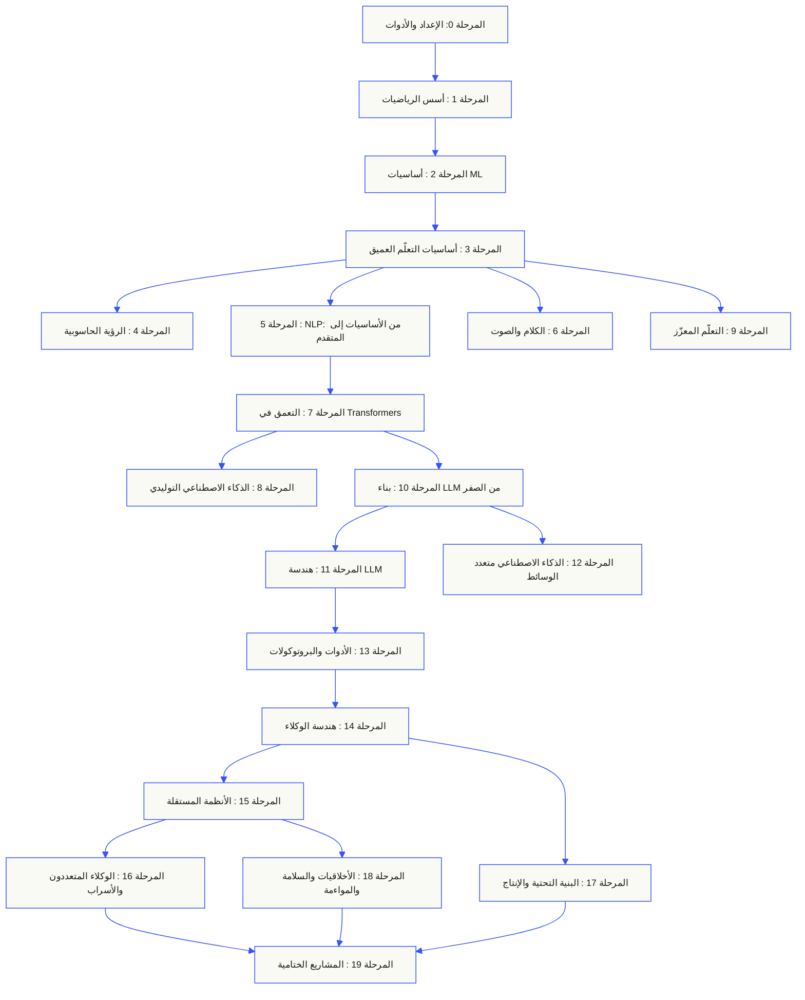
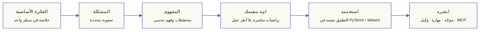

<p align="center" dir="rtl"><sub>ترجمة README بمساعدة الذكاء الاصطناعي؛ النسخة <a href="../../README.md">الإنجليزية هي المرجع المعتمد</a>.</sub></p>

<p align="center">
  <picture>
    <source media="(prefers-color-scheme: dark)" srcset="../../assets/readme/header-dark.svg">
    
  </picture>
</p>

نفّذ العمليات الداخلية للنماذج وخطوط معالجة الاسترجاع وبيئات تشغيل الوكلاء. اختبرها وافحص حالات الفشل واحتفظ بالشيفرة ونتائج التقييم.

**[ابدأ التعلّم](https://aiengineeringfromscratch.com/lesson?path=phases/00-setup-and-tooling/01-dev-environment)** · **[اختر مسارًا](#learning-routes)** · **[جرّب مختبرًا](#interactive-lab)** · **[ابنِ مشروعًا](#project-challenges)** · **[تصفّح المنهج](#contents)**

مجاني ومفتوح المصدر بترخيص MIT. تعلّم عبر الموقع أو مع وكيل برمجة أو بتشغيل الشيفرة محليًا.

> <span dir="rtl">523 درساً. 20 مرحلة.</span> <span dir="ltr">Python, TypeScript, Rust, Julia.</span>

<p align="center">
  <a href="../../LICENSE"></a>
  <a href="../../ROADMAP.md"></a>
  <a href="#contents"></a>
  <a href="https://github.com/rohitg00/ai-engineering-from-scratch/stargazers"></a>
  <a href="https://aiengineeringfromscratch.com"></a>
</p>

<details>
<summary>اقرأ بلغتك</summary>

<p align="center">
  <a href="../../README.md">🇬🇧 English</a> · <a href="../../i18n/zh/README.md">🇨🇳 简体中文</a> · <a href="../../i18n/zh-TW/README.md">🇹🇼 繁體中文（台灣）</a> · <a href="../../i18n/ja/README.md">🇯🇵 日本語</a> · <a href="../../i18n/ko/README.md">🇰🇷 한국어</a> · <a href="../../i18n/pt/README.md">🇵🇹 Português</a> · <a href="../../i18n/pt-BR/README.md">🇧🇷 Português (Brasil)</a> · <a href="../../i18n/es/README.md">🇪🇸 Español</a> · <a href="../../i18n/de/README.md">🇩🇪 Deutsch</a> · <a href="../../i18n/fr/README.md">🇫🇷 Français</a> · <a href="../../i18n/it/README.md">🇮🇹 Italiano</a> · <a href="../../i18n/nl/README.md">🇳🇱 Nederlands</a> · <a href="../../i18n/pl/README.md">🇵🇱 Polski</a> · <a href="../../i18n/cs/README.md">🇨🇿 Čeština</a> · <a href="../../i18n/ro/README.md">🇷🇴 Română</a> · <a href="../../i18n/hu/README.md">🇭🇺 Magyar</a> · <a href="../../i18n/el/README.md">🇬🇷 Ελληνικά</a> · <a href="../../i18n/sv/README.md">🇸🇪 Svenska</a> · <a href="../../i18n/da/README.md">🇩🇰 Dansk</a> · <a href="../../i18n/no/README.md">🇳🇴 Norsk</a> · <a href="../../i18n/fi/README.md">🇫🇮 Suomi</a> · <a href="../../i18n/ru/README.md">🇷🇺 Русский</a> · <a href="../../i18n/uk/README.md">🇺🇦 Українська</a> · <a href="../../i18n/tr/README.md">🇹🇷 Türkçe</a> · <a href="../../i18n/he/README.md">🇮🇱 עברית</a> · <a href="../../i18n/ar/README.md">🇸🇦 العربية</a> · <a href="../../i18n/fa/README.md">🇮🇷 فارسی</a> · <a href="../../i18n/hi/README.md">🇮🇳 हिन्दी</a> · <a href="../../i18n/bn/README.md">🇧🇩 বাংলা</a> · <a href="../../i18n/ur/README.md">🇵🇰 اردو</a> · <a href="../../i18n/th/README.md">🇹🇭 ไทย</a> · <a href="../../i18n/vi/README.md">🇻🇳 Tiếng Việt</a> · <a href="../../i18n/id/README.md">🇮🇩 Bahasa Indonesia</a> · <a href="../../i18n/tl/README.md">🇵🇭 Tagalog</a>
</p>

</details>

### الرعاة

<p align="center">
  <a href="https://serpapi.com/ai-engineering-from-scratch"><picture><source media="(min-width: 768px)" srcset="../../assets/sponsors/serpapi-banner-compact.png" width="48%"></picture></a>
  <a href="https://nitrostack.ai/referral/aiengineeringfromscratch"><picture><source media="(min-width: 768px)" srcset="../../assets/sponsors/nitrostack-banner-equal.png" width="48%"></picture></a>
</p>

<p align="center">
  <sub><span>دعمكم يُبقي كل درس مجانيًا ومفتوح المصدر.</span> <a href="#supporters">عرض جميع الداعمين</a> · <a href="../../SPONSORS.md">اصبح راعي</a></sub>
</p>

<a id="see-what-you-will-build-and-keep"></a>
<a id="learning-routes"></a>

## مسارات التعلّم

| المسار | الدرس الأول |
|---|---|
| أسس النماذج | [الإعداد والأدوات](https://aiengineeringfromscratch.com/lesson?path=phases/00-setup-and-tooling/01-dev-environment) |
| أنظمة LLM | [هندسة المطالبات](https://aiengineeringfromscratch.com/lesson?path=phases/11-llm-engineering/01-prompt-engineering) |
| الوكلاء والتسليم | [حلقة الوكيل](https://aiengineeringfromscratch.com/lesson?path=phases/14-agent-engineering/01-the-agent-loop) |

[قارن المسارات المهنية](https://aiengineeringfromscratch.com/learning-paths.html) · [المتطلبات السابقة ووقت الدراسة](#study-guide)

<a id="interactive-lab"></a>

### الانحدار المتدرّج

تتحرّك 20 نقطة بداية وفق الانحدار المتدرّج على دالة خسارة تربيعية. يعرض الرسم مواقعها ومتوسط الخسارة بعد كل تحديث.

<p align="center">
  <a href="https://aiengineeringfromscratch.com/lesson?path=phases/01-math-foundations/08-optimization#loss-landscape-visualization">
    <picture>
      <source media="(max-width: 600px) and (prefers-color-scheme: dark) and (prefers-reduced-motion: reduce)" srcset="../../assets/readme/101-gradient-mobile-dark.png">
      <source media="(max-width: 600px) and (prefers-reduced-motion: reduce)" srcset="../../assets/readme/101-gradient-mobile-light.png">
      <source media="(prefers-color-scheme: dark) and (prefers-reduced-motion: reduce)" srcset="../../assets/readme/101-gradient-dark.png">
      <source media="(prefers-reduced-motion: reduce)" srcset="../../assets/readme/101-gradient-light.png">
      <source media="(max-width: 600px) and (prefers-color-scheme: dark)" srcset="../../assets/readme/101-gradient-mobile-dark.gif">
      <source media="(max-width: 600px)" srcset="../../assets/readme/101-gradient-mobile-light.gif">
      <source media="(prefers-color-scheme: dark)" srcset="../../assets/readme/101-gradient-dark.gif">
      
    </picture>
  </a>
</p>

[عدّل معدل التعلّم في الدرس](https://aiengineeringfromscratch.com/lesson?path=phases/01-math-foundations/08-optimization#loss-landscape-visualization) · [قارن GD والزخم وAdam في الشيفرة](../../phases/01-math-foundations/08-optimization/code/optimizers.py)

<a id="project-challenges"></a>

### المشاريع

ثلاثة مشاريع تتضمن شيفرة أولية على مراحل وتطبيقات مرجعية وأدوات تقييم محلية. شغّل الأوامر من جذر المستودع بعد [الإعداد](#local-setup). تفشل الشيفرة الأولية في الاختبارات إلى أن تنفّذ المراحل.

<details>
<summary><strong>01 · مختبر تقييم الاسترجاع</strong> · Python · مقاييس الترتيب وفحوص التراجع</summary>

يرتفع متوسط NDCG للنظام المرشّح، بينما تتراجع مرتبة الدليل الأكثر صلة لأحد الاستعلامات. ابنِ مقارنة لكل استعلام تكشف التراجع ويمكنها إفشال فحص الإصدار.

استخدم Python 3.10+. راجع [RAG](../../phases/11-llm-engineering/06-rag/docs/en.md) و[تقييم النماذج](../../phases/02-ml-fundamentals/09-model-evaluation/docs/en.md). نفّذ التحقق من الترتيب، ثم الدقة والاستدعاء، ثم المقاييس الحساسة للرتبة، ثم مقارنة الأنظمة.

```bash
python3 scripts/project_test.py retrieval-evaluation-lab \
  --init learning-artifacts/retrieval-evaluation-lab
python3 scripts/project_test.py retrieval-evaluation-lab \
  --stage 1 --path learning-artifacts/retrieval-evaluation-lab --strict
python3 scripts/project_test.py retrieval-evaluation-lab \
  --all --path learning-artifacts/retrieval-evaluation-lab --strict
```

**احتفظ بـ:** مقارنة قابلة لإعادة الإنتاج تتضمن الفروق لكل استعلام وأحكام الصلة المستخدمة في التقييم. تصف المقاييس تلك الأحكام؛ ولا تثبت صحة الإجابة.

[ابدأ المشروع](https://aiengineeringfromscratch.com/project.html?id=retrieval-evaluation-lab) · [افحص الحل المرجعي](../../projects/retrieval-evaluation-lab/solution/) · [شغّل بمدخلاتك](../../projects/retrieval-evaluation-lab/README.md#run-with-your-own-inputs)

</details>

<details>
<summary><strong>02 · منقّح تتبّعات الوكلاء</strong> · TypeScript · تحليل التتبّعات وحساب التوقيت</summary>

لا يزال التتبّع المرفق يستغرق 100 ms، لكن إجمالي استهلاك الرموز يزيد بمقدار 200 ويبدأ أحد المقاطع بالفشل. افصل عمل المقاطع الفرعية المتداخل عن زمن تنفيذ المقطع الأب نفسه، ثم أنشئ تقريرًا يكشف التغيّر.

استخدم Node.js 22.18+ وPython 3 لأداة التقييم. نفّذ تحليل JSONL، والتحقق من العلاقات الأبوية، وحساب الفترات الزمنية، ثم خطًا زمنيًا قابلًا للفحص.

```bash
python3 scripts/project_test.py agent-trace-debugger \
  --init learning-artifacts/agent-trace-debugger
python3 scripts/project_test.py agent-trace-debugger \
  --stage 1 --path learning-artifacts/agent-trace-debugger --strict
python3 scripts/project_test.py agent-trace-debugger \
  --all --path learning-artifacts/agent-trace-debugger --strict
```

**احتفظ بـ:** التتبّع المُدخل، وخط زمني بصيغة HTML، وتقرير تراجع بصيغة JSON. سجّل الرموز التي يستهلكها كل مقطع بذاته فقط، حتى لا يُحسب استهلاك المقاطع الأبوية والفرعية مرتين.

[ابدأ المشروع](https://aiengineeringfromscratch.com/project.html?id=agent-trace-debugger) · [افحص الحل المرجعي](../../projects/agent-trace-debugger/solution/) · [استكشف التوقيت تفاعليًا](https://aiengineeringfromscratch.com/project.html?id=agent-trace-debugger&stage=03-timing)

</details>

<details>
<summary><strong>03 · جدار حماية استدعاءات الأدوات</strong> · Rust · فحوص الأدوار وسجلات الموافقة</summary>

يتغيّر محتوى الكتابة بعد المراجعة، أو يُعاد استخدام الموافقة. تحقّق من غلاف الاستدعاء ودور المستدعي والمسار، ثم استهلك موافقة مرتبطة بالطلب والمحتوى المحدّدين تمامًا.

استخدم Rust وPython 3.10+. راجع [تصميم مخططات الأدوات](../../phases/13-tools-and-protocols/05-tool-schema-design/docs/en.md) و[الحدود الأمنية](../../phases/17-infrastructure-and-production/25-security-secrets-audit/docs/en.md). يقدّم التطبيق المستدعي الهوية؛ ويقترح النموذج عملية فقط.

```bash
python3 scripts/project_test.py tool-call-firewall \
  --init learning-artifacts/tool-call-firewall
python3 scripts/project_test.py tool-call-firewall \
  --stage 1 --path learning-artifacts/tool-call-firewall --strict
python3 scripts/project_test.py tool-call-firewall \
  --all --path learning-artifacts/tool-call-firewall --strict
```

**احتفظ بـ:** سجل تدقيق يوضح العملية المطلوبة وقرار السياسة. تُستخدم الموافقة مرة واحدة ضمن استدعاء واحد؛ ولا يوفّر هذا المشروع تفويضًا دائمًا أو بيئة عزل على مستوى نظام التشغيل.

[ابدأ المشروع](https://aiengineeringfromscratch.com/project.html?id=tool-call-firewall) · [افحص الحل المرجعي](../../projects/tool-call-firewall/solution/) · [استكشف حدود الموافقة](https://aiengineeringfromscratch.com/project.html?id=tool-call-firewall&stage=03-consume-a-request-bound-approval-once)

</details>

[تصفّح جميع المشاريع](https://aiengineeringfromscratch.com/projects.html) · [دليل الممارسة المهنية](../../learning-paths/CAREER-PRACTICE.md)

## اختر طريقة التعلّم

### عبر الموقع الإلكتروني

افتح أي درس مكتمل على [aiengineeringfromscratch.com](https://aiengineeringfromscratch.com)، أو وسّع إحدى المراحل في [المحتويات](#contents). لا إعداد ولا استنساخ.

### مع معلّم بالذكاء الاصطناعي

إذا كان Node.js و`npx` ووكيل برمجي يدعم المهارات مثبتة لديك، فيمكن لوكيلك أن يصبح معلّمك. لا تحتاج إلى استنساخ المستودع لتثبيت المعلّم أو قراءته. تتطلب مختبرات المسارات المركّزة `python3`؛ وتتطلب مختبرات Agent Skills أيضًا مضيفًا محددًا ونطاق مهارات للمستخدم أو المشروع قابلًا للكتابة.

```bash
npx skills add rohitg00/ai-engineering-from-scratch
```

اختر المضيف والنطاق عندما يطلب برنامج التثبيت ذلك. استخدم `start-learning` في Codex أو `/start-learning` في Claude Code أو اطلب من المضيف استخدام المهارة باسمها.

<details>
<summary>إعداد المعلّم وأوامر البيئة المضيفة</summary>

تحقّق أولًا من المتطلبات المحلية:

```bash
node --version
npx --version
python3 --version
```

تكتب أداة `skills` في المضيف والنطاق اللذين تختارهما أثناء التثبيت، مثل `.claude/skills/` أو `.cursor/skills/` أو `.codex/skills/` أو مجلد مهارات مدعوم آخر. تحقّق من أن المضيف المختار يكتشف ذلك الموضع تحديدًا.

تختلف صيغة الاستدعاء باختلاف المضيف؛ ولا يحددها تنسيق `SKILL.md` المحمول:

| المضيف | ابدأ الدورة | ابدأ Model Context Protocol (MCP) | ابدأ Agent Skills | اختبر مرحلة |
|---|---|---|---|---|
| Codex | `start-learning`، أو اختره من `/skills` | `learn-mcp`، أو اختره من `/skills` | `learn-agent-skills`، أو اختره من `/skills` | `check-understanding 13`، أو اختره من `/skills` |
| Claude Code | `/start-learning` | `/learn-mcp` | `/learn-agent-skills` | `/check-understanding 13` |
| مضيفون متوافقون آخرون | `Use start-learning to begin the course.` | `Use learn-mcp to start the Model Context Protocol (MCP) path.` | `Use learn-agent-skills to start the Agent Skills Engineering path.` | `Use check-understanding to quiz me on Phase 13.` |

يربط اختبار تحديد المستوى المكوّن من عشرة أسئلة ما تعرفه بالفعل بمرحلة مناسبة للبدء، ويحفظ خطة دراسة مخصصة في `LEARNING.md`. بعد ذلك يعلّمك skill `learn` درسًا واحدًا في كل جلسة: المفهوم والرياضيات والشيفرة والاختبار القصير. وينقلك `course-guide` إلى الدرس المحدد الذي يشرح ما توقفت عنده. في Codex استخدم `learn` و`course-guide`؛ وفي Claude Code استخدم `/learn` و`/course-guide`؛ أما في المضيفين المتوافقين الآخرين فاطلب استخدام المهارة باسمها.

إذا كنت تريد Model Context Protocol (MCP) فقط، فاستخدم استدعاء MCP الخاص بمضيفك. ينشئ الملف `MCP-LEARNING.md` ويتبع مسارًا من 17 درسًا يغطي الطلبات عديمة الحالة ووسائل النقل والعمل ثنائي الاتجاه والأمن والموثوقية وحوكمة السجل وأدلة المطابقة. يوضح [ملف Model Context Protocol (MCP)](../../learning-paths/model-context-protocol.json) ترتيب الدروس ونقاط التحقق.

إذا كنت تريد Agent Skills فقط، فاستخدم الاستدعاء المخصص لها في مضيفك. ينشئ الملف `AGENT-SKILLS-LEARNING.md` ويتبع مسارًا مترابطًا من خمسة دروس: العقد والاكتشاف والاستدعاء وحدود العزل، ثم اختبارات التقييم قبل الإصدار وقابلية التشغيل على مضيف حقيقي. ابدأ عبر [مسار Agent Skills على الموقع](https://aiengineeringfromscratch.com/lesson?path=phases/13-tools-and-protocols/22-skills-and-agent-sdks&learningPath=agent-skills).

يعرض المثبّت المضيفين الذين يستطيع إعدادهم ويسألك عن موضع التثبيت. إذا لم يتوفر لديك Node.js أو `npx` أو `python3` أو مضيف مدعوم أو نطاق قابل للكتابة، فاستخدم الموقع أو اقرأ `docs/en.md` يدويًا. يشرح هذا المسار المفاهيم، لكن أدلة الاكتشاف والاستدعاء والبرامج النصية وإلغاء التثبيت على مضيف حقيقي تظل معلّقة إلى أن يصبح الفحص الأولي متاحًا. اقرأ الدروس على [aiengineeringfromscratch.com](https://aiengineeringfromscratch.com).

### مهارات التعلّم

| المهارة | وظيفتها |
|---|---|
| [`start-learning`](../../skills/start-learning/SKILL.md) | تهيئة أولية واحدة: سبب تعلّمك، واختبار تحديد المستوى، وخطة مخصصة تُحفظ في `LEARNING.md`. |
| [`learn`](../../skills/learn/SKILL.md) | دورة المعلّم: مراجعة تمهيدية، ثم تدريس الدرس التالي تفاعليًا، ثم اختباره؛ ويسجل التقدم وقائمة المراجعة. |
| [`course-guide`](../../skills/course-guide/SKILL.md) | دليل للموضوعات: اسأل «أين أتعلم الانتباه؟» أو «لماذا أصبحت قيمة loss هي NaN؟» ليعرض لك الدروس الدقيقة وروابطها. |
| [`learn-mcp`](../../skills/learn-mcp/SKILL.md) | معلّم مركّز لبروتوكول MCP. ينشئ `MCP-LEARNING.md`، ويتبع بيان الدروس الـ17، ويسجل أدلة الاتصال والأمن والموثوقية والمطابقة. |
| [`learn-agent-skills`](../../skills/learn-agent-skills/SKILL.md) | معلّم مركّز لمهارات الوكلاء. ينشئ `AGENT-SKILLS-LEARNING.md`، ويعلّم الدروس 22 و24 و25 و26 و27، ويسجل أدلة من مضيف فعلي. |
| [`claude-certification`](../../skills/claude-certification/SKILL.md) | معلّم الشهادات. يختار CCAO-F أو CCDV-F أو CCAR-F أو CCAR-P، ويعلّم الدروس، ويشغّل المختبرات، ويراجع المخرجات، ويجري التشخيص والاختبارات التجريبية، ويحفظ التقدم. |
| [`mcpa-certification`](../../skills/mcpa-certification/SKILL.md) | معلّم MCPA. يتبع مسار `mcpa-f` ذي الدروس الـ34 وفق بروتوكول 2026-07-28، ويشغّل المختبرات ومدقق الاتصال، ويجري الاختبار التشخيصي وثلاثة اختبارات تجريبية، ويحفظ التقدم. |
| [`find-your-level`](../../skills/find-your-level/SKILL.md) | اختبار تحديد مستوى من عشرة أسئلة يربط معرفتك بمرحلة بداية ويقترح مسارًا مخصصًا مع تقديرات زمنية. |
| [`check-understanding <phase>`](../../skills/check-understanding/SKILL.md) | اختبار لكل مرحلة من ثمانية أسئلة، مع ملاحظات ودروس محددة للمراجعة. استخدم صيغة Codex أو Claude Code أو اللغة الطبيعية في جدول الاستدعاء أعلاه. |

</details>

<a id="local-setup"></a>

### شغّل الشيفرة محليًا

```bash
git clone https://github.com/rohitg00/ai-engineering-from-scratch.git
cd ai-engineering-from-scratch
python3 phases/00-setup-and-tooling/01-dev-environment/code/verify.py --route beginner
python3 phases/01-math-foundations/01-linear-algebra-intuition/code/vectors.py
```

يفصل الفحص الأولي بين المتطلبات اللازمة الآن والأدوات التي ستحتاجها لاحقًا. يشرح كل إخفاق في متطلب إلزامي سببه المكتشف ويعرض أمرًا لتصحيحه. الأمر `vectors.py` يشغّل درسًا بلا اعتماديات وينتهي بإظهار أن ضرب مصفوفة في متجه هو العملية الموجودة داخل طبقة الشبكة العصبية. احتفظ بمخرجات الطرفية هذه بوصفها أول دليل لك.

<details>
<summary>اتبع الطريقة نفسها في كل درس</summary>

### اتبع الطريقة نفسها في كل درس

1. **اقرأ** `docs/en.md` واشرح الفكرة الأساسية بكلماتك.
2. **اكتب وابنِ** الشيفرة المهمة بنفسك؛ لا تتعامل مع كتلة الشيفرة كزينة.
3. **شغّل** أمر الدرس من جذر المستودع، أي المجلد الذي يحتوي `README.md` و`phases/`.
4. **احتفظ بالدليل**: الأمر، ومجلد العمل، ورمز الخروج، والمخرجات المهمة، والملف الذي عدّلته أو أنشأته.
5. **تابع** فقط عندما تستطيع شرح المخرجات وإجراء تعديل صغير دون تخمين.

تستخدم الأوامر في صفحات الدروس مسارات تبدأ من جذر المستودع، ما لم يطلب الدرس صراحة الانتقال إلى مجلد آخر. وإذا أتاح الدرس عدة لغات، شغّل التنفيذ باللغة التي تتعلمها.

</details>

<a id="study-guide"></a>

## اختر مسارًا للتعلّم

لا حاجة إلى استعراض 523 درسًا قبل أن تبدأ. اختر هدفًا واحدًا. يفتح كل رابط المنهج نفسه على GitHub أو الموقع، ويستخدم الإصداران شيفرة الدروس نفسها.

| هدفك | تعلّم على GitHub | تعلّم على الموقع |
|---|---|---|
| أنا مبتدئ وأريد الأساس كاملًا | [المرحلة 0: الإعداد والأدوات](../../phases/00-setup-and-tooling/) | [بيئة التطوير](https://aiengineeringfromscratch.com/lesson?path=phases/00-setup-and-tooling/01-dev-environment) |
| أعرف Python وأريد أساسيات الرياضيات وML | [المرحلة 1: أسس الرياضيات](../../phases/01-math-foundations/) | [حدس الجبر الخطي](https://aiengineeringfromscratch.com/lesson?path=phases/01-math-foundations/01-linear-algebra-intuition) |
| أريد بناء تطبيقات LLM جاهزة للإنتاج | [المرحلة 11: هندسة LLM](../../phases/11-llm-engineering/) | [هندسة الموجّهات](https://aiengineeringfromscratch.com/lesson?path=phases/11-llm-engineering/01-prompt-engineering) |
| أريد بناء وكلاء | [المرحلة 14: هندسة الوكلاء](../../phases/14-agent-engineering/) | [حلقة الوكيل](https://aiengineeringfromscratch.com/lesson?path=phases/14-agent-engineering/01-the-agent-loop) |
| أريد استخدام وكلاء البرمجة على مستودعات حقيقية | [مسار الهندسة بمساعدة الوكلاء](../../learning-paths/using-coding-agents.json) | [الهندسة بمساعدة الوكلاء](https://aiengineeringfromscratch.com/lesson?path=phases/14-agent-engineering/31-agent-workbench-why-models-fail&learningPath=using-coding-agents) |
| أريد تحديد ما ينبغي بناؤه قبل التنفيذ | [مسار تقدير المنتج وتسليمه](../../learning-paths/shaping-the-build.json) | [تقدير المنتج وتسليمه](https://aiengineeringfromscratch.com/lesson?path=phases/14-agent-engineering/47-outcomes-before-output&learningPath=shaping-the-build) |

لست متأكدًا من نقطة البداية المناسبة؟ استخدم [مدرّب تحديد المستوى `start-learning`](../../skills/start-learning/SKILL.md) أو [دليل المتطلبات السابقة على الموقع](https://aiengineeringfromscratch.com/prereqs.html).

قارن بين أربعة مجالات أساسية وستة مسارات مهنية في [مسارات تعلّم هندسة الذكاء الاصطناعي](https://aiengineeringfromscratch.com/learning-paths.html).

<details>
<summary>مسارات مركّزة لـ MCP وAgent Skills</summary>

| هدفك | تعلّم على GitHub | تعلّم على الموقع |
|---|---|---|
| أريد البناء باستخدام Model Context Protocol (MCP) | [مسار Model Context Protocol (MCP)](../../phases/13-tools-and-protocols/README.md#model-context-protocol-mcp-path) | [مسار Model Context Protocol (MCP)](https://aiengineeringfromscratch.com/lesson?path=phases/13-tools-and-protocols/06-mcp-fundamentals&learningPath=model-context-protocol) |
| أريد كتابة Agent Skills وإصدارها | [مسار Agent Skills المركّز](../../phases/13-tools-and-protocols/README.md#agent-skills-fast-path) | [مسار Agent Skills](https://aiengineeringfromscratch.com/lesson?path=phases/13-tools-and-protocols/22-skills-and-agent-sdks&learningPath=agent-skills) |

</details>

<details>
<summary>المتطلبات السابقة ووقت الدراسة</summary>

### المتطلبات السابقة

- تستطيع كتابة الشيفرة بأي لغة؛ ومعرفة Python مفيدة.
- تريد أن تفهم كيف يعمل الذكاء الاصطناعي **فعليًا**، لا أن تكتفي باستدعاء واجهات API.

## من أين تبدأ

| خلفيتك | ابدأ من | الوقت التقديري |
|---|---|---|
| جديد في البرمجة والذكاء الاصطناعي | المرحلة 0 — الإعداد | ~306 ساعات |
| تعرف Python ومبتدئ في ML | المرحلة 1 — أسس الرياضيات | ~270 ساعة |
| تعرف ML ومبتدئ في التعلّم العميق | المرحلة 3 — أساسيات التعلّم العميق | ~200 ساعة |
| تعرف التعلّم العميق وتريد LLM والوكلاء | المرحلة 10 — بناء LLM من الصفر | ~100 ساعة |
| مهندس خبير يريد هندسة الوكلاء فقط | المرحلة 14 — هندسة الوكلاء | ~60 ساعة |
| تريد بناء أنظمة MCP إنتاجية فقط | [مسار Model Context Protocol (MCP)](../../learning-paths/model-context-protocol.json) | ~23 ساعة و15 دقيقة |
| تريد بناء Agent Skills للإنتاج فقط | [مسار هندسة Agent Skills](../../learning-paths/agent-skills.json) | ~9.5 ساعات |

</details>

## بنية المنهج

تتراكم المراحل العشرون فوق بعضها. الرياضيات هي الأساس، والوكلاء وأنظمة الإنتاج في القمة. يمكنك تجاوز الطبقات الأولى إن كنت تعرفها، لكن لا تتجاوزها ثم تتساءل عن سبب تعطل ما في الأعلى.



<a id="contents"></a>

## المحتويات

عشرون مرحلة. انقر على أي مرحلة لفتح قائمة دروسها.

<a id="phase-0"></a>
### المرحلة 0: الإعداد والأدوات `12 lessons`
> جهّز بيئتك لكل ما ستتعلمه لاحقًا.

| # | الدرس | النوع | اللغة |
|:---:|--------|:----:|------|
| 01 | [بيئة التطوير](../../phases/00-setup-and-tooling/01-dev-environment/) | بناء | Python |
| 02 | [Git والتعاون](../../phases/00-setup-and-tooling/02-git-and-collaboration/) | تعلم | — |
| 03 | [إعداد GPU والسحابة](../../phases/00-setup-and-tooling/03-gpu-setup-and-cloud/) | بناء | Python |
| 04 | [واجهات API والمفاتيح](../../phases/00-setup-and-tooling/04-apis-and-keys/) | بناء | Python |
| 05 | [دفاتر Jupyter](../../phases/00-setup-and-tooling/05-jupyter-notebooks/) | بناء | Python |
| 06 | [بيئات Python](../../phases/00-setup-and-tooling/06-python-environments/) | بناء | Shell |
| 07 | [Docker للذكاء الاصطناعي](../../phases/00-setup-and-tooling/07-docker-for-ai/) | بناء | Docker |
| 08 | [إعداد المحرر](../../phases/00-setup-and-tooling/08-editor-setup/) | بناء | — |
| 09 | [إدارة البيانات](../../phases/00-setup-and-tooling/09-data-management/) | بناء | Python |
| 10 | [الطرفية وshell](../../phases/00-setup-and-tooling/10-terminal-and-shell/) | تعلم | — |
| 11 | [Linux للذكاء الاصطناعي](../../phases/00-setup-and-tooling/11-linux-for-ai/) | تعلم | — |
| 12 | [تصحيح الأخطاء وقياس الأداء](../../phases/00-setup-and-tooling/12-debugging-and-profiling/) | بناء | Python |

<details id="phase-1">
<summary><b>المرحلة 1 — أسس الرياضيات</b> &nbsp;<code>22 lessons</code>&nbsp; <em>افهم حدس كل خوارزمية ذكاء اصطناعي من خلال الشيفرة.</em></summary>
<br/>

| # | الدرس | النوع | اللغة |
|:---:|--------|:----:|------|
| 01 | [الحدس في الجبر الخطي](../../phases/01-math-foundations/01-linear-algebra-intuition/) | تعلم | Python, Julia |
| 02 | [المتجهات والمصفوفات والعمليات](../../phases/01-math-foundations/02-vectors-matrices-operations/) | بناء | Python, Julia |
| 03 | [تحويلات المصفوفات والقيم الذاتية](../../phases/01-math-foundations/03-matrix-transformations/) | بناء | Python, Julia |
| 04 | [التفاضل والتكامل لـML: المشتقات والتدرجات](../../phases/01-math-foundations/04-calculus-for-ml/) | تعلم | Python |
| 05 | [قاعدة السلسلة والاشتقاق التلقائي](../../phases/01-math-foundations/05-chain-rule-and-autodiff/) | بناء | Python |
| 06 | [الاحتمالات والتوزيعات](../../phases/01-math-foundations/06-probability-and-distributions/) | تعلم | Python |
| 07 | [مبرهنة بايز والتفكير الإحصائي](../../phases/01-math-foundations/07-bayes-theorem/) | بناء | Python |
| 08 | [التحسين: أساليب الانحدار المتدرج](../../phases/01-math-foundations/08-optimization/) | بناء | Python |
| 09 | [نظرية المعلومات: الإنتروبيا وتباعد KL](../../phases/01-math-foundations/09-information-theory/) | تعلم | Python |
| 10 | [تقليل الأبعاد: PCA وt-SNE وUMAP](../../phases/01-math-foundations/10-dimensionality-reduction/) | بناء | Python |
| 11 | [تحليل القيم المفردة](../../phases/01-math-foundations/11-singular-value-decomposition/) | بناء | Python, Julia |
| 12 | [عمليات الموترات](../../phases/01-math-foundations/12-tensor-operations/) | بناء | Python |
| 13 | [الاستقرار العددي](../../phases/01-math-foundations/13-numerical-stability/) | بناء | Python |
| 14 | [معايير المتجهات (Norms) والمسافات](../../phases/01-math-foundations/14-norms-and-distances/) | بناء | Python |
| 15 | [الإحصاء لـML](../../phases/01-math-foundations/15-statistics-for-ml/) | بناء | Python |
| 16 | [أساليب أخذ العينات](../../phases/01-math-foundations/16-sampling-methods/) | بناء | Python |
| 17 | [أنظمة المعادلات الخطية](../../phases/01-math-foundations/17-linear-systems/) | بناء | Python |
| 18 | [التحسين المحدّب](../../phases/01-math-foundations/18-convex-optimization/) | بناء | Python |
| 19 | [الأعداد المركبة للذكاء الاصطناعي](../../phases/01-math-foundations/19-complex-numbers/) | تعلم | Python |
| 20 | [تحويل فورييه](../../phases/01-math-foundations/20-fourier-transform/) | بناء | Python |
| 21 | [نظرية الرسوم البيانية لـML](../../phases/01-math-foundations/21-graph-theory/) | بناء | Python |
| 22 | [العمليات العشوائية](../../phases/01-math-foundations/22-stochastic-processes/) | تعلم | Python |

</details>

<details id="phase-2">
<summary><b>المرحلة 2 — أساسيات ML</b> &nbsp;<code>18 lessons</code>&nbsp; <em>ما يزال تعلّم الآلة التقليدي عماد معظم أنظمة الذكاء الاصطناعي الإنتاجية.</em></summary>
<br/>

| # | الدرس | النوع | اللغة |
|:---:|--------|:----:|------|
| 01 | [ما هو تعلّم الآلة؟](../../phases/02-ml-fundamentals/01-what-is-machine-learning/) | تعلم | Python |
| 02 | [الانحدار الخطي من الصفر](../../phases/02-ml-fundamentals/02-linear-regression/) | بناء | Python |
| 03 | [الانحدار اللوجستي والتصنيف](../../phases/02-ml-fundamentals/03-logistic-regression/) | بناء | Python |
| 04 | [أشجار القرار والغابات العشوائية](../../phases/02-ml-fundamentals/04-decision-trees/) | بناء | Python |
| 05 | [آلات المتجهات الداعمة](../../phases/02-ml-fundamentals/05-support-vector-machines/) | بناء | Python |
| 06 | [KNN ومقاييس المسافة](../../phases/02-ml-fundamentals/06-knn-and-distances/) | بناء | Python |
| 07 | [التعلّم غير الخاضع للإشراف: K-Means وDBSCAN](../../phases/02-ml-fundamentals/07-unsupervised-learning/) | بناء | Python |
| 08 | [هندسة السمات واختيارها](../../phases/02-ml-fundamentals/08-feature-engineering/) | بناء | Python |
| 09 | [تقييم النماذج: المقاييس والتحقق المتقاطع](../../phases/02-ml-fundamentals/09-model-evaluation/) | بناء | Python |
| 10 | [التحيز والتباين ومنحنى التعلّم](../../phases/02-ml-fundamentals/10-bias-variance/) | تعلم | Python |
| 11 | [أساليب التجميع: boosting وbagging وstacking](../../phases/02-ml-fundamentals/11-ensemble-methods/) | بناء | Python |
| 12 | [ضبط المعلمات الفائقة](../../phases/02-ml-fundamentals/12-hyperparameter-tuning/) | بناء | Python |
| 13 | [مسارات ML وتتبع التجارب](../../phases/02-ml-fundamentals/13-ml-pipelines/) | بناء | Python |
| 14 | [Naive Bayes](../../phases/02-ml-fundamentals/14-naive-bayes/) | بناء | Python |
| 15 | [أساسيات السلاسل الزمنية](../../phases/02-ml-fundamentals/15-time-series/) | بناء | Python |
| 16 | [كشف الحالات الشاذة](../../phases/02-ml-fundamentals/16-anomaly-detection/) | بناء | Python |
| 17 | [التعامل مع البيانات غير المتوازنة](../../phases/02-ml-fundamentals/17-imbalanced-data/) | بناء | Python |
| 18 | [اختيار السمات](../../phases/02-ml-fundamentals/18-feature-selection/) | بناء | Python |

</details>

<details id="phase-3">
<summary><b>المرحلة 3 — أساسيات التعلّم العميق</b> &nbsp;<code>13 lessons</code>&nbsp; <em>الشبكات العصبية من المبادئ الأولى؛ لا أطر عمل حتى تبني واحدًا بنفسك.</em></summary>
<br/>

| # | الدرس | النوع | اللغة |
|:---:|--------|:----:|------|
| 01 | [Perceptron: من أين بدأت الحكاية](../../phases/03-deep-learning-core/01-the-perceptron/) | بناء | Python |
| 02 | [الشبكات متعددة الطبقات والتمرير الأمامي](../../phases/03-deep-learning-core/02-multi-layer-networks/) | بناء | Python |
| 03 | [الانتشار العكسي من الصفر](../../phases/03-deep-learning-core/03-backpropagation/) | بناء | Python |
| 04 | [دوال التنشيط: ReLU وSigmoid وGELU ولماذا](../../phases/03-deep-learning-core/04-activation-functions/) | بناء | Python |
| 05 | [دوال الخسارة: MSE وcross-entropy والخسارة التقابلية](../../phases/03-deep-learning-core/05-loss-functions/) | بناء | Python |
| 06 | [المحسّنات: SGD وMomentum وAdam وAdamW](../../phases/03-deep-learning-core/06-optimizers/) | بناء | Python |
| 07 | [التنظيم: Dropout وWeight Decay وBatchNorm](../../phases/03-deep-learning-core/07-regularization/) | بناء | Python |
| 08 | [تهيئة الأوزان واستقرار التدريب](../../phases/03-deep-learning-core/08-weight-initialization/) | بناء | Python |
| 09 | [جداول معدل التعلّم والإحماء](../../phases/03-deep-learning-core/09-learning-rate-schedules/) | بناء | Python |
| 10 | [ابنِ إطار عمل مصغرًا خاصًا بك](../../phases/03-deep-learning-core/10-mini-framework/) | بناء | Python |
| 11 | [مقدمة إلى PyTorch](../../phases/03-deep-learning-core/11-intro-to-pytorch/) | بناء | Python |
| 12 | [مقدمة إلى JAX](../../phases/03-deep-learning-core/12-intro-to-jax/) | بناء | Python |
| 13 | [تصحيح أخطاء الشبكات العصبية](../../phases/03-deep-learning-core/13-debugging-neural-networks/) | بناء | Python |

</details>

<details id="phase-4">
<summary><b>المرحلة 4 — الرؤية الحاسوبية</b> &nbsp;<code>28 lessons</code>&nbsp; <em>من البكسلات إلى الفهم: الصور والفيديو وثلاثي الأبعاد وVLM ونماذج العالم.</em></summary>
<br/>

| # | الدرس | النوع | اللغة |
|:---:|--------|:----:|------|
| 01 | [أساسيات الصور: البكسلات والقنوات ومساحات الألوان](../../phases/04-computer-vision/01-image-fundamentals/) | تعلم | Python |
| 02 | [عمليات الالتفاف من الصفر](../../phases/04-computer-vision/02-convolutions-from-scratch/) | بناء | Python |
| 03 | [شبكات CNN: من LeNet إلى ResNet](../../phases/04-computer-vision/03-cnns-lenet-to-resnet/) | بناء | Python |
| 04 | [تصنيف الصور](../../phases/04-computer-vision/04-image-classification/) | بناء | Python |
| 05 | [التعلّم بالنقل والضبط الدقيق](../../phases/04-computer-vision/05-transfer-learning/) | بناء | Python |
| 06 | [اكتشاف الأجسام: YOLO من الصفر](../../phases/04-computer-vision/06-object-detection-yolo/) | بناء | Python |
| 07 | [التقسيم الدلالي: U-Net](../../phases/04-computer-vision/07-semantic-segmentation-unet/) | بناء | Python |
| 08 | [تقسيم الكائنات: Mask R-CNN](../../phases/04-computer-vision/08-instance-segmentation-mask-rcnn/) | بناء | Python |
| 09 | [توليد الصور: GANs](../../phases/04-computer-vision/09-image-generation-gans/) | بناء | Python |
| 10 | [توليد الصور: نماذج الانتشار](../../phases/04-computer-vision/10-image-generation-diffusion/) | بناء | Python |
| 11 | [Stable Diffusion: المعمارية والضبط الدقيق](../../phases/04-computer-vision/11-stable-diffusion/) | بناء | Python |
| 12 | [فهم الفيديو: النمذجة الزمنية](../../phases/04-computer-vision/12-video-understanding/) | بناء | Python |
| 13 | [الرؤية ثلاثية الأبعاد: سحب النقاط وNeRFs](../../phases/04-computer-vision/13-3d-vision-nerf/) | بناء | Python |
| 14 | [محولات الرؤية (ViT)](../../phases/04-computer-vision/14-vision-transformers/) | بناء | Python |
| 15 | [الرؤية الآنية: النشر على الأجهزة الطرفية](../../phases/04-computer-vision/15-real-time-edge/) | بناء | Python |
| 16 | [ابنِ خط معالجة كاملًا للرؤية](../../phases/04-computer-vision/16-vision-pipeline-capstone/) | بناء | Python |
| 17 | [الرؤية بالتعلّم الذاتي: SimCLR وDINO وMAE](../../phases/04-computer-vision/17-self-supervised-vision/) | بناء | Python |
| 18 | [الرؤية ذات المفردات المفتوحة: CLIP](../../phases/04-computer-vision/18-open-vocab-clip/) | بناء | Python |
| 19 | [OCR وفهم المستندات](../../phases/04-computer-vision/19-ocr-document-understanding/) | بناء | Python |
| 20 | [استرجاع الصور والتعلّم بالمقاييس](../../phases/04-computer-vision/20-image-retrieval-metric/) | بناء | Python |
| 21 | [اكتشاف النقاط المفتاحية وتقدير الوضعية](../../phases/04-computer-vision/21-keypoint-pose/) | بناء | Python |
| 22 | [توليد Gaussian Splatting ثلاثي الأبعاد من الصفر](../../phases/04-computer-vision/22-3d-gaussian-splatting/) | بناء | Python |
| 23 | [محولات الانتشار والتدفق المصحح](../../phases/04-computer-vision/23-diffusion-transformers-rectified-flow/) | بناء | Python |
| 24 | [SAM 3 والتقسيم بالمفردات المفتوحة](../../phases/04-computer-vision/24-sam3-open-vocab-segmentation/) | بناء | Python |
| 25 | [نماذج الرؤية واللغة (ViT-MLP-LLM)](../../phases/04-computer-vision/25-vision-language-models/) | بناء | Python |
| 26 | [تقدير العمق والهندسة من صورة أحادية](../../phases/04-computer-vision/26-monocular-depth/) | بناء | Python |
| 27 | [تتبّع أجسام متعددة وذاكرة الفيديو](../../phases/04-computer-vision/27-multi-object-tracking/) | بناء | Python |
| 28 | [نماذج العالم وانتشار الفيديو](../../phases/04-computer-vision/28-world-models-video-diffusion/) | بناء | Python |

</details>

<details id="phase-5">
<summary><b>المرحلة 5 — NLP: من الأساسيات إلى المتقدم</b> &nbsp;<code>29 lessons</code>&nbsp; <em>اللغة هي الواجهة التي تصل إلى الذكاء.</em></summary>
<br/>

| # | الدرس | النوع | اللغة |
|:---:|--------|:----:|------|
| 01 | [معالجة النصوص: الترميز إلى رموز والتجذير والاشتقاق الصرفي](../../phases/05-nlp-foundations-to-advanced/01-text-processing/) | بناء | Python |
| 02 | [حقيبة الكلمات وTF-IDF وتمثيل النص](../../phases/05-nlp-foundations-to-advanced/02-bag-of-words-tfidf/) | بناء | Python |
| 03 | [تضمينات الكلمات: بناء Word2Vec من الصفر](../../phases/05-nlp-foundations-to-advanced/03-word-embeddings-word2vec/) | بناء | Python |
| 04 | [تضمينات GloVe وFastText والوحدات الفرعية](../../phases/05-nlp-foundations-to-advanced/04-glove-fasttext-subword/) | بناء | Python |
| 05 | [تحليل المشاعر](../../phases/05-nlp-foundations-to-advanced/05-sentiment-analysis/) | بناء | Python |
| 06 | [التعرّف على الكيانات المسماة (NER)](../../phases/05-nlp-foundations-to-advanced/06-named-entity-recognition/) | بناء | Python |
| 07 | [وسم أجزاء الكلام والتحليل النحوي](../../phases/05-nlp-foundations-to-advanced/07-pos-tagging-parsing/) | بناء | Python |
| 08 | [تصنيف النص: شبكات CNN وRNN للنصوص](../../phases/05-nlp-foundations-to-advanced/08-cnns-rnns-for-text/) | بناء | Python |
| 09 | [نماذج التسلسل إلى التسلسل](../../phases/05-nlp-foundations-to-advanced/09-sequence-to-sequence/) | بناء | Python |
| 10 | [آلية الانتباه: الاكتشاف المفصلي](../../phases/05-nlp-foundations-to-advanced/10-attention-mechanism/) | بناء | Python |
| 11 | [الترجمة الآلية](../../phases/05-nlp-foundations-to-advanced/11-machine-translation/) | بناء | Python |
| 12 | [تلخيص النص](../../phases/05-nlp-foundations-to-advanced/12-text-summarization/) | بناء | Python |
| 13 | [أنظمة الإجابة عن الأسئلة](../../phases/05-nlp-foundations-to-advanced/13-question-answering/) | بناء | Python |
| 14 | [استرجاع المعلومات والبحث](../../phases/05-nlp-foundations-to-advanced/14-information-retrieval-search/) | بناء | Python |
| 15 | [نمذجة الموضوعات: LDA وBERTopic](../../phases/05-nlp-foundations-to-advanced/15-topic-modeling/) | بناء | Python |
| 16 | [توليد النص](../../phases/05-nlp-foundations-to-advanced/16-text-generation-pre-transformer/) | بناء | Python |
| 17 | [روبوتات المحادثة: من القواعد إلى الشبكات العصبية](../../phases/05-nlp-foundations-to-advanced/17-chatbots-rule-to-neural/) | بناء | Python |
| 18 | [معالجة اللغة الطبيعية متعددة اللغات](../../phases/05-nlp-foundations-to-advanced/18-multilingual-nlp/) | بناء | Python |
| 19 | [ترميز الوحدات الفرعية: BPE وWordPiece وUnigram وSentencePiece](../../phases/05-nlp-foundations-to-advanced/19-subword-tokenization/) | تعلم | Python |
| 20 | [المخرجات المنظّمة وفك الترميز المقيّد](../../phases/05-nlp-foundations-to-advanced/20-structured-outputs-constrained-decoding/) | بناء | Python |
| 21 | [الاستدلال اللغوي (NLI والتضمين النصي)](../../phases/05-nlp-foundations-to-advanced/21-nli-textual-entailment/) | تعلم | Python |
| 22 | [التعمق في نماذج التضمين](../../phases/05-nlp-foundations-to-advanced/22-embedding-models-deep-dive/) | تعلم | Python |
| 23 | [استراتيجيات تقسيم النص إلى مقاطع لـRAG](../../phases/05-nlp-foundations-to-advanced/23-chunking-strategies-rag/) | بناء | Python |
| 24 | [حل الإحالة المشتركة](../../phases/05-nlp-foundations-to-advanced/24-coreference-resolution/) | تعلم | Python |
| 25 | [ربط الكيانات وإزالة الالتباس](../../phases/05-nlp-foundations-to-advanced/25-entity-linking/) | بناء | Python |
| 26 | [استخراج العلاقات وبناء الرسوم البيانية المعرفية](../../phases/05-nlp-foundations-to-advanced/26-relation-extraction-kg/) | بناء | Python |
| 27 | [تقييم LLM: RAGAS وDeepEval وG-Eval](../../phases/05-nlp-foundations-to-advanced/27-llm-evaluation-frameworks/) | بناء | Python |
| 28 | [تقييم السياقات الطويلة: NIAH وRULER وLongBench وMRCR](../../phases/05-nlp-foundations-to-advanced/28-long-context-evaluation/) | تعلم | Python |
| 29 | [تتبّع حالة الحوار](../../phases/05-nlp-foundations-to-advanced/29-dialogue-state-tracking/) | بناء | Python |

</details>

<details id="phase-6">
<summary><b>المرحلة 6 — الكلام والصوت</b> &nbsp;<code>17 lessons</code>&nbsp; <em>استمع وافهم وتحدث.</em></summary>
<br/>

| # | الدرس | النوع | اللغة |
|:---:|--------|:----:|------|
| 01 | [أساسيات الصوت: الموجات وأخذ العينات وFFT](../../phases/06-speech-and-audio/01-audio-fundamentals) | تعلم | Python |
| 02 | [المخططات الطيفية ومقياس Mel وميزات الصوت](../../phases/06-speech-and-audio/02-spectrograms-mel-features) | بناء | Python |
| 03 | [تصنيف الصوت](../../phases/06-speech-and-audio/03-audio-classification) | بناء | Python |
| 04 | [التعرّف على الكلام (ASR)](../../phases/06-speech-and-audio/04-speech-recognition-asr) | بناء | Python |
| 05 | [Whisper: المعمارية والضبط الدقيق](../../phases/06-speech-and-audio/05-whisper-architecture-finetuning) | بناء | Python |
| 06 | [التعرّف على المتحدث والتحقق منه](../../phases/06-speech-and-audio/06-speaker-recognition-verification) | بناء | Python |
| 07 | [تحويل النص إلى كلام (TTS)](../../phases/06-speech-and-audio/07-text-to-speech) | بناء | Python |
| 08 | [استنساخ الصوت وتحويله](../../phases/06-speech-and-audio/08-voice-cloning-conversion) | بناء | Python |
| 09 | [توليد الموسيقى](../../phases/06-speech-and-audio/09-music-generation) | بناء | Python |
| 10 | [نماذج الصوت واللغة](../../phases/06-speech-and-audio/10-audio-language-models) | بناء | Python |
| 11 | [معالجة الصوت في الزمن الحقيقي](../../phases/06-speech-and-audio/11-real-time-audio-processing) | بناء | Python |
| 12 | [ابنِ مسار مساعد صوتي](../../phases/06-speech-and-audio/12-voice-assistant-pipeline) | بناء | Python |
| 13 | [مرمّزات الصوت العصبية: EnCodec وSNAC وMimi وDAC](../../phases/06-speech-and-audio/13-neural-audio-codecs) | تعلم | Python |
| 14 | [كشف النشاط الصوتي وتناوب الأدوار](../../phases/06-speech-and-audio/14-voice-activity-detection-turn-taking) | بناء | Python |
| 15 | [تحويل الكلام إلى كلام بالتدفق: Moshi وHibiki](../../phases/06-speech-and-audio/15-streaming-speech-to-speech-moshi-hibiki) | تعلم | Python |
| 16 | [مكافحة انتحال الصوت ووضع العلامات المائية الصوتية](../../phases/06-speech-and-audio/16-anti-spoofing-audio-watermarking) | بناء | Python |
| 17 | [تقييم الصوت: WER وMOS وMMAU ولوحات الصدارة](../../phases/06-speech-and-audio/17-audio-evaluation-metrics) | تعلم | Python |

</details>

<details id="phase-7">
<summary><b>المرحلة 7 — التعمق في Transformers</b> &nbsp;<code>16 lessons</code>&nbsp; <em>المعمارية التي غيّرت كل شيء.</em></summary>
<br/>

| # | الدرس | النوع | اللغة |
|:---:|--------|:----:|------|
| 01 | [لماذا Transformers: مشكلات RNN](../../phases/07-transformers-deep-dive/01-why-transformers/) | تعلم | Python |
| 02 | [الانتباه الذاتي من الصفر](../../phases/07-transformers-deep-dive/02-self-attention-from-scratch/) | بناء | Python |
| 03 | [الانتباه متعدد الرؤوس](../../phases/07-transformers-deep-dive/03-multi-head-attention/) | بناء | Python |
| 04 | [ترميز الموضع: Sinusoidal وRoPE وALiBi](../../phases/07-transformers-deep-dive/04-positional-encoding/) | بناء | Python |
| 05 | [Transformer كامل: المرمّز وفاكّ الترميز](../../phases/07-transformers-deep-dive/05-full-transformer/) | بناء | Python |
| 06 | [BERT: نمذجة اللغة المقنّعة](../../phases/07-transformers-deep-dive/06-bert-masked-language-modeling/) | بناء | Python |
| 07 | [GPT: نمذجة اللغة السببية](../../phases/07-transformers-deep-dive/07-gpt-causal-language-modeling/) | بناء | Python |
| 08 | [T5 وBART: نماذج المرمّز وفاكّ الترميز](../../phases/07-transformers-deep-dive/08-t5-bart-encoder-decoder/) | تعلم | Python |
| 09 | [محولات الرؤية (ViT)](../../phases/07-transformers-deep-dive/09-vision-transformers/) | بناء | Python |
| 10 | [محولات الصوت: معمارية Whisper](../../phases/07-transformers-deep-dive/10-audio-transformers-whisper/) | تعلم | Python |
| 11 | [مزيج الخبراء (MoE)](../../phases/07-transformers-deep-dive/11-mixture-of-experts/) | بناء | Python |
| 12 | [ذاكرة KV وانتباه Flash وتحسين الاستدلال](../../phases/07-transformers-deep-dive/12-kv-cache-flash-attention/) | بناء | Python |
| 13 | [قوانين التوسّع](../../phases/07-transformers-deep-dive/13-scaling-laws/) | تعلم | Python |
| 14 | [ابنِ Transformer من الصفر](../../phases/07-transformers-deep-dive/14-build-a-transformer-capstone/) | بناء | Python |
| 15 | [أنماط الانتباه: النافذة المنزلقة والمتناثر والتفاضلي](../../phases/07-transformers-deep-dive/15-attention-variants/) | بناء | Python |
| 16 | [فك الترميز التخميني: صياغة المسودة والتحقق والتكرار](../../phases/07-transformers-deep-dive/16-speculative-decoding/) | بناء | Python |

</details>

<details id="phase-8">
<summary><b>المرحلة 8 — الذكاء الاصطناعي التوليدي</b> &nbsp;<code>15 lessons</code>&nbsp; <em>أنشئ الصور والفيديو والصوت ومحتوى ثلاثي الأبعاد وغير ذلك.</em></summary>
<br/>

| # | الدرس | النوع | اللغة |
|:---:|--------|:----:|------|
| 01 | [النماذج التوليدية: التصنيف والتاريخ](../../phases/08-generative-ai/01-generative-models-taxonomy-history/) | تعلم | Python |
| 02 | [المشفّرات التلقائية وVAE](../../phases/08-generative-ai/02-autoencoders-vae/) | بناء | Python |
| 03 | [GANs: المولّد مقابل المُميّز](../../phases/08-generative-ai/03-gans-generator-discriminator/) | بناء | Python |
| 04 | [GANs الشرطية وPix2Pix](../../phases/08-generative-ai/04-conditional-gans-pix2pix/) | بناء | Python |
| 05 | [StyleGAN](../../phases/08-generative-ai/05-stylegan/) | بناء | Python |
| 06 | [نماذج الانتشار: DDPM من الصفر](../../phases/08-generative-ai/06-diffusion-ddpm-from-scratch/) | بناء | Python |
| 07 | [الانتشار الكامن وStable Diffusion](../../phases/08-generative-ai/07-latent-diffusion-stable-diffusion/) | بناء | Python |
| 08 | [ControlNet وLoRA والتهيئة](../../phases/08-generative-ai/08-controlnet-lora-conditioning/) | بناء | Python |
| 09 | [الإكمال داخل الصورة وتوسيعها وتحريرها](../../phases/08-generative-ai/09-inpainting-outpainting-editing/) | بناء | Python |
| 10 | [توليد الفيديو](../../phases/08-generative-ai/10-video-generation/) | بناء | Python |
| 11 | [توليد الصوت](../../phases/08-generative-ai/11-audio-generation/) | بناء | Python |
| 12 | [توليد محتوى ثلاثي الأبعاد](../../phases/08-generative-ai/12-3d-generation/) | بناء | Python |
| 13 | [مطابقة التدفق والتدفقات المصحّحة](../../phases/08-generative-ai/13-flow-matching-rectified-flows/) | بناء | Python |
| 14 | [التقييم: FID وCLIP Score](../../phases/08-generative-ai/14-evaluation-fid-clip-score/) | بناء | Python |
| 19 | [النمذجة البصرية autoregressive (VAR): التنبؤ بالمقياس التالي](../../phases/08-generative-ai/19-visual-autoregressive-var/) | بناء | Python |

</details>

<details id="phase-9">
<summary><b>المرحلة 9 — التعلّم المعزّز</b> &nbsp;<code>12 lessons</code>&nbsp; <em>أساس RLHF والذكاء الاصطناعي الذي يلعب الألعاب.</em></summary>
<br/>

| # | الدرس | النوع | اللغة |
|:---:|--------|:----:|------|
| 01 | [عمليات القرار ماركوفية (MDP) والحالات والأفعال والمكافآت](../../phases/09-reinforcement-learning/01-mdps-states-actions-rewards/) | تعلم | Python |
| 02 | [البرمجة الديناميكية](../../phases/09-reinforcement-learning/02-dynamic-programming/) | بناء | Python |
| 03 | [أساليب Monte Carlo](../../phases/09-reinforcement-learning/03-monte-carlo-methods/) | بناء | Python |
| 04 | [Q-Learning وSARSA](../../phases/09-reinforcement-learning/04-q-learning-sarsa/) | بناء | Python |
| 05 | [شبكات Q العميقة (DQN)](../../phases/09-reinforcement-learning/05-dqn/) | بناء | Python |
| 06 | [تدرجات السياسة: REINFORCE](../../phases/09-reinforcement-learning/06-policy-gradients-reinforce/) | بناء | Python |
| 07 | [الفاعل والناقد: A2C وA3C](../../phases/09-reinforcement-learning/07-actor-critic-a2c-a3c/) | بناء | Python |
| 08 | [PPO](../../phases/09-reinforcement-learning/08-ppo/) | بناء | Python |
| 09 | [نمذجة المكافآت وRLHF](../../phases/09-reinforcement-learning/09-reward-modeling-rlhf/) | بناء | Python |
| 10 | [التعلّم المعزّز متعدد الوكلاء](../../phases/09-reinforcement-learning/10-multi-agent-rl/) | بناء | Python |
| 11 | [النقل من المحاكاة إلى الواقع](../../phases/09-reinforcement-learning/11-sim-to-real-transfer/) | بناء | Python |
| 12 | [التعلّم المعزّز للألعاب](../../phases/09-reinforcement-learning/12-rl-for-games/) | بناء | Python |

</details>

<details id="phase-10">
<summary><b>المرحلة 10 — بناء LLM من الصفر</b> &nbsp;<code>24 lessons</code>&nbsp; <em>ابنِ النماذج اللغوية الكبيرة ودرّبها وافهمها.</em></summary>
<br/>

| # | الدرس | النوع | اللغة |
|:---:|--------|:----:|------|
| 01 | [مُرمّزات الرموز: BPE وWordPiece وSentencePiece](../../phases/10-llms-from-scratch/01-tokenizers/) | بناء | Python, Rust |
| 02 | [ابنِ مُرمّزًا من الصفر](../../phases/10-llms-from-scratch/02-building-a-tokenizer/) | بناء | Python |
| 03 | [مسارات البيانات للتدريب المسبق](../../phases/10-llms-from-scratch/03-data-pipelines/) | بناء | Python |
| 04 | [التدريب المسبق لـMini GPT (124M)](../../phases/10-llms-from-scratch/04-pre-training-mini-gpt/) | بناء | Python |
| 05 | [التدريب الموزع: FSDP وDeepSpeed](../../phases/10-llms-from-scratch/05-scaling-distributed/) | بناء | Python |
| 06 | [مواءمة التعليمات — SFT](../../phases/10-llms-from-scratch/06-instruction-tuning-sft/) | بناء | Python |
| 07 | [RLHF: نموذج المكافآت وPPO](../../phases/10-llms-from-scratch/07-rlhf/) | بناء | Python |
| 08 | [DPO: تحسين التفضيلات المباشر](../../phases/10-llms-from-scratch/08-dpo/) | بناء | Python |
| 09 | [الذكاء الاصطناعي الدستوري والتحسين الذاتي](../../phases/10-llms-from-scratch/09-constitutional-ai-self-improvement/) | بناء | Python |
| 10 | [التقييم: المعايير والاختبارات](../../phases/10-llms-from-scratch/10-evaluation/) | بناء | Python |
| 11 | [التكميم: INT8 وGPTQ وAWQ وGGUF](../../phases/10-llms-from-scratch/11-quantization/) | بناء | Python |
| 12 | [تحسين الاستدلال](../../phases/10-llms-from-scratch/12-inference-optimization/) | بناء | Python |
| 13 | [ابنِ مسار LLM متكاملًا](../../phases/10-llms-from-scratch/13-building-complete-llm-pipeline/) | بناء | Python |
| 14 | [النماذج المفتوحة: جولات في المعمارية](../../phases/10-llms-from-scratch/14-open-models-architecture-walkthroughs/) | تعلم | Python |
| 15 | [فك الترميز التخميني وEAGLE-3](../../phases/10-llms-from-scratch/15-speculative-decoding-eagle3/) | بناء | Python |
| 16 | [الانتباه التفاضلي (V2)](../../phases/10-llms-from-scratch/16-differential-attention-v2/) | بناء | Python |
| 17 | [الانتباه المتناثر الأصلي (DeepSeek NSA)](../../phases/10-llms-from-scratch/17-native-sparse-attention/) | بناء | Python |
| 18 | [التنبؤ بعدة رموز (MTP)](../../phases/10-llms-from-scratch/18-multi-token-prediction/) | بناء | Python |
| 19 | [التوازي باستخدام DualPipe](../../phases/10-llms-from-scratch/19-dualpipe-parallelism/) | تعلم | Python |
| 20 | [جولة في معمارية DeepSeek-V3](../../phases/10-llms-from-scratch/20-deepseek-v3-walkthrough/) | تعلم | Python |
| 21 | [Jamba: محوّل هجين مع SSM](../../phases/10-llms-from-scratch/21-jamba-hybrid-ssm-transformer/) | تعلم | Python |
| 22 | [الاستدلال غير المتزامن بأسلوب Hogwild!](../../phases/10-llms-from-scratch/22-async-hogwild-inference/) | بناء | Python |
| 25 | [فك الترميز التخميني وEAGLE](../../phases/10-llms-from-scratch/25-speculative-decoding/) | بناء | Python |
| 34 | [تثبيت التدرجات وإعادة حساب التنشيطات](../../phases/10-llms-from-scratch/34-gradient-checkpointing/) | بناء | Python |

</details>

<details id="phase-11">
<summary><b>المرحلة 11 — هندسة LLM</b> &nbsp;<code>17 lessons</code>&nbsp; <em>استخدم LLM في بيئة الإنتاج.</em></summary>
<br/>

| # | الدرس | النوع | اللغة |
|:---:|--------|:----:|------|
| 01 | [هندسة الموجّهات: التقنيات والأنماط](../../phases/11-llm-engineering/01-prompt-engineering/) | بناء | Python |
| 02 | [التعلّم بأمثلة قليلة وسلسلة الأفكار وشجرة الأفكار](../../phases/11-llm-engineering/02-few-shot-cot/) | بناء | Python |
| 03 | [المخرجات المنظّمة](../../phases/11-llm-engineering/03-structured-outputs/) | بناء | Python |
| 04 | [التضمينات وتمثيلات المتجهات](../../phases/11-llm-engineering/04-embeddings/) | بناء | Python |
| 05 | [هندسة السياق](../../phases/11-llm-engineering/05-context-engineering/) | بناء | Python |
| 06 | [RAG: التوليد المعزز بالاسترجاع](../../phases/11-llm-engineering/06-rag/) | بناء | Python |
| 07 | [RAG متقدم: تقسيم النص وإعادة الترتيب](../../phases/11-llm-engineering/07-advanced-rag/) | بناء | Python |
| 08 | [الضبط الدقيق باستخدام LoRA وQLoRA](../../phases/11-llm-engineering/08-fine-tuning-lora/) | بناء | Python |
| 09 | [استدعاء الدوال واستخدام الأدوات](../../phases/11-llm-engineering/09-function-calling/) | بناء | Python |
| 10 | [التقييم والاختبار](../../phases/11-llm-engineering/10-evaluation/) | بناء | Python |
| 11 | [التخزين المؤقت وتحديد المعدل والتكلفة](../../phases/11-llm-engineering/11-caching-cost/) | بناء | Python |
| 12 | [ضوابط الحماية والسلامة](../../phases/11-llm-engineering/12-guardrails/) | بناء | Python |
| 13 | [ابنِ تطبيق LLM للإنتاج](../../phases/11-llm-engineering/13-production-app/) | بناء | Python |
| 14 | [Model Context Protocol (MCP)](../../phases/11-llm-engineering/14-model-context-protocol/) | بناء | Python |
| 15 | [التخزين المؤقت للموجّهات والسياق](../../phases/11-llm-engineering/15-prompt-caching/) | بناء | Python |
| 16 | [آلات حالات الوكلاء: الرسوم والعقد ونقاط التحقق](../../phases/11-llm-engineering/16-langgraph-state-machines/) | بناء | Python |
| 17 | [المفاضلة بين أطر عمل الوكلاء](../../phases/11-llm-engineering/17-agent-framework-tradeoffs/) | تعلم | Python |

</details>

<details id="phase-12">
<summary><b>المرحلة 12 — الذكاء الاصطناعي متعدد الوسائط</b> &nbsp;<code>25 lessons</code>&nbsp; <em>أبصر واسمع واقرأ واستدل عبر الوسائط، من رقع ViT إلى وكلاء استخدام الحاسوب.</em></summary>
<br/>

| # | الدرس | النوع | اللغة |
|:---:|--------|:----:|------|
| 01 | [محولات الرؤية والوحدة الأساسية لرمز الرقعة](../../phases/12-multimodal-ai/01-vision-transformer-patch-tokens/) | تعلم | Python |
| 02 | [CLIP والتدريب المسبق التقابلي للرؤية واللغة](../../phases/12-multimodal-ai/02-clip-contrastive-pretraining/) | بناء | Python |
| 03 | [BLIP-2 Q-Former بوصفه جسرًا بين الوسائط](../../phases/12-multimodal-ai/03-blip2-qformer-bridge/) | بناء | Python |
| 04 | [Flamingo والانتباه المتقاطع المحكوم](../../phases/12-multimodal-ai/04-flamingo-gated-cross-attention/) | تعلم | Python |
| 05 | [LLaVA وضبط التعليمات البصرية](../../phases/12-multimodal-ai/05-llava-visual-instruction-tuning/) | بناء | Python |
| 06 | [رؤية بدقات متعددة: Patch-n'-Pack وNaFlex](../../phases/12-multimodal-ai/06-any-resolution-patch-n-pack/) | بناء | Python |
| 07 | [وصفات VLM بأوزان مفتوحة: ما المهم فعلًا](../../phases/12-multimodal-ai/07-open-weight-vlm-recipes/) | تعلم | Python |
| 08 | [LLaVA-OneVision: صورة واحدة وصور متعددة وفيديو](../../phases/12-multimodal-ai/08-llava-onevision-single-multi-video/) | بناء | Python |
| 09 | [عائلة Qwen-VL وفيديو بمعدل إطارات متغير](../../phases/12-multimodal-ai/09-qwen-vl-family-dynamic-fps/) | تعلم | Python |
| 10 | [التدريب المسبق متعدد الوسائط الأصلي في InternVL3](../../phases/12-multimodal-ai/10-internvl3-native-multimodal/) | تعلم | Python |
| 11 | [Chameleon: دمج مبكر قائم على الرموز فقط](../../phases/12-multimodal-ai/11-chameleon-early-fusion-tokens/) | بناء | Python |
| 12 | [Emu3: التنبؤ بالرمز التالي للتوليد](../../phases/12-multimodal-ai/12-emu3-next-token-for-generation/) | تعلم | Python |
| 13 | [Transfusion: توليدي ذاتي الانتكاس وانتشار](../../phases/12-multimodal-ai/13-transfusion-autoregressive-diffusion/) | بناء | Python |
| 14 | [Show-o: انتشار منفصل موحّد](../../phases/12-multimodal-ai/14-show-o-discrete-diffusion-unified/) | تعلم | Python |
| 15 | [Janus-Pro: مفكّكات ترميز منفصلة](../../phases/12-multimodal-ai/15-janus-pro-decoupled-encoders/) | بناء | Python |
| 16 | [MIO: تدفق مباشر من أي وسيط إلى أي وسيط](../../phases/12-multimodal-ai/16-mio-any-to-any-streaming/) | تعلم | Python |
| 17 | [الإرساء الزمني بين الفيديو واللغة](../../phases/12-multimodal-ai/17-video-language-temporal-grounding/) | بناء | Python |
| 18 | [فيديو طويل ضمن سياق مليون رمز](../../phases/12-multimodal-ai/18-long-video-million-token/) | بناء | Python |
| 19 | [نماذج الصوت واللغة: من Whisper إلى AF3](../../phases/12-multimodal-ai/19-audio-language-whisper-to-af3/) | بناء | Python |
| 20 | [نماذج Omni: تدفق Thinker-Talker](../../phases/12-multimodal-ai/20-omni-models-thinker-talker/) | بناء | Python |
| 21 | [وكلاء رؤية ولغة مجسّدة: RT-2 وOpenVLA وπ0 وGR00T](../../phases/12-multimodal-ai/21-embodied-vlas-openvla-pi0-groot/) | تعلم | Python |
| 22 | [فهم المستندات والمخططات](../../phases/12-multimodal-ai/22-document-diagram-understanding/) | بناء | Python |
| 23 | [ColPali: RAG للمستندات أصيل للرؤية](../../phases/12-multimodal-ai/23-colpali-vision-native-rag/) | بناء | Python |
| 24 | [RAG متعدد الوسائط والاسترجاع بين الوسائط](../../phases/12-multimodal-ai/24-multimodal-rag-cross-modal/) | بناء | Python |
| 25 | [وكلاء متعدد الوسائط واستخدام الحاسوب (مشروع ختامي)](../../phases/12-multimodal-ai/25-multimodal-agents-computer-use/) | بناء | Python |

</details>

<details id="phase-13">
<summary><b>المرحلة 13 — الأدوات والبروتوكولات</b> &nbsp;<code>31 lessons</code>&nbsp; <em>الواجهات التي تصل الذكاء الاصطناعي بالعالم الحقيقي.</em></summary>
<br/>

| # | الدرس | النوع | اللغة |
|:---:|--------|:----:|------|
| 01 | [واجهة الأداة](../../phases/13-tools-and-protocols/01-the-tool-interface/) | تعلم | Python |
| 02 | [التعمق في استدعاء الدوال](../../phases/13-tools-and-protocols/02-function-calling-deep-dive/) | بناء | Python |
| 03 | [استدعاءات الأدوات المتوازية والمتدفقة](../../phases/13-tools-and-protocols/03-parallel-and-streaming-tool-calls/) | بناء | Python |
| 04 | [مخرجات منظّمة](../../phases/13-tools-and-protocols/04-structured-output/) | بناء | Python |
| 05 | [تصميم مخطط الأداة](../../phases/13-tools-and-protocols/05-tool-schema-design/) | تعلم | Python |
| 06 | [أساسيات MCP: الطلبات عديمة الحالة وJSON-RPC](../../phases/13-tools-and-protocols/06-mcp-fundamentals/) | تعلم | Python |
| 07 | [ابنِ خادم MCP: Python وTypeScript عديمي الحالة](../../phases/13-tools-and-protocols/07-building-an-mcp-server/) | بناء | Python, TypeScript |
| 08 | [ابنِ عميل MCP: الاكتشاف والتوجيه والانتقال الاحتياطي بين جيلين](../../phases/13-tools-and-protocols/08-building-an-mcp-client/) | بناء | Python |
| 09 | [وسائل نقل MCP: stdio وHTTP القابل للبث عديم الحالة](../../phases/13-tools-and-protocols/09-mcp-transports/) | تعلم | Python |
| 10 | [موارد MCP وموجّهاته: سياق قابل للعنونة للخوادم عديمة الحالة](../../phases/13-tools-and-protocols/10-mcp-resources-and-prompts/) | بناء | Python |
| 11 | [مدخل النموذج في MCP: ترحيل أخذ العينات وMRTR عديم الحالة](../../phases/13-tools-and-protocols/11-mcp-sampling/) | بناء | Python |
| 12 | [تحديد النطاق صراحةً وطلب الإيضاح عديم الحالة](../../phases/13-tools-and-protocols/12-mcp-roots-and-elicitation/) | بناء | Python |
| 13 | [امتداد مهام MCP: عمل مستمر فوق نواة عديمة الحالة](../../phases/13-tools-and-protocols/13-mcp-async-tasks/) | بناء | Python |
| 14 | [تطبيقات MCP على بروتوكول عديم الحالة](../../phases/13-tools-and-protocols/14-mcp-apps/) | بناء | Python |
| 15 | [أمن MCP: بيانات وصفية مسمومة، والتوجيه، وحالة MRTR](../../phases/13-tools-and-protocols/15-mcp-security-tool-poisoning/) | تعلم | Python |
| 16 | [تفويض MCP: CIMD وربط الجهة المُصدرة وPKCE والتصعيد التدريجي للصلاحيات](../../phases/13-tools-and-protocols/16-mcp-security-oauth-2-1/) | بناء | Python |
| 17 | [بوابات MCP عديمة الحالة وقبول الإدخالات في السجل](../../phases/13-tools-and-protocols/17-mcp-gateways-and-registries/) | تعلم | Python |
| 18 | [مصادقة MCP في الإنتاج: التسجيل المرتبط بالجهة المُصدرة والرموز](../../phases/13-tools-and-protocols/18-mcp-auth-production/) | بناء | Python |
| 19 | [بروتوكول A2A](../../phases/13-tools-and-protocols/19-a2a-protocol/) | بناء | Python |
| 20 | [OpenTelemetry GenAI](../../phases/13-tools-and-protocols/20-opentelemetry-genai/) | بناء | Python |
| 21 | [طبقة توجيه LLM](../../phases/13-tools-and-protocols/21-llm-routing-layer/) | تعلم | Python |
| 22 | [Agent Skills: العقد المحمول وحدود بيئة التشغيل](../../phases/13-tools-and-protocols/22-skills-and-agent-sdks/) | بناء | Python |
| 23 | [مشروع ختامي: منظومة أدوات عديمة الحالة](../../phases/13-tools-and-protocols/23-capstone-tool-ecosystem/) | بناء | Python |
| 24 | [اكتشاف المهارات والإفصاح التدريجي](../../phases/13-tools-and-protocols/24-skill-discovery-and-progressive-disclosure/) | بناء | Python |
| 25 | [استدعاء المهارة وتوجيهها](../../phases/13-tools-and-protocols/25-skill-invocation-and-routing/) | بناء | Python |
| 26 | [أذونات المهارات والعزل والثقة](../../phases/13-tools-and-protocols/26-skill-permissions-sandboxes-and-trust/) | بناء | Python |
| 27 | [تقييم المهارات وتغليفها وقابلية نقلها](../../phases/13-tools-and-protocols/27-skill-evals-packaging-and-portability/) | بناء | Python |
| 28 | [عقود أدوات MCP ومحتواها](../../phases/13-tools-and-protocols/28-mcp-tool-contracts-and-content/) | بناء | Python |
| 29 | [موثوقية MCP والإلغاء والتحكم في التدفق](../../phases/13-tools-and-protocols/29-mcp-reliability-cancellation-and-flow-control/) | بناء | Python |
| 30 | [سلسلة توريد سجل MCP: القبول والانحراف والاسترجاع](../../phases/13-tools-and-protocols/30-mcp-registry-supply-chain-and-drift/) | بناء | Python |
| 31 | [هندسة مطابقة MCP: الإصدارات والأدلة والعمليات](../../phases/13-tools-and-protocols/31-mcp-conformance-versioning-and-operations/) | بناء | Python |


تشكل الدروس <code>06–18</code> و<code>28–31</code> مسار [Model Context Protocol (MCP)](../../learning-paths/model-context-protocol.json) المركّز. وترتيب البيان هو: 06، 07، 08، 09، 10، 11، 12، 13، 14، 15، 16، 18، 17، 28، 29، 30، 31. ابدأ باستدعاء `learn-mcp` المخصص لمضيفك أعلاه. الدرس 23 هو المشروع الختامي الاختياري الوحيد للمسار، ويتطلب أيضًا الدرسين 19 و20.

تشكل الدروس 22 و24–27 [مسار تعلّم Agent Skills](../../learning-paths/agent-skills.json) المركّز، من عقد الحزمة إلى بوابات الإصدار على مضيف حقيقي. ابدأ باستدعاء `learn-agent-skills` الخاص بمضيفك أعلاه؛ ولا تتبع الترتيب العددي للانتقال من 22 إلى 23.
</details>

<details id="phase-14">
<summary><b>المرحلة 14 — هندسة الوكلاء</b> &nbsp;<code>54 lessons</code>&nbsp; <em>ابنِ الوكلاء من المبادئ الأولى، واستخدم وكلاء البرمجة بموثوقية، وحدد نطاق العمل قبل التنفيذ.</em></summary>
<br/>

| # | الدرس | النوع | اللغة |
|:---:|--------|:----:|------|
| 01 | [حلقة الوكيل](../../phases/14-agent-engineering/01-the-agent-loop/) | بناء | Python |
| 02 | [ReWOO والتخطيط ثم التنفيذ](../../phases/14-agent-engineering/02-rewoo-plan-and-execute/) | بناء | Python |
| 03 | [Reflexion والتعلّم المعزّز اللفظي](../../phases/14-agent-engineering/03-reflexion-verbal-rl/) | بناء | Python |
| 04 | [شجرة الأفكار وLATS](../../phases/14-agent-engineering/04-tree-of-thoughts-lats/) | بناء | Python |
| 05 | [Self-Refine وCRITIC](../../phases/14-agent-engineering/05-self-refine-and-critic/) | بناء | Python |
| 06 | [استخدام الأدوات واستدعاء الدوال](../../phases/14-agent-engineering/06-tool-use-and-function-calling/) | بناء | Python |
| 07 | [ذاكرة الوكيل: السياق الافتراضي وتقسيم الذاكرة إلى صفحات](../../phases/14-agent-engineering/07-memory-virtual-context-memgpt/) | بناء | Python |
| 08 | [كتل الذاكرة والحوسبة أثناء الخمول](../../phases/14-agent-engineering/08-memory-blocks-sleep-time-compute/) | بناء | Python |
| 09 | [ذاكرة هجينة: المتجهات والرسوم البيانية وKV](../../phases/14-agent-engineering/09-hybrid-memory-mem0/) | بناء | Python |
| 10 | [مكتبات المهارات والتعلّم مدى الحياة (Voyager)](../../phases/14-agent-engineering/10-skill-libraries-voyager/) | بناء | Python |
| 11 | [التخطيط باستخدام HTN والبحث التطوري](../../phases/14-agent-engineering/11-planning-htn-and-evolutionary/) | بناء | Python |
| 12 | [أنماط سير العمل لدى Anthropic](../../phases/14-agent-engineering/12-anthropic-workflow-patterns/) | بناء | Python |
| 13 | [تنسيق الرسوم البيانية ذات الحالة: التنفيذ المستدام ونقاط التحقق](../../phases/14-agent-engineering/13-langgraph-stateful-graphs/) | بناء | Python |
| 14 | [نموذج Actor للوكلاء](../../phases/14-agent-engineering/14-autogen-actor-model/) | بناء | Python |
| 15 | [فرق وكلاء قائمة على الأدوار: الأدوار والمهام والعمليات](../../phases/14-agent-engineering/15-crewai-role-based-crews/) | بناء | Python |
| 16 | [حزمة OpenAI Agents SDK: تسليم المهام وضوابط الحماية والتتبّع](../../phases/14-agent-engineering/16-openai-agents-sdk/) | بناء | Python |
| 17 | [بيئة الوكيل كمكتبة: الوكلاء الفرعيون ومخزن الجلسات](../../phases/14-agent-engineering/17-claude-agent-sdk/) | بناء | Python |
| 18 | [بيئات تشغيل الوكلاء للإنتاج](../../phases/14-agent-engineering/18-agno-and-mastra-runtimes/) | تعلم | Python |
| 19 | [معايير الأداء: SWE-bench وGAIA وAgentBench](../../phases/14-agent-engineering/19-benchmarks-swebench-gaia/) | تعلم | Python |
| 20 | [معايير الأداء: WebArena وOSWorld](../../phases/14-agent-engineering/20-benchmarks-webarena-osworld/) | تعلم | Python |
| 21 | [استخدام الحاسوب: Claude وOpenAI CUA وGemini](../../phases/14-agent-engineering/21-computer-use-agents/) | بناء | Python |
| 22 | [وكلاء الصوت: Pipecat وLiveKit](../../phases/14-agent-engineering/22-voice-agents-pipecat-livekit/) | بناء | Python |
| 23 | [المعايير الدلالية لـOpenTelemetry GenAI](../../phases/14-agent-engineering/23-otel-genai-conventions/) | بناء | Python |
| 24 | [قابلية ملاحظة الوكلاء: Langfuse وPhoenix وOpik](../../phases/14-agent-engineering/24-agent-observability-platforms/) | تعلم | Python |
| 25 | [مناظرة الوكلاء المتعددين وتعاونهم](../../phases/14-agent-engineering/25-multi-agent-debate/) | بناء | Python |
| 26 | [أنماط الإخفاق: لماذا تتعطل الوكلاء](../../phases/14-agent-engineering/26-failure-modes-agentic/) | بناء | Python |
| 27 | [حقن الموجّهات ودفاع PVE](../../phases/14-agent-engineering/27-prompt-injection-defense/) | بناء | Python |
| 28 | [أنماط التنسيق: المشرف والسرب والتسلسل الهرمي](../../phases/14-agent-engineering/28-orchestration-patterns/) | بناء | Python |
| 29 | [بيئات تشغيل الإنتاج: الطوابير والأحداث والمهام المجدولة](../../phases/14-agent-engineering/29-production-runtimes/) | تعلم | Python |
| 30 | [تطوير الوكلاء المدفوع بالتقييم](../../phases/14-agent-engineering/30-eval-driven-agent-development/) | بناء | Python |
| 31 | [بيئة عمل الوكلاء: لماذا تفشل حتى النماذج القديرة](../../phases/14-agent-engineering/31-agent-workbench-why-models-fail/) | تعلم | Python |
| 32 | [بيئة العمل الدنيا للوكيل](../../phases/14-agent-engineering/32-minimal-agent-workbench/) | بناء | Python |
| 33 | [تعليمات الوكيل كقيود قابلة للتنفيذ](../../phases/14-agent-engineering/33-instructions-as-executable-constraints/) | بناء | Python |
| 34 | [ذاكرة المستودع والحالة المستدامة](../../phases/14-agent-engineering/34-repo-memory-and-state/) | بناء | Python |
| 35 | [برامج تهيئة الوكلاء](../../phases/14-agent-engineering/35-initialization-scripts/) | بناء | Python |
| 36 | [اتفاقات النطاق وحدود المهام](../../phases/14-agent-engineering/36-scope-contracts/) | بناء | Python |
| 37 | [حلقات التغذية الراجعة أثناء التشغيل](../../phases/14-agent-engineering/37-runtime-feedback-loops/) | بناء | Python |
| 38 | [بوابات التحقق](../../phases/14-agent-engineering/38-verification-gates/) | بناء | Python |
| 39 | [وكيل المراجعة: فصل البنّاء عن المُقيّم](../../phases/14-agent-engineering/39-reviewer-agent/) | بناء | Python |
| 40 | [تسليم المهام بين الجلسات](../../phases/14-agent-engineering/40-multi-session-handoff/) | بناء | Python |
| 41 | [بيئة العمل في مستودع حقيقي](../../phases/14-agent-engineering/41-workbench-for-real-repos/) | بناء | Python |
| 42 | [المشروع الختامي: إصدار حزمة Agent Workbench قابلة لإعادة الاستخدام](../../phases/14-agent-engineering/42-agent-workbench-capstone/) | بناء | Python |
| 43 | [حدّد المهمة قبل أن يكتب الوكيل الشيفرة](../../phases/14-agent-engineering/43-frame-the-task-before-code/) | بناء | Python |
| 44 | [ابنِ خطة تنفيذ مدعومة بالأدلة](../../phases/14-agent-engineering/44-plan-from-evidence/) | بناء | Python |
| 45 | [فوّض العمل إلى وكيل مع عزله واتفاقات الدمج](../../phases/14-agent-engineering/45-delegate-with-isolation/) | بناء | Python |
| 46 | [حوّل كل تصحيح للوكيل إلى تحسين للنظام](../../phases/14-agent-engineering/46-turn-feedback-into-system/) | بناء | Python |
| 47 | [حدّد النتيجة قبل اختيار المخرج](../../phases/14-agent-engineering/47-outcomes-before-output/) | بناء | Python |
| 48 | [اكتشف سير العمل الذي ينفذه الناس فعلًا](../../phases/14-agent-engineering/48-discover-the-real-workflow/) | بناء | Python |
| 49 | [ارسم الافتراضات وعالج الافتراض الأخطر أولًا](../../phases/14-agent-engineering/49-map-assumptions-and-risk/) | بناء | Python |
| 50 | [اختر أصغر جزء يمكنه تغيير القرار](../../phases/14-agent-engineering/50-choose-the-smallest-testable-slice/) | بناء | Python |
| 51 | [اكتب مواصفات تتيح ممارسة التقدير](../../phases/14-agent-engineering/51-write-specifications-that-preserve-judgment/) | بناء | Python |
| 52 | [صمّم مقاييس النجاح قبل ظهور النتيجة](../../phases/14-agent-engineering/52-design-success-metrics/) | بناء | Python |
| 53 | [اختر عن قصد بين نموذج أولي وتجربة محدودة وبيئة إنتاج](../../phases/14-agent-engineering/53-prototype-pilot-or-production/) | بناء | Python |
| 54 | [أنشئ آلية تصاعدية للتغذية الراجعة مع تحديد المسؤول وخطة إنهائها](../../phases/14-agent-engineering/54-build-the-feedback-ratchet/) | بناء | Python |


يقدّم كل درس من دروس Agent Workbench في المرحلة 14 (31–42) ملف `mission.md` يشرح المهمة للوكيل قبل فتح وثائق الدرس كاملة.

تشكل الدروس <code>31–46</code> [مسار الهندسة بمساعدة الوكلاء](../../learning-paths/using-coding-agents.json). ويجمع ترتيب البيان بين أساسيات بيئة العمل وصياغة المهام والتخطيط والتفويض والتغذية الراجعة المستدامة. أما الدروس <code>47–54</code> فتشكّل [مسار تقدير المنتج وتسليمه](../../learning-paths/shaping-the-build.json)، من تحديد النتائج إلى الأدلة والمخاطر والنطاق والقياس والإصدار المرحلي ومسؤولية متابعة الملاحظات.
</details>

<details id="phase-15">
<summary><b>المرحلة 15 — الأنظمة المستقلة</b> &nbsp;<code>22 lessons</code>&nbsp; <em>وكلاء يعملون على مدى طويل، وتحسين الذات، ومجموعة أدوات السلامة لعام 2026.</em></summary>
<br/>

| # | الدرس | النوع | اللغة |
|:---:|--------|:----:|------|
| 01 | [من روبوتات المحادثة إلى وكلاء يعملون على مدى طويل (METR)](../../phases/15-autonomous-systems/01-long-horizon-agents/) | تعلم | Python |
| 02 | [STaR وV-STaR وQuiet-STaR: الاستدلال بالتعلّم الذاتي](../../phases/15-autonomous-systems/02-star-family-reasoning/) | تعلم | Python |
| 03 | [AlphaEvolve: وكلاء برمجة تطوريون](../../phases/15-autonomous-systems/03-alphaevolve-evolutionary-coding/) | تعلم | Python |
| 04 | [آلة داروين غودل: وكلاء يغيّرون شيفرتهم](../../phases/15-autonomous-systems/04-darwin-godel-machine/) | تعلم | Python |
| 05 | [AI Scientist v2: أبحاث بمستوى ورشة عمل](../../phases/15-autonomous-systems/05-ai-scientist-v2/) | تعلم | Python |
| 06 | [أتمتة أبحاث المواءمة (Anthropic AAR)](../../phases/15-autonomous-systems/06-automated-alignment-research/) | تعلم | Python |
| 07 | [التحسين الذاتي المتكرر: القدرة مقابل المواءمة](../../phases/15-autonomous-systems/07-recursive-self-improvement/) | تعلم | Python |
| 08 | [تصاميم التحسين الذاتي المحدود](../../phases/15-autonomous-systems/08-bounded-self-improvement/) | تعلم | Python |
| 09 | [مشهد وكلاء البرمجة المستقلين (SWE-bench وCodeAct)](../../phases/15-autonomous-systems/09-coding-agent-landscape/) | تعلم | Python |
| 10 | [أنماط الأذونات للوكلاء المستقلين](../../phases/15-autonomous-systems/10-claude-code-permission-modes/) | تعلم | Python |
| 11 | [وكلاء المتصفح وحقن الموجّهات غير المباشر](../../phases/15-autonomous-systems/11-browser-agents/) | تعلم | Python |
| 12 | [التنفيذ المستدام للوكلاء طويلي التشغيل](../../phases/15-autonomous-systems/12-durable-execution/) | تعلم | Python |
| 13 | [ميزانيات الأفعال وحدود التكرار وضوابط التكلفة](../../phases/15-autonomous-systems/13-cost-governors/) | تعلم | Python |
| 14 | [مفاتيح الإيقاف وقواطع الدائرة ورموز Canary](../../phases/15-autonomous-systems/14-kill-switches-canaries/) | تعلم | Python |
| 15 | [HITL: اقترح أولًا ثم ثبّت التغيير](../../phases/15-autonomous-systems/15-propose-then-commit/) | تعلم | Python |
| 16 | [نقاط التحقق والاسترجاع إلى نسخة سابقة](../../phases/15-autonomous-systems/16-checkpoints-rollback/) | تعلم | Python |
| 17 | [الذكاء الاصطناعي الدستوري وتجاوز القواعد](../../phases/15-autonomous-systems/17-constitutional-ai/) | تعلم | Python |
| 18 | [Llama Guard وتصنيف المدخلات والمخرجات](../../phases/15-autonomous-systems/18-llama-guard/) | تعلم | Python |
| 19 | [سياسة Anthropic للتوسّع المسؤول v3.0](../../phases/15-autonomous-systems/19-anthropic-rsp/) | تعلم | Python |
| 20 | [إطار الاستعداد لدى OpenAI وإطار FSF من DeepMind](../../phases/15-autonomous-systems/20-openai-preparedness-deepmind-fsf/) | تعلم | Python |
| 21 | [آفاق الزمن لدى METR والتقييم الخارجي](../../phases/15-autonomous-systems/21-metr-external-evaluation/) | تعلم | Python |
| 22 | [CAIS وCAISI والمخاطر على مستوى المجتمع](../../phases/15-autonomous-systems/22-cais-caisi-societal-risk/) | تعلم | Python |

</details>

<details id="phase-16">
<summary><b>المرحلة 16 — الوكلاء المتعددون والأسراب</b> &nbsp;<code>25 lessons</code>&nbsp; <em>التنسيق والسلوك الناشئ والذكاء الجماعي.</em></summary>
<br/>

| # | الدرس | النوع | اللغة |
|:---:|--------|:----:|------|
| 01 | [لماذا الوكلاء المتعددون؟](../../phases/16-multi-agent-and-swarms/01-why-multi-agent/) | تعلم | TypeScript |
| 02 | [إرث FIPA-ACL وأفعال الكلام](../../phases/16-multi-agent-and-swarms/02-fipa-acl-heritage/) | تعلم | Python |
| 03 | [بروتوكولات الاتصال](../../phases/16-multi-agent-and-swarms/03-communication-protocols/) | بناء | TypeScript |
| 04 | [النموذج الأساسي للوكلاء المتعددين](../../phases/16-multi-agent-and-swarms/04-primitive-model/) | تعلم | Python |
| 05 | [نمط المشرف / المنسّق والعامل](../../phases/16-multi-agent-and-swarms/05-supervisor-orchestrator-pattern/) | بناء | Python |
| 06 | [معمارية هرمية وانحراف التفكيك](../../phases/16-multi-agent-and-swarms/06-hierarchical-architecture/) | تعلم | Python |
| 07 | [مجتمع العقل ومناظرة الوكلاء المتعددين](../../phases/16-multi-agent-and-swarms/07-society-of-mind-debate/) | بناء | Python |
| 08 | [تخصص الأدوار: المخطط والناقد والمنفّذ والمدقّق](../../phases/16-multi-agent-and-swarms/08-role-specialization/) | بناء | Python |
| 09 | [الأسراب المتوازية والمعماريات الشبكية](../../phases/16-multi-agent-and-swarms/09-parallel-swarm-networks/) | بناء | Python |
| 10 | [المحادثة الجماعية واختيار المتحدث](../../phases/16-multi-agent-and-swarms/10-group-chat-speaker-selection/) | بناء | Python |
| 11 | [تسليم المهام والروتينات (تنسيق عديم الحالة)](../../phases/16-multi-agent-and-swarms/11-handoffs-and-routines/) | بناء | Python |
| 12 | [A2A: بروتوكول الوكيل إلى الوكيل](../../phases/16-multi-agent-and-swarms/12-a2a-protocol/) | بناء | Python |
| 13 | [الذاكرة المشتركة وأنماط السبورة](../../phases/16-multi-agent-and-swarms/13-shared-memory-blackboard/) | بناء | Python |
| 14 | [الإجماع وتحمل الأعطال البيزنطية](../../phases/16-multi-agent-and-swarms/14-consensus-and-bft/) | بناء | Python |
| 15 | [التصويت والاتساق الذاتي وبنية المناظرة](../../phases/16-multi-agent-and-swarms/15-voting-debate-topology/) | بناء | Python |
| 16 | [التفاوض والمساومة](../../phases/16-multi-agent-and-swarms/16-negotiation-bargaining/) | بناء | Python |
| 17 | [الوكلاء التوليديون ومحاكاة السلوك الناشئ](../../phases/16-multi-agent-and-swarms/17-generative-agents-simulation/) | بناء | Python |
| 18 | [نظرية العقل والتنسيق الناشئ](../../phases/16-multi-agent-and-swarms/18-theory-of-mind-coordination/) | بناء | Python |
| 19 | [تحسين الأسراب (PSO وACO)](../../phases/16-multi-agent-and-swarms/19-swarm-optimization-pso-aco/) | بناء | Python |
| 20 | [التعلّم المعزّز متعدد الوكلاء: MADDPG وQMIX وMAPPO](../../phases/16-multi-agent-and-swarms/20-marl-maddpg-qmix-mappo/) | تعلم | Python |
| 21 | [اقتصادات الوكلاء وحوافز الرموز والسمعة](../../phases/16-multi-agent-and-swarms/21-agent-economies/) | تعلم | Python |
| 22 | [التوسّع في الإنتاج: الطوابير ونقاط التحقق والاستدامة](../../phases/16-multi-agent-and-swarms/22-production-scaling-queues-checkpoints/) | بناء | Python |
| 23 | [أنماط الإخفاق: MAST والتفكير الجمعي وأحادية الثقافة](../../phases/16-multi-agent-and-swarms/23-failure-modes-mast-groupthink/) | تعلم | Python |
| 24 | [معايير التقييم والتنسيق](../../phases/16-multi-agent-and-swarms/24-evaluation-coordination-benchmarks/) | تعلم | Python |
| 25 | [دراسات حالة وأحدث ما وصل إليه المجال في 2026](../../phases/16-multi-agent-and-swarms/25-case-studies-2026-sota/) | تعلم | Python |

</details>

<details id="phase-17">
<summary><b>المرحلة 17 — البنية التحتية والإنتاج</b> &nbsp;<code>28 lessons</code>&nbsp; <em>أوصل الذكاء الاصطناعي إلى العالم الحقيقي.</em></summary>
<br/>

| # | الدرس | النوع | اللغة |
|:---:|--------|:----:|------|
| 01 | [منصات LLM المُدارة: Bedrock وAzure OpenAI وVertex AI](../../phases/17-infrastructure-and-production/01-managed-llm-platforms/) | تعلم | Python |
| 02 | [اقتصاديات منصات الاستدلال: Fireworks وTogether وBaseten وModal](../../phases/17-infrastructure-and-production/02-inference-platform-economics/) | تعلم | Python |
| 03 | [التوسّع التلقائي لوحدات GPU على Kubernetes: Karpenter وKAI Scheduler](../../phases/17-infrastructure-and-production/03-gpu-autoscaling-kubernetes/) | تعلم | Python |
| 04 | [تفاصيل محرك الخدمة: PagedAttention والتجميع المستمر والتهيئة المسبقة المجزأة](../../phases/17-infrastructure-and-production/04-vllm-serving-internals/) | تعلم | Python |
| 05 | [فك الترميز التخميني EAGLE-3 في الإنتاج](../../phases/17-infrastructure-and-production/05-eagle3-speculative-decoding/) | تعلم | Python |
| 06 | [تقديم الخدمة بذاكرة بادئة مخبأة: RadixAttention وإعادة استخدام KV](../../phases/17-infrastructure-and-production/06-sglang-radixattention/) | تعلم | Python |
| 07 | [ترجمة الاستدلال المتخصصة للأجهزة: FP8 وNVFP4 على Blackwell](../../phases/17-infrastructure-and-production/07-tensorrt-llm-blackwell/) | تعلم | Python |
| 08 | [مقاييس الاستدلال: TTFT وTPOT وITL وGoodput وP99](../../phases/17-infrastructure-and-production/08-inference-metrics-goodput/) | تعلم | Python |
| 09 | [تكميم الإنتاج: AWQ وGPTQ وGGUF وFP8 وNVFP4](../../phases/17-infrastructure-and-production/09-production-quantization/) | تعلم | Python |
| 10 | [تقليل زمن البدء البارد لـLLM عديم الخادم](../../phases/17-infrastructure-and-production/10-cold-start-mitigation/) | تعلم | Python |
| 11 | [تقديم LLM متعدد المناطق ومحلية ذاكرة KV](../../phases/17-infrastructure-and-production/11-multi-region-kv-locality/) | تعلم | Python |
| 12 | [الاستدلال الطرفي: ANE وHexagon وWebGPU وJetson](../../phases/17-infrastructure-and-production/12-edge-inference/) | تعلم | Python |
| 13 | [اختيار منظومة قابلية ملاحظة LLM](../../phases/17-infrastructure-and-production/13-llm-observability/) | تعلم | Python |
| 14 | [اقتصاديات التخزين المؤقت للموجّهات والتخزين الدلالي](../../phases/17-infrastructure-and-production/14-prompt-semantic-caching/) | تعلم | Python |
| 15 | [واجهات Batch API: خصم 50% كمعيار صناعي](../../phases/17-infrastructure-and-production/15-batch-apis/) | تعلم | Python |
| 16 | [توجيه النماذج لتقليل التكلفة](../../phases/17-infrastructure-and-production/16-model-routing/) | تعلم | Python |
| 17 | [فصل التهيئة المسبقة عن فك الترميز: NVIDIA Dynamo وllm-d](../../phases/17-infrastructure-and-production/17-disaggregated-prefill-decode/) | تعلم | Python |
| 18 | [منظومة تقديم الإنتاج: تفريغ KV والتوجيه الواعي بالذاكرة المؤقتة](../../phases/17-infrastructure-and-production/18-vllm-production-stack-lmcache/) | تعلم | Python |
| 19 | [بوابات الذكاء الاصطناعي: LiteLLM وPortkey وKong وBifrost](../../phases/17-infrastructure-and-production/19-ai-gateways/) | تعلم | Python |
| 20 | [Shadow وCanary والنشر التدريجي](../../phases/17-infrastructure-and-production/20-shadow-canary-progressive/) | تعلم | Python |
| 21 | [اختبار A/B لميزات LLM: GrowthBook وStatsig](../../phases/17-infrastructure-and-production/21-ab-testing-llm-features/) | تعلم | Python |
| 22 | [اختبار حمل واجهات LLM: k6 وLLMPerf وGenAI-Perf](../../phases/17-infrastructure-and-production/22-load-testing-llm-apis/) | بناء | Python |
| 23 | [هندسة موثوقية المواقع للذكاء الاصطناعي: الاستجابة للحوادث متعددة الوكلاء](../../phases/17-infrastructure-and-production/23-sre-for-ai/) | تعلم | Python |
| 24 | [هندسة الفوضى لأنظمة LLM الإنتاجية](../../phases/17-infrastructure-and-production/24-chaos-engineering-llm/) | تعلم | Python |
| 25 | [الأمن: الأسرار وتنقية PII وسجلات التدقيق](../../phases/17-infrastructure-and-production/25-security-secrets-audit/) | تعلم | Python |
| 26 | [الامتثال: SOC 2 وHIPAA وGDPR وقانون EU AI وISO 42001](../../phases/17-infrastructure-and-production/26-compliance-frameworks/) | تعلم | Python |
| 27 | [FinOps لـLLM: اقتصاديات الوحدة وإسناد الاستخدام متعدد المستأجرين](../../phases/17-infrastructure-and-production/27-finops-llms/) | تعلم | Python |
| 28 | [اختيار استضافة الخدمة ذاتيًا: مواءمة المحرك مع العتاد والحجم](../../phases/17-infrastructure-and-production/28-self-hosted-serving-selection/) | تعلم | Python |

</details>

<details id="phase-18">
<summary><b>المرحلة 18 — الأخلاقيات والسلامة والمواءمة</b> &nbsp;<code>30 lessons</code>&nbsp; <em>ابنِ ذكاءً اصطناعيًا يفيد البشرية. هذا شرط أساسي.</em></summary>
<br/>

| # | الدرس | النوع | اللغة |
|:---:|--------|:----:|------|
| 01 | [اتباع التعليمات بوصفه إشارة للمواءمة](../../phases/18-ethics-safety-alignment/01-instruction-following-alignment-signal/) | تعلم | Python |
| 02 | [التحايل على المكافأة وقانون Goodhart](../../phases/18-ethics-safety-alignment/02-reward-hacking-goodhart/) | تعلم | Python |
| 03 | [عائلة تحسين التفضيلات المباشر](../../phases/18-ethics-safety-alignment/03-direct-preference-optimization-family/) | تعلم | Python |
| 04 | [تضخيم RLHF للتملّق](../../phases/18-ethics-safety-alignment/04-sycophancy-rlhf-amplification/) | تعلم | Python |
| 05 | [الذكاء الاصطناعي الدستوري وRLAIF](../../phases/18-ethics-safety-alignment/05-constitutional-ai-rlaif/) | تعلم | Python |
| 06 | [تحسين ميتا والمواءمة المخادعة](../../phases/18-ethics-safety-alignment/06-mesa-optimization-deceptive-alignment/) | تعلم | Python |
| 07 | [وكلاء نائمون: خداع مستمر](../../phases/18-ethics-safety-alignment/07-sleeper-agents-persistent-deception/) | تعلم | Python |
| 08 | [التخطيط داخل السياق في النماذج الرائدة](../../phases/18-ethics-safety-alignment/08-in-context-scheming-frontier-models/) | تعلم | Python |
| 09 | [تزييف المواءمة](../../phases/18-ethics-safety-alignment/09-alignment-faking/) | تعلم | Python |
| 10 | [التحكم في الذكاء الاصطناعي: السلامة رغم التخريب](../../phases/18-ethics-safety-alignment/10-ai-control-subversion/) | تعلم | Python |
| 11 | [الإشراف القابل للتوسّع: من الضعيف إلى القوي](../../phases/18-ethics-safety-alignment/11-scalable-oversight-weak-to-strong/) | تعلم | Python |
| 12 | [اختبار الفريق الأحمر: PAIR والهجمات الآلية](../../phases/18-ethics-safety-alignment/12-red-teaming-pair-automated-attacks/) | بناء | Python |
| 13 | [كسر الحماية بالعديد من الأمثلة](../../phases/18-ethics-safety-alignment/13-many-shot-jailbreaking/) | تعلم | Python |
| 14 | [فن ASCII وكسر الحماية البصري](../../phases/18-ethics-safety-alignment/14-ascii-art-visual-jailbreaks/) | بناء | Python |
| 15 | [حقن الموجّهات غير المباشر](../../phases/18-ethics-safety-alignment/15-indirect-prompt-injection/) | بناء | Python |
| 16 | [أدوات الفريق الأحمر: Garak وLlama Guard وPyRIT](../../phases/18-ethics-safety-alignment/16-red-team-tooling-garak-llamaguard-pyrit/) | بناء | Python |
| 17 | [WMDP وتقييم قدرات الاستخدام المزدوج](../../phases/18-ethics-safety-alignment/17-wmdp-dual-use-evaluation/) | تعلم | Python |
| 18 | [أطر سلامة النماذج الرائدة: RSP وPF وFSF](../../phases/18-ethics-safety-alignment/18-frontier-safety-frameworks-rsp-pf-fsf/) | تعلم | Python |
| 19 | [أبحاث رفاه النماذج](../../phases/18-ethics-safety-alignment/19-model-welfare-research/) | تعلم | Python |
| 20 | [التحيز والضرر التمثيلي](../../phases/18-ethics-safety-alignment/20-bias-representational-harm/) | بناء | Python |
| 21 | [معايير الإنصاف: الجماعة والفرد والحالة المضادة للواقع](../../phases/18-ethics-safety-alignment/21-fairness-criteria-group-individual-counterfactual/) | تعلم | Python |
| 22 | [الخصوصية التفاضلية لـLLM](../../phases/18-ethics-safety-alignment/22-differential-privacy-for-llms/) | بناء | Python |
| 23 | [العلامات المائية: SynthID وStable Signature وC2PA](../../phases/18-ethics-safety-alignment/23-watermarking-synthid-stable-signature-c2pa/) | بناء | Python |
| 24 | [الأطر التنظيمية: EU وUS وUK وKorea](../../phases/18-ethics-safety-alignment/24-regulatory-frameworks-eu-us-uk-korea/) | تعلم | Python |
| 25 | [EchoLeak وثغرات CVE في الذكاء الاصطناعي](../../phases/18-ethics-safety-alignment/25-echoleak-cves-for-ai/) | تعلم | Python |
| 26 | [بطاقات النماذج والأنظمة ومجموعات البيانات](../../phases/18-ethics-safety-alignment/26-model-system-dataset-cards/) | بناء | Python |
| 27 | [مصدر البيانات وحوكمة بيانات التدريب](../../phases/18-ethics-safety-alignment/27-data-provenance-training-governance/) | تعلم | Python |
| 28 | [منظومة أبحاث المواءمة: MATS وRedwood وApollo وMETR](../../phases/18-ethics-safety-alignment/28-alignment-research-ecosystem/) | تعلم | Python |
| 29 | [أنظمة الإشراف على المحتوى: OpenAI وPerspective وLlama Guard](../../phases/18-ethics-safety-alignment/29-moderation-systems-openai-perspective-llamaguard/) | بناء | Python |
| 30 | [مخاطر الاستخدام المزدوج: الأمن السيبراني والأحياء والكيمياء والنووي](../../phases/18-ethics-safety-alignment/30-dual-use-risk-cyber-bio-chem-nuclear/) | تعلم | Python |

</details>

<details id="phase-19">
<summary><b>المرحلة 19 — المشاريع الختامية</b> &nbsp;<code>85 lessons</code>&nbsp; <em>17 منتجًا متكاملًا و9 مسارات بناء معمّق. تستغرق كل مهمة 20–40 ساعة، ويضم كل مسار 4–12 درسًا.</em></summary>
<br/>

| # | المشروع | المجموعات | اللغة |
|:---:|---------|----------|------|
| 01 | [وكيل برمجة يعمل من الطرفية](../../phases/19-capstone-projects/01-terminal-native-coding-agent/) | P0 P5 P7 P10 P11 P13 P14 P15 P17 P18 | Python |
| 02 | [RAG على قاعدة الشيفرة (بحث دلالي بين المستودعات)](../../phases/19-capstone-projects/02-rag-over-codebase/) | P5 P7 P11 P13 P17 | Python |
| 03 | [مساعد صوتي آني (ASR → LLM → TTS)](../../phases/19-capstone-projects/03-realtime-voice-assistant/) | P6 P7 P11 P13 P14 P17 | Python |
| 04 | [أسئلة وأجوبة عن مستندات متعددة الوسائط (الرؤية أولًا)](../../phases/19-capstone-projects/04-multimodal-document-qa/) | P4 P5 P7 P11 P12 P17 | Python |
| 05 | [وكيل بحث مستقل (بمستوى AI Scientist)](../../phases/19-capstone-projects/05-autonomous-research-agent/) | P0 P2 P3 P7 P10 P14 P15 P16 P18 | Python |
| 06 | [وكيل استكشاف أعطال DevOps على Kubernetes](../../phases/19-capstone-projects/06-devops-troubleshooting-agent/) | P11 P13 P14 P15 P17 P18 | Python |
| 07 | [مسار ضبط دقيق متكامل من البداية إلى النهاية](../../phases/19-capstone-projects/07-end-to-end-fine-tuning-pipeline/) | P2 P3 P7 P10 P11 P17 P18 | Python |
| 08 | [روبوت محادثة RAG للإنتاج في قطاع خاضع للتنظيم](../../phases/19-capstone-projects/08-production-rag-chatbot/) | P5 P7 P11 P12 P17 P18 | Python |
| 09 | [وكيل لترحيل الشيفرة وترقية المستودع](../../phases/19-capstone-projects/09-code-migration-agent/) | P5 P7 P11 P13 P14 P15 P17 | Python |
| 10 | [فريق هندسة برمجيات متعدد الوكلاء](../../phases/19-capstone-projects/10-multi-agent-software-team/) | P11 P13 P14 P15 P16 P17 | Python |
| 11 | [لوحة متابعة قابلية ملاحظة LLM وتقييمه](../../phases/19-capstone-projects/11-llm-observability-dashboard/) | P11 P13 P17 P18 | Python |
| 12 | [مسار فهم الفيديو (من المشهد إلى الأسئلة والأجوبة)](../../phases/19-capstone-projects/12-video-understanding-pipeline/) | P4 P6 P7 P11 P12 P17 | Python |
| 13 | [خادم MCP عديم الحالة مع سجلّ وحوكمة](../../phases/19-capstone-projects/13-mcp-server-with-registry/) | P11 P13 P14 P17 P18 | Python |
| 14 | [خادم استدلال بفك ترميز تخميني](../../phases/19-capstone-projects/14-speculative-decoding-server/) | P3 P7 P10 P17 | Python |
| 15 | [إطار سلامة دستوري ومنطقة اختبار للفريق الأحمر](../../phases/19-capstone-projects/15-constitutional-safety-harness/) | P10 P11 P13 P14 P18 | Python |
| 16 | [وكيل مستقل يحوّل GitHub Issue إلى PR](../../phases/19-capstone-projects/16-github-issue-to-pr-agent/) | P11 P13 P14 P15 P17 | Python |
| 17 | [معلّم ذكاء اصطناعي شخصي (متكيّف ومتعدد الوسائط)](../../phases/19-capstone-projects/17-personal-ai-tutor/) | P5 P6 P11 P12 P14 P17 P18 | Python |

**مسارات عميقة** سلسلة متعددة الدروس التي تبني نظام فرعي كامل من الصفر.

| # | المشروع | المجموعات | اللغة |
|:---:|---------|----------|------|
| 20 | [عقد حلقة بيئة الوكيل](../../phases/19-capstone-projects/20-agent-harness-loop-contract/) | A. إطار عمل الوكلاء| Python |
| 21 | [سجلّ أدوات مع التحقق من المخطط](../../phases/19-capstone-projects/21-tool-registry-schema-validation/) | A. إطار عمل الوكلاء| Python |
| 22 | [JSON-RPC 2.0 عبر stdio محدد بأسطر جديدة](../../phases/19-capstone-projects/22-jsonrpc-stdio-transport/) | A. إطار عمل الوكلاء| Python |
| 23 | [موزّع استدعاءات الدوال](../../phases/19-capstone-projects/23-function-call-dispatcher/) | A. إطار عمل الوكلاء| Python |
| 24 | [تدفق التحكم بالتخطيط ثم التنفيذ](../../phases/19-capstone-projects/24-plan-execute-control-flow/) | A. إطار عمل الوكلاء| Python |
| 25 | [بوابات التحقق وميزانية الرصد](../../phases/19-capstone-projects/25-verification-gates-observation-budget/) | A. إطار عمل الوكلاء| Python |
| 26 | [مشغّل عزل بقائمة حظر وسجن للمسارات](../../phases/19-capstone-projects/26-sandbox-runner-denylist/) | A. إطار عمل الوكلاء| Python |
| 27 | [منصة تقييم بمهام اختبارية ثابتة](../../phases/19-capstone-projects/27-eval-harness-fixture-tasks/) | A. إطار عمل الوكلاء| Python |
| 28 | [قابلية الملاحظة عبر OTel GenAI spans ومقاييس Prometheus](../../phases/19-capstone-projects/28-observability-otel-traces/) | A. إطار عمل الوكلاء| Python |
| 29 | [وكيل برمجة متكامل فوق بيئة الوكيل](../../phases/19-capstone-projects/29-end-to-end-coding-task-demo/) | A. إطار عمل الوكلاء| Python |
| 30 | [مُرمّز BPE من الصفر](../../phases/19-capstone-projects/30-bpe-tokenizer-from-scratch/) | B. NLP وLLM| Python |
| 31 | [مجموعة بيانات مرمّزة بنافذة منزلقة](../../phases/19-capstone-projects/31-tokenized-dataset-sliding-window/) | B. NLP وLLM| Python |
| 32 | [تضمينات الرموز والمواضع](../../phases/19-capstone-projects/32-token-positional-embeddings/) | B. NLP وLLM| Python |
| 33 | [الانتباه الذاتي متعدد الرؤوس](../../phases/19-capstone-projects/33-multihead-self-attention/) | B. NLP وLLM| Python |
| 34 | [كتلة Transformer من الصفر](../../phases/19-capstone-projects/34-transformer-block/) | B. NLP وLLM| Python |
| 35 | [تجميع نموذج GPT](../../phases/19-capstone-projects/35-gpt-model-assembly/) | B. NLP وLLM| Python |
| 36 | [حلقة التدريب والتقييم](../../phases/19-capstone-projects/36-training-loop-eval/) | B. NLP وLLM| Python |
| 37 | [تحميل الأوزان المدرّبة مسبقًا](../../phases/19-capstone-projects/37-loading-pretrained-weights/) | B. NLP وLLM| Python |
| 38 | [ضبط المصنّف الدقيق بتبديل الرأس](../../phases/19-capstone-projects/38-classifier-finetuning/) | B. NLP وLLM| Python |
| 39 | [مواءمة التعليمات عبر الضبط الدقيق الخاضع للإشراف](../../phases/19-capstone-projects/39-instruction-tuning-sft/) | B. NLP وLLM| Python |
| 40 | [تحسين التفضيلات المباشر من الصفر](../../phases/19-capstone-projects/40-dpo-from-scratch/) | B. NLP وLLM| Python |
| 41 | [مسار تقييم كامل](../../phases/19-capstone-projects/41-eval-pipeline/) | B. NLP وLLM| Python |
| 42 | [أداة تنزيل مدونة نصية كبيرة](../../phases/19-capstone-projects/42-large-corpus-downloader/) | C. التدريب من البداية إلى النهاية| Python |
| 43 | [مدونة نصية مرمّزة بتنسيق HDF5](../../phases/19-capstone-projects/43-hdf5-tokenized-corpus/) | C. التدريب من البداية إلى النهاية| Python |
| 44 | [معدل تعلّم جيبي مع إحماء خطي](../../phases/19-capstone-projects/44-cosine-lr-warmup/) | C. التدريب من البداية إلى النهاية| Python |
| 45 | [قصّ التدرجات والدقة المختلطة](../../phases/19-capstone-projects/45-gradient-clipping-amp/) | C. التدريب من البداية إلى النهاية| Python |
| 46 | [تجميع التدرجات](../../phases/19-capstone-projects/46-gradient-accumulation/) | C. التدريب من البداية إلى النهاية| Python |
| 47 | [حفظ نقطة التحقق والاستئناف منها](../../phases/19-capstone-projects/47-checkpoint-save-resume/) | C. التدريب من البداية إلى النهاية| Python |
| 48 | [التوازي الموزع للبيانات وFSDP من الصفر](../../phases/19-capstone-projects/48-distributed-fsdp-ddp/) | C. التدريب من البداية إلى النهاية| Python |
| 49 | [منصة تقييم النماذج اللغوية](../../phases/19-capstone-projects/49-lm-eval-harness/) | C. التدريب من البداية إلى النهاية| Python |
| 50 | [مولّد الفرضيات](../../phases/19-capstone-projects/50-hypothesis-generator/) | D. البحث الآلي| Python |
| 51 | [استرجاع الأدبيات](../../phases/19-capstone-projects/51-literature-retrieval/) | D. البحث الآلي| Python |
| 52 | [مشغّل التجارب](../../phases/19-capstone-projects/52-experiment-runner/) | D. البحث الآلي| Python |
| 53 | [مقيّم النتائج](../../phases/19-capstone-projects/53-result-evaluator/) | D. البحث الآلي| Python |
| 54 | [كاتب الأبحاث](../../phases/19-capstone-projects/54-paper-writer/) | D. البحث الآلي| Python |
| 55 | [حلقة الناقد](../../phases/19-capstone-projects/55-critic-loop/) | D. البحث الآلي| Python |
| 56 | [مجدول التكرارات](../../phases/19-capstone-projects/56-iteration-scheduler/) | D. البحث الآلي| Python |
| 57 | [عرض بحثي متكامل من البداية إلى النهاية](../../phases/19-capstone-projects/57-end-to-end-research-demo/) | D. البحث الآلي| Python |
| 58 | [رقع مُرمّز الرؤية](../../phases/19-capstone-projects/58-vision-encoder-patches/) | E. VLM متعدد الوسائط| Python |
| 59 | [مُرمّز Vision Transformer](../../phases/19-capstone-projects/59-vit-transformer/) | E. VLM متعدد الوسائط| Python |
| 60 | [طبقة إسقاط لمواءمة الوسائط](../../phases/19-capstone-projects/60-projection-layer-modality-align/) | E. VLM متعدد الوسائط| Python |
| 61 | [دمج الانتباه المتقاطع](../../phases/19-capstone-projects/61-cross-attention-fusion/) | E. VLM متعدد الوسائط| Python |
| 62 | [التدريب المسبق للرؤية واللغة](../../phases/19-capstone-projects/62-vision-language-pretraining/) | E. VLM متعدد الوسائط| Python |
| 63 | [التقييم متعدد الوسائط](../../phases/19-capstone-projects/63-multimodal-eval/) | E. VLM متعدد الوسائط| Python |
| 64 | [مقارنة استراتيجيات تقسيم النص إلى مقاطع](../../phases/19-capstone-projects/64-chunking-strategies-advanced/) | F. RAG متقدم| Python |
| 65 | [استرجاع هجين باستخدام BM25 وتضمينات كثيفة](../../phases/19-capstone-projects/65-hybrid-retrieval-bm25-dense/) | F. RAG متقدم| Python |
| 66 | [إعادة ترتيب باستخدام cross-encoder](../../phases/19-capstone-projects/66-reranker-cross-encoder/) | F. RAG متقدم| Python |
| 67 | [إعادة صياغة الاستعلام: HyDE واستعلامات متعددة وتفكيك](../../phases/19-capstone-projects/67-query-rewriting-hyde/) | F. RAG متقدم| Python |
| 68 | [تقييم RAG: الدقة والاسترجاع وMRR وnDCG والأمانة وملاءمة الإجابة](../../phases/19-capstone-projects/68-rag-eval-precision-recall/) | F. RAG متقدم| Python |
| 69 | [نظام RAG متكامل من البداية إلى النهاية](../../phases/19-capstone-projects/69-end-to-end-rag-system/) | F. RAG متقدم| Python |
| 70 | [تنسيق مواصفات المهمة](../../phases/19-capstone-projects/70-task-spec-format/) | G. إطار التقييم| Python |
| 71 | [المقاييس التقليدية](../../phases/19-capstone-projects/71-classical-metrics/) | G. إطار التقييم| Python |
| 72 | [مقياس تنفيذ الشيفرة](../../phases/19-capstone-projects/72-code-exec-metric/) | G. إطار التقييم| Python |
| 73 | [الحيرة والمعايرة](../../phases/19-capstone-projects/73-perplexity-calibration/) | G. إطار التقييم| Python |
| 74 | [تجميع لوحة الصدارة](../../phases/19-capstone-projects/74-leaderboard-aggregation/) | G. إطار التقييم| Python |
| 75 | [مشغّل تقييم متكامل من البداية إلى النهاية](../../phases/19-capstone-projects/75-end-to-end-eval-runner/) | G. إطار التقييم| Python |
| 76 | [العمليات الجماعية من الصفر](../../phases/19-capstone-projects/76-collective-ops-from-scratch/) | H. التدريب الموزّع| Python |
| 77 | [توازي البيانات باستخدام DDP من الصفر](../../phases/19-capstone-projects/77-data-parallel-ddp/) | H. التدريب الموزّع| Python |
| 78 | [تقسيم حالة محسّن ZeRO إلى أجزاء](../../phases/19-capstone-projects/78-zero-parameter-sharding/) | H. التدريب الموزّع| Python |
| 79 | [توازي خطوط الأنابيب وتحليل الفقاعات](../../phases/19-capstone-projects/79-pipeline-parallel/) | H. التدريب الموزّع| Python |
| 80 | [نقطة تحقق مجزأة واستئناف ذري](../../phases/19-capstone-projects/80-checkpoint-sharded-resume/) | H. التدريب الموزّع| Python |
| 81 | [تدريب موزع متكامل من البداية إلى النهاية](../../phases/19-capstone-projects/81-end-to-end-distributed-train/) | H. التدريب الموزّع| Python |
| 82 | [تصنيف أساليب كسر الحماية](../../phases/19-capstone-projects/82-jailbreak-taxonomy/) | I. إطار السلامة| Python |
| 83 | [كاشف حقن الموجّهات](../../phases/19-capstone-projects/83-prompt-injection-detector/) | I. إطار السلامة| Python |
| 84 | [تقييم الرفض](../../phases/19-capstone-projects/84-refusal-evaluation/) | I. إطار السلامة| Python |
| 85 | [تكامل مصنّف المحتوى](../../phases/19-capstone-projects/85-content-classifier-integration/) | I. إطار السلامة| Python |
| 86 | [محرك القواعد الدستورية](../../phases/19-capstone-projects/86-constitutional-rules-engine/) | I. إطار السلامة| Python, YAML |
| 87 | [بوابة سلامة متكاملة من البداية إلى النهاية](../../phases/19-capstone-projects/87-end-to-end-safety-gate/) | I. إطار السلامة| Python |

</details>

## الكتب والشهادات

<details>
<summary>اقرأ المنهج الأساسي كسلسلة كتب</summary>

يتحوّل المنهج الأساسي ذو المراحل العشرين في `phases/` إلى سلسلة من ستة مجلدات. تنشئ CI نسختي EPUB وPDF من مصادر الدروس الأساسية نفسها وتضيفهما إلى كل [إصدار على GitHub](https://github.com/rohitg00/ai-engineering-from-scratch/releases)؛ وتشير الروابط أدناه دائمًا إلى أحدث إصدار. أرقام المجلدات تحدد ترتيب السلسلة، لا الإصدارات: تحمل كل نسخة تاريخ إصدار، ويمكن تنزيل النسخ الأقدم من إصداراتها.

لا تُحوّل مناهج الشهادات عمدًا إلى كتب. وتظل حالة معلّم الذكاء الاصطناعي والمختبرات القابلة للتشغيل والرسوم التفاعلية والتشخيص والاختبارات التدريبية المحددة بزمن متاحة على GitHub والموقع.

| المجلد | العنوان | المراحل | التنزيل |
|-----|-------|--------|----------|
| 1 | الأسس · الرياضيات والأدوات وتعلّم الآلة التقليدي | 00-02 | [EPUB](https://github.com/rohitg00/ai-engineering-from-scratch/releases/latest/download/aiefs-vol1-foundations.epub) · [PDF](https://github.com/rohitg00/ai-engineering-from-scratch/releases/latest/download/aiefs-vol1-foundations.pdf) |
| 2 | التعلّم العميق · الشبكات والرؤية والكلام | 03, 04, 06 | [EPUB](https://github.com/rohitg00/ai-engineering-from-scratch/releases/latest/download/aiefs-vol2-deep-learning.epub) · [PDF](https://github.com/rohitg00/ai-engineering-from-scratch/releases/latest/download/aiefs-vol2-deep-learning.pdf) |
| 3 | اللغة · أسس NLP وTransformer | 05, 07 | [EPUB](https://github.com/rohitg00/ai-engineering-from-scratch/releases/latest/download/aiefs-vol3-language.epub) · [PDF](https://github.com/rohitg00/ai-engineering-from-scratch/releases/latest/download/aiefs-vol3-language.pdf) |
| 4 | النماذج اللغوية الكبيرة · التوليد والتعلّم المعزّز والتدريب المسبق والهندسة | 08-11 | [EPUB](https://github.com/rohitg00/ai-engineering-from-scratch/releases/latest/download/aiefs-vol4-llms.epub) · [PDF](https://github.com/rohitg00/ai-engineering-from-scratch/releases/latest/download/aiefs-vol4-llms.pdf) |
| 5 | الوكلاء · تعدد الوسائط والبروتوكولات والاستقلالية والأسراب | 12-16 | [EPUB](https://github.com/rohitg00/ai-engineering-from-scratch/releases/latest/download/aiefs-vol5-agents.epub) · [PDF](https://github.com/rohitg00/ai-engineering-from-scratch/releases/latest/download/aiefs-vol5-agents.pdf) |
| 6 | الإنتاج · البنية التحتية والسلامة والمشاريع الختامية | 17-19 | [EPUB](https://github.com/rohitg00/ai-engineering-from-scratch/releases/latest/download/aiefs-vol6-production.epub) · [PDF](https://github.com/rohitg00/ai-engineering-from-scratch/releases/latest/download/aiefs-vol6-production.pdf) |

الكتاب لقطة ثابتة، أما هذا المستودع فهو الإصدار المتجدد. ينتهي كل فصل بروابط إلى الرسوم المتحركة والاختبار والشيفرة القابلة للتشغيل الخاصة بالدرس. أنشئ الكتاب محليًا بتشغيل `python3 scripts/build_book.py` (يتطلب pandoc)؛ والتفاصيل في [book/README.md](../../book/README.md).

</details>

<details>
<summary>استعد لشهادات Claude</summary>

[أكاديمية شهادات Claude](../../certifications/claude/README.md) برنامج مجاني ومفتوح المصدر للاستعداد لمسارات Claude الرسمية الأربعة: Associate Foundations وDeveloper Foundations وArchitect Foundations وArchitect Professional. يجمع كل مسار بين دروس مرتبطة بمخطط الاختبار، ومختبرات قابلة للتشغيل، واختبار تشخيصي، ومشروع ختامي، واختبار تدريبي أصلي كامل.

استخدم [دليل التهيئة على GitHub المدعوم بالذكاء الاصطناعي](../../certifications/claude/GETTING_STARTED.md) مع Claude Code أو Codex أو ChatGPT أو Cursor أو وكيل آخر. في Codex شغّل `claude-certification`؛ وفي Claude Code شغّل `/claude-certification`؛ أو اطلب من مضيف آخر استخدام المهارة `claude-certification`. يختار الدليل مسارًا، وينشئ رحلة مستمرة في `CLAUDE-CERTIFICATION.md`، ويعلّمك خطوةً كل مرة، ويشغّل المختبرات الفعلية، ويقدّم ملاحظات تستند إلى ما أنجزته. المنهج نفسه متاح على [موقع الشهادات](https://aiengineeringfromscratch.com/certifications.html).

الأكاديمية مادة دراسية مستقلة مبنية على أهداف الاختبارات المنشورة. لا تتبع Anthropic، ولا تعيد نشر أسئلة الاختبارات الفعلية، ولا تضمن اجتياز الاختبار.

</details>

<details>
<summary>استعد لشهادة MCP Associate (MCPA)</summary>

[منهج شهادة MCPA](../../certifications/mcpa/README.md) برنامج مجاني ومفتوح المصدر للاستعداد لاختبار Model Context Protocol Associate من Agentic AI Foundation، ويُقدَّم عبر Linux Foundation Training. تعلّم دروسه الـ34 بروتوكول 2026-07-28 عديم الحالة ضمن مجالات الاختبار الخمسة: `_meta` لكل طلب و`server/discover` بدل المصافحة القديمة؛ والطلبات متعددة الجولات؛ والاشتراكات؛ والتخزين المؤقت؛ وامتدادا Tasks وMCP Apps؛ وتفويض OAuth؛ ومستويي السجل وSDK. يوفّر كل درس مختبرًا قابلًا للتشغيل بمكتبات Python القياسية ويُفحص سجله للتأكد من مطابقته لتنسيق الاتصال الحالي. ويضم المسار اختبارًا تشخيصيًا ومشروعًا ختاميًا وثلاثة اختبارات تدريبية أصلية كاملة تتبع أوزان مخطط الاختبار المنشور.

استخدم [دليل التهيئة على GitHub المدعوم بالذكاء الاصطناعي](../../certifications/mcpa/GETTING_STARTED.md) مع Claude Code أو Codex أو ChatGPT أو Cursor أو وكيل آخر. في Codex شغّل `mcpa-certification`؛ وفي Claude Code شغّل `/mcpa-certification`؛ أو اطلب من مضيف آخر استخدام المهارة `mcpa-certification`. ينشئ الدليل مسارًا مستمرًا في `MCPA-CERTIFICATION.md`، ويعلّم خطوةً كل مرة، ويشغّل المختبرات الفعلية، ويقدّم ملاحظات تستند إلى المخرجات. المنهج متاح أيضًا في [صفحة مسار MCPA](https://aiengineeringfromscratch.com/certification?id=mcpa-f).

هذا المنهج مادة دراسية مستقلة تستند إلى أهداف الاختبار المنشورة. لا يتبع Agentic AI Foundation أو Linux Foundation، ولا يعيد نشر أسئلة الاختبار الفعلية، ولا يضمن اجتياز الاختبار.

</details>

## مجموعة الأدوات

ينتج كل درس مخرجًا قابلًا لإعادة الاستخدام. ثبّته في وكيلك أو استخدم السكربتات أدناه من جذر المستودع.

<details>
<summary>بنية الدروس والمخرجات القابلة لإعادة الاستخدام</summary>

## بنية الدرس

يقع كل درس في مجلد مستقل، ويتبع الهيكل نفسه في المنهج كله:

```text
phases/<NN>-<phase-name>/<NN>-<lesson-name>/
├── code/      تطبيقات قابلة للتشغيل (Python وTypeScript وRust وJulia)
├── docs/
│   └── en.md  شرح الدرس
└── outputs/   الموجّهات والمهارات والوكلاء وخوادم MCP التي ينتجها الدرس
```

يتبع كل درس ست خطوات. ويشكّل تقسيم *Build It / Use It* جوهر المنهج: تنفّذ الخوارزمية أولًا من الصفر، ثم تشغّل العملية نفسها باستخدام مكتبة إنتاجية. وهكذا تفهم ما يفعله الإطار لأنك كتبت بنفسك نسخة أصغر منه.



## يقدّم كل درس شيئًا قابلًا للاستخدام

تنتهي مناهج أخرى بعبارة *«تهانينا، لقد تعلمت X»*. أما هنا فينتهي كل درس بـ **أداة قابلة لإعادة الاستخدام** يمكنك تثبيتها أو لصقها ضمن سير عملك اليومي.

<table dir="rtl">
<tr>
<th align="right" width="25%"><br/><sub>FIG_001 · A</sub><br/><b>الموجّهات</b></th>
<th align="right" width="25%"><br/><sub>FIG_001 · B</sub><br/><b>المهارات</b></th>
<th align="right" width="25%"><br/><sub>FIG_001 · C</sub><br/><b>الوكلاء</b></th>
<th align="right" width="25%"><br/><sub>FIG_001 · D</sub><br/><b>خوادم MCP</b></th>
</tr>
<tr>
<td valign="top">ألصقها في أي مساعد ذكاء اصطناعي لتحصل على مساعدة بمستوى الخبراء في مهمة محددة.</td>
<td valign="top">أضفها إلى Claude أو Cursor أو Codex أو OpenClaw أو Hermes أو أي وكيل يقرأ <code>SKILL.md</code>.</td>
<td valign="top">انشرها كعمّال مستقلين؛ فقد كتبت بنفسك حلقة الوكيل في المرحلة 14.</td>
<td valign="top">استخدمها مع أي عميل متوافق مع MCP. يُبنى المسار كاملًا في المرحلة 13.</td>
</tr>
</table>

</details>

<details>
<summary>تثبيت مخرجات الدروس</summary>

**مخرجات الدروس.** يضم المستودع 396 مهارة و99 موجّهًا تحت `phases/**/outputs/`؛ ثبّتها عبر `scripts/install_skills.py`. يلزم استنساخ المستودع. تدعم الأداة عوامل تصفية الوسوم والتشغيل التجريبي والتخطيطات الخاصة بكل وكيل:

```bash
python3 scripts/install_skills.py <target>                                 # every skill, default --layout skills (nested)
python3 scripts/install_skills.py <target> --layout skills                 # same as above, explicit
python3 scripts/install_skills.py <target> --type all                      # skills + prompts + agents
python3 scripts/install_skills.py <target> --phase 14                      # one phase only
python3 scripts/install_skills.py <target> --tag rag                       # filter by tag
python3 scripts/install_skills.py <target> --layout flat                   # flat files
python3 scripts/install_skills.py <target> --dry-run                       # preview without writing
python3 scripts/install_skills.py <target> --force                         # overwrite existing files
```

`<target>` هو مجلد المهارات الخاص بوكيلك (مثل `~/.claude/skills/` أو `~/.cursor/skills/` أو `~/.config/openclaw/skills/` أو `.skills/`، أو أي مسار يقرأه وكيلك).

ترفض الأداة افتراضيًا الكتابة فوق وجهة موجودة مسبقًا، وتتوقف برمز خروج 1 بعد سرد كل المسارات المتعارضة. استخدم `--dry-run` لمعاينة التعارضات أو `--force` للكتابة فوق الملفات. وفي كل تشغيل فعلي تكتب `manifest.json` في الوجهة، وفيه جرد كامل مجمّع حسب النوع والمرحلة. اختر التخطيط الذي يقرأه وكيلك:

| `--layout` | المسار الذي سيُكتب |
|---|---|
| `skills` | `<target>/<name>/SKILL.md` (تنسيق متداخل تدعمه Claude وCursor وCodex وOpenClaw وHermes) |
| `by-phase` | `<target>/phase-NN/<name>.md` |
| `flat` | `<target>/<name>.md` |

</details>

<details>
<summary>أضف Agent Workbench إلى مستودعك</summary>

يضم المشروع الختامي في المرحلة 14 حزمة Agent Workbench قابلة لإعادة الاستخدام (AGENTS.md والمخططات والبرامج النصية init / verify / handoff). أعد إنشاء هيكلها في أي مستودع:

```bash
python3 scripts/scaffold_workbench.py path/to/your-repo            # full pack + seeds
python3 scripts/scaffold_workbench.py path/to/your-repo --minimal  # skip docs/
python3 scripts/scaffold_workbench.py path/to/your-repo --dry-run  # preview only
python3 scripts/scaffold_workbench.py path/to/your-repo --force    # overwrite
```

ستُوصَل لك واجهات workbench السبع، ويُنشأ `task_board.json` ابتدائي وملف `agent_state.json` جديد بقيمة `schema_version: 1`. بعد ذلك عدّل المهمة و`AGENTS.md`، وشغّل `scripts/init_agent.py`، ثم سلّم الوكيل مواصفات المهمة. مصدر الحزمة: `phases/14-agent-engineering/42-agent-workbench-capstone/outputs/agent-workbench-pack/`.

</details>

<details>
<summary>استعرض المنهج كاملًا بصيغة JSON</summary>

يفحص `scripts/build_catalog.py` كل مرحلة ودرس ومخرج على القرص، ثم يكتب `catalog.json` في جذر المستودع. ملف واحد يضم بيانات المنهج كلها.

```bash
python3 scripts/build_catalog.py               # writes <repo>/catalog.json
python3 scripts/build_catalog.py --stdout      # to stdout, do not touch repo
python3 scripts/build_catalog.py --out path/to/file.json
```

يُشتق هذا الفهرس من ملفات المستودع، لا من README؛ لذلك تطابق أعداده المحتوى الموجود فعلًا على القرص. استخدمه لبناء الموقع أو للأدوات اللاحقة أو للتحقق من عدم انحراف الأعداد في README. يوثّق رأس البرنامج النصي المخطط.

ينشئ سير عمل المنهج `catalog.json` كملف مؤقت يتجاهله Git. لا تضفه إلى الالتزامات. ويشغّل سير العمل نفسه `audit_lessons.py` كفحص يمنع المتابعة عند الفشل.

</details>

<details>
<summary>تحقّق سريعًا من شيفرة Python في كل درس</summary>

يترجم `scripts/lesson_run.py` كل ملف `.py` في مجلد `code/` لكل درس إلى bytecode. الوضع الافتراضي يفحص الصياغة فقط: لا يشغّل الشيفرة، ولا يحتاج إلى مفاتيح API أو اعتماديات ML كبيرة. ويكشف أكثر الأخطاء شيوعًا، مثل المسافات البادئة الخاطئة وf-strings المكسورة والتعديلات غير المقصودة.

```bash
python3 scripts/lesson_run.py                  # syntax-check the whole curriculum
python3 scripts/lesson_run.py --phase 14       # one phase only
python3 scripts/lesson_run.py --json           # JSON report on stdout
python3 scripts/lesson_run.py --strict         # exit 1 if any lesson fails
python3 scripts/lesson_run.py --execute        # actually run, 10s timeout per lesson
```

يشغّل `--execute` ملف `code/main.py` لكل درس (أو أول ملف `.py`) مع مهلة 10 ثوانٍ. تُتخطى الدروس التي يذكر ملف التشغيل لديها اعتماديات غير قياسية في تعليق `# requires: pkg1, pkg2`، مع توضيح السبب `needs <deps>`. هذا الخيار اختياري ولا يُستخدم في CI.

المكتبة القياسية فقط، وPython 3.10 أو أحدث. اضبط `LINK_CHECK_SKIP=domain1,domain2` لتغيير قائمة الاستثناءات الافتراضية (`twitter.com` و`x.com` و`linkedin.com` و`instagram.com` و`medium.com`؛ إذ تحظر هذه النطاقات غالبًا طلبات HEAD/GET الآلية).

</details>

<details>
<summary>الأوراق والبروتوكولات التأسيسية</summary>

- *Attention Is All You Need* — Vaswani et al., 2017 → [المرحلة 7](#phase-7)
- *Language Models are Few-Shot Learners* (GPT-3) → [المرحلة 10](#phase-10)
- *Denoising Diffusion Probabilistic Models* → [المرحلة 8](#phase-8)
- *InstructGPT / RLHF* → [المرحلة 10](#phase-10)
- *Direct Preference Optimization* → [المرحلة 10](#phase-10)
- *Chain-of-Thought Prompting* → [المرحلة 11](#phase-11)
- *ReAct: Reasoning + Acting in LLMs* → [المرحلة 14](#phase-14)
- *Model Context Protocol* — Anthropic → [المرحلة 13](#phase-13)

</details>

## المساهمة

| هدفك | اقرأ |
|---|---|
| ساهم بدرس أو إصلاح | [CONTRIBUTING.md](../../CONTRIBUTING.md) |
| أنشئ fork لفريقك أو مدرستك | [FORKING.md](../../FORKING.md) |
| قالب الدرس | [LESSON_TEMPLATE.md](../../LESSON_TEMPLATE.md) |
| تابع التقدم | [ROADMAP.md](../../ROADMAP.md) |
| المسرد | [glossary/terms.md](../../glossary/terms.md) |
| مدونة السلوك | [CODE_OF_CONDUCT.md](../../CODE_OF_CONDUCT.md) |

قبل إرسال درس، شغّل فحص الثوابت:

```bash
python3 scripts/audit_lessons.py           # full curriculum
python3 scripts/audit_lessons.py --phase 14  # single phase
python3 scripts/audit_lessons.py --json    # CI-friendly output
```

يعيد الفحص رمز خروج غير صفري عند فشل أي قاعدة. تتحقق القواعد L001–L010 من بنية المجلدات، ووجود `docs/en.md` والعنوان H1، وعدم فراغ `code/`، ومخطط `quiz.json` (وترفض المفاتيح القديمة `q/choices/answer` التي تسببت في المشكلة #102)، والروابط النسبية في وثائق الدروس.

<a id="supporters"></a>

## ادعم هذا العمل

<!-- STATS:START (generated from site/stats.json by build.js — do not edit by hand) -->
<p align="center"><sub><b>114,584</b> القراء &nbsp;·&nbsp; <b>181,995</b> مشاهدات الصفحة في الـ 30 يومًا الأخير &nbsp;·&nbsp; حتى 2026-08-29</sub></p>
<!-- STATS:END -->

منهج مجاني بترخيص MIT يضم 523 درسًا. شكرًا للرعاة والداعمين الذين يجعلون هذا العمل ممكنًا. [عرض جميع الرعاة والداعمين](../../BACKERS.md).

هل تريد دعم العمل؟ اطّلع على [خيارات الرعاية](../../SPONSORS.md)، بما فيها [رعاية الأجهزة](../../SPONSORS.md#hardware-lab-partner)، أو [ارعى المشروع على GitHub](https://github.com/sponsors/rohitg00).

إذا أفادك هذا الدليل، امنح المستودع نجمة؛ فهذا يساعد المشروع على الاستمرار.

## الترخيص

MIT. استخدمه كيفما تشاء: أنشئ fork أو درّسه أو بِعه أو أطلقه. يُستحسن ذكر المصدر، لكنه غير إلزامي.

يتولى [Rohit Ghumare](https://github.com/rohitg00) والمجتمع صيانة المشروع.

<sub>
  <a href="https://x.com/ghumare64">@ghumare64</a> &nbsp;·&nbsp; <a href="https://aiengineeringfromscratch.com">aiengineeringfromscratch.com</a> &nbsp;·&nbsp; <a href="https://github.com/rohitg00/ai-engineering-from-scratch/issues/new/choose">تقرير / اقتراح</a>
</sub>
