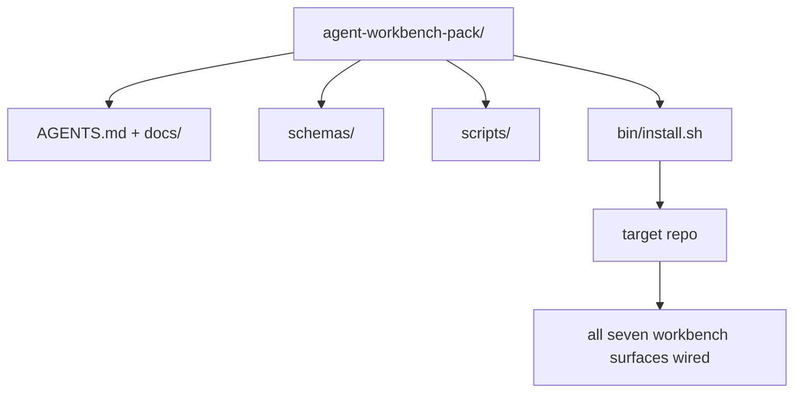

# الحجر الرئيسي: إرسال حزمة لوحة العمل للعملاء المستخدمين مرة أخرى

> يُنهي المسار الصغير مع حزمة يمكنك إلقاءها في أي إعادة التأمين.`cp -r`ويكون لدينا عميل يعمل بشكل موثوق به في الصباح التالي

**Type:** Build
**Languages:** Python (stdlib)
**Prerequisites:** Phases 14 · 31 to 14 · 41
**Time:** ~75 minutes

## أهداف التعلم

- إغلف السطحات السبعة من سطح المكتب إلى دليل واحد
- قم بتثبيت الخطط والمنشورات والعلامات حتى يحصل الردود الجديد على خط أساسي معروف
- إضافة نص إعداد واحد يضع الحزمة دون أثر.
- قرروا ما يبقى في الحزمة وما يبقى خارجها، ويدفعوا عن الجرح لكل واحد.
- إظهار تغيير واحد في مخزن بمساعدة الوكيل مع دليل يمكن للمراجع إعادة تكوينه.

## المشكلة

لوحة عمل تعيش في Google Doc، وتاريخ الدردشة، وثلاثة نصوص نصف تذكر هي لوحة عمل يتم إعادة بناءها كل ربع. العلاج هو حزمة إصدارات: إعادة التأمين أو دليل مع السطحات، والخطط، والنصوص، ومثبتة قيادة واحدة.

ستنهي هذا الدروس بـ`outputs/agent-workbench-pack/`تم إرسالها على القرص و`bin/install.sh`الذي يضعها في أي إعادة التأمين الهدف.

## المفهوم



### ترتيب الحزمة

```
outputs/agent-workbench-pack/
├── AGENTS.md
├── docs/
│   ├── agent-rules.md
│   ├── reliability-policy.md
│   ├── handoff-protocol.md
│   └── reviewer-rubric.md
├── schemas/
│   ├── agent_state.schema.json
│   ├── task_board.schema.json
│   └── scope_contract.schema.json
├── scripts/
│   ├── init_agent.py
│   ├── run_with_feedback.py
│   ├── verify_agent.py
│   └── generate_handoff.py
├── bin/
│   └── install.sh
└── README.md
```

### ما يبقى في، ما يبقى خارج

في:

- مخططات السطح، هذه هي العقد
- السيناريو الأربع أعلاه، إنها وقت التشغيل
- الأوراق الأربعة، هذه هي القواعد والقواعد

خارج:

- مهام محددة للمشروع، المهام تنتمي إلى لوحة الاستعمار المستهدفة، وليس إلى الحزمة.
- الموردين يطلبون SDK، الحزمة هي الإطار معتاد.
- البيانات المضافة، الحزمة تعيش بجانب المضافة الموجودة في الفريق، وليس داخلها

### الجهاز التركيب

قصيرة`bin/install.sh`(أو `bin/install.py`):

1. يرفض التركيب على حزمة موجودة بدون `--force`. . .
2. نسخ الحزمة إلى صندوق الهدف
3. السلك على المعلومات إذا كان`.github/workflows/`-لا يوجد
4. طباعة الخطوات التالية: ملء اللوحة، وضع أوامر القبول، تشغيل النص الإبتدائي.

### الإصدار

الحزمة تحمل`VERSION`الملف. تعطلات الخطة وتغييرات النص المطلوبة الهجرة تعطل الرئيسي. تغييرات الوثائق فقط تعطل الإصلاح. إعادة التأمين المستهدف`agent_state.json`سجلات نسخة الحزمة التي تم تشغيلها ضد.

```figure
wb-pack-install
```

## بناءها

`code/main.py`يجمع الحزمة إلى`outputs/agent-workbench-pack/`بجانب الدروس، زرع مع مخططات والخطوط من الدروس السابقة في هذا المسار الصغير والوثائق التي كتبتها بالفعل.

إشغله

```
python3 code/main.py
```

النص النسخة وتحديد السطح، يكتب README، طباعة شجرة الحزمة، وتخرج من الصفر. إعادة التشغيل غير فعال.

## أنماط الإنتاج في البرية

حزمة لا تكون قيمة إلا إذا بقيت على قيد الحياة من الشوك والتحديثات، والتي لا تُعجبها الجدول.

**`VERSION` is the contract, not the marketing.**الضباب الكبرى تتطلب هجرة الحالة الضباب الصغيرة تتطلب إعادة تشغيل المحقق الضباب المزيف هو وثيقة فقط`.workbench-version`في إعادة الإعلان المستهدفة في كل عملية إرسال ؛`lint_pack.py`يرفض الشحن إذا كان قفل الهدف غير متفق مع حزمة`VERSION`هكذا`npm`،`Cargo`و`pyproject.toml`على قيد الحياة 10 سنوات من التشنج، لا شيء حول العملاء تغيير القواعد.

**Single source for cross-tool distribution.**سفن Nx واحد `nx ai-setup`هذا يضع`AGENTS.md`،`CLAUDE.md`،`.cursor/rules/`،`.github/copilot-instructions.md`يجب أن تفعل نفس الشيء ، ويمنح المثبت الروابط (`ln -s AGENTS.md CLAUDE.md`لذا فإن مصدر واحد من الحقيقة يُعطي كل وكيل للتشفير.

**`uninstall.sh` that refuses on non-trivial state.**إزالة إزالة الحزمة لا يجب حذف إزالة المستخدم `agent_state.json`،`task_board.json`أو`outputs/`. إزالة التثبيت يزيل الخططات، النصوص، وثائق، و`AGENTS.md`(مع `--keep-agents-md`الاختيار خارج) ويرفض المضي قدما إذا كانت ملفات الدولة لديها أي تغييرات غير ملتزمة.

**Skill-as-publishable. SkillKit-style distribution.**السفن الحزمة كمهارة SkillKit: `skillkit install agent-workbench-pack`يضعها على 32 وكيلًا من الذكاء الاصطناعي من مصدر واحد. إعادة التأمين هو مصدر الحقيقة؛ SkillKit هو قناة التوزيع. تسقط قفل البائع؛ السطحات السبع تبقى نفسها.

## استخدمها

ثلاثة أماكن سفن الحزمة:

- **As a directory you drop into a repo.** `cp -r outputs/agent-workbench-pack /path/to/repo`. . .
- **As a public template repo.**- التخصيص، مع `VERSION`تحكم التنحير
- **As a SkillKit skill.**تم توصيله إلى منتج عميلك حتى يتم وضعها في أمر واحد

الحزمة هي الوصفة كل إعداد هو حصة

## أرسله

`outputs/skill-workbench-pack.md`يخلق حزمة مُعدّلة للمشروع: قواعد تم تحديدها لتاريخ الفريق، وأحجام نطاق مطابقة لـ"الردود"، وأبعاد المادة تم تمديدها بإدخال محدد للمجال.

## التمارين

1. قرروا أي وثيقة خامسة تختارها تستحق الترقية إلى الحزمة القنونية
2. إعادة كتابة التركيب باستخدام Python`--dry-run`-قارنة التجربة مع (باش)
3. إضافة`bin/uninstall.sh`الذي يزيل الحزمة بأمان ويرفض إذا كانت ملفات الدولة لديها تاريخ غير بسيط.
4. إضافة`lint_pack.py`التي تفشل عندما تتحرك الحزمة من`VERSION`-أوصلها إلى المعلوماتية لتسجيل الحزمة
5. كتاب كتاب الهجرة من مقعد عمل يدوي إلى هذه الحزمة ما هو ترتيب العمليات التي تقلل من وقت الإيقاف؟

## ممارسة المهن: إثبات تغيير واحد في مخزن

تثبت المظهر التجهيزي أن المجمع يعمل ويصنع الملفات. لا يثبت أن وكيلك يمكنه إنجاز مهمة جديدة، أو أن التحققات المولدة تثبت ذلك المهمة، أو أن نظامًا تم نشره يعمل. احتفظ بهذه المطالبة منفصلة.

اختر مهمة حقيقية صغيرة في مخزن تملكه أو لديك إذن لتغييرها. استخدم عامل تشفير واحد لديك بالفعل. إصلاح خطأ، ميزة محدودة، أو تحسين عملي يكفي؛ تثبيت عدة وكلاء ليس جزءًا من التمرين.

ميزانية جلسة عمل منفصلة خارج مختبر التعبئة. نسخ نموذج الأدلة المرتبطة أدناه في الخاص بك `learning-artifacts/`الإرشادات: الحفاظ على الشكل المحقق والحزمة كمادة مرجعية.

### 1. إطار المهمة واختيار الاستقلال

استخدم إطار المهمة من الدروس 43 وخطة الأدلة من الدروس 44. سجل المراجعة المبدئية والهدف الملاحظ وغير الأهداف والمسارات المسموح بها ودليل القبول. حدد المستخدم الحقيقي أو المشغل الذي يحتاج إلى السلوك.

اختر طريقة عمل: خطوات مرشحة، تنفيذ مع نقطة تفتيش، أو تشغيل مستقل محدود. شرح لماذا عدم اليقين والعواقب والعكسية يبرر ذلك. قد يحتاج جهاز إعادة التشغيل المحلي الصغير إلى نقاط تفتيش أقل من تغيير السيطرة على الوصول.

حدد ميزانية وقت الجدار و رمز أو حد التكلفة إذا كشف وكيل واحد. سجل القياسات غير المتاحة بصراحة. حدد شرط وقف لفشل متكرر ، والإذنات الجديدة ، والإنفاذ الميزانية ، أو قرار عقد غير حل ؛ اسم من يمكن حلها.

### 2. إعداد أصغر بيئة مفيدة

استعادة التنفيذ ذات الصلة، والاتصال، والاختبار، والإرشادات المحلية. سجل لماذا كل مصدر ينتمي إلى السياق وما هي الأدلة الحالية التي ستسلب الملاحظة القديمة. لا تحميل المخبز بأكمله من قبل الافتراضي.

قم باختيار واحد صريح لكل امتداد ذي صلة: تقديم مهارة إجراء قابل للتكرار؛ أداة MCP تقديم الوصول؛ القرص يعمل على التحقق من التحديد؛ إضافة حزمة القدرات. حافظ على امتداد فقط عندما تحتاجها المهمة، مع أدنى الإذن التي تسمح لها بالعمل.

سجل السياق أو تكلفة الصيانة لمزيد من المضافات المقترحة التي ترفضها. تحقق مرة أخرى من ذاكرة أو تعليمات قديمة، ثم استنحي أو استبدلها في إعدادك المملوك للمتعلم عندما تؤيد الأدلة هذا القرار. إعادة التحقق المفيد للتأكد من إزالة لم تفقد القيود اللازمة.

### 3. التقاط خط الأساس وتنفيذ

قبل التحرير، قم بتشغيل أقرب عملية التحقق القائمة وتوضيح الحالة الحالية للسلوك المطلوب. احتفظ بالقيادة والإصلاح والنتيجة وموقع الأدلة. ميزة لا توجد بعد ما لا تزال لديها خط أساسي: سجل الاستجابة الملاحظة أو العملية غير المدعومة.

دع الوكيل ينفذ داخل العقد. حافظ على سجل التدخل مع سبب كل تصحيح أو تغيير الإذن أو مراجعة الخطة. التفويض أمر اختياري؛ إذا كان مفيدًا، اطلب عقد الملكية والتكامل في الدروس 45 قبل إضافة عامل آخر.

### 4. تحدي الأدلة

اختر دليل يلاحظ السطح المتغير. بالنسبة لمستخدم الواجهة، اعيد بناء ورصد الرحلة المقدمة على الأطول ذات الصلة. بالنسبة لـ API، تحقق من الطلب والرد المتسلسل. بالنسبة لـ CLI، قم بتشغيل الأوامر المبنية وتحقق من رمز الخروج والمخرج. حدد التحققات التي تحتاجها المهمة وتوضح حدودها.

اكتب النتيجة المتوقعة من عقد المهمة بشكل مستقل عن تنفيذ الوكيل. في نسخة قابلة للتخلص، أدخل نتيجة واحدة غير صحيحة محددة، مثل قبول قيمة غير صالحة أو إسقاط حقل الاستجابة المطلوب. قم بنفس التحقق من قبول: يجب أن يفشل لهذا السبب.

إذا ظل الأخضر ، قم بتعزيز التأكيد أو الملاحظة قبل الثقة بها. استعاد التنفيذ الصحيح وإعادة تشغيله بنجاح. احتفظ بالرسومات. خطأ في النصوص أو إعداد اختبار مكسور لا يعتبر كاكتشاف التراجع.

مراجعة الاختلاف النهائي، بما في ذلك الاختبارات المتغيرة، ضد الهدف الأصلي والمسارات المسموح بها. اطلب من نظير أو جلسة مراجعة منفصلة تحدي الأدلة الأضعف دون تحرير التنفيذ. لا تزال لديك الحكم النهائي؛ موافقة وكيل آخر ليست دليل تنفيذ.

### 5. عمليات التدريبات والتعافي

قم بتشغيل الفن المغيّر في بيئة محلية أو محلية للتصوير.`local`،`staging`أو`live`التدريب المحلي يدعم ادعاء محلي؛ لا يتطلب نشر الإنتاج لهذا التدريب.

اختر إشارة فشل واحدة تتعلق بالمهام، وعلى عتبة، ونفذة الملاحظة، ومالك. شرح الاستجابة عندما يتم تجاوز هذا العتبة. أطلق الإشارة بأمان في التدريب والاحتفاظ بالسجل الملاحظ، الميتر، أو الاستجابة.

التدريبات التدريبية للعودة إلى أداة معروفة جيدة والتحقق من استرداد السلوك السابق. احتساب البيانات المستمرة عند الاقتضاء؛ استبدال ثنائي وحده قد لا يعكس تغيير البيانات. سجل أي خطوة من استعادة لم تتمكن من التحقق منها.

### 6. تحسين الجولة القادمة وتسلمها

مقارنة النتيجة مع الخط الأساسي، بما في ذلك الوقت المنصرم، بيانات الاستخدام المتاحة، والتدخلات البشرية. مهمة واحدة تظهر ما حدث على تلك المهمة؛ فإنه لا يثبت أن وكيل هو بشكل عام أسرع أو أكثر موثوقية.

قم بتعزيز تصحيح واحد لاحظ في اختبار، حدود الإذن أصغر، تلقائي، أو مثال أكثر وضوحا باستخدام الدروس 46. إعادة التحقق المتأثرة. إزالة الطفرات المؤقتة وتغادر الفرع النهائي، وتغيير الملفات، فتح المخاطر، والعمل التالي صريح للجلسة التالية.

### المادة المرجعية اليدوية

اطلب من المراجعة أن يفتش ملفات الأدلة ويعيد التكرار على الأقل أضعف عملية قبول.`demonstrated`،`needs revision`أو`unverified`لكل سطر، مع مؤشر دليل وسبب. الحقول المملئة والخطوط المترتبة على التعبئة لا تستبدل هذه الملاحظات.

| Dimension | Evidence the reviewer should challenge |
|---|---|
| Task and autonomy | Starting behavior, bounded goal, justified permissions, budget, and a usable stop rule |
| Context and environment | Relevant sources, justified tool access, and a rechecked retirement decision |
| Verification | Actual before/after behavior and a deliberate incorrect result that the same check rejects |
| Review and operation | Inspected diff, independent challenge, labeled runtime observation, and rehearsed recovery |
| Iteration and handoff | One verified improvement, honest limits, clean final state, and a reproducible next action |

القرار`needs revision`النتائج قبل أن تدعي أن المهمة قد اكتملت.`unverified`ويقصر المطالبة على النحو المناسب. المحفظة تثبت حكمك الهندسي على مهمة محدودة؛ وليس ضماناً لتوظيف أو نشر.

## الأثاث المُرسل

احتفظي بالحزمة القابلة لإعادة الاستخدام والنسخة المكتملة من[career-agent-evidence.md](https://github.com/rohitg00/ai-engineering-from-scratch/blob/main/phases/14-agent-engineering/42-agent-workbench-capstone/outputs/career-agent-evidence.md). يربط الشكل إطار المهمة وخطة التنفيذ وإيصالات الوقت المباشر والمراجعة وممارسة الاسترداد والإرسال في دراسة حالة واحدة قابلة للمراجعة.

## الشروط الرئيسية

| Term | What people say | What it actually means |
|------|----------------|------------------------|
| Workbench pack | "The starter kit" | A versioned directory carrying all seven surfaces |
| Installer | "Setup script" | `bin/install.sh` that lays the pack down idempotently |
| Pack version | "VERSION" | Major bumps for schema/script changes, patch for doc-only |
| Drop-in pack | "cp -r and go" | Pack works without per-repo customization on day one |
| Forkable template | "GitHub template" | Public repo that GitHub's "Use this template" can clone from |

## المزيد من القراءة

- المراحل 14 · 31 إلى 14 · 41  كل سطح هذه الحزمة
- [SkillKit](https://github.com/rohitg00/skillkit) تثبيت هذه المهارة على 32 وكيل الذكاء الاصطناعي
- [Nx Blog, Teach Your AI Agent How to Work in a Monorepo](https://nx.dev/blog/nx-ai-agent-skills) مولد مصدر واحد عبر ست أدوات
- [agents.md — the open spec](https://agents.md/) ما يجب أن ينفذ جهاز توجيه حزمة التوصيل الخاصة بك
- [HKUDS/OpenHarness](https://github.com/HKUDS/OpenHarness) تنفيذ مرجعية لمكافئ الحزمة
- [Augment Code, A good AGENTS.md is a model upgrade](https://www.augmentcode.com/blog/how-to-write-good-agents-dot-md-files) إعداد الوثائق
- [Anthropic, Effective harnesses for long-running agents](https://www.anthropic.com/engineering/effective-harnesses-for-long-running-agents)
- [Anthropic, Harness design for long-running application development](https://www.anthropic.com/engineering/harness-design-long-running-apps)
- المرحلة 14 · 30  تطوير عامل مدفوع بالقياس الذي يستغرق بوابة التحقق من الحزمة
- المرحلة 14 · 41  المرجعية قبل / بعد هذه الحزمة تحسن على
