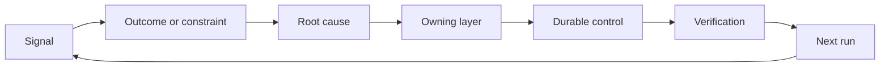

# بناء ريشيت ردود الفعل مع الملكية والتقاعد

> إرسال البضائع يغلق حلقة بناء واحدة وفتح حلقة التعلم يجب أن تغير الأدلة النظام أو يصبح التليميترية التي لا يملكها أحد

**Type:** Learn + Build
**Languages:** Python (stdlib)
**Prerequisites:** Phase 14 lessons 46 and 53
**Time:** ~75 minutes

## أهداف التعلم

- حول الحوادث والتقييمات وسلوك المستخدمين والتصحيحات إلى أعمال خاصة
- توجيه كل إشارة إلى السياق، التقييم، السياسة، وقت التشغيل، أو التخلف.
- إعطاء الأولوية للرد على أساس شدة وتكرارها.
- أعط كل مراقب شرط تقاعد
- أبلغوا قرار التسليم بالدليل والمساومة والمالك المسؤول

## الملاحظات هي البنية التحتية

يمكن لفريق جمع آثار، وتقييمات، وتذاكر الدعم، ومسجلات الحوادث دون تعلم أي منها. الآلية المفقودة هي الترويج: مسار محدد من الملاحظة إلى تغيير دائم مع صاحب والدليل.

الحلقة هي:

1. مراقبة إشارة ملموسة؛
2. ربطها بالنتيجة أو القيود أو الافتراضات
3. تحديد أول طبقة النظام التي تمتلك السبب؛
4. تخلق تغيير محدود
5. التحقق من أن التكرار يصبح أقل احتمالاً
6. النظر في ما إذا كان يجب أن تبقى الرقابة.

## الطريق إلى الطبقة المالكة

| Signal | Destination |
|---|---|
| False positive, regression, wrong result | Evaluation or test |
| Missing context, duplicate work, stale fact | Context source or retrieval route |
| Unsafe action or authority gap | Policy or permission boundary |
| Timeout, retry storm, unavailable dependency | Runtime control |
| New product need or unresolved tradeoff | Shaped backlog item |

إصلاح السبب في أقرب طبقة فعالة. لا تضيف فقرة أخرى على الفور عندما يمكن اختبار أو إذن أن يجعل الفشل مستحيلا.



## الملكية جزء من السيطرة

كل عمل يحتاج:

- صاحب واحد
- الأولوية القائمة على العواقب والتكرار
- الأثاث الذي سيتم تغييره؛
- التحقق الذي يثبت التغيير
- نافذة مراجعة أو انتهاء الصلاحية؛
- حالة التقاعد

تحسين غير مملك هو ملاحظة مع تصميم أفضل.

## إقلاع التحكمات المستمرة

أنظمة التعليقات تتراكم السياسة. يمكن أن تصبح هذه السياسة متناقضة ومكلفة.

- تغييرات في الهندسة المعمارية أو سير العمل
- تحلّ محلّ تعليمات مستوى أعلى بمعدل غير متغير من المستوى الأدنى؛
- لم تظهر الفشل المحمي عبر النافذة المختارة.
- الاختيار يمنع العمل الشرعي أكثر من منع الأذى

التقاعد يحتاج أيضاً إلى دليل لا تُحذفِ جهاز التحكم لأنه يشعرُ بالقدوم.

## ربط بناء وكيل التشفير

نفس الرشة تخدم كلا المسارات:

- تغير دليل المنتج إطار النتيجة أو الافتراضات أو القسم أو خطة القياس.
- تغيير تصحيحات وكيل التشفير في الاختبارات أو السياق أو نطاقها أو التلقائية أو التسليم.
- الحوادث يمكن أن تغير كل من حدود المنتج و مكتب العمل العميل.

هذا هو السبب في أن تشكيل البناء ليس مرحلة تنتهي قبل التشفير. إنه يستمر خلال كل تغيير مقبول.

## بناءها

المختبر يصنف الإشارات، ويخلق أفعال ريشيت المملوكة، ويضع أولوياتها، ويكتب`outputs/feedback-backlog.json`. . .

```bash
python3 code/main.py
python3 -m unittest discover code/tests -v
```

أضف إشارة وقت وقف التشغيل وتأكيد أنه يتجه إلى وقت التشغيل بدلاً من التخلف العام.

## المختبر التدريبي: اتخاذ قرار بعد تعثير

اختر سير العمل واحد من مشروع محفظة مسار حياتك المهنية. اجعله من خلال قرار واحد، تجربة صغيرة، ومراجعة. احتفظ بالدليل في [career delivery template](https://github.com/rohitg00/ai-engineering-from-scratch/blob/main/phases/14-agent-engineering/54-build-the-feedback-ratchet/outputs/career-delivery-evidence.md). . .

يقوم مختبر Python بتوليد أفعال عودية مثالية. لا يلاحظ المستخدمين أو يقيس التدخل أو يثبت استعداد الوظيفة. استكمال تشغيله هو التحضير لهذا التمرين.

### 1. أوضح ما حدث

سجل المستخدم، المهمة، سير العمل الحالي، والنتيجة التي أردت تحسينها. ربط ملاحظة موافقة، سجل دعم محذوف، أو تتبع مهمة قابلة للتكرار. فصل ما لاحظته من ما أبلغ عنه شخص ما وما استنتجته.

ابحث عن عكس: افتراض فشل، نتيجة لا يمكن استخدامها، تكلفة غير متوقعة، أو تأخير التسليم. شرح أدلة غيرت فهمك. العكس يحتاج إلى رد وعمل قرار، وليس قصة نجاح مكتوبة حولها.

إذا لم تتمكن من العمل مع المستخدمين، قم بإجراء محاكاة معينة مع نظير أو سيناريو محدد. ابق الملاحظات المحاكاة منفصلة عن أدلة المستخدم الحقيقي. لا تختلق مقابلات، أو الموافقة، أو تبني، أو تأثير الأعمال.

### 2. تقدم في السلطة

قم بإدراج المجهولات واختيار أرخص إجراء قابل للتعديل الذي يمكن حل أهم إجراءات، وذكر ما يمكنك اتخاذ قرار، وما الذي يحيط به اتفاق موجود، وما الذي يحتاج إلى إذن قبل تنفيذه.

على سبيل المثال، قد تقوم بإعداد عرض غير متصل محذوف أثناء انتظار الإذن لاستخدام بيانات العملاء. اتخاذ المبادرة يعني نقل العمل المسموح به إلى الأمام وإبلاغ القرار الممنوع. لا يوسع حقوق الوصول أو الموافقة الخاصة بك.

### 3. مقارنة الخيارات وخبر صاحب القرار

اكتب قصيرة من القرارات لشخص لا يحتاج إلى تفاصيل التنفيذ.

- مشكلة المستخدم والدليل الذي تغير الخطة
- خيارين على الأقل، بما في ذلك خيار يدوي أرخص أو خيار عدم بناء حيثما كان ذلك مصدقاً.
- الجودة، وتصميم التفاعل، والجهد، وتكلفة التشغيل، وتفاوضات المخاطر؛
- توصيتك، والشك المتبقي، والقرار المطلوب؛
- مالك القرار، والجهات المعنية المتأثرة، والتاريخ الذي يحتاج إليه القرار.

اطلب من زميلك أن يمثل طرفًا متذمنًا وتحدى تعديًا واحدًا. سجل الاعتراض وكيف يتغير أو لا يتغير، توصيتك. ضع تعليقات اللعب الدولي على محاكاة؛ لا يمكن أن تكون في مكان اتفاقية طرف متذمن فعليًا.

### 4. اجري تجربة محدودة

اختر النموذج الأول أو العمل التجريبي أو العمل التجريبي بناءً على السؤال الذي تريد الإجابة عنه. حدد الجمهور والبيانات والسلطة والمدة والإعادة إلى العمل والشروط للمواصلة أو التغيير أو التوقف قبل جمع النتيجة.

قم بمشاهدة التفاعل من نقطة البدء للمستخدم إلى مهمة اكتملة. قم بإدراج حالة خروج غير صحيحة أو حالة غياب البيانات. لاحظ ما إذا كان المستخدم يستطيع ملاحظة الفشل، وتصحيحه، والعودة دون مساعدة مخفية منك.

احتساب وقت مراجعة الإنسان والتصحيح كجزء من سير العمل. استجابة نموذج أسرع يمكن أن تجعل المهمة الكاملة أبطأ أو أصعب الثقة.

### 5. مقارنة النتائج والاقتصاد

سجل خط أساسي وملاحقة باستخدام نفس التعريف الميتركي ، ومجموعة المهام ، وأسلوب جمع ، ونوافذ الملاحظة المقارنة. احتفظ بعد العينات ، والاستبعاد ، والروابط الدليلية إلى جانب الأرقام. إذا تغيرت هذه الظروف ، اشرح لماذا يكون المقارنة محدودة.

تضمين نتيجة واحدة للمستخدم، ومرصد واحد للجودة أو السلامة، والجهد الإجمالي للقيام بمراجعة البشر. سجل النتيجة حتى عندما تفوت الهدف. تبين عينات صغيرة أو محاكاة ادعاءات التعلم المحدودة، وليس ادعاءً عن تأثير أعمال مثبت.

تقدير التكلفة لكل مهمة تم إنجازها بنجاح باستخدام الموديلات، والجربات المُجددة، وخدمات الدعم، والإستعراض البشري. قم بتقديم افتراض معدل العمل وإفصاح الاستخدام المقياس عن التقديرات. مقارن هذه التكلفة مع البديل اليدوي أو افتراض القيمة وراء المشروع.

استخدم المعلومات الموجودة[FinOps for LLMs lesson](https://aiengineeringfromscratch.com/lesson?path=phases/17-infrastructure-and-production/27-finops-llms)لتعميق التخصيص والاقتصاد الوحدية. تغيير النموذج هو فقط رد واحد ممكن؛ تقييد تدفق العمل أو الاحتفاظ بخطوة يدوية قد يكون قرار أفضل للمنتج.

### 6. أغلق الحلقة

استخدم المعايير المعلنة مسبقاً لتوصية الاستمرار أو التغيير أو التوقف. إذا لم تكن الأدلة حاسمة، قم بإسم الملاحظة المفقودة والاختبار المحدود التالي. سجل رد صاحب القرار المسؤول؛ واتركها في انتظار إذا لم يتم اتخاذ قرار.

اختر تحسينًا في عملية التسليم نفسها: إطار مهمة أكثر وضوحًا، ومشي المستخدم في وقت سابق، وقائمة تحديد مراجعة أفضل، أو تقديم وكيل أصغر، أو حالة تقييم أكثر صرامة. قم بتعيين صاحب وموعد مراجعة.

عند مراجعة، قرر ما إذا كان يجب الاحتفاظ به، أو مراجعة، أو التراجع عن ذلك التحسن. سجّل الأدلة على الخيار. ليست قائمة جديدة لتحقيق تخلق المزيد من العمل دون منع فشل الهدف قد اكتسبت دائمة.

## الأثاث المُرسل

نسخة[career-delivery-evidence.md](https://github.com/rohitg00/ai-engineering-from-scratch/blob/main/phases/14-agent-engineering/54-build-the-feedback-ratchet/outputs/career-delivery-evidence.md)في مشروعك الخاص واكملته بروابط دليل. احفظ القالب المحقق فيه قابلاً للاستعمال مرة أخرى. تضم المعلومات القصيرة عن القرار، ومواصلة التفاعل، ومقارنة القياسات، والمتابعة المملوكة لأثاث محفظة حياتك المهنية.

## تحقق من ذلك

استخدم هذا المخطط اليدوي للقبول مع نظير.**met**،**needs work**أو**not observed**وقدم رابطاً للدليل أو ملاحظة مفقودة محددة.

| Check | Evidence that meets it |
|---|---|
| Workflow grounded | A traceable observation supports the problem; reported claims, inference, and simulation are labeled. |
| Authority respected | Reversible next work is clear, and any restricted action waits for its actual decision owner. |
| Tradeoffs communicated | Credible alternatives, a stakeholder objection, a recommendation, and an explicit decision request are recorded. |
| Interaction tested | The walkthrough covers success, failure, recovery, and human review effort. |
| Outcome compared | Baseline and follow-up definitions align; samples, guardrails, costs, and comparison limits are visible. |
| Setback owned | The evidence changes a continue/change/stop decision and an accountable next action. |
| Process improved | One workflow improvement has an owner, review date, and an evidence-based keep/revise/retire decision. |

لا يزال سلوك المستخدم الحقيقي غير الملاحظ فجوة حتى عندما تمر كل خطوة محاكاة. الحفاظ على هذا الحد في ادعاء المحفظة وتحديد الملاحظة التالية اللازمة لإغلاقها.

## التمارين

1. تحويل حادثة واحدة و شكوى مستخدم واحدة إلى إجراءات
2. أسمائ الطبقة الأولى التي يمكن أن تمنع كل تكرار.
3. إضافة أوامر التحقق أو ملاحظات إلى إصدار المختبر.
4. تحديد شرط التقاعد للقاعدة في السياسة
5. تعقب واحد قبول التصحيح مرة أخرى إلى إطار المهمة التالية.

## المزيد من القراءة

- [Basili, Caldiera, and Rombach, The Goal Question Metric Approach](https://www.cs.toronto.edu/~sme/CSC444F/handouts/GQM-paper.pdf)، للتعلم التنظيمي من خلال القياس المتحكم في الهدف.
- [Fagerholm et al., Building Blocks for Continuous Experimentation](https://doi.org/10.1145/2601248.2601276)، للدورة التقنية والتنظيمية التي تربط الأدلة بتطوير منتج مستمر.
- [Nuseibeh and Easterbrook, Requirements Engineering: A Roadmap](https://www.cs.toronto.edu/~sme/papers/2000/ICSE2000.pdf)، لمعالجة المتطلبات كما تتطور خلال دورة حياة النظام.

## ما تحافظ عليه

إبق`outputs/feedback-backlog.json`كمثيل التوجيه و دليل التسليم المهني الخاص بك كسجل للقرارات الخاصة بك. معاً فإنها تغلق طريق حكم المنتج وتسليم وتعلم الإطار النتائج التالي.
