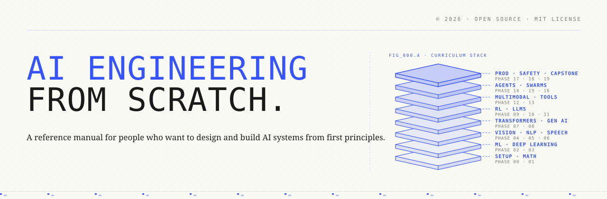
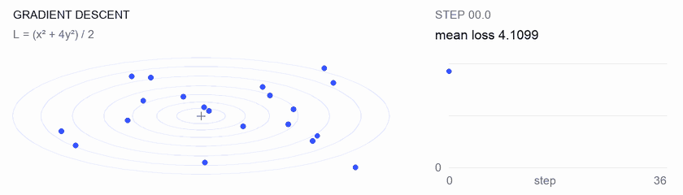
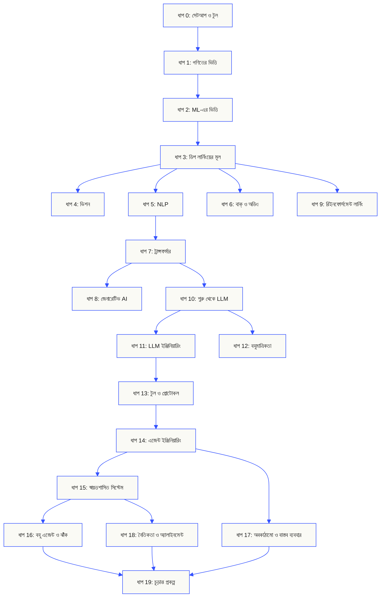
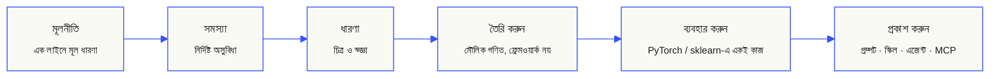

<p align="center" lang="bn"><sub>এই README বাংলায় অনূদিত। <a href="../../README.md">ইংরেজি README</a> মূল তথ্যসূত্র হিসেবে বহাল আছে।</sub></p>

<p align="center">
  <picture>
    <source media="(prefers-color-scheme: dark)" srcset="../../assets/readme/header-dark.svg">
    
  </picture>
</p>

মডেলের ভেতরের গণনা, রিট্রিভাল পাইপলাইন ও এজেন্ট রানটাইম বাস্তবায়ন করুন। পরীক্ষা করুন, ব্যর্থতা দেখুন এবং কোড ও মূল্যায়নের ফল সংরক্ষণ করুন।

**[শেখা শুরু করুন](https://aiengineeringfromscratch.com/lesson?path=phases/00-setup-and-tooling/01-dev-environment)** · **[শেখার পথ বেছে নিন](#learning-routes)** · **[ল্যাব চেষ্টা করুন](#interactive-lab)** · **[প্রকল্প তৈরি করুন](#project-challenges)** · **[পাঠ্যক্রম দেখুন](#contents)**

বিনামূল্যে, ওপেন সোর্স, MIT লাইসেন্স। ওয়েবসাইটে, কোডিং এজেন্টের সঙ্গে বা স্থানীয় কোড চালিয়ে শিখুন।

> 523 পাঠ. 20 ধাপ. Python, TypeScript, Rust, Julia.

<p align="center">
  <a href="../../LICENSE"></a>
  <a href="../../ROADMAP.md"></a>
  <a href="#contents"></a>
  <a href="https://github.com/rohitg00/ai-engineering-from-scratch/stargazers"></a>
  <a href="https://aiengineeringfromscratch.com"></a>
</p>

<details>
<summary>নিজের ভাষায় পড়ুন</summary>

<p align="center">
  <a href="../../README.md">🇬🇧 English</a> · <a href="../../i18n/zh/README.md">🇨🇳 简体中文</a> · <a href="../../i18n/zh-TW/README.md">🇹🇼 繁體中文（台灣）</a> · <a href="../../i18n/ja/README.md">🇯🇵 日本語</a> · <a href="../../i18n/ko/README.md">🇰🇷 한국어</a> · <a href="../../i18n/pt/README.md">🇵🇹 Português</a> · <a href="../../i18n/pt-BR/README.md">🇧🇷 Português (Brasil)</a> · <a href="../../i18n/es/README.md">🇪🇸 Español</a> · <a href="../../i18n/de/README.md">🇩🇪 Deutsch</a> · <a href="../../i18n/fr/README.md">🇫🇷 Français</a> · <a href="../../i18n/it/README.md">🇮🇹 Italiano</a> · <a href="../../i18n/nl/README.md">🇳🇱 Nederlands</a> · <a href="../../i18n/pl/README.md">🇵🇱 Polski</a> · <a href="../../i18n/cs/README.md">🇨🇿 Čeština</a> · <a href="../../i18n/ro/README.md">🇷🇴 Română</a> · <a href="../../i18n/hu/README.md">🇭🇺 Magyar</a> · <a href="../../i18n/el/README.md">🇬🇷 Ελληνικά</a> · <a href="../../i18n/sv/README.md">🇸🇪 Svenska</a> · <a href="../../i18n/da/README.md">🇩🇰 Dansk</a> · <a href="../../i18n/no/README.md">🇳🇴 Norsk</a> · <a href="../../i18n/fi/README.md">🇫🇮 Suomi</a> · <a href="../../i18n/ru/README.md">🇷🇺 Русский</a> · <a href="../../i18n/uk/README.md">🇺🇦 Українська</a> · <a href="../../i18n/tr/README.md">🇹🇷 Türkçe</a> · <a href="../../i18n/he/README.md">🇮🇱 עברית</a> · <a href="../../i18n/ar/README.md">🇸🇦 العربية</a> · <a href="../../i18n/fa/README.md">🇮🇷 فارسی</a> · <a href="../../i18n/hi/README.md">🇮🇳 हिन्दी</a> · <a href="../../i18n/bn/README.md">🇧🇩 বাংলা</a> · <a href="../../i18n/ur/README.md">🇵🇰 اردو</a> · <a href="../../i18n/th/README.md">🇹🇭 ไทย</a> · <a href="../../i18n/vi/README.md">🇻🇳 Tiếng Việt</a> · <a href="../../i18n/id/README.md">🇮🇩 Bahasa Indonesia</a> · <a href="../../i18n/tl/README.md">🇵🇭 Tagalog</a>
</p>

</details>

### পৃষ্ঠপোষক

<p align="center">
  <a href="https://serpapi.com/ai-engineering-from-scratch"><picture><source media="(min-width: 768px)" srcset="../../assets/sponsors/serpapi-banner-compact.png" width="48%"></picture></a>
  <a href="https://nitrostack.ai/referral/aiengineeringfromscratch"><picture><source media="(min-width: 768px)" srcset="../../assets/sponsors/nitrostack-banner-equal.png" width="48%"></picture></a>
</p>

<p align="center">
  <sub><span>আপনাদের সহায়তায় প্রতিটি পাঠ বিনামূল্যে ও ওপেন সোর্স থাকে।</span> <a href="#supporters">সব সমর্থককে দেখুন</a> · <a href="../../SPONSORS.md">পৃষ্ঠপোষক হোন</a></sub>
</p>

<a id="see-what-you-will-build-and-keep"></a>
<a id="learning-routes"></a>

## শেখার পথ

| পথ | প্রথম পাঠ |
|---|---|
| মডেলের ভিত | [সেটআপ ও টুল](https://aiengineeringfromscratch.com/lesson?path=phases/00-setup-and-tooling/01-dev-environment) |
| LLM সিস্টেম | [প্রম্পট ইঞ্জিনিয়ারিং](https://aiengineeringfromscratch.com/lesson?path=phases/11-llm-engineering/01-prompt-engineering) |
| এজেন্ট ও সরবরাহ | [এজেন্ট লুপ](https://aiengineeringfromscratch.com/lesson?path=phases/14-agent-engineering/01-the-agent-loop) |

[ক্যারিয়ারের পথ তুলনা করুন](https://aiengineeringfromscratch.com/learning-paths.html) · [পূর্বপ্রয়োজন ও পড়াশোনার সময়](#study-guide)

<a id="interactive-lab"></a>

### গ্রেডিয়েন্ট ডিসেন্ট

20টি শুরুর বিন্দু একটি দ্বিঘাত লস ফাংশনের ওপর গ্রেডিয়েন্ট ডিসেন্ট অনুসরণ করে। গ্রাফে প্রতি আপডেটের পরে তাদের অবস্থান ও গড় লস দেখানো হয়।

<p align="center">
  <a href="https://aiengineeringfromscratch.com/lesson?path=phases/01-math-foundations/08-optimization#loss-landscape-visualization">
    <picture>
      <source media="(max-width: 600px) and (prefers-color-scheme: dark) and (prefers-reduced-motion: reduce)" srcset="../../assets/readme/101-gradient-mobile-dark.png">
      <source media="(max-width: 600px) and (prefers-reduced-motion: reduce)" srcset="../../assets/readme/101-gradient-mobile-light.png">
      <source media="(prefers-color-scheme: dark) and (prefers-reduced-motion: reduce)" srcset="../../assets/readme/101-gradient-dark.png">
      <source media="(prefers-reduced-motion: reduce)" srcset="../../assets/readme/101-gradient-light.png">
      <source media="(max-width: 600px) and (prefers-color-scheme: dark)" srcset="../../assets/readme/101-gradient-mobile-dark.gif">
      <source media="(max-width: 600px)" srcset="../../assets/readme/101-gradient-mobile-light.gif">
      <source media="(prefers-color-scheme: dark)" srcset="../../assets/readme/101-gradient-dark.gif">
      
    </picture>
  </a>
</p>

[পাঠে লার্নিং রেট বদলান](https://aiengineeringfromscratch.com/lesson?path=phases/01-math-foundations/08-optimization#loss-landscape-visualization) · [কোডে GD, মোমেন্টাম ও Adam তুলনা করুন](../../phases/01-math-foundations/08-optimization/code/optimizers.py)

<a id="project-challenges"></a>

### প্রকল্প

তিনটি প্রকল্পে ধাপভিত্তিক শুরুর কোড, রেফারেন্স বাস্তবায়ন ও স্থানীয় মূল্যায়ক আছে। [সেটআপ](#local-setup)-এর পরে রিপোজিটরির মূল ডিরেক্টরি থেকে কমান্ড চালান। ধাপগুলো বাস্তবায়ন না করা পর্যন্ত শুরুর কোড পরীক্ষায় ব্যর্থ হবে।

<details>
<summary><strong>01 · রিট্রিভাল মূল্যায়ন ল্যাব</strong> · Python · র‌্যাঙ্কিংয়ের মাপকাঠি ও অবনতির পরীক্ষা</summary>

প্রস্তাবিত সিস্টেমের গড় NDCG বাড়ে, কিন্তু একটি কোয়েরির সবচেয়ে প্রাসঙ্গিক প্রমাণের র‌্যাঙ্ক নিচে নামে। কোয়েরিভিত্তিক তুলনা তৈরি করুন, যা অবনতি জানায় এবং প্রকাশের পরীক্ষা ব্যর্থ করতে পারে।

Python 3.10+ ব্যবহার করুন। [RAG](../../phases/11-llm-engineering/06-rag/docs/en.md) ও [মডেল মূল্যায়ন](../../phases/02-ml-fundamentals/09-model-evaluation/docs/en.md) ঝালিয়ে নিন। র‌্যাঙ্কিং যাচাই, প্রিসিশন ও রিকল, র‌্যাঙ্ক-সংবেদনশীল মাপকাঠি, তারপর সিস্টেমের তুলনা বাস্তবায়ন করুন।

```bash
python3 scripts/project_test.py retrieval-evaluation-lab \
  --init learning-artifacts/retrieval-evaluation-lab
python3 scripts/project_test.py retrieval-evaluation-lab \
  --stage 1 --path learning-artifacts/retrieval-evaluation-lab --strict
python3 scripts/project_test.py retrieval-evaluation-lab \
  --all --path learning-artifacts/retrieval-evaluation-lab --strict
```

**সংরক্ষণ করুন:** পুনরুৎপাদনযোগ্য তুলনা, যাতে প্রতি কোয়েরির পার্থক্য এবং স্কোরে ব্যবহৃত প্রাসঙ্গিকতার বিচার থাকে। মাপকাঠি সেই বিচারগুলোর ফল বর্ণনা করে; উত্তরের সঠিকতা প্রতিষ্ঠা করে না।

[প্রকল্প শুরু করুন](https://aiengineeringfromscratch.com/project.html?id=retrieval-evaluation-lab) · [রেফারেন্স সমাধান দেখুন](../../projects/retrieval-evaluation-lab/solution/) · [নিজের ইনপুট দিয়ে চালান](../../projects/retrieval-evaluation-lab/README.md#run-with-your-own-inputs)

</details>

<details>
<summary><strong>02 · এজেন্ট ট্রেস ডিবাগার</strong> · TypeScript · ট্রেস পার্সিং ও সময়ের হিসাব</summary>

দেওয়া ট্রেসটি এখনও 100 ms সময় নেয়, কিন্তু মোট টোকেন ব্যবহার 200 বাড়ে এবং একটি স্প্যান ব্যর্থ হতে শুরু করে। ওভারল্যাপ করা চাইল্ড স্প্যানের কাজকে প্যারেন্টের নিজের নির্বাহ সময় থেকে আলাদা করুন, তারপর পরিবর্তন দেখানো রিপোর্ট তৈরি করুন।

Node.js 22.18+ এবং মূল্যায়কের জন্য Python 3 ব্যবহার করুন। JSONL পার্সিং, প্যারেন্ট সম্পর্ক যাচাই, সময়-ব্যবধানের গণনা এবং পরিদর্শনযোগ্য টাইমলাইন বাস্তবায়ন করুন।

```bash
python3 scripts/project_test.py agent-trace-debugger \
  --init learning-artifacts/agent-trace-debugger
python3 scripts/project_test.py agent-trace-debugger \
  --stage 1 --path learning-artifacts/agent-trace-debugger --strict
python3 scripts/project_test.py agent-trace-debugger \
  --all --path learning-artifacts/agent-trace-debugger --strict
```

**সংরক্ষণ করুন:** ইনপুট ট্রেস, HTML টাইমলাইন এবং অবনতির JSON রিপোর্ট। প্রতি স্প্যানের কেবল নিজস্ব টোকেন ব্যবহার রাখুন, যাতে প্যারেন্ট ও চাইল্ডের ব্যবহার দুবার গণনা না হয়।

[প্রকল্প শুরু করুন](https://aiengineeringfromscratch.com/project.html?id=agent-trace-debugger) · [রেফারেন্স সমাধান দেখুন](../../projects/agent-trace-debugger/solution/) · [সময় গণনা ইন্টার‌্যাক্টিভভাবে দেখুন](https://aiengineeringfromscratch.com/project.html?id=agent-trace-debugger&stage=03-timing)

</details>

<details>
<summary><strong>03 · টুল কল ফায়ারওয়াল</strong> · Rust · ভূমিকা যাচাই ও অনুমোদনের রসিদ</summary>

পর্যালোচনার পরে লেখার বিষয়বস্তু বদলে যায়, অথবা অনুমোদন আবার ব্যবহার করা হয়। কলের এনভেলপ যাচাই করুন, কলারের ভূমিকা ও পাথ পরীক্ষা করুন, তারপর ঠিক সেই অনুরোধ ও বিষয়বস্তুর সঙ্গে বাঁধা অনুমোদন একবার ব্যবহার করে শেষ করুন।

Rust ও Python 3.10+ ব্যবহার করুন। [টুল স্কিমা নকশা](../../phases/13-tools-and-protocols/05-tool-schema-design/docs/en.md) ও [নিরাপত্তার সীমা](../../phases/17-infrastructure-and-production/25-security-secrets-audit/docs/en.md) ঝালিয়ে নিন। কল করা অ্যাপ্লিকেশন পরিচয় সরবরাহ করে; মডেল একটি কাজের প্রস্তাব দেয়।

```bash
python3 scripts/project_test.py tool-call-firewall \
  --init learning-artifacts/tool-call-firewall
python3 scripts/project_test.py tool-call-firewall \
  --stage 1 --path learning-artifacts/tool-call-firewall --strict
python3 scripts/project_test.py tool-call-firewall \
  --all --path learning-artifacts/tool-call-firewall --strict
```

**সংরক্ষণ করুন:** অনুরোধ করা কাজ ও নীতির সিদ্ধান্ত দেখানো অডিট রসিদ। একটি ইনভোকেশনের মধ্যে অনুমোদন একবারই ব্যবহারযোগ্য; এই প্রকল্প স্থায়ী অনুমোদন ব্যবস্থা বা অপারেটিং সিস্টেম স্যান্ডবক্স দেয় না।

[প্রকল্প শুরু করুন](https://aiengineeringfromscratch.com/project.html?id=tool-call-firewall) · [রেফারেন্স সমাধান দেখুন](../../projects/tool-call-firewall/solution/) · [অনুমোদনের সীমা দেখুন](https://aiengineeringfromscratch.com/project.html?id=tool-call-firewall&stage=03-consume-a-request-bound-approval-once)

</details>

[সব প্রকল্প দেখুন](https://aiengineeringfromscratch.com/projects.html) · [ক্যারিয়ার অনুশীলনের নির্দেশিকা](../../learning-paths/CAREER-PRACTICE.md)

## শেখার পদ্ধতি বেছে নিন

### ওয়েবসাইটে

[aiengineeringfromscratch.com](https://aiengineeringfromscratch.com)-এ সম্পূর্ণ যেকোনো পাঠ খুলুন, অথবা [সূচিপত্রে](#contents) একটি ধাপ প্রসারিত করুন। সেটআপ বা ক্লোন লাগে না।

### AI শিক্ষকের সঙ্গে

Node.js, `npx` এবং স্কিল সমর্থন করে এমন কোডিং এজেন্ট আগে থেকেই ইনস্টল থাকলে, সেই এজেন্ট আপনার শিক্ষক হতে পারে। টিউটর ইনস্টল করা বা পড়ার জন্য রিপোজিটরি ক্লোন করতে হয় না। বিশেষায়িত পথের চালানো যায় এমন ল্যাবে `python3` লাগে। Agent Skills-এর হোস্ট ল্যাবে নির্বাচিত হোস্ট এবং লেখা যায় এমন ব্যবহারকারী বা প্রকল্পের স্কিল পরিসরও লাগে।

```bash
npx skills add rohitg00/ai-engineering-from-scratch
```

ইনস্টলার জানতে চাইলে হোস্ট ও পরিসর বেছে নিন। Codex-এ `start-learning`, Claude Code-এ `/start-learning` ব্যবহার করুন, অথবা হোস্টকে নাম দিয়ে স্কিলটি ব্যবহার করতে বলুন।

<details>
<summary>শিক্ষকের সেটআপ ও হোস্ট কমান্ড</summary>

আগে স্থানীয় পূর্বশর্তগুলো পরীক্ষা করুন:

```bash
node --version
npx --version
python3 --version
```

ইনস্টলের সময় নির্বাচিত হোস্ট ও পরিসরে `skills` লেখে, যেমন `.claude/skills/`, `.cursor/skills/`, `.codex/skills/` বা অন্য সমর্থিত স্কিল ফোল্ডার। নির্বাচিত হোস্ট ঠিক সেই গন্তব্যটি খুঁজে পায় কিনা যাচাই করুন।

স্কিল ডাকার রীতি হোস্ট নির্ধারণ করে, বহনযোগ্য `SKILL.md` বিন্যাস নয়:

| হোস্ট | কোর্স শুরু করুন | Model Context Protocol (MCP) শুরু করুন | Agent Skills শুরু করুন | ধাপের পরীক্ষা দিন |
|---|---|---|---|---|
| Codex | `start-learning`, অথবা বেছে নিন এখান থেকে: `/skills` | `learn-mcp`, অথবা বেছে নিন এখান থেকে: `/skills` | `learn-agent-skills`, অথবা বেছে নিন এখান থেকে: `/skills` | `check-understanding 13`, অথবা বেছে নিন এখান থেকে: `/skills` |
| Claude Code | `/start-learning` | `/learn-mcp` | `/learn-agent-skills` | `/check-understanding 13` |
| অন্য সমর্থিত হোস্ট | `Use start-learning to begin the course.` | `Use learn-mcp to start the Model Context Protocol (MCP) path.` | `Use learn-agent-skills to start the Agent Skills Engineering path.` | `Use check-understanding to quiz me on Phase 13.` |

দশ প্রশ্নের স্তর নির্ধারণী পরীক্ষা আপনার জানা বিষয়কে উপযুক্ত শুরুর ধাপের সঙ্গে মেলায় এবং `LEARNING.md`-এ ব্যক্তিগত পড়ার পরিকল্পনা রাখে। এরপর `learn` স্কিল প্রতি সেশনে একটি পাঠ শেখায়: ধারণা, গণিত, কোড ও পরীক্ষা। এটি সরাসরি এই রিপোজিটরি থেকে পাঠ আনে, আর `course-guide` স্কিল যে বিষয়ে আটকে গেছেন সেটির নির্দিষ্ট পাঠে নিয়ে যায়। Codex-এ `learn` ও `course-guide`, Claude Code-এ `/learn` ও `/course-guide` ব্যবহার করুন; অন্য সমর্থিত হোস্টে নাম উল্লেখ করে স্কিলটি ব্যবহার করতে বলুন।

শুধু Model Context Protocol (MCP) শিখতে চান? আপনার হোস্টের MCP ডাকার পদ্ধতি ব্যবহার করুন। এটি `MCP-LEARNING.md` তৈরি করে এবং অবস্থাহীন অনুরোধ, ট্রান্সপোর্ট, দ্বিমুখী কাজ, সুরক্ষা, নির্ভরযোগ্যতা, রেজিস্ট্রি পরিচালনা ও সম্মতির প্রমাণ নিয়ে 17 পাঠের একটি পথ অনুসরণ করে। সঠিক ক্রম ও চেকপয়েন্ট রয়েছে [Model Context Protocol (MCP) ম্যানিফেস্টে](../../learning-paths/model-context-protocol.json)।

শুধু Agent Skills শিখতে চান? আপনার হোস্টের Agent Skills ডাকার পদ্ধতি ব্যবহার করুন। এটি `AGENT-SKILLS-LEARNING.md` তৈরি করে এবং পাঁচ পাঠের ধারাবাহিক পথ অনুসরণ করে: চুক্তি, আবিষ্কার, আহ্বান, স্যান্ডবক্সের সীমা, তারপর প্রকাশের মূল্যায়ন ও বাস্তব হোস্টে বহনযোগ্যতা। ওয়েবে [Agent Skills পথ](https://aiengineeringfromscratch.com/lesson?path=phases/13-tools-and-protocols/22-skills-and-agent-sdks&learningPath=agent-skills) দিয়ে শুরু করুন।

ইনস্টলার যে হোস্টগুলো কনফিগার করতে পারে সেগুলো দেখায় এবং কোথায় ইনস্টল করবেন জানতে চায়। Node.js, `npx`, `python3`, সমর্থিত হোস্ট বা লেখা যায় এমন পরিসর না থাকলে ওয়েবসাইট ব্যবহার করুন বা নিজে `docs/en.md` পড়ুন। এতে ধারণা শেখা যাবে, তবে প্রাথমিক পরীক্ষা সম্ভব না হওয়া পর্যন্ত বাস্তব হোস্টে আবিষ্কার, আহ্বান, স্ক্রিপ্ট ও আনইনস্টলের প্রমাণ অসম্পূর্ণ থাকবে। পাঠ পড়ুন [aiengineeringfromscratch.com](https://aiengineeringfromscratch.com)-এ।

### শেখার স্কিলগুলো

| স্কিল | এর কাজ |
|---|---|
| [`start-learning`](../../skills/start-learning/SKILL.md) | একবারের পরিচিতি: কেন শিখছেন, স্তর নির্ধারণী পরীক্ষা এবং `LEARNING.md`-এ ব্যক্তিগত পরিকল্পনা। |
| [`learn`](../../skills/learn/SKILL.md) | টিউটর চক্র। আগে মনে করা, তারপর পরের পাঠ ইন্টারঅ্যাক্টিভভাবে শেখা, শেষে পরীক্ষা; অগ্রগতি ও পুনরালোচনার তালিকা রাখে। |
| [`course-guide`](../../skills/course-guide/SKILL.md) | বিষয়ের পথ দেখায়। “অ্যাটেনশন কোথায় শিখব?” বা “আমার লস NaN” → লিঙ্কসহ নির্দিষ্ট পাঠ। |
| [`learn-mcp`](../../skills/learn-mcp/SKILL.md) | বিশেষায়িত Model Context Protocol (MCP) টিউটর। `MCP-LEARNING.md` তৈরি, 17 পাঠের ম্যানিফেস্ট অনুসরণ এবং যোগাযোগ, সুরক্ষা, নির্ভরযোগ্যতা ও সম্মতির প্রমাণ রাখে। |
| [`learn-agent-skills`](../../skills/learn-agent-skills/SKILL.md) | বিশেষায়িত Agent Skills টিউটর। `AGENT-SKILLS-LEARNING.md` তৈরি করে, পাঠ 22, 24, 25, 26 ও 27 শেখায় এবং বাস্তব হোস্টের প্রমাণ রাখে। |
| [`claude-certification`](../../skills/claude-certification/SKILL.md) | সার্টিফিকেশন টিউটর। CCAO-F, CCDV-F, CCAR-F বা CCAR-P বেছে নেয়; পাঠ শেখায়; ল্যাব চালায়; ফল পর্যালোচনা করে; প্রাথমিক ও মক পরীক্ষা নেয়; অগ্রগতি রাখে। |
| [`mcpa-certification`](../../skills/mcpa-certification/SKILL.md) | MCPA টিউটর। 2026-07-28 প্রোটোকলের 34 পাঠের `mcpa-f` রুট অনুসরণ করে; পাঠ শেখায়; ল্যাব ও যোগাযোগ পরীক্ষা চালায়; প্রাথমিক পরীক্ষা ও তিনটি মক নেয়; অগ্রগতি রাখে। |
| [`find-your-level`](../../skills/find-your-level/SKILL.md) | দশ প্রশ্নের স্তর নির্ধারণী পরীক্ষা। জানা বিষয় শুরুর ধাপের সঙ্গে মিলিয়ে সময়ের অনুমানসহ ব্যক্তিগত পথ তৈরি করে। |
| [`check-understanding <phase>`](../../skills/check-understanding/SKILL.md) | প্রতি ধাপে আট প্রশ্নের পরীক্ষা, মতামত ও পুনরালোচনার নির্দিষ্ট পাঠসহ। ওপরের আহ্বানের ছকে Codex, Claude Code বা স্বাভাবিক ভাষার ধরন ব্যবহার করুন। |

</details>

<a id="local-setup"></a>

### স্থানীয় কোড চালান

```bash
git clone https://github.com/rohitg00/ai-engineering-from-scratch.git
cd ai-engineering-from-scratch
python3 phases/00-setup-and-tooling/01-dev-environment/code/verify.py --route beginner
python3 phases/01-math-foundations/01-linear-algebra-intuition/code/vectors.py
```

প্রাথমিক পরীক্ষা এখনকার প্রয়োজনীয় শর্ত আর পরের জন্য দরকারি টুল আলাদা করে। আবশ্যিক পরীক্ষায় ব্যর্থ হলে শনাক্ত কারণ ও সংশোধনের কমান্ড দেখানো হয়। `vectors.py` কমান্ডটি বাহ্যিক নির্ভরতা ছাড়া একটি পাঠ চালায় এবং শেষে দেখায় যে ম্যাট্রিক্স ও ভেক্টরের গুণই নিউরাল নেটওয়ার্কের একটি স্তরের ভেতরের কাজ। প্রথম প্রমাণ হিসেবে টার্মিনালের সেই আউটপুট সংরক্ষণ করুন।

<details>
<summary>প্রতিটি পাঠে একই পদ্ধতি অনুসরণ করুন</summary>

### প্রতিটি পাঠে একই পদ্ধতি অনুসরণ করুন

1. `docs/en.md` **পড়ুন** এবং মূল ধারণাটি নিজের ভাষায় ব্যাখ্যা করুন।
2. গুরুত্বপূর্ণ কোড **নিজে লিখে তৈরি করুন**, কোড ব্লককে শুধু সাজসজ্জা হিসেবে দেখবেন না।
3. রিপোজিটরির মূল ডিরেক্টরি, যেখানে `README.md` ও `phases/` আছে, সেখান থেকে পাঠের কমান্ড **চালান**।
4. **প্রমাণ রাখুন**: কমান্ড, কাজের ডিরেক্টরি, এক্সিট কোড, অর্থবহ আউটপুট এবং আপনার পরিবর্তিত বা তৈরি করা ফলাফল।
5. আউটপুট ব্যাখ্যা করতে এবং আন্দাজ ছাড়া একটি ছোট পরিবর্তন করতে পারলেই **এগিয়ে যান**।

পাঠে স্পষ্টভাবে ডিরেক্টরি বদলাতে না বললে, পাঠের কমান্ডগুলোতে রিপোজিটরির মূল থেকে পাথ দেওয়া থাকে। কোনো পাঠ একাধিক প্রোগ্রামিং ভাষায় থাকলে, আপনি যে ভাষা শিখছেন সেটির বাস্তবায়ন চালান।

</details>

<a id="study-guide"></a>

## শেখার পথ বেছে নিন

শুরু করার আগে 523টি পাঠ ঘেঁটে দেখার দরকার নেই। একটি লক্ষ্য বেছে নিন। প্রতিটি লিঙ্ক GitHub বা ওয়েবসাইটে একই পাঠক্রম খোলে, আর দুই সংস্করণেই পাঠের একই কোড ব্যবহার করা হয়।

| আপনার লক্ষ্য | GitHub-এ শিখুন | ওয়েবসাইটে শিখুন |
|---|---|---|
| আমি নতুন এবং সম্পূর্ণ ভিত্তি গড়তে চাই | [ধাপ 0: সেটআপ ও টুল](../../phases/00-setup-and-tooling/) | [ডেভেলপমেন্ট পরিবেশ](https://aiengineeringfromscratch.com/lesson?path=phases/00-setup-and-tooling/01-dev-environment) |
| আমি Python জানি এবং গণিত ও ML-এর ভিত্তি শিখতে চাই | [ধাপ 1: গণিতের ভিত্তি](../../phases/01-math-foundations/) | [রৈখিক বীজগণিতের ধারণা](https://aiengineeringfromscratch.com/lesson?path=phases/01-math-foundations/01-linear-algebra-intuition) |
| আমি বাস্তবে ব্যবহারের উপযোগী LLM অ্যাপ্লিকেশন তৈরি করতে চাই | [ধাপ 11: LLM ইঞ্জিনিয়ারিং](../../phases/11-llm-engineering/) | [প্রম্পট ইঞ্জিনিয়ারিং](https://aiengineeringfromscratch.com/lesson?path=phases/11-llm-engineering/01-prompt-engineering) |
| আমি এজেন্ট তৈরি করতে চাই | [ধাপ 14: এজেন্ট ইঞ্জিনিয়ারিং](../../phases/14-agent-engineering/) | [এজেন্ট লুপ](https://aiengineeringfromscratch.com/lesson?path=phases/14-agent-engineering/01-the-agent-loop) |
| আমি বাস্তব রিপোজিটরিতে কোডিং এজেন্ট ব্যবহার করতে চাই | [এজেন্টের সহায়তায় ইঞ্জিনিয়ারিং শেখার পথ](../../learning-paths/using-coding-agents.json) | [এজেন্টের সহায়তায় ইঞ্জিনিয়ারিং](https://aiengineeringfromscratch.com/lesson?path=phases/14-agent-engineering/31-agent-workbench-why-models-fail&learningPath=using-coding-agents) |
| বাস্তবায়নের আগে কী তৈরি করা উচিত তা নির্ধারণ করতে চাই | [পণ্য বিচার ও সরবরাহের পথ](../../learning-paths/shaping-the-build.json) | [পণ্য বিচার ও সরবরাহ](https://aiengineeringfromscratch.com/lesson?path=phases/14-agent-engineering/47-outcomes-before-output&learningPath=shaping-the-build) |

কোথা থেকে শুরু করবেন বুঝতে পারছেন না? [`start-learning` স্তর নির্ধারণকারী টিউটর](../../skills/start-learning/SKILL.md) অথবা [ওয়েবসাইটের পূর্বশর্ত নির্দেশিকা](https://aiengineeringfromscratch.com/prereqs.html) ব্যবহার করুন।

[AI ইঞ্জিনিয়ারিং শেখার পথগুলোতে](https://aiengineeringfromscratch.com/learning-paths.html) চারটি মূল ক্ষেত্র ও ছয়টি পেশাগত রুট তুলনা করুন।

<details>
<summary>MCP ও Agent Skills-এর বিশেষায়িত পথ</summary>

| আপনার লক্ষ্য | GitHub-এ শিখুন | ওয়েবসাইটে শিখুন |
|---|---|---|
| আমি Model Context Protocol (MCP) দিয়ে তৈরি করতে চাই | [Model Context Protocol (MCP) শেখার রুট](../../phases/13-tools-and-protocols/README.md#model-context-protocol-mcp-path) | [Model Context Protocol (MCP) শেখার পথ](https://aiengineeringfromscratch.com/lesson?path=phases/13-tools-and-protocols/06-mcp-fundamentals&learningPath=model-context-protocol) |
| আমি Agent Skills লিখে প্রকাশ করতে চাই | [Agent Skills-এর বিশেষায়িত রুট](../../phases/13-tools-and-protocols/README.md#agent-skills-fast-path) | [Agent Skills শেখার পথ](https://aiengineeringfromscratch.com/lesson?path=phases/13-tools-and-protocols/22-skills-and-agent-sdks&learningPath=agent-skills) |

</details>

<details>
<summary>পূর্বপ্রয়োজন ও পড়াশোনার সময়</summary>

### পূর্বশর্ত

- আপনি কোড লিখতে পারেন (যেকোনো ভাষা; Python জানা কাজে লাগে)।
- শুধু API ডাকা নয়, AI **সত্যিই কীভাবে কাজ করে** বুঝতে চান।

## কোথা থেকে শুরু করবেন

| আগের জ্ঞান | শুরুর ধাপ | আনুমানিক সময় |
|---|---|---|
| প্রোগ্রামিং ও AI-তে নতুন | ধাপ 0: সেটআপ | ~306 ঘণ্টা |
| Python জানেন, ML-এ নতুন | ধাপ 1: গণিতের ভিত্তি | ~270 ঘণ্টা |
| ML জানেন, ডিপ লার্নিংয়ে নতুন | ধাপ 3: ডিপ লার্নিংয়ের মূল | ~200 ঘণ্টা |
| ডিপ লার্নিং জানেন, LLM ও এজেন্ট শিখতে চান | ধাপ 10: শুরু থেকে LLM | ~100 ঘণ্টা |
| অভিজ্ঞ ইঞ্জিনিয়ার, শুধু এজেন্ট ইঞ্জিনিয়ারিং চান | ধাপ 14: এজেন্ট ইঞ্জিনিয়ারিং | ~60 ঘণ্টা |
| শুধু বাস্তবে ব্যবহারের MCP সিস্টেম তৈরি করতে চান | [Model Context Protocol (MCP) পথ](../../learning-paths/model-context-protocol.json) | ~23 ঘণ্টা 15 মিনিট |
| শুধু বাস্তবে ব্যবহারের Agent Skills তৈরি করতে চান | [Agent Skills ইঞ্জিনিয়ারিং পথ](../../learning-paths/agent-skills.json) | ~9.5 ঘণ্টা |

</details>

## পাঠক্রমের কাঠামো

বিশটি ধাপ একটির ওপর আরেকটি দাঁড়িয়ে আছে। গণিত ভিত্তি। এজেন্ট ও বাস্তব স্থাপন ওপরের স্তর। নিচের বিষয় জানা থাকলে এগিয়ে যেতে পারেন, কিন্তু না শিখে এড়িয়ে গিয়ে ওপরের কিছু ভেঙে পড়লে অবাক হবেন না।



<a id="contents"></a>

## সূচিপত্র

বিশটি ধাপ। যেকোনো ধাপে ক্লিক করে পাঠের তালিকা খুলুন।

<a id="phase-0"></a>
### ধাপ 0: সেটআপ ও টুল `12 পাঠ`
> পরের সবকিছুর জন্য পরিবেশ প্রস্তুত করুন।

| # | পাঠ | ধরন | ভাষা |
|:---:|--------|:----:|------|
| 01 | [ডেভেলপমেন্ট পরিবেশ](../../phases/00-setup-and-tooling/01-dev-environment/) | তৈরি | Python |
| 02 | [Git ও সহযোগিতা](../../phases/00-setup-and-tooling/02-git-and-collaboration/) | শিখুন | — |
| 03 | [GPU ও ক্লাউড সেটআপ](../../phases/00-setup-and-tooling/03-gpu-setup-and-cloud/) | তৈরি | Python |
| 04 | [API ও অ্যাক্সেস কী](../../phases/00-setup-and-tooling/04-apis-and-keys/) | তৈরি | Python |
| 05 | [Jupyter নোটবুক](../../phases/00-setup-and-tooling/05-jupyter-notebooks/) | তৈরি | Python |
| 06 | [Python পরিবেশ](../../phases/00-setup-and-tooling/06-python-environments/) | তৈরি | Shell |
| 07 | [AI-এর জন্য Docker](../../phases/00-setup-and-tooling/07-docker-for-ai/) | তৈরি | Docker |
| 08 | [এডিটর সেটআপ](../../phases/00-setup-and-tooling/08-editor-setup/) | তৈরি | — |
| 09 | [ডেটা ব্যবস্থাপনা](../../phases/00-setup-and-tooling/09-data-management/) | তৈরি | Python |
| 10 | [টার্মিনাল ও শেল](../../phases/00-setup-and-tooling/10-terminal-and-shell/) | শিখুন | — |
| 11 | [AI-এর জন্য Linux](../../phases/00-setup-and-tooling/11-linux-for-ai/) | শিখুন | — |
| 12 | [ডিবাগিং ও কর্মক্ষমতা বিশ্লেষণ](../../phases/00-setup-and-tooling/12-debugging-and-profiling/) | তৈরি | Python |

<details id="phase-1">
<summary><b>ধাপ 1: গণিতের ভিত্তি</b> &nbsp;<code>22 পাঠ</code>&nbsp; <em>কোড দিয়ে প্রতিটি AI অ্যালগরিদমের পেছনের ধারণা।</em></summary>
<br/>

| # | পাঠ | ধরন | ভাষা |
|:---:|--------|:----:|------|
| 01 | [রৈখিক বীজগণিতের স্বজ্ঞাত ধারণা](../../phases/01-math-foundations/01-linear-algebra-intuition/) | শিখুন | Python, Julia |
| 02 | [ভেক্টর, ম্যাট্রিক্স ও অপারেশন](../../phases/01-math-foundations/02-vectors-matrices-operations/) | তৈরি | Python, Julia |
| 03 | [ম্যাট্রিক্স রূপান্তর ও আইগেনভ্যালু](../../phases/01-math-foundations/03-matrix-transformations/) | তৈরি | Python, Julia |
| 04 | [ML-এর জন্য ক্যালকুলাস: ডেরিভেটিভ ও গ্রেডিয়েন্ট](../../phases/01-math-foundations/04-calculus-for-ml/) | শিখুন | Python |
| 05 | [চেইন রুল ও স্বয়ংক্রিয় ডিফারেনশিয়েশন](../../phases/01-math-foundations/05-chain-rule-and-autodiff/) | তৈরি | Python |
| 06 | [সম্ভাবনা ও বণ্টন](../../phases/01-math-foundations/06-probability-and-distributions/) | শিখুন | Python |
| 07 | [বেইজের উপপাদ্য ও পরিসংখ্যানগত চিন্তা](../../phases/01-math-foundations/07-bayes-theorem/) | তৈরি | Python |
| 08 | [অপ্টিমাইজেশন: গ্রেডিয়েন্ট ডিসেন্ট পরিবার](../../phases/01-math-foundations/08-optimization/) | তৈরি | Python |
| 09 | [তথ্যতত্ত্ব: এনট্রপি ও KL ডাইভার্জেন্স](../../phases/01-math-foundations/09-information-theory/) | শিখুন | Python |
| 10 | [মাত্রা হ্রাস: PCA, t-SNE, UMAP](../../phases/01-math-foundations/10-dimensionality-reduction/) | তৈরি | Python |
| 11 | [সিঙ্গুলার ভ্যালু ডিকম্পোজিশন](../../phases/01-math-foundations/11-singular-value-decomposition/) | তৈরি | Python, Julia |
| 12 | [টেনসর অপারেশন](../../phases/01-math-foundations/12-tensor-operations/) | তৈরি | Python |
| 13 | [সংখ্যাগত স্থিতিশীলতা](../../phases/01-math-foundations/13-numerical-stability/) | তৈরি | Python |
| 14 | [নর্ম ও দূরত্ব](../../phases/01-math-foundations/14-norms-and-distances/) | তৈরি | Python |
| 15 | [ML-এর জন্য পরিসংখ্যান](../../phases/01-math-foundations/15-statistics-for-ml/) | তৈরি | Python |
| 16 | [নমুনা নেওয়ার পদ্ধতি](../../phases/01-math-foundations/16-sampling-methods/) | তৈরি | Python |
| 17 | [রৈখিক সিস্টেম](../../phases/01-math-foundations/17-linear-systems/) | তৈরি | Python |
| 18 | [কনভেক্স অপ্টিমাইজেশন](../../phases/01-math-foundations/18-convex-optimization/) | তৈরি | Python |
| 19 | [AI-এর জন্য জটিল সংখ্যা](../../phases/01-math-foundations/19-complex-numbers/) | শিখুন | Python |
| 20 | [ফুরিয়ে রূপান্তর](../../phases/01-math-foundations/20-fourier-transform/) | তৈরি | Python |
| 21 | [ML-এর জন্য গ্রাফ তত্ত্ব](../../phases/01-math-foundations/21-graph-theory/) | তৈরি | Python |
| 22 | [দৈব প্রক্রিয়া](../../phases/01-math-foundations/22-stochastic-processes/) | শিখুন | Python |

</details>

<details id="phase-2">
<summary><b>ধাপ 2: ML-এর ভিত্তি</b> &nbsp;<code>18 পাঠ</code>&nbsp; <em>প্রচলিত ML এখনো বাস্তবে ব্যবহৃত অধিকাংশ AI-এর ভিত্তি।</em></summary>
<br/>

| # | পাঠ | ধরন | ভাষা |
|:---:|--------|:----:|------|
| 01 | [মেশিন লার্নিং কী](../../phases/02-ml-fundamentals/01-what-is-machine-learning/) | শিখুন | Python |
| 02 | [শুরু থেকে লিনিয়ার রিগ্রেশন](../../phases/02-ml-fundamentals/02-linear-regression/) | তৈরি | Python |
| 03 | [লজিস্টিক রিগ্রেশন ও শ্রেণিবিন্যাস](../../phases/02-ml-fundamentals/03-logistic-regression/) | তৈরি | Python |
| 04 | [ডিসিশন ট্রি ও র‍্যান্ডম ফরেস্ট](../../phases/02-ml-fundamentals/04-decision-trees/) | তৈরি | Python |
| 05 | [সাপোর্ট ভেক্টর মেশিন](../../phases/02-ml-fundamentals/05-support-vector-machines/) | তৈরি | Python |
| 06 | [KNN ও দূরত্বের মাপকাঠি](../../phases/02-ml-fundamentals/06-knn-and-distances/) | তৈরি | Python |
| 07 | [তত্ত্বাবধানহীন শিক্ষা: K-Means, DBSCAN](../../phases/02-ml-fundamentals/07-unsupervised-learning/) | তৈরি | Python |
| 08 | [ফিচার তৈরি ও নির্বাচন](../../phases/02-ml-fundamentals/08-feature-engineering/) | তৈরি | Python |
| 09 | [মডেল মূল্যায়ন: মাপকাঠি ও ক্রস-ভ্যালিডেশন](../../phases/02-ml-fundamentals/09-model-evaluation/) | তৈরি | Python |
| 10 | [বায়াস, ভ্যারিয়েন্স ও শেখার বক্ররেখা](../../phases/02-ml-fundamentals/10-bias-variance/) | শিখুন | Python |
| 11 | [এনসেম্বল পদ্ধতি: Boosting, Bagging, Stacking](../../phases/02-ml-fundamentals/11-ensemble-methods/) | তৈরি | Python |
| 12 | [হাইপারপ্যারামিটার সমন্বয়](../../phases/02-ml-fundamentals/12-hyperparameter-tuning/) | তৈরি | Python |
| 13 | [ML পাইপলাইন ও পরীক্ষার নজরদারি](../../phases/02-ml-fundamentals/13-ml-pipelines/) | তৈরি | Python |
| 14 | [নাইভ বেইজ](../../phases/02-ml-fundamentals/14-naive-bayes/) | তৈরি | Python |
| 15 | [টাইম সিরিজের ভিত্তি](../../phases/02-ml-fundamentals/15-time-series/) | তৈরি | Python |
| 16 | [অস্বাভাবিকতা শনাক্তকরণ](../../phases/02-ml-fundamentals/16-anomaly-detection/) | তৈরি | Python |
| 17 | [অসম ডেটা সামলানো](../../phases/02-ml-fundamentals/17-imbalanced-data/) | তৈরি | Python |
| 18 | [ফিচার নির্বাচন](../../phases/02-ml-fundamentals/18-feature-selection/) | তৈরি | Python |

</details>

<details id="phase-3">
<summary><b>ধাপ 3: ডিপ লার্নিংয়ের মূল</b> &nbsp;<code>13 পাঠ</code>&nbsp; <em>মূল নীতি থেকে নিউরাল নেটওয়ার্ক। নিজে না বানানো পর্যন্ত ফ্রেমওয়ার্ক নয়।</em></summary>
<br/>

| # | পাঠ | ধরন | ভাষা |
|:---:|--------|:----:|------|
| 01 | [পারসেপট্রন: সবকিছুর শুরু](../../phases/03-deep-learning-core/01-the-perceptron/) | তৈরি | Python |
| 02 | [বহুস্তর নেটওয়ার্ক ও ফরোয়ার্ড পাস](../../phases/03-deep-learning-core/02-multi-layer-networks/) | তৈরি | Python |
| 03 | [শুরু থেকে ব্যাকপ্রোপাগেশন](../../phases/03-deep-learning-core/03-backpropagation/) | তৈরি | Python |
| 04 | [অ্যাক্টিভেশন ফাংশন: ReLU, Sigmoid, GELU ও ব্যবহারের কারণ](../../phases/03-deep-learning-core/04-activation-functions/) | তৈরি | Python |
| 05 | [লস ফাংশন: MSE, ক্রস-এনট্রপি, কনট্রাস্টিভ](../../phases/03-deep-learning-core/05-loss-functions/) | তৈরি | Python |
| 06 | [অপ্টিমাইজার: SGD, Momentum, Adam, AdamW](../../phases/03-deep-learning-core/06-optimizers/) | তৈরি | Python |
| 07 | [রেগুলারাইজেশন: Dropout, Weight Decay, BatchNorm](../../phases/03-deep-learning-core/07-regularization/) | তৈরি | Python |
| 08 | [ওয়েটের প্রাথমিক মান ও প্রশিক্ষণের স্থিতিশীলতা](../../phases/03-deep-learning-core/08-weight-initialization/) | তৈরি | Python |
| 09 | [লার্নিং রেটের সময়সূচি ও ওয়ার্মআপ](../../phases/03-deep-learning-core/09-learning-rate-schedules/) | তৈরি | Python |
| 10 | [নিজের ছোট ফ্রেমওয়ার্ক তৈরি করুন](../../phases/03-deep-learning-core/10-mini-framework/) | তৈরি | Python |
| 11 | [PyTorch পরিচিতি](../../phases/03-deep-learning-core/11-intro-to-pytorch/) | তৈরি | Python |
| 12 | [JAX পরিচিতি](../../phases/03-deep-learning-core/12-intro-to-jax/) | তৈরি | Python |
| 13 | [নিউরাল নেটওয়ার্ক ডিবাগ করা](../../phases/03-deep-learning-core/13-debugging-neural-networks/) | তৈরি | Python |

</details>

<details id="phase-4">
<summary><b>ধাপ 4: কম্পিউটার ভিশন</b> &nbsp;<code>28 পাঠ</code>&nbsp; <em>পিক্সেল থেকে বোঝা: ছবি, ভিডিও, 3D, VLM ও বিশ্ব মডেল।</em></summary>
<br/>

| # | পাঠ | ধরন | ভাষা |
|:---:|--------|:----:|------|
| 01 | [ছবির ভিত্তি: পিক্সেল, চ্যানেল ও রঙের স্থান](../../phases/04-computer-vision/01-image-fundamentals/) | শিখুন | Python |
| 02 | [শুরু থেকে কনভলিউশন](../../phases/04-computer-vision/02-convolutions-from-scratch/) | তৈরি | Python |
| 03 | [CNN: LeNet থেকে ResNet](../../phases/04-computer-vision/03-cnns-lenet-to-resnet/) | তৈরি | Python |
| 04 | [ছবির শ্রেণিবিন্যাস](../../phases/04-computer-vision/04-image-classification/) | তৈরি | Python |
| 05 | [ট্রান্সফার লার্নিং ও ফাইন-টিউনিং](../../phases/04-computer-vision/05-transfer-learning/) | তৈরি | Python |
| 06 | [বস্তু শনাক্তকরণ: শুরু থেকে YOLO](../../phases/04-computer-vision/06-object-detection-yolo/) | তৈরি | Python |
| 07 | [সেমান্টিক সেগমেন্টেশন: U-Net](../../phases/04-computer-vision/07-semantic-segmentation-unet/) | তৈরি | Python |
| 08 | [ইনস্ট্যান্স সেগমেন্টেশন: Mask R-CNN](../../phases/04-computer-vision/08-instance-segmentation-mask-rcnn/) | তৈরি | Python |
| 09 | [ছবি তৈরি: GAN](../../phases/04-computer-vision/09-image-generation-gans/) | তৈরি | Python |
| 10 | [ছবি তৈরি: ডিফিউশন মডেল](../../phases/04-computer-vision/10-image-generation-diffusion/) | তৈরি | Python |
| 11 | [Stable Diffusion: স্থাপত্য ও ফাইন-টিউনিং](../../phases/04-computer-vision/11-stable-diffusion/) | তৈরি | Python |
| 12 | [ভিডিও বোঝা: সময়ভিত্তিক মডেলিং](../../phases/04-computer-vision/12-video-understanding/) | তৈরি | Python |
| 13 | [3D ভিশন: পয়েন্ট ক্লাউড ও NeRF](../../phases/04-computer-vision/13-3d-vision-nerf/) | তৈরি | Python |
| 14 | [ভিশন ট্রান্সফর্মার (ViT)](../../phases/04-computer-vision/14-vision-transformers/) | তৈরি | Python |
| 15 | [তাৎক্ষণিক ভিশন: এজে স্থাপন](../../phases/04-computer-vision/15-real-time-edge/) | তৈরি | Python |
| 16 | [সম্পূর্ণ ভিশন পাইপলাইন তৈরি করুন](../../phases/04-computer-vision/16-vision-pipeline-capstone/) | তৈরি | Python |
| 17 | [স্ব-তত্ত্বাবধানে ভিশন: SimCLR, DINO, MAE](../../phases/04-computer-vision/17-self-supervised-vision/) | তৈরি | Python |
| 18 | [উন্মুক্ত শব্দভান্ডারভিত্তিক ভিশন: CLIP](../../phases/04-computer-vision/18-open-vocab-clip/) | তৈরি | Python |
| 19 | [OCR ও নথি বোঝা](../../phases/04-computer-vision/19-ocr-document-understanding/) | তৈরি | Python |
| 20 | [ছবি উদ্ধার ও মেট্রিক লার্নিং](../../phases/04-computer-vision/20-image-retrieval-metric/) | তৈরি | Python |
| 21 | [মূল বিন্দু শনাক্তকরণ ও ভঙ্গি অনুমান](../../phases/04-computer-vision/21-keypoint-pose/) | তৈরি | Python |
| 22 | [শুরু থেকে 3D Gaussian Splatting](../../phases/04-computer-vision/22-3d-gaussian-splatting/) | তৈরি | Python |
| 23 | [ডিফিউশন ট্রান্সফর্মার ও Rectified Flow](../../phases/04-computer-vision/23-diffusion-transformers-rectified-flow/) | তৈরি | Python |
| 24 | [SAM 3 ও উন্মুক্ত শব্দভান্ডারভিত্তিক সেগমেন্টেশন](../../phases/04-computer-vision/24-sam3-open-vocab-segmentation/) | তৈরি | Python |
| 25 | [ভিশন-ল্যাঙ্গুয়েজ মডেল (ViT-MLP-LLM)](../../phases/04-computer-vision/25-vision-language-models/) | তৈরি | Python |
| 26 | [এক ক্যামেরা থেকে গভীরতা ও জ্যামিতি অনুমান](../../phases/04-computer-vision/26-monocular-depth/) | তৈরি | Python |
| 27 | [একাধিক বস্তু অনুসরণ ও ভিডিও স্মৃতি](../../phases/04-computer-vision/27-multi-object-tracking/) | তৈরি | Python |
| 28 | [বিশ্ব মডেল ও ভিডিও ডিফিউশন](../../phases/04-computer-vision/28-world-models-video-diffusion/) | তৈরি | Python |

</details>

<details id="phase-5">
<summary><b>ধাপ 5: NLP-এর ভিত্তি থেকে উন্নত বিষয়</b> &nbsp;<code>29 পাঠ</code>&nbsp; <em>ভাষা বুদ্ধিমত্তার ইন্টারফেস।</em></summary>
<br/>

| # | পাঠ | ধরন | ভাষা |
|:---:|--------|:----:|------|
| 01 | [টেক্সট প্রক্রিয়াকরণ: টোকেনাইজেশন, স্টেমিং, লেমাটাইজেশন](../../phases/05-nlp-foundations-to-advanced/01-text-processing/) | তৈরি | Python |
| 02 | [Bag of Words, TF-IDF ও টেক্সট উপস্থাপন](../../phases/05-nlp-foundations-to-advanced/02-bag-of-words-tfidf/) | তৈরি | Python |
| 03 | [শব্দের এমবেডিং: শুরু থেকে Word2Vec](../../phases/05-nlp-foundations-to-advanced/03-word-embeddings-word2vec/) | তৈরি | Python |
| 04 | [GloVe, FastText ও উপশব্দ এমবেডিং](../../phases/05-nlp-foundations-to-advanced/04-glove-fasttext-subword/) | তৈরি | Python |
| 05 | [অনুভূতি বিশ্লেষণ](../../phases/05-nlp-foundations-to-advanced/05-sentiment-analysis/) | তৈরি | Python |
| 06 | [নামযুক্ত সত্তা শনাক্তকরণ (NER)](../../phases/05-nlp-foundations-to-advanced/06-named-entity-recognition/) | তৈরি | Python |
| 07 | [পদের ট্যাগ ও বাক্যগঠন বিশ্লেষণ](../../phases/05-nlp-foundations-to-advanced/07-pos-tagging-parsing/) | তৈরি | Python |
| 08 | [টেক্সট শ্রেণিবিন্যাস: টেক্সটের জন্য CNN ও RNN](../../phases/05-nlp-foundations-to-advanced/08-cnns-rnns-for-text/) | তৈরি | Python |
| 09 | [সিকোয়েন্স-টু-সিকোয়েন্স মডেল](../../phases/05-nlp-foundations-to-advanced/09-sequence-to-sequence/) | তৈরি | Python |
| 10 | [অ্যাটেনশন পদ্ধতি: যুগান্তকারী পরিবর্তন](../../phases/05-nlp-foundations-to-advanced/10-attention-mechanism/) | তৈরি | Python |
| 11 | [যান্ত্রিক অনুবাদ](../../phases/05-nlp-foundations-to-advanced/11-machine-translation/) | তৈরি | Python |
| 12 | [টেক্সট সংক্ষেপণ](../../phases/05-nlp-foundations-to-advanced/12-text-summarization/) | তৈরি | Python |
| 13 | [প্রশ্নোত্তর ব্যবস্থা](../../phases/05-nlp-foundations-to-advanced/13-question-answering/) | তৈরি | Python |
| 14 | [তথ্য উদ্ধার ও অনুসন্ধান](../../phases/05-nlp-foundations-to-advanced/14-information-retrieval-search/) | তৈরি | Python |
| 15 | [বিষয় মডেলিং: LDA, BERTopic](../../phases/05-nlp-foundations-to-advanced/15-topic-modeling/) | তৈরি | Python |
| 16 | [টেক্সট তৈরি](../../phases/05-nlp-foundations-to-advanced/16-text-generation-pre-transformer/) | তৈরি | Python |
| 17 | [চ্যাটবট: নিয়ম থেকে নিউরাল মডেল](../../phases/05-nlp-foundations-to-advanced/17-chatbots-rule-to-neural/) | তৈরি | Python |
| 18 | [বহুভাষিক NLP](../../phases/05-nlp-foundations-to-advanced/18-multilingual-nlp/) | তৈরি | Python |
| 19 | [উপশব্দ টোকেনাইজেশন: BPE, WordPiece, Unigram, SentencePiece](../../phases/05-nlp-foundations-to-advanced/19-subword-tokenization/) | শিখুন | Python |
| 20 | [কাঠামোবদ্ধ আউটপুট ও সীমাবদ্ধ ডিকোডিং](../../phases/05-nlp-foundations-to-advanced/20-structured-outputs-constrained-decoding/) | তৈরি | Python |
| 21 | [NLI ও টেক্সটের যৌক্তিক অনুসিদ্ধান্ত](../../phases/05-nlp-foundations-to-advanced/21-nli-textual-entailment/) | শিখুন | Python |
| 22 | [এমবেডিং মডেলের গভীরে](../../phases/05-nlp-foundations-to-advanced/22-embedding-models-deep-dive/) | শিখুন | Python |
| 23 | [RAG-এর জন্য ভাগ করার কৌশল](../../phases/05-nlp-foundations-to-advanced/23-chunking-strategies-rag/) | তৈরি | Python |
| 24 | [একই সত্তার উল্লেখ মেলানো](../../phases/05-nlp-foundations-to-advanced/24-coreference-resolution/) | শিখুন | Python |
| 25 | [সত্তা সংযোগ ও দ্ব্যর্থতা নিরসন](../../phases/05-nlp-foundations-to-advanced/25-entity-linking/) | তৈরি | Python |
| 26 | [সম্পর্ক বের করা ও নলেজ গ্রাফ তৈরি](../../phases/05-nlp-foundations-to-advanced/26-relation-extraction-kg/) | তৈরি | Python |
| 27 | [LLM মূল্যায়ন: RAGAS, DeepEval, G-Eval](../../phases/05-nlp-foundations-to-advanced/27-llm-evaluation-frameworks/) | তৈরি | Python |
| 28 | [দীর্ঘ কনটেক্সট মূল্যায়ন: NIAH, RULER, LongBench, MRCR](../../phases/05-nlp-foundations-to-advanced/28-long-context-evaluation/) | শিখুন | Python |
| 29 | [কথোপকথনের অবস্থা অনুসরণ](../../phases/05-nlp-foundations-to-advanced/29-dialogue-state-tracking/) | তৈরি | Python |

</details>

<details id="phase-6">
<summary><b>ধাপ 6: বাক্‌ ও অডিও</b> &nbsp;<code>17 পাঠ</code>&nbsp; <em>শুনুন, বুঝুন, বলুন।</em></summary>
<br/>

| # | পাঠ | ধরন | ভাষা |
|:---:|--------|:----:|------|
| 01 | [অডিওর ভিত্তি: তরঙ্গরূপ, স্যাম্পলিং, FFT](../../phases/06-speech-and-audio/01-audio-fundamentals) | শিখুন | Python |
| 02 | [স্পেকট্রোগ্রাম, Mel স্কেল ও অডিও ফিচার](../../phases/06-speech-and-audio/02-spectrograms-mel-features) | তৈরি | Python |
| 03 | [অডিও শ্রেণিবিন্যাস](../../phases/06-speech-and-audio/03-audio-classification) | তৈরি | Python |
| 04 | [বাক্‌ শনাক্তকরণ (ASR)](../../phases/06-speech-and-audio/04-speech-recognition-asr) | তৈরি | Python |
| 05 | [Whisper: স্থাপত্য ও ফাইন-টিউনিং](../../phases/06-speech-and-audio/05-whisper-architecture-finetuning) | তৈরি | Python |
| 06 | [বক্তা শনাক্তকরণ ও যাচাই](../../phases/06-speech-and-audio/06-speaker-recognition-verification) | তৈরি | Python |
| 07 | [টেক্সট থেকে কণ্ঠ (TTS)](../../phases/06-speech-and-audio/07-text-to-speech) | তৈরি | Python |
| 08 | [কণ্ঠ নকল ও রূপান্তর](../../phases/06-speech-and-audio/08-voice-cloning-conversion) | তৈরি | Python |
| 09 | [সংগীত তৈরি](../../phases/06-speech-and-audio/09-music-generation) | তৈরি | Python |
| 10 | [অডিও-ল্যাঙ্গুয়েজ মডেল](../../phases/06-speech-and-audio/10-audio-language-models) | তৈরি | Python |
| 11 | [তাৎক্ষণিক অডিও প্রক্রিয়াকরণ](../../phases/06-speech-and-audio/11-real-time-audio-processing) | তৈরি | Python |
| 12 | [ভয়েস সহকারীর পাইপলাইন তৈরি করুন](../../phases/06-speech-and-audio/12-voice-assistant-pipeline) | তৈরি | Python |
| 13 | [নিউরাল অডিও কোডেক: EnCodec, SNAC, Mimi, DAC](../../phases/06-speech-and-audio/13-neural-audio-codecs) | শিখুন | Python |
| 14 | [কণ্ঠস্বরের সক্রিয়তা শনাক্ত ও কথা বলার পালা](../../phases/06-speech-and-audio/14-voice-activity-detection-turn-taking) | তৈরি | Python |
| 15 | [স্ট্রিমিং স্পিচ-টু-স্পিচ: Moshi, Hibiki](../../phases/06-speech-and-audio/15-streaming-speech-to-speech-moshi-hibiki) | শিখুন | Python |
| 16 | [ভুয়া কণ্ঠ প্রতিরোধ ও অডিও ওয়াটারমার্ক](../../phases/06-speech-and-audio/16-anti-spoofing-audio-watermarking) | তৈরি | Python |
| 17 | [অডিও মূল্যায়ন: WER, MOS, MMAU ও লিডারবোর্ড](../../phases/06-speech-and-audio/17-audio-evaluation-metrics) | শিখুন | Python |

</details>

<details id="phase-7">
<summary><b>ধাপ 7: ট্রান্সফর্মারের গভীরে</b> &nbsp;<code>16 পাঠ</code>&nbsp; <em>যে স্থাপত্য সব বদলে দিয়েছে।</em></summary>
<br/>

| # | পাঠ | ধরন | ভাষা |
|:---:|--------|:----:|------|
| 01 | [ট্রান্সফর্মার কেন: RNN-এর সমস্যা](../../phases/07-transformers-deep-dive/01-why-transformers/) | শিখুন | Python |
| 02 | [শুরু থেকে সেলফ-অ্যাটেনশন](../../phases/07-transformers-deep-dive/02-self-attention-from-scratch/) | তৈরি | Python |
| 03 | [মাল্টি-হেড অ্যাটেনশন](../../phases/07-transformers-deep-dive/03-multi-head-attention/) | তৈরি | Python |
| 04 | [অবস্থান এনকোডিং: Sinusoidal, RoPE, ALiBi](../../phases/07-transformers-deep-dive/04-positional-encoding/) | তৈরি | Python |
| 05 | [সম্পূর্ণ ট্রান্সফর্মার: এনকোডার ও ডিকোডার](../../phases/07-transformers-deep-dive/05-full-transformer/) | তৈরি | Python |
| 06 | [BERT: আড়াল করা টোকেন দিয়ে ভাষা মডেলিং](../../phases/07-transformers-deep-dive/06-bert-masked-language-modeling/) | তৈরি | Python |
| 07 | [GPT: কজাল ভাষা মডেলিং](../../phases/07-transformers-deep-dive/07-gpt-causal-language-modeling/) | তৈরি | Python |
| 08 | [T5, BART: এনকোডার-ডিকোডার মডেল](../../phases/07-transformers-deep-dive/08-t5-bart-encoder-decoder/) | শিখুন | Python |
| 09 | [ভিশন ট্রান্সফর্মার (ViT)](../../phases/07-transformers-deep-dive/09-vision-transformers/) | তৈরি | Python |
| 10 | [অডিও ট্রান্সফর্মার: Whisper-এর স্থাপত্য](../../phases/07-transformers-deep-dive/10-audio-transformers-whisper/) | শিখুন | Python |
| 11 | [বিশেষজ্ঞদের মিশ্রণ (MoE)](../../phases/07-transformers-deep-dive/11-mixture-of-experts/) | তৈরি | Python |
| 12 | [KV ক্যাশ, Flash Attention ও ইনফারেন্স অপ্টিমাইজেশন](../../phases/07-transformers-deep-dive/12-kv-cache-flash-attention/) | তৈরি | Python |
| 13 | [স্কেলিংয়ের নিয়ম](../../phases/07-transformers-deep-dive/13-scaling-laws/) | শিখুন | Python |
| 14 | [শুরু থেকে ট্রান্সফর্মার তৈরি করুন](../../phases/07-transformers-deep-dive/14-build-a-transformer-capstone/) | তৈরি | Python |
| 15 | [অ্যাটেনশনের ধরন: স্লাইডিং উইন্ডো, স্পার্স, ডিফারেনশিয়াল](../../phases/07-transformers-deep-dive/15-attention-variants/) | তৈরি | Python |
| 16 | [অনুমানভিত্তিক ডিকোডিং: খসড়া, যাচাই, পুনরাবৃত্তি](../../phases/07-transformers-deep-dive/16-speculative-decoding/) | তৈরি | Python |

</details>

<details id="phase-8">
<summary><b>ধাপ 8: জেনারেটিভ AI</b> &nbsp;<code>15 পাঠ</code>&nbsp; <em>ছবি, ভিডিও, অডিও, 3D ও আরও অনেক কিছু তৈরি করুন।</em></summary>
<br/>

| # | পাঠ | ধরন | ভাষা |
|:---:|--------|:----:|------|
| 01 | [জেনারেটিভ মডেল: শ্রেণিবিন্যাস ও ইতিহাস](../../phases/08-generative-ai/01-generative-models-taxonomy-history/) | শিখুন | Python |
| 02 | [অটোএনকোডার ও VAE](../../phases/08-generative-ai/02-autoencoders-vae/) | তৈরি | Python |
| 03 | [GAN: জেনারেটর বনাম ডিসক্রিমিনেটর](../../phases/08-generative-ai/03-gans-generator-discriminator/) | তৈরি | Python |
| 04 | [শর্তযুক্ত GAN ও Pix2Pix](../../phases/08-generative-ai/04-conditional-gans-pix2pix/) | তৈরি | Python |
| 05 | [StyleGAN](../../phases/08-generative-ai/05-stylegan/) | তৈরি | Python |
| 06 | [ডিফিউশন মডেল: শুরু থেকে DDPM](../../phases/08-generative-ai/06-diffusion-ddpm-from-scratch/) | তৈরি | Python |
| 07 | [ল্যাটেন্ট ডিফিউশন ও Stable Diffusion](../../phases/08-generative-ai/07-latent-diffusion-stable-diffusion/) | তৈরি | Python |
| 08 | [ControlNet, LoRA ও শর্ত আরোপ](../../phases/08-generative-ai/08-controlnet-lora-conditioning/) | তৈরি | Python |
| 09 | [ইনপেইন্টিং, আউটপেইন্টিং ও সম্পাদনা](../../phases/08-generative-ai/09-inpainting-outpainting-editing/) | তৈরি | Python |
| 10 | [ভিডিও তৈরি](../../phases/08-generative-ai/10-video-generation/) | তৈরি | Python |
| 11 | [অডিও তৈরি](../../phases/08-generative-ai/11-audio-generation/) | তৈরি | Python |
| 12 | [3D তৈরি](../../phases/08-generative-ai/12-3d-generation/) | তৈরি | Python |
| 13 | [Flow Matching ও Rectified Flows](../../phases/08-generative-ai/13-flow-matching-rectified-flows/) | তৈরি | Python |
| 14 | [মূল্যায়ন: FID ও CLIP স্কোর](../../phases/08-generative-ai/14-evaluation-fid-clip-score/) | তৈরি | Python |
| 19 | [ভিজ্যুয়াল অটোরিগ্রেসিভ মডেলিং (VAR): পরের স্কেল অনুমান](../../phases/08-generative-ai/19-visual-autoregressive-var/) | তৈরি | Python |

</details>

<details id="phase-9">
<summary><b>ধাপ 9: রিইনফোর্সমেন্ট লার্নিং</b> &nbsp;<code>12 পাঠ</code>&nbsp; <em>RLHF ও গেম খেলা AI-এর ভিত্তি।</em></summary>
<br/>

| # | পাঠ | ধরন | ভাষা |
|:---:|--------|:----:|------|
| 01 | [MDP, অবস্থা, পদক্ষেপ ও পুরস্কার](../../phases/09-reinforcement-learning/01-mdps-states-actions-rewards/) | শিখুন | Python |
| 02 | [ডায়নামিক প্রোগ্রামিং](../../phases/09-reinforcement-learning/02-dynamic-programming/) | তৈরি | Python |
| 03 | [মন্টে কার্লো পদ্ধতি](../../phases/09-reinforcement-learning/03-monte-carlo-methods/) | তৈরি | Python |
| 04 | [Q-Learning ও SARSA](../../phases/09-reinforcement-learning/04-q-learning-sarsa/) | তৈরি | Python |
| 05 | [ডিপ Q-নেটওয়ার্ক (DQN)](../../phases/09-reinforcement-learning/05-dqn/) | তৈরি | Python |
| 06 | [পলিসি গ্রেডিয়েন্ট: REINFORCE](../../phases/09-reinforcement-learning/06-policy-gradients-reinforce/) | তৈরি | Python |
| 07 | [Actor-Critic: A2C, A3C](../../phases/09-reinforcement-learning/07-actor-critic-a2c-a3c/) | তৈরি | Python |
| 08 | [PPO](../../phases/09-reinforcement-learning/08-ppo/) | তৈরি | Python |
| 09 | [পুরস্কার মডেলিং ও RLHF](../../phases/09-reinforcement-learning/09-reward-modeling-rlhf/) | তৈরি | Python |
| 10 | [বহু এজেন্টের রিইনফোর্সমেন্ট লার্নিং](../../phases/09-reinforcement-learning/10-multi-agent-rl/) | তৈরি | Python |
| 11 | [সিমুলেশন থেকে বাস্তবে স্থানান্তর](../../phases/09-reinforcement-learning/11-sim-to-real-transfer/) | তৈরি | Python |
| 12 | [গেমের জন্য রিইনফোর্সমেন্ট লার্নিং](../../phases/09-reinforcement-learning/12-rl-for-games/) | তৈরি | Python |

</details>

<details id="phase-10">
<summary><b>ধাপ 10: শুরু থেকে LLM</b> &nbsp;<code>24 পাঠ</code>&nbsp; <em>বড় ভাষা মডেল তৈরি করুন, প্রশিক্ষণ দিন ও বুঝুন।</em></summary>
<br/>

| # | পাঠ | ধরন | ভাষা |
|:---:|--------|:----:|------|
| 01 | [টোকেনাইজার: BPE, WordPiece, SentencePiece](../../phases/10-llms-from-scratch/01-tokenizers/) | তৈরি | Python, Rust |
| 02 | [শুরু থেকে টোকেনাইজার তৈরি](../../phases/10-llms-from-scratch/02-building-a-tokenizer/) | তৈরি | Python |
| 03 | [প্রাক্‌প্রশিক্ষণের ডেটা পাইপলাইন](../../phases/10-llms-from-scratch/03-data-pipelines/) | তৈরি | Python |
| 04 | [ছোট GPT-এর প্রাক্‌প্রশিক্ষণ (124M)](../../phases/10-llms-from-scratch/04-pre-training-mini-gpt/) | তৈরি | Python |
| 05 | [বণ্টিত প্রশিক্ষণ, FSDP, DeepSpeed](../../phases/10-llms-from-scratch/05-scaling-distributed/) | তৈরি | Python |
| 06 | [নির্দেশনা টিউনিং: SFT](../../phases/10-llms-from-scratch/06-instruction-tuning-sft/) | তৈরি | Python |
| 07 | [RLHF: পুরস্কার মডেল ও PPO](../../phases/10-llms-from-scratch/07-rlhf/) | তৈরি | Python |
| 08 | [DPO: সরাসরি পছন্দ অপ্টিমাইজেশন](../../phases/10-llms-from-scratch/08-dpo/) | তৈরি | Python |
| 09 | [সংবিধানভিত্তিক AI ও নিজস্ব উন্নতি](../../phases/10-llms-from-scratch/09-constitutional-ai-self-improvement/) | তৈরি | Python |
| 10 | [মূল্যায়ন: বেঞ্চমার্ক ও ইভ্যাল](../../phases/10-llms-from-scratch/10-evaluation/) | তৈরি | Python |
| 11 | [কোয়ান্টাইজেশন: INT8, GPTQ, AWQ, GGUF](../../phases/10-llms-from-scratch/11-quantization/) | তৈরি | Python |
| 12 | [ইনফারেন্স অপ্টিমাইজেশন](../../phases/10-llms-from-scratch/12-inference-optimization/) | তৈরি | Python |
| 13 | [সম্পূর্ণ LLM পাইপলাইন তৈরি](../../phases/10-llms-from-scratch/13-building-complete-llm-pipeline/) | তৈরি | Python |
| 14 | [উন্মুক্ত মডেল: স্থাপত্যের পর্যালোচনা](../../phases/10-llms-from-scratch/14-open-models-architecture-walkthroughs/) | শিখুন | Python |
| 15 | [অনুমানভিত্তিক ডিকোডিং ও EAGLE-3](../../phases/10-llms-from-scratch/15-speculative-decoding-eagle3/) | তৈরি | Python |
| 16 | [ডিফারেনশিয়াল অ্যাটেনশন (V2)](../../phases/10-llms-from-scratch/16-differential-attention-v2/) | তৈরি | Python |
| 17 | [ন্যাটিভ স্পার্স অ্যাটেনশন (DeepSeek NSA)](../../phases/10-llms-from-scratch/17-native-sparse-attention/) | তৈরি | Python |
| 18 | [একাধিক টোকেন অনুমান (MTP)](../../phases/10-llms-from-scratch/18-multi-token-prediction/) | তৈরি | Python |
| 19 | [DualPipe সমান্তরালতা](../../phases/10-llms-from-scratch/19-dualpipe-parallelism/) | শিখুন | Python |
| 20 | [DeepSeek-V3 স্থাপত্যের পর্যালোচনা](../../phases/10-llms-from-scratch/20-deepseek-v3-walkthrough/) | শিখুন | Python |
| 21 | [Jamba: SSM ও ট্রান্সফর্মারের মিশ্রণ](../../phases/10-llms-from-scratch/21-jamba-hybrid-ssm-transformer/) | শিখুন | Python |
| 22 | [অ্যাসিঙ্ক্রোনাস ও Hogwild! ইনফারেন্স](../../phases/10-llms-from-scratch/22-async-hogwild-inference/) | তৈরি | Python |
| 25 | [অনুমানভিত্তিক ডিকোডিং ও EAGLE](../../phases/10-llms-from-scratch/25-speculative-decoding/) | তৈরি | Python |
| 34 | [গ্রেডিয়েন্ট চেকপয়েন্ট ও অ্যাক্টিভেশন পুনর্গণনা](../../phases/10-llms-from-scratch/34-gradient-checkpointing/) | তৈরি | Python |

</details>

<details id="phase-11">
<summary><b>ধাপ 11: LLM ইঞ্জিনিয়ারিং</b> &nbsp;<code>17 পাঠ</code>&nbsp; <em>LLM-কে বাস্তব কাজে লাগান।</em></summary>
<br/>

| # | পাঠ | ধরন | ভাষা |
|:---:|--------|:----:|------|
| 01 | [প্রম্পট ইঞ্জিনিয়ারিং: কৌশল ও প্যাটার্ন](../../phases/11-llm-engineering/01-prompt-engineering/) | তৈরি | Python |
| 02 | [Few-Shot, CoT, Tree-of-Thought](../../phases/11-llm-engineering/02-few-shot-cot/) | তৈরি | Python |
| 03 | [কাঠামোবদ্ধ আউটপুট](../../phases/11-llm-engineering/03-structured-outputs/) | তৈরি | Python |
| 04 | [এমবেডিং ও ভেক্টর উপস্থাপন](../../phases/11-llm-engineering/04-embeddings/) | তৈরি | Python |
| 05 | [কনটেক্সট ইঞ্জিনিয়ারিং](../../phases/11-llm-engineering/05-context-engineering/) | তৈরি | Python |
| 06 | [RAG: উদ্ধার করা তথ্য দিয়ে সমৃদ্ধ সৃষ্টি](../../phases/11-llm-engineering/06-rag/) | তৈরি | Python |
| 07 | [উন্নত RAG: ভাগ করা ও পুনরায় র‍্যাঙ্কিং](../../phases/11-llm-engineering/07-advanced-rag/) | তৈরি | Python |
| 08 | [LoRA ও QLoRA দিয়ে ফাইন-টিউনিং](../../phases/11-llm-engineering/08-fine-tuning-lora/) | তৈরি | Python |
| 09 | [ফাংশন ডাকা ও টুল ব্যবহার](../../phases/11-llm-engineering/09-function-calling/) | তৈরি | Python |
| 10 | [মূল্যায়ন ও পরীক্ষা](../../phases/11-llm-engineering/10-evaluation/) | তৈরি | Python |
| 11 | [ক্যাশিং, রেট সীমা ও খরচ](../../phases/11-llm-engineering/11-caching-cost/) | তৈরি | Python |
| 12 | [সুরক্ষার সীমারেখা ও নিরাপত্তা](../../phases/11-llm-engineering/12-guardrails/) | তৈরি | Python |
| 13 | [বাস্তব ব্যবহারের LLM অ্যাপ তৈরি](../../phases/11-llm-engineering/13-production-app/) | তৈরি | Python |
| 14 | [Model Context Protocol (MCP)](../../phases/11-llm-engineering/14-model-context-protocol/) | তৈরি | Python |
| 15 | [প্রম্পট ও কনটেক্সট ক্যাশিং](../../phases/11-llm-engineering/15-prompt-caching/) | তৈরি | Python |
| 16 | [এজেন্ট স্টেট মেশিন: গ্রাফ, নোড, চেকপয়েন্ট](../../phases/11-llm-engineering/16-langgraph-state-machines/) | তৈরি | Python |
| 17 | [এজেন্ট ফ্রেমওয়ার্ক বাছাইয়ের সুবিধা ও আপস](../../phases/11-llm-engineering/17-agent-framework-tradeoffs/) | শিখুন | Python |

</details>

<details id="phase-12">
<summary><b>ধাপ 12: মাল্টিমোডাল AI</b> &nbsp;<code>25 পাঠ</code>&nbsp; <em>বিভিন্ন মোডালিটিতে দেখুন, শুনুন, পড়ুন ও যুক্তি দিন: ViT প্যাচ থেকে কম্পিউটার ব্যবহারকারী এজেন্ট পর্যন্ত।</em></summary>
<br/>

| # | পাঠ | ধরন | ভাষা |
|:---:|--------|:----:|------|
| 01 | [ভিশন ট্রান্সফর্মার ও প্যাচ-টোকেনের মৌলিক উপাদান](../../phases/12-multimodal-ai/01-vision-transformer-patch-tokens/) | শিখুন | Python |
| 02 | [CLIP ও কনট্রাস্টিভ ভিশন-ল্যাঙ্গুয়েজ প্রাক্‌প্রশিক্ষণ](../../phases/12-multimodal-ai/02-clip-contrastive-pretraining/) | তৈরি | Python |
| 03 | [মোডালিটির সেতু হিসেবে BLIP-2 Q-Former](../../phases/12-multimodal-ai/03-blip2-qformer-bridge/) | তৈরি | Python |
| 04 | [Flamingo ও গেটযুক্ত ক্রস-অ্যাটেনশন](../../phases/12-multimodal-ai/04-flamingo-gated-cross-attention/) | শিখুন | Python |
| 05 | [LLaVA ও দৃশ্যভিত্তিক নির্দেশনা টিউনিং](../../phases/12-multimodal-ai/05-llava-visual-instruction-tuning/) | তৈরি | Python |
| 06 | [যেকোনো রেজোলিউশনে ভিশন: Patch-n'-Pack ও NaFlex](../../phases/12-multimodal-ai/06-any-resolution-patch-n-pack/) | তৈরি | Python |
| 07 | [উন্মুক্ত ওয়েটের VLM তৈরির পদ্ধতি: আসল গুরুত্বপূর্ণ বিষয়](../../phases/12-multimodal-ai/07-open-weight-vlm-recipes/) | শিখুন | Python |
| 08 | [LLaVA-OneVision: একটি ছবি, একাধিক ছবি, ভিডিও](../../phases/12-multimodal-ai/08-llava-onevision-single-multi-video/) | তৈরি | Python |
| 09 | [Qwen-VL পরিবার ও পরিবর্তনশীল FPS-এর ভিডিও](../../phases/12-multimodal-ai/09-qwen-vl-family-dynamic-fps/) | শিখুন | Python |
| 10 | [InternVL3-এর নিজস্ব মাল্টিমোডাল প্রাক্‌প্রশিক্ষণ](../../phases/12-multimodal-ai/10-internvl3-native-multimodal/) | শিখুন | Python |
| 11 | [Chameleon: শুধু টোকেন দিয়ে আগাম সংমিশ্রণ](../../phases/12-multimodal-ai/11-chameleon-early-fusion-tokens/) | তৈরি | Python |
| 12 | [Emu3: সৃষ্টির জন্য পরের টোকেন অনুমান](../../phases/12-multimodal-ai/12-emu3-next-token-for-generation/) | শিখুন | Python |
| 13 | [Transfusion: অটোরিগ্রেসিভ ও ডিফিউশন](../../phases/12-multimodal-ai/13-transfusion-autoregressive-diffusion/) | তৈরি | Python |
| 14 | [Show-o: একীভূত বিচ্ছিন্ন ডিফিউশন](../../phases/12-multimodal-ai/14-show-o-discrete-diffusion-unified/) | শিখুন | Python |
| 15 | [Janus-Pro: আলাদা এনকোডার](../../phases/12-multimodal-ai/15-janus-pro-decoupled-encoders/) | তৈরি | Python |
| 16 | [MIO: যেকোনো মোডালিটি থেকে যেকোনো মোডালিটিতে স্ট্রিমিং](../../phases/12-multimodal-ai/16-mio-any-to-any-streaming/) | শিখুন | Python |
| 17 | [ভিডিও-ভাষায় সময়ের সঙ্গে সংযোগ](../../phases/12-multimodal-ai/17-video-language-temporal-grounding/) | তৈরি | Python |
| 18 | [মিলিয়ন-টোকেন কনটেক্সটে দীর্ঘ ভিডিও](../../phases/12-multimodal-ai/18-long-video-million-token/) | তৈরি | Python |
| 19 | [অডিও-ল্যাঙ্গুয়েজ মডেল: Whisper থেকে AF3](../../phases/12-multimodal-ai/19-audio-language-whisper-to-af3/) | তৈরি | Python |
| 20 | [Omni মডেল: Thinker-Talker স্ট্রিমিং](../../phases/12-multimodal-ai/20-omni-models-thinker-talker/) | তৈরি | Python |
| 21 | [দেহধারী VLA: RT-2, OpenVLA, π0, GR00T](../../phases/12-multimodal-ai/21-embodied-vlas-openvla-pi0-groot/) | শিখুন | Python |
| 22 | [নথি ও চিত্র বোঝা](../../phases/12-multimodal-ai/22-document-diagram-understanding/) | তৈরি | Python |
| 23 | [ColPali: সরাসরি ভিশনভিত্তিক নথি RAG](../../phases/12-multimodal-ai/23-colpali-vision-native-rag/) | তৈরি | Python |
| 24 | [মাল্টিমোডাল RAG ও ভিন্ন মোডালিটির মধ্যে উদ্ধার](../../phases/12-multimodal-ai/24-multimodal-rag-cross-modal/) | তৈরি | Python |
| 25 | [মাল্টিমোডাল এজেন্ট ও কম্পিউটার ব্যবহার (চূড়ান্ত প্রকল্প)](../../phases/12-multimodal-ai/25-multimodal-agents-computer-use/) | তৈরি | Python |

</details>

<details id="phase-13">
<summary><b>ধাপ 13: টুল ও প্রোটোকল</b> &nbsp;<code>31 পাঠ</code>&nbsp; <em>AI ও বাস্তব জগতের সংযোগ।</em></summary>
<br/>

| # | পাঠ | ধরন | ভাষা |
|:---:|--------|:----:|------|
| 01 | [টুলের ইন্টারফেস](../../phases/13-tools-and-protocols/01-the-tool-interface/) | শিখুন | Python |
| 02 | [ফাংশন কলের গভীরে](../../phases/13-tools-and-protocols/02-function-calling-deep-dive/) | তৈরি | Python |
| 03 | [সমান্তরাল ও স্ট্রিমিং টুল কল](../../phases/13-tools-and-protocols/03-parallel-and-streaming-tool-calls/) | তৈরি | Python |
| 04 | [কাঠামোবদ্ধ ফলাফল](../../phases/13-tools-and-protocols/04-structured-output/) | তৈরি | Python |
| 05 | [টুল স্কিমা নকশা](../../phases/13-tools-and-protocols/05-tool-schema-design/) | শিখুন | Python |
| 06 | [MCP-এর ভিত্তি: অবস্থাহীন অনুরোধ ও JSON-RPC](../../phases/13-tools-and-protocols/06-mcp-fundamentals/) | শিখুন | Python |
| 07 | [MCP সার্ভার তৈরি: অবস্থাহীন Python ও TypeScript](../../phases/13-tools-and-protocols/07-building-an-mcp-server/) | তৈরি | Python, TypeScript |
| 08 | [MCP ক্লায়েন্ট তৈরি: আবিষ্কার, রাউটিং ও দুই প্রজন্মের বিকল্প পথ](../../phases/13-tools-and-protocols/08-building-an-mcp-client/) | তৈরি | Python |
| 09 | [MCP ট্রান্সপোর্ট: stdio ও অবস্থাহীন Streamable HTTP](../../phases/13-tools-and-protocols/09-mcp-transports/) | শিখুন | Python |
| 10 | [MCP রিসোর্স ও প্রম্পট: অবস্থাহীন সার্ভারের ঠিকানাযোগ্য কনটেক্সট](../../phases/13-tools-and-protocols/10-mcp-resources-and-prompts/) | তৈরি | Python |
| 11 | [MCP মডেলের ইনপুট: sampling স্থানান্তর ও অবস্থাহীন MRTR](../../phases/13-tools-and-protocols/11-mcp-sampling/) | তৈরি | Python |
| 12 | [স্পষ্ট পরিসর ও অবস্থাহীন তথ্য সংগ্রহ](../../phases/13-tools-and-protocols/12-mcp-roots-and-elicitation/) | তৈরি | Python |
| 13 | [MCP টাস্ক এক্সটেনশন: অবস্থাহীন ভিত্তিতে টেকসই কাজ](../../phases/13-tools-and-protocols/13-mcp-async-tasks/) | তৈরি | Python |
| 14 | [অবস্থাহীন প্রোটোকলে MCP Apps](../../phases/13-tools-and-protocols/14-mcp-apps/) | তৈরি | Python |
| 15 | [MCP সুরক্ষা: দূষিত মেটাডেটা, রাউটিং ও MRTR অবস্থা](../../phases/13-tools-and-protocols/15-mcp-security-tool-poisoning/) | শিখুন | Python |
| 16 | [MCP অনুমোদন: CIMD, ইস্যুকারীর বাঁধন, PKCE ও উন্নীত যাচাই](../../phases/13-tools-and-protocols/16-mcp-security-oauth-2-1/) | তৈরি | Python |
| 17 | [অবস্থাহীন MCP গেটওয়ে ও রেজিস্ট্রিতে ভর্তি](../../phases/13-tools-and-protocols/17-mcp-gateways-and-registries/) | শিখুন | Python |
| 18 | [বাস্তব ব্যবহারে MCP প্রমাণীকরণ: ইস্যুকারীর সঙ্গে বাঁধা নিবন্ধন ও টোকেন](../../phases/13-tools-and-protocols/18-mcp-auth-production/) | তৈরি | Python |
| 19 | [A2A প্রোটোকল](../../phases/13-tools-and-protocols/19-a2a-protocol/) | তৈরি | Python |
| 20 | [OpenTelemetry GenAI](../../phases/13-tools-and-protocols/20-opentelemetry-genai/) | তৈরি | Python |
| 21 | [LLM রাউটিং স্তর](../../phases/13-tools-and-protocols/21-llm-routing-layer/) | শিখুন | Python |
| 22 | [Agent Skills: বহনযোগ্য চুক্তি ও রানটাইমের সীমানা](../../phases/13-tools-and-protocols/22-skills-and-agent-sdks/) | তৈরি | Python |
| 23 | [চূড়ান্ত প্রকল্প: অবস্থাহীন টুলের ব্যবস্থা](../../phases/13-tools-and-protocols/23-capstone-tool-ecosystem/) | তৈরি | Python |
| 24 | [স্কিল আবিষ্কার ও ধাপে ধাপে প্রকাশ](../../phases/13-tools-and-protocols/24-skill-discovery-and-progressive-disclosure/) | তৈরি | Python |
| 25 | [স্কিল ডাকা ও রাউটিং](../../phases/13-tools-and-protocols/25-skill-invocation-and-routing/) | তৈরি | Python |
| 26 | [স্কিলের অনুমতি, স্যান্ডবক্স ও আস্থা](../../phases/13-tools-and-protocols/26-skill-permissions-sandboxes-and-trust/) | তৈরি | Python |
| 27 | [স্কিল মূল্যায়ন, প্যাকেজিং ও বহনযোগ্যতা](../../phases/13-tools-and-protocols/27-skill-evals-packaging-and-portability/) | তৈরি | Python |
| 28 | [MCP টুলের চুক্তি ও বিষয়বস্তু](../../phases/13-tools-and-protocols/28-mcp-tool-contracts-and-content/) | তৈরি | Python |
| 29 | [MCP নির্ভরযোগ্যতা, বাতিলকরণ ও প্রবাহ নিয়ন্ত্রণ](../../phases/13-tools-and-protocols/29-mcp-reliability-cancellation-and-flow-control/) | তৈরি | Python |
| 30 | [MCP রেজিস্ট্রির সরবরাহশৃঙ্খল: ভর্তি, বিচ্যুতি ও ফিরিয়ে নেওয়া](../../phases/13-tools-and-protocols/30-mcp-registry-supply-chain-and-drift/) | তৈরি | Python |
| 31 | [MCP সম্মতি ইঞ্জিনিয়ারিং: সংস্করণ, প্রমাণ ও পরিচালনা](../../phases/13-tools-and-protocols/31-mcp-conformance-versioning-and-operations/) | তৈরি | Python |

পাঠ 06-18 ও 28-31 মিলে বিশেষায়িত [Model Context Protocol (MCP) পথ](../../learning-paths/model-context-protocol.json)। ম্যানিফেস্টের ক্রম 06, 07, 08, 09, 10, 11, 12, 13, 14, 15, 16, 18, 17, 28, 29, 30, 31। ওপরের হোস্টভিত্তিক `learn-mcp` আহ্বান দিয়ে শুরু করুন। পাঠ 23 একমাত্র ঐচ্ছিক চূড়ান্ত প্রকল্প; এর জন্য পাঠ 19 ও 20-ও লাগে।

পাঠ 22 ও 24-27 মিলে বিশেষায়িত [Agent Skills শেখার পথ](../../learning-paths/agent-skills.json), প্যাকেজের চুক্তি থেকে বাস্তব হোস্টে প্রকাশের গেট পর্যন্ত। ওপরের হোস্টভিত্তিক `learn-agent-skills` আহ্বান দিয়ে শুরু করুন; 22 থেকে 23-এ সংখ্যাভিত্তিক পরের পাঠের নেভিগেশন অনুসরণ করবেন না।

</details>

<details id="phase-14">
<summary><b>ধাপ 14: এজেন্ট ইঞ্জিনিয়ারিং</b> &nbsp;<code>54 পাঠ</code>&nbsp; <em>মূল নীতি থেকে এজেন্ট তৈরি করুন, নির্ভরযোগ্যভাবে কোডিং এজেন্ট ব্যবহার করুন ও বাস্তবায়নের আগে কাজ স্পষ্ট করুন।</em></summary>
<br/>

| # | পাঠ | ধরন | ভাষা |
|:---:|--------|:----:|------|
| 01 | [এজেন্টের পুনরাবৃত্ত চক্র](../../phases/14-agent-engineering/01-the-agent-loop/) | তৈরি | Python |
| 02 | [ReWOO ও পরিকল্পনা করে বাস্তবায়ন](../../phases/14-agent-engineering/02-rewoo-plan-and-execute/) | তৈরি | Python |
| 03 | [Reflexion ও ভাষাভিত্তিক রিইনফোর্সমেন্ট লার্নিং](../../phases/14-agent-engineering/03-reflexion-verbal-rl/) | তৈরি | Python |
| 04 | [Tree of Thoughts ও LATS](../../phases/14-agent-engineering/04-tree-of-thoughts-lats/) | তৈরি | Python |
| 05 | [Self-Refine ও CRITIC](../../phases/14-agent-engineering/05-self-refine-and-critic/) | তৈরি | Python |
| 06 | [টুল ব্যবহার ও ফাংশন কল](../../phases/14-agent-engineering/06-tool-use-and-function-calling/) | তৈরি | Python |
| 07 | [এজেন্ট স্মৃতি: ভার্চুয়াল কনটেক্সট ও মেমরি পেজিং](../../phases/14-agent-engineering/07-memory-virtual-context-memgpt/) | তৈরি | Python |
| 08 | [মেমরি ব্লক ও বিশ্রামকালীন গণনা](../../phases/14-agent-engineering/08-memory-blocks-sleep-time-compute/) | তৈরি | Python |
| 09 | [মিশ্র স্মৃতি: ভেক্টর, গ্রাফ ও KV](../../phases/14-agent-engineering/09-hybrid-memory-mem0/) | তৈরি | Python |
| 10 | [স্কিল লাইব্রেরি ও আজীবন শিক্ষা (Voyager)](../../phases/14-agent-engineering/10-skill-libraries-voyager/) | তৈরি | Python |
| 11 | [HTN ও বিবর্তনীয় অনুসন্ধান দিয়ে পরিকল্পনা](../../phases/14-agent-engineering/11-planning-htn-and-evolutionary/) | তৈরি | Python |
| 12 | [Anthropic-এর কর্মপ্রবাহের প্যাটার্ন](../../phases/14-agent-engineering/12-anthropic-workflow-patterns/) | তৈরি | Python |
| 13 | [অবস্থাযুক্ত গ্রাফ পরিচালনা: টেকসই নির্বাহ ও চেকপয়েন্ট](../../phases/14-agent-engineering/13-langgraph-stateful-graphs/) | তৈরি | Python |
| 14 | [এজেন্টের জন্য Actor মডেল](../../phases/14-agent-engineering/14-autogen-actor-model/) | তৈরি | Python |
| 15 | [ভূমিকাভিত্তিক এজেন্ট দল: ভূমিকা, কাজ, প্রক্রিয়া](../../phases/14-agent-engineering/15-crewai-role-based-crews/) | তৈরি | Python |
| 16 | [OpenAI Agents SDK: হস্তান্তর, সুরক্ষা, ট্রেসিং](../../phases/14-agent-engineering/16-openai-agents-sdk/) | তৈরি | Python |
| 17 | [লাইব্রেরি হিসেবে নির্বাহ কাঠামো: সাবএজেন্ট ও সেশন ভান্ডার](../../phases/14-agent-engineering/17-claude-agent-sdk/) | তৈরি | Python |
| 18 | [বাস্তব ব্যবহারের এজেন্ট রানটাইম](../../phases/14-agent-engineering/18-agno-and-mastra-runtimes/) | শিখুন | Python |
| 19 | [বেঞ্চমার্ক: SWE-bench, GAIA, AgentBench](../../phases/14-agent-engineering/19-benchmarks-swebench-gaia/) | শিখুন | Python |
| 20 | [বেঞ্চমার্ক: WebArena ও OSWorld](../../phases/14-agent-engineering/20-benchmarks-webarena-osworld/) | শিখুন | Python |
| 21 | [কম্পিউটার ব্যবহার: Claude, OpenAI CUA, Gemini](../../phases/14-agent-engineering/21-computer-use-agents/) | তৈরি | Python |
| 22 | [ভয়েস এজেন্ট: Pipecat ও LiveKit](../../phases/14-agent-engineering/22-voice-agents-pipecat-livekit/) | তৈরি | Python |
| 23 | [OpenTelemetry GenAI-এর অর্থগত রীতি](../../phases/14-agent-engineering/23-otel-genai-conventions/) | তৈরি | Python |
| 24 | [এজেন্ট পর্যবেক্ষণ: Langfuse, Phoenix, Opik](../../phases/14-agent-engineering/24-agent-observability-platforms/) | শিখুন | Python |
| 25 | [বহু এজেন্টের বিতর্ক ও সহযোগিতা](../../phases/14-agent-engineering/25-multi-agent-debate/) | তৈরি | Python |
| 26 | [ব্যর্থতার ধরন: এজেন্ট কেন ভেঙে পড়ে](../../phases/14-agent-engineering/26-failure-modes-agentic/) | তৈরি | Python |
| 27 | [প্রম্পট ইনজেকশন ও PVE প্রতিরক্ষা](../../phases/14-agent-engineering/27-prompt-injection-defense/) | তৈরি | Python |
| 28 | [পরিচালনার প্যাটার্ন: তত্ত্বাবধায়ক, ঝাঁক, স্তরক্রম](../../phases/14-agent-engineering/28-orchestration-patterns/) | তৈরি | Python |
| 29 | [বাস্তব ব্যবহারের রানটাইম: কিউ, ইভেন্ট, ক্রন](../../phases/14-agent-engineering/29-production-runtimes/) | শিখুন | Python |
| 30 | [মূল্যায়ননির্ভর এজেন্ট তৈরি](../../phases/14-agent-engineering/30-eval-driven-agent-development/) | তৈরি | Python |
| 31 | [এজেন্ট ওয়ার্কবেঞ্চ: দক্ষ মডেলও কেন ব্যর্থ হয়](../../phases/14-agent-engineering/31-agent-workbench-why-models-fail/) | শিখুন | Python |
| 32 | [ন্যূনতম এজেন্ট ওয়ার্কবেঞ্চ](../../phases/14-agent-engineering/32-minimal-agent-workbench/) | তৈরি | Python |
| 33 | [কার্যকর করা যায় এমন শর্ত হিসেবে এজেন্ট নির্দেশনা](../../phases/14-agent-engineering/33-instructions-as-executable-constraints/) | তৈরি | Python |
| 34 | [রিপোজিটরি স্মৃতি ও স্থায়ী অবস্থা](../../phases/14-agent-engineering/34-repo-memory-and-state/) | তৈরি | Python |
| 35 | [এজেন্টের শুরু করার স্ক্রিপ্ট](../../phases/14-agent-engineering/35-initialization-scripts/) | তৈরি | Python |
| 36 | [পরিসরের চুক্তি ও কাজের সীমানা](../../phases/14-agent-engineering/36-scope-contracts/) | তৈরি | Python |
| 37 | [রানটাইম ফিডব্যাক চক্র](../../phases/14-agent-engineering/37-runtime-feedback-loops/) | তৈরি | Python |
| 38 | [যাচাইয়ের গেট](../../phases/14-agent-engineering/38-verification-gates/) | তৈরি | Python |
| 39 | [পর্যালোচক এজেন্ট: নির্মাতা ও মূল্যায়নকারী আলাদা করুন](../../phases/14-agent-engineering/39-reviewer-agent/) | তৈরি | Python |
| 40 | [একাধিক সেশনে হস্তান্তর](../../phases/14-agent-engineering/40-multi-session-handoff/) | তৈরি | Python |
| 41 | [বাস্তব রিপোজিটরিতে ওয়ার্কবেঞ্চ](../../phases/14-agent-engineering/41-workbench-for-real-repos/) | তৈরি | Python |
| 42 | [চূড়ান্ত প্রকল্প: পুনর্ব্যবহারযোগ্য Agent Workbench Pack প্রকাশ](../../phases/14-agent-engineering/42-agent-workbench-capstone/) | তৈরি | Python |
| 43 | [এজেন্ট কোড লেখার আগে কাজ স্পষ্ট করুন](../../phases/14-agent-engineering/43-frame-the-task-before-code/) | তৈরি | Python |
| 44 | [প্রমাণভিত্তিক বাস্তবায়ন পরিকল্পনা তৈরি](../../phases/14-agent-engineering/44-plan-from-evidence/) | তৈরি | Python |
| 45 | [বিচ্ছিন্নতা ও মার্জের চুক্তি দিয়ে এজেন্টকে কাজ ভাগ করুন](../../phases/14-agent-engineering/45-delegate-with-isolation/) | তৈরি | Python |
| 46 | [এজেন্টের প্রতিটি সংশোধনকে ব্যবস্থার উন্নতিতে রূপ দিন](../../phases/14-agent-engineering/46-turn-feedback-into-system/) | তৈরি | Python |
| 47 | [আউটপুট বাছার আগে ফল নির্ধারণ করুন](../../phases/14-agent-engineering/47-outcomes-before-output/) | তৈরি | Python |
| 48 | [মানুষ সত্যিই যে কর্মপ্রবাহ অনুসরণ করে তা খুঁজুন](../../phases/14-agent-engineering/48-discover-the-real-workflow/) | তৈরি | Python |
| 49 | [অনুমানগুলো সাজিয়ে সবচেয়ে ঝুঁকিপূর্ণটি আগে মেটান](../../phases/14-agent-engineering/49-map-assumptions-and-risk/) | তৈরি | Python |
| 50 | [সিদ্ধান্ত বদলাতে পারে এমন ক্ষুদ্রতম অংশ বাছুন](../../phases/14-agent-engineering/50-choose-the-smallest-testable-slice/) | তৈরি | Python |
| 51 | [বিচারবোধ অক্ষুণ্ণ রাখে এমন স্পেসিফিকেশন লিখুন](../../phases/14-agent-engineering/51-write-specifications-that-preserve-judgment/) | তৈরি | Python |
| 52 | [ফল আসার আগেই সাফল্যের মাপকাঠি নির্ধারণ করুন](../../phases/14-agent-engineering/52-design-success-metrics/) | তৈরি | Python |
| 53 | [সচেতনভাবে প্রোটোটাইপ, পাইলট বা বাস্তব ব্যবহার বাছুন](../../phases/14-agent-engineering/53-prototype-pilot-or-production/) | তৈরি | Python |
| 54 | [দায়িত্ব ও অবসানের নিয়মসহ স্থায়ী উন্নতির ফিডব্যাক ব্যবস্থা](../../phases/14-agent-engineering/54-build-the-feedback-ratchet/) | তৈরি | Python |

ধাপ 14-এর প্রতিটি ওয়ার্কবেঞ্চ পাঠে (31-42) `mission.md` থাকে, যা পূর্ণ পাঠের নথি খোলার আগে এজেন্টকে কাজ বোঝায়।

পাঠ 31-46 মিলে [এজেন্ট-সহায়ক ইঞ্জিনিয়ারিং পথ](../../learning-paths/using-coding-agents.json)। ম্যানিফেস্টের ক্রম ওয়ার্কবেঞ্চের ভিত্তির সঙ্গে কাজ নির্ধারণ, পরিকল্পনা, দায়িত্ব ভাগ ও দীর্ঘস্থায়ী ফিডব্যাক মেলায়। পাঠ 47-54 মিলে [পণ্য বিচার ও সরবরাহের পথ](../../learning-paths/shaping-the-build.json), ফল নির্ধারণ থেকে প্রমাণ, ঝুঁকি, পরিসর, পরিমাপ, ধাপে প্রকাশ ও ফিডব্যাকের দায়িত্ব পর্যন্ত।

</details>

<details id="phase-15">
<summary><b>ধাপ 15: স্বায়ত্তশাসিত সিস্টেম</b> &nbsp;<code>22 পাঠ</code>&nbsp; <em>দীর্ঘমেয়াদি এজেন্ট, নিজস্ব উন্নতি ও 2026 সালের নিরাপত্তার উপকরণ।</em></summary>
<br/>

| # | পাঠ | ধরন | ভাষা |
|:---:|--------|:----:|------|
| 01 | [চ্যাটবট থেকে দীর্ঘমেয়াদি এজেন্ট (METR)](../../phases/15-autonomous-systems/01-long-horizon-agents/) | শিখুন | Python |
| 02 | [STaR, V-STaR, Quiet-STaR: নিজে যুক্তি শেখা](../../phases/15-autonomous-systems/02-star-family-reasoning/) | শিখুন | Python |
| 03 | [AlphaEvolve: বিবর্তনীয় কোডিং এজেন্ট](../../phases/15-autonomous-systems/03-alphaevolve-evolutionary-coding/) | শিখুন | Python |
| 04 | [Darwin Gödel Machine: নিজেকে বদলানো এজেন্ট](../../phases/15-autonomous-systems/04-darwin-godel-machine/) | শিখুন | Python |
| 05 | [AI Scientist v2: ওয়ার্কশপ-মানের গবেষণা](../../phases/15-autonomous-systems/05-ai-scientist-v2/) | শিখুন | Python |
| 06 | [স্বয়ংক্রিয় অ্যালাইনমেন্ট গবেষণা (Anthropic AAR)](../../phases/15-autonomous-systems/06-automated-alignment-research/) | শিখুন | Python |
| 07 | [পুনরাবৃত্ত নিজস্ব উন্নতি: সক্ষমতা বনাম অ্যালাইনমেন্ট](../../phases/15-autonomous-systems/07-recursive-self-improvement/) | শিখুন | Python |
| 08 | [সীমাবদ্ধ নিজস্ব উন্নতির নকশা](../../phases/15-autonomous-systems/08-bounded-self-improvement/) | শিখুন | Python |
| 09 | [স্বায়ত্তশাসিত কোডিং এজেন্টের চিত্র (SWE-bench, CodeAct)](../../phases/15-autonomous-systems/09-coding-agent-landscape/) | শিখুন | Python |
| 10 | [স্বায়ত্তশাসিত এজেন্টের অনুমতির ধরন](../../phases/15-autonomous-systems/10-claude-code-permission-modes/) | শিখুন | Python |
| 11 | [ব্রাউজার এজেন্ট ও পরোক্ষ প্রম্পট ইনজেকশন](../../phases/15-autonomous-systems/11-browser-agents/) | শিখুন | Python |
| 12 | [দীর্ঘ সময়ের এজেন্টের টেকসই নির্বাহ](../../phases/15-autonomous-systems/12-durable-execution/) | শিখুন | Python |
| 13 | [পদক্ষেপের বাজেট, পুনরাবৃত্তির সীমা ও খরচ নিয়ন্ত্রণ](../../phases/15-autonomous-systems/13-cost-governors/) | শিখুন | Python |
| 14 | [জরুরি বন্ধ, সার্কিট ব্রেকার ও ক্যানারি টোকেন](../../phases/15-autonomous-systems/14-kill-switches-canaries/) | শিখুন | Python |
| 15 | [HITL: আগে প্রস্তাব, তারপর প্রয়োগ](../../phases/15-autonomous-systems/15-propose-then-commit/) | শিখুন | Python |
| 16 | [চেকপয়েন্ট ও ফিরিয়ে নেওয়া](../../phases/15-autonomous-systems/16-checkpoints-rollback/) | শিখুন | Python |
| 17 | [সংবিধানভিত্তিক AI ও নিয়ম অগ্রাহ্য করা](../../phases/15-autonomous-systems/17-constitutional-ai/) | শিখুন | Python |
| 18 | [Llama Guard ও ইনপুট/আউটপুট শ্রেণিবিন্যাস](../../phases/15-autonomous-systems/18-llama-guard/) | শিখুন | Python |
| 19 | [Anthropic-এর Responsible Scaling Policy v3.0](../../phases/15-autonomous-systems/19-anthropic-rsp/) | শিখুন | Python |
| 20 | [OpenAI Preparedness Framework ও DeepMind FSF](../../phases/15-autonomous-systems/20-openai-preparedness-deepmind-fsf/) | শিখুন | Python |
| 21 | [METR সময়সীমা ও বাইরের মূল্যায়ন](../../phases/15-autonomous-systems/21-metr-external-evaluation/) | শিখুন | Python |
| 22 | [CAIS, CAISI ও সমাজব্যাপী ঝুঁকি](../../phases/15-autonomous-systems/22-cais-caisi-societal-risk/) | শিখুন | Python |

</details>

<details id="phase-16">
<summary><b>ধাপ 16: বহু এজেন্ট ও ঝাঁক</b> &nbsp;<code>25 পাঠ</code>&nbsp; <em>সমন্বয়, উদ্ভূত আচরণ ও যৌথ বুদ্ধিমত্তা।</em></summary>
<br/>

| # | পাঠ | ধরন | ভাষা |
|:---:|--------|:----:|------|
| 01 | [একাধিক এজেন্ট কেন](../../phases/16-multi-agent-and-swarms/01-why-multi-agent/) | শিখুন | TypeScript |
| 02 | [FIPA-ACL-এর ঐতিহ্য ও ভাষিক ক্রিয়া](../../phases/16-multi-agent-and-swarms/02-fipa-acl-heritage/) | শিখুন | Python |
| 03 | [যোগাযোগের প্রোটোকল](../../phases/16-multi-agent-and-swarms/03-communication-protocols/) | তৈরি | TypeScript |
| 04 | [বহু এজেন্টের মৌলিক উপাদানের মডেল](../../phases/16-multi-agent-and-swarms/04-primitive-model/) | শিখুন | Python |
| 05 | [তত্ত্বাবধায়ক / পরিচালক-কর্মী প্যাটার্ন](../../phases/16-multi-agent-and-swarms/05-supervisor-orchestrator-pattern/) | তৈরি | Python |
| 06 | [স্তরক্রমিক স্থাপত্য ও ভাগ করার বিচ্যুতি](../../phases/16-multi-agent-and-swarms/06-hierarchical-architecture/) | শিখুন | Python |
| 07 | [Society of Mind ও বহু এজেন্টের বিতর্ক](../../phases/16-multi-agent-and-swarms/07-society-of-mind-debate/) | তৈরি | Python |
| 08 | [বিশেষায়িত ভূমিকা: পরিকল্পনাকারী / সমালোচক / নির্বাহক / যাচাইকারী](../../phases/16-multi-agent-and-swarms/08-role-specialization/) | তৈরি | Python |
| 09 | [সমান্তরাল ঝাঁক ও নেটওয়ার্কভিত্তিক স্থাপত্য](../../phases/16-multi-agent-and-swarms/09-parallel-swarm-networks/) | তৈরি | Python |
| 10 | [দলীয় চ্যাট ও বক্তা নির্বাচন](../../phases/16-multi-agent-and-swarms/10-group-chat-speaker-selection/) | তৈরি | Python |
| 11 | [হস্তান্তর ও রুটিন (অবস্থাহীন পরিচালনা)](../../phases/16-multi-agent-and-swarms/11-handoffs-and-routines/) | তৈরি | Python |
| 12 | [A2A: এজেন্ট থেকে এজেন্ট প্রোটোকল](../../phases/16-multi-agent-and-swarms/12-a2a-protocol/) | তৈরি | Python |
| 13 | [যৌথ স্মৃতি ও ব্ল্যাকবোর্ড প্যাটার্ন](../../phases/16-multi-agent-and-swarms/13-shared-memory-blackboard/) | তৈরি | Python |
| 14 | [ঐকমত্য ও বাইজান্টাইন ত্রুটি সহনশীলতা](../../phases/16-multi-agent-and-swarms/14-consensus-and-bft/) | তৈরি | Python |
| 15 | [ভোট, স্ব-সঙ্গতি ও বিতর্কের বিন্যাস](../../phases/16-multi-agent-and-swarms/15-voting-debate-topology/) | তৈরি | Python |
| 16 | [আলোচনা ও দরকষাকষি](../../phases/16-multi-agent-and-swarms/16-negotiation-bargaining/) | তৈরি | Python |
| 17 | [জেনারেটিভ এজেন্ট ও উদ্ভূত সিমুলেশন](../../phases/16-multi-agent-and-swarms/17-generative-agents-simulation/) | তৈরি | Python |
| 18 | [মনের তত্ত্ব ও উদ্ভূত সমন্বয়](../../phases/16-multi-agent-and-swarms/18-theory-of-mind-coordination/) | তৈরি | Python |
| 19 | [ঝাঁক অপ্টিমাইজেশন (PSO, ACO)](../../phases/16-multi-agent-and-swarms/19-swarm-optimization-pso-aco/) | তৈরি | Python |
| 20 | [MARL: MADDPG, QMIX, MAPPO](../../phases/16-multi-agent-and-swarms/20-marl-maddpg-qmix-mappo/) | শিখুন | Python |
| 21 | [এজেন্ট অর্থনীতি, টোকেন প্রণোদনা ও সুনাম](../../phases/16-multi-agent-and-swarms/21-agent-economies/) | শিখুন | Python |
| 22 | [বাস্তব ব্যবহারে স্কেলিং: কিউ, চেকপয়েন্ট, স্থায়িত্ব](../../phases/16-multi-agent-and-swarms/22-production-scaling-queues-checkpoints/) | তৈরি | Python |
| 23 | [ব্যর্থতার ধরন: MAST, দলগত অন্ধ চিন্তা, একরূপতা](../../phases/16-multi-agent-and-swarms/23-failure-modes-mast-groupthink/) | শিখুন | Python |
| 24 | [মূল্যায়ন ও সমন্বয়ের বেঞ্চমার্ক](../../phases/16-multi-agent-and-swarms/24-evaluation-coordination-benchmarks/) | শিখুন | Python |
| 25 | [কেস স্টাডি ও 2026 সালের সর্বাধুনিক অবস্থা](../../phases/16-multi-agent-and-swarms/25-case-studies-2026-sota/) | শিখুন | Python |

</details>

<details id="phase-17">
<summary><b>ধাপ 17: অবকাঠামো ও বাস্তব ব্যবহার</b> &nbsp;<code>28 পাঠ</code>&nbsp; <em>AI-কে বাস্তব জগতে আনুন।</em></summary>
<br/>

| # | পাঠ | ধরন | ভাষা |
|:---:|--------|:----:|------|
| 01 | [পরিচালিত LLM প্ল্যাটফর্ম: Bedrock, Azure OpenAI, Vertex AI](../../phases/17-infrastructure-and-production/01-managed-llm-platforms/) | শিখুন | Python |
| 02 | [ইনফারেন্স প্ল্যাটফর্মের অর্থনীতি: Fireworks, Together, Baseten, Modal](../../phases/17-infrastructure-and-production/02-inference-platform-economics/) | শিখুন | Python |
| 03 | [Kubernetes-এ GPU স্বয়ংক্রিয় স্কেলিং: Karpenter, KAI Scheduler](../../phases/17-infrastructure-and-production/03-gpu-autoscaling-kubernetes/) | শিখুন | Python |
| 04 | [সার্ভিং ইঞ্জিনের ভেতর: PagedAttention, অবিরাম ব্যাচিং, ভাগ করা prefill](../../phases/17-infrastructure-and-production/04-vllm-serving-internals/) | শিখুন | Python |
| 05 | [বাস্তব ব্যবহারে EAGLE-3 অনুমানভিত্তিক ডিকোডিং](../../phases/17-infrastructure-and-production/05-eagle3-speculative-decoding/) | শিখুন | Python |
| 06 | [প্রিফিক্স-ক্যাশ সার্ভিং: RadixAttention ও KV পুনর্ব্যবহার](../../phases/17-infrastructure-and-production/06-sglang-radixattention/) | শিখুন | Python |
| 07 | [হার্ডওয়্যারভিত্তিক ইনফারেন্স কম্পাইলেশন: Blackwell-এ FP8 ও NVFP4](../../phases/17-infrastructure-and-production/07-tensorrt-llm-blackwell/) | শিখুন | Python |
| 08 | [ইনফারেন্সের মাপকাঠি: TTFT, TPOT, ITL, Goodput, P99](../../phases/17-infrastructure-and-production/08-inference-metrics-goodput/) | শিখুন | Python |
| 09 | [বাস্তব ব্যবহারে কোয়ান্টাইজেশন: AWQ, GPTQ, GGUF, FP8, NVFP4](../../phases/17-infrastructure-and-production/09-production-quantization/) | শিখুন | Python |
| 10 | [সার্ভারলেস LLM-এর কোল্ড স্টার্ট কমানো](../../phases/17-infrastructure-and-production/10-cold-start-mitigation/) | শিখুন | Python |
| 11 | [বহু অঞ্চলে LLM সার্ভিং ও KV ক্যাশের স্থানীয়তা](../../phases/17-infrastructure-and-production/11-multi-region-kv-locality/) | শিখুন | Python |
| 12 | [এজ ইনফারেন্স: ANE, Hexagon, WebGPU, Jetson](../../phases/17-infrastructure-and-production/12-edge-inference/) | শিখুন | Python |
| 13 | [LLM পর্যবেক্ষণের টুলসমষ্টি বাছাই](../../phases/17-infrastructure-and-production/13-llm-observability/) | শিখুন | Python |
| 14 | [প্রম্পট ও সেমান্টিক ক্যাশিংয়ের অর্থনীতি](../../phases/17-infrastructure-and-production/14-prompt-semantic-caching/) | শিখুন | Python |
| 15 | [ব্যাচ API: শিল্পমান হিসেবে 50% ছাড়](../../phases/17-infrastructure-and-production/15-batch-apis/) | শিখুন | Python |
| 16 | [খরচ কমানোর মৌলিক উপায় হিসেবে মডেল রাউটিং](../../phases/17-infrastructure-and-production/16-model-routing/) | শিখুন | Python |
| 17 | [আলাদা prefill/decode: NVIDIA Dynamo ও llm-d](../../phases/17-infrastructure-and-production/17-disaggregated-prefill-decode/) | শিখুন | Python |
| 18 | [বাস্তব সার্ভিং টুলসমষ্টি: KV সরিয়ে রাখা ও ক্যাশ-সচেতন রাউটিং](../../phases/17-infrastructure-and-production/18-vllm-production-stack-lmcache/) | শিখুন | Python |
| 19 | [AI গেটওয়ে: LiteLLM, Portkey, Kong, Bifrost](../../phases/17-infrastructure-and-production/19-ai-gateways/) | শিখুন | Python |
| 20 | [শ্যাডো, ক্যানারি ও ধীরে ধীরে স্থাপন](../../phases/17-infrastructure-and-production/20-shadow-canary-progressive/) | শিখুন | Python |
| 21 | [LLM ফিচারের A/B পরীক্ষা: GrowthBook ও Statsig](../../phases/17-infrastructure-and-production/21-ab-testing-llm-features/) | শিখুন | Python |
| 22 | [LLM API-এর লোড পরীক্ষা: k6, LLMPerf, GenAI-Perf](../../phases/17-infrastructure-and-production/22-load-testing-llm-apis/) | তৈরি | Python |
| 23 | [AI-এর জন্য SRE: বহু এজেন্টে ঘটনা মোকাবিলা](../../phases/17-infrastructure-and-production/23-sre-for-ai/) | শিখুন | Python |
| 24 | [বাস্তব LLM-এ বিশৃঙ্খলা পরীক্ষা](../../phases/17-infrastructure-and-production/24-chaos-engineering-llm/) | শিখুন | Python |
| 25 | [সুরক্ষা: গোপন তথ্য, PII পরিষ্কার ও অডিট লগ](../../phases/17-infrastructure-and-production/25-security-secrets-audit/) | শিখুন | Python |
| 26 | [সম্মতি: SOC 2, HIPAA, GDPR, EU AI Act, ISO 42001](../../phases/17-infrastructure-and-production/26-compliance-frameworks/) | শিখুন | Python |
| 27 | [LLM-এর FinOps: এককপ্রতি অর্থনীতি ও বহু গ্রাহকে খরচ বণ্টন](../../phases/17-infrastructure-and-production/27-finops-llms/) | শিখুন | Python |
| 28 | [নিজস্ব হোস্টিং বাছাই: হার্ডওয়্যার ও মাপ অনুযায়ী ইঞ্জিন](../../phases/17-infrastructure-and-production/28-self-hosted-serving-selection/) | শিখুন | Python |

</details>

<details id="phase-18">
<summary><b>ধাপ 18: নৈতিকতা, নিরাপত্তা ও অ্যালাইনমেন্ট</b> &nbsp;<code>30 পাঠ</code>&nbsp; <em>মানবতার কাজে লাগে এমন AI তৈরি করুন। এটি ঐচ্ছিক নয়।</em></summary>
<br/>

| # | পাঠ | ধরন | ভাষা |
|:---:|--------|:----:|------|
| 01 | [অ্যালাইনমেন্টের সংকেত হিসেবে নির্দেশনা মানা](../../phases/18-ethics-safety-alignment/01-instruction-following-alignment-signal/) | শিখুন | Python |
| 02 | [পুরস্কার ফাঁকি ও গুডহার্টের সূত্র](../../phases/18-ethics-safety-alignment/02-reward-hacking-goodhart/) | শিখুন | Python |
| 03 | [সরাসরি পছন্দ অপ্টিমাইজেশনের পরিবার](../../phases/18-ethics-safety-alignment/03-direct-preference-optimization-family/) | শিখুন | Python |
| 04 | [RLHF-এর বর্ধিত প্রভাব হিসেবে তোষামোদ](../../phases/18-ethics-safety-alignment/04-sycophancy-rlhf-amplification/) | শিখুন | Python |
| 05 | [সংবিধানভিত্তিক AI ও RLAIF](../../phases/18-ethics-safety-alignment/05-constitutional-ai-rlaif/) | শিখুন | Python |
| 06 | [মেসা-অপ্টিমাইজেশন ও প্রতারণামূলক অ্যালাইনমেন্ট](../../phases/18-ethics-safety-alignment/06-mesa-optimization-deceptive-alignment/) | শিখুন | Python |
| 07 | [সুপ্ত এজেন্ট: স্থায়ী প্রতারণা](../../phases/18-ethics-safety-alignment/07-sleeper-agents-persistent-deception/) | শিখুন | Python |
| 08 | [অগ্রগামী মডেলের কনটেক্সটের মধ্যে ষড়যন্ত্র](../../phases/18-ethics-safety-alignment/08-in-context-scheming-frontier-models/) | শিখুন | Python |
| 09 | [অ্যালাইনমেন্টের ভান](../../phases/18-ethics-safety-alignment/09-alignment-faking/) | শিখুন | Python |
| 10 | [AI নিয়ন্ত্রণ: নাশকতা সত্ত্বেও নিরাপত্তা](../../phases/18-ethics-safety-alignment/10-ai-control-subversion/) | শিখুন | Python |
| 11 | [বিস্তৃত তত্ত্বাবধান ও দুর্বল থেকে শক্তিশালী](../../phases/18-ethics-safety-alignment/11-scalable-oversight-weak-to-strong/) | শিখুন | Python |
| 12 | [রেড-টিমিং: PAIR ও স্বয়ংক্রিয় আক্রমণ](../../phases/18-ethics-safety-alignment/12-red-teaming-pair-automated-attacks/) | তৈরি | Python |
| 13 | [বহু উদাহরণ দিয়ে জেলব্রেক](../../phases/18-ethics-safety-alignment/13-many-shot-jailbreaking/) | শিখুন | Python |
| 14 | [ASCII শিল্প ও দৃশ্যভিত্তিক জেলব্রেক](../../phases/18-ethics-safety-alignment/14-ascii-art-visual-jailbreaks/) | তৈরি | Python |
| 15 | [পরোক্ষ প্রম্পট ইনজেকশন](../../phases/18-ethics-safety-alignment/15-indirect-prompt-injection/) | তৈরি | Python |
| 16 | [রেড-টিমের টুল: Garak, Llama Guard, PyRIT](../../phases/18-ethics-safety-alignment/16-red-team-tooling-garak-llamaguard-pyrit/) | তৈরি | Python |
| 17 | [WMDP ও দ্বৈত ব্যবহারের সক্ষমতা মূল্যায়ন](../../phases/18-ethics-safety-alignment/17-wmdp-dual-use-evaluation/) | শিখুন | Python |
| 18 | [অগ্রগামী নিরাপত্তার ফ্রেমওয়ার্ক: RSP, PF, FSF](../../phases/18-ethics-safety-alignment/18-frontier-safety-frameworks-rsp-pf-fsf/) | শিখুন | Python |
| 19 | [মডেলের কল্যাণ গবেষণা](../../phases/18-ethics-safety-alignment/19-model-welfare-research/) | শিখুন | Python |
| 20 | [পক্ষপাত ও উপস্থাপনজনিত ক্ষতি](../../phases/18-ethics-safety-alignment/20-bias-representational-harm/) | তৈরি | Python |
| 21 | [ন্যায্যতার মানদণ্ড: দল, ব্যক্তি, বিকল্প পরিস্থিতি](../../phases/18-ethics-safety-alignment/21-fairness-criteria-group-individual-counterfactual/) | শিখুন | Python |
| 22 | [LLM-এর জন্য ডিফারেনশিয়াল গোপনীয়তা](../../phases/18-ethics-safety-alignment/22-differential-privacy-for-llms/) | তৈরি | Python |
| 23 | [ওয়াটারমার্ক: SynthID, Stable Signature, C2PA](../../phases/18-ethics-safety-alignment/23-watermarking-synthid-stable-signature-c2pa/) | তৈরি | Python |
| 24 | [নিয়ন্ত্রক কাঠামো: EU, US, UK, Korea](../../phases/18-ethics-safety-alignment/24-regulatory-frameworks-eu-us-uk-korea/) | শিখুন | Python |
| 25 | [AI-এর জন্য EchoLeak ও CVE](../../phases/18-ethics-safety-alignment/25-echoleak-cves-for-ai/) | শিখুন | Python |
| 26 | [মডেল, সিস্টেম ও ডেটাসেট কার্ড](../../phases/18-ethics-safety-alignment/26-model-system-dataset-cards/) | তৈরি | Python |
| 27 | [ডেটার উৎস ও প্রশিক্ষণ-ডেটার পরিচালনা](../../phases/18-ethics-safety-alignment/27-data-provenance-training-governance/) | শিখুন | Python |
| 28 | [অ্যালাইনমেন্ট গবেষণার পরিবেশ: MATS, Redwood, Apollo, METR](../../phases/18-ethics-safety-alignment/28-alignment-research-ecosystem/) | শিখুন | Python |
| 29 | [মডারেশন ব্যবস্থা: OpenAI, Perspective, Llama Guard](../../phases/18-ethics-safety-alignment/29-moderation-systems-openai-perspective-llamaguard/) | তৈরি | Python |
| 30 | [দ্বৈত ব্যবহারের ঝুঁকি: সাইবার, জীববিজ্ঞান, রসায়ন, পারমাণবিক](../../phases/18-ethics-safety-alignment/30-dual-use-risk-cyber-bio-chem-nuclear/) | শিখুন | Python |

</details>

<details id="phase-19">
<summary><b>ধাপ 19: চূড়ান্ত প্রকল্প</b> &nbsp;<code>85 পাঠ</code>&nbsp; <em>17 সম্পূর্ণ পণ্য + 9 গভীর নির্মাণের পথ। প্রতি প্রকল্পে 20-40 ঘণ্টা; প্রতি পথে 4-12 পাঠ।</em></summary>
<br/>

| # | প্রকল্প | যেসব ধাপ মেলায় | ভাষা |
|:---:|---------|----------|------|
| 01 | [টার্মিনালে সরাসরি চলা কোডিং এজেন্ট](../../phases/19-capstone-projects/01-terminal-native-coding-agent/) | P0 P5 P7 P10 P11 P13 P14 P15 P17 P18 | Python |
| 02 | [কোডবেসে RAG (রিপোজিটরিজুড়ে অর্থভিত্তিক অনুসন্ধান)](../../phases/19-capstone-projects/02-rag-over-codebase/) | P5 P7 P11 P13 P17 | Python |
| 03 | [তাৎক্ষণিক ভয়েস সহকারী (ASR → LLM → TTS)](../../phases/19-capstone-projects/03-realtime-voice-assistant/) | P6 P7 P11 P13 P14 P17 | Python |
| 04 | [মাল্টিমোডাল নথি প্রশ্নোত্তর (ভিশনকে অগ্রাধিকার)](../../phases/19-capstone-projects/04-multimodal-document-qa/) | P4 P5 P7 P11 P12 P17 | Python |
| 05 | [স্বায়ত্তশাসিত গবেষণা এজেন্ট (AI-Scientist শ্রেণি)](../../phases/19-capstone-projects/05-autonomous-research-agent/) | P0 P2 P3 P7 P10 P14 P15 P16 P18 | Python |
| 06 | [Kubernetes-এর DevOps সমস্যা সমাধানের এজেন্ট](../../phases/19-capstone-projects/06-devops-troubleshooting-agent/) | P11 P13 P14 P15 P17 P18 | Python |
| 07 | [শুরু থেকে শেষ পর্যন্ত ফাইন-টিউনিং পাইপলাইন](../../phases/19-capstone-projects/07-end-to-end-fine-tuning-pipeline/) | P2 P3 P7 P10 P11 P17 P18 | Python |
| 08 | [বাস্তব RAG চ্যাটবট (নিয়ন্ত্রিত ক্ষেত্র)](../../phases/19-capstone-projects/08-production-rag-chatbot/) | P5 P7 P11 P12 P17 P18 | Python |
| 09 | [কোড স্থানান্তর এজেন্ট (রিপোজিটরি-স্তরের উন্নীতকরণ)](../../phases/19-capstone-projects/09-code-migration-agent/) | P5 P7 P11 P13 P14 P15 P17 | Python |
| 10 | [বহু এজেন্টের সফটওয়্যার ইঞ্জিনিয়ারিং দল](../../phases/19-capstone-projects/10-multi-agent-software-team/) | P11 P13 P14 P15 P16 P17 | Python |
| 11 | [LLM পর্যবেক্ষণ ও মূল্যায়নের ড্যাশবোর্ড](../../phases/19-capstone-projects/11-llm-observability-dashboard/) | P11 P13 P17 P18 | Python |
| 12 | [ভিডিও বোঝার পাইপলাইন (দৃশ্য → প্রশ্নোত্তর)](../../phases/19-capstone-projects/12-video-understanding-pipeline/) | P4 P6 P7 P11 P12 P17 | Python |
| 13 | [রেজিস্ট্রি ও পরিচালনাসহ অবস্থাহীন MCP সার্ভার](../../phases/19-capstone-projects/13-mcp-server-with-registry/) | P11 P13 P14 P17 P18 | Python |
| 14 | [অনুমানভিত্তিক ডিকোডিংয়ের ইনফারেন্স সার্ভার](../../phases/19-capstone-projects/14-speculative-decoding-server/) | P3 P7 P10 P17 | Python |
| 15 | [সংবিধানভিত্তিক নিরাপত্তা কাঠামো ও রেড-টিম পরীক্ষাক্ষেত্র](../../phases/19-capstone-projects/15-constitutional-safety-harness/) | P10 P11 P13 P14 P18 | Python |
| 16 | [GitHub issue থেকে PR পর্যন্ত স্বায়ত্তশাসিত এজেন্ট](../../phases/19-capstone-projects/16-github-issue-to-pr-agent/) | P11 P13 P14 P15 P17 | Python |
| 17 | [ব্যক্তিগত AI শিক্ষক (অভিযোজিত, মাল্টিমোডাল)](../../phases/19-capstone-projects/17-personal-ai-tutor/) | P5 P6 P11 P12 P14 P17 P18 | Python |

**গভীর নির্মাণের পথ**: শুরু থেকে সম্পূর্ণ উপব্যবস্থা তৈরি করার একাধিক পাঠের ধারাবাহিকতা।

| # | প্রকল্প | যেসব ধাপ মেলায় | ভাষা |
|:---:|---------|----------|------|
| 20 | [এজেন্ট নির্বাহ কাঠামোর চক্রের চুক্তি](../../phases/19-capstone-projects/20-agent-harness-loop-contract/) | A. এজেন্ট নির্বাহ কাঠামো | Python |
| 21 | [স্কিমা যাচাইসহ টুল রেজিস্ট্রি](../../phases/19-capstone-projects/21-tool-registry-schema-validation/) | A. এজেন্ট নির্বাহ কাঠামো | Python |
| 22 | [নতুন লাইন দিয়ে আলাদা stdio-তে JSON-RPC 2.0](../../phases/19-capstone-projects/22-jsonrpc-stdio-transport/) | A. এজেন্ট নির্বাহ কাঠামো | Python |
| 23 | [ফাংশন কল বিতরণকারী](../../phases/19-capstone-projects/23-function-call-dispatcher/) | A. এজেন্ট নির্বাহ কাঠামো | Python |
| 24 | [পরিকল্পনা-নির্বাহের নিয়ন্ত্রণ প্রবাহ](../../phases/19-capstone-projects/24-plan-execute-control-flow/) | A. এজেন্ট নির্বাহ কাঠামো | Python |
| 25 | [যাচাইয়ের গেট ও পর্যবেক্ষণের বাজেট](../../phases/19-capstone-projects/25-verification-gates-observation-budget/) | A. এজেন্ট নির্বাহ কাঠামো | Python |
| 26 | [নিষিদ্ধ তালিকা ও পাথের সীমাসহ স্যান্ডবক্স রানার](../../phases/19-capstone-projects/26-sandbox-runner-denylist/) | A. এজেন্ট নির্বাহ কাঠামো | Python |
| 27 | [নির্দিষ্ট পরীক্ষাকাজসহ মূল্যায়ন কাঠামো](../../phases/19-capstone-projects/27-eval-harness-fixture-tasks/) | A. এজেন্ট নির্বাহ কাঠামো | Python |
| 28 | [OTel GenAI span ও Prometheus মাপকাঠিতে পর্যবেক্ষণ](../../phases/19-capstone-projects/28-observability-otel-traces/) | A. এজেন্ট নির্বাহ কাঠামো | Python |
| 29 | [নির্বাহ কাঠামোয় সম্পূর্ণ কোডিং এজেন্ট](../../phases/19-capstone-projects/29-end-to-end-coding-task-demo/) | A. এজেন্ট নির্বাহ কাঠামো | Python |
| 30 | [শুরু থেকে BPE টোকেনাইজার](../../phases/19-capstone-projects/30-bpe-tokenizer-from-scratch/) | B. NLP LLM | Python |
| 31 | [স্লাইডিং উইন্ডোসহ টোকেন করা ডেটাসেট](../../phases/19-capstone-projects/31-tokenized-dataset-sliding-window/) | B. NLP LLM | Python |
| 32 | [টোকেন ও অবস্থানের এমবেডিং](../../phases/19-capstone-projects/32-token-positional-embeddings/) | B. NLP LLM | Python |
| 33 | [মাল্টি-হেড সেলফ-অ্যাটেনশন](../../phases/19-capstone-projects/33-multihead-self-attention/) | B. NLP LLM | Python |
| 34 | [শুরু থেকে ট্রান্সফর্মার ব্লক](../../phases/19-capstone-projects/34-transformer-block/) | B. NLP LLM | Python |
| 35 | [GPT মডেল গঠন](../../phases/19-capstone-projects/35-gpt-model-assembly/) | B. NLP LLM | Python |
| 36 | [প্রশিক্ষণের চক্র ও মূল্যায়ন](../../phases/19-capstone-projects/36-training-loop-eval/) | B. NLP LLM | Python |
| 37 | [প্রাক্‌প্রশিক্ষিত ওয়েট লোড করা](../../phases/19-capstone-projects/37-loading-pretrained-weights/) | B. NLP LLM | Python |
| 38 | [হেড বদলে শ্রেণিবিন্যাসকারী ফাইন-টিউন করা](../../phases/19-capstone-projects/38-classifier-finetuning/) | B. NLP LLM | Python |
| 39 | [তত্ত্বাবধানযুক্ত ফাইন-টিউনিং দিয়ে নির্দেশনা টিউনিং](../../phases/19-capstone-projects/39-instruction-tuning-sft/) | B. NLP LLM | Python |
| 40 | [শুরু থেকে সরাসরি পছন্দ অপ্টিমাইজেশন](../../phases/19-capstone-projects/40-dpo-from-scratch/) | B. NLP LLM | Python |
| 41 | [সম্পূর্ণ মূল্যায়ন পাইপলাইন](../../phases/19-capstone-projects/41-eval-pipeline/) | B. NLP LLM | Python |
| 42 | [বড় কর্পাস ডাউনলোডার](../../phases/19-capstone-projects/42-large-corpus-downloader/) | C. সম্পূর্ণ প্রশিক্ষণ | Python |
| 43 | [HDF5 টোকেন করা কর্পাস](../../phases/19-capstone-projects/43-hdf5-tokenized-corpus/) | C. সম্পূর্ণ প্রশিক্ষণ | Python |
| 44 | [রৈখিক ওয়ার্মআপসহ কোসাইন লার্নিং রেট](../../phases/19-capstone-projects/44-cosine-lr-warmup/) | C. সম্পূর্ণ প্রশিক্ষণ | Python |
| 45 | [গ্রেডিয়েন্ট ক্লিপিং ও মিশ্র নির্ভুলতা](../../phases/19-capstone-projects/45-gradient-clipping-amp/) | C. সম্পূর্ণ প্রশিক্ষণ | Python |
| 46 | [গ্রেডিয়েন্ট জমা করা](../../phases/19-capstone-projects/46-gradient-accumulation/) | C. সম্পূর্ণ প্রশিক্ষণ | Python |
| 47 | [চেকপয়েন্ট সংরক্ষণ ও আবার শুরু](../../phases/19-capstone-projects/47-checkpoint-save-resume/) | C. সম্পূর্ণ প্রশিক্ষণ | Python |
| 48 | [শুরু থেকে Distributed Data Parallel ও FSDP](../../phases/19-capstone-projects/48-distributed-fsdp-ddp/) | C. সম্পূর্ণ প্রশিক্ষণ | Python |
| 49 | [ভাষা মডেল মূল্যায়নের কাঠামো](../../phases/19-capstone-projects/49-lm-eval-harness/) | C. সম্পূর্ণ প্রশিক্ষণ | Python |
| 50 | [অনুমান তৈরি করার ব্যবস্থা](../../phases/19-capstone-projects/50-hypothesis-generator/) | D. স্বয়ংক্রিয় গবেষণা | Python |
| 51 | [গবেষণার সাহিত্য উদ্ধার](../../phases/19-capstone-projects/51-literature-retrieval/) | D. স্বয়ংক্রিয় গবেষণা | Python |
| 52 | [পরীক্ষা চালানোর ব্যবস্থা](../../phases/19-capstone-projects/52-experiment-runner/) | D. স্বয়ংক্রিয় গবেষণা | Python |
| 53 | [ফল মূল্যায়নকারী](../../phases/19-capstone-projects/53-result-evaluator/) | D. স্বয়ংক্রিয় গবেষণা | Python |
| 54 | [গবেষণাপত্র লেখক](../../phases/19-capstone-projects/54-paper-writer/) | D. স্বয়ংক্রিয় গবেষণা | Python |
| 55 | [সমালোচনার চক্র](../../phases/19-capstone-projects/55-critic-loop/) | D. স্বয়ংক্রিয় গবেষণা | Python |
| 56 | [পুনরাবৃত্তির সময়সূচি নির্ধারক](../../phases/19-capstone-projects/56-iteration-scheduler/) | D. স্বয়ংক্রিয় গবেষণা | Python |
| 57 | [শুরু থেকে শেষ পর্যন্ত গবেষণার নমুনা](../../phases/19-capstone-projects/57-end-to-end-research-demo/) | D. স্বয়ংক্রিয় গবেষণা | Python |
| 58 | [ভিশন এনকোডারের প্যাচ](../../phases/19-capstone-projects/58-vision-encoder-patches/) | E. বহুমাত্রিক VLM | Python |
| 59 | [ভিশন ট্রান্সফর্মার এনকোডার](../../phases/19-capstone-projects/59-vit-transformer/) | E. বহুমাত্রিক VLM | Python |
| 60 | [মোডালিটি মেলানোর প্রজেকশন স্তর](../../phases/19-capstone-projects/60-projection-layer-modality-align/) | E. বহুমাত্রিক VLM | Python |
| 61 | [ক্রস-অ্যাটেনশন দিয়ে সংমিশ্রণ](../../phases/19-capstone-projects/61-cross-attention-fusion/) | E. বহুমাত্রিক VLM | Python |
| 62 | [ভিশন-ল্যাঙ্গুয়েজ প্রাক্‌প্রশিক্ষণ](../../phases/19-capstone-projects/62-vision-language-pretraining/) | E. বহুমাত্রিক VLM | Python |
| 63 | [মাল্টিমোডাল মূল্যায়ন](../../phases/19-capstone-projects/63-multimodal-eval/) | E. বহুমাত্রিক VLM | Python |
| 64 | [ভাগ করার কৌশলের তুলনা](../../phases/19-capstone-projects/64-chunking-strategies-advanced/) | F. উন্নত RAG | Python |
| 65 | [BM25 ও ঘন এমবেডিং দিয়ে মিশ্র উদ্ধার](../../phases/19-capstone-projects/65-hybrid-retrieval-bm25-dense/) | F. উন্নত RAG | Python |
| 66 | [ক্রস-এনকোডার পুনরায় র‍্যাঙ্ককারী](../../phases/19-capstone-projects/66-reranker-cross-encoder/) | F. উন্নত RAG | Python |
| 67 | [কোয়েরি পুনর্লিখন: HyDE, একাধিক কোয়েরি ও বিভাজন](../../phases/19-capstone-projects/67-query-rewriting-hyde/) | F. উন্নত RAG | Python |
| 68 | [RAG মূল্যায়ন: Precision, Recall, MRR, nDCG, বিশ্বস্ততা, উত্তরের প্রাসঙ্গিকতা](../../phases/19-capstone-projects/68-rag-eval-precision-recall/) | F. উন্নত RAG | Python |
| 69 | [সম্পূর্ণ RAG সিস্টেম](../../phases/19-capstone-projects/69-end-to-end-rag-system/) | F. উন্নত RAG | Python |
| 70 | [কাজের স্পেসিফিকেশনের বিন্যাস](../../phases/19-capstone-projects/70-task-spec-format/) | G. মূল্যায়ন কাঠামো | Python |
| 71 | [প্রচলিত মাপকাঠি](../../phases/19-capstone-projects/71-classical-metrics/) | G. মূল্যায়ন কাঠামো | Python |
| 72 | [কোড চালানোর মাপকাঠি](../../phases/19-capstone-projects/72-code-exec-metric/) | G. মূল্যায়ন কাঠামো | Python |
| 73 | [পারপ্লেক্সিটি ও ক্যালিব্রেশন](../../phases/19-capstone-projects/73-perplexity-calibration/) | G. মূল্যায়ন কাঠামো | Python |
| 74 | [লিডারবোর্ড একত্র করা](../../phases/19-capstone-projects/74-leaderboard-aggregation/) | G. মূল্যায়ন কাঠামো | Python |
| 75 | [শুরু থেকে শেষ পর্যন্ত মূল্যায়ন চালানো](../../phases/19-capstone-projects/75-end-to-end-eval-runner/) | G. মূল্যায়ন কাঠামো | Python |
| 76 | [শুরু থেকে সমষ্টিগত অপারেশন](../../phases/19-capstone-projects/76-collective-ops-from-scratch/) | H. বণ্টিত প্রশিক্ষণ | Python |
| 77 | [শুরু থেকে ডেটা-প্যারালাল DDP](../../phases/19-capstone-projects/77-data-parallel-ddp/) | H. বণ্টিত প্রশিক্ষণ | Python |
| 78 | [ZeRO অপ্টিমাইজারের অবস্থা ভাগ করা](../../phases/19-capstone-projects/78-zero-parameter-sharding/) | H. বণ্টিত প্রশিক্ষণ | Python |
| 79 | [পাইপলাইন সমান্তরালতা ও ফাঁকা সময় বিশ্লেষণ](../../phases/19-capstone-projects/79-pipeline-parallel/) | H. বণ্টিত প্রশিক্ষণ | Python |
| 80 | [ভাগ করা চেকপয়েন্ট ও অবিভাজ্য পুনরারম্ভ](../../phases/19-capstone-projects/80-checkpoint-sharded-resume/) | H. বণ্টিত প্রশিক্ষণ | Python |
| 81 | [শুরু থেকে শেষ পর্যন্ত বণ্টিত প্রশিক্ষণ](../../phases/19-capstone-projects/81-end-to-end-distributed-train/) | H. বণ্টিত প্রশিক্ষণ | Python |
| 82 | [জেলব্রেকের শ্রেণিবিন্যাস](../../phases/19-capstone-projects/82-jailbreak-taxonomy/) | I. নিরাপত্তা কাঠামো | Python |
| 83 | [প্রম্পট ইনজেকশন শনাক্তকারী](../../phases/19-capstone-projects/83-prompt-injection-detector/) | I. নিরাপত্তা কাঠামো | Python |
| 84 | [প্রত্যাখ্যান মূল্যায়ন](../../phases/19-capstone-projects/84-refusal-evaluation/) | I. নিরাপত্তা কাঠামো | Python |
| 85 | [বিষয়বস্তু শ্রেণিবিন্যাসকারী যুক্ত করা](../../phases/19-capstone-projects/85-content-classifier-integration/) | I. নিরাপত্তা কাঠামো | Python |
| 86 | [সাংবিধানিক নিয়মের ইঞ্জিন](../../phases/19-capstone-projects/86-constitutional-rules-engine/) | I. নিরাপত্তা কাঠামো | Python, YAML |
| 87 | [শুরু থেকে শেষ পর্যন্ত নিরাপত্তার গেট](../../phases/19-capstone-projects/87-end-to-end-safety-gate/) | I. নিরাপত্তা কাঠামো | Python |

</details>

## বই ও সনদ

<details>
<summary>মূল পাঠক্রম বই হিসেবে পড়ুন</summary>

`phases/`-এর 20 ধাপের মূল পাঠক্রম ছয় খণ্ডের বই হয়। একই পাঠের উৎস থেকে CI, EPUB ও PDF তৈরি করে প্রতিটি [GitHub প্রকাশে](https://github.com/rohitg00/ai-engineering-from-scratch/releases) যুক্ত করে; নিচের লিঙ্ক সবসময় সর্বশেষ প্রকাশে যায়। খণ্ডের সংখ্যা সিরিজের ক্রম বোঝায়, সংস্করণ নয়: প্রতিটি কপিতে সংস্করণের তারিখ থাকে, আর পুরোনো সংস্করণ সংশ্লিষ্ট প্রকাশ থেকে ডাউনলোড করা যায়।

সার্টিফিকেশনের পাঠক্রম ইচ্ছাকৃতভাবে বই করা হয় না। এর AI টিউটরের অবস্থা, চালানো যায় এমন ল্যাব, ইন্টারঅ্যাক্টিভ চিত্র, প্রাথমিক যাচাই ও সময়বদ্ধ মক পরীক্ষা GitHub ও ওয়েবসাইটে পূর্ণ সুবিধাসহ থাকে।

| খণ্ড | শিরোনাম | ধাপ | ডাউনলোড |
|-----|-------|--------|----------|
| 1 | ভিত্তি · গণিত, টুল ও প্রচলিত মেশিন লার্নিং | 00-02 | [EPUB](https://github.com/rohitg00/ai-engineering-from-scratch/releases/latest/download/aiefs-vol1-foundations.epub) · [PDF](https://github.com/rohitg00/ai-engineering-from-scratch/releases/latest/download/aiefs-vol1-foundations.pdf) |
| 2 | ডিপ লার্নিং · নেটওয়ার্ক, ভিশন ও বাক্‌ | 03, 04, 06 | [EPUB](https://github.com/rohitg00/ai-engineering-from-scratch/releases/latest/download/aiefs-vol2-deep-learning.epub) · [PDF](https://github.com/rohitg00/ai-engineering-from-scratch/releases/latest/download/aiefs-vol2-deep-learning.pdf) |
| 3 | ভাষা · NLP-এর ভিত্তি ও ট্রান্সফর্মার | 05, 07 | [EPUB](https://github.com/rohitg00/ai-engineering-from-scratch/releases/latest/download/aiefs-vol3-language.epub) · [PDF](https://github.com/rohitg00/ai-engineering-from-scratch/releases/latest/download/aiefs-vol3-language.pdf) |
| 4 | বড় ভাষা মডেল · সৃষ্টি, রিইনফোর্সমেন্ট, প্রাক্‌প্রশিক্ষণ ও ইঞ্জিনিয়ারিং | 08-11 | [EPUB](https://github.com/rohitg00/ai-engineering-from-scratch/releases/latest/download/aiefs-vol4-llms.epub) · [PDF](https://github.com/rohitg00/ai-engineering-from-scratch/releases/latest/download/aiefs-vol4-llms.pdf) |
| 5 | এজেন্ট · বহুমাত্রিকতা, প্রোটোকল, স্বায়ত্তশাসন ও ঝাঁক | 12-16 | [EPUB](https://github.com/rohitg00/ai-engineering-from-scratch/releases/latest/download/aiefs-vol5-agents.epub) · [PDF](https://github.com/rohitg00/ai-engineering-from-scratch/releases/latest/download/aiefs-vol5-agents.pdf) |
| 6 | বাস্তব ব্যবহার · অবকাঠামো, নিরাপত্তা ও চূড়ান্ত প্রকল্প | 17-19 | [EPUB](https://github.com/rohitg00/ai-engineering-from-scratch/releases/latest/download/aiefs-vol6-production.epub) · [PDF](https://github.com/rohitg00/ai-engineering-from-scratch/releases/latest/download/aiefs-vol6-production.pdf) |

বই একটি সময়ের ছবি; এই রিপোজিটরি চলমান সংস্করণ। প্রতিটি অধ্যায়ের শেষে পাঠের চলমান চিত্র, পরীক্ষা ও চালানো যায় এমন কোডের লিঙ্ক থাকে। স্থানীয়ভাবে `python3 scripts/build_book.py` দিয়ে তৈরি করুন (pandoc লাগে); পাইপলাইনের বিস্তারিত [book/README.md](../../book/README.md)-এ।

</details>

<details>
<summary>Claude সার্টিফিকেশনের প্রস্তুতি নিন</summary>

[Claude Certification Academy](../../certifications/claude/README.md) Claude-এর চারটি আনুষ্ঠানিক সার্টিফিকেশন পথের জন্য বিনামূল্যের ওপেন সোর্স প্রস্তুতি কর্মসূচি: Associate Foundations, Developer Foundations, Architect Foundations ও Architect Professional। প্রতিটি পথে পরীক্ষার নকশা অনুযায়ী পাঠ, চালানো যায় এমন ল্যাব, প্রাথমিক যাচাই, চূড়ান্ত প্রকল্প এবং পূর্ণ দৈর্ঘ্যের নিজস্ব অনুশীলনী পরীক্ষা রয়েছে।

Claude Code, Codex, ChatGPT, Cursor বা অন্য এজেন্টের সঙ্গে [AI-ভিত্তিক GitHub সূচনা নির্দেশিকা](../../certifications/claude/GETTING_STARTED.md) ব্যবহার করুন। Codex-এ `claude-certification`, Claude Code-এ `/claude-certification` চালান অথবা অন্য হোস্টকে `claude-certification` ব্যবহার করতে বলুন। এটি পথ বেছে নেয়, `CLAUDE-CERTIFICATION.md`-এ স্থায়ী রুট তৈরি করে, একবারে একটি ধাপ শেখায়, বাস্তব ল্যাব চালায় এবং তৈরি করা ফলের ভিত্তিতে মতামত দেয়। একই পাঠক্রম [সার্টিফিকেশন ওয়েবসাইটেও](https://aiengineeringfromscratch.com/certifications.html) আছে।

একাডেমিটি প্রকাশ্য পরীক্ষার লক্ষ্য অনুযায়ী তৈরি স্বাধীন পড়ার উপকরণ। এটি Anthropic-এর সহযোগী নয়, চলমান পরীক্ষার প্রশ্ন পুনরুৎপাদন করে না এবং পাসের নিশ্চয়তা দেয় না।

</details>

<details>
<summary>MCP Associate (MCPA) সার্টিফিকেশনের প্রস্তুতি নিন</summary>

[MCPA সার্টিফিকেশন পাঠক্রম](../../certifications/mcpa/README.md) Agentic AI Foundation-এর Model Context Protocol Associate পরীক্ষার জন্য বিনামূল্যের ওপেন সোর্স প্রস্তুতি কর্মসূচি, যা Linux Foundation Training-এর মাধ্যমে পরিচালিত। এর 34 পাঠে পরীক্ষার পাঁচ ক্ষেত্রজুড়ে অবস্থাহীন 2026-07-28 প্রোটোকল শেখানো হয়: পুরোনো হ্যান্ডশেকের বদলে প্রতি অনুরোধের `_meta` ও `server/discover`, একাধিক আদানপ্রদানের অনুরোধ, সাবস্ক্রিপশন, ক্যাশিং, tasks ও MCP Apps এক্সটেনশন, OAuth অনুমোদন এবং রেজিস্ট্রি ও SDK-এর স্তর। প্রতিটি পাঠে স্ট্যান্ডার্ড লাইব্রেরিভিত্তিক চালানো যায় এমন ল্যাব থাকে, যার ট্রান্সক্রিপ্ট বর্তমান যোগাযোগের বিন্যাস অনুযায়ী পরীক্ষা করা হয়। পথটিতে প্রাথমিক যাচাই, চূড়ান্ত প্রকল্প এবং তিনটি পূর্ণ দৈর্ঘ্যের নিজস্ব অনুশীলনী পরীক্ষা আছে; প্রশ্নের অনুপাত প্রকাশিত নকশার ওজন অনুসরণ করে।

Claude Code, Codex, ChatGPT, Cursor বা অন্য এজেন্টের সঙ্গে [AI-ভিত্তিক GitHub সূচনা নির্দেশিকা](../../certifications/mcpa/GETTING_STARTED.md) ব্যবহার করুন। Codex-এ `mcpa-certification`, Claude Code-এ `/mcpa-certification` চালান অথবা অন্য হোস্টকে `mcpa-certification` ব্যবহার করতে বলুন। এটি `MCPA-CERTIFICATION.md`-এ স্থায়ী রুট তৈরি করে, একবারে একটি ধাপ শেখায়, বাস্তব ল্যাব চালায় এবং তৈরি করা ফলের ভিত্তিতে মতামত দেয়। একই পাঠক্রম [MCPA পথের পাতায়](https://aiengineeringfromscratch.com/certification?id=mcpa-f) আছে।

এই পাঠক্রম প্রকাশ্য পরীক্ষার লক্ষ্য অনুযায়ী তৈরি স্বাধীন পড়ার উপকরণ। এটি Agentic AI Foundation বা Linux Foundation-এর সহযোগী নয়, চলমান পরীক্ষার প্রশ্ন পুনরুৎপাদন করে না এবং পাসের নিশ্চয়তা দেয় না।

</details>

## টুলকিট

প্রতিটি পাঠ পুনর্ব্যবহারযোগ্য কাজের ফল তৈরি করে। সেটি আপনার এজেন্টে ইনস্টল করুন অথবা রিপোজিটরির মূল ডিরেক্টরি থেকে নিচের স্ক্রিপ্ট চালান।

<details>
<summary>পাঠের কাঠামো ও পুনর্ব্যবহারযোগ্য কাজের ফল</summary>

## একটি পাঠের কাঠামো

প্রতিটি পাঠ আলাদা ফোল্ডারে থাকে, আর পুরো পাঠক্রমে কাঠামো একই:

```text
phases/<NN>-<phase-name>/<NN>-<lesson-name>/
├── code/      চালানো যায় এমন বাস্তবায়ন (Python, TypeScript, Rust, Julia)
├── docs/
│   └── en.md  পাঠের ব্যাখ্যা
└── outputs/   এই পাঠে তৈরি প্রম্পট, স্কিল, এজেন্ট বা MCP সার্ভার
```

প্রতিটি পাঠে ছয়টি ধাপ। *নিজে তৈরি / ব্যবহার* ভাগটি কেন্দ্রীয় বিষয়: আগে অ্যালগরিদম শুরু থেকে লিখবেন, তারপর বাস্তবে ব্যবহৃত লাইব্রেরি দিয়ে একই কাজ করবেন। ছোট সংস্করণটি নিজে লেখায় ফ্রেমওয়ার্কের কাজ বুঝতে পারবেন।



## প্রতিটি পাঠে কিছু তৈরি হয়

অন্য পাঠক্রম শেষ হয় *“অভিনন্দন, আপনি X শিখেছেন”* বলে। এখানে প্রতিটি পাঠ শেষ হয় **পুনর্ব্যবহারযোগ্য টুল** দিয়ে, যা ইনস্টল করে বা দৈনন্দিন কাজে পেস্ট করে ব্যবহার করতে পারেন।

<table>
<tr>
<th align="left" width="25%"><br/><sub>FIG_001 · A</sub><br/><b>প্রম্পট</b></th>
<th align="left" width="25%"><br/><sub>FIG_001 · B</sub><br/><b>স্কিল</b></th>
<th align="left" width="25%"><br/><sub>FIG_001 · C</sub><br/><b>এজেন্ট</b></th>
<th align="left" width="25%"><br/><sub>FIG_001 · D</sub><br/><b>MCP সার্ভার</b></th>
</tr>
<tr>
<td valign="top">নির্দিষ্ট কাজে বিশেষজ্ঞমানের সহায়তার জন্য যেকোনো AI সহকারীতে পেস্ট করুন।</td>
<td valign="top">Claude, Cursor, Codex, OpenClaw, Hermes বা যে এজেন্ট এই ফাইল পড়ে তাতে রাখুন: <code>SKILL.md</code>.</td>
<td valign="top">স্বাধীন কর্মী হিসেবে স্থাপন করুন; ধাপ 14-তে নিজেই চক্রটি লিখেছেন।</td>
<td valign="top">যেকোনো MCP-সমর্থিত ক্লায়েন্টে যুক্ত করুন। ধাপ 13-তে সম্পূর্ণ তৈরি করা হয়।</td>
</tr>
</table>

</details>

<details>
<summary>পাঠের কাজের ফল ইনস্টল করুন</summary>

**পাঠের তৈরি ফল।** রিপোজিটরিতে `phases/**/outputs/`-এ 396 স্কিল ও 99 প্রম্পট আছে; `scripts/install_skills.py` দিয়ে ইনস্টল করুন। রিপোজিটরি ক্লোন করতে হবে। ট্যাগ ফিল্টার, পরিবর্তন ছাড়া পরীক্ষামূলক চালনা ও এজেন্টভিত্তিক বিন্যাস সমর্থিত:

```bash
python3 scripts/install_skills.py <target>                                 # every skill, default --layout skills (nested)
python3 scripts/install_skills.py <target> --layout skills                 # same as above, explicit
python3 scripts/install_skills.py <target> --type all                      # skills + prompts + agents
python3 scripts/install_skills.py <target> --phase 14                      # one phase only
python3 scripts/install_skills.py <target> --tag rag                       # filter by tag
python3 scripts/install_skills.py <target> --layout flat                   # flat files
python3 scripts/install_skills.py <target> --dry-run                       # preview without writing
python3 scripts/install_skills.py <target> --force                         # overwrite existing files
```

`<target>` হলো এজেন্টের স্কিল ডিরেক্টরি (উদাহরণ: `~/.claude/skills/`, `~/.cursor/skills/`, `~/.config/openclaw/skills/`, `.skills/` বা এজেন্ট পড়ে এমন যেকোনো পাথ)।

ডিফল্টভাবে স্ক্রিপ্ট আগের গন্তব্য ওভাররাইট করে না এবং সংঘর্ষের সব পাথ দেখিয়ে কোড 1 দিয়ে বের হয়। আগে সংঘর্ষ দেখতে `--dry-run`, ওভাররাইট করতে `--force` ব্যবহার করুন। প্রতিটি প্রকৃত চালনায় লক্ষ্যস্থানে `manifest.json` লেখা হয়, যাতে ধরন ও ধাপ অনুযায়ী সম্পূর্ণ তালিকা থাকে। আপনার এজেন্ট পড়ে এমন বিন্যাস বেছে নিন:

| `--layout`  | যেখানে লেখা হয় |
|---|---|
| `skills`    | `<target>/<name>/SKILL.md` (ভেতরে ভেতরে সাজানোর রীতি, Claude / Cursor / Codex / OpenClaw / Hermes সমর্থিত) |
| `by-phase`  | `<target>/phase-NN/<name>.md` |
| `flat`      | `<target>/<name>.md` |

</details>

<details>
<summary>নিজের রিপোজিটরিতে এজেন্ট ওয়ার্কবেঞ্চ যোগ করুন</summary>

ধাপ 14-এর চূড়ান্ত প্রকল্পে পুনর্ব্যবহারযোগ্য Agent Workbench প্যাক থাকে (AGENTS.md, স্কিমা, init / verify / handoff স্ক্রিপ্ট)। যেকোনো রিপোজিটরিতে কাঠামো তৈরি করুন:

```bash
python3 scripts/scaffold_workbench.py path/to/your-repo            # full pack + seeds
python3 scripts/scaffold_workbench.py path/to/your-repo --minimal  # skip docs/
python3 scripts/scaffold_workbench.py path/to/your-repo --dry-run  # preview only
python3 scripts/scaffold_workbench.py path/to/your-repo --force    # overwrite
```

সাতটি ওয়ার্কবেঞ্চ অংশ সংযুক্ত পাবেন, সঙ্গে শুরুর `task_board.json` এবং `schema_version: 1`-এ নতুন `agent_state.json`। এরপর কাজ সম্পাদনা করুন, `AGENTS.md` বদলান, `scripts/init_agent.py` চালান এবং এজেন্টকে চুক্তি দিন। প্যাকের উৎস `phases/14-agent-engineering/42-agent-workbench-capstone/outputs/agent-workbench-pack/`-এ।

</details>

<details>
<summary>পুরো কোর্স JSON হিসেবে দেখুন</summary>

`scripts/build_catalog.py` ডিস্কের প্রতিটি ধাপ, পাঠ ও তৈরি ফল ঘুরে রিপোজিটরির মূলে `catalog.json` লেখে। এক ফাইলে কোর্সের সব তথ্য।

```bash
python3 scripts/build_catalog.py               # writes <repo>/catalog.json
python3 scripts/build_catalog.py --stdout      # to stdout, do not touch repo
python3 scripts/build_catalog.py --out path/to/file.json
```

ক্যাটালগ ফাইল সিস্টেম থেকে আসে, README থেকে নয়, তাই সংখ্যা সবসময় ডিস্কের প্রকৃত বিষয়ের সঙ্গে মেলে। সাইট তৈরি, নির্ভরশীল টুল বা README-এর সংখ্যা সরে গেছে কিনা পরীক্ষায় এটি ব্যবহার করুন। স্ক্রিপ্টের শুরুতে স্কিমা বর্ণিত।

পাঠ্যক্রমের ওয়ার্কফ্লো `catalog.json`-কে Git-এর উপেক্ষা করা অস্থায়ী আউটপুট হিসেবে তৈরি করে। এটি কমিট করবেন না। একই ওয়ার্কফ্লো `audit_lessons.py`-কে বাধ্যতামূলক পরীক্ষা হিসেবে চালায়।

</details>

<details>
<summary>প্রতিটি পাঠের Python কোড দ্রুত পরীক্ষা করুন</summary>

`scripts/lesson_run.py` প্রতিটি পাঠের `code/` ডিরেক্টরির সব `.py` ফাইল বাইট-কম্পাইল করে। ডিফল্ট মোডে শুধু সিনট্যাক্স পরীক্ষা হয়: চালানো, API কী বা ভারী ML নির্ভরতা লাগে না। অবদানকারীদের সাধারণ ভুল ধরা পড়ে, যেমন ভুল ইন্ডেন্টেশন, ভাঙা f-string ও অনিচ্ছাকৃত সম্পাদনা।

```bash
python3 scripts/lesson_run.py                  # syntax-check the whole curriculum
python3 scripts/lesson_run.py --phase 14       # one phase only
python3 scripts/lesson_run.py --json           # JSON report on stdout
python3 scripts/lesson_run.py --strict         # exit 1 if any lesson fails
python3 scripts/lesson_run.py --execute        # actually run, 10s timeout per lesson
```

`--execute` প্রতি পাঠের `code/main.py` (অথবা প্রথম `.py` ফাইল) 10 সেকেন্ডের সীমায় চালায়। এন্ট্রি ফাইলে `# requires: pkg1, pkg2` মন্তব্যে স্ট্যান্ডার্ড লাইব্রেরির বাইরের নির্ভরতা লেখা থাকলে `needs <deps>` কারণ দেখিয়ে পাঠ বাদ দেয়। স্ক্রিপ্টটি ইচ্ছামতো চালাতে হয় এবং CI-এ যুক্ত নয়।

শুধু স্ট্যান্ডার্ড লাইব্রেরি, Python 3.10+। ডিফল্ট বাদ দেওয়ার তালিকা বদলাতে `LINK_CHECK_SKIP=domain1,domain2` দিন (`twitter.com`, `x.com`, `linkedin.com`, `instagram.com`, `medium.com`, যেসব ডোমেইন স্বয়ংক্রিয় HEAD/GET জোরালোভাবে আটকায়)।

</details>

<details>
<summary>ভিত্তিমূলক গবেষণাপত্র ও প্রোটোকল</summary>

- *Attention Is All You Need* — Vaswani et al., 2017 → [ধাপ 7](#phase-7)
- *Language Models are Few-Shot Learners* (GPT-3) → [ধাপ 10](#phase-10)
- *Denoising Diffusion Probabilistic Models* → [ধাপ 8](#phase-8)
- *InstructGPT / RLHF* → [ধাপ 10](#phase-10)
- *Direct Preference Optimization* → [ধাপ 10](#phase-10)
- *Chain-of-Thought Prompting* → [ধাপ 11](#phase-11)
- *ReAct: Reasoning + Acting in LLMs* → [ধাপ 14](#phase-14)
- *Model Context Protocol* — Anthropic → [ধাপ 13](#phase-13)

</details>

## অবদান রাখা

| লক্ষ্য | পড়ুন |
|---|---|
| পাঠ বা সংশোধন যোগ করুন | [CONTRIBUTING.md](../../CONTRIBUTING.md) |
| দল বা শিক্ষাপ্রতিষ্ঠানের জন্য ফর্ক করুন | [FORKING.md](../../FORKING.md) |
| পাঠের টেমপ্লেট | [LESSON_TEMPLATE.md](../../LESSON_TEMPLATE.md) |
| অগ্রগতি দেখুন | [ROADMAP.md](../../ROADMAP.md) |
| শব্দকোষ | [glossary/terms.md](../../glossary/terms.md) |
| আচরণবিধি | [CODE_OF_CONDUCT.md](../../CODE_OF_CONDUCT.md) |

পাঠ জমা দেওয়ার আগে অপরিবর্তনীয় নিয়মের পরীক্ষা চালান:

```bash
python3 scripts/audit_lessons.py           # full curriculum
python3 scripts/audit_lessons.py --phase 14  # single phase
python3 scripts/audit_lessons.py --json    # CI-friendly output
```

কোনো নিয়মে ব্যর্থ হলে এক্সিট কোড শূন্য হয় না। নিয়মগুলো (L001–L010) ডিরেক্টরির কাঠামো, `docs/en.md` ও H1-এর উপস্থিতি, `code/` ফাঁকা না থাকা, `quiz.json` স্কিমা (issue #102-এর কারণ পুরোনো `q/choices/answer` কী প্রত্যাখ্যান) এবং পাঠের নথির আপেক্ষিক লিঙ্ক যাচাই করে।

<a id="supporters"></a>

## এই কাজের পৃষ্ঠপোষক হোন

<!-- STATS:START (generated from site/stats.json by build.js — do not edit by hand) -->
<p align="center"><sub><b>114,584</b> পাঠক &nbsp;·&nbsp; <b>181,995</b> পৃষ্ঠা দর্শন গত 30 দিনে &nbsp;·&nbsp; 2026-08-29 পর্যন্ত</sub></p>
<!-- STATS:END -->

বিনামূল্যে, MIT লাইসেন্সে, 523টি পাঠ। যেসব পৃষ্ঠপোষক ও সমর্থক এই কাজ সম্ভব করেন, তাঁদের ধন্যবাদ। [সব পৃষ্ঠপোষক ও সমর্থককে দেখুন](../../BACKERS.md)।

এই কাজে সহায়তা করতে চান? [হার্ডওয়্যার পৃষ্ঠপোষকতা](../../SPONSORS.md#hardware-lab-partner)-সহ [পৃষ্ঠপোষকতার বিকল্পগুলো](../../SPONSORS.md) দেখুন, অথবা [GitHub-এ পৃষ্ঠপোষক হোন](https://github.com/sponsors/rohitg00)।

এই নির্দেশিকা কাজে লাগলে রিপোজিটরিতে তারকা দিন। এতে প্রকল্প চালু থাকে।

## লাইসেন্স

MIT। যেভাবে চান ব্যবহার করুন: ফর্ক করুন, শেখান, বিক্রি করুন, প্রকাশ করুন। কৃতিত্ব দিলে ভালো, তবে বাধ্যতামূলক নয়।

[Rohit Ghumare](https://github.com/rohitg00) ও কমিউনিটি এটি রক্ষণাবেক্ষণ করেন।

<sub>
  <a href="https://x.com/ghumare64">@ghumare64</a> &nbsp;·&nbsp; <a href="https://aiengineeringfromscratch.com">aiengineeringfromscratch.com</a> &nbsp;·&nbsp; <a href="https://github.com/rohitg00/ai-engineering-from-scratch/issues/new/choose">জানান / পরামর্শ দিন</a>
</sub>
