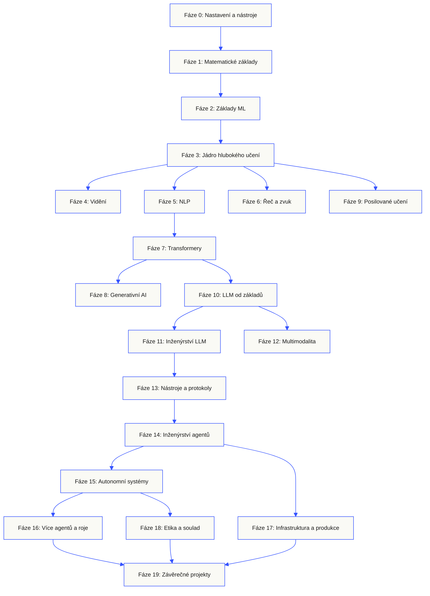
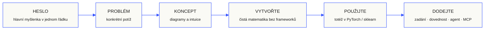

<p align="center" lang="cs"><sub>Český překlad úplného README. Rozhodující je <a href="../../README.md">anglický originál</a>.</sub></p>
<p align="center">
  
</p>

<p align="center">
  <a href="../../README.md">🇬🇧 English</a> ·
  <a href="../../i18n/zh/README.md">🇨🇳 简体中文</a> ·
  <a href="../../i18n/zh-TW/README.md">🇹🇼 繁體中文（台灣）</a> ·
  <a href="../../i18n/ja/README.md">🇯🇵 日本語</a> ·
  <a href="../../i18n/ko/README.md">🇰🇷 한국어</a> ·
  <a href="../../i18n/pt/README.md">🇵🇹 Português</a> ·
  <a href="../../i18n/pt-BR/README.md">🇧🇷 Português (Brasil)</a> ·
  <a href="../../i18n/es/README.md">🇪🇸 Español</a> ·
  <a href="../../i18n/de/README.md">🇩🇪 Deutsch</a> ·
  <a href="../../i18n/fr/README.md">🇫🇷 Français</a> ·
  <a href="../../i18n/it/README.md">🇮🇹 Italiano</a> ·
  <a href="../../i18n/nl/README.md">🇳🇱 Nederlands</a> ·
  <a href="../../i18n/pl/README.md">🇵🇱 Polski</a> ·
  <a href="../../i18n/cs/README.md">🇨🇿 Čeština</a> ·
  <a href="../../i18n/ro/README.md">🇷🇴 Română</a> ·
  <a href="../../i18n/hu/README.md">🇭🇺 Magyar</a> ·
  <a href="../../i18n/el/README.md">🇬🇷 Ελληνικά</a> ·
  <a href="../../i18n/sv/README.md">🇸🇪 Svenska</a> ·
  <a href="../../i18n/da/README.md">🇩🇰 Dansk</a> ·
  <a href="../../i18n/no/README.md">🇳🇴 Norsk</a> ·
  <a href="../../i18n/fi/README.md">🇫🇮 Suomi</a> ·
  <a href="../../i18n/ru/README.md">🇷🇺 Русский</a> ·
  <a href="../../i18n/uk/README.md">🇺🇦 Українська</a> ·
  <a href="../../i18n/tr/README.md">🇹🇷 Türkçe</a> ·
  <a href="../../i18n/he/README.md">🇮🇱 עברית</a> ·
  <a href="../../i18n/ar/README.md">🇸🇦 العربية</a> ·
  <a href="../../i18n/fa/README.md">🇮🇷 فارسی</a> ·
  <a href="../../i18n/hi/README.md">🇮🇳 हिन्दी</a> ·
  <a href="../../i18n/bn/README.md">🇧🇩 বাংলা</a> ·
  <a href="../../i18n/ur/README.md">🇵🇰 اردو</a> ·
  <a href="../../i18n/th/README.md">🇹🇭 ไทย</a> ·
  <a href="../../i18n/vi/README.md">🇻🇳 Tiếng Việt</a> ·
  <a href="../../i18n/id/README.md">🇮🇩 Bahasa Indonesia</a> ·
  <a href="../../i18n/tl/README.md">🇵🇭 Tagalog</a>
</p>

<p align="center">
  <a href="../../LICENSE"></a>
  <a href="../../ROADMAP.md"></a>
  <a href="#contents"></a>
  <a href="https://github.com/rohitg00/ai-engineering-from-scratch/stargazers"></a>
  <a href="https://aiengineeringfromscratch.com"></a>
  <p align="center">
 <a href="https://www.star-history.com/rohitg00/ai-engineering-from-scratch">
  <picture><source media="(prefers-color-scheme: dark)" srcset="https://api.star-history.com/badge?repo=rohitg00/ai-engineering-from-scratch&type=rank&theme=dark" /><source media="(prefers-color-scheme: light)" srcset="https://api.star-history.com/badge?repo=rohitg00/ai-engineering-from-scratch&type=rank" /></picture> <picture><source media="(prefers-color-scheme: dark)" srcset="https://api.star-history.com/badge?repo=rohitg00/ai-engineering-from-scratch&type=trending&theme=dark" /><source media="(prefers-color-scheme: light)" srcset="https://api.star-history.com/badge?repo=rohitg00/ai-engineering-from-scratch&type=trending" /></picture>
 </a>
</p>
</p>

### Sponzoři

<p align="center">
  <a href="https://serpapi.com/ai-engineering-from-scratch"><picture><source media="(min-width: 768px)" srcset="../../assets/sponsors/serpapi-banner-compact.png" width="48%"></picture></a>
  <a href="https://nitrostack.ai/referral/aiengineeringfromscratch"><picture><source media="(min-width: 768px)" srcset="../../assets/sponsors/nitrostack-banner-equal.png" width="48%"></picture></a>
</p>

<p align="center">
  <sub><span>Díky vaší podpoře zůstává každá lekce zdarma a s otevřeným kódem.</span> <a href="#supporters">Zobrazit všechny podporovatele</a> · <a href="../../SPONSORS.md">Staňte se sponzorem</a></sub>
</p>

```text
░░░▒▒▒░░░▒▒▒░░░▒▒▒░░░▒▒▒░░░▒▒▒░░░▒▒▒░░░▒▒▒░░░▒▒▒░░░▒▒▒░░░▒▒▒░░░▒▒▒░░░▒▒▒░░░▒▒▒░░░▒▒▒░░░▒▒▒
```

> **84% studentů už používá nástroje AI. Jen 18% se cítí připraveno používat je profesionálně.** Tento vzdělávací program pomáhá tento rozdíl překonat.
>
> 523 lekcí. 20 etap. ~342 hodin. Python, TypeScript, Rust, Julia. Každá lekce přináší opakovaně použitelný výstup: prompt, dovednost, agenta nebo server MCP. Zdarma, s otevřeným kódem, pod licencí MIT.
>
> AI se jen neučíte. Sami ji vytváříte. Od začátku do konce. Vlastníma rukama.

<!-- STATS:START (generated from site/stats.json by build.js — do not edit by hand) -->
<p align="center"><sub><b>114,584</b> čtenářů &nbsp;·&nbsp; <b>181,995</b> zobrazení stránek za posledních 30 dní &nbsp;·&nbsp; stav k 2026-08-29</sub></p>
<!-- STATS:END -->

## Začněte tady: vyberte si, co chcete vytvořit

Než začnete, nemusíte procházet všech 523 lekcí. Vyberte si jeden cíl. Každý odkaz otevře stejný vzdělávací program na GitHub nebo na webu a obě verze používají stejný kód lekcí.

| Váš cíl | Učení na GitHub | Učení na webu |
|---|---|---|
| Začínám a chci získat úplné základy | [Etapa 0: Nastavení a nástroje](../../phases/00-setup-and-tooling/) | [Vývojové prostředí](https://aiengineeringfromscratch.com/lesson?path=phases/00-setup-and-tooling/01-dev-environment) |
| Znám Python a chci základy matematiky a ML | [Etapa 1: Matematické základy](../../phases/01-math-foundations/) | [Intuitivní pochopení lineární algebry](https://aiengineeringfromscratch.com/lesson?path=phases/01-math-foundations/01-linear-algebra-intuition) |
| Chci vytvářet aplikace LLM pro produkční nasazení | [Etapa 11: Inženýrství LLM](../../phases/11-llm-engineering/) | [Návrh promptů](https://aiengineeringfromscratch.com/lesson?path=phases/11-llm-engineering/01-prompt-engineering) |
| Chci vytvářet agenty | [Etapa 14: Inženýrství agentů](../../phases/14-agent-engineering/) | [Smyčka agenta](https://aiengineeringfromscratch.com/lesson?path=phases/14-agent-engineering/01-the-agent-loop) |
| Chci používat programovací agenty ve skutečných repozitářích | [Studijní cesta vývoje s pomocí agentů](../../learning-paths/using-coding-agents.json) | [Vývoj s pomocí agentů](https://aiengineeringfromscratch.com/lesson?path=phases/14-agent-engineering/31-agent-workbench-why-models-fail&learningPath=using-coding-agents) |
| Chci před implementací určit, co má smysl vytvořit | [Studijní cesta produktového rozhodování a dodání](../../learning-paths/shaping-the-build.json) | [Produktové rozhodování a dodání](https://aiengineeringfromscratch.com/lesson?path=phases/14-agent-engineering/47-outcomes-before-output&learningPath=shaping-the-build) |
| Chci vyvíjet s Model Context Protocol (MCP) | [Trasa Model Context Protocol (MCP)](../../phases/13-tools-and-protocols/README.md#model-context-protocol-mcp-path) | [Studijní cesta Model Context Protocol (MCP)](https://aiengineeringfromscratch.com/lesson?path=phases/13-tools-and-protocols/06-mcp-fundamentals&learningPath=model-context-protocol) |
| Chci psát a vydávat Agent Skills | [Zaměřená trasa Agent Skills](../../phases/13-tools-and-protocols/README.md#agent-skills-fast-path) | [Studijní cesta Agent Skills](https://aiengineeringfromscratch.com/lesson?path=phases/13-tools-and-protocols/22-skills-and-agent-sdks&learningPath=agent-skills) |
| Chci se připravit na certifikaci Claude | [Úvod do přípravy na certifikaci](../../certifications/claude/GETTING_STARTED.md) | [Certifikační akademie](https://aiengineeringfromscratch.com/certifications.html) |
| Chci se připravit na MCP Associate (MCPA) | [Úvod do MCPA](../../certifications/mcpa/GETTING_STARTED.md) | [Studijní cesta MCPA](https://aiengineeringfromscratch.com/certification?id=mcpa-f) |

Nevíte, kde začít? Použijte [tutora `start-learning` pro určení úrovně](../../skills/start-learning/SKILL.md) nebo [průvodce vstupními znalostmi na webu](https://aiengineeringfromscratch.com/prereqs.html).

Porovnejte čtyři hlavní oblasti a šest kariérních cest v [AI Engineering Learning Paths](https://aiengineeringfromscratch.com/learning-paths.html).

### Každou lekci procházejte stejným způsobem

1. **Přečtěte si** `docs/en.md` a vysvětlete hlavní myšlenku vlastními slovy.
2. **Napište a sestavte** důležitý kód, místo abyste blok kódu brali jako pouhou dekoraci.
3. **Spusťte** příkaz lekce z kořenového adresáře repozitáře, tedy z adresáře obsahujícího `README.md` a `phases/`.
4. **Uchovejte důkazy**: příkaz, pracovní adresář, návratový kód, smysluplný výstup a artefakt, který jste změnili nebo vytvořili.
5. **Pokračujte**, až dokážete vysvětlit výstup a provést malou změnu bez hádání.

Cesty v příkazech na stránkách lekcí vycházejí z kořenového adresáře repozitáře, pokud lekce výslovně neříká, že máte změnit adresář. Pokud lekce nabízí více programovacích jazyků, spusťte implementaci v jazyce, který se učíte.

### Naklonujte repozitář a vytvořte první důkaz

```bash
git clone https://github.com/rohitg00/ai-engineering-from-scratch.git
cd ai-engineering-from-scratch
python3 phases/00-setup-and-tooling/01-dev-environment/code/verify.py --route beginner
python3 phases/01-math-foundations/01-linear-algebra-intuition/code/vectors.py
```

Úvodní kontrola odděluje požadavky potřebné nyní od nástrojů, které budete potřebovat později. Každá neúspěšná povinná kontrola uvede zjištěnou příčinu a příkaz k nápravě. Druhý příkaz spustí lekci bez závislostí a na závěr ukáže, že násobení matice vektorem je operace uvnitř vrstvy neuronové sítě. Uložte si tento výstup terminálu jako první důkaz.

## Přidejte AI tutora za 30 sekund

Máte-li už Node.js, `npx` a programovacího agenta podporujícího dovednosti, dvěma příkazy z něj uděláte tutora. K instalaci ani čtení tutora nepotřebujete klon repozitáře. Spustitelná cvičení zaměřených cest vyžadují `python3`. Cvičení Agent Skills navíc potřebují vybraného hostitele a zapisovatelný uživatelský nebo projektový rozsah dovedností.

Nejdříve ověřte místní požadavky:

```bash
node --version
npx --version
python3 --version
```

Potom nainstalujte dovednosti kurzu a na výzvu instalátoru vyberte hostitele a rozsah, který chcete používat:

```bash
npx skills add rohitg00/ai-engineering-from-scratch
```

Syntaxe vyvolání závisí na hostiteli, nikoli na přenositelném formátu `SKILL.md`:

| Hostitelská aplikace | Začít kurz | Začít Model Context Protocol (MCP) | Začít Agent Skills | Spustit kvíz fáze |
|---|---|---|---|---|
| Codex | `start-learning`, nebo vyberte z `/skills` | `learn-mcp`, nebo vyberte z `/skills` | `learn-agent-skills`, nebo vyberte z `/skills` | `check-understanding 13`, nebo vyberte z `/skills` |
| Claude Code | `/start-learning` | `/learn-mcp` | `/learn-agent-skills` | `/check-understanding 13` |
| Jiní kompatibilní hostitelé | `Use start-learning to begin the course.` | `Use learn-mcp to start the Model Context Protocol (MCP) path.` | `Use learn-agent-skills to start the Agent Skills Engineering path.` | `Use check-understanding to quiz me on Phase 13.` |

Rozřazovací kvíz s deseti otázkami přiřadí vaše znalosti k počáteční fázi a uloží osobní studijní plán do `LEARNING.md`. Dovednost `learn` potom vyučuje jednu lekci na sezení: koncept, matematiku, kód a kvíz. Lekce načítá přímo z tohoto repozitáře a `course-guide` odkáže na přesnou lekci k tématu, na kterém jste se zasekli. V Codexu vyvolávejte `learn` a `course-guide`; v Claude Code používejte `/learn` a `/course-guide`; u ostatních kompatibilních hostitelů požádejte o dovednost jejím názvem.

Chcete pouze Model Context Protocol (MCP)? Použijte vyvolání MCP pro svého hostitele. Vytvoří `MCP-LEARNING.md` a provede vás 17 lekcemi o bezstavových požadavcích, transportech, obousměrné práci, bezpečnosti, spolehlivosti, správě registru a důkazech shody. Přesné pořadí a kontrolní body jsou v [manifestu Model Context Protocol (MCP)](../../learning-paths/model-context-protocol.json).

Chcete pouze Agent Skills? Použijte vyvolání Agent Skills pro svého hostitele. Vytvoří `AGENT-SKILLS-LEARNING.md` a nabídne souvislou cestu pěti lekcí: kontrakt, objevování, vyvolání, hranice sandboxu a následně hodnocení vydání a přenositelnost mezi skutečnými hostiteli. Na webu začněte [cestou Agent Skills](https://aiengineeringfromscratch.com/lesson?path=phases/13-tools-and-protocols/22-skills-and-agent-sdks&learningPath=agent-skills).

Instalátor uvede podporované hostitele a zeptá se na místo instalace. Pokud ještě nemáte Node.js, `npx`, `python3`, podporovaného hostitele nebo zapisovatelný rozsah, použijte web nebo čtěte `docs/en.md` ručně. Tak poznáte koncepty, ale důkazy objevování, vyvolání, skriptů a odinstalace na skutečném hostiteli zůstanou nevyřízené, dokud nebude dostupná vstupní kontrola. Lekce najdete na [aiengineeringfromscratch.com](https://aiengineeringfromscratch.com).

## Jak to funguje

Většina materiálů o AI učí nesouvislé části. Tady vědecký článek, jinde příspěvek o dolaďování a ještě jinde působivá ukázka agenta. Tyto dílky do sebe málokdy zapadnou. Dodáte chatbota, ale nedokážete vysvětlit jeho křivku ztráty. Připojíte funkci k agentovi, ale neumíte říct, co dělá pozornost uvnitř modelu, který ji volá.

Tento program je páteří: 20 fází, 523 lekcí a čtyři jazyky: Python, TypeScript, Rust a Julia. Na jednom konci lineární algebra, na druhém autonomní roje. Každý algoritmus nejdříve sestavíte ze samotné matematiky: zpětné šíření, tokenizér, pozornost a smyčku agenta. Když se objeví PyTorch, už víte, co se děje uvnitř.

Každá lekce opakuje stejný cyklus: přečtěte problém, odvoďte matematiku, napište kód, spusťte test a uchovejte výsledek. Žádná pětiminutová videa, nasazování kopírováním ani vodění za ruku. Zdarma, s otevřeným kódem a pro váš vlastní notebook.

```text
░░░▒▒▒░░░▒▒▒░░░▒▒▒░░░▒▒▒░░░▒▒▒░░░▒▒▒░░░▒▒▒░░░▒▒▒░░░▒▒▒░░░▒▒▒░░░▒▒▒░░░▒▒▒░░░▒▒▒░░░▒▒▒░░░▒▒▒
```

## Struktura vzdělávacího programu

Dvacet fází na sebe navazuje. Matematika je základem, agenti a produkce střechou. Pokud nižší vrstvy znáte, přeskočte je. Nepřeskakujte však neznámé základy a potom se nedivte, že nahoře něco selhává.



```text
░░░▒▒▒░░░▒▒▒░░░▒▒▒░░░▒▒▒░░░▒▒▒░░░▒▒▒░░░▒▒▒░░░▒▒▒░░░▒▒▒░░░▒▒▒░░░▒▒▒░░░▒▒▒░░░▒▒▒░░░▒▒▒░░░▒▒▒
```

## Struktura lekce

Každá lekce má vlastní složku se stejnou strukturou v celém programu:

```text
phases/<NN>-<phase-name>/<NN>-<lesson-name>/
├── code/      spustitelné implementace (Python, TypeScript, Rust, Julia)
├── docs/
│   └── en.md  výklad lekce
└── outputs/   zadání, dovednosti, agenti nebo servery MCP vytvořené v této lekci
```

Každá lekce má šest částí. Základem je rozdělení *Vytvořte / Použijte*: nejdříve implementujete algoritmus od nuly, pak totéž spustíte pomocí produkční knihovny. Chápete fungování frameworku, protože jste jeho menší verzi napsali sami.



## Začínáme

Tři možnosti, jak začít. Vyberte si jednu.

**Možnost A: učte se v terminálu *(doporučeno)*.** Po výše uvedené kontrole Node.js, `npx`, hostitele a rozsahu nainstalujte výukové dovednosti do kompatibilního agenta a nechte se kurzem vést:

```bash
npx skills add rohitg00/ai-engineering-from-scratch
```

Používejte výše uvedenou tabulku vyvolání pro svého hostitele. Nainstalované dovednosti nabízejí `start-learning`, `learn`, `course-guide` a zaměřené cesty `learn-mcp` a `learn-agent-skills`. Text lekcí lze načítat z repozitáře bez klonování. Místní klon je nutný pro zkopírované příkazy kódu a spustitelná cvičení MCP nebo Agent Skills. Postup se ukládá do `LEARNING.md`, `MCP-LEARNING.md` nebo `AGENT-SKILLS-LEARNING.md` ve vašem projektu, takže lze každé sezení obnovit.

**Možnost B: čtěte.** Otevřete dokončenou lekci na [aiengineeringfromscratch.com](https://aiengineeringfromscratch.com) nebo rozbalte fázi v [obsahu](#contents). Bez nastavování a klonování.

**Možnost C: naklonujte a spusťte.**

```bash
git clone https://github.com/rohitg00/ai-engineering-from-scratch.git
cd ai-engineering-from-scratch
python3 phases/01-math-foundations/01-linear-algebra-intuition/code/vectors.py
```

Klonování také automaticky načte výukové dovednosti v Claude Code a poskytne tutorovi `learn` kód každé lekce ke skutečnému spuštění místo pouhého čtení.

### Vstupní znalosti

- Umíte psát kód v libovolném jazyce; Python pomůže.
- Chcete pochopit, jak AI **skutečně funguje**, nejen volat API.

### Připravte se na certifikace Claude

[Certifikační akademie Claude](../../certifications/claude/README.md) je bezplatný otevřený přípravný program pro všechny čtyři oficiální cesty: Associate Foundations, Developer Foundations, Architect Foundations a Architect Professional. Každá kombinuje lekce navázané na osnovu zkoušky, spustitelná cvičení, diagnostiku, závěrečný projekt a úplnou původní cvičnou zkoušku.

Používejte [úvodního průvodce GitHubem s AI](../../certifications/claude/GETTING_STARTED.md) v Claude Code, Codexu, ChatGPT, Cursoru nebo jiném agentovi. Spusťte `claude-certification` v Codexu, `/claude-certification` v Claude Code nebo požádejte jiného hostitele o `claude-certification`. Dovednost vybere cestu, vytvoří trvalý plán v `CLAUDE-CERTIFICATION.md`, učí krok za krokem, spouští skutečná cvičení a poskytuje zpětnou vazbu podle artefaktů. Stejný program je na [certifikačním webu](https://aiengineeringfromscratch.com/certifications.html).

Akademie je nezávislý studijní materiál založený na veřejných cílech zkoušek. Není spojena s Anthropic, nereprodukuje skutečné zkušební otázky a nemůže zaručit úspěšný výsledek.

### Připravte se na certifikaci MCP Associate (MCPA)

[Certifikační program MCPA](../../certifications/mcpa/README.md) je bezplatná otevřená příprava na zkoušku Model Context Protocol Associate od Agentic AI Foundation, poskytovanou přes Linux Foundation Training. Jeho 34 lekcí učí bezstavový protokol 2026-07-28 v pěti zkušebních oblastech: `_meta` pro každý požadavek a `server/discover` místo starého navazování spojení, vícerundové požadavky, odběry, cachování, rozšíření úloh a MCP Apps, autorizaci OAuth a úrovně registru a SDK. Každá lekce obsahuje spustitelné cvičení se standardní knihovnou, jehož přepis se kontroluje vůči aktuálnímu formátu komunikace. Cesta přidává diagnostiku, závěrečný projekt a tři úplné původní cvičné zkoušky s rozložením otázek podle zveřejněných vah osnovy.

Používejte [úvodního průvodce GitHubem s AI](../../certifications/mcpa/GETTING_STARTED.md) v Claude Code, Codexu, ChatGPT, Cursoru nebo jiném agentovi. Spusťte `mcpa-certification` v Codexu, `/mcpa-certification` v Claude Code nebo požádejte jiného hostitele o `mcpa-certification`. Vytvoří trvalou cestu v `MCPA-CERTIFICATION.md`, učí krok za krokem, spouští skutečná cvičení a hodnotí vzniklé artefakty. Stejný program je na [stránce cesty MCPA](https://aiengineeringfromscratch.com/certification?id=mcpa-f).

Tento program je nezávislý studijní materiál založený na veřejných cílech zkoušek. Není spojen s Agentic AI Foundation ani Linux Foundation, nereprodukuje skutečné zkušební otázky a nemůže zaručit úspěch.

### Výukové dovednosti

| Dovednost | Co dělá |
|---|---|
| [`start-learning`](../../skills/start-learning/SKILL.md) | Jednorázový úvod: důvod učení, rozřazovací kvíz a osobní plán uložený do `LEARNING.md`. |
| [`learn`](../../skills/learn/SKILL.md) | Cyklus tutora. Nejprve připomenutí znalostí, pak interaktivní výuka další lekce a její kvíz; ukládá postup a frontu opakování. |
| [`course-guide`](../../skills/course-guide/SKILL.md) | Směrování témat. „Kde se naučím pozornost?“ nebo „moje ztráta je NaN“ → přesné lekce s odkazy. |
| [`learn-mcp`](../../skills/learn-mcp/SKILL.md) | Tutor Model Context Protocol (MCP). Vytvoří `MCP-LEARNING.md`, sleduje manifest 17 lekcí a ukládá důkazy komunikace, bezpečnosti, spolehlivosti a shody. |
| [`learn-agent-skills`](../../skills/learn-agent-skills/SKILL.md) | Tutor Agent Skills. Vytvoří `AGENT-SKILLS-LEARNING.md`, vyučuje lekce 22, 24, 25, 26 a 27 a zaznamenává důkazy ze skutečného hostitele. |
| [`claude-certification`](../../skills/claude-certification/SKILL.md) | Certifikační tutor. Vybere CCAO-F, CCDV-F, CCAR-F nebo CCAR-P; učí lekce, spouští cvičení, hodnotí artefakty, zadává diagnostiku a cvičné zkoušky, ukládá postup. |
| [`mcpa-certification`](../../skills/mcpa-certification/SKILL.md) | Tutor MCPA. Sleduje cestu `mcpa-f` s 34 lekcemi o protokolu 2026-07-28; učí lekce, spouští cvičení a kontrolu komunikace, zadává diagnostiku a tři cvičné zkoušky, ukládá postup. |
| [`find-your-level`](../../skills/find-your-level/SKILL.md) | Rozřazovací kvíz s deseti otázkami. Přiřadí znalosti k počáteční fázi a vytvoří osobní cestu s hodinovými odhady. |
| [`check-understanding <phase>`](../../skills/check-understanding/SKILL.md) | Kvíz fáze s osmi otázkami, zpětnou vazbou a konkrétními lekcemi k opakování. Použijte podobu pro Codex, Claude Code nebo přirozený jazyk z tabulky vyvolání výše. |

```text
░░░▒▒▒░░░▒▒▒░░░▒▒▒░░░▒▒▒░░░▒▒▒░░░▒▒▒░░░▒▒▒░░░▒▒▒░░░▒▒▒░░░▒▒▒░░░▒▒▒░░░▒▒▒░░░▒▒▒░░░▒▒▒░░░▒▒▒
```

## Čtěte základní program jako knihu

Základní program s 20 fázemi pod `phases/` se sestavuje do šestidílné knižní řady. CI vytváří EPUB a PDF ze stejných zdrojů lekcí a přikládá je ke každému [vydání na GitHubu](https://github.com/rohitg00/ai-engineering-from-scratch/releases); odkazy níže vždy vedou k nejnovějšímu vydání. Čísla svazků označují pořadí v řadě, nikoli verze. Každý výtisk nese datum edice a starší edice zůstávají dostupné u svých vydání.

Certifikační programy se záměrně nepřevádějí do knih. Stav AI tutora, spustitelná cvičení, interaktivní obrázky, diagnostika a časované zkoušky zůstávají plně dostupné na GitHubu a webu.

| Svazek | Název | Fáze | Stáhnout |
|-----|-------|--------|----------|
| 1 | Základy · Matematika, nástroje a klasické strojové učení | 00-02 | [EPUB](https://github.com/rohitg00/ai-engineering-from-scratch/releases/latest/download/aiefs-vol1-foundations.epub) · [PDF](https://github.com/rohitg00/ai-engineering-from-scratch/releases/latest/download/aiefs-vol1-foundations.pdf) |
| 2 | Hluboké učení · Sítě, vidění a řeč | 03, 04, 06 | [EPUB](https://github.com/rohitg00/ai-engineering-from-scratch/releases/latest/download/aiefs-vol2-deep-learning.epub) · [PDF](https://github.com/rohitg00/ai-engineering-from-scratch/releases/latest/download/aiefs-vol2-deep-learning.pdf) |
| 3 | Jazyk · Základy NLP a transformer | 05, 07 | [EPUB](https://github.com/rohitg00/ai-engineering-from-scratch/releases/latest/download/aiefs-vol3-language.epub) · [PDF](https://github.com/rohitg00/ai-engineering-from-scratch/releases/latest/download/aiefs-vol3-language.pdf) |
| 4 | Velké jazykové modely · Generování, posilování, předtrénování a inženýrství | 08-11 | [EPUB](https://github.com/rohitg00/ai-engineering-from-scratch/releases/latest/download/aiefs-vol4-llms.epub) · [PDF](https://github.com/rohitg00/ai-engineering-from-scratch/releases/latest/download/aiefs-vol4-llms.pdf) |
| 5 | Agenti · Multimodalita, protokoly, autonomie a roje | 12-16 | [EPUB](https://github.com/rohitg00/ai-engineering-from-scratch/releases/latest/download/aiefs-vol5-agents.epub) · [PDF](https://github.com/rohitg00/ai-engineering-from-scratch/releases/latest/download/aiefs-vol5-agents.pdf) |
| 6 | Produkce · Infrastruktura, bezpečnost a závěrečné projekty | 17-19 | [EPUB](https://github.com/rohitg00/ai-engineering-from-scratch/releases/latest/download/aiefs-vol6-production.epub) · [PDF](https://github.com/rohitg00/ai-engineering-from-scratch/releases/latest/download/aiefs-vol6-production.pdf) |

Kniha je snímek, repozitář živá edice. Každá kapitola končí odkazy na animované obrázky, kvíz a spustitelný kód lekce. Místní sestavení spustíte pomocí `python3 scripts/build_book.py` (vyžaduje pandoc); podrobnosti pipeline jsou v [book/README.md](../../book/README.md).

```text
░░░▒▒▒░░░▒▒▒░░░▒▒▒░░░▒▒▒░░░▒▒▒░░░▒▒▒░░░▒▒▒░░░▒▒▒░░░▒▒▒░░░▒▒▒░░░▒▒▒░░░▒▒▒░░░▒▒▒░░░▒▒▒░░░▒▒▒
```

## Každá lekce přináší výstup

Jiné kurzy končí slovy *„gratuluji, naučili jste se X“*. Zde každá lekce končí **opakovaně použitelným nástrojem**, který můžete nainstalovat nebo zapojit do každodenní práce.

<table>
<tr>
<th align="left" width="25%"><br/><sub>FIG_001 · A</sub><br/><b>ZADÁNÍ</b></th>
<th align="left" width="25%"><br/><sub>FIG_001 · B</sub><br/><b>DOVEDNOSTI</b></th>
<th align="left" width="25%"><br/><sub>FIG_001 · C</sub><br/><b>AGENTI</b></th>
<th align="left" width="25%"><br/><sub>FIG_001 · D</sub><br/><b>SERVERY MCP</b></th>
</tr>
<tr>
<td valign="top">Vložte do libovolného AI asistenta a získejte odbornou pomoc s úzkou úlohou.</td>
<td valign="top">Přidejte do Claude, Cursoru, Codexu, OpenClaw, Hermes nebo agenta, který čte <code>SKILL.md</code>.</td>
<td valign="top">Nasaďte jako autonomní pracovníky: smyčku jste sami napsali ve fázi 14.</td>
<td valign="top">Připojte k libovolnému klientovi kompatibilnímu s MCP. Celé vytvořeno ve fázi 13.</td>
</tr>
</table>

> Vše nainstalujte pomocí `python3 scripts/install_skills.py <target>`. Skutečné nástroje, ne domácí úkoly. Na konci programu máte portfolio 523 artefaktů, kterým opravdu rozumíte, protože jste je sami vytvořili.

### FIG_002 · Vypracovaný příklad

Fáze 14, lekce 1: smyčka agenta. ~120 řádků čistého Pythonu, bez závislostí.

<table>
<tr>
<td valign="top" width="50%">

**`code/agent_loop.py`** &nbsp; <sub><i>vytvořte</i></sub>

```python
def run(query, tools):
    history = [user(query)]
    for step in range(MAX_STEPS):
        msg = llm(history)
        if msg.tool_calls:
            for call in msg.tool_calls:
                result = tools[call.name](**call.args)
                history.append(tool_result(call.id, result))
            continue
        return msg.content
    raise StepLimitExceeded
```

</td>
<td valign="top" width="50%">

**`outputs/skill-agent-loop.md`** &nbsp; <sub><i>dodejte</i></sub>

```markdown
---
name: agent-loop
description: ReAct-style loop for any tool list
phase: 14
lesson: 01
---

Implement a minimal agent loop that...
```

**`outputs/prompt-debug-agent.md`**

```markdown
You are an agent debugger. Given the trace
of an agent run, identify the step where
the agent went wrong and explain why...
```

</td>
</tr>
</table>

```text
░░░▒▒▒░░░▒▒▒░░░▒▒▒░░░▒▒▒░░░▒▒▒░░░▒▒▒░░░▒▒▒░░░▒▒▒░░░▒▒▒░░░▒▒▒░░░▒▒▒░░░▒▒▒░░░▒▒▒░░░▒▒▒░░░▒▒▒
```

<a id="contents"></a>

## Obsah

Dvacet fází. Kliknutím rozbalíte seznam lekcí dané fáze.

<a id="phase-0"></a>
### Fáze 0: Nastavení a nástroje `12 lekcí`
> Připravte své prostředí na vše, co následuje.

| # | Lekce | Druh | Jazyk |
|:---:|--------|:----:|------|
| 01 | [Vývojové prostředí](../../phases/00-setup-and-tooling/01-dev-environment/) | Vytvořit | Python |
| 02 | [Git a spolupráce](../../phases/00-setup-and-tooling/02-git-and-collaboration/) | Poznat | — |
| 03 | [Nastavení GPU a cloud](../../phases/00-setup-and-tooling/03-gpu-setup-and-cloud/) | Vytvořit | Python |
| 04 | [API a klíče](../../phases/00-setup-and-tooling/04-apis-and-keys/) | Vytvořit | Python |
| 05 | [Zápisníky Jupyter](../../phases/00-setup-and-tooling/05-jupyter-notebooks/) | Vytvořit | Python |
| 06 | [Prostředí Pythonu](../../phases/00-setup-and-tooling/06-python-environments/) | Vytvořit | Shell |
| 07 | [Docker pro AI](../../phases/00-setup-and-tooling/07-docker-for-ai/) | Vytvořit | Docker |
| 08 | [Nastavení editoru](../../phases/00-setup-and-tooling/08-editor-setup/) | Vytvořit | — |
| 09 | [Správa dat](../../phases/00-setup-and-tooling/09-data-management/) | Vytvořit | Python |
| 10 | [Terminál a shell](../../phases/00-setup-and-tooling/10-terminal-and-shell/) | Poznat | — |
| 11 | [Linux pro AI](../../phases/00-setup-and-tooling/11-linux-for-ai/) | Poznat | — |
| 12 | [Ladění a profilování](../../phases/00-setup-and-tooling/12-debugging-and-profiling/) | Vytvořit | Python |

<details id="phase-1">
<summary><b>Fáze 1: Matematické základy</b> &nbsp;<code>22 lekcí</code>&nbsp; <em>Intuice za každým algoritmem AI prostřednictvím kódu.</em></summary>
<br/>

| # | Lekce | Druh | Jazyk |
|:---:|--------|:----:|------|
| 01 | [Intuice lineární algebry](../../phases/01-math-foundations/01-linear-algebra-intuition/) | Poznat | Python, Julia |
| 02 | [Vektory, matice a operace](../../phases/01-math-foundations/02-vectors-matrices-operations/) | Vytvořit | Python, Julia |
| 03 | [Maticové transformace a vlastní čísla](../../phases/01-math-foundations/03-matrix-transformations/) | Vytvořit | Python, Julia |
| 04 | [Analýza pro ML: derivace a gradienty](../../phases/01-math-foundations/04-calculus-for-ml/) | Poznat | Python |
| 05 | [Řetězové pravidlo a automatické derivování](../../phases/01-math-foundations/05-chain-rule-and-autodiff/) | Vytvořit | Python |
| 06 | [Pravděpodobnost a rozdělení](../../phases/01-math-foundations/06-probability-and-distributions/) | Poznat | Python |
| 07 | [Bayesova věta a statistické myšlení](../../phases/01-math-foundations/07-bayes-theorem/) | Vytvořit | Python |
| 08 | [Optimalizace: rodina gradientního sestupu](../../phases/01-math-foundations/08-optimization/) | Vytvořit | Python |
| 09 | [Teorie informace: entropie a KL divergence](../../phases/01-math-foundations/09-information-theory/) | Poznat | Python |
| 10 | [Redukce dimenze: PCA, t-SNE, UMAP](../../phases/01-math-foundations/10-dimensionality-reduction/) | Vytvořit | Python |
| 11 | [Rozklad podle singulárních hodnot](../../phases/01-math-foundations/11-singular-value-decomposition/) | Vytvořit | Python, Julia |
| 12 | [Operace s tenzory](../../phases/01-math-foundations/12-tensor-operations/) | Vytvořit | Python |
| 13 | [Numerická stabilita](../../phases/01-math-foundations/13-numerical-stability/) | Vytvořit | Python |
| 14 | [Normy a vzdálenosti](../../phases/01-math-foundations/14-norms-and-distances/) | Vytvořit | Python |
| 15 | [Statistika pro ML](../../phases/01-math-foundations/15-statistics-for-ml/) | Vytvořit | Python |
| 16 | [Metody vzorkování](../../phases/01-math-foundations/16-sampling-methods/) | Vytvořit | Python |
| 17 | [Lineární soustavy](../../phases/01-math-foundations/17-linear-systems/) | Vytvořit | Python |
| 18 | [Konvexní optimalizace](../../phases/01-math-foundations/18-convex-optimization/) | Vytvořit | Python |
| 19 | [Komplexní čísla pro AI](../../phases/01-math-foundations/19-complex-numbers/) | Poznat | Python |
| 20 | [Fourierova transformace](../../phases/01-math-foundations/20-fourier-transform/) | Vytvořit | Python |
| 21 | [Teorie grafů pro ML](../../phases/01-math-foundations/21-graph-theory/) | Vytvořit | Python |
| 22 | [Stochastické procesy](../../phases/01-math-foundations/22-stochastic-processes/) | Poznat | Python |

</details>

<details id="phase-2">
<summary><b>Fáze 2: Základy ML</b> &nbsp;<code>18 lekcí</code>&nbsp; <em>Klasické ML: stále páteř většiny produkční AI.</em></summary>
<br/>

| # | Lekce | Druh | Jazyk |
|:---:|--------|:----:|------|
| 01 | [Co je strojové učení](../../phases/02-ml-fundamentals/01-what-is-machine-learning/) | Poznat | Python |
| 02 | [Lineární regrese od základů](../../phases/02-ml-fundamentals/02-linear-regression/) | Vytvořit | Python |
| 03 | [Logistická regrese a klasifikace](../../phases/02-ml-fundamentals/03-logistic-regression/) | Vytvořit | Python |
| 04 | [Rozhodovací stromy a náhodné lesy](../../phases/02-ml-fundamentals/04-decision-trees/) | Vytvořit | Python |
| 05 | [Metoda podpůrných vektorů](../../phases/02-ml-fundamentals/05-support-vector-machines/) | Vytvořit | Python |
| 06 | [KNN a metriky vzdálenosti](../../phases/02-ml-fundamentals/06-knn-and-distances/) | Vytvořit | Python |
| 07 | [Učení bez učitele: K-Means, DBSCAN](../../phases/02-ml-fundamentals/07-unsupervised-learning/) | Vytvořit | Python |
| 08 | [Návrh a výběr příznaků](../../phases/02-ml-fundamentals/08-feature-engineering/) | Vytvořit | Python |
| 09 | [Hodnocení modelů: metriky a křížová validace](../../phases/02-ml-fundamentals/09-model-evaluation/) | Vytvořit | Python |
| 10 | [Vychýlení, rozptyl a křivka učení](../../phases/02-ml-fundamentals/10-bias-variance/) | Poznat | Python |
| 11 | [Ansámblové metody: boosting, bagging, stacking](../../phases/02-ml-fundamentals/11-ensemble-methods/) | Vytvořit | Python |
| 12 | [Ladění hyperparametrů](../../phases/02-ml-fundamentals/12-hyperparameter-tuning/) | Vytvořit | Python |
| 13 | [ML pipeline a sledování experimentů](../../phases/02-ml-fundamentals/13-ml-pipelines/) | Vytvořit | Python |
| 14 | [Naivní Bayesův klasifikátor](../../phases/02-ml-fundamentals/14-naive-bayes/) | Vytvořit | Python |
| 15 | [Základy časových řad](../../phases/02-ml-fundamentals/15-time-series/) | Vytvořit | Python |
| 16 | [Detekce anomálií](../../phases/02-ml-fundamentals/16-anomaly-detection/) | Vytvořit | Python |
| 17 | [Práce s nevyváženými daty](../../phases/02-ml-fundamentals/17-imbalanced-data/) | Vytvořit | Python |
| 18 | [Výběr příznaků](../../phases/02-ml-fundamentals/18-feature-selection/) | Vytvořit | Python |

</details>

<details id="phase-3">
<summary><b>Fáze 3: Jádro hlubokého učení</b> &nbsp;<code>13 lekcí</code>&nbsp; <em>Neuronové sítě od základních principů. Bez frameworků, dokud si jeden nevytvoříte.</em></summary>
<br/>

| # | Lekce | Druh | Jazyk |
|:---:|--------|:----:|------|
| 01 | [Perceptron: kde to všechno začalo](../../phases/03-deep-learning-core/01-the-perceptron/) | Vytvořit | Python |
| 02 | [Vícevrstvé sítě a dopředný průchod](../../phases/03-deep-learning-core/02-multi-layer-networks/) | Vytvořit | Python |
| 03 | [Zpětné šíření chyby od základů](../../phases/03-deep-learning-core/03-backpropagation/) | Vytvořit | Python |
| 04 | [Aktivační funkce: ReLU, sigmoid, GELU a jejich smysl](../../phases/03-deep-learning-core/04-activation-functions/) | Vytvořit | Python |
| 05 | [Ztrátové funkce: MSE, křížová entropie a kontrastivní ztráta](../../phases/03-deep-learning-core/05-loss-functions/) | Vytvořit | Python |
| 06 | [Optimalizátory: SGD, momentum, Adam, AdamW](../../phases/03-deep-learning-core/06-optimizers/) | Vytvořit | Python |
| 07 | [Regularizace: dropout, útlum vah, BatchNorm](../../phases/03-deep-learning-core/07-regularization/) | Vytvořit | Python |
| 08 | [Inicializace vah a stabilita trénování](../../phases/03-deep-learning-core/08-weight-initialization/) | Vytvořit | Python |
| 09 | [Plány rychlosti učení a zahřívání](../../phases/03-deep-learning-core/09-learning-rate-schedules/) | Vytvořit | Python |
| 10 | [Vytvořte vlastní malý framework](../../phases/03-deep-learning-core/10-mini-framework/) | Vytvořit | Python |
| 11 | [Úvod do PyTorch](../../phases/03-deep-learning-core/11-intro-to-pytorch/) | Vytvořit | Python |
| 12 | [Úvod do JAX](../../phases/03-deep-learning-core/12-intro-to-jax/) | Vytvořit | Python |
| 13 | [Ladění neuronových sítí](../../phases/03-deep-learning-core/13-debugging-neural-networks/) | Vytvořit | Python |

</details>

<details id="phase-4">
<summary><b>Fáze 4: Počítačové vidění</b> &nbsp;<code>28 lekcí</code>&nbsp; <em>Od pixelů k porozumění: obraz, video, 3D, VLM a modely světa.</em></summary>
<br/>

| # | Lekce | Druh | Jazyk |
|:---:|--------|:----:|------|
| 01 | [Základy obrazu: pixely, kanály a barevné prostory](../../phases/04-computer-vision/01-image-fundamentals/) | Poznat | Python |
| 02 | [Konvoluce od základů](../../phases/04-computer-vision/02-convolutions-from-scratch/) | Vytvořit | Python |
| 03 | [CNN: od LeNet k ResNet](../../phases/04-computer-vision/03-cnns-lenet-to-resnet/) | Vytvořit | Python |
| 04 | [Klasifikace obrazů](../../phases/04-computer-vision/04-image-classification/) | Vytvořit | Python |
| 05 | [Přenos učení a dolaďování](../../phases/04-computer-vision/05-transfer-learning/) | Vytvořit | Python |
| 06 | [Detekce objektů: YOLO od základů](../../phases/04-computer-vision/06-object-detection-yolo/) | Vytvořit | Python |
| 07 | [Sémantická segmentace: U-Net](../../phases/04-computer-vision/07-semantic-segmentation-unet/) | Vytvořit | Python |
| 08 | [Instanční segmentace: Mask R-CNN](../../phases/04-computer-vision/08-instance-segmentation-mask-rcnn/) | Vytvořit | Python |
| 09 | [Generování obrazů: GAN](../../phases/04-computer-vision/09-image-generation-gans/) | Vytvořit | Python |
| 10 | [Generování obrazů: difuzní modely](../../phases/04-computer-vision/10-image-generation-diffusion/) | Vytvořit | Python |
| 11 | [Stable Diffusion: architektura a dolaďování](../../phases/04-computer-vision/11-stable-diffusion/) | Vytvořit | Python |
| 12 | [Porozumění videu: časové modelování](../../phases/04-computer-vision/12-video-understanding/) | Vytvořit | Python |
| 13 | [3D vidění: mračna bodů a NeRF](../../phases/04-computer-vision/13-3d-vision-nerf/) | Vytvořit | Python |
| 14 | [Vizuální transformery (ViT)](../../phases/04-computer-vision/14-vision-transformers/) | Vytvořit | Python |
| 15 | [Vidění v reálném čase: nasazení na okraji sítě](../../phases/04-computer-vision/15-real-time-edge/) | Vytvořit | Python |
| 16 | [Vytvořte úplnou pipeline počítačového vidění](../../phases/04-computer-vision/16-vision-pipeline-capstone/) | Vytvořit | Python |
| 17 | [Učení vidění s vlastním dohledem: SimCLR, DINO, MAE](../../phases/04-computer-vision/17-self-supervised-vision/) | Vytvořit | Python |
| 18 | [Vidění s otevřeným slovníkem: CLIP](../../phases/04-computer-vision/18-open-vocab-clip/) | Vytvořit | Python |
| 19 | [OCR a porozumění dokumentům](../../phases/04-computer-vision/19-ocr-document-understanding/) | Vytvořit | Python |
| 20 | [Vyhledávání obrazů a metrické učení](../../phases/04-computer-vision/20-image-retrieval-metric/) | Vytvořit | Python |
| 21 | [Detekce klíčových bodů a odhad pózy](../../phases/04-computer-vision/21-keypoint-pose/) | Vytvořit | Python |
| 22 | [3D Gaussian Splatting od základů](../../phases/04-computer-vision/22-3d-gaussian-splatting/) | Vytvořit | Python |
| 23 | [Difuzní transformery a napřímené toky](../../phases/04-computer-vision/23-diffusion-transformers-rectified-flow/) | Vytvořit | Python |
| 24 | [SAM 3 a segmentace s otevřeným slovníkem](../../phases/04-computer-vision/24-sam3-open-vocab-segmentation/) | Vytvořit | Python |
| 25 | [Vizuálně-jazykové modely (ViT-MLP-LLM)](../../phases/04-computer-vision/25-vision-language-models/) | Vytvořit | Python |
| 26 | [Odhad hloubky a geometrie z jednoho obrazu](../../phases/04-computer-vision/26-monocular-depth/) | Vytvořit | Python |
| 27 | [Sledování více objektů a paměť videa](../../phases/04-computer-vision/27-multi-object-tracking/) | Vytvořit | Python |
| 28 | [Modely světa a difuze videa](../../phases/04-computer-vision/28-world-models-video-diffusion/) | Vytvořit | Python |

</details>

<details id="phase-5">
<summary><b>Fáze 5: NLP od základů po pokročilá témata</b> &nbsp;<code>29 lekcí</code>&nbsp; <em>Jazyk je rozhraním k inteligenci.</em></summary>
<br/>

| # | Lekce | Druh | Jazyk |
|:---:|--------|:----:|------|
| 01 | [Zpracování textu: tokenizace, stemming a lemmatizace](../../phases/05-nlp-foundations-to-advanced/01-text-processing/) | Vytvořit | Python |
| 02 | [Model pytle slov, TF-IDF a reprezentace textu](../../phases/05-nlp-foundations-to-advanced/02-bag-of-words-tfidf/) | Vytvořit | Python |
| 03 | [Vektorové reprezentace slov: Word2Vec od základů](../../phases/05-nlp-foundations-to-advanced/03-word-embeddings-word2vec/) | Vytvořit | Python |
| 04 | [GloVe, FastText a reprezentace částí slov](../../phases/05-nlp-foundations-to-advanced/04-glove-fasttext-subword/) | Vytvořit | Python |
| 05 | [Analýza sentimentu](../../phases/05-nlp-foundations-to-advanced/05-sentiment-analysis/) | Vytvořit | Python |
| 06 | [Rozpoznávání pojmenovaných entit (NER)](../../phases/05-nlp-foundations-to-advanced/06-named-entity-recognition/) | Vytvořit | Python |
| 07 | [Značkování slovních druhů a syntaktická analýza](../../phases/05-nlp-foundations-to-advanced/07-pos-tagging-parsing/) | Vytvořit | Python |
| 08 | [Klasifikace textu: CNN a RNN](../../phases/05-nlp-foundations-to-advanced/08-cnns-rnns-for-text/) | Vytvořit | Python |
| 09 | [Modely sekvence na sekvenci](../../phases/05-nlp-foundations-to-advanced/09-sequence-to-sequence/) | Vytvořit | Python |
| 10 | [Mechanismus pozornosti: průlom](../../phases/05-nlp-foundations-to-advanced/10-attention-mechanism/) | Vytvořit | Python |
| 11 | [Strojový překlad](../../phases/05-nlp-foundations-to-advanced/11-machine-translation/) | Vytvořit | Python |
| 12 | [Shrnování textu](../../phases/05-nlp-foundations-to-advanced/12-text-summarization/) | Vytvořit | Python |
| 13 | [Systémy odpovídání na otázky](../../phases/05-nlp-foundations-to-advanced/13-question-answering/) | Vytvořit | Python |
| 14 | [Vyhledávání informací](../../phases/05-nlp-foundations-to-advanced/14-information-retrieval-search/) | Vytvořit | Python |
| 15 | [Modelování témat: LDA, BERTopic](../../phases/05-nlp-foundations-to-advanced/15-topic-modeling/) | Vytvořit | Python |
| 16 | [Generování textu](../../phases/05-nlp-foundations-to-advanced/16-text-generation-pre-transformer/) | Vytvořit | Python |
| 17 | [Chatboti: od pravidel k neuronovým sítím](../../phases/05-nlp-foundations-to-advanced/17-chatbots-rule-to-neural/) | Vytvořit | Python |
| 18 | [Vícejazyčné NLP](../../phases/05-nlp-foundations-to-advanced/18-multilingual-nlp/) | Vytvořit | Python |
| 19 | [Tokenizace částí slov: BPE, WordPiece, Unigram, SentencePiece](../../phases/05-nlp-foundations-to-advanced/19-subword-tokenization/) | Poznat | Python |
| 20 | [Strukturované výstupy a omezené dekódování](../../phases/05-nlp-foundations-to-advanced/20-structured-outputs-constrained-decoding/) | Vytvořit | Python |
| 21 | [NLI a textové vyplývání](../../phases/05-nlp-foundations-to-advanced/21-nli-textual-entailment/) | Poznat | Python |
| 22 | [Podrobně o modelech vektorových reprezentací](../../phases/05-nlp-foundations-to-advanced/22-embedding-models-deep-dive/) | Poznat | Python |
| 23 | [Strategie dělení textu pro RAG](../../phases/05-nlp-foundations-to-advanced/23-chunking-strategies-rag/) | Vytvořit | Python |
| 24 | [Řešení koreferencí](../../phases/05-nlp-foundations-to-advanced/24-coreference-resolution/) | Poznat | Python |
| 25 | [Propojování entit a odstraňování nejednoznačnosti](../../phases/05-nlp-foundations-to-advanced/25-entity-linking/) | Vytvořit | Python |
| 26 | [Extrakce vztahů a tvorba znalostních grafů](../../phases/05-nlp-foundations-to-advanced/26-relation-extraction-kg/) | Vytvořit | Python |
| 27 | [Hodnocení LLM: RAGAS, DeepEval, G-Eval](../../phases/05-nlp-foundations-to-advanced/27-llm-evaluation-frameworks/) | Vytvořit | Python |
| 28 | [Hodnocení dlouhého kontextu: NIAH, RULER, LongBench, MRCR](../../phases/05-nlp-foundations-to-advanced/28-long-context-evaluation/) | Poznat | Python |
| 29 | [Sledování stavu dialogu](../../phases/05-nlp-foundations-to-advanced/29-dialogue-state-tracking/) | Vytvořit | Python |

</details>

<details id="phase-6">
<summary><b>Fáze 6: Řeč a zvuk</b> &nbsp;<code>17 lekcí</code>&nbsp; <em>Slyšte, rozumějte, mluvte.</em></summary>
<br/>

| # | Lekce | Druh | Jazyk |
|:---:|--------|:----:|------|
| 01 | [Základy zvuku: průběhy, vzorkování a FFT](../../phases/06-speech-and-audio/01-audio-fundamentals) | Poznat | Python |
| 02 | [Spektrogramy, melová stupnice a zvukové příznaky](../../phases/06-speech-and-audio/02-spectrograms-mel-features) | Vytvořit | Python |
| 03 | [Klasifikace zvuku](../../phases/06-speech-and-audio/03-audio-classification) | Vytvořit | Python |
| 04 | [Rozpoznávání řeči (ASR)](../../phases/06-speech-and-audio/04-speech-recognition-asr) | Vytvořit | Python |
| 05 | [Whisper: architektura a dolaďování](../../phases/06-speech-and-audio/05-whisper-architecture-finetuning) | Vytvořit | Python |
| 06 | [Rozpoznávání a ověřování mluvčích](../../phases/06-speech-and-audio/06-speaker-recognition-verification) | Vytvořit | Python |
| 07 | [Převod textu na řeč (TTS)](../../phases/06-speech-and-audio/07-text-to-speech) | Vytvořit | Python |
| 08 | [Klonování a převod hlasu](../../phases/06-speech-and-audio/08-voice-cloning-conversion) | Vytvořit | Python |
| 09 | [Generování hudby](../../phases/06-speech-and-audio/09-music-generation) | Vytvořit | Python |
| 10 | [Zvukově-jazykové modely](../../phases/06-speech-and-audio/10-audio-language-models) | Vytvořit | Python |
| 11 | [Zpracování zvuku v reálném čase](../../phases/06-speech-and-audio/11-real-time-audio-processing) | Vytvořit | Python |
| 12 | [Vytvořte pipeline hlasového asistenta](../../phases/06-speech-and-audio/12-voice-assistant-pipeline) | Vytvořit | Python |
| 13 | [Neuronové zvukové kodeky: EnCodec, SNAC, Mimi, DAC](../../phases/06-speech-and-audio/13-neural-audio-codecs) | Poznat | Python |
| 14 | [Detekce řeči a střídání mluvčích](../../phases/06-speech-and-audio/14-voice-activity-detection-turn-taking) | Vytvořit | Python |
| 15 | [Streamovaný převod řeči na řeč: Moshi, Hibiki](../../phases/06-speech-and-audio/15-streaming-speech-to-speech-moshi-hibiki) | Poznat | Python |
| 16 | [Ochrana proti podvržení hlasu a zvukové vodoznaky](../../phases/06-speech-and-audio/16-anti-spoofing-audio-watermarking) | Vytvořit | Python |
| 17 | [Hodnocení zvuku: WER, MOS, MMAU a žebříčky](../../phases/06-speech-and-audio/17-audio-evaluation-metrics) | Poznat | Python |

</details>

<details id="phase-7">
<summary><b>Fáze 7: Podrobně o transformerech</b> &nbsp;<code>16 lekcí</code>&nbsp; <em>Architektura, která změnila všechno.</em></summary>
<br/>

| # | Lekce | Druh | Jazyk |
|:---:|--------|:----:|------|
| 01 | [Proč transformery: problémy RNN](../../phases/07-transformers-deep-dive/01-why-transformers/) | Poznat | Python |
| 02 | [Vlastní pozornost od základů](../../phases/07-transformers-deep-dive/02-self-attention-from-scratch/) | Vytvořit | Python |
| 03 | [Vícehlavá pozornost](../../phases/07-transformers-deep-dive/03-multi-head-attention/) | Vytvořit | Python |
| 04 | [Kódování pozice: sinusové, RoPE, ALiBi](../../phases/07-transformers-deep-dive/04-positional-encoding/) | Vytvořit | Python |
| 05 | [Úplný transformer: enkodér a dekodér](../../phases/07-transformers-deep-dive/05-full-transformer/) | Vytvořit | Python |
| 06 | [BERT: maskované jazykové modelování](../../phases/07-transformers-deep-dive/06-bert-masked-language-modeling/) | Vytvořit | Python |
| 07 | [GPT: kauzální jazykové modelování](../../phases/07-transformers-deep-dive/07-gpt-causal-language-modeling/) | Vytvořit | Python |
| 08 | [T5 a BART: modely enkodér-dekodér](../../phases/07-transformers-deep-dive/08-t5-bart-encoder-decoder/) | Poznat | Python |
| 09 | [Vizuální transformery (ViT)](../../phases/07-transformers-deep-dive/09-vision-transformers/) | Vytvořit | Python |
| 10 | [Zvukové transformery: architektura Whisper](../../phases/07-transformers-deep-dive/10-audio-transformers-whisper/) | Poznat | Python |
| 11 | [Směs expertů (MoE)](../../phases/07-transformers-deep-dive/11-mixture-of-experts/) | Vytvořit | Python |
| 12 | [KV cache, Flash Attention a optimalizace inference](../../phases/07-transformers-deep-dive/12-kv-cache-flash-attention/) | Vytvořit | Python |
| 13 | [Škálovací zákony](../../phases/07-transformers-deep-dive/13-scaling-laws/) | Poznat | Python |
| 14 | [Vytvořte transformer od základů](../../phases/07-transformers-deep-dive/14-build-a-transformer-capstone/) | Vytvořit | Python |
| 15 | [Varianty pozornosti: posuvné okno, řídká a diferenciální pozornost](../../phases/07-transformers-deep-dive/15-attention-variants/) | Vytvořit | Python |
| 16 | [Spekulativní dekódování: návrh, ověření a opakování](../../phases/07-transformers-deep-dive/16-speculative-decoding/) | Vytvořit | Python |

</details>

<details id="phase-8">
<summary><b>Fáze 8: Generativní AI</b> &nbsp;<code>15 lekcí</code>&nbsp; <em>Vytvářejte obrazy, video, zvuk, 3D a další.</em></summary>
<br/>

| # | Lekce | Druh | Jazyk |
|:---:|--------|:----:|------|
| 01 | [Generativní modely: taxonomie a historie](../../phases/08-generative-ai/01-generative-models-taxonomy-history/) | Poznat | Python |
| 02 | [Autoenkodéry a VAE](../../phases/08-generative-ai/02-autoencoders-vae/) | Vytvořit | Python |
| 03 | [GAN: generátor proti diskriminátoru](../../phases/08-generative-ai/03-gans-generator-discriminator/) | Vytvořit | Python |
| 04 | [Podmíněné GAN a Pix2Pix](../../phases/08-generative-ai/04-conditional-gans-pix2pix/) | Vytvořit | Python |
| 05 | [StyleGAN](../../phases/08-generative-ai/05-stylegan/) | Vytvořit | Python |
| 06 | [Difuzní modely: DDPM od základů](../../phases/08-generative-ai/06-diffusion-ddpm-from-scratch/) | Vytvořit | Python |
| 07 | [Latentní difuze a Stable Diffusion](../../phases/08-generative-ai/07-latent-diffusion-stable-diffusion/) | Vytvořit | Python |
| 08 | [ControlNet, LoRA a podmiňování](../../phases/08-generative-ai/08-controlnet-lora-conditioning/) | Vytvořit | Python |
| 09 | [Doplňování, rozšiřování a úpravy obrazů](../../phases/08-generative-ai/09-inpainting-outpainting-editing/) | Vytvořit | Python |
| 10 | [Generování videa](../../phases/08-generative-ai/10-video-generation/) | Vytvořit | Python |
| 11 | [Generování zvuku](../../phases/08-generative-ai/11-audio-generation/) | Vytvořit | Python |
| 12 | [Generování 3D](../../phases/08-generative-ai/12-3d-generation/) | Vytvořit | Python |
| 13 | [Párování toků a napřímené toky](../../phases/08-generative-ai/13-flow-matching-rectified-flows/) | Vytvořit | Python |
| 14 | [Hodnocení: FID a skóre CLIP](../../phases/08-generative-ai/14-evaluation-fid-clip-score/) | Vytvořit | Python |
| 19 | [Vizuální autoregresivní modelování (VAR): předpověď dalšího měřítka](../../phases/08-generative-ai/19-visual-autoregressive-var/) | Vytvořit | Python |

</details>

<details id="phase-9">
<summary><b>Fáze 9: Posilované učení</b> &nbsp;<code>12 lekcí</code>&nbsp; <em>Základ RLHF a AI hrající hry.</em></summary>
<br/>

| # | Lekce | Druh | Jazyk |
|:---:|--------|:----:|------|
| 01 | [MDP, stavy, akce a odměny](../../phases/09-reinforcement-learning/01-mdps-states-actions-rewards/) | Poznat | Python |
| 02 | [Dynamické programování](../../phases/09-reinforcement-learning/02-dynamic-programming/) | Vytvořit | Python |
| 03 | [Metody Monte Carlo](../../phases/09-reinforcement-learning/03-monte-carlo-methods/) | Vytvořit | Python |
| 04 | [Q-Learning, SARSA](../../phases/09-reinforcement-learning/04-q-learning-sarsa/) | Vytvořit | Python |
| 05 | [Hluboké Q-sítě (DQN)](../../phases/09-reinforcement-learning/05-dqn/) | Vytvořit | Python |
| 06 | [Gradienty politiky: REINFORCE](../../phases/09-reinforcement-learning/06-policy-gradients-reinforce/) | Vytvořit | Python |
| 07 | [Aktor-kritik: A2C, A3C](../../phases/09-reinforcement-learning/07-actor-critic-a2c-a3c/) | Vytvořit | Python |
| 08 | [PPO](../../phases/09-reinforcement-learning/08-ppo/) | Vytvořit | Python |
| 09 | [Modelování odměn a RLHF](../../phases/09-reinforcement-learning/09-reward-modeling-rlhf/) | Vytvořit | Python |
| 10 | [Posilované učení s více agenty](../../phases/09-reinforcement-learning/10-multi-agent-rl/) | Vytvořit | Python |
| 11 | [Přenos ze simulace do reality](../../phases/09-reinforcement-learning/11-sim-to-real-transfer/) | Vytvořit | Python |
| 12 | [Posilované učení pro hry](../../phases/09-reinforcement-learning/12-rl-for-games/) | Vytvořit | Python |

</details>

<details id="phase-10">
<summary><b>Fáze 10: LLM od základů</b> &nbsp;<code>24 lekcí</code>&nbsp; <em>Vytvářejte, trénujte a chápejte velké jazykové modely.</em></summary>
<br/>

| # | Lekce | Druh | Jazyk |
|:---:|--------|:----:|------|
| 01 | [Tokenizéry: BPE, WordPiece, SentencePiece](../../phases/10-llms-from-scratch/01-tokenizers/) | Vytvořit | Python, Rust |
| 02 | [Tvorba tokenizéru od základů](../../phases/10-llms-from-scratch/02-building-a-tokenizer/) | Vytvořit | Python |
| 03 | [Datové pipeline pro předtrénování](../../phases/10-llms-from-scratch/03-data-pipelines/) | Vytvořit | Python |
| 04 | [Předtrénování malého GPT (124M)](../../phases/10-llms-from-scratch/04-pre-training-mini-gpt/) | Vytvořit | Python |
| 05 | [Distribuované trénování, FSDP a DeepSpeed](../../phases/10-llms-from-scratch/05-scaling-distributed/) | Vytvořit | Python |
| 06 | [Ladění na instrukcích: SFT](../../phases/10-llms-from-scratch/06-instruction-tuning-sft/) | Vytvořit | Python |
| 07 | [RLHF: model odměny a PPO](../../phases/10-llms-from-scratch/07-rlhf/) | Vytvořit | Python |
| 08 | [DPO: přímá optimalizace preferencí](../../phases/10-llms-from-scratch/08-dpo/) | Vytvořit | Python |
| 09 | [Konstituční AI a sebezdokonalování](../../phases/10-llms-from-scratch/09-constitutional-ai-self-improvement/) | Vytvořit | Python |
| 10 | [Hodnocení: benchmarky a testy](../../phases/10-llms-from-scratch/10-evaluation/) | Vytvořit | Python |
| 11 | [Kvantizace: INT8, GPTQ, AWQ, GGUF](../../phases/10-llms-from-scratch/11-quantization/) | Vytvořit | Python |
| 12 | [Optimalizace inference](../../phases/10-llms-from-scratch/12-inference-optimization/) | Vytvořit | Python |
| 13 | [Tvorba úplné LLM pipeline](../../phases/10-llms-from-scratch/13-building-complete-llm-pipeline/) | Vytvořit | Python |
| 14 | [Otevřené modely: průvodci architekturou](../../phases/10-llms-from-scratch/14-open-models-architecture-walkthroughs/) | Poznat | Python |
| 15 | [Spekulativní dekódování a EAGLE-3](../../phases/10-llms-from-scratch/15-speculative-decoding-eagle3/) | Vytvořit | Python |
| 16 | [Diferenciální pozornost (V2)](../../phases/10-llms-from-scratch/16-differential-attention-v2/) | Vytvořit | Python |
| 17 | [Nativní řídká pozornost (DeepSeek NSA)](../../phases/10-llms-from-scratch/17-native-sparse-attention/) | Vytvořit | Python |
| 18 | [Předpovídání více tokenů (MTP)](../../phases/10-llms-from-scratch/18-multi-token-prediction/) | Vytvořit | Python |
| 19 | [Paralelismus DualPipe](../../phases/10-llms-from-scratch/19-dualpipe-parallelism/) | Poznat | Python |
| 20 | [Průvodce architekturou DeepSeek-V3](../../phases/10-llms-from-scratch/20-deepseek-v3-walkthrough/) | Poznat | Python |
| 21 | [Jamba: hybridní SSM-transformer](../../phases/10-llms-from-scratch/21-jamba-hybrid-ssm-transformer/) | Poznat | Python |
| 22 | [Asynchronní inference a Hogwild!](../../phases/10-llms-from-scratch/22-async-hogwild-inference/) | Vytvořit | Python |
| 25 | [Spekulativní dekódování a EAGLE](../../phases/10-llms-from-scratch/25-speculative-decoding/) | Vytvořit | Python |
| 34 | [Ukládání gradientových checkpointů a přepočítávání aktivací](../../phases/10-llms-from-scratch/34-gradient-checkpointing/) | Vytvořit | Python |

</details>

<details id="phase-11">
<summary><b>Fáze 11: Inženýrství LLM</b> &nbsp;<code>17 lekcí</code>&nbsp; <em>Zapojte LLM do produkce.</em></summary>
<br/>

| # | Lekce | Druh | Jazyk |
|:---:|--------|:----:|------|
| 01 | [Návrh promptů: techniky a vzory](../../phases/11-llm-engineering/01-prompt-engineering/) | Vytvořit | Python |
| 02 | [Few-Shot, CoT, Tree-of-Thought](../../phases/11-llm-engineering/02-few-shot-cot/) | Vytvořit | Python |
| 03 | [Strukturované výstupy](../../phases/11-llm-engineering/03-structured-outputs/) | Vytvořit | Python |
| 04 | [Embeddingy a vektorové reprezentace](../../phases/11-llm-engineering/04-embeddings/) | Vytvořit | Python |
| 05 | [Návrh kontextu](../../phases/11-llm-engineering/05-context-engineering/) | Vytvořit | Python |
| 06 | [RAG: generování rozšířené vyhledáváním](../../phases/11-llm-engineering/06-rag/) | Vytvořit | Python |
| 07 | [Pokročilé RAG: dělení a přerovnávání](../../phases/11-llm-engineering/07-advanced-rag/) | Vytvořit | Python |
| 08 | [Dolaďování pomocí LoRA a QLoRA](../../phases/11-llm-engineering/08-fine-tuning-lora/) | Vytvořit | Python |
| 09 | [Volání funkcí a používání nástrojů](../../phases/11-llm-engineering/09-function-calling/) | Vytvořit | Python |
| 10 | [Hodnocení a testování](../../phases/11-llm-engineering/10-evaluation/) | Vytvořit | Python |
| 11 | [Cachování, omezení frekvence a náklady](../../phases/11-llm-engineering/11-caching-cost/) | Vytvořit | Python |
| 12 | [Ochranné mantinely a bezpečnost](../../phases/11-llm-engineering/12-guardrails/) | Vytvořit | Python |
| 13 | [Tvorba produkční aplikace LLM](../../phases/11-llm-engineering/13-production-app/) | Vytvořit | Python |
| 14 | [Model Context Protocol (MCP)](../../phases/11-llm-engineering/14-model-context-protocol/) | Vytvořit | Python |
| 15 | [Cachování promptů a kontextu](../../phases/11-llm-engineering/15-prompt-caching/) | Vytvořit | Python |
| 16 | [Stavové automaty agentů: grafy, uzly a checkpointy](../../phases/11-llm-engineering/16-langgraph-state-machines/) | Vytvořit | Python |
| 17 | [Kompromisy při volbě agentových frameworků](../../phases/11-llm-engineering/17-agent-framework-tradeoffs/) | Poznat | Python |

</details>

<details id="phase-12">
<summary><b>Fáze 12: Multimodální AI</b> &nbsp;<code>25 lekcí</code>&nbsp; <em>Dívejte se, poslouchejte, čtěte a uvažujte napříč modalitami: od výřezů ViT po agenty ovládající počítače.</em></summary>
<br/>

| # | Lekce | Druh | Jazyk |
|:---:|--------|:----:|------|
| 01 | [Vizuální transformery a základní token obrazového výřezu](../../phases/12-multimodal-ai/01-vision-transformer-patch-tokens/) | Poznat | Python |
| 02 | [CLIP a kontrastivní vizuálně-jazykové předtrénování](../../phases/12-multimodal-ai/02-clip-contrastive-pretraining/) | Vytvořit | Python |
| 03 | [BLIP-2 Q-Former jako most mezi modalitami](../../phases/12-multimodal-ai/03-blip2-qformer-bridge/) | Vytvořit | Python |
| 04 | [Flamingo a hradlovaná křížová pozornost](../../phases/12-multimodal-ai/04-flamingo-gated-cross-attention/) | Poznat | Python |
| 05 | [LLaVA a ladění vizuálních instrukcí](../../phases/12-multimodal-ai/05-llava-visual-instruction-tuning/) | Vytvořit | Python |
| 06 | [Vidění v libovolném rozlišení: Patch-n'-Pack a NaFlex](../../phases/12-multimodal-ai/06-any-resolution-patch-n-pack/) | Vytvořit | Python |
| 07 | [Recepty VLM s otevřenými vahami: na čem opravdu záleží](../../phases/12-multimodal-ai/07-open-weight-vlm-recipes/) | Poznat | Python |
| 08 | [LLaVA-OneVision: jeden obraz, více obrazů a video](../../phases/12-multimodal-ai/08-llava-onevision-single-multi-video/) | Vytvořit | Python |
| 09 | [Rodina Qwen-VL a video s dynamickým FPS](../../phases/12-multimodal-ai/09-qwen-vl-family-dynamic-fps/) | Poznat | Python |
| 10 | [InternVL3: nativní multimodální předtrénování](../../phases/12-multimodal-ai/10-internvl3-native-multimodal/) | Poznat | Python |
| 11 | [Chameleon: časná fúze pouze s tokeny](../../phases/12-multimodal-ai/11-chameleon-early-fusion-tokens/) | Vytvořit | Python |
| 12 | [Emu3: předpověď dalšího tokenu pro generování](../../phases/12-multimodal-ai/12-emu3-next-token-for-generation/) | Poznat | Python |
| 13 | [Transfusion: autoregrese a difuze](../../phases/12-multimodal-ai/13-transfusion-autoregressive-diffusion/) | Vytvořit | Python |
| 14 | [Show-o: sjednocená diskrétní difuze](../../phases/12-multimodal-ai/14-show-o-discrete-diffusion-unified/) | Poznat | Python |
| 15 | [Janus-Pro: oddělené enkodéry](../../phases/12-multimodal-ai/15-janus-pro-decoupled-encoders/) | Vytvořit | Python |
| 16 | [MIO: streamování mezi libovolnými modalitami](../../phases/12-multimodal-ai/16-mio-any-to-any-streaming/) | Poznat | Python |
| 17 | [Časové ukotvení videa a jazyka](../../phases/12-multimodal-ai/17-video-language-temporal-grounding/) | Vytvořit | Python |
| 18 | [Dlouhá videa v kontextu milionu tokenů](../../phases/12-multimodal-ai/18-long-video-million-token/) | Vytvořit | Python |
| 19 | [Zvukově-jazykové modely: od Whisper k AF3](../../phases/12-multimodal-ai/19-audio-language-whisper-to-af3/) | Vytvořit | Python |
| 20 | [Omni modely: streamování Thinker-Talker](../../phases/12-multimodal-ai/20-omni-models-thinker-talker/) | Vytvořit | Python |
| 21 | [Ztělesněné VLA: RT-2, OpenVLA, π0, GR00T](../../phases/12-multimodal-ai/21-embodied-vlas-openvla-pi0-groot/) | Poznat | Python |
| 22 | [Porozumění dokumentům a diagramům](../../phases/12-multimodal-ai/22-document-diagram-understanding/) | Vytvořit | Python |
| 23 | [ColPali: vizuální dokumentové RAG](../../phases/12-multimodal-ai/23-colpali-vision-native-rag/) | Vytvořit | Python |
| 24 | [Multimodální RAG a vyhledávání mezi modalitami](../../phases/12-multimodal-ai/24-multimodal-rag-cross-modal/) | Vytvořit | Python |
| 25 | [Multimodální agenti a ovládání počítače (závěrečný projekt)](../../phases/12-multimodal-ai/25-multimodal-agents-computer-use/) | Vytvořit | Python |

</details>

<details id="phase-13">
<summary><b>Fáze 13: Nástroje a protokoly</b> &nbsp;<code>31 lekcí</code>&nbsp; <em>Rozhraní mezi AI a skutečným světem.</em></summary>
<br/>

| # | Lekce | Druh | Jazyk |
|:---:|--------|:----:|------|
| 01 | [Rozhraní nástrojů](../../phases/13-tools-and-protocols/01-the-tool-interface/) | Poznat | Python |
| 02 | [Podrobně o volání funkcí](../../phases/13-tools-and-protocols/02-function-calling-deep-dive/) | Vytvořit | Python |
| 03 | [Paralelní a streamovaná volání nástrojů](../../phases/13-tools-and-protocols/03-parallel-and-streaming-tool-calls/) | Vytvořit | Python |
| 04 | [Strukturovaný výstup](../../phases/13-tools-and-protocols/04-structured-output/) | Vytvořit | Python |
| 05 | [Návrh schémat nástrojů](../../phases/13-tools-and-protocols/05-tool-schema-design/) | Poznat | Python |
| 06 | [Základy MCP: bezstavové požadavky a JSON-RPC](../../phases/13-tools-and-protocols/06-mcp-fundamentals/) | Poznat | Python |
| 07 | [Tvorba serveru MCP: bezstavový Python a TypeScript](../../phases/13-tools-and-protocols/07-building-an-mcp-server/) | Vytvořit | Python, TypeScript |
| 08 | [Tvorba klienta MCP: objevování, směrování a podpora dvou generací](../../phases/13-tools-and-protocols/08-building-an-mcp-client/) | Vytvořit | Python |
| 09 | [Transporty MCP: stdio a bezstavové Streamable HTTP](../../phases/13-tools-and-protocols/09-mcp-transports/) | Poznat | Python |
| 10 | [Zdroje a prompty MCP: adresovatelný kontext pro bezstavové servery](../../phases/13-tools-and-protocols/10-mcp-resources-and-prompts/) | Vytvořit | Python |
| 11 | [Vstup modelu MCP: migrace samplingu a bezstavové MRTR](../../phases/13-tools-and-protocols/11-mcp-sampling/) | Vytvořit | Python |
| 12 | [Výslovný rozsah a bezstavové získávání vstupů](../../phases/13-tools-and-protocols/12-mcp-roots-and-elicitation/) | Vytvořit | Python |
| 13 | [Rozšíření úloh MCP: trvalá práce nad bezstavovým jádrem](../../phases/13-tools-and-protocols/13-mcp-async-tasks/) | Vytvořit | Python |
| 14 | [MCP Apps v bezstavovém protokolu](../../phases/13-tools-and-protocols/14-mcp-apps/) | Vytvořit | Python |
| 15 | [Bezpečnost MCP: podvržená metadata, směrování a stav MRTR](../../phases/13-tools-and-protocols/15-mcp-security-tool-poisoning/) | Poznat | Python |
| 16 | [Autorizace MCP: CIMD, vazba na vydavatele, PKCE a zesílení ověření](../../phases/13-tools-and-protocols/16-mcp-security-oauth-2-1/) | Vytvořit | Python |
| 17 | [Bezstavové brány MCP a přijímání do registru](../../phases/13-tools-and-protocols/17-mcp-gateways-and-registries/) | Poznat | Python |
| 18 | [Autorizace MCP v produkci: registrace a tokeny vázané na vydavatele](../../phases/13-tools-and-protocols/18-mcp-auth-production/) | Vytvořit | Python |
| 19 | [Protokol A2A](../../phases/13-tools-and-protocols/19-a2a-protocol/) | Vytvořit | Python |
| 20 | [OpenTelemetry GenAI](../../phases/13-tools-and-protocols/20-opentelemetry-genai/) | Vytvořit | Python |
| 21 | [Směrovací vrstva LLM](../../phases/13-tools-and-protocols/21-llm-routing-layer/) | Poznat | Python |
| 22 | [Agent Skills: přenositelný kontrakt a hranice běhového prostředí](../../phases/13-tools-and-protocols/22-skills-and-agent-sdks/) | Vytvořit | Python |
| 23 | [Závěrečný projekt: bezstavový ekosystém nástrojů](../../phases/13-tools-and-protocols/23-capstone-tool-ecosystem/) | Vytvořit | Python |
| 24 | [Objevování dovedností a postupné odhalování informací](../../phases/13-tools-and-protocols/24-skill-discovery-and-progressive-disclosure/) | Vytvořit | Python |
| 25 | [Vyvolávání a směrování dovedností](../../phases/13-tools-and-protocols/25-skill-invocation-and-routing/) | Vytvořit | Python |
| 26 | [Oprávnění dovedností, sandboxy a důvěra](../../phases/13-tools-and-protocols/26-skill-permissions-sandboxes-and-trust/) | Vytvořit | Python |
| 27 | [Hodnocení, balení a přenositelnost dovedností](../../phases/13-tools-and-protocols/27-skill-evals-packaging-and-portability/) | Vytvořit | Python |
| 28 | [Kontrakty a obsah nástrojů MCP](../../phases/13-tools-and-protocols/28-mcp-tool-contracts-and-content/) | Vytvořit | Python |
| 29 | [Spolehlivost MCP, rušení a řízení toku](../../phases/13-tools-and-protocols/29-mcp-reliability-cancellation-and-flow-control/) | Vytvořit | Python |
| 30 | [Dodavatelský řetězec registru MCP: přijímání, odchylky a návrat změn](../../phases/13-tools-and-protocols/30-mcp-registry-supply-chain-and-drift/) | Vytvořit | Python |
| 31 | [Soulad MCP: verzování, důkazy a provoz](../../phases/13-tools-and-protocols/31-mcp-conformance-versioning-and-operations/) | Vytvořit | Python |

Lekce 06-18 a 28-31 tvoří zaměřenou [cestu Model Context Protocol (MCP)](../../learning-paths/model-context-protocol.json). Pořadí v manifestu je 06, 07, 08, 09, 10, 11, 12, 13, 14, 15, 16, 18, 17, 28, 29, 30, 31. Začněte výše uvedeným vyvoláním `learn-mcp` pro svého hostitele. Lekce 23 je jediný volitelný závěrečný projekt a vyžaduje také lekce 19 a 20.

Lekce 22 a 24-27 tvoří zaměřenou [cestu Agent Skills](../../learning-paths/agent-skills.json), od kontraktu balíčku po vydávací brány na skutečném hostiteli. Začněte výše uvedeným vyvoláním `learn-agent-skills` pro svého hostitele; nepokračujte podle číselné navigace z lekce 22 na 23.

</details>

<details id="phase-14">
<summary><b>Fáze 14: Inženýrství agentů</b> &nbsp;<code>54 lekcí</code>&nbsp; <em>Vytvářejte agenty od základů, spolehlivě používejte programovací agenty a vymezte práci před implementací.</em></summary>
<br/>

| # | Lekce | Druh | Jazyk |
|:---:|--------|:----:|------|
| 01 | [Smyčka agenta](../../phases/14-agent-engineering/01-the-agent-loop/) | Vytvořit | Python |
| 02 | [ReWOO a plánování s vykonáním](../../phases/14-agent-engineering/02-rewoo-plan-and-execute/) | Vytvořit | Python |
| 03 | [Reflexion a slovní posilované učení](../../phases/14-agent-engineering/03-reflexion-verbal-rl/) | Vytvořit | Python |
| 04 | [Stromy myšlenek a LATS](../../phases/14-agent-engineering/04-tree-of-thoughts-lats/) | Vytvořit | Python |
| 05 | [Self-Refine a CRITIC](../../phases/14-agent-engineering/05-self-refine-and-critic/) | Vytvořit | Python |
| 06 | [Používání nástrojů a volání funkcí](../../phases/14-agent-engineering/06-tool-use-and-function-calling/) | Vytvořit | Python |
| 07 | [Paměť agenta: virtuální kontext a stránkování paměti](../../phases/14-agent-engineering/07-memory-virtual-context-memgpt/) | Vytvořit | Python |
| 08 | [Paměťové bloky a výpočty v době nečinnosti](../../phases/14-agent-engineering/08-memory-blocks-sleep-time-compute/) | Vytvořit | Python |
| 09 | [Hybridní paměť: vektory, grafy a KV](../../phases/14-agent-engineering/09-hybrid-memory-mem0/) | Vytvořit | Python |
| 10 | [Knihovny dovedností a celoživotní učení (Voyager)](../../phases/14-agent-engineering/10-skill-libraries-voyager/) | Vytvořit | Python |
| 11 | [Plánování pomocí HTN a evolučního hledání](../../phases/14-agent-engineering/11-planning-htn-and-evolutionary/) | Vytvořit | Python |
| 12 | [Vzory pracovních postupů Anthropic](../../phases/14-agent-engineering/12-anthropic-workflow-patterns/) | Vytvořit | Python |
| 13 | [Stavová orchestrace grafů: trvalé vykonávání a checkpointy](../../phases/14-agent-engineering/13-langgraph-stateful-graphs/) | Vytvořit | Python |
| 14 | [Aktorový model pro agenty](../../phases/14-agent-engineering/14-autogen-actor-model/) | Vytvořit | Python |
| 15 | [Týmy agentů podle rolí: role, úlohy a procesy](../../phases/14-agent-engineering/15-crewai-role-based-crews/) | Vytvořit | Python |
| 16 | [OpenAI Agents SDK: předávání, ochranné mantinely a trasování](../../phases/14-agent-engineering/16-openai-agents-sdk/) | Vytvořit | Python |
| 17 | [Agentové prostředí jako knihovna: podagenti a úložiště relací](../../phases/14-agent-engineering/17-claude-agent-sdk/) | Vytvořit | Python |
| 18 | [Produkční běhová prostředí agentů](../../phases/14-agent-engineering/18-agno-and-mastra-runtimes/) | Poznat | Python |
| 19 | [Benchmarky: SWE-bench, GAIA, AgentBench](../../phases/14-agent-engineering/19-benchmarks-swebench-gaia/) | Poznat | Python |
| 20 | [Benchmarky: WebArena a OSWorld](../../phases/14-agent-engineering/20-benchmarks-webarena-osworld/) | Poznat | Python |
| 21 | [Ovládání počítače: Claude, OpenAI CUA, Gemini](../../phases/14-agent-engineering/21-computer-use-agents/) | Vytvořit | Python |
| 22 | [Hlasoví agenti: Pipecat a LiveKit](../../phases/14-agent-engineering/22-voice-agents-pipecat-livekit/) | Vytvořit | Python |
| 23 | [Sémantické konvence OpenTelemetry GenAI](../../phases/14-agent-engineering/23-otel-genai-conventions/) | Vytvořit | Python |
| 24 | [Pozorovatelnost agentů: Langfuse, Phoenix, Opik](../../phases/14-agent-engineering/24-agent-observability-platforms/) | Poznat | Python |
| 25 | [Debata a spolupráce více agentů](../../phases/14-agent-engineering/25-multi-agent-debate/) | Vytvořit | Python |
| 26 | [Způsoby selhání: proč agenti selhávají](../../phases/14-agent-engineering/26-failure-modes-agentic/) | Vytvořit | Python |
| 27 | [Injekce promptů a obrana PVE](../../phases/14-agent-engineering/27-prompt-injection-defense/) | Vytvořit | Python |
| 28 | [Vzory orchestrace: nadřízený, roj a hierarchie](../../phases/14-agent-engineering/28-orchestration-patterns/) | Vytvořit | Python |
| 29 | [Produkční prostředí: fronty, události a cron](../../phases/14-agent-engineering/29-production-runtimes/) | Poznat | Python |
| 30 | [Vývoj agentů řízený hodnocením](../../phases/14-agent-engineering/30-eval-driven-agent-development/) | Vytvořit | Python |
| 31 | [Pracoviště agenta: proč schopné modely stále selhávají](../../phases/14-agent-engineering/31-agent-workbench-why-models-fail/) | Poznat | Python |
| 32 | [Minimální pracoviště agenta](../../phases/14-agent-engineering/32-minimal-agent-workbench/) | Vytvořit | Python |
| 33 | [Instrukce agenta jako vykonatelná omezení](../../phases/14-agent-engineering/33-instructions-as-executable-constraints/) | Vytvořit | Python |
| 34 | [Paměť repozitáře a trvalý stav](../../phases/14-agent-engineering/34-repo-memory-and-state/) | Vytvořit | Python |
| 35 | [Inicializační skripty agentů](../../phases/14-agent-engineering/35-initialization-scripts/) | Vytvořit | Python |
| 36 | [Kontrakty rozsahu a hranice úloh](../../phases/14-agent-engineering/36-scope-contracts/) | Vytvořit | Python |
| 37 | [Zpětnovazební smyčky při běhu](../../phases/14-agent-engineering/37-runtime-feedback-loops/) | Vytvořit | Python |
| 38 | [Ověřovací brány](../../phases/14-agent-engineering/38-verification-gates/) | Vytvořit | Python |
| 39 | [Hodnoticí agent: oddělte tvůrce od hodnotitele](../../phases/14-agent-engineering/39-reviewer-agent/) | Vytvořit | Python |
| 40 | [Předávání mezi relacemi](../../phases/14-agent-engineering/40-multi-session-handoff/) | Vytvořit | Python |
| 41 | [Pracoviště ve skutečném repozitáři](../../phases/14-agent-engineering/41-workbench-for-real-repos/) | Vytvořit | Python |
| 42 | [Závěrečný projekt: dodejte opakovaně použitelný balíček pracoviště agenta](../../phases/14-agent-engineering/42-agent-workbench-capstone/) | Vytvořit | Python |
| 43 | [Vymezte úlohu dříve, než agent napíše kód](../../phases/14-agent-engineering/43-frame-the-task-before-code/) | Vytvořit | Python |
| 44 | [Vytvořte plán vykonání podložený důkazy](../../phases/14-agent-engineering/44-plan-from-evidence/) | Vytvořit | Python |
| 45 | [Delegujte agentovou práci s izolací a kontrakty slučování](../../phases/14-agent-engineering/45-delegate-with-isolation/) | Vytvořit | Python |
| 46 | [Proměňte každou opravu agenta ve zlepšení systému](../../phases/14-agent-engineering/46-turn-feedback-into-system/) | Vytvořit | Python |
| 47 | [Určete výsledek dříve, než zvolíte výstup](../../phases/14-agent-engineering/47-outcomes-before-output/) | Vytvořit | Python |
| 48 | [Objevte postup, který lidé skutečně používají](../../phases/14-agent-engineering/48-discover-the-real-workflow/) | Vytvořit | Python |
| 49 | [Zmapujte předpoklady a prověřte nejdříve nejrizikovější](../../phases/14-agent-engineering/49-map-assumptions-and-risk/) | Vytvořit | Python |
| 50 | [Zvolte nejmenší část, která může změnit rozhodnutí](../../phases/14-agent-engineering/50-choose-the-smallest-testable-slice/) | Vytvořit | Python |
| 51 | [Pište specifikace zachovávající úsudek](../../phases/14-agent-engineering/51-write-specifications-that-preserve-judgment/) | Vytvořit | Python |
| 52 | [Navrhněte metriky úspěchu před vznikem výsledku](../../phases/14-agent-engineering/52-design-success-metrics/) | Vytvořit | Python |
| 53 | [Vědomě zvolte prototyp, pilot nebo produkci](../../phases/14-agent-engineering/53-prototype-pilot-or-production/) | Vytvořit | Python |
| 54 | [Vytvořte trvalou smyčku zlepšování s odpovědností a vyřazováním](../../phases/14-agent-engineering/54-build-the-feedback-ratchet/) | Vytvořit | Python |

Každá lekce pracoviště ve fázi 14 (31-42) přináší `mission.md`, který agenta poučí před otevřením úplné dokumentace lekce.

Lekce 31-46 tvoří [cestu inženýrství s podporou agentů](../../learning-paths/using-coding-agents.json). Manifest spojuje základy pracoviště s vymezením úloh, plánováním, delegováním a trvalou zpětnou vazbou. Lekce 47-54 tvoří [cestu produktového úsudku a dodávání](../../learning-paths/shaping-the-build.json), od vymezení výsledku přes důkazy, rizika, rozsah, měření, postupné vydávání a odpovědnost za zpětnou vazbu.

</details>

<details id="phase-15">
<summary><b>Fáze 15: Autonomní systémy</b> &nbsp;<code>22 lekcí</code>&nbsp; <em>Agenti pro dlouhé úlohy, sebezdokonalování a bezpečnostní sada roku 2026.</em></summary>
<br/>

| # | Lekce | Druh | Jazyk |
|:---:|--------|:----:|------|
| 01 | [Od chatbotů k agentům pro dlouhé úlohy (METR)](../../phases/15-autonomous-systems/01-long-horizon-agents/) | Poznat | Python |
| 02 | [STaR, V-STaR, Quiet-STaR: samostatně učené uvažování](../../phases/15-autonomous-systems/02-star-family-reasoning/) | Poznat | Python |
| 03 | [AlphaEvolve: evoluční programovací agenti](../../phases/15-autonomous-systems/03-alphaevolve-evolutionary-coding/) | Poznat | Python |
| 04 | [Darwin Gödel Machine: agenti měnící sami sebe](../../phases/15-autonomous-systems/04-darwin-godel-machine/) | Poznat | Python |
| 05 | [AI Scientist v2: výzkum na úrovni workshopů](../../phases/15-autonomous-systems/05-ai-scientist-v2/) | Poznat | Python |
| 06 | [Automatizovaný výzkum souladu AI (Anthropic AAR)](../../phases/15-autonomous-systems/06-automated-alignment-research/) | Poznat | Python |
| 07 | [Rekurzivní sebezdokonalování: schopnosti versus soulad](../../phases/15-autonomous-systems/07-recursive-self-improvement/) | Poznat | Python |
| 08 | [Návrhy omezeného sebezdokonalování](../../phases/15-autonomous-systems/08-bounded-self-improvement/) | Poznat | Python |
| 09 | [Přehled autonomních programovacích agentů (SWE-bench, CodeAct)](../../phases/15-autonomous-systems/09-coding-agent-landscape/) | Poznat | Python |
| 10 | [Režimy oprávnění autonomních agentů](../../phases/15-autonomous-systems/10-claude-code-permission-modes/) | Poznat | Python |
| 11 | [Prohlížečoví agenti a nepřímá injekce promptů](../../phases/15-autonomous-systems/11-browser-agents/) | Poznat | Python |
| 12 | [Trvalé vykonávání dlouhotrvajících agentů](../../phases/15-autonomous-systems/12-durable-execution/) | Poznat | Python |
| 13 | [Rozpočty akcí, limity iterací a řízení nákladů](../../phases/15-autonomous-systems/13-cost-governors/) | Poznat | Python |
| 14 | [Nouzové vypínače, jističe a varovné tokeny](../../phases/15-autonomous-systems/14-kill-switches-canaries/) | Poznat | Python |
| 15 | [Člověk ve smyčce: nejdříve návrh, potom potvrzení](../../phases/15-autonomous-systems/15-propose-then-commit/) | Poznat | Python |
| 16 | [Checkpointy a návrat změn](../../phases/15-autonomous-systems/16-checkpoints-rollback/) | Poznat | Python |
| 17 | [Konstituční AI a přepisování pravidel](../../phases/15-autonomous-systems/17-constitutional-ai/) | Poznat | Python |
| 18 | [Llama Guard a klasifikace vstupů a výstupů](../../phases/15-autonomous-systems/18-llama-guard/) | Poznat | Python |
| 19 | [Anthropic Responsible Scaling Policy v3.0](../../phases/15-autonomous-systems/19-anthropic-rsp/) | Poznat | Python |
| 20 | [OpenAI Preparedness Framework a DeepMind FSF](../../phases/15-autonomous-systems/20-openai-preparedness-deepmind-fsf/) | Poznat | Python |
| 21 | [Časové horizonty METR a externí hodnocení](../../phases/15-autonomous-systems/21-metr-external-evaluation/) | Poznat | Python |
| 22 | [CAIS, CAISI a rizika v měřítku společnosti](../../phases/15-autonomous-systems/22-cais-caisi-societal-risk/) | Poznat | Python |

</details>

<details id="phase-16">
<summary><b>Fáze 16: Více agentů a roje</b> &nbsp;<code>25 lekcí</code>&nbsp; <em>Koordinace, emergence a kolektivní inteligence.</em></summary>
<br/>

| # | Lekce | Druh | Jazyk |
|:---:|--------|:----:|------|
| 01 | [Proč více agentů](../../phases/16-multi-agent-and-swarms/01-why-multi-agent/) | Poznat | TypeScript |
| 02 | [Dědictví FIPA-ACL a řečové akty](../../phases/16-multi-agent-and-swarms/02-fipa-acl-heritage/) | Poznat | Python |
| 03 | [Komunikační protokoly](../../phases/16-multi-agent-and-swarms/03-communication-protocols/) | Vytvořit | TypeScript |
| 04 | [Model základních prvků víceagentových systémů](../../phases/16-multi-agent-and-swarms/04-primitive-model/) | Poznat | Python |
| 05 | [Vzor nadřízeného a orchestrátora-pracovníka](../../phases/16-multi-agent-and-swarms/05-supervisor-orchestrator-pattern/) | Vytvořit | Python |
| 06 | [Hierarchická architektura a odchylky dekompozice](../../phases/16-multi-agent-and-swarms/06-hierarchical-architecture/) | Poznat | Python |
| 07 | [Society of Mind a víceagentová debata](../../phases/16-multi-agent-and-swarms/07-society-of-mind-debate/) | Vytvořit | Python |
| 08 | [Specializace rolí: plánovač, kritik, vykonavatel a ověřovatel](../../phases/16-multi-agent-and-swarms/08-role-specialization/) | Vytvořit | Python |
| 09 | [Paralelní roje a síťové architektury](../../phases/16-multi-agent-and-swarms/09-parallel-swarm-networks/) | Vytvořit | Python |
| 10 | [Skupinový chat a výběr mluvčího](../../phases/16-multi-agent-and-swarms/10-group-chat-speaker-selection/) | Vytvořit | Python |
| 11 | [Předávání a rutiny (bezstavová orchestrace)](../../phases/16-multi-agent-and-swarms/11-handoffs-and-routines/) | Vytvořit | Python |
| 12 | [A2A: protokol agent-agent](../../phases/16-multi-agent-and-swarms/12-a2a-protocol/) | Vytvořit | Python |
| 13 | [Sdílená paměť a vzory tabule](../../phases/16-multi-agent-and-swarms/13-shared-memory-blackboard/) | Vytvořit | Python |
| 14 | [Konsenzus a odolnost vůči byzantským chybám](../../phases/16-multi-agent-and-swarms/14-consensus-and-bft/) | Vytvořit | Python |
| 15 | [Hlasování, vlastní konzistence a topologie debaty](../../phases/16-multi-agent-and-swarms/15-voting-debate-topology/) | Vytvořit | Python |
| 16 | [Vyjednávání a smlouvání](../../phases/16-multi-agent-and-swarms/16-negotiation-bargaining/) | Vytvořit | Python |
| 17 | [Generativní agenti a emergentní simulace](../../phases/16-multi-agent-and-swarms/17-generative-agents-simulation/) | Vytvořit | Python |
| 18 | [Teorie mysli a emergentní koordinace](../../phases/16-multi-agent-and-swarms/18-theory-of-mind-coordination/) | Vytvořit | Python |
| 19 | [Optimalizace rojem (PSO, ACO)](../../phases/16-multi-agent-and-swarms/19-swarm-optimization-pso-aco/) | Vytvořit | Python |
| 20 | [MARL: MADDPG, QMIX, MAPPO](../../phases/16-multi-agent-and-swarms/20-marl-maddpg-qmix-mappo/) | Poznat | Python |
| 21 | [Agentové ekonomiky, tokenové pobídky a reputace](../../phases/16-multi-agent-and-swarms/21-agent-economies/) | Poznat | Python |
| 22 | [Škálování produkce: fronty, checkpointy a trvalost](../../phases/16-multi-agent-and-swarms/22-production-scaling-queues-checkpoints/) | Vytvořit | Python |
| 23 | [Způsoby selhání: MAST, skupinové myšlení a monokultura](../../phases/16-multi-agent-and-swarms/23-failure-modes-mast-groupthink/) | Poznat | Python |
| 24 | [Benchmarky hodnocení a koordinace](../../phases/16-multi-agent-and-swarms/24-evaluation-coordination-benchmarks/) | Poznat | Python |
| 25 | [Případové studie a stav techniky v roce 2026](../../phases/16-multi-agent-and-swarms/25-case-studies-2026-sota/) | Poznat | Python |

</details>

<details id="phase-17">
<summary><b>Fáze 17: Infrastruktura a produkce</b> &nbsp;<code>28 lekcí</code>&nbsp; <em>Dodejte AI do skutečného světa.</em></summary>
<br/>

| # | Lekce | Druh | Jazyk |
|:---:|--------|:----:|------|
| 01 | [Spravované platformy LLM: Bedrock, Azure OpenAI, Vertex AI](../../phases/17-infrastructure-and-production/01-managed-llm-platforms/) | Poznat | Python |
| 02 | [Ekonomika inferenčních platforem: Fireworks, Together, Baseten, Modal](../../phases/17-infrastructure-and-production/02-inference-platform-economics/) | Poznat | Python |
| 03 | [Automatické škálování GPU v Kubernetes: Karpenter, KAI Scheduler](../../phases/17-infrastructure-and-production/03-gpu-autoscaling-kubernetes/) | Poznat | Python |
| 04 | [Vnitřnosti inferenčních enginů: PagedAttention, průběžné dávky a dělený prefill](../../phases/17-infrastructure-and-production/04-vllm-serving-internals/) | Poznat | Python |
| 05 | [Spekulativní dekódování EAGLE-3 v produkci](../../phases/17-infrastructure-and-production/05-eagle3-speculative-decoding/) | Poznat | Python |
| 06 | [Inference s cache prefixů: RadixAttention a opětovné použití KV](../../phases/17-infrastructure-and-production/06-sglang-radixattention/) | Poznat | Python |
| 07 | [Hardwarově specializovaná kompilace inference: FP8 a NVFP4 na Blackwell](../../phases/17-infrastructure-and-production/07-tensorrt-llm-blackwell/) | Poznat | Python |
| 08 | [Metriky inference: TTFT, TPOT, ITL, goodput, P99](../../phases/17-infrastructure-and-production/08-inference-metrics-goodput/) | Poznat | Python |
| 09 | [Produkční kvantizace: AWQ, GPTQ, GGUF, FP8, NVFP4](../../phases/17-infrastructure-and-production/09-production-quantization/) | Poznat | Python |
| 10 | [Omezení studených startů bezserverových LLM](../../phases/17-infrastructure-and-production/10-cold-start-mitigation/) | Poznat | Python |
| 11 | [Víceoblastní provoz LLM a lokálnost KV cache](../../phases/17-infrastructure-and-production/11-multi-region-kv-locality/) | Poznat | Python |
| 12 | [Inference na okraji sítě: ANE, Hexagon, WebGPU, Jetson](../../phases/17-infrastructure-and-production/12-edge-inference/) | Poznat | Python |
| 13 | [Výběr sady nástrojů pro pozorovatelnost LLM](../../phases/17-infrastructure-and-production/13-llm-observability/) | Poznat | Python |
| 14 | [Ekonomika cachování promptů a sémantické cache](../../phases/17-infrastructure-and-production/14-prompt-semantic-caching/) | Poznat | Python |
| 15 | [Dávková API: 50% sleva jako oborový standard](../../phases/17-infrastructure-and-production/15-batch-apis/) | Poznat | Python |
| 16 | [Směrování modelů jako základ snižování nákladů](../../phases/17-infrastructure-and-production/16-model-routing/) | Poznat | Python |
| 17 | [Oddělený prefill a dekódování: NVIDIA Dynamo a llm-d](../../phases/17-infrastructure-and-production/17-disaggregated-prefill-decode/) | Poznat | Python |
| 18 | [Produkční inferenční sada: přesouvání KV a směrování podle cache](../../phases/17-infrastructure-and-production/18-vllm-production-stack-lmcache/) | Poznat | Python |
| 19 | [Brány AI: LiteLLM, Portkey, Kong, Bifrost](../../phases/17-infrastructure-and-production/19-ai-gateways/) | Poznat | Python |
| 20 | [Stínové, kanárkové a postupné nasazování](../../phases/17-infrastructure-and-production/20-shadow-canary-progressive/) | Poznat | Python |
| 21 | [A/B testování funkcí LLM: GrowthBook a Statsig](../../phases/17-infrastructure-and-production/21-ab-testing-llm-features/) | Poznat | Python |
| 22 | [Zátěžové testy LLM API: k6, LLMPerf, GenAI-Perf](../../phases/17-infrastructure-and-production/22-load-testing-llm-apis/) | Vytvořit | Python |
| 23 | [SRE pro AI: víceagentové řešení incidentů](../../phases/17-infrastructure-and-production/23-sre-for-ai/) | Poznat | Python |
| 24 | [Chaos engineering pro produkční LLM](../../phases/17-infrastructure-and-production/24-chaos-engineering-llm/) | Poznat | Python |
| 25 | [Bezpečnost: tajné údaje, odstraňování osobních údajů a auditní protokoly](../../phases/17-infrastructure-and-production/25-security-secrets-audit/) | Poznat | Python |
| 26 | [Soulad s předpisy: SOC 2, HIPAA, GDPR, EU AI Act, ISO 42001](../../phases/17-infrastructure-and-production/26-compliance-frameworks/) | Poznat | Python |
| 27 | [FinOps pro LLM: jednotková ekonomika a účtování více nájemců](../../phases/17-infrastructure-and-production/27-finops-llms/) | Poznat | Python |
| 28 | [Výběr vlastního inferenčního provozu: engine podle hardwaru a měřítka](../../phases/17-infrastructure-and-production/28-self-hosted-serving-selection/) | Poznat | Python |

</details>

<details id="phase-18">
<summary><b>Fáze 18: Etika, bezpečnost a soulad</b> &nbsp;<code>30 lekcí</code>&nbsp; <em>Vytvářejte AI, která pomáhá lidstvu. To není volitelné.</em></summary>
<br/>

| # | Lekce | Druh | Jazyk |
|:---:|--------|:----:|------|
| 01 | [Plnění instrukcí jako signál souladu](../../phases/18-ethics-safety-alignment/01-instruction-following-alignment-signal/) | Poznat | Python |
| 02 | [Obcházení odměny a Goodhartův zákon](../../phases/18-ethics-safety-alignment/02-reward-hacking-goodhart/) | Poznat | Python |
| 03 | [Rodina přímé optimalizace preferencí](../../phases/18-ethics-safety-alignment/03-direct-preference-optimization-family/) | Poznat | Python |
| 04 | [Podlézání jako zesílení RLHF](../../phases/18-ethics-safety-alignment/04-sycophancy-rlhf-amplification/) | Poznat | Python |
| 05 | [Konstituční AI a RLAIF](../../phases/18-ethics-safety-alignment/05-constitutional-ai-rlaif/) | Poznat | Python |
| 06 | [Mesa-optimalizace a klamný soulad](../../phases/18-ethics-safety-alignment/06-mesa-optimization-deceptive-alignment/) | Poznat | Python |
| 07 | [Spící agenti: přetrvávající klamání](../../phases/18-ethics-safety-alignment/07-sleeper-agents-persistent-deception/) | Poznat | Python |
| 08 | [Intriky v kontextu nejpokročilejších modelů](../../phases/18-ethics-safety-alignment/08-in-context-scheming-frontier-models/) | Poznat | Python |
| 09 | [Předstírání souladu](../../phases/18-ethics-safety-alignment/09-alignment-faking/) | Poznat | Python |
| 10 | [Kontrola AI: bezpečnost navzdory sabotáži](../../phases/18-ethics-safety-alignment/10-ai-control-subversion/) | Poznat | Python |
| 11 | [Škálovatelný dohled a přenos od slabých k silným](../../phases/18-ethics-safety-alignment/11-scalable-oversight-weak-to-strong/) | Poznat | Python |
| 12 | [Útočné testování: PAIR a automatizované útoky](../../phases/18-ethics-safety-alignment/12-red-teaming-pair-automated-attacks/) | Vytvořit | Python |
| 13 | [Jailbreaky s mnoha příklady](../../phases/18-ethics-safety-alignment/13-many-shot-jailbreaking/) | Poznat | Python |
| 14 | [ASCII grafika a vizuální jailbreaky](../../phases/18-ethics-safety-alignment/14-ascii-art-visual-jailbreaks/) | Vytvořit | Python |
| 15 | [Nepřímá injekce promptů](../../phases/18-ethics-safety-alignment/15-indirect-prompt-injection/) | Vytvořit | Python |
| 16 | [Nástroje útočného testování: Garak, Llama Guard, PyRIT](../../phases/18-ethics-safety-alignment/16-red-team-tooling-garak-llamaguard-pyrit/) | Vytvořit | Python |
| 17 | [WMDP a hodnocení schopností dvojího užití](../../phases/18-ethics-safety-alignment/17-wmdp-dual-use-evaluation/) | Poznat | Python |
| 18 | [Bezpečnostní rámce pokročilých modelů: RSP, PF, FSF](../../phases/18-ethics-safety-alignment/18-frontier-safety-frameworks-rsp-pf-fsf/) | Poznat | Python |
| 19 | [Výzkum dobrých životních podmínek modelů](../../phases/18-ethics-safety-alignment/19-model-welfare-research/) | Poznat | Python |
| 20 | [Zkreslení a škody způsobené reprezentací](../../phases/18-ethics-safety-alignment/20-bias-representational-harm/) | Vytvořit | Python |
| 21 | [Kritéria spravedlnosti: skupinová, individuální a kontrafaktuální](../../phases/18-ethics-safety-alignment/21-fairness-criteria-group-individual-counterfactual/) | Poznat | Python |
| 22 | [Diferenciální soukromí pro LLM](../../phases/18-ethics-safety-alignment/22-differential-privacy-for-llms/) | Vytvořit | Python |
| 23 | [Vodoznaky: SynthID, Stable Signature, C2PA](../../phases/18-ethics-safety-alignment/23-watermarking-synthid-stable-signature-c2pa/) | Vytvořit | Python |
| 24 | [Regulační rámce: EU, USA, Británie a Korea](../../phases/18-ethics-safety-alignment/24-regulatory-frameworks-eu-us-uk-korea/) | Poznat | Python |
| 25 | [EchoLeak a CVE pro AI](../../phases/18-ethics-safety-alignment/25-echoleak-cves-for-ai/) | Poznat | Python |
| 26 | [Karty modelů, systémů a datových sad](../../phases/18-ethics-safety-alignment/26-model-system-dataset-cards/) | Vytvořit | Python |
| 27 | [Původ dat a správa trénovacích dat](../../phases/18-ethics-safety-alignment/27-data-provenance-training-governance/) | Poznat | Python |
| 28 | [Ekosystém výzkumu souladu: MATS, Redwood, Apollo, METR](../../phases/18-ethics-safety-alignment/28-alignment-research-ecosystem/) | Poznat | Python |
| 29 | [Moderační systémy: OpenAI, Perspective, Llama Guard](../../phases/18-ethics-safety-alignment/29-moderation-systems-openai-perspective-llamaguard/) | Vytvořit | Python |
| 30 | [Rizika dvojího užití: kybernetika, biologie, chemie a jaderné technologie](../../phases/18-ethics-safety-alignment/30-dual-use-risk-cyber-bio-chem-nuclear/) | Poznat | Python |

</details>

<details id="phase-19">
<summary><b>Fáze 19: Závěrečné projekty</b> &nbsp;<code>85 lekcí</code>&nbsp; <em>17 úplných produktů + 9 hloubkových cest. 20-40 hodin na projekt; 4-12 lekcí na cestu.</em></summary>
<br/>

| # | Závěrečný projekt | Spojuje | Jazyk |
|:---:|---------|----------|------|
| 01 | [Programovací agent přímo v terminálu](../../phases/19-capstone-projects/01-terminal-native-coding-agent/) | P0 P5 P7 P10 P11 P13 P14 P15 P17 P18 | Python |
| 02 | [RAG nad kódovou základnou (sémantické hledání mezi repozitáři)](../../phases/19-capstone-projects/02-rag-over-codebase/) | P5 P7 P11 P13 P17 | Python |
| 03 | [Hlasový asistent v reálném čase (ASR → LLM → TTS)](../../phases/19-capstone-projects/03-realtime-voice-assistant/) | P6 P7 P11 P13 P14 P17 | Python |
| 04 | [Multimodální otázky k dokumentům (obraz na prvním místě)](../../phases/19-capstone-projects/04-multimodal-document-qa/) | P4 P5 P7 P11 P12 P17 | Python |
| 05 | [Autonomní výzkumný agent (třída AI-Scientist)](../../phases/19-capstone-projects/05-autonomous-research-agent/) | P0 P2 P3 P7 P10 P14 P15 P16 P18 | Python |
| 06 | [Agent pro řešení problémů DevOps v Kubernetes](../../phases/19-capstone-projects/06-devops-troubleshooting-agent/) | P11 P13 P14 P15 P17 P18 | Python |
| 07 | [Úplná pipeline dolaďování](../../phases/19-capstone-projects/07-end-to-end-fine-tuning-pipeline/) | P2 P3 P7 P10 P11 P17 P18 | Python |
| 08 | [Produkční chatbot RAG (regulovaný obor)](../../phases/19-capstone-projects/08-production-rag-chatbot/) | P5 P7 P11 P12 P17 P18 | Python |
| 09 | [Agent migrace kódu (aktualizace repozitáře)](../../phases/19-capstone-projects/09-code-migration-agent/) | P5 P7 P11 P13 P14 P15 P17 | Python |
| 10 | [Víceagentový tým softwarového inženýrství](../../phases/19-capstone-projects/10-multi-agent-software-team/) | P11 P13 P14 P15 P16 P17 | Python |
| 11 | [Panel pozorovatelnosti a hodnocení LLM](../../phases/19-capstone-projects/11-llm-observability-dashboard/) | P11 P13 P17 P18 | Python |
| 12 | [Pipeline porozumění videu (scéna → otázky a odpovědi)](../../phases/19-capstone-projects/12-video-understanding-pipeline/) | P4 P6 P7 P11 P12 P17 | Python |
| 13 | [Bezstavový server MCP s registrem a správou](../../phases/19-capstone-projects/13-mcp-server-with-registry/) | P11 P13 P14 P17 P18 | Python |
| 14 | [Inferenční server se spekulativním dekódováním](../../phases/19-capstone-projects/14-speculative-decoding-server/) | P3 P7 P10 P17 | Python |
| 15 | [Konstituční bezpečnostní prostředí a útočné cvičiště](../../phases/19-capstone-projects/15-constitutional-safety-harness/) | P10 P11 P13 P14 P18 | Python |
| 16 | [Autonomní agent od GitHub issue k PR](../../phases/19-capstone-projects/16-github-issue-to-pr-agent/) | P11 P13 P14 P15 P17 | Python |
| 17 | [Osobní AI tutor (adaptivní a multimodální)](../../phases/19-capstone-projects/17-personal-ai-tutor/) | P5 P6 P11 P12 P14 P17 P18 | Python |

**Hloubkové cesty tvorby**: série lekcí, které od základů vytvářejí úplný subsystém.

| # | Závěrečný projekt | Spojuje | Jazyk |
|:---:|---------|----------|------|
| 20 | [Kontrakt smyčky agentového prostředí](../../phases/19-capstone-projects/20-agent-harness-loop-contract/) | A. Agentové prostředí | Python |
| 21 | [Registr nástrojů s validací schémat](../../phases/19-capstone-projects/21-tool-registry-schema-validation/) | A. Agentové prostředí | Python |
| 22 | [JSON-RPC 2.0 přes stdio oddělené novými řádky](../../phases/19-capstone-projects/22-jsonrpc-stdio-transport/) | A. Agentové prostředí | Python |
| 23 | [Dispečer volání funkcí](../../phases/19-capstone-projects/23-function-call-dispatcher/) | A. Agentové prostředí | Python |
| 24 | [Řízení toku plánování a vykonání](../../phases/19-capstone-projects/24-plan-execute-control-flow/) | A. Agentové prostředí | Python |
| 25 | [Ověřovací brány a rozpočet pozorování](../../phases/19-capstone-projects/25-verification-gates-observation-budget/) | A. Agentové prostředí | Python |
| 26 | [Sandboxový vykonavatel se seznamem zákazů a omezením cest](../../phases/19-capstone-projects/26-sandbox-runner-denylist/) | A. Agentové prostředí | Python |
| 27 | [Hodnoticí prostředí s pevnými testovacími úlohami](../../phases/19-capstone-projects/27-eval-harness-fixture-tasks/) | A. Agentové prostředí | Python |
| 28 | [Pozorovatelnost pomocí OTel GenAI spanů a metrik Prometheus](../../phases/19-capstone-projects/28-observability-otel-traces/) | A. Agentové prostředí | Python |
| 29 | [Úplný programovací agent nad běhovým prostředím](../../phases/19-capstone-projects/29-end-to-end-coding-task-demo/) | A. Agentové prostředí | Python |
| 30 | [BPE tokenizér od základů](../../phases/19-capstone-projects/30-bpe-tokenizer-from-scratch/) | B. NLP LLM | Python |
| 31 | [Tokenizovaná datová sada s posuvným oknem](../../phases/19-capstone-projects/31-tokenized-dataset-sliding-window/) | B. NLP LLM | Python |
| 32 | [Tokenové a poziční embeddingy](../../phases/19-capstone-projects/32-token-positional-embeddings/) | B. NLP LLM | Python |
| 33 | [Vícehlavá vlastní pozornost](../../phases/19-capstone-projects/33-multihead-self-attention/) | B. NLP LLM | Python |
| 34 | [Blok transformeru od základů](../../phases/19-capstone-projects/34-transformer-block/) | B. NLP LLM | Python |
| 35 | [Sestavení modelu GPT](../../phases/19-capstone-projects/35-gpt-model-assembly/) | B. NLP LLM | Python |
| 36 | [Trénovací smyčka a hodnocení](../../phases/19-capstone-projects/36-training-loop-eval/) | B. NLP LLM | Python |
| 37 | [Načítání předtrénovaných vah](../../phases/19-capstone-projects/37-loading-pretrained-weights/) | B. NLP LLM | Python |
| 38 | [Dolaďování klasifikátoru výměnou hlavy](../../phases/19-capstone-projects/38-classifier-finetuning/) | B. NLP LLM | Python |
| 39 | [Instrukční ladění učením s učitelem](../../phases/19-capstone-projects/39-instruction-tuning-sft/) | B. NLP LLM | Python |
| 40 | [Přímá optimalizace preferencí od základů](../../phases/19-capstone-projects/40-dpo-from-scratch/) | B. NLP LLM | Python |
| 41 | [Úplná hodnoticí pipeline](../../phases/19-capstone-projects/41-eval-pipeline/) | B. NLP LLM | Python |
| 42 | [Stahování velkého korpusu](../../phases/19-capstone-projects/42-large-corpus-downloader/) | C. Úplné trénování | Python |
| 43 | [Tokenizovaný korpus HDF5](../../phases/19-capstone-projects/43-hdf5-tokenized-corpus/) | C. Úplné trénování | Python |
| 44 | [Kosinusová rychlost učení s lineárním zahříváním](../../phases/19-capstone-projects/44-cosine-lr-warmup/) | C. Úplné trénování | Python |
| 45 | [Ořezávání gradientů a smíšená přesnost](../../phases/19-capstone-projects/45-gradient-clipping-amp/) | C. Úplné trénování | Python |
| 46 | [Akumulace gradientů](../../phases/19-capstone-projects/46-gradient-accumulation/) | C. Úplné trénování | Python |
| 47 | [Uložení a obnovení checkpointu](../../phases/19-capstone-projects/47-checkpoint-save-resume/) | C. Úplné trénování | Python |
| 48 | [Distribuovaná datová paralelizace a FSDP od základů](../../phases/19-capstone-projects/48-distributed-fsdp-ddp/) | C. Úplné trénování | Python |
| 49 | [Prostředí pro hodnocení jazykových modelů](../../phases/19-capstone-projects/49-lm-eval-harness/) | C. Úplné trénování | Python |
| 50 | [Generátor hypotéz](../../phases/19-capstone-projects/50-hypothesis-generator/) | D. Automatický výzkum | Python |
| 51 | [Vyhledávání literatury](../../phases/19-capstone-projects/51-literature-retrieval/) | D. Automatický výzkum | Python |
| 52 | [Vykonavatel experimentů](../../phases/19-capstone-projects/52-experiment-runner/) | D. Automatický výzkum | Python |
| 53 | [Hodnotitel výsledků](../../phases/19-capstone-projects/53-result-evaluator/) | D. Automatický výzkum | Python |
| 54 | [Autor vědeckých článků](../../phases/19-capstone-projects/54-paper-writer/) | D. Automatický výzkum | Python |
| 55 | [Smyčka kritika](../../phases/19-capstone-projects/55-critic-loop/) | D. Automatický výzkum | Python |
| 56 | [Plánovač iterací](../../phases/19-capstone-projects/56-iteration-scheduler/) | D. Automatický výzkum | Python |
| 57 | [Úplná výzkumná demonstrace](../../phases/19-capstone-projects/57-end-to-end-research-demo/) | D. Automatický výzkum | Python |
| 58 | [Obrazové výřezy vizuálního enkodéru](../../phases/19-capstone-projects/58-vision-encoder-patches/) | E. Multimodální VLM | Python |
| 59 | [Enkodér vizuálního transformeru](../../phases/19-capstone-projects/59-vit-transformer/) | E. Multimodální VLM | Python |
| 60 | [Projekční vrstva pro sladění modalit](../../phases/19-capstone-projects/60-projection-layer-modality-align/) | E. Multimodální VLM | Python |
| 61 | [Fúze křížovou pozorností](../../phases/19-capstone-projects/61-cross-attention-fusion/) | E. Multimodální VLM | Python |
| 62 | [Vizuálně-jazykové předtrénování](../../phases/19-capstone-projects/62-vision-language-pretraining/) | E. Multimodální VLM | Python |
| 63 | [Multimodální hodnocení](../../phases/19-capstone-projects/63-multimodal-eval/) | E. Multimodální VLM | Python |
| 64 | [Porovnání strategií dělení textu](../../phases/19-capstone-projects/64-chunking-strategies-advanced/) | F. Pokročilé RAG | Python |
| 65 | [Hybridní vyhledávání s BM25 a hustými embeddingy](../../phases/19-capstone-projects/65-hybrid-retrieval-bm25-dense/) | F. Pokročilé RAG | Python |
| 66 | [Přerovnávání křížovým enkodérem](../../phases/19-capstone-projects/66-reranker-cross-encoder/) | F. Pokročilé RAG | Python |
| 67 | [Přepis dotazů: HyDE, více dotazů a dekompozice](../../phases/19-capstone-projects/67-query-rewriting-hyde/) | F. Pokročilé RAG | Python |
| 68 | [Hodnocení RAG: přesnost, úplnost, MRR, nDCG, věrnost a relevance odpovědi](../../phases/19-capstone-projects/68-rag-eval-precision-recall/) | F. Pokročilé RAG | Python |
| 69 | [Úplný systém RAG](../../phases/19-capstone-projects/69-end-to-end-rag-system/) | F. Pokročilé RAG | Python |
| 70 | [Formát specifikace úloh](../../phases/19-capstone-projects/70-task-spec-format/) | G. Hodnoticí prostředí | Python |
| 71 | [Klasické metriky](../../phases/19-capstone-projects/71-classical-metrics/) | G. Hodnoticí prostředí | Python |
| 72 | [Metrika vykonání kódu](../../phases/19-capstone-projects/72-code-exec-metric/) | G. Hodnoticí prostředí | Python |
| 73 | [Perplexita a kalibrace](../../phases/19-capstone-projects/73-perplexity-calibration/) | G. Hodnoticí prostředí | Python |
| 74 | [Agregace žebříčků](../../phases/19-capstone-projects/74-leaderboard-aggregation/) | G. Hodnoticí prostředí | Python |
| 75 | [Úplný vykonavatel hodnocení](../../phases/19-capstone-projects/75-end-to-end-eval-runner/) | G. Hodnoticí prostředí | Python |
| 76 | [Kolektivní operace od základů](../../phases/19-capstone-projects/76-collective-ops-from-scratch/) | H. Distribuované trénování | Python |
| 77 | [Datově paralelní DDP od základů](../../phases/19-capstone-projects/77-data-parallel-ddp/) | H. Distribuované trénování | Python |
| 78 | [Rozdělení stavu optimalizátoru ZeRO](../../phases/19-capstone-projects/78-zero-parameter-sharding/) | H. Distribuované trénování | Python |
| 79 | [Paralelní pipeline a analýza prostojů](../../phases/19-capstone-projects/79-pipeline-parallel/) | H. Distribuované trénování | Python |
| 80 | [Dělený checkpoint a atomické obnovení](../../phases/19-capstone-projects/80-checkpoint-sharded-resume/) | H. Distribuované trénování | Python |
| 81 | [Úplné distribuované trénování](../../phases/19-capstone-projects/81-end-to-end-distributed-train/) | H. Distribuované trénování | Python |
| 82 | [Taxonomie jailbreaků](../../phases/19-capstone-projects/82-jailbreak-taxonomy/) | I. Bezpečnostní prostředí | Python |
| 83 | [Detektor injekce promptů](../../phases/19-capstone-projects/83-prompt-injection-detector/) | I. Bezpečnostní prostředí | Python |
| 84 | [Hodnocení odmítnutí](../../phases/19-capstone-projects/84-refusal-evaluation/) | I. Bezpečnostní prostředí | Python |
| 85 | [Integrace klasifikátoru obsahu](../../phases/19-capstone-projects/85-content-classifier-integration/) | I. Bezpečnostní prostředí | Python |
| 86 | [Engine konstitučních pravidel](../../phases/19-capstone-projects/86-constitutional-rules-engine/) | I. Bezpečnostní prostředí | Python, YAML |
| 87 | [Úplná bezpečnostní brána](../../phases/19-capstone-projects/87-end-to-end-safety-gate/) | I. Bezpečnostní prostředí | Python |

</details>

```text
░░░▒▒▒░░░▒▒▒░░░▒▒▒░░░▒▒▒░░░▒▒▒░░░▒▒▒░░░▒▒▒░░░▒▒▒░░░▒▒▒░░░▒▒▒░░░▒▒▒░░░▒▒▒░░░▒▒▒░░░▒▒▒░░░▒▒▒
```

## Sada nástrojů

Každá lekce vytvoří opakovaně použitelný artefakt. Nakonec máte:

```text
outputs/
├── prompts/      šablony zadání pro každou úlohu AI
└── skills/       soubory SKILL.md pro programovací AI agenty
```

Zapojte je do Claude, Cursoru, Codexu, OpenClaw, Hermes nebo jiného agenta čtoucího adresář SKILL.md / AGENTS.md. Skutečné nástroje, ne domácí úkoly.

### Nainstalujte dovednosti kurzu do svého agenta

Dvě sady dovedností, dva instalátory:

**Výukové dovednosti** (`start-learning`, `learn`, `course-guide`, `learn-mcp`, `learn-agent-skills`, `claude-certification`, `mcpa-certification`, `find-your-level` a `check-understanding`) žijí pod [`skills/`](../../skills/) a jedním příkazem se instalují do podporovaného hostitele. Instalace potřebuje Node.js a `npx`, nikoli klon repozitáře nebo Python:

```bash
npx skills add rohitg00/ai-engineering-from-scratch
```

`skills` zapisuje do hostitele a rozsahu zvoleného při instalaci, například `.claude/skills/`, `.cursor/skills/`, `.codex/skills/` nebo jiné podporované složky. Ověřte, že vybraný hostitel objeví právě toto umístění.

**Artefakty lekcí.** Repozitář obsahuje 396 dovedností a 99 promptů pod `phases/**/outputs/`; instalujte je pomocí `scripts/install_skills.py`. Vyžaduje to klonování repozitáře. Podporuje filtry značek, zkušební běhy a rozložení podle agenta:

```bash
python3 scripts/install_skills.py <target>                                 # every skill, default --layout skills (nested)
python3 scripts/install_skills.py <target> --layout skills                 # same as above, explicit
python3 scripts/install_skills.py <target> --type all                      # skills + prompts + agents
python3 scripts/install_skills.py <target> --phase 14                      # one phase only
python3 scripts/install_skills.py <target> --tag rag                       # filter by tag
python3 scripts/install_skills.py <target> --layout flat                   # flat files
python3 scripts/install_skills.py <target> --dry-run                       # preview without writing
python3 scripts/install_skills.py <target> --force                         # overwrite existing files
```

`<target>` je adresář dovedností vašeho agenta, například `~/.claude/skills/`, `~/.cursor/skills/`, `~/.config/openclaw/skills/`, `.skills/` nebo jiná cesta, kterou agent čte.

Ve výchozím nastavení skript odmítá přepsat existující cíl a po výpisu konfliktních cest končí kódem 1. Pomocí `--dry-run` si konflikty prohlédněte nebo pomocí `--force` přepište soubory. Každý běh mimo zkušební režim vytvoří v cíli `manifest.json` s úplným seznamem podle typu a fáze. Zvolte rozložení, které agent čte:

| `--layout`  | Zapisovaná cesta |
|---|---|
| `skills`    | `<target>/<name>/SKILL.md` (vnořené uspořádání, podporované Claude / Cursor / Codex / OpenClaw / Hermes) |
| `by-phase`  | `<target>/phase-NN/<name>.md` |
| `flat`      | `<target>/<name>.md` |

### Vložte pracoviště agenta do vlastního repozitáře

Závěrečný projekt fáze 14 poskytuje opakovaně použitelný balíček pracoviště agenta: AGENTS.md, schémata a skripty inicializace, ověření a předání. Vytvořte jeho kostru v libovolném repozitáři:

```bash
python3 scripts/scaffold_workbench.py path/to/your-repo            # full pack + seeds
python3 scripts/scaffold_workbench.py path/to/your-repo --minimal  # skip docs/
python3 scripts/scaffold_workbench.py path/to/your-repo --dry-run  # preview only
python3 scripts/scaffold_workbench.py path/to/your-repo --force    # overwrite
```

Získáte sedm propojených ploch pracoviště, počáteční `task_board.json` a nový `agent_state.json` se `schema_version: 1`. Potom upravte úlohu a `AGENTS.md`, spusťte `scripts/init_agent.py` a předejte kontrakt agentovi. Zdroj balíčku je v `phases/14-agent-engineering/42-agent-workbench-capstone/outputs/agent-workbench-pack/`.

### Procházejte celý kurz jako JSON

`scripts/build_catalog.py` projde každou fázi, lekci a artefakt na disku a zapíše `catalog.json` do kořene repozitáře. Jeden soubor se všemi údaji o kurzu.

```bash
python3 scripts/build_catalog.py               # writes <repo>/catalog.json
python3 scripts/build_catalog.py --stdout      # to stdout, do not touch repo
python3 scripts/build_catalog.py --out path/to/file.json
```

Katalog vychází ze souborového systému, ne z README, takže počty odpovídají skutečným souborům. Použijte jej pro sestavení webu, navazující nástroje nebo ověření odchylek počtů v README. Schéma je popsáno na začátku skriptu.

GitHub Action (`.github/workflows/curriculum.yml`) při každém PR znovu sestaví `catalog.json` a zastaví sestavení, pokud je uložený soubor zastaralý. Po úpravě lekce spusťte `python3 scripts/build_catalog.py` a commitněte výsledek, jinak CI PR odmítne. Stejný workflow spouští `audit_lessons.py` jen v režimu varování, aby existující odchylky neblokovaly přispěvatele.

### Základně ověřte pythonový kód všech lekcí

`scripts/lesson_run.py` přeloží každý soubor `.py` v adresáři `code/` každé lekce do bajtkódu. Výchozí režim kontroluje jen syntaxi: bez spouštění, API klíčů a těžkých ML závislostí. Zachytí časté regrese, například špatné odsazení, rozbité f-stringy a náhodné úpravy.

```bash
python3 scripts/lesson_run.py                  # syntax-check the whole curriculum
python3 scripts/lesson_run.py --phase 14       # one phase only
python3 scripts/lesson_run.py --json           # JSON report on stdout
python3 scripts/lesson_run.py --strict         # exit 1 if any lesson fails
python3 scripts/lesson_run.py --execute        # actually run, 10s timeout per lesson
```

`--execute` spustí `code/main.py` každé lekce (nebo první soubor `.py`) s limitem 10 sekund. Lekce, jejichž vstupní soubor začíná komentářem `# requires: pkg1, pkg2` se závislostmi mimo standardní knihovnu, přeskočí s důvodem `needs <deps>`. Skript je volitelný a není součástí CI.

Pouze standardní knihovna, Python 3.10+. Nastavte `LINK_CHECK_SKIP=domain1,domain2`, chcete-li nahradit výchozí seznam vynechaných domén (`twitter.com`, `x.com`, `linkedin.com`, `instagram.com`, `medium.com`: domény důrazně blokující automatizované HEAD/GET požadavky).

## Kde začít

| Zkušenosti | Začít u | Odhadovaný čas |
|---|---|---|
| Začátečník v programování a AI | Fáze 0: Nastavení | ~306 hodin |
| Znáte Python, začínáte s ML | Fáze 1: Matematické základy | ~270 hodin |
| Znáte ML, začínáte s hlubokým učením | Fáze 3: Jádro hlubokého učení | ~200 hodin |
| Znáte hluboké učení a chcete LLM a agenty | Fáze 10: LLM od základů | ~100 hodin |
| Zkušený inženýr, chcete pouze inženýrství agentů | Fáze 14: Inženýrství agentů | ~60 hodin |
| Chcete pouze budovat produkční systémy MCP | [Cesta Model Context Protocol (MCP)](../../learning-paths/model-context-protocol.json) | ~23 hodin 15 minut |
| Chcete pouze budovat produkční Agent Skills | [Cesta inženýrství Agent Skills](../../learning-paths/agent-skills.json) | ~9.5 hodiny |

```text
░░░▒▒▒░░░▒▒▒░░░▒▒▒░░░▒▒▒░░░▒▒▒░░░▒▒▒░░░▒▒▒░░░▒▒▒░░░▒▒▒░░░▒▒▒░░░▒▒▒░░░▒▒▒░░░▒▒▒░░░▒▒▒░░░▒▒▒
```

## Proč na tom záleží právě teď

<table>
<tr>
<th align="left" width="50%"><sub>FIG_003 · A</sub><br/><b>SIGNÁL Z OBORU</b></th>
<th align="left" width="50%"><sub>FIG_003 · B</sub><br/><b>POKRÝVANÉ ZÁKLADNÍ ČLÁNKY</b></th>
</tr>
<tr>
<td valign="top">

> *„Nejžhavějším novým programovacím jazykem je angličtina.“*<br/> — **Andrej Karpathy** ([příspěvek](https://x.com/karpathy/status/1617979122625712128))
>
> *„Softwarové inženýrství se mění před našima očima.“*<br/> — **Boris Cherny**, tvůrce Claude Code
>
> *„Modely se budou dál zlepšovat. Dovednost, jejíž hodnota roste, je **vědět, co vytvořit**.“*<br/> — Shoda v oboru, 2026

</td>
<td valign="top">

- *Attention Is All You Need* — Vaswani et al., 2017 → [Fáze 7](#phase-7)
- *Language Models are Few-Shot Learners* (GPT-3) → [Fáze 10](#phase-10)
- *Denoising Diffusion Probabilistic Models* → [Fáze 8](#phase-8)
- *InstructGPT / RLHF* → [Fáze 10](#phase-10)
- *Direct Preference Optimization* → [Fáze 10](#phase-10)
- *Chain-of-Thought Prompting* → [Fáze 11](#phase-11)
- *ReAct: Reasoning + Acting in LLMs* → [Fáze 14](#phase-14)
- *Model Context Protocol* — Anthropic → [Fáze 13](#phase-13)

</td>
</tr>
</table>

```text
░░░▒▒▒░░░▒▒▒░░░▒▒▒░░░▒▒▒░░░▒▒▒░░░▒▒▒░░░▒▒▒░░░▒▒▒░░░▒▒▒░░░▒▒▒░░░▒▒▒░░░▒▒▒░░░▒▒▒░░░▒▒▒░░░▒▒▒
```

## Přispívání

| Cíl | Přečíst |
|---|---|
| Přispět lekcí nebo opravou | [CONTRIBUTING.md](../../CONTRIBUTING.md) |
| Vytvořit fork pro tým nebo školu | [FORKING.md](../../FORKING.md) |
| Šablona lekce | [LESSON_TEMPLATE.md](../../LESSON_TEMPLATE.md) |
| Sledovat postup | [ROADMAP.md](../../ROADMAP.md) |
| Slovník pojmů | [glossary/terms.md](../../glossary/terms.md) |
| Kodex chování | [CODE_OF_CONDUCT.md](../../CODE_OF_CONDUCT.md) |

Před odesláním lekce spusťte kontrolu invariantů:

```bash
python3 scripts/audit_lessons.py           # full curriculum
python3 scripts/audit_lessons.py --phase 14  # single phase
python3 scripts/audit_lessons.py --json    # CI-friendly output
```

Při porušení pravidla je návratový kód nenulový. Pravidla L001–L010 ověřují strukturu adresářů, přítomnost `docs/en.md` a H1, neprázdný `code/`, schéma `quiz.json` (odmítají staré klíče `q/choices/answer`, které způsobily issue #102) a relativní odkazy v dokumentaci lekcí.

```text
░░░▒▒▒░░░▒▒▒░░░▒▒▒░░░▒▒▒░░░▒▒▒░░░▒▒▒░░░▒▒▒░░░▒▒▒░░░▒▒▒░░░▒▒▒░░░▒▒▒░░░▒▒▒░░░▒▒▒░░░▒▒▒░░░▒▒▒
```

<a id="supporters"></a>

## Podpořte práci na projektu

Zdarma, s licencí MIT, 523 lekcí. Děkujeme sponzorům a podporovatelům, kteří tuto práci umožňují. [Zobrazit všechny sponzory a podporovatele](../../BACKERS.md).

Chcete práci podpořit? Podívejte se na [možnosti sponzorství](../../SPONSORS.md), včetně [hardwarového sponzorství](../../SPONSORS.md#hardware-lab-partner), nebo [přispějte přes GitHub](https://github.com/sponsors/rohitg00).

```text
░░░▒▒▒░░░▒▒▒░░░▒▒▒░░░▒▒▒░░░▒▒▒░░░▒▒▒░░░▒▒▒░░░▒▒▒░░░▒▒▒░░░▒▒▒░░░▒▒▒░░░▒▒▒░░░▒▒▒░░░▒▒▒░░░▒▒▒
```

Pokud vám příručka pomohla, dejte repozitáři hvězdičku. Pomáhá to udržovat projekt při životě.

## Licence

MIT. Používejte podle libosti: vytvořte fork, vyučujte, prodávejte nebo vydávejte. Uvedení autora potěší, ale není povinné.

Spravují [Rohit Ghumare](https://github.com/rohitg00) a komunita.

<sub>
  <a href="https://x.com/ghumare64">@ghumare64</a> &nbsp;·&nbsp;
  <a href="https://aiengineeringfromscratch.com">aiengineeringfromscratch.com</a> &nbsp;·&nbsp;
  <a href="https://github.com/rohitg00/ai-engineering-from-scratch/issues/new/choose">Nahlásit / Navrhnout</a>
</sub>
