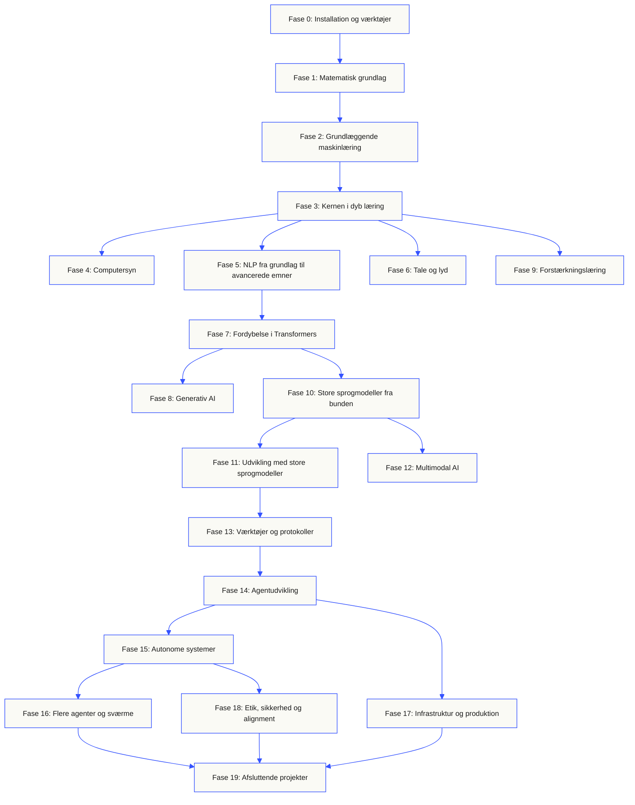
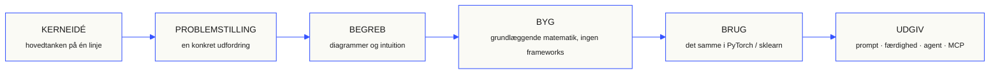

<p align="center"><sub>Denne README er oversat til dansk. <a href="../../README.md">Den engelske README</a> er den autoritative kilde.</sub></p>

<p align="center">
  <picture>
    <source media="(prefers-color-scheme: dark)" srcset="../../assets/readme/header-dark.svg">
    
  </picture>
</p>

Implementér modellernes indre, pipelines til informationssøgning og kørselsmiljøer til agenter. Test dem, undersøg fejl, og gem koden og evalueringsresultaterne.

**[Begynd at lære](https://aiengineeringfromscratch.com/lesson?path=phases/00-setup-and-tooling/01-dev-environment)** · **[Vælg et læringsforløb](#learning-routes)** · **[Prøv en øvelse](#interactive-lab)** · **[Byg et projekt](#project-challenges)** · **[Gennemse pensum](#contents)**

Gratis, åben kildekode, MIT-licens. Lær på hjemmesiden, med en kodeagent eller ved at køre kode lokalt.

> 523 lektioner. 20 faser. Python, TypeScript, Rust, Julia.

<p align="center">
  <a href="../../LICENSE"></a>
  <a href="../../ROADMAP.md"></a>
  <a href="#contents"></a>
  <a href="https://github.com/rohitg00/ai-engineering-from-scratch/stargazers"></a>
  <a href="https://aiengineeringfromscratch.com"></a>
</p>

<details>
<summary>Læs på dit sprog</summary>

<p align="center">
  <a href="../../README.md">🇬🇧 English</a> · <a href="../../i18n/zh/README.md">🇨🇳 简体中文</a> · <a href="../../i18n/zh-TW/README.md">🇹🇼 繁體中文（台灣）</a> · <a href="../../i18n/ja/README.md">🇯🇵 日本語</a> · <a href="../../i18n/ko/README.md">🇰🇷 한국어</a> · <a href="../../i18n/pt/README.md">🇵🇹 Português</a> · <a href="../../i18n/pt-BR/README.md">🇧🇷 Português (Brasil)</a> · <a href="../../i18n/es/README.md">🇪🇸 Español</a> · <a href="../../i18n/de/README.md">🇩🇪 Deutsch</a> · <a href="../../i18n/fr/README.md">🇫🇷 Français</a> · <a href="../../i18n/it/README.md">🇮🇹 Italiano</a> · <a href="../../i18n/nl/README.md">🇳🇱 Nederlands</a> · <a href="../../i18n/pl/README.md">🇵🇱 Polski</a> · <a href="../../i18n/cs/README.md">🇨🇿 Čeština</a> · <a href="../../i18n/ro/README.md">🇷🇴 Română</a> · <a href="../../i18n/hu/README.md">🇭🇺 Magyar</a> · <a href="../../i18n/el/README.md">🇬🇷 Ελληνικά</a> · <a href="../../i18n/sv/README.md">🇸🇪 Svenska</a> · <a href="../../i18n/da/README.md">🇩🇰 Dansk</a> · <a href="../../i18n/no/README.md">🇳🇴 Norsk</a> · <a href="../../i18n/fi/README.md">🇫🇮 Suomi</a> · <a href="../../i18n/ru/README.md">🇷🇺 Русский</a> · <a href="../../i18n/uk/README.md">🇺🇦 Українська</a> · <a href="../../i18n/tr/README.md">🇹🇷 Türkçe</a> · <a href="../../i18n/he/README.md">🇮🇱 עברית</a> · <a href="../../i18n/ar/README.md">🇸🇦 العربية</a> · <a href="../../i18n/fa/README.md">🇮🇷 فارسی</a> · <a href="../../i18n/hi/README.md">🇮🇳 हिन्दी</a> · <a href="../../i18n/bn/README.md">🇧🇩 বাংলা</a> · <a href="../../i18n/ur/README.md">🇵🇰 اردو</a> · <a href="../../i18n/th/README.md">🇹🇭 ไทย</a> · <a href="../../i18n/vi/README.md">🇻🇳 Tiếng Việt</a> · <a href="../../i18n/id/README.md">🇮🇩 Bahasa Indonesia</a> · <a href="../../i18n/tl/README.md">🇵🇭 Tagalog</a>
</p>

</details>

### Sponsorer

<p align="center">
  <a href="https://serpapi.com/ai-engineering-from-scratch"><picture><source media="(min-width: 768px)" srcset="../../assets/sponsors/serpapi-banner-compact.png" width="48%"></picture></a>
  <a href="https://nitrostack.ai/referral/aiengineeringfromscratch"><picture><source media="(min-width: 768px)" srcset="../../assets/sponsors/nitrostack-banner-equal.png" width="48%"></picture></a>
</p>

<p align="center">
  <sub><span>Din støtte holder hver lektion gratis og open source.</span> <a href="#supporters">Se alle støtter</a> · <a href="../../SPONSORS.md">Bliv sponsor</a></sub>
</p>

<a id="see-what-you-will-build-and-keep"></a>
<a id="learning-routes"></a>

## Læringsforløb

| Forløb | Første lektion |
|---|---|
| Modellernes fundament | [Opsætning og værktøjer](https://aiengineeringfromscratch.com/lesson?path=phases/00-setup-and-tooling/01-dev-environment) |
| LLM-systemer | [Promptudvikling](https://aiengineeringfromscratch.com/lesson?path=phases/11-llm-engineering/01-prompt-engineering) |
| Agenter og levering | [Agentens løkke](https://aiengineeringfromscratch.com/lesson?path=phases/14-agent-engineering/01-the-agent-loop) |

[Sammenlign karriereforløb](https://aiengineeringfromscratch.com/learning-paths.html) · [Forudsætninger og studietid](#study-guide)

<a id="interactive-lab"></a>

### Gradientnedstigning

Tyve startpunkter følger gradientnedstigning på en kvadratisk tabsfunktion. Grafen viser deres positioner og gennemsnitlige tab efter hver opdatering.

<p align="center">
  <a href="https://aiengineeringfromscratch.com/lesson?path=phases/01-math-foundations/08-optimization#loss-landscape-visualization">
    <picture>
      <source media="(max-width: 600px) and (prefers-color-scheme: dark) and (prefers-reduced-motion: reduce)" srcset="../../assets/readme/101-gradient-mobile-dark.png">
      <source media="(max-width: 600px) and (prefers-reduced-motion: reduce)" srcset="../../assets/readme/101-gradient-mobile-light.png">
      <source media="(prefers-color-scheme: dark) and (prefers-reduced-motion: reduce)" srcset="../../assets/readme/101-gradient-dark.png">
      <source media="(prefers-reduced-motion: reduce)" srcset="../../assets/readme/101-gradient-light.png">
      <source media="(max-width: 600px) and (prefers-color-scheme: dark)" srcset="../../assets/readme/101-gradient-mobile-dark.gif">
      <source media="(max-width: 600px)" srcset="../../assets/readme/101-gradient-mobile-light.gif">
      <source media="(prefers-color-scheme: dark)" srcset="../../assets/readme/101-gradient-dark.gif">
      
    </picture>
  </a>
</p>

[Juster læringsraten i lektionen](https://aiengineeringfromscratch.com/lesson?path=phases/01-math-foundations/08-optimization#loss-landscape-visualization) · [Sammenlign GD, momentum og Adam i koden](../../phases/01-math-foundations/08-optimization/code/optimizers.py)

<a id="project-challenges"></a>

### Projekter

Tre projekter med trinvise startgrundlag, referenceimplementeringer og lokale bedømmere. Kør kommandoer fra arkivets rod efter [opsætning](#local-setup). Startgrundlagene fejler, indtil du implementerer trinnene.

<details>
<summary><strong>01 · Laboratorium til evaluering af informationssøgning</strong> · Python · Rangmetrikker og regressionskontroller</summary>

Et kandidatsystem forbedrer den gennemsnitlige NDCG, mens en forespørgsel rangerer sin mest relevante evidens lavere. Byg en sammenligning for hver forespørgsel, der rapporterer regressionen og kan få en udgivelseskontrol til at fejle.

Brug Python 3.10+. Genbesøg [RAG](../../phases/11-llm-engineering/06-rag/docs/en.md) og [modelevaluering](../../phases/02-ml-fundamentals/09-model-evaluation/docs/en.md). Implementér validering af rangordning, præcision og recall, rangfølsomme metrikker og derefter systemsammenligning.

```bash
python3 scripts/project_test.py retrieval-evaluation-lab \
  --init learning-artifacts/retrieval-evaluation-lab
python3 scripts/project_test.py retrieval-evaluation-lab \
  --stage 1 --path learning-artifacts/retrieval-evaluation-lab --strict
python3 scripts/project_test.py retrieval-evaluation-lab \
  --all --path learning-artifacts/retrieval-evaluation-lab --strict
```

**Gem:** en reproducerbar sammenligning med ændringer pr. forespørgsel og de vurderinger, der bruges til at beregne dem. Metrikkerne beskriver disse vurderinger; de fastslår ikke, om svarene er korrekte.

[Start projektet](https://aiengineeringfromscratch.com/project.html?id=retrieval-evaluation-lab) · [Undersøg referencen](../../projects/retrieval-evaluation-lab/solution/) · [Kør med dine egne input](../../projects/retrieval-evaluation-lab/README.md#run-with-your-own-inputs)

</details>

<details>
<summary><strong>02 · Fejlsøger til agentspor</strong> · TypeScript · Parsing af spor og tidsmåling</summary>

Et medfølgende spor tager stadig 100 ms, men det samlede tokenforbrug stiger med 200, og ét span begynder at fejle. Adskil overlappende arbejde i underordnede spans fra forælderens udførelsestid, og lav en rapport, der viser ændringen.

Brug Node.js 22.18+ og Python 3 til bedømmeren. Implementér JSONL-parsing, validering af forældrerelationer, intervalaritmetik og derefter en gennemskuelig tidslinje.

```bash
python3 scripts/project_test.py agent-trace-debugger \
  --init learning-artifacts/agent-trace-debugger
python3 scripts/project_test.py agent-trace-debugger \
  --stage 1 --path learning-artifacts/agent-trace-debugger --strict
python3 scripts/project_test.py agent-trace-debugger \
  --all --path learning-artifacts/agent-trace-debugger --strict
```

**Gem:** inputsporet, en HTML-tidslinje og en JSON-regressionsrapport. Bevar eksklusive tokenantal pr. span, så forældres og børns forbrug ikke tælles dobbelt.

[Start projektet](https://aiengineeringfromscratch.com/project.html?id=agent-trace-debugger) · [Undersøg referencen](../../projects/agent-trace-debugger/solution/) · [Undersøg tidsforløb interaktivt](https://aiengineeringfromscratch.com/project.html?id=agent-trace-debugger&stage=03-timing)

</details>

<details>
<summary><strong>03 · Firewall til værktøjskald</strong> · Rust · Rollekontroller og godkendelseskvitteringer</summary>

En skrivning ændres efter gennemgang, eller en godkendelse genbruges. Validér kaldets envelope, kontrollér kalderens rolle og sti, og forbrug derefter en godkendelse, som er bundet til den præcise anmodning og det præcise indhold.

Brug Rust og Python 3.10+. Genbesøg [design af værktøjsskemaer](../../phases/13-tools-and-protocols/05-tool-schema-design/docs/en.md) og [sikkerhedsgrænser](../../phases/17-infrastructure-and-production/25-security-secrets-audit/docs/en.md). Den kaldende applikation leverer identiteten; modellen foreslår en operation.

```bash
python3 scripts/project_test.py tool-call-firewall \
  --init learning-artifacts/tool-call-firewall
python3 scripts/project_test.py tool-call-firewall \
  --stage 1 --path learning-artifacts/tool-call-firewall --strict
python3 scripts/project_test.py tool-call-firewall \
  --all --path learning-artifacts/tool-call-firewall --strict
```

**Gem:** en auditkvittering, der viser den ønskede operation og politikbeslutningen. Godkendelser kan bruges én gang inden for én invocation; projektet giver hverken vedvarende autorisation eller en sandbox på operativsystemniveau.

[Start projektet](https://aiengineeringfromscratch.com/project.html?id=tool-call-firewall) · [Undersøg referencen](../../projects/tool-call-firewall/solution/) · [Undersøg godkendelsesgrænser](https://aiengineeringfromscratch.com/project.html?id=tool-call-firewall&stage=03-consume-a-request-bound-approval-once)

</details>

[Se alle projekter](https://aiengineeringfromscratch.com/projects.html) · [Vejledning til faglig praksis](../../learning-paths/CAREER-PRACTICE.md)

## Vælg, hvordan du vil lære

### På hjemmesiden

Åbn en færdig lektion på [aiengineeringfromscratch.com](https://aiengineeringfromscratch.com), eller fold en fase ud under [Indhold](#contents). Ingen installation eller kloning er nødvendig.

### Med en AI-vejleder

Hvis Node.js, `npx` og en kodeagent, der understøtter færdigheder, allerede er installeret, kan du gøre kodeagenten til din vejleder. Du behøver ikke klone arkivet for at installere eller læse vejlederen. Kørbare øvelser i de fokuserede læringsforløb kræver `python3`. Agent Skills-øvelser kræver også et valgt værtsprogram og en færdighedsmappe for brugeren eller projektet, som du kan skrive til.

```bash
npx skills add rohitg00/ai-engineering-from-scratch
```

Vælg vært og omfang, når installationsprogrammet spørger. Brug `start-learning` i Codex, `/start-learning` i Claude Code, eller bed værten om at bruge færdigheden ved navn.

<details>
<summary>Opsætning af vejleder og værtskommandoer</summary>

Kontrollér først de lokale forudsætninger:

```bash
node --version
npx --version
python3 --version
```

`skills` skriver til det værtsprogram og installationsomfang, der vælges ved installationen, for eksempel `.claude/skills/`, `.cursor/skills/`, `.codex/skills/` eller en anden understøttet færdighedsmappe. Kontrollér, at det valgte værtsprogram opdager netop den mappe.

Syntaksen for at kalde færdigheder bestemmes af værtsprogrammet, ikke af det portable `SKILL.md`-format:

| Værtsprogram | Start kurset | Start med Model Context Protocol (MCP) | Start med Agent Skills | Tag en test for en fase |
|---|---|---|---|---|
| Codex | `start-learning`, eller vælg den fra `/skills` | `learn-mcp`, eller vælg den fra `/skills` | `learn-agent-skills`, eller vælg den fra `/skills` | `check-understanding 13`, eller vælg den fra `/skills` |
| Claude Code | `/start-learning` | `/learn-mcp` | `/learn-agent-skills` | `/check-understanding 13` |
| Andre kompatible værtsprogrammer | `Use start-learning to begin the course.` | `Use learn-mcp to start the Model Context Protocol (MCP) path.` | `Use learn-agent-skills to start the Agent Skills Engineering path.` | `Use check-understanding to quiz me on Phase 13.` |

En niveauprøve med ti spørgsmål kobler din baggrund til en passende startfase og gemmer en personlig læringsplan i `LEARNING.md`. Derefter underviser færdigheden `learn` i én lektion pr. session: begreb, matematik, kode og test. Den henter lektionerne direkte fra dette arkiv, og `course-guide` fører dig til netop den lektion, der behandler det, du sidder fast i. Brug `learn` og `course-guide` i Codex, `/learn` og `/course-guide` i Claude Code, eller bed et andet kompatibelt værtsprogram om at bruge færdigheden ved navn.

Vil du kun lære Model Context Protocol (MCP)? Brug MCP-kaldet for dit værtsprogram. Det opretter `MCP-LEARNING.md` og følger et sammenhængende forløb med 17 lektioner om tilstandsløse forespørgsler, transporter, tovejsarbejde, sikkerhed, pålidelighed, registerstyring og dokumentation for protokoloverholdelse. Den præcise rækkefølge og kontrolpunkterne findes i [manifestet for Model Context Protocol (MCP)](../../learning-paths/model-context-protocol.json).

Vil du kun lære Agent Skills? Brug Agent Skills-kaldet for dit værtsprogram. Det opretter `AGENT-SKILLS-LEARNING.md` og følger fem sammenhængende lektioner: kontrakt, opdagelse, kald, sandkassegrænser og til sidst evaluering før udgivelse samt portabilitet mellem rigtige værtsprogrammer. Start på nettet med [læringsforløbet for Agent Skills](https://aiengineeringfromscratch.com/lesson?path=phases/13-tools-and-protocols/22-skills-and-agent-sdks&learningPath=agent-skills).

Installationsprogrammet viser, hvilke værtsprogrammer det kan konfigurere, og spørger, hvor færdighederne skal installeres. Hvis du endnu mangler Node.js, `npx`, `python3`, et kompatibelt værtsprogram eller en mappe med skriveadgang, kan du bruge hjemmesiden eller læse `docs/en.md` manuelt. Så lærer du begreberne, men dokumentation for opdagelse, kald, scriptkørsel og afinstallation i et rigtigt værtsprogram må vente, til forhåndskontrollen kan gennemføres. Læs lektionerne på [aiengineeringfromscratch.com](https://aiengineeringfromscratch.com).

### Læringsfærdighederne

| Færdighed | Hvad den gør |
|---|---|
| [`start-learning`](../../skills/start-learning/SKILL.md) | Introduktion ved kursusstart: hvorfor du lærer, niveauprøve og en personlig plan gemt i `LEARNING.md`. |
| [`learn`](../../skills/learn/SKILL.md) | Vejlederens arbejdsgang. Først repetition, så næste lektion interaktivt og derefter dens test; fremskridt og en repetitionskø gemmes. |
| [`course-guide`](../../skills/course-guide/SKILL.md) | Emneguide. »Hvor lærer jeg attention?« eller »mit tab er NaN« → de relevante lektioner med links. |
| [`learn-mcp`](../../skills/learn-mcp/SKILL.md) | Fokuseret vejleder i Model Context Protocol (MCP). Opretter `MCP-LEARNING.md`, følger manifestets 17 lektioner og gemmer dokumentation for meddelelsesudveksling, sikkerhed, pålidelighed og protokoloverholdelse. |
| [`learn-agent-skills`](../../skills/learn-agent-skills/SKILL.md) | Fokuseret vejleder i Agent Skills. Opretter `AGENT-SKILLS-LEARNING.md`, underviser i lektionerne 22, 24, 25, 26 og 27 og gemmer dokumentation fra rigtige værtsprogrammer. |
| [`claude-certification`](../../skills/claude-certification/SKILL.md) | Certificeringsvejleder. Vælger CCAO-F, CCDV-F, CCAR-F eller CCAR-P, underviser i hver lektion, kører øvelser, gennemgår arbejdsresultater, afholder diagnostiske prøver og øveeksamener og gemmer fremskridt. |
| [`mcpa-certification`](../../skills/mcpa-certification/SKILL.md) | MCPA-vejleder. Følger `mcpa-f` med 34 lektioner om protokollen 2026-07-28, underviser i hver lektion, kører øvelser og meddelelseskontrollen, afholder den diagnostiske prøve og tre øveeksamener og gemmer fremskridt. |
| [`find-your-level`](../../skills/find-your-level/SKILL.md) | Niveauprøve med ti spørgsmål. Kobler din viden til en passende startfase og laver et personligt læringsforløb med tidsestimater. |
| [`check-understanding <phase>`](../../skills/check-understanding/SKILL.md) | Otte spørgsmål pr. fase med feedback og konkrete lektioner til repetition. Brug formen for Codex, Claude Code eller naturligt sprog i kaldtabellen ovenfor. |

</details>

<a id="local-setup"></a>

### Kør kode lokalt

```bash
git clone https://github.com/rohitg00/ai-engineering-from-scratch.git
cd ai-engineering-from-scratch
python3 phases/00-setup-and-tooling/01-dev-environment/code/verify.py --route beginner
python3 phases/01-math-foundations/01-linear-algebra-intuition/code/vectors.py
```

Forhåndskontrollen skelner mellem krav, du skal opfylde nu, og værktøjer, du først får brug for senere. For hvert obligatorisk krav, der ikke er opfyldt, vises årsagen og en kommando, der kan løse problemet. Kommandoen `vectors.py` kører en lektion uden eksterne afhængigheder og viser til sidst, at multiplikation af en matrix med en vektor er den operation, der foregår inde i et neuralt netværkslag. Gem terminalens output som dit første bevis.

<details>
<summary>Arbejd med hver lektion på samme måde</summary>

### Arbejd med hver lektion på samme måde

1. **Læs** `docs/en.md`, og forklar hovedideen med dine egne ord.
2. **Skriv og byg** den vigtige kode i stedet for at behandle kodeblokken som pynt.
3. **Kør** lektionens kommando fra kodearkivets rod, mappen med `README.md` og `phases/`.
4. **Gem dokumentation**: kommandoen, arbejdsmappen, afslutningskoden, meningsfuldt output og det resultat, du ændrede eller skabte.
5. **Fortsæt** først, når du kan forklare outputtet og foretage en lille ændring uden at gætte.

Stier i kommandoer på lektionssiderne tager udgangspunkt i projektarkivets rod, medmindre lektionen udtrykkeligt beder dig skifte mappe. Hvis en lektion har flere programmeringssprog, skal du køre implementeringen for det sprog, du lærer.

</details>

<a id="study-guide"></a>

## Vælg et læringsforløb

Du behøver ikke gennemgå 523 lektioner, før du går i gang. Vælg et mål. Hvert link åbner det samme pensum på GitHub eller hjemmesiden, og begge versioner bruger samme lektionskode.

| Dit mål | Lær på GitHub | Lær på hjemmesiden |
|---|---|---|
| Jeg er ny og vil have hele fundamentet på plads | [Fase 0: Opsætning og værktøjer](../../phases/00-setup-and-tooling/) | [Udviklingsmiljø](https://aiengineeringfromscratch.com/lesson?path=phases/00-setup-and-tooling/01-dev-environment) |
| Jeg kan Python og vil lære grundlæggende matematik og maskinlæring | [Fase 1: Matematisk grundlag](../../phases/01-math-foundations/) | [Intuition for lineær algebra](https://aiengineeringfromscratch.com/lesson?path=phases/01-math-foundations/01-linear-algebra-intuition) |
| Jeg vil bygge LLM-applikationer til produktion | [Fase 11: LLM-udvikling](../../phases/11-llm-engineering/) | [Promptudvikling](https://aiengineeringfromscratch.com/lesson?path=phases/11-llm-engineering/01-prompt-engineering) |
| Jeg vil bygge agenter | [Fase 14: Agentudvikling](../../phases/14-agent-engineering/) | [Agentløkken](https://aiengineeringfromscratch.com/lesson?path=phases/14-agent-engineering/01-the-agent-loop) |
| Jeg vil bruge kodeagenter i rigtige kodearkiver | [Læringsforløb i agentassisteret udvikling](../../learning-paths/using-coding-agents.json) | [Agentassisteret udvikling](https://aiengineeringfromscratch.com/lesson?path=phases/14-agent-engineering/31-agent-workbench-why-models-fail&learningPath=using-coding-agents) |
| Jeg vil fastlægge, hvad der skal bygges, før implementeringen | [Læringsforløb i produktvurdering og levering](../../learning-paths/shaping-the-build.json) | [Produktvurdering og levering](https://aiengineeringfromscratch.com/lesson?path=phases/14-agent-engineering/47-outcomes-before-output&learningPath=shaping-the-build) |

Er du usikker på, hvor du skal begynde? Brug [niveauvurderingen med vejlederen `start-learning`](../../skills/start-learning/SKILL.md) eller [hjemmesidens guide til forudsætninger](https://aiengineeringfromscratch.com/prereqs.html).

Sammenlign fire kerneområder og seks karriereveje i [læringsforløbene for AI-udvikling](https://aiengineeringfromscratch.com/learning-paths.html).

<details>
<summary>Fokuserede forløb for MCP og Agent Skills</summary>

| Dit mål | Lær på GitHub | Lær på hjemmesiden |
|---|---|---|
| Jeg vil bygge med Model Context Protocol (MCP) | [Forløb i Model Context Protocol (MCP)](../../phases/13-tools-and-protocols/README.md#model-context-protocol-mcp-path) | [Læringsforløb i Model Context Protocol (MCP)](https://aiengineeringfromscratch.com/lesson?path=phases/13-tools-and-protocols/06-mcp-fundamentals&learningPath=model-context-protocol) |
| Jeg vil skrive og udgive Agent Skills | [Fokuseret forløb i Agent Skills](../../phases/13-tools-and-protocols/README.md#agent-skills-fast-path) | [Læringsforløb i Agent Skills](https://aiengineeringfromscratch.com/lesson?path=phases/13-tools-and-protocols/22-skills-and-agent-sdks&learningPath=agent-skills) |

</details>

<details>
<summary>Forudsætninger og studietid</summary>

### Forudsætninger

- Du kan skrive kode i et eller andet sprog; Python er en fordel.
- Du vil forstå, hvordan AI **faktisk virker**, ikke bare kalde API'er.

## Hvor skal du begynde?

| Baggrund | Begynd ved | Anslået tid |
|---|---|---|
| Ny inden for programmering og AI | Fase 0: Installation | ~306 timer |
| Kan Python, er ny inden for ML | Fase 1: Matematisk grundlag | ~270 timer |
| Kan ML, er ny inden for dyb læring | Fase 3: Kernen i dyb læring | ~200 timer |
| Kan dyb læring og vil lære sprogmodeller og agenter | Fase 10: Store sprogmodeller fra bunden | ~100 timer |
| Erfaren udvikler, som kun vil lære agentudvikling | Fase 14: Agentudvikling | ~60 timer |
| Vil kun bygge MCP-systemer til produktion | [Læringsforløb for Model Context Protocol (MCP)](../../learning-paths/model-context-protocol.json) | ~23 timer 15 min |
| Vil kun bygge Agent Skills til produktion | [Læringsforløb for udvikling af Agent Skills](../../learning-paths/agent-skills.json) | ~9.5 timer |

</details>

## Pensummets opbygning

Tyve faser bygger oven på hinanden. Matematikken er fundamentet. Agenter og produktion er de øverste lag. Spring frem, hvis du allerede kan det grundlæggende, men spring ikke over det og undr dig så over, at noget højere oppe går i stykker.



<a id="contents"></a>

## Indhold

Tyve faser. Klik på en fase for at folde lektionslisten ud.

<a id="phase-0"></a>
### Fase 0: Installation og værktøjer `12 lektioner`
> Gør dit miljø klar til alt det, der følger.

| # | Lektion | Type | Sprog |
|:---:|--------|:----:|------|
| 01 | [Udviklingsmiljø](../../phases/00-setup-and-tooling/01-dev-environment/) | Byg | Python |
| 02 | [Git og samarbejde](../../phases/00-setup-and-tooling/02-git-and-collaboration/) | Lær | — |
| 03 | [GPU-opsætning og cloud](../../phases/00-setup-and-tooling/03-gpu-setup-and-cloud/) | Byg | Python |
| 04 | [API'er og nøgler](../../phases/00-setup-and-tooling/04-apis-and-keys/) | Byg | Python |
| 05 | [Jupyter-notesbøger](../../phases/00-setup-and-tooling/05-jupyter-notebooks/) | Byg | Python |
| 06 | [Python-miljøer](../../phases/00-setup-and-tooling/06-python-environments/) | Byg | Shell |
| 07 | [Docker til AI](../../phases/00-setup-and-tooling/07-docker-for-ai/) | Byg | Docker |
| 08 | [Opsætning af editor](../../phases/00-setup-and-tooling/08-editor-setup/) | Byg | — |
| 09 | [Datastyring](../../phases/00-setup-and-tooling/09-data-management/) | Byg | Python |
| 10 | [Terminal og shell](../../phases/00-setup-and-tooling/10-terminal-and-shell/) | Lær | — |
| 11 | [Linux til AI](../../phases/00-setup-and-tooling/11-linux-for-ai/) | Lær | — |
| 12 | [Fejlfinding og profilering](../../phases/00-setup-and-tooling/12-debugging-and-profiling/) | Byg | Python |

<details id="phase-1">
<summary><b>Fase 1: Matematisk grundlag</b> &nbsp;<code>22 lektioner</code>&nbsp; <em>Intuitionen bag hver AI-algoritme gennem kode.</em></summary>
<br/>

| # | Lektion | Type | Sprog |
|:---:|--------|:----:|------|
| 01 | [Intuition for lineær algebra](../../phases/01-math-foundations/01-linear-algebra-intuition/) | Lær | Python, Julia |
| 02 | [Vektorer, matricer og operationer](../../phases/01-math-foundations/02-vectors-matrices-operations/) | Byg | Python, Julia |
| 03 | [Matrixtransformationer og egenværdier](../../phases/01-math-foundations/03-matrix-transformations/) | Byg | Python, Julia |
| 04 | [Differentialregning til ML: afledte og gradienter](../../phases/01-math-foundations/04-calculus-for-ml/) | Lær | Python |
| 05 | [Kædereglen og automatisk differentiation](../../phases/01-math-foundations/05-chain-rule-and-autodiff/) | Byg | Python |
| 06 | [Sandsynlighed og fordelinger](../../phases/01-math-foundations/06-probability-and-distributions/) | Lær | Python |
| 07 | [Bayes' sætning og statistisk tænkning](../../phases/01-math-foundations/07-bayes-theorem/) | Byg | Python |
| 08 | [Optimering: familien af gradientnedstigningsmetoder](../../phases/01-math-foundations/08-optimization/) | Byg | Python |
| 09 | [Informationsteori: entropi og KL-divergens](../../phases/01-math-foundations/09-information-theory/) | Lær | Python |
| 10 | [Dimensionsreduktion: PCA, t-SNE og UMAP](../../phases/01-math-foundations/10-dimensionality-reduction/) | Byg | Python |
| 11 | [Singulærværdidekomponering](../../phases/01-math-foundations/11-singular-value-decomposition/) | Byg | Python, Julia |
| 12 | [Tensoroperationer](../../phases/01-math-foundations/12-tensor-operations/) | Byg | Python |
| 13 | [Numerisk stabilitet](../../phases/01-math-foundations/13-numerical-stability/) | Byg | Python |
| 14 | [Normer og afstande](../../phases/01-math-foundations/14-norms-and-distances/) | Byg | Python |
| 15 | [Statistik til ML](../../phases/01-math-foundations/15-statistics-for-ml/) | Byg | Python |
| 16 | [Stikprøvemetoder](../../phases/01-math-foundations/16-sampling-methods/) | Byg | Python |
| 17 | [Lineære ligningssystemer](../../phases/01-math-foundations/17-linear-systems/) | Byg | Python |
| 18 | [Konveks optimering](../../phases/01-math-foundations/18-convex-optimization/) | Byg | Python |
| 19 | [Komplekse tal til AI](../../phases/01-math-foundations/19-complex-numbers/) | Lær | Python |
| 20 | [Fouriertransformationen](../../phases/01-math-foundations/20-fourier-transform/) | Byg | Python |
| 21 | [Grafteori til ML](../../phases/01-math-foundations/21-graph-theory/) | Byg | Python |
| 22 | [Stokastiske processer](../../phases/01-math-foundations/22-stochastic-processes/) | Lær | Python |

</details>

<details id="phase-2">
<summary><b>Fase 2: Grundlæggende maskinlæring</b> &nbsp;<code>18 lektioner</code>&nbsp; <em>Klassisk ML er stadig rygraden i de fleste AI-systemer i produktion.</em></summary>
<br/>

| # | Lektion | Type | Sprog |
|:---:|--------|:----:|------|
| 01 | [Hvad er maskinlæring?](../../phases/02-ml-fundamentals/01-what-is-machine-learning/) | Lær | Python |
| 02 | [Lineær regression fra bunden](../../phases/02-ml-fundamentals/02-linear-regression/) | Byg | Python |
| 03 | [Logistisk regression og klassifikation](../../phases/02-ml-fundamentals/03-logistic-regression/) | Byg | Python |
| 04 | [Beslutningstræer og tilfældige skove](../../phases/02-ml-fundamentals/04-decision-trees/) | Byg | Python |
| 05 | [Støttevektormaskiner](../../phases/02-ml-fundamentals/05-support-vector-machines/) | Byg | Python |
| 06 | [KNN og afstandsmål](../../phases/02-ml-fundamentals/06-knn-and-distances/) | Byg | Python |
| 07 | [Uovervåget læring: K-Means og DBSCAN](../../phases/02-ml-fundamentals/07-unsupervised-learning/) | Byg | Python |
| 08 | [Udvikling og udvælgelse af egenskaber](../../phases/02-ml-fundamentals/08-feature-engineering/) | Byg | Python |
| 09 | [Modelevaluering: måltal og krydsvalidering](../../phases/02-ml-fundamentals/09-model-evaluation/) | Byg | Python |
| 10 | [Bias, varians og læringskurven](../../phases/02-ml-fundamentals/10-bias-variance/) | Lær | Python |
| 11 | [Ensemblemetoder: boosting, bagging og stacking](../../phases/02-ml-fundamentals/11-ensemble-methods/) | Byg | Python |
| 12 | [Justering af hyperparametre](../../phases/02-ml-fundamentals/12-hyperparameter-tuning/) | Byg | Python |
| 13 | [ML-pipelines og sporing af eksperimenter](../../phases/02-ml-fundamentals/13-ml-pipelines/) | Byg | Python |
| 14 | [Naiv Bayes](../../phases/02-ml-fundamentals/14-naive-bayes/) | Byg | Python |
| 15 | [Grundlæggende tidsserier](../../phases/02-ml-fundamentals/15-time-series/) | Byg | Python |
| 16 | [Detektion af afvigelser](../../phases/02-ml-fundamentals/16-anomaly-detection/) | Byg | Python |
| 17 | [Håndtering af ubalancerede data](../../phases/02-ml-fundamentals/17-imbalanced-data/) | Byg | Python |
| 18 | [Udvælgelse af egenskaber](../../phases/02-ml-fundamentals/18-feature-selection/) | Byg | Python |

</details>

<details id="phase-3">
<summary><b>Fase 3: Kernen i dyb læring</b> &nbsp;<code>13 lektioner</code>&nbsp; <em>Neurale netværk fra grundprincipperne. Ingen frameworks, før du har bygget et selv.</em></summary>
<br/>

| # | Lektion | Type | Sprog |
|:---:|--------|:----:|------|
| 01 | [Perceptronen: hvor det hele begyndte](../../phases/03-deep-learning-core/01-the-perceptron/) | Byg | Python |
| 02 | [Flerlagsnetværk og fremadrettet beregning](../../phases/03-deep-learning-core/02-multi-layer-networks/) | Byg | Python |
| 03 | [Tilbagepropagering fra bunden](../../phases/03-deep-learning-core/03-backpropagation/) | Byg | Python |
| 04 | [Aktiveringsfunktioner: ReLU, sigmoid, GELU og hvorfor](../../phases/03-deep-learning-core/04-activation-functions/) | Byg | Python |
| 05 | [Tabsfunktioner: MSE, krydsentropi og kontrastive tab](../../phases/03-deep-learning-core/05-loss-functions/) | Byg | Python |
| 06 | [Optimeringsalgoritmer: SGD, momentum, Adam og AdamW](../../phases/03-deep-learning-core/06-optimizers/) | Byg | Python |
| 07 | [Regularisering: dropout, vægtforfald og BatchNorm](../../phases/03-deep-learning-core/07-regularization/) | Byg | Python |
| 08 | [Initialisering af vægte og stabil træning](../../phases/03-deep-learning-core/08-weight-initialization/) | Byg | Python |
| 09 | [Planer for læringsraten og opvarmning](../../phases/03-deep-learning-core/09-learning-rate-schedules/) | Byg | Python |
| 10 | [Byg dit eget lille framework](../../phases/03-deep-learning-core/10-mini-framework/) | Byg | Python |
| 11 | [Introduktion til PyTorch](../../phases/03-deep-learning-core/11-intro-to-pytorch/) | Byg | Python |
| 12 | [Introduktion til JAX](../../phases/03-deep-learning-core/12-intro-to-jax/) | Byg | Python |
| 13 | [Fejlfinding i neurale netværk](../../phases/03-deep-learning-core/13-debugging-neural-networks/) | Byg | Python |

</details>

<details id="phase-4">
<summary><b>Fase 4: Computersyn</b> &nbsp;<code>28 lektioner</code>&nbsp; <em>Fra pixels til forståelse: billeder, video, 3D, VLM'er og verdensmodeller.</em></summary>
<br/>

| # | Lektion | Type | Sprog |
|:---:|--------|:----:|------|
| 01 | [Billedgrundlag: pixels, kanaler og farverum](../../phases/04-computer-vision/01-image-fundamentals/) | Lær | Python |
| 02 | [Foldninger fra bunden](../../phases/04-computer-vision/02-convolutions-from-scratch/) | Byg | Python |
| 03 | [CNN'er: fra LeNet til ResNet](../../phases/04-computer-vision/03-cnns-lenet-to-resnet/) | Byg | Python |
| 04 | [Billedklassifikation](../../phases/04-computer-vision/04-image-classification/) | Byg | Python |
| 05 | [Overførselslæring og finjustering](../../phases/04-computer-vision/05-transfer-learning/) | Byg | Python |
| 06 | [Objektdetektion: YOLO fra bunden](../../phases/04-computer-vision/06-object-detection-yolo/) | Byg | Python |
| 07 | [Semantisk segmentering: U-Net](../../phases/04-computer-vision/07-semantic-segmentation-unet/) | Byg | Python |
| 08 | [Instanssegmentering: Mask R-CNN](../../phases/04-computer-vision/08-instance-segmentation-mask-rcnn/) | Byg | Python |
| 09 | [Billedgenerering med GAN'er](../../phases/04-computer-vision/09-image-generation-gans/) | Byg | Python |
| 10 | [Billedgenerering med diffusionsmodeller](../../phases/04-computer-vision/10-image-generation-diffusion/) | Byg | Python |
| 11 | [Stable Diffusion: arkitektur og finjustering](../../phases/04-computer-vision/11-stable-diffusion/) | Byg | Python |
| 12 | [Videoforståelse: tidslig modellering](../../phases/04-computer-vision/12-video-understanding/) | Byg | Python |
| 13 | [3D-syn: punktskyer og NeRF'er](../../phases/04-computer-vision/13-3d-vision-nerf/) | Byg | Python |
| 14 | [Vision Transformers (ViT) til billedanalyse](../../phases/04-computer-vision/14-vision-transformers/) | Byg | Python |
| 15 | [Billedanalyse i realtid: udrulning på kanten](../../phases/04-computer-vision/15-real-time-edge/) | Byg | Python |
| 16 | [Byg en komplet pipeline til billedanalyse](../../phases/04-computer-vision/16-vision-pipeline-capstone/) | Byg | Python |
| 17 | [Selvovervåget billedanalyse: SimCLR, DINO og MAE](../../phases/04-computer-vision/17-self-supervised-vision/) | Byg | Python |
| 18 | [Billedanalyse med åbent ordforråd: CLIP](../../phases/04-computer-vision/18-open-vocab-clip/) | Byg | Python |
| 19 | [OCR og dokumentforståelse](../../phases/04-computer-vision/19-ocr-document-understanding/) | Byg | Python |
| 20 | [Billedsøgning og metrisk læring](../../phases/04-computer-vision/20-image-retrieval-metric/) | Byg | Python |
| 21 | [Detektion af nøglepunkter og estimering af positur](../../phases/04-computer-vision/21-keypoint-pose/) | Byg | Python |
| 22 | [3D Gaussian Splatting fra bunden](../../phases/04-computer-vision/22-3d-gaussian-splatting/) | Byg | Python |
| 23 | [Diffusionstransformere og rectified flow](../../phases/04-computer-vision/23-diffusion-transformers-rectified-flow/) | Byg | Python |
| 24 | [SAM 3 og segmentering med åbent ordforråd](../../phases/04-computer-vision/24-sam3-open-vocab-segmentation/) | Byg | Python |
| 25 | [Syn-sprog-modeller (ViT-MLP-LLM)](../../phases/04-computer-vision/25-vision-language-models/) | Byg | Python |
| 26 | [Monokulær dybde- og geometriestimering](../../phases/04-computer-vision/26-monocular-depth/) | Byg | Python |
| 27 | [Sporing af flere objekter og videohukommelse](../../phases/04-computer-vision/27-multi-object-tracking/) | Byg | Python |
| 28 | [Verdensmodeller og videodiffusion](../../phases/04-computer-vision/28-world-models-video-diffusion/) | Byg | Python |

</details>

<details id="phase-5">
<summary><b>Fase 5: NLP fra grundlag til avancerede emner</b> &nbsp;<code>29 lektioner</code>&nbsp; <em>Sprog er grænsefladen til intelligens.</em></summary>
<br/>

| # | Lektion | Type | Sprog |
|:---:|--------|:----:|------|
| 01 | [Tekstbehandling: tokenisering, stammebestemmelse og lemmatisering](../../phases/05-nlp-foundations-to-advanced/01-text-processing/) | Byg | Python |
| 02 | [Ordposer, TF-IDF og tekstrepræsentation](../../phases/05-nlp-foundations-to-advanced/02-bag-of-words-tfidf/) | Byg | Python |
| 03 | [Ordindlejringer: Word2Vec fra bunden](../../phases/05-nlp-foundations-to-advanced/03-word-embeddings-word2vec/) | Byg | Python |
| 04 | [GloVe, FastText og delordsindlejringer](../../phases/05-nlp-foundations-to-advanced/04-glove-fasttext-subword/) | Byg | Python |
| 05 | [Sentimentanalyse](../../phases/05-nlp-foundations-to-advanced/05-sentiment-analysis/) | Byg | Python |
| 06 | [Genkendelse af navngivne entiteter (NER)](../../phases/05-nlp-foundations-to-advanced/06-named-entity-recognition/) | Byg | Python |
| 07 | [Ordklassetagging og syntaktisk analyse](../../phases/05-nlp-foundations-to-advanced/07-pos-tagging-parsing/) | Byg | Python |
| 08 | [Tekstklassifikation: CNN'er og RNN'er til tekst](../../phases/05-nlp-foundations-to-advanced/08-cnns-rnns-for-text/) | Byg | Python |
| 09 | [Sekvens-til-sekvens-modeller](../../phases/05-nlp-foundations-to-advanced/09-sequence-to-sequence/) | Byg | Python |
| 10 | [Attention-mekanismen: gennembruddet](../../phases/05-nlp-foundations-to-advanced/10-attention-mechanism/) | Byg | Python |
| 11 | [Maskinoversættelse](../../phases/05-nlp-foundations-to-advanced/11-machine-translation/) | Byg | Python |
| 12 | [Tekstopsummering](../../phases/05-nlp-foundations-to-advanced/12-text-summarization/) | Byg | Python |
| 13 | [Systemer til spørgsmål og svar](../../phases/05-nlp-foundations-to-advanced/13-question-answering/) | Byg | Python |
| 14 | [Informationssøgning og søgning](../../phases/05-nlp-foundations-to-advanced/14-information-retrieval-search/) | Byg | Python |
| 15 | [Emnemodellering: LDA og BERTopic](../../phases/05-nlp-foundations-to-advanced/15-topic-modeling/) | Byg | Python |
| 16 | [Tekstgenerering](../../phases/05-nlp-foundations-to-advanced/16-text-generation-pre-transformer/) | Byg | Python |
| 17 | [Chatbots: fra regler til neurale netværk](../../phases/05-nlp-foundations-to-advanced/17-chatbots-rule-to-neural/) | Byg | Python |
| 18 | [Flersproget NLP](../../phases/05-nlp-foundations-to-advanced/18-multilingual-nlp/) | Byg | Python |
| 19 | [Delordstokenisering: BPE, WordPiece, Unigram og SentencePiece](../../phases/05-nlp-foundations-to-advanced/19-subword-tokenization/) | Lær | Python |
| 20 | [Strukturerede output og begrænset afkodning](../../phases/05-nlp-foundations-to-advanced/20-structured-outputs-constrained-decoding/) | Byg | Python |
| 21 | [NLI og tekstlig følgeslutning](../../phases/05-nlp-foundations-to-advanced/21-nli-textual-entailment/) | Lær | Python |
| 22 | [Fordybelse i indlejringsmodeller](../../phases/05-nlp-foundations-to-advanced/22-embedding-models-deep-dive/) | Lær | Python |
| 23 | [Strategier til opdeling af tekst i RAG](../../phases/05-nlp-foundations-to-advanced/23-chunking-strategies-rag/) | Byg | Python |
| 24 | [Opløsning af koreferencer](../../phases/05-nlp-foundations-to-advanced/24-coreference-resolution/) | Lær | Python |
| 25 | [Entitetskobling og afklaring af flertydighed](../../phases/05-nlp-foundations-to-advanced/25-entity-linking/) | Byg | Python |
| 26 | [Udtrækning af relationer og opbygning af vidensgrafer](../../phases/05-nlp-foundations-to-advanced/26-relation-extraction-kg/) | Byg | Python |
| 27 | [LLM-evaluering: RAGAS, DeepEval og G-Eval](../../phases/05-nlp-foundations-to-advanced/27-llm-evaluation-frameworks/) | Byg | Python |
| 28 | [Evaluering af lang kontekst: NIAH, RULER, LongBench og MRCR](../../phases/05-nlp-foundations-to-advanced/28-long-context-evaluation/) | Lær | Python |
| 29 | [Sporing af dialogtilstand](../../phases/05-nlp-foundations-to-advanced/29-dialogue-state-tracking/) | Byg | Python |

</details>

<details id="phase-6">
<summary><b>Fase 6: Tale og lyd</b> &nbsp;<code>17 lektioner</code>&nbsp; <em>Hør, forstå og tal.</em></summary>
<br/>

| # | Lektion | Type | Sprog |
|:---:|--------|:----:|------|
| 01 | [Lydgrundlag: bølgeformer, sampling og FFT](../../phases/06-speech-and-audio/01-audio-fundamentals) | Lær | Python |
| 02 | [Spektrogrammer, mel-skala og lydegenskaber](../../phases/06-speech-and-audio/02-spectrograms-mel-features) | Byg | Python |
| 03 | [Lydklassifikation](../../phases/06-speech-and-audio/03-audio-classification) | Byg | Python |
| 04 | [Talegenkendelse (ASR)](../../phases/06-speech-and-audio/04-speech-recognition-asr) | Byg | Python |
| 05 | [Whisper: arkitektur og finjustering](../../phases/06-speech-and-audio/05-whisper-architecture-finetuning) | Byg | Python |
| 06 | [Taleridentifikation og -verificering](../../phases/06-speech-and-audio/06-speaker-recognition-verification) | Byg | Python |
| 07 | [Tekst til tale (TTS)](../../phases/06-speech-and-audio/07-text-to-speech) | Byg | Python |
| 08 | [Stemmekloning og stemmekonvertering](../../phases/06-speech-and-audio/08-voice-cloning-conversion) | Byg | Python |
| 09 | [Musikgenerering](../../phases/06-speech-and-audio/09-music-generation) | Byg | Python |
| 10 | [Lyd-sprog-modeller](../../phases/06-speech-and-audio/10-audio-language-models) | Byg | Python |
| 11 | [Lydbehandling i realtid](../../phases/06-speech-and-audio/11-real-time-audio-processing) | Byg | Python |
| 12 | [Byg en pipeline til en stemmeassistent](../../phases/06-speech-and-audio/12-voice-assistant-pipeline) | Byg | Python |
| 13 | [Neurale lydcodecs: EnCodec, SNAC, Mimi og DAC](../../phases/06-speech-and-audio/13-neural-audio-codecs) | Lær | Python |
| 14 | [Detektion af taleaktivitet og turtagning](../../phases/06-speech-and-audio/14-voice-activity-detection-turn-taking) | Byg | Python |
| 15 | [Streaming fra tale til tale: Moshi og Hibiki](../../phases/06-speech-and-audio/15-streaming-speech-to-speech-moshi-hibiki) | Lær | Python |
| 16 | [Beskyttelse mod stemmeforfalskning og vandmærkning af lyd](../../phases/06-speech-and-audio/16-anti-spoofing-audio-watermarking) | Byg | Python |
| 17 | [Lydevaluering: WER, MOS, MMAU og ranglister](../../phases/06-speech-and-audio/17-audio-evaluation-metrics) | Lær | Python |

</details>

<details id="phase-7">
<summary><b>Fase 7: Fordybelse i Transformers</b> &nbsp;<code>16 lektioner</code>&nbsp; <em>Arkitekturen, der ændrede alt.</em></summary>
<br/>

| # | Lektion | Type | Sprog |
|:---:|--------|:----:|------|
| 01 | [Hvorfor Transformers: problemerne med RNN'er](../../phases/07-transformers-deep-dive/01-why-transformers/) | Lær | Python |
| 02 | [Self-attention fra bunden](../../phases/07-transformers-deep-dive/02-self-attention-from-scratch/) | Byg | Python |
| 03 | [Attention med flere hoveder](../../phases/07-transformers-deep-dive/03-multi-head-attention/) | Byg | Python |
| 04 | [Positionskodning: sinus, RoPE og ALiBi](../../phases/07-transformers-deep-dive/04-positional-encoding/) | Byg | Python |
| 05 | [Den komplette Transformer: indkoder og afkoder](../../phases/07-transformers-deep-dive/05-full-transformer/) | Byg | Python |
| 06 | [BERT: maskeret sprogmodellering](../../phases/07-transformers-deep-dive/06-bert-masked-language-modeling/) | Byg | Python |
| 07 | [GPT: kausal sprogmodellering](../../phases/07-transformers-deep-dive/07-gpt-causal-language-modeling/) | Byg | Python |
| 08 | [T5 og BART: indkoder-afkoder-modeller](../../phases/07-transformers-deep-dive/08-t5-bart-encoder-decoder/) | Lær | Python |
| 09 | [Vision Transformers (ViT) til billedanalyse](../../phases/07-transformers-deep-dive/09-vision-transformers/) | Byg | Python |
| 10 | [Lydtransformere: Whispers arkitektur](../../phases/07-transformers-deep-dive/10-audio-transformers-whisper/) | Lær | Python |
| 11 | [Blanding af eksperter (MoE)](../../phases/07-transformers-deep-dive/11-mixture-of-experts/) | Byg | Python |
| 12 | [KV-cache, Flash Attention og optimering af inferens](../../phases/07-transformers-deep-dive/12-kv-cache-flash-attention/) | Byg | Python |
| 13 | [Skaleringslove](../../phases/07-transformers-deep-dive/13-scaling-laws/) | Lær | Python |
| 14 | [Byg en Transformer fra bunden](../../phases/07-transformers-deep-dive/14-build-a-transformer-capstone/) | Byg | Python |
| 15 | [Attention-varianter: glidende vindue, sparsom og differentiel](../../phases/07-transformers-deep-dive/15-attention-variants/) | Byg | Python |
| 16 | [Spekulativ afkodning: foreslå, verificér, gentag](../../phases/07-transformers-deep-dive/16-speculative-decoding/) | Byg | Python |

</details>

<details id="phase-8">
<summary><b>Fase 8: Generativ AI</b> &nbsp;<code>15 lektioner</code>&nbsp; <em>Skab billeder, video, lyd, 3D og meget mere.</em></summary>
<br/>

| # | Lektion | Type | Sprog |
|:---:|--------|:----:|------|
| 01 | [Generative modeller: taksonomi og historie](../../phases/08-generative-ai/01-generative-models-taxonomy-history/) | Lær | Python |
| 02 | [Autoindkodere og VAE](../../phases/08-generative-ai/02-autoencoders-vae/) | Byg | Python |
| 03 | [GAN'er: generator mod diskriminator](../../phases/08-generative-ai/03-gans-generator-discriminator/) | Byg | Python |
| 04 | [Betingede GAN'er og Pix2Pix](../../phases/08-generative-ai/04-conditional-gans-pix2pix/) | Byg | Python |
| 05 | [StyleGAN-modellen](../../phases/08-generative-ai/05-stylegan/) | Byg | Python |
| 06 | [Diffusionsmodeller: DDPM fra bunden](../../phases/08-generative-ai/06-diffusion-ddpm-from-scratch/) | Byg | Python |
| 07 | [Latent diffusion og Stable Diffusion](../../phases/08-generative-ai/07-latent-diffusion-stable-diffusion/) | Byg | Python |
| 08 | [ControlNet, LoRA og betinget generering](../../phases/08-generative-ai/08-controlnet-lora-conditioning/) | Byg | Python |
| 09 | [Udfyldning, udvidelse og redigering af billeder](../../phases/08-generative-ai/09-inpainting-outpainting-editing/) | Byg | Python |
| 10 | [Videogenerering](../../phases/08-generative-ai/10-video-generation/) | Byg | Python |
| 11 | [Lydgenerering](../../phases/08-generative-ai/11-audio-generation/) | Byg | Python |
| 12 | [3D-generering](../../phases/08-generative-ai/12-3d-generation/) | Byg | Python |
| 13 | [Flow matching og rectified flows](../../phases/08-generative-ai/13-flow-matching-rectified-flows/) | Byg | Python |
| 14 | [Evaluering: FID og CLIP-score](../../phases/08-generative-ai/14-evaluation-fid-clip-score/) | Byg | Python |
| 19 | [Visuel autoregressiv modellering (VAR): forudsigelse af næste skala](../../phases/08-generative-ai/19-visual-autoregressive-var/) | Byg | Python |

</details>

<details id="phase-9">
<summary><b>Fase 9: Forstærkningslæring</b> &nbsp;<code>12 lektioner</code>&nbsp; <em>Grundlaget for RLHF og AI, der spiller spil.</em></summary>
<br/>

| # | Lektion | Type | Sprog |
|:---:|--------|:----:|------|
| 01 | [MDP'er, tilstande, handlinger og belønninger](../../phases/09-reinforcement-learning/01-mdps-states-actions-rewards/) | Lær | Python |
| 02 | [Dynamisk programmering](../../phases/09-reinforcement-learning/02-dynamic-programming/) | Byg | Python |
| 03 | [Monte Carlo-metoder](../../phases/09-reinforcement-learning/03-monte-carlo-methods/) | Byg | Python |
| 04 | [Q-læring og SARSA](../../phases/09-reinforcement-learning/04-q-learning-sarsa/) | Byg | Python |
| 05 | [Dybe Q-netværk (DQN)](../../phases/09-reinforcement-learning/05-dqn/) | Byg | Python |
| 06 | [Politikgradienter: REINFORCE](../../phases/09-reinforcement-learning/06-policy-gradients-reinforce/) | Byg | Python |
| 07 | [Aktør-kritiker: A2C og A3C](../../phases/09-reinforcement-learning/07-actor-critic-a2c-a3c/) | Byg | Python |
| 08 | [PPO-algoritmen](../../phases/09-reinforcement-learning/08-ppo/) | Byg | Python |
| 09 | [Belønningsmodellering og RLHF](../../phases/09-reinforcement-learning/09-reward-modeling-rlhf/) | Byg | Python |
| 10 | [Forstærkningslæring med flere agenter](../../phases/09-reinforcement-learning/10-multi-agent-rl/) | Byg | Python |
| 11 | [Overførsel fra simulering til virkelighed](../../phases/09-reinforcement-learning/11-sim-to-real-transfer/) | Byg | Python |
| 12 | [Forstærkningslæring til spil](../../phases/09-reinforcement-learning/12-rl-for-games/) | Byg | Python |

</details>

<details id="phase-10">
<summary><b>Fase 10: Store sprogmodeller fra bunden</b> &nbsp;<code>24 lektioner</code>&nbsp; <em>Byg, træn og forstå store sprogmodeller.</em></summary>
<br/>

| # | Lektion | Type | Sprog |
|:---:|--------|:----:|------|
| 01 | [Tokenizere: BPE, WordPiece og SentencePiece](../../phases/10-llms-from-scratch/01-tokenizers/) | Byg | Python, Rust |
| 02 | [Byg en tokenizer fra bunden](../../phases/10-llms-from-scratch/02-building-a-tokenizer/) | Byg | Python |
| 03 | [Datapipelines til fortræning](../../phases/10-llms-from-scratch/03-data-pipelines/) | Byg | Python |
| 04 | [Fortræning af en lille GPT (124M)](../../phases/10-llms-from-scratch/04-pre-training-mini-gpt/) | Byg | Python |
| 05 | [Distribueret træning, FSDP og DeepSpeed](../../phases/10-llms-from-scratch/05-scaling-distributed/) | Byg | Python |
| 06 | [Instruktionsjustering: SFT](../../phases/10-llms-from-scratch/06-instruction-tuning-sft/) | Byg | Python |
| 07 | [RLHF: belønningsmodel og PPO](../../phases/10-llms-from-scratch/07-rlhf/) | Byg | Python |
| 08 | [DPO: direkte præferenceoptimering](../../phases/10-llms-from-scratch/08-dpo/) | Byg | Python |
| 09 | [Konstitutionel AI og selvforbedring](../../phases/10-llms-from-scratch/09-constitutional-ai-self-improvement/) | Byg | Python |
| 10 | [Evaluering: benchmarks og prøver](../../phases/10-llms-from-scratch/10-evaluation/) | Byg | Python |
| 11 | [Kvantisering: INT8, GPTQ, AWQ og GGUF](../../phases/10-llms-from-scratch/11-quantization/) | Byg | Python |
| 12 | [Optimering af inferens](../../phases/10-llms-from-scratch/12-inference-optimization/) | Byg | Python |
| 13 | [Byg en komplet LLM-pipeline](../../phases/10-llms-from-scratch/13-building-complete-llm-pipeline/) | Byg | Python |
| 14 | [Åbne modeller: gennemgang af arkitekturer](../../phases/10-llms-from-scratch/14-open-models-architecture-walkthroughs/) | Lær | Python |
| 15 | [Spekulativ afkodning og EAGLE-3](../../phases/10-llms-from-scratch/15-speculative-decoding-eagle3/) | Byg | Python |
| 16 | [Differentiel attention (V2)](../../phases/10-llms-from-scratch/16-differential-attention-v2/) | Byg | Python |
| 17 | [Indbygget sparsom attention (DeepSeek NSA)](../../phases/10-llms-from-scratch/17-native-sparse-attention/) | Byg | Python |
| 18 | [Forudsigelse af flere tokens (MTP)](../../phases/10-llms-from-scratch/18-multi-token-prediction/) | Byg | Python |
| 19 | [Parallelisme med DualPipe](../../phases/10-llms-from-scratch/19-dualpipe-parallelism/) | Lær | Python |
| 20 | [Gennemgang af DeepSeek-V3's arkitektur](../../phases/10-llms-from-scratch/20-deepseek-v3-walkthrough/) | Lær | Python |
| 21 | [Jamba: hybrid af SSM og Transformer](../../phases/10-llms-from-scratch/21-jamba-hybrid-ssm-transformer/) | Lær | Python |
| 22 | [Asynkron inferens og Hogwild!](../../phases/10-llms-from-scratch/22-async-hogwild-inference/) | Byg | Python |
| 25 | [Spekulativ afkodning og EAGLE](../../phases/10-llms-from-scratch/25-speculative-decoding/) | Byg | Python |
| 34 | [Gradientkontrolpunkter og genberegning af aktiveringer](../../phases/10-llms-from-scratch/34-gradient-checkpointing/) | Byg | Python |

</details>

<details id="phase-11">
<summary><b>Fase 11: Udvikling med store sprogmodeller</b> &nbsp;<code>17 lektioner</code>&nbsp; <em>Sæt store sprogmodeller i arbejde i produktion.</em></summary>
<br/>

| # | Lektion | Type | Sprog |
|:---:|--------|:----:|------|
| 01 | [Promptudvikling: teknikker og mønstre](../../phases/11-llm-engineering/01-prompt-engineering/) | Byg | Python |
| 02 | [Få eksempler, tankekæder og tanketræer](../../phases/11-llm-engineering/02-few-shot-cot/) | Byg | Python |
| 03 | [Strukturerede output](../../phases/11-llm-engineering/03-structured-outputs/) | Byg | Python |
| 04 | [Indlejringer og vektorrepræsentationer](../../phases/11-llm-engineering/04-embeddings/) | Byg | Python |
| 05 | [Kontekstudvikling](../../phases/11-llm-engineering/05-context-engineering/) | Byg | Python |
| 06 | [RAG: generering understøttet af informationssøgning](../../phases/11-llm-engineering/06-rag/) | Byg | Python |
| 07 | [Avanceret RAG: opdeling og omrangering](../../phases/11-llm-engineering/07-advanced-rag/) | Byg | Python |
| 08 | [Finjustering med LoRA og QLoRA](../../phases/11-llm-engineering/08-fine-tuning-lora/) | Byg | Python |
| 09 | [Funktionskald og brug af værktøjer](../../phases/11-llm-engineering/09-function-calling/) | Byg | Python |
| 10 | [Evaluering og test](../../phases/11-llm-engineering/10-evaluation/) | Byg | Python |
| 11 | [Caching, hastighedsbegrænsning og omkostninger](../../phases/11-llm-engineering/11-caching-cost/) | Byg | Python |
| 12 | [Sikkerhedsrammer og beskyttelse](../../phases/11-llm-engineering/12-guardrails/) | Byg | Python |
| 13 | [Byg en LLM-app til produktion](../../phases/11-llm-engineering/13-production-app/) | Byg | Python |
| 14 | [Model Context Protocol (MCP)](../../phases/11-llm-engineering/14-model-context-protocol/) | Byg | Python |
| 15 | [Caching af prompter og kontekst](../../phases/11-llm-engineering/15-prompt-caching/) | Byg | Python |
| 16 | [Agenters tilstandsmaskiner: grafer, noder og kontrolpunkter](../../phases/11-llm-engineering/16-langgraph-state-machines/) | Byg | Python |
| 17 | [Afvejninger ved valg af agentframework](../../phases/11-llm-engineering/17-agent-framework-tradeoffs/) | Lær | Python |

</details>

<details id="phase-12">
<summary><b>Fase 12: Multimodal AI</b> &nbsp;<code>25 lektioner</code>&nbsp; <em>Se, hør, læs og ræsonnér på tværs af modaliteter: fra ViT-billedfelter til agenter, der bruger computere.</em></summary>
<br/>

| # | Lektion | Type | Sprog |
|:---:|--------|:----:|------|
| 01 | [Vision Transformers og patch-token-primitivet](../../phases/12-multimodal-ai/01-vision-transformer-patch-tokens/) | Lær | Python |
| 02 | [CLIP og kontrastiv fortræning af syn og sprog](../../phases/12-multimodal-ai/02-clip-contrastive-pretraining/) | Byg | Python |
| 03 | [BLIP-2 Q-Former som bro mellem modaliteter](../../phases/12-multimodal-ai/03-blip2-qformer-bridge/) | Byg | Python |
| 04 | [Flamingo og styret cross-attention](../../phases/12-multimodal-ai/04-flamingo-gated-cross-attention/) | Lær | Python |
| 05 | [LLaVA og visuel instruktionsjustering](../../phases/12-multimodal-ai/05-llava-visual-instruction-tuning/) | Byg | Python |
| 06 | [Billedanalyse ved vilkårlig opløsning: Patch-n'-Pack og NaFlex](../../phases/12-multimodal-ai/06-any-resolution-patch-n-pack/) | Byg | Python |
| 07 | [Opskrifter på VLM'er med åbne vægte: hvad der faktisk betyder noget](../../phases/12-multimodal-ai/07-open-weight-vlm-recipes/) | Lær | Python |
| 08 | [LLaVA-OneVision: enkeltbilleder, flere billeder og video](../../phases/12-multimodal-ai/08-llava-onevision-single-multi-video/) | Byg | Python |
| 09 | [Qwen-VL-familien og video med dynamisk billedhastighed](../../phases/12-multimodal-ai/09-qwen-vl-family-dynamic-fps/) | Lær | Python |
| 10 | [InternVL3: indbygget multimodal fortræning](../../phases/12-multimodal-ai/10-internvl3-native-multimodal/) | Lær | Python |
| 11 | [Chameleon: tidlig fusion udelukkende med tokens](../../phases/12-multimodal-ai/11-chameleon-early-fusion-tokens/) | Byg | Python |
| 12 | [Emu3: forudsigelse af næste token til generering](../../phases/12-multimodal-ai/12-emu3-next-token-for-generation/) | Lær | Python |
| 13 | [Transfusion: autoregression og diffusion](../../phases/12-multimodal-ai/13-transfusion-autoregressive-diffusion/) | Byg | Python |
| 14 | [Show-o: samlet diskret diffusion](../../phases/12-multimodal-ai/14-show-o-discrete-diffusion-unified/) | Lær | Python |
| 15 | [Janus-Pro: adskilte indkodere](../../phases/12-multimodal-ai/15-janus-pro-decoupled-encoders/) | Byg | Python |
| 16 | [MIO: streaming mellem vilkårlige modaliteter](../../phases/12-multimodal-ai/16-mio-any-to-any-streaming/) | Lær | Python |
| 17 | [Tidslig forankring af video og sprog](../../phases/12-multimodal-ai/17-video-language-temporal-grounding/) | Byg | Python |
| 18 | [Lange videoer i en kontekst på en million tokens](../../phases/12-multimodal-ai/18-long-video-million-token/) | Byg | Python |
| 19 | [Lyd-sprog-modeller: fra Whisper til AF3](../../phases/12-multimodal-ai/19-audio-language-whisper-to-af3/) | Byg | Python |
| 20 | [Omni-modeller: Thinker-Talker-streaming](../../phases/12-multimodal-ai/20-omni-models-thinker-talker/) | Byg | Python |
| 21 | [Kropsligt forankrede VLA'er: RT-2, OpenVLA, π0 og GR00T](../../phases/12-multimodal-ai/21-embodied-vlas-openvla-pi0-groot/) | Lær | Python |
| 22 | [Forståelse af dokumenter og diagrammer](../../phases/12-multimodal-ai/22-document-diagram-understanding/) | Byg | Python |
| 23 | [ColPali: dokument-RAG direkte fra billeder](../../phases/12-multimodal-ai/23-colpali-vision-native-rag/) | Byg | Python |
| 24 | [Multimodal RAG og søgning på tværs af modaliteter](../../phases/12-multimodal-ai/24-multimodal-rag-cross-modal/) | Byg | Python |
| 25 | [Multimodale agenter og computerbrug: afsluttende projekt](../../phases/12-multimodal-ai/25-multimodal-agents-computer-use/) | Byg | Python |

</details>

<details id="phase-13">
<summary><b>Fase 13: Værktøjer og protokoller</b> &nbsp;<code>31 lektioner</code>&nbsp; <em>Grænsefladerne mellem AI og den virkelige verden.</em></summary>
<br/>

| # | Lektion | Type | Sprog |
|:---:|--------|:----:|------|
| 01 | [Grænsefladen til værktøjer](../../phases/13-tools-and-protocols/01-the-tool-interface/) | Lær | Python |
| 02 | [Fordybelse i funktionskald](../../phases/13-tools-and-protocols/02-function-calling-deep-dive/) | Byg | Python |
| 03 | [Parallelle og streamede værktøjskald](../../phases/13-tools-and-protocols/03-parallel-and-streaming-tool-calls/) | Byg | Python |
| 04 | [Struktureret output](../../phases/13-tools-and-protocols/04-structured-output/) | Byg | Python |
| 05 | [Design af værktøjsskemaer](../../phases/13-tools-and-protocols/05-tool-schema-design/) | Lær | Python |
| 06 | [MCP-grundlag: tilstandsløse forespørgsler og JSON-RPC](../../phases/13-tools-and-protocols/06-mcp-fundamentals/) | Lær | Python |
| 07 | [Byg en MCP-server: tilstandsløs Python og TypeScript](../../phases/13-tools-and-protocols/07-building-an-mcp-server/) | Byg | Python, TypeScript |
| 08 | [Byg en MCP-klient: opdagelse, routing og fallback mellem protokolgenerationer](../../phases/13-tools-and-protocols/08-building-an-mcp-client/) | Byg | Python |
| 09 | [MCP-transporter: stdio og tilstandsløs Streamable HTTP](../../phases/13-tools-and-protocols/09-mcp-transports/) | Lær | Python |
| 10 | [MCP-ressourcer og prompter: adresserbar kontekst til tilstandsløse servere](../../phases/13-tools-and-protocols/10-mcp-resources-and-prompts/) | Byg | Python |
| 11 | [MCP-modelinput: samplingmigrering og tilstandsløs MRTR](../../phases/13-tools-and-protocols/11-mcp-sampling/) | Byg | Python |
| 12 | [Eksplicit omfang og tilstandsløs indhentning af brugeroplysninger](../../phases/13-tools-and-protocols/12-mcp-roots-and-elicitation/) | Byg | Python |
| 13 | [MCP Tasks-udvidelsen: varigt arbejde på en tilstandsløs kerne](../../phases/13-tools-and-protocols/13-mcp-async-tasks/) | Byg | Python |
| 14 | [MCP Apps på den tilstandsløse protokol](../../phases/13-tools-and-protocols/14-mcp-apps/) | Byg | Python |
| 15 | [MCP-sikkerhed: forgiftede metadata, routing og MRTR-tilstand](../../phases/13-tools-and-protocols/15-mcp-security-tool-poisoning/) | Lær | Python |
| 16 | [MCP-autorisation: CIMD, udstederbinding, PKCE og step-up](../../phases/13-tools-and-protocols/16-mcp-security-oauth-2-1/) | Byg | Python |
| 17 | [Tilstandsløse MCP-gateways og optagelse i registre](../../phases/13-tools-and-protocols/17-mcp-gateways-and-registries/) | Lær | Python |
| 18 | [MCP-autorisation i produktion: udstederbundet registrering og tokens](../../phases/13-tools-and-protocols/18-mcp-auth-production/) | Byg | Python |
| 19 | [A2A-protokollen](../../phases/13-tools-and-protocols/19-a2a-protocol/) | Byg | Python |
| 20 | [OpenTelemetry til GenAI](../../phases/13-tools-and-protocols/20-opentelemetry-genai/) | Byg | Python |
| 21 | [Routinglag til LLM'er](../../phases/13-tools-and-protocols/21-llm-routing-layer/) | Lær | Python |
| 22 | [Agent Skills: portabel kontrakt og grænse til kørselsmiljøet](../../phases/13-tools-and-protocols/22-skills-and-agent-sdks/) | Byg | Python |
| 23 | [Afsluttende projekt: tilstandsløst værktøjsøkosystem](../../phases/13-tools-and-protocols/23-capstone-tool-ecosystem/) | Byg | Python |
| 24 | [Opdagelse af færdigheder og gradvis afsløring af oplysninger](../../phases/13-tools-and-protocols/24-skill-discovery-and-progressive-disclosure/) | Byg | Python |
| 25 | [Kald og routing af færdigheder](../../phases/13-tools-and-protocols/25-skill-invocation-and-routing/) | Byg | Python |
| 26 | [Færdigheders tilladelser, sandkasser og tillid](../../phases/13-tools-and-protocols/26-skill-permissions-sandboxes-and-trust/) | Byg | Python |
| 27 | [Evaluering, pakning og portabilitet af færdigheder](../../phases/13-tools-and-protocols/27-skill-evals-packaging-and-portability/) | Byg | Python |
| 28 | [MCP-værktøjers kontrakter og indhold](../../phases/13-tools-and-protocols/28-mcp-tool-contracts-and-content/) | Byg | Python |
| 29 | [MCP-pålidelighed, annullering og flowkontrol](../../phases/13-tools-and-protocols/29-mcp-reliability-cancellation-and-flow-control/) | Byg | Python |
| 30 | [MCP-registrets forsyningskæde: optagelse, afvigelser og tilbagerulning](../../phases/13-tools-and-protocols/30-mcp-registry-supply-chain-and-drift/) | Byg | Python |
| 31 | [MCP-protokoloverholdelse: versionering, dokumentation og drift](../../phases/13-tools-and-protocols/31-mcp-conformance-versioning-and-operations/) | Byg | Python |

Lektionerne 06-18 og 28-31 udgør det fokuserede [læringsforløb for Model Context Protocol (MCP)](../../learning-paths/model-context-protocol.json). Manifestets rækkefølge er 06, 07, 08, 09, 10, 11, 12, 13, 14, 15, 16, 18, 17, 28, 29, 30, 31. Start med værtsprogrammets `learn-mcp`-kald ovenfor. Lektion 23 er det eneste valgfrie afsluttende projekt og kræver også lektionerne 19 og 20.

Lektionerne 22 og 24-27 udgør det fokuserede [læringsforløb for Agent Skills](../../learning-paths/agent-skills.json), fra pakkekontrakt til udgivelseskontrol i rigtige værtsprogrammer. Start med værtsprogrammets `learn-agent-skills`-kald ovenfor; følg ikke det numeriske næste-link fra 22 til 23.

</details>

<details id="phase-14">
<summary><b>Fase 14: Agentudvikling</b> &nbsp;<code>54 lektioner</code>&nbsp; <em>Byg agenter fra grundprincipperne, brug kodeagenter pålideligt, og form arbejdet før implementeringen.</em></summary>
<br/>

| # | Lektion | Type | Sprog |
|:---:|--------|:----:|------|
| 01 | [Agentløkken](../../phases/14-agent-engineering/01-the-agent-loop/) | Byg | Python |
| 02 | [ReWOO og planlægning efterfulgt af udførelse](../../phases/14-agent-engineering/02-rewoo-plan-and-execute/) | Byg | Python |
| 03 | [Reflexion og sproglig forstærkningslæring](../../phases/14-agent-engineering/03-reflexion-verbal-rl/) | Byg | Python |
| 04 | [Tanketræer og LATS](../../phases/14-agent-engineering/04-tree-of-thoughts-lats/) | Byg | Python |
| 05 | [Self-Refine og CRITIC-metoden](../../phases/14-agent-engineering/05-self-refine-and-critic/) | Byg | Python |
| 06 | [Brug af værktøjer og funktionskald](../../phases/14-agent-engineering/06-tool-use-and-function-calling/) | Byg | Python |
| 07 | [Agenthukommelse: virtuel kontekst og sideinddeling af hukommelse](../../phases/14-agent-engineering/07-memory-virtual-context-memgpt/) | Byg | Python |
| 08 | [Hukommelsesblokke og beregning i hvileperioder](../../phases/14-agent-engineering/08-memory-blocks-sleep-time-compute/) | Byg | Python |
| 09 | [Hybridhukommelse: vektor, graf og KV](../../phases/14-agent-engineering/09-hybrid-memory-mem0/) | Byg | Python |
| 10 | [Færdighedsbiblioteker og livslang læring (Voyager)](../../phases/14-agent-engineering/10-skill-libraries-voyager/) | Byg | Python |
| 11 | [Planlægning med HTN og evolutionær søgning](../../phases/14-agent-engineering/11-planning-htn-and-evolutionary/) | Byg | Python |
| 12 | [Anthropics arbejdsgangsmønstre](../../phases/14-agent-engineering/12-anthropic-workflow-patterns/) | Byg | Python |
| 13 | [Tilstandsfuld graforchestrering: varig udførelse og kontrolpunkter](../../phases/14-agent-engineering/13-langgraph-stateful-graphs/) | Byg | Python |
| 14 | [Aktørmodellen til agenter](../../phases/14-agent-engineering/14-autogen-actor-model/) | Byg | Python |
| 15 | [Rollebaserede agentteams: roller, opgaver og processer](../../phases/14-agent-engineering/15-crewai-role-based-crews/) | Byg | Python |
| 16 | [OpenAI Agents SDK: overdragelser, sikkerhedsrammer og sporing](../../phases/14-agent-engineering/16-openai-agents-sdk/) | Byg | Python |
| 17 | [Kørselsrammen som bibliotek: underagenter og sessionslager](../../phases/14-agent-engineering/17-claude-agent-sdk/) | Byg | Python |
| 18 | [Agentkørselsmiljøer til produktion](../../phases/14-agent-engineering/18-agno-and-mastra-runtimes/) | Lær | Python |
| 19 | [Præstationsmåling: SWE-bench, GAIA og AgentBench](../../phases/14-agent-engineering/19-benchmarks-swebench-gaia/) | Lær | Python |
| 20 | [Præstationsmåling: WebArena og OSWorld](../../phases/14-agent-engineering/20-benchmarks-webarena-osworld/) | Lær | Python |
| 21 | [Computerbrug: Claude, OpenAI CUA og Gemini](../../phases/14-agent-engineering/21-computer-use-agents/) | Byg | Python |
| 22 | [Stemmeagenter: Pipecat og LiveKit](../../phases/14-agent-engineering/22-voice-agents-pipecat-livekit/) | Byg | Python |
| 23 | [Semantiske konventioner for OpenTelemetry GenAI](../../phases/14-agent-engineering/23-otel-genai-conventions/) | Byg | Python |
| 24 | [Agentobserverbarhed: Langfuse, Phoenix og Opik](../../phases/14-agent-engineering/24-agent-observability-platforms/) | Lær | Python |
| 25 | [Debat og samarbejde mellem flere agenter](../../phases/14-agent-engineering/25-multi-agent-debate/) | Byg | Python |
| 26 | [Fejltyper: hvorfor agenter fejler](../../phases/14-agent-engineering/26-failure-modes-agentic/) | Byg | Python |
| 27 | [Promptinjektion og PVE-forsvaret](../../phases/14-agent-engineering/27-prompt-injection-defense/) | Byg | Python |
| 28 | [Orkestreringsmønstre: supervisor, sværm og hierarki](../../phases/14-agent-engineering/28-orchestration-patterns/) | Byg | Python |
| 29 | [Produktionskørselsmiljøer: kø, hændelse og cron](../../phases/14-agent-engineering/29-production-runtimes/) | Lær | Python |
| 30 | [Evalueringsdrevet agentudvikling](../../phases/14-agent-engineering/30-eval-driven-agent-development/) | Byg | Python |
| 31 | [Agentarbejdsbænken: hvorfor dygtige modeller stadig fejler](../../phases/14-agent-engineering/31-agent-workbench-why-models-fail/) | Lær | Python |
| 32 | [Den minimale agentarbejdsbænk](../../phases/14-agent-engineering/32-minimal-agent-workbench/) | Byg | Python |
| 33 | [Agentinstruktioner som eksekverbare begrænsninger](../../phases/14-agent-engineering/33-instructions-as-executable-constraints/) | Byg | Python |
| 34 | [Arkivhukommelse og varig tilstand](../../phases/14-agent-engineering/34-repo-memory-and-state/) | Byg | Python |
| 35 | [Initialiseringsscripts til agenter](../../phases/14-agent-engineering/35-initialization-scripts/) | Byg | Python |
| 36 | [Kontrakter for omfang og opgavegrænser](../../phases/14-agent-engineering/36-scope-contracts/) | Byg | Python |
| 37 | [Feedbacksløjfer under kørsel](../../phases/14-agent-engineering/37-runtime-feedback-loops/) | Byg | Python |
| 38 | [Verifikationskontroller](../../phases/14-agent-engineering/38-verification-gates/) | Byg | Python |
| 39 | [Kontrolagenten: adskil byggeren fra bedømmeren](../../phases/14-agent-engineering/39-reviewer-agent/) | Byg | Python |
| 40 | [Overdragelse mellem flere sessioner](../../phases/14-agent-engineering/40-multi-session-handoff/) | Byg | Python |
| 41 | [Arbejdsbænken i et rigtigt arkiv](../../phases/14-agent-engineering/41-workbench-for-real-repos/) | Byg | Python |
| 42 | [Afsluttende projekt: udgiv en genanvendelig agentarbejdsbænk](../../phases/14-agent-engineering/42-agent-workbench-capstone/) | Byg | Python |
| 43 | [Afgræns opgaven, før agenten skriver kode](../../phases/14-agent-engineering/43-frame-the-task-before-code/) | Byg | Python |
| 44 | [Lav en udførelsesplan underbygget af dokumentation](../../phases/14-agent-engineering/44-plan-from-evidence/) | Byg | Python |
| 45 | [Delegér agentarbejde med isolation og flettekontrakter](../../phases/14-agent-engineering/45-delegate-with-isolation/) | Byg | Python |
| 46 | [Gør hver agentkorrektion til en systemforbedring](../../phases/14-agent-engineering/46-turn-feedback-into-system/) | Byg | Python |
| 47 | [Definér effekten, før du vælger leverancen](../../phases/14-agent-engineering/47-outcomes-before-output/) | Byg | Python |
| 48 | [Undersøg den arbejdsgang, folk faktisk udfører](../../phases/14-agent-engineering/48-discover-the-real-workflow/) | Byg | Python |
| 49 | [Kortlæg antagelserne, og afklar den mest risikable først](../../phases/14-agent-engineering/49-map-assumptions-and-risk/) | Byg | Python |
| 50 | [Vælg den mindste del, der kan ændre beslutningen](../../phases/14-agent-engineering/50-choose-the-smallest-testable-slice/) | Byg | Python |
| 51 | [Skriv specifikationer, der bevarer dømmekraften](../../phases/14-agent-engineering/51-write-specifications-that-preserve-judgment/) | Byg | Python |
| 52 | [Design succeskriterier, før resultatet findes](../../phases/14-agent-engineering/52-design-success-metrics/) | Byg | Python |
| 53 | [Vælg bevidst mellem prototype, pilot og produktion](../../phases/14-agent-engineering/53-prototype-pilot-or-production/) | Byg | Python |
| 54 | [Opbyg vedvarende læring fra feedback med ejerskab og udfasning](../../phases/14-agent-engineering/54-build-the-feedback-ratchet/) | Byg | Python |

Hver arbejdsbænkslektion i fase 14 (31-42) indeholder en `mission.md`, som instruerer agenten, før den åbner hele lektionsdokumentationen.

Lektionerne 31-46 udgør [læringsforløbet for agentstøttet udvikling](../../learning-paths/using-coding-agents.json). Manifestets rækkefølge kombinerer arbejdsbænkens grundlag med opgaveformulering, planlægning, delegering og varig feedback. Lektionerne 47-54 udgør [læringsforløbet for produktvurdering og levering](../../learning-paths/shaping-the-build.json), fra målformulering til dokumentation, risici, afgrænsning, måling, trinvis udrulning og ansvar for feedback.

</details>

<details id="phase-15">
<summary><b>Fase 15: Autonome systemer</b> &nbsp;<code>22 lektioner</code>&nbsp; <em>Agenter til langvarige opgaver, selvforbedring og sikkerhedslagene i 2026.</em></summary>
<br/>

| # | Lektion | Type | Sprog |
|:---:|--------|:----:|------|
| 01 | [Fra chatbots til agenter til langvarige opgaver (METR)](../../phases/15-autonomous-systems/01-long-horizon-agents/) | Lær | Python |
| 02 | [STaR, V-STaR og Quiet-STaR: selvlært ræsonnement](../../phases/15-autonomous-systems/02-star-family-reasoning/) | Lær | Python |
| 03 | [AlphaEvolve: evolutionære kodeagenter](../../phases/15-autonomous-systems/03-alphaevolve-evolutionary-coding/) | Lær | Python |
| 04 | [Darwin Gödel Machine: selvmodificerende agenter](../../phases/15-autonomous-systems/04-darwin-godel-machine/) | Lær | Python |
| 05 | [AI Scientist v2: forskning på workshopniveau](../../phases/15-autonomous-systems/05-ai-scientist-v2/) | Lær | Python |
| 06 | [Automatiseret alignmentforskning (Anthropic AAR)](../../phases/15-autonomous-systems/06-automated-alignment-research/) | Lær | Python |
| 07 | [Rekursiv selvforbedring: evner over for alignment](../../phases/15-autonomous-systems/07-recursive-self-improvement/) | Lær | Python |
| 08 | [Design af afgrænset selvforbedring](../../phases/15-autonomous-systems/08-bounded-self-improvement/) | Lær | Python |
| 09 | [Landskabet for autonome kodeagenter (SWE-bench, CodeAct)](../../phases/15-autonomous-systems/09-coding-agent-landscape/) | Lær | Python |
| 10 | [Tilladelsestilstande for autonome agenter](../../phases/15-autonomous-systems/10-claude-code-permission-modes/) | Lær | Python |
| 11 | [Browseragenter og indirekte promptinjektion](../../phases/15-autonomous-systems/11-browser-agents/) | Lær | Python |
| 12 | [Varig udførelse for langvarige agenter](../../phases/15-autonomous-systems/12-durable-execution/) | Lær | Python |
| 13 | [Handlingsbudgetter, iterationsgrænser og omkostningsstyring](../../phases/15-autonomous-systems/13-cost-governors/) | Lær | Python |
| 14 | [Nødstop, kredsløbsafbrydere og kanarietokens](../../phases/15-autonomous-systems/14-kill-switches-canaries/) | Lær | Python |
| 15 | [Mennesket i løkken: foreslå før udførelse](../../phases/15-autonomous-systems/15-propose-then-commit/) | Lær | Python |
| 16 | [Kontrolpunkter og tilbagerulning](../../phases/15-autonomous-systems/16-checkpoints-rollback/) | Lær | Python |
| 17 | [Konstitutionel AI og tilsidesættelse af regler](../../phases/15-autonomous-systems/17-constitutional-ai/) | Lær | Python |
| 18 | [Llama Guard og klassifikation af input og output](../../phases/15-autonomous-systems/18-llama-guard/) | Lær | Python |
| 19 | [Anthropics politik for ansvarlig skalering v3.0](../../phases/15-autonomous-systems/19-anthropic-rsp/) | Lær | Python |
| 20 | [OpenAI Preparedness Framework og DeepMind FSF](../../phases/15-autonomous-systems/20-openai-preparedness-deepmind-fsf/) | Lær | Python |
| 21 | [METR-tidshorisonter og ekstern evaluering](../../phases/15-autonomous-systems/21-metr-external-evaluation/) | Lær | Python |
| 22 | [CAIS, CAISI og risici på samfundsniveau](../../phases/15-autonomous-systems/22-cais-caisi-societal-risk/) | Lær | Python |

</details>

<details id="phase-16">
<summary><b>Fase 16: Flere agenter og sværme</b> &nbsp;<code>25 lektioner</code>&nbsp; <em>Koordinering, emergens og kollektiv intelligens.</em></summary>
<br/>

| # | Lektion | Type | Sprog |
|:---:|--------|:----:|------|
| 01 | [Hvorfor bruge flere agenter?](../../phases/16-multi-agent-and-swarms/01-why-multi-agent/) | Lær | TypeScript |
| 02 | [Arven fra FIPA-ACL og talehandlinger](../../phases/16-multi-agent-and-swarms/02-fipa-acl-heritage/) | Lær | Python |
| 03 | [Kommunikationsprotokoller](../../phases/16-multi-agent-and-swarms/03-communication-protocols/) | Byg | TypeScript |
| 04 | [Grundmodellen for flere agenter](../../phases/16-multi-agent-and-swarms/04-primitive-model/) | Lær | Python |
| 05 | [Mønstret supervisor / orkestrator-arbejder](../../phases/16-multi-agent-and-swarms/05-supervisor-orchestrator-pattern/) | Byg | Python |
| 06 | [Hierarkisk arkitektur og afdrift ved opdeling](../../phases/16-multi-agent-and-swarms/06-hierarchical-architecture/) | Lær | Python |
| 07 | [Society of Mind og debat mellem flere agenter](../../phases/16-multi-agent-and-swarms/07-society-of-mind-debate/) | Byg | Python |
| 08 | [Rollespecialisering: planlægger, kritiker, udfører og kontrollant](../../phases/16-multi-agent-and-swarms/08-role-specialization/) | Byg | Python |
| 09 | [Parallelle sværme og netværksarkitekturer](../../phases/16-multi-agent-and-swarms/09-parallel-swarm-networks/) | Byg | Python |
| 10 | [Gruppechat og valg af taler](../../phases/16-multi-agent-and-swarms/10-group-chat-speaker-selection/) | Byg | Python |
| 11 | [Overdragelser og rutiner: tilstandsløs orkestrering](../../phases/16-multi-agent-and-swarms/11-handoffs-and-routines/) | Byg | Python |
| 12 | [A2A: protokollen mellem agenter](../../phases/16-multi-agent-and-swarms/12-a2a-protocol/) | Byg | Python |
| 13 | [Delt hukommelse og tavlemønstre](../../phases/16-multi-agent-and-swarms/13-shared-memory-blackboard/) | Byg | Python |
| 14 | [Konsensus og byzantinsk fejltolerance](../../phases/16-multi-agent-and-swarms/14-consensus-and-bft/) | Byg | Python |
| 15 | [Afstemning, selvkonsistens og debattopologi](../../phases/16-multi-agent-and-swarms/15-voting-debate-topology/) | Byg | Python |
| 16 | [Forhandling og købslåning](../../phases/16-multi-agent-and-swarms/16-negotiation-bargaining/) | Byg | Python |
| 17 | [Generative agenter og emergent simulering](../../phases/16-multi-agent-and-swarms/17-generative-agents-simulation/) | Byg | Python |
| 18 | [Mentalisering og emergent koordinering](../../phases/16-multi-agent-and-swarms/18-theory-of-mind-coordination/) | Byg | Python |
| 19 | [Sværmoptimering (PSO, ACO)](../../phases/16-multi-agent-and-swarms/19-swarm-optimization-pso-aco/) | Byg | Python |
| 20 | [MARL: MADDPG, QMIX og MAPPO](../../phases/16-multi-agent-and-swarms/20-marl-maddpg-qmix-mappo/) | Lær | Python |
| 21 | [Agentøkonomier, tokenincitamenter og omdømme](../../phases/16-multi-agent-and-swarms/21-agent-economies/) | Lær | Python |
| 22 | [Skalering i produktion: køer, kontrolpunkter og varighed](../../phases/16-multi-agent-and-swarms/22-production-scaling-queues-checkpoints/) | Byg | Python |
| 23 | [Fejltyper: MAST, gruppetænkning og monokultur](../../phases/16-multi-agent-and-swarms/23-failure-modes-mast-groupthink/) | Lær | Python |
| 24 | [Evaluering og benchmarks for koordinering](../../phases/16-multi-agent-and-swarms/24-evaluation-coordination-benchmarks/) | Lær | Python |
| 25 | [Casestudier og førende metoder i 2026](../../phases/16-multi-agent-and-swarms/25-case-studies-2026-sota/) | Lær | Python |

</details>

<details id="phase-17">
<summary><b>Fase 17: Infrastruktur og produktion</b> &nbsp;<code>28 lektioner</code>&nbsp; <em>Bring AI ud i den virkelige verden.</em></summary>
<br/>

| # | Lektion | Type | Sprog |
|:---:|--------|:----:|------|
| 01 | [Administrerede LLM-platforme: Bedrock, Azure OpenAI og Vertex AI](../../phases/17-infrastructure-and-production/01-managed-llm-platforms/) | Lær | Python |
| 02 | [Økonomi i inferensplatforme: Fireworks, Together, Baseten og Modal](../../phases/17-infrastructure-and-production/02-inference-platform-economics/) | Lær | Python |
| 03 | [Automatisk GPU-skalering på Kubernetes: Karpenter og KAI Scheduler](../../phases/17-infrastructure-and-production/03-gpu-autoscaling-kubernetes/) | Lær | Python |
| 04 | [Serveringsmotorens indre: PagedAttention, kontinuerlige batches og opdelt prefill](../../phases/17-infrastructure-and-production/04-vllm-serving-internals/) | Lær | Python |
| 05 | [EAGLE-3: spekulativ afkodning i produktion](../../phases/17-infrastructure-and-production/05-eagle3-speculative-decoding/) | Lær | Python |
| 06 | [Servering med præfikscache: RadixAttention og genbrug af KV](../../phases/17-infrastructure-and-production/06-sglang-radixattention/) | Lær | Python |
| 07 | [Hardwaretilpasset inferenskompilering: FP8 og NVFP4 på Blackwell](../../phases/17-infrastructure-and-production/07-tensorrt-llm-blackwell/) | Lær | Python |
| 08 | [Inferensmåltal: TTFT, TPOT, ITL, nyttig gennemstrømning og P99](../../phases/17-infrastructure-and-production/08-inference-metrics-goodput/) | Lær | Python |
| 09 | [Kvantisering i produktion: AWQ, GPTQ, GGUF, FP8 og NVFP4](../../phases/17-infrastructure-and-production/09-production-quantization/) | Lær | Python |
| 10 | [Afhjælpning af koldstart for serverløse LLM'er](../../phases/17-infrastructure-and-production/10-cold-start-mitigation/) | Lær | Python |
| 11 | [LLM-servering i flere regioner og placering af KV-cache](../../phases/17-infrastructure-and-production/11-multi-region-kv-locality/) | Lær | Python |
| 12 | [Inferens på kanten: ANE, Hexagon, WebGPU og Jetson](../../phases/17-infrastructure-and-production/12-edge-inference/) | Lær | Python |
| 13 | [Valg af værktøjer til LLM-observerbarhed](../../phases/17-infrastructure-and-production/13-llm-observability/) | Lær | Python |
| 14 | [Økonomi i promptcaching og semantisk caching](../../phases/17-infrastructure-and-production/14-prompt-semantic-caching/) | Lær | Python |
| 15 | [Batch-API'er: 50% rabat som branchestandard](../../phases/17-infrastructure-and-production/15-batch-apis/) | Lær | Python |
| 16 | [Modelrouting som grundlag for omkostningsreduktion](../../phases/17-infrastructure-and-production/16-model-routing/) | Lær | Python |
| 17 | [Adskilt prefill og afkodning: NVIDIA Dynamo og llm-d](../../phases/17-infrastructure-and-production/17-disaggregated-prefill-decode/) | Lær | Python |
| 18 | [Servering i produktion: KV-aflastning og cachebevidst routing](../../phases/17-infrastructure-and-production/18-vllm-production-stack-lmcache/) | Lær | Python |
| 19 | [AI-gateways: LiteLLM, Portkey, Kong og Bifrost](../../phases/17-infrastructure-and-production/19-ai-gateways/) | Lær | Python |
| 20 | [Skyggekørsel, kanarieudrulning og gradvis udrulning](../../phases/17-infrastructure-and-production/20-shadow-canary-progressive/) | Lær | Python |
| 21 | [A/B-test af LLM-funktioner: GrowthBook og Statsig](../../phases/17-infrastructure-and-production/21-ab-testing-llm-features/) | Lær | Python |
| 22 | [Belastningstest af LLM-API'er: k6, LLMPerf og GenAI-Perf](../../phases/17-infrastructure-and-production/22-load-testing-llm-apis/) | Byg | Python |
| 23 | [SRE til AI: hændelseshåndtering med flere agenter](../../phases/17-infrastructure-and-production/23-sre-for-ai/) | Lær | Python |
| 24 | [Kaostest af LLM-systemer i produktion](../../phases/17-infrastructure-and-production/24-chaos-engineering-llm/) | Lær | Python |
| 25 | [Sikkerhed: hemmeligheder, fjernelse af persondata og revisionslogge](../../phases/17-infrastructure-and-production/25-security-secrets-audit/) | Lær | Python |
| 26 | [Regeloverholdelse: SOC 2, HIPAA, GDPR, EU AI Act og ISO 42001](../../phases/17-infrastructure-and-production/26-compliance-frameworks/) | Lær | Python |
| 27 | [FinOps til LLM'er: enhedsøkonomi og fordeling mellem kunder](../../phases/17-infrastructure-and-production/27-finops-llms/) | Lær | Python |
| 28 | [Valg af selvhostet servering: match motor, hardware og skala](../../phases/17-infrastructure-and-production/28-self-hosted-serving-selection/) | Lær | Python |

</details>

<details id="phase-18">
<summary><b>Fase 18: Etik, sikkerhed og alignment</b> &nbsp;<code>30 lektioner</code>&nbsp; <em>Byg AI, der hjælper menneskeheden. Det er ikke valgfrit.</em></summary>
<br/>

| # | Lektion | Type | Sprog |
|:---:|--------|:----:|------|
| 01 | [Instruktionsfølgning som signal om alignment](../../phases/18-ethics-safety-alignment/01-instruction-following-alignment-signal/) | Lær | Python |
| 02 | [Udnyttelse af belønningssystemer og Goodharts lov](../../phases/18-ethics-safety-alignment/02-reward-hacking-goodhart/) | Lær | Python |
| 03 | [Familien af metoder til direkte præferenceoptimering](../../phases/18-ethics-safety-alignment/03-direct-preference-optimization-family/) | Lær | Python |
| 04 | [Medløberi forstærket af RLHF](../../phases/18-ethics-safety-alignment/04-sycophancy-rlhf-amplification/) | Lær | Python |
| 05 | [Konstitutionel AI og RLAIF](../../phases/18-ethics-safety-alignment/05-constitutional-ai-rlaif/) | Lær | Python |
| 06 | [Mesa-optimering og vildledende alignment](../../phases/18-ethics-safety-alignment/06-mesa-optimization-deceptive-alignment/) | Lær | Python |
| 07 | [Sovende agenter: vedvarende bedrag](../../phases/18-ethics-safety-alignment/07-sleeper-agents-persistent-deception/) | Lær | Python |
| 08 | [Intriger i konteksten hos de mest avancerede modeller](../../phases/18-ethics-safety-alignment/08-in-context-scheming-frontier-models/) | Lær | Python |
| 09 | [Foregivet alignment](../../phases/18-ethics-safety-alignment/09-alignment-faking/) | Lær | Python |
| 10 | [AI-kontrol: sikkerhed trods sabotage](../../phases/18-ethics-safety-alignment/10-ai-control-subversion/) | Lær | Python |
| 11 | [Skalerbart tilsyn og fra svag til stærk](../../phases/18-ethics-safety-alignment/11-scalable-oversight-weak-to-strong/) | Lær | Python |
| 12 | [Angrebstest: PAIR og automatiserede angreb](../../phases/18-ethics-safety-alignment/12-red-teaming-pair-automated-attacks/) | Byg | Python |
| 13 | [Omgåelse af sikkerhedsregler med mange eksempler](../../phases/18-ethics-safety-alignment/13-many-shot-jailbreaking/) | Lær | Python |
| 14 | [ASCII-kunst og visuel omgåelse af sikkerhedsregler](../../phases/18-ethics-safety-alignment/14-ascii-art-visual-jailbreaks/) | Byg | Python |
| 15 | [Indirekte promptinjektion](../../phases/18-ethics-safety-alignment/15-indirect-prompt-injection/) | Byg | Python |
| 16 | [Værktøjer til angrebstest: Garak, Llama Guard og PyRIT](../../phases/18-ethics-safety-alignment/16-red-team-tooling-garak-llamaguard-pyrit/) | Byg | Python |
| 17 | [WMDP og evaluering af evner med dobbelt anvendelse](../../phases/18-ethics-safety-alignment/17-wmdp-dual-use-evaluation/) | Lær | Python |
| 18 | [Sikkerhedsrammer for avancerede modeller: RSP, PF og FSF](../../phases/18-ethics-safety-alignment/18-frontier-safety-frameworks-rsp-pf-fsf/) | Lær | Python |
| 19 | [Forskning i modellers velfærd](../../phases/18-ethics-safety-alignment/19-model-welfare-research/) | Lær | Python |
| 20 | [Bias og repræsentationsskade](../../phases/18-ethics-safety-alignment/20-bias-representational-harm/) | Byg | Python |
| 21 | [Retfærdighedskriterier: gruppe, individ og kontrafaktisk](../../phases/18-ethics-safety-alignment/21-fairness-criteria-group-individual-counterfactual/) | Lær | Python |
| 22 | [Differentielt privatliv for LLM'er](../../phases/18-ethics-safety-alignment/22-differential-privacy-for-llms/) | Byg | Python |
| 23 | [Vandmærkning: SynthID, Stable Signature og C2PA](../../phases/18-ethics-safety-alignment/23-watermarking-synthid-stable-signature-c2pa/) | Byg | Python |
| 24 | [Lovgivningsrammer: EU, USA, Storbritannien og Korea](../../phases/18-ethics-safety-alignment/24-regulatory-frameworks-eu-us-uk-korea/) | Lær | Python |
| 25 | [EchoLeak og CVE'er for AI](../../phases/18-ethics-safety-alignment/25-echoleak-cves-for-ai/) | Lær | Python |
| 26 | [Kort for modeller, systemer og datasæt](../../phases/18-ethics-safety-alignment/26-model-system-dataset-cards/) | Byg | Python |
| 27 | [Dataoprindelse og styring af træningsdata](../../phases/18-ethics-safety-alignment/27-data-provenance-training-governance/) | Lær | Python |
| 28 | [Økosystemet for alignmentforskning: MATS, Redwood, Apollo og METR](../../phases/18-ethics-safety-alignment/28-alignment-research-ecosystem/) | Lær | Python |
| 29 | [Moderationssystemer: OpenAI, Perspective og Llama Guard](../../phases/18-ethics-safety-alignment/29-moderation-systems-openai-perspective-llamaguard/) | Byg | Python |
| 30 | [Risici ved dobbelt anvendelse: cyber, biologi, kemi og atomteknik](../../phases/18-ethics-safety-alignment/30-dual-use-risk-cyber-bio-chem-nuclear/) | Lær | Python |

</details>

<details id="phase-19">
<summary><b>Fase 19: Afsluttende projekter</b> &nbsp;<code>85 lektioner</code>&nbsp; <em>17 komplette produkter + 9 fordybende byggeforløb. 20-40 timer pr. projekt; 4-12 lektioner pr. forløb.</em></summary>
<br/>

| # | Projekt | Kombinerer | Sprog |
|:---:|---------|----------|------|
| 01 | [Kodeagent direkte i terminalen](../../phases/19-capstone-projects/01-terminal-native-coding-agent/) | P0 P5 P7 P10 P11 P13 P14 P15 P17 P18 | Python |
| 02 | [RAG over kodebasen: semantisk søgning på tværs af arkiver](../../phases/19-capstone-projects/02-rag-over-codebase/) | P5 P7 P11 P13 P17 | Python |
| 03 | [Stemmeassistent i realtid (ASR → LLM → TTS)](../../phases/19-capstone-projects/03-realtime-voice-assistant/) | P6 P7 P11 P13 P14 P17 | Python |
| 04 | [Multimodale dokumentsvar med billedanalyse først](../../phases/19-capstone-projects/04-multimodal-document-qa/) | P4 P5 P7 P11 P12 P17 | Python |
| 05 | [Autonom forskningsagent i AI-Scientist-klassen](../../phases/19-capstone-projects/05-autonomous-research-agent/) | P0 P2 P3 P7 P10 P14 P15 P16 P18 | Python |
| 06 | [DevOps-agent til fejlfinding i Kubernetes](../../phases/19-capstone-projects/06-devops-troubleshooting-agent/) | P11 P13 P14 P15 P17 P18 | Python |
| 07 | [Komplet pipeline til finjustering](../../phases/19-capstone-projects/07-end-to-end-fine-tuning-pipeline/) | P2 P3 P7 P10 P11 P17 P18 | Python |
| 08 | [RAG-chatbot i produktion til en reguleret branche](../../phases/19-capstone-projects/08-production-rag-chatbot/) | P5 P7 P11 P12 P17 P18 | Python |
| 09 | [Kodemigreringsagent: opgradering af hele arkivet](../../phases/19-capstone-projects/09-code-migration-agent/) | P5 P7 P11 P13 P14 P15 P17 | Python |
| 10 | [Softwareudviklingsteam med flere agenter](../../phases/19-capstone-projects/10-multi-agent-software-team/) | P11 P13 P14 P15 P16 P17 | Python |
| 11 | [Dashboard til LLM-observerbarhed og evaluering](../../phases/19-capstone-projects/11-llm-observability-dashboard/) | P11 P13 P17 P18 | Python |
| 12 | [Pipeline til videoforståelse: fra scene til spørgsmål og svar](../../phases/19-capstone-projects/12-video-understanding-pipeline/) | P4 P6 P7 P11 P12 P17 | Python |
| 13 | [Tilstandsløs MCP-server med register og styring](../../phases/19-capstone-projects/13-mcp-server-with-registry/) | P11 P13 P14 P17 P18 | Python |
| 14 | [Inferensserver med spekulativ afkodning](../../phases/19-capstone-projects/14-speculative-decoding-server/) | P3 P7 P10 P17 | Python |
| 15 | [Konstitutionel sikkerhedsramme og testmiljø til angreb](../../phases/19-capstone-projects/15-constitutional-safety-harness/) | P10 P11 P13 P14 P18 | Python |
| 16 | [Autonom agent fra GitHub-issue til PR](../../phases/19-capstone-projects/16-github-issue-to-pr-agent/) | P11 P13 P14 P15 P17 | Python |
| 17 | [Personlig AI-vejleder: adaptiv og multimodal](../../phases/19-capstone-projects/17-personal-ai-tutor/) | P5 P6 P11 P12 P14 P17 P18 | Python |

**Fordybende byggeforløb**: serier af lektioner, hvor du bygger et helt delsystem fra bunden.

| # | Projekt | Kombinerer | Sprog |
|:---:|---------|----------|------|
| 20 | [Kontrakt for agentkørselsrammens løkke](../../phases/19-capstone-projects/20-agent-harness-loop-contract/) | A. Agentkørselsramme | Python |
| 21 | [Værktøjsregister med skemavalidering](../../phases/19-capstone-projects/21-tool-registry-schema-validation/) | A. Agentkørselsramme | Python |
| 22 | [JSON-RPC 2.0 over linjeopdelt stdio](../../phases/19-capstone-projects/22-jsonrpc-stdio-transport/) | A. Agentkørselsramme | Python |
| 23 | [Fordeling af funktionskald](../../phases/19-capstone-projects/23-function-call-dispatcher/) | A. Agentkørselsramme | Python |
| 24 | [Kontrolflow for planlægning og udførelse](../../phases/19-capstone-projects/24-plan-execute-control-flow/) | A. Agentkørselsramme | Python |
| 25 | [Verifikationskontroller og observationsbudget](../../phases/19-capstone-projects/25-verification-gates-observation-budget/) | A. Agentkørselsramme | Python |
| 26 | [Sandkassekørsel med blokeringsliste og stibegrænsning](../../phases/19-capstone-projects/26-sandbox-runner-denylist/) | A. Agentkørselsramme | Python |
| 27 | [Evalueringsramme med faste testopgaver](../../phases/19-capstone-projects/27-eval-harness-fixture-tasks/) | A. Agentkørselsramme | Python |
| 28 | [Observerbarhed med OTel GenAI-spans og Prometheus-måltal](../../phases/19-capstone-projects/28-observability-otel-traces/) | A. Agentkørselsramme | Python |
| 29 | [Komplet kodeagent bygget på kørselsrammen](../../phases/19-capstone-projects/29-end-to-end-coding-task-demo/) | A. Agentkørselsramme | Python |
| 30 | [BPE-tokenizer fra bunden](../../phases/19-capstone-projects/30-bpe-tokenizer-from-scratch/) | B. NLP LLM | Python |
| 31 | [Tokeniseret datasæt med glidende vindue](../../phases/19-capstone-projects/31-tokenized-dataset-sliding-window/) | B. NLP LLM | Python |
| 32 | [Token- og positionsindlejringer](../../phases/19-capstone-projects/32-token-positional-embeddings/) | B. NLP LLM | Python |
| 33 | [Self-attention med flere hoveder](../../phases/19-capstone-projects/33-multihead-self-attention/) | B. NLP LLM | Python |
| 34 | [Transformerblok fra bunden](../../phases/19-capstone-projects/34-transformer-block/) | B. NLP LLM | Python |
| 35 | [Sammensætning af GPT-modellen](../../phases/19-capstone-projects/35-gpt-model-assembly/) | B. NLP LLM | Python |
| 36 | [Træningsløkke og evaluering](../../phases/19-capstone-projects/36-training-loop-eval/) | B. NLP LLM | Python |
| 37 | [Indlæsning af fortrænede vægte](../../phases/19-capstone-projects/37-loading-pretrained-weights/) | B. NLP LLM | Python |
| 38 | [Finjustering af klassifikator ved at udskifte hovedet](../../phases/19-capstone-projects/38-classifier-finetuning/) | B. NLP LLM | Python |
| 39 | [Instruktionsjustering gennem overvåget finjustering](../../phases/19-capstone-projects/39-instruction-tuning-sft/) | B. NLP LLM | Python |
| 40 | [Direkte præferenceoptimering fra bunden](../../phases/19-capstone-projects/40-dpo-from-scratch/) | B. NLP LLM | Python |
| 41 | [Komplet evalueringspipeline](../../phases/19-capstone-projects/41-eval-pipeline/) | B. NLP LLM | Python |
| 42 | [Downloader til store tekstsamlinger](../../phases/19-capstone-projects/42-large-corpus-downloader/) | C. Komplet træning | Python |
| 43 | [Tokeniseret tekstsamling i HDF5](../../phases/19-capstone-projects/43-hdf5-tokenized-corpus/) | C. Komplet træning | Python |
| 44 | [Cosinusplan for læringsraten med lineær opvarmning](../../phases/19-capstone-projects/44-cosine-lr-warmup/) | C. Komplet træning | Python |
| 45 | [Gradientklipning og blandet præcision](../../phases/19-capstone-projects/45-gradient-clipping-amp/) | C. Komplet træning | Python |
| 46 | [Gradientakkumulering](../../phases/19-capstone-projects/46-gradient-accumulation/) | C. Komplet træning | Python |
| 47 | [Gem og genoptag fra kontrolpunkter](../../phases/19-capstone-projects/47-checkpoint-save-resume/) | C. Komplet træning | Python |
| 48 | [Distribueret dataparallelisme og FSDP fra bunden](../../phases/19-capstone-projects/48-distributed-fsdp-ddp/) | C. Komplet træning | Python |
| 49 | [Evalueringsramme til sprogmodeller](../../phases/19-capstone-projects/49-lm-eval-harness/) | C. Komplet træning | Python |
| 50 | [Hypotesegenerator](../../phases/19-capstone-projects/50-hypothesis-generator/) | D. Automatisk forskning | Python |
| 51 | [Litteratursøgning](../../phases/19-capstone-projects/51-literature-retrieval/) | D. Automatisk forskning | Python |
| 52 | [Eksperimentkørsel](../../phases/19-capstone-projects/52-experiment-runner/) | D. Automatisk forskning | Python |
| 53 | [Evaluering af resultater](../../phases/19-capstone-projects/53-result-evaluator/) | D. Automatisk forskning | Python |
| 54 | [Skrivning af forskningsartikler](../../phases/19-capstone-projects/54-paper-writer/) | D. Automatisk forskning | Python |
| 55 | [Kritikerløkke](../../phases/19-capstone-projects/55-critic-loop/) | D. Automatisk forskning | Python |
| 56 | [Planlægning af iterationer](../../phases/19-capstone-projects/56-iteration-scheduler/) | D. Automatisk forskning | Python |
| 57 | [Komplet forskningsdemo](../../phases/19-capstone-projects/57-end-to-end-research-demo/) | D. Automatisk forskning | Python |
| 58 | [Billedfelter til synsindkoderen](../../phases/19-capstone-projects/58-vision-encoder-patches/) | E. Multimodal syn-sprog-model | Python |
| 59 | [Vision Transformer-indkoder](../../phases/19-capstone-projects/59-vit-transformer/) | E. Multimodal syn-sprog-model | Python |
| 60 | [Projektionslag til tilpasning af modaliteter](../../phases/19-capstone-projects/60-projection-layer-modality-align/) | E. Multimodal syn-sprog-model | Python |
| 61 | [Fusion med cross-attention](../../phases/19-capstone-projects/61-cross-attention-fusion/) | E. Multimodal syn-sprog-model | Python |
| 62 | [Fortræning af syn og sprog](../../phases/19-capstone-projects/62-vision-language-pretraining/) | E. Multimodal syn-sprog-model | Python |
| 63 | [Multimodal evaluering](../../phases/19-capstone-projects/63-multimodal-eval/) | E. Multimodal syn-sprog-model | Python |
| 64 | [Sammenligning af strategier til tekstopdeling](../../phases/19-capstone-projects/64-chunking-strategies-advanced/) | F. Avanceret RAG | Python |
| 65 | [Hybridsøgning med BM25 og tætte indlejringer](../../phases/19-capstone-projects/65-hybrid-retrieval-bm25-dense/) | F. Avanceret RAG | Python |
| 66 | [Omrangering med en cross-encoder](../../phases/19-capstone-projects/66-reranker-cross-encoder/) | F. Avanceret RAG | Python |
| 67 | [Omskrivning af forespørgsler: HyDE, flere forespørgsler og opdeling](../../phases/19-capstone-projects/67-query-rewriting-hyde/) | F. Avanceret RAG | Python |
| 68 | [RAG-evaluering: præcision, genfinding, MRR, nDCG, kildetroskab og svarrelevans](../../phases/19-capstone-projects/68-rag-eval-precision-recall/) | F. Avanceret RAG | Python |
| 69 | [Komplet RAG-system](../../phases/19-capstone-projects/69-end-to-end-rag-system/) | F. Avanceret RAG | Python |
| 70 | [Format for opgavespecifikationer](../../phases/19-capstone-projects/70-task-spec-format/) | G. Evalueringsframework | Python |
| 71 | [Klassiske måltal](../../phases/19-capstone-projects/71-classical-metrics/) | G. Evalueringsframework | Python |
| 72 | [Måling af kodekørsel](../../phases/19-capstone-projects/72-code-exec-metric/) | G. Evalueringsframework | Python |
| 73 | [Perpleksitet og kalibrering](../../phases/19-capstone-projects/73-perplexity-calibration/) | G. Evalueringsframework | Python |
| 74 | [Sammenlægning af ranglister](../../phases/19-capstone-projects/74-leaderboard-aggregation/) | G. Evalueringsframework | Python |
| 75 | [Komplet evalueringskørsel](../../phases/19-capstone-projects/75-end-to-end-eval-runner/) | G. Evalueringsframework | Python |
| 76 | [Kollektive operationer fra bunden](../../phases/19-capstone-projects/76-collective-ops-from-scratch/) | H. Distribueret træning | Python |
| 77 | [Dataparallel DDP fra bunden](../../phases/19-capstone-projects/77-data-parallel-ddp/) | H. Distribueret træning | Python |
| 78 | [Opdeling af ZeRO-optimeringsalgoritmens tilstand](../../phases/19-capstone-projects/78-zero-parameter-sharding/) | H. Distribueret træning | Python |
| 79 | [Pipelineparallelisme og analyse af tomgang](../../phases/19-capstone-projects/79-pipeline-parallel/) | H. Distribueret træning | Python |
| 80 | [Opdelte kontrolpunkter og atomisk genoptagelse](../../phases/19-capstone-projects/80-checkpoint-sharded-resume/) | H. Distribueret træning | Python |
| 81 | [Komplet distribueret træning](../../phases/19-capstone-projects/81-end-to-end-distributed-train/) | H. Distribueret træning | Python |
| 82 | [Taksonomi for omgåelse af sikkerhedsregler](../../phases/19-capstone-projects/82-jailbreak-taxonomy/) | I. Sikkerhedskørselsramme | Python |
| 83 | [Detektor for promptinjektion](../../phases/19-capstone-projects/83-prompt-injection-detector/) | I. Sikkerhedskørselsramme | Python |
| 84 | [Evaluering af afvisninger](../../phases/19-capstone-projects/84-refusal-evaluation/) | I. Sikkerhedskørselsramme | Python |
| 85 | [Integration af indholdsklassifikator](../../phases/19-capstone-projects/85-content-classifier-integration/) | I. Sikkerhedskørselsramme | Python |
| 86 | [Konstitutionel regelmotor](../../phases/19-capstone-projects/86-constitutional-rules-engine/) | I. Sikkerhedskørselsramme | Python, YAML |
| 87 | [Komplet sikkerhedskontrol](../../phases/19-capstone-projects/87-end-to-end-safety-gate/) | I. Sikkerhedskørselsramme | Python |

</details>

## Bøger og certificeringer

<details>
<summary>Læs grundkurset som bog</summary>

Grundkursets 20 faser under `phases/` samles i en bogserie på seks bind. CI bygger EPUB og PDF fra de samme lektionskilder og vedhæfter dem til hver [GitHub-udgivelse](https://github.com/rohitg00/ai-engineering-from-scratch/releases). Linkene nedenfor peger altid på den seneste udgivelse. Bindnumrene angiver pladsen i serien, ikke versionsnumre: hvert eksemplar har et dateret udgavestempel, og ældre udgaver kan stadig hentes fra deres respektive udgivelser.

Certificeringskurserne indgår bevidst ikke i bøgerne. Deres AI-vejledertilstand, kørbare øvelser, interaktive figurer, diagnostiske prøver og tidsbegrænsede øveeksamener bliver på GitHub og hjemmesiden.

| Bind | Titel | Faser | Hent |
|-----|-------|--------|----------|
| 1 | Grundlag · Matematik, værktøjer og klassisk maskinlæring | 00-02 | [EPUB](https://github.com/rohitg00/ai-engineering-from-scratch/releases/latest/download/aiefs-vol1-foundations.epub) · [PDF](https://github.com/rohitg00/ai-engineering-from-scratch/releases/latest/download/aiefs-vol1-foundations.pdf) |
| 2 | Dyb læring · Netværk, billedanalyse og tale | 03, 04, 06 | [EPUB](https://github.com/rohitg00/ai-engineering-from-scratch/releases/latest/download/aiefs-vol2-deep-learning.epub) · [PDF](https://github.com/rohitg00/ai-engineering-from-scratch/releases/latest/download/aiefs-vol2-deep-learning.pdf) |
| 3 | Sprog · NLP-grundlag og Transformer | 05, 07 | [EPUB](https://github.com/rohitg00/ai-engineering-from-scratch/releases/latest/download/aiefs-vol3-language.epub) · [PDF](https://github.com/rohitg00/ai-engineering-from-scratch/releases/latest/download/aiefs-vol3-language.pdf) |
| 4 | Store sprogmodeller · Generering, forstærkning, fortræning og udvikling | 08-11 | [EPUB](https://github.com/rohitg00/ai-engineering-from-scratch/releases/latest/download/aiefs-vol4-llms.epub) · [PDF](https://github.com/rohitg00/ai-engineering-from-scratch/releases/latest/download/aiefs-vol4-llms.pdf) |
| 5 | Agenter · Multimodalitet, protokoller, autonomi og sværme | 12-16 | [EPUB](https://github.com/rohitg00/ai-engineering-from-scratch/releases/latest/download/aiefs-vol5-agents.epub) · [PDF](https://github.com/rohitg00/ai-engineering-from-scratch/releases/latest/download/aiefs-vol5-agents.pdf) |
| 6 | Produktion · Infrastruktur, sikkerhed og afsluttende projekter | 17-19 | [EPUB](https://github.com/rohitg00/ai-engineering-from-scratch/releases/latest/download/aiefs-vol6-production.epub) · [PDF](https://github.com/rohitg00/ai-engineering-from-scratch/releases/latest/download/aiefs-vol6-production.pdf) |

Bogen er et øjebliksbillede; arkivet er den levende udgave. Hvert kapitel slutter med links til lektionens animerede figurer, test og kørbare kode. Byg lokalt med `python3 scripts/build_book.py` (kræver pandoc). Detaljer om byggeprocessen findes i [book/README.md](../../book/README.md).

</details>

<details>
<summary>Forbered dig til Claude-certificeringerne</summary>

[Claude Certification Academy](../../certifications/claude/README.md) er et gratis forberedelsesprogram med åben kildekode til alle fire officielle Claude-certificeringsspor: Associate Foundations, Developer Foundations, Architect Foundations og Architect Professional. Hvert forløb kombinerer lektioner knyttet til eksamensplanen, kørbare øvelser, en diagnostisk prøve, et afsluttende projekt og en selvstændig øveeksamen i fuld længde.

Brug [GitHub-guiden til AI-støttet kursusstart](../../certifications/claude/GETTING_STARTED.md) med Claude Code, Codex, ChatGPT, Cursor eller en anden agent. Kør `claude-certification` i Codex, `/claude-certification` i Claude Code, eller bed et andet værtsprogram om at bruge `claude-certification`. Den vælger et spor, opretter et varigt læringsforløb i `CLAUDE-CERTIFICATION.md`, underviser ét trin ad gangen, kører de rigtige øvelser og giver feedback på dine arbejdsresultater. Samme pensum findes på [certificeringshjemmesiden](https://aiengineeringfromscratch.com/certifications.html).

Akademiet er uafhængigt studiemateriale baseret på offentlige eksamensmål. Det er ikke tilknyttet Anthropic, gengiver ikke rigtige eksamensspørgsmål og kan ikke garantere, at du består.

</details>

<details>
<summary>Forbered dig til certificeringen MCP Associate (MCPA)</summary>

[MCPA-certificeringspensummet](../../certifications/mcpa/README.md) er et gratis forberedelsesprogram med åben kildekode til Agentic AI Foundations eksamen Model Context Protocol Associate, som udbydes gennem Linux Foundation Training. De 34 lektioner lærer dig den tilstandsløse protokol 2026-07-28 inden for eksamenens fem områder: `_meta` pr. forespørgsel og `server/discover` i stedet for det gamle handshake, forespørgsler med flere ture, abonnementer, caching, udvidelserne Tasks og MCP Apps, OAuth-autorisation samt register- og SDK-niveauerne. Hver lektion indeholder en kørbar øvelse, der kun bruger standardbiblioteket, og hvis output kontrolleres mod det aktuelle meddelelsesformat. Sporet indeholder også en diagnostisk prøve, et afsluttende projekt og tre selvstændige øveeksamener i fuld længde med en spørgsmålsfordeling, der følger den offentliggjorte eksamensplans vægtning.

Brug [GitHub-guiden til AI-støttet kursusstart](../../certifications/mcpa/GETTING_STARTED.md) med Claude Code, Codex, ChatGPT, Cursor eller en anden agent. Kør `mcpa-certification` i Codex, `/mcpa-certification` i Claude Code, eller bed et andet værtsprogram om at bruge `mcpa-certification`. Den opretter et varigt læringsforløb i `MCPA-CERTIFICATION.md`, underviser ét trin ad gangen, kører de rigtige øvelser og giver feedback på dine arbejdsresultater. Samme pensum findes på [siden for MCPA-sporet](https://aiengineeringfromscratch.com/certification?id=mcpa-f).

Pensummet er uafhængigt studiemateriale baseret på offentlige eksamensmål. Det er ikke tilknyttet Agentic AI Foundation eller Linux Foundation, gengiver ikke rigtige eksamensspørgsmål og kan ikke garantere, at du består.

</details>

## Værktøjskassen

Hver lektion skaber et genanvendeligt resultat. Installer det i din agent, eller brug scripts nedenfor fra arkivets rodmappe.

<details>
<summary>Lektionsstruktur og genanvendelige resultater</summary>

## Lektionernes opbygning

Hver lektion ligger i sin egen mappe med samme struktur gennem hele pensummet:

```text
phases/<NN>-<phase-name>/<NN>-<lesson-name>/
├── code/      kørbare implementeringer (Python, TypeScript, Rust, Julia)
├── docs/
│   └── en.md  lektionens forklaring
└── outputs/   prompter, færdigheder, agenter eller MCP-servere, som lektionen producerer
```

Hver lektion har seks trin. Opdelingen *Byg / Brug* er afgørende: først implementerer du algoritmen fra bunden, og derefter kører du det samme med produktionsbiblioteket. Du forstår, hvad frameworket gør, fordi du selv har skrevet den mindre udgave.



## Hver lektion giver et resultat

Andre kurser slutter med *»Tillykke, du har lært X.«* Her slutter hver lektion med et **genanvendeligt værktøj**, som du kan installere eller indsætte i din daglige arbejdsgang.

<table>
<tr>
<th align="left" width="25%"><br/><sub>FIG_001 · A</sub><br/><b>PROMPTER</b></th>
<th align="left" width="25%"><br/><sub>FIG_001 · B</sub><br/><b>FÆRDIGHEDER</b></th>
<th align="left" width="25%"><br/><sub>FIG_001 · C</sub><br/><b>AGENTER</b></th>
<th align="left" width="25%"><br/><sub>FIG_001 · D</sub><br/><b>MCP-SERVERE</b></th>
</tr>
<tr>
<td valign="top">Indsæt i en vilkårlig AI-assistent for at få eksperthjælp til en afgrænset opgave.</td>
<td valign="top">Tilføj til Claude, Cursor, Codex, OpenClaw, Hermes eller en anden agent, som læser <code>SKILL.md</code>.</td>
<td valign="top">Udrul som autonome arbejdere. Du skrev selv agentløkken i fase 14.</td>
<td valign="top">Kobl til en vilkårlig MCP-kompatibel klient. Bygget fra start til slut i fase 13.</td>
</tr>
</table>

</details>

<details>
<summary>Installer lektionsresultater</summary>

**Lektionernes arbejdsresultater.** Arkivet indeholder 396 færdigheder og 99 prompter under `phases/**/outputs/`. Installér dem med `scripts/install_skills.py`. Arkivet skal klones. Scriptet understøtter filtrering efter tags, forhåndsvisning uden skrivning og mappestrukturer tilpasset hver agent:

```bash
python3 scripts/install_skills.py <target>                                 # every skill, default --layout skills (nested)
python3 scripts/install_skills.py <target> --layout skills                 # same as above, explicit
python3 scripts/install_skills.py <target> --type all                      # skills + prompts + agents
python3 scripts/install_skills.py <target> --phase 14                      # one phase only
python3 scripts/install_skills.py <target> --tag rag                       # filter by tag
python3 scripts/install_skills.py <target> --layout flat                   # flat files
python3 scripts/install_skills.py <target> --dry-run                       # preview without writing
python3 scripts/install_skills.py <target> --force                         # overwrite existing files
```

`<target>` er din agents færdighedsmappe, for eksempel `~/.claude/skills/`, `~/.cursor/skills/`, `~/.config/openclaw/skills/`, `.skills/` eller en anden sti, som agenten læser.

Som standard nægter scriptet at overskrive en eksisterende destination og afslutter med kode 1 efter at have vist alle stier med konflikter. Brug `--dry-run` til at se konflikterne på forhånd eller `--force` til at overskrive. Hver kørsel, der faktisk skriver filer, opretter en `manifest.json` i destinationsmappen med hele indholdet grupperet efter type og fase. Vælg den mappestruktur, din agent læser:

| `--layout`  | Sti, der oprettes |
|---|---|
| `skills`    | `<target>/<name>/SKILL.md` (indlejret struktur understøttet af Claude / Cursor / Codex / OpenClaw / Hermes) |
| `by-phase`  | `<target>/phase-NN/<name>.md` |
| `flat`      | `<target>/<name>.md` |

</details>

<details>
<summary>Tilføj agentarbejdsbænken til dit eget arkiv</summary>

Det afsluttende projekt i fase 14 indeholder en genanvendelig Agent Workbench-pakke (AGENTS.md, skemaer og scripts til initialisering, verificering og overdragelse). Opret grundstrukturen i et vilkårligt arkiv med:

```bash
python3 scripts/scaffold_workbench.py path/to/your-repo            # full pack + seeds
python3 scripts/scaffold_workbench.py path/to/your-repo --minimal  # skip docs/
python3 scripts/scaffold_workbench.py path/to/your-repo --dry-run  # preview only
python3 scripts/scaffold_workbench.py path/to/your-repo --force    # overwrite
```

Du får arbejdsbænkens syv grænseflader koblet sammen, en indledende `task_board.json` og en ny `agent_state.json` med `schema_version: 1`. Redigér derefter opgaven og `AGENTS.md`, kør `scripts/init_agent.py`, og giv kontrakten til agenten. Pakkens kilde ligger i `phases/14-agent-engineering/42-agent-workbench-capstone/outputs/agent-workbench-pack/`.

</details>

<details>
<summary>Udforsk hele kurset som JSON</summary>

`scripts/build_catalog.py` gennemgår alle faser, lektioner og arbejdsresultater på disken og skriver `catalog.json` i arkivets rod. Én fil med hele kursets indhold.

```bash
python3 scripts/build_catalog.py               # writes <repo>/catalog.json
python3 scripts/build_catalog.py --stdout      # to stdout, do not touch repo
python3 scripts/build_catalog.py --out path/to/file.json
```

Kataloget bygges fra filsystemet, ikke fra README, så antallene altid svarer til det, der faktisk ligger på disken. Brug det til at bygge hjemmesiden, udvikle andre værktøjer eller kontrollere, at README's tal stadig passer. Skemaet er dokumenteret øverst i scriptet.

Pensummets workflow bygger `catalog.json` som en midlertidig artefakt, Git ignorerer. Commit den ikke. Det samme workflow kører `audit_lessons.py` som en blokerende kontrol.

</details>

<details>
<summary>Kontrollér hurtigt Python-koden i hver lektion</summary>

`scripts/lesson_run.py` bytekompilerer hver `.py`-fil i lektionernes `code/`-mapper. Standardtilstanden kontrollerer kun syntaksen: ingen kørsel, ingen API-nøgler og ingen tunge ML-afhængigheder. Det fanger almindelige bidragsfejl som forkert indrykning, ødelagte f-strenge og utilsigtede ændringer.

```bash
python3 scripts/lesson_run.py                  # syntax-check the whole curriculum
python3 scripts/lesson_run.py --phase 14       # one phase only
python3 scripts/lesson_run.py --json           # JSON report on stdout
python3 scripts/lesson_run.py --strict         # exit 1 if any lesson fails
python3 scripts/lesson_run.py --execute        # actually run, 10s timeout per lesson
```

`--execute` kører hver lektions `code/main.py` (eller den første `.py`-fil) med en tidsgrænse på 10 sekunder. Lektioner, hvis startfil begynder med kommentaren `# requires: pkg1, pkg2` for eksterne afhængigheder, springes over med begrundelsen `needs <deps>`. Kørsel skal vælges udtrykkeligt og er ikke koblet til CI.

Kun standardbiblioteket, Python 3.10+. Sæt `LINK_CHECK_SKIP=domain1,domain2` for at erstatte standardlisten over undtagne domæner (`twitter.com`, `x.com`, `linkedin.com`, `instagram.com`, `medium.com`, som ofte blokerer automatiske HEAD/GET-kald).

</details>

<details>
<summary>Grundlæggende artikler og protokoller</summary>

- *Attention Is All You Need* — Vaswani et al., 2017 → [Fase 7](#phase-7)
- *Language Models are Few-Shot Learners* (GPT-3) → [Fase 10](#phase-10)
- *Denoising Diffusion Probabilistic Models* → [Fase 8](#phase-8)
- *InstructGPT / RLHF* → [Fase 10](#phase-10)
- *Direct Preference Optimization* → [Fase 10](#phase-10)
- *Chain-of-Thought Prompting* → [Fase 11](#phase-11)
- *ReAct: Reasoning + Acting in LLMs* → [Fase 14](#phase-14)
- *Model Context Protocol* — Anthropic → [Fase 13](#phase-13)

</details>

## Bidrag

| Mål | Læs |
|---|---|
| Bidrag med en lektion eller rettelse | [CONTRIBUTING.md](../../CONTRIBUTING.md) |
| Lav en fork til dit team eller din skole | [FORKING.md](../../FORKING.md) |
| Lektionsskabelon | [LESSON_TEMPLATE.md](../../LESSON_TEMPLATE.md) |
| Følg fremskridtene | [ROADMAP.md](../../ROADMAP.md) |
| Ordliste | [glossary/terms.md](../../glossary/terms.md) |
| Adfærdskodeks | [CODE_OF_CONDUCT.md](../../CODE_OF_CONDUCT.md) |

Kør regelkontrollen, før du indsender en lektion:

```bash
python3 scripts/audit_lessons.py           # full curriculum
python3 scripts/audit_lessons.py --phase 14  # single phase
python3 scripts/audit_lessons.py --json    # CI-friendly output
```

Afslutningskoden er forskellig fra nul, hvis en regel fejler. Reglerne (L001–L010) kontrollerer mappestrukturen, tilstedeværelsen af `docs/en.md` og H1, at `code/` ikke er tom, skemaet for `quiz.json` (gamle nøgler som `q/choices/answer`, der forårsagede problem #102, afvises) samt relative links i lektionsdokumentationen.

<a id="supporters"></a>

## Støt arbejdet som sponsor

<!-- STATS:START (generated from site/stats.json by build.js — do not edit by hand) -->
<p align="center"><sub><b>114,584</b> læsere &nbsp;·&nbsp; <b>181,995</b> sidevisninger de seneste 30 dage &nbsp;·&nbsp; opdateret 2026-08-29</sub></p>
<!-- STATS:END -->

Gratis, MIT-licenseret, 523 lektioner. Tak til sponsorerne og støtterne, som gør arbejdet muligt. [Se alle sponsorer og støtter](../../BACKERS.md).

Vil du støtte arbejdet? Se [sponsormulighederne](../../SPONSORS.md), herunder [hardwarestøtte](../../SPONSORS.md#hardware-lab-partner), eller [bliv sponsor på GitHub](https://github.com/sponsors/rohitg00).

Hvis håndbogen hjalp dig, så giv arkivet en stjerne. Det holder projektet i live.

## Licens

MIT. Brug materialet, som du vil: lav en fork, undervis med det, sælg det, eller udgiv det. Kildeangivelse værdsættes, men er ikke påkrævet.

Vedligeholdes af [Rohit Ghumare](https://github.com/rohitg00) og fællesskabet.

<sub>
  <a href="https://x.com/ghumare64">@ghumare64</a> &nbsp;·&nbsp; <a href="https://aiengineeringfromscratch.com">aiengineeringfromscratch.com</a> &nbsp;·&nbsp; <a href="https://github.com/rohitg00/ai-engineering-from-scratch/issues/new/choose">Rapportér / foreslå</a>
</sub>
