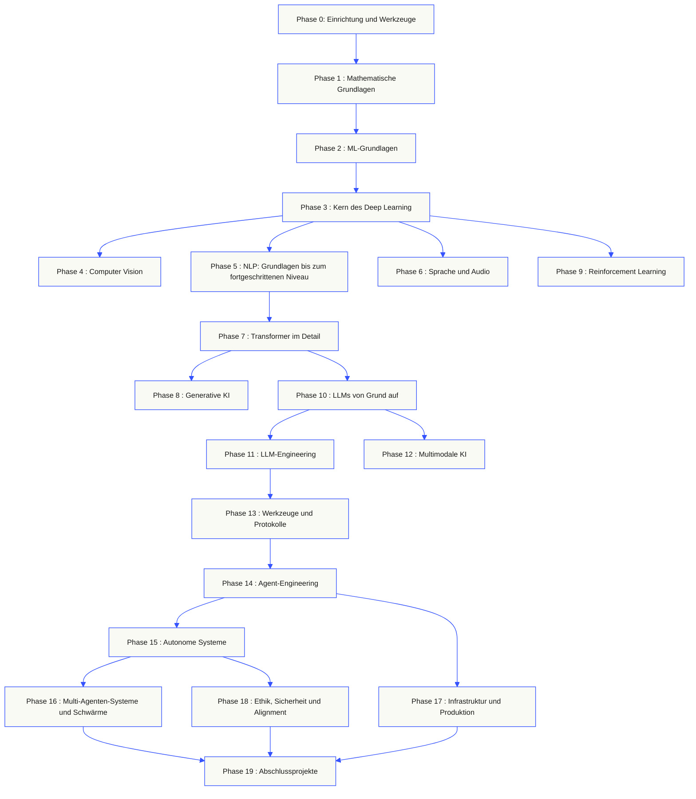

<p align="center"><sub>KI-gestützte Übersetzung; Struktur und Terminologie geprüft. Das <a href="../../README.md">englische Original</a> ist maßgeblich.</sub></p>

<p align="center">
  <picture>
    <source media="(prefers-color-scheme: dark)" srcset="../../assets/readme/header-dark.svg">
    
  </picture>
</p>

Implementiere Modellinterna, Retrieval-Pipelines und Agenten-Laufzeitumgebungen. Teste sie, untersuche Fehler und behalte Code und Evaluationsergebnisse.

**[Mit dem Lernen beginnen](https://aiengineeringfromscratch.com/lesson?path=phases/00-setup-and-tooling/01-dev-environment)** · **[Lernpfad wählen](#learning-routes)** · **[Ein Labor ausprobieren](#interactive-lab)** · **[Ein Projekt bauen](#project-challenges)** · **[Lehrplan durchsuchen](#contents)**

Kostenlos, quelloffen, MIT-lizenziert. Lerne auf der Webseite, mit einem Programmieragenten oder durch lokal ausgeführten Code.

> 523 Lektionen. 20 Phasen. Python, TypeScript, Rust, Julia.

<p align="center">
  <a href="../../LICENSE"></a>
  <a href="../../ROADMAP.md"></a>
  <a href="#contents"></a>
  <a href="https://github.com/rohitg00/ai-engineering-from-scratch/stargazers"></a>
  <a href="https://aiengineeringfromscratch.com"></a>
</p>

<details>
<summary>In deiner Sprache lesen</summary>

<p align="center">
  <a href="../../README.md">🇬🇧 English</a> · <a href="../../i18n/zh/README.md">🇨🇳 简体中文</a> · <a href="../../i18n/zh-TW/README.md">🇹🇼 繁體中文（台灣）</a> · <a href="../../i18n/ja/README.md">🇯🇵 日本語</a> · <a href="../../i18n/ko/README.md">🇰🇷 한국어</a> · <a href="../../i18n/pt/README.md">🇵🇹 Português</a> · <a href="../../i18n/pt-BR/README.md">🇧🇷 Português (Brasil)</a> · <a href="../../i18n/es/README.md">🇪🇸 Español</a> · <a href="../../i18n/de/README.md">🇩🇪 Deutsch</a> · <a href="../../i18n/fr/README.md">🇫🇷 Français</a> · <a href="../../i18n/it/README.md">🇮🇹 Italiano</a> · <a href="../../i18n/nl/README.md">🇳🇱 Nederlands</a> · <a href="../../i18n/pl/README.md">🇵🇱 Polski</a> · <a href="../../i18n/cs/README.md">🇨🇿 Čeština</a> · <a href="../../i18n/ro/README.md">🇷🇴 Română</a> · <a href="../../i18n/hu/README.md">🇭🇺 Magyar</a> · <a href="../../i18n/el/README.md">🇬🇷 Ελληνικά</a> · <a href="../../i18n/sv/README.md">🇸🇪 Svenska</a> · <a href="../../i18n/da/README.md">🇩🇰 Dansk</a> · <a href="../../i18n/no/README.md">🇳🇴 Norsk</a> · <a href="../../i18n/fi/README.md">🇫🇮 Suomi</a> · <a href="../../i18n/ru/README.md">🇷🇺 Русский</a> · <a href="../../i18n/uk/README.md">🇺🇦 Українська</a> · <a href="../../i18n/tr/README.md">🇹🇷 Türkçe</a> · <a href="../../i18n/he/README.md">🇮🇱 עברית</a> · <a href="../../i18n/ar/README.md">🇸🇦 العربية</a> · <a href="../../i18n/fa/README.md">🇮🇷 فارسی</a> · <a href="../../i18n/hi/README.md">🇮🇳 हिन्दी</a> · <a href="../../i18n/bn/README.md">🇧🇩 বাংলা</a> · <a href="../../i18n/ur/README.md">🇵🇰 اردو</a> · <a href="../../i18n/th/README.md">🇹🇭 ไทย</a> · <a href="../../i18n/vi/README.md">🇻🇳 Tiếng Việt</a> · <a href="../../i18n/id/README.md">🇮🇩 Bahasa Indonesia</a> · <a href="../../i18n/tl/README.md">🇵🇭 Tagalog</a>
</p>

</details>

### Sponsoren

<p align="center">
  <a href="https://serpapi.com/ai-engineering-from-scratch"><picture><source media="(min-width: 768px)" srcset="../../assets/sponsors/serpapi-banner-compact.png" width="48%"></picture></a>
  <a href="https://nitrostack.ai/referral/aiengineeringfromscratch"><picture><source media="(min-width: 768px)" srcset="../../assets/sponsors/nitrostack-banner-equal.png" width="48%"></picture></a>
</p>

<p align="center">
  <sub><span>Dank eurer Unterstützung bleiben alle Lektionen kostenlos und Open Source.</span> <a href="#supporters">Alle Unterstützer ansehen</a> · <a href="../../SPONSORS.md">Sponsor werden</a></sub>
</p>

<a id="see-what-you-will-build-and-keep"></a>
<a id="learning-routes"></a>

## Lernpfade

| Lernpfad | Erste Lektion |
|---|---|
| Modellgrundlagen | [Einrichtung und Werkzeuge](https://aiengineeringfromscratch.com/lesson?path=phases/00-setup-and-tooling/01-dev-environment) |
| LLM-Systeme | [Prompt-Entwicklung](https://aiengineeringfromscratch.com/lesson?path=phases/11-llm-engineering/01-prompt-engineering) |
| Agenten und Auslieferung | [Die Agentenschleife](https://aiengineeringfromscratch.com/lesson?path=phases/14-agent-engineering/01-the-agent-loop) |

[Berufliche Lernpfade vergleichen](https://aiengineeringfromscratch.com/learning-paths.html) · [Voraussetzungen und Lernzeit](#study-guide)

<a id="interactive-lab"></a>

### Gradientenabstieg

Zwanzig Startpunkte folgen dem Gradientenabstieg auf einer quadratischen Verlustfunktion. Die Grafik zeigt ihre Positionen und den mittleren Verlust nach jedem Aktualisierungsschritt.

<p align="center">
  <a href="https://aiengineeringfromscratch.com/lesson?path=phases/01-math-foundations/08-optimization#loss-landscape-visualization">
    <picture>
      <source media="(max-width: 600px) and (prefers-color-scheme: dark) and (prefers-reduced-motion: reduce)" srcset="../../assets/readme/101-gradient-mobile-dark.png">
      <source media="(max-width: 600px) and (prefers-reduced-motion: reduce)" srcset="../../assets/readme/101-gradient-mobile-light.png">
      <source media="(prefers-color-scheme: dark) and (prefers-reduced-motion: reduce)" srcset="../../assets/readme/101-gradient-dark.png">
      <source media="(prefers-reduced-motion: reduce)" srcset="../../assets/readme/101-gradient-light.png">
      <source media="(max-width: 600px) and (prefers-color-scheme: dark)" srcset="../../assets/readme/101-gradient-mobile-dark.gif">
      <source media="(max-width: 600px)" srcset="../../assets/readme/101-gradient-mobile-light.gif">
      <source media="(prefers-color-scheme: dark)" srcset="../../assets/readme/101-gradient-dark.gif">
      
    </picture>
  </a>
</p>

[Lernrate in der Lektion anpassen](https://aiengineeringfromscratch.com/lesson?path=phases/01-math-foundations/08-optimization#loss-landscape-visualization) · [GD, Momentum und Adam im Code vergleichen](../../phases/01-math-foundations/08-optimization/code/optimizers.py)

<a id="project-challenges"></a>

### Projekte

Drei Projekte mit stufenweisen Startgerüsten, Referenzimplementierungen und lokalen Prüfern. Führe Befehle nach der [Einrichtung](#local-setup) im Repository-Stamm aus. Die Startgerüste bestehen die Prüfungen erst, wenn du die Stufen implementiert hast.

<details>
<summary><strong>01 · Labor zur Retrieval-Evaluation</strong> · Python · Rangmetriken und Regressionsprüfungen</summary>

Ein Kandidat verbessert den mittleren NDCG, während eine Anfrage ihren relevantesten Beleg niedriger einordnet. Baue einen Vergleich je Anfrage, der die Regression meldet und eine Freigabeprüfung fehlschlagen lassen kann.

Nutze Python 3.10+. Wiederhole [RAG](../../phases/11-llm-engineering/06-rag/docs/en.md) und [Modellevaluation](../../phases/02-ml-fundamentals/09-model-evaluation/docs/en.md). Implementiere die Rangfolgenvalidierung, Präzision und Recall, rangabhängige Metriken und anschließend den Systemvergleich.

```bash
python3 scripts/project_test.py retrieval-evaluation-lab \
  --init learning-artifacts/retrieval-evaluation-lab
python3 scripts/project_test.py retrieval-evaluation-lab \
  --stage 1 --path learning-artifacts/retrieval-evaluation-lab --strict
python3 scripts/project_test.py retrieval-evaluation-lab \
  --all --path learning-artifacts/retrieval-evaluation-lab --strict
```

**Behalte:** einen reproduzierbaren Vergleich mit Änderungen je Anfrage und den zugrunde liegenden Relevanzurteilen. Die Metriken beschreiben diese Urteile; sie belegen nicht die Korrektheit der Antworten.

[Projekt starten](https://aiengineeringfromscratch.com/project.html?id=retrieval-evaluation-lab) · [Referenz untersuchen](../../projects/retrieval-evaluation-lab/solution/) · [Mit eigenen Eingaben ausführen](../../projects/retrieval-evaluation-lab/README.md#run-with-your-own-inputs)

</details>

<details>
<summary><strong>02 · Debugger für Agenten-Traces</strong> · TypeScript · Trace-Parsing und Zeitmessung</summary>

Ein bereitgestellter Trace dauert weiterhin 100 ms, aber der gesamte Tokenverbrauch steigt um 200 und ein Span beginnt fehlzuschlagen. Trenne überlappende Arbeit der Kind-Spans von der Ausführungszeit des Eltern-Spans und erstelle einen Bericht, der die Änderung sichtbar macht.

Nutze Node.js 22.18+ und Python 3 für den Prüfer. Implementiere JSONL-Parsing, die Validierung der Elternbeziehungen, Intervallarithmetik und anschließend eine einsehbare Zeitleiste.

```bash
python3 scripts/project_test.py agent-trace-debugger \
  --init learning-artifacts/agent-trace-debugger
python3 scripts/project_test.py agent-trace-debugger \
  --stage 1 --path learning-artifacts/agent-trace-debugger --strict
python3 scripts/project_test.py agent-trace-debugger \
  --all --path learning-artifacts/agent-trace-debugger --strict
```

**Behalte:** den Eingabe-Trace, eine HTML-Zeitleiste und einen JSON-Regressionsbericht. Bewahre exklusive Tokenzahlen je Span, damit der Verbrauch von Eltern- und Kind-Spans nicht doppelt gezählt wird.

[Projekt starten](https://aiengineeringfromscratch.com/project.html?id=agent-trace-debugger) · [Referenz untersuchen](../../projects/agent-trace-debugger/solution/) · [Zeitverhalten interaktiv untersuchen](https://aiengineeringfromscratch.com/project.html?id=agent-trace-debugger&stage=03-timing)

</details>

<details>
<summary><strong>03 · Firewall für Werkzeugaufrufe</strong> · Rust · Rollenprüfungen und Freigabebelege</summary>

Ein Schreibvorgang ändert sich nach der Prüfung oder eine Freigabe wird erneut verwendet. Validiere die Aufrufhülle, prüfe Rolle und Pfad des Aufrufers und verbrauche dann eine Freigabe, die an die genaue Anfrage und ihren Inhalt gebunden ist.

Nutze Rust und Python 3.10+. Wiederhole [das Design von Werkzeugschemata](../../phases/13-tools-and-protocols/05-tool-schema-design/docs/en.md) und [Sicherheitsgrenzen](../../phases/17-infrastructure-and-production/25-security-secrets-audit/docs/en.md). Die aufrufende Anwendung liefert die Identität; das Modell schlägt eine Operation vor.

```bash
python3 scripts/project_test.py tool-call-firewall \
  --init learning-artifacts/tool-call-firewall
python3 scripts/project_test.py tool-call-firewall \
  --stage 1 --path learning-artifacts/tool-call-firewall --strict
python3 scripts/project_test.py tool-call-firewall \
  --all --path learning-artifacts/tool-call-firewall --strict
```

**Behalte:** einen Audit-Beleg mit der angeforderten Operation und der Richtlinienentscheidung. Freigaben sind innerhalb eines Aufrufs einmalig nutzbar; dieses Projekt bietet weder dauerhafte Autorisierung noch eine Betriebssystem-Sandbox.

[Projekt starten](https://aiengineeringfromscratch.com/project.html?id=tool-call-firewall) · [Referenz untersuchen](../../projects/tool-call-firewall/solution/) · [Freigabegrenzen untersuchen](https://aiengineeringfromscratch.com/project.html?id=tool-call-firewall&stage=03-consume-a-request-bound-approval-once)

</details>

[Alle Projekte durchsuchen](https://aiengineeringfromscratch.com/projects.html) · [Leitfaden zur beruflichen Praxis](../../learning-paths/CAREER-PRACTICE.md)

## Wähle, wie du lernen möchtest

### Auf der Webseite

Öffne eine beliebige abgeschlossene Lektion auf [aiengineeringfromscratch.com](https://aiengineeringfromscratch.com) oder klappe unter [Inhalt](#contents) eine Phase auf. Keine Einrichtung, kein Klonen.

### Mit einem KI-Tutor

Wenn Node.js, `npx` und ein Coding-Agent mit Skills-Unterstützung bereits installiert sind, kannst du ihn zu deinem Tutor machen. Zum Installieren oder Lesen des Tutors brauchst du kein Repository zu klonen. Ausführbare Labs für die fokussierten Lernpfade benötigen `python3`. Für Agent-Skills-Labs brauchst du außerdem einen unterstützten Host und einen beschreibbaren Skill-Bereich für Benutzer oder Projekt.

```bash
npx skills add rohitg00/ai-engineering-from-scratch
```

Wähle Host und Geltungsbereich, wenn der Installer danach fragt. Nutze `start-learning` in Codex, `/start-learning` in Claude Code oder bitte deinen Host, den Skill namentlich zu verwenden.

<details>
<summary>Tutor einrichten und Host-Befehle nutzen</summary>

Prüfe zuerst, ob die nötigen Werkzeuge installiert sind:

```bash
node --version
npx --version
python3 --version
```

Das Installationsprogramm schreibt die Skills in den Host und Speicherbereich, die du bei der Installation ausgewählt hast, zum Beispiel in `.claude/skills/`, `.cursor/skills/`, `.codex/skills/` oder einen anderen unterstützten Skill-Ordner. Prüfe, ob der Host genau diesen Speicherort erkennt.

Die Aufrufsyntax hängt vom Host ab; sie gehört nicht zum portablen Format `SKILL.md`:

| Host-Anwendung | Kurs starten | Model Context Protocol (MCP) starten | Agent Skills starten | Quiz zu einer Phase starten |
|---|---|---|---|---|
| Codex | `start-learning` oder über `/skills` auswählen | `learn-mcp` oder über `/skills` auswählen | `learn-agent-skills` oder über `/skills` auswählen | `check-understanding 13` oder über `/skills` auswählen |
| Claude Code | `/start-learning` | `/learn-mcp` | `/learn-agent-skills` | `/check-understanding 13` |
| Andere kompatible Hosts | `Use start-learning to begin the course.` | `Use learn-mcp to start the Model Context Protocol (MCP) path.` | `Use learn-agent-skills to start the Agent Skills Engineering path.` | `Use check-understanding to quiz me on Phase 13.` |

Ein Einstufungstest mit zehn Fragen ermittelt, was du bereits weißt, ordnet dich einer Einstiegsphase zu und speichert einen persönlichen Lernplan in `LEARNING.md`. Danach vermittelt der Skill `learn` pro Sitzung eine Lektion: Konzept, Mathematik, Code und Quiz. Der Skill `course-guide` verweist dich direkt auf die Lektion, die bei einem Thema oder Problem weiterhilft. In Codex rufst du die Skills mit `learn` und `course-guide` auf, in Claude Code mit `/learn` und `/course-guide`. Bei anderen kompatiblen Hosts bittest du darum, den jeweiligen Skill zu verwenden.

Du möchtest nur Model Context Protocol (MCP) lernen? Verwende den MCP-Aufruf für deinen Host. Er erstellt `MCP-LEARNING.md` und führt dich durch einen 17-Lektionen-Pfad: zustandslose Anfragen, Transport, bidirektionale Abläufe, Sicherheit, Zuverlässigkeit, Registry-Governance und Konformitätsnachweise. Die genaue Reihenfolge und die Meilensteine stehen im [MCP-Manifest](../../learning-paths/model-context-protocol.json).

Du möchtest nur Agent Skills lernen? Verwende den Aufruf für Agent Skills auf deinem Host. Er erstellt `AGENT-SKILLS-LEARNING.md` und führt dich durch fünf zusammenhängende Lektionen: Spezifikation, Auffinden, Aufruf, Sandbox-Grenzen und anschließend Release-Evaluierungen sowie Portabilität zwischen echten Hosts. Starte im Web mit dem [Pfad zu Agent Skills](https://aiengineeringfromscratch.com/lesson?path=phases/13-tools-and-protocols/22-skills-and-agent-sdks&learningPath=agent-skills).

Das Installationsprogramm zeigt die Hosts an, die es konfigurieren kann, und fragt, wo die Skills installiert werden sollen. Wenn dir Node.js, `npx`, `python3`, ein unterstützter Host oder ein beschreibbarer Speicherbereich noch fehlt, nutze die Website oder lies `docs/en.md` von Hand. So lernst du die Konzepte; die Nachweise für Auffinden, Aufrufen, Skripte und Deinstallation auf einem echten Host musst du nachholen, sobald die Vorabprüfung verfügbar ist. Die Lektionen findest du auf [aiengineeringfromscratch.com](https://aiengineeringfromscratch.com).

### Lern-Skills

| Fähigkeit | Funktion |
|---|---|
| [`start-learning`](../../skills/start-learning/SKILL.md) | Einmaliger Einstieg: Lernziel klären, Einstufungstest absolvieren und persönlichen Lernplan in `LEARNING.md` speichern. |
| [`learn`](../../skills/learn/SKILL.md) | Der Tutor-Ablauf: Wissen zum Einstieg auffrischen, die nächste Lektion interaktiv bearbeiten, das Quiz absolvieren und Fortschritt sowie Wiederholungsbedarf festhalten. |
| [`course-guide`](../../skills/course-guide/SKILL.md) | Themen-Navigator: „Wo lerne ich Attention?“ oder „Mein Loss ist NaN“ führt mit Links direkt zu den passenden Lektionen. |
| [`learn-mcp`](../../skills/learn-mcp/SKILL.md) | Tutor für Model Context Protocol (MCP). Erstellt `MCP-LEARNING.md`, folgt dem Manifest mit 17 Lektionen und dokumentiert Wire-Format, Sicherheit, Zuverlässigkeit und Konformität. |
| [`learn-agent-skills`](../../skills/learn-agent-skills/SKILL.md) | Tutor für Agent Skills. Erstellt `AGENT-SKILLS-LEARNING.md`, behandelt die Lektionen 22 und 24–27 und dokumentiert Nachweise auf einem echten Host. |
| [`claude-certification`](../../skills/claude-certification/SKILL.md) | Zertifizierungstutor: wählt CCAO-F, CCDV-F, CCAR-F oder CCAR-P, unterrichtet die Lektionen, führt Labs aus, prüft Artefakte, verwaltet Diagnose- und Übungsprüfungen und speichert den Fortschritt. |
| [`mcpa-certification`](../../skills/mcpa-certification/SKILL.md) | MCPA-Tutor: folgt dem 34-Lektionen-Pfad `mcpa-f` für das Protokoll vom 2026-07-28, führt Labs und Wire-Format-Prüfer aus, verwaltet den Diagnosetest und drei Übungsprüfungen und speichert den Fortschritt. |
| [`find-your-level`](../../skills/find-your-level/SKILL.md) | Einstufungstest mit zehn Fragen: ermittelt deine Startphase und erstellt einen persönlichen Lernpfad mit Zeitangaben. |
| [`check-understanding <phase>`](../../skills/check-understanding/SKILL.md) | Quiz mit acht Fragen pro Phase, Feedback und konkreten Lektionen zur Wiederholung. Verwende den Codex-, Claude-Code- oder natürlichsprachlichen Aufruf aus der obigen Tabelle. |

</details>

<a id="local-setup"></a>

### Code lokal ausführen

```bash
git clone https://github.com/rohitg00/ai-engineering-from-scratch.git
cd ai-engineering-from-scratch
python3 phases/00-setup-and-tooling/01-dev-environment/code/verify.py --route beginner
python3 phases/01-math-foundations/01-linear-algebra-intuition/code/vectors.py
```

Die Vorabprüfung trennt die Anforderungen, die du sofort brauchst, von den Werkzeugen, die erst später nötig sind. Bei jedem erforderlichen Schritt, der fehlschlägt, werden die erkannte Ursache und ein Korrekturbefehl angezeigt. Der Befehl `vectors.py` startet eine Lektion ohne zusätzliche Abhängigkeiten und zeigt, dass eine Matrix-Vektor-Multiplikation den Vorgang innerhalb einer neuronalen Netzwerkschicht darstellt. Speichere die Terminalausgabe als deinen ersten Nachweis.

<details>
<summary>Arbeite jede Lektion nach demselben Muster durch</summary>

### Arbeite jede Lektion nach demselben Muster durch

1. **Lies** `docs/en.md` und erkläre die Grundidee mit eigenen Worten.
2. **Tippe den wichtigen Code selbst und baue ihn nach**, statt den Codeblock nur als Dekoration zu betrachten.
3. **Führe** den Befehl für die Lektion vom Repository-Stammverzeichnis aus – dem Ordner mit `README.md` und `phases/`.
4. **Halte die Ergebnisse fest**: den Befehl, das Arbeitsverzeichnis, den Exit-Code, die aussagekräftige Ausgabe und das Artefakt, das du geändert oder erstellt hast.
5. **Mach erst weiter**, wenn du die Ausgabe erklären und ohne zu raten eine kleine Änderung vornehmen kannst.

Befehle auf den Lektionsseiten verwenden Pfade relativ zum Repository-Stammverzeichnis, sofern die Lektion nicht ausdrücklich zum Wechsel in einen anderen Ordner auffordert. Wenn eine Lektion mehrere Sprachen anbietet, führe die Implementierung in der Sprache aus, die du lernst.

</details>

<a id="study-guide"></a>

## Wähle einen Lernpfad

Du musst nicht erst alle 523 Lektionen durchsehen. Wähle ein Ziel. Jeder Link führt zum selben Lehrplan auf GitHub oder auf der Website; beide Fassungen verwenden denselben Lektionencode.

| Dein Ziel | Auf GitHub lernen | Auf der Website lernen |
|---|---|---|
| Ich bin neu und möchte die Grundlagen vollständig lernen | [Phase 0: Einrichtung und Werkzeuge](../../phases/00-setup-and-tooling/) | [Entwicklungsumgebung](https://aiengineeringfromscratch.com/lesson?path=phases/00-setup-and-tooling/01-dev-environment) |
| Ich kenne Python und möchte mathematische Grundlagen und ML lernen | [Phase 1: Mathematische Grundlagen](../../phases/01-math-foundations/) | [Lineare Algebra intuitiv verstehen](https://aiengineeringfromscratch.com/lesson?path=phases/01-math-foundations/01-linear-algebra-intuition) |
| Ich möchte produktive LLM-Anwendungen entwickeln | [Phase 11: LLM-Engineering](../../phases/11-llm-engineering/) | [Prompt Engineering](https://aiengineeringfromscratch.com/lesson?path=phases/11-llm-engineering/01-prompt-engineering) |
| Ich möchte Agenten entwickeln | [Phase 14: Agent-Engineering](../../phases/14-agent-engineering/) | [Die Agent-Schleife](https://aiengineeringfromscratch.com/lesson?path=phases/14-agent-engineering/01-the-agent-loop) |
| Ich möchte Coding-Agenten in echten Repositories einsetzen | [Pfad für agentengestütztes Engineering](../../learning-paths/using-coding-agents.json) | [Agentengestütztes Engineering](https://aiengineeringfromscratch.com/lesson?path=phases/14-agent-engineering/31-agent-workbench-why-models-fail&learningPath=using-coding-agents) |
| Ich möchte vor der Implementierung festlegen, was gebaut werden soll | [Pfad für Produktentscheidungen und Umsetzung](../../learning-paths/shaping-the-build.json) | [Produktentscheidungen und Umsetzung](https://aiengineeringfromscratch.com/lesson?path=phases/14-agent-engineering/47-outcomes-before-output&learningPath=shaping-the-build) |

Du weißt nicht, wo du anfangen sollst? Nutze den [Einstufungstutor start-learning](../../skills/start-learning/SKILL.md) oder den [Leitfaden zu den Voraussetzungen](https://aiengineeringfromscratch.com/prereqs.html).

Vergleiche vier Kerndomänen und sechs Karrierepfade in den [Lernpfaden für AI Engineering](https://aiengineeringfromscratch.com/learning-paths.html).

<details>
<summary>Gezielte Lernpfade für MCP und Agent Skills</summary>

| Dein Ziel | Auf GitHub lernen | Auf der Website lernen |
|---|---|---|
| Ich möchte mit dem Model Context Protocol (MCP) entwickeln | [Pfad zum Model Context Protocol (MCP)](../../phases/13-tools-and-protocols/README.md#model-context-protocol-mcp-path) | [Pfad zum Model Context Protocol (MCP)](https://aiengineeringfromscratch.com/lesson?path=phases/13-tools-and-protocols/06-mcp-fundamentals&learningPath=model-context-protocol) |
| Ich möchte Agent Skills schreiben und veröffentlichen | [Kompakter Pfad zu Agent Skills](../../phases/13-tools-and-protocols/README.md#agent-skills-fast-path) | [Pfad zu Agent Skills](https://aiengineeringfromscratch.com/lesson?path=phases/13-tools-and-protocols/22-skills-and-agent-sdks&learningPath=agent-skills) |

</details>

<details>
<summary>Voraussetzungen und Lernzeit</summary>

### Voraussetzungen

- Du kannst programmieren (in einer beliebigen Sprache; Python ist hilfreich).
- Du möchtest verstehen, wie KI **wirklich funktioniert**, statt nur APIs aufzurufen.

## Wo du anfangen kannst

| Vorkenntnisse | Einstieg | Geschätzte Zeit |
|---|---|---|
| Neu in Programmierung und KI | Phase 0 — Einrichtung und Werkzeuge | ~306 Stunden |
| Python-Kenntnisse, neu in ML | Phase 1 — Mathematische Grundlagen | ~270 Stunden |
| ML-Kenntnisse, neu im Deep Learning | Phase 3 — Kern des Deep Learning | ~200 Stunden |
| Deep-Learning-Kenntnisse, Ziel LLMs und Agenten | Phase 10 — LLMs von Grund auf | ~100 Stunden |
| Senior Engineer, nur Agent-Engineering | Phase 14 — Agent-Engineering | ~60 Stunden |
| Nur produktive MCP-Systeme entwickeln | [Pfad zum Model Context Protocol (MCP)](../../learning-paths/model-context-protocol.json) | ~23 Stunden 15 Minuten |
| Nur produktive Agent Skills entwickeln | [Pfad für Agent-Skills-Engineering](../../learning-paths/agent-skills.json) | ~9,5 Stunden |

</details>

## Der Aufbau des Lehrplans

Die 20 Phasen bauen aufeinander auf. Mathematik bildet das Fundament, Agenten und Produktionssysteme das Dach. Wenn du die Grundlagen schon kennst, kannst du vorausgehen. Überspringe sie aber nicht, wenn du danach nicht verstehen willst, warum es weiter oben hakt.



<a id="contents"></a>

## Inhalt

20 Phasen. Klappe eine Phase auf, um die zugehörigen Lektionen zu sehen.

<a id="phase-0"></a>
### Phase 0: Einrichtung und Werkzeuge `12 Lektionen`
> Mach deine Arbeitsumgebung startklar für alles, was folgt.

| # | Lektion | Typ | Sprachen |
|:---:|--------|:----:|------|
| 01 | [Entwicklungsumgebung](../../phases/00-setup-and-tooling/01-dev-environment/) | Umsetzen | Python |
| 02 | [Git und Zusammenarbeit](../../phases/00-setup-and-tooling/02-git-and-collaboration/) | Lernen | — |
| 03 | [GPU-Setup und Cloud](../../phases/00-setup-and-tooling/03-gpu-setup-and-cloud/) | Umsetzen | Python |
| 04 | [APIs und Zugangsschlüssel](../../phases/00-setup-and-tooling/04-apis-and-keys/) | Umsetzen | Python |
| 05 | [Jupyter-Notebooks](../../phases/00-setup-and-tooling/05-jupyter-notebooks/) | Umsetzen | Python |
| 06 | [Python-Umgebungen](../../phases/00-setup-and-tooling/06-python-environments/) | Umsetzen | Shell |
| 07 | [Docker für KI](../../phases/00-setup-and-tooling/07-docker-for-ai/) | Umsetzen | Docker |
| 08 | [Editor einrichten](../../phases/00-setup-and-tooling/08-editor-setup/) | Umsetzen | — |
| 09 | [Datenverwaltung](../../phases/00-setup-and-tooling/09-data-management/) | Umsetzen | Python |
| 10 | [Terminal und Shell](../../phases/00-setup-and-tooling/10-terminal-and-shell/) | Lernen | — |
| 11 | [Linux für KI](../../phases/00-setup-and-tooling/11-linux-for-ai/) | Lernen | — |
| 12 | [Debugging und Profiling](../../phases/00-setup-and-tooling/12-debugging-and-profiling/) | Umsetzen | Python |

<details id="phase-1">
<summary><b>Phase 1 — Mathematische Grundlagen</b> &nbsp;<code>22 Lektionen</code>&nbsp; <em>Verstehe die Grundlagen hinter KI-Algorithmen durch Programmieren.</em></summary>
<br/>

| # | Lektion | Typ | Sprachen |
|:---:|--------|:----:|------|
| 01 | [Lineare Algebra intuitiv verstehen](../../phases/01-math-foundations/01-linear-algebra-intuition/) | Lernen | Python, Julia |
| 02 | [Vektoren, Matrizen und Operationen](../../phases/01-math-foundations/02-vectors-matrices-operations/) | Umsetzen | Python, Julia |
| 03 | [Matrizen-Transformationen und Eigenwerte](../../phases/01-math-foundations/03-matrix-transformations/) | Umsetzen | Python, Julia |
| 04 | [Analysis für ML: Ableitungen und Gradienten](../../phases/01-math-foundations/04-calculus-for-ml/) | Lernen | Python |
| 05 | [Kettenregel und automatische Differenzierung](../../phases/01-math-foundations/05-chain-rule-and-autodiff/) | Umsetzen | Python |
| 06 | [Wahrscheinlichkeit und Verteilungen](../../phases/01-math-foundations/06-probability-and-distributions/) | Lernen | Python |
| 07 | [Satz von Bayes und statistisches Denken](../../phases/01-math-foundations/07-bayes-theorem/) | Umsetzen | Python |
| 08 | [Optimierung: Familie der Gradientenabstiegsverfahren](../../phases/01-math-foundations/08-optimization/) | Umsetzen | Python |
| 09 | [Informationstheorie: Entropie und KL-Divergenz](../../phases/01-math-foundations/09-information-theory/) | Lernen | Python |
| 10 | [Dimensionsreduktion: PCA, t-SNE, UMAP](../../phases/01-math-foundations/10-dimensionality-reduction/) | Umsetzen | Python |
| 11 | [Singulärwertzerlegung](../../phases/01-math-foundations/11-singular-value-decomposition/) | Umsetzen | Python, Julia |
| 12 | [Tensoroperationen](../../phases/01-math-foundations/12-tensor-operations/) | Umsetzen | Python |
| 13 | [Numerische Stabilität](../../phases/01-math-foundations/13-numerical-stability/) | Umsetzen | Python |
| 14 | [Normen und Abstände](../../phases/01-math-foundations/14-norms-and-distances/) | Umsetzen | Python |
| 15 | [Statistik für ML](../../phases/01-math-foundations/15-statistics-for-ml/) | Umsetzen | Python |
| 16 | [Stichprobenverfahren](../../phases/01-math-foundations/16-sampling-methods/) | Umsetzen | Python |
| 17 | [Lineare Gleichungssysteme](../../phases/01-math-foundations/17-linear-systems/) | Umsetzen | Python |
| 18 | [Konvexe Optimierung](../../phases/01-math-foundations/18-convex-optimization/) | Umsetzen | Python |
| 19 | [Komplexe Zahlen für KI](../../phases/01-math-foundations/19-complex-numbers/) | Lernen | Python |
| 20 | [Fourier-Transformation](../../phases/01-math-foundations/20-fourier-transform/) | Umsetzen | Python |
| 21 | [Graphentheorie für ML](../../phases/01-math-foundations/21-graph-theory/) | Umsetzen | Python |
| 22 | [Stochastische Prozesse](../../phases/01-math-foundations/22-stochastic-processes/) | Lernen | Python |

</details>

<details id="phase-2">
<summary><b>Phase 2 — ML-Grundlagen</b> &nbsp;<code>18 Lektionen</code>&nbsp; <em>Klassisches ML bildet noch immer das Rückgrat der meisten KI-Systeme in Produktion.</em></summary>
<br/>

| # | Lektion | Typ | Sprachen |
|:---:|--------|:----:|------|
| 01 | [Was ist maschinelles Lernen?](../../phases/02-ml-fundamentals/01-what-is-machine-learning/) | Lernen | Python |
| 02 | [Lineare Regression von Grund auf](../../phases/02-ml-fundamentals/02-linear-regression/) | Umsetzen | Python |
| 03 | [Logistische Regression und Klassifikation](../../phases/02-ml-fundamentals/03-logistic-regression/) | Umsetzen | Python |
| 04 | [Entscheidungsbäume und Random Forests](../../phases/02-ml-fundamentals/04-decision-trees/) | Umsetzen | Python |
| 05 | [Support-Vector-Machines](../../phases/02-ml-fundamentals/05-support-vector-machines/) | Umsetzen | Python |
| 06 | [KNN und Distanzmetriken](../../phases/02-ml-fundamentals/06-knn-and-distances/) | Umsetzen | Python |
| 07 | [Unüberwachtes Lernen: K-Means und DBSCAN](../../phases/02-ml-fundamentals/07-unsupervised-learning/) | Umsetzen | Python |
| 08 | [Feature Engineering und Auswahl](../../phases/02-ml-fundamentals/08-feature-engineering/) | Umsetzen | Python |
| 09 | [Modellevaluierung: Metriken und Kreuzvalidierung](../../phases/02-ml-fundamentals/09-model-evaluation/) | Umsetzen | Python |
| 10 | [Bias, Varianz und Lernkurve](../../phases/02-ml-fundamentals/10-bias-variance/) | Lernen | Python |
| 11 | [Ensemble-Methoden: Boosting, Bagging, Stacking](../../phases/02-ml-fundamentals/11-ensemble-methods/) | Umsetzen | Python |
| 12 | [Hyperparameter-Abstimmung](../../phases/02-ml-fundamentals/12-hyperparameter-tuning/) | Umsetzen | Python |
| 13 | [ML-Pipelines und Experimentverfolgung](../../phases/02-ml-fundamentals/13-ml-pipelines/) | Umsetzen | Python |
| 14 | [Naiver Bayes-Klassifikator](../../phases/02-ml-fundamentals/14-naive-bayes/) | Umsetzen | Python |
| 15 | [Grundlagen der Zeitreihen](../../phases/02-ml-fundamentals/15-time-series/) | Umsetzen | Python |
| 16 | [Anomalieerkennung](../../phases/02-ml-fundamentals/16-anomaly-detection/) | Umsetzen | Python |
| 17 | [Umgang mit unausgewogenen Daten](../../phases/02-ml-fundamentals/17-imbalanced-data/) | Umsetzen | Python |
| 18 | [Merkmalsauswahl](../../phases/02-ml-fundamentals/18-feature-selection/) | Umsetzen | Python |

</details>

<details id="phase-3">
<summary><b>Phase 3 — Kern des Deep Learning</b> &nbsp;<code>13 Lektionen</code>&nbsp; <em>Neuronale Netze von Grund auf. Kein Framework, bevor du selbst eines baust.</em></summary>
<br/>

| # | Lektion | Typ | Sprachen |
|:---:|--------|:----:|------|
| 01 | [Das Perzeptron: Die Anfänge](../../phases/03-deep-learning-core/01-the-perceptron/) | Umsetzen | Python |
| 02 | [Mehrschichtige Netze und Vorwärtsdurchlauf](../../phases/03-deep-learning-core/02-multi-layer-networks/) | Umsetzen | Python |
| 03 | [Backpropagation von Grund auf](../../phases/03-deep-learning-core/03-backpropagation/) | Umsetzen | Python |
| 04 | [Aktivierungsfunktionen: ReLU, Sigmoid, GELU und warum](../../phases/03-deep-learning-core/04-activation-functions/) | Umsetzen | Python |
| 05 | [Loss-Funktionen: MSE, Kreuzentropie und kontrastiver Loss](../../phases/03-deep-learning-core/05-loss-functions/) | Umsetzen | Python |
| 06 | [Optimierer: SGD, Momentum, Adam, AdamW](../../phases/03-deep-learning-core/06-optimizers/) | Umsetzen | Python |
| 07 | [Regularisierung: Dropout, Weight Decay, BatchNorm](../../phases/03-deep-learning-core/07-regularization/) | Umsetzen | Python |
| 08 | [Gewichtsinitialisierung und Trainingsstabilität](../../phases/03-deep-learning-core/08-weight-initialization/) | Umsetzen | Python |
| 09 | [Lernratenpläne und Warm-up](../../phases/03-deep-learning-core/09-learning-rate-schedules/) | Umsetzen | Python |
| 10 | [Baue dein eigenes Mini-Framework](../../phases/03-deep-learning-core/10-mini-framework/) | Umsetzen | Python |
| 11 | [Einführung in PyTorch](../../phases/03-deep-learning-core/11-intro-to-pytorch/) | Umsetzen | Python |
| 12 | [Einführung in JAX](../../phases/03-deep-learning-core/12-intro-to-jax/) | Umsetzen | Python |
| 13 | [Neuronale Netze debuggen](../../phases/03-deep-learning-core/13-debugging-neural-networks/) | Umsetzen | Python |

</details>

<details id="phase-4">
<summary><b>Phase 4 — Computer Vision</b> &nbsp;<code>28 Lektionen</code>&nbsp; <em>Von Pixeln zum Verständnis: Bilder, Videos, 3D, VLMs und Weltmodelle.</em></summary>
<br/>

| # | Lektion | Typ | Sprachen |
|:---:|--------|:----:|------|
| 01 | [Bildgrundlagen: Pixel, Kanäle und Farbräume](../../phases/04-computer-vision/01-image-fundamentals/) | Lernen | Python |
| 02 | [Faltungen von Grund auf](../../phases/04-computer-vision/02-convolutions-from-scratch/) | Umsetzen | Python |
| 03 | [CNNs: von LeNet zu ResNet](../../phases/04-computer-vision/03-cnns-lenet-to-resnet/) | Umsetzen | Python |
| 04 | [Bildklassifikation](../../phases/04-computer-vision/04-image-classification/) | Umsetzen | Python |
| 05 | [Transfer Learning und Fine-Tuning](../../phases/04-computer-vision/05-transfer-learning/) | Umsetzen | Python |
| 06 | [Objekterkennung: YOLO von Grund auf](../../phases/04-computer-vision/06-object-detection-yolo/) | Umsetzen | Python |
| 07 | [Semantische Segmentierung: U-Net](../../phases/04-computer-vision/07-semantic-segmentation-unet/) | Umsetzen | Python |
| 08 | [Instanzsegmentierung: Mask R-CNN](../../phases/04-computer-vision/08-instance-segmentation-mask-rcnn/) | Umsetzen | Python |
| 09 | [Bildgenerierung: GANs](../../phases/04-computer-vision/09-image-generation-gans/) | Umsetzen | Python |
| 10 | [Bildgenerierung: Diffusionsmodelle](../../phases/04-computer-vision/10-image-generation-diffusion/) | Umsetzen | Python |
| 11 | [Stable Diffusion: Architektur und Fine-Tuning](../../phases/04-computer-vision/11-stable-diffusion/) | Umsetzen | Python |
| 12 | [Videoverstehen: zeitliche Modellierung](../../phases/04-computer-vision/12-video-understanding/) | Umsetzen | Python |
| 13 | [3D-Vision: Punktwolken und NeRFs](../../phases/04-computer-vision/13-3d-vision-nerf/) | Umsetzen | Python |
| 14 | [Vision Transformer (ViT)](../../phases/04-computer-vision/14-vision-transformers/) | Umsetzen | Python |
| 15 | [Echtzeit-Vision: Deployment am Edge](../../phases/04-computer-vision/15-real-time-edge/) | Umsetzen | Python |
| 16 | [Eine vollständige Vision-Pipeline bauen](../../phases/04-computer-vision/16-vision-pipeline-capstone/) | Umsetzen | Python |
| 17 | [Selbstüberwachtes Lernen für Vision: SimCLR, DINO, MAE](../../phases/04-computer-vision/17-self-supervised-vision/) | Umsetzen | Python |
| 18 | [Vision mit offenem Vokabular: CLIP](../../phases/04-computer-vision/18-open-vocab-clip/) | Umsetzen | Python |
| 19 | [OCR und Dokumentenverständnis](../../phases/04-computer-vision/19-ocr-document-understanding/) | Umsetzen | Python |
| 20 | [Bildsuche und metrisches Lernen](../../phases/04-computer-vision/20-image-retrieval-metric/) | Umsetzen | Python |
| 21 | [Keypoint-Erkennung und Pose-Schätzung](../../phases/04-computer-vision/21-keypoint-pose/) | Umsetzen | Python |
| 22 | [3D Gaussian Splatting von Grund auf](../../phases/04-computer-vision/22-3d-gaussian-splatting/) | Umsetzen | Python |
| 23 | [Diffusion-Transformer und Rectified Flow](../../phases/04-computer-vision/23-diffusion-transformers-rectified-flow/) | Umsetzen | Python |
| 24 | [SAM 3 und Segmentierung mit offenem Vokabular](../../phases/04-computer-vision/24-sam3-open-vocab-segmentation/) | Umsetzen | Python |
| 25 | [Vision-Language-Modelle (ViT-MLP-LLM)](../../phases/04-computer-vision/25-vision-language-models/) | Umsetzen | Python |
| 26 | [Monokulare Tiefen- und Geometrieschätzung](../../phases/04-computer-vision/26-monocular-depth/) | Umsetzen | Python |
| 27 | [Multi-Object-Tracking und Video-Memory](../../phases/04-computer-vision/27-multi-object-tracking/) | Umsetzen | Python |
| 28 | [Weltmodelle und Video-Diffusion](../../phases/04-computer-vision/28-world-models-video-diffusion/) | Umsetzen | Python |

</details>

<details id="phase-5">
<summary><b>Phase 5 — NLP: Grundlagen bis zum fortgeschrittenen Niveau</b> &nbsp;<code>29 Lektionen</code>&nbsp; <em>Sprache ist die Schnittstelle zur Intelligenz.</em></summary>
<br/>

| # | Lektion | Typ | Sprachen |
|:---:|--------|:----:|------|
| 01 | [Textverarbeitung: Tokenisierung, Stemming und Lemmatisierung](../../phases/05-nlp-foundations-to-advanced/01-text-processing/) | Umsetzen | Python |
| 02 | [Bag of Words, TF-IDF und Textrepräsentation](../../phases/05-nlp-foundations-to-advanced/02-bag-of-words-tfidf/) | Umsetzen | Python |
| 03 | [Word Embeddings: Word2Vec von Grund auf](../../phases/05-nlp-foundations-to-advanced/03-word-embeddings-word2vec/) | Umsetzen | Python |
| 04 | [GloVe, FastText und Subword-Embeddings](../../phases/05-nlp-foundations-to-advanced/04-glove-fasttext-subword/) | Umsetzen | Python |
| 05 | [Sentimentanalyse](../../phases/05-nlp-foundations-to-advanced/05-sentiment-analysis/) | Umsetzen | Python |
| 06 | [Erkennung benannter Entitäten (NER)](../../phases/05-nlp-foundations-to-advanced/06-named-entity-recognition/) | Umsetzen | Python |
| 07 | [POS-Tagging und syntaktisches Parsing](../../phases/05-nlp-foundations-to-advanced/07-pos-tagging-parsing/) | Umsetzen | Python |
| 08 | [Textklassifikation: CNNs und RNNs für Text](../../phases/05-nlp-foundations-to-advanced/08-cnns-rnns-for-text/) | Umsetzen | Python |
| 09 | [Sequenz-zu-Sequenz-Modelle](../../phases/05-nlp-foundations-to-advanced/09-sequence-to-sequence/) | Umsetzen | Python |
| 10 | [Attention-Mechanismus: der Durchbruch](../../phases/05-nlp-foundations-to-advanced/10-attention-mechanism/) | Umsetzen | Python |
| 11 | [Maschinelle Übersetzung](../../phases/05-nlp-foundations-to-advanced/11-machine-translation/) | Umsetzen | Python |
| 12 | [Textzusammenfassung](../../phases/05-nlp-foundations-to-advanced/12-text-summarization/) | Umsetzen | Python |
| 13 | [Frage-Antwort-Systeme](../../phases/05-nlp-foundations-to-advanced/13-question-answering/) | Umsetzen | Python |
| 14 | [Information Retrieval und Suche](../../phases/05-nlp-foundations-to-advanced/14-information-retrieval-search/) | Umsetzen | Python |
| 15 | [Themenmodellierung: LDA, BERTopic](../../phases/05-nlp-foundations-to-advanced/15-topic-modeling/) | Umsetzen | Python |
| 16 | [Textgenerierung](../../phases/05-nlp-foundations-to-advanced/16-text-generation-pre-transformer/) | Umsetzen | Python |
| 17 | [Chatbots: regelbasiert bis neuronal](../../phases/05-nlp-foundations-to-advanced/17-chatbots-rule-to-neural/) | Umsetzen | Python |
| 18 | [Mehrsprachiges NLP](../../phases/05-nlp-foundations-to-advanced/18-multilingual-nlp/) | Umsetzen | Python |
| 19 | [Subword-Tokenisierung: BPE, WordPiece, Unigram, SentencePiece](../../phases/05-nlp-foundations-to-advanced/19-subword-tokenization/) | Lernen | Python |
| 20 | [Strukturierte Ausgaben und eingeschränktes Decoding](../../phases/05-nlp-foundations-to-advanced/20-structured-outputs-constrained-decoding/) | Umsetzen | Python |
| 21 | [NLI und textuelle Implikation](../../phases/05-nlp-foundations-to-advanced/21-nli-textual-entailment/) | Lernen | Python |
| 22 | [Embedding-Modelle im Detail](../../phases/05-nlp-foundations-to-advanced/22-embedding-models-deep-dive/) | Lernen | Python |
| 23 | [Chunking-Strategien für RAG](../../phases/05-nlp-foundations-to-advanced/23-chunking-strategies-rag/) | Umsetzen | Python |
| 24 | [Koreferenzauflösung](../../phases/05-nlp-foundations-to-advanced/24-coreference-resolution/) | Lernen | Python |
| 25 | [Entity Linking und Disambiguierung](../../phases/05-nlp-foundations-to-advanced/25-entity-linking/) | Umsetzen | Python |
| 26 | [Relationsextraktion und Aufbau von Wissensgraphen](../../phases/05-nlp-foundations-to-advanced/26-relation-extraction-kg/) | Umsetzen | Python |
| 27 | [LLM-Evaluierung: RAGAS, DeepEval, G-Eval](../../phases/05-nlp-foundations-to-advanced/27-llm-evaluation-frameworks/) | Umsetzen | Python |
| 28 | [Langkontext-Evaluierung: NIAH, RULER, LongBench, MRCR](../../phases/05-nlp-foundations-to-advanced/28-long-context-evaluation/) | Lernen | Python |
| 29 | [Dialogzustandsverfolgung](../../phases/05-nlp-foundations-to-advanced/29-dialogue-state-tracking/) | Umsetzen | Python |

</details>

<details id="phase-6">
<summary><b>Phase 6 — Sprache und Audio</b> &nbsp;<code>17 Lektionen</code>&nbsp; <em>Hören, verstehen, sprechen.</em></summary>
<br/>

| # | Lektion | Typ | Sprachen |
|:---:|--------|:----:|------|
| 01 | [Audio-Grundlagen: Wellenformen, Abtastung, FFT](../../phases/06-speech-and-audio/01-audio-fundamentals) | Lernen | Python |
| 02 | [Spektrogramme, Mel-Skala und Audio-Features](../../phases/06-speech-and-audio/02-spectrograms-mel-features) | Umsetzen | Python |
| 03 | [Audioklassifikation](../../phases/06-speech-and-audio/03-audio-classification) | Umsetzen | Python |
| 04 | [Spracherkennung (ASR)](../../phases/06-speech-and-audio/04-speech-recognition-asr) | Umsetzen | Python |
| 05 | [Whisper: Architektur und Fine-Tuning](../../phases/06-speech-and-audio/05-whisper-architecture-finetuning) | Umsetzen | Python |
| 06 | [Sprechererkennung und -verifikation](../../phases/06-speech-and-audio/06-speaker-recognition-verification) | Umsetzen | Python |
| 07 | [Text-to-Speech (TTS)](../../phases/06-speech-and-audio/07-text-to-speech) | Umsetzen | Python |
| 08 | [Stimmenklonen und Stimmkonvertierung](../../phases/06-speech-and-audio/08-voice-cloning-conversion) | Umsetzen | Python |
| 09 | [Musikgenerierung](../../phases/06-speech-and-audio/09-music-generation) | Umsetzen | Python |
| 10 | [Audio-Sprachmodelle](../../phases/06-speech-and-audio/10-audio-language-models) | Umsetzen | Python |
| 11 | [Echtzeit-Audioverarbeitung](../../phases/06-speech-and-audio/11-real-time-audio-processing) | Umsetzen | Python |
| 12 | [Eine Sprachassistenten-Pipeline bauen](../../phases/06-speech-and-audio/12-voice-assistant-pipeline) | Umsetzen | Python |
| 13 | [Neuronale Audio-Codecs: EnCodec, SNAC, Mimi, DAC](../../phases/06-speech-and-audio/13-neural-audio-codecs) | Lernen | Python |
| 14 | [Spracherkennung und Sprecherwechsel](../../phases/06-speech-and-audio/14-voice-activity-detection-turn-taking) | Umsetzen | Python |
| 15 | [Sprach-zu-Sprache-Streaming: Moshi, Hibiki](../../phases/06-speech-and-audio/15-streaming-speech-to-speech-moshi-hibiki) | Lernen | Python |
| 16 | [Erkennung von Stimmenfälschungen und Audio-Wasserzeichen](../../phases/06-speech-and-audio/16-anti-spoofing-audio-watermarking) | Umsetzen | Python |
| 17 | [Audio-Evaluierung: WER, MOS, MMAU, Leaderboards](../../phases/06-speech-and-audio/17-audio-evaluation-metrics) | Lernen | Python |

</details>

<details id="phase-7">
<summary><b>Phase 7 — Transformer im Detail</b> &nbsp;<code>16 Lektionen</code>&nbsp; <em>Die Architektur, die alles verändert hat.</em></summary>
<br/>

| # | Lektion | Typ | Sprachen |
|:---:|--------|:----:|------|
| 01 | [Warum Transformer? Die Probleme mit RNNs](../../phases/07-transformers-deep-dive/01-why-transformers/) | Lernen | Python |
| 02 | [Self-Attention von Grund auf](../../phases/07-transformers-deep-dive/02-self-attention-from-scratch/) | Umsetzen | Python |
| 03 | [Multi-Head-Attention](../../phases/07-transformers-deep-dive/03-multi-head-attention/) | Umsetzen | Python |
| 04 | [Positionskodierung: Sinusoidal, RoPE, ALiBi](../../phases/07-transformers-deep-dive/04-positional-encoding/) | Umsetzen | Python |
| 05 | [Der vollständige Transformer: Encoder und Decoder](../../phases/07-transformers-deep-dive/05-full-transformer/) | Umsetzen | Python |
| 06 | [BERT: Masked Language Modeling](../../phases/07-transformers-deep-dive/06-bert-masked-language-modeling/) | Umsetzen | Python |
| 07 | [GPT: Causal Language Modeling](../../phases/07-transformers-deep-dive/07-gpt-causal-language-modeling/) | Umsetzen | Python |
| 08 | [T5, BART: Encoder-Decoder-Modelle](../../phases/07-transformers-deep-dive/08-t5-bart-encoder-decoder/) | Lernen | Python |
| 09 | [Vision Transformer (ViT)](../../phases/07-transformers-deep-dive/09-vision-transformers/) | Umsetzen | Python |
| 10 | [Audio-Transformer: Whisper-Architektur](../../phases/07-transformers-deep-dive/10-audio-transformers-whisper/) | Lernen | Python |
| 11 | [Mixture of Experts (MoE)](../../phases/07-transformers-deep-dive/11-mixture-of-experts/) | Umsetzen | Python |
| 12 | [KV-Cache, Flash Attention und Inferenzoptimierung](../../phases/07-transformers-deep-dive/12-kv-cache-flash-attention/) | Umsetzen | Python |
| 13 | [Skalierungsgesetze](../../phases/07-transformers-deep-dive/13-scaling-laws/) | Lernen | Python |
| 14 | [Einen Transformer von Grund auf bauen](../../phases/07-transformers-deep-dive/14-build-a-transformer-capstone/) | Umsetzen | Python |
| 15 | [Attention-Varianten: Sliding Window, Sparse, Differential](../../phases/07-transformers-deep-dive/15-attention-variants/) | Umsetzen | Python |
| 16 | [Speculative Decoding: Entwurf, Prüfung, Wiederholung](../../phases/07-transformers-deep-dive/16-speculative-decoding/) | Umsetzen | Python |

</details>

<details id="phase-8">
<summary><b>Phase 8 — Generative KI</b> &nbsp;<code>15 Lektionen</code>&nbsp; <em>Erzeuge Bilder, Videos, Audio, 3D und mehr.</em></summary>
<br/>

| # | Lektion | Typ | Sprachen |
|:---:|--------|:----:|------|
| 01 | [Generative Modelle: Taxonomie und Geschichte](../../phases/08-generative-ai/01-generative-models-taxonomy-history/) | Lernen | Python |
| 02 | [Autoencoder und VAE](../../phases/08-generative-ai/02-autoencoders-vae/) | Umsetzen | Python |
| 03 | [GANs: Generator und Diskriminator](../../phases/08-generative-ai/03-gans-generator-discriminator/) | Umsetzen | Python |
| 04 | [Conditional GANs und Pix2Pix](../../phases/08-generative-ai/04-conditional-gans-pix2pix/) | Umsetzen | Python |
| 05 | [StyleGAN](../../phases/08-generative-ai/05-stylegan/) | Umsetzen | Python |
| 06 | [Diffusionsmodelle: DDPM von Grund auf](../../phases/08-generative-ai/06-diffusion-ddpm-from-scratch/) | Umsetzen | Python |
| 07 | [Latente Diffusion und Stable Diffusion](../../phases/08-generative-ai/07-latent-diffusion-stable-diffusion/) | Umsetzen | Python |
| 08 | [ControlNet, LoRA und Conditioning](../../phases/08-generative-ai/08-controlnet-lora-conditioning/) | Umsetzen | Python |
| 09 | [Inpainting, Outpainting und Bearbeitung](../../phases/08-generative-ai/09-inpainting-outpainting-editing/) | Umsetzen | Python |
| 10 | [Videogenerierung](../../phases/08-generative-ai/10-video-generation/) | Umsetzen | Python |
| 11 | [Audiogenerierung](../../phases/08-generative-ai/11-audio-generation/) | Umsetzen | Python |
| 12 | [3D-Generierung](../../phases/08-generative-ai/12-3d-generation/) | Umsetzen | Python |
| 13 | [Flow Matching und Rectified Flows](../../phases/08-generative-ai/13-flow-matching-rectified-flows/) | Umsetzen | Python |
| 14 | [Evaluierung: FID, CLIP-Score](../../phases/08-generative-ai/14-evaluation-fid-clip-score/) | Umsetzen | Python |
| 19 | [Visuelles autoregressives Modellieren (VAR): Vorhersage der nächsten Skala](../../phases/08-generative-ai/19-visual-autoregressive-var/) | Umsetzen | Python |

</details>

<details id="phase-9">
<summary><b>Phase 9 — Reinforcement Learning</b> &nbsp;<code>12 Lektionen</code>&nbsp; <em>Die Grundlage für RLHF und spielende KI.</em></summary>
<br/>

| # | Lektion | Typ | Sprachen |
|:---:|--------|:----:|------|
| 01 | [MDPs, Zustände, Aktionen und Belohnungen](../../phases/09-reinforcement-learning/01-mdps-states-actions-rewards/) | Lernen | Python |
| 02 | [Dynamische Programmierung](../../phases/09-reinforcement-learning/02-dynamic-programming/) | Umsetzen | Python |
| 03 | [Monte-Carlo-Methoden](../../phases/09-reinforcement-learning/03-monte-carlo-methods/) | Umsetzen | Python |
| 04 | [Q-Learning und SARSA](../../phases/09-reinforcement-learning/04-q-learning-sarsa/) | Umsetzen | Python |
| 05 | [Deep Q-Networks (DQN)](../../phases/09-reinforcement-learning/05-dqn/) | Umsetzen | Python |
| 06 | [Policy Gradients: REINFORCE](../../phases/09-reinforcement-learning/06-policy-gradients-reinforce/) | Umsetzen | Python |
| 07 | [Actor-Critic: A2C, A3C](../../phases/09-reinforcement-learning/07-actor-critic-a2c-a3c/) | Umsetzen | Python |
| 08 | [PPO](../../phases/09-reinforcement-learning/08-ppo/) | Umsetzen | Python |
| 09 | [Reward-Modellierung und RLHF](../../phases/09-reinforcement-learning/09-reward-modeling-rlhf/) | Umsetzen | Python |
| 10 | [Multi-Agent-RL](../../phases/09-reinforcement-learning/10-multi-agent-rl/) | Umsetzen | Python |
| 11 | [Sim-to-Real-Transfer](../../phases/09-reinforcement-learning/11-sim-to-real-transfer/) | Umsetzen | Python |
| 12 | [RL für Spiele](../../phases/09-reinforcement-learning/12-rl-for-games/) | Umsetzen | Python |

</details>

<details id="phase-10">
<summary><b>Phase 10 — LLMs von Grund auf</b> &nbsp;<code>24 Lektionen</code>&nbsp; <em>Baue, trainiere und verstehe große Sprachmodelle.</em></summary>
<br/>

| # | Lektion | Typ | Sprachen |
|:---:|--------|:----:|------|
| 01 | [Tokenizer: BPE, WordPiece, SentencePiece](../../phases/10-llms-from-scratch/01-tokenizers/) | Umsetzen | Python, Rust |
| 02 | [Einen Tokenizer von Grund auf bauen](../../phases/10-llms-from-scratch/02-building-a-tokenizer/) | Umsetzen | Python |
| 03 | [Datenpipelines für das Pretraining](../../phases/10-llms-from-scratch/03-data-pipelines/) | Umsetzen | Python |
| 04 | [Ein Mini-GPT vortrainieren (124M)](../../phases/10-llms-from-scratch/04-pre-training-mini-gpt/) | Umsetzen | Python |
| 05 | [Verteiltes Training, FSDP, DeepSpeed](../../phases/10-llms-from-scratch/05-scaling-distributed/) | Umsetzen | Python |
| 06 | [Instruction Tuning: SFT](../../phases/10-llms-from-scratch/06-instruction-tuning-sft/) | Umsetzen | Python |
| 07 | [RLHF: Reward Model und PPO](../../phases/10-llms-from-scratch/07-rlhf/) | Umsetzen | Python |
| 08 | [DPO: Direct Preference Optimization](../../phases/10-llms-from-scratch/08-dpo/) | Umsetzen | Python |
| 09 | [Constitutional AI und Selbstverbesserung](../../phases/10-llms-from-scratch/09-constitutional-ai-self-improvement/) | Umsetzen | Python |
| 10 | [Evaluierung: Benchmarks und Evals](../../phases/10-llms-from-scratch/10-evaluation/) | Umsetzen | Python |
| 11 | [Quantisierung: INT8, GPTQ, AWQ, GGUF](../../phases/10-llms-from-scratch/11-quantization/) | Umsetzen | Python |
| 12 | [Inferenzoptimierung](../../phases/10-llms-from-scratch/12-inference-optimization/) | Umsetzen | Python |
| 13 | [Eine vollständige LLM-Pipeline bauen](../../phases/10-llms-from-scratch/13-building-complete-llm-pipeline/) | Umsetzen | Python |
| 14 | [Offene Modelle: Architektur im Überblick](../../phases/10-llms-from-scratch/14-open-models-architecture-walkthroughs/) | Lernen | Python |
| 15 | [Speculative Decoding und EAGLE-3](../../phases/10-llms-from-scratch/15-speculative-decoding-eagle3/) | Umsetzen | Python |
| 16 | [Differential Attention (V2)](../../phases/10-llms-from-scratch/16-differential-attention-v2/) | Umsetzen | Python |
| 17 | [Native Sparse Attention (DeepSeek NSA)](../../phases/10-llms-from-scratch/17-native-sparse-attention/) | Umsetzen | Python |
| 18 | [Multi-Token Prediction (MTP)](../../phases/10-llms-from-scratch/18-multi-token-prediction/) | Umsetzen | Python |
| 19 | [DualPipe-Parallelisierung](../../phases/10-llms-from-scratch/19-dualpipe-parallelism/) | Lernen | Python |
| 20 | [DeepSeek-V3: Architektur im Überblick](../../phases/10-llms-from-scratch/20-deepseek-v3-walkthrough/) | Lernen | Python |
| 21 | [Jamba: hybrider SSM-Transformer](../../phases/10-llms-from-scratch/21-jamba-hybrid-ssm-transformer/) | Lernen | Python |
| 22 | [Asynchrone und Hogwild!-Inferenz](../../phases/10-llms-from-scratch/22-async-hogwild-inference/) | Umsetzen | Python |
| 25 | [Speculative Decoding und EAGLE](../../phases/10-llms-from-scratch/25-speculative-decoding/) | Umsetzen | Python |
| 34 | [Gradient Checkpointing und Activation Recomputation](../../phases/10-llms-from-scratch/34-gradient-checkpointing/) | Umsetzen | Python |

</details>

<details id="phase-11">
<summary><b>Phase 11 — LLM-Engineering</b> &nbsp;<code>17 Lektionen</code>&nbsp; <em>Setze LLMs produktiv ein.</em></summary>
<br/>

| # | Lektion | Typ | Sprachen |
|:---:|--------|:----:|------|
| 01 | [Prompt Engineering: Techniken und Muster](../../phases/11-llm-engineering/01-prompt-engineering/) | Umsetzen | Python |
| 02 | [Few-Shot, CoT, Tree-of-Thought](../../phases/11-llm-engineering/02-few-shot-cot/) | Umsetzen | Python |
| 03 | [Strukturierte Ausgaben](../../phases/11-llm-engineering/03-structured-outputs/) | Umsetzen | Python |
| 04 | [Embeddings und Vektorrepräsentationen](../../phases/11-llm-engineering/04-embeddings/) | Umsetzen | Python |
| 05 | [Context Engineering](../../phases/11-llm-engineering/05-context-engineering/) | Umsetzen | Python |
| 06 | [RAG: Retrieval-Augmented Generation](../../phases/11-llm-engineering/06-rag/) | Umsetzen | Python |
| 07 | [Fortgeschrittenes RAG: Chunking und Reranking](../../phases/11-llm-engineering/07-advanced-rag/) | Umsetzen | Python |
| 08 | [Fine-Tuning mit LoRA und QLoRA](../../phases/11-llm-engineering/08-fine-tuning-lora/) | Umsetzen | Python |
| 09 | [Function Calling und Tool-Nutzung](../../phases/11-llm-engineering/09-function-calling/) | Umsetzen | Python |
| 10 | [Evaluierung und Tests](../../phases/11-llm-engineering/10-evaluation/) | Umsetzen | Python |
| 11 | [Caching, Rate Limiting und Kosten](../../phases/11-llm-engineering/11-caching-cost/) | Umsetzen | Python |
| 12 | [Guardrails und Sicherheit](../../phases/11-llm-engineering/12-guardrails/) | Umsetzen | Python |
| 13 | [Eine produktionsreife LLM-Anwendung bauen](../../phases/11-llm-engineering/13-production-app/) | Umsetzen | Python |
| 14 | [Model Context Protocol (MCP)](../../phases/11-llm-engineering/14-model-context-protocol/) | Umsetzen | Python |
| 15 | [Prompt- und Context-Caching](../../phases/11-llm-engineering/15-prompt-caching/) | Umsetzen | Python |
| 16 | [Agenten-Zustandsmaschinen: Graphen, Knoten, Checkpoints](../../phases/11-llm-engineering/16-langgraph-state-machines/) | Umsetzen | Python |
| 17 | [Abwägungen bei Agent-Frameworks](../../phases/11-llm-engineering/17-agent-framework-tradeoffs/) | Lernen | Python |

</details>

<details id="phase-12">
<summary><b>Phase 12 — Multimodale KI</b> &nbsp;<code>25 Lektionen</code>&nbsp; <em>Sehen, hören, lesen und über Modalitäten hinweg schlussfolgern – von ViT-Patches bis zu Computer-Use-Agenten.</em></summary>
<br/>

| # | Lektion | Typ | Sprachen |
|:---:|--------|:----:|------|
| 01 | [Vision Transformer und das Patch-Token-Primitiv](../../phases/12-multimodal-ai/01-vision-transformer-patch-tokens/) | Lernen | Python |
| 02 | [CLIP und kontrastives Vision-Language-Pretraining](../../phases/12-multimodal-ai/02-clip-contrastive-pretraining/) | Umsetzen | Python |
| 03 | [BLIP-2 Q-Former als Brücke zwischen Modalitäten](../../phases/12-multimodal-ai/03-blip2-qformer-bridge/) | Umsetzen | Python |
| 04 | [Flamingo und gated cross-attention](../../phases/12-multimodal-ai/04-flamingo-gated-cross-attention/) | Lernen | Python |
| 05 | [LLaVA und visuelles Instruction Tuning](../../phases/12-multimodal-ai/05-llava-visual-instruction-tuning/) | Umsetzen | Python |
| 06 | [Vision in beliebiger Auflösung: Patch-n'-Pack und NaFlex](../../phases/12-multimodal-ai/06-any-resolution-patch-n-pack/) | Umsetzen | Python |
| 07 | [Rezepte für VLMs mit offenen Gewichten: Worauf es wirklich ankommt](../../phases/12-multimodal-ai/07-open-weight-vlm-recipes/) | Lernen | Python |
| 08 | [LLaVA-OneVision: Einzelbild, mehrere Bilder, Video](../../phases/12-multimodal-ai/08-llava-onevision-single-multi-video/) | Umsetzen | Python |
| 09 | [Qwen-VL-Familie und Video mit dynamischer FPS](../../phases/12-multimodal-ai/09-qwen-vl-family-dynamic-fps/) | Lernen | Python |
| 10 | [InternVL3: natives multimodales Pretraining](../../phases/12-multimodal-ai/10-internvl3-native-multimodal/) | Lernen | Python |
| 11 | [Chameleon: frühe Fusion mit ausschließlich Tokens](../../phases/12-multimodal-ai/11-chameleon-early-fusion-tokens/) | Umsetzen | Python |
| 12 | [Emu3: Next-Token-Prediction für Generierung](../../phases/12-multimodal-ai/12-emu3-next-token-for-generation/) | Lernen | Python |
| 13 | [Transfusion: autoregressiv und Diffusion](../../phases/12-multimodal-ai/13-transfusion-autoregressive-diffusion/) | Umsetzen | Python |
| 14 | [Show-o: vereinheitlichte diskrete Diffusion](../../phases/12-multimodal-ai/14-show-o-discrete-diffusion-unified/) | Lernen | Python |
| 15 | [Janus-Pro: entkoppelte Encoder](../../phases/12-multimodal-ai/15-janus-pro-decoupled-encoders/) | Umsetzen | Python |
| 16 | [MIO: Any-to-Any-Streaming](../../phases/12-multimodal-ai/16-mio-any-to-any-streaming/) | Lernen | Python |
| 17 | [Zeitliche Verankerung in Video und Sprache](../../phases/12-multimodal-ai/17-video-language-temporal-grounding/) | Umsetzen | Python |
| 18 | [Langvideos mit einem Kontext von einer Million Tokens](../../phases/12-multimodal-ai/18-long-video-million-token/) | Umsetzen | Python |
| 19 | [Audio-Language-Modelle: von Whisper bis AF3](../../phases/12-multimodal-ai/19-audio-language-whisper-to-af3/) | Umsetzen | Python |
| 20 | [Omni-Modelle: Thinker-Talker-Streaming](../../phases/12-multimodal-ai/20-omni-models-thinker-talker/) | Umsetzen | Python |
| 21 | [Verkörperte VLA: RT-2, OpenVLA, π0, GR00T](../../phases/12-multimodal-ai/21-embodied-vlas-openvla-pi0-groot/) | Lernen | Python |
| 22 | [Dokumente und Diagramme verstehen](../../phases/12-multimodal-ai/22-document-diagram-understanding/) | Umsetzen | Python |
| 23 | [ColPali: Vision-natives Document RAG](../../phases/12-multimodal-ai/23-colpali-vision-native-rag/) | Umsetzen | Python |
| 24 | [Multimodales RAG und modalitätenübergreifende Suche](../../phases/12-multimodal-ai/24-multimodal-rag-cross-modal/) | Umsetzen | Python |
| 25 | [Multimodale Agenten und Computer-Use (Abschlussprojekt)](../../phases/12-multimodal-ai/25-multimodal-agents-computer-use/) | Umsetzen | Python |

</details>

<details id="phase-13">
<summary><b>Phase 13 — Werkzeuge und Protokolle</b> &nbsp;<code>31 Lektionen</code>&nbsp; <em>Die Schnittstellen zwischen KI und der realen Welt.</em></summary>
<br/>

| # | Lektion | Typ | Sprachen |
|:---:|--------|:----:|------|
| 01 | [Die Tool-Schnittstelle](../../phases/13-tools-and-protocols/01-the-tool-interface/) | Lernen | Python |
| 02 | [Function Calling im Detail](../../phases/13-tools-and-protocols/02-function-calling-deep-dive/) | Umsetzen | Python |
| 03 | [Parallele und gestreamte Tool-Aufrufe](../../phases/13-tools-and-protocols/03-parallel-and-streaming-tool-calls/) | Umsetzen | Python |
| 04 | [Strukturierte Ausgabe](../../phases/13-tools-and-protocols/04-structured-output/) | Umsetzen | Python |
| 05 | [Tool-Schema-Design](../../phases/13-tools-and-protocols/05-tool-schema-design/) | Lernen | Python |
| 06 | [MCP-Grundlagen: zustandslose Anfragen und JSON-RPC](../../phases/13-tools-and-protocols/06-mcp-fundamentals/) | Lernen | Python |
| 07 | [Einen MCP-Server bauen: zustandslos mit Python und TypeScript](../../phases/13-tools-and-protocols/07-building-an-mcp-server/) | Umsetzen | Python, TypeScript |
| 08 | [Einen MCP-Client bauen: Entdeckung, Routing und Fallback zwischen Protokollgenerationen](../../phases/13-tools-and-protocols/08-building-an-mcp-client/) | Umsetzen | Python |
| 09 | [MCP-Transporte: stdio und zustandsloses Streamable HTTP](../../phases/13-tools-and-protocols/09-mcp-transports/) | Lernen | Python |
| 10 | [MCP-Ressourcen und Prompts: adressierbarer Kontext für zustandslose Server](../../phases/13-tools-and-protocols/10-mcp-resources-and-prompts/) | Umsetzen | Python |
| 11 | [MCP-Modelleingabe: Migration von Sampling und zustandsloses MRTR](../../phases/13-tools-and-protocols/11-mcp-sampling/) | Umsetzen | Python |
| 12 | [Explizite Scopes und zustandslose Elicitation](../../phases/13-tools-and-protocols/12-mcp-roots-and-elicitation/) | Umsetzen | Python |
| 13 | [MCP Tasks Extension: dauerhafte Arbeit auf zustandslosem Kern](../../phases/13-tools-and-protocols/13-mcp-async-tasks/) | Umsetzen | Python |
| 14 | [MCP Apps auf dem zustandslosen Protokoll](../../phases/13-tools-and-protocols/14-mcp-apps/) | Umsetzen | Python |
| 15 | [MCP-Sicherheit: vergiftete Metadaten, Routing und MRTR-Zustand](../../phases/13-tools-and-protocols/15-mcp-security-tool-poisoning/) | Lernen | Python |
| 16 | [MCP-Autorisierung: CIMD, Issuer Binding, PKCE und Step-Up](../../phases/13-tools-and-protocols/16-mcp-security-oauth-2-1/) | Umsetzen | Python |
| 17 | [Zustandslose MCP-Gateways und Registry-Zulassung](../../phases/13-tools-and-protocols/17-mcp-gateways-and-registries/) | Lernen | Python |
| 18 | [MCP-Auth in Produktion: Issuer-gebundene Registrierung und Tokens](../../phases/13-tools-and-protocols/18-mcp-auth-production/) | Umsetzen | Python |
| 19 | [A2A-Protokoll](../../phases/13-tools-and-protocols/19-a2a-protocol/) | Umsetzen | Python |
| 20 | [OpenTelemetry GenAI](../../phases/13-tools-and-protocols/20-opentelemetry-genai/) | Umsetzen | Python |
| 21 | [LLM-Routing-Schicht](../../phases/13-tools-and-protocols/21-llm-routing-layer/) | Lernen | Python |
| 22 | [Agent Skills: portabler Vertrag und Laufzeitgrenze](../../phases/13-tools-and-protocols/22-skills-and-agent-sdks/) | Umsetzen | Python |
| 23 | [Abschlussprojekt: zustandsloses Tool-Ökosystem](../../phases/13-tools-and-protocols/23-capstone-tool-ecosystem/) | Umsetzen | Python |
| 24 | [Skill Discovery und progressive Offenlegung](../../phases/13-tools-and-protocols/24-skill-discovery-and-progressive-disclosure/) | Umsetzen | Python |
| 25 | [Skill-Aufruf und Routing](../../phases/13-tools-and-protocols/25-skill-invocation-and-routing/) | Umsetzen | Python |
| 26 | [Skill-Berechtigungen, Sandboxes und Vertrauen](../../phases/13-tools-and-protocols/26-skill-permissions-sandboxes-and-trust/) | Umsetzen | Python |
| 27 | [Skill-Evaluierungen, Packaging und Portierbarkeit](../../phases/13-tools-and-protocols/27-skill-evals-packaging-and-portability/) | Umsetzen | Python |
| 28 | [MCP-Tool-Verträge und Inhalte](../../phases/13-tools-and-protocols/28-mcp-tool-contracts-and-content/) | Umsetzen | Python |
| 29 | [MCP-Zuverlässigkeit, Abbruch und Flow Control](../../phases/13-tools-and-protocols/29-mcp-reliability-cancellation-and-flow-control/) | Umsetzen | Python |
| 30 | [MCP-Registry-Lieferkette: Zulassung, Drift und Rollback](../../phases/13-tools-and-protocols/30-mcp-registry-supply-chain-and-drift/) | Umsetzen | Python |
| 31 | [MCP-Konformitätsengineering: Versionierung, Nachweise und Betrieb](../../phases/13-tools-and-protocols/31-mcp-conformance-versioning-and-operations/) | Umsetzen | Python |

Die Lektionen 06–18 und 28–31 bilden den fokussierten [MCP-Lernpfad](../../learning-paths/model-context-protocol.json). Das Manifest legt diese Reihenfolge fest: 06, 07, 08, 09, 10, 11, 12, 13, 14, 15, 16, 18, 17, 28, 29, 30, 31. Starte über den hostabhängigen Aufruf für `learn-mcp`. Lektion 23 ist das einzige optionale Abschlussprojekt und setzt zusätzlich die Lektionen 19 und 20 voraus.

Die Lektionen 22 und 24–27 bilden den fokussierten [Lernpfad zu Agent Skills](../../learning-paths/agent-skills.json), vom Paketvertrag bis zu den Release-Prüfungen auf einem echten Host. Starte über den oben gezeigten hostabhängigen Aufruf für `learn-agent-skills`. Folge nicht der numerischen Weiterleitung von Lektion 22 zu Lektion 23.

</details>

<details id="phase-14">
<summary><b>Phase 14 — Agent-Engineering</b> &nbsp;<code>54 Lektionen</code>&nbsp; <em>Baue Agenten von Grund auf, nutze Coding-Agenten zuverlässig und gestalte die Arbeit vor der Implementierung.</em></summary>
<br/>

| # | Lektion | Typ | Sprachen |
|:---:|--------|:----:|------|
| 01 | [Die Agent-Schleife](../../phases/14-agent-engineering/01-the-agent-loop/) | Umsetzen | Python |
| 02 | [ReWOO und Planen-und-Ausführen](../../phases/14-agent-engineering/02-rewoo-plan-and-execute/) | Umsetzen | Python |
| 03 | [Reflexion und verbales bestärkendes Lernen](../../phases/14-agent-engineering/03-reflexion-verbal-rl/) | Umsetzen | Python |
| 04 | [Tree of Thoughts und LATS](../../phases/14-agent-engineering/04-tree-of-thoughts-lats/) | Umsetzen | Python |
| 05 | [Self-Refine und CRITIC](../../phases/14-agent-engineering/05-self-refine-and-critic/) | Umsetzen | Python |
| 06 | [Tool-Nutzung und Function Calling](../../phases/14-agent-engineering/06-tool-use-and-function-calling/) | Umsetzen | Python |
| 07 | [Agentengedächtnis: virtueller Kontext und Memory Paging](../../phases/14-agent-engineering/07-memory-virtual-context-memgpt/) | Umsetzen | Python |
| 08 | [Memory-Blöcke und Berechnung in Leerlaufzeiten](../../phases/14-agent-engineering/08-memory-blocks-sleep-time-compute/) | Umsetzen | Python |
| 09 | [Hybrides Gedächtnis: Vektor + Graph + KV](../../phases/14-agent-engineering/09-hybrid-memory-mem0/) | Umsetzen | Python |
| 10 | [Skill-Bibliotheken und lebenslanges Lernen (Voyager)](../../phases/14-agent-engineering/10-skill-libraries-voyager/) | Umsetzen | Python |
| 11 | [Planung mit HTN und evolutionärer Suche](../../phases/14-agent-engineering/11-planning-htn-and-evolutionary/) | Umsetzen | Python |
| 12 | [Workflow-Muster von Anthropic](../../phases/14-agent-engineering/12-anthropic-workflow-patterns/) | Umsetzen | Python |
| 13 | [Zustandsbehaftete Graph-Orchestrierung: dauerhafte Ausführung und Checkpoints](../../phases/14-agent-engineering/13-langgraph-stateful-graphs/) | Umsetzen | Python |
| 14 | [Actor-Modell für Agenten](../../phases/14-agent-engineering/14-autogen-actor-model/) | Umsetzen | Python |
| 15 | [Rollenbasierte Agententeams: Rollen, Aufgaben, Prozesse](../../phases/14-agent-engineering/15-crewai-role-based-crews/) | Umsetzen | Python |
| 16 | [OpenAI Agents SDK: Übergaben, Guardrails, Tracing](../../phases/14-agent-engineering/16-openai-agents-sdk/) | Umsetzen | Python |
| 17 | [Harness als Bibliothek: Subagenten und Session Store](../../phases/14-agent-engineering/17-claude-agent-sdk/) | Umsetzen | Python |
| 18 | [Laufzeitumgebungen für Produktionsagenten](../../phases/14-agent-engineering/18-agno-and-mastra-runtimes/) | Lernen | Python |
| 19 | [Benchmarks: SWE-bench, GAIA, AgentBench](../../phases/14-agent-engineering/19-benchmarks-swebench-gaia/) | Lernen | Python |
| 20 | [Benchmarks: WebArena und OSWorld](../../phases/14-agent-engineering/20-benchmarks-webarena-osworld/) | Lernen | Python |
| 21 | [Computer-Use: Claude, OpenAI CUA, Gemini](../../phases/14-agent-engineering/21-computer-use-agents/) | Umsetzen | Python |
| 22 | [Sprachagenten: Pipecat und LiveKit](../../phases/14-agent-engineering/22-voice-agents-pipecat-livekit/) | Umsetzen | Python |
| 23 | [OpenTelemetry GenAI: semantische Konventionen](../../phases/14-agent-engineering/23-otel-genai-conventions/) | Umsetzen | Python |
| 24 | [Agent-Observability: Langfuse, Phoenix, Opik](../../phases/14-agent-engineering/24-agent-observability-platforms/) | Lernen | Python |
| 25 | [Multi-Agent-Debatte und Zusammenarbeit](../../phases/14-agent-engineering/25-multi-agent-debate/) | Umsetzen | Python |
| 26 | [Fehlermodi: Warum Agenten scheitern](../../phases/14-agent-engineering/26-failure-modes-agentic/) | Umsetzen | Python |
| 27 | [Prompt Injection und die PVE-Abwehr](../../phases/14-agent-engineering/27-prompt-injection-defense/) | Umsetzen | Python |
| 28 | [Orchestrierungsmuster: Supervisor, Swarm, hierarchisch](../../phases/14-agent-engineering/28-orchestration-patterns/) | Umsetzen | Python |
| 29 | [Laufzeitumgebungen für die Produktion: Queue, Event, Cron](../../phases/14-agent-engineering/29-production-runtimes/) | Lernen | Python |
| 30 | [Eval-getriebene Agentenentwicklung](../../phases/14-agent-engineering/30-eval-driven-agent-development/) | Umsetzen | Python |
| 31 | [Agent Workbench: Warum leistungsfähige Modelle trotzdem scheitern](../../phases/14-agent-engineering/31-agent-workbench-why-models-fail/) | Lernen | Python |
| 32 | [Die minimale Agent Workbench](../../phases/14-agent-engineering/32-minimal-agent-workbench/) | Umsetzen | Python |
| 33 | [Agent-Anweisungen als ausführbare Einschränkungen](../../phases/14-agent-engineering/33-instructions-as-executable-constraints/) | Umsetzen | Python |
| 34 | [Repository-Gedächtnis und dauerhafter Zustand](../../phases/14-agent-engineering/34-repo-memory-and-state/) | Umsetzen | Python |
| 35 | [Initialisierungsskripte für Agenten](../../phases/14-agent-engineering/35-initialization-scripts/) | Umsetzen | Python |
| 36 | [Scope-Verträge und Aufgabengrenzen](../../phases/14-agent-engineering/36-scope-contracts/) | Umsetzen | Python |
| 37 | [Feedback-Schleifen zur Laufzeit](../../phases/14-agent-engineering/37-runtime-feedback-loops/) | Umsetzen | Python |
| 38 | [Verifizierungsschranken](../../phases/14-agent-engineering/38-verification-gates/) | Umsetzen | Python |
| 39 | [Reviewer-Agent: Builder und Bewerter trennen](../../phases/14-agent-engineering/39-reviewer-agent/) | Umsetzen | Python |
| 40 | [Übergabe zwischen mehreren Sitzungen](../../phases/14-agent-engineering/40-multi-session-handoff/) | Umsetzen | Python |
| 41 | [Die Workbench in einem echten Repository](../../phases/14-agent-engineering/41-workbench-for-real-repos/) | Umsetzen | Python |
| 42 | [Abschlussprojekt: ein wiederverwendbares Agent-Workbench-Paket veröffentlichen](../../phases/14-agent-engineering/42-agent-workbench-capstone/) | Umsetzen | Python |
| 43 | [Aufgabe klären, bevor der Agent Code schreibt](../../phases/14-agent-engineering/43-frame-the-task-before-code/) | Umsetzen | Python |
| 44 | [Einen ausführungsplan mit Nachweisen erstellen](../../phases/14-agent-engineering/44-plan-from-evidence/) | Umsetzen | Python |
| 45 | [Agentenarbeit mit Isolation und Merge-Verträgen delegieren](../../phases/14-agent-engineering/45-delegate-with-isolation/) | Umsetzen | Python |
| 46 | [Jede Agent-Korrektur in eine Systemverbesserung umwandeln](../../phases/14-agent-engineering/46-turn-feedback-into-system/) | Umsetzen | Python |
| 47 | [Das Ergebnis definieren, bevor du die Ausgabe auswählst](../../phases/14-agent-engineering/47-outcomes-before-output/) | Umsetzen | Python |
| 48 | [Den tatsächlich gelebten Arbeitsablauf ermitteln](../../phases/14-agent-engineering/48-discover-the-real-workflow/) | Umsetzen | Python |
| 49 | [Annahmen erfassen und zuerst die riskanteste klären](../../phases/14-agent-engineering/49-map-assumptions-and-risk/) | Umsetzen | Python |
| 50 | [Den kleinsten Ausschnitt wählen, der die Entscheidung ändern kann](../../phases/14-agent-engineering/50-choose-the-smallest-testable-slice/) | Umsetzen | Python |
| 51 | [Spezifikationen schreiben, die Urteilsvermögen bewahren](../../phases/14-agent-engineering/51-write-specifications-that-preserve-judgment/) | Umsetzen | Python |
| 52 | [Erfolgsmetriken festlegen, bevor Ergebnisse vorliegen](../../phases/14-agent-engineering/52-design-success-metrics/) | Umsetzen | Python |
| 53 | [Bewusst zwischen Prototyp, Pilot und Produktion wählen](../../phases/14-agent-engineering/53-prototype-pilot-or-production/) | Umsetzen | Python |
| 54 | [Eine Feedback-Schleife mit klarer Zuständigkeit und Abschaltung einrichten](../../phases/14-agent-engineering/54-build-the-feedback-ratchet/) | Umsetzen | Python |

Jede Workbench-Lektion der Phase 14 (31–42) enthält eine `mission.md`, die den Agenten einweist, bevor er die vollständigen Lektionsunterlagen öffnet.

Die Lektionen 31–46 bilden den [Pfad für agentengestütztes Engineering](../../learning-paths/using-coding-agents.json). Das Manifest verbindet die Grundlagen der Workbench mit Aufgabenklärung, Planung, Delegation und dauerhaftem Feedback. Die Lektionen 47–54 bilden den [Pfad für Produktentscheidungen und Umsetzung](../../learning-paths/shaping-the-build.json): vom gewünschten Ergebnis über Nachweise, Risiken, Umfang und Messung bis zur schrittweisen Einführung und Zuständigkeit für Feedback.

</details>

<details id="phase-15">
<summary><b>Phase 15 — Autonome Systeme</b> &nbsp;<code>22 Lektionen</code>&nbsp; <em>Agenten für lange Aufgaben, Selbstverbesserung und der Safety-Stack von 2026.</em></summary>
<br/>

| # | Lektion | Typ | Sprachen |
|:---:|--------|:----:|------|
| 01 | [Von Chatbots zu Agenten mit langem Planungshorizont (METR)](../../phases/15-autonomous-systems/01-long-horizon-agents/) | Lernen | Python |
| 02 | [STaR, V-STaR, Quiet-STaR: selbstüberwachtes Schlussfolgern](../../phases/15-autonomous-systems/02-star-family-reasoning/) | Lernen | Python |
| 03 | [AlphaEvolve: evolutionäre Coding-Agenten](../../phases/15-autonomous-systems/03-alphaevolve-evolutionary-coding/) | Lernen | Python |
| 04 | [Darwin-Gödel-Maschine: selbstmodifizierende Agenten](../../phases/15-autonomous-systems/04-darwin-godel-machine/) | Lernen | Python |
| 05 | [AI Scientist v2: Forschung auf Workshop-Niveau](../../phases/15-autonomous-systems/05-ai-scientist-v2/) | Lernen | Python |
| 06 | [Automatisierte Alignment-Forschung (Anthropic AAR)](../../phases/15-autonomous-systems/06-automated-alignment-research/) | Lernen | Python |
| 07 | [Rekursive Selbstverbesserung: Fähigkeiten vs. Alignment](../../phases/15-autonomous-systems/07-recursive-self-improvement/) | Lernen | Python |
| 08 | [Begrenzte Selbstverbesserungsarchitekturen](../../phases/15-autonomous-systems/08-bounded-self-improvement/) | Lernen | Python |
| 09 | [Landschaft autonomer Coding-Agenten (SWE-bench, CodeAct)](../../phases/15-autonomous-systems/09-coding-agent-landscape/) | Lernen | Python |
| 10 | [Berechtigungsmodi für autonome Agenten](../../phases/15-autonomous-systems/10-claude-code-permission-modes/) | Lernen | Python |
| 11 | [Browser-Agenten und indirekte Prompt Injection](../../phases/15-autonomous-systems/11-browser-agents/) | Lernen | Python |
| 12 | [Dauerhafte Ausführung für lang laufende Agenten](../../phases/15-autonomous-systems/12-durable-execution/) | Lernen | Python |
| 13 | [Aktionsbudgets, Iterationsgrenzen und Kostensteuerung](../../phases/15-autonomous-systems/13-cost-governors/) | Lernen | Python |
| 14 | [Notausschalter, Circuit Breaker und Canary Tokens](../../phases/15-autonomous-systems/14-kill-switches-canaries/) | Lernen | Python |
| 15 | [HITL: erst vorschlagen, dann bestätigen](../../phases/15-autonomous-systems/15-propose-then-commit/) | Lernen | Python |
| 16 | [Checkpoints und Rollback](../../phases/15-autonomous-systems/16-checkpoints-rollback/) | Lernen | Python |
| 17 | [Constitutional AI und Regelüberschreibungen](../../phases/15-autonomous-systems/17-constitutional-ai/) | Lernen | Python |
| 18 | [Llama Guard und Klassifikation von Ein- und Ausgaben](../../phases/15-autonomous-systems/18-llama-guard/) | Lernen | Python |
| 19 | [Anthropics Responsible Scaling Policy v3.0](../../phases/15-autonomous-systems/19-anthropic-rsp/) | Lernen | Python |
| 20 | [OpenAI Preparedness Framework und DeepMind FSF](../../phases/15-autonomous-systems/20-openai-preparedness-deepmind-fsf/) | Lernen | Python |
| 21 | [METR-Zeithorizonte und externe Evaluierung](../../phases/15-autonomous-systems/21-metr-external-evaluation/) | Lernen | Python |
| 22 | [CAIS, CAISI und Risiken auf gesellschaftlicher Ebene](../../phases/15-autonomous-systems/22-cais-caisi-societal-risk/) | Lernen | Python |

</details>

<details id="phase-16">
<summary><b>Phase 16 — Multi-Agenten-Systeme und Schwärme</b> &nbsp;<code>25 Lektionen</code>&nbsp; <em>Koordination, Emergenz und kollektive Intelligenz.</em></summary>
<br/>

| # | Lektion | Typ | Sprachen |
|:---:|--------|:----:|------|
| 01 | [Warum Multi-Agent-Systeme?](../../phases/16-multi-agent-and-swarms/01-why-multi-agent/) | Lernen | TypeScript |
| 02 | [FIPA-ACL: Ursprünge und Sprechakte](../../phases/16-multi-agent-and-swarms/02-fipa-acl-heritage/) | Lernen | Python |
| 03 | [Kommunikationsprotokolle](../../phases/16-multi-agent-and-swarms/03-communication-protocols/) | Umsetzen | TypeScript |
| 04 | [Das Grundmodell von Multi-Agent-Systemen](../../phases/16-multi-agent-and-swarms/04-primitive-model/) | Lernen | Python |
| 05 | [Supervisor-/Orchestrator-Worker-Muster](../../phases/16-multi-agent-and-swarms/05-supervisor-orchestrator-pattern/) | Umsetzen | Python |
| 06 | [Hierarchische Architektur und Drift bei der Zerlegung](../../phases/16-multi-agent-and-swarms/06-hierarchical-architecture/) | Lernen | Python |
| 07 | [Society of Mind und Multi-Agent-Debatten](../../phases/16-multi-agent-and-swarms/07-society-of-mind-debate/) | Umsetzen | Python |
| 08 | [Rollenspezialisierung: Planer, Kritiker, Ausführer, Prüfer](../../phases/16-multi-agent-and-swarms/08-role-specialization/) | Umsetzen | Python |
| 09 | [Parallele Schwärme und vernetzte Architekturen](../../phases/16-multi-agent-and-swarms/09-parallel-swarm-networks/) | Umsetzen | Python |
| 10 | [Gruppenchats und Auswahl des Sprechers](../../phases/16-multi-agent-and-swarms/10-group-chat-speaker-selection/) | Umsetzen | Python |
| 11 | [Übergaben und Routinen (zustandslose Orchestrierung)](../../phases/16-multi-agent-and-swarms/11-handoffs-and-routines/) | Umsetzen | Python |
| 12 | [A2A: das Agent-to-Agent-Protokoll](../../phases/16-multi-agent-and-swarms/12-a2a-protocol/) | Umsetzen | Python |
| 13 | [Gemeinsamer Speicher und Blackboard-Muster](../../phases/16-multi-agent-and-swarms/13-shared-memory-blackboard/) | Umsetzen | Python |
| 14 | [Konsens und byzantinische Fehlertoleranz](../../phases/16-multi-agent-and-swarms/14-consensus-and-bft/) | Umsetzen | Python |
| 15 | [Abstimmung, Selbstkonsistenz und Debattentopologie](../../phases/16-multi-agent-and-swarms/15-voting-debate-topology/) | Umsetzen | Python |
| 16 | [Verhandlung und Aushandlung](../../phases/16-multi-agent-and-swarms/16-negotiation-bargaining/) | Umsetzen | Python |
| 17 | [Generative Agenten und emergente Simulation](../../phases/16-multi-agent-and-swarms/17-generative-agents-simulation/) | Umsetzen | Python |
| 18 | [Theory of Mind und emergente Koordination](../../phases/16-multi-agent-and-swarms/18-theory-of-mind-coordination/) | Umsetzen | Python |
| 19 | [Schwarmoptimierung (PSO, ACO)](../../phases/16-multi-agent-and-swarms/19-swarm-optimization-pso-aco/) | Umsetzen | Python |
| 20 | [MARL: MADDPG, QMIX, MAPPO](../../phases/16-multi-agent-and-swarms/20-marl-maddpg-qmix-mappo/) | Lernen | Python |
| 21 | [Agentenökonomien, Token-Anreize und Reputation](../../phases/16-multi-agent-and-swarms/21-agent-economies/) | Lernen | Python |
| 22 | [Skalierung in der Produktion: Queues, Checkpoints, Dauerhaftigkeit](../../phases/16-multi-agent-and-swarms/22-production-scaling-queues-checkpoints/) | Umsetzen | Python |
| 23 | [Fehlermodi: MAST, Gruppendenken und Monokultur](../../phases/16-multi-agent-and-swarms/23-failure-modes-mast-groupthink/) | Lernen | Python |
| 24 | [Evaluierung und Koordinations-Benchmarks](../../phases/16-multi-agent-and-swarms/24-evaluation-coordination-benchmarks/) | Lernen | Python |
| 25 | [Fallstudien und Stand der Technik 2026](../../phases/16-multi-agent-and-swarms/25-case-studies-2026-sota/) | Lernen | Python |

</details>

<details id="phase-17">
<summary><b>Phase 17 — Infrastruktur und Produktion</b> &nbsp;<code>28 Lektionen</code>&nbsp; <em>Bringe KI in die echte Welt.</em></summary>
<br/>

| # | Lektion | Typ | Sprachen |
|:---:|--------|:----:|------|
| 01 | [Verwaltete LLM-Plattformen: Bedrock, Azure OpenAI, Vertex AI](../../phases/17-infrastructure-and-production/01-managed-llm-platforms/) | Lernen | Python |
| 02 | [Ökonomie von Inferenzplattformen: Fireworks, Together, Baseten, Modal](../../phases/17-infrastructure-and-production/02-inference-platform-economics/) | Lernen | Python |
| 03 | [GPU-Autoskalierung auf Kubernetes: Karpenter, KAI Scheduler](../../phases/17-infrastructure-and-production/03-gpu-autoscaling-kubernetes/) | Lernen | Python |
| 04 | [Interna von Serving-Engines: PagedAttention, Continuous Batching, Chunked Prefill](../../phases/17-infrastructure-and-production/04-vllm-serving-internals/) | Lernen | Python |
| 05 | [EAGLE-3-Speculative-Decoding in der Produktion](../../phases/17-infrastructure-and-production/05-eagle3-speculative-decoding/) | Lernen | Python |
| 06 | [Serving mit Prefix-Cache: RadixAttention und KV-Wiederverwendung](../../phases/17-infrastructure-and-production/06-sglang-radixattention/) | Lernen | Python |
| 07 | [Hardware-spezialisierte Inferenzkompilierung: FP8 und NVFP4 auf Blackwell](../../phases/17-infrastructure-and-production/07-tensorrt-llm-blackwell/) | Lernen | Python |
| 08 | [Inferenzmetriken: TTFT, TPOT, ITL, Goodput, P99](../../phases/17-infrastructure-and-production/08-inference-metrics-goodput/) | Lernen | Python |
| 09 | [Quantisierung in der Produktion: AWQ, GPTQ, GGUF, FP8, NVFP4](../../phases/17-infrastructure-and-production/09-production-quantization/) | Lernen | Python |
| 10 | [Kaltstart für serverlose LLMs abmildern](../../phases/17-infrastructure-and-production/10-cold-start-mitigation/) | Lernen | Python |
| 11 | [Multi-Region-LLM-Serving und KV-Cache-Lokalität](../../phases/17-infrastructure-and-production/11-multi-region-kv-locality/) | Lernen | Python |
| 12 | [Edge-Inferenz: ANE, Hexagon, WebGPU, Jetson](../../phases/17-infrastructure-and-production/12-edge-inference/) | Lernen | Python |
| 13 | [LLM-Observability-Stack auswählen](../../phases/17-infrastructure-and-production/13-llm-observability/) | Lernen | Python |
| 14 | [Ökonomie von Prompt-Caching und semantischem Caching](../../phases/17-infrastructure-and-production/14-prompt-semantic-caching/) | Lernen | Python |
| 15 | [Batch-APIs: 50 % Rabatt als Industriestandard](../../phases/17-infrastructure-and-production/15-batch-apis/) | Lernen | Python |
| 16 | [Model-Routing als Hebel zur Kostensenkung](../../phases/17-infrastructure-and-production/16-model-routing/) | Lernen | Python |
| 17 | [Disaggregiertes Prefill/Decode: NVIDIA Dynamo und llm-d](../../phases/17-infrastructure-and-production/17-disaggregated-prefill-decode/) | Lernen | Python |
| 18 | [Serving-Stack für die Produktion: KV-Offloading und Cache-bewusstes Routing](../../phases/17-infrastructure-and-production/18-vllm-production-stack-lmcache/) | Lernen | Python |
| 19 | [AI-Gateways: LiteLLM, Portkey, Kong, Bifrost](../../phases/17-infrastructure-and-production/19-ai-gateways/) | Lernen | Python |
| 20 | [Shadow-, Canary- und schrittweise Deployments](../../phases/17-infrastructure-and-production/20-shadow-canary-progressive/) | Lernen | Python |
| 21 | [A/B-Tests für LLM-Funktionen: GrowthBook und Statsig](../../phases/17-infrastructure-and-production/21-ab-testing-llm-features/) | Lernen | Python |
| 22 | [Lasttests für LLM-APIs: k6, LLMPerf, GenAI-Perf](../../phases/17-infrastructure-and-production/22-load-testing-llm-apis/) | Umsetzen | Python |
| 23 | [SRE für KI: Multi-Agent-Incident-Response](../../phases/17-infrastructure-and-production/23-sre-for-ai/) | Lernen | Python |
| 24 | [Chaos Engineering für LLM-Produktionssysteme](../../phases/17-infrastructure-and-production/24-chaos-engineering-llm/) | Lernen | Python |
| 25 | [Sicherheit: Secrets, PII-Bereinigung, Audit-Logs](../../phases/17-infrastructure-and-production/25-security-secrets-audit/) | Lernen | Python |
| 26 | [Compliance: SOC 2, HIPAA, GDPR, EU AI Act, ISO 42001](../../phases/17-infrastructure-and-production/26-compliance-frameworks/) | Lernen | Python |
| 27 | [FinOps für LLMs: Stückkosten und mandantenübergreifende Zuordnung](../../phases/17-infrastructure-and-production/27-finops-llms/) | Lernen | Python |
| 28 | [Self-Hosted-Serving auswählen: Engine, Hardware und Skalierung aufeinander abstimmen](../../phases/17-infrastructure-and-production/28-self-hosted-serving-selection/) | Lernen | Python |

</details>

<details id="phase-18">
<summary><b>Phase 18 — Ethik, Sicherheit und Alignment</b> &nbsp;<code>30 Lektionen</code>&nbsp; <em>Baue KI, die der Menschheit nützt. Das ist keine Option.</em></summary>
<br/>

| # | Lektion | Typ | Sprachen |
|:---:|--------|:----:|------|
| 01 | [Anweisungen befolgen als Alignment-Signal](../../phases/18-ethics-safety-alignment/01-instruction-following-alignment-signal/) | Lernen | Python |
| 02 | [Reward Hacking und Goodharts Gesetz](../../phases/18-ethics-safety-alignment/02-reward-hacking-goodhart/) | Lernen | Python |
| 03 | [Familie der Direct-Preference-Optimization-Verfahren](../../phases/18-ethics-safety-alignment/03-direct-preference-optimization-family/) | Lernen | Python |
| 04 | [Schmeichelei als Verstärkung durch RLHF](../../phases/18-ethics-safety-alignment/04-sycophancy-rlhf-amplification/) | Lernen | Python |
| 05 | [Constitutional AI und RLAIF](../../phases/18-ethics-safety-alignment/05-constitutional-ai-rlaif/) | Lernen | Python |
| 06 | [Mesa-Optimierung und täuschendes Alignment](../../phases/18-ethics-safety-alignment/06-mesa-optimization-deceptive-alignment/) | Lernen | Python |
| 07 | [Schlafende Agenten: dauerhafte Täuschung](../../phases/18-ethics-safety-alignment/07-sleeper-agents-persistent-deception/) | Lernen | Python |
| 08 | [Verdeckte Planung in Frontier-Modellen im In-Context](../../phases/18-ethics-safety-alignment/08-in-context-scheming-frontier-models/) | Lernen | Python |
| 09 | [Vortäuschung von Alignment](../../phases/18-ethics-safety-alignment/09-alignment-faking/) | Lernen | Python |
| 10 | [KI-Steuerung: Sicherheit trotz Umgehungsversuchen](../../phases/18-ethics-safety-alignment/10-ai-control-subversion/) | Lernen | Python |
| 11 | [Skalierbare Überwachung: von schwachen zu starken Modellen](../../phases/18-ethics-safety-alignment/11-scalable-oversight-weak-to-strong/) | Lernen | Python |
| 12 | [Red Teaming: PAIR und automatisierte Angriffe](../../phases/18-ethics-safety-alignment/12-red-teaming-pair-automated-attacks/) | Umsetzen | Python |
| 13 | [Many-Shot-Jailbreaks](../../phases/18-ethics-safety-alignment/13-many-shot-jailbreaking/) | Lernen | Python |
| 14 | [ASCII-Art und visuelle Jailbreaks](../../phases/18-ethics-safety-alignment/14-ascii-art-visual-jailbreaks/) | Umsetzen | Python |
| 15 | [Indirekte Prompt Injection](../../phases/18-ethics-safety-alignment/15-indirect-prompt-injection/) | Umsetzen | Python |
| 16 | [Red-Team-Werkzeuge: Garak, Llama Guard, PyRIT](../../phases/18-ethics-safety-alignment/16-red-team-tooling-garak-llamaguard-pyrit/) | Umsetzen | Python |
| 17 | [WMDP und Evaluierung von Dual-Use-Fähigkeiten](../../phases/18-ethics-safety-alignment/17-wmdp-dual-use-evaluation/) | Lernen | Python |
| 18 | [Safety-Frameworks für Frontier-Modelle: RSP, PF, FSF](../../phases/18-ethics-safety-alignment/18-frontier-safety-frameworks-rsp-pf-fsf/) | Lernen | Python |
| 19 | [Forschung zum Wohlergehen von Modellen](../../phases/18-ethics-safety-alignment/19-model-welfare-research/) | Lernen | Python |
| 20 | [Bias und Schaden durch verzerrte Repräsentation](../../phases/18-ethics-safety-alignment/20-bias-representational-harm/) | Umsetzen | Python |
| 21 | [Fairness-Kriterien: Gruppen-, Individual- und kontrafaktische Fairness](../../phases/18-ethics-safety-alignment/21-fairness-criteria-group-individual-counterfactual/) | Lernen | Python |
| 22 | [Differential Privacy für LLMs](../../phases/18-ethics-safety-alignment/22-differential-privacy-for-llms/) | Umsetzen | Python |
| 23 | [Wasserzeichen: SynthID, Stable Signature, C2PA](../../phases/18-ethics-safety-alignment/23-watermarking-synthid-stable-signature-c2pa/) | Umsetzen | Python |
| 24 | [Regulierungsrahmen: EU, USA, Großbritannien, Korea](../../phases/18-ethics-safety-alignment/24-regulatory-frameworks-eu-us-uk-korea/) | Lernen | Python |
| 25 | [EchoLeak und CVEs für KI](../../phases/18-ethics-safety-alignment/25-echoleak-cves-for-ai/) | Lernen | Python |
| 26 | [Model-, System- und Dataset-Cards](../../phases/18-ethics-safety-alignment/26-model-system-dataset-cards/) | Umsetzen | Python |
| 27 | [Datenherkunft und Governance von Trainingsdaten](../../phases/18-ethics-safety-alignment/27-data-provenance-training-governance/) | Lernen | Python |
| 28 | [Ökosystem der Alignment-Forschung: MATS, Redwood, Apollo, METR](../../phases/18-ethics-safety-alignment/28-alignment-research-ecosystem/) | Lernen | Python |
| 29 | [Moderationssysteme: OpenAI, Perspective, Llama Guard](../../phases/18-ethics-safety-alignment/29-moderation-systems-openai-perspective-llamaguard/) | Umsetzen | Python |
| 30 | [Dual-Use-Risiken: Cyber, Bio, Chemie, Nuklear](../../phases/18-ethics-safety-alignment/30-dual-use-risk-cyber-bio-chem-nuclear/) | Lernen | Python |

</details>

<details id="phase-19">
<summary><b>Phase 19 — Abschlussprojekte</b> &nbsp;<code>85 Lektionen</code>&nbsp; <em>17 durchgängige Produkte plus 9 Tracks, in denen ein vollständiges System von Grund auf entsteht. 20–40 Stunden pro Projekt; 4–12 Lektionen pro Track.</em></summary>
<br/>

| # | Projekt | Kombiniert | Sprachen |
|:---:|---------|----------|------|
| 01 | [Terminal-nativer Coding-Agent](../../phases/19-capstone-projects/01-terminal-native-coding-agent/) | P0 P5 P7 P10 P11 P13 P14 P15 P17 P18 | Python |
| 02 | [RAG über eine Codebasis (semantische Suche über mehrere Repositories hinweg)](../../phases/19-capstone-projects/02-rag-over-codebase/) | P5 P7 P11 P13 P17 | Python |
| 03 | [Sprachassistent in Echtzeit (ASR → LLM → TTS)](../../phases/19-capstone-projects/03-realtime-voice-assistant/) | P6 P7 P11 P13 P14 P17 | Python |
| 04 | [Multimodale Dokumentenfragen (Vision zuerst)](../../phases/19-capstone-projects/04-multimodal-document-qa/) | P4 P5 P7 P11 P12 P17 | Python |
| 05 | [Autonomer Forschungsagent (Klasse AI Scientist)](../../phases/19-capstone-projects/05-autonomous-research-agent/) | P0 P2 P3 P7 P10 P14 P15 P16 P18 | Python |
| 06 | [DevOps-Agent zur Fehlerbehebung in Kubernetes](../../phases/19-capstone-projects/06-devops-troubleshooting-agent/) | P11 P13 P14 P15 P17 P18 | Python |
| 07 | [End-to-End-Fine-Tuning-Pipeline](../../phases/19-capstone-projects/07-end-to-end-fine-tuning-pipeline/) | P2 P3 P7 P10 P11 P17 P18 | Python |
| 08 | [Produktionsreifer RAG-Chatbot (regulierte Branche)](../../phases/19-capstone-projects/08-production-rag-chatbot/) | P5 P7 P11 P12 P17 P18 | Python |
| 09 | [Code-Migrationsagent (Upgrade auf Repository-Ebene)](../../phases/19-capstone-projects/09-code-migration-agent/) | P5 P7 P11 P13 P14 P15 P17 | Python |
| 10 | [Multi-Agent-Team für Softwareentwicklung](../../phases/19-capstone-projects/10-multi-agent-software-team/) | P11 P13 P14 P15 P16 P17 | Python |
| 11 | [LLM-Observability- und Evaluierungs-Dashboard](../../phases/19-capstone-projects/11-llm-observability-dashboard/) | P11 P13 P17 P18 | Python |
| 12 | [Pipeline zum Videoverständnis (Szene → Fragen und Antworten)](../../phases/19-capstone-projects/12-video-understanding-pipeline/) | P4 P6 P7 P11 P12 P17 | Python |
| 13 | [Zustandsloser MCP-Server mit Registry und Governance](../../phases/19-capstone-projects/13-mcp-server-with-registry/) | P11 P13 P14 P17 P18 | Python |
| 14 | [Inferenzserver für Speculative Decoding](../../phases/19-capstone-projects/14-speculative-decoding-server/) | P3 P7 P10 P17 | Python |
| 15 | [Constitutional-Safety-Harness und Red-Team-Umgebung](../../phases/19-capstone-projects/15-constitutional-safety-harness/) | P10 P11 P13 P14 P18 | Python |
| 16 | [Autonomer GitHub-Agent von Issue bis PR](../../phases/19-capstone-projects/16-github-issue-to-pr-agent/) | P11 P13 P14 P15 P17 | Python |
| 17 | [Persönlicher KI-Tutor (adaptiv, multimodal)](../../phases/19-capstone-projects/17-personal-ai-tutor/) | P5 P6 P11 P12 P14 P17 P18 | Python |

**Tracks für Eigenentwicklungen** — mehrteilige Reihen, in denen du ein vollständiges Teilsystem von Grund auf baust.

| # | Projekt | Kombiniert | Sprachen |
|:---:|---------|----------|------|
| 20 | [Agent-Harness-Loop-Vertrag](../../phases/19-capstone-projects/20-agent-harness-loop-contract/) | A. Agent-Harness | Python |
| 21 | [Tool-Registry mit Schema-Validierung](../../phases/19-capstone-projects/21-tool-registry-schema-validation/) | A. Agent-Harness | Python |
| 22 | [JSON-RPC 2.0 über zeilengetrenntes stdio](../../phases/19-capstone-projects/22-jsonrpc-stdio-transport/) | A. Agent-Harness | Python |
| 23 | [Dispatcher für Funktionsaufrufe](../../phases/19-capstone-projects/23-function-call-dispatcher/) | A. Agent-Harness | Python |
| 24 | [Kontrollfluss für Planen und Ausführen](../../phases/19-capstone-projects/24-plan-execute-control-flow/) | A. Agent-Harness | Python |
| 25 | [Verifizierungsschranken und Beobachtungsbudget](../../phases/19-capstone-projects/25-verification-gates-observation-budget/) | A. Agent-Harness | Python |
| 26 | [Sandbox-Runner mit Denylist und Pfad-Isolation](../../phases/19-capstone-projects/26-sandbox-runner-denylist/) | A. Agent-Harness | Python |
| 27 | [Eval-Harness mit Fixture-Aufgaben](../../phases/19-capstone-projects/27-eval-harness-fixture-tasks/) | A. Agent-Harness | Python |
| 28 | [Observability mit OTel-GenAI-Spans und Prometheus-Metriken](../../phases/19-capstone-projects/28-observability-otel-traces/) | A. Agent-Harness | Python |
| 29 | [End-to-End-Coding-Agent auf Basis des Harness](../../phases/19-capstone-projects/29-end-to-end-coding-task-demo/) | A. Agent-Harness | Python |
| 30 | [BPE-Tokenizer von Grund auf](../../phases/19-capstone-projects/30-bpe-tokenizer-from-scratch/) | B. NLP und LLM | Python |
| 31 | [Tokenisiertes Dataset mit Sliding Window](../../phases/19-capstone-projects/31-tokenized-dataset-sliding-window/) | B. NLP und LLM | Python |
| 32 | [Token- und Positions-Embeddings](../../phases/19-capstone-projects/32-token-positional-embeddings/) | B. NLP und LLM | Python |
| 33 | [Multi-Head-Self-Attention](../../phases/19-capstone-projects/33-multihead-self-attention/) | B. NLP und LLM | Python |
| 34 | [Transformer-Block von Grund auf](../../phases/19-capstone-projects/34-transformer-block/) | B. NLP und LLM | Python |
| 35 | [GPT-Modell zusammensetzen](../../phases/19-capstone-projects/35-gpt-model-assembly/) | B. NLP und LLM | Python |
| 36 | [Trainingsschleife und Evaluierung](../../phases/19-capstone-projects/36-training-loop-eval/) | B. NLP und LLM | Python |
| 37 | [Vortrainierte Gewichte laden](../../phases/19-capstone-projects/37-loading-pretrained-weights/) | B. NLP und LLM | Python |
| 38 | [Klassifikator durch Austausch des Heads feinabstimmen](../../phases/19-capstone-projects/38-classifier-finetuning/) | B. NLP und LLM | Python |
| 39 | [Instruction Tuning durch Supervised Fine-Tuning](../../phases/19-capstone-projects/39-instruction-tuning-sft/) | B. NLP und LLM | Python |
| 40 | [Direct Preference Optimization von Grund auf](../../phases/19-capstone-projects/40-dpo-from-scratch/) | B. NLP und LLM | Python |
| 41 | [Vollständige Evaluierungspipeline](../../phases/19-capstone-projects/41-eval-pipeline/) | B. NLP und LLM | Python |
| 42 | [Downloader für große Korpora](../../phases/19-capstone-projects/42-large-corpus-downloader/) | C. End-to-End-Training | Python |
| 43 | [Tokenisiertes HDF5-Korpus](../../phases/19-capstone-projects/43-hdf5-tokenized-corpus/) | C. End-to-End-Training | Python |
| 44 | [Cosine-Lernrate mit linearem Warm-up](../../phases/19-capstone-projects/44-cosine-lr-warmup/) | C. End-to-End-Training | Python |
| 45 | [Gradient Clipping und gemischte Präzision](../../phases/19-capstone-projects/45-gradient-clipping-amp/) | C. End-to-End-Training | Python |
| 46 | [Gradientenakkumulation](../../phases/19-capstone-projects/46-gradient-accumulation/) | C. End-to-End-Training | Python |
| 47 | [Checkpoint speichern und fortsetzen](../../phases/19-capstone-projects/47-checkpoint-save-resume/) | C. End-to-End-Training | Python |
| 48 | [Distributed Data Parallel und FSDP von Grund auf](../../phases/19-capstone-projects/48-distributed-fsdp-ddp/) | C. End-to-End-Training | Python |
| 49 | [Evaluierungsharness für Sprachmodelle](../../phases/19-capstone-projects/49-lm-eval-harness/) | C. End-to-End-Training | Python |
| 50 | [Hypothesengenerator](../../phases/19-capstone-projects/50-hypothesis-generator/) | D. Automatisierte Forschung | Python |
| 51 | [Literaturabruf](../../phases/19-capstone-projects/51-literature-retrieval/) | D. Automatisierte Forschung | Python |
| 52 | [Experiment-Runner](../../phases/19-capstone-projects/52-experiment-runner/) | D. Automatisierte Forschung | Python |
| 53 | [Ergebnisevaluator](../../phases/19-capstone-projects/53-result-evaluator/) | D. Automatisierte Forschung | Python |
| 54 | [Paper verfassen](../../phases/19-capstone-projects/54-paper-writer/) | D. Automatisierte Forschung | Python |
| 55 | [Kritiker-Schleife](../../phases/19-capstone-projects/55-critic-loop/) | D. Automatisierte Forschung | Python |
| 56 | [Iterationsplaner](../../phases/19-capstone-projects/56-iteration-scheduler/) | D. Automatisierte Forschung | Python |
| 57 | [End-to-End-Forschungsdemo](../../phases/19-capstone-projects/57-end-to-end-research-demo/) | D. Automatisierte Forschung | Python |
| 58 | [Patches des Vision Encoders](../../phases/19-capstone-projects/58-vision-encoder-patches/) | E. Multimodale VLMs | Python |
| 59 | [Vision Transformer Encoder](../../phases/19-capstone-projects/59-vit-transformer/) | E. Multimodale VLMs | Python |
| 60 | [Projektionsebene zur Ausrichtung der Modalitäten](../../phases/19-capstone-projects/60-projection-layer-modality-align/) | E. Multimodale VLMs | Python |
| 61 | [Fusion per Cross-Attention](../../phases/19-capstone-projects/61-cross-attention-fusion/) | E. Multimodale VLMs | Python |
| 62 | [Vision-Language-Pretraining](../../phases/19-capstone-projects/62-vision-language-pretraining/) | E. Multimodale VLMs | Python |
| 63 | [Multimodale Evaluierung](../../phases/19-capstone-projects/63-multimodal-eval/) | E. Multimodale VLMs | Python |
| 64 | [Chunking-Strategien im Vergleich](../../phases/19-capstone-projects/64-chunking-strategies-advanced/) | F. Fortgeschrittenes RAG | Python |
| 65 | [Hybrider Abruf mit BM25 und dichten Embeddings](../../phases/19-capstone-projects/65-hybrid-retrieval-bm25-dense/) | F. Fortgeschrittenes RAG | Python |
| 66 | [Cross-Encoder-Reranker](../../phases/19-capstone-projects/66-reranker-cross-encoder/) | F. Fortgeschrittenes RAG | Python |
| 67 | [Query Rewriting: HyDE, Multi-Query und Zerlegung](../../phases/19-capstone-projects/67-query-rewriting-hyde/) | F. Fortgeschrittenes RAG | Python |
| 68 | [RAG-Evaluierung: Precision, Recall, MRR, nDCG, Faithfulness, Answer Relevance](../../phases/19-capstone-projects/68-rag-eval-precision-recall/) | F. Fortgeschrittenes RAG | Python |
| 69 | [End-to-End-RAG-System](../../phases/19-capstone-projects/69-end-to-end-rag-system/) | F. Fortgeschrittenes RAG | Python |
| 70 | [Format für Aufgabenspezifikationen](../../phases/19-capstone-projects/70-task-spec-format/) | G. Evaluierungs-Framework | Python |
| 71 | [Klassische Metriken](../../phases/19-capstone-projects/71-classical-metrics/) | G. Evaluierungs-Framework | Python |
| 72 | [Metrik für Code-Ausführung](../../phases/19-capstone-projects/72-code-exec-metric/) | G. Evaluierungs-Framework | Python |
| 73 | [Perplexity und Kalibrierung](../../phases/19-capstone-projects/73-perplexity-calibration/) | G. Evaluierungs-Framework | Python |
| 74 | [Aggregation eines Leaderboards](../../phases/19-capstone-projects/74-leaderboard-aggregation/) | G. Evaluierungs-Framework | Python |
| 75 | [End-to-End-Eval-Runner](../../phases/19-capstone-projects/75-end-to-end-eval-runner/) | G. Evaluierungs-Framework | Python |
| 76 | [Collective Ops von Grund auf](../../phases/19-capstone-projects/76-collective-ops-from-scratch/) | H. Verteiltes Training | Python |
| 77 | [Datenparalleles DDP von Grund auf](../../phases/19-capstone-projects/77-data-parallel-ddp/) | H. Verteiltes Training | Python |
| 78 | [ZeRO: Sharding des Optimizer-Zustands](../../phases/19-capstone-projects/78-zero-parameter-sharding/) | H. Verteiltes Training | Python |
| 79 | [Pipeline-Parallelität und Analyse der Bubble](../../phases/19-capstone-projects/79-pipeline-parallel/) | H. Verteiltes Training | Python |
| 80 | [Geshardeter Checkpoint und atomare Wiederaufnahme](../../phases/19-capstone-projects/80-checkpoint-sharded-resume/) | H. Verteiltes Training | Python |
| 81 | [Verteiltes Training von Anfang bis Ende](../../phases/19-capstone-projects/81-end-to-end-distributed-train/) | H. Verteiltes Training | Python |
| 82 | [Jailbreak-Taxonomie](../../phases/19-capstone-projects/82-jailbreak-taxonomy/) | I. Sicherheits-Harness | Python |
| 83 | [Prompt-Injection-Detektor](../../phases/19-capstone-projects/83-prompt-injection-detector/) | I. Sicherheits-Harness | Python |
| 84 | [Evaluierung von Ablehnungen](../../phases/19-capstone-projects/84-refusal-evaluation/) | I. Sicherheits-Harness | Python |
| 85 | [Content-Classifier integrieren](../../phases/19-capstone-projects/85-content-classifier-integration/) | I. Sicherheits-Harness | Python |
| 86 | [Engine für Constitutional Rules](../../phases/19-capstone-projects/86-constitutional-rules-engine/) | I. Sicherheits-Harness | Python, YAML |
| 87 | [End-to-End-Sicherheitsschranke](../../phases/19-capstone-projects/87-end-to-end-safety-gate/) | I. Sicherheits-Harness | Python |

</details>

## Bücher und Zertifizierungen

<details>
<summary>Den Kernlehrplan als Buch lesen</summary>

Der 20-phasige Kernlehrplan unter `phases/` wird zu einer sechsbändigen Buchreihe. CI erstellt EPUB- und PDF-Dateien aus denselben Lektionen und hängt sie an jedes [GitHub-Release](https://github.com/rohitg00/ai-engineering-from-scratch/releases) an; die Links unten führen immer zum neuesten Release. Die Bandnummern bezeichnen die Reihenfolge in der Reihe, keine Versionen: Jedes Exemplar trägt ein datiertes Auflagendatum, und ältere Ausgaben bleiben über ihr jeweiliges Release verfügbar.

Die Zertifizierungslehrpläne werden bewusst nicht in die Bücher übernommen. Ihr KI-Tutor-Fortschritt, die ausführbaren Labs, interaktiven Abbildungen, Diagnosetests und zeitlich begrenzten Übungsprüfungen bleiben auf GitHub und der Website verfügbar.

| Vol. | Titel | Phasen | Herunterladen |
|-----|-------|--------|----------|
| 1 | Grundlagen · Mathematik, Werkzeuge und klassisches maschinelles Lernen | 00-02 | [EPUB](https://github.com/rohitg00/ai-engineering-from-scratch/releases/latest/download/aiefs-vol1-foundations.epub) · [PDF](https://github.com/rohitg00/ai-engineering-from-scratch/releases/latest/download/aiefs-vol1-foundations.pdf) |
| 2 | Deep Learning · Netze, Computer Vision und Sprache | 03, 04, 06 | [EPUB](https://github.com/rohitg00/ai-engineering-from-scratch/releases/latest/download/aiefs-vol2-deep-learning.epub) · [PDF](https://github.com/rohitg00/ai-engineering-from-scratch/releases/latest/download/aiefs-vol2-deep-learning.pdf) |
| 3 | Sprache · NLP-Grundlagen und Transformer | 05, 07 | [EPUB](https://github.com/rohitg00/ai-engineering-from-scratch/releases/latest/download/aiefs-vol3-language.epub) · [PDF](https://github.com/rohitg00/ai-engineering-from-scratch/releases/latest/download/aiefs-vol3-language.pdf) |
| 4 | Große Sprachmodelle · Generierung, Reinforcement Learning, Pretraining und Engineering | 08-11 | [EPUB](https://github.com/rohitg00/ai-engineering-from-scratch/releases/latest/download/aiefs-vol4-llms.epub) · [PDF](https://github.com/rohitg00/ai-engineering-from-scratch/releases/latest/download/aiefs-vol4-llms.pdf) |
| 5 | Agenten · Multimodalität, Protokolle, Autonomie und Schwärme | 12-16 | [EPUB](https://github.com/rohitg00/ai-engineering-from-scratch/releases/latest/download/aiefs-vol5-agents.epub) · [PDF](https://github.com/rohitg00/ai-engineering-from-scratch/releases/latest/download/aiefs-vol5-agents.pdf) |
| 6 | Produktion · Infrastruktur, Sicherheit und Abschlussprojekte | 17-19 | [EPUB](https://github.com/rohitg00/ai-engineering-from-scratch/releases/latest/download/aiefs-vol6-production.epub) · [PDF](https://github.com/rohitg00/ai-engineering-from-scratch/releases/latest/download/aiefs-vol6-production.pdf) |

Das Buch ist eine Momentaufnahme; dieses Repository ist die fortlaufend aktualisierte Ausgabe. Jedes Kapitel verweist zurück auf die animierten Abbildungen, das Quiz und den ausführbaren Code der Lektion. Erstelle das Buch lokal mit `python3 scripts/build_book.py` (Pandoc erforderlich); Einzelheiten zur Pipeline stehen in [book/README.md](../../book/README.md).

</details>

<details>
<summary>Vorbereitung auf Claude-Zertifizierungen</summary>

Die [Claude Certification Academy](../../certifications/claude/README.md) ist ein kostenloses Vorbereitungsprogramm mit offenem Quellcode für alle vier offiziellen Claude-Zertifizierungspfade: Associate Foundations, Developer Foundations, Architect Foundations und Architect Professional. Jeder Pfad kombiniert an den Prüfungsplan angelehnte Lektionen, ausführbare Labs, einen Diagnosetest, ein Abschlussprojekt und eine vollständige eigens erstellte Übungsprüfung.

Verwende den [GitHub-Einstiegsleitfaden für KI-native Nutzung](../../certifications/claude/GETTING_STARTED.md) mit Claude Code, Codex, ChatGPT, Cursor oder einem anderen Agenten. Führe in Codex `claude-certification` oder in Claude Code `/claude-certification` aus; bei einem anderen Host bittest du ihn, `claude-certification` zu verwenden. Der Tutor wählt einen Pfad, speichert den fortlaufenden Lernpfad in `CLAUDE-CERTIFICATION.md`, unterrichtet Schritt für Schritt, führt die echten Labs aus und gibt Feedback zu deinen Artefakten. Der Lehrplan ist auch auf der [Zertifizierungswebsite](https://aiengineeringfromscratch.com/certifications.html) verfügbar.

Die Akademie ist ein unabhängiges Lernangebot auf Grundlage öffentlich zugänglicher Prüfungsziele. Sie ist nicht mit Anthropic verbunden, gibt keine echten Prüfungsfragen wieder und garantiert kein Bestehen.

</details>

<details>
<summary>Vorbereitung auf die MCP-Associate-Zertifizierung (MCPA)</summary>

Der [MCPA-Zertifizierungslehrplan](../../certifications/mcpa/README.md) ist ein kostenloses Vorbereitungsprogramm mit offenem Quellcode für die Prüfung zum Model Context Protocol Associate der Agentic AI Foundation, die über Linux Foundation Training angeboten wird. Die 34 Lektionen behandeln die zustandslose Protokollversion vom 2026-07-28 und die fünf Prüfungsbereiche: `_meta` pro Anfrage und `server/discover` anstelle des früheren Handshakes, Anfragen mit mehreren Roundtrips, Subscriptions, Caching, die Erweiterungen Tasks und MCP Apps, OAuth-Autorisierung sowie Registry- und SDK-Stufen. Zu jeder Lektion gehört ein ausführbares Lab mit Standardbibliotheken; sein Protokoll wird gegen das aktuelle Wire-Format geprüft. Der Pfad umfasst außerdem einen Diagnosetest, ein Abschlussprojekt und drei vollständige, eigens erstellte Übungsprüfungen, deren Fragenverteilung den veröffentlichten Gewichten des Prüfungsplans folgt.

Verwende den [GitHub-Einstiegsleitfaden für KI-native Nutzung](../../certifications/mcpa/GETTING_STARTED.md) mit Claude Code, Codex, ChatGPT, Cursor oder einem anderen Agenten. Führe in Codex `mcpa-certification` oder in Claude Code `/mcpa-certification` aus; bei einem anderen Host bittest du ihn, `mcpa-certification` zu verwenden. Der Tutor speichert den fortlaufenden Lernpfad in `MCPA-CERTIFICATION.md`, unterrichtet Schritt für Schritt, führt die Labs aus und gibt Feedback zu deinen Artefakten. Der Lehrplan ist auch auf der [MCPA-Lernpfadseite](https://aiengineeringfromscratch.com/certification?id=mcpa-f) verfügbar.

Dieser Lehrplan ist ein unabhängiges Lernangebot auf Grundlage öffentlicher Prüfungsziele. Er ist weder mit der Agentic AI Foundation noch mit der Linux Foundation verbunden, gibt keine echten Prüfungsfragen wieder und garantiert kein Bestehen.

</details>

## Werkzeugkasten

Jede Lektion erzeugt ein wiederverwendbares Ergebnis. Installiere es in deinem Agenten oder führe die folgenden Skripte vom Repository-Stamm aus aus.

<details>
<summary>Lektionsaufbau und wiederverwendbare Ergebnisse</summary>

## Aufbau einer Lektion

Jede Lektion hat einen eigenen Ordner mit derselben Struktur wie im übrigen Lehrplan:

```text
phases/<NN>-<phase-name>/<NN>-<lesson-name>/
├── code/      ausführbare Implementierungen (Python, TypeScript, Rust, Julia)
├── docs/
│   └── en.md  Lektionstext
└── outputs/   Prompts, Skills, Agenten oder MCP-Server, die diese Lektion erstellt
```

Jede Lektion folgt sechs Schritten. Das Prinzip *Build It / Use It* bildet das Rückgrat: Zuerst implementierst du den Algorithmus von Grund auf, dann führst du denselben Vorgang mit einer Produktionsbibliothek aus. Weil du selbst eine kleinere Version geschrieben hast, verstehst du, was das Framework tut.

```mermaid
%%{init: {'theme':'base','themeVariables':{'primaryColor':'#fafaf5','primaryTextColor':'#1a1a1a','primaryBorderColor':'#3553ff','lineColor':'#3553ff','fontFamily':'JetBrains Mono','fontSize':'13px'}}}%%
flowchart LR
  M["LEITGEDANKE<br/><sub>die Kernidee in einem Satz</sub>"] --> Pr["PROBLEMSTELLUNG<br/><sub>eine konkrete Schwierigkeit</sub>"]
  Pr --> C["KONZEPT<br/><sub>Diagramme und Intuition</sub>"]
  C --> B["SELBST BAUEN<br/><sub>reine Mathematik, keine Frameworks</sub>"]
  B --> U["ANWENDEN<br/><sub>dasselbe in PyTorch / sklearn</sub>"]
  U --> S["VERÖFFENTLICHEN<br/><sub>Anweisung · Fähigkeit · Agent · MCP</sub>"]
```



## Jede Lektion liefert etwas

Andere Lehrpläne enden mit *„Glückwunsch, du hast X gelernt.“* Jede Lektion hier endet mit einem **wiederverwendbaren Werkzeug**, das du installieren oder in deinen täglichen Arbeitsablauf übernehmen kannst.

<table>
<tr>
<th align="left" width="25%"><br/><sub>FIG_001 · A</sub><br/><b>ANWEISUNGEN</b></th>
<th align="left" width="25%"><br/><sub>FIG_001 · B</sub><br/><b>FÄHIGKEITEN</b></th>
<th align="left" width="25%"><br/><sub>FIG_001 · C</sub><br/><b>AGENTEN</b></th>
<th align="left" width="25%"><br/><sub>FIG_001 · D</sub><br/><b>MCP-SERVER</b></th>
</tr>
<tr>
<td valign="top">Füge ihn in einen beliebigen KI-Assistenten ein, um bei einer eng umrissenen Aufgabe fachkundige Hilfe zu erhalten.</td>
<td valign="top">Binde ihn in Claude, Cursor, Codex, OpenClaw, Hermes oder einen anderen Agenten ein, der <code>SKILL.md</code> liest.</td>
<td valign="top">Setze sie als autonome Worker ein – die Schleife hast du in Phase 14 selbst geschrieben.</td>
<td valign="top">Binde sie in jeden MCP-kompatiblen Client ein. Der vollständige Ablauf wurde in Phase 13 umgesetzt.</td>
</tr>
</table>

</details>

<details>
<summary>Lektionsergebnisse installieren</summary>

**Die Lektionsartefakte.** Das Repository enthält 396 Skills und 99 Prompts unter `phases/**/outputs/`. Installiere sie mit `scripts/install_skills.py`. Dafür musst du das Repository klonen. Das Skript unterstützt Tag-Filter, Probeläufe und agentenspezifische Layouts:

```bash
python3 scripts/install_skills.py <target>                                 # every skill, default --layout skills (nested)
python3 scripts/install_skills.py <target> --layout skills                 # same as above, explicit
python3 scripts/install_skills.py <target> --type all                      # skills + prompts + agents
python3 scripts/install_skills.py <target> --phase 14                      # one phase only
python3 scripts/install_skills.py <target> --tag rag                       # filter by tag
python3 scripts/install_skills.py <target> --layout flat                   # flat files
python3 scripts/install_skills.py <target> --dry-run                       # preview without writing
python3 scripts/install_skills.py <target> --force                         # overwrite existing files
```

`<target>` ist das Skill-Verzeichnis deines Agenten (zum Beispiel `~/.claude/skills/`, `~/.cursor/skills/`, `~/.config/openclaw/skills/`, `.skills/` oder ein anderer Ordner, den dein Agent liest).

Standardmäßig überschreibt das Skript kein vorhandenes Ziel. Es listet alle kollidierenden Pfade auf und beendet sich mit Exit-Code 1. Nutze `--dry-run`, um Kollisionen vorab anzuzeigen, oder `--force`, um vorhandene Dateien zu überschreiben. Jeder echte Lauf schreibt eine `manifest.json` mit dem vollständigen Bestand nach Typ und Phase in das Zielverzeichnis. Wähle das Layout, das dein Agent liest:

| `--layout`  | Layout und Speicherpfad |
|---|---|
| `skills`    | `<target>/<name>/SKILL.md` (verschachtelte Ordnerstruktur; unterstützt von Claude, Cursor, Codex, OpenClaw und Hermes) |
| `by-phase`  | `<target>/phase-NN/<name>.md` |
| `flat`      | `<target>/<name>.md` |

</details>

<details>
<summary>Übertrage die Agent Workbench in dein eigenes Repository</summary>

Das Abschlussprojekt in Phase 14 liefert ein wiederverwendbares Agent-Workbench-Paket mit `AGENTS.md`, Schemas sowie Init-, Verify- und Handoff-Skripten. Übertrage es mit den Befehlen unten in ein Repository:

```bash
python3 scripts/scaffold_workbench.py path/to/your-repo            # full pack + seeds
python3 scripts/scaffold_workbench.py path/to/your-repo --minimal  # skip docs/
python3 scripts/scaffold_workbench.py path/to/your-repo --dry-run  # preview only
python3 scripts/scaffold_workbench.py path/to/your-repo --force    # overwrite
```

Das Paket richtet sieben Workbench-Bereiche ein, erstellt eine Startdatei `task_board.json` und eine neue `agent_state.json` mit `schema_version: 1`. Bearbeite anschließend die Aufgabe und `AGENTS.md`, führe `scripts/init_agent.py` aus und übergib deinem Agenten den Vertrag. Der Paketquellcode liegt unter `phases/14-agent-engineering/42-agent-workbench-capstone/outputs/agent-workbench-pack/`.

</details>

<details>
<summary>Den gesamten Kurs als JSON durchsuchen</summary>

`scripts/build_catalog.py` durchsucht alle Phasen, Lektionen und Artefakte auf der Festplatte und schreibt `catalog.json` in das Repository-Stammverzeichnis. Eine Datei enthält alle Kursdaten.

```bash
python3 scripts/build_catalog.py               # writes <repo>/catalog.json
python3 scripts/build_catalog.py --stdout      # to stdout, do not touch repo
python3 scripts/build_catalog.py --out path/to/file.json
```

Der Katalog wird aus dem Dateisystem erzeugt, nicht aus der README. Daher stimmen die Zählungen mit dem tatsächlichen Bestand überein. Nutze ihn für den Website-Build, nachgelagerte Werkzeuge oder um zu prüfen, ob die Zählungen in der README noch aktuell sind. Das Schema ist am Anfang des Skripts dokumentiert.

Der Curriculum-Workflow erstellt `catalog.json` als temporäres, von Git ignoriertes Artefakt. Committe es nicht. Derselbe Workflow führt `audit_lessons.py` als blockierende Prüfung aus.

</details>

<details>
<summary>Python-Code jeder Lektion kurz prüfen</summary>

`scripts/lesson_run.py` kompiliert alle Python-Dateien im `code/`-Ordner jeder Lektion byteweise. Im Standardmodus wird nur die Syntax geprüft: Es wird nichts ausgeführt, es werden keine API-Schlüssel benötigt und es sind keine umfangreichen ML-Abhängigkeiten erforderlich. Das Skript findet häufige Fehler wie falsche Einrückungen, kaputte f-Strings und versehentliche Änderungen.

```bash
python3 scripts/lesson_run.py                  # syntax-check the whole curriculum
python3 scripts/lesson_run.py --phase 14       # one phase only
python3 scripts/lesson_run.py --json           # JSON report on stdout
python3 scripts/lesson_run.py --strict         # exit 1 if any lesson fails
python3 scripts/lesson_run.py --execute        # actually run, 10s timeout per lesson
```

`--execute` führt `code/main.py` jeder Lektion aus (oder, falls die Datei fehlt, die erste `.py`-Datei) und bricht nach 10 Sekunden ab. Lektionen, deren Einstiegsdatei mit einem # requires: pkg1, pkg2-Kommentar auf externe Pakete hinweist, werden mit needs <deps> übersprungen. Das Skript ist optional und nicht in CI eingebunden.

Das Skript benötigt nur die Standardbibliothek und Python 3.10 oder höher. Setze `LINK_CHECK_SKIP=domain1,domain2`, um die Standardliste zu überschreiben (`twitter.com`, `x.com`, `linkedin.com`, `instagram.com`, `medium.com` – Domains, die automatisierte HEAD-/GET-Anfragen häufig blockieren).

</details>

<details>
<summary>Grundlegende Fachartikel und Protokolle</summary>

- *Attention Is All You Need* — Vaswani et al., 2017 → [Phase 7](#phase-7)
- *Language Models are Few-Shot Learners* (GPT-3) → [Phase 10](#phase-10)
- *Denoising Diffusion Probabilistic Models* → [Phase 8](#phase-8)
- *InstructGPT / RLHF* → [Phase 10](#phase-10)
- *Direct Preference Optimization* → [Phase 10](#phase-10)
- *Chain-of-Thought Prompting* → [Phase 11](#phase-11)
- *ReAct: Reasoning + Acting in LLMs* → [Phase 14](#phase-14)
- *Model Context Protocol* — Anthropic → [Phase 13](#phase-13)

</details>

## Mitwirken

| Ziel | Lesen Sie |
|---|---|
| Eine Lektion oder eine Lösung | [CONTRIBUTING.md](../../CONTRIBUTING.md) |
| Fork für Ihr Team oder Ihre Schule | [FORKING.md](../../FORKING.md) |
| Lehrvorlage | [LESSON_TEMPLATE.md](../../LESSON_TEMPLATE.md) |
| Verfolgung der Fortschritte | [ROADMAP.md](../../ROADMAP.md) |
| Glossar | [Glossar/terms.md](../../glossary/terms.md) |
| Verhaltenskodex | [CODE_OF_CONDUCT.md](../../CODE_OF_CONDUCT.md) |

Führe vor dem Einreichen einer Lektion die Invariantenprüfung aus:

```bash
python3 scripts/audit_lessons.py           # full curriculum
python3 scripts/audit_lessons.py --phase 14  # single phase
python3 scripts/audit_lessons.py --json    # CI-friendly output
```

Der Exit-Code ist ungleich null, wenn eine Regel fehlschlägt. Die Regeln L001–L010 prüfen die Verzeichnisstruktur, das Vorhandensein von docs/en.md samt H1, nicht leere `code/`-Ordner, das Schema von `quiz.json` (und weisen die veralteten Schlüssel `q/choices/answer` zurück, die Issue #102 verursacht haben) sowie relative Links in den Lektionsunterlagen.

<a id="supporters"></a>

## Die Arbeit unterstützen

<!-- STATS:START (generated from site/stats.json by build.js — do not edit by hand) -->
<p align="center"><sub><b>114,584</b> Leser &nbsp;·&nbsp; <b>181,995</b> Seitenaufrufe in den letzten 30 Tagen &nbsp;·&nbsp; Stand: 2026-08-29</sub></p>
<!-- STATS:END -->

Kostenlos, MIT-lizenziert, 523 Lektionen. Vielen Dank an die Sponsoren und Unterstützer, die diese Arbeit ermöglichen. [Alle Sponsoren und Unterstützer ansehen](../../BACKERS.md).

Möchtest du die Arbeit unterstützen? Sieh dir die [Sponsoring-Optionen](../../SPONSORS.md) einschließlich [Hardware-Sponsoring](../../SPONSORS.md#hardware-lab-partner) an oder [unterstütze das Projekt auf GitHub](https://github.com/sponsors/rohitg00).

Wenn dir dieses Handbuch geholfen hat, gib dem Repository einen Stern. Das hält das Projekt am Leben.

## Lizenz

MIT. Nutze es, wie du möchtest: forke es, unterrichte damit, verkaufe es oder veröffentliche es. Namensnennung ist willkommen, aber nicht erforderlich.

Betreut von [Rohit Ghumare](https://github.com/rohitg00) und der Community.

<sub>
  <a href="https://x.com/ghumare64">@ghumare64</a> &nbsp;·&nbsp; <a href="https://aiengineeringfromscratch.com">aiengineeringfromscratch.com</a> &nbsp;·&nbsp; <a href="https://github.com/rohitg00/ai-engineering-from-scratch/issues/new/choose">Bericht / Vorschlag</a>
</sub>
