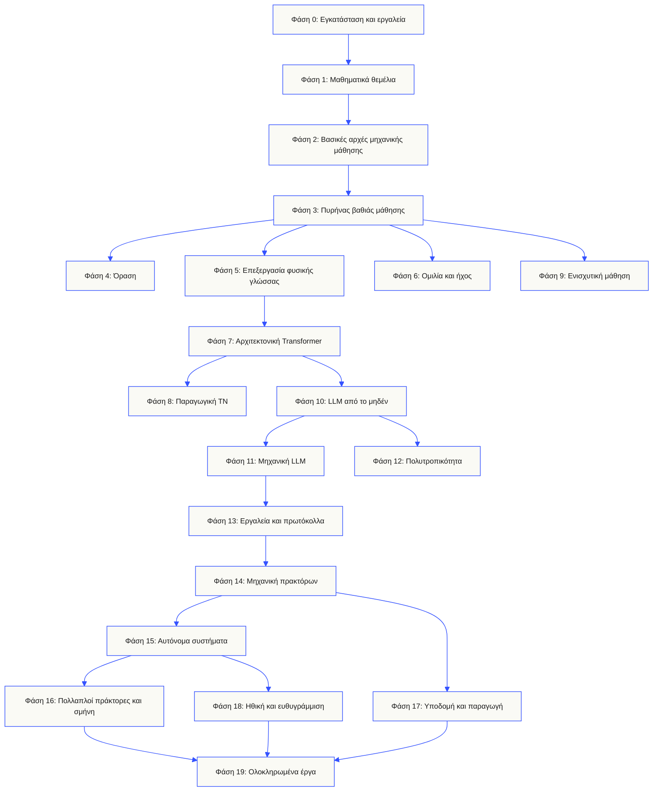

<p align="center" lang="el"><sub>Πλήρης ελληνική μετάφραση του README. Το <a href="../../README.md">αγγλικό πρωτότυπο</a> αποτελεί την έκδοση αναφοράς · <a href="https://aiengineeringfromscratch.com">aiengineeringfromscratch.com</a></sub></p>
<p align="center">
  
</p>

<p align="center">
  <a href="../../README.md">🇬🇧 English</a> ·
  <a href="../../i18n/zh/README.md">🇨🇳 简体中文</a> ·
  <a href="../../i18n/zh-TW/README.md">🇹🇼 繁體中文（台灣）</a> ·
  <a href="../../i18n/ja/README.md">🇯🇵 日本語</a> ·
  <a href="../../i18n/ko/README.md">🇰🇷 한국어</a> ·
  <a href="../../i18n/pt/README.md">🇵🇹 Português</a> ·
  <a href="../../i18n/pt-BR/README.md">🇧🇷 Português (Brasil)</a> ·
  <a href="../../i18n/es/README.md">🇪🇸 Español</a> ·
  <a href="../../i18n/de/README.md">🇩🇪 Deutsch</a> ·
  <a href="../../i18n/fr/README.md">🇫🇷 Français</a> ·
  <a href="../../i18n/it/README.md">🇮🇹 Italiano</a> ·
  <a href="../../i18n/nl/README.md">🇳🇱 Nederlands</a> ·
  <a href="../../i18n/pl/README.md">🇵🇱 Polski</a> ·
  <a href="../../i18n/cs/README.md">🇨🇿 Čeština</a> ·
  <a href="../../i18n/ro/README.md">🇷🇴 Română</a> ·
  <a href="../../i18n/hu/README.md">🇭🇺 Magyar</a> ·
  <a href="../../i18n/el/README.md">🇬🇷 Ελληνικά</a> ·
  <a href="../../i18n/sv/README.md">🇸🇪 Svenska</a> ·
  <a href="../../i18n/da/README.md">🇩🇰 Dansk</a> ·
  <a href="../../i18n/no/README.md">🇳🇴 Norsk</a> ·
  <a href="../../i18n/fi/README.md">🇫🇮 Suomi</a> ·
  <a href="../../i18n/ru/README.md">🇷🇺 Русский</a> ·
  <a href="../../i18n/uk/README.md">🇺🇦 Українська</a> ·
  <a href="../../i18n/tr/README.md">🇹🇷 Türkçe</a> ·
  <a href="../../i18n/he/README.md">🇮🇱 עברית</a> ·
  <a href="../../i18n/ar/README.md">🇸🇦 العربية</a> ·
  <a href="../../i18n/fa/README.md">🇮🇷 فارسی</a> ·
  <a href="../../i18n/hi/README.md">🇮🇳 हिन्दी</a> ·
  <a href="../../i18n/bn/README.md">🇧🇩 বাংলা</a> ·
  <a href="../../i18n/ur/README.md">🇵🇰 اردو</a> ·
  <a href="../../i18n/th/README.md">🇹🇭 ไทย</a> ·
  <a href="../../i18n/vi/README.md">🇻🇳 Tiếng Việt</a> ·
  <a href="../../i18n/id/README.md">🇮🇩 Bahasa Indonesia</a> ·
  <a href="../../i18n/tl/README.md">🇵🇭 Tagalog</a>
</p>

<p align="center">
  <a href="../../LICENSE"></a>
  <a href="../../ROADMAP.md"></a>
  <a href="#contents"></a>
  <a href="https://github.com/rohitg00/ai-engineering-from-scratch/stargazers"></a>
  <a href="https://aiengineeringfromscratch.com"></a>
  <p align="center">
 <a href="https://www.star-history.com/rohitg00/ai-engineering-from-scratch">
  <picture><source media="(prefers-color-scheme: dark)" srcset="https://api.star-history.com/badge?repo=rohitg00/ai-engineering-from-scratch&type=rank&theme=dark" /><source media="(prefers-color-scheme: light)" srcset="https://api.star-history.com/badge?repo=rohitg00/ai-engineering-from-scratch&type=rank" /></picture> <picture><source media="(prefers-color-scheme: dark)" srcset="https://api.star-history.com/badge?repo=rohitg00/ai-engineering-from-scratch&type=trending&theme=dark" /><source media="(prefers-color-scheme: light)" srcset="https://api.star-history.com/badge?repo=rohitg00/ai-engineering-from-scratch&type=trending" /></picture>
 </a>
</p>
</p>

### Χορηγοί

<p align="center">
  <a href="https://serpapi.com/ai-engineering-from-scratch"><picture><source media="(min-width: 768px)" srcset="../../assets/sponsors/serpapi-banner-compact.png" width="48%"></picture></a>
  <a href="https://nitrostack.ai/referral/aiengineeringfromscratch"><picture><source media="(min-width: 768px)" srcset="../../assets/sponsors/nitrostack-banner-equal.png" width="48%"></picture></a>
</p>

<p align="center">
  <sub><span>Η υποστήριξή σου κρατά κάθε μάθημα δωρεάν και με ανοιχτό κώδικα.</span> <a href="#supporters">Δες όλους τους υποστηρικτές</a> · <a href="../../SPONSORS.md">Γίνε χορηγός</a></sub>
</p>

```text
░░░▒▒▒░░░▒▒▒░░░▒▒▒░░░▒▒▒░░░▒▒▒░░░▒▒▒░░░▒▒▒░░░▒▒▒░░░▒▒▒░░░▒▒▒░░░▒▒▒░░░▒▒▒░░░▒▒▒░░░▒▒▒░░░▒▒▒
```

> **Το 84% των φοιτητών χρησιμοποιεί ήδη εργαλεία ΤΝ. Μόνο το 18% νιώθει έτοιμο να τα χρησιμοποιήσει επαγγελματικά.** Αυτό το πρόγραμμα σπουδών καλύπτει αυτό το κενό.
>
> 523 μαθήματα. 20 φάσεις. ~342 ώρες. Python, TypeScript, Rust, Julia. Κάθε μάθημα προσφέρει ένα επαναχρησιμοποιήσιμο αποτέλεσμα: μια προτροπή, μια δεξιότητα, έναν πράκτορα ή έναν διακομιστή MCP. Δωρεάν, με ανοιχτό κώδικα και άδεια MIT.
>
> Δεν μαθαίνεις απλώς ΤΝ. Την κατασκευάζεις. Από την αρχή ως το τέλος. Με τα χέρια σου.

<!-- STATS:START (generated from site/stats.json by build.js — do not edit by hand) -->
<p align="center"><sub><b>114,584</b> αναγνώστες &nbsp;·&nbsp; <b>181,995</b> προβολές σελίδων τις τελευταίες 30 ημέρες &nbsp;·&nbsp; στις 2026-08-29</sub></p>
<!-- STATS:END -->

## Ξεκίνα εδώ: διάλεξε τι θέλεις να φτιάξεις

Δεν χρειάζεται να εξετάσεις και τα 523 μαθήματα πριν ξεκινήσεις. Διάλεξε έναν στόχο. Κάθε σύνδεσμος ανοίγει το ίδιο πρόγραμμα στο GitHub ή στον ιστότοπο, και οι δύο εκδόσεις χρησιμοποιούν τον ίδιο κώδικα μαθημάτων.

| Ο στόχος σου | Μάθηση στο GitHub | Μάθηση στον ιστότοπο |
|---|---|---|
| Ξεκινώ τώρα και θέλω πλήρεις βάσεις | [Στάδιο 0: Εγκατάσταση και εργαλεία](../../phases/00-setup-and-tooling/) | [Περιβάλλον ανάπτυξης](https://aiengineeringfromscratch.com/lesson?path=phases/00-setup-and-tooling/01-dev-environment) |
| Γνωρίζω Python και θέλω βάσεις στα μαθηματικά και στο ML | [Στάδιο 1: Μαθηματικά θεμέλια](../../phases/01-math-foundations/) | [Διαισθητική κατανόηση της γραμμικής άλγεβρας](https://aiengineeringfromscratch.com/lesson?path=phases/01-math-foundations/01-linear-algebra-intuition) |
| Θέλω να φτιάξω εφαρμογές LLM για παραγωγική χρήση | [Στάδιο 11: Μηχανική LLM](../../phases/11-llm-engineering/) | [Μηχανική προτροπών](https://aiengineeringfromscratch.com/lesson?path=phases/11-llm-engineering/01-prompt-engineering) |
| Θέλω να φτιάξω πράκτορες | [Στάδιο 14: Μηχανική πρακτόρων](../../phases/14-agent-engineering/) | [Ο βρόχος του πράκτορα](https://aiengineeringfromscratch.com/lesson?path=phases/14-agent-engineering/01-the-agent-loop) |
| Θέλω να χρησιμοποιώ πράκτορες προγραμματισμού σε πραγματικά αποθετήρια | [Διαδρομή μηχανικής με τη βοήθεια πρακτόρων](../../learning-paths/using-coding-agents.json) | [Μηχανική με τη βοήθεια πρακτόρων](https://aiengineeringfromscratch.com/lesson?path=phases/14-agent-engineering/31-agent-workbench-why-models-fail&learningPath=using-coding-agents) |
| Θέλω να καθορίσω τι αξίζει να φτιαχτεί πριν από την υλοποίηση | [Διαδρομή αποφάσεων και παράδοσης προϊόντος](../../learning-paths/shaping-the-build.json) | [Αποφάσεις και παράδοση προϊόντος](https://aiengineeringfromscratch.com/lesson?path=phases/14-agent-engineering/47-outcomes-before-output&learningPath=shaping-the-build) |
| Θέλω να αναπτύξω λύσεις με Model Context Protocol (MCP) | [Διαδρομή Model Context Protocol (MCP)](../../phases/13-tools-and-protocols/README.md#model-context-protocol-mcp-path) | [Μαθησιακή διαδρομή Model Context Protocol (MCP)](https://aiengineeringfromscratch.com/lesson?path=phases/13-tools-and-protocols/06-mcp-fundamentals&learningPath=model-context-protocol) |
| Θέλω να γράψω και να διαθέσω Agent Skills | [Εστιασμένη διαδρομή Agent Skills](../../phases/13-tools-and-protocols/README.md#agent-skills-fast-path) | [Μαθησιακή διαδρομή Agent Skills](https://aiengineeringfromscratch.com/lesson?path=phases/13-tools-and-protocols/22-skills-and-agent-sdks&learningPath=agent-skills) |
| Θέλω να προετοιμαστώ για πιστοποίηση Claude | [Οδηγός εκκίνησης για πιστοποίηση](../../certifications/claude/GETTING_STARTED.md) | [Ακαδημία πιστοποίησης](https://aiengineeringfromscratch.com/certifications.html) |
| Θέλω να προετοιμαστώ για το MCP Associate (MCPA) | [Οδηγός εκκίνησης MCPA](../../certifications/mcpa/GETTING_STARTED.md) | [Διαδρομή MCPA](https://aiengineeringfromscratch.com/certification?id=mcpa-f) |

Δεν ξέρεις από πού να ξεκινήσεις; Χρησιμοποίησε τον [εκπαιδευτή αξιολόγησης επιπέδου `start-learning`](../../skills/start-learning/SKILL.md) ή τον [οδηγό προαπαιτούμενων του ιστοτόπου](https://aiengineeringfromscratch.com/prereqs.html).

Σύγκρινε τέσσερις βασικούς τομείς και έξι επαγγελματικές διαδρομές στο [Διαδρομές μάθησης μηχανικής ΤΝ](https://aiengineeringfromscratch.com/learning-paths.html).

### Δούλεψε κάθε μάθημα με τον ίδιο τρόπο

1. **Διάβασε** το `docs/en.md` και εξήγησε τη βασική ιδέα με δικά σου λόγια.
2. **Πληκτρολόγησε και υλοποίησε** τον σημαντικό κώδικα, αντί να αντιμετωπίζεις το μπλοκ κώδικα σαν διακοσμητικό στοιχείο.
3. **Εκτέλεσε** την εντολή του μαθήματος από τον ριζικό κατάλογο του αποθετηρίου, εκείνον που περιέχει τα `README.md` και `phases/`.
4. **Κράτησε τεκμήρια**: την εντολή, τον κατάλογο εργασίας, τον κωδικό εξόδου, τη χρήσιμη έξοδο και το παραδοτέο που άλλαξες ή δημιούργησες.
5. **Συνέχισε** μόνο όταν μπορείς να εξηγήσεις την έξοδο και να κάνεις μια μικρή αλλαγή χωρίς να μαντεύεις.

Οι διαδρομές στις εντολές των μαθημάτων ξεκινούν από τον ριζικό κατάλογο του αποθετηρίου, εκτός αν το μάθημα ζητά ρητά αλλαγή καταλόγου. Αν ένα μάθημα προσφέρει πολλές γλώσσες προγραμματισμού, εκτέλεσε την υλοποίηση στη γλώσσα που μαθαίνεις.

### Κλωνοποίησε το αποθετήριο και δημιούργησε το πρώτο σου τεκμήριο

```bash
git clone https://github.com/rohitg00/ai-engineering-from-scratch.git
cd ai-engineering-from-scratch
python3 phases/00-setup-and-tooling/01-dev-environment/code/verify.py --route beginner
python3 phases/01-math-foundations/01-linear-algebra-intuition/code/vectors.py
```

Ο αρχικός έλεγχος διαχωρίζει τις απαιτήσεις που χρειάζεσαι τώρα από τα εργαλεία που θα χρειαστείς αργότερα. Κάθε αποτυχία υποχρεωτικού ελέγχου περιλαμβάνει την αιτία που εντοπίστηκε και μια εντολή διόρθωσης. Η δεύτερη εντολή εκτελεί ένα μάθημα χωρίς εξαρτήσεις και στο τέλος δείχνει ότι ο πολλαπλασιασμός πίνακα με διάνυσμα είναι η πράξη μέσα σε ένα επίπεδο νευρωνικού δικτύου. Αποθήκευσε αυτή την έξοδο του τερματικού ως πρώτο τεκμήριο.

## Πρόσθεσε τον εκπαιδευτή ΤΝ σε 30 δευτερόλεπτα

Αν έχεις ήδη Node.js, `npx` και έναν πράκτορα προγραμματισμού που υποστηρίζει δεξιότητες, δύο εντολές αρκούν για να γίνει εκπαιδευτής. Δεν χρειάζεται κλωνοποίηση του αποθετηρίου για εγκατάσταση ή ανάγνωση του εκπαιδευτή. Τα εκτελέσιμα εργαστήρια των ειδικών διαδρομών απαιτούν `python3`. Τα εργαστήρια Agent Skills απαιτούν επίσης επιλεγμένη εφαρμογή φιλοξενίας και εγγράψιμο πεδίο δεξιοτήτων χρήστη ή έργου.

Έλεγξε πρώτα τις τοπικές απαιτήσεις:

```bash
node --version
npx --version
python3 --version
```

Έπειτα εγκατέστησε τις δεξιότητες του προγράμματος και επίλεξε εφαρμογή φιλοξενίας και πεδίο εγκατάστασης όταν ρωτήσει το πρόγραμμα:

```bash
npx skills add rohitg00/ai-engineering-from-scratch
```

Η σύνταξη κλήσης καθορίζεται από την εφαρμογή φιλοξενίας, όχι από τη φορητή μορφή `SKILL.md`:

| Περιβάλλον εκτέλεσης | Ξεκίνα το πρόγραμμα μαθημάτων | Ξεκίνα το Model Context Protocol (MCP) | Ξεκίνα τις δεξιότητες πρακτόρων | Κάνε ένα κουίζ φάσης |
|---|---|---|---|---|
| Codex | `start-learning`, ή επίλεξέ το από `/skills` | `learn-mcp`, ή επίλεξέ το από `/skills` | `learn-agent-skills`, ή επίλεξέ το από `/skills` | `check-understanding 13`, ή επίλεξέ το από `/skills` |
| Claude Code | `/start-learning` | `/learn-mcp` | `/learn-agent-skills` | `/check-understanding 13` |
| Άλλα συμβατά περιβάλλοντα | `Use start-learning to begin the course.` | `Use learn-mcp to start the Model Context Protocol (MCP) path.` | `Use learn-agent-skills to start the Agent Skills Engineering path.` | `Use check-understanding to quiz me on Phase 13.` |

Ένα τεστ κατάταξης δέκα ερωτήσεων αντιστοιχίζει τις γνώσεις σου σε αρχική φάση και αποθηκεύει προσωπικό σχέδιο στο `LEARNING.md`. Στη συνέχεια η δεξιότητα `learn` διδάσκει ένα μάθημα ανά συνεδρία: έννοια, μαθηματικά, κώδικας, τεστ. Αντλεί μαθήματα απευθείας από το αποθετήριο, ενώ το `course-guide` σε οδηγεί στο ακριβές μάθημα για ό,τι σε δυσκολεύει. Στο Codex κάλεσε `learn` και `course-guide`, στο Claude Code χρησιμοποίησε `/learn` και `/course-guide`, ενώ σε άλλες συμβατές εφαρμογές ζήτησε τη δεξιότητα με το όνομά της.

Θέλεις μόνο Model Context Protocol (MCP); Χρησιμοποίησε την κλήση MCP της εφαρμογής σου. Δημιουργεί `MCP-LEARNING.md` και ακολουθεί διαδρομή 17 μαθημάτων για αιτήματα χωρίς κατάσταση, μεταφορές, αμφίδρομη εργασία, ασφάλεια, αξιοπιστία, διακυβέρνηση μητρώου και αποδείξεις συμμόρφωσης. Η ακριβής σειρά και τα σημεία ελέγχου βρίσκονται στο [δηλωτικό Model Context Protocol (MCP)](../../learning-paths/model-context-protocol.json).

Θέλεις μόνο Agent Skills; Χρησιμοποίησε την αντίστοιχη κλήση της εφαρμογής σου. Δημιουργεί `AGENT-SKILLS-LEARNING.md` και ακολουθεί πέντε συνδεδεμένα μαθήματα: συμβόλαιο, ανακάλυψη, κλήση, όρια απομόνωσης και κατόπιν αξιολόγηση έκδοσης και φορητότητα μεταξύ πραγματικών εφαρμογών. Στον ιστό ξεκίνα από τη [διαδρομή Agent Skills](https://aiengineeringfromscratch.com/lesson?path=phases/13-tools-and-protocols/22-skills-and-agent-sdks&learningPath=agent-skills).

Το πρόγραμμα εγκατάστασης εμφανίζει τις εφαρμογές που μπορεί να ρυθμίσει και ρωτά πού να εγκαταστήσει. Αν δεν έχεις Node.js, `npx`, `python3`, υποστηριζόμενη εφαρμογή ή εγγράψιμο πεδίο, χρησιμοποίησε τον ιστότοπο ή διάβασε το `docs/en.md` μόνος σου. Έτσι μαθαίνεις τις έννοιες, αλλά οι αποδείξεις ανακάλυψης, κλήσης, εκτέλεσης σεναρίων και απεγκατάστασης σε πραγματική εφαρμογή εκκρεμούν ώσπου να είναι διαθέσιμος ο αρχικός έλεγχος. Διάβασε τα μαθήματα στο [aiengineeringfromscratch.com](https://aiengineeringfromscratch.com).

## Πώς λειτουργεί

Το περισσότερο υλικό ΤΝ διδάσκει ασύνδετα κομμάτια. Μια επιστημονική δημοσίευση εδώ, ένα κείμενο για προσαρμογή εκεί, μια εντυπωσιακή επίδειξη πράκτορα αλλού. Σπάνια συνδέονται. Παραδίδεις ένα συνομιλιακό σύστημα αλλά δεν εξηγείς την καμπύλη απώλειάς του. Συνδέεις μια συνάρτηση σε πράκτορα αλλά δεν ξέρεις τι κάνει η προσοχή μέσα στο μοντέλο που την καλεί.

Αυτό το πρόγραμμα είναι ο κορμός: 20 φάσεις, 523 μαθήματα, τέσσερις γλώσσες: Python, TypeScript, Rust και Julia. Γραμμική άλγεβρα στη μία άκρη, αυτόνομα σμήνη στην άλλη. Κάθε αλγόριθμος κατασκευάζεται πρώτα από τα ίδια τα μαθηματικά: οπισθοδιάδοση, τοκενικοποιητής, προσοχή, βρόχος πράκτορα. Όταν εμφανίζεται το PyTorch, γνωρίζεις ήδη τι κάνει εσωτερικά.

Κάθε μάθημα ακολουθεί τον ίδιο κύκλο: διάβασε το πρόβλημα, εξήγαγε τα μαθηματικά, γράψε κώδικα, τρέξε τη δοκιμή, κράτησε το αποτέλεσμα. Χωρίς πεντάλεπτα βίντεο, ανάπτυξη με αντιγραφή ή καθοδήγηση σε κάθε κίνηση. Δωρεάν, ανοικτού κώδικα και φτιαγμένο για τον φορητό υπολογιστή σου.

```text
░░░▒▒▒░░░▒▒▒░░░▒▒▒░░░▒▒▒░░░▒▒▒░░░▒▒▒░░░▒▒▒░░░▒▒▒░░░▒▒▒░░░▒▒▒░░░▒▒▒░░░▒▒▒░░░▒▒▒░░░▒▒▒░░░▒▒▒
```

## Η δομή του προγράμματος σπουδών

Είκοσι φάσεις στηρίζονται η μία στην άλλη. Τα μαθηματικά είναι τα θεμέλια, οι πράκτορες και η παραγωγή η στέγη. Προχώρα αν γνωρίζεις τα χαμηλότερα επίπεδα, αλλά μην παραλείπεις άγνωστες βάσεις και μετά απορείς γιατί αποτυγχάνει κάτι ψηλότερα.



```text
░░░▒▒▒░░░▒▒▒░░░▒▒▒░░░▒▒▒░░░▒▒▒░░░▒▒▒░░░▒▒▒░░░▒▒▒░░░▒▒▒░░░▒▒▒░░░▒▒▒░░░▒▒▒░░░▒▒▒░░░▒▒▒░░░▒▒▒
```

## Η δομή ενός μαθήματος

Κάθε μάθημα βρίσκεται στον δικό του φάκελο, με την ίδια δομή σε όλο το πρόγραμμα:

```text
phases/<NN>-<phase-name>/<NN>-<lesson-name>/
├── code/      εκτελέσιμες υλοποιήσεις (Python, TypeScript, Rust, Julia)
├── docs/
│   └── en.md  κείμενο του μαθήματος
└── outputs/   προτροπές, δεξιότητες, πράκτορες ή διακομιστές MCP που παράγει αυτό το μάθημα
```

Κάθε μάθημα έχει έξι μέρη. Η διάκριση *Φτιάξε / Χρησιμοποίησε* είναι ο κορμός: υλοποιείς πρώτα τον αλγόριθμο από το μηδέν και μετά εκτελείς το ίδιο μέσω βιβλιοθήκης παραγωγής. Καταλαβαίνεις το πλαίσιο επειδή έγραψες τη μικρότερη έκδοση μόνος σου.

```mermaid
%%{init: {'theme':'base','themeVariables':{'primaryColor':'#fafaf5','primaryTextColor':'#1a1a1a','primaryBorderColor':'#3553ff','lineColor':'#3553ff','fontFamily':'JetBrains Mono','fontSize':'13px'}}}%%
flowchart LR
  M["ΡΗΤΟ<br/><sub>κεντρική ιδέα σε μία γραμμή</sub>"] --> Pr["ΠΡΟΒΛΗΜΑ<br/><sub>συγκεκριμένη δυσκολία</sub>"]
  Pr --> C["ΕΝΝΟΙΑ<br/><sub>διαγράμματα και διαίσθηση</sub>"]
  C --> B["ΚΑΤΑΣΚΕΥΑΣΕ ΤΟ<br/><sub>καθαρά μαθηματικά, χωρίς πλαίσια</sub>"]
  B --> U["ΧΡΗΣΙΜΟΠΟΙΗΣΕ ΤΟ<br/><sub>το ίδιο σε PyTorch / sklearn</sub>"]
  U --> S["ΔΙΑΘΕΣΕ ΤΟ<br/><sub>προτροπή · δεξιότητα · πράκτορας · MCP</sub>"]
```



## Πρώτα βήματα

Τρεις τρόποι να ξεκινήσεις. Διάλεξε έναν.

**Επιλογή Α: μάθε στο τερματικό *(προτείνεται)*.** Μετά τον παραπάνω έλεγχο Node.js, `npx`, εφαρμογής και πεδίου εγκατάστασης, εγκατέστησε τις εκπαιδευτικές δεξιότητες σε συμβατό πράκτορα και άφησε το πρόγραμμα να σε καθοδηγήσει:

```bash
npx skills add rohitg00/ai-engineering-from-scratch
```

Χρησιμοποίησε τον παραπάνω πίνακα κλήσεων για την εφαρμογή σου. Οι εγκατεστημένες δεξιότητες παρέχουν `start-learning`, `learn`, `course-guide` και τις ειδικές διαδρομές `learn-mcp` και `learn-agent-skills`. Το κείμενο μαθημάτων φορτώνεται χωρίς κλωνοποίηση. Τοπικό αντίγραφο απαιτείται για αντιγραμμένες εντολές κώδικα και εκτελέσιμα εργαστήρια MCP ή Agent Skills. Η πρόοδος αποθηκεύεται στα `LEARNING.md`, `MCP-LEARNING.md` ή `AGENT-SKILLS-LEARNING.md` του έργου σου, ώστε κάθε συνεδρία να συνεχίζεται.

**Επιλογή Β: διάβασε.** Άνοιξε ολοκληρωμένο μάθημα στο [aiengineeringfromscratch.com](https://aiengineeringfromscratch.com) ή ανάπτυξε μια φάση στα [περιεχόμενα](#contents). Χωρίς ρυθμίσεις ή κλωνοποίηση.

**Επιλογή Γ: κλωνοποίησε και εκτέλεσε.**

```bash
git clone https://github.com/rohitg00/ai-engineering-from-scratch.git
cd ai-engineering-from-scratch
python3 phases/01-math-foundations/01-linear-algebra-intuition/code/vectors.py
```

Η κλωνοποίηση φορτώνει επίσης αυτόματα τις εκπαιδευτικές δεξιότητες στο Claude Code και δίνει στον εκπαιδευτή `learn` τον κώδικα κάθε μαθήματος για πραγματική εκτέλεση, όχι απλή ανάγνωση.

### Προαπαιτούμενα

- Μπορείς να γράψεις κώδικα (σε οποιαδήποτε γλώσσα· η Python βοηθά).
- Θέλεις να καταλάβεις πώς **λειτουργεί πραγματικά** η ΤΝ, όχι απλώς να καλείς API.

### Προετοιμάσου για πιστοποιήσεις Claude

Η [Ακαδημία Πιστοποίησης Claude](../../certifications/claude/README.md) είναι δωρεάν πρόγραμμα ανοικτού κώδικα για τις τέσσερις επίσημες διαδρομές: Associate Foundations, Developer Foundations, Architect Foundations και Architect Professional. Κάθε διαδρομή συνδυάζει μαθήματα αντιστοιχισμένα στην εξεταστέα ύλη, εκτελέσιμα εργαστήρια, διαγνωστικό τεστ, τελικό έργο και πλήρη πρωτότυπη δοκιμαστική εξέταση.

Χρησιμοποίησε τον [οδηγό εκκίνησης GitHub με ΤΝ](../../certifications/claude/GETTING_STARTED.md) με Claude Code, Codex, ChatGPT, Cursor ή άλλο πράκτορα. Εκτέλεσε `claude-certification` στο Codex, `/claude-certification` στο Claude Code ή ζήτησε από άλλη εφαρμογή να χρησιμοποιήσει `claude-certification`. Επιλέγει διαδρομή, δημιουργεί μόνιμο σχέδιο στο `CLAUDE-CERTIFICATION.md`, διδάσκει βήμα βήμα, τρέχει πραγματικά εργαστήρια και αξιολογεί τα παραδοτέα. Το ίδιο πρόγραμμα είναι διαθέσιμο στον [ιστότοπο πιστοποιήσεων](https://aiengineeringfromscratch.com/certifications.html).

Η ακαδημία είναι ανεξάρτητο υλικό μελέτης βασισμένο σε δημόσιους εξεταστικούς στόχους. Δεν συνδέεται με την Anthropic, δεν αναπαράγει πραγματικές εξεταστικές ερωτήσεις και δεν εγγυάται επιτυχία.

### Προετοιμάσου για την πιστοποίηση MCP Associate (MCPA)

Το [Πρόγραμμα Πιστοποίησης MCPA](../../certifications/mcpa/README.md) είναι δωρεάν προετοιμασία ανοικτού κώδικα για την εξέταση Model Context Protocol Associate της Agentic AI Foundation, μέσω Linux Foundation Training. Τα 34 μαθήματα διδάσκουν το πρωτόκολλο χωρίς κατάσταση 2026-07-28 στους πέντε εξεταστικούς τομείς: `_meta` ανά αίτημα και `server/discover` αντί της παλιάς χειραψίας, αιτήματα πολλών γύρων, συνδρομές, προσωρινή αποθήκευση, επεκτάσεις εργασιών και MCP Apps, εξουσιοδότηση OAuth και επίπεδα μητρώου και SDK. Κάθε μάθημα δίνει εκτελέσιμο εργαστήριο τυπικής βιβλιοθήκης, του οποίου η καταγραφή ελέγχεται για την τρέχουσα μορφή επικοινωνίας. Η διαδρομή προσθέτει διαγνωστικό τεστ, τελικό έργο και τρεις πλήρεις πρωτότυπες δοκιμαστικές εξετάσεις με κατανομή ερωτήσεων σύμφωνα με τα δημοσιευμένα βάρη.

Χρησιμοποίησε τον [οδηγό εκκίνησης GitHub με ΤΝ](../../certifications/mcpa/GETTING_STARTED.md) με Claude Code, Codex, ChatGPT, Cursor ή άλλο πράκτορα. Εκτέλεσε `mcpa-certification` στο Codex, `/mcpa-certification` στο Claude Code ή ζήτησε από άλλη εφαρμογή να χρησιμοποιήσει `mcpa-certification`. Δημιουργεί μόνιμη διαδρομή στο `MCPA-CERTIFICATION.md`, διδάσκει βήμα βήμα, τρέχει πραγματικά εργαστήρια και δίνει ανατροφοδότηση πάνω στα παραδοτέα. Το ίδιο πρόγραμμα βρίσκεται στη [σελίδα διαδρομής MCPA](https://aiengineeringfromscratch.com/certification?id=mcpa-f).

Αυτό είναι ανεξάρτητο υλικό μελέτης βασισμένο σε δημόσιους εξεταστικούς στόχους. Δεν συνδέεται με την Agentic AI Foundation ή το Linux Foundation, δεν αναπαράγει πραγματικές εξεταστικές ερωτήσεις και δεν εγγυάται επιτυχία.

### Οι εκπαιδευτικές δεξιότητες

| Δεξιότητα | Τι κάνει |
|---|---|
| [`start-learning`](../../skills/start-learning/SKILL.md) | Αρχική προσαρμογή, μία φορά: γιατί μαθαίνεις, κουίζ κατάταξης και εξατομικευμένο πλάνο που αποθηκεύεται στο `LEARNING.md`. |
| [`learn`](../../skills/learn/SKILL.md) | Ο κύκλος διδασκαλίας. Ξεκινά με ανάκληση γνώσεων, διδάσκει διαδραστικά το επόμενο μάθημα και συνεχίζει με το κουίζ του· καταγράφει την πρόοδο και μια ουρά επανάληψης. |
| [`course-guide`](../../skills/course-guide/SKILL.md) | Δρομολογητής θεμάτων. «Πού μαθαίνω για την προσοχή;» ή «η απώλειά μου είναι NaN» → τα κατάλληλα μαθήματα, με συνδέσμους. |
| [`learn-mcp`](../../skills/learn-mcp/SKILL.md) | Εξειδικευμένος δάσκαλος για το Model Context Protocol (MCP). Δημιουργεί το `MCP-LEARNING.md`, ακολουθεί τη λίστα των 17 μαθημάτων και καταγράφει τεκμήρια επικοινωνίας πρωτοκόλλου, ασφάλειας, αξιοπιστίας και συμμόρφωσης. |
| [`learn-agent-skills`](../../skills/learn-agent-skills/SKILL.md) | Εξειδικευμένος δάσκαλος για τις δεξιότητες πρακτόρων. Δημιουργεί το `AGENT-SKILLS-LEARNING.md`, διδάσκει τα μαθήματα 22, 24, 25, 26 και 27 και καταγράφει τεκμήρια από πραγματικό περιβάλλον εκτέλεσης. |
| [`claude-certification`](../../skills/claude-certification/SKILL.md) | Δάσκαλος πιστοποίησης. Επιλέγει CCAO-F, CCDV-F, CCAR-F ή CCAR-P· διδάσκει κάθε μάθημα· εκτελεί εργαστήρια· ελέγχει παραδοτέα· διεξάγει διαγνωστικές και δοκιμαστικές εξετάσεις· αποθηκεύει την πρόοδο. |
| [`mcpa-certification`](../../skills/mcpa-certification/SKILL.md) | Δάσκαλος MCPA. Ακολουθεί τη διαδρομή `mcpa-f` των 34 μαθημάτων για το πρωτόκολλο της 2026-07-28· διδάσκει κάθε μάθημα· εκτελεί εργαστήρια και τον ελεγκτή επικοινωνίας πρωτοκόλλου· διεξάγει τη διαγνωστική και τρεις δοκιμαστικές εξετάσεις· αποθηκεύει την πρόοδο. |
| [`find-your-level`](../../skills/find-your-level/SKILL.md) | Κουίζ κατάταξης δέκα ερωτήσεων. Αντιστοιχίζει τις γνώσεις σου σε μια αρχική φάση και παράγει εξατομικευμένη διαδρομή με εκτίμηση ωρών. |
| [`check-understanding <phase>`](../../skills/check-understanding/SKILL.md) | Κουίζ ανά φάση, με οκτώ ερωτήσεις, ανατροφοδότηση και συγκεκριμένα μαθήματα για επανάληψη. Χρησιμοποίησε τη μορφή για Codex, Claude Code ή φυσική γλώσσα στον παραπάνω πίνακα κλήσεων. |

```text
░░░▒▒▒░░░▒▒▒░░░▒▒▒░░░▒▒▒░░░▒▒▒░░░▒▒▒░░░▒▒▒░░░▒▒▒░░░▒▒▒░░░▒▒▒░░░▒▒▒░░░▒▒▒░░░▒▒▒░░░▒▒▒░░░▒▒▒
```

## Διάβασε τον βασικό κορμό ως βιβλίο

Ο βασικός κορμός 20 φάσεων στο `phases/` μετατρέπεται σε σειρά έξι τόμων. Το CI παράγει EPUB και PDF από τις ίδιες πηγές μαθημάτων και τα επισυνάπτει σε κάθε [έκδοση GitHub](https://github.com/rohitg00/ai-engineering-from-scratch/releases). Οι παρακάτω σύνδεσμοι οδηγούν πάντα στη νεότερη έκδοση. Οι αριθμοί τόμων δηλώνουν σειρά, όχι εκδόσεις: κάθε αντίτυπο φέρει ημερομηνία έκδοσης, ενώ παλαιότερες εκδόσεις παραμένουν διαθέσιμες από την αντίστοιχη κυκλοφορία.

Τα προγράμματα πιστοποίησης σκόπιμα δεν μετατρέπονται σε βιβλία. Η κατάσταση του εκπαιδευτή ΤΝ, τα εκτελέσιμα εργαστήρια, τα διαδραστικά σχήματα, τα διαγνωστικά τεστ και οι χρονομετρημένες εξετάσεις παραμένουν πλήρως διαθέσιμα στο GitHub και στον ιστότοπο.

| Τόμος | Τίτλος | Φάσεις | Λήψη |
|-----|-------|--------|----------|
| 1 | Θεμέλια · Μαθηματικά, εργαλεία και κλασική μηχανική μάθηση | 00-02 | [EPUB](https://github.com/rohitg00/ai-engineering-from-scratch/releases/latest/download/aiefs-vol1-foundations.epub) · [PDF](https://github.com/rohitg00/ai-engineering-from-scratch/releases/latest/download/aiefs-vol1-foundations.pdf) |
| 2 | Βαθιά μάθηση · Δίκτυα, όραση και ομιλία | 03, 04, 06 | [EPUB](https://github.com/rohitg00/ai-engineering-from-scratch/releases/latest/download/aiefs-vol2-deep-learning.epub) · [PDF](https://github.com/rohitg00/ai-engineering-from-scratch/releases/latest/download/aiefs-vol2-deep-learning.pdf) |
| 3 | Γλώσσα · Θεμέλια NLP και ο Transformer | 05, 07 | [EPUB](https://github.com/rohitg00/ai-engineering-from-scratch/releases/latest/download/aiefs-vol3-language.epub) · [PDF](https://github.com/rohitg00/ai-engineering-from-scratch/releases/latest/download/aiefs-vol3-language.pdf) |
| 4 | Μεγάλα γλωσσικά μοντέλα · Παραγωγή, ενίσχυση, προεκπαίδευση και μηχανική | 08-11 | [EPUB](https://github.com/rohitg00/ai-engineering-from-scratch/releases/latest/download/aiefs-vol4-llms.epub) · [PDF](https://github.com/rohitg00/ai-engineering-from-scratch/releases/latest/download/aiefs-vol4-llms.pdf) |
| 5 | Πράκτορες · Πολυτροπικότητα, πρωτόκολλα, αυτονομία και σμήνη | 12-16 | [EPUB](https://github.com/rohitg00/ai-engineering-from-scratch/releases/latest/download/aiefs-vol5-agents.epub) · [PDF](https://github.com/rohitg00/ai-engineering-from-scratch/releases/latest/download/aiefs-vol5-agents.pdf) |
| 6 | Παραγωγή · Υποδομή, ασφάλεια και ολοκληρωμένα έργα | 17-19 | [EPUB](https://github.com/rohitg00/ai-engineering-from-scratch/releases/latest/download/aiefs-vol6-production.epub) · [PDF](https://github.com/rohitg00/ai-engineering-from-scratch/releases/latest/download/aiefs-vol6-production.pdf) |

Το βιβλίο είναι στιγμιότυπο, το αποθετήριο η ζωντανή έκδοση. Κάθε κεφάλαιο τελειώνει με συνδέσμους στα κινούμενα σχήματα, στο τεστ και στον εκτελέσιμο κώδικα του μαθήματος. Τοπική δημιουργία με `python3 scripts/build_book.py` (απαιτείται pandoc)· λεπτομέρειες ροής στο [book/README.md](../../book/README.md).

```text
░░░▒▒▒░░░▒▒▒░░░▒▒▒░░░▒▒▒░░░▒▒▒░░░▒▒▒░░░▒▒▒░░░▒▒▒░░░▒▒▒░░░▒▒▒░░░▒▒▒░░░▒▒▒░░░▒▒▒░░░▒▒▒░░░▒▒▒
```

## Κάθε μάθημα δίνει ένα αποτέλεσμα

Άλλα προγράμματα τελειώνουν με *«συγχαρητήρια, έμαθες το Χ»*. Εδώ κάθε μάθημα τελειώνει με ένα **επαναχρησιμοποιήσιμο εργαλείο** που εγκαθιστάς ή εντάσσεις στην καθημερινή εργασία σου.

<table>
<tr>
<th align="left" width="25%"><br/><sub>FIG_001 · A</sub><br/><b>ΠΡΟΤΡΟΠΕΣ</b></th>
<th align="left" width="25%"><br/><sub>FIG_001 · B</sub><br/><b>ΔΕΞΙΟΤΗΤΕΣ</b></th>
<th align="left" width="25%"><br/><sub>FIG_001 · C</sub><br/><b>ΠΡΑΚΤΟΡΕΣ</b></th>
<th align="left" width="25%"><br/><sub>FIG_001 · D</sub><br/><b>ΔΙΑΚΟΜΙΣΤΕΣ MCP</b></th>
</tr>
<tr>
<td valign="top">Επικόλλησέ τα σε οποιονδήποτε βοηθό ΤΝ για εξειδικευμένη βοήθεια σε μια συγκεκριμένη εργασία.</td>
<td valign="top">Πρόσθεσέ τα σε Claude, Cursor, Codex, OpenClaw, Hermes ή σε οποιονδήποτε πράκτορα διαβάζει <code>SKILL.md</code>.</td>
<td valign="top">Ανάπτυξέ τους ως αυτόνομους εργάτες· έγραψες μόνος σου τον βρόχο στη Φάση 14.</td>
<td valign="top">Σύνδεσέ τους σε οποιονδήποτε πελάτη συμβατό με MCP. Κατασκευάζονται από την αρχή ως το τέλος στη Φάση 13.</td>
</tr>
</table>

> Εγκατέστησε τα πάντα με `python3 scripts/install_skills.py <target>`. Πραγματικά εργαλεία, όχι εργασίες για το σπίτι. Στο τέλος έχεις χαρτοφυλάκιο 523 παραδοτέων που καταλαβαίνεις πραγματικά επειδή τα έφτιαξες.

### FIG_002 · Ένα λυμένο παράδειγμα

Φάση 14, μάθημα 1: ο βρόχος πράκτορα. ~120 γραμμές καθαρής Python, χωρίς εξαρτήσεις.

<table>
<tr>
<td valign="top" width="50%">

**`code/agent_loop.py`** &nbsp; <sub><i>φτιάξε το</i></sub>

```python
def run(query, tools):
    history = [user(query)]
    for step in range(MAX_STEPS):
        msg = llm(history)
        if msg.tool_calls:
            for call in msg.tool_calls:
                result = tools[call.name](**call.args)
                history.append(tool_result(call.id, result))
            continue
        return msg.content
    raise StepLimitExceeded
```

</td>
<td valign="top" width="50%">

**`outputs/skill-agent-loop.md`** &nbsp; <sub><i>παράδωσέ το</i></sub>

```markdown
---
name: agent-loop
description: ReAct-style loop for any tool list
phase: 14
lesson: 01
---

Implement a minimal agent loop that...
```

**`outputs/prompt-debug-agent.md`**

```markdown
You are an agent debugger. Given the trace
of an agent run, identify the step where
the agent went wrong and explain why...
```

</td>
</tr>
</table>

```text
░░░▒▒▒░░░▒▒▒░░░▒▒▒░░░▒▒▒░░░▒▒▒░░░▒▒▒░░░▒▒▒░░░▒▒▒░░░▒▒▒░░░▒▒▒░░░▒▒▒░░░▒▒▒░░░▒▒▒░░░▒▒▒░░░▒▒▒
```

<a id="contents"></a>

## Περιεχόμενα

Είκοσι φάσεις. Πάτησε μια φάση για να εμφανιστεί η λίστα μαθημάτων της.

<a id="phase-0"></a>
### Φάση 0: Ρύθμιση και εργαλεία `12 μαθήματα`
> Προετοίμασε το περιβάλλον σου για όσα ακολουθούν.

| # | Μάθημα | Τύπος | Γλώσσα |
|:---:|--------|:----:|------|
| 01 | [Περιβάλλον ανάπτυξης](../../phases/00-setup-and-tooling/01-dev-environment/) | Κατασκευή | Python |
| 02 | [Git και συνεργασία](../../phases/00-setup-and-tooling/02-git-and-collaboration/) | Μάθηση | — |
| 03 | [Ρύθμιση GPU και υπολογιστικό νέφος](../../phases/00-setup-and-tooling/03-gpu-setup-and-cloud/) | Κατασκευή | Python |
| 04 | [API και κλειδιά](../../phases/00-setup-and-tooling/04-apis-and-keys/) | Κατασκευή | Python |
| 05 | [Σημειωματάρια Jupyter](../../phases/00-setup-and-tooling/05-jupyter-notebooks/) | Κατασκευή | Python |
| 06 | [Περιβάλλοντα Python](../../phases/00-setup-and-tooling/06-python-environments/) | Κατασκευή | Shell |
| 07 | [Docker για ΤΝ](../../phases/00-setup-and-tooling/07-docker-for-ai/) | Κατασκευή | Docker |
| 08 | [Ρύθμιση επεξεργαστή κώδικα](../../phases/00-setup-and-tooling/08-editor-setup/) | Κατασκευή | — |
| 09 | [Διαχείριση δεδομένων](../../phases/00-setup-and-tooling/09-data-management/) | Κατασκευή | Python |
| 10 | [Τερματικό και κέλυφος](../../phases/00-setup-and-tooling/10-terminal-and-shell/) | Μάθηση | — |
| 11 | [Linux για ΤΝ](../../phases/00-setup-and-tooling/11-linux-for-ai/) | Μάθηση | — |
| 12 | [Αποσφαλμάτωση και ανάλυση επιδόσεων](../../phases/00-setup-and-tooling/12-debugging-and-profiling/) | Κατασκευή | Python |

<details id="phase-1">
<summary><b>Φάση 1: Μαθηματικά θεμέλια</b> &nbsp;<code>22 μαθήματα</code>&nbsp; <em>Η διαίσθηση πίσω από κάθε αλγόριθμο ΤΝ, μέσα από κώδικα.</em></summary>
<br/>

| # | Μάθημα | Τύπος | Γλώσσα |
|:---:|--------|:----:|------|
| 01 | [Διαισθητική κατανόηση της γραμμικής άλγεβρας](../../phases/01-math-foundations/01-linear-algebra-intuition/) | Μάθηση | Python, Julia |
| 02 | [Διανύσματα, πίνακες και πράξεις](../../phases/01-math-foundations/02-vectors-matrices-operations/) | Κατασκευή | Python, Julia |
| 03 | [Μετασχηματισμοί πινάκων και ιδιοτιμές](../../phases/01-math-foundations/03-matrix-transformations/) | Κατασκευή | Python, Julia |
| 04 | [Ανάλυση για ML: παράγωγοι και κλίσεις](../../phases/01-math-foundations/04-calculus-for-ml/) | Μάθηση | Python |
| 05 | [Κανόνας αλυσίδας και αυτόματη παραγώγιση](../../phases/01-math-foundations/05-chain-rule-and-autodiff/) | Κατασκευή | Python |
| 06 | [Πιθανότητες και κατανομές](../../phases/01-math-foundations/06-probability-and-distributions/) | Μάθηση | Python |
| 07 | [Θεώρημα Bayes και στατιστική σκέψη](../../phases/01-math-foundations/07-bayes-theorem/) | Κατασκευή | Python |
| 08 | [Βελτιστοποίηση: οικογένεια καθόδου κλίσης](../../phases/01-math-foundations/08-optimization/) | Κατασκευή | Python |
| 09 | [Θεωρία πληροφορίας: εντροπία και απόκλιση KL](../../phases/01-math-foundations/09-information-theory/) | Μάθηση | Python |
| 10 | [Μείωση διαστάσεων: PCA, t-SNE, UMAP](../../phases/01-math-foundations/10-dimensionality-reduction/) | Κατασκευή | Python |
| 11 | [Ανάλυση ιδιαζουσών τιμών](../../phases/01-math-foundations/11-singular-value-decomposition/) | Κατασκευή | Python, Julia |
| 12 | [Πράξεις τανυστών](../../phases/01-math-foundations/12-tensor-operations/) | Κατασκευή | Python |
| 13 | [Αριθμητική ευστάθεια](../../phases/01-math-foundations/13-numerical-stability/) | Κατασκευή | Python |
| 14 | [Νόρμες και αποστάσεις](../../phases/01-math-foundations/14-norms-and-distances/) | Κατασκευή | Python |
| 15 | [Στατιστική για ML](../../phases/01-math-foundations/15-statistics-for-ml/) | Κατασκευή | Python |
| 16 | [Μέθοδοι δειγματοληψίας](../../phases/01-math-foundations/16-sampling-methods/) | Κατασκευή | Python |
| 17 | [Γραμμικά συστήματα](../../phases/01-math-foundations/17-linear-systems/) | Κατασκευή | Python |
| 18 | [Κυρτή βελτιστοποίηση](../../phases/01-math-foundations/18-convex-optimization/) | Κατασκευή | Python |
| 19 | [Μιγαδικοί αριθμοί για ΤΝ](../../phases/01-math-foundations/19-complex-numbers/) | Μάθηση | Python |
| 20 | [Ο μετασχηματισμός Fourier](../../phases/01-math-foundations/20-fourier-transform/) | Κατασκευή | Python |
| 21 | [Θεωρία γράφων για ML](../../phases/01-math-foundations/21-graph-theory/) | Κατασκευή | Python |
| 22 | [Στοχαστικές διαδικασίες](../../phases/01-math-foundations/22-stochastic-processes/) | Μάθηση | Python |

</details>

<details id="phase-2">
<summary><b>Φάση 2: Βασικές αρχές μηχανικής μάθησης</b> &nbsp;<code>18 μαθήματα</code>&nbsp; <em>Κλασική μηχανική μάθηση· εξακολουθεί να αποτελεί τη βάση των περισσότερων συστημάτων ΤΝ στην παραγωγή.</em></summary>
<br/>

| # | Μάθημα | Τύπος | Γλώσσα |
|:---:|--------|:----:|------|
| 01 | [Τι είναι η μηχανική μάθηση](../../phases/02-ml-fundamentals/01-what-is-machine-learning/) | Μάθηση | Python |
| 02 | [Γραμμική παλινδρόμηση από το μηδέν](../../phases/02-ml-fundamentals/02-linear-regression/) | Κατασκευή | Python |
| 03 | [Λογιστική παλινδρόμηση και ταξινόμηση](../../phases/02-ml-fundamentals/03-logistic-regression/) | Κατασκευή | Python |
| 04 | [Δέντρα αποφάσεων και τυχαία δάση](../../phases/02-ml-fundamentals/04-decision-trees/) | Κατασκευή | Python |
| 05 | [Μηχανές διανυσμάτων υποστήριξης](../../phases/02-ml-fundamentals/05-support-vector-machines/) | Κατασκευή | Python |
| 06 | [KNN και μετρικές απόστασης](../../phases/02-ml-fundamentals/06-knn-and-distances/) | Κατασκευή | Python |
| 07 | [Μη επιβλεπόμενη μάθηση: K-Means, DBSCAN](../../phases/02-ml-fundamentals/07-unsupervised-learning/) | Κατασκευή | Python |
| 08 | [Κατασκευή και επιλογή χαρακτηριστικών](../../phases/02-ml-fundamentals/08-feature-engineering/) | Κατασκευή | Python |
| 09 | [Αξιολόγηση μοντέλων: μετρικές και διασταυρούμενη επικύρωση](../../phases/02-ml-fundamentals/09-model-evaluation/) | Κατασκευή | Python |
| 10 | [Μεροληψία, διακύμανση και καμπύλη μάθησης](../../phases/02-ml-fundamentals/10-bias-variance/) | Μάθηση | Python |
| 11 | [Μέθοδοι συνόλων: boosting, bagging, stacking](../../phases/02-ml-fundamentals/11-ensemble-methods/) | Κατασκευή | Python |
| 12 | [Ρύθμιση υπερπαραμέτρων](../../phases/02-ml-fundamentals/12-hyperparameter-tuning/) | Κατασκευή | Python |
| 13 | [Ροές ML και παρακολούθηση πειραμάτων](../../phases/02-ml-fundamentals/13-ml-pipelines/) | Κατασκευή | Python |
| 14 | [Αφελής ταξινομητής Bayes](../../phases/02-ml-fundamentals/14-naive-bayes/) | Κατασκευή | Python |
| 15 | [Βασικές αρχές χρονοσειρών](../../phases/02-ml-fundamentals/15-time-series/) | Κατασκευή | Python |
| 16 | [Ανίχνευση ανωμαλιών](../../phases/02-ml-fundamentals/16-anomaly-detection/) | Κατασκευή | Python |
| 17 | [Διαχείριση μη ισορροπημένων δεδομένων](../../phases/02-ml-fundamentals/17-imbalanced-data/) | Κατασκευή | Python |
| 18 | [Επιλογή χαρακτηριστικών](../../phases/02-ml-fundamentals/18-feature-selection/) | Κατασκευή | Python |

</details>

<details id="phase-3">
<summary><b>Φάση 3: Πυρήνας βαθιάς μάθησης</b> &nbsp;<code>13 μαθήματα</code>&nbsp; <em>Νευρωνικά δίκτυα από τις πρώτες αρχές. Κανένα πλαίσιο μέχρι να φτιάξεις το δικό σου.</em></summary>
<br/>

| # | Μάθημα | Τύπος | Γλώσσα |
|:---:|--------|:----:|------|
| 01 | [Το perceptron: από πού ξεκίνησαν όλα](../../phases/03-deep-learning-core/01-the-perceptron/) | Κατασκευή | Python |
| 02 | [Πολυεπίπεδα δίκτυα και εμπρόσθια διάδοση](../../phases/03-deep-learning-core/02-multi-layer-networks/) | Κατασκευή | Python |
| 03 | [Οπισθοδιάδοση από το μηδέν](../../phases/03-deep-learning-core/03-backpropagation/) | Κατασκευή | Python |
| 04 | [Συναρτήσεις ενεργοποίησης: ReLU, sigmoid, GELU και ο ρόλος τους](../../phases/03-deep-learning-core/04-activation-functions/) | Κατασκευή | Python |
| 05 | [Συναρτήσεις απώλειας: MSE, διασταυρούμενη εντροπία και αντιπαραβολή](../../phases/03-deep-learning-core/05-loss-functions/) | Κατασκευή | Python |
| 06 | [Βελτιστοποιητές: SGD, momentum, Adam, AdamW](../../phases/03-deep-learning-core/06-optimizers/) | Κατασκευή | Python |
| 07 | [Κανονικοποίηση: dropout, απόσβεση βαρών, BatchNorm](../../phases/03-deep-learning-core/07-regularization/) | Κατασκευή | Python |
| 08 | [Αρχικοποίηση βαρών και σταθερότητα εκπαίδευσης](../../phases/03-deep-learning-core/08-weight-initialization/) | Κατασκευή | Python |
| 09 | [Προγράμματα ρυθμού μάθησης και προθέρμανση](../../phases/03-deep-learning-core/09-learning-rate-schedules/) | Κατασκευή | Python |
| 10 | [Φτιάξε το δικό σου μικρό πλαίσιο](../../phases/03-deep-learning-core/10-mini-framework/) | Κατασκευή | Python |
| 11 | [Εισαγωγή στο PyTorch](../../phases/03-deep-learning-core/11-intro-to-pytorch/) | Κατασκευή | Python |
| 12 | [Εισαγωγή στο JAX](../../phases/03-deep-learning-core/12-intro-to-jax/) | Κατασκευή | Python |
| 13 | [Αποσφαλμάτωση νευρωνικών δικτύων](../../phases/03-deep-learning-core/13-debugging-neural-networks/) | Κατασκευή | Python |

</details>

<details id="phase-4">
<summary><b>Φάση 4: Υπολογιστική όραση</b> &nbsp;<code>28 μαθήματα</code>&nbsp; <em>Από τα εικονοστοιχεία στην κατανόηση: εικόνα, βίντεο, 3D, VLM και μοντέλα κόσμου.</em></summary>
<br/>

| # | Μάθημα | Τύπος | Γλώσσα |
|:---:|--------|:----:|------|
| 01 | [Βασικές αρχές εικόνας: εικονοστοιχεία, κανάλια και χρωματικοί χώροι](../../phases/04-computer-vision/01-image-fundamentals/) | Μάθηση | Python |
| 02 | [Συνελίξεις από το μηδέν](../../phases/04-computer-vision/02-convolutions-from-scratch/) | Κατασκευή | Python |
| 03 | [CNN: από το LeNet στο ResNet](../../phases/04-computer-vision/03-cnns-lenet-to-resnet/) | Κατασκευή | Python |
| 04 | [Ταξινόμηση εικόνων](../../phases/04-computer-vision/04-image-classification/) | Κατασκευή | Python |
| 05 | [Μεταφορά μάθησης και λεπτομερής προσαρμογή](../../phases/04-computer-vision/05-transfer-learning/) | Κατασκευή | Python |
| 06 | [Ανίχνευση αντικειμένων: YOLO από το μηδέν](../../phases/04-computer-vision/06-object-detection-yolo/) | Κατασκευή | Python |
| 07 | [Σημασιολογική κατάτμηση: U-Net](../../phases/04-computer-vision/07-semantic-segmentation-unet/) | Κατασκευή | Python |
| 08 | [Κατάτμηση στιγμιοτύπων: Mask R-CNN](../../phases/04-computer-vision/08-instance-segmentation-mask-rcnn/) | Κατασκευή | Python |
| 09 | [Δημιουργία εικόνων: GAN](../../phases/04-computer-vision/09-image-generation-gans/) | Κατασκευή | Python |
| 10 | [Δημιουργία εικόνων: μοντέλα διάχυσης](../../phases/04-computer-vision/10-image-generation-diffusion/) | Κατασκευή | Python |
| 11 | [Stable Diffusion: αρχιτεκτονική και λεπτομερής προσαρμογή](../../phases/04-computer-vision/11-stable-diffusion/) | Κατασκευή | Python |
| 12 | [Κατανόηση βίντεο: χρονική μοντελοποίηση](../../phases/04-computer-vision/12-video-understanding/) | Κατασκευή | Python |
| 13 | [Τρισδιάστατη όραση: νέφη σημείων και NeRF](../../phases/04-computer-vision/13-3d-vision-nerf/) | Κατασκευή | Python |
| 14 | [Οπτικοί μετασχηματιστές (ViT)](../../phases/04-computer-vision/14-vision-transformers/) | Κατασκευή | Python |
| 15 | [Όραση πραγματικού χρόνου: ανάπτυξη στην άκρη του δικτύου](../../phases/04-computer-vision/15-real-time-edge/) | Κατασκευή | Python |
| 16 | [Φτιάξε πλήρη ροή υπολογιστικής όρασης](../../phases/04-computer-vision/16-vision-pipeline-capstone/) | Κατασκευή | Python |
| 17 | [Αυτοεπιβλεπόμενη όραση: SimCLR, DINO, MAE](../../phases/04-computer-vision/17-self-supervised-vision/) | Κατασκευή | Python |
| 18 | [Όραση ανοικτού λεξιλογίου: CLIP](../../phases/04-computer-vision/18-open-vocab-clip/) | Κατασκευή | Python |
| 19 | [OCR και κατανόηση εγγράφων](../../phases/04-computer-vision/19-ocr-document-understanding/) | Κατασκευή | Python |
| 20 | [Ανάκτηση εικόνων και μετρική μάθηση](../../phases/04-computer-vision/20-image-retrieval-metric/) | Κατασκευή | Python |
| 21 | [Ανίχνευση βασικών σημείων και εκτίμηση στάσης](../../phases/04-computer-vision/21-keypoint-pose/) | Κατασκευή | Python |
| 22 | [3D Gaussian Splatting από το μηδέν](../../phases/04-computer-vision/22-3d-gaussian-splatting/) | Κατασκευή | Python |
| 23 | [Μετασχηματιστές διάχυσης και ευθυγραμμισμένες ροές](../../phases/04-computer-vision/23-diffusion-transformers-rectified-flow/) | Κατασκευή | Python |
| 24 | [SAM 3 και κατάτμηση ανοικτού λεξιλογίου](../../phases/04-computer-vision/24-sam3-open-vocab-segmentation/) | Κατασκευή | Python |
| 25 | [Οπτικογλωσσικά μοντέλα (ViT-MLP-LLM)](../../phases/04-computer-vision/25-vision-language-models/) | Κατασκευή | Python |
| 26 | [Εκτίμηση βάθους και γεωμετρίας από μία εικόνα](../../phases/04-computer-vision/26-monocular-depth/) | Κατασκευή | Python |
| 27 | [Παρακολούθηση πολλών αντικειμένων και μνήμη βίντεο](../../phases/04-computer-vision/27-multi-object-tracking/) | Κατασκευή | Python |
| 28 | [Μοντέλα κόσμου και διάχυση βίντεο](../../phases/04-computer-vision/28-world-models-video-diffusion/) | Κατασκευή | Python |

</details>

<details id="phase-5">
<summary><b>Φάση 5: NLP από τα θεμέλια ως τις προχωρημένες τεχνικές</b> &nbsp;<code>29 μαθήματα</code>&nbsp; <em>Η γλώσσα είναι η διεπαφή προς τη νοημοσύνη.</em></summary>
<br/>

| # | Μάθημα | Τύπος | Γλώσσα |
|:---:|--------|:----:|------|
| 01 | [Επεξεργασία κειμένου: τοκενικοποίηση, αποκοπή καταλήξεων και λημματοποίηση](../../phases/05-nlp-foundations-to-advanced/01-text-processing/) | Κατασκευή | Python |
| 02 | [Σάκος λέξεων, TF-IDF και αναπαράσταση κειμένου](../../phases/05-nlp-foundations-to-advanced/02-bag-of-words-tfidf/) | Κατασκευή | Python |
| 03 | [Ενσωματώσεις λέξεων: Word2Vec από το μηδέν](../../phases/05-nlp-foundations-to-advanced/03-word-embeddings-word2vec/) | Κατασκευή | Python |
| 04 | [GloVe, FastText και ενσωματώσεις υπολέξεων](../../phases/05-nlp-foundations-to-advanced/04-glove-fasttext-subword/) | Κατασκευή | Python |
| 05 | [Ανάλυση συναισθήματος](../../phases/05-nlp-foundations-to-advanced/05-sentiment-analysis/) | Κατασκευή | Python |
| 06 | [Αναγνώριση κατονομασμένων οντοτήτων (NER)](../../phases/05-nlp-foundations-to-advanced/06-named-entity-recognition/) | Κατασκευή | Python |
| 07 | [Επισήμανση μερών του λόγου και συντακτική ανάλυση](../../phases/05-nlp-foundations-to-advanced/07-pos-tagging-parsing/) | Κατασκευή | Python |
| 08 | [Ταξινόμηση κειμένου: CNN και RNN](../../phases/05-nlp-foundations-to-advanced/08-cnns-rnns-for-text/) | Κατασκευή | Python |
| 09 | [Μοντέλα ακολουθίας προς ακολουθία](../../phases/05-nlp-foundations-to-advanced/09-sequence-to-sequence/) | Κατασκευή | Python |
| 10 | [Ο μηχανισμός προσοχής: η μεγάλη αλλαγή](../../phases/05-nlp-foundations-to-advanced/10-attention-mechanism/) | Κατασκευή | Python |
| 11 | [Μηχανική μετάφραση](../../phases/05-nlp-foundations-to-advanced/11-machine-translation/) | Κατασκευή | Python |
| 12 | [Σύνοψη κειμένου](../../phases/05-nlp-foundations-to-advanced/12-text-summarization/) | Κατασκευή | Python |
| 13 | [Συστήματα απάντησης ερωτήσεων](../../phases/05-nlp-foundations-to-advanced/13-question-answering/) | Κατασκευή | Python |
| 14 | [Ανάκτηση πληροφοριών και αναζήτηση](../../phases/05-nlp-foundations-to-advanced/14-information-retrieval-search/) | Κατασκευή | Python |
| 15 | [Μοντελοποίηση θεμάτων: LDA, BERTopic](../../phases/05-nlp-foundations-to-advanced/15-topic-modeling/) | Κατασκευή | Python |
| 16 | [Παραγωγή κειμένου](../../phases/05-nlp-foundations-to-advanced/16-text-generation-pre-transformer/) | Κατασκευή | Python |
| 17 | [Συνομιλιακά συστήματα: από κανόνες σε νευρωνικά δίκτυα](../../phases/05-nlp-foundations-to-advanced/17-chatbots-rule-to-neural/) | Κατασκευή | Python |
| 18 | [Πολυγλωσσικό NLP](../../phases/05-nlp-foundations-to-advanced/18-multilingual-nlp/) | Κατασκευή | Python |
| 19 | [Τοκενικοποίηση υπολέξεων: BPE, WordPiece, Unigram, SentencePiece](../../phases/05-nlp-foundations-to-advanced/19-subword-tokenization/) | Μάθηση | Python |
| 20 | [Δομημένες έξοδοι και περιορισμένη αποκωδικοποίηση](../../phases/05-nlp-foundations-to-advanced/20-structured-outputs-constrained-decoding/) | Κατασκευή | Python |
| 21 | [NLI και κειμενική συνεπαγωγή](../../phases/05-nlp-foundations-to-advanced/21-nli-textual-entailment/) | Μάθηση | Python |
| 22 | [Εμβάθυνση στα μοντέλα ενσωματώσεων](../../phases/05-nlp-foundations-to-advanced/22-embedding-models-deep-dive/) | Μάθηση | Python |
| 23 | [Στρατηγικές τεμαχισμού για RAG](../../phases/05-nlp-foundations-to-advanced/23-chunking-strategies-rag/) | Κατασκευή | Python |
| 24 | [Επίλυση συναναφοράς](../../phases/05-nlp-foundations-to-advanced/24-coreference-resolution/) | Μάθηση | Python |
| 25 | [Σύνδεση οντοτήτων και αποσαφήνιση](../../phases/05-nlp-foundations-to-advanced/25-entity-linking/) | Κατασκευή | Python |
| 26 | [Εξαγωγή σχέσεων και κατασκευή γράφων γνώσης](../../phases/05-nlp-foundations-to-advanced/26-relation-extraction-kg/) | Κατασκευή | Python |
| 27 | [Αξιολόγηση LLM: RAGAS, DeepEval, G-Eval](../../phases/05-nlp-foundations-to-advanced/27-llm-evaluation-frameworks/) | Κατασκευή | Python |
| 28 | [Αξιολόγηση μεγάλου συμφραζομένου: NIAH, RULER, LongBench, MRCR](../../phases/05-nlp-foundations-to-advanced/28-long-context-evaluation/) | Μάθηση | Python |
| 29 | [Παρακολούθηση κατάστασης διαλόγου](../../phases/05-nlp-foundations-to-advanced/29-dialogue-state-tracking/) | Κατασκευή | Python |

</details>

<details id="phase-6">
<summary><b>Φάση 6: Ομιλία και ήχος</b> &nbsp;<code>17 μαθήματα</code>&nbsp; <em>Άκου, κατανόησε, μίλησε.</em></summary>
<br/>

| # | Μάθημα | Τύπος | Γλώσσα |
|:---:|--------|:----:|------|
| 01 | [Βασικές αρχές ήχου: κυματομορφές, δειγματοληψία και FFT](../../phases/06-speech-and-audio/01-audio-fundamentals) | Μάθηση | Python |
| 02 | [Φασματογραφήματα, κλίμακα mel και χαρακτηριστικά ήχου](../../phases/06-speech-and-audio/02-spectrograms-mel-features) | Κατασκευή | Python |
| 03 | [Ταξινόμηση ήχου](../../phases/06-speech-and-audio/03-audio-classification) | Κατασκευή | Python |
| 04 | [Αναγνώριση ομιλίας (ASR)](../../phases/06-speech-and-audio/04-speech-recognition-asr) | Κατασκευή | Python |
| 05 | [Whisper: αρχιτεκτονική και λεπτομερής προσαρμογή](../../phases/06-speech-and-audio/05-whisper-architecture-finetuning) | Κατασκευή | Python |
| 06 | [Αναγνώριση και επαλήθευση ομιλητή](../../phases/06-speech-and-audio/06-speaker-recognition-verification) | Κατασκευή | Python |
| 07 | [Μετατροπή κειμένου σε ομιλία (TTS)](../../phases/06-speech-and-audio/07-text-to-speech) | Κατασκευή | Python |
| 08 | [Κλωνοποίηση και μετατροπή φωνής](../../phases/06-speech-and-audio/08-voice-cloning-conversion) | Κατασκευή | Python |
| 09 | [Δημιουργία μουσικής](../../phases/06-speech-and-audio/09-music-generation) | Κατασκευή | Python |
| 10 | [Ηχογλωσσικά μοντέλα](../../phases/06-speech-and-audio/10-audio-language-models) | Κατασκευή | Python |
| 11 | [Επεξεργασία ήχου πραγματικού χρόνου](../../phases/06-speech-and-audio/11-real-time-audio-processing) | Κατασκευή | Python |
| 12 | [Φτιάξε ροή φωνητικού βοηθού](../../phases/06-speech-and-audio/12-voice-assistant-pipeline) | Κατασκευή | Python |
| 13 | [Νευρωνικοί κωδικοποιητές ήχου: EnCodec, SNAC, Mimi, DAC](../../phases/06-speech-and-audio/13-neural-audio-codecs) | Μάθηση | Python |
| 14 | [Ανίχνευση φωνητικής δραστηριότητας και εναλλαγή ομιλητών](../../phases/06-speech-and-audio/14-voice-activity-detection-turn-taking) | Κατασκευή | Python |
| 15 | [Συνεχής μετατροπή ομιλίας σε ομιλία: Moshi, Hibiki](../../phases/06-speech-and-audio/15-streaming-speech-to-speech-moshi-hibiki) | Μάθηση | Python |
| 16 | [Προστασία από πλαστογράφηση φωνής και υδατοσήμανση ήχου](../../phases/06-speech-and-audio/16-anti-spoofing-audio-watermarking) | Κατασκευή | Python |
| 17 | [Αξιολόγηση ήχου: WER, MOS, MMAU και πίνακες κατάταξης](../../phases/06-speech-and-audio/17-audio-evaluation-metrics) | Μάθηση | Python |

</details>

<details id="phase-7">
<summary><b>Φάση 7: Εμβάθυνση στους Transformer</b> &nbsp;<code>16 μαθήματα</code>&nbsp; <em>Η αρχιτεκτονική που άλλαξε τα πάντα.</em></summary>
<br/>

| # | Μάθημα | Τύπος | Γλώσσα |
|:---:|--------|:----:|------|
| 01 | [Γιατί μετασχηματιστές: τα προβλήματα των RNN](../../phases/07-transformers-deep-dive/01-why-transformers/) | Μάθηση | Python |
| 02 | [Αυτοπροσοχή από το μηδέν](../../phases/07-transformers-deep-dive/02-self-attention-from-scratch/) | Κατασκευή | Python |
| 03 | [Προσοχή πολλαπλών κεφαλών](../../phases/07-transformers-deep-dive/03-multi-head-attention/) | Κατασκευή | Python |
| 04 | [Κωδικοποίηση θέσης: ημιτονοειδής, RoPE, ALiBi](../../phases/07-transformers-deep-dive/04-positional-encoding/) | Κατασκευή | Python |
| 05 | [Ο πλήρης μετασχηματιστής: κωδικοποιητής και αποκωδικοποιητής](../../phases/07-transformers-deep-dive/05-full-transformer/) | Κατασκευή | Python |
| 06 | [BERT: μοντελοποίηση γλώσσας με απόκρυψη](../../phases/07-transformers-deep-dive/06-bert-masked-language-modeling/) | Κατασκευή | Python |
| 07 | [GPT: αιτιακή μοντελοποίηση γλώσσας](../../phases/07-transformers-deep-dive/07-gpt-causal-language-modeling/) | Κατασκευή | Python |
| 08 | [T5 και BART: μοντέλα κωδικοποιητή-αποκωδικοποιητή](../../phases/07-transformers-deep-dive/08-t5-bart-encoder-decoder/) | Μάθηση | Python |
| 09 | [Οπτικοί μετασχηματιστές (ViT)](../../phases/07-transformers-deep-dive/09-vision-transformers/) | Κατασκευή | Python |
| 10 | [Μετασχηματιστές ήχου: η αρχιτεκτονική Whisper](../../phases/07-transformers-deep-dive/10-audio-transformers-whisper/) | Μάθηση | Python |
| 11 | [Μείγμα ειδικών (MoE)](../../phases/07-transformers-deep-dive/11-mixture-of-experts/) | Κατασκευή | Python |
| 12 | [Κρυφή μνήμη KV, Flash Attention και βελτιστοποίηση συμπερασμού](../../phases/07-transformers-deep-dive/12-kv-cache-flash-attention/) | Κατασκευή | Python |
| 13 | [Νόμοι κλιμάκωσης](../../phases/07-transformers-deep-dive/13-scaling-laws/) | Μάθηση | Python |
| 14 | [Φτιάξε μετασχηματιστή από το μηδέν](../../phases/07-transformers-deep-dive/14-build-a-transformer-capstone/) | Κατασκευή | Python |
| 15 | [Παραλλαγές προσοχής: ολισθαίνον παράθυρο, αραιή και διαφορική](../../phases/07-transformers-deep-dive/15-attention-variants/) | Κατασκευή | Python |
| 16 | [Εικαστική αποκωδικοποίηση: πρόταση, επαλήθευση, επανάληψη](../../phases/07-transformers-deep-dive/16-speculative-decoding/) | Κατασκευή | Python |

</details>

<details id="phase-8">
<summary><b>Φάση 8: Παραγωγική ΤΝ</b> &nbsp;<code>15 μαθήματα</code>&nbsp; <em>Δημιούργησε εικόνες, βίντεο, ήχο, 3D και άλλα.</em></summary>
<br/>

| # | Μάθημα | Τύπος | Γλώσσα |
|:---:|--------|:----:|------|
| 01 | [Παραγωγικά μοντέλα: ταξινομία και ιστορία](../../phases/08-generative-ai/01-generative-models-taxonomy-history/) | Μάθηση | Python |
| 02 | [Αυτοκωδικοποιητές και VAE](../../phases/08-generative-ai/02-autoencoders-vae/) | Κατασκευή | Python |
| 03 | [GAN: γεννήτρια έναντι διακριτή](../../phases/08-generative-ai/03-gans-generator-discriminator/) | Κατασκευή | Python |
| 04 | [Υπό συνθήκη GAN και Pix2Pix](../../phases/08-generative-ai/04-conditional-gans-pix2pix/) | Κατασκευή | Python |
| 05 | [StyleGAN](../../phases/08-generative-ai/05-stylegan/) | Κατασκευή | Python |
| 06 | [Μοντέλα διάχυσης: DDPM από το μηδέν](../../phases/08-generative-ai/06-diffusion-ddpm-from-scratch/) | Κατασκευή | Python |
| 07 | [Λανθάνουσα διάχυση και Stable Diffusion](../../phases/08-generative-ai/07-latent-diffusion-stable-diffusion/) | Κατασκευή | Python |
| 08 | [ControlNet, LoRA και εξάρτηση από συνθήκες](../../phases/08-generative-ai/08-controlnet-lora-conditioning/) | Κατασκευή | Python |
| 09 | [Συμπλήρωση, επέκταση και επεξεργασία εικόνας](../../phases/08-generative-ai/09-inpainting-outpainting-editing/) | Κατασκευή | Python |
| 10 | [Δημιουργία βίντεο](../../phases/08-generative-ai/10-video-generation/) | Κατασκευή | Python |
| 11 | [Δημιουργία ήχου](../../phases/08-generative-ai/11-audio-generation/) | Κατασκευή | Python |
| 12 | [Δημιουργία 3D](../../phases/08-generative-ai/12-3d-generation/) | Κατασκευή | Python |
| 13 | [Αντιστοίχιση ροών και ευθυγραμμισμένες ροές](../../phases/08-generative-ai/13-flow-matching-rectified-flows/) | Κατασκευή | Python |
| 14 | [Αξιολόγηση: FID και βαθμολογία CLIP](../../phases/08-generative-ai/14-evaluation-fid-clip-score/) | Κατασκευή | Python |
| 19 | [Οπτική αυτοπαλινδρομική μοντελοποίηση (VAR): πρόβλεψη επόμενης κλίμακας](../../phases/08-generative-ai/19-visual-autoregressive-var/) | Κατασκευή | Python |

</details>

<details id="phase-9">
<summary><b>Φάση 9: Ενισχυτική μάθηση</b> &nbsp;<code>12 μαθήματα</code>&nbsp; <em>Η βάση του RLHF και της ΤΝ που παίζει παιχνίδια.</em></summary>
<br/>

| # | Μάθημα | Τύπος | Γλώσσα |
|:---:|--------|:----:|------|
| 01 | [MDP, καταστάσεις, ενέργειες και ανταμοιβές](../../phases/09-reinforcement-learning/01-mdps-states-actions-rewards/) | Μάθηση | Python |
| 02 | [Δυναμικός προγραμματισμός](../../phases/09-reinforcement-learning/02-dynamic-programming/) | Κατασκευή | Python |
| 03 | [Μέθοδοι Monte Carlo](../../phases/09-reinforcement-learning/03-monte-carlo-methods/) | Κατασκευή | Python |
| 04 | [Q-Learning, SARSA](../../phases/09-reinforcement-learning/04-q-learning-sarsa/) | Κατασκευή | Python |
| 05 | [Βαθιά δίκτυα Q (DQN)](../../phases/09-reinforcement-learning/05-dqn/) | Κατασκευή | Python |
| 06 | [Κλίσεις πολιτικής: REINFORCE](../../phases/09-reinforcement-learning/06-policy-gradients-reinforce/) | Κατασκευή | Python |
| 07 | [Δράστης-κριτής: A2C, A3C](../../phases/09-reinforcement-learning/07-actor-critic-a2c-a3c/) | Κατασκευή | Python |
| 08 | [PPO](../../phases/09-reinforcement-learning/08-ppo/) | Κατασκευή | Python |
| 09 | [Μοντελοποίηση ανταμοιβής και RLHF](../../phases/09-reinforcement-learning/09-reward-modeling-rlhf/) | Κατασκευή | Python |
| 10 | [Ενισχυτική μάθηση πολλών πρακτόρων](../../phases/09-reinforcement-learning/10-multi-agent-rl/) | Κατασκευή | Python |
| 11 | [Μεταφορά από προσομοίωση στην πραγματικότητα](../../phases/09-reinforcement-learning/11-sim-to-real-transfer/) | Κατασκευή | Python |
| 12 | [Ενισχυτική μάθηση για παιχνίδια](../../phases/09-reinforcement-learning/12-rl-for-games/) | Κατασκευή | Python |

</details>

<details id="phase-10">
<summary><b>Φάση 10: LLM από το μηδέν</b> &nbsp;<code>24 μαθήματα</code>&nbsp; <em>Κατασκεύασε, εκπαίδευσε και κατανόησε μεγάλα γλωσσικά μοντέλα.</em></summary>
<br/>

| # | Μάθημα | Τύπος | Γλώσσα |
|:---:|--------|:----:|------|
| 01 | [Τοκενικοποιητές: BPE, WordPiece, SentencePiece](../../phases/10-llms-from-scratch/01-tokenizers/) | Κατασκευή | Python, Rust |
| 02 | [Κατασκευή τοκενικοποιητή από το μηδέν](../../phases/10-llms-from-scratch/02-building-a-tokenizer/) | Κατασκευή | Python |
| 03 | [Ροές δεδομένων για προεκπαίδευση](../../phases/10-llms-from-scratch/03-data-pipelines/) | Κατασκευή | Python |
| 04 | [Προεκπαίδευση μικρού GPT (124M)](../../phases/10-llms-from-scratch/04-pre-training-mini-gpt/) | Κατασκευή | Python |
| 05 | [Κατανεμημένη εκπαίδευση, FSDP και DeepSpeed](../../phases/10-llms-from-scratch/05-scaling-distributed/) | Κατασκευή | Python |
| 06 | [Προσαρμογή σε οδηγίες: SFT](../../phases/10-llms-from-scratch/06-instruction-tuning-sft/) | Κατασκευή | Python |
| 07 | [RLHF: μοντέλο ανταμοιβής και PPO](../../phases/10-llms-from-scratch/07-rlhf/) | Κατασκευή | Python |
| 08 | [DPO: άμεση βελτιστοποίηση προτιμήσεων](../../phases/10-llms-from-scratch/08-dpo/) | Κατασκευή | Python |
| 09 | [Συνταγματική ΤΝ και αυτοβελτίωση](../../phases/10-llms-from-scratch/09-constitutional-ai-self-improvement/) | Κατασκευή | Python |
| 10 | [Αξιολόγηση: σημεία αναφοράς και δοκιμές](../../phases/10-llms-from-scratch/10-evaluation/) | Κατασκευή | Python |
| 11 | [Κβάντιση: INT8, GPTQ, AWQ, GGUF](../../phases/10-llms-from-scratch/11-quantization/) | Κατασκευή | Python |
| 12 | [Βελτιστοποίηση συμπερασμού](../../phases/10-llms-from-scratch/12-inference-optimization/) | Κατασκευή | Python |
| 13 | [Κατασκευή πλήρους ροής LLM](../../phases/10-llms-from-scratch/13-building-complete-llm-pipeline/) | Κατασκευή | Python |
| 14 | [Ανοικτά μοντέλα: παρουσίαση αρχιτεκτονικών](../../phases/10-llms-from-scratch/14-open-models-architecture-walkthroughs/) | Μάθηση | Python |
| 15 | [Εικαστική αποκωδικοποίηση και EAGLE-3](../../phases/10-llms-from-scratch/15-speculative-decoding-eagle3/) | Κατασκευή | Python |
| 16 | [Διαφορική προσοχή (V2)](../../phases/10-llms-from-scratch/16-differential-attention-v2/) | Κατασκευή | Python |
| 17 | [Εγγενής αραιή προσοχή (DeepSeek NSA)](../../phases/10-llms-from-scratch/17-native-sparse-attention/) | Κατασκευή | Python |
| 18 | [Πρόβλεψη πολλών token (MTP)](../../phases/10-llms-from-scratch/18-multi-token-prediction/) | Κατασκευή | Python |
| 19 | [Παραλληλισμός DualPipe](../../phases/10-llms-from-scratch/19-dualpipe-parallelism/) | Μάθηση | Python |
| 20 | [Παρουσίαση αρχιτεκτονικής DeepSeek-V3](../../phases/10-llms-from-scratch/20-deepseek-v3-walkthrough/) | Μάθηση | Python |
| 21 | [Jamba: υβριδικός SSM-transformer](../../phases/10-llms-from-scratch/21-jamba-hybrid-ssm-transformer/) | Μάθηση | Python |
| 22 | [Ασύγχρονος συμπερασμός και Hogwild!](../../phases/10-llms-from-scratch/22-async-hogwild-inference/) | Κατασκευή | Python |
| 25 | [Εικαστική αποκωδικοποίηση και EAGLE](../../phases/10-llms-from-scratch/25-speculative-decoding/) | Κατασκευή | Python |
| 34 | [Σημεία ελέγχου κλίσεων και επανυπολογισμός ενεργοποιήσεων](../../phases/10-llms-from-scratch/34-gradient-checkpointing/) | Κατασκευή | Python |

</details>

<details id="phase-11">
<summary><b>Φάση 11: Μηχανική LLM</b> &nbsp;<code>17 μαθήματα</code>&nbsp; <em>Βάλε τα LLM να δουλέψουν στην παραγωγή.</em></summary>
<br/>

| # | Μάθημα | Τύπος | Γλώσσα |
|:---:|--------|:----:|------|
| 01 | [Σχεδιασμός προτροπών: τεχνικές και μοτίβα](../../phases/11-llm-engineering/01-prompt-engineering/) | Κατασκευή | Python |
| 02 | [Few-Shot, CoT, Tree-of-Thought](../../phases/11-llm-engineering/02-few-shot-cot/) | Κατασκευή | Python |
| 03 | [Δομημένες έξοδοι](../../phases/11-llm-engineering/03-structured-outputs/) | Κατασκευή | Python |
| 04 | [Ενσωματώσεις και διανυσματικές αναπαραστάσεις](../../phases/11-llm-engineering/04-embeddings/) | Κατασκευή | Python |
| 05 | [Σχεδιασμός συμφραζομένου](../../phases/11-llm-engineering/05-context-engineering/) | Κατασκευή | Python |
| 06 | [RAG: παραγωγή ενισχυμένη με ανάκτηση](../../phases/11-llm-engineering/06-rag/) | Κατασκευή | Python |
| 07 | [Προχωρημένο RAG: τεμαχισμός και επανακατάταξη](../../phases/11-llm-engineering/07-advanced-rag/) | Κατασκευή | Python |
| 08 | [Λεπτομερής προσαρμογή με LoRA και QLoRA](../../phases/11-llm-engineering/08-fine-tuning-lora/) | Κατασκευή | Python |
| 09 | [Κλήση συναρτήσεων και χρήση εργαλείων](../../phases/11-llm-engineering/09-function-calling/) | Κατασκευή | Python |
| 10 | [Αξιολόγηση και δοκιμές](../../phases/11-llm-engineering/10-evaluation/) | Κατασκευή | Python |
| 11 | [Προσωρινή αποθήκευση, περιορισμός ρυθμού και κόστος](../../phases/11-llm-engineering/11-caching-cost/) | Κατασκευή | Python |
| 12 | [Προστατευτικά όρια και ασφάλεια](../../phases/11-llm-engineering/12-guardrails/) | Κατασκευή | Python |
| 13 | [Κατασκευή εφαρμογής LLM για παραγωγή](../../phases/11-llm-engineering/13-production-app/) | Κατασκευή | Python |
| 14 | [Model Context Protocol (MCP)](../../phases/11-llm-engineering/14-model-context-protocol/) | Κατασκευή | Python |
| 15 | [Προσωρινή αποθήκευση προτροπών και συμφραζομένου](../../phases/11-llm-engineering/15-prompt-caching/) | Κατασκευή | Python |
| 16 | [Μηχανές καταστάσεων πρακτόρων: γράφοι, κόμβοι και σημεία ελέγχου](../../phases/11-llm-engineering/16-langgraph-state-machines/) | Κατασκευή | Python |
| 17 | [Συμβιβασμοί πλαισίων πρακτόρων](../../phases/11-llm-engineering/17-agent-framework-tradeoffs/) | Μάθηση | Python |

</details>

<details id="phase-12">
<summary><b>Φάση 12: Πολυτροπική ΤΝ</b> &nbsp;<code>25 μαθήματα</code>&nbsp; <em>Δες, άκου, διάβασε και συλλογίσου σε διαφορετικές τροπικότητες: από τα τμήματα εικόνας του ViT μέχρι πράκτορες χρήσης υπολογιστή.</em></summary>
<br/>

| # | Μάθημα | Τύπος | Γλώσσα |
|:---:|--------|:----:|------|
| 01 | [Οπτικοί μετασχηματιστές και το βασικό token τμήματος εικόνας](../../phases/12-multimodal-ai/01-vision-transformer-patch-tokens/) | Μάθηση | Python |
| 02 | [CLIP και αντιπαραβολική οπτικογλωσσική προεκπαίδευση](../../phases/12-multimodal-ai/02-clip-contrastive-pretraining/) | Κατασκευή | Python |
| 03 | [Το BLIP-2 Q-Former ως γέφυρα τροπικοτήτων](../../phases/12-multimodal-ai/03-blip2-qformer-bridge/) | Κατασκευή | Python |
| 04 | [Flamingo και ελεγχόμενη διασταυρούμενη προσοχή](../../phases/12-multimodal-ai/04-flamingo-gated-cross-attention/) | Μάθηση | Python |
| 05 | [LLaVA και προσαρμογή οπτικών οδηγιών](../../phases/12-multimodal-ai/05-llava-visual-instruction-tuning/) | Κατασκευή | Python |
| 06 | [Όραση οποιασδήποτε ανάλυσης: Patch-n'-Pack και NaFlex](../../phases/12-multimodal-ai/06-any-resolution-patch-n-pack/) | Κατασκευή | Python |
| 07 | [Συνταγές VLM με ανοικτά βάρη: τι πραγματικά μετρά](../../phases/12-multimodal-ai/07-open-weight-vlm-recipes/) | Μάθηση | Python |
| 08 | [LLaVA-OneVision: μία εικόνα, πολλές εικόνες και βίντεο](../../phases/12-multimodal-ai/08-llava-onevision-single-multi-video/) | Κατασκευή | Python |
| 09 | [Η οικογένεια Qwen-VL και βίντεο με δυναμικά FPS](../../phases/12-multimodal-ai/09-qwen-vl-family-dynamic-fps/) | Μάθηση | Python |
| 10 | [InternVL3: εγγενής πολυτροπική προεκπαίδευση](../../phases/12-multimodal-ai/10-internvl3-native-multimodal/) | Μάθηση | Python |
| 11 | [Chameleon: πρώιμη σύντηξη μόνο με token](../../phases/12-multimodal-ai/11-chameleon-early-fusion-tokens/) | Κατασκευή | Python |
| 12 | [Emu3: πρόβλεψη επόμενου token για παραγωγή](../../phases/12-multimodal-ai/12-emu3-next-token-for-generation/) | Μάθηση | Python |
| 13 | [Transfusion: αυτοπαλινδρόμηση και διάχυση](../../phases/12-multimodal-ai/13-transfusion-autoregressive-diffusion/) | Κατασκευή | Python |
| 14 | [Show-o: ενοποιημένη διακριτή διάχυση](../../phases/12-multimodal-ai/14-show-o-discrete-diffusion-unified/) | Μάθηση | Python |
| 15 | [Janus-Pro: αποσυνδεδεμένοι κωδικοποιητές](../../phases/12-multimodal-ai/15-janus-pro-decoupled-encoders/) | Κατασκευή | Python |
| 16 | [MIO: συνεχής ροή μεταξύ οποιωνδήποτε τροπικοτήτων](../../phases/12-multimodal-ai/16-mio-any-to-any-streaming/) | Μάθηση | Python |
| 17 | [Χρονική θεμελίωση βίντεο και γλώσσας](../../phases/12-multimodal-ai/17-video-language-temporal-grounding/) | Κατασκευή | Python |
| 18 | [Μεγάλα βίντεο σε συμφραζόμενο ενός εκατομμυρίου token](../../phases/12-multimodal-ai/18-long-video-million-token/) | Κατασκευή | Python |
| 19 | [Ηχογλωσσικά μοντέλα: από το Whisper στο AF3](../../phases/12-multimodal-ai/19-audio-language-whisper-to-af3/) | Κατασκευή | Python |
| 20 | [Μοντέλα omni: ροή Thinker-Talker](../../phases/12-multimodal-ai/20-omni-models-thinker-talker/) | Κατασκευή | Python |
| 21 | [Ενσώματα VLA: RT-2, OpenVLA, π0, GR00T](../../phases/12-multimodal-ai/21-embodied-vlas-openvla-pi0-groot/) | Μάθηση | Python |
| 22 | [Κατανόηση εγγράφων και διαγραμμάτων](../../phases/12-multimodal-ai/22-document-diagram-understanding/) | Κατασκευή | Python |
| 23 | [ColPali: οπτικό RAG εγγράφων](../../phases/12-multimodal-ai/23-colpali-vision-native-rag/) | Κατασκευή | Python |
| 24 | [Πολυτροπικό RAG και ανάκτηση μεταξύ τροπικοτήτων](../../phases/12-multimodal-ai/24-multimodal-rag-cross-modal/) | Κατασκευή | Python |
| 25 | [Πολυτροπικοί πράκτορες και χρήση υπολογιστή (τελικό έργο)](../../phases/12-multimodal-ai/25-multimodal-agents-computer-use/) | Κατασκευή | Python |

</details>

<details id="phase-13">
<summary><b>Φάση 13: Εργαλεία και πρωτόκολλα</b> &nbsp;<code>31 μαθήματα</code>&nbsp; <em>Οι διεπαφές ανάμεσα στην ΤΝ και τον πραγματικό κόσμο.</em></summary>
<br/>

| # | Μάθημα | Τύπος | Γλώσσα |
|:---:|--------|:----:|------|
| 01 | [Η διεπαφή εργαλείων](../../phases/13-tools-and-protocols/01-the-tool-interface/) | Μάθηση | Python |
| 02 | [Εμβάθυνση στην κλήση συναρτήσεων](../../phases/13-tools-and-protocols/02-function-calling-deep-dive/) | Κατασκευή | Python |
| 03 | [Παράλληλες και συνεχείς κλήσεις εργαλείων](../../phases/13-tools-and-protocols/03-parallel-and-streaming-tool-calls/) | Κατασκευή | Python |
| 04 | [Δομημένη έξοδος](../../phases/13-tools-and-protocols/04-structured-output/) | Κατασκευή | Python |
| 05 | [Σχεδιασμός σχημάτων εργαλείων](../../phases/13-tools-and-protocols/05-tool-schema-design/) | Μάθηση | Python |
| 06 | [Βασικές αρχές MCP: αιτήματα χωρίς κατάσταση και JSON-RPC](../../phases/13-tools-and-protocols/06-mcp-fundamentals/) | Μάθηση | Python |
| 07 | [Κατασκευή διακομιστή MCP: Python και TypeScript χωρίς κατάσταση](../../phases/13-tools-and-protocols/07-building-an-mcp-server/) | Κατασκευή | Python, TypeScript |
| 08 | [Κατασκευή πελάτη MCP: ανακάλυψη, δρομολόγηση και συμβατότητα δύο γενεών](../../phases/13-tools-and-protocols/08-building-an-mcp-client/) | Κατασκευή | Python |
| 09 | [Μεταφορές MCP: stdio και Streamable HTTP χωρίς κατάσταση](../../phases/13-tools-and-protocols/09-mcp-transports/) | Μάθηση | Python |
| 10 | [Πόροι και προτροπές MCP: διευθυνσιοδοτούμενο συμφραζόμενο για διακομιστές χωρίς κατάσταση](../../phases/13-tools-and-protocols/10-mcp-resources-and-prompts/) | Κατασκευή | Python |
| 11 | [Είσοδος μοντέλου MCP: μετεγκατάσταση sampling και MRTR χωρίς κατάσταση](../../phases/13-tools-and-protocols/11-mcp-sampling/) | Κατασκευή | Python |
| 12 | [Ρητό πεδίο εφαρμογής και συλλογή εισόδου χωρίς κατάσταση](../../phases/13-tools-and-protocols/12-mcp-roots-and-elicitation/) | Κατασκευή | Python |
| 13 | [Επέκταση εργασιών MCP: ανθεκτική εργασία πάνω σε πυρήνα χωρίς κατάσταση](../../phases/13-tools-and-protocols/13-mcp-async-tasks/) | Κατασκευή | Python |
| 14 | [MCP Apps στο πρωτόκολλο χωρίς κατάσταση](../../phases/13-tools-and-protocols/14-mcp-apps/) | Κατασκευή | Python |
| 15 | [Ασφάλεια MCP: δηλητηριασμένα μεταδεδομένα, δρομολόγηση και κατάσταση MRTR](../../phases/13-tools-and-protocols/15-mcp-security-tool-poisoning/) | Μάθηση | Python |
| 16 | [Εξουσιοδότηση MCP: CIMD, δέσμευση εκδότη, PKCE και ενισχυμένη επαλήθευση](../../phases/13-tools-and-protocols/16-mcp-security-oauth-2-1/) | Κατασκευή | Python |
| 17 | [Πύλες MCP χωρίς κατάσταση και εισαγωγή στο μητρώο](../../phases/13-tools-and-protocols/17-mcp-gateways-and-registries/) | Μάθηση | Python |
| 18 | [Εξουσιοδότηση MCP σε παραγωγή: εγγραφή και token συνδεδεμένα με εκδότη](../../phases/13-tools-and-protocols/18-mcp-auth-production/) | Κατασκευή | Python |
| 19 | [Το πρωτόκολλο A2A](../../phases/13-tools-and-protocols/19-a2a-protocol/) | Κατασκευή | Python |
| 20 | [OpenTelemetry GenAI](../../phases/13-tools-and-protocols/20-opentelemetry-genai/) | Κατασκευή | Python |
| 21 | [Επίπεδο δρομολόγησης LLM](../../phases/13-tools-and-protocols/21-llm-routing-layer/) | Μάθηση | Python |
| 22 | [Agent Skills: φορητό συμβόλαιο και όριο εκτέλεσης](../../phases/13-tools-and-protocols/22-skills-and-agent-sdks/) | Κατασκευή | Python |
| 23 | [Τελικό έργο: οικοσύστημα εργαλείων χωρίς κατάσταση](../../phases/13-tools-and-protocols/23-capstone-tool-ecosystem/) | Κατασκευή | Python |
| 24 | [Ανακάλυψη δεξιοτήτων και προοδευτική αποκάλυψη](../../phases/13-tools-and-protocols/24-skill-discovery-and-progressive-disclosure/) | Κατασκευή | Python |
| 25 | [Κλήση και δρομολόγηση δεξιοτήτων](../../phases/13-tools-and-protocols/25-skill-invocation-and-routing/) | Κατασκευή | Python |
| 26 | [Δικαιώματα δεξιοτήτων, απομονωμένα περιβάλλοντα και εμπιστοσύνη](../../phases/13-tools-and-protocols/26-skill-permissions-sandboxes-and-trust/) | Κατασκευή | Python |
| 27 | [Αξιολόγηση, συσκευασία και φορητότητα δεξιοτήτων](../../phases/13-tools-and-protocols/27-skill-evals-packaging-and-portability/) | Κατασκευή | Python |
| 28 | [Συμβόλαια και περιεχόμενο εργαλείων MCP](../../phases/13-tools-and-protocols/28-mcp-tool-contracts-and-content/) | Κατασκευή | Python |
| 29 | [Αξιοπιστία MCP, ακύρωση και έλεγχος ροής](../../phases/13-tools-and-protocols/29-mcp-reliability-cancellation-and-flow-control/) | Κατασκευή | Python |
| 30 | [Αλυσίδα εφοδιασμού μητρώου MCP: εισαγωγή, αποκλίσεις και επαναφορά](../../phases/13-tools-and-protocols/30-mcp-registry-supply-chain-and-drift/) | Κατασκευή | Python |
| 31 | [Μηχανική συμμόρφωσης MCP: εκδόσεις, αποδείξεις και λειτουργία](../../phases/13-tools-and-protocols/31-mcp-conformance-versioning-and-operations/) | Κατασκευή | Python |

Τα μαθήματα 06-18 και 28-31 αποτελούν την ειδική [διαδρομή Model Context Protocol (MCP)](../../learning-paths/model-context-protocol.json). Η σειρά του δηλωτικού είναι 06, 07, 08, 09, 10, 11, 12, 13, 14, 15, 16, 18, 17, 28, 29, 30, 31. Ξεκίνα με την παραπάνω κλήση `learn-mcp` για την εφαρμογή σου. Το μάθημα 23 είναι το μόνο προαιρετικό τελικό έργο και απαιτεί επίσης τα μαθήματα 19 και 20.

Τα μαθήματα 22 και 24-27 αποτελούν την ειδική [διαδρομή Agent Skills](../../learning-paths/agent-skills.json), από το συμβόλαιο πακέτου έως τις πύλες έκδοσης σε πραγματική εφαρμογή. Ξεκίνα με την παραπάνω κλήση `learn-agent-skills` για την εφαρμογή σου· μην ακολουθείς την αριθμητική πλοήγηση επόμενου μαθήματος από το 22 στο 23.

</details>

<details id="phase-14">
<summary><b>Φάση 14: Μηχανική πρακτόρων</b> &nbsp;<code>54 μαθήματα</code>&nbsp; <em>Κατασκεύασε πράκτορες από τις πρώτες αρχές, χρησιμοποίησε αξιόπιστα πράκτορες προγραμματισμού και διαμόρφωσε την εργασία πριν από την υλοποίηση.</em></summary>
<br/>

| # | Μάθημα | Τύπος | Γλώσσα |
|:---:|--------|:----:|------|
| 01 | [Ο βρόχος του πράκτορα](../../phases/14-agent-engineering/01-the-agent-loop/) | Κατασκευή | Python |
| 02 | [ReWOO και σχεδιασμός-εκτέλεση](../../phases/14-agent-engineering/02-rewoo-plan-and-execute/) | Κατασκευή | Python |
| 03 | [Reflexion και λεκτική ενισχυτική μάθηση](../../phases/14-agent-engineering/03-reflexion-verbal-rl/) | Κατασκευή | Python |
| 04 | [Δέντρα σκέψεων και LATS](../../phases/14-agent-engineering/04-tree-of-thoughts-lats/) | Κατασκευή | Python |
| 05 | [Self-Refine και CRITIC](../../phases/14-agent-engineering/05-self-refine-and-critic/) | Κατασκευή | Python |
| 06 | [Χρήση εργαλείων και κλήση συναρτήσεων](../../phases/14-agent-engineering/06-tool-use-and-function-calling/) | Κατασκευή | Python |
| 07 | [Μνήμη πράκτορα: εικονικό συμφραζόμενο και σελιδοποίηση μνήμης](../../phases/14-agent-engineering/07-memory-virtual-context-memgpt/) | Κατασκευή | Python |
| 08 | [Μπλοκ μνήμης και υπολογισμός σε χρόνο αδράνειας](../../phases/14-agent-engineering/08-memory-blocks-sleep-time-compute/) | Κατασκευή | Python |
| 09 | [Υβριδική μνήμη: διανύσματα, γράφοι και KV](../../phases/14-agent-engineering/09-hybrid-memory-mem0/) | Κατασκευή | Python |
| 10 | [Βιβλιοθήκες δεξιοτήτων και διά βίου μάθηση (Voyager)](../../phases/14-agent-engineering/10-skill-libraries-voyager/) | Κατασκευή | Python |
| 11 | [Σχεδιασμός με HTN και εξελικτική αναζήτηση](../../phases/14-agent-engineering/11-planning-htn-and-evolutionary/) | Κατασκευή | Python |
| 12 | [Μοτίβα ροής εργασίας της Anthropic](../../phases/14-agent-engineering/12-anthropic-workflow-patterns/) | Κατασκευή | Python |
| 13 | [Ενορχήστρωση γράφων με κατάσταση: ανθεκτική εκτέλεση και σημεία ελέγχου](../../phases/14-agent-engineering/13-langgraph-stateful-graphs/) | Κατασκευή | Python |
| 14 | [Το μοντέλο δραστών για πράκτορες](../../phases/14-agent-engineering/14-autogen-actor-model/) | Κατασκευή | Python |
| 15 | [Ομάδες πρακτόρων με ρόλους: ρόλοι, εργασίες και διαδικασίες](../../phases/14-agent-engineering/15-crewai-role-based-crews/) | Κατασκευή | Python |
| 16 | [OpenAI Agents SDK: μεταβιβάσεις, προστασίες και ιχνηλάτηση](../../phases/14-agent-engineering/16-openai-agents-sdk/) | Κατασκευή | Python |
| 17 | [Το περιβάλλον εκτέλεσης ως βιβλιοθήκη: υποπράκτορες και αποθήκη συνεδριών](../../phases/14-agent-engineering/17-claude-agent-sdk/) | Κατασκευή | Python |
| 18 | [Περιβάλλοντα εκτέλεσης πρακτόρων για παραγωγή](../../phases/14-agent-engineering/18-agno-and-mastra-runtimes/) | Μάθηση | Python |
| 19 | [Δοκιμασίες αναφοράς: SWE-bench, GAIA, AgentBench](../../phases/14-agent-engineering/19-benchmarks-swebench-gaia/) | Μάθηση | Python |
| 20 | [Δοκιμασίες αναφοράς: WebArena και OSWorld](../../phases/14-agent-engineering/20-benchmarks-webarena-osworld/) | Μάθηση | Python |
| 21 | [Χρήση υπολογιστή: Claude, OpenAI CUA, Gemini](../../phases/14-agent-engineering/21-computer-use-agents/) | Κατασκευή | Python |
| 22 | [Φωνητικοί πράκτορες: Pipecat και LiveKit](../../phases/14-agent-engineering/22-voice-agents-pipecat-livekit/) | Κατασκευή | Python |
| 23 | [Σημασιολογικές συμβάσεις OpenTelemetry GenAI](../../phases/14-agent-engineering/23-otel-genai-conventions/) | Κατασκευή | Python |
| 24 | [Παρατηρησιμότητα πρακτόρων: Langfuse, Phoenix, Opik](../../phases/14-agent-engineering/24-agent-observability-platforms/) | Μάθηση | Python |
| 25 | [Διάλογος και συνεργασία πολλών πρακτόρων](../../phases/14-agent-engineering/25-multi-agent-debate/) | Κατασκευή | Python |
| 26 | [Τρόποι αποτυχίας: γιατί αποτυγχάνουν οι πράκτορες](../../phases/14-agent-engineering/26-failure-modes-agentic/) | Κατασκευή | Python |
| 27 | [Έγχυση προτροπών και άμυνα PVE](../../phases/14-agent-engineering/27-prompt-injection-defense/) | Κατασκευή | Python |
| 28 | [Μοτίβα ενορχήστρωσης: επόπτης, σμήνος και ιεραρχία](../../phases/14-agent-engineering/28-orchestration-patterns/) | Κατασκευή | Python |
| 29 | [Περιβάλλοντα παραγωγής: ουρές, συμβάντα και cron](../../phases/14-agent-engineering/29-production-runtimes/) | Μάθηση | Python |
| 30 | [Ανάπτυξη πρακτόρων με οδηγό την αξιολόγηση](../../phases/14-agent-engineering/30-eval-driven-agent-development/) | Κατασκευή | Python |
| 31 | [Πάγκος εργασίας πράκτορα: γιατί τα ικανά μοντέλα ακόμη αποτυγχάνουν](../../phases/14-agent-engineering/31-agent-workbench-why-models-fail/) | Μάθηση | Python |
| 32 | [Ο ελάχιστος πάγκος εργασίας πράκτορα](../../phases/14-agent-engineering/32-minimal-agent-workbench/) | Κατασκευή | Python |
| 33 | [Οδηγίες πράκτορα ως εκτελέσιμοι περιορισμοί](../../phases/14-agent-engineering/33-instructions-as-executable-constraints/) | Κατασκευή | Python |
| 34 | [Μνήμη αποθετηρίου και ανθεκτική κατάσταση](../../phases/14-agent-engineering/34-repo-memory-and-state/) | Κατασκευή | Python |
| 35 | [Σενάρια αρχικοποίησης πρακτόρων](../../phases/14-agent-engineering/35-initialization-scripts/) | Κατασκευή | Python |
| 36 | [Συμβόλαια πεδίου εφαρμογής και όρια εργασιών](../../phases/14-agent-engineering/36-scope-contracts/) | Κατασκευή | Python |
| 37 | [Βρόχοι ανάδρασης κατά την εκτέλεση](../../phases/14-agent-engineering/37-runtime-feedback-loops/) | Κατασκευή | Python |
| 38 | [Πύλες επαλήθευσης](../../phases/14-agent-engineering/38-verification-gates/) | Κατασκευή | Python |
| 39 | [Πράκτορας αξιολόγησης: διαχώρισε τον δημιουργό από τον κριτή](../../phases/14-agent-engineering/39-reviewer-agent/) | Κατασκευή | Python |
| 40 | [Μεταβίβαση μεταξύ συνεδριών](../../phases/14-agent-engineering/40-multi-session-handoff/) | Κατασκευή | Python |
| 41 | [Ο πάγκος εργασίας σε πραγματικό αποθετήριο](../../phases/14-agent-engineering/41-workbench-for-real-repos/) | Κατασκευή | Python |
| 42 | [Τελικό έργο: παράδωσε επαναχρησιμοποιήσιμο πακέτο πάγκου εργασίας](../../phases/14-agent-engineering/42-agent-workbench-capstone/) | Κατασκευή | Python |
| 43 | [Όρισε την εργασία πριν ο πράκτορας γράψει κώδικα](../../phases/14-agent-engineering/43-frame-the-task-before-code/) | Κατασκευή | Python |
| 44 | [Φτιάξε σχέδιο εκτέλεσης τεκμηριωμένο με αποδείξεις](../../phases/14-agent-engineering/44-plan-from-evidence/) | Κατασκευή | Python |
| 45 | [Ανάθεσε εργασία πρακτόρων με απομόνωση και συμβόλαια συγχώνευσης](../../phases/14-agent-engineering/45-delegate-with-isolation/) | Κατασκευή | Python |
| 46 | [Μετάτρεψε κάθε διόρθωση πράκτορα σε βελτίωση συστήματος](../../phases/14-agent-engineering/46-turn-feedback-into-system/) | Κατασκευή | Python |
| 47 | [Όρισε το αποτέλεσμα πριν επιλέξεις το παραδοτέο](../../phases/14-agent-engineering/47-outcomes-before-output/) | Κατασκευή | Python |
| 48 | [Ανακάλυψε τη ροή εργασίας που οι άνθρωποι πράγματι ακολουθούν](../../phases/14-agent-engineering/48-discover-the-real-workflow/) | Κατασκευή | Python |
| 49 | [Χαρτογράφησε υποθέσεις και έλεγξε πρώτα την πιο επικίνδυνη](../../phases/14-agent-engineering/49-map-assumptions-and-risk/) | Κατασκευή | Python |
| 50 | [Επίλεξε το μικρότερο τμήμα που μπορεί να αλλάξει την απόφαση](../../phases/14-agent-engineering/50-choose-the-smallest-testable-slice/) | Κατασκευή | Python |
| 51 | [Γράψε προδιαγραφές που διατηρούν την κρίση](../../phases/14-agent-engineering/51-write-specifications-that-preserve-judgment/) | Κατασκευή | Python |
| 52 | [Σχεδίασε μετρικές επιτυχίας πριν υπάρξει αποτέλεσμα](../../phases/14-agent-engineering/52-design-success-metrics/) | Κατασκευή | Python |
| 53 | [Επίλεξε συνειδητά πρωτότυπο, πιλοτική εφαρμογή ή παραγωγή](../../phases/14-agent-engineering/53-prototype-pilot-or-production/) | Κατασκευή | Python |
| 54 | [Φτιάξε μόνιμο βρόχο βελτίωσης με ευθύνη και απόσυρση](../../phases/14-agent-engineering/54-build-the-feedback-ratchet/) | Κατασκευή | Python |

Κάθε μάθημα πάγκου εργασίας της φάσης 14 (31-42) παρέχει `mission.md` που ενημερώνει τον πράκτορα πριν ανοίξει την πλήρη τεκμηρίωση.

Τα μαθήματα 31-46 αποτελούν τη [διαδρομή μηχανικής με υποστήριξη πρακτόρων](../../learning-paths/using-coding-agents.json). Το δηλωτικό συνδυάζει τη βάση του πάγκου εργασίας με ορισμό εργασιών, σχεδιασμό, ανάθεση και μόνιμη ανατροφοδότηση. Τα μαθήματα 47-54 αποτελούν τη [διαδρομή κρίσης και παράδοσης προϊόντος](../../learning-paths/shaping-the-build.json), από τον ορισμό αποτελέσματος έως αποδείξεις, κίνδυνο, εύρος, μέτρηση, σταδιακή έκδοση και ευθύνη ανατροφοδότησης.

</details>

<details id="phase-15">
<summary><b>Φάση 15: Αυτόνομα συστήματα</b> &nbsp;<code>22 μαθήματα</code>&nbsp; <em>Πράκτορες μακρού ορίζοντα, αυτοβελτίωση και η στοίβα ασφάλειας του 2026.</em></summary>
<br/>

| # | Μάθημα | Τύπος | Γλώσσα |
|:---:|--------|:----:|------|
| 01 | [Από συνομιλιακά συστήματα σε πράκτορες μεγάλου ορίζοντα (METR)](../../phases/15-autonomous-systems/01-long-horizon-agents/) | Μάθηση | Python |
| 02 | [STaR, V-STaR, Quiet-STaR: αυτοδίδακτος συλλογισμός](../../phases/15-autonomous-systems/02-star-family-reasoning/) | Μάθηση | Python |
| 03 | [AlphaEvolve: εξελικτικοί πράκτορες προγραμματισμού](../../phases/15-autonomous-systems/03-alphaevolve-evolutionary-coding/) | Μάθηση | Python |
| 04 | [Darwin Gödel Machine: αυτοτροποποιούμενοι πράκτορες](../../phases/15-autonomous-systems/04-darwin-godel-machine/) | Μάθηση | Python |
| 05 | [AI Scientist v2: έρευνα επιπέδου επιστημονικού εργαστηρίου](../../phases/15-autonomous-systems/05-ai-scientist-v2/) | Μάθηση | Python |
| 06 | [Αυτοματοποιημένη έρευνα ευθυγράμμισης (Anthropic AAR)](../../phases/15-autonomous-systems/06-automated-alignment-research/) | Μάθηση | Python |
| 07 | [Αναδρομική αυτοβελτίωση: ικανότητα έναντι ευθυγράμμισης](../../phases/15-autonomous-systems/07-recursive-self-improvement/) | Μάθηση | Python |
| 08 | [Σχέδια περιορισμένης αυτοβελτίωσης](../../phases/15-autonomous-systems/08-bounded-self-improvement/) | Μάθηση | Python |
| 09 | [Τοπίο αυτόνομων πρακτόρων προγραμματισμού (SWE-bench, CodeAct)](../../phases/15-autonomous-systems/09-coding-agent-landscape/) | Μάθηση | Python |
| 10 | [Λειτουργίες δικαιωμάτων για αυτόνομους πράκτορες](../../phases/15-autonomous-systems/10-claude-code-permission-modes/) | Μάθηση | Python |
| 11 | [Πράκτορες περιηγητή και έμμεση έγχυση προτροπών](../../phases/15-autonomous-systems/11-browser-agents/) | Μάθηση | Python |
| 12 | [Ανθεκτική εκτέλεση για μακροχρόνιους πράκτορες](../../phases/15-autonomous-systems/12-durable-execution/) | Μάθηση | Python |
| 13 | [Προϋπολογισμοί ενεργειών, όρια επαναλήψεων και έλεγχος κόστους](../../phases/15-autonomous-systems/13-cost-governors/) | Μάθηση | Python |
| 14 | [Διακόπτες έκτακτης ανάγκης, ασφάλειες και προειδοποιητικά token](../../phases/15-autonomous-systems/14-kill-switches-canaries/) | Μάθηση | Python |
| 15 | [Άνθρωπος στον βρόχο: πρόταση πριν από τη δέσμευση](../../phases/15-autonomous-systems/15-propose-then-commit/) | Μάθηση | Python |
| 16 | [Σημεία ελέγχου και επαναφορά](../../phases/15-autonomous-systems/16-checkpoints-rollback/) | Μάθηση | Python |
| 17 | [Συνταγματική ΤΝ και παρακάμψεις κανόνων](../../phases/15-autonomous-systems/17-constitutional-ai/) | Μάθηση | Python |
| 18 | [Llama Guard και ταξινόμηση εισόδου/εξόδου](../../phases/15-autonomous-systems/18-llama-guard/) | Μάθηση | Python |
| 19 | [Anthropic Responsible Scaling Policy v3.0](../../phases/15-autonomous-systems/19-anthropic-rsp/) | Μάθηση | Python |
| 20 | [OpenAI Preparedness Framework και DeepMind FSF](../../phases/15-autonomous-systems/20-openai-preparedness-deepmind-fsf/) | Μάθηση | Python |
| 21 | [Χρονικοί ορίζοντες METR και εξωτερική αξιολόγηση](../../phases/15-autonomous-systems/21-metr-external-evaluation/) | Μάθηση | Python |
| 22 | [CAIS, CAISI και κίνδυνος κοινωνικής κλίμακας](../../phases/15-autonomous-systems/22-cais-caisi-societal-risk/) | Μάθηση | Python |

</details>

<details id="phase-16">
<summary><b>Φάση 16: Πολλαπλοί πράκτορες και σμήνη</b> &nbsp;<code>25 μαθήματα</code>&nbsp; <em>Συντονισμός, ανάδυση και συλλογική νοημοσύνη.</em></summary>
<br/>

| # | Μάθημα | Τύπος | Γλώσσα |
|:---:|--------|:----:|------|
| 01 | [Γιατί πολλοί πράκτορες](../../phases/16-multi-agent-and-swarms/01-why-multi-agent/) | Μάθηση | TypeScript |
| 02 | [Η κληρονομιά FIPA-ACL και οι λεκτικές πράξεις](../../phases/16-multi-agent-and-swarms/02-fipa-acl-heritage/) | Μάθηση | Python |
| 03 | [Πρωτόκολλα επικοινωνίας](../../phases/16-multi-agent-and-swarms/03-communication-protocols/) | Κατασκευή | TypeScript |
| 04 | [Το μοντέλο βασικών στοιχείων πολλών πρακτόρων](../../phases/16-multi-agent-and-swarms/04-primitive-model/) | Μάθηση | Python |
| 05 | [Μοτίβο επόπτη και ενορχηστρωτή-εργάτη](../../phases/16-multi-agent-and-swarms/05-supervisor-orchestrator-pattern/) | Κατασκευή | Python |
| 06 | [Ιεραρχική αρχιτεκτονική και απόκλιση αποσύνθεσης](../../phases/16-multi-agent-and-swarms/06-hierarchical-architecture/) | Μάθηση | Python |
| 07 | [Society of Mind και πολυπρακτορική συζήτηση](../../phases/16-multi-agent-and-swarms/07-society-of-mind-debate/) | Κατασκευή | Python |
| 08 | [Εξειδίκευση ρόλων: σχεδιαστής, κριτής, εκτελεστής και επαληθευτής](../../phases/16-multi-agent-and-swarms/08-role-specialization/) | Κατασκευή | Python |
| 09 | [Παράλληλα σμήνη και δικτυωμένες αρχιτεκτονικές](../../phases/16-multi-agent-and-swarms/09-parallel-swarm-networks/) | Κατασκευή | Python |
| 10 | [Ομαδική συνομιλία και επιλογή ομιλητή](../../phases/16-multi-agent-and-swarms/10-group-chat-speaker-selection/) | Κατασκευή | Python |
| 11 | [Μεταβιβάσεις και ρουτίνες (ενορχήστρωση χωρίς κατάσταση)](../../phases/16-multi-agent-and-swarms/11-handoffs-and-routines/) | Κατασκευή | Python |
| 12 | [A2A: το πρωτόκολλο πράκτορα προς πράκτορα](../../phases/16-multi-agent-and-swarms/12-a2a-protocol/) | Κατασκευή | Python |
| 13 | [Κοινόχρηστη μνήμη και μοτίβα μαυροπίνακα](../../phases/16-multi-agent-and-swarms/13-shared-memory-blackboard/) | Κατασκευή | Python |
| 14 | [Συναίνεση και ανοχή βυζαντινών σφαλμάτων](../../phases/16-multi-agent-and-swarms/14-consensus-and-bft/) | Κατασκευή | Python |
| 15 | [Ψηφοφορία, αυτοσυνέπεια και τοπολογία διαλόγου](../../phases/16-multi-agent-and-swarms/15-voting-debate-topology/) | Κατασκευή | Python |
| 16 | [Διαπραγμάτευση και παζάρι](../../phases/16-multi-agent-and-swarms/16-negotiation-bargaining/) | Κατασκευή | Python |
| 17 | [Παραγωγικοί πράκτορες και αναδυόμενη προσομοίωση](../../phases/16-multi-agent-and-swarms/17-generative-agents-simulation/) | Κατασκευή | Python |
| 18 | [Θεωρία του νου και αναδυόμενος συντονισμός](../../phases/16-multi-agent-and-swarms/18-theory-of-mind-coordination/) | Κατασκευή | Python |
| 19 | [Βελτιστοποίηση σμήνους (PSO, ACO)](../../phases/16-multi-agent-and-swarms/19-swarm-optimization-pso-aco/) | Κατασκευή | Python |
| 20 | [MARL: MADDPG, QMIX, MAPPO](../../phases/16-multi-agent-and-swarms/20-marl-maddpg-qmix-mappo/) | Μάθηση | Python |
| 21 | [Οικονομίες πρακτόρων, κίνητρα token και φήμη](../../phases/16-multi-agent-and-swarms/21-agent-economies/) | Μάθηση | Python |
| 22 | [Κλιμάκωση παραγωγής: ουρές, σημεία ελέγχου και ανθεκτικότητα](../../phases/16-multi-agent-and-swarms/22-production-scaling-queues-checkpoints/) | Κατασκευή | Python |
| 23 | [Τρόποι αποτυχίας: MAST, ομαδική σκέψη και μονοκαλλιέργεια](../../phases/16-multi-agent-and-swarms/23-failure-modes-mast-groupthink/) | Μάθηση | Python |
| 24 | [Δοκιμασίες αξιολόγησης και συντονισμού](../../phases/16-multi-agent-and-swarms/24-evaluation-coordination-benchmarks/) | Μάθηση | Python |
| 25 | [Μελέτες περίπτωσης και κατάσταση της τεχνολογίας το 2026](../../phases/16-multi-agent-and-swarms/25-case-studies-2026-sota/) | Μάθηση | Python |

</details>

<details id="phase-17">
<summary><b>Φάση 17: Υποδομή και παραγωγή</b> &nbsp;<code>28 μαθήματα</code>&nbsp; <em>Βάλε την ΤΝ στον πραγματικό κόσμο.</em></summary>
<br/>

| # | Μάθημα | Τύπος | Γλώσσα |
|:---:|--------|:----:|------|
| 01 | [Διαχειριζόμενες πλατφόρμες LLM: Bedrock, Azure OpenAI, Vertex AI](../../phases/17-infrastructure-and-production/01-managed-llm-platforms/) | Μάθηση | Python |
| 02 | [Οικονομία πλατφορμών συμπερασμού: Fireworks, Together, Baseten, Modal](../../phases/17-infrastructure-and-production/02-inference-platform-economics/) | Μάθηση | Python |
| 03 | [Αυτόματη κλιμάκωση GPU σε Kubernetes: Karpenter, KAI Scheduler](../../phases/17-infrastructure-and-production/03-gpu-autoscaling-kubernetes/) | Μάθηση | Python |
| 04 | [Εσωτερική λειτουργία μηχανών εξυπηρέτησης: PagedAttention, συνεχείς παρτίδες και τμηματικό prefill](../../phases/17-infrastructure-and-production/04-vllm-serving-internals/) | Μάθηση | Python |
| 05 | [Εικαστική αποκωδικοποίηση EAGLE-3 σε παραγωγή](../../phases/17-infrastructure-and-production/05-eagle3-speculative-decoding/) | Μάθηση | Python |
| 06 | [Εξυπηρέτηση με cache προθεμάτων: RadixAttention και επαναχρησιμοποίηση KV](../../phases/17-infrastructure-and-production/06-sglang-radixattention/) | Μάθηση | Python |
| 07 | [Εξειδικευμένη μεταγλώττιση συμπερασμού: FP8 και NVFP4 σε Blackwell](../../phases/17-infrastructure-and-production/07-tensorrt-llm-blackwell/) | Μάθηση | Python |
| 08 | [Μετρικές συμπερασμού: TTFT, TPOT, ITL, goodput, P99](../../phases/17-infrastructure-and-production/08-inference-metrics-goodput/) | Μάθηση | Python |
| 09 | [Κβάντιση παραγωγής: AWQ, GPTQ, GGUF, FP8, NVFP4](../../phases/17-infrastructure-and-production/09-production-quantization/) | Μάθηση | Python |
| 10 | [Μείωση ψυχρών εκκινήσεων για LLM χωρίς διακομιστή](../../phases/17-infrastructure-and-production/10-cold-start-mitigation/) | Μάθηση | Python |
| 11 | [Πολυπεριφερειακή εξυπηρέτηση LLM και τοπικότητα cache KV](../../phases/17-infrastructure-and-production/11-multi-region-kv-locality/) | Μάθηση | Python |
| 12 | [Συμπερασμός στην άκρη: ANE, Hexagon, WebGPU, Jetson](../../phases/17-infrastructure-and-production/12-edge-inference/) | Μάθηση | Python |
| 13 | [Επιλογή στοίβας παρατηρησιμότητας LLM](../../phases/17-infrastructure-and-production/13-llm-observability/) | Μάθηση | Python |
| 14 | [Οικονομία προσωρινής αποθήκευσης προτροπών και σημασιολογίας](../../phases/17-infrastructure-and-production/14-prompt-semantic-caching/) | Μάθηση | Python |
| 15 | [API παρτίδων: η έκπτωση 50% ως πρότυπο κλάδου](../../phases/17-infrastructure-and-production/15-batch-apis/) | Μάθηση | Python |
| 16 | [Δρομολόγηση μοντέλων ως βασικό στοιχείο μείωσης κόστους](../../phases/17-infrastructure-and-production/16-model-routing/) | Μάθηση | Python |
| 17 | [Διαχωρισμένο prefill και αποκωδικοποίηση: NVIDIA Dynamo και llm-d](../../phases/17-infrastructure-and-production/17-disaggregated-prefill-decode/) | Μάθηση | Python |
| 18 | [Στοίβα εξυπηρέτησης παραγωγής: μεταφορά KV και δρομολόγηση με επίγνωση cache](../../phases/17-infrastructure-and-production/18-vllm-production-stack-lmcache/) | Μάθηση | Python |
| 19 | [Πύλες ΤΝ: LiteLLM, Portkey, Kong, Bifrost](../../phases/17-infrastructure-and-production/19-ai-gateways/) | Μάθηση | Python |
| 20 | [Σκιώδεις δοκιμές, εκδόσεις canary και σταδιακή διάθεση](../../phases/17-infrastructure-and-production/20-shadow-canary-progressive/) | Μάθηση | Python |
| 21 | [Δοκιμές A/B λειτουργιών LLM: GrowthBook και Statsig](../../phases/17-infrastructure-and-production/21-ab-testing-llm-features/) | Μάθηση | Python |
| 22 | [Δοκιμές φόρτου API LLM: k6, LLMPerf, GenAI-Perf](../../phases/17-infrastructure-and-production/22-load-testing-llm-apis/) | Κατασκευή | Python |
| 23 | [SRE για ΤΝ: πολυπρακτορική απόκριση σε συμβάντα](../../phases/17-infrastructure-and-production/23-sre-for-ai/) | Μάθηση | Python |
| 24 | [Μηχανική χάους για LLM παραγωγής](../../phases/17-infrastructure-and-production/24-chaos-engineering-llm/) | Μάθηση | Python |
| 25 | [Ασφάλεια: μυστικά, αφαίρεση προσωπικών δεδομένων και αρχεία ελέγχου](../../phases/17-infrastructure-and-production/25-security-secrets-audit/) | Μάθηση | Python |
| 26 | [Συμμόρφωση: SOC 2, HIPAA, GDPR, EU AI Act, ISO 42001](../../phases/17-infrastructure-and-production/26-compliance-frameworks/) | Μάθηση | Python |
| 27 | [FinOps για LLM: οικονομία μονάδας και κατανομή κόστους πολλών πελατών](../../phases/17-infrastructure-and-production/27-finops-llms/) | Μάθηση | Python |
| 28 | [Επιλογή αυτοφιλοξενούμενης εξυπηρέτησης: αντιστοίχιση μηχανής, υλικού και κλίμακας](../../phases/17-infrastructure-and-production/28-self-hosted-serving-selection/) | Μάθηση | Python |

</details>

<details id="phase-18">
<summary><b>Φάση 18: Ηθική, ασφάλεια και ευθυγράμμιση</b> &nbsp;<code>30 μαθήματα</code>&nbsp; <em>Κατασκεύασε ΤΝ που βοηθά την ανθρωπότητα. Δεν είναι προαιρετικό.</em></summary>
<br/>

| # | Μάθημα | Τύπος | Γλώσσα |
|:---:|--------|:----:|------|
| 01 | [Ακολούθηση οδηγιών ως σήμα ευθυγράμμισης](../../phases/18-ethics-safety-alignment/01-instruction-following-alignment-signal/) | Μάθηση | Python |
| 02 | [Παραβίαση ανταμοιβής και νόμος Goodhart](../../phases/18-ethics-safety-alignment/02-reward-hacking-goodhart/) | Μάθηση | Python |
| 03 | [Η οικογένεια άμεσης βελτιστοποίησης προτιμήσεων](../../phases/18-ethics-safety-alignment/03-direct-preference-optimization-family/) | Μάθηση | Python |
| 04 | [Κολακεία ως ενίσχυση του RLHF](../../phases/18-ethics-safety-alignment/04-sycophancy-rlhf-amplification/) | Μάθηση | Python |
| 05 | [Συνταγματική ΤΝ και RLAIF](../../phases/18-ethics-safety-alignment/05-constitutional-ai-rlaif/) | Μάθηση | Python |
| 06 | [Mesa-βελτιστοποίηση και παραπλανητική ευθυγράμμιση](../../phases/18-ethics-safety-alignment/06-mesa-optimization-deceptive-alignment/) | Μάθηση | Python |
| 07 | [Αδρανείς πράκτορες: επίμονη εξαπάτηση](../../phases/18-ethics-safety-alignment/07-sleeper-agents-persistent-deception/) | Μάθηση | Python |
| 08 | [Μηχανορραφίες εντός συμφραζομένου σε κορυφαία μοντέλα](../../phases/18-ethics-safety-alignment/08-in-context-scheming-frontier-models/) | Μάθηση | Python |
| 09 | [Προσποίηση ευθυγράμμισης](../../phases/18-ethics-safety-alignment/09-alignment-faking/) | Μάθηση | Python |
| 10 | [Έλεγχος ΤΝ: ασφάλεια παρά την υπονόμευση](../../phases/18-ethics-safety-alignment/10-ai-control-subversion/) | Μάθηση | Python |
| 11 | [Κλιμακώσιμη εποπτεία και γενίκευση από ασθενή σε ισχυρά μοντέλα](../../phases/18-ethics-safety-alignment/11-scalable-oversight-weak-to-strong/) | Μάθηση | Python |
| 12 | [Επιθετικές δοκιμές: PAIR και αυτοματοποιημένες επιθέσεις](../../phases/18-ethics-safety-alignment/12-red-teaming-pair-automated-attacks/) | Κατασκευή | Python |
| 13 | [Jailbreak με πολλά παραδείγματα](../../phases/18-ethics-safety-alignment/13-many-shot-jailbreaking/) | Μάθηση | Python |
| 14 | [Τέχνη ASCII και οπτικά jailbreak](../../phases/18-ethics-safety-alignment/14-ascii-art-visual-jailbreaks/) | Κατασκευή | Python |
| 15 | [Έμμεση έγχυση προτροπών](../../phases/18-ethics-safety-alignment/15-indirect-prompt-injection/) | Κατασκευή | Python |
| 16 | [Εργαλεία επιθετικών δοκιμών: Garak, Llama Guard, PyRIT](../../phases/18-ethics-safety-alignment/16-red-team-tooling-garak-llamaguard-pyrit/) | Κατασκευή | Python |
| 17 | [WMDP και αξιολόγηση ικανοτήτων διπλής χρήσης](../../phases/18-ethics-safety-alignment/17-wmdp-dual-use-evaluation/) | Μάθηση | Python |
| 18 | [Πλαίσια ασφάλειας κορυφαίων μοντέλων: RSP, PF, FSF](../../phases/18-ethics-safety-alignment/18-frontier-safety-frameworks-rsp-pf-fsf/) | Μάθηση | Python |
| 19 | [Έρευνα ευημερίας μοντέλων](../../phases/18-ethics-safety-alignment/19-model-welfare-research/) | Μάθηση | Python |
| 20 | [Μεροληψία και βλάβες αναπαράστασης](../../phases/18-ethics-safety-alignment/20-bias-representational-harm/) | Κατασκευή | Python |
| 21 | [Κριτήρια δικαιοσύνης: ομαδικά, ατομικά και αντιγεγονικά](../../phases/18-ethics-safety-alignment/21-fairness-criteria-group-individual-counterfactual/) | Μάθηση | Python |
| 22 | [Διαφορική ιδιωτικότητα για LLM](../../phases/18-ethics-safety-alignment/22-differential-privacy-for-llms/) | Κατασκευή | Python |
| 23 | [Υδατοσήμανση: SynthID, Stable Signature, C2PA](../../phases/18-ethics-safety-alignment/23-watermarking-synthid-stable-signature-c2pa/) | Κατασκευή | Python |
| 24 | [Ρυθμιστικά πλαίσια: ΕΕ, ΗΠΑ, Ηνωμένο Βασίλειο και Κορέα](../../phases/18-ethics-safety-alignment/24-regulatory-frameworks-eu-us-uk-korea/) | Μάθηση | Python |
| 25 | [EchoLeak και CVE για ΤΝ](../../phases/18-ethics-safety-alignment/25-echoleak-cves-for-ai/) | Μάθηση | Python |
| 26 | [Κάρτες μοντέλων, συστημάτων και συνόλων δεδομένων](../../phases/18-ethics-safety-alignment/26-model-system-dataset-cards/) | Κατασκευή | Python |
| 27 | [Προέλευση δεδομένων και διακυβέρνηση δεδομένων εκπαίδευσης](../../phases/18-ethics-safety-alignment/27-data-provenance-training-governance/) | Μάθηση | Python |
| 28 | [Οικοσύστημα έρευνας ευθυγράμμισης: MATS, Redwood, Apollo, METR](../../phases/18-ethics-safety-alignment/28-alignment-research-ecosystem/) | Μάθηση | Python |
| 29 | [Συστήματα ελέγχου περιεχομένου: OpenAI, Perspective, Llama Guard](../../phases/18-ethics-safety-alignment/29-moderation-systems-openai-perspective-llamaguard/) | Κατασκευή | Python |
| 30 | [Κίνδυνος διπλής χρήσης: κυβερνοχώρος, βιολογία, χημεία και πυρηνικά](../../phases/18-ethics-safety-alignment/30-dual-use-risk-cyber-bio-chem-nuclear/) | Μάθηση | Python |

</details>

<details id="phase-19">
<summary><b>Φάση 19: Ολοκληρωμένα έργα</b> &nbsp;<code>85 μαθήματα</code>&nbsp; <em>17 ολοκληρωμένα προϊόντα + 9 διαδρομές εις βάθος κατασκευής. 20-40 ώρες ανά έργο· 4-12 μαθήματα ανά διαδρομή.</em></summary>
<br/>

| # | Έργο | Συνδυάζει | Γλώσσα |
|:---:|---------|----------|------|
| 01 | [Πράκτορας προγραμματισμού μέσα στο τερματικό](../../phases/19-capstone-projects/01-terminal-native-coding-agent/) | P0 P5 P7 P10 P11 P13 P14 P15 P17 P18 | Python |
| 02 | [RAG πάνω σε βάση κώδικα (σημασιολογική αναζήτηση μεταξύ αποθετηρίων)](../../phases/19-capstone-projects/02-rag-over-codebase/) | P5 P7 P11 P13 P17 | Python |
| 03 | [Φωνητικός βοηθός πραγματικού χρόνου (ASR → LLM → TTS)](../../phases/19-capstone-projects/03-realtime-voice-assistant/) | P6 P7 P11 P13 P14 P17 | Python |
| 04 | [Πολυτροπικές ερωτήσεις εγγράφων (πρώτα η όραση)](../../phases/19-capstone-projects/04-multimodal-document-qa/) | P4 P5 P7 P11 P12 P17 | Python |
| 05 | [Αυτόνομος ερευνητικός πράκτορας (κλάση AI-Scientist)](../../phases/19-capstone-projects/05-autonomous-research-agent/) | P0 P2 P3 P7 P10 P14 P15 P16 P18 | Python |
| 06 | [Πράκτορας επίλυσης προβλημάτων DevOps για Kubernetes](../../phases/19-capstone-projects/06-devops-troubleshooting-agent/) | P11 P13 P14 P15 P17 P18 | Python |
| 07 | [Πλήρης ροή λεπτομερούς προσαρμογής](../../phases/19-capstone-projects/07-end-to-end-fine-tuning-pipeline/) | P2 P3 P7 P10 P11 P17 P18 | Python |
| 08 | [Συνομιλιακό RAG παραγωγής (ρυθμιζόμενος κλάδος)](../../phases/19-capstone-projects/08-production-rag-chatbot/) | P5 P7 P11 P12 P17 P18 | Python |
| 09 | [Πράκτορας μετεγκατάστασης κώδικα (αναβάθμιση αποθετηρίου)](../../phases/19-capstone-projects/09-code-migration-agent/) | P5 P7 P11 P13 P14 P15 P17 | Python |
| 10 | [Πολυπρακτορική ομάδα μηχανικής λογισμικού](../../phases/19-capstone-projects/10-multi-agent-software-team/) | P11 P13 P14 P15 P16 P17 | Python |
| 11 | [Πίνακας παρατηρησιμότητας και αξιολόγησης LLM](../../phases/19-capstone-projects/11-llm-observability-dashboard/) | P11 P13 P17 P18 | Python |
| 12 | [Ροή κατανόησης βίντεο (σκηνή → ερωτήσεις και απαντήσεις)](../../phases/19-capstone-projects/12-video-understanding-pipeline/) | P4 P6 P7 P11 P12 P17 | Python |
| 13 | [Διακομιστής MCP χωρίς κατάσταση με μητρώο και διακυβέρνηση](../../phases/19-capstone-projects/13-mcp-server-with-registry/) | P11 P13 P14 P17 P18 | Python |
| 14 | [Διακομιστής συμπερασμού με εικαστική αποκωδικοποίηση](../../phases/19-capstone-projects/14-speculative-decoding-server/) | P3 P7 P10 P17 | Python |
| 15 | [Συνταγματικό περιβάλλον ασφάλειας και πεδίο επιθετικών δοκιμών](../../phases/19-capstone-projects/15-constitutional-safety-harness/) | P10 P11 P13 P14 P18 | Python |
| 16 | [Αυτόνομος πράκτορας από αναφορά GitHub σε PR](../../phases/19-capstone-projects/16-github-issue-to-pr-agent/) | P11 P13 P14 P15 P17 | Python |
| 17 | [Προσωπικός εκπαιδευτής ΤΝ (προσαρμοστικός και πολυτροπικός)](../../phases/19-capstone-projects/17-personal-ai-tutor/) | P5 P6 P11 P12 P14 P17 P18 | Python |

**Διαδρομές εις βάθος κατασκευής**: σειρές μαθημάτων που δημιουργούν πλήρες υποσύστημα από το μηδέν.

| # | Έργο | Συνδυάζει | Γλώσσα |
|:---:|---------|----------|------|
| 20 | [Συμβόλαιο βρόχου περιβάλλοντος πράκτορα](../../phases/19-capstone-projects/20-agent-harness-loop-contract/) | A. Περιβάλλον εκτέλεσης πρακτόρων | Python |
| 21 | [Μητρώο εργαλείων με επικύρωση σχημάτων](../../phases/19-capstone-projects/21-tool-registry-schema-validation/) | A. Περιβάλλον εκτέλεσης πρακτόρων | Python |
| 22 | [JSON-RPC 2.0 μέσω stdio με διαχωρισμό γραμμών](../../phases/19-capstone-projects/22-jsonrpc-stdio-transport/) | A. Περιβάλλον εκτέλεσης πρακτόρων | Python |
| 23 | [Διανομέας κλήσεων συναρτήσεων](../../phases/19-capstone-projects/23-function-call-dispatcher/) | A. Περιβάλλον εκτέλεσης πρακτόρων | Python |
| 24 | [Ροή ελέγχου σχεδιασμού και εκτέλεσης](../../phases/19-capstone-projects/24-plan-execute-control-flow/) | A. Περιβάλλον εκτέλεσης πρακτόρων | Python |
| 25 | [Πύλες επαλήθευσης και προϋπολογισμός παρατήρησης](../../phases/19-capstone-projects/25-verification-gates-observation-budget/) | A. Περιβάλλον εκτέλεσης πρακτόρων | Python |
| 26 | [Απομονωμένος εκτελεστής με λίστα αποκλεισμού και περιορισμό διαδρομών](../../phases/19-capstone-projects/26-sandbox-runner-denylist/) | A. Περιβάλλον εκτέλεσης πρακτόρων | Python |
| 27 | [Περιβάλλον αξιολόγησης με σταθερές δοκιμαστικές εργασίες](../../phases/19-capstone-projects/27-eval-harness-fixture-tasks/) | A. Περιβάλλον εκτέλεσης πρακτόρων | Python |
| 28 | [Παρατηρησιμότητα με spans OTel GenAI και μετρικές Prometheus](../../phases/19-capstone-projects/28-observability-otel-traces/) | A. Περιβάλλον εκτέλεσης πρακτόρων | Python |
| 29 | [Πλήρης πράκτορας προγραμματισμού στο περιβάλλον εκτέλεσης](../../phases/19-capstone-projects/29-end-to-end-coding-task-demo/) | A. Περιβάλλον εκτέλεσης πρακτόρων | Python |
| 30 | [Τοκενικοποιητής BPE από το μηδέν](../../phases/19-capstone-projects/30-bpe-tokenizer-from-scratch/) | B. NLP LLM | Python |
| 31 | [Τοκενικοποιημένο σύνολο δεδομένων με ολισθαίνον παράθυρο](../../phases/19-capstone-projects/31-tokenized-dataset-sliding-window/) | B. NLP LLM | Python |
| 32 | [Ενσωματώσεις token και θέσης](../../phases/19-capstone-projects/32-token-positional-embeddings/) | B. NLP LLM | Python |
| 33 | [Αυτοπροσοχή πολλαπλών κεφαλών](../../phases/19-capstone-projects/33-multihead-self-attention/) | B. NLP LLM | Python |
| 34 | [Μπλοκ μετασχηματιστή από το μηδέν](../../phases/19-capstone-projects/34-transformer-block/) | B. NLP LLM | Python |
| 35 | [Συναρμολόγηση μοντέλου GPT](../../phases/19-capstone-projects/35-gpt-model-assembly/) | B. NLP LLM | Python |
| 36 | [Βρόχος εκπαίδευσης και αξιολόγηση](../../phases/19-capstone-projects/36-training-loop-eval/) | B. NLP LLM | Python |
| 37 | [Φόρτωση προεκπαιδευμένων βαρών](../../phases/19-capstone-projects/37-loading-pretrained-weights/) | B. NLP LLM | Python |
| 38 | [Προσαρμογή ταξινομητή με αλλαγή κεφαλής](../../phases/19-capstone-projects/38-classifier-finetuning/) | B. NLP LLM | Python |
| 39 | [Προσαρμογή οδηγιών μέσω επιβλεπόμενης εκπαίδευσης](../../phases/19-capstone-projects/39-instruction-tuning-sft/) | B. NLP LLM | Python |
| 40 | [Άμεση βελτιστοποίηση προτιμήσεων από το μηδέν](../../phases/19-capstone-projects/40-dpo-from-scratch/) | B. NLP LLM | Python |
| 41 | [Πλήρης ροή αξιολόγησης](../../phases/19-capstone-projects/41-eval-pipeline/) | B. NLP LLM | Python |
| 42 | [Λήψη μεγάλου σώματος κειμένων](../../phases/19-capstone-projects/42-large-corpus-downloader/) | C. Εκπαίδευση από την αρχή ως το τέλος | Python |
| 43 | [Τοκενικοποιημένο σώμα κειμένων HDF5](../../phases/19-capstone-projects/43-hdf5-tokenized-corpus/) | C. Εκπαίδευση από την αρχή ως το τέλος | Python |
| 44 | [Συνημιτονοειδής ρυθμός μάθησης με γραμμική προθέρμανση](../../phases/19-capstone-projects/44-cosine-lr-warmup/) | C. Εκπαίδευση από την αρχή ως το τέλος | Python |
| 45 | [Περικοπή κλίσεων και μικτή ακρίβεια](../../phases/19-capstone-projects/45-gradient-clipping-amp/) | C. Εκπαίδευση από την αρχή ως το τέλος | Python |
| 46 | [Συσσώρευση κλίσεων](../../phases/19-capstone-projects/46-gradient-accumulation/) | C. Εκπαίδευση από την αρχή ως το τέλος | Python |
| 47 | [Αποθήκευση και συνέχιση σημείων ελέγχου](../../phases/19-capstone-projects/47-checkpoint-save-resume/) | C. Εκπαίδευση από την αρχή ως το τέλος | Python |
| 48 | [Κατανεμημένος παραλληλισμός δεδομένων και FSDP από το μηδέν](../../phases/19-capstone-projects/48-distributed-fsdp-ddp/) | C. Εκπαίδευση από την αρχή ως το τέλος | Python |
| 49 | [Περιβάλλον αξιολόγησης γλωσσικών μοντέλων](../../phases/19-capstone-projects/49-lm-eval-harness/) | C. Εκπαίδευση από την αρχή ως το τέλος | Python |
| 50 | [Γεννήτρια υποθέσεων](../../phases/19-capstone-projects/50-hypothesis-generator/) | D. Αυτόματη έρευνα | Python |
| 51 | [Ανάκτηση βιβλιογραφίας](../../phases/19-capstone-projects/51-literature-retrieval/) | D. Αυτόματη έρευνα | Python |
| 52 | [Εκτελεστής πειραμάτων](../../phases/19-capstone-projects/52-experiment-runner/) | D. Αυτόματη έρευνα | Python |
| 53 | [Αξιολογητής αποτελεσμάτων](../../phases/19-capstone-projects/53-result-evaluator/) | D. Αυτόματη έρευνα | Python |
| 54 | [Συγγραφέας επιστημονικών εργασιών](../../phases/19-capstone-projects/54-paper-writer/) | D. Αυτόματη έρευνα | Python |
| 55 | [Βρόχος κριτή](../../phases/19-capstone-projects/55-critic-loop/) | D. Αυτόματη έρευνα | Python |
| 56 | [Χρονοπρογραμματιστής επαναλήψεων](../../phases/19-capstone-projects/56-iteration-scheduler/) | D. Αυτόματη έρευνα | Python |
| 57 | [Πλήρης επίδειξη έρευνας](../../phases/19-capstone-projects/57-end-to-end-research-demo/) | D. Αυτόματη έρευνα | Python |
| 58 | [Τμήματα οπτικού κωδικοποιητή](../../phases/19-capstone-projects/58-vision-encoder-patches/) | E. Πολυτροπικό VLM | Python |
| 59 | [Κωδικοποιητής οπτικού μετασχηματιστή](../../phases/19-capstone-projects/59-vit-transformer/) | E. Πολυτροπικό VLM | Python |
| 60 | [Επίπεδο προβολής για ευθυγράμμιση τροπικοτήτων](../../phases/19-capstone-projects/60-projection-layer-modality-align/) | E. Πολυτροπικό VLM | Python |
| 61 | [Σύντηξη διασταυρούμενης προσοχής](../../phases/19-capstone-projects/61-cross-attention-fusion/) | E. Πολυτροπικό VLM | Python |
| 62 | [Οπτικογλωσσική προεκπαίδευση](../../phases/19-capstone-projects/62-vision-language-pretraining/) | E. Πολυτροπικό VLM | Python |
| 63 | [Πολυτροπική αξιολόγηση](../../phases/19-capstone-projects/63-multimodal-eval/) | E. Πολυτροπικό VLM | Python |
| 64 | [Σύγκριση στρατηγικών τεμαχισμού](../../phases/19-capstone-projects/64-chunking-strategies-advanced/) | F. Προηγμένο RAG | Python |
| 65 | [Υβριδική ανάκτηση με BM25 και πυκνές ενσωματώσεις](../../phases/19-capstone-projects/65-hybrid-retrieval-bm25-dense/) | F. Προηγμένο RAG | Python |
| 66 | [Επανακατάταξη με διασταυρούμενο κωδικοποιητή](../../phases/19-capstone-projects/66-reranker-cross-encoder/) | F. Προηγμένο RAG | Python |
| 67 | [Επανεγγραφή ερωτημάτων: HyDE, πολλαπλά ερωτήματα και αποσύνθεση](../../phases/19-capstone-projects/67-query-rewriting-hyde/) | F. Προηγμένο RAG | Python |
| 68 | [Αξιολόγηση RAG: ακρίβεια, ανάκληση, MRR, nDCG, πιστότητα και συνάφεια απάντησης](../../phases/19-capstone-projects/68-rag-eval-precision-recall/) | F. Προηγμένο RAG | Python |
| 69 | [Πλήρες σύστημα RAG](../../phases/19-capstone-projects/69-end-to-end-rag-system/) | F. Προηγμένο RAG | Python |
| 70 | [Μορφή προδιαγραφών εργασίας](../../phases/19-capstone-projects/70-task-spec-format/) | G. Πλαίσιο αξιολόγησης | Python |
| 71 | [Κλασικές μετρικές](../../phases/19-capstone-projects/71-classical-metrics/) | G. Πλαίσιο αξιολόγησης | Python |
| 72 | [Μετρική εκτέλεσης κώδικα](../../phases/19-capstone-projects/72-code-exec-metric/) | G. Πλαίσιο αξιολόγησης | Python |
| 73 | [Περιπλοκότητα και βαθμονόμηση](../../phases/19-capstone-projects/73-perplexity-calibration/) | G. Πλαίσιο αξιολόγησης | Python |
| 74 | [Συνάθροιση πινάκων κατάταξης](../../phases/19-capstone-projects/74-leaderboard-aggregation/) | G. Πλαίσιο αξιολόγησης | Python |
| 75 | [Πλήρης εκτελεστής αξιολόγησης](../../phases/19-capstone-projects/75-end-to-end-eval-runner/) | G. Πλαίσιο αξιολόγησης | Python |
| 76 | [Συλλογικές πράξεις από το μηδέν](../../phases/19-capstone-projects/76-collective-ops-from-scratch/) | H. Κατανεμημένη εκπαίδευση | Python |
| 77 | [Παραλληλισμός δεδομένων DDP από το μηδέν](../../phases/19-capstone-projects/77-data-parallel-ddp/) | H. Κατανεμημένη εκπαίδευση | Python |
| 78 | [Κατακερματισμός κατάστασης βελτιστοποιητή ZeRO](../../phases/19-capstone-projects/78-zero-parameter-sharding/) | H. Κατανεμημένη εκπαίδευση | Python |
| 79 | [Παραλληλισμός διοχέτευσης και ανάλυση αδράνειας](../../phases/19-capstone-projects/79-pipeline-parallel/) | H. Κατανεμημένη εκπαίδευση | Python |
| 80 | [Κατακερματισμένο σημείο ελέγχου και ατομική συνέχιση](../../phases/19-capstone-projects/80-checkpoint-sharded-resume/) | H. Κατανεμημένη εκπαίδευση | Python |
| 81 | [Πλήρης κατανεμημένη εκπαίδευση](../../phases/19-capstone-projects/81-end-to-end-distributed-train/) | H. Κατανεμημένη εκπαίδευση | Python |
| 82 | [Ταξινομία jailbreak](../../phases/19-capstone-projects/82-jailbreak-taxonomy/) | I. Περιβάλλον ασφάλειας | Python |
| 83 | [Ανιχνευτής έγχυσης προτροπών](../../phases/19-capstone-projects/83-prompt-injection-detector/) | I. Περιβάλλον ασφάλειας | Python |
| 84 | [Αξιολόγηση αρνήσεων](../../phases/19-capstone-projects/84-refusal-evaluation/) | I. Περιβάλλον ασφάλειας | Python |
| 85 | [Ενσωμάτωση ταξινομητή περιεχομένου](../../phases/19-capstone-projects/85-content-classifier-integration/) | I. Περιβάλλον ασφάλειας | Python |
| 86 | [Μηχανή συνταγματικών κανόνων](../../phases/19-capstone-projects/86-constitutional-rules-engine/) | I. Περιβάλλον ασφάλειας | Python, YAML |
| 87 | [Πλήρης πύλη ασφάλειας](../../phases/19-capstone-projects/87-end-to-end-safety-gate/) | I. Περιβάλλον ασφάλειας | Python |

</details>

```text
░░░▒▒▒░░░▒▒▒░░░▒▒▒░░░▒▒▒░░░▒▒▒░░░▒▒▒░░░▒▒▒░░░▒▒▒░░░▒▒▒░░░▒▒▒░░░▒▒▒░░░▒▒▒░░░▒▒▒░░░▒▒▒░░░▒▒▒
```

## Η εργαλειοθήκη

Κάθε μάθημα παράγει επαναχρησιμοποιήσιμο παραδοτέο. Στο τέλος έχεις:

```text
outputs/
├── prompts/      πρότυπα προτροπών για κάθε εργασία ΤΝ
└── skills/       αρχεία SKILL.md για πράκτορες προγραμματισμού ΤΝ
```

Σύνδεσέ τα σε Claude, Cursor, Codex, OpenClaw, Hermes ή οποιονδήποτε πράκτορα διαβάζει κατάλογο SKILL.md / AGENTS.md. Πραγματικά εργαλεία, όχι εργασίες για το σπίτι.

### Εγκατέστησε τις δεξιότητες του προγράμματος στον πράκτορά σου

Δύο σύνολα δεξιοτήτων, δύο προγράμματα εγκατάστασης:

**Οι εκπαιδευτικές δεξιότητες** (`start-learning`, `learn`, `course-guide`, `learn-mcp`, `learn-agent-skills`, `claude-certification`, `mcpa-certification`, `find-your-level` και `check-understanding`) βρίσκονται στο [`skills/`](../../skills/) και εγκαθίστανται με μία εντολή σε υποστηριζόμενη εφαρμογή. Χρειάζονται Node.js και `npx`, όχι κλωνοποίηση αποθετηρίου ή Python:

```bash
npx skills add rohitg00/ai-engineering-from-scratch
```

Το `skills` γράφει στην εφαρμογή και στο πεδίο που επιλέγεις κατά την εγκατάσταση, όπως `.claude/skills/`, `.cursor/skills/`, `.codex/skills/` ή άλλον υποστηριζόμενο φάκελο. Έλεγξε ότι η εφαρμογή ανακαλύπτει ακριβώς αυτόν τον προορισμό.

**Τα παραδοτέα μαθημάτων.** Το αποθετήριο παρέχει 396 δεξιότητες και 99 προτροπές στο `phases/**/outputs/`· εγκατέστησέ τα μέσω `scripts/install_skills.py`. Απαιτείται κλωνοποίηση. Υποστηρίζονται φίλτρα ετικετών, δοκιμαστικές εκτελέσεις και διατάξεις ανά πράκτορα:

```bash
python3 scripts/install_skills.py <target>                                 # every skill, default --layout skills (nested)
python3 scripts/install_skills.py <target> --layout skills                 # same as above, explicit
python3 scripts/install_skills.py <target> --type all                      # skills + prompts + agents
python3 scripts/install_skills.py <target> --phase 14                      # one phase only
python3 scripts/install_skills.py <target> --tag rag                       # filter by tag
python3 scripts/install_skills.py <target> --layout flat                   # flat files
python3 scripts/install_skills.py <target> --dry-run                       # preview without writing
python3 scripts/install_skills.py <target> --force                         # overwrite existing files
```

Το `<target>` είναι ο κατάλογος δεξιοτήτων του πράκτορα, όπως `~/.claude/skills/`, `~/.cursor/skills/`, `~/.config/openclaw/skills/`, `.skills/` ή οποιαδήποτε διαδρομή διαβάζει.

Από προεπιλογή το σενάριο αρνείται να αντικαταστήσει υπάρχοντα προορισμό και τερματίζει με κωδικό 1 αφού εμφανίσει όλες τις συγκρουόμενες διαδρομές. Χρησιμοποίησε `--dry-run` για προεπισκόπηση ή `--force` για αντικατάσταση. Κάθε κανονική εκτέλεση γράφει `manifest.json` στον προορισμό με πλήρη απογραφή ανά τύπο και φάση. Επίλεξε τη διάταξη που διαβάζει ο πράκτορας:

| `--layout`  | Διαδρομή εγγραφής |
|---|---|
| `skills`    | `<target>/<name>/SKILL.md` (σύμβαση υποκαταλόγων, υποστηρίζεται από Claude / Cursor / Codex / OpenClaw / Hermes) |
| `by-phase`  | `<target>/phase-NN/<name>.md` |
| `flat`      | `<target>/<name>.md` |

### Πρόσθεσε τον πάγκο εργασίας πράκτορα στο δικό σου αποθετήριο

Το τελικό έργο της φάσης 14 παρέχει επαναχρησιμοποιήσιμο πακέτο πάγκου εργασίας: AGENTS.md, σχήματα και σενάρια αρχικοποίησης, επαλήθευσης και μεταβίβασης. Δημιούργησε τη δομή του σε οποιοδήποτε αποθετήριο με:

```bash
python3 scripts/scaffold_workbench.py path/to/your-repo            # full pack + seeds
python3 scripts/scaffold_workbench.py path/to/your-repo --minimal  # skip docs/
python3 scripts/scaffold_workbench.py path/to/your-repo --dry-run  # preview only
python3 scripts/scaffold_workbench.py path/to/your-repo --force    # overwrite
```

Παίρνεις επτά συνδεδεμένα μέρη του πάγκου εργασίας, αρχικό `task_board.json` και νέο `agent_state.json` με `schema_version: 1`. Έπειτα τροποποίησε την εργασία και το `AGENTS.md`, εκτέλεσε `scripts/init_agent.py` και δώσε το συμβόλαιο στον πράκτορα. Η πηγή του πακέτου είναι στο `phases/14-agent-engineering/42-agent-workbench-capstone/outputs/agent-workbench-pack/`.

### Περιηγήσου σε όλο το πρόγραμμα ως JSON

Το `scripts/build_catalog.py` διατρέχει κάθε φάση, μάθημα και παραδοτέο στον δίσκο και γράφει `catalog.json` στη ρίζα του αποθετηρίου. Ένα αρχείο με όλα τα δεδομένα του προγράμματος.

```bash
python3 scripts/build_catalog.py               # writes <repo>/catalog.json
python3 scripts/build_catalog.py --stdout      # to stdout, do not touch repo
python3 scripts/build_catalog.py --out path/to/file.json
```

Ο κατάλογος παράγεται από το σύστημα αρχείων, όχι από το README, ώστε οι αριθμοί να αντιστοιχούν στον δίσκο. Χρησιμοποίησέ τον για δημιουργία ιστοτόπου, εξαρτώμενα εργαλεία ή έλεγχο αριθμών README. Το σχήμα περιγράφεται στην αρχή του σεναρίου.

Μια GitHub Action (`.github/workflows/curriculum.yml`) ξαναδημιουργεί το `catalog.json` σε κάθε PR και αποτυγχάνει αν το αποθηκευμένο αρχείο είναι παλιό. Μετά από αλλαγή μαθήματος εκτέλεσε `python3 scripts/build_catalog.py` και αποθήκευσε το αποτέλεσμα σε commit, αλλιώς το CI απορρίπτει το PR. Η ίδια ροή εκτελεί `audit_lessons.py` μόνο με προειδοποιήσεις, ώστε υπάρχουσες αποκλίσεις να μη μπλοκάρουν συνεισφέροντες.

### Κάνε βασικό έλεγχο στον κώδικα Python όλων των μαθημάτων

Το `scripts/lesson_run.py` μεταγλωττίζει σε bytecode κάθε αρχείο `.py` στον κατάλογο `code/` κάθε μαθήματος. Από προεπιλογή ελέγχει μόνο σύνταξη, χωρίς εκτέλεση, κλειδιά API ή βαριές εξαρτήσεις ML. Εντοπίζει συχνές παλινδρομήσεις: λάθος εσοχές, χαλασμένα f-string και ακούσιες αλλαγές.

```bash
python3 scripts/lesson_run.py                  # syntax-check the whole curriculum
python3 scripts/lesson_run.py --phase 14       # one phase only
python3 scripts/lesson_run.py --json           # JSON report on stdout
python3 scripts/lesson_run.py --strict         # exit 1 if any lesson fails
python3 scripts/lesson_run.py --execute        # actually run, 10s timeout per lesson
```

Το `--execute` τρέχει το `code/main.py` κάθε μαθήματος (ή το πρώτο `.py`) με όριο 10 δευτερολέπτων. Μαθήματα των οποίων το αρχείο εισόδου ξεκινά με σχόλιο `# requires: pkg1, pkg2` για εξαρτήσεις εκτός τυπικής βιβλιοθήκης παραλείπονται με αιτία `needs <deps>`. Το σενάριο είναι προαιρετικό και δεν συνδέεται με το CI.

Μόνο τυπική βιβλιοθήκη, Python 3.10+. Όρισε `LINK_CHECK_SKIP=domain1,domain2` για αντικατάσταση της λίστας παραλείψεων (`twitter.com`, `x.com`, `linkedin.com`, `instagram.com`, `medium.com`: τομείς που μπλοκάρουν έντονα αυτοματοποιημένα HEAD/GET).

## Από πού να ξεκινήσεις

| Υπόβαθρο | Ξεκίνα από | Εκτιμώμενος χρόνος |
|---|---|---|
| Νέος στον προγραμματισμό και την ΤΝ | Φάση 0: Εγκατάσταση | ~306 ώρες |
| Γνωρίζεις Python, αλλά είσαι νέος στη μηχανική μάθηση | Φάση 1: Μαθηματικά θεμέλια | ~270 ώρες |
| Γνωρίζεις μηχανική μάθηση, αλλά είσαι νέος στη βαθιά μάθηση | Φάση 3: Πυρήνας βαθιάς μάθησης | ~200 ώρες |
| Γνωρίζεις βαθιά μάθηση και θέλεις LLM και πράκτορες | Φάση 10: LLM από το μηδέν | ~100 ώρες |
| Έμπειρος μηχανικός, σε ενδιαφέρει μόνο η μηχανική πρακτόρων | Φάση 14: Μηχανική πρακτόρων | ~60 ώρες |
| Θέλεις μόνο να κατασκευάζεις συστήματα MCP για παραγωγή | [Διαδρομή Model Context Protocol (MCP)](../../learning-paths/model-context-protocol.json) | ~23 ώρες 15 λεπτά |
| Θέλεις μόνο να κατασκευάζεις δεξιότητες πρακτόρων για παραγωγή | [Διαδρομή μηχανικής δεξιοτήτων πρακτόρων](../../learning-paths/agent-skills.json) | ~9.5 ώρες |

```text
░░░▒▒▒░░░▒▒▒░░░▒▒▒░░░▒▒▒░░░▒▒▒░░░▒▒▒░░░▒▒▒░░░▒▒▒░░░▒▒▒░░░▒▒▒░░░▒▒▒░░░▒▒▒░░░▒▒▒░░░▒▒▒░░░▒▒▒
```

## Γιατί έχει σημασία τώρα

<table>
<tr>
<th align="left" width="50%"><sub>FIG_003 · A</sub><br/><b>ΤΟ ΣΗΜΑ ΑΠΟ ΤΟΝ ΚΛΑΔΟ</b></th>
<th align="left" width="50%"><sub>FIG_003 · B</sub><br/><b>ΘΕΜΕΛΙΩΔΕΙΣ ΔΗΜΟΣΙΕΥΣΕΙΣ ΠΟΥ ΚΑΛΥΠΤΟΝΤΑΙ</b></th>
</tr>
<tr>
<td valign="top">

> *«Η πιο δημοφιλής νέα γλώσσα προγραμματισμού είναι τα αγγλικά.»*<br/> — **Andrej Karpathy** ([ανάρτηση](https://x.com/karpathy/status/1617979122625712128))
>
> *«Η μηχανική λογισμικού αναδιαμορφώνεται μπροστά στα μάτια μας.»*<br/> — **Boris Cherny**, δημιουργός του Claude Code
>
> *«Τα μοντέλα θα συνεχίσουν να βελτιώνονται. Η δεξιότητα που αποκτά ολοένα μεγαλύτερη αξία είναι **να ξέρεις τι να φτιάξεις**.»*<br/> — Συναίνεση του κλάδου, 2026

</td>
<td valign="top">

- *Attention Is All You Need* — Vaswani et al., 2017 → [Φάση 7](#phase-7)
- *Language Models are Few-Shot Learners* (GPT-3) → [Φάση 10](#phase-10)
- *Denoising Diffusion Probabilistic Models* → [Φάση 8](#phase-8)
- *InstructGPT / RLHF* → [Φάση 10](#phase-10)
- *Direct Preference Optimization* → [Φάση 10](#phase-10)
- *Chain-of-Thought Prompting* → [Φάση 11](#phase-11)
- *ReAct: Reasoning + Acting in LLMs* → [Φάση 14](#phase-14)
- *Model Context Protocol* — Anthropic → [Φάση 13](#phase-13)

</td>
</tr>
</table>

```text
░░░▒▒▒░░░▒▒▒░░░▒▒▒░░░▒▒▒░░░▒▒▒░░░▒▒▒░░░▒▒▒░░░▒▒▒░░░▒▒▒░░░▒▒▒░░░▒▒▒░░░▒▒▒░░░▒▒▒░░░▒▒▒░░░▒▒▒
```

## Συνεισφορά

| Στόχος | Διάβασε |
|---|---|
| Συνεισφορά μαθήματος ή διόρθωσης | [CONTRIBUTING.md](../../CONTRIBUTING.md) |
| Δημιουργία fork για την ομάδα ή τη σχολή σου | [FORKING.md](../../FORKING.md) |
| Πρότυπο μαθήματος | [LESSON_TEMPLATE.md](../../LESSON_TEMPLATE.md) |
| Παρακολούθηση προόδου | [ROADMAP.md](../../ROADMAP.md) |
| Γλωσσάρι | [glossary/terms.md](../../glossary/terms.md) |
| Κώδικας δεοντολογίας | [CODE_OF_CONDUCT.md](../../CODE_OF_CONDUCT.md) |

Πριν υποβάλεις μάθημα, εκτέλεσε τον έλεγχο αναλλοίωτων:

```bash
python3 scripts/audit_lessons.py           # full curriculum
python3 scripts/audit_lessons.py --phase 14  # single phase
python3 scripts/audit_lessons.py --json    # CI-friendly output
```

Ο κωδικός εξόδου είναι μη μηδενικός όταν αποτύχει κανόνας. Οι κανόνες L001–L010 ελέγχουν δομή καταλόγων, παρουσία `docs/en.md` και H1, μη κενό `code/`, σχήμα `quiz.json` (απορρίπτουν τα παλιά κλειδιά `q/choices/answer` που προκάλεσαν το ζήτημα #102) και σχετικούς συνδέσμους στην τεκμηρίωση μαθημάτων.

```text
░░░▒▒▒░░░▒▒▒░░░▒▒▒░░░▒▒▒░░░▒▒▒░░░▒▒▒░░░▒▒▒░░░▒▒▒░░░▒▒▒░░░▒▒▒░░░▒▒▒░░░▒▒▒░░░▒▒▒░░░▒▒▒░░░▒▒▒
```

<a id="supporters"></a>

## Στήριξε τη δουλειά

Δωρεάν, με άδεια MIT, 523 μαθήματα. Ευχαριστούμε τους χορηγούς και υποστηρικτές που κάνουν αυτή τη δουλειά εφικτή. [Δες όλους τους χορηγούς και υποστηρικτές](../../BACKERS.md).

Θέλεις να στηρίξεις τη δουλειά; Δες τις [επιλογές χορηγίας](../../SPONSORS.md), όπως τις [χορηγίες υλικού](../../SPONSORS.md#hardware-lab-partner), ή [γίνε χορηγός στο GitHub](https://github.com/sponsors/rohitg00).

```text
░░░▒▒▒░░░▒▒▒░░░▒▒▒░░░▒▒▒░░░▒▒▒░░░▒▒▒░░░▒▒▒░░░▒▒▒░░░▒▒▒░░░▒▒▒░░░▒▒▒░░░▒▒▒░░░▒▒▒░░░▒▒▒░░░▒▒▒
```

Αν σε βοήθησε αυτό το εγχειρίδιο, δώσε αστέρι στο αποθετήριο. Βοηθά το έργο να συνεχίσει.

## Άδεια χρήσης

MIT. Χρησιμοποίησέ το όπως θέλεις: κάνε fork, δίδαξέ το, πούλησέ το ή κυκλοφόρησέ το. Η αναφορά δημιουργού είναι ευπρόσδεκτη, αλλά δεν απαιτείται.

Συντηρείται από τον [Rohit Ghumare](https://github.com/rohitg00) και την κοινότητα.

<sub>
  <a href="https://x.com/ghumare64">@ghumare64</a> &nbsp;·&nbsp;
  <a href="https://aiengineeringfromscratch.com">aiengineeringfromscratch.com</a> &nbsp;·&nbsp;
  <a href="https://github.com/rohitg00/ai-engineering-from-scratch/issues/new/choose">Αναφορά / Πρόταση</a>
</sub>
