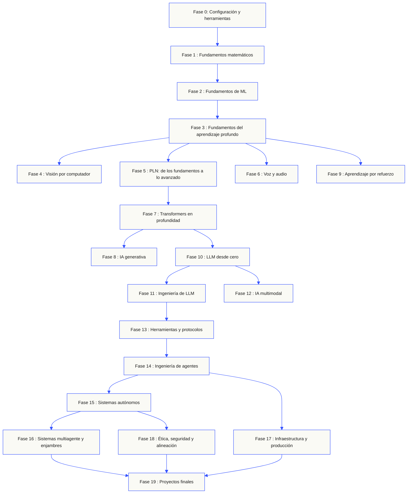

<p align="center"><sub>Traducción asistida por IA; se han revisado la estructura y la terminología. El <a href="../../README.md">inglés es la versión de referencia</a>.</sub></p>

<p align="center">
  <picture>
    <source media="(prefers-color-scheme: dark)" srcset="../../assets/readme/header-dark.svg">
    
  </picture>
</p>

Implementa componentes internos de modelos, pipelines de recuperación y entornos de ejecución de agentes. Pruébalos, examina los fallos y conserva el código y los resultados de evaluación.

**[Empieza a aprender](https://aiengineeringfromscratch.com/lesson?path=phases/00-setup-and-tooling/01-dev-environment)** · **[Elige una ruta](#learning-routes)** · **[Prueba un laboratorio](#interactive-lab)** · **[Construye un proyecto](#project-challenges)** · **[Consulta el programa](#contents)**

Gratis, de código abierto y con licencia MIT. Aprende en el sitio web, con un agente de programación o ejecutando código local.

> 523 lecciones. 20 fases. Python, TypeScript, Rust, Julia.

<p align="center">
  <a href="../../LICENSE"></a>
  <a href="../../ROADMAP.md"></a>
  <a href="#contents"></a>
  <a href="https://github.com/rohitg00/ai-engineering-from-scratch/stargazers"></a>
  <a href="https://aiengineeringfromscratch.com"></a>
</p>

<details>
<summary>Lee en tu idioma</summary>

<p align="center">
  <a href="../../README.md">🇬🇧 English</a> · <a href="../../i18n/zh/README.md">🇨🇳 简体中文</a> · <a href="../../i18n/zh-TW/README.md">🇹🇼 繁體中文（台灣）</a> · <a href="../../i18n/ja/README.md">🇯🇵 日本語</a> · <a href="../../i18n/ko/README.md">🇰🇷 한국어</a> · <a href="../../i18n/pt/README.md">🇵🇹 Português</a> · <a href="../../i18n/pt-BR/README.md">🇧🇷 Português (Brasil)</a> · <a href="../../i18n/es/README.md">🇪🇸 Español</a> · <a href="../../i18n/de/README.md">🇩🇪 Deutsch</a> · <a href="../../i18n/fr/README.md">🇫🇷 Français</a> · <a href="../../i18n/it/README.md">🇮🇹 Italiano</a> · <a href="../../i18n/nl/README.md">🇳🇱 Nederlands</a> · <a href="../../i18n/pl/README.md">🇵🇱 Polski</a> · <a href="../../i18n/cs/README.md">🇨🇿 Čeština</a> · <a href="../../i18n/ro/README.md">🇷🇴 Română</a> · <a href="../../i18n/hu/README.md">🇭🇺 Magyar</a> · <a href="../../i18n/el/README.md">🇬🇷 Ελληνικά</a> · <a href="../../i18n/sv/README.md">🇸🇪 Svenska</a> · <a href="../../i18n/da/README.md">🇩🇰 Dansk</a> · <a href="../../i18n/no/README.md">🇳🇴 Norsk</a> · <a href="../../i18n/fi/README.md">🇫🇮 Suomi</a> · <a href="../../i18n/ru/README.md">🇷🇺 Русский</a> · <a href="../../i18n/uk/README.md">🇺🇦 Українська</a> · <a href="../../i18n/tr/README.md">🇹🇷 Türkçe</a> · <a href="../../i18n/he/README.md">🇮🇱 עברית</a> · <a href="../../i18n/ar/README.md">🇸🇦 العربية</a> · <a href="../../i18n/fa/README.md">🇮🇷 فارسی</a> · <a href="../../i18n/hi/README.md">🇮🇳 हिन्दी</a> · <a href="../../i18n/bn/README.md">🇧🇩 বাংলা</a> · <a href="../../i18n/ur/README.md">🇵🇰 اردو</a> · <a href="../../i18n/th/README.md">🇹🇭 ไทย</a> · <a href="../../i18n/vi/README.md">🇻🇳 Tiếng Việt</a> · <a href="../../i18n/id/README.md">🇮🇩 Bahasa Indonesia</a> · <a href="../../i18n/tl/README.md">🇵🇭 Tagalog</a>
</p>

</details>

### Patrocinadores

<p align="center">
  <a href="https://serpapi.com/ai-engineering-from-scratch"><picture><source media="(min-width: 768px)" srcset="../../assets/sponsors/serpapi-banner-compact.png" width="48%"></picture></a>
  <a href="https://nitrostack.ai/referral/aiengineeringfromscratch"><picture><source media="(min-width: 768px)" srcset="../../assets/sponsors/nitrostack-banner-equal.png" width="48%"></picture></a>
</p>

<p align="center">
  <sub><span>Tu apoyo mantiene todas las lecciones gratuitas y de código abierto.</span> <a href="#supporters">Ver todos los colaboradores</a> · <a href="../../SPONSORS.md">Conviértete en patrocinador</a></sub>
</p>

<a id="see-what-you-will-build-and-keep"></a>
<a id="learning-routes"></a>

## Rutas de aprendizaje

| Ruta | Lección inicial |
|---|---|
| Fundamentos de los modelos | [Configuración y herramientas](https://aiengineeringfromscratch.com/lesson?path=phases/00-setup-and-tooling/01-dev-environment) |
| Sistemas LLM | [Ingeniería de prompts](https://aiengineeringfromscratch.com/lesson?path=phases/11-llm-engineering/01-prompt-engineering) |
| Agentes y entrega | [El bucle del agente](https://aiengineeringfromscratch.com/lesson?path=phases/14-agent-engineering/01-the-agent-loop) |

[Compara rutas profesionales](https://aiengineeringfromscratch.com/learning-paths.html) · [Requisitos previos y tiempo de estudio](#study-guide)

<a id="interactive-lab"></a>

### Descenso de gradiente

Veinte puntos iniciales siguen el descenso de gradiente sobre una pérdida cuadrática. El gráfico muestra sus posiciones y la pérdida media tras cada actualización.

<p align="center">
  <a href="https://aiengineeringfromscratch.com/lesson?path=phases/01-math-foundations/08-optimization#loss-landscape-visualization">
    <picture>
      <source media="(max-width: 600px) and (prefers-color-scheme: dark) and (prefers-reduced-motion: reduce)" srcset="../../assets/readme/101-gradient-mobile-dark.png">
      <source media="(max-width: 600px) and (prefers-reduced-motion: reduce)" srcset="../../assets/readme/101-gradient-mobile-light.png">
      <source media="(prefers-color-scheme: dark) and (prefers-reduced-motion: reduce)" srcset="../../assets/readme/101-gradient-dark.png">
      <source media="(prefers-reduced-motion: reduce)" srcset="../../assets/readme/101-gradient-light.png">
      <source media="(max-width: 600px) and (prefers-color-scheme: dark)" srcset="../../assets/readme/101-gradient-mobile-dark.gif">
      <source media="(max-width: 600px)" srcset="../../assets/readme/101-gradient-mobile-light.gif">
      <source media="(prefers-color-scheme: dark)" srcset="../../assets/readme/101-gradient-dark.gif">
      
    </picture>
  </a>
</p>

[Ajusta la tasa de aprendizaje en la lección](https://aiengineeringfromscratch.com/lesson?path=phases/01-math-foundations/08-optimization#loss-landscape-visualization) · [Compara GD, momentum y Adam en el código](../../phases/01-math-foundations/08-optimization/code/optimizers.py)

<a id="project-challenges"></a>

### Proyectos

Tres proyectos con código inicial por etapas, implementaciones de referencia y evaluadores locales. Ejecuta los comandos desde la raíz del repositorio tras la [configuración](#local-setup). Las implementaciones iniciales fallan hasta que completes las etapas.

<details>
<summary><strong>01 · Laboratorio de evaluación de recuperación</strong> · Python · Métricas de clasificación y comprobaciones de regresión</summary>

Un sistema candidato mejora el NDCG medio mientras una consulta sitúa más abajo su evidencia más relevante. Construye una comparación por consulta que informe de la regresión y pueda hacer fallar una comprobación de publicación.

Usa Python 3.10+. Repasa [RAG](../../phases/11-llm-engineering/06-rag/docs/en.md) y [evaluación de modelos](../../phases/02-ml-fundamentals/09-model-evaluation/docs/en.md). Implementa la validación de clasificaciones, precisión y exhaustividad, métricas sensibles a la posición y, después, la comparación de sistemas.

```bash
python3 scripts/project_test.py retrieval-evaluation-lab \
  --init learning-artifacts/retrieval-evaluation-lab
python3 scripts/project_test.py retrieval-evaluation-lab \
  --stage 1 --path learning-artifacts/retrieval-evaluation-lab --strict
python3 scripts/project_test.py retrieval-evaluation-lab \
  --all --path learning-artifacts/retrieval-evaluation-lab --strict
```

**Conserva:** una comparación reproducible con diferencias por consulta y los juicios utilizados para puntuarlas. Las métricas describen esos juicios; no demuestran que las respuestas sean correctas.

[Empieza el proyecto](https://aiengineeringfromscratch.com/project.html?id=retrieval-evaluation-lab) · [Inspecciona la referencia](../../projects/retrieval-evaluation-lab/solution/) · [Ejecuta con tus propios datos](../../projects/retrieval-evaluation-lab/README.md#run-with-your-own-inputs)

</details>

<details>
<summary><strong>02 · Depurador de trazas de agentes</strong> · TypeScript · Análisis de trazas y tiempos</summary>

Una traza proporcionada sigue tardando 100 ms, pero el uso total de tokens aumenta en 200 y un tramo empieza a fallar. Separa el trabajo solapado de los tramos hijos del tiempo de ejecución del padre y genera un informe que muestre el cambio.

Usa Node.js 22.18+ y Python 3 para el evaluador. Implementa el análisis de JSONL, la validación de relaciones padre-hijo, la aritmética de intervalos y una cronología inspeccionable.

```bash
python3 scripts/project_test.py agent-trace-debugger \
  --init learning-artifacts/agent-trace-debugger
python3 scripts/project_test.py agent-trace-debugger \
  --stage 1 --path learning-artifacts/agent-trace-debugger --strict
python3 scripts/project_test.py agent-trace-debugger \
  --all --path learning-artifacts/agent-trace-debugger --strict
```

**Conserva:** la traza de entrada, una cronología HTML y un informe de regresión JSON. Mantén recuentos exclusivos de tokens por tramo para no contar dos veces el uso del padre y de sus hijos.

[Empieza el proyecto](https://aiengineeringfromscratch.com/project.html?id=agent-trace-debugger) · [Inspecciona la referencia](../../projects/agent-trace-debugger/solution/) · [Explora los tiempos de forma interactiva](https://aiengineeringfromscratch.com/project.html?id=agent-trace-debugger&stage=03-timing)

</details>

<details>
<summary><strong>03 · Cortafuegos de llamadas a herramientas</strong> · Rust · Comprobaciones de roles y comprobantes de aprobación</summary>

Una escritura cambia después de la revisión o se reutiliza una aprobación. Valida el sobre de la llamada, comprueba el rol y la ruta del solicitante y consume una aprobación vinculada a la solicitud y al contenido exactos.

Usa Rust y Python 3.10+. Repasa [diseño de esquemas de herramientas](../../phases/13-tools-and-protocols/05-tool-schema-design/docs/en.md) y [límites de seguridad](../../phases/17-infrastructure-and-production/25-security-secrets-audit/docs/en.md). La aplicación solicitante proporciona la identidad; el modelo propone una operación.

```bash
python3 scripts/project_test.py tool-call-firewall \
  --init learning-artifacts/tool-call-firewall
python3 scripts/project_test.py tool-call-firewall \
  --stage 1 --path learning-artifacts/tool-call-firewall --strict
python3 scripts/project_test.py tool-call-firewall \
  --all --path learning-artifacts/tool-call-firewall --strict
```

**Conserva:** un comprobante de auditoría que muestre la operación solicitada y la decisión de la política. Cada aprobación puede usarse una sola vez dentro de una invocación; este proyecto no proporciona autorización persistente ni un entorno aislado del sistema operativo.

[Empieza el proyecto](https://aiengineeringfromscratch.com/project.html?id=tool-call-firewall) · [Inspecciona la referencia](../../projects/tool-call-firewall/solution/) · [Explora los límites de aprobación](https://aiengineeringfromscratch.com/project.html?id=tool-call-firewall&stage=03-consume-a-request-bound-approval-once)

</details>

[Explora todos los proyectos](https://aiengineeringfromscratch.com/projects.html) · [Guía de práctica profesional](../../learning-paths/CAREER-PRACTICE.md)

## Elige cómo aprender

### En el sitio web

Abre cualquier lección terminada en [aiengineeringfromscratch.com](https://aiengineeringfromscratch.com) o despliega una fase en [Contenido](#contents). No necesitas instalar nada ni clonar el repositorio.

### Con un tutor de IA

Si ya tienes Node.js, `npx` y un agente de programación compatible con skills, puedes convertirlo en tu tutor. No hace falta clonar el repositorio para instalar o leer el tutor. Los laboratorios ejecutables de Agent Skills también requieren un host seleccionado y un ámbito de instalación de skills, personal o del proyecto, con permisos de escritura. Los laboratorios ejecutables de las rutas específicas requieren `python3`.

```bash
npx skills add rohitg00/ai-engineering-from-scratch
```

Elige el host y el ámbito cuando lo pida el instalador. Usa `start-learning` en Codex, `/start-learning` en Claude Code o pide a tu host que use la skill por su nombre.

<details>
<summary>Configuración del tutor y comandos del entorno</summary>

Comprueba primero los requisitos locales:

```bash
node --version
npx --version
python3 --version
```

`skills` escribe en el host y el ámbito elegidos durante la instalación, por ejemplo `.claude/skills/`, `.cursor/skills/`, `.codex/skills/` u otra carpeta de skills compatible. Comprueba que el host seleccionado detecte ese destino exacto.

La sintaxis de invocación depende del host, no del formato portable `SKILL.md`:

| Aplicación anfitriona | Empieza el curso | Inicia Model Context Protocol (MCP) | Inicia Agent Skills | Haz el cuestionario de una fase |
|---|---|---|---|---|
| Codex | `start-learning`, o elegir entre `/skills` | `learn-mcp`, o elegir entre `/skills` | `learn-agent-skills`, o elegir entre `/skills` | `check-understanding 13`, o elegir entre `/skills` |
| Claude Code | `/start-learning` | `/learn-mcp` | `/learn-agent-skills` | `/check-understanding 13` |
| Otros hosts compatibles | `Use start-learning to begin the course.` | `Use learn-mcp to start the Model Context Protocol (MCP) path.` | `Use learn-agent-skills to start the Agent Skills Engineering path.` | `Use check-understanding to quiz me on Phase 13.` |

Un cuestionario de nivelación de diez preguntas determina desde qué fase empezar y guarda un plan de estudio personalizado en `LEARNING.md`. Después, la skill `learn` enseña una lección por sesión: concepto, matemáticas, código y cuestionario. La skill `course-guide` te lleva a la lección exacta que necesitas. En Codex, invoca estas skills con `learn` y `course-guide`; en Claude Code, usa `/learn` y `/course-guide`; en otros hosts compatibles, pide la skill por su nombre.

¿Solo te interesa Model Context Protocol (MCP)? Usa la invocación de MCP correspondiente a tu host. Se crea `MCP-LEARNING.md` y se sigue una ruta de 17 lecciones que cubre solicitudes sin estado, transportes, comunicación bidireccional, seguridad, confiabilidad, gobernanza de registros y evidencias de conformidad. El orden y los puntos de control están definidos en el [manifiesto de Model Context Protocol (MCP)](../../learning-paths/model-context-protocol.json).

¿Solo te interesan las Agent Skills? Usa la invocación de Agent Skills de tu host. Se crea `AGENT-SKILLS-LEARNING.md` y se sigue una ruta coherente de cinco lecciones: contrato, descubrimiento, invocación, límites del entorno aislado y, por último, evaluaciones de publicación y portabilidad entre hosts reales. Empieza en la web con la [ruta de Agent Skills](https://aiengineeringfromscratch.com/lesson?path=phases/13-tools-and-protocols/22-skills-and-agent-sdks&learningPath=agent-skills).

El instalador muestra los hosts que puede configurar y pregunta dónde quieres instalar las skills. Si todavía no tienes Node.js, `npx`, `python3`, un host compatible o un ámbito con permisos de escritura, usa el sitio web o lee `docs/en.md` manualmente. Así aprenderás los conceptos, pero la evidencia sobre el descubrimiento y la invocación en un host real, la ejecución de scripts y la desinstalación tendrá que esperar hasta que puedas hacer la comprobación previa. Lee las lecciones en [aiengineeringfromscratch.com](https://aiengineeringfromscratch.com).

### Skills de aprendizaje

| Habilidad | Qué hace |
|---|---|
| [`start-learning`](../../skills/start-learning/SKILL.md) | Incorporación inicial: define por qué aprendes, responde el cuestionario de nivelación y guarda un plan personalizado en `LEARNING.md`. |
| [`learn`](../../skills/learn/SKILL.md) | Ciclo del tutor: repaso inicial, siguiente lección interactiva y su cuestionario; registra el progreso y una lista de repaso. |
| [`course-guide`](../../skills/course-guide/SKILL.md) | Guía por temas: encuentra las lecciones exactas y sus enlaces para preguntas como «¿Dónde aprendo atención?» o «mi pérdida es NaN». |
| [`learn-mcp`](../../skills/learn-mcp/SKILL.md) | Tutor especializado en Model Context Protocol (MCP). Crea `MCP-LEARNING.md`, sigue el manifiesto de 17 lecciones y registra evidencias sobre protocolo, seguridad, confiabilidad y conformidad. |
| [`learn-agent-skills`](../../skills/learn-agent-skills/SKILL.md) | Tutor especializado en Agent Skills. Crea `AGENT-SKILLS-LEARNING.md`, enseña las lecciones 22, 24, 25, 26 y 27, y registra evidencias en hosts reales. |
| [`claude-certification`](../../skills/claude-certification/SKILL.md) | Tutor de certificación. Elige CCAO-F, CCDV-F, CCAR-F o CCAR-P; enseña cada lección, ejecuta laboratorios, revisa artefactos, administra diagnósticos y simulacros y guarda el progreso. |
| [`mcpa-certification`](../../skills/mcpa-certification/SKILL.md) | Tutor de MCPA. Sigue la ruta `mcpa-f` de 34 lecciones sobre el protocolo 2026-07-28; enseña cada lección, ejecuta los laboratorios y el verificador del protocolo, administra el diagnóstico y tres simulacros y guarda el progreso. |
| [`find-your-level`](../../skills/find-your-level/SKILL.md) | Cuestionario de nivelación de diez preguntas. Determina la fase inicial adecuada y propone una ruta personalizada con estimaciones de horas. |
| [`check-understanding <phase>`](../../skills/check-understanding/SKILL.md) | Cuestionario por fase de ocho preguntas, con comentarios y lecciones específicas para repasar. Usa la invocación de Codex, Claude Code o lenguaje natural de la tabla anterior. |

</details>

<a id="local-setup"></a>

### Ejecuta código local

```bash
git clone https://github.com/rohitg00/ai-engineering-from-scratch.git
cd ai-engineering-from-scratch
python3 phases/00-setup-and-tooling/01-dev-environment/code/verify.py --route beginner
python3 phases/01-math-foundations/01-linear-algebra-intuition/code/vectors.py
```

La comprobación previa distingue los requisitos que necesitas ahora de las herramientas que necesitarás más adelante. Cada requisito incumplido incluye el motivo detectado y un comando para corregirlo. El comando `vectors.py` ejecuta una lección sin dependencias y muestra que la multiplicación de una matriz por un vector es la operación que se realiza dentro de una capa de una red neuronal. Guarda esa salida del terminal como tu primera evidencia.

<details>
<summary>Sigue el mismo proceso en cada lección</summary>

### Sigue el mismo proceso en cada lección

1. **Lee** `docs/en.md` y explica la idea central con tus propias palabras.
2. **Escribe y construye** el código importante; no trates el bloque de código como decoración.
3. **Ejecuta** el comando de la lección desde la raíz del repositorio, el directorio que contiene `README.md` y `phases/`.
4. **Guarda evidencias**: el comando, el directorio de trabajo, el código de salida, la salida relevante y el artefacto que modificaste o creaste.
5. **Continúa** solo cuando puedas explicar la salida y hacer un pequeño cambio sin adivinar.

Los comandos de las lecciones usan rutas relativas a la raíz del repositorio, salvo que la lección indique expresamente que cambies de directorio. Si ofrece varias opciones de lenguaje, ejecuta la implementación del lenguaje que estás aprendiendo.

</details>

<a id="study-guide"></a>

## Elige una ruta de aprendizaje

No hace falta recorrer las 523 lecciones antes de empezar. Elige un objetivo. Cada enlace abre el mismo plan de estudios en GitHub o en el sitio web, y ambas versiones usan el mismo código de las lecciones.

| Tu objetivo | Aprende en GitHub | Aprende en el sitio web |
|---|---|---|
| Estoy empezando y quiero una base completa | [Fase 0: Configuración y herramientas](../../phases/00-setup-and-tooling/) | [Entorno de desarrollo](https://aiengineeringfromscratch.com/lesson?path=phases/00-setup-and-tooling/01-dev-environment) |
| Sé Python y quiero fundamentos de matemáticas y ML | [Fase 1: Fundamentos matemáticos](../../phases/01-math-foundations/) | [Intuición de álgebra lineal](https://aiengineeringfromscratch.com/lesson?path=phases/01-math-foundations/01-linear-algebra-intuition) |
| Quiero crear aplicaciones de LLM para producción | [Fase 11: Ingeniería de LLM](../../phases/11-llm-engineering/) | [Ingeniería de prompts](https://aiengineeringfromscratch.com/lesson?path=phases/11-llm-engineering/01-prompt-engineering) |
| Quiero crear agentes | [Fase 14: Ingeniería de agentes](../../phases/14-agent-engineering/) | [El ciclo del agente](https://aiengineeringfromscratch.com/lesson?path=phases/14-agent-engineering/01-the-agent-loop) |
| Quiero usar agentes de programación en repositorios reales | [Ruta de ingeniería asistida por agentes](../../learning-paths/using-coding-agents.json) | [Ingeniería asistida por agentes](https://aiengineeringfromscratch.com/lesson?path=phases/14-agent-engineering/31-agent-workbench-why-models-fail&learningPath=using-coding-agents) |
| Quiero definir la solución antes de implementarla | [Ruta de criterio de producto y entrega](../../learning-paths/shaping-the-build.json) | [Criterio de producto y entrega](https://aiengineeringfromscratch.com/lesson?path=phases/14-agent-engineering/47-outcomes-before-output&learningPath=shaping-the-build) |

¿No sabes por dónde empezar? Usa el [tutor de nivelación `start-learning`](../../skills/start-learning/SKILL.md) o la [guía de requisitos previos del sitio web](https://aiengineeringfromscratch.com/prereqs.html).

Compara cuatro áreas fundamentales y seis trayectorias profesionales en las [rutas de aprendizaje de AI Engineering](https://aiengineeringfromscratch.com/learning-paths.html).

<details>
<summary>Rutas específicas de MCP y Agent Skills</summary>

| Tu objetivo | Aprende en GitHub | Aprende en el sitio web |
|---|---|---|
| Quiero crear soluciones con Model Context Protocol (MCP) | [Ruta de Model Context Protocol (MCP)](../../phases/13-tools-and-protocols/README.md#model-context-protocol-mcp-path) | [Ruta de Model Context Protocol (MCP)](https://aiengineeringfromscratch.com/lesson?path=phases/13-tools-and-protocols/06-mcp-fundamentals&learningPath=model-context-protocol) |
| Quiero crear y publicar Agent Skills | [Ruta enfocada de Agent Skills](../../phases/13-tools-and-protocols/README.md#agent-skills-fast-path) | [Ruta de Agent Skills](https://aiengineeringfromscratch.com/lesson?path=phases/13-tools-and-protocols/22-skills-and-agent-sdks&learningPath=agent-skills) |

</details>

<details>
<summary>Requisitos previos y tiempo de estudio</summary>

### Requisitos previos

- Sabes programar en algún lenguaje; Python ayuda.
- Quieres entender cómo funciona realmente la IA, no limitarte a llamar APIs.

## Por dónde empezar

| Experiencia previa | Empieza en | Tiempo estimado |
|---|---|---|
| Nuevo en programación e IA | Fase 0 — Configuración | ~306 horas |
| Sabes Python, quieres empezar con ML | Fase 1 — Fundamentos matemáticos | ~270 horas |
| Sabes ML, quieres empezar con aprendizaje profundo | Fase 3 — Fundamentos del aprendizaje profundo | ~200 horas |
| Sabes aprendizaje profundo y quieres LLM y agentes | Fase 10 — LLM desde cero | ~100 horas |
| Ingeniero sénior, solo te interesa la ingeniería de agentes | Fase 14 — Ingeniería de agentes | ~60 horas |
| Solo quiero crear sistemas MCP para producción | [Ruta de Model Context Protocol (MCP)](../../learning-paths/model-context-protocol.json) | ~23 horas y 15 minutos |
| Solo quiero crear Agent Skills para producción | [Ruta de ingeniería de Agent Skills](../../learning-paths/agent-skills.json) | ~9,5 horas |

</details>

## Estructura del plan de estudios

Las veinte fases se construyen unas sobre otras. Las matemáticas son los cimientos; los agentes y los sistemas de producción, el techo. Puedes avanzar si ya dominas las capas inferiores, pero no te saltes los fundamentos y luego te preguntes por qué falla algo de las capas superiores.



<a id="contents"></a>

## Contenido

Veinte fases. Haz clic en cualquier fase para ampliar su lista de lecciones.

<a id="phase-0"></a>

### Fase 0: Configuración y herramientas `12 lecciones`

> Prepara tu entorno para todo lo que viene.

| # | Lección | Tipo | Idioma |
|:---:|--------|:----:|------|
| 01 | [Entorno de desarrollo](../../phases/00-setup-and-tooling/01-dev-environment/) | Construir | Python |
| 02 | [Git y colaboración](../../phases/00-setup-and-tooling/02-git-and-collaboration/) | Aprender | — |
| 03 | [Configuración de GPU y servicios en la nube](../../phases/00-setup-and-tooling/03-gpu-setup-and-cloud/) | Construir | Python |
| 04 | [APIs y claves](../../phases/00-setup-and-tooling/04-apis-and-keys/) | Construir | Python |
| 05 | [Cuadernos de Jupyter](../../phases/00-setup-and-tooling/05-jupyter-notebooks/) | Construir | Python |
| 06 | [Entornos de Python](../../phases/00-setup-and-tooling/06-python-environments/) | Construir | Shell |
| 07 | [Docker para IA](../../phases/00-setup-and-tooling/07-docker-for-ai/) | Construir | Docker |
| 08 | [Configuración del editor](../../phases/00-setup-and-tooling/08-editor-setup/) | Construir | — |
| 09 | [Gestión de datos](../../phases/00-setup-and-tooling/09-data-management/) | Construir | Python |
| 10 | [Terminal y Shell](../../phases/00-setup-and-tooling/10-terminal-and-shell/) | Aprender | — |
| 11 | [Linux para IA](../../phases/00-setup-and-tooling/11-linux-for-ai/) | Aprender | — |
| 12 | [Depuración y perfilado](../../phases/00-setup-and-tooling/12-debugging-and-profiling/) | Construir | Python |

<details id="phase-1">
<summary><b>Fase 1 — Fundamentos matemáticos</b> &nbsp;<code>22 lecciones</code>&nbsp; <em>La intuición que hay detrás de cada algoritmo de IA, explicada con código.</em></summary>
<br/>

| # | Lección | Tipo | Idioma |
|:---:|--------|:----:|------|
| 01 | [Intuición de álgebra lineal](../../phases/01-math-foundations/01-linear-algebra-intuition/) | Aprender | Python, Julia |
| 02 | [Vectores, matrices y operaciones](../../phases/01-math-foundations/02-vectors-matrices-operations/) | Construir | Python, Julia |
| 03 | [Transformaciones de matriz y valores propios](../../phases/01-math-foundations/03-matrix-transformations/) | Construir | Python, Julia |
| 04 | [Cálculo para ML: derivadas y gradientes](../../phases/01-math-foundations/04-calculus-for-ml/) | Aprender | Python |
| 05 | [Regla de la cadena y diferenciación automática](../../phases/01-math-foundations/05-chain-rule-and-autodiff/) | Construir | Python |
| 06 | [Probabilidad y distribución](../../phases/01-math-foundations/06-probability-and-distributions/) | Aprender | Python |
| 07 | [Teorema de Bayes y pensamiento estadístico](../../phases/01-math-foundations/07-bayes-theorem/) | Construir | Python |
| 08 | [Optimización: métodos de descenso por gradiente](../../phases/01-math-foundations/08-optimization/) | Construir | Python |
| 09 | [Teoría de la información: entropía y divergencia KL](../../phases/01-math-foundations/09-information-theory/) | Aprender | Python |
| 10 | [Reducción de dimensiones: PCA, t-SNE, UMAP](../../phases/01-math-foundations/10-dimensionality-reduction/) | Construir | Python |
| 11 | [Descomposición en valores singulares](../../phases/01-math-foundations/11-singular-value-decomposition/) | Construir | Python, Julia |
| 12 | [Operaciones con tensores](../../phases/01-math-foundations/12-tensor-operations/) | Construir | Python |
| 13 | [Estabilidad numérica](../../phases/01-math-foundations/13-numerical-stability/) | Construir | Python |
| 14 | [Normas y distancias](../../phases/01-math-foundations/14-norms-and-distances/) | Construir | Python |
| 15 | [Estadística para ML](../../phases/01-math-foundations/15-statistics-for-ml/) | Construir | Python |
| 16 | [Métodos de muestreo](../../phases/01-math-foundations/16-sampling-methods/) | Construir | Python |
| 17 | [Sistemas lineales](../../phases/01-math-foundations/17-linear-systems/) | Construir | Python |
| 18 | [Optimización convexa](../../phases/01-math-foundations/18-convex-optimization/) | Construir | Python |
| 19 | [Números complejos para IA](../../phases/01-math-foundations/19-complex-numbers/) | Aprender | Python |
| 20 | [La transformación de Fourier](../../phases/01-math-foundations/20-fourier-transform/) | Construir | Python |
| 21 | [Teoría de grafos para ML](../../phases/01-math-foundations/21-graph-theory/) | Construir | Python |
| 22 | [Procesos estocásticos](../../phases/01-math-foundations/22-stochastic-processes/) | Aprender | Python |

</details>
<details id="phase-2">
<summary><b>Fase 2 — Fundamentos de ML</b> &nbsp;<code>18 lecciones</code>&nbsp; <em>El ML clásico sigue siendo la base de la mayoría de los sistemas de IA en producción.</em></summary>
<br/>

| # | Lección | Tipo | Idioma |
|:---:|--------|:----:|------|
| 01 | [¿Qué es el aprendizaje automático?](../../phases/02-ml-fundamentals/01-what-is-machine-learning/) | Aprender | Python |
| 02 | [Regresión lineal desde cero](../../phases/02-ml-fundamentals/02-linear-regression/) | Construir | Python |
| 03 | [Regresión logística y clasificación](../../phases/02-ml-fundamentals/03-logistic-regression/) | Construir | Python |
| 04 | [Árboles de decisión y bosques aleatorios](../../phases/02-ml-fundamentals/04-decision-trees/) | Construir | Python |
| 05 | [Máquinas de vectores de soporte](../../phases/02-ml-fundamentals/05-support-vector-machines/) | Construir | Python |
| 06 | [KNN y métricas de distancia](../../phases/02-ml-fundamentals/06-knn-and-distances/) | Construir | Python |
| 07 | [Aprendizaje sin supervisión: K-Means, DBSCAN](../../phases/02-ml-fundamentals/07-unsupervised-learning/) | Construir | Python |
| 08 | [Ingeniería y selección de características](../../phases/02-ml-fundamentals/08-feature-engineering/) | Construir | Python |
| 09 | [Evaluación de modelos: métricas y validación cruzada](../../phases/02-ml-fundamentals/09-model-evaluation/) | Construir | Python |
| 10 | [Sesgo, varianza y curva de aprendizaje](../../phases/02-ml-fundamentals/10-bias-variance/) | Aprender | Python |
| 11 | [Métodos de ensamble: boosting, bagging y stacking](../../phases/02-ml-fundamentals/11-ensemble-methods/) | Construir | Python |
| 12 | [Ajuste de hiperparámetros](../../phases/02-ml-fundamentals/12-hyperparameter-tuning/) | Construir | Python |
| 13 | [Pipelines de ML y seguimiento de experimentos](../../phases/02-ml-fundamentals/13-ml-pipelines/) | Construir | Python |
| 14 | [Bayes ingenuo](../../phases/02-ml-fundamentals/14-naive-bayes/) | Construir | Python |
| 15 | [Fundamentos de series temporales](../../phases/02-ml-fundamentals/15-time-series/) | Construir | Python |
| 16 | [Detección de anomalías](../../phases/02-ml-fundamentals/16-anomaly-detection/) | Construir | Python |
| 17 | [Tratar datos desequilibrados](../../phases/02-ml-fundamentals/17-imbalanced-data/) | Construir | Python |
| 18 | [Selección de características](../../phases/02-ml-fundamentals/18-feature-selection/) | Construir | Python |

</details>
<details id="phase-3">
<summary><b>Fase 3 — Fundamentos del aprendizaje profundo</b> &nbsp;<code>13 lecciones</code>&nbsp; <em>Redes neuronales desde los primeros principios. Sin frameworks hasta que construyas uno.</em></summary>
<br/>

| # | Lección | Tipo | Idioma |
|:---:|--------|:----:|------|
| 01 | [El perceptrón: dónde empezó todo](../../phases/03-deep-learning-core/01-the-perceptron/) | Construir | Python |
| 02 | [Redes multicapa y propagación hacia adelante](../../phases/03-deep-learning-core/02-multi-layer-networks/) | Construir | Python |
| 03 | [Retropropagación desde cero](../../phases/03-deep-learning-core/03-backpropagation/) | Construir | Python |
| 04 | [Funciones de activación: ReLU, sigmoide, GELU y por qué](../../phases/03-deep-learning-core/04-activation-functions/) | Construir | Python |
| 05 | [Funciones de pérdida: MSE, entropía cruzada y pérdida contrastiva](../../phases/03-deep-learning-core/05-loss-functions/) | Construir | Python |
| 06 | [Optimizadores: SGD, Momentum, Adam, AdamW](../../phases/03-deep-learning-core/06-optimizers/) | Construir | Python |
| 07 | [Regularización: dropout, decaimiento de pesos y BatchNorm](../../phases/03-deep-learning-core/07-regularization/) | Construir | Python |
| 08 | [Inicialización de pesos y estabilidad del entrenamiento](../../phases/03-deep-learning-core/08-weight-initialization/) | Construir | Python |
| 09 | [Programación de tasas de aprendizaje y calentamiento inicial](../../phases/03-deep-learning-core/09-learning-rate-schedules/) | Construir | Python |
| 10 | [Construye tu propio miniframwork](../../phases/03-deep-learning-core/10-mini-framework/) | Construir | Python |
| 11 | [Introducción a PyTorch](../../phases/03-deep-learning-core/11-intro-to-pytorch/) | Construir | Python |
| 12 | [Introducción a JAX](../../phases/03-deep-learning-core/12-intro-to-jax/) | Construir | Python |
| 13 | [Depuración de redes neuronales](../../phases/03-deep-learning-core/13-debugging-neural-networks/) | Construir | Python |

</details>
<details id="phase-4">
<summary><b>Fase 4 — Visión por computador</b> &nbsp;<code>28 lecciones</code>&nbsp; <em>De los píxeles a la comprensión: imágenes, video, 3D, VLM y modelos del mundo.</em></summary>
<br/>

| # | Lección | Tipo | Idioma |
|:---:|--------|:----:|------|
| 01 | [Fundamentos de imagen: píxeles, canales y espacios de color](../../phases/04-computer-vision/01-image-fundamentals/) | Aprender | Python |
| 02 | [Convoluciones desde cero](../../phases/04-computer-vision/02-convolutions-from-scratch/) | Construir | Python |
| 03 | [CNN: de LeNet a ResNet](../../phases/04-computer-vision/03-cnns-lenet-to-resnet/) | Construir | Python |
| 04 | [Clasificación de imágenes](../../phases/04-computer-vision/04-image-classification/) | Construir | Python |
| 05 | [Transferencia de aprendizaje y ajuste fino](../../phases/04-computer-vision/05-transfer-learning/) | Construir | Python |
| 06 | [Detección de objetos — YOLO desde cero](../../phases/04-computer-vision/06-object-detection-yolo/) | Construir | Python |
| 07 | [Segmentación semántica — U-Net](../../phases/04-computer-vision/07-semantic-segmentation-unet/) | Construir | Python |
| 08 | [Segmentación de instancias — Mask R-CNN](../../phases/04-computer-vision/08-instance-segmentation-mask-rcnn/) | Construir | Python |
| 09 | [Generación de imágenes — GAN](../../phases/04-computer-vision/09-image-generation-gans/) | Construir | Python |
| 10 | [Generación de imágenes — modelos de difusión](../../phases/04-computer-vision/10-image-generation-diffusion/) | Construir | Python |
| 11 | [Stable Diffusion — arquitectura y ajuste fino](../../phases/04-computer-vision/11-stable-diffusion/) | Construir | Python |
| 12 | [Comprensión de video — modelado temporal](../../phases/04-computer-vision/12-video-understanding/) | Construir | Python |
| 13 | [Visión 3D: nubes de puntos y NeRF](../../phases/04-computer-vision/13-3d-vision-nerf/) | Construir | Python |
| 14 | [Transformers de visión (ViT)](../../phases/04-computer-vision/14-vision-transformers/) | Construir | Python |
| 15 | [Visión en tiempo real: despliegue en el borde](../../phases/04-computer-vision/15-real-time-edge/) | Construir | Python |
| 16 | [Construye un pipeline completo de visión](../../phases/04-computer-vision/16-vision-pipeline-capstone/) | Construir | Python |
| 17 | [Visión autosupervisada — SimCLR, DINO, MAE](../../phases/04-computer-vision/17-self-supervised-vision/) | Construir | Python |
| 18 | [Visión de vocabulario abierto — CLIP](../../phases/04-computer-vision/18-open-vocab-clip/) | Construir | Python |
| 19 | [OCR y comprensión de documentos](../../phases/04-computer-vision/19-ocr-document-understanding/) | Construir | Python |
| 20 | [Recuperación de imágenes y aprendizaje de métricas](../../phases/04-computer-vision/20-image-retrieval-metric/) | Construir | Python |
| 21 | [Detección de puntos clave y estimación de pose](../../phases/04-computer-vision/21-keypoint-pose/) | Construir | Python |
| 22 | [Gaussian Splatting 3D desde cero](../../phases/04-computer-vision/22-3d-gaussian-splatting/) | Construir | Python |
| 23 | [Transformers de difusión y flujo rectificado](../../phases/04-computer-vision/23-diffusion-transformers-rectified-flow/) | Construir | Python |
| 24 | [SAM 3 y segmentación de vocabulario abierto](../../phases/04-computer-vision/24-sam3-open-vocab-segmentation/) | Construir | Python |
| 25 | [Modelos de visión y lenguaje (ViT-MLP-LLM)](../../phases/04-computer-vision/25-vision-language-models/) | Construir | Python |
| 26 | [Estimación monocular de profundidad y geometría](../../phases/04-computer-vision/26-monocular-depth/) | Construir | Python |
| 27 | [Seguimiento multiobjeto y memoria de video](../../phases/04-computer-vision/27-multi-object-tracking/) | Construir | Python |
| 28 | [Modelos del mundo y difusión de video](../../phases/04-computer-vision/28-world-models-video-diffusion/) | Construir | Python |

</details>
<details id="phase-5">
<summary><b>Fase 5 — PLN: de los fundamentos a lo avanzado</b> &nbsp;<code>29 lecciones</code>&nbsp; <em>El lenguaje es la interfaz de la inteligencia.</em></summary>
<br/>

| # | Lección | Tipo | Idioma |
|:---:|--------|:----:|------|
| 01 | [Procesamiento de texto: tokenización, stemming y lematización](../../phases/05-nlp-foundations-to-advanced/01-text-processing/) | Construir | Python |
| 02 | [Bolsa de palabras, TF-IDF y representación de texto](../../phases/05-nlp-foundations-to-advanced/02-bag-of-words-tfidf/) | Construir | Python |
| 03 | [Embeddings de palabras: Word2Vec desde cero](../../phases/05-nlp-foundations-to-advanced/03-word-embeddings-word2vec/) | Construir | Python |
| 04 | [GloVe, FastText y embeddings de subpalabras](../../phases/05-nlp-foundations-to-advanced/04-glove-fasttext-subword/) | Construir | Python |
| 05 | [Análisis de sentimiento](../../phases/05-nlp-foundations-to-advanced/05-sentiment-analysis/) | Construir | Python |
| 06 | [Reconocimiento de entidades nombradas (NER)](../../phases/05-nlp-foundations-to-advanced/06-named-entity-recognition/) | Construir | Python |
| 07 | [Etiquetado POS y análisis sintáctico](../../phases/05-nlp-foundations-to-advanced/07-pos-tagging-parsing/) | Construir | Python |
| 08 | [Clasificación de texto — CNN y RNN para texto](../../phases/05-nlp-foundations-to-advanced/08-cnns-rnns-for-text/) | Construir | Python |
| 09 | [Modelos de secuencia a secuencia](../../phases/05-nlp-foundations-to-advanced/09-sequence-to-sequence/) | Construir | Python |
| 10 | [Mecanismo de atención — el avance decisivo](../../phases/05-nlp-foundations-to-advanced/10-attention-mechanism/) | Construir | Python |
| 11 | [Traducción automática](../../phases/05-nlp-foundations-to-advanced/11-machine-translation/) | Construir | Python |
| 12 | [Resumen de texto](../../phases/05-nlp-foundations-to-advanced/12-text-summarization/) | Construir | Python |
| 13 | [Sistemas de respuesta a preguntas](../../phases/05-nlp-foundations-to-advanced/13-question-answering/) | Construir | Python |
| 14 | [Recuperación de información y búsqueda](../../phases/05-nlp-foundations-to-advanced/14-information-retrieval-search/) | Construir | Python |
| 15 | [Modelado de temas: LDA, BERTopic](../../phases/05-nlp-foundations-to-advanced/15-topic-modeling/) | Construir | Python |
| 16 | [Generación de texto](../../phases/05-nlp-foundations-to-advanced/16-text-generation-pre-transformer/) | Construir | Python |
| 17 | [Chatbots: de reglas a redes neuronales](../../phases/05-nlp-foundations-to-advanced/17-chatbots-rule-to-neural/) | Construir | Python |
| 18 | [PLN multilingüe](../../phases/05-nlp-foundations-to-advanced/18-multilingual-nlp/) | Construir | Python |
| 19 | [Tokenización de subpalabras: BPE, WordPiece, Unigram y SentencePiece](../../phases/05-nlp-foundations-to-advanced/19-subword-tokenization/) | Aprender | Python |
| 20 | [Salidas estructuradas y decodificación restringida](../../phases/05-nlp-foundations-to-advanced/20-structured-outputs-constrained-decoding/) | Construir | Python |
| 21 | [Inferencia de lenguaje natural (NLI) e implicación textual](../../phases/05-nlp-foundations-to-advanced/21-nli-textual-entailment/) | Aprender | Python |
| 22 | [Análisis en profundidad de los modelos de embeddings](../../phases/05-nlp-foundations-to-advanced/22-embedding-models-deep-dive/) | Aprender | Python |
| 23 | [Estrategias de segmentación para RAG](../../phases/05-nlp-foundations-to-advanced/23-chunking-strategies-rag/) | Construir | Python |
| 24 | [Resolución de correferencias](../../phases/05-nlp-foundations-to-advanced/24-coreference-resolution/) | Aprender | Python |
| 25 | [Vinculación de entidades y desambiguación](../../phases/05-nlp-foundations-to-advanced/25-entity-linking/) | Construir | Python |
| 26 | [Extracción de relaciones y construcción de grafos de conocimiento](../../phases/05-nlp-foundations-to-advanced/26-relation-extraction-kg/) | Construir | Python |
| 27 | [Evaluación de LLM: RAGAS, DeepEval y G-Eval](../../phases/05-nlp-foundations-to-advanced/27-llm-evaluation-frameworks/) | Construir | Python |
| 28 | [Evaluación de contexto largo: NIAH, RULER, LongBench y MRCR](../../phases/05-nlp-foundations-to-advanced/28-long-context-evaluation/) | Aprender | Python |
| 29 | [Seguimiento del estado del diálogo](../../phases/05-nlp-foundations-to-advanced/29-dialogue-state-tracking/) | Construir | Python |

</details>
<details id="phase-6">
<summary><b>Fase 6 — Voz y audio</b> &nbsp;<code>17 lecciones</code>&nbsp; <em>Escuchar, comprender y hablar.</em></summary>
<br/>

| # | Lección | Tipo | Idioma |
|:---:|--------|:----:|------|
| 01 | [Fundamentos de audio: formas de onda, muestreo, FFT](../../phases/06-speech-and-audio/01-audio-fundamentals) | Aprender | Python |
| 02 | [Espectrogramas, escala Mel y características de audio](../../phases/06-speech-and-audio/02-spectrograms-mel-features) | Construir | Python |
| 03 | [Clasificación de audio](../../phases/06-speech-and-audio/03-audio-classification) | Construir | Python |
| 04 | [Reconocimiento automático del habla (ASR)](../../phases/06-speech-and-audio/04-speech-recognition-asr) | Construir | Python |
| 05 | [Whisper: arquitectura y ajuste fino](../../phases/06-speech-and-audio/05-whisper-architecture-finetuning) | Construir | Python |
| 06 | [Reconocimiento y verificación de hablantes](../../phases/06-speech-and-audio/06-speaker-recognition-verification) | Construir | Python |
| 07 | [Síntesis de voz a partir de texto (TTS)](../../phases/06-speech-and-audio/07-text-to-speech) | Construir | Python |
| 08 | [Clonación y conversión de voz](../../phases/06-speech-and-audio/08-voice-cloning-conversion) | Construir | Python |
| 09 | [Generación de música](../../phases/06-speech-and-audio/09-music-generation) | Construir | Python |
| 10 | [Modelos de audio y lenguaje](../../phases/06-speech-and-audio/10-audio-language-models) | Construir | Python |
| 11 | [Procesamiento de audio en tiempo real](../../phases/06-speech-and-audio/11-real-time-audio-processing) | Construir | Python |
| 12 | [Construye un pipeline de asistente de voz](../../phases/06-speech-and-audio/12-voice-assistant-pipeline) | Construir | Python |
| 13 | [Códecs de audio neuronales — EnCodec, SNAC, Mimi y DAC](../../phases/06-speech-and-audio/13-neural-audio-codecs) | Aprender | Python |
| 14 | [Detección de actividad de voz y gestión de turnos](../../phases/06-speech-and-audio/14-voice-activity-detection-turn-taking) | Construir | Python |
| 15 | [Conversión de voz a voz en streaming — Moshi, Hibiki](../../phases/06-speech-and-audio/15-streaming-speech-to-speech-moshi-hibiki) | Aprender | Python |
| 16 | [Antisuplantación de voz y marca de agua de audio](../../phases/06-speech-and-audio/16-anti-spoofing-audio-watermarking) | Construir | Python |
| 17 | [Evaluación de audio — WER, MOS, MMAU y tablas de clasificación](../../phases/06-speech-and-audio/17-audio-evaluation-metrics) | Aprender | Python |

</details>
<details id="phase-7">
<summary><b>Fase 7 — Transformers en profundidad</b> &nbsp;<code>16 lecciones</code>&nbsp; <em>La arquitectura que lo cambió todo.</em></summary>
<br/>

| # | Lección | Tipo | Idioma |
|:---:|--------|:----:|------|
| 01 | [Por qué los Transformers: problemas de las RNN](../../phases/07-transformers-deep-dive/01-why-transformers/) | Aprender | Python |
| 02 | [Autoatención desde cero](../../phases/07-transformers-deep-dive/02-self-attention-from-scratch/) | Construir | Python |
| 03 | [Atención multi-cabeza](../../phases/07-transformers-deep-dive/03-multi-head-attention/) | Construir | Python |
| 04 | [Codificación posicional: sinusoidal, RoPE y ALiBi](../../phases/07-transformers-deep-dive/04-positional-encoding/) | Construir | Python |
| 05 | [El Transformer completo: codificador + decodificador](../../phases/07-transformers-deep-dive/05-full-transformer/) | Construir | Python |
| 06 | [BERT — modelado de lenguaje enmascarado](../../phases/07-transformers-deep-dive/06-bert-masked-language-modeling/) | Construir | Python |
| 07 | [GPT — modelado causal del lenguaje](../../phases/07-transformers-deep-dive/07-gpt-causal-language-modeling/) | Construir | Python |
| 08 | [T5, BART — modelos codificador-decodificador](../../phases/07-transformers-deep-dive/08-t5-bart-encoder-decoder/) | Aprender | Python |
| 09 | [Transformers de visión (ViT)](../../phases/07-transformers-deep-dive/09-vision-transformers/) | Construir | Python |
| 10 | [Transformers de audio — arquitectura de Whisper](../../phases/07-transformers-deep-dive/10-audio-transformers-whisper/) | Aprender | Python |
| 11 | [Mezcla de expertos (MoE)](../../phases/07-transformers-deep-dive/11-mixture-of-experts/) | Construir | Python |
| 12 | [Caché KV, FlashAttention y optimización de inferencia](../../phases/07-transformers-deep-dive/12-kv-cache-flash-attention/) | Construir | Python |
| 13 | [Leyes de escalamiento](../../phases/07-transformers-deep-dive/13-scaling-laws/) | Aprender | Python |
| 14 | [Construir un Transformer desde cero](../../phases/07-transformers-deep-dive/14-build-a-transformer-capstone/) | Construir | Python |
| 15 | [Variantes de atención — ventana deslizante, dispersa y diferencial](../../phases/07-transformers-deep-dive/15-attention-variants/) | Construir | Python |
| 16 | [Decodificación especulativa — proponer, verificar, repetir](../../phases/07-transformers-deep-dive/16-speculative-decoding/) | Construir | Python |

</details>
<details id="phase-8">
<summary><b>Fase 8 — IA generativa</b> &nbsp;<code>15 lecciones</code>&nbsp; <em>Crea imágenes, video, audio, 3D y mucho más.</em></summary>
<br/>

| # | Lección | Tipo | Idioma |
|:---:|--------|:----:|------|
| 01 | [Modelos generativos: taxonomía e historia](../../phases/08-generative-ai/01-generative-models-taxonomy-history/) | Aprender | Python |
| 02 | [Autoencodadores y VAE](../../phases/08-generative-ai/02-autoencoders-vae/) | Construir | Python |
| 03 | [GAN: generador frente a discriminador](../../phases/08-generative-ai/03-gans-generator-discriminator/) | Construir | Python |
| 04 | [GAN condicionales y Pix2Pix](../../phases/08-generative-ai/04-conditional-gans-pix2pix/) | Construir | Python |
| 05 | [StyleGAN](../../phases/08-generative-ai/05-stylegan/) | Construir | Python |
| 06 | [Modelos de difusión — DDPM desde cero](../../phases/08-generative-ai/06-diffusion-ddpm-from-scratch/) | Construir | Python |
| 07 | [Difusión latente y Stable Diffusion](../../phases/08-generative-ai/07-latent-diffusion-stable-diffusion/) | Construir | Python |
| 08 | [ControlNet, LoRA y condicionamiento](../../phases/08-generative-ai/08-controlnet-lora-conditioning/) | Construir | Python |
| 09 | [Relleno, expansión de imagen y edición](../../phases/08-generative-ai/09-inpainting-outpainting-editing/) | Construir | Python |
| 10 | [Generación de vídeos](../../phases/08-generative-ai/10-video-generation/) | Construir | Python |
| 11 | [Generación de audio](../../phases/08-generative-ai/11-audio-generation/) | Construir | Python |
| 12 | [Generación 3D](../../phases/08-generative-ai/12-3d-generation/) | Construir | Python |
| 13 | [Emparejamiento de flujos y flujos rectificados](../../phases/08-generative-ai/13-flow-matching-rectified-flows/) | Construir | Python |
| 14 | [Evaluación: FID, CLIP Score](../../phases/08-generative-ai/14-evaluation-fid-clip-score/) | Construir | Python |
| 19 | [Modelado autorregresivo visual (VAR): predicción a la siguiente escala](../../phases/08-generative-ai/19-visual-autoregressive-var/) | Construir | Python |

</details>
<details id="phase-9">
<summary><b>Fase 9 — Aprendizaje por refuerzo</b> &nbsp;<code>12 lecciones</code>&nbsp; <em>La base de RLHF y de la IA que juega.</em></summary>
<br/>

| # | Lección | Tipo | Idioma |
|:---:|--------|:----:|------|
| 01 | [Procesos de decisión de Markov: estados, acciones y recompensas](../../phases/09-reinforcement-learning/01-mdps-states-actions-rewards/) | Aprender | Python |
| 02 | [Programación dinámica](../../phases/09-reinforcement-learning/02-dynamic-programming/) | Construir | Python |
| 03 | [Métodos de Monte Carlo](../../phases/09-reinforcement-learning/03-monte-carlo-methods/) | Construir | Python |
| 04 | [Q-learning y SARSA](../../phases/09-reinforcement-learning/04-q-learning-sarsa/) | Construir | Python |
| 05 | [Redes Q profundas (DQN)](../../phases/09-reinforcement-learning/05-dqn/) | Construir | Python |
| 06 | [Gradientes de política — REINFORCE](../../phases/09-reinforcement-learning/06-policy-gradients-reinforce/) | Construir | Python |
| 07 | [Actor-crítico — A2C, A3C](../../phases/09-reinforcement-learning/07-actor-critic-a2c-a3c/) | Construir | Python |
| 08 | [PPO](../../phases/09-reinforcement-learning/08-ppo/) | Construir | Python |
| 09 | [Modelado de recompensas y RLHF](../../phases/09-reinforcement-learning/09-reward-modeling-rlhf/) | Construir | Python |
| 10 | [Aprendizaje por refuerzo multiagente](../../phases/09-reinforcement-learning/10-multi-agent-rl/) | Construir | Python |
| 11 | [Transferencia de la simulación al mundo real](../../phases/09-reinforcement-learning/11-sim-to-real-transfer/) | Construir | Python |
| 12 | [Aprendizaje por refuerzo para juegos](../../phases/09-reinforcement-learning/12-rl-for-games/) | Construir | Python |

</details>
<details id="phase-10">
<summary><b>Fase 10 — LLM desde cero</b> &nbsp;<code>24 lecciones</code>&nbsp; <em>Construye, entrena y comprende los modelos de lenguaje grandes.</em></summary>
<br/>

| # | Lección | Tipo | Idioma |
|:---:|--------|:----:|------|
| 01 | [Tokenizadores: BPE, WordPiece y SentencePiece](../../phases/10-llms-from-scratch/01-tokenizers/) | Construir | Python, Rust |
| 02 | [Construye un tokenizador desde cero](../../phases/10-llms-from-scratch/02-building-a-tokenizer/) | Construir | Python |
| 03 | [Pipelines de datos para el preentrenamiento](../../phases/10-llms-from-scratch/03-data-pipelines/) | Construir | Python |
| 04 | [Preentrenamiento de un mini GPT (124M)](../../phases/10-llms-from-scratch/04-pre-training-mini-gpt/) | Construir | Python |
| 05 | [Entrenamiento distribuido, FSDP y DeepSpeed](../../phases/10-llms-from-scratch/05-scaling-distributed/) | Construir | Python |
| 06 | [Ajuste por instrucciones — SFT](../../phases/10-llms-from-scratch/06-instruction-tuning-sft/) | Construir | Python |
| 07 | [RLHF — modelo de recompensas + PPO](../../phases/10-llms-from-scratch/07-rlhf/) | Construir | Python |
| 08 | [DPO — optimización directa de preferencias](../../phases/10-llms-from-scratch/08-dpo/) | Construir | Python |
| 09 | [IA constitucional y auto-mejora](../../phases/10-llms-from-scratch/09-constitutional-ai-self-improvement/) | Construir | Python |
| 10 | [Evaluación — benchmarks y evaluaciones](../../phases/10-llms-from-scratch/10-evaluation/) | Construir | Python |
| 11 | [Cuantificación: INT8, GPTQ, AWQ, GGUF](../../phases/10-llms-from-scratch/11-quantization/) | Construir | Python |
| 12 | [Optimización de la inferencia](../../phases/10-llms-from-scratch/12-inference-optimization/) | Construir | Python |
| 13 | [Construcción de un pipeline completo de LLM](../../phases/10-llms-from-scratch/13-building-complete-llm-pipeline/) | Construir | Python |
| 14 | [Recorridos por arquitecturas de modelos abiertos](../../phases/10-llms-from-scratch/14-open-models-architecture-walkthroughs/) | Aprender | Python |
| 15 | [Decodificación especulativa y EAGLE-3](../../phases/10-llms-from-scratch/15-speculative-decoding-eagle3/) | Construir | Python |
| 16 | [Atención diferencial (V2)](../../phases/10-llms-from-scratch/16-differential-attention-v2/) | Construir | Python |
| 17 | [Atención dispersa nativa (DeepSeek NSA)](../../phases/10-llms-from-scratch/17-native-sparse-attention/) | Construir | Python |
| 18 | [Predicción de múltiples tokens (MTP)](../../phases/10-llms-from-scratch/18-multi-token-prediction/) | Construir | Python |
| 19 | [Paralelismo DualPipe](../../phases/10-llms-from-scratch/19-dualpipe-parallelism/) | Aprender | Python |
| 20 | [Recorrido por la arquitectura de DeepSeek-V3](../../phases/10-llms-from-scratch/20-deepseek-v3-walkthrough/) | Aprender | Python |
| 21 | [Jamba — modelo híbrido SSM-transformer](../../phases/10-llms-from-scratch/21-jamba-hybrid-ssm-transformer/) | Aprender | Python |
| 22 | [Inferencia asíncrona y Hogwild!](../../phases/10-llms-from-scratch/22-async-hogwild-inference/) | Construir | Python |
| 25 | [Decodificación especulativa y EAGLE](../../phases/10-llms-from-scratch/25-speculative-decoding/) | Construir | Python |
| 34 | [Checkpointing de gradientes y recomputación de activaciones](../../phases/10-llms-from-scratch/34-gradient-checkpointing/) | Construir | Python |

</details>
<details id="phase-11">
<summary><b>Fase 11 — Ingeniería de LLM</b> &nbsp;<code>17 lecciones</code>&nbsp; <em>Lleva los LLM a producción.</em></summary>
<br/>

| # | Lección | Tipo | Idioma |
|:---:|--------|:----:|------|
| 01 | [Ingeniería de prompts: técnicas y patrones](../../phases/11-llm-engineering/01-prompt-engineering/) | Construir | Python |
| 02 | [Few-shot, CoT y Tree-of-Thought](../../phases/11-llm-engineering/02-few-shot-cot/) | Construir | Python |
| 03 | [Resultados estructurados](../../phases/11-llm-engineering/03-structured-outputs/) | Construir | Python |
| 04 | [Embeddings y representaciones vectoriales](../../phases/11-llm-engineering/04-embeddings/) | Construir | Python |
| 05 | [Ingeniería del contexto](../../phases/11-llm-engineering/05-context-engineering/) | Construir | Python |
| 06 | [RAG: generación aumentada con recuperación](../../phases/11-llm-engineering/06-rag/) | Construir | Python |
| 07 | [RAG avanzado: segmentación y reranking](../../phases/11-llm-engineering/07-advanced-rag/) | Construir | Python |
| 08 | [Ajuste fino con LoRA y QLoRA](../../phases/11-llm-engineering/08-fine-tuning-lora/) | Construir | Python |
| 09 | [Llamadas a funciones y uso de herramientas](../../phases/11-llm-engineering/09-function-calling/) | Construir | Python |
| 10 | [Evaluación y pruebas](../../phases/11-llm-engineering/10-evaluation/) | Construir | Python |
| 11 | [Caché, limitación de tasa y costos](../../phases/11-llm-engineering/11-caching-cost/) | Construir | Python |
| 12 | [Salvaguardas y seguridad](../../phases/11-llm-engineering/12-guardrails/) | Construir | Python |
| 13 | [Construcción de una aplicación LLM para producción](../../phases/11-llm-engineering/13-production-app/) | Construir | Python |
| 14 | [Model Context Protocol (MCP)](../../phases/11-llm-engineering/14-model-context-protocol/) | Construir | Python |
| 15 | [Caché de prompts y caché de contexto](../../phases/11-llm-engineering/15-prompt-caching/) | Construir | Python |
| 16 | [Máquinas de estado de agentes — grafos, nodos y puntos de control](../../phases/11-llm-engineering/16-langgraph-state-machines/) | Construir | Python |
| 17 | [Compensaciones entre frameworks de agentes](../../phases/11-llm-engineering/17-agent-framework-tradeoffs/) | Aprender | Python |

</details>
<details id="phase-12">
<summary><b>Fase 12 — IA multimodal</b> &nbsp;<code>25 lecciones</code>&nbsp; <em>Percibe, escucha, lee y razona entre modalidades: desde los parches de ViT hasta los agentes que usan el ordenador.</em></summary>
<br/>

| # | Lección | Tipo | Idioma |
|:---:|--------|:----:|------|
| 01 | [Transformers de visión y el bloque fundamental de parches y tokens](../../phases/12-multimodal-ai/01-vision-transformer-patch-tokens/) | Aprender | Python |
| 02 | [CLIP y preentrenamiento contrastivo de visión y lenguaje](../../phases/12-multimodal-ai/02-clip-contrastive-pretraining/) | Construir | Python |
| 03 | [BLIP-2 Q-Former como puente entre modalidades](../../phases/12-multimodal-ai/03-blip2-qformer-bridge/) | Construir | Python |
| 04 | [Flamingo y atención cruzada con compuertas](../../phases/12-multimodal-ai/04-flamingo-gated-cross-attention/) | Aprender | Python |
| 05 | [LLaVA y ajuste por instrucciones visuales](../../phases/12-multimodal-ai/05-llava-visual-instruction-tuning/) | Construir | Python |
| 06 | [Visión a cualquier resolución — Patch-n’-Pack y NaFlex](../../phases/12-multimodal-ai/06-any-resolution-patch-n-pack/) | Construir | Python |
| 07 | [Recetas de VLM de pesos abiertos: lo que realmente importa](../../phases/12-multimodal-ai/07-open-weight-vlm-recipes/) | Aprender | Python |
| 08 | [LLaVA-OneVision: una imagen, varias imágenes y video](../../phases/12-multimodal-ai/08-llava-onevision-single-multi-video/) | Construir | Python |
| 09 | [Familia Qwen-VL y video con FPS dinámico](../../phases/12-multimodal-ai/09-qwen-vl-family-dynamic-fps/) | Aprender | Python |
| 10 | [Preentrenamiento multimodal nativo de InternVL3](../../phases/12-multimodal-ai/10-internvl3-native-multimodal/) | Aprender | Python |
| 11 | [Chameleon: fusión temprana basada solo en tokens](../../phases/12-multimodal-ai/11-chameleon-early-fusion-tokens/) | Construir | Python |
| 12 | [Emu3: predicción del siguiente token para generación](../../phases/12-multimodal-ai/12-emu3-next-token-for-generation/) | Aprender | Python |
| 13 | [Transfusion: autoregresión + difusión](../../phases/12-multimodal-ai/13-transfusion-autoregressive-diffusion/) | Construir | Python |
| 14 | [Show-o: modelo unificado de difusión discreta](../../phases/12-multimodal-ai/14-show-o-discrete-diffusion-unified/) | Aprender | Python |
| 15 | [Janus-Pro: codificadores desacoplados](../../phases/12-multimodal-ai/15-janus-pro-decoupled-encoders/) | Construir | Python |
| 16 | [MIO: streaming de cualquier modalidad a cualquier modalidad](../../phases/12-multimodal-ai/16-mio-any-to-any-streaming/) | Aprender | Python |
| 17 | [Anclaje temporal entre video y lenguaje](../../phases/12-multimodal-ai/17-video-language-temporal-grounding/) | Construir | Python |
| 18 | [Video largo con contexto de un millón de tokens](../../phases/12-multimodal-ai/18-long-video-million-token/) | Construir | Python |
| 19 | [Modelos de audio y lenguaje: de Whisper a AF3](../../phases/12-multimodal-ai/19-audio-language-whisper-to-af3/) | Construir | Python |
| 20 | [Modelos omni: streaming Thinker-Talker](../../phases/12-multimodal-ai/20-omni-models-thinker-talker/) | Construir | Python |
| 21 | [Modelos de visión y lenguaje para robótica: RT-2, OpenVLA, π0, GR00T](../../phases/12-multimodal-ai/21-embodied-vlas-openvla-pi0-groot/) | Aprender | Python |
| 22 | [Comprensión de documentos y diagramas](../../phases/12-multimodal-ai/22-document-diagram-understanding/) | Construir | Python |
| 23 | [ColPali: RAG documental nativo de visión](../../phases/12-multimodal-ai/23-colpali-vision-native-rag/) | Construir | Python |
| 24 | [RAG multimodal y recuperación entre modalidades](../../phases/12-multimodal-ai/24-multimodal-rag-cross-modal/) | Construir | Python |
| 25 | [Agentes multimodales y uso del ordenador (proyecto final)](../../phases/12-multimodal-ai/25-multimodal-agents-computer-use/) | Construir | Python |

</details>
<details id="phase-13">
<summary><b>Fase 13 — Herramientas y protocolos</b> &nbsp;<code>31 lecciones</code>&nbsp; <em>Las interfaces entre la IA y el mundo real.</em></summary>
<br/>

| # | Lección | Tipo | Idioma |
|:---:|--------|:----:|------|
| 01 | [La interfaz de las herramientas](../../phases/13-tools-and-protocols/01-the-tool-interface/) | Aprender | Python |
| 02 | [Análisis en profundidad de llamadas a funciones](../../phases/13-tools-and-protocols/02-function-calling-deep-dive/) | Construir | Python |
| 03 | [Llamadas paralelas y en streaming a herramientas](../../phases/13-tools-and-protocols/03-parallel-and-streaming-tool-calls/) | Construir | Python |
| 04 | [Salidas estructuradas](../../phases/13-tools-and-protocols/04-structured-output/) | Construir | Python |
| 05 | [Diseño de esquema de herramientas](../../phases/13-tools-and-protocols/05-tool-schema-design/) | Aprender | Python |
| 06 | [Fundamentos de MCP: solicitudes sin estado y JSON-RPC](../../phases/13-tools-and-protocols/06-mcp-fundamentals/) | Aprender | Python |
| 07 | [Construcción de un servidor MCP: Python y TypeScript sin estado](../../phases/13-tools-and-protocols/07-building-an-mcp-server/) | Construir | Python, TypeScript |
| 08 | [Construcción de un cliente MCP: descubrimiento, enrutamiento y compatibilidad con ambas generaciones](../../phases/13-tools-and-protocols/08-building-an-mcp-client/) | Construir | Python |
| 09 | [Transportes MCP: stdio y HTTP transmisible sin estado](../../phases/13-tools-and-protocols/09-mcp-transports/) | Aprender | Python |
| 10 | [Recursos y prompts de MCP: contexto direccionable para servidores sin estado](../../phases/13-tools-and-protocols/10-mcp-resources-and-prompts/) | Construir | Python |
| 11 | [Entrada de modelos en MCP: migración de sampling y MRTR sin estado](../../phases/13-tools-and-protocols/11-mcp-sampling/) | Construir | Python |
| 12 | [Alcance explícito y elicitación sin estado](../../phases/13-tools-and-protocols/12-mcp-roots-and-elicitation/) | Construir | Python |
| 13 | [Extensión MCP Tasks: trabajo duradero sobre un núcleo sin estado](../../phases/13-tools-and-protocols/13-mcp-async-tasks/) | Construir | Python |
| 14 | [MCP Apps sobre el protocolo sin estado](../../phases/13-tools-and-protocols/14-mcp-apps/) | Construir | Python |
| 15 | [Seguridad de MCP: metadatos envenenados, enrutamiento y estado de MRTR](../../phases/13-tools-and-protocols/15-mcp-security-tool-poisoning/) | Aprender | Python |
| 16 | [Autorización MCP: CIMD, vinculación del emisor, PKCE y Step-Up](../../phases/13-tools-and-protocols/16-mcp-security-oauth-2-1/) | Construir | Python |
| 17 | [Pasarelas MCP sin estado y admisión al registro](../../phases/13-tools-and-protocols/17-mcp-gateways-and-registries/) | Aprender | Python |
| 18 | [Autenticación MCP en producción: registro y tokens vinculados al emisor](../../phases/13-tools-and-protocols/18-mcp-auth-production/) | Construir | Python |
| 19 | [Protocolo A2A](../../phases/13-tools-and-protocols/19-a2a-protocol/) | Construir | Python |
| 20 | [OpenTelemetry GenAI](../../phases/13-tools-and-protocols/20-opentelemetry-genai/) | Construir | Python |
| 21 | [Capa de enrutamiento de LLM](../../phases/13-tools-and-protocols/21-llm-routing-layer/) | Aprender | Python |
| 22 | [Agent Skills: contrato portable y límites del entorno de ejecución](../../phases/13-tools-and-protocols/22-skills-and-agent-sdks/) | Construir | Python |
| 23 | [Proyecto final: ecosistema de herramientas MCP sin estado](../../phases/13-tools-and-protocols/23-capstone-tool-ecosystem/) | Construir | Python |
| 24 | [Descubrimiento de skills y divulgación progresiva](../../phases/13-tools-and-protocols/24-skill-discovery-and-progressive-disclosure/) | Construir | Python |
| 25 | [Invocación y enrutamiento de skills](../../phases/13-tools-and-protocols/25-skill-invocation-and-routing/) | Construir | Python |
| 26 | [Permisos, entornos aislados y confianza de las skills](../../phases/13-tools-and-protocols/26-skill-permissions-sandboxes-and-trust/) | Construir | Python |
| 27 | [Evaluación, empaquetado y portabilidad de skills](../../phases/13-tools-and-protocols/27-skill-evals-packaging-and-portability/) | Construir | Python |
| 28 | [Contratos y contenido de herramientas MCP](../../phases/13-tools-and-protocols/28-mcp-tool-contracts-and-content/) | Construir | Python |
| 29 | [Confiabilidad, cancelación y control de flujo en MCP](../../phases/13-tools-and-protocols/29-mcp-reliability-cancellation-and-flow-control/) | Construir | Python |
| 30 | [Cadena de suministro del registro MCP: admisión, deriva y reversión](../../phases/13-tools-and-protocols/30-mcp-registry-supply-chain-and-drift/) | Construir | Python |
| 31 | [Ingeniería de conformidad MCP: versiones, evidencias y operaciones](../../phases/13-tools-and-protocols/31-mcp-conformance-versioning-and-operations/) | Construir | Python |

Las lecciones 06–18 y 28–31 forman la ruta específica de [Model Context Protocol (MCP)](../../learning-paths/model-context-protocol.json). El orden del manifiesto es 06, 07, 08, 09, 10, 11, 12, 13, 14, 15, 16, 18, 17, 28, 29, 30 y 31. Iníciala con `learn-mcp`, usando la invocación específica de tu host. La lección 23 es el único proyecto final opcional y también requiere las lecciones 19 y 20.

Las lecciones 22 y 24–27 forman la [ruta de Agent Skills](../../learning-paths/agent-skills.json), desde el contrato del paquete hasta las comprobaciones de publicación en un host real. Iníciala con la invocación de `learn-agent-skills` específica de tu host; no sigas la navegación numérica de la lección 22 a la 23.

</details>
<details id="phase-14">
<summary><b>Fase 14 — Ingeniería de agentes</b> &nbsp;<code>54 lecciones</code>&nbsp; <em>Construye agentes desde los primeros principios, utiliza agentes de programación con fiabilidad y define el trabajo antes de implementarlo.</em></summary>
<br/>

| # | Lección | Tipo | Idioma |
|:---:|--------|:----:|------|
| 01 | [El ciclo del agente](../../phases/14-agent-engineering/01-the-agent-loop/) | Construir | Python |
| 02 | [ReWOO y planificación y ejecución](../../phases/14-agent-engineering/02-rewoo-plan-and-execute/) | Construir | Python |
| 03 | [Reflexion y aprendizaje por refuerzo verbal](../../phases/14-agent-engineering/03-reflexion-verbal-rl/) | Construir | Python |
| 04 | [Árbol de pensamientos y LATS](../../phases/14-agent-engineering/04-tree-of-thoughts-lats/) | Construir | Python |
| 05 | [Autorrevisión y CRITIC](../../phases/14-agent-engineering/05-self-refine-and-critic/) | Construir | Python |
| 06 | [Uso de herramientas y llamadas de funciones](../../phases/14-agent-engineering/06-tool-use-and-function-calling/) | Construir | Python |
| 07 | [Memoria de agentes — contexto virtual y paginación de memoria](../../phases/14-agent-engineering/07-memory-virtual-context-memgpt/) | Construir | Python |
| 08 | [Bloques de memoria y cómputo durante el sueño](../../phases/14-agent-engineering/08-memory-blocks-sleep-time-compute/) | Construir | Python |
| 09 | [Memoria híbrida — vector + grafo + KV](../../phases/14-agent-engineering/09-hybrid-memory-mem0/) | Construir | Python |
| 10 | [Bibliotecas de skills y aprendizaje continuo (Voyager)](../../phases/14-agent-engineering/10-skill-libraries-voyager/) | Construir | Python |
| 11 | [Planificación con HTN y búsqueda evolutiva](../../phases/14-agent-engineering/11-planning-htn-and-evolutionary/) | Construir | Python |
| 12 | [Patrones de flujo de trabajo de Anthropic](../../phases/14-agent-engineering/12-anthropic-workflow-patterns/) | Construir | Python |
| 13 | [Orquestación mediante grafos con estado — ejecución duradera y puntos de control](../../phases/14-agent-engineering/13-langgraph-stateful-graphs/) | Construir | Python |
| 14 | [El modelo de actor para los agentes](../../phases/14-agent-engineering/14-autogen-actor-model/) | Construir | Python |
| 15 | [Equipos de agentes por roles — roles, tareas y procesos](../../phases/14-agent-engineering/15-crewai-role-based-crews/) | Construir | Python |
| 16 | [OpenAI Agents SDK — transferencias, salvaguardas y trazabilidad](../../phases/14-agent-engineering/16-openai-agents-sdk/) | Construir | Python |
| 17 | [El harness como biblioteca — subagentes y almacenamiento de sesiones](../../phases/14-agent-engineering/17-claude-agent-sdk/) | Construir | Python |
| 18 | [Entornos de ejecución de agentes en producción](../../phases/14-agent-engineering/18-agno-and-mastra-runtimes/) | Aprender | Python |
| 19 | [Benchmarks — SWE-bench, GAIA y AgentBench](../../phases/14-agent-engineering/19-benchmarks-swebench-gaia/) | Aprender | Python |
| 20 | [Benchmarks — WebArena y OSWorld](../../phases/14-agent-engineering/20-benchmarks-webarena-osworld/) | Aprender | Python |
| 21 | [Uso del ordenador — Claude, OpenAI CUA y Gemini](../../phases/14-agent-engineering/21-computer-use-agents/) | Construir | Python |
| 22 | [Agentes de voz — Pipecat y LiveKit](../../phases/14-agent-engineering/22-voice-agents-pipecat-livekit/) | Construir | Python |
| 23 | [Convenciones semánticas de OpenTelemetry GenAI](../../phases/14-agent-engineering/23-otel-genai-conventions/) | Construir | Python |
| 24 | [Observabilidad de agentes — Langfuse, Phoenix y Opik](../../phases/14-agent-engineering/24-agent-observability-platforms/) | Aprender | Python |
| 25 | [Debate y colaboración entre varios agentes](../../phases/14-agent-engineering/25-multi-agent-debate/) | Construir | Python |
| 26 | [Modos de fallo — por qué fallan los agentes](../../phases/14-agent-engineering/26-failure-modes-agentic/) | Construir | Python |
| 27 | [Inyección de prompts y defensa PVE](../../phases/14-agent-engineering/27-prompt-injection-defense/) | Construir | Python |
| 28 | [Patrones de orquestación — supervisor, enjambre y jerarquía](../../phases/14-agent-engineering/28-orchestration-patterns/) | Construir | Python |
| 29 | [Entornos de ejecución en producción — colas, eventos y cron](../../phases/14-agent-engineering/29-production-runtimes/) | Aprender | Python |
| 30 | [Desarrollo de agentes guiado por evaluaciones](../../phases/14-agent-engineering/30-eval-driven-agent-development/) | Construir | Python |
| 31 | [Banco de trabajo para agentes: por qué siguen fallando los modelos capaces](../../phases/14-agent-engineering/31-agent-workbench-why-models-fail/) | Aprender | Python |
| 32 | [El banco de trabajo mínimo para agentes](../../phases/14-agent-engineering/32-minimal-agent-workbench/) | Construir | Python |
| 33 | [Instrucciones para agentes como restricciones ejecutables](../../phases/14-agent-engineering/33-instructions-as-executable-constraints/) | Construir | Python |
| 34 | [Memoria del repositorio y estado duradero](../../phases/14-agent-engineering/34-repo-memory-and-state/) | Construir | Python |
| 35 | [Scripts de inicialización para agentes](../../phases/14-agent-engineering/35-initialization-scripts/) | Construir | Python |
| 36 | [Contratos de alcance y límites de las tareas](../../phases/14-agent-engineering/36-scope-contracts/) | Construir | Python |
| 37 | [Bucles de retroalimentación en tiempo de ejecución](../../phases/14-agent-engineering/37-runtime-feedback-loops/) | Construir | Python |
| 38 | [Controles de verificación](../../phases/14-agent-engineering/38-verification-gates/) | Construir | Python |
| 39 | [Agente revisor: separar a quien construye de quien evalúa](../../phases/14-agent-engineering/39-reviewer-agent/) | Construir | Python |
| 40 | [Transferencia entre sesiones](../../phases/14-agent-engineering/40-multi-session-handoff/) | Construir | Python |
| 41 | [El banco de trabajo en un repositorio real](../../phases/14-agent-engineering/41-workbench-for-real-repos/) | Construir | Python |
| 42 | [Proyecto final: crea un paquete reutilizable de banco de trabajo para agentes](../../phases/14-agent-engineering/42-agent-workbench-capstone/) | Construir | Python |
| 43 | [Define la tarea antes de que el agente escriba código](../../phases/14-agent-engineering/43-frame-the-task-before-code/) | Construir | Python |
| 44 | [Elabora un plan de ejecución respaldado por evidencias](../../phases/14-agent-engineering/44-plan-from-evidence/) | Construir | Python |
| 45 | [Delega trabajo a agentes con aislamiento y contratos de integración](../../phases/14-agent-engineering/45-delegate-with-isolation/) | Construir | Python |
| 46 | [Convierte cada corrección del agente en una mejora del sistema](../../phases/14-agent-engineering/46-turn-feedback-into-system/) | Construir | Python |
| 47 | [Define el resultado antes de elegir el entregable](../../phases/14-agent-engineering/47-outcomes-before-output/) | Construir | Python |
| 48 | [Descubre el flujo de trabajo que las personas realmente siguen](../../phases/14-agent-engineering/48-discover-the-real-workflow/) | Construir | Python |
| 49 | [Enumera las suposiciones y resuelve primero la más arriesgada](../../phases/14-agent-engineering/49-map-assumptions-and-risk/) | Construir | Python |
| 50 | [Elige el alcance mínimo capaz de cambiar la decisión](../../phases/14-agent-engineering/50-choose-the-smallest-testable-slice/) | Construir | Python |
| 51 | [Escribe especificaciones que preserven el criterio profesional](../../phases/14-agent-engineering/51-write-specifications-that-preserve-judgment/) | Construir | Python |
| 52 | [Diseña métricas de éxito antes de que exista el resultado](../../phases/14-agent-engineering/52-design-success-metrics/) | Construir | Python |
| 53 | [Elige con intención entre prototipo, piloto y producción](../../phases/14-agent-engineering/53-prototype-pilot-or-production/) | Construir | Python |
| 54 | [Crea un ciclo de mejora continua con responsables y criterios de retirada](../../phases/14-agent-engineering/54-build-the-feedback-ratchet/) | Construir | Python |

Cada lección del banco de trabajo de la Fase 14 (31–42) incluye un archivo `mission.md` que informa al agente antes de abrir la documentación completa de la lección.

Las lecciones 31–46 forman la [ruta de ingeniería asistida por agentes](../../learning-paths/using-coding-agents.json). El orden del manifiesto combina los fundamentos del banco de trabajo con la definición, planificación y delegación de tareas y con ciclos de retroalimentación duraderos. Las lecciones 47–54 forman la [ruta de criterio de producto y entrega](../../learning-paths/shaping-the-build.json), que recorre el proceso desde definir resultados hasta reunir evidencias, evaluar riesgos, fijar el alcance y las métricas, publicar por etapas y asignar la responsabilidad del ciclo de retroalimentación.

</details>
<details id="phase-15">
<summary><b>Fase 15 — Sistemas autónomos</b> &nbsp;<code>22 lecciones</code>&nbsp; <em>Agentes de horizonte largo, automejora y la pila de seguridad de 2026.</em></summary>
<br/>

| # | Lección | Tipo | Idioma |
|:---:|--------|:----:|------|
| 01 | [Desde los chatbots hasta los agentes de largo horizonte (METR)](../../phases/15-autonomous-systems/01-long-horizon-agents/) | Aprender | Python |
| 02 | [STaR, V-STaR y Quiet-STaR: razonamiento autodidacta](../../phases/15-autonomous-systems/02-star-family-reasoning/) | Aprender | Python |
| 03 | [AlphaEvolve: agentes de programación evolutiva](../../phases/15-autonomous-systems/03-alphaevolve-evolutionary-coding/) | Aprender | Python |
| 04 | [Máquina Darwin Gödel: Agentes que se modifican a sí mismos](../../phases/15-autonomous-systems/04-darwin-godel-machine/) | Aprender | Python |
| 05 | [AI Scientist v2: investigación de nivel académico](../../phases/15-autonomous-systems/05-ai-scientist-v2/) | Aprender | Python |
| 06 | [Investigación automatizada sobre alineación (Anthropic AAR)](../../phases/15-autonomous-systems/06-automated-alignment-research/) | Aprender | Python |
| 07 | [Automejora recursiva: capacidad frente a alineación](../../phases/15-autonomous-systems/07-recursive-self-improvement/) | Aprender | Python |
| 08 | [Diseños de automejora acotada](../../phases/15-autonomous-systems/08-bounded-self-improvement/) | Aprender | Python |
| 09 | [Panorama de los agentes de programación autónoma (SWE-bench, CodeAct)](../../phases/15-autonomous-systems/09-coding-agent-landscape/) | Aprender | Python |
| 10 | [Modos de permisos para agentes autónomos](../../phases/15-autonomous-systems/10-claude-code-permission-modes/) | Aprender | Python |
| 11 | [Agentes de navegador e inyección indirecta de prompts](../../phases/15-autonomous-systems/11-browser-agents/) | Aprender | Python |
| 12 | [Ejecución duradera para agentes de larga duración](../../phases/15-autonomous-systems/12-durable-execution/) | Aprender | Python |
| 13 | [Presupuestos de acciones, límites de iteración y controladores de costos](../../phases/15-autonomous-systems/13-cost-governors/) | Aprender | Python |
| 14 | [Interruptores de emergencia, disyuntores y tokens canario](../../phases/15-autonomous-systems/14-kill-switches-canaries/) | Aprender | Python |
| 15 | [Intervención humana: proponer y luego confirmar](../../phases/15-autonomous-systems/15-propose-then-commit/) | Aprender | Python |
| 16 | [Puntos de control y reversión](../../phases/15-autonomous-systems/16-checkpoints-rollback/) | Aprender | Python |
| 17 | [IA constitucional y anulación de reglas](../../phases/15-autonomous-systems/17-constitutional-ai/) | Aprender | Python |
| 18 | [Llama Guard y clasificación de entradas y salidas](../../phases/15-autonomous-systems/18-llama-guard/) | Aprender | Python |
| 19 | [Política de escalado responsable de Anthropic v3.0](../../phases/15-autonomous-systems/19-anthropic-rsp/) | Aprender | Python |
| 20 | [Marco de preparación de OpenAI y FSF de DeepMind](../../phases/15-autonomous-systems/20-openai-preparedness-deepmind-fsf/) | Aprender | Python |
| 21 | [METR Horizontes temporales y evaluación externa](../../phases/15-autonomous-systems/21-metr-external-evaluation/) | Aprender | Python |
| 22 | [Los riesgos de CAIS, CAISI y riesgo a escala social](../../phases/15-autonomous-systems/22-cais-caisi-societal-risk/) | Aprender | Python |

</details>
<details id="phase-16">
<summary><b>Fase 16 — Sistemas multiagente y enjambres</b> &nbsp;<code>25 lecciones</code>&nbsp; <em>Coordinación, emergencia e inteligencia colectiva.</em></summary>
<br/>

| # | Lección | Tipo | Idioma |
|:---:|--------|:----:|------|
| 01 | [Por qué usar sistemas multiagente](../../phases/16-multi-agent-and-swarms/01-why-multi-agent/) | Aprender | TypeScript |
| 02 | [Legado de FIPA-ACL y actos de habla](../../phases/16-multi-agent-and-swarms/02-fipa-acl-heritage/) | Aprender | Python |
| 03 | [Protocolos de comunicación](../../phases/16-multi-agent-and-swarms/03-communication-protocols/) | Construir | TypeScript |
| 04 | [El modelo primitivo de los sistemas multiagente](../../phases/16-multi-agent-and-swarms/04-primitive-model/) | Aprender | Python |
| 05 | [Patrón supervisor/orquestador-trabajador](../../phases/16-multi-agent-and-swarms/05-supervisor-orchestrator-pattern/) | Construir | Python |
| 06 | [Arquitectura jerárquica y deriva de descomposición](../../phases/16-multi-agent-and-swarms/06-hierarchical-architecture/) | Aprender | Python |
| 07 | [Society of Mind y debate multiagente](../../phases/16-multi-agent-and-swarms/07-society-of-mind-debate/) | Construir | Python |
| 08 | [Especialización de roles — planificador, crítico, ejecutor y verificador](../../phases/16-multi-agent-and-swarms/08-role-specialization/) | Construir | Python |
| 09 | [Enjambres paralelos y arquitecturas en red](../../phases/16-multi-agent-and-swarms/09-parallel-swarm-networks/) | Construir | Python |
| 10 | [Chat grupal y selección de hablante](../../phases/16-multi-agent-and-swarms/10-group-chat-speaker-selection/) | Construir | Python |
| 11 | [Transferencias y rutinas (orquestación sin estado)](../../phases/16-multi-agent-and-swarms/11-handoffs-and-routines/) | Construir | Python |
| 12 | [A2A  El Protocolo entre agentes](../../phases/16-multi-agent-and-swarms/12-a2a-protocol/) | Construir | Python |
| 13 | [Memoria compartida y patrones de pizarra](../../phases/16-multi-agent-and-swarms/13-shared-memory-blackboard/) | Construir | Python |
| 14 | [Consenso y tolerancia a fallos bizantinos](../../phases/16-multi-agent-and-swarms/14-consensus-and-bft/) | Construir | Python |
| 15 | [Votación, autoconsistencia y topología del debate](../../phases/16-multi-agent-and-swarms/15-voting-debate-topology/) | Construir | Python |
| 16 | [Negociación y regateo](../../phases/16-multi-agent-and-swarms/16-negotiation-bargaining/) | Construir | Python |
| 17 | [Agentes generativos y simulación emergente](../../phases/16-multi-agent-and-swarms/17-generative-agents-simulation/) | Construir | Python |
| 18 | [Teoría de la mente y coordinación emergente](../../phases/16-multi-agent-and-swarms/18-theory-of-mind-coordination/) | Construir | Python |
| 19 | [Optimización por enjambre (PSO, ACO)](../../phases/16-multi-agent-and-swarms/19-swarm-optimization-pso-aco/) | Construir | Python |
| 20 | [MARL  MADDPG, QMIX, MAPPO](../../phases/16-multi-agent-and-swarms/20-marl-maddpg-qmix-mappo/) | Aprender | Python |
| 21 | [Economías de agentes, incentivos con tokens y reputación](../../phases/16-multi-agent-and-swarms/21-agent-economies/) | Aprender | Python |
| 22 | [Escalado en producción — colas, puntos de control y durabilidad](../../phases/16-multi-agent-and-swarms/22-production-scaling-queues-checkpoints/) | Construir | Python |
| 23 | [Modos de fallo — MAST, pensamiento grupal y monocultura](../../phases/16-multi-agent-and-swarms/23-failure-modes-mast-groupthink/) | Aprender | Python |
| 24 | [Evaluación y benchmarks de coordinación](../../phases/16-multi-agent-and-swarms/24-evaluation-coordination-benchmarks/) | Aprender | Python |
| 25 | [Casos de estudio y estado del arte en 2026](../../phases/16-multi-agent-and-swarms/25-case-studies-2026-sota/) | Aprender | Python |

</details>
<details id="phase-17">
<summary><b>Fase 17 — Infraestructura y producción</b> &nbsp;<code>28 lecciones</code>&nbsp; <em>Lleva la IA al mundo real.</em></summary>
<br/>

| # | Lección | Tipo | Idioma |
|:---:|--------|:----:|------|
| 01 | [Plataformas gestionadas de LLM — Bedrock, Azure OpenAI, Vertex AI](../../phases/17-infrastructure-and-production/01-managed-llm-platforms/) | Aprender | Python |
| 02 | [Economía de plataformas de inferencia — Fireworks, Together, Baseten, Modal](../../phases/17-infrastructure-and-production/02-inference-platform-economics/) | Aprender | Python |
| 03 | [Autoescalado de GPU en Kubernetes — Karpenter, KAI Scheduler](../../phases/17-infrastructure-and-production/03-gpu-autoscaling-kubernetes/) | Aprender | Python |
| 04 | [Funcionamiento interno de motores de servicio — PagedAttention, batching continuo y prefill por fragmentos](../../phases/17-infrastructure-and-production/04-vllm-serving-internals/) | Aprender | Python |
| 05 | [Decodificación especulativa EAGLE-3 en producción](../../phases/17-infrastructure-and-production/05-eagle3-speculative-decoding/) | Aprender | Python |
| 06 | [Servicio con caché de prefijos — RadixAttention y reutilización de KV](../../phases/17-infrastructure-and-production/06-sglang-radixattention/) | Aprender | Python |
| 07 | [Compilación de inferencia especializada por hardware — FP8 y NVFP4 en Blackwell](../../phases/17-infrastructure-and-production/07-tensorrt-llm-blackwell/) | Aprender | Python |
| 08 | [Métricas de inferencia — TTFT, TPOT, ITL, goodput y P99](../../phases/17-infrastructure-and-production/08-inference-metrics-goodput/) | Aprender | Python |
| 09 | [Cuantización para producción — AWQ, GPTQ, GGUF, FP8, NVFP4](../../phases/17-infrastructure-and-production/09-production-quantization/) | Aprender | Python |
| 10 | [Mitigación del arranque en frío para LLM sin servidor](../../phases/17-infrastructure-and-production/10-cold-start-mitigation/) | Aprender | Python |
| 11 | [Servicio de LLM en varias regiones y localidad de la caché KV](../../phases/17-infrastructure-and-production/11-multi-region-kv-locality/) | Aprender | Python |
| 12 | [Inferencia en el borde — ANE, Hexagon, WebGPU, Jetson](../../phases/17-infrastructure-and-production/12-edge-inference/) | Aprender | Python |
| 13 | [Selección de una pila de observabilidad para LLM](../../phases/17-infrastructure-and-production/13-llm-observability/) | Aprender | Python |
| 14 | [Economía de la caché de prompts y la caché semántica](../../phases/17-infrastructure-and-production/14-prompt-semantic-caching/) | Aprender | Python |
| 15 | [APIs por lotes — el descuento del 50 % como estándar del sector](../../phases/17-infrastructure-and-production/15-batch-apis/) | Aprender | Python |
| 16 | [Enrutamiento de modelos como mecanismo para reducir costos](../../phases/17-infrastructure-and-production/16-model-routing/) | Aprender | Python |
| 17 | [Separación de prefill y decode — NVIDIA Dynamo y llm-d](../../phases/17-infrastructure-and-production/17-disaggregated-prefill-decode/) | Aprender | Python |
| 18 | [Pila de servicio en producción — descarga de KV y enrutamiento que aprovecha la caché](../../phases/17-infrastructure-and-production/18-vllm-production-stack-lmcache/) | Aprender | Python |
| 19 | [Pasarelas de IA — LiteLLM, Portkey, Kong, Bifrost](../../phases/17-infrastructure-and-production/19-ai-gateways/) | Aprender | Python |
| 20 | [Despliegues shadow, canary y progresivos](../../phases/17-infrastructure-and-production/20-shadow-canary-progressive/) | Aprender | Python |
| 21 | [Pruebas A/B de funciones LLM — GrowthBook y Statsig](../../phases/17-infrastructure-and-production/21-ab-testing-llm-features/) | Aprender | Python |
| 22 | [Pruebas de carga de APIs LLM — k6, LLMPerf, GenAI-Perf](../../phases/17-infrastructure-and-production/22-load-testing-llm-apis/) | Construir | Python |
| 23 | [SRE para IA — respuesta a incidentes multiagente](../../phases/17-infrastructure-and-production/23-sre-for-ai/) | Aprender | Python |
| 24 | [Ingeniería del caos para LLM en producción](../../phases/17-infrastructure-and-production/24-chaos-engineering-llm/) | Aprender | Python |
| 25 | [Seguridad — secretos, eliminación de PII y registros de auditoría](../../phases/17-infrastructure-and-production/25-security-secrets-audit/) | Aprender | Python |
| 26 | [Cumplimiento — SOC 2, HIPAA, GDPR, EU AI Act, ISO 42001](../../phases/17-infrastructure-and-production/26-compliance-frameworks/) | Aprender | Python |
| 27 | [FinOps para LLM — economía unitaria y atribución multiinquilino](../../phases/17-infrastructure-and-production/27-finops-llms/) | Aprender | Python |
| 28 | [Selección de servicio autoalojado — cómo ajustar el motor al hardware y la escala](../../phases/17-infrastructure-and-production/28-self-hosted-serving-selection/) | Aprender | Python |

</details>
<details id="phase-18">
<summary><b>Fase 18 — Ética, seguridad y alineación</b> &nbsp;<code>30 lecciones</code>&nbsp; <em>Construir IA que ayude a la humanidad. No es opcional.</em></summary>
<br/>

| # | Lección | Tipo | Idioma |
|:---:|--------|:----:|------|
| 01 | [Seguir instrucciones como señal de alineación](../../phases/18-ethics-safety-alignment/01-instruction-following-alignment-signal/) | Aprender | Python |
| 02 | [Hackeo de recompensas y ley de Goodhart](../../phases/18-ethics-safety-alignment/02-reward-hacking-goodhart/) | Aprender | Python |
| 03 | [Familia de métodos de optimización directa de preferencias](../../phases/18-ethics-safety-alignment/03-direct-preference-optimization-family/) | Aprender | Python |
| 04 | [Adulación excesiva como amplificación de RLHF](../../phases/18-ethics-safety-alignment/04-sycophancy-rlhf-amplification/) | Aprender | Python |
| 05 | [IA constitucional y RLAIF](../../phases/18-ethics-safety-alignment/05-constitutional-ai-rlaif/) | Aprender | Python |
| 06 | [Optimización de mesa y alineación engañosa](../../phases/18-ethics-safety-alignment/06-mesa-optimization-deceptive-alignment/) | Aprender | Python |
| 07 | [Agentes durmientes — engaño persistente](../../phases/18-ethics-safety-alignment/07-sleeper-agents-persistent-deception/) | Aprender | Python |
| 08 | [Maniobras encubiertas en contexto en modelos de frontera](../../phases/18-ethics-safety-alignment/08-in-context-scheming-frontier-models/) | Aprender | Python |
| 09 | [Fingimiento de alineación](../../phases/18-ethics-safety-alignment/09-alignment-faking/) | Aprender | Python |
| 10 | [Control de IA — seguridad pese a la subversión](../../phases/18-ethics-safety-alignment/10-ai-control-subversion/) | Aprender | Python |
| 11 | [Supervisión escalable y aprendizaje de débil a fuerte](../../phases/18-ethics-safety-alignment/11-scalable-oversight-weak-to-strong/) | Aprender | Python |
| 12 | [Red teaming: PAIR y ataques automatizados](../../phases/18-ethics-safety-alignment/12-red-teaming-pair-automated-attacks/) | Construir | Python |
| 13 | [Jailbreaking con muchos ejemplos](../../phases/18-ethics-safety-alignment/13-many-shot-jailbreaking/) | Aprender | Python |
| 14 | [Arte ASCII y jailbreaks visuales](../../phases/18-ethics-safety-alignment/14-ascii-art-visual-jailbreaks/) | Construir | Python |
| 15 | [Inyección indirecta de prompts](../../phases/18-ethics-safety-alignment/15-indirect-prompt-injection/) | Construir | Python |
| 16 | [Herramientas de red teaming: Garak, Llama Guard, PyRIT](../../phases/18-ethics-safety-alignment/16-red-team-tooling-garak-llamaguard-pyrit/) | Construir | Python |
| 17 | [WMDP y evaluación de capacidades de uso dual](../../phases/18-ethics-safety-alignment/17-wmdp-dual-use-evaluation/) | Aprender | Python |
| 18 | [Marcos de seguridad de frontera — RSP, PF, FSF](../../phases/18-ethics-safety-alignment/18-frontier-safety-frameworks-rsp-pf-fsf/) | Aprender | Python |
| 19 | [Investigación sobre el bienestar de los modelos](../../phases/18-ethics-safety-alignment/19-model-welfare-research/) | Aprender | Python |
| 20 | [Sesgos y daños de representación](../../phases/18-ethics-safety-alignment/20-bias-representational-harm/) | Construir | Python |
| 21 | [Criterios de equidad: grupal, individual y contrafactual](../../phases/18-ethics-safety-alignment/21-fairness-criteria-group-individual-counterfactual/) | Aprender | Python |
| 22 | [Privacidad diferencial para LLM](../../phases/18-ethics-safety-alignment/22-differential-privacy-for-llms/) | Construir | Python |
| 23 | [Marcas de agua: SynthID, Stable Signature, C2PA](../../phases/18-ethics-safety-alignment/23-watermarking-synthid-stable-signature-c2pa/) | Construir | Python |
| 24 | [Marcos regulatorios: UE, EE. UU., Reino Unido y Corea](../../phases/18-ethics-safety-alignment/24-regulatory-frameworks-eu-us-uk-korea/) | Aprender | Python |
| 25 | [EchoLeak y CVE de IA](../../phases/18-ethics-safety-alignment/25-echoleak-cves-for-ai/) | Aprender | Python |
| 26 | [Fichas de modelos, sistemas y conjuntos de datos](../../phases/18-ethics-safety-alignment/26-model-system-dataset-cards/) | Construir | Python |
| 27 | [Procedencia de datos y gobernanza de los datos de entrenamiento](../../phases/18-ethics-safety-alignment/27-data-provenance-training-governance/) | Aprender | Python |
| 28 | [Ecosistema de investigación sobre alineación: MATS, Redwood, Apollo, METR](../../phases/18-ethics-safety-alignment/28-alignment-research-ecosystem/) | Aprender | Python |
| 29 | [Sistemas de moderación: OpenAI, Perspective, Llama Guard](../../phases/18-ethics-safety-alignment/29-moderation-systems-openai-perspective-llamaguard/) | Construir | Python |
| 30 | [Riesgo de uso dual: ciberseguridad, biología, química y nuclear](../../phases/18-ethics-safety-alignment/30-dual-use-risk-cyber-bio-chem-nuclear/) | Aprender | Python |

</details>
<details id="phase-19">
<summary><b>Fase 19 — Proyectos finales</b> &nbsp;<code>85 lecciones</code>&nbsp; <em>17 productos de extremo a extremo + 9 rutas de construcción en profundidad. 20–40 horas por proyecto; 4–12 lecciones por ruta.</em></summary>
<br/>

| # | Lección | Tipo | Idioma |
|:---:|---------|----------|------|
| 01 | [Agente de programación nativo del terminal](../../phases/19-capstone-projects/01-terminal-native-coding-agent/) | P0 P5 P7 P10 P11 P13 P14 P15 P17 P18 | Python |
| 02 | [RAG sobre bases de código (búsqueda semántica entre repositorios)](../../phases/19-capstone-projects/02-rag-over-codebase/) | P5 P7 P11 P13 P17 | Python |
| 03 | [Asistente de voz en tiempo real (ASR → LLM → TTS)](../../phases/19-capstone-projects/03-realtime-voice-assistant/) | P6 P7 P11 P13 P14 P17 | Python |
| 04 | [Preguntas y respuestas multimodales sobre documentos (visión primero)](../../phases/19-capstone-projects/04-multimodal-document-qa/) | P4 P5 P7 P11 P12 P17 | Python |
| 05 | [Agente autónomo de investigación (de la clase AI Scientist)](../../phases/19-capstone-projects/05-autonomous-research-agent/) | P0 P2 P3 P7 P10 P14 P15 P16 P18 | Python |
| 06 | [Agente DevOps para diagnosticar problemas de Kubernetes](../../phases/19-capstone-projects/06-devops-troubleshooting-agent/) | P11 P13 P14 P15 P17 P18 | Python |
| 07 | [Pipeline de ajuste fino de extremo a extremo](../../phases/19-capstone-projects/07-end-to-end-fine-tuning-pipeline/) | P2 P3 P7 P10 P11 P17 P18 | Python |
| 08 | [Chatbot RAG para producción (sector regulado)](../../phases/19-capstone-projects/08-production-rag-chatbot/) | P5 P7 P11 P12 P17 P18 | Python |
| 09 | [Agente de migración de código (actualización a nivel de repositorio)](../../phases/19-capstone-projects/09-code-migration-agent/) | P5 P7 P11 P13 P14 P15 P17 | Python |
| 10 | [Equipo de ingeniería de software multi-agente](../../phases/19-capstone-projects/10-multi-agent-software-team/) | P11 P13 P14 P15 P16 P17 | Python |
| 11 | [Panel de observabilidad y evaluación de LLM](../../phases/19-capstone-projects/11-llm-observability-dashboard/) | P11 P13 P17 P18 | Python |
| 12 | [Pipeline de comprensión de video (escena → preguntas y respuestas)](../../phases/19-capstone-projects/12-video-understanding-pipeline/) | P4 P6 P7 P11 P12 P17 | Python |
| 13 | [Servidor MCP sin estado con registro y gobernanza](../../phases/19-capstone-projects/13-mcp-server-with-registry/) | P11 P13 P14 P17 P18 | Python |
| 14 | [Servidor de inferencia con decodificación especulativa](../../phases/19-capstone-projects/14-speculative-decoding-server/) | P3 P7 P10 P17 | Python |
| 15 | [Arnés de seguridad constitucional + entorno de pruebas de red teaming](../../phases/19-capstone-projects/15-constitutional-safety-harness/) | P10 P11 P13 P14 P18 | Python |
| 16 | [Agente autónomo que convierte incidencias de GitHub en PR](../../phases/19-capstone-projects/16-github-issue-to-pr-agent/) | P11 P13 P14 P15 P17 | Python |
| 17 | [Tutor personal de IA (adaptativo y multimodal)](../../phases/19-capstone-projects/17-personal-ai-tutor/) | P5 P6 P11 P12 P14 P17 P18 | Python |

**Rutas de construcción profunda.** Cada ruta es una serie de lecciones que construye desde cero un subsistema completo.

| # | Lección | Tipo | Idioma |
|:---:|---------|----------|------|
| 20 | [Contrato del ciclo del harness de agentes](../../phases/19-capstone-projects/20-agent-harness-loop-contract/) | A. Arnés de agentess | Python |
| 21 | [Registro de herramientas con validación de esquema](../../phases/19-capstone-projects/21-tool-registry-schema-validation/) | A. Arnés de agentes | Python |
| 22 | [JSON-RPC 2.0 sobre stdio delimitado por saltos de línea](../../phases/19-capstone-projects/22-jsonrpc-stdio-transport/) | A. Arnés de agentes | Python |
| 23 | [Despachador de llamadas a funciones](../../phases/19-capstone-projects/23-function-call-dispatcher/) | A. Arnés de agentes | Python |
| 24 | [Flujo de control planificar-ejecutar](../../phases/19-capstone-projects/24-plan-execute-control-flow/) | A. Arnés de agentes | Python |
| 25 | [Controles de verificación y presupuesto de observación](../../phases/19-capstone-projects/25-verification-gates-observation-budget/) | A. Arnés de agentes | Python |
| 26 | [Ejecutor en sandbox con lista de bloqueo y aislamiento de rutas](../../phases/19-capstone-projects/26-sandbox-runner-denylist/) | A. Arnés de agentes | Python |
| 27 | [Arnés de evaluación con tareas de prueba](../../phases/19-capstone-projects/27-eval-harness-fixture-tasks/) | A. Arnés de agentes | Python |
| 28 | [Observabilidad con spans de OpenTelemetry GenAI y métricas de Prometheus](../../phases/19-capstone-projects/28-observability-otel-traces/) | A. Arnés de agentes | Python |
| 29 | [Agente de codificación de extremo a extremo en el arnés](../../phases/19-capstone-projects/29-end-to-end-coding-task-demo/) | A. Arnés de agentes | Python |
| 30 | [Tokenizador BPE desde cero](../../phases/19-capstone-projects/30-bpe-tokenizer-from-scratch/) | B. NLP LLM | Python |
| 31 | [Conjunto de datos tokenizado con ventana deslizante](../../phases/19-capstone-projects/31-tokenized-dataset-sliding-window/) | B. NLP LLM | Python |
| 32 | [Embeddings de tokens y posicionales](../../phases/19-capstone-projects/32-token-positional-embeddings/) | B. NLP LLM | Python |
| 33 | [Autoatención multi-cabeza](../../phases/19-capstone-projects/33-multihead-self-attention/) | B. NLP LLM | Python |
| 34 | [Bloque Transformer desde cero](../../phases/19-capstone-projects/34-transformer-block/) | B. NLP LLM | Python |
| 35 | [Ensamblaje del modelo GPT](../../phases/19-capstone-projects/35-gpt-model-assembly/) | B. NLP LLM | Python |
| 36 | [Ciclo de entrenamiento y evaluación](../../phases/19-capstone-projects/36-training-loop-eval/) | B. NLP LLM | Python |
| 37 | [Carga de pesos preentrenados](../../phases/19-capstone-projects/37-loading-pretrained-weights/) | B. NLP LLM | Python |
| 38 | [Ajuste fino de un clasificador mediante el cambio de cabeza](../../phases/19-capstone-projects/38-classifier-finetuning/) | B. NLP LLM | Python |
| 39 | [Ajuste por instrucciones mediante ajuste fino supervisado](../../phases/19-capstone-projects/39-instruction-tuning-sft/) | B. NLP LLM | Python |
| 40 | [Optimización directa de preferencias desde cero](../../phases/19-capstone-projects/40-dpo-from-scratch/) | B. NLP LLM | Python |
| 41 | [Pipeline de evaluación completo](../../phases/19-capstone-projects/41-eval-pipeline/) | B. NLP LLM | Python |
| 42 | [Descargador de corpus extenso](../../phases/19-capstone-projects/42-large-corpus-downloader/) | C. Pipeline de entrenamiento de extremo a extremo | Python |
| 43 | [Corpus tokenizado en HDF5](../../phases/19-capstone-projects/43-hdf5-tokenized-corpus/) | C. Pipeline de entrenamiento de extremo a extremo | Python |
| 44 | [Tasa de aprendizaje coseno con calentamiento lineal](../../phases/19-capstone-projects/44-cosine-lr-warmup/) | C. Pipeline de entrenamiento de extremo a extremo | Python |
| 45 | [Recorte de gradientes y precisión mixta](../../phases/19-capstone-projects/45-gradient-clipping-amp/) | C. Pipeline de entrenamiento de extremo a extremo | Python |
| 46 | [Acumulación de gradientes](../../phases/19-capstone-projects/46-gradient-accumulation/) | C. Pipeline de entrenamiento de extremo a extremo | Python |
| 47 | [Guardar y reanudar desde un punto de control](../../phases/19-capstone-projects/47-checkpoint-save-resume/) | C. Pipeline de entrenamiento de extremo a extremo | Python |
| 48 | [Paralelismo de datos distribuido y FSDP desde cero](../../phases/19-capstone-projects/48-distributed-fsdp-ddp/) | C. Pipeline de entrenamiento de extremo a extremo | Python |
| 49 | [Arnés de evaluación de modelos de lenguaje](../../phases/19-capstone-projects/49-lm-eval-harness/) | C. Pipeline de entrenamiento de extremo a extremo | Python |
| 50 | [Generador de hipótesis](../../phases/19-capstone-projects/50-hypothesis-generator/) | D. Investigación automatizada | Python |
| 51 | [Recuperación de la literatura](../../phases/19-capstone-projects/51-literature-retrieval/) | D. Investigación automatizada | Python |
| 52 | [Ejecutor de experimentos](../../phases/19-capstone-projects/52-experiment-runner/) | D. Investigación automatizada | Python |
| 53 | [Evaluación de resultados](../../phases/19-capstone-projects/53-result-evaluator/) | D. Investigación automatizada | Python |
| 54 | [Redactor de artículos de investigación](../../phases/19-capstone-projects/54-paper-writer/) | D. Investigación automatizada | Python |
| 55 | [Ciclo de revisión crítica](../../phases/19-capstone-projects/55-critic-loop/) | D. Investigación automatizada | Python |
| 56 | [Programador de iteraciones](../../phases/19-capstone-projects/56-iteration-scheduler/) | D. Investigación automatizada | Python |
| 57 | [Demostración de investigación de extremo a extremo](../../phases/19-capstone-projects/57-end-to-end-research-demo/) | D. Investigación automatizada | Python |
| 58 | [Parches del codificador de visión](../../phases/19-capstone-projects/58-vision-encoder-patches/) | E. VLM multimodal | Python |
| 59 | [Codificador Vision Transformer](../../phases/19-capstone-projects/59-vit-transformer/) | E. VLM multimodal | Python |
| 60 | [Capa de proyección para alinear modalidades](../../phases/19-capstone-projects/60-projection-layer-modality-align/) | E. VLM multimodal | Python |
| 61 | [Fusión mediante atención cruzada](../../phases/19-capstone-projects/61-cross-attention-fusion/) | E. VLM multimodal | Python |
| 62 | [Preentrenamiento de visión y lenguaje](../../phases/19-capstone-projects/62-vision-language-pretraining/) | E. VLM multimodal | Python |
| 63 | [Evaluación multimodal](../../phases/19-capstone-projects/63-multimodal-eval/) | E. VLM multimodal | Python |
| 64 | [Comparación de estrategias de segmentación](../../phases/19-capstone-projects/64-chunking-strategies-advanced/) | F. RAG avanzado | Python |
| 65 | [Recuperación híbrida con BM25 y embeddings densos](../../phases/19-capstone-projects/65-hybrid-retrieval-bm25-dense/) | F. Avanzado RAG | Python |
| 66 | [Reclasificador cross-encoder](../../phases/19-capstone-projects/66-reranker-cross-encoder/) | F. Avanzado RAG | Python |
| 67 | [Reescritura de consultas: HyDE, Multi-Query y descomposición](../../phases/19-capstone-projects/67-query-rewriting-hyde/) | F. Avanzado RAG | Python |
| 68 | [Evaluación de RAG: precisión, exhaustividad, MRR, nDCG, fidelidad y pertinencia de las respuestas](../../phases/19-capstone-projects/68-rag-eval-precision-recall/) | F. Avanzado RAG | Python |
| 69 | [Sistema RAG de extremo a extremo](../../phases/19-capstone-projects/69-end-to-end-rag-system/) | F. Avanzado RAG | Python |
| 70 | [Formato de especificación de tareas](../../phases/19-capstone-projects/70-task-spec-format/) | G. Marco de evaluación | Python |
| 71 | [Métricas clásicas](../../phases/19-capstone-projects/71-classical-metrics/) | G. Marco Eval | Python |
| 72 | [Métrica de ejecución de código](../../phases/19-capstone-projects/72-code-exec-metric/) | G. Marco Eval | Python |
| 73 | [Perplejidad y calibración](../../phases/19-capstone-projects/73-perplexity-calibration/) | G. Marco Eval | Python |
| 74 | [Agregación de clasificaciones](../../phases/19-capstone-projects/74-leaderboard-aggregation/) | G. Marco Eval | Python |
| 75 | [Ejecutor de evaluación de extremo a extremo](../../phases/19-capstone-projects/75-end-to-end-eval-runner/) | G. Marco Eval | Python |
| 76 | [Operaciones colectivas desde cero](../../phases/19-capstone-projects/76-collective-ops-from-scratch/) | H. Entrenamiento distribuido | Python |
| 77 | [Paralelismo de datos DDP desde cero](../../phases/19-capstone-projects/77-data-parallel-ddp/) | H. Entrenamiento distribuido | Python |
| 78 | [Fragmentación del estado del optimizador ZeRO](../../phases/19-capstone-projects/78-zero-parameter-sharding/) | H. Entrenamiento distribuido | Python |
| 79 | [Paralelismo de pipeline y análisis de burbujas](../../phases/19-capstone-projects/79-pipeline-parallel/) | H. Entrenamiento distribuido | Python |
| 80 | [Punto de control fragmentado y reanudación atómica](../../phases/19-capstone-projects/80-checkpoint-sharded-resume/) | H. Entrenamiento distribuido | Python |
| 81 | [Entrenamiento distribuido de extremo a extremo](../../phases/19-capstone-projects/81-end-to-end-distributed-train/) | H. Entrenamiento distribuido | Python |
| 82 | [Taxonomía de jailbreaks](../../phases/19-capstone-projects/82-jailbreak-taxonomy/) | I. Arnés de seguridad | Python |
| 83 | [Detector de inyección de prompts](../../phases/19-capstone-projects/83-prompt-injection-detector/) | I. Arnés de seguridad | Python |
| 84 | [Evaluación de rechazos](../../phases/19-capstone-projects/84-refusal-evaluation/) | I. Arnés de seguridad | Python |
| 85 | [Integración de clasificadores de contenido](../../phases/19-capstone-projects/85-content-classifier-integration/) | I. Arnés de seguridad | Python |
| 86 | [Motor de reglas constitucionales](../../phases/19-capstone-projects/86-constitutional-rules-engine/) | I. Arnés de seguridad | Python, YAML |
| 87 | [Puerta de seguridad de extremo a extremo](../../phases/19-capstone-projects/87-end-to-end-safety-gate/) | I. Arnés de seguridad | Python |

</details>

## Libros y certificaciones

<details>
<summary>Lee el plan de estudios básico en formato de libro</summary>

El plan de estudios básico de 20 fases de `phases/` se publica también como una serie de seis libros. CI genera los archivos EPUB y PDF a partir de las mismas lecciones básicas y los adjunta a cada [versión de GitHub](https://github.com/rohitg00/ai-engineering-from-scratch/releases); los enlaces de abajo siempre apuntan a la versión más reciente. Los números indican el orden de los volúmenes, no versiones: cada copia lleva la fecha de su edición, y las ediciones anteriores siguen disponibles en sus respectivas publicaciones.

Los planes de estudio de certificación no se incluyen en los libros. El estado del tutor de IA, los laboratorios ejecutables, las figuras interactivas, las evaluaciones diagnósticas y los exámenes cronometrados siguen estando disponibles en GitHub y en el sitio web.

| Vol. | Título | Fases | Descargar |
|-----|-------|--------|----------|
| 1 | Fundamentos · Matemáticas, herramientas y aprendizaje automático clásico | 00-02 | [EPUB](https://github.com/rohitg00/ai-engineering-from-scratch/releases/latest/download/aiefs-vol1-foundations.epub) · [PDF](https://github.com/rohitg00/ai-engineering-from-scratch/releases/latest/download/aiefs-vol1-foundations.pdf) |
| 2 | Aprendizaje profundo · Redes, visión y habla | 03, 04, 06 | [EPUB](https://github.com/rohitg00/ai-engineering-from-scratch/releases/latest/download/aiefs-vol2-deep-learning.epub) · [PDF](https://github.com/rohitg00/ai-engineering-from-scratch/releases/latest/download/aiefs-vol2-deep-learning.pdf) |
| 3 | Lenguaje · Fundamentos de PLN y el Transformer | 05, 07 | [EPUB](https://github.com/rohitg00/ai-engineering-from-scratch/releases/latest/download/aiefs-vol3-language.epub) · [PDF](https://github.com/rohitg00/ai-engineering-from-scratch/releases/latest/download/aiefs-vol3-language.pdf) |
| 4 | Grandes modelos de lenguaje · Generación, refuerzo, preentrenamiento e ingeniería | 08-11 | [EPUB](https://github.com/rohitg00/ai-engineering-from-scratch/releases/latest/download/aiefs-vol4-llms.epub) · [PDF](https://github.com/rohitg00/ai-engineering-from-scratch/releases/latest/download/aiefs-vol4-llms.pdf) |
| 5 | Agentes · Multimodalidad, protocolos, autonomía y enjambres | 12-16 | [EPUB](https://github.com/rohitg00/ai-engineering-from-scratch/releases/latest/download/aiefs-vol5-agents.epub) · [PDF](https://github.com/rohitg00/ai-engineering-from-scratch/releases/latest/download/aiefs-vol5-agents.pdf) |
| 6 | Producción · Infraestructura, seguridad y proyectos finales | 17-19 | [EPUB](https://github.com/rohitg00/ai-engineering-from-scratch/releases/latest/download/aiefs-vol6-production.epub) · [PDF](https://github.com/rohitg00/ai-engineering-from-scratch/releases/latest/download/aiefs-vol6-production.pdf) |

El libro es una instantánea; este repositorio es la edición viva. Cada capítulo termina con enlaces a las figuras animadas, el cuestionario y el código ejecutable de la lección. Para compilarlo localmente, ejecuta `python3 scripts/build_book.py` (necesitas pandoc); consulta los detalles del proceso en [book/README.md](../../book/README.md).

</details>

<details>
<summary>Prepárate para las certificaciones Claude</summary>

La [Academia de certificación Claude](../../certifications/claude/README.md) es un programa de preparación gratuito y de código abierto para las cuatro certificaciones oficiales de Claude: Associate Foundations, Developer Foundations, Architect Foundations y Architect Professional. Cada ruta combina lecciones alineadas con el temario oficial, laboratorios ejecutables, una evaluación diagnóstica, un proyecto final y un examen de práctica original de extensión completa.

Usa la [guía de incorporación a GitHub con tutoría de IA](../../certifications/claude/GETTING_STARTED.md) con Claude Code, Codex, ChatGPT, Cursor u otro agente. Ejecuta `claude-certification` en Codex, `/claude-certification` en Claude Code o pide a otro host que use `claude-certification`. La skill te ayuda a elegir una certificación, crea una ruta persistente en `CLAUDE-CERTIFICATION.md`, avanza paso a paso, ejecuta los laboratorios reales y ofrece comentarios basados en los artefactos. El mismo plan de estudios está disponible en el [sitio web de certificación](https://aiengineeringfromscratch.com/certifications.html).

La academia ofrece material de estudio independiente basado en los objetivos públicos de los exámenes. No está afiliada a Anthropic, no reproduce preguntas de exámenes reales y no garantiza que apruebes.

</details>

<details>
<summary>Prepárate para la certificación MCP Associate (MCPA)</summary>

El [plan de estudios de certificación MCPA](../../certifications/mcpa/README.md) es un programa de preparación gratuito y de código abierto para el examen Model Context Protocol Associate de la Agentic AI Foundation, impartido a través de Linux Foundation Training. Sus 34 lecciones enseñan el protocolo sin estado de 2026-07-28 y abarcan los cinco dominios del examen: `_meta` por solicitud y `server/discover` en lugar del antiguo handshake, solicitudes con varios intercambios, suscripciones, caché, las extensiones Tasks y MCP Apps, autorización OAuth y los niveles de registro y SDK. Cada lección incluye un laboratorio ejecutable con la biblioteca estándar; su transcripción se comprueba para verificar el formato actual del protocolo. La ruta también incluye una evaluación diagnóstica, un proyecto final y tres exámenes de práctica originales y completos, con una distribución de preguntas acorde con los pesos publicados del temario.

Usa la [guía de incorporación a GitHub con tutoría de IA](../../certifications/mcpa/GETTING_STARTED.md) con Claude Code, Codex, ChatGPT, Cursor u otro agente. Ejecuta `mcpa-certification` en Codex, `/mcpa-certification` en Claude Code o pide a otro host que use `mcpa-certification`. La skill crea una ruta persistente en `MCPA-CERTIFICATION.md`, avanza paso a paso, ejecuta los laboratorios reales y ofrece comentarios basados en los artefactos. El mismo plan de estudios está disponible en la [página de la ruta MCPA](https://aiengineeringfromscratch.com/certification?id=mcpa-f).

Este plan de estudios es material de estudio independiente basado en los objetivos públicos de los exámenes. No está afiliado a la Agentic AI Foundation ni a Linux Foundation, no reproduce preguntas de exámenes reales y no garantiza que apruebes.

</details>

## Kit de herramientas

Cada lección produce un artefacto reutilizable. Instálalo en tu agente o usa los scripts siguientes desde la raíz del repositorio.

<details>
<summary>Estructura de las lecciones y artefactos reutilizables</summary>

## Estructura de una lección

Cada lección está en su propia carpeta y sigue la misma estructura en todo el plan de estudios:

```text
phases/<NN>-<phase-name>/<NN>-<lesson-name>/
├── code/      implementaciones ejecutables (Python, TypeScript, Rust, Julia)
├── docs/
│   └── en.md  explicación de la lección
└── outputs/   prompts, skills, agentes o servidores MCP que produce esta lección
```

Cada lección tiene seis etapas. La secuencia *Constrúyelo / Úsalo* es la columna vertebral: primero implementas el algoritmo desde cero y después ejecutas lo mismo con la biblioteca de producción. Entiendes lo que hace el framework porque antes escribiste una versión más pequeña.

```mermaid
%%{init: {'theme':'base','themeVariables':{'primaryColor':'#fafaf5','primaryTextColor':'#1a1a1a','primaryBorderColor':'#3553ff','lineColor':'#3553ff','fontFamily':'JetBrains Mono','fontSize':'13px'}}}%%
flowchart LR
  M["IDEA CENTRAL<br/><sub>la esencia en una línea</sub>"] --> Pr["PROBLEMA<br/><sub>una dificultad concreta</sub>"]
  Pr --> C["CONCEPTO<br/><sub>diagramas e intuición</sub>"]
  C --> B["CONSTRÚYELO<br/><sub>matemáticas desde cero, sin frameworks</sub>"]
  B --> U["ÚSALO<br/><sub>lo mismo en PyTorch / sklearn</sub>"]
  U --> S["PUBLÍCALO<br/><sub>instrucción · habilidad · agente · MCP</sub>"]
```



## Cada lección produce algo

Otros planes de estudio terminan con «¡Felicidades, aprendiste X!». Aquí, cada lección termina con una **herramienta reutilizable** que puedes instalar o incorporar a tu flujo de trabajo diario.

<table>
<tr>
<th align="left" width="25%"><br/><sub>FIG_001 · A</sub><br/><b>INSTRUCCIONES</b></th>
<th align="left" width="25%"><br/><sub>FIG_001 · B</sub><br/><b>HABILIDADES</b></th>
<th align="left" width="25%"><br/><sub>FIG_001 · C</sub><br/><b>Agentes</b></th>
<th align="left" width="25%"><br/><sub>FIG_001 · D</sub><br/><b>SERVIDORES MCP</b></th>
</tr>
<tr>
<td valign="top">Pega el contenido en cualquier asistente de IA para recibir ayuda experta con una tarea concreta.</td>
<td valign="top">Instálala en Claude, Cursor, Codex, OpenClaw, Hermes o cualquier agente que lea <code>SKILL.md</code>.</td>
<td valign="top">Despliégalos como trabajadores autónomos: tú mismo escribiste el ciclo en la Fase 14.</td>
<td valign="top">Conéctalo a cualquier cliente compatible con MCP. Se construye de principio a fin en la Fase 13.</td>
</tr>
</table>

</details>

<details>
<summary>Instalar artefactos de las lecciones</summary>

**Los artefactos de las lecciones.** El repositorio incluye 396 skills y 99 prompts en `phases/**/outputs/`; instálalos con `scripts/install_skills.py`. Hace falta clonar el repositorio. La herramienta permite filtrar por etiquetas, hacer una ejecución de prueba y elegir una estructura para cada agente:

```bash
python3 scripts/install_skills.py <target>                                 # every skill, default --layout skills (nested)
python3 scripts/install_skills.py <target> --layout skills                 # same as above, explicit
python3 scripts/install_skills.py <target> --type all                      # skills + prompts + agents
python3 scripts/install_skills.py <target> --phase 14                      # one phase only
python3 scripts/install_skills.py <target> --tag rag                       # filter by tag
python3 scripts/install_skills.py <target> --layout flat                   # flat files
python3 scripts/install_skills.py <target> --dry-run                       # preview without writing
python3 scripts/install_skills.py <target> --force                         # overwrite existing files
```

`<target>` es el directorio de skills de tu agente (por ejemplo, `~/.claude/skills/`, `~/.cursor/skills/`, `~/.config/openclaw/skills/`, `.skills/` o cualquier ruta que lea tu agente).

De forma predeterminada, el script se niega a sobrescribir un destino existente y termina con código de salida 1 después de enumerar todas las rutas en conflicto. Usa `--dry-run` para ver los conflictos o `--force` para sobrescribirlos. Cada ejecución que no sea de prueba escribe un `manifest.json` en el destino, con el inventario completo agrupado por tipo y fase. Elige la estructura que lea tu agente:

| `--layout` | Ruta escrita |
|---|---|
| `skills`    | `<target>/<name>/SKILL.md` (convención anidada, compatible con Claude, Cursor, Codex, OpenClaw y Hermes) |
| `by-phase`  | `<target>/phase-NN/<name>.md` |
| `flat`      | `<target>/<name>.md` |

</details>

<details>
<summary>Incorpora el banco de trabajo del agente en tu repositorio</summary>

El proyecto final de la Fase 14 incluye un paquete reutilizable de Agent Workbench (AGENTS.md, esquemas y scripts de inicialización, verificación y transferencia). Puedes generarlo en cualquier repositorio con:

```bash
python3 scripts/scaffold_workbench.py path/to/your-repo            # full pack + seeds
python3 scripts/scaffold_workbench.py path/to/your-repo --minimal  # skip docs/
python3 scripts/scaffold_workbench.py path/to/your-repo --dry-run  # preview only
python3 scripts/scaffold_workbench.py path/to/your-repo --force    # overwrite
```

El paquete configura las siete partes del banco de trabajo, crea un `task_board.json` inicial y un `agent_state.json` nuevo con `schema_version: 1`. Después, edita la tarea y `AGENTS.md`, ejecuta `scripts/init_agent.py` y entrega el contrato a tu agente. El código fuente del paquete está en `phases/14-agent-engineering/42-agent-workbench-capstone/outputs/agent-workbench-pack/`.

</details>

<details>
<summary>Explora todo el curso en formato JSON</summary>

`scripts/build_catalog.py` recorre cada fase, lección y artefacto del disco, y escribe `catalog.json` en la raíz del repositorio. Un archivo contiene toda la información del curso.

```bash
python3 scripts/build_catalog.py               # writes <repo>/catalog.json
python3 scripts/build_catalog.py --stdout      # to stdout, do not touch repo
python3 scripts/build_catalog.py --out path/to/file.json
```

El catálogo se genera a partir del sistema de archivos, no del README, así que las cantidades siempre coinciden con el contenido real del disco. Úsalo para compilar el sitio, crear herramientas derivadas o comprobar que las cantidades del README no hayan cambiado. El esquema se documenta al principio del script.

El flujo del currículo genera `catalog.json` como artefacto temporal excluido por Git. No lo incluyas en un commit. El mismo flujo ejecuta `audit_lessons.py` como comprobación bloqueante.

</details>

<details>
<summary>Comprueba la sintaxis del código Python de cada lección</summary>

`scripts/lesson_run.py` compila todos los archivos `.py` de los directorios `code/` de las lecciones. De forma predeterminada, solo comprueba la sintaxis: no ejecuta el código, no requiere claves de API ni dependencias pesadas de ML. Detecta los errores más comunes que introducen las contribuciones: sangría incorrecta, f-strings rotas y ediciones accidentales.

```bash
python3 scripts/lesson_run.py                  # syntax-check the whole curriculum
python3 scripts/lesson_run.py --phase 14       # one phase only
python3 scripts/lesson_run.py --json           # JSON report on stdout
python3 scripts/lesson_run.py --strict         # exit 1 if any lesson fails
python3 scripts/lesson_run.py --execute        # actually run, 10s timeout per lesson
```

`--execute` ejecuta `code/main.py` de cada lección (o el primer archivo `.py`) con un límite de 10 segundos. Omite las lecciones cuyo archivo de entrada incluye un comentario `# requires: pkg1, pkg2` con dependencias que no pertenecen a la biblioteca estándar, e indica `needs <deps>` como motivo. Es una opción voluntaria que no forma parte de CI.

Solo usa la biblioteca estándar; requiere Python 3.10 o posterior. Define `LINK_CHECK_SKIP=domain1,domain2` para reemplazar la lista predeterminada de dominios omitidos (`twitter.com`, `x.com`, `linkedin.com`, `instagram.com`, `medium.com`), que bloquean con frecuencia las solicitudes HEAD/GET automatizadas.

</details>

<details>
<summary>Artículos y protocolos fundamentales</summary>

- *Attention Is All You Need* — Vaswani et al., 2017 → [Fase 7](#phase-7)
- *Language Models are Few-Shot Learners* (GPT-3) → [Fase 10](#phase-10)
- *Denoising Diffusion Probabilistic Models* → [Fase 8](#phase-8)
- *InstructGPT / RLHF* → [Fase 10](#phase-10)
- *Direct Preference Optimization* → [Fase 10](#phase-10)
- *Chain-of-Thought Prompting* → [Fase 11](#phase-11)
- *ReAct: Reasoning + Acting in LLMs* → [Fase 14](#phase-14)
- *Model Context Protocol* — Anthropic → [Fase 13](#phase-13)

</details>

## Cómo contribuir

| Objetivo | Consulta |
|---|---|
| Contribuir con una lección o proponer una corrección | [CONTRIBUTING.md](../../CONTRIBUTING.md) |
| Haz un fork para tu equipo o escuela | [FORKING.md](../../FORKING.md) |
| Modelo de lección | [LESSON_TEMPLATE.md](../../LESSON_TEMPLATE.md) |
| Seguir el progreso | [ROADMAP.md](../../ROADMAP.md) |
| Glosario | [Glosario/terms.md](../../glossary/terms.md) |
| Código de conducta | [CODE_OF_CONDUCT.md](../../CODE_OF_CONDUCT.md) |

Antes de enviar una lección, ejecuta la comprobación de invariantes:

```bash
python3 scripts/audit_lessons.py           # full curriculum
python3 scripts/audit_lessons.py --phase 14  # single phase
python3 scripts/audit_lessons.py --json    # CI-friendly output
```

El código de salida es distinto de cero si falla alguna regla. Las reglas L001–L010 validan la estructura de directorios, la presencia de `docs/en.md` y su encabezado H1, que `code/` no esté vacío, el esquema de `quiz.json` (y rechazan las claves antiguas `q/choices/answer`, que causaron el issue #102) y los enlaces relativos en la documentación de las lecciones.

<a id="supporters"></a>

## Patrocina el proyecto

<!-- STATS:START (generated from site/stats.json by build.js — do not edit by hand) -->
<p align="center"><sub><b>114,584</b> lectores &nbsp;·&nbsp; <b>181,995</b> visitas a las páginas en los últimos 30 días &nbsp;·&nbsp; desde el 2026-08-29</sub></p>
<!-- STATS:END -->

Gratis, con licencia MIT y 523 lecciones. Gracias a los patrocinadores y colaboradores que hacen posible este trabajo. [Ver todos los patrocinadores y colaboradores](../../BACKERS.md).

¿Quieres apoyar el proyecto? Consulta las [opciones de patrocinio](../../SPONSORS.md), incluidos los [patrocinios de hardware](../../SPONSORS.md#hardware-lab-partner), o [patrocina en GitHub](https://github.com/sponsors/rohitg00).

Si este manual te ayudó, dale una estrella al repositorio. Eso mantiene vivo el proyecto.

## Licencia

MIT. Úsalo como quieras: haz un fork, enséñalo, véndelo o publícalo. Se agradece la atribución, pero no es obligatoria.

Mantenido por [Rohit Ghumare](https://github.com/rohitg00) y la comunidad.

<sub>
  <a href="https://x.com/ghumare64">@ghumare64</a> &nbsp;·&nbsp; <a href="https://aiengineeringfromscratch.com">aiengineeringfromscratch.com</a> &nbsp;·&nbsp; <a href="https://github.com/rohitg00/ai-engineering-from-scratch/issues/new/choose">Informar / Sugerir</a>
</sub>
