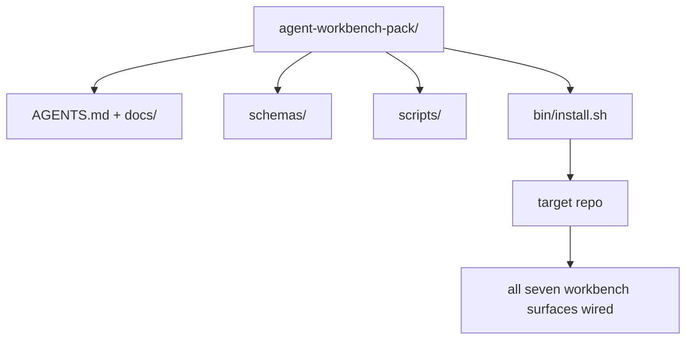

# Capstone: Envía un paquete de trabajo de agente reutilizable

> La mini-track termina con un paquete que se deja en cualquier repo. once lecciones de superficies comprimidas en un directorio que se puede`cp -r`La piedra angular es el artefacto del currículo.

**Type:** Build
**Languages:** Python (stdlib)
**Prerequisites:** Phases 14 · 31 to 14 · 41
**Time:** ~75 minutes

## Objetivos de aprendizaje

- Envuelve las siete superficies de la mesa de trabajo en un directorio de entrada.
- Enlaza los esquemas, scripts y plantillas para que un nuevo repo obtenga una base conocida.
- Añadir un único script de instalación que coloque el paquete de forma idempotente.
- Deciden qué queda en el paquete y qué queda fuera, defendiendo el corte para cada uno.
- Demostrar un cambio de depósito asistido por agente con evidencia que un revisor pueda reproducir.

## El problema

Un banco de trabajo que vive en un Google Doc, un historial de chat y tres scripts medio recordados es un banco de trabajo que se reconstruye cada trimestre. La cura es un paquete de versiones: un repo o directorio con las superficies, los esquemas, los scripts y un instalador de un solo comando.

Terminará esta lección con`outputs/agent-workbench-pack/`enviado en disco y un `bin/install.sh`que lo deja en cualquier repo objetivo.

## El concepto



### El diseño del paquete

```
outputs/agent-workbench-pack/
├── AGENTS.md
├── docs/
│   ├── agent-rules.md
│   ├── reliability-policy.md
│   ├── handoff-protocol.md
│   └── reviewer-rubric.md
├── schemas/
│   ├── agent_state.schema.json
│   ├── task_board.schema.json
│   └── scope_contract.schema.json
├── scripts/
│   ├── init_agent.py
│   ├── run_with_feedback.py
│   ├── verify_agent.py
│   └── generate_handoff.py
├── bin/
│   └── install.sh
└── README.md
```

### Lo que se queda dentro, lo que se queda fuera

En:

- Es el contrato.
- Los cuatro guiones de arriba son el tiempo de ejecución.
- Los cuatro documentos son las reglas y la rúbrica.

Fuera:

- Las tareas pertenecen a la tabla del repo objetivo, no al paquete.
- El paquete es agnóstico.
- La manada vive junto a la manada del equipo, no dentro de ella.

### El instalador

Un corto .`bin/install.sh`(o `bin/install.py`):

1. Se niega a instalar en un paquete existente sin `--force`¿ Qué ?
2. Copia el paquete en el repo objetivo.
3. Los cables de CI si un `.github/workflows/`¿Qué es eso?
4. Imprima los siguientes pasos: rellene el tablero, establece comandos de aceptación, ejecuta el script init.

### La versión

El paquete lleva un`VERSION`Los cambios de esquema y los cambios de guión que requieren migraciones golpean el mayor.`agent_state.json`registros de la versión del paquete contra la que se inició.

```figure
wb-pack-install
```

## Construye el mismo

`code/main.py`se ensambla el paquete en `outputs/agent-workbench-pack/`junto a la lección, sembrado con los esquemas y guiones de las lecciones anteriores en esta mini-track y los documentos que ya escribió.

- ¿Qué quieres decir ?

```
python3 code/main.py
```

El guión copia y pin las superficies, escribe el README, imprime el árbol de paquete y sale de cero.

## Modelos de producción en la naturaleza

Un paquete sólo es valioso si sobrevive a horquillas, actualizaciones y un poco hostiles aguas arriba.

**`VERSION` is the contract, not the marketing.**Los problemas principales requieren una migración de estado. los problemas menores requieren una revisión de control. los problemas de parche son sólo de doc. el instalador escribe`.workbench-version`en el repo objetivo en cada instalación; `lint_pack.py`se niega a enviar si la cerradura del objetivo no está de acuerdo con la de la manada `VERSION`Así es como ...`npm`¿ Qué ?`Cargo`, y `pyproject.toml`sobrevivir 10 años de trabajo, nada sobre los agentes cambia las reglas.

**Single source for cross-tool distribution.**Nx barcos uno `nx ai-setup`que se establece `AGENTS.md`¿ Qué ?`CLAUDE.md`¿ Qué ?`.cursor/rules/`¿ Qué ?`.github/copilot-instructions.md`El paquete debe hacer lo mismo; el instalador emite los enlaces de signos (`ln -s AGENTS.md CLAUDE.md`La forma en que se puede utilizar un sistema de codificación es de una manera única, por lo que una sola fuente de verdad se expone a cada agente de codificación.

**`uninstall.sh` that refuses on non-trivial state.**Desinstalar el paquete no debe eliminar los datos del usuario `agent_state.json`¿ Qué ?`task_board.json`, o`outputs/`El desinstalador elimina los esquemas, scripts, documentos y...`AGENTS.md`(con `--keep-agents-md`El Estado pertenece al usuario; el paquete no es su propietario.

**Skill-as-publishable. SkillKit-style distribution.**Los paquetes se envían como una habilidad de SkillKit: `skillkit install agent-workbench-pack`La base de datos es la fuente de la verdad, SkillKit es el canal de distribución, el bloqueo de vendedor se derrumba, las siete superficies permanecen iguales.

## Usalo

Tres lugares los barcos de paquete:

- **As a directory you drop into a repo.** `cp -r outputs/agent-workbench-pack /path/to/repo`¿ Qué ?
- **As a public template repo.**Forja y personalización, con `VERSION`control de la deriva.
- **As a SkillKit skill.**Encableado en el producto de tu agente para que un solo comando lo establezca.

El paquete es la receta, cada instalación es una porción.

## Envío

`outputs/skill-workbench-pack.md`genera un paquete adaptado al proyecto: reglas ajustadas a la historia del equipo, globos de alcance ajustados al repo, dimensiones de rubrica ampliadas con una entrada específica de dominio.

## Los ejercicios

1. Decida cuál de los quintos documentos opcionales merece ser ascendido a la lista canónica.
2. Reescribir el instalador como Python con un `--dry-run`Comparar la ergonomía con la de Bash.
3. Añadir un`bin/uninstall.sh`¿Qué es lo que cuenta como no trivial?
4. Añadir un`lint_pack.py`que falla cuando el paquete se deriva de `VERSION`- Envíala a la CI para el propio reporte del paquete.
5. ¿Cuál es el orden de operaciones que minimiza el tiempo de inactividad?

## Práctica profesional: prueba un cambio en el repositorio

La demostración de empaquetado prueba que el ensamblador ejecuta y produce archivos. No prueba que su agente pueda completar una nueva tarea, que los controles generados prueban que la tarea, o que un sistema implementado funciona. Mantenga esas reclamaciones separadas.

Seleccione una pequeña tarea real en un repositorio que posea o que tenga permiso para cambiar. Utilice un agente de codificación al que ya tenga acceso. Una corrección de errores, una función limitada o una mejora operativa son suficientes; instalar varios agentes no es parte del ejercicio.

Presupuestar una sesión de trabajo separada más allá del laboratorio de envasado.`learning-artifacts/`Guardar la plantilla registrada y empacarla como material de referencia.

### 1. Enmarque la tarea y elija la autonomía

Utilice el marco de tareas de la lección 43 y el plan de pruebas de la lección 44. Registre la revisión inicial, el objetivo observable, los no objetivos, los caminos permitidos y la evidencia de aceptación. Identifique al usuario o operador real que necesita el comportamiento.

Elige un modo de trabajo: pasos guiados, implementación de puntos de control o una ejecución autónoma limitada. Explique por qué la incertidumbre, las consecuencias y la reversibilidad lo justifican.

Establezca un presupuesto de tiempo de pared y un token o límite de costos si el agente expone uno. Registra las mediciones no disponibles honestamente. Defina una condición de parada para fallas repetidas, nuevos permisos, agotamiento del presupuesto o una decisión de contrato no resuelta; nombre quién puede resolverla.

### 2. Preparar el ambiente más pequeño y útil

Recupere la implementación, el llamador, la prueba y las instrucciones locales pertinentes. Registre por qué cada fuente pertenece al contexto y qué evidencia actual superaría una nota obsoleta. No cargue todo el repositorio por defecto.

Haga una elección explícita para cada extensión relevante: una habilidad proporciona un procedimiento repetible; una herramienta MCP proporciona acceso; un gancho ejecuta una verificación determinista; un plugin empaque de capacidades. Mantenga una extensión solo cuando la tarea la necesita, con los menos permisos que la dejan funcionar.

Registre el contexto o el costo de mantenimiento de una adición propuesta que rechace. Reverifique una memoria o instrucción obsoleta, luego retire o reemplacela en su configuración propiedad de su aprendiz cuando las pruebas apoyen esa decisión.

### 3. Captura la línea de base y implementa

Antes de editar, ejecuta la verificación existente más cercana y demuestra el estado actual del comportamiento solicitado. Mantenga el comando, revisión, resultado y ubicación de la evidencia. Una característica que no existe todavía todavía tiene una línea de base: graba la respuesta observada o la operación no soportada.

Deje que el agente implemente dentro del contrato. Mantenga un registro de intervención con la razón de cada corrección, cambio de permiso o revisión del plan. La delegación es opcional; si es útil, aplique el contrato de propiedad e integración de la lección 45 antes de agregar otro trabajador.

### 4. Desafiar la evidencia

Elige la prueba que observa la superficie cambiada. Para una interfaz de usuario, reconstruye e inspeccione el viaje atendido en anchos relevantes. Para una API, inspeccione la solicitud y la respuesta serializada. Para un CLI, ejecute el comando construido y revise su código de salida y salida. Seleccione los controles que necesita su tarea y explique sus límites.

Escriba un resultado esperado del contrato de tarea independientemente de la implementación del agente. En una copia desechable, introduzca un resultado incorrecto específico, como aceptar un valor inválido o dejar caer un campo de respuesta requerido. Realice la misma verificación de aceptación: debe fallar por esa razón.

Si se mantiene verde, refuerce la afirmación o observación antes de confiar en ella. Restablezca la implementación correcta y vuelva a ejecutar con éxito. Guarde ambos recibos. Un error de sintaxis o una configuración de prueba rotura no cuentan como detección de la regresión.

Revise la diferencia final, incluidas las pruebas cambiadas, en contra de la meta original y los caminos permitidos. Pida a un colega o a una sesión de revisores separados que impugnen la prueba más débil sin editar la implementación. Usted todavía es propietario del juicio final; el acuerdo de otro agente no es evidencia de ejecución.

### 5. El funcionamiento y recuperación de los ensayos

Ejecutar el artefacto modificado en un entorno local desechable o de puesta en escena.`local`¿ Qué ?`staging`, o`live`Un ensayo local respalda una afirmación local; no se requiere un despliegue de producción para este ejercicio.

Seleccione una señal de falla relacionada con la tarea, un umbral, una ventana de observación y un propietario. Explica la respuesta cuando se cruza ese umbral.

Reexercita el regreso a un artefacto conocido y compruebe si se restaura el comportamiento anterior. Tenga en cuenta los datos persistentes cuando sea aplicable; reemplazar un binario solo no puede revertir un cambio de datos. Registra cualquier paso de recuperación que no pueda verificar.

### 6. Mejorar la próxima carrera y entregarlo

Comparar el resultado con el resultado de base, incluyendo el tiempo transcurrido, los datos de uso disponibles y las intervenciones humanas.

Promover una corrección observada en una prueba, un límite de permisos más pequeño, una automatización o un ejemplo más claro utilizando la lección 46. Repetir la verificación afectada. Retirar las mutaciones temporales y dejar la rama final, archivos cambiados, abrir riesgos y la siguiente acción explícita para la próxima sesión.

### Rótulo de revisión manual

Pida al revisor que inspeccione los archivos de pruebas y reproduzca al menos la prueba de aceptación más débil.`demonstrated`¿ Qué ?`needs revision`, o`unverified`Los campos llenos y los guiones de envasado no sustituyen estas observaciones.

| Dimension | Evidence the reviewer should challenge |
|---|---|
| Task and autonomy | Starting behavior, bounded goal, justified permissions, budget, and a usable stop rule |
| Context and environment | Relevant sources, justified tool access, and a rechecked retirement decision |
| Verification | Actual before/after behavior and a deliberate incorrect result that the same check rejects |
| Review and operation | Inspected diff, independent challenge, labeled runtime observation, and rehearsed recovery |
| Iteration and handoff | One verified improvement, honest limits, clean final state, and a reproducible next action |

Resolverlo`needs revision`Las conclusiones antes de reclamar la finalización de la tarea.`unverified`La cartera demuestra su juicio de ingeniería sobre una tarea limitada; no es una garantía de contratación o despliegue.

## Artículo enviado

Guarde el paquete reutilizable y su copia completa de [career-agent-evidence.md](https://github.com/rohitg00/ai-engineering-from-scratch/blob/main/phases/14-agent-engineering/42-agent-workbench-capstone/outputs/career-agent-evidence.md). La plantilla conecta el marco de tareas, el plan de ejecución, los recibos de tiempo de ejecución, la revisión, el ensayo de recuperación y la entrega en un estudio de caso revisable.

## Términos clave

| Term | What people say | What it actually means |
|------|----------------|------------------------|
| Workbench pack | "The starter kit" | A versioned directory carrying all seven surfaces |
| Installer | "Setup script" | `bin/install.sh` that lays the pack down idempotently |
| Pack version | "VERSION" | Major bumps for schema/script changes, patch for doc-only |
| Drop-in pack | "cp -r and go" | Pack works without per-repo customization on day one |
| Forkable template | "GitHub template" | Public repo that GitHub's "Use this template" can clone from |

## Leer más

- Fases 14 · 31 a 14 · 41  cada superficie que este paquete envuelve
- [SkillKit](https://github.com/rohitg00/skillkit) instalar esta habilidad en 32 agentes de IA
- [Nx Blog, Teach Your AI Agent How to Work in a Monorepo](https://nx.dev/blog/nx-ai-agent-skills) Generador de un solo origen en seis herramientas
- [agents.md — the open spec](https://agents.md/) lo que debe implementar el router de su paquete
- [HKUDS/OpenHarness](https://github.com/HKUDS/OpenHarness) Implementación de referencia de un equivalente de envasado
- [Augment Code, A good AGENTS.md is a model upgrade](https://www.augmentcode.com/blog/how-to-write-good-agents-dot-md-files) la barra de calidad de los documentos de empaque
- [Anthropic, Effective harnesses for long-running agents](https://www.anthropic.com/engineering/effective-harnesses-for-long-running-agents)
- [Anthropic, Harness design for long-running application development](https://www.anthropic.com/engineering/harness-design-long-running-apps)
- Fase 14 · 30  Desarrollo de agente basado en la evaluación que consume la puerta de verificación del paquete
- Fase 14 · 41  el índice de referencia antes/después de este paquete mejora en
