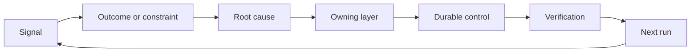

# Construye un ratchet de retroalimentación con propiedad y jubilación

> La navegación cierra un bucle de construcción y abre el bucle de aprendizaje.

**Type:** Learn + Build
**Languages:** Python (stdlib)
**Prerequisites:** Phase 14 lessons 46 and 53
**Time:** ~75 minutes

## Objetivos de aprendizaje

- Convierta incidentes, evaluaciones, comportamiento de los usuarios y correcciones en acciones propias.
- Enrutar cada señal al contexto, evaluación, política, tiempo de ejecución o atrasos.
- Priorizar la recurrencia por gravedad y frecuencia.
- Dar a todos los controles una condición de jubilación.
- Comunicar una decisión de entrega con pruebas, compromisos y un propietario responsable.

## La retroalimentación es infraestructura

Un equipo puede recopilar rastros, evaluaciones, boletos de apoyo y registros de incidentes sin aprender de ninguno de ellos.

El bucle es:

1. observar una señal concreta;
2. conectarlo a un resultado, una restricción o una suposición;
3. identificar la capa de sistema más temprana que posee la causa;
4. crear un cambio limitado;
5. verificar que la recurrencia es menos probable;
6. evaluar si el control debe permanecer.

## El camino hacia la capa de posesión

| Signal | Destination |
|---|---|
| False positive, regression, wrong result | Evaluation or test |
| Missing context, duplicate work, stale fact | Context source or retrieval route |
| Unsafe action or authority gap | Policy or permission boundary |
| Timeout, retry storm, unavailable dependency | Runtime control |
| New product need or unresolved tradeoff | Shaped backlog item |

No agregue otro párrafo inmediato cuando una prueba o permiso pueda hacer imposible el fallo.



## La propiedad es parte del control

Cada acción de ratchet necesita:

- un propietario;
- una prioridad basada en la consecuencia y la recurrencia;
- el artefacto a cambiar;
- la verificación que compruebe el cambio;
- una ventana de revisión o de vencimiento;
- una condición de jubilación.

Una mejora no adquirida es una observación con mejor formato.

## Retirar los controles estales

Los sistemas de retroalimentación acumulan políticas. Esa política puede volverse contradictoria y costosa.

- cambios en la arquitectura o en el flujo de trabajo;
- una invariante de nivel inferior sustituye una instrucción de nivel superior;
- la falla protegida no se ha mostrado en la ventana elegida;
- El control bloquea más a menudo el trabajo legítimo que evita el daño.

La jubilación también necesita pruebas.

## Conectar la creación y la codificación de los agentes de retroalimentación

El mismo ratchet sirve a ambas pistas:

- La evidencia del producto cambia el marco de resultados, las suposiciones, la rebanada o el plan de medición.
- Las correcciones de agentes de codificación cambian las pruebas, el contexto, el alcance, la automatización o la entrega.
- Los incidentes pueden cambiar tanto el límite del producto como el banco de trabajo del agente.

Por eso la configuración de la construcción no es una fase que termina antes de codificar.

## Construye el mismo

El laboratorio clasifica las señales, crea acciones de ratchet propias, las prioriza y escribe.`outputs/feedback-backlog.json`¿ Qué ?

```bash
python3 code/main.py
python3 -m unittest discover code/tests -v
```

Añadir una señal de tiempo de espera de tiempo de ejecución y confirmar que se dirige a la hora de ejecución en lugar de la cartera general.

## Laboratorio de práctica: tomar una decisión después de un revés

Elige un flujo de trabajo de tu proyecto de cartera de carrera.[career delivery template](https://github.com/rohitg00/ai-engineering-from-scratch/blob/main/phases/14-agent-engineering/54-build-the-feedback-ratchet/outputs/career-delivery-evidence.md)¿ Qué ?

El laboratorio de Python genera acciones de ejemplo de retraso. No observa a los usuarios, no mide una intervención ni prueba la preparación para la carrera.

### 1. Determine lo que sucedió

Registra el usuario, la tarea, el flujo de trabajo actual y el resultado que desea mejorar. Enlace una observación consentida, un registro de soporte editado o un rastro de tareas reproducible. Separa lo que observó de lo que alguien informó y lo que deducido.

Busque un revés: una suposición fallida, un resultado inutilizable, un costo inesperado o una entrega tardía. Explique qué pruebas cambiaron su comprensión.

Si no puede trabajar con los usuarios, ejecute una simulación claramente etiquetada con un escenario de pares o indicado. Mantenga las observaciones simuladas separadas de las pruebas de los usuarios reales. No invente entrevistas, aprobaciones, adopción o impacto comercial.

### 2. Haga progresos dentro de su autoridad

Enumera las incógnitas y escoge la acción reversible más barata que pueda resolver la más importante, indique qué puede decidir, qué está limitado por un acuerdo existente y qué necesita autorización antes de su ejecución.

Por ejemplo, puede preparar una reproducción fuera de línea editada mientras espera permiso para usar los datos de los clientes. Tomar iniciativa significa avanzar en el trabajo autorizado y dejar clara la decisión bloqueada.

### 3. Comparar opciones y informar al titular de la decisión

Escriba un breve resumen de la decisión para alguien que no necesita los detalles de la implementación.

- el problema del usuario y las pruebas que modificaron el plan;
- al menos dos opciones, incluida una opción manual más barata o sin construcción, cuando sea creíble;
- calidad, diseño de interacción, esfuerzo, coste operativo y compensación de riesgos;
- su recomendación, la incertidumbre que sigue existiendo y la decisión necesaria;
- el titular de la decisión, las partes interesadas afectadas y la fecha en que se necesita la decisión.

Pida a un compañero que represente a una de las partes interesadas afectadas y desafíe una compensación. Regístrese la objeción y cómo cambia, o no cambia, su recomendación. Etiquete el feedback de juego de roles como simulado; no puede representar el acuerdo de una parte interesada real.

### 4. Realice un experimento limitado

Seleccione el prototipo, el piloto o el trabajo de producción en función de la pregunta a la que necesita responder. Defina la audiencia, los datos, la autoridad, la duración, el retroceso y las condiciones para continuar, cambiar o detener antes de recoger el resultado.

Recorre la interacción desde el punto de partida del usuario hasta una tarea terminada. Incluye un caso de salida incorrecto o de datos faltantes. Observe si el usuario puede notar el fallo, corregirlo y recuperarse sin ayuda oculta de usted.

Cuente el tiempo de revisión y corrección por parte de los humanos como parte del flujo de trabajo.

### 5. Comparar los resultados con la economía

Registre una línea de base y un seguimiento utilizando la misma definición métrica, población de tareas, método de recogida y ventanas de observación comparables. Mantenga el recuento de muestras, las exclusiones y los enlaces de evidencia junto a los números. Si estas condiciones cambian, explique por qué la comparación es limitada.

Incluye un resultado de usuario, una barrera de seguridad o de calidad y un esfuerzo total de revisión por parte de los humanos. Registra el resultado incluso cuando se pierde el objetivo. Muestras pequeñas o simuladas respaldan una afirmación de aprendizaje limitada, no una afirmación de impacto empresarial comprobado.

Estimar el costo por tarea completada con éxito utilizando llamadas de modelo, retemplazos, servicios de soporte y revisión humana. Indique la suposición de tasa de trabajo y separa el uso medido de las estimaciones. Compara ese costo con la alternativa manual o la suposición de valor detrás del proyecto.

Utilice el existente [FinOps for LLMs lesson](https://aiengineeringfromscratch.com/lesson?path=phases/17-infrastructure-and-production/27-finops-llms)El cambio del modelo es sólo una respuesta posible; restringir el flujo de trabajo o mantener un paso manual puede ser la mejor decisión del producto.

### 6. Cierra el bucle

Utilice los criterios pre-declarados para recomendar continuar, cambiar o detener. Si la evidencia no es concluyente, mencione la observación que falta y la siguiente prueba limitada. Registre la respuesta del responsable responsable de la decisión; deje pendiente si no se ha tomado ninguna decisión.

Elige una mejora en el proceso de entrega en sí: un marco de tareas más claro, un proceso de usuario más temprano, una mejor lista de revisión, una entrega de agentes más pequeña o un caso de evaluación más estricto.

En el proceso de revisión, decide si debe mantener, revisar o retirar esa mejora. Registra las pruebas para la elección. Una nueva lista de verificación que crea más trabajo sin evitar el fracaso del objetivo no ha ganado permanencia.

## Artículo enviado

Copia .[career-delivery-evidence.md](https://github.com/rohitg00/ai-engineering-from-scratch/blob/main/phases/14-agent-engineering/54-build-the-feedback-ratchet/outputs/career-delivery-evidence.md)En el caso de los proyectos de investigación, incluye el informe de decisión, el proceso de interacción, la comparación de mediciones y el seguimiento de su cartera profesional.

## Verifique el hecho

Use esta rúbrica de aceptación manual con un par. Marque cada fila **met**¿ Qué ?**needs work**, o**not observed**Un campo lleno no es prueba de que el juicio fuera válido.

| Check | Evidence that meets it |
|---|---|
| Workflow grounded | A traceable observation supports the problem; reported claims, inference, and simulation are labeled. |
| Authority respected | Reversible next work is clear, and any restricted action waits for its actual decision owner. |
| Tradeoffs communicated | Credible alternatives, a stakeholder objection, a recommendation, and an explicit decision request are recorded. |
| Interaction tested | The walkthrough covers success, failure, recovery, and human review effort. |
| Outcome compared | Baseline and follow-up definitions align; samples, guardrails, costs, and comparison limits are visible. |
| Setback owned | The evidence changes a continue/change/stop decision and an accountable next action. |
| Process improved | One workflow improvement has an owner, review date, and an evidence-based keep/revise/retire decision. |

El comportamiento de los usuarios reales no observado sigue siendo un hueco incluso cuando cada paso simulado pasa.

## Los ejercicios

1. Convierta un incidente y una queja de usuario en acciones de ratchet.
2. Nombre la capa más temprana que puede evitar cada repetición.
3. Añadir comandos de verificación o observaciones a la salida del laboratorio.
4. Definir una condición de jubilación para una regla de póliza.
5. Trace uno aceptó la corrección de vuelta en el siguiente marco de tarea.

## Leer más

- [Basili, Caldiera, and Rombach, The Goal Question Metric Approach](https://www.cs.toronto.edu/~sme/CSC444F/handouts/GQM-paper.pdf), para el aprendizaje organizacional a través de la medición orientada a objetivos.
- [Fagerholm et al., Building Blocks for Continuous Experimentation](https://doi.org/10.1145/2601248.2601276), para el ciclo técnico y organizativo que conecta la evidencia con el desarrollo continuo del producto.
- [Nuseibeh and Easterbrook, Requirements Engineering: A Roadmap](https://www.cs.toronto.edu/~sme/papers/2000/ICSE2000.pdf), para tratar los requisitos como evolucionando a través del ciclo de vida del sistema.

## Lo que guardas

Mantenga .`outputs/feedback-backlog.json`En el caso de los productos, el resultado de la evaluación de los resultados de la evaluación de los resultados de la evaluación de los resultados de la evaluación de los resultados de la evaluación de los resultados de la evaluación de los resultados de la evaluación de los resultados de la evaluación de los resultados de la evaluación de los resultados de la evaluación de los resultados de la evaluación de los resultados de la evaluación de los resultados de la evaluación de los resultados de la evaluación de los resultados de la evaluación de los resultados de la evaluación de los resultados de la evaluación de la evaluación de los resultados de la evaluación de los resultados de la evaluación de la evaluación de los resultados de la evaluación de la evaluación de los resultados de la evaluación de la evaluación de los resultados de la evaluación de la evaluación de los resultados de la evaluación de los resultados de la evaluación de la evaluación de los resultados de la evaluación de la evaluación de los resultados de la evaluación de la evaluación de los resultados de la evaluación de la evaluación de los resultados de la evaluación de la evaluación de los resultados de la evaluación de la evaluación de los resultados de la evaluación de la evaluación de la evaluación de los resultados de la evaluación de la evaluación de la evaluación de la evaluación de los resultados de la evaluación de la evaluación de la evaluación de la evaluación de la evaluación de la evaluación de la evaluación de la evaluación de la evaluación de la evaluación de la evaluación de la evaluación de la evaluación de la evaluación de la evaluación de la evaluación de la evaluación de la evaluación de la evaluación de la evaluación de la evaluación de la evaluación de la evaluación de la evaluación de la evaluación de la evaluación de la evaluación de la evaluación de la evaluación de la evaluación de la evaluación de la evaluación de la evaluación de la evaluación de la evaluación de la evaluación de la evaluación de la evaluación de la evaluación de la evaluación de la evaluación de la evaluación de la evaluación de la evaluación de la evaluación de la evaluación de la evaluación de la evaluación de la evaluación de la evaluación de la evaluación de la evaluación de la evaluación de la evaluación de la cuento de la evaluación de la evaluación de la cuento de la evaluación de la cuento de la cuento de la cuento de la cuento de la cuento de la cuento de la cuento de la cuento de la cuento de la cuento de la cuento de la cuento de la cuento de la cuento de la cuento de la cuento de la cuento de la cuento de la cuento de la cuento de la cuento de la cuento
