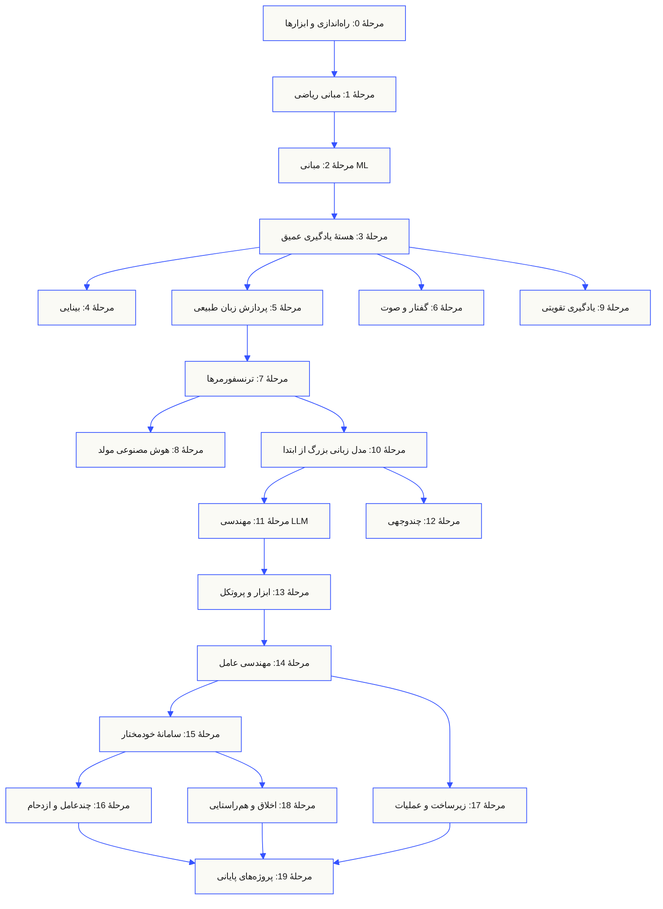
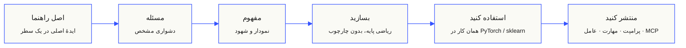

<p align="center" lang="fa" dir="rtl"><sub>این README به فارسی ترجمه شده است. <a href="../../README.md">README انگلیسی</a> همچنان مرجع اصلی است.</sub></p>

<p align="center">
  <picture>
    <source media="(prefers-color-scheme: dark)" srcset="../../assets/readme/header-dark.svg">
    
  </picture>
</p>

عملیات داخلی مدل، خط لولهٔ بازیابی و محیط اجرای عامل را پیاده کنید. آن‌ها را بیازمایید، شکست‌ها را بررسی کنید و کد و نتایج ارزیابی را نگه دارید.

**[یادگیری را شروع کنید](https://aiengineeringfromscratch.com/lesson?path=phases/00-setup-and-tooling/01-dev-environment)** · **[یک مسیر انتخاب کنید](#learning-routes)** · **[یک آزمایشگاه را امتحان کنید](#interactive-lab)** · **[یک پروژه بسازید](#project-challenges)** · **[برنامهٔ درسی را مرور کنید](#contents)**

رایگان، متن‌باز و با مجوز MIT. در وب‌سایت، همراه یک عامل کدنویسی یا با اجرای کد محلی یاد بگیرید.

> <span dir="rtl">523 درس. 20 مرحله.</span> <span dir="ltr">Python, TypeScript, Rust, Julia.</span>

<p align="center">
  <a href="../../LICENSE"></a>
  <a href="../../ROADMAP.md"></a>
  <a href="#contents"></a>
  <a href="https://github.com/rohitg00/ai-engineering-from-scratch/stargazers"></a>
  <a href="https://aiengineeringfromscratch.com"></a>
</p>

<details>
<summary>به زبان خود بخوانید</summary>

<p align="center">
  <a href="../../README.md">🇬🇧 English</a> · <a href="../../i18n/zh/README.md">🇨🇳 简体中文</a> · <a href="../../i18n/zh-TW/README.md">🇹🇼 繁體中文（台灣）</a> · <a href="../../i18n/ja/README.md">🇯🇵 日本語</a> · <a href="../../i18n/ko/README.md">🇰🇷 한국어</a> · <a href="../../i18n/pt/README.md">🇵🇹 Português</a> · <a href="../../i18n/pt-BR/README.md">🇧🇷 Português (Brasil)</a> · <a href="../../i18n/es/README.md">🇪🇸 Español</a> · <a href="../../i18n/de/README.md">🇩🇪 Deutsch</a> · <a href="../../i18n/fr/README.md">🇫🇷 Français</a> · <a href="../../i18n/it/README.md">🇮🇹 Italiano</a> · <a href="../../i18n/nl/README.md">🇳🇱 Nederlands</a> · <a href="../../i18n/pl/README.md">🇵🇱 Polski</a> · <a href="../../i18n/cs/README.md">🇨🇿 Čeština</a> · <a href="../../i18n/ro/README.md">🇷🇴 Română</a> · <a href="../../i18n/hu/README.md">🇭🇺 Magyar</a> · <a href="../../i18n/el/README.md">🇬🇷 Ελληνικά</a> · <a href="../../i18n/sv/README.md">🇸🇪 Svenska</a> · <a href="../../i18n/da/README.md">🇩🇰 Dansk</a> · <a href="../../i18n/no/README.md">🇳🇴 Norsk</a> · <a href="../../i18n/fi/README.md">🇫🇮 Suomi</a> · <a href="../../i18n/ru/README.md">🇷🇺 Русский</a> · <a href="../../i18n/uk/README.md">🇺🇦 Українська</a> · <a href="../../i18n/tr/README.md">🇹🇷 Türkçe</a> · <a href="../../i18n/he/README.md">🇮🇱 עברית</a> · <a href="../../i18n/ar/README.md">🇸🇦 العربية</a> · <a href="../../i18n/fa/README.md">🇮🇷 فارسی</a> · <a href="../../i18n/hi/README.md">🇮🇳 हिन्दी</a> · <a href="../../i18n/bn/README.md">🇧🇩 বাংলা</a> · <a href="../../i18n/ur/README.md">🇵🇰 اردو</a> · <a href="../../i18n/th/README.md">🇹🇭 ไทย</a> · <a href="../../i18n/vi/README.md">🇻🇳 Tiếng Việt</a> · <a href="../../i18n/id/README.md">🇮🇩 Bahasa Indonesia</a> · <a href="../../i18n/tl/README.md">🇵🇭 Tagalog</a>
</p>

</details>

### حامیان مالی

<p align="center">
  <a href="https://serpapi.com/ai-engineering-from-scratch"><picture><source media="(min-width: 768px)" srcset="../../assets/sponsors/serpapi-banner-compact.png" width="48%"></picture></a>
  <a href="https://nitrostack.ai/referral/aiengineeringfromscratch"><picture><source media="(min-width: 768px)" srcset="../../assets/sponsors/nitrostack-banner-equal.png" width="48%"></picture></a>
</p>

<p align="center">
  <sub><span>حمایت شما کمک می‌کند همهٔ درس‌ها رایگان و متن‌باز بمانند.</span> <a href="#supporters">دیدن همهٔ حامیان</a> · <a href="../../SPONSORS.md">حامی مالی شوید</a></sub>
</p>

<a id="see-what-you-will-build-and-keep"></a>
<a id="learning-routes"></a>

## مسیرهای یادگیری

| مسیر | درس آغازین |
|---|---|
| مبانی مدل | [راه‌اندازی و ابزارها](https://aiengineeringfromscratch.com/lesson?path=phases/00-setup-and-tooling/01-dev-environment) |
| سیستم‌های LLM | [مهندسی پرامپت](https://aiengineeringfromscratch.com/lesson?path=phases/11-llm-engineering/01-prompt-engineering) |
| عامل‌ها و تحویل | [حلقهٔ عامل](https://aiengineeringfromscratch.com/lesson?path=phases/14-agent-engineering/01-the-agent-loop) |

[مسیرهای شغلی را مقایسه کنید](https://aiengineeringfromscratch.com/learning-paths.html) · [پیش‌نیازها و زمان مطالعه](#study-guide)

<a id="interactive-lab"></a>

### گرادیان کاهشی

20 نقطهٔ آغاز روی یک تابع زیان درجه‌دو، گرادیان کاهشی را دنبال می‌کنند. نمودار موقعیت آن‌ها و میانگین زیان را پس از هر به‌روزرسانی نشان می‌دهد.

<p align="center">
  <a href="https://aiengineeringfromscratch.com/lesson?path=phases/01-math-foundations/08-optimization#loss-landscape-visualization">
    <picture>
      <source media="(max-width: 600px) and (prefers-color-scheme: dark) and (prefers-reduced-motion: reduce)" srcset="../../assets/readme/101-gradient-mobile-dark.png">
      <source media="(max-width: 600px) and (prefers-reduced-motion: reduce)" srcset="../../assets/readme/101-gradient-mobile-light.png">
      <source media="(prefers-color-scheme: dark) and (prefers-reduced-motion: reduce)" srcset="../../assets/readme/101-gradient-dark.png">
      <source media="(prefers-reduced-motion: reduce)" srcset="../../assets/readme/101-gradient-light.png">
      <source media="(max-width: 600px) and (prefers-color-scheme: dark)" srcset="../../assets/readme/101-gradient-mobile-dark.gif">
      <source media="(max-width: 600px)" srcset="../../assets/readme/101-gradient-mobile-light.gif">
      <source media="(prefers-color-scheme: dark)" srcset="../../assets/readme/101-gradient-dark.gif">
      
    </picture>
  </a>
</p>

[نرخ یادگیری را در درس تنظیم کنید](https://aiengineeringfromscratch.com/lesson?path=phases/01-math-foundations/08-optimization#loss-landscape-visualization) · [GD، مومنتوم و Adam را در کد مقایسه کنید](../../phases/01-math-foundations/08-optimization/code/optimizers.py)

<a id="project-challenges"></a>

### پروژه‌ها

سه پروژه با کد آغازین مرحله‌بندی‌شده، پیاده‌سازی مرجع و ارزیاب محلی. پس از [راه‌اندازی](#local-setup)، فرمان‌ها را از ریشهٔ مخزن اجرا کنید. تا زمانی که مراحل را پیاده نکرده‌اید، کد آغازین در آزمون شکست می‌خورد.

<details>
<summary><strong>01 · آزمایشگاه ارزیابی بازیابی</strong> · Python · معیارهای رتبه‌بندی و بررسی افت کیفیت</summary>

سیستم پیشنهادی میانگین NDCG را بهبود می‌دهد، اما مرتبط‌ترین شاهد برای یکی از پرس‌وجوها رتبهٔ پایین‌تری می‌گیرد. مقایسه‌ای به‌تفکیک پرس‌وجو بسازید که افت را گزارش کند و بتواند بررسی انتشار را ناموفق اعلام کند.

از Python 3.10+ استفاده کنید. [RAG](../../phases/11-llm-engineering/06-rag/docs/en.md) و [ارزیابی مدل](../../phases/02-ml-fundamentals/09-model-evaluation/docs/en.md) را مرور کنید. اعتبارسنجی رتبه‌ها، دقت و بازخوانی، معیارهای حساس به رتبه و سپس مقایسهٔ سیستم‌ها را پیاده کنید.

```bash
python3 scripts/project_test.py retrieval-evaluation-lab \
  --init learning-artifacts/retrieval-evaluation-lab
python3 scripts/project_test.py retrieval-evaluation-lab \
  --stage 1 --path learning-artifacts/retrieval-evaluation-lab --strict
python3 scripts/project_test.py retrieval-evaluation-lab \
  --all --path learning-artifacts/retrieval-evaluation-lab --strict
```

**نگه دارید:** مقایسه‌ای بازتولیدپذیر با اختلاف‌های هر پرس‌وجو و داوری‌های ارتباطِ مورد استفاده در امتیازدهی. معیارها آن داوری‌ها را توصیف می‌کنند؛ درستی پاسخ را اثبات نمی‌کنند.

[پروژه را شروع کنید](https://aiengineeringfromscratch.com/project.html?id=retrieval-evaluation-lab) · [راه‌حل مرجع را بررسی کنید](../../projects/retrieval-evaluation-lab/solution/) · [با ورودی‌های خود اجرا کنید](../../projects/retrieval-evaluation-lab/README.md#run-with-your-own-inputs)

</details>

<details>
<summary><strong>02 · اشکال‌زدای ردگیری عامل</strong> · TypeScript · تجزیهٔ ردگیری و محاسبهٔ زمان</summary>

ردگیری ارائه‌شده همچنان 100 ms طول می‌کشد، اما مصرف کل توکن 200 افزایش می‌یابد و یک اسپن شروع به شکست می‌کند. کار هم‌پوشان اسپن‌های فرزند را از زمان اجرای خود والد جدا کنید و گزارشی بسازید که تغییر را آشکار کند.

از Node.js 22.18+ و برای ارزیاب از Python 3 استفاده کنید. تجزیهٔ JSONL، اعتبارسنجی روابط والد، محاسبات بازه‌ها و سپس خط زمانی قابل بررسی را پیاده کنید.

```bash
python3 scripts/project_test.py agent-trace-debugger \
  --init learning-artifacts/agent-trace-debugger
python3 scripts/project_test.py agent-trace-debugger \
  --stage 1 --path learning-artifacts/agent-trace-debugger --strict
python3 scripts/project_test.py agent-trace-debugger \
  --all --path learning-artifacts/agent-trace-debugger --strict
```

**نگه دارید:** ردگیری ورودی، خط زمانی HTML و گزارش افت به‌صورت JSON. فقط توکن‌های مصرف‌شده توسط خود هر اسپن را ثبت کنید تا مصرف والد و فرزند دوبار شمرده نشود.

[پروژه را شروع کنید](https://aiengineeringfromscratch.com/project.html?id=agent-trace-debugger) · [راه‌حل مرجع را بررسی کنید](../../projects/agent-trace-debugger/solution/) · [زمان‌بندی را تعاملی بررسی کنید](https://aiengineeringfromscratch.com/project.html?id=agent-trace-debugger&stage=03-timing)

</details>

<details>
<summary><strong>03 · دیوارهٔ آتش فراخوانی ابزار</strong> · Rust · بررسی نقش‌ها و رسیدهای تأیید</summary>

محتوای نوشتن پس از بازبینی تغییر می‌کند یا تأیید دوباره استفاده می‌شود. پوش درخواست فراخوانی را اعتبارسنجی کنید، نقش فراخواننده و مسیر را بررسی کنید و سپس تأییدی را مصرف کنید که دقیقاً به همان درخواست و محتوا متصل است.

از Rust و Python 3.10+ استفاده کنید. [طراحی شِمای ابزار](../../phases/13-tools-and-protocols/05-tool-schema-design/docs/en.md) و [مرزهای امنیتی](../../phases/17-infrastructure-and-production/25-security-secrets-audit/docs/en.md) را مرور کنید. برنامهٔ فراخواننده هویت را ارائه می‌کند؛ مدل یک عملیات پیشنهاد می‌دهد.

```bash
python3 scripts/project_test.py tool-call-firewall \
  --init learning-artifacts/tool-call-firewall
python3 scripts/project_test.py tool-call-firewall \
  --stage 1 --path learning-artifacts/tool-call-firewall --strict
python3 scripts/project_test.py tool-call-firewall \
  --all --path learning-artifacts/tool-call-firewall --strict
```

**نگه دارید:** رسید حسابرسی که عملیات درخواستی و تصمیم خط‌مشی را نشان می‌دهد. تأیید فقط یک‌بار در یک فراخوانی قابل استفاده است؛ این پروژه مجوزدهی پایدار یا سندباکس سیستم‌عامل فراهم نمی‌کند.

[پروژه را شروع کنید](https://aiengineeringfromscratch.com/project.html?id=tool-call-firewall) · [راه‌حل مرجع را بررسی کنید](../../projects/tool-call-firewall/solution/) · [مرزهای تأیید را بررسی کنید](https://aiengineeringfromscratch.com/project.html?id=tool-call-firewall&stage=03-consume-a-request-bound-approval-once)

</details>

[همهٔ پروژه‌ها را مرور کنید](https://aiengineeringfromscratch.com/projects.html) · [راهنمای تمرین حرفه‌ای](../../learning-paths/CAREER-PRACTICE.md)

## روش یادگیری را انتخاب کنید

### در وب‌سایت

هر درس تکمیل‌شده را در [aiengineeringfromscratch.com](https://aiengineeringfromscratch.com) باز کنید یا مرحله‌ای را در [فهرست](#contents) گسترش دهید. بدون راه‌اندازی و کلون.

### با آموزگار هوش مصنوعی

اگر Node.js، `npx` و یک عامل برنامه‌نویسی دارای پشتیبانی از مهارت نصب باشند، عامل شما به مربی تبدیل می‌شود. برای نصب یا خواندن محتوای مربی به کلون مخزن نیاز ندارید. تمرین‌های اجرایی مسیرهای تخصصی به `python3` نیاز دارند. تمرین‌های Agent Skills روی میزبان نیز به یک میزبان منتخب و دامنهٔ قابل‌نوشتن مهارت در سطح کاربر یا پروژه نیاز دارند.

```bash
npx skills add rohitg00/ai-engineering-from-scratch
```

هنگام پرسش نصب‌کننده، میزبان و دامنه را انتخاب کنید. در Codex از `start-learning`، در Claude Code از `/start-learning` استفاده کنید یا از میزبان بخواهید مهارت را با نامش به کار ببرد.

<details>
<summary>راه‌اندازی آموزگار و فرمان‌های محیط میزبان</summary>

ابتدا پیش‌نیازهای محلی را بررسی کنید:

```bash
node --version
npx --version
python3 --version
```

`skills` در میزبان و دامنهٔ انتخاب‌شده هنگام نصب می‌نویسد؛ مانند `.claude/skills/`، `.cursor/skills/`، `.codex/skills/` یا پوشهٔ مهارت دیگری که پشتیبانی می‌شود. مطمئن شوید میزبان انتخابی همان مقصد دقیق را کشف می‌کند.

نحو فراخوانی به میزبان بستگی دارد، نه به قالب قابل‌حمل `SKILL.md`:

| میزبان | شروع دوره | شروع Model Context Protocol (MCP) | شروع Agent Skills | اجرای آزمون مرحله |
|---|---|---|---|---|
| Codex | `start-learning`، یا انتخاب از `/skills` | `learn-mcp`، یا انتخاب از `/skills` | `learn-agent-skills`، یا انتخاب از `/skills` | `check-understanding 13`، یا انتخاب از `/skills` |
| Claude Code | `/start-learning` | `/learn-mcp` | `/learn-agent-skills` | `/check-understanding 13` |
| سایر میزبان‌های سازگار | `Use start-learning to begin the course.` | `Use learn-mcp to start the Model Context Protocol (MCP) path.` | `Use learn-agent-skills to start the Agent Skills Engineering path.` | `Use check-understanding to quiz me on Phase 13.` |

آزمون تعیین سطح ده‌سؤالی، دانسته‌های شما را به مرحلهٔ آغاز مناسب نگاشت می‌کند و برنامهٔ شخصی مطالعه را در `LEARNING.md` ذخیره می‌کند. پس از آن، مهارت `learn` در هر نشست یک درس می‌آموزد: مفهوم، ریاضی، کد و آزمون. درس‌ها را مستقیماً از این مخزن می‌گیرد و مهارت `course-guide` شما را به دقیقاً همان درسی می‌برد که موضوع دشوار را پوشش می‌دهد. در Codex از `learn` و `course-guide`، در Claude Code از `/learn` و `/course-guide` استفاده کنید؛ در سایر میزبان‌های سازگار، استفاده از مهارت را با نام آن درخواست کنید.

فقط Model Context Protocol (MCP) می‌خواهید؟ از روش فراخوانی MCP مخصوص میزبان خود استفاده کنید. این مهارت `MCP-LEARNING.md` را می‌سازد و مسیر واحدی با 17 درس را دربارهٔ درخواست بدون حالت، انتقال، کار دوسویه، امنیت، قابلیت اطمینان، حاکمیت رجیستری و شواهد انطباق دنبال می‌کند. ترتیب دقیق و نقاط وارسی در [مانیفست Model Context Protocol (MCP)](../../learning-paths/model-context-protocol.json) قرار دارند.

فقط Agent Skills می‌خواهید؟ از روش فراخوانی Agent Skills مخصوص میزبان خود استفاده کنید. این مهارت `AGENT-SKILLS-LEARNING.md` را می‌سازد و مسیر منسجم پنج‌درسی را دنبال می‌کند: قرارداد، کشف، فراخوانی، مرز sandbox و سپس ارزیابی انتشار و قابلیت حمل روی میزبان واقعی. در وب از [مسیر Agent Skills](https://aiengineeringfromscratch.com/lesson?path=phases/13-tools-and-protocols/22-skills-and-agent-sdks&learningPath=agent-skills) شروع کنید.

نصب‌کننده میزبان‌هایی را که می‌تواند پیکربندی کند فهرست می‌کند و محل نصب را می‌پرسد. اگر هنوز Node.js، `npx`، `python3`، میزبان پشتیبانی‌شده یا دامنهٔ قابل‌نوشتن ندارید، از وب‌سایت استفاده کنید یا `docs/en.md` را دستی بخوانید. این مسیر مفاهیم را آموزش می‌دهد، اما شواهد کشف، فراخوانی، اجرای اسکریپت و حذف نصب روی میزبان واقعی تا فراهم‌شدن بررسی اولیه تکمیل نمی‌شوند. درس‌ها را در [aiengineeringfromscratch.com](https://aiengineeringfromscratch.com) بخوانید.

### مهارت‌های یادگیری

| مهارت | کارکرد |
|---|---|
| [`start-learning`](../../skills/start-learning/SKILL.md) | آغاز یک‌باره: دلیل یادگیری، آزمون تعیین سطح و برنامهٔ شخصی ذخیره‌شده در `LEARNING.md`. |
| [`learn`](../../skills/learn/SKILL.md) | حلقهٔ مربی. یادآوری اولیه، آموزش تعاملی درس بعد و سپس آزمون آن؛ ثبت پیشرفت و صف مرور. |
| [`course-guide`](../../skills/course-guide/SKILL.md) | راهنمای موضوع. «توجه را کجا یاد بگیرم؟» یا «زیان من NaN شده» → درس‌های دقیق همراه با پیوند. |
| [`learn-mcp`](../../skills/learn-mcp/SKILL.md) | مربی تخصصی Model Context Protocol (MCP). ساخت `MCP-LEARNING.md`، دنبال‌کردن مانیفست 17 درسی و ثبت شواهد ارتباط، امنیت، قابلیت اطمینان و انطباق. |
| [`learn-agent-skills`](../../skills/learn-agent-skills/SKILL.md) | مربی تخصصی Agent Skills. ساخت `AGENT-SKILLS-LEARNING.md`، آموزش درس‌های 22، 24، 25، 26 و 27 و ثبت شواهد میزبان واقعی. |
| [`claude-certification`](../../skills/claude-certification/SKILL.md) | مربی گواهی‌نامه. انتخاب CCAO-F، CCDV-F، CCAR-F یا CCAR-P؛ آموزش هر درس؛ اجرای تمرین؛ بازبینی خروجی؛ برگزاری آزمون تشخیصی و شبیه‌سازی‌شده؛ ذخیرهٔ پیشرفت. |
| [`mcpa-certification`](../../skills/mcpa-certification/SKILL.md) | مربی MCPA. دنبال‌کردن مسیر 34 درسی `mcpa-f` دربارهٔ پروتکل 2026-07-28؛ آموزش هر درس؛ اجرای تمرین و بررسی ارتباط؛ برگزاری آزمون تشخیصی و سه آزمون شبیه‌سازی‌شده؛ ذخیرهٔ پیشرفت. |
| [`find-your-level`](../../skills/find-your-level/SKILL.md) | آزمون تعیین سطح ده‌سؤالی. نگاشت دانش شما به مرحلهٔ شروع و ساخت مسیر شخصی همراه با برآورد ساعت. |
| [`check-understanding <phase>`](../../skills/check-understanding/SKILL.md) | آزمون هشت‌سؤالی هر مرحله، همراه با بازخورد و درس‌های مشخص برای مرور. از قالب Codex، Claude Code یا زبان طبیعی در جدول فراخوانی بالا استفاده کنید. |

</details>

<a id="local-setup"></a>

### کد را محلی اجرا کنید

```bash
git clone https://github.com/rohitg00/ai-engineering-from-scratch.git
cd ai-engineering-from-scratch
python3 phases/00-setup-and-tooling/01-dev-environment/code/verify.py --route beginner
python3 phases/01-math-foundations/01-linear-algebra-intuition/code/vectors.py
```

بررسی اولیه، نیازمندی‌های فعلی را از ابزارهایی که بعداً لازم می‌شوند جدا می‌کند. برای هر پیش‌نیاز ضروری که تأیید نشود، دلیل و فرمان اصلاح آن نمایش داده می‌شود. فرمان `vectors.py` درسی بدون وابستگی خارجی را اجرا می‌کند و در پایان نشان می‌دهد که ضرب ماتریس در بردار همان عملیاتی است که در یک لایهٔ شبکهٔ عصبی انجام می‌شود. این خروجی ترمینال را به‌عنوان اولین شاهد یادگیری خود ذخیره کنید.

<details>
<summary>همهٔ درس‌ها را با یک روش پیش ببرید</summary>

### همهٔ درس‌ها را با یک روش پیش ببرید

1. فایل `docs/en.md` را **بخوانید** و ایدهٔ اصلی را با زبان خودتان توضیح دهید.
2. کدهای اصلی را خودتان **تایپ و پیاده‌سازی کنید**؛ فقط از روی آن‌ها نخوانید.
3. فرمان درس را از ریشهٔ مخزن **اجرا کنید**؛ همان پوشه‌ای که `README.md` و `phases/` در آن قرار دارند.
4. **شواهد را نگه دارید**: فرمان، پوشهٔ کاری، کد خروج، خروجی معنادار و آنچه تغییر داده یا ساخته‌اید.
5. فقط وقتی **ادامه دهید** که بتوانید خروجی را توضیح دهید و یک تغییر کوچک را بدون حدس‌زدن انجام دهید.

مسیرهای فرمان‌ها در صفحه‌های درس نسبت به ریشهٔ مخزن هستند، مگر اینکه درس صریحاً تغییر پوشه را خواسته باشد. اگر درس چند زبان برنامه‌نویسی دارد، نسخهٔ زبانی را اجرا کنید که در حال یادگیری آن هستید.

</details>

<a id="study-guide"></a>

## یک مسیر یادگیری انتخاب کنید

برای شروع لازم نیست همهٔ 523 درس را مرور کنید. یک هدف انتخاب کنید. هر پیوند همان برنامهٔ آموزشی را در GitHub یا وب‌سایت باز می‌کند و هر دو نسخه از کد یکسانی برای درس‌ها استفاده می‌کنند.

| هدف شما | یادگیری در GitHub | یادگیری در وب‌سایت |
|---|---|---|
| تازه‌کارم و می‌خواهم پایه‌ها را کامل یاد بگیرم | [مرحلهٔ 0: راه‌اندازی و ابزارها](../../phases/00-setup-and-tooling/) | [محیط توسعه](https://aiengineeringfromscratch.com/lesson?path=phases/00-setup-and-tooling/01-dev-environment) |
| Python بلدم و می‌خواهم مبانی ریاضی و یادگیری ماشین را یاد بگیرم | [مرحلهٔ 1: مبانی ریاضی](../../phases/01-math-foundations/) | [درک شهودی جبر خطی](https://aiengineeringfromscratch.com/lesson?path=phases/01-math-foundations/01-linear-algebra-intuition) |
| می‌خواهم برنامه‌های مبتنی بر LLM برای استفادهٔ عملی بسازم | [مرحلهٔ 11: مهندسی LLM](../../phases/11-llm-engineering/) | [مهندسی پرامپت](https://aiengineeringfromscratch.com/lesson?path=phases/11-llm-engineering/01-prompt-engineering) |
| می‌خواهم عامل‌های هوش مصنوعی بسازم | [مرحلهٔ 14: مهندسی عامل](../../phases/14-agent-engineering/) | [حلقهٔ عامل](https://aiengineeringfromscratch.com/lesson?path=phases/14-agent-engineering/01-the-agent-loop) |
| می‌خواهم در مخزن‌های واقعی از عامل‌های برنامه‌نویسی استفاده کنم | [مسیر مهندسی با کمک عامل‌ها](../../learning-paths/using-coding-agents.json) | [مهندسی با کمک عامل‌ها](https://aiengineeringfromscratch.com/lesson?path=phases/14-agent-engineering/31-agent-workbench-why-models-fail&learningPath=using-coding-agents) |
| می‌خواهم پیش از پیاده‌سازی مشخص کنم چه چیزی باید ساخته شود | [مسیر تصمیم‌گیری و تحویل محصول](../../learning-paths/shaping-the-build.json) | [تصمیم‌گیری و تحویل محصول](https://aiengineeringfromscratch.com/lesson?path=phases/14-agent-engineering/47-outcomes-before-output&learningPath=shaping-the-build) |

نمی‌دانید از کجا شروع کنید؟ از [مربی تعیین سطح `start-learning`](../../skills/start-learning/SKILL.md) یا [راهنمای پیش‌نیازهای وب‌سایت](https://aiengineeringfromscratch.com/prereqs.html) استفاده کنید.

چهار حوزهٔ اصلی و شش مسیر شغلی را در [مسیرهای یادگیری مهندسی هوش مصنوعی](https://aiengineeringfromscratch.com/learning-paths.html) مقایسه کنید.

<details>
<summary>مسیرهای متمرکز MCP و Agent Skills</summary>

| هدف شما | یادگیری در GitHub | یادگیری در وب‌سایت |
|---|---|---|
| می‌خواهم با Model Context Protocol (MCP) توسعه بدهم | [مسیر Model Context Protocol (MCP)](../../phases/13-tools-and-protocols/README.md#model-context-protocol-mcp-path) | [مسیر یادگیری Model Context Protocol (MCP)](https://aiengineeringfromscratch.com/lesson?path=phases/13-tools-and-protocols/06-mcp-fundamentals&learningPath=model-context-protocol) |
| می‌خواهم Agent Skills بنویسم و منتشر کنم | [مسیر متمرکز Agent Skills](../../phases/13-tools-and-protocols/README.md#agent-skills-fast-path) | [مسیر یادگیری Agent Skills](https://aiengineeringfromscratch.com/lesson?path=phases/13-tools-and-protocols/22-skills-and-agent-sdks&learningPath=agent-skills) |

</details>

<details>
<summary>پیش‌نیازها و زمان مطالعه</summary>

### پیش‌نیازها

- می‌توانید کد بنویسید (هر زبانی؛ دانستن Python کمک می‌کند).
- می‌خواهید بفهمید هوش مصنوعی **واقعاً چگونه کار می‌کند**، نه اینکه فقط API فراخوانی کنید.

## از کجا شروع کنیم

| پیش‌زمینه | شروع از | زمان برآوردی |
|---|---|---|
| تازه‌کار در برنامه‌نویسی و هوش مصنوعی | مرحلهٔ 0: راه‌اندازی | حدود 306 ساعت |
| آشنا با Python، تازه‌کار در ML | مرحلهٔ 1: مبانی ریاضی | حدود 270 ساعت |
| آشنا با ML، تازه‌کار در یادگیری عمیق | مرحلهٔ 3: هستهٔ یادگیری عمیق | حدود 200 ساعت |
| آشنا با یادگیری عمیق، علاقه‌مند به LLM و عامل‌ها | مرحلهٔ 10: مدل‌های زبانی بزرگ از ابتدا | حدود 100 ساعت |
| مهندس ارشد، فقط علاقه‌مند به مهندسی عامل | مرحلهٔ 14: مهندسی عامل | حدود 60 ساعت |
| فقط ساخت سامانه‌های MCP عملیاتی | [مسیر Model Context Protocol (MCP)](../../learning-paths/model-context-protocol.json) | حدود 23 ساعت و 15 دقیقه |
| فقط ساخت Agent Skills عملیاتی | [مسیر مهندسی Agent Skills](../../learning-paths/agent-skills.json) | حدود 9.5 ساعت |

</details>

## ساختار برنامهٔ آموزشی

بیست مرحله بر یکدیگر بنا می‌شوند. ریاضی پایه است و عامل‌ها و محیط عملیاتی در بالاترین سطح قرار دارند. اگر لایه‌های پایین را می‌دانید جلو بروید، اما آن‌ها را نادیده نگیرید و بعد از خرابی لایه‌های بالا تعجب نکنید.



<a id="contents"></a>

## فهرست

بیست مرحله. برای دیدن فهرست درس‌ها روی هر مرحله کلیک کنید.

<a id="phase-0"></a>
### مرحلهٔ 0: راه‌اندازی و ابزارها `12 درس`
> محیط خود را برای همهٔ مطالب بعدی آماده کنید.

| # | درس | نوع | زبان |
|:---:|--------|:----:|------|
| 01 | [محیط توسعه](../../phases/00-setup-and-tooling/01-dev-environment/) | بسازید | Python |
| 02 | [Git و همکاری](../../phases/00-setup-and-tooling/02-git-and-collaboration/) | بیاموزید | — |
| 03 | [راه‌اندازی GPU و ابر](../../phases/00-setup-and-tooling/03-gpu-setup-and-cloud/) | بسازید | Python |
| 04 | [APIها و کلیدها](../../phases/00-setup-and-tooling/04-apis-and-keys/) | بسازید | Python |
| 05 | [دفترچه‌های Jupyter](../../phases/00-setup-and-tooling/05-jupyter-notebooks/) | بسازید | Python |
| 06 | [محیط‌های Python](../../phases/00-setup-and-tooling/06-python-environments/) | بسازید | Shell |
| 07 | [Docker برای هوش مصنوعی](../../phases/00-setup-and-tooling/07-docker-for-ai/) | بسازید | Docker |
| 08 | [راه‌اندازی ویرایشگر](../../phases/00-setup-and-tooling/08-editor-setup/) | بسازید | — |
| 09 | [مدیریت داده](../../phases/00-setup-and-tooling/09-data-management/) | بسازید | Python |
| 10 | [ترمینال و پوسته](../../phases/00-setup-and-tooling/10-terminal-and-shell/) | بیاموزید | — |
| 11 | [Linux برای هوش مصنوعی](../../phases/00-setup-and-tooling/11-linux-for-ai/) | بیاموزید | — |
| 12 | [اشکال‌زدایی و تحلیل کارایی](../../phases/00-setup-and-tooling/12-debugging-and-profiling/) | بسازید | Python |

<details id="phase-1">
<summary><b>مرحلهٔ 1: مبانی ریاضی</b> &nbsp;<code>22 درس</code>&nbsp; <em>درک شهودی پشت هر الگوریتم هوش مصنوعی، از طریق کد.</em></summary>
<br/>

| # | درس | نوع | زبان |
|:---:|--------|:----:|------|
| 01 | [درک شهودی جبر خطی](../../phases/01-math-foundations/01-linear-algebra-intuition/) | بیاموزید | Python, Julia |
| 02 | [بردارها، ماتریس‌ها و عملیات](../../phases/01-math-foundations/02-vectors-matrices-operations/) | بسازید | Python, Julia |
| 03 | [تبدیل‌های ماتریسی و مقادیر ویژه](../../phases/01-math-foundations/03-matrix-transformations/) | بسازید | Python, Julia |
| 04 | [حساب دیفرانسیل برای ML: مشتق و گرادیان](../../phases/01-math-foundations/04-calculus-for-ml/) | بیاموزید | Python |
| 05 | [قاعدهٔ زنجیره‌ای و مشتق‌گیری خودکار](../../phases/01-math-foundations/05-chain-rule-and-autodiff/) | بسازید | Python |
| 06 | [احتمال و توزیع‌ها](../../phases/01-math-foundations/06-probability-and-distributions/) | بیاموزید | Python |
| 07 | [قضیهٔ بیز و تفکر آماری](../../phases/01-math-foundations/07-bayes-theorem/) | بسازید | Python |
| 08 | [بهینه‌سازی: خانوادهٔ نزول گرادیان](../../phases/01-math-foundations/08-optimization/) | بسازید | Python |
| 09 | [نظریهٔ اطلاعات: آنتروپی و واگرایی KL](../../phases/01-math-foundations/09-information-theory/) | بیاموزید | Python |
| 10 | [کاهش بُعد: PCA، t-SNE، UMAP](../../phases/01-math-foundations/10-dimensionality-reduction/) | بسازید | Python |
| 11 | [تجزیهٔ مقادیر منفرد](../../phases/01-math-foundations/11-singular-value-decomposition/) | بسازید | Python, Julia |
| 12 | [عملیات تنسوری](../../phases/01-math-foundations/12-tensor-operations/) | بسازید | Python |
| 13 | [پایداری عددی](../../phases/01-math-foundations/13-numerical-stability/) | بسازید | Python |
| 14 | [نُرم‌ها و فاصله‌ها](../../phases/01-math-foundations/14-norms-and-distances/) | بسازید | Python |
| 15 | [آمار برای ML](../../phases/01-math-foundations/15-statistics-for-ml/) | بسازید | Python |
| 16 | [روش‌های نمونه‌گیری](../../phases/01-math-foundations/16-sampling-methods/) | بسازید | Python |
| 17 | [دستگاه‌های خطی](../../phases/01-math-foundations/17-linear-systems/) | بسازید | Python |
| 18 | [بهینه‌سازی محدب](../../phases/01-math-foundations/18-convex-optimization/) | بسازید | Python |
| 19 | [اعداد مختلط برای هوش مصنوعی](../../phases/01-math-foundations/19-complex-numbers/) | بیاموزید | Python |
| 20 | [تبدیل فوریه](../../phases/01-math-foundations/20-fourier-transform/) | بسازید | Python |
| 21 | [نظریهٔ گراف برای ML](../../phases/01-math-foundations/21-graph-theory/) | بسازید | Python |
| 22 | [فرایندهای تصادفی](../../phases/01-math-foundations/22-stochastic-processes/) | بیاموزید | Python |

</details>

<details id="phase-2">
<summary><b>مرحلهٔ 2: مبانی یادگیری ماشین</b> &nbsp;<code>18 درس</code>&nbsp; <em>یادگیری ماشین کلاسیک؛ همچنان پایهٔ بیشتر سامانه‌های عملیاتی AI.</em></summary>
<br/>

| # | درس | نوع | زبان |
|:---:|--------|:----:|------|
| 01 | [یادگیری ماشین چیست](../../phases/02-ml-fundamentals/01-what-is-machine-learning/) | بیاموزید | Python |
| 02 | [رگرسیون خطی از ابتدا](../../phases/02-ml-fundamentals/02-linear-regression/) | بسازید | Python |
| 03 | [رگرسیون لجستیک و دسته‌بندی](../../phases/02-ml-fundamentals/03-logistic-regression/) | بسازید | Python |
| 04 | [درخت تصمیم و جنگل تصادفی](../../phases/02-ml-fundamentals/04-decision-trees/) | بسازید | Python |
| 05 | [ماشین‌های بردار پشتیبان](../../phases/02-ml-fundamentals/05-support-vector-machines/) | بسازید | Python |
| 06 | [KNN و معیارهای فاصله](../../phases/02-ml-fundamentals/06-knn-and-distances/) | بسازید | Python |
| 07 | [یادگیری بدون نظارت: K-Means، DBSCAN](../../phases/02-ml-fundamentals/07-unsupervised-learning/) | بسازید | Python |
| 08 | [مهندسی و انتخاب ویژگی](../../phases/02-ml-fundamentals/08-feature-engineering/) | بسازید | Python |
| 09 | [ارزیابی مدل: معیارها و اعتبارسنجی متقاطع](../../phases/02-ml-fundamentals/09-model-evaluation/) | بسازید | Python |
| 10 | [سوگیری، واریانس و منحنی یادگیری](../../phases/02-ml-fundamentals/10-bias-variance/) | بیاموزید | Python |
| 11 | [روش‌های تجمیعی: Boosting، Bagging، Stacking](../../phases/02-ml-fundamentals/11-ensemble-methods/) | بسازید | Python |
| 12 | [تنظیم ابرپارامترها](../../phases/02-ml-fundamentals/12-hyperparameter-tuning/) | بسازید | Python |
| 13 | [خط لولهٔ ML و پیگیری آزمایش‌ها](../../phases/02-ml-fundamentals/13-ml-pipelines/) | بسازید | Python |
| 14 | [بیز ساده](../../phases/02-ml-fundamentals/14-naive-bayes/) | بسازید | Python |
| 15 | [مبانی سری زمانی](../../phases/02-ml-fundamentals/15-time-series/) | بسازید | Python |
| 16 | [تشخیص ناهنجاری](../../phases/02-ml-fundamentals/16-anomaly-detection/) | بسازید | Python |
| 17 | [کار با داده‌های نامتوازن](../../phases/02-ml-fundamentals/17-imbalanced-data/) | بسازید | Python |
| 18 | [انتخاب ویژگی](../../phases/02-ml-fundamentals/18-feature-selection/) | بسازید | Python |

</details>

<details id="phase-3">
<summary><b>مرحلهٔ 3: هستهٔ یادگیری عمیق</b> &nbsp;<code>13 درس</code>&nbsp; <em>شبکهٔ عصبی از اصول اولیه. تا چارچوبی نسازید، از چارچوب استفاده نمی‌کنید.</em></summary>
<br/>

| # | درس | نوع | زبان |
|:---:|--------|:----:|------|
| 01 | [پرسپترون: نقطهٔ آغاز](../../phases/03-deep-learning-core/01-the-perceptron/) | بسازید | Python |
| 02 | [شبکه‌های چندلایه و گذر رو به جلو](../../phases/03-deep-learning-core/02-multi-layer-networks/) | بسازید | Python |
| 03 | [پس‌انتشار از ابتدا](../../phases/03-deep-learning-core/03-backpropagation/) | بسازید | Python |
| 04 | [توابع فعال‌سازی: ReLU، Sigmoid، GELU و دلیل استفاده](../../phases/03-deep-learning-core/04-activation-functions/) | بسازید | Python |
| 05 | [توابع زیان: MSE، آنتروپی متقاطع، تقابلی](../../phases/03-deep-learning-core/05-loss-functions/) | بسازید | Python |
| 06 | [بهینه‌سازها: SGD، Momentum، Adam، AdamW](../../phases/03-deep-learning-core/06-optimizers/) | بسازید | Python |
| 07 | [منظم‌سازی: Dropout، کاهش وزن، BatchNorm](../../phases/03-deep-learning-core/07-regularization/) | بسازید | Python |
| 08 | [مقداردهی اولیهٔ وزن‌ها و پایداری آموزش](../../phases/03-deep-learning-core/08-weight-initialization/) | بسازید | Python |
| 09 | [زمان‌بندی نرخ یادگیری و گرم‌کردن](../../phases/03-deep-learning-core/09-learning-rate-schedules/) | بسازید | Python |
| 10 | [چارچوب کوچک خود را بسازید](../../phases/03-deep-learning-core/10-mini-framework/) | بسازید | Python |
| 11 | [آشنایی با PyTorch](../../phases/03-deep-learning-core/11-intro-to-pytorch/) | بسازید | Python |
| 12 | [آشنایی با JAX](../../phases/03-deep-learning-core/12-intro-to-jax/) | بسازید | Python |
| 13 | [اشکال‌زدایی شبکه‌های عصبی](../../phases/03-deep-learning-core/13-debugging-neural-networks/) | بسازید | Python |

</details>

<details id="phase-4">
<summary><b>مرحلهٔ 4: بینایی ماشین</b> &nbsp;<code>28 درس</code>&nbsp; <em>از پیکسل تا درک: تصویر، ویدئو، 3D، VLM و مدل جهان.</em></summary>
<br/>

| # | درس | نوع | زبان |
|:---:|--------|:----:|------|
| 01 | [مبانی تصویر: پیکسل، کانال و فضای رنگ](../../phases/04-computer-vision/01-image-fundamentals/) | بیاموزید | Python |
| 02 | [کانولوشن از ابتدا](../../phases/04-computer-vision/02-convolutions-from-scratch/) | بسازید | Python |
| 03 | [شبکه‌های CNN: از LeNet تا ResNet](../../phases/04-computer-vision/03-cnns-lenet-to-resnet/) | بسازید | Python |
| 04 | [دسته‌بندی تصویر](../../phases/04-computer-vision/04-image-classification/) | بسازید | Python |
| 05 | [یادگیری انتقالی و تنظیم دقیق](../../phases/04-computer-vision/05-transfer-learning/) | بسازید | Python |
| 06 | [تشخیص اشیا: YOLO از ابتدا](../../phases/04-computer-vision/06-object-detection-yolo/) | بسازید | Python |
| 07 | [بخش‌بندی معنایی با U-Net](../../phases/04-computer-vision/07-semantic-segmentation-unet/) | بسازید | Python |
| 08 | [بخش‌بندی نمونه‌ها با Mask R-CNN](../../phases/04-computer-vision/08-instance-segmentation-mask-rcnn/) | بسازید | Python |
| 09 | [تولید تصویر با GAN](../../phases/04-computer-vision/09-image-generation-gans/) | بسازید | Python |
| 10 | [تولید تصویر با مدل‌های انتشار](../../phases/04-computer-vision/10-image-generation-diffusion/) | بسازید | Python |
| 11 | [Stable Diffusion: معماری و تنظیم دقیق](../../phases/04-computer-vision/11-stable-diffusion/) | بسازید | Python |
| 12 | [درک ویدئو: مدل‌سازی زمانی](../../phases/04-computer-vision/12-video-understanding/) | بسازید | Python |
| 13 | [بینایی 3D: ابرنقاط و NeRF](../../phases/04-computer-vision/13-3d-vision-nerf/) | بسازید | Python |
| 14 | [ترنسفورمرهای بینایی (ViT)](../../phases/04-computer-vision/14-vision-transformers/) | بسازید | Python |
| 15 | [بینایی بلادرنگ: استقرار در لبه](../../phases/04-computer-vision/15-real-time-edge/) | بسازید | Python |
| 16 | [ساخت خط لولهٔ کامل بینایی](../../phases/04-computer-vision/16-vision-pipeline-capstone/) | بسازید | Python |
| 17 | [بینایی خودنظارتی: SimCLR، DINO، MAE](../../phases/04-computer-vision/17-self-supervised-vision/) | بسازید | Python |
| 18 | [بینایی با واژگان باز: CLIP](../../phases/04-computer-vision/18-open-vocab-clip/) | بسازید | Python |
| 19 | [OCR و درک سند](../../phases/04-computer-vision/19-ocr-document-understanding/) | بسازید | Python |
| 20 | [بازیابی تصویر و یادگیری معیار](../../phases/04-computer-vision/20-image-retrieval-metric/) | بسازید | Python |
| 21 | [تشخیص نقاط کلیدی و تخمین وضعیت](../../phases/04-computer-vision/21-keypoint-pose/) | بسازید | Python |
| 22 | [3D Gaussian Splatting از ابتدا](../../phases/04-computer-vision/22-3d-gaussian-splatting/) | بسازید | Python |
| 23 | [ترنسفورمرهای انتشار و Rectified Flow](../../phases/04-computer-vision/23-diffusion-transformers-rectified-flow/) | بسازید | Python |
| 24 | [SAM 3 و بخش‌بندی با واژگان باز](../../phases/04-computer-vision/24-sam3-open-vocab-segmentation/) | بسازید | Python |
| 25 | [مدل‌های بینایی‌زبانی (ViT-MLP-LLM)](../../phases/04-computer-vision/25-vision-language-models/) | بسازید | Python |
| 26 | [تخمین عمق و هندسهٔ تک‌چشمی](../../phases/04-computer-vision/26-monocular-depth/) | بسازید | Python |
| 27 | [ردیابی چند شیء و حافظهٔ ویدئو](../../phases/04-computer-vision/27-multi-object-tracking/) | بسازید | Python |
| 28 | [مدل‌های جهان و انتشار ویدئو](../../phases/04-computer-vision/28-world-models-video-diffusion/) | بسازید | Python |

</details>

<details id="phase-5">
<summary><b>مرحلهٔ 5: پردازش زبان طبیعی از پایه تا پیشرفته</b> &nbsp;<code>29 درس</code>&nbsp; <em>زبان رابط هوشمندی است.</em></summary>
<br/>

| # | درس | نوع | زبان |
|:---:|--------|:----:|------|
| 01 | [پردازش متن: توکن‌سازی، ریشه‌یابی، بن‌واژه‌سازی](../../phases/05-nlp-foundations-to-advanced/01-text-processing/) | بسازید | Python |
| 02 | [کیسهٔ واژه‌ها، TF-IDF و بازنمایی متن](../../phases/05-nlp-foundations-to-advanced/02-bag-of-words-tfidf/) | بسازید | Python |
| 03 | [بردارهای تعبیهٔ واژه: Word2Vec از ابتدا](../../phases/05-nlp-foundations-to-advanced/03-word-embeddings-word2vec/) | بسازید | Python |
| 04 | [GloVe، FastText و تعبیهٔ زیرواژه‌ها](../../phases/05-nlp-foundations-to-advanced/04-glove-fasttext-subword/) | بسازید | Python |
| 05 | [تحلیل احساسات](../../phases/05-nlp-foundations-to-advanced/05-sentiment-analysis/) | بسازید | Python |
| 06 | [بازشناسی موجودیت نام‌دار (NER)](../../phases/05-nlp-foundations-to-advanced/06-named-entity-recognition/) | بسازید | Python |
| 07 | [برچسب‌گذاری اجزای گفتار و تجزیهٔ نحوی](../../phases/05-nlp-foundations-to-advanced/07-pos-tagging-parsing/) | بسازید | Python |
| 08 | [دسته‌بندی متن: CNN و RNN برای متن](../../phases/05-nlp-foundations-to-advanced/08-cnns-rnns-for-text/) | بسازید | Python |
| 09 | [مدل‌های دنباله‌به‌دنباله](../../phases/05-nlp-foundations-to-advanced/09-sequence-to-sequence/) | بسازید | Python |
| 10 | [سازوکار توجه: نقطهٔ عطف](../../phases/05-nlp-foundations-to-advanced/10-attention-mechanism/) | بسازید | Python |
| 11 | [ترجمهٔ ماشینی](../../phases/05-nlp-foundations-to-advanced/11-machine-translation/) | بسازید | Python |
| 12 | [خلاصه‌سازی متن](../../phases/05-nlp-foundations-to-advanced/12-text-summarization/) | بسازید | Python |
| 13 | [سامانه‌های پرسش و پاسخ](../../phases/05-nlp-foundations-to-advanced/13-question-answering/) | بسازید | Python |
| 14 | [بازیابی اطلاعات و جست‌وجو](../../phases/05-nlp-foundations-to-advanced/14-information-retrieval-search/) | بسازید | Python |
| 15 | [مدل‌سازی موضوع: LDA، BERTopic](../../phases/05-nlp-foundations-to-advanced/15-topic-modeling/) | بسازید | Python |
| 16 | [تولید متن](../../phases/05-nlp-foundations-to-advanced/16-text-generation-pre-transformer/) | بسازید | Python |
| 17 | [چت‌بات‌ها: از قواعد تا شبکهٔ عصبی](../../phases/05-nlp-foundations-to-advanced/17-chatbots-rule-to-neural/) | بسازید | Python |
| 18 | [پردازش زبان طبیعی چندزبانه](../../phases/05-nlp-foundations-to-advanced/18-multilingual-nlp/) | بسازید | Python |
| 19 | [توکن‌سازی زیرواژه: BPE، WordPiece، Unigram، SentencePiece](../../phases/05-nlp-foundations-to-advanced/19-subword-tokenization/) | بیاموزید | Python |
| 20 | [خروجی ساخت‌یافته و رمزگشایی مقید](../../phases/05-nlp-foundations-to-advanced/20-structured-outputs-constrained-decoding/) | بسازید | Python |
| 21 | [NLI و استلزام متنی](../../phases/05-nlp-foundations-to-advanced/21-nli-textual-entailment/) | بیاموزید | Python |
| 22 | [بررسی عمیق مدل‌های تعبیه](../../phases/05-nlp-foundations-to-advanced/22-embedding-models-deep-dive/) | بیاموزید | Python |
| 23 | [راهبردهای قطعه‌بندی برای RAG](../../phases/05-nlp-foundations-to-advanced/23-chunking-strategies-rag/) | بسازید | Python |
| 24 | [حل هم‌مرجعی](../../phases/05-nlp-foundations-to-advanced/24-coreference-resolution/) | بیاموزید | Python |
| 25 | [پیوند موجودیت و رفع ابهام](../../phases/05-nlp-foundations-to-advanced/25-entity-linking/) | بسازید | Python |
| 26 | [استخراج رابطه و ساخت گراف دانش](../../phases/05-nlp-foundations-to-advanced/26-relation-extraction-kg/) | بسازید | Python |
| 27 | [ارزیابی LLM: RAGAS، DeepEval، G-Eval](../../phases/05-nlp-foundations-to-advanced/27-llm-evaluation-frameworks/) | بسازید | Python |
| 28 | [ارزیابی زمینهٔ بلند: NIAH، RULER، LongBench، MRCR](../../phases/05-nlp-foundations-to-advanced/28-long-context-evaluation/) | بیاموزید | Python |
| 29 | [ردیابی وضعیت گفت‌وگو](../../phases/05-nlp-foundations-to-advanced/29-dialogue-state-tracking/) | بسازید | Python |

</details>

<details id="phase-6">
<summary><b>مرحلهٔ 6: گفتار و صوت</b> &nbsp;<code>17 درس</code>&nbsp; <em>بشنوید، بفهمید، صحبت کنید.</em></summary>
<br/>

| # | درس | نوع | زبان |
|:---:|--------|:----:|------|
| 01 | [مبانی صوت: شکل موج، نمونه‌برداری، FFT](../../phases/06-speech-and-audio/01-audio-fundamentals) | بیاموزید | Python |
| 02 | [طیف‌نگاشت، مقیاس Mel و ویژگی‌های صوت](../../phases/06-speech-and-audio/02-spectrograms-mel-features) | بسازید | Python |
| 03 | [دسته‌بندی صوت](../../phases/06-speech-and-audio/03-audio-classification) | بسازید | Python |
| 04 | [بازشناسی گفتار (ASR)](../../phases/06-speech-and-audio/04-speech-recognition-asr) | بسازید | Python |
| 05 | [Whisper: معماری و تنظیم دقیق](../../phases/06-speech-and-audio/05-whisper-architecture-finetuning) | بسازید | Python |
| 06 | [بازشناسی و تأیید هویت گوینده](../../phases/06-speech-and-audio/06-speaker-recognition-verification) | بسازید | Python |
| 07 | [تبدیل متن به گفتار (TTS)](../../phases/06-speech-and-audio/07-text-to-speech) | بسازید | Python |
| 08 | [همانندسازی و تبدیل صدا](../../phases/06-speech-and-audio/08-voice-cloning-conversion) | بسازید | Python |
| 09 | [تولید موسیقی](../../phases/06-speech-and-audio/09-music-generation) | بسازید | Python |
| 10 | [مدل‌های صوتی‌زبانی](../../phases/06-speech-and-audio/10-audio-language-models) | بسازید | Python |
| 11 | [پردازش بلادرنگ صوت](../../phases/06-speech-and-audio/11-real-time-audio-processing) | بسازید | Python |
| 12 | [ساخت خط لولهٔ دستیار صوتی](../../phases/06-speech-and-audio/12-voice-assistant-pipeline) | بسازید | Python |
| 13 | [کدک‌های عصبی صوت: EnCodec، SNAC، Mimi، DAC](../../phases/06-speech-and-audio/13-neural-audio-codecs) | بیاموزید | Python |
| 14 | [تشخیص فعالیت صوتی و نوبت‌گیری](../../phases/06-speech-and-audio/14-voice-activity-detection-turn-taking) | بسازید | Python |
| 15 | [گفتاربه‌گفتار جریانی: Moshi، Hibiki](../../phases/06-speech-and-audio/15-streaming-speech-to-speech-moshi-hibiki) | بیاموزید | Python |
| 16 | [مقابله با جعل صدا و نشان‌گذاری صوت](../../phases/06-speech-and-audio/16-anti-spoofing-audio-watermarking) | بسازید | Python |
| 17 | [ارزیابی صوت: WER، MOS، MMAU و جدول‌های رتبه‌بندی](../../phases/06-speech-and-audio/17-audio-evaluation-metrics) | بیاموزید | Python |

</details>

<details id="phase-7">
<summary><b>مرحلهٔ 7: بررسی عمیق ترنسفورمرها</b> &nbsp;<code>16 درس</code>&nbsp; <em>معماری‌ای که همه‌چیز را تغییر داد.</em></summary>
<br/>

| # | درس | نوع | زبان |
|:---:|--------|:----:|------|
| 01 | [چرا ترنسفورمر: مشکلات RNN](../../phases/07-transformers-deep-dive/01-why-transformers/) | بیاموزید | Python |
| 02 | [خودتوجهی از ابتدا](../../phases/07-transformers-deep-dive/02-self-attention-from-scratch/) | بسازید | Python |
| 03 | [توجه چندسری](../../phases/07-transformers-deep-dive/03-multi-head-attention/) | بسازید | Python |
| 04 | [رمزگذاری موقعیت: Sinusoidal، RoPE، ALiBi](../../phases/07-transformers-deep-dive/04-positional-encoding/) | بسازید | Python |
| 05 | [ترنسفورمر کامل: رمزگذار و رمزگشا](../../phases/07-transformers-deep-dive/05-full-transformer/) | بسازید | Python |
| 06 | [BERT: مدل‌سازی زبان با پوشاندن توکن](../../phases/07-transformers-deep-dive/06-bert-masked-language-modeling/) | بسازید | Python |
| 07 | [GPT: مدل‌سازی علّی زبان](../../phases/07-transformers-deep-dive/07-gpt-causal-language-modeling/) | بسازید | Python |
| 08 | [T5، BART: مدل‌های رمزگذار-رمزگشا](../../phases/07-transformers-deep-dive/08-t5-bart-encoder-decoder/) | بیاموزید | Python |
| 09 | [ترنسفورمرهای بینایی (ViT)](../../phases/07-transformers-deep-dive/09-vision-transformers/) | بسازید | Python |
| 10 | [ترنسفورمرهای صوت: معماری Whisper](../../phases/07-transformers-deep-dive/10-audio-transformers-whisper/) | بیاموزید | Python |
| 11 | [ترکیب متخصصان (MoE)](../../phases/07-transformers-deep-dive/11-mixture-of-experts/) | بسازید | Python |
| 12 | [حافظهٔ نهان KV، Flash Attention و بهینه‌سازی استنتاج](../../phases/07-transformers-deep-dive/12-kv-cache-flash-attention/) | بسازید | Python |
| 13 | [قوانین مقیاس‌پذیری](../../phases/07-transformers-deep-dive/13-scaling-laws/) | بیاموزید | Python |
| 14 | [ساخت ترنسفورمر از ابتدا](../../phases/07-transformers-deep-dive/14-build-a-transformer-capstone/) | بسازید | Python |
| 15 | [گونه‌های توجه: پنجرهٔ لغزان، تنک، تفاضلی](../../phases/07-transformers-deep-dive/15-attention-variants/) | بسازید | Python |
| 16 | [رمزگشایی حدسی: پیش‌نویس، تأیید، تکرار](../../phases/07-transformers-deep-dive/16-speculative-decoding/) | بسازید | Python |

</details>

<details id="phase-8">
<summary><b>مرحلهٔ 8: هوش مصنوعی مولد</b> &nbsp;<code>15 درس</code>&nbsp; <em>تصویر، ویدئو، صوت، 3D و چیزهای دیگر بسازید.</em></summary>
<br/>

| # | درس | نوع | زبان |
|:---:|--------|:----:|------|
| 01 | [مدل‌های مولد: رده‌بندی و تاریخچه](../../phases/08-generative-ai/01-generative-models-taxonomy-history/) | بیاموزید | Python |
| 02 | [خودرمزگذارها و VAE](../../phases/08-generative-ai/02-autoencoders-vae/) | بسازید | Python |
| 03 | [GAN: مولد در برابر تمایزگر](../../phases/08-generative-ai/03-gans-generator-discriminator/) | بسازید | Python |
| 04 | [GAN شرطی و Pix2Pix](../../phases/08-generative-ai/04-conditional-gans-pix2pix/) | بسازید | Python |
| 05 | [StyleGAN](../../phases/08-generative-ai/05-stylegan/) | بسازید | Python |
| 06 | [مدل‌های انتشار: DDPM از ابتدا](../../phases/08-generative-ai/06-diffusion-ddpm-from-scratch/) | بسازید | Python |
| 07 | [انتشار نهفته و Stable Diffusion](../../phases/08-generative-ai/07-latent-diffusion-stable-diffusion/) | بسازید | Python |
| 08 | [ControlNet، LoRA و شرطی‌سازی](../../phases/08-generative-ai/08-controlnet-lora-conditioning/) | بسازید | Python |
| 09 | [درون‌نگاری، برون‌نگاری و ویرایش تصویر](../../phases/08-generative-ai/09-inpainting-outpainting-editing/) | بسازید | Python |
| 10 | [تولید ویدئو](../../phases/08-generative-ai/10-video-generation/) | بسازید | Python |
| 11 | [تولید صوت](../../phases/08-generative-ai/11-audio-generation/) | بسازید | Python |
| 12 | [تولید 3D](../../phases/08-generative-ai/12-3d-generation/) | بسازید | Python |
| 13 | [Flow Matching و Rectified Flows](../../phases/08-generative-ai/13-flow-matching-rectified-flows/) | بسازید | Python |
| 14 | [ارزیابی: FID و امتیاز CLIP](../../phases/08-generative-ai/14-evaluation-fid-clip-score/) | بسازید | Python |
| 19 | [مدل‌سازی خودرگرسیو بصری (VAR): پیش‌بینی مقیاس بعدی](../../phases/08-generative-ai/19-visual-autoregressive-var/) | بسازید | Python |

</details>

<details id="phase-9">
<summary><b>مرحلهٔ 9: یادگیری تقویتی</b> &nbsp;<code>12 درس</code>&nbsp; <em>پایهٔ RLHF و هوش مصنوعی بازی‌کننده.</em></summary>
<br/>

| # | درس | نوع | زبان |
|:---:|--------|:----:|------|
| 01 | [MDP، حالت، کنش و پاداش](../../phases/09-reinforcement-learning/01-mdps-states-actions-rewards/) | بیاموزید | Python |
| 02 | [برنامه‌نویسی پویا](../../phases/09-reinforcement-learning/02-dynamic-programming/) | بسازید | Python |
| 03 | [روش‌های مونت‌کارلو](../../phases/09-reinforcement-learning/03-monte-carlo-methods/) | بسازید | Python |
| 04 | [Q-Learning و SARSA](../../phases/09-reinforcement-learning/04-q-learning-sarsa/) | بسازید | Python |
| 05 | [شبکه‌های Q عمیق (DQN)](../../phases/09-reinforcement-learning/05-dqn/) | بسازید | Python |
| 06 | [گرادیان سیاست: REINFORCE](../../phases/09-reinforcement-learning/06-policy-gradients-reinforce/) | بسازید | Python |
| 07 | [کنشگر-منتقد: A2C، A3C](../../phases/09-reinforcement-learning/07-actor-critic-a2c-a3c/) | بسازید | Python |
| 08 | [PPO](../../phases/09-reinforcement-learning/08-ppo/) | بسازید | Python |
| 09 | [مدل‌سازی پاداش و RLHF](../../phases/09-reinforcement-learning/09-reward-modeling-rlhf/) | بسازید | Python |
| 10 | [یادگیری تقویتی چندعاملی](../../phases/09-reinforcement-learning/10-multi-agent-rl/) | بسازید | Python |
| 11 | [انتقال از شبیه‌سازی به واقعیت](../../phases/09-reinforcement-learning/11-sim-to-real-transfer/) | بسازید | Python |
| 12 | [یادگیری تقویتی برای بازی‌ها](../../phases/09-reinforcement-learning/12-rl-for-games/) | بسازید | Python |

</details>

<details id="phase-10">
<summary><b>مرحلهٔ 10: مدل‌های زبانی بزرگ از ابتدا</b> &nbsp;<code>24 درس</code>&nbsp; <em>مدل‌های زبانی بزرگ را بسازید، آموزش دهید و درک کنید.</em></summary>
<br/>

| # | درس | نوع | زبان |
|:---:|--------|:----:|------|
| 01 | [توکن‌سازها: BPE، WordPiece، SentencePiece](../../phases/10-llms-from-scratch/01-tokenizers/) | بسازید | Python, Rust |
| 02 | [ساخت توکن‌ساز از ابتدا](../../phases/10-llms-from-scratch/02-building-a-tokenizer/) | بسازید | Python |
| 03 | [خط لولهٔ داده برای پیش‌آموزش](../../phases/10-llms-from-scratch/03-data-pipelines/) | بسازید | Python |
| 04 | [پیش‌آموزش یک GPT کوچک (124M)](../../phases/10-llms-from-scratch/04-pre-training-mini-gpt/) | بسازید | Python |
| 05 | [آموزش توزیع‌شده، FSDP، DeepSpeed](../../phases/10-llms-from-scratch/05-scaling-distributed/) | بسازید | Python |
| 06 | [تنظیم دستور با SFT](../../phases/10-llms-from-scratch/06-instruction-tuning-sft/) | بسازید | Python |
| 07 | [RLHF: مدل پاداش و PPO](../../phases/10-llms-from-scratch/07-rlhf/) | بسازید | Python |
| 08 | [DPO: بهینه‌سازی مستقیم ترجیح](../../phases/10-llms-from-scratch/08-dpo/) | بسازید | Python |
| 09 | [هوش مصنوعی مبتنی بر قانون اساسی و خودبهبودی](../../phases/10-llms-from-scratch/09-constitutional-ai-self-improvement/) | بسازید | Python |
| 10 | [ارزیابی: معیارهای محک و آزمون‌ها](../../phases/10-llms-from-scratch/10-evaluation/) | بسازید | Python |
| 11 | [کوانتیزه‌سازی: INT8، GPTQ، AWQ، GGUF](../../phases/10-llms-from-scratch/11-quantization/) | بسازید | Python |
| 12 | [بهینه‌سازی استنتاج](../../phases/10-llms-from-scratch/12-inference-optimization/) | بسازید | Python |
| 13 | [ساخت خط لولهٔ کامل LLM](../../phases/10-llms-from-scratch/13-building-complete-llm-pipeline/) | بسازید | Python |
| 14 | [مدل‌های باز: بررسی معماری](../../phases/10-llms-from-scratch/14-open-models-architecture-walkthroughs/) | بیاموزید | Python |
| 15 | [رمزگشایی حدسی و EAGLE-3](../../phases/10-llms-from-scratch/15-speculative-decoding-eagle3/) | بسازید | Python |
| 16 | [توجه تفاضلی (V2)](../../phases/10-llms-from-scratch/16-differential-attention-v2/) | بسازید | Python |
| 17 | [توجه تنک بومی (DeepSeek NSA)](../../phases/10-llms-from-scratch/17-native-sparse-attention/) | بسازید | Python |
| 18 | [پیش‌بینی چندتوکنی (MTP)](../../phases/10-llms-from-scratch/18-multi-token-prediction/) | بسازید | Python |
| 19 | [موازی‌سازی DualPipe](../../phases/10-llms-from-scratch/19-dualpipe-parallelism/) | بیاموزید | Python |
| 20 | [بررسی معماری DeepSeek-V3](../../phases/10-llms-from-scratch/20-deepseek-v3-walkthrough/) | بیاموزید | Python |
| 21 | [Jamba: ترکیب SSM و ترنسفورمر](../../phases/10-llms-from-scratch/21-jamba-hybrid-ssm-transformer/) | بیاموزید | Python |
| 22 | [استنتاج ناهمگام و Hogwild!](../../phases/10-llms-from-scratch/22-async-hogwild-inference/) | بسازید | Python |
| 25 | [رمزگشایی حدسی و EAGLE](../../phases/10-llms-from-scratch/25-speculative-decoding/) | بسازید | Python |
| 34 | [نقاط وارسی گرادیان و بازمحاسبهٔ فعال‌سازی](../../phases/10-llms-from-scratch/34-gradient-checkpointing/) | بسازید | Python |

</details>

<details id="phase-11">
<summary><b>مرحلهٔ 11: مهندسی LLM</b> &nbsp;<code>17 درس</code>&nbsp; <em>LLM را در محیط عملیاتی به کار بگیرید.</em></summary>
<br/>

| # | درس | نوع | زبان |
|:---:|--------|:----:|------|
| 01 | [مهندسی پرامپت: روش‌ها و الگوها](../../phases/11-llm-engineering/01-prompt-engineering/) | بسازید | Python |
| 02 | [Few-Shot، CoT، Tree-of-Thought](../../phases/11-llm-engineering/02-few-shot-cot/) | بسازید | Python |
| 03 | [خروجی‌های ساخت‌یافته](../../phases/11-llm-engineering/03-structured-outputs/) | بسازید | Python |
| 04 | [تعبیه‌ها و بازنمایی برداری](../../phases/11-llm-engineering/04-embeddings/) | بسازید | Python |
| 05 | [مهندسی زمینه](../../phases/11-llm-engineering/05-context-engineering/) | بسازید | Python |
| 06 | [RAG: تولید تقویت‌شده با بازیابی](../../phases/11-llm-engineering/06-rag/) | بسازید | Python |
| 07 | [RAG پیشرفته: قطعه‌بندی و بازرتبه‌بندی](../../phases/11-llm-engineering/07-advanced-rag/) | بسازید | Python |
| 08 | [تنظیم دقیق با LoRA و QLoRA](../../phases/11-llm-engineering/08-fine-tuning-lora/) | بسازید | Python |
| 09 | [فراخوانی تابع و استفاده از ابزار](../../phases/11-llm-engineering/09-function-calling/) | بسازید | Python |
| 10 | [ارزیابی و آزمون](../../phases/11-llm-engineering/10-evaluation/) | بسازید | Python |
| 11 | [ذخیرهٔ نهان، محدودسازی نرخ و هزینه](../../phases/11-llm-engineering/11-caching-cost/) | بسازید | Python |
| 12 | [حفاظ‌ها و ایمنی](../../phases/11-llm-engineering/12-guardrails/) | بسازید | Python |
| 13 | [ساخت برنامهٔ LLM برای محیط عملیاتی](../../phases/11-llm-engineering/13-production-app/) | بسازید | Python |
| 14 | [Model Context Protocol (MCP)](../../phases/11-llm-engineering/14-model-context-protocol/) | بسازید | Python |
| 15 | [ذخیرهٔ نهان پرامپت و زمینه](../../phases/11-llm-engineering/15-prompt-caching/) | بسازید | Python |
| 16 | [ماشین‌های حالت عامل: گراف، گره، نقطهٔ وارسی](../../phases/11-llm-engineering/16-langgraph-state-machines/) | بسازید | Python |
| 17 | [سبک‌سنگین‌کردن انتخاب چارچوب عامل](../../phases/11-llm-engineering/17-agent-framework-tradeoffs/) | بیاموزید | Python |

</details>

<details id="phase-12">
<summary><b>مرحلهٔ 12: هوش مصنوعی چندوجهی</b> &nbsp;<code>25 درس</code>&nbsp; <em>در میان وجه‌ها ببینید، بشنوید، بخوانید و استدلال کنید؛ از قطعه‌های ViT تا عامل‌های کار با رایانه.</em></summary>
<br/>

| # | درس | نوع | زبان |
|:---:|--------|:----:|------|
| 01 | [ترنسفورمرهای بینایی و جزء پایهٔ قطعه-توکن](../../phases/12-multimodal-ai/01-vision-transformer-patch-tokens/) | بیاموزید | Python |
| 02 | [CLIP و پیش‌آموزش تقابلی بینایی‌زبانی](../../phases/12-multimodal-ai/02-clip-contrastive-pretraining/) | بسازید | Python |
| 03 | [Q-Former در BLIP-2 به‌عنوان پل میان وجه‌ها](../../phases/12-multimodal-ai/03-blip2-qformer-bridge/) | بسازید | Python |
| 04 | [Flamingo و توجه متقاطع دروازه‌دار](../../phases/12-multimodal-ai/04-flamingo-gated-cross-attention/) | بیاموزید | Python |
| 05 | [LLaVA و تنظیم دستور بصری](../../phases/12-multimodal-ai/05-llava-visual-instruction-tuning/) | بسازید | Python |
| 06 | [بینایی با هر وضوح: Patch-n'-Pack و NaFlex](../../phases/12-multimodal-ai/06-any-resolution-patch-n-pack/) | بسازید | Python |
| 07 | [روش‌های ساخت VLM با وزن باز: چه چیز واقعاً مهم است](../../phases/12-multimodal-ai/07-open-weight-vlm-recipes/) | بیاموزید | Python |
| 08 | [LLaVA-OneVision: یک تصویر، چند تصویر، ویدئو](../../phases/12-multimodal-ai/08-llava-onevision-single-multi-video/) | بسازید | Python |
| 09 | [خانوادهٔ Qwen-VL و ویدئوی با FPS پویا](../../phases/12-multimodal-ai/09-qwen-vl-family-dynamic-fps/) | بیاموزید | Python |
| 10 | [پیش‌آموزش چندوجهی بومی InternVL3](../../phases/12-multimodal-ai/10-internvl3-native-multimodal/) | بیاموزید | Python |
| 11 | [Chameleon: ادغام زودهنگام فقط با توکن](../../phases/12-multimodal-ai/11-chameleon-early-fusion-tokens/) | بسازید | Python |
| 12 | [Emu3: پیش‌بینی توکن بعدی برای تولید](../../phases/12-multimodal-ai/12-emu3-next-token-for-generation/) | بیاموزید | Python |
| 13 | [Transfusion: خودرگرسیو و انتشار](../../phases/12-multimodal-ai/13-transfusion-autoregressive-diffusion/) | بسازید | Python |
| 14 | [Show-o: انتشار گسستهٔ یکپارچه](../../phases/12-multimodal-ai/14-show-o-discrete-diffusion-unified/) | بیاموزید | Python |
| 15 | [Janus-Pro: رمزگذارهای جداشده](../../phases/12-multimodal-ai/15-janus-pro-decoupled-encoders/) | بسازید | Python |
| 16 | [MIO: جریان از هر وجه به هر وجه](../../phases/12-multimodal-ai/16-mio-any-to-any-streaming/) | بیاموزید | Python |
| 17 | [مکان‌یابی زمانی در ویدئو-زبان](../../phases/12-multimodal-ai/17-video-language-temporal-grounding/) | بسازید | Python |
| 18 | [ویدئوی بلند در زمینهٔ میلیون‌توکنی](../../phases/12-multimodal-ai/18-long-video-million-token/) | بسازید | Python |
| 19 | [مدل‌های صوتی‌زبانی: از Whisper تا AF3](../../phases/12-multimodal-ai/19-audio-language-whisper-to-af3/) | بسازید | Python |
| 20 | [مدل‌های Omni: جریان Thinker-Talker](../../phases/12-multimodal-ai/20-omni-models-thinker-talker/) | بسازید | Python |
| 21 | [VLAهای تجسم‌یافته: RT-2، OpenVLA، π0، GR00T](../../phases/12-multimodal-ai/21-embodied-vlas-openvla-pi0-groot/) | بیاموزید | Python |
| 22 | [درک سند و نمودار](../../phases/12-multimodal-ai/22-document-diagram-understanding/) | بسازید | Python |
| 23 | [ColPali: بازیابی RAG اسناد بر پایهٔ بینایی](../../phases/12-multimodal-ai/23-colpali-vision-native-rag/) | بسازید | Python |
| 24 | [RAG چندوجهی و بازیابی میان‌وجهی](../../phases/12-multimodal-ai/24-multimodal-rag-cross-modal/) | بسازید | Python |
| 25 | [عامل‌های چندوجهی و استفاده از رایانه (پروژهٔ پایانی)](../../phases/12-multimodal-ai/25-multimodal-agents-computer-use/) | بسازید | Python |

</details>

<details id="phase-13">
<summary><b>مرحلهٔ 13: ابزارها و پروتکل‌ها</b> &nbsp;<code>31 درس</code>&nbsp; <em>رابط‌های میان هوش مصنوعی و جهان واقعی.</em></summary>
<br/>

| # | درس | نوع | زبان |
|:---:|--------|:----:|------|
| 01 | [رابط ابزار](../../phases/13-tools-and-protocols/01-the-tool-interface/) | بیاموزید | Python |
| 02 | [بررسی عمیق فراخوانی تابع](../../phases/13-tools-and-protocols/02-function-calling-deep-dive/) | بسازید | Python |
| 03 | [فراخوانی موازی و جریانی ابزار](../../phases/13-tools-and-protocols/03-parallel-and-streaming-tool-calls/) | بسازید | Python |
| 04 | [خروجی ساخت‌یافته](../../phases/13-tools-and-protocols/04-structured-output/) | بسازید | Python |
| 05 | [طراحی شِمای ابزار](../../phases/13-tools-and-protocols/05-tool-schema-design/) | بیاموزید | Python |
| 06 | [مبانی MCP: درخواست بدون حالت و JSON-RPC](../../phases/13-tools-and-protocols/06-mcp-fundamentals/) | بیاموزید | Python |
| 07 | [ساخت سرور MCP: Python و TypeScript بدون حالت](../../phases/13-tools-and-protocols/07-building-an-mcp-server/) | بسازید | Python, TypeScript |
| 08 | [ساخت کلاینت MCP: کشف، مسیریابی و پشتیبانی از دو نسل](../../phases/13-tools-and-protocols/08-building-an-mcp-client/) | بسازید | Python |
| 09 | [انتقال در MCP: stdio و Streamable HTTP بدون حالت](../../phases/13-tools-and-protocols/09-mcp-transports/) | بیاموزید | Python |
| 10 | [منابع و پرامپت‌های MCP: زمینهٔ آدرس‌پذیر برای سرورهای بدون حالت](../../phases/13-tools-and-protocols/10-mcp-resources-and-prompts/) | بسازید | Python |
| 11 | [ورودی مدل MCP: مهاجرت sampling و MRTR بدون حالت](../../phases/13-tools-and-protocols/11-mcp-sampling/) | بسازید | Python |
| 12 | [دامنهٔ صریح و دریافت اطلاعات بدون حالت](../../phases/13-tools-and-protocols/12-mcp-roots-and-elicitation/) | بسازید | Python |
| 13 | [افزونهٔ وظایف MCP: کار ماندگار بر هستهٔ بدون حالت](../../phases/13-tools-and-protocols/13-mcp-async-tasks/) | بسازید | Python |
| 14 | [MCP Apps روی پروتکل بدون حالت](../../phases/13-tools-and-protocols/14-mcp-apps/) | بسازید | Python |
| 15 | [امنیت MCP: فرادادهٔ آلوده، مسیریابی و حالت MRTR](../../phases/13-tools-and-protocols/15-mcp-security-tool-poisoning/) | بیاموزید | Python |
| 16 | [مجوزدهی MCP: CIMD، اتصال به صادرکننده، PKCE و ارتقای احراز هویت](../../phases/13-tools-and-protocols/16-mcp-security-oauth-2-1/) | بسازید | Python |
| 17 | [دروازه‌های MCP بدون حالت و پذیرش در رجیستری](../../phases/13-tools-and-protocols/17-mcp-gateways-and-registries/) | بیاموزید | Python |
| 18 | [احراز هویت MCP در عملیات: ثبت‌نام و توکن وابسته به صادرکننده](../../phases/13-tools-and-protocols/18-mcp-auth-production/) | بسازید | Python |
| 19 | [پروتکل A2A](../../phases/13-tools-and-protocols/19-a2a-protocol/) | بسازید | Python |
| 20 | [OpenTelemetry GenAI](../../phases/13-tools-and-protocols/20-opentelemetry-genai/) | بسازید | Python |
| 21 | [لایهٔ مسیریابی LLM](../../phases/13-tools-and-protocols/21-llm-routing-layer/) | بیاموزید | Python |
| 22 | [Agent Skills: قرارداد قابل‌حمل و مرز زمان اجرا](../../phases/13-tools-and-protocols/22-skills-and-agent-sdks/) | بسازید | Python |
| 23 | [پروژهٔ پایانی: زیست‌بوم ابزار بدون حالت](../../phases/13-tools-and-protocols/23-capstone-tool-ecosystem/) | بسازید | Python |
| 24 | [کشف مهارت و افشای تدریجی](../../phases/13-tools-and-protocols/24-skill-discovery-and-progressive-disclosure/) | بسازید | Python |
| 25 | [فراخوانی و مسیریابی مهارت](../../phases/13-tools-and-protocols/25-skill-invocation-and-routing/) | بسازید | Python |
| 26 | [مجوزها، محیط‌های ایزوله و اعتماد به مهارت](../../phases/13-tools-and-protocols/26-skill-permissions-sandboxes-and-trust/) | بسازید | Python |
| 27 | [ارزیابی، بسته‌بندی و قابلیت حمل مهارت](../../phases/13-tools-and-protocols/27-skill-evals-packaging-and-portability/) | بسازید | Python |
| 28 | [قراردادها و محتوای ابزار MCP](../../phases/13-tools-and-protocols/28-mcp-tool-contracts-and-content/) | بسازید | Python |
| 29 | [قابلیت اطمینان، لغو و کنترل جریان MCP](../../phases/13-tools-and-protocols/29-mcp-reliability-cancellation-and-flow-control/) | بسازید | Python |
| 30 | [زنجیرهٔ تأمین رجیستری MCP: پذیرش، انحراف و بازگردانی](../../phases/13-tools-and-protocols/30-mcp-registry-supply-chain-and-drift/) | بسازید | Python |
| 31 | [مهندسی انطباق MCP: نسخه‌بندی، شواهد و عملیات](../../phases/13-tools-and-protocols/31-mcp-conformance-versioning-and-operations/) | بسازید | Python |

درس‌های 06-18 و 28-31 [مسیر Model Context Protocol (MCP)](../../learning-paths/model-context-protocol.json) تخصصی را تشکیل می‌دهند. ترتیب مانیفست آن 06، 07، 08، 09، 10، 11، 12، 13، 14، 15، 16، 18، 17، 28، 29، 30، 31 است. آن را با فراخوانی `learn-mcp` مخصوص میزبان در بالا شروع کنید. درس 23 تنها پروژهٔ پایانی اختیاری آن است و به درس‌های 19 و 20 نیز نیاز دارد.

درس‌های 22 و 24-27 [مسیر یادگیری Agent Skills](../../learning-paths/agent-skills.json) تخصصی را تشکیل می‌دهند؛ از قرارداد بسته تا دروازهٔ انتشار روی میزبان واقعی. با فراخوانی `learn-agent-skills` مخصوص میزبان در بالا شروع کنید؛ از ناوبری عددی بعدی برای رفتن از 22 به 23 استفاده نکنید.

</details>

<details id="phase-14">
<summary><b>مرحلهٔ 14: مهندسی عامل</b> &nbsp;<code>54 درس</code>&nbsp; <em>عامل را از اصول اولیه بسازید، از عامل برنامه‌نویسی با اطمینان استفاده کنید و کار را پیش از پیاده‌سازی شکل دهید.</em></summary>
<br/>

| # | درس | نوع | زبان |
|:---:|--------|:----:|------|
| 01 | [حلقهٔ عامل](../../phases/14-agent-engineering/01-the-agent-loop/) | بسازید | Python |
| 02 | [ReWOO و برنامه‌ریزی سپس اجرا](../../phases/14-agent-engineering/02-rewoo-plan-and-execute/) | بسازید | Python |
| 03 | [Reflexion و یادگیری تقویتی کلامی](../../phases/14-agent-engineering/03-reflexion-verbal-rl/) | بسازید | Python |
| 04 | [Tree of Thoughts و LATS](../../phases/14-agent-engineering/04-tree-of-thoughts-lats/) | بسازید | Python |
| 05 | [Self-Refine و CRITIC](../../phases/14-agent-engineering/05-self-refine-and-critic/) | بسازید | Python |
| 06 | [استفاده از ابزار و فراخوانی تابع](../../phases/14-agent-engineering/06-tool-use-and-function-calling/) | بسازید | Python |
| 07 | [حافظهٔ عامل: زمینهٔ مجازی و صفحه‌بندی حافظه](../../phases/14-agent-engineering/07-memory-virtual-context-memgpt/) | بسازید | Python |
| 08 | [بلوک‌های حافظه و محاسبه در زمان استراحت](../../phases/14-agent-engineering/08-memory-blocks-sleep-time-compute/) | بسازید | Python |
| 09 | [حافظهٔ ترکیبی: بردار، گراف و KV](../../phases/14-agent-engineering/09-hybrid-memory-mem0/) | بسازید | Python |
| 10 | [کتابخانهٔ مهارت و یادگیری مادام‌العمر (Voyager)](../../phases/14-agent-engineering/10-skill-libraries-voyager/) | بسازید | Python |
| 11 | [برنامه‌ریزی با HTN و جست‌وجوی تکاملی](../../phases/14-agent-engineering/11-planning-htn-and-evolutionary/) | بسازید | Python |
| 12 | [الگوهای گردش‌کار Anthropic](../../phases/14-agent-engineering/12-anthropic-workflow-patterns/) | بسازید | Python |
| 13 | [هماهنگ‌سازی گراف حالت‌دار: اجرای ماندگار و نقاط وارسی](../../phases/14-agent-engineering/13-langgraph-stateful-graphs/) | بسازید | Python |
| 14 | [مدل Actor برای عامل‌ها](../../phases/14-agent-engineering/14-autogen-actor-model/) | بسازید | Python |
| 15 | [تیم عامل‌های نقش‌محور: نقش، وظیفه، فرایند](../../phases/14-agent-engineering/15-crewai-role-based-crews/) | بسازید | Python |
| 16 | [OpenAI Agents SDK: تحویل، حفاظ، ردیابی](../../phases/14-agent-engineering/16-openai-agents-sdk/) | بسازید | Python |
| 17 | [بستر اجرا به‌عنوان کتابخانه: زیرعامل‌ها و ذخیرهٔ نشست](../../phases/14-agent-engineering/17-claude-agent-sdk/) | بسازید | Python |
| 18 | [محیط‌های اجرای عامل برای عملیات](../../phases/14-agent-engineering/18-agno-and-mastra-runtimes/) | بیاموزید | Python |
| 19 | [محک‌ها: SWE-bench، GAIA، AgentBench](../../phases/14-agent-engineering/19-benchmarks-swebench-gaia/) | بیاموزید | Python |
| 20 | [محک‌ها: WebArena و OSWorld](../../phases/14-agent-engineering/20-benchmarks-webarena-osworld/) | بیاموزید | Python |
| 21 | [استفاده از رایانه: Claude، OpenAI CUA، Gemini](../../phases/14-agent-engineering/21-computer-use-agents/) | بسازید | Python |
| 22 | [عامل‌های صوتی: Pipecat و LiveKit](../../phases/14-agent-engineering/22-voice-agents-pipecat-livekit/) | بسازید | Python |
| 23 | [قراردادهای معنایی OpenTelemetry GenAI](../../phases/14-agent-engineering/23-otel-genai-conventions/) | بسازید | Python |
| 24 | [مشاهده‌پذیری عامل: Langfuse، Phoenix، Opik](../../phases/14-agent-engineering/24-agent-observability-platforms/) | بیاموزید | Python |
| 25 | [مناظره و همکاری چندعاملی](../../phases/14-agent-engineering/25-multi-agent-debate/) | بسازید | Python |
| 26 | [حالت‌های شکست: چرا عامل‌ها از کار می‌افتند](../../phases/14-agent-engineering/26-failure-modes-agentic/) | بسازید | Python |
| 27 | [تزریق پرامپت و دفاع PVE](../../phases/14-agent-engineering/27-prompt-injection-defense/) | بسازید | Python |
| 28 | [الگوهای هماهنگ‌سازی: ناظر، ازدحامی، سلسله‌مراتبی](../../phases/14-agent-engineering/28-orchestration-patterns/) | بسازید | Python |
| 29 | [محیط‌های اجرای عملیاتی: صف، رویداد، cron](../../phases/14-agent-engineering/29-production-runtimes/) | بیاموزید | Python |
| 30 | [توسعهٔ عامل بر پایهٔ ارزیابی](../../phases/14-agent-engineering/30-eval-driven-agent-development/) | بسازید | Python |
| 31 | [میزکار عامل: چرا مدل‌های توانمند هم شکست می‌خورند](../../phases/14-agent-engineering/31-agent-workbench-why-models-fail/) | بیاموزید | Python |
| 32 | [میزکار حداقلی عامل](../../phases/14-agent-engineering/32-minimal-agent-workbench/) | بسازید | Python |
| 33 | [دستورهای عامل به‌عنوان قیدهای اجرایی](../../phases/14-agent-engineering/33-instructions-as-executable-constraints/) | بسازید | Python |
| 34 | [حافظهٔ مخزن و حالت ماندگار](../../phases/14-agent-engineering/34-repo-memory-and-state/) | بسازید | Python |
| 35 | [اسکریپت‌های راه‌اندازی عامل](../../phases/14-agent-engineering/35-initialization-scripts/) | بسازید | Python |
| 36 | [قرارداد دامنه و مرز وظیفه](../../phases/14-agent-engineering/36-scope-contracts/) | بسازید | Python |
| 37 | [حلقه‌های بازخورد زمان اجرا](../../phases/14-agent-engineering/37-runtime-feedback-loops/) | بسازید | Python |
| 38 | [دروازه‌های تأیید](../../phases/14-agent-engineering/38-verification-gates/) | بسازید | Python |
| 39 | [عامل بازبین: جداسازی سازنده از ارزیاب](../../phases/14-agent-engineering/39-reviewer-agent/) | بسازید | Python |
| 40 | [تحویل میان چند نشست](../../phases/14-agent-engineering/40-multi-session-handoff/) | بسازید | Python |
| 41 | [میزکار روی مخزن واقعی](../../phases/14-agent-engineering/41-workbench-for-real-repos/) | بسازید | Python |
| 42 | [پروژهٔ پایانی: انتشار بستهٔ میزکار عامل قابل استفادهٔ مجدد](../../phases/14-agent-engineering/42-agent-workbench-capstone/) | بسازید | Python |
| 43 | [صورت‌بندی وظیفه پیش از کدنویسی عامل](../../phases/14-agent-engineering/43-frame-the-task-before-code/) | بسازید | Python |
| 44 | [ساخت برنامهٔ اجرا با پشتوانهٔ شواهد](../../phases/14-agent-engineering/44-plan-from-evidence/) | بسازید | Python |
| 45 | [واگذاری کار عامل با جداسازی و قرارداد ادغام](../../phases/14-agent-engineering/45-delegate-with-isolation/) | بسازید | Python |
| 46 | [تبدیل هر اصلاح عامل به بهبود سیستم](../../phases/14-agent-engineering/46-turn-feedback-into-system/) | بسازید | Python |
| 47 | [تعیین نتیجه پیش از انتخاب خروجی](../../phases/14-agent-engineering/47-outcomes-before-output/) | بسازید | Python |
| 48 | [کشف گردش‌کاری که مردم واقعاً انجام می‌دهند](../../phases/14-agent-engineering/48-discover-the-real-workflow/) | بسازید | Python |
| 49 | [ترسیم فرض‌ها و حل پرخطرترین مورد در ابتدا](../../phases/14-agent-engineering/49-map-assumptions-and-risk/) | بسازید | Python |
| 50 | [انتخاب کوچک‌ترین بخش که بتواند تصمیم را تغییر دهد](../../phases/14-agent-engineering/50-choose-the-smallest-testable-slice/) | بسازید | Python |
| 51 | [نوشتن مشخصاتی که قضاوت را حفظ کند](../../phases/14-agent-engineering/51-write-specifications-that-preserve-judgment/) | بسازید | Python |
| 52 | [طراحی معیار موفقیت پیش از وجود نتیجه](../../phases/14-agent-engineering/52-design-success-metrics/) | بسازید | Python |
| 53 | [انتخاب آگاهانهٔ نمونهٔ اولیه، پایلوت یا محصول عملیاتی](../../phases/14-agent-engineering/53-prototype-pilot-or-production/) | بسازید | Python |
| 54 | [ساخت سازوکار انباشت بازخورد با مسئولیت و بازنشستگی](../../phases/14-agent-engineering/54-build-the-feedback-ratchet/) | بسازید | Python |

هر درس میزکار مرحلهٔ 14 (31-42) فایل `mission.md` دارد تا پیش از بازکردن مستندات کامل درس، عامل را توجیه کند.

درس‌های 31-46 [مسیر مهندسی با کمک عامل](../../learning-paths/using-coding-agents.json) را تشکیل می‌دهند. ترتیب مانیفست، پایهٔ میزکار را با صورت‌بندی وظیفه، برنامه‌ریزی، واگذاری و بازخورد ماندگار ترکیب می‌کند. درس‌های 47-54 [مسیر قضاوت و تحویل محصول](../../learning-paths/shaping-the-build.json) را تشکیل می‌دهند؛ از صورت‌بندی نتیجه تا شواهد، خطر، دامنه، سنجش، انتشار مرحله‌ای و مسئولیت بازخورد.

</details>

<details id="phase-15">
<summary><b>مرحلهٔ 15: سامانه‌های خودمختار</b> &nbsp;<code>22 درس</code>&nbsp; <em>عامل‌های بلندمدت، خودبهبودی و مجموعهٔ ایمنی 2026.</em></summary>
<br/>

| # | درس | نوع | زبان |
|:---:|--------|:----:|------|
| 01 | [از چت‌بات تا عامل‌های بلندمدت (METR)](../../phases/15-autonomous-systems/01-long-horizon-agents/) | بیاموزید | Python |
| 02 | [STaR، V-STaR، Quiet-STaR: استدلال خودآموخته](../../phases/15-autonomous-systems/02-star-family-reasoning/) | بیاموزید | Python |
| 03 | [AlphaEvolve: عامل‌های کدنویسی تکاملی](../../phases/15-autonomous-systems/03-alphaevolve-evolutionary-coding/) | بیاموزید | Python |
| 04 | [Darwin Gödel Machine: عامل‌های خودتغییردهنده](../../phases/15-autonomous-systems/04-darwin-godel-machine/) | بیاموزید | Python |
| 05 | [AI Scientist v2: پژوهش در سطح کارگاه](../../phases/15-autonomous-systems/05-ai-scientist-v2/) | بیاموزید | Python |
| 06 | [پژوهش خودکار هم‌راستاسازی (Anthropic AAR)](../../phases/15-autonomous-systems/06-automated-alignment-research/) | بیاموزید | Python |
| 07 | [خودبهبودی بازگشتی: توانایی در برابر هم‌راستایی](../../phases/15-autonomous-systems/07-recursive-self-improvement/) | بیاموزید | Python |
| 08 | [طراحی‌های خودبهبودی محدود](../../phases/15-autonomous-systems/08-bounded-self-improvement/) | بیاموزید | Python |
| 09 | [چشم‌انداز عامل‌های کدنویسی خودمختار (SWE-bench، CodeAct)](../../phases/15-autonomous-systems/09-coding-agent-landscape/) | بیاموزید | Python |
| 10 | [حالت‌های مجوز برای عامل خودمختار](../../phases/15-autonomous-systems/10-claude-code-permission-modes/) | بیاموزید | Python |
| 11 | [عامل مرورگر و تزریق غیرمستقیم پرامپت](../../phases/15-autonomous-systems/11-browser-agents/) | بیاموزید | Python |
| 12 | [اجرای ماندگار برای عامل‌های طولانی‌مدت](../../phases/15-autonomous-systems/12-durable-execution/) | بیاموزید | Python |
| 13 | [بودجهٔ کنش، سقف تکرار و کنترل هزینه](../../phases/15-autonomous-systems/13-cost-governors/) | بیاموزید | Python |
| 14 | [کلید توقف، قطع‌کنندهٔ مدار و توکن هشدار](../../phases/15-autonomous-systems/14-kill-switches-canaries/) | بیاموزید | Python |
| 15 | [HITL: پیشنهاد پیش از اعمال](../../phases/15-autonomous-systems/15-propose-then-commit/) | بیاموزید | Python |
| 16 | [نقاط وارسی و بازگردانی](../../phases/15-autonomous-systems/16-checkpoints-rollback/) | بیاموزید | Python |
| 17 | [هوش مصنوعی قانون‌اساسی‌محور و لغو قواعد](../../phases/15-autonomous-systems/17-constitutional-ai/) | بیاموزید | Python |
| 18 | [Llama Guard و دسته‌بندی ورودی/خروجی](../../phases/15-autonomous-systems/18-llama-guard/) | بیاموزید | Python |
| 19 | [سیاست مقیاس‌گذاری مسئولانهٔ Anthropic نسخهٔ v3.0](../../phases/15-autonomous-systems/19-anthropic-rsp/) | بیاموزید | Python |
| 20 | [چارچوب آمادگی OpenAI و DeepMind FSF](../../phases/15-autonomous-systems/20-openai-preparedness-deepmind-fsf/) | بیاموزید | Python |
| 21 | [افق زمانی METR و ارزیابی بیرونی](../../phases/15-autonomous-systems/21-metr-external-evaluation/) | بیاموزید | Python |
| 22 | [CAIS، CAISI و خطر در مقیاس جامعه](../../phases/15-autonomous-systems/22-cais-caisi-societal-risk/) | بیاموزید | Python |

</details>

<details id="phase-16">
<summary><b>مرحلهٔ 16: چندعامل و گروه‌های ازدحامی</b> &nbsp;<code>25 درس</code>&nbsp; <em>هماهنگی، رفتار برآمده و هوش جمعی.</em></summary>
<br/>

| # | درس | نوع | زبان |
|:---:|--------|:----:|------|
| 01 | [چرا چندعامل](../../phases/16-multi-agent-and-swarms/01-why-multi-agent/) | بیاموزید | TypeScript |
| 02 | [میراث FIPA-ACL و کنش‌های گفتاری](../../phases/16-multi-agent-and-swarms/02-fipa-acl-heritage/) | بیاموزید | Python |
| 03 | [پروتکل‌های ارتباطی](../../phases/16-multi-agent-and-swarms/03-communication-protocols/) | بسازید | TypeScript |
| 04 | [مدل اجزای پایهٔ چندعاملی](../../phases/16-multi-agent-and-swarms/04-primitive-model/) | بیاموزید | Python |
| 05 | [الگوی ناظر / هماهنگ‌کننده-مجری](../../phases/16-multi-agent-and-swarms/05-supervisor-orchestrator-pattern/) | بسازید | Python |
| 06 | [معماری سلسله‌مراتبی و انحراف در تجزیه](../../phases/16-multi-agent-and-swarms/06-hierarchical-architecture/) | بیاموزید | Python |
| 07 | [جامعهٔ ذهن و مناظرهٔ چندعاملی](../../phases/16-multi-agent-and-swarms/07-society-of-mind-debate/) | بسازید | Python |
| 08 | [تخصص نقش‌ها: برنامه‌ریز / منتقد / مجری / تأییدگر](../../phases/16-multi-agent-and-swarms/08-role-specialization/) | بسازید | Python |
| 09 | [معماری ازدحامی موازی و شبکه‌ای](../../phases/16-multi-agent-and-swarms/09-parallel-swarm-networks/) | بسازید | Python |
| 10 | [گفت‌وگوی گروهی و انتخاب گوینده](../../phases/16-multi-agent-and-swarms/10-group-chat-speaker-selection/) | بسازید | Python |
| 11 | [تحویل و روال‌ها (هماهنگ‌سازی بدون حالت)](../../phases/16-multi-agent-and-swarms/11-handoffs-and-routines/) | بسازید | Python |
| 12 | [A2A: پروتکل عامل‌به‌عامل](../../phases/16-multi-agent-and-swarms/12-a2a-protocol/) | بسازید | Python |
| 13 | [حافظهٔ مشترک و الگوی تخته‌سیاه](../../phases/16-multi-agent-and-swarms/13-shared-memory-blackboard/) | بسازید | Python |
| 14 | [اجماع و تحمل خطای بیزانسی](../../phases/16-multi-agent-and-swarms/14-consensus-and-bft/) | بسازید | Python |
| 15 | [رأی‌گیری، خودسازگاری و توپولوژی مناظره](../../phases/16-multi-agent-and-swarms/15-voting-debate-topology/) | بسازید | Python |
| 16 | [مذاکره و چانه‌زنی](../../phases/16-multi-agent-and-swarms/16-negotiation-bargaining/) | بسازید | Python |
| 17 | [عامل‌های مولد و شبیه‌سازی برآمده](../../phases/16-multi-agent-and-swarms/17-generative-agents-simulation/) | بسازید | Python |
| 18 | [نظریهٔ ذهن و هماهنگی برآمده](../../phases/16-multi-agent-and-swarms/18-theory-of-mind-coordination/) | بسازید | Python |
| 19 | [بهینه‌سازی ازدحامی (PSO، ACO)](../../phases/16-multi-agent-and-swarms/19-swarm-optimization-pso-aco/) | بسازید | Python |
| 20 | [MARL: MADDPG، QMIX، MAPPO](../../phases/16-multi-agent-and-swarms/20-marl-maddpg-qmix-mappo/) | بیاموزید | Python |
| 21 | [اقتصاد عامل، مشوق توکنی و شهرت](../../phases/16-multi-agent-and-swarms/21-agent-economies/) | بیاموزید | Python |
| 22 | [مقیاس‌گذاری عملیاتی: صف، نقطهٔ وارسی، ماندگاری](../../phases/16-multi-agent-and-swarms/22-production-scaling-queues-checkpoints/) | بسازید | Python |
| 23 | [حالت‌های شکست: MAST، گروه‌اندیشی، تک‌فرهنگی](../../phases/16-multi-agent-and-swarms/23-failure-modes-mast-groupthink/) | بیاموزید | Python |
| 24 | [محک‌های ارزیابی و هماهنگی](../../phases/16-multi-agent-and-swarms/24-evaluation-coordination-benchmarks/) | بیاموزید | Python |
| 25 | [مطالعهٔ موردی و آخرین دستاوردهای 2026](../../phases/16-multi-agent-and-swarms/25-case-studies-2026-sota/) | بیاموزید | Python |

</details>

<details id="phase-17">
<summary><b>مرحلهٔ 17: زیرساخت و محیط عملیاتی</b> &nbsp;<code>28 درس</code>&nbsp; <em>هوش مصنوعی را به جهان واقعی ببرید.</em></summary>
<br/>

| # | درس | نوع | زبان |
|:---:|--------|:----:|------|
| 01 | [بسترهای مدیریت‌شدهٔ LLM: Bedrock، Azure OpenAI، Vertex AI](../../phases/17-infrastructure-and-production/01-managed-llm-platforms/) | بیاموزید | Python |
| 02 | [اقتصاد بستر استنتاج: Fireworks، Together، Baseten، Modal](../../phases/17-infrastructure-and-production/02-inference-platform-economics/) | بیاموزید | Python |
| 03 | [مقیاس‌گذاری خودکار GPU روی Kubernetes: Karpenter، KAI Scheduler](../../phases/17-infrastructure-and-production/03-gpu-autoscaling-kubernetes/) | بیاموزید | Python |
| 04 | [درون موتور سرویس‌دهی: PagedAttention، دسته‌بندی پیوسته، prefill قطعه‌ای](../../phases/17-infrastructure-and-production/04-vllm-serving-internals/) | بیاموزید | Python |
| 05 | [رمزگشایی حدسی EAGLE-3 در عملیات](../../phases/17-infrastructure-and-production/05-eagle3-speculative-decoding/) | بیاموزید | Python |
| 06 | [سرویس‌دهی با کش پیشوند: RadixAttention و استفادهٔ مجدد از KV](../../phases/17-infrastructure-and-production/06-sglang-radixattention/) | بیاموزید | Python |
| 07 | [کامپایل استنتاج ویژهٔ سخت‌افزار: FP8 و NVFP4 روی Blackwell](../../phases/17-infrastructure-and-production/07-tensorrt-llm-blackwell/) | بیاموزید | Python |
| 08 | [معیارهای استنتاج: TTFT، TPOT، ITL، Goodput، P99](../../phases/17-infrastructure-and-production/08-inference-metrics-goodput/) | بیاموزید | Python |
| 09 | [کوانتیزه‌سازی عملیاتی: AWQ، GPTQ، GGUF، FP8، NVFP4](../../phases/17-infrastructure-and-production/09-production-quantization/) | بیاموزید | Python |
| 10 | [کاهش شروع سرد برای LLM بدون سرور](../../phases/17-infrastructure-and-production/10-cold-start-mitigation/) | بیاموزید | Python |
| 11 | [سرویس‌دهی LLM چندمنطقه‌ای و محلی‌بودن کش KV](../../phases/17-infrastructure-and-production/11-multi-region-kv-locality/) | بیاموزید | Python |
| 12 | [استنتاج در لبه: ANE، Hexagon، WebGPU، Jetson](../../phases/17-infrastructure-and-production/12-edge-inference/) | بیاموزید | Python |
| 13 | [انتخاب مجموعهٔ ابزار مشاهده‌پذیری LLM](../../phases/17-infrastructure-and-production/13-llm-observability/) | بیاموزید | Python |
| 14 | [اقتصاد کش پرامپت و کش معنایی](../../phases/17-infrastructure-and-production/14-prompt-semantic-caching/) | بیاموزید | Python |
| 15 | [API دسته‌ای: تخفیف 50% به‌عنوان استاندارد صنعت](../../phases/17-infrastructure-and-production/15-batch-apis/) | بیاموزید | Python |
| 16 | [مسیریابی مدل به‌عنوان جزء پایهٔ کاهش هزینه](../../phases/17-infrastructure-and-production/16-model-routing/) | بیاموزید | Python |
| 17 | [جداسازی prefill/decode: NVIDIA Dynamo و llm-d](../../phases/17-infrastructure-and-production/17-disaggregated-prefill-decode/) | بیاموزید | Python |
| 18 | [مجموعهٔ سرویس‌دهی عملیاتی: انتقال KV و مسیریابی آگاه از کش](../../phases/17-infrastructure-and-production/18-vllm-production-stack-lmcache/) | بیاموزید | Python |
| 19 | [دروازه‌های AI: LiteLLM، Portkey، Kong، Bifrost](../../phases/17-infrastructure-and-production/19-ai-gateways/) | بیاموزید | Python |
| 20 | [استقرار سایه، قناری و تدریجی](../../phases/17-infrastructure-and-production/20-shadow-canary-progressive/) | بیاموزید | Python |
| 21 | [آزمون A/B قابلیت‌های LLM: GrowthBook و Statsig](../../phases/17-infrastructure-and-production/21-ab-testing-llm-features/) | بیاموزید | Python |
| 22 | [آزمون بار APIهای LLM: k6، LLMPerf، GenAI-Perf](../../phases/17-infrastructure-and-production/22-load-testing-llm-apis/) | بسازید | Python |
| 23 | [SRE برای AI: پاسخ چندعاملی به رخداد](../../phases/17-infrastructure-and-production/23-sre-for-ai/) | بیاموزید | Python |
| 24 | [مهندسی آشوب برای LLM عملیاتی](../../phases/17-infrastructure-and-production/24-chaos-engineering-llm/) | بیاموزید | Python |
| 25 | [امنیت: اسرار، پاک‌سازی PII و گزارش ممیزی](../../phases/17-infrastructure-and-production/25-security-secrets-audit/) | بیاموزید | Python |
| 26 | [انطباق: SOC 2، HIPAA، GDPR، EU AI Act، ISO 42001](../../phases/17-infrastructure-and-production/26-compliance-frameworks/) | بیاموزید | Python |
| 27 | [FinOps برای LLM: اقتصاد واحد و انتساب هزینهٔ چندمستاجری](../../phases/17-infrastructure-and-production/27-finops-llms/) | بیاموزید | Python |
| 28 | [انتخاب سرویس‌دهی خودمیزبان: تطبیق موتور با سخت‌افزار و مقیاس](../../phases/17-infrastructure-and-production/28-self-hosted-serving-selection/) | بیاموزید | Python |

</details>

<details id="phase-18">
<summary><b>مرحلهٔ 18: اخلاق، ایمنی و هم‌راستایی</b> &nbsp;<code>30 درس</code>&nbsp; <em>هوش مصنوعی‌ای بسازید که به انسان کمک کند. این اختیاری نیست.</em></summary>
<br/>

| # | درس | نوع | زبان |
|:---:|--------|:----:|------|
| 01 | [پیروی از دستور به‌عنوان نشانهٔ هم‌راستایی](../../phases/18-ethics-safety-alignment/01-instruction-following-alignment-signal/) | بیاموزید | Python |
| 02 | [دست‌کاری پاداش و قانون گودهارت](../../phases/18-ethics-safety-alignment/02-reward-hacking-goodhart/) | بیاموزید | Python |
| 03 | [خانوادهٔ بهینه‌سازی مستقیم ترجیح](../../phases/18-ethics-safety-alignment/03-direct-preference-optimization-family/) | بیاموزید | Python |
| 04 | [چاپلوسی به‌عنوان تقویت RLHF](../../phases/18-ethics-safety-alignment/04-sycophancy-rlhf-amplification/) | بیاموزید | Python |
| 05 | [هوش مصنوعی قانون‌اساسی‌محور و RLAIF](../../phases/18-ethics-safety-alignment/05-constitutional-ai-rlaif/) | بیاموزید | Python |
| 06 | [بهینه‌سازی درونی و هم‌راستایی فریب‌کارانه](../../phases/18-ethics-safety-alignment/06-mesa-optimization-deceptive-alignment/) | بیاموزید | Python |
| 07 | [عامل‌های خفته: فریب ماندگار](../../phases/18-ethics-safety-alignment/07-sleeper-agents-persistent-deception/) | بیاموزید | Python |
| 08 | [توطئه درون زمینه در مدل‌های پیشرو](../../phases/18-ethics-safety-alignment/08-in-context-scheming-frontier-models/) | بیاموزید | Python |
| 09 | [تظاهر به هم‌راستایی](../../phases/18-ethics-safety-alignment/09-alignment-faking/) | بیاموزید | Python |
| 10 | [کنترل AI: ایمنی با وجود خرابکاری](../../phases/18-ethics-safety-alignment/10-ai-control-subversion/) | بیاموزید | Python |
| 11 | [نظارت مقیاس‌پذیر و ضعیف‌به‌قوی](../../phases/18-ethics-safety-alignment/11-scalable-oversight-weak-to-strong/) | بیاموزید | Python |
| 12 | [تیم قرمز: PAIR و حملهٔ خودکار](../../phases/18-ethics-safety-alignment/12-red-teaming-pair-automated-attacks/) | بسازید | Python |
| 13 | [جیل‌بریک با مثال‌های فراوان](../../phases/18-ethics-safety-alignment/13-many-shot-jailbreaking/) | بیاموزید | Python |
| 14 | [هنر ASCII و جیل‌بریک بصری](../../phases/18-ethics-safety-alignment/14-ascii-art-visual-jailbreaks/) | بسازید | Python |
| 15 | [تزریق غیرمستقیم پرامپت](../../phases/18-ethics-safety-alignment/15-indirect-prompt-injection/) | بسازید | Python |
| 16 | [ابزار تیم قرمز: Garak، Llama Guard، PyRIT](../../phases/18-ethics-safety-alignment/16-red-team-tooling-garak-llamaguard-pyrit/) | بسازید | Python |
| 17 | [WMDP و ارزیابی توانایی دوکاربردی](../../phases/18-ethics-safety-alignment/17-wmdp-dual-use-evaluation/) | بیاموزید | Python |
| 18 | [چارچوب‌های ایمنی پیشرو: RSP، PF، FSF](../../phases/18-ethics-safety-alignment/18-frontier-safety-frameworks-rsp-pf-fsf/) | بیاموزید | Python |
| 19 | [پژوهش رفاه مدل](../../phases/18-ethics-safety-alignment/19-model-welfare-research/) | بیاموزید | Python |
| 20 | [سوگیری و آسیب بازنمایی](../../phases/18-ethics-safety-alignment/20-bias-representational-harm/) | بسازید | Python |
| 21 | [معیارهای انصاف: گروهی، فردی، خلاف‌واقع](../../phases/18-ethics-safety-alignment/21-fairness-criteria-group-individual-counterfactual/) | بیاموزید | Python |
| 22 | [حریم خصوصی تفاضلی برای LLM](../../phases/18-ethics-safety-alignment/22-differential-privacy-for-llms/) | بسازید | Python |
| 23 | [نشان‌گذاری: SynthID، Stable Signature، C2PA](../../phases/18-ethics-safety-alignment/23-watermarking-synthid-stable-signature-c2pa/) | بسازید | Python |
| 24 | [چارچوب‌های مقررات: EU، US، UK، Korea](../../phases/18-ethics-safety-alignment/24-regulatory-frameworks-eu-us-uk-korea/) | بیاموزید | Python |
| 25 | [EchoLeak و CVEهای هوش مصنوعی](../../phases/18-ethics-safety-alignment/25-echoleak-cves-for-ai/) | بیاموزید | Python |
| 26 | [کارت‌های مدل، سیستم و مجموعه‌داده](../../phases/18-ethics-safety-alignment/26-model-system-dataset-cards/) | بسازید | Python |
| 27 | [منشأ داده و حاکمیت دادهٔ آموزشی](../../phases/18-ethics-safety-alignment/27-data-provenance-training-governance/) | بیاموزید | Python |
| 28 | [زیست‌بوم پژوهش هم‌راستاسازی: MATS، Redwood، Apollo، METR](../../phases/18-ethics-safety-alignment/28-alignment-research-ecosystem/) | بیاموزید | Python |
| 29 | [سامانه‌های تعدیل محتوا: OpenAI، Perspective، Llama Guard](../../phases/18-ethics-safety-alignment/29-moderation-systems-openai-perspective-llamaguard/) | بسازید | Python |
| 30 | [خطر دوکاربردی: سایبری، زیستی، شیمیایی، هسته‌ای](../../phases/18-ethics-safety-alignment/30-dual-use-risk-cyber-bio-chem-nuclear/) | بیاموزید | Python |

</details>

<details id="phase-19">
<summary><b>مرحلهٔ 19: پروژه‌های پایانی</b> &nbsp;<code>85 درس</code>&nbsp; <em>17 محصول سرتاسری + 9 مسیر ساخت عمیق. 20-40 ساعت برای هر پروژه؛ 4-12 درس برای هر مسیر.</em></summary>
<br/>

| # | پروژه | ترکیب مرحله‌ها | زبان |
|:---:|---------|----------|------|
| 01 | [عامل کدنویسی بومی ترمینال](../../phases/19-capstone-projects/01-terminal-native-coding-agent/) | P0 P5 P7 P10 P11 P13 P14 P15 P17 P18 | Python |
| 02 | [RAG روی کد (جست‌وجوی معنایی میان مخزن‌ها)](../../phases/19-capstone-projects/02-rag-over-codebase/) | P5 P7 P11 P13 P17 | Python |
| 03 | [دستیار صوتی بلادرنگ (ASR → LLM → TTS)](../../phases/19-capstone-projects/03-realtime-voice-assistant/) | P6 P7 P11 P13 P14 P17 | Python |
| 04 | [پرسش‌وپاسخ چندوجهی سند (با اولویت بینایی)](../../phases/19-capstone-projects/04-multimodal-document-qa/) | P4 P5 P7 P11 P12 P17 | Python |
| 05 | [عامل پژوهشی خودمختار (ردهٔ AI-Scientist)](../../phases/19-capstone-projects/05-autonomous-research-agent/) | P0 P2 P3 P7 P10 P14 P15 P16 P18 | Python |
| 06 | [عامل عیب‌یابی DevOps برای Kubernetes](../../phases/19-capstone-projects/06-devops-troubleshooting-agent/) | P11 P13 P14 P15 P17 P18 | Python |
| 07 | [خط لولهٔ تنظیم دقیق سرتاسری](../../phases/19-capstone-projects/07-end-to-end-fine-tuning-pipeline/) | P2 P3 P7 P10 P11 P17 P18 | Python |
| 08 | [چت‌بات RAG عملیاتی (حوزهٔ مقررات‌گذاری‌شده)](../../phases/19-capstone-projects/08-production-rag-chatbot/) | P5 P7 P11 P12 P17 P18 | Python |
| 09 | [عامل مهاجرت کد (ارتقای سطح مخزن)](../../phases/19-capstone-projects/09-code-migration-agent/) | P5 P7 P11 P13 P14 P15 P17 | Python |
| 10 | [تیم مهندسی نرم‌افزار چندعاملی](../../phases/19-capstone-projects/10-multi-agent-software-team/) | P11 P13 P14 P15 P16 P17 | Python |
| 11 | [داشبورد مشاهده‌پذیری و ارزیابی LLM](../../phases/19-capstone-projects/11-llm-observability-dashboard/) | P11 P13 P17 P18 | Python |
| 12 | [خط لولهٔ درک ویدئو (صحنه → پرسش‌وپاسخ)](../../phases/19-capstone-projects/12-video-understanding-pipeline/) | P4 P6 P7 P11 P12 P17 | Python |
| 13 | [سرور MCP بدون حالت با رجیستری و حاکمیت](../../phases/19-capstone-projects/13-mcp-server-with-registry/) | P11 P13 P14 P17 P18 | Python |
| 14 | [سرور استنتاج با رمزگشایی حدسی](../../phases/19-capstone-projects/14-speculative-decoding-server/) | P3 P7 P10 P17 | Python |
| 15 | [بستر ایمنی قانون‌اساسی‌محور و میدان آزمایش تیم قرمز](../../phases/19-capstone-projects/15-constitutional-safety-harness/) | P10 P11 P13 P14 P18 | Python |
| 16 | [عامل خودمختار از issue تا PR در GitHub](../../phases/19-capstone-projects/16-github-issue-to-pr-agent/) | P11 P13 P14 P15 P17 | Python |
| 17 | [مربی شخصی AI (سازگارشونده، چندوجهی)](../../phases/19-capstone-projects/17-personal-ai-tutor/) | P5 P6 P11 P12 P14 P17 P18 | Python |

**مسیرهای ساخت عمیق**: مجموعه‌درس‌هایی که یک زیرسیستم کامل را از ابتدا می‌سازند.

| # | پروژه | ترکیب مرحله‌ها | زبان |
|:---:|---------|----------|------|
| 20 | [قرارداد حلقهٔ بستر اجرای عامل](../../phases/19-capstone-projects/20-agent-harness-loop-contract/) | A. بستر اجرای عامل | Python |
| 21 | [رجیستری ابزار با اعتبارسنجی شِما](../../phases/19-capstone-projects/21-tool-registry-schema-validation/) | A. بستر اجرای عامل | Python |
| 22 | [JSON-RPC 2.0 روی stdio با جداساز سطر جدید](../../phases/19-capstone-projects/22-jsonrpc-stdio-transport/) | A. بستر اجرای عامل | Python |
| 23 | [توزیع‌کنندهٔ فراخوانی تابع](../../phases/19-capstone-projects/23-function-call-dispatcher/) | A. بستر اجرای عامل | Python |
| 24 | [جریان کنترل برنامه‌ریزی-اجرا](../../phases/19-capstone-projects/24-plan-execute-control-flow/) | A. بستر اجرای عامل | Python |
| 25 | [دروازه‌های تأیید و بودجهٔ مشاهده](../../phases/19-capstone-projects/25-verification-gates-observation-budget/) | A. بستر اجرای عامل | Python |
| 26 | [اجراگر sandbox با فهرست منع و محصورسازی مسیر](../../phases/19-capstone-projects/26-sandbox-runner-denylist/) | A. بستر اجرای عامل | Python |
| 27 | [بستر ارزیابی با وظایف نمونهٔ ثابت](../../phases/19-capstone-projects/27-eval-harness-fixture-tasks/) | A. بستر اجرای عامل | Python |
| 28 | [مشاهده‌پذیری با spanهای OTel GenAI و معیارهای Prometheus](../../phases/19-capstone-projects/28-observability-otel-traces/) | A. بستر اجرای عامل | Python |
| 29 | [عامل کدنویسی سرتاسری روی بستر اجرا](../../phases/19-capstone-projects/29-end-to-end-coding-task-demo/) | A. بستر اجرای عامل | Python |
| 30 | [توکن‌ساز BPE از ابتدا](../../phases/19-capstone-projects/30-bpe-tokenizer-from-scratch/) | B. NLP LLM | Python |
| 31 | [مجموعه‌دادهٔ توکن‌شده با پنجرهٔ لغزان](../../phases/19-capstone-projects/31-tokenized-dataset-sliding-window/) | B. NLP LLM | Python |
| 32 | [تعبیهٔ توکن و موقعیت](../../phases/19-capstone-projects/32-token-positional-embeddings/) | B. NLP LLM | Python |
| 33 | [خودتوجهی چندسری](../../phases/19-capstone-projects/33-multihead-self-attention/) | B. NLP LLM | Python |
| 34 | [بلوک ترنسفورمر از ابتدا](../../phases/19-capstone-projects/34-transformer-block/) | B. NLP LLM | Python |
| 35 | [سرهم‌بندی مدل GPT](../../phases/19-capstone-projects/35-gpt-model-assembly/) | B. NLP LLM | Python |
| 36 | [حلقهٔ آموزش و ارزیابی](../../phases/19-capstone-projects/36-training-loop-eval/) | B. NLP LLM | Python |
| 37 | [بارگذاری وزن‌های پیش‌آموخته](../../phases/19-capstone-projects/37-loading-pretrained-weights/) | B. NLP LLM | Python |
| 38 | [تنظیم دقیق دسته‌بند با تعویض سر](../../phases/19-capstone-projects/38-classifier-finetuning/) | B. NLP LLM | Python |
| 39 | [تنظیم دستور با تنظیم دقیق نظارت‌شده](../../phases/19-capstone-projects/39-instruction-tuning-sft/) | B. NLP LLM | Python |
| 40 | [بهینه‌سازی مستقیم ترجیح از ابتدا](../../phases/19-capstone-projects/40-dpo-from-scratch/) | B. NLP LLM | Python |
| 41 | [خط لولهٔ کامل ارزیابی](../../phases/19-capstone-projects/41-eval-pipeline/) | B. NLP LLM | Python |
| 42 | [دریافت‌کنندهٔ پیکرهٔ بزرگ](../../phases/19-capstone-projects/42-large-corpus-downloader/) | C. آموزش سرتاسری | Python |
| 43 | [پیکرهٔ توکن‌شدهٔ HDF5](../../phases/19-capstone-projects/43-hdf5-tokenized-corpus/) | C. آموزش سرتاسری | Python |
| 44 | [نرخ یادگیری کسینوسی با گرم‌کردن خطی](../../phases/19-capstone-projects/44-cosine-lr-warmup/) | C. آموزش سرتاسری | Python |
| 45 | [برش گرادیان و دقت ترکیبی](../../phases/19-capstone-projects/45-gradient-clipping-amp/) | C. آموزش سرتاسری | Python |
| 46 | [انباشت گرادیان](../../phases/19-capstone-projects/46-gradient-accumulation/) | C. آموزش سرتاسری | Python |
| 47 | [ذخیرهٔ نقطهٔ وارسی و ادامه](../../phases/19-capstone-projects/47-checkpoint-save-resume/) | C. آموزش سرتاسری | Python |
| 48 | [موازی‌سازی دادهٔ توزیع‌شده و FSDP از ابتدا](../../phases/19-capstone-projects/48-distributed-fsdp-ddp/) | C. آموزش سرتاسری | Python |
| 49 | [بستر ارزیابی مدل زبان](../../phases/19-capstone-projects/49-lm-eval-harness/) | C. آموزش سرتاسری | Python |
| 50 | [مولد فرضیه](../../phases/19-capstone-projects/50-hypothesis-generator/) | D. پژوهش خودکار | Python |
| 51 | [بازیابی منابع پژوهشی](../../phases/19-capstone-projects/51-literature-retrieval/) | D. پژوهش خودکار | Python |
| 52 | [اجراگر آزمایش](../../phases/19-capstone-projects/52-experiment-runner/) | D. پژوهش خودکار | Python |
| 53 | [ارزیاب نتیجه](../../phases/19-capstone-projects/53-result-evaluator/) | D. پژوهش خودکار | Python |
| 54 | [نویسندهٔ مقاله](../../phases/19-capstone-projects/54-paper-writer/) | D. پژوهش خودکار | Python |
| 55 | [حلقهٔ نقد](../../phases/19-capstone-projects/55-critic-loop/) | D. پژوهش خودکار | Python |
| 56 | [زمان‌بند تکرار](../../phases/19-capstone-projects/56-iteration-scheduler/) | D. پژوهش خودکار | Python |
| 57 | [نمایش پژوهش سرتاسری](../../phases/19-capstone-projects/57-end-to-end-research-demo/) | D. پژوهش خودکار | Python |
| 58 | [قطعه‌های رمزگذار بینایی](../../phases/19-capstone-projects/58-vision-encoder-patches/) | E. مدل VLM چندوجهی | Python |
| 59 | [رمزگذار ترنسفورمر بینایی](../../phases/19-capstone-projects/59-vit-transformer/) | E. مدل VLM چندوجهی | Python |
| 60 | [لایهٔ فرافکنی برای هم‌ترازی وجه‌ها](../../phases/19-capstone-projects/60-projection-layer-modality-align/) | E. مدل VLM چندوجهی | Python |
| 61 | [ادغام با توجه متقاطع](../../phases/19-capstone-projects/61-cross-attention-fusion/) | E. مدل VLM چندوجهی | Python |
| 62 | [پیش‌آموزش بینایی‌زبانی](../../phases/19-capstone-projects/62-vision-language-pretraining/) | E. مدل VLM چندوجهی | Python |
| 63 | [ارزیابی چندوجهی](../../phases/19-capstone-projects/63-multimodal-eval/) | E. مدل VLM چندوجهی | Python |
| 64 | [مقایسهٔ راهبردهای قطعه‌بندی](../../phases/19-capstone-projects/64-chunking-strategies-advanced/) | F. بازیابی RAG پیشرفته | Python |
| 65 | [بازیابی ترکیبی با BM25 و تعبیهٔ متراکم](../../phases/19-capstone-projects/65-hybrid-retrieval-bm25-dense/) | F. بازیابی RAG پیشرفته | Python |
| 66 | [بازرتبه‌بند با رمزگذار متقاطع](../../phases/19-capstone-projects/66-reranker-cross-encoder/) | F. بازیابی RAG پیشرفته | Python |
| 67 | [بازنویسی پرس‌وجو: HyDE، چندپرس‌وجویی و تجزیه](../../phases/19-capstone-projects/67-query-rewriting-hyde/) | F. بازیابی RAG پیشرفته | Python |
| 68 | [ارزیابی RAG: Precision، Recall، MRR، nDCG، وفاداری و ارتباط پاسخ](../../phases/19-capstone-projects/68-rag-eval-precision-recall/) | F. بازیابی RAG پیشرفته | Python |
| 69 | [سامانهٔ RAG سرتاسری](../../phases/19-capstone-projects/69-end-to-end-rag-system/) | F. بازیابی RAG پیشرفته | Python |
| 70 | [قالب مشخصات وظیفه](../../phases/19-capstone-projects/70-task-spec-format/) | G. چارچوب ارزیابی | Python |
| 71 | [معیارهای کلاسیک](../../phases/19-capstone-projects/71-classical-metrics/) | G. چارچوب ارزیابی | Python |
| 72 | [معیار اجرای کد](../../phases/19-capstone-projects/72-code-exec-metric/) | G. چارچوب ارزیابی | Python |
| 73 | [سرگشتگی و کالیبراسیون](../../phases/19-capstone-projects/73-perplexity-calibration/) | G. چارچوب ارزیابی | Python |
| 74 | [تجمیع جدول رتبه‌بندی](../../phases/19-capstone-projects/74-leaderboard-aggregation/) | G. چارچوب ارزیابی | Python |
| 75 | [اجراگر ارزیابی سرتاسری](../../phases/19-capstone-projects/75-end-to-end-eval-runner/) | G. چارچوب ارزیابی | Python |
| 76 | [عملیات جمعی از ابتدا](../../phases/19-capstone-projects/76-collective-ops-from-scratch/) | H. آموزش توزیع‌شده | Python |
| 77 | [DDP موازی‌سازی داده از ابتدا](../../phases/19-capstone-projects/77-data-parallel-ddp/) | H. آموزش توزیع‌شده | Python |
| 78 | [قطعه‌بندی حالت بهینه‌ساز ZeRO](../../phases/19-capstone-projects/78-zero-parameter-sharding/) | H. آموزش توزیع‌شده | Python |
| 79 | [موازی‌سازی خط لوله و تحلیل حباب](../../phases/19-capstone-projects/79-pipeline-parallel/) | H. آموزش توزیع‌شده | Python |
| 80 | [نقطهٔ وارسی قطعه‌بندی‌شده و ادامهٔ اتمیک](../../phases/19-capstone-projects/80-checkpoint-sharded-resume/) | H. آموزش توزیع‌شده | Python |
| 81 | [آموزش توزیع‌شدهٔ سرتاسری](../../phases/19-capstone-projects/81-end-to-end-distributed-train/) | H. آموزش توزیع‌شده | Python |
| 82 | [رده‌بندی جیل‌بریک](../../phases/19-capstone-projects/82-jailbreak-taxonomy/) | I. بستر ایمنی | Python |
| 83 | [آشکارساز تزریق پرامپت](../../phases/19-capstone-projects/83-prompt-injection-detector/) | I. بستر ایمنی | Python |
| 84 | [ارزیابی امتناع](../../phases/19-capstone-projects/84-refusal-evaluation/) | I. بستر ایمنی | Python |
| 85 | [ادغام دسته‌بند محتوا](../../phases/19-capstone-projects/85-content-classifier-integration/) | I. بستر ایمنی | Python |
| 86 | [موتور قواعد قانون اساسی](../../phases/19-capstone-projects/86-constitutional-rules-engine/) | I. بستر ایمنی | Python, YAML |
| 87 | [دروازهٔ ایمنی سرتاسری](../../phases/19-capstone-projects/87-end-to-end-safety-gate/) | I. بستر ایمنی | Python |

</details>

## کتاب‌ها و گواهی‌نامه‌ها

<details>
<summary>دورهٔ اصلی را به‌صورت کتاب بخوانید</summary>

دورهٔ اصلی 20 مرحله‌ای زیر `phases/` به مجموعهٔ کتاب شش‌جلدی تبدیل می‌شود. CI فایل‌های EPUB و PDF را از همان منابع درس‌های اصلی می‌سازد و به هر [انتشار GitHub](https://github.com/rohitg00/ai-engineering-from-scratch/releases) پیوست می‌کند؛ پیوندهای زیر همیشه به تازه‌ترین انتشار می‌رسند. شمارهٔ جلد ترتیب مجموعه را نشان می‌دهد، نه نسخه را: هر کپی تاریخ ویرایش دارد و ویرایش‌های قدیمی همچنان از انتشار مربوط قابل دریافت‌اند.

دوره‌های گواهی‌نامه عمداً به کتاب تبدیل نمی‌شوند. حالت مربی AI، تمرین‌های اجرایی، شکل‌های تعاملی، آزمون تشخیصی و آزمون‌های شبیه‌سازی‌شدهٔ زمان‌دار همچنان با پشتیبانی کامل در GitHub و وب‌سایت ارائه می‌شوند.

| جلد | عنوان | مرحله‌ها | دریافت |
|-----|-------|--------|----------|
| 1 | مبانی · ریاضی، ابزارها و یادگیری ماشین کلاسیک | 00-02 | [EPUB](https://github.com/rohitg00/ai-engineering-from-scratch/releases/latest/download/aiefs-vol1-foundations.epub) · [PDF](https://github.com/rohitg00/ai-engineering-from-scratch/releases/latest/download/aiefs-vol1-foundations.pdf) |
| 2 | یادگیری عمیق · شبکه‌ها، بینایی و گفتار | 03, 04, 06 | [EPUB](https://github.com/rohitg00/ai-engineering-from-scratch/releases/latest/download/aiefs-vol2-deep-learning.epub) · [PDF](https://github.com/rohitg00/ai-engineering-from-scratch/releases/latest/download/aiefs-vol2-deep-learning.pdf) |
| 3 | زبان · مبانی NLP و ترنسفورمر | 05, 07 | [EPUB](https://github.com/rohitg00/ai-engineering-from-scratch/releases/latest/download/aiefs-vol3-language.epub) · [PDF](https://github.com/rohitg00/ai-engineering-from-scratch/releases/latest/download/aiefs-vol3-language.pdf) |
| 4 | مدل‌های زبانی بزرگ · تولید، تقویت، پیش‌آموزش و مهندسی | 08-11 | [EPUB](https://github.com/rohitg00/ai-engineering-from-scratch/releases/latest/download/aiefs-vol4-llms.epub) · [PDF](https://github.com/rohitg00/ai-engineering-from-scratch/releases/latest/download/aiefs-vol4-llms.pdf) |
| 5 | عامل‌ها · چندوجهی، پروتکل، خودمختاری و گروه‌های ازدحامی | 12-16 | [EPUB](https://github.com/rohitg00/ai-engineering-from-scratch/releases/latest/download/aiefs-vol5-agents.epub) · [PDF](https://github.com/rohitg00/ai-engineering-from-scratch/releases/latest/download/aiefs-vol5-agents.pdf) |
| 6 | محیط عملیاتی · زیرساخت، ایمنی و پروژه‌های پایانی | 17-19 | [EPUB](https://github.com/rohitg00/ai-engineering-from-scratch/releases/latest/download/aiefs-vol6-production.epub) · [PDF](https://github.com/rohitg00/ai-engineering-from-scratch/releases/latest/download/aiefs-vol6-production.pdf) |

کتاب تصویری از یک مقطع زمانی است؛ این مخزن نسخهٔ زنده است. پایان هر فصل پیوندی به شکل‌های متحرک، آزمون و کد اجرایی درس دارد. با `python3 scripts/build_book.py` به‌صورت محلی بسازید (pandoc لازم است)؛ جزئیات خط لوله در [book/README.md](../../book/README.md) آمده است.

</details>

<details>
<summary>برای گواهی‌نامه‌های Claude آماده شوید</summary>

[Claude Certification Academy](../../certifications/claude/README.md) برنامهٔ آمادگی رایگان و متن‌باز برای هر چهار مسیر رسمی گواهی‌نامهٔ Claude است: Associate Foundations، Developer Foundations، Architect Foundations و Architect Professional. هر مسیر درس‌های منطبق با سرفصل آزمون، تمرین اجرایی، آزمون تشخیصی، پروژهٔ پایانی و یک آزمون تمرینی تألیفی کامل را ترکیب می‌کند.

از [راهنمای شروع در GitHub با کمک AI](../../certifications/claude/GETTING_STARTED.md) همراه با Claude Code، Codex، ChatGPT، Cursor یا عامل دیگر استفاده کنید. در Codex، `claude-certification` و در Claude Code، `/claude-certification` را اجرا کنید یا از میزبان دیگر بخواهید `claude-certification` را به کار گیرد. این مهارت مسیر را انتخاب می‌کند، مسیر ماندگاری در `CLAUDE-CERTIFICATION.md` می‌سازد، هر بار یک گام آموزش می‌دهد، تمرین واقعی اجرا می‌کند و بر اساس خروجی کار بازخورد می‌دهد. همان دوره در [وب‌سایت گواهی‌نامه](https://aiengineeringfromscratch.com/certifications.html) هم در دسترس است.

این آکادمی منبع مطالعهٔ مستقل بر پایهٔ اهداف عمومی آزمون است. به Anthropic وابسته نیست، سؤالات آزمون واقعی را بازتولید نمی‌کند و قبولی را تضمین نمی‌کند.

</details>

<details>
<summary>برای گواهی‌نامهٔ MCP Associate (MCPA) آماده شوید</summary>

[برنامهٔ گواهی‌نامهٔ MCPA](../../certifications/mcpa/README.md) دورهٔ آمادگی رایگان و متن‌باز برای آزمون Model Context Protocol Associate از Agentic AI Foundation است که از طریق Linux Foundation Training ارائه می‌شود. 34 درس آن پروتکل بدون حالت 2026-07-28 را در پنج حوزهٔ آزمون آموزش می‌دهند: `_meta` برای هر درخواست و `server/discover` به‌جای دست‌دهی قدیمی، درخواست‌های چندرفت‌وبرگشتی، اشتراک، ذخیرهٔ نهان، افزونه‌های tasks و MCP Apps، مجوزدهی OAuth و رده‌های رجیستری و SDK. هر درس تمرین اجرایی مبتنی بر کتابخانهٔ استاندارد دارد که گزارش آن با قالب ارتباطی جاری بررسی می‌شود. مسیر همچنین آزمون تشخیصی، پروژهٔ پایانی و سه آزمون تمرینی تألیفی کامل دارد که ترکیب سؤال‌ها از وزن‌های منتشرشدهٔ سرفصل پیروی می‌کند.

از [راهنمای شروع در GitHub با کمک AI](../../certifications/mcpa/GETTING_STARTED.md) همراه با Claude Code، Codex، ChatGPT، Cursor یا عامل دیگر استفاده کنید. در Codex، `mcpa-certification` و در Claude Code، `/mcpa-certification` را اجرا کنید یا از میزبان دیگر بخواهید `mcpa-certification` را به کار گیرد. این مهارت مسیر ماندگاری در `MCPA-CERTIFICATION.md` می‌سازد، هر بار یک گام آموزش می‌دهد، تمرین واقعی اجرا می‌کند و بر اساس خروجی کار بازخورد می‌دهد. همان دوره در [صفحهٔ مسیر MCPA](https://aiengineeringfromscratch.com/certification?id=mcpa-f) در دسترس است.

این دوره منبع مطالعهٔ مستقل بر پایهٔ اهداف عمومی آزمون است. به Agentic AI Foundation یا Linux Foundation وابسته نیست، سؤالات آزمون واقعی را بازتولید نمی‌کند و قبولی را تضمین نمی‌کند.

</details>

## جعبه‌ابزار

هر درس یک خروجی قابل استفادهٔ مجدد می‌سازد. آن را در عامل خود نصب کنید یا اسکریپت‌های زیر را از ریشهٔ مخزن اجرا کنید.

<details>
<summary>ساختار درس و خروجی‌های قابل استفادهٔ مجدد</summary>

## ساختار هر درس

هر درس پوشهٔ خودش را دارد و ساختار آن در سراسر دوره یکسان است:

```text
phases/<NN>-<phase-name>/<NN>-<lesson-name>/
├── code/      پیاده‌سازی‌های اجرایی (Python, TypeScript, Rust, Julia)
├── docs/
│   └── en.md  متن آموزشی درس
└── outputs/   پرامپت، مهارت، عامل یا سرور MCP که این درس می‌سازد
```

هر درس شش گام دارد. تقسیم‌بندی *بسازید / استفاده کنید* محور کار است: ابتدا الگوریتم را از صفر پیاده‌سازی می‌کنید، سپس همان کار را با کتابخانهٔ عملیاتی انجام می‌دهید. می‌فهمید چارچوب چه می‌کند چون نسخهٔ کوچک‌ترش را خودتان نوشته‌اید.



## هر درس یک خروجی دارد

دوره‌های دیگر با *«تبریک، X را یاد گرفتید»* تمام می‌شوند. هر درس اینجا با **ابزاری قابل استفادهٔ مجدد** پایان می‌یابد که می‌توانید نصب کنید یا در کار روزمره به کار ببرید.

<table>
<tr>
<th align="left" width="25%"><br/><sub>FIG_001 · A</sub><br/><b>پرامپت‌ها</b></th>
<th align="left" width="25%"><br/><sub>FIG_001 · B</sub><br/><b>مهارت‌ها</b></th>
<th align="left" width="25%"><br/><sub>FIG_001 · C</sub><br/><b>عامل‌ها</b></th>
<th align="left" width="25%"><br/><sub>FIG_001 · D</sub><br/><b>سرورهای MCP</b></th>
</tr>
<tr>
<td valign="top">برای کمک در سطح متخصص در یک وظیفهٔ مشخص، در هر دستیار هوش مصنوعی جای‌گذاری کنید.</td>
<td valign="top">در Claude، Cursor، Codex، OpenClaw، Hermes یا هر عاملی قرار دهید که این فایل را می‌خواند: <code>SKILL.md</code>.</td>
<td valign="top">به‌عنوان مجری خودمختار مستقر کنید؛ حلقه‌اش را در مرحلهٔ 14 خودتان نوشته‌اید.</td>
<td valign="top">به هر کلاینت سازگار با MCP وصل کنید. در مرحلهٔ 13 از ابتدا تا انتها ساخته می‌شود.</td>
</tr>
</table>

</details>

<details>
<summary>نصب خروجی‌های درس‌ها</summary>

**خروجی درس‌ها.** مخزن 396 مهارت و 99 پرامپت زیر `phases/**/outputs/` دارد؛ آن‌ها را با `scripts/install_skills.py` نصب کنید. کلون مخزن لازم است. فیلتر برچسب، اجرای آزمایشی و چیدمان مخصوص هر عامل پشتیبانی می‌شوند:

```bash
python3 scripts/install_skills.py <target>                                 # every skill, default --layout skills (nested)
python3 scripts/install_skills.py <target> --layout skills                 # same as above, explicit
python3 scripts/install_skills.py <target> --type all                      # skills + prompts + agents
python3 scripts/install_skills.py <target> --phase 14                      # one phase only
python3 scripts/install_skills.py <target> --tag rag                       # filter by tag
python3 scripts/install_skills.py <target> --layout flat                   # flat files
python3 scripts/install_skills.py <target> --dry-run                       # preview without writing
python3 scripts/install_skills.py <target> --force                         # overwrite existing files
```

`<target>` پوشهٔ مهارت‌های عامل شماست (نمونه‌ها: `~/.claude/skills/`، `~/.cursor/skills/`، `~/.config/openclaw/skills/`، `.skills/` یا هر مسیری که عامل می‌خواند).

اسکریپت به‌طور پیش‌فرض از بازنویسی مقصد موجود خودداری می‌کند و پس از فهرست‌کردن همهٔ مسیرهای متعارض با کد 1 خارج می‌شود. برای پیش‌نمایش تعارض‌ها از `--dry-run` و برای بازنویسی از `--force` استفاده کنید. هر اجرای غیرآزمایشی، `manifest.json` را در مقصد می‌نویسد که فهرست کامل را بر اساس نوع و مرحله گروه‌بندی می‌کند. چیدمانی را انتخاب کنید که عامل می‌خواند:

| `--layout`  | مسیر نوشته‌شده |
|---|---|
| `skills`    | `<target>/<name>/SKILL.md` (قرارداد تودرتو، پشتیبانی‌شده در Claude / Cursor / Codex / OpenClaw / Hermes) |
| `by-phase`  | `<target>/phase-NN/<name>.md` |
| `flat`      | `<target>/<name>.md` |

</details>

<details>
<summary>میزکار عامل را به مخزن خود اضافه کنید</summary>

پروژهٔ پایانی مرحلهٔ 14 بستهٔ قابل استفادهٔ مجدد Agent Workbench را ارائه می‌کند (AGENTS.md، شِماها، اسکریپت‌های init / verify / handoff). اسکلت آن را در هر مخزنی با این فرمان بسازید:

```bash
python3 scripts/scaffold_workbench.py path/to/your-repo            # full pack + seeds
python3 scripts/scaffold_workbench.py path/to/your-repo --minimal  # skip docs/
python3 scripts/scaffold_workbench.py path/to/your-repo --dry-run  # preview only
python3 scripts/scaffold_workbench.py path/to/your-repo --force    # overwrite
```

هفت بخش میزکار به هم متصل می‌شوند و یک `task_board.json` اولیه و `agent_state.json` تازه با `schema_version: 1` دریافت می‌کنید. سپس وظیفه را ویرایش کنید، `AGENTS.md` را تغییر دهید، `scripts/init_agent.py` را اجرا کنید و قرارداد را به عامل بدهید. منبع بسته در `phases/14-agent-engineering/42-agent-workbench-capstone/outputs/agent-workbench-pack/` قرار دارد.

</details>

<details>
<summary>کل دوره را به‌صورت JSON مرور کنید</summary>

`scripts/build_catalog.py` همهٔ مرحله‌ها، درس‌ها و خروجی‌های روی دیسک را می‌پیماید و `catalog.json` را در ریشهٔ مخزن می‌نویسد. یک فایل برای همهٔ واقعیت‌های دوره.

```bash
python3 scripts/build_catalog.py               # writes <repo>/catalog.json
python3 scripts/build_catalog.py --stdout      # to stdout, do not touch repo
python3 scripts/build_catalog.py --out path/to/file.json
```

فهرست از سیستم فایل ساخته می‌شود، نه README، بنابراین شمارش‌ها همیشه با آنچه واقعاً روی دیسک است تطابق دارند. از آن برای ساخت سایت، ابزارهای وابسته یا بررسی انحراف شمارش README استفاده کنید. شِما در ابتدای اسکریپت مستند شده است.

گردش کار برنامهٔ درسی، `catalog.json` را به‌عنوان خروجی موقت و نادیده‌گرفته‌شده توسط Git می‌سازد. آن را کامیت نکنید. همان گردش کار `audit_lessons.py` را به‌عنوان بررسی الزامی اجرا می‌کند.

</details>

<details>
<summary>کد Python همهٔ درس‌ها را سریع بررسی کنید</summary>

`scripts/lesson_run.py` همهٔ فایل‌های `.py` زیر پوشهٔ `code/` هر درس را به بایت‌کد کامپایل می‌کند. حالت پیش‌فرض فقط بررسی نحو است: بدون اجرا، بدون کلید API و بدون وابستگی سنگین ML. این بررسی رایج‌ترین پسرفت‌های ناشی از مشارکت را می‌یابد، مانند تورفتگی غلط، f-string خراب و ویرایش ناخواسته.

```bash
python3 scripts/lesson_run.py                  # syntax-check the whole curriculum
python3 scripts/lesson_run.py --phase 14       # one phase only
python3 scripts/lesson_run.py --json           # JSON report on stdout
python3 scripts/lesson_run.py --strict         # exit 1 if any lesson fails
python3 scripts/lesson_run.py --execute        # actually run, 10s timeout per lesson
```

`--execute` فایل `code/main.py` هر درس (یا نخستین فایل `.py`) را با مهلت 10 ثانیه اجرا می‌کند. درس‌هایی که فایل ورودی‌شان با توضیح `# requires: pkg1, pkg2` برای وابستگی‌های خارج از کتابخانهٔ استاندارد شروع می‌شود، با دلیل `needs <deps>` کنار گذاشته می‌شوند. این اسکریپت اختیاری است و به CI وصل نشده است.

فقط کتابخانهٔ استاندارد، Python 3.10+. برای جایگزینی فهرست پیش‌فرض موارد مستثنا، `LINK_CHECK_SKIP=domain1,domain2` را تنظیم کنید (`twitter.com`، `x.com`، `linkedin.com`، `instagram.com`، `medium.com`؛ دامنه‌هایی که درخواست خودکار HEAD/GET را به‌شدت مسدود می‌کنند).

</details>

<details>
<summary>مقاله‌ها و پروتکل‌های بنیادی</summary>

- *Attention Is All You Need* — Vaswani et al., 2017 → [مرحلهٔ 7](#phase-7)
- *Language Models are Few-Shot Learners* (GPT-3) → [مرحلهٔ 10](#phase-10)
- *Denoising Diffusion Probabilistic Models* → [مرحلهٔ 8](#phase-8)
- *InstructGPT / RLHF* → [مرحلهٔ 10](#phase-10)
- *Direct Preference Optimization* → [مرحلهٔ 10](#phase-10)
- *Chain-of-Thought Prompting* → [مرحلهٔ 11](#phase-11)
- *ReAct: Reasoning + Acting in LLMs* → [مرحلهٔ 14](#phase-14)
- *Model Context Protocol* — Anthropic → [مرحلهٔ 13](#phase-13)

</details>

## مشارکت

| هدف | مطالعه |
|---|---|
| افزودن درس یا اصلاح | [CONTRIBUTING.md](../../CONTRIBUTING.md) |
| فورک برای تیم یا مدرسه | [FORKING.md](../../FORKING.md) |
| الگوی درس | [LESSON_TEMPLATE.md](../../LESSON_TEMPLATE.md) |
| پیگیری پیشرفت | [ROADMAP.md](../../ROADMAP.md) |
| واژه‌نامه | [glossary/terms.md](../../glossary/terms.md) |
| آیین‌نامهٔ رفتاری | [CODE_OF_CONDUCT.md](../../CODE_OF_CONDUCT.md) |

پیش از ارسال درس، بررسی قواعد ثابت را اجرا کنید:

```bash
python3 scripts/audit_lessons.py           # full curriculum
python3 scripts/audit_lessons.py --phase 14  # single phase
python3 scripts/audit_lessons.py --json    # CI-friendly output
```

با شکست هر قاعده، کد خروج غیرصفر است. قواعد (L001–L010) ساختار پوشه، وجود `docs/en.md` و H1، خالی‌نبودن `code/`، شِمای `quiz.json` (رد کلیدهای قدیمی `q/choices/answer` که باعث issue #102 شدند) و پیوندهای نسبی داخل مستندات درس را بررسی می‌کنند.

<a id="supporters"></a>

## از این کار حمایت کنید

<!-- STATS:START (generated from site/stats.json by build.js — do not edit by hand) -->
<p align="center"><sub><b>114,584</b> خواننده &nbsp;·&nbsp; <b>181,995</b> بازدید صفحه در 30 روز گذشته &nbsp;·&nbsp; تا تاریخ 2026-08-29</sub></p>
<!-- STATS:END -->

رایگان، با مجوز MIT و شامل 523 درس. از حامیان مالی و پشتیبانانی که این کار را ممکن می‌کنند سپاسگزاریم. [دیدن همهٔ حامیان و پشتیبانان](../../BACKERS.md).

می‌خواهید حمایت کنید؟ [گزینه‌های حمایت مالی](../../SPONSORS.md)، از جمله [حمایت سخت‌افزاری](../../SPONSORS.md#hardware-lab-partner) را ببینید یا [در GitHub حامی شوید](https://github.com/sponsors/rohitg00).

اگر این راهنما به شما کمک کرد، به مخزن ستاره بدهید. این کار به زنده‌ماندن پروژه کمک می‌کند.

## مجوز

مجوز MIT. هر طور می‌خواهید استفاده کنید: فورک کنید، آموزش دهید، بفروشید یا منتشر کنید. ذکر منبع ارزشمند است، اما الزامی نیست.

با نگهداری [Rohit Ghumare](https://github.com/rohitg00) و جامعهٔ مشارکت‌کنندگان.

<sub>
  <a href="https://x.com/ghumare64">@ghumare64</a> &nbsp;·&nbsp; <a href="https://aiengineeringfromscratch.com">aiengineeringfromscratch.com</a> &nbsp;·&nbsp; <a href="https://github.com/rohitg00/ai-engineering-from-scratch/issues/new/choose">گزارش / پیشنهاد</a>
</sub>
