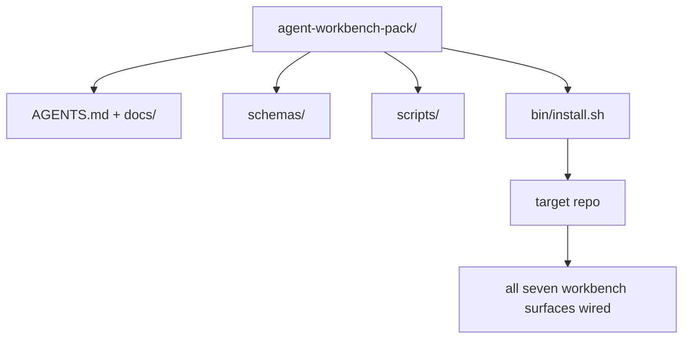

# سنگ سنگ: یک بسته کارکن عامل قابل استفاده مجدد ارسال کنید

> اين آهنگ کوچولو با يه بسته اي که تو هر رپو به دست مياد تموم ميشه.`cp -r`و صبح بعد یک مامور به طور قابل اعتماد کار کند. سنگ اصلی این آرتیفاکت است که این برنامه آموزشی در آن معامله می کند.

**Type:** Build
**Languages:** Python (stdlib)
**Prerequisites:** Phases 14 · 31 to 14 · 41
**Time:** ~75 minutes

## اهداف یادگیری

- هفت صفحه ی میز کاری را به یک دایرکتوری جمع کنید.
- طرح ها، اسکریپت ها و قالب ها را پیک کنید تا یک repo جدید یک خط پایه شناخته شده داشته باشد.
- یک اسکریپت نصب کننده را اضافه کنید که بسته را بی وقت و بدون قدرت قرار دهد.
- تصمیم بگیرید چه چیزی در بسته باقی می ماند و چه چیزی خارج می ماند، دفاع از برش برای هر یک.
- یک تغییر ذخیره سازی با کمک عامل را با شواهد که یک بازرس می تواند تکرار کند نشان دهید.

## مشکل

یک میز کاری که در یک Google Doc، یک تاریخچه چت و سه اسکریپت نیمه یاد شده زندگی می کند، یک میز کاری است که هر سه ماهه بازسازی می شود. درمان یک بسته نسخه ای است: یک repo یا دایرکتوری با سطوح، طرح ها، اسکریپت ها و یک نصب یک فرمان.

تو اين درس رو با`outputs/agent-workbench-pack/`در دیسک و یک`bin/install.sh`که به هر هدف بازتاب داده شود.

## مفهوم



### طرح بسته

```
outputs/agent-workbench-pack/
├── AGENTS.md
├── docs/
│   ├── agent-rules.md
│   ├── reliability-policy.md
│   ├── handoff-protocol.md
│   └── reviewer-rubric.md
├── schemas/
│   ├── agent_state.schema.json
│   ├── task_board.schema.json
│   └── scope_contract.schema.json
├── scripts/
│   ├── init_agent.py
│   ├── run_with_feedback.py
│   ├── verify_agent.py
│   └── generate_handoff.py
├── bin/
│   └── install.sh
└── README.md
```

### چه چيزي در مي ماند و چه چيزي خارج

در:

- نقشه هاي سطح، اينها قرارداد هستن
- چهار اسکریپت بالا، زمان اجرا هستن
- چهار سند، قانون و قانون

بیرون:

- وظایف خاص پروژه، وظایف متعلق به هیئت ارجاع هدف هستند نه به بسته
- فروشنده SDK تماس می گیرد. بسته از چارچوب های بیگانه است.
- اون کليپ ها در کنار کليپ هاي موجود تیم زندگي ميکنن نه داخلشون

### نصب کننده

يه کوتاه`bin/install.sh`(یا `bin/install.py`):

1. بدون اینکه `--force`. .
2. کپي بسته رو به بازخريد هدف ميکنه
3. تار ها به صورت CI`.github/workflows/`وجود داره
4. مراحل بعدی را چاپ کنید: صفحه را پر کنید، دستورات پذیرش را تنظیم کنید، اسکریپت init را اجرا کنید.

### نسخه بندی

بسته ای با یک`VERSION`فایل. سکیم ها و تغییرات اسکریپت که نیاز به مهاجرت دارند، بزرگ را افزایش می دهند. تغییرات فقط در اسناد، پیچ را افزایش می دهند.`agent_state.json`ثبت کرد که با کدام نسخه بسته شروع شده است.

```figure
wb-pack-install
```

## آن را بسازید

`code/main.py`بسته را به `outputs/agent-workbench-pack/`در کنار درس، با طرح ها و اسکریپت ها از درس های قبلی در این آهنگ کوچک و اسناد که قبلاً نوشته اید.

اجرا کن

```
python3 code/main.py
```

اسکریپت صفحات را کپی و پین می کند، README را می نویسد، درخت بسته را چاپ می کند و صفر را ترک می کند. تکرار بی اختیار است.

## الگوهای تولید در طبیعت

یک بسته تنها زمانی ارزشمند است که از شکاف ها، تازه ها و یک جریان ضد دوستانه در مقابل آن زنده بماند.

**`VERSION` is the contract, not the marketing.**ضربه های بزرگ نیاز به مهاجرت حالت دارند، ضربه های کوچک نیاز به چک دوباره اجرا می کنند، ضربه های پیچ فقط در اسناد هستند، نصب کننده می نویسد`.workbench-version`در هر نصب به ریپو هدف وارد می شود`lint_pack.py`اگر قفل هدف با بسته مخالف باشد، از حمل رد می شود`VERSION`اينطوره`npm`،`Cargo`و`pyproject.toml`10 سال از کار کردن زنده بمونيم، هيچ چيز در مورد ماموران قوانين رو عوض نميکنه

**Single source for cross-tool distribution.**نکس سفینه ی اول`nx ai-setup`که میگه`AGENTS.md`،`CLAUDE.md`،`.cursor/rules/`،`.github/copilot-instructions.md`این بسته باید همین کار را انجام دهد؛ نصب کننده لینک های سیمنامی را ارسال می کند (`ln -s AGENTS.md CLAUDE.md`پس یک منبع واقعی برای هر عامل کدگذاری پخش می شود.

**`uninstall.sh` that refuses on non-trivial state.**حذف بسته نباید پیام های کاربر را حذف کند `agent_state.json`،`task_board.json`، یا`outputs/`. دستگاه حذف کردن نقشه ها، اسکریپت ها، اسناد و`AGENTS.md`(با `--keep-agents-md`این برنامه در حال حاضر در حال انجام است و در صورت تغییر نامبرده در پرونده های دولتی، از ادامه کار خودداری می کند.

**Skill-as-publishable. SkillKit-style distribution.**بسته ها به عنوان مهارت SkillKit:`skillkit install agent-workbench-pack`این برنامه را در 32 عامل هوش مصنوعی از یک منبع واحد قرار می دهد. بسته ریپو منبع حقیقت است؛ SkillKit کانال توزیع است. قفل فروشنده سقوط می کند؛ هفت سطح یکسان باقی می ماند.

## ازش استفاده کن

سه جايگاه سفينه هاي بسته:

- **As a directory you drop into a repo.** `cp -r outputs/agent-workbench-pack /path/to/repo`. .
- **As a public template repo.**فارک و سفارشی کردن`VERSION`کنترل حرکت
- **As a SkillKit skill.**به محصول مامور شما متصل شده تا با يک فرمان بهشون اطلاع بده

بسته رو دستور کار ميکنه.هر بار يک وعده ميکنه.

## -باده

`outputs/skill-workbench-pack.md`یک بسته پروژه ای را ایجاد می کند: قوانین به تاریخچه تیم، دامنه های مربوط به repo، ابعاد Rubric با یک ورودی خاص دامنه گسترش می یابد.

## تمرینات

1. تصميم بگيريد که چه دوکيت پنجمي که لايق ترفيدي به گروه قنونيک باشه
2. نصبگر را به عنوان پایتون با یک `--dry-run`. پرچم .برابر ارگونومی با بش
3. اضافه کنید`bin/uninstall.sh`که بسته را به طور ایمن حذف می کند و اگر پرونده های دولتی سابقه ای غیر معمولی داشته باشند، انکار می کند.
4. اضافه کنید`lint_pack.py`که وقتی بسته از`VERSION`. به اطلاعات مربوطه براي بازپرداخت خودِ بسته منتقل کن
5. نویسنده کتاب حرکت مهاجرت از یک میز کاری دستی به این بسته.

## تمرین شغلی: ثابت کردن یک تغییر ذخیره سازی

نمایش بسته بندی ثابت می کند که سازنده فایل ها را اجرا و تولید می کند. این ثابت نمی کند که نماینده شما می تواند یک کار جدید را انجام دهد، که چک های تولید شده ثابت می کند که کار است، یا که یک سیستم پیاده سازی شده کار می کند. این ادعاها را جداگانه نگه دارید.

یک کار کوچک واقعی را در یک مخزن که مالکیت دارید یا مجوز برای تغییر دارید انتخاب کنید. از یک عامل کدگذاری که قبلاً به آن دسترسی دارید استفاده کنید. یک مشکل اصلاح شده، یک ویژگی محدود یا یک بهبود عملیاتی کافی است؛ نصب چندین عامل بخشی از تمرین نیست.

بودجه یک جلسه کار جداگانه فراتر از آزمایشگاه بسته بندی. نمونه شواهد مرتبط در زیر را به خود کپی کنید `learning-artifacts/`فهرست: قالب ثبت شده را نگه دارید و به عنوان ماده مرجع بسته بندی کنید.

### 1. وظیفه را چارچوب بندی کنید و استقلال را انتخاب کنید

از چارچوب کار در درس 43 و برنامه شواهد در درس 44 استفاده کنید. بررسی اولیه، هدف قابل مشاهده، غیر اهداف، مسیرهای مجاز و شواهد پذیرش را ثبت کنید. کاربر واقعی یا اپراتور را شناسایی کنید که به رفتار نیاز دارد.

یک حالت کار را انتخاب کنید: مراحل هدایت شده، اجرای نقطه بازرسی یا یک اجرا مستقل محدود. توضیح دهید که چرا عدم قطعیت، پیامدهای و برگشت پذیری آن را توجیه می کند. یک دستگاه کوچک محلی ممکن است به نقاط بازرسی کمتری نیاز داشته باشد تا تغییر کنترل دسترسی.

یک بودجه زمان دیوار و یک توکن یا محدودیت هزینه را تنظیم کنید اگر نماینده یکی را نشان دهد. اندازه گیری های غیرقابل دسترس را صادقانه ثبت کنید. یک شرط توقف برای شکست مکرر، مجوزهای جدید، صرفه جویی بودجه یا یک تصمیم قرارداد حل نشده را تعریف کنید؛ نام کسانی که می توانند آن را حل کنند.

### 2. کوچکترین محیط مفید را آماده کنید

درخواست های مربوطه را بازیافت کنید، درخواست کننده، تست و دستورالعمل های محلی را بازیافت کنید. به خاطر این که هر منبع متعلق به زمینه است و شواهد فعلی که یک یادداشت قدیمی را رد می کند، ثبت کنید. به طور پیش فرض کل مخزن را بارگذاری نکنید.

برای هر افزونه مربوطه یک انتخاب صریح انجام دهید: یک مهارت یک روش تکراری را فراهم می کند؛ یک ابزار MCP دسترسی را فراهم می کند؛ یک هک یک چک تعیین کننده را اجرا می کند؛ یک افزونه قابلیت های بسته بندی را انجام می دهد. فقط زمانی که وظیفه به آن نیاز دارد، افزونه را با حداقل مجوز که اجازه می دهد کار کند، نگه دارید.

هزینه های مربوط به یک پیشنهاد اضافه شده را ثبت کنید. یک حافظه یا دستورالعمل قدیمی را دوباره بررسی کنید، سپس آن را در تنظیمات متعلق به دانش آموز خود بازنشسته یا جایگزین کنید، زمانی که شواهد از این تصمیم پشتیبانی می کند. بررسی مورد تاثیر را برای تأیید حذف محدودیت مورد نیاز از دست نداده است.

### 3. خط پایه را ضبط کنید و اجرا کنید

قبل از ویرایش، نزدیک ترین چک موجود را اجرا کنید و وضعیت فعلی رفتار مورد نیاز را نشان دهید. دستور، بازبینی، نتیجه و محل شواهد را حفظ کنید. ویژگی ای که هنوز وجود ندارد هنوز یک خط پایه دارد: پاسخ مشاهده شده یا عملیات غیر پشتیبانی شده را ثبت کنید.

اجازه دهید که نماینده در داخل قرارداد اجرا شود. یک دفترچه مداخله با دلیل هر تصحیح، تغییر مجوز یا تجدید نظر در برنامه نگه دارید. نمایندگی اختیاری است؛ اگر مفید باشد، قبل از اضافه کردن کارگر دیگر، قرارداد مالکیت و ادغام درس 45 را اعمال کنید.

### 4. به شواهد چالش بکش

برای یک UI، مسیر ارائه شده را در عرض های مربوطه بازسازی و بررسی کنید. برای یک API، درخواست و پاسخ سریالیز شده را بررسی کنید. برای یک CLI، دستور ساخته شده را اجرا کنید و کد خروج و خروجی آن را بررسی کنید. چک های مورد نیاز وظیفه خود را انتخاب کنید و محدودیت های آنها را توضیح دهید.

یک نتیجه انتظار می رود از قرارداد کار را به طور مستقل از اجرای عامل بنویسید. در یک کپی یکبار، یک نتیجه نادرست خاص مانند پذیرش یک ارزش باطل یا حذف یک میدان پاسخ مورد نیاز را وارد کنید. همان چک پذیرش را اجرا کنید: باید به همین دلیل شکست یابد.

اگر سبز باقی بماند، قبل از اعتماد به آن، ادعا یا مشاهدات را تقویت کنید. اجرای صحیح را بازگرداند و دوباره با موفقیت اجرا کنید. هر دو رسید را نگه دارید. یک خطای نحوی یا تنظیم آزمایشی خراب به عنوان تشخیص بازگشت حساب نمی شود.

بررسی تفاوت نهایی، از جمله آزمایش های تغییر یافته، در برابر هدف اصلی و مسیرهای مجاز. از یک همتایان یا یک جلسه بررسی کننده جداگانه بخواهید تا ضعیف ترین اثبات را بدون ویرایش اجرای، بدون تغییر، بدون تغییر، بدون تغییر، بدون تغییر، بدون تغییر، بدون تغییر، بدون تغییر، بدون تغییر، بدون تغییر، بدون تغییر، بدون تغییر، بدون تغییر، بدون تغییر، بدون تغییر، بدون تغییر، بدون تغییر، بدون تغییر، بدون تغییر، بدون تغییر، بدون تغییر، بدون تغییر، بدون تغییر، بدون تغییر، بدون تغییر، بدون تغییر، بدون تغییر، بدون تغییر، بدون تغییر، بدون تغییر، بدون تغییر، بدون تغییر، بدون تغییر، بدون تغییر، بدون تغییر، بدون تغییر، بدون تغییر، بدون تغییر، بدون تغییر، بدون تغییر، بدون تغییر، بدون تغییر، بدون تغییر، بدون تغییر، بدون تغییر، بدون تغییر، بدون تغییر، بدون تغییر، یا تغییر، بدون تغییر، بدون تغییر، بدون تغییر، یا تغییر، بدون تغییر، بدون تغییر، یا تغییر، بدون تغییر، یا تغییر، بدون تغییر، یا تغییر، بدون تغییر، یا تغییر، یا تغییر، یا تغییر، یا تغییر، یا تغییر، یا تغییر، یا تغییر، یا تغییر، یا تغییر، یا تغییر، یا تغییر، یا تغییر، یا تغییر، یا تغییر، یا تغییر، یا تغییر، یا تغییر، یا تغییر، یا تغییر، یا تغییر، یا تغییر، یا تغییر، یا تغییر، یا تغییر، یا تغییر، یا تغییر، یا تغییر، یا تغییر، یا تغییر، یا تغییر، یا تغییر یا تغییر، یا تغییر، یا تغییر، یا تغییر، یا تغییر، یا تغییر یا تغییر، یا تغییر، یا تغییر یا تغییر، یا تغییر، یا تغییر یا تغییر، یا تغییر یا تغییر، یا تغییر، یا تغییر یا تغییر، یا تغییر، یا تغییر یا تغییر، یا تغییر یا تغییر، یا تغییر، یا تغییر یا تغییر، یا تغییر یا تغییر یا تغییر، یا تغییر یا تغییر، یا تغییر یا تغییر یا تغییر، یا تغییر، یا تغییر یا تغییر یا تغییر یا تغییر، یا تغییر، یا تغییر یا تغییر یا تغییر یا تغییر یا تغییر یا یا تغییر یا تغییر یا تغییر یا تغییر، یا یا یا یا یا یا یا یا یا یا یا یا یا یا یا یا یا یا یا یا یا یا یا یا یا یا یا یا یا یا یا یا یا یا یا یا یا یا یا یا یا یا یا یا یا یا یا یا یا یا یا یا یا یا یا یا یا یا یا یا یا یا یا یا یا یا یا یا یا یا یا یا

### 5. عملیات و بازیابی تمرینات

آثار تغییر یافته را در یک محیط محلی یا صحنه سازی یکبار استفاده کنید.`local`،`staging`، یا`live`یک تمرین محلی دعوی محلی را پشتیبانی می کند؛ برای این تمرین، استفاده از تولید مورد نیاز نیست.

یک سیگنال شکست مربوط به کار، یک حد، یک پنجره مشاهده و یک صاحب را انتخاب کنید. پاسخ را هنگامی که این حد عبور می کند توضیح دهید. سیگنال را در تمرین به طور ایمن فعال کنید و ثبت ثبت شده را حفظ کنید.

تکرار تکرار به یک اثر شناخته شده و بررسی کنید که رفتار قبلی بازگردد. در صورت لزوم داده های ثابت را در نظر بگیرید؛ جایگزینی یک دوگانه به تنهایی ممکن است تغییر داده را معکوس نکند. هر مرحله بازیابی را که نمی توانید تأیید کنید ثبت کنید.

### 6. بهتر از دویدن بعدی و بدهش

نتیجه را با خط پایه، از جمله زمان گذشته، داده های موجود استفاده و مداخلات انسانی مقایسه کنید. یک کار نشان می دهد که در آن کار چه اتفاقی افتاده است؛ این نشان نمی دهد که یک عامل به طور کلی سریعتر یا قابل اعتماد تر است.

یک اصلاح مشاهده شده را به یک آزمون، یک مرز مجوز کوچکتر، یک اتوماسیون یا یک مثال واضح تر با استفاده از درس 46 ارتقا دهید. چک آسیب دیده را تکرار کنید. جهش های موقت را حذف کنید و شاخه نهایی را ترک کنید، فایل های تغییر یافته، خطرات را باز کنید و عمل بعدی را برای جلسه بعدی آشکار کنید.

### دسته بندی بررسی دستی

از بازرس بخواهید پرونده های شواهد را بررسی کند و حداقل ضعیف ترین چک پذیرش را تکرار کند.`demonstrated`،`needs revision`، یا`unverified`برای هر ردیف، با یک نشانه ی اثبات و دلیل. زمینه های پر شده و اسکریپت های بسته بندی عبور جایگزین این مشاهدات نیستند.

| Dimension | Evidence the reviewer should challenge |
|---|---|
| Task and autonomy | Starting behavior, bounded goal, justified permissions, budget, and a usable stop rule |
| Context and environment | Relevant sources, justified tool access, and a rechecked retirement decision |
| Verification | Actual before/after behavior and a deliberate incorrect result that the same check rejects |
| Review and operation | Inspected diff, independent challenge, labeled runtime observation, and rehearsed recovery |
| Iteration and handoff | One verified improvement, honest limits, clean final state, and a reproducible next action |

تصمیم گیری کنید`needs revision`نتایج قبل از اینکه وظیفه را تکمیل کنید، شواهد موجود را ترک کنید`unverified`و به همین ترتیب ادعای خود را محدود کنید. نمونه کارها قضاوت مهندسی شما را در مورد یک کار محدود نشان می دهد؛ این یک تضمین استخدام یا پیاده سازی نیست.

## آثار هنری ارسال شده

بسته بندی قابل استفاده مجدد و نسخه کامل خود را نگه دارید[career-agent-evidence.md](https://github.com/rohitg00/ai-engineering-from-scratch/blob/main/phases/14-agent-engineering/42-agent-workbench-capstone/outputs/career-agent-evidence.md). این قالب چارچوب کار، برنامه اجرا، رسید های زمان اجرا، بررسی، تمرین بازیابی و انتقال را به یک مطالعه موردی قابل بررسی متصل می کند.

## اصطلاحات کلیدی

| Term | What people say | What it actually means |
|------|----------------|------------------------|
| Workbench pack | "The starter kit" | A versioned directory carrying all seven surfaces |
| Installer | "Setup script" | `bin/install.sh` that lays the pack down idempotently |
| Pack version | "VERSION" | Major bumps for schema/script changes, patch for doc-only |
| Drop-in pack | "cp -r and go" | Pack works without per-repo customization on day one |
| Forkable template | "GitHub template" | Public repo that GitHub's "Use this template" can clone from |

## خواندن بیشتر

- مراحل 14 · 31 تا 14 · 41  هر سطحی که این بسته بسته بندی می کند
- [SkillKit](https://github.com/rohitg00/skillkit) این مهارت را در 32 عامل هوش مصنوعی نصب کنید
- [Nx Blog, Teach Your AI Agent How to Work in a Monorepo](https://nx.dev/blog/nx-ai-agent-skills) ژنراتور واحد در شش ابزار
- [agents.md — the open spec](https://agents.md/) آنچه را که روتر بسته شما باید پیاده سازی کند
- [HKUDS/OpenHarness](https://github.com/HKUDS/OpenHarness) اجرای مرجع یک بسته بندی معادل
- [Augment Code, A good AGENTS.md is a model upgrade](https://www.augmentcode.com/blog/how-to-write-good-agents-dot-md-files) بسته بندی اسناد کیفیت بار
- [Anthropic, Effective harnesses for long-running agents](https://www.anthropic.com/engineering/effective-harnesses-for-long-running-agents)
- [Anthropic, Harness design for long-running application development](https://www.anthropic.com/engineering/harness-design-long-running-apps)
- مرحله 14 · 30  توسعه یک عامل مبتنی بر ارزیابی که دروازه تأیید بسته را مصرف می کند
- مرحله 14 · 41  قبل از/ پس از این بسته بهبود می یابد
