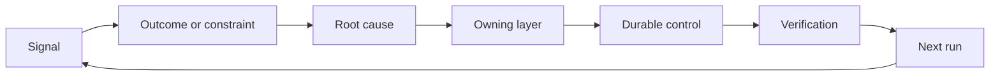

# با داشتن و بازنشستگی، یک رادک ردعمل بسازید

> حمل و نقل یک حلقه ساخت را می بندد و حلقه یادگیری را باز می کند. شواهد باید سیستم را تغییر دهند یا به تله متری تبدیل می شود که هیچ کس مالک آن نیست.

**Type:** Learn + Build
**Languages:** Python (stdlib)
**Prerequisites:** Phase 14 lessons 46 and 53
**Time:** ~75 minutes

## اهداف یادگیری

- حادثه ها، ارزیابی ها، رفتار کاربران و اصلاحات را به اقدامات متعلق تبدیل کنید.
- هر سیگنال را به زمینه، ارزیابی، سیاست، زمان اجرا یا پس انداز هدایت کنید.
- تکرار را به شدت و فرکانس اولویت بندی کنید.
- به هر کنترل شرط بازنشستگی بده
- تصمیم تحویل را با شواهد، معامله ها و یک مالک مسئول اعلام کنید.

## بازخورد زیرساخت است

یک تیم می تواند ردیابی ها، ارزیابی ها، بلیط های پشتیبانی و پرونده های حوادث را بدون یادگیری از هر یک از آنها جمع آوری کند. مکانیسم گمشده ارتقاء است: یک مسیر مشخص از مشاهده به تغییر پایدار با یک صاحب و اثبات.

حلقه اينه:

1. مشاهده یک سیگنال مشخص؛
2. آن را به یک نتیجه، محدودیت یا فرض متصل کنید؛
3. شناسایی اولین لایه سیستم که علت را دارد؛
4. ایجاد تغییر محدود؛
5. بررسی اینکه تکرار کمتر شود؛
6. بررسی اینکه آیا باید کنترل باقی بماند.

## راه به طبقه مالکیت

| Signal | Destination |
|---|---|
| False positive, regression, wrong result | Evaluation or test |
| Missing context, duplicate work, stale fact | Context source or retrieval route |
| Unsafe action or authority gap | Policy or permission boundary |
| Timeout, retry storm, unavailable dependency | Runtime control |
| New product need or unresolved tradeoff | Shaped backlog item |

علت را در اولین لایه موثر درست کنید. در صورتی که یک آزمایش یا اجازه ممکن است شکست را غیرممکن کند، به یک پاراگراف فوری دیگر اضافه نکنید.



## مالکیت بخشی از کنترل است

هر عمل رچشيت به اين نياز داره:

- یک صاحب؛
- اولویت ای که بر اساس پیامدهای و تکرار آن است؛
- اثر هنری که باید تغییر کند؛
- تأیید که تغییر را اثبات می کند؛
- یک پنجره بازبینی یا انقضاء؛
- یک شرایط بازنشستگی.

یک پیشرفت غیرمتمکن یک مشاهده با فرمت بهتر است.

## کنترل های ثابت را بازنشسته کنید

سیستم های بازخورد سیاست ها را جمع می کنند. این سیاست می تواند متناقض و گران باشد. بررسی کنترل می کند که:

- تغییرات معماری یا جریان کار؛
- یک غیر متغیر سطح پایین تر جایگزین یک دستورالعمل سطح بالاتر می شود.
- شکست محافظت شده در پنجره انتخاب شده ظاهر نشده است؛
- کنترل بیشتر از اینکه از آسیب جلوگیری کند، کار مشروع را مسدود می کند.

بازنشستگی هم به اثبات نیاز دارد.

## ارتباط ایجاد و کدگذاری-آژنت بازخورد

همون رخت به هر دو راه سرو ميکنه:

- شواهد محصول چارچوب نتیجه، فرضیه ها، قطعه یا برنامه اندازه گیری را تغییر می دهد.
- اصلاحات عامل کدگذاری تست ها، زمینه، دامنه، اتوماسیون یا انتقال را تغییر می دهد.
- حوادث می توانند هم مرز محصول و هم میز کار عامل را تغییر دهند.

به همین دلیل است که شکل دادن به ساخت یک مرحله نیست که قبل از کدگذاری به پایان می رسد. آن را در هر تغییر پذیرفته ادامه می دهد.

## آن را بسازید

آزمایشگاه سیگنال ها رو طبقه بندی می کنه، عمل های مخصوص رو ایجاد می کنه، اولویت ها رو میده و می نویسد`outputs/feedback-backlog.json`. .

```bash
python3 code/main.py
python3 -m unittest discover code/tests -v
```

یک سیگنال زمان توقف اجرا را اضافه کنید و تایید کنید که آن را به زمان اجرا به جای عقب ماندگی عمومی هدایت می کند.

## آزمایشگاه تمرین: تصمیم گیری بعد از شکست

یک جریان کار را از پروژه های نمونه کارها مسیر شغلی خود انتخاب کنید. آن را از طریق یک تصمیم، یک آزمایش کوچک و یک بررسی انجام دهید. شواهد را در [career delivery template](https://github.com/rohitg00/ai-engineering-from-scratch/blob/main/phases/14-agent-engineering/54-build-the-feedback-ratchet/outputs/career-delivery-evidence.md). .

آزمایشگاه پایتون اقدامات مثال پس انداز را تولید می کند. این کاربر را مشاهده نمی کند، مداخله را اندازه گیری نمی کند یا آمادگی شغلی را ثابت نمی کند. تکمیل اجرای آن آماده سازی برای این تمرین است.

### 1. مشخص کن چه اتفاقی افتاد

کاربر، کار، جریان کار فعلی و نتیجه ای را که می خواهید بهبود بخشید ثبت کنید. یک مشاهده رضایت بخش، یک رکورد پشتیبانی اصلاح شده یا یک ردیابی کار قابل تکرار را پیوند دهید. آنچه را که مشاهده کرده اید از آنچه که کسی گزارش کرده و آنچه که شما نتیجه گرفتید را جدا کنید.

یک شکست را پیدا کنید: یک فرضیه شکست خورده، یک نتیجه غیرقابل استفاده، هزینه های غیر منتظره یا یک ارسال دیر شده. توضیح دهید که چه شواهد تغییر درک شما را نشان می دهد. یک شکست نیاز به پاسخ و تصمیم دارد، نه یک داستان موفقیت نوشته شده در اطراف آن.

اگر نمی توانید با کاربران کار کنید، شبیه سازی را با یک سناریو یا یک سناریو مشخص شده به وضوح نشان دهید. مشاهدات شبیه سازی شده را از شواهد کاربر واقعی جدا نگه دارید. مصاحبه ها، تأییدات، پذیرش یا تاثیرات تجاری را اختراع نکنید.

### 2. در اختیار خود پیشرفت کنید

نامعلوم ها را لیست کنید و ارزان ترین اقدام برگشت پذیر را انتخاب کنید که می تواند نتیجه گیری موثر را حل کند. آنچه را که می توانید تصمیم بگیرید، آنچه که توسط یک توافق موجود محدود شده است و آنچه که قبل از اجرای آن نیاز به مجوز دارد را بیان کنید.

برای مثال، شما ممکن است در حالی که منتظر اجازه استفاده از داده های مشتری هستید، یک بازی مجدد آفلاین اصلاح شده را آماده کنید. اقدام به اقدام به حرکت به کار مجاز و روشن کردن تصمیم مسدود شده است. این اجازه دسترسی یا تأیید شما را گسترش نمی دهد.

### 3. گزینه ها را مقایسه کنید و به صاحب تصمیم اطلاع دهید

برای کسی که به جزئیات پیاده سازی نیاز ندارد، خلاصه ای از تصمیم گیری کوتاه بنویسید.

- مشکل کاربر و شواهد تغییر برنامه؛
- حداقل دو گزینه، از جمله یک گزینه دستی ارزان تر یا بدون ساخت در صورتی که قابل اعتماد باشد؛
- کیفیت، طراحی تعامل، تلاش، هزینه های عملیاتی و ریسک های تعدیل؛
- توصیه شما، عدم اطمینان باقی مانده و تصمیم مورد نیاز
- مالک تصمیم، ذینفعان تحت تاثیر قرار گرفته و تاریخ لازم برای تصمیم گیری.

از یک همتایان بخواهید تا یک طرف ذینفع را نمایندگی کنند و یک معامله را به چالش بکشند. اعتراض و چگونگی تغییر یا عدم تغییر توصیه خود را ثبت کنید. بازخورد بازی نقش را به عنوان شبیه سازی نام ببرید؛ این نمی تواند برای توافق واقعی طرف ذینفع باشد.

### 4. یک آزمایش محدود انجام دهید

بر اساس سوالی که باید پاسخ دهید، نمونه ای، نمونه ی آزمایشی یا کار تولید را انتخاب کنید. قبل از جمع آوری نتیجه، مخاطبان، داده ها، اختیار، مدت زمان، بازگشت و شرایط را برای ادامه، تغییر یا توقف تعریف کنید.

از نقطه شروع کاربر تا یک کار تکمیل شده، از طریق تعامل حرکت کنید. یک حالت غلط درآمدی یا داده های گمشده را شامل کنید. مشاهده کنید که آیا کاربر می تواند شکست را متوجه شود، آن را اصلاح کند و بدون کمک پنهان از شما بهبود یابد.

زمان بررسی و اصلاح انسانی را به عنوان بخشی از جریان کار حساب کنید. پاسخ سریع تر مدل هنوز هم می تواند کار کامل را کند تر یا دشوارتر کند.

### 5. نتایج و اقتصاد را مقایسه کنید

یک خط پایه و یک پیگیری با استفاده از همان تعریف متریکی، جمعیت وظایف، روش جمع آوری و پنجره های مشاهده قابل مقایسه ثبت کنید. تعداد نمونه ها، حذف ها و لینک های شواهد را در کنار اعداد نگه دارید. اگر این شرایط تغییر کند، توضیح دهید که چرا مقایسه محدود است.

شامل یک نتیجه کاربر، یک محافظ ایمنی یا کیفیت و کل تلاش بررسی انسانی است. حتی زمانی که هدف را از دست می دهد، نتیجه را ثبت کنید. نمونه های کوچک یا شبیه سازی شده ادعا یادگیری محدود را تأیید می کنند، نه ادعای تأثیر ثابت کسب و کار.

هزینه هر کار موفق انجام شده را با استفاده از تماس های مدل، آزمایشات مجدد، خدمات پشتیبانی و بررسی انسانی تخمین بزنید. فرضیه نرخ کار را بیان کنید و استفاده اندازه گیری شده را از تخمین ها جدا کنید. این هزینه را با گزینه دستی یا فرضیه ارزش پشت پروژه مقایسه کنید.

از موجود استفاده کن[FinOps for LLMs lesson](https://aiengineeringfromscratch.com/lesson?path=phases/17-infrastructure-and-production/27-finops-llms)تغییر مدل تنها یک پاسخ ممکن است؛ محدود کردن جریان کار یا حفظ یک گام دستی ممکن است تصمیم بهتر محصول باشد.

### 6. بند بند کن

با استفاده از معیارهای پیش اعلام شده برای توصیه ادامه، تغییر یا توقف استفاده کنید. اگر شواهد غیر قانع کننده باشد، مشاهده گمشده و آزمایش محدود بعدی را نام ببرید. پاسخ صاحب تصمیم مسئول را ثبت کنید؛ اگر تصمیم گرفته نشده باشد، آن را در انتظار بگذارید.

یک پیشرفت در فرآیند تحویل خود را انتخاب کنید: یک چارچوب کار روشن تر، مرور قبلی کاربر، چک لیست بررسی بهتر، تحویل عامل کوچکتر یا پرونده ارزیابی دقیق تر. یک مالک و تاریخ بررسی را تعیین کنید.

در هنگام بررسی، تصمیم بگیرید که آیا باید این پیشرفت را حفظ کنید، بررسی کنید یا بازنشسته کنید. شواهد را برای انتخاب ثبت کنید. یک لیست چک جدید که بدون جلوگیری از شکست هدف کار بیشتری ایجاد می کند، به طور دائمی به دست نیامد.

## آثار هنری ارسال شده

- نقل شده[career-delivery-evidence.md](https://github.com/rohitg00/ai-engineering-from-scratch/blob/main/phases/14-agent-engineering/54-build-the-feedback-ratchet/outputs/career-delivery-evidence.md)در پروژه خود قرار دهید و آن را با لینک های شواهد تکمیل کنید. قالب ثبت شده را قابل استفاده مجدد نگه دارید. خلاصه تصمیم گیری، تعامل، مقایسه اندازه گیری و پیگیری متعلق به نمونه کارها حرفه ای خود را شامل کنید.

## بررسی کنید

با همتایی از این قسمت دستی پذیرش استفاده کنید.**met**،**needs work**، یا**not observed**یک فیلدی پر شده اثبات نمی کند که حکم درست است.

| Check | Evidence that meets it |
|---|---|
| Workflow grounded | A traceable observation supports the problem; reported claims, inference, and simulation are labeled. |
| Authority respected | Reversible next work is clear, and any restricted action waits for its actual decision owner. |
| Tradeoffs communicated | Credible alternatives, a stakeholder objection, a recommendation, and an explicit decision request are recorded. |
| Interaction tested | The walkthrough covers success, failure, recovery, and human review effort. |
| Outcome compared | Baseline and follow-up definitions align; samples, guardrails, costs, and comparison limits are visible. |
| Setback owned | The evidence changes a continue/change/stop decision and an accountable next action. |
| Process improved | One workflow improvement has an owner, review date, and an evidence-based keep/revise/retire decision. |

رفتار کاربر واقعی که مشاهده نشده است حتی وقتی هر مرحله شبیه سازی شده عبور می کند، شکاف باقی می ماند. این مرز را در ادعای پورتفولیو حفظ کنید و مشاهده بعدی را که برای بسته شدن آن لازم است شناسایی کنید.

## تمرینات

1. يه حادثه و يک شکایت از کاربران رو به عمل هاي ريشچ تبديل کن
2. اولین لایه ای را که می تواند از هر تکرار جلوگیری کند نام ببرید.
3. دستورات و مشاهدات تأیید را به خروجی آزمایشگاه اضافه کنید.
4. یک شرط بازنشستگی را برای یک قانون سیاست تعریف کنید.
5. ردیابی یک اصلاح قبول شده را به فریم کار بعدی برگردانید.

## خواندن بیشتر

- [Basili, Caldiera, and Rombach, The Goal Question Metric Approach](https://www.cs.toronto.edu/~sme/CSC444F/handouts/GQM-paper.pdf)، برای یادگیری سازمانی از طریق اندازه گیری هدفمند.
- [Fagerholm et al., Building Blocks for Continuous Experimentation](https://doi.org/10.1145/2601248.2601276)، برای حلقه فنی و سازمانی که شواهد را به توسعه مداوم محصول متصل می کند.
- [Nuseibeh and Easterbrook, Requirements Engineering: A Roadmap](https://www.cs.toronto.edu/~sme/papers/2000/ICSE2000.pdf)، برای درمان الزامات به عنوان تکامل در طول چرخه زندگی سیستم.

## آنچه را که نگه داری

نگه دار`outputs/feedback-backlog.json`به عنوان مثال مسیر و مدارک تحویل حرفه ای شما به عنوان یک ثبت تصمیمات خود را.
