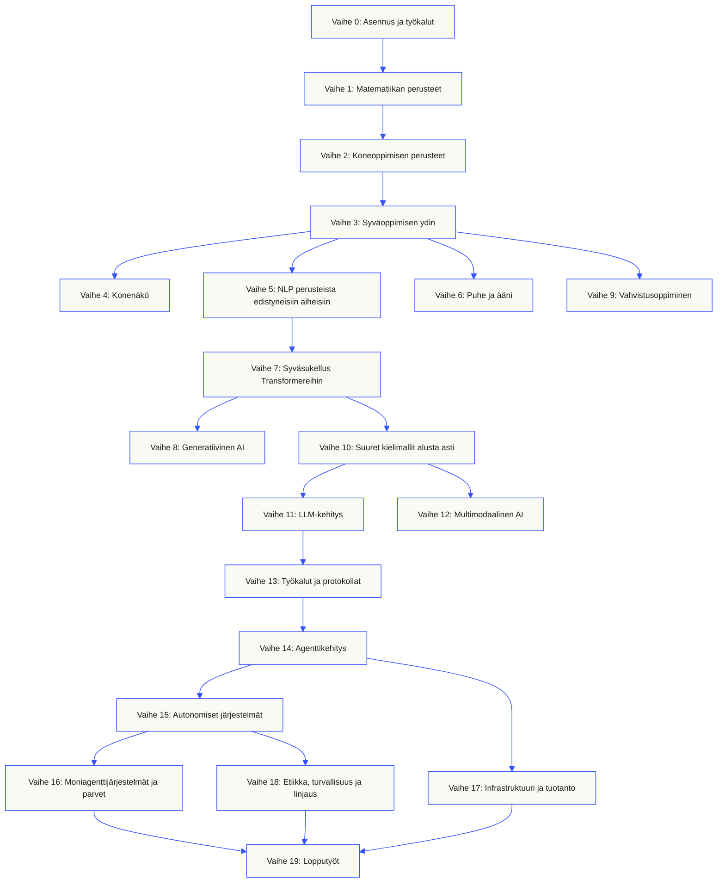
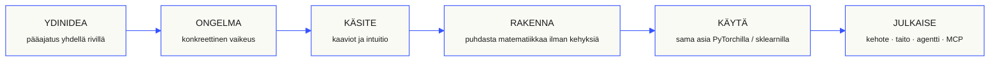

<p align="center"><sub>Tämä README on käännetty suomeksi. <a href="../../README.md">Englanninkielinen README</a> on ensisijainen lähde.</sub></p>

<p align="center">
  <picture>
    <source media="(prefers-color-scheme: dark)" srcset="../../assets/readme/header-dark.svg">
    
  </picture>
</p>

Toteuta mallien sisäiset mekanismit, hakuprosessit ja agenttien suoritusympäristöt. Testaa niitä, tutki virheitä ja säilytä koodi sekä arviointitulokset.

**[Aloita oppiminen](https://aiengineeringfromscratch.com/lesson?path=phases/00-setup-and-tooling/01-dev-environment)** · **[Valitse polku](#learning-routes)** · **[Kokeile harjoitusta](#interactive-lab)** · **[Rakenna projekti](#project-challenges)** · **[Selaa opetussuunnitelmaa](#contents)**

Maksuton, avoin lähdekoodi, MIT-lisenssi. Opi verkkosivustolla, koodausagentin kanssa tai suorittamalla koodia paikallisesti.

> 523 oppituntia. 20 vaihetta. Python, TypeScript, Rust, Julia.

<p align="center">
  <a href="../../LICENSE"></a>
  <a href="../../ROADMAP.md"></a>
  <a href="#contents"></a>
  <a href="https://github.com/rohitg00/ai-engineering-from-scratch/stargazers"></a>
  <a href="https://aiengineeringfromscratch.com"></a>
</p>

<details>
<summary>Lue omalla kielelläsi</summary>

<p align="center">
  <a href="../../README.md">🇬🇧 English</a> · <a href="../../i18n/zh/README.md">🇨🇳 简体中文</a> · <a href="../../i18n/zh-TW/README.md">🇹🇼 繁體中文（台灣）</a> · <a href="../../i18n/ja/README.md">🇯🇵 日本語</a> · <a href="../../i18n/ko/README.md">🇰🇷 한국어</a> · <a href="../../i18n/pt/README.md">🇵🇹 Português</a> · <a href="../../i18n/pt-BR/README.md">🇧🇷 Português (Brasil)</a> · <a href="../../i18n/es/README.md">🇪🇸 Español</a> · <a href="../../i18n/de/README.md">🇩🇪 Deutsch</a> · <a href="../../i18n/fr/README.md">🇫🇷 Français</a> · <a href="../../i18n/it/README.md">🇮🇹 Italiano</a> · <a href="../../i18n/nl/README.md">🇳🇱 Nederlands</a> · <a href="../../i18n/pl/README.md">🇵🇱 Polski</a> · <a href="../../i18n/cs/README.md">🇨🇿 Čeština</a> · <a href="../../i18n/ro/README.md">🇷🇴 Română</a> · <a href="../../i18n/hu/README.md">🇭🇺 Magyar</a> · <a href="../../i18n/el/README.md">🇬🇷 Ελληνικά</a> · <a href="../../i18n/sv/README.md">🇸🇪 Svenska</a> · <a href="../../i18n/da/README.md">🇩🇰 Dansk</a> · <a href="../../i18n/no/README.md">🇳🇴 Norsk</a> · <a href="../../i18n/fi/README.md">🇫🇮 Suomi</a> · <a href="../../i18n/ru/README.md">🇷🇺 Русский</a> · <a href="../../i18n/uk/README.md">🇺🇦 Українська</a> · <a href="../../i18n/tr/README.md">🇹🇷 Türkçe</a> · <a href="../../i18n/he/README.md">🇮🇱 עברית</a> · <a href="../../i18n/ar/README.md">🇸🇦 العربية</a> · <a href="../../i18n/fa/README.md">🇮🇷 فارسی</a> · <a href="../../i18n/hi/README.md">🇮🇳 हिन्दी</a> · <a href="../../i18n/bn/README.md">🇧🇩 বাংলা</a> · <a href="../../i18n/ur/README.md">🇵🇰 اردو</a> · <a href="../../i18n/th/README.md">🇹🇭 ไทย</a> · <a href="../../i18n/vi/README.md">🇻🇳 Tiếng Việt</a> · <a href="../../i18n/id/README.md">🇮🇩 Bahasa Indonesia</a> · <a href="../../i18n/tl/README.md">🇵🇭 Tagalog</a>
</p>

</details>

### Sponsorit

<p align="center">
  <a href="https://serpapi.com/ai-engineering-from-scratch"><picture><source media="(min-width: 768px)" srcset="../../assets/sponsors/serpapi-banner-compact.png" width="48%"></picture></a>
  <a href="https://nitrostack.ai/referral/aiengineeringfromscratch"><picture><source media="(min-width: 768px)" srcset="../../assets/sponsors/nitrostack-banner-equal.png" width="48%"></picture></a>
</p>

<p align="center">
  <sub><span>Tukesi pitää jokaisen oppitunnin maksuttomana ja avoimena lähdekoodina.</span> <a href="#supporters">Katso kaikki tukijat</a> · <a href="../../SPONSORS.md">Ryhdy sponsoriksi</a></sub>
</p>

<a id="see-what-you-will-build-and-keep"></a>
<a id="learning-routes"></a>

## Oppimispolut

| Polku | Ensimmäinen oppitunti |
|---|---|
| Mallien perusteet | [Asennus ja työkalut](https://aiengineeringfromscratch.com/lesson?path=phases/00-setup-and-tooling/01-dev-environment) |
| LLM-järjestelmät | [Kehotteiden suunnittelu](https://aiengineeringfromscratch.com/lesson?path=phases/11-llm-engineering/01-prompt-engineering) |
| Agentit ja järjestelmien toimitus | [Agenttisilmukka](https://aiengineeringfromscratch.com/lesson?path=phases/14-agent-engineering/01-the-agent-loop) |

[Vertaa urapolkuja](https://aiengineeringfromscratch.com/learning-paths.html) · [Esitiedot ja opiskeluaika](#study-guide)

<a id="interactive-lab"></a>

### Gradienttilaskeutuminen

Kaksikymmentä aloituspistettä etenee gradienttilaskeutumisella neliöllisellä häviöfunktiolla. Kuvaaja näyttää niiden sijainnit ja keskimääräisen häviön jokaisen päivityksen jälkeen.

<p align="center">
  <a href="https://aiengineeringfromscratch.com/lesson?path=phases/01-math-foundations/08-optimization#loss-landscape-visualization">
    <picture>
      <source media="(max-width: 600px) and (prefers-color-scheme: dark) and (prefers-reduced-motion: reduce)" srcset="../../assets/readme/101-gradient-mobile-dark.png">
      <source media="(max-width: 600px) and (prefers-reduced-motion: reduce)" srcset="../../assets/readme/101-gradient-mobile-light.png">
      <source media="(prefers-color-scheme: dark) and (prefers-reduced-motion: reduce)" srcset="../../assets/readme/101-gradient-dark.png">
      <source media="(prefers-reduced-motion: reduce)" srcset="../../assets/readme/101-gradient-light.png">
      <source media="(max-width: 600px) and (prefers-color-scheme: dark)" srcset="../../assets/readme/101-gradient-mobile-dark.gif">
      <source media="(max-width: 600px)" srcset="../../assets/readme/101-gradient-mobile-light.gif">
      <source media="(prefers-color-scheme: dark)" srcset="../../assets/readme/101-gradient-dark.gif">
      
    </picture>
  </a>
</p>

[Säädä oppimisnopeutta oppitunnilla](https://aiengineeringfromscratch.com/lesson?path=phases/01-math-foundations/08-optimization#loss-landscape-visualization) · [Vertaa gradienttilaskeutumista, momenttia ja Adamia koodissa](../../phases/01-math-foundations/08-optimization/code/optimizers.py)

<a id="project-challenges"></a>

### Projektit

Kolme projektia, joissa on vaiheittaiset aloituskoodit, vertailutoteutukset ja paikalliset arviointityökalut. Suorita komennot tietovaraston juuresta [asennuksen](#local-setup) jälkeen. Aloituskoodit eivät läpäise tarkistuksia ennen kuin toteutat vaiheet.

<details>
<summary><strong>01 · Tiedonhaun arviointilaboratorio</strong> · Python · Järjestysmittarit ja regressiotarkistukset</summary>

Ehdokas parantaa keskimääräistä NDCG:tä, mutta yksi kysely sijoittaa olennaisimmat lähteensä alemmas. Rakenna kyselykohtainen vertailu, joka raportoi regression ja voi estää julkaisutarkistuksen läpäisyn.

Käytä Python 3.10+:aa. Kertaa [RAG](../../phases/11-llm-engineering/06-rag/docs/en.md) ja [mallien arviointi](../../phases/02-ml-fundamentals/09-model-evaluation/docs/en.md). Toteuta järjestysten validointi, precision ja recall, sijoitusherkät mittarit ja lopuksi järjestelmävertailu.

```bash
python3 scripts/project_test.py retrieval-evaluation-lab \
  --init learning-artifacts/retrieval-evaluation-lab
python3 scripts/project_test.py retrieval-evaluation-lab \
  --stage 1 --path learning-artifacts/retrieval-evaluation-lab --strict
python3 scripts/project_test.py retrieval-evaluation-lab \
  --all --path learning-artifacts/retrieval-evaluation-lab --strict
```

**Säilytä:** toistettava vertailu, kyselykohtaiset erot ja pisteytykseen käytetyt relevanssiarviot. Mittarit kuvaavat näitä arvioita; ne eivät osoita vastausten oikeellisuutta.

[Aloita projekti](https://aiengineeringfromscratch.com/project.html?id=retrieval-evaluation-lab) · [Tutki viiteratkaisua](../../projects/retrieval-evaluation-lab/solution/) · [Suorita omilla syötteilläsi](../../projects/retrieval-evaluation-lab/README.md#run-with-your-own-inputs)

</details>

<details>
<summary><strong>02 · Agenttijälkien virheenjäljitin</strong> · TypeScript · Jälkien jäsentäminen ja ajan mittaus</summary>

Mukana toimitettu jälki kestää edelleen 100 ms, mutta tokenien kokonaiskäyttö kasvaa 200:lla ja yksi span alkaa epäonnistua. Erota alispanien päällekkäinen työ ylispanin suoritusajasta ja tuota muutoksen paljastava raportti.

Käytä Node.js 22.18+:aa ja arvioijaa varten Python 3:a. Toteuta JSONL-jäsennys, ylispanisuhteiden validointi, intervallilaskenta ja lopuksi tutkittava aikajana.

```bash
python3 scripts/project_test.py agent-trace-debugger \
  --init learning-artifacts/agent-trace-debugger
python3 scripts/project_test.py agent-trace-debugger \
  --stage 1 --path learning-artifacts/agent-trace-debugger --strict
python3 scripts/project_test.py agent-trace-debugger \
  --all --path learning-artifacts/agent-trace-debugger --strict
```

**Säilytä:** syötejälki, HTML-aikajana ja JSON-regressioraportti. Säilytä kunkin spanin omat tokenimäärät ilman alispaneja, jotta ylä- ja alispanien käyttöä ei lasketa kahdesti.

[Aloita projekti](https://aiengineeringfromscratch.com/project.html?id=agent-trace-debugger) · [Tutki viiteratkaisua](../../projects/agent-trace-debugger/solution/) · [Tutki ajankäyttöä vuorovaikutteisesti](https://aiengineeringfromscratch.com/project.html?id=agent-trace-debugger&stage=03-timing)

</details>

<details>
<summary><strong>03 · Työkalukutsujen palomuuri</strong> · Rust · Roolitarkistukset ja hyväksyntäkuitit</summary>

Kirjoitusoperaatio muuttuu tarkastuksen jälkeen tai hyväksyntää käytetään uudelleen. Validoi kutsun kuori, tarkista kutsujan rooli ja polku ja kuluta sitten täsmälleen kyseiseen pyyntöön ja sisältöön sidottu hyväksyntä.

Käytä Rustia ja Python 3.10+:aa. Kertaa [työkaluskeemojen suunnittelu](../../phases/13-tools-and-protocols/05-tool-schema-design/docs/en.md) ja [tietoturvarajat](../../phases/17-infrastructure-and-production/25-security-secrets-audit/docs/en.md). Kutsuva sovellus toimittaa identiteetin; malli ehdottaa operaatiota.

```bash
python3 scripts/project_test.py tool-call-firewall \
  --init learning-artifacts/tool-call-firewall
python3 scripts/project_test.py tool-call-firewall \
  --stage 1 --path learning-artifacts/tool-call-firewall --strict
python3 scripts/project_test.py tool-call-firewall \
  --all --path learning-artifacts/tool-call-firewall --strict
```

**Säilytä:** auditointitosite, joka näyttää pyydetyn operaation ja käytäntöpäätöksen. Hyväksynnät ovat kertakäyttöisiä yhden kutsun sisällä; tämä projekti ei tarjoa pysyvää valtuutusta eikä käyttöjärjestelmätason hiekkalaatikkoa.

[Aloita projekti](https://aiengineeringfromscratch.com/project.html?id=tool-call-firewall) · [Tutki viiteratkaisua](../../projects/tool-call-firewall/solution/) · [Tutki hyväksynnän rajoja](https://aiengineeringfromscratch.com/project.html?id=tool-call-firewall&stage=03-consume-a-request-bound-approval-once)

</details>

[Selaa kaikkia projekteja](https://aiengineeringfromscratch.com/projects.html) · [Uraharjoittelun opas](../../learning-paths/CAREER-PRACTICE.md)

## Valitse oppimistapa

### Verkkosivustolla

Avaa valmis oppitunti sivustolla [aiengineeringfromscratch.com](https://aiengineeringfromscratch.com) tai laajenna vaihe kohdasta [Sisältö](#contents). Ei asennusta eikä kloonausta.

### Tekoälytutorin kanssa

Jos Node.js, `npx` ja taitoja tukeva koodausagentti on jo asennettu, agentistasi tulee opettajasi. Opettajan asentaminen tai lukeminen ei vaadi tietovaraston kloonaamista. Rajattujen opintopolkujen suoritettavat harjoitukset tarvitsevat `python3`-komennon. Agent Skills -harjoitukset tarvitsevat lisäksi valitun isäntäsovelluksen sekä käyttäjän tai projektin taitohakemiston, johon voi kirjoittaa.

```bash
npx skills add rohitg00/ai-engineering-from-scratch
```

Valitse isäntäympäristö ja laajuus asennusohjelman kysyessä. Käytä Codexissa `start-learning`-komentoa, Claude Codessa `/start-learning`-komentoa tai pyydä ympäristöä käyttämään taitoa nimeltä.

<details>
<summary>Tutorin käyttöönotto ja isäntäympäristön komennot</summary>

Tarkista ensin paikalliset vaatimukset:

```bash
node --version
npx --version
python3 --version
```

`skills` kirjoittaa asennuksessa valitun isäntäsovelluksen ja laajuuden mukaiseen hakemistoon, kuten `.claude/skills/`, `.cursor/skills/`, `.codex/skills/` tai muuhun tuettuun taitohakemistoon. Varmista, että valittu isäntäsovellus löytää juuri kyseisen sijainnin.

Kutsusyntaksi riippuu isäntäsovelluksesta, ei siirrettävästä `SKILL.md`-muodosta:

| Isäntäsovellus | Aloita kurssi | Aloita Model Context Protocol (MCP) | Aloita Agent Skills | Tee vaiheen tietotesti |
|---|---|---|---|---|
| Codex | `start-learning`, tai valitse se kohteesta `/skills` | `learn-mcp`, tai valitse se kohteesta `/skills` | `learn-agent-skills`, tai valitse se kohteesta `/skills` | `check-understanding 13`, tai valitse se kohteesta `/skills` |
| Claude Code | `/start-learning` | `/learn-mcp` | `/learn-agent-skills` | `/check-understanding 13` |
| Muut yhteensopivat isäntäsovellukset | `Use start-learning to begin the course.` | `Use learn-mcp to start the Model Context Protocol (MCP) path.` | `Use learn-agent-skills to start the Agent Skills Engineering path.` | `Use check-understanding to quiz me on Phase 13.` |

Kymmenen kysymyksen tasotesti määrittää lähtövaiheen osaamisesi perusteella ja tallentaa henkilökohtaisen opiskelusuunnitelman tiedostoon `LEARNING.md`. Sen jälkeen `learn`-taito opettaa yhden oppitunnin istuntoa kohden: käsitteen, matematiikan, koodin ja testin. Se hakee oppitunnit suoraan tästä tietovarastosta, ja `course-guide` ohjaa täsmälleen siihen oppituntiin, joka käsittelee ongelmaasi. Kutsu taitoja Codexissa nimillä `learn` ja `course-guide`, Claude Codessa komennoilla `/learn` ja `/course-guide`, tai pyydä muuta yhteensopivaa isäntäsovellusta käyttämään taitoa nimeltä.

Haluatko opiskella vain Model Context Protocolia (MCP)? Käytä isäntäsovelluksesi MCP-kutsua. Se luo tiedoston `MCP-LEARNING.md` ja seuraa 17 oppitunnin polkua, joka käsittelee tilattomia pyyntöjä, siirtotapoja, kaksisuuntaista työtä, turvallisuutta, luotettavuutta, rekisterin hallintaa ja vaatimustenmukaisuuden näyttöä. Tarkka järjestys ja tarkistuspisteet ovat [Model Context Protocolin (MCP) manifestissa](../../learning-paths/model-context-protocol.json).

Haluatko opiskella vain Agent Skillsiä? Käytä isäntäsovelluksesi Agent Skills -kutsua. Se luo tiedoston `AGENT-SKILLS-LEARNING.md` ja seuraa viiden oppitunnin kokonaisuutta: sopimus, löytäminen, kutsuminen, hiekkalaatikon rajat sekä julkaisuarviointi ja siirrettävyys oikeiden isäntäsovellusten välillä. Aloita verkossa [Agent Skills -polulta](https://aiengineeringfromscratch.com/lesson?path=phases/13-tools-and-protocols/22-skills-and-agent-sdks&learningPath=agent-skills).

Asennusohjelma näyttää tukemansa isäntäsovellukset ja kysyy asennuspaikkaa. Jos Node.js, `npx`, `python3`, tuettu isäntäsovellus tai kirjoitettava hakemisto vielä puuttuu, käytä verkkosivustoa tai lue `docs/en.md` itse. Näin opit käsitteet, mutta todellisen isäntäsovelluksen löytämis-, kutsumis-, skripti- ja poistotestien näyttö odottaa, kunnes esitarkistus on mahdollista tehdä. Lue oppitunnit osoitteessa [aiengineeringfromscratch.com](https://aiengineeringfromscratch.com).

### Oppimistaidot

| Taito | Mitä se tekee |
|---|---|
| [`start-learning`](../../skills/start-learning/SKILL.md) | Kertaluonteinen aloitus: opiskelun tavoite, tasotesti ja henkilökohtainen suunnitelma tiedostoon `LEARNING.md`. |
| [`learn`](../../skills/learn/SKILL.md) | Opettajan työkierto. Kertaus lämmittelyksi, seuraava oppitunti vuorovaikutteisesti ja sen testi; edistyminen ja kertaustarpeet tallennetaan. |
| [`course-guide`](../../skills/course-guide/SKILL.md) | Aiheopas. ”Missä opin attention-mekanismista?” tai ”häviöni on NaN” → oikeat oppitunnit linkkeineen. |
| [`learn-mcp`](../../skills/learn-mcp/SKILL.md) | Model Context Protocoliin (MCP) keskittyvä opettaja. Luo tiedoston `MCP-LEARNING.md`, seuraa 17 oppitunnin manifestia ja tallentaa näyttöä viestiliikenteestä, turvallisuudesta, luotettavuudesta ja vaatimustenmukaisuudesta. |
| [`learn-agent-skills`](../../skills/learn-agent-skills/SKILL.md) | Agent Skillsiin keskittyvä opettaja. Luo tiedoston `AGENT-SKILLS-LEARNING.md`, opettaa oppitunnit 22, 24, 25, 26 ja 27 sekä tallentaa näyttöä oikeista isäntäsovelluksista. |
| [`claude-certification`](../../skills/claude-certification/SKILL.md) | Sertifiointiopettaja. Valitsee polun CCAO-F, CCDV-F, CCAR-F tai CCAR-P, opettaa oppitunnit, suorittaa harjoitukset, arvioi tuotokset, järjestää lähtötaso- ja harjoituskokeet sekä tallentaa edistymisen. |
| [`mcpa-certification`](../../skills/mcpa-certification/SKILL.md) | MCPA-opettaja. Seuraa protokollan 2026-07-28 mukaista 34 oppitunnin `mcpa-f`-polkua, opettaa oppitunnit, suorittaa harjoitukset ja viestitarkistukset, järjestää lähtötasotestin ja kolme harjoituskoetta sekä tallentaa edistymisen. |
| [`find-your-level`](../../skills/find-your-level/SKILL.md) | Kymmenen kysymyksen tasotesti. Yhdistää osaamisesi sopivaan lähtövaiheeseen ja tuottaa henkilökohtaisen polun tuntiarvioineen. |
| [`check-understanding <phase>`](../../skills/check-understanding/SKILL.md) | Kahdeksan kysymystä vaihetta kohti, palaute ja täsmälliset kerrattavat oppitunnit. Käytä yllä olevan kutsutaulukon Codex-, Claude Code- tai luonnollisen kielen muotoa. |

</details>

<a id="local-setup"></a>

### Suorita koodia paikallisesti

```bash
git clone https://github.com/rohitg00/ai-engineering-from-scratch.git
cd ai-engineering-from-scratch
python3 phases/00-setup-and-tooling/01-dev-environment/code/verify.py --route beginner
python3 phases/01-math-foundations/01-linear-algebra-intuition/code/vectors.py
```

Ennakkotarkistus erottaa heti tarvittavat vaatimukset myöhemmin tarvittavista työkaluista. Jokaisen täyttymättä jääneen pakollisen vaatimuksen yhteydessä näytetään havaittu syy ja korjaava komento. Komento `vectors.py` suorittaa oppitunnin ilman ulkoisia riippuvuuksia ja näyttää lopuksi, että matriisin kertominen vektorilla on neuroverkon kerroksen sisällä tehtävä laskutoimitus. Tallenna päätteen tuloste ensimmäiseksi todisteeksesi.

<details>
<summary>Työskentele jokaisella oppitunnilla samalla tavalla</summary>

### Työskentele jokaisella oppitunnilla samalla tavalla

1. **Lue** `docs/en.md` ja selitä ydinajatus omin sanoin.
2. **Kirjoita ja rakenna** keskeinen koodi sen sijaan, että pitäisit koodilohkoa koristeena.
3. **Suorita** oppitunnin komento koodivaraston juuresta eli hakemistosta, jossa ovat `README.md` ja `phases/`.
4. **Tallenna näyttö**: komento, työhakemisto, poistumiskoodi, olennainen tuloste sekä muuttamasi tai luomasi tuotos.
5. **Jatka** vasta, kun pystyt selittämään tulosteen ja tekemään pienen muutoksen arvaamatta.

Oppituntisivujen komentojen polut ovat suhteessa koodivaraston juureen, ellei oppitunnilla nimenomaisesti kehoteta vaihtamaan hakemistoa. Jos oppitunti tarjoaa useita ohjelmointikieliä, suorita opiskelemasi kielen toteutus.

</details>

<a id="study-guide"></a>

## Valitse oppimispolku

Sinun ei tarvitse käydä läpi 523 oppituntia ennen aloittamista. Valitse yksi tavoite. Jokainen linkki avaa saman opetussuunnitelman GitHubissa tai verkkosivustolla, ja molemmissa versioissa käytetään samaa oppituntien koodia.

| Tavoitteesi | Opi GitHubissa | Opi verkkosivustolla |
|---|---|---|
| Olen aloittelija ja haluan kattavan perustan | [Vaihe 0: Asennus ja työkalut](../../phases/00-setup-and-tooling/) | [Kehitysympäristö](https://aiengineeringfromscratch.com/lesson?path=phases/00-setup-and-tooling/01-dev-environment) |
| Osaan Pythonia ja haluan oppia matematiikan ja koneoppimisen perusteet | [Vaihe 1: Matematiikan perusteet](../../phases/01-math-foundations/) | [Lineaarialgebran intuitio](https://aiengineeringfromscratch.com/lesson?path=phases/01-math-foundations/01-linear-algebra-intuition) |
| Haluan rakentaa LLM-sovelluksia tuotantokäyttöön | [Vaihe 11: LLM-kehitys](../../phases/11-llm-engineering/) | [Kehotteiden suunnittelu](https://aiengineeringfromscratch.com/lesson?path=phases/11-llm-engineering/01-prompt-engineering) |
| Haluan rakentaa agentteja | [Vaihe 14: Agenttikehitys](../../phases/14-agent-engineering/) | [Agentin toimintasilmukka](https://aiengineeringfromscratch.com/lesson?path=phases/14-agent-engineering/01-the-agent-loop) |
| Haluan käyttää ohjelmointiagentteja oikeissa koodivarastoissa | [Agenttiavusteisen kehityksen oppimispolku](../../learning-paths/using-coding-agents.json) | [Agenttiavusteinen kehitys](https://aiengineeringfromscratch.com/lesson?path=phases/14-agent-engineering/31-agent-workbench-why-models-fail&learningPath=using-coding-agents) |
| Haluan määritellä oikean toteutuskohteen ennen ohjelmointia | [Tuotepäätösten ja toimituksen oppimispolku](../../learning-paths/shaping-the-build.json) | [Tuotepäätökset ja toimitus](https://aiengineeringfromscratch.com/lesson?path=phases/14-agent-engineering/47-outcomes-before-output&learningPath=shaping-the-build) |

Etkö tiedä, mistä aloittaa? Käytä [`start-learning`-tasokartoitustuutoria](../../skills/start-learning/SKILL.md) tai [verkkosivuston esitieto-opasta](https://aiengineeringfromscratch.com/prereqs.html).

Vertaa neljää ydinaluetta ja kuutta urapolkua [tekoälykehityksen oppimispoluissa](https://aiengineeringfromscratch.com/learning-paths.html).

<details>
<summary>Kohdennetut MCP- ja Agent Skills -polut</summary>

| Tavoitteesi | Opi GitHubissa | Opi verkkosivustolla |
|---|---|---|
| Haluan rakentaa Model Context Protocol (MCP) -protokollalla | [Model Context Protocol (MCP) -polku](../../phases/13-tools-and-protocols/README.md#model-context-protocol-mcp-path) | [Model Context Protocol (MCP) -oppimispolku](https://aiengineeringfromscratch.com/lesson?path=phases/13-tools-and-protocols/06-mcp-fundamentals&learningPath=model-context-protocol) |
| Haluan kirjoittaa ja julkaista Agent Skills -taitoja | [Agent Skills -täsmäpolku](../../phases/13-tools-and-protocols/README.md#agent-skills-fast-path) | [Agent Skills -oppimispolku](https://aiengineeringfromscratch.com/lesson?path=phases/13-tools-and-protocols/22-skills-and-agent-sdks&learningPath=agent-skills) |

</details>

<details>
<summary>Esitiedot ja opiskeluaika</summary>

### Esitiedot

- Osaat kirjoittaa koodia jollakin kielellä; Pythonista on hyötyä.
- Haluat ymmärtää, miten AI **todella toimii**, et vain kutsua API-rajapintoja.

## Mistä aloittaa

| Tausta | Aloita tästä | Arvioitu aika |
|---|---|---|
| Uusi ohjelmoinnissa ja AI:ssa | Vaihe 0: Asennus | ~306 tuntia |
| Osaat Pythonia, ML on uutta | Vaihe 1: Matematiikan perusteet | ~270 tuntia |
| Osaat ML:ää, syväoppiminen on uutta | Vaihe 3: Syväoppimisen ydin | ~200 tuntia |
| Osaat syväoppimista ja haluat oppia kielimalleista ja agenteista | Vaihe 10: Suuret kielimallit alusta asti | ~100 tuntia |
| Kokenut kehittäjä, joka haluaa vain agenttikehitystä | Vaihe 14: Agenttikehitys | ~60 tuntia |
| Haluat rakentaa vain tuotannon MCP-järjestelmiä | [Model Context Protocol (MCP) -polku](../../learning-paths/model-context-protocol.json) | ~23 tuntia 15 min |
| Haluat rakentaa vain tuotannon Agent Skills -taitoja | [Agent Skills -kehityspolku](../../learning-paths/agent-skills.json) | ~9.5 tuntia |

</details>

## Opetussuunnitelman rakenne

Kaksikymmentä vaihetta rakentuu toistensa päälle. Matematiikka on perusta. Agentit ja tuotanto ovat ylimmät kerrokset. Siirry eteenpäin, jos osaat jo alemmat kerrokset, mutta älä ohita niitä ja sitten ihmettele, miksi jokin ylempänä rikkoutuu.



<a id="contents"></a>

## Sisällys

Kaksikymmentä vaihetta. Avaa vaiheen oppituntilista napsauttamalla sitä.

<a id="phase-0"></a>
### Vaihe 0: Asennus ja työkalut `12 oppituntia`
> Valmistele ympäristö kaikkea seuraavaa varten.

| # | Oppitunti | Tyyppi | Kieli |
|:---:|--------|:----:|------|
| 01 | [Kehitysympäristö](../../phases/00-setup-and-tooling/01-dev-environment/) | Rakenna | Python |
| 02 | [Git ja yhteistyö](../../phases/00-setup-and-tooling/02-git-and-collaboration/) | Opi | — |
| 03 | [GPU:n käyttöönotto ja pilvi](../../phases/00-setup-and-tooling/03-gpu-setup-and-cloud/) | Rakenna | Python |
| 04 | [API:t ja avaimet](../../phases/00-setup-and-tooling/04-apis-and-keys/) | Rakenna | Python |
| 05 | [Jupyter-muistikirjat](../../phases/00-setup-and-tooling/05-jupyter-notebooks/) | Rakenna | Python |
| 06 | [Python-ympäristöt](../../phases/00-setup-and-tooling/06-python-environments/) | Rakenna | Shell |
| 07 | [Docker AI-kehityksessä](../../phases/00-setup-and-tooling/07-docker-for-ai/) | Rakenna | Docker |
| 08 | [Editorin käyttöönotto](../../phases/00-setup-and-tooling/08-editor-setup/) | Rakenna | — |
| 09 | [Datanhallinta](../../phases/00-setup-and-tooling/09-data-management/) | Rakenna | Python |
| 10 | [Pääte ja komentotulkki](../../phases/00-setup-and-tooling/10-terminal-and-shell/) | Opi | — |
| 11 | [Linux AI-kehityksessä](../../phases/00-setup-and-tooling/11-linux-for-ai/) | Opi | — |
| 12 | [Virheenjäljitys ja profilointi](../../phases/00-setup-and-tooling/12-debugging-and-profiling/) | Rakenna | Python |

<details id="phase-1">
<summary><b>Vaihe 1: Matematiikan perusteet</b> &nbsp;<code>22 oppituntia</code>&nbsp; <em>Jokaisen AI-algoritmin taustalla oleva intuitio koodin kautta.</em></summary>
<br/>

| # | Oppitunti | Tyyppi | Kieli |
|:---:|--------|:----:|------|
| 01 | [Lineaarialgebran intuitio](../../phases/01-math-foundations/01-linear-algebra-intuition/) | Opi | Python, Julia |
| 02 | [Vektorit, matriisit ja laskutoimitukset](../../phases/01-math-foundations/02-vectors-matrices-operations/) | Rakenna | Python, Julia |
| 03 | [Matriisimuunnokset ja ominaisarvot](../../phases/01-math-foundations/03-matrix-transformations/) | Rakenna | Python, Julia |
| 04 | [Analyysi ML:lle: derivaatat ja gradientit](../../phases/01-math-foundations/04-calculus-for-ml/) | Opi | Python |
| 05 | [Ketjusääntö ja automaattinen derivointi](../../phases/01-math-foundations/05-chain-rule-and-autodiff/) | Rakenna | Python |
| 06 | [Todennäköisyys ja jakaumat](../../phases/01-math-foundations/06-probability-and-distributions/) | Opi | Python |
| 07 | [Bayesin lause ja tilastollinen ajattelu](../../phases/01-math-foundations/07-bayes-theorem/) | Rakenna | Python |
| 08 | [Optimointi: gradienttilaskeutumisen menetelmät](../../phases/01-math-foundations/08-optimization/) | Rakenna | Python |
| 09 | [Informaatioteoria: entropia ja KL-divergenssi](../../phases/01-math-foundations/09-information-theory/) | Opi | Python |
| 10 | [Ulottuvuuksien vähentäminen: PCA, t-SNE, UMAP](../../phases/01-math-foundations/10-dimensionality-reduction/) | Rakenna | Python |
| 11 | [Singulaariarvohajotelma](../../phases/01-math-foundations/11-singular-value-decomposition/) | Rakenna | Python, Julia |
| 12 | [Tensorioperaatiot](../../phases/01-math-foundations/12-tensor-operations/) | Rakenna | Python |
| 13 | [Numeerinen vakaus](../../phases/01-math-foundations/13-numerical-stability/) | Rakenna | Python |
| 14 | [Normit ja etäisyydet](../../phases/01-math-foundations/14-norms-and-distances/) | Rakenna | Python |
| 15 | [Tilastotiede koneoppimisessa](../../phases/01-math-foundations/15-statistics-for-ml/) | Rakenna | Python |
| 16 | [Otantamenetelmät](../../phases/01-math-foundations/16-sampling-methods/) | Rakenna | Python |
| 17 | [Lineaariset yhtälöryhmät](../../phases/01-math-foundations/17-linear-systems/) | Rakenna | Python |
| 18 | [Konveksi optimointi](../../phases/01-math-foundations/18-convex-optimization/) | Rakenna | Python |
| 19 | [Kompleksiluvut AI-kehityksessä](../../phases/01-math-foundations/19-complex-numbers/) | Opi | Python |
| 20 | [Fourier-muunnos](../../phases/01-math-foundations/20-fourier-transform/) | Rakenna | Python |
| 21 | [Graafiteoria koneoppimisessa](../../phases/01-math-foundations/21-graph-theory/) | Rakenna | Python |
| 22 | [Stokastiset prosessit](../../phases/01-math-foundations/22-stochastic-processes/) | Opi | Python |

</details>

<details id="phase-2">
<summary><b>Vaihe 2: Koneoppimisen perusteet</b> &nbsp;<code>18 oppituntia</code>&nbsp; <em>Klassinen ML on yhä useimpien tuotannon AI-järjestelmien perusta.</em></summary>
<br/>

| # | Oppitunti | Tyyppi | Kieli |
|:---:|--------|:----:|------|
| 01 | [Mitä koneoppiminen on?](../../phases/02-ml-fundamentals/01-what-is-machine-learning/) | Opi | Python |
| 02 | [Lineaarinen regressio alusta asti](../../phases/02-ml-fundamentals/02-linear-regression/) | Rakenna | Python |
| 03 | [Logistinen regressio ja luokittelu](../../phases/02-ml-fundamentals/03-logistic-regression/) | Rakenna | Python |
| 04 | [Päätöspuut ja satunnaismetsät](../../phases/02-ml-fundamentals/04-decision-trees/) | Rakenna | Python |
| 05 | [Tukivektorikoneet](../../phases/02-ml-fundamentals/05-support-vector-machines/) | Rakenna | Python |
| 06 | [KNN ja etäisyysmitat](../../phases/02-ml-fundamentals/06-knn-and-distances/) | Rakenna | Python |
| 07 | [Ohjaamaton oppiminen: K-Means, DBSCAN](../../phases/02-ml-fundamentals/07-unsupervised-learning/) | Rakenna | Python |
| 08 | [Piirteiden rakentaminen ja valinta](../../phases/02-ml-fundamentals/08-feature-engineering/) | Rakenna | Python |
| 09 | [Mallin arviointi: mittarit ja ristiinvalidointi](../../phases/02-ml-fundamentals/09-model-evaluation/) | Rakenna | Python |
| 10 | [Harha, varianssi ja oppimiskäyrä](../../phases/02-ml-fundamentals/10-bias-variance/) | Opi | Python |
| 11 | [Yhdistelmämenetelmät: boosting, bagging, stacking](../../phases/02-ml-fundamentals/11-ensemble-methods/) | Rakenna | Python |
| 12 | [Hyperparametrien säätäminen](../../phases/02-ml-fundamentals/12-hyperparameter-tuning/) | Rakenna | Python |
| 13 | [ML-putket ja kokeiden seuranta](../../phases/02-ml-fundamentals/13-ml-pipelines/) | Rakenna | Python |
| 14 | [Naiivi Bayes](../../phases/02-ml-fundamentals/14-naive-bayes/) | Rakenna | Python |
| 15 | [Aikasarjojen perusteet](../../phases/02-ml-fundamentals/15-time-series/) | Rakenna | Python |
| 16 | [Poikkeamien tunnistaminen](../../phases/02-ml-fundamentals/16-anomaly-detection/) | Rakenna | Python |
| 17 | [Epätasapainoisen datan käsittely](../../phases/02-ml-fundamentals/17-imbalanced-data/) | Rakenna | Python |
| 18 | [Piirteiden valinta](../../phases/02-ml-fundamentals/18-feature-selection/) | Rakenna | Python |

</details>

<details id="phase-3">
<summary><b>Vaihe 3: Syväoppimisen ydin</b> &nbsp;<code>13 oppituntia</code>&nbsp; <em>Neuroverkot perusperiaatteista. Ei ohjelmistokehyksiä ennen kuin rakennat oman.</em></summary>
<br/>

| # | Oppitunti | Tyyppi | Kieli |
|:---:|--------|:----:|------|
| 01 | [Perseptroni: mistä kaikki alkoi](../../phases/03-deep-learning-core/01-the-perceptron/) | Rakenna | Python |
| 02 | [Monikerroksiset verkot ja eteenpäinlaskenta](../../phases/03-deep-learning-core/02-multi-layer-networks/) | Rakenna | Python |
| 03 | [Vastavirta-algoritmi alusta asti](../../phases/03-deep-learning-core/03-backpropagation/) | Rakenna | Python |
| 04 | [Aktivaatiofunktiot: ReLU, Sigmoid, GELU ja niiden perustelut](../../phases/03-deep-learning-core/04-activation-functions/) | Rakenna | Python |
| 05 | [Häviöfunktiot: MSE, ristientropia ja kontrastiivinen häviö](../../phases/03-deep-learning-core/05-loss-functions/) | Rakenna | Python |
| 06 | [Optimoijat: SGD, Momentum, Adam, AdamW](../../phases/03-deep-learning-core/06-optimizers/) | Rakenna | Python |
| 07 | [Regularisointi: Dropout, Weight Decay, BatchNorm](../../phases/03-deep-learning-core/07-regularization/) | Rakenna | Python |
| 08 | [Painojen alustus ja koulutuksen vakaus](../../phases/03-deep-learning-core/08-weight-initialization/) | Rakenna | Python |
| 09 | [Oppimisnopeuden aikataulut ja lämmittely](../../phases/03-deep-learning-core/09-learning-rate-schedules/) | Rakenna | Python |
| 10 | [Rakenna oma pieni ohjelmistokehys](../../phases/03-deep-learning-core/10-mini-framework/) | Rakenna | Python |
| 11 | [Johdanto PyTorchiin](../../phases/03-deep-learning-core/11-intro-to-pytorch/) | Rakenna | Python |
| 12 | [Johdanto JAXiin](../../phases/03-deep-learning-core/12-intro-to-jax/) | Rakenna | Python |
| 13 | [Neuroverkkojen virheenjäljitys](../../phases/03-deep-learning-core/13-debugging-neural-networks/) | Rakenna | Python |

</details>

<details id="phase-4">
<summary><b>Vaihe 4: Konenäkö</b> &nbsp;<code>28 oppituntia</code>&nbsp; <em>Pikseleistä ymmärrykseen: kuva, video, 3D, VLM ja maailmamallit.</em></summary>
<br/>

| # | Oppitunti | Tyyppi | Kieli |
|:---:|--------|:----:|------|
| 01 | [Kuvien perusteet: pikselit, kanavat ja väriavaruudet](../../phases/04-computer-vision/01-image-fundamentals/) | Opi | Python |
| 02 | [Konvoluutiot alusta asti](../../phases/04-computer-vision/02-convolutions-from-scratch/) | Rakenna | Python |
| 03 | [CNN-verkot LeNetistä ResNetiin](../../phases/04-computer-vision/03-cnns-lenet-to-resnet/) | Rakenna | Python |
| 04 | [Kuvien luokittelu](../../phases/04-computer-vision/04-image-classification/) | Rakenna | Python |
| 05 | [Siirto-oppiminen ja hienosäätö](../../phases/04-computer-vision/05-transfer-learning/) | Rakenna | Python |
| 06 | [Objektien tunnistaminen: YOLO alusta asti](../../phases/04-computer-vision/06-object-detection-yolo/) | Rakenna | Python |
| 07 | [Semanttinen segmentointi: U-Net](../../phases/04-computer-vision/07-semantic-segmentation-unet/) | Rakenna | Python |
| 08 | [Instanssisegmentointi: Mask R-CNN](../../phases/04-computer-vision/08-instance-segmentation-mask-rcnn/) | Rakenna | Python |
| 09 | [Kuvagenerointi: GAN-verkot](../../phases/04-computer-vision/09-image-generation-gans/) | Rakenna | Python |
| 10 | [Kuvagenerointi: diffuusiomallit](../../phases/04-computer-vision/10-image-generation-diffusion/) | Rakenna | Python |
| 11 | [Stable Diffusion: arkkitehtuuri ja hienosäätö](../../phases/04-computer-vision/11-stable-diffusion/) | Rakenna | Python |
| 12 | [Videon ymmärtäminen: ajallinen mallinnus](../../phases/04-computer-vision/12-video-understanding/) | Rakenna | Python |
| 13 | [3D-konenäkö: pistepilvet ja NeRF-mallit](../../phases/04-computer-vision/13-3d-vision-nerf/) | Rakenna | Python |
| 14 | [Vision Transformers (ViT) konenäössä](../../phases/04-computer-vision/14-vision-transformers/) | Rakenna | Python |
| 15 | [Reaaliaikainen konenäkö: käyttöönotto reunalaitteilla](../../phases/04-computer-vision/15-real-time-edge/) | Rakenna | Python |
| 16 | [Rakenna kokonainen konenäköputki](../../phases/04-computer-vision/16-vision-pipeline-capstone/) | Rakenna | Python |
| 17 | [Itseohjautuva konenäkö: SimCLR, DINO, MAE](../../phases/04-computer-vision/17-self-supervised-vision/) | Rakenna | Python |
| 18 | [Avoimen sanaston konenäkö: CLIP](../../phases/04-computer-vision/18-open-vocab-clip/) | Rakenna | Python |
| 19 | [OCR ja dokumenttien ymmärtäminen](../../phases/04-computer-vision/19-ocr-document-understanding/) | Rakenna | Python |
| 20 | [Kuvahaku ja metrisen esityksen oppiminen](../../phases/04-computer-vision/20-image-retrieval-metric/) | Rakenna | Python |
| 21 | [Avainpisteiden tunnistaminen ja asennon arviointi](../../phases/04-computer-vision/21-keypoint-pose/) | Rakenna | Python |
| 22 | [3D Gaussian Splatting alusta asti](../../phases/04-computer-vision/22-3d-gaussian-splatting/) | Rakenna | Python |
| 23 | [Diffusion Transformers ja rectified flow](../../phases/04-computer-vision/23-diffusion-transformers-rectified-flow/) | Rakenna | Python |
| 24 | [SAM 3 ja avoimen sanaston segmentointi](../../phases/04-computer-vision/24-sam3-open-vocab-segmentation/) | Rakenna | Python |
| 25 | [Kuva-kielimallit (ViT-MLP-LLM)](../../phases/04-computer-vision/25-vision-language-models/) | Rakenna | Python |
| 26 | [Syvyyden ja geometrian arviointi yhdestä kuvasta](../../phases/04-computer-vision/26-monocular-depth/) | Rakenna | Python |
| 27 | [Usean objektin seuranta ja videomuisti](../../phases/04-computer-vision/27-multi-object-tracking/) | Rakenna | Python |
| 28 | [Maailmamallit ja videodiffuusio](../../phases/04-computer-vision/28-world-models-video-diffusion/) | Rakenna | Python |

</details>

<details id="phase-5">
<summary><b>Vaihe 5: NLP perusteista edistyneisiin aiheisiin</b> &nbsp;<code>29 oppituntia</code>&nbsp; <em>Kieli on älykkyyden käyttöliittymä.</em></summary>
<br/>

| # | Oppitunti | Tyyppi | Kieli |
|:---:|--------|:----:|------|
| 01 | [Tekstinkäsittely: tokenisointi, typistäminen ja perusmuotoistaminen](../../phases/05-nlp-foundations-to-advanced/01-text-processing/) | Rakenna | Python |
| 02 | [Sanapussi, TF-IDF ja tekstiesitykset](../../phases/05-nlp-foundations-to-advanced/02-bag-of-words-tfidf/) | Rakenna | Python |
| 03 | [Sanaupotukset: Word2Vec alusta asti](../../phases/05-nlp-foundations-to-advanced/03-word-embeddings-word2vec/) | Rakenna | Python |
| 04 | [GloVe, FastText ja alisanaupotukset](../../phases/05-nlp-foundations-to-advanced/04-glove-fasttext-subword/) | Rakenna | Python |
| 05 | [Sävyjen analysointi](../../phases/05-nlp-foundations-to-advanced/05-sentiment-analysis/) | Rakenna | Python |
| 06 | [Nimettyjen entiteettien tunnistaminen (NER)](../../phases/05-nlp-foundations-to-advanced/06-named-entity-recognition/) | Rakenna | Python |
| 07 | [Sanaluokkien merkitseminen ja syntaktinen jäsentäminen](../../phases/05-nlp-foundations-to-advanced/07-pos-tagging-parsing/) | Rakenna | Python |
| 08 | [Tekstin luokittelu: CNN- ja RNN-verkot tekstille](../../phases/05-nlp-foundations-to-advanced/08-cnns-rnns-for-text/) | Rakenna | Python |
| 09 | [Sekvenssistä sekvenssiin -mallit](../../phases/05-nlp-foundations-to-advanced/09-sequence-to-sequence/) | Rakenna | Python |
| 10 | [Attention-mekanismi: läpimurto](../../phases/05-nlp-foundations-to-advanced/10-attention-mechanism/) | Rakenna | Python |
| 11 | [Konekääntäminen](../../phases/05-nlp-foundations-to-advanced/11-machine-translation/) | Rakenna | Python |
| 12 | [Tekstin tiivistäminen](../../phases/05-nlp-foundations-to-advanced/12-text-summarization/) | Rakenna | Python |
| 13 | [Kysymys-vastausjärjestelmät](../../phases/05-nlp-foundations-to-advanced/13-question-answering/) | Rakenna | Python |
| 14 | [Tiedonhaku ja hakujärjestelmät](../../phases/05-nlp-foundations-to-advanced/14-information-retrieval-search/) | Rakenna | Python |
| 15 | [Aiheiden mallinnus: LDA, BERTopic](../../phases/05-nlp-foundations-to-advanced/15-topic-modeling/) | Rakenna | Python |
| 16 | [Tekstin generointi](../../phases/05-nlp-foundations-to-advanced/16-text-generation-pre-transformer/) | Rakenna | Python |
| 17 | [Chatbotit: säännöistä neuroverkkoihin](../../phases/05-nlp-foundations-to-advanced/17-chatbots-rule-to-neural/) | Rakenna | Python |
| 18 | [Monikielinen NLP](../../phases/05-nlp-foundations-to-advanced/18-multilingual-nlp/) | Rakenna | Python |
| 19 | [Alisanatokenisointi: BPE, WordPiece, Unigram, SentencePiece](../../phases/05-nlp-foundations-to-advanced/19-subword-tokenization/) | Opi | Python |
| 20 | [Rakenteiset tulokset ja rajoitettu dekoodaus](../../phases/05-nlp-foundations-to-advanced/20-structured-outputs-constrained-decoding/) | Rakenna | Python |
| 21 | [NLI ja tekstuaalinen seuraus](../../phases/05-nlp-foundations-to-advanced/21-nli-textual-entailment/) | Opi | Python |
| 22 | [Syväsukellus upotusmalleihin](../../phases/05-nlp-foundations-to-advanced/22-embedding-models-deep-dive/) | Opi | Python |
| 23 | [RAG-järjestelmien pilkkomisstrategiat](../../phases/05-nlp-foundations-to-advanced/23-chunking-strategies-rag/) | Rakenna | Python |
| 24 | [Yhteisviittausten ratkaiseminen](../../phases/05-nlp-foundations-to-advanced/24-coreference-resolution/) | Opi | Python |
| 25 | [Entiteettien linkitys ja merkityksen täsmentäminen](../../phases/05-nlp-foundations-to-advanced/25-entity-linking/) | Rakenna | Python |
| 26 | [Suhteiden poiminta ja tietämysgraafien rakentaminen](../../phases/05-nlp-foundations-to-advanced/26-relation-extraction-kg/) | Rakenna | Python |
| 27 | [LLM-arviointi: RAGAS, DeepEval, G-Eval](../../phases/05-nlp-foundations-to-advanced/27-llm-evaluation-frameworks/) | Rakenna | Python |
| 28 | [Pitkän kontekstin arviointi: NIAH, RULER, LongBench, MRCR](../../phases/05-nlp-foundations-to-advanced/28-long-context-evaluation/) | Opi | Python |
| 29 | [Keskustelun tilan seuranta](../../phases/05-nlp-foundations-to-advanced/29-dialogue-state-tracking/) | Rakenna | Python |

</details>

<details id="phase-6">
<summary><b>Vaihe 6: Puhe ja ääni</b> &nbsp;<code>17 oppituntia</code>&nbsp; <em>Kuule, ymmärrä ja puhu.</em></summary>
<br/>

| # | Oppitunti | Tyyppi | Kieli |
|:---:|--------|:----:|------|
| 01 | [Äänen perusteet: aaltomuodot, näytteistys ja FFT](../../phases/06-speech-and-audio/01-audio-fundamentals) | Opi | Python |
| 02 | [Spektrogrammit, mel-asteikko ja äänipiirteet](../../phases/06-speech-and-audio/02-spectrograms-mel-features) | Rakenna | Python |
| 03 | [Äänen luokittelu](../../phases/06-speech-and-audio/03-audio-classification) | Rakenna | Python |
| 04 | [Puheentunnistus (ASR)](../../phases/06-speech-and-audio/04-speech-recognition-asr) | Rakenna | Python |
| 05 | [Whisper: arkkitehtuuri ja hienosäätö](../../phases/06-speech-and-audio/05-whisper-architecture-finetuning) | Rakenna | Python |
| 06 | [Puhujan tunnistaminen ja varmentaminen](../../phases/06-speech-and-audio/06-speaker-recognition-verification) | Rakenna | Python |
| 07 | [Tekstistä puheeksi (TTS)](../../phases/06-speech-and-audio/07-text-to-speech) | Rakenna | Python |
| 08 | [Äänen kloonaus ja muuntaminen](../../phases/06-speech-and-audio/08-voice-cloning-conversion) | Rakenna | Python |
| 09 | [Musiikin generointi](../../phases/06-speech-and-audio/09-music-generation) | Rakenna | Python |
| 10 | [Ääni-kielimallit](../../phases/06-speech-and-audio/10-audio-language-models) | Rakenna | Python |
| 11 | [Reaaliaikainen äänenkäsittely](../../phases/06-speech-and-audio/11-real-time-audio-processing) | Rakenna | Python |
| 12 | [Rakenna ääniavustajan käsittelyputki](../../phases/06-speech-and-audio/12-voice-assistant-pipeline) | Rakenna | Python |
| 13 | [Neuraaliset äänikoodekit: EnCodec, SNAC, Mimi, DAC](../../phases/06-speech-and-audio/13-neural-audio-codecs) | Opi | Python |
| 14 | [Puheaktiivisuuden tunnistus ja vuorottelu](../../phases/06-speech-and-audio/14-voice-activity-detection-turn-taking) | Rakenna | Python |
| 15 | [Suoratoistettava puheesta puheeksi: Moshi, Hibiki](../../phases/06-speech-and-audio/15-streaming-speech-to-speech-moshi-hibiki) | Opi | Python |
| 16 | [Ääniväärennösten torjunta ja äänen vesileimat](../../phases/06-speech-and-audio/16-anti-spoofing-audio-watermarking) | Rakenna | Python |
| 17 | [Äänen arviointi: WER, MOS, MMAU ja vertailulistat](../../phases/06-speech-and-audio/17-audio-evaluation-metrics) | Opi | Python |

</details>

<details id="phase-7">
<summary><b>Vaihe 7: Syväsukellus Transformereihin</b> &nbsp;<code>16 oppituntia</code>&nbsp; <em>Arkkitehtuuri, joka muutti kaiken.</em></summary>
<br/>

| # | Oppitunti | Tyyppi | Kieli |
|:---:|--------|:----:|------|
| 01 | [Miksi Transformer: RNN-verkkojen ongelmat](../../phases/07-transformers-deep-dive/01-why-transformers/) | Opi | Python |
| 02 | [Self-attention alusta asti](../../phases/07-transformers-deep-dive/02-self-attention-from-scratch/) | Rakenna | Python |
| 03 | [Monipäinen attention](../../phases/07-transformers-deep-dive/03-multi-head-attention/) | Rakenna | Python |
| 04 | [Paikkakoodaus: sinimuotoinen, RoPE, ALiBi](../../phases/07-transformers-deep-dive/04-positional-encoding/) | Rakenna | Python |
| 05 | [Koko Transformer: kooderi ja dekooderi](../../phases/07-transformers-deep-dive/05-full-transformer/) | Rakenna | Python |
| 06 | [BERT: peitetty kielimallinnus](../../phases/07-transformers-deep-dive/06-bert-masked-language-modeling/) | Rakenna | Python |
| 07 | [GPT: kausaalinen kielimallinnus](../../phases/07-transformers-deep-dive/07-gpt-causal-language-modeling/) | Rakenna | Python |
| 08 | [T5, BART: kooderi-dekooderimallit](../../phases/07-transformers-deep-dive/08-t5-bart-encoder-decoder/) | Opi | Python |
| 09 | [Vision Transformers (ViT) konenäössä](../../phases/07-transformers-deep-dive/09-vision-transformers/) | Rakenna | Python |
| 10 | [Äänen Transformer-mallit: Whisperin arkkitehtuuri](../../phases/07-transformers-deep-dive/10-audio-transformers-whisper/) | Opi | Python |
| 11 | [Asiantuntijaseokset (MoE)](../../phases/07-transformers-deep-dive/11-mixture-of-experts/) | Rakenna | Python |
| 12 | [KV-välimuisti, Flash Attention ja päättelyn optimointi](../../phases/07-transformers-deep-dive/12-kv-cache-flash-attention/) | Rakenna | Python |
| 13 | [Skaalauslait](../../phases/07-transformers-deep-dive/13-scaling-laws/) | Opi | Python |
| 14 | [Rakenna Transformer alusta asti](../../phases/07-transformers-deep-dive/14-build-a-transformer-capstone/) | Rakenna | Python |
| 15 | [Attention-muunnelmat: liukuva ikkuna, harva ja differentiaalinen](../../phases/07-transformers-deep-dive/15-attention-variants/) | Rakenna | Python |
| 16 | [Spekulatiivinen dekoodaus: luonnostele, tarkista, toista](../../phases/07-transformers-deep-dive/16-speculative-decoding/) | Rakenna | Python |

</details>

<details id="phase-8">
<summary><b>Vaihe 8: Generatiivinen AI</b> &nbsp;<code>15 oppituntia</code>&nbsp; <em>Luo kuvia, videoita, ääntä, 3D-sisältöä ja paljon muuta.</em></summary>
<br/>

| # | Oppitunti | Tyyppi | Kieli |
|:---:|--------|:----:|------|
| 01 | [Generatiiviset mallit: luokittelu ja historia](../../phases/08-generative-ai/01-generative-models-taxonomy-history/) | Opi | Python |
| 02 | [Autoenkooderit ja VAE](../../phases/08-generative-ai/02-autoencoders-vae/) | Rakenna | Python |
| 03 | [GAN: generaattori ja erottelija](../../phases/08-generative-ai/03-gans-generator-discriminator/) | Rakenna | Python |
| 04 | [Ehdolliset GAN-verkot ja Pix2Pix](../../phases/08-generative-ai/04-conditional-gans-pix2pix/) | Rakenna | Python |
| 05 | [StyleGAN-malli](../../phases/08-generative-ai/05-stylegan/) | Rakenna | Python |
| 06 | [Diffuusiomallit: DDPM alusta asti](../../phases/08-generative-ai/06-diffusion-ddpm-from-scratch/) | Rakenna | Python |
| 07 | [Latentti diffuusio ja Stable Diffusion](../../phases/08-generative-ai/07-latent-diffusion-stable-diffusion/) | Rakenna | Python |
| 08 | [ControlNet, LoRA ja ehdollistaminen](../../phases/08-generative-ai/08-controlnet-lora-conditioning/) | Rakenna | Python |
| 09 | [Kuvan täyttäminen, laajentaminen ja muokkaaminen](../../phases/08-generative-ai/09-inpainting-outpainting-editing/) | Rakenna | Python |
| 10 | [Videon generointi](../../phases/08-generative-ai/10-video-generation/) | Rakenna | Python |
| 11 | [Äänen generointi](../../phases/08-generative-ai/11-audio-generation/) | Rakenna | Python |
| 12 | [3D-sisällön generointi](../../phases/08-generative-ai/12-3d-generation/) | Rakenna | Python |
| 13 | [Flow matching ja rectified flows -menetelmät](../../phases/08-generative-ai/13-flow-matching-rectified-flows/) | Rakenna | Python |
| 14 | [Arviointi: FID ja CLIP-pisteet](../../phases/08-generative-ai/14-evaluation-fid-clip-score/) | Rakenna | Python |
| 19 | [Visuaalinen autoregressiivinen mallinnus (VAR): seuraavan mittakaavan ennustaminen](../../phases/08-generative-ai/19-visual-autoregressive-var/) | Rakenna | Python |

</details>

<details id="phase-9">
<summary><b>Vaihe 9: Vahvistusoppiminen</b> &nbsp;<code>12 oppituntia</code>&nbsp; <em>RLHF:n ja pelejä pelaavan AI:n perusta.</em></summary>
<br/>

| # | Oppitunti | Tyyppi | Kieli |
|:---:|--------|:----:|------|
| 01 | [MDP:t, tilat, toiminnot ja palkkiot](../../phases/09-reinforcement-learning/01-mdps-states-actions-rewards/) | Opi | Python |
| 02 | [Dynaaminen ohjelmointi](../../phases/09-reinforcement-learning/02-dynamic-programming/) | Rakenna | Python |
| 03 | [Monte Carlo -menetelmät](../../phases/09-reinforcement-learning/03-monte-carlo-methods/) | Rakenna | Python |
| 04 | [Q-oppiminen ja SARSA](../../phases/09-reinforcement-learning/04-q-learning-sarsa/) | Rakenna | Python |
| 05 | [Syvät Q-verkot (DQN)](../../phases/09-reinforcement-learning/05-dqn/) | Rakenna | Python |
| 06 | [Politiikkagradientit: REINFORCE](../../phases/09-reinforcement-learning/06-policy-gradients-reinforce/) | Rakenna | Python |
| 07 | [Actor-critic-menetelmät: A2C, A3C](../../phases/09-reinforcement-learning/07-actor-critic-a2c-a3c/) | Rakenna | Python |
| 08 | [PPO-algoritmi](../../phases/09-reinforcement-learning/08-ppo/) | Rakenna | Python |
| 09 | [Palkkion mallinnus ja RLHF](../../phases/09-reinforcement-learning/09-reward-modeling-rlhf/) | Rakenna | Python |
| 10 | [Moniagenttinen vahvistusoppiminen](../../phases/09-reinforcement-learning/10-multi-agent-rl/) | Rakenna | Python |
| 11 | [Siirto simulaatiosta todellisuuteen](../../phases/09-reinforcement-learning/11-sim-to-real-transfer/) | Rakenna | Python |
| 12 | [Vahvistusoppiminen peleissä](../../phases/09-reinforcement-learning/12-rl-for-games/) | Rakenna | Python |

</details>

<details id="phase-10">
<summary><b>Vaihe 10: Suuret kielimallit alusta asti</b> &nbsp;<code>24 oppituntia</code>&nbsp; <em>Rakenna, kouluta ja ymmärrä suuria kielimalleja.</em></summary>
<br/>

| # | Oppitunti | Tyyppi | Kieli |
|:---:|--------|:----:|------|
| 01 | [Tokenisoijat: BPE, WordPiece, SentencePiece](../../phases/10-llms-from-scratch/01-tokenizers/) | Rakenna | Python, Rust |
| 02 | [Tokenisoijan rakentaminen alusta asti](../../phases/10-llms-from-scratch/02-building-a-tokenizer/) | Rakenna | Python |
| 03 | [Esikoulutuksen dataputket](../../phases/10-llms-from-scratch/03-data-pipelines/) | Rakenna | Python |
| 04 | [Mini GPT:n esikoulutus (124M)](../../phases/10-llms-from-scratch/04-pre-training-mini-gpt/) | Rakenna | Python |
| 05 | [Hajautettu koulutus, FSDP ja DeepSpeed](../../phases/10-llms-from-scratch/05-scaling-distributed/) | Rakenna | Python |
| 06 | [Ohjeviritys: SFT](../../phases/10-llms-from-scratch/06-instruction-tuning-sft/) | Rakenna | Python |
| 07 | [RLHF: palkkiomalli ja PPO](../../phases/10-llms-from-scratch/07-rlhf/) | Rakenna | Python |
| 08 | [DPO: suora preferenssioptimointi](../../phases/10-llms-from-scratch/08-dpo/) | Rakenna | Python |
| 09 | [Periaatteisiin perustuva AI ja itsensä kehittäminen](../../phases/10-llms-from-scratch/09-constitutional-ai-self-improvement/) | Rakenna | Python |
| 10 | [Arviointi: vertailut ja testit](../../phases/10-llms-from-scratch/10-evaluation/) | Rakenna | Python |
| 11 | [Kvantisointi: INT8, GPTQ, AWQ, GGUF](../../phases/10-llms-from-scratch/11-quantization/) | Rakenna | Python |
| 12 | [Päättelyn optimointi](../../phases/10-llms-from-scratch/12-inference-optimization/) | Rakenna | Python |
| 13 | [Kokonaisen LLM-putken rakentaminen](../../phases/10-llms-from-scratch/13-building-complete-llm-pipeline/) | Rakenna | Python |
| 14 | [Avoimet mallit: arkkitehtuurien läpikäynti](../../phases/10-llms-from-scratch/14-open-models-architecture-walkthroughs/) | Opi | Python |
| 15 | [Spekulatiivinen dekoodaus ja EAGLE-3](../../phases/10-llms-from-scratch/15-speculative-decoding-eagle3/) | Rakenna | Python |
| 16 | [Differentiaalinen attention (V2)](../../phases/10-llms-from-scratch/16-differential-attention-v2/) | Rakenna | Python |
| 17 | [Native Sparse Attention (DeepSeek NSA)](../../phases/10-llms-from-scratch/17-native-sparse-attention/) | Rakenna | Python |
| 18 | [Usean tokenin ennustaminen (MTP)](../../phases/10-llms-from-scratch/18-multi-token-prediction/) | Rakenna | Python |
| 19 | [DualPipe-rinnakkaisuus](../../phases/10-llms-from-scratch/19-dualpipe-parallelism/) | Opi | Python |
| 20 | [DeepSeek-V3:n arkkitehtuurin läpikäynti](../../phases/10-llms-from-scratch/20-deepseek-v3-walkthrough/) | Opi | Python |
| 21 | [Jamba: SSM-Transformer-hybridi](../../phases/10-llms-from-scratch/21-jamba-hybrid-ssm-transformer/) | Opi | Python |
| 22 | [Asynkroninen ja Hogwild!-päättely](../../phases/10-llms-from-scratch/22-async-hogwild-inference/) | Rakenna | Python |
| 25 | [Spekulatiivinen dekoodaus ja EAGLE](../../phases/10-llms-from-scratch/25-speculative-decoding/) | Rakenna | Python |
| 34 | [Gradienttien tarkistuspisteet ja aktivaatioiden uudelleenlaskenta](../../phases/10-llms-from-scratch/34-gradient-checkpointing/) | Rakenna | Python |

</details>

<details id="phase-11">
<summary><b>Vaihe 11: LLM-kehitys</b> &nbsp;<code>17 oppituntia</code>&nbsp; <em>Vie suuret kielimallit tuotantokäyttöön.</em></summary>
<br/>

| # | Oppitunti | Tyyppi | Kieli |
|:---:|--------|:----:|------|
| 01 | [Kehotteiden suunnittelu: tekniikat ja mallit](../../phases/11-llm-engineering/01-prompt-engineering/) | Rakenna | Python |
| 02 | [Few-shot, CoT ja ajatuspuut](../../phases/11-llm-engineering/02-few-shot-cot/) | Rakenna | Python |
| 03 | [Rakenteiset tulokset](../../phases/11-llm-engineering/03-structured-outputs/) | Rakenna | Python |
| 04 | [Upotukset ja vektoriesitykset](../../phases/11-llm-engineering/04-embeddings/) | Rakenna | Python |
| 05 | [Kontekstin suunnittelu](../../phases/11-llm-engineering/05-context-engineering/) | Rakenna | Python |
| 06 | [RAG: tiedonhaulla täydennetty generointi](../../phases/11-llm-engineering/06-rag/) | Rakenna | Python |
| 07 | [Edistynyt RAG: pilkkominen ja uudelleenjärjestäminen](../../phases/11-llm-engineering/07-advanced-rag/) | Rakenna | Python |
| 08 | [Hienosäätö LoRAlla ja QLoRAlla](../../phases/11-llm-engineering/08-fine-tuning-lora/) | Rakenna | Python |
| 09 | [Funktiokutsut ja työkalujen käyttö](../../phases/11-llm-engineering/09-function-calling/) | Rakenna | Python |
| 10 | [Arviointi ja testaus](../../phases/11-llm-engineering/10-evaluation/) | Rakenna | Python |
| 11 | [Välimuisti, pyyntönopeuden rajoitus ja kustannukset](../../phases/11-llm-engineering/11-caching-cost/) | Rakenna | Python |
| 12 | [Suojarajat ja turvallisuus](../../phases/11-llm-engineering/12-guardrails/) | Rakenna | Python |
| 13 | [Tuotantokäyttöön sopivan LLM-sovelluksen rakentaminen](../../phases/11-llm-engineering/13-production-app/) | Rakenna | Python |
| 14 | [Model Context Protocol (MCP)](../../phases/11-llm-engineering/14-model-context-protocol/) | Rakenna | Python |
| 15 | [Kehotteiden ja kontekstin välimuistit](../../phases/11-llm-engineering/15-prompt-caching/) | Rakenna | Python |
| 16 | [Agentin tilakoneet: graafit, solmut ja tarkistuspisteet](../../phases/11-llm-engineering/16-langgraph-state-machines/) | Rakenna | Python |
| 17 | [Agenttikehysten valintojen kompromissit](../../phases/11-llm-engineering/17-agent-framework-tradeoffs/) | Opi | Python |

</details>

<details id="phase-12">
<summary><b>Vaihe 12: Multimodaalinen AI</b> &nbsp;<code>25 oppituntia</code>&nbsp; <em>Näe, kuule, lue ja päättele modaliteettien välillä: ViT-lohkoista tietokonetta käyttäviin agentteihin.</em></summary>
<br/>

| # | Oppitunti | Tyyppi | Kieli |
|:---:|--------|:----:|------|
| 01 | [Vision Transformers ja kuvalohkotokenin perusidea](../../phases/12-multimodal-ai/01-vision-transformer-patch-tokens/) | Opi | Python |
| 02 | [CLIP ja kontrastiivinen kuva-kieliesikoulutus](../../phases/12-multimodal-ai/02-clip-contrastive-pretraining/) | Rakenna | Python |
| 03 | [BLIP-2 Q-Former modaliteettien siltana](../../phases/12-multimodal-ai/03-blip2-qformer-bridge/) | Rakenna | Python |
| 04 | [Flamingo ja portitettu cross-attention](../../phases/12-multimodal-ai/04-flamingo-gated-cross-attention/) | Opi | Python |
| 05 | [LLaVA ja visuaalinen ohjeviritys](../../phases/12-multimodal-ai/05-llava-visual-instruction-tuning/) | Rakenna | Python |
| 06 | [Mielivaltaisen resoluution konenäkö: Patch-n'-Pack ja NaFlex](../../phases/12-multimodal-ai/06-any-resolution-patch-n-pack/) | Rakenna | Python |
| 07 | [Avoimien painojen VLM-menetelmät: mikä todella merkitsee](../../phases/12-multimodal-ai/07-open-weight-vlm-recipes/) | Opi | Python |
| 08 | [LLaVA-OneVision: yksi kuva, useita kuvia, video](../../phases/12-multimodal-ai/08-llava-onevision-single-multi-video/) | Rakenna | Python |
| 09 | [Qwen-VL-perhe ja dynaamisen kuvataajuuden video](../../phases/12-multimodal-ai/09-qwen-vl-family-dynamic-fps/) | Opi | Python |
| 10 | [InternVL3:n natiivi multimodaalinen esikoulutus](../../phases/12-multimodal-ai/10-internvl3-native-multimodal/) | Opi | Python |
| 11 | [Chameleon: varhainen fuusio pelkillä tokeneilla](../../phases/12-multimodal-ai/11-chameleon-early-fusion-tokens/) | Rakenna | Python |
| 12 | [Emu3: seuraavan tokenin ennustaminen generoinnissa](../../phases/12-multimodal-ai/12-emu3-next-token-for-generation/) | Opi | Python |
| 13 | [Transfusion: autoregressio ja diffuusio](../../phases/12-multimodal-ai/13-transfusion-autoregressive-diffusion/) | Rakenna | Python |
| 14 | [Show-o: yhdistetty diskreetti diffuusio](../../phases/12-multimodal-ai/14-show-o-discrete-diffusion-unified/) | Opi | Python |
| 15 | [Janus-Pro: eriytetyt kooderit](../../phases/12-multimodal-ai/15-janus-pro-decoupled-encoders/) | Rakenna | Python |
| 16 | [MIO: suoratoisto modaliteetista toiseen](../../phases/12-multimodal-ai/16-mio-any-to-any-streaming/) | Opi | Python |
| 17 | [Videon ja kielen ajallinen kohdistaminen](../../phases/12-multimodal-ai/17-video-language-temporal-grounding/) | Rakenna | Python |
| 18 | [Pitkä video miljoonan tokenin kontekstissa](../../phases/12-multimodal-ai/18-long-video-million-token/) | Rakenna | Python |
| 19 | [Ääni-kielimallit: Whisperistä AF3:een](../../phases/12-multimodal-ai/19-audio-language-whisper-to-af3/) | Rakenna | Python |
| 20 | [Omnimallit: Thinker-Talker-suoratoisto](../../phases/12-multimodal-ai/20-omni-models-thinker-talker/) | Rakenna | Python |
| 21 | [Keholliset VLA-mallit: RT-2, OpenVLA, π0, GR00T](../../phases/12-multimodal-ai/21-embodied-vlas-openvla-pi0-groot/) | Opi | Python |
| 22 | [Dokumenttien ja kaavioiden ymmärtäminen](../../phases/12-multimodal-ai/22-document-diagram-understanding/) | Rakenna | Python |
| 23 | [ColPali: kuvapohjainen dokumentti-RAG](../../phases/12-multimodal-ai/23-colpali-vision-native-rag/) | Rakenna | Python |
| 24 | [Multimodaalinen RAG ja modaliteettien välinen haku](../../phases/12-multimodal-ai/24-multimodal-rag-cross-modal/) | Rakenna | Python |
| 25 | [Multimodaaliset agentit ja tietokoneen käyttö (lopputyö)](../../phases/12-multimodal-ai/25-multimodal-agents-computer-use/) | Rakenna | Python |

</details>

<details id="phase-13">
<summary><b>Vaihe 13: Työkalut ja protokollat</b> &nbsp;<code>31 oppituntia</code>&nbsp; <em>Rajapinnat AI:n ja todellisen maailman välillä.</em></summary>
<br/>

| # | Oppitunti | Tyyppi | Kieli |
|:---:|--------|:----:|------|
| 01 | [Työkalurajapinta](../../phases/13-tools-and-protocols/01-the-tool-interface/) | Opi | Python |
| 02 | [Syväsukellus funktiokutsuihin](../../phases/13-tools-and-protocols/02-function-calling-deep-dive/) | Rakenna | Python |
| 03 | [Rinnakkaiset ja suoratoistettavat työkalukutsut](../../phases/13-tools-and-protocols/03-parallel-and-streaming-tool-calls/) | Rakenna | Python |
| 04 | [Rakenteinen tulosmuoto](../../phases/13-tools-and-protocols/04-structured-output/) | Rakenna | Python |
| 05 | [Työkaluskeeman suunnittelu](../../phases/13-tools-and-protocols/05-tool-schema-design/) | Opi | Python |
| 06 | [MCP:n perusteet: tilattomat pyynnöt ja JSON-RPC](../../phases/13-tools-and-protocols/06-mcp-fundamentals/) | Opi | Python |
| 07 | [MCP-palvelimen rakentaminen: tilaton Python ja TypeScript](../../phases/13-tools-and-protocols/07-building-an-mcp-server/) | Rakenna | Python, TypeScript |
| 08 | [MCP-asiakkaan rakentaminen: löytäminen, reititys ja vanhojen versioiden tuki](../../phases/13-tools-and-protocols/08-building-an-mcp-client/) | Rakenna | Python |
| 09 | [MCP:n siirtotavat: stdio ja tilaton Streamable HTTP](../../phases/13-tools-and-protocols/09-mcp-transports/) | Opi | Python |
| 10 | [MCP-resurssit ja kehotteet: osoitettava konteksti tilattomille palvelimille](../../phases/13-tools-and-protocols/10-mcp-resources-and-prompts/) | Rakenna | Python |
| 11 | [MCP:n mallisyöte: näytteistyksen siirto ja tilaton MRTR](../../phases/13-tools-and-protocols/11-mcp-sampling/) | Rakenna | Python |
| 12 | [Eksplisiittinen laajuus ja tilaton tietojen pyytäminen](../../phases/13-tools-and-protocols/12-mcp-roots-and-elicitation/) | Rakenna | Python |
| 13 | [MCP Tasks -laajennus: pysyvä työ tilattoman ytimen päällä](../../phases/13-tools-and-protocols/13-mcp-async-tasks/) | Rakenna | Python |
| 14 | [MCP Apps tilattomassa protokollassa](../../phases/13-tools-and-protocols/14-mcp-apps/) | Rakenna | Python |
| 15 | [MCP-turvallisuus: myrkytetyt metatiedot, reititys ja MRTR-tila](../../phases/13-tools-and-protocols/15-mcp-security-tool-poisoning/) | Opi | Python |
| 16 | [MCP-valtuutus: CIMD, myöntäjäsidonta, PKCE ja vahvempi tunnistus](../../phases/13-tools-and-protocols/16-mcp-security-oauth-2-1/) | Rakenna | Python |
| 17 | [Tilattomat MCP-yhdyskäytävät ja rekisteriin hyväksyminen](../../phases/13-tools-and-protocols/17-mcp-gateways-and-registries/) | Opi | Python |
| 18 | [MCP-tunnistus tuotannossa: myöntäjään sidottu rekisteröinti ja tokenit](../../phases/13-tools-and-protocols/18-mcp-auth-production/) | Rakenna | Python |
| 19 | [A2A-protokolla](../../phases/13-tools-and-protocols/19-a2a-protocol/) | Rakenna | Python |
| 20 | [OpenTelemetry GenAI](../../phases/13-tools-and-protocols/20-opentelemetry-genai/) | Rakenna | Python |
| 21 | [LLM-reitityskerros](../../phases/13-tools-and-protocols/21-llm-routing-layer/) | Opi | Python |
| 22 | [Agent Skills: siirrettävä sopimus ja suoritusraja](../../phases/13-tools-and-protocols/22-skills-and-agent-sdks/) | Rakenna | Python |
| 23 | [Lopputyö: tilaton työkalujen ekosysteemi](../../phases/13-tools-and-protocols/23-capstone-tool-ecosystem/) | Rakenna | Python |
| 24 | [Taitojen löytäminen ja asteittainen esittäminen](../../phases/13-tools-and-protocols/24-skill-discovery-and-progressive-disclosure/) | Rakenna | Python |
| 25 | [Taitojen kutsuminen ja reititys](../../phases/13-tools-and-protocols/25-skill-invocation-and-routing/) | Rakenna | Python |
| 26 | [Taitojen käyttöoikeudet, hiekkalaatikot ja luottamus](../../phases/13-tools-and-protocols/26-skill-permissions-sandboxes-and-trust/) | Rakenna | Python |
| 27 | [Taitojen arviointi, paketointi ja siirrettävyys](../../phases/13-tools-and-protocols/27-skill-evals-packaging-and-portability/) | Rakenna | Python |
| 28 | [MCP-työkalujen sopimukset ja sisältö](../../phases/13-tools-and-protocols/28-mcp-tool-contracts-and-content/) | Rakenna | Python |
| 29 | [MCP:n luotettavuus, peruutus ja vuonhallinta](../../phases/13-tools-and-protocols/29-mcp-reliability-cancellation-and-flow-control/) | Rakenna | Python |
| 30 | [MCP-rekisterin toimitusketju: hyväksyntä, poikkeamat ja palautus](../../phases/13-tools-and-protocols/30-mcp-registry-supply-chain-and-drift/) | Rakenna | Python |
| 31 | [MCP:n vaatimustenmukaisuus: versiointi, näyttö ja operointi](../../phases/13-tools-and-protocols/31-mcp-conformance-versioning-and-operations/) | Rakenna | Python |

Oppitunnit 06-18 ja 28-31 muodostavat rajatun [Model Context Protocol (MCP) -polun](../../learning-paths/model-context-protocol.json). Manifestin järjestys on 06, 07, 08, 09, 10, 11, 12, 13, 14, 15, 16, 18, 17, 28, 29, 30, 31. Aloita yllä kuvatulla isäntäsovelluskohtaisella `learn-mcp`-kutsulla. Oppitunti 23 on polun ainoa valinnainen lopputyö ja edellyttää myös oppitunteja 19 ja 20.

Oppitunnit 22 ja 24-27 muodostavat rajatun [Agent Skills -opintopolun](../../learning-paths/agent-skills.json) pakettisopimuksesta oikeissa isäntäsovelluksissa tehtäviin julkaisutarkistuksiin. Aloita yllä esitetyllä isäntäsovelluskohtaisella `learn-agent-skills`-kutsulla; älä seuraa numerojärjestyksen mukaista seuraava-linkkiä oppitunnista 22 oppituntiin 23.

</details>

<details id="phase-14">
<summary><b>Vaihe 14: Agenttikehitys</b> &nbsp;<code>54 oppituntia</code>&nbsp; <em>Rakenna agentit perusperiaatteista, käytä koodausagentteja luotettavasti ja määritä työ ennen toteutusta.</em></summary>
<br/>

| # | Oppitunti | Tyyppi | Kieli |
|:---:|--------|:----:|------|
| 01 | [Agenttisilmukka](../../phases/14-agent-engineering/01-the-agent-loop/) | Rakenna | Python |
| 02 | [ReWOO ja suunnittele-sitten-suorita](../../phases/14-agent-engineering/02-rewoo-plan-and-execute/) | Rakenna | Python |
| 03 | [Reflexion ja sanallinen vahvistusoppiminen](../../phases/14-agent-engineering/03-reflexion-verbal-rl/) | Rakenna | Python |
| 04 | [Ajatuspuut ja LATS](../../phases/14-agent-engineering/04-tree-of-thoughts-lats/) | Rakenna | Python |
| 05 | [Self-Refine ja CRITIC](../../phases/14-agent-engineering/05-self-refine-and-critic/) | Rakenna | Python |
| 06 | [Työkalujen käyttö ja funktiokutsut](../../phases/14-agent-engineering/06-tool-use-and-function-calling/) | Rakenna | Python |
| 07 | [Agentin muisti: virtuaalinen konteksti ja muistin sivutus](../../phases/14-agent-engineering/07-memory-virtual-context-memgpt/) | Rakenna | Python |
| 08 | [Muistilohkot ja lepoajan laskenta](../../phases/14-agent-engineering/08-memory-blocks-sleep-time-compute/) | Rakenna | Python |
| 09 | [Hybridimuisti: vektori, graafi ja KV](../../phases/14-agent-engineering/09-hybrid-memory-mem0/) | Rakenna | Python |
| 10 | [Taitokirjastot ja elinikäinen oppiminen (Voyager)](../../phases/14-agent-engineering/10-skill-libraries-voyager/) | Rakenna | Python |
| 11 | [Suunnittelu HTN:n ja evoluutiohaun avulla](../../phases/14-agent-engineering/11-planning-htn-and-evolutionary/) | Rakenna | Python |
| 12 | [Anthropicin työnkulkumallit](../../phases/14-agent-engineering/12-anthropic-workflow-patterns/) | Rakenna | Python |
| 13 | [Tilallinen graafiorkestrointi: pysyvä suoritus ja tarkistuspisteet](../../phases/14-agent-engineering/13-langgraph-stateful-graphs/) | Rakenna | Python |
| 14 | [Agenttien toimijamalli](../../phases/14-agent-engineering/14-autogen-actor-model/) | Rakenna | Python |
| 15 | [Roolipohjaiset agenttitiimit: roolit, tehtävät ja prosessit](../../phases/14-agent-engineering/15-crewai-role-based-crews/) | Rakenna | Python |
| 16 | [OpenAI Agents SDK: siirrot, suojarajat ja jäljitys](../../phases/14-agent-engineering/16-openai-agents-sdk/) | Rakenna | Python |
| 17 | [Agenttiympäristö kirjastona: aliagentit ja istuntovarasto](../../phases/14-agent-engineering/17-claude-agent-sdk/) | Rakenna | Python |
| 18 | [Agenttien tuotantosuoritusympäristöt](../../phases/14-agent-engineering/18-agno-and-mastra-runtimes/) | Opi | Python |
| 19 | [Vertailut: SWE-bench, GAIA, AgentBench](../../phases/14-agent-engineering/19-benchmarks-swebench-gaia/) | Opi | Python |
| 20 | [Vertailut: WebArena ja OSWorld](../../phases/14-agent-engineering/20-benchmarks-webarena-osworld/) | Opi | Python |
| 21 | [Tietokoneen käyttö: Claude, OpenAI CUA, Gemini](../../phases/14-agent-engineering/21-computer-use-agents/) | Rakenna | Python |
| 22 | [Ääniagentit: Pipecat ja LiveKit](../../phases/14-agent-engineering/22-voice-agents-pipecat-livekit/) | Rakenna | Python |
| 23 | [OpenTelemetry GenAI:n semanttiset käytännöt](../../phases/14-agent-engineering/23-otel-genai-conventions/) | Rakenna | Python |
| 24 | [Agenttien havainnoitavuus: Langfuse, Phoenix, Opik](../../phases/14-agent-engineering/24-agent-observability-platforms/) | Opi | Python |
| 25 | [Moniagenttinen väittely ja yhteistyö](../../phases/14-agent-engineering/25-multi-agent-debate/) | Rakenna | Python |
| 26 | [Vikatilat: miksi agentit epäonnistuvat](../../phases/14-agent-engineering/26-failure-modes-agentic/) | Rakenna | Python |
| 27 | [Kehoteinjektio ja PVE-puolustus](../../phases/14-agent-engineering/27-prompt-injection-defense/) | Rakenna | Python |
| 28 | [Orkestrointimallit: valvoja, parvi ja hierarkia](../../phases/14-agent-engineering/28-orchestration-patterns/) | Rakenna | Python |
| 29 | [Tuotantosuoritusympäristöt: jonot, tapahtumat ja cron](../../phases/14-agent-engineering/29-production-runtimes/) | Opi | Python |
| 30 | [Arviointivetoinen agenttikehitys](../../phases/14-agent-engineering/30-eval-driven-agent-development/) | Rakenna | Python |
| 31 | [Agenttityöpaja: miksi kyvykkäätkin mallit epäonnistuvat](../../phases/14-agent-engineering/31-agent-workbench-why-models-fail/) | Opi | Python |
| 32 | [Pienin toimiva agenttityöpaja](../../phases/14-agent-engineering/32-minimal-agent-workbench/) | Rakenna | Python |
| 33 | [Agenttiohjeet suoritettavina rajoitteina](../../phases/14-agent-engineering/33-instructions-as-executable-constraints/) | Rakenna | Python |
| 34 | [Tietovaraston muisti ja pysyvä tila](../../phases/14-agent-engineering/34-repo-memory-and-state/) | Rakenna | Python |
| 35 | [Agenttien alustusskriptit](../../phases/14-agent-engineering/35-initialization-scripts/) | Rakenna | Python |
| 36 | [Laajuussopimukset ja tehtävärajat](../../phases/14-agent-engineering/36-scope-contracts/) | Rakenna | Python |
| 37 | [Ajonaikaiset palautesilmukat](../../phases/14-agent-engineering/37-runtime-feedback-loops/) | Rakenna | Python |
| 38 | [Varmennustarkistukset](../../phases/14-agent-engineering/38-verification-gates/) | Rakenna | Python |
| 39 | [Tarkastaja-agentti: erota rakentaja arvioijasta](../../phases/14-agent-engineering/39-reviewer-agent/) | Rakenna | Python |
| 40 | [Siirto istuntojen välillä](../../phases/14-agent-engineering/40-multi-session-handoff/) | Rakenna | Python |
| 41 | [Työpaja oikeassa tietovarastossa](../../phases/14-agent-engineering/41-workbench-for-real-repos/) | Rakenna | Python |
| 42 | [Lopputyö: julkaise uudelleenkäytettävä agenttityöpajapaketti](../../phases/14-agent-engineering/42-agent-workbench-capstone/) | Rakenna | Python |
| 43 | [Rajaa tehtävä ennen kuin agentti kirjoittaa koodia](../../phases/14-agent-engineering/43-frame-the-task-before-code/) | Rakenna | Python |
| 44 | [Laadi näyttöön perustuva toteutussuunnitelma](../../phases/14-agent-engineering/44-plan-from-evidence/) | Rakenna | Python |
| 45 | [Delegoi agenttityö eristyksen ja yhdistämissopimusten avulla](../../phases/14-agent-engineering/45-delegate-with-isolation/) | Rakenna | Python |
| 46 | [Muuta jokainen agentin korjaus järjestelmäparannukseksi](../../phases/14-agent-engineering/46-turn-feedback-into-system/) | Rakenna | Python |
| 47 | [Määritä vaikutus ennen tuotoksen valitsemista](../../phases/14-agent-engineering/47-outcomes-before-output/) | Rakenna | Python |
| 48 | [Selvitä ihmisten todellinen työnkulku](../../phases/14-agent-engineering/48-discover-the-real-workflow/) | Rakenna | Python |
| 49 | [Kartoita oletukset ja ratkaise riskialttein ensin](../../phases/14-agent-engineering/49-map-assumptions-and-risk/) | Rakenna | Python |
| 50 | [Valitse pienin osa, joka voi muuttaa päätöstä](../../phases/14-agent-engineering/50-choose-the-smallest-testable-slice/) | Rakenna | Python |
| 51 | [Kirjoita harkinnan säilyttävät määrittelyt](../../phases/14-agent-engineering/51-write-specifications-that-preserve-judgment/) | Rakenna | Python |
| 52 | [Suunnittele onnistumismittarit ennen tuloksen syntymistä](../../phases/14-agent-engineering/52-design-success-metrics/) | Rakenna | Python |
| 53 | [Valitse tietoisesti prototyyppi, pilotti tai tuotanto](../../phases/14-agent-engineering/53-prototype-pilot-or-production/) | Rakenna | Python |
| 54 | [Rakenna pysyvä palautekäytäntö vastuu- ja poistoperiaatteineen](../../phases/14-agent-engineering/54-build-the-feedback-ratchet/) | Rakenna | Python |

Jokainen vaiheen 14 työpajaoppitunti (31-42) sisältää tiedoston `mission.md`, joka perehdyttää agentin ennen varsinaisten oppituntiasiakirjojen avaamista.

Oppitunnit 31-46 muodostavat [agenttiavusteisen ohjelmistokehityksen polun](../../learning-paths/using-coding-agents.json). Manifestin järjestys yhdistää työpajan perusteet tehtävän rajaukseen, suunnitteluun, delegointiin ja pysyvään palautteeseen. Oppitunnit 47-54 muodostavat [tuotearvioinnin ja toimituksen polun](../../learning-paths/shaping-the-build.json), joka etenee vaikutuksen määrittelystä näyttöön, riskeihin, rajaukseen, mittaamiseen, vaiheittaiseen julkaisuun ja palautteen vastuisiin.

</details>

<details id="phase-15">
<summary><b>Vaihe 15: Autonomiset järjestelmät</b> &nbsp;<code>22 oppituntia</code>&nbsp; <em>Pitkäkestoiset agentit, itsensä kehittäminen ja vuoden 2026 turvallisuuskerrokset.</em></summary>
<br/>

| # | Oppitunti | Tyyppi | Kieli |
|:---:|--------|:----:|------|
| 01 | [Chatboteista pitkäkestoisiin agentteihin (METR)](../../phases/15-autonomous-systems/01-long-horizon-agents/) | Opi | Python |
| 02 | [STaR, V-STaR, Quiet-STaR: itse opittu päättely](../../phases/15-autonomous-systems/02-star-family-reasoning/) | Opi | Python |
| 03 | [AlphaEvolve: evolutiiviset koodausagentit](../../phases/15-autonomous-systems/03-alphaevolve-evolutionary-coding/) | Opi | Python |
| 04 | [Darwin Gödel Machine: itseään muokkaavat agentit](../../phases/15-autonomous-systems/04-darwin-godel-machine/) | Opi | Python |
| 05 | [AI Scientist v2: työpajatasoinen tutkimus](../../phases/15-autonomous-systems/05-ai-scientist-v2/) | Opi | Python |
| 06 | [Automatisoitu linjaustutkimus (Anthropic AAR)](../../phases/15-autonomous-systems/06-automated-alignment-research/) | Opi | Python |
| 07 | [Rekursiivinen itsensä kehittäminen: kyvykkyys ja linjaus](../../phases/15-autonomous-systems/07-recursive-self-improvement/) | Opi | Python |
| 08 | [Rajatut itsensä kehittämisen rakenteet](../../phases/15-autonomous-systems/08-bounded-self-improvement/) | Opi | Python |
| 09 | [Autonomisten koodausagenttien kenttä (SWE-bench, CodeAct)](../../phases/15-autonomous-systems/09-coding-agent-landscape/) | Opi | Python |
| 10 | [Autonomisten agenttien käyttöoikeustilat](../../phases/15-autonomous-systems/10-claude-code-permission-modes/) | Opi | Python |
| 11 | [Selainagentit ja epäsuora kehoteinjektio](../../phases/15-autonomous-systems/11-browser-agents/) | Opi | Python |
| 12 | [Pysyvä suoritus pitkäkestoisille agenteille](../../phases/15-autonomous-systems/12-durable-execution/) | Opi | Python |
| 13 | [Toimintabudjetit, iteraatiorajat ja kustannussäätimet](../../phases/15-autonomous-systems/13-cost-governors/) | Opi | Python |
| 14 | [Hätäpysäytykset, katkaisijat ja kanariatokenit](../../phases/15-autonomous-systems/14-kill-switches-canaries/) | Opi | Python |
| 15 | [HITL: ehdota ensin, vahvista sitten](../../phases/15-autonomous-systems/15-propose-then-commit/) | Opi | Python |
| 16 | [Tarkistuspisteet ja palautus](../../phases/15-autonomous-systems/16-checkpoints-rollback/) | Opi | Python |
| 17 | [Periaatteisiin perustuva AI ja sääntöpoikkeukset](../../phases/15-autonomous-systems/17-constitutional-ai/) | Opi | Python |
| 18 | [Llama Guard ja syötteiden sekä tulosten luokittelu](../../phases/15-autonomous-systems/18-llama-guard/) | Opi | Python |
| 19 | [Anthropic Responsible Scaling Policy v3.0](../../phases/15-autonomous-systems/19-anthropic-rsp/) | Opi | Python |
| 20 | [OpenAI Preparedness Framework ja DeepMind FSF](../../phases/15-autonomous-systems/20-openai-preparedness-deepmind-fsf/) | Opi | Python |
| 21 | [METR:n aikahorisontit ja ulkoinen arviointi](../../phases/15-autonomous-systems/21-metr-external-evaluation/) | Opi | Python |
| 22 | [CAIS, CAISI ja yhteiskunnallisen mittakaavan riskit](../../phases/15-autonomous-systems/22-cais-caisi-societal-risk/) | Opi | Python |

</details>

<details id="phase-16">
<summary><b>Vaihe 16: Moniagenttijärjestelmät ja parvet</b> &nbsp;<code>25 oppituntia</code>&nbsp; <em>Koordinointi, esiin nousevat ilmiöt ja kollektiivinen älykkyys.</em></summary>
<br/>

| # | Oppitunti | Tyyppi | Kieli |
|:---:|--------|:----:|------|
| 01 | [Miksi useita agentteja?](../../phases/16-multi-agent-and-swarms/01-why-multi-agent/) | Opi | TypeScript |
| 02 | [FIPA-ACL:n perintö ja puheaktit](../../phases/16-multi-agent-and-swarms/02-fipa-acl-heritage/) | Opi | Python |
| 03 | [Viestintäprotokollat](../../phases/16-multi-agent-and-swarms/03-communication-protocols/) | Rakenna | TypeScript |
| 04 | [Moniagenttijärjestelmän perusmalli](../../phases/16-multi-agent-and-swarms/04-primitive-model/) | Opi | Python |
| 05 | [Valvoja / orkestroija-työntekijä -malli](../../phases/16-multi-agent-and-swarms/05-supervisor-orchestrator-pattern/) | Rakenna | Python |
| 06 | [Hierarkkinen arkkitehtuuri ja hajotelman poikkeamat](../../phases/16-multi-agent-and-swarms/06-hierarchical-architecture/) | Opi | Python |
| 07 | [Society of Mind ja moniagenttinen väittely](../../phases/16-multi-agent-and-swarms/07-society-of-mind-debate/) | Rakenna | Python |
| 08 | [Roolierikoistuminen: suunnittelija, kriitikko, suorittaja ja varmentaja](../../phases/16-multi-agent-and-swarms/08-role-specialization/) | Rakenna | Python |
| 09 | [Rinnakkaiset parvet ja verkottuneet arkkitehtuurit](../../phases/16-multi-agent-and-swarms/09-parallel-swarm-networks/) | Rakenna | Python |
| 10 | [Ryhmäkeskustelu ja puhujan valinta](../../phases/16-multi-agent-and-swarms/10-group-chat-speaker-selection/) | Rakenna | Python |
| 11 | [Siirrot ja rutiinit (tilaton orkestrointi)](../../phases/16-multi-agent-and-swarms/11-handoffs-and-routines/) | Rakenna | Python |
| 12 | [A2A: agenttien välinen protokolla](../../phases/16-multi-agent-and-swarms/12-a2a-protocol/) | Rakenna | Python |
| 13 | [Jaettu muisti ja liitutaulumallit](../../phases/16-multi-agent-and-swarms/13-shared-memory-blackboard/) | Rakenna | Python |
| 14 | [Konsensus ja bysanttilainen vikasietoisuus](../../phases/16-multi-agent-and-swarms/14-consensus-and-bft/) | Rakenna | Python |
| 15 | [Äänestys, sisäinen johdonmukaisuus ja väittelyn rakenne](../../phases/16-multi-agent-and-swarms/15-voting-debate-topology/) | Rakenna | Python |
| 16 | [Neuvottelu ja kaupankäynti](../../phases/16-multi-agent-and-swarms/16-negotiation-bargaining/) | Rakenna | Python |
| 17 | [Generatiiviset agentit ja esiin nousevan käyttäytymisen simulointi](../../phases/16-multi-agent-and-swarms/17-generative-agents-simulation/) | Rakenna | Python |
| 18 | [Mielen teoria ja itsestään syntyvä koordinointi](../../phases/16-multi-agent-and-swarms/18-theory-of-mind-coordination/) | Rakenna | Python |
| 19 | [Parvioptimointi (PSO, ACO)](../../phases/16-multi-agent-and-swarms/19-swarm-optimization-pso-aco/) | Rakenna | Python |
| 20 | [MARL: MADDPG, QMIX, MAPPO](../../phases/16-multi-agent-and-swarms/20-marl-maddpg-qmix-mappo/) | Opi | Python |
| 21 | [Agenttitaloudet, tokenkannustimet ja maine](../../phases/16-multi-agent-and-swarms/21-agent-economies/) | Opi | Python |
| 22 | [Tuotannon skaalaus: jonot, tarkistuspisteet ja pysyvyys](../../phases/16-multi-agent-and-swarms/22-production-scaling-queues-checkpoints/) | Rakenna | Python |
| 23 | [Vikatilat: MAST, ryhmäajattelu ja yksipuolisuus](../../phases/16-multi-agent-and-swarms/23-failure-modes-mast-groupthink/) | Opi | Python |
| 24 | [Arvioinnin ja koordinoinnin vertailut](../../phases/16-multi-agent-and-swarms/24-evaluation-coordination-benchmarks/) | Opi | Python |
| 25 | [Tapaustutkimukset ja vuoden 2026 tekniikan kärki](../../phases/16-multi-agent-and-swarms/25-case-studies-2026-sota/) | Opi | Python |

</details>

<details id="phase-17">
<summary><b>Vaihe 17: Infrastruktuuri ja tuotanto</b> &nbsp;<code>28 oppituntia</code>&nbsp; <em>Vie AI todelliseen maailmaan.</em></summary>
<br/>

| # | Oppitunti | Tyyppi | Kieli |
|:---:|--------|:----:|------|
| 01 | [Hallitut LLM-alustat: Bedrock, Azure OpenAI, Vertex AI](../../phases/17-infrastructure-and-production/01-managed-llm-platforms/) | Opi | Python |
| 02 | [Päättelyalustojen talous: Fireworks, Together, Baseten, Modal](../../phases/17-infrastructure-and-production/02-inference-platform-economics/) | Opi | Python |
| 03 | [GPU:n automaattinen skaalaus Kubernetesissa: Karpenter, KAI Scheduler](../../phases/17-infrastructure-and-production/03-gpu-autoscaling-kubernetes/) | Opi | Python |
| 04 | [Päättelymoottorin sisäosat: PagedAttention, jatkuva eräkäsittely ja pilkottu prefill](../../phases/17-infrastructure-and-production/04-vllm-serving-internals/) | Opi | Python |
| 05 | [EAGLE-3:n spekulatiivinen dekoodaus tuotannossa](../../phases/17-infrastructure-and-production/05-eagle3-speculative-decoding/) | Opi | Python |
| 06 | [Prefiksivälimuisti päättelyssä: RadixAttention ja KV:n uudelleenkäyttö](../../phases/17-infrastructure-and-production/06-sglang-radixattention/) | Opi | Python |
| 07 | [Laitteistokohtainen päättelykäännös: FP8 ja NVFP4 Blackwellissa](../../phases/17-infrastructure-and-production/07-tensorrt-llm-blackwell/) | Opi | Python |
| 08 | [Päättelymittarit: TTFT, TPOT, ITL, Goodput, P99](../../phases/17-infrastructure-and-production/08-inference-metrics-goodput/) | Opi | Python |
| 09 | [Kvantisointi tuotannossa: AWQ, GPTQ, GGUF, FP8, NVFP4](../../phases/17-infrastructure-and-production/09-production-quantization/) | Opi | Python |
| 10 | [Palvelimettomien LLM-mallien kylmäkäynnistyksen vähentäminen](../../phases/17-infrastructure-and-production/10-cold-start-mitigation/) | Opi | Python |
| 11 | [Monialueinen LLM-palvelu ja KV-välimuistin paikallisuus](../../phases/17-infrastructure-and-production/11-multi-region-kv-locality/) | Opi | Python |
| 12 | [Reunalaitteiden päättely: ANE, Hexagon, WebGPU, Jetson](../../phases/17-infrastructure-and-production/12-edge-inference/) | Opi | Python |
| 13 | [LLM-havainnoitavuuden työkalujen valinta](../../phases/17-infrastructure-and-production/13-llm-observability/) | Opi | Python |
| 14 | [Kehotevälimuistin ja semanttisen välimuistin talous](../../phases/17-infrastructure-and-production/14-prompt-semantic-caching/) | Opi | Python |
| 15 | [Erä-API:t: 50% alennus alan standardina](../../phases/17-infrastructure-and-production/15-batch-apis/) | Opi | Python |
| 16 | [Mallireititys kustannusten pienentämisen perustana](../../phases/17-infrastructure-and-production/16-model-routing/) | Opi | Python |
| 17 | [Eriytetty prefill ja dekoodaus: NVIDIA Dynamo ja llm-d](../../phases/17-infrastructure-and-production/17-disaggregated-prefill-decode/) | Opi | Python |
| 18 | [Tuotannon päättelypino: KV:n siirto ja välimuistitietoinen reititys](../../phases/17-infrastructure-and-production/18-vllm-production-stack-lmcache/) | Opi | Python |
| 19 | [AI-yhdyskäytävät: LiteLLM, Portkey, Kong, Bifrost](../../phases/17-infrastructure-and-production/19-ai-gateways/) | Opi | Python |
| 20 | [Varjokäyttö, kanariajulkaisu ja vaiheittainen käyttöönotto](../../phases/17-infrastructure-and-production/20-shadow-canary-progressive/) | Opi | Python |
| 21 | [LLM-ominaisuuksien A/B-testaus: GrowthBook ja Statsig](../../phases/17-infrastructure-and-production/21-ab-testing-llm-features/) | Opi | Python |
| 22 | [LLM-API:en kuormitustestaus: k6, LLMPerf, GenAI-Perf](../../phases/17-infrastructure-and-production/22-load-testing-llm-apis/) | Rakenna | Python |
| 23 | [SRE AI:lle: moniagenttinen häiriönhallinta](../../phases/17-infrastructure-and-production/23-sre-for-ai/) | Opi | Python |
| 24 | [Kaaostestaus LLM-tuotannossa](../../phases/17-infrastructure-and-production/24-chaos-engineering-llm/) | Opi | Python |
| 25 | [Turvallisuus: salaisuudet, henkilötietojen poisto ja auditointilokit](../../phases/17-infrastructure-and-production/25-security-secrets-audit/) | Opi | Python |
| 26 | [Vaatimustenmukaisuus: SOC 2, HIPAA, GDPR, EU AI Act, ISO 42001](../../phases/17-infrastructure-and-production/26-compliance-frameworks/) | Opi | Python |
| 27 | [FinOps LLM-malleille: yksikkötalous ja asiakaskohtainen kustannuskohdistus](../../phases/17-infrastructure-and-production/27-finops-llms/) | Opi | Python |
| 28 | [Oman päättelypalvelun valinta: moottori, laitteisto ja mittakaava](../../phases/17-infrastructure-and-production/28-self-hosted-serving-selection/) | Opi | Python |

</details>

<details id="phase-18">
<summary><b>Vaihe 18: Etiikka, turvallisuus ja linjaus</b> &nbsp;<code>30 oppituntia</code>&nbsp; <em>Rakenna ihmiskuntaa auttavaa AI:ta. Tämä ei ole valinnaista.</em></summary>
<br/>

| # | Oppitunti | Tyyppi | Kieli |
|:---:|--------|:----:|------|
| 01 | [Ohjeiden noudattaminen linjaussignaalina](../../phases/18-ethics-safety-alignment/01-instruction-following-alignment-signal/) | Opi | Python |
| 02 | [Palkkiojärjestelmän hyväksikäyttö ja Goodhartin laki](../../phases/18-ethics-safety-alignment/02-reward-hacking-goodhart/) | Opi | Python |
| 03 | [Suoran preferenssioptimoinnin menetelmät](../../phases/18-ethics-safety-alignment/03-direct-preference-optimization-family/) | Opi | Python |
| 04 | [RLHF:n vahvistama mielistely](../../phases/18-ethics-safety-alignment/04-sycophancy-rlhf-amplification/) | Opi | Python |
| 05 | [Periaatteisiin perustuva AI ja RLAIF](../../phases/18-ethics-safety-alignment/05-constitutional-ai-rlaif/) | Opi | Python |
| 06 | [Mesa-optimointi ja harhaanjohtava linjaus](../../phases/18-ethics-safety-alignment/06-mesa-optimization-deceptive-alignment/) | Opi | Python |
| 07 | [Piilevät agentit: pysyvä harhauttaminen](../../phases/18-ethics-safety-alignment/07-sleeper-agents-persistent-deception/) | Opi | Python |
| 08 | [Kontekstinsisäinen juonittelu edistyneissä malleissa](../../phases/18-ethics-safety-alignment/08-in-context-scheming-frontier-models/) | Opi | Python |
| 09 | [Linjauksen teeskentely](../../phases/18-ethics-safety-alignment/09-alignment-faking/) | Opi | Python |
| 10 | [AI:n hallinta: turvallisuus sabotoinnista huolimatta](../../phases/18-ethics-safety-alignment/10-ai-control-subversion/) | Opi | Python |
| 11 | [Skaalautuva valvonta ja heikosta vahvaan -oppiminen](../../phases/18-ethics-safety-alignment/11-scalable-oversight-weak-to-strong/) | Opi | Python |
| 12 | [Red teaming: PAIR ja automatisoidut hyökkäykset](../../phases/18-ethics-safety-alignment/12-red-teaming-pair-automated-attacks/) | Rakenna | Python |
| 13 | [Jailbreak useilla esimerkeillä](../../phases/18-ethics-safety-alignment/13-many-shot-jailbreaking/) | Opi | Python |
| 14 | [ASCII-taide ja visuaaliset jailbreakit](../../phases/18-ethics-safety-alignment/14-ascii-art-visual-jailbreaks/) | Rakenna | Python |
| 15 | [Epäsuora kehoteinjektio](../../phases/18-ethics-safety-alignment/15-indirect-prompt-injection/) | Rakenna | Python |
| 16 | [Red team -työkalut: Garak, Llama Guard, PyRIT](../../phases/18-ethics-safety-alignment/16-red-team-tooling-garak-llamaguard-pyrit/) | Rakenna | Python |
| 17 | [WMDP ja kaksikäyttöisten kyvykkyyksien arviointi](../../phases/18-ethics-safety-alignment/17-wmdp-dual-use-evaluation/) | Opi | Python |
| 18 | [Edistyneiden mallien turvallisuuskehykset: RSP, PF, FSF](../../phases/18-ethics-safety-alignment/18-frontier-safety-frameworks-rsp-pf-fsf/) | Opi | Python |
| 19 | [Mallien hyvinvoinnin tutkimus](../../phases/18-ethics-safety-alignment/19-model-welfare-research/) | Opi | Python |
| 20 | [Vinoumat ja esitystapojen haitat](../../phases/18-ethics-safety-alignment/20-bias-representational-harm/) | Rakenna | Python |
| 21 | [Oikeudenmukaisuuskriteerit: ryhmä, yksilö ja kontrafaktuaalinen](../../phases/18-ethics-safety-alignment/21-fairness-criteria-group-individual-counterfactual/) | Opi | Python |
| 22 | [Differentiaalinen yksityisyys LLM-malleille](../../phases/18-ethics-safety-alignment/22-differential-privacy-for-llms/) | Rakenna | Python |
| 23 | [Vesileimat: SynthID, Stable Signature, C2PA](../../phases/18-ethics-safety-alignment/23-watermarking-synthid-stable-signature-c2pa/) | Rakenna | Python |
| 24 | [Sääntelykehykset: EU, Yhdysvallat, Britannia ja Korea](../../phases/18-ethics-safety-alignment/24-regulatory-frameworks-eu-us-uk-korea/) | Opi | Python |
| 25 | [EchoLeak ja AI:n CVE-haavoittuvuudet](../../phases/18-ethics-safety-alignment/25-echoleak-cves-for-ai/) | Opi | Python |
| 26 | [Malli-, järjestelmä- ja tietoaineistokortit](../../phases/18-ethics-safety-alignment/26-model-system-dataset-cards/) | Rakenna | Python |
| 27 | [Datan alkuperä ja koulutusdatan hallinta](../../phases/18-ethics-safety-alignment/27-data-provenance-training-governance/) | Opi | Python |
| 28 | [Linjaustutkimuksen ekosysteemi: MATS, Redwood, Apollo, METR](../../phases/18-ethics-safety-alignment/28-alignment-research-ecosystem/) | Opi | Python |
| 29 | [Moderointijärjestelmät: OpenAI, Perspective, Llama Guard](../../phases/18-ethics-safety-alignment/29-moderation-systems-openai-perspective-llamaguard/) | Rakenna | Python |
| 30 | [Kaksikäyttöriskit: kyber, bio, kemia ja ydintekniikka](../../phases/18-ethics-safety-alignment/30-dual-use-risk-cyber-bio-chem-nuclear/) | Opi | Python |

</details>

<details id="phase-19">
<summary><b>Vaihe 19: Lopputyöt</b> &nbsp;<code>85 oppituntia</code>&nbsp; <em>17 kokonaista tuotetta + 9 syventävää rakennuspolkua. 20-40 tuntia projektia kohti; 4-12 oppituntia polkua kohti.</em></summary>
<br/>

| # | Projekti | Yhdistää | Kieli |
|:---:|---------|----------|------|
| 01 | [Päätteessä toimiva koodausagentti](../../phases/19-capstone-projects/01-terminal-native-coding-agent/) | P0 P5 P7 P10 P11 P13 P14 P15 P17 P18 | Python |
| 02 | [RAG koodikannalle (semanttinen haku tietovarastojen välillä)](../../phases/19-capstone-projects/02-rag-over-codebase/) | P5 P7 P11 P13 P17 | Python |
| 03 | [Reaaliaikainen ääniavustaja (ASR → LLM → TTS)](../../phases/19-capstone-projects/03-realtime-voice-assistant/) | P6 P7 P11 P13 P14 P17 | Python |
| 04 | [Multimodaaliset dokumenttikysymykset kuvapainotteisesti](../../phases/19-capstone-projects/04-multimodal-document-qa/) | P4 P5 P7 P11 P12 P17 | Python |
| 05 | [Autonominen tutkimusagentti (AI Scientist -luokka)](../../phases/19-capstone-projects/05-autonomous-research-agent/) | P0 P2 P3 P7 P10 P14 P15 P16 P18 | Python |
| 06 | [DevOps-vianetsintäagentti Kubernetesille](../../phases/19-capstone-projects/06-devops-troubleshooting-agent/) | P11 P13 P14 P15 P17 P18 | Python |
| 07 | [Kokonainen hienosäätöputki](../../phases/19-capstone-projects/07-end-to-end-fine-tuning-pipeline/) | P2 P3 P7 P10 P11 P17 P18 | Python |
| 08 | [Tuotannon RAG-chatbot säännellylle toimialalle](../../phases/19-capstone-projects/08-production-rag-chatbot/) | P5 P7 P11 P12 P17 P18 | Python |
| 09 | [Koodimigraatioagentti koko tietovaraston päivitykseen](../../phases/19-capstone-projects/09-code-migration-agent/) | P5 P7 P11 P13 P14 P15 P17 | Python |
| 10 | [Moniagenttinen ohjelmistokehitystiimi](../../phases/19-capstone-projects/10-multi-agent-software-team/) | P11 P13 P14 P15 P16 P17 | Python |
| 11 | [LLM-havainnoitavuuden ja arvioinnin koontinäyttö](../../phases/19-capstone-projects/11-llm-observability-dashboard/) | P11 P13 P17 P18 | Python |
| 12 | [Videon ymmärtämisputki (kohtaus → kysymykset ja vastaukset)](../../phases/19-capstone-projects/12-video-understanding-pipeline/) | P4 P6 P7 P11 P12 P17 | Python |
| 13 | [Tilaton MCP-palvelin rekisterillä ja hallinnalla](../../phases/19-capstone-projects/13-mcp-server-with-registry/) | P11 P13 P14 P17 P18 | Python |
| 14 | [Spekulatiivista dekoodausta käyttävä päättelypalvelin](../../phases/19-capstone-projects/14-speculative-decoding-server/) | P3 P7 P10 P17 | Python |
| 15 | [Periaatepohjainen turvallisuusympäristö ja red team -testialue](../../phases/19-capstone-projects/15-constitutional-safety-harness/) | P10 P11 P13 P14 P18 | Python |
| 16 | [Autonominen agentti GitHub-ongelmasta PR:ksi](../../phases/19-capstone-projects/16-github-issue-to-pr-agent/) | P11 P13 P14 P15 P17 | Python |
| 17 | [Henkilökohtainen AI-opettaja (mukautuva ja multimodaalinen)](../../phases/19-capstone-projects/17-personal-ai-tutor/) | P5 P6 P11 P12 P14 P17 P18 | Python |

**Syventävät rakennuspolut**: usean oppitunnin sarjoja, joissa rakennetaan kokonainen osajärjestelmä alusta asti.

| # | Projekti | Yhdistää | Kieli |
|:---:|---------|----------|------|
| 20 | [Agenttiympäristön silmukkasopimus](../../phases/19-capstone-projects/20-agent-harness-loop-contract/) | A. Agenttiympäristö | Python |
| 21 | [Työkalurekisteri skeemavalidoinnilla](../../phases/19-capstone-projects/21-tool-registry-schema-validation/) | A. Agenttiympäristö | Python |
| 22 | [JSON-RPC 2.0 rivinvaihdoilla erotetun stdion yli](../../phases/19-capstone-projects/22-jsonrpc-stdio-transport/) | A. Agenttiympäristö | Python |
| 23 | [Funktiokutsujen jakelija](../../phases/19-capstone-projects/23-function-call-dispatcher/) | A. Agenttiympäristö | Python |
| 24 | [Suunnittele-suorita-ohjausvirta](../../phases/19-capstone-projects/24-plan-execute-control-flow/) | A. Agenttiympäristö | Python |
| 25 | [Varmennustarkistukset ja havaintobudjetti](../../phases/19-capstone-projects/25-verification-gates-observation-budget/) | A. Agenttiympäristö | Python |
| 26 | [Hiekkalaatikkosuorittaja estolistalla ja polkurajauksella](../../phases/19-capstone-projects/26-sandbox-runner-denylist/) | A. Agenttiympäristö | Python |
| 27 | [Arviointiympäristö vakioiduilla testitehtävillä](../../phases/19-capstone-projects/27-eval-harness-fixture-tasks/) | A. Agenttiympäristö | Python |
| 28 | [Havainnoitavuus OTel GenAI -spanien ja Prometheus-mittarien avulla](../../phases/19-capstone-projects/28-observability-otel-traces/) | A. Agenttiympäristö | Python |
| 29 | [Kokonainen koodausagentti agenttiympäristössä](../../phases/19-capstone-projects/29-end-to-end-coding-task-demo/) | A. Agenttiympäristö | Python |
| 30 | [BPE-tokenisoija alusta asti](../../phases/19-capstone-projects/30-bpe-tokenizer-from-scratch/) | B. NLP LLM | Python |
| 31 | [Tokenisoitu tietoaineisto liukuvalla ikkunalla](../../phases/19-capstone-projects/31-tokenized-dataset-sliding-window/) | B. NLP LLM | Python |
| 32 | [Token- ja paikkaupotukset](../../phases/19-capstone-projects/32-token-positional-embeddings/) | B. NLP LLM | Python |
| 33 | [Monipäinen self-attention](../../phases/19-capstone-projects/33-multihead-self-attention/) | B. NLP LLM | Python |
| 34 | [Transformer-lohko alusta asti](../../phases/19-capstone-projects/34-transformer-block/) | B. NLP LLM | Python |
| 35 | [GPT-mallin kokoaminen](../../phases/19-capstone-projects/35-gpt-model-assembly/) | B. NLP LLM | Python |
| 36 | [Koulutussilmukka ja arviointi](../../phases/19-capstone-projects/36-training-loop-eval/) | B. NLP LLM | Python |
| 37 | [Esikoulutettujen painojen lataaminen](../../phases/19-capstone-projects/37-loading-pretrained-weights/) | B. NLP LLM | Python |
| 38 | [Luokittimen hienosäätö päätä vaihtamalla](../../phases/19-capstone-projects/38-classifier-finetuning/) | B. NLP LLM | Python |
| 39 | [Ohjeviritys ohjatulla hienosäädöllä](../../phases/19-capstone-projects/39-instruction-tuning-sft/) | B. NLP LLM | Python |
| 40 | [Suora preferenssioptimointi alusta asti](../../phases/19-capstone-projects/40-dpo-from-scratch/) | B. NLP LLM | Python |
| 41 | [Täysi arviointiputki](../../phases/19-capstone-projects/41-eval-pipeline/) | B. NLP LLM | Python |
| 42 | [Suuren tekstikorpuksen lataaja](../../phases/19-capstone-projects/42-large-corpus-downloader/) | C. Koulutus alusta loppuun | Python |
| 43 | [HDF5-tokenkorpus](../../phases/19-capstone-projects/43-hdf5-tokenized-corpus/) | C. Koulutus alusta loppuun | Python |
| 44 | [Kosinimuotoinen oppimisnopeus lineaarisella lämmittelyllä](../../phases/19-capstone-projects/44-cosine-lr-warmup/) | C. Koulutus alusta loppuun | Python |
| 45 | [Gradienttien leikkaus ja sekatarkkuus](../../phases/19-capstone-projects/45-gradient-clipping-amp/) | C. Koulutus alusta loppuun | Python |
| 46 | [Gradienttien kerryttäminen](../../phases/19-capstone-projects/46-gradient-accumulation/) | C. Koulutus alusta loppuun | Python |
| 47 | [Tarkistuspisteen tallennus ja jatkaminen](../../phases/19-capstone-projects/47-checkpoint-save-resume/) | C. Koulutus alusta loppuun | Python |
| 48 | [Hajautettu datarinnakkaisuus ja FSDP alusta asti](../../phases/19-capstone-projects/48-distributed-fsdp-ddp/) | C. Koulutus alusta loppuun | Python |
| 49 | [Kielimallin arviointiympäristö](../../phases/19-capstone-projects/49-lm-eval-harness/) | C. Koulutus alusta loppuun | Python |
| 50 | [Hypoteesien luoja](../../phases/19-capstone-projects/50-hypothesis-generator/) | D. Automaattinen tutkimus | Python |
| 51 | [Kirjallisuushaku](../../phases/19-capstone-projects/51-literature-retrieval/) | D. Automaattinen tutkimus | Python |
| 52 | [Kokeiden suorittaja](../../phases/19-capstone-projects/52-experiment-runner/) | D. Automaattinen tutkimus | Python |
| 53 | [Tulosten arvioija](../../phases/19-capstone-projects/53-result-evaluator/) | D. Automaattinen tutkimus | Python |
| 54 | [Tutkimusartikkelin kirjoittaja](../../phases/19-capstone-projects/54-paper-writer/) | D. Automaattinen tutkimus | Python |
| 55 | [Kriitikkosilmukka](../../phases/19-capstone-projects/55-critic-loop/) | D. Automaattinen tutkimus | Python |
| 56 | [Iteraatioiden ajoitus](../../phases/19-capstone-projects/56-iteration-scheduler/) | D. Automaattinen tutkimus | Python |
| 57 | [Kokonainen tutkimusdemo](../../phases/19-capstone-projects/57-end-to-end-research-demo/) | D. Automaattinen tutkimus | Python |
| 58 | [Kuvakooderin lohkot](../../phases/19-capstone-projects/58-vision-encoder-patches/) | E. Multimodaalinen kuva-kielimalli | Python |
| 59 | [Vision Transformer -kooderi](../../phases/19-capstone-projects/59-vit-transformer/) | E. Multimodaalinen kuva-kielimalli | Python |
| 60 | [Projektiokerros modaliteettien kohdistamiseen](../../phases/19-capstone-projects/60-projection-layer-modality-align/) | E. Multimodaalinen kuva-kielimalli | Python |
| 61 | [Cross-attention-fuusio](../../phases/19-capstone-projects/61-cross-attention-fusion/) | E. Multimodaalinen kuva-kielimalli | Python |
| 62 | [Kuva-kieliesikoulutus](../../phases/19-capstone-projects/62-vision-language-pretraining/) | E. Multimodaalinen kuva-kielimalli | Python |
| 63 | [Multimodaalinen arviointi](../../phases/19-capstone-projects/63-multimodal-eval/) | E. Multimodaalinen kuva-kielimalli | Python |
| 64 | [Pilkkomisstrategioiden vertailu](../../phases/19-capstone-projects/64-chunking-strategies-advanced/) | F. Edistynyt RAG | Python |
| 65 | [Hybridihaku BM25:llä ja tiheillä upotuksilla](../../phases/19-capstone-projects/65-hybrid-retrieval-bm25-dense/) | F. Edistynyt RAG | Python |
| 66 | [Cross-encoder-uudelleenjärjestäjä](../../phases/19-capstone-projects/66-reranker-cross-encoder/) | F. Edistynyt RAG | Python |
| 67 | [Kyselyn muokkaus: HyDE, Multi-Query ja osiin jakaminen](../../phases/19-capstone-projects/67-query-rewriting-hyde/) | F. Edistynyt RAG | Python |
| 68 | [RAG-arviointi: tarkkuus, saanti, MRR, nDCG, lähdeuskollisuus ja vastausrelevanssi](../../phases/19-capstone-projects/68-rag-eval-precision-recall/) | F. Edistynyt RAG | Python |
| 69 | [Kokonainen RAG-järjestelmä](../../phases/19-capstone-projects/69-end-to-end-rag-system/) | F. Edistynyt RAG | Python |
| 70 | [Tehtävämäärittelyn muoto](../../phases/19-capstone-projects/70-task-spec-format/) | G. Arviointikehys | Python |
| 71 | [Klassiset mittarit](../../phases/19-capstone-projects/71-classical-metrics/) | G. Arviointikehys | Python |
| 72 | [Koodin suorituksen mittari](../../phases/19-capstone-projects/72-code-exec-metric/) | G. Arviointikehys | Python |
| 73 | [Perpleksisyys ja kalibrointi](../../phases/19-capstone-projects/73-perplexity-calibration/) | G. Arviointikehys | Python |
| 74 | [Vertailulistan koostaminen](../../phases/19-capstone-projects/74-leaderboard-aggregation/) | G. Arviointikehys | Python |
| 75 | [Kokonainen arviointisuorittaja](../../phases/19-capstone-projects/75-end-to-end-eval-runner/) | G. Arviointikehys | Python |
| 76 | [Kollektiiviset operaatiot alusta asti](../../phases/19-capstone-projects/76-collective-ops-from-scratch/) | H. Hajautettu koulutus | Python |
| 77 | [Datarinnakkainen DDP alusta asti](../../phases/19-capstone-projects/77-data-parallel-ddp/) | H. Hajautettu koulutus | Python |
| 78 | [ZeRO-optimoijan tilan jakaminen](../../phases/19-capstone-projects/78-zero-parameter-sharding/) | H. Hajautettu koulutus | Python |
| 79 | [Putkirinnakkaisuus ja odotusaukkojen analyysi](../../phases/19-capstone-projects/79-pipeline-parallel/) | H. Hajautettu koulutus | Python |
| 80 | [Jaettu tarkistuspiste ja atominen jatkaminen](../../phases/19-capstone-projects/80-checkpoint-sharded-resume/) | H. Hajautettu koulutus | Python |
| 81 | [Hajautettu koulutus alusta loppuun](../../phases/19-capstone-projects/81-end-to-end-distributed-train/) | H. Hajautettu koulutus | Python |
| 82 | [Jailbreakien luokittelu](../../phases/19-capstone-projects/82-jailbreak-taxonomy/) | I. Turvallisuusympäristö | Python |
| 83 | [Kehoteinjektion tunnistin](../../phases/19-capstone-projects/83-prompt-injection-detector/) | I. Turvallisuusympäristö | Python |
| 84 | [Kieltäytymisen arviointi](../../phases/19-capstone-projects/84-refusal-evaluation/) | I. Turvallisuusympäristö | Python |
| 85 | [Sisältöluokittimen integrointi](../../phases/19-capstone-projects/85-content-classifier-integration/) | I. Turvallisuusympäristö | Python |
| 86 | [Periaatesääntöjen moottori](../../phases/19-capstone-projects/86-constitutional-rules-engine/) | I. Turvallisuusympäristö | Python, YAML |
| 87 | [Kokonainen turvallisuustarkistus](../../phases/19-capstone-projects/87-end-to-end-safety-gate/) | I. Turvallisuusympäristö | Python |

</details>

## Kirjat ja sertifioinnit

<details>
<summary>Lue peruskurssi kirjana</summary>

Hakemiston `phases/` 20-vaiheinen peruskurssi kootaan kuusiosaiseksi kirjasarjaksi. CI tuottaa EPUB- ja PDF-tiedostot samoista oppituntien lähteistä ja liittää ne jokaiseen [GitHub-julkaisuun](https://github.com/rohitg00/ai-engineering-from-scratch/releases). Alla olevat linkit osoittavat aina uusimpaan julkaisuun. Osanumerot kertovat paikan sarjassa, eivät versiota: jokaisessa kappaleessa on päivätty painosmerkintä, ja vanhat painokset ovat edelleen ladattavissa omista julkaisuistaan.

Sertifiointikursseja ei tarkoituksella muuteta kirjoiksi. Niiden AI-opettajan tila, suoritettavat harjoitukset, vuorovaikutteiset kuvat, lähtötasotestit ja ajastetut harjoituskokeet säilyvät GitHubissa ja verkkosivustolla.

| Osa | Nimi | Vaiheet | Lataa |
|-----|-------|--------|----------|
| 1 | Perusteet · Matematiikka, työkalut ja klassinen koneoppiminen | 00-02 | [EPUB](https://github.com/rohitg00/ai-engineering-from-scratch/releases/latest/download/aiefs-vol1-foundations.epub) · [PDF](https://github.com/rohitg00/ai-engineering-from-scratch/releases/latest/download/aiefs-vol1-foundations.pdf) |
| 2 | Syväoppiminen · Verkot, konenäkö ja puhe | 03, 04, 06 | [EPUB](https://github.com/rohitg00/ai-engineering-from-scratch/releases/latest/download/aiefs-vol2-deep-learning.epub) · [PDF](https://github.com/rohitg00/ai-engineering-from-scratch/releases/latest/download/aiefs-vol2-deep-learning.pdf) |
| 3 | Kieli · NLP:n perusteet ja Transformer | 05, 07 | [EPUB](https://github.com/rohitg00/ai-engineering-from-scratch/releases/latest/download/aiefs-vol3-language.epub) · [PDF](https://github.com/rohitg00/ai-engineering-from-scratch/releases/latest/download/aiefs-vol3-language.pdf) |
| 4 | Suuret kielimallit · Generointi, vahvistusoppiminen, esikoulutus ja kehitys | 08-11 | [EPUB](https://github.com/rohitg00/ai-engineering-from-scratch/releases/latest/download/aiefs-vol4-llms.epub) · [PDF](https://github.com/rohitg00/ai-engineering-from-scratch/releases/latest/download/aiefs-vol4-llms.pdf) |
| 5 | Agentit · Multimodaalisuus, protokollat, autonomia ja parvet | 12-16 | [EPUB](https://github.com/rohitg00/ai-engineering-from-scratch/releases/latest/download/aiefs-vol5-agents.epub) · [PDF](https://github.com/rohitg00/ai-engineering-from-scratch/releases/latest/download/aiefs-vol5-agents.pdf) |
| 6 | Tuotanto · Infrastruktuuri, turvallisuus ja lopputyöt | 17-19 | [EPUB](https://github.com/rohitg00/ai-engineering-from-scratch/releases/latest/download/aiefs-vol6-production.epub) · [PDF](https://github.com/rohitg00/ai-engineering-from-scratch/releases/latest/download/aiefs-vol6-production.pdf) |

Kirja on tilannekuva; tämä tietovarasto on elävä painos. Jokainen luku päättyy linkkeihin oppitunnin animoituihin kuviin, testiin ja suoritettavaan koodiin. Kokoa kirja paikallisesti komennolla `python3 scripts/build_book.py` (pandoc vaaditaan). Kokoamisputken tiedot ovat tiedostossa [book/README.md](../../book/README.md).

</details>

<details>
<summary>Valmistaudu Claude-sertifiointeihin</summary>

[Claude Certification Academy](../../certifications/claude/README.md) on maksuton, avoimen lähdekoodin valmistautumisohjelma kaikille neljälle viralliselle Claude-sertifiointipolulle: Associate Foundations, Developer Foundations, Architect Foundations ja Architect Professional. Jokainen polku yhdistää koesuunnitelmaan sidotut oppitunnit, suoritettavat harjoitukset, lähtötasotestin, lopputyön ja täyspitkän itse laaditun harjoituskokeen.

Käytä [AI-avusteista GitHub-aloitusopasta](../../certifications/claude/GETTING_STARTED.md) Claude Coden, Codexin, ChatGPT:n, Cursorin tai muun agentin kanssa. Suorita `claude-certification` Codexissa, `/claude-certification` Claude Codessa tai pyydä muuta isäntäsovellusta käyttämään `claude-certification`-taitoa. Se valitsee polun, luo pysyvän opiskelureitin tiedostoon `CLAUDE-CERTIFICATION.md`, opettaa yhden vaiheen kerrallaan, suorittaa oikeat harjoitukset ja antaa palautetta tuotoksista. Sama opetussuunnitelma on saatavilla [sertifiointisivustolla](https://aiengineeringfromscratch.com/certifications.html).

Akatemia on riippumatonta opiskelumateriaalia, joka perustuu julkisiin koetavoitteisiin. Se ei ole sidoksissa Anthropiciin, ei toista oikeita koekysymyksiä eikä voi taata kokeen läpäisyä.

</details>

<details>
<summary>Valmistaudu MCP Associate (MCPA) -sertifiointiin</summary>

[MCPA-sertifioinnin opetussuunnitelma](../../certifications/mcpa/README.md) on maksuton, avoimen lähdekoodin valmistautumisohjelma Agentic AI Foundationin Model Context Protocol Associate -kokeeseen, jota tarjoaa Linux Foundation Training. Sen 34 oppituntia käsittelevät tilatonta 2026-07-28-protokollaa kokeen viidellä osa-alueella: pyyntökohtainen `_meta` ja `server/discover` vanhan kättelyn sijaan, usean kierroksen pyynnöt, tilaukset, välimuisti, Tasks- ja MCP Apps -laajennukset, OAuth-valtuutus sekä rekisteri- ja SDK-tasot. Jokaisessa oppitunnissa on pelkällä standardikirjastolla toimiva harjoitus, jonka tuloste tarkistetaan nykyistä viestimuotoa vasten. Polku sisältää lisäksi lähtötasotestin, lopputyön ja kolme täyspitkää itse laadittua harjoituskoetta, joiden kysymysjakauma noudattaa julkaistun koesuunnitelman painotuksia.

Käytä [AI-avusteista GitHub-aloitusopasta](../../certifications/mcpa/GETTING_STARTED.md) Claude Coden, Codexin, ChatGPT:n, Cursorin tai muun agentin kanssa. Suorita `mcpa-certification` Codexissa, `/mcpa-certification` Claude Codessa tai pyydä muuta isäntäsovellusta käyttämään `mcpa-certification`-taitoa. Se luo pysyvän opiskelureitin tiedostoon `MCPA-CERTIFICATION.md`, opettaa yhden vaiheen kerrallaan, suorittaa oikeat harjoitukset ja antaa palautetta tuotoksista. Sama opetussuunnitelma on [MCPA-polun sivulla](https://aiengineeringfromscratch.com/certification?id=mcpa-f).

Opetussuunnitelma on riippumatonta opiskelumateriaalia, joka perustuu julkisiin koetavoitteisiin. Se ei ole sidoksissa Agentic AI Foundationiin eikä Linux Foundationiin, ei toista oikeita koekysymyksiä eikä voi taata kokeen läpäisyä.

</details>

## Työkalupakki

Jokainen oppitunti tuottaa uudelleenkäytettävän tuloksen. Asenna se agenttiisi tai käytä alla olevia skriptejä tietovaraston juuresta.

<details>
<summary>Oppitunnin rakenne ja uudelleenkäytettävät tuotokset</summary>

## Oppitunnin rakenne

Jokaisella oppitunnilla on oma hakemisto, ja rakenne on sama koko kurssilla:

```text
phases/<NN>-<phase-name>/<NN>-<lesson-name>/
├── code/      suoritettavat toteutukset (Python, TypeScript, Rust, Julia)
├── docs/
│   └── en.md  oppituntiteksti
└── outputs/   oppitunnin tuottamat kehotteet, taidot, agentit tai MCP-palvelimet
```

Jokaisessa oppitunnissa on kuusi osaa. *Rakenna / Käytä* -jako on keskeinen: ensin toteutat algoritmin alusta asti, sitten ajat saman asian tuotantokirjastolla. Ymmärrät ohjelmistokehyksen toiminnan, koska olet kirjoittanut itse sen pienemmän version.



## Jokainen oppitunti tuottaa jotain

Muut kurssit päättyvät toteamukseen *”Onnittelut, opit X:n.”* Täällä jokainen oppitunti tuottaa **uudelleenkäytettävän työkalun**, jonka voit asentaa tai liittää päivittäiseen työnkulkuusi.

<table>
<tr>
<th align="left" width="25%"><br/><sub>FIG_001 · A</sub><br/><b>KEHOTTEET</b></th>
<th align="left" width="25%"><br/><sub>FIG_001 · B</sub><br/><b>TAIDOT</b></th>
<th align="left" width="25%"><br/><sub>FIG_001 · C</sub><br/><b>AGENTIT</b></th>
<th align="left" width="25%"><br/><sub>FIG_001 · D</sub><br/><b>MCP-PALVELIMET</b></th>
</tr>
<tr>
<td valign="top">Liitä mihin tahansa AI-avustajaan saadaksesi asiantuntijatason apua rajattuun tehtävään.</td>
<td valign="top">Lisää Claudeen, Cursoriin, Codexiin, OpenClawiin, Hermesiin tai muuhun agenttiin, joka lukee tiedostoa <code>SKILL.md</code>.</td>
<td valign="top">Ota käyttöön autonomisina työntekijöinä. Kirjoitit silmukan itse vaiheessa 14.</td>
<td valign="top">Liitä mihin tahansa MCP-yhteensopivaan asiakkaaseen. Rakennettu alusta loppuun vaiheessa 13.</td>
</tr>
</table>

</details>

<details>
<summary>Asenna oppituntien tuotokset</summary>

**Oppituntien tuotokset.** Tietovarastossa on 396 taitoa ja 99 kehotetta hakemiston `phases/**/outputs/` alla. Asenna ne komennolla `scripts/install_skills.py`. Tämä vaatii tietovaraston kloonaamisen. Työkalu tukee tunnistesuodatusta, kirjoittamatonta esikatselua ja agenttikohtaisia hakemistorakenteita:

```bash
python3 scripts/install_skills.py <target>                                 # every skill, default --layout skills (nested)
python3 scripts/install_skills.py <target> --layout skills                 # same as above, explicit
python3 scripts/install_skills.py <target> --type all                      # skills + prompts + agents
python3 scripts/install_skills.py <target> --phase 14                      # one phase only
python3 scripts/install_skills.py <target> --tag rag                       # filter by tag
python3 scripts/install_skills.py <target> --layout flat                   # flat files
python3 scripts/install_skills.py <target> --dry-run                       # preview without writing
python3 scripts/install_skills.py <target> --force                         # overwrite existing files
```

`<target>` on agenttisi taitohakemisto, esimerkiksi `~/.claude/skills/`, `~/.cursor/skills/`, `~/.config/openclaw/skills/`, `.skills/` tai mikä tahansa polku, jota agenttisi lukee.

Oletuksena skripti ei korvaa olemassa olevaa kohdetta, vaan listaa ristiriitaiset polut ja päättyy koodiin 1. Käytä `--dry-run`-valintaa ristiriitojen esikatseluun tai `--force`-valintaa korvaamiseen. Jokainen tiedostoja kirjoittava ajo luo kohteeseen tiedoston `manifest.json`, joka sisältää koko luettelon tyypin ja vaiheen mukaan ryhmiteltynä. Valitse agenttisi lukema hakemistorakenne:

| `--layout`  | Luotava polku |
|---|---|
| `skills`    | `<target>/<name>/SKILL.md` (sisäkkäinen rakenne, jota Claude / Cursor / Codex / OpenClaw / Hermes tukevat) |
| `by-phase`  | `<target>/phase-NN/<name>.md` |
| `flat`      | `<target>/<name>.md` |

</details>

<details>
<summary>Lisää agenttityöpaja omaan tietovarastoosi</summary>

Vaiheen 14 lopputyö sisältää uudelleenkäytettävän Agent Workbench -paketin (AGENTS.md, skeemat sekä alustus-, tarkistus- ja siirtoskriptit). Luo perusrakenne mihin tahansa tietovarastoon näin:

```bash
python3 scripts/scaffold_workbench.py path/to/your-repo            # full pack + seeds
python3 scripts/scaffold_workbench.py path/to/your-repo --minimal  # skip docs/
python3 scripts/scaffold_workbench.py path/to/your-repo --dry-run  # preview only
python3 scripts/scaffold_workbench.py path/to/your-repo --force    # overwrite
```

Saat käyttöön työpajan seitsemän rajapintaa, alustavan `task_board.json`-tiedoston ja uuden `agent_state.json`-tiedoston, jossa on `schema_version: 1`. Muokkaa sen jälkeen tehtävää ja tiedostoa `AGENTS.md`, aja `scripts/init_agent.py` ja anna sopimus agentillesi. Paketin lähde on hakemistossa `phases/14-agent-engineering/42-agent-workbench-capstone/outputs/agent-workbench-pack/`.

</details>

<details>
<summary>Selaa koko kurssia JSON-muodossa</summary>

`scripts/build_catalog.py` käy läpi jokaisen vaiheen, oppitunnin ja tuotoksen levyltä ja kirjoittaa `catalog.json`-tiedoston tietovaraston juureen. Yksi tiedosto kuvaa koko kurssin sisällön.

```bash
python3 scripts/build_catalog.py               # writes <repo>/catalog.json
python3 scripts/build_catalog.py --stdout      # to stdout, do not touch repo
python3 scripts/build_catalog.py --out path/to/file.json
```

Luettelo perustuu tiedostojärjestelmään eikä README-tiedostoon, joten lukumäärät vastaavat aina levyllä olevaa sisältöä. Käytä sitä sivuston kokoamiseen, muihin työkaluihin tai README:n lukumäärien tarkistamiseen. Skeema on dokumentoitu skriptin alussa.

Opetussuunnitelman työnkulku luo `catalog.json`-tiedoston tilapäiseksi Gitin ohittamaksi tuotokseksi. Älä sisällytä sitä committiin. Sama työnkulku suorittaa `audit_lessons.py`-tarkistuksen, jonka on läpäistävä.

</details>

<details>
<summary>Tarkista nopeasti jokaisen oppitunnin Python-koodi</summary>

`scripts/lesson_run.py` kääntää jokaisen oppitunnin `code/`-hakemiston `.py`-tiedostot tavukoodiksi. Oletustila tarkistaa vain syntaksin: ei suoritusta, API-avaimia eikä raskaita ML-riippuvuuksia. Se havaitsee yleisimmät vahingossa syntyvät virheet, kuten väärän sisennyksen, rikkinäiset f-merkkijonot ja tahattomat muokkaukset.

```bash
python3 scripts/lesson_run.py                  # syntax-check the whole curriculum
python3 scripts/lesson_run.py --phase 14       # one phase only
python3 scripts/lesson_run.py --json           # JSON report on stdout
python3 scripts/lesson_run.py --strict         # exit 1 if any lesson fails
python3 scripts/lesson_run.py --execute        # actually run, 10s timeout per lesson
```

`--execute` ajaa jokaisen oppitunnin tiedoston `code/main.py` (tai ensimmäisen `.py`-tiedoston) 10 sekunnin aikarajalla. Oppitunti ohitetaan syyllä `needs <deps>`, jos aloitustiedoston kommentti `# requires: pkg1, pkg2` luettelee standardikirjaston ulkopuolisia riippuvuuksia. Suoritus valitaan erikseen eikä sitä käytetä CI:ssä.

Vain standardikirjasto, Python 3.10+. Aseta `LINK_CHECK_SKIP=domain1,domain2`, jos haluat korvata ohitettavien verkkotunnusten oletuslistan (`twitter.com`, `x.com`, `linkedin.com`, `instagram.com`, `medium.com`, jotka estävät usein automaattiset HEAD/GET-pyynnöt).

</details>

<details>
<summary>Perustavat tutkimusartikkelit ja protokollat</summary>

- *Attention Is All You Need* — Vaswani et al., 2017 → [Vaihe 7](#phase-7)
- *Language Models are Few-Shot Learners* (GPT-3) → [Vaihe 10](#phase-10)
- *Denoising Diffusion Probabilistic Models* → [Vaihe 8](#phase-8)
- *InstructGPT / RLHF* → [Vaihe 10](#phase-10)
- *Direct Preference Optimization* → [Vaihe 10](#phase-10)
- *Chain-of-Thought Prompting* → [Vaihe 11](#phase-11)
- *ReAct: Reasoning + Acting in LLMs* → [Vaihe 14](#phase-14)
- *Model Context Protocol* — Anthropic → [Vaihe 13](#phase-13)

</details>

## Osallistuminen

| Tavoite | Lue |
|---|---|
| Lisää oppitunti tai korjaus | [CONTRIBUTING.md](../../CONTRIBUTING.md) |
| Tee haarukka tiimillesi tai koulullesi | [FORKING.md](../../FORKING.md) |
| Oppituntipohja | [LESSON_TEMPLATE.md](../../LESSON_TEMPLATE.md) |
| Seuraa edistymistä | [ROADMAP.md](../../ROADMAP.md) |
| Sanasto | [glossary/terms.md](../../glossary/terms.md) |
| Toimintasäännöt | [CODE_OF_CONDUCT.md](../../CODE_OF_CONDUCT.md) |

Suorita sääntötarkistus ennen oppitunnin lähettämistä:

```bash
python3 scripts/audit_lessons.py           # full curriculum
python3 scripts/audit_lessons.py --phase 14  # single phase
python3 scripts/audit_lessons.py --json    # CI-friendly output
```

Paluuarvo on nollasta poikkeava, jos yksikin sääntö epäonnistuu. Säännöt (L001–L010) tarkistavat hakemistorakenteen, tiedoston `docs/en.md` ja H1-otsikon olemassaolon, ettei `code/` ole tyhjä, tiedoston `quiz.json` skeeman (vanhat `q/choices/answer`-avaimet, jotka aiheuttivat ongelman #102, hylätään) sekä suhteelliset linkit oppituntien dokumentaatiossa.

<a id="supporters"></a>

## Tue työtä

<!-- STATS:START (generated from site/stats.json by build.js — do not edit by hand) -->
<p align="center"><sub><b>114,584</b> lukijaa &nbsp;·&nbsp; <b>181,995</b> sivukatselua viimeisten 30 päivän aikana &nbsp;·&nbsp; tilanne 2026-08-29</sub></p>
<!-- STATS:END -->

Maksuton, MIT-lisensoitu, 523 oppituntia. Kiitos sponsoreille ja tukijoille, jotka mahdollistavat tämän työn. [Katso kaikki sponsorit ja tukijat](../../BACKERS.md).

Haluatko tukea työtä? Tutustu [sponsorointivaihtoehtoihin](../../SPONSORS.md), kuten [laitteistosponsorointiin](../../SPONSORS.md#hardware-lab-partner), tai [sponsoroi GitHubissa](https://github.com/sponsors/rohitg00).

Jos käsikirjasta oli apua, anna tietovarastolle tähti. Se pitää projektin elossa.

## Lisenssi

MIT. Käytä materiaalia miten haluat: haarauta, opeta, myy tai julkaise. Lähteen mainitseminen on suotavaa, mutta ei pakollista.

Ylläpidosta vastaavat [Rohit Ghumare](https://github.com/rohitg00) ja yhteisö.

<sub>
  <a href="https://x.com/ghumare64">@ghumare64</a> &nbsp;·&nbsp; <a href="https://aiengineeringfromscratch.com">aiengineeringfromscratch.com</a> &nbsp;·&nbsp; <a href="https://github.com/rohitg00/ai-engineering-from-scratch/issues/new/choose">Ilmoita / ehdota</a>
</sub>
