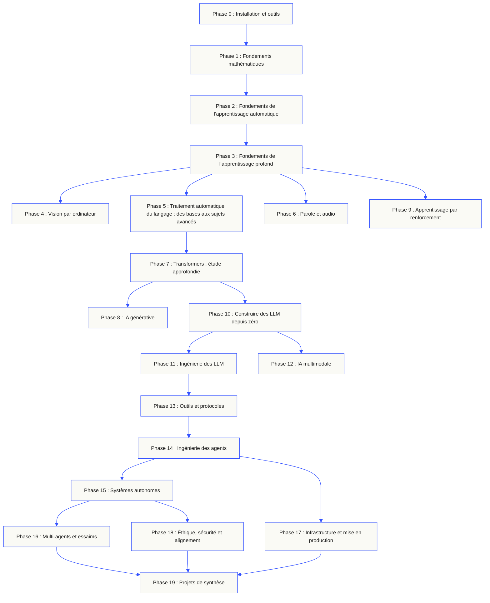

<p align="center"><sub>Traduction assistée par l’IA ; structure et terminologie vérifiées. La <a href="../../README.md">version anglaise fait foi</a> · <a href="https://aiengineeringfromscratch.com">aiengineeringfromscratch.com</a></sub></p>
<p align="center">
  
</p>

<p align="center">
  <a href="../../README.md">🇬🇧 English</a> ·
  <a href="../../i18n/zh/README.md">🇨🇳 简体中文</a> ·
  <a href="../../i18n/zh-TW/README.md">🇹🇼 繁體中文（台灣）</a> ·
  <a href="../../i18n/ja/README.md">🇯🇵 日本語</a> ·
  <a href="../../i18n/ko/README.md">🇰🇷 한국어</a> ·
  <a href="../../i18n/pt/README.md">🇵🇹 Português</a> ·
  <a href="../../i18n/pt-BR/README.md">🇧🇷 Português (Brasil)</a> ·
  <a href="../../i18n/es/README.md">🇪🇸 Español</a> ·
  <a href="../../i18n/de/README.md">🇩🇪 Deutsch</a> ·
  <a href="../../i18n/fr/README.md">🇫🇷 Français</a> ·
  <a href="../../i18n/it/README.md">🇮🇹 Italiano</a> ·
  <a href="../../i18n/nl/README.md">🇳🇱 Nederlands</a> ·
  <a href="../../i18n/pl/README.md">🇵🇱 Polski</a> ·
  <a href="../../i18n/cs/README.md">🇨🇿 Čeština</a> ·
  <a href="../../i18n/ro/README.md">🇷🇴 Română</a> ·
  <a href="../../i18n/hu/README.md">🇭🇺 Magyar</a> ·
  <a href="../../i18n/el/README.md">🇬🇷 Ελληνικά</a> ·
  <a href="../../i18n/sv/README.md">🇸🇪 Svenska</a> ·
  <a href="../../i18n/da/README.md">🇩🇰 Dansk</a> ·
  <a href="../../i18n/no/README.md">🇳🇴 Norsk</a> ·
  <a href="../../i18n/fi/README.md">🇫🇮 Suomi</a> ·
  <a href="../../i18n/ru/README.md">🇷🇺 Русский</a> ·
  <a href="../../i18n/uk/README.md">🇺🇦 Українська</a> ·
  <a href="../../i18n/tr/README.md">🇹🇷 Türkçe</a> ·
  <a href="../../i18n/he/README.md">🇮🇱 עברית</a> ·
  <a href="../../i18n/ar/README.md">🇸🇦 العربية</a> ·
  <a href="../../i18n/fa/README.md">🇮🇷 فارسی</a> ·
  <a href="../../i18n/hi/README.md">🇮🇳 हिन्दी</a> ·
  <a href="../../i18n/bn/README.md">🇧🇩 বাংলা</a> ·
  <a href="../../i18n/ur/README.md">🇵🇰 اردو</a> ·
  <a href="../../i18n/th/README.md">🇹🇭 ไทย</a> ·
  <a href="../../i18n/vi/README.md">🇻🇳 Tiếng Việt</a> ·
  <a href="../../i18n/id/README.md">🇮🇩 Bahasa Indonesia</a> ·
  <a href="../../i18n/tl/README.md">🇵🇭 Tagalog</a>
</p>

<p align="center">
  <a href="../../LICENSE"></a>
  <a href="../../ROADMAP.md"></a>
  <a href="#contents"></a>
  <a href="https://github.com/rohitg00/ai-engineering-from-scratch/stargazers"></a>
  <a href="https://aiengineeringfromscratch.com"></a>
  <p align="center">
 <a href="https://www.star-history.com/rohitg00/ai-engineering-from-scratch">
  <picture><source media="(prefers-color-scheme: dark)" srcset="https://api.star-history.com/badge?repo=rohitg00/ai-engineering-from-scratch&type=rank&theme=dark" /><source media="(prefers-color-scheme: light)" srcset="https://api.star-history.com/badge?repo=rohitg00/ai-engineering-from-scratch&type=rank" /></picture> <picture><source media="(prefers-color-scheme: dark)" srcset="https://api.star-history.com/badge?repo=rohitg00/ai-engineering-from-scratch&type=trending&theme=dark" /><source media="(prefers-color-scheme: light)" srcset="https://api.star-history.com/badge?repo=rohitg00/ai-engineering-from-scratch&type=trending" /></picture>
 </a>
</p>
</p>

### Sponsors

<p align="center">
  <a href="https://serpapi.com/ai-engineering-from-scratch"><picture><source media="(min-width: 768px)" srcset="../../assets/sponsors/serpapi-banner-compact.png" width="48%"></picture></a>
  <a href="https://nitrostack.ai/referral/aiengineeringfromscratch"><picture><source media="(min-width: 768px)" srcset="../../assets/sponsors/nitrostack-banner-equal.png" width="48%"></picture></a>
</p>

<p align="center">
  <sub><span>Votre soutien permet à chaque leçon de rester gratuite et open source.</span> <a href="#supporters">Voir tous les soutiens</a> · <a href="../../SPONSORS.md">Devenez un sponsor</a></sub>
</p>

```text
░░░▒▒▒░░░▒▒▒░░░▒▒▒░░░▒▒▒░░░▒▒▒░░░▒▒▒░░░▒▒▒░░░▒▒▒░░░▒▒▒░░░▒▒▒░░░▒▒▒░░░▒▒▒░░░▒▒▒░░░▒▒▒░░░▒▒▒
```

> **84 % des étudiants utilisent déjà des outils d'IA. Seuls 18 % se sentent prêts à les utiliser de façon professionnelle.** Ce cursus comble cet écart.
>
> 523 leçons. 20 phases. ~342 heures. Python, TypeScript, Rust, Julia. Chaque leçon livre un artefact réutilisable : un prompt, une skill, un agent, un serveur MCP. Gratuit, open source, MIT.
>
> Vous n'apprenez pas seulement l'IA. Vous la construisez. De bout en bout. À la main.

<!-- STATS:START (generated from site/stats.json by build.js — do not edit by hand) -->
<p align="center"><sub><b>114,584</b> lecteurs &nbsp;·&nbsp; <b>181,995</b> pages vues au cours des 30 derniers jours &nbsp;·&nbsp; à compter de 2026-08-29</sub></p>
<!-- STATS:END -->

## Commencez ici : choisissez ce que vous voulez construire

Vous n’avez pas besoin de parcourir les 523 leçons avant de commencer. Choisissez un objectif. Chaque lien ouvre le même programme sur GitHub ou sur le site Web, et les deux versions utilisent le même code de leçon.

| Votre objectif | Sur GitHub | Sur le site Web |
|---|---|---|
| Je débute et je veux acquérir toutes les bases | [Phase 0 : Installation et outils](../../phases/00-setup-and-tooling/) | [Environnement de développement](https://aiengineeringfromscratch.com/lesson?path=phases/00-setup-and-tooling/01-dev-environment) |
| Je connais Python et je veux acquérir des bases en mathématiques et en apprentissage automatique | [Phase 1 : Fondements mathématiques](../../phases/01-math-foundations/) | [Intuition de l’algèbre linéaire](https://aiengineeringfromscratch.com/lesson?path=phases/01-math-foundations/01-linear-algebra-intuition) |
| Je veux créer des applications LLM prêtes pour la production | [Phase 11 : Ingénierie des LLM](../../phases/11-llm-engineering/) | [Ingénierie des prompts](https://aiengineeringfromscratch.com/lesson?path=phases/11-llm-engineering/01-prompt-engineering) |
| Je veux créer des agents | [Phase 14 : Ingénierie des agents](../../phases/14-agent-engineering/) | [La boucle d’un agent](https://aiengineeringfromscratch.com/lesson?path=phases/14-agent-engineering/01-the-agent-loop) |
| Je veux utiliser des agents de programmation sur de vrais dépôts | [Parcours d’ingénierie assistée par des agents](../../learning-paths/using-coding-agents.json) | [Ingénierie assistée par des agents](https://aiengineeringfromscratch.com/lesson?path=phases/14-agent-engineering/31-agent-workbench-why-models-fail&learningPath=using-coding-agents) |
| Je veux définir la bonne solution avant de la mettre en œuvre | [Parcours de définition du produit et de livraison](../../learning-paths/shaping-the-build.json) | [Définir le produit et le livrer](https://aiengineeringfromscratch.com/lesson?path=phases/14-agent-engineering/47-outcomes-before-output&learningPath=shaping-the-build) |
| Je veux créer des applications avec le Model Context Protocol (MCP) | [Parcours Model Context Protocol (MCP)](../../phases/13-tools-and-protocols/README.md#model-context-protocol-mcp-path) | [Parcours Model Context Protocol (MCP)](https://aiengineeringfromscratch.com/lesson?path=phases/13-tools-and-protocols/06-mcp-fundamentals&learningPath=model-context-protocol) |
| Je veux écrire et publier des Agent Skills | [Parcours ciblé Agent Skills](../../phases/13-tools-and-protocols/README.md#agent-skills-fast-path) | [Parcours Agent Skills](https://aiengineeringfromscratch.com/lesson?path=phases/13-tools-and-protocols/22-skills-and-agent-sdks&learningPath=agent-skills) |
| Je veux préparer une certification Claude | [Guide de préparation à la certification](../../certifications/claude/GETTING_STARTED.md) | [Académie de certification](https://aiengineeringfromscratch.com/certifications.html) |
| Je veux préparer la certification MCP Associate (MCPA) | [Guide de préparation MCPA](../../certifications/mcpa/GETTING_STARTED.md) | [Parcours MCPA](https://aiengineeringfromscratch.com/certification?id=mcpa-f) |

Vous ne savez pas par où commencer ? Utilisez le [tuteur d’orientation `start-learning`](../../skills/start-learning/SKILL.md) ou consultez le [guide des prérequis du site Web](https://aiengineeringfromscratch.com/prereqs.html).

Comparez quatre grands domaines et six parcours professionnels dans les [parcours d’apprentissage en ingénierie de l’IA](https://aiengineeringfromscratch.com/learning-paths.html).

### Suivez chaque leçon de la même façon

1. **Lisez** `docs/en.md` et expliquez l’idée centrale avec vos propres mots.
2. **Saisissez et construisez** le code essentiel au lieu de traiter le bloc de code comme un simple ornement.
3. **Exécutez** la commande de la leçon depuis la racine du dépôt, c’est-à-dire le répertoire qui contient `README.md` et `phases/`.
4. **Conservez des preuves** : la commande, le répertoire de travail, le code de sortie, les résultats utiles et l’artefact modifié ou produit.
5. **Poursuivez** seulement lorsque vous savez expliquer le résultat et effectuer une petite modification sans tâtonner.

Les commandes indiquées dans les leçons utilisent des chemins relatifs à la racine du dépôt, sauf si la leçon demande explicitement de changer de répertoire. Si elle propose plusieurs langages, exécutez l’implémentation qui correspond au langage que vous apprenez.

### Clonez le dépôt et recueillez vos premières preuves

```bash
git clone https://github.com/rohitg00/ai-engineering-from-scratch.git
cd ai-engineering-from-scratch
python3 phases/00-setup-and-tooling/01-dev-environment/code/verify.py --route beginner
python3 phases/01-math-foundations/01-linear-algebra-intuition/code/vectors.py
```

La vérification préalable distingue les prérequis nécessaires immédiatement des outils utiles plus tard. Pour chaque prérequis manquant, elle indique la cause détectée et une commande de correction. La deuxième commande lance une leçon sans dépendances et montre, en conclusion, que le produit d’une matrice par un vecteur est l’opération effectuée dans une couche de réseau neuronal. Enregistrez cette sortie du terminal : ce sera votre première preuve.

## Installez le tuteur IA en 30 secondes

Si Node.js, `npx` et un agent de programmation compatible avec les skills sont déjà installés, vous pouvez en faire votre tuteur en deux commandes. Il n’est pas nécessaire de cloner le dépôt pour installer le tuteur ou consulter ses leçons. Les laboratoires des parcours ciblés nécessitent `python3`. Ceux d’Agent Skills requièrent aussi un hôte sélectionné et un emplacement utilisateur ou projet accessible en écriture.

Vérifiez d’abord que les outils nécessaires sont installés :

```bash
node --version
npx --version
python3 --version
```

Installez ensuite les skills du cursus. Lorsque l’installateur vous le demande, choisissez l’hôte et l’emplacement où vous souhaitez les utiliser :

```bash
npx skills add rohitg00/ai-engineering-from-scratch
```

La syntaxe d’invocation dépend de l’hôte, et non du format portable `SKILL.md` :

| Hôte | Démarrer le cours | Démarrer le parcours Model Context Protocol (MCP) | Démarrer le parcours Agent Skills | Faire le quiz de phase |
|---|---|---|---|---|
| Codex | `start-learning` ou sélectionnez-le dans `/skills` | `learn-mcp` ou sélectionnez-le dans `/skills` | `learn-agent-skills` ou sélectionnez-le dans `/skills` | `check-understanding 13` ou sélectionnez-le dans `/skills` |
| Claude Code | `/start-learning` | `/learn-mcp` | `/learn-agent-skills` | `/check-understanding 13` |
| Autres hôtes compatibles | `Use start-learning to begin the course.` | `Use learn-mcp to start the Model Context Protocol (MCP) path.` | `Use learn-agent-skills to start the Agent Skills Engineering path.` | `Use check-understanding to quiz me on Phase 13.` |

Un quiz d’orientation de dix questions détermine votre phase de départ à partir de vos connaissances et enregistre un plan personnalisé dans `LEARNING.md`. Ensuite, le skill `learn` enseigne une leçon par séance selon quatre étapes : concept, mathématiques, code et quiz. Il diffuse les leçons directement depuis ce dépôt ; le skill `course-guide` vous indique précisément quelle leçon consulter lorsque vous êtes bloqué. Dans Codex, lancez-les avec `learn` et `course-guide` ; dans Claude Code, utilisez `/learn` et `/course-guide`. Sur les autres hôtes compatibles, demandez le skill par son nom.

Vous ne souhaitez étudier que le Model Context Protocol (MCP) ? Utilisez l’invocation MCP correspondant à votre hôte. Le parcours crée `MCP-LEARNING.md` et suit 17 leçons sur les requêtes sans état, les transports, les opérations bidirectionnelles, la sécurité, la fiabilité, la gouvernance des registres et les preuves de conformité. L’ordre et les points de contrôle sont définis dans le [manifeste du parcours MCP](../../learning-paths/model-context-protocol.json).

Vous souhaitez étudier uniquement les Agent Skills ? Utilisez l’invocation correspondante à votre hôte. Le parcours crée `AGENT-SKILLS-LEARNING.md` et suit cinq leçons cohérentes : contrat, découverte, invocation, limites de la sandbox, puis évaluation avant publication et portabilité entre hôtes réels. Commencez sur le site avec le [parcours Agent Skills](https://aiengineeringfromscratch.com/lesson?path=phases/13-tools-and-protocols/22-skills-and-agent-sdks&learningPath=agent-skills).

L’installateur indique les hôtes qu’il peut configurer et vous demande où installer les skills. S’il vous manque encore Node.js, `npx`, `python3`, un hôte compatible ou un emplacement accessible en écriture, consultez le site ou lisez `docs/en.md`. Vous pourrez apprendre les concepts, mais les vérifications de découverte, d’invocation, d’exécution de scripts et de désinstallation sur un hôte réel devront attendre que ces prérequis soient réunis. Retrouvez les leçons sur [aiengineeringfromscratch.com](https://aiengineeringfromscratch.com).

## Comment ça marche

La plupart des ressources sur l’IA enseignent par fragments dispersés : un article de recherche ici, un billet sur le fine-tuning là, une démo d’agent spectaculaire ailleurs. Ces éléments s’assemblent rarement. Vous déployez un chatbot sans pouvoir expliquer sa courbe de perte. Vous reliez une fonction à un agent sans pouvoir expliquer le rôle de l’attention dans le modèle qui l’appelle.

Ce cursus fournit une structure cohérente : 20 phases, 523 leçons et quatre langages — Python, TypeScript, Rust et Julia. Des bases d’algèbre linéaire jusqu’aux essaims autonomes, chaque algorithme est d’abord reconstruit à partir des mathématiques : rétropropagation, tokeniseur, mécanisme d’attention, boucle d’agent. Lorsque PyTorch intervient, vous savez déjà ce qu’il fait en coulisses.

Chaque leçon suit la même démarche : lire le problème, établir les équations, écrire le code, exécuter les tests et conserver l’artefact. Pas de vidéos de cinq minutes, de déploiements par copier-coller ni d’explications prémâchées. Le cursus est gratuit, open source et conçu pour fonctionner sur votre ordinateur.

```text
░░░▒▒▒░░░▒▒▒░░░▒▒▒░░░▒▒▒░░░▒▒▒░░░▒▒▒░░░▒▒▒░░░▒▒▒░░░▒▒▒░░░▒▒▒░░░▒▒▒░░░▒▒▒░░░▒▒▒░░░▒▒▒░░░▒▒▒
```

## La structure du cursus

Les vingt phases s’appuient les unes sur les autres. Les mathématiques en forment les fondations ; les agents et la mise en production, le sommet. Si vous maîtrisez déjà les couches inférieures, vous pouvez avancer. Mais si vous les sautez, ne vous étonnez pas que les notions avancées vous échappent.



```text
░░░▒▒▒░░░▒▒▒░░░▒▒▒░░░▒▒▒░░░▒▒▒░░░▒▒▒░░░▒▒▒░░░▒▒▒░░░▒▒▒░░░▒▒▒░░░▒▒▒░░░▒▒▒░░░▒▒▒░░░▒▒▒░░░▒▒▒
```

## La structure d’une leçon

Chaque leçon se trouve dans son propre dossier et suit la même structure dans tout le cursus :

```text
phases/<NN>-<phase-name>/<NN>-<lesson-name>/
├── code/      implémentations exécutables (Python, TypeScript, Rust, Julia)
├── docs/
│   └── en.md  texte pédagogique de la leçon
└── outputs/   prompts, skills, agents ou serveurs MCP produits par cette leçon
```

Chaque leçon suit six étapes. La séquence *Build It / Use It* en est le cœur : vous implémentez d’abord l’algorithme depuis zéro, puis vous exécutez la même opération avec la bibliothèque utilisée en production. Comme vous avez écrit vous-même une version simplifiée, vous comprenez ce que fait le framework.

```mermaid
%%{init: {'theme':'base','themeVariables':{'primaryColor':'#fafaf5','primaryTextColor':'#1a1a1a','primaryBorderColor':'#3553ff','lineColor':'#3553ff','fontFamily':'JetBrains Mono','fontSize':'13px'}}}%%
flowchart LR
  M["IDÉE CLÉ<br/><sub>le principe en une phrase</sub>"] --> Pr["PROBLÈME<br/><sub>une difficulté concrète</sub>"]
  Pr --> C["NOTION<br/><sub>schémas et intuition</sub>"]
  C --> B["CONSTRUIRE<br/><sub>les mathématiques, sans framework</sub>"]
  B --> U["UTILISER<br/><sub>la même chose dans PyTorch / sklearn</sub>"]
  U --> S["PUBLIER<br/><sub>invite · compétence · agent · MCP</sub>"]
```



## Premiers pas

Trois façons de commencer. Choisissez celle qui vous convient.

**Option A — apprendre dans le terminal *(recommandé)*.** Après avoir vérifié Node.js, `npx`, l’hôte et l’emplacement d’installation ci-dessus, installez les skills d’apprentissage dans un agent compatible et laissez le cours vous guider :

```bash
npx skills add rohitg00/ai-engineering-from-scratch
```

Utilisez la ligne de votre hôte dans le tableau ci-dessus. Les skills `start-learning`, `learn` et `course-guide`, ainsi que les parcours ciblés `learn-mcp` et `learn-agent-skills`, peuvent diffuser les leçons depuis ce dépôt sans clone local. Il vous faudra toutefois cloner le dépôt pour exécuter les exemples de code des leçons et les commandes MCP. Les progrès sont enregistrés dans `LEARNING.md`, `MCP-LEARNING.md` ou `AGENT-SKILLS-LEARNING.md` dans votre projet, afin que vous puissiez reprendre à la séance suivante.

**Option B — lire sur le site.** Ouvrez la leçon de votre choix sur [aiengineeringfromscratch.com](https://aiengineeringfromscratch.com) ou développez une phase dans le [sommaire](#contents). Aucun réglage ni clonage n’est nécessaire.

**Option C — cloner le dépôt et exécuter le code.**

```bash
git clone https://github.com/rohitg00/ai-engineering-from-scratch.git
cd ai-engineering-from-scratch
python3 phases/01-math-foundations/01-linear-algebra-intuition/code/vectors.py
```

Le clonage installe aussi automatiquement les skills d’apprentissage dans Claude Code et permet au tuteur `learn` d’exécuter le code des leçons au lieu de simplement le lire.

### Prérequis

- Vous savez écrire du code, dans n’importe quel langage (Python est utile).
- Vous voulez comprendre comment l’IA **fonctionne vraiment**, pas seulement appeler des API.

### Préparez-vous aux certifications Claude

La [Claude Certification Academy](../../certifications/claude/README.md) est un programme de préparation gratuit et open source pour les quatre certifications Claude officielles : Associate Foundations, Developer Foundations, Architect Foundations et Architect Professional. Chaque parcours associe des leçons alignées sur le référentiel, des laboratoires exécutables, un diagnostic, un projet de synthèse et un examen blanc original en conditions complètes.

Suivez le [guide de démarrage GitHub avec un assistant IA](../../certifications/claude/GETTING_STARTED.md) avec Claude Code, Codex, ChatGPT, Cursor ou un autre agent. Lancez `claude-certification` dans Codex, `/claude-certification` dans Claude Code, ou demandez à un autre hôte d’utiliser `claude-certification`. Le skill vous fait choisir un parcours, crée une feuille de route persistante dans `CLAUDE-CERTIFICATION.md`, enseigne une étape à la fois, lance les vrais laboratoires et fournit un retour fondé sur vos artefacts. Le même programme est disponible sur le [site des certifications](https://aiengineeringfromscratch.com/certifications.html).

L’Academy est un support d’étude indépendant fondé sur les objectifs d’examen publics. Elle n’est affiliée ni à Anthropic ni à ses certifications, ne reproduit pas de questions d’examens en cours et ne garantit pas la réussite.

### Préparez-vous à la certification MCP Associate (MCPA)

Le [programme de certification MCPA](../../certifications/mcpa/README.md) prépare gratuitement et en open source à l’examen MCP Associate de l’Agentic AI Foundation, proposé par Linux Foundation Training. Ses 34 leçons enseignent le protocole sans état du 2026-07-28 et couvrent les cinq domaines de l’examen : `_meta` par requête et `server/discover` à la place de l’ancien handshake, les requêtes en plusieurs allers-retours, les abonnements et la mise en cache, les extensions Tasks et MCP Apps, l’autorisation OAuth, ainsi que les niveaux registre et SDK. Chaque leçon comprend un laboratoire exécutable avec la bibliothèque standard, dont la transcription est vérifiée selon le format actuel du protocole. Le parcours ajoute un diagnostic, un projet de synthèse et trois examens blancs originaux en conditions complètes, dont les questions suivent les pondérations du référentiel publié.

Suivez le [guide de démarrage GitHub avec un assistant IA](../../certifications/mcpa/GETTING_STARTED.md) avec Claude Code, Codex, ChatGPT, Cursor ou un autre agent. Lancez `mcpa-certification` dans Codex, `/mcpa-certification` dans Claude Code, ou demandez à un autre hôte d’utiliser `mcpa-certification`. Le skill crée une feuille de route persistante dans `MCPA-CERTIFICATION.md`, enseigne une étape à la fois, lance les vrais laboratoires et fournit un retour fondé sur vos artefacts. Consultez la [page du parcours MCPA](https://aiengineeringfromscratch.com/certification?id=mcpa-f).

Ce programme est un support d’étude indépendant fondé sur les objectifs d’examen publics. Il n’est affilié ni à l’Agentic AI Foundation ni à Linux Foundation, ne reproduit pas les questions d’examens en cours et ne garantit pas la réussite.

### Les skills d’apprentissage

| Compétence | Fonction |
|---|---|
| [`start-learning`](../../skills/start-learning/SKILL.md) | Bilan de départ : vos objectifs, un quiz d’orientation et un plan personnalisé enregistré dans `LEARNING.md`. |
| [`learn`](../../skills/learn/SKILL.md) | Le cycle du tuteur : bref rappel, enseignement interactif de la leçon suivante, puis quiz ; suivi des progrès et liste de révision à l’appui. |
| [`course-guide`](../../skills/course-guide/SKILL.md) | Orientez vos questions vers les leçons pertinentes : « Où apprendre l’attention ? » ou « ma fonction de perte vaut NaN » mène aux cours exacts et à leurs liens. |
| [`learn-mcp`](../../skills/learn-mcp/SKILL.md) | Tuteur dédié au Model Context Protocol (MCP). Crée `MCP-LEARNING.md`, suit le manifeste des 17 leçons et consigne les preuves relatives au protocole, à la sécurité, à la fiabilité et à la conformité. |
| [`learn-agent-skills`](../../skills/learn-agent-skills/SKILL.md) | Tuteur dédié aux Agent Skills. Crée `AGENT-SKILLS-LEARNING.md`, enseigne les leçons 22, 24, 25, 26 et 27 et consigne les preuves recueillies sur un hôte réel. |
| [`claude-certification`](../../skills/claude-certification/SKILL.md) | Tuteur de certification. Choisit CCAO-F, CCDV-F, CCAR-F ou CCAR-P ; enseigne les leçons, lance les laboratoires, examine les artefacts, propose les diagnostics et examens blancs, puis enregistre les progrès. |
| [`mcpa-certification`](../../skills/mcpa-certification/SKILL.md) | Tuteur MCPA. Suit le parcours `mcpa-f` de 34 leçons sur le protocole du 2026-07-28 ; enseigne chaque leçon, lance les laboratoires et le vérificateur de protocole, organise le diagnostic et trois examens blancs, puis enregistre les progrès. |
| [`find-your-level`](../../skills/find-your-level/SKILL.md) | Quiz d’orientation de dix questions qui détermine une phase de départ à partir de vos connaissances et crée un parcours personnalisé avec une estimation du temps requis. |
| [`check-understanding <phase>`](../../skills/check-understanding/SKILL.md) | Quiz de phase en huit questions, avec commentaires et indications précises sur les leçons à revoir. Utilisez la syntaxe de Codex ou Claude Code, ou la formulation en langage naturel du tableau ci-dessus. |

```text
░░░▒▒▒░░░▒▒▒░░░▒▒▒░░░▒▒▒░░░▒▒▒░░░▒▒▒░░░▒▒▒░░░▒▒▒░░░▒▒▒░░░▒▒▒░░░▒▒▒░░░▒▒▒░░░▒▒▒░░░▒▒▒░░░▒▒▒
```

## Lisez le cursus de base comme un livre

Le cursus de base en 20 phases, dans `phases/`, est également publié sous forme d’une série de six livres. Les éditions EPUB et PDF sont générées par l’intégration continue à partir des mêmes leçons et jointes à chaque [publication GitHub](https://github.com/rohitg00/ai-engineering-from-scratch/releases) ; les liens ci-dessous pointent toujours vers la dernière édition. Les numéros identifient les volumes, et non les versions : chaque exemplaire porte la date de son édition et les éditions précédentes restent téléchargeables depuis leur publication.

Les programmes de certification ne sont pas transformés en livres : le tutorat IA, les laboratoires exécutables, les figures interactives, les diagnostics et les examens blancs chronométrés restent accessibles en priorité sur GitHub et sur le site.

| Vol. | Titre | Phases | Télécharger |
|-----|-------|--------|----------|
| 1 | Fondements · Mathématiques, outils et apprentissage automatique classique | 00-02 | [Le projet](https://github.com/rohitg00/ai-engineering-from-scratch/releases/latest/download/aiefs-vol1-foundations.epub) · [Le format PDF](https://github.com/rohitg00/ai-engineering-from-scratch/releases/latest/download/aiefs-vol1-foundations.pdf) |
| 2 | Apprentissage profond · Réseaux, vision et parole | 03, 04, 06 | [Le projet](https://github.com/rohitg00/ai-engineering-from-scratch/releases/latest/download/aiefs-vol2-deep-learning.epub) · [Le format PDF](https://github.com/rohitg00/ai-engineering-from-scratch/releases/latest/download/aiefs-vol2-deep-learning.pdf) |
| 3 | Langage · Fondements du NLP et transformers | 05, 07 | [Le projet](https://github.com/rohitg00/ai-engineering-from-scratch/releases/latest/download/aiefs-vol3-language.epub) · [Le format PDF](https://github.com/rohitg00/ai-engineering-from-scratch/releases/latest/download/aiefs-vol3-language.pdf) |
| 4 | Grands modèles de langage · Génération, renforcement, préentraînement et ingénierie | 08-11 | [Le projet](https://github.com/rohitg00/ai-engineering-from-scratch/releases/latest/download/aiefs-vol4-llms.epub) · [Le format PDF](https://github.com/rohitg00/ai-engineering-from-scratch/releases/latest/download/aiefs-vol4-llms.pdf) |
| 5 | Agents · Multimodalité, protocoles, autonomie et essaims | 12-16 | [Le projet](https://github.com/rohitg00/ai-engineering-from-scratch/releases/latest/download/aiefs-vol5-agents.epub) · [Le format PDF](https://github.com/rohitg00/ai-engineering-from-scratch/releases/latest/download/aiefs-vol5-agents.pdf) |
| 6 | Production · Infrastructure, sécurité et projets de synthèse | 17-19 | [Le projet](https://github.com/rohitg00/ai-engineering-from-scratch/releases/latest/download/aiefs-vol6-production.epub) · [Le format PDF](https://github.com/rohitg00/ai-engineering-from-scratch/releases/latest/download/aiefs-vol6-production.pdf) |

Le livre est un instantané ; ce dépôt est l’édition vivante. Chaque chapitre renvoie aux figures animées de la leçon, au quiz et au code exécutable. Pour générer les livres en local, exécutez `python3 scripts/build_book.py` (Pandoc est requis). Le pipeline est décrit dans [book/README.md](../../book/README.md).

```text
░░░▒▒▒░░░▒▒▒░░░▒▒▒░░░▒▒▒░░░▒▒▒░░░▒▒▒░░░▒▒▒░░░▒▒▒░░░▒▒▒░░░▒▒▒░░░▒▒▒░░░▒▒▒░░░▒▒▒░░░▒▒▒░░░▒▒▒
```

## Chaque leçon produit un artefact

Les autres cursus se terminent par : *« Félicitations, vous avez appris X. »* Ici, chaque leçon débouche sur un **outil réutilisable** que vous pouvez installer ou intégrer à votre travail quotidien.

<table>
<tr>
<th align="left" width="25%"><br/><sub>FIG_001 · A</sub><br/><b>INVITES</b></th>
<th align="left" width="25%"><br/><sub>FIG_001 · B</sub><br/><b>COMPÉTENCES</b></th>
<th align="left" width="25%"><br/><sub>FIG_001 · C</sub><br/><b>AGENTS AUTONOMES</b></th>
<th align="left" width="25%"><br/><sub>FIG_001 · D</sub><br/><b>SERVEURS MCP</b></th>
</tr>
<tr>
<td valign="top">Collez le prompt dans n’importe quel assistant IA pour obtenir une aide experte sur une tâche précise.</td>
<td valign="top">Installez la skill dans Claude, Cursor, Codex, OpenClaw, Hermes ou tout agent qui lit <code>SKILL.md</code>.</td>
<td valign="top">Déployez-le comme travailleur autonome : vous avez écrit la boucle vous-même en phase 14.</td>
<td valign="top">Connectez-le à n’importe quel client compatible MCP. Le serveur est construit de bout en bout en phase 13.</td>
</tr>
</table>

> Installez l’ensemble avec `python3 scripts/install_skills.py <target>`. En fin de cursus, vous disposerez de 523 artefacts que vous comprendrez vraiment, puisque vous les aurez construits.

### FIG_002 · Exemple détaillé

Phase 14, leçon 1 : la boucle d’agent. Environ 120 lignes de Python pur, sans dépendance.

<table>
<tr>
<td valign="top" width="50%">

**`code/agent_loop.py`** &nbsp; <sub><i>construire</i></sub>

```python
def run(query, tools):
    history = [user(query)]
    for step in range(MAX_STEPS):
        msg = llm(history)
        if msg.tool_calls:
            for call in msg.tool_calls:
                result = tools[call.name](**call.args)
                history.append(tool_result(call.id, result))
            continue
        return msg.content
    raise StepLimitExceeded
```

</td>
<td valign="top" width="50%">

**`outputs/skill-agent-loop.md`** &nbsp; <sub><i>déployer</i></sub>

```markdown
---
name: agent-loop
description: ReAct-style loop for any tool list
phase: 14
lesson: 01
---

Implement a minimal agent loop that...
```

**`outputs/prompt-debug-agent.md`**

```markdown
You are an agent debugger. Given the trace
of an agent run, identify the step where
the agent went wrong and explain why...
```

</td>
</tr>
</table>

```text
░░░▒▒▒░░░▒▒▒░░░▒▒▒░░░▒▒▒░░░▒▒▒░░░▒▒▒░░░▒▒▒░░░▒▒▒░░░▒▒▒░░░▒▒▒░░░▒▒▒░░░▒▒▒░░░▒▒▒░░░▒▒▒░░░▒▒▒
```

<a id="contents"></a>

## Sommaire

Cliquez sur une phase pour développer la liste de ses leçons.

<a id="phase-0"></a>
### Phase 0 : Installation et outils `12 leçons`
> Préparez votre environnement pour la suite.

| # | Leçon | Type | Langage |
|:---:|--------|:----:|------|
| 01 | [Environnement de développement](../../phases/00-setup-and-tooling/01-dev-environment/) | Construire | Python |
| 02 | [Git et collaboration](../../phases/00-setup-and-tooling/02-git-and-collaboration/) | Apprendre | — |
| 03 | [Configuration GPU et cloud](../../phases/00-setup-and-tooling/03-gpu-setup-and-cloud/) | Construire | Python |
| 04 | [API et clés d’accès](../../phases/00-setup-and-tooling/04-apis-and-keys/) | Construire | Python |
| 05 | [Notebooks Jupyter](../../phases/00-setup-and-tooling/05-jupyter-notebooks/) | Construire | Python |
| 06 | [Environnements Python](../../phases/00-setup-and-tooling/06-python-environments/) | Construire | Shell |
| 07 | [Docker pour l’IA](../../phases/00-setup-and-tooling/07-docker-for-ai/) | Construire | Docker |
| 08 | [Configuration de l’éditeur](../../phases/00-setup-and-tooling/08-editor-setup/) | Construire | — |
| 09 | [Gestion des données](../../phases/00-setup-and-tooling/09-data-management/) | Construire | Python |
| 10 | [Terminal et shell](../../phases/00-setup-and-tooling/10-terminal-and-shell/) | Apprendre | — |
| 11 | [Linux pour l’IA](../../phases/00-setup-and-tooling/11-linux-for-ai/) | Apprendre | — |
| 12 | [Débogage et profilage](../../phases/00-setup-and-tooling/12-debugging-and-profiling/) | Construire | Python |

<details id="phase-1">
<summary><b>Phase 1 — Fondements mathématiques</b> &nbsp;<code>22 leçons</code>&nbsp; <em>Comprendre l’intuition derrière les algorithmes d’IA grâce au code.</em></summary>
<br/>

| # | Leçon | Type | Langage |
|:---:|--------|:----:|------|
| 01 | [Intuition de l’algèbre linéaire](../../phases/01-math-foundations/01-linear-algebra-intuition/) | Apprendre | Python, Julia |
| 02 | [Vecteurs, matrices et opérations](../../phases/01-math-foundations/02-vectors-matrices-operations/) | Construire | Python, Julia |
| 03 | [Transformations matricielles et valeurs propres](../../phases/01-math-foundations/03-matrix-transformations/) | Construire | Python, Julia |
| 04 | [Calcul pour l’apprentissage automatique : dérivées et gradients](../../phases/01-math-foundations/04-calculus-for-ml/) | Apprendre | Python |
| 05 | [Règle de la chaîne et différentiation automatique](../../phases/01-math-foundations/05-chain-rule-and-autodiff/) | Construire | Python |
| 06 | [Probabilités et distributions](../../phases/01-math-foundations/06-probability-and-distributions/) | Apprendre | Python |
| 07 | [Théorème de Bayes et raisonnement statistique](../../phases/01-math-foundations/07-bayes-theorem/) | Construire | Python |
| 08 | [Optimisation : méthodes de descente de gradient](../../phases/01-math-foundations/08-optimization/) | Construire | Python |
| 09 | [Théorie de l’information : entropie et divergence KL](../../phases/01-math-foundations/09-information-theory/) | Apprendre | Python |
| 10 | [Réduction de dimension : PCA, t-SNE et UMAP](../../phases/01-math-foundations/10-dimensionality-reduction/) | Construire | Python |
| 11 | [Décomposition en valeurs singulières](../../phases/01-math-foundations/11-singular-value-decomposition/) | Construire | Python, Julia |
| 12 | [Opérations sur les tenseurs](../../phases/01-math-foundations/12-tensor-operations/) | Construire | Python |
| 13 | [Stabilité numérique](../../phases/01-math-foundations/13-numerical-stability/) | Construire | Python |
| 14 | [Normes et distances](../../phases/01-math-foundations/14-norms-and-distances/) | Construire | Python |
| 15 | [Statistiques pour l’apprentissage automatique](../../phases/01-math-foundations/15-statistics-for-ml/) | Construire | Python |
| 16 | [Méthodes d’échantillonnage](../../phases/01-math-foundations/16-sampling-methods/) | Construire | Python |
| 17 | [Systèmes linéaires](../../phases/01-math-foundations/17-linear-systems/) | Construire | Python |
| 18 | [Optimisation convexe](../../phases/01-math-foundations/18-convex-optimization/) | Construire | Python |
| 19 | [Nombres complexes pour l’IA](../../phases/01-math-foundations/19-complex-numbers/) | Apprendre | Python |
| 20 | [Transformée de Fourier](../../phases/01-math-foundations/20-fourier-transform/) | Construire | Python |
| 21 | [Théorie des graphes pour l’apprentissage automatique](../../phases/01-math-foundations/21-graph-theory/) | Construire | Python |
| 22 | [Processus stochastiques](../../phases/01-math-foundations/22-stochastic-processes/) | Apprendre | Python |

</details>

<details id="phase-2">
<summary><b>Phase 2 — Fondements de l’apprentissage automatique</b> &nbsp;<code>18 leçons</code>&nbsp; <em>L’apprentissage automatique classique reste au cœur de la plupart des systèmes d’IA en production.</em></summary>
<br/>

| # | Leçon | Type | Langage |
|:---:|--------|:----:|------|
| 01 | [Qu’est-ce que l’apprentissage automatique ?](../../phases/02-ml-fundamentals/01-what-is-machine-learning/) | Apprendre | Python |
| 02 | [Régression linéaire depuis zéro](../../phases/02-ml-fundamentals/02-linear-regression/) | Construire | Python |
| 03 | [Régression logistique et classification](../../phases/02-ml-fundamentals/03-logistic-regression/) | Construire | Python |
| 04 | [Arbres de décision et forêts aléatoires](../../phases/02-ml-fundamentals/04-decision-trees/) | Construire | Python |
| 05 | [Machines à vecteurs de support](../../phases/02-ml-fundamentals/05-support-vector-machines/) | Construire | Python |
| 06 | [KNN et métriques de distance](../../phases/02-ml-fundamentals/06-knn-and-distances/) | Construire | Python |
| 07 | [Apprentissage non supervisé : K-means et DBSCAN](../../phases/02-ml-fundamentals/07-unsupervised-learning/) | Construire | Python |
| 08 | [Ingénierie et sélection des caractéristiques](../../phases/02-ml-fundamentals/08-feature-engineering/) | Construire | Python |
| 09 | [Évaluation des modèles : métriques et validation croisée](../../phases/02-ml-fundamentals/09-model-evaluation/) | Construire | Python |
| 10 | [Biais, variance et courbe d’apprentissage](../../phases/02-ml-fundamentals/10-bias-variance/) | Apprendre | Python |
| 11 | [Méthodes d’ensemble : boosting, bagging et stacking](../../phases/02-ml-fundamentals/11-ensemble-methods/) | Construire | Python |
| 12 | [Réglage des hyperparamètres](../../phases/02-ml-fundamentals/12-hyperparameter-tuning/) | Construire | Python |
| 13 | [Pipelines de ML et suivi des expériences](../../phases/02-ml-fundamentals/13-ml-pipelines/) | Construire | Python |
| 14 | [Bayes naïf](../../phases/02-ml-fundamentals/14-naive-bayes/) | Construire | Python |
| 15 | [Fondements des séries temporelles](../../phases/02-ml-fundamentals/15-time-series/) | Construire | Python |
| 16 | [Détection des anomalies](../../phases/02-ml-fundamentals/16-anomaly-detection/) | Construire | Python |
| 17 | [Gestion des données déséquilibrées](../../phases/02-ml-fundamentals/17-imbalanced-data/) | Construire | Python |
| 18 | [Sélection des caractéristiques](../../phases/02-ml-fundamentals/18-feature-selection/) | Construire | Python |

</details>

<details id="phase-3">
<summary><b>Phase 3 — Fondements de l’apprentissage profond</b> &nbsp;<code>13 leçons</code>&nbsp; <em>Construire des réseaux de neurones à partir des principes de base, sans framework avant d’en avoir implémenté un.</em></summary>
<br/>

| # | Leçon | Type | Langage |
|:---:|--------|:----:|------|
| 01 | [Le perceptron : aux origines](../../phases/03-deep-learning-core/01-the-perceptron/) | Construire | Python |
| 02 | [Réseaux multicouches et propagation avant](../../phases/03-deep-learning-core/02-multi-layer-networks/) | Construire | Python |
| 03 | [Rétropropagation depuis zéro](../../phases/03-deep-learning-core/03-backpropagation/) | Construire | Python |
| 04 | [Fonctions d’activation : ReLU, sigmoïde, GELU et leur rôle](../../phases/03-deep-learning-core/04-activation-functions/) | Construire | Python |
| 05 | [Fonctions de perte : MSE, entropie croisée et perte contrastive](../../phases/03-deep-learning-core/05-loss-functions/) | Construire | Python |
| 06 | [Optimiseurs : SGD, momentum, Adam et AdamW](../../phases/03-deep-learning-core/06-optimizers/) | Construire | Python |
| 07 | [Régularisation : dropout, décroissance des poids et BatchNorm](../../phases/03-deep-learning-core/07-regularization/) | Construire | Python |
| 08 | [Initialisation des poids et stabilité de l’entraînement](../../phases/03-deep-learning-core/08-weight-initialization/) | Construire | Python |
| 09 | [Programmes de taux d’apprentissage et warmup](../../phases/03-deep-learning-core/09-learning-rate-schedules/) | Construire | Python |
| 10 | [Construisez votre propre mini-framework](../../phases/03-deep-learning-core/10-mini-framework/) | Construire | Python |
| 11 | [Introduction à PyTorch](../../phases/03-deep-learning-core/11-intro-to-pytorch/) | Construire | Python |
| 12 | [Introduction à JAX](../../phases/03-deep-learning-core/12-intro-to-jax/) | Construire | Python |
| 13 | [Débogage des réseaux de neurones](../../phases/03-deep-learning-core/13-debugging-neural-networks/) | Construire | Python |

</details>

<details id="phase-4">
<summary><b>Phase 4 — Vision par ordinateur</b> &nbsp;<code>28 leçons</code>&nbsp; <em>Des pixels à la compréhension : images, vidéos, 3D, modèles vision-langage et modèles du monde.</em></summary>
<br/>

| # | Leçon | Type | Langage |
|:---:|--------|:----:|------|
| 01 | [Fondamentaux de l’image : pixels, canaux et espaces colorimétriques](../../phases/04-computer-vision/01-image-fundamentals/) | Apprendre | Python |
| 02 | [Convolutions depuis zéro](../../phases/04-computer-vision/02-convolutions-from-scratch/) | Construire | Python |
| 03 | [CNN : de LeNet à ResNet](../../phases/04-computer-vision/03-cnns-lenet-to-resnet/) | Construire | Python |
| 04 | [Classification d’images](../../phases/04-computer-vision/04-image-classification/) | Construire | Python |
| 05 | [Transfert d’apprentissage et fine-tuning](../../phases/04-computer-vision/05-transfer-learning/) | Construire | Python |
| 06 | [Détection d’objets : YOLO depuis zéro](../../phases/04-computer-vision/06-object-detection-yolo/) | Construire | Python |
| 07 | [Segmentation sémantique : U-Net](../../phases/04-computer-vision/07-semantic-segmentation-unet/) | Construire | Python |
| 08 | [Segmentation d’instances : Mask R-CNN](../../phases/04-computer-vision/08-instance-segmentation-mask-rcnn/) | Construire | Python |
| 09 | [Génération d’images : GAN](../../phases/04-computer-vision/09-image-generation-gans/) | Construire | Python |
| 10 | [Génération d’images : modèles de diffusion](../../phases/04-computer-vision/10-image-generation-diffusion/) | Construire | Python |
| 11 | [Stable Diffusion : architecture et fine-tuning](../../phases/04-computer-vision/11-stable-diffusion/) | Construire | Python |
| 12 | [Compréhension vidéo : modélisation temporelle](../../phases/04-computer-vision/12-video-understanding/) | Construire | Python |
| 13 | [Vision 3D : nuages de points et NeRF](../../phases/04-computer-vision/13-3d-vision-nerf/) | Construire | Python |
| 14 | [Transformers de vision (ViT)](../../phases/04-computer-vision/14-vision-transformers/) | Construire | Python |
| 15 | [Vision en temps réel : déploiement en périphérie](../../phases/04-computer-vision/15-real-time-edge/) | Construire | Python |
| 16 | [Construisez un pipeline de vision complet](../../phases/04-computer-vision/16-vision-pipeline-capstone/) | Construire | Python |
| 17 | [Vision auto-supervisée : SimCLR, DINO et MAE](../../phases/04-computer-vision/17-self-supervised-vision/) | Construire | Python |
| 18 | [Vision à vocabulaire ouvert : CLIP](../../phases/04-computer-vision/18-open-vocab-clip/) | Construire | Python |
| 19 | [OCR et compréhension de documents](../../phases/04-computer-vision/19-ocr-document-understanding/) | Construire | Python |
| 20 | [Recherche d’images et apprentissage métrique](../../phases/04-computer-vision/20-image-retrieval-metric/) | Construire | Python |
| 21 | [Détection de points clés et estimation de pose](../../phases/04-computer-vision/21-keypoint-pose/) | Construire | Python |
| 22 | [Gaussian splatting 3D depuis zéro](../../phases/04-computer-vision/22-3d-gaussian-splatting/) | Construire | Python |
| 23 | [Transformers de diffusion et rectified flow](../../phases/04-computer-vision/23-diffusion-transformers-rectified-flow/) | Construire | Python |
| 24 | [SAM 3 et segmentation à vocabulaire ouvert](../../phases/04-computer-vision/24-sam3-open-vocab-segmentation/) | Construire | Python |
| 25 | [Modèles vision-langage (ViT-MLP-LLM)](../../phases/04-computer-vision/25-vision-language-models/) | Construire | Python |
| 26 | [Estimation de la profondeur monoculaire et de la géométrie](../../phases/04-computer-vision/26-monocular-depth/) | Construire | Python |
| 27 | [Suivi multi-objets et mémoire vidéo](../../phases/04-computer-vision/27-multi-object-tracking/) | Construire | Python |
| 28 | [Modèles du monde et diffusion vidéo](../../phases/04-computer-vision/28-world-models-video-diffusion/) | Construire | Python |

</details>

<details id="phase-5">
<summary><b>Phase 5 — Traitement automatique du langage : des bases aux sujets avancés</b> &nbsp;<code>29 leçons</code>&nbsp; <em>Le langage est l’interface de l’intelligence.</em></summary>
<br/>

| # | Leçon | Type | Langage |
|:---:|--------|:----:|------|
| 01 | [Traitement du texte : tokenisation, stemming et lemmatisation](../../phases/05-nlp-foundations-to-advanced/01-text-processing/) | Construire | Python |
| 02 | [Bag-of-words, TF-IDF et représentation du texte](../../phases/05-nlp-foundations-to-advanced/02-bag-of-words-tfidf/) | Construire | Python |
| 03 | [Représentations vectorielles des mots : Word2Vec depuis zéro](../../phases/05-nlp-foundations-to-advanced/03-word-embeddings-word2vec/) | Construire | Python |
| 04 | [GloVe, FastText et représentations de sous-mots](../../phases/05-nlp-foundations-to-advanced/04-glove-fasttext-subword/) | Construire | Python |
| 05 | [Analyse des sentiments](../../phases/05-nlp-foundations-to-advanced/05-sentiment-analysis/) | Construire | Python |
| 06 | [Reconnaissance d’entités nommées (NER)](../../phases/05-nlp-foundations-to-advanced/06-named-entity-recognition/) | Construire | Python |
| 07 | [Étiquetage morphosyntaxique et analyse syntaxique](../../phases/05-nlp-foundations-to-advanced/07-pos-tagging-parsing/) | Construire | Python |
| 08 | [Classification de texte : CNN et RNN pour le texte](../../phases/05-nlp-foundations-to-advanced/08-cnns-rnns-for-text/) | Construire | Python |
| 09 | [Modèles séquence-à-séquence](../../phases/05-nlp-foundations-to-advanced/09-sequence-to-sequence/) | Construire | Python |
| 10 | [Mécanisme d’attention : la percée décisive](../../phases/05-nlp-foundations-to-advanced/10-attention-mechanism/) | Construire | Python |
| 11 | [Traduction automatique](../../phases/05-nlp-foundations-to-advanced/11-machine-translation/) | Construire | Python |
| 12 | [Résumé automatique de texte](../../phases/05-nlp-foundations-to-advanced/12-text-summarization/) | Construire | Python |
| 13 | [Systèmes de questions-réponses](../../phases/05-nlp-foundations-to-advanced/13-question-answering/) | Construire | Python |
| 14 | [Recherche et extraction d’informations](../../phases/05-nlp-foundations-to-advanced/14-information-retrieval-search/) | Construire | Python |
| 15 | [Modélisation de thèmes : LDA et BERTopic](../../phases/05-nlp-foundations-to-advanced/15-topic-modeling/) | Construire | Python |
| 16 | [Génération de texte avant les transformers](../../phases/05-nlp-foundations-to-advanced/16-text-generation-pre-transformer/) | Construire | Python |
| 17 | [Chatbots : des règles aux réseaux de neurones](../../phases/05-nlp-foundations-to-advanced/17-chatbots-rule-to-neural/) | Construire | Python |
| 18 | [Traitement automatique multilingue du langage (NLP)](../../phases/05-nlp-foundations-to-advanced/18-multilingual-nlp/) | Construire | Python |
| 19 | [Tokenisation de sous-mots : BPE, WordPiece, Unigram et SentencePiece](../../phases/05-nlp-foundations-to-advanced/19-subword-tokenization/) | Apprendre | Python |
| 20 | [Sorties structurées et décodage contraint](../../phases/05-nlp-foundations-to-advanced/20-structured-outputs-constrained-decoding/) | Construire | Python |
| 21 | [Inférence en langage naturel (NLI) et implication textuelle](../../phases/05-nlp-foundations-to-advanced/21-nli-textual-entailment/) | Apprendre | Python |
| 22 | [Étude approfondie des modèles d’embeddings](../../phases/05-nlp-foundations-to-advanced/22-embedding-models-deep-dive/) | Apprendre | Python |
| 23 | [Stratégies de découpage pour le RAG](../../phases/05-nlp-foundations-to-advanced/23-chunking-strategies-rag/) | Construire | Python |
| 24 | [Résolution de coréférences](../../phases/05-nlp-foundations-to-advanced/24-coreference-resolution/) | Apprendre | Python |
| 25 | [Liaison et désambiguïsation d’entités](../../phases/05-nlp-foundations-to-advanced/25-entity-linking/) | Construire | Python |
| 26 | [Extraction de relations et construction de graphes de connaissances](../../phases/05-nlp-foundations-to-advanced/26-relation-extraction-kg/) | Construire | Python |
| 27 | [Évaluation des LLM : RAGAS, DeepEval et G-Eval](../../phases/05-nlp-foundations-to-advanced/27-llm-evaluation-frameworks/) | Construire | Python |
| 28 | [Évaluation des longs contextes : NIAH, RULER, LongBench et MRCR](../../phases/05-nlp-foundations-to-advanced/28-long-context-evaluation/) | Apprendre | Python |
| 29 | [Suivi de l’état du dialogue](../../phases/05-nlp-foundations-to-advanced/29-dialogue-state-tracking/) | Construire | Python |

</details>

<details id="phase-6">
<summary><b>Phase 6 — Parole et audio</b> &nbsp;<code>17 leçons</code>&nbsp; <em>Écouter, comprendre, parler.</em></summary>
<br/>

| # | Leçon | Type | Langage |
|:---:|--------|:----:|------|
| 01 | [Fondamentaux de l’audio : formes d’onde, échantillonnage et FFT](../../phases/06-speech-and-audio/01-audio-fundamentals) | Apprendre | Python |
| 02 | [Spectrogrammes, échelle Mel et caractéristiques audio](../../phases/06-speech-and-audio/02-spectrograms-mel-features) | Construire | Python |
| 03 | [Classification audio](../../phases/06-speech-and-audio/03-audio-classification) | Construire | Python |
| 04 | [Reconnaissance automatique de la parole (ASR)](../../phases/06-speech-and-audio/04-speech-recognition-asr) | Construire | Python |
| 05 | [Whisper : architecture et fine-tuning](../../phases/06-speech-and-audio/05-whisper-architecture-finetuning) | Construire | Python |
| 06 | [Reconnaissance et vérification du locuteur](../../phases/06-speech-and-audio/06-speaker-recognition-verification) | Construire | Python |
| 07 | [Synthèse vocale (TTS)](../../phases/06-speech-and-audio/07-text-to-speech) | Construire | Python |
| 08 | [Clonage et conversion de voix](../../phases/06-speech-and-audio/08-voice-cloning-conversion) | Construire | Python |
| 09 | [Génération musicale](../../phases/06-speech-and-audio/09-music-generation) | Construire | Python |
| 10 | [Modèles audio-langage](../../phases/06-speech-and-audio/10-audio-language-models) | Construire | Python |
| 11 | [Traitement audio en temps réel](../../phases/06-speech-and-audio/11-real-time-audio-processing) | Construire | Python |
| 12 | [Construisez un pipeline d’assistant vocal](../../phases/06-speech-and-audio/12-voice-assistant-pipeline) | Construire | Python |
| 13 | [Codecs audio neuronaux : EnCodec, SNAC, Mimi et DAC](../../phases/06-speech-and-audio/13-neural-audio-codecs) | Apprendre | Python |
| 14 | [Détection d’activité vocale et gestion des tours de parole](../../phases/06-speech-and-audio/14-voice-activity-detection-turn-taking) | Construire | Python |
| 15 | [Parole à parole en streaming : Moshi et Hibiki](../../phases/06-speech-and-audio/15-streaming-speech-to-speech-moshi-hibiki) | Apprendre | Python |
| 16 | [Lutte contre l’usurpation vocale et filigranage audio](../../phases/06-speech-and-audio/16-anti-spoofing-audio-watermarking) | Construire | Python |
| 17 | [Évaluation audio : WER, MOS, MMAU et classements](../../phases/06-speech-and-audio/17-audio-evaluation-metrics) | Apprendre | Python |

</details>

<details id="phase-7">
<summary><b>Phase 7 — Transformers : étude approfondie</b> &nbsp;<code>16 leçons</code>&nbsp; <em>L’architecture qui a tout changé.</em></summary>
<br/>

| # | Leçon | Type | Langage |
|:---:|--------|:----:|------|
| 01 | [Pourquoi les transformers ? Les limites des RNN](../../phases/07-transformers-deep-dive/01-why-transformers/) | Apprendre | Python |
| 02 | [Attention personnelle depuis zéro](../../phases/07-transformers-deep-dive/02-self-attention-from-scratch/) | Construire | Python |
| 03 | [Attention multi-tête](../../phases/07-transformers-deep-dive/03-multi-head-attention/) | Construire | Python |
| 04 | [Encodage positionnel : sinusoïdal, RoPE et ALiBi](../../phases/07-transformers-deep-dive/04-positional-encoding/) | Construire | Python |
| 05 | [Le transformer complet : encodeur et décodeur](../../phases/07-transformers-deep-dive/05-full-transformer/) | Construire | Python |
| 06 | [BERT : modélisation du langage masqué](../../phases/07-transformers-deep-dive/06-bert-masked-language-modeling/) | Construire | Python |
| 07 | [GPT : modélisation causale du langage](../../phases/07-transformers-deep-dive/07-gpt-causal-language-modeling/) | Construire | Python |
| 08 | [T5 et BART : modèles encodeur-décodeur](../../phases/07-transformers-deep-dive/08-t5-bart-encoder-decoder/) | Apprendre | Python |
| 09 | [Transformers de vision (ViT)](../../phases/07-transformers-deep-dive/09-vision-transformers/) | Construire | Python |
| 10 | [Transformers audio : architecture de Whisper](../../phases/07-transformers-deep-dive/10-audio-transformers-whisper/) | Apprendre | Python |
| 11 | [Mélange d’experts (MoE)](../../phases/07-transformers-deep-dive/11-mixture-of-experts/) | Construire | Python |
| 12 | [Cache KV, FlashAttention et optimisation de l’inférence](../../phases/07-transformers-deep-dive/12-kv-cache-flash-attention/) | Construire | Python |
| 13 | [Lois de mise à l’échelle](../../phases/07-transformers-deep-dive/13-scaling-laws/) | Apprendre | Python |
| 14 | [Construisez un transformer depuis zéro](../../phases/07-transformers-deep-dive/14-build-a-transformer-capstone/) | Construire | Python |
| 15 | [Variantes d’attention : fenêtre glissante, attention creuse et différentielle](../../phases/07-transformers-deep-dive/15-attention-variants/) | Construire | Python |
| 16 | [Décodage spéculatif : proposer, vérifier, recommencer](../../phases/07-transformers-deep-dive/16-speculative-decoding/) | Construire | Python |

</details>

<details id="phase-8">
<summary><b>Phase 8 — IA générative</b> &nbsp;<code>15 leçons</code>&nbsp; <em>Créer des images, des vidéos, de l’audio, des objets 3D et bien plus.</em></summary>
<br/>

| # | Leçon | Type | Langage |
|:---:|--------|:----:|------|
| 01 | [Modèles génératifs : taxonomie et histoire](../../phases/08-generative-ai/01-generative-models-taxonomy-history/) | Apprendre | Python |
| 02 | [Autoencodeurs et VAE](../../phases/08-generative-ai/02-autoencoders-vae/) | Construire | Python |
| 03 | [GAN : générateur et discriminateur](../../phases/08-generative-ai/03-gans-generator-discriminator/) | Construire | Python |
| 04 | [GAN conditionnels et Pix2Pix](../../phases/08-generative-ai/04-conditional-gans-pix2pix/) | Construire | Python |
| 05 | [StyleGAN](../../phases/08-generative-ai/05-stylegan/) | Construire | Python |
| 06 | [Modèles de diffusion : DDPM depuis zéro](../../phases/08-generative-ai/06-diffusion-ddpm-from-scratch/) | Construire | Python |
| 07 | [Diffusion latente et Stable Diffusion](../../phases/08-generative-ai/07-latent-diffusion-stable-diffusion/) | Construire | Python |
| 08 | [ControlNet, LoRA et conditionnement](../../phases/08-generative-ai/08-controlnet-lora-conditioning/) | Construire | Python |
| 09 | [Inpainting, outpainting et retouche](../../phases/08-generative-ai/09-inpainting-outpainting-editing/) | Construire | Python |
| 10 | [Génération vidéo](../../phases/08-generative-ai/10-video-generation/) | Construire | Python |
| 11 | [Génération audio](../../phases/08-generative-ai/11-audio-generation/) | Construire | Python |
| 12 | [Génération 3D](../../phases/08-generative-ai/12-3d-generation/) | Construire | Python |
| 13 | [Flow matching et rectified flow](../../phases/08-generative-ai/13-flow-matching-rectified-flows/) | Construire | Python |
| 14 | [Évaluation : FID et score CLIP](../../phases/08-generative-ai/14-evaluation-fid-clip-score/) | Construire | Python |
| 19 | [Modélisation autorégressive visuelle (VAR) : prédiction à l’échelle suivante](../../phases/08-generative-ai/19-visual-autoregressive-var/) | Construire | Python |

</details>

<details id="phase-9">
<summary><b>Phase 9 — Apprentissage par renforcement</b> &nbsp;<code>12 leçons</code>&nbsp; <em>Les fondements du RLHF et de l’IA qui joue.</em></summary>
<br/>

| # | Leçon | Type | Langage |
|:---:|--------|:----:|------|
| 01 | [MDP : états, actions et récompenses](../../phases/09-reinforcement-learning/01-mdps-states-actions-rewards/) | Apprendre | Python |
| 02 | [Programmation dynamique](../../phases/09-reinforcement-learning/02-dynamic-programming/) | Construire | Python |
| 03 | [Méthodes de Monte-Carlo](../../phases/09-reinforcement-learning/03-monte-carlo-methods/) | Construire | Python |
| 04 | [Q-learning et SARSA](../../phases/09-reinforcement-learning/04-q-learning-sarsa/) | Construire | Python |
| 05 | [Réseaux Q profonds (DQN)](../../phases/09-reinforcement-learning/05-dqn/) | Construire | Python |
| 06 | [Gradients de politique : REINFORCE](../../phases/09-reinforcement-learning/06-policy-gradients-reinforce/) | Construire | Python |
| 07 | [Actor-critic : A2C et A3C](../../phases/09-reinforcement-learning/07-actor-critic-a2c-a3c/) | Construire | Python |
| 08 | [PPO](../../phases/09-reinforcement-learning/08-ppo/) | Construire | Python |
| 09 | [Modélisation des récompenses et RLHF](../../phases/09-reinforcement-learning/09-reward-modeling-rlhf/) | Construire | Python |
| 10 | [Apprentissage par renforcement multi-agents](../../phases/09-reinforcement-learning/10-multi-agent-rl/) | Construire | Python |
| 11 | [Transfert de la simulation au réel](../../phases/09-reinforcement-learning/11-sim-to-real-transfer/) | Construire | Python |
| 12 | [Apprentissage par renforcement pour les jeux](../../phases/09-reinforcement-learning/12-rl-for-games/) | Construire | Python |

</details>

<details id="phase-10">
<summary><b>Phase 10 — Construire des LLM depuis zéro</b> &nbsp;<code>24 leçons</code>&nbsp; <em>Construire, entraîner et comprendre les grands modèles de langage.</em></summary>
<br/>

| # | Leçon | Type | Langage |
|:---:|--------|:----:|------|
| 01 | [Tokeniseurs : BPE, WordPiece et SentencePiece](../../phases/10-llms-from-scratch/01-tokenizers/) | Construire | Python, Rust |
| 02 | [Créer un tokeniseur depuis zéro](../../phases/10-llms-from-scratch/02-building-a-tokenizer/) | Construire | Python |
| 03 | [Pipelines de données pour le préentraînement](../../phases/10-llms-from-scratch/03-data-pipelines/) | Construire | Python |
| 04 | [Préentraînement d’un mini-GPT (124 M)](../../phases/10-llms-from-scratch/04-pre-training-mini-gpt/) | Construire | Python |
| 05 | [Entraînement distribué : FSDP et DeepSpeed](../../phases/10-llms-from-scratch/05-scaling-distributed/) | Construire | Python |
| 06 | [Ajustement sur instructions : SFT](../../phases/10-llms-from-scratch/06-instruction-tuning-sft/) | Construire | Python |
| 07 | [RLHF : modèle de récompense et PPO](../../phases/10-llms-from-scratch/07-rlhf/) | Construire | Python |
| 08 | [DPO : optimisation directe des préférences](../../phases/10-llms-from-scratch/08-dpo/) | Construire | Python |
| 09 | [IA constitutionnelle et auto-amélioration](../../phases/10-llms-from-scratch/09-constitutional-ai-self-improvement/) | Construire | Python |
| 10 | [Évaluation et tests](../../phases/10-llms-from-scratch/10-evaluation/) | Construire | Python |
| 11 | [Quantification : INT8, GPTQ, AWQ et GGUF](../../phases/10-llms-from-scratch/11-quantization/) | Construire | Python |
| 12 | [Optimisation de l’inférence](../../phases/10-llms-from-scratch/12-inference-optimization/) | Construire | Python |
| 13 | [Construire un pipeline LLM complet](../../phases/10-llms-from-scratch/13-building-complete-llm-pipeline/) | Construire | Python |
| 14 | [Modèles ouverts : visite guidée des architectures](../../phases/10-llms-from-scratch/14-open-models-architecture-walkthroughs/) | Apprendre | Python |
| 15 | [Décodage spéculatif et EAGLE-3](../../phases/10-llms-from-scratch/15-speculative-decoding-eagle3/) | Construire | Python |
| 16 | [Attention différentielle (V2)](../../phases/10-llms-from-scratch/16-differential-attention-v2/) | Construire | Python |
| 17 | [Attention creuse native (DeepSeek NSA)](../../phases/10-llms-from-scratch/17-native-sparse-attention/) | Construire | Python |
| 18 | [Prédiction multi-token (MTP)](../../phases/10-llms-from-scratch/18-multi-token-prediction/) | Construire | Python |
| 19 | [Parallélisme DualPipe](../../phases/10-llms-from-scratch/19-dualpipe-parallelism/) | Apprendre | Python |
| 20 | [Visite guidée de l’architecture DeepSeek-V3](../../phases/10-llms-from-scratch/20-deepseek-v3-walkthrough/) | Apprendre | Python |
| 21 | [Jamba : architecture hybride SSM-transformer](../../phases/10-llms-from-scratch/21-jamba-hybrid-ssm-transformer/) | Apprendre | Python |
| 22 | [Inférence asynchrone et Hogwild!](../../phases/10-llms-from-scratch/22-async-hogwild-inference/) | Construire | Python |
| 25 | [Décodage spéculatif et EAGLE](../../phases/10-llms-from-scratch/25-speculative-decoding/) | Construire | Python |
| 34 | [Gradient checkpointing et recomputation des activations](../../phases/10-llms-from-scratch/34-gradient-checkpointing/) | Construire | Python |

</details>

<details id="phase-11">
<summary><b>Phase 11 — Ingénierie des LLM</b> &nbsp;<code>17 leçons</code>&nbsp; <em>Mettre les LLM en production.</em></summary>
<br/>

| # | Leçon | Type | Langage |
|:---:|--------|:----:|------|
| 01 | [Ingénierie des prompts : techniques et modèles](../../phases/11-llm-engineering/01-prompt-engineering/) | Construire | Python |
| 02 | [Few-shot, chaîne de pensée (CoT) et arbre de pensée](../../phases/11-llm-engineering/02-few-shot-cot/) | Construire | Python |
| 03 | [Sorties structurées](../../phases/11-llm-engineering/03-structured-outputs/) | Construire | Python |
| 04 | [Embeddings et représentations vectorielles](../../phases/11-llm-engineering/04-embeddings/) | Construire | Python |
| 05 | [Ingénierie du contexte](../../phases/11-llm-engineering/05-context-engineering/) | Construire | Python |
| 06 | [RAG : génération augmentée par récupération](../../phases/11-llm-engineering/06-rag/) | Construire | Python |
| 07 | [RAG avancé : découpage et reclassement](../../phases/11-llm-engineering/07-advanced-rag/) | Construire | Python |
| 08 | [Fine-tuning avec LoRA et QLoRA](../../phases/11-llm-engineering/08-fine-tuning-lora/) | Construire | Python |
| 09 | [Appel de fonctions et utilisation d’outils](../../phases/11-llm-engineering/09-function-calling/) | Construire | Python |
| 10 | [Évaluation et tests](../../phases/11-llm-engineering/10-evaluation/) | Construire | Python |
| 11 | [Mise en cache, limitation du débit et coûts](../../phases/11-llm-engineering/11-caching-cost/) | Construire | Python |
| 12 | [Garde-fous et sécurité](../../phases/11-llm-engineering/12-guardrails/) | Construire | Python |
| 13 | [Créer une application LLM pour la production](../../phases/11-llm-engineering/13-production-app/) | Construire | Python |
| 14 | [Model Context Protocol (MCP)](../../phases/11-llm-engineering/14-model-context-protocol/) | Construire | Python |
| 15 | [Mise en cache des prompts et du contexte](../../phases/11-llm-engineering/15-prompt-caching/) | Construire | Python |
| 16 | [Machines à états pour agents : graphes, nœuds et points de contrôle](../../phases/11-llm-engineering/16-langgraph-state-machines/) | Construire | Python |
| 17 | [Compromis entre frameworks d’agents](../../phases/11-llm-engineering/17-agent-framework-tradeoffs/) | Apprendre | Python |

</details>

<details id="phase-12">
<summary><b>Phase 12 — IA multimodale</b> &nbsp;<code>25 leçons</code>&nbsp; <em>Voir, entendre, lire et raisonner entre les modalités, des patchs ViT aux agents qui utilisent un ordinateur.</em></summary>
<br/>

| # | Leçon | Type | Langage |
|:---:|--------|:----:|------|
| 01 | [Vision transformers et représentation par patchs et tokens](../../phases/12-multimodal-ai/01-vision-transformer-patch-tokens/) | Apprendre | Python |
| 02 | [CLIP et préentraînement contrastif vision-langage](../../phases/12-multimodal-ai/02-clip-contrastive-pretraining/) | Construire | Python |
| 03 | [BLIP-2 : Q-Former comme passerelle entre modalités](../../phases/12-multimodal-ai/03-blip2-qformer-bridge/) | Construire | Python |
| 04 | [Flamingo et attention croisée à portes](../../phases/12-multimodal-ai/04-flamingo-gated-cross-attention/) | Apprendre | Python |
| 05 | [LLaVA et fine-tuning sur instructions visuelles](../../phases/12-multimodal-ai/05-llava-visual-instruction-tuning/) | Construire | Python |
| 06 | [Vision à résolution variable : Patch-n’-Pack et NaFlex](../../phases/12-multimodal-ai/06-any-resolution-patch-n-pack/) | Construire | Python |
| 07 | [Recettes de VLM à poids ouverts : ce qui compte vraiment](../../phases/12-multimodal-ai/07-open-weight-vlm-recipes/) | Apprendre | Python |
| 08 | [LLaVA-OneVision : image seule, images multiples et vidéo](../../phases/12-multimodal-ai/08-llava-onevision-single-multi-video/) | Construire | Python |
| 09 | [Famille Qwen-VL et fréquence d’images vidéo dynamique](../../phases/12-multimodal-ai/09-qwen-vl-family-dynamic-fps/) | Apprendre | Python |
| 10 | [Préentraînement multimodal natif avec InternVL3](../../phases/12-multimodal-ai/10-internvl3-native-multimodal/) | Apprendre | Python |
| 11 | [Chameleon : fusion précoce basée uniquement sur les tokens](../../phases/12-multimodal-ai/11-chameleon-early-fusion-tokens/) | Construire | Python |
| 12 | [Emu3 : prédiction du token suivant pour la génération](../../phases/12-multimodal-ai/12-emu3-next-token-for-generation/) | Apprendre | Python |
| 13 | [Transfusion : autorégression et diffusion](../../phases/12-multimodal-ai/13-transfusion-autoregressive-diffusion/) | Construire | Python |
| 14 | [Show-o : unification par diffusion discrète](../../phases/12-multimodal-ai/14-show-o-discrete-diffusion-unified/) | Apprendre | Python |
| 15 | [Janus-Pro : encodeurs découplés](../../phases/12-multimodal-ai/15-janus-pro-decoupled-encoders/) | Construire | Python |
| 16 | [MIO : streaming multimodal de toute entrée vers toute sortie](../../phases/12-multimodal-ai/16-mio-any-to-any-streaming/) | Apprendre | Python |
| 17 | [Ancrage temporel des modèles vidéo-langage](../../phases/12-multimodal-ai/17-video-language-temporal-grounding/) | Construire | Python |
| 18 | [Vidéo longue et contexte d’un million de tokens](../../phases/12-multimodal-ai/18-long-video-million-token/) | Construire | Python |
| 19 | [Modèles audio-langage : de Whisper à AF3](../../phases/12-multimodal-ai/19-audio-language-whisper-to-af3/) | Construire | Python |
| 20 | [Modèles omni : streaming Thinker-Talker](../../phases/12-multimodal-ai/20-omni-models-thinker-talker/) | Construire | Python |
| 21 | [VLA incarnés : RT-2, OpenVLA, π0 et GR00T](../../phases/12-multimodal-ai/21-embodied-vlas-openvla-pi0-groot/) | Apprendre | Python |
| 22 | [Compréhension des documents et des diagrammes](../../phases/12-multimodal-ai/22-document-diagram-understanding/) | Construire | Python |
| 23 | [ColPali : RAG documentaire natif en vision](../../phases/12-multimodal-ai/23-colpali-vision-native-rag/) | Construire | Python |
| 24 | [RAG multimodal et recherche intermodale](../../phases/12-multimodal-ai/24-multimodal-rag-cross-modal/) | Construire | Python |
| 25 | [Agents multimodaux et utilisation de l’ordinateur (projet de synthèse)](../../phases/12-multimodal-ai/25-multimodal-agents-computer-use/) | Construire | Python |

</details>

<details id="phase-13">
<summary><b>Phase 13 — Outils et protocoles</b> &nbsp;<code>31 leçons</code>&nbsp; <em>Les interfaces entre l’IA et le monde réel.</em></summary>
<br/>

| # | Leçon | Type | Langage |
|:---:|--------|:----:|------|
| 01 | [Interface des outils](../../phases/13-tools-and-protocols/01-the-tool-interface/) | Apprendre | Python |
| 02 | [Appel de fonctions : étude approfondie](../../phases/13-tools-and-protocols/02-function-calling-deep-dive/) | Construire | Python |
| 03 | [Appels d’outils parallèles et en streaming](../../phases/13-tools-and-protocols/03-parallel-and-streaming-tool-calls/) | Construire | Python |
| 04 | [Sorties structurées](../../phases/13-tools-and-protocols/04-structured-output/) | Construire | Python |
| 05 | [Conception de schémas d’outils](../../phases/13-tools-and-protocols/05-tool-schema-design/) | Apprendre | Python |
| 06 | [Fondamentaux de MCP : requêtes sans état et JSON-RPC](../../phases/13-tools-and-protocols/06-mcp-fundamentals/) | Apprendre | Python |
| 07 | [Créer un serveur MCP : Python et TypeScript sans état](../../phases/13-tools-and-protocols/07-building-an-mcp-server/) | Construire | Python, TypeScript |
| 08 | [Créer un client MCP : découverte, routage et compatibilité avec les deux générations](../../phases/13-tools-and-protocols/08-building-an-mcp-client/) | Construire | Python |
| 09 | [Transports MCP : stdio et HTTP streamable sans état](../../phases/13-tools-and-protocols/09-mcp-transports/) | Apprendre | Python |
| 10 | [Ressources et prompts MCP : contexte adressable pour serveurs sans état](../../phases/13-tools-and-protocols/10-mcp-resources-and-prompts/) | Construire | Python |
| 11 | [Entrées de modèle MCP : migration du sampling et MRTR sans état](../../phases/13-tools-and-protocols/11-mcp-sampling/) | Construire | Python |
| 12 | [Portée explicite et elicitation sans état](../../phases/13-tools-and-protocols/12-mcp-roots-and-elicitation/) | Construire | Python |
| 13 | [Extension MCP Tasks : travaux durables sur un cœur sans état](../../phases/13-tools-and-protocols/13-mcp-async-tasks/) | Construire | Python |
| 14 | [Applications MCP sur un protocole sans état](../../phases/13-tools-and-protocols/14-mcp-apps/) | Construire | Python |
| 15 | [Sécurité MCP : métadonnées empoisonnées, routage et état MRTR](../../phases/13-tools-and-protocols/15-mcp-security-tool-poisoning/) | Apprendre | Python |
| 16 | [Autorisation MCP : CIMD, liaison d’émetteur, PKCE et élévation de privilèges](../../phases/13-tools-and-protocols/16-mcp-security-oauth-2-1/) | Construire | Python |
| 17 | [Passerelles MCP sans état et admission au registre](../../phases/13-tools-and-protocols/17-mcp-gateways-and-registries/) | Apprendre | Python |
| 18 | [Authentification MCP en production : inscription liée à l’émetteur et jetons](../../phases/13-tools-and-protocols/18-mcp-auth-production/) | Construire | Python |
| 19 | [Protocole A2A](../../phases/13-tools-and-protocols/19-a2a-protocol/) | Construire | Python |
| 20 | [OpenTelemetry pour l’IA générative](../../phases/13-tools-and-protocols/20-opentelemetry-genai/) | Construire | Python |
| 21 | [Couche de routage des LLM](../../phases/13-tools-and-protocols/21-llm-routing-layer/) | Apprendre | Python |
| 22 | [Agent Skills : contrat portable et limites du runtime](../../phases/13-tools-and-protocols/22-skills-and-agent-sdks/) | Construire | Python |
| 23 | [Projet de synthèse : écosystème d’outils sans état](../../phases/13-tools-and-protocols/23-capstone-tool-ecosystem/) | Construire | Python |
| 24 | [Découverte des skills et divulgation progressive](../../phases/13-tools-and-protocols/24-skill-discovery-and-progressive-disclosure/) | Construire | Python |
| 25 | [Invocation et routage des skills](../../phases/13-tools-and-protocols/25-skill-invocation-and-routing/) | Construire | Python |
| 26 | [Permissions des skills, environnements isolés et confiance](../../phases/13-tools-and-protocols/26-skill-permissions-sandboxes-and-trust/) | Construire | Python |
| 27 | [Évaluations, empaquetage et portabilité des skills](../../phases/13-tools-and-protocols/27-skill-evals-packaging-and-portability/) | Construire | Python |
| 28 | [Contrats et contenu des outils MCP](../../phases/13-tools-and-protocols/28-mcp-tool-contracts-and-content/) | Construire | Python |
| 29 | [Fiabilité, annulation et contrôle de flux de MCP](../../phases/13-tools-and-protocols/29-mcp-reliability-cancellation-and-flow-control/) | Construire | Python |
| 30 | [Chaîne d’approvisionnement des registres MCP : admission, dérive et retour arrière](../../phases/13-tools-and-protocols/30-mcp-registry-supply-chain-and-drift/) | Construire | Python |
| 31 | [Ingénierie de conformité MCP : versionnage, preuves et exploitation](../../phases/13-tools-and-protocols/31-mcp-conformance-versioning-and-operations/) | Construire | Python |

Les leçons 06 à 18 et 28 à 31 constituent le [parcours ciblé Model Context Protocol (MCP)](../../learning-paths/model-context-protocol.json). L’ordre du manifeste est 06, 07, 08, 09, 10, 11, 12, 13, 14, 15, 16, 18, 17, 28, 29, 30, 31. Commencez avec l’invocation `learn-mcp` correspondant à votre hôte. La leçon 23 est le seul projet de synthèse facultatif de ce parcours ; elle nécessite aussi les leçons 19 et 20.

Les leçons 22 et 24 à 27 constituent le [parcours d’apprentissage Agent Skills](../../learning-paths/agent-skills.json), du contrat de paquetage jusqu’aux étapes de validation avant publication sur un hôte réel. Lancez-le avec `learn-agent-skills`, selon les instructions ci-dessus ; ne suivez pas la navigation numérique de la leçon 22 à la leçon 23.

</details>

<details id="phase-14">
<summary><b>Phase 14 — Ingénierie des agents</b> &nbsp;<code>54 leçons</code>&nbsp; <em>Construire des agents à partir des principes de base, utiliser les agents de programmation de façon fiable et définir le travail avant son implémentation.</em></summary>
<br/>

| # | Leçon | Type | Langage |
|:---:|--------|:----:|------|
| 01 | [Boucle d’un agent](../../phases/14-agent-engineering/01-the-agent-loop/) | Construire | Python |
| 02 | [ReWOO et planification-exécution](../../phases/14-agent-engineering/02-rewoo-plan-and-execute/) | Construire | Python |
| 03 | [Reflexion et apprentissage par renforcement verbal](../../phases/14-agent-engineering/03-reflexion-verbal-rl/) | Construire | Python |
| 04 | [Arbre de pensée et LATS](../../phases/14-agent-engineering/04-tree-of-thoughts-lats/) | Construire | Python |
| 05 | [Auto-amélioration et CRITIC](../../phases/14-agent-engineering/05-self-refine-and-critic/) | Construire | Python |
| 06 | [Utilisation d’outils et appel de fonctions](../../phases/14-agent-engineering/06-tool-use-and-function-calling/) | Construire | Python |
| 07 | [Mémoire des agents : contexte virtuel et pagination mémoire](../../phases/14-agent-engineering/07-memory-virtual-context-memgpt/) | Construire | Python |
| 08 | [Blocs mémoire et calcul en temps de veille](../../phases/14-agent-engineering/08-memory-blocks-sleep-time-compute/) | Construire | Python |
| 09 | [Mémoire hybride : vecteurs, graphes et cache KV](../../phases/14-agent-engineering/09-hybrid-memory-mem0/) | Construire | Python |
| 10 | [Bibliothèques de skills et apprentissage continu (Voyager)](../../phases/14-agent-engineering/10-skill-libraries-voyager/) | Construire | Python |
| 11 | [Planification par HTN et recherche évolutionnaire](../../phases/14-agent-engineering/11-planning-htn-and-evolutionary/) | Construire | Python |
| 12 | [Modèles de workflow d’Anthropic](../../phases/14-agent-engineering/12-anthropic-workflow-patterns/) | Construire | Python |
| 13 | [Orchestration par graphes avec état : exécution durable et points de contrôle](../../phases/14-agent-engineering/13-langgraph-stateful-graphs/) | Construire | Python |
| 14 | [Modèle acteur pour les agents](../../phases/14-agent-engineering/14-autogen-actor-model/) | Construire | Python |
| 15 | [Équipes d’agents par rôles : rôles, tâches et processus](../../phases/14-agent-engineering/15-crewai-role-based-crews/) | Construire | Python |
| 16 | [OpenAI Agents SDK : transferts, garde-fous et traçage](../../phases/14-agent-engineering/16-openai-agents-sdk/) | Construire | Python |
| 17 | [Le harness comme bibliothèque : sous-agents et stockage des sessions](../../phases/14-agent-engineering/17-claude-agent-sdk/) | Construire | Python |
| 18 | [Runtimes d’agents pour la production](../../phases/14-agent-engineering/18-agno-and-mastra-runtimes/) | Apprendre | Python |
| 19 | [Benchmarks : SWE-bench, GAIA et AgentBench](../../phases/14-agent-engineering/19-benchmarks-swebench-gaia/) | Apprendre | Python |
| 20 | [Benchmarks : WebArena et OSWorld](../../phases/14-agent-engineering/20-benchmarks-webarena-osworld/) | Apprendre | Python |
| 21 | [Utilisation de l’ordinateur : Claude, OpenAI CUA et Gemini](../../phases/14-agent-engineering/21-computer-use-agents/) | Construire | Python |
| 22 | [Agents vocaux : Pipecat et LiveKit](../../phases/14-agent-engineering/22-voice-agents-pipecat-livekit/) | Construire | Python |
| 23 | [Conventions sémantiques OpenTelemetry pour l’IA générative](../../phases/14-agent-engineering/23-otel-genai-conventions/) | Construire | Python |
| 24 | [Observabilité des agents : Langfuse, Phoenix et Opik](../../phases/14-agent-engineering/24-agent-observability-platforms/) | Apprendre | Python |
| 25 | [Débat et collaboration multi-agents](../../phases/14-agent-engineering/25-multi-agent-debate/) | Construire | Python |
| 26 | [Modes d’échec : pourquoi les agents échouent](../../phases/14-agent-engineering/26-failure-modes-agentic/) | Construire | Python |
| 27 | [Injection de prompt et défense PVE](../../phases/14-agent-engineering/27-prompt-injection-defense/) | Construire | Python |
| 28 | [Modèles d’orchestration : superviseur, essaim, hiérarchie](../../phases/14-agent-engineering/28-orchestration-patterns/) | Construire | Python |
| 29 | [Runtimes de production : files d’attente, événements et tâches planifiées](../../phases/14-agent-engineering/29-production-runtimes/) | Apprendre | Python |
| 30 | [Développement d’agents piloté par l’évaluation](../../phases/14-agent-engineering/30-eval-driven-agent-development/) | Construire | Python |
| 31 | [Environnement de travail des agents : pourquoi les modèles performants échouent encore](../../phases/14-agent-engineering/31-agent-workbench-why-models-fail/) | Apprendre | Python |
| 32 | [Environnement minimal de travail pour agents](../../phases/14-agent-engineering/32-minimal-agent-workbench/) | Construire | Python |
| 33 | [Instructions d’agent comme contraintes exécutables](../../phases/14-agent-engineering/33-instructions-as-executable-constraints/) | Construire | Python |
| 34 | [Mémoire du dépôt et état persistant](../../phases/14-agent-engineering/34-repo-memory-and-state/) | Construire | Python |
| 35 | [Scripts d’initialisation pour agents](../../phases/14-agent-engineering/35-initialization-scripts/) | Construire | Python |
| 36 | [Contrats de périmètre et limites des tâches](../../phases/14-agent-engineering/36-scope-contracts/) | Construire | Python |
| 37 | [Boucles de rétroaction à l’exécution](../../phases/14-agent-engineering/37-runtime-feedback-loops/) | Construire | Python |
| 38 | [Étapes de vérification](../../phases/14-agent-engineering/38-verification-gates/) | Construire | Python |
| 39 | [Agent réviseur : séparer la construction de l’évaluation](../../phases/14-agent-engineering/39-reviewer-agent/) | Construire | Python |
| 40 | [Transfert entre sessions](../../phases/14-agent-engineering/40-multi-session-handoff/) | Construire | Python |
| 41 | [Environnement de travail pour de vrais dépôts](../../phases/14-agent-engineering/41-workbench-for-real-repos/) | Construire | Python |
| 42 | [Projet de synthèse : livrer un kit réutilisable d’environnement pour agents](../../phases/14-agent-engineering/42-agent-workbench-capstone/) | Construire | Python |
| 43 | [Définir la tâche avant que l’agent écrive le code](../../phases/14-agent-engineering/43-frame-the-task-before-code/) | Construire | Python |
| 44 | [Élaborer un plan d’exécution étayé par des preuves](../../phases/14-agent-engineering/44-plan-from-evidence/) | Construire | Python |
| 45 | [Déléguer le travail aux agents avec isolation et contrats de fusion](../../phases/14-agent-engineering/45-delegate-with-isolation/) | Construire | Python |
| 46 | [Transformer chaque correction d’agent en amélioration du système](../../phases/14-agent-engineering/46-turn-feedback-into-system/) | Construire | Python |
| 47 | [Définir le résultat attendu avant de choisir le livrable](../../phases/14-agent-engineering/47-outcomes-before-output/) | Construire | Python |
| 48 | [Découvrir le flux de travail réellement suivi](../../phases/14-agent-engineering/48-discover-the-real-workflow/) | Construire | Python |
| 49 | [Cartographier les hypothèses et vérifier d’abord la plus risquée](../../phases/14-agent-engineering/49-map-assumptions-and-risk/) | Construire | Python |
| 50 | [Choisir le plus petit périmètre testable susceptible de changer la décision](../../phases/14-agent-engineering/50-choose-the-smallest-testable-slice/) | Construire | Python |
| 51 | [Rédiger des spécifications qui préservent le discernement](../../phases/14-agent-engineering/51-write-specifications-that-preserve-judgment/) | Construire | Python |
| 52 | [Définir les indicateurs de réussite avant d’obtenir le résultat](../../phases/14-agent-engineering/52-design-success-metrics/) | Construire | Python |
| 53 | [Choisir délibérément entre prototype, pilote et production](../../phases/14-agent-engineering/53-prototype-pilot-or-production/) | Construire | Python |
| 54 | [Mettre en place une amélioration continue par rétroaction, avec responsabilités et retrait](../../phases/14-agent-engineering/54-build-the-feedback-ratchet/) | Construire | Python |

Chaque leçon de la phase 14 (31 à 42) fournit un fichier `mission.md` qui informe l’agent avant qu’il ouvre la documentation complète de la leçon.

Les leçons 31 à 46 constituent le [parcours d’ingénierie assistée par des agents](../../learning-paths/using-coding-agents.json). L’ordre du manifeste associe les fondements de l’environnement de travail à la définition des tâches, à la planification, à la délégation et à la rétroaction durable. Les leçons 47 à 54 constituent le [parcours de définition du produit et de livraison](../../learning-paths/shaping-the-build.json), qui va de la définition du résultat attendu aux preuves, aux risques, au périmètre, aux mesures, au déploiement par étapes et à la responsabilité des retours.

</details>

<details id="phase-15">
<summary><b>Phase 15 — Systèmes autonomes</b> &nbsp;<code>22 leçons</code>&nbsp; <em>Agents de longue durée, auto-amélioration et pile de sécurité de 2026.</em></summary>
<br/>

| # | Leçon | Type | Langage |
|:---:|--------|:----:|------|
| 01 | [Des chatbots aux agents de longue durée (METR)](../../phases/15-autonomous-systems/01-long-horizon-agents/) | Apprendre | Python |
| 02 | [STaR, V-STaR, Quiet-STaR : raisonnement auto-appris](../../phases/15-autonomous-systems/02-star-family-reasoning/) | Apprendre | Python |
| 03 | [AlphaEvolve : agents de programmation évolutionnaires](../../phases/15-autonomous-systems/03-alphaevolve-evolutionary-coding/) | Apprendre | Python |
| 04 | [Machine de Darwin-Gödel : agents auto-modifiants](../../phases/15-autonomous-systems/04-darwin-godel-machine/) | Apprendre | Python |
| 05 | [AI Scientist v2 : recherche de niveau atelier](../../phases/15-autonomous-systems/05-ai-scientist-v2/) | Apprendre | Python |
| 06 | [Recherche automatisée sur l’alignement (Anthropic AAR)](../../phases/15-autonomous-systems/06-automated-alignment-research/) | Apprendre | Python |
| 07 | [Auto-amélioration récursive : capacités et alignement](../../phases/15-autonomous-systems/07-recursive-self-improvement/) | Apprendre | Python |
| 08 | [Conceptions d’auto-amélioration à portée limitée](../../phases/15-autonomous-systems/08-bounded-self-improvement/) | Apprendre | Python |
| 09 | [Panorama des agents de programmation autonomes (SWE-bench, CodeAct)](../../phases/15-autonomous-systems/09-coding-agent-landscape/) | Apprendre | Python |
| 10 | [Modes d’autorisation des agents autonomes](../../phases/15-autonomous-systems/10-claude-code-permission-modes/) | Apprendre | Python |
| 11 | [Agents de navigation Web et injection indirecte de prompts](../../phases/15-autonomous-systems/11-browser-agents/) | Apprendre | Python |
| 12 | [Exécution durable pour agents de longue durée](../../phases/15-autonomous-systems/12-durable-execution/) | Apprendre | Python |
| 13 | [Budgets d’action, limites d’itération et contrôle des coûts](../../phases/15-autonomous-systems/13-cost-governors/) | Apprendre | Python |
| 14 | [Arrêts d’urgence, disjoncteurs et jetons canari](../../phases/15-autonomous-systems/14-kill-switches-canaries/) | Apprendre | Python |
| 15 | [HITL : proposer puis valider](../../phases/15-autonomous-systems/15-propose-then-commit/) | Apprendre | Python |
| 16 | [Points de contrôle et retour arrière](../../phases/15-autonomous-systems/16-checkpoints-rollback/) | Apprendre | Python |
| 17 | [IA constitutionnelle et dérogations aux règles](../../phases/15-autonomous-systems/17-constitutional-ai/) | Apprendre | Python |
| 18 | [Llama Guard et classification des entrées et sorties](../../phases/15-autonomous-systems/18-llama-guard/) | Apprendre | Python |
| 19 | [Politique de mise à l’échelle responsable d’Anthropic v3.0](../../phases/15-autonomous-systems/19-anthropic-rsp/) | Apprendre | Python |
| 20 | [Cadre de préparation d’OpenAI et FSF de DeepMind](../../phases/15-autonomous-systems/20-openai-preparedness-deepmind-fsf/) | Apprendre | Python |
| 21 | [Horizons temporels METR et évaluation externe](../../phases/15-autonomous-systems/21-metr-external-evaluation/) | Apprendre | Python |
| 22 | [CAIS, CAISI et risques à l’échelle de la société](../../phases/15-autonomous-systems/22-cais-caisi-societal-risk/) | Apprendre | Python |

</details>

<details id="phase-16">
<summary><b>Phase 16 — Multi-agents et essaims</b> &nbsp;<code>25 leçons</code>&nbsp; <em>Coordination, émergence et intelligence collective.</em></summary>
<br/>

| # | Leçon | Type | Langage |
|:---:|--------|:----:|------|
| 01 | [Pourquoi utiliser plusieurs agents ?](../../phases/16-multi-agent-and-swarms/01-why-multi-agent/) | Apprendre | TypeScript |
| 02 | [Héritage FIPA-ACL et actes de langage](../../phases/16-multi-agent-and-swarms/02-fipa-acl-heritage/) | Apprendre | Python |
| 03 | [Protocoles de communication](../../phases/16-multi-agent-and-swarms/03-communication-protocols/) | Construire | TypeScript |
| 04 | [Modèle primitif multi-agent](../../phases/16-multi-agent-and-swarms/04-primitive-model/) | Apprendre | Python |
| 05 | [Modèle superviseur / orchestrateur-travailleur](../../phases/16-multi-agent-and-swarms/05-supervisor-orchestrator-pattern/) | Construire | Python |
| 06 | [Architecture hiérarchique et dérive de décomposition](../../phases/16-multi-agent-and-swarms/06-hierarchical-architecture/) | Apprendre | Python |
| 07 | [Société de l’esprit et débat multi-agents](../../phases/16-multi-agent-and-swarms/07-society-of-mind-debate/) | Construire | Python |
| 08 | [Spécialisation des rôles : planificateur, critique, exécutant et vérificateur](../../phases/16-multi-agent-and-swarms/08-role-specialization/) | Construire | Python |
| 09 | [Essaims parallèles et architectures en réseau](../../phases/16-multi-agent-and-swarms/09-parallel-swarm-networks/) | Construire | Python |
| 10 | [Discussion de groupe et sélection des intervenants](../../phases/16-multi-agent-and-swarms/10-group-chat-speaker-selection/) | Construire | Python |
| 11 | [Transferts et routines (orchestration sans état)](../../phases/16-multi-agent-and-swarms/11-handoffs-and-routines/) | Construire | Python |
| 12 | [A2A : protocole agent-à-agent](../../phases/16-multi-agent-and-swarms/12-a2a-protocol/) | Construire | Python |
| 13 | [Mémoire partagée et modèles de tableau noir](../../phases/16-multi-agent-and-swarms/13-shared-memory-blackboard/) | Construire | Python |
| 14 | [Consensus et tolérance aux fautes byzantines](../../phases/16-multi-agent-and-swarms/14-consensus-and-bft/) | Construire | Python |
| 15 | [Vote, cohérence interne et topologie des débats](../../phases/16-multi-agent-and-swarms/15-voting-debate-topology/) | Construire | Python |
| 16 | [Négociation et marchandage](../../phases/16-multi-agent-and-swarms/16-negotiation-bargaining/) | Construire | Python |
| 17 | [Agents génératifs et simulation émergente](../../phases/16-multi-agent-and-swarms/17-generative-agents-simulation/) | Construire | Python |
| 18 | [Théorie de l’esprit et coordination émergente](../../phases/16-multi-agent-and-swarms/18-theory-of-mind-coordination/) | Construire | Python |
| 19 | [Optimisation par essaims (PSO, ACO)](../../phases/16-multi-agent-and-swarms/19-swarm-optimization-pso-aco/) | Construire | Python |
| 20 | [Apprentissage par renforcement multi-agents : MADDPG, QMIX et MAPPO](../../phases/16-multi-agent-and-swarms/20-marl-maddpg-qmix-mappo/) | Apprendre | Python |
| 21 | [Économies d’agents, incitations par jetons et réputation](../../phases/16-multi-agent-and-swarms/21-agent-economies/) | Apprendre | Python |
| 22 | [Mise à l’échelle en production : files d’attente, points de contrôle et durabilité](../../phases/16-multi-agent-and-swarms/22-production-scaling-queues-checkpoints/) | Construire | Python |
| 23 | [Modes d’échec : MAST, pensée de groupe et monoculture](../../phases/16-multi-agent-and-swarms/23-failure-modes-mast-groupthink/) | Apprendre | Python |
| 24 | [Évaluation et benchmarks de coordination](../../phases/16-multi-agent-and-swarms/24-evaluation-coordination-benchmarks/) | Apprendre | Python |
| 25 | [Études de cas et état de l’art en 2026](../../phases/16-multi-agent-and-swarms/25-case-studies-2026-sota/) | Apprendre | Python |

</details>

<details id="phase-17">
<summary><b>Phase 17 — Infrastructure et mise en production</b> &nbsp;<code>28 leçons</code>&nbsp; <em>Mettre l’IA en service dans le monde réel.</em></summary>
<br/>

| # | Leçon | Type | Langage |
|:---:|--------|:----:|------|
| 01 | [Plateformes LLM gérées : Bedrock, Azure OpenAI et Vertex AI](../../phases/17-infrastructure-and-production/01-managed-llm-platforms/) | Apprendre | Python |
| 02 | [Économie des plateformes d’inférence : Fireworks, Together, Baseten et Modal](../../phases/17-infrastructure-and-production/02-inference-platform-economics/) | Apprendre | Python |
| 03 | [Mise à l’échelle automatique des GPU sur Kubernetes : Karpenter et KAI Scheduler](../../phases/17-infrastructure-and-production/03-gpu-autoscaling-kubernetes/) | Apprendre | Python |
| 04 | [Fonctionnement interne du moteur d’inférence : PagedAttention, batching continu et préremplissage segmenté](../../phases/17-infrastructure-and-production/04-vllm-serving-internals/) | Apprendre | Python |
| 05 | [Décodage spéculatif EAGLE-3 en production](../../phases/17-infrastructure-and-production/05-eagle3-speculative-decoding/) | Apprendre | Python |
| 06 | [Service avec cache de préfixes : RadixAttention et réutilisation du cache KV](../../phases/17-infrastructure-and-production/06-sglang-radixattention/) | Apprendre | Python |
| 07 | [Compilation d’inférence spécialisée pour le matériel : FP8 et NVFP4 sur Blackwell](../../phases/17-infrastructure-and-production/07-tensorrt-llm-blackwell/) | Apprendre | Python |
| 08 | [Métriques d’inférence : TTFT, TPOT, ITL, goodput et P99](../../phases/17-infrastructure-and-production/08-inference-metrics-goodput/) | Apprendre | Python |
| 09 | [Quantification en production : AWQ, GPTQ, GGUF, FP8 et NVFP4](../../phases/17-infrastructure-and-production/09-production-quantization/) | Apprendre | Python |
| 10 | [Réduire le démarrage à froid des LLM serverless](../../phases/17-infrastructure-and-production/10-cold-start-mitigation/) | Apprendre | Python |
| 11 | [Inférence LLM multirégion et proximité du cache KV](../../phases/17-infrastructure-and-production/11-multi-region-kv-locality/) | Apprendre | Python |
| 12 | [Inférence en périphérie : ANE, Hexagon, WebGPU et Jetson](../../phases/17-infrastructure-and-production/12-edge-inference/) | Apprendre | Python |
| 13 | [Choix d’une pile d’observabilité pour les LLM](../../phases/17-infrastructure-and-production/13-llm-observability/) | Apprendre | Python |
| 14 | [Économie de la mise en cache des prompts et sémantique](../../phases/17-infrastructure-and-production/14-prompt-semantic-caching/) | Apprendre | Python |
| 15 | [API de traitement par lots : la remise de 50 % comme norme du secteur](../../phases/17-infrastructure-and-production/15-batch-apis/) | Apprendre | Python |
| 16 | [Routage des modèles comme levier de réduction des coûts](../../phases/17-infrastructure-and-production/16-model-routing/) | Apprendre | Python |
| 17 | [Séparation du préremplissage et du décodage : NVIDIA Dynamo et llm-d](../../phases/17-infrastructure-and-production/17-disaggregated-prefill-decode/) | Apprendre | Python |
| 18 | [Pile de service en production : déport du cache KV et routage sensible au cache](../../phases/17-infrastructure-and-production/18-vllm-production-stack-lmcache/) | Apprendre | Python |
| 19 | [Passerelles d’IA : LiteLLM, Portkey, Kong et Bifrost](../../phases/17-infrastructure-and-production/19-ai-gateways/) | Apprendre | Python |
| 20 | [Déploiement shadow, canari et progressif](../../phases/17-infrastructure-and-production/20-shadow-canary-progressive/) | Apprendre | Python |
| 21 | [Tests A/B des fonctionnalités LLM : GrowthBook et Statsig](../../phases/17-infrastructure-and-production/21-ab-testing-llm-features/) | Apprendre | Python |
| 22 | [Tests de charge des API LLM : k6, LLMPerf et GenAI-Perf](../../phases/17-infrastructure-and-production/22-load-testing-llm-apis/) | Construire | Python |
| 23 | [SRE pour l’IA : réponse aux incidents multi-agents](../../phases/17-infrastructure-and-production/23-sre-for-ai/) | Apprendre | Python |
| 24 | [Chaos engineering pour la production de LLM](../../phases/17-infrastructure-and-production/24-chaos-engineering-llm/) | Apprendre | Python |
| 25 | [Sécurité : secrets, suppression des informations personnelles et journaux d’audit](../../phases/17-infrastructure-and-production/25-security-secrets-audit/) | Apprendre | Python |
| 26 | [Conformité : SOC 2, HIPAA, RGPD, loi européenne sur l’IA et ISO 42001](../../phases/17-infrastructure-and-production/26-compliance-frameworks/) | Apprendre | Python |
| 27 | [FinOps pour les LLM : économie unitaire et attribution multi-tenant](../../phases/17-infrastructure-and-production/27-finops-llms/) | Apprendre | Python |
| 28 | [Choisir une solution de service auto-hébergée selon le moteur, le matériel et l’échelle](../../phases/17-infrastructure-and-production/28-self-hosted-serving-selection/) | Apprendre | Python |

</details>

<details id="phase-18">
<summary><b>Phase 18 — Éthique, sécurité et alignement</b> &nbsp;<code>30 leçons</code>&nbsp; <em>Construire une IA qui aide l’humanité. Ce n’est pas une option.</em></summary>
<br/>

| # | Leçon | Type | Langage |
|:---:|--------|:----:|------|
| 01 | [Suivre les instructions comme signal d’alignement](../../phases/18-ethics-safety-alignment/01-instruction-following-alignment-signal/) | Apprendre | Python |
| 02 | [Manipulation des récompenses et loi de Goodhart](../../phases/18-ethics-safety-alignment/02-reward-hacking-goodhart/) | Apprendre | Python |
| 03 | [Famille des méthodes d’optimisation directe des préférences](../../phases/18-ethics-safety-alignment/03-direct-preference-optimization-family/) | Apprendre | Python |
| 04 | [Amplification de la flagornerie par RLHF](../../phases/18-ethics-safety-alignment/04-sycophancy-rlhf-amplification/) | Apprendre | Python |
| 05 | [IA constitutionnelle et RLAIF](../../phases/18-ethics-safety-alignment/05-constitutional-ai-rlaif/) | Apprendre | Python |
| 06 | [Méta-optimisation et alignement trompeur](../../phases/18-ethics-safety-alignment/06-mesa-optimization-deceptive-alignment/) | Apprendre | Python |
| 07 | [Agents dormants : tromperie persistante](../../phases/18-ethics-safety-alignment/07-sleeper-agents-persistent-deception/) | Apprendre | Python |
| 08 | [Stratégies dissimulées en contexte dans les modèles de pointe](../../phases/18-ethics-safety-alignment/08-in-context-scheming-frontier-models/) | Apprendre | Python |
| 09 | [Fausse conformité à l’alignement](../../phases/18-ethics-safety-alignment/09-alignment-faking/) | Apprendre | Python |
| 10 | [Contrôle de l’IA : assurer la sécurité malgré les tentatives de contournement](../../phases/18-ethics-safety-alignment/10-ai-control-subversion/) | Apprendre | Python |
| 11 | [Supervision évolutive et méthodes du faible au fort](../../phases/18-ethics-safety-alignment/11-scalable-oversight-weak-to-strong/) | Apprendre | Python |
| 12 | [Red teaming : PAIR et attaques automatisées](../../phases/18-ethics-safety-alignment/12-red-teaming-pair-automated-attacks/) | Construire | Python |
| 13 | [Jailbreaks à nombreux exemples](../../phases/18-ethics-safety-alignment/13-many-shot-jailbreaking/) | Apprendre | Python |
| 14 | [Art ASCII et jailbreaks visuels](../../phases/18-ethics-safety-alignment/14-ascii-art-visual-jailbreaks/) | Construire | Python |
| 15 | [Injection indirecte de prompts](../../phases/18-ethics-safety-alignment/15-indirect-prompt-injection/) | Construire | Python |
| 16 | [Outils de red teaming : Garak, Llama Guard et PyRIT](../../phases/18-ethics-safety-alignment/16-red-team-tooling-garak-llamaguard-pyrit/) | Construire | Python |
| 17 | [WMDP et évaluation des capacités à double usage](../../phases/18-ethics-safety-alignment/17-wmdp-dual-use-evaluation/) | Apprendre | Python |
| 18 | [Cadres de sécurité des modèles de pointe : RSP, PF et FSF](../../phases/18-ethics-safety-alignment/18-frontier-safety-frameworks-rsp-pf-fsf/) | Apprendre | Python |
| 19 | [Recherche sur le bien-être des modèles](../../phases/18-ethics-safety-alignment/19-model-welfare-research/) | Apprendre | Python |
| 20 | [Biais et préjudices liés à la représentation](../../phases/18-ethics-safety-alignment/20-bias-representational-harm/) | Construire | Python |
| 21 | [Critères d’équité : groupes, individus et contrefactuels](../../phases/18-ethics-safety-alignment/21-fairness-criteria-group-individual-counterfactual/) | Apprendre | Python |
| 22 | [Confidentialité différentielle pour les LLM](../../phases/18-ethics-safety-alignment/22-differential-privacy-for-llms/) | Construire | Python |
| 23 | [Filigranes : SynthID, Stable Signature et C2PA](../../phases/18-ethics-safety-alignment/23-watermarking-synthid-stable-signature-c2pa/) | Construire | Python |
| 24 | [Cadres réglementaires : UE, États-Unis, Royaume-Uni et Corée](../../phases/18-ethics-safety-alignment/24-regulatory-frameworks-eu-us-uk-korea/) | Apprendre | Python |
| 25 | [EchoLeak et CVE liés à l’IA](../../phases/18-ethics-safety-alignment/25-echoleak-cves-for-ai/) | Apprendre | Python |
| 26 | [Fiches de modèle, de système et de jeu de données](../../phases/18-ethics-safety-alignment/26-model-system-dataset-cards/) | Construire | Python |
| 27 | [Provenance des données et gouvernance des données d’entraînement](../../phases/18-ethics-safety-alignment/27-data-provenance-training-governance/) | Apprendre | Python |
| 28 | [Écosystème de recherche sur l’alignement : MATS, Redwood, Apollo et METR](../../phases/18-ethics-safety-alignment/28-alignment-research-ecosystem/) | Apprendre | Python |
| 29 | [Systèmes de modération : OpenAI, Perspective et Llama Guard](../../phases/18-ethics-safety-alignment/29-moderation-systems-openai-perspective-llamaguard/) | Construire | Python |
| 30 | [Risques à double usage : cyber, biologie, chimie et nucléaire](../../phases/18-ethics-safety-alignment/30-dual-use-risk-cyber-bio-chem-nuclear/) | Apprendre | Python |

</details>

<details id="phase-19">
<summary><b>Phase 19 — Projets de synthèse</b> &nbsp;<code>85 leçons</code>&nbsp; <em>17 produits complets et 9 parcours de construction approfondie. 20 à 40 heures par projet ; 4 à 12 leçons par parcours.</em></summary>
<br/>

| # | Projet | Phases mobilisées | Langue |
|:---:|---------|----------|------|
| 01 | [Agent de programmation natif du terminal](../../phases/19-capstone-projects/01-terminal-native-coding-agent/) | P0 P5 P7 P10 P11 P13 P14 P15 P17 P18 | Python |
| 02 | [RAG sur une base de code (recherche sémantique inter-dépôts)](../../phases/19-capstone-projects/02-rag-over-codebase/) | P5 P7 P11 P13 P17 | Python |
| 03 | [Assistant vocal en temps réel (ASR → LLM → TTS)](../../phases/19-capstone-projects/03-realtime-voice-assistant/) | P6 P7 P11 P13 P14 P17 | Python |
| 04 | [Questions-réponses multimodales sur des documents (vision d’abord)](../../phases/19-capstone-projects/04-multimodal-document-qa/) | P4 P5 P7 P11 P12 P17 | Python |
| 05 | [Agent de recherche autonome (type AI Scientist)](../../phases/19-capstone-projects/05-autonomous-research-agent/) | P0 P2 P3 P7 P10 P14 P15 P16 P18 | Python |
| 06 | [Agent de dépannage DevOps pour Kubernetes](../../phases/19-capstone-projects/06-devops-troubleshooting-agent/) | P11 P13 P14 P15 P17 P18 | Python |
| 07 | [Pipeline complète de fine-tuning](../../phases/19-capstone-projects/07-end-to-end-fine-tuning-pipeline/) | P2 P3 P7 P10 P11 P17 P18 | Python |
| 08 | [Chatbot RAG en production (secteur réglementé)](../../phases/19-capstone-projects/08-production-rag-chatbot/) | P5 P7 P11 P12 P17 P18 | Python |
| 09 | [Agent de migration de code (mise à niveau à l’échelle du dépôt)](../../phases/19-capstone-projects/09-code-migration-agent/) | P5 P7 P11 P13 P14 P15 P17 | Python |
| 10 | [Équipe multi-agents de développement logiciel](../../phases/19-capstone-projects/10-multi-agent-software-team/) | P11 P13 P14 P15 P16 P17 | Python |
| 11 | [Tableau de bord d’observabilité et d’évaluation des LLM](../../phases/19-capstone-projects/11-llm-observability-dashboard/) | P11 P13 P17 P18 | Python |
| 12 | [Pipeline de compréhension vidéo (scène → questions-réponses)](../../phases/19-capstone-projects/12-video-understanding-pipeline/) | P4 P6 P7 P11 P12 P17 | Python |
| 13 | [Serveur MCP sans état avec registre et gouvernance](../../phases/19-capstone-projects/13-mcp-server-with-registry/) | P11 P13 P14 P17 P18 | Python |
| 14 | [Serveur d’inférence à décodage spéculatif](../../phases/19-capstone-projects/14-speculative-decoding-server/) | P3 P7 P10 P17 | Python |
| 15 | [Harness de sécurité constitutionnelle et environnement de red teaming](../../phases/19-capstone-projects/15-constitutional-safety-harness/) | P10 P11 P13 P14 P18 | Python |
| 16 | [Agent autonome : d’une issue GitHub à une pull request](../../phases/19-capstone-projects/16-github-issue-to-pr-agent/) | P11 P13 P14 P15 P17 | Python |
| 17 | [Tuteur IA personnel (adaptatif et multimodal)](../../phases/19-capstone-projects/17-personal-ai-tutor/) | P5 P6 P11 P12 P14 P17 P18 | Python |

**Parcours de construction approfondie** — suites de leçons pour construire un sous-système complet depuis zéro.

| # | Projet | Piste | Langue |
|:---:|---------|----------|------|
| 20 | [Contrat de boucle d’un harness d’agent](../../phases/19-capstone-projects/20-agent-harness-loop-contract/) | A. Harness d’agent | Python |
| 21 | [Registre d’outils avec validation des schémas](../../phases/19-capstone-projects/21-tool-registry-schema-validation/) | A. Harness d’agent | Python |
| 22 | [JSON-RPC 2.0 sur un flux stdio délimité par des retours à la ligne](../../phases/19-capstone-projects/22-jsonrpc-stdio-transport/) | A. Harness d’agent | Python |
| 23 | [Distribueur d’appels de fonctions](../../phases/19-capstone-projects/23-function-call-dispatcher/) | A. Harness d’agent | Python |
| 24 | [Flux de contrôle planifier-exécuter](../../phases/19-capstone-projects/24-plan-execute-control-flow/) | A. Harness d’agent | Python |
| 25 | [Portes de vérification et budget d’observation](../../phases/19-capstone-projects/25-verification-gates-observation-budget/) | A. Harness d’agent | Python |
| 26 | [Exécuteur en bac à sable avec liste de refus et verrouillage des chemins](../../phases/19-capstone-projects/26-sandbox-runner-denylist/) | A. Harness d’agent | Python |
| 27 | [Harness d’évaluation avec tâches de test](../../phases/19-capstone-projects/27-eval-harness-fixture-tasks/) | A. Harness d’agent | Python |
| 28 | [Observabilité avec traces OTel GenAI et métriques Prometheus](../../phases/19-capstone-projects/28-observability-otel-traces/) | A. Harness d’agent | Python |
| 29 | [Agent de programmation complet construit sur le harness](../../phases/19-capstone-projects/29-end-to-end-coding-task-demo/) | A. Harness d’agent | Python |
| 30 | [Tokeniseur BPE depuis zéro](../../phases/19-capstone-projects/30-bpe-tokenizer-from-scratch/) | B. NLP et LLM | Python |
| 31 | [Jeu de données tokenisé avec fenêtre glissante](../../phases/19-capstone-projects/31-tokenized-dataset-sliding-window/) | B. NLP et LLM | Python |
| 32 | [Embeddings de tokens et embeddings positionnels](../../phases/19-capstone-projects/32-token-positional-embeddings/) | B. NLP et LLM | Python |
| 33 | [Auto-attention multi-tête](../../phases/19-capstone-projects/33-multihead-self-attention/) | B. NLP et LLM | Python |
| 34 | [Bloc transformer depuis zéro](../../phases/19-capstone-projects/34-transformer-block/) | B. NLP et LLM | Python |
| 35 | [Assemblage d’un modèle GPT](../../phases/19-capstone-projects/35-gpt-model-assembly/) | B. NLP et LLM | Python |
| 36 | [Boucle d’entraînement et évaluation](../../phases/19-capstone-projects/36-training-loop-eval/) | B. NLP et LLM | Python |
| 37 | [Chargement de poids préentraînés](../../phases/19-capstone-projects/37-loading-pretrained-weights/) | B. NLP et LLM | Python |
| 38 | [Fine-tuning d’un classifieur par remplacement de la tête](../../phases/19-capstone-projects/38-classifier-finetuning/) | B. NLP et LLM | Python |
| 39 | [Ajustement sur instructions par fine-tuning supervisé](../../phases/19-capstone-projects/39-instruction-tuning-sft/) | B. NLP et LLM | Python |
| 40 | [Optimisation directe des préférences depuis zéro](../../phases/19-capstone-projects/40-dpo-from-scratch/) | B. NLP et LLM | Python |
| 41 | [Pipeline d’évaluation complète](../../phases/19-capstone-projects/41-eval-pipeline/) | B. NLP et LLM | Python |
| 42 | [Téléchargeur de grands corpus](../../phases/19-capstone-projects/42-large-corpus-downloader/) | C. Entraînement complet | Python |
| 43 | [Corpus tokenisé au format HDF5](../../phases/19-capstone-projects/43-hdf5-tokenized-corpus/) | C. Entraînement complet | Python |
| 44 | [Taux d’apprentissage cosinus avec warmup linéaire](../../phases/19-capstone-projects/44-cosine-lr-warmup/) | C. Entraînement complet | Python |
| 45 | [Écrêtage des gradients et précision mixte](../../phases/19-capstone-projects/45-gradient-clipping-amp/) | C. Entraînement complet | Python |
| 46 | [Accumulation des gradients](../../phases/19-capstone-projects/46-gradient-accumulation/) | C. Entraînement complet | Python |
| 47 | [Enregistrement et reprise depuis un point de contrôle](../../phases/19-capstone-projects/47-checkpoint-save-resume/) | C. Entraînement complet | Python |
| 48 | [Entraînement distribué DDP et FSDP depuis zéro](../../phases/19-capstone-projects/48-distributed-fsdp-ddp/) | C. Entraînement complet | Python |
| 49 | [Harness d’évaluation des modèles de langage](../../phases/19-capstone-projects/49-lm-eval-harness/) | C. Entraînement complet | Python |
| 50 | [Générateur d’hypothèses](../../phases/19-capstone-projects/50-hypothesis-generator/) | D. Recherche automatisée | Python |
| 51 | [Recherche dans la littérature scientifique](../../phases/19-capstone-projects/51-literature-retrieval/) | D. Recherche automatisée | Python |
| 52 | [Exécuteur d’expériences](../../phases/19-capstone-projects/52-experiment-runner/) | D. Recherche automatisée | Python |
| 53 | [Évaluateur de résultats](../../phases/19-capstone-projects/53-result-evaluator/) | D. Recherche automatisée | Python |
| 54 | [Rédacteur d’articles de recherche](../../phases/19-capstone-projects/54-paper-writer/) | D. Recherche automatisée | Python |
| 55 | [Boucle de critique](../../phases/19-capstone-projects/55-critic-loop/) | D. Recherche automatisée | Python |
| 56 | [Planificateur d’itérations](../../phases/19-capstone-projects/56-iteration-scheduler/) | D. Recherche automatisée | Python |
| 57 | [Démonstration complète d’un système de recherche](../../phases/19-capstone-projects/57-end-to-end-research-demo/) | D. Recherche automatisée | Python |
| 58 | [Patchs d’un encodeur de vision](../../phases/19-capstone-projects/58-vision-encoder-patches/) | E. VLM multimodal | Python |
| 59 | [Encodeur Vision Transformer](../../phases/19-capstone-projects/59-vit-transformer/) | E. VLM multimodal | Python |
| 60 | [Couche de projection pour l’alignement des modalités](../../phases/19-capstone-projects/60-projection-layer-modality-align/) | E. VLM multimodal | Python |
| 61 | [Fusion par attention croisée](../../phases/19-capstone-projects/61-cross-attention-fusion/) | E. VLM multimodal | Python |
| 62 | [Préentraînement vision-langage](../../phases/19-capstone-projects/62-vision-language-pretraining/) | E. VLM multimodal | Python |
| 63 | [Évaluation multimodale](../../phases/19-capstone-projects/63-multimodal-eval/) | E. VLM multimodal | Python |
| 64 | [Comparaison de stratégies de découpage avancées](../../phases/19-capstone-projects/64-chunking-strategies-advanced/) | F. RAG avancé | Python |
| 65 | [Recherche hybride avec BM25 et embeddings denses](../../phases/19-capstone-projects/65-hybrid-retrieval-bm25-dense/) | F. RAG avancé | Python |
| 66 | [Reranker à cross-encoder](../../phases/19-capstone-projects/66-reranker-cross-encoder/) | F. RAG avancé | Python |
| 67 | [Réécriture de requêtes : HyDE, requêtes multiples et décomposition](../../phases/19-capstone-projects/67-query-rewriting-hyde/) | F. RAG avancé | Python |
| 68 | [Évaluation du RAG : précision, rappel, MRR, nDCG, fidélité et pertinence des réponses](../../phases/19-capstone-projects/68-rag-eval-precision-recall/) | F. RAG avancé | Python |
| 69 | [Système RAG complet](../../phases/19-capstone-projects/69-end-to-end-rag-system/) | F. RAG avancé | Python |
| 70 | [Format de spécification des tâches](../../phases/19-capstone-projects/70-task-spec-format/) | G. Framework d’évaluation | Python |
| 71 | [Métriques classiques](../../phases/19-capstone-projects/71-classical-metrics/) | G. Framework d’évaluation | Python |
| 72 | [Métrique d’exécution du code](../../phases/19-capstone-projects/72-code-exec-metric/) | G. Framework d’évaluation | Python |
| 73 | [Perplexité et calibration](../../phases/19-capstone-projects/73-perplexity-calibration/) | G. Framework d’évaluation | Python |
| 74 | [Agrégation des classements](../../phases/19-capstone-projects/74-leaderboard-aggregation/) | G. Framework d’évaluation | Python |
| 75 | [Exécuteur d’évaluations complet](../../phases/19-capstone-projects/75-end-to-end-eval-runner/) | G. Framework d’évaluation | Python |
| 76 | [Opérations collectives depuis zéro](../../phases/19-capstone-projects/76-collective-ops-from-scratch/) | H. Entraînement distribué | Python |
| 77 | [Parallélisme des données avec DDP depuis zéro](../../phases/19-capstone-projects/77-data-parallel-ddp/) | H. Entraînement distribué | Python |
| 78 | [Partitionnement des états de l’optimiseur ZeRO](../../phases/19-capstone-projects/78-zero-parameter-sharding/) | H. Entraînement distribué | Python |
| 79 | [Parallélisme en pipeline et analyse des bulles](../../phases/19-capstone-projects/79-pipeline-parallel/) | H. Entraînement distribué | Python |
| 80 | [Points de contrôle partitionnés et reprise atomique](../../phases/19-capstone-projects/80-checkpoint-sharded-resume/) | H. Entraînement distribué | Python |
| 81 | [Entraînement distribué complet](../../phases/19-capstone-projects/81-end-to-end-distributed-train/) | H. Entraînement distribué | Python |
| 82 | [Taxonomie des jailbreaks](../../phases/19-capstone-projects/82-jailbreak-taxonomy/) | I. Dispositif de sécurité | Python |
| 83 | [Détecteur d’injection de prompt](../../phases/19-capstone-projects/83-prompt-injection-detector/) | I. Dispositif de sécurité | Python |
| 84 | [Évaluation des refus](../../phases/19-capstone-projects/84-refusal-evaluation/) | I. Dispositif de sécurité | Python |
| 85 | [Intégration d’un classifieur de contenu](../../phases/19-capstone-projects/85-content-classifier-integration/) | I. Dispositif de sécurité | Python |
| 86 | [Moteur de règles constitutionnelles](../../phases/19-capstone-projects/86-constitutional-rules-engine/) | I. Dispositif de sécurité | Python, YAML |
| 87 | [Filtre de sécurité de bout en bout](../../phases/19-capstone-projects/87-end-to-end-safety-gate/) | I. Dispositif de sécurité | Python |

</details>

```text
░░░▒▒▒░░░▒▒▒░░░▒▒▒░░░▒▒▒░░░▒▒▒░░░▒▒▒░░░▒▒▒░░░▒▒▒░░░▒▒▒░░░▒▒▒░░░▒▒▒░░░▒▒▒░░░▒▒▒░░░▒▒▒░░░▒▒▒
```

## La boîte à outils

Chaque leçon produit un artefact réutilisable.

```text
outputs/
├── prompts/      modèles de prompts pour chaque tâche d’IA
└── skills/       fichiers SKILL.md pour agents de programmation IA
```

Intégrez-les à Claude, Cursor, Codex, OpenClaw, Hermes ou à tout agent qui lit les fichiers SKILL.md / AGENTS.md. Des outils réels, pas des devoirs.

### Installez les skills du cursus dans votre agent

Deux ensembles de skills, deux installateurs :

**Les skills d’apprentissage** (`start-learning`, `learn`, `course-guide`, `learn-mcp`, `learn-agent-skills`, `claude-certification`, `mcpa-certification`, `find-your-level` et `check-understanding`) se trouvent dans [`skills/`](../../skills/) et s’installent en une commande sur un hôte compatible avec les skills. Il faut Node.js et `npx`, mais pas de clone du dépôt ni Python :

```bash
npx skills add rohitg00/ai-engineering-from-scratch
```

`skills` installe les fichiers dans l’hôte et l’emplacement choisis, par exemple `.claude/skills/`, `.cursor/skills/` ou `.codex/skills/`. Vérifiez que l’hôte sélectionné détecte bien cet emplacement.

**Artefacts des leçons.** Le dépôt contient 396 skills et 99 prompts dans `phases/**/outputs/`. Installez-les avec `scripts/install_skills.py` ; le script nécessite un clone du dépôt et prend en charge les filtres par tag, les simulations sans écriture et plusieurs dispositions adaptées aux agents :

```bash
python3 scripts/install_skills.py <target>                                 # every skill, default --layout skills (nested)
python3 scripts/install_skills.py <target> --layout skills                 # same as above, explicit
python3 scripts/install_skills.py <target> --type all                      # skills + prompts + agents
python3 scripts/install_skills.py <target> --phase 14                      # one phase only
python3 scripts/install_skills.py <target> --tag rag                       # filter by tag
python3 scripts/install_skills.py <target> --layout flat                   # flat files
python3 scripts/install_skills.py <target> --dry-run                       # preview without writing
python3 scripts/install_skills.py <target> --force                         # overwrite existing files
```

`<target>` désigne le dossier de skills de votre agent (par exemple : `~/.claude/skills/`, `~/.cursor/skills/`, `~/.config/openclaw/skills/`, `.skills/` ou tout autre chemin lu par votre agent).

Par défaut, le script refuse d’écraser un fichier existant et renvoie le code 1 après avoir listé tous les chemins en conflit. Utilisez `--dry-run` pour prévisualiser ces conflits ou `--force` pour les écraser. Toute exécution autre qu’une simulation écrit un `manifest.json` dans le dossier cible, avec l’inventaire complet classé par type et par phase. Choisissez la disposition prise en charge par votre agent :

| `--layout` | Chemin créé |
|---|---|
| `skills` | `<target>/<name>/SKILL.md` (structure imbriquée prise en charge par Claude, Cursor, Codex, OpenClaw et Hermes) |
| `by-phase`  | `<target>/phase-NN/<name>.md` |
| `flat`      | `<target>/<name>.md` |

### Ajoutez l’environnement de travail de l’agent à votre propre dépôt

Le projet de synthèse de la phase 14 fournit un kit réutilisable d’environnement de travail pour agents (`AGENTS.md`, schémas et scripts d’initialisation, de vérification et de transfert). Ajoutez-le à n’importe quel dépôt avec :

```bash
python3 scripts/scaffold_workbench.py path/to/your-repo            # full pack + seeds
python3 scripts/scaffold_workbench.py path/to/your-repo --minimal  # skip docs/
python3 scripts/scaffold_workbench.py path/to/your-repo --dry-run  # preview only
python3 scripts/scaffold_workbench.py path/to/your-repo --force    # overwrite
```

Vous obtenez les sept composants de l’environnement prêts à l’emploi, un fichier de départ `task_board.json` et un nouveau `agent_state.json` avec `schema_version: 1`. Modifiez ensuite la tâche et `AGENTS.md`, exécutez `scripts/init_agent.py`, puis transmettez le contrat à votre agent. Le kit se trouve dans `phases/14-agent-engineering/42-agent-workbench-capstone/outputs/agent-workbench-pack/`.

### Consultez l’ensemble du cursus au format JSON

`scripts/build_catalog.py` parcourt toutes les phases, les leçons et les ressources présentes sur le disque, puis écrit `catalog.json` à la racine du dépôt. Un seul fichier décrit tout le cursus.

```bash
python3 scripts/build_catalog.py               # writes <repo>/catalog.json
python3 scripts/build_catalog.py --stdout      # to stdout, do not touch repo
python3 scripts/build_catalog.py --out path/to/file.json
```

Le catalogue est généré à partir du système de fichiers, et non du README : ses nombres correspondent donc toujours au contenu réel du dépôt. Utilisez-le pour générer le site, alimenter d’autres outils ou vérifier que les comptes du README n’ont pas dérivé. Le schéma est décrit au début du script.

Une action GitHub (`.github/workflows/curriculum.yml`) régénère `catalog.json` pour chaque pull request et fait échouer la CI si le fichier versionné est obsolète. Après toute modification d’une leçon, exécutez `python3 scripts/build_catalog.py` et versionnez le résultat, sinon la CI rejettera la pull request. Le même workflow lance `audit_lessons.py` en mode avertissement seulement : les écarts déjà présents ne bloquent pas les contributions.

### Vérifiez rapidement le code Python des leçons

`scripts/lesson_run.py` compile en bytecode chaque fichier `.py` du dossier `code/` de chaque leçon. Par défaut, il vérifie uniquement la syntaxe : aucun code n’est exécuté, aucune clé API ni dépendance lourde de ML n’est nécessaire. Il détecte les régressions les plus fréquentes dans les contributions (indentation incorrecte, chaînes f-string cassées et modifications accidentelles).

```bash
python3 scripts/lesson_run.py                  # syntax-check the whole curriculum
python3 scripts/lesson_run.py --phase 14       # one phase only
python3 scripts/lesson_run.py --json           # JSON report on stdout
python3 scripts/lesson_run.py --strict         # exit 1 if any lesson fails
python3 scripts/lesson_run.py --execute        # actually run, 10s timeout per lesson
```

`--execute` exécute le fichier `code/main.py` de chaque leçon (ou, à défaut, le premier fichier `.py`) avec un délai maximal de 10 secondes. Les leçons dont le fichier d’entrée commence par un commentaire `# requires: pkg1, pkg2` indiquant des dépendances hors bibliothèque standard sont ignorées avec la raison `needs <deps>`. Cette option est facultative et n’est pas intégrée à la CI.

Bibliothèque standard uniquement, Python 3.10 ou ultérieur. Définissez `LINK_CHECK_SKIP=domain1,domain2` pour remplacer la liste d’exclusion par défaut (`twitter.com`, `x.com`, `linkedin.com`, `instagram.com`, `medium.com`), des domaines qui bloquent agressivement les requêtes HEAD/GET automatisées.

## Où commencer

| Votre expérience | Commencez par | Durée estimée |
|---|---|---|
| Débutant en programmation et en IA | Phase 0 — Installation | ~306 heures |
| Je connais Python, mais débute en apprentissage automatique | Phase 1 — Fondements mathématiques | ~270 heures |
| Je connais l’apprentissage automatique, mais débute en apprentissage profond | Phase 3 — Fondements de l’apprentissage profond | ~200 heures |
| Je connais l’apprentissage profond et veux étudier les LLM et les agents | Phase 10 — Construire des LLM depuis zéro | ~100 heures |
| Ingénieur senior souhaitant étudier uniquement l’ingénierie des agents | Phase 14 — Ingénierie des agents | ~60 heures |
| Je veux uniquement créer des systèmes MCP pour la production | [Parcours Model Context Protocol (MCP)](../../learning-paths/model-context-protocol.json) | ~23 h 15 min |
| Je veux uniquement créer des Agent Skills prêtes pour la production | [Parcours d’ingénierie des Agent Skills](../../learning-paths/agent-skills.json) | ~9,5 heures |

```text
░░░▒▒▒░░░▒▒▒░░░▒▒▒░░░▒▒▒░░░▒▒▒░░░▒▒▒░░░▒▒▒░░░▒▒▒░░░▒▒▒░░░▒▒▒░░░▒▒▒░░░▒▒▒░░░▒▒▒░░░▒▒▒░░░▒▒▒
```

## Pourquoi c’est important aujourd’hui

<table>
<tr>
<th align="left" width="50%"><sub>FIG_003 · A</sub><br/><b>Le signal de l’industrie</b></th>
<th align="left" width="50%"><sub>FIG_003 · B</sub><br/><b>Les articles fondateurs sont au programme</b></th>
</tr>
<tr>
<td valign="top">

> *« Le nouveau langage de programmation le plus en vogue est l’anglais. »*<br/> — **Andrej Karpathy** ([tweet](https://x.com/karpathy/status/1617979122625712128))
>
> *« L’ingénierie logicielle se transforme sous nos yeux. »*<br/> — **Boris Cherny**, créateur de Claude Code
>
> *« Les modèles continueront de s’améliorer. La compétence qui porte ses fruits est de **savoir quoi construire**. »*<br/> — Consensus de l’industrie, 2026

</td>
<td valign="top">

- *Attention Is All You Need* — Vaswani et al., 2017 → [Phase 7](#phase-7)
- *Language Models are Few-Shot Learners* (GPT-3) → [Phase 10](#phase-10)
- *Denoising Diffusion Probabilistic Models* → [Phase 8](#phase-8)
- *InstructGPT / RLHF* → [Phase 10](#phase-10)
- *Direct Preference Optimization* → [Phase 10](#phase-10)
- *Chain-of-Thought Prompting* → [Phase 11](#phase-11)
- *ReAct: Reasoning + Acting in LLMs* → [Phase 14](#phase-14)
- *Model Context Protocol* — Anthropic → [Phase 13](#phase-13)

</td>
</tr>
</table>

```text
░░░▒▒▒░░░▒▒▒░░░▒▒▒░░░▒▒▒░░░▒▒▒░░░▒▒▒░░░▒▒▒░░░▒▒▒░░░▒▒▒░░░▒▒▒░░░▒▒▒░░░▒▒▒░░░▒▒▒░░░▒▒▒░░░▒▒▒
```

## Contribuer

| Objectif | À consulter |
|---|---|
| Contribuer à une leçon ou corriger un problème | [CONTRIBUTING.md](../../CONTRIBUTING.md) |
| Créer un fork pour votre équipe ou votre école | [FORKING.md](../../FORKING.md) |
| Modèle de leçon | [LESSON_TEMPLATE.md](../../LESSON_TEMPLATE.md) |
| Suivre les progrès | [ROADMAP.md](../../ROADMAP.md) |
| Glossaire | [glossary/terms.md](../../glossary/terms.md) |
| Code de conduite | [CODE_OF_CONDUCT.md](../../CODE_OF_CONDUCT.md) |

Avant de proposer une leçon, exécutez la vérification des invariants :

```bash
python3 scripts/audit_lessons.py           # full curriculum
python3 scripts/audit_lessons.py --phase 14  # single phase
python3 scripts/audit_lessons.py --json    # CI-friendly output
```

Le code de sortie est différent de zéro lorsqu’une règle échoue. Les règles L001–L010 vérifient la structure des dossiers, la présence de `docs/en.md` et d’un titre H1, le contenu du dossier `code/`, le schéma de `quiz.json` (en rejetant les anciennes clés `q/choices/answer` à l’origine du problème #102) et les liens relatifs dans les documents des leçons.

```text
░░░▒▒▒░░░▒▒▒░░░▒▒▒░░░▒▒▒░░░▒▒▒░░░▒▒▒░░░▒▒▒░░░▒▒▒░░░▒▒▒░░░▒▒▒░░░▒▒▒░░░▒▒▒░░░▒▒▒░░░▒▒▒░░░▒▒▒
```

<a id="supporters"></a>

## Soutenir le projet

Gratuit, sous licence MIT, 523 leçons. Merci aux sponsors et aux soutiens qui rendent ce travail possible. [Voir tous les sponsors et soutiens](../../BACKERS.md).

Vous souhaitez soutenir le projet ? Consultez les [options de sponsoring](../../SPONSORS.md), notamment le [sponsoring matériel](../../SPONSORS.md#hardware-lab-partner), ou [soutenez le projet sur GitHub](https://github.com/sponsors/rohitg00).

```text
░░░▒▒▒░░░▒▒▒░░░▒▒▒░░░▒▒▒░░░▒▒▒░░░▒▒▒░░░▒▒▒░░░▒▒▒░░░▒▒▒░░░▒▒▒░░░▒▒▒░░░▒▒▒░░░▒▒▒░░░▒▒▒░░░▒▒▒
```

Si ce manuel vous a aidé, ajoutez une étoile au dépôt. Cela contribue à faire vivre le projet.

## Licence

MIT. Utilisez-le comme vous voulez : forkez-le, enseignez-le, vendez-le, publiez-le. L'attribution est appréciée, mais pas obligatoire.

Maintenu par [Rohit Ghumare](https://github.com/rohitg00) et la communauté.

<sub>
  <a href="https://x.com/ghumare64">@ghumare64</a> &nbsp;·&nbsp;
  <a href="https://aiengineeringfromscratch.com">aiengineeringfromscratch.com</a> &nbsp;·&nbsp;
  <a href="https://github.com/rohitg00/ai-engineering-from-scratch/issues/new/choose">Signaler un problème / Faire une suggestion</a>
</sub>
