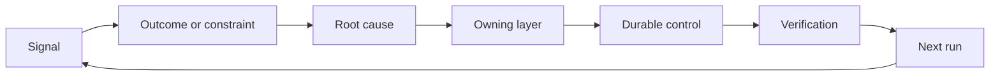

# Construisez un ratchet de rétroaction avec la propriété et la retraite

> La navigation ferme une boucle de construction et ouvre la boucle d'apprentissage.

**Type:** Learn + Build
**Languages:** Python (stdlib)
**Prerequisites:** Phase 14 lessons 46 and 53
**Time:** ~75 minutes

## Objectifs d'apprentissage

- Transformez les incidents, les évaluations, le comportement des utilisateurs et les corrections en actions propres.
- Routez chaque signal vers le contexte, l'évaluation, la politique, le temps d'exécution ou le backlog.
- Faites priorité à la récurrence par gravité et fréquence.
- Donnez à chaque contrôle une condition de retraite.
- Communiquer une décision de livraison avec des preuves, des compromis et un propriétaire responsable.

## Les commentaires sont des infrastructures

Une équipe peut recueillir des traces, des évaluations, des billets de soutien et des journaux d'incidents sans en apprendre quoi que ce soit.

La boucle est:

1. observer un signal concret;
2. le relier à un résultat, à une contrainte ou à une hypothèse;
3. identifier la couche de système la plus ancienne qui détient la cause;
4. créer un changement limité;
5. vérifier que la récurrence devient moins probable;
6. examiner si le contrôle devrait rester.

## La route vers la propriété

| Signal | Destination |
|---|---|
| False positive, regression, wrong result | Evaluation or test |
| Missing context, duplicate work, stale fact | Context source or retrieval route |
| Unsafe action or authority gap | Policy or permission boundary |
| Timeout, retry storm, unavailable dependency | Runtime control |
| New product need or unresolved tradeoff | Shaped backlog item |

Réfléchissez à la cause au premier niveau de l'effet.



## La propriété fait partie du contrôle

Chaque action à la raquette a besoin de:

- un propriétaire;
- une priorité fondée sur les conséquences et la récurrence;
- l'artefact à modifier;
- la vérification qui prouve le changement;
- une fenêtre de réexamen ou d'expiration;
- une condition de retraite.

Une amélioration non propre est une observation avec une meilleure mise en forme.

## Retirer les contrôles stables

Les systèmes de rétroaction accumulent des politiques. Cette politique peut devenir contradictoire et coûteuse.

- des modifications de l'architecture ou du flux de travail;
- une invariante de niveau inférieur remplace une instruction de niveau supérieur;
- la défaillance protégée n'est pas apparue dans la fenêtre choisie;
- Le contrôle bloque les travaux légitimes plus souvent qu'il ne prévient les dommages.

La retraite a aussi besoin de preuves.

## Connectez le commentaire de l'agent de construction et de codage

La même fourchette sert les deux pistes:

- Les preuves du produit modifient le cadre de résultats, les hypothèses, la tranche ou le plan de mesure.
- Les corrections de codeur modifient les tests, le contexte, la portée, l'automatisation ou la remise.
- Les incidents peuvent modifier à la fois la limite du produit et le tableau de bord des agents.

C'est pourquoi la mise en forme de la construction n'est pas une phase qui se termine avant le codage.

## Faites-le

Le laboratoire classe les signaux, crée des actions propriétaires, les priorise et écrit.`outputs/feedback-backlog.json`- Je suis désolé .

```bash
python3 code/main.py
python3 -m unittest discover code/tests -v
```

Ajoutez un signal de temps d'arrêt de l'exécution et confirmez qu'il est en route vers l'exécution plutôt que vers le backlog général.

## Laboratoire de pratique: prendre une décision après un revers

Choisissez un flux de travail dans le projet de votre carrière.[career delivery template](https://github.com/rohitg00/ai-engineering-from-scratch/blob/main/phases/14-agent-engineering/54-build-the-feedback-ratchet/outputs/career-delivery-evidence.md)- Je suis désolé .

Le laboratoire Python génère des actions de backlog d'exemple. Il n'observe pas les utilisateurs, ne mesure pas une intervention ou ne prouve pas la préparation à la carrière.

### 1. Découvrez ce qui s'est passé

Enregistrez l'utilisateur, la tâche, le flux de travail actuel et le résultat que vous souhaitez améliorer. Lier une observation consentée, un enregistrement de support édité ou une trace de tâche reproduisable. Séparer ce que vous avez observé de ce que quelqu'un a rapporté et ce que vous avez déduit.

Trouvez un échec: une hypothèse ratée, un résultat inutilisable, un coût inattendu ou un délai de livraison.

Si vous ne pouvez pas travailler avec les utilisateurs, exécutez une simulation clairement étiquetée avec un scénario spécifié. Gardez les observations simulées séparées des preuves des utilisateurs réels. N'inventez pas d'entretiens, d'approbations, d'adoption ou d'impact sur l'entreprise.

### 2. Fais des progrès dans ton autorité

Faites une liste des inconnus et choisissez l'action la moins chère et réversible qui pourrait résoudre la plus conséquente.

Par exemple, vous pouvez préparer une reproduction hors ligne édité en attendant l'autorisation d'utiliser les données des clients. Prendre l'initiative signifie faire avancer le travail autorisé et rendre la décision bloquée claire. Cela n'élargit pas vos droits d'accès ou d'approbation.

### 3. Comparer les options et informer le décideur

Écrivez un bref résumé de la décision pour quelqu'un qui n'a pas besoin de détails sur la mise en œuvre.

- le problème de l'utilisateur et les éléments de preuve qui ont modifié le plan;
- au moins deux options, y compris une option manuelle moins chère ou sans construction, si cela est crédible;
- la qualité, la conception des interactions, l'effort, les coûts d'exploitation et les compromis de risque;
- votre recommandation, l'incertitude qui subsiste et la décision requise;
- le titulaire de la décision, les parties prenantes concernées et la date à laquelle la décision est requise.

Demandez à un collègue de représenter un acteur concerné et de défier un compromis. Enregistrez l'objection et la façon dont elle change, ou ne change pas, votre recommandation. Étiquettez les commentaires de jeu de rôle comme simulés; il ne peut pas représenter l'accord réel d'un acteur concerné.

### 4. Une expérience limitée

Choisissez un prototype, un projet pilote ou un projet de production en fonction de la question à laquelle vous devez répondre. Définissez le public, les données, l'autorité, la durée, le renversement et les conditions pour continuer, changer ou arrêter avant de recueillir le résultat.

Passez à travers l'interaction depuis le point de départ de l'utilisateur jusqu'à une tâche terminée. Inclure une sortie incorrecte ou un cas de données manquantes. Observez si l'utilisateur peut remarquer l'échec, le corriger et récupérer sans votre aide cachée.

Comptez le temps d'examen et de correction par l'homme dans le cadre du flux de travail.

### 5. Comparer les résultats avec l'économie

Enregistrer une ligne de base et un suivi en utilisant la même définition métrique, la population de tâches, la méthode de collecte et des fenêtres d'observation comparables.

Incluez un résultat utilisateur, une barrière de sécurité ou de qualité et un effort total d'examen humain. Enregistrez le résultat même lorsqu'il manque l'objectif.

Évaluer le coût par tâche accomplie avec succès en utilisant des appels de modèle, des essais répétés, des services de soutien et une évaluation humaine. Indiquer l'hypothèse du taux de travail et séparer l'utilisation mesurée des estimations. Comparer ce coût avec l'alternative manuelle ou l'hypothèse de valeur derrière le projet.

Utilisez les données existantes [FinOps for LLMs lesson](https://aiengineeringfromscratch.com/lesson?path=phases/17-infrastructure-and-production/27-finops-llms)La modification du modèle n'est qu'une réponse possible; réduire le flux de travail ou conserver une étape manuelle peut être la meilleure décision de produit.

### 6. Fermez le boucle

Utilisez les critères prédéclarés pour recommander de continuer, de changer ou de cesser. Si les preuves sont inconclusives, nommez l'observation manquante et le prochain test limité.

Choisissez une amélioration du processus de livraison lui-même: un cadre de tâches plus clair, une mise en œuvre plus précoce de l'utilisateur, une meilleure liste de contrôle des examens, une remise plus petite d'agents ou un cas d'évaluation plus rigoureux.

Lors de l'examen, décidez de conserver, de réviser ou de retirer cette amélioration. Enregistrez les preuves du choix.

## Artéfacts expédiés

- C' est vrai .[career-delivery-evidence.md](https://github.com/rohitg00/ai-engineering-from-scratch/blob/main/phases/14-agent-engineering/54-build-the-feedback-ratchet/outputs/career-delivery-evidence.md)En outre, il est important de noter que les données de base de votre projet sont disponibles dans votre propre projet et de les compléter avec des liens de preuve.

## Vérifiez

Utilisez cette rubrique d'acceptation manuelle avec un homologue.**met**- Je suis là .**needs work**ou **not observed**Un champ rempli ne prouve pas que le jugement était fondé.

| Check | Evidence that meets it |
|---|---|
| Workflow grounded | A traceable observation supports the problem; reported claims, inference, and simulation are labeled. |
| Authority respected | Reversible next work is clear, and any restricted action waits for its actual decision owner. |
| Tradeoffs communicated | Credible alternatives, a stakeholder objection, a recommendation, and an explicit decision request are recorded. |
| Interaction tested | The walkthrough covers success, failure, recovery, and human review effort. |
| Outcome compared | Baseline and follow-up definitions align; samples, guardrails, costs, and comparison limits are visible. |
| Setback owned | The evidence changes a continue/change/stop decision and an accountable next action. |
| Process improved | One workflow improvement has an owner, review date, and an evidence-based keep/revise/retire decision. |

Le comportement des utilisateurs réels non observé reste un écart même après chaque étape simulée.

## Exercices

1. Transformer un incident et une plainte d'utilisateur en actions de ratchet.
2. Nombre de la couche la plus ancienne qui peut empêcher chaque récurrence.
3. Ajouter des commandes de vérification ou des observations à la sortie du laboratoire.
4. Définir une condition de retraite pour une règle de police.
5. Trace un a accepté la correction dans le cadre de la tâche suivante.

## Pour en savoir plus

- [Basili, Caldiera, and Rombach, The Goal Question Metric Approach](https://www.cs.toronto.edu/~sme/CSC444F/handouts/GQM-paper.pdf), pour l'apprentissage organisationnel par la mesure axée sur les objectifs.
- [Fagerholm et al., Building Blocks for Continuous Experimentation](https://doi.org/10.1145/2601248.2601276), pour la boucle technique et organisationnelle qui relie les preuves au développement continu du produit.
- [Nuseibeh and Easterbrook, Requirements Engineering: A Roadmap](https://www.cs.toronto.edu/~sme/papers/2000/ICSE2000.pdf), pour traiter les exigences comme évoluant au cours du cycle de vie du système.

## Ce que vous gardez

Je le garde .`outputs/feedback-backlog.json`Les résultats de la recherche et de la recherche sont les suivants:
