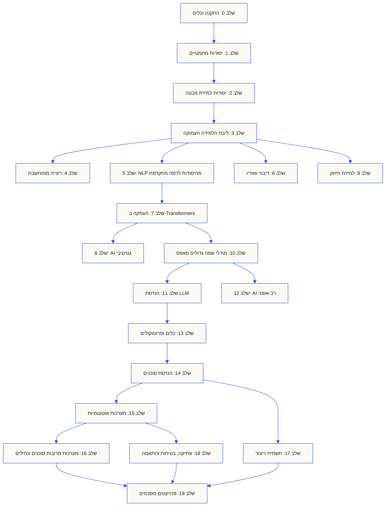
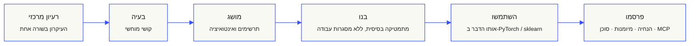

<p align="center" dir="rtl"><sub>README זה תורגם לעברית ונקרא מימין לשמאל. <a href="../../README.md">ה-README באנגלית</a> הוא המקור הקובע.</sub></p>

<p align="center">
  <picture>
    <source media="(prefers-color-scheme: dark)" srcset="../../assets/readme/header-dark.svg">
    
  </picture>
</p>

ממשו את הפעולות הפנימיות של מודלים, צינורות אחזור וסביבות ריצה לסוכנים. בדקו אותם, חקרו כשלים ושמרו את הקוד ואת תוצאות ההערכה.

**[התחילו ללמוד](https://aiengineeringfromscratch.com/lesson?path=phases/00-setup-and-tooling/01-dev-environment)** · **[בחרו מסלול](#learning-routes)** · **[נסו מעבדה](#interactive-lab)** · **[בנו פרויקט](#project-challenges)** · **[עיינו בתוכנית הלימודים](#contents)**

בחינם, בקוד פתוח וברישיון MIT. למדו באתר, עם סוכן תכנות או באמצעות הרצת קוד מקומי.

> <span dir="rtl">523 שיעורים. 20 שלבים.</span> <span dir="ltr">Python, TypeScript, Rust, Julia.</span>

<p align="center">
  <a href="../../LICENSE"></a>
  <a href="../../ROADMAP.md"></a>
  <a href="#contents"></a>
  <a href="https://github.com/rohitg00/ai-engineering-from-scratch/stargazers"></a>
  <a href="https://aiengineeringfromscratch.com"></a>
</p>

<details>
<summary>קראו בשפה שלכם</summary>

<p align="center">
  <a href="../../README.md">🇬🇧 English</a> · <a href="../../i18n/zh/README.md">🇨🇳 简体中文</a> · <a href="../../i18n/zh-TW/README.md">🇹🇼 繁體中文（台灣）</a> · <a href="../../i18n/ja/README.md">🇯🇵 日本語</a> · <a href="../../i18n/ko/README.md">🇰🇷 한국어</a> · <a href="../../i18n/pt/README.md">🇵🇹 Português</a> · <a href="../../i18n/pt-BR/README.md">🇧🇷 Português (Brasil)</a> · <a href="../../i18n/es/README.md">🇪🇸 Español</a> · <a href="../../i18n/de/README.md">🇩🇪 Deutsch</a> · <a href="../../i18n/fr/README.md">🇫🇷 Français</a> · <a href="../../i18n/it/README.md">🇮🇹 Italiano</a> · <a href="../../i18n/nl/README.md">🇳🇱 Nederlands</a> · <a href="../../i18n/pl/README.md">🇵🇱 Polski</a> · <a href="../../i18n/cs/README.md">🇨🇿 Čeština</a> · <a href="../../i18n/ro/README.md">🇷🇴 Română</a> · <a href="../../i18n/hu/README.md">🇭🇺 Magyar</a> · <a href="../../i18n/el/README.md">🇬🇷 Ελληνικά</a> · <a href="../../i18n/sv/README.md">🇸🇪 Svenska</a> · <a href="../../i18n/da/README.md">🇩🇰 Dansk</a> · <a href="../../i18n/no/README.md">🇳🇴 Norsk</a> · <a href="../../i18n/fi/README.md">🇫🇮 Suomi</a> · <a href="../../i18n/ru/README.md">🇷🇺 Русский</a> · <a href="../../i18n/uk/README.md">🇺🇦 Українська</a> · <a href="../../i18n/tr/README.md">🇹🇷 Türkçe</a> · <a href="../../i18n/he/README.md">🇮🇱 עברית</a> · <a href="../../i18n/ar/README.md">🇸🇦 العربية</a> · <a href="../../i18n/fa/README.md">🇮🇷 فارسی</a> · <a href="../../i18n/hi/README.md">🇮🇳 हिन्दी</a> · <a href="../../i18n/bn/README.md">🇧🇩 বাংলা</a> · <a href="../../i18n/ur/README.md">🇵🇰 اردو</a> · <a href="../../i18n/th/README.md">🇹🇭 ไทย</a> · <a href="../../i18n/vi/README.md">🇻🇳 Tiếng Việt</a> · <a href="../../i18n/id/README.md">🇮🇩 Bahasa Indonesia</a> · <a href="../../i18n/tl/README.md">🇵🇭 Tagalog</a>
</p>

</details>

### נותני חסות

<p align="center">
  <a href="https://serpapi.com/ai-engineering-from-scratch"><picture><source media="(min-width: 768px)" srcset="../../assets/sponsors/serpapi-banner-compact.png" width="48%"></picture></a>
  <a href="https://nitrostack.ai/referral/aiengineeringfromscratch"><picture><source media="(min-width: 768px)" srcset="../../assets/sponsors/nitrostack-banner-equal.png" width="48%"></picture></a>
</p>

<p align="center">
  <sub><span>התמיכה שלכם שומרת על כל שיעור חינמי ובקוד פתוח.</span> <a href="#supporters">הצגת כל התומכים</a> · <a href="../../SPONSORS.md">הצטרפו כנותני חסות</a></sub>
</p>

<a id="see-what-you-will-build-and-keep"></a>
<a id="learning-routes"></a>

## מסלולי לימוד

| מסלול | שיעור ראשון |
|---|---|
| יסודות המודלים | [התקנה וכלים](https://aiengineeringfromscratch.com/lesson?path=phases/00-setup-and-tooling/01-dev-environment) |
| מערכות LLM | [הנדסת פרומפטים](https://aiengineeringfromscratch.com/lesson?path=phases/11-llm-engineering/01-prompt-engineering) |
| סוכנים ומסירה | [לולאת הסוכן](https://aiengineeringfromscratch.com/lesson?path=phases/14-agent-engineering/01-the-agent-loop) |

[השוו מסלולי קריירה](https://aiengineeringfromscratch.com/learning-paths.html) · [ידע מוקדם וזמן לימוד](#study-guide)

<a id="interactive-lab"></a>

### ירידת גרדיאנט

20 נקודות התחלה נעות לפי ירידת גרדיאנט על פונקציית הפסד ריבועית. הגרף מציג את מיקומיהן ואת ההפסד הממוצע לאחר כל עדכון.

<p align="center">
  <a href="https://aiengineeringfromscratch.com/lesson?path=phases/01-math-foundations/08-optimization#loss-landscape-visualization">
    <picture>
      <source media="(max-width: 600px) and (prefers-color-scheme: dark) and (prefers-reduced-motion: reduce)" srcset="../../assets/readme/101-gradient-mobile-dark.png">
      <source media="(max-width: 600px) and (prefers-reduced-motion: reduce)" srcset="../../assets/readme/101-gradient-mobile-light.png">
      <source media="(prefers-color-scheme: dark) and (prefers-reduced-motion: reduce)" srcset="../../assets/readme/101-gradient-dark.png">
      <source media="(prefers-reduced-motion: reduce)" srcset="../../assets/readme/101-gradient-light.png">
      <source media="(max-width: 600px) and (prefers-color-scheme: dark)" srcset="../../assets/readme/101-gradient-mobile-dark.gif">
      <source media="(max-width: 600px)" srcset="../../assets/readme/101-gradient-mobile-light.gif">
      <source media="(prefers-color-scheme: dark)" srcset="../../assets/readme/101-gradient-dark.gif">
      
    </picture>
  </a>
</p>

[כוונו את קצב הלמידה בשיעור](https://aiengineeringfromscratch.com/lesson?path=phases/01-math-foundations/08-optimization#loss-landscape-visualization) · [השוו בקוד בין GD, מומנטום ו-Adam](../../phases/01-math-foundations/08-optimization/code/optimizers.py)

<a id="project-challenges"></a>

### פרויקטים

שלושה פרויקטים עם קוד התחלתי בשלבים, מימושי ייחוס וכלי הערכה מקומיים. הריצו פקודות משורש המאגר לאחר [ההתקנה](#local-setup). הקוד ההתחלתי נכשל בבדיקות עד למימוש השלבים.

<details>
<summary><strong>01 · מעבדת הערכת אחזור</strong> · Python · מדדי דירוג ובדיקות נסיגה</summary>

מערכת מועמדת משפרת את ממוצע NDCG, אך באחת השאילתות הראיה הרלוונטית ביותר יורדת בדירוג. בנו השוואה לכל שאילתה שמדווחת על הנסיגה ויכולה להכשיל בדיקת שחרור.

השתמשו ב-Python 3.10+. חזרו על [RAG](../../phases/11-llm-engineering/06-rag/docs/en.md) ועל [הערכת מודלים](../../phases/02-ml-fundamentals/09-model-evaluation/docs/en.md). ממשו אימות דירוגים, דיוק וכיסוי, מדדים הרגישים למיקום בדירוג ולבסוף השוואת מערכות.

```bash
python3 scripts/project_test.py retrieval-evaluation-lab \
  --init learning-artifacts/retrieval-evaluation-lab
python3 scripts/project_test.py retrieval-evaluation-lab \
  --stage 1 --path learning-artifacts/retrieval-evaluation-lab --strict
python3 scripts/project_test.py retrieval-evaluation-lab \
  --all --path learning-artifacts/retrieval-evaluation-lab --strict
```

**שמרו:** השוואה שניתן לשחזר, עם הבדלים לכל שאילתה ושיפוטי הרלוונטיות ששימשו לחישוב הציונים. המדדים מתארים את השיפוטים האלה; הם אינם מוכיחים שהתשובה נכונה.

[התחילו את הפרויקט](https://aiengineeringfromscratch.com/project.html?id=retrieval-evaluation-lab) · [בדקו את פתרון הייחוס](../../projects/retrieval-evaluation-lab/solution/) · [הריצו עם קלט משלכם](../../projects/retrieval-evaluation-lab/README.md#run-with-your-own-inputs)

</details>

<details>
<summary><strong>02 · מנפה שגיאות לעקבות סוכנים</strong> · TypeScript · פענוח עקבות וחישוב זמנים</summary>

העקבה שסופקה עדיין נמשכת 100 ms, אך צריכת הטוקנים הכוללת עולה ב-200 ואחד המקטעים מתחיל להיכשל. הפרידו בין העבודה החופפת של מקטעי הבן לבין זמן הביצוע העצמי של מקטע האב, ואז הפיקו דוח שחושף את השינוי.

השתמשו ב-Node.js 22.18+ וב-Python 3 לכלי ההערכה. ממשו פענוח JSONL, אימות יחסי הורות, חישובי מקטעי זמן ולבסוף ציר זמן שאפשר לבדוק.

```bash
python3 scripts/project_test.py agent-trace-debugger \
  --init learning-artifacts/agent-trace-debugger
python3 scripts/project_test.py agent-trace-debugger \
  --stage 1 --path learning-artifacts/agent-trace-debugger --strict
python3 scripts/project_test.py agent-trace-debugger \
  --all --path learning-artifacts/agent-trace-debugger --strict
```

**שמרו:** את עקבת הקלט, ציר זמן ב-HTML ודוח נסיגה ב-JSON. רשמו לכל מקטע רק את הטוקנים שהוא עצמו צורך, כדי לא לספור פעמיים את צריכת האב והבן.

[התחילו את הפרויקט](https://aiengineeringfromscratch.com/project.html?id=agent-trace-debugger) · [בדקו את פתרון הייחוס](../../projects/agent-trace-debugger/solution/) · [חקרו את התזמון באופן אינטראקטיבי](https://aiengineeringfromscratch.com/project.html?id=agent-trace-debugger&stage=03-timing)

</details>

<details>
<summary><strong>03 · חומת אש לקריאות לכלים</strong> · Rust · בדיקות תפקידים ורישומי אישור</summary>

תוכן הכתיבה משתנה לאחר הסקירה, או שנעשה שימוש חוזר באישור. אמתו את מעטפת הקריאה, בדקו את תפקיד הקורא ואת הנתיב, ואז צרכו אישור הקשור בדיוק לבקשה ולתוכן.

השתמשו ב-Rust וב-Python 3.10+. חזרו על [תכנון סכמות לכלים](../../phases/13-tools-and-protocols/05-tool-schema-design/docs/en.md) ועל [גבולות אבטחה](../../phases/17-infrastructure-and-production/25-security-secrets-audit/docs/en.md). היישום הקורא מספק את הזהות; המודל מציע פעולה.

```bash
python3 scripts/project_test.py tool-call-firewall \
  --init learning-artifacts/tool-call-firewall
python3 scripts/project_test.py tool-call-firewall \
  --stage 1 --path learning-artifacts/tool-call-firewall --strict
python3 scripts/project_test.py tool-call-firewall \
  --all --path learning-artifacts/tool-call-firewall --strict
```

**שמרו:** רישום ביקורת המציג את הפעולה המבוקשת ואת החלטת המדיניות. אישורים ניתנים לשימוש חד-פעמי בתוך הפעלה אחת; הפרויקט אינו מספק הרשאה מתמשכת או ארגז חול של מערכת ההפעלה.

[התחילו את הפרויקט](https://aiengineeringfromscratch.com/project.html?id=tool-call-firewall) · [בדקו את פתרון הייחוס](../../projects/tool-call-firewall/solution/) · [חקרו את גבולות האישור](https://aiengineeringfromscratch.com/project.html?id=tool-call-firewall&stage=03-consume-a-request-bound-approval-once)

</details>

[עיינו בכל הפרויקטים](https://aiengineeringfromscratch.com/projects.html) · [מדריך לתרגול מקצועי](../../learning-paths/CAREER-PRACTICE.md)

## בחרו איך ללמוד

### באתר האינטרנט

פתחו שיעור שהושלם ב-[aiengineeringfromscratch.com](https://aiengineeringfromscratch.com) או הרחיבו שלב ב[תוכן העניינים](#contents). אין צורך בהתקנה או בשכפול.

### עם מדריך AI

אם Node.js, הפקודה `npx` וסוכן תכנות שתומך במיומנויות כבר מותקנים, תוכלו להפוך את הסוכן למורה. אין צורך לשכפל את המאגר כדי להתקין את המורה או לקרוא את תוכנו. המעבדות המעשיות במסלולים הממוקדים דורשות `python3`. מעבדות Agent Skills דורשות גם יישום מארח שנבחר מראש ותיקיית מיומנויות ברמת המשתמש או הפרויקט עם הרשאת כתיבה.

```bash
npx skills add rohitg00/ai-engineering-from-scratch
```

בחרו מארח והיקף כאשר תוכנית ההתקנה שואלת. השתמשו ב-`start-learning` ב-Codex, ב-`/start-learning` ב-Claude Code או בקשו מהמארח להשתמש במיומנות בשמה.

<details>
<summary>הגדרת המדריך ופקודות סביבת האירוח</summary>

תחילה בדקו את הדרישות המקומיות:

```bash
node --version
npx --version
python3 --version
```

`skills` כותב ליישום המארח ולהיקף שנבחרו בזמן ההתקנה, למשל `.claude/skills/`, `.cursor/skills/`, `.codex/skills/` או תיקיית מיומנויות נתמכת אחרת. ודאו שהיישום המארח שבחרתם מגלה בדיוק את המיקום הזה.

תחביר ההפעלה נקבע בידי היישום המארח, ולא בידי הפורמט הנייד `SKILL.md`:

| יישום מארח | התחילו את הקורס | התחילו ללמוד Model Context Protocol (MCP) | התחילו ללמוד Agent Skills | הפעילו בוחן לשלב |
|---|---|---|---|---|
| Codex | `start-learning`, או בחרו אותה מתוך `/skills` | `learn-mcp`, או בחרו אותה מתוך `/skills` | `learn-agent-skills`, או בחרו אותה מתוך `/skills` | `check-understanding 13`, או בחרו אותה מתוך `/skills` |
| Claude Code | `/start-learning` | `/learn-mcp` | `/learn-agent-skills` | `/check-understanding 13` |
| יישומים מארחים תואמים אחרים | `Use start-learning to begin the course.` | `Use learn-mcp to start the Model Context Protocol (MCP) path.` | `Use learn-agent-skills to start the Agent Skills Engineering path.` | `Use check-understanding to quiz me on Phase 13.` |

מבחן מיקום בן עשר שאלות ממפה את הידע שלכם לשלב התחלה ושומר תוכנית לימוד אישית בקובץ `LEARNING.md`. משם, המיומנות `learn` מלמדת שיעור אחד בכל מפגש: מושג, מתמטיקה, קוד ובוחן. היא טוענת שיעורים ישירות מהמאגר, והמיומנות `course-guide` מפנה לשיעור המדויק שעונה על הקושי שלכם. ב-Codex הפעילו באמצעות `learn` ו-`course-guide`; ב-Claude Code השתמשו ב-`/learn` וב-`/course-guide`; ביישומים מארחים תואמים אחרים בקשו להשתמש במיומנות בשמה.

רוצים ללמוד רק Model Context Protocol (MCP)? השתמשו בהפעלת MCP המתאימה ליישום המארח שלכם. היא יוצרת `MCP-LEARNING.md` ועוקבת אחרי מסלול אחד בן 17 שיעורים על בקשות חסרות מצב, תעבורה, עבודה דו-כיוונית, אבטחה, אמינות, ממשל רישום וראיות לתאימות לפרוטוקול. הסדר המדויק ונקודות הבדיקה נמצאים ב[מניפסט Model Context Protocol (MCP)](../../learning-paths/model-context-protocol.json).

רוצים ללמוד רק Agent Skills? השתמשו בהפעלה המתאימה ליישום המארח שלכם. היא יוצרת `AGENT-SKILLS-LEARNING.md` ועוקבת אחרי חמישה שיעורים רציפים: חוזה, גילוי, הפעלה, גבולות סביבת בידוד, ולבסוף הערכה לפני הפצה וניידות בין יישומים מארחים אמיתיים. התחילו באתר עם [מסלול Agent Skills](https://aiengineeringfromscratch.com/lesson?path=phases/13-tools-and-protocols/22-skills-and-agent-sdks&learningPath=agent-skills).

תוכנית ההתקנה מציגה את היישומים המארחים שהיא יכולה להגדיר ושואלת היכן להתקין. אם עדיין חסרים Node.js, `npx`, `python3`, יישום מארח נתמך או מיקום עם הרשאת כתיבה, השתמשו באתר או קראו את `docs/en.md` ידנית. כך תלמדו את המושגים, אך ראיות לגילוי, להפעלה, להרצת סקריפטים ולהסרה ביישום מארח אמיתי יישארו ממתינות עד שאפשר יהיה לבצע את הבדיקה המקדימה. קראו את השיעורים ב-[aiengineeringfromscratch.com](https://aiengineeringfromscratch.com).

### מיומנויות הלמידה

| מיומנות | מה היא עושה |
|---|---|
| [`start-learning`](../../skills/start-learning/SKILL.md) | היכרות חד-פעמית: למה אתם לומדים, מבחן מיקום ותוכנית אישית שנשמרת ב-`LEARNING.md`. |
| [`learn`](../../skills/learn/SKILL.md) | מחזור ההוראה: היזכרות כחימום, לימוד אינטראקטיבי של השיעור הבא ואז הבוחן שלו; ההתקדמות ונושאי החזרה נשמרים. |
| [`course-guide`](../../skills/course-guide/SKILL.md) | מנתב נושאים. ״איפה לומדים על קשב?״ או ״ערך ההפסד שלי הוא NaN״ → השיעורים המדויקים, עם קישורים. |
| [`learn-mcp`](../../skills/learn-mcp/SKILL.md) | מורה ממוקד ל-Model Context Protocol (MCP). יוצר `MCP-LEARNING.md`, עוקב אחר מניפסט בן 17 שיעורים ושומר ראיות לתקשורת, לאבטחה, לאמינות ולתאימות. |
| [`learn-agent-skills`](../../skills/learn-agent-skills/SKILL.md) | מורה ממוקד ל-Agent Skills. יוצר `AGENT-SKILLS-LEARNING.md`, מלמד את שיעורים 22, 24, 25, 26 ו-27 ושומר ראיות מיישומים מארחים אמיתיים. |
| [`claude-certification`](../../skills/claude-certification/SKILL.md) | מורה להסמכה. בוחר CCAO-F, CCDV-F, CCAR-F או CCAR-P, מלמד כל שיעור, מריץ מעבדות, סוקר תוצרים, מעביר מבחני אבחון ותרגול ושומר התקדמות. |
| [`mcpa-certification`](../../skills/mcpa-certification/SKILL.md) | מורה ל-MCPA. עוקב אחר מסלול `mcpa-f` בן 34 שיעורים על הפרוטוקול 2026-07-28, מלמד כל שיעור, מריץ מעבדות ובדיקת הודעות, מעביר מבחן אבחון ושלוש בחינות תרגול ושומר התקדמות. |
| [`find-your-level`](../../skills/find-your-level/SKILL.md) | מבחן מיקום בן עשר שאלות. ממפה את הידע שלכם לשלב התחלה ומפיק מסלול אישי עם הערכות שעות. |
| [`check-understanding <phase>`](../../skills/check-understanding/SKILL.md) | בוחן לכל שלב, שמונה שאלות, משוב ושיעורים מסוימים לחזרה. השתמשו בצורת ההפעלה של Codex, של Claude Code או בשפה טבעית לפי הטבלה שלמעלה. |

</details>

<a id="local-setup"></a>

### הריצו קוד מקומי

```bash
git clone https://github.com/rohitg00/ai-engineering-from-scratch.git
cd ai-engineering-from-scratch
python3 phases/00-setup-and-tooling/01-dev-environment/code/verify.py --route beginner
python3 phases/01-math-foundations/01-linear-algebra-intuition/code/vectors.py
```

הבדיקה המקדימה מבדילה בין דרישות שצריך למלא עכשיו לבין כלים שיידרשו בהמשך. לכל דרישת חובה שלא מתקיימת מוצגות הסיבה שזוהתה ופקודה לתיקון. הפקודה `vectors.py` מריצה שיעור ללא תלויות חיצוניות, ובסופו מראה שכפל מטריצה בווקטור הוא הפעולה שמתרחשת בתוך שכבה של רשת עצבית. שמרו את פלט המסוף הזה כראיה הראשונה שלכם.

<details>
<summary>עבדו עם כל שיעור באותה דרך</summary>

### עבדו עם כל שיעור באותה דרך

1. **קראו** את `docs/en.md` והסבירו את הרעיון המרכזי במילים שלכם.
2. **הקלידו ובנו** את הקוד החשוב במקום להתייחס לבלוק הקוד כקישוט.
3. **הריצו** את פקודת השיעור משורש המאגר, התיקייה שמכילה את `README.md` ואת `phases/`.
4. **שמרו ראיות**: הפקודה, תיקיית העבודה, קוד היציאה, פלט משמעותי והתוצר ששיניתם או יצרתם.
5. **המשיכו** רק כשאתם יכולים להסביר את הפלט ולעשות שינוי קטן בלי לנחש.

הנתיבים בפקודות שבדפי השיעורים הם יחסיים לשורש המאגר, אלא אם השיעור מציין במפורש שיש להחליף תיקייה. אם שיעור מציע כמה שפות תכנות, הריצו את המימוש בשפה שאתם לומדים.

</details>

<a id="study-guide"></a>

## בחרו מסלול לימוד

אין צורך לעבור על 523 שיעורים לפני שמתחילים. בחרו מטרה אחת. כל קישור פותח את אותה תוכנית לימודים ב-GitHub או באתר, ובשתי הגרסאות משתמשים באותו קוד של השיעורים.

| המטרה שלכם | למדו ב-GitHub | למדו באתר |
|---|---|---|
| אני מתחיל ורוצה בסיס מלא | [שלב 0: התקנה וכלים](../../phases/00-setup-and-tooling/) | [סביבת פיתוח](https://aiengineeringfromscratch.com/lesson?path=phases/00-setup-and-tooling/01-dev-environment) |
| אני יודע Python ורוצה ללמוד יסודות במתמטיקה ובלמידת מכונה | [שלב 1: יסודות מתמטיים](../../phases/01-math-foundations/) | [הבנה אינטואיטיבית של אלגברה לינארית](https://aiengineeringfromscratch.com/lesson?path=phases/01-math-foundations/01-linear-algebra-intuition) |
| אני רוצה לבנות יישומי LLM לסביבת ייצור | [שלב 11: הנדסת LLM](../../phases/11-llm-engineering/) | [הנדסת פרומפטים](https://aiengineeringfromscratch.com/lesson?path=phases/11-llm-engineering/01-prompt-engineering) |
| אני רוצה לבנות סוכנים | [שלב 14: הנדסת סוכנים](../../phases/14-agent-engineering/) | [לולאת הסוכן](https://aiengineeringfromscratch.com/lesson?path=phases/14-agent-engineering/01-the-agent-loop) |
| אני רוצה להשתמש בסוכני תכנות במאגרי קוד אמיתיים | [מסלול הנדסה בעזרת סוכנים](../../learning-paths/using-coding-agents.json) | [הנדסה בעזרת סוכנים](https://aiengineeringfromscratch.com/lesson?path=phases/14-agent-engineering/31-agent-workbench-why-models-fail&learningPath=using-coding-agents) |
| אני רוצה להגדיר מה נכון לבנות לפני המימוש | [מסלול שיקול דעת במוצר ומסירה](../../learning-paths/shaping-the-build.json) | [שיקול דעת במוצר ומסירה](https://aiengineeringfromscratch.com/lesson?path=phases/14-agent-engineering/47-outcomes-before-output&learningPath=shaping-the-build) |

לא בטוחים מאיפה להתחיל? השתמשו [בחונך הערכת הרמה `start-learning`](../../skills/start-learning/SKILL.md) או [במדריך דרישות הקדם באתר](https://aiengineeringfromscratch.com/prereqs.html).

השוו בין ארבעה תחומי ליבה ושישה מסלולי קריירה ב[מסלולי הלימוד להנדסת AI](https://aiengineeringfromscratch.com/learning-paths.html).

<details>
<summary>מסלולים ממוקדים ל-MCP ול-Agent Skills</summary>

| המטרה שלכם | למדו ב-GitHub | למדו באתר |
|---|---|---|
| אני רוצה לבנות עם Model Context Protocol (MCP) | [מסלול Model Context Protocol (MCP)](../../phases/13-tools-and-protocols/README.md#model-context-protocol-mcp-path) | [מסלול לימוד Model Context Protocol (MCP)](https://aiengineeringfromscratch.com/lesson?path=phases/13-tools-and-protocols/06-mcp-fundamentals&learningPath=model-context-protocol) |
| אני רוצה לכתוב ולפרסם Agent Skills | [מסלול ממוקד ל-Agent Skills](../../phases/13-tools-and-protocols/README.md#agent-skills-fast-path) | [מסלול לימוד Agent Skills](https://aiengineeringfromscratch.com/lesson?path=phases/13-tools-and-protocols/22-skills-and-agent-sdks&learningPath=agent-skills) |

</details>

<details>
<summary>ידע מוקדם וזמן לימוד</summary>

### דרישות קדם

- אתם יודעים לכתוב קוד בשפה כלשהי; ידע ב-Python יעזור.
- אתם רוצים להבין איך AI **באמת עובד**, ולא רק לקרוא לממשקי API.

## מאיפה להתחיל

| רקע | התחילו כאן | זמן משוער |
|---|---|---|
| חדשים בתכנות וב-AI | שלב 0: התקנה | ~306 שעות |
| יודעים Python, חדשים בלמידת מכונה | שלב 1: יסודות מתמטיים | ~270 שעות |
| יודעים למידת מכונה, חדשים בלמידה עמוקה | שלב 3: ליבת הלמידה העמוקה | ~200 שעות |
| יודעים למידה עמוקה ורוצים ללמוד LLM וסוכנים | שלב 10: מודלי שפה גדולים מאפס | ~100 שעות |
| מהנדסים מנוסים שרוצים רק הנדסת סוכנים | שלב 14: הנדסת סוכנים | ~60 שעות |
| רוצים לבנות רק מערכות MCP לייצור | [מסלול Model Context Protocol (MCP)](../../learning-paths/model-context-protocol.json) | ~23 שעות 15 דקות |
| רוצים לבנות רק Agent Skills לייצור | [מסלול הנדסת Agent Skills](../../learning-paths/agent-skills.json) | ~9.5 שעות |

</details>

## מבנה תוכנית הלימודים

עשרים שלבים נבנים זה על גבי זה. המתמטיקה היא הבסיס; סוכנים ומערכות ייצור הם השכבות העליונות. דלגו קדימה אם אתם כבר שולטים בשכבות התחתונות, אבל אל תדלגו ואז תתפלאו מדוע משהו בשכבה העליונה נשבר.



<a id="contents"></a>

## תוכן עניינים

עשרים שלבים. לחצו על שלב כדי להרחיב את רשימת השיעורים שלו.

<a id="phase-0"></a>
### שלב 0: התקנה וכלים `12 שיעורים`
> הכינו את סביבת העבודה לכל מה שיבוא בהמשך.

| # | שיעור | סוג | שפה |
|:---:|--------|:----:|------|
| 01 | [סביבת פיתוח](../../phases/00-setup-and-tooling/01-dev-environment/) | בנו | Python |
| 02 | [Git ושיתוף פעולה](../../phases/00-setup-and-tooling/02-git-and-collaboration/) | למדו | — |
| 03 | [הגדרת GPU ושירותי ענן](../../phases/00-setup-and-tooling/03-gpu-setup-and-cloud/) | בנו | Python |
| 04 | [ממשקי API ומפתחות](../../phases/00-setup-and-tooling/04-apis-and-keys/) | בנו | Python |
| 05 | [מחברות Jupyter](../../phases/00-setup-and-tooling/05-jupyter-notebooks/) | בנו | Python |
| 06 | [סביבות Python](../../phases/00-setup-and-tooling/06-python-environments/) | בנו | Shell |
| 07 | [Docker לפיתוח AI](../../phases/00-setup-and-tooling/07-docker-for-ai/) | בנו | Docker |
| 08 | [הגדרת עורך הקוד](../../phases/00-setup-and-tooling/08-editor-setup/) | בנו | — |
| 09 | [ניהול נתונים](../../phases/00-setup-and-tooling/09-data-management/) | בנו | Python |
| 10 | [מסוף ומעטפת פקודות](../../phases/00-setup-and-tooling/10-terminal-and-shell/) | למדו | — |
| 11 | [Linux לפיתוח AI](../../phases/00-setup-and-tooling/11-linux-for-ai/) | למדו | — |
| 12 | [ניפוי שגיאות וניתוח ביצועים](../../phases/00-setup-and-tooling/12-debugging-and-profiling/) | בנו | Python |

<details id="phase-1">
<summary><b>שלב 1: יסודות מתמטיים</b> &nbsp;<code>22 שיעורים</code>&nbsp; <em>האינטואיציה שמאחורי כל אלגוריתם AI, דרך קוד.</em></summary>
<br/>

| # | שיעור | סוג | שפה |
|:---:|--------|:----:|------|
| 01 | [אינטואיציה לאלגברה ליניארית](../../phases/01-math-foundations/01-linear-algebra-intuition/) | למדו | Python, Julia |
| 02 | [וקטורים, מטריצות ופעולות](../../phases/01-math-foundations/02-vectors-matrices-operations/) | בנו | Python, Julia |
| 03 | [טרנספורמציות מטריצה וערכים עצמיים](../../phases/01-math-foundations/03-matrix-transformations/) | בנו | Python, Julia |
| 04 | [חדו״א ללמידת מכונה: נגזרות וגרדיאנטים](../../phases/01-math-foundations/04-calculus-for-ml/) | למדו | Python |
| 05 | [כלל השרשרת וגזירה אוטומטית](../../phases/01-math-foundations/05-chain-rule-and-autodiff/) | בנו | Python |
| 06 | [הסתברות והתפלגויות](../../phases/01-math-foundations/06-probability-and-distributions/) | למדו | Python |
| 07 | [משפט בייס וחשיבה סטטיסטית](../../phases/01-math-foundations/07-bayes-theorem/) | בנו | Python |
| 08 | [אופטימיזציה: משפחת שיטות ירידת הגרדיאנט](../../phases/01-math-foundations/08-optimization/) | בנו | Python |
| 09 | [תורת המידע: אנטרופיה וסטיית KL](../../phases/01-math-foundations/09-information-theory/) | למדו | Python |
| 10 | [צמצום ממדים: PCA, t-SNE, UMAP](../../phases/01-math-foundations/10-dimensionality-reduction/) | בנו | Python |
| 11 | [פירוק לערכים סינגולריים](../../phases/01-math-foundations/11-singular-value-decomposition/) | בנו | Python, Julia |
| 12 | [פעולות על טנזורים](../../phases/01-math-foundations/12-tensor-operations/) | בנו | Python |
| 13 | [יציבות נומרית](../../phases/01-math-foundations/13-numerical-stability/) | בנו | Python |
| 14 | [נורמות ומרחקים](../../phases/01-math-foundations/14-norms-and-distances/) | בנו | Python |
| 15 | [סטטיסטיקה ללמידת מכונה](../../phases/01-math-foundations/15-statistics-for-ml/) | בנו | Python |
| 16 | [שיטות דגימה](../../phases/01-math-foundations/16-sampling-methods/) | בנו | Python |
| 17 | [מערכות ליניאריות](../../phases/01-math-foundations/17-linear-systems/) | בנו | Python |
| 18 | [אופטימיזציה קמורה](../../phases/01-math-foundations/18-convex-optimization/) | בנו | Python |
| 19 | [מספרים מרוכבים ל-AI](../../phases/01-math-foundations/19-complex-numbers/) | למדו | Python |
| 20 | [התמרת פורייה](../../phases/01-math-foundations/20-fourier-transform/) | בנו | Python |
| 21 | [תורת הגרפים ללמידת מכונה](../../phases/01-math-foundations/21-graph-theory/) | בנו | Python |
| 22 | [תהליכים סטוכסטיים](../../phases/01-math-foundations/22-stochastic-processes/) | למדו | Python |

</details>

<details id="phase-2">
<summary><b>שלב 2: יסודות למידת מכונה</b> &nbsp;<code>18 שיעורים</code>&nbsp; <em>למידת מכונה קלאסית עדיין מהווה בסיס לרוב מערכות ה-AI בייצור.</em></summary>
<br/>

| # | שיעור | סוג | שפה |
|:---:|--------|:----:|------|
| 01 | [מהי למידת מכונה?](../../phases/02-ml-fundamentals/01-what-is-machine-learning/) | למדו | Python |
| 02 | [רגרסיה ליניארית מאפס](../../phases/02-ml-fundamentals/02-linear-regression/) | בנו | Python |
| 03 | [רגרסיה לוגיסטית וסיווג](../../phases/02-ml-fundamentals/03-logistic-regression/) | בנו | Python |
| 04 | [עצי החלטה ויערות אקראיים](../../phases/02-ml-fundamentals/04-decision-trees/) | בנו | Python |
| 05 | [מכונות וקטורים תומכים](../../phases/02-ml-fundamentals/05-support-vector-machines/) | בנו | Python |
| 06 | [KNN ומדדי מרחק](../../phases/02-ml-fundamentals/06-knn-and-distances/) | בנו | Python |
| 07 | [למידה ללא פיקוח: K-Means, DBSCAN](../../phases/02-ml-fundamentals/07-unsupervised-learning/) | בנו | Python |
| 08 | [הנדסת תכונות ובחירתן](../../phases/02-ml-fundamentals/08-feature-engineering/) | בנו | Python |
| 09 | [הערכת מודלים: מדדים ואימות צולב](../../phases/02-ml-fundamentals/09-model-evaluation/) | בנו | Python |
| 10 | [הטיה, שונות ועקומת הלמידה](../../phases/02-ml-fundamentals/10-bias-variance/) | למדו | Python |
| 11 | [שיטות אנסמבל: boosting, bagging, stacking](../../phases/02-ml-fundamentals/11-ensemble-methods/) | בנו | Python |
| 12 | [כוונון היפר-פרמטרים](../../phases/02-ml-fundamentals/12-hyperparameter-tuning/) | בנו | Python |
| 13 | [תהליכי ML ומעקב אחר ניסויים](../../phases/02-ml-fundamentals/13-ml-pipelines/) | בנו | Python |
| 14 | [בייס נאיבי](../../phases/02-ml-fundamentals/14-naive-bayes/) | בנו | Python |
| 15 | [יסודות סדרות זמן](../../phases/02-ml-fundamentals/15-time-series/) | בנו | Python |
| 16 | [זיהוי חריגות](../../phases/02-ml-fundamentals/16-anomaly-detection/) | בנו | Python |
| 17 | [טיפול בנתונים לא מאוזנים](../../phases/02-ml-fundamentals/17-imbalanced-data/) | בנו | Python |
| 18 | [בחירת תכונות](../../phases/02-ml-fundamentals/18-feature-selection/) | בנו | Python |

</details>

<details id="phase-3">
<summary><b>שלב 3: ליבת הלמידה העמוקה</b> &nbsp;<code>13 שיעורים</code>&nbsp; <em>רשתות עצביות מעקרונות היסוד. בלי מסגרות עבודה עד שתבנו אחת בעצמכם.</em></summary>
<br/>

| # | שיעור | סוג | שפה |
|:---:|--------|:----:|------|
| 01 | [הפרספטרון: כאן הכול התחיל](../../phases/03-deep-learning-core/01-the-perceptron/) | בנו | Python |
| 02 | [רשתות רב-שכבתיות ומעבר קדימה](../../phases/03-deep-learning-core/02-multi-layer-networks/) | בנו | Python |
| 03 | [הפצה לאחור מאפס](../../phases/03-deep-learning-core/03-backpropagation/) | בנו | Python |
| 04 | [פונקציות אקטיבציה: ReLU, Sigmoid, GELU והסיבות לבחירתן](../../phases/03-deep-learning-core/04-activation-functions/) | בנו | Python |
| 05 | [פונקציות הפסד: MSE, אנטרופיה צולבת והפסד ניגודי](../../phases/03-deep-learning-core/05-loss-functions/) | בנו | Python |
| 06 | [אופטימייזרים: SGD, Momentum, Adam, AdamW](../../phases/03-deep-learning-core/06-optimizers/) | בנו | Python |
| 07 | [רגולריזציה: Dropout, Weight Decay, BatchNorm](../../phases/03-deep-learning-core/07-regularization/) | בנו | Python |
| 08 | [אתחול משקולות ויציבות האימון](../../phases/03-deep-learning-core/08-weight-initialization/) | בנו | Python |
| 09 | [תזמון קצב הלמידה וחימום](../../phases/03-deep-learning-core/09-learning-rate-schedules/) | בנו | Python |
| 10 | [בנו מסגרת עבודה זעירה משלכם](../../phases/03-deep-learning-core/10-mini-framework/) | בנו | Python |
| 11 | [מבוא ל-PyTorch](../../phases/03-deep-learning-core/11-intro-to-pytorch/) | בנו | Python |
| 12 | [מבוא ל-JAX](../../phases/03-deep-learning-core/12-intro-to-jax/) | בנו | Python |
| 13 | [ניפוי שגיאות ברשתות עצביות](../../phases/03-deep-learning-core/13-debugging-neural-networks/) | בנו | Python |

</details>

<details id="phase-4">
<summary><b>שלב 4: ראייה ממוחשבת</b> &nbsp;<code>28 שיעורים</code>&nbsp; <em>מפיקסלים להבנה: תמונה, וידאו, תלת-ממד, VLM ומודלי עולם.</em></summary>
<br/>

| # | שיעור | סוג | שפה |
|:---:|--------|:----:|------|
| 01 | [יסודות תמונה: פיקסלים, ערוצים ומרחבי צבע](../../phases/04-computer-vision/01-image-fundamentals/) | למדו | Python |
| 02 | [קונבולוציות מאפס](../../phases/04-computer-vision/02-convolutions-from-scratch/) | בנו | Python |
| 03 | [רשתות CNN: מ-LeNet ל-ResNet](../../phases/04-computer-vision/03-cnns-lenet-to-resnet/) | בנו | Python |
| 04 | [סיווג תמונות](../../phases/04-computer-vision/04-image-classification/) | בנו | Python |
| 05 | [למידת העברה וכוונון עדין](../../phases/04-computer-vision/05-transfer-learning/) | בנו | Python |
| 06 | [זיהוי עצמים: YOLO מאפס](../../phases/04-computer-vision/06-object-detection-yolo/) | בנו | Python |
| 07 | [סגמנטציה סמנטית: U-Net](../../phases/04-computer-vision/07-semantic-segmentation-unet/) | בנו | Python |
| 08 | [סגמנטציה של מופעים: Mask R-CNN](../../phases/04-computer-vision/08-instance-segmentation-mask-rcnn/) | בנו | Python |
| 09 | [יצירת תמונות: רשתות GAN](../../phases/04-computer-vision/09-image-generation-gans/) | בנו | Python |
| 10 | [יצירת תמונות: מודלי דיפוזיה](../../phases/04-computer-vision/10-image-generation-diffusion/) | בנו | Python |
| 11 | [Stable Diffusion: ארכיטקטורה וכוונון עדין](../../phases/04-computer-vision/11-stable-diffusion/) | בנו | Python |
| 12 | [הבנת וידאו: מידול לאורך זמן](../../phases/04-computer-vision/12-video-understanding/) | בנו | Python |
| 13 | [ראייה תלת-ממדית: ענני נקודות ו-NeRF](../../phases/04-computer-vision/13-3d-vision-nerf/) | בנו | Python |
| 14 | [Vision Transformers (ViT) לראייה ממוחשבת](../../phases/04-computer-vision/14-vision-transformers/) | בנו | Python |
| 15 | [ראייה בזמן אמת: פריסה במכשירי קצה](../../phases/04-computer-vision/15-real-time-edge/) | בנו | Python |
| 16 | [בנו תהליך מלא לראייה ממוחשבת](../../phases/04-computer-vision/16-vision-pipeline-capstone/) | בנו | Python |
| 17 | [ראייה בלמידה עצמית מונחית: SimCLR, DINO, MAE](../../phases/04-computer-vision/17-self-supervised-vision/) | בנו | Python |
| 18 | [ראייה עם אוצר מילים פתוח: CLIP](../../phases/04-computer-vision/18-open-vocab-clip/) | בנו | Python |
| 19 | [OCR והבנת מסמכים](../../phases/04-computer-vision/19-ocr-document-understanding/) | בנו | Python |
| 20 | [אחזור תמונות ולמידה מטרית](../../phases/04-computer-vision/20-image-retrieval-metric/) | בנו | Python |
| 21 | [זיהוי נקודות מפתח ואמידת תנוחה](../../phases/04-computer-vision/21-keypoint-pose/) | בנו | Python |
| 22 | [3D Gaussian Splatting מאפס](../../phases/04-computer-vision/22-3d-gaussian-splatting/) | בנו | Python |
| 23 | [Diffusion Transformers וזרימה מתוקנת](../../phases/04-computer-vision/23-diffusion-transformers-rectified-flow/) | בנו | Python |
| 24 | [SAM 3 וסגמנטציה עם אוצר מילים פתוח](../../phases/04-computer-vision/24-sam3-open-vocab-segmentation/) | בנו | Python |
| 25 | [מודלי ראייה-שפה (ViT-MLP-LLM)](../../phases/04-computer-vision/25-vision-language-models/) | בנו | Python |
| 26 | [אמידת עומק וגאומטריה מתמונה יחידה](../../phases/04-computer-vision/26-monocular-depth/) | בנו | Python |
| 27 | [מעקב אחר כמה עצמים וזיכרון וידאו](../../phases/04-computer-vision/27-multi-object-tracking/) | בנו | Python |
| 28 | [מודלי עולם ודיפוזיית וידאו](../../phases/04-computer-vision/28-world-models-video-diffusion/) | בנו | Python |

</details>

<details id="phase-5">
<summary><b>שלב 5: NLP מהיסודות לרמה מתקדמת</b> &nbsp;<code>29 שיעורים</code>&nbsp; <em>השפה היא הממשק לאינטליגנציה.</em></summary>
<br/>

| # | שיעור | סוג | שפה |
|:---:|--------|:----:|------|
| 01 | [עיבוד טקסט: טוקניזציה, קיטום והמרה לצורת יסוד](../../phases/05-nlp-foundations-to-advanced/01-text-processing/) | בנו | Python |
| 02 | [שק מילים, TF-IDF וייצוג טקסט](../../phases/05-nlp-foundations-to-advanced/02-bag-of-words-tfidf/) | בנו | Python |
| 03 | [הטמעות מילים: Word2Vec מאפס](../../phases/05-nlp-foundations-to-advanced/03-word-embeddings-word2vec/) | בנו | Python |
| 04 | [GloVe, FastText והטמעות תת-מילים](../../phases/05-nlp-foundations-to-advanced/04-glove-fasttext-subword/) | בנו | Python |
| 05 | [ניתוח סנטימנט](../../phases/05-nlp-foundations-to-advanced/05-sentiment-analysis/) | בנו | Python |
| 06 | [זיהוי ישויות שמיות (NER)](../../phases/05-nlp-foundations-to-advanced/06-named-entity-recognition/) | בנו | Python |
| 07 | [תיוג חלקי דיבר וניתוח תחבירי](../../phases/05-nlp-foundations-to-advanced/07-pos-tagging-parsing/) | בנו | Python |
| 08 | [סיווג טקסט: CNN ו-RNN לטקסט](../../phases/05-nlp-foundations-to-advanced/08-cnns-rnns-for-text/) | בנו | Python |
| 09 | [מודלים מרצף לרצף](../../phases/05-nlp-foundations-to-advanced/09-sequence-to-sequence/) | בנו | Python |
| 10 | [מנגנון הקשב: פריצת הדרך](../../phases/05-nlp-foundations-to-advanced/10-attention-mechanism/) | בנו | Python |
| 11 | [תרגום מכונה](../../phases/05-nlp-foundations-to-advanced/11-machine-translation/) | בנו | Python |
| 12 | [סיכום טקסט](../../phases/05-nlp-foundations-to-advanced/12-text-summarization/) | בנו | Python |
| 13 | [מערכות לשאלות ותשובות](../../phases/05-nlp-foundations-to-advanced/13-question-answering/) | בנו | Python |
| 14 | [אחזור מידע וחיפוש](../../phases/05-nlp-foundations-to-advanced/14-information-retrieval-search/) | בנו | Python |
| 15 | [מידול נושאים: LDA, BERTopic](../../phases/05-nlp-foundations-to-advanced/15-topic-modeling/) | בנו | Python |
| 16 | [יצירת טקסט](../../phases/05-nlp-foundations-to-advanced/16-text-generation-pre-transformer/) | בנו | Python |
| 17 | [צ'אטבוטים: מחוקים לרשתות עצביות](../../phases/05-nlp-foundations-to-advanced/17-chatbots-rule-to-neural/) | בנו | Python |
| 18 | [NLP רב-לשוני](../../phases/05-nlp-foundations-to-advanced/18-multilingual-nlp/) | בנו | Python |
| 19 | [טוקניזציה של תת-מילים: BPE, WordPiece, Unigram, SentencePiece](../../phases/05-nlp-foundations-to-advanced/19-subword-tokenization/) | למדו | Python |
| 20 | [פלטים מובנים ופענוח מוגבל](../../phases/05-nlp-foundations-to-advanced/20-structured-outputs-constrained-decoding/) | בנו | Python |
| 21 | [NLI והיסק מטקסט](../../phases/05-nlp-foundations-to-advanced/21-nli-textual-entailment/) | למדו | Python |
| 22 | [העמקה במודלי הטמעות](../../phases/05-nlp-foundations-to-advanced/22-embedding-models-deep-dive/) | למדו | Python |
| 23 | [אסטרטגיות חלוקה למקטעים עבור RAG](../../phases/05-nlp-foundations-to-advanced/23-chunking-strategies-rag/) | בנו | Python |
| 24 | [פתרון אזכורים משותפים](../../phases/05-nlp-foundations-to-advanced/24-coreference-resolution/) | למדו | Python |
| 25 | [קישור ישויות והסרת עמימות](../../phases/05-nlp-foundations-to-advanced/25-entity-linking/) | בנו | Python |
| 26 | [חילוץ יחסים ובניית גרף ידע](../../phases/05-nlp-foundations-to-advanced/26-relation-extraction-kg/) | בנו | Python |
| 27 | [הערכת LLM: RAGAS, DeepEval, G-Eval](../../phases/05-nlp-foundations-to-advanced/27-llm-evaluation-frameworks/) | בנו | Python |
| 28 | [הערכת הקשר ארוך: NIAH, RULER, LongBench, MRCR](../../phases/05-nlp-foundations-to-advanced/28-long-context-evaluation/) | למדו | Python |
| 29 | [מעקב אחר מצב הדיאלוג](../../phases/05-nlp-foundations-to-advanced/29-dialogue-state-tracking/) | בנו | Python |

</details>

<details id="phase-6">
<summary><b>שלב 6: דיבור ואודיו</b> &nbsp;<code>17 שיעורים</code>&nbsp; <em>לשמוע, להבין ולדבר.</em></summary>
<br/>

| # | שיעור | סוג | שפה |
|:---:|--------|:----:|------|
| 01 | [יסודות אודיו: צורות גל, דגימה ו-FFT](../../phases/06-speech-and-audio/01-audio-fundamentals) | למדו | Python |
| 02 | [ספקטרוגרמות, סולם מל ותכונות אודיו](../../phases/06-speech-and-audio/02-spectrograms-mel-features) | בנו | Python |
| 03 | [סיווג אודיו](../../phases/06-speech-and-audio/03-audio-classification) | בנו | Python |
| 04 | [זיהוי דיבור (ASR)](../../phases/06-speech-and-audio/04-speech-recognition-asr) | בנו | Python |
| 05 | [Whisper: ארכיטקטורה וכוונון עדין](../../phases/06-speech-and-audio/05-whisper-architecture-finetuning) | בנו | Python |
| 06 | [זיהוי דובר ואימותו](../../phases/06-speech-and-audio/06-speaker-recognition-verification) | בנו | Python |
| 07 | [המרת טקסט לדיבור (TTS)](../../phases/06-speech-and-audio/07-text-to-speech) | בנו | Python |
| 08 | [שכפול קול והמרת קול](../../phases/06-speech-and-audio/08-voice-cloning-conversion) | בנו | Python |
| 09 | [יצירת מוזיקה](../../phases/06-speech-and-audio/09-music-generation) | בנו | Python |
| 10 | [מודלי אודיו-שפה](../../phases/06-speech-and-audio/10-audio-language-models) | בנו | Python |
| 11 | [עיבוד אודיו בזמן אמת](../../phases/06-speech-and-audio/11-real-time-audio-processing) | בנו | Python |
| 12 | [בנו תהליך עבודה לעוזר קולי](../../phases/06-speech-and-audio/12-voice-assistant-pipeline) | בנו | Python |
| 13 | [קודקי אודיו עצביים: EnCodec, SNAC, Mimi, DAC](../../phases/06-speech-and-audio/13-neural-audio-codecs) | למדו | Python |
| 14 | [זיהוי פעילות קולית וחילופי תורות](../../phases/06-speech-and-audio/14-voice-activity-detection-turn-taking) | בנו | Python |
| 15 | [דיבור-לדיבור בזרימה: Moshi, Hibiki](../../phases/06-speech-and-audio/15-streaming-speech-to-speech-moshi-hibiki) | למדו | Python |
| 16 | [מניעת זיוף קולי וסימון מים באודיו](../../phases/06-speech-and-audio/16-anti-spoofing-audio-watermarking) | בנו | Python |
| 17 | [הערכת אודיו: WER, MOS, MMAU וטבלאות דירוג](../../phases/06-speech-and-audio/17-audio-evaluation-metrics) | למדו | Python |

</details>

<details id="phase-7">
<summary><b>שלב 7: העמקה ב-Transformers</b> &nbsp;<code>16 שיעורים</code>&nbsp; <em>הארכיטקטורה ששינתה הכול.</em></summary>
<br/>

| # | שיעור | סוג | שפה |
|:---:|--------|:----:|------|
| 01 | [למה Transformers: הבעיות ברשתות RNN](../../phases/07-transformers-deep-dive/01-why-transformers/) | למדו | Python |
| 02 | [קשב עצמי מאפס](../../phases/07-transformers-deep-dive/02-self-attention-from-scratch/) | בנו | Python |
| 03 | [קשב מרובה ראשים](../../phases/07-transformers-deep-dive/03-multi-head-attention/) | בנו | Python |
| 04 | [קידוד מיקום: סינוסואידי, RoPE, ALiBi](../../phases/07-transformers-deep-dive/04-positional-encoding/) | בנו | Python |
| 05 | [ה-Transformer המלא: מקודד ומפענח](../../phases/07-transformers-deep-dive/05-full-transformer/) | בנו | Python |
| 06 | [BERT: מידול שפה ממוסכת](../../phases/07-transformers-deep-dive/06-bert-masked-language-modeling/) | בנו | Python |
| 07 | [GPT: מידול שפה סיבתי](../../phases/07-transformers-deep-dive/07-gpt-causal-language-modeling/) | בנו | Python |
| 08 | [T5, BART: מודלי מקודד-מפענח](../../phases/07-transformers-deep-dive/08-t5-bart-encoder-decoder/) | למדו | Python |
| 09 | [Vision Transformers (ViT) לראייה ממוחשבת](../../phases/07-transformers-deep-dive/09-vision-transformers/) | בנו | Python |
| 10 | [Transformers לאודיו: ארכיטקטורת Whisper](../../phases/07-transformers-deep-dive/10-audio-transformers-whisper/) | למדו | Python |
| 11 | [תערובת מומחים (MoE)](../../phases/07-transformers-deep-dive/11-mixture-of-experts/) | בנו | Python |
| 12 | [מטמון KV, Flash Attention ואופטימיזציית הסקה](../../phases/07-transformers-deep-dive/12-kv-cache-flash-attention/) | בנו | Python |
| 13 | [חוקי קנה מידה](../../phases/07-transformers-deep-dive/13-scaling-laws/) | למדו | Python |
| 14 | [בנו Transformer מאפס](../../phases/07-transformers-deep-dive/14-build-a-transformer-capstone/) | בנו | Python |
| 15 | [סוגי קשב: חלון נע, קשב דליל וקשב דיפרנציאלי](../../phases/07-transformers-deep-dive/15-attention-variants/) | בנו | Python |
| 16 | [פענוח ספקולטיבי: טיוטה, אימות וחזרה](../../phases/07-transformers-deep-dive/16-speculative-decoding/) | בנו | Python |

</details>

<details id="phase-8">
<summary><b>שלב 8: AI גנרטיבי</b> &nbsp;<code>15 שיעורים</code>&nbsp; <em>צרו תמונות, וידאו, אודיו, תלת-ממד ועוד.</em></summary>
<br/>

| # | שיעור | סוג | שפה |
|:---:|--------|:----:|------|
| 01 | [מודלים גנרטיביים: מיון והיסטוריה](../../phases/08-generative-ai/01-generative-models-taxonomy-history/) | למדו | Python |
| 02 | [אוטואנקודרים ו-VAE](../../phases/08-generative-ai/02-autoencoders-vae/) | בנו | Python |
| 03 | [GAN: מחולל מול מבחין](../../phases/08-generative-ai/03-gans-generator-discriminator/) | בנו | Python |
| 04 | [רשתות GAN מותנות ו-Pix2Pix](../../phases/08-generative-ai/04-conditional-gans-pix2pix/) | בנו | Python |
| 05 | [מודל StyleGAN](../../phases/08-generative-ai/05-stylegan/) | בנו | Python |
| 06 | [מודלי דיפוזיה: DDPM מאפס](../../phases/08-generative-ai/06-diffusion-ddpm-from-scratch/) | בנו | Python |
| 07 | [דיפוזיה לטנטית ו-Stable Diffusion](../../phases/08-generative-ai/07-latent-diffusion-stable-diffusion/) | בנו | Python |
| 08 | [ControlNet, LoRA והתניה](../../phases/08-generative-ai/08-controlnet-lora-conditioning/) | בנו | Python |
| 09 | [השלמת תמונה, הרחבתה ועריכתה](../../phases/08-generative-ai/09-inpainting-outpainting-editing/) | בנו | Python |
| 10 | [יצירת וידאו](../../phases/08-generative-ai/10-video-generation/) | בנו | Python |
| 11 | [יצירת אודיו](../../phases/08-generative-ai/11-audio-generation/) | בנו | Python |
| 12 | [יצירת תלת-ממד](../../phases/08-generative-ai/12-3d-generation/) | בנו | Python |
| 13 | [התאמת זרימה וזרימות מתוקנות](../../phases/08-generative-ai/13-flow-matching-rectified-flows/) | בנו | Python |
| 14 | [הערכה: FID וציון CLIP](../../phases/08-generative-ai/14-evaluation-fid-clip-score/) | בנו | Python |
| 19 | [מידול אוטורגרסיבי חזותי (VAR): חיזוי קנה המידה הבא](../../phases/08-generative-ai/19-visual-autoregressive-var/) | בנו | Python |

</details>

<details id="phase-9">
<summary><b>שלב 9: למידת חיזוק</b> &nbsp;<code>12 שיעורים</code>&nbsp; <em>הבסיס ל-RLHF ול-AI שמשחק משחקים.</em></summary>
<br/>

| # | שיעור | סוג | שפה |
|:---:|--------|:----:|------|
| 01 | [MDP, מצבים, פעולות ותגמולים](../../phases/09-reinforcement-learning/01-mdps-states-actions-rewards/) | למדו | Python |
| 02 | [תכנות דינמי](../../phases/09-reinforcement-learning/02-dynamic-programming/) | בנו | Python |
| 03 | [שיטות מונטה קרלו](../../phases/09-reinforcement-learning/03-monte-carlo-methods/) | בנו | Python |
| 04 | [למידת Q ו-SARSA](../../phases/09-reinforcement-learning/04-q-learning-sarsa/) | בנו | Python |
| 05 | [רשתות Q עמוקות (DQN)](../../phases/09-reinforcement-learning/05-dqn/) | בנו | Python |
| 06 | [גרדיאנטים של מדיניות: REINFORCE](../../phases/09-reinforcement-learning/06-policy-gradients-reinforce/) | בנו | Python |
| 07 | [Actor-Critic: שיטות A2C ו-A3C](../../phases/09-reinforcement-learning/07-actor-critic-a2c-a3c/) | בנו | Python |
| 08 | [אלגוריתם PPO](../../phases/09-reinforcement-learning/08-ppo/) | בנו | Python |
| 09 | [מידול תגמול ו-RLHF](../../phases/09-reinforcement-learning/09-reward-modeling-rlhf/) | בנו | Python |
| 10 | [למידת חיזוק מרובת סוכנים](../../phases/09-reinforcement-learning/10-multi-agent-rl/) | בנו | Python |
| 11 | [העברה מסימולציה למציאות](../../phases/09-reinforcement-learning/11-sim-to-real-transfer/) | בנו | Python |
| 12 | [למידת חיזוק למשחקים](../../phases/09-reinforcement-learning/12-rl-for-games/) | בנו | Python |

</details>

<details id="phase-10">
<summary><b>שלב 10: מודלי שפה גדולים מאפס</b> &nbsp;<code>24 שיעורים</code>&nbsp; <em>בנו, אמנו והבינו מודלי שפה גדולים.</em></summary>
<br/>

| # | שיעור | סוג | שפה |
|:---:|--------|:----:|------|
| 01 | [טוקנייזרים: BPE, WordPiece, SentencePiece](../../phases/10-llms-from-scratch/01-tokenizers/) | בנו | Python, Rust |
| 02 | [בניית טוקנייזר מאפס](../../phases/10-llms-from-scratch/02-building-a-tokenizer/) | בנו | Python |
| 03 | [תהליכי נתונים לקדם-אימון](../../phases/10-llms-from-scratch/03-data-pipelines/) | בנו | Python |
| 04 | [קדם-אימון של Mini GPT (124M)](../../phases/10-llms-from-scratch/04-pre-training-mini-gpt/) | בנו | Python |
| 05 | [אימון מבוזר, FSDP ו-DeepSpeed](../../phases/10-llms-from-scratch/05-scaling-distributed/) | בנו | Python |
| 06 | [כוונון להוראות: SFT](../../phases/10-llms-from-scratch/06-instruction-tuning-sft/) | בנו | Python |
| 07 | [RLHF: מודל תגמול ו-PPO](../../phases/10-llms-from-scratch/07-rlhf/) | בנו | Python |
| 08 | [DPO: אופטימיזציה ישירה של העדפות](../../phases/10-llms-from-scratch/08-dpo/) | בנו | Python |
| 09 | [AI חוקתי ושיפור עצמי](../../phases/10-llms-from-scratch/09-constitutional-ai-self-improvement/) | בנו | Python |
| 10 | [הערכה: מדדי ייחוס ומבחנים](../../phases/10-llms-from-scratch/10-evaluation/) | בנו | Python |
| 11 | [קוונטיזציה: INT8, GPTQ, AWQ, GGUF](../../phases/10-llms-from-scratch/11-quantization/) | בנו | Python |
| 12 | [אופטימיזציית הסקה](../../phases/10-llms-from-scratch/12-inference-optimization/) | בנו | Python |
| 13 | [בניית תהליך LLM מלא](../../phases/10-llms-from-scratch/13-building-complete-llm-pipeline/) | בנו | Python |
| 14 | [מודלים פתוחים: סיורי ארכיטקטורה](../../phases/10-llms-from-scratch/14-open-models-architecture-walkthroughs/) | למדו | Python |
| 15 | [פענוח ספקולטיבי ו-EAGLE-3](../../phases/10-llms-from-scratch/15-speculative-decoding-eagle3/) | בנו | Python |
| 16 | [קשב דיפרנציאלי (V2)](../../phases/10-llms-from-scratch/16-differential-attention-v2/) | בנו | Python |
| 17 | [קשב דליל מקורי (DeepSeek NSA)](../../phases/10-llms-from-scratch/17-native-sparse-attention/) | בנו | Python |
| 18 | [חיזוי מרובה טוקנים (MTP)](../../phases/10-llms-from-scratch/18-multi-token-prediction/) | בנו | Python |
| 19 | [מקביליות DualPipe](../../phases/10-llms-from-scratch/19-dualpipe-parallelism/) | למדו | Python |
| 20 | [סיור בארכיטקטורת DeepSeek-V3](../../phases/10-llms-from-scratch/20-deepseek-v3-walkthrough/) | למדו | Python |
| 21 | [Jamba: שילוב של SSM ו-Transformer](../../phases/10-llms-from-scratch/21-jamba-hybrid-ssm-transformer/) | למדו | Python |
| 22 | [הסקה אסינכרונית ו-Hogwild!](../../phases/10-llms-from-scratch/22-async-hogwild-inference/) | בנו | Python |
| 25 | [פענוח ספקולטיבי ו-EAGLE](../../phases/10-llms-from-scratch/25-speculative-decoding/) | בנו | Python |
| 34 | [נקודות ביקורת לגרדיאנטים וחישוב מחדש של אקטיבציות](../../phases/10-llms-from-scratch/34-gradient-checkpointing/) | בנו | Python |

</details>

<details id="phase-11">
<summary><b>שלב 11: הנדסת LLM</b> &nbsp;<code>17 שיעורים</code>&nbsp; <em>הפעילו מודלי שפה גדולים בייצור.</em></summary>
<br/>

| # | שיעור | סוג | שפה |
|:---:|--------|:----:|------|
| 01 | [הנדסת הנחיות: טכניקות ודפוסים](../../phases/11-llm-engineering/01-prompt-engineering/) | בנו | Python |
| 02 | [Few-Shot, CoT ועץ מחשבות](../../phases/11-llm-engineering/02-few-shot-cot/) | בנו | Python |
| 03 | [פלטים מובנים](../../phases/11-llm-engineering/03-structured-outputs/) | בנו | Python |
| 04 | [הטמעות וייצוגים וקטוריים](../../phases/11-llm-engineering/04-embeddings/) | בנו | Python |
| 05 | [הנדסת הקשר](../../phases/11-llm-engineering/05-context-engineering/) | בנו | Python |
| 06 | [RAG: יצירה המועשרת באחזור מידע](../../phases/11-llm-engineering/06-rag/) | בנו | Python |
| 07 | [RAG מתקדם: חלוקה למקטעים ודירוג מחדש](../../phases/11-llm-engineering/07-advanced-rag/) | בנו | Python |
| 08 | [כוונון עדין עם LoRA ו-QLoRA](../../phases/11-llm-engineering/08-fine-tuning-lora/) | בנו | Python |
| 09 | [קריאה לפונקציות ושימוש בכלים](../../phases/11-llm-engineering/09-function-calling/) | בנו | Python |
| 10 | [הערכה ובדיקות](../../phases/11-llm-engineering/10-evaluation/) | בנו | Python |
| 11 | [מטמון, הגבלת קצב ועלות](../../phases/11-llm-engineering/11-caching-cost/) | בנו | Python |
| 12 | [מעקות בטיחות והגנה](../../phases/11-llm-engineering/12-guardrails/) | בנו | Python |
| 13 | [בניית יישום LLM לייצור](../../phases/11-llm-engineering/13-production-app/) | בנו | Python |
| 14 | [Model Context Protocol (MCP)](../../phases/11-llm-engineering/14-model-context-protocol/) | בנו | Python |
| 15 | [מטמון הנחיות ומטמון הקשר](../../phases/11-llm-engineering/15-prompt-caching/) | בנו | Python |
| 16 | [מכונות מצבים לסוכנים: גרפים, צמתים ונקודות ביקורת](../../phases/11-llm-engineering/16-langgraph-state-machines/) | בנו | Python |
| 17 | [פשרות בבחירת מסגרות עבודה לסוכנים](../../phases/11-llm-engineering/17-agent-framework-tradeoffs/) | למדו | Python |

</details>

<details id="phase-12">
<summary><b>שלב 12: AI רב-אופני</b> &nbsp;<code>25 שיעורים</code>&nbsp; <em>לראות, לשמוע, לקרוא ולהסיק בין אופנויות: ממקטעי ViT ועד סוכנים המשתמשים במחשב.</em></summary>
<br/>

| # | שיעור | סוג | שפה |
|:---:|--------|:----:|------|
| 01 | [Vision Transformers ויחידת טוקן מקטע התמונה](../../phases/12-multimodal-ai/01-vision-transformer-patch-tokens/) | למדו | Python |
| 02 | [CLIP וקדם-אימון ניגודי לראייה ושפה](../../phases/12-multimodal-ai/02-clip-contrastive-pretraining/) | בנו | Python |
| 03 | [BLIP-2 Q-Former כגשר בין אופנויות](../../phases/12-multimodal-ai/03-blip2-qformer-bridge/) | בנו | Python |
| 04 | [Flamingo וקשב צולב עם שערים](../../phases/12-multimodal-ai/04-flamingo-gated-cross-attention/) | למדו | Python |
| 05 | [LLaVA וכוונון להוראות חזותיות](../../phases/12-multimodal-ai/05-llava-visual-instruction-tuning/) | בנו | Python |
| 06 | [ראייה בכל רזולוציה: Patch-n'-Pack ו-NaFlex](../../phases/12-multimodal-ai/06-any-resolution-patch-n-pack/) | בנו | Python |
| 07 | [מתכונים למודלי VLM עם משקולות פתוחות: מה באמת חשוב](../../phases/12-multimodal-ai/07-open-weight-vlm-recipes/) | למדו | Python |
| 08 | [LLaVA-OneVision: תמונה אחת, כמה תמונות ווידאו](../../phases/12-multimodal-ai/08-llava-onevision-single-multi-video/) | בנו | Python |
| 09 | [משפחת Qwen-VL ווידאו בקצב פריימים דינמי](../../phases/12-multimodal-ai/09-qwen-vl-family-dynamic-fps/) | למדו | Python |
| 10 | [קדם-אימון רב-אופני מקורי של InternVL3](../../phases/12-multimodal-ai/10-internvl3-native-multimodal/) | למדו | Python |
| 11 | [Chameleon: מיזוג מוקדם המבוסס רק על טוקנים](../../phases/12-multimodal-ai/11-chameleon-early-fusion-tokens/) | בנו | Python |
| 12 | [Emu3: חיזוי הטוקן הבא לצורך יצירה](../../phases/12-multimodal-ai/12-emu3-next-token-for-generation/) | למדו | Python |
| 13 | [Transfusion: אוטורגרסיה ודיפוזיה](../../phases/12-multimodal-ai/13-transfusion-autoregressive-diffusion/) | בנו | Python |
| 14 | [Show-o: שילוב דיפוזיה בדידה](../../phases/12-multimodal-ai/14-show-o-discrete-diffusion-unified/) | למדו | Python |
| 15 | [Janus-Pro: מקודדים מופרדים](../../phases/12-multimodal-ai/15-janus-pro-decoupled-encoders/) | בנו | Python |
| 16 | [MIO: זרימה מכל אופנות לכל אופנות](../../phases/12-multimodal-ai/16-mio-any-to-any-streaming/) | למדו | Python |
| 17 | [עיגון בזמן בין וידאו לשפה](../../phases/12-multimodal-ai/17-video-language-temporal-grounding/) | בנו | Python |
| 18 | [וידאו ארוך בהקשר של מיליון טוקנים](../../phases/12-multimodal-ai/18-long-video-million-token/) | בנו | Python |
| 19 | [מודלי אודיו-שפה: מ-Whisper ל-AF3](../../phases/12-multimodal-ai/19-audio-language-whisper-to-af3/) | בנו | Python |
| 20 | [מודלי Omni: זרימת Thinker-Talker](../../phases/12-multimodal-ai/20-omni-models-thinker-talker/) | בנו | Python |
| 21 | [מודלי VLA מגולמים: RT-2, OpenVLA, π0, GR00T](../../phases/12-multimodal-ai/21-embodied-vlas-openvla-pi0-groot/) | למדו | Python |
| 22 | [הבנת מסמכים ותרשימים](../../phases/12-multimodal-ai/22-document-diagram-understanding/) | בנו | Python |
| 23 | [ColPali: RAG למסמכים המבוסס על ראייה](../../phases/12-multimodal-ai/23-colpali-vision-native-rag/) | בנו | Python |
| 24 | [RAG רב-אופני ואחזור בין אופנויות](../../phases/12-multimodal-ai/24-multimodal-rag-cross-modal/) | בנו | Python |
| 25 | [סוכנים רב-אופניים ושימוש במחשב (פרויקט מסכם)](../../phases/12-multimodal-ai/25-multimodal-agents-computer-use/) | בנו | Python |

</details>

<details id="phase-13">
<summary><b>שלב 13: כלים ופרוטוקולים</b> &nbsp;<code>31 שיעורים</code>&nbsp; <em>הממשקים שבין AI לעולם האמיתי.</em></summary>
<br/>

| # | שיעור | סוג | שפה |
|:---:|--------|:----:|------|
| 01 | [ממשק הכלים](../../phases/13-tools-and-protocols/01-the-tool-interface/) | למדו | Python |
| 02 | [העמקה בקריאה לפונקציות](../../phases/13-tools-and-protocols/02-function-calling-deep-dive/) | בנו | Python |
| 03 | [קריאות כלים מקבילות ובזרימה](../../phases/13-tools-and-protocols/03-parallel-and-streaming-tool-calls/) | בנו | Python |
| 04 | [פלט מובנה](../../phases/13-tools-and-protocols/04-structured-output/) | בנו | Python |
| 05 | [תכנון סכמות לכלים](../../phases/13-tools-and-protocols/05-tool-schema-design/) | למדו | Python |
| 06 | [יסודות MCP: בקשות חסרות מצב ו-JSON-RPC](../../phases/13-tools-and-protocols/06-mcp-fundamentals/) | למדו | Python |
| 07 | [בניית שרת MCP: Python ו-TypeScript ללא מצב](../../phases/13-tools-and-protocols/07-building-an-mcp-server/) | בנו | Python, TypeScript |
| 08 | [בניית לקוח MCP: גילוי, ניתוב ותאימות לשתי תקופות הפרוטוקול](../../phases/13-tools-and-protocols/08-building-an-mcp-client/) | בנו | Python |
| 09 | [תעבורת MCP: stdio ו-Streamable HTTP חסר מצב](../../phases/13-tools-and-protocols/09-mcp-transports/) | למדו | Python |
| 10 | [משאבי MCP והנחיות: הקשר שניתן למיעון לשרתים חסרי מצב](../../phases/13-tools-and-protocols/10-mcp-resources-and-prompts/) | בנו | Python |
| 11 | [קלט מודל ב-MCP: הגירת דגימה ו-MRTR חסר מצב](../../phases/13-tools-and-protocols/11-mcp-sampling/) | בנו | Python |
| 12 | [היקף מפורש ובקשת מידע ללא מצב](../../phases/13-tools-and-protocols/12-mcp-roots-and-elicitation/) | בנו | Python |
| 13 | [הרחבת MCP Tasks: עבודה מתמשכת על ליבה חסרת מצב](../../phases/13-tools-and-protocols/13-mcp-async-tasks/) | בנו | Python |
| 14 | [MCP Apps על הפרוטוקול חסר המצב](../../phases/13-tools-and-protocols/14-mcp-apps/) | בנו | Python |
| 15 | [אבטחת MCP: מטא-נתונים מורעלים, ניתוב ומצב MRTR](../../phases/13-tools-and-protocols/15-mcp-security-tool-poisoning/) | למדו | Python |
| 16 | [הרשאת MCP: CIMD, קישור למנפיק, PKCE והגברת אימות](../../phases/13-tools-and-protocols/16-mcp-security-oauth-2-1/) | בנו | Python |
| 17 | [שערי MCP חסרי מצב וקבלה לרישום](../../phases/13-tools-and-protocols/17-mcp-gateways-and-registries/) | למדו | Python |
| 18 | [אימות MCP בייצור: רישום וטוקנים הקשורים למנפיק](../../phases/13-tools-and-protocols/18-mcp-auth-production/) | בנו | Python |
| 19 | [פרוטוקול A2A](../../phases/13-tools-and-protocols/19-a2a-protocol/) | בנו | Python |
| 20 | [OpenTelemetry GenAI](../../phases/13-tools-and-protocols/20-opentelemetry-genai/) | בנו | Python |
| 21 | [שכבת ניתוב LLM](../../phases/13-tools-and-protocols/21-llm-routing-layer/) | למדו | Python |
| 22 | [Agent Skills: חוזה נייד וגבול זמן ריצה](../../phases/13-tools-and-protocols/22-skills-and-agent-sdks/) | בנו | Python |
| 23 | [פרויקט מסכם: מערכת כלים חסרת מצב](../../phases/13-tools-and-protocols/23-capstone-tool-ecosystem/) | בנו | Python |
| 24 | [גילוי מיומנויות וחשיפה הדרגתית](../../phases/13-tools-and-protocols/24-skill-discovery-and-progressive-disclosure/) | בנו | Python |
| 25 | [הפעלת מיומנויות וניתובן](../../phases/13-tools-and-protocols/25-skill-invocation-and-routing/) | בנו | Python |
| 26 | [הרשאות מיומנויות, סביבות בידוד ואמון](../../phases/13-tools-and-protocols/26-skill-permissions-sandboxes-and-trust/) | בנו | Python |
| 27 | [הערכת מיומנויות, אריזה וניידות](../../phases/13-tools-and-protocols/27-skill-evals-packaging-and-portability/) | בנו | Python |
| 28 | [חוזי כלים ותוכן ב-MCP](../../phases/13-tools-and-protocols/28-mcp-tool-contracts-and-content/) | בנו | Python |
| 29 | [אמינות MCP, ביטול ובקרת זרימה](../../phases/13-tools-and-protocols/29-mcp-reliability-cancellation-and-flow-control/) | בנו | Python |
| 30 | [שרשרת האספקה של רישום MCP: קבלה, סטיות וחזרה לאחור](../../phases/13-tools-and-protocols/30-mcp-registry-supply-chain-and-drift/) | בנו | Python |
| 31 | [הנדסת תאימות MCP: גרסאות, ראיות ותפעול](../../phases/13-tools-and-protocols/31-mcp-conformance-versioning-and-operations/) | בנו | Python |

השיעורים 06-18 ו-28-31 מרכיבים את [מסלול Model Context Protocol (MCP)](../../learning-paths/model-context-protocol.json) הממוקד. סדר המניפסט הוא 06, 07, 08, 09, 10, 11, 12, 13, 14, 15, 16, 18, 17, 28, 29, 30, 31. התחילו באמצעות הפעלת `learn-mcp` המתאימה ליישום המארח כמתואר למעלה. שיעור 23 הוא הפרויקט המסכם האופציונלי היחיד במסלול, והוא דורש גם את שיעורים 19 ו-20.

השיעורים 22 ו-24-27 מרכיבים את [מסלול הלמידה של Agent Skills](../../learning-paths/agent-skills.json), מחוזה החבילה ועד בדיקות פרסום ביישומים מארחים אמיתיים. התחילו באמצעות הפעלת `learn-agent-skills` המתאימה ליישום המארח כמתואר למעלה; אל תעברו באמצעות קישור הבא המספרי מ-22 ל-23.

</details>

<details id="phase-14">
<summary><b>שלב 14: הנדסת סוכנים</b> &nbsp;<code>54 שיעורים</code>&nbsp; <em>בנו סוכנים מעקרונות היסוד, השתמשו בסוכני תכנות באמינות והגדירו את העבודה לפני המימוש.</em></summary>
<br/>

| # | שיעור | סוג | שפה |
|:---:|--------|:----:|------|
| 01 | [לולאת הסוכן](../../phases/14-agent-engineering/01-the-agent-loop/) | בנו | Python |
| 02 | [ReWOO ותכנון-ואז-ביצוע](../../phases/14-agent-engineering/02-rewoo-plan-and-execute/) | בנו | Python |
| 03 | [Reflexion ולמידת חיזוק מילולית](../../phases/14-agent-engineering/03-reflexion-verbal-rl/) | בנו | Python |
| 04 | [עץ מחשבות ו-LATS](../../phases/14-agent-engineering/04-tree-of-thoughts-lats/) | בנו | Python |
| 05 | [Self-Refine ו-CRITIC](../../phases/14-agent-engineering/05-self-refine-and-critic/) | בנו | Python |
| 06 | [שימוש בכלים וקריאה לפונקציות](../../phases/14-agent-engineering/06-tool-use-and-function-calling/) | בנו | Python |
| 07 | [זיכרון סוכן: הקשר וירטואלי ודפדוף זיכרון](../../phases/14-agent-engineering/07-memory-virtual-context-memgpt/) | בנו | Python |
| 08 | [בלוקי זיכרון וחישוב בזמן מנוחה](../../phases/14-agent-engineering/08-memory-blocks-sleep-time-compute/) | בנו | Python |
| 09 | [זיכרון היברידי: וקטור, גרף ו-KV](../../phases/14-agent-engineering/09-hybrid-memory-mem0/) | בנו | Python |
| 10 | [ספריות מיומנויות ולמידה לאורך החיים (Voyager)](../../phases/14-agent-engineering/10-skill-libraries-voyager/) | בנו | Python |
| 11 | [תכנון עם HTN וחיפוש אבולוציוני](../../phases/14-agent-engineering/11-planning-htn-and-evolutionary/) | בנו | Python |
| 12 | [דפוסי תהליכי העבודה של Anthropic](../../phases/14-agent-engineering/12-anthropic-workflow-patterns/) | בנו | Python |
| 13 | [תזמור גרפים עם מצב: ביצוע מתמשך ונקודות ביקורת](../../phases/14-agent-engineering/13-langgraph-stateful-graphs/) | בנו | Python |
| 14 | [מודל השחקנים לסוכנים](../../phases/14-agent-engineering/14-autogen-actor-model/) | בנו | Python |
| 15 | [צוותי סוכנים מבוססי תפקיד: תפקידים, משימות ותהליכים](../../phases/14-agent-engineering/15-crewai-role-based-crews/) | בנו | Python |
| 16 | [OpenAI Agents SDK: העברות, מעקות בטיחות ומעקב](../../phases/14-agent-engineering/16-openai-agents-sdk/) | בנו | Python |
| 17 | [מעטפת ההרצה כספרייה: תת-סוכנים ומאגר מפגשים](../../phases/14-agent-engineering/17-claude-agent-sdk/) | בנו | Python |
| 18 | [סביבות זמן ריצה לסוכנים בייצור](../../phases/14-agent-engineering/18-agno-and-mastra-runtimes/) | למדו | Python |
| 19 | [מדדי ייחוס: SWE-bench, GAIA, AgentBench](../../phases/14-agent-engineering/19-benchmarks-swebench-gaia/) | למדו | Python |
| 20 | [מדדי ייחוס: WebArena ו-OSWorld](../../phases/14-agent-engineering/20-benchmarks-webarena-osworld/) | למדו | Python |
| 21 | [שימוש במחשב: Claude, OpenAI CUA, Gemini](../../phases/14-agent-engineering/21-computer-use-agents/) | בנו | Python |
| 22 | [סוכנים קוליים: Pipecat ו-LiveKit](../../phases/14-agent-engineering/22-voice-agents-pipecat-livekit/) | בנו | Python |
| 23 | [מוסכמות סמנטיות של OpenTelemetry GenAI](../../phases/14-agent-engineering/23-otel-genai-conventions/) | בנו | Python |
| 24 | [נצפות סוכנים: Langfuse, Phoenix, Opik](../../phases/14-agent-engineering/24-agent-observability-platforms/) | למדו | Python |
| 25 | [דיון ושיתוף פעולה מרובי סוכנים](../../phases/14-agent-engineering/25-multi-agent-debate/) | בנו | Python |
| 26 | [מצבי כשל: מדוע סוכנים נשברים](../../phases/14-agent-engineering/26-failure-modes-agentic/) | בנו | Python |
| 27 | [הזרקת הנחיות והגנת PVE](../../phases/14-agent-engineering/27-prompt-injection-defense/) | בנו | Python |
| 28 | [דפוסי תזמור: מפקח, נחיל והיררכיה](../../phases/14-agent-engineering/28-orchestration-patterns/) | בנו | Python |
| 29 | [סביבות ייצור: תורים, אירועים ו-cron](../../phases/14-agent-engineering/29-production-runtimes/) | למדו | Python |
| 30 | [פיתוח סוכנים מונחה הערכה](../../phases/14-agent-engineering/30-eval-driven-agent-development/) | בנו | Python |
| 31 | [סביבת עבודה לסוכנים: למה גם מודלים מוכשרים נכשלים](../../phases/14-agent-engineering/31-agent-workbench-why-models-fail/) | למדו | Python |
| 32 | [סביבת העבודה המינימלית לסוכן](../../phases/14-agent-engineering/32-minimal-agent-workbench/) | בנו | Python |
| 33 | [הוראות לסוכן כאילוצים הניתנים לאכיפה](../../phases/14-agent-engineering/33-instructions-as-executable-constraints/) | בנו | Python |
| 34 | [זיכרון מאגר ומצב מתמשך](../../phases/14-agent-engineering/34-repo-memory-and-state/) | בנו | Python |
| 35 | [סקריפטים לאתחול סוכנים](../../phases/14-agent-engineering/35-initialization-scripts/) | בנו | Python |
| 36 | [חוזי היקף וגבולות משימה](../../phases/14-agent-engineering/36-scope-contracts/) | בנו | Python |
| 37 | [לולאות משוב בזמן ריצה](../../phases/14-agent-engineering/37-runtime-feedback-loops/) | בנו | Python |
| 38 | [בדיקות סף לאימות](../../phases/14-agent-engineering/38-verification-gates/) | בנו | Python |
| 39 | [סוכן סוקר: הפרידו בין הבונה למעריך](../../phases/14-agent-engineering/39-reviewer-agent/) | בנו | Python |
| 40 | [העברת עבודה בין מפגשים](../../phases/14-agent-engineering/40-multi-session-handoff/) | בנו | Python |
| 41 | [סביבת העבודה במאגר אמיתי](../../phases/14-agent-engineering/41-workbench-for-real-repos/) | בנו | Python |
| 42 | [פרויקט מסכם: פרסמו חבילת סביבת עבודה לשימוש חוזר](../../phases/14-agent-engineering/42-agent-workbench-capstone/) | בנו | Python |
| 43 | [הגדירו את המשימה לפני שהסוכן כותב קוד](../../phases/14-agent-engineering/43-frame-the-task-before-code/) | בנו | Python |
| 44 | [בנו תוכנית ביצוע המבוססת על ראיות](../../phases/14-agent-engineering/44-plan-from-evidence/) | בנו | Python |
| 45 | [האצילו עבודה לסוכנים עם בידוד וחוזי מיזוג](../../phases/14-agent-engineering/45-delegate-with-isolation/) | בנו | Python |
| 46 | [הפכו כל תיקון לסוכן לשיפור מערכתי](../../phases/14-agent-engineering/46-turn-feedback-into-system/) | בנו | Python |
| 47 | [הגדירו את התוצאה הרצויה לפני בחירת התוצר](../../phases/14-agent-engineering/47-outcomes-before-output/) | בנו | Python |
| 48 | [גלו את תהליך העבודה שאנשים באמת מבצעים](../../phases/14-agent-engineering/48-discover-the-real-workflow/) | בנו | Python |
| 49 | [מפו הנחות ופתרו תחילה את המסוכנת ביותר](../../phases/14-agent-engineering/49-map-assumptions-and-risk/) | בנו | Python |
| 50 | [בחרו את החלק הקטן ביותר שיכול לשנות את ההחלטה](../../phases/14-agent-engineering/50-choose-the-smallest-testable-slice/) | בנו | Python |
| 51 | [כתבו מפרטים שמשמרים שיקול דעת](../../phases/14-agent-engineering/51-write-specifications-that-preserve-judgment/) | בנו | Python |
| 52 | [תכננו מדדי הצלחה לפני שהתוצאה קיימת](../../phases/14-agent-engineering/52-design-success-metrics/) | בנו | Python |
| 53 | [בחרו במכוון אבטיפוס, פיילוט או ייצור](../../phases/14-agent-engineering/53-prototype-pilot-or-production/) | בנו | Python |
| 54 | [בנו מנגנון משוב מצטבר עם אחריות וסיום שימוש](../../phases/14-agent-engineering/54-build-the-feedback-ratchet/) | בנו | Python |

כל שיעור סביבת עבודה בשלב 14 (31-42) כולל `mission.md` שמנחה את הסוכן לפני שהוא פותח את מסמכי השיעור המלאים.

השיעורים 31-46 מרכיבים את [מסלול ההנדסה בסיוע סוכנים](../../learning-paths/using-coding-agents.json). סדר המניפסט משלב את יסודות סביבת העבודה עם הגדרת משימות, תכנון, האצלה ומשוב מתמשך. השיעורים 47-54 מרכיבים את [מסלול שיקול הדעת המוצרי והמסירה](../../learning-paths/shaping-the-build.json), מהגדרת התוצאה הרצויה ועד ראיות, סיכונים, היקף, מדידה, פרסום מדורג ואחריות על המשוב.

</details>

<details id="phase-15">
<summary><b>שלב 15: מערכות אוטונומיות</b> &nbsp;<code>22 שיעורים</code>&nbsp; <em>סוכנים ארוכי טווח, שיפור עצמי ושכבות הבטיחות של 2026.</em></summary>
<br/>

| # | שיעור | סוג | שפה |
|:---:|--------|:----:|------|
| 01 | [מצ'אטבוטים לסוכנים ארוכי טווח (METR)](../../phases/15-autonomous-systems/01-long-horizon-agents/) | למדו | Python |
| 02 | [STaR, V-STaR, Quiet-STaR: חשיבה הנלמדת עצמאית](../../phases/15-autonomous-systems/02-star-family-reasoning/) | למדו | Python |
| 03 | [AlphaEvolve: סוכני תכנות אבולוציוניים](../../phases/15-autonomous-systems/03-alphaevolve-evolutionary-coding/) | למדו | Python |
| 04 | [Darwin Gödel Machine: סוכנים שמשנים את עצמם](../../phases/15-autonomous-systems/04-darwin-godel-machine/) | למדו | Python |
| 05 | [AI Scientist v2: מחקר ברמת סדנה אקדמית](../../phases/15-autonomous-systems/05-ai-scientist-v2/) | למדו | Python |
| 06 | [מחקר התאמה אוטומטי (Anthropic AAR)](../../phases/15-autonomous-systems/06-automated-alignment-research/) | למדו | Python |
| 07 | [שיפור עצמי רקורסיבי: יכולת מול התאמה](../../phases/15-autonomous-systems/07-recursive-self-improvement/) | למדו | Python |
| 08 | [תכנון שיפור עצמי עם גבולות](../../phases/15-autonomous-systems/08-bounded-self-improvement/) | למדו | Python |
| 09 | [מפת הסוכנים האוטונומיים לתכנות (SWE-bench, CodeAct)](../../phases/15-autonomous-systems/09-coding-agent-landscape/) | למדו | Python |
| 10 | [מצבי הרשאה לסוכנים אוטונומיים](../../phases/15-autonomous-systems/10-claude-code-permission-modes/) | למדו | Python |
| 11 | [סוכני דפדפן והזרקת הנחיות עקיפה](../../phases/15-autonomous-systems/11-browser-agents/) | למדו | Python |
| 12 | [ביצוע מתמשך לסוכנים הפועלים לאורך זמן](../../phases/15-autonomous-systems/12-durable-execution/) | למדו | Python |
| 13 | [תקציבי פעולות, מגבלות איטרציה ובקרת עלויות](../../phases/15-autonomous-systems/13-cost-governors/) | למדו | Python |
| 14 | [מתגי חירום, מנתקי מעגל וטוקני קנרי](../../phases/15-autonomous-systems/14-kill-switches-canaries/) | למדו | Python |
| 15 | [HITL: הציעו ואז אשרו לביצוע](../../phases/15-autonomous-systems/15-propose-then-commit/) | למדו | Python |
| 16 | [נקודות ביקורת וחזרה לאחור](../../phases/15-autonomous-systems/16-checkpoints-rollback/) | למדו | Python |
| 17 | [AI חוקתי וחריגות מכללים](../../phases/15-autonomous-systems/17-constitutional-ai/) | למדו | Python |
| 18 | [Llama Guard וסיווג קלט ופלט](../../phases/15-autonomous-systems/18-llama-guard/) | למדו | Python |
| 19 | [Anthropic Responsible Scaling Policy v3.0](../../phases/15-autonomous-systems/19-anthropic-rsp/) | למדו | Python |
| 20 | [OpenAI Preparedness Framework ו-DeepMind FSF](../../phases/15-autonomous-systems/20-openai-preparedness-deepmind-fsf/) | למדו | Python |
| 21 | [אופקי הזמן של METR והערכה חיצונית](../../phases/15-autonomous-systems/21-metr-external-evaluation/) | למדו | Python |
| 22 | [CAIS, CAISI וסיכון בקנה מידה חברתי](../../phases/15-autonomous-systems/22-cais-caisi-societal-risk/) | למדו | Python |

</details>

<details id="phase-16">
<summary><b>שלב 16: מערכות מרובות סוכנים ונחילים</b> &nbsp;<code>25 שיעורים</code>&nbsp; <em>תיאום, התהוות ואינטליגנציה קולקטיבית.</em></summary>
<br/>

| # | שיעור | סוג | שפה |
|:---:|--------|:----:|------|
| 01 | [למה להשתמש בכמה סוכנים?](../../phases/16-multi-agent-and-swarms/01-why-multi-agent/) | למדו | TypeScript |
| 02 | [מורשת FIPA-ACL ופעולות דיבור](../../phases/16-multi-agent-and-swarms/02-fipa-acl-heritage/) | למדו | Python |
| 03 | [פרוטוקולי תקשורת](../../phases/16-multi-agent-and-swarms/03-communication-protocols/) | בנו | TypeScript |
| 04 | [מודל אבני הבניין של מערכות מרובות סוכנים](../../phases/16-multi-agent-and-swarms/04-primitive-model/) | למדו | Python |
| 05 | [דפוס מפקח / מתזמר-עובד](../../phases/16-multi-agent-and-swarms/05-supervisor-orchestrator-pattern/) | בנו | Python |
| 06 | [ארכיטקטורה היררכית וסטיות בפירוק משימות](../../phases/16-multi-agent-and-swarms/06-hierarchical-architecture/) | למדו | Python |
| 07 | [חברת התודעה ודיון מרובה סוכנים](../../phases/16-multi-agent-and-swarms/07-society-of-mind-debate/) | בנו | Python |
| 08 | [התמחות בתפקידים: מתכנן, מבקר, מבצע ומאמת](../../phases/16-multi-agent-and-swarms/08-role-specialization/) | בנו | Python |
| 09 | [נחיל מקביל וארכיטקטורות רשת](../../phases/16-multi-agent-and-swarms/09-parallel-swarm-networks/) | בנו | Python |
| 10 | [צ'אט קבוצתי ובחירת דובר](../../phases/16-multi-agent-and-swarms/10-group-chat-speaker-selection/) | בנו | Python |
| 11 | [העברות ושגרות עבודה (תזמור חסר מצב)](../../phases/16-multi-agent-and-swarms/11-handoffs-and-routines/) | בנו | Python |
| 12 | [A2A: פרוטוקול סוכן-לסוכן](../../phases/16-multi-agent-and-swarms/12-a2a-protocol/) | בנו | Python |
| 13 | [זיכרון משותף ודפוסי לוח שחור](../../phases/16-multi-agent-and-swarms/13-shared-memory-blackboard/) | בנו | Python |
| 14 | [קונצנזוס וסבילות לתקלות ביזנטיות](../../phases/16-multi-agent-and-swarms/14-consensus-and-bft/) | בנו | Python |
| 15 | [הצבעה, עקביות עצמית ומבנה הדיון](../../phases/16-multi-agent-and-swarms/15-voting-debate-topology/) | בנו | Python |
| 16 | [משא ומתן ומיקוח](../../phases/16-multi-agent-and-swarms/16-negotiation-bargaining/) | בנו | Python |
| 17 | [סוכנים גנרטיביים וסימולציה של התנהגות מתהווה](../../phases/16-multi-agent-and-swarms/17-generative-agents-simulation/) | בנו | Python |
| 18 | [תאוריית התודעה ותיאום מתהווה](../../phases/16-multi-agent-and-swarms/18-theory-of-mind-coordination/) | בנו | Python |
| 19 | [אופטימיזציית נחילים (PSO, ACO)](../../phases/16-multi-agent-and-swarms/19-swarm-optimization-pso-aco/) | בנו | Python |
| 20 | [MARL: שיטות MADDPG, QMIX, MAPPO](../../phases/16-multi-agent-and-swarms/20-marl-maddpg-qmix-mappo/) | למדו | Python |
| 21 | [כלכלות סוכנים, תמריצי טוקנים ומוניטין](../../phases/16-multi-agent-and-swarms/21-agent-economies/) | למדו | Python |
| 22 | [הרחבה בייצור: תורים, נקודות ביקורת ועמידות](../../phases/16-multi-agent-and-swarms/22-production-scaling-queues-checkpoints/) | בנו | Python |
| 23 | [מצבי כשל: MAST, חשיבה קבוצתית ואחידות יתר](../../phases/16-multi-agent-and-swarms/23-failure-modes-mast-groupthink/) | למדו | Python |
| 24 | [מדדי ייחוס להערכה ולתיאום](../../phases/16-multi-agent-and-swarms/24-evaluation-coordination-benchmarks/) | למדו | Python |
| 25 | [מקרי בוחן וחזית הטכנולוגיה ב-2026](../../phases/16-multi-agent-and-swarms/25-case-studies-2026-sota/) | למדו | Python |

</details>

<details id="phase-17">
<summary><b>שלב 17: תשתית וייצור</b> &nbsp;<code>28 שיעורים</code>&nbsp; <em>הביאו AI לעולם האמיתי.</em></summary>
<br/>

| # | שיעור | סוג | שפה |
|:---:|--------|:----:|------|
| 01 | [פלטפורמות LLM מנוהלות: Bedrock, Azure OpenAI, Vertex AI](../../phases/17-infrastructure-and-production/01-managed-llm-platforms/) | למדו | Python |
| 02 | [כלכלת פלטפורמות הסקה: Fireworks, Together, Baseten, Modal](../../phases/17-infrastructure-and-production/02-inference-platform-economics/) | למדו | Python |
| 03 | [הרחבת GPU אוטומטית ב-Kubernetes: Karpenter, KAI Scheduler](../../phases/17-infrastructure-and-production/03-gpu-autoscaling-kubernetes/) | למדו | Python |
| 04 | [מנועי הסקה מבפנים: PagedAttention, אצוות רציפות וקדם-מילוי במקטעים](../../phases/17-infrastructure-and-production/04-vllm-serving-internals/) | למדו | Python |
| 05 | [פענוח ספקולטיבי EAGLE-3 בייצור](../../phases/17-infrastructure-and-production/05-eagle3-speculative-decoding/) | למדו | Python |
| 06 | [הסקה עם מטמון קידומות: RadixAttention ושימוש חוזר ב-KV](../../phases/17-infrastructure-and-production/06-sglang-radixattention/) | למדו | Python |
| 07 | [קומפילציית הסקה לחומרה ייעודית: FP8 ו-NVFP4 על Blackwell](../../phases/17-infrastructure-and-production/07-tensorrt-llm-blackwell/) | למדו | Python |
| 08 | [מדדי הסקה: TTFT, TPOT, ITL, Goodput, P99](../../phases/17-infrastructure-and-production/08-inference-metrics-goodput/) | למדו | Python |
| 09 | [קוונטיזציה בייצור: AWQ, GPTQ, GGUF, FP8, NVFP4](../../phases/17-infrastructure-and-production/09-production-quantization/) | למדו | Python |
| 10 | [צמצום התנעה קרה של LLM ללא שרתים](../../phases/17-infrastructure-and-production/10-cold-start-mitigation/) | למדו | Python |
| 11 | [הגשת LLM בכמה אזורים ומקומיות מטמון KV](../../phases/17-infrastructure-and-production/11-multi-region-kv-locality/) | למדו | Python |
| 12 | [הסקה במכשירי קצה: ANE, Hexagon, WebGPU, Jetson](../../phases/17-infrastructure-and-production/12-edge-inference/) | למדו | Python |
| 13 | [בחירת מערך נצפות ל-LLM](../../phases/17-infrastructure-and-production/13-llm-observability/) | למדו | Python |
| 14 | [כלכלת מטמון הנחיות ומטמון סמנטי](../../phases/17-infrastructure-and-production/14-prompt-semantic-caching/) | למדו | Python |
| 15 | [ממשקי אצווה: הנחה של 50% כתקן תעשייתי](../../phases/17-infrastructure-and-production/15-batch-apis/) | למדו | Python |
| 16 | [ניתוב מודלים כאמצעי בסיסי להפחתת עלות](../../phases/17-infrastructure-and-production/16-model-routing/) | למדו | Python |
| 17 | [קדם-מילוי ופענוח מופרדים: NVIDIA Dynamo ו-llm-d](../../phases/17-infrastructure-and-production/17-disaggregated-prefill-decode/) | למדו | Python |
| 18 | [מערך הגשה בייצור: העברת KV וניתוב מודע למטמון](../../phases/17-infrastructure-and-production/18-vllm-production-stack-lmcache/) | למדו | Python |
| 19 | [שערי AI: LiteLLM, Portkey, Kong, Bifrost](../../phases/17-infrastructure-and-production/19-ai-gateways/) | למדו | Python |
| 20 | [פריסת צל, קנרי ופריסה הדרגתית](../../phases/17-infrastructure-and-production/20-shadow-canary-progressive/) | למדו | Python |
| 21 | [בדיקות A/B ליכולות LLM: GrowthBook ו-Statsig](../../phases/17-infrastructure-and-production/21-ab-testing-llm-features/) | למדו | Python |
| 22 | [בדיקות עומס ל-API של LLM: k6, LLMPerf, GenAI-Perf](../../phases/17-infrastructure-and-production/22-load-testing-llm-apis/) | בנו | Python |
| 23 | [SRE ל-AI: תגובה לתקריות בעזרת כמה סוכנים](../../phases/17-infrastructure-and-production/23-sre-for-ai/) | למדו | Python |
| 24 | [הנדסת כאוס ל-LLM בייצור](../../phases/17-infrastructure-and-production/24-chaos-engineering-llm/) | למדו | Python |
| 25 | [אבטחה: סודות, ניקוי מידע אישי ויומני ביקורת](../../phases/17-infrastructure-and-production/25-security-secrets-audit/) | למדו | Python |
| 26 | [תאימות: SOC 2, HIPAA, GDPR, EU AI Act, ISO 42001](../../phases/17-infrastructure-and-production/26-compliance-frameworks/) | למדו | Python |
| 27 | [FinOps ל-LLM: כלכלת יחידה ושיוך עלויות בין דיירים](../../phases/17-infrastructure-and-production/27-finops-llms/) | למדו | Python |
| 28 | [בחירת הגשה באירוח עצמי: התאמת המנוע לחומרה ולקנה המידה](../../phases/17-infrastructure-and-production/28-self-hosted-serving-selection/) | למדו | Python |

</details>

<details id="phase-18">
<summary><b>שלב 18: אתיקה, בטיחות והתאמה</b> &nbsp;<code>30 שיעורים</code>&nbsp; <em>בנו AI שעוזר לאנושות. זו אינה אפשרות רשות.</em></summary>
<br/>

| # | שיעור | סוג | שפה |
|:---:|--------|:----:|------|
| 01 | [ציות להוראות כסימן להתאמה](../../phases/18-ethics-safety-alignment/01-instruction-following-alignment-signal/) | למדו | Python |
| 02 | [ניצול מערכת התגמול וחוק גודהארט](../../phases/18-ethics-safety-alignment/02-reward-hacking-goodhart/) | למדו | Python |
| 03 | [משפחת האופטימיזציה הישירה של העדפות](../../phases/18-ethics-safety-alignment/03-direct-preference-optimization-family/) | למדו | Python |
| 04 | [חנופה המוגברת בידי RLHF](../../phases/18-ethics-safety-alignment/04-sycophancy-rlhf-amplification/) | למדו | Python |
| 05 | [AI חוקתי ו-RLAIF](../../phases/18-ethics-safety-alignment/05-constitutional-ai-rlaif/) | למדו | Python |
| 06 | [אופטימיזציית Mesa והתאמה מטעה](../../phases/18-ethics-safety-alignment/06-mesa-optimization-deceptive-alignment/) | למדו | Python |
| 07 | [סוכנים רדומים: הטעיה מתמשכת](../../phases/18-ethics-safety-alignment/07-sleeper-agents-persistent-deception/) | למדו | Python |
| 08 | [תכנון מזימות בתוך ההקשר במודלי חזית](../../phases/18-ethics-safety-alignment/08-in-context-scheming-frontier-models/) | למדו | Python |
| 09 | [זיוף התאמה](../../phases/18-ethics-safety-alignment/09-alignment-faking/) | למדו | Python |
| 10 | [בקרת AI: בטיחות למרות חתרנות](../../phases/18-ethics-safety-alignment/10-ai-control-subversion/) | למדו | Python |
| 11 | [פיקוח הניתן להרחבה והכוונה מחלש לחזק](../../phases/18-ethics-safety-alignment/11-scalable-oversight-weak-to-strong/) | למדו | Python |
| 12 | [Red teaming: PAIR והתקפות אוטומטיות](../../phases/18-ethics-safety-alignment/12-red-teaming-pair-automated-attacks/) | בנו | Python |
| 13 | [פריצת מגבלות עם דוגמאות רבות](../../phases/18-ethics-safety-alignment/13-many-shot-jailbreaking/) | למדו | Python |
| 14 | [אמנות ASCII ופריצות מגבלות חזותיות](../../phases/18-ethics-safety-alignment/14-ascii-art-visual-jailbreaks/) | בנו | Python |
| 15 | [הזרקת הנחיות עקיפה](../../phases/18-ethics-safety-alignment/15-indirect-prompt-injection/) | בנו | Python |
| 16 | [כלי צוות אדום: Garak, Llama Guard, PyRIT](../../phases/18-ethics-safety-alignment/16-red-team-tooling-garak-llamaguard-pyrit/) | בנו | Python |
| 17 | [WMDP והערכת יכולות לשימוש כפול](../../phases/18-ethics-safety-alignment/17-wmdp-dual-use-evaluation/) | למדו | Python |
| 18 | [מסגרות בטיחות למודלי חזית: RSP, PF, FSF](../../phases/18-ethics-safety-alignment/18-frontier-safety-frameworks-rsp-pf-fsf/) | למדו | Python |
| 19 | [מחקר רווחת מודלים](../../phases/18-ethics-safety-alignment/19-model-welfare-research/) | למדו | Python |
| 20 | [הטיות ונזקי ייצוג](../../phases/18-ethics-safety-alignment/20-bias-representational-harm/) | בנו | Python |
| 21 | [קריטריונים להוגנות: קבוצה, פרט ותרחיש נגד-עובדתי](../../phases/18-ethics-safety-alignment/21-fairness-criteria-group-individual-counterfactual/) | למדו | Python |
| 22 | [פרטיות דיפרנציאלית ל-LLM](../../phases/18-ethics-safety-alignment/22-differential-privacy-for-llms/) | בנו | Python |
| 23 | [סימני מים: SynthID, Stable Signature, C2PA](../../phases/18-ethics-safety-alignment/23-watermarking-synthid-stable-signature-c2pa/) | בנו | Python |
| 24 | [מסגרות רגולציה: האיחוד האירופי, ארה״ב, בריטניה וקוריאה](../../phases/18-ethics-safety-alignment/24-regulatory-frameworks-eu-us-uk-korea/) | למדו | Python |
| 25 | [EchoLeak וחולשות CVE ב-AI](../../phases/18-ethics-safety-alignment/25-echoleak-cves-for-ai/) | למדו | Python |
| 26 | [כרטיסי מודל, מערכת ומאגר נתונים](../../phases/18-ethics-safety-alignment/26-model-system-dataset-cards/) | בנו | Python |
| 27 | [מקור הנתונים וממשל נתוני אימון](../../phases/18-ethics-safety-alignment/27-data-provenance-training-governance/) | למדו | Python |
| 28 | [מערכת מחקר ההתאמה: MATS, Redwood, Apollo, METR](../../phases/18-ethics-safety-alignment/28-alignment-research-ecosystem/) | למדו | Python |
| 29 | [מערכות סינון תוכן: OpenAI, Perspective, Llama Guard](../../phases/18-ethics-safety-alignment/29-moderation-systems-openai-perspective-llamaguard/) | בנו | Python |
| 30 | [סיכוני שימוש כפול: סייבר, ביולוגיה, כימיה וגרעין](../../phases/18-ethics-safety-alignment/30-dual-use-risk-cyber-bio-chem-nuclear/) | למדו | Python |

</details>

<details id="phase-19">
<summary><b>שלב 19: פרויקטים מסכמים</b> &nbsp;<code>85 שיעורים</code>&nbsp; <em>17 מוצרים מקצה לקצה + 9 מסלולי בנייה מעמיקה. 20-40 שעות לכל פרויקט; 4-12 שיעורים לכל מסלול.</em></summary>
<br/>

| # | פרויקט | משלב | שפה |
|:---:|---------|----------|------|
| 01 | [סוכן תכנות מובנה במסוף](../../phases/19-capstone-projects/01-terminal-native-coding-agent/) | P0 P5 P7 P10 P11 P13 P14 P15 P17 P18 | Python |
| 02 | [RAG על בסיס קוד (חיפוש סמנטי בין מאגרים)](../../phases/19-capstone-projects/02-rag-over-codebase/) | P5 P7 P11 P13 P17 | Python |
| 03 | [עוזר קולי בזמן אמת (ASR → LLM → TTS)](../../phases/19-capstone-projects/03-realtime-voice-assistant/) | P6 P7 P11 P13 P14 P17 | Python |
| 04 | [שאלות ותשובות על מסמכים רב-אופניים, בגישה חזותית](../../phases/19-capstone-projects/04-multimodal-document-qa/) | P4 P5 P7 P11 P12 P17 | Python |
| 05 | [סוכן מחקר אוטונומי מסוג AI Scientist](../../phases/19-capstone-projects/05-autonomous-research-agent/) | P0 P2 P3 P7 P10 P14 P15 P16 P18 | Python |
| 06 | [סוכן DevOps לפתרון תקלות ב-Kubernetes](../../phases/19-capstone-projects/06-devops-troubleshooting-agent/) | P11 P13 P14 P15 P17 P18 | Python |
| 07 | [תהליך כוונון עדין מקצה לקצה](../../phases/19-capstone-projects/07-end-to-end-fine-tuning-pipeline/) | P2 P3 P7 P10 P11 P17 P18 | Python |
| 08 | [צ'אטבוט RAG לייצור בענף מפוקח](../../phases/19-capstone-projects/08-production-rag-chatbot/) | P5 P7 P11 P12 P17 P18 | Python |
| 09 | [סוכן להעברת קוד ושדרוג מאגר שלם](../../phases/19-capstone-projects/09-code-migration-agent/) | P5 P7 P11 P13 P14 P15 P17 | Python |
| 10 | [צוות הנדסת תוכנה מרובה סוכנים](../../phases/19-capstone-projects/10-multi-agent-software-team/) | P11 P13 P14 P15 P16 P17 | Python |
| 11 | [לוח בקרה לנצפות ולהערכת LLM](../../phases/19-capstone-projects/11-llm-observability-dashboard/) | P11 P13 P17 P18 | Python |
| 12 | [תהליך הבנת וידאו (סצנה → שאלות ותשובות)](../../phases/19-capstone-projects/12-video-understanding-pipeline/) | P4 P6 P7 P11 P12 P17 | Python |
| 13 | [שרת MCP חסר מצב עם רישום וממשל](../../phases/19-capstone-projects/13-mcp-server-with-registry/) | P11 P13 P14 P17 P18 | Python |
| 14 | [שרת הסקה עם פענוח ספקולטיבי](../../phases/19-capstone-projects/14-speculative-decoding-server/) | P3 P7 P10 P17 | Python |
| 15 | [מעטפת בטיחות חוקתית וזירת בדיקות צוות אדום](../../phases/19-capstone-projects/15-constitutional-safety-harness/) | P10 P11 P13 P14 P18 | Python |
| 16 | [סוכן אוטונומי מבעיה ב-GitHub ל-PR](../../phases/19-capstone-projects/16-github-issue-to-pr-agent/) | P11 P13 P14 P15 P17 | Python |
| 17 | [מורה AI אישי, מסתגל ורב-אופני](../../phases/19-capstone-projects/17-personal-ai-tutor/) | P5 P6 P11 P12 P14 P17 P18 | Python |

**מסלולי בנייה מעמיקה**: סדרות של כמה שיעורים שבהן בונים תת-מערכת שלמה מאפס.

| # | פרויקט | משלב | שפה |
|:---:|---------|----------|------|
| 20 | [חוזה לולאת מעטפת הסוכן](../../phases/19-capstone-projects/20-agent-harness-loop-contract/) | A. מעטפת סוכן | Python |
| 21 | [רישום כלים עם אימות סכמה](../../phases/19-capstone-projects/21-tool-registry-schema-validation/) | A. מעטפת סוכן | Python |
| 22 | [JSON-RPC 2.0 על stdio המופרד בשורות חדשות](../../phases/19-capstone-projects/22-jsonrpc-stdio-transport/) | A. מעטפת סוכן | Python |
| 23 | [משגר קריאות לפונקציות](../../phases/19-capstone-projects/23-function-call-dispatcher/) | A. מעטפת סוכן | Python |
| 24 | [זרימת בקרה של תכנון וביצוע](../../phases/19-capstone-projects/24-plan-execute-control-flow/) | A. מעטפת סוכן | Python |
| 25 | [בדיקות סף לאימות ותקציב תצפיות](../../phases/19-capstone-projects/25-verification-gates-observation-budget/) | A. מעטפת סוכן | Python |
| 26 | [מריץ בסביבת בידוד עם רשימת חסימה וכליאת נתיבים](../../phases/19-capstone-projects/26-sandbox-runner-denylist/) | A. מעטפת סוכן | Python |
| 27 | [מעטפת הערכה עם משימות בדיקה קבועות](../../phases/19-capstone-projects/27-eval-harness-fixture-tasks/) | A. מעטפת סוכן | Python |
| 28 | [נצפות עם מקטעי OTel GenAI ומדדי Prometheus](../../phases/19-capstone-projects/28-observability-otel-traces/) | A. מעטפת סוכן | Python |
| 29 | [סוכן תכנות מקצה לקצה על מעטפת ההרצה](../../phases/19-capstone-projects/29-end-to-end-coding-task-demo/) | A. מעטפת סוכן | Python |
| 30 | [טוקנייזר BPE מאפס](../../phases/19-capstone-projects/30-bpe-tokenizer-from-scratch/) | B. NLP LLM | Python |
| 31 | [מאגר נתונים מטוקנן עם חלון נע](../../phases/19-capstone-projects/31-tokenized-dataset-sliding-window/) | B. NLP LLM | Python |
| 32 | [הטמעות טוקנים ומיקום](../../phases/19-capstone-projects/32-token-positional-embeddings/) | B. NLP LLM | Python |
| 33 | [קשב עצמי מרובה ראשים](../../phases/19-capstone-projects/33-multihead-self-attention/) | B. NLP LLM | Python |
| 34 | [בלוק Transformer מאפס](../../phases/19-capstone-projects/34-transformer-block/) | B. NLP LLM | Python |
| 35 | [הרכבת מודל GPT](../../phases/19-capstone-projects/35-gpt-model-assembly/) | B. NLP LLM | Python |
| 36 | [לולאת אימון והערכה](../../phases/19-capstone-projects/36-training-loop-eval/) | B. NLP LLM | Python |
| 37 | [טעינת משקולות שאומנו מראש](../../phases/19-capstone-projects/37-loading-pretrained-weights/) | B. NLP LLM | Python |
| 38 | [כוונון מסווג באמצעות החלפת ראש](../../phases/19-capstone-projects/38-classifier-finetuning/) | B. NLP LLM | Python |
| 39 | [כוונון להוראות באמצעות כוונון עדין מונחה](../../phases/19-capstone-projects/39-instruction-tuning-sft/) | B. NLP LLM | Python |
| 40 | [אופטימיזציה ישירה של העדפות מאפס](../../phases/19-capstone-projects/40-dpo-from-scratch/) | B. NLP LLM | Python |
| 41 | [תהליך הערכה מלא](../../phases/19-capstone-projects/41-eval-pipeline/) | B. NLP LLM | Python |
| 42 | [מוריד קורפוס גדול](../../phases/19-capstone-projects/42-large-corpus-downloader/) | C. אימון מקצה לקצה | Python |
| 43 | [קורפוס מטוקנן ב-HDF5](../../phases/19-capstone-projects/43-hdf5-tokenized-corpus/) | C. אימון מקצה לקצה | Python |
| 44 | [קצב למידה קוסינוסי עם חימום ליניארי](../../phases/19-capstone-projects/44-cosine-lr-warmup/) | C. אימון מקצה לקצה | Python |
| 45 | [חיתוך גרדיאנטים ודיוק מעורב](../../phases/19-capstone-projects/45-gradient-clipping-amp/) | C. אימון מקצה לקצה | Python |
| 46 | [צבירת גרדיאנטים](../../phases/19-capstone-projects/46-gradient-accumulation/) | C. אימון מקצה לקצה | Python |
| 47 | [שמירת נקודת ביקורת והמשך ממנה](../../phases/19-capstone-projects/47-checkpoint-save-resume/) | C. אימון מקצה לקצה | Python |
| 48 | [מקביליות נתונים מבוזרת ו-FSDP מאפס](../../phases/19-capstone-projects/48-distributed-fsdp-ddp/) | C. אימון מקצה לקצה | Python |
| 49 | [מעטפת להערכת מודלי שפה](../../phases/19-capstone-projects/49-lm-eval-harness/) | C. אימון מקצה לקצה | Python |
| 50 | [מחולל השערות](../../phases/19-capstone-projects/50-hypothesis-generator/) | D. מחקר אוטומטי | Python |
| 51 | [אחזור ספרות מחקרית](../../phases/19-capstone-projects/51-literature-retrieval/) | D. מחקר אוטומטי | Python |
| 52 | [מריץ ניסויים](../../phases/19-capstone-projects/52-experiment-runner/) | D. מחקר אוטומטי | Python |
| 53 | [מעריך תוצאות](../../phases/19-capstone-projects/53-result-evaluator/) | D. מחקר אוטומטי | Python |
| 54 | [כותב מאמרי מחקר](../../phases/19-capstone-projects/54-paper-writer/) | D. מחקר אוטומטי | Python |
| 55 | [לולאת ביקורת](../../phases/19-capstone-projects/55-critic-loop/) | D. מחקר אוטומטי | Python |
| 56 | [מתזמן איטרציות](../../phases/19-capstone-projects/56-iteration-scheduler/) | D. מחקר אוטומטי | Python |
| 57 | [הדגמת מחקר מקצה לקצה](../../phases/19-capstone-projects/57-end-to-end-research-demo/) | D. מחקר אוטומטי | Python |
| 58 | [מקטעים למקודד חזותי](../../phases/19-capstone-projects/58-vision-encoder-patches/) | E. מודל ראייה-שפה רב-אופני | Python |
| 59 | [מקודד Vision Transformer](../../phases/19-capstone-projects/59-vit-transformer/) | E. מודל ראייה-שפה רב-אופני | Python |
| 60 | [שכבת הטלה להתאמה בין אופנויות](../../phases/19-capstone-projects/60-projection-layer-modality-align/) | E. מודל ראייה-שפה רב-אופני | Python |
| 61 | [מיזוג באמצעות קשב צולב](../../phases/19-capstone-projects/61-cross-attention-fusion/) | E. מודל ראייה-שפה רב-אופני | Python |
| 62 | [קדם-אימון לראייה ושפה](../../phases/19-capstone-projects/62-vision-language-pretraining/) | E. מודל ראייה-שפה רב-אופני | Python |
| 63 | [הערכה רב-אופנית](../../phases/19-capstone-projects/63-multimodal-eval/) | E. מודל ראייה-שפה רב-אופני | Python |
| 64 | [השוואת אסטרטגיות חלוקה למקטעים](../../phases/19-capstone-projects/64-chunking-strategies-advanced/) | F. RAG מתקדם | Python |
| 65 | [אחזור היברידי עם BM25 והטמעות צפופות](../../phases/19-capstone-projects/65-hybrid-retrieval-bm25-dense/) | F. RAG מתקדם | Python |
| 66 | [דירוג מחדש באמצעות מקודד צולב](../../phases/19-capstone-projects/66-reranker-cross-encoder/) | F. RAG מתקדם | Python |
| 67 | [שכתוב שאילתות: HyDE, Multi-Query ופירוק](../../phases/19-capstone-projects/67-query-rewriting-hyde/) | F. RAG מתקדם | Python |
| 68 | [הערכת RAG: דיוק, כיסוי, MRR, nDCG, נאמנות ורלוונטיות התשובה](../../phases/19-capstone-projects/68-rag-eval-precision-recall/) | F. RAG מתקדם | Python |
| 69 | [מערכת RAG מקצה לקצה](../../phases/19-capstone-projects/69-end-to-end-rag-system/) | F. RAG מתקדם | Python |
| 70 | [פורמט מפרט משימה](../../phases/19-capstone-projects/70-task-spec-format/) | G. מסגרת הערכה | Python |
| 71 | [מדדים קלאסיים](../../phases/19-capstone-projects/71-classical-metrics/) | G. מסגרת הערכה | Python |
| 72 | [מדד להרצת קוד](../../phases/19-capstone-projects/72-code-exec-metric/) | G. מסגרת הערכה | Python |
| 73 | [פרפלקסיות וכיול](../../phases/19-capstone-projects/73-perplexity-calibration/) | G. מסגרת הערכה | Python |
| 74 | [איגוד טבלאות דירוג](../../phases/19-capstone-projects/74-leaderboard-aggregation/) | G. מסגרת הערכה | Python |
| 75 | [מריץ הערכה מקצה לקצה](../../phases/19-capstone-projects/75-end-to-end-eval-runner/) | G. מסגרת הערכה | Python |
| 76 | [פעולות קולקטיביות מאפס](../../phases/19-capstone-projects/76-collective-ops-from-scratch/) | H. אימון מבוזר | Python |
| 77 | [מקביליות נתונים DDP מאפס](../../phases/19-capstone-projects/77-data-parallel-ddp/) | H. אימון מבוזר | Python |
| 78 | [חלוקת מצב האופטימייזר באמצעות ZeRO](../../phases/19-capstone-projects/78-zero-parameter-sharding/) | H. אימון מבוזר | Python |
| 79 | [מקביליות צינור וניתוח זמני המתנה](../../phases/19-capstone-projects/79-pipeline-parallel/) | H. אימון מבוזר | Python |
| 80 | [נקודת ביקורת מחולקת והמשך אטומי](../../phases/19-capstone-projects/80-checkpoint-sharded-resume/) | H. אימון מבוזר | Python |
| 81 | [אימון מבוזר מקצה לקצה](../../phases/19-capstone-projects/81-end-to-end-distributed-train/) | H. אימון מבוזר | Python |
| 82 | [מיון שיטות לפריצת מגבלות](../../phases/19-capstone-projects/82-jailbreak-taxonomy/) | I. מעטפת בטיחות | Python |
| 83 | [גלאי הזרקת הנחיות](../../phases/19-capstone-projects/83-prompt-injection-detector/) | I. מעטפת בטיחות | Python |
| 84 | [הערכת סירוב](../../phases/19-capstone-projects/84-refusal-evaluation/) | I. מעטפת בטיחות | Python |
| 85 | [שילוב מסווג תוכן](../../phases/19-capstone-projects/85-content-classifier-integration/) | I. מעטפת בטיחות | Python |
| 86 | [מנוע כללים חוקתיים](../../phases/19-capstone-projects/86-constitutional-rules-engine/) | I. מעטפת בטיחות | Python, YAML |
| 87 | [שער בטיחות מקצה לקצה](../../phases/19-capstone-projects/87-end-to-end-safety-gate/) | I. מעטפת בטיחות | Python |

</details>

## ספרים והסמכות

<details>
<summary>קראו את תוכנית הליבה כספר</summary>

תוכנית הליבה בת 20 השלבים תחת `phases/` נאספת לסדרת ספרים בת שישה כרכים. CI בונה קובצי EPUB ו-PDF מאותם מקורות שיעורים ומצרף אותם לכל [פרסום גרסה ב-GitHub](https://github.com/rohitg00/ai-engineering-from-scratch/releases). הקישורים שלהלן תמיד מפנים לפרסום העדכני ביותר. מספרי הכרכים מציינים את מיקומם בסדרה, לא גרסאות: כל עותק נושא חותמת מהדורה מתוארכת, ומהדורות ישנות נשארות זמינות להורדה מהפרסומים שלהן.

תוכניות ההסמכה אינן נכללות בספרים בכוונה. מצב מורה ה-AI, המעבדות הניתנות להרצה, התרשימים האינטראקטיביים, מבחני האבחון ובחינות התרגול המתוזמנות שלהן נשארים ב-GitHub ובאתר.

| כרך | כותרת | שלבים | הורדה |
|-----|-------|--------|----------|
| 1 | יסודות · מתמטיקה, כלי עבודה ולמידת מכונה קלאסית | 00-02 | [EPUB](https://github.com/rohitg00/ai-engineering-from-scratch/releases/latest/download/aiefs-vol1-foundations.epub) · [PDF](https://github.com/rohitg00/ai-engineering-from-scratch/releases/latest/download/aiefs-vol1-foundations.pdf) |
| 2 | למידה עמוקה · רשתות, ראייה ודיבור | 03, 04, 06 | [EPUB](https://github.com/rohitg00/ai-engineering-from-scratch/releases/latest/download/aiefs-vol2-deep-learning.epub) · [PDF](https://github.com/rohitg00/ai-engineering-from-scratch/releases/latest/download/aiefs-vol2-deep-learning.pdf) |
| 3 | שפה · יסודות NLP וה-Transformer | 05, 07 | [EPUB](https://github.com/rohitg00/ai-engineering-from-scratch/releases/latest/download/aiefs-vol3-language.epub) · [PDF](https://github.com/rohitg00/ai-engineering-from-scratch/releases/latest/download/aiefs-vol3-language.pdf) |
| 4 | מודלי שפה גדולים · יצירה, חיזוק, קדם-אימון והנדסה | 08-11 | [EPUB](https://github.com/rohitg00/ai-engineering-from-scratch/releases/latest/download/aiefs-vol4-llms.epub) · [PDF](https://github.com/rohitg00/ai-engineering-from-scratch/releases/latest/download/aiefs-vol4-llms.pdf) |
| 5 | סוכנים · ריבוי אופנויות, פרוטוקולים, אוטונומיה ונחילים | 12-16 | [EPUB](https://github.com/rohitg00/ai-engineering-from-scratch/releases/latest/download/aiefs-vol5-agents.epub) · [PDF](https://github.com/rohitg00/ai-engineering-from-scratch/releases/latest/download/aiefs-vol5-agents.pdf) |
| 6 | ייצור · תשתית, בטיחות ופרויקטים מסכמים | 17-19 | [EPUB](https://github.com/rohitg00/ai-engineering-from-scratch/releases/latest/download/aiefs-vol6-production.epub) · [PDF](https://github.com/rohitg00/ai-engineering-from-scratch/releases/latest/download/aiefs-vol6-production.pdf) |

הספר הוא תמונת מצב; המאגר הוא המהדורה החיה. כל פרק מסתיים בקישורים לתרשימים המונפשים, לבוחן ולקוד הניתן להרצה של השיעור. לבנייה מקומית הריצו `python3 scripts/build_book.py` (נדרש pandoc). פרטי תהליך הבנייה נמצאים ב-[book/README.md](../../book/README.md).

</details>

<details>
<summary>התכוננו להסמכות Claude</summary>

[האקדמיה להסמכת Claude](../../certifications/claude/README.md) היא תוכנית הכנה חינמית בקוד פתוח לכל ארבעת מסלולי ההסמכה הרשמיים: Associate Foundations, Developer Foundations, Architect Foundations ו-Architect Professional. כל מסלול משלב שיעורים הממופים לתוכנית הבחינה, מעבדות שניתן להריץ, מבחן אבחון, פרויקט מסכם ובחינת תרגול מקורית באורך מלא.

השתמשו ב[מדריך ההתחלה ב-GitHub בעזרת AI](../../certifications/claude/GETTING_STARTED.md) עם Claude Code, Codex, ChatGPT, Cursor או סוכן אחר. הפעילו `claude-certification` ב-Codex, `/claude-certification` ב-Claude Code, או בקשו מיישום מארח אחר להשתמש ב-`claude-certification`. המיומנות בוחרת מסלול, יוצרת מסלול מתמשך בקובץ `CLAUDE-CERTIFICATION.md`, מלמדת צעד אחד בכל פעם, מריצה את המעבדות האמיתיות ונותנת משוב המבוסס על תוצרים. אותה תוכנית זמינה גם ב[אתר ההסמכות](https://aiengineeringfromscratch.com/certifications.html).

האקדמיה היא חומר לימוד עצמאי המבוסס על מטרות בחינה ציבוריות. היא אינה קשורה ל-Anthropic, אינה משחזרת שאלות בחינה אמיתיות ואינה יכולה להבטיח ציון עובר.

</details>

<details>
<summary>התכוננו להסמכת MCP Associate (MCPA)</summary>

[תוכנית ההכנה להסמכת MCPA](../../certifications/mcpa/README.md) היא תוכנית חינמית בקוד פתוח לבחינת Model Context Protocol Associate של Agentic AI Foundation, המוצעת באמצעות Linux Foundation Training. 34 השיעורים מלמדים את הפרוטוקול חסר המצב מ-2026-07-28 בחמשת תחומי הבחינה: `_meta` לכל בקשה ו-`server/discover` במקום לחיצת היד הישנה, בקשות מרובות סבבים, מינויים, מטמון, הרחבות Tasks ו-MCP Apps, הרשאת OAuth ושכבות הרישום וה-SDK. כל שיעור כולל מעבדה שניתנת להרצה בעזרת הספרייה הסטנדרטית בלבד, ותמליל ההרצה שלה נבדק מול מבנה ההודעות העדכני. המסלול מוסיף מבחן אבחון, פרויקט מסכם ושלוש בחינות תרגול מקוריות באורך מלא, עם תמהיל שאלות לפי המשקלים בתוכנית הבחינה שפורסמה.

השתמשו ב[מדריך ההתחלה ב-GitHub בעזרת AI](../../certifications/mcpa/GETTING_STARTED.md) עם Claude Code, Codex, ChatGPT, Cursor או סוכן אחר. הפעילו `mcpa-certification` ב-Codex, `/mcpa-certification` ב-Claude Code, או בקשו מיישום מארח אחר להשתמש ב-`mcpa-certification`. המיומנות יוצרת מסלול מתמשך בקובץ `MCPA-CERTIFICATION.md`, מלמדת צעד אחד בכל פעם, מריצה את המעבדות האמיתיות ונותנת משוב המבוסס על תוצרים. אותה תוכנית זמינה ב[עמוד מסלול MCPA](https://aiengineeringfromscratch.com/certification?id=mcpa-f).

תוכנית הלימודים היא חומר עצמאי המבוסס על מטרות בחינה ציבוריות. היא אינה קשורה ל-Agentic AI Foundation או ל-Linux Foundation, אינה משחזרת שאלות בחינה אמיתיות ואינה יכולה להבטיח ציון עובר.

</details>

## ארגז הכלים

כל שיעור מפיק תוצר לשימוש חוזר. התקינו אותו בסוכן שלכם או השתמשו בסקריפטים שלהלן משורש המאגר.

<details>
<summary>מבנה השיעורים ותוצרים לשימוש חוזר</summary>

## מבנה השיעור

לכל שיעור תיקייה משלו, עם מבנה אחיד בכל תוכנית הלימודים:

```text
phases/<NN>-<phase-name>/<NN>-<lesson-name>/
├── code/      מימושים הניתנים להרצה (Python, TypeScript, Rust, Julia)
├── docs/
│   └── en.md  טקסט השיעור
└── outputs/   הנחיות, מיומנויות, סוכנים או שרתי MCP שהשיעור מפיק
```

כל שיעור כולל שישה חלקים. ההפרדה בין *בנו / השתמשו* היא העיקר: תחילה מממשים את האלגוריתם מאפס, ואז מריצים את אותו הדבר באמצעות ספריית הייצור. אתם מבינים מה עושה מסגרת העבודה משום שכתבתם בעצמכם את הגרסה הקטנה שלה.



## כל שיעור מפיק תוצר

תוכניות אחרות מסתיימות ב-*״ברכות, למדתם X.״* כל שיעור כאן מסתיים ב**כלי לשימוש חוזר** שאפשר להתקין או להדביק בתהליך העבודה היומי שלכם.

<table dir="rtl">
<tr>
<th align="right" width="25%"><br/><sub>FIG_001 · A</sub><br/><b>הנחיות</b></th>
<th align="right" width="25%"><br/><sub>FIG_001 · B</sub><br/><b>מיומנויות</b></th>
<th align="right" width="25%"><br/><sub>FIG_001 · C</sub><br/><b>סוכנים</b></th>
<th align="right" width="25%"><br/><sub>FIG_001 · D</sub><br/><b>שרתי MCP</b></th>
</tr>
<tr>
<td valign="top">הדביקו בכל עוזר AI לקבלת עזרה ברמת מומחה במשימה ממוקדת.</td>
<td valign="top">שלבו ב-Claude, Cursor, Codex, OpenClaw, Hermes או כל סוכן שקורא <code>SKILL.md</code>.</td>
<td valign="top">פרסו כעובדים אוטונומיים. בשלב 14 כתבתם בעצמכם את לולאת הסוכן.</td>
<td valign="top">חברו לכל לקוח תואם MCP. נבנה מקצה לקצה בשלב 13.</td>
</tr>
</table>

</details>

<details>
<summary>התקנת תוצרי שיעורים</summary>

**תוצרי השיעורים.** המאגר כולל 396 מיומנויות ו-99 הנחיות תחת `phases/**/outputs/`; התקינו אותן באמצעות `scripts/install_skills.py`. נדרש שכפול של המאגר. הסקריפט תומך בסינון לפי תגיות, בהרצות תצוגה מקדימה ובמבנה תיקיות המותאם לכל סוכן:

```bash
python3 scripts/install_skills.py <target>                                 # every skill, default --layout skills (nested)
python3 scripts/install_skills.py <target> --layout skills                 # same as above, explicit
python3 scripts/install_skills.py <target> --type all                      # skills + prompts + agents
python3 scripts/install_skills.py <target> --phase 14                      # one phase only
python3 scripts/install_skills.py <target> --tag rag                       # filter by tag
python3 scripts/install_skills.py <target> --layout flat                   # flat files
python3 scripts/install_skills.py <target> --dry-run                       # preview without writing
python3 scripts/install_skills.py <target> --force                         # overwrite existing files
```

`<target>` הוא תיקיית המיומנויות של הסוכן שלכם, למשל `~/.claude/skills/`, `~/.cursor/skills/`, `~/.config/openclaw/skills/`, `.skills/` או כל נתיב שהסוכן קורא.

כברירת מחדל הסקריפט מסרב לדרוס יעד קיים ומסתיים בקוד 1 לאחר הצגת כל הנתיבים המתנגשים. השתמשו ב-`--dry-run` לתצוגה מקדימה של התנגשויות או ב-`--force` כדי לדרוס. כל הרצה שכותבת בפועל יוצרת `manifest.json` ביעד ובו הרשימה המלאה מקובצת לפי סוג ושלב. בחרו את המבנה שהסוכן שלכם קורא:

| `--layout`  | הנתיב שנוצר |
|---|---|
| `skills`    | `<target>/<name>/SKILL.md` (מבנה מקונן הנתמך ב-Claude / Cursor / Codex / OpenClaw / Hermes) |
| `by-phase`  | `<target>/phase-NN/<name>.md` |
| `flat`      | `<target>/<name>.md` |

</details>

<details>
<summary>הוסיפו את סביבת העבודה לסוכנים למאגר שלכם</summary>

הפרויקט המסכם של שלב 14 כולל חבילת Agent Workbench לשימוש חוזר: AGENTS.md, סכמות וסקריפטים לאתחול, לאימות ולהעברת עבודה. צרו את המבנה בכל מאגר באמצעות:

```bash
python3 scripts/scaffold_workbench.py path/to/your-repo            # full pack + seeds
python3 scripts/scaffold_workbench.py path/to/your-repo --minimal  # skip docs/
python3 scripts/scaffold_workbench.py path/to/your-repo --dry-run  # preview only
python3 scripts/scaffold_workbench.py path/to/your-repo --force    # overwrite
```

תקבלו את שבעת ממשקי סביבת העבודה מחוברים, `task_board.json` התחלתי ו-`agent_state.json` חדש עם `schema_version: 1`. מכאן ערכו את המשימה ואת `AGENTS.md`, הריצו `scripts/init_agent.py` והעבירו את החוזה לסוכן. מקור החבילה נמצא ב-`phases/14-agent-engineering/42-agent-workbench-capstone/outputs/agent-workbench-pack/`.

</details>

<details>
<summary>עיינו בכל הקורס כ-JSON</summary>

`scripts/build_catalog.py` סורק כל שלב, שיעור ותוצר בדיסק וכותב `catalog.json` בשורש המאגר. קובץ אחד שמתאר את כל תוכן הקורס.

```bash
python3 scripts/build_catalog.py               # writes <repo>/catalog.json
python3 scripts/build_catalog.py --stdout      # to stdout, do not touch repo
python3 scripts/build_catalog.py --out path/to/file.json
```

הקטלוג נבנה ממערכת הקבצים ולא מ-README, ולכן המספרים תמיד תואמים למה שנמצא בדיסק. השתמשו בו לבניית האתר, לכלים נוספים או לבדיקת המספרים ב-README. הסכמה מתועדת בראש הסקריפט.

תהליך תוכנית הלימודים יוצר את `catalog.json` כתוצר זמני ש-Git מתעלם ממנו. אל תכללו אותו בקומיט. אותו תהליך מריץ את `audit_lessons.py` כבדיקה שחובה לעבור.

</details>

<details>
<summary>בדקו במהירות את קוד ה-Python בכל שיעור</summary>

`scripts/lesson_run.py` מקמפל ל-bytecode כל קובץ `.py` בתיקיית `code/` של כל שיעור. ברירת המחדל בודקת תחביר בלבד: ללא הרצה, ללא מפתחות API וללא תלויות ML כבדות. היא מזהה תקלות נפוצות בתרומות, כגון הזחה שגויה, מחרוזות f שבורות ועריכות לא מכוונות.

```bash
python3 scripts/lesson_run.py                  # syntax-check the whole curriculum
python3 scripts/lesson_run.py --phase 14       # one phase only
python3 scripts/lesson_run.py --json           # JSON report on stdout
python3 scripts/lesson_run.py --strict         # exit 1 if any lesson fails
python3 scripts/lesson_run.py --execute        # actually run, 10s timeout per lesson
```

`--execute` מריץ את `code/main.py` של כל שיעור, או את קובץ ה-`.py` הראשון, עם מגבלת זמן של 10 שניות. שיעורים שקובץ הכניסה שלהם מתחיל בהערה `# requires: pkg1, pkg2` המציינת תלויות מחוץ לספרייה הסטנדרטית מדולגים עם הסיבה `needs <deps>`. ההרצה דורשת בחירה מפורשת ואינה חלק מ-CI.

הספרייה הסטנדרטית בלבד, Python 3.10 ומעלה. הגדירו `LINK_CHECK_SKIP=domain1,domain2` כדי להחליף את רשימת הדילוג המוגדרת מראש: `twitter.com`, `x.com`, `linkedin.com`, `instagram.com`, `medium.com`, שחוסמים לעיתים קרובות בקשות HEAD/GET אוטומטיות.

</details>

<details>
<summary>מאמרים ופרוטוקולים יסודיים</summary>

- *Attention Is All You Need* — Vaswani et al., 2017 → [שלב 7](#phase-7)
- *Language Models are Few-Shot Learners* (GPT-3) → [שלב 10](#phase-10)
- *Denoising Diffusion Probabilistic Models* → [שלב 8](#phase-8)
- *InstructGPT / RLHF* → [שלב 10](#phase-10)
- *Direct Preference Optimization* → [שלב 10](#phase-10)
- *Chain-of-Thought Prompting* → [שלב 11](#phase-11)
- *ReAct: Reasoning + Acting in LLMs* → [שלב 14](#phase-14)
- *Model Context Protocol* — Anthropic → [שלב 13](#phase-13)

</details>

## תרומה לפרויקט

| מטרה | קראו |
|---|---|
| תרמו שיעור או תיקון | [CONTRIBUTING.md](../../CONTRIBUTING.md) |
| צרו הסתעפות לצוות או לבית הספר | [FORKING.md](../../FORKING.md) |
| תבנית שיעור | [LESSON_TEMPLATE.md](../../LESSON_TEMPLATE.md) |
| עקבו אחר ההתקדמות | [ROADMAP.md](../../ROADMAP.md) |
| מילון מונחים | [glossary/terms.md](../../glossary/terms.md) |
| קוד התנהגות | [CODE_OF_CONDUCT.md](../../CODE_OF_CONDUCT.md) |

לפני הגשת שיעור, הריצו את בדיקת הכללים:

```bash
python3 scripts/audit_lessons.py           # full curriculum
python3 scripts/audit_lessons.py --phase 14  # single phase
python3 scripts/audit_lessons.py --json    # CI-friendly output
```

קוד היציאה אינו אפס אם כלל כלשהו נכשל. הכללים (L001–L010) בודקים את מבנה התיקיות, קיום `docs/en.md` וכותרת H1, תוכן בתיקיית `code/`, סכמת `quiz.json` (ודוחים את המפתחות הישנים `q/choices/answer` שגרמו לבעיה #102), וכן קישורים יחסיים במסמכי השיעורים.

<a id="supporters"></a>

## תמכו בעבודה

<!-- STATS:START (generated from site/stats.json by build.js — do not edit by hand) -->
<p align="center"><sub><b>114,584</b> קוראים &nbsp;·&nbsp; <b>181,995</b> צפיות בדפים ב-30 הימים האחרונים &nbsp;·&nbsp; נכון ל-2026-08-29</sub></p>
<!-- STATS:END -->

בחינם, ברישיון MIT, 523 שיעורים. תודה לנותני החסות ולתומכים שמאפשרים את העבודה. [הצגת כל נותני החסות והתומכים](../../BACKERS.md).

רוצים לתמוך בעבודה? עיינו ב[אפשרויות החסות](../../SPONSORS.md), כולל [חסויות חומרה](../../SPONSORS.md#hardware-lab-partner), או [תמכו דרך GitHub](https://github.com/sponsors/rohitg00).

אם המדריך עזר לכם, העניקו למאגר כוכב. זה עוזר לפרויקט להמשיך להתקיים.

## רישיון

MIT. השתמשו בחומר כרצונכם: צרו פיצול, למדו בעזרתו, מכרו או פרסמו אותו. ציון המקור מוערך אך אינו חובה.

מתוחזק בידי [Rohit Ghumare](https://github.com/rohitg00) והקהילה.

<sub>
  <a href="https://x.com/ghumare64">@ghumare64</a> &nbsp;·&nbsp; <a href="https://aiengineeringfromscratch.com">aiengineeringfromscratch.com</a> &nbsp;·&nbsp; <a href="https://github.com/rohitg00/ai-engineering-from-scratch/issues/new/choose">דיווח / הצעה</a>
</sub>
