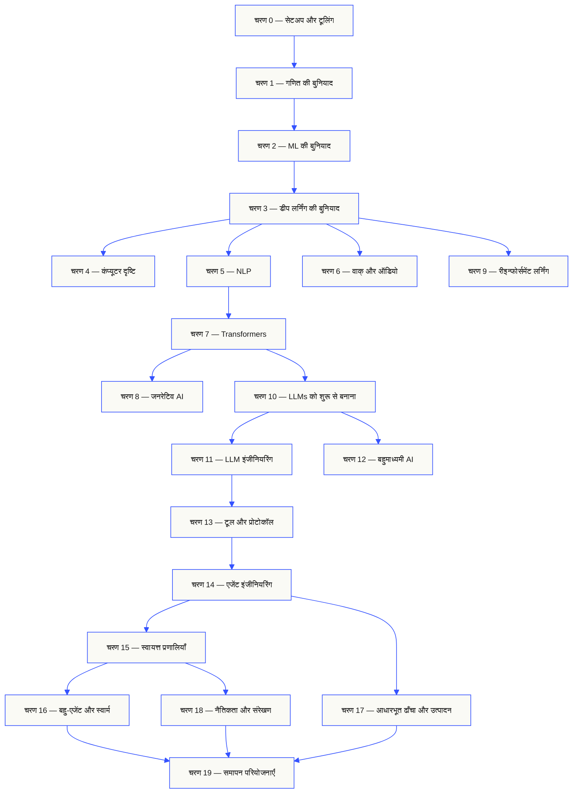
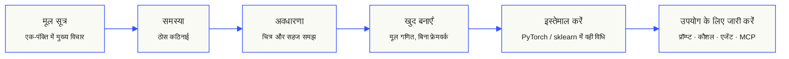

<p align="center"><sub>यह README AI की सहायता से हिंदी में अनूदित है; प्रामाणिक संस्करण <a href="../../README.md">अंग्रेज़ी README</a> है।</sub></p>

<p align="center">
  <picture>
    <source media="(prefers-color-scheme: dark)" srcset="../../assets/readme/header-dark.svg">
    
  </picture>
</p>

मॉडल की आंतरिक गणनाएँ, रिट्रीवल पाइपलाइन और एजेंट रनटाइम लागू करें। उनका परीक्षण करें, विफलताएँ जाँचें और कोड तथा मूल्यांकन के परिणाम सहेजें।

**[सीखना शुरू करें](https://aiengineeringfromscratch.com/lesson?path=phases/00-setup-and-tooling/01-dev-environment)** · **[अध्ययन-पथ चुनें](#learning-routes)** · **[प्रयोगशाला आज़माएँ](#interactive-lab)** · **[प्रोजेक्ट बनाएँ](#project-challenges)** · **[पाठ्यक्रम देखें](#contents)**

निःशुल्क, ओपन सोर्स, MIT लाइसेंस। वेबसाइट पर, कोडिंग एजेंट के साथ या स्थानीय कोड चलाकर सीखें।

> 523 पाठ. 20 चरण. Python, TypeScript, Rust, Julia.

<p align="center">
  <a href="../../LICENSE"></a>
  <a href="../../ROADMAP.md"></a>
  <a href="#contents"></a>
  <a href="https://github.com/rohitg00/ai-engineering-from-scratch/stargazers"></a>
  <a href="https://aiengineeringfromscratch.com"></a>
</p>

<details>
<summary>अपनी भाषा में पढ़ें</summary>

<p align="center">
  <a href="../../README.md">🇬🇧 English</a> · <a href="../../i18n/zh/README.md">🇨🇳 简体中文</a> · <a href="../../i18n/zh-TW/README.md">🇹🇼 繁體中文（台灣）</a> · <a href="../../i18n/ja/README.md">🇯🇵 日本語</a> · <a href="../../i18n/ko/README.md">🇰🇷 한국어</a> · <a href="../../i18n/pt/README.md">🇵🇹 Português</a> · <a href="../../i18n/pt-BR/README.md">🇧🇷 Português (Brasil)</a> · <a href="../../i18n/es/README.md">🇪🇸 Español</a> · <a href="../../i18n/de/README.md">🇩🇪 Deutsch</a> · <a href="../../i18n/fr/README.md">🇫🇷 Français</a> · <a href="../../i18n/it/README.md">🇮🇹 Italiano</a> · <a href="../../i18n/nl/README.md">🇳🇱 Nederlands</a> · <a href="../../i18n/pl/README.md">🇵🇱 Polski</a> · <a href="../../i18n/cs/README.md">🇨🇿 Čeština</a> · <a href="../../i18n/ro/README.md">🇷🇴 Română</a> · <a href="../../i18n/hu/README.md">🇭🇺 Magyar</a> · <a href="../../i18n/el/README.md">🇬🇷 Ελληνικά</a> · <a href="../../i18n/sv/README.md">🇸🇪 Svenska</a> · <a href="../../i18n/da/README.md">🇩🇰 Dansk</a> · <a href="../../i18n/no/README.md">🇳🇴 Norsk</a> · <a href="../../i18n/fi/README.md">🇫🇮 Suomi</a> · <a href="../../i18n/ru/README.md">🇷🇺 Русский</a> · <a href="../../i18n/uk/README.md">🇺🇦 Українська</a> · <a href="../../i18n/tr/README.md">🇹🇷 Türkçe</a> · <a href="../../i18n/he/README.md">🇮🇱 עברית</a> · <a href="../../i18n/ar/README.md">🇸🇦 العربية</a> · <a href="../../i18n/fa/README.md">🇮🇷 فارسی</a> · <a href="../../i18n/hi/README.md">🇮🇳 हिन्दी</a> · <a href="../../i18n/bn/README.md">🇧🇩 বাংলা</a> · <a href="../../i18n/ur/README.md">🇵🇰 اردو</a> · <a href="../../i18n/th/README.md">🇹🇭 ไทย</a> · <a href="../../i18n/vi/README.md">🇻🇳 Tiếng Việt</a> · <a href="../../i18n/id/README.md">🇮🇩 Bahasa Indonesia</a> · <a href="../../i18n/tl/README.md">🇵🇭 Tagalog</a>
</p>

</details>

### प्रायोजक

<p align="center">
  <a href="https://serpapi.com/ai-engineering-from-scratch"><picture><source media="(min-width: 768px)" srcset="../../assets/sponsors/serpapi-banner-compact.png" width="48%"></picture></a>
  <a href="https://nitrostack.ai/referral/aiengineeringfromscratch"><picture><source media="(min-width: 768px)" srcset="../../assets/sponsors/nitrostack-banner-equal.png" width="48%"></picture></a>
</p>

<p align="center">
  <sub><span>आपका सहयोग हर पाठ को मुफ़्त और ओपन सोर्स बनाए रखता है।</span> <a href="#supporters">सभी समर्थक देखें</a> · <a href="../../SPONSORS.md">एक प्रायोजक बनें</a></sub>
</p>

<a id="see-what-you-will-build-and-keep"></a>
<a id="learning-routes"></a>

## अध्ययन-पथ

| मार्ग | शुरुआती पाठ |
|---|---|
| मॉडल की नींव | [सेटअप और टूल](https://aiengineeringfromscratch.com/lesson?path=phases/00-setup-and-tooling/01-dev-environment) |
| LLM सिस्टम | [प्रॉम्प्ट इंजीनियरिंग](https://aiengineeringfromscratch.com/lesson?path=phases/11-llm-engineering/01-prompt-engineering) |
| एजेंट और डिलीवरी | [एजेंट लूप](https://aiengineeringfromscratch.com/lesson?path=phases/14-agent-engineering/01-the-agent-loop) |

[करियर-पथों की तुलना करें](https://aiengineeringfromscratch.com/learning-paths.html) · [पूर्वापेक्षाएं और अध्ययन का समय](#study-guide)

<a id="interactive-lab"></a>

### ग्रेडिएंट डिसेंट

20 शुरुआती बिंदु द्विघाती लॉस फ़ंक्शन पर ग्रेडिएंट डिसेंट के अनुसार चलते हैं। ग्राफ़ हर अपडेट के बाद उनकी स्थिति और औसत लॉस दिखाता है।

<p align="center">
  <a href="https://aiengineeringfromscratch.com/lesson?path=phases/01-math-foundations/08-optimization#loss-landscape-visualization">
    <picture>
      <source media="(max-width: 600px) and (prefers-color-scheme: dark) and (prefers-reduced-motion: reduce)" srcset="../../assets/readme/101-gradient-mobile-dark.png">
      <source media="(max-width: 600px) and (prefers-reduced-motion: reduce)" srcset="../../assets/readme/101-gradient-mobile-light.png">
      <source media="(prefers-color-scheme: dark) and (prefers-reduced-motion: reduce)" srcset="../../assets/readme/101-gradient-dark.png">
      <source media="(prefers-reduced-motion: reduce)" srcset="../../assets/readme/101-gradient-light.png">
      <source media="(max-width: 600px) and (prefers-color-scheme: dark)" srcset="../../assets/readme/101-gradient-mobile-dark.gif">
      <source media="(max-width: 600px)" srcset="../../assets/readme/101-gradient-mobile-light.gif">
      <source media="(prefers-color-scheme: dark)" srcset="../../assets/readme/101-gradient-dark.gif">
      
    </picture>
  </a>
</p>

[पाठ में लर्निंग रेट बदलें](https://aiengineeringfromscratch.com/lesson?path=phases/01-math-foundations/08-optimization#loss-landscape-visualization) · [कोड में GD, मोमेंटम और Adam की तुलना करें](../../phases/01-math-foundations/08-optimization/code/optimizers.py)

<a id="project-challenges"></a>

### प्रोजेक्ट

तीन प्रोजेक्ट, जिनमें चरणों के अनुसार शुरुआती कोड, संदर्भ कार्यान्वयन और स्थानीय ग्रेडर हैं। [सेटअप](#local-setup) के बाद रिपॉज़िटरी के मूल फ़ोल्डर से कमांड चलाएँ। चरण लागू होने तक शुरुआती कोड जाँच में विफल रहेगा।

<details>
<summary><strong>01 · रिट्रीवल मूल्यांकन प्रयोगशाला</strong> · Python · रैंकिंग मापदंड और गिरावट की जाँच</summary>

प्रस्तावित सिस्टम का औसत NDCG सुधरता है, लेकिन एक क्वेरी के सबसे प्रासंगिक प्रमाण की रैंक नीचे जाती है। क्वेरी-दर-क्वेरी तुलना बनाएँ जो गिरावट बताए और रिलीज़ जाँच को विफल कर सके।

Python 3.10+ इस्तेमाल करें। [RAG](../../phases/11-llm-engineering/06-rag/docs/en.md) और [मॉडल मूल्यांकन](../../phases/02-ml-fundamentals/09-model-evaluation/docs/en.md) दोहराएँ। पहले रैंकिंग सत्यापन, प्रिसीजन और रिकॉल, रैंक-संवेदनशील मापदंड, फिर सिस्टम की तुलना लागू करें।

```bash
python3 scripts/project_test.py retrieval-evaluation-lab \
  --init learning-artifacts/retrieval-evaluation-lab
python3 scripts/project_test.py retrieval-evaluation-lab \
  --stage 1 --path learning-artifacts/retrieval-evaluation-lab --strict
python3 scripts/project_test.py retrieval-evaluation-lab \
  --all --path learning-artifacts/retrieval-evaluation-lab --strict
```

**सहेजें:** दोहराई जा सकने वाली तुलना, जिसमें हर क्वेरी का अंतर और स्कोर के लिए इस्तेमाल हुए प्रासंगिकता आकलन हों। मापदंड इन आकलनों का वर्णन करते हैं; वे उत्तर की शुद्धता साबित नहीं करते।

[प्रोजेक्ट शुरू करें](https://aiengineeringfromscratch.com/project.html?id=retrieval-evaluation-lab) · [संदर्भ समाधान देखें](../../projects/retrieval-evaluation-lab/solution/) · [अपने इनपुट पर चलाएँ](../../projects/retrieval-evaluation-lab/README.md#run-with-your-own-inputs)

</details>

<details>
<summary><strong>02 · एजेंट ट्रेस डीबगर</strong> · TypeScript · ट्रेस पार्सिंग और समय की गणना</summary>

दिए गए ट्रेस में अभी भी 100 ms लगते हैं, लेकिन कुल टोकन उपयोग 200 बढ़ जाता है और एक स्पैन विफल होने लगता है। ओवरलैप करते चाइल्ड स्पैन का काम पैरेंट के अपने निष्पादन समय से अलग करें, फिर बदलाव दिखाने वाली रिपोर्ट बनाएँ।

Node.js 22.18+ और ग्रेडर के लिए Python 3 इस्तेमाल करें। JSONL पार्सिंग, पैरेंट संबंधों का सत्यापन, समय-अंतराल की गणना और जाँची जा सकने वाली टाइमलाइन लागू करें।

```bash
python3 scripts/project_test.py agent-trace-debugger \
  --init learning-artifacts/agent-trace-debugger
python3 scripts/project_test.py agent-trace-debugger \
  --stage 1 --path learning-artifacts/agent-trace-debugger --strict
python3 scripts/project_test.py agent-trace-debugger \
  --all --path learning-artifacts/agent-trace-debugger --strict
```

**सहेजें:** इनपुट ट्रेस, HTML टाइमलाइन और गिरावट की JSON रिपोर्ट। हर स्पैन के केवल अपने टोकन दर्ज करें, ताकि पैरेंट और चाइल्ड का उपयोग दो बार न गिना जाए।

[प्रोजेक्ट शुरू करें](https://aiengineeringfromscratch.com/project.html?id=agent-trace-debugger) · [संदर्भ समाधान देखें](../../projects/agent-trace-debugger/solution/) · [समय की गणना इंटरैक्टिव ढंग से देखें](https://aiengineeringfromscratch.com/project.html?id=agent-trace-debugger&stage=03-timing)

</details>

<details>
<summary><strong>03 · टूल कॉल फ़ायरवॉल</strong> · Rust · भूमिका की जाँच और स्वीकृति के रिकॉर्ड</summary>

समीक्षा के बाद लिखी जाने वाली सामग्री बदल जाती है या स्वीकृति दोबारा इस्तेमाल होती है। कॉल का एनवेलप सत्यापित करें, कॉलर की भूमिका और पथ जाँचें, फिर उसी सटीक अनुरोध और सामग्री से बँधी स्वीकृति को इस्तेमाल करके समाप्त करें।

Rust और Python 3.10+ इस्तेमाल करें। [टूल स्कीमा डिज़ाइन](../../phases/13-tools-and-protocols/05-tool-schema-design/docs/en.md) और [सुरक्षा सीमाएँ](../../phases/17-infrastructure-and-production/25-security-secrets-audit/docs/en.md) दोहराएँ। पहचान कॉल करने वाला एप्लिकेशन देता है; मॉडल कार्रवाई का प्रस्ताव रखता है।

```bash
python3 scripts/project_test.py tool-call-firewall \
  --init learning-artifacts/tool-call-firewall
python3 scripts/project_test.py tool-call-firewall \
  --stage 1 --path learning-artifacts/tool-call-firewall --strict
python3 scripts/project_test.py tool-call-firewall \
  --all --path learning-artifacts/tool-call-firewall --strict
```

**सहेजें:** अनुरोधित कार्रवाई और नीति का निर्णय दिखाने वाला ऑडिट रिकॉर्ड। स्वीकृति एक इनवोकेशन के भीतर केवल एक बार इस्तेमाल हो सकती है; यह प्रोजेक्ट स्थायी प्राधिकरण या ऑपरेटिंग सिस्टम सैंडबॉक्स नहीं देता।

[प्रोजेक्ट शुरू करें](https://aiengineeringfromscratch.com/project.html?id=tool-call-firewall) · [संदर्भ समाधान देखें](../../projects/tool-call-firewall/solution/) · [स्वीकृति की सीमाएँ समझें](https://aiengineeringfromscratch.com/project.html?id=tool-call-firewall&stage=03-consume-a-request-bound-approval-once)

</details>

[सभी प्रोजेक्ट देखें](https://aiengineeringfromscratch.com/projects.html) · [करियर अभ्यास मार्गदर्शिका](../../learning-paths/CAREER-PRACTICE.md)

## सीखने का तरीका चुनें

### वेबसाइट पर

पूरा किया हुआ कोई पाठ [aiengineeringfromscratch.com](https://aiengineeringfromscratch.com) पर खोलें या [विषय-सूची](#contents) में कोई चरण विस्तार से देखें। सेटअप या क्लोन की ज़रूरत नहीं।

### AI शिक्षक के साथ

अगर Node.js, `npx` और स्किल चला सकने वाला कोडिंग एजेंट पहले से स्थापित हैं, तो उस एजेंट को अपना ट्यूटर बना सकते हैं। ट्यूटर स्थापित करने या पढ़ने के लिए रिपॉज़िटरी क्लोन करना ज़रूरी नहीं। केंद्रित अध्ययन-पथ की प्रयोगशालाओं के लिए `python3` चाहिए। Agent Skills की प्रयोगशालाओं के लिए चुना हुआ होस्ट और उपयोगकर्ता या परियोजना के दायरे में लिखने योग्य स्किल फ़ोल्डर भी चाहिए।

```bash
npx skills add rohitg00/ai-engineering-from-scratch
```

इंस्टॉलर के पूछने पर होस्ट और दायरा चुनें। Codex में `start-learning`, Claude Code में `/start-learning` इस्तेमाल करें या अपने होस्ट से नाम के आधार पर स्किल उपयोग करने को कहें।

<details>
<summary>शिक्षक का सेटअप और होस्ट कमांड</summary>

पहले अपनी मशीन पर आवश्यक टूल जाँचें:

```bash
node --version
npx --version
python3 --version
```

`skills` इंस्टॉलर के दौरान चुने गए प्लेटफ़ॉर्म और दायरे में फ़ाइलें लिखता है, जैसे `.claude/skills/`, `.cursor/skills/` या `.codex/skills/`। जाँचें कि चुना हुआ प्लेटफ़ॉर्म उसी स्थान से कौशल खोजता है।

स्किल बुलाने का तरीका होस्ट तय करता है; अलग-अलग होस्ट पर चल सकने वाला `SKILL.md` प्रारूप इसे तय नहीं करता:

| होस्ट | कोर्स शुरू करें | Model Context Protocol (MCP) शुरू करें | Agent Skills शुरू करें | चरण की क्विज़ लें |
|---|---|---|---|---|
| Codex | `start-learning`, या `/skills` से चुनें | `learn-mcp`, या `/skills` से चुनें | `learn-agent-skills`, या `/skills` से चुनें | `check-understanding 13`, या `/skills` से चुनें |
| Claude Code | `/start-learning` | `/learn-mcp` | `/learn-agent-skills` | `/check-understanding 13` |
| अन्य संगत होस्ट | `Use start-learning to begin the course.` | `Use learn-mcp to start the Model Context Protocol (MCP) path.` | `Use learn-agent-skills to start the Agent Skills Engineering path.` | `Use check-understanding to quiz me on Phase 13.` |

दस सवालों की स्तर-जाँच क्विज़ आपके मौजूदा ज्ञान के अनुसार शुरुआती चरण चुनती है और व्यक्तिगत अध्ययन-योजना `LEARNING.md` में सहेजती है। इसके बाद `learn` स्किल हर सत्र में एक पाठ पढ़ाती है: अवधारणा, गणित, कोड और क्विज़। `course-guide` स्किल उस विषय का सही पाठ बताती है जहाँ आप अटक गए हैं। Codex में `learn` और `course-guide`, Claude Code में `/learn` और `/course-guide` चलाएँ; दूसरे संगत होस्ट में स्किल का नाम लेकर उसका उपयोग करने को कहें।

केवल Model Context Protocol (MCP) सीखना है? अपने होस्ट के लिए MCP शुरू करने वाला कमांड चुनें। इससे `MCP-LEARNING.md` बनती है और 17 पाठों का मार्ग शुरू होता है: अवस्था-रहित अनुरोध, संचार-विधियाँ, द्विदिश कार्य, सुरक्षा, विश्वसनीयता, रजिस्ट्री का प्रशासन और अनुरूपता के प्रमाण। सही क्रम और जाँच के पड़ाव [Model Context Protocol (MCP) की पाठ्यक्रम-सूची](../../learning-paths/model-context-protocol.json) में हैं।

केवल Agent Skills सीखना है? अपने होस्ट के लिए Agent Skills शुरू करने वाला कमांड चुनें। इससे `AGENT-SKILLS-LEARNING.md` बनती है और पाँच जुड़े पाठों का मार्ग मिलता है: अनुबंध, खोज, आह्वान, सैंडबॉक्स की सीमाएँ, फिर प्रकाशन से पहले मूल्यांकन और वास्तविक होस्टों के बीच पोर्टेबिलिटी। शुरुआत [वेबसाइट के Agent Skills पथ](https://aiengineeringfromscratch.com/lesson?path=phases/13-tools-and-protocols/22-skills-and-agent-sdks&learningPath=agent-skills) से भी कर सकते हैं।

इंस्टॉलर उन होस्ट प्लेटफ़ॉर्मों की सूची दिखाता है जिन्हें वह सेटअप कर सकता है और पूछता है कि स्किल कहाँ स्थापित करनी हैं। Node.js, `npx`, `python3`, समर्थित होस्ट या लिखने योग्य स्थान उपलब्ध न हो तो वेबसाइट देखें या `docs/en.md` पढ़ें। इससे अवधारणाएँ समझ आएँगी; लेकिन वास्तविक होस्ट पर स्किल खोजने, चलाने, स्क्रिप्ट इस्तेमाल करने और हटाने के प्रमाण वातावरण तैयार होने के बाद ही मिलेंगे। पाठ [aiengineeringfromscratch.com](https://aiengineeringfromscratch.com) पर भी पढ़ें।

### सीखने की स्किल

| कौशल | यह क्या करता है |
|---|---|
| [`start-learning`](../../skills/start-learning/SKILL.md) | शुरुआत के समय: सीखने का लक्ष्य स्पष्ट करें, स्तर-जाँच क्विज़ दें और निजी योजना `LEARNING.md` में सहेजें। |
| [`learn`](../../skills/learn/SKILL.md) | ट्यूटर-चक्र: पिछली बात याद करें, अगला पाठ संवाद के ज़रिये सीखें, फिर क्विज़ दें; प्रगति और दोहराने वाले विषय दर्ज होते हैं। |
| [`course-guide`](../../skills/course-guide/SKILL.md) | विषय-मार्गदर्शक: “अटेंशन तंत्र कहाँ सीखूँ?” या “मेरे लॉस में NaN क्यों है?” पूछें और सही पाठों के लिंक पाएँ। |
| [`learn-mcp`](../../skills/learn-mcp/SKILL.md) | MCP का केंद्रित ट्यूटर। `MCP-LEARNING.md` बनाता है, 17-पाठ की सूची अपनाता है और संचार, सुरक्षा, विश्वसनीयता तथा अनुरूपता के प्रमाण दर्ज करता है। |
| [`learn-agent-skills`](../../skills/learn-agent-skills/SKILL.md) | Agent Skills का केंद्रित ट्यूटर। `AGENT-SKILLS-LEARNING.md` बनाता है, पाठ 22, 24, 25, 26 और 27 पढ़ाता है और वास्तविक होस्ट पर जाँच के प्रमाण रखता है। |
| [`claude-certification`](../../skills/claude-certification/SKILL.md) | प्रमाणन ट्यूटर। CCAO-F, CCDV-F, CCAR-F या CCAR-P चुनता है; पाठ पढ़ाता, प्रयोगशालाएँ चलाता, बनाए गए काम की समीक्षा करता, निदान और अभ्यास-परीक्षाएँ कराता तथा प्रगति सहेजता है। |
| [`mcpa-certification`](../../skills/mcpa-certification/SKILL.md) | MCPA ट्यूटर। 2026-07-28 प्रोटोकॉल पर `mcpa-f` के 34-पाठ वाले मार्ग पर चलता है; प्रयोगशालाएँ और प्रोटोकॉल संदेशों की जाँच चलाता, निदान परीक्षा व तीन अभ्यास-परीक्षाएँ कराता और प्रगति सहेजता है। |
| [`find-your-level`](../../skills/find-your-level/SKILL.md) | दस सवालों की स्तर-जाँच क्विज़ आपके ज्ञान के अनुसार शुरुआती चरण चुनती है और समय-अनुमान सहित निजी अध्ययन-मार्ग बनाती है। |
| [`check-understanding <phase>`](../../skills/check-understanding/SKILL.md) | हर चरण के लिए आठ सवालों की क्विज़, प्रतिक्रिया और दोहराने योग्य पाठ। ऊपर की तालिका में Codex, Claude Code या सामान्य भाषा वाला तरीका देखें। |

</details>

<a id="local-setup"></a>

### स्थानीय कोड चलाएं

```bash
git clone https://github.com/rohitg00/ai-engineering-from-scratch.git
cd ai-engineering-from-scratch
python3 phases/00-setup-and-tooling/01-dev-environment/code/verify.py --route beginner
python3 phases/01-math-foundations/01-linear-algebra-intuition/code/vectors.py
```

शुरुआती जाँच अभी आवश्यक चीज़ों को उन औज़ारों से अलग करती है जिनकी ज़रूरत बाद में होगी। हर अनिवार्य जाँच विफल होने पर उसका कारण और सुधार का कमांड मिलता है। `vectors.py` कमांड बिना बाहरी निर्भरताओं वाला पाठ चलाता है और दिखाता है कि मैट्रिक्स को वेक्टर से गुणा करना ही न्यूरल नेटवर्क की एक परत के भीतर की गणना है। टर्मिनल के इस आउटपुट को अपना पहला प्रमाण मानकर सहेजें।

<details>
<summary>हर पाठ पर एक ही तरीके से काम करें</summary>

### हर पाठ पर एक ही तरीके से काम करें

1. **पढ़ें:** `docs/en.md` पढ़ें और मुख्य विचार अपने शब्दों में समझाएँ।
2. **लिखकर बनाएँ:** ज़रूरी कोड स्वयं लिखें; कोड-ब्लॉक को सजावट न समझें।
3. **चलाएँ:** पाठ का कमांड रिपॉज़िटरी के मूल फ़ोल्डर से चलाएँ, यानी उस फ़ोल्डर से जिसमें `README.md` और `phases/` हैं।
4. **प्रमाण सहेजें:** कमांड, कार्यशील फ़ोल्डर, निकास कोड, उपयोगी आउटपुट और बदली या बनाई गई सामग्री दर्ज करें।
5. **तभी आगे बढ़ें:** जब नतीजा समझा सकें और अनुमान लगाए बिना छोटा बदलाव कर सकें।

पाठों के कमांड में दिए गए पथ रिपॉज़िटरी के मूल फ़ोल्डर से शुरू होते हैं, जब तक कि पाठ स्पष्ट रूप से फ़ोल्डर बदलने को न कहे। कई प्रोग्रामिंग भाषाओं में कोड उपलब्ध हो तो उस भाषा का कार्यान्वयन चलाएँ जिसे आप सीख रहे हैं।

</details>

<a id="study-guide"></a>

## सीखने का मार्ग चुनें

शुरुआत से पहले 523 पाठों की सूची देखने की ज़रूरत नहीं। अपना एक लक्ष्य चुनें। हर लिंक GitHub या वेबसाइट पर उसी पाठ्यक्रम को खोलता है और दोनों जगह पाठों का कोड एक ही है।

| आपका लक्ष्य | GitHub पर सीखें | वेबसाइट पर सीखें |
|---|---|---|
| मैं नया हूँ और पूरी बुनियाद चाहता हूँ | [चरण 0: सेटअप और टूलिंग](../../phases/00-setup-and-tooling/) | [विकास वातावरण](https://aiengineeringfromscratch.com/lesson?path=phases/00-setup-and-tooling/01-dev-environment) |
| मुझे Python आता है; गणित और ML की बुनियाद चाहिए | [चरण 1: गणित की बुनियाद](../../phases/01-math-foundations/) | [रैखिक बीजगणित की सहज समझ](https://aiengineeringfromscratch.com/lesson?path=phases/01-math-foundations/01-linear-algebra-intuition) |
| मैं उत्पादन के लिए LLM ऐप बनाना चाहता हूँ | [चरण 11: LLM इंजीनियरिंग](../../phases/11-llm-engineering/) | [प्रॉम्प्ट इंजीनियरिंग](https://aiengineeringfromscratch.com/lesson?path=phases/11-llm-engineering/01-prompt-engineering) |
| मैं एजेंट बनाना चाहता हूँ | [चरण 14: एजेंट इंजीनियरिंग](../../phases/14-agent-engineering/) | [एजेंट लूप](https://aiengineeringfromscratch.com/lesson?path=phases/14-agent-engineering/01-the-agent-loop) |
| मैं असली रिपॉज़िटरी पर कोडिंग एजेंट इस्तेमाल करना चाहता हूँ | [एजेंट-सहायित इंजीनियरिंग मार्ग](../../learning-paths/using-coding-agents.json) | [एजेंट-सहायित इंजीनियरिंग](https://aiengineeringfromscratch.com/lesson?path=phases/14-agent-engineering/31-agent-workbench-why-models-fail&learningPath=using-coding-agents) |
| मैं कार्यान्वयन से पहले सही समाधान तय करना चाहता हूँ | [उत्पाद-निर्णय और सुपुर्दगी मार्ग](../../learning-paths/shaping-the-build.json) | [उत्पाद-निर्णय और सुपुर्दगी](https://aiengineeringfromscratch.com/lesson?path=phases/14-agent-engineering/47-outcomes-before-output&learningPath=shaping-the-build) |

पता नहीं कहाँ से शुरू करें? [`start-learning` स्तर-जाँच ट्यूटर](../../skills/start-learning/SKILL.md) या [वेबसाइट की पूर्वापेक्षा मार्गदर्शिका](https://aiengineeringfromscratch.com/prereqs.html) देखें।

[AI इंजीनियरिंग अध्ययन-पथ](https://aiengineeringfromscratch.com/learning-paths.html) में चार मुख्य क्षेत्रों और छह करियर-पथों की तुलना करें।

<details>
<summary>MCP और Agent Skills के केंद्रित मार्ग</summary>

| आपका लक्ष्य | GitHub पर सीखें | वेबसाइट पर सीखें |
|---|---|---|
| मैं Model Context Protocol (MCP) के साथ बनाना चाहता हूँ | [Model Context Protocol (MCP) मार्ग](../../phases/13-tools-and-protocols/README.md#model-context-protocol-mcp-path) | [Model Context Protocol (MCP) पथ](https://aiengineeringfromscratch.com/lesson?path=phases/13-tools-and-protocols/06-mcp-fundamentals&learningPath=model-context-protocol) |
| मैं Agent Skills लिखकर जारी करना चाहता हूँ | [Agent Skills का केंद्रित मार्ग](../../phases/13-tools-and-protocols/README.md#agent-skills-fast-path) | [Agent Skills पथ](https://aiengineeringfromscratch.com/lesson?path=phases/13-tools-and-protocols/22-skills-and-agent-sdks&learningPath=agent-skills) |

</details>

<details>
<summary>पूर्वापेक्षाएं और अध्ययन का समय</summary>

### पूर्वापेक्षाएँ

- आप किसी भी भाषा में कोड लिख सकते हैं; Python मददगार है।
- आप समझना चाहते हैं कि AI **वास्तव में कैसे काम करता है**, सिर्फ़ API कॉल करना नहीं।

## कहाँ से शुरू करें

| आपकी पृष्ठभूमि | यहाँ से शुरू करें | अनुमानित समय |
|---|---|---|
| प्रोग्रामिंग और AI में नए हैं | चरण 0 — सेटअप | ~306 घंटे |
| Python जानते हैं, ML नया है | चरण 1 — गणित की बुनियाद | ~270 घंटे |
| ML जानते हैं, डीप लर्निंग नया है | चरण 3 — डीप लर्निंग का मूल | ~200 घंटे |
| डीप लर्निंग जानते हैं, LLM और एजेंट चाहते हैं | चरण 10 — LLMs को शुरू से बनाना | ~100 घंटे |
| वरिष्ठ इंजीनियर, केवल एजेंट इंजीनियरिंग चाहिए | चरण 14 — एजेंट इंजीनियरिंग | ~60 घंटे |
| केवल उत्पादन MCP प्रणालियाँ बनाना चाहते हैं | [Model Context Protocol (MCP) पथ](../../learning-paths/model-context-protocol.json) | ~23 घंटे 15 मिनट |
| केवल उत्पादन Agent Skills बनाना चाहते हैं | [Agent Skills इंजीनियरिंग पथ](../../learning-paths/agent-skills.json) | ~9.5 घंटे |

</details>

## पाठ्यक्रम की बनावट

बीस चरण एक-दूसरे पर टिके हैं। गणित बुनियाद है; एजेंट और उत्पादन में तैनाती सबसे ऊपर हैं। नीचे के स्तर पहले से समझते हों तो आगे बढ़ें। लेकिन ज़रूरी आधार छोड़े बिना ही अगले स्तर पर जाएँ, ताकि वहाँ आने वाली समस्या की वजह समझ सकें।



<a id="contents"></a>

## विषय-सूची

बीस चरण। किसी चरण पर क्लिक करें और उसके पाठों की सूची खोलें।

<a id="phase-0"></a>
### चरण 0: सेटअप और टूलिंग `12 पाठ`
> आगे के सभी कामों के लिए अपना विकास वातावरण तैयार करें।

| # | पाठ | प्रकार | भाषा |
|:---:|--------|:----:|------|
| 01 | [विकास वातावरण](../../phases/00-setup-and-tooling/01-dev-environment/) | बनाएँ | Python |
| 02 | [Git और सहयोग](../../phases/00-setup-and-tooling/02-git-and-collaboration/) | सीखें | — |
| 03 | [GPU सेटअप और क्लाउड](../../phases/00-setup-and-tooling/03-gpu-setup-and-cloud/) | बनाएँ | Python |
| 04 | [API और कुंजियाँ](../../phases/00-setup-and-tooling/04-apis-and-keys/) | बनाएँ | Python |
| 05 | [Jupyter नोटबुक](../../phases/00-setup-and-tooling/05-jupyter-notebooks/) | बनाएँ | Python |
| 06 | [Python के परिवेश](../../phases/00-setup-and-tooling/06-python-environments/) | बनाएँ | Shell |
| 07 | [AI के लिए Docker](../../phases/00-setup-and-tooling/07-docker-for-ai/) | बनाएँ | Docker |
| 08 | [एडिटर सेटअप](../../phases/00-setup-and-tooling/08-editor-setup/) | बनाएँ | — |
| 09 | [डेटा प्रबंधन](../../phases/00-setup-and-tooling/09-data-management/) | बनाएँ | Python |
| 10 | [टर्मिनल और शेल](../../phases/00-setup-and-tooling/10-terminal-and-shell/) | सीखें | — |
| 11 | [AI के लिए Linux](../../phases/00-setup-and-tooling/11-linux-for-ai/) | सीखें | — |
| 12 | [डिबगिंग और प्रोफाइलिंग](../../phases/00-setup-and-tooling/12-debugging-and-profiling/) | बनाएँ | Python |

<details id="phase-1">
<summary><b>चरण 1 — गणित की बुनियाद</b> &nbsp;<code>22 पाठ</code>&nbsp; <em>हर AI एल्गोरिदम के पीछे की सहज समझ, कोड के ज़रिये।</em></summary>
<br/>

| # | पाठ | प्रकार | भाषा |
|:---:|--------|:----:|------|
| 01 | [रैखिक बीजगणित की सहज समझ](../../phases/01-math-foundations/01-linear-algebra-intuition/) | सीखें | Python, Julia |
| 02 | [वेक्टर, मैट्रिक्स और संक्रियाएँ](../../phases/01-math-foundations/02-vectors-matrices-operations/) | बनाएँ | Python, Julia |
| 03 | [मैट्रिक्स रूपांतरण और आइगेनवैल्यू](../../phases/01-math-foundations/03-matrix-transformations/) | बनाएँ | Python, Julia |
| 04 | [ML के लिए कलन: अवकलज और ग्रेडिएंट](../../phases/01-math-foundations/04-calculus-for-ml/) | सीखें | Python |
| 05 | [श्रृंखला नियम और स्वचालित अवकलन](../../phases/01-math-foundations/05-chain-rule-and-autodiff/) | बनाएँ | Python |
| 06 | [प्रायिकता और वितरण](../../phases/01-math-foundations/06-probability-and-distributions/) | सीखें | Python |
| 07 | [Bayes प्रमेय और सांख्यिकीय चिंतन](../../phases/01-math-foundations/07-bayes-theorem/) | बनाएँ | Python |
| 08 | [अनुकूलन: ग्रेडिएंट डिसेंट के तरीके](../../phases/01-math-foundations/08-optimization/) | बनाएँ | Python |
| 09 | [सूचना सिद्धांत: एंट्रॉपी और KL डाइवर्जेंस](../../phases/01-math-foundations/09-information-theory/) | सीखें | Python |
| 10 | [आयाम घटाना: PCA, t-SNE, UMAP](../../phases/01-math-foundations/10-dimensionality-reduction/) | बनाएँ | Python |
| 11 | [सिंगुलर वैल्यू डीकंपोज़िशन (SVD)](../../phases/01-math-foundations/11-singular-value-decomposition/) | बनाएँ | Python, Julia |
| 12 | [टेंसर संक्रियाएँ](../../phases/01-math-foundations/12-tensor-operations/) | बनाएँ | Python |
| 13 | [संख्यात्मक स्थिरता](../../phases/01-math-foundations/13-numerical-stability/) | बनाएँ | Python |
| 14 | [वेक्टर नॉर्म और दूरियाँ](../../phases/01-math-foundations/14-norms-and-distances/) | बनाएँ | Python |
| 15 | [ML के लिए सांख्यिकी](../../phases/01-math-foundations/15-statistics-for-ml/) | बनाएँ | Python |
| 16 | [नमूना चुनने के तरीके](../../phases/01-math-foundations/16-sampling-methods/) | बनाएँ | Python |
| 17 | [रैखिक समीकरण-तंत्र](../../phases/01-math-foundations/17-linear-systems/) | बनाएँ | Python |
| 18 | [उत्तल अनुकूलन](../../phases/01-math-foundations/18-convex-optimization/) | बनाएँ | Python |
| 19 | [AI के लिए सम्मिश्र संख्याएँ](../../phases/01-math-foundations/19-complex-numbers/) | सीखें | Python |
| 20 | [Fourier रूपांतरण](../../phases/01-math-foundations/20-fourier-transform/) | बनाएँ | Python |
| 21 | [ML के लिए ग्राफ सिद्धांत](../../phases/01-math-foundations/21-graph-theory/) | बनाएँ | Python |
| 22 | [स्टोकेस्टिक प्रक्रियाएँ](../../phases/01-math-foundations/22-stochastic-processes/) | सीखें | Python |

</details>

<details id="phase-2">
<summary><b>चरण 2 — ML की बुनियाद</b> &nbsp;<code>18 पाठ</code>&nbsp; <em>पारंपरिक ML आज भी अधिकांश उत्पादन AI की रीढ़ है।</em></summary>
<br/>

| # | पाठ | प्रकार | भाषा |
|:---:|--------|:----:|------|
| 01 | [मशीन लर्निंग क्या है](../../phases/02-ml-fundamentals/01-what-is-machine-learning/) | सीखें | Python |
| 02 | [शुरू से रैखिक प्रतिगमन](../../phases/02-ml-fundamentals/02-linear-regression/) | बनाएँ | Python |
| 03 | [लॉजिस्टिक प्रतिगमन और वर्गीकरण](../../phases/02-ml-fundamentals/03-logistic-regression/) | बनाएँ | Python |
| 04 | [निर्णय-वृक्ष और रैंडम फ़ॉरेस्ट](../../phases/02-ml-fundamentals/04-decision-trees/) | बनाएँ | Python |
| 05 | [सपोर्ट वेक्टर मशीनें (SVM)](../../phases/02-ml-fundamentals/05-support-vector-machines/) | बनाएँ | Python |
| 06 | [KNN और दूरी के माप](../../phases/02-ml-fundamentals/06-knn-and-distances/) | बनाएँ | Python |
| 07 | [बिना पर्यवेक्षण वाला अधिगम: K-Means, DBSCAN](../../phases/02-ml-fundamentals/07-unsupervised-learning/) | बनाएँ | Python |
| 08 | [विशेषता निर्माण और चयन](../../phases/02-ml-fundamentals/08-feature-engineering/) | बनाएँ | Python |
| 09 | [मॉडल मूल्यांकन: मापदंड और क्रॉस-वैलिडेशन](../../phases/02-ml-fundamentals/09-model-evaluation/) | बनाएँ | Python |
| 10 | [बायस, वैरिएंस और सीखने के वक्र](../../phases/02-ml-fundamentals/10-bias-variance/) | सीखें | Python |
| 11 | [एन्सेम्बल विधियाँ: बूस्टिंग, बैगिंग, स्टैकिंग](../../phases/02-ml-fundamentals/11-ensemble-methods/) | बनाएँ | Python |
| 12 | [हाइपरपैरामीटर का समायोजन](../../phases/02-ml-fundamentals/12-hyperparameter-tuning/) | बनाएँ | Python |
| 13 | [ML पाइपलाइनें और प्रयोगों की ट्रैकिंग](../../phases/02-ml-fundamentals/13-ml-pipelines/) | बनाएँ | Python |
| 14 | [नाइव बेयस](../../phases/02-ml-fundamentals/14-naive-bayes/) | बनाएँ | Python |
| 15 | [समय-श्रृंखला की बुनियाद](../../phases/02-ml-fundamentals/15-time-series/) | बनाएँ | Python |
| 16 | [असामान्यता पहचान](../../phases/02-ml-fundamentals/16-anomaly-detection/) | बनाएँ | Python |
| 17 | [असंतुलित डेटा को संभालना](../../phases/02-ml-fundamentals/17-imbalanced-data/) | बनाएँ | Python |
| 18 | [विशेषता चयन](../../phases/02-ml-fundamentals/18-feature-selection/) | बनाएँ | Python |

</details>

<details id="phase-3">
<summary><b>चरण 3 — डीप लर्निंग की बुनियाद</b> &nbsp;<code>13 पाठ</code>&nbsp; <em>बुनियादी सिद्धांतों से न्यूरल नेटवर्क बनाएँ। पहले खुद कार्यान्वयन करें, फिर फ्रेमवर्क इस्तेमाल करें।</em></summary>
<br/>

| # | पाठ | प्रकार | भाषा |
|:---:|--------|:----:|------|
| 01 | [Perceptron: शुरुआत यहीं से](../../phases/03-deep-learning-core/01-the-perceptron/) | बनाएँ | Python |
| 02 | [बहु-स्तरीय नेटवर्क और अग्रिम प्रसार](../../phases/03-deep-learning-core/02-multi-layer-networks/) | बनाएँ | Python |
| 03 | [शुरू से बैकप्रोपेगेशन](../../phases/03-deep-learning-core/03-backpropagation/) | बनाएँ | Python |
| 04 | [सक्रियण फलन: ReLU, Sigmoid, GELU और इन्हें चुनने का कारण](../../phases/03-deep-learning-core/04-activation-functions/) | बनाएँ | Python |
| 05 | [लॉस फलन: MSE, क्रॉस-एंट्रॉपी और कॉन्ट्रास्टिव लॉस](../../phases/03-deep-learning-core/05-loss-functions/) | बनाएँ | Python |
| 06 | [अनुकूलक: SGD, Momentum, Adam, AdamW](../../phases/03-deep-learning-core/06-optimizers/) | बनाएँ | Python |
| 07 | [नियमितीकरण: Dropout, Weight Decay, BatchNorm](../../phases/03-deep-learning-core/07-regularization/) | बनाएँ | Python |
| 08 | [शुरुआती भार और प्रशिक्षण की स्थिरता](../../phases/03-deep-learning-core/08-weight-initialization/) | बनाएँ | Python |
| 09 | [सीखने की दर की समय-सारणी और वार्मअप](../../phases/03-deep-learning-core/09-learning-rate-schedules/) | बनाएँ | Python |
| 10 | [अपना छोटा फ्रेमवर्क बनाएँ](../../phases/03-deep-learning-core/10-mini-framework/) | बनाएँ | Python |
| 11 | [PyTorch का परिचय](../../phases/03-deep-learning-core/11-intro-to-pytorch/) | बनाएँ | Python |
| 12 | [JAX का परिचय](../../phases/03-deep-learning-core/12-intro-to-jax/) | बनाएँ | Python |
| 13 | [तंत्रिका-जालों में त्रुटि-खोज](../../phases/03-deep-learning-core/13-debugging-neural-networks/) | बनाएँ | Python |

</details>

<details id="phase-4">
<summary><b>चरण 4 — कंप्यूटर विज़न</b> &nbsp;<code>28 पाठ</code>&nbsp; <em>पिक्सेल से समझ तक: चित्र, वीडियो, 3D, VLM और विश्व मॉडल।</em></summary>
<br/>

| # | पाठ | प्रकार | भाषा |
|:---:|--------|:----:|------|
| 01 | [चित्र की बुनियाद: पिक्सेल, चैनल और रंग-स्थान](../../phases/04-computer-vision/01-image-fundamentals/) | सीखें | Python |
| 02 | [संवलन (convolution) की गणना शुरू से](../../phases/04-computer-vision/02-convolutions-from-scratch/) | बनाएँ | Python |
| 03 | [CNN: LeNet से ResNet तक](../../phases/04-computer-vision/03-cnns-lenet-to-resnet/) | बनाएँ | Python |
| 04 | [चित्र वर्गीकरण](../../phases/04-computer-vision/04-image-classification/) | बनाएँ | Python |
| 05 | [स्थानांतरण अधिगम और फाइन-ट्यूनिंग](../../phases/04-computer-vision/05-transfer-learning/) | बनाएँ | Python |
| 06 | [ऑब्जेक्ट डिटेक्शन: शुरू से YOLO](../../phases/04-computer-vision/06-object-detection-yolo/) | बनाएँ | Python |
| 07 | [अर्थगत विभाजन: U-Net](../../phases/04-computer-vision/07-semantic-segmentation-unet/) | बनाएँ | Python |
| 08 | [वस्तु-इकाई विभाजन: Mask R-CNN](../../phases/04-computer-vision/08-instance-segmentation-mask-rcnn/) | बनाएँ | Python |
| 09 | [चित्र निर्माण: GANs](../../phases/04-computer-vision/09-image-generation-gans/) | बनाएँ | Python |
| 10 | [चित्र निर्माण: प्रसार मॉडल](../../phases/04-computer-vision/10-image-generation-diffusion/) | बनाएँ | Python |
| 11 | [Stable Diffusion: संरचना और फाइन-ट्यूनिंग](../../phases/04-computer-vision/11-stable-diffusion/) | बनाएँ | Python |
| 12 | [वीडियो की समझ: कालिक मॉडलिंग](../../phases/04-computer-vision/12-video-understanding/) | बनाएँ | Python |
| 13 | [3D दृष्टि: पॉइंट क्लाउड और NeRFs](../../phases/04-computer-vision/13-3d-vision-nerf/) | बनाएँ | Python |
| 14 | [विज़न Transformer (ViT)](../../phases/04-computer-vision/14-vision-transformers/) | बनाएँ | Python |
| 15 | [रीयल-टाइम दृष्टि: एज पर तैनाती](../../phases/04-computer-vision/15-real-time-edge/) | बनाएँ | Python |
| 16 | [दृष्टि की पूरी पाइपलाइन बनाएँ](../../phases/04-computer-vision/16-vision-pipeline-capstone/) | बनाएँ | Python |
| 17 | [स्व-पर्यवेक्षित कंप्यूटर दृष्टि: SimCLR, DINO, MAE](../../phases/04-computer-vision/17-self-supervised-vision/) | बनाएँ | Python |
| 18 | [खुली शब्दावली वाली कंप्यूटर दृष्टि: CLIP](../../phases/04-computer-vision/18-open-vocab-clip/) | बनाएँ | Python |
| 19 | [OCR और दस्तावेज़ों की समझ](../../phases/04-computer-vision/19-ocr-document-understanding/) | बनाएँ | Python |
| 20 | [चित्र पुनर्प्राप्ति और मापदंड-आधारित अधिगम](../../phases/04-computer-vision/20-image-retrieval-metric/) | बनाएँ | Python |
| 21 | [मुख्य-बिंदु पहचान और मुद्रा अनुमान](../../phases/04-computer-vision/21-keypoint-pose/) | बनाएँ | Python |
| 22 | [शुरू से 3D Gaussian Splatting](../../phases/04-computer-vision/22-3d-gaussian-splatting/) | बनाएँ | Python |
| 23 | [Diffusion Transformers और रेक्टिफ़ाइड फ़्लो](../../phases/04-computer-vision/23-diffusion-transformers-rectified-flow/) | बनाएँ | Python |
| 24 | [SAM 3 और खुली शब्दावली के आधार पर विभाजन](../../phases/04-computer-vision/24-sam3-open-vocab-segmentation/) | बनाएँ | Python |
| 25 | [दृश्य-भाषा मॉडल (ViT-MLP-LLM)](../../phases/04-computer-vision/25-vision-language-models/) | बनाएँ | Python |
| 26 | [एक चित्र से गहराई और ज्यामिति का अनुमान](../../phases/04-computer-vision/26-monocular-depth/) | बनाएँ | Python |
| 27 | [कई वस्तुओं पर नज़र रखना और वीडियो स्मृति](../../phases/04-computer-vision/27-multi-object-tracking/) | बनाएँ | Python |
| 28 | [विश्व मॉडल और वीडियो प्रसार](../../phases/04-computer-vision/28-world-models-video-diffusion/) | बनाएँ | Python |

</details>

<details id="phase-5">
<summary><b>चरण 5 — NLP: बुनियाद से उन्नत विषयों तक</b> &nbsp;<code>29 पाठ</code>&nbsp; <em>भाषा बुद्धिमत्ता तक पहुँचने का अंतरफलक है।</em></summary>
<br/>

| # | पाठ | प्रकार | भाषा |
|:---:|--------|:----:|------|
| 01 | [पाठ संसाधन: टोकनीकरण, मूल-रूप निष्कर्षण और लेम्मा निर्धारण](../../phases/05-nlp-foundations-to-advanced/01-text-processing/) | बनाएँ | Python |
| 02 | [Bag of Words, TF-IDF और पाठ निरूपण](../../phases/05-nlp-foundations-to-advanced/02-bag-of-words-tfidf/) | बनाएँ | Python |
| 03 | [शब्द वेक्टर निरूपण: शुरू से Word2Vec](../../phases/05-nlp-foundations-to-advanced/03-word-embeddings-word2vec/) | बनाएँ | Python |
| 04 | [GloVe, FastText और उपशब्द एम्बेडिंग](../../phases/05-nlp-foundations-to-advanced/04-glove-fasttext-subword/) | बनाएँ | Python |
| 05 | [भाव-विश्लेषण](../../phases/05-nlp-foundations-to-advanced/05-sentiment-analysis/) | बनाएँ | Python |
| 06 | [नामित इकाई पहचान (NER)](../../phases/05-nlp-foundations-to-advanced/06-named-entity-recognition/) | बनाएँ | Python |
| 07 | [शब्द-भेद टैगिंग और वाक्य-विन्यास विश्लेषण](../../phases/05-nlp-foundations-to-advanced/07-pos-tagging-parsing/) | बनाएँ | Python |
| 08 | [पाठ वर्गीकरण: पाठ के लिए CNN और RNN](../../phases/05-nlp-foundations-to-advanced/08-cnns-rnns-for-text/) | बनाएँ | Python |
| 09 | [क्रम-से-क्रम मॉडल](../../phases/05-nlp-foundations-to-advanced/09-sequence-to-sequence/) | बनाएँ | Python |
| 10 | [अटेंशन तंत्र: निर्णायक सफलता](../../phases/05-nlp-foundations-to-advanced/10-attention-mechanism/) | बनाएँ | Python |
| 11 | [मशीन अनुवाद](../../phases/05-nlp-foundations-to-advanced/11-machine-translation/) | बनाएँ | Python |
| 12 | [पाठ का सारांश](../../phases/05-nlp-foundations-to-advanced/12-text-summarization/) | बनाएँ | Python |
| 13 | [प्रश्न-उत्तर प्रणालियाँ](../../phases/05-nlp-foundations-to-advanced/13-question-answering/) | बनाएँ | Python |
| 14 | [सूचना पुनर्प्राप्ति और खोज](../../phases/05-nlp-foundations-to-advanced/14-information-retrieval-search/) | बनाएँ | Python |
| 15 | [विषय मॉडलिंग: LDA, BERTopic](../../phases/05-nlp-foundations-to-advanced/15-topic-modeling/) | बनाएँ | Python |
| 16 | [पाठ निर्माण](../../phases/05-nlp-foundations-to-advanced/16-text-generation-pre-transformer/) | बनाएँ | Python |
| 17 | [चैटबॉट: नियम-आधारित से न्यूरल मॉडल तक](../../phases/05-nlp-foundations-to-advanced/17-chatbots-rule-to-neural/) | बनाएँ | Python |
| 18 | [बहुभाषी NLP](../../phases/05-nlp-foundations-to-advanced/18-multilingual-nlp/) | बनाएँ | Python |
| 19 | [उपशब्द टोकनीकरण: BPE, WordPiece, Unigram, SentencePiece](../../phases/05-nlp-foundations-to-advanced/19-subword-tokenization/) | सीखें | Python |
| 20 | [संरचित आउटपुट और नियंत्रित डीकोडिंग](../../phases/05-nlp-foundations-to-advanced/20-structured-outputs-constrained-decoding/) | बनाएँ | Python |
| 21 | [NLI: पाठ से तार्किक निष्कर्ष निकालना](../../phases/05-nlp-foundations-to-advanced/21-nli-textual-entailment/) | सीखें | Python |
| 22 | [एम्बेडिंग मॉडल की गहराई से पड़ताल](../../phases/05-nlp-foundations-to-advanced/22-embedding-models-deep-dive/) | सीखें | Python |
| 23 | [RAG में पाठ को खंडों में बाँटने की रणनीतियाँ](../../phases/05-nlp-foundations-to-advanced/23-chunking-strategies-rag/) | बनाएँ | Python |
| 24 | [एक ही इकाई के संदर्भों की पहचान](../../phases/05-nlp-foundations-to-advanced/24-coreference-resolution/) | सीखें | Python |
| 25 | [इकाइयों को जोड़ना और अस्पष्टता दूर करना](../../phases/05-nlp-foundations-to-advanced/25-entity-linking/) | बनाएँ | Python |
| 26 | [संबंध निष्कर्षण और ज्ञान-ग्राफ निर्माण](../../phases/05-nlp-foundations-to-advanced/26-relation-extraction-kg/) | बनाएँ | Python |
| 27 | [LLM मूल्यांकन: RAGAS, DeepEval, G-Eval](../../phases/05-nlp-foundations-to-advanced/27-llm-evaluation-frameworks/) | बनाएँ | Python |
| 28 | [दीर्घ-संदर्भ मूल्यांकन: NIAH, RULER, LongBench, MRCR](../../phases/05-nlp-foundations-to-advanced/28-long-context-evaluation/) | सीखें | Python |
| 29 | [संवाद की स्थिति पर नज़र रखना](../../phases/05-nlp-foundations-to-advanced/29-dialogue-state-tracking/) | बनाएँ | Python |

</details>

<details id="phase-6">
<summary><b>चरण 6 — वाक् और ऑडियो</b> &nbsp;<code>17 पाठ</code>&nbsp; <em>सुनें, समझें, बोलें।</em></summary>
<br/>

| # | पाठ | प्रकार | भाषा |
|:---:|--------|:----:|------|
| 01 | [ऑडियो की बुनियाद: तरंगरूप, नमूनाकरण और FFT](../../phases/06-speech-and-audio/01-audio-fundamentals) | सीखें | Python |
| 02 | [स्पेक्ट्रोग्राम, Mel पैमाना और ऑडियो की विशेषताएँ](../../phases/06-speech-and-audio/02-spectrograms-mel-features) | बनाएँ | Python |
| 03 | [ऑडियो वर्गीकरण](../../phases/06-speech-and-audio/03-audio-classification) | बनाएँ | Python |
| 04 | [वाक् पहचान (ASR)](../../phases/06-speech-and-audio/04-speech-recognition-asr) | बनाएँ | Python |
| 05 | [Whisper: संरचना और फाइन-ट्यूनिंग](../../phases/06-speech-and-audio/05-whisper-architecture-finetuning) | बनाएँ | Python |
| 06 | [वक्ता की पहचान और सत्यापन](../../phases/06-speech-and-audio/06-speaker-recognition-verification) | बनाएँ | Python |
| 07 | [पाठ से वाक् (TTS)](../../phases/06-speech-and-audio/07-text-to-speech) | बनाएँ | Python |
| 08 | [आवाज़ की नकल और रूपांतरण](../../phases/06-speech-and-audio/08-voice-cloning-conversion) | बनाएँ | Python |
| 09 | [संगीत निर्माण](../../phases/06-speech-and-audio/09-music-generation) | बनाएँ | Python |
| 10 | [ऑडियो-भाषा मॉडल](../../phases/06-speech-and-audio/10-audio-language-models) | बनाएँ | Python |
| 11 | [रीयल-टाइम ऑडियो संसाधन](../../phases/06-speech-and-audio/11-real-time-audio-processing) | बनाएँ | Python |
| 12 | [वॉइस असिस्टेंट की पाइपलाइन बनाएँ](../../phases/06-speech-and-audio/12-voice-assistant-pipeline) | बनाएँ | Python |
| 13 | [न्यूरल ऑडियो कोडेक: EnCodec, SNAC, Mimi, DAC](../../phases/06-speech-and-audio/13-neural-audio-codecs) | सीखें | Python |
| 14 | [आवाज़ की सक्रियता और बोलने की बारी पहचानना](../../phases/06-speech-and-audio/14-voice-activity-detection-turn-taking) | बनाएँ | Python |
| 15 | [स्ट्रीमिंग वाक्-से-वाक्: Moshi, Hibiki](../../phases/06-speech-and-audio/15-streaming-speech-to-speech-moshi-hibiki) | सीखें | Python |
| 16 | [आवाज़ की नकल-रोधी तकनीक और ऑडियो वॉटरमार्किंग](../../phases/06-speech-and-audio/16-anti-spoofing-audio-watermarking) | बनाएँ | Python |
| 17 | [ऑडियो मूल्यांकन: WER, MOS, MMAU और रैंकिंग](../../phases/06-speech-and-audio/17-audio-evaluation-metrics) | सीखें | Python |

</details>

<details id="phase-7">
<summary><b>चरण 7 — Transformers की गहराई में</b> &nbsp;<code>16 पाठ</code>&nbsp; <em>वह संरचना जिसने सब कुछ बदल दिया।</em></summary>
<br/>

| # | पाठ | प्रकार | भाषा |
|:---:|--------|:----:|------|
| 01 | [Transformers क्यों: RNN की समस्याएँ](../../phases/07-transformers-deep-dive/01-why-transformers/) | सीखें | Python |
| 02 | [शुरू से सेल्फ-अटेंशन](../../phases/07-transformers-deep-dive/02-self-attention-from-scratch/) | बनाएँ | Python |
| 03 | [मल्टी-हेड अटेंशन](../../phases/07-transformers-deep-dive/03-multi-head-attention/) | बनाएँ | Python |
| 04 | [स्थिति-एन्कोडिंग: साइनसॉइडल, RoPE, ALiBi](../../phases/07-transformers-deep-dive/04-positional-encoding/) | बनाएँ | Python |
| 05 | [पूरा Transformer: एन्कोडर और डिकोडर](../../phases/07-transformers-deep-dive/05-full-transformer/) | बनाएँ | Python |
| 06 | [BERT: मास्क्ड भाषा मॉडलिंग](../../phases/07-transformers-deep-dive/06-bert-masked-language-modeling/) | बनाएँ | Python |
| 07 | [GPT: कारणात्मक भाषा मॉडलिंग](../../phases/07-transformers-deep-dive/07-gpt-causal-language-modeling/) | बनाएँ | Python |
| 08 | [T5, BART: एन्कोडर-डिकोडर मॉडल](../../phases/07-transformers-deep-dive/08-t5-bart-encoder-decoder/) | सीखें | Python |
| 09 | [विज़न Transformer (ViT)](../../phases/07-transformers-deep-dive/09-vision-transformers/) | बनाएँ | Python |
| 10 | [ऑडियो Transformers: Whisper संरचना](../../phases/07-transformers-deep-dive/10-audio-transformers-whisper/) | सीखें | Python |
| 11 | [विशेषज्ञों का मिश्रण (MoE)](../../phases/07-transformers-deep-dive/11-mixture-of-experts/) | बनाएँ | Python |
| 12 | [KV कैश, Flash Attention और अनुमानन का अनुकूलन](../../phases/07-transformers-deep-dive/12-kv-cache-flash-attention/) | बनाएँ | Python |
| 13 | [स्केलिंग के नियम](../../phases/07-transformers-deep-dive/13-scaling-laws/) | सीखें | Python |
| 14 | [शुरू से Transformer बनाएँ](../../phases/07-transformers-deep-dive/14-build-a-transformer-capstone/) | बनाएँ | Python |
| 15 | [अटेंशन के प्रकार: स्लाइडिंग विंडो, स्पार्स और डिफ़रेंशियल](../../phases/07-transformers-deep-dive/15-attention-variants/) | बनाएँ | Python |
| 16 | [स्पेक्युलेटिव डीकोडिंग: मसौदा बनाएँ, जाँचें, दोहराएँ](../../phases/07-transformers-deep-dive/16-speculative-decoding/) | बनाएँ | Python |

</details>

<details id="phase-8">
<summary><b>चरण 8 — जनरेटिव AI</b> &nbsp;<code>15 पाठ</code>&nbsp; <em>चित्र, वीडियो, ऑडियो, 3D और बहुत कुछ बनाएँ।</em></summary>
<br/>

| # | पाठ | प्रकार | भाषा |
|:---:|--------|:----:|------|
| 01 | [जनरेटिव मॉडल: वर्गीकरण और इतिहास](../../phases/08-generative-ai/01-generative-models-taxonomy-history/) | सीखें | Python |
| 02 | [ऑटोएन्कोडर और VAE](../../phases/08-generative-ai/02-autoencoders-vae/) | बनाएँ | Python |
| 03 | [GANs: जनरेटर बनाम डिस्क्रिमिनेटर](../../phases/08-generative-ai/03-gans-generator-discriminator/) | बनाएँ | Python |
| 04 | [कंडीशनल GANs और Pix2Pix](../../phases/08-generative-ai/04-conditional-gans-pix2pix/) | बनाएँ | Python |
| 05 | [StyleGAN](../../phases/08-generative-ai/05-stylegan/) | बनाएँ | Python |
| 06 | [प्रसार मॉडल: शुरू से DDPM](../../phases/08-generative-ai/06-diffusion-ddpm-from-scratch/) | बनाएँ | Python |
| 07 | [लेटेंट डिफ़्यूज़न और Stable Diffusion](../../phases/08-generative-ai/07-latent-diffusion-stable-diffusion/) | बनाएँ | Python |
| 08 | [ControlNet, LoRA और कंडीशनिंग](../../phases/08-generative-ai/08-controlnet-lora-conditioning/) | बनाएँ | Python |
| 09 | [इनपेंटिंग, आउटपेंटिंग और संपादन](../../phases/08-generative-ai/09-inpainting-outpainting-editing/) | बनाएँ | Python |
| 10 | [वीडियो निर्माण](../../phases/08-generative-ai/10-video-generation/) | बनाएँ | Python |
| 11 | [ऑडियो निर्माण](../../phases/08-generative-ai/11-audio-generation/) | बनाएँ | Python |
| 12 | [3D निर्माण](../../phases/08-generative-ai/12-3d-generation/) | बनाएँ | Python |
| 13 | [फ़्लो मैचिंग और रेक्टिफ़ाइड फ़्लो](../../phases/08-generative-ai/13-flow-matching-rectified-flows/) | बनाएँ | Python |
| 14 | [मूल्यांकन: FID, CLIP Score](../../phases/08-generative-ai/14-evaluation-fid-clip-score/) | बनाएँ | Python |
| 19 | [दृश्य स्व-प्रतिगामी मॉडलिंग (VAR): अगले पैमाने की भविष्यवाणी](../../phases/08-generative-ai/19-visual-autoregressive-var/) | बनाएँ | Python |

</details>

<details id="phase-9">
<summary><b>चरण 9 — रीइन्फोर्समेंट लर्निंग</b> &nbsp;<code>12 पाठ</code>&nbsp; <em>RLHF और खेल खेलने वाले AI की बुनियाद।</em></summary>
<br/>

| # | पाठ | प्रकार | भाषा |
|:---:|--------|:----:|------|
| 01 | [MDP, अवस्थाएँ, क्रियाएँ और पुरस्कार](../../phases/09-reinforcement-learning/01-mdps-states-actions-rewards/) | सीखें | Python |
| 02 | [गतिशील प्रोग्रामिंग](../../phases/09-reinforcement-learning/02-dynamic-programming/) | बनाएँ | Python |
| 03 | [Monte Carlo विधियाँ](../../phases/09-reinforcement-learning/03-monte-carlo-methods/) | बनाएँ | Python |
| 04 | [Q-Learning, SARSA](../../phases/09-reinforcement-learning/04-q-learning-sarsa/) | बनाएँ | Python |
| 05 | [डीप Q-नेटवर्क (DQN)](../../phases/09-reinforcement-learning/05-dqn/) | बनाएँ | Python |
| 06 | [पॉलिसी ग्रेडिएंट: REINFORCE](../../phases/09-reinforcement-learning/06-policy-gradients-reinforce/) | बनाएँ | Python |
| 07 | [ऐक्टर-क्रिटिक: A2C, A3C](../../phases/09-reinforcement-learning/07-actor-critic-a2c-a3c/) | बनाएँ | Python |
| 08 | [PPO](../../phases/09-reinforcement-learning/08-ppo/) | बनाएँ | Python |
| 09 | [प्रतिफल मॉडलिंग और RLHF](../../phases/09-reinforcement-learning/09-reward-modeling-rlhf/) | बनाएँ | Python |
| 10 | [बहु-एजेंट RL](../../phases/09-reinforcement-learning/10-multi-agent-rl/) | बनाएँ | Python |
| 11 | [अनुकरण से वास्तविक दुनिया में स्थानांतरण](../../phases/09-reinforcement-learning/11-sim-to-real-transfer/) | बनाएँ | Python |
| 12 | [खेलों के लिए RL](../../phases/09-reinforcement-learning/12-rl-for-games/) | बनाएँ | Python |

</details>

<details id="phase-10">
<summary><b>चरण 10 — LLMs को शुरू से बनाना</b> &nbsp;<code>24 पाठ</code>&nbsp; <em>बड़े भाषा मॉडल बनाएँ, प्रशिक्षित करें और समझें।</em></summary>
<br/>

| # | पाठ | प्रकार | भाषा |
|:---:|--------|:----:|------|
| 01 | [टोकनाइज़र: BPE, WordPiece, SentencePiece](../../phases/10-llms-from-scratch/01-tokenizers/) | बनाएँ | Python, Rust |
| 02 | [शुरू से टोकनाइज़र बनाएँ](../../phases/10-llms-from-scratch/02-building-a-tokenizer/) | बनाएँ | Python |
| 03 | [पूर्व-प्रशिक्षण के लिए डेटा पाइपलाइनें](../../phases/10-llms-from-scratch/03-data-pipelines/) | बनाएँ | Python |
| 04 | [Mini GPT का पूर्व-प्रशिक्षण (124M)](../../phases/10-llms-from-scratch/04-pre-training-mini-gpt/) | बनाएँ | Python |
| 05 | [वितरित प्रशिक्षण: FSDP, DeepSpeed](../../phases/10-llms-from-scratch/05-scaling-distributed/) | बनाएँ | Python |
| 06 | [निर्देश-अनुकूलन — SFT](../../phases/10-llms-from-scratch/06-instruction-tuning-sft/) | बनाएँ | Python |
| 07 | [RLHF: पुरस्कार मॉडल और PPO](../../phases/10-llms-from-scratch/07-rlhf/) | बनाएँ | Python |
| 08 | [DPO: प्रत्यक्ष वरीयता अनुकूलन](../../phases/10-llms-from-scratch/08-dpo/) | बनाएँ | Python |
| 09 | [संवैधानिक AI और आत्म-सुधार](../../phases/10-llms-from-scratch/09-constitutional-ai-self-improvement/) | बनाएँ | Python |
| 10 | [मूल्यांकन: बेंचमार्क और परीक्षण](../../phases/10-llms-from-scratch/10-evaluation/) | बनाएँ | Python |
| 11 | [परिमाणीकरण: INT8, GPTQ, AWQ, GGUF](../../phases/10-llms-from-scratch/11-quantization/) | बनाएँ | Python |
| 12 | [अनुमानन अनुकूलन](../../phases/10-llms-from-scratch/12-inference-optimization/) | बनाएँ | Python |
| 13 | [पूरी LLM पाइपलाइन बनाएँ](../../phases/10-llms-from-scratch/13-building-complete-llm-pipeline/) | बनाएँ | Python |
| 14 | [खुले मॉडल: संरचना की पड़ताल](../../phases/10-llms-from-scratch/14-open-models-architecture-walkthroughs/) | सीखें | Python |
| 15 | [स्पेक्युलेटिव डिकोडिंग और EAGLE-3](../../phases/10-llms-from-scratch/15-speculative-decoding-eagle3/) | बनाएँ | Python |
| 16 | [Differential Attention (V2)](../../phases/10-llms-from-scratch/16-differential-attention-v2/) | बनाएँ | Python |
| 17 | [Native Sparse Attention (DeepSeek NSA)](../../phases/10-llms-from-scratch/17-native-sparse-attention/) | बनाएँ | Python |
| 18 | [कई टोकन की भविष्यवाणी (MTP)](../../phases/10-llms-from-scratch/18-multi-token-prediction/) | बनाएँ | Python |
| 19 | [DualPipe समानांतरता](../../phases/10-llms-from-scratch/19-dualpipe-parallelism/) | सीखें | Python |
| 20 | [DeepSeek-V3 की संरचना की पड़ताल](../../phases/10-llms-from-scratch/20-deepseek-v3-walkthrough/) | सीखें | Python |
| 21 | [Jamba: मिश्रित SSM-Transformer](../../phases/10-llms-from-scratch/21-jamba-hybrid-ssm-transformer/) | सीखें | Python |
| 22 | [अतुल्यकालिक और Hogwild! अनुमानन](../../phases/10-llms-from-scratch/22-async-hogwild-inference/) | बनाएँ | Python |
| 25 | [स्पेक्युलेटिव डिकोडिंग और EAGLE](../../phases/10-llms-from-scratch/25-speculative-decoding/) | बनाएँ | Python |
| 34 | [ग्रेडिएंट चेकपॉइंटिंग और सक्रियण की दोबारा गणना](../../phases/10-llms-from-scratch/34-gradient-checkpointing/) | बनाएँ | Python |

</details>

<details id="phase-11">
<summary><b>चरण 11 — LLM इंजीनियरिंग</b> &nbsp;<code>17 पाठ</code>&nbsp; <em>LLM को उत्पादन में काम पर लगाएँ।</em></summary>
<br/>

| # | पाठ | प्रकार | भाषा |
|:---:|--------|:----:|------|
| 01 | [प्रॉम्प्ट इंजीनियरिंग: तकनीकें और प्रचलित तरीके](../../phases/11-llm-engineering/01-prompt-engineering/) | बनाएँ | Python |
| 02 | [कम उदाहरणों से सीखना, CoT और विचार-वृक्ष](../../phases/11-llm-engineering/02-few-shot-cot/) | बनाएँ | Python |
| 03 | [संरचित आउटपुट](../../phases/11-llm-engineering/03-structured-outputs/) | बनाएँ | Python |
| 04 | [एम्बेडिंग और वेक्टर निरूपण](../../phases/11-llm-engineering/04-embeddings/) | बनाएँ | Python |
| 05 | [संदर्भ अभियांत्रिकी](../../phases/11-llm-engineering/05-context-engineering/) | बनाएँ | Python |
| 06 | [RAG: पुनर्प्राप्ति की सहायता से सामग्री निर्माण](../../phases/11-llm-engineering/06-rag/) | बनाएँ | Python |
| 07 | [उन्नत RAG: पाठ-खंड बनाना और पुनः क्रम देना](../../phases/11-llm-engineering/07-advanced-rag/) | बनाएँ | Python |
| 08 | [LoRA और QLoRA के साथ फाइन-ट्यूनिंग](../../phases/11-llm-engineering/08-fine-tuning-lora/) | बनाएँ | Python |
| 09 | [फ़ंक्शन कॉलिंग और टूल का उपयोग](../../phases/11-llm-engineering/09-function-calling/) | बनाएँ | Python |
| 10 | [मूल्यांकन और परीक्षण](../../phases/11-llm-engineering/10-evaluation/) | बनाएँ | Python |
| 11 | [कैशिंग, अनुरोध-दर की सीमा और लागत](../../phases/11-llm-engineering/11-caching-cost/) | बनाएँ | Python |
| 12 | [सुरक्षा-नियम और सुरक्षा](../../phases/11-llm-engineering/12-guardrails/) | बनाएँ | Python |
| 13 | [उत्पादन LLM ऐप बनाएँ](../../phases/11-llm-engineering/13-production-app/) | बनाएँ | Python |
| 14 | [Model Context Protocol (MCP)](../../phases/11-llm-engineering/14-model-context-protocol/) | बनाएँ | Python |
| 15 | [प्रॉम्प्ट कैशिंग और संदर्भ कैशिंग](../../phases/11-llm-engineering/15-prompt-caching/) | बनाएँ | Python |
| 16 | [एजेंट की अवस्था-मशीनें: ग्राफ, नोड और चेकपॉइंट](../../phases/11-llm-engineering/16-langgraph-state-machines/) | बनाएँ | Python |
| 17 | [एजेंट ढाँचे के बीच चुनाव](../../phases/11-llm-engineering/17-agent-framework-tradeoffs/) | सीखें | Python |

</details>

<details id="phase-12">
<summary><b>चरण 12 — मल्टीमोडल AI</b> &nbsp;<code>25 पाठ</code>&nbsp; <em>ViT के चित्र-खंडों से कंप्यूटर चलाने वाले एजेंट तक: चित्र, ध्वनि और पाठ को समझें और उनसे मिली जानकारी जोड़कर तर्क करें।</em></summary>
<br/>

| # | पाठ | प्रकार | भाषा |
|:---:|--------|:----:|------|
| 01 | [Vision Transformers और पैच-टोकन की मूल इकाई](../../phases/12-multimodal-ai/01-vision-transformer-patch-tokens/) | सीखें | Python |
| 02 | [CLIP और दृष्टि-भाषा का कॉन्ट्रास्टिव पूर्व-प्रशिक्षण](../../phases/12-multimodal-ai/02-clip-contrastive-pretraining/) | बनाएँ | Python |
| 03 | [BLIP-2 Q-Former: डेटा के अलग-अलग रूपों को जोड़ने वाला सेतु](../../phases/12-multimodal-ai/03-blip2-qformer-bridge/) | बनाएँ | Python |
| 04 | [Flamingo और गेटयुक्त क्रॉस-अटेंशन](../../phases/12-multimodal-ai/04-flamingo-gated-cross-attention/) | सीखें | Python |
| 05 | [LLaVA और दृश्य निर्देश-अनुकूलन](../../phases/12-multimodal-ai/05-llava-visual-instruction-tuning/) | बनाएँ | Python |
| 06 | [अलग-अलग रिज़ॉल्यूशन पर दृष्टि: Patch-n'-Pack और NaFlex](../../phases/12-multimodal-ai/06-any-resolution-patch-n-pack/) | बनाएँ | Python |
| 07 | [खुले भार वाले VLM बनाने की विधियाँ: वास्तव में क्या मायने रखता है](../../phases/12-multimodal-ai/07-open-weight-vlm-recipes/) | सीखें | Python |
| 08 | [LLaVA-OneVision: एक चित्र, कई चित्र और वीडियो](../../phases/12-multimodal-ai/08-llava-onevision-single-multi-video/) | बनाएँ | Python |
| 09 | [Qwen-VL परिवार और गतिशील FPS वाला वीडियो](../../phases/12-multimodal-ai/09-qwen-vl-family-dynamic-fps/) | सीखें | Python |
| 10 | [InternVL3 का मूल मल्टीमोडल पूर्व-प्रशिक्षण](../../phases/12-multimodal-ai/10-internvl3-native-multimodal/) | सीखें | Python |
| 11 | [Chameleon: शुरुआती संलयन, केवल टोकन](../../phases/12-multimodal-ai/11-chameleon-early-fusion-tokens/) | बनाएँ | Python |
| 12 | [Emu3: सामग्री निर्माण के लिए अगले टोकन की भविष्यवाणी](../../phases/12-multimodal-ai/12-emu3-next-token-for-generation/) | सीखें | Python |
| 13 | [Transfusion: ऑटोरिग्रेसिव मॉडल और डिफ़्यूज़न](../../phases/12-multimodal-ai/13-transfusion-autoregressive-diffusion/) | बनाएँ | Python |
| 14 | [Show-o: एकीकृत विविक्त डिफ़्यूज़न](../../phases/12-multimodal-ai/14-show-o-discrete-diffusion-unified/) | सीखें | Python |
| 15 | [Janus-Pro: अलग-अलग एन्कोडर](../../phases/12-multimodal-ai/15-janus-pro-decoupled-encoders/) | बनाएँ | Python |
| 16 | [MIO: किसी भी डेटा-रूप से दूसरे डेटा-रूप में स्ट्रीमिंग](../../phases/12-multimodal-ai/16-mio-any-to-any-streaming/) | सीखें | Python |
| 17 | [वीडियो में भाषा को सही समय-खंड से जोड़ना](../../phases/12-multimodal-ai/17-video-language-temporal-grounding/) | बनाएँ | Python |
| 18 | [दस लाख टोकनों के संदर्भ में लंबा वीडियो](../../phases/12-multimodal-ai/18-long-video-million-token/) | बनाएँ | Python |
| 19 | [ऑडियो-भाषा मॉडल: Whisper से AF3 तक](../../phases/12-multimodal-ai/19-audio-language-whisper-to-af3/) | बनाएँ | Python |
| 20 | [Omni मॉडल: Thinker-Talker स्ट्रीमिंग](../../phases/12-multimodal-ai/20-omni-models-thinker-talker/) | बनाएँ | Python |
| 21 | [भौतिक एजेंटों के लिए VLA: RT-2, OpenVLA, π0, GR00T](../../phases/12-multimodal-ai/21-embodied-vlas-openvla-pi0-groot/) | सीखें | Python |
| 22 | [दस्तावेज़ और आरेख समझना](../../phases/12-multimodal-ai/22-document-diagram-understanding/) | बनाएँ | Python |
| 23 | [ColPali: दृष्टि-आधारित दस्तावेज़ RAG](../../phases/12-multimodal-ai/23-colpali-vision-native-rag/) | बनाएँ | Python |
| 24 | [मल्टीमोडल RAG और अलग-अलग डेटा-रूपों के बीच पुनर्प्राप्ति](../../phases/12-multimodal-ai/24-multimodal-rag-cross-modal/) | बनाएँ | Python |
| 25 | [मल्टीमोडल एजेंट और कंप्यूटर संचालन (समापन परियोजना)](../../phases/12-multimodal-ai/25-multimodal-agents-computer-use/) | बनाएँ | Python |

</details>

<details id="phase-13">
<summary><b>चरण 13 — टूल और प्रोटोकॉल</b> &nbsp;<code>31 पाठ</code>&nbsp; <em>AI और असली दुनिया के बीच के अंतरफलक।</em></summary>
<br/>

| # | पाठ | प्रकार | भाषा |
|:---:|--------|:----:|------|
| 01 | [औज़ार का अंतरफलक](../../phases/13-tools-and-protocols/01-the-tool-interface/) | सीखें | Python |
| 02 | [फ़ंक्शन कॉलिंग की गहन पड़ताल](../../phases/13-tools-and-protocols/02-function-calling-deep-dive/) | बनाएँ | Python |
| 03 | [औज़ारों को समानांतर कॉल करना और प्रवाहमान प्रतिक्रियाएँ](../../phases/13-tools-and-protocols/03-parallel-and-streaming-tool-calls/) | बनाएँ | Python |
| 04 | [संरचित आउटपुट](../../phases/13-tools-and-protocols/04-structured-output/) | बनाएँ | Python |
| 05 | [औज़ारों के स्कीमा की रूपरेखा](../../phases/13-tools-and-protocols/05-tool-schema-design/) | सीखें | Python |
| 06 | [MCP की बुनियाद: अवस्था-रहित अनुरोध और JSON-RPC](../../phases/13-tools-and-protocols/06-mcp-fundamentals/) | सीखें | Python |
| 07 | [अवस्था-रहित Python और TypeScript से MCP सर्वर बनाएँ](../../phases/13-tools-and-protocols/07-building-an-mcp-server/) | बनाएँ | Python, TypeScript |
| 08 | [MCP क्लाइंट बनाएँ: खोज, मार्ग-निर्धारण और पुराने संस्करण से संगतता](../../phases/13-tools-and-protocols/08-building-an-mcp-client/) | बनाएँ | Python |
| 09 | [MCP परिवहन: stdio और अवस्था-रहित Streamable HTTP](../../phases/13-tools-and-protocols/09-mcp-transports/) | सीखें | Python |
| 10 | [MCP संसाधन और प्रॉम्प्ट: अवस्था-रहित सर्वरों के लिए संबोधित करने योग्य संदर्भ](../../phases/13-tools-and-protocols/10-mcp-resources-and-prompts/) | बनाएँ | Python |
| 11 | [MCP में मॉडल इनपुट: नमूनाकरण का स्थानांतरण और अवस्था-रहित MRTR](../../phases/13-tools-and-protocols/11-mcp-sampling/) | बनाएँ | Python |
| 12 | [स्पष्ट दायरा और अवस्था-रहित तरीके से उपयोगकर्ता से जानकारी माँगना](../../phases/13-tools-and-protocols/12-mcp-roots-and-elicitation/) | बनाएँ | Python |
| 13 | [MCP Tasks विस्तार: अवस्था-रहित मूल प्रणाली पर टिकाऊ काम](../../phases/13-tools-and-protocols/13-mcp-async-tasks/) | बनाएँ | Python |
| 14 | [अवस्था-रहित प्रोटोकॉल पर MCP Apps](../../phases/13-tools-and-protocols/14-mcp-apps/) | बनाएँ | Python |
| 15 | [MCP सुरक्षा: दूषित मेटाडेटा, मार्ग-निर्धारण और MRTR स्थिति](../../phases/13-tools-and-protocols/15-mcp-security-tool-poisoning/) | सीखें | Python |
| 16 | [MCP प्राधिकरण: CIMD, जारीकर्ता-बाइंडिंग, PKCE और अतिरिक्त सत्यापन](../../phases/13-tools-and-protocols/16-mcp-security-oauth-2-1/) | बनाएँ | Python |
| 17 | [अवस्था-रहित MCP गेटवे और रजिस्ट्री में पंजीकरण](../../phases/13-tools-and-protocols/17-mcp-gateways-and-registries/) | सीखें | Python |
| 18 | [उत्पादन में MCP प्रमाणीकरण: जारीकर्ता-बद्ध नामांकन और टोकन](../../phases/13-tools-and-protocols/18-mcp-auth-production/) | बनाएँ | Python |
| 19 | [A2A प्रोटोकॉल](../../phases/13-tools-and-protocols/19-a2a-protocol/) | बनाएँ | Python |
| 20 | [OpenTelemetry GenAI](../../phases/13-tools-and-protocols/20-opentelemetry-genai/) | बनाएँ | Python |
| 21 | [LLM मार्ग-निर्धारण परत](../../phases/13-tools-and-protocols/21-llm-routing-layer/) | सीखें | Python |
| 22 | [Agent Skills: पोर्टेबल अनुबंध और रनटाइम सीमा](../../phases/13-tools-and-protocols/22-skills-and-agent-sdks/) | बनाएँ | Python |
| 23 | [समापन परियोजना: अवस्था-रहित औज़ार पारिस्थितिकी तंत्र](../../phases/13-tools-and-protocols/23-capstone-tool-ecosystem/) | बनाएँ | Python |
| 24 | [कौशल खोज और क्रमिक जानकारी-प्रकटीकरण](../../phases/13-tools-and-protocols/24-skill-discovery-and-progressive-disclosure/) | बनाएँ | Python |
| 25 | [कौशल आह्वान और मार्ग-निर्धारण](../../phases/13-tools-and-protocols/25-skill-invocation-and-routing/) | बनाएँ | Python |
| 26 | [कौशल अनुमतियाँ, सैंडबॉक्स और भरोसा](../../phases/13-tools-and-protocols/26-skill-permissions-sandboxes-and-trust/) | बनाएँ | Python |
| 27 | [कौशल मूल्यांकन, पैकेजिंग और पोर्टेबिलिटी](../../phases/13-tools-and-protocols/27-skill-evals-packaging-and-portability/) | बनाएँ | Python |
| 28 | [MCP औज़ार अनुबंध और सामग्री](../../phases/13-tools-and-protocols/28-mcp-tool-contracts-and-content/) | बनाएँ | Python |
| 29 | [MCP की विश्वसनीयता, रद्दीकरण और प्रवाह नियंत्रण](../../phases/13-tools-and-protocols/29-mcp-reliability-cancellation-and-flow-control/) | बनाएँ | Python |
| 30 | [MCP रजिस्ट्री आपूर्ति-शृंखला: प्रवेश, विचलन और पूर्व स्थिति में वापसी](../../phases/13-tools-and-protocols/30-mcp-registry-supply-chain-and-drift/) | बनाएँ | Python |
| 31 | [MCP अनुरूपता अभियांत्रिकी: संस्करण, साक्ष्य और संचालन](../../phases/13-tools-and-protocols/31-mcp-conformance-versioning-and-operations/) | बनाएँ | Python |


पाठ 06–18 और 28–31 मिलकर [Model Context Protocol (MCP) अध्ययन-पथ](../../learning-paths/model-context-protocol.json) बनाते हैं। पाठ्यक्रम-सूची का क्रम है: 06, 07, 08, 09, 10, 11, 12, 13, 14, 15, 16, 18, 17, 28, 29, 30, 31। इसे ऊपर की होस्ट-विशिष्ट तालिका में `learn-mcp` से शुरू करें। पाठ 23 इस मार्ग की एकमात्र वैकल्पिक समापन परियोजना है और इसके लिए पाठ 19 तथा 20 भी चाहिए।

पाठ 22 और 24–27 मिलकर [Agent Skills अध्ययन-पथ](../../learning-paths/agent-skills.json) बनाते हैं—कौशल-पैकेज के अनुबंध से लेकर वास्तविक होस्ट पर जारी करने की जाँच तक। ऊपर की तालिका से `learn-agent-skills` शुरू करें; 22 के बाद केवल संख्या देखकर 23 पर न जाएँ।

<details id="phase-14">
<summary><b>चरण 14 — एजेंट इंजीनियरिंग</b> &nbsp;<code>54 पाठ</code>&nbsp; <em>बुनियादी सिद्धांतों से एजेंट बनाएँ, कोडिंग एजेंट को भरोसे से इस्तेमाल करें और कार्यान्वयन से पहले काम का सही आकार तय करें।</em></summary>
<br/>

| # | पाठ | प्रकार | भाषा |
|:---:|--------|:----:|------|
| 01 | [एजेंट लूप](../../phases/14-agent-engineering/01-the-agent-loop/) | बनाएँ | Python |
| 02 | [ReWOO और योजना बनाकर निष्पादन](../../phases/14-agent-engineering/02-rewoo-plan-and-execute/) | बनाएँ | Python |
| 03 | [Reflexion और मौखिक पुनर्बलन अधिगम](../../phases/14-agent-engineering/03-reflexion-verbal-rl/) | बनाएँ | Python |
| 04 | [विचार-वृक्ष और LATS](../../phases/14-agent-engineering/04-tree-of-thoughts-lats/) | बनाएँ | Python |
| 05 | [आत्म-संशोधन और CRITIC](../../phases/14-agent-engineering/05-self-refine-and-critic/) | बनाएँ | Python |
| 06 | [औज़ारों का उपयोग और फ़ंक्शन कॉलिंग](../../phases/14-agent-engineering/06-tool-use-and-function-calling/) | बनाएँ | Python |
| 07 | [एजेंट स्मृति: आभासी संदर्भ और स्मृति-पृष्ठन](../../phases/14-agent-engineering/07-memory-virtual-context-memgpt/) | बनाएँ | Python |
| 08 | [स्मृति-खंड और निष्क्रिय-अवधि संगणना](../../phases/14-agent-engineering/08-memory-blocks-sleep-time-compute/) | बनाएँ | Python |
| 09 | [संकर स्मृति: वेक्टर, ग्राफ और KV](../../phases/14-agent-engineering/09-hybrid-memory-mem0/) | बनाएँ | Python |
| 10 | [कौशल-संग्रह और आजीवन अधिगम (Voyager)](../../phases/14-agent-engineering/10-skill-libraries-voyager/) | बनाएँ | Python |
| 11 | [HTN और विकासवादी खोज से योजना](../../phases/14-agent-engineering/11-planning-htn-and-evolutionary/) | बनाएँ | Python |
| 12 | [Anthropic के कार्यप्रवाह प्रतिरूप](../../phases/14-agent-engineering/12-anthropic-workflow-patterns/) | बनाएँ | Python |
| 13 | [स्थितियुक्त ग्राफ समन्वयन: टिकाऊ निष्पादन और जाँच-बिंदु](../../phases/14-agent-engineering/13-langgraph-stateful-graphs/) | बनाएँ | Python |
| 14 | [एजेंटों के लिए Actor Model](../../phases/14-agent-engineering/14-autogen-actor-model/) | बनाएँ | Python |
| 15 | [भूमिका-आधारित एजेंट दल: भूमिकाएँ, कार्य और प्रक्रियाएँ](../../phases/14-agent-engineering/15-crewai-role-based-crews/) | बनाएँ | Python |
| 16 | [OpenAI Agents SDK: कार्य-हस्तांतरण, सुरक्षा-नियम और अनुरेखण](../../phases/14-agent-engineering/16-openai-agents-sdk/) | बनाएँ | Python |
| 17 | [लाइब्रेरी के रूप में एजेंट हार्नेस: उप-एजेंट और सत्र-संग्रह](../../phases/14-agent-engineering/17-claude-agent-sdk/) | बनाएँ | Python |
| 18 | [उत्पादन एजेंट रनटाइम](../../phases/14-agent-engineering/18-agno-and-mastra-runtimes/) | सीखें | Python |
| 19 | [बेंचमार्क: SWE-bench, GAIA, AgentBench](../../phases/14-agent-engineering/19-benchmarks-swebench-gaia/) | सीखें | Python |
| 20 | [बेंचमार्क: WebArena और OSWorld](../../phases/14-agent-engineering/20-benchmarks-webarena-osworld/) | सीखें | Python |
| 21 | [कंप्यूटर का उपयोग: Claude, OpenAI CUA, Gemini](../../phases/14-agent-engineering/21-computer-use-agents/) | बनाएँ | Python |
| 22 | [वाक् एजेंट: Pipecat और LiveKit](../../phases/14-agent-engineering/22-voice-agents-pipecat-livekit/) | बनाएँ | Python |
| 23 | [OpenTelemetry GenAI के अर्थगत प्रतिरूप](../../phases/14-agent-engineering/23-otel-genai-conventions/) | बनाएँ | Python |
| 24 | [एजेंटों की निगरानी-योग्यता: Langfuse, Phoenix, Opik](../../phases/14-agent-engineering/24-agent-observability-platforms/) | सीखें | Python |
| 25 | [बहु-एजेंट बहस और सहयोग](../../phases/14-agent-engineering/25-multi-agent-debate/) | बनाएँ | Python |
| 26 | [विफलता-स्थितियाँ: एजेंट क्यों टूटते हैं](../../phases/14-agent-engineering/26-failure-modes-agentic/) | बनाएँ | Python |
| 27 | [प्रॉम्प्ट इंजेक्शन और PVE सुरक्षा](../../phases/14-agent-engineering/27-prompt-injection-defense/) | बनाएँ | Python |
| 28 | [समन्वयन प्रतिरूप: पर्यवेक्षक, स्वार्म और पदानुक्रम](../../phases/14-agent-engineering/28-orchestration-patterns/) | बनाएँ | Python |
| 29 | [उत्पादन रनटाइम: कतारें, घटनाएँ और क्रॉन](../../phases/14-agent-engineering/29-production-runtimes/) | सीखें | Python |
| 30 | [मूल्यांकन-आधारित एजेंट विकास](../../phases/14-agent-engineering/30-eval-driven-agent-development/) | बनाएँ | Python |
| 31 | [एजेंट कार्यक्षेत्र: सक्षम मॉडल भी क्यों चूकते हैं](../../phases/14-agent-engineering/31-agent-workbench-why-models-fail/) | सीखें | Python |
| 32 | [एजेंट कार्यक्षेत्र का न्यूनतम रूप](../../phases/14-agent-engineering/32-minimal-agent-workbench/) | बनाएँ | Python |
| 33 | [एजेंट के निर्देश निष्पादन योग्य बाधाओं के रूप में](../../phases/14-agent-engineering/33-instructions-as-executable-constraints/) | बनाएँ | Python |
| 34 | [रिपॉज़िटरी की स्मृति और स्थायी स्थिति](../../phases/14-agent-engineering/34-repo-memory-and-state/) | बनाएँ | Python |
| 35 | [एजेंटों के लिए आरंभीकरण स्क्रिप्ट](../../phases/14-agent-engineering/35-initialization-scripts/) | बनाएँ | Python |
| 36 | [दायरा-अनुबंध और कार्य-सीमाएँ](../../phases/14-agent-engineering/36-scope-contracts/) | बनाएँ | Python |
| 37 | [रनटाइम प्रतिपुष्टि चक्र](../../phases/14-agent-engineering/37-runtime-feedback-loops/) | बनाएँ | Python |
| 38 | [सत्यापन-द्वार](../../phases/14-agent-engineering/38-verification-gates/) | बनाएँ | Python |
| 39 | [समीक्षक एजेंट: निर्माता और मूल्यांकनकर्ता अलग रखें](../../phases/14-agent-engineering/39-reviewer-agent/) | बनाएँ | Python |
| 40 | [बहु-सत्र हस्तांतरण](../../phases/14-agent-engineering/40-multi-session-handoff/) | बनाएँ | Python |
| 41 | [वास्तविक रिपॉज़िटरी में कार्यक्षेत्र](../../phases/14-agent-engineering/41-workbench-for-real-repos/) | बनाएँ | Python |
| 42 | [समापन परियोजना: पुनः उपयोगी एजेंट कार्यक्षेत्र-पैक जारी करें](../../phases/14-agent-engineering/42-agent-workbench-capstone/) | बनाएँ | Python |
| 43 | [एजेंट के कोड लिखने से पहले कार्य स्पष्ट करें](../../phases/14-agent-engineering/43-frame-the-task-before-code/) | बनाएँ | Python |
| 44 | [साक्ष्य के आधार पर निष्पादन योजना बनाएँ](../../phases/14-agent-engineering/44-plan-from-evidence/) | बनाएँ | Python |
| 45 | [अलगाव और विलय-अनुबंधों के साथ एजेंट का कार्य सौंपें](../../phases/14-agent-engineering/45-delegate-with-isolation/) | बनाएँ | Python |
| 46 | [एजेंट को दिया हर सुधार प्रणाली के सुधार में बदलें](../../phases/14-agent-engineering/46-turn-feedback-into-system/) | बनाएँ | Python |
| 47 | [परिणाम पहले तय करें, फिर प्रस्तुति चुनें](../../phases/14-agent-engineering/47-outcomes-before-output/) | बनाएँ | Python |
| 48 | [लोग वास्तव में जो कार्यप्रवाह अपनाते हैं, उसका पता लगाएँ](../../phases/14-agent-engineering/48-discover-the-real-workflow/) | बनाएँ | Python |
| 49 | [मान्यताओं का मानचित्र बनाएँ और जोखिमभरी मान्यता पहले सुलझाएँ](../../phases/14-agent-engineering/49-map-assumptions-and-risk/) | बनाएँ | Python |
| 50 | [निर्णय बदल सकने वाला सबसे छोटा भाग चुनें](../../phases/14-agent-engineering/50-choose-the-smallest-testable-slice/) | बनाएँ | Python |
| 51 | [ऐसे विनिर्देश लिखें जिनमें विवेकाधीन निर्णय की गुंजाइश रहे](../../phases/14-agent-engineering/51-write-specifications-that-preserve-judgment/) | बनाएँ | Python |
| 52 | [परिणाम आने से पहले सफलता-माप तय करें](../../phases/14-agent-engineering/52-design-success-metrics/) | बनाएँ | Python |
| 53 | [सोच-समझकर प्रोटोटाइप, पायलट या उत्पादन चुनें](../../phases/14-agent-engineering/53-prototype-pilot-or-production/) | बनाएँ | Python |
| 54 | [स्वामित्व और समाप्ति-नियमों सहित प्रतिपुष्टि-चक्र बनाएँ](../../phases/14-agent-engineering/54-build-the-feedback-ratchet/) | बनाएँ | Python |


चरण 14 के हर Workbench पाठ (31–42) में `mission.md` है। यह एजेंट को पूरा पाठ-विवरण खोलने से पहले काम का संदर्भ देता है।

पाठ 31–46 [एजेंट-सहायित अभियांत्रिकी पथ](../../learning-paths/using-coding-agents.json) बनाते हैं। इस पथ का क्रम Workbench की बुनियाद को कार्य-निर्धारण, योजना, काम सौंपने और टिकाऊ प्रतिपुष्टि से जोड़ता है। पाठ 47–54 [उत्पाद-निर्णय और सुपुर्दगी पथ](../../learning-paths/shaping-the-build.json) बनाते हैं: अपेक्षित परिणाम तय करने से लेकर प्रमाण, जोखिम, दायरा, मापन, चरणबद्ध जारीकरण और प्रतिपुष्टि की ज़िम्मेदारी तक।

<details id="phase-15">
<summary><b>चरण 15 — स्वायत्त प्रणालियाँ</b> &nbsp;<code>22 पाठ</code>&nbsp; <em>लंबे समय तक काम करने वाले एजेंट, आत्म-सुधार और 2026 की सुरक्षा-तकनीकें।</em></summary>
<br/>

| # | पाठ | प्रकार | भाषा |
|:---:|--------|:----:|------|
| 01 | [चैटबॉट से लंबे समय तक काम करने वाले एजेंट तक (METR)](../../phases/15-autonomous-systems/01-long-horizon-agents/) | सीखें | Python |
| 02 | [STaR, V-STaR, Quiet-STaR: स्वयं सीखा तर्क](../../phases/15-autonomous-systems/02-star-family-reasoning/) | सीखें | Python |
| 03 | [AlphaEvolve: विकासवादी कोडिंग एजेंट](../../phases/15-autonomous-systems/03-alphaevolve-evolutionary-coding/) | सीखें | Python |
| 04 | [Darwin Gödel Machine: स्वयं को बदलने वाले एजेंट](../../phases/15-autonomous-systems/04-darwin-godel-machine/) | सीखें | Python |
| 05 | [AI Scientist v2: शोध-कार्यशाला स्तर का काम](../../phases/15-autonomous-systems/05-ai-scientist-v2/) | सीखें | Python |
| 06 | [संरेखण अनुसंधान का स्वचालन (Anthropic AAR)](../../phases/15-autonomous-systems/06-automated-alignment-research/) | सीखें | Python |
| 07 | [बार-बार आत्म-सुधार: क्षमता बनाम संरेखण](../../phases/15-autonomous-systems/07-recursive-self-improvement/) | सीखें | Python |
| 08 | [सीमित आत्म-सुधार के डिज़ाइन](../../phases/15-autonomous-systems/08-bounded-self-improvement/) | सीखें | Python |
| 09 | [स्वायत्त कोडिंग एजेंटों का परिदृश्य (SWE-bench, CodeAct)](../../phases/15-autonomous-systems/09-coding-agent-landscape/) | सीखें | Python |
| 10 | [स्वायत्त एजेंट की अनुमति व्यवस्थाएँ](../../phases/15-autonomous-systems/10-claude-code-permission-modes/) | सीखें | Python |
| 11 | [ब्राउज़र एजेंट और अप्रत्यक्ष प्रॉम्प्ट इंजेक्शन](../../phases/15-autonomous-systems/11-browser-agents/) | सीखें | Python |
| 12 | [लंबे समय तक चलने वाले एजेंट के लिए टिकाऊ निष्पादन](../../phases/15-autonomous-systems/12-durable-execution/) | सीखें | Python |
| 13 | [कार्रवाई का बजट, पुनरावृत्ति की सीमा और लागत नियंत्रण](../../phases/15-autonomous-systems/13-cost-governors/) | सीखें | Python |
| 14 | [आपातकालीन रोक, सर्किट ब्रेकर और कैनरी टोकन](../../phases/15-autonomous-systems/14-kill-switches-canaries/) | सीखें | Python |
| 15 | [HITL: पहले प्रस्ताव दें, फिर कार्रवाई पक्की करें](../../phases/15-autonomous-systems/15-propose-then-commit/) | सीखें | Python |
| 16 | [चेकपॉइंट और पूर्व स्थिति में वापसी](../../phases/15-autonomous-systems/16-checkpoints-rollback/) | सीखें | Python |
| 17 | [Constitutional AI और नियमों के अपवाद](../../phases/15-autonomous-systems/17-constitutional-ai/) | सीखें | Python |
| 18 | [Llama Guard और इनपुट/आउटपुट वर्गीकरण](../../phases/15-autonomous-systems/18-llama-guard/) | सीखें | Python |
| 19 | [Anthropic Responsible Scaling Policy v3.0](../../phases/15-autonomous-systems/19-anthropic-rsp/) | सीखें | Python |
| 20 | [OpenAI Preparedness Framework और DeepMind FSF](../../phases/15-autonomous-systems/20-openai-preparedness-deepmind-fsf/) | सीखें | Python |
| 21 | [METR की कार्य-अवधियाँ और बाहरी मूल्यांकन](../../phases/15-autonomous-systems/21-metr-external-evaluation/) | सीखें | Python |
| 22 | [CAIS, CAISI और समाज-स्तर के जोखिम](../../phases/15-autonomous-systems/22-cais-caisi-societal-risk/) | सीखें | Python |

</details>

<details id="phase-16">
<summary><b>चरण 16 — बहु-एजेंट और एजेंट समूह</b> &nbsp;<code>25 पाठ</code>&nbsp; <em>समन्वय, उभरता व्यवहार और सामूहिक बुद्धिमत्ता।</em></summary>
<br/>

| # | पाठ | प्रकार | भाषा |
|:---:|--------|:----:|------|
| 01 | [बहु-एजेंट क्यों](../../phases/16-multi-agent-and-swarms/01-why-multi-agent/) | सीखें | TypeScript |
| 02 | [FIPA-ACL की विरासत और कथन से होने वाली क्रियाएँ](../../phases/16-multi-agent-and-swarms/02-fipa-acl-heritage/) | सीखें | Python |
| 03 | [संचार प्रोटोकॉल](../../phases/16-multi-agent-and-swarms/03-communication-protocols/) | बनाएँ | TypeScript |
| 04 | [बहु-एजेंट का मूल मॉडल](../../phases/16-multi-agent-and-swarms/04-primitive-model/) | सीखें | Python |
| 05 | [पर्यवेक्षक / समन्वयक-कार्यकर्ता प्रतिरूप](../../phases/16-multi-agent-and-swarms/05-supervisor-orchestrator-pattern/) | बनाएँ | Python |
| 06 | [पदानुक्रमित संरचना और कार्य-विभाजन में विचलन](../../phases/16-multi-agent-and-swarms/06-hierarchical-architecture/) | सीखें | Python |
| 07 | [मन का समाज और बहु-एजेंट बहस](../../phases/16-multi-agent-and-swarms/07-society-of-mind-debate/) | बनाएँ | Python |
| 08 | [भूमिका विशेषज्ञता: योजनाकार / आलोचक / निष्पादक / सत्यापक](../../phases/16-multi-agent-and-swarms/08-role-specialization/) | बनाएँ | Python |
| 09 | [समानांतर स्वार्म और नेटवर्क-आधारित वास्तुकलाएँ](../../phases/16-multi-agent-and-swarms/09-parallel-swarm-networks/) | बनाएँ | Python |
| 10 | [समूह संवाद और वक्ता का चयन](../../phases/16-multi-agent-and-swarms/10-group-chat-speaker-selection/) | बनाएँ | Python |
| 11 | [कार्य-हस्तांतरण और रूटीन (अवस्था-रहित समन्वय)](../../phases/16-multi-agent-and-swarms/11-handoffs-and-routines/) | बनाएँ | Python |
| 12 | [A2A: एजेंट-से-एजेंट प्रोटोकॉल](../../phases/16-multi-agent-and-swarms/12-a2a-protocol/) | बनाएँ | Python |
| 13 | [साझा स्मृति और ब्लैकबोर्ड पद्धति](../../phases/16-multi-agent-and-swarms/13-shared-memory-blackboard/) | बनाएँ | Python |
| 14 | [सहमति और बाइज़ेन्टाइन विफलता-सहनशीलता](../../phases/16-multi-agent-and-swarms/14-consensus-and-bft/) | बनाएँ | Python |
| 15 | [मतदान, स्व-संगति और बहस की संरचना](../../phases/16-multi-agent-and-swarms/15-voting-debate-topology/) | बनाएँ | Python |
| 16 | [मोलभाव और बातचीत](../../phases/16-multi-agent-and-swarms/16-negotiation-bargaining/) | बनाएँ | Python |
| 17 | [जनरेटिव एजेंट और उभरते व्यवहार का अनुकरण](../../phases/16-multi-agent-and-swarms/17-generative-agents-simulation/) | बनाएँ | Python |
| 18 | [मन का सिद्धांत और उभरता समन्वय](../../phases/16-multi-agent-and-swarms/18-theory-of-mind-coordination/) | बनाएँ | Python |
| 19 | [समूह-आधारित अनुकूलन (PSO, ACO)](../../phases/16-multi-agent-and-swarms/19-swarm-optimization-pso-aco/) | बनाएँ | Python |
| 20 | [MARL: MADDPG, QMIX, MAPPO](../../phases/16-multi-agent-and-swarms/20-marl-maddpg-qmix-mappo/) | सीखें | Python |
| 21 | [एजेंट अर्थव्यवस्थाएँ, टोकन प्रोत्साहन और प्रतिष्ठा](../../phases/16-multi-agent-and-swarms/21-agent-economies/) | सीखें | Python |
| 22 | [उत्पादन में विस्तार: कतारें, चेकपॉइंट और टिकाऊपन](../../phases/16-multi-agent-and-swarms/22-production-scaling-queues-checkpoints/) | बनाएँ | Python |
| 23 | [विफलता के तरीके: MAST, समूह-अनुरूपता और सोच की एकरूपता](../../phases/16-multi-agent-and-swarms/23-failure-modes-mast-groupthink/) | सीखें | Python |
| 24 | [मूल्यांकन और समन्वय के बेंचमार्क](../../phases/16-multi-agent-and-swarms/24-evaluation-coordination-benchmarks/) | सीखें | Python |
| 25 | [उदाहरणों का अध्ययन और 2026 की अत्याधुनिक स्थिति](../../phases/16-multi-agent-and-swarms/25-case-studies-2026-sota/) | सीखें | Python |

</details>

<details id="phase-17">
<summary><b>चरण 17 — इन्फ्रास्ट्रक्चर और उत्पादन</b> &nbsp;<code>28 पाठ</code>&nbsp; <em>AI को वास्तविक दुनिया में पहुँचाएँ।</em></summary>
<br/>

| # | पाठ | प्रकार | भाषा |
|:---:|--------|:----:|------|
| 01 | [प्रबंधित LLM प्लेटफ़ॉर्म: Bedrock, Azure OpenAI, Vertex AI](../../phases/17-infrastructure-and-production/01-managed-llm-platforms/) | सीखें | Python |
| 02 | [अनुमानन प्लेटफ़ॉर्म की अर्थव्यवस्था: Fireworks, Together, Baseten, Modal](../../phases/17-infrastructure-and-production/02-inference-platform-economics/) | सीखें | Python |
| 03 | [Kubernetes पर GPU का स्वचालित विस्तार: Karpenter, KAI Scheduler](../../phases/17-infrastructure-and-production/03-gpu-autoscaling-kubernetes/) | सीखें | Python |
| 04 | [अनुमानन इंजन की आंतरिक संरचना: PagedAttention, निरंतर बैचिंग और खंडित प्रीफ़िल](../../phases/17-infrastructure-and-production/04-vllm-serving-internals/) | सीखें | Python |
| 05 | [उत्पादन में EAGLE-3 स्पेक्युलेटिव डिकोडिंग](../../phases/17-infrastructure-and-production/05-eagle3-speculative-decoding/) | सीखें | Python |
| 06 | [प्रीफ़िक्स-कैश के साथ अनुमानन: RadixAttention और KV का पुनः उपयोग](../../phases/17-infrastructure-and-production/06-sglang-radixattention/) | सीखें | Python |
| 07 | [हार्डवेयर के अनुसार अनुमानन संकलन: Blackwell पर FP8 और NVFP4](../../phases/17-infrastructure-and-production/07-tensorrt-llm-blackwell/) | सीखें | Python |
| 08 | [अनुमानन मापदंड: TTFT, TPOT, ITL, Goodput, P99](../../phases/17-infrastructure-and-production/08-inference-metrics-goodput/) | सीखें | Python |
| 09 | [उत्पादन परिमाणीकरण: AWQ, GPTQ, GGUF, FP8, NVFP4](../../phases/17-infrastructure-and-production/09-production-quantization/) | सीखें | Python |
| 10 | [सर्वरलेस LLM के आरंभिक विलंब को घटाना](../../phases/17-infrastructure-and-production/10-cold-start-mitigation/) | सीखें | Python |
| 11 | [कई क्षेत्रों में LLM सेवा और KV कैश की निकटता](../../phases/17-infrastructure-and-production/11-multi-region-kv-locality/) | सीखें | Python |
| 12 | [एज उपकरणों पर अनुमानन: ANE, Hexagon, WebGPU, Jetson](../../phases/17-infrastructure-and-production/12-edge-inference/) | सीखें | Python |
| 13 | [LLM की निगरानी के लिए तकनीकों का चयन](../../phases/17-infrastructure-and-production/13-llm-observability/) | सीखें | Python |
| 14 | [प्रॉम्प्ट कैशिंग और अर्थ-आधारित कैशिंग की अर्थव्यवस्था](../../phases/17-infrastructure-and-production/14-prompt-semantic-caching/) | सीखें | Python |
| 15 | [बैच API: उद्योग का मानक बनती 50% छूट](../../phases/17-infrastructure-and-production/15-batch-apis/) | सीखें | Python |
| 16 | [लागत घटाने के लिए मॉडल का चयन](../../phases/17-infrastructure-and-production/16-model-routing/) | सीखें | Python |
| 17 | [अलग-अलग प्रीफ़िल/डिकोड: NVIDIA Dynamo और llm-d](../../phases/17-infrastructure-and-production/17-disaggregated-prefill-decode/) | सीखें | Python |
| 18 | [उत्पादन सेवा-तंत्र: KV ऑफ़लोडिंग और कैश के अनुसार मार्ग-निर्धारण](../../phases/17-infrastructure-and-production/18-vllm-production-stack-lmcache/) | सीखें | Python |
| 19 | [AI गेटवे: LiteLLM, Portkey, Kong, Bifrost](../../phases/17-infrastructure-and-production/19-ai-gateways/) | सीखें | Python |
| 20 | [Shadow, Canary और क्रमिक तैनाती](../../phases/17-infrastructure-and-production/20-shadow-canary-progressive/) | सीखें | Python |
| 21 | [LLM सुविधाओं का A/B परीक्षण: GrowthBook और Statsig](../../phases/17-infrastructure-and-production/21-ab-testing-llm-features/) | सीखें | Python |
| 22 | [LLM API का भार-परीक्षण: k6, LLMPerf, GenAI-Perf](../../phases/17-infrastructure-and-production/22-load-testing-llm-apis/) | बनाएँ | Python |
| 23 | [AI के लिए SRE: बहु-एजेंट घटना-प्रतिक्रिया](../../phases/17-infrastructure-and-production/23-sre-for-ai/) | सीखें | Python |
| 24 | [उत्पादन LLM के लिए केऑस इंजीनियरिंग](../../phases/17-infrastructure-and-production/24-chaos-engineering-llm/) | सीखें | Python |
| 25 | [सुरक्षा: गोपनीय कुंजियाँ, निजी जानकारी हटाना और ऑडिट लॉग](../../phases/17-infrastructure-and-production/25-security-secrets-audit/) | सीखें | Python |
| 26 | [अनुपालन: SOC 2, HIPAA, GDPR, EU AI Act, ISO 42001](../../phases/17-infrastructure-and-production/26-compliance-frameworks/) | सीखें | Python |
| 27 | [LLM के लिए FinOps: प्रति-इकाई लागत और अलग-अलग ग्राहकों के खर्च का हिसाब](../../phases/17-infrastructure-and-production/27-finops-llms/) | सीखें | Python |
| 28 | [स्वयं होस्ट करने की व्यवस्था: हार्डवेयर और पैमाने के अनुसार इंजन चुनें](../../phases/17-infrastructure-and-production/28-self-hosted-serving-selection/) | सीखें | Python |

</details>

<details id="phase-18">
<summary><b>चरण 18 — नैतिकता, सुरक्षा और संरेखण</b> &nbsp;<code>30 पाठ</code>&nbsp; <em>ऐसा AI बनाएँ जो मानवता की मदद करे। यह वैकल्पिक नहीं है।</em></summary>
<br/>

| # | पाठ | प्रकार | भाषा |
|:---:|--------|:----:|------|
| 01 | [निर्देशों का पालन: संरेखण का संकेत](../../phases/18-ethics-safety-alignment/01-instruction-following-alignment-signal/) | सीखें | Python |
| 02 | [पुरस्कार-तंत्र का दुरुपयोग और Goodhart का नियम](../../phases/18-ethics-safety-alignment/02-reward-hacking-goodhart/) | सीखें | Python |
| 03 | [प्रत्यक्ष वरीयता अनुकूलन की विधियाँ](../../phases/18-ethics-safety-alignment/03-direct-preference-optimization-family/) | सीखें | Python |
| 04 | [RLHF से बढ़ती चापलूसी](../../phases/18-ethics-safety-alignment/04-sycophancy-rlhf-amplification/) | सीखें | Python |
| 05 | [Constitutional AI और RLAIF](../../phases/18-ethics-safety-alignment/05-constitutional-ai-rlaif/) | सीखें | Python |
| 06 | [मेसा-अनुकूलन और भ्रामक संरेखण](../../phases/18-ethics-safety-alignment/06-mesa-optimization-deceptive-alignment/) | सीखें | Python |
| 07 | [स्लीपर एजेंट: लगातार छल](../../phases/18-ethics-safety-alignment/07-sleeper-agents-persistent-deception/) | सीखें | Python |
| 08 | [अग्रणी मॉडल में संदर्भ के भीतर छलपूर्ण योजनाएँ](../../phases/18-ethics-safety-alignment/08-in-context-scheming-frontier-models/) | सीखें | Python |
| 09 | [संरेखण का दिखावा](../../phases/18-ethics-safety-alignment/09-alignment-faking/) | सीखें | Python |
| 10 | [AI नियंत्रण: तोड़फोड़ के बावजूद सुरक्षा](../../phases/18-ethics-safety-alignment/10-ai-control-subversion/) | सीखें | Python |
| 11 | [विस्तार योग्य निगरानी: कमजोर से मजबूत तक](../../phases/18-ethics-safety-alignment/11-scalable-oversight-weak-to-strong/) | सीखें | Python |
| 12 | [रेड-टीमिंग: PAIR और स्वचालित हमले](../../phases/18-ethics-safety-alignment/12-red-teaming-pair-automated-attacks/) | बनाएँ | Python |
| 13 | [अनेक उदाहरण देकर सुरक्षा सीमाएँ तोड़ना](../../phases/18-ethics-safety-alignment/13-many-shot-jailbreaking/) | सीखें | Python |
| 14 | [ASCII कला और दृश्य जेलब्रेक](../../phases/18-ethics-safety-alignment/14-ascii-art-visual-jailbreaks/) | बनाएँ | Python |
| 15 | [अप्रत्यक्ष प्रॉम्प्ट इंजेक्शन](../../phases/18-ethics-safety-alignment/15-indirect-prompt-injection/) | बनाएँ | Python |
| 16 | [रेड-टीम औज़ार: Garak, Llama Guard, PyRIT](../../phases/18-ethics-safety-alignment/16-red-team-tooling-garak-llamaguard-pyrit/) | बनाएँ | Python |
| 17 | [WMDP और दोहरे उपयोग की क्षमता का मूल्यांकन](../../phases/18-ethics-safety-alignment/17-wmdp-dual-use-evaluation/) | सीखें | Python |
| 18 | [अग्रणी AI सुरक्षा ढाँचे: RSP, PF, FSF](../../phases/18-ethics-safety-alignment/18-frontier-safety-frameworks-rsp-pf-fsf/) | सीखें | Python |
| 19 | [मॉडल के कल्याण पर शोध](../../phases/18-ethics-safety-alignment/19-model-welfare-research/) | सीखें | Python |
| 20 | [पूर्वाग्रह और प्रतिनिधित्व से होने वाली हानि](../../phases/18-ethics-safety-alignment/20-bias-representational-harm/) | बनाएँ | Python |
| 21 | [निष्पक्षता के मानदंड: समूह, व्यक्ति और प्रतितथ्य](../../phases/18-ethics-safety-alignment/21-fairness-criteria-group-individual-counterfactual/) | सीखें | Python |
| 22 | [LLM के लिए डिफ़रेंशियल प्राइवेसी](../../phases/18-ethics-safety-alignment/22-differential-privacy-for-llms/) | बनाएँ | Python |
| 23 | [वॉटरमार्किंग: SynthID, Stable Signature, C2PA](../../phases/18-ethics-safety-alignment/23-watermarking-synthid-stable-signature-c2pa/) | बनाएँ | Python |
| 24 | [नियामक ढाँचे: EU, US, UK, Korea](../../phases/18-ethics-safety-alignment/24-regulatory-frameworks-eu-us-uk-korea/) | सीखें | Python |
| 25 | [EchoLeak और AI से जुड़े CVEs](../../phases/18-ethics-safety-alignment/25-echoleak-cves-for-ai/) | सीखें | Python |
| 26 | [मॉडल, प्रणाली और डेटासेट कार्ड](../../phases/18-ethics-safety-alignment/26-model-system-dataset-cards/) | बनाएँ | Python |
| 27 | [डेटा की उत्पत्ति और प्रशिक्षण डेटा का प्रशासन](../../phases/18-ethics-safety-alignment/27-data-provenance-training-governance/) | सीखें | Python |
| 28 | [संरेखण अनुसंधान पारिस्थितिकी तंत्र: MATS, Redwood, Apollo, METR](../../phases/18-ethics-safety-alignment/28-alignment-research-ecosystem/) | सीखें | Python |
| 29 | [सामग्री-संयमन प्रणालियाँ: OpenAI, Perspective, Llama Guard](../../phases/18-ethics-safety-alignment/29-moderation-systems-openai-perspective-llamaguard/) | बनाएँ | Python |
| 30 | [दोहरे उपयोग के जोखिम: साइबर, जैविक, रासायनिक और परमाणु](../../phases/18-ethics-safety-alignment/30-dual-use-risk-cyber-bio-chem-nuclear/) | सीखें | Python |

</details>

<details id="phase-19">
<summary><b>चरण 19 — समापन परियोजनाएँ</b> &nbsp;<code>85 पाठ</code>&nbsp; <em>शुरू से अंत तक 17 उत्पाद और 9 गहन-निर्माण मार्ग। हर परियोजना में 20–40 घंटे; हर मार्ग में 4–12 पाठ।</em></summary>
<br/>

| # | परियोजना | संयोजन | भाषा |
|:---:|---------|----------|------|
| 01 | [टर्मिनल-आधारित कोडिंग एजेंट](../../phases/19-capstone-projects/01-terminal-native-coding-agent/) | P0 P5 P7 P10 P11 P13 P14 P15 P17 P18 | Python |
| 02 | [कोड पर RAG (अलग-अलग रिपॉज़िटरी में अर्थगत खोज)](../../phases/19-capstone-projects/02-rag-over-codebase/) | P5 P7 P11 P13 P17 | Python |
| 03 | [रीयल-टाइम आवाज़ सहायक (ASR → LLM → TTS)](../../phases/19-capstone-projects/03-realtime-voice-assistant/) | P6 P7 P11 P13 P14 P17 | Python |
| 04 | [मल्टीमोडल दस्तावेज़ QA (पहले दृष्टि)](../../phases/19-capstone-projects/04-multimodal-document-qa/) | P4 P5 P7 P11 P12 P17 | Python |
| 05 | [स्वायत्त अनुसंधान एजेंट (AI Scientist श्रेणी)](../../phases/19-capstone-projects/05-autonomous-research-agent/) | P0 P2 P3 P7 P10 P14 P15 P16 P18 | Python |
| 06 | [Kubernetes के लिए DevOps समस्या-निवारण एजेंट](../../phases/19-capstone-projects/06-devops-troubleshooting-agent/) | P11 P13 P14 P15 P17 P18 | Python |
| 07 | [शुरू से अंत तक फाइन-ट्यूनिंग पाइपलाइन](../../phases/19-capstone-projects/07-end-to-end-fine-tuning-pipeline/) | P2 P3 P7 P10 P11 P17 P18 | Python |
| 08 | [विनियमित क्षेत्र के लिए उत्पादन RAG चैटबॉट](../../phases/19-capstone-projects/08-production-rag-chatbot/) | P5 P7 P11 P12 P17 P18 | Python |
| 09 | [कोड स्थानांतरण एजेंट (पूरी रिपॉज़िटरी का उन्नयन)](../../phases/19-capstone-projects/09-code-migration-agent/) | P5 P7 P11 P13 P14 P15 P17 | Python |
| 10 | [बहु-एजेंट सॉफ़्टवेयर इंजीनियरिंग टीम](../../phases/19-capstone-projects/10-multi-agent-software-team/) | P11 P13 P14 P15 P16 P17 | Python |
| 11 | [LLM की निगरानी और मूल्यांकन का डैशबोर्ड](../../phases/19-capstone-projects/11-llm-observability-dashboard/) | P11 P13 P17 P18 | Python |
| 12 | [वीडियो समझने की पाइपलाइन (दृश्य से प्रश्नोत्तर तक)](../../phases/19-capstone-projects/12-video-understanding-pipeline/) | P4 P6 P7 P11 P12 P17 | Python |
| 13 | [अवस्था-रहित MCP सर्वर: रजिस्ट्री और शासन-व्यवस्था](../../phases/19-capstone-projects/13-mcp-server-with-registry/) | P11 P13 P14 P17 P18 | Python |
| 14 | [स्पेक्युलेटिव डिकोडिंग वाला अनुमानन सर्वर](../../phases/19-capstone-projects/14-speculative-decoding-server/) | P3 P7 P10 P17 | Python |
| 15 | [संवैधानिक सुरक्षा हार्नेस और रेड-टीम परीक्षण क्षेत्र](../../phases/19-capstone-projects/15-constitutional-safety-harness/) | P10 P11 P13 P14 P18 | Python |
| 16 | [GitHub मुद्दे से PR बनाने वाला स्वायत्त एजेंट](../../phases/19-capstone-projects/16-github-issue-to-pr-agent/) | P11 P13 P14 P15 P17 | Python |
| 17 | [निजी AI ट्यूटर (अनुकूलनशील, मल्टीमोडल)](../../phases/19-capstone-projects/17-personal-ai-tutor/) | P5 P6 P11 P12 P14 P17 P18 | Python |

**गहन निर्माण के अध्ययन-पथ**: कई पाठों की ऐसी श्रृंखलाएँ जिनमें आप एक पूरी उप-प्रणाली शुरू से बनाते हैं।

| # | परियोजना | संयोजन | भाषा |
|:---:|---------|----------|------|
| 20 | [एजेंट हार्नेस लूप का अनुबंध](../../phases/19-capstone-projects/20-agent-harness-loop-contract/) | A. एजेंट कार्य-ढाँचा| Python |
| 21 | [स्कीमा सत्यापन वाली टूल रजिस्ट्री](../../phases/19-capstone-projects/21-tool-registry-schema-validation/) | A. एजेंट कार्य-ढाँचा| Python |
| 22 | [नई पंक्ति से सीमांकित stdio पर JSON-RPC 2.0](../../phases/19-capstone-projects/22-jsonrpc-stdio-transport/) | A. एजेंट कार्य-ढाँचा| Python |
| 23 | [फ़ंक्शन कॉल को सही फ़ंक्शन तक पहुँचाना](../../phases/19-capstone-projects/23-function-call-dispatcher/) | A. एजेंट कार्य-ढाँचा| Python |
| 24 | [योजना और निष्पादन का नियंत्रण प्रवाह](../../phases/19-capstone-projects/24-plan-execute-control-flow/) | A. एजेंट कार्य-ढाँचा| Python |
| 25 | [सत्यापन की शर्तें और अवलोकन की सीमा](../../phases/19-capstone-projects/25-verification-gates-observation-budget/) | A. एजेंट कार्य-ढाँचा| Python |
| 26 | [निषिद्ध सूची और पथ-सीमा वाला सैंडबॉक्स रनर](../../phases/19-capstone-projects/26-sandbox-runner-denylist/) | A. एजेंट कार्य-ढाँचा| Python |
| 27 | [नियत परीक्षण-कार्य वाला मूल्यांकन हार्नेस](../../phases/19-capstone-projects/27-eval-harness-fixture-tasks/) | A. एजेंट कार्य-ढाँचा| Python |
| 28 | [OTel GenAI स्पैन और Prometheus मापदंड से निगरानी](../../phases/19-capstone-projects/28-observability-otel-traces/) | A. एजेंट कार्य-ढाँचा| Python |
| 29 | [हार्नेस पर शुरू से अंत तक कोडिंग एजेंट](../../phases/19-capstone-projects/29-end-to-end-coding-task-demo/) | A. एजेंट कार्य-ढाँचा| Python |
| 30 | [शुरू से BPE टोकनाइज़र](../../phases/19-capstone-projects/30-bpe-tokenizer-from-scratch/) | B. NLP और LLM| Python |
| 31 | [स्लाइडिंग विंडो वाला टोकनकृत डेटासेट](../../phases/19-capstone-projects/31-tokenized-dataset-sliding-window/) | B. NLP और LLM| Python |
| 32 | [टोकन और स्थिति-एम्बेडिंग](../../phases/19-capstone-projects/32-token-positional-embeddings/) | B. NLP और LLM| Python |
| 33 | [मल्टी-हेड सेल्फ-अटेंशन](../../phases/19-capstone-projects/33-multihead-self-attention/) | B. NLP और LLM| Python |
| 34 | [शुरू से Transformer ब्लॉक](../../phases/19-capstone-projects/34-transformer-block/) | B. NLP और LLM| Python |
| 35 | [GPT मॉडल के हिस्सों को जोड़ना](../../phases/19-capstone-projects/35-gpt-model-assembly/) | B. NLP और LLM| Python |
| 36 | [प्रशिक्षण लूप और मूल्यांकन](../../phases/19-capstone-projects/36-training-loop-eval/) | B. NLP और LLM| Python |
| 37 | [पूर्व-प्रशिक्षित भार लोड करना](../../phases/19-capstone-projects/37-loading-pretrained-weights/) | B. NLP और LLM| Python |
| 38 | [वर्गीकरण हेड बदलकर फाइन-ट्यूनिंग](../../phases/19-capstone-projects/38-classifier-finetuning/) | B. NLP और LLM| Python |
| 39 | [पर्यवेक्षित फाइन-ट्यूनिंग से निर्देश-अनुकूलन](../../phases/19-capstone-projects/39-instruction-tuning-sft/) | B. NLP और LLM| Python |
| 40 | [शुरू से प्रत्यक्ष वरीयता अनुकूलन](../../phases/19-capstone-projects/40-dpo-from-scratch/) | B. NLP और LLM| Python |
| 41 | [पूरी मूल्यांकन पाइपलाइन](../../phases/19-capstone-projects/41-eval-pipeline/) | B. NLP और LLM| Python |
| 42 | [बड़ा पाठ-संग्रह डाउनलोड करना](../../phases/19-capstone-projects/42-large-corpus-downloader/) | C. शुरू से अंत तक प्रशिक्षण| Python |
| 43 | [HDF5 में टोकनकृत कॉर्पस](../../phases/19-capstone-projects/43-hdf5-tokenized-corpus/) | C. शुरू से अंत तक प्रशिक्षण| Python |
| 44 | [रैखिक वार्मअप के साथ कोसाइन अधिगम-दर](../../phases/19-capstone-projects/44-cosine-lr-warmup/) | C. शुरू से अंत तक प्रशिक्षण| Python |
| 45 | [ग्रेडिएंट क्लिपिंग और मिश्रित परिशुद्धता](../../phases/19-capstone-projects/45-gradient-clipping-amp/) | C. शुरू से अंत तक प्रशिक्षण| Python |
| 46 | [ग्रेडिएंट संचय](../../phases/19-capstone-projects/46-gradient-accumulation/) | C. शुरू से अंत तक प्रशिक्षण| Python |
| 47 | [चेकपॉइंट सहेजना और फिर शुरू करना](../../phases/19-capstone-projects/47-checkpoint-save-resume/) | C. शुरू से अंत तक प्रशिक्षण| Python |
| 48 | [शुरू से Distributed Data Parallel और FSDP](../../phases/19-capstone-projects/48-distributed-fsdp-ddp/) | C. शुरू से अंत तक प्रशिक्षण| Python |
| 49 | [भाषा मॉडल मूल्यांकन हार्नेस](../../phases/19-capstone-projects/49-lm-eval-harness/) | C. शुरू से अंत तक प्रशिक्षण| Python |
| 50 | [परिकल्पना जनरेटर](../../phases/19-capstone-projects/50-hypothesis-generator/) | D. स्वचालित अनुसंधान| Python |
| 51 | [वैज्ञानिक साहित्य की पुनर्प्राप्ति](../../phases/19-capstone-projects/51-literature-retrieval/) | D. स्वचालित अनुसंधान| Python |
| 52 | [प्रयोग चलाने वाला](../../phases/19-capstone-projects/52-experiment-runner/) | D. स्वचालित अनुसंधान| Python |
| 53 | [परिणाम मूल्यांकनकर्ता](../../phases/19-capstone-projects/53-result-evaluator/) | D. स्वचालित अनुसंधान| Python |
| 54 | [शोधपत्र लेखक](../../phases/19-capstone-projects/54-paper-writer/) | D. स्वचालित अनुसंधान| Python |
| 55 | [आलोचक लूप](../../phases/19-capstone-projects/55-critic-loop/) | D. स्वचालित अनुसंधान| Python |
| 56 | [पुनरावृत्ति अनुसूचक](../../phases/19-capstone-projects/56-iteration-scheduler/) | D. स्वचालित अनुसंधान| Python |
| 57 | [शुरू से अंत तक अनुसंधान प्रदर्शन](../../phases/19-capstone-projects/57-end-to-end-research-demo/) | D. स्वचालित अनुसंधान| Python |
| 58 | [दृष्टि एन्कोडर के पैच](../../phases/19-capstone-projects/58-vision-encoder-patches/) | E. बहु-माध्यमी VLM| Python |
| 59 | [Vision Transformer एन्कोडर](../../phases/19-capstone-projects/59-vit-transformer/) | E. बहु-माध्यमी VLM| Python |
| 60 | [डेटा के अलग-अलग रूपों को जोड़ने वाली प्रोजेक्शन परत](../../phases/19-capstone-projects/60-projection-layer-modality-align/) | E. बहु-माध्यमी VLM| Python |
| 61 | [क्रॉस-अटेंशन से संयोजन](../../phases/19-capstone-projects/61-cross-attention-fusion/) | E. बहु-माध्यमी VLM| Python |
| 62 | [दृश्य-भाषा पूर्व-प्रशिक्षण](../../phases/19-capstone-projects/62-vision-language-pretraining/) | E. बहु-माध्यमी VLM| Python |
| 63 | [बहुमाध्यमी मूल्यांकन](../../phases/19-capstone-projects/63-multimodal-eval/) | E. बहु-माध्यमी VLM| Python |
| 64 | [पाठ को खंडों में बाँटने की रणनीतियों की तुलना](../../phases/19-capstone-projects/64-chunking-strategies-advanced/) | F. उन्नत RAG| Python |
| 65 | [BM25 और सघन एम्बेडिंग से संकर पुनर्प्राप्ति](../../phases/19-capstone-projects/65-hybrid-retrieval-bm25-dense/) | F. उन्नत RAG| Python |
| 66 | [क्रॉस-एन्कोडर से पुनः क्रम निर्धारण](../../phases/19-capstone-projects/66-reranker-cross-encoder/) | F. उन्नत RAG| Python |
| 67 | [क्वेरी पुनर्लेखन: HyDE, बहु-क्वेरी और विघटन](../../phases/19-capstone-projects/67-query-rewriting-hyde/) | F. उन्नत RAG| Python |
| 68 | [RAG मूल्यांकन: प्रिसिज़न, रिकॉल, MRR, nDCG, स्रोत के प्रति निष्ठा और उत्तर की प्रासंगिकता](../../phases/19-capstone-projects/68-rag-eval-precision-recall/) | F. उन्नत RAG| Python |
| 69 | [शुरू से अंत तक RAG प्रणाली](../../phases/19-capstone-projects/69-end-to-end-rag-system/) | F. उन्नत RAG| Python |
| 70 | [कार्य-विनिर्देश का प्रारूप](../../phases/19-capstone-projects/70-task-spec-format/) | G. मूल्यांकन ढाँचा| Python |
| 71 | [शास्त्रीय मापदंड](../../phases/19-capstone-projects/71-classical-metrics/) | G. मूल्यांकन ढाँचा| Python |
| 72 | [कोड निष्पादन मापदंड](../../phases/19-capstone-projects/72-code-exec-metric/) | G. मूल्यांकन ढाँचा| Python |
| 73 | [परप्लेक्सिटी और अंशांकन](../../phases/19-capstone-projects/73-perplexity-calibration/) | G. मूल्यांकन ढाँचा| Python |
| 74 | [लीडरबोर्ड के परिणाम एकत्र करना](../../phases/19-capstone-projects/74-leaderboard-aggregation/) | G. मूल्यांकन ढाँचा| Python |
| 75 | [शुरू से अंत तक मूल्यांकन चलाने वाला औज़ार](../../phases/19-capstone-projects/75-end-to-end-eval-runner/) | G. मूल्यांकन ढाँचा| Python |
| 76 | [शुरू से सामूहिक संक्रियाएँ](../../phases/19-capstone-projects/76-collective-ops-from-scratch/) | H. वितरित प्रशिक्षण| Python |
| 77 | [शुरू से डेटा-समानांतर DDP](../../phases/19-capstone-projects/77-data-parallel-ddp/) | H. वितरित प्रशिक्षण| Python |
| 78 | [ZeRO अनुकूलक स्थिति का खंड-विभाजन](../../phases/19-capstone-projects/78-zero-parameter-sharding/) | H. वितरित प्रशिक्षण| Python |
| 79 | [पाइपलाइन समानांतरता और बबल विश्लेषण](../../phases/19-capstone-projects/79-pipeline-parallel/) | H. वितरित प्रशिक्षण| Python |
| 80 | [खंडों में बँटा चेकपॉइंट और अखंड पुनरारंभ](../../phases/19-capstone-projects/80-checkpoint-sharded-resume/) | H. वितरित प्रशिक्षण| Python |
| 81 | [शुरू से अंत तक वितरित प्रशिक्षण](../../phases/19-capstone-projects/81-end-to-end-distributed-train/) | H. वितरित प्रशिक्षण| Python |
| 82 | [जेलब्रेक का वर्गीकरण](../../phases/19-capstone-projects/82-jailbreak-taxonomy/) | I. सुरक्षा परीक्षण ढाँचा| Python |
| 83 | [प्रॉम्प्ट इंजेक्शन की पहचान](../../phases/19-capstone-projects/83-prompt-injection-detector/) | I. सुरक्षा परीक्षण ढाँचा| Python |
| 84 | [जवाब देने से इनकार का मूल्यांकन](../../phases/19-capstone-projects/84-refusal-evaluation/) | I. सुरक्षा परीक्षण ढाँचा| Python |
| 85 | [सामग्री वर्गीकारक का एकीकरण](../../phases/19-capstone-projects/85-content-classifier-integration/) | I. सुरक्षा परीक्षण ढाँचा| Python |
| 86 | [संवैधानिक नियमों का इंजन](../../phases/19-capstone-projects/86-constitutional-rules-engine/) | I. सुरक्षा परीक्षण ढाँचा| Python, YAML |
| 87 | [शुरू से अंत तक सुरक्षा जाँच](../../phases/19-capstone-projects/87-end-to-end-safety-gate/) | I. सुरक्षा परीक्षण ढाँचा| Python |

</details>

## पुस्तकें और प्रमाणन

<details>
<summary>मुख्य पाठ्यक्रम को किताब की तरह पढ़ें</summary>

`phases/` के अंतर्गत 20 चरणों वाला मुख्य पाठ्यक्रम छह खंडों की पुस्तक-श्रृंखला में संकलित होता है। CI उन्हीं मुख्य पाठ-स्रोतों से EPUB और PDF बनाता है और हर [GitHub रिलीज़](https://github.com/rohitg00/ai-engineering-from-scratch/releases) से जोड़ता है। नीचे के लिंक हमेशा नवीनतम रिलीज़ पर जाते हैं। खंड संख्या श्रृंखला में स्थान बताती है, संस्करण नहीं। हर प्रति पर उसके संस्करण की तारीख है और पुराने संस्करण उनकी रिलीज़ से डाउनलोड किए जा सकते हैं।

प्रमाणन पाठ्यक्रम जानबूझकर इन किताबों में शामिल नहीं किए गए हैं। AI ट्यूटर की सहेजी हुई स्थिति, चलने योग्य प्रयोगशालाएँ, संवादात्मक चित्र, निदान परीक्षाएँ और समय-सीमा वाली अभ्यास परीक्षाएँ GitHub और वेबसाइट पर ही उपलब्ध रहती हैं।

| खंड | शीर्षक | चरण | डाउनलोड |
|-----|-------|--------|----------|
| 1 | बुनियाद · गणित, टूलिंग और शास्त्रीय मशीन लर्निंग | 00-02 | [EPUB](https://github.com/rohitg00/ai-engineering-from-scratch/releases/latest/download/aiefs-vol1-foundations.epub) · [PDF](https://github.com/rohitg00/ai-engineering-from-scratch/releases/latest/download/aiefs-vol1-foundations.pdf) |
| 2 | डीप लर्निंग · नेटवर्क, कंप्यूटर दृष्टि और वाक् | 03, 04, 06 | [EPUB](https://github.com/rohitg00/ai-engineering-from-scratch/releases/latest/download/aiefs-vol2-deep-learning.epub) · [PDF](https://github.com/rohitg00/ai-engineering-from-scratch/releases/latest/download/aiefs-vol2-deep-learning.pdf) |
| 3 | भाषा · NLP की बुनियाद और Transformer | 05, 07 | [EPUB](https://github.com/rohitg00/ai-engineering-from-scratch/releases/latest/download/aiefs-vol3-language.epub) · [PDF](https://github.com/rohitg00/ai-engineering-from-scratch/releases/latest/download/aiefs-vol3-language.pdf) |
| 4 | बड़े भाषा मॉडल · जनरेशन, रीइन्फोर्समेंट, प्रीट्रेनिंग और इंजीनियरिंग | 08-11 | [EPUB](https://github.com/rohitg00/ai-engineering-from-scratch/releases/latest/download/aiefs-vol4-llms.epub) · [PDF](https://github.com/rohitg00/ai-engineering-from-scratch/releases/latest/download/aiefs-vol4-llms.pdf) |
| 5 | एजेंट · मल्टीमोडैलिटी, प्रोटोकॉल, स्वायत्तता और एजेंट समूह | 12-16 | [EPUB](https://github.com/rohitg00/ai-engineering-from-scratch/releases/latest/download/aiefs-vol5-agents.epub) · [PDF](https://github.com/rohitg00/ai-engineering-from-scratch/releases/latest/download/aiefs-vol5-agents.pdf) |
| 6 | उत्पादन · इन्फ्रास्ट्रक्चर, सुरक्षा और समापन परियोजनाएँ | 17-19 | [EPUB](https://github.com/rohitg00/ai-engineering-from-scratch/releases/latest/download/aiefs-vol6-production.epub) · [PDF](https://github.com/rohitg00/ai-engineering-from-scratch/releases/latest/download/aiefs-vol6-production.pdf) |

किताब एक समय पर पाठ्यक्रम की स्थिति दिखाती है; यह रिपॉज़िटरी लगातार अद्यतन होने वाला संस्करण है। हर अध्याय के अंत में पाठ के एनिमेटेड चित्रों, क्विज़ और चलने योग्य कोड के लिंक हैं। स्थानीय रूप से `python3 scripts/build_book.py` चलाकर किताब बनाएँ (pandoc आवश्यक है); पाइपलाइन का विवरण [book/README.md](../../book/README.md) में है।

</details>

<details>
<summary>Claude प्रमाणन की तैयारी करें</summary>

[Claude प्रमाणन अकादमी](../../certifications/claude/README.md) चारों आधिकारिक Claude प्रमाणन-पथों—Associate Foundations, Developer Foundations, Architect Foundations और Architect Professional—की तैयारी के लिए मुफ़्त, मुक्त-स्रोत पाठ्यक्रम है। हर मार्ग में परीक्षा-रूपरेखा से जुड़े पाठ, चलने योग्य प्रयोगशालाएँ, निदान परीक्षा, समापन परियोजना और एक पूर्ण मौलिक अभ्यास परीक्षा शामिल हैं।

[AI-सक्षम GitHub आरंभ-मार्गदर्शिका](../../certifications/claude/GETTING_STARTED.md) को Claude Code, Codex, ChatGPT, Cursor या किसी अन्य एजेंट के साथ इस्तेमाल करें। Codex में `claude-certification` या Claude Code में `/claude-certification` चलाएँ; दूसरे होस्ट से `claude-certification` कौशल इस्तेमाल करने को कहें। यह अध्ययन-पथ चुनकर `CLAUDE-CERTIFICATION.md` में जारी रहने वाली अध्ययन-योजना बनाता है, एक बार में एक चरण पढ़ाता है, वास्तविक प्रयोगशालाएँ चलाता है और आपके बनाए काम पर प्रतिक्रिया देता है। यही पाठ्यक्रम [प्रमाणन वेबसाइट](https://aiengineeringfromscratch.com/certifications.html) पर भी है।

यह अकादमी प्रकाशित परीक्षा-उद्देश्यों पर आधारित स्वतंत्र अध्ययन सामग्री है। इसका Anthropic से कोई संबंध नहीं है, यह वास्तविक परीक्षा के प्रश्न साझा नहीं करती और उत्तीर्ण होने की गारंटी नहीं देती।

</details>

<details>
<summary>MCP Associate (MCPA) प्रमाणन की तैयारी करें</summary>

[MCPA प्रमाणन पाठ्यक्रम](../../certifications/mcpa/README.md) Agentic AI Foundation की Model Context Protocol Associate परीक्षा की तैयारी के लिए Linux Foundation Training के माध्यम से उपलब्ध मुफ़्त, मुक्त-स्रोत सामग्री है। इसके 34 पाठ 2026-07-28 के अवस्था-रहित प्रोटोकॉल को पाँच परीक्षा-क्षेत्रों में सिखाते हैं: पुराने हैंडशेक की जगह हर अनुरोध में `_meta` और `server/discover`; कई दौर वाले अनुरोध; सदस्यताएँ; कैशिंग; Tasks और MCP Apps विस्तार; OAuth प्राधिकरण; तथा रजिस्ट्री और SDK स्तर। हर पाठ में मानक लाइब्रेरी से चलने वाली प्रयोगशाला है, जिसकी निष्पादन रिपोर्ट को मौजूदा प्रोटोकॉल संदेशों के प्रारूप से मिलाकर जाँचा जाता है। इस अध्ययन-पथ में निदान परीक्षा, समापन परियोजना और प्रकाशित परीक्षा-रूपरेखा के भार के अनुसार प्रश्नों वाली तीन पूरी मौलिक अभ्यास परीक्षाएँ भी हैं।

[AI-सक्षम GitHub आरंभ-मार्गदर्शिका](../../certifications/mcpa/GETTING_STARTED.md) को Claude Code, Codex, ChatGPT, Cursor या किसी अन्य एजेंट के साथ इस्तेमाल करें। Codex में `mcpa-certification` या Claude Code में `/mcpa-certification` चलाएँ; दूसरे होस्ट से `mcpa-certification` कौशल इस्तेमाल करने को कहें। यह `MCPA-CERTIFICATION.md` में जारी रहने वाली अध्ययन-योजना बनाता है, एक बार में एक चरण पढ़ाता है, वास्तविक प्रयोगशालाएँ चलाता है और आपके बनाए काम पर प्रतिक्रिया देता है। वही पाठ्यक्रम [MCPA पथ-पृष्ठ](https://aiengineeringfromscratch.com/certification?id=mcpa-f) पर भी है।

यह पाठ्यक्रम प्रकाशित परीक्षा-उद्देश्यों पर आधारित स्वतंत्र अध्ययन सामग्री है। इसका Agentic AI Foundation या Linux Foundation से कोई संबंध नहीं है, यह वास्तविक परीक्षा के प्रश्न साझा नहीं करता और उत्तीर्ण होने की गारंटी नहीं देता।

</details>

## टूलकिट

हर पाठ एक पुनः उपयोग योग्य आर्टिफैक्ट बनाता है। उसे अपने एजेंट में स्थापित करें या रिपॉज़िटरी की जड़ से नीचे दिए स्क्रिप्ट चलाएं।

<details>
<summary>पाठ की संरचना और पुनः उपयोग योग्य आर्टिफैक्ट</summary>

## एक पाठ की बनावट

हर पाठ अपने अलग फ़ोल्डर में है और पूरे पाठ्यक्रम में एक ही ढाँचे का पालन करता है:

```text
phases/<NN>-<phase-name>/<NN>-<lesson-name>/
├── code/      चलने योग्य कार्यान्वयन (Python, TypeScript, Rust, Julia)
├── docs/
│   └── en.md  पाठ का विवरण
└── outputs/   पाठ से बनने वाले प्रॉम्प्ट, कौशल, एजेंट या MCP सर्वर
```

हर पाठ में छह पड़ाव हैं। *खुद बनाएँ / इस्तेमाल करें* इसका मूल ढाँचा है: पहले एल्गोरिदम शुरू से लिखें, फिर वही काम उत्पादन में इस्तेमाल होने वाली लाइब्रेरी से करें। फ्रेमवर्क कैसे काम करता है, यह इसलिए समझ आता है क्योंकि उसका छोटा रूप आप पहले लिख चुके होते हैं।



## हर पाठ के साथ कुछ बनता है

दूसरे पाठ्यक्रम अक्सर *“बधाई हो, आपने X सीख लिया”* कहकर समाप्त होते हैं। यहाँ हर पाठ एक **दोबारा इस्तेमाल करने योग्य औज़ार** देता है, जिसे आप अपने रोज़मर्रा के कार्यप्रवाह में स्थापित कर सकते हैं या चिपकाकर उपयोग कर सकते हैं।

<table>
<tr>
<th align="left" width="25%"><br/><sub>FIG_001 · A</sub><br/><b>प्रॉम्प्ट</b></th>
<th align="left" width="25%"><br/><sub>FIG_001 · B</sub><br/><b>स्किल</b></th>
<th align="left" width="25%"><br/><sub>FIG_001 · C</sub><br/><b>एजेंट</b></th>
<th align="left" width="25%"><br/><sub>FIG_001 · D</sub><br/><b>MCP सर्वर</b></th>
</tr>
<tr>
<td valign="top">किसी भी AI सहायक में चिपकाएँ और किसी विशिष्ट काम पर विशेषज्ञ स्तर की मदद पाएँ।</td>
<td valign="top">इन्हें Claude, Cursor, Codex, OpenClaw, Hermes या किसी ऐसे एजेंट में जोड़ें जो <code>SKILL.md</code> पढ़ता हो।</td>
<td valign="top">इन्हें स्वायत्त एजेंटों की तरह तैनात करें। चरण 14 में आप उनका मुख्य लूप खुद लिखते हैं।</td>
<td valign="top">किसी भी MCP-संगत क्लाइंट में जोड़ें। चरण 13 में इसे शुरू से अंत तक बनाया जाता है।</td>
</tr>
</table>

</details>

<details>
<summary>पाठ के आर्टिफैक्ट स्थापित करें</summary>

**पाठों से मिलने वाली सामग्री।** `phases/**/outputs/` में 396 कौशल और 99 प्रॉम्प्ट हैं। उन्हें `scripts/install_skills.py` से स्थापित करें। इसके लिए रिपॉज़िटरी की स्थानीय प्रतिलिपि चाहिए। स्क्रिप्ट टैग के अनुसार छाँटने, बदलाव किए बिना पूर्वावलोकन करने और हर एजेंट के लिए अलग फ़ाइल-संरचना बनाने देती है:

```bash
python3 scripts/install_skills.py <target>                                 # every skill, default --layout skills (nested)
python3 scripts/install_skills.py <target> --layout skills                 # same as above, explicit
python3 scripts/install_skills.py <target> --type all                      # skills + prompts + agents
python3 scripts/install_skills.py <target> --phase 14                      # one phase only
python3 scripts/install_skills.py <target> --tag rag                       # filter by tag
python3 scripts/install_skills.py <target> --layout flat                   # flat files
python3 scripts/install_skills.py <target> --dry-run                       # preview without writing
python3 scripts/install_skills.py <target> --force                         # overwrite existing files
```

`<target>` वह फ़ोल्डर है जहाँ आपके एजेंट की स्किल रखी जाएँगी। उदाहरण: `~/.claude/skills/`, `~/.cursor/skills/`, `~/.config/openclaw/skills/` या `.skills/`। ऐसा कोई भी स्थान चुनें जिसे आपका एजेंट पढ़ सके।

डिफ़ॉल्ट रूप से स्क्रिप्ट पहले से मौजूद गंतव्य की फ़ाइलें नहीं बदलती। सभी टकराते पथ दिखाकर वह निकास कोड 1 देती है। टकराव पहले देखने के लिए `--dry-run`, और फ़ाइलें बदलने के लिए `--force` दें। वास्तविक स्थापना पर वह गंतव्य में पूरा `manifest.json` लिखती है, जिसमें सामग्री के प्रकार और चरण के अनुसार समूहित सूची होती है। अपने एजेंट के अनुकूल फ़ाइल-संरचना चुनें:

| `--layout` | बनाया जाने वाला पथ |
|---|---|
| `skills` | `<target>/<name>/SKILL.md` (हर कौशल का अपना फ़ोल्डर; Claude, Cursor, Codex, OpenClaw और Hermes समर्थित) |
| `by-phase` | `<target>/phase-NN/<name>.md` |
| `flat` | `<target>/<name>.md` |

</details>

<details>
<summary>अपनी रिपॉज़िटरी में Agent Workbench जोड़ें</summary>

चरण 14 की समापन परियोजना में दोबारा इस्तेमाल करने योग्य Agent Workbench पैक है: `AGENTS.md`, स्कीमा और आरंभ / सत्यापन / हस्तांतरण स्क्रिप्ट। इसे किसी भी रिपॉज़िटरी में स्थापित करें:

```bash
python3 scripts/scaffold_workbench.py path/to/your-repo            # full pack + seeds
python3 scripts/scaffold_workbench.py path/to/your-repo --minimal  # skip docs/
python3 scripts/scaffold_workbench.py path/to/your-repo --dry-run  # preview only
python3 scripts/scaffold_workbench.py path/to/your-repo --force    # overwrite
```

इससे Workbench की सातों क्षमताएँ जुड़ती हैं, शुरुआती `task_board.json` बनता है और `schema_version: 1` वाला नया `agent_state.json` मिलता है। फिर कार्य और `AGENTS.md` संपादित करें, `scripts/init_agent.py` चलाएँ और कार्य-अनुबंध अपने एजेंट को सौंपें। मूल पैक `phases/14-agent-engineering/42-agent-workbench-capstone/outputs/agent-workbench-pack/` में है।

</details>

<details>
<summary>पूरे पाठ्यक्रम की JSON सूची देखें</summary>

`scripts/build_catalog.py` हर चरण, पाठ और डिस्क पर मौजूद सामग्री पढ़कर रिपॉज़िटरी की जड़ में `catalog.json` बनाता है। पूरे पाठ्यक्रम की सूची एक फ़ाइल में।

```bash
python3 scripts/build_catalog.py               # writes <repo>/catalog.json
python3 scripts/build_catalog.py --stdout      # to stdout, do not touch repo
python3 scripts/build_catalog.py --out path/to/file.json
```

यह सूची README से नहीं, डिस्क पर मौजूद फ़ाइलों से बनती है; इसलिए गिनती असल सामग्री से मेल खाती है। इसे वेबसाइट बनाने, आगे के औज़ार चलाने या README की गिनती जाँचने में इस्तेमाल करें। स्क्रिप्ट की शुरुआत में सूची की संरचना का विवरण है।

पाठ्यक्रम वर्कफ़्लो `catalog.json` को Git द्वारा अनदेखा किए जाने वाले अस्थायी आर्टिफैक्ट के रूप में बनाता है। इसे कमिट न करें। यही वर्कफ़्लो `audit_lessons.py` को अनिवार्य जांच के रूप में चलाता है।

</details>

<details>
<summary>हर पाठ के Python कोड की त्वरित जाँच</summary>

`scripts/lesson_run.py` हर पाठ के `code/` फ़ोल्डर की सभी `.py` फ़ाइलों को बाइटकोड में संकलित करता है। डिफ़ॉल्ट रूप से यह केवल कोड का व्याकरण जाँचता है। न कोड चलाता है, न API कुंजियाँ माँगता है और न भारी ML लाइब्रेरी चाहिए। इससे आम गलतियाँ पकड़ी जाती हैं, जैसे गलत इंडेंटेशन, टूटी f-string और अनचाहे बदलाव।

```bash
python3 scripts/lesson_run.py                  # syntax-check the whole curriculum
python3 scripts/lesson_run.py --phase 14       # one phase only
python3 scripts/lesson_run.py --json           # JSON report on stdout
python3 scripts/lesson_run.py --strict         # exit 1 if any lesson fails
python3 scripts/lesson_run.py --execute        # actually run, 10s timeout per lesson
```

`--execute` हर पाठ की `code/main.py` (या पहली `.py` फ़ाइल) को अधिकतम 10 सेकंड चलाता है। जिस प्रवेश-फ़ाइल में `# requires: pkg1, pkg2` टिप्पणी गैर-मानक लाइब्रेरी की निर्भरताएँ बताती है, उसे `needs <deps>` कारण के साथ छोड़ दिया जाता है। यह विकल्प अलग से चुनना पड़ता है और CI में नहीं चलता।

Python 3.10 या नया संस्करण और केवल मानक लाइब्रेरी चाहिए। छोड़े जाने वाले डोमेन की डिफ़ॉल्ट सूची बदलने के लिए `LINK_CHECK_SKIP=domain1,domain2` सेट करें। सूची में `twitter.com`, `x.com`, `linkedin.com`, `instagram.com` और `medium.com` हैं, क्योंकि ये डोमेन स्वचालित HEAD/GET अनुरोध अक्सर रोकते हैं।

</details>

<details>
<summary>आधारभूत शोधपत्र और प्रोटोकॉल</summary>

- *Attention Is All You Need* — Vaswani et al., 2017 → [चरण 7](#phase-7)
- *Language Models are Few-Shot Learners* (GPT-3) → [चरण 10](#phase-10)
- *Denoising Diffusion Probabilistic Models* → [चरण 8](#phase-8)
- *InstructGPT / RLHF* → [चरण 10](#phase-10)
- *Direct Preference Optimization* → [चरण 10](#phase-10)
- *Chain-of-Thought Prompting* → [चरण 11](#phase-11)
- *ReAct: Reasoning + Acting in LLMs* → [चरण 14](#phase-14)
- *Model Context Protocol* — Anthropic → [चरण 13](#phase-13)

</details>

## योगदान करें

| आपका लक्ष्य | यह पढ़ें |
|---|---|
| पाठ जोड़ें या सुधारें | [CONTRIBUTING.md](../../CONTRIBUTING.md) |
| अपनी टीम या स्कूल के लिए फ़ोर्क बनाएँ | [FORKING.md](../../FORKING.md) |
| पाठ का साँचा देखें | [LESSON_TEMPLATE.md](../../LESSON_TEMPLATE.md) |
| प्रगति देखें | [ROADMAP.md](../../ROADMAP.md) |
| शब्दावली देखें | [glossary/terms.md](../../glossary/terms.md) |
| आचार संहिता पढ़ें | [CODE_OF_CONDUCT.md](../../CODE_OF_CONDUCT.md) |

पाठ जमा करने से पहले संरचना और नियमों की जाँच चलाएँ:

```bash
python3 scripts/audit_lessons.py           # full curriculum
python3 scripts/audit_lessons.py --phase 14  # single phase
python3 scripts/audit_lessons.py --json    # CI-friendly output
```

कोई नियम विफल होने पर निकास कोड शून्य से अलग होता है। नियम L001-L010 फ़ोल्डर का ढाँचा, `docs/en.md` और H1 की मौजूदगी, `code/` में सामग्री, `quiz.json` का स्कीमा और पाठों के दस्तावेज़ों में सापेक्ष लिंक जाँचते हैं। पुरानी `q/choices/answer` कुंजियाँ अस्वीकार की जाती हैं, जिनसे समस्या #102 हुई थी।

<a id="supporters"></a>

## इस काम को प्रायोजित करें

<!-- STATS:START (generated from site/stats.json by build.js — do not edit by hand) -->
<p align="center"><sub><b>114,584</b> पाठक &nbsp;·&nbsp; <b>181,995</b> पिछले 30 दिनों में पृष्ठ दृश्य &nbsp;·&nbsp; आँकड़े 2026-08-29 तक</sub></p>
<!-- STATS:END -->

मुफ़्त, MIT लाइसेंस, 523 पाठ। इसे संभव बनाने वाले प्रायोजकों और सहयोगियों का धन्यवाद। [सभी प्रायोजकों और सहयोगियों को देखें](../../BACKERS.md)।

इस काम में मदद करना चाहते हैं? [प्रायोजन विकल्प](../../SPONSORS.md) देखें। इनमें [हार्डवेयर प्रायोजन](../../SPONSORS.md#hardware-lab-partner) भी शामिल है, या [GitHub पर प्रायोजित करें](https://github.com/sponsors/rohitg00)।

अगर इस पुस्तिका से मदद मिली, तो रिपॉज़िटरी को स्टार दें। इससे परियोजना चलती रहती है।

## लाइसेंस

MIT। अपनी मर्ज़ी से इस्तेमाल करें: फ़ोर्क करें, सिखाएँ, बेचें या जारी करें। स्रोत का श्रेय देना अच्छा है, पर अनिवार्य नहीं।

[Rohit Ghumare](https://github.com/rohitg00) और समुदाय इसका रखरखाव करते हैं।

<sub>
  <a href="https://x.com/ghumare64">@ghumare64</a> &nbsp;·&nbsp; <a href="https://aiengineeringfromscratch.com">aiengineeringfromscratch.com</a> &nbsp;·&nbsp; <a href="https://github.com/rohitg00/ai-engineering-from-scratch/issues/new/choose">रिपोर्ट / सुझाव</a>
</sub>
