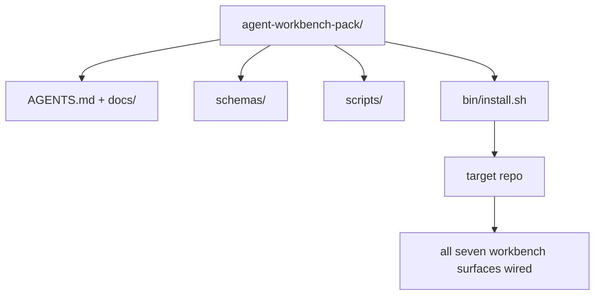

# कैपस्टोनः एक पुनः प्रयोज्य एजेंट वर्कबेंच पैक भेजें

> मिनी ट्रैक एक पैक के साथ समाप्त होता है आप किसी भी रेपो में छोड़ देते हैं सतहों के 11 पाठ एक निर्देशिका में संपीड़ित आप कर सकते हैं`cp -r`और अगले सुबह एक एजेंट को विश्वसनीय रूप से काम करने के लिए।

**Type:** Build
**Languages:** Python (stdlib)
**Prerequisites:** Phases 14 · 31 to 14 · 41
**Time:** ~75 minutes

## सीखने के लक्ष्य

- सात कार्य डेस्क सतहों को एक ड्रॉप-इन निर्देशिका में पैक करें।
- योजनाओं, स्क्रिप्ट, और टेम्पलेट्स को पिन करें ताकि एक नया रेपो एक ज्ञात-अच्छी तरह से बेसलाइन प्राप्त करता है।
- एक एकल इंस्टॉलर स्क्रिप्ट जो पैक को अक्षम्य रूप से नीचे रखता है जोड़ें।
- यह तय करें कि समूह में क्या रहता है और बाहर क्या रहता है, प्रत्येक के लिए कटौती का बचाव करते हुए।
- एक अभ्यागत द्वारा सहायता प्राप्त भंडार परिवर्तन को प्रमाण के साथ प्रदर्शित करें जो एक समीक्षक पुनः प्रस्तुत कर सकता है।

## समस्या

एक कार्य डेस्क जो एक Google डॉक, एक चैट इतिहास और तीन अर्ध-याद किए गए स्क्रिप्ट में रहता है एक कार्य डेस्क है जो हर तिमाही में पुनर्निर्माण किया जाता है। उपचार एक संस्करण पैक हैः एक रेपो या निर्देशिका सतहों, योजनाओं, स्क्रिप्टों और एक आदेश इंस्टॉलर के साथ।

आप इस सबक को समाप्त करेंगे `outputs/agent-workbench-pack/`डिस्क पर भेज दिया और एक `bin/install.sh`जो इसे किसी भी लक्ष्य रेपो में छोड़ देता है।

## अवधारणा



### पैक लेआउट

```
outputs/agent-workbench-pack/
├── AGENTS.md
├── docs/
│   ├── agent-rules.md
│   ├── reliability-policy.md
│   ├── handoff-protocol.md
│   └── reviewer-rubric.md
├── schemas/
│   ├── agent_state.schema.json
│   ├── task_board.schema.json
│   └── scope_contract.schema.json
├── scripts/
│   ├── init_agent.py
│   ├── run_with_feedback.py
│   ├── verify_agent.py
│   └── generate_handoff.py
├── bin/
│   └── install.sh
└── README.md
```

### जो अंदर रहता है, जो बाहर रहता है

मेंः

- सतह योजनाएं, वे अनुबंध हैं।
- ऊपर चार पटकथाएँ हैं. वे रनटाइम हैं.
- चार डॉक्स, वे नियम और रूटीन हैं।

बाहरः

- परियोजना विशिष्ट कार्य लक्ष्य रेपो बोर्ड पर हैं, पैक में नहीं।
- विक्रेता SDK कॉल. पैक फ्रेमवर्क-अज्ञानी है.
- समूह टीम के मौजूदा समूह के बगल में रहता है, अंदर नहीं।

### इंस्टॉलर

एक छोटा सा `bin/install.sh`(या `bin/install.py`):

1. बिना `--force`. .
2. लक्ष्य रेपो में पैक को कॉपी करता है।
3. यदि कोई `.github/workflows/`अस्तित्व में है।
4. अगले चरणों को प्रिंट करता हैः बोर्ड भरें, स्वीकार आदेश सेट करें, init स्क्रिप्ट चलाएं।

### संस्करण

पैक में एक `VERSION`फ़ाइल. स्कीम bumps और स्क्रिप्ट परिवर्तनों कि माइग्रेशन की आवश्यकता bumps प्रमुख. केवल डॉक परिवर्तनों bumps पैच. लक्ष्य रेपो के `agent_state.json`रिकॉर्ड जो पैक संस्करण यह शुरू किया गया था के खिलाफ.

```figure
wb-pack-install
```

## इसे बनाओ

`code/main.py`पैक को इकट्ठा करता है `outputs/agent-workbench-pack/`इस मिनी ट्रैक में पिछले पाठों की योजनाओं और स्क्रिप्ट के साथ, और डॉक्स जो आपने पहले ही लिखा है।

इसे चलाओः

```
python3 code/main.py
```

स्क्रिप्ट सतहों को कॉपी और पिन करता है, README लिखता है, पैक ट्री प्रिंट करता है, और शून्य से बाहर निकलता है। फिर से चलाना अक्षम है।

## जंगली में उत्पादन के पैटर्न

एक पैक केवल तभी मूल्यवान होता है जब वह कांटे, अद्यतन और अप्रिय अपस्ट्रीम से बचता है। चार पैटर्न ऐसा काम करते हैं।

**`VERSION` is the contract, not the marketing.**बड़े bumps एक राज्य माइग्रेशन की आवश्यकता होती है. छोटे bumps एक चेकर फिर से चलाने की आवश्यकता होती है. पैच bumps केवल डॉक हैं. इंस्टॉलर लिखता है`.workbench-version`प्रत्येक स्थापना पर लक्ष्य रेपो में; `lint_pack.py`यदि लक्ष्य की ताला पैक के साथ असहमत है तो शिप करने से इनकार करता है `VERSION`. . . इस तरह से कैसे`npm`,`Cargo`और `pyproject.toml`10 साल के चूरन से बचें; एजेंटों के बारे में कुछ भी नियमों को नहीं बदलता है।

**Single source for cross-tool distribution.**Nx जहाज एक `nx ai-setup`जो नीचे निहित है `AGENTS.md`,`CLAUDE.md`,`.cursor/rules/`,`.github/copilot-instructions.md`पैक को वही करना चाहिए; इंस्टॉलर सिम्बल लिंक (`ln -s AGENTS.md CLAUDE.md`) इसलिए एक ही सत्य स्रोत प्रत्येक कोडिंग एजेंट को फैन्स करता है। एक उपकरण को दूसरे पर समर्थन देने के लिए पैक को फोर्क करना एक विफलता मोड है।

**`uninstall.sh` that refuses on non-trivial state.**पैक को अनइंस्टॉल करने से उपयोगकर्ता का डेटा नहीं हटाया जा सकता `agent_state.json`,`task_board.json`या `outputs/`. अनइंस्टॉलर योजनाओं, स्क्रिप्ट, डॉक्स को हटा देता है, और `AGENTS.md`(के साथ `--keep-agents-md`राज्य के फ़ाइलों में कोई भी गैर-प्रतिबंधित परिवर्तन है तो आगे बढ़ने से इनकार करता है। राज्य का मालिक उपयोगकर्ता है; पैक इसका मालिक नहीं है।

**Skill-as-publishable. SkillKit-style distribution.**एक कौशल के रूप में पैक जहाजों SkillKit: `skillkit install agent-workbench-pack`एक स्रोत से 32 एआई एजेंटों पर यह सेट करता है। पैक रेपो सत्य का स्रोत है; स्किलकिट वितरण चैनल है। विक्रेता लॉक-इन टूट जाता है; सात सतहें एक जैसी रहती हैं।

## इसका प्रयोग करें

तीन स्थानों पैक जहाजोंः

- **As a directory you drop into a repo.** `cp -r outputs/agent-workbench-pack /path/to/repo`. .
- **As a public template repo.**फोर्क-एंड-कस्टमाइज़, के साथ `VERSION`बहाव को नियंत्रित करना।
- **As a SkillKit skill.**अपने एजेंट उत्पाद में तारों ताकि एक ही आदेश इसे नीचे सेट.

पैक नुस्खा है, प्रत्येक स्थापना एक सेक्शन है।

## इसे भेजें

`outputs/skill-workbench-pack.md`परियोजना-ट्यून पैक उत्पन्न करता हैः टीम के इतिहास के लिए नियम तेज, रेपो के लिए अनुकूलित दायरा ग्लोब, एक डोमेन-विशिष्ट प्रविष्टि के साथ विस्तारित rubric आयाम।

## व्यायाम

1. तय करें कि कौन सा वैकल्पिक पांचवां दस्तावेज कैनोनिकल पैक में पदोन्नति के लायक है। कटौती का बचाव करें।
2. एक के साथ Python के रूप में स्थापना को फिर से लिखें `--dry-run`बैश के साथ एर्गोनोमिक तुलना करें।
3. एक जोड़ें `bin/uninstall.sh`जो सुरक्षित रूप से पैक को हटा देता है और यदि राज्य फ़ाइलों में गैर-नाशिक इतिहास है तो इनकार करता है।
4. एक जोड़ें `lint_pack.py`जो जब पैक से बहता है विफल होता है`VERSION`. इसे अपने पैक के रिपो के लिए आईसी में वायर करें.
5. इस पैक में एक हाथ से रोल किए गए कार्य डेस्क से प्रवास रनबुक के लेखक। कार्य क्रम क्या है जो डाउनटाइम को न्यूनतम करता है?

## करियर अभ्यासः एक भंडार परिवर्तन साबित करें

पैकेजिंग डेमो साबित करता है कि असेंबलर फ़ाइलों को चलाता है और उत्पन्न करता है। यह साबित नहीं करता है कि आपका एजेंट एक नया कार्य पूरा कर सकता है, कि उत्पन्न चेक उस कार्य को साबित करते हैं, या कि एक तैनात प्रणाली काम करती है। इन दावों को अलग रखें।

अपने पास मौजूद या बदलने की अनुमति रखने वाले रिपॉजिटरी में एक छोटा सा वास्तविक कार्य चुनें। एक कोडिंग एजेंट का उपयोग करें जिसके लिए आपके पास पहले से ही पहुंच है। बग फिक्स, एक सीमित सुविधा या परिचालन में सुधार पर्याप्त है; कई एजेंटों को स्थापित करना अभ्यास का हिस्सा नहीं है।

पैकेजिंग प्रयोगशाला के बाहर एक अलग कार्य सत्र का बजट। नीचे दिए गए सबूत टेम्पलेट को अपनी खुद की प्रतिलिपि में कॉपी करें `learning-artifacts/`निर्देशिका. चेक-इन टेम्पलेट को संदर्भ सामग्री के रूप में सहेजें और पैक करें।

### 1. कार्य को फ्रेम करें और स्वायत्तता चुनें

पाठ 43 से कार्य फ्रेम और पाठ 44 से सबूत योजना का उपयोग करें। प्रारंभिक संशोधन, अवलोकन योग्य लक्ष्य, गैर-लक्ष्य, अनुमत पथ और स्वीकृति प्रमाण रिकॉर्ड करें। वास्तविक उपयोगकर्ता या ऑपरेटर की पहचान करें, जिसे व्यवहार की आवश्यकता है।

एक काम करने का तरीका चुनेंः निर्देशित कदम, चेकपॉइंट कार्यान्वयन, या सीमित स्वायत्त रन। अनिश्चितता, परिणाम और पलटाव योग्यता इसे क्यों उचित समझाती है। एक छोटे स्थानीय रिफैक्टोर को एक्सेस नियंत्रण में बदलाव से कम चेकपॉइंट की आवश्यकता हो सकती है।

एक दीवार समय बजट और एक टोकन या लागत सीमा निर्धारित करें यदि एजेंट एक उजागर करता है। अनन्य मापों को ईमानदारी से रिकॉर्ड करें। दोहराई विफलता, नए अनुमतियों, बजट समाप्ति, या एक हल नहीं हुआ अनुबंध निर्णय के लिए एक स्टॉप स्थिति परिभाषित करें; नाम जो इसे हल कर सकता है।

### 2. सबसे छोटी उपयोगी वातावरण तैयार करें

प्रासंगिक कार्यान्वयन, कॉलर, परीक्षण और स्थानीय निर्देश प्राप्त करें। प्रत्येक स्रोत संदर्भ में क्यों आता है और कौन सा वर्तमान सबूत पुराने नोट को ओवरराइड करेगा। डिफ़ॉल्ट रूप से पूरे रिपॉजिटरी को लोड न करें।

प्रत्येक प्रासंगिक विस्तार के लिए एक स्पष्ट विकल्प बनाएंः एक कौशल एक दोहराए जाने योग्य प्रक्रिया प्रदान करता है; एक MCP उपकरण पहुंच प्रदान करता है; एक हुक एक निर्धारात्मक जांच चलाता है; एक प्लगइन क्षमताओं को पैक करता है। एक विस्तार केवल तभी रखें जब कार्य को इसकी आवश्यकता होती है, कम से कम अनुमति के साथ जो इसे काम करने देता है।

आप जिस प्रस्तावित अतिरिक्त को अस्वीकार करते हैं, उसकी संदर्भ या रखरखाव लागत को रिकॉर्ड करें। एक पुरानी स्मृति या निर्देश को फिर से जांचें, फिर इसे अपने छात्र-स्वामित्व वाली सेटिंग में हटा दें या बदलें जब सबूत उस निर्णय का समर्थन करते हैं। हटाए जाने की पुष्टि करने के लिए प्रभावित जांच को फिर से दोहराएं।

### 3. मूल रेखा को कैप्चर करें और कार्यान्वित करें

संपादन से पहले, निकटतम मौजूदा जांच चलाएं और अनुरोधित व्यवहार की वर्तमान स्थिति प्रदर्शित करें। कमांड, संशोधन, परिणाम और सबूत स्थान रखें। एक सुविधा जो अभी तक मौजूद नहीं है, उसके पास अभी भी एक बेसलाइन हैः अवलोकन प्रतिक्रिया या असमर्थित ऑपरेशन रिकॉर्ड करें।

अनुबंध के अंदर एजेंट को लागू करने दें। प्रत्येक सुधार, अनुमति परिवर्तन या योजना संशोधन के कारण के साथ एक हस्तक्षेप लॉग रखें। प्रतिनियोजन वैकल्पिक है; यदि उपयोगी है, तो एक और कार्यकर्ता जोड़ने से पहले पाठ 45 के स्वामित्व और एकीकरण अनुबंध का उपयोग करें।

### 4. सबूतों को चुनौती दें

एक UI के लिए, सेवा की यात्रा को प्रासंगिक चौड़ाई पर पुनर्निर्माण और निरीक्षण करें। एक API के लिए, अनुरोध और क्रमबद्ध प्रतिक्रिया का निरीक्षण करें। एक CLI के लिए, निर्मित कमांड चलाएं और इसके आउटपुट कोड और आउटपुट की जांच करें। आपके कार्य की आवश्यकता वाले चेक का चयन करें और उनकी सीमाएं समझाएं।

एजेंट के कार्यान्वयन से स्वतंत्र रूप से कार्य अनुबंध से अपेक्षित परिणाम लिखें। एक एकलौती प्रति में, एक विशिष्ट गलत परिणाम दर्ज करें, जैसे कि एक अमान्य मान स्वीकार करना या आवश्यक प्रतिक्रिया फ़ील्ड छोड़ना। उसी स्वीकृति जांच को चलाएंः यह इस कारण से विफल होना चाहिए।

यदि यह हरा रहता है, तो उस पर भरोसा करने से पहले कथन या अवलोकन को मजबूत करें। सही कार्यान्वयन को बहाल करें और सफलतापूर्वक फिर से चलाएं। दोनों रसीदें रखें। सिंटैक्स त्रुटि या टूटी हुई परीक्षण सेटअप में गिरावट का पता लगाने के रूप में नहीं गिना जाता है।

अंतिम अंतर की समीक्षा करें, जिसमें बदल गए परीक्षण शामिल हैं, मूल लक्ष्य और अनुमत पथों के खिलाफ। एक सहकर्मी या एक अलग समीक्षक सत्र से अनुरोध करें कि निष्पादन को संपादित किए बिना सबसे कमजोर सबूत का विरोध करें। आप अभी भी अंतिम निर्णय के मालिक हैं; किसी अन्य एजेंट की सहमति निष्पादन सबूत नहीं है।

### 5. पुनर्मिलन और पुनर्प्राप्ति

बदल गए कलाकृतियों को एक एक बार में स्थानीय या मंचन वातावरण में चलाएं। प्रत्येक अवलोकन को लेबल करें `local`,`staging`या `live`स्थानीय अभ्यास स्थानीय दावे का समर्थन करता है; इस अभ्यास के लिए उत्पादन तैनाती की आवश्यकता नहीं है।

कार्य से संबंधित एक विफलता संकेत, एक सीमा, एक अवलोकन विंडो और एक मालिक चुनें। उस सीमा को पार करने पर प्रतिक्रिया की व्याख्या करें। अभ्यास में सुरक्षित रूप से संकेत को ट्रिगर करें और अवलोकन लॉग, मीट्रिक या प्रतिक्रिया को बनाए रखें।

एक ज्ञात-अच्छी कलाकृतियों पर पुनः अभ्यास करें और जांचें कि पिछले व्यवहार को बहाल किया गया है। यदि लागू हो तो निरंतर डेटा का ध्यान रखें; अकेले बाइनरी को बदलना डेटा परिवर्तन को उलट नहीं सकता है। किसी भी पुनर्प्राप्ति चरण को रिकॉर्ड करें जिसे आप सत्यापित नहीं कर सकते हैं।

### 6. अगली दौड़ में सुधार करें और इसे सौंप दें

परिणाम की तुलना मूल रेखा से करें, जिसमें बीतने वाला समय, उपलब्ध उपयोग डेटा और मानव हस्तक्षेप शामिल हैं। एक कार्य दिखाता है कि उस कार्य में क्या हुआ; यह यह स्थापित नहीं करता है कि एक एजेंट आमतौर पर तेज़ या अधिक विश्वसनीय है।

पाठ 46 का उपयोग करके परीक्षण में एक अवलोकन सुधार, एक छोटी अनुमति सीमा, एक स्वचालन या एक स्पष्ट उदाहरण को बढ़ावा दें। प्रभावित जांच को फिर से करें। अस्थायी उत्परिवर्तन हटाएं और अंतिम शाखा छोड़ दें, फ़ाइलों को बदल दें, जोखिम खोलें, और अगली कार्रवाई अगले सत्र के लिए स्पष्ट करें।

### मैनुअल समीक्षा अनुच्छेद

समीक्षाकर्ता को साक्ष्य फ़ाइलों की जांच करने और कम से कम सबसे कमजोर स्वीकृति जांच को पुनः प्रस्तुत करने दें।`demonstrated`,`needs revision`या `unverified`प्रत्येक पंक्ति के लिए, एक सबूत संकेत और एक कारण के साथ। भरते हुए फ़ील्ड और पासिंग पैकेजिंग स्क्रिप्ट इन टिप्पणियों के विकल्प नहीं हैं।

| Dimension | Evidence the reviewer should challenge |
|---|---|
| Task and autonomy | Starting behavior, bounded goal, justified permissions, budget, and a usable stop rule |
| Context and environment | Relevant sources, justified tool access, and a rechecked retirement decision |
| Verification | Actual before/after behavior and a deliberate incorrect result that the same check rejects |
| Review and operation | Inspected diff, independent challenge, labeled runtime observation, and rehearsed recovery |
| Iteration and handoff | One verified improvement, honest limits, clean final state, and a reproducible next action |

निर्णय लें `needs revision`कार्य पूरा होने का दावा करने से पहले निष्कर्ष। सबूत उपलब्ध न छोड़ें `unverified`पोर्टफोलियो एक सीमित कार्य पर आपके इंजीनियरिंग निर्णय को प्रदर्शित करता है; यह एक भर्ती या तैनाती की गारंटी नहीं है।

## शिप की गई कलाकृतियाँ

पुनः प्रयोज्य पैक और अपनी पूरी प्रति रखें [career-agent-evidence.md](https://github.com/rohitg00/ai-engineering-from-scratch/blob/main/phases/14-agent-engineering/42-agent-workbench-capstone/outputs/career-agent-evidence.md). टेम्पलेट कार्य फ्रेम, निष्पादन योजना, रनटाइम रसीद, समीक्षा, पुनर्प्राप्ति अभ्यास और एक समीक्षा योग्य केस स्टडी में स्थानांतरित करता है।

## प्रमुख शर्तें

| Term | What people say | What it actually means |
|------|----------------|------------------------|
| Workbench pack | "The starter kit" | A versioned directory carrying all seven surfaces |
| Installer | "Setup script" | `bin/install.sh` that lays the pack down idempotently |
| Pack version | "VERSION" | Major bumps for schema/script changes, patch for doc-only |
| Drop-in pack | "cp -r and go" | Pack works without per-repo customization on day one |
| Forkable template | "GitHub template" | Public repo that GitHub's "Use this template" can clone from |

## आगे पढ़ना

- चरण 14 · 31 से 14 · 41  प्रत्येक सतह इस पैक बंडल
- [SkillKit](https://github.com/rohitg00/skillkit) 32 एआई एजेंटों में इस कौशल को स्थापित करें
- [Nx Blog, Teach Your AI Agent How to Work in a Monorepo](https://nx.dev/blog/nx-ai-agent-skills) छह उपकरणों पर एकल स्रोत जनरेटर
- [agents.md — the open spec](https://agents.md/) आपके पैक के राउटर को क्या लागू करना चाहिए
- [HKUDS/OpenHarness](https://github.com/HKUDS/OpenHarness) पैक समकक्ष के संदर्भ कार्यान्वयन
- [Augment Code, A good AGENTS.md is a model upgrade](https://www.augmentcode.com/blog/how-to-write-good-agents-dot-md-files) पैक डॉक्स गुणवत्ता पट्टी
- [Anthropic, Effective harnesses for long-running agents](https://www.anthropic.com/engineering/effective-harnesses-for-long-running-agents)
- [Anthropic, Harness design for long-running application development](https://www.anthropic.com/engineering/harness-design-long-running-apps)
- चरण 14 · 30  मूल्यांकन-चालित एजेंट विकास जो पैक के सत्यापन गेट का उपभोग करता है
- चरण 14 · 41  इससे पहले/बचे के बेंचमार्क में सुधार
