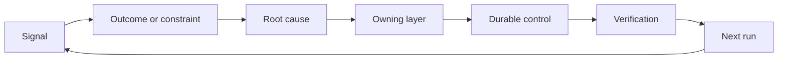

# स्वामित्व और सेवानिवृत्ति के साथ एक प्रतिक्रिया रैकट बनाएं

> शिपिंग एक निर्माण लूप बंद करता है और सीखने लूप खोलता है। सबूत प्रणाली को बदलना चाहिए या यह टेलीमेट्री बन जाता है किसी का भी मालिक नहीं है।

**Type:** Learn + Build
**Languages:** Python (stdlib)
**Prerequisites:** Phase 14 lessons 46 and 53
**Time:** ~75 minutes

## सीखने के लक्ष्य

- घटनाओं, मूल्यांकन, उपयोगकर्ता व्यवहार, और सुधारों को स्वामित्व वाली कार्रवाई में बदल दें।
- प्रत्येक संकेत को संदर्भ, मूल्यांकन, नीति, रनटाइम या बैकलॉग पर रूट करें।
- गंभीरता और आवृत्ति के अनुसार पुनरावृत्ति को प्राथमिकता दें।
- हर नियंत्रण को एक सेवानिवृत्ति की स्थिति दें।
- सबूत, बाजी और जवाबदेह मालिक के साथ वितरण निर्णय को सूचित करें।

## प्रतिक्रिया बुनियादी ढांचा है

एक टीम किसी भी घटना से सीखने के बिना निशान, मूल्यांकन, समर्थन टिकट और घटना लॉग एकत्र कर सकती है। गायब तंत्र प्रमोशन हैः एक मालिक और सबूत के साथ अवलोकन से स्थायी परिवर्तन के लिए एक परिभाषित पथ।

लूप हैः

1. एक ठोस संकेत का पालन करें;
2. इसे किसी परिणाम, बाध्यता या धारणा से जोड़ें;
3. सबसे पहले सिस्टम परत की पहचान करें जो कारण का मालिक है;
4. एक सीमित परिवर्तन पैदा करना;
5. यह सत्यापित करें कि पुनरावृत्ति कम होने की संभावना है;
6. जांच करें कि क्या नियंत्रण बरकरार रहना चाहिए।

## मालिकाना स्तर तक का मार्ग

| Signal | Destination |
|---|---|
| False positive, regression, wrong result | Evaluation or test |
| Missing context, duplicate work, stale fact | Context source or retrieval route |
| Unsafe action or authority gap | Policy or permission boundary |
| Timeout, retry storm, unavailable dependency | Runtime control |
| New product need or unresolved tradeoff | Shaped backlog item |

सबसे पहले प्रभावी परत पर कारण को ठीक करें। जब किसी परीक्षण या अनुमति से विफलता असंभव हो सकती है तो एक और शीघ्र पैराग्राफ न जोड़ें।



## स्वामित्व नियंत्रण का हिस्सा है

हर रश्श कार्रवाई की जरूरत हैः

- एक मालिक;
- परिणाम और पुनरावृत्ति पर आधारित प्राथमिकता;
- बदलने वाला कलाकृतियों;
- परिवर्तन का प्रमाण देने वाली सत्यापन;
- समीक्षा या समाप्ति विंडो;
- एक सेवानिवृत्ति की स्थिति।

एक अनपढ़ सुधार बेहतर स्वरूपण के साथ एक अवलोकन है।

## स्टेल कंट्रोल सेवानिवृत्त

प्रतिक्रिया प्रणाली नीति को जमा करती है। यह नीति विरोधाभासी और महंगी हो सकती है। समीक्षा नियंत्रण करती है जबः

- वास्तुकला या कार्यप्रवाह में परिवर्तन;
- एक निम्न स्तर की अपरिवर्तनीय उच्च स्तर की निर्देशों को बदल देती है;
- चयनित विंडो पर संरक्षित विफलता दिखाई नहीं दी है;
- नियंत्रण अधिक बार वैध कार्य को रोकता है इससे नुकसान नहीं होता है।

पेंशन लेने के लिए सबूत भी चाहिए।

## कनेक्ट बिल्ड और कोडिंग एजेंट प्रतिक्रिया

एक ही रच दोनों पटरियों पर सेवा करता हैः

- उत्पाद प्रमाण परिणाम फ्रेम, धारणा, स्लाइस या माप योजना को बदलता है।
- कोडिंग एजेंट सुधार परीक्षणों, संदर्भ, दायरे, स्वचालन या हस्तांतरण को बदलते हैं।
- घटनाएं उत्पाद सीमा और एजेंट कार्यक्षेत्र दोनों को बदल सकती हैं।

यही कारण है कि निर्माण को आकार देना एक ऐसा चरण नहीं है जो कोडिंग से पहले समाप्त होता है। यह प्रत्येक स्वीकार किए गए परिवर्तन के माध्यम से जारी रहता है।

## इसे बनाओ

प्रयोगशाला संकेतों को वर्गीकृत करती है, स्वामित्व वाली रचश क्रियाएँ बनाती है, उन्हें प्राथमिकता देती है, और लिखती है `outputs/feedback-backlog.json`. .

```bash
python3 code/main.py
python3 -m unittest discover code/tests -v
```

रनटाइम टाइमआउट सिग्नल जोड़ें और पुष्टि करें कि यह सामान्य बैकलॉग के बजाय रनटाइम पर रूट करता है।

## अभ्यास प्रयोगशालाः एक असफलता के बाद अपना निर्णय लें

अपने करियर मार्ग के पोर्टफोलियो प्रोजेक्ट से एक वर्कफ़्लो चुनें। इसे एक निर्णय, एक छोटा प्रयोग और एक समीक्षा के माध्यम से करें। सबूतों को [career delivery template](https://github.com/rohitg00/ai-engineering-from-scratch/blob/main/phases/14-agent-engineering/54-build-the-feedback-ratchet/outputs/career-delivery-evidence.md). .

पायथन लैब उदाहरण बैकलॉग एक्शन उत्पन्न करता है। यह उपयोगकर्ताओं का अवलोकन नहीं करता है, हस्तक्षेप को मापता है, या कैरियर की तत्परता साबित नहीं करता है। इसके रन को पूरा करना इस अभ्यास की तैयारी है।

### 1. क्या हुआ था, पता लगाएं

उपयोगकर्ता, कार्य, वर्तमान कार्यप्रवाह और परिणाम को रिकॉर्ड करें जिसे आप सुधारना चाहते हैं। एक सहमति प्राप्त अवलोकन, एक संपादित समर्थन रिकॉर्ड, या एक पुनः प्रयोज्य कार्य ट्रैक को लिंक करें। आपने जो देखा है उसे किसी ने रिपोर्ट किया है और आपने क्या निष्कर्ष निकाला है, उसे अलग करें।

किसी असफलता को ढूंढें: एक असफल धारणा, एक अप्रयुक्त परिणाम, एक अप्रत्याशित लागत या एक देरी से दिया गया हाथ। समझाएं कि किस सबूत ने आपकी समझ बदल दी। एक असफलता के लिए प्रतिक्रिया और निर्णय की आवश्यकता होती है, न कि उसके चारों ओर सफलता की कहानी लिखी जाती है।

यदि आप उपयोगकर्ताओं के साथ काम नहीं कर सकते हैं, तो एक सहकर्मी या एक निर्दिष्ट परिदृश्य के साथ स्पष्ट रूप से लेबल वाली सिमुलेशन चलाएं। वास्तविक उपयोगकर्ता के साक्ष्य से सिमुलेट अवलोकन को अलग रखें। साक्षात्कार, अनुमोदन, गोद लेने या व्यावसायिक प्रभाव का आविष्कार न करें।

### 2. अपने अधिकार के दायरे में प्रगति करें

उन अज्ञात चीजों को सूचीबद्ध करें और सबसे सस्ती पलटवार कार्रवाई चुनें जो सबसे महत्वपूर्ण को हल कर सकती है। बताएं कि आप क्या निर्णय ले सकते हैं, मौजूदा समझौते से क्या सीमाएं हैं, और निष्पादन से पहले क्या प्राधिकरण की आवश्यकता है।

उदाहरण के लिए, आप ग्राहक डेटा का उपयोग करने की अनुमति के लिए प्रतीक्षा करते हुए एक संपादित ऑफ़लाइन रीप्ले तैयार कर सकते हैं। पहल करने का मतलब है अधिकृत काम को आगे बढ़ाना और अवरुद्ध निर्णय को स्पष्ट करना। यह आपके पहुंच या अनुमोदन अधिकारों का विस्तार नहीं करता है।

### 3. विकल्पों की तुलना करें और निर्णय लेने वाले को सूचित करें

किसी ऐसे व्यक्ति के लिए एक संक्षिप्त निर्णय संक्षिप्त लिखें, जिसे कार्यान्वयन विवरण की आवश्यकता नहीं है। इसमें निम्नलिखित शामिल हैंः

- उपयोगकर्ता समस्या और योजना में बदलाव करने वाले साक्ष्य;
- कम से कम दो विकल्प, जिसमें सस्ता मैनुअल या कोई निर्माण विकल्प शामिल है, जहां विश्वसनीय है;
- गुणवत्ता, अन्तरक्रिया डिजाइन, प्रयास, परिचालन लागत और जोखिम समझौता;
- आपकी सिफारिश, शेष अनिश्चितता और आवश्यक निर्णय;
- निर्णय के स्वामी, प्रभावित हितधारक और निर्णय की आवश्यकता की तारीख।

एक सहकर्मी से प्रभावित हितधारक का प्रतिनिधित्व करने के लिए कहें और एक समझौता चुनौती दें। आपत्ति और यह कैसे बदलता है, या अपनी सिफारिश को बदलने में विफल रहता है, रिकॉर्ड करें। भूमिका-प्ले प्रतिक्रिया को सिम्युलेटेड के रूप में लेबल करें; यह एक वास्तविक हितधारक के समझौते के लिए खड़ा नहीं हो सकता है।

### 4. सीमित प्रयोग करें

इस प्रश्न के आधार पर प्रोटोटाइप, पायलट या प्रोडक्शन कार्य चुनें जिसका उत्तर आपको देना है। परिणाम एकत्र करने से पहले दर्शकों, डेटा, प्राधिकरण, अवधि, रोल-बैक और जारी रखने, बदलने या रोकने के लिए शर्तें परिभाषित करें।

उपयोगकर्ता के प्रारंभ बिंदु से समाप्त कार्य तक बातचीत के माध्यम से जाएं। एक गलत आउटपुट या गायब डेटा मामले को शामिल करें। देखें कि क्या उपयोगकर्ता विफलता को नोटिस कर सकता है, इसे सुधार सकता है, और आपकी छिपी मदद के बिना ठीक हो सकता है।

कार्यप्रवाह के हिस्से के रूप में मानव समीक्षा और सुधार समय की गणना करें। एक तेज़ मॉडल प्रतिक्रिया अभी भी पूरा कार्य धीमा या भरोसा करने में कठिन बना सकती है।

### 5. परिणामों और अर्थव्यवस्था की तुलना करें

एक ही मीट्रिक परिभाषा, कार्य जनसंख्या, संग्रह विधि और तुलनात्मक अवलोकन विंडो का उपयोग करके एक आधार रेखा और एक अनुवर्ती रिकॉर्ड करें। नमूनों की गिनती, बहिष्करण और साक्ष्य लिंक संख्याओं के बगल में रखें। यदि ये स्थितियां बदलती हैं, तो समझाएं कि तुलना क्यों सीमित है।

एक उपयोगकर्ता परिणाम, एक गुणवत्ता या सुरक्षा गार्ड रील, और कुल मानव समीक्षा प्रयास शामिल करें। परिणाम को रिकॉर्ड करें भले ही यह लक्ष्य से चूक जाए। छोटे या अनुकरण किए गए नमूने एक सीमित सीखने के दावे का समर्थन करते हैं, व्यवसाय प्रभाव का दावा नहीं।

मॉडल कॉल, री-ट्रीट, सपोर्टिंग सर्विसेज और मानव समीक्षा का उपयोग करके सफलतापूर्वक पूरा किए गए कार्य के प्रति लागत का अनुमान लगाएं। श्रम दर परिकल्पना और अनुमानों से मापा गया उपयोग अलग करें। उस लागत की तुलना मैनुअल विकल्प या परियोजना के पीछे मूल्य परिकल्पना के साथ करें।

मौजूदा का उपयोग करें [FinOps for LLMs lesson](https://aiengineeringfromscratch.com/lesson?path=phases/17-infrastructure-and-production/27-finops-llms)मॉडल को बदलना केवल एक संभव प्रतिक्रिया है; वर्कफ़्लो को संकुचित करना या मैनुअल चरण को बनाए रखना बेहतर उत्पाद निर्णय हो सकता है।

### 6. लूप बंद करें

यदि सबूत निर्णायक हैं, तो गायब अवलोकन और अगले सीमित परीक्षण का नाम दें। जवाबदेह निर्णयकर्ता की प्रतिक्रिया दर्ज करें; यदि कोई निर्णय नहीं लिया गया है तो इसे प्रतीक्षा में छोड़ दें।

वितरण प्रक्रिया में एक सुधार चुनेंः एक स्पष्ट कार्य फ्रेम, पहले उपयोगकर्ता के माध्यम से, बेहतर समीक्षा चेकलिस्ट, छोटे एजेंट हैंडऑफ, या सख्त मूल्यांकन मामले। एक मालिक और समीक्षा तिथि सौंपें।

समीक्षा के दौरान, तय करें कि सुधार को बरकरार रखना, संशोधित करना या रिटायर करना है। विकल्प के लिए सबूत दर्ज करें। लक्ष्य विफलता को रोकने के बिना अधिक काम करने वाली नई चेकलिस्ट ने स्थायीता नहीं अर्जित की है।

## शिप की गई कलाकृतियाँ

कॉपी [career-delivery-evidence.md](https://github.com/rohitg00/ai-engineering-from-scratch/blob/main/phases/14-agent-engineering/54-build-the-feedback-ratchet/outputs/career-delivery-evidence.md)अपने स्वयं के प्रोजेक्ट में शामिल करें और इसे सबूत लिंक के साथ पूरा करें। चेक-इन टेम्पलेट को पुनः प्रयोज्य रखें। निर्णय संक्षिप्त, बातचीत के माध्यम से, माप की तुलना, और अपने करियर पोर्टफोलियो कलाकृतियों के साथ स्वामित्व वाली अनुवर्ती शामिल करें।

## जाँचें

इस मैनुअल स्वीकृति अनुभाग का उपयोग एक सहकर्मी के साथ करें। प्रत्येक पंक्ति को चिह्नित करें **met**,**needs work**या **not observed**एक भरते हुए फ़ील्ड यह प्रमाण नहीं है कि निर्णय सही था।

| Check | Evidence that meets it |
|---|---|
| Workflow grounded | A traceable observation supports the problem; reported claims, inference, and simulation are labeled. |
| Authority respected | Reversible next work is clear, and any restricted action waits for its actual decision owner. |
| Tradeoffs communicated | Credible alternatives, a stakeholder objection, a recommendation, and an explicit decision request are recorded. |
| Interaction tested | The walkthrough covers success, failure, recovery, and human review effort. |
| Outcome compared | Baseline and follow-up definitions align; samples, guardrails, costs, and comparison limits are visible. |
| Setback owned | The evidence changes a continue/change/stop decision and an accountable next action. |
| Process improved | One workflow improvement has an owner, review date, and an evidence-based keep/revise/retire decision. |

वास्तविक उपयोगकर्ता के अवलोकन रहित व्यवहार हर अनुकरित चरण के गुजरने के बाद भी एक अंतर बना रहता है। पोर्टफोलियो दावे में उस सीमा को बनाए रखें और इसे बंद करने के लिए आवश्यक अगले अवलोकन की पहचान करें।

## व्यायाम

1. एक घटना और एक उपयोगकर्ता शिकायत को एक रच कार्रवाई में बदल दें।
2. सबसे पहले जो परत हो सकती है उसे नाम दें जो प्रत्येक पुनरावृत्ति को रोक सकती है।
3. प्रयोगशाला आउटपुट में सत्यापन कमांड या अवलोकन जोड़ें।
4. पॉलिसी नियम के लिए सेवानिवृत्ति की शर्त को परिभाषित करें।
5. अगले कार्य फ्रेम में वापस अनुशरण एक स्वीकार सुधार।

## आगे पढ़ना

- [Basili, Caldiera, and Rombach, The Goal Question Metric Approach](https://www.cs.toronto.edu/~sme/CSC444F/handouts/GQM-paper.pdf), उद्देश्य उन्मुख माप के माध्यम से संगठनात्मक सीखने के लिए।
- [Fagerholm et al., Building Blocks for Continuous Experimentation](https://doi.org/10.1145/2601248.2601276), तकनीकी और संगठनात्मक लूप के लिए जो सबूतों को उत्पाद विकास के निरंतर विकास से जोड़ता है।
- [Nuseibeh and Easterbrook, Requirements Engineering: A Roadmap](https://www.cs.toronto.edu/~sme/papers/2000/ICSE2000.pdf), सिस्टम जीवन चक्र के दौरान विकसित आवश्यकताओं के साथ व्यवहार करने के लिए।

## जो आप रखते हैं

रखो`outputs/feedback-backlog.json`एक साथ वे उत्पाद निर्णय और वितरण पथ को बंद करते हैं और अगले परिणाम फ्रेम को सूचित करते हैं।
