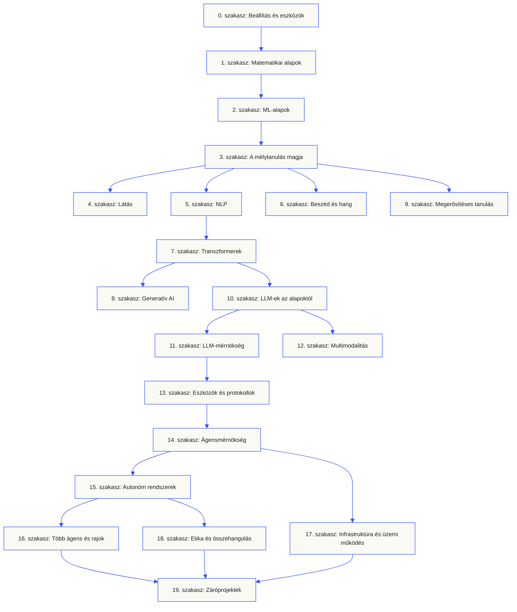

<p align="center" lang="hu"><sub>A teljes README magyar fordítása. Az <a href="../../README.md">angol eredeti</a> az irányadó.</sub></p>

<p align="center">
  <picture>
    <source media="(prefers-color-scheme: dark)" srcset="../../assets/readme/header-dark.svg">
    
  </picture>
</p>

Valósítsd meg a modellek belső működését, a visszakeresési folyamatokat és az ágens-futtatókörnyezeteket. Teszteld őket, vizsgáld meg a hibákat, és őrizd meg a kódot és az értékelési eredményeket.

**[Kezdj tanulni](https://aiengineeringfromscratch.com/lesson?path=phases/00-setup-and-tooling/01-dev-environment)** · **[Válassz tanulási útvonalat](#learning-routes)** · **[Próbálj ki egy labort](#interactive-lab)** · **[Építs projektet](#project-challenges)** · **[Böngészd a tananyagot](#contents)**

Ingyenes, nyílt forráskódú, MIT-licenccel. Tanulj a weboldalon, egy kódoló ügynökkel vagy helyben futtatott kóddal.

> 523 lecke. 20 szakasz. Python, TypeScript, Rust, Julia.

<p align="center">
  <a href="../../LICENSE"></a>
  <a href="../../ROADMAP.md"></a>
  <a href="#contents"></a>
  <a href="https://github.com/rohitg00/ai-engineering-from-scratch/stargazers"></a>
  <a href="https://aiengineeringfromscratch.com"></a>
</p>

<details>
<summary>Olvass a saját nyelveden</summary>

<p align="center">
  <a href="../../README.md">🇬🇧 English</a> · <a href="../../i18n/zh/README.md">🇨🇳 简体中文</a> · <a href="../../i18n/zh-TW/README.md">🇹🇼 繁體中文（台灣）</a> · <a href="../../i18n/ja/README.md">🇯🇵 日本語</a> · <a href="../../i18n/ko/README.md">🇰🇷 한국어</a> · <a href="../../i18n/pt/README.md">🇵🇹 Português</a> · <a href="../../i18n/pt-BR/README.md">🇧🇷 Português (Brasil)</a> · <a href="../../i18n/es/README.md">🇪🇸 Español</a> · <a href="../../i18n/de/README.md">🇩🇪 Deutsch</a> · <a href="../../i18n/fr/README.md">🇫🇷 Français</a> · <a href="../../i18n/it/README.md">🇮🇹 Italiano</a> · <a href="../../i18n/nl/README.md">🇳🇱 Nederlands</a> · <a href="../../i18n/pl/README.md">🇵🇱 Polski</a> · <a href="../../i18n/cs/README.md">🇨🇿 Čeština</a> · <a href="../../i18n/ro/README.md">🇷🇴 Română</a> · <a href="../../i18n/hu/README.md">🇭🇺 Magyar</a> · <a href="../../i18n/el/README.md">🇬🇷 Ελληνικά</a> · <a href="../../i18n/sv/README.md">🇸🇪 Svenska</a> · <a href="../../i18n/da/README.md">🇩🇰 Dansk</a> · <a href="../../i18n/no/README.md">🇳🇴 Norsk</a> · <a href="../../i18n/fi/README.md">🇫🇮 Suomi</a> · <a href="../../i18n/ru/README.md">🇷🇺 Русский</a> · <a href="../../i18n/uk/README.md">🇺🇦 Українська</a> · <a href="../../i18n/tr/README.md">🇹🇷 Türkçe</a> · <a href="../../i18n/he/README.md">🇮🇱 עברית</a> · <a href="../../i18n/ar/README.md">🇸🇦 العربية</a> · <a href="../../i18n/fa/README.md">🇮🇷 فارسی</a> · <a href="../../i18n/hi/README.md">🇮🇳 हिन्दी</a> · <a href="../../i18n/bn/README.md">🇧🇩 বাংলা</a> · <a href="../../i18n/ur/README.md">🇵🇰 اردو</a> · <a href="../../i18n/th/README.md">🇹🇭 ไทย</a> · <a href="../../i18n/vi/README.md">🇻🇳 Tiếng Việt</a> · <a href="../../i18n/id/README.md">🇮🇩 Bahasa Indonesia</a> · <a href="../../i18n/tl/README.md">🇵🇭 Tagalog</a>
</p>

</details>

### Támogatók

<p align="center">
  <a href="https://serpapi.com/ai-engineering-from-scratch"><picture><source media="(min-width: 768px)" srcset="../../assets/sponsors/serpapi-banner-compact.png" width="48%"></picture></a>
  <a href="https://nitrostack.ai/referral/aiengineeringfromscratch"><picture><source media="(min-width: 768px)" srcset="../../assets/sponsors/nitrostack-banner-equal.png" width="48%"></picture></a>
</p>

<p align="center">
  <sub><span>A támogatásodnak köszönhetően minden lecke ingyenes és nyílt forráskódú marad.</span> <a href="#supporters">Összes támogató megtekintése</a> · <a href="../../SPONSORS.md">Legyél támogató</a></sub>
</p>

<a id="see-what-you-will-build-and-keep"></a>
<a id="learning-routes"></a>

## Tanulási útvonalak

| Útvonal | Kezdő lecke |
|---|---|
| Modellek alapjai | [Beállítás és eszközök](https://aiengineeringfromscratch.com/lesson?path=phases/00-setup-and-tooling/01-dev-environment) |
| LLM-rendszerek | [Prompttervezés](https://aiengineeringfromscratch.com/lesson?path=phases/11-llm-engineering/01-prompt-engineering) |
| Ágensek és szállítás | [Az ágensciklus](https://aiengineeringfromscratch.com/lesson?path=phases/14-agent-engineering/01-the-agent-loop) |

[Hasonlítsd össze a szakmai útvonalakat](https://aiengineeringfromscratch.com/learning-paths.html) · [Előfeltételek és tanulási idő](#study-guide)

<a id="interactive-lab"></a>

### Gradiensmódszer

Húsz kezdőpont követi a gradiensmódszert egy négyzetes veszteségfüggvényen. A grafikon minden frissítés után mutatja a helyzetüket és az átlagos veszteséget.

<p align="center">
  <a href="https://aiengineeringfromscratch.com/lesson?path=phases/01-math-foundations/08-optimization#loss-landscape-visualization">
    <picture>
      <source media="(max-width: 600px) and (prefers-color-scheme: dark) and (prefers-reduced-motion: reduce)" srcset="../../assets/readme/101-gradient-mobile-dark.png">
      <source media="(max-width: 600px) and (prefers-reduced-motion: reduce)" srcset="../../assets/readme/101-gradient-mobile-light.png">
      <source media="(prefers-color-scheme: dark) and (prefers-reduced-motion: reduce)" srcset="../../assets/readme/101-gradient-dark.png">
      <source media="(prefers-reduced-motion: reduce)" srcset="../../assets/readme/101-gradient-light.png">
      <source media="(max-width: 600px) and (prefers-color-scheme: dark)" srcset="../../assets/readme/101-gradient-mobile-dark.gif">
      <source media="(max-width: 600px)" srcset="../../assets/readme/101-gradient-mobile-light.gif">
      <source media="(prefers-color-scheme: dark)" srcset="../../assets/readme/101-gradient-dark.gif">
      
    </picture>
  </a>
</p>

[Módosítsd a tanulási rátát a leckében](https://aiengineeringfromscratch.com/lesson?path=phases/01-math-foundations/08-optimization#loss-landscape-visualization) · [Hasonlítsd össze a GD-t, a momentumot és az Adamet a kódban](../../phases/01-math-foundations/08-optimization/code/optimizers.py)

<a id="project-challenges"></a>

### Projektek

Három projekt lépésenkénti kezdőkóddal, referenciamegvalósításokkal és helyi értékelőkkel. A [beállítás](#local-setup) után a tároló gyökeréből futtasd a parancsokat. A kezdőkód addig megbukik, amíg nem valósítod meg a lépéseket.

<details>
<summary><strong>01 · Visszakeresés-értékelő labor</strong> · Python · Rangsorolási mérőszámok és regresszióellenőrzések</summary>

Egy jelölt rendszer javítja az átlagos NDCG-t, miközben egy lekérdezés legrelevánsabb bizonyítéka hátrébb kerül a rangsorban. Készíts lekérdezésenkénti összehasonlítást, amely jelzi a visszaesést, és megbuktathatja a kiadási ellenőrzést.

Használj Python 3.10+-t. Ismételd át: [RAG](../../phases/11-llm-engineering/06-rag/docs/en.md) és [modellértékelés](../../phases/02-ml-fundamentals/09-model-evaluation/docs/en.md). Valósítsd meg a rangsorok ellenőrzését, a precizitást és felidézést, a rangérzékeny mérőszámokat, majd a rendszerek összehasonlítását.

```bash
python3 scripts/project_test.py retrieval-evaluation-lab \
  --init learning-artifacts/retrieval-evaluation-lab
python3 scripts/project_test.py retrieval-evaluation-lab \
  --stage 1 --path learning-artifacts/retrieval-evaluation-lab --strict
python3 scripts/project_test.py retrieval-evaluation-lab \
  --all --path learning-artifacts/retrieval-evaluation-lab --strict
```

**Őrizd meg:** a reprodukálható összehasonlítást a lekérdezésenkénti eltérésekkel és a pontozáshoz használt besorolásokkal. A mérőszámok ezeket a besorolásokat írják le; nem igazolják a válaszok helyességét.

[Kezdd el a projektet](https://aiengineeringfromscratch.com/project.html?id=retrieval-evaluation-lab) · [Vizsgáld meg a referenciát](../../projects/retrieval-evaluation-lab/solution/) · [Futtasd saját bemenetekkel](../../projects/retrieval-evaluation-lab/README.md#run-with-your-own-inputs)

</details>

<details>
<summary><strong>02 · Ágensnyomvonal-hibakereső</strong> · TypeScript · Nyomvonal-feldolgozás és időzítés</summary>

Egy megadott nyomvonal továbbra is 100 ms-ig tart, de az összes tokenfelhasználás 200-zal nő, és egy span hibázni kezd. Válaszd szét az átfedő gyermekmunkát a szülő végrehajtási idejétől, majd készíts jelentést a változásról.

Az értékelőhöz használj Node.js 22.18+-t és Python 3-at. Valósítsd meg a JSONL-feldolgozást, a szülőkapcsolatok ellenőrzését, az intervallum-aritmetikát, majd a megvizsgálható idővonalat.

```bash
python3 scripts/project_test.py agent-trace-debugger \
  --init learning-artifacts/agent-trace-debugger
python3 scripts/project_test.py agent-trace-debugger \
  --stage 1 --path learning-artifacts/agent-trace-debugger --strict
python3 scripts/project_test.py agent-trace-debugger \
  --all --path learning-artifacts/agent-trace-debugger --strict
```

**Őrizd meg:** a bemeneti nyomvonalat, a HTML-idővonalat és a JSON-regressziójelentést. Tartsd meg a spanenkénti kizárólagos tokenszámokat, hogy a szülő és a gyermek felhasználását ne számold kétszer.

[Kezdd el a projektet](https://aiengineeringfromscratch.com/project.html?id=agent-trace-debugger) · [Vizsgáld meg a referenciát](../../projects/agent-trace-debugger/solution/) · [Vizsgáld az időzítést interaktívan](https://aiengineeringfromscratch.com/project.html?id=agent-trace-debugger&stage=03-timing)

</details>

<details>
<summary><strong>03 · Eszközhívási tűzfal</strong> · Rust · Szerepkör-ellenőrzések és jóváhagyási bizonylatok</summary>

Az írás tartalma megváltozik az ellenőrzés után, vagy újra felhasználnak egy jóváhagyást. Ellenőrizd a hívás burkolatát, a hívó szerepkörét és útvonalát, majd használd fel a pontos kéréshez és tartalomhoz kötött jóváhagyást.

Használj Rustot és Python 3.10+-t. Ismételd át: [eszközsémák tervezése](../../phases/13-tools-and-protocols/05-tool-schema-design/docs/en.md) és [biztonsági határok](../../phases/17-infrastructure-and-production/25-security-secrets-audit/docs/en.md). A hívó alkalmazás adja az identitást; a modell műveletet javasol.

```bash
python3 scripts/project_test.py tool-call-firewall \
  --init learning-artifacts/tool-call-firewall
python3 scripts/project_test.py tool-call-firewall \
  --stage 1 --path learning-artifacts/tool-call-firewall --strict
python3 scripts/project_test.py tool-call-firewall \
  --all --path learning-artifacts/tool-call-firewall --strict
```

**Őrizd meg:** a kért műveletet és a szabályzati döntést rögzítő auditbizonylatot. A jóváhagyások egy meghíváson belül egyszer használhatók; ez a projekt nem biztosít tartós jogosultságkezelést vagy operációsrendszer-szintű homokozót.

[Kezdd el a projektet](https://aiengineeringfromscratch.com/project.html?id=tool-call-firewall) · [Vizsgáld meg a referenciát](../../projects/tool-call-firewall/solution/) · [Vizsgáld meg a jóváhagyás határait](https://aiengineeringfromscratch.com/project.html?id=tool-call-firewall&stage=03-consume-a-request-bound-approval-once)

</details>

[Böngészd az összes projektet](https://aiengineeringfromscratch.com/projects.html) · [Útmutató a szakmai gyakorláshoz](../../learning-paths/CAREER-PRACTICE.md)

## Válaszd ki, hogyan tanulsz

### A weboldalon

Nyiss meg egy elkészült leckét az [aiengineeringfromscratch.com](https://aiengineeringfromscratch.com) oldalon, vagy bonts ki egy szakaszt a [tartalomjegyzékben](#contents). Nem kell beállítás vagy klónozás.

### AI-oktatóval

Ha a Node.js, az `npx` és egy képességeket támogató programozóágens már telepítve van, tutorrá alakíthatod az ágenst. A tutor telepítéséhez és olvasásához nem kell klónozni a tárolót. A célzott útvonalak futtatható gyakorlataihoz `python3` szükséges. Az Agent Skills gazdaalkalmazásos gyakorlataihoz kiválasztott gazda és írható felhasználói vagy projektbeli képességhatókör is kell.

```bash
npx skills add rohitg00/ai-engineering-from-scratch
```

Válassz gazdakörnyezetet és hatókört, amikor a telepítő kéri. Codexben a `start-learning`, Claude Code-ban a `/start-learning` parancsot használd, vagy kérd a gazdát, hogy név szerint használja a készséget.

<details>
<summary>Az oktató beállítása és a gazdakörnyezet parancsai</summary>

Először ellenőrizd a helyi követelményeket:

```bash
node --version
npx --version
python3 --version
```

A `skills` a telepítéskor választott gazdába és hatókörbe ír, például `.claude/skills/`, `.cursor/skills/`, `.codex/skills/` vagy más támogatott képességmappába. Ellenőrizd, hogy a gazda pontosan ezt a helyet deríti-e fel.

A meghívás szintaxisa a gazdaalkalmazáshoz tartozik, nem a hordozható `SKILL.md` formátumhoz:

| Gazdaalkalmazás | A tanfolyam indítása | A Model Context Protocol (MCP) indítása | Az Agent Skills indítása | Szakaszkvíz futtatása |
|---|---|---|---|---|
| Codex | `start-learning`, vagy válaszd innen: `/skills` | `learn-mcp`, vagy válaszd innen: `/skills` | `learn-agent-skills`, vagy válaszd innen: `/skills` | `check-understanding 13`, vagy válaszd innen: `/skills` |
| Claude Code | `/start-learning` | `/learn-mcp` | `/learn-agent-skills` | `/check-understanding 13` |
| Más kompatibilis gazdák | `Use start-learning to begin the course.` | `Use learn-mcp to start the Model Context Protocol (MCP) path.` | `Use learn-agent-skills to start the Agent Skills Engineering path.` | `Use check-understanding to quiz me on Phase 13.` |

Egy tízkérdéses szintfelmérő a tudásodhoz illő kezdőszakaszt választ, és személyes tanulási tervet ment a `LEARNING.md` fájlba. Ezután a `learn` képesség munkamenetenként egy leckét tanít: fogalom, matematika, kód és kvíz. Közvetlenül ebből a tárolóból tölti be a leckéket, a `course-guide` pedig ahhoz a leckéhez irányít, amely az elakadásodat tárgyalja. Codexben a `learn` és `course-guide`, Claude Code-ban a `/learn` és `/course-guide` meghívást használd; más kompatibilis gazdánál név szerint kérd a képességet.

Csak a Model Context Protocol (MCP) érdekel? Használd a gazdád MCP-meghívását. Ez létrehozza a `MCP-LEARNING.md` fájlt, és egy 17 leckés útvonalat követ az állapotmentes kéréseken, átvitelen, kétirányú munkán, biztonságon, megbízhatóságon, regiszterirányításon és megfelelőségi bizonyítékokon át. A pontos sorrend és az ellenőrzőpontok a [Model Context Protocol (MCP) jegyzékében](../../learning-paths/model-context-protocol.json) találhatók.

Csak az Agent Skills érdekel? Használd a gazdád Agent Skills-meghívását. Ez létrehozza az `AGENT-SKILLS-LEARNING.md` fájlt, és öt összefüggő leckén vezet végig: szerződés, felderítés, meghívás, elszigetelési határok, majd kiadási értékelések és valódi gazdák közötti hordozhatóság. A weben az [Agent Skills útvonallal](https://aiengineeringfromscratch.com/lesson?path=phases/13-tools-and-protocols/22-skills-and-agent-sdks&learningPath=agent-skills) kezdj.

A telepítő felsorolja a beállítható gazdákat, és megkérdezi a telepítési helyet. Ha még nincs Node.js, `npx`, `python3`, támogatott gazda vagy írható hatókör, használd a weboldalt, vagy olvasd kézzel a `docs/en.md` fájlt. Így megtanulod a fogalmakat, de a valódi gazdán végzett felderítés, meghívás, szkriptfuttatás és eltávolítás bizonyítékai addig hiányoznak, amíg az előzetes ellenőrzés nem végezhető el. A leckék itt olvashatók: [aiengineeringfromscratch.com](https://aiengineeringfromscratch.com).

### A tanulási képességek

| Képesség | Feladata |
|---|---|
| [`start-learning`](../../skills/start-learning/SKILL.md) | Egyszeri bevezetés: tanulási cél, szintfelmérő és személyes terv a `LEARNING.md` fájlban. |
| [`learn`](../../skills/learn/SKILL.md) | A tutor ciklusa. Bemelegítő felidézés, a következő lecke interaktív tanítása, majd kvíz; menti az előrehaladást és az ismétlési sort. |
| [`course-guide`](../../skills/course-guide/SKILL.md) | Témairányító. „Hol tanulhatok a figyelemről?” vagy „a veszteségem NaN” → a pontos leckék, linkekkel. |
| [`learn-mcp`](../../skills/learn-mcp/SKILL.md) | Célzott Model Context Protocol (MCP) tutor. Létrehozza a `MCP-LEARNING.md` fájlt, követi a 17 leckés jegyzéket, és kommunikációs, biztonsági, megbízhatósági és megfelelőségi bizonyítékokat rögzít. |
| [`learn-agent-skills`](../../skills/learn-agent-skills/SKILL.md) | Célzott Agent Skills tutor. Létrehozza az `AGENT-SKILLS-LEARNING.md` fájlt, tanítja a 22., 24., 25., 26. és 27. leckét, és valódi gazdán szerzett bizonyítékokat rögzít. |
| [`claude-certification`](../../skills/claude-certification/SKILL.md) | Tanúsítási tutor. CCAO-F, CCDV-F, CCAR-F vagy CCAR-P útvonalat választ; leckéket tanít, gyakorlatokat futtat, eredményeket értékel, diagnosztikát és próbavizsgákat végez, menti az előrehaladást. |
| [`mcpa-certification`](../../skills/mcpa-certification/SKILL.md) | MCPA-tutor. A 2026-07-28 protokoll 34 leckés `mcpa-f` útvonalát követi; tanít, gyakorlatokat és kommunikációellenőrzést futtat, diagnosztikát és három próbavizsgát végez, menti az előrehaladást. |
| [`find-your-level`](../../skills/find-your-level/SKILL.md) | Tízkérdéses szintfelmérő. A tudásodhoz kezdőszakaszt rendel, és személyes útvonalat készít órabecslésekkel. |
| [`check-understanding <phase>`](../../skills/check-understanding/SKILL.md) | Szakaszonként nyolckérdéses kvíz, visszajelzéssel és konkrét ismétlendő leckékkel. Használd a fenti táblázat Codex-, Claude Code- vagy természetes nyelvi meghívását. |

</details>

<a id="local-setup"></a>

### Futtass helyi kódot

```bash
git clone https://github.com/rohitg00/ai-engineering-from-scratch.git
cd ai-engineering-from-scratch
python3 phases/00-setup-and-tooling/01-dev-environment/code/verify.py --route beginner
python3 phases/01-math-foundations/01-linear-algebra-intuition/code/vectors.py
```

Az előzetes ellenőrzés elkülöníti a most szükséges feltételeket a később szükséges eszközöktől. Minden sikertelen kötelező ellenőrzésnél megjelenik az észlelt ok és a javításhoz szükséges parancs. A `vectors.py` parancs egy függőségek nélküli leckét futtat, amely a végén megmutatja, hogy a mátrix és a vektor szorzása a neurális hálózat egy rétegén belüli művelet. Mentsd el ezt a terminálkimenetet első bizonyítékként.

<details>
<summary>Minden leckét ugyanúgy dolgozz fel</summary>

### Minden leckét ugyanúgy dolgozz fel

1. **Olvasd el** a `docs/en.md` fájlt, és magyarázd el a fő gondolatot a saját szavaiddal.
2. **Gépeld be és építsd meg** a fontos kódrészeket; ne puszta díszítésként kezeld a kódblokkot.
3. **Futtasd** a lecke parancsát a kódtár gyökérkönyvtárából, abból a könyvtárból, amely a `README.md` fájlt és a `phases/` mappát tartalmazza.
4. **Őrizd meg a bizonyítékokat**: a parancsot, a munkakönyvtárat, a kilépési kódot, az érdemi kimenetet és a módosított vagy létrehozott eredményt.
5. Csak akkor **lépj tovább**, ha el tudod magyarázni a kimenetet, és találgatás nélkül végre tudsz hajtani egy kis módosítást.

A leckék parancsaiban szereplő útvonalak a kódtár gyökérkönyvtárához képest értendők, kivéve, ha a lecke kifejezetten könyvtárváltást kér. Ha egy lecke több programozási nyelvet kínál, annak a nyelvnek a megvalósítását futtasd, amelyet tanulsz.

</details>

<a id="study-guide"></a>

## Válassz tanulási útvonalat

Nem kell végignézned mind az 523 leckét, mielőtt elkezded. Válassz egy célt. Minden hivatkozás ugyanazt a tananyagot nyitja meg a GitHub felületén vagy a weboldalon, és mindkét változat ugyanazt a leckekódot használja.

| A célod | Tanulás a GitHub felületén | Tanulás a weboldalon |
|---|---|---|
| Kezdő vagyok, és teljes alapozást szeretnék | [0. szakasz: Beállítás és eszközök](../../phases/00-setup-and-tooling/) | [Fejlesztői környezet](https://aiengineeringfromscratch.com/lesson?path=phases/00-setup-and-tooling/01-dev-environment) |
| Ismerem a Python nyelvet, és matematikai, illetve ML-alapokat szeretnék | [1. szakasz: Matematikai alapok](../../phases/01-math-foundations/) | [A lineáris algebra szemléletesen](https://aiengineeringfromscratch.com/lesson?path=phases/01-math-foundations/01-linear-algebra-intuition) |
| Éles környezetbe szánt LLM-alkalmazásokat szeretnék építeni | [11. szakasz: LLM-mérnökség](../../phases/11-llm-engineering/) | [Prompttervezés](https://aiengineeringfromscratch.com/lesson?path=phases/11-llm-engineering/01-prompt-engineering) |
| Ágenseket szeretnék építeni | [14. szakasz: Ágensmérnökség](../../phases/14-agent-engineering/) | [Az ágensciklus](https://aiengineeringfromscratch.com/lesson?path=phases/14-agent-engineering/01-the-agent-loop) |
| Programozóágenseket szeretnék használni valódi kódtárakon | [Ágensekkel támogatott fejlesztési útvonal](../../learning-paths/using-coding-agents.json) | [Ágensekkel támogatott fejlesztés](https://aiengineeringfromscratch.com/lesson?path=phases/14-agent-engineering/31-agent-workbench-why-models-fail&learningPath=using-coding-agents) |
| A megvalósítás előtt szeretném eldönteni, mit érdemes építeni | [Termékdöntési és megvalósítási útvonal](../../learning-paths/shaping-the-build.json) | [Termékdöntések és megvalósítás](https://aiengineeringfromscratch.com/lesson?path=phases/14-agent-engineering/47-outcomes-before-output&learningPath=shaping-the-build) |

Nem tudod, hol kezdd? Használd a [`start-learning` szintfelmérő tutort](../../skills/start-learning/SKILL.md) vagy a [weboldal előismereti útmutatóját](https://aiengineeringfromscratch.com/prereqs.html).

Hasonlítsd össze a négy fő területet és a hat karrierutat az [AI Engineering Learning Paths](https://aiengineeringfromscratch.com/learning-paths.html) oldalon.

<details>
<summary>Célzott MCP- és Agent Skills-útvonalak</summary>

| A célod | Tanulás a GitHub felületén | Tanulás a weboldalon |
|---|---|---|
| A Model Context Protocol (MCP) használatával szeretnék fejleszteni | [Model Context Protocol (MCP) útvonal](../../phases/13-tools-and-protocols/README.md#model-context-protocol-mcp-path) | [Model Context Protocol (MCP) tanulási útvonal](https://aiengineeringfromscratch.com/lesson?path=phases/13-tools-and-protocols/06-mcp-fundamentals&learningPath=model-context-protocol) |
| Agent Skills csomagokat szeretnék írni és kiadni | [Célzott Agent Skills útvonal](../../phases/13-tools-and-protocols/README.md#agent-skills-fast-path) | [Agent Skills tanulási útvonal](https://aiengineeringfromscratch.com/lesson?path=phases/13-tools-and-protocols/22-skills-and-agent-sdks&learningPath=agent-skills) |

</details>

<details>
<summary>Előfeltételek és tanulási idő</summary>

### Előfeltételek

- Tudsz programozni bármely nyelven; a Python előnyt jelent.
- Érteni akarod, hogyan **működik valójában** az AI, nem csak API-kat meghívni.

## Hol kezdd

| Előismeret | Kezdés | Becsült idő |
|---|---|---|
| Kezdő programozásban és AI-ban | 0. szakasz: Beállítás | ~306 óra |
| Ismered a Pythont, új neked az ML | 1. szakasz: Matematikai alapok | ~270 óra |
| Ismered az ML-t, új neked a mélytanulás | 3. szakasz: A mélytanulás magja | ~200 óra |
| Ismered a mélytanulást, LLM-eket és ágenseket szeretnél | 10. szakasz: LLM-ek az alapoktól | ~100 óra |
| Tapasztalt mérnök vagy, csak az ágensmérnökség érdekel | 14. szakasz: Ágensmérnökség | ~60 óra |
| Csak üzemi MCP-rendszereket szeretnél építeni | [Model Context Protocol (MCP) útvonal](../../learning-paths/model-context-protocol.json) | ~23 óra 15 perc |
| Csak üzemi Agent Skills képességeket szeretnél építeni | [Agent Skills mérnöki útvonal](../../learning-paths/agent-skills.json) | ~9.5 óra |

</details>

## A tananyag felépítése

Húsz szakasz épül egymásra. A matematika az alap, az ágensek és az üzemi működés a tető. Lépj előre, ha már ismered az alsó rétegeket, de ne hagyj ki ismeretlen alapokat, majd csodálkozz a felső rétegek hibáin.



<a id="contents"></a>

## Tartalom

Húsz szakasz. A leckelista kibontásához kattints egy szakaszra.

<a id="phase-0"></a>
### 0. szakasz: Beállítás és eszközök `12 lecke`
> Készítsd fel a környezetedet mindarra, ami következik.

| # | Lecke | Típus | Nyelv |
|:---:|--------|:----:|------|
| 01 | [Fejlesztői környezet](../../phases/00-setup-and-tooling/01-dev-environment/) | Építés | Python |
| 02 | [Git és együttműködés](../../phases/00-setup-and-tooling/02-git-and-collaboration/) | Tanulás | — |
| 03 | [GPU-beállítás és felhő](../../phases/00-setup-and-tooling/03-gpu-setup-and-cloud/) | Építés | Python |
| 04 | [API-k és kulcsok](../../phases/00-setup-and-tooling/04-apis-and-keys/) | Építés | Python |
| 05 | [Jupyter-jegyzetfüzetek](../../phases/00-setup-and-tooling/05-jupyter-notebooks/) | Építés | Python |
| 06 | [Python-környezetek](../../phases/00-setup-and-tooling/06-python-environments/) | Építés | Shell |
| 07 | [Docker az AI-hoz](../../phases/00-setup-and-tooling/07-docker-for-ai/) | Építés | Docker |
| 08 | [A szerkesztő beállítása](../../phases/00-setup-and-tooling/08-editor-setup/) | Építés | — |
| 09 | [Adatkezelés](../../phases/00-setup-and-tooling/09-data-management/) | Építés | Python |
| 10 | [Terminál és parancsértelmező](../../phases/00-setup-and-tooling/10-terminal-and-shell/) | Tanulás | — |
| 11 | [Linux az AI-hoz](../../phases/00-setup-and-tooling/11-linux-for-ai/) | Tanulás | — |
| 12 | [Hibakeresés és profilozás](../../phases/00-setup-and-tooling/12-debugging-and-profiling/) | Építés | Python |

<details id="phase-1">
<summary><b>1. szakasz: Matematikai alapok</b> &nbsp;<code>22 lecke</code>&nbsp; <em>Az AI-algoritmusok mögötti szemlélet, kódon keresztül.</em></summary>
<br/>

| # | Lecke | Típus | Nyelv |
|:---:|--------|:----:|------|
| 01 | [A lineáris algebra szemléletes alapjai](../../phases/01-math-foundations/01-linear-algebra-intuition/) | Tanulás | Python, Julia |
| 02 | [Vektorok, mátrixok és műveletek](../../phases/01-math-foundations/02-vectors-matrices-operations/) | Építés | Python, Julia |
| 03 | [Mátrixtranszformációk és sajátértékek](../../phases/01-math-foundations/03-matrix-transformations/) | Építés | Python, Julia |
| 04 | [Analízis az ML-hez: deriváltak és gradiensek](../../phases/01-math-foundations/04-calculus-for-ml/) | Tanulás | Python |
| 05 | [Láncszabály és automatikus differenciálás](../../phases/01-math-foundations/05-chain-rule-and-autodiff/) | Építés | Python |
| 06 | [Valószínűség és eloszlások](../../phases/01-math-foundations/06-probability-and-distributions/) | Tanulás | Python |
| 07 | [Bayes tétele és statisztikai gondolkodás](../../phases/01-math-foundations/07-bayes-theorem/) | Építés | Python |
| 08 | [Optimalizálás: a gradienscsökkenés családja](../../phases/01-math-foundations/08-optimization/) | Építés | Python |
| 09 | [Információelmélet: entrópia és KL-divergencia](../../phases/01-math-foundations/09-information-theory/) | Tanulás | Python |
| 10 | [Dimenziócsökkentés: PCA, t-SNE, UMAP](../../phases/01-math-foundations/10-dimensionality-reduction/) | Építés | Python |
| 11 | [Szingulárisérték-felbontás](../../phases/01-math-foundations/11-singular-value-decomposition/) | Építés | Python, Julia |
| 12 | [Tenzorműveletek](../../phases/01-math-foundations/12-tensor-operations/) | Építés | Python |
| 13 | [Numerikus stabilitás](../../phases/01-math-foundations/13-numerical-stability/) | Építés | Python |
| 14 | [Normák és távolságok](../../phases/01-math-foundations/14-norms-and-distances/) | Építés | Python |
| 15 | [Statisztika az ML-hez](../../phases/01-math-foundations/15-statistics-for-ml/) | Építés | Python |
| 16 | [Mintavételi módszerek](../../phases/01-math-foundations/16-sampling-methods/) | Építés | Python |
| 17 | [Lineáris rendszerek](../../phases/01-math-foundations/17-linear-systems/) | Építés | Python |
| 18 | [Konvex optimalizálás](../../phases/01-math-foundations/18-convex-optimization/) | Építés | Python |
| 19 | [Komplex számok az AI-hoz](../../phases/01-math-foundations/19-complex-numbers/) | Tanulás | Python |
| 20 | [A Fourier-transzformáció](../../phases/01-math-foundations/20-fourier-transform/) | Építés | Python |
| 21 | [Gráfelmélet az ML-hez](../../phases/01-math-foundations/21-graph-theory/) | Építés | Python |
| 22 | [Sztochasztikus folyamatok](../../phases/01-math-foundations/22-stochastic-processes/) | Tanulás | Python |

</details>

<details id="phase-2">
<summary><b>2. szakasz: ML-alapok</b> &nbsp;<code>18 lecke</code>&nbsp; <em>Klasszikus ML: még mindig a legtöbb üzemi AI gerince.</em></summary>
<br/>

| # | Lecke | Típus | Nyelv |
|:---:|--------|:----:|------|
| 01 | [Mi a gépi tanulás?](../../phases/02-ml-fundamentals/01-what-is-machine-learning/) | Tanulás | Python |
| 02 | [Lineáris regresszió az alapoktól](../../phases/02-ml-fundamentals/02-linear-regression/) | Építés | Python |
| 03 | [Logisztikus regresszió és osztályozás](../../phases/02-ml-fundamentals/03-logistic-regression/) | Építés | Python |
| 04 | [Döntési fák és véletlen erdők](../../phases/02-ml-fundamentals/04-decision-trees/) | Építés | Python |
| 05 | [Támaszvektor-gépek](../../phases/02-ml-fundamentals/05-support-vector-machines/) | Építés | Python |
| 06 | [KNN és távolságmértékek](../../phases/02-ml-fundamentals/06-knn-and-distances/) | Építés | Python |
| 07 | [Felügyelet nélküli tanulás: K-Means, DBSCAN](../../phases/02-ml-fundamentals/07-unsupervised-learning/) | Építés | Python |
| 08 | [Jellemzők kialakítása és kiválasztása](../../phases/02-ml-fundamentals/08-feature-engineering/) | Építés | Python |
| 09 | [Modellek értékelése: mérőszámok és keresztvalidáció](../../phases/02-ml-fundamentals/09-model-evaluation/) | Építés | Python |
| 10 | [Torzítás, variancia és tanulási görbe](../../phases/02-ml-fundamentals/10-bias-variance/) | Tanulás | Python |
| 11 | [Együttes módszerek: boosting, bagging, stacking](../../phases/02-ml-fundamentals/11-ensemble-methods/) | Építés | Python |
| 12 | [Hiperparaméterek hangolása](../../phases/02-ml-fundamentals/12-hyperparameter-tuning/) | Építés | Python |
| 13 | [ML-folyamatok és kísérletkövetés](../../phases/02-ml-fundamentals/13-ml-pipelines/) | Építés | Python |
| 14 | [Naiv Bayes-osztályozó](../../phases/02-ml-fundamentals/14-naive-bayes/) | Építés | Python |
| 15 | [Az idősorok alapjai](../../phases/02-ml-fundamentals/15-time-series/) | Építés | Python |
| 16 | [Anomáliák felismerése](../../phases/02-ml-fundamentals/16-anomaly-detection/) | Építés | Python |
| 17 | [Kiegyensúlyozatlan adatok kezelése](../../phases/02-ml-fundamentals/17-imbalanced-data/) | Építés | Python |
| 18 | [Jellemzők kiválasztása](../../phases/02-ml-fundamentals/18-feature-selection/) | Építés | Python |

</details>

<details id="phase-3">
<summary><b>3. szakasz: A mélytanulás magja</b> &nbsp;<code>13 lecke</code>&nbsp; <em>Neurális hálózatok az alapelvekből. Nincs keretrendszer, amíg nem építesz egyet.</em></summary>
<br/>

| # | Lecke | Típus | Nyelv |
|:---:|--------|:----:|------|
| 01 | [A perceptron: ahol minden kezdődött](../../phases/03-deep-learning-core/01-the-perceptron/) | Építés | Python |
| 02 | [Többrétegű hálózatok és előrehaladás](../../phases/03-deep-learning-core/02-multi-layer-networks/) | Építés | Python |
| 03 | [Hibavisszaterjesztés az alapoktól](../../phases/03-deep-learning-core/03-backpropagation/) | Építés | Python |
| 04 | [Aktivációs függvények: ReLU, szigmoid, GELU és szerepük](../../phases/03-deep-learning-core/04-activation-functions/) | Építés | Python |
| 05 | [Veszteségfüggvények: MSE, keresztentrópia és kontrasztív veszteség](../../phases/03-deep-learning-core/05-loss-functions/) | Építés | Python |
| 06 | [Optimalizálók: SGD, momentum, Adam, AdamW](../../phases/03-deep-learning-core/06-optimizers/) | Építés | Python |
| 07 | [Regularizáció: dropout, súlycsökkentés, BatchNorm](../../phases/03-deep-learning-core/07-regularization/) | Építés | Python |
| 08 | [Súlyinicializálás és a tanítás stabilitása](../../phases/03-deep-learning-core/08-weight-initialization/) | Építés | Python |
| 09 | [Tanulásiráta-ütemezés és bemelegítés](../../phases/03-deep-learning-core/09-learning-rate-schedules/) | Építés | Python |
| 10 | [Készíts saját kis keretrendszert](../../phases/03-deep-learning-core/10-mini-framework/) | Építés | Python |
| 11 | [Bevezetés a PyTorch használatába](../../phases/03-deep-learning-core/11-intro-to-pytorch/) | Építés | Python |
| 12 | [Bevezetés a JAX használatába](../../phases/03-deep-learning-core/12-intro-to-jax/) | Építés | Python |
| 13 | [Neurális hálózatok hibakeresése](../../phases/03-deep-learning-core/13-debugging-neural-networks/) | Építés | Python |

</details>

<details id="phase-4">
<summary><b>4. szakasz: Gépi látás</b> &nbsp;<code>28 lecke</code>&nbsp; <em>A pixelektől a megértésig: kép, videó, 3D, VLM és világmodellek.</em></summary>
<br/>

| # | Lecke | Típus | Nyelv |
|:---:|--------|:----:|------|
| 01 | [Képi alapok: pixelek, csatornák és színterek](../../phases/04-computer-vision/01-image-fundamentals/) | Tanulás | Python |
| 02 | [Konvolúciók az alapoktól](../../phases/04-computer-vision/02-convolutions-from-scratch/) | Építés | Python |
| 03 | [CNN-ek: a LeNettől a ResNetig](../../phases/04-computer-vision/03-cnns-lenet-to-resnet/) | Építés | Python |
| 04 | [Képosztályozás](../../phases/04-computer-vision/04-image-classification/) | Építés | Python |
| 05 | [Transzfertanulás és finomhangolás](../../phases/04-computer-vision/05-transfer-learning/) | Építés | Python |
| 06 | [Objektumfelismerés: YOLO az alapoktól](../../phases/04-computer-vision/06-object-detection-yolo/) | Építés | Python |
| 07 | [Szemantikus szegmentálás: U-Net](../../phases/04-computer-vision/07-semantic-segmentation-unet/) | Építés | Python |
| 08 | [Példányszegmentálás: Mask R-CNN](../../phases/04-computer-vision/08-instance-segmentation-mask-rcnn/) | Építés | Python |
| 09 | [Képgenerálás: GAN-ok](../../phases/04-computer-vision/09-image-generation-gans/) | Építés | Python |
| 10 | [Képgenerálás: diffúziós modellek](../../phases/04-computer-vision/10-image-generation-diffusion/) | Építés | Python |
| 11 | [Stable Diffusion: felépítés és finomhangolás](../../phases/04-computer-vision/11-stable-diffusion/) | Építés | Python |
| 12 | [Videóértelmezés: időbeli modellezés](../../phases/04-computer-vision/12-video-understanding/) | Építés | Python |
| 13 | [3D látás: pontfelhők és NeRF-ek](../../phases/04-computer-vision/13-3d-vision-nerf/) | Építés | Python |
| 14 | [Vizuális transzformerek (ViT)](../../phases/04-computer-vision/14-vision-transformers/) | Építés | Python |
| 15 | [Valós idejű látás: peremeszközös telepítés](../../phases/04-computer-vision/15-real-time-edge/) | Építés | Python |
| 16 | [Készíts teljes képfeldolgozási folyamatot](../../phases/04-computer-vision/16-vision-pipeline-capstone/) | Építés | Python |
| 17 | [Önfelügyelt látás: SimCLR, DINO, MAE](../../phases/04-computer-vision/17-self-supervised-vision/) | Építés | Python |
| 18 | [Nyílt szókincsű látás: CLIP](../../phases/04-computer-vision/18-open-vocab-clip/) | Építés | Python |
| 19 | [OCR és dokumentumértelmezés](../../phases/04-computer-vision/19-ocr-document-understanding/) | Építés | Python |
| 20 | [Képkeresés és metrikus tanulás](../../phases/04-computer-vision/20-image-retrieval-metric/) | Építés | Python |
| 21 | [Kulcspontfelismerés és pózbecslés](../../phases/04-computer-vision/21-keypoint-pose/) | Építés | Python |
| 22 | [3D Gaussian Splatting az alapoktól](../../phases/04-computer-vision/22-3d-gaussian-splatting/) | Építés | Python |
| 23 | [Diffúziós transzformerek és egyenesített áramlások](../../phases/04-computer-vision/23-diffusion-transformers-rectified-flow/) | Építés | Python |
| 24 | [SAM 3 és nyílt szókincsű szegmentálás](../../phases/04-computer-vision/24-sam3-open-vocab-segmentation/) | Építés | Python |
| 25 | [Kép-nyelvi modellek (ViT-MLP-LLM)](../../phases/04-computer-vision/25-vision-language-models/) | Építés | Python |
| 26 | [Mélység- és geometriabecslés egy képből](../../phases/04-computer-vision/26-monocular-depth/) | Építés | Python |
| 27 | [Több objektum követése és videómemória](../../phases/04-computer-vision/27-multi-object-tracking/) | Építés | Python |
| 28 | [Világmodellek és videódiffúzió](../../phases/04-computer-vision/28-world-models-video-diffusion/) | Építés | Python |

</details>

<details id="phase-5">
<summary><b>5. szakasz: NLP az alapoktól a haladó témákig</b> &nbsp;<code>29 lecke</code>&nbsp; <em>A nyelv az intelligencia felülete.</em></summary>
<br/>

| # | Lecke | Típus | Nyelv |
|:---:|--------|:----:|------|
| 01 | [Szövegfeldolgozás: tokenizálás, szótövezés és lemmatizálás](../../phases/05-nlp-foundations-to-advanced/01-text-processing/) | Építés | Python |
| 02 | [Szózsák, TF-IDF és szövegreprezentáció](../../phases/05-nlp-foundations-to-advanced/02-bag-of-words-tfidf/) | Építés | Python |
| 03 | [Szóbeágyazások: Word2Vec az alapoktól](../../phases/05-nlp-foundations-to-advanced/03-word-embeddings-word2vec/) | Építés | Python |
| 04 | [GloVe, FastText és részszó-beágyazások](../../phases/05-nlp-foundations-to-advanced/04-glove-fasttext-subword/) | Építés | Python |
| 05 | [Hangulatelemzés](../../phases/05-nlp-foundations-to-advanced/05-sentiment-analysis/) | Építés | Python |
| 06 | [Névvel rendelkező entitások felismerése (NER)](../../phases/05-nlp-foundations-to-advanced/06-named-entity-recognition/) | Építés | Python |
| 07 | [Szófaji címkézés és szintaktikai elemzés](../../phases/05-nlp-foundations-to-advanced/07-pos-tagging-parsing/) | Építés | Python |
| 08 | [Szövegosztályozás: CNN-ek és RNN-ek](../../phases/05-nlp-foundations-to-advanced/08-cnns-rnns-for-text/) | Építés | Python |
| 09 | [Szekvenciából szekvenciát előállító modellek](../../phases/05-nlp-foundations-to-advanced/09-sequence-to-sequence/) | Építés | Python |
| 10 | [A figyelmi mechanizmus: az áttörés](../../phases/05-nlp-foundations-to-advanced/10-attention-mechanism/) | Építés | Python |
| 11 | [Gépi fordítás](../../phases/05-nlp-foundations-to-advanced/11-machine-translation/) | Építés | Python |
| 12 | [Szövegösszefoglalás](../../phases/05-nlp-foundations-to-advanced/12-text-summarization/) | Építés | Python |
| 13 | [Kérdésmegválaszoló rendszerek](../../phases/05-nlp-foundations-to-advanced/13-question-answering/) | Építés | Python |
| 14 | [Információ-visszakeresés és keresés](../../phases/05-nlp-foundations-to-advanced/14-information-retrieval-search/) | Építés | Python |
| 15 | [Témamodellezés: LDA, BERTopic](../../phases/05-nlp-foundations-to-advanced/15-topic-modeling/) | Építés | Python |
| 16 | [Szöveggenerálás](../../phases/05-nlp-foundations-to-advanced/16-text-generation-pre-transformer/) | Építés | Python |
| 17 | [Csevegőrobotok: a szabályoktól a neurális hálókig](../../phases/05-nlp-foundations-to-advanced/17-chatbots-rule-to-neural/) | Építés | Python |
| 18 | [Többnyelvű NLP](../../phases/05-nlp-foundations-to-advanced/18-multilingual-nlp/) | Építés | Python |
| 19 | [Részszó-tokenizálás: BPE, WordPiece, Unigram, SentencePiece](../../phases/05-nlp-foundations-to-advanced/19-subword-tokenization/) | Tanulás | Python |
| 20 | [Strukturált kimenetek és korlátozott dekódolás](../../phases/05-nlp-foundations-to-advanced/20-structured-outputs-constrained-decoding/) | Építés | Python |
| 21 | [NLI és szöveges következtetés](../../phases/05-nlp-foundations-to-advanced/21-nli-textual-entailment/) | Tanulás | Python |
| 22 | [Beágyazási modellek részletesen](../../phases/05-nlp-foundations-to-advanced/22-embedding-models-deep-dive/) | Tanulás | Python |
| 23 | [Darabolási stratégiák a RAG-hoz](../../phases/05-nlp-foundations-to-advanced/23-chunking-strategies-rag/) | Építés | Python |
| 24 | [Koreferenciák feloldása](../../phases/05-nlp-foundations-to-advanced/24-coreference-resolution/) | Tanulás | Python |
| 25 | [Entitások összekapcsolása és egyértelműsítése](../../phases/05-nlp-foundations-to-advanced/25-entity-linking/) | Építés | Python |
| 26 | [Kapcsolatkinyerés és tudásgráfépítés](../../phases/05-nlp-foundations-to-advanced/26-relation-extraction-kg/) | Építés | Python |
| 27 | [LLM-értékelés: RAGAS, DeepEval, G-Eval](../../phases/05-nlp-foundations-to-advanced/27-llm-evaluation-frameworks/) | Építés | Python |
| 28 | [Hosszú kontextus értékelése: NIAH, RULER, LongBench, MRCR](../../phases/05-nlp-foundations-to-advanced/28-long-context-evaluation/) | Tanulás | Python |
| 29 | [Párbeszédállapot-követés](../../phases/05-nlp-foundations-to-advanced/29-dialogue-state-tracking/) | Építés | Python |

</details>

<details id="phase-6">
<summary><b>6. szakasz: Beszéd és hang</b> &nbsp;<code>17 lecke</code>&nbsp; <em>Hallj, érts, beszélj.</em></summary>
<br/>

| # | Lecke | Típus | Nyelv |
|:---:|--------|:----:|------|
| 01 | [Hangalapok: hullámformák, mintavétel és FFT](../../phases/06-speech-and-audio/01-audio-fundamentals) | Tanulás | Python |
| 02 | [Spektrogramok, mel-skála és hangjellemzők](../../phases/06-speech-and-audio/02-spectrograms-mel-features) | Építés | Python |
| 03 | [Hangosztályozás](../../phases/06-speech-and-audio/03-audio-classification) | Építés | Python |
| 04 | [Beszédfelismerés (ASR)](../../phases/06-speech-and-audio/04-speech-recognition-asr) | Építés | Python |
| 05 | [Whisper: felépítés és finomhangolás](../../phases/06-speech-and-audio/05-whisper-architecture-finetuning) | Építés | Python |
| 06 | [Beszélőfelismerés és -ellenőrzés](../../phases/06-speech-and-audio/06-speaker-recognition-verification) | Építés | Python |
| 07 | [Szövegfelolvasás (TTS)](../../phases/06-speech-and-audio/07-text-to-speech) | Építés | Python |
| 08 | [Hangklónozás és hangátalakítás](../../phases/06-speech-and-audio/08-voice-cloning-conversion) | Építés | Python |
| 09 | [Zenegenerálás](../../phases/06-speech-and-audio/09-music-generation) | Építés | Python |
| 10 | [Hang-nyelvi modellek](../../phases/06-speech-and-audio/10-audio-language-models) | Építés | Python |
| 11 | [Valós idejű hangfeldolgozás](../../phases/06-speech-and-audio/11-real-time-audio-processing) | Építés | Python |
| 12 | [Készíts hangasszisztens-folyamatot](../../phases/06-speech-and-audio/12-voice-assistant-pipeline) | Építés | Python |
| 13 | [Neurális hangkodekek: EnCodec, SNAC, Mimi, DAC](../../phases/06-speech-and-audio/13-neural-audio-codecs) | Tanulás | Python |
| 14 | [Beszédaktivitás és beszélőváltás felismerése](../../phases/06-speech-and-audio/14-voice-activity-detection-turn-taking) | Építés | Python |
| 15 | [Folyamatos beszéd-beszéd átalakítás: Moshi, Hibiki](../../phases/06-speech-and-audio/15-streaming-speech-to-speech-moshi-hibiki) | Tanulás | Python |
| 16 | [Hanghamisítás elleni védelem és hangvízjelezés](../../phases/06-speech-and-audio/16-anti-spoofing-audio-watermarking) | Építés | Python |
| 17 | [Hangértékelés: WER, MOS, MMAU és ranglisták](../../phases/06-speech-and-audio/17-audio-evaluation-metrics) | Tanulás | Python |

</details>

<details id="phase-7">
<summary><b>7. szakasz: Transzformerek részletesen</b> &nbsp;<code>16 lecke</code>&nbsp; <em>A felépítés, amely mindent megváltoztatott.</em></summary>
<br/>

| # | Lecke | Típus | Nyelv |
|:---:|--------|:----:|------|
| 01 | [Miért transzformerek? Az RNN-ek problémái](../../phases/07-transformers-deep-dive/01-why-transformers/) | Tanulás | Python |
| 02 | [Önfigyelem az alapoktól](../../phases/07-transformers-deep-dive/02-self-attention-from-scratch/) | Építés | Python |
| 03 | [Többfejes figyelem](../../phases/07-transformers-deep-dive/03-multi-head-attention/) | Építés | Python |
| 04 | [Pozíciókódolás: szinuszos, RoPE, ALiBi](../../phases/07-transformers-deep-dive/04-positional-encoding/) | Építés | Python |
| 05 | [A teljes transzformer: kódoló és dekódoló](../../phases/07-transformers-deep-dive/05-full-transformer/) | Építés | Python |
| 06 | [BERT: maszkolt nyelvmodellezés](../../phases/07-transformers-deep-dive/06-bert-masked-language-modeling/) | Építés | Python |
| 07 | [GPT: kauzális nyelvmodellezés](../../phases/07-transformers-deep-dive/07-gpt-causal-language-modeling/) | Építés | Python |
| 08 | [T5 és BART: kódoló-dekódoló modellek](../../phases/07-transformers-deep-dive/08-t5-bart-encoder-decoder/) | Tanulás | Python |
| 09 | [Vizuális transzformerek (ViT)](../../phases/07-transformers-deep-dive/09-vision-transformers/) | Építés | Python |
| 10 | [Hangtranszformerek: a Whisper felépítése](../../phases/07-transformers-deep-dive/10-audio-transformers-whisper/) | Tanulás | Python |
| 11 | [Szakértők keveréke (MoE)](../../phases/07-transformers-deep-dive/11-mixture-of-experts/) | Építés | Python |
| 12 | [KV-gyorsítótár, Flash Attention és következtetésoptimalizálás](../../phases/07-transformers-deep-dive/12-kv-cache-flash-attention/) | Építés | Python |
| 13 | [Skálázási törvények](../../phases/07-transformers-deep-dive/13-scaling-laws/) | Tanulás | Python |
| 14 | [Készíts transzformert az alapoktól](../../phases/07-transformers-deep-dive/14-build-a-transformer-capstone/) | Építés | Python |
| 15 | [Figyelemváltozatok: csúszóablakos, ritka és differenciális](../../phases/07-transformers-deep-dive/15-attention-variants/) | Építés | Python |
| 16 | [Spekulatív dekódolás: javasolj, ellenőrizz, ismételj](../../phases/07-transformers-deep-dive/16-speculative-decoding/) | Építés | Python |

</details>

<details id="phase-8">
<summary><b>8. szakasz: Generatív AI</b> &nbsp;<code>15 lecke</code>&nbsp; <em>Készíts képet, videót, hangot, 3D-t és még többet.</em></summary>
<br/>

| # | Lecke | Típus | Nyelv |
|:---:|--------|:----:|------|
| 01 | [Generatív modellek: osztályozás és történet](../../phases/08-generative-ai/01-generative-models-taxonomy-history/) | Tanulás | Python |
| 02 | [Autokódolók és VAE](../../phases/08-generative-ai/02-autoencoders-vae/) | Építés | Python |
| 03 | [GAN-ok: generátor a diszkriminátor ellen](../../phases/08-generative-ai/03-gans-generator-discriminator/) | Építés | Python |
| 04 | [Feltételes GAN-ok és Pix2Pix](../../phases/08-generative-ai/04-conditional-gans-pix2pix/) | Építés | Python |
| 05 | [StyleGAN](../../phases/08-generative-ai/05-stylegan/) | Építés | Python |
| 06 | [Diffúziós modellek: DDPM az alapoktól](../../phases/08-generative-ai/06-diffusion-ddpm-from-scratch/) | Építés | Python |
| 07 | [Látens diffúzió és Stable Diffusion](../../phases/08-generative-ai/07-latent-diffusion-stable-diffusion/) | Építés | Python |
| 08 | [ControlNet, LoRA és feltételes vezérlés](../../phases/08-generative-ai/08-controlnet-lora-conditioning/) | Építés | Python |
| 09 | [Képkiegészítés, képbővítés és szerkesztés](../../phases/08-generative-ai/09-inpainting-outpainting-editing/) | Építés | Python |
| 10 | [Videógenerálás](../../phases/08-generative-ai/10-video-generation/) | Építés | Python |
| 11 | [Hanggenerálás](../../phases/08-generative-ai/11-audio-generation/) | Építés | Python |
| 12 | [3D-generálás](../../phases/08-generative-ai/12-3d-generation/) | Építés | Python |
| 13 | [Áramlásillesztés és egyenesített áramlások](../../phases/08-generative-ai/13-flow-matching-rectified-flows/) | Építés | Python |
| 14 | [Értékelés: FID és CLIP-pontszám](../../phases/08-generative-ai/14-evaluation-fid-clip-score/) | Építés | Python |
| 19 | [Vizuális autoregresszív modellezés (VAR): a következő lépték előrejelzése](../../phases/08-generative-ai/19-visual-autoregressive-var/) | Építés | Python |

</details>

<details id="phase-9">
<summary><b>9. szakasz: Megerősítéses tanulás</b> &nbsp;<code>12 lecke</code>&nbsp; <em>Az RLHF és a játékos AI alapja.</em></summary>
<br/>

| # | Lecke | Típus | Nyelv |
|:---:|--------|:----:|------|
| 01 | [MDP-k, állapotok, cselekvések és jutalmak](../../phases/09-reinforcement-learning/01-mdps-states-actions-rewards/) | Tanulás | Python |
| 02 | [Dinamikus programozás](../../phases/09-reinforcement-learning/02-dynamic-programming/) | Építés | Python |
| 03 | [Monte-Carlo-módszerek](../../phases/09-reinforcement-learning/03-monte-carlo-methods/) | Építés | Python |
| 04 | [Q-Learning, SARSA](../../phases/09-reinforcement-learning/04-q-learning-sarsa/) | Építés | Python |
| 05 | [Mély Q-hálózatok (DQN)](../../phases/09-reinforcement-learning/05-dqn/) | Építés | Python |
| 06 | [Stratégiagradiensek: REINFORCE](../../phases/09-reinforcement-learning/06-policy-gradients-reinforce/) | Építés | Python |
| 07 | [Szereplő-kritikus: A2C, A3C](../../phases/09-reinforcement-learning/07-actor-critic-a2c-a3c/) | Építés | Python |
| 08 | [PPO](../../phases/09-reinforcement-learning/08-ppo/) | Építés | Python |
| 09 | [Jutalommodellezés és RLHF](../../phases/09-reinforcement-learning/09-reward-modeling-rlhf/) | Építés | Python |
| 10 | [Többágenses megerősítéses tanulás](../../phases/09-reinforcement-learning/10-multi-agent-rl/) | Építés | Python |
| 11 | [Átvitel szimulációból a valóságba](../../phases/09-reinforcement-learning/11-sim-to-real-transfer/) | Építés | Python |
| 12 | [Megerősítéses tanulás játékokhoz](../../phases/09-reinforcement-learning/12-rl-for-games/) | Építés | Python |

</details>

<details id="phase-10">
<summary><b>10. szakasz: LLM-ek az alapoktól</b> &nbsp;<code>24 lecke</code>&nbsp; <em>Építs, taníts és érts meg nagy nyelvi modelleket.</em></summary>
<br/>

| # | Lecke | Típus | Nyelv |
|:---:|--------|:----:|------|
| 01 | [Tokenizálók: BPE, WordPiece, SentencePiece](../../phases/10-llms-from-scratch/01-tokenizers/) | Építés | Python, Rust |
| 02 | [Tokenizáló építése az alapoktól](../../phases/10-llms-from-scratch/02-building-a-tokenizer/) | Építés | Python |
| 03 | [Adatfolyamatok előtanításhoz](../../phases/10-llms-from-scratch/03-data-pipelines/) | Építés | Python |
| 04 | [Egy mini-GPT (124M) előtanítása](../../phases/10-llms-from-scratch/04-pre-training-mini-gpt/) | Építés | Python |
| 05 | [Elosztott tanítás, FSDP és DeepSpeed](../../phases/10-llms-from-scratch/05-scaling-distributed/) | Építés | Python |
| 06 | [Utasításokra hangolás: SFT](../../phases/10-llms-from-scratch/06-instruction-tuning-sft/) | Építés | Python |
| 07 | [RLHF: jutalommodell és PPO](../../phases/10-llms-from-scratch/07-rlhf/) | Építés | Python |
| 08 | [DPO: közvetlen preferenciaoptimalizálás](../../phases/10-llms-from-scratch/08-dpo/) | Építés | Python |
| 09 | [Alkotmányos AI és önfejlesztés](../../phases/10-llms-from-scratch/09-constitutional-ai-self-improvement/) | Építés | Python |
| 10 | [Értékelés: viszonyítási feladatok és tesztek](../../phases/10-llms-from-scratch/10-evaluation/) | Építés | Python |
| 11 | [Kvantálás: INT8, GPTQ, AWQ, GGUF](../../phases/10-llms-from-scratch/11-quantization/) | Építés | Python |
| 12 | [Következtetésoptimalizálás](../../phases/10-llms-from-scratch/12-inference-optimization/) | Építés | Python |
| 13 | [Teljes LLM-folyamat építése](../../phases/10-llms-from-scratch/13-building-complete-llm-pipeline/) | Építés | Python |
| 14 | [Nyílt modellek: felépítési áttekintések](../../phases/10-llms-from-scratch/14-open-models-architecture-walkthroughs/) | Tanulás | Python |
| 15 | [Spekulatív dekódolás és EAGLE-3](../../phases/10-llms-from-scratch/15-speculative-decoding-eagle3/) | Építés | Python |
| 16 | [Differenciális figyelem (V2)](../../phases/10-llms-from-scratch/16-differential-attention-v2/) | Építés | Python |
| 17 | [Natív ritka figyelem (DeepSeek NSA)](../../phases/10-llms-from-scratch/17-native-sparse-attention/) | Építés | Python |
| 18 | [Több token előrejelzése (MTP)](../../phases/10-llms-from-scratch/18-multi-token-prediction/) | Építés | Python |
| 19 | [DualPipe-párhuzamosság](../../phases/10-llms-from-scratch/19-dualpipe-parallelism/) | Tanulás | Python |
| 20 | [A DeepSeek-V3 felépítésének áttekintése](../../phases/10-llms-from-scratch/20-deepseek-v3-walkthrough/) | Tanulás | Python |
| 21 | [Jamba: hibrid SSM-transzformer](../../phases/10-llms-from-scratch/21-jamba-hybrid-ssm-transformer/) | Tanulás | Python |
| 22 | [Aszinkron következtetés és Hogwild!](../../phases/10-llms-from-scratch/22-async-hogwild-inference/) | Építés | Python |
| 25 | [Spekulatív dekódolás és EAGLE](../../phases/10-llms-from-scratch/25-speculative-decoding/) | Építés | Python |
| 34 | [Gradiens-ellenőrzőpontok és aktivációk újraszámítása](../../phases/10-llms-from-scratch/34-gradient-checkpointing/) | Építés | Python |

</details>

<details id="phase-11">
<summary><b>11. szakasz: LLM-mérnökség</b> &nbsp;<code>17 lecke</code>&nbsp; <em>Állítsd munkába az LLM-eket üzemi környezetben.</em></summary>
<br/>

| # | Lecke | Típus | Nyelv |
|:---:|--------|:----:|------|
| 01 | [Prompttervezés: technikák és minták](../../phases/11-llm-engineering/01-prompt-engineering/) | Építés | Python |
| 02 | [Few-Shot, CoT, Tree-of-Thought](../../phases/11-llm-engineering/02-few-shot-cot/) | Építés | Python |
| 03 | [Strukturált kimenetek](../../phases/11-llm-engineering/03-structured-outputs/) | Építés | Python |
| 04 | [Beágyazások és vektorreprezentációk](../../phases/11-llm-engineering/04-embeddings/) | Építés | Python |
| 05 | [Kontextustervezés](../../phases/11-llm-engineering/05-context-engineering/) | Építés | Python |
| 06 | [RAG: visszakereséssel kiegészített generálás](../../phases/11-llm-engineering/06-rag/) | Építés | Python |
| 07 | [Haladó RAG: darabolás és újrarangsorolás](../../phases/11-llm-engineering/07-advanced-rag/) | Építés | Python |
| 08 | [Finomhangolás LoRA és QLoRA segítségével](../../phases/11-llm-engineering/08-fine-tuning-lora/) | Építés | Python |
| 09 | [Függvényhívás és eszközhasználat](../../phases/11-llm-engineering/09-function-calling/) | Építés | Python |
| 10 | [Értékelés és tesztelés](../../phases/11-llm-engineering/10-evaluation/) | Építés | Python |
| 11 | [Gyorsítótárazás, sebességkorlátozás és költség](../../phases/11-llm-engineering/11-caching-cost/) | Építés | Python |
| 12 | [Védelmi korlátok és biztonság](../../phases/11-llm-engineering/12-guardrails/) | Építés | Python |
| 13 | [Üzemi LLM-alkalmazás építése](../../phases/11-llm-engineering/13-production-app/) | Építés | Python |
| 14 | [Model Context Protocol (MCP)](../../phases/11-llm-engineering/14-model-context-protocol/) | Építés | Python |
| 15 | [Prompt- és kontextusgyorsítótárazás](../../phases/11-llm-engineering/15-prompt-caching/) | Építés | Python |
| 16 | [Ágensek állapotgépei: gráfok, csomópontok és ellenőrzőpontok](../../phases/11-llm-engineering/16-langgraph-state-machines/) | Építés | Python |
| 17 | [Ágenskeretrendszerek kompromisszumai](../../phases/11-llm-engineering/17-agent-framework-tradeoffs/) | Tanulás | Python |

</details>

<details id="phase-12">
<summary><b>12. szakasz: Multimodális AI</b> &nbsp;<code>25 lecke</code>&nbsp; <em>Láss, hallj, olvass és következtess modalitások között: a ViT-képrészletektől a számítógépet kezelő ágensekig.</em></summary>
<br/>

| # | Lecke | Típus | Nyelv |
|:---:|--------|:----:|------|
| 01 | [Vizuális transzformerek és a képrészlet-token alapegység](../../phases/12-multimodal-ai/01-vision-transformer-patch-tokens/) | Tanulás | Python |
| 02 | [CLIP és kontrasztív kép-nyelvi előtanítás](../../phases/12-multimodal-ai/02-clip-contrastive-pretraining/) | Építés | Python |
| 03 | [A BLIP-2 Q-Former mint modalitáshíd](../../phases/12-multimodal-ai/03-blip2-qformer-bridge/) | Építés | Python |
| 04 | [Flamingo és kapuzott keresztfigyelem](../../phases/12-multimodal-ai/04-flamingo-gated-cross-attention/) | Tanulás | Python |
| 05 | [LLaVA és vizuális utasításhangolás](../../phases/12-multimodal-ai/05-llava-visual-instruction-tuning/) | Építés | Python |
| 06 | [Tetszőleges felbontású látás: Patch-n'-Pack és NaFlex](../../phases/12-multimodal-ai/06-any-resolution-patch-n-pack/) | Építés | Python |
| 07 | [Nyílt súlyú VLM-receptek: mi számít igazán?](../../phases/12-multimodal-ai/07-open-weight-vlm-recipes/) | Tanulás | Python |
| 08 | [LLaVA-OneVision: egy kép, több kép és videó](../../phases/12-multimodal-ai/08-llava-onevision-single-multi-video/) | Építés | Python |
| 09 | [A Qwen-VL család és a dinamikus FPS-ű videó](../../phases/12-multimodal-ai/09-qwen-vl-family-dynamic-fps/) | Tanulás | Python |
| 10 | [InternVL3: natív multimodális előtanítás](../../phases/12-multimodal-ai/10-internvl3-native-multimodal/) | Tanulás | Python |
| 11 | [Chameleon: korai egyesítés kizárólag tokenekkel](../../phases/12-multimodal-ai/11-chameleon-early-fusion-tokens/) | Építés | Python |
| 12 | [Emu3: következőtoken-előrejelzés generáláshoz](../../phases/12-multimodal-ai/12-emu3-next-token-for-generation/) | Tanulás | Python |
| 13 | [Transfusion: autoregresszió és diffúzió](../../phases/12-multimodal-ai/13-transfusion-autoregressive-diffusion/) | Építés | Python |
| 14 | [Show-o: egységes diszkrét diffúzió](../../phases/12-multimodal-ai/14-show-o-discrete-diffusion-unified/) | Tanulás | Python |
| 15 | [Janus-Pro: szétválasztott kódolók](../../phases/12-multimodal-ai/15-janus-pro-decoupled-encoders/) | Építés | Python |
| 16 | [MIO: adatfolyam tetszőleges modalitások között](../../phases/12-multimodal-ai/16-mio-any-to-any-streaming/) | Tanulás | Python |
| 17 | [Videó és nyelv időbeli összekapcsolása](../../phases/12-multimodal-ai/17-video-language-temporal-grounding/) | Építés | Python |
| 18 | [Hosszú videó milliótokenes kontextusban](../../phases/12-multimodal-ai/18-long-video-million-token/) | Építés | Python |
| 19 | [Hang-nyelvi modellek: a Whispertől az AF3-ig](../../phases/12-multimodal-ai/19-audio-language-whisper-to-af3/) | Építés | Python |
| 20 | [Omni modellek: Thinker-Talker-adatfolyam](../../phases/12-multimodal-ai/20-omni-models-thinker-talker/) | Építés | Python |
| 21 | [Megtestesült VLA-k: RT-2, OpenVLA, π0, GR00T](../../phases/12-multimodal-ai/21-embodied-vlas-openvla-pi0-groot/) | Tanulás | Python |
| 22 | [Dokumentumok és diagramok megértése](../../phases/12-multimodal-ai/22-document-diagram-understanding/) | Építés | Python |
| 23 | [ColPali: látásalapú dokumentum-RAG](../../phases/12-multimodal-ai/23-colpali-vision-native-rag/) | Építés | Python |
| 24 | [Multimodális RAG és modalitások közötti visszakeresés](../../phases/12-multimodal-ai/24-multimodal-rag-cross-modal/) | Építés | Python |
| 25 | [Multimodális ágensek és számítógép-használat (záróprojekt)](../../phases/12-multimodal-ai/25-multimodal-agents-computer-use/) | Építés | Python |

</details>

<details id="phase-13">
<summary><b>13. szakasz: Eszközök és protokollok</b> &nbsp;<code>31 lecke</code>&nbsp; <em>Az AI és a valódi világ közötti felületek.</em></summary>
<br/>

| # | Lecke | Típus | Nyelv |
|:---:|--------|:----:|------|
| 01 | [Az eszközinterfész](../../phases/13-tools-and-protocols/01-the-tool-interface/) | Tanulás | Python |
| 02 | [Függvényhívás részletesen](../../phases/13-tools-and-protocols/02-function-calling-deep-dive/) | Építés | Python |
| 03 | [Párhuzamos és folyamatos eszközhívások](../../phases/13-tools-and-protocols/03-parallel-and-streaming-tool-calls/) | Építés | Python |
| 04 | [Strukturált kimenet](../../phases/13-tools-and-protocols/04-structured-output/) | Építés | Python |
| 05 | [Eszközsémák tervezése](../../phases/13-tools-and-protocols/05-tool-schema-design/) | Tanulás | Python |
| 06 | [MCP-alapok: állapotmentes kérések és JSON-RPC](../../phases/13-tools-and-protocols/06-mcp-fundamentals/) | Tanulás | Python |
| 07 | [MCP-szerver építése: állapotmentes Python és TypeScript](../../phases/13-tools-and-protocols/07-building-an-mcp-server/) | Építés | Python, TypeScript |
| 08 | [MCP-kliens építése: felderítés, útválasztás és kétgenerációs kompatibilitás](../../phases/13-tools-and-protocols/08-building-an-mcp-client/) | Építés | Python |
| 09 | [MCP-átvitelek: stdio és állapotmentes Streamable HTTP](../../phases/13-tools-and-protocols/09-mcp-transports/) | Tanulás | Python |
| 10 | [MCP-erőforrások és promptok: címezhető kontextus állapotmentes szerverekhez](../../phases/13-tools-and-protocols/10-mcp-resources-and-prompts/) | Építés | Python |
| 11 | [MCP-modellbemenet: samplingmigráció és állapotmentes MRTR](../../phases/13-tools-and-protocols/11-mcp-sampling/) | Építés | Python |
| 12 | [Kifejezett hatókör és állapotmentes adatbekérés](../../phases/13-tools-and-protocols/12-mcp-roots-and-elicitation/) | Építés | Python |
| 13 | [MCP-feladatkiterjesztés: tartós munka állapotmentes magon](../../phases/13-tools-and-protocols/13-mcp-async-tasks/) | Építés | Python |
| 14 | [MCP Apps az állapotmentes protokollon](../../phases/13-tools-and-protocols/14-mcp-apps/) | Építés | Python |
| 15 | [MCP-biztonság: mérgezett metaadatok, útválasztás és MRTR-állapot](../../phases/13-tools-and-protocols/15-mcp-security-tool-poisoning/) | Tanulás | Python |
| 16 | [MCP-jogosultságkezelés: CIMD, kibocsátókötés, PKCE és fokozott hitelesítés](../../phases/13-tools-and-protocols/16-mcp-security-oauth-2-1/) | Építés | Python |
| 17 | [Állapotmentes MCP-átjárók és regiszterbe fogadás](../../phases/13-tools-and-protocols/17-mcp-gateways-and-registries/) | Tanulás | Python |
| 18 | [MCP-hitelesítés üzemben: kibocsátóhoz kötött regisztráció és tokenek](../../phases/13-tools-and-protocols/18-mcp-auth-production/) | Építés | Python |
| 19 | [Az A2A protokoll](../../phases/13-tools-and-protocols/19-a2a-protocol/) | Építés | Python |
| 20 | [OpenTelemetry GenAI](../../phases/13-tools-and-protocols/20-opentelemetry-genai/) | Építés | Python |
| 21 | [LLM-útválasztási réteg](../../phases/13-tools-and-protocols/21-llm-routing-layer/) | Tanulás | Python |
| 22 | [Agent Skills: hordozható szerződés és futtatási határ](../../phases/13-tools-and-protocols/22-skills-and-agent-sdks/) | Építés | Python |
| 23 | [Záróprojekt: állapotmentes eszközökoszisztéma](../../phases/13-tools-and-protocols/23-capstone-tool-ecosystem/) | Építés | Python |
| 24 | [Képességfelderítés és fokozatos információfeltárás](../../phases/13-tools-and-protocols/24-skill-discovery-and-progressive-disclosure/) | Építés | Python |
| 25 | [Képességek meghívása és útválasztása](../../phases/13-tools-and-protocols/25-skill-invocation-and-routing/) | Építés | Python |
| 26 | [Képességengedélyek, elszigetelt környezetek és bizalom](../../phases/13-tools-and-protocols/26-skill-permissions-sandboxes-and-trust/) | Építés | Python |
| 27 | [Képességek értékelése, csomagolása és hordozhatósága](../../phases/13-tools-and-protocols/27-skill-evals-packaging-and-portability/) | Építés | Python |
| 28 | [MCP-eszközszerződések és tartalom](../../phases/13-tools-and-protocols/28-mcp-tool-contracts-and-content/) | Építés | Python |
| 29 | [MCP-megbízhatóság, megszakítás és folyamszabályozás](../../phases/13-tools-and-protocols/29-mcp-reliability-cancellation-and-flow-control/) | Építés | Python |
| 30 | [Az MCP-regiszter ellátási lánca: befogadás, eltérés és visszaállítás](../../phases/13-tools-and-protocols/30-mcp-registry-supply-chain-and-drift/) | Építés | Python |
| 31 | [MCP-megfelelőség: verziókezelés, bizonyítékok és üzemeltetés](../../phases/13-tools-and-protocols/31-mcp-conformance-versioning-and-operations/) | Építés | Python |

A 06-18. és 28-31. leckék alkotják a célzott [Model Context Protocol (MCP) útvonalat](../../learning-paths/model-context-protocol.json). A jegyzék sorrendje: 06, 07, 08, 09, 10, 11, 12, 13, 14, 15, 16, 18, 17, 28, 29, 30, 31. Kezdj a fenti gazdaspecifikus `learn-mcp` meghívással. A 23. lecke az egyetlen választható záróprojekt, és a 19. és 20. leckét is megköveteli.

A 22. és 24-27. leckék alkotják a célzott [Agent Skills tanulási útvonalat](../../learning-paths/agent-skills.json), a csomagszerződéstől a valódi gazdán futó kiadási kapukig. A fenti gazdaspecifikus `learn-agent-skills` meghívással kezdj; ne kövesd a számozott következő-lecke navigációt 22-ről 23-ra.

</details>

<details id="phase-14">
<summary><b>14. szakasz: Ágensmérnökség</b> &nbsp;<code>54 lecke</code>&nbsp; <em>Építs ágenseket az alapoktól, használd megbízhatóan a programozóágenseket, és határozd meg a munkát a megvalósítás előtt.</em></summary>
<br/>

| # | Lecke | Típus | Nyelv |
|:---:|--------|:----:|------|
| 01 | [Az ágens ciklusa](../../phases/14-agent-engineering/01-the-agent-loop/) | Építés | Python |
| 02 | [ReWOO és tervezés-végrehajtás](../../phases/14-agent-engineering/02-rewoo-plan-and-execute/) | Építés | Python |
| 03 | [Reflexion és szóbeli megerősítéses tanulás](../../phases/14-agent-engineering/03-reflexion-verbal-rl/) | Építés | Python |
| 04 | [Gondolatfák és LATS](../../phases/14-agent-engineering/04-tree-of-thoughts-lats/) | Építés | Python |
| 05 | [Self-Refine és CRITIC](../../phases/14-agent-engineering/05-self-refine-and-critic/) | Építés | Python |
| 06 | [Eszközhasználat és függvényhívás](../../phases/14-agent-engineering/06-tool-use-and-function-calling/) | Építés | Python |
| 07 | [Ágensmemória: virtuális kontextus és memórialapozás](../../phases/14-agent-engineering/07-memory-virtual-context-memgpt/) | Építés | Python |
| 08 | [Memóriablokkok és számítás nyugalmi időben](../../phases/14-agent-engineering/08-memory-blocks-sleep-time-compute/) | Építés | Python |
| 09 | [Hibrid memória: vektorok, gráfok és KV](../../phases/14-agent-engineering/09-hybrid-memory-mem0/) | Építés | Python |
| 10 | [Képességkönyvtárak és élethosszig tartó tanulás (Voyager)](../../phases/14-agent-engineering/10-skill-libraries-voyager/) | Építés | Python |
| 11 | [Tervezés HTN-nel és evolúciós kereséssel](../../phases/14-agent-engineering/11-planning-htn-and-evolutionary/) | Építés | Python |
| 12 | [Az Anthropic munkafolyamatmintái](../../phases/14-agent-engineering/12-anthropic-workflow-patterns/) | Építés | Python |
| 13 | [Állapottartó gráfvezérlés: tartós végrehajtás és ellenőrzőpontok](../../phases/14-agent-engineering/13-langgraph-stateful-graphs/) | Építés | Python |
| 14 | [Az aktormodell ágensekhez](../../phases/14-agent-engineering/14-autogen-actor-model/) | Építés | Python |
| 15 | [Szerepalapú ágenscsapatok: szerepek, feladatok és folyamatok](../../phases/14-agent-engineering/15-crewai-role-based-crews/) | Építés | Python |
| 16 | [OpenAI Agents SDK: átadások, védelmi korlátok és nyomkövetés](../../phases/14-agent-engineering/16-openai-agents-sdk/) | Építés | Python |
| 17 | [A futtatókeret könyvtárként: alágensek és munkamenettár](../../phases/14-agent-engineering/17-claude-agent-sdk/) | Építés | Python |
| 18 | [Üzemi ágensfuttató környezetek](../../phases/14-agent-engineering/18-agno-and-mastra-runtimes/) | Tanulás | Python |
| 19 | [Viszonyítási feladatok: SWE-bench, GAIA, AgentBench](../../phases/14-agent-engineering/19-benchmarks-swebench-gaia/) | Tanulás | Python |
| 20 | [Viszonyítási feladatok: WebArena és OSWorld](../../phases/14-agent-engineering/20-benchmarks-webarena-osworld/) | Tanulás | Python |
| 21 | [Számítógép-használat: Claude, OpenAI CUA, Gemini](../../phases/14-agent-engineering/21-computer-use-agents/) | Építés | Python |
| 22 | [Hangágensek: Pipecat és LiveKit](../../phases/14-agent-engineering/22-voice-agents-pipecat-livekit/) | Építés | Python |
| 23 | [Az OpenTelemetry GenAI szemantikus konvenciói](../../phases/14-agent-engineering/23-otel-genai-conventions/) | Építés | Python |
| 24 | [Ágensek megfigyelhetősége: Langfuse, Phoenix, Opik](../../phases/14-agent-engineering/24-agent-observability-platforms/) | Tanulás | Python |
| 25 | [Többágenses vita és együttműködés](../../phases/14-agent-engineering/25-multi-agent-debate/) | Építés | Python |
| 26 | [Hibamódok: miért vallanak kudarcot az ágensek?](../../phases/14-agent-engineering/26-failure-modes-agentic/) | Építés | Python |
| 27 | [Promptinjektálás és a PVE-védelem](../../phases/14-agent-engineering/27-prompt-injection-defense/) | Építés | Python |
| 28 | [Vezérlési minták: felügyelő, raj és hierarchia](../../phases/14-agent-engineering/28-orchestration-patterns/) | Építés | Python |
| 29 | [Üzemi futtatókörnyezetek: sor, esemény és cron](../../phases/14-agent-engineering/29-production-runtimes/) | Tanulás | Python |
| 30 | [Értékelésvezérelt ágensfejlesztés](../../phases/14-agent-engineering/30-eval-driven-agent-development/) | Építés | Python |
| 31 | [Ágensmunkapad: miért hibáznak a jó képességű modellek is?](../../phases/14-agent-engineering/31-agent-workbench-why-models-fail/) | Tanulás | Python |
| 32 | [A minimális ágensmunkapad](../../phases/14-agent-engineering/32-minimal-agent-workbench/) | Építés | Python |
| 33 | [Ágensutasítások mint végrehajtható korlátok](../../phases/14-agent-engineering/33-instructions-as-executable-constraints/) | Építés | Python |
| 34 | [Tárolómemória és tartós állapot](../../phases/14-agent-engineering/34-repo-memory-and-state/) | Építés | Python |
| 35 | [Inicializáló parancsfájlok ágensekhez](../../phases/14-agent-engineering/35-initialization-scripts/) | Építés | Python |
| 36 | [Hatókörszerződések és feladathatárok](../../phases/14-agent-engineering/36-scope-contracts/) | Építés | Python |
| 37 | [Futásidejű visszacsatolási ciklusok](../../phases/14-agent-engineering/37-runtime-feedback-loops/) | Építés | Python |
| 38 | [Ellenőrzési kapuk](../../phases/14-agent-engineering/38-verification-gates/) | Építés | Python |
| 39 | [Bíráló ágens: válaszd szét az építőt és az értékelőt](../../phases/14-agent-engineering/39-reviewer-agent/) | Építés | Python |
| 40 | [Átadás munkamenetek között](../../phases/14-agent-engineering/40-multi-session-handoff/) | Építés | Python |
| 41 | [A munkapad valódi tárolón](../../phases/14-agent-engineering/41-workbench-for-real-repos/) | Építés | Python |
| 42 | [Záróprojekt: szállíts újrahasználható ágensmunkapad-csomagot](../../phases/14-agent-engineering/42-agent-workbench-capstone/) | Építés | Python |
| 43 | [Határozd meg a feladatot, mielőtt az ágens kódot ír](../../phases/14-agent-engineering/43-frame-the-task-before-code/) | Építés | Python |
| 44 | [Készíts bizonyítékokkal alátámasztott végrehajtási tervet](../../phases/14-agent-engineering/44-plan-from-evidence/) | Építés | Python |
| 45 | [Delegálj ágensmunkát elkülönítéssel és összevonási szerződésekkel](../../phases/14-agent-engineering/45-delegate-with-isolation/) | Építés | Python |
| 46 | [Minden ágenskorrekcióból legyen rendszerfejlesztés](../../phases/14-agent-engineering/46-turn-feedback-into-system/) | Építés | Python |
| 47 | [Határozd meg az eredményt a kimenet kiválasztása előtt](../../phases/14-agent-engineering/47-outcomes-before-output/) | Építés | Python |
| 48 | [Fedezd fel az emberek tényleges munkafolyamatát](../../phases/14-agent-engineering/48-discover-the-real-workflow/) | Építés | Python |
| 49 | [Térképezd fel a feltételezéseket, és a legkockázatosabbat vizsgáld először](../../phases/14-agent-engineering/49-map-assumptions-and-risk/) | Építés | Python |
| 50 | [Válaszd a legkisebb részt, amely megváltoztathatja a döntést](../../phases/14-agent-engineering/50-choose-the-smallest-testable-slice/) | Építés | Python |
| 51 | [Írj az ítélőképességet megőrző specifikációkat](../../phases/14-agent-engineering/51-write-specifications-that-preserve-judgment/) | Építés | Python |
| 52 | [Tervezd meg a sikermérőszámokat az eredmény létrejötte előtt](../../phases/14-agent-engineering/52-design-success-metrics/) | Építés | Python |
| 53 | [Tudatosan válassz prototípust, próbabevezetést vagy üzemi megoldást](../../phases/14-agent-engineering/53-prototype-pilot-or-production/) | Építés | Python |
| 54 | [Építs tartós javítási ciklust felelősökkel és kivezetéssel](../../phases/14-agent-engineering/54-build-the-feedback-ratchet/) | Építés | Python |

A 14. szakasz minden munkapadleckéje (31-42) ad egy `mission.md` eligazítást az ágensnek, mielőtt megnyitná a teljes leckedokumentációt.

A 31-46. leckék alkotják az [ágensekkel támogatott mérnöki útvonalat](../../learning-paths/using-coding-agents.json). A jegyzék a munkapad alapjait feladatmeghatározással, tervezéssel, delegálással és tartós visszajelzéssel kapcsolja össze. A 47-54. leckék a [termékmegítélési és szállítási útvonalat](../../learning-paths/shaping-the-build.json) alkotják, az eredmény kijelölésétől a bizonyítékokon, kockázaton, hatókörön, mérésen és szakaszos kiadáson át a visszajelzés felelősségéig.

</details>

<details id="phase-15">
<summary><b>15. szakasz: Autonóm rendszerek</b> &nbsp;<code>22 lecke</code>&nbsp; <em>Hosszú távú ágensek, önfejlesztés és a 2026-os biztonsági eszközkészlet.</em></summary>
<br/>

| # | Lecke | Típus | Nyelv |
|:---:|--------|:----:|------|
| 01 | [A csevegőrobotoktól a hosszú távú ágensekig (METR)](../../phases/15-autonomous-systems/01-long-horizon-agents/) | Tanulás | Python |
| 02 | [STaR, V-STaR, Quiet-STaR: önállóan tanult következtetés](../../phases/15-autonomous-systems/02-star-family-reasoning/) | Tanulás | Python |
| 03 | [AlphaEvolve: evolúciós programozóágensek](../../phases/15-autonomous-systems/03-alphaevolve-evolutionary-coding/) | Tanulás | Python |
| 04 | [Darwin Gödel Machine: önmódosító ágensek](../../phases/15-autonomous-systems/04-darwin-godel-machine/) | Tanulás | Python |
| 05 | [AI Scientist v2: műhelyszintű kutatás](../../phases/15-autonomous-systems/05-ai-scientist-v2/) | Tanulás | Python |
| 06 | [Automatizált összehangolási kutatás (Anthropic AAR)](../../phases/15-autonomous-systems/06-automated-alignment-research/) | Tanulás | Python |
| 07 | [Rekurzív önfejlesztés: képesség és összehangolás](../../phases/15-autonomous-systems/07-recursive-self-improvement/) | Tanulás | Python |
| 08 | [Korlátozott önfejlesztési tervek](../../phases/15-autonomous-systems/08-bounded-self-improvement/) | Tanulás | Python |
| 09 | [Az autonóm programozóágensek világa (SWE-bench, CodeAct)](../../phases/15-autonomous-systems/09-coding-agent-landscape/) | Tanulás | Python |
| 10 | [Engedélymódok autonóm ágensekhez](../../phases/15-autonomous-systems/10-claude-code-permission-modes/) | Tanulás | Python |
| 11 | [Böngészőágensek és közvetett promptinjektálás](../../phases/15-autonomous-systems/11-browser-agents/) | Tanulás | Python |
| 12 | [Tartós végrehajtás hosszan futó ágensekhez](../../phases/15-autonomous-systems/12-durable-execution/) | Tanulás | Python |
| 13 | [Műveleti keretek, iterációkorlátok és költségszabályozók](../../phases/15-autonomous-systems/13-cost-governors/) | Tanulás | Python |
| 14 | [Vészleállítók, megszakítók és figyelmeztető tokenek](../../phases/15-autonomous-systems/14-kill-switches-canaries/) | Tanulás | Python |
| 15 | [Emberi felügyelet: először javaslat, utána véglegesítés](../../phases/15-autonomous-systems/15-propose-then-commit/) | Tanulás | Python |
| 16 | [Ellenőrzőpontok és visszaállítás](../../phases/15-autonomous-systems/16-checkpoints-rollback/) | Tanulás | Python |
| 17 | [Alkotmányos AI és szabályfelülírások](../../phases/15-autonomous-systems/17-constitutional-ai/) | Tanulás | Python |
| 18 | [Llama Guard és bemeneti-kimeneti osztályozás](../../phases/15-autonomous-systems/18-llama-guard/) | Tanulás | Python |
| 19 | [Anthropic Responsible Scaling Policy v3.0](../../phases/15-autonomous-systems/19-anthropic-rsp/) | Tanulás | Python |
| 20 | [OpenAI Preparedness Framework és DeepMind FSF](../../phases/15-autonomous-systems/20-openai-preparedness-deepmind-fsf/) | Tanulás | Python |
| 21 | [METR-időhorizontok és külső értékelés](../../phases/15-autonomous-systems/21-metr-external-evaluation/) | Tanulás | Python |
| 22 | [CAIS, CAISI és társadalmi léptékű kockázat](../../phases/15-autonomous-systems/22-cais-caisi-societal-risk/) | Tanulás | Python |

</details>

<details id="phase-16">
<summary><b>16. szakasz: Több ágens és rajok</b> &nbsp;<code>25 lecke</code>&nbsp; <em>Koordináció, kialakuló viselkedés és kollektív intelligencia.</em></summary>
<br/>

| # | Lecke | Típus | Nyelv |
|:---:|--------|:----:|------|
| 01 | [Miért több ágens?](../../phases/16-multi-agent-and-swarms/01-why-multi-agent/) | Tanulás | TypeScript |
| 02 | [A FIPA-ACL öröksége és beszédaktusok](../../phases/16-multi-agent-and-swarms/02-fipa-acl-heritage/) | Tanulás | Python |
| 03 | [Kommunikációs protokollok](../../phases/16-multi-agent-and-swarms/03-communication-protocols/) | Építés | TypeScript |
| 04 | [A többágenses alapegységmodell](../../phases/16-multi-agent-and-swarms/04-primitive-model/) | Tanulás | Python |
| 05 | [Felügyelő és vezérlő-dolgozó minta](../../phases/16-multi-agent-and-swarms/05-supervisor-orchestrator-pattern/) | Építés | Python |
| 06 | [Hierarchikus felépítés és felbontási eltérés](../../phases/16-multi-agent-and-swarms/06-hierarchical-architecture/) | Tanulás | Python |
| 07 | [Society of Mind és többágenses vita](../../phases/16-multi-agent-and-swarms/07-society-of-mind-debate/) | Építés | Python |
| 08 | [Szerepspecializáció: tervező, kritikus, végrehajtó és ellenőr](../../phases/16-multi-agent-and-swarms/08-role-specialization/) | Építés | Python |
| 09 | [Párhuzamos rajok és hálózatos felépítések](../../phases/16-multi-agent-and-swarms/09-parallel-swarm-networks/) | Építés | Python |
| 10 | [Csoportos beszélgetés és beszélőválasztás](../../phases/16-multi-agent-and-swarms/10-group-chat-speaker-selection/) | Építés | Python |
| 11 | [Átadások és rutinok (állapotmentes vezérlés)](../../phases/16-multi-agent-and-swarms/11-handoffs-and-routines/) | Építés | Python |
| 12 | [A2A: az ágens-ágens protokoll](../../phases/16-multi-agent-and-swarms/12-a2a-protocol/) | Építés | Python |
| 13 | [Megosztott memória és táblaminták](../../phases/16-multi-agent-and-swarms/13-shared-memory-blackboard/) | Építés | Python |
| 14 | [Konszenzus és bizánci hibatűrés](../../phases/16-multi-agent-and-swarms/14-consensus-and-bft/) | Építés | Python |
| 15 | [Szavazás, önkonzisztencia és vitatopológia](../../phases/16-multi-agent-and-swarms/15-voting-debate-topology/) | Építés | Python |
| 16 | [Tárgyalás és alkudozás](../../phases/16-multi-agent-and-swarms/16-negotiation-bargaining/) | Építés | Python |
| 17 | [Generatív ágensek és kialakuló szimulációk](../../phases/16-multi-agent-and-swarms/17-generative-agents-simulation/) | Építés | Python |
| 18 | [Tudatelmélet és kialakuló koordináció](../../phases/16-multi-agent-and-swarms/18-theory-of-mind-coordination/) | Építés | Python |
| 19 | [Rajoptimalizálás (PSO, ACO)](../../phases/16-multi-agent-and-swarms/19-swarm-optimization-pso-aco/) | Építés | Python |
| 20 | [MARL: MADDPG, QMIX, MAPPO](../../phases/16-multi-agent-and-swarms/20-marl-maddpg-qmix-mappo/) | Tanulás | Python |
| 21 | [Ágensgazdaságok, tokenösztönzők és hírnév](../../phases/16-multi-agent-and-swarms/21-agent-economies/) | Tanulás | Python |
| 22 | [Üzemi skálázás: sorok, ellenőrzőpontok és tartósság](../../phases/16-multi-agent-and-swarms/22-production-scaling-queues-checkpoints/) | Építés | Python |
| 23 | [Hibamódok: MAST, csoportgondolkodás és monokultúra](../../phases/16-multi-agent-and-swarms/23-failure-modes-mast-groupthink/) | Tanulás | Python |
| 24 | [Értékelési és koordinációs mérőfeladatok](../../phases/16-multi-agent-and-swarms/24-evaluation-coordination-benchmarks/) | Tanulás | Python |
| 25 | [Esettanulmányok és a technika állása 2026-ban](../../phases/16-multi-agent-and-swarms/25-case-studies-2026-sota/) | Tanulás | Python |

</details>

<details id="phase-17">
<summary><b>17. szakasz: Infrastruktúra és üzemi működés</b> &nbsp;<code>28 lecke</code>&nbsp; <em>Vidd az AI-t a valódi világba.</em></summary>
<br/>

| # | Lecke | Típus | Nyelv |
|:---:|--------|:----:|------|
| 01 | [Menedzselt LLM-platformok: Bedrock, Azure OpenAI, Vertex AI](../../phases/17-infrastructure-and-production/01-managed-llm-platforms/) | Tanulás | Python |
| 02 | [Következtetési platformok gazdaságtana: Fireworks, Together, Baseten, Modal](../../phases/17-infrastructure-and-production/02-inference-platform-economics/) | Tanulás | Python |
| 03 | [Automatikus GPU-skálázás Kubernetesen: Karpenter, KAI Scheduler](../../phases/17-infrastructure-and-production/03-gpu-autoscaling-kubernetes/) | Tanulás | Python |
| 04 | [Kiszolgálómotorok belseje: PagedAttention, folyamatos kötegelés és darabolt prefill](../../phases/17-infrastructure-and-production/04-vllm-serving-internals/) | Tanulás | Python |
| 05 | [EAGLE-3 spekulatív dekódolás üzemben](../../phases/17-infrastructure-and-production/05-eagle3-speculative-decoding/) | Tanulás | Python |
| 06 | [Prefixgyorsítótáras kiszolgálás: RadixAttention és KV-újrafelhasználás](../../phases/17-infrastructure-and-production/06-sglang-radixattention/) | Tanulás | Python |
| 07 | [Hardverspecifikus következtetésfordítás: FP8 és NVFP4 Blackwellen](../../phases/17-infrastructure-and-production/07-tensorrt-llm-blackwell/) | Tanulás | Python |
| 08 | [Következtetési mérőszámok: TTFT, TPOT, ITL, goodput, P99](../../phases/17-infrastructure-and-production/08-inference-metrics-goodput/) | Tanulás | Python |
| 09 | [Üzemi kvantálás: AWQ, GPTQ, GGUF, FP8, NVFP4](../../phases/17-infrastructure-and-production/09-production-quantization/) | Tanulás | Python |
| 10 | [Hidegindítások mérséklése szervermentes LLM-eknél](../../phases/17-infrastructure-and-production/10-cold-start-mitigation/) | Tanulás | Python |
| 11 | [Többrégiós LLM-kiszolgálás és a KV-gyorsítótár lokalitása](../../phases/17-infrastructure-and-production/11-multi-region-kv-locality/) | Tanulás | Python |
| 12 | [Peremeszközös következtetés: ANE, Hexagon, WebGPU, Jetson](../../phases/17-infrastructure-and-production/12-edge-inference/) | Tanulás | Python |
| 13 | [LLM-megfigyelhetőségi eszközkészlet kiválasztása](../../phases/17-infrastructure-and-production/13-llm-observability/) | Tanulás | Python |
| 14 | [Prompt- és szemantikus gyorsítótárazás gazdaságtana](../../phases/17-infrastructure-and-production/14-prompt-semantic-caching/) | Tanulás | Python |
| 15 | [Kötegelt API-k: az 50%-os kedvezmény mint iparági szabvány](../../phases/17-infrastructure-and-production/15-batch-apis/) | Tanulás | Python |
| 16 | [Modellútválasztás mint költségcsökkentési alapegység](../../phases/17-infrastructure-and-production/16-model-routing/) | Tanulás | Python |
| 17 | [Szétválasztott prefill és dekódolás: NVIDIA Dynamo és llm-d](../../phases/17-infrastructure-and-production/17-disaggregated-prefill-decode/) | Tanulás | Python |
| 18 | [Üzemi kiszolgálórendszer: KV-kiszervezés és gyorsítótár-tudatos útválasztás](../../phases/17-infrastructure-and-production/18-vllm-production-stack-lmcache/) | Tanulás | Python |
| 19 | [AI-átjárók: LiteLLM, Portkey, Kong, Bifrost](../../phases/17-infrastructure-and-production/19-ai-gateways/) | Tanulás | Python |
| 20 | [Árnyék-, kanári- és fokozatos telepítés](../../phases/17-infrastructure-and-production/20-shadow-canary-progressive/) | Tanulás | Python |
| 21 | [LLM-funkciók A/B tesztelése: GrowthBook és Statsig](../../phases/17-infrastructure-and-production/21-ab-testing-llm-features/) | Tanulás | Python |
| 22 | [LLM API-k terheléses tesztjei: k6, LLMPerf, GenAI-Perf](../../phases/17-infrastructure-and-production/22-load-testing-llm-apis/) | Építés | Python |
| 23 | [SRE az AI-hoz: többágenses incidenskezelés](../../phases/17-infrastructure-and-production/23-sre-for-ai/) | Tanulás | Python |
| 24 | [Káoszmérnökség az üzemi LLM-ekhez](../../phases/17-infrastructure-and-production/24-chaos-engineering-llm/) | Tanulás | Python |
| 25 | [Biztonság: titkok, személyes adatok eltávolítása és auditnaplók](../../phases/17-infrastructure-and-production/25-security-secrets-audit/) | Tanulás | Python |
| 26 | [Megfelelőség: SOC 2, HIPAA, GDPR, EU AI Act, ISO 42001](../../phases/17-infrastructure-and-production/26-compliance-frameworks/) | Tanulás | Python |
| 27 | [FinOps az LLM-ekhez: egységgazdaságtan és többügyfeles költségfelosztás](../../phases/17-infrastructure-and-production/27-finops-llms/) | Tanulás | Python |
| 28 | [Saját kiszolgálás kiválasztása: motor, hardver és méret összehangolása](../../phases/17-infrastructure-and-production/28-self-hosted-serving-selection/) | Tanulás | Python |

</details>

<details id="phase-18">
<summary><b>18. szakasz: Etika, biztonság és összehangolás</b> &nbsp;<code>30 lecke</code>&nbsp; <em>Építs az emberiséget segítő AI-t. Ez nem választható extra.</em></summary>
<br/>

| # | Lecke | Típus | Nyelv |
|:---:|--------|:----:|------|
| 01 | [Utasításkövetés mint összehangolási jel](../../phases/18-ethics-safety-alignment/01-instruction-following-alignment-signal/) | Tanulás | Python |
| 02 | [Jutalomkijátszás és Goodhart törvénye](../../phases/18-ethics-safety-alignment/02-reward-hacking-goodhart/) | Tanulás | Python |
| 03 | [A közvetlen preferenciaoptimalizálás családja](../../phases/18-ethics-safety-alignment/03-direct-preference-optimization-family/) | Tanulás | Python |
| 04 | [Hízelgés mint az RLHF felerősítése](../../phases/18-ethics-safety-alignment/04-sycophancy-rlhf-amplification/) | Tanulás | Python |
| 05 | [Alkotmányos AI és RLAIF](../../phases/18-ethics-safety-alignment/05-constitutional-ai-rlaif/) | Tanulás | Python |
| 06 | [Mesa-optimalizálás és megtévesztő összehangolás](../../phases/18-ethics-safety-alignment/06-mesa-optimization-deceptive-alignment/) | Tanulás | Python |
| 07 | [Alvó ágensek: tartós megtévesztés](../../phases/18-ethics-safety-alignment/07-sleeper-agents-persistent-deception/) | Tanulás | Python |
| 08 | [Kontextuson belüli fondorlatok a legfejlettebb modellekben](../../phases/18-ethics-safety-alignment/08-in-context-scheming-frontier-models/) | Tanulás | Python |
| 09 | [Az összehangolás színlelése](../../phases/18-ethics-safety-alignment/09-alignment-faking/) | Tanulás | Python |
| 10 | [AI-ellenőrzés: biztonság szabotázs ellenére](../../phases/18-ethics-safety-alignment/10-ai-control-subversion/) | Tanulás | Python |
| 11 | [Skálázható felügyelet és gyengébbről erősebbre tanítás](../../phases/18-ethics-safety-alignment/11-scalable-oversight-weak-to-strong/) | Tanulás | Python |
| 12 | [Támadótesztelés: PAIR és automatizált támadások](../../phases/18-ethics-safety-alignment/12-red-teaming-pair-automated-attacks/) | Építés | Python |
| 13 | [Sokpéldás korlátmegkerülés](../../phases/18-ethics-safety-alignment/13-many-shot-jailbreaking/) | Tanulás | Python |
| 14 | [ASCII-ábrák és vizuális korlátmegkerülés](../../phases/18-ethics-safety-alignment/14-ascii-art-visual-jailbreaks/) | Építés | Python |
| 15 | [Közvetett promptinjektálás](../../phases/18-ethics-safety-alignment/15-indirect-prompt-injection/) | Építés | Python |
| 16 | [Támadótesztelő eszközök: Garak, Llama Guard, PyRIT](../../phases/18-ethics-safety-alignment/16-red-team-tooling-garak-llamaguard-pyrit/) | Építés | Python |
| 17 | [WMDP és kettős felhasználású képességek értékelése](../../phases/18-ethics-safety-alignment/17-wmdp-dual-use-evaluation/) | Tanulás | Python |
| 18 | [Élvonalbeli biztonsági keretek: RSP, PF, FSF](../../phases/18-ethics-safety-alignment/18-frontier-safety-frameworks-rsp-pf-fsf/) | Tanulás | Python |
| 19 | [A modellek jóllétének kutatása](../../phases/18-ethics-safety-alignment/19-model-welfare-research/) | Tanulás | Python |
| 20 | [Torzítás és reprezentációs károk](../../phases/18-ethics-safety-alignment/20-bias-representational-harm/) | Építés | Python |
| 21 | [Méltányossági feltételek: csoportos, egyéni és tényellentétes](../../phases/18-ethics-safety-alignment/21-fairness-criteria-group-individual-counterfactual/) | Tanulás | Python |
| 22 | [Differenciális adatvédelem LLM-ekhez](../../phases/18-ethics-safety-alignment/22-differential-privacy-for-llms/) | Építés | Python |
| 23 | [Vízjelezés: SynthID, Stable Signature, C2PA](../../phases/18-ethics-safety-alignment/23-watermarking-synthid-stable-signature-c2pa/) | Építés | Python |
| 24 | [Szabályozási keretek: EU, USA, Egyesült Királyság és Korea](../../phases/18-ethics-safety-alignment/24-regulatory-frameworks-eu-us-uk-korea/) | Tanulás | Python |
| 25 | [EchoLeak és AI-hoz kapcsolódó CVE-k](../../phases/18-ethics-safety-alignment/25-echoleak-cves-for-ai/) | Tanulás | Python |
| 26 | [Modell-, rendszer- és adatkészletkártyák](../../phases/18-ethics-safety-alignment/26-model-system-dataset-cards/) | Építés | Python |
| 27 | [Adateredet és tanítóadat-irányítás](../../phases/18-ethics-safety-alignment/27-data-provenance-training-governance/) | Tanulás | Python |
| 28 | [Az összehangolási kutatás ökoszisztémája: MATS, Redwood, Apollo, METR](../../phases/18-ethics-safety-alignment/28-alignment-research-ecosystem/) | Tanulás | Python |
| 29 | [Moderálórendszerek: OpenAI, Perspective, Llama Guard](../../phases/18-ethics-safety-alignment/29-moderation-systems-openai-perspective-llamaguard/) | Építés | Python |
| 30 | [Kettős felhasználási kockázat: kiber-, biológiai, vegyi és nukleáris terület](../../phases/18-ethics-safety-alignment/30-dual-use-risk-cyber-bio-chem-nuclear/) | Tanulás | Python |

</details>

<details id="phase-19">
<summary><b>19. szakasz: Záróprojektek</b> &nbsp;<code>85 lecke</code>&nbsp; <em>17 teljes termék + 9 elmélyült építési útvonal. 20-40 óra projektenként; 4-12 lecke útvonalanként.</em></summary>
<br/>

| # | Projekt | Összekapcsol | Nyelv |
|:---:|---------|----------|------|
| 01 | [Terminálba épített programozóágens](../../phases/19-capstone-projects/01-terminal-native-coding-agent/) | P0 P5 P7 P10 P11 P13 P14 P15 P17 P18 | Python |
| 02 | [RAG kódbázison (tárolók közötti szemantikus keresés)](../../phases/19-capstone-projects/02-rag-over-codebase/) | P5 P7 P11 P13 P17 | Python |
| 03 | [Valós idejű hangasszisztens (ASR → LLM → TTS)](../../phases/19-capstone-projects/03-realtime-voice-assistant/) | P6 P7 P11 P13 P14 P17 | Python |
| 04 | [Multimodális dokumentumkérdezés (elsődlegesen képi)](../../phases/19-capstone-projects/04-multimodal-document-qa/) | P4 P5 P7 P11 P12 P17 | Python |
| 05 | [Autonóm kutatóágens (AI-Scientist-osztály)](../../phases/19-capstone-projects/05-autonomous-research-agent/) | P0 P2 P3 P7 P10 P14 P15 P16 P18 | Python |
| 06 | [DevOps-hibaelhárító ágens Kuberneteshez](../../phases/19-capstone-projects/06-devops-troubleshooting-agent/) | P11 P13 P14 P15 P17 P18 | Python |
| 07 | [Teljes finomhangolási folyamat](../../phases/19-capstone-projects/07-end-to-end-fine-tuning-pipeline/) | P2 P3 P7 P10 P11 P17 P18 | Python |
| 08 | [Üzemi RAG-csevegőrobot (szabályozott ágazat)](../../phases/19-capstone-projects/08-production-rag-chatbot/) | P5 P7 P11 P12 P17 P18 | Python |
| 09 | [Kódmigrációs ágens (tárolószintű frissítés)](../../phases/19-capstone-projects/09-code-migration-agent/) | P5 P7 P11 P13 P14 P15 P17 | Python |
| 10 | [Többágenses szoftvermérnöki csapat](../../phases/19-capstone-projects/10-multi-agent-software-team/) | P11 P13 P14 P15 P16 P17 | Python |
| 11 | [LLM-megfigyelhetőségi és értékelési irányítópult](../../phases/19-capstone-projects/11-llm-observability-dashboard/) | P11 P13 P17 P18 | Python |
| 12 | [Videóértelmezési folyamat (jelenet → kérdés és válasz)](../../phases/19-capstone-projects/12-video-understanding-pipeline/) | P4 P6 P7 P11 P12 P17 | Python |
| 13 | [Állapotmentes MCP-szerver regiszterrel és irányítással](../../phases/19-capstone-projects/13-mcp-server-with-registry/) | P11 P13 P14 P17 P18 | Python |
| 14 | [Spekulatív dekódolású következtetőszerver](../../phases/19-capstone-projects/14-speculative-decoding-server/) | P3 P7 P10 P17 | Python |
| 15 | [Alkotmányos biztonsági keret és támadótesztpálya](../../phases/19-capstone-projects/15-constitutional-safety-harness/) | P10 P11 P13 P14 P18 | Python |
| 16 | [Autonóm ágens GitHub-issue-tól PR-ig](../../phases/19-capstone-projects/16-github-issue-to-pr-agent/) | P11 P13 P14 P15 P17 | Python |
| 17 | [Személyes AI-tutor (adaptív és multimodális)](../../phases/19-capstone-projects/17-personal-ai-tutor/) | P5 P6 P11 P12 P14 P17 P18 | Python |

**Elmélyült építési útvonalak**: több leckés sorozatok, amelyek az alapoktól építenek teljes alrendszert.

| # | Projekt | Összekapcsol | Nyelv |
|:---:|---------|----------|------|
| 20 | [Ágenskeret-ciklusszerződés](../../phases/19-capstone-projects/20-agent-harness-loop-contract/) | A. Ágensfuttató keret | Python |
| 21 | [Eszközregiszter sémaellenőrzéssel](../../phases/19-capstone-projects/21-tool-registry-schema-validation/) | A. Ágensfuttató keret | Python |
| 22 | [JSON-RPC 2.0 sorokkal elválasztott stdio felett](../../phases/19-capstone-projects/22-jsonrpc-stdio-transport/) | A. Ágensfuttató keret | Python |
| 23 | [Függvényhívás-elosztó](../../phases/19-capstone-projects/23-function-call-dispatcher/) | A. Ágensfuttató keret | Python |
| 24 | [Tervezés-végrehajtás vezérlési folyamat](../../phases/19-capstone-projects/24-plan-execute-control-flow/) | A. Ágensfuttató keret | Python |
| 25 | [Ellenőrzési kapuk és megfigyelési keret](../../phases/19-capstone-projects/25-verification-gates-observation-budget/) | A. Ágensfuttató keret | Python |
| 26 | [Elszigetelt futtató tiltólistával és útvonal-korlátozással](../../phases/19-capstone-projects/26-sandbox-runner-denylist/) | A. Ágensfuttató keret | Python |
| 27 | [Értékelőkeret rögzített tesztfeladatokkal](../../phases/19-capstone-projects/27-eval-harness-fixture-tasks/) | A. Ágensfuttató keret | Python |
| 28 | [Megfigyelhetőség OTel GenAI-spanekkel és Prometheus-mérőszámokkal](../../phases/19-capstone-projects/28-observability-otel-traces/) | A. Ágensfuttató keret | Python |
| 29 | [Teljes programozóágens a futtatókereten](../../phases/19-capstone-projects/29-end-to-end-coding-task-demo/) | A. Ágensfuttató keret | Python |
| 30 | [BPE-tokenizáló az alapoktól](../../phases/19-capstone-projects/30-bpe-tokenizer-from-scratch/) | B. NLP LLM | Python |
| 31 | [Tokenizált adatkészlet csúszóablakkal](../../phases/19-capstone-projects/31-tokenized-dataset-sliding-window/) | B. NLP LLM | Python |
| 32 | [Token- és pozícióbeágyazások](../../phases/19-capstone-projects/32-token-positional-embeddings/) | B. NLP LLM | Python |
| 33 | [Többfejes önfigyelem](../../phases/19-capstone-projects/33-multihead-self-attention/) | B. NLP LLM | Python |
| 34 | [Transzformerblokk az alapoktól](../../phases/19-capstone-projects/34-transformer-block/) | B. NLP LLM | Python |
| 35 | [GPT-modell összeállítása](../../phases/19-capstone-projects/35-gpt-model-assembly/) | B. NLP LLM | Python |
| 36 | [Tanítási ciklus és értékelés](../../phases/19-capstone-projects/36-training-loop-eval/) | B. NLP LLM | Python |
| 37 | [Előtanított súlyok betöltése](../../phases/19-capstone-projects/37-loading-pretrained-weights/) | B. NLP LLM | Python |
| 38 | [Osztályozó finomhangolása fejcserével](../../phases/19-capstone-projects/38-classifier-finetuning/) | B. NLP LLM | Python |
| 39 | [Utasításhangolás felügyelt finomhangolással](../../phases/19-capstone-projects/39-instruction-tuning-sft/) | B. NLP LLM | Python |
| 40 | [Közvetlen preferenciaoptimalizálás az alapoktól](../../phases/19-capstone-projects/40-dpo-from-scratch/) | B. NLP LLM | Python |
| 41 | [Teljes értékelési folyamat](../../phases/19-capstone-projects/41-eval-pipeline/) | B. NLP LLM | Python |
| 42 | [Nagy korpusz letöltése](../../phases/19-capstone-projects/42-large-corpus-downloader/) | C. Teljes tanítás | Python |
| 43 | [HDF5-tokenizált korpusz](../../phases/19-capstone-projects/43-hdf5-tokenized-corpus/) | C. Teljes tanítás | Python |
| 44 | [Koszinuszos tanulási ráta lineáris bemelegítéssel](../../phases/19-capstone-projects/44-cosine-lr-warmup/) | C. Teljes tanítás | Python |
| 45 | [Gradiensvágás és vegyes pontosság](../../phases/19-capstone-projects/45-gradient-clipping-amp/) | C. Teljes tanítás | Python |
| 46 | [Gradiensfelhalmozás](../../phases/19-capstone-projects/46-gradient-accumulation/) | C. Teljes tanítás | Python |
| 47 | [Ellenőrzőpont mentése és folytatása](../../phases/19-capstone-projects/47-checkpoint-save-resume/) | C. Teljes tanítás | Python |
| 48 | [Elosztott adatpárhuzamosság és FSDP az alapoktól](../../phases/19-capstone-projects/48-distributed-fsdp-ddp/) | C. Teljes tanítás | Python |
| 49 | [Nyelvmodell-értékelési keret](../../phases/19-capstone-projects/49-lm-eval-harness/) | C. Teljes tanítás | Python |
| 50 | [Hipotézisgenerátor](../../phases/19-capstone-projects/50-hypothesis-generator/) | D. Automatikus kutatás | Python |
| 51 | [Szakirodalom-visszakeresés](../../phases/19-capstone-projects/51-literature-retrieval/) | D. Automatikus kutatás | Python |
| 52 | [Kísérletfuttató](../../phases/19-capstone-projects/52-experiment-runner/) | D. Automatikus kutatás | Python |
| 53 | [Eredményértékelő](../../phases/19-capstone-projects/53-result-evaluator/) | D. Automatikus kutatás | Python |
| 54 | [Tudományoscikk-író](../../phases/19-capstone-projects/54-paper-writer/) | D. Automatikus kutatás | Python |
| 55 | [Kritikusi ciklus](../../phases/19-capstone-projects/55-critic-loop/) | D. Automatikus kutatás | Python |
| 56 | [Iterációütemező](../../phases/19-capstone-projects/56-iteration-scheduler/) | D. Automatikus kutatás | Python |
| 57 | [Teljes kutatási bemutató](../../phases/19-capstone-projects/57-end-to-end-research-demo/) | D. Automatikus kutatás | Python |
| 58 | [Vizuális kódoló képrészletei](../../phases/19-capstone-projects/58-vision-encoder-patches/) | E. Multimodális VLM | Python |
| 59 | [Vizuális transzformerkódoló](../../phases/19-capstone-projects/59-vit-transformer/) | E. Multimodális VLM | Python |
| 60 | [Vetítési réteg modalitásösszehangoláshoz](../../phases/19-capstone-projects/60-projection-layer-modality-align/) | E. Multimodális VLM | Python |
| 61 | [Keresztfigyelmi egyesítés](../../phases/19-capstone-projects/61-cross-attention-fusion/) | E. Multimodális VLM | Python |
| 62 | [Kép-nyelvi előtanítás](../../phases/19-capstone-projects/62-vision-language-pretraining/) | E. Multimodális VLM | Python |
| 63 | [Multimodális értékelés](../../phases/19-capstone-projects/63-multimodal-eval/) | E. Multimodális VLM | Python |
| 64 | [Darabolási stratégiák összehasonlítása](../../phases/19-capstone-projects/64-chunking-strategies-advanced/) | F. Haladó RAG | Python |
| 65 | [Hibrid visszakeresés BM25-tel és sűrű beágyazásokkal](../../phases/19-capstone-projects/65-hybrid-retrieval-bm25-dense/) | F. Haladó RAG | Python |
| 66 | [Keresztkódolós újrarangsoroló](../../phases/19-capstone-projects/66-reranker-cross-encoder/) | F. Haladó RAG | Python |
| 67 | [Lekérdezésátírás: HyDE, több lekérdezés és felbontás](../../phases/19-capstone-projects/67-query-rewriting-hyde/) | F. Haladó RAG | Python |
| 68 | [RAG-értékelés: pontosság, felidézés, MRR, nDCG, hűség és válaszrelevancia](../../phases/19-capstone-projects/68-rag-eval-precision-recall/) | F. Haladó RAG | Python |
| 69 | [Teljes RAG-rendszer](../../phases/19-capstone-projects/69-end-to-end-rag-system/) | F. Haladó RAG | Python |
| 70 | [Feladatspecifikáció-formátum](../../phases/19-capstone-projects/70-task-spec-format/) | G. Értékelőkeret | Python |
| 71 | [Klasszikus mérőszámok](../../phases/19-capstone-projects/71-classical-metrics/) | G. Értékelőkeret | Python |
| 72 | [Kódfuttatási mérőszám](../../phases/19-capstone-projects/72-code-exec-metric/) | G. Értékelőkeret | Python |
| 73 | [Perplexitás és kalibrálás](../../phases/19-capstone-projects/73-perplexity-calibration/) | G. Értékelőkeret | Python |
| 74 | [Ranglisták összesítése](../../phases/19-capstone-projects/74-leaderboard-aggregation/) | G. Értékelőkeret | Python |
| 75 | [Teljes értékelésfuttató](../../phases/19-capstone-projects/75-end-to-end-eval-runner/) | G. Értékelőkeret | Python |
| 76 | [Kollektív műveletek az alapoktól](../../phases/19-capstone-projects/76-collective-ops-from-scratch/) | H. Elosztott tanítás | Python |
| 77 | [Adatpárhuzamos DDP az alapoktól](../../phases/19-capstone-projects/77-data-parallel-ddp/) | H. Elosztott tanítás | Python |
| 78 | [ZeRO-optimalizáló állapotának felosztása](../../phases/19-capstone-projects/78-zero-parameter-sharding/) | H. Elosztott tanítás | Python |
| 79 | [Folyamatpárhuzamosság és üresjáratelemzés](../../phases/19-capstone-projects/79-pipeline-parallel/) | H. Elosztott tanítás | Python |
| 80 | [Felosztott ellenőrzőpont és atomi folytatás](../../phases/19-capstone-projects/80-checkpoint-sharded-resume/) | H. Elosztott tanítás | Python |
| 81 | [Teljes elosztott tanítás](../../phases/19-capstone-projects/81-end-to-end-distributed-train/) | H. Elosztott tanítás | Python |
| 82 | [A korlátmegkerülés osztályozása](../../phases/19-capstone-projects/82-jailbreak-taxonomy/) | I. Biztonsági keret | Python |
| 83 | [Promptinjektálás-felismerő](../../phases/19-capstone-projects/83-prompt-injection-detector/) | I. Biztonsági keret | Python |
| 84 | [Elutasításértékelés](../../phases/19-capstone-projects/84-refusal-evaluation/) | I. Biztonsági keret | Python |
| 85 | [Tartalomosztályozó integrációja](../../phases/19-capstone-projects/85-content-classifier-integration/) | I. Biztonsági keret | Python |
| 86 | [Alkotmányos szabálymotor](../../phases/19-capstone-projects/86-constitutional-rules-engine/) | I. Biztonsági keret | Python, YAML |
| 87 | [Teljes biztonsági kapu](../../phases/19-capstone-projects/87-end-to-end-safety-gate/) | I. Biztonsági keret | Python |

</details>

## Könyvek és tanúsítványok

<details>
<summary>Olvasd az alaptananyagot könyvként</summary>

A `phases/` alatti, 20 szakaszos alaptananyag hatkötetes könyvsorozattá áll össze. A CI ugyanazokból a leckeforrásokból készít EPUB-ot és PDF-et, majd minden [GitHub-kiadáshoz](https://github.com/rohitg00/ai-engineering-from-scratch/releases) csatolja őket; az alábbi linkek mindig a legújabb kiadásra mutatnak. A kötetszám a sorozatbeli helyet jelzi, nem a verziót: minden példány dátumozott kiadásjelölést kap, a régebbi kiadások pedig továbbra is letölthetők saját kiadásukból.

A tanúsítási tananyagok szándékosan nem kerülnek a könyvekbe. AI-tutorállapotuk, futtatható gyakorlataik, interaktív ábráik, diagnosztikájuk és időzített próbavizsgáik teljes értékűen elérhetők GitHubon és a weboldalon.

| Kötet | Cím | Szakaszok | Letöltés |
|-----|-------|--------|----------|
| 1 | Alapok · Matematika, eszközök és klasszikus gépi tanulás | 00-02 | [EPUB](https://github.com/rohitg00/ai-engineering-from-scratch/releases/latest/download/aiefs-vol1-foundations.epub) · [PDF](https://github.com/rohitg00/ai-engineering-from-scratch/releases/latest/download/aiefs-vol1-foundations.pdf) |
| 2 | Mélytanulás · Hálózatok, látás és beszéd | 03, 04, 06 | [EPUB](https://github.com/rohitg00/ai-engineering-from-scratch/releases/latest/download/aiefs-vol2-deep-learning.epub) · [PDF](https://github.com/rohitg00/ai-engineering-from-scratch/releases/latest/download/aiefs-vol2-deep-learning.pdf) |
| 3 | Nyelv · NLP-alapok és a transzformer | 05, 07 | [EPUB](https://github.com/rohitg00/ai-engineering-from-scratch/releases/latest/download/aiefs-vol3-language.epub) · [PDF](https://github.com/rohitg00/ai-engineering-from-scratch/releases/latest/download/aiefs-vol3-language.pdf) |
| 4 | Nagy nyelvi modellek · Generálás, megerősítés, előtanítás és mérnöki munka | 08-11 | [EPUB](https://github.com/rohitg00/ai-engineering-from-scratch/releases/latest/download/aiefs-vol4-llms.epub) · [PDF](https://github.com/rohitg00/ai-engineering-from-scratch/releases/latest/download/aiefs-vol4-llms.pdf) |
| 5 | Ágensek · Multimodalitás, protokollok, autonómia és rajok | 12-16 | [EPUB](https://github.com/rohitg00/ai-engineering-from-scratch/releases/latest/download/aiefs-vol5-agents.epub) · [PDF](https://github.com/rohitg00/ai-engineering-from-scratch/releases/latest/download/aiefs-vol5-agents.pdf) |
| 6 | Üzemi működés · Infrastruktúra, biztonság és záróprojektek | 17-19 | [EPUB](https://github.com/rohitg00/ai-engineering-from-scratch/releases/latest/download/aiefs-vol6-production.epub) · [PDF](https://github.com/rohitg00/ai-engineering-from-scratch/releases/latest/download/aiefs-vol6-production.pdf) |

A könyv pillanatkép, a tároló élő kiadás. Minden fejezet a lecke animált ábráira, kvízére és futtatható kódjára mutató linkekkel zárul. Helyi összeállítás: `python3 scripts/build_book.py` (pandoc szükséges); a folyamat részletei a [book/README.md](../../book/README.md) fájlban vannak.

</details>

<details>
<summary>Készülj a Claude-tanúsítványokra</summary>

A [Claude-tanúsítási akadémia](../../certifications/claude/README.md) ingyenes, nyílt forrású felkészülési program mind a négy hivatalos útvonalhoz: Associate Foundations, Developer Foundations, Architect Foundations és Architect Professional. Minden útvonal vizsgatervhez rendelt leckéket, futtatható gyakorlatokat, diagnosztikát, záróprojektet és teljes hosszúságú eredeti próbavizsgát egyesít.

Használd az [AI-alapú GitHub-kezdőútmutatót](../../certifications/claude/GETTING_STARTED.md) Claude Code-dal, Codexszel, ChatGPT-vel, Cursorral vagy más ágenssel. Codexben a `claude-certification`, Claude Code-ban a `/claude-certification` parancsot futtasd, vagy más gazdát kérj a `claude-certification` használatára. Kiválasztja az útvonalat, tartós tervet készít a `CLAUDE-CERTIFICATION.md` fájlban, lépésenként tanít, valódi gyakorlatokat futtat, és az elkészült eredményeket értékeli. Ugyanez a tananyag a [tanúsítási weboldalon](https://aiengineeringfromscratch.com/certifications.html) is elérhető.

Az akadémia nyilvános vizsgacélokra épülő független tananyag. Nem áll kapcsolatban az Anthropickal, nem közöl valódi vizsgakérdéseket, és nem garantál sikeres vizsgát.

</details>

<details>
<summary>Készülj az MCP Associate (MCPA) tanúsítványra</summary>

Az [MCPA-tanúsítási tananyag](../../certifications/mcpa/README.md) ingyenes, nyílt forrású felkészülés az Agentic AI Foundation Model Context Protocol Associate vizsgájára, amelyet a Linux Foundation Training biztosít. A 34 lecke az állapotmentes 2026-07-28 protokollt tanítja az öt vizsgaterületen: kérésenkénti `_meta` és `server/discover` a régi kézfogás helyett, többfordulós kérések, feliratkozások, gyorsítótárazás, feladat- és MCP Apps-kiterjesztések, OAuth-jogosultságkezelés, valamint regiszter- és SDK-szintek. Minden lecke futtatható, standard könyvtáras gyakorlatot ad, amelynek átiratát az aktuális kommunikációs formátumhoz ellenőrzik. Az útvonal diagnosztikát, záróprojektet és három teljes eredeti próbavizsgát is tartalmaz, a közzétett témasúlyok szerinti kérdéseloszlással.

Használd az [AI-alapú GitHub-kezdőútmutatót](../../certifications/mcpa/GETTING_STARTED.md) Claude Code-dal, Codexszel, ChatGPT-vel, Cursorral vagy más ágenssel. Codexben a `mcpa-certification`, Claude Code-ban a `/mcpa-certification` parancsot futtasd, vagy más gazdát kérj a `mcpa-certification` használatára. Tartós útvonalat készít az `MCPA-CERTIFICATION.md` fájlban, lépésenként tanít, valódi gyakorlatokat futtat, és az elkészült eredmények alapján ad visszajelzést. Ugyanez a tananyag az [MCPA-útvonal oldalán](https://aiengineeringfromscratch.com/certification?id=mcpa-f) is elérhető.

Ez nyilvános vizsgacélokra épülő független tananyag. Nem kapcsolódik az Agentic AI Foundationhöz vagy a Linux Foundationhöz, nem közöl valódi vizsgakérdéseket, és nem garantál sikeres vizsgát.

</details>

## Az eszköztár

Minden lecke újrafelhasználható eredményt hoz létre. Telepítsd az ügynöködbe, vagy használd az alábbi szkripteket a tároló gyökeréből.

<details>
<summary>A leckék felépítése és újrafelhasználható eredmények</summary>

## Egy lecke felépítése

Minden lecke saját mappában található, az egész tananyagban azonos szerkezettel:

```text
phases/<NN>-<phase-name>/<NN>-<lesson-name>/
├── code/      futtatható megvalósítások (Python, TypeScript, Rust, Julia)
├── docs/
│   └── en.md  a lecke magyarázata
└── outputs/   a lecke által létrehozott promptok, képességek, ágensek vagy MCP-szerverek
```

Minden lecke hat részből áll. Az *Építsd meg / Használd* kettősség a gerinc: először az alapoktól valósítod meg az algoritmust, majd ugyanazt futtatod üzemi könyvtárral. Érted a keretrendszer működését, mert a kisebb változatot te írtad meg.

```mermaid
%%{init: {'theme':'base','themeVariables':{'primaryColor':'#fafaf5','primaryTextColor':'#1a1a1a','primaryBorderColor':'#3553ff','lineColor':'#3553ff','fontFamily':'JetBrains Mono','fontSize':'13px'}}}%%
flowchart LR
  M["VEZÉRGONDOLAT<br/><sub>alapgondolat egy sorban</sub>"] --> Pr["PROBLÉMA<br/><sub>konkrét nehézség</sub>"]
  Pr --> C["FOGALOM<br/><sub>ábrák és szemlélet</sub>"]
  C --> B["ÉPÍTSD MEG<br/><sub>tiszta matematika, keretrendszerek nélkül</sub>"]
  B --> U["HASZNÁLD<br/><sub>ugyanez PyTorch / sklearn alatt</sub>"]
  U --> S["SZÁLLÍTSD LE<br/><sub>prompt · képesség · ágens · MCP</sub>"]
```



## Minden leckének van kézzelfogható eredménye

Más tanfolyamok azzal zárulnak, hogy *„gratulálunk, megtanultad X-et”*. Itt minden lecke egy **újrahasználható eszközzel** végződik, amelyet telepíthetsz vagy a napi munkádba illeszthetsz.

<table>
<tr>
<th align="left" width="25%"><br/><sub>FIG_001 · A</sub><br/><b>PROMPTOK</b></th>
<th align="left" width="25%"><br/><sub>FIG_001 · B</sub><br/><b>KÉPESSÉGEK</b></th>
<th align="left" width="25%"><br/><sub>FIG_001 · C</sub><br/><b>ÁGENSEK</b></th>
<th align="left" width="25%"><br/><sub>FIG_001 · D</sub><br/><b>MCP-SZERVEREK</b></th>
</tr>
<tr>
<td valign="top">Illeszd bármely AI-asszisztensbe, és kapj szakértői segítséget egy szűk feladathoz.</td>
<td valign="top">Add Claude-hoz, Cursorhoz, Codexhez, OpenClaw-hoz, Hermeshez vagy olyan ágenshez, amely olvassa ezt: <code>SKILL.md</code>.</td>
<td valign="top">Telepítsd autonóm dolgozóként: a ciklust magad írtad a 14. szakaszban.</td>
<td valign="top">Csatlakoztasd bármely MCP-kompatibilis klienshez. Teljes egészében a 13. szakaszban épül fel.</td>
</tr>
</table>

</details>

<details>
<summary>Leckeeredmények telepítése</summary>

**A leckék eredményei.** A tároló 396 képességet és 99 promptot tartalmaz a `phases/**/outputs/` alatt; a `scripts/install_skills.py` segítségével telepítsd őket. Ehhez klónozás kell. Támogat címkeszűrést, próbafuttatást és ágensenkénti elrendezést:

```bash
python3 scripts/install_skills.py <target>                                 # every skill, default --layout skills (nested)
python3 scripts/install_skills.py <target> --layout skills                 # same as above, explicit
python3 scripts/install_skills.py <target> --type all                      # skills + prompts + agents
python3 scripts/install_skills.py <target> --phase 14                      # one phase only
python3 scripts/install_skills.py <target> --tag rag                       # filter by tag
python3 scripts/install_skills.py <target> --layout flat                   # flat files
python3 scripts/install_skills.py <target> --dry-run                       # preview without writing
python3 scripts/install_skills.py <target> --force                         # overwrite existing files
```

A `<target>` az ágens képességkönyvtára, például `~/.claude/skills/`, `~/.cursor/skills/`, `~/.config/openclaw/skills/`, `.skills/` vagy bármely útvonal, amelyet az ágens olvas.

A szkript alapértelmezetten nem írja felül a meglévő célt, és az ütköző útvonalak felsorolása után 1-es kóddal kilép. Előnézethez használd a `--dry-run`, felülíráshoz a `--force` kapcsolót. Minden nem próbaüzemű futás `manifest.json` fájlt ír a célba a típus és szakasz szerint csoportosított teljes leltárral. Válaszd az ágens által olvasott elrendezést:

| `--layout`  | Létrehozott útvonal |
|---|---|
| `skills`    | `<target>/<name>/SKILL.md` (beágyazott elrendezés, Claude / Cursor / Codex / OpenClaw / Hermes támogatással) |
| `by-phase`  | `<target>/phase-NN/<name>.md` |
| `flat`      | `<target>/<name>.md` |

</details>

<details>
<summary>Tedd az ágensmunkapadot a saját tárolódba</summary>

A 14. szakasz záróprojektje újrahasználható ágensmunkapad-csomagot ad: AGENTS.md, sémák, inicializáló, ellenőrző és átadó szkriptek. Bármely tárolóban létrehozhatod a vázát:

```bash
python3 scripts/scaffold_workbench.py path/to/your-repo            # full pack + seeds
python3 scripts/scaffold_workbench.py path/to/your-repo --minimal  # skip docs/
python3 scripts/scaffold_workbench.py path/to/your-repo --dry-run  # preview only
python3 scripts/scaffold_workbench.py path/to/your-repo --force    # overwrite
```

Megkapod a munkapad hét összekapcsolt felületét, egy kezdő `task_board.json` és egy friss `agent_state.json` fájlt `schema_version: 1` értékkel. Ezután módosítsd a feladatot és az `AGENTS.md` fájlt, futtasd a `scripts/init_agent.py` szkriptet, és add át a szerződést az ágensnek. A csomag forrása: `phases/14-agent-engineering/42-agent-workbench-capstone/outputs/agent-workbench-pack/`.

</details>

<details>
<summary>Böngészd a teljes tanfolyamot JSON-ként</summary>

A `scripts/build_catalog.py` bejárja a lemezen az összes szakaszt, leckét és eredményt, majd `catalog.json` fájlt ír a tároló gyökerébe. Egyetlen fájl a tanfolyam összes adatával.

```bash
python3 scripts/build_catalog.py               # writes <repo>/catalog.json
python3 scripts/build_catalog.py --stdout      # to stdout, do not touch repo
python3 scripts/build_catalog.py --out path/to/file.json
```

A katalógus a fájlrendszerből származik, nem a README-ből, ezért a számok mindig a lemez tényleges tartalmát tükrözik. Használd weboldalépítéshez, kapcsolódó eszközökhöz vagy a README számainak ellenőrzésére. A séma a szkript elején van leírva.

A tananyag munkafolyamata a `catalog.json` fájlt ideiglenes, Git által figyelmen kívül hagyott eredményként készíti el. Ne commitold. Ugyanez a munkafolyamat az `audit_lessons.py` fájlt kötelező ellenőrzésként futtatja.

</details>

<details>
<summary>Végezz alapellenőrzést minden lecke Python-kódján</summary>

A `scripts/lesson_run.py` minden lecke `code/` könyvtárában bájtkódra fordítja az összes `.py` fájlt. Alapból csak szintaxist ellenőriz: futtatás, API-kulcsok és nehéz ML-függőségek nélkül. Kiszűri a gyakori regressziókat, például a rossz behúzást, hibás f-stringeket és véletlen módosításokat.

```bash
python3 scripts/lesson_run.py                  # syntax-check the whole curriculum
python3 scripts/lesson_run.py --phase 14       # one phase only
python3 scripts/lesson_run.py --json           # JSON report on stdout
python3 scripts/lesson_run.py --strict         # exit 1 if any lesson fails
python3 scripts/lesson_run.py --execute        # actually run, 10s timeout per lesson
```

A `--execute` minden lecke `code/main.py` fájlját (vagy az első `.py` fájlt) futtatja 10 másodperces időkorláttal. Ha a belépési fájl `# requires: pkg1, pkg2` megjegyzéssel külső függőségeket jelez, a leckét `needs <deps>` indokkal kihagyja. A szkript választható, nincs bekötve a CI-ba.

Csak standard könyvtár, Python 3.10+. A `LINK_CHECK_SKIP=domain1,domain2` beállítással felülírhatod az alap kihagyási listát (`twitter.com`, `x.com`, `linkedin.com`, `instagram.com`, `medium.com`: ezek erősen blokkolják az automatizált HEAD/GET kéréseket).

</details>

<details>
<summary>Alapvető tanulmányok és protokollok</summary>

- *Attention Is All You Need* — Vaswani et al., 2017 → [Szakasz 7](#phase-7)
- *Language Models are Few-Shot Learners* (GPT-3) → [Szakasz 10](#phase-10)
- *Denoising Diffusion Probabilistic Models* → [Szakasz 8](#phase-8)
- *InstructGPT / RLHF* → [Szakasz 10](#phase-10)
- *Direct Preference Optimization* → [Szakasz 10](#phase-10)
- *Chain-of-Thought Prompting* → [Szakasz 11](#phase-11)
- *ReAct: Reasoning + Acting in LLMs* → [Szakasz 14](#phase-14)
- *Model Context Protocol* — Anthropic → [Szakasz 13](#phase-13)

</details>

## Közreműködés

| Cél | Olvasnivaló |
|---|---|
| Lecke vagy javítás beküldése | [CONTRIBUTING.md](../../CONTRIBUTING.md) |
| Saját változat a csapatodnak vagy iskoládnak | [FORKING.md](../../FORKING.md) |
| Leckesablon | [LESSON_TEMPLATE.md](../../LESSON_TEMPLATE.md) |
| Előrehaladás követése | [ROADMAP.md](../../ROADMAP.md) |
| Fogalomtár | [glossary/terms.md](../../glossary/terms.md) |
| Magatartási kódex | [CODE_OF_CONDUCT.md](../../CODE_OF_CONDUCT.md) |

Lecke beküldése előtt futtasd az invariánsellenőrzést:

```bash
python3 scripts/audit_lessons.py           # full curriculum
python3 scripts/audit_lessons.py --phase 14  # single phase
python3 scripts/audit_lessons.py --json    # CI-friendly output
```

A kilépési kód nem nulla, ha bármely szabály sérül. Az L001–L010 szabályok ellenőrzik a könyvtárszerkezetet, a `docs/en.md` és H1 meglétét, a nem üres `code/` könyvtárat, a `quiz.json` sémáját (elutasítva a #102 problémát okozó régi `q/choices/answer` kulcsokat) és a leckedokumentáció relatív linkjeit.

<a id="supporters"></a>

## Támogasd a munkát

<!-- STATS:START (generated from site/stats.json by build.js — do not edit by hand) -->
<p align="center"><sub><b>114,584</b> olvasó &nbsp;·&nbsp; <b>181,995</b> oldalmegtekintés az elmúlt 30 napban &nbsp;·&nbsp; állapot: 2026-08-29</sub></p>
<!-- STATS:END -->

Ingyenes, MIT-licencű, 523 lecke. Köszönjük a szponzoroknak és támogatóknak, akik lehetővé teszik ezt a munkát. [Összes szponzor és támogató megtekintése](../../BACKERS.md).

Szeretnéd támogatni a munkát? Nézd meg a [támogatási lehetőségeket](../../SPONSORS.md), köztük a [hardvertámogatást](../../SPONSORS.md#hardware-lab-partner), vagy [támogass a GitHub felületén](https://github.com/sponsors/rohitg00).

Ha segített ez a kézikönyv, adj csillagot a tárolónak. Ez életben tartja a projektet.

## Licenc

MIT. Használd tetszés szerint: forkolhatod, taníthatod, eladhatod vagy kiadhatod. A forrás feltüntetését köszönjük, de nem kötelező.

Karbantartja [Rohit Ghumare](https://github.com/rohitg00) és a közösség.

<sub>
  <a href="https://x.com/ghumare64">@ghumare64</a> &nbsp;·&nbsp; <a href="https://aiengineeringfromscratch.com">aiengineeringfromscratch.com</a> &nbsp;·&nbsp; <a href="https://github.com/rohitg00/ai-engineering-from-scratch/issues/new/choose">Jelentés / Javaslat</a>
</sub>
