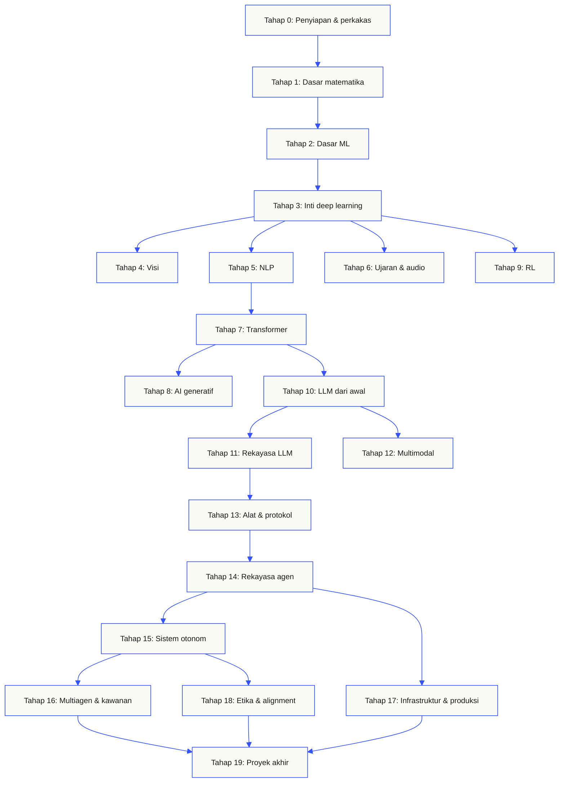
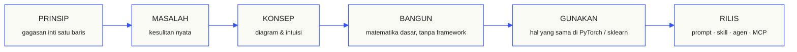

<p align="center"><sub>README ini diterjemahkan ke dalam bahasa Indonesia. <a href="../../README.md">README bahasa Inggris</a> tetap menjadi rujukan utama.</sub></p>

<p align="center">
  <picture>
    <source media="(prefers-color-scheme: dark)" srcset="../../assets/readme/header-dark.svg">
    
  </picture>
</p>

Implementasikan mekanisme internal model, pipeline penelusuran, dan runtime agen. Uji semuanya, periksa kegagalan, serta simpan kode dan hasil evaluasi.

**[Mulai belajar](https://aiengineeringfromscratch.com/lesson?path=phases/00-setup-and-tooling/01-dev-environment)** · **[Pilih jalur](#learning-routes)** · **[Coba laboratorium](#interactive-lab)** · **[Bangun proyek](#project-challenges)** · **[Lihat kurikulum](#contents)**

Gratis, sumber terbuka, berlisensi MIT. Belajar melalui situs web, bersama agen pemrograman, atau dengan menjalankan kode lokal.

> 523 pelajaran. 20 tahap. Python, TypeScript, Rust, Julia.

<p align="center">
  <a href="../../LICENSE"></a>
  <a href="../../ROADMAP.md"></a>
  <a href="#contents"></a>
  <a href="https://github.com/rohitg00/ai-engineering-from-scratch/stargazers"></a>
  <a href="https://aiengineeringfromscratch.com"></a>
</p>

<details>
<summary>Baca dalam bahasa Anda</summary>

<p align="center">
  <a href="../../README.md">🇬🇧 English</a> · <a href="../../i18n/zh/README.md">🇨🇳 简体中文</a> · <a href="../../i18n/zh-TW/README.md">🇹🇼 繁體中文（台灣）</a> · <a href="../../i18n/ja/README.md">🇯🇵 日本語</a> · <a href="../../i18n/ko/README.md">🇰🇷 한국어</a> · <a href="../../i18n/pt/README.md">🇵🇹 Português</a> · <a href="../../i18n/pt-BR/README.md">🇧🇷 Português (Brasil)</a> · <a href="../../i18n/es/README.md">🇪🇸 Español</a> · <a href="../../i18n/de/README.md">🇩🇪 Deutsch</a> · <a href="../../i18n/fr/README.md">🇫🇷 Français</a> · <a href="../../i18n/it/README.md">🇮🇹 Italiano</a> · <a href="../../i18n/nl/README.md">🇳🇱 Nederlands</a> · <a href="../../i18n/pl/README.md">🇵🇱 Polski</a> · <a href="../../i18n/cs/README.md">🇨🇿 Čeština</a> · <a href="../../i18n/ro/README.md">🇷🇴 Română</a> · <a href="../../i18n/hu/README.md">🇭🇺 Magyar</a> · <a href="../../i18n/el/README.md">🇬🇷 Ελληνικά</a> · <a href="../../i18n/sv/README.md">🇸🇪 Svenska</a> · <a href="../../i18n/da/README.md">🇩🇰 Dansk</a> · <a href="../../i18n/no/README.md">🇳🇴 Norsk</a> · <a href="../../i18n/fi/README.md">🇫🇮 Suomi</a> · <a href="../../i18n/ru/README.md">🇷🇺 Русский</a> · <a href="../../i18n/uk/README.md">🇺🇦 Українська</a> · <a href="../../i18n/tr/README.md">🇹🇷 Türkçe</a> · <a href="../../i18n/he/README.md">🇮🇱 עברית</a> · <a href="../../i18n/ar/README.md">🇸🇦 العربية</a> · <a href="../../i18n/fa/README.md">🇮🇷 فارسی</a> · <a href="../../i18n/hi/README.md">🇮🇳 हिन्दी</a> · <a href="../../i18n/bn/README.md">🇧🇩 বাংলা</a> · <a href="../../i18n/ur/README.md">🇵🇰 اردو</a> · <a href="../../i18n/th/README.md">🇹🇭 ไทย</a> · <a href="../../i18n/vi/README.md">🇻🇳 Tiếng Việt</a> · <a href="../../i18n/id/README.md">🇮🇩 Bahasa Indonesia</a> · <a href="../../i18n/tl/README.md">🇵🇭 Tagalog</a>
</p>

</details>

### Sponsor

<p align="center">
  <a href="https://serpapi.com/ai-engineering-from-scratch"><picture><source media="(min-width: 768px)" srcset="../../assets/sponsors/serpapi-banner-compact.png" width="48%"></picture></a>
  <a href="https://nitrostack.ai/referral/aiengineeringfromscratch"><picture><source media="(min-width: 768px)" srcset="../../assets/sponsors/nitrostack-banner-equal.png" width="48%"></picture></a>
</p>

<p align="center">
  <sub><span>Dukungan Anda menjaga setiap pelajaran tetap gratis dan bersumber terbuka.</span> <a href="#supporters">Lihat semua pendukung</a> · <a href="../../SPONSORS.md">Jadilah sponsor</a></sub>
</p>

<a id="see-what-you-will-build-and-keep"></a>
<a id="learning-routes"></a>

## Jalur pembelajaran

| Jalur | Pelajaran awal |
|---|---|
| Fondasi model | [Penyiapan dan perangkat](https://aiengineeringfromscratch.com/lesson?path=phases/00-setup-and-tooling/01-dev-environment) |
| Sistem LLM | [Rekayasa prompt](https://aiengineeringfromscratch.com/lesson?path=phases/11-llm-engineering/01-prompt-engineering) |
| Agen dan penyampaian sistem | [Siklus agen](https://aiengineeringfromscratch.com/lesson?path=phases/14-agent-engineering/01-the-agent-loop) |

[Bandingkan jalur karier](https://aiengineeringfromscratch.com/learning-paths.html) · [Prasyarat dan waktu belajar](#study-guide)

<a id="interactive-lab"></a>

### Penurunan gradien

Dua puluh titik awal mengikuti penurunan gradien pada fungsi kerugian kuadratik. Grafik menunjukkan posisi titik-titik tersebut dan rata-rata kerugian setelah setiap pembaruan.

<p align="center">
  <a href="https://aiengineeringfromscratch.com/lesson?path=phases/01-math-foundations/08-optimization#loss-landscape-visualization">
    <picture>
      <source media="(max-width: 600px) and (prefers-color-scheme: dark) and (prefers-reduced-motion: reduce)" srcset="../../assets/readme/101-gradient-mobile-dark.png">
      <source media="(max-width: 600px) and (prefers-reduced-motion: reduce)" srcset="../../assets/readme/101-gradient-mobile-light.png">
      <source media="(prefers-color-scheme: dark) and (prefers-reduced-motion: reduce)" srcset="../../assets/readme/101-gradient-dark.png">
      <source media="(prefers-reduced-motion: reduce)" srcset="../../assets/readme/101-gradient-light.png">
      <source media="(max-width: 600px) and (prefers-color-scheme: dark)" srcset="../../assets/readme/101-gradient-mobile-dark.gif">
      <source media="(max-width: 600px)" srcset="../../assets/readme/101-gradient-mobile-light.gif">
      <source media="(prefers-color-scheme: dark)" srcset="../../assets/readme/101-gradient-dark.gif">
      
    </picture>
  </a>
</p>

[Sesuaikan laju pembelajaran dalam pelajaran](https://aiengineeringfromscratch.com/lesson?path=phases/01-math-foundations/08-optimization#loss-landscape-visualization) · [Bandingkan penurunan gradien, momentum, dan Adam dalam kode](../../phases/01-math-foundations/08-optimization/code/optimizers.py)

<a id="project-challenges"></a>

### Proyek

Tiga proyek dengan kode awal bertahap, implementasi referensi, dan penilai lokal. Jalankan perintah dari akar repositori setelah [penyiapan](#local-setup). Kode awal tidak lolos pemeriksaan sampai Anda mengimplementasikan tahap-tahapnya.

<details>
<summary><strong>01 · Laboratorium Evaluasi Pengambilan Informasi</strong> · Python · Metrik pemeringkatan dan pemeriksaan regresi</summary>

Sistem kandidat meningkatkan rata-rata NDCG sementara satu kueri menempatkan bukti paling relevan pada peringkat yang lebih rendah. Bangun perbandingan per kueri yang melaporkan regresi dan dapat menggagalkan pemeriksaan rilis.

Gunakan Python 3.10+. Pelajari kembali [RAG](../../phases/11-llm-engineering/06-rag/docs/en.md) dan [evaluasi model](../../phases/02-ml-fundamentals/09-model-evaluation/docs/en.md). Implementasikan validasi peringkat, precision dan recall, metrik yang peka terhadap posisi, lalu perbandingan sistem.

```bash
python3 scripts/project_test.py retrieval-evaluation-lab \
  --init learning-artifacts/retrieval-evaluation-lab
python3 scripts/project_test.py retrieval-evaluation-lab \
  --stage 1 --path learning-artifacts/retrieval-evaluation-lab --strict
python3 scripts/project_test.py retrieval-evaluation-lab \
  --all --path learning-artifacts/retrieval-evaluation-lab --strict
```

**Simpan:** perbandingan yang dapat direproduksi beserta perubahan per kueri dan penilaian relevansi yang dipakai untuk menghitung skor. Metrik menjelaskan penilaian tersebut; metrik tidak membuktikan kebenaran jawaban.

[Mulai proyek](https://aiengineeringfromscratch.com/project.html?id=retrieval-evaluation-lab) · [Periksa referensi](../../projects/retrieval-evaluation-lab/solution/) · [Jalankan dengan masukan sendiri](../../projects/retrieval-evaluation-lab/README.md#run-with-your-own-inputs)

</details>

<details>
<summary><strong>02 · Debugger Jejak Agen</strong> · TypeScript · Penguraian jejak dan pengukuran waktu</summary>

Jejak yang disediakan masih memerlukan 100 ms, tetapi penggunaan token total bertambah 200 dan satu span mulai gagal. Pisahkan pekerjaan span anak yang tumpang tindih dari waktu eksekusi induk, lalu buat laporan yang memperlihatkan perubahan itu.

Gunakan Node.js 22.18+ dan Python 3 untuk penilai. Implementasikan parsing JSONL, validasi induk, aritmetika interval, lalu linimasa yang dapat diperiksa.

```bash
python3 scripts/project_test.py agent-trace-debugger \
  --init learning-artifacts/agent-trace-debugger
python3 scripts/project_test.py agent-trace-debugger \
  --stage 1 --path learning-artifacts/agent-trace-debugger --strict
python3 scripts/project_test.py agent-trace-debugger \
  --all --path learning-artifacts/agent-trace-debugger --strict
```

**Simpan:** jejak masukan, linimasa HTML, dan laporan regresi JSON. Pertahankan jumlah token milik setiap span saja, tanpa token span anak, agar penggunaan induk dan anak tidak dihitung dua kali.

[Mulai proyek](https://aiengineeringfromscratch.com/project.html?id=agent-trace-debugger) · [Periksa referensi](../../projects/agent-trace-debugger/solution/) · [Jelajahi waktu eksekusi secara interaktif](https://aiengineeringfromscratch.com/project.html?id=agent-trace-debugger&stage=03-timing)

</details>

<details>
<summary><strong>03 · Firewall Panggilan Alat</strong> · Rust · Pemeriksaan peran dan bukti persetujuan</summary>

Operasi tulis berubah setelah ditinjau, atau persetujuan digunakan kembali. Validasi amplop panggilan, periksa peran pemanggil dan jalur, lalu konsumsi persetujuan yang terikat pada permintaan serta konten yang tepat.

Gunakan Rust dan Python 3.10+. Pelajari kembali [desain skema alat](../../phases/13-tools-and-protocols/05-tool-schema-design/docs/en.md) dan [batas keamanan](../../phases/17-infrastructure-and-production/25-security-secrets-audit/docs/en.md). Aplikasi pemanggil menyediakan identitas; model mengusulkan operasi.

```bash
python3 scripts/project_test.py tool-call-firewall \
  --init learning-artifacts/tool-call-firewall
python3 scripts/project_test.py tool-call-firewall \
  --stage 1 --path learning-artifacts/tool-call-firewall --strict
python3 scripts/project_test.py tool-call-firewall \
  --all --path learning-artifacts/tool-call-firewall --strict
```

**Simpan:** catatan audit yang menunjukkan operasi yang diminta dan keputusan kebijakan. Persetujuan hanya dapat digunakan sekali dalam satu pemanggilan; proyek ini tidak menyediakan otorisasi persisten atau sandbox sistem operasi.

[Mulai proyek](https://aiengineeringfromscratch.com/project.html?id=tool-call-firewall) · [Periksa referensi](../../projects/tool-call-firewall/solution/) · [Jelajahi batas persetujuan](https://aiengineeringfromscratch.com/project.html?id=tool-call-firewall&stage=03-consume-a-request-bound-approval-once)

</details>

[Jelajahi semua proyek](https://aiengineeringfromscratch.com/projects.html) · [Panduan praktik karier](../../learning-paths/CAREER-PRACTICE.md)

## Pilih cara belajar

### Melalui situs web

Buka pelajaran yang sudah selesai di [aiengineeringfromscratch.com](https://aiengineeringfromscratch.com) atau buka tahap pada [Daftar isi](#contents). Tanpa penyiapan, tanpa klon.

### Bersama tutor AI

Jika Node.js, `npx`, dan agen pemrograman yang mendukung skill sudah terpasang, agen pemrograman Anda dapat menjadi tutor. Anda tidak perlu mengklon repositori untuk memasang atau membaca tutor. Praktikum yang dapat dijalankan pada jalur khusus membutuhkan `python3`. Praktikum host Agent Skills juga membutuhkan host pilihan dan lingkup skill pengguna atau proyek yang dapat ditulis.

```bash
npx skills add rohitg00/ai-engineering-from-scratch
```

Pilih host dan cakupan saat penginstal menanyakannya. Gunakan `start-learning` di Codex, `/start-learning` di Claude Code, atau minta host menggunakan skill berdasarkan namanya.

<details>
<summary>Pengaturan tutor dan perintah lingkungan host</summary>

Periksa persyaratan lokal terlebih dahulu:

```bash
node --version
npx --version
python3 --version
```

`skills` menulis ke host dan lingkup yang dipilih saat pemasangan, seperti `.claude/skills/`, `.cursor/skills/`, `.codex/skills/`, atau folder skill lain yang didukung. Pastikan host yang dipilih menemukan lokasi tujuan yang tepat tersebut.

Sintaks pemanggilan ditentukan oleh host, bukan oleh format portabel `SKILL.md`:

| Aplikasi host | Mulai kursus | Mulai Model Context Protocol (MCP) | Mulai Agent Skills | Jalankan kuis tahap |
|---|---|---|---|---|
| Codex | `start-learning`, atau pilih dari `/skills` | `learn-mcp`, atau pilih dari `/skills` | `learn-agent-skills`, atau pilih dari `/skills` | `check-understanding 13`, atau pilih dari `/skills` |
| Claude Code | `/start-learning` | `/learn-mcp` | `/learn-agent-skills` | `/check-understanding 13` |
| Host lain yang kompatibel | `Use start-learning to begin the course.` | `Use learn-mcp to start the Model Context Protocol (MCP) path.` | `Use learn-agent-skills to start the Agent Skills Engineering path.` | `Use check-understanding to quiz me on Phase 13.` |

Kuis penempatan berisi sepuluh pertanyaan memetakan pengetahuan Anda ke tahap awal yang sesuai dan menyimpan rencana belajar pribadi di `LEARNING.md`. Setelah itu, skill `learn` mengajarkan satu pelajaran per sesi: konsep, matematika, kode, kuis. Pelajaran diambil langsung dari repositori ini, dan skill `course-guide` mengarahkan Anda ke pelajaran yang membahas bagian yang belum Anda pahami. Di Codex, panggil skill ini dengan `learn` dan `course-guide`; di Claude Code, gunakan `/learn` dan `/course-guide`; di host lain yang kompatibel, minta penggunaan skill berdasarkan namanya.

Hanya ingin mempelajari Model Context Protocol (MCP)? Gunakan pemanggilan MCP untuk host Anda. Pemanggilan ini membuat `MCP-LEARNING.md` dan mengikuti satu jalur berisi 17 pelajaran tentang permintaan tanpa status, transport, komunikasi dua arah, keamanan, keandalan, tata kelola registri, dan bukti kepatuhan. Urutan tepat serta titik pemeriksaannya tersedia dalam [manifes Model Context Protocol (MCP)](../../learning-paths/model-context-protocol.json).

Hanya ingin mempelajari Agent Skills? Gunakan pemanggilan Agent Skills untuk host Anda. Pemanggilan ini membuat `AGENT-SKILLS-LEARNING.md` dan mengikuti satu jalur terpadu berisi lima pelajaran: kontrak, penemuan, pemanggilan, batas sandbox, lalu evaluasi rilis dan portabilitas pada host nyata. Mulai di web melalui [jalur Agent Skills](https://aiengineeringfromscratch.com/lesson?path=phases/13-tools-and-protocols/22-skills-and-agent-sdks&learningPath=agent-skills).

Pemasang menampilkan host yang dapat dikonfigurasi dan menanyakan lokasi pemasangan. Jika Anda belum memiliki Node.js, `npx`, `python3`, host yang didukung, atau lingkup yang dapat ditulis, gunakan situs web atau baca `docs/en.md` secara manual. Jalur itu mengajarkan konsep, tetapi bukti penemuan, pemanggilan, skrip, dan pencopotan pada host nyata masih harus dilengkapi setelah pemeriksaan awal dapat dijalankan. Baca pelajarannya di [aiengineeringfromscratch.com](https://aiengineeringfromscratch.com).

### Skill pembelajaran

| Skill pembelajaran | Fungsinya |
|---|---|
| [`start-learning`](../../skills/start-learning/SKILL.md) | Orientasi sekali di awal: alasan Anda belajar, kuis penempatan, dan rencana pribadi yang disimpan di `LEARNING.md`. |
| [`learn`](../../skills/learn/SKILL.md) | Siklus tutor. Mengingat kembali materi sebagai pemanasan, lalu mempelajari pelajaran berikutnya secara interaktif beserta kuisnya; mencatat kemajuan dan antrean pengulangan. |
| [`course-guide`](../../skills/course-guide/SKILL.md) | Pengarah topik. "Di mana saya mempelajari attention?" atau "loss saya NaN" → pelajaran yang tepat, lengkap dengan tautan. |
| [`learn-mcp`](../../skills/learn-mcp/SKILL.md) | Tutor khusus Model Context Protocol (MCP). Membuat `MCP-LEARNING.md`, mengikuti manifes 17 pelajaran, serta mencatat bukti komunikasi, keamanan, keandalan, dan kepatuhan. |
| [`learn-agent-skills`](../../skills/learn-agent-skills/SKILL.md) | Tutor khusus Agent Skills. Membuat `AGENT-SKILLS-LEARNING.md`, mengajarkan pelajaran 22, 24, 25, 26, dan 27, serta mencatat bukti dari host nyata. |
| [`claude-certification`](../../skills/claude-certification/SKILL.md) | Tutor sertifikasi. Memilih CCAO-F, CCDV-F, CCAR-F, atau CCAR-P; mengajarkan setiap pelajaran; menjalankan praktikum; meninjau artefak; menyelenggarakan tes diagnostik dan simulasi; menyimpan kemajuan. |
| [`mcpa-certification`](../../skills/mcpa-certification/SKILL.md) | Tutor MCPA. Mengikuti jalur `mcpa-f` berisi 34 pelajaran tentang protokol 2026-07-28; mengajarkan setiap pelajaran; menjalankan praktikum dan pemeriksa komunikasi; menyelenggarakan tes diagnostik dan tiga simulasi; menyimpan kemajuan. |
| [`find-your-level`](../../skills/find-your-level/SKILL.md) | Kuis penempatan sepuluh pertanyaan. Memetakan pengetahuan Anda ke tahap awal dan menghasilkan jalur pribadi beserta perkiraan jam belajar. |
| [`check-understanding <phase>`](../../skills/check-understanding/SKILL.md) | Kuis per tahap, delapan pertanyaan, dengan umpan balik dan pelajaran tertentu untuk diulang. Gunakan bentuk Codex, Claude Code, atau bahasa alami pada tabel pemanggilan di atas. |

</details>

<a id="local-setup"></a>

### Jalankan kode lokal

```bash
git clone https://github.com/rohitg00/ai-engineering-from-scratch.git
cd ai-engineering-from-scratch
python3 phases/00-setup-and-tooling/01-dev-environment/code/verify.py --route beginner
python3 phases/01-math-foundations/01-linear-algebra-intuition/code/vectors.py
```

Pemeriksaan awal memisahkan persyaratan yang dibutuhkan sekarang dari alat yang baru diperlukan nanti. Setiap kegagalan persyaratan menyertakan penyebab yang terdeteksi dan perintah untuk memperbaikinya. Perintah `vectors.py` menjalankan pelajaran tanpa dependensi dan diakhiri dengan menunjukkan bahwa perkalian matriks dengan vektor merupakan operasi di dalam lapisan jaringan saraf. Simpan keluaran terminal itu sebagai bukti pertama Anda.

<details>
<summary>Gunakan setiap pelajaran dengan cara yang sama</summary>

### Gunakan setiap pelajaran dengan cara yang sama

1. **Baca** `docs/en.md` dan jelaskan gagasan utamanya dengan kata-kata Anda sendiri.
2. **Ketik dan bangun** kode yang penting, jangan hanya menganggap blok kode sebagai hiasan.
3. **Jalankan** perintah pelajaran dari direktori akar repositori, yaitu direktori yang berisi `README.md` dan `phases/`.
4. **Simpan bukti**: perintah, direktori kerja, kode keluar, keluaran yang bermakna, serta artefak yang Anda ubah atau hasilkan.
5. **Lanjutkan** hanya setelah Anda dapat menjelaskan keluaran dan membuat satu perubahan kecil tanpa menebak.

Perintah pada halaman pelajaran menggunakan jalur dari akar repositori, kecuali jika pelajaran secara eksplisit meminta Anda berpindah direktori. Jika sebuah pelajaran menyediakan beberapa bahasa, jalankan implementasi dalam bahasa yang sedang Anda pelajari.

</details>

<a id="study-guide"></a>

## Pilih jalur pembelajaran

Anda tidak perlu menelusuri 523 pelajaran sebelum mulai. Pilih satu tujuan. Setiap tautan membuka kurikulum yang sama di GitHub atau situs web, dan kedua versi menggunakan kode pelajaran yang sama.

| Tujuan Anda | Belajar di GitHub | Belajar di situs web |
|---|---|---|
| Saya pemula dan ingin membangun dasar yang lengkap | [Tahap 0: Penyiapan dan alat](../../phases/00-setup-and-tooling/) | [Lingkungan pengembangan](https://aiengineeringfromscratch.com/lesson?path=phases/00-setup-and-tooling/01-dev-environment) |
| Saya menguasai Python dan ingin mempelajari dasar matematika serta ML | [Tahap 1: Dasar matematika](../../phases/01-math-foundations/) | [Intuisi aljabar linear](https://aiengineeringfromscratch.com/lesson?path=phases/01-math-foundations/01-linear-algebra-intuition) |
| Saya ingin membangun aplikasi LLM untuk penggunaan produksi | [Tahap 11: Rekayasa LLM](../../phases/11-llm-engineering/) | [Rekayasa prompt](https://aiengineeringfromscratch.com/lesson?path=phases/11-llm-engineering/01-prompt-engineering) |
| Saya ingin membangun agen | [Tahap 14: Rekayasa agen](../../phases/14-agent-engineering/) | [Perulangan agen](https://aiengineeringfromscratch.com/lesson?path=phases/14-agent-engineering/01-the-agent-loop) |
| Saya ingin menggunakan agen pemrograman pada repositori nyata | [Jalur rekayasa berbantuan agen](../../learning-paths/using-coding-agents.json) | [Rekayasa berbantuan agen](https://aiengineeringfromscratch.com/lesson?path=phases/14-agent-engineering/31-agent-workbench-why-models-fail&learningPath=using-coding-agents) |
| Saya ingin menentukan solusi yang tepat sebelum implementasi | [Jalur penilaian produk dan penyerahan hasil](../../learning-paths/shaping-the-build.json) | [Penilaian produk dan penyerahan hasil](https://aiengineeringfromscratch.com/lesson?path=phases/14-agent-engineering/47-outcomes-before-output&learningPath=shaping-the-build) |

Belum tahu harus mulai dari mana? Gunakan [tutor penempatan `start-learning`](../../skills/start-learning/SKILL.md) atau [panduan prasyarat di situs web](https://aiengineeringfromscratch.com/prereqs.html).

Bandingkan empat bidang inti dan enam jalur karier di [Jalur Pembelajaran Rekayasa AI](https://aiengineeringfromscratch.com/learning-paths.html).

<details>
<summary>Jalur khusus MCP dan Agent Skills</summary>

| Tujuan Anda | Belajar di GitHub | Belajar di situs web |
|---|---|---|
| Saya ingin membangun dengan Model Context Protocol (MCP) | [Rute Model Context Protocol (MCP)](../../phases/13-tools-and-protocols/README.md#model-context-protocol-mcp-path) | [Jalur Model Context Protocol (MCP)](https://aiengineeringfromscratch.com/lesson?path=phases/13-tools-and-protocols/06-mcp-fundamentals&learningPath=model-context-protocol) |
| Saya ingin menulis dan merilis Agent Skills | [Rute khusus Agent Skills](../../phases/13-tools-and-protocols/README.md#agent-skills-fast-path) | [Jalur Agent Skills](https://aiengineeringfromscratch.com/lesson?path=phases/13-tools-and-protocols/22-skills-and-agent-sdks&learningPath=agent-skills) |

</details>

<details>
<summary>Prasyarat dan waktu belajar</summary>

### Prasyarat

- Anda dapat menulis kode (bahasa apa pun; Python akan membantu).
- Anda ingin memahami **cara kerja AI yang sebenarnya**, bukan sekadar memanggil API.

## Harus mulai dari mana

| Latar belakang | Mulai dari | Perkiraan waktu |
|---|---|---|
| Pemula dalam pemrograman dan AI | Tahap 0: Penyiapan | ~306 jam |
| Menguasai Python, baru mengenal ML | Tahap 1: Dasar matematika | ~270 jam |
| Menguasai ML, baru mengenal deep learning | Tahap 3: Inti deep learning | ~200 jam |
| Menguasai deep learning, ingin mempelajari LLM dan agen | Tahap 10: LLM dari awal | ~100 jam |
| Engineer senior, hanya ingin mempelajari rekayasa agen | Tahap 14: Rekayasa agen | ~60 jam |
| Hanya ingin membangun sistem MCP untuk produksi | [Jalur Model Context Protocol (MCP)](../../learning-paths/model-context-protocol.json) | ~23 jam 15 menit |
| Hanya ingin membangun Agent Skills untuk produksi | [Jalur Rekayasa Agent Skills](../../learning-paths/agent-skills.json) | ~9.5 jam |

</details>

## Susunan kurikulum

Dua puluh tahap saling bertumpu. Matematika adalah fondasinya. Agen dan produksi berada di puncaknya. Lewati tahap awal jika Anda sudah memahami lapisan bawah, tetapi jangan melewatinya lalu heran ketika sesuatu di lapisan atas bermasalah.



<a id="contents"></a>

## Daftar isi

Dua puluh tahap. Klik tahap mana pun untuk membuka daftar pelajarannya.

<a id="phase-0"></a>
### Tahap 0: Penyiapan & Perkakas `12 pelajaran`
> Siapkan lingkungan Anda untuk semua yang akan menyusul.

| # | Pelajaran | Jenis | Bahasa |
|:---:|--------|:----:|------|
| 01 | [Lingkungan pengembangan](../../phases/00-setup-and-tooling/01-dev-environment/) | Bangun | Python |
| 02 | [Git dan kolaborasi](../../phases/00-setup-and-tooling/02-git-and-collaboration/) | Pelajari | — |
| 03 | [Penyiapan GPU dan cloud](../../phases/00-setup-and-tooling/03-gpu-setup-and-cloud/) | Bangun | Python |
| 04 | [API dan kunci akses](../../phases/00-setup-and-tooling/04-apis-and-keys/) | Bangun | Python |
| 05 | [Notebook Jupyter](../../phases/00-setup-and-tooling/05-jupyter-notebooks/) | Bangun | Python |
| 06 | [Lingkungan Python](../../phases/00-setup-and-tooling/06-python-environments/) | Bangun | Shell |
| 07 | [Docker untuk AI](../../phases/00-setup-and-tooling/07-docker-for-ai/) | Bangun | Docker |
| 08 | [Penyiapan editor](../../phases/00-setup-and-tooling/08-editor-setup/) | Bangun | — |
| 09 | [Pengelolaan data](../../phases/00-setup-and-tooling/09-data-management/) | Bangun | Python |
| 10 | [Terminal dan shell](../../phases/00-setup-and-tooling/10-terminal-and-shell/) | Pelajari | — |
| 11 | [Linux untuk AI](../../phases/00-setup-and-tooling/11-linux-for-ai/) | Pelajari | — |
| 12 | [Debugging dan profiling](../../phases/00-setup-and-tooling/12-debugging-and-profiling/) | Bangun | Python |

<details id="phase-1">
<summary><b>Tahap 1: Dasar matematika</b> &nbsp;<code>22 pelajaran</code>&nbsp; <em>Intuisi di balik setiap algoritma AI, melalui kode.</em></summary>
<br/>

| # | Pelajaran | Jenis | Bahasa |
|:---:|--------|:----:|------|
| 01 | [Intuisi aljabar linear](../../phases/01-math-foundations/01-linear-algebra-intuition/) | Pelajari | Python, Julia |
| 02 | [Vektor, matriks, dan operasi](../../phases/01-math-foundations/02-vectors-matrices-operations/) | Bangun | Python, Julia |
| 03 | [Transformasi matriks dan nilai eigen](../../phases/01-math-foundations/03-matrix-transformations/) | Bangun | Python, Julia |
| 04 | [Kalkulus untuk ML: turunan dan gradien](../../phases/01-math-foundations/04-calculus-for-ml/) | Pelajari | Python |
| 05 | [Aturan rantai dan diferensiasi otomatis](../../phases/01-math-foundations/05-chain-rule-and-autodiff/) | Bangun | Python |
| 06 | [Probabilitas dan distribusi](../../phases/01-math-foundations/06-probability-and-distributions/) | Pelajari | Python |
| 07 | [Teorema Bayes dan penalaran statistik](../../phases/01-math-foundations/07-bayes-theorem/) | Bangun | Python |
| 08 | [Optimisasi: keluarga penurunan gradien](../../phases/01-math-foundations/08-optimization/) | Bangun | Python |
| 09 | [Teori informasi: entropi dan divergensi KL](../../phases/01-math-foundations/09-information-theory/) | Pelajari | Python |
| 10 | [Reduksi dimensi: PCA, t-SNE, UMAP](../../phases/01-math-foundations/10-dimensionality-reduction/) | Bangun | Python |
| 11 | [Dekomposisi nilai singular](../../phases/01-math-foundations/11-singular-value-decomposition/) | Bangun | Python, Julia |
| 12 | [Operasi tensor](../../phases/01-math-foundations/12-tensor-operations/) | Bangun | Python |
| 13 | [Stabilitas numerik](../../phases/01-math-foundations/13-numerical-stability/) | Bangun | Python |
| 14 | [Norma dan jarak](../../phases/01-math-foundations/14-norms-and-distances/) | Bangun | Python |
| 15 | [Statistika untuk ML](../../phases/01-math-foundations/15-statistics-for-ml/) | Bangun | Python |
| 16 | [Metode pengambilan sampel](../../phases/01-math-foundations/16-sampling-methods/) | Bangun | Python |
| 17 | [Sistem linear](../../phases/01-math-foundations/17-linear-systems/) | Bangun | Python |
| 18 | [Optimisasi konveks](../../phases/01-math-foundations/18-convex-optimization/) | Bangun | Python |
| 19 | [Bilangan kompleks untuk AI](../../phases/01-math-foundations/19-complex-numbers/) | Pelajari | Python |
| 20 | [Transformasi Fourier](../../phases/01-math-foundations/20-fourier-transform/) | Bangun | Python |
| 21 | [Teori graf untuk ML](../../phases/01-math-foundations/21-graph-theory/) | Bangun | Python |
| 22 | [Proses stokastik](../../phases/01-math-foundations/22-stochastic-processes/) | Pelajari | Python |

</details>

<details id="phase-2">
<summary><b>Tahap 2: Dasar ML</b> &nbsp;<code>18 pelajaran</code>&nbsp; <em>ML klasik: masih menjadi fondasi sebagian besar AI produksi.</em></summary>
<br/>

| # | Pelajaran | Jenis | Bahasa |
|:---:|--------|:----:|------|
| 01 | [Apa itu pembelajaran mesin](../../phases/02-ml-fundamentals/01-what-is-machine-learning/) | Pelajari | Python |
| 02 | [Regresi linear dari nol](../../phases/02-ml-fundamentals/02-linear-regression/) | Bangun | Python |
| 03 | [Regresi logistik dan klasifikasi](../../phases/02-ml-fundamentals/03-logistic-regression/) | Bangun | Python |
| 04 | [Pohon keputusan dan random forest](../../phases/02-ml-fundamentals/04-decision-trees/) | Bangun | Python |
| 05 | [Mesin vektor pendukung](../../phases/02-ml-fundamentals/05-support-vector-machines/) | Bangun | Python |
| 06 | [KNN dan metrik jarak](../../phases/02-ml-fundamentals/06-knn-and-distances/) | Bangun | Python |
| 07 | [Pembelajaran tanpa pengawasan: K-Means, DBSCAN](../../phases/02-ml-fundamentals/07-unsupervised-learning/) | Bangun | Python |
| 08 | [Rekayasa dan seleksi fitur](../../phases/02-ml-fundamentals/08-feature-engineering/) | Bangun | Python |
| 09 | [Evaluasi model: metrik dan validasi silang](../../phases/02-ml-fundamentals/09-model-evaluation/) | Bangun | Python |
| 10 | [Bias, varians, dan kurva pembelajaran](../../phases/02-ml-fundamentals/10-bias-variance/) | Pelajari | Python |
| 11 | [Metode ensemble: boosting, bagging, stacking](../../phases/02-ml-fundamentals/11-ensemble-methods/) | Bangun | Python |
| 12 | [Penyetelan hiperparameter](../../phases/02-ml-fundamentals/12-hyperparameter-tuning/) | Bangun | Python |
| 13 | [Pipeline ML dan pelacakan eksperimen](../../phases/02-ml-fundamentals/13-ml-pipelines/) | Bangun | Python |
| 14 | [Naive Bayes](../../phases/02-ml-fundamentals/14-naive-bayes/) | Bangun | Python |
| 15 | [Dasar deret waktu](../../phases/02-ml-fundamentals/15-time-series/) | Bangun | Python |
| 16 | [Deteksi anomali](../../phases/02-ml-fundamentals/16-anomaly-detection/) | Bangun | Python |
| 17 | [Menangani data tidak seimbang](../../phases/02-ml-fundamentals/17-imbalanced-data/) | Bangun | Python |
| 18 | [Seleksi fitur](../../phases/02-ml-fundamentals/18-feature-selection/) | Bangun | Python |

</details>

<details id="phase-3">
<summary><b>Tahap 3: Inti deep learning</b> &nbsp;<code>13 pelajaran</code>&nbsp; <em>Jaringan saraf dari prinsip dasar. Tanpa framework sampai Anda membangunnya sendiri.</em></summary>
<br/>

| # | Pelajaran | Jenis | Bahasa |
|:---:|--------|:----:|------|
| 01 | [Perceptron: awal mulanya](../../phases/03-deep-learning-core/01-the-perceptron/) | Bangun | Python |
| 02 | [Jaringan multilapis dan propagasi maju](../../phases/03-deep-learning-core/02-multi-layer-networks/) | Bangun | Python |
| 03 | [Propagasi balik dari nol](../../phases/03-deep-learning-core/03-backpropagation/) | Bangun | Python |
| 04 | [Fungsi aktivasi: ReLU, Sigmoid, GELU dan alasannya](../../phases/03-deep-learning-core/04-activation-functions/) | Bangun | Python |
| 05 | [Fungsi kerugian: MSE, cross-entropy, kontrastif](../../phases/03-deep-learning-core/05-loss-functions/) | Bangun | Python |
| 06 | [Pengoptimal: SGD, Momentum, Adam, AdamW](../../phases/03-deep-learning-core/06-optimizers/) | Bangun | Python |
| 07 | [Regularisasi: dropout, peluruhan bobot, BatchNorm](../../phases/03-deep-learning-core/07-regularization/) | Bangun | Python |
| 08 | [Inisialisasi bobot dan stabilitas pelatihan](../../phases/03-deep-learning-core/08-weight-initialization/) | Bangun | Python |
| 09 | [Penjadwalan laju pembelajaran dan pemanasan](../../phases/03-deep-learning-core/09-learning-rate-schedules/) | Bangun | Python |
| 10 | [Bangun kerangka kerja mini sendiri](../../phases/03-deep-learning-core/10-mini-framework/) | Bangun | Python |
| 11 | [Pengantar PyTorch](../../phases/03-deep-learning-core/11-intro-to-pytorch/) | Bangun | Python |
| 12 | [Pengantar JAX](../../phases/03-deep-learning-core/12-intro-to-jax/) | Bangun | Python |
| 13 | [Debugging jaringan saraf](../../phases/03-deep-learning-core/13-debugging-neural-networks/) | Bangun | Python |

</details>

<details id="phase-4">
<summary><b>Tahap 4: Visi komputer</b> &nbsp;<code>28 pelajaran</code>&nbsp; <em>Dari piksel menuju pemahaman: gambar, video, 3D, VLM, dan model dunia.</em></summary>
<br/>

| # | Pelajaran | Jenis | Bahasa |
|:---:|--------|:----:|------|
| 01 | [Dasar citra: piksel, kanal, dan ruang warna](../../phases/04-computer-vision/01-image-fundamentals/) | Pelajari | Python |
| 02 | [Konvolusi dari nol](../../phases/04-computer-vision/02-convolutions-from-scratch/) | Bangun | Python |
| 03 | [CNN: dari LeNet ke ResNet](../../phases/04-computer-vision/03-cnns-lenet-to-resnet/) | Bangun | Python |
| 04 | [Klasifikasi citra](../../phases/04-computer-vision/04-image-classification/) | Bangun | Python |
| 05 | [Pembelajaran transfer dan fine-tuning](../../phases/04-computer-vision/05-transfer-learning/) | Bangun | Python |
| 06 | [Deteksi objek: YOLO dari nol](../../phases/04-computer-vision/06-object-detection-yolo/) | Bangun | Python |
| 07 | [Segmentasi semantik: U-Net](../../phases/04-computer-vision/07-semantic-segmentation-unet/) | Bangun | Python |
| 08 | [Segmentasi instans: Mask R-CNN](../../phases/04-computer-vision/08-instance-segmentation-mask-rcnn/) | Bangun | Python |
| 09 | [Pembuatan citra: GAN](../../phases/04-computer-vision/09-image-generation-gans/) | Bangun | Python |
| 10 | [Pembuatan citra: model difusi](../../phases/04-computer-vision/10-image-generation-diffusion/) | Bangun | Python |
| 11 | [Stable Diffusion: arsitektur dan fine-tuning](../../phases/04-computer-vision/11-stable-diffusion/) | Bangun | Python |
| 12 | [Pemahaman video: pemodelan temporal](../../phases/04-computer-vision/12-video-understanding/) | Bangun | Python |
| 13 | [Visi 3D: point cloud dan NeRF](../../phases/04-computer-vision/13-3d-vision-nerf/) | Bangun | Python |
| 14 | [Vision Transformer (ViT)](../../phases/04-computer-vision/14-vision-transformers/) | Bangun | Python |
| 15 | [Visi waktu nyata: deployment di perangkat tepi](../../phases/04-computer-vision/15-real-time-edge/) | Bangun | Python |
| 16 | [Bangun pipeline visi yang lengkap](../../phases/04-computer-vision/16-vision-pipeline-capstone/) | Bangun | Python |
| 17 | [Visi dengan pengawasan mandiri: SimCLR, DINO, MAE](../../phases/04-computer-vision/17-self-supervised-vision/) | Bangun | Python |
| 18 | [Visi dengan kosakata terbuka: CLIP](../../phases/04-computer-vision/18-open-vocab-clip/) | Bangun | Python |
| 19 | [OCR dan pemahaman dokumen](../../phases/04-computer-vision/19-ocr-document-understanding/) | Bangun | Python |
| 20 | [Pencarian citra dan pembelajaran metrik](../../phases/04-computer-vision/20-image-retrieval-metric/) | Bangun | Python |
| 21 | [Deteksi titik kunci dan estimasi pose](../../phases/04-computer-vision/21-keypoint-pose/) | Bangun | Python |
| 22 | [3D Gaussian Splatting dari nol](../../phases/04-computer-vision/22-3d-gaussian-splatting/) | Bangun | Python |
| 23 | [Diffusion Transformer dan Rectified Flow](../../phases/04-computer-vision/23-diffusion-transformers-rectified-flow/) | Bangun | Python |
| 24 | [SAM 3 dan segmentasi dengan kosakata terbuka](../../phases/04-computer-vision/24-sam3-open-vocab-segmentation/) | Bangun | Python |
| 25 | [Model visi-bahasa (ViT-MLP-LLM)](../../phases/04-computer-vision/25-vision-language-models/) | Bangun | Python |
| 26 | [Estimasi kedalaman monokular dan geometri](../../phases/04-computer-vision/26-monocular-depth/) | Bangun | Python |
| 27 | [Pelacakan banyak objek dan memori video](../../phases/04-computer-vision/27-multi-object-tracking/) | Bangun | Python |
| 28 | [Model dunia dan difusi video](../../phases/04-computer-vision/28-world-models-video-diffusion/) | Bangun | Python |

</details>

<details id="phase-5">
<summary><b>Tahap 5: NLP dari dasar hingga lanjut</b> &nbsp;<code>29 pelajaran</code>&nbsp; <em>Bahasa adalah antarmuka menuju kecerdasan.</em></summary>
<br/>

| # | Pelajaran | Jenis | Bahasa |
|:---:|--------|:----:|------|
| 01 | [Pemrosesan teks: tokenisasi, stemming, lemmatisasi](../../phases/05-nlp-foundations-to-advanced/01-text-processing/) | Bangun | Python |
| 02 | [Bag of Words, TF-IDF, dan representasi teks](../../phases/05-nlp-foundations-to-advanced/02-bag-of-words-tfidf/) | Bangun | Python |
| 03 | [Embedding kata: Word2Vec dari nol](../../phases/05-nlp-foundations-to-advanced/03-word-embeddings-word2vec/) | Bangun | Python |
| 04 | [GloVe, FastText, dan embedding subkata](../../phases/05-nlp-foundations-to-advanced/04-glove-fasttext-subword/) | Bangun | Python |
| 05 | [Analisis sentimen](../../phases/05-nlp-foundations-to-advanced/05-sentiment-analysis/) | Bangun | Python |
| 06 | [Pengenalan entitas bernama (NER)](../../phases/05-nlp-foundations-to-advanced/06-named-entity-recognition/) | Bangun | Python |
| 07 | [Penandaan kelas kata dan penguraian sintaksis](../../phases/05-nlp-foundations-to-advanced/07-pos-tagging-parsing/) | Bangun | Python |
| 08 | [Klasifikasi teks: CNN dan RNN untuk teks](../../phases/05-nlp-foundations-to-advanced/08-cnns-rnns-for-text/) | Bangun | Python |
| 09 | [Model sequence-to-sequence](../../phases/05-nlp-foundations-to-advanced/09-sequence-to-sequence/) | Bangun | Python |
| 10 | [Mekanisme attention: terobosan penting](../../phases/05-nlp-foundations-to-advanced/10-attention-mechanism/) | Bangun | Python |
| 11 | [Penerjemahan mesin](../../phases/05-nlp-foundations-to-advanced/11-machine-translation/) | Bangun | Python |
| 12 | [Peringkasan teks](../../phases/05-nlp-foundations-to-advanced/12-text-summarization/) | Bangun | Python |
| 13 | [Sistem tanya jawab](../../phases/05-nlp-foundations-to-advanced/13-question-answering/) | Bangun | Python |
| 14 | [Temu kembali informasi dan pencarian](../../phases/05-nlp-foundations-to-advanced/14-information-retrieval-search/) | Bangun | Python |
| 15 | [Pemodelan topik: LDA, BERTopic](../../phases/05-nlp-foundations-to-advanced/15-topic-modeling/) | Bangun | Python |
| 16 | [Pembuatan teks](../../phases/05-nlp-foundations-to-advanced/16-text-generation-pre-transformer/) | Bangun | Python |
| 17 | [Chatbot: dari berbasis aturan hingga jaringan saraf](../../phases/05-nlp-foundations-to-advanced/17-chatbots-rule-to-neural/) | Bangun | Python |
| 18 | [NLP multibahasa](../../phases/05-nlp-foundations-to-advanced/18-multilingual-nlp/) | Bangun | Python |
| 19 | [Tokenisasi subkata: BPE, WordPiece, Unigram, SentencePiece](../../phases/05-nlp-foundations-to-advanced/19-subword-tokenization/) | Pelajari | Python |
| 20 | [Keluaran terstruktur dan decoding terkendala](../../phases/05-nlp-foundations-to-advanced/20-structured-outputs-constrained-decoding/) | Bangun | Python |
| 21 | [NLI dan implikasi tekstual](../../phases/05-nlp-foundations-to-advanced/21-nli-textual-entailment/) | Pelajari | Python |
| 22 | [Mendalami model embedding](../../phases/05-nlp-foundations-to-advanced/22-embedding-models-deep-dive/) | Pelajari | Python |
| 23 | [Strategi pemotongan teks untuk RAG](../../phases/05-nlp-foundations-to-advanced/23-chunking-strategies-rag/) | Bangun | Python |
| 24 | [Resolusi koreferensi](../../phases/05-nlp-foundations-to-advanced/24-coreference-resolution/) | Pelajari | Python |
| 25 | [Penautan entitas dan disambiguasi](../../phases/05-nlp-foundations-to-advanced/25-entity-linking/) | Bangun | Python |
| 26 | [Ekstraksi relasi dan pembangunan graf pengetahuan](../../phases/05-nlp-foundations-to-advanced/26-relation-extraction-kg/) | Bangun | Python |
| 27 | [Evaluasi LLM: RAGAS, DeepEval, G-Eval](../../phases/05-nlp-foundations-to-advanced/27-llm-evaluation-frameworks/) | Bangun | Python |
| 28 | [Evaluasi konteks panjang: NIAH, RULER, LongBench, MRCR](../../phases/05-nlp-foundations-to-advanced/28-long-context-evaluation/) | Pelajari | Python |
| 29 | [Pelacakan keadaan dialog](../../phases/05-nlp-foundations-to-advanced/29-dialogue-state-tracking/) | Bangun | Python |

</details>

<details id="phase-6">
<summary><b>Tahap 6: Ujaran & audio</b> &nbsp;<code>17 pelajaran</code>&nbsp; <em>Dengar, pahami, bicaralah.</em></summary>
<br/>

| # | Pelajaran | Jenis | Bahasa |
|:---:|--------|:----:|------|
| 01 | [Dasar audio: bentuk gelombang, sampling, FFT](../../phases/06-speech-and-audio/01-audio-fundamentals) | Pelajari | Python |
| 02 | [Spektrogram, skala Mel, dan fitur audio](../../phases/06-speech-and-audio/02-spectrograms-mel-features) | Bangun | Python |
| 03 | [Klasifikasi audio](../../phases/06-speech-and-audio/03-audio-classification) | Bangun | Python |
| 04 | [Pengenalan ucapan (ASR)](../../phases/06-speech-and-audio/04-speech-recognition-asr) | Bangun | Python |
| 05 | [Whisper: arsitektur dan fine-tuning](../../phases/06-speech-and-audio/05-whisper-architecture-finetuning) | Bangun | Python |
| 06 | [Pengenalan dan verifikasi pembicara](../../phases/06-speech-and-audio/06-speaker-recognition-verification) | Bangun | Python |
| 07 | [Teks menjadi ucapan (TTS)](../../phases/06-speech-and-audio/07-text-to-speech) | Bangun | Python |
| 08 | [Kloning dan konversi suara](../../phases/06-speech-and-audio/08-voice-cloning-conversion) | Bangun | Python |
| 09 | [Pembuatan musik](../../phases/06-speech-and-audio/09-music-generation) | Bangun | Python |
| 10 | [Model audio-bahasa](../../phases/06-speech-and-audio/10-audio-language-models) | Bangun | Python |
| 11 | [Pemrosesan audio waktu nyata](../../phases/06-speech-and-audio/11-real-time-audio-processing) | Bangun | Python |
| 12 | [Bangun pipeline asisten suara](../../phases/06-speech-and-audio/12-voice-assistant-pipeline) | Bangun | Python |
| 13 | [Codec audio neural: EnCodec, SNAC, Mimi, DAC](../../phases/06-speech-and-audio/13-neural-audio-codecs) | Pelajari | Python |
| 14 | [Deteksi aktivitas suara dan pergantian giliran](../../phases/06-speech-and-audio/14-voice-activity-detection-turn-taking) | Bangun | Python |
| 15 | [Streaming ucapan-ke-ucapan: Moshi, Hibiki](../../phases/06-speech-and-audio/15-streaming-speech-to-speech-moshi-hibiki) | Pelajari | Python |
| 16 | [Pencegahan pemalsuan suara dan watermark audio](../../phases/06-speech-and-audio/16-anti-spoofing-audio-watermarking) | Bangun | Python |
| 17 | [Evaluasi audio: WER, MOS, MMAU, papan peringkat](../../phases/06-speech-and-audio/17-audio-evaluation-metrics) | Pelajari | Python |

</details>

<details id="phase-7">
<summary><b>Tahap 7: Mendalami Transformer</b> &nbsp;<code>16 pelajaran</code>&nbsp; <em>Arsitektur yang mengubah segalanya.</em></summary>
<br/>

| # | Pelajaran | Jenis | Bahasa |
|:---:|--------|:----:|------|
| 01 | [Mengapa Transformer: masalah pada RNN](../../phases/07-transformers-deep-dive/01-why-transformers/) | Pelajari | Python |
| 02 | [Self-attention dari nol](../../phases/07-transformers-deep-dive/02-self-attention-from-scratch/) | Bangun | Python |
| 03 | [Attention multi-head](../../phases/07-transformers-deep-dive/03-multi-head-attention/) | Bangun | Python |
| 04 | [Pengodean posisi: Sinusoidal, RoPE, ALiBi](../../phases/07-transformers-deep-dive/04-positional-encoding/) | Bangun | Python |
| 05 | [Transformer lengkap: encoder + decoder](../../phases/07-transformers-deep-dive/05-full-transformer/) | Bangun | Python |
| 06 | [BERT: pemodelan bahasa bertopeng](../../phases/07-transformers-deep-dive/06-bert-masked-language-modeling/) | Bangun | Python |
| 07 | [GPT: pemodelan bahasa kausal](../../phases/07-transformers-deep-dive/07-gpt-causal-language-modeling/) | Bangun | Python |
| 08 | [T5, BART: model encoder-decoder](../../phases/07-transformers-deep-dive/08-t5-bart-encoder-decoder/) | Pelajari | Python |
| 09 | [Vision Transformer (ViT)](../../phases/07-transformers-deep-dive/09-vision-transformers/) | Bangun | Python |
| 10 | [Audio Transformer: arsitektur Whisper](../../phases/07-transformers-deep-dive/10-audio-transformers-whisper/) | Pelajari | Python |
| 11 | [Mixture of Experts (MoE)](../../phases/07-transformers-deep-dive/11-mixture-of-experts/) | Bangun | Python |
| 12 | [Cache KV, Flash Attention, dan optimisasi inferensi](../../phases/07-transformers-deep-dive/12-kv-cache-flash-attention/) | Bangun | Python |
| 13 | [Hukum penskalaan](../../phases/07-transformers-deep-dive/13-scaling-laws/) | Pelajari | Python |
| 14 | [Bangun Transformer dari nol](../../phases/07-transformers-deep-dive/14-build-a-transformer-capstone/) | Bangun | Python |
| 15 | [Varian attention: sliding window, sparse, differential](../../phases/07-transformers-deep-dive/15-attention-variants/) | Bangun | Python |
| 16 | [Decoding spekulatif: buat draf, verifikasi, ulangi](../../phases/07-transformers-deep-dive/16-speculative-decoding/) | Bangun | Python |

</details>

<details id="phase-8">
<summary><b>Tahap 8: AI generatif</b> &nbsp;<code>15 pelajaran</code>&nbsp; <em>Buat gambar, video, audio, 3D, dan banyak lagi.</em></summary>
<br/>

| # | Pelajaran | Jenis | Bahasa |
|:---:|--------|:----:|------|
| 01 | [Model generatif: taksonomi dan sejarah](../../phases/08-generative-ai/01-generative-models-taxonomy-history/) | Pelajari | Python |
| 02 | [Autoencoder dan VAE](../../phases/08-generative-ai/02-autoencoders-vae/) | Bangun | Python |
| 03 | [GAN: generator melawan diskriminator](../../phases/08-generative-ai/03-gans-generator-discriminator/) | Bangun | Python |
| 04 | [GAN bersyarat dan Pix2Pix](../../phases/08-generative-ai/04-conditional-gans-pix2pix/) | Bangun | Python |
| 05 | [StyleGAN](../../phases/08-generative-ai/05-stylegan/) | Bangun | Python |
| 06 | [Model difusi: DDPM dari nol](../../phases/08-generative-ai/06-diffusion-ddpm-from-scratch/) | Bangun | Python |
| 07 | [Difusi laten dan Stable Diffusion](../../phases/08-generative-ai/07-latent-diffusion-stable-diffusion/) | Bangun | Python |
| 08 | [ControlNet, LoRA, dan pengondisian](../../phases/08-generative-ai/08-controlnet-lora-conditioning/) | Bangun | Python |
| 09 | [Inpainting, outpainting, dan penyuntingan](../../phases/08-generative-ai/09-inpainting-outpainting-editing/) | Bangun | Python |
| 10 | [Pembuatan video](../../phases/08-generative-ai/10-video-generation/) | Bangun | Python |
| 11 | [Pembuatan audio](../../phases/08-generative-ai/11-audio-generation/) | Bangun | Python |
| 12 | [Pembuatan 3D](../../phases/08-generative-ai/12-3d-generation/) | Bangun | Python |
| 13 | [Flow Matching dan Rectified Flow](../../phases/08-generative-ai/13-flow-matching-rectified-flows/) | Bangun | Python |
| 14 | [Evaluasi: FID dan skor CLIP](../../phases/08-generative-ai/14-evaluation-fid-clip-score/) | Bangun | Python |
| 19 | [Pemodelan autoregresif visual (VAR): prediksi skala berikutnya](../../phases/08-generative-ai/19-visual-autoregressive-var/) | Bangun | Python |

</details>

<details id="phase-9">
<summary><b>Tahap 9: Pembelajaran penguatan</b> &nbsp;<code>12 pelajaran</code>&nbsp; <em>Fondasi RLHF dan AI pemain gim.</em></summary>
<br/>

| # | Pelajaran | Jenis | Bahasa |
|:---:|--------|:----:|------|
| 01 | [MDP, keadaan, tindakan, dan imbalan](../../phases/09-reinforcement-learning/01-mdps-states-actions-rewards/) | Pelajari | Python |
| 02 | [Pemrograman dinamis](../../phases/09-reinforcement-learning/02-dynamic-programming/) | Bangun | Python |
| 03 | [Metode Monte Carlo](../../phases/09-reinforcement-learning/03-monte-carlo-methods/) | Bangun | Python |
| 04 | [Q-Learning, SARSA](../../phases/09-reinforcement-learning/04-q-learning-sarsa/) | Bangun | Python |
| 05 | [Jaringan Q mendalam (DQN)](../../phases/09-reinforcement-learning/05-dqn/) | Bangun | Python |
| 06 | [Gradien kebijakan: REINFORCE](../../phases/09-reinforcement-learning/06-policy-gradients-reinforce/) | Bangun | Python |
| 07 | [Actor-Critic: A2C, A3C](../../phases/09-reinforcement-learning/07-actor-critic-a2c-a3c/) | Bangun | Python |
| 08 | [PPO](../../phases/09-reinforcement-learning/08-ppo/) | Bangun | Python |
| 09 | [Pemodelan imbalan dan RLHF](../../phases/09-reinforcement-learning/09-reward-modeling-rlhf/) | Bangun | Python |
| 10 | [RL multiagen](../../phases/09-reinforcement-learning/10-multi-agent-rl/) | Bangun | Python |
| 11 | [Transfer simulasi ke dunia nyata](../../phases/09-reinforcement-learning/11-sim-to-real-transfer/) | Bangun | Python |
| 12 | [RL untuk permainan](../../phases/09-reinforcement-learning/12-rl-for-games/) | Bangun | Python |

</details>

<details id="phase-10">
<summary><b>Tahap 10: LLM dari awal</b> &nbsp;<code>24 pelajaran</code>&nbsp; <em>Bangun, latih, dan pahami model bahasa besar.</em></summary>
<br/>

| # | Pelajaran | Jenis | Bahasa |
|:---:|--------|:----:|------|
| 01 | [Tokenizer: BPE, WordPiece, SentencePiece](../../phases/10-llms-from-scratch/01-tokenizers/) | Bangun | Python, Rust |
| 02 | [Membangun tokenizer dari nol](../../phases/10-llms-from-scratch/02-building-a-tokenizer/) | Bangun | Python |
| 03 | [Pipeline data untuk prapelatihan](../../phases/10-llms-from-scratch/03-data-pipelines/) | Bangun | Python |
| 04 | [Prapelatihan Mini GPT (124M)](../../phases/10-llms-from-scratch/04-pre-training-mini-gpt/) | Bangun | Python |
| 05 | [Pelatihan terdistribusi, FSDP, DeepSpeed](../../phases/10-llms-from-scratch/05-scaling-distributed/) | Bangun | Python |
| 06 | [Penyetelan instruksi: SFT](../../phases/10-llms-from-scratch/06-instruction-tuning-sft/) | Bangun | Python |
| 07 | [RLHF: model imbalan + PPO](../../phases/10-llms-from-scratch/07-rlhf/) | Bangun | Python |
| 08 | [DPO: optimisasi preferensi langsung](../../phases/10-llms-from-scratch/08-dpo/) | Bangun | Python |
| 09 | [Constitutional AI dan peningkatan diri](../../phases/10-llms-from-scratch/09-constitutional-ai-self-improvement/) | Bangun | Python |
| 10 | [Evaluasi: benchmark dan pengujian model](../../phases/10-llms-from-scratch/10-evaluation/) | Bangun | Python |
| 11 | [Kuantisasi: INT8, GPTQ, AWQ, GGUF](../../phases/10-llms-from-scratch/11-quantization/) | Bangun | Python |
| 12 | [Optimisasi inferensi](../../phases/10-llms-from-scratch/12-inference-optimization/) | Bangun | Python |
| 13 | [Membangun pipeline LLM yang lengkap](../../phases/10-llms-from-scratch/13-building-complete-llm-pipeline/) | Bangun | Python |
| 14 | [Model terbuka: penelusuran arsitektur](../../phases/10-llms-from-scratch/14-open-models-architecture-walkthroughs/) | Pelajari | Python |
| 15 | [Decoding spekulatif dan EAGLE-3](../../phases/10-llms-from-scratch/15-speculative-decoding-eagle3/) | Bangun | Python |
| 16 | [Differential Attention (V2)](../../phases/10-llms-from-scratch/16-differential-attention-v2/) | Bangun | Python |
| 17 | [Native Sparse Attention (DeepSeek NSA)](../../phases/10-llms-from-scratch/17-native-sparse-attention/) | Bangun | Python |
| 18 | [Prediksi multitoken (MTP)](../../phases/10-llms-from-scratch/18-multi-token-prediction/) | Bangun | Python |
| 19 | [Paralelisme DualPipe](../../phases/10-llms-from-scratch/19-dualpipe-parallelism/) | Pelajari | Python |
| 20 | [Menelusuri arsitektur DeepSeek-V3](../../phases/10-llms-from-scratch/20-deepseek-v3-walkthrough/) | Pelajari | Python |
| 21 | [Jamba: hibrida SSM-Transformer](../../phases/10-llms-from-scratch/21-jamba-hybrid-ssm-transformer/) | Pelajari | Python |
| 22 | [Inferensi asinkron dan Hogwild!](../../phases/10-llms-from-scratch/22-async-hogwild-inference/) | Bangun | Python |
| 25 | [Decoding spekulatif dan EAGLE](../../phases/10-llms-from-scratch/25-speculative-decoding/) | Bangun | Python |
| 34 | [Checkpoint gradien dan penghitungan ulang aktivasi](../../phases/10-llms-from-scratch/34-gradient-checkpointing/) | Bangun | Python |

</details>

<details id="phase-11">
<summary><b>Tahap 11: Rekayasa LLM</b> &nbsp;<code>17 pelajaran</code>&nbsp; <em>Gunakan LLM dalam produksi.</em></summary>
<br/>

| # | Pelajaran | Jenis | Bahasa |
|:---:|--------|:----:|------|
| 01 | [Rekayasa prompt: teknik dan pola](../../phases/11-llm-engineering/01-prompt-engineering/) | Bangun | Python |
| 02 | [Few-Shot, CoT, Tree-of-Thought](../../phases/11-llm-engineering/02-few-shot-cot/) | Bangun | Python |
| 03 | [Keluaran terstruktur](../../phases/11-llm-engineering/03-structured-outputs/) | Bangun | Python |
| 04 | [Embedding dan representasi vektor](../../phases/11-llm-engineering/04-embeddings/) | Bangun | Python |
| 05 | [Rekayasa konteks](../../phases/11-llm-engineering/05-context-engineering/) | Bangun | Python |
| 06 | [RAG: pembuatan dengan dukungan temu kembali](../../phases/11-llm-engineering/06-rag/) | Bangun | Python |
| 07 | [RAG lanjutan: chunking dan pemeringkatan ulang](../../phases/11-llm-engineering/07-advanced-rag/) | Bangun | Python |
| 08 | [Fine-tuning dengan LoRA dan QLoRA](../../phases/11-llm-engineering/08-fine-tuning-lora/) | Bangun | Python |
| 09 | [Pemanggilan fungsi dan penggunaan alat](../../phases/11-llm-engineering/09-function-calling/) | Bangun | Python |
| 10 | [Evaluasi dan pengujian](../../phases/11-llm-engineering/10-evaluation/) | Bangun | Python |
| 11 | [Caching, pembatasan laju, dan biaya](../../phases/11-llm-engineering/11-caching-cost/) | Bangun | Python |
| 12 | [Guardrail dan keselamatan](../../phases/11-llm-engineering/12-guardrails/) | Bangun | Python |
| 13 | [Membangun aplikasi LLM untuk produksi](../../phases/11-llm-engineering/13-production-app/) | Bangun | Python |
| 14 | [Model Context Protocol (MCP)](../../phases/11-llm-engineering/14-model-context-protocol/) | Bangun | Python |
| 15 | [Caching prompt dan caching konteks](../../phases/11-llm-engineering/15-prompt-caching/) | Bangun | Python |
| 16 | [Mesin keadaan agen: graf, simpul, checkpoint](../../phases/11-llm-engineering/16-langgraph-state-machines/) | Bangun | Python |
| 17 | [Kompromi dalam pemilihan kerangka kerja agen](../../phases/11-llm-engineering/17-agent-framework-tradeoffs/) | Pelajari | Python |

</details>

<details id="phase-12">
<summary><b>Tahap 12: AI multimodal</b> &nbsp;<code>25 pelajaran</code>&nbsp; <em>Lihat, dengar, baca, dan bernalar lintas modalitas: dari patch ViT hingga agen pengguna komputer.</em></summary>
<br/>

| # | Pelajaran | Jenis | Bahasa |
|:---:|--------|:----:|------|
| 01 | [Vision Transformer dan komponen dasar token patch](../../phases/12-multimodal-ai/01-vision-transformer-patch-tokens/) | Pelajari | Python |
| 02 | [CLIP dan prapelatihan visi-bahasa kontrastif](../../phases/12-multimodal-ai/02-clip-contrastive-pretraining/) | Bangun | Python |
| 03 | [BLIP-2 Q-Former sebagai jembatan modalitas](../../phases/12-multimodal-ai/03-blip2-qformer-bridge/) | Bangun | Python |
| 04 | [Flamingo dan cross-attention berpintu](../../phases/12-multimodal-ai/04-flamingo-gated-cross-attention/) | Pelajari | Python |
| 05 | [LLaVA dan penyetelan instruksi visual](../../phases/12-multimodal-ai/05-llava-visual-instruction-tuning/) | Bangun | Python |
| 06 | [Visi pada resolusi apa pun: Patch-n'-Pack dan NaFlex](../../phases/12-multimodal-ai/06-any-resolution-patch-n-pack/) | Bangun | Python |
| 07 | [Resep VLM berbobot terbuka: apa yang benar-benar penting](../../phases/12-multimodal-ai/07-open-weight-vlm-recipes/) | Pelajari | Python |
| 08 | [LLaVA-OneVision: tunggal, jamak, video](../../phases/12-multimodal-ai/08-llava-onevision-single-multi-video/) | Bangun | Python |
| 09 | [Keluarga Qwen-VL dan video dengan FPS dinamis](../../phases/12-multimodal-ai/09-qwen-vl-family-dynamic-fps/) | Pelajari | Python |
| 10 | [Prapelatihan multimodal bawaan InternVL3](../../phases/12-multimodal-ai/10-internvl3-native-multimodal/) | Pelajari | Python |
| 11 | [Chameleon: fusi awal hanya dengan token](../../phases/12-multimodal-ai/11-chameleon-early-fusion-tokens/) | Bangun | Python |
| 12 | [Emu3: prediksi token berikutnya untuk pembuatan](../../phases/12-multimodal-ai/12-emu3-next-token-for-generation/) | Pelajari | Python |
| 13 | [Transfusion: autoregresif + difusi](../../phases/12-multimodal-ai/13-transfusion-autoregressive-diffusion/) | Bangun | Python |
| 14 | [Show-o: penyatuan dengan difusi diskret](../../phases/12-multimodal-ai/14-show-o-discrete-diffusion-unified/) | Pelajari | Python |
| 15 | [Janus-Pro: encoder yang dipisahkan](../../phases/12-multimodal-ai/15-janus-pro-decoupled-encoders/) | Bangun | Python |
| 16 | [MIO: streaming dari dan ke modalitas apa pun](../../phases/12-multimodal-ai/16-mio-any-to-any-streaming/) | Pelajari | Python |
| 17 | [Pelokalan temporal pada video-bahasa](../../phases/12-multimodal-ai/17-video-language-temporal-grounding/) | Bangun | Python |
| 18 | [Video panjang dalam konteks sejuta token](../../phases/12-multimodal-ai/18-long-video-million-token/) | Bangun | Python |
| 19 | [Model audio-bahasa: dari Whisper ke AF3](../../phases/12-multimodal-ai/19-audio-language-whisper-to-af3/) | Bangun | Python |
| 20 | [Model Omni: streaming Thinker-Talker](../../phases/12-multimodal-ai/20-omni-models-thinker-talker/) | Bangun | Python |
| 21 | [VLA berwujud: RT-2, OpenVLA, π0, GR00T](../../phases/12-multimodal-ai/21-embodied-vlas-openvla-pi0-groot/) | Pelajari | Python |
| 22 | [Pemahaman dokumen dan diagram](../../phases/12-multimodal-ai/22-document-diagram-understanding/) | Bangun | Python |
| 23 | [ColPali: RAG dokumen berbasis visi](../../phases/12-multimodal-ai/23-colpali-vision-native-rag/) | Bangun | Python |
| 24 | [RAG multimodal dan temu kembali lintas modalitas](../../phases/12-multimodal-ai/24-multimodal-rag-cross-modal/) | Bangun | Python |
| 25 | [Agen multimodal dan penggunaan komputer (proyek akhir)](../../phases/12-multimodal-ai/25-multimodal-agents-computer-use/) | Bangun | Python |

</details>

<details id="phase-13">
<summary><b>Tahap 13: Alat & protokol</b> &nbsp;<code>31 pelajaran</code>&nbsp; <em>Antarmuka antara AI dan dunia nyata.</em></summary>
<br/>

| # | Pelajaran | Jenis | Bahasa |
|:---:|--------|:----:|------|
| 01 | [Antarmuka alat](../../phases/13-tools-and-protocols/01-the-tool-interface/) | Pelajari | Python |
| 02 | [Mendalami pemanggilan fungsi](../../phases/13-tools-and-protocols/02-function-calling-deep-dive/) | Bangun | Python |
| 03 | [Pemanggilan alat paralel dan streaming](../../phases/13-tools-and-protocols/03-parallel-and-streaming-tool-calls/) | Bangun | Python |
| 04 | [Keluaran terstruktur](../../phases/13-tools-and-protocols/04-structured-output/) | Bangun | Python |
| 05 | [Desain skema alat](../../phases/13-tools-and-protocols/05-tool-schema-design/) | Pelajari | Python |
| 06 | [Dasar MCP: permintaan stateless dan JSON-RPC](../../phases/13-tools-and-protocols/06-mcp-fundamentals/) | Pelajari | Python |
| 07 | [Membangun server MCP: Python dan TypeScript stateless](../../phases/13-tools-and-protocols/07-building-an-mcp-server/) | Bangun | Python, TypeScript |
| 08 | [Membangun klien MCP: penemuan, perutean, dan fallback dua era](../../phases/13-tools-and-protocols/08-building-an-mcp-client/) | Bangun | Python |
| 09 | [Transport MCP: stdio dan Streamable HTTP stateless](../../phases/13-tools-and-protocols/09-mcp-transports/) | Pelajari | Python |
| 10 | [Sumber daya dan prompt MCP: konteks beralamat untuk server stateless](../../phases/13-tools-and-protocols/10-mcp-resources-and-prompts/) | Bangun | Python |
| 11 | [Masukan model MCP: migrasi sampling dan MRTR stateless](../../phases/13-tools-and-protocols/11-mcp-sampling/) | Bangun | Python |
| 12 | [Cakupan eksplisit dan elisitasi stateless](../../phases/13-tools-and-protocols/12-mcp-roots-and-elicitation/) | Bangun | Python |
| 13 | [Ekstensi MCP Tasks: pekerjaan persisten di atas inti stateless](../../phases/13-tools-and-protocols/13-mcp-async-tasks/) | Bangun | Python |
| 14 | [MCP Apps pada protokol stateless](../../phases/13-tools-and-protocols/14-mcp-apps/) | Bangun | Python |
| 15 | [Keamanan MCP: metadata beracun, perutean, dan keadaan MRTR](../../phases/13-tools-and-protocols/15-mcp-security-tool-poisoning/) | Pelajari | Python |
| 16 | [Otorisasi MCP: CIMD, pengikatan penerbit, PKCE, dan peningkatan autentikasi](../../phases/13-tools-and-protocols/16-mcp-security-oauth-2-1/) | Bangun | Python |
| 17 | [Gateway MCP stateless dan penerimaan registri](../../phases/13-tools-and-protocols/17-mcp-gateways-and-registries/) | Pelajari | Python |
| 18 | [Autentikasi MCP dalam produksi: pendaftaran dan token terikat penerbit](../../phases/13-tools-and-protocols/18-mcp-auth-production/) | Bangun | Python |
| 19 | [Protokol A2A](../../phases/13-tools-and-protocols/19-a2a-protocol/) | Bangun | Python |
| 20 | [OpenTelemetry GenAI](../../phases/13-tools-and-protocols/20-opentelemetry-genai/) | Bangun | Python |
| 21 | [Lapisan perutean LLM](../../phases/13-tools-and-protocols/21-llm-routing-layer/) | Pelajari | Python |
| 22 | [Agent Skills: kontrak portabel dan batas runtime](../../phases/13-tools-and-protocols/22-skills-and-agent-sdks/) | Bangun | Python |
| 23 | [Proyek akhir: ekosistem alat stateless](../../phases/13-tools-and-protocols/23-capstone-tool-ecosystem/) | Bangun | Python |
| 24 | [Penemuan skill dan pengungkapan bertahap](../../phases/13-tools-and-protocols/24-skill-discovery-and-progressive-disclosure/) | Bangun | Python |
| 25 | [Pemanggilan dan perutean skill](../../phases/13-tools-and-protocols/25-skill-invocation-and-routing/) | Bangun | Python |
| 26 | [Izin skill, sandbox, dan kepercayaan](../../phases/13-tools-and-protocols/26-skill-permissions-sandboxes-and-trust/) | Bangun | Python |
| 27 | [Evaluasi, pengemasan, dan portabilitas skill](../../phases/13-tools-and-protocols/27-skill-evals-packaging-and-portability/) | Bangun | Python |
| 28 | [Kontrak dan konten alat MCP](../../phases/13-tools-and-protocols/28-mcp-tool-contracts-and-content/) | Bangun | Python |
| 29 | [Keandalan, pembatalan, dan kendali aliran MCP](../../phases/13-tools-and-protocols/29-mcp-reliability-cancellation-and-flow-control/) | Bangun | Python |
| 30 | [Rantai pasok registri MCP: penerimaan, penyimpangan, dan rollback](../../phases/13-tools-and-protocols/30-mcp-registry-supply-chain-and-drift/) | Bangun | Python |
| 31 | [Rekayasa kepatuhan MCP: versi, bukti, dan operasi](../../phases/13-tools-and-protocols/31-mcp-conformance-versioning-and-operations/) | Bangun | Python |

Pelajaran 06-18 dan 28-31 membentuk [jalur Model Context Protocol (MCP)](../../learning-paths/model-context-protocol.json) khusus. Urutan dalam manifesnya adalah 06, 07, 08, 09, 10, 11, 12, 13, 14, 15, 16, 18, 17, 28, 29, 30, 31. Mulai dengan pemanggilan `learn-mcp` khusus host di atas. Pelajaran 23 adalah satu-satunya proyek akhir opsional dan juga memerlukan Pelajaran 19 dan 20.

Pelajaran 22 dan 24-27 membentuk [jalur pembelajaran Agent Skills](../../learning-paths/agent-skills.json) khusus, dari kontrak paket hingga gerbang rilis pada host nyata. Mulai dengan pemanggilan `learn-agent-skills` khusus host yang ditampilkan di atas; jangan ikuti navigasi numerik berikutnya dari 22 ke 23.

</details>

<details id="phase-14">
<summary><b>Tahap 14: Rekayasa agen</b> &nbsp;<code>54 pelajaran</code>&nbsp; <em>Bangun agen dari prinsip dasar, gunakan agen pemrograman secara andal, dan rumuskan pekerjaan sebelum implementasi.</em></summary>
<br/>

| # | Pelajaran | Jenis | Bahasa |
|:---:|--------|:----:|------|
| 01 | [Perulangan agen](../../phases/14-agent-engineering/01-the-agent-loop/) | Bangun | Python |
| 02 | [ReWOO dan rencanakan-lalu-jalankan](../../phases/14-agent-engineering/02-rewoo-plan-and-execute/) | Bangun | Python |
| 03 | [Reflexion dan pembelajaran penguatan verbal](../../phases/14-agent-engineering/03-reflexion-verbal-rl/) | Bangun | Python |
| 04 | [Tree of Thoughts dan LATS](../../phases/14-agent-engineering/04-tree-of-thoughts-lats/) | Bangun | Python |
| 05 | [Self-Refine dan CRITIC](../../phases/14-agent-engineering/05-self-refine-and-critic/) | Bangun | Python |
| 06 | [Penggunaan alat dan pemanggilan fungsi](../../phases/14-agent-engineering/06-tool-use-and-function-calling/) | Bangun | Python |
| 07 | [Memori agen: konteks virtual dan paging memori](../../phases/14-agent-engineering/07-memory-virtual-context-memgpt/) | Bangun | Python |
| 08 | [Blok memori dan komputasi saat tidur](../../phases/14-agent-engineering/08-memory-blocks-sleep-time-compute/) | Bangun | Python |
| 09 | [Memori hibrida: vektor + graf + KV](../../phases/14-agent-engineering/09-hybrid-memory-mem0/) | Bangun | Python |
| 10 | [Pustaka skill dan pembelajaran sepanjang hayat (Voyager)](../../phases/14-agent-engineering/10-skill-libraries-voyager/) | Bangun | Python |
| 11 | [Perencanaan dengan HTN dan pencarian evolusioner](../../phases/14-agent-engineering/11-planning-htn-and-evolutionary/) | Bangun | Python |
| 12 | [Pola alur kerja Anthropic](../../phases/14-agent-engineering/12-anthropic-workflow-patterns/) | Bangun | Python |
| 13 | [Orkestrasi graf stateful: eksekusi persisten dan checkpoint](../../phases/14-agent-engineering/13-langgraph-stateful-graphs/) | Bangun | Python |
| 14 | [Model aktor untuk agen](../../phases/14-agent-engineering/14-autogen-actor-model/) | Bangun | Python |
| 15 | [Tim agen berbasis peran: peran, tugas, proses](../../phases/14-agent-engineering/15-crewai-role-based-crews/) | Bangun | Python |
| 16 | [OpenAI Agents SDK: serah terima, guardrail, tracing](../../phases/14-agent-engineering/16-openai-agents-sdk/) | Bangun | Python |
| 17 | [Harness sebagai pustaka: subagen dan penyimpanan sesi](../../phases/14-agent-engineering/17-claude-agent-sdk/) | Bangun | Python |
| 18 | [Runtime agen untuk produksi](../../phases/14-agent-engineering/18-agno-and-mastra-runtimes/) | Pelajari | Python |
| 19 | [Benchmark: SWE-bench, GAIA, AgentBench](../../phases/14-agent-engineering/19-benchmarks-swebench-gaia/) | Pelajari | Python |
| 20 | [Benchmark: WebArena dan OSWorld](../../phases/14-agent-engineering/20-benchmarks-webarena-osworld/) | Pelajari | Python |
| 21 | [Penggunaan komputer: Claude, OpenAI CUA, Gemini](../../phases/14-agent-engineering/21-computer-use-agents/) | Bangun | Python |
| 22 | [Agen suara: Pipecat dan LiveKit](../../phases/14-agent-engineering/22-voice-agents-pipecat-livekit/) | Bangun | Python |
| 23 | [Konvensi semantik OpenTelemetry GenAI](../../phases/14-agent-engineering/23-otel-genai-conventions/) | Bangun | Python |
| 24 | [Observabilitas agen: Langfuse, Phoenix, Opik](../../phases/14-agent-engineering/24-agent-observability-platforms/) | Pelajari | Python |
| 25 | [Debat dan kolaborasi multiagen](../../phases/14-agent-engineering/25-multi-agent-debate/) | Bangun | Python |
| 26 | [Mode kegagalan: mengapa agen bermasalah](../../phases/14-agent-engineering/26-failure-modes-agentic/) | Bangun | Python |
| 27 | [Injeksi prompt dan pertahanan PVE](../../phases/14-agent-engineering/27-prompt-injection-defense/) | Bangun | Python |
| 28 | [Pola orkestrasi: supervisor, swarm, hierarki](../../phases/14-agent-engineering/28-orchestration-patterns/) | Bangun | Python |
| 29 | [Runtime produksi: antrean, event, cron](../../phases/14-agent-engineering/29-production-runtimes/) | Pelajari | Python |
| 30 | [Pengembangan agen berbasis evaluasi](../../phases/14-agent-engineering/30-eval-driven-agent-development/) | Bangun | Python |
| 31 | [Meja kerja agen: mengapa model yang cakap tetap gagal](../../phases/14-agent-engineering/31-agent-workbench-why-models-fail/) | Pelajari | Python |
| 32 | [Meja kerja agen minimal](../../phases/14-agent-engineering/32-minimal-agent-workbench/) | Bangun | Python |
| 33 | [Instruksi agen sebagai batasan yang dapat dijalankan](../../phases/14-agent-engineering/33-instructions-as-executable-constraints/) | Bangun | Python |
| 34 | [Memori repositori dan keadaan persisten](../../phases/14-agent-engineering/34-repo-memory-and-state/) | Bangun | Python |
| 35 | [Skrip inisialisasi untuk agen](../../phases/14-agent-engineering/35-initialization-scripts/) | Bangun | Python |
| 36 | [Kontrak cakupan dan batas tugas](../../phases/14-agent-engineering/36-scope-contracts/) | Bangun | Python |
| 37 | [Siklus umpan balik runtime](../../phases/14-agent-engineering/37-runtime-feedback-loops/) | Bangun | Python |
| 38 | [Gerbang verifikasi](../../phases/14-agent-engineering/38-verification-gates/) | Bangun | Python |
| 39 | [Agen peninjau: pisahkan pembangun dari penilai](../../phases/14-agent-engineering/39-reviewer-agent/) | Bangun | Python |
| 40 | [Serah terima lintas sesi](../../phases/14-agent-engineering/40-multi-session-handoff/) | Bangun | Python |
| 41 | [Meja kerja pada repositori nyata](../../phases/14-agent-engineering/41-workbench-for-real-repos/) | Bangun | Python |
| 42 | [Proyek akhir: rilis paket meja kerja agen yang dapat digunakan ulang](../../phases/14-agent-engineering/42-agent-workbench-capstone/) | Bangun | Python |
| 43 | [Rumuskan tugas sebelum agen menulis kode](../../phases/14-agent-engineering/43-frame-the-task-before-code/) | Bangun | Python |
| 44 | [Bangun rencana eksekusi berdasarkan bukti](../../phases/14-agent-engineering/44-plan-from-evidence/) | Bangun | Python |
| 45 | [Delegasikan pekerjaan agen dengan isolasi dan kontrak penggabungan](../../phases/14-agent-engineering/45-delegate-with-isolation/) | Bangun | Python |
| 46 | [Ubah setiap koreksi agen menjadi perbaikan sistem](../../phases/14-agent-engineering/46-turn-feedback-into-system/) | Bangun | Python |
| 47 | [Tentukan hasil sebelum memilih keluaran](../../phases/14-agent-engineering/47-outcomes-before-output/) | Bangun | Python |
| 48 | [Temukan alur kerja yang benar-benar dilakukan orang](../../phases/14-agent-engineering/48-discover-the-real-workflow/) | Bangun | Python |
| 49 | [Petakan asumsi dan selesaikan yang paling berisiko terlebih dahulu](../../phases/14-agent-engineering/49-map-assumptions-and-risk/) | Bangun | Python |
| 50 | [Pilih bagian terkecil yang dapat mengubah keputusan](../../phases/14-agent-engineering/50-choose-the-smallest-testable-slice/) | Bangun | Python |
| 51 | [Tulis spesifikasi yang mempertahankan pertimbangan](../../phases/14-agent-engineering/51-write-specifications-that-preserve-judgment/) | Bangun | Python |
| 52 | [Rancang metrik keberhasilan sebelum hasil tersedia](../../phases/14-agent-engineering/52-design-success-metrics/) | Bangun | Python |
| 53 | [Pilih prototipe, pilot, atau produksi secara sadar](../../phases/14-agent-engineering/53-prototype-pilot-or-production/) | Bangun | Python |
| 54 | [Bangun mekanisme umpan balik dengan kepemilikan dan penghentian aturan](../../phases/14-agent-engineering/54-build-the-feedback-ratchet/) | Bangun | Python |

Setiap pelajaran workbench Tahap 14 (31-42) menyediakan `mission.md` yang memberi pengarahan kepada agen sebelum membuka dokumen pelajaran lengkap.

Pelajaran 31-46 membentuk [jalur Rekayasa Berbantuan Agen](../../learning-paths/using-coding-agents.json). Urutan manifesnya menggabungkan fondasi workbench dengan perumusan tugas, perencanaan, delegasi, dan umpan balik yang bertahan antarsesi. Pelajaran 47-54 membentuk [jalur Pertimbangan dan Penyampaian Produk](../../learning-paths/shaping-the-build.json), dari perumusan hasil hingga bukti, risiko, cakupan, pengukuran, rilis bertahap, dan tanggung jawab atas umpan balik.

</details>

<details id="phase-15">
<summary><b>Tahap 15: Sistem otonom</b> &nbsp;<code>22 pelajaran</code>&nbsp; <em>Agen untuk tugas jangka panjang, perbaikan diri, dan lapisan keselamatan 2026.</em></summary>
<br/>

| # | Pelajaran | Jenis | Bahasa |
|:---:|--------|:----:|------|
| 01 | [Dari chatbot ke agen berjangka panjang (METR)](../../phases/15-autonomous-systems/01-long-horizon-agents/) | Pelajari | Python |
| 02 | [STaR, V-STaR, Quiet-STaR: penalaran yang dipelajari sendiri](../../phases/15-autonomous-systems/02-star-family-reasoning/) | Pelajari | Python |
| 03 | [AlphaEvolve: agen pemrograman evolusioner](../../phases/15-autonomous-systems/03-alphaevolve-evolutionary-coding/) | Pelajari | Python |
| 04 | [Darwin Gödel Machine: agen yang mengubah dirinya sendiri](../../phases/15-autonomous-systems/04-darwin-godel-machine/) | Pelajari | Python |
| 05 | [AI Scientist v2: riset tingkat lokakarya](../../phases/15-autonomous-systems/05-ai-scientist-v2/) | Pelajari | Python |
| 06 | [Riset penyelarasan otomatis (Anthropic AAR)](../../phases/15-autonomous-systems/06-automated-alignment-research/) | Pelajari | Python |
| 07 | [Peningkatan diri rekursif: kemampuan versus penyelarasan](../../phases/15-autonomous-systems/07-recursive-self-improvement/) | Pelajari | Python |
| 08 | [Desain peningkatan diri yang dibatasi](../../phases/15-autonomous-systems/08-bounded-self-improvement/) | Pelajari | Python |
| 09 | [Lanskap agen pemrograman otonom (SWE-bench, CodeAct)](../../phases/15-autonomous-systems/09-coding-agent-landscape/) | Pelajari | Python |
| 10 | [Mode izin untuk agen otonom](../../phases/15-autonomous-systems/10-claude-code-permission-modes/) | Pelajari | Python |
| 11 | [Agen peramban dan injeksi prompt tidak langsung](../../phases/15-autonomous-systems/11-browser-agents/) | Pelajari | Python |
| 12 | [Eksekusi persisten untuk agen yang berjalan lama](../../phases/15-autonomous-systems/12-durable-execution/) | Pelajari | Python |
| 13 | [Anggaran tindakan, batas iterasi, pengendali biaya](../../phases/15-autonomous-systems/13-cost-governors/) | Pelajari | Python |
| 14 | [Sakelar penghenti, pemutus sirkuit, token canary](../../phases/15-autonomous-systems/14-kill-switches-canaries/) | Pelajari | Python |
| 15 | [HITL: usulkan dahulu, lalu terapkan](../../phases/15-autonomous-systems/15-propose-then-commit/) | Pelajari | Python |
| 16 | [Checkpoint dan rollback](../../phases/15-autonomous-systems/16-checkpoints-rollback/) | Pelajari | Python |
| 17 | [Constitutional AI dan pengesampingan aturan](../../phases/15-autonomous-systems/17-constitutional-ai/) | Pelajari | Python |
| 18 | [Llama Guard dan klasifikasi masukan/keluaran](../../phases/15-autonomous-systems/18-llama-guard/) | Pelajari | Python |
| 19 | [Kebijakan Responsible Scaling Anthropic v3.0](../../phases/15-autonomous-systems/19-anthropic-rsp/) | Pelajari | Python |
| 20 | [Kerangka Preparedness OpenAI dan FSF DeepMind](../../phases/15-autonomous-systems/20-openai-preparedness-deepmind-fsf/) | Pelajari | Python |
| 21 | [Rentang waktu METR dan evaluasi eksternal](../../phases/15-autonomous-systems/21-metr-external-evaluation/) | Pelajari | Python |
| 22 | [CAIS, CAISI, dan risiko berskala masyarakat](../../phases/15-autonomous-systems/22-cais-caisi-societal-risk/) | Pelajari | Python |

</details>

<details id="phase-16">
<summary><b>Tahap 16: Multiagen & kawanan</b> &nbsp;<code>25 pelajaran</code>&nbsp; <em>Koordinasi, kemunculan perilaku, dan kecerdasan kolektif.</em></summary>
<br/>

| # | Pelajaran | Jenis | Bahasa |
|:---:|--------|:----:|------|
| 01 | [Mengapa multiagen](../../phases/16-multi-agent-and-swarms/01-why-multi-agent/) | Pelajari | TypeScript |
| 02 | [Warisan FIPA-ACL dan tindak tutur](../../phases/16-multi-agent-and-swarms/02-fipa-acl-heritage/) | Pelajari | Python |
| 03 | [Protokol komunikasi](../../phases/16-multi-agent-and-swarms/03-communication-protocols/) | Bangun | TypeScript |
| 04 | [Model komponen dasar multiagen](../../phases/16-multi-agent-and-swarms/04-primitive-model/) | Pelajari | Python |
| 05 | [Pola supervisor / orkestrator-pekerja](../../phases/16-multi-agent-and-swarms/05-supervisor-orchestrator-pattern/) | Bangun | Python |
| 06 | [Arsitektur hierarkis dan penyimpangan dekomposisi](../../phases/16-multi-agent-and-swarms/06-hierarchical-architecture/) | Pelajari | Python |
| 07 | [Society of Mind dan debat multiagen](../../phases/16-multi-agent-and-swarms/07-society-of-mind-debate/) | Bangun | Python |
| 08 | [Spesialisasi peran: perencana / pengkritik / pelaksana / pemeriksa](../../phases/16-multi-agent-and-swarms/08-role-specialization/) | Bangun | Python |
| 09 | [Swarm paralel dan arsitektur berjaringan](../../phases/16-multi-agent-and-swarms/09-parallel-swarm-networks/) | Bangun | Python |
| 10 | [Percakapan kelompok dan pemilihan pembicara](../../phases/16-multi-agent-and-swarms/10-group-chat-speaker-selection/) | Bangun | Python |
| 11 | [Serah terima dan rutinitas (orkestrasi stateless)](../../phases/16-multi-agent-and-swarms/11-handoffs-and-routines/) | Bangun | Python |
| 12 | [A2A: protokol antaragen](../../phases/16-multi-agent-and-swarms/12-a2a-protocol/) | Bangun | Python |
| 13 | [Memori bersama dan pola papan tulis](../../phases/16-multi-agent-and-swarms/13-shared-memory-blackboard/) | Bangun | Python |
| 14 | [Konsensus dan toleransi kesalahan Byzantine](../../phases/16-multi-agent-and-swarms/14-consensus-and-bft/) | Bangun | Python |
| 15 | [Pemungutan suara, konsistensi diri, dan topologi debat](../../phases/16-multi-agent-and-swarms/15-voting-debate-topology/) | Bangun | Python |
| 16 | [Negosiasi dan tawar-menawar](../../phases/16-multi-agent-and-swarms/16-negotiation-bargaining/) | Bangun | Python |
| 17 | [Agen generatif dan simulasi dengan perilaku emergen](../../phases/16-multi-agent-and-swarms/17-generative-agents-simulation/) | Bangun | Python |
| 18 | [Theory of Mind dan koordinasi emergen](../../phases/16-multi-agent-and-swarms/18-theory-of-mind-coordination/) | Bangun | Python |
| 19 | [Optimisasi swarm (PSO, ACO)](../../phases/16-multi-agent-and-swarms/19-swarm-optimization-pso-aco/) | Bangun | Python |
| 20 | [MARL: MADDPG, QMIX, MAPPO](../../phases/16-multi-agent-and-swarms/20-marl-maddpg-qmix-mappo/) | Pelajari | Python |
| 21 | [Ekonomi agen, insentif token, reputasi](../../phases/16-multi-agent-and-swarms/21-agent-economies/) | Pelajari | Python |
| 22 | [Penskalaan produksi: antrean, checkpoint, persistensi](../../phases/16-multi-agent-and-swarms/22-production-scaling-queues-checkpoints/) | Bangun | Python |
| 23 | [Mode kegagalan: MAST, pemikiran kelompok, monokultur](../../phases/16-multi-agent-and-swarms/23-failure-modes-mast-groupthink/) | Pelajari | Python |
| 24 | [Evaluasi dan benchmark koordinasi](../../phases/16-multi-agent-and-swarms/24-evaluation-coordination-benchmarks/) | Pelajari | Python |
| 25 | [Studi kasus dan perkembangan mutakhir 2026](../../phases/16-multi-agent-and-swarms/25-case-studies-2026-sota/) | Pelajari | Python |

</details>

<details id="phase-17">
<summary><b>Tahap 17: Infrastruktur & produksi</b> &nbsp;<code>28 pelajaran</code>&nbsp; <em>Hadirkan AI di dunia nyata.</em></summary>
<br/>

| # | Pelajaran | Jenis | Bahasa |
|:---:|--------|:----:|------|
| 01 | [Platform LLM terkelola: Bedrock, Azure OpenAI, Vertex AI](../../phases/17-infrastructure-and-production/01-managed-llm-platforms/) | Pelajari | Python |
| 02 | [Ekonomi platform inferensi: Fireworks, Together, Baseten, Modal](../../phases/17-infrastructure-and-production/02-inference-platform-economics/) | Pelajari | Python |
| 03 | [Penskalaan GPU otomatis di Kubernetes: Karpenter, KAI Scheduler](../../phases/17-infrastructure-and-production/03-gpu-autoscaling-kubernetes/) | Pelajari | Python |
| 04 | [Bagian internal mesin penyajian: PagedAttention, continuous batching, chunked prefill](../../phases/17-infrastructure-and-production/04-vllm-serving-internals/) | Pelajari | Python |
| 05 | [Decoding spekulatif EAGLE-3 dalam produksi](../../phases/17-infrastructure-and-production/05-eagle3-speculative-decoding/) | Pelajari | Python |
| 06 | [Penyajian dengan cache prefiks: RadixAttention dan penggunaan ulang KV](../../phases/17-infrastructure-and-production/06-sglang-radixattention/) | Pelajari | Python |
| 07 | [Kompilasi inferensi khusus perangkat keras: FP8 dan NVFP4 pada Blackwell](../../phases/17-infrastructure-and-production/07-tensorrt-llm-blackwell/) | Pelajari | Python |
| 08 | [Metrik inferensi: TTFT, TPOT, ITL, goodput, P99](../../phases/17-infrastructure-and-production/08-inference-metrics-goodput/) | Pelajari | Python |
| 09 | [Kuantisasi untuk produksi: AWQ, GPTQ, GGUF, FP8, NVFP4](../../phases/17-infrastructure-and-production/09-production-quantization/) | Pelajari | Python |
| 10 | [Mengurangi cold start untuk LLM serverless](../../phases/17-infrastructure-and-production/10-cold-start-mitigation/) | Pelajari | Python |
| 11 | [Penyajian LLM multiregion dan lokalitas cache KV](../../phases/17-infrastructure-and-production/11-multi-region-kv-locality/) | Pelajari | Python |
| 12 | [Inferensi di perangkat tepi: ANE, Hexagon, WebGPU, Jetson](../../phases/17-infrastructure-and-production/12-edge-inference/) | Pelajari | Python |
| 13 | [Memilih perangkat observabilitas LLM](../../phases/17-infrastructure-and-production/13-llm-observability/) | Pelajari | Python |
| 14 | [Ekonomi caching prompt dan caching semantik](../../phases/17-infrastructure-and-production/14-prompt-semantic-caching/) | Pelajari | Python |
| 15 | [API batch: diskon 50% sebagai standar industri](../../phases/17-infrastructure-and-production/15-batch-apis/) | Pelajari | Python |
| 16 | [Perutean model sebagai komponen dasar pengurangan biaya](../../phases/17-infrastructure-and-production/16-model-routing/) | Pelajari | Python |
| 17 | [Pemisahan prefill/decode: NVIDIA Dynamo dan llm-d](../../phases/17-infrastructure-and-production/17-disaggregated-prefill-decode/) | Pelajari | Python |
| 18 | [Tumpukan penyajian produksi: pemindahan KV dan perutean sadar cache](../../phases/17-infrastructure-and-production/18-vllm-production-stack-lmcache/) | Pelajari | Python |
| 19 | [Gateway AI: LiteLLM, Portkey, Kong, Bifrost](../../phases/17-infrastructure-and-production/19-ai-gateways/) | Pelajari | Python |
| 20 | [Deployment shadow, canary, dan bertahap](../../phases/17-infrastructure-and-production/20-shadow-canary-progressive/) | Pelajari | Python |
| 21 | [Pengujian A/B fitur LLM: GrowthBook dan Statsig](../../phases/17-infrastructure-and-production/21-ab-testing-llm-features/) | Pelajari | Python |
| 22 | [Pengujian beban API LLM: k6, LLMPerf, GenAI-Perf](../../phases/17-infrastructure-and-production/22-load-testing-llm-apis/) | Bangun | Python |
| 23 | [SRE untuk AI: penanganan insiden multiagen](../../phases/17-infrastructure-and-production/23-sre-for-ai/) | Pelajari | Python |
| 24 | [Chaos engineering untuk LLM dalam produksi](../../phases/17-infrastructure-and-production/24-chaos-engineering-llm/) | Pelajari | Python |
| 25 | [Keamanan: rahasia, pembersihan PII, log audit](../../phases/17-infrastructure-and-production/25-security-secrets-audit/) | Pelajari | Python |
| 26 | [Kepatuhan: SOC 2, HIPAA, GDPR, EU AI Act, ISO 42001](../../phases/17-infrastructure-and-production/26-compliance-frameworks/) | Pelajari | Python |
| 27 | [FinOps untuk LLM: ekonomi per unit dan atribusi multitenan](../../phases/17-infrastructure-and-production/27-finops-llms/) | Pelajari | Python |
| 28 | [Memilih penyajian mandiri: menyesuaikan mesin dengan perangkat keras dan skala](../../phases/17-infrastructure-and-production/28-self-hosted-serving-selection/) | Pelajari | Python |

</details>

<details id="phase-18">
<summary><b>Tahap 18: Etika, keselamatan & alignment</b> &nbsp;<code>30 pelajaran</code>&nbsp; <em>Bangun AI yang membantu manusia. Ini bukan pilihan tambahan.</em></summary>
<br/>

| # | Pelajaran | Jenis | Bahasa |
|:---:|--------|:----:|------|
| 01 | [Kepatuhan terhadap instruksi sebagai sinyal penyelarasan](../../phases/18-ethics-safety-alignment/01-instruction-following-alignment-signal/) | Pelajari | Python |
| 02 | [Peretasan imbalan dan hukum Goodhart](../../phases/18-ethics-safety-alignment/02-reward-hacking-goodhart/) | Pelajari | Python |
| 03 | [Keluarga optimisasi preferensi langsung](../../phases/18-ethics-safety-alignment/03-direct-preference-optimization-family/) | Pelajari | Python |
| 04 | [Sikap menjilat sebagai penguatan dampak RLHF](../../phases/18-ethics-safety-alignment/04-sycophancy-rlhf-amplification/) | Pelajari | Python |
| 05 | [Constitutional AI dan RLAIF](../../phases/18-ethics-safety-alignment/05-constitutional-ai-rlaif/) | Pelajari | Python |
| 06 | [Mesa-optimization dan penyelarasan yang menipu](../../phases/18-ethics-safety-alignment/06-mesa-optimization-deceptive-alignment/) | Pelajari | Python |
| 07 | [Agen tidur: penipuan persisten](../../phases/18-ethics-safety-alignment/07-sleeper-agents-persistent-deception/) | Pelajari | Python |
| 08 | [Perencanaan tersembunyi dalam konteks oleh model terdepan](../../phases/18-ethics-safety-alignment/08-in-context-scheming-frontier-models/) | Pelajari | Python |
| 09 | [Berpura-pura selaras](../../phases/18-ethics-safety-alignment/09-alignment-faking/) | Pelajari | Python |
| 10 | [Kendali AI: keselamatan meski terjadi sabotase](../../phases/18-ethics-safety-alignment/10-ai-control-subversion/) | Pelajari | Python |
| 11 | [Pengawasan yang dapat diskalakan dan weak-to-strong](../../phases/18-ethics-safety-alignment/11-scalable-oversight-weak-to-strong/) | Pelajari | Python |
| 12 | [Red teaming: PAIR dan serangan otomatis](../../phases/18-ethics-safety-alignment/12-red-teaming-pair-automated-attacks/) | Bangun | Python |
| 13 | [Jailbreak dengan banyak contoh](../../phases/18-ethics-safety-alignment/13-many-shot-jailbreaking/) | Pelajari | Python |
| 14 | [Seni ASCII dan jailbreak visual](../../phases/18-ethics-safety-alignment/14-ascii-art-visual-jailbreaks/) | Bangun | Python |
| 15 | [Injeksi prompt tidak langsung](../../phases/18-ethics-safety-alignment/15-indirect-prompt-injection/) | Bangun | Python |
| 16 | [Alat red team: Garak, Llama Guard, PyRIT](../../phases/18-ethics-safety-alignment/16-red-team-tooling-garak-llamaguard-pyrit/) | Bangun | Python |
| 17 | [WMDP dan evaluasi kemampuan penggunaan ganda](../../phases/18-ethics-safety-alignment/17-wmdp-dual-use-evaluation/) | Pelajari | Python |
| 18 | [Kerangka keselamatan model terdepan: RSP, PF, FSF](../../phases/18-ethics-safety-alignment/18-frontier-safety-frameworks-rsp-pf-fsf/) | Pelajari | Python |
| 19 | [Riset kesejahteraan model](../../phases/18-ethics-safety-alignment/19-model-welfare-research/) | Pelajari | Python |
| 20 | [Bias dan kerugian representasional](../../phases/18-ethics-safety-alignment/20-bias-representational-harm/) | Bangun | Python |
| 21 | [Kriteria keadilan: kelompok, individu, kontrafaktual](../../phases/18-ethics-safety-alignment/21-fairness-criteria-group-individual-counterfactual/) | Pelajari | Python |
| 22 | [Privasi diferensial untuk LLM](../../phases/18-ethics-safety-alignment/22-differential-privacy-for-llms/) | Bangun | Python |
| 23 | [Watermark: SynthID, Stable Signature, C2PA](../../phases/18-ethics-safety-alignment/23-watermarking-synthid-stable-signature-c2pa/) | Bangun | Python |
| 24 | [Kerangka regulasi: Uni Eropa, AS, Inggris, Korea](../../phases/18-ethics-safety-alignment/24-regulatory-frameworks-eu-us-uk-korea/) | Pelajari | Python |
| 25 | [EchoLeak dan CVE untuk AI](../../phases/18-ethics-safety-alignment/25-echoleak-cves-for-ai/) | Pelajari | Python |
| 26 | [Kartu model, sistem, dan dataset](../../phases/18-ethics-safety-alignment/26-model-system-dataset-cards/) | Bangun | Python |
| 27 | [Asal-usul data dan tata kelola data pelatihan](../../phases/18-ethics-safety-alignment/27-data-provenance-training-governance/) | Pelajari | Python |
| 28 | [Ekosistem riset penyelarasan: MATS, Redwood, Apollo, METR](../../phases/18-ethics-safety-alignment/28-alignment-research-ecosystem/) | Pelajari | Python |
| 29 | [Sistem moderasi: OpenAI, Perspective, Llama Guard](../../phases/18-ethics-safety-alignment/29-moderation-systems-openai-perspective-llamaguard/) | Bangun | Python |
| 30 | [Risiko penggunaan ganda: siber, biologi, kimia, nuklir](../../phases/18-ethics-safety-alignment/30-dual-use-risk-cyber-bio-chem-nuclear/) | Pelajari | Python |

</details>

<details id="phase-19">
<summary><b>Tahap 19: Proyek akhir</b> &nbsp;<code>85 pelajaran</code>&nbsp; <em>17 produk lengkap + 9 jalur pembangunan mendalam. 20-40 jam per proyek; 4-12 pelajaran per jalur.</em></summary>
<br/>

| # | Proyek | Menggabungkan | Bahasa |
|:---:|---------|----------|------|
| 01 | [Agen pemrograman yang bekerja di terminal](../../phases/19-capstone-projects/01-terminal-native-coding-agent/) | P0 P5 P7 P10 P11 P13 P14 P15 P17 P18 | Python |
| 02 | [RAG pada basis kode (pencarian semantik lintas repositori)](../../phases/19-capstone-projects/02-rag-over-codebase/) | P5 P7 P11 P13 P17 | Python |
| 03 | [Asisten suara waktu nyata (ASR → LLM → TTS)](../../phases/19-capstone-projects/03-realtime-voice-assistant/) | P6 P7 P11 P13 P14 P17 | Python |
| 04 | [Tanya jawab dokumen multimodal (mengutamakan visi)](../../phases/19-capstone-projects/04-multimodal-document-qa/) | P4 P5 P7 P11 P12 P17 | Python |
| 05 | [Agen riset otonom (kelas AI-Scientist)](../../phases/19-capstone-projects/05-autonomous-research-agent/) | P0 P2 P3 P7 P10 P14 P15 P16 P18 | Python |
| 06 | [Agen pemecahan masalah DevOps untuk Kubernetes](../../phases/19-capstone-projects/06-devops-troubleshooting-agent/) | P11 P13 P14 P15 P17 P18 | Python |
| 07 | [Pipeline fine-tuning dari awal hingga akhir](../../phases/19-capstone-projects/07-end-to-end-fine-tuning-pipeline/) | P2 P3 P7 P10 P11 P17 P18 | Python |
| 08 | [Chatbot RAG untuk produksi (sektor yang diregulasi)](../../phases/19-capstone-projects/08-production-rag-chatbot/) | P5 P7 P11 P12 P17 P18 | Python |
| 09 | [Agen migrasi kode (peningkatan tingkat repositori)](../../phases/19-capstone-projects/09-code-migration-agent/) | P5 P7 P11 P13 P14 P15 P17 | Python |
| 10 | [Tim rekayasa perangkat lunak multiagen](../../phases/19-capstone-projects/10-multi-agent-software-team/) | P11 P13 P14 P15 P16 P17 | Python |
| 11 | [Dasbor observabilitas dan evaluasi LLM](../../phases/19-capstone-projects/11-llm-observability-dashboard/) | P11 P13 P17 P18 | Python |
| 12 | [Pipeline pemahaman video (adegan → tanya jawab)](../../phases/19-capstone-projects/12-video-understanding-pipeline/) | P4 P6 P7 P11 P12 P17 | Python |
| 13 | [Server MCP stateless dengan registri dan tata kelola](../../phases/19-capstone-projects/13-mcp-server-with-registry/) | P11 P13 P14 P17 P18 | Python |
| 14 | [Server inferensi dengan decoding spekulatif](../../phases/19-capstone-projects/14-speculative-decoding-server/) | P3 P7 P10 P17 | Python |
| 15 | [Harness keselamatan konstitusional + arena red team](../../phases/19-capstone-projects/15-constitutional-safety-harness/) | P10 P11 P13 P14 P18 | Python |
| 16 | [Agen otonom dari GitHub Issue ke PR](../../phases/19-capstone-projects/16-github-issue-to-pr-agent/) | P11 P13 P14 P15 P17 | Python |
| 17 | [Tutor AI pribadi (adaptif, multimodal)](../../phases/19-capstone-projects/17-personal-ai-tutor/) | P5 P6 P11 P12 P14 P17 P18 | Python |

**Jalur pembangunan mendalam**: rangkaian pelajaran yang membangun subsistem lengkap dari awal.

| # | Proyek | Menggabungkan | Bahasa |
|:---:|---------|----------|------|
| 20 | [Kontrak perulangan harness agen](../../phases/19-capstone-projects/20-agent-harness-loop-contract/) | A. Kerangka kerja agen | Python |
| 21 | [Registri alat dengan validasi skema](../../phases/19-capstone-projects/21-tool-registry-schema-validation/) | A. Kerangka kerja agen | Python |
| 22 | [JSON-RPC 2.0 melalui stdio berbataskan baris baru](../../phases/19-capstone-projects/22-jsonrpc-stdio-transport/) | A. Kerangka kerja agen | Python |
| 23 | [Dispatcher pemanggilan fungsi](../../phases/19-capstone-projects/23-function-call-dispatcher/) | A. Kerangka kerja agen | Python |
| 24 | [Alur kendali rencanakan-jalankan](../../phases/19-capstone-projects/24-plan-execute-control-flow/) | A. Kerangka kerja agen | Python |
| 25 | [Gerbang verifikasi dan anggaran observasi](../../phases/19-capstone-projects/25-verification-gates-observation-budget/) | A. Kerangka kerja agen | Python |
| 26 | [Runner sandbox dengan daftar larangan dan pembatasan jalur](../../phases/19-capstone-projects/26-sandbox-runner-denylist/) | A. Kerangka kerja agen | Python |
| 27 | [Harness evaluasi dengan tugas fixture](../../phases/19-capstone-projects/27-eval-harness-fixture-tasks/) | A. Kerangka kerja agen | Python |
| 28 | [Observabilitas dengan span OTel GenAI dan metrik Prometheus](../../phases/19-capstone-projects/28-observability-otel-traces/) | A. Kerangka kerja agen | Python |
| 29 | [Agen pemrograman menyeluruh di atas harness](../../phases/19-capstone-projects/29-end-to-end-coding-task-demo/) | A. Kerangka kerja agen | Python |
| 30 | [Tokenizer BPE dari nol](../../phases/19-capstone-projects/30-bpe-tokenizer-from-scratch/) | B. NLP LLM | Python |
| 31 | [Dataset bertoken dengan sliding window](../../phases/19-capstone-projects/31-tokenized-dataset-sliding-window/) | B. NLP LLM | Python |
| 32 | [Embedding token dan posisi](../../phases/19-capstone-projects/32-token-positional-embeddings/) | B. NLP LLM | Python |
| 33 | [Self-attention multi-head](../../phases/19-capstone-projects/33-multihead-self-attention/) | B. NLP LLM | Python |
| 34 | [Blok Transformer dari nol](../../phases/19-capstone-projects/34-transformer-block/) | B. NLP LLM | Python |
| 35 | [Perakitan model GPT](../../phases/19-capstone-projects/35-gpt-model-assembly/) | B. NLP LLM | Python |
| 36 | [Perulangan pelatihan dan evaluasi](../../phases/19-capstone-projects/36-training-loop-eval/) | B. NLP LLM | Python |
| 37 | [Memuat bobot pralatih](../../phases/19-capstone-projects/37-loading-pretrained-weights/) | B. NLP LLM | Python |
| 38 | [Fine-tuning pengklasifikasi dengan mengganti head](../../phases/19-capstone-projects/38-classifier-finetuning/) | B. NLP LLM | Python |
| 39 | [Penyetelan instruksi melalui fine-tuning terawasi](../../phases/19-capstone-projects/39-instruction-tuning-sft/) | B. NLP LLM | Python |
| 40 | [Optimisasi preferensi langsung dari nol](../../phases/19-capstone-projects/40-dpo-from-scratch/) | B. NLP LLM | Python |
| 41 | [Pipeline evaluasi lengkap](../../phases/19-capstone-projects/41-eval-pipeline/) | B. NLP LLM | Python |
| 42 | [Pengunduh korpus besar](../../phases/19-capstone-projects/42-large-corpus-downloader/) | C. Pelatihan menyeluruh | Python |
| 43 | [Korpus bertoken HDF5](../../phases/19-capstone-projects/43-hdf5-tokenized-corpus/) | C. Pelatihan menyeluruh | Python |
| 44 | [Laju pembelajaran kosinus dengan pemanasan linear](../../phases/19-capstone-projects/44-cosine-lr-warmup/) | C. Pelatihan menyeluruh | Python |
| 45 | [Pemotongan gradien dan presisi campuran](../../phases/19-capstone-projects/45-gradient-clipping-amp/) | C. Pelatihan menyeluruh | Python |
| 46 | [Akumulasi gradien](../../phases/19-capstone-projects/46-gradient-accumulation/) | C. Pelatihan menyeluruh | Python |
| 47 | [Menyimpan checkpoint dan melanjutkan](../../phases/19-capstone-projects/47-checkpoint-save-resume/) | C. Pelatihan menyeluruh | Python |
| 48 | [Data parallel terdistribusi dan FSDP dari nol](../../phases/19-capstone-projects/48-distributed-fsdp-ddp/) | C. Pelatihan menyeluruh | Python |
| 49 | [Harness evaluasi model bahasa](../../phases/19-capstone-projects/49-lm-eval-harness/) | C. Pelatihan menyeluruh | Python |
| 50 | [Pembuat hipotesis](../../phases/19-capstone-projects/50-hypothesis-generator/) | D. Riset otomatis | Python |
| 51 | [Temu kembali literatur](../../phases/19-capstone-projects/51-literature-retrieval/) | D. Riset otomatis | Python |
| 52 | [Pelaksana eksperimen](../../phases/19-capstone-projects/52-experiment-runner/) | D. Riset otomatis | Python |
| 53 | [Penilai hasil](../../phases/19-capstone-projects/53-result-evaluator/) | D. Riset otomatis | Python |
| 54 | [Penulis makalah](../../phases/19-capstone-projects/54-paper-writer/) | D. Riset otomatis | Python |
| 55 | [Perulangan kritik](../../phases/19-capstone-projects/55-critic-loop/) | D. Riset otomatis | Python |
| 56 | [Penjadwal iterasi](../../phases/19-capstone-projects/56-iteration-scheduler/) | D. Riset otomatis | Python |
| 57 | [Demo riset dari awal hingga akhir](../../phases/19-capstone-projects/57-end-to-end-research-demo/) | D. Riset otomatis | Python |
| 58 | [Patch encoder visi](../../phases/19-capstone-projects/58-vision-encoder-patches/) | E. VLM multimodal | Python |
| 59 | [Encoder Vision Transformer](../../phases/19-capstone-projects/59-vit-transformer/) | E. VLM multimodal | Python |
| 60 | [Lapisan proyeksi untuk penyelarasan modalitas](../../phases/19-capstone-projects/60-projection-layer-modality-align/) | E. VLM multimodal | Python |
| 61 | [Fusi cross-attention](../../phases/19-capstone-projects/61-cross-attention-fusion/) | E. VLM multimodal | Python |
| 62 | [Prapelatihan visi-bahasa](../../phases/19-capstone-projects/62-vision-language-pretraining/) | E. VLM multimodal | Python |
| 63 | [Evaluasi multimodal](../../phases/19-capstone-projects/63-multimodal-eval/) | E. VLM multimodal | Python |
| 64 | [Perbandingan strategi chunking](../../phases/19-capstone-projects/64-chunking-strategies-advanced/) | F. RAG tingkat lanjut | Python |
| 65 | [Temu kembali hibrida dengan BM25 dan embedding padat](../../phases/19-capstone-projects/65-hybrid-retrieval-bm25-dense/) | F. RAG tingkat lanjut | Python |
| 66 | [Pemeringkat ulang cross-encoder](../../phases/19-capstone-projects/66-reranker-cross-encoder/) | F. RAG tingkat lanjut | Python |
| 67 | [Penulisan ulang kueri: HyDE, multi-query, dan dekomposisi](../../phases/19-capstone-projects/67-query-rewriting-hyde/) | F. RAG tingkat lanjut | Python |
| 68 | [Evaluasi RAG: precision, recall, MRR, nDCG, kesetiaan, relevansi jawaban](../../phases/19-capstone-projects/68-rag-eval-precision-recall/) | F. RAG tingkat lanjut | Python |
| 69 | [Sistem RAG dari awal hingga akhir](../../phases/19-capstone-projects/69-end-to-end-rag-system/) | F. RAG tingkat lanjut | Python |
| 70 | [Format spesifikasi tugas](../../phases/19-capstone-projects/70-task-spec-format/) | G. Kerangka evaluasi | Python |
| 71 | [Metrik klasik](../../phases/19-capstone-projects/71-classical-metrics/) | G. Kerangka evaluasi | Python |
| 72 | [Metrik eksekusi kode](../../phases/19-capstone-projects/72-code-exec-metric/) | G. Kerangka evaluasi | Python |
| 73 | [Perplexity dan kalibrasi](../../phases/19-capstone-projects/73-perplexity-calibration/) | G. Kerangka evaluasi | Python |
| 74 | [Agregasi papan peringkat](../../phases/19-capstone-projects/74-leaderboard-aggregation/) | G. Kerangka evaluasi | Python |
| 75 | [Pelaksana evaluasi menyeluruh](../../phases/19-capstone-projects/75-end-to-end-eval-runner/) | G. Kerangka evaluasi | Python |
| 76 | [Operasi kolektif dari nol](../../phases/19-capstone-projects/76-collective-ops-from-scratch/) | H. Pelatihan terdistribusi | Python |
| 77 | [DDP data parallel dari nol](../../phases/19-capstone-projects/77-data-parallel-ddp/) | H. Pelatihan terdistribusi | Python |
| 78 | [Pembagian keadaan pengoptimal ZeRO](../../phases/19-capstone-projects/78-zero-parameter-sharding/) | H. Pelatihan terdistribusi | Python |
| 79 | [Pipeline parallel dan analisis bubble](../../phases/19-capstone-projects/79-pipeline-parallel/) | H. Pelatihan terdistribusi | Python |
| 80 | [Checkpoint terbagi dan pelanjutan atomik](../../phases/19-capstone-projects/80-checkpoint-sharded-resume/) | H. Pelatihan terdistribusi | Python |
| 81 | [Pelatihan terdistribusi dari awal hingga akhir](../../phases/19-capstone-projects/81-end-to-end-distributed-train/) | H. Pelatihan terdistribusi | Python |
| 82 | [Taksonomi jailbreak](../../phases/19-capstone-projects/82-jailbreak-taxonomy/) | I. Kerangka keselamatan | Python |
| 83 | [Pendeteksi injeksi prompt](../../phases/19-capstone-projects/83-prompt-injection-detector/) | I. Kerangka keselamatan | Python |
| 84 | [Evaluasi penolakan](../../phases/19-capstone-projects/84-refusal-evaluation/) | I. Kerangka keselamatan | Python |
| 85 | [Integrasi pengklasifikasi konten](../../phases/19-capstone-projects/85-content-classifier-integration/) | I. Kerangka keselamatan | Python |
| 86 | [Mesin aturan konstitusional](../../phases/19-capstone-projects/86-constitutional-rules-engine/) | I. Kerangka keselamatan | Python, YAML |
| 87 | [Gerbang keselamatan menyeluruh](../../phases/19-capstone-projects/87-end-to-end-safety-gate/) | I. Kerangka keselamatan | Python |

</details>

## Buku dan sertifikasi

<details>
<summary>Baca kurikulum inti sebagai buku</summary>

Kurikulum inti 20 tahap di bawah `phases/` dikompilasi menjadi seri buku enam jilid. EPUB dan PDF dibangun oleh CI dari sumber pelajaran inti yang sama dan dilampirkan pada setiap [rilis GitHub](https://github.com/rohitg00/ai-engineering-from-scratch/releases); tautan di bawah selalu mengarah ke rilis terbaru. Nomor jilid menunjukkan urutan seri, bukan versi: setiap salinan memuat tanggal edisi, dan edisi sebelumnya tetap dapat diunduh dari rilis masing-masing.

Kurikulum sertifikasi sengaja tidak dikonversi menjadi buku. Status tutor AI, praktikum yang dapat dijalankan, gambar interaktif, tes diagnostik, dan simulasi ujian berbatas waktunya tetap tersedia sebagai fitur utama di GitHub dan situs web.

| Jilid | Judul | Tahap | Unduh |
|-----|-------|--------|----------|
| 1 | Fondasi · Matematika, perkakas, dan pembelajaran mesin klasik | 00-02 | [EPUB](https://github.com/rohitg00/ai-engineering-from-scratch/releases/latest/download/aiefs-vol1-foundations.epub) · [PDF](https://github.com/rohitg00/ai-engineering-from-scratch/releases/latest/download/aiefs-vol1-foundations.pdf) |
| 2 | Deep Learning · Jaringan, penglihatan, dan ujaran | 03, 04, 06 | [EPUB](https://github.com/rohitg00/ai-engineering-from-scratch/releases/latest/download/aiefs-vol2-deep-learning.epub) · [PDF](https://github.com/rohitg00/ai-engineering-from-scratch/releases/latest/download/aiefs-vol2-deep-learning.pdf) |
| 3 | Bahasa · Dasar NLP dan Transformer | 05, 07 | [EPUB](https://github.com/rohitg00/ai-engineering-from-scratch/releases/latest/download/aiefs-vol3-language.epub) · [PDF](https://github.com/rohitg00/ai-engineering-from-scratch/releases/latest/download/aiefs-vol3-language.pdf) |
| 4 | Model Bahasa Besar · Generasi, penguatan, prapelatihan, dan rekayasa | 08-11 | [EPUB](https://github.com/rohitg00/ai-engineering-from-scratch/releases/latest/download/aiefs-vol4-llms.epub) · [PDF](https://github.com/rohitg00/ai-engineering-from-scratch/releases/latest/download/aiefs-vol4-llms.pdf) |
| 5 | Agen · Multimodalitas, protokol, otonomi, dan kawanan | 12-16 | [EPUB](https://github.com/rohitg00/ai-engineering-from-scratch/releases/latest/download/aiefs-vol5-agents.epub) · [PDF](https://github.com/rohitg00/ai-engineering-from-scratch/releases/latest/download/aiefs-vol5-agents.pdf) |
| 6 | Produksi · Infrastruktur, keselamatan, dan proyek akhir | 17-19 | [EPUB](https://github.com/rohitg00/ai-engineering-from-scratch/releases/latest/download/aiefs-vol6-production.epub) · [PDF](https://github.com/rohitg00/ai-engineering-from-scratch/releases/latest/download/aiefs-vol6-production.pdf) |

Buku merupakan potret pada suatu waktu; repositori ini merupakan edisi yang terus berkembang. Setiap bab diakhiri dengan tautan kembali ke gambar animasi, kuis, dan kode pelajaran yang dapat dijalankan. Bangun secara lokal dengan `python3 scripts/build_book.py` (membutuhkan pandoc); rincian pipeline ada di [book/README.md](../../book/README.md).

</details>

<details>
<summary>Persiapan sertifikasi Claude</summary>

[Claude Certification Academy](../../certifications/claude/README.md) adalah program persiapan gratis dan sumber terbuka untuk keempat jalur sertifikasi resmi Claude: Associate Foundations, Developer Foundations, Architect Foundations, dan Architect Professional. Setiap jalur menggabungkan pelajaran yang sesuai dengan kerangka ujian, praktikum yang dapat dijalankan, tes diagnostik, proyek akhir, dan ujian latihan orisinal berdurasi penuh.

Gunakan [panduan memulai di GitHub dengan AI](../../certifications/claude/GETTING_STARTED.md) bersama Claude Code, Codex, ChatGPT, Cursor, atau agen lain. Jalankan `claude-certification` di Codex, `/claude-certification` di Claude Code, atau minta host lain menggunakan `claude-certification`. Skill ini memilih jalur, membuat rute persisten di `CLAUDE-CERTIFICATION.md`, mengajarkan satu langkah setiap kali, menjalankan praktikum nyata, dan memberikan umpan balik berdasarkan artefak. Kurikulum yang sama tetap tersedia di [situs web sertifikasi](https://aiengineeringfromscratch.com/certifications.html).

Akademi ini merupakan materi belajar independen berdasarkan tujuan ujian yang tersedia untuk publik. Akademi ini tidak berafiliasi dengan Anthropic, tidak menyalin soal ujian yang sedang digunakan, dan tidak dapat menjamin kelulusan.

</details>

<details>
<summary>Persiapan sertifikasi MCP Associate (MCPA)</summary>

[Kurikulum Sertifikasi MCPA](../../certifications/mcpa/README.md) adalah program persiapan gratis dan sumber terbuka untuk ujian Model Context Protocol Associate dari Agentic AI Foundation, yang diselenggarakan melalui Linux Foundation Training. Sebanyak 34 pelajarannya mengajarkan protokol tanpa status versi 2026-07-28 dalam lima bidang ujian: `_meta` per permintaan dan `server/discover` sebagai pengganti handshake lama, permintaan dengan beberapa perjalanan bolak-balik, langganan, caching, ekstensi tasks dan MCP Apps, otorisasi OAuth, serta tingkatan registri dan SDK. Setiap pelajaran menyediakan praktikum pustaka standar yang dapat dijalankan, dengan transkrip yang diperiksa kesesuaiannya dengan format komunikasi terkini. Jalur ini juga menambahkan tes diagnostik, proyek akhir, dan tiga ujian latihan orisinal berdurasi penuh dengan komposisi soal sesuai bobot kerangka ujian yang diterbitkan.

Gunakan [panduan memulai di GitHub dengan AI](../../certifications/mcpa/GETTING_STARTED.md) bersama Claude Code, Codex, ChatGPT, Cursor, atau agen lain. Jalankan `mcpa-certification` di Codex, `/mcpa-certification` di Claude Code, atau minta host lain menggunakan `mcpa-certification`. Skill ini membuat rute persisten di `MCPA-CERTIFICATION.md`, mengajarkan satu langkah setiap kali, menjalankan praktikum nyata, dan memberikan umpan balik berdasarkan artefak. Kurikulum yang sama tersedia di [halaman jalur MCPA](https://aiengineeringfromscratch.com/certification?id=mcpa-f).

Kurikulum ini merupakan materi belajar independen berdasarkan tujuan ujian yang tersedia untuk publik. Kurikulum ini tidak berafiliasi dengan Agentic AI Foundation maupun Linux Foundation, tidak menyalin soal ujian yang sedang digunakan, dan tidak dapat menjamin kelulusan.

</details>

## Perangkat alat

Setiap pelajaran menghasilkan artefak yang dapat digunakan kembali. Pasang di agen Anda atau gunakan skrip di bawah dari akar repositori.

<details>
<summary>Struktur pelajaran dan artefak yang dapat digunakan kembali</summary>

## Susunan pelajaran

Setiap pelajaran berada di foldernya sendiri, dengan struktur yang sama di seluruh kurikulum:

```text
phases/<NN>-<phase-name>/<NN>-<lesson-name>/
├── code/      implementasi yang dapat dijalankan (Python, TypeScript, Rust, Julia)
├── docs/
│   └── en.md  narasi pelajaran
└── outputs/   prompt, skill, agen, atau server MCP yang dihasilkan pelajaran ini
```

Setiap pelajaran mengikuti enam langkah. Pembagian *Bangun / Gunakan* menjadi inti pendekatannya: Anda mengimplementasikan algoritma dari awal terlebih dahulu, lalu menjalankan hal yang sama melalui pustaka produksi. Anda memahami pekerjaan framework karena sudah menulis versi kecilnya sendiri.



## Setiap pelajaran menghasilkan sesuatu

Kurikulum lain berakhir dengan *"selamat, Anda telah mempelajari X."* Setiap pelajaran di sini diakhiri dengan **alat yang dapat digunakan kembali** dan dapat Anda pasang atau tempelkan ke alur kerja sehari-hari.

<table>
<tr>
<th align="left" width="25%"><br/><sub>FIG_001 · A</sub><br/><b>PROMPT</b></th>
<th align="left" width="25%"><br/><sub>FIG_001 · B</sub><br/><b>SKILL</b></th>
<th align="left" width="25%"><br/><sub>FIG_001 · C</sub><br/><b>AGEN</b></th>
<th align="left" width="25%"><br/><sub>FIG_001 · D</sub><br/><b>SERVER MCP</b></th>
</tr>
<tr>
<td valign="top">Tempelkan ke asisten AI mana pun untuk mendapat bantuan setingkat pakar pada tugas yang spesifik.</td>
<td valign="top">Tambahkan ke Claude, Cursor, Codex, OpenClaw, Hermes, atau agen apa pun yang membaca <code>SKILL.md</code>.</td>
<td valign="top">Deploy sebagai pekerja otonom: Anda sendiri yang menulis perulangannya pada Tahap 14.</td>
<td valign="top">Hubungkan ke klien mana pun yang kompatibel dengan MCP. Dibangun dari awal hingga akhir pada Tahap 13.</td>
</tr>
</table>

</details>

<details>
<summary>Pasang artefak pelajaran</summary>

**Artefak pelajaran.** Repositori menyediakan 396 skill dan 99 prompt di bawah `phases/**/outputs/`; pasang melalui `scripts/install_skills.py`. Repositori harus diklon terlebih dahulu. Mendukung filter tag, simulasi tanpa perubahan, dan susunan khusus tiap agen:

```bash
python3 scripts/install_skills.py <target>                                 # every skill, default --layout skills (nested)
python3 scripts/install_skills.py <target> --layout skills                 # same as above, explicit
python3 scripts/install_skills.py <target> --type all                      # skills + prompts + agents
python3 scripts/install_skills.py <target> --phase 14                      # one phase only
python3 scripts/install_skills.py <target> --tag rag                       # filter by tag
python3 scripts/install_skills.py <target> --layout flat                   # flat files
python3 scripts/install_skills.py <target> --dry-run                       # preview without writing
python3 scripts/install_skills.py <target> --force                         # overwrite existing files
```

`<target>` adalah direktori skill untuk agen Anda (contoh: `~/.claude/skills/`, `~/.cursor/skills/`, `~/.config/openclaw/skills/`, `.skills/`, atau jalur apa pun yang dibaca agen Anda).

Secara bawaan skrip menolak menimpa tujuan yang sudah ada dan keluar dengan kode 1 setelah mencantumkan setiap jalur yang bertabrakan. Gunakan `--dry-run` untuk melihat pratinjau tabrakan atau `--force` untuk menimpanya. Setiap eksekusi yang bukan simulasi menulis `manifest.json` di tujuan dengan inventaris lengkap yang dikelompokkan menurut jenis dan tahap. Pilih susunan yang dibaca agen Anda:

| `--layout`  | Jalur yang ditulis |
|---|---|
| `skills`    | `<target>/<name>/SKILL.md` (konvensi bertingkat, didukung oleh Claude / Cursor / Codex / OpenClaw / Hermes) |
| `by-phase`  | `<target>/phase-NN/<name>.md` |
| `flat`      | `<target>/<name>.md` |

</details>

<details>
<summary>Tambahkan workbench agen ke repositori Anda sendiri</summary>

Proyek akhir Tahap 14 menyediakan paket Agent Workbench yang dapat digunakan kembali (AGENTS.md, skema, skrip init / verify / handoff). Buat kerangkanya di repositori mana pun dengan:

```bash
python3 scripts/scaffold_workbench.py path/to/your-repo            # full pack + seeds
python3 scripts/scaffold_workbench.py path/to/your-repo --minimal  # skip docs/
python3 scripts/scaffold_workbench.py path/to/your-repo --dry-run  # preview only
python3 scripts/scaffold_workbench.py path/to/your-repo --force    # overwrite
```

Anda memperoleh tujuh komponen workbench yang sudah terhubung, `task_board.json` awal, dan `agent_state.json` baru dengan `schema_version: 1`. Selanjutnya: ubah tugasnya, ubah `AGENTS.md`, jalankan `scripts/init_agent.py`, lalu serahkan kontraknya ke agen Anda. Sumber paket berada di `phases/14-agent-engineering/42-agent-workbench-capstone/outputs/agent-workbench-pack/`.

</details>

<details>
<summary>Jelajahi seluruh kursus sebagai JSON</summary>

`scripts/build_catalog.py` menelusuri setiap tahap, pelajaran, dan artefak di disk lalu menulis `catalog.json` di akar repositori. Satu file memuat seluruh fakta kursus.

```bash
python3 scripts/build_catalog.py               # writes <repo>/catalog.json
python3 scripts/build_catalog.py --stdout      # to stdout, do not touch repo
python3 scripts/build_catalog.py --out path/to/file.json
```

Katalog diturunkan dari sistem berkas, bukan dari README, sehingga jumlahnya selalu sesuai dengan yang benar-benar ada di disk. Gunakan untuk membangun situs, perkakas lanjutan, atau memeriksa apakah jumlah dalam README sudah menyimpang. Skema didokumentasikan di bagian atas skrip.

Alur kerja kurikulum menghasilkan `catalog.json` sebagai artefak sementara yang diabaikan Git. Jangan masukkan ke commit. Alur kerja yang sama menjalankan `audit_lessons.py` sebagai pemeriksaan wajib yang memblokir kegagalan.

</details>

<details>
<summary>Periksa cepat kode Python setiap pelajaran</summary>

`scripts/lesson_run.py` mengompilasi setiap file `.py` menjadi bytecode di dalam direktori `code/` tiap pelajaran. Mode bawaan hanya memeriksa sintaks: tidak mengeksekusi, tidak memerlukan kunci API, dan tidak memerlukan dependensi ML berat. Pemeriksaan ini menangkap regresi yang paling sering diperkenalkan kontributor (indentasi keliru, f-string rusak, suntingan tak sengaja).

```bash
python3 scripts/lesson_run.py                  # syntax-check the whole curriculum
python3 scripts/lesson_run.py --phase 14       # one phase only
python3 scripts/lesson_run.py --json           # JSON report on stdout
python3 scripts/lesson_run.py --strict         # exit 1 if any lesson fails
python3 scripts/lesson_run.py --execute        # actually run, 10s timeout per lesson
```

`--execute` menjalankan `code/main.py` setiap pelajaran (atau file `.py` pertama) dengan batas waktu 10 detik. Pelajaran yang file awalnya diawali komentar `# requires: pkg1, pkg2` berisi dependensi di luar pustaka standar dilewati dengan alasan `needs <deps>`. Skrip ini dijalankan atas pilihan pengguna dan tidak dihubungkan ke CI.

Hanya pustaka standar, Python 3.10+. Tetapkan `LINK_CHECK_SKIP=domain1,domain2` untuk mengganti daftar domain yang dilewati secara bawaan (`twitter.com`, `x.com`, `linkedin.com`, `instagram.com`, `medium.com`, yaitu domain yang secara agresif memblokir HEAD/GET otomatis).

</details>

<details>
<summary>Makalah dan protokol dasar</summary>

- *Attention Is All You Need* — Vaswani et al., 2017 → [Tahap 7](#phase-7)
- *Language Models are Few-Shot Learners* (GPT-3) → [Tahap 10](#phase-10)
- *Denoising Diffusion Probabilistic Models* → [Tahap 8](#phase-8)
- *InstructGPT / RLHF* → [Tahap 10](#phase-10)
- *Direct Preference Optimization* → [Tahap 10](#phase-10)
- *Chain-of-Thought Prompting* → [Tahap 11](#phase-11)
- *ReAct: Reasoning + Acting in LLMs* → [Tahap 14](#phase-14)
- *Model Context Protocol* — Anthropic → [Tahap 13](#phase-13)

</details>

## Berkontribusi

| Tujuan | Baca |
|---|---|
| Sumbangkan pelajaran atau perbaikan | [CONTRIBUTING.md](../../CONTRIBUTING.md) |
| Fork untuk tim atau sekolah Anda | [FORKING.md](../../FORKING.md) |
| Templat pelajaran | [LESSON_TEMPLATE.md](../../LESSON_TEMPLATE.md) |
| Pantau kemajuan | [ROADMAP.md](../../ROADMAP.md) |
| Glosarium | [glossary/terms.md](../../glossary/terms.md) |
| Kode etik | [CODE_OF_CONDUCT.md](../../CODE_OF_CONDUCT.md) |

Sebelum mengirim pelajaran, jalankan pemeriksaan invariant:

```bash
python3 scripts/audit_lessons.py           # full curriculum
python3 scripts/audit_lessons.py --phase 14  # single phase
python3 scripts/audit_lessons.py --json    # CI-friendly output
```

Kode keluar bukan nol jika ada aturan yang gagal. Aturan (L001–L010) memvalidasi bentuk direktori, keberadaan `docs/en.md` beserta H1, isi `code/` yang tidak kosong, skema `quiz.json` (menolak kunci lama `q/choices/answer` yang menyebabkan issue #102), dan tautan relatif dalam dokumen pelajaran.

<a id="supporters"></a>

## Dukung pekerjaan ini

<!-- STATS:START (generated from site/stats.json by build.js — do not edit by hand) -->
<p align="center"><sub><b>114,584</b> pembaca &nbsp;·&nbsp; <b>181,995</b> tayangan halaman dalam 30 hari terakhir &nbsp;·&nbsp; per 2026-08-29</sub></p>
<!-- STATS:END -->

Gratis, berlisensi MIT, 523 pelajaran. Terima kasih kepada sponsor dan pendukung yang memungkinkan pekerjaan ini. [Lihat seluruh sponsor dan pendukung](../../BACKERS.md).

Ingin mendukung pekerjaan ini? Lihat [pilihan sponsorship](../../SPONSORS.md), termasuk [sponsorship perangkat keras](../../SPONSORS.md#hardware-lab-partner), atau [dukung melalui GitHub](https://github.com/sponsors/rohitg00).

Jika panduan ini membantu Anda, beri bintang pada repositorinya. Itu membantu menjaga proyek ini tetap hidup.

## Lisensi

MIT. Gunakan sesuka Anda: fork, ajarkan, jual, atau rilis. Atribusi dihargai, tetapi tidak diwajibkan.

Dikelola oleh [Rohit Ghumare](https://github.com/rohitg00) dan komunitas.

<sub>
  <a href="https://x.com/ghumare64">@ghumare64</a> &nbsp;·&nbsp; <a href="https://aiengineeringfromscratch.com">aiengineeringfromscratch.com</a> &nbsp;·&nbsp; <a href="https://github.com/rohitg00/ai-engineering-from-scratch/issues/new/choose">Laporkan / Usulkan</a>
</sub>
