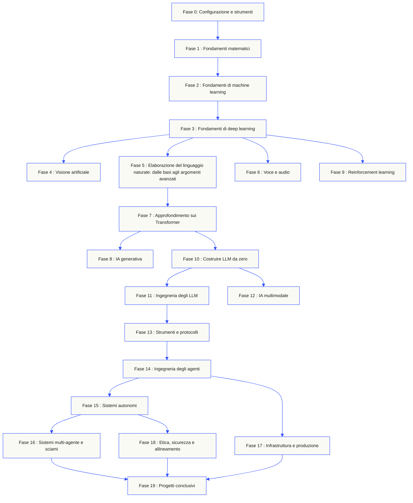

<p align="center"><sub>Traduzione assistita dall’IA; struttura e terminologia verificate. Fa fede la <a href="../../README.md">versione inglese</a> · <a href="https://aiengineeringfromscratch.com">aiengineeringfromscratch.com</a></sub></p>
<p align="center">
  
</p>

<p align="center">
  <a href="../../README.md">🇬🇧 English</a> ·
  <a href="../../i18n/zh/README.md">🇨🇳 简体中文</a> ·
  <a href="../../i18n/zh-TW/README.md">🇹🇼 繁體中文（台灣）</a> ·
  <a href="../../i18n/ja/README.md">🇯🇵 日本語</a> ·
  <a href="../../i18n/ko/README.md">🇰🇷 한국어</a> ·
  <a href="../../i18n/pt/README.md">🇵🇹 Português</a> ·
  <a href="../../i18n/pt-BR/README.md">🇧🇷 Português (Brasil)</a> ·
  <a href="../../i18n/es/README.md">🇪🇸 Español</a> ·
  <a href="../../i18n/de/README.md">🇩🇪 Deutsch</a> ·
  <a href="../../i18n/fr/README.md">🇫🇷 Français</a> ·
  <a href="../../i18n/it/README.md">🇮🇹 Italiano</a> ·
  <a href="../../i18n/nl/README.md">🇳🇱 Nederlands</a> ·
  <a href="../../i18n/pl/README.md">🇵🇱 Polski</a> ·
  <a href="../../i18n/cs/README.md">🇨🇿 Čeština</a> ·
  <a href="../../i18n/ro/README.md">🇷🇴 Română</a> ·
  <a href="../../i18n/hu/README.md">🇭🇺 Magyar</a> ·
  <a href="../../i18n/el/README.md">🇬🇷 Ελληνικά</a> ·
  <a href="../../i18n/sv/README.md">🇸🇪 Svenska</a> ·
  <a href="../../i18n/da/README.md">🇩🇰 Dansk</a> ·
  <a href="../../i18n/no/README.md">🇳🇴 Norsk</a> ·
  <a href="../../i18n/fi/README.md">🇫🇮 Suomi</a> ·
  <a href="../../i18n/ru/README.md">🇷🇺 Русский</a> ·
  <a href="../../i18n/uk/README.md">🇺🇦 Українська</a> ·
  <a href="../../i18n/tr/README.md">🇹🇷 Türkçe</a> ·
  <a href="../../i18n/he/README.md">🇮🇱 עברית</a> ·
  <a href="../../i18n/ar/README.md">🇸🇦 العربية</a> ·
  <a href="../../i18n/fa/README.md">🇮🇷 فارسی</a> ·
  <a href="../../i18n/hi/README.md">🇮🇳 हिन्दी</a> ·
  <a href="../../i18n/bn/README.md">🇧🇩 বাংলা</a> ·
  <a href="../../i18n/ur/README.md">🇵🇰 اردو</a> ·
  <a href="../../i18n/th/README.md">🇹🇭 ไทย</a> ·
  <a href="../../i18n/vi/README.md">🇻🇳 Tiếng Việt</a> ·
  <a href="../../i18n/id/README.md">🇮🇩 Bahasa Indonesia</a> ·
  <a href="../../i18n/tl/README.md">🇵🇭 Tagalog</a>
</p>

<p align="center">
  <a href="../../LICENSE"></a>
  <a href="../../ROADMAP.md"></a>
  <a href="#contents"></a>
  <a href="https://github.com/rohitg00/ai-engineering-from-scratch/stargazers"></a>
  <a href="https://aiengineeringfromscratch.com"></a>
  <p align="center">
 <a href="https://www.star-history.com/rohitg00/ai-engineering-from-scratch">
  <picture><source media="(prefers-color-scheme: dark)" srcset="https://api.star-history.com/badge?repo=rohitg00/ai-engineering-from-scratch&type=rank&theme=dark" /><source media="(prefers-color-scheme: light)" srcset="https://api.star-history.com/badge?repo=rohitg00/ai-engineering-from-scratch&type=rank" /></picture> <picture><source media="(prefers-color-scheme: dark)" srcset="https://api.star-history.com/badge?repo=rohitg00/ai-engineering-from-scratch&type=trending&theme=dark" /><source media="(prefers-color-scheme: light)" srcset="https://api.star-history.com/badge?repo=rohitg00/ai-engineering-from-scratch&type=trending" /></picture>
 </a>
</p>
</p>

### Sponsor

<p align="center">
  <a href="https://serpapi.com/ai-engineering-from-scratch"><picture><source media="(min-width: 768px)" srcset="../../assets/sponsors/serpapi-banner-compact.png" width="48%"></picture></a>
  <a href="https://nitrostack.ai/referral/aiengineeringfromscratch"><picture><source media="(min-width: 768px)" srcset="../../assets/sponsors/nitrostack-banner-equal.png" width="48%"></picture></a>
</p>

<p align="center">
  <sub><span>Il tuo sostegno mantiene ogni lezione gratuita e open source.</span> <a href="#supporters">Vedi tutti i sostenitori</a> · <a href="../../SPONSORS.md">Diventa uno sponsor</a></sub>
</p>

```text
░░░▒▒▒░░░▒▒▒░░░▒▒▒░░░▒▒▒░░░▒▒▒░░░▒▒▒░░░▒▒▒░░░▒▒▒░░░▒▒▒░░░▒▒▒░░░▒▒▒░░░▒▒▒░░░▒▒▒░░░▒▒▒░░░▒▒▒
```

> **L'84% degli studenti usa già strumenti di IA. Solo il 18% si sente pronto a usarli professionalmente.** Questo percorso colma quel divario.
>
> 523 lezioni. 20 fasi. ~342 ore. Python, TypeScript, Rust, Julia. Ogni lezione produce un artefatto riutilizzabile: un prompt, una skill, un agente, un server MCP. Gratis, open source, MIT.
>
> Non impari solo l'IA. La costruisci. Dall'inizio alla fine. A mano.

<!-- STATS:START (generated from site/stats.json by build.js — do not edit by hand) -->
<p align="center"><sub><b>114,584</b> lettori &nbsp;·&nbsp; <b>181,995</b> visualizzazioni di pagina negli ultimi 30 giorni &nbsp;·&nbsp; a partire da 2026-08-29</sub></p>
<!-- STATS:END -->

## Inizia da qui: scegli cosa vuoi costruire

Non serve scorrere tutte le 523 lezioni prima di cominciare. Scegli un obiettivo: ogni link apre lo stesso programma su GitHub o sul sito web, e le due versioni usano lo stesso codice delle lezioni.

| Il tuo obiettivo | Su GitHub | Sul sito web |
|---|---|---|
| Parto da zero e voglio acquisire tutte le basi | [Fase 0: Configurazione e strumenti](../../phases/00-setup-and-tooling/) | [Ambiente di sviluppo](https://aiengineeringfromscratch.com/lesson?path=phases/00-setup-and-tooling/01-dev-environment) |
| Conosco Python e voglio acquisire le basi matematiche e di apprendimento automatico | [Fase 1: Fondamenti matematici](../../phases/01-math-foundations/) | [Intuizione dell’algebra lineare](https://aiengineeringfromscratch.com/lesson?path=phases/01-math-foundations/01-linear-algebra-intuition) |
| Voglio creare applicazioni LLM pronte per la produzione | [Fase 11: Ingegneria degli LLM](../../phases/11-llm-engineering/) | [Ingegneria dei prompt](https://aiengineeringfromscratch.com/lesson?path=phases/11-llm-engineering/01-prompt-engineering) |
| Voglio creare agenti | [Fase 14: Ingegneria degli agenti](../../phases/14-agent-engineering/) | [Il ciclo dell’agente](https://aiengineeringfromscratch.com/lesson?path=phases/14-agent-engineering/01-the-agent-loop) |
| Voglio usare agenti di programmazione su repository reali | [Percorso di ingegneria assistita da agenti](../../learning-paths/using-coding-agents.json) | [Ingegneria assistita da agenti](https://aiengineeringfromscratch.com/lesson?path=phases/14-agent-engineering/31-agent-workbench-why-models-fail&learningPath=using-coding-agents) |
| Voglio definire la soluzione giusta prima di implementarla | [Percorso di definizione del prodotto e di consegna](../../learning-paths/shaping-the-build.json) | [Definire il prodotto e consegnarlo](https://aiengineeringfromscratch.com/lesson?path=phases/14-agent-engineering/47-outcomes-before-output&learningPath=shaping-the-build) |
| Voglio creare applicazioni con il Model Context Protocol (MCP) | [Percorso Model Context Protocol (MCP)](../../phases/13-tools-and-protocols/README.md#model-context-protocol-mcp-path) | [Percorso Model Context Protocol (MCP)](https://aiengineeringfromscratch.com/lesson?path=phases/13-tools-and-protocols/06-mcp-fundamentals&learningPath=model-context-protocol) |
| Voglio scrivere e distribuire Agent Skills | [Percorso mirato di Agent Skills](../../phases/13-tools-and-protocols/README.md#agent-skills-fast-path) | [Percorso Agent Skills](https://aiengineeringfromscratch.com/lesson?path=phases/13-tools-and-protocols/22-skills-and-agent-sdks&learningPath=agent-skills) |
| Voglio prepararmi a una certificazione Claude | [Guida introduttiva alla certificazione](../../certifications/claude/GETTING_STARTED.md) | [Accademia di certificazione](https://aiengineeringfromscratch.com/certifications.html) |
| Voglio prepararmi alla certificazione MCP Associate (MCPA) | [Guida introduttiva all’MCPA](../../certifications/mcpa/GETTING_STARTED.md) | [Percorso MCPA](https://aiengineeringfromscratch.com/certification?id=mcpa-f) |

Non sai da dove cominciare? Usa il [tutor di orientamento `start-learning`](../../skills/start-learning/SKILL.md) oppure consulta la [guida ai prerequisiti del sito web](https://aiengineeringfromscratch.com/prereqs.html).

Confronta quattro aree fondamentali e sei percorsi professionali nella [guida ai percorsi di apprendimento in AI Engineering](https://aiengineeringfromscratch.com/learning-paths.html).

### Segui ogni lezione nello stesso modo

1. **Leggi** `docs/en.md` e spiega l’idea centrale con parole tue.
2. **Scrivi e costruisci** il codice importante, senza trattare il blocco di codice come un ornamento.
3. **Esegui** il comando della lezione dalla radice del repository, cioè la cartella che contiene `README.md` e `phases/`.
4. **Conserva le prove**: il comando, la cartella di lavoro, il codice di uscita, i risultati significativi e l’artefatto che hai modificato o creato.
5. **Prosegui** solo quando sai spiegare il risultato e apportare una piccola modifica senza andare a tentativi.

I comandi nelle lezioni usano percorsi relativi alla radice del repository, salvo diversa indicazione esplicita. Se una lezione offre più linguaggi, esegui l’implementazione nel linguaggio che stai studiando.

### Clona il repository e raccogli le prime prove

```bash
git clone https://github.com/rohitg00/ai-engineering-from-scratch.git
cd ai-engineering-from-scratch
python3 phases/00-setup-and-tooling/01-dev-environment/code/verify.py --route beginner
python3 phases/01-math-foundations/01-linear-algebra-intuition/code/vectors.py
```

Il controllo preliminare distingue i requisiti necessari subito dagli strumenti utili più avanti. Per ogni requisito mancante indica la causa rilevata e un comando per correggerla. Il secondo comando avvia una lezione senza dipendenze e mostra, alla fine, che il prodotto di una matrice per un vettore è l’operazione eseguita in uno strato di una rete neurale. Salva l’output del terminale come prima prova.

## Installa il tutor AI in 30 secondi

Se hai già installato Node.js, `npx` e un agente di coding che supporta le skill, puoi trasformarlo nel tuo tutor con due comandi. Non serve clonare il repository per installare o consultare il tutor. Per eseguire i laboratori dei percorsi mirati serve `python3`. I laboratori di Agent Skills richiedono anche un host selezionato e un ambito utente o progetto scrivibile.

Per prima cosa, verifica i requisiti locali:

```bash
node --version
npx --version
python3 --version
```

Poi installa le skill del programma. Quando l’installer te lo chiede, scegli l’host e l’ambito in cui vuoi usarle:

```bash
npx skills add rohitg00/ai-engineering-from-scratch
```

La sintassi di invocazione dipende dall’host, non dal formato portabile `SKILL.md`:

| Applicazione ospitante | Avvia il corso | Avvia il percorso Model Context Protocol (MCP) | Avvia il percorso Agent Skills | Fai un quiz di fase |
|---|---|---|---|---|
| Codex | `start-learning` oppure selezionala da `/skills` | `learn-mcp` oppure selezionala da `/skills` | `learn-agent-skills` oppure selezionala da `/skills` | `check-understanding 13` oppure selezionala da `/skills` |
| Claude Code | `/start-learning` | `/learn-mcp` | `/learn-agent-skills` | `/check-understanding 13` |
| Altri host compatibili | `Use start-learning to begin the course.` | `Use learn-mcp to start the Model Context Protocol (MCP) path.` | `Use learn-agent-skills to start the Agent Skills Engineering path.` | `Use check-understanding to quiz me on Phase 13.` |

Un quiz di orientamento di dieci domande individua la fase da cui partire in base alle tue conoscenze e salva un piano di studio personalizzato in `LEARNING.md`. Da quel momento, la skill `learn` insegna una lezione per sessione seguendo quattro passaggi: concetto, matematica, codice e quiz. La skill `course-guide` ti indirizza alla lezione esatta che affronta il problema su cui ti sei bloccato. In Codex, avvia queste skill con `learn` e `course-guide`; in Claude Code, usa `/learn` e `/course-guide`. Sugli altri host compatibili, chiedi di usare la skill per nome.

Ti interessa solo il Model Context Protocol (MCP)? Usa l’istruzione MCP corrispondente al tuo host. Verrà creato `MCP-LEARNING.md` e seguirai un percorso di 17 lezioni: richieste senza stato, trasporti, operazioni bidirezionali, sicurezza, affidabilità, governance dei registri e prove di conformità. L’ordine e i punti di verifica sono definiti nel [manifesto del percorso MCP](../../learning-paths/model-context-protocol.json).

Ti interessano solo le Agent Skills? Usa l’istruzione corrispondente al tuo host. Verrà creato `AGENT-SKILLS-LEARNING.md` e seguirai un percorso coerente di cinque lezioni: contratto, discovery, invocazione, limiti della sandbox, valutazione prima del rilascio e portabilità tra host reali. Inizia sul web dal [percorso Agent Skills](https://aiengineeringfromscratch.com/lesson?path=phases/13-tools-and-protocols/22-skills-and-agent-sdks&learningPath=agent-skills).

L’installer elenca gli host che può configurare e ti chiede dove installare le skill. Se non hai ancora Node.js, `npx`, `python3`, un host supportato o un ambito scrivibile, consulta il sito web o leggi `docs/en.md`. Imparerai i concetti, ma dovrai rimandare le prove di discovery, invocazione, esecuzione degli script e disinstallazione sull’host reale finché non saranno disponibili i requisiti preliminari. Consulta [aiengineeringfromscratch.com](https://aiengineeringfromscratch.com).

## Come funziona

La maggior parte delle risorse sull’IA insegna per frammenti: un articolo di ricerca qui, un post sul fine-tuning là, una demo spettacolare di un agente altrove. Raramente questi elementi combaciano. Distribuisci un chatbot, ma non sai spiegare la sua curva di perdita. Colleghi una funzione a un agente, ma non sai spiegare il ruolo dell’attenzione nel modello che la richiama.

Questo programma dà una struttura al percorso: 20 fasi, 523 lezioni e quattro linguaggi — Python, TypeScript, Rust e Julia. Dall’algebra lineare agli sciami autonomi, ogni algoritmo viene ricostruito prima a partire dalla matematica: retropropagazione, tokenizer, attenzione, ciclo dell’agente. Quando si arriva a PyTorch, sai già cosa succede sotto il cofano.

Ogni lezione segue lo stesso ciclo: leggere il problema, ricavare la matematica, scrivere il codice, eseguire i test e conservare l’artefatto. Niente video di cinque minuti, deploy fatti copiando e incollando o istruzioni passo passo. Il programma è gratuito, open source e pensato per funzionare sul tuo computer.

```text
░░░▒▒▒░░░▒▒▒░░░▒▒▒░░░▒▒▒░░░▒▒▒░░░▒▒▒░░░▒▒▒░░░▒▒▒░░░▒▒▒░░░▒▒▒░░░▒▒▒░░░▒▒▒░░░▒▒▒░░░▒▒▒░░░▒▒▒
```

## La struttura del programma

Le venti fasi si costruiscono l’una sull’altra. La matematica è la base; gli agenti e la messa in produzione sono il livello più alto. Se conosci già i livelli inferiori, puoi andare avanti; se li salti, però, non stupirti se gli argomenti più avanzati ti risultano ostici.



```text
░░░▒▒▒░░░▒▒▒░░░▒▒▒░░░▒▒▒░░░▒▒▒░░░▒▒▒░░░▒▒▒░░░▒▒▒░░░▒▒▒░░░▒▒▒░░░▒▒▒░░░▒▒▒░░░▒▒▒░░░▒▒▒░░░▒▒▒
```

## La struttura di una lezione

Ogni lezione si trova nella propria cartella e segue la stessa struttura in tutto il programma:

```text
phases/<NN>-<phase-name>/<NN>-<lesson-name>/
├── code/      implementazioni eseguibili (Python, TypeScript, Rust, Julia)
├── docs/
│   └── en.md  contenuto didattico della lezione
└── outputs/   prompt, skill, agenti o server MCP prodotti dalla lezione
```

Ogni lezione segue sei passaggi. La sequenza *Build It / Use It* ne è il fulcro: prima implementi l’algoritmo da zero, poi esegui la stessa operazione con la libreria usata in produzione. Avendo scritto tu stesso una versione più semplice, capisci cosa fa il framework.

```mermaid
%%{init: {'theme':'base','themeVariables':{'primaryColor':'#fafaf5','primaryTextColor':'#1a1a1a','primaryBorderColor':'#3553ff','lineColor':'#3553ff','fontFamily':'JetBrains Mono','fontSize':'13px'}}}%%
flowchart LR
  M["IDEA CHIAVE<br/><sub>il principio in una riga</sub>"] --> Pr["PROBLEMA<br/><sub>una difficoltà concreta</sub>"]
  Pr --> C["CONCETTO<br/><sub>diagrammi e intuizione</sub>"]
  C --> B["COSTRUISCILO<br/><sub>matematica di base, senza framework</sub>"]
  B --> U["USALO<br/><sub>lo stesso in PyTorch / sklearn</sub>"]
  U --> S["PUBBLICALO<br/><sub>istruzione · abilità · agente · MCP</sub>"]
```



## Come iniziare

Tre modi per iniziare. Scegline uno.

**Opzione A — studia dal terminale *(consigliata)*.** Dopo aver verificato Node.js, `npx`, l’host e l’ambito di installazione, installa le skill di apprendimento in un agente compatibile e lascia che il corso ti guidi:

```bash
npx skills add rohitg00/ai-engineering-from-scratch
```

Usa la riga corrispondente al tuo host nella tabella qui sopra. Le skill `start-learning`, `learn` e `course-guide`, oltre ai percorsi mirati `learn-mcp` e `learn-agent-skills`, trasmettono le lezioni direttamente dal repository, senza doverlo clonare. Per eseguire gli esempi di codice e i comandi MCP, invece, serve una copia locale. I progressi vengono salvati nel progetto in `LEARNING.md`, `MCP-LEARNING.md` o `AGENT-SKILLS-LEARNING.md`, così potrai riprendere dalla sessione successiva.

**Opzione B — leggi sul sito.** Apri una lezione su [aiengineeringfromscratch.com](https://aiengineeringfromscratch.com) oppure espandi una fase nell’[indice](#contents). Non servono configurazioni né clonazioni.

**Opzione C — clona il repository ed esegui il codice.**

```bash
git clone https://github.com/rohitg00/ai-engineering-from-scratch.git
cd ai-engineering-from-scratch
python3 phases/01-math-foundations/01-linear-algebra-intuition/code/vectors.py
```

La clonazione installa automaticamente anche le skill di apprendimento in Claude Code e permette al tutor `learn` di eseguire il codice delle lezioni, invece di limitarsi a leggerlo.

### Prerequisiti

- Sai scrivere codice in qualsiasi linguaggio (Python è utile).
- Vuoi capire come **funziona davvero l’IA**, non limitarti a chiamare le API.

### Preparati alle certificazioni Claude

La [Claude Certification Academy](../../certifications/claude/README.md) è un programma gratuito e open source per prepararsi a tutti e quattro i percorsi ufficiali di certificazione Claude: Associate Foundations, Developer Foundations, Architect Foundations e Architect Professional. Ogni percorso comprende lezioni allineate al programma d’esame, laboratori eseguibili, una prova diagnostica, un progetto conclusivo e un esame di simulazione originale a lunghezza completa.

Segui la [guida introduttiva per GitHub basata sull’IA](../../certifications/claude/GETTING_STARTED.md) con Claude Code, Codex, ChatGPT, Cursor o un altro agente. Avvia `claude-certification` in Codex, `/claude-certification` in Claude Code oppure chiedi a un altro host di usare `claude-certification`. La skill ti fa scegliere un percorso, crea un piano persistente in `CLAUDE-CERTIFICATION.md`, insegna un passaggio alla volta, esegue i laboratori reali e fornisce feedback basato sugli artefatti. Il programma è disponibile anche sul [sito delle certificazioni](https://aiengineeringfromscratch.com/certifications.html).

L’Academy è un programma di studio indipendente basato sugli obiettivi d’esame pubblici. Non è affiliata ad Anthropic, non riproduce domande d’esame reali e non può garantire il superamento dell’esame.

### Preparati alla certificazione MCP Associate (MCPA)

Il [programma di certificazione MCPA](../../certifications/mcpa/README.md) è un percorso gratuito e open source per prepararsi all’esame MCP Associate della Agentic AI Foundation, erogato tramite Linux Foundation Training. Le 34 lezioni trattano il protocollo senza stato del 2026-07-28 e coprono i cinque ambiti d’esame: `_meta` per richiesta e `server/discover` al posto del vecchio handshake, richieste con più round trip, sottoscrizioni, caching, estensioni Tasks e MCP Apps, autorizzazione OAuth, registri e SDK. Ogni lezione include un laboratorio eseguibile con la sola libreria standard e controlli sulla struttura del messaggio prevista dal protocollo. Il percorso comprende inoltre una prova diagnostica, un progetto conclusivo e tre simulazioni originali a lunghezza completa, con domande distribuite secondo i pesi del programma ufficiale.

Segui la [guida introduttiva per GitHub basata sull’IA](../../certifications/mcpa/GETTING_STARTED.md) con Claude Code, Codex, ChatGPT, Cursor o un altro agente. Avvia `mcpa-certification` in Codex, `/mcpa-certification` in Claude Code oppure chiedi a un altro host di usare `mcpa-certification`. La skill crea un piano persistente in `MCPA-CERTIFICATION.md`, insegna un passaggio alla volta, esegue i laboratori reali e fornisce feedback basato sugli artefatti. Consulta la [pagina del percorso MCPA](https://aiengineeringfromscratch.com/certification?id=mcpa-f).

Il programma è un materiale di studio indipendente basato sugli obiettivi d’esame pubblici. Non è affiliato alla Agentic AI Foundation o alla Linux Foundation, non riproduce domande d’esame reali e non può garantire il superamento dell’esame.

### Le skill di apprendimento

| Abilità | Funzione |
|---|---|
| [`start-learning`](../../skills/start-learning/SKILL.md) | Onboarding iniziale: perché studi, quiz di orientamento e piano personalizzato salvato in `LEARNING.md`. |
| [`learn`](../../skills/learn/SKILL.md) | Il ciclo del tutor: ripasso iniziale, lezione successiva insegnata in modo interattivo, quindi quiz; registra i progressi e gli argomenti da ripassare. |
| [`course-guide`](../../skills/course-guide/SKILL.md) | Instrada verso gli argomenti: «Dove posso imparare l’attenzione?» o «la mia loss è NaN» → indica le lezioni esatte e i relativi link. |
| [`learn-mcp`](../../skills/learn-mcp/SKILL.md) | Tutor dedicato al Model Context Protocol (MCP). Crea `MCP-LEARNING.md`, segue il manifesto del percorso di 17 lezioni e registra le prove relative al protocollo, alla sicurezza, all’affidabilità e alla conformità. |
| [`learn-agent-skills`](../../skills/learn-agent-skills/SKILL.md) | Tutor dedicato alle Agent Skills. Crea `AGENT-SKILLS-LEARNING.md`, insegna le lezioni 22, 24, 25, 26 e 27 e registra le prove raccolte su un host reale. |
| [`claude-certification`](../../skills/claude-certification/SKILL.md) | Tutor per le certificazioni. Sceglie tra CCAO-F, CCDV-F, CCAR-F e CCAR-P; insegna ogni lezione; svolge i laboratori; esamina gli artefatti; propone prove diagnostiche e simulazioni; salva i progressi. |
| [`mcpa-certification`](../../skills/mcpa-certification/SKILL.md) | Tutor MCPA. Segue il percorso di 34 lezioni `mcpa-f` sul protocollo del 2026-07-28; insegna ogni lezione, esegue i laboratori e il validatore del protocollo, propone la prova diagnostica e tre simulazioni e salva i progressi. |
| [`find-your-level`](../../skills/find-your-level/SKILL.md) | Quiz di orientamento in dieci domande: identifica la fase iniziale più adatta e crea un percorso personalizzato con una stima delle ore di studio. |
| [`check-understanding <phase>`](../../skills/check-understanding/SKILL.md) | Quiz di fase in otto domande con feedback e indicazioni precise sulle lezioni da ripassare. Usa la sintassi per Codex o Claude Code, oppure la formulazione in linguaggio naturale riportata nella tabella sopra. |

```text
░░░▒▒▒░░░▒▒▒░░░▒▒▒░░░▒▒▒░░░▒▒▒░░░▒▒▒░░░▒▒▒░░░▒▒▒░░░▒▒▒░░░▒▒▒░░░▒▒▒░░░▒▒▒░░░▒▒▒░░░▒▒▒░░░▒▒▒
```

## Leggi il programma di base come un libro

Il programma di base in 20 fasi, contenuto in `phases/`, è pubblicato anche in una serie di sei volumi. I file EPUB e PDF vengono creati dalla CI usando le stesse lezioni e sono allegati a ogni [release GitHub](https://github.com/rohitg00/ai-engineering-from-scratch/releases); i link qui sotto puntano sempre alla versione più recente. I numeri identificano i volumi della serie, non le versioni: ogni copia riporta la data dell’edizione, mentre quelle precedenti restano disponibili nella rispettiva release.

I programmi di certificazione non vengono convertiti in libri: il tutor IA, i laboratori eseguibili, le figure interattive, le prove diagnostiche e le simulazioni a tempo restano disponibili su GitHub e sul sito web.

| Vol. | Titolo | Fasi | Scaricamento |
|-----|-------|--------|----------|
| 1 | Fondamenti · Matematica, strumenti e machine learning classico | 00-02 | [EPUB](https://github.com/rohitg00/ai-engineering-from-scratch/releases/latest/download/aiefs-vol1-foundations.epub) · [PDF](https://github.com/rohitg00/ai-engineering-from-scratch/releases/latest/download/aiefs-vol1-foundations.pdf) |
| 2 | Deep learning · Reti, visione e linguaggio | 03, 04, 06 | [EPUB](https://github.com/rohitg00/ai-engineering-from-scratch/releases/latest/download/aiefs-vol2-deep-learning.epub) · [PDF](https://github.com/rohitg00/ai-engineering-from-scratch/releases/latest/download/aiefs-vol2-deep-learning.pdf) |
| 3 | Linguaggio · Fondamenti di NLP e Transformer | 05, 07 | [EPUB](https://github.com/rohitg00/ai-engineering-from-scratch/releases/latest/download/aiefs-vol3-language.epub) · [PDF](https://github.com/rohitg00/ai-engineering-from-scratch/releases/latest/download/aiefs-vol3-language.pdf) |
| 4 | Large language model · Generazione, reinforcement learning, pre-training e ingegneria | 08-11 | [EPUB](https://github.com/rohitg00/ai-engineering-from-scratch/releases/latest/download/aiefs-vol4-llms.epub) · [PDF](https://github.com/rohitg00/ai-engineering-from-scratch/releases/latest/download/aiefs-vol4-llms.pdf) |
| 5 | Agenti · Multimodalità, protocolli, autonomia e sciami | 12-16 | [EPUB](https://github.com/rohitg00/ai-engineering-from-scratch/releases/latest/download/aiefs-vol5-agents.epub) · [PDF](https://github.com/rohitg00/ai-engineering-from-scratch/releases/latest/download/aiefs-vol5-agents.pdf) |
| 6 | Produzione · Infrastruttura, sicurezza e progetti conclusivi | 17-19 | [EPUB](https://github.com/rohitg00/ai-engineering-from-scratch/releases/latest/download/aiefs-vol6-production.epub) · [PDF](https://github.com/rohitg00/ai-engineering-from-scratch/releases/latest/download/aiefs-vol6-production.pdf) |

Il libro è un’istantanea; questo repository è l’edizione in continua evoluzione. Ogni capitolo rimanda alle figure animate, al quiz e al codice eseguibile della lezione. Per generare il libro in locale, esegui `python3 scripts/build_book.py` (serve Pandoc); i dettagli della pipeline sono in [book/README.md](../../book/README.md).

```text
░░░▒▒▒░░░▒▒▒░░░▒▒▒░░░▒▒▒░░░▒▒▒░░░▒▒▒░░░▒▒▒░░░▒▒▒░░░▒▒▒░░░▒▒▒░░░▒▒▒░░░▒▒▒░░░▒▒▒░░░▒▒▒░░░▒▒▒
```

## Ogni lezione produce un artefatto

Altri programmi si concludono con: *«Congratulazioni, hai imparato X».* Qui ogni lezione produce uno **strumento riutilizzabile** che puoi installare o inserire nel tuo flusso di lavoro quotidiano.

<table>
<tr>
<th align="left" width="25%"><br/><sub>FIG_001 · A</sub><br/><b>PROMPT</b></th>
<th align="left" width="25%"><br/><sub>FIG_001 · B</sub><br/><b>SKILL</b></th>
<th align="left" width="25%"><br/><sub>FIG_001 · C</sub><br/><b>Agenti</b></th>
<th align="left" width="25%"><br/><sub>FIG_001 · D</sub><br/><b>SERVER MCP</b></th>
</tr>
<tr>
<td valign="top">Incolla il prompt in qualsiasi assistente IA per ricevere aiuto esperto su un compito specifico.</td>
<td valign="top">Installa la skill in Claude, Cursor, Codex, OpenClaw, Hermes o qualsiasi agente che legga <code>SKILL.md</code>.</td>
<td valign="top">Distribuiscilo come agente autonomo: il ciclo lo hai implementato tu nella fase 14.</td>
<td valign="top">Collegalo a qualsiasi client compatibile con MCP. Il server MCP viene costruito da zero nella fase 13.</td>
</tr>
</table>

> Installa tutto con `python3 scripts/install_skills.py <target>`. Alla fine del programma avrai una raccolta di 523 artefatti che comprendi davvero, perché li hai costruiti tu.

### FIG_002 · Esempio svolto

Fase 14, lezione 1: il ciclo dell’agente. Circa 120 righe di puro Python, senza dipendenze.

<table>
<tr>
<td valign="top" width="50%">

**`code/agent_loop.py`** &nbsp; <sub><i>costruirlo</i></sub>

```python
def run(query, tools):
    history = [user(query)]
    for step in range(MAX_STEPS):
        msg = llm(history)
        if msg.tool_calls:
            for call in msg.tool_calls:
                result = tools[call.name](**call.args)
                history.append(tool_result(call.id, result))
            continue
        return msg.content
    raise StepLimitExceeded
```

</td>
<td valign="top" width="50%">

**`outputs/skill-agent-loop.md`** &nbsp; <sub><i>distribuiscilo</i></sub>

```markdown
---
name: agent-loop
description: ReAct-style loop for any tool list
phase: 14
lesson: 01
---

Implement a minimal agent loop that...
```

**`outputs/prompt-debug-agent.md`**

```markdown
You are an agent debugger. Given the trace
of an agent run, identify the step where
the agent went wrong and explain why...
```

</td>
</tr>
</table>

```text
░░░▒▒▒░░░▒▒▒░░░▒▒▒░░░▒▒▒░░░▒▒▒░░░▒▒▒░░░▒▒▒░░░▒▒▒░░░▒▒▒░░░▒▒▒░░░▒▒▒░░░▒▒▒░░░▒▒▒░░░▒▒▒░░░▒▒▒
```

<a id="contents"></a>

## Indice

Fai clic su una fase per espandere l’elenco delle lezioni.

<a id="phase-0"></a>
### Fase 0: Configurazione e strumenti `12 lezioni`
> Prepara l’ambiente per tutto ciò che segue.

| # | Lezione | Tipo | Linguaggio |
|:---:|--------|:----:|------|
| 01 | [Ambiente di sviluppo](../../phases/00-setup-and-tooling/01-dev-environment/) | Costruire | Python |
| 02 | [Git e collaborazione](../../phases/00-setup-and-tooling/02-git-and-collaboration/) | Imparare | — |
| 03 | [Configurare GPU e servizi cloud](../../phases/00-setup-and-tooling/03-gpu-setup-and-cloud/) | Costruire | Python |
| 04 | [API e chiavi](../../phases/00-setup-and-tooling/04-apis-and-keys/) | Costruire | Python |
| 05 | [Notebook Jupyter](../../phases/00-setup-and-tooling/05-jupyter-notebooks/) | Costruire | Python |
| 06 | [Ambienti Python](../../phases/00-setup-and-tooling/06-python-environments/) | Costruire | Shell |
| 07 | [Docker per l’IA](../../phases/00-setup-and-tooling/07-docker-for-ai/) | Costruire | Docker |
| 08 | [Configurazione dell’editor](../../phases/00-setup-and-tooling/08-editor-setup/) | Costruire | — |
| 09 | [Gestione dei dati](../../phases/00-setup-and-tooling/09-data-management/) | Costruire | Python |
| 10 | [Terminale e shell](../../phases/00-setup-and-tooling/10-terminal-and-shell/) | Imparare | — |
| 11 | [Linux per l’IA](../../phases/00-setup-and-tooling/11-linux-for-ai/) | Imparare | — |
| 12 | [Debug e profiling](../../phases/00-setup-and-tooling/12-debugging-and-profiling/) | Costruire | Python |

<details id="phase-1">
<summary><b>Fase 1 — Fondamenti matematici</b> &nbsp;<code>22 lezioni</code>&nbsp; <em>L’intuizione alla base di ogni algoritmo di IA, spiegata attraverso il codice.</em></summary>
<br/>

| # | Lezione | Tipo | Linguaggio |
|:---:|--------|:----:|------|
| 01 | [Intuizione dell’algebra lineare](../../phases/01-math-foundations/01-linear-algebra-intuition/) | Imparare | Python, Julia |
| 02 | [Vettori, matrici e operazioni](../../phases/01-math-foundations/02-vectors-matrices-operations/) | Costruire | Python, Julia |
| 03 | [Trasformazioni matriciali e autovalori](../../phases/01-math-foundations/03-matrix-transformations/) | Costruire | Python, Julia |
| 04 | [Calcolo per il machine learning: derivate e gradienti](../../phases/01-math-foundations/04-calculus-for-ml/) | Imparare | Python |
| 05 | [Regola della catena e differenziazione automatica](../../phases/01-math-foundations/05-chain-rule-and-autodiff/) | Costruire | Python |
| 06 | [Probabilità e distribuzioni](../../phases/01-math-foundations/06-probability-and-distributions/) | Imparare | Python |
| 07 | [Teorema di Bayes e pensiero statistico](../../phases/01-math-foundations/07-bayes-theorem/) | Costruire | Python |
| 08 | [Ottimizzazione: metodi di discesa del gradiente](../../phases/01-math-foundations/08-optimization/) | Costruire | Python |
| 09 | [Teoria dell’informazione: entropia e divergenza KL](../../phases/01-math-foundations/09-information-theory/) | Imparare | Python |
| 10 | [Riduzione della dimensionalità: PCA, t-SNE e UMAP](../../phases/01-math-foundations/10-dimensionality-reduction/) | Costruire | Python |
| 11 | [Decomposizione ai valori singolari](../../phases/01-math-foundations/11-singular-value-decomposition/) | Costruire | Python, Julia |
| 12 | [Operazioni sui tensori](../../phases/01-math-foundations/12-tensor-operations/) | Costruire | Python |
| 13 | [Stabilità numerica](../../phases/01-math-foundations/13-numerical-stability/) | Costruire | Python |
| 14 | [Norme e distanze](../../phases/01-math-foundations/14-norms-and-distances/) | Costruire | Python |
| 15 | [Statistica per il machine learning](../../phases/01-math-foundations/15-statistics-for-ml/) | Costruire | Python |
| 16 | [Metodi di campionamento](../../phases/01-math-foundations/16-sampling-methods/) | Costruire | Python |
| 17 | [Sistemi lineari](../../phases/01-math-foundations/17-linear-systems/) | Costruire | Python |
| 18 | [Ottimizzazione convessa](../../phases/01-math-foundations/18-convex-optimization/) | Costruire | Python |
| 19 | [Numeri complessi per l’IA](../../phases/01-math-foundations/19-complex-numbers/) | Imparare | Python |
| 20 | [Trasformata di Fourier](../../phases/01-math-foundations/20-fourier-transform/) | Costruire | Python |
| 21 | [Teoria dei grafi per il machine learning](../../phases/01-math-foundations/21-graph-theory/) | Costruire | Python |
| 22 | [Processi stocastici](../../phases/01-math-foundations/22-stochastic-processes/) | Imparare | Python |

</details>

<details id="phase-2">
<summary><b>Fase 2 — Fondamenti di machine learning</b> &nbsp;<code>18 lezioni</code>&nbsp; <em>Il machine learning classico è ancora alla base della maggior parte dei sistemi di IA in produzione.</em></summary>
<br/>

| # | Lezione | Tipo | Linguaggio |
|:---:|--------|:----:|------|
| 01 | [Che cos’è il machine learning?](../../phases/02-ml-fundamentals/01-what-is-machine-learning/) | Imparare | Python |
| 02 | [Regressione lineare da zero](../../phases/02-ml-fundamentals/02-linear-regression/) | Costruire | Python |
| 03 | [Regressione logistica e classificazione](../../phases/02-ml-fundamentals/03-logistic-regression/) | Costruire | Python |
| 04 | [Alberi decisionali e foreste casuali](../../phases/02-ml-fundamentals/04-decision-trees/) | Costruire | Python |
| 05 | [Macchine a vettori di supporto](../../phases/02-ml-fundamentals/05-support-vector-machines/) | Costruire | Python |
| 06 | [KNN e metriche di distanza](../../phases/02-ml-fundamentals/06-knn-and-distances/) | Costruire | Python |
| 07 | [Apprendimento non supervisionato: K-means e DBSCAN](../../phases/02-ml-fundamentals/07-unsupervised-learning/) | Costruire | Python |
| 08 | [Ingegneria e selezione delle caratteristiche](../../phases/02-ml-fundamentals/08-feature-engineering/) | Costruire | Python |
| 09 | [Valutazione dei modelli: metriche e convalida incrociata](../../phases/02-ml-fundamentals/09-model-evaluation/) | Costruire | Python |
| 10 | [Bias, varianza e curva di apprendimento](../../phases/02-ml-fundamentals/10-bias-variance/) | Imparare | Python |
| 11 | [Metodi ensemble: boosting, bagging e stacking](../../phases/02-ml-fundamentals/11-ensemble-methods/) | Costruire | Python |
| 12 | [Ottimizzazione degli iperparametri](../../phases/02-ml-fundamentals/12-hyperparameter-tuning/) | Costruire | Python |
| 13 | [Pipeline ML e tracciamento degli esperimenti](../../phases/02-ml-fundamentals/13-ml-pipelines/) | Costruire | Python |
| 14 | [Naive Bayes](../../phases/02-ml-fundamentals/14-naive-bayes/) | Costruire | Python |
| 15 | [Fondamenti delle serie temporali](../../phases/02-ml-fundamentals/15-time-series/) | Costruire | Python |
| 16 | [Rilevamento delle anomalie](../../phases/02-ml-fundamentals/16-anomaly-detection/) | Costruire | Python |
| 17 | [Gestione dei dati sbilanciati](../../phases/02-ml-fundamentals/17-imbalanced-data/) | Costruire | Python |
| 18 | [Selezione delle caratteristiche](../../phases/02-ml-fundamentals/18-feature-selection/) | Costruire | Python |

</details>

<details id="phase-3">
<summary><b>Fase 3 — Fondamenti di deep learning</b> &nbsp;<code>13 lezioni</code>&nbsp; <em>Reti neurali dai principi fondamentali, senza framework finché non ne avrai costruito uno.</em></summary>
<br/>

| # | Lezione | Tipo | Linguaggio |
|:---:|--------|:----:|------|
| 01 | [Il percettrone: l’inizio di tutto](../../phases/03-deep-learning-core/01-the-perceptron/) | Costruire | Python |
| 02 | [Reti multistrato e passaggio in avanti](../../phases/03-deep-learning-core/02-multi-layer-networks/) | Costruire | Python |
| 03 | [Backpropagation da zero](../../phases/03-deep-learning-core/03-backpropagation/) | Costruire | Python |
| 04 | [Funzioni di attivazione: ReLU, sigmoide, GELU e perché servono](../../phases/03-deep-learning-core/04-activation-functions/) | Costruire | Python |
| 05 | [Funzioni di perdita: MSE, entropia incrociata e loss contrastiva](../../phases/03-deep-learning-core/05-loss-functions/) | Costruire | Python |
| 06 | [Ottimizzatori: SGD, momentum, Adam e AdamW](../../phases/03-deep-learning-core/06-optimizers/) | Costruire | Python |
| 07 | [Regolarizzazione: dropout, weight decay e BatchNorm](../../phases/03-deep-learning-core/07-regularization/) | Costruire | Python |
| 08 | [Inizializzazione dei pesi e stabilità dell’addestramento](../../phases/03-deep-learning-core/08-weight-initialization/) | Costruire | Python |
| 09 | [Scheduler del learning rate e warmup](../../phases/03-deep-learning-core/09-learning-rate-schedules/) | Costruire | Python |
| 10 | [Costruisci il tuo mini-framework](../../phases/03-deep-learning-core/10-mini-framework/) | Costruire | Python |
| 11 | [Introduzione a PyTorch](../../phases/03-deep-learning-core/11-intro-to-pytorch/) | Costruire | Python |
| 12 | [Introduzione a JAX](../../phases/03-deep-learning-core/12-intro-to-jax/) | Costruire | Python |
| 13 | [Debug delle reti neurali](../../phases/03-deep-learning-core/13-debugging-neural-networks/) | Costruire | Python |

</details>

<details id="phase-4">
<summary><b>Fase 4 — Visione artificiale</b> &nbsp;<code>28 lezioni</code>&nbsp; <em>Dai pixel alla comprensione: immagini, video, 3D, modelli vision-language e modelli del mondo.</em></summary>
<br/>

| # | Lezione | Tipo | Linguaggio |
|:---:|--------|:----:|------|
| 01 | [Fondamenti delle immagini: pixel, canali e spazi colore](../../phases/04-computer-vision/01-image-fundamentals/) | Imparare | Python |
| 02 | [Convoluzioni da zero](../../phases/04-computer-vision/02-convolutions-from-scratch/) | Costruire | Python |
| 03 | [CNN: da LeNet a ResNet](../../phases/04-computer-vision/03-cnns-lenet-to-resnet/) | Costruire | Python |
| 04 | [Classificazione delle immagini](../../phases/04-computer-vision/04-image-classification/) | Costruire | Python |
| 05 | [Transfer learning e fine-tuning](../../phases/04-computer-vision/05-transfer-learning/) | Costruire | Python |
| 06 | [Rilevamento degli oggetti: YOLO da zero](../../phases/04-computer-vision/06-object-detection-yolo/) | Costruire | Python |
| 07 | [Segmentazione semantica: U-Net](../../phases/04-computer-vision/07-semantic-segmentation-unet/) | Costruire | Python |
| 08 | [Segmentazione delle istanze: Mask R-CNN](../../phases/04-computer-vision/08-instance-segmentation-mask-rcnn/) | Costruire | Python |
| 09 | [Generazione di immagini: GAN](../../phases/04-computer-vision/09-image-generation-gans/) | Costruire | Python |
| 10 | [Generazione di immagini: modelli di diffusione](../../phases/04-computer-vision/10-image-generation-diffusion/) | Costruire | Python |
| 11 | [Stable Diffusion: architettura e fine-tuning](../../phases/04-computer-vision/11-stable-diffusion/) | Costruire | Python |
| 12 | [Comprensione dei video: modellazione temporale](../../phases/04-computer-vision/12-video-understanding/) | Costruire | Python |
| 13 | [Visione 3D: point cloud e NeRF](../../phases/04-computer-vision/13-3d-vision-nerf/) | Costruire | Python |
| 14 | [Vision Transformer (ViT)](../../phases/04-computer-vision/14-vision-transformers/) | Costruire | Python |
| 15 | [Visione in tempo reale: deployment edge](../../phases/04-computer-vision/15-real-time-edge/) | Costruire | Python |
| 16 | [Costruisci una pipeline di visione completa](../../phases/04-computer-vision/16-vision-pipeline-capstone/) | Costruire | Python |
| 17 | [Visione self-supervised: SimCLR, DINO e MAE](../../phases/04-computer-vision/17-self-supervised-vision/) | Costruire | Python |
| 18 | [Visione open-vocabulary: CLIP](../../phases/04-computer-vision/18-open-vocab-clip/) | Costruire | Python |
| 19 | [OCR e comprensione dei documenti](../../phases/04-computer-vision/19-ocr-document-understanding/) | Costruire | Python |
| 20 | [Ricerca di immagini e metric learning](../../phases/04-computer-vision/20-image-retrieval-metric/) | Costruire | Python |
| 21 | [Rilevamento dei keypoint e stima della posa](../../phases/04-computer-vision/21-keypoint-pose/) | Costruire | Python |
| 22 | [Gaussian splatting 3D da zero](../../phases/04-computer-vision/22-3d-gaussian-splatting/) | Costruire | Python |
| 23 | [Diffusion Transformer e rectified flow](../../phases/04-computer-vision/23-diffusion-transformers-rectified-flow/) | Costruire | Python |
| 24 | [SAM 3 e segmentazione open-vocabulary](../../phases/04-computer-vision/24-sam3-open-vocab-segmentation/) | Costruire | Python |
| 25 | [Modelli vision-language (ViT-MLP-LLM)](../../phases/04-computer-vision/25-vision-language-models/) | Costruire | Python |
| 26 | [Stima della profondità monoculare e della geometria](../../phases/04-computer-vision/26-monocular-depth/) | Costruire | Python |
| 27 | [Tracking multi-oggetto e memoria video](../../phases/04-computer-vision/27-multi-object-tracking/) | Costruire | Python |
| 28 | [World model e diffusione video](../../phases/04-computer-vision/28-world-models-video-diffusion/) | Costruire | Python |

</details>

<details id="phase-5">
<summary><b>Fase 5 — Elaborazione del linguaggio naturale: dalle basi agli argomenti avanzati</b> &nbsp;<code>29 lezioni</code>&nbsp; <em>Il linguaggio è l’interfaccia dell’intelligenza.</em></summary>
<br/>

| # | Lezione | Tipo | Linguaggio |
|:---:|--------|:----:|------|
| 01 | [Elaborazione del testo: tokenizzazione, stemming e lemmatizzazione](../../phases/05-nlp-foundations-to-advanced/01-text-processing/) | Costruire | Python |
| 02 | [Bag of words, TF-IDF e rappresentazione del testo](../../phases/05-nlp-foundations-to-advanced/02-bag-of-words-tfidf/) | Costruire | Python |
| 03 | [Word embedding: Word2Vec da zero](../../phases/05-nlp-foundations-to-advanced/03-word-embeddings-word2vec/) | Costruire | Python |
| 04 | [GloVe, FastText e embedding di sottoparole](../../phases/05-nlp-foundations-to-advanced/04-glove-fasttext-subword/) | Costruire | Python |
| 05 | [Analisi del sentiment](../../phases/05-nlp-foundations-to-advanced/05-sentiment-analysis/) | Costruire | Python |
| 06 | [Riconoscimento delle entità nominate (NER)](../../phases/05-nlp-foundations-to-advanced/06-named-entity-recognition/) | Costruire | Python |
| 07 | [Part-of-speech tagging e analisi sintattica](../../phases/05-nlp-foundations-to-advanced/07-pos-tagging-parsing/) | Costruire | Python |
| 08 | [Classificazione del testo: CNN e RNN per il testo](../../phases/05-nlp-foundations-to-advanced/08-cnns-rnns-for-text/) | Costruire | Python |
| 09 | [Modelli sequence-to-sequence](../../phases/05-nlp-foundations-to-advanced/09-sequence-to-sequence/) | Costruire | Python |
| 10 | [Meccanismo di attenzione: la svolta](../../phases/05-nlp-foundations-to-advanced/10-attention-mechanism/) | Costruire | Python |
| 11 | [Traduzione automatica](../../phases/05-nlp-foundations-to-advanced/11-machine-translation/) | Costruire | Python |
| 12 | [Riassunto automatico del testo](../../phases/05-nlp-foundations-to-advanced/12-text-summarization/) | Costruire | Python |
| 13 | [Sistemi di question answering](../../phases/05-nlp-foundations-to-advanced/13-question-answering/) | Costruire | Python |
| 14 | [Information retrieval e ricerca](../../phases/05-nlp-foundations-to-advanced/14-information-retrieval-search/) | Costruire | Python |
| 15 | [Topic modeling: LDA e BERTopic](../../phases/05-nlp-foundations-to-advanced/15-topic-modeling/) | Costruire | Python |
| 16 | [Generazione del testo prima dei Transformer](../../phases/05-nlp-foundations-to-advanced/16-text-generation-pre-transformer/) | Costruire | Python |
| 17 | [Chatbot: dai sistemi a regole alle reti neurali](../../phases/05-nlp-foundations-to-advanced/17-chatbots-rule-to-neural/) | Costruire | Python |
| 18 | [NLP multilingue](../../phases/05-nlp-foundations-to-advanced/18-multilingual-nlp/) | Costruire | Python |
| 19 | [Tokenizzazione di sottoparole: BPE, WordPiece, Unigram e SentencePiece](../../phases/05-nlp-foundations-to-advanced/19-subword-tokenization/) | Imparare | Python |
| 20 | [Output strutturati e decoding vincolato](../../phases/05-nlp-foundations-to-advanced/20-structured-outputs-constrained-decoding/) | Costruire | Python |
| 21 | [Inferenza del linguaggio naturale (NLI) e implicazione testuale](../../phases/05-nlp-foundations-to-advanced/21-nli-textual-entailment/) | Imparare | Python |
| 22 | [Approfondimento sui modelli di embedding](../../phases/05-nlp-foundations-to-advanced/22-embedding-models-deep-dive/) | Imparare | Python |
| 23 | [Strategie di chunking per RAG](../../phases/05-nlp-foundations-to-advanced/23-chunking-strategies-rag/) | Costruire | Python |
| 24 | [Risoluzione della coreferenza](../../phases/05-nlp-foundations-to-advanced/24-coreference-resolution/) | Imparare | Python |
| 25 | [Entity linking e disambiguazione](../../phases/05-nlp-foundations-to-advanced/25-entity-linking/) | Costruire | Python |
| 26 | [Estrazione di relazioni e costruzione di knowledge graph](../../phases/05-nlp-foundations-to-advanced/26-relation-extraction-kg/) | Costruire | Python |
| 27 | [Valutazione degli LLM: RAGAS, DeepEval e G-Eval](../../phases/05-nlp-foundations-to-advanced/27-llm-evaluation-frameworks/) | Costruire | Python |
| 28 | [Valutazione del contesto lungo: NIAH, RULER, LongBench e MRCR](../../phases/05-nlp-foundations-to-advanced/28-long-context-evaluation/) | Imparare | Python |
| 29 | [Tracciamento dello stato del dialogo](../../phases/05-nlp-foundations-to-advanced/29-dialogue-state-tracking/) | Costruire | Python |

</details>

<details id="phase-6">
<summary><b>Fase 6 — Voce e audio</b> &nbsp;<code>17 lezioni</code>&nbsp; <em>Ascoltare, capire, parlare.</em></summary>
<br/>

| # | Lezione | Tipo | Linguaggio |
|:---:|--------|:----:|------|
| 01 | [Fondamenti dell’audio: forme d’onda, campionamento e FFT](../../phases/06-speech-and-audio/01-audio-fundamentals) | Imparare | Python |
| 02 | [Spettrogrammi, scala Mel e caratteristiche audio](../../phases/06-speech-and-audio/02-spectrograms-mel-features) | Costruire | Python |
| 03 | [Classificazione audio](../../phases/06-speech-and-audio/03-audio-classification) | Costruire | Python |
| 04 | [Riconoscimento vocale (ASR)](../../phases/06-speech-and-audio/04-speech-recognition-asr) | Costruire | Python |
| 05 | [Whisper: architettura e fine-tuning](../../phases/06-speech-and-audio/05-whisper-architecture-finetuning) | Costruire | Python |
| 06 | [Riconoscimento e verifica del parlante](../../phases/06-speech-and-audio/06-speaker-recognition-verification) | Costruire | Python |
| 07 | [Sintesi vocale (TTS)](../../phases/06-speech-and-audio/07-text-to-speech) | Costruire | Python |
| 08 | [Clonazione e conversione vocale](../../phases/06-speech-and-audio/08-voice-cloning-conversion) | Costruire | Python |
| 09 | [Generazione musicale](../../phases/06-speech-and-audio/09-music-generation) | Costruire | Python |
| 10 | [Modelli audio-linguistici](../../phases/06-speech-and-audio/10-audio-language-models) | Costruire | Python |
| 11 | [Elaborazione audio in tempo reale](../../phases/06-speech-and-audio/11-real-time-audio-processing) | Costruire | Python |
| 12 | [Costruisci una pipeline per un assistente vocale](../../phases/06-speech-and-audio/12-voice-assistant-pipeline) | Costruire | Python |
| 13 | [Codec audio neurali: EnCodec, SNAC, Mimi e DAC](../../phases/06-speech-and-audio/13-neural-audio-codecs) | Imparare | Python |
| 14 | [Rilevamento dell’attività vocale e alternanza dei turni](../../phases/06-speech-and-audio/14-voice-activity-detection-turn-taking) | Costruire | Python |
| 15 | [Speech-to-speech in streaming: Moshi e Hibiki](../../phases/06-speech-and-audio/15-streaming-speech-to-speech-moshi-hibiki) | Imparare | Python |
| 16 | [Anti-spoofing vocale e watermarking audio](../../phases/06-speech-and-audio/16-anti-spoofing-audio-watermarking) | Costruire | Python |
| 17 | [Valutazione audio: WER, MOS, MMAU e classifiche](../../phases/06-speech-and-audio/17-audio-evaluation-metrics) | Imparare | Python |

</details>

<details id="phase-7">
<summary><b>Fase 7 — Approfondimento sui Transformer</b> &nbsp;<code>16 lezioni</code>&nbsp; <em>L’architettura che ha cambiato tutto.</em></summary>
<br/>

| # | Lezione | Tipo | Linguaggio |
|:---:|--------|:----:|------|
| 01 | [Perché i Transformer: i limiti delle RNN](../../phases/07-transformers-deep-dive/01-why-transformers/) | Imparare | Python |
| 02 | [Self-attention da zero](../../phases/07-transformers-deep-dive/02-self-attention-from-scratch/) | Costruire | Python |
| 03 | [Attenzione multi-head](../../phases/07-transformers-deep-dive/03-multi-head-attention/) | Costruire | Python |
| 04 | [Codifica posizionale: sinusoidale, RoPE e ALiBi](../../phases/07-transformers-deep-dive/04-positional-encoding/) | Costruire | Python |
| 05 | [Il Transformer completo: encoder e decoder](../../phases/07-transformers-deep-dive/05-full-transformer/) | Costruire | Python |
| 06 | [BERT: masked language modeling](../../phases/07-transformers-deep-dive/06-bert-masked-language-modeling/) | Costruire | Python |
| 07 | [GPT: causal language modeling](../../phases/07-transformers-deep-dive/07-gpt-causal-language-modeling/) | Costruire | Python |
| 08 | [T5 e BART: modelli encoder-decoder](../../phases/07-transformers-deep-dive/08-t5-bart-encoder-decoder/) | Imparare | Python |
| 09 | [Vision Transformer (ViT)](../../phases/07-transformers-deep-dive/09-vision-transformers/) | Costruire | Python |
| 10 | [Transformer audio: architettura di Whisper](../../phases/07-transformers-deep-dive/10-audio-transformers-whisper/) | Imparare | Python |
| 11 | [Mixture of Experts (MoE)](../../phases/07-transformers-deep-dive/11-mixture-of-experts/) | Costruire | Python |
| 12 | [KV cache, FlashAttention e ottimizzazione dell’inferenza](../../phases/07-transformers-deep-dive/12-kv-cache-flash-attention/) | Costruire | Python |
| 13 | [Scaling law](../../phases/07-transformers-deep-dive/13-scaling-laws/) | Imparare | Python |
| 14 | [Costruisci un Transformer da zero](../../phases/07-transformers-deep-dive/14-build-a-transformer-capstone/) | Costruire | Python |
| 15 | [Varianti dell’attenzione: finestra scorrevole, sparsa e differenziale](../../phases/07-transformers-deep-dive/15-attention-variants/) | Costruire | Python |
| 16 | [Speculative decoding: proposta, verifica, ripetizione](../../phases/07-transformers-deep-dive/16-speculative-decoding/) | Costruire | Python |

</details>

<details id="phase-8">
<summary><b>Fase 8 — IA generativa</b> &nbsp;<code>15 lezioni</code>&nbsp; <em>Crea immagini, video, audio, oggetti 3D e molto altro.</em></summary>
<br/>

| # | Lezione | Tipo | Linguaggio |
|:---:|--------|:----:|------|
| 01 | [Modelli generativi: tassonomia e storia](../../phases/08-generative-ai/01-generative-models-taxonomy-history/) | Imparare | Python |
| 02 | [Autoencoder e VAE](../../phases/08-generative-ai/02-autoencoders-vae/) | Costruire | Python |
| 03 | [GAN: generatore e discriminatore](../../phases/08-generative-ai/03-gans-generator-discriminator/) | Costruire | Python |
| 04 | [GAN condizionali e Pix2Pix](../../phases/08-generative-ai/04-conditional-gans-pix2pix/) | Costruire | Python |
| 05 | [StyleGAN](../../phases/08-generative-ai/05-stylegan/) | Costruire | Python |
| 06 | [Modelli di diffusione: DDPM da zero](../../phases/08-generative-ai/06-diffusion-ddpm-from-scratch/) | Costruire | Python |
| 07 | [Diffusione latente e Stable Diffusion](../../phases/08-generative-ai/07-latent-diffusion-stable-diffusion/) | Costruire | Python |
| 08 | [ControlNet, LoRA e condizionamento](../../phases/08-generative-ai/08-controlnet-lora-conditioning/) | Costruire | Python |
| 09 | [Inpainting, outpainting e modifica delle immagini](../../phases/08-generative-ai/09-inpainting-outpainting-editing/) | Costruire | Python |
| 10 | [Generazione video](../../phases/08-generative-ai/10-video-generation/) | Costruire | Python |
| 11 | [Generazione audio](../../phases/08-generative-ai/11-audio-generation/) | Costruire | Python |
| 12 | [Generazione 3D](../../phases/08-generative-ai/12-3d-generation/) | Costruire | Python |
| 13 | [Flow matching e rectified flow](../../phases/08-generative-ai/13-flow-matching-rectified-flows/) | Costruire | Python |
| 14 | [Valutazione: FID e CLIP Score](../../phases/08-generative-ai/14-evaluation-fid-clip-score/) | Costruire | Python |
| 19 | [Modellazione autoregressiva visiva (VAR): previsione della scala successiva](../../phases/08-generative-ai/19-visual-autoregressive-var/) | Costruire | Python |

</details>

<details id="phase-9">
<summary><b>Fase 9 — Reinforcement learning</b> &nbsp;<code>12 lezioni</code>&nbsp; <em>Le basi del RLHF e dell’IA per i videogiochi.</em></summary>
<br/>

| # | Lezione | Tipo | Linguaggio |
|:---:|--------|:----:|------|
| 01 | [MDP: stati, azioni e ricompense](../../phases/09-reinforcement-learning/01-mdps-states-actions-rewards/) | Imparare | Python |
| 02 | [Programmazione dinamica](../../phases/09-reinforcement-learning/02-dynamic-programming/) | Costruire | Python |
| 03 | [Metodi Monte Carlo](../../phases/09-reinforcement-learning/03-monte-carlo-methods/) | Costruire | Python |
| 04 | [Q-learning e SARSA](../../phases/09-reinforcement-learning/04-q-learning-sarsa/) | Costruire | Python |
| 05 | [Deep Q-Network (DQN)](../../phases/09-reinforcement-learning/05-dqn/) | Costruire | Python |
| 06 | [Policy gradient: REINFORCE](../../phases/09-reinforcement-learning/06-policy-gradients-reinforce/) | Costruire | Python |
| 07 | [Actor-critic: A2C e A3C](../../phases/09-reinforcement-learning/07-actor-critic-a2c-a3c/) | Costruire | Python |
| 08 | [PPO](../../phases/09-reinforcement-learning/08-ppo/) | Costruire | Python |
| 09 | [Modellazione delle ricompense e RLHF](../../phases/09-reinforcement-learning/09-reward-modeling-rlhf/) | Costruire | Python |
| 10 | [Reinforcement learning multi-agente](../../phases/09-reinforcement-learning/10-multi-agent-rl/) | Costruire | Python |
| 11 | [Trasferimento dalla simulazione al mondo reale](../../phases/09-reinforcement-learning/11-sim-to-real-transfer/) | Costruire | Python |
| 12 | [Reinforcement learning per i videogiochi](../../phases/09-reinforcement-learning/12-rl-for-games/) | Costruire | Python |

</details>

<details id="phase-10">
<summary><b>Fase 10 — Costruire LLM da zero</b> &nbsp;<code>24 lezioni</code>&nbsp; <em>Costruisci, addestra e comprendi i grandi modelli linguistici.</em></summary>
<br/>

| # | Lezione | Tipo | Linguaggio |
|:---:|--------|:----:|------|
| 01 | [Tokenizer: BPE, WordPiece e SentencePiece](../../phases/10-llms-from-scratch/01-tokenizers/) | Costruire | Python, Rust |
| 02 | [Creare un tokenizer da zero](../../phases/10-llms-from-scratch/02-building-a-tokenizer/) | Costruire | Python |
| 03 | [Pipeline di dati per il pre-training](../../phases/10-llms-from-scratch/03-data-pipelines/) | Costruire | Python |
| 04 | [Pre-training di un mini GPT (124 M)](../../phases/10-llms-from-scratch/04-pre-training-mini-gpt/) | Costruire | Python |
| 05 | [Addestramento distribuito: FSDP e DeepSpeed](../../phases/10-llms-from-scratch/05-scaling-distributed/) | Costruire | Python |
| 06 | [Instruction tuning: SFT](../../phases/10-llms-from-scratch/06-instruction-tuning-sft/) | Costruire | Python |
| 07 | [RLHF: reward model e PPO](../../phases/10-llms-from-scratch/07-rlhf/) | Costruire | Python |
| 08 | [DPO: ottimizzazione diretta delle preferenze](../../phases/10-llms-from-scratch/08-dpo/) | Costruire | Python |
| 09 | [Constitutional AI e auto-miglioramento](../../phases/10-llms-from-scratch/09-constitutional-ai-self-improvement/) | Costruire | Python |
| 10 | [Valutazione e test](../../phases/10-llms-from-scratch/10-evaluation/) | Costruire | Python |
| 11 | [Quantizzazione: INT8, GPTQ, AWQ e GGUF](../../phases/10-llms-from-scratch/11-quantization/) | Costruire | Python |
| 12 | [Ottimizzazione dell’inferenza](../../phases/10-llms-from-scratch/12-inference-optimization/) | Costruire | Python |
| 13 | [Costruire una pipeline LLM completa](../../phases/10-llms-from-scratch/13-building-complete-llm-pipeline/) | Costruire | Python |
| 14 | [Modelli open-weight: panoramica delle architetture](../../phases/10-llms-from-scratch/14-open-models-architecture-walkthroughs/) | Imparare | Python |
| 15 | [Speculative decoding ed EAGLE-3](../../phases/10-llms-from-scratch/15-speculative-decoding-eagle3/) | Costruire | Python |
| 16 | [Attenzione differenziale (V2)](../../phases/10-llms-from-scratch/16-differential-attention-v2/) | Costruire | Python |
| 17 | [Attenzione sparsa nativa (DeepSeek NSA)](../../phases/10-llms-from-scratch/17-native-sparse-attention/) | Costruire | Python |
| 18 | [Predizione multi-token (MTP)](../../phases/10-llms-from-scratch/18-multi-token-prediction/) | Costruire | Python |
| 19 | [Parallelismo DualPipe](../../phases/10-llms-from-scratch/19-dualpipe-parallelism/) | Imparare | Python |
| 20 | [Panoramica dell’architettura DeepSeek-V3](../../phases/10-llms-from-scratch/20-deepseek-v3-walkthrough/) | Imparare | Python |
| 21 | [Jamba: architettura ibrida SSM-Transformer](../../phases/10-llms-from-scratch/21-jamba-hybrid-ssm-transformer/) | Imparare | Python |
| 22 | [Inferenza asincrona e Hogwild!](../../phases/10-llms-from-scratch/22-async-hogwild-inference/) | Costruire | Python |
| 25 | [Speculative decoding ed EAGLE](../../phases/10-llms-from-scratch/25-speculative-decoding/) | Costruire | Python |
| 34 | [Gradient checkpointing e ricalcolo delle attivazioni](../../phases/10-llms-from-scratch/34-gradient-checkpointing/) | Costruire | Python |

</details>

<details id="phase-11">
<summary><b>Fase 11 — Ingegneria degli LLM</b> &nbsp;<code>17 lezioni</code>&nbsp; <em>Porta gli LLM in produzione.</em></summary>
<br/>

| # | Lezione | Tipo | Linguaggio |
|:---:|--------|:----:|------|
| 01 | [Prompt engineering: tecniche e schemi](../../phases/11-llm-engineering/01-prompt-engineering/) | Costruire | Python |
| 02 | [Few-shot, chain-of-thought (CoT) e tree-of-thought](../../phases/11-llm-engineering/02-few-shot-cot/) | Costruire | Python |
| 03 | [Output strutturati](../../phases/11-llm-engineering/03-structured-outputs/) | Costruire | Python |
| 04 | [Embedding e rappresentazioni vettoriali](../../phases/11-llm-engineering/04-embeddings/) | Costruire | Python |
| 05 | [Context engineering](../../phases/11-llm-engineering/05-context-engineering/) | Costruire | Python |
| 06 | [RAG: generazione aumentata dal recupero](../../phases/11-llm-engineering/06-rag/) | Costruire | Python |
| 07 | [RAG avanzato: chunking e reranking](../../phases/11-llm-engineering/07-advanced-rag/) | Costruire | Python |
| 08 | [Fine-tuning con LoRA e QLoRA](../../phases/11-llm-engineering/08-fine-tuning-lora/) | Costruire | Python |
| 09 | [Chiamata di funzioni e uso degli strumenti](../../phases/11-llm-engineering/09-function-calling/) | Costruire | Python |
| 10 | [Valutazione e test](../../phases/11-llm-engineering/10-evaluation/) | Costruire | Python |
| 11 | [Caching, rate limiting e costi](../../phases/11-llm-engineering/11-caching-cost/) | Costruire | Python |
| 12 | [Guardrail e sicurezza](../../phases/11-llm-engineering/12-guardrails/) | Costruire | Python |
| 13 | [Creare un’applicazione LLM per la produzione](../../phases/11-llm-engineering/13-production-app/) | Costruire | Python |
| 14 | [Model Context Protocol (MCP)](../../phases/11-llm-engineering/14-model-context-protocol/) | Costruire | Python |
| 15 | [Caching di prompt e contesto](../../phases/11-llm-engineering/15-prompt-caching/) | Costruire | Python |
| 16 | [Macchine a stati per agenti: grafi, nodi e checkpoint](../../phases/11-llm-engineering/16-langgraph-state-machines/) | Costruire | Python |
| 17 | [Compromessi tra framework per agenti](../../phases/11-llm-engineering/17-agent-framework-tradeoffs/) | Imparare | Python |

</details>

<details id="phase-12">
<summary><b>Fase 12 — IA multimodale</b> &nbsp;<code>25 lezioni</code>&nbsp; <em>Vedere, ascoltare, leggere e ragionare tra modalità diverse: dai patch ViT agli agenti che usano il computer.</em></summary>
<br/>

| # | Lezione | Tipo | Linguaggio |
|:---:|--------|:----:|------|
| 01 | [Vision Transformer e rappresentazione tramite patch e token](../../phases/12-multimodal-ai/01-vision-transformer-patch-tokens/) | Imparare | Python |
| 02 | [CLIP e pre-training contrastivo vision-language](../../phases/12-multimodal-ai/02-clip-contrastive-pretraining/) | Costruire | Python |
| 03 | [BLIP-2: Q-Former come ponte tra modalità](../../phases/12-multimodal-ai/03-blip2-qformer-bridge/) | Costruire | Python |
| 04 | [Flamingo e cross-attention con gating](../../phases/12-multimodal-ai/04-flamingo-gated-cross-attention/) | Imparare | Python |
| 05 | [LLaVA e instruction tuning visivo](../../phases/12-multimodal-ai/05-llava-visual-instruction-tuning/) | Costruire | Python |
| 06 | [Visione a risoluzione variabile: Patch-n’-Pack e NaFlex](../../phases/12-multimodal-ai/06-any-resolution-patch-n-pack/) | Costruire | Python |
| 07 | [Ricette per VLM open-weight: cosa conta davvero](../../phases/12-multimodal-ai/07-open-weight-vlm-recipes/) | Imparare | Python |
| 08 | [LLaVA-OneVision: singola immagine, immagini multiple e video](../../phases/12-multimodal-ai/08-llava-onevision-single-multi-video/) | Costruire | Python |
| 09 | [Famiglia Qwen-VL e frame rate video dinamico](../../phases/12-multimodal-ai/09-qwen-vl-family-dynamic-fps/) | Imparare | Python |
| 10 | [Pre-training multimodale nativo con InternVL3](../../phases/12-multimodal-ai/10-internvl3-native-multimodal/) | Imparare | Python |
| 11 | [Chameleon: fusione precoce basata solo sui token](../../phases/12-multimodal-ai/11-chameleon-early-fusion-tokens/) | Costruire | Python |
| 12 | [Emu3: previsione del token successivo per la generazione](../../phases/12-multimodal-ai/12-emu3-next-token-for-generation/) | Imparare | Python |
| 13 | [Transfusion: autoregressione e diffusione](../../phases/12-multimodal-ai/13-transfusion-autoregressive-diffusion/) | Costruire | Python |
| 14 | [Show-o: unificazione tramite diffusione discreta](../../phases/12-multimodal-ai/14-show-o-discrete-diffusion-unified/) | Imparare | Python |
| 15 | [Janus-Pro: encoder disaccoppiati](../../phases/12-multimodal-ai/15-janus-pro-decoupled-encoders/) | Costruire | Python |
| 16 | [MIO: streaming multimodale da qualsiasi input a qualsiasi output](../../phases/12-multimodal-ai/16-mio-any-to-any-streaming/) | Imparare | Python |
| 17 | [Grounding temporale nei modelli video-linguistici](../../phases/12-multimodal-ai/17-video-language-temporal-grounding/) | Costruire | Python |
| 18 | [Video lunghi e contesto da un milione di token](../../phases/12-multimodal-ai/18-long-video-million-token/) | Costruire | Python |
| 19 | [Modelli audio-linguistici: da Whisper ad AF3](../../phases/12-multimodal-ai/19-audio-language-whisper-to-af3/) | Costruire | Python |
| 20 | [Modelli omni: streaming Thinker-Talker](../../phases/12-multimodal-ai/20-omni-models-thinker-talker/) | Costruire | Python |
| 21 | [VLA embodied: RT-2, OpenVLA, π0 e GR00T](../../phases/12-multimodal-ai/21-embodied-vlas-openvla-pi0-groot/) | Imparare | Python |
| 22 | [Comprensione di documenti e diagrammi](../../phases/12-multimodal-ai/22-document-diagram-understanding/) | Costruire | Python |
| 23 | [ColPali: RAG documentale nativo per la visione](../../phases/12-multimodal-ai/23-colpali-vision-native-rag/) | Costruire | Python |
| 24 | [RAG multimodale e retrieval cross-modale](../../phases/12-multimodal-ai/24-multimodal-rag-cross-modal/) | Costruire | Python |
| 25 | [Agenti multimodali e uso del computer (progetto conclusivo)](../../phases/12-multimodal-ai/25-multimodal-agents-computer-use/) | Costruire | Python |

</details>

<details id="phase-13">
<summary><b>Fase 13 — Strumenti e protocolli</b> &nbsp;<code>31 lezioni</code>&nbsp; <em>Le interfacce tra l’IA e il mondo reale.</em></summary>
<br/>

| # | Lezione | Tipo | Linguaggio |
|:---:|--------|:----:|------|
| 01 | [Interfaccia degli strumenti](../../phases/13-tools-and-protocols/01-the-tool-interface/) | Imparare | Python |
| 02 | [Chiamata di funzioni: approfondimento](../../phases/13-tools-and-protocols/02-function-calling-deep-dive/) | Costruire | Python |
| 03 | [Chiamate agli strumenti parallele e in streaming](../../phases/13-tools-and-protocols/03-parallel-and-streaming-tool-calls/) | Costruire | Python |
| 04 | [Output strutturato](../../phases/13-tools-and-protocols/04-structured-output/) | Costruire | Python |
| 05 | [Progettazione degli schemi degli strumenti](../../phases/13-tools-and-protocols/05-tool-schema-design/) | Imparare | Python |
| 06 | [Fondamenti di MCP: richieste senza stato e JSON-RPC](../../phases/13-tools-and-protocols/06-mcp-fundamentals/) | Imparare | Python |
| 07 | [Creare un server MCP: Python e TypeScript senza stato](../../phases/13-tools-and-protocols/07-building-an-mcp-server/) | Costruire | Python, TypeScript |
| 08 | [Creare un client MCP: discovery, routing e fallback tra due generazioni](../../phases/13-tools-and-protocols/08-building-an-mcp-client/) | Costruire | Python |
| 09 | [Trasporti MCP: stdio e HTTP streamable senza stato](../../phases/13-tools-and-protocols/09-mcp-transports/) | Imparare | Python |
| 10 | [Risorse e prompt MCP: contesto indirizzabile per server senza stato](../../phases/13-tools-and-protocols/10-mcp-resources-and-prompts/) | Costruire | Python |
| 11 | [Input del modello MCP: migrazione del sampling e MRTR senza stato](../../phases/13-tools-and-protocols/11-mcp-sampling/) | Costruire | Python |
| 12 | [Ambito esplicito ed elicitation senza stato](../../phases/13-tools-and-protocols/12-mcp-roots-and-elicitation/) | Costruire | Python |
| 13 | [Estensione MCP Tasks: lavoro persistente su un core senza stato](../../phases/13-tools-and-protocols/13-mcp-async-tasks/) | Costruire | Python |
| 14 | [App MCP su un protocollo senza stato](../../phases/13-tools-and-protocols/14-mcp-apps/) | Costruire | Python |
| 15 | [Sicurezza MCP: metadati avvelenati, routing e stato MRTR](../../phases/13-tools-and-protocols/15-mcp-security-tool-poisoning/) | Imparare | Python |
| 16 | [Autorizzazione MCP: CIMD, issuer binding, PKCE e step-up](../../phases/13-tools-and-protocols/16-mcp-security-oauth-2-1/) | Costruire | Python |
| 17 | [Gateway MCP senza stato e ammissione al registro](../../phases/13-tools-and-protocols/17-mcp-gateways-and-registries/) | Imparare | Python |
| 18 | [Autenticazione MCP in produzione: registrazione legata all’issuer e token](../../phases/13-tools-and-protocols/18-mcp-auth-production/) | Costruire | Python |
| 19 | [Protocollo A2A](../../phases/13-tools-and-protocols/19-a2a-protocol/) | Costruire | Python |
| 20 | [OpenTelemetry per la GenAI](../../phases/13-tools-and-protocols/20-opentelemetry-genai/) | Costruire | Python |
| 21 | [Livello di routing degli LLM](../../phases/13-tools-and-protocols/21-llm-routing-layer/) | Imparare | Python |
| 22 | [Agent Skills: contratto portabile e confini del runtime](../../phases/13-tools-and-protocols/22-skills-and-agent-sdks/) | Costruire | Python |
| 23 | [Progetto conclusivo: ecosistema di strumenti senza stato](../../phases/13-tools-and-protocols/23-capstone-tool-ecosystem/) | Costruire | Python |
| 24 | [Discovery delle skill e divulgazione progressiva](../../phases/13-tools-and-protocols/24-skill-discovery-and-progressive-disclosure/) | Costruire | Python |
| 25 | [Invocazione e routing delle skill](../../phases/13-tools-and-protocols/25-skill-invocation-and-routing/) | Costruire | Python |
| 26 | [Permessi delle skill, sandbox e fiducia](../../phases/13-tools-and-protocols/26-skill-permissions-sandboxes-and-trust/) | Costruire | Python |
| 27 | [Valutazione, packaging e portabilità delle skill](../../phases/13-tools-and-protocols/27-skill-evals-packaging-and-portability/) | Costruire | Python |
| 28 | [Contratti e contenuti degli strumenti MCP](../../phases/13-tools-and-protocols/28-mcp-tool-contracts-and-content/) | Costruire | Python |
| 29 | [Affidabilità, cancellazione e controllo del flusso in MCP](../../phases/13-tools-and-protocols/29-mcp-reliability-cancellation-and-flow-control/) | Costruire | Python |
| 30 | [Supply chain dei registri MCP: ammissione, drift e rollback](../../phases/13-tools-and-protocols/30-mcp-registry-supply-chain-and-drift/) | Costruire | Python |
| 31 | [Conformità MCP: versionamento, evidenze e gestione operativa](../../phases/13-tools-and-protocols/31-mcp-conformance-versioning-and-operations/) | Costruire | Python |

Le lezioni dalla 06 alla 18 e dalla 28 alla 31 compongono il [percorso mirato Model Context Protocol (MCP)](../../learning-paths/model-context-protocol.json). L’ordine previsto dal manifesto è 06, 07, 08, 09, 10, 11, 12, 13, 14, 15, 16, 18, 17, 28, 29, 30, 31. Avvia il percorso con l’invocazione `learn-mcp` specifica per il tuo host. La lezione 23 è l’unico progetto conclusivo facoltativo e richiede anche le lezioni 19 e 20.

Le lezioni 22 e dalla 24 alla 27 compongono il [percorso di apprendimento Agent Skills](../../learning-paths/agent-skills.json), dal contratto del pacchetto ai controlli di rilascio su un host reale. Avvialo con l’invocazione `learn-agent-skills` indicata sopra; non seguire la navigazione numerica dalla lezione 22 alla 23.

</details>

<details id="phase-14">
<summary><b>Fase 14 — Ingegneria degli agenti</b> &nbsp;<code>54 lezioni</code>&nbsp; <em>Costruire agenti dai principi fondamentali, usare in modo affidabile gli agenti di coding e definire il lavoro prima di implementarlo.</em></summary>
<br/>

| # | Lezione | Tipo | Linguaggio |
|:---:|--------|:----:|------|
| 01 | [Ciclo di un agente](../../phases/14-agent-engineering/01-the-agent-loop/) | Costruire | Python |
| 02 | [ReWOO e pianificazione-esecuzione](../../phases/14-agent-engineering/02-rewoo-plan-and-execute/) | Costruire | Python |
| 03 | [Reflexion e reinforcement learning verbale](../../phases/14-agent-engineering/03-reflexion-verbal-rl/) | Costruire | Python |
| 04 | [Tree of Thoughts e LATS](../../phases/14-agent-engineering/04-tree-of-thoughts-lats/) | Costruire | Python |
| 05 | [Self-Refine e CRITIC](../../phases/14-agent-engineering/05-self-refine-and-critic/) | Costruire | Python |
| 06 | [Uso degli strumenti e chiamata di funzioni](../../phases/14-agent-engineering/06-tool-use-and-function-calling/) | Costruire | Python |
| 07 | [Memoria degli agenti: contesto virtuale e paginazione della memoria](../../phases/14-agent-engineering/07-memory-virtual-context-memgpt/) | Costruire | Python |
| 08 | [Blocchi di memoria e calcolo durante il riposo](../../phases/14-agent-engineering/08-memory-blocks-sleep-time-compute/) | Costruire | Python |
| 09 | [Memoria ibrida: vettori, grafi e cache KV](../../phases/14-agent-engineering/09-hybrid-memory-mem0/) | Costruire | Python |
| 10 | [Librerie di skill e apprendimento continuo (Voyager)](../../phases/14-agent-engineering/10-skill-libraries-voyager/) | Costruire | Python |
| 11 | [Pianificazione con HTN e ricerca evolutiva](../../phases/14-agent-engineering/11-planning-htn-and-evolutionary/) | Costruire | Python |
| 12 | [Pattern di workflow di Anthropic](../../phases/14-agent-engineering/12-anthropic-workflow-patterns/) | Costruire | Python |
| 13 | [Orchestrazione con grafi stateful: esecuzione persistente e checkpoint](../../phases/14-agent-engineering/13-langgraph-stateful-graphs/) | Costruire | Python |
| 14 | [Modello ad attori per gli agenti](../../phases/14-agent-engineering/14-autogen-actor-model/) | Costruire | Python |
| 15 | [Team di agenti basati sui ruoli: ruoli, attività e processi](../../phases/14-agent-engineering/15-crewai-role-based-crews/) | Costruire | Python |
| 16 | [OpenAI Agents SDK: handoff, guardrail e tracing](../../phases/14-agent-engineering/16-openai-agents-sdk/) | Costruire | Python |
| 17 | [Harness come libreria: subagenti e archiviazione delle sessioni](../../phases/14-agent-engineering/17-claude-agent-sdk/) | Costruire | Python |
| 18 | [Runtime per agenti in produzione](../../phases/14-agent-engineering/18-agno-and-mastra-runtimes/) | Imparare | Python |
| 19 | [Benchmark: SWE-bench, GAIA e AgentBench](../../phases/14-agent-engineering/19-benchmarks-swebench-gaia/) | Imparare | Python |
| 20 | [Benchmark: WebArena e OSWorld](../../phases/14-agent-engineering/20-benchmarks-webarena-osworld/) | Imparare | Python |
| 21 | [Uso del computer: Claude, OpenAI CUA e Gemini](../../phases/14-agent-engineering/21-computer-use-agents/) | Costruire | Python |
| 22 | [Agenti vocali: Pipecat e LiveKit](../../phases/14-agent-engineering/22-voice-agents-pipecat-livekit/) | Costruire | Python |
| 23 | [Convenzioni semantiche OpenTelemetry per la GenAI](../../phases/14-agent-engineering/23-otel-genai-conventions/) | Costruire | Python |
| 24 | [Osservabilità degli agenti: Langfuse, Phoenix e Opik](../../phases/14-agent-engineering/24-agent-observability-platforms/) | Imparare | Python |
| 25 | [Dibattito e collaborazione tra più agenti](../../phases/14-agent-engineering/25-multi-agent-debate/) | Costruire | Python |
| 26 | [Modalità di errore: perché gli agenti falliscono](../../phases/14-agent-engineering/26-failure-modes-agentic/) | Costruire | Python |
| 27 | [Prompt injection e difesa PVE](../../phases/14-agent-engineering/27-prompt-injection-defense/) | Costruire | Python |
| 28 | [Pattern di orchestrazione: supervisore, sciame, gerarchia](../../phases/14-agent-engineering/28-orchestration-patterns/) | Costruire | Python |
| 29 | [Runtime di produzione: code, eventi e processi pianificati](../../phases/14-agent-engineering/29-production-runtimes/) | Imparare | Python |
| 30 | [Sviluppo di agenti guidato dalle valutazioni](../../phases/14-agent-engineering/30-eval-driven-agent-development/) | Costruire | Python |
| 31 | [Ambiente di lavoro degli agenti: perché falliscono anche i modelli capaci](../../phases/14-agent-engineering/31-agent-workbench-why-models-fail/) | Imparare | Python |
| 32 | [Ambiente di lavoro minimale per agenti](../../phases/14-agent-engineering/32-minimal-agent-workbench/) | Costruire | Python |
| 33 | [Istruzioni per agenti come vincoli eseguibili](../../phases/14-agent-engineering/33-instructions-as-executable-constraints/) | Costruire | Python |
| 34 | [Memoria del repository e stato persistente](../../phases/14-agent-engineering/34-repo-memory-and-state/) | Costruire | Python |
| 35 | [Script di inizializzazione per agenti](../../phases/14-agent-engineering/35-initialization-scripts/) | Costruire | Python |
| 36 | [Contratti di ambito e confini delle attività](../../phases/14-agent-engineering/36-scope-contracts/) | Costruire | Python |
| 37 | [Cicli di feedback in fase di esecuzione](../../phases/14-agent-engineering/37-runtime-feedback-loops/) | Costruire | Python |
| 38 | [Verifiche di controllo](../../phases/14-agent-engineering/38-verification-gates/) | Costruire | Python |
| 39 | [Agente revisore: separare la realizzazione dalla valutazione](../../phases/14-agent-engineering/39-reviewer-agent/) | Costruire | Python |
| 40 | [Passaggio tra sessioni](../../phases/14-agent-engineering/40-multi-session-handoff/) | Costruire | Python |
| 41 | [Ambiente di lavoro per repository reali](../../phases/14-agent-engineering/41-workbench-for-real-repos/) | Costruire | Python |
| 42 | [Progetto conclusivo: distribuzione di un kit riutilizzabile per agenti](../../phases/14-agent-engineering/42-agent-workbench-capstone/) | Costruire | Python |
| 43 | [Definire l’attività prima che l’agente scriva il codice](../../phases/14-agent-engineering/43-frame-the-task-before-code/) | Costruire | Python |
| 44 | [Pianificare l’esecuzione sulla base di evidenze](../../phases/14-agent-engineering/44-plan-from-evidence/) | Costruire | Python |
| 45 | [Delegare il lavoro agli agenti con isolamento e contratti di merge](../../phases/14-agent-engineering/45-delegate-with-isolation/) | Costruire | Python |
| 46 | [Trasformare ogni correzione dell’agente in un miglioramento del sistema](../../phases/14-agent-engineering/46-turn-feedback-into-system/) | Costruire | Python |
| 47 | [Definire il risultato prima di scegliere l’output](../../phases/14-agent-engineering/47-outcomes-before-output/) | Costruire | Python |
| 48 | [Scoprire il flusso di lavoro effettivo](../../phases/14-agent-engineering/48-discover-the-real-workflow/) | Costruire | Python |
| 49 | [Mappare le ipotesi e verificare prima quella più rischiosa](../../phases/14-agent-engineering/49-map-assumptions-and-risk/) | Costruire | Python |
| 50 | [Scegliere il più piccolo ambito verificabile che possa cambiare la decisione](../../phases/14-agent-engineering/50-choose-the-smallest-testable-slice/) | Costruire | Python |
| 51 | [Scrivere specifiche che preservino il giudizio](../../phases/14-agent-engineering/51-write-specifications-that-preserve-judgment/) | Costruire | Python |
| 52 | [Definire le metriche di successo prima di ottenere il risultato](../../phases/14-agent-engineering/52-design-success-metrics/) | Costruire | Python |
| 53 | [Scegliere consapevolmente tra prototipo, progetto pilota e produzione](../../phases/14-agent-engineering/53-prototype-pilot-or-production/) | Costruire | Python |
| 54 | [Creare un ciclo di miglioramento tramite feedback, con responsabilità e dismissione](../../phases/14-agent-engineering/54-build-the-feedback-ratchet/) | Costruire | Python |

Ogni lezione della fase 14 (dalla 31 alla 42) fornisce un file `mission.md` che prepara l’agente prima che apra la documentazione completa della lezione.

Le lezioni dalla 31 alla 46 compongono il [percorso di ingegneria assistita da agenti](../../learning-paths/using-coding-agents.json). L’ordine del manifesto unisce i fondamenti dell’ambiente di lavoro alla definizione delle attività, alla pianificazione, alla delega e a un ciclo persistente di feedback. Le lezioni dalla 47 alla 54 compongono il [percorso di definizione del prodotto e di consegna](../../learning-paths/shaping-the-build.json), che parte dalla definizione del risultato e prosegue con evidenze, rischi, ambito, misurazione, rilascio graduale e responsabilità del feedback.

</details>

<details id="phase-15">
<summary><b>Fase 15 — Sistemi autonomi</b> &nbsp;<code>22 lezioni</code>&nbsp; <em>Agenti a lungo orizzonte, auto-miglioramento e stack di sicurezza del 2026.</em></summary>
<br/>

| # | Lezione | Tipo | Linguaggio |
|:---:|--------|:----:|------|
| 01 | [Dai chatbot agli agenti a lungo orizzonte (METR)](../../phases/15-autonomous-systems/01-long-horizon-agents/) | Imparare | Python |
| 02 | [STaR, V-STaR, Quiet-STaR: ragionamento auto-appreso](../../phases/15-autonomous-systems/02-star-family-reasoning/) | Imparare | Python |
| 03 | [AlphaEvolve: agenti di programmazione evolutiva](../../phases/15-autonomous-systems/03-alphaevolve-evolutionary-coding/) | Imparare | Python |
| 04 | [Macchina di Darwin Gödel: agenti auto-modificanti](../../phases/15-autonomous-systems/04-darwin-godel-machine/) | Imparare | Python |
| 05 | [AI Scientist v2: ricerca a livello di workshop](../../phases/15-autonomous-systems/05-ai-scientist-v2/) | Imparare | Python |
| 06 | [Ricerca automatizzata sull’allineamento (Anthropic AAR)](../../phases/15-autonomous-systems/06-automated-alignment-research/) | Imparare | Python |
| 07 | [Auto-miglioramento ricorsivo: capacità e allineamento](../../phases/15-autonomous-systems/07-recursive-self-improvement/) | Imparare | Python |
| 08 | [Progettazione di sistemi di auto-miglioramento con limiti definiti](../../phases/15-autonomous-systems/08-bounded-self-improvement/) | Imparare | Python |
| 09 | [Panoramica degli agenti di coding autonomi (SWE-bench, CodeAct)](../../phases/15-autonomous-systems/09-coding-agent-landscape/) | Imparare | Python |
| 10 | [Modalità di autorizzazione per agenti autonomi](../../phases/15-autonomous-systems/10-claude-code-permission-modes/) | Imparare | Python |
| 11 | [Agenti browser e prompt injection indiretta](../../phases/15-autonomous-systems/11-browser-agents/) | Imparare | Python |
| 12 | [Esecuzione persistente per agenti di lunga durata](../../phases/15-autonomous-systems/12-durable-execution/) | Imparare | Python |
| 13 | [Budget di azioni, limiti alle iterazioni e controllo dei costi](../../phases/15-autonomous-systems/13-cost-governors/) | Imparare | Python |
| 14 | [Interruttori di emergenza, circuit breaker e token canary](../../phases/15-autonomous-systems/14-kill-switches-canaries/) | Imparare | Python |
| 15 | [HITL: proporre e poi confermare](../../phases/15-autonomous-systems/15-propose-then-commit/) | Imparare | Python |
| 16 | [Checkpoint e rollback](../../phases/15-autonomous-systems/16-checkpoints-rollback/) | Imparare | Python |
| 17 | [Constitutional AI e deroghe alle regole](../../phases/15-autonomous-systems/17-constitutional-ai/) | Imparare | Python |
| 18 | [Llama Guard e classificazione di input e output](../../phases/15-autonomous-systems/18-llama-guard/) | Imparare | Python |
| 19 | [Responsible Scaling Policy v3.0 di Anthropic](../../phases/15-autonomous-systems/19-anthropic-rsp/) | Imparare | Python |
| 20 | [OpenAI Preparedness Framework e FSF di DeepMind](../../phases/15-autonomous-systems/20-openai-preparedness-deepmind-fsf/) | Imparare | Python |
| 21 | [Orizzonti temporali METR e valutazione esterna](../../phases/15-autonomous-systems/21-metr-external-evaluation/) | Imparare | Python |
| 22 | [CAIS, CAISI e rischi su scala sociale](../../phases/15-autonomous-systems/22-cais-caisi-societal-risk/) | Imparare | Python |

</details>

<details id="phase-16">
<summary><b>Fase 16 — Sistemi multi-agente e sciami</b> &nbsp;<code>25 lezioni</code>&nbsp; <em>Coordinamento, comportamenti emergenti e intelligenza collettiva.</em></summary>
<br/>

| # | Lezione | Tipo | Linguaggio |
|:---:|--------|:----:|------|
| 01 | [Perché usare più agenti?](../../phases/16-multi-agent-and-swarms/01-why-multi-agent/) | Imparare | TypeScript |
| 02 | [Eredità FIPA-ACL e atti linguistici](../../phases/16-multi-agent-and-swarms/02-fipa-acl-heritage/) | Imparare | Python |
| 03 | [Protocolli di comunicazione](../../phases/16-multi-agent-and-swarms/03-communication-protocols/) | Costruire | TypeScript |
| 04 | [Modello primitivo multi-agente](../../phases/16-multi-agent-and-swarms/04-primitive-model/) | Imparare | Python |
| 05 | [Pattern supervisore/orchestratore-lavoratore](../../phases/16-multi-agent-and-swarms/05-supervisor-orchestrator-pattern/) | Costruire | Python |
| 06 | [Architettura gerarchica e deriva della decomposizione](../../phases/16-multi-agent-and-swarms/06-hierarchical-architecture/) | Imparare | Python |
| 07 | [Società della mente e dibattito multi-agente](../../phases/16-multi-agent-and-swarms/07-society-of-mind-debate/) | Costruire | Python |
| 08 | [Specializzazione dei ruoli: pianificatore, critico, esecutore e verificatore](../../phases/16-multi-agent-and-swarms/08-role-specialization/) | Costruire | Python |
| 09 | [Sciami paralleli e architetture di rete](../../phases/16-multi-agent-and-swarms/09-parallel-swarm-networks/) | Costruire | Python |
| 10 | [Chat di gruppo e selezione del parlante](../../phases/16-multi-agent-and-swarms/10-group-chat-speaker-selection/) | Costruire | Python |
| 11 | [Handoff e routine (orchestrazione senza stato)](../../phases/16-multi-agent-and-swarms/11-handoffs-and-routines/) | Costruire | Python |
| 12 | [A2A: protocollo agent-to-agent](../../phases/16-multi-agent-and-swarms/12-a2a-protocol/) | Costruire | Python |
| 13 | [Memoria condivisa e pattern blackboard](../../phases/16-multi-agent-and-swarms/13-shared-memory-blackboard/) | Costruire | Python |
| 14 | [Consenso e tolleranza ai guasti bizantini](../../phases/16-multi-agent-and-swarms/14-consensus-and-bft/) | Costruire | Python |
| 15 | [Voto, coerenza interna e topologia del dibattito](../../phases/16-multi-agent-and-swarms/15-voting-debate-topology/) | Costruire | Python |
| 16 | [Negoziazione e contrattazione](../../phases/16-multi-agent-and-swarms/16-negotiation-bargaining/) | Costruire | Python |
| 17 | [Agenti generativi e simulazione emergente](../../phases/16-multi-agent-and-swarms/17-generative-agents-simulation/) | Costruire | Python |
| 18 | [Teoria della mente e coordinamento emergente](../../phases/16-multi-agent-and-swarms/18-theory-of-mind-coordination/) | Costruire | Python |
| 19 | [Ottimizzazione a sciame (PSO, ACO)](../../phases/16-multi-agent-and-swarms/19-swarm-optimization-pso-aco/) | Costruire | Python |
| 20 | [Reinforcement learning multi-agente: MADDPG, QMIX e MAPPO](../../phases/16-multi-agent-and-swarms/20-marl-maddpg-qmix-mappo/) | Imparare | Python |
| 21 | [Economie di agenti, incentivi in token e reputazione](../../phases/16-multi-agent-and-swarms/21-agent-economies/) | Imparare | Python |
| 22 | [Scalabilità in produzione: code, checkpoint e persistenza](../../phases/16-multi-agent-and-swarms/22-production-scaling-queues-checkpoints/) | Costruire | Python |
| 23 | [Modalità di errore: MAST, groupthink e monocultura](../../phases/16-multi-agent-and-swarms/23-failure-modes-mast-groupthink/) | Imparare | Python |
| 24 | [Valutazione e benchmark di coordinamento](../../phases/16-multi-agent-and-swarms/24-evaluation-coordination-benchmarks/) | Imparare | Python |
| 25 | [Casi di studio e stato dell’arte nel 2026](../../phases/16-multi-agent-and-swarms/25-case-studies-2026-sota/) | Imparare | Python |

</details>

<details id="phase-17">
<summary><b>Fase 17 — Infrastruttura e produzione</b> &nbsp;<code>28 lezioni</code>&nbsp; <em>Porta l’IA nel mondo reale.</em></summary>
<br/>

| # | Lezione | Tipo | Linguaggio |
|:---:|--------|:----:|------|
| 01 | [Piattaforme LLM gestite: Bedrock, Azure OpenAI e Vertex AI](../../phases/17-infrastructure-and-production/01-managed-llm-platforms/) | Imparare | Python |
| 02 | [Economia delle piattaforme di inferenza: Fireworks, Together, Baseten e Modal](../../phases/17-infrastructure-and-production/02-inference-platform-economics/) | Imparare | Python |
| 03 | [Autoscaling delle GPU su Kubernetes: Karpenter e KAI Scheduler](../../phases/17-infrastructure-and-production/03-gpu-autoscaling-kubernetes/) | Imparare | Python |
| 04 | [Internals dei motori di serving: PagedAttention, batching continuo e prefill a blocchi](../../phases/17-infrastructure-and-production/04-vllm-serving-internals/) | Imparare | Python |
| 05 | [Speculative decoding EAGLE-3 in produzione](../../phases/17-infrastructure-and-production/05-eagle3-speculative-decoding/) | Imparare | Python |
| 06 | [Serving con cache dei prefissi: RadixAttention e riuso della cache KV](../../phases/17-infrastructure-and-production/06-sglang-radixattention/) | Imparare | Python |
| 07 | [Compilazione dell’inferenza ottimizzata per l’hardware: FP8 e NVFP4 su Blackwell](../../phases/17-infrastructure-and-production/07-tensorrt-llm-blackwell/) | Imparare | Python |
| 08 | [Metriche di inferenza: TTFT, TPOT, ITL, goodput e P99](../../phases/17-infrastructure-and-production/08-inference-metrics-goodput/) | Imparare | Python |
| 09 | [Quantizzazione in produzione: AWQ, GPTQ, GGUF, FP8 e NVFP4](../../phases/17-infrastructure-and-production/09-production-quantization/) | Imparare | Python |
| 10 | [Mitigare il cold start degli LLM serverless](../../phases/17-infrastructure-and-production/10-cold-start-mitigation/) | Imparare | Python |
| 11 | [Inferenza LLM multi-regione e località della cache KV](../../phases/17-infrastructure-and-production/11-multi-region-kv-locality/) | Imparare | Python |
| 12 | [Inferenza edge: ANE, Hexagon, WebGPU e Jetson](../../phases/17-infrastructure-and-production/12-edge-inference/) | Imparare | Python |
| 13 | [Scelta dello stack di osservabilità per gli LLM](../../phases/17-infrastructure-and-production/13-llm-observability/) | Imparare | Python |
| 14 | [Economia del caching dei prompt e della cache semantica](../../phases/17-infrastructure-and-production/14-prompt-semantic-caching/) | Imparare | Python |
| 15 | [API batch: lo sconto del 50% come standard di settore](../../phases/17-infrastructure-and-production/15-batch-apis/) | Imparare | Python |
| 16 | [Routing dei modelli come strumento per ridurre i costi](../../phases/17-infrastructure-and-production/16-model-routing/) | Imparare | Python |
| 17 | [Disaggregazione di prefill e decode: NVIDIA Dynamo e llm-d](../../phases/17-infrastructure-and-production/17-disaggregated-prefill-decode/) | Imparare | Python |
| 18 | [Stack di serving in produzione: offloading della cache KV e routing consapevole della cache](../../phases/17-infrastructure-and-production/18-vllm-production-stack-lmcache/) | Imparare | Python |
| 19 | [Gateway AI: LiteLLM, Portkey, Kong e Bifrost](../../phases/17-infrastructure-and-production/19-ai-gateways/) | Imparare | Python |
| 20 | [Deployment shadow, canary e progressivo](../../phases/17-infrastructure-and-production/20-shadow-canary-progressive/) | Imparare | Python |
| 21 | [Test A/B delle funzionalità LLM: GrowthBook e Statsig](../../phases/17-infrastructure-and-production/21-ab-testing-llm-features/) | Imparare | Python |
| 22 | [Load test delle API LLM: k6, LLMPerf e GenAI-Perf](../../phases/17-infrastructure-and-production/22-load-testing-llm-apis/) | Costruire | Python |
| 23 | [SRE per l’IA: risposta agli incidenti multi-agente](../../phases/17-infrastructure-and-production/23-sre-for-ai/) | Imparare | Python |
| 24 | [Chaos engineering per la produzione di LLM](../../phases/17-infrastructure-and-production/24-chaos-engineering-llm/) | Imparare | Python |
| 25 | [Sicurezza: segreti, rimozione dei dati personali e log di audit](../../phases/17-infrastructure-and-production/25-security-secrets-audit/) | Imparare | Python |
| 26 | [Conformità: SOC 2, HIPAA, GDPR, AI Act dell’UE e ISO 42001](../../phases/17-infrastructure-and-production/26-compliance-frameworks/) | Imparare | Python |
| 27 | [FinOps per gli LLM: unit economics e attribuzione multi-tenant](../../phases/17-infrastructure-and-production/27-finops-llms/) | Imparare | Python |
| 28 | [Scelta del serving self-hosted in base a motore, hardware e scala](../../phases/17-infrastructure-and-production/28-self-hosted-serving-selection/) | Imparare | Python |

</details>

<details id="phase-18">
<summary><b>Fase 18 — Etica, sicurezza e allineamento</b> &nbsp;<code>30 lezioni</code>&nbsp; <em>Costruire un’IA che aiuti l’umanità. Non è facoltativo.</em></summary>
<br/>

| # | Lezione | Tipo | Linguaggio |
|:---:|--------|:----:|------|
| 01 | [Seguire le istruzioni come segnale di allineamento](../../phases/18-ethics-safety-alignment/01-instruction-following-alignment-signal/) | Imparare | Python |
| 02 | [Reward hacking e legge di Goodhart](../../phases/18-ethics-safety-alignment/02-reward-hacking-goodhart/) | Imparare | Python |
| 03 | [Famiglia di metodi di ottimizzazione diretta delle preferenze](../../phases/18-ethics-safety-alignment/03-direct-preference-optimization-family/) | Imparare | Python |
| 04 | [Amplificazione della compiacenza tramite RLHF](../../phases/18-ethics-safety-alignment/04-sycophancy-rlhf-amplification/) | Imparare | Python |
| 05 | [Constitutional AI e RLAIF](../../phases/18-ethics-safety-alignment/05-constitutional-ai-rlaif/) | Imparare | Python |
| 06 | [Mesa-ottimizzazione e allineamento ingannevole](../../phases/18-ethics-safety-alignment/06-mesa-optimization-deceptive-alignment/) | Imparare | Python |
| 07 | [Agenti dormienti: inganno persistente](../../phases/18-ethics-safety-alignment/07-sleeper-agents-persistent-deception/) | Imparare | Python |
| 08 | [Scheming in-context nei modelli di frontiera](../../phases/18-ethics-safety-alignment/08-in-context-scheming-frontier-models/) | Imparare | Python |
| 09 | [Finta adesione all’allineamento](../../phases/18-ethics-safety-alignment/09-alignment-faking/) | Imparare | Python |
| 10 | [Controllo dell’IA: garantire la sicurezza nonostante i tentativi di sovversione](../../phases/18-ethics-safety-alignment/10-ai-control-subversion/) | Imparare | Python |
| 11 | [Supervisione scalabile e metodi dal debole al forte](../../phases/18-ethics-safety-alignment/11-scalable-oversight-weak-to-strong/) | Imparare | Python |
| 12 | [Red teaming: PAIR e attacchi automatizzati](../../phases/18-ethics-safety-alignment/12-red-teaming-pair-automated-attacks/) | Costruire | Python |
| 13 | [Jailbreak con molti esempi](../../phases/18-ethics-safety-alignment/13-many-shot-jailbreaking/) | Imparare | Python |
| 14 | [ASCII art e jailbreak visivi](../../phases/18-ethics-safety-alignment/14-ascii-art-visual-jailbreaks/) | Costruire | Python |
| 15 | [Prompt injection indiretta](../../phases/18-ethics-safety-alignment/15-indirect-prompt-injection/) | Costruire | Python |
| 16 | [Strumenti di red teaming: Garak, Llama Guard e PyRIT](../../phases/18-ethics-safety-alignment/16-red-team-tooling-garak-llamaguard-pyrit/) | Costruire | Python |
| 17 | [WMDP e valutazione delle capacità dual-use](../../phases/18-ethics-safety-alignment/17-wmdp-dual-use-evaluation/) | Imparare | Python |
| 18 | [Framework di sicurezza per modelli di frontiera: RSP, PF e FSF](../../phases/18-ethics-safety-alignment/18-frontier-safety-frameworks-rsp-pf-fsf/) | Imparare | Python |
| 19 | [Ricerca sul benessere dei modelli](../../phases/18-ethics-safety-alignment/19-model-welfare-research/) | Imparare | Python |
| 20 | [Bias e danni legati alla rappresentazione](../../phases/18-ethics-safety-alignment/20-bias-representational-harm/) | Costruire | Python |
| 21 | [Criteri di equità: gruppi, individui e controfattuali](../../phases/18-ethics-safety-alignment/21-fairness-criteria-group-individual-counterfactual/) | Imparare | Python |
| 22 | [Privacy differenziale per gli LLM](../../phases/18-ethics-safety-alignment/22-differential-privacy-for-llms/) | Costruire | Python |
| 23 | [Watermark: SynthID, Stable Signature e C2PA](../../phases/18-ethics-safety-alignment/23-watermarking-synthid-stable-signature-c2pa/) | Costruire | Python |
| 24 | [Quadri normativi: UE, USA, Regno Unito e Corea](../../phases/18-ethics-safety-alignment/24-regulatory-frameworks-eu-us-uk-korea/) | Imparare | Python |
| 25 | [EchoLeak e CVE per l’IA](../../phases/18-ethics-safety-alignment/25-echoleak-cves-for-ai/) | Imparare | Python |
| 26 | [Schede di modello, sistema e dataset](../../phases/18-ethics-safety-alignment/26-model-system-dataset-cards/) | Costruire | Python |
| 27 | [Provenienza dei dati e governance dei dati di addestramento](../../phases/18-ethics-safety-alignment/27-data-provenance-training-governance/) | Imparare | Python |
| 28 | [Ecosistema di ricerca sull’allineamento: MATS, Redwood, Apollo e METR](../../phases/18-ethics-safety-alignment/28-alignment-research-ecosystem/) | Imparare | Python |
| 29 | [Sistemi di moderazione: OpenAI, Perspective e Llama Guard](../../phases/18-ethics-safety-alignment/29-moderation-systems-openai-perspective-llamaguard/) | Costruire | Python |
| 30 | [Rischi dual-use: cyber, biologia, chimica e nucleare](../../phases/18-ethics-safety-alignment/30-dual-use-risk-cyber-bio-chem-nuclear/) | Imparare | Python |

</details>

<details id="phase-19">
<summary><b>Fase 19 — Progetti conclusivi</b> &nbsp;<code>85 lezioni</code>&nbsp; <em>17 prodotti completi e 9 percorsi di sviluppo approfondito. 20–40 ore per progetto; 4–12 lezioni per percorso.</em></summary>
<br/>

| # | Progetto | Fasi incluse | Linguaggio |
|:---:|---------|----------|------|
| 01 | [Agente di coding nativo per il terminale](../../phases/19-capstone-projects/01-terminal-native-coding-agent/) | P0 P5 P7 P10 P11 P13 P14 P15 P17 P18 | Python |
| 02 | [RAG su una codebase (ricerca semantica tra repository)](../../phases/19-capstone-projects/02-rag-over-codebase/) | P5 P7 P11 P13 P17 | Python |
| 03 | [Assistente vocale in tempo reale (ASR → LLM → TTS)](../../phases/19-capstone-projects/03-realtime-voice-assistant/) | P6 P7 P11 P13 P14 P17 | Python |
| 04 | [Question answering multimodale sui documenti (visione al primo posto)](../../phases/19-capstone-projects/04-multimodal-document-qa/) | P4 P5 P7 P11 P12 P17 | Python |
| 05 | [Agente di ricerca autonomo (stile AI Scientist)](../../phases/19-capstone-projects/05-autonomous-research-agent/) | P0 P2 P3 P7 P10 P14 P15 P16 P18 | Python |
| 06 | [Agente DevOps per la risoluzione dei problemi di Kubernetes](../../phases/19-capstone-projects/06-devops-troubleshooting-agent/) | P11 P13 P14 P15 P17 P18 | Python |
| 07 | [Pipeline completa di fine-tuning](../../phases/19-capstone-projects/07-end-to-end-fine-tuning-pipeline/) | P2 P3 P7 P10 P11 P17 P18 | Python |
| 08 | [Chatbot RAG in produzione (settore regolamentato)](../../phases/19-capstone-projects/08-production-rag-chatbot/) | P5 P7 P11 P12 P17 P18 | Python |
| 09 | [Agente di migrazione del codice (aggiornamento a livello di repository)](../../phases/19-capstone-projects/09-code-migration-agent/) | P5 P7 P11 P13 P14 P15 P17 | Python |
| 10 | [Team multi-agente per lo sviluppo software](../../phases/19-capstone-projects/10-multi-agent-software-team/) | P11 P13 P14 P15 P16 P17 | Python |
| 11 | [Dashboard di osservabilità e valutazione degli LLM](../../phases/19-capstone-projects/11-llm-observability-dashboard/) | P11 P13 P17 P18 | Python |
| 12 | [Pipeline di comprensione video (scena → question answering)](../../phases/19-capstone-projects/12-video-understanding-pipeline/) | P4 P6 P7 P11 P12 P17 | Python |
| 13 | [Server MCP senza stato con registro e governance](../../phases/19-capstone-projects/13-mcp-server-with-registry/) | P11 P13 P14 P17 P18 | Python |
| 14 | [Server di inferenza con speculative decoding](../../phases/19-capstone-projects/14-speculative-decoding-server/) | P3 P7 P10 P17 | Python |
| 15 | [Harness di sicurezza costituzionale e ambiente di red teaming](../../phases/19-capstone-projects/15-constitutional-safety-harness/) | P10 P11 P13 P14 P18 | Python |
| 16 | [Agente autonomo: da una issue GitHub a una pull request](../../phases/19-capstone-projects/16-github-issue-to-pr-agent/) | P11 P13 P14 P15 P17 | Python |
| 17 | [Tutor AI personale (adattivo e multimodale)](../../phases/19-capstone-projects/17-personal-ai-tutor/) | P5 P6 P11 P12 P14 P17 P18 | Python |

**Percorsi di costruzione approfondita** — sequenze di lezioni per costruire da zero un sottosistema completo.

| # | Progetto | Percorso | Linguaggio |
|:---:|---------|----------|------|
| 20 | [Contratto del ciclo di un harness per agenti](../../phases/19-capstone-projects/20-agent-harness-loop-contract/) | A. Harness per agenti | Python |
| 21 | [Registro degli strumenti con convalida degli schemi](../../phases/19-capstone-projects/21-tool-registry-schema-validation/) | A. Harness per agenti | Python |
| 22 | [JSON-RPC 2.0 su stdio delimitato da newline](../../phases/19-capstone-projects/22-jsonrpc-stdio-transport/) | A. Harness per agenti | Python |
| 23 | [Dispatcher per chiamate di funzioni](../../phases/19-capstone-projects/23-function-call-dispatcher/) | A. Harness per agenti | Python |
| 24 | [Flusso di controllo pianificazione-esecuzione](../../phases/19-capstone-projects/24-plan-execute-control-flow/) | A. Harness per agenti | Python |
| 25 | [Verifiche di controllo e budget di osservazione](../../phases/19-capstone-projects/25-verification-gates-observation-budget/) | A. Harness per agenti | Python |
| 26 | [Runner in sandbox con denylist e confinamento dei percorsi](../../phases/19-capstone-projects/26-sandbox-runner-denylist/) | A. Harness per agenti | Python |
| 27 | [Harness di valutazione con attività di test](../../phases/19-capstone-projects/27-eval-harness-fixture-tasks/) | A. Harness per agenti | Python |
| 28 | [Osservabilità con tracce OTel GenAI e metriche Prometheus](../../phases/19-capstone-projects/28-observability-otel-traces/) | A. Harness per agenti | Python |
| 29 | [Agente di coding completo basato sul harness](../../phases/19-capstone-projects/29-end-to-end-coding-task-demo/) | A. Harness per agenti | Python |
| 30 | [Tokenizer BPE da zero](../../phases/19-capstone-projects/30-bpe-tokenizer-from-scratch/) | B. NLP e LLM | Python |
| 31 | [Dataset tokenizzato con finestra scorrevole](../../phases/19-capstone-projects/31-tokenized-dataset-sliding-window/) | B. NLP e LLM | Python |
| 32 | [Embedding di token e embedding posizionali](../../phases/19-capstone-projects/32-token-positional-embeddings/) | B. NLP e LLM | Python |
| 33 | [Self-attention multi-head](../../phases/19-capstone-projects/33-multihead-self-attention/) | B. NLP e LLM | Python |
| 34 | [Blocco Transformer da zero](../../phases/19-capstone-projects/34-transformer-block/) | B. NLP e LLM | Python |
| 35 | [Assemblaggio di un modello GPT](../../phases/19-capstone-projects/35-gpt-model-assembly/) | B. NLP e LLM | Python |
| 36 | [Ciclo di addestramento e valutazione](../../phases/19-capstone-projects/36-training-loop-eval/) | B. NLP e LLM | Python |
| 37 | [Caricamento di pesi pre-addestrati](../../phases/19-capstone-projects/37-loading-pretrained-weights/) | B. NLP e LLM | Python |
| 38 | [Fine-tuning di un classificatore sostituendo la testa](../../phases/19-capstone-projects/38-classifier-finetuning/) | B. NLP e LLM | Python |
| 39 | [Instruction tuning tramite fine-tuning supervisionato](../../phases/19-capstone-projects/39-instruction-tuning-sft/) | B. NLP e LLM | Python |
| 40 | [Ottimizzazione diretta delle preferenze da zero](../../phases/19-capstone-projects/40-dpo-from-scratch/) | B. NLP e LLM | Python |
| 41 | [Pipeline completa di valutazione](../../phases/19-capstone-projects/41-eval-pipeline/) | B. NLP e LLM | Python |
| 42 | [Downloader di grandi corpora](../../phases/19-capstone-projects/42-large-corpus-downloader/) | C. Addestramento completo | Python |
| 43 | [Corpus tokenizzato in formato HDF5](../../phases/19-capstone-projects/43-hdf5-tokenized-corpus/) | C. Addestramento completo | Python |
| 44 | [Learning rate cosine con warmup lineare](../../phases/19-capstone-projects/44-cosine-lr-warmup/) | C. Addestramento completo | Python |
| 45 | [Gradient clipping e precisione mista](../../phases/19-capstone-projects/45-gradient-clipping-amp/) | C. Addestramento completo | Python |
| 46 | [Accumulo dei gradienti](../../phases/19-capstone-projects/46-gradient-accumulation/) | C. Addestramento completo | Python |
| 47 | [Salvataggio e ripresa da un checkpoint](../../phases/19-capstone-projects/47-checkpoint-save-resume/) | C. Addestramento completo | Python |
| 48 | [Addestramento distribuito DDP e FSDP da zero](../../phases/19-capstone-projects/48-distributed-fsdp-ddp/) | C. Addestramento completo | Python |
| 49 | [Harness di valutazione dei language model](../../phases/19-capstone-projects/49-lm-eval-harness/) | C. Addestramento completo | Python |
| 50 | [Generatore di ipotesi](../../phases/19-capstone-projects/50-hypothesis-generator/) | D. Ricerca automatizzata | Python |
| 51 | [Ricerca nella letteratura scientifica](../../phases/19-capstone-projects/51-literature-retrieval/) | D. Ricerca automatizzata | Python |
| 52 | [Runner degli esperimenti](../../phases/19-capstone-projects/52-experiment-runner/) | D. Ricerca automatizzata | Python |
| 53 | [Valutatore dei risultati](../../phases/19-capstone-projects/53-result-evaluator/) | D. Ricerca automatizzata | Python |
| 54 | [Redattore di articoli scientifici](../../phases/19-capstone-projects/54-paper-writer/) | D. Ricerca automatizzata | Python |
| 55 | [Ciclo di critica](../../phases/19-capstone-projects/55-critic-loop/) | D. Ricerca automatizzata | Python |
| 56 | [Pianificatore delle iterazioni](../../phases/19-capstone-projects/56-iteration-scheduler/) | D. Ricerca automatizzata | Python |
| 57 | [Dimostrazione completa di un sistema di ricerca](../../phases/19-capstone-projects/57-end-to-end-research-demo/) | D. Ricerca automatizzata | Python |
| 58 | [Patch di un encoder visivo](../../phases/19-capstone-projects/58-vision-encoder-patches/) | E. VLM multimodale | Python |
| 59 | [Encoder Vision Transformer](../../phases/19-capstone-projects/59-vit-transformer/) | E. VLM multimodale | Python |
| 60 | [Livello di proiezione per l’allineamento delle modalità](../../phases/19-capstone-projects/60-projection-layer-modality-align/) | E. VLM multimodale | Python |
| 61 | [Fusione tramite cross-attention](../../phases/19-capstone-projects/61-cross-attention-fusion/) | E. VLM multimodale | Python |
| 62 | [Pre-training vision-language](../../phases/19-capstone-projects/62-vision-language-pretraining/) | E. VLM multimodale | Python |
| 63 | [Valutazione multimodale](../../phases/19-capstone-projects/63-multimodal-eval/) | E. VLM multimodale | Python |
| 64 | [Confronto tra strategie avanzate di chunking](../../phases/19-capstone-projects/64-chunking-strategies-advanced/) | F. RAG avanzato | Python |
| 65 | [Retrieval ibrido con BM25 ed embedding densi](../../phases/19-capstone-projects/65-hybrid-retrieval-bm25-dense/) | F. RAG avanzato | Python |
| 66 | [Reranker cross-encoder](../../phases/19-capstone-projects/66-reranker-cross-encoder/) | F. RAG avanzato | Python |
| 67 | [Riscrittura delle query: HyDE, multi-query e scomposizione](../../phases/19-capstone-projects/67-query-rewriting-hyde/) | F. RAG avanzato | Python |
| 68 | [Valutazione RAG: precision, recall, MRR, nDCG, faithfulness e pertinenza delle risposte](../../phases/19-capstone-projects/68-rag-eval-precision-recall/) | F. RAG avanzato | Python |
| 69 | [Sistema RAG completo](../../phases/19-capstone-projects/69-end-to-end-rag-system/) | F. RAG avanzato | Python |
| 70 | [Formato delle specifiche delle attività](../../phases/19-capstone-projects/70-task-spec-format/) | G. Framework di valutazione | Python |
| 71 | [Metriche classiche](../../phases/19-capstone-projects/71-classical-metrics/) | G. Framework di valutazione | Python |
| 72 | [Metrica di esecuzione del codice](../../phases/19-capstone-projects/72-code-exec-metric/) | G. Framework di valutazione | Python |
| 73 | [Perplessità e calibrazione](../../phases/19-capstone-projects/73-perplexity-calibration/) | G. Framework di valutazione | Python |
| 74 | [Aggregazione delle classifiche](../../phases/19-capstone-projects/74-leaderboard-aggregation/) | G. Framework di valutazione | Python |
| 75 | [Runner di valutazione completo](../../phases/19-capstone-projects/75-end-to-end-eval-runner/) | G. Framework di valutazione | Python |
| 76 | [Operazioni collettive da zero](../../phases/19-capstone-projects/76-collective-ops-from-scratch/) | H. Addestramento distribuito | Python |
| 77 | [Parallelismo dei dati con DDP da zero](../../phases/19-capstone-projects/77-data-parallel-ddp/) | H. Addestramento distribuito | Python |
| 78 | [Sharding dello stato dell’ottimizzatore ZeRO](../../phases/19-capstone-projects/78-zero-parameter-sharding/) | H. Addestramento distribuito | Python |
| 79 | [Parallelismo pipeline e analisi dei bubble](../../phases/19-capstone-projects/79-pipeline-parallel/) | H. Addestramento distribuito | Python |
| 80 | [Checkpoint partizionati e ripresa atomica](../../phases/19-capstone-projects/80-checkpoint-sharded-resume/) | H. Addestramento distribuito | Python |
| 81 | [Addestramento distribuito end-to-end](../../phases/19-capstone-projects/81-end-to-end-distributed-train/) | H. Addestramento distribuito | Python |
| 82 | [Tassonomia dei jailbreak](../../phases/19-capstone-projects/82-jailbreak-taxonomy/) | I. Harness di sicurezza | Python |
| 83 | [Rilevatore di prompt injection](../../phases/19-capstone-projects/83-prompt-injection-detector/) | I. Harness di sicurezza | Python |
| 84 | [Valutazione dei rifiuti](../../phases/19-capstone-projects/84-refusal-evaluation/) | I. Harness di sicurezza | Python |
| 85 | [Integrazione di un classificatore dei contenuti](../../phases/19-capstone-projects/85-content-classifier-integration/) | I. Harness di sicurezza | Python |
| 86 | [Motore di regole costituzionali](../../phases/19-capstone-projects/86-constitutional-rules-engine/) | I. Harness di sicurezza | Python, YAML |
| 87 | [Filtro di sicurezza end-to-end](../../phases/19-capstone-projects/87-end-to-end-safety-gate/) | I. Harness di sicurezza | Python |

</details>

```text
░░░▒▒▒░░░▒▒▒░░░▒▒▒░░░▒▒▒░░░▒▒▒░░░▒▒▒░░░▒▒▒░░░▒▒▒░░░▒▒▒░░░▒▒▒░░░▒▒▒░░░▒▒▒░░░▒▒▒░░░▒▒▒░░░▒▒▒
```

## Il kit di strumenti

Ogni lezione produce un artefatto riutilizzabile.

```text
outputs/
├── prompts/      modelli di prompt per ogni attività di IA
└── skills/       file SKILL.md per agenti di coding
```

Integrali con Claude, Cursor, Codex, OpenClaw, Hermes o qualsiasi agente che legga file SKILL.md / AGENTS.md. Strumenti reali, non compiti a casa.

### Installa le skill del programma nel tuo agente

Due gruppi di skill, due programmi di installazione:

**Le skill di apprendimento** (`start-learning`, `learn`, `course-guide`, `learn-mcp`, `learn-agent-skills`, `claude-certification`, `mcpa-certification`, `find-your-level` e `check-understanding`) si trovano in [`skills/`](../../skills/) e si installano con un solo comando su un host che supporta le skill. Servono Node.js e `npx`, ma non occorrono un clone del repository né Python:

```bash
npx skills add rohitg00/ai-engineering-from-scratch
```

`skills` installa i file nell’host e nell’ambito scelti, per esempio `.claude/skills/`, `.cursor/skills/` o `.codex/skills/`. Verifica che l’host selezionato rilevi proprio quel percorso.

**Artefatti delle lezioni.** Il repository include 396 skill e 99 prompt in `phases/**/outputs/`; installali con `scripts/install_skills.py`. È necessario clonare il repository. Lo script supporta filtri per tag, simulazioni senza scrittura e layout per agente:

```bash
python3 scripts/install_skills.py <target>                                 # every skill, default --layout skills (nested)
python3 scripts/install_skills.py <target> --layout skills                 # same as above, explicit
python3 scripts/install_skills.py <target> --type all                      # skills + prompts + agents
python3 scripts/install_skills.py <target> --phase 14                      # one phase only
python3 scripts/install_skills.py <target> --tag rag                       # filter by tag
python3 scripts/install_skills.py <target> --layout flat                   # flat files
python3 scripts/install_skills.py <target> --dry-run                       # preview without writing
python3 scripts/install_skills.py <target> --force                         # overwrite existing files
```

`<target>` è la cartella delle skill del tuo agente (per esempio `~/.claude/skills/`, `~/.cursor/skills/`, `~/.config/openclaw/skills/`, `.skills/` o qualsiasi percorso leggibile dal tuo agente).

Per impostazione predefinita, lo script non sovrascrive i file esistenti e restituisce il codice 1 dopo aver elencato tutti i percorsi in conflitto. Usa `--dry-run` per visualizzare i conflitti oppure `--force` per sovrascrivere i file. Ogni esecuzione effettiva scrive nel percorso di destinazione un `manifest.json` con l’inventario completo, suddiviso per tipo e fase. Scegli il layout supportato dal tuo agente:

| `--layout` | Percorso creato |
|---|---|
| `skills` | `<target>/<name>/SKILL.md` (struttura annidata supportata da Claude, Cursor, Codex, OpenClaw e Hermes) |
| `by-phase`  | `<target>/phase-NN/<name>.md` |
| `flat`      | `<target>/<name>.md` |

### Aggiungi l’ambiente di lavoro dell’agente al tuo repository

Il progetto conclusivo della fase 14 fornisce un kit riutilizzabile per l’ambiente di lavoro degli agenti (`AGENTS.md`, schemi e script di inizializzazione, verifica e passaggio di consegne). Aggiungilo a qualsiasi repository con:

```bash
python3 scripts/scaffold_workbench.py path/to/your-repo            # full pack + seeds
python3 scripts/scaffold_workbench.py path/to/your-repo --minimal  # skip docs/
python3 scripts/scaffold_workbench.py path/to/your-repo --dry-run  # preview only
python3 scripts/scaffold_workbench.py path/to/your-repo --force    # overwrite
```

Avrai sette componenti dell’ambiente già configurati, un file iniziale `task_board.json` e un nuovo `agent_state.json` con `schema_version: 1`. Poi modifica l’attività e `AGENTS.md`, esegui `scripts/init_agent.py` e passa il contratto all’agente. Il kit originale si trova in `phases/14-agent-engineering/42-agent-workbench-capstone/outputs/agent-workbench-pack/`.

### Consulta l’intero programma in formato JSON

`scripts/build_catalog.py` esamina ogni fase, lezione e artefatto presente sul disco e scrive `catalog.json` nella cartella principale del repository. Un unico file raccoglie l’intero programma.

```bash
python3 scripts/build_catalog.py               # writes <repo>/catalog.json
python3 scripts/build_catalog.py --stdout      # to stdout, do not touch repo
python3 scripts/build_catalog.py --out path/to/file.json
```

Il catalogo viene generato dal file system, non dal README, quindi il numero di elementi corrisponde sempre ai contenuti effettivi. Usalo per generare il sito, per gli strumenti a valle o per verificare che il README non riporti conteggi obsoleti. Lo schema è documentato all’inizio dello script.

Un’azione GitHub (`.github/workflows/curriculum.yml`) rigenera `catalog.json` per ogni pull request e blocca la build se il file incluso nel repository non è aggiornato. Dopo aver modificato una lezione, esegui `python3 scripts/build_catalog.py` e registra il risultato nel repository, altrimenti la CI rifiuterà la pull request. Lo stesso workflow esegue `audit_lessons.py` in modalità di soli avvisi, così eventuali discrepanze preesistenti non bloccano chi contribuisce.

### Esegui un controllo rapido del codice Python delle lezioni

`scripts/lesson_run.py` compila in bytecode ogni file `.py` nella cartella `code/` di ogni lezione. Per impostazione predefinita controlla solo la sintassi: non esegue il codice e non richiede chiavi API né dipendenze ML pesanti. Intercetta gli errori più spesso introdotti nelle modifiche (indentazione errata, f-string non valide, modifiche accidentali).

```bash
python3 scripts/lesson_run.py                  # syntax-check the whole curriculum
python3 scripts/lesson_run.py --phase 14       # one phase only
python3 scripts/lesson_run.py --json           # JSON report on stdout
python3 scripts/lesson_run.py --strict         # exit 1 if any lesson fails
python3 scripts/lesson_run.py --execute        # actually run, 10s timeout per lesson
```

`--execute` esegue il file `code/main.py` di ogni lezione (oppure il primo file `.py`) con un limite di 10 secondi. Salta le lezioni il cui file iniziale contiene un commento `# requires: pkg1, pkg2` con dipendenze esterne alla libreria standard, indicando `needs <deps>`. Lo script è facoltativo e non è collegato alla CI.

Solo libreria standard, Python 3.10 o successivo. Imposta `LINK_CHECK_SKIP=domain1,domain2` per sostituire l’elenco di domini esclusi per impostazione predefinita (`twitter.com`, `x.com`, `linkedin.com`, `instagram.com`, `medium.com`), che bloccano aggressivamente le richieste HEAD/GET automatizzate.

## Da dove cominciare

| Esperienza | Inizia da | Durata stimata |
|---|---|---|
| Nuovo alla programmazione e all’IA | Fase 0 — Configurazione | ~306 ore |
| Conosci Python, ma sei alle prime armi con il machine learning | Fase 1 — Fondamenti matematici | ~270 ore |
| Conosci il machine learning, ma sei alle prime armi con il deep learning | Fase 3 — Fondamenti di deep learning | ~200 ore |
| Conosci il deep learning e vuoi approfondire LLM e agenti | Fase 10 — Costruire LLM da zero | ~100 ore |
| Ingegnere senior interessato solo all’ingegneria degli agenti | Fase 14 — Ingegneria degli agenti | ~60 ore |
| Vuoi solo creare sistemi MCP per la produzione | [Percorso Model Context Protocol (MCP)](../../learning-paths/model-context-protocol.json) | ~23 ore e 15 min |
| Vuoi solo creare Agent Skills pronte per la produzione | [Percorso di ingegneria Agent Skills](../../learning-paths/agent-skills.json) | ~9,5 ore |

```text
░░░▒▒▒░░░▒▒▒░░░▒▒▒░░░▒▒▒░░░▒▒▒░░░▒▒▒░░░▒▒▒░░░▒▒▒░░░▒▒▒░░░▒▒▒░░░▒▒▒░░░▒▒▒░░░▒▒▒░░░▒▒▒░░░▒▒▒
```

## Perché è importante oggi

<table>
<tr>
<th align="left" width="50%"><sub>FIG_003 · A</sub><br/><b>Il segnale del settore</b></th>
<th align="left" width="50%"><sub>FIG_003 · B</sub><br/><b>Gli articoli fondamentali sono inclusi</b></th>
</tr>
<tr>
<td valign="top">

> *« Il nuovo linguaggio di programmazione più in voga è l’inglese. »*<br/> — **Andrej Karpathy** ([tweet](https://x.com/karpathy/status/1617979122625712128))
>
> *« L’ingegneria del software viene trasformata sotto i nostri occhi. »*<br/> — **Boris Cherny**, creatore di Claude Code
>
> *« I modelli continueranno a migliorare. La competenza che si rafforza nel tempo è **sapere cosa costruire**. »*<br/> — Consenso del settore, 2026

</td>
<td valign="top">

- *Attention Is All You Need* — Vaswani et al., 2017 → [Fase 7](#phase-7)
- *Language Models are Few-Shot Learners* (GPT-3) → [Fase 10](#phase-10)
- *Denoising Diffusion Probabilistic Models* → [Fase 8](#phase-8)
- *InstructGPT / RLHF* → [Fase 10](#phase-10)
- *Direct Preference Optimization* → [Fase 10](#phase-10)
- *Chain-of-Thought Prompting* → [Fase 11](#phase-11)
- *ReAct: Reasoning + Acting in LLMs* → [Fase 14](#phase-14)
- *Model Context Protocol* — Anthropic → [Fase 13](#phase-13)

</td>
</tr>
</table>

```text
░░░▒▒▒░░░▒▒▒░░░▒▒▒░░░▒▒▒░░░▒▒▒░░░▒▒▒░░░▒▒▒░░░▒▒▒░░░▒▒▒░░░▒▒▒░░░▒▒▒░░░▒▒▒░░░▒▒▒░░░▒▒▒░░░▒▒▒
```

## Contribuire

| Obiettivo | Da consultare |
|---|---|
| Contribuire a una lezione o correggere un problema | [CONTRIBUTING.md](../../CONTRIBUTING.md) |
| Crea un fork per il tuo team o la tua scuola | [FORKING.md](../../FORKING.md) |
| Modello per le lezioni | [LESSON_TEMPLATE.md](../../LESSON_TEMPLATE.md) |
| Segui i progressi | [ROADMAP.md](../../ROADMAP.md) |
| Glossario | [glossary/terms.md](../../glossary/terms.md) |
| Codice di condotta | [CODE_OF_CONDUCT.md](../../CODE_OF_CONDUCT.md) |

Prima di inviare una lezione, esegui il controllo degli invarianti:

```bash
python3 scripts/audit_lessons.py           # full curriculum
python3 scripts/audit_lessons.py --phase 14  # single phase
python3 scripts/audit_lessons.py --json    # CI-friendly output
```

Il codice di uscita è diverso da zero se una regola non viene rispettata. Le regole L001–L010 verificano la struttura delle cartelle, la presenza di `docs/en.md` e di un titolo H1, che `code/` non sia vuota, lo schema di `quiz.json` (rifiutando le vecchie chiavi `q/choices/answer` all’origine del problema #102) e i link relativi nei documenti delle lezioni.

```text
░░░▒▒▒░░░▒▒▒░░░▒▒▒░░░▒▒▒░░░▒▒▒░░░▒▒▒░░░▒▒▒░░░▒▒▒░░░▒▒▒░░░▒▒▒░░░▒▒▒░░░▒▒▒░░░▒▒▒░░░▒▒▒░░░▒▒▒
```

<a id="supporters"></a>

## Sostieni il progetto

Gratuito, con licenza MIT, 523 lezioni. Grazie agli sponsor e ai sostenitori che rendono possibile questo lavoro. [Vedi tutti gli sponsor e i sostenitori](../../BACKERS.md).

Vuoi sostenere il progetto? Consulta le [opzioni di sponsorizzazione](../../SPONSORS.md), incluse le [sponsorizzazioni hardware](../../SPONSORS.md#hardware-lab-partner), oppure [sostienilo su GitHub](https://github.com/sponsors/rohitg00).

```text
░░░▒▒▒░░░▒▒▒░░░▒▒▒░░░▒▒▒░░░▒▒▒░░░▒▒▒░░░▒▒▒░░░▒▒▒░░░▒▒▒░░░▒▒▒░░░▒▒▒░░░▒▒▒░░░▒▒▒░░░▒▒▒░░░▒▒▒
```

Se questa guida ti è stata utile, aggiungi una stella al repository: aiuta il progetto a crescere.

## Licenza

MIT. Usalo come vuoi: forkalo, insegnalo, vendilo, pubblicalo. L'attribuzione è gradita, ma non obbligatoria.

Mantenuto da [Rohit Ghumare](https://github.com/rohitg00) e dalla community.

<sub>
  <a href="https://x.com/ghumare64">@ghumare64</a> &nbsp;·&nbsp;
  <a href="https://aiengineeringfromscratch.com">aiengineeringfromscratch.com</a> &nbsp;·&nbsp;
  <a href="https://github.com/rohitg00/ai-engineering-from-scratch/issues/new/choose">Segnala un problema / Invia un suggerimento</a>
</sub>
