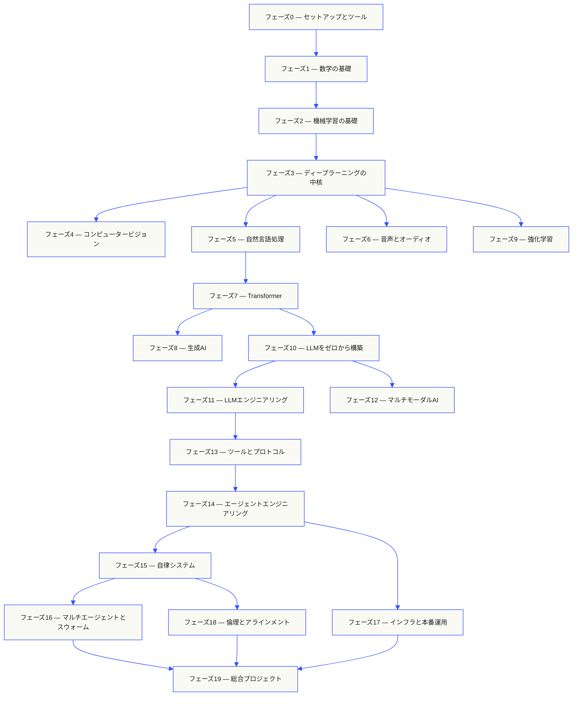
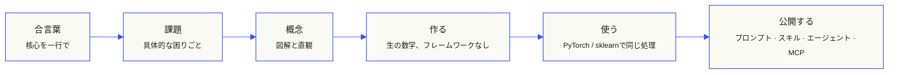

<p align="center"><sub>AIの支援を受けた翻訳です。内容の基準は<a href="../../README.md">英語版</a>です。</sub></p>
<p align="center">
  
</p>

<p align="center">
  <a href="../../README.md">🇬🇧 English</a> ·
  <a href="../../i18n/zh/README.md">🇨🇳 简体中文</a> ·
  <a href="../../i18n/zh-TW/README.md">🇹🇼 繁體中文（台灣）</a> ·
  <a href="../../i18n/ja/README.md">🇯🇵 日本語</a> ·
  <a href="../../i18n/ko/README.md">🇰🇷 한국어</a> ·
  <a href="../../i18n/pt/README.md">🇵🇹 Português</a> ·
  <a href="../../i18n/pt-BR/README.md">🇧🇷 Português (Brasil)</a> ·
  <a href="../../i18n/es/README.md">🇪🇸 Español</a> ·
  <a href="../../i18n/de/README.md">🇩🇪 Deutsch</a> ·
  <a href="../../i18n/fr/README.md">🇫🇷 Français</a> ·
  <a href="../../i18n/it/README.md">🇮🇹 Italiano</a> ·
  <a href="../../i18n/nl/README.md">🇳🇱 Nederlands</a> ·
  <a href="../../i18n/pl/README.md">🇵🇱 Polski</a> ·
  <a href="../../i18n/cs/README.md">🇨🇿 Čeština</a> ·
  <a href="../../i18n/ro/README.md">🇷🇴 Română</a> ·
  <a href="../../i18n/hu/README.md">🇭🇺 Magyar</a> ·
  <a href="../../i18n/el/README.md">🇬🇷 Ελληνικά</a> ·
  <a href="../../i18n/sv/README.md">🇸🇪 Svenska</a> ·
  <a href="../../i18n/da/README.md">🇩🇰 Dansk</a> ·
  <a href="../../i18n/no/README.md">🇳🇴 Norsk</a> ·
  <a href="../../i18n/fi/README.md">🇫🇮 Suomi</a> ·
  <a href="../../i18n/ru/README.md">🇷🇺 Русский</a> ·
  <a href="../../i18n/uk/README.md">🇺🇦 Українська</a> ·
  <a href="../../i18n/tr/README.md">🇹🇷 Türkçe</a> ·
  <a href="../../i18n/he/README.md">🇮🇱 עברית</a> ·
  <a href="../../i18n/ar/README.md">🇸🇦 العربية</a> ·
  <a href="../../i18n/fa/README.md">🇮🇷 فارسی</a> ·
  <a href="../../i18n/hi/README.md">🇮🇳 हिन्दी</a> ·
  <a href="../../i18n/bn/README.md">🇧🇩 বাংলা</a> ·
  <a href="../../i18n/ur/README.md">🇵🇰 اردو</a> ·
  <a href="../../i18n/th/README.md">🇹🇭 ไทย</a> ·
  <a href="../../i18n/vi/README.md">🇻🇳 Tiếng Việt</a> ·
  <a href="../../i18n/id/README.md">🇮🇩 Bahasa Indonesia</a> ·
  <a href="../../i18n/tl/README.md">🇵🇭 Tagalog</a>
</p>

<p align="center">
  <a href="../../LICENSE"></a>
  <a href="../../ROADMAP.md"></a>
  <a href="#contents"></a>
  <a href="https://github.com/rohitg00/ai-engineering-from-scratch/stargazers"></a>
  <a href="https://aiengineeringfromscratch.com"></a>
  <p align="center">
 <a href="https://www.star-history.com/rohitg00/ai-engineering-from-scratch">
  <picture><source media="(prefers-color-scheme: dark)" srcset="https://api.star-history.com/badge?repo=rohitg00/ai-engineering-from-scratch&type=rank&theme=dark" /><source media="(prefers-color-scheme: light)" srcset="https://api.star-history.com/badge?repo=rohitg00/ai-engineering-from-scratch&type=rank" /></picture> <picture><source media="(prefers-color-scheme: dark)" srcset="https://api.star-history.com/badge?repo=rohitg00/ai-engineering-from-scratch&type=trending&theme=dark" /><source media="(prefers-color-scheme: light)" srcset="https://api.star-history.com/badge?repo=rohitg00/ai-engineering-from-scratch&type=trending" /></picture>
 </a>
</p>
</p>

### スポンサー

<p align="center">
  <a href="https://serpapi.com/ai-engineering-from-scratch"><picture><source media="(min-width: 768px)" srcset="../../assets/sponsors/serpapi-banner-compact.png" width="48%"></picture></a>
  <a href="https://nitrostack.ai/referral/aiengineeringfromscratch"><picture><source media="(min-width: 768px)" srcset="../../assets/sponsors/nitrostack-banner-equal.png" width="48%"></picture></a>
</p>

<p align="center">
  <sub><span>皆さまの支援により、すべてのレッスンを無料かつオープンソースで提供できます。</span> <a href="#supporters">すべての支援者を見る</a> · <a href="../../SPONSORS.md">支援者になる</a></sub>
</p>

```text
░░░▒▒▒░░░▒▒▒░░░▒▒▒░░░▒▒▒░░░▒▒▒░░░▒▒▒░░░▒▒▒░░░▒▒▒░░░▒▒▒░░░▒▒▒░░░▒▒▒░░░▒▒▒░░░▒▒▒░░░▒▒▒░░░▒▒▒
```
> **学生の84%はすでにAIツールを使っていますが、それを専門的に使いこなせると感じているのはわずか18%です。** このカリキュラムはそのギャップを埋めます。
>
> 523レッスン。20フェーズ。約342時間。Python、TypeScript、Rust、Julia。各レッスンで再利用可能な成果物（プロンプト、スキル、エージェント、MCPサーバー）が生まれます。無料、オープンソース、MITライセンス。
>
> AIをただ学ぶのではありません。自分の手で作ります。最初から最後まで、手作業で。

<!-- STATS:START (generated from site/stats.json by build.js — do not edit by hand) -->
<p align="center"><sub><b>114,584</b> 人の読者 &nbsp;·&nbsp; <b>181,995</b> 過去30日間のページビュー &nbsp;·&nbsp; 2026-08-29時点</sub></p>
<!-- STATS:END -->

## ここから始める：作りたいものを選ぶ

始める前に523レッスンすべてに目を通す必要はありません。目標を1つ選んでください。どのリンクからもGitHubまたはウェブサイトで同じカリキュラムを開けます。どちらも同じレッスンコードを使っています。

| 目標 | GitHubで学ぶ | ウェブサイトで学ぶ |
|---|---|---|
| 初心者として、基礎を一通り学びたい | [フェーズ0：セットアップとツール](../../phases/00-setup-and-tooling/) | [開発環境](https://aiengineeringfromscratch.com/lesson?path=phases/00-setup-and-tooling/01-dev-environment) |
| Pythonは知っていて、数学と機械学習の基礎を学びたい | [フェーズ1：数学の基礎](../../phases/01-math-foundations/) | [線形代数の直観](https://aiengineeringfromscratch.com/lesson?path=phases/01-math-foundations/01-linear-algebra-intuition) |
| 本番向けのLLMアプリケーションを構築したい | [フェーズ11：LLMエンジニアリング](../../phases/11-llm-engineering/) | [プロンプトエンジニアリング](https://aiengineeringfromscratch.com/lesson?path=phases/11-llm-engineering/01-prompt-engineering) |
| エージェントを構築したい | [フェーズ14：エージェントエンジニアリング](../../phases/14-agent-engineering/) | [エージェントループ](https://aiengineeringfromscratch.com/lesson?path=phases/14-agent-engineering/01-the-agent-loop) |
| 実際のリポジトリでコーディングエージェントを使いたい | [エージェント支援エンジニアリングの学習パス](../../learning-paths/using-coding-agents.json) | [エージェント支援エンジニアリング](https://aiengineeringfromscratch.com/lesson?path=phases/14-agent-engineering/31-agent-workbench-why-models-fail&learningPath=using-coding-agents) |
| 実装に着手する前に、適切なものを作る判断をしたい | [プロダクト判断とデリバリーの学習パス](../../learning-paths/shaping-the-build.json) | [プロダクト判断とデリバリー](https://aiengineeringfromscratch.com/lesson?path=phases/14-agent-engineering/47-outcomes-before-output&learningPath=shaping-the-build) |
| Model Context Protocol（MCP）を使って構築したい | [Model Context Protocol（MCP）の学習パス](../../phases/13-tools-and-protocols/README.md#model-context-protocol-mcp-path) | [Model Context Protocol（MCP）のパス](https://aiengineeringfromscratch.com/lesson?path=phases/13-tools-and-protocols/06-mcp-fundamentals&learningPath=model-context-protocol) |
| Agent Skillsを書いて公開したい | [Agent Skills集中学習パス](../../phases/13-tools-and-protocols/README.md#agent-skills-fast-path) | [Agent Skillsのパス](https://aiengineeringfromscratch.com/lesson?path=phases/13-tools-and-protocols/22-skills-and-agent-sdks&learningPath=agent-skills) |
| Claude認定資格の取得を目指したい | [認定資格の受講案内](../../certifications/claude/GETTING_STARTED.md) | [認定アカデミー](https://aiengineeringfromscratch.com/certifications.html) |
| MCP Associate（MCPA）の取得を目指したい | [MCPA受講案内](../../certifications/mcpa/GETTING_STARTED.md) | [MCPA学習トラック](https://aiengineeringfromscratch.com/certification?id=mcpa-f) |

自分に合う内容がわからない場合は、[`start-learning`レベル判定チューター](../../skills/start-learning/SKILL.md)または[ウェブサイトの前提条件ガイド](https://aiengineeringfromscratch.com/prereqs.html)を使ってください。

4つの主要分野と6つのキャリアパスを[AIエンジニアリング学習パス](https://aiengineeringfromscratch.com/learning-paths.html)で比較できます。

### どのレッスンも同じ方法で進める

1. **読む**：`docs/en.md`を読み、中心となる考えを自分の言葉で説明する。
2. **入力して作る**：コードブロックを飾りとして眺めるのではなく、重要なコードを自分で入力して実装する。
3. **実行する**：`README.md`と`phases/`があるリポジトリのルートからレッスンのコマンドを実行する。
4. **証拠を残す**：実行したコマンド、作業ディレクトリ、終了コード、意味のある出力、変更または作成した成果物を記録する。
5. **先へ進む**：出力を説明でき、推測に頼らず小さな変更を1つ加えられるようになってから次へ進む。

レッスンに記載されたコマンドは、ディレクトリを変更するよう明記されていない限り、リポジトリのルートからのパスです。複数の言語で実装例がある場合は、学習中の言語の実装を実行してください。

### クローンして最初の実行証拠を残す

```bash
git clone https://github.com/rohitg00/ai-engineering-from-scratch.git
cd ai-engineering-from-scratch
python3 phases/00-setup-and-tooling/01-dev-environment/code/verify.py --route beginner
python3 phases/01-math-foundations/01-linear-algebra-intuition/code/vectors.py
```
事前チェックでは、今必要な要件と後で必要になるツールを分けて確認します。必須項目の確認に失敗すると、検出した理由と修正コマンドが表示されます。2つ目のコマンドは依存関係のないレッスンを実行し、行列とベクトルの積がニューラルネットワーク層の内部で行われる演算であることを示します。ターミナルの出力を最初の実行証拠として保存してください。

## AIチューターを30秒で追加する

Node.js、`npx`、スキルに対応したコーディングエージェントがすでにインストールされていれば、2つのコマンドでエージェントをチューターとして使えます。チューターをインストールしたり読んだりするだけなら、リポジトリのクローンは不要です。学習パスを絞った実行可能なラボには`python3`が必要です。Agent Skillsのホストラボには、利用するホストの選択と、書き込み可能なユーザーまたはプロジェクトのスキル領域も必要です。

まず、ローカルの要件を確認します。

```bash
node --version
npx --version
python3 --version
```
次に、カリキュラムのスキルをインストールします。インストーラーに尋ねられたら、利用するホストとインストール先のスコープを選んでください。

```bash
npx skills add rohitg00/ai-engineering-from-scratch
```
呼び出し構文はホストごとに異なります。ポータブルな`SKILL.md`形式に含まれるものではありません。

| ホスト | コースを始める | Model Context Protocol（MCP）を始める | Agent Skillsを始める | フェーズのクイズを実行する |
|---|---|---|---|---|
| Codex | `start-learning`、または`/skills`から選択 | `learn-mcp`、または`/skills`から選択 | `learn-agent-skills`、または`/skills`から選択 | `check-understanding 13`、または`/skills`から選択 |
| Claude Code | `/start-learning` | `/learn-mcp` | `/learn-agent-skills` | `/check-understanding 13` |
| その他の対応ホスト | `Use start-learning to begin the course.` | `Use learn-mcp to start the Model Context Protocol (MCP) path.` | `Use learn-agent-skills to start the Agent Skills Engineering path.` | `Use check-understanding to quiz me on Phase 13.` |

10問のレベル判定クイズで既習内容を確認し、開始フェーズを決めて、個別の学習計画を`LEARNING.md`に保存します。その後、`learn`スキルが1セッションにつき1レッスンを、概念、数学、コード、クイズの順に教えます。レッスンはこのリポジトリから直接読み込まれます。`course-guide`スキルを使うと、つまずいている内容を扱うレッスンに移動できます。Codexでは`learn`と`course-guide`を呼び出し、Claude Codeでは`/learn`と`/course-guide`を使います。その他の対応ホストでは、スキル名を指定して使用を依頼してください。

Model Context Protocol（MCP）だけを学ぶ場合は、ホストに対応したMCPの呼び出し方法を使ってください。`MCP-LEARNING.md`を作成し、ステートレスなリクエスト、トランスポート、双方向処理、セキュリティ、信頼性、レジストリガバナンス、適合性の証跡を扱う17レッスンのパスを進みます。正確な順序とチェックポイントは[Model Context Protocol（MCP）マニフェスト](../../learning-paths/model-context-protocol.json)に記載されています。

Agent Skillsだけを学ぶ場合は、ホストに対応したAgent Skillsの呼び出し方法を使ってください。`AGENT-SKILLS-LEARNING.md`を作成し、契約、発見、呼び出し、サンドボックス境界、評価によるリリースと実ホストでの移植性を扱う、一貫した5レッスンのパスを進みます。ウェブでは[Agent Skillsのパス](https://aiengineeringfromscratch.com/lesson?path=phases/13-tools-and-protocols/22-skills-and-agent-sdks&learningPath=agent-skills)から始められます。

インストーラーは設定可能なホストを一覧表示し、インストール先を尋ねます。Node.js、`npx`、`python3`、対応ホスト、書き込み可能なスコープのいずれかをまだ利用できない場合は、ウェブサイトを使うか、`docs/en.md`を手動で読んでください。そこで概念は学べますが、実ホストでの検出、呼び出し、スクリプト実行、アンインストールの証跡は、事前チェックを実行できるようになるまで取得できません。[aiengineeringfromscratch.com](https://aiengineeringfromscratch.com)でレッスンを読むこともできます。

## このカリキュラムの進め方

AIに関する教材は、論文、ファインチューニングの記事、派手なエージェントのデモなど、ばらばらに教えるものが多くあります。それらの内容が体系的につながることはほとんどありません。チャットボットを公開しても損失曲線を説明できなかったり、関数をエージェントにつないでも、それを呼び出すモデルの中でアテンションが何をしているか説明できなかったりします。

このカリキュラムが全体をつなぐ骨格になります。20フェーズ、523レッスン、4つの言語（Python、TypeScript、Rust、Julia）で、片端の線形代数からもう片端の自律型スウォームまでを学びます。すべてのアルゴリズムをまず基礎数学から組み立てます。誤差逆伝播法、トークナイザー、アテンション、エージェントループを学び、PyTorchが登場するころには内部で何が起きているか理解できます。

どのレッスンも同じ流れで進めます。課題を読み、数学を導き、コードを書き、テストを実行し、成果物を残します。5分動画やコピーペーストだけのデプロイ、手取り足取りの案内に頼りません。無料のオープンソースで、自分のノートPC上で実行できます。

```text
░░░▒▒▒░░░▒▒▒░░░▒▒▒░░░▒▒▒░░░▒▒▒░░░▒▒▒░░░▒▒▒░░░▒▒▒░░░▒▒▒░░░▒▒▒░░░▒▒▒░░░▒▒▒░░░▒▒▒░░░▒▒▒░░░▒▒▒
```
## カリキュラムの全体像

20のフェーズを積み重ねて学びます。土台は数学、最上部はエージェントと本番運用です。下の層をすでに知っていれば先へ進んでもかまいません。ただし、基礎を飛ばしたあとで上の層がうまく動かない理由に悩まないようにしてください。


```text
░░░▒▒▒░░░▒▒▒░░░▒▒▒░░░▒▒▒░░░▒▒▒░░░▒▒▒░░░▒▒▒░░░▒▒▒░░░▒▒▒░░░▒▒▒░░░▒▒▒░░░▒▒▒░░░▒▒▒░░░▒▒▒░░░▒▒▒
```
## レッスンの構成

各レッスンは専用のフォルダーにあり、カリキュラム全体で同じ構成を使います。

```text
phases/<NN>-<phase-name>/<NN>-<lesson-name>/
├── code/      実行可能な実装（Python、TypeScript、Rust、Julia）
├── docs/
│   └── en.md  レッスンの解説
└── outputs/   レッスンで作成するプロンプト、スキル、エージェント、MCPサーバー
```
各レッスンは6つの段階で進みます。中核となるのは*自分で実装する / ライブラリで使う*の流れです。まずアルゴリズムをゼロから実装し、その後、本番用ライブラリで同じ処理を実行します。小さな実装を自分で書いているので、フレームワークの動作を理解できます。


## はじめに

始め方は3つあります。いずれかを選んでください。

**A：ターミナルで学ぶ（推奨）。** 上記のNode.js、`npx`、ホスト、スコープの事前確認を済ませたら、学習スキルを対応エージェントにインストールし、コースに沿って学習を進めます。

```bash
npx skills add rohitg00/ai-engineering-from-scratch
```
上記のホスト別呼び出し表に従ってください。インストールしたスキルから、`start-learning`、`learn`、`course-guide`と、集中学習パスの`learn-mcp`、`learn-agent-skills`を利用できます。レッスンの解説はクローンなしでこのリポジトリから読み込めます。リポジトリのコードを使うコマンドや、実行可能なMCP・Agent Skillsラボにはローカルクローンが必要です。進捗はプロジェクト内の`LEARNING.md`、`MCP-LEARNING.md`、`AGENT-SKILLS-LEARNING.md`に保存されるため、次のセッションで続きから再開できます。

**B：読む。** [aiengineeringfromscratch.com](https://aiengineeringfromscratch.com)で完了したレッスンを開くか、[目次](#contents)からフェーズを展開してください。セットアップもクローンも不要です。

**C：クローンして実行する。**

```bash
git clone https://github.com/rohitg00/ai-engineering-from-scratch.git
cd ai-engineering-from-scratch
python3 phases/01-math-foundations/01-linear-algebra-intuition/code/vectors.py
```
クローンすると、Claude Codeでは学習スキルも自動で読み込まれます。また、すべてのレッスンのコードを`learn`チューターで実際に実行でき、説明を読むだけにとどまりません。

### 前提条件

- 何らかの言語でコードを書けること（Pythonを知っていると役立ちます）。
- APIを呼び出すだけでなく、AIが**実際にどう動くのか**を理解したいこと。

### Claude認定資格の準備

[Claude認定アカデミー](../../certifications/claude/README.md)は、公式のClaude認定資格4種類（Associate Foundations、Developer Foundations、Architect Foundations、Architect Professional）に向けた無料のオープンソース教材です。各学習パスには、試験要項に対応したレッスン、実行可能なラボ、診断テスト、総合課題、オリジナルの模擬試験が含まれます。

[AIネイティブなGitHub受講ガイド](../../certifications/claude/GETTING_STARTED.md)は、Claude Code、Codex、ChatGPT、Cursorなどのエージェントで利用できます。Codexでは`claude-certification`を、Claude Codeでは`/claude-certification`を実行します。その他のホストでは`claude-certification`を使うよう依頼してください。ガイドが認定トラックを選び、`CLAUDE-CERTIFICATION.md`に継続的な学習ルートを作成し、各段階を教え、実際のラボを実行して、成果物に基づくフィードバックを返します。同じカリキュラムは[認定資格ウェブサイト](https://aiengineeringfromscratch.com/certifications.html)でも利用できます。

アカデミーは公開されている試験要項に基づく自主学習教材です。Anthropicとは提携していません。実際の試験問題を転載せず、合格を保証するものでもありません。

### MCP Associate（MCPA）認定資格の準備

[MCPA認定カリキュラム](../../certifications/mcpa/README.md)は、Linux Foundation Trainingを通じて提供されるAgentic AI FoundationのModel Context Protocol Associate試験に向けた、無料のオープンソース教材です。34レッスンで、2026-07-28版のステートレスプロトコルを5つの試験分野に沿って学びます。内容には、従来のハンドシェイクに代わるリクエストごとの`_meta`と`server/discover`、複数回の往復を行うリクエスト、サブスクリプション、キャッシュ、TasksとMCP Appsの拡張、OAuth認可、レジストリとSDKの各層が含まれます。すべてのレッスンに実行可能な標準ライブラリのラボがあり、実行記録が現在のワイヤ形式に照らして検証されます。さらに、診断テスト、総合課題、公開済みの試験要項に沿った出題比率のオリジナル模擬試験3回分も用意しています。

[AIネイティブなGitHub受講ガイド](../../certifications/mcpa/GETTING_STARTED.md)は、Claude Code、Codex、ChatGPT、Cursorなどのエージェントで利用できます。Codexでは`mcpa-certification`を、Claude Codeでは`/mcpa-certification`を実行します。その他のホストでは`mcpa-certification`を使うよう依頼してください。ガイドが`MCPA-CERTIFICATION.md`に継続的な学習ルートを作成し、各段階を教え、実際のラボを実行して、成果物に基づくフィードバックを返します。同じカリキュラムは[MCPAトラックページ](https://aiengineeringfromscratch.com/certification?id=mcpa-f)でも利用できます。

このカリキュラムは公開されている試験要項に基づく自主学習教材です。Agentic AI FoundationまたはLinux Foundationとは提携していません。実際の試験問題を転載せず、合格を保証するものでもありません。

### 学習スキル

| スキル | できること |
|---|---|
| [`start-learning`](../../skills/start-learning/SKILL.md) | 初回の受講案内。学習目的を確認し、レベル判定クイズを行い、個別計画を`LEARNING.md`に保存します。 |
| [`learn`](../../skills/learn/SKILL.md) | チューターとして学習を進行します。復習から始め、次のレッスンを対話形式で教え、そのクイズを出し、進捗と復習キューを記録します。 |
| [`course-guide`](../../skills/course-guide/SKILL.md) | トピック案内。「アテンションはどこで学べる？」「損失がNaNになる」などの質問から、関連レッスンとリンクを案内します。 |
| [`learn-mcp`](../../skills/learn-mcp/SKILL.md) | Model Context Protocol（MCP）に特化したチューターです。`MCP-LEARNING.md`を作成して17レッスンのマニフェストに沿って進み、ワイヤ形式、セキュリティ、信頼性、適合性の証跡を記録します。 |
| [`learn-agent-skills`](../../skills/learn-agent-skills/SKILL.md) | Agent Skillsに特化したチューターです。`AGENT-SKILLS-LEARNING.md`を作成し、レッスン22、24、25、26、27を教えて、実ホストでの証跡を記録します。 |
| [`claude-certification`](../../skills/claude-certification/SKILL.md) | 認定資格チューターです。CCAO-F、CCDV-F、CCAR-F、CCAR-Pからトラックを選び、各レッスンを教え、ラボを実行し、成果物をレビューし、診断と模擬試験を実施して、進捗を保存します。 |
| [`mcpa-certification`](../../skills/mcpa-certification/SKILL.md) | MCPAチューターです。2026-07-28プロトコルに対応する34レッスンの`mcpa-f`パスに沿って教え、ラボとワイヤ形式チェッカーを実行し、診断と模擬試験3回分を実施して、進捗を保存します。 |
| [`find-your-level`](../../skills/find-your-level/SKILL.md) | 10問のレベル判定クイズで知識を確認し、開始フェーズと所要時間の目安を含む個別パスを作成します。 |
| [`check-understanding <phase>`](../../skills/check-understanding/SKILL.md) | 各フェーズの8問クイズを出し、フィードバックと復習する具体的なレッスンを示します。上記の呼び出し表にあるCodex、Claude Code、自然言語での形式を使えます。 |

```text
░░░▒▒▒░░░▒▒▒░░░▒▒▒░░░▒▒▒░░░▒▒▒░░░▒▒▒░░░▒▒▒░░░▒▒▒░░░▒▒▒░░░▒▒▒░░░▒▒▒░░░▒▒▒░░░▒▒▒░░░▒▒▒░░░▒▒▒
```
## コアカリキュラムを本として読む

`phases/`にある20フェーズのコアカリキュラムは、全6巻の書籍シリーズになります。EPUBとPDFは同じコアレッスンのソースからCIで生成され、[GitHubの各リリース](https://github.com/rohitg00/ai-engineering-from-scratch/releases)に添付されます。以下のリンクは常に最新リリースを指します。巻番号はシリーズ内の番号であり、版番号ではありません。各巻には日付入りの版表示があり、以前の版も各リリースから引き続きダウンロードできます。

認定カリキュラムは意図的に書籍化していません。AIチューターの状態、実行可能なラボ、対話型図表、診断、時間制限付き模擬試験は、GitHubとウェブサイトでそのまま利用できます。

| 巻 | タイトル | フェーズ | ダウンロード |
|---|---|---|---|
| 1 | 基礎 — 数学、ツール、古典的機械学習 | 00-02 | [EPUB](https://github.com/rohitg00/ai-engineering-from-scratch/releases/latest/download/aiefs-vol1-foundations.epub) · [PDF](https://github.com/rohitg00/ai-engineering-from-scratch/releases/latest/download/aiefs-vol1-foundations.pdf) |
| 2 | ディープラーニング — ネットワーク、ビジョン、音声 | 03, 04, 06 | [EPUB](https://github.com/rohitg00/ai-engineering-from-scratch/releases/latest/download/aiefs-vol2-deep-learning.epub) · [PDF](https://github.com/rohitg00/ai-engineering-from-scratch/releases/latest/download/aiefs-vol2-deep-learning.pdf) |
| 3 | 言語 — NLPの基礎とTransformer | 05, 07 | [EPUB](https://github.com/rohitg00/ai-engineering-from-scratch/releases/latest/download/aiefs-vol3-language.epub) · [PDF](https://github.com/rohitg00/ai-engineering-from-scratch/releases/latest/download/aiefs-vol3-language.pdf) |
| 4 | 大規模言語モデル — 生成、強化学習、事前学習、エンジニアリング | 08-11 | [EPUB](https://github.com/rohitg00/ai-engineering-from-scratch/releases/latest/download/aiefs-vol4-llms.epub) · [PDF](https://github.com/rohitg00/ai-engineering-from-scratch/releases/latest/download/aiefs-vol4-llms.pdf) |
| 5 | エージェント — マルチモーダル、プロトコル、自律性、スウォーム | 12-16 | [EPUB](https://github.com/rohitg00/ai-engineering-from-scratch/releases/latest/download/aiefs-vol5-agents.epub) · [PDF](https://github.com/rohitg00/ai-engineering-from-scratch/releases/latest/download/aiefs-vol5-agents.pdf) |
| 6 | 本番運用 — インフラ、安全性、総合プロジェクト | 17-19 | [EPUB](https://github.com/rohitg00/ai-engineering-from-scratch/releases/latest/download/aiefs-vol6-production.epub) · [PDF](https://github.com/rohitg00/ai-engineering-from-scratch/releases/latest/download/aiefs-vol6-production.pdf) |

書籍はある時点のスナップショットで、このリポジトリは更新が続く版です。各章の末尾には、レッスンのアニメーション図、クイズ、実行可能なコードへのリンクがあります。`python3 scripts/build_book.py`でローカル生成できます（pandocが必要です）。パイプラインの詳細は[book/README.md](../../book/README.md)をご覧ください。

```text
░░░▒▒▒░░░▒▒▒░░░▒▒▒░░░▒▒▒░░░▒▒▒░░░▒▒▒░░░▒▒▒░░░▒▒▒░░░▒▒▒░░░▒▒▒░░░▒▒▒░░░▒▒▒░░░▒▒▒░░░▒▒▒░░░▒▒▒
```

## どのレッスンも成果物を生み出す

ほかのカリキュラムは「Xを学びました。おめでとう」で終わります。このカリキュラムでは、各レッスンが日々のワークフローにインストールしたり貼り付けたりできる**再利用可能なツール**で締めくくられます。

<table>
<tr>
<th align="left" width="25%"><br/><sub>FIG_001 · A</sub><br/><b>プロンプト</b></th>
<th align="left" width="25%"><br/><sub>FIG_001 · B</sub><br/><b>スキル</b></th>
<th align="left" width="25%"><br/><sub>FIG_001 · C</sub><br/><b>エージェント</b></th>
<th align="left" width="25%"><br/><sub>FIG_001 · D</sub><br/><b>MCPサーバー</b></th>
</tr>
<tr>
<td valign="top">狭いタスクについて専門的な助言を得るため、任意のAIアシスタントに貼り付けて使えます。</td>
<td valign="top">`SKILL.md`を読み込めるClaude、Cursor、Codex、OpenClaw、Hermesなどのエージェントに追加できます。</td>
<td valign="top">フェーズ14で自分でループを実装した自律ワーカーとしてデプロイできます。</td>
<td valign="top">MCP互換クライアントに接続して使えます。フェーズ13でエンドツーエンドに構築します。</td>
</tr>
</table>

> `python3 scripts/install_skills.py <target>`でまとめてインストールできます。宿題ではなく、実際に使えるツールです。
> カリキュラムを終えるころには、自分で作って理解した成果物523点をポートフォリオとして持てます。
### FIG_002 · 実装例

フェーズ14、レッスン1：エージェントループ。依存関係のない純粋なPythonコード約120行です。

<table>
<tr>
<td valign="top" width="50%">

**`code/agent_loop.py`** &nbsp; <sub><i>作る</i></sub>

```python
def run(query, tools):
    history = [user(query)]
    for step in range(MAX_STEPS):
        msg = llm(history)
        if msg.tool_calls:
            for call in msg.tool_calls:
                result = tools[call.name](**call.args)
                history.append(tool_result(call.id, result))
            continue
        return msg.content
    raise StepLimitExceeded
```
</td>
<td valign="top" width="50%">

**`outputs/skill-agent-loop.md`** &nbsp; <sub><i>公開する</i></sub>

```markdown
---
name: agent-loop
description: ReAct-style loop for any tool list
phase: 14
lesson: 01
---

Implement a minimal agent loop that...
```
**`outputs/prompt-debug-agent.md`**

```markdown
You are an agent debugger. Given the trace
of an agent run, identify the step where
the agent went wrong and explain why...
```
</td>
</tr>
</table>

```text
░░░▒▒▒░░░▒▒▒░░░▒▒▒░░░▒▒▒░░░▒▒▒░░░▒▒▒░░░▒▒▒░░░▒▒▒░░░▒▒▒░░░▒▒▒░░░▒▒▒░░░▒▒▒░░░▒▒▒░░░▒▒▒░░░▒▒▒
```
<a id="contents"></a>

## 目次

全20フェーズです。各フェーズをクリックすると、レッスン一覧が開きます。

<a id="phase-0"></a>
### フェーズ0：セットアップとツール `12 レッスン`

> これから学ぶ内容に備えて、開発環境を整えましょう。

| # | レッスン | 種別 | 言語 |
|:---:|--------|:----:|------|
| 01 | [開発環境](../../phases/00-setup-and-tooling/01-dev-environment/) | 制作 | Python |
| 02 | [Gitとコラボレーション](../../phases/00-setup-and-tooling/02-git-and-collaboration/) | 学習 | — |
| 03 | [GPUのセットアップとクラウド](../../phases/00-setup-and-tooling/03-gpu-setup-and-cloud/) | 制作 | Python |
| 04 | [APIとキー](../../phases/00-setup-and-tooling/04-apis-and-keys/) | 制作 | Python |
| 05 | [Jupyter Notebook](../../phases/00-setup-and-tooling/05-jupyter-notebooks/) | 制作 | Python |
| 06 | [Python環境](../../phases/00-setup-and-tooling/06-python-environments/) | 制作 | Shell |
| 07 | [AIのためのDocker](../../phases/00-setup-and-tooling/07-docker-for-ai/) | 制作 | Docker |
| 08 | [エディターのセットアップ](../../phases/00-setup-and-tooling/08-editor-setup/) | 制作 | — |
| 09 | [データ管理](../../phases/00-setup-and-tooling/09-data-management/) | 制作 | Python |
| 10 | [ターミナルとシェル](../../phases/00-setup-and-tooling/10-terminal-and-shell/) | 学習 | — |
| 11 | [AIのためのLinux](../../phases/00-setup-and-tooling/11-linux-for-ai/) | 学習 | — |
| 12 | [デバッグとプロファイリング](../../phases/00-setup-and-tooling/12-debugging-and-profiling/) | 制作 | Python |

<details id="phase-1">
<summary><b>フェーズ1 — 数学の基礎</b> &nbsp;<code>22 レッスン</code>&nbsp; <em>コードを通じて、あらゆるAIアルゴリズムの背景にある直観を学びます。</em></summary>
<br/>

| # | レッスン | 種別 | 言語 |
|:---:|--------|:----:|------|
| 01 | [線形代数の直観](../../phases/01-math-foundations/01-linear-algebra-intuition/) | 学習 | Python, Julia |
| 02 | [ベクトル、行列と演算](../../phases/01-math-foundations/02-vectors-matrices-operations/) | 制作 | Python, Julia |
| 03 | [行列変換と固有値](../../phases/01-math-foundations/03-matrix-transformations/) | 制作 | Python, Julia |
| 04 | [機械学習のための微積分：導関数と勾配](../../phases/01-math-foundations/04-calculus-for-ml/) | 学習 | Python |
| 05 | [連鎖律と自動微分](../../phases/01-math-foundations/05-chain-rule-and-autodiff/) | 制作 | Python |
| 06 | [確率と分布](../../phases/01-math-foundations/06-probability-and-distributions/) | 学習 | Python |
| 07 | [ベイズの定理と統計的思考](../../phases/01-math-foundations/07-bayes-theorem/) | 制作 | Python |
| 08 | [最適化：勾配降下法の各種手法](../../phases/01-math-foundations/08-optimization/) | 制作 | Python |
| 09 | [情報理論：エントロピーとKLダイバージェンス](../../phases/01-math-foundations/09-information-theory/) | 学習 | Python |
| 10 | [次元削減：PCA、t-SNE、UMAP](../../phases/01-math-foundations/10-dimensionality-reduction/) | 制作 | Python |
| 11 | [特異値分解](../../phases/01-math-foundations/11-singular-value-decomposition/) | 制作 | Python, Julia |
| 12 | [テンソル演算](../../phases/01-math-foundations/12-tensor-operations/) | 制作 | Python |
| 13 | [数値安定性](../../phases/01-math-foundations/13-numerical-stability/) | 制作 | Python |
| 14 | [ノルムと距離](../../phases/01-math-foundations/14-norms-and-distances/) | 制作 | Python |
| 15 | [機械学習のための統計](../../phases/01-math-foundations/15-statistics-for-ml/) | 制作 | Python |
| 16 | [サンプリング手法](../../phases/01-math-foundations/16-sampling-methods/) | 制作 | Python |
| 17 | [線形システム](../../phases/01-math-foundations/17-linear-systems/) | 制作 | Python |
| 18 | [凸最適化](../../phases/01-math-foundations/18-convex-optimization/) | 制作 | Python |
| 19 | [AIのための複素数](../../phases/01-math-foundations/19-complex-numbers/) | 学習 | Python |
| 20 | [フーリエ変換](../../phases/01-math-foundations/20-fourier-transform/) | 制作 | Python |
| 21 | [機械学習のためのグラフ理論](../../phases/01-math-foundations/21-graph-theory/) | 制作 | Python |
| 22 | [確率過程](../../phases/01-math-foundations/22-stochastic-processes/) | 学習 | Python |

</details>

<details id="phase-2">
<summary><b>フェーズ2 — 機械学習の基礎</b> &nbsp;<code>18 レッスン</code>&nbsp; <em>古典的な機械学習は、今も多くの本番AIシステムを支えています。</em></summary>
<br/>

| # | レッスン | 種別 | 言語 |
|:---:|--------|:----:|------|
| 01 | [機械学習とは](../../phases/02-ml-fundamentals/01-what-is-machine-learning/) | 学習 | Python |
| 02 | [ゼロから実装する線形回帰](../../phases/02-ml-fundamentals/02-linear-regression/) | 制作 | Python |
| 03 | [ロジスティック回帰と分類](../../phases/02-ml-fundamentals/03-logistic-regression/) | 制作 | Python |
| 04 | [決定木とランダムフォレスト](../../phases/02-ml-fundamentals/04-decision-trees/) | 制作 | Python |
| 05 | [サポートベクターマシン](../../phases/02-ml-fundamentals/05-support-vector-machines/) | 制作 | Python |
| 06 | [k近傍法（KNN）と距離尺度](../../phases/02-ml-fundamentals/06-knn-and-distances/) | 制作 | Python |
| 07 | [教師なし学習：K-Means、DBSCAN](../../phases/02-ml-fundamentals/07-unsupervised-learning/) | 制作 | Python |
| 08 | [特徴量エンジニアリングと選択](../../phases/02-ml-fundamentals/08-feature-engineering/) | 制作 | Python |
| 09 | [モデル評価：指標と交差検証](../../phases/02-ml-fundamentals/09-model-evaluation/) | 制作 | Python |
| 10 | [バイアス、分散と学習曲線](../../phases/02-ml-fundamentals/10-bias-variance/) | 学習 | Python |
| 11 | [アンサンブル手法：ブースティング、バギング、スタッキング](../../phases/02-ml-fundamentals/11-ensemble-methods/) | 制作 | Python |
| 12 | [ハイパーパラメーターの調整](../../phases/02-ml-fundamentals/12-hyperparameter-tuning/) | 制作 | Python |
| 13 | [機械学習パイプラインと実験追跡](../../phases/02-ml-fundamentals/13-ml-pipelines/) | 制作 | Python |
| 14 | [ナイーブベイズ](../../phases/02-ml-fundamentals/14-naive-bayes/) | 制作 | Python |
| 15 | [時系列の基礎](../../phases/02-ml-fundamentals/15-time-series/) | 制作 | Python |
| 16 | [異常検知](../../phases/02-ml-fundamentals/16-anomaly-detection/) | 制作 | Python |
| 17 | [不均衡データへの対処](../../phases/02-ml-fundamentals/17-imbalanced-data/) | 制作 | Python |
| 18 | [特徴量選択](../../phases/02-ml-fundamentals/18-feature-selection/) | 制作 | Python |

</details>

<details id="phase-3">
<summary><b>フェーズ3 — ディープラーニングの中核</b> &nbsp;<code>13 レッスン</code>&nbsp; <em>第一原理からニューラルネットワークを構築します。自分で実装するまではフレームワークを使いません。</em></summary>
<br/>

| # | レッスン | 種別 | 言語 |
|:---:|--------|:----:|------|
| 01 | [パーセプトロン：すべての始まり](../../phases/03-deep-learning-core/01-the-perceptron/) | 制作 | Python |
| 02 | [多層ネットワークと順伝播](../../phases/03-deep-learning-core/02-multi-layer-networks/) | 制作 | Python |
| 03 | [ゼロから実装する誤差逆伝播法](../../phases/03-deep-learning-core/03-backpropagation/) | 制作 | Python |
| 04 | [活性化関数：ReLU、Sigmoid、GELUとその役割](../../phases/03-deep-learning-core/04-activation-functions/) | 制作 | Python |
| 05 | [損失関数：MSE、交差エントロピー、対照損失](../../phases/03-deep-learning-core/05-loss-functions/) | 制作 | Python |
| 06 | [最適化手法：SGD、Momentum、Adam、AdamW](../../phases/03-deep-learning-core/06-optimizers/) | 制作 | Python |
| 07 | [正則化：Dropout、Weight Decay、BatchNorm](../../phases/03-deep-learning-core/07-regularization/) | 制作 | Python |
| 08 | [重みの初期化と学習の安定性](../../phases/03-deep-learning-core/08-weight-initialization/) | 制作 | Python |
| 09 | [学習率スケジュールとウォームアップ](../../phases/03-deep-learning-core/09-learning-rate-schedules/) | 制作 | Python |
| 10 | [ミニフレームワークを自作する](../../phases/03-deep-learning-core/10-mini-framework/) | 制作 | Python |
| 11 | [PyTorch入門](../../phases/03-deep-learning-core/11-intro-to-pytorch/) | 制作 | Python |
| 12 | [JAX入門](../../phases/03-deep-learning-core/12-intro-to-jax/) | 制作 | Python |
| 13 | [ニューラルネットワークのデバッグ](../../phases/03-deep-learning-core/13-debugging-neural-networks/) | 制作 | Python |

</details>

<details id="phase-4">
<summary><b>フェーズ4 — コンピュータービジョン</b> &nbsp;<code>28 レッスン</code>&nbsp; <em>ピクセルから理解へ：画像、動画、3D、VLM、世界モデルを扱います。</em></summary>
<br/>

| # | レッスン | 種別 | 言語 |
|:---:|--------|:----:|------|
| 01 | [画像の基礎：ピクセル、チャンネル、色空間](../../phases/04-computer-vision/01-image-fundamentals/) | 学習 | Python |
| 02 | [ゼロから実装する畳み込み](../../phases/04-computer-vision/02-convolutions-from-scratch/) | 制作 | Python |
| 03 | [CNN：LeNetからResNetまで](../../phases/04-computer-vision/03-cnns-lenet-to-resnet/) | 制作 | Python |
| 04 | [画像分類](../../phases/04-computer-vision/04-image-classification/) | 制作 | Python |
| 05 | [転移学習とファインチューニング](../../phases/04-computer-vision/05-transfer-learning/) | 制作 | Python |
| 06 | [物体検出：YOLOをゼロから実装](../../phases/04-computer-vision/06-object-detection-yolo/) | 制作 | Python |
| 07 | [セマンティックセグメンテーション：U-Net](../../phases/04-computer-vision/07-semantic-segmentation-unet/) | 制作 | Python |
| 08 | [インスタンスセグメンテーション：Mask R-CNN](../../phases/04-computer-vision/08-instance-segmentation-mask-rcnn/) | 制作 | Python |
| 09 | [画像生成：GAN](../../phases/04-computer-vision/09-image-generation-gans/) | 制作 | Python |
| 10 | [画像生成：拡散モデル](../../phases/04-computer-vision/10-image-generation-diffusion/) | 制作 | Python |
| 11 | [Stable Diffusion：アーキテクチャとファインチューニング](../../phases/04-computer-vision/11-stable-diffusion/) | 制作 | Python |
| 12 | [動画理解：時間モデリング](../../phases/04-computer-vision/12-video-understanding/) | 制作 | Python |
| 13 | [3Dビジョン：点群とNeRF](../../phases/04-computer-vision/13-3d-vision-nerf/) | 制作 | Python |
| 14 | [Vision Transformer（ViT）](../../phases/04-computer-vision/14-vision-transformers/) | 制作 | Python |
| 15 | [リアルタイムビジョン：エッジデプロイ](../../phases/04-computer-vision/15-real-time-edge/) | 制作 | Python |
| 16 | [完全なビジョンパイプラインを構築する](../../phases/04-computer-vision/16-vision-pipeline-capstone/) | 制作 | Python |
| 17 | [自己教師ありビジョン：SimCLR、DINO、MAE](../../phases/04-computer-vision/17-self-supervised-vision/) | 制作 | Python |
| 18 | [オープンボキャブラリービジョン：CLIP](../../phases/04-computer-vision/18-open-vocab-clip/) | 制作 | Python |
| 19 | [OCRと文書理解](../../phases/04-computer-vision/19-ocr-document-understanding/) | 制作 | Python |
| 20 | [画像検索と距離学習](../../phases/04-computer-vision/20-image-retrieval-metric/) | 制作 | Python |
| 21 | [キーポイント検出と姿勢推定](../../phases/04-computer-vision/21-keypoint-pose/) | 制作 | Python |
| 22 | [ゼロから実装する3D Gaussian Splatting](../../phases/04-computer-vision/22-3d-gaussian-splatting/) | 制作 | Python |
| 23 | [Diffusion TransformerとRectified Flow](../../phases/04-computer-vision/23-diffusion-transformers-rectified-flow/) | 制作 | Python |
| 24 | [SAM 3とオープンボキャブラリーセグメンテーション](../../phases/04-computer-vision/24-sam3-open-vocab-segmentation/) | 制作 | Python |
| 25 | [視覚言語モデル（ViT-MLP-LLM）](../../phases/04-computer-vision/25-vision-language-models/) | 制作 | Python |
| 26 | [単眼深度推定と幾何推定](../../phases/04-computer-vision/26-monocular-depth/) | 制作 | Python |
| 27 | [複数物体追跡と動画メモリ](../../phases/04-computer-vision/27-multi-object-tracking/) | 制作 | Python |
| 28 | [世界モデルと動画拡散](../../phases/04-computer-vision/28-world-models-video-diffusion/) | 制作 | Python |

</details>

<details id="phase-5">
<summary><b>フェーズ5 — NLP：基礎から応用まで</b> &nbsp;<code>29 レッスン</code>&nbsp; <em>言語は知能とやり取りするためのインターフェースです。</em></summary>
<br/>

| # | レッスン | 種別 | 言語 |
|:---:|--------|:----:|------|
| 01 | [テキスト処理：トークン化、語幹抽出、見出し語化](../../phases/05-nlp-foundations-to-advanced/01-text-processing/) | 制作 | Python |
| 02 | [Bag of Words、TF-IDFとテキスト表現](../../phases/05-nlp-foundations-to-advanced/02-bag-of-words-tfidf/) | 制作 | Python |
| 03 | [単語埋め込み：Word2Vecをゼロから実装](../../phases/05-nlp-foundations-to-advanced/03-word-embeddings-word2vec/) | 制作 | Python |
| 04 | [GloVe、FastTextとサブワード埋め込み](../../phases/05-nlp-foundations-to-advanced/04-glove-fasttext-subword/) | 制作 | Python |
| 05 | [感情分析](../../phases/05-nlp-foundations-to-advanced/05-sentiment-analysis/) | 制作 | Python |
| 06 | [固有表現認識（NER）](../../phases/05-nlp-foundations-to-advanced/06-named-entity-recognition/) | 制作 | Python |
| 07 | [品詞タグ付けと構文解析](../../phases/05-nlp-foundations-to-advanced/07-pos-tagging-parsing/) | 制作 | Python |
| 08 | [テキスト分類：テキスト向けCNNとRNN](../../phases/05-nlp-foundations-to-advanced/08-cnns-rnns-for-text/) | 制作 | Python |
| 09 | [系列変換モデル](../../phases/05-nlp-foundations-to-advanced/09-sequence-to-sequence/) | 制作 | Python |
| 10 | [アテンション機構：ブレークスルー](../../phases/05-nlp-foundations-to-advanced/10-attention-mechanism/) | 制作 | Python |
| 11 | [機械翻訳](../../phases/05-nlp-foundations-to-advanced/11-machine-translation/) | 制作 | Python |
| 12 | [テキスト要約](../../phases/05-nlp-foundations-to-advanced/12-text-summarization/) | 制作 | Python |
| 13 | [質問応答システム](../../phases/05-nlp-foundations-to-advanced/13-question-answering/) | 制作 | Python |
| 14 | [情報検索](../../phases/05-nlp-foundations-to-advanced/14-information-retrieval-search/) | 制作 | Python |
| 15 | [トピックモデリング：LDA、BERTopic](../../phases/05-nlp-foundations-to-advanced/15-topic-modeling/) | 制作 | Python |
| 16 | [テキスト生成](../../phases/05-nlp-foundations-to-advanced/16-text-generation-pre-transformer/) | 制作 | Python |
| 17 | [チャットボット：ルールベースからニューラルへ](../../phases/05-nlp-foundations-to-advanced/17-chatbots-rule-to-neural/) | 制作 | Python |
| 18 | [多言語NLP](../../phases/05-nlp-foundations-to-advanced/18-multilingual-nlp/) | 制作 | Python |
| 19 | [サブワードトークン化：BPE、WordPiece、Unigram、SentencePiece](../../phases/05-nlp-foundations-to-advanced/19-subword-tokenization/) | 学習 | Python |
| 20 | [構造化出力と制約付きデコーディング](../../phases/05-nlp-foundations-to-advanced/20-structured-outputs-constrained-decoding/) | 制作 | Python |
| 21 | [自然言語推論（NLI）とテキスト含意](../../phases/05-nlp-foundations-to-advanced/21-nli-textual-entailment/) | 学習 | Python |
| 22 | [埋め込みモデルを深掘りする](../../phases/05-nlp-foundations-to-advanced/22-embedding-models-deep-dive/) | 学習 | Python |
| 23 | [RAGのチャンク分割戦略](../../phases/05-nlp-foundations-to-advanced/23-chunking-strategies-rag/) | 制作 | Python |
| 24 | [照応解析](../../phases/05-nlp-foundations-to-advanced/24-coreference-resolution/) | 学習 | Python |
| 25 | [エンティティリンキングと曖昧性解消](../../phases/05-nlp-foundations-to-advanced/25-entity-linking/) | 制作 | Python |
| 26 | [関係抽出と知識グラフ構築](../../phases/05-nlp-foundations-to-advanced/26-relation-extraction-kg/) | 制作 | Python |
| 27 | [LLM評価：RAGAS、DeepEval、G-Eval](../../phases/05-nlp-foundations-to-advanced/27-llm-evaluation-frameworks/) | 制作 | Python |
| 28 | [長文脈評価：NIAH、RULER、LongBench、MRCR](../../phases/05-nlp-foundations-to-advanced/28-long-context-evaluation/) | 学習 | Python |
| 29 | [対話状態追跡](../../phases/05-nlp-foundations-to-advanced/29-dialogue-state-tracking/) | 制作 | Python |

</details>

<details id="phase-6">
<summary><b>フェーズ6 — 音声とオーディオ</b> &nbsp;<code>17 レッスン</code>&nbsp; <em>聞き、理解し、話す。</em></summary>
<br/>

| # | レッスン | 種別 | 言語 |
|:---:|--------|:----:|------|
| 01 | [音声の基礎：波形、サンプリング、FFT](../../phases/06-speech-and-audio/01-audio-fundamentals) | 学習 | Python |
| 02 | [スペクトログラム、メル尺度と音声特徴量](../../phases/06-speech-and-audio/02-spectrograms-mel-features) | 制作 | Python |
| 03 | [音声分類](../../phases/06-speech-and-audio/03-audio-classification) | 制作 | Python |
| 04 | [音声認識（ASR）](../../phases/06-speech-and-audio/04-speech-recognition-asr) | 制作 | Python |
| 05 | [Whisper：アーキテクチャとファインチューニング](../../phases/06-speech-and-audio/05-whisper-architecture-finetuning) | 制作 | Python |
| 06 | [話者認識と話者照合](../../phases/06-speech-and-audio/06-speaker-recognition-verification) | 制作 | Python |
| 07 | [テキスト読み上げ（TTS）](../../phases/06-speech-and-audio/07-text-to-speech) | 制作 | Python |
| 08 | [音声クローニングと音声変換](../../phases/06-speech-and-audio/08-voice-cloning-conversion) | 制作 | Python |
| 09 | [音楽生成](../../phases/06-speech-and-audio/09-music-generation) | 制作 | Python |
| 10 | [音声言語モデル](../../phases/06-speech-and-audio/10-audio-language-models) | 制作 | Python |
| 11 | [リアルタイム音声処理](../../phases/06-speech-and-audio/11-real-time-audio-processing) | 制作 | Python |
| 12 | [音声アシスタントのパイプラインを構築する](../../phases/06-speech-and-audio/12-voice-assistant-pipeline) | 制作 | Python |
| 13 | [ニューラル音声コーデック：EnCodec、SNAC、Mimi、DAC](../../phases/06-speech-and-audio/13-neural-audio-codecs) | 学習 | Python |
| 14 | [音声区間検出とターン交替](../../phases/06-speech-and-audio/14-voice-activity-detection-turn-taking) | 制作 | Python |
| 15 | [音声間ストリーミング：Moshi、Hibiki](../../phases/06-speech-and-audio/15-streaming-speech-to-speech-moshi-hibiki) | 学習 | Python |
| 16 | [音声なりすまし検出と音声電子透かし](../../phases/06-speech-and-audio/16-anti-spoofing-audio-watermarking) | 制作 | Python |
| 17 | [音声評価：WER、MOS、MMAU、リーダーボード](../../phases/06-speech-and-audio/17-audio-evaluation-metrics) | 学習 | Python |

</details>

<details id="phase-7">
<summary><b>フェーズ7 — Transformerを深掘りする</b> &nbsp;<code>16 レッスン</code>&nbsp; <em>すべてを変えたアーキテクチャを学びます。</em></summary>
<br/>

| # | レッスン | 種別 | 言語 |
|:---:|--------|:----:|------|
| 01 | [Transformerが必要な理由：RNNの課題](../../phases/07-transformers-deep-dive/01-why-transformers/) | 学習 | Python |
| 02 | [ゼロから実装する自己注意機構](../../phases/07-transformers-deep-dive/02-self-attention-from-scratch/) | 制作 | Python |
| 03 | [マルチヘッドアテンション](../../phases/07-transformers-deep-dive/03-multi-head-attention/) | 制作 | Python |
| 04 | [位置エンコーディング：正弦波、RoPE、ALiBi](../../phases/07-transformers-deep-dive/04-positional-encoding/) | 制作 | Python |
| 05 | [Transformer全体：エンコーダーとデコーダー](../../phases/07-transformers-deep-dive/05-full-transformer/) | 制作 | Python |
| 06 | [BERT：マスク言語モデル](../../phases/07-transformers-deep-dive/06-bert-masked-language-modeling/) | 制作 | Python |
| 07 | [GPT：因果言語モデル](../../phases/07-transformers-deep-dive/07-gpt-causal-language-modeling/) | 制作 | Python |
| 08 | [T5、BART：エンコーダー・デコーダーモデル](../../phases/07-transformers-deep-dive/08-t5-bart-encoder-decoder/) | 学習 | Python |
| 09 | [Vision Transformer（ViT）](../../phases/07-transformers-deep-dive/09-vision-transformers/) | 制作 | Python |
| 10 | [音声Transformer：Whisperのアーキテクチャ](../../phases/07-transformers-deep-dive/10-audio-transformers-whisper/) | 学習 | Python |
| 11 | [専門家混合（MoE）](../../phases/07-transformers-deep-dive/11-mixture-of-experts/) | 制作 | Python |
| 12 | [KVキャッシュ、FlashAttentionと推論最適化](../../phases/07-transformers-deep-dive/12-kv-cache-flash-attention/) | 制作 | Python |
| 13 | [スケーリング則](../../phases/07-transformers-deep-dive/13-scaling-laws/) | 学習 | Python |
| 14 | [Transformerをゼロから構築する](../../phases/07-transformers-deep-dive/14-build-a-transformer-capstone/) | 制作 | Python |
| 15 | [アテンションの各種手法：スライディングウィンドウ、スパース、微分型](../../phases/07-transformers-deep-dive/15-attention-variants/) | 制作 | Python |
| 16 | [投機的デコーディング：草案、検証、反復](../../phases/07-transformers-deep-dive/16-speculative-decoding/) | 制作 | Python |

</details>

<details id="phase-8">
<summary><b>フェーズ8 — 生成AI</b> &nbsp;<code>15 レッスン</code>&nbsp; <em>画像、動画、音声、3Dなどを生成します。</em></summary>
<br/>

| # | レッスン | 種別 | 言語 |
|:---:|--------|:----:|------|
| 01 | [生成モデル：分類と歴史](../../phases/08-generative-ai/01-generative-models-taxonomy-history/) | 学習 | Python |
| 02 | [オートエンコーダーとVAE](../../phases/08-generative-ai/02-autoencoders-vae/) | 制作 | Python |
| 03 | [GAN：生成器と識別器](../../phases/08-generative-ai/03-gans-generator-discriminator/) | 制作 | Python |
| 04 | [条件付きGANとPix2Pix](../../phases/08-generative-ai/04-conditional-gans-pix2pix/) | 制作 | Python |
| 05 | [StyleGAN](../../phases/08-generative-ai/05-stylegan/) | 制作 | Python |
| 06 | [拡散モデル：DDPMをゼロから実装](../../phases/08-generative-ai/06-diffusion-ddpm-from-scratch/) | 制作 | Python |
| 07 | [潜在拡散とStable Diffusion](../../phases/08-generative-ai/07-latent-diffusion-stable-diffusion/) | 制作 | Python |
| 08 | [ControlNet、LoRAと条件付け](../../phases/08-generative-ai/08-controlnet-lora-conditioning/) | 制作 | Python |
| 09 | [インペインティング、アウトペインティングと編集](../../phases/08-generative-ai/09-inpainting-outpainting-editing/) | 制作 | Python |
| 10 | [動画生成](../../phases/08-generative-ai/10-video-generation/) | 制作 | Python |
| 11 | [音声生成](../../phases/08-generative-ai/11-audio-generation/) | 制作 | Python |
| 12 | [3D生成](../../phases/08-generative-ai/12-3d-generation/) | 制作 | Python |
| 13 | [フローマッチングとRectified Flow](../../phases/08-generative-ai/13-flow-matching-rectified-flows/) | 制作 | Python |
| 14 | [評価：FID、CLIPスコア](../../phases/08-generative-ai/14-evaluation-fid-clip-score/) | 制作 | Python |
| 19 | [視覚的自己回帰モデリング（VAR）：次スケール予測](../../phases/08-generative-ai/19-visual-autoregressive-var/) | 制作 | Python |

</details>

<details id="phase-9">
<summary><b>フェーズ9 — 強化学習</b> &nbsp;<code>12 レッスン</code>&nbsp; <em>RLHFとゲームAIを支える基礎を学びます。</em></summary>
<br/>

| # | レッスン | 種別 | 言語 |
|:---:|--------|:----:|------|
| 01 | [MDP、状態、行動と報酬](../../phases/09-reinforcement-learning/01-mdps-states-actions-rewards/) | 学習 | Python |
| 02 | [動的計画法](../../phases/09-reinforcement-learning/02-dynamic-programming/) | 制作 | Python |
| 03 | [モンテカルロ法](../../phases/09-reinforcement-learning/03-monte-carlo-methods/) | 制作 | Python |
| 04 | [Q学習とSARSA](../../phases/09-reinforcement-learning/04-q-learning-sarsa/) | 制作 | Python |
| 05 | [深層Qネットワーク（DQN）](../../phases/09-reinforcement-learning/05-dqn/) | 制作 | Python |
| 06 | [方策勾配法：REINFORCE](../../phases/09-reinforcement-learning/06-policy-gradients-reinforce/) | 制作 | Python |
| 07 | [Actor-Critic：A2C、A3C](../../phases/09-reinforcement-learning/07-actor-critic-a2c-a3c/) | 制作 | Python |
| 08 | [PPO](../../phases/09-reinforcement-learning/08-ppo/) | 制作 | Python |
| 09 | [報酬モデリングとRLHF](../../phases/09-reinforcement-learning/09-reward-modeling-rlhf/) | 制作 | Python |
| 10 | [マルチエージェント強化学習](../../phases/09-reinforcement-learning/10-multi-agent-rl/) | 制作 | Python |
| 11 | [シミュレーションから実環境への転移](../../phases/09-reinforcement-learning/11-sim-to-real-transfer/) | 制作 | Python |
| 12 | [ゲームのための強化学習](../../phases/09-reinforcement-learning/12-rl-for-games/) | 制作 | Python |

</details>

<details id="phase-10">
<summary><b>フェーズ10 — LLMをゼロから構築する</b> &nbsp;<code>24 レッスン</code>&nbsp; <em>大規模言語モデルを構築し、学習させ、その仕組みを理解します。</em></summary>
<br/>

| # | レッスン | 種別 | 言語 |
|:---:|--------|:----:|------|
| 01 | [トークナイザー：BPE、WordPiece、SentencePiece](../../phases/10-llms-from-scratch/01-tokenizers/) | 制作 | Python, Rust |
| 02 | [トークナイザーをゼロから構築する](../../phases/10-llms-from-scratch/02-building-a-tokenizer/) | 制作 | Python |
| 03 | [事前学習のためのデータパイプライン](../../phases/10-llms-from-scratch/03-data-pipelines/) | 制作 | Python |
| 04 | [小型GPT（1億2,400万パラメーター）の事前学習](../../phases/10-llms-from-scratch/04-pre-training-mini-gpt/) | 制作 | Python |
| 05 | [分散学習、FSDP、DeepSpeed](../../phases/10-llms-from-scratch/05-scaling-distributed/) | 制作 | Python |
| 06 | [指示チューニング：SFT](../../phases/10-llms-from-scratch/06-instruction-tuning-sft/) | 制作 | Python |
| 07 | [RLHF：報酬モデルとPPO](../../phases/10-llms-from-scratch/07-rlhf/) | 制作 | Python |
| 08 | [DPO：直接選好最適化](../../phases/10-llms-from-scratch/08-dpo/) | 制作 | Python |
| 09 | [Constitutional AIと自己改善](../../phases/10-llms-from-scratch/09-constitutional-ai-self-improvement/) | 制作 | Python |
| 10 | [評価：ベンチマークと評価テスト](../../phases/10-llms-from-scratch/10-evaluation/) | 制作 | Python |
| 11 | [量子化：INT8、GPTQ、AWQ、GGUF](../../phases/10-llms-from-scratch/11-quantization/) | 制作 | Python |
| 12 | [推論最適化](../../phases/10-llms-from-scratch/12-inference-optimization/) | 制作 | Python |
| 13 | [完全なLLMパイプラインを構築する](../../phases/10-llms-from-scratch/13-building-complete-llm-pipeline/) | 制作 | Python |
| 14 | [オープンモデル：アーキテクチャ解説](../../phases/10-llms-from-scratch/14-open-models-architecture-walkthroughs/) | 学習 | Python |
| 15 | [投機的デコーディングとEAGLE-3](../../phases/10-llms-from-scratch/15-speculative-decoding-eagle3/) | 制作 | Python |
| 16 | [差分アテンション（V2）](../../phases/10-llms-from-scratch/16-differential-attention-v2/) | 制作 | Python |
| 17 | [ネイティブスパースアテンション（DeepSeek NSA）](../../phases/10-llms-from-scratch/17-native-sparse-attention/) | 制作 | Python |
| 18 | [マルチトークン予測（MTP）](../../phases/10-llms-from-scratch/18-multi-token-prediction/) | 制作 | Python |
| 19 | [DualPipe並列化](../../phases/10-llms-from-scratch/19-dualpipe-parallelism/) | 学習 | Python |
| 20 | [DeepSeek-V3のアーキテクチャ解説](../../phases/10-llms-from-scratch/20-deepseek-v3-walkthrough/) | 学習 | Python |
| 21 | [Jamba：SSMとTransformerのハイブリッド](../../phases/10-llms-from-scratch/21-jamba-hybrid-ssm-transformer/) | 学習 | Python |
| 22 | [非同期推論とHogwild!](../../phases/10-llms-from-scratch/22-async-hogwild-inference/) | 制作 | Python |
| 25 | [投機的デコーディングとEAGLE](../../phases/10-llms-from-scratch/25-speculative-decoding/) | 制作 | Python |
| 34 | [勾配チェックポイントと活性化再計算](../../phases/10-llms-from-scratch/34-gradient-checkpointing/) | 制作 | Python |

</details>

<details id="phase-11">
<summary><b>フェーズ11 — LLMエンジニアリング</b> &nbsp;<code>17 レッスン</code>&nbsp; <em>LLMを本番環境で活用します。</em></summary>
<br/>

| # | レッスン | 種別 | 言語 |
|:---:|--------|:----:|------|
| 01 | [プロンプトエンジニアリング：手法とパターン](../../phases/11-llm-engineering/01-prompt-engineering/) | 制作 | Python |
| 02 | [Few-shot、CoT、Tree-of-Thought](../../phases/11-llm-engineering/02-few-shot-cot/) | 制作 | Python |
| 03 | [構造化出力](../../phases/11-llm-engineering/03-structured-outputs/) | 制作 | Python |
| 04 | [埋め込みとベクトル表現](../../phases/11-llm-engineering/04-embeddings/) | 制作 | Python |
| 05 | [コンテキストエンジニアリング](../../phases/11-llm-engineering/05-context-engineering/) | 制作 | Python |
| 06 | [RAG：検索拡張生成](../../phases/11-llm-engineering/06-rag/) | 制作 | Python |
| 07 | [高度なRAG：チャンク分割と再ランキング](../../phases/11-llm-engineering/07-advanced-rag/) | 制作 | Python |
| 08 | [LoRAとQLoRAによるファインチューニング](../../phases/11-llm-engineering/08-fine-tuning-lora/) | 制作 | Python |
| 09 | [関数呼び出しとツール利用](../../phases/11-llm-engineering/09-function-calling/) | 制作 | Python |
| 10 | [評価とテスト](../../phases/11-llm-engineering/10-evaluation/) | 制作 | Python |
| 11 | [キャッシュ、レート制限とコスト](../../phases/11-llm-engineering/11-caching-cost/) | 制作 | Python |
| 12 | [ガードレールと安全性](../../phases/11-llm-engineering/12-guardrails/) | 制作 | Python |
| 13 | [本番環境向けLLMアプリを構築する](../../phases/11-llm-engineering/13-production-app/) | 制作 | Python |
| 14 | [Model Context Protocol（MCP）](../../phases/11-llm-engineering/14-model-context-protocol/) | 制作 | Python |
| 15 | [プロンプトキャッシュとコンテキストキャッシュ](../../phases/11-llm-engineering/15-prompt-caching/) | 制作 | Python |
| 16 | [エージェントの状態機械：グラフ、ノード、チェックポイント](../../phases/11-llm-engineering/16-langgraph-state-machines/) | 制作 | Python |
| 17 | [エージェントフレームワークのトレードオフ](../../phases/11-llm-engineering/17-agent-framework-tradeoffs/) | 学習 | Python |

</details>

<details id="phase-12">
<summary><b>フェーズ12 — マルチモーダルAI</b> &nbsp;<code>25 レッスン</code>&nbsp; <em>ViTのパッチからコンピューター操作エージェントまで、複数のモダリティを横断して見て、聞き、読み、推論します。</em></summary>
<br/>

| # | レッスン | 種別 | 言語 |
|:---:|--------|:----:|------|
| 01 | [Vision Transformerとパッチトークンの基本要素](../../phases/12-multimodal-ai/01-vision-transformer-patch-tokens/) | 学習 | Python |
| 02 | [CLIPと対照学習による視覚言語事前学習](../../phases/12-multimodal-ai/02-clip-contrastive-pretraining/) | 制作 | Python |
| 03 | [モダリティ間をつなぐBLIP-2 Q-Former](../../phases/12-multimodal-ai/03-blip2-qformer-bridge/) | 制作 | Python |
| 04 | [Flamingoとゲート付きクロスアテンション](../../phases/12-multimodal-ai/04-flamingo-gated-cross-attention/) | 学習 | Python |
| 05 | [LLaVAと視覚指示チューニング](../../phases/12-multimodal-ai/05-llava-visual-instruction-tuning/) | 制作 | Python |
| 06 | [任意解像度ビジョン：Patch-n'-PackとNaFlex](../../phases/12-multimodal-ai/06-any-resolution-patch-n-pack/) | 制作 | Python |
| 07 | [オープンウェイトVLMの実践法：本当に重要なこと](../../phases/12-multimodal-ai/07-open-weight-vlm-recipes/) | 学習 | Python |
| 08 | [LLaVA-OneVision：単一画像、複数画像、動画](../../phases/12-multimodal-ai/08-llava-onevision-single-multi-video/) | 制作 | Python |
| 09 | [Qwen-VLシリーズと動的FPS動画](../../phases/12-multimodal-ai/09-qwen-vl-family-dynamic-fps/) | 学習 | Python |
| 10 | [InternVL3のネイティブなマルチモーダル事前学習](../../phases/12-multimodal-ai/10-internvl3-native-multimodal/) | 学習 | Python |
| 11 | [Chameleon：トークンのみの早期融合](../../phases/12-multimodal-ai/11-chameleon-early-fusion-tokens/) | 制作 | Python |
| 12 | [Emu3：生成のための次トークン予測](../../phases/12-multimodal-ai/12-emu3-next-token-for-generation/) | 学習 | Python |
| 13 | [Transfusion：自己回帰と拡散](../../phases/12-multimodal-ai/13-transfusion-autoregressive-diffusion/) | 制作 | Python |
| 14 | [Show-o：離散拡散の統合](../../phases/12-multimodal-ai/14-show-o-discrete-diffusion-unified/) | 学習 | Python |
| 15 | [Janus-Pro：分離型エンコーダー](../../phases/12-multimodal-ai/15-janus-pro-decoupled-encoders/) | 制作 | Python |
| 16 | [MIO：任意入出力間のストリーミング](../../phases/12-multimodal-ai/16-mio-any-to-any-streaming/) | 学習 | Python |
| 17 | [動画言語の時間的位置合わせ](../../phases/12-multimodal-ai/17-video-language-temporal-grounding/) | 制作 | Python |
| 18 | [100万トークンのコンテキストで扱う長尺動画](../../phases/12-multimodal-ai/18-long-video-million-token/) | 制作 | Python |
| 19 | [音声言語モデル：WhisperからAF3まで](../../phases/12-multimodal-ai/19-audio-language-whisper-to-af3/) | 制作 | Python |
| 20 | [Omniモデル：Thinker-Talkerストリーミング](../../phases/12-multimodal-ai/20-omni-models-thinker-talker/) | 制作 | Python |
| 21 | [身体性を備えたVLA：RT-2、OpenVLA、π0、GR00T](../../phases/12-multimodal-ai/21-embodied-vlas-openvla-pi0-groot/) | 学習 | Python |
| 22 | [文書と図の理解](../../phases/12-multimodal-ai/22-document-diagram-understanding/) | 制作 | Python |
| 23 | [視覚ネイティブな文書RAG：ColPali](../../phases/12-multimodal-ai/23-colpali-vision-native-rag/) | 制作 | Python |
| 24 | [マルチモーダルRAGとクロスモーダル検索](../../phases/12-multimodal-ai/24-multimodal-rag-cross-modal/) | 制作 | Python |
| 25 | [マルチモーダルエージェントとコンピューター操作（総合課題）](../../phases/12-multimodal-ai/25-multimodal-agents-computer-use/) | 制作 | Python |

</details>

<details id="phase-13">
<summary><b>フェーズ13 — ツールとプロトコル</b> &nbsp;<code>31 レッスン</code>&nbsp; <em>AIと現実世界をつなぐインターフェースを学びます。</em></summary>
<br/>

| # | レッスン | 種別 | 言語 |
|:---:|--------|:----:|------|
| 01 | [ツールインターフェース](../../phases/13-tools-and-protocols/01-the-tool-interface/) | 学習 | Python |
| 02 | [関数呼び出しを深掘りする](../../phases/13-tools-and-protocols/02-function-calling-deep-dive/) | 制作 | Python |
| 03 | [ツール呼び出しの並列化とストリーミング](../../phases/13-tools-and-protocols/03-parallel-and-streaming-tool-calls/) | 制作 | Python |
| 04 | [構造化出力](../../phases/13-tools-and-protocols/04-structured-output/) | 制作 | Python |
| 05 | [ツールスキーマの設計](../../phases/13-tools-and-protocols/05-tool-schema-design/) | 学習 | Python |
| 06 | [MCPの基礎：ステートレスリクエストとJSON-RPC](../../phases/13-tools-and-protocols/06-mcp-fundamentals/) | 学習 | Python |
| 07 | [MCPサーバーを構築する：PythonとTypeScriptによるステートレス実装](../../phases/13-tools-and-protocols/07-building-an-mcp-server/) | 制作 | Python, TypeScript |
| 08 | [MCPクライアントを構築する：探索、ルーティング、2世代対応のフォールバック](../../phases/13-tools-and-protocols/08-building-an-mcp-client/) | 制作 | Python |
| 09 | [MCPトランスポート：stdioとステートレスなStreamable HTTP](../../phases/13-tools-and-protocols/09-mcp-transports/) | 学習 | Python |
| 10 | [MCPのリソースとプロンプト：ステートレスサーバー向けの参照可能なコンテキスト](../../phases/13-tools-and-protocols/10-mcp-resources-and-prompts/) | 制作 | Python |
| 11 | [MCPモデル入力：サンプリング移行とステートレスMRTR](../../phases/13-tools-and-protocols/11-mcp-sampling/) | 制作 | Python |
| 12 | [明示的なスコープとステートレスな情報要求](../../phases/13-tools-and-protocols/12-mcp-roots-and-elicitation/) | 制作 | Python |
| 13 | [MCP Tasks拡張：ステートレスなコア上での永続的な処理](../../phases/13-tools-and-protocols/13-mcp-async-tasks/) | 制作 | Python |
| 14 | [ステートレスプロトコル上のMCP Apps](../../phases/13-tools-and-protocols/14-mcp-apps/) | 制作 | Python |
| 15 | [MCPのセキュリティ：汚染されたメタデータ、ルーティング、MRTRの状態](../../phases/13-tools-and-protocols/15-mcp-security-tool-poisoning/) | 学習 | Python |
| 16 | [MCPの認可：CIMD、発行者バインディング、PKCE、ステップアップ認証](../../phases/13-tools-and-protocols/16-mcp-security-oauth-2-1/) | 制作 | Python |
| 17 | [ステートレスMCPゲートウェイとレジストリへの登録審査](../../phases/13-tools-and-protocols/17-mcp-gateways-and-registries/) | 学習 | Python |
| 18 | [本番環境のMCP認証：発行者に紐づく登録とトークン](../../phases/13-tools-and-protocols/18-mcp-auth-production/) | 制作 | Python |
| 19 | [A2Aプロトコル](../../phases/13-tools-and-protocols/19-a2a-protocol/) | 制作 | Python |
| 20 | [OpenTelemetry GenAI](../../phases/13-tools-and-protocols/20-opentelemetry-genai/) | 制作 | Python |
| 21 | [LLMルーティングレイヤー](../../phases/13-tools-and-protocols/21-llm-routing-layer/) | 学習 | Python |
| 22 | [Agent Skills：移植可能な契約とランタイム境界](../../phases/13-tools-and-protocols/22-skills-and-agent-sdks/) | 制作 | Python |
| 23 | [総合課題：ステートレスなツールエコシステム](../../phases/13-tools-and-protocols/23-capstone-tool-ecosystem/) | 制作 | Python |
| 24 | [スキルの発見と段階的な情報開示](../../phases/13-tools-and-protocols/24-skill-discovery-and-progressive-disclosure/) | 制作 | Python |
| 25 | [スキルの呼び出しとルーティング](../../phases/13-tools-and-protocols/25-skill-invocation-and-routing/) | 制作 | Python |
| 26 | [スキルの権限、サンドボックス、信頼性](../../phases/13-tools-and-protocols/26-skill-permissions-sandboxes-and-trust/) | 制作 | Python |
| 27 | [スキルの評価、パッケージ化、移植性](../../phases/13-tools-and-protocols/27-skill-evals-packaging-and-portability/) | 制作 | Python |
| 28 | [MCPツールの契約とコンテンツ](../../phases/13-tools-and-protocols/28-mcp-tool-contracts-and-content/) | 制作 | Python |
| 29 | [MCPの信頼性、キャンセル、フロー制御](../../phases/13-tools-and-protocols/29-mcp-reliability-cancellation-and-flow-control/) | 制作 | Python |
| 30 | [MCPレジストリのサプライチェーン：登録審査、ドリフト、ロールバック](../../phases/13-tools-and-protocols/30-mcp-registry-supply-chain-and-drift/) | 制作 | Python |
| 31 | [MCP適合性エンジニアリング：バージョン管理、証跡、運用](../../phases/13-tools-and-protocols/31-mcp-conformance-versioning-and-operations/) | 制作 | Python |

レッスン06–18および28–31が[Model Context Protocol（MCP）集中学習パス](../../learning-paths/model-context-protocol.json)を構成します。マニフェストの順序は06、07、08、09、10、11、12、13、14、15、16、18、17、28、29、30、31です。上のホスト別呼び出し方法で`learn-mcp`を開始してください。レッスン23は唯一の任意の総合課題で、レッスン19と20も必要です。

レッスン22および24–27が[Agent Skillsの集中学習パス](../../learning-paths/agent-skills.json)を構成します。パッケージ契約から実ホストでのリリースゲートまでを扱います。上に示したホスト別の呼び出し方法で`learn-agent-skills`を開始してください。レッスン22から23へ番号順に進まないでください。

</details>

<details id="phase-14">
<summary><b>フェーズ14 — エージェントエンジニアリング</b> &nbsp;<code>54 レッスン</code>&nbsp; <em>エージェントを第一原理から構築し、コーディングエージェントを確実に使い、実装前に作業を適切に定義します。</em></summary>
<br/>

| # | レッスン | 種別 | 言語 |
|:---:|--------|:----:|------|
| 01 | [エージェントループ](../../phases/14-agent-engineering/01-the-agent-loop/) | 制作 | Python |
| 02 | [ReWOOと計画・実行方式](../../phases/14-agent-engineering/02-rewoo-plan-and-execute/) | 制作 | Python |
| 03 | [Reflexionと自然言語による強化学習](../../phases/14-agent-engineering/03-reflexion-verbal-rl/) | 制作 | Python |
| 04 | [Tree of ThoughtsとLATS](../../phases/14-agent-engineering/04-tree-of-thoughts-lats/) | 制作 | Python |
| 05 | [Self-RefineとCRITIC](../../phases/14-agent-engineering/05-self-refine-and-critic/) | 制作 | Python |
| 06 | [ツール利用と関数呼び出し](../../phases/14-agent-engineering/06-tool-use-and-function-calling/) | 制作 | Python |
| 07 | [エージェントメモリ：仮想コンテキストとメモリページング](../../phases/14-agent-engineering/07-memory-virtual-context-memgpt/) | 制作 | Python |
| 08 | [メモリブロックとスリープタイム計算](../../phases/14-agent-engineering/08-memory-blocks-sleep-time-compute/) | 制作 | Python |
| 09 | [ハイブリッドメモリ：ベクトル＋グラフ＋KV](../../phases/14-agent-engineering/09-hybrid-memory-mem0/) | 制作 | Python |
| 10 | [スキルライブラリと生涯学習（Voyager）](../../phases/14-agent-engineering/10-skill-libraries-voyager/) | 制作 | Python |
| 11 | [HTNと進化的探索による計画](../../phases/14-agent-engineering/11-planning-htn-and-evolutionary/) | 制作 | Python |
| 12 | [Anthropicのワークフローパターン](../../phases/14-agent-engineering/12-anthropic-workflow-patterns/) | 制作 | Python |
| 13 | [ステートフルなグラフオーケストレーション：永続実行とチェックポイント](../../phases/14-agent-engineering/13-langgraph-stateful-graphs/) | 制作 | Python |
| 14 | [エージェントのためのアクターモデル](../../phases/14-agent-engineering/14-autogen-actor-model/) | 制作 | Python |
| 15 | [役割ベースのエージェントチーム：役割、タスク、プロセス](../../phases/14-agent-engineering/15-crewai-role-based-crews/) | 制作 | Python |
| 16 | [OpenAI Agents SDK：ハンドオフ、ガードレール、トレーシング](../../phases/14-agent-engineering/16-openai-agents-sdk/) | 制作 | Python |
| 17 | [ライブラリとしてのハーネス：サブエージェントとセッションストア](../../phases/14-agent-engineering/17-claude-agent-sdk/) | 制作 | Python |
| 18 | [本番環境向けエージェントランタイム](../../phases/14-agent-engineering/18-agno-and-mastra-runtimes/) | 学習 | Python |
| 19 | [ベンチマーク：SWE-bench、GAIA、AgentBench](../../phases/14-agent-engineering/19-benchmarks-swebench-gaia/) | 学習 | Python |
| 20 | [ベンチマーク：WebArenaとOSWorld](../../phases/14-agent-engineering/20-benchmarks-webarena-osworld/) | 学習 | Python |
| 21 | [コンピューター操作：Claude、OpenAI CUA、Gemini](../../phases/14-agent-engineering/21-computer-use-agents/) | 制作 | Python |
| 22 | [音声エージェント：PipecatとLiveKit](../../phases/14-agent-engineering/22-voice-agents-pipecat-livekit/) | 制作 | Python |
| 23 | [OpenTelemetry GenAIの意味規約](../../phases/14-agent-engineering/23-otel-genai-conventions/) | 制作 | Python |
| 24 | [エージェントの可観測性：Langfuse、Phoenix、Opik](../../phases/14-agent-engineering/24-agent-observability-platforms/) | 学習 | Python |
| 25 | [マルチエージェントの議論と協調](../../phases/14-agent-engineering/25-multi-agent-debate/) | 制作 | Python |
| 26 | [失敗モード：エージェントが破綻する理由](../../phases/14-agent-engineering/26-failure-modes-agentic/) | 制作 | Python |
| 27 | [プロンプトインジェクションとPVE防御](../../phases/14-agent-engineering/27-prompt-injection-defense/) | 制作 | Python |
| 28 | [オーケストレーションパターン：スーパーバイザー、スウォーム、階層型](../../phases/14-agent-engineering/28-orchestration-patterns/) | 制作 | Python |
| 29 | [本番環境向けランタイム：キュー、イベント、Cron](../../phases/14-agent-engineering/29-production-runtimes/) | 学習 | Python |
| 30 | [評価主導のエージェント開発](../../phases/14-agent-engineering/30-eval-driven-agent-development/) | 制作 | Python |
| 31 | [エージェントワークベンチ：高性能モデルが失敗する理由](../../phases/14-agent-engineering/31-agent-workbench-why-models-fail/) | 学習 | Python |
| 32 | [最小構成のエージェントワークベンチ](../../phases/14-agent-engineering/32-minimal-agent-workbench/) | 制作 | Python |
| 33 | [実行可能な制約としてのエージェント指示](../../phases/14-agent-engineering/33-instructions-as-executable-constraints/) | 制作 | Python |
| 34 | [リポジトリメモリと永続状態](../../phases/14-agent-engineering/34-repo-memory-and-state/) | 制作 | Python |
| 35 | [エージェント用初期化スクリプト](../../phases/14-agent-engineering/35-initialization-scripts/) | 制作 | Python |
| 36 | [スコープ契約とタスク境界](../../phases/14-agent-engineering/36-scope-contracts/) | 制作 | Python |
| 37 | [ランタイムのフィードバックループ](../../phases/14-agent-engineering/37-runtime-feedback-loops/) | 制作 | Python |
| 38 | [検証ゲート](../../phases/14-agent-engineering/38-verification-gates/) | 制作 | Python |
| 39 | [レビュアーエージェント：実装者と採点者を分離する](../../phases/14-agent-engineering/39-reviewer-agent/) | 制作 | Python |
| 40 | [複数セッション間のハンドオフ](../../phases/14-agent-engineering/40-multi-session-handoff/) | 制作 | Python |
| 41 | [実際のリポジトリで使うワークベンチ](../../phases/14-agent-engineering/41-workbench-for-real-repos/) | 制作 | Python |
| 42 | [総合課題：再利用可能なエージェントワークベンチ一式を公開する](../../phases/14-agent-engineering/42-agent-workbench-capstone/) | 制作 | Python |
| 43 | [エージェントがコードを書く前にタスクを定義する](../../phases/14-agent-engineering/43-frame-the-task-before-code/) | 制作 | Python |
| 44 | [証拠に基づく実行計画を立てる](../../phases/14-agent-engineering/44-plan-from-evidence/) | 制作 | Python |
| 45 | [分離とマージの契約を定めてエージェント作業を委任する](../../phases/14-agent-engineering/45-delegate-with-isolation/) | 制作 | Python |
| 46 | [エージェントへの修正指示をすべてシステム改善につなげる](../../phases/14-agent-engineering/46-turn-feedback-into-system/) | 制作 | Python |
| 47 | [成果物を決める前に目標を定義する](../../phases/14-agent-engineering/47-outcomes-before-output/) | 制作 | Python |
| 48 | [人々が実際に行うワークフローを見つける](../../phases/14-agent-engineering/48-discover-the-real-workflow/) | 制作 | Python |
| 49 | [前提を洗い出し、最もリスクの高いものから検証する](../../phases/14-agent-engineering/49-map-assumptions-and-risk/) | 制作 | Python |
| 50 | [判断を変えられる最小単位を選ぶ](../../phases/14-agent-engineering/50-choose-the-smallest-testable-slice/) | 制作 | Python |
| 51 | [判断の余地を保つ仕様を書く](../../phases/14-agent-engineering/51-write-specifications-that-preserve-judgment/) | 制作 | Python |
| 52 | [結果が出る前に成功指標を設計する](../../phases/14-agent-engineering/52-design-success-metrics/) | 制作 | Python |
| 53 | [プロトタイプ、パイロット、本番のいずれかを意図的に選ぶ](../../phases/14-agent-engineering/53-prototype-pilot-or-production/) | 制作 | Python |
| 54 | [責任者と廃止条件を定め、フィードバックを継続的な改善につなげる](../../phases/14-agent-engineering/54-build-the-feedback-ratchet/) | 制作 | Python |

フェーズ14の各ワークベンチレッスン（31–42）は`mission.md`でエージェントに事前ブリーフィングを与えます。エージェントはレッスンの全文資料を開く前にこれを確認します。

レッスン31–46が[エージェント支援エンジニアリングのパス](../../learning-paths/using-coding-agents.json)を構成します。マニフェストの順序では、ワークベンチの基礎に、タスクの定義、計画、委任、継続的なフィードバックを組み合わせます。 レッスン47–54が[プロダクト判断とデリバリーのパス](../../learning-paths/shaping-the-build.json)を構成します。成果の定義から、証拠、リスク、スコープ、測定、段階的なリリース、フィードバックの責任までを扱います。

</details>

<details id="phase-15">
<summary><b>フェーズ15 — 自律システム</b> &nbsp;<code>22 レッスン</code>&nbsp; <em>長期タスクに取り組むエージェント、自己改善、2026年の安全性スタックを学びます。</em></summary>
<br/>

| # | レッスン | 種別 | 言語 |
|:---:|--------|:----:|------|
| 01 | [チャットボットから長期計画エージェントへ（METR）](../../phases/15-autonomous-systems/01-long-horizon-agents/) | 学習 | Python |
| 02 | [STaR、V-STaR、Quiet-STaR：自己学習型推論](../../phases/15-autonomous-systems/02-star-family-reasoning/) | 学習 | Python |
| 03 | [AlphaEvolve：進化的コーディングエージェント](../../phases/15-autonomous-systems/03-alphaevolve-evolutionary-coding/) | 学習 | Python |
| 04 | [Darwin Gödel Machine：自己改変型エージェント](../../phases/15-autonomous-systems/04-darwin-godel-machine/) | 学習 | Python |
| 05 | [AI Scientist v2：ワークショップ水準の研究](../../phases/15-autonomous-systems/05-ai-scientist-v2/) | 学習 | Python |
| 06 | [自動化されたアラインメント研究（Anthropic AAR）](../../phases/15-autonomous-systems/06-automated-alignment-research/) | 学習 | Python |
| 07 | [再帰的自己改善：能力とアラインメントの両立](../../phases/15-autonomous-systems/07-recursive-self-improvement/) | 学習 | Python |
| 08 | [範囲を限定した自己改善の設計](../../phases/15-autonomous-systems/08-bounded-self-improvement/) | 学習 | Python |
| 09 | [自律型コーディングエージェントの全体像（SWE-bench、CodeAct）](../../phases/15-autonomous-systems/09-coding-agent-landscape/) | 学習 | Python |
| 10 | [自律エージェントの権限モード](../../phases/15-autonomous-systems/10-claude-code-permission-modes/) | 学習 | Python |
| 11 | [ブラウザーエージェントと間接プロンプトインジェクション](../../phases/15-autonomous-systems/11-browser-agents/) | 学習 | Python |
| 12 | [長時間稼働するエージェントの永続実行](../../phases/15-autonomous-systems/12-durable-execution/) | 学習 | Python |
| 13 | [アクション予算、反復上限、コスト制御](../../phases/15-autonomous-systems/13-cost-governors/) | 学習 | Python |
| 14 | [キルスイッチ、サーキットブレーカー、カナリアトークン](../../phases/15-autonomous-systems/14-kill-switches-canaries/) | 学習 | Python |
| 15 | [HITL：提案してから確定する](../../phases/15-autonomous-systems/15-propose-then-commit/) | 学習 | Python |
| 16 | [チェックポイントとロールバック](../../phases/15-autonomous-systems/16-checkpoints-rollback/) | 学習 | Python |
| 17 | [Constitutional AIとルールの上書き](../../phases/15-autonomous-systems/17-constitutional-ai/) | 学習 | Python |
| 18 | [Llama Guardと入出力分類](../../phases/15-autonomous-systems/18-llama-guard/) | 学習 | Python |
| 19 | [AnthropicのResponsible Scaling Policy v3.0](../../phases/15-autonomous-systems/19-anthropic-rsp/) | 学習 | Python |
| 20 | [OpenAI Preparedness FrameworkとDeepMind FSF](../../phases/15-autonomous-systems/20-openai-preparedness-deepmind-fsf/) | 学習 | Python |
| 21 | [METRの時間軸と外部評価](../../phases/15-autonomous-systems/21-metr-external-evaluation/) | 学習 | Python |
| 22 | [CAIS、CAISIと社会規模のリスク](../../phases/15-autonomous-systems/22-cais-caisi-societal-risk/) | 学習 | Python |

</details>

<details id="phase-16">
<summary><b>フェーズ16 — マルチエージェントとスウォーム</b> &nbsp;<code>25 レッスン</code>&nbsp; <em>協調、創発、集合知を学びます。</em></summary>
<br/>

| # | レッスン | 種別 | 言語 |
|:---:|--------|:----:|------|
| 01 | [マルチエージェントが必要な理由](../../phases/16-multi-agent-and-swarms/01-why-multi-agent/) | 学習 | TypeScript |
| 02 | [FIPA-ACLの系譜と発話行為](../../phases/16-multi-agent-and-swarms/02-fipa-acl-heritage/) | 学習 | Python |
| 03 | [通信プロトコル](../../phases/16-multi-agent-and-swarms/03-communication-protocols/) | 制作 | TypeScript |
| 04 | [マルチエージェントの基本モデル](../../phases/16-multi-agent-and-swarms/04-primitive-model/) | 学習 | Python |
| 05 | [スーパーバイザー／オーケストレーター・ワーカーパターン](../../phases/16-multi-agent-and-swarms/05-supervisor-orchestrator-pattern/) | 制作 | Python |
| 06 | [階層型アーキテクチャと分解ドリフト](../../phases/16-multi-agent-and-swarms/06-hierarchical-architecture/) | 学習 | Python |
| 07 | [心の社会とマルチエージェント議論](../../phases/16-multi-agent-and-swarms/07-society-of-mind-debate/) | 制作 | Python |
| 08 | [役割の専門化：プランナー／批評役／実行役／検証役](../../phases/16-multi-agent-and-swarms/08-role-specialization/) | 制作 | Python |
| 09 | [並列スウォームとネットワーク型アーキテクチャ](../../phases/16-multi-agent-and-swarms/09-parallel-swarm-networks/) | 制作 | Python |
| 10 | [グループチャットと発言者の選択](../../phases/16-multi-agent-and-swarms/10-group-chat-speaker-selection/) | 制作 | Python |
| 11 | [ハンドオフとルーティン（ステートレスなオーケストレーション）](../../phases/16-multi-agent-and-swarms/11-handoffs-and-routines/) | 制作 | Python |
| 12 | [A2A：エージェント間プロトコル](../../phases/16-multi-agent-and-swarms/12-a2a-protocol/) | 制作 | Python |
| 13 | [共有メモリとブラックボードパターン](../../phases/16-multi-agent-and-swarms/13-shared-memory-blackboard/) | 制作 | Python |
| 14 | [合意形成とビザンチン障害耐性](../../phases/16-multi-agent-and-swarms/14-consensus-and-bft/) | 制作 | Python |
| 15 | [投票、自己一貫性、議論のトポロジー](../../phases/16-multi-agent-and-swarms/15-voting-debate-topology/) | 制作 | Python |
| 16 | [交渉と取引](../../phases/16-multi-agent-and-swarms/16-negotiation-bargaining/) | 制作 | Python |
| 17 | [生成エージェントと創発的シミュレーション](../../phases/16-multi-agent-and-swarms/17-generative-agents-simulation/) | 制作 | Python |
| 18 | [心の理論と創発的な協調](../../phases/16-multi-agent-and-swarms/18-theory-of-mind-coordination/) | 制作 | Python |
| 19 | [スウォーム最適化（PSO、ACO）](../../phases/16-multi-agent-and-swarms/19-swarm-optimization-pso-aco/) | 制作 | Python |
| 20 | [マルチエージェント強化学習：MADDPG、QMIX、MAPPO](../../phases/16-multi-agent-and-swarms/20-marl-maddpg-qmix-mappo/) | 学習 | Python |
| 21 | [エージェント経済、トークンによるインセンティブ、評判](../../phases/16-multi-agent-and-swarms/21-agent-economies/) | 学習 | Python |
| 22 | [本番環境でのスケーリング：キュー、チェックポイント、永続性](../../phases/16-multi-agent-and-swarms/22-production-scaling-queues-checkpoints/) | 制作 | Python |
| 23 | [失敗モード：MAST、集団浅慮、単一文化](../../phases/16-multi-agent-and-swarms/23-failure-modes-mast-groupthink/) | 学習 | Python |
| 24 | [評価と協調のベンチマーク](../../phases/16-multi-agent-and-swarms/24-evaluation-coordination-benchmarks/) | 学習 | Python |
| 25 | [事例研究と2026年の最新動向](../../phases/16-multi-agent-and-swarms/25-case-studies-2026-sota/) | 学習 | Python |

</details>

<details id="phase-17">
<summary><b>フェーズ17 — インフラと本番運用</b> &nbsp;<code>28 レッスン</code>&nbsp; <em>AIを現実の世界に届けます。</em></summary>
<br/>

| # | レッスン | 種別 | 言語 |
|:---:|--------|:----:|------|
| 01 | [マネージドLLMプラットフォーム：Bedrock、Azure OpenAI、Vertex AI](../../phases/17-infrastructure-and-production/01-managed-llm-platforms/) | 学習 | Python |
| 02 | [推論プラットフォームのコスト構造：Fireworks、Together、Baseten、Modal](../../phases/17-infrastructure-and-production/02-inference-platform-economics/) | 学習 | Python |
| 03 | [KubernetesでのGPU自動スケーリング：Karpenter、KAI Scheduler](../../phases/17-infrastructure-and-production/03-gpu-autoscaling-kubernetes/) | 学習 | Python |
| 04 | [サービングエンジンの内部：PagedAttention、連続バッチ処理、チャンク化プリフィル](../../phases/17-infrastructure-and-production/04-vllm-serving-internals/) | 学習 | Python |
| 05 | [本番環境でのEAGLE-3投機的デコーディング](../../phases/17-infrastructure-and-production/05-eagle3-speculative-decoding/) | 学習 | Python |
| 06 | [Prefix Cacheサービング：RadixAttentionとKV再利用](../../phases/17-infrastructure-and-production/06-sglang-radixattention/) | 学習 | Python |
| 07 | [ハードウェア特化の推論コンパイル：Blackwell上のFP8とNVFP4](../../phases/17-infrastructure-and-production/07-tensorrt-llm-blackwell/) | 学習 | Python |
| 08 | [推論指標：TTFT、TPOT、ITL、Goodput、P99](../../phases/17-infrastructure-and-production/08-inference-metrics-goodput/) | 学習 | Python |
| 09 | [本番環境向け量子化：AWQ、GPTQ、GGUF、FP8、NVFP4](../../phases/17-infrastructure-and-production/09-production-quantization/) | 学習 | Python |
| 10 | [サーバーレスLLMのコールドスタート対策](../../phases/17-infrastructure-and-production/10-cold-start-mitigation/) | 学習 | Python |
| 11 | [マルチリージョンLLMサービングとKVキャッシュ局所性](../../phases/17-infrastructure-and-production/11-multi-region-kv-locality/) | 学習 | Python |
| 12 | [エッジ推論：ANE、Hexagon、WebGPU、Jetson](../../phases/17-infrastructure-and-production/12-edge-inference/) | 学習 | Python |
| 13 | [LLM可観測性スタックの選定](../../phases/17-infrastructure-and-production/13-llm-observability/) | 学習 | Python |
| 14 | [プロンプトキャッシュとセマンティックキャッシュのコスト構造](../../phases/17-infrastructure-and-production/14-prompt-semantic-caching/) | 学習 | Python |
| 15 | [バッチAPI：50%割引が業界標準に](../../phases/17-infrastructure-and-production/15-batch-apis/) | 学習 | Python |
| 16 | [コスト削減の手段としてのモデルルーティング](../../phases/17-infrastructure-and-production/16-model-routing/) | 学習 | Python |
| 17 | [プリフィルとデコードの分離：NVIDIA Dynamoとllm-d](../../phases/17-infrastructure-and-production/17-disaggregated-prefill-decode/) | 学習 | Python |
| 18 | [本番サービングスタック：KVオフロードとキャッシュ対応ルーティング](../../phases/17-infrastructure-and-production/18-vllm-production-stack-lmcache/) | 学習 | Python |
| 19 | [AIゲートウェイ：LiteLLM、Portkey、Kong、Bifrost](../../phases/17-infrastructure-and-production/19-ai-gateways/) | 学習 | Python |
| 20 | [シャドー、カナリア、段階的デプロイ](../../phases/17-infrastructure-and-production/20-shadow-canary-progressive/) | 学習 | Python |
| 21 | [LLM機能のA/Bテスト：GrowthBookとStatsig](../../phases/17-infrastructure-and-production/21-ab-testing-llm-features/) | 学習 | Python |
| 22 | [LLM APIの負荷テスト：k6、LLMPerf、GenAI-Perf](../../phases/17-infrastructure-and-production/22-load-testing-llm-apis/) | 制作 | Python |
| 23 | [AIのためのSRE：マルチエージェントによるインシデント対応](../../phases/17-infrastructure-and-production/23-sre-for-ai/) | 学習 | Python |
| 24 | [本番LLMのためのカオスエンジニアリング](../../phases/17-infrastructure-and-production/24-chaos-engineering-llm/) | 学習 | Python |
| 25 | [セキュリティ：シークレット、個人情報の除去、監査ログ](../../phases/17-infrastructure-and-production/25-security-secrets-audit/) | 学習 | Python |
| 26 | [コンプライアンス：SOC 2、HIPAA、GDPR、EU AI Act、ISO 42001](../../phases/17-infrastructure-and-production/26-compliance-frameworks/) | 学習 | Python |
| 27 | [LLMのFinOps：単位経済性とマルチテナントのコスト帰属](../../phases/17-infrastructure-and-production/27-finops-llms/) | 学習 | Python |
| 28 | [セルフホスト型サービングの選定：エンジンとハードウェア、規模の適合](../../phases/17-infrastructure-and-production/28-self-hosted-serving-selection/) | 学習 | Python |

</details>

<details id="phase-18">
<summary><b>フェーズ18 — 倫理、安全性、アラインメント</b> &nbsp;<code>30 レッスン</code>&nbsp; <em>人類に役立つAIを構築します。安全性は必須です。</em></summary>
<br/>

| # | レッスン | 種別 | 言語 |
|:---:|--------|:----:|------|
| 01 | [アラインメントのシグナルとしての指示追従](../../phases/18-ethics-safety-alignment/01-instruction-following-alignment-signal/) | 学習 | Python |
| 02 | [報酬ハッキングとグッドハートの法則](../../phases/18-ethics-safety-alignment/02-reward-hacking-goodhart/) | 学習 | Python |
| 03 | [直接選好最適化の手法群](../../phases/18-ethics-safety-alignment/03-direct-preference-optimization-family/) | 学習 | Python |
| 04 | [RLHFによって増幅される迎合](../../phases/18-ethics-safety-alignment/04-sycophancy-rlhf-amplification/) | 学習 | Python |
| 05 | [Constitutional AIとRLAIF](../../phases/18-ethics-safety-alignment/05-constitutional-ai-rlaif/) | 学習 | Python |
| 06 | [メサ最適化と欺瞞的アラインメント](../../phases/18-ethics-safety-alignment/06-mesa-optimization-deceptive-alignment/) | 学習 | Python |
| 07 | [スリーパーエージェント：持続的な欺瞞](../../phases/18-ethics-safety-alignment/07-sleeper-agents-persistent-deception/) | 学習 | Python |
| 08 | [最先端モデルにおけるコンテキスト内の策略](../../phases/18-ethics-safety-alignment/08-in-context-scheming-frontier-models/) | 学習 | Python |
| 09 | [アラインメントの偽装](../../phases/18-ethics-safety-alignment/09-alignment-faking/) | 学習 | Python |
| 10 | [AI制御：妨害下でも保つ安全性](../../phases/18-ethics-safety-alignment/10-ai-control-subversion/) | 学習 | Python |
| 11 | [スケーラブルな監督と弱から強への一般化](../../phases/18-ethics-safety-alignment/11-scalable-oversight-weak-to-strong/) | 学習 | Python |
| 12 | [レッドチーミング：PAIRと自動攻撃](../../phases/18-ethics-safety-alignment/12-red-teaming-pair-automated-attacks/) | 制作 | Python |
| 13 | [多ショット脱獄](../../phases/18-ethics-safety-alignment/13-many-shot-jailbreaking/) | 学習 | Python |
| 14 | [ASCIIアートと視覚的な脱獄](../../phases/18-ethics-safety-alignment/14-ascii-art-visual-jailbreaks/) | 制作 | Python |
| 15 | [間接プロンプトインジェクション](../../phases/18-ethics-safety-alignment/15-indirect-prompt-injection/) | 制作 | Python |
| 16 | [レッドチームツール：Garak、Llama Guard、PyRIT](../../phases/18-ethics-safety-alignment/16-red-team-tooling-garak-llamaguard-pyrit/) | 制作 | Python |
| 17 | [WMDPとデュアルユース能力の評価](../../phases/18-ethics-safety-alignment/17-wmdp-dual-use-evaluation/) | 学習 | Python |
| 18 | [最先端AIの安全性フレームワーク：RSP、PF、FSF](../../phases/18-ethics-safety-alignment/18-frontier-safety-frameworks-rsp-pf-fsf/) | 学習 | Python |
| 19 | [モデルのウェルフェア研究](../../phases/18-ethics-safety-alignment/19-model-welfare-research/) | 学習 | Python |
| 20 | [バイアスと表象による害](../../phases/18-ethics-safety-alignment/20-bias-representational-harm/) | 制作 | Python |
| 21 | [公平性の基準：集団、個人、反実仮想](../../phases/18-ethics-safety-alignment/21-fairness-criteria-group-individual-counterfactual/) | 学習 | Python |
| 22 | [LLMのための差分プライバシー](../../phases/18-ethics-safety-alignment/22-differential-privacy-for-llms/) | 制作 | Python |
| 23 | [電子透かし：SynthID、Stable Signature、C2PA](../../phases/18-ethics-safety-alignment/23-watermarking-synthid-stable-signature-c2pa/) | 制作 | Python |
| 24 | [規制の枠組み：EU、米国、英国、韓国](../../phases/18-ethics-safety-alignment/24-regulatory-frameworks-eu-us-uk-korea/) | 学習 | Python |
| 25 | [EchoLeakとAI関連CVE](../../phases/18-ethics-safety-alignment/25-echoleak-cves-for-ai/) | 学習 | Python |
| 26 | [モデルカード、システムカード、データセットカード](../../phases/18-ethics-safety-alignment/26-model-system-dataset-cards/) | 制作 | Python |
| 27 | [データの来歴と学習データのガバナンス](../../phases/18-ethics-safety-alignment/27-data-provenance-training-governance/) | 学習 | Python |
| 28 | [アラインメント研究のエコシステム：MATS、Redwood、Apollo、METR](../../phases/18-ethics-safety-alignment/28-alignment-research-ecosystem/) | 学習 | Python |
| 29 | [モデレーションシステム：OpenAI、Perspective、Llama Guard](../../phases/18-ethics-safety-alignment/29-moderation-systems-openai-perspective-llamaguard/) | 制作 | Python |
| 30 | [デュアルユースのリスク：サイバー、生物、化学、核](../../phases/18-ethics-safety-alignment/30-dual-use-risk-cyber-bio-chem-nuclear/) | 学習 | Python |

</details>

<details id="phase-19">
<summary><b>フェーズ19 — 総合プロジェクト</b> &nbsp;<code>85 レッスン</code>&nbsp; <em>エンドツーエンドのプロダクト17件と、深く実装するトラック9件。1プロジェクトあたり20～40時間、各トラック4～12レッスン。</em></summary>
<br/>

| # | プロジェクト | 組み合わせるフェーズ | 言語 |
|:---:|---------|----------|------|
| 01 | [ターミナルネイティブなコーディングエージェント](../../phases/19-capstone-projects/01-terminal-native-coding-agent/) | P0 P5 P7 P10 P11 P13 P14 P15 P17 P18 | Python |
| 02 | [コードベースを対象にしたRAG（リポジトリ横断セマンティック検索）](../../phases/19-capstone-projects/02-rag-over-codebase/) | P5 P7 P11 P13 P17 | Python |
| 03 | [リアルタイム音声アシスタント（ASR → LLM → TTS）](../../phases/19-capstone-projects/03-realtime-voice-assistant/) | P6 P7 P11 P13 P14 P17 | Python |
| 04 | [マルチモーダル文書QA（視覚優先）](../../phases/19-capstone-projects/04-multimodal-document-qa/) | P4 P5 P7 P11 P12 P17 | Python |
| 05 | [自律型研究エージェント（AI Scientist級）](../../phases/19-capstone-projects/05-autonomous-research-agent/) | P0 P2 P3 P7 P10 P14 P15 P16 P18 | Python |
| 06 | [Kubernetes向けDevOpsトラブルシューティングエージェント](../../phases/19-capstone-projects/06-devops-troubleshooting-agent/) | P11 P13 P14 P15 P17 P18 | Python |
| 07 | [エンドツーエンドのファインチューニングパイプライン](../../phases/19-capstone-projects/07-end-to-end-fine-tuning-pipeline/) | P2 P3 P7 P10 P11 P17 P18 | Python |
| 08 | [規制業界向け本番RAGチャットボット](../../phases/19-capstone-projects/08-production-rag-chatbot/) | P5 P7 P11 P12 P17 P18 | Python |
| 09 | [コード移行エージェント（リポジトリ単位のアップグレード）](../../phases/19-capstone-projects/09-code-migration-agent/) | P5 P7 P11 P13 P14 P15 P17 | Python |
| 10 | [マルチエージェントのソフトウェア開発チーム](../../phases/19-capstone-projects/10-multi-agent-software-team/) | P11 P13 P14 P15 P16 P17 | Python |
| 11 | [LLMの可観測性・評価ダッシュボード](../../phases/19-capstone-projects/11-llm-observability-dashboard/) | P11 P13 P17 P18 | Python |
| 12 | [動画理解パイプライン（シーン → QA）](../../phases/19-capstone-projects/12-video-understanding-pipeline/) | P4 P6 P7 P11 P12 P17 | Python |
| 13 | [レジストリとガバナンスを備えたステートレスMCPサーバー](../../phases/19-capstone-projects/13-mcp-server-with-registry/) | P11 P13 P14 P17 P18 | Python |
| 14 | [投機的デコーディング推論サーバー](../../phases/19-capstone-projects/14-speculative-decoding-server/) | P3 P7 P10 P17 | Python |
| 15 | [Constitutional AI安全性ハーネスとレッドチーム環境](../../phases/19-capstone-projects/15-constitutional-safety-harness/) | P10 P11 P13 P14 P18 | Python |
| 16 | [GitHubのIssueからPRを作成する自律エージェント](../../phases/19-capstone-projects/16-github-issue-to-pr-agent/) | P11 P13 P14 P15 P17 | Python |
| 17 | [個人向けAIチューター（適応型、マルチモーダル）](../../phases/19-capstone-projects/17-personal-ai-tutor/) | P5 P6 P11 P12 P14 P17 P18 | Python |

**本格的な実装トラック**：複数のレッスンを通じて、サブシステム全体をゼロから構築します。

| # | プロジェクト | 組み合わせるフェーズ | 言語 |
|:---:|---------|----------|------|
| 20 | [エージェントハーネスのループ契約](../../phases/19-capstone-projects/20-agent-harness-loop-contract/) | A. エージェントハーネス | Python |
| 21 | [スキーマ検証付きツールレジストリ](../../phases/19-capstone-projects/21-tool-registry-schema-validation/) | A. エージェントハーネス | Python |
| 22 | [改行区切りstdio上のJSON-RPC 2.0](../../phases/19-capstone-projects/22-jsonrpc-stdio-transport/) | A. エージェントハーネス | Python |
| 23 | [関数呼び出しディスパッチャー](../../phases/19-capstone-projects/23-function-call-dispatcher/) | A. エージェントハーネス | Python |
| 24 | [計画・実行の制御フロー](../../phases/19-capstone-projects/24-plan-execute-control-flow/) | A. エージェントハーネス | Python |
| 25 | [検証ゲートと観測予算](../../phases/19-capstone-projects/25-verification-gates-observation-budget/) | A. エージェントハーネス | Python |
| 26 | [拒否リストとパス隔離を備えたサンドボックスランナー](../../phases/19-capstone-projects/26-sandbox-runner-denylist/) | A. エージェントハーネス | Python |
| 27 | [フィクスチャータスクを使う評価ハーネス](../../phases/19-capstone-projects/27-eval-harness-fixture-tasks/) | A. エージェントハーネス | Python |
| 28 | [OTel GenAIスパンとPrometheus指標による可観測性](../../phases/19-capstone-projects/28-observability-otel-traces/) | A. エージェントハーネス | Python |
| 29 | [ハーネス上で動くエンドツーエンドのコーディングエージェント](../../phases/19-capstone-projects/29-end-to-end-coding-task-demo/) | A. エージェントハーネス | Python |
| 30 | [BPEトークナイザーをゼロから実装する](../../phases/19-capstone-projects/30-bpe-tokenizer-from-scratch/) | B. NLP・LLM | Python |
| 31 | [スライディングウィンドウを使ったトークン化データセット](../../phases/19-capstone-projects/31-tokenized-dataset-sliding-window/) | B. NLP・LLM | Python |
| 32 | [トークン埋め込みと位置埋め込み](../../phases/19-capstone-projects/32-token-positional-embeddings/) | B. NLP・LLM | Python |
| 33 | [マルチヘッド自己注意機構](../../phases/19-capstone-projects/33-multihead-self-attention/) | B. NLP・LLM | Python |
| 34 | [Transformerブロックをゼロから実装する](../../phases/19-capstone-projects/34-transformer-block/) | B. NLP・LLM | Python |
| 35 | [GPTモデルの組み立て](../../phases/19-capstone-projects/35-gpt-model-assembly/) | B. NLP・LLM | Python |
| 36 | [学習ループと評価](../../phases/19-capstone-projects/36-training-loop-eval/) | B. NLP・LLM | Python |
| 37 | [事前学習済み重みの読み込み](../../phases/19-capstone-projects/37-loading-pretrained-weights/) | B. NLP・LLM | Python |
| 38 | [ヘッド交換による分類器のファインチューニング](../../phases/19-capstone-projects/38-classifier-finetuning/) | B. NLP・LLM | Python |
| 39 | [教師ありファインチューニングによる指示チューニング](../../phases/19-capstone-projects/39-instruction-tuning-sft/) | B. NLP・LLM | Python |
| 40 | [直接選好最適化をゼロから実装する](../../phases/19-capstone-projects/40-dpo-from-scratch/) | B. NLP・LLM | Python |
| 41 | [完全な評価パイプライン](../../phases/19-capstone-projects/41-eval-pipeline/) | B. NLP・LLM | Python |
| 42 | [大規模コーパスのダウンローダー](../../phases/19-capstone-projects/42-large-corpus-downloader/) | C. エンドツーエンド学習 | Python |
| 43 | [HDF5形式のトークン化コーパス](../../phases/19-capstone-projects/43-hdf5-tokenized-corpus/) | C. エンドツーエンド学習 | Python |
| 44 | [線形ウォームアップ付きコサイン学習率スケジュール](../../phases/19-capstone-projects/44-cosine-lr-warmup/) | C. エンドツーエンド学習 | Python |
| 45 | [勾配クリッピングと混合精度](../../phases/19-capstone-projects/45-gradient-clipping-amp/) | C. エンドツーエンド学習 | Python |
| 46 | [勾配累積](../../phases/19-capstone-projects/46-gradient-accumulation/) | C. エンドツーエンド学習 | Python |
| 47 | [チェックポイントの保存と再開](../../phases/19-capstone-projects/47-checkpoint-save-resume/) | C. エンドツーエンド学習 | Python |
| 48 | [分散データ並列（DDP）とFSDPをゼロから実装する](../../phases/19-capstone-projects/48-distributed-fsdp-ddp/) | C. エンドツーエンド学習 | Python |
| 49 | [言語モデル評価ハーネス](../../phases/19-capstone-projects/49-lm-eval-harness/) | C. エンドツーエンド学習 | Python |
| 50 | [仮説生成器](../../phases/19-capstone-projects/50-hypothesis-generator/) | D. 自動化研究 | Python |
| 51 | [文献検索](../../phases/19-capstone-projects/51-literature-retrieval/) | D. 自動化研究 | Python |
| 52 | [実験実行ツール](../../phases/19-capstone-projects/52-experiment-runner/) | D. 自動化研究 | Python |
| 53 | [結果評価器](../../phases/19-capstone-projects/53-result-evaluator/) | D. 自動化研究 | Python |
| 54 | [論文執筆ツール](../../phases/19-capstone-projects/54-paper-writer/) | D. 自動化研究 | Python |
| 55 | [批評ループ](../../phases/19-capstone-projects/55-critic-loop/) | D. 自動化研究 | Python |
| 56 | [反復スケジューラー](../../phases/19-capstone-projects/56-iteration-scheduler/) | D. 自動化研究 | Python |
| 57 | [エンドツーエンドの研究デモ](../../phases/19-capstone-projects/57-end-to-end-research-demo/) | D. 自動化研究 | Python |
| 58 | [視覚エンコーダーのパッチ](../../phases/19-capstone-projects/58-vision-encoder-patches/) | E. マルチモーダルVLM | Python |
| 59 | [Vision Transformerエンコーダー](../../phases/19-capstone-projects/59-vit-transformer/) | E. マルチモーダルVLM | Python |
| 60 | [モダリティ整合のための射影層](../../phases/19-capstone-projects/60-projection-layer-modality-align/) | E. マルチモーダルVLM | Python |
| 61 | [クロスアテンション融合](../../phases/19-capstone-projects/61-cross-attention-fusion/) | E. マルチモーダルVLM | Python |
| 62 | [視覚言語事前学習](../../phases/19-capstone-projects/62-vision-language-pretraining/) | E. マルチモーダルVLM | Python |
| 63 | [マルチモーダル評価](../../phases/19-capstone-projects/63-multimodal-eval/) | E. マルチモーダルVLM | Python |
| 64 | [チャンク分割戦略の比較](../../phases/19-capstone-projects/64-chunking-strategies-advanced/) | F. 高度なRAG | Python |
| 65 | [BM25と密ベクトル埋め込みによるハイブリッド検索](../../phases/19-capstone-projects/65-hybrid-retrieval-bm25-dense/) | F. 高度なRAG | Python |
| 66 | [クロスエンコーダー再ランキングモデル](../../phases/19-capstone-projects/66-reranker-cross-encoder/) | F. 高度なRAG | Python |
| 67 | [クエリ書き換え：HyDE、複数クエリ、分解](../../phases/19-capstone-projects/67-query-rewriting-hyde/) | F. 高度なRAG | Python |
| 68 | [RAG評価：適合率、再現率、MRR、nDCG、忠実性、回答関連性](../../phases/19-capstone-projects/68-rag-eval-precision-recall/) | F. 高度なRAG | Python |
| 69 | [エンドツーエンドのRAGシステム](../../phases/19-capstone-projects/69-end-to-end-rag-system/) | F. 高度なRAG | Python |
| 70 | [タスク仕様の形式](../../phases/19-capstone-projects/70-task-spec-format/) | G. 評価フレームワーク | Python |
| 71 | [古典的な評価指標](../../phases/19-capstone-projects/71-classical-metrics/) | G. 評価フレームワーク | Python |
| 72 | [コード実行指標](../../phases/19-capstone-projects/72-code-exec-metric/) | G. 評価フレームワーク | Python |
| 73 | [パープレキシティとキャリブレーション](../../phases/19-capstone-projects/73-perplexity-calibration/) | G. 評価フレームワーク | Python |
| 74 | [リーダーボードの集計](../../phases/19-capstone-projects/74-leaderboard-aggregation/) | G. 評価フレームワーク | Python |
| 75 | [エンドツーエンドの評価ランナー](../../phases/19-capstone-projects/75-end-to-end-eval-runner/) | G. 評価フレームワーク | Python |
| 76 | [Collective Opsをゼロから実装する](../../phases/19-capstone-projects/76-collective-ops-from-scratch/) | H. 分散学習 | Python |
| 77 | [データ並列DDPをゼロから実装する](../../phases/19-capstone-projects/77-data-parallel-ddp/) | H. 分散学習 | Python |
| 78 | [ZeROによるオプティマイザー状態のシャーディング](../../phases/19-capstone-projects/78-zero-parameter-sharding/) | H. 分散学習 | Python |
| 79 | [パイプライン並列化とバブル分析](../../phases/19-capstone-projects/79-pipeline-parallel/) | H. 分散学習 | Python |
| 80 | [シャーディングしたチェックポイントとアトミックな再開](../../phases/19-capstone-projects/80-checkpoint-sharded-resume/) | H. 分散学習 | Python |
| 81 | [エンドツーエンドの分散学習](../../phases/19-capstone-projects/81-end-to-end-distributed-train/) | H. 分散学習 | Python |
| 82 | [脱獄の分類体系](../../phases/19-capstone-projects/82-jailbreak-taxonomy/) | I. 安全性ハーネス | Python |
| 83 | [プロンプトインジェクション検出器](../../phases/19-capstone-projects/83-prompt-injection-detector/) | I. 安全性ハーネス | Python |
| 84 | [拒否応答の評価](../../phases/19-capstone-projects/84-refusal-evaluation/) | I. 安全性ハーネス | Python |
| 85 | [コンテンツ分類器の統合](../../phases/19-capstone-projects/85-content-classifier-integration/) | I. 安全性ハーネス | Python |
| 86 | [Constitutional AIのルールエンジン](../../phases/19-capstone-projects/86-constitutional-rules-engine/) | I. 安全性ハーネス | Python, YAML |
| 87 | [エンドツーエンドの安全性ゲート](../../phases/19-capstone-projects/87-end-to-end-safety-gate/) | I. 安全性ハーネス | Python |

</details>

```text
░░░▒▒▒░░░▒▒▒░░░▒▒▒░░░▒▒▒░░░▒▒▒░░░▒▒▒░░░▒▒▒░░░▒▒▒░░░▒▒▒░░░▒▒▒░░░▒▒▒░░░▒▒▒░░░▒▒▒░░░▒▒▒░░░▒▒▒
```
## ツールキット

各レッスンは再利用可能な成果物を生み出します。カリキュラムを終えると、次のものが手に入ります。

```text
outputs/
├── prompts/      あらゆるAIタスク向けのプロンプトテンプレート
└── skills/       AIコーディングエージェント向けのSKILL.mdファイル
```
Claude、Cursor、Codex、OpenClaw、Hermes、または`SKILL.md` / `AGENTS.md`形式のディレクトリを読み込めるエージェントで使えます。宿題ではなく、実際に使えるツールです。

### コースのスキルをエージェントにインストールする

スキルセットとインストーラーはそれぞれ2種類あります。

**学習スキル**（`start-learning`、`learn`、`course-guide`、`learn-mcp`、`learn-agent-skills`、`claude-certification`、`mcpa-certification`、`find-your-level`、`check-understanding`）は[`skills/`](../../skills/)にあり、対応するスキルホストに1つのコマンドでインストールできます。必要なのはNode.jsと`npx`で、リポジトリのクローンやPythonは不要です。

```bash
npx skills add rohitg00/ai-engineering-from-scratch
```
`skills`はインストール時に選んだホストとスコープに書き込みます。保存先は`.claude/skills/`、`.cursor/skills/`、`.codex/skills/`などです。選択したホストがその保存先を検出できることを確認してください。

**レッスン成果物。** リポジトリには`phases/**/outputs/`に396個のスキルと99個のプロンプトが含まれます。`scripts/install_skills.py`でインストールできます。こちらはリポジトリのクローンが必要です。タグによる絞り込み、ドライラン、エージェント別レイアウトをサポートします。

```bash
python3 scripts/install_skills.py <target>                                 # every skill, default --layout skills (nested)
python3 scripts/install_skills.py <target> --layout skills                 # same as above, explicit
python3 scripts/install_skills.py <target> --type all                      # skills + prompts + agents
python3 scripts/install_skills.py <target> --phase 14                      # one phase only
python3 scripts/install_skills.py <target> --tag rag                       # filter by tag
python3 scripts/install_skills.py <target> --layout flat                   # flat files
python3 scripts/install_skills.py <target> --dry-run                       # preview without writing
python3 scripts/install_skills.py <target> --force                         # overwrite existing files
```
`<target>`はエージェントのスキルディレクトリです。例：`~/.claude/skills/`、`~/.cursor/skills/`、`~/.config/openclaw/skills/`、`.skills/`、またはエージェントが読み込む任意のパス。

既定では、スクリプトは保存先にあるファイルを上書きせず、衝突したパスをすべて表示して終了コード1を返します。`--dry-run`で衝突を事前確認でき、`--force`で上書きできます。ドライランでない実行では、種類とフェーズごとに全項目を分類した`manifest.json`が保存先に書き込まれます。エージェントが読み込むレイアウトを選んでください。

| `--layout` | 書き込まれるパス |
|---|---|
| `skills` | `<target>/<name>/SKILL.md`（Claude / Cursor / Codex / OpenClaw / Hermes対応のネスト形式） |
| `by-phase`  | `<target>/phase-NN/<name>.md` |
| `flat`      | `<target>/<name>.md` |

### エージェントワークベンチを自分のリポジトリに追加する

フェーズ14の総合課題では、再利用可能なAgent Workbenchパック（AGENTS.md、スキーマ、初期化・検証・引き継ぎスクリプト）を作ります。任意のリポジトリに配置するには、次を実行します。

```bash
python3 scripts/scaffold_workbench.py path/to/your-repo            # full pack + seeds
python3 scripts/scaffold_workbench.py path/to/your-repo --minimal  # skip docs/
python3 scripts/scaffold_workbench.py path/to/your-repo --dry-run  # preview only
python3 scripts/scaffold_workbench.py path/to/your-repo --force    # overwrite
```
ワークベンチを構成する7つの要素が接続され、初期状態の`task_board.json`と新規の`agent_state.json`（`schema_version: 1`）が用意されます。タスクと`AGENTS.md`を編集し、`scripts/init_agent.py`を実行して、契約をエージェントに渡します。パックのソースは`phases/14-agent-engineering/42-agent-workbench-capstone/outputs/agent-workbench-pack/`にあります。

### コース全体をJSONで参照する

`scripts/build_catalog.py`は全フェーズ、全レッスン、ディスク上の全成果物を走査し、リポジトリのルートに`catalog.json`を作成します。1つのファイルにコースの情報をまとめます。

```bash
python3 scripts/build_catalog.py               # writes <repo>/catalog.json
python3 scripts/build_catalog.py --stdout      # to stdout, do not touch repo
python3 scripts/build_catalog.py --out path/to/file.json
```
カタログはREADMEではなくファイルシステムから作られるため、件数は常にディスク上の実データと一致します。サイトのビルドや下流ツールで使ったり、READMEの件数がずれていないか確認したりできます。スキーマはスクリプトの先頭に記載されています。

GitHub Actions（`.github/workflows/curriculum.yml`）はプルリクエストごとに`catalog.json`を再生成し、コミット済みのファイルが古ければビルドを失敗させます。レッスンを編集したら`python3 scripts/build_catalog.py`を実行して結果をコミットしてください。実行しないとCIがプルリクエストを拒否します。同じワークフローは`audit_lessons.py`も警告のみのモードで実行するため、既存のずれによってコントリビューターが作業を止められることはありません。

### すべてのレッスンのPythonコードをスモークチェックする

`scripts/lesson_run.py`は各レッスンの`code/`ディレクトリにあるすべての`.py`ファイルをバイトコンパイルします。既定では実行せずに構文だけを確認するため、APIキーや重い機械学習用依存関係は不要です。インデントの誤り、壊れたf文字列、意図しない編集など、コントリビューターが起こしやすい不具合を検出します。

```bash
python3 scripts/lesson_run.py                  # syntax-check the whole curriculum
python3 scripts/lesson_run.py --phase 14       # one phase only
python3 scripts/lesson_run.py --json           # JSON report on stdout
python3 scripts/lesson_run.py --strict         # exit 1 if any lesson fails
python3 scripts/lesson_run.py --execute        # actually run, 10s timeout per lesson
```
`--execute`は各レッスンの`code/main.py`（または最初の`.py`ファイル）を実行し、レッスンごとに10秒でタイムアウトします。エントリーファイルの冒頭に`# requires: pkg1, pkg2`のように標準ライブラリ以外の依存関係を列挙したコメントがある場合、そのレッスンは`needs <deps>`を理由にスキップします。このスクリプトは任意実行で、CIには組み込まれていません。

リンクチェックは標準ライブラリのみで動作し、Python 3.10以降が必要です。`LINK_CHECK_SKIP=domain1,domain2`で既定のスキップ対象（`twitter.com`、`x.com`、`linkedin.com`、`instagram.com`、`medium.com`）を変更できます。これらのドメインは自動化されたHEAD/GETリクエストを強く制限します。

## どこから始めるか

| 現在の経験 | 開始フェーズ | 推定時間 |
|---|---|---|
| プログラミングとAIは初めて | フェーズ0 — セットアップ | 約306時間 |
| Pythonは知っていて、機械学習は初めて | フェーズ1 — 数学の基礎 | 約270時間 |
| 機械学習は知っていて、ディープラーニングは初めて | フェーズ3 — ディープラーニングの中核 | 約200時間 |
| ディープラーニングは知っていて、LLMとエージェントを学びたい | フェーズ10 — LLMをゼロから構築 | 約100時間 |
| シニアエンジニアで、エージェントエンジニアリングだけを学びたい | フェーズ14 — エージェントエンジニアリング | 約60時間 |
| 本番向けMCPシステムだけを構築したい | [Model Context Protocol（MCP）のパス](../../learning-paths/model-context-protocol.json) | 約23時間15分 |
| 本番向けAgent Skillsだけを作りたい | [Agent Skillsエンジニアリングのパス](../../learning-paths/agent-skills.json) | 約9.5時間 |

```text
░░░▒▒▒░░░▒▒▒░░░▒▒▒░░░▒▒▒░░░▒▒▒░░░▒▒▒░░░▒▒▒░░░▒▒▒░░░▒▒▒░░░▒▒▒░░░▒▒▒░░░▒▒▒░░░▒▒▒░░░▒▒▒░░░▒▒▒
```
## 今これが重要な理由

<table>
<tr>
<th align="left" width="50%"><sub>FIG_003 · A</sub><br/><b>業界のシグナル</b></th>
<th align="left" width="50%"><sub>FIG_003 · B</sub><br/><b>取り上げる基礎論文</b></th>
</tr>
<tr>
<td valign="top">

> *「最も注目される新しいプログラミング言語は英語だ。」*<br/>
> — **Andrej Karpathy** ([投稿](https://x.com/karpathy/status/1617979122625712128))
>
> *「ソフトウェアエンジニアリングは、私たちの目の前で作り変えられている。」*<br/>
> — **Boris Cherny**、Claude Codeの開発者
>
> *「モデルはこれからも進化する。積み重なっていくスキルは、**何を作るべきかを知ること**だ。」*<br/>
> — 業界の共通認識、2026年

</td>
<td valign="top">

- *Attention Is All You Need* — Vaswani et al., 2017 → [フェーズ7](#phase-7)
- *Language Models are Few-Shot Learners* (GPT-3) → [フェーズ10](#phase-10)
- *Denoising Diffusion Probabilistic Models* → [フェーズ8](#phase-8)
- *InstructGPT / RLHF* → [フェーズ10](#phase-10)
- *Direct Preference Optimization* → [フェーズ10](#phase-10)
- *Chain-of-Thought Prompting* → [フェーズ11](#phase-11)
- *ReAct: Reasoning + Acting in LLMs* → [フェーズ14](#phase-14)
- *Model Context Protocol* — Anthropic → [フェーズ13](#phase-13)

</td>
</tr>
</table>

```text
░░░▒▒▒░░░▒▒▒░░░▒▒▒░░░▒▒▒░░░▒▒▒░░░▒▒▒░░░▒▒▒░░░▒▒▒░░░▒▒▒░░░▒▒▒░░░▒▒▒░░░▒▒▒░░░▒▒▒░░░▒▒▒░░░▒▒▒
```
## コントリビュート

| 目標 | 読み |
|---|---|
| レッスンの追加・修正に貢献する | [CONTRIBUTING.md](../../CONTRIBUTING.md) |
| チームや学校のためのフォーク | [FORKING.md](../../FORKING.md) |
| レッスンのテンプレート | [LESSON_TEMPLATE.md](../../LESSON_TEMPLATE.md) |
| 進捗を確認する | [ROADMAP.md](../../ROADMAP.md) |
| 用語集 | [glossary/terms.md](../../glossary/terms.md) |
| 行動規範 | [CODE_OF_CONDUCT.md](../../CODE_OF_CONDUCT.md) |

レッスンを提出する前に、必須条件のチェックを実行してください。

```bash
python3 scripts/audit_lessons.py           # full curriculum
python3 scripts/audit_lessons.py --phase 14  # single phase
python3 scripts/audit_lessons.py --json    # CI-friendly output
```
いずれかのルールに違反すると、終了コードは0以外になります。ルール（L001–L010）は、ディレクトリ構成、`docs/en.md`とH1見出しの存在、`code/`が空でないこと、`quiz.json`のスキーマ、レッスン文書内の相対リンクを検証します。問題#102の原因となった旧形式の`q/choices/answer`キーは受け付けません。

```text
░░░▒▒▒░░░▒▒▒░░░▒▒▒░░░▒▒▒░░░▒▒▒░░░▒▒▒░░░▒▒▒░░░▒▒▒░░░▒▒▒░░░▒▒▒░░░▒▒▒░░░▒▒▒░░░▒▒▒░░░▒▒▒░░░▒▒▒
```
<a id="supporters"></a>

## プロジェクトを支援する

無料、MITライセンス、523レッスン。この取り組みを支えるスポンサーと支援者の皆さまに感謝します。[すべてのスポンサーと支援者を見る](../../BACKERS.md)。

この取り組みを支援するには、[スポンサーシップの選択肢](../../SPONSORS.md)と[ハードウェアスポンサーシップ](../../SPONSORS.md#hardware-lab-partner)をご覧になるか、[GitHubでスポンサーになる](https://github.com/sponsors/rohitg00)ことができます。

```text
░░░▒▒▒░░░▒▒▒░░░▒▒▒░░░▒▒▒░░░▒▒▒░░░▒▒▒░░░▒▒▒░░░▒▒▒░░░▒▒▒░░░▒▒▒░░░▒▒▒░░░▒▒▒░░░▒▒▒░░░▒▒▒░░░▒▒▒
```
このマニュアルが役に立ったら、リポジトリにスターを付けてください。プロジェクトを続ける支えになります。

## ライセンス

MIT。好きなように使ってください。フォークする、教える、売る、公開する。クレジットは歓迎しますが、必須ではありません。

[Rohit Ghumare](https://github.com/rohitg00) とコミュニティが保守しています。

<sub>
  <a href="https://x.com/ghumare64">@ghumare64</a> &nbsp;·&nbsp;
  <a href="https://aiengineeringfromscratch.com">aiengineeringfromscratch.com</a> &nbsp;·&nbsp;
  <a href="https://github.com/rohitg00/ai-engineering-from-scratch/issues/new/choose">報告/提案</a>
</sub>
