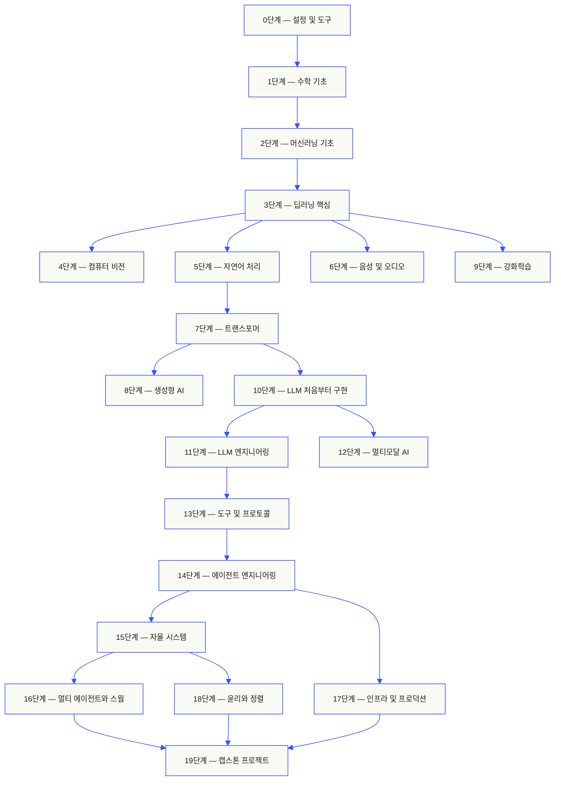
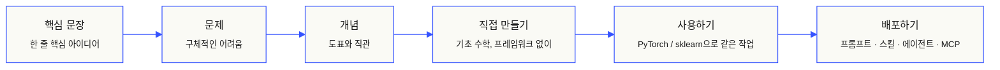

<p align="center"><sub>AI의 도움을 받은 번역입니다. 기준 문서는 <a href="../../README.md">영어판</a>입니다.</sub></p>
<p align="center">
  
</p>

<p align="center">
  <a href="../../README.md">🇬🇧 English</a> ·
  <a href="../../i18n/zh/README.md">🇨🇳 简体中文</a> ·
  <a href="../../i18n/zh-TW/README.md">🇹🇼 繁體中文（台灣）</a> ·
  <a href="../../i18n/ja/README.md">🇯🇵 日本語</a> ·
  <a href="../../i18n/ko/README.md">🇰🇷 한국어</a> ·
  <a href="../../i18n/pt/README.md">🇵🇹 Português</a> ·
  <a href="../../i18n/pt-BR/README.md">🇧🇷 Português (Brasil)</a> ·
  <a href="../../i18n/es/README.md">🇪🇸 Español</a> ·
  <a href="../../i18n/de/README.md">🇩🇪 Deutsch</a> ·
  <a href="../../i18n/fr/README.md">🇫🇷 Français</a> ·
  <a href="../../i18n/it/README.md">🇮🇹 Italiano</a> ·
  <a href="../../i18n/nl/README.md">🇳🇱 Nederlands</a> ·
  <a href="../../i18n/pl/README.md">🇵🇱 Polski</a> ·
  <a href="../../i18n/cs/README.md">🇨🇿 Čeština</a> ·
  <a href="../../i18n/ro/README.md">🇷🇴 Română</a> ·
  <a href="../../i18n/hu/README.md">🇭🇺 Magyar</a> ·
  <a href="../../i18n/el/README.md">🇬🇷 Ελληνικά</a> ·
  <a href="../../i18n/sv/README.md">🇸🇪 Svenska</a> ·
  <a href="../../i18n/da/README.md">🇩🇰 Dansk</a> ·
  <a href="../../i18n/no/README.md">🇳🇴 Norsk</a> ·
  <a href="../../i18n/fi/README.md">🇫🇮 Suomi</a> ·
  <a href="../../i18n/ru/README.md">🇷🇺 Русский</a> ·
  <a href="../../i18n/uk/README.md">🇺🇦 Українська</a> ·
  <a href="../../i18n/tr/README.md">🇹🇷 Türkçe</a> ·
  <a href="../../i18n/he/README.md">🇮🇱 עברית</a> ·
  <a href="../../i18n/ar/README.md">🇸🇦 العربية</a> ·
  <a href="../../i18n/fa/README.md">🇮🇷 فارسی</a> ·
  <a href="../../i18n/hi/README.md">🇮🇳 हिन्दी</a> ·
  <a href="../../i18n/bn/README.md">🇧🇩 বাংলা</a> ·
  <a href="../../i18n/ur/README.md">🇵🇰 اردو</a> ·
  <a href="../../i18n/th/README.md">🇹🇭 ไทย</a> ·
  <a href="../../i18n/vi/README.md">🇻🇳 Tiếng Việt</a> ·
  <a href="../../i18n/id/README.md">🇮🇩 Bahasa Indonesia</a> ·
  <a href="../../i18n/tl/README.md">🇵🇭 Tagalog</a>
</p>

<p align="center">
  <a href="../../LICENSE"></a>
  <a href="../../ROADMAP.md"></a>
  <a href="#contents"></a>
  <a href="https://github.com/rohitg00/ai-engineering-from-scratch/stargazers"></a>
  <a href="https://aiengineeringfromscratch.com"></a>
  <p align="center">
 <a href="https://www.star-history.com/rohitg00/ai-engineering-from-scratch">
  <picture><source media="(prefers-color-scheme: dark)" srcset="https://api.star-history.com/badge?repo=rohitg00/ai-engineering-from-scratch&type=rank&theme=dark" /><source media="(prefers-color-scheme: light)" srcset="https://api.star-history.com/badge?repo=rohitg00/ai-engineering-from-scratch&type=rank" /></picture> <picture><source media="(prefers-color-scheme: dark)" srcset="https://api.star-history.com/badge?repo=rohitg00/ai-engineering-from-scratch&type=trending&theme=dark" /><source media="(prefers-color-scheme: light)" srcset="https://api.star-history.com/badge?repo=rohitg00/ai-engineering-from-scratch&type=trending" /></picture>
 </a>
</p>
</p>

### 후원사

<p align="center">
  <a href="https://serpapi.com/ai-engineering-from-scratch"><picture><source media="(min-width: 768px)" srcset="../../assets/sponsors/serpapi-banner-compact.png" width="48%"></picture></a>
  <a href="https://nitrostack.ai/referral/aiengineeringfromscratch"><picture><source media="(min-width: 768px)" srcset="../../assets/sponsors/nitrostack-banner-equal.png" width="48%"></picture></a>
</p>

<p align="center">
  <sub><span>여러분의 후원으로 모든 레슨을 무료 오픈소스로 유지할 수 있습니다.</span> <a href="#supporters">모든 후원자 보기</a> · <a href="../../SPONSORS.md">후원자가 되세요</a></sub>
</p>

```text
░░░▒▒▒░░░▒▒▒░░░▒▒▒░░░▒▒▒░░░▒▒▒░░░▒▒▒░░░▒▒▒░░░▒▒▒░░░▒▒▒░░░▒▒▒░░░▒▒▒░░░▒▒▒░░░▒▒▒░░░▒▒▒░░░▒▒▒
```
> **학생의 84%는 이미 AI 도구를 사용하지만, 이를 전문적으로 다룰 준비가 되었다고 느끼는 사람은 18%뿐입니다.** 이 커리큘럼이 그 간극을 메웁니다.
>
> 523개 레슨. 20단계. 약 342시간. Python, TypeScript, Rust, Julia. 모든 레슨은 프롬프트, 스킬, 에이전트, MCP 서버와 같은 재사용 가능한 산출물을 제공합니다. 무료 오픈소스, MIT 라이선스.
>
> AI를 배우기만 하는 것이 아닙니다. 직접 만듭니다. 처음부터 끝까지, 손으로.

<!-- STATS:START (generated from site/stats.json by build.js — do not edit by hand) -->
<p align="center"><sub><b>114,584</b>명 독자 &nbsp;·&nbsp; <b>181,995</b> 지난 30일간 페이지 조회수 &nbsp;·&nbsp; 2026-08-29 기준</sub></p>
<!-- STATS:END -->

## 여기서 시작하세요: 만들고 싶은 것을 선택하세요

시작하기 전에 523개 레슨을 모두 훑어볼 필요는 없습니다. 목표 하나를 고르세요. 각 링크는 GitHub 또는 웹사이트에서 같은 교육과정을 엽니다. 두 버전 모두 같은 레슨 코드를 사용합니다.

| 목표 | GitHub에서 학습 | 웹사이트에서 학습 |
|---|---|---|
| 입문자로서 기초를 모두 다지고 싶습니다 | [0단계: 설정 및 도구](../../phases/00-setup-and-tooling/) | [개발 환경](https://aiengineeringfromscratch.com/lesson?path=phases/00-setup-and-tooling/01-dev-environment) |
| Python을 알고 있으며 수학과 머신러닝 기초를 배우고 싶습니다 | [1단계: 수학 기초](../../phases/01-math-foundations/) | [선형대수 직관](https://aiengineeringfromscratch.com/lesson?path=phases/01-math-foundations/01-linear-algebra-intuition) |
| 프로덕션용 LLM 애플리케이션을 만들고 싶습니다 | [11단계: LLM 엔지니어링](../../phases/11-llm-engineering/) | [프롬프트 엔지니어링](https://aiengineeringfromscratch.com/lesson?path=phases/11-llm-engineering/01-prompt-engineering) |
| 에이전트를 만들고 싶습니다 | [14단계: 에이전트 엔지니어링](../../phases/14-agent-engineering/) | [에이전트 루프](https://aiengineeringfromscratch.com/lesson?path=phases/14-agent-engineering/01-the-agent-loop) |
| 실제 저장소에서 코딩 에이전트를 사용하고 싶습니다 | [에이전트 지원 엔지니어링 학습 경로](../../learning-paths/using-coding-agents.json) | [에이전트 지원 엔지니어링](https://aiengineeringfromscratch.com/lesson?path=phases/14-agent-engineering/31-agent-workbench-why-models-fail&learningPath=using-coding-agents) |
| 구현 전에 무엇을 만들지 올바르게 판단하고 싶습니다 | [제품 판단 및 전달 학습 경로](../../learning-paths/shaping-the-build.json) | [제품 판단 및 전달](https://aiengineeringfromscratch.com/lesson?path=phases/14-agent-engineering/47-outcomes-before-output&learningPath=shaping-the-build) |
| Model Context Protocol(MCP)로 구축하고 싶습니다 | [Model Context Protocol(MCP) 학습 경로](../../phases/13-tools-and-protocols/README.md#model-context-protocol-mcp-path) | [Model Context Protocol(MCP) 경로](https://aiengineeringfromscratch.com/lesson?path=phases/13-tools-and-protocols/06-mcp-fundamentals&learningPath=model-context-protocol) |
| Agent Skills를 작성하고 배포하고 싶습니다 | [집중 Agent Skills 학습 경로](../../phases/13-tools-and-protocols/README.md#agent-skills-fast-path) | [Agent Skills 경로](https://aiengineeringfromscratch.com/lesson?path=phases/13-tools-and-protocols/22-skills-and-agent-sdks&learningPath=agent-skills) |
| Claude 인증을 준비하고 싶습니다 | [인증 과정 시작하기](../../certifications/claude/GETTING_STARTED.md) | [인증 아카데미](https://aiengineeringfromscratch.com/certifications.html) |
| MCP Associate(MCPA) 인증을 준비하고 싶습니다 | [MCPA 과정 시작하기](../../certifications/mcpa/GETTING_STARTED.md) | [MCPA 트랙](https://aiengineeringfromscratch.com/certification?id=mcpa-f) |

어디서 시작해야 할지 모르겠다면 [`start-learning` 수준 진단 튜터](../../skills/start-learning/SKILL.md) 또는 [웹사이트 사전 요건 안내](https://aiengineeringfromscratch.com/prereqs.html)를 이용하세요.

4개 핵심 분야와 6개 진로를 [AI 엔지니어링 학습 경로](https://aiengineeringfromscratch.com/learning-paths.html)에서 비교해 보세요.

### 모든 레슨을 같은 방식으로 활용하세요

1. **읽기**: `docs/en.md`를 읽고 핵심 개념을 자신의 말로 설명합니다.
2. **직접 입력하고 만들기**: 코드 블록을 장식처럼 보는 데 그치지 말고 중요한 코드를 직접 입력해 구현합니다.
3. **실행하기**: `README.md`와 `phases/`가 있는 저장소 루트에서 레슨 명령을 실행합니다.
4. **근거 남기기**: 명령, 작업 디렉터리, 종료 코드, 의미 있는 출력, 변경하거나 만든 산출물을 기록합니다.
5. **계속 진행하기**: 출력을 설명하고 추측 없이 작은 변경 하나를 할 수 있을 때 다음으로 넘어갑니다.

레슨 페이지의 명령은 디렉터리를 변경하라고 명시한 경우를 제외하면 저장소 루트를 기준으로 한 경로입니다. 레슨에 여러 언어 구현이 있으면 학습 중인 언어의 구현을 실행하세요.

### 저장소를 복제하고 첫 실행 근거를 만드세요

```bash
git clone https://github.com/rohitg00/ai-engineering-from-scratch.git
cd ai-engineering-from-scratch
python3 phases/00-setup-and-tooling/01-dev-environment/code/verify.py --route beginner
python3 phases/01-math-foundations/01-linear-algebra-intuition/code/vectors.py
```
사전 점검은 지금 필요한 요건과 나중에 필요한 도구를 구분합니다. 필수 점검에 실패하면 감지된 원인과 해결 명령을 표시합니다. 두 번째 명령은 의존성이 없는 레슨을 실행하며, 행렬과 벡터의 곱이 신경망 계층 내부에서 수행되는 연산임을 보여 줍니다. 터미널 출력을 첫 실행 근거로 저장하세요.

## 30초 만에 AI 튜터 추가하기

Node.js, `npx`, 스킬을 지원하는 코딩 에이전트가 이미 설치되어 있다면 두 명령으로 코딩 에이전트를 튜터로 사용할 수 있습니다. 튜터를 설치하거나 읽는 데 저장소 복제는 필요하지 않습니다. 특정 학습 경로의 실습을 실행하려면 `python3`가 필요합니다. Agent Skills 호스트 실습에는 사용할 호스트를 선택하고 쓰기 가능한 사용자 또는 프로젝트 스킬 범위를 지정해야 합니다.

먼저 로컬 요건을 확인하세요.

```bash
node --version
npx --version
python3 --version
```
그런 다음 교육과정 스킬을 설치하세요. 설치 프로그램이 물으면 사용할 호스트와 범위를 선택합니다.

```bash
npx skills add rohitg00/ai-engineering-from-scratch
```
호출 문법은 호스트마다 다르며, 이식 가능한 `SKILL.md` 형식에 포함되지 않습니다.

| 호스트 | 코스 시작 | Model Context Protocol(MCP) 시작 | Agent Skills 시작 | 단계 퀴즈 실행 |
|---|---|---|---|---|
| Codex | `start-learning`을 사용하거나 `/skills`에서 선택 | `learn-mcp`를 사용하거나 `/skills`에서 선택 | `learn-agent-skills`를 사용하거나 `/skills`에서 선택 | `check-understanding 13`을 사용하거나 `/skills`에서 선택 |
| Claude Code | `/start-learning` | `/learn-mcp` | `/learn-agent-skills` | `/check-understanding 13` |
| 기타 호환 호스트 | `Use start-learning to begin the course.` | `Use learn-mcp to start the Model Context Protocol (MCP) path.` | `Use learn-agent-skills to start the Agent Skills Engineering path.` | `Use check-understanding to quiz me on Phase 13.` |

10문항 수준 진단 퀴즈로 이미 아는 내용을 확인해 시작 단계를 정하고, 개인별 학습 계획을 `LEARNING.md`에 저장합니다. 이후 `learn` 스킬이 한 세션에 한 레슨씩 개념, 수학, 코드, 퀴즈를 가르칩니다. 레슨은 이 저장소에서 바로 제공됩니다. `course-guide` 스킬은 막힌 내용을 다루는 정확한 레슨으로 안내합니다. Codex에서는 `learn`과 `course-guide`를 호출하고, Claude Code에서는 `/learn`과 `/course-guide`를 사용합니다. 다른 호환 호스트에서는 스킬 이름을 지정해 사용을 요청하세요.

Model Context Protocol(MCP)만 배우려면 호스트에 맞는 MCP 호출 방법을 사용하세요. `MCP-LEARNING.md`를 만들고 무상태 요청, 전송 방식, 양방향 작업, 보안, 신뢰성, 레지스트리 거버넌스, 적합성 근거를 다루는 17개 레슨 경로를 따릅니다. 정확한 순서와 체크포인트는 [Model Context Protocol(MCP) 매니페스트](../../learning-paths/model-context-protocol.json)에 있습니다.

Agent Skills만 배우려면 호스트에 맞는 Agent Skills 호출 방법을 사용하세요. `AGENT-SKILLS-LEARNING.md`를 만들고 계약, 탐색, 호출, 샌드박스 경계, 평가를 통한 출시, 실제 호스트 간 이식성을 다루는 일관된 5개 레슨 경로를 따릅니다. 웹에서는 [Agent Skills 경로](https://aiengineeringfromscratch.com/lesson?path=phases/13-tools-and-protocols/22-skills-and-agent-sdks&learningPath=agent-skills)에서 시작할 수 있습니다.

설치 프로그램은 설정할 수 있는 호스트를 나열하고 설치 위치를 묻습니다. Node.js, `npx`, `python3`, 지원되는 호스트 또는 쓰기 가능한 범위가 아직 없다면 웹사이트를 이용하거나 `docs/en.md`를 직접 읽으세요. 이 경로로 개념을 익힐 수 있지만, 실제 호스트 검색, 호출, 스크립트, 제거 근거는 사전 점검을 실행할 수 있을 때까지 보류됩니다. [aiengineeringfromscratch.com](https://aiengineeringfromscratch.com)에서 레슨을 읽을 수 있습니다.

## 이 교육과정은 이렇게 진행됩니다

AI 학습 자료는 논문, 파인튜닝 게시물, 화려한 에이전트 데모처럼 흩어진 조각으로 제공되는 경우가 많습니다. 이런 조각들이 서로 잘 맞물리는 일은 드뭅니다. 챗봇을 배포하고도 손실 곡선을 설명하지 못하거나, 에이전트에 함수를 연결하고도 그 에이전트를 호출하는 모델 안에서 어텐션이 무슨 역할을 하는지 설명하지 못할 수 있습니다.

이 교육과정은 전체 내용을 연결하는 뼈대입니다. 20단계, 523개 레슨, 4개 언어(Python, TypeScript, Rust, Julia)로 한쪽 끝의 선형대수부터 다른 쪽 끝의 자율 스웜까지 다룹니다. 모든 알고리즘을 먼저 기초 수학에서부터 구현합니다. 역전파, 토크나이저, 어텐션, 에이전트 루프를 배우고 나면 PyTorch가 등장할 때 내부에서 무슨 일이 일어나는지 이미 이해하고 있습니다.

모든 레슨은 같은 순서로 진행됩니다. 문제를 읽고, 수학을 유도하고, 코드를 작성하고, 테스트를 실행하고, 산출물을 보관합니다. 5분짜리 동영상이나 복사-붙여넣기식 배포, 일일이 이끄는 방식에 의존하지 않습니다. 무료 오픈소스이며 자신의 노트북에서 실행할 수 있습니다.

```text
░░░▒▒▒░░░▒▒▒░░░▒▒▒░░░▒▒▒░░░▒▒▒░░░▒▒▒░░░▒▒▒░░░▒▒▒░░░▒▒▒░░░▒▒▒░░░▒▒▒░░░▒▒▒░░░▒▒▒░░░▒▒▒░░░▒▒▒
```
## 커리큘럼의 구조

20개 단계가 차곡차곡 쌓입니다. 수학이 기초이고 에이전트와 프로덕션이 꼭대기입니다. 아래 단계를 이미 알고 있다면 앞부분을 건너뛰어도 됩니다. 다만 기초를 건너뛰고 나서 상위 단계가 왜 고장 나는지 고민하지는 마세요.


```text
░░░▒▒▒░░░▒▒▒░░░▒▒▒░░░▒▒▒░░░▒▒▒░░░▒▒▒░░░▒▒▒░░░▒▒▒░░░▒▒▒░░░▒▒▒░░░▒▒▒░░░▒▒▒░░░▒▒▒░░░▒▒▒░░░▒▒▒
```
## 레슨의 구조

각 레슨은 전용 폴더에 있으며, 교육과정 전체에서 같은 구조를 사용합니다.

```text
phases/<NN>-<phase-name>/<NN>-<lesson-name>/
├── code/      실행 가능한 구현(Python, TypeScript, Rust, Julia)
├── docs/
│   └── en.md  레슨 설명
└── outputs/   레슨에서 만드는 프롬프트, 스킬, 에이전트 또는 MCP 서버
```
모든 레슨은 여섯 단계로 진행됩니다. 핵심은 *Build It / Use It*의 흐름입니다. 먼저 알고리즘을 처음부터 구현한 다음 프로덕션 라이브러리로 같은 작업을 실행합니다. 더 작은 버전을 직접 작성했기 때문에 프레임워크가 무엇을 하는지 이해할 수 있습니다.


## 시작하기

시작 방법은 세 가지입니다. 하나를 선택하세요.

**옵션 A — 터미널에서 학습하기(권장).** 위의 Node.js, `npx`, 호스트, 범위 사전 점검을 마친 뒤 학습 스킬을 호환되는 에이전트에 설치하고 코스를 따라 학습합니다.

```bash
npx skills add rohitg00/ai-engineering-from-scratch
```
위의 호스트별 호출 표를 사용하세요. 설치된 스킬로 `start-learning`, `learn`, `course-guide`와 집중 학습 경로인 `learn-mcp`, `learn-agent-skills`를 사용할 수 있습니다. 레슨 설명은 저장소를 복제하지 않아도 이 저장소에서 바로 제공됩니다. 저장소 코드를 사용하는 명령과 실행 가능한 MCP 또는 Agent Skills 실습에는 로컬 복제가 필요합니다. 진행 상황은 프로젝트의 `LEARNING.md`, `MCP-LEARNING.md`, `AGENT-SKILLS-LEARNING.md`에 저장되므로 다음 세션에서 이어서 학습할 수 있습니다.

**옵션 B — 읽기.** [aiengineeringfromscratch.com](https://aiengineeringfromscratch.com)에서 완료된 레슨을 열거나 [목차](#contents)에서 단계를 펼쳐 보세요. 설정이나 복제가 필요하지 않습니다.

**옵션 C — 복제하고 실행하기.**

```bash
git clone https://github.com/rohitg00/ai-engineering-from-scratch.git
cd ai-engineering-from-scratch
python3 phases/01-math-foundations/01-linear-algebra-intuition/code/vectors.py
```
저장소를 복제하면 Claude Code에서 학습 스킬도 자동으로 불러옵니다. 또한 모든 레슨 코드를 `learn` 튜터로 실제 실행할 수 있어 읽기만 하는 데 그치지 않습니다.

### 사전 요건

- 어떤 언어로든 코드를 작성할 수 있어야 합니다(Python을 알면 도움이 됩니다).
- API를 호출하는 데 그치지 않고 AI가 **실제로 어떻게 작동하는지** 이해하고 싶어야 합니다.

### Claude 인증 준비

[Claude 인증 아카데미](../../certifications/claude/README.md)는 공식 Claude 인증 트랙 4종(Associate Foundations, Developer Foundations, Architect Foundations, Architect Professional)을 위한 무료 오픈소스 준비 과정입니다. 각 경로에는 시험 청사진에 맞춘 레슨, 실행 가능한 실습, 진단 평가, 캡스톤 작업, 전체 길이의 독창적인 모의시험이 포함됩니다.

[AI 네이티브 GitHub 시작 안내서](../../certifications/claude/GETTING_STARTED.md)는 Claude Code, Codex, ChatGPT, Cursor 및 다른 에이전트에서 사용할 수 있습니다. Codex에서는 `claude-certification`을, Claude Code에서는 `/claude-certification`을 실행하세요. 다른 호스트에서는 `claude-certification`을 사용하라고 요청하면 됩니다. 안내서는 트랙을 선택하고 `CLAUDE-CERTIFICATION.md`에 지속적인 학습 경로를 만들며, 한 단계씩 가르치고 실제 실습을 실행한 뒤 산출물에 기반한 피드백을 제공합니다. 같은 교육과정은 [인증 웹사이트](https://aiengineeringfromscratch.com/certifications.html)에서도 이용할 수 있습니다.

이 아카데미는 공개된 시험 목표에 기반한 독립 학습 자료입니다. Anthropic과 제휴하지 않으며, 실제 시험 문제를 재현하지 않고, 합격을 보장하지도 않습니다.

### MCP Associate(MCPA) 인증 준비

[MCPA 인증 교육과정](../../certifications/mcpa/README.md)은 Linux Foundation Training을 통해 제공되는 Agentic AI Foundation의 Model Context Protocol Associate 시험을 위한 무료 오픈소스 준비 과정입니다. 34개 레슨에서 2026-07-28 무상태 프로토콜을 다섯 시험 영역에 따라 학습합니다. 이전 핸드셰이크를 대신하는 요청별 `_meta`와 `server/discover`, 여러 차례 왕복하는 요청, 구독, 캐싱, Tasks 및 MCP Apps 확장, OAuth 권한 부여, 레지스트리와 SDK 계층을 다룹니다. 모든 레슨에는 실행 가능한 표준 라이브러리 실습이 있으며, 실행 기록이 현재 와이어 형식에 맞는지 검사합니다. 트랙에는 진단 평가, 캡스톤, 공개된 청사진의 배점 비율을 따르는 전체 길이의 독창적인 모의시험 3회도 포함됩니다.

[AI 네이티브 GitHub 시작 안내서](../../certifications/mcpa/GETTING_STARTED.md)는 Claude Code, Codex, ChatGPT, Cursor 및 다른 에이전트에서 사용할 수 있습니다. Codex에서는 `mcpa-certification`을, Claude Code에서는 `/mcpa-certification`을 실행하세요. 다른 호스트에서는 `mcpa-certification`을 사용하라고 요청하면 됩니다. 안내서는 `MCPA-CERTIFICATION.md`에 지속적인 학습 경로를 만들고, 한 단계씩 가르치고, 실제 실습을 실행한 뒤 산출물에 기반한 피드백을 제공합니다. 같은 교육과정은 [MCPA 트랙 페이지](https://aiengineeringfromscratch.com/certification?id=mcpa-f)에서도 이용할 수 있습니다.

이 교육과정은 공개된 시험 목표에 기반한 독립 학습 자료입니다. Agentic AI Foundation 또는 Linux Foundation과 제휴하지 않으며, 실제 시험 문제를 재현하지 않고, 합격을 보장하지도 않습니다.

### 학습 스킬

| 스킬 | 기능 |
|---|---|
| [`start-learning`](../../skills/start-learning/SKILL.md) | 최초 안내를 진행합니다. 학습 목적을 묻고 수준 진단 퀴즈를 내며 개인별 계획을 `LEARNING.md`에 저장합니다. |
| [`learn`](../../skills/learn/SKILL.md) | 튜터 루프를 진행합니다. 워밍업 복습 후 다음 레슨을 대화형으로 가르치고 퀴즈를 내며, 진행 상황과 복습 대기열을 기록합니다. |
| [`course-guide`](../../skills/course-guide/SKILL.md) | 주제를 찾아 줍니다. “어텐션은 어디서 배우나요?” 또는 “손실이 NaN입니다”와 같은 질문에 알맞은 레슨과 링크를 안내합니다. |
| [`learn-mcp`](../../skills/learn-mcp/SKILL.md) | Model Context Protocol(MCP) 전용 튜터입니다. `MCP-LEARNING.md`를 만들고 17개 레슨 매니페스트를 따르며, 와이어 형식, 보안, 신뢰성, 적합성 근거를 기록합니다. |
| [`learn-agent-skills`](../../skills/learn-agent-skills/SKILL.md) | Agent Skills 전용 튜터입니다. `AGENT-SKILLS-LEARNING.md`를 만들고 레슨 22, 24, 25, 26, 27을 가르치며 실제 호스트 근거를 기록합니다. |
| [`claude-certification`](../../skills/claude-certification/SKILL.md) | 인증 튜터입니다. CCAO-F, CCDV-F, CCAR-F, CCAR-P 중 트랙을 선택하고 각 레슨을 가르치며 실습을 실행하고 산출물을 검토합니다. 진단과 모의시험을 진행하고 진도를 저장합니다. |
| [`mcpa-certification`](../../skills/mcpa-certification/SKILL.md) | MCPA 튜터입니다. 2026-07-28 프로토콜의 34개 레슨 `mcpa-f` 경로를 따라가며 레슨과 실습, 와이어 검사기를 실행하고 진단 및 모의시험 3회를 진행한 뒤 진도를 저장합니다. |
| [`find-your-level`](../../skills/find-your-level/SKILL.md) | 10문항 수준 진단 퀴즈로 지식을 시작 단계에 연결하고 예상 시간이 포함된 개인별 경로를 만듭니다. |
| [`check-understanding <phase>`](../../skills/check-understanding/SKILL.md) | 단계별 8문항 퀴즈를 내고 피드백과 복습할 레슨을 제안합니다. 위 호출 표의 Codex, Claude Code 또는 자연어 형식을 사용하세요. |

```text
░░░▒▒▒░░░▒▒▒░░░▒▒▒░░░▒▒▒░░░▒▒▒░░░▒▒▒░░░▒▒▒░░░▒▒▒░░░▒▒▒░░░▒▒▒░░░▒▒▒░░░▒▒▒░░░▒▒▒░░░▒▒▒░░░▒▒▒
```
## 코어 교육과정을 책으로 읽기

`phases/`의 20단계 코어 교육과정은 6권짜리 시리즈로 만들어집니다. EPUB과 PDF는 같은 코어 레슨 소스에서 CI가 빌드해 [GitHub 릴리스](https://github.com/rohitg00/ai-engineering-from-scratch/releases)마다 첨부합니다. 아래 링크는 항상 최신 릴리스로 연결됩니다. 권 번호는 시리즈 순서이며 버전이 아닙니다. 각 책에는 날짜가 표시된 판 정보가 있고 이전 판도 해당 릴리스에서 계속 내려받을 수 있습니다.

인증 교육과정은 책으로 만들지 않습니다. AI 튜터 상태, 실행 가능한 실습, 상호작용형 그림, 진단 평가, 시간 제한 모의시험은 GitHub와 웹사이트에서 계속 핵심 기능으로 제공됩니다.

| 권 | 제목 | 단계 | 다운로드 |
|---|---|---|---|
| 1 | 기초 — 수학, 도구, 고전 머신러닝 | 00-02 | [EPUB](https://github.com/rohitg00/ai-engineering-from-scratch/releases/latest/download/aiefs-vol1-foundations.epub) · [PDF](https://github.com/rohitg00/ai-engineering-from-scratch/releases/latest/download/aiefs-vol1-foundations.pdf) |
| 2 | 딥러닝 — 신경망, 비전, 음성 | 03, 04, 06 | [EPUB](https://github.com/rohitg00/ai-engineering-from-scratch/releases/latest/download/aiefs-vol2-deep-learning.epub) · [PDF](https://github.com/rohitg00/ai-engineering-from-scratch/releases/latest/download/aiefs-vol2-deep-learning.pdf) |
| 3 | 언어 — NLP 기초와 트랜스포머 | 05, 07 | [EPUB](https://github.com/rohitg00/ai-engineering-from-scratch/releases/latest/download/aiefs-vol3-language.epub) · [PDF](https://github.com/rohitg00/ai-engineering-from-scratch/releases/latest/download/aiefs-vol3-language.pdf) |
| 4 | 대규모 언어 모델 — 생성, 강화학습, 사전 학습, 엔지니어링 | 08-11 | [EPUB](https://github.com/rohitg00/ai-engineering-from-scratch/releases/latest/download/aiefs-vol4-llms.epub) · [PDF](https://github.com/rohitg00/ai-engineering-from-scratch/releases/latest/download/aiefs-vol4-llms.pdf) |
| 5 | 에이전트 — 멀티모달, 프로토콜, 자율성, 스웜 | 12-16 | [EPUB](https://github.com/rohitg00/ai-engineering-from-scratch/releases/latest/download/aiefs-vol5-agents.epub) · [PDF](https://github.com/rohitg00/ai-engineering-from-scratch/releases/latest/download/aiefs-vol5-agents.pdf) |
| 6 | 프로덕션 — 인프라, 안전성, 캡스톤 | 17-19 | [EPUB](https://github.com/rohitg00/ai-engineering-from-scratch/releases/latest/download/aiefs-vol6-production.epub) · [PDF](https://github.com/rohitg00/ai-engineering-from-scratch/releases/latest/download/aiefs-vol6-production.pdf) |

책은 특정 시점의 스냅샷이고 이 저장소는 계속 갱신되는 판입니다. 각 장은 레슨의 애니메이션 그림, 퀴즈, 실행 가능한 코드로 연결됩니다. `python3 scripts/build_book.py`로 로컬에서 만들 수 있습니다(pandoc 필요). 파이프라인 세부 정보는 [book/README.md](../../book/README.md)를 참조하세요.

```text
░░░▒▒▒░░░▒▒▒░░░▒▒▒░░░▒▒▒░░░▒▒▒░░░▒▒▒░░░▒▒▒░░░▒▒▒░░░▒▒▒░░░▒▒▒░░░▒▒▒░░░▒▒▒░░░▒▒▒░░░▒▒▒░░░▒▒▒
```

## 모든 레슨은 산출물을 만듭니다

다른 교육과정은 “X를 배웠습니다. 축하합니다.”로 끝납니다. 이 교육과정의 각 레슨은 일상적인 작업 흐름에 설치하거나 붙여 넣어 사용할 수 있는 **재사용 가능한 도구**로 마무리됩니다.

<table>
<tr>
<th align="left" width="25%"><br/><sub>FIG_001 · A</sub><br/><b>프롬프트</b></th>
<th align="left" width="25%"><br/><sub>FIG_001 · B</sub><br/><b>스킬</b></th>
<th align="left" width="25%"><br/><sub>FIG_001 · C</sub><br/><b>에이전트</b></th>
<th align="left" width="25%"><br/><sub>FIG_001 · D</sub><br/><b>MCP 서버</b></th>
</tr>
<tr>
<td valign="top">특정 작업에 전문가 수준의 도움을 받으려면 어떤 AI 어시스턴트에든 붙여 넣어 사용합니다.</td>
<td valign="top">`SKILL.md`를 읽는 Claude, Cursor, Codex, OpenClaw, Hermes 등의 에이전트에 추가할 수 있습니다.</td>
<td valign="top">14단계에서 직접 작성한 루프를 자율 작업자로 배포합니다.</td>
<td valign="top">MCP 호환 클라이언트에 연결해 사용합니다. 13단계에서 엔드투엔드로 구축합니다.</td>
</tr>
</table>

> `python3 scripts/install_skills.py <target>`로 모두 설치할 수 있습니다. 숙제가 아니라 실제 도구입니다.
> 교육과정을 마치면 직접 만들고 원리를 이해한 산출물 523개를 포트폴리오에 갖추게 됩니다.
### FIG_002 · 구현 예시

14단계 레슨 1: 에이전트 루프. 의존성이 없는 순수 Python 코드 약 120줄입니다.

<table>
<tr>
<td valign="top" width="50%">

**`code/agent_loop.py`** &nbsp; <sub><i>직접 만들기</i></sub>

```python
def run(query, tools):
    history = [user(query)]
    for step in range(MAX_STEPS):
        msg = llm(history)
        if msg.tool_calls:
            for call in msg.tool_calls:
                result = tools[call.name](**call.args)
                history.append(tool_result(call.id, result))
            continue
        return msg.content
    raise StepLimitExceeded
```
</td>
<td valign="top" width="50%">

**`outputs/skill-agent-loop.md`** &nbsp; <sub><i>배포하기</i></sub>

```markdown
---
name: agent-loop
description: ReAct-style loop for any tool list
phase: 14
lesson: 01
---

Implement a minimal agent loop that...
```
**`outputs/prompt-debug-agent.md`**

```markdown
You are an agent debugger. Given the trace
of an agent run, identify the step where
the agent went wrong and explain why...
```
</td>
</tr>
</table>

```text
░░░▒▒▒░░░▒▒▒░░░▒▒▒░░░▒▒▒░░░▒▒▒░░░▒▒▒░░░▒▒▒░░░▒▒▒░░░▒▒▒░░░▒▒▒░░░▒▒▒░░░▒▒▒░░░▒▒▒░░░▒▒▒░░░▒▒▒
```
<a id="contents"></a>

## 목차

총 20단계입니다. 각 단계를 클릭하면 레슨 목록이 펼쳐집니다.

<a id="phase-0"></a>
### 0단계: 설정 및 도구 `12개 레슨`

> 앞으로 진행할 모든 내용을 위해 개발 환경을 준비하세요.

| # | 레슨 | 유형 | 언어 |
|:---:|--------|:----:|------|
| 01 | [개발 환경](../../phases/00-setup-and-tooling/01-dev-environment/) | 구현 | Python |
| 02 | [Git과 협업](../../phases/00-setup-and-tooling/02-git-and-collaboration/) | 학습 | — |
| 03 | [GPU 설정과 클라우드](../../phases/00-setup-and-tooling/03-gpu-setup-and-cloud/) | 구현 | Python |
| 04 | [API와 키](../../phases/00-setup-and-tooling/04-apis-and-keys/) | 구현 | Python |
| 05 | [Jupyter 노트북](../../phases/00-setup-and-tooling/05-jupyter-notebooks/) | 구현 | Python |
| 06 | [Python 환경](../../phases/00-setup-and-tooling/06-python-environments/) | 구현 | Shell |
| 07 | [AI용 Docker](../../phases/00-setup-and-tooling/07-docker-for-ai/) | 구현 | Docker |
| 08 | [에디터 설정](../../phases/00-setup-and-tooling/08-editor-setup/) | 구현 | — |
| 09 | [데이터 관리](../../phases/00-setup-and-tooling/09-data-management/) | 구현 | Python |
| 10 | [터미널과 셸](../../phases/00-setup-and-tooling/10-terminal-and-shell/) | 학습 | — |
| 11 | [AI를 위한 Linux](../../phases/00-setup-and-tooling/11-linux-for-ai/) | 학습 | — |
| 12 | [디버깅과 프로파일링](../../phases/00-setup-and-tooling/12-debugging-and-profiling/) | 구현 | Python |

<details id="phase-1">
<summary><b>1단계 — 수학 기초</b> &nbsp;<code>22 개 레슨</code>&nbsp; <em>코드를 통해 모든 AI 알고리즘의 바탕이 되는 직관을 익힙니다.</em></summary>
<br/>

| # | 레슨 | 유형 | 언어 |
|:---:|--------|:----:|------|
| 01 | [선형대수 직관](../../phases/01-math-foundations/01-linear-algebra-intuition/) | 학습 | Python, Julia |
| 02 | [벡터, 행렬과 연산](../../phases/01-math-foundations/02-vectors-matrices-operations/) | 구현 | Python, Julia |
| 03 | [행렬 변환과 고윳값](../../phases/01-math-foundations/03-matrix-transformations/) | 구현 | Python, Julia |
| 04 | [머신러닝을 위한 미적분: 도함수와 기울기](../../phases/01-math-foundations/04-calculus-for-ml/) | 학습 | Python |
| 05 | [연쇄 법칙과 자동 미분](../../phases/01-math-foundations/05-chain-rule-and-autodiff/) | 구현 | Python |
| 06 | [확률과 분포](../../phases/01-math-foundations/06-probability-and-distributions/) | 학습 | Python |
| 07 | [베이즈 정리와 통계적 사고](../../phases/01-math-foundations/07-bayes-theorem/) | 구현 | Python |
| 08 | [최적화: 경사 하강법 계열](../../phases/01-math-foundations/08-optimization/) | 구현 | Python |
| 09 | [정보 이론: 엔트로피와 KL 발산](../../phases/01-math-foundations/09-information-theory/) | 학습 | Python |
| 10 | [차원 축소: PCA, t-SNE, UMAP](../../phases/01-math-foundations/10-dimensionality-reduction/) | 구현 | Python |
| 11 | [특이값 분해](../../phases/01-math-foundations/11-singular-value-decomposition/) | 구현 | Python, Julia |
| 12 | [텐서 연산](../../phases/01-math-foundations/12-tensor-operations/) | 구현 | Python |
| 13 | [수치 안정성](../../phases/01-math-foundations/13-numerical-stability/) | 구현 | Python |
| 14 | [노름과 거리](../../phases/01-math-foundations/14-norms-and-distances/) | 구현 | Python |
| 15 | [머신러닝을 위한 통계](../../phases/01-math-foundations/15-statistics-for-ml/) | 구현 | Python |
| 16 | [샘플링 방법](../../phases/01-math-foundations/16-sampling-methods/) | 구현 | Python |
| 17 | [선형 시스템](../../phases/01-math-foundations/17-linear-systems/) | 구현 | Python |
| 18 | [볼록 최적화](../../phases/01-math-foundations/18-convex-optimization/) | 구현 | Python |
| 19 | [AI를 위한 복소수](../../phases/01-math-foundations/19-complex-numbers/) | 학습 | Python |
| 20 | [푸리에 변환](../../phases/01-math-foundations/20-fourier-transform/) | 구현 | Python |
| 21 | [머신러닝을 위한 그래프 이론](../../phases/01-math-foundations/21-graph-theory/) | 구현 | Python |
| 22 | [확률 과정](../../phases/01-math-foundations/22-stochastic-processes/) | 학습 | Python |

</details>

<details id="phase-2">
<summary><b>2단계 — 머신러닝 기초</b> &nbsp;<code>18 개 레슨</code>&nbsp; <em>고전 머신러닝은 오늘날에도 대부분의 프로덕션 AI를 뒷받침합니다.</em></summary>
<br/>

| # | 레슨 | 유형 | 언어 |
|:---:|--------|:----:|------|
| 01 | [머신러닝이란 무엇인가](../../phases/02-ml-fundamentals/01-what-is-machine-learning/) | 학습 | Python |
| 02 | [처음부터 구현하는 선형 회귀](../../phases/02-ml-fundamentals/02-linear-regression/) | 구현 | Python |
| 03 | [로지스틱 회귀와 분류](../../phases/02-ml-fundamentals/03-logistic-regression/) | 구현 | Python |
| 04 | [결정 트리와 랜덤 포레스트](../../phases/02-ml-fundamentals/04-decision-trees/) | 구현 | Python |
| 05 | [서포트 벡터 머신](../../phases/02-ml-fundamentals/05-support-vector-machines/) | 구현 | Python |
| 06 | [k-최근접 이웃(KNN)과 거리 척도](../../phases/02-ml-fundamentals/06-knn-and-distances/) | 구현 | Python |
| 07 | [비지도 학습: K-Means, DBSCAN](../../phases/02-ml-fundamentals/07-unsupervised-learning/) | 구현 | Python |
| 08 | [특성 공학과 선택](../../phases/02-ml-fundamentals/08-feature-engineering/) | 구현 | Python |
| 09 | [모델 평가: 지표와 교차 검증](../../phases/02-ml-fundamentals/09-model-evaluation/) | 구현 | Python |
| 10 | [편향, 분산과 학습 곡선](../../phases/02-ml-fundamentals/10-bias-variance/) | 학습 | Python |
| 11 | [앙상블 기법: 부스팅, 배깅, 스태킹](../../phases/02-ml-fundamentals/11-ensemble-methods/) | 구현 | Python |
| 12 | [하이퍼파라미터 튜닝](../../phases/02-ml-fundamentals/12-hyperparameter-tuning/) | 구현 | Python |
| 13 | [머신러닝 파이프라인과 실험 추적](../../phases/02-ml-fundamentals/13-ml-pipelines/) | 구현 | Python |
| 14 | [나이브 베이즈](../../phases/02-ml-fundamentals/14-naive-bayes/) | 구현 | Python |
| 15 | [시계열 기초](../../phases/02-ml-fundamentals/15-time-series/) | 구현 | Python |
| 16 | [이상 탐지](../../phases/02-ml-fundamentals/16-anomaly-detection/) | 구현 | Python |
| 17 | [불균형 데이터 처리](../../phases/02-ml-fundamentals/17-imbalanced-data/) | 구현 | Python |
| 18 | [특성 선택](../../phases/02-ml-fundamentals/18-feature-selection/) | 구현 | Python |

</details>

<details id="phase-3">
<summary><b>3단계 — 딥러닝 핵심</b> &nbsp;<code>13 개 레슨</code>&nbsp; <em>첫 원리부터 신경망을 구현합니다. 직접 만들기 전까지는 프레임워크를 사용하지 않습니다.</em></summary>
<br/>

| # | 레슨 | 유형 | 언어 |
|:---:|--------|:----:|------|
| 01 | [퍼셉트론: 모든 것의 시작](../../phases/03-deep-learning-core/01-the-perceptron/) | 구현 | Python |
| 02 | [다층 신경망과 순전파](../../phases/03-deep-learning-core/02-multi-layer-networks/) | 구현 | Python |
| 03 | [처음부터 구현하는 역전파](../../phases/03-deep-learning-core/03-backpropagation/) | 구현 | Python |
| 04 | [활성화 함수: ReLU, Sigmoid, GELU와 그 역할](../../phases/03-deep-learning-core/04-activation-functions/) | 구현 | Python |
| 05 | [손실 함수: MSE, 교차 엔트로피, 대조 손실](../../phases/03-deep-learning-core/05-loss-functions/) | 구현 | Python |
| 06 | [최적화 알고리즘: SGD, 모멘텀, Adam, AdamW](../../phases/03-deep-learning-core/06-optimizers/) | 구현 | Python |
| 07 | [정규화: Dropout, Weight Decay, BatchNorm](../../phases/03-deep-learning-core/07-regularization/) | 구현 | Python |
| 08 | [가중치 초기화와 학습 안정성](../../phases/03-deep-learning-core/08-weight-initialization/) | 구현 | Python |
| 09 | [학습률 스케줄과 워밍업](../../phases/03-deep-learning-core/09-learning-rate-schedules/) | 구현 | Python |
| 10 | [나만의 미니 프레임워크 만들기](../../phases/03-deep-learning-core/10-mini-framework/) | 구현 | Python |
| 11 | [PyTorch 입문](../../phases/03-deep-learning-core/11-intro-to-pytorch/) | 구현 | Python |
| 12 | [JAX 입문](../../phases/03-deep-learning-core/12-intro-to-jax/) | 구현 | Python |
| 13 | [신경망 디버깅](../../phases/03-deep-learning-core/13-debugging-neural-networks/) | 구현 | Python |

</details>

<details id="phase-4">
<summary><b>4단계 — 컴퓨터 비전</b> &nbsp;<code>28 개 레슨</code>&nbsp; <em>픽셀에서 이해까지: 이미지, 동영상, 3D, VLM, 월드 모델을 다룹니다.</em></summary>
<br/>

| # | 레슨 | 유형 | 언어 |
|:---:|--------|:----:|------|
| 01 | [이미지 기초: 픽셀, 채널, 색 공간](../../phases/04-computer-vision/01-image-fundamentals/) | 학습 | Python |
| 02 | [처음부터 구현하는 합성곱](../../phases/04-computer-vision/02-convolutions-from-scratch/) | 구현 | Python |
| 03 | [CNN: LeNet부터 ResNet까지](../../phases/04-computer-vision/03-cnns-lenet-to-resnet/) | 구현 | Python |
| 04 | [이미지 분류](../../phases/04-computer-vision/04-image-classification/) | 구현 | Python |
| 05 | [전이 학습과 파인튜닝](../../phases/04-computer-vision/05-transfer-learning/) | 구현 | Python |
| 06 | [객체 탐지: YOLO를 처음부터 구현하기](../../phases/04-computer-vision/06-object-detection-yolo/) | 구현 | Python |
| 07 | [시맨틱 분할: U-Net](../../phases/04-computer-vision/07-semantic-segmentation-unet/) | 구현 | Python |
| 08 | [인스턴스 분할: Mask R-CNN](../../phases/04-computer-vision/08-instance-segmentation-mask-rcnn/) | 구현 | Python |
| 09 | [이미지 생성: GAN](../../phases/04-computer-vision/09-image-generation-gans/) | 구현 | Python |
| 10 | [이미지 생성: 확산 모델](../../phases/04-computer-vision/10-image-generation-diffusion/) | 구현 | Python |
| 11 | [Stable Diffusion: 아키텍처와 파인튜닝](../../phases/04-computer-vision/11-stable-diffusion/) | 구현 | Python |
| 12 | [동영상 이해: 시간 모델링](../../phases/04-computer-vision/12-video-understanding/) | 구현 | Python |
| 13 | [3D 비전: 포인트 클라우드와 NeRF](../../phases/04-computer-vision/13-3d-vision-nerf/) | 구현 | Python |
| 14 | [비전 트랜스포머(ViT)](../../phases/04-computer-vision/14-vision-transformers/) | 구현 | Python |
| 15 | [실시간 비전: 엣지 배포](../../phases/04-computer-vision/15-real-time-edge/) | 구현 | Python |
| 16 | [완전한 비전 파이프라인 구축](../../phases/04-computer-vision/16-vision-pipeline-capstone/) | 구현 | Python |
| 17 | [자기 지도 비전: SimCLR, DINO, MAE](../../phases/04-computer-vision/17-self-supervised-vision/) | 구현 | Python |
| 18 | [오픈 보캐뷸러리 비전: CLIP](../../phases/04-computer-vision/18-open-vocab-clip/) | 구현 | Python |
| 19 | [OCR과 문서 이해](../../phases/04-computer-vision/19-ocr-document-understanding/) | 구현 | Python |
| 20 | [이미지 검색과 거리 학습](../../phases/04-computer-vision/20-image-retrieval-metric/) | 구현 | Python |
| 21 | [키포인트 탐지와 자세 추정](../../phases/04-computer-vision/21-keypoint-pose/) | 구현 | Python |
| 22 | [처음부터 구현하는 3D 가우시안 스플래팅](../../phases/04-computer-vision/22-3d-gaussian-splatting/) | 구현 | Python |
| 23 | [디퓨전 트랜스포머와 Rectified Flow](../../phases/04-computer-vision/23-diffusion-transformers-rectified-flow/) | 구현 | Python |
| 24 | [SAM 3와 오픈 보캐뷸러리 분할](../../phases/04-computer-vision/24-sam3-open-vocab-segmentation/) | 구현 | Python |
| 25 | [비전-언어 모델(ViT-MLP-LLM)](../../phases/04-computer-vision/25-vision-language-models/) | 구현 | Python |
| 26 | [단안 깊이 및 기하 추정](../../phases/04-computer-vision/26-monocular-depth/) | 구현 | Python |
| 27 | [다중 객체 추적과 동영상 메모리](../../phases/04-computer-vision/27-multi-object-tracking/) | 구현 | Python |
| 28 | [월드 모델과 동영상 확산](../../phases/04-computer-vision/28-world-models-video-diffusion/) | 구현 | Python |

</details>

<details id="phase-5">
<summary><b>5단계 — NLP: 기초부터 심화까지</b> &nbsp;<code>29 개 레슨</code>&nbsp; <em>언어는 지능과 상호작용하는 인터페이스입니다.</em></summary>
<br/>

| # | 레슨 | 유형 | 언어 |
|:---:|--------|:----:|------|
| 01 | [텍스트 처리: 토큰화, 어간 추출, 표제어 추출](../../phases/05-nlp-foundations-to-advanced/01-text-processing/) | 구현 | Python |
| 02 | [Bag of Words, TF-IDF와 텍스트 표현](../../phases/05-nlp-foundations-to-advanced/02-bag-of-words-tfidf/) | 구현 | Python |
| 03 | [단어 임베딩: Word2Vec을 처음부터 구현](../../phases/05-nlp-foundations-to-advanced/03-word-embeddings-word2vec/) | 구현 | Python |
| 04 | [GloVe, FastText와 서브워드 임베딩](../../phases/05-nlp-foundations-to-advanced/04-glove-fasttext-subword/) | 구현 | Python |
| 05 | [감성 분석](../../phases/05-nlp-foundations-to-advanced/05-sentiment-analysis/) | 구현 | Python |
| 06 | [개체명 인식(NER)](../../phases/05-nlp-foundations-to-advanced/06-named-entity-recognition/) | 구현 | Python |
| 07 | [품사 태깅과 구문 분석](../../phases/05-nlp-foundations-to-advanced/07-pos-tagging-parsing/) | 구현 | Python |
| 08 | [텍스트 분류: 텍스트용 CNN과 RNN](../../phases/05-nlp-foundations-to-advanced/08-cnns-rnns-for-text/) | 구현 | Python |
| 09 | [시퀀스-투-시퀀스 모델](../../phases/05-nlp-foundations-to-advanced/09-sequence-to-sequence/) | 구현 | Python |
| 10 | [어텐션 메커니즘: 돌파구](../../phases/05-nlp-foundations-to-advanced/10-attention-mechanism/) | 구현 | Python |
| 11 | [기계 번역](../../phases/05-nlp-foundations-to-advanced/11-machine-translation/) | 구현 | Python |
| 12 | [텍스트 요약](../../phases/05-nlp-foundations-to-advanced/12-text-summarization/) | 구현 | Python |
| 13 | [질의응답 시스템](../../phases/05-nlp-foundations-to-advanced/13-question-answering/) | 구현 | Python |
| 14 | [정보 검색](../../phases/05-nlp-foundations-to-advanced/14-information-retrieval-search/) | 구현 | Python |
| 15 | [토픽 모델링: LDA, BERTopic](../../phases/05-nlp-foundations-to-advanced/15-topic-modeling/) | 구현 | Python |
| 16 | [텍스트 생성](../../phases/05-nlp-foundations-to-advanced/16-text-generation-pre-transformer/) | 구현 | Python |
| 17 | [챗봇: 규칙 기반에서 신경망 기반으로](../../phases/05-nlp-foundations-to-advanced/17-chatbots-rule-to-neural/) | 구현 | Python |
| 18 | [다국어 NLP](../../phases/05-nlp-foundations-to-advanced/18-multilingual-nlp/) | 구현 | Python |
| 19 | [서브워드 토큰화: BPE, WordPiece, Unigram, SentencePiece](../../phases/05-nlp-foundations-to-advanced/19-subword-tokenization/) | 학습 | Python |
| 20 | [구조화된 출력과 제약 디코딩](../../phases/05-nlp-foundations-to-advanced/20-structured-outputs-constrained-decoding/) | 구현 | Python |
| 21 | [자연어 추론(NLI)과 텍스트 함의](../../phases/05-nlp-foundations-to-advanced/21-nli-textual-entailment/) | 학습 | Python |
| 22 | [임베딩 모델 심층 분석](../../phases/05-nlp-foundations-to-advanced/22-embedding-models-deep-dive/) | 학습 | Python |
| 23 | [RAG 청킹 전략](../../phases/05-nlp-foundations-to-advanced/23-chunking-strategies-rag/) | 구현 | Python |
| 24 | [상호 참조 해결](../../phases/05-nlp-foundations-to-advanced/24-coreference-resolution/) | 학습 | Python |
| 25 | [엔티티 연결과 중의성 해소](../../phases/05-nlp-foundations-to-advanced/25-entity-linking/) | 구현 | Python |
| 26 | [관계 추출과 지식 그래프 구축](../../phases/05-nlp-foundations-to-advanced/26-relation-extraction-kg/) | 구현 | Python |
| 27 | [LLM 평가: RAGAS, DeepEval, G-Eval](../../phases/05-nlp-foundations-to-advanced/27-llm-evaluation-frameworks/) | 구현 | Python |
| 28 | [장문맥 평가: NIAH, RULER, LongBench, MRCR](../../phases/05-nlp-foundations-to-advanced/28-long-context-evaluation/) | 학습 | Python |
| 29 | [대화 상태 추적](../../phases/05-nlp-foundations-to-advanced/29-dialogue-state-tracking/) | 구현 | Python |

</details>

<details id="phase-6">
<summary><b>6단계 — 음성 및 오디오</b> &nbsp;<code>17 개 레슨</code>&nbsp; <em>듣고, 이해하고, 말합니다.</em></summary>
<br/>

| # | 레슨 | 유형 | 언어 |
|:---:|--------|:----:|------|
| 01 | [오디오 기초: 파형, 샘플링, FFT](../../phases/06-speech-and-audio/01-audio-fundamentals) | 학습 | Python |
| 02 | [스펙트로그램, 멜 스케일과 오디오 특성](../../phases/06-speech-and-audio/02-spectrograms-mel-features) | 구현 | Python |
| 03 | [오디오 분류](../../phases/06-speech-and-audio/03-audio-classification) | 구현 | Python |
| 04 | [음성 인식(ASR)](../../phases/06-speech-and-audio/04-speech-recognition-asr) | 구현 | Python |
| 05 | [Whisper: 아키텍처와 파인튜닝](../../phases/06-speech-and-audio/05-whisper-architecture-finetuning) | 구현 | Python |
| 06 | [화자 인식과 검증](../../phases/06-speech-and-audio/06-speaker-recognition-verification) | 구현 | Python |
| 07 | [텍스트 음성 변환(TTS)](../../phases/06-speech-and-audio/07-text-to-speech) | 구현 | Python |
| 08 | [음성 복제와 음성 변환](../../phases/06-speech-and-audio/08-voice-cloning-conversion) | 구현 | Python |
| 09 | [음악 생성](../../phases/06-speech-and-audio/09-music-generation) | 구현 | Python |
| 10 | [오디오-언어 모델](../../phases/06-speech-and-audio/10-audio-language-models) | 구현 | Python |
| 11 | [실시간 오디오 처리](../../phases/06-speech-and-audio/11-real-time-audio-processing) | 구현 | Python |
| 12 | [음성 비서 파이프라인 구축](../../phases/06-speech-and-audio/12-voice-assistant-pipeline) | 구현 | Python |
| 13 | [신경망 오디오 코덱: EnCodec, SNAC, Mimi, DAC](../../phases/06-speech-and-audio/13-neural-audio-codecs) | 학습 | Python |
| 14 | [음성 활동 감지와 발화 차례 전환](../../phases/06-speech-and-audio/14-voice-activity-detection-turn-taking) | 구현 | Python |
| 15 | [음성 간 스트리밍: Moshi, Hibiki](../../phases/06-speech-and-audio/15-streaming-speech-to-speech-moshi-hibiki) | 학습 | Python |
| 16 | [음성 스푸핑 방지와 오디오 워터마킹](../../phases/06-speech-and-audio/16-anti-spoofing-audio-watermarking) | 구현 | Python |
| 17 | [오디오 평가: WER, MOS, MMAU, 리더보드](../../phases/06-speech-and-audio/17-audio-evaluation-metrics) | 학습 | Python |

</details>

<details id="phase-7">
<summary><b>7단계 — 트랜스포머 심층 분석</b> &nbsp;<code>16 개 레슨</code>&nbsp; <em>모든 것을 바꾼 아키텍처를 살펴봅니다.</em></summary>
<br/>

| # | 레슨 | 유형 | 언어 |
|:---:|--------|:----:|------|
| 01 | [트랜스포머가 필요한 이유: RNN의 한계](../../phases/07-transformers-deep-dive/01-why-transformers/) | 학습 | Python |
| 02 | [처음부터 구현하는 셀프 어텐션](../../phases/07-transformers-deep-dive/02-self-attention-from-scratch/) | 구현 | Python |
| 03 | [멀티헤드 어텐션](../../phases/07-transformers-deep-dive/03-multi-head-attention/) | 구현 | Python |
| 04 | [위치 인코딩: 사인파, RoPE, ALiBi](../../phases/07-transformers-deep-dive/04-positional-encoding/) | 구현 | Python |
| 05 | [트랜스포머 전체: 인코더와 디코더](../../phases/07-transformers-deep-dive/05-full-transformer/) | 구현 | Python |
| 06 | [BERT: 마스크 언어 모델링](../../phases/07-transformers-deep-dive/06-bert-masked-language-modeling/) | 구현 | Python |
| 07 | [GPT: 인과 언어 모델링](../../phases/07-transformers-deep-dive/07-gpt-causal-language-modeling/) | 구현 | Python |
| 08 | [T5, BART: 인코더-디코더 모델](../../phases/07-transformers-deep-dive/08-t5-bart-encoder-decoder/) | 학습 | Python |
| 09 | [비전 트랜스포머(ViT)](../../phases/07-transformers-deep-dive/09-vision-transformers/) | 구현 | Python |
| 10 | [오디오 트랜스포머: Whisper 아키텍처](../../phases/07-transformers-deep-dive/10-audio-transformers-whisper/) | 학습 | Python |
| 11 | [전문가 혼합(MoE)](../../phases/07-transformers-deep-dive/11-mixture-of-experts/) | 구현 | Python |
| 12 | [KV 캐시, FlashAttention과 추론 최적화](../../phases/07-transformers-deep-dive/12-kv-cache-flash-attention/) | 구현 | Python |
| 13 | [스케일링 법칙](../../phases/07-transformers-deep-dive/13-scaling-laws/) | 학습 | Python |
| 14 | [트랜스포머를 처음부터 만들기](../../phases/07-transformers-deep-dive/14-build-a-transformer-capstone/) | 구현 | Python |
| 15 | [어텐션 변형: 슬라이딩 윈도, 희소, 차등 어텐션](../../phases/07-transformers-deep-dive/15-attention-variants/) | 구현 | Python |
| 16 | [추측 디코딩: 초안 작성, 검증, 반복](../../phases/07-transformers-deep-dive/16-speculative-decoding/) | 구현 | Python |

</details>

<details id="phase-8">
<summary><b>8단계 — 생성형 AI</b> &nbsp;<code>15 개 레슨</code>&nbsp; <em>이미지, 동영상, 오디오, 3D 등을 생성합니다.</em></summary>
<br/>

| # | 레슨 | 유형 | 언어 |
|:---:|--------|:----:|------|
| 01 | [생성 모델: 분류 체계와 역사](../../phases/08-generative-ai/01-generative-models-taxonomy-history/) | 학습 | Python |
| 02 | [오토인코더와 VAE](../../phases/08-generative-ai/02-autoencoders-vae/) | 구현 | Python |
| 03 | [GAN: 생성자와 판별자](../../phases/08-generative-ai/03-gans-generator-discriminator/) | 구현 | Python |
| 04 | [조건부 GAN과 Pix2Pix](../../phases/08-generative-ai/04-conditional-gans-pix2pix/) | 구현 | Python |
| 05 | [StyleGAN](../../phases/08-generative-ai/05-stylegan/) | 구현 | Python |
| 06 | [확산 모델: DDPM을 처음부터 구현](../../phases/08-generative-ai/06-diffusion-ddpm-from-scratch/) | 구현 | Python |
| 07 | [잠재 확산과 Stable Diffusion](../../phases/08-generative-ai/07-latent-diffusion-stable-diffusion/) | 구현 | Python |
| 08 | [ControlNet, LoRA와 조건화](../../phases/08-generative-ai/08-controlnet-lora-conditioning/) | 구현 | Python |
| 09 | [인페인팅, 아웃페인팅과 편집](../../phases/08-generative-ai/09-inpainting-outpainting-editing/) | 구현 | Python |
| 10 | [동영상 생성](../../phases/08-generative-ai/10-video-generation/) | 구현 | Python |
| 11 | [오디오 생성](../../phases/08-generative-ai/11-audio-generation/) | 구현 | Python |
| 12 | [3D 생성](../../phases/08-generative-ai/12-3d-generation/) | 구현 | Python |
| 13 | [플로 매칭과 Rectified Flow](../../phases/08-generative-ai/13-flow-matching-rectified-flows/) | 구현 | Python |
| 14 | [평가: FID, CLIP 점수](../../phases/08-generative-ai/14-evaluation-fid-clip-score/) | 구현 | Python |
| 19 | [시각 자기회귀 모델링(VAR): 다음 스케일 예측](../../phases/08-generative-ai/19-visual-autoregressive-var/) | 구현 | Python |

</details>

<details id="phase-9">
<summary><b>9단계 — 강화학습</b> &nbsp;<code>12 개 레슨</code>&nbsp; <em>RLHF와 게임 AI의 기반을 익힙니다.</em></summary>
<br/>

| # | 레슨 | 유형 | 언어 |
|:---:|--------|:----:|------|
| 01 | [MDP, 상태, 행동과 보상](../../phases/09-reinforcement-learning/01-mdps-states-actions-rewards/) | 학습 | Python |
| 02 | [동적 계획법](../../phases/09-reinforcement-learning/02-dynamic-programming/) | 구현 | Python |
| 03 | [몬테카를로 방법](../../phases/09-reinforcement-learning/03-monte-carlo-methods/) | 구현 | Python |
| 04 | [Q-러닝과 SARSA](../../phases/09-reinforcement-learning/04-q-learning-sarsa/) | 구현 | Python |
| 05 | [심층 Q-네트워크(DQN)](../../phases/09-reinforcement-learning/05-dqn/) | 구현 | Python |
| 06 | [정책 경사법: REINFORCE](../../phases/09-reinforcement-learning/06-policy-gradients-reinforce/) | 구현 | Python |
| 07 | [액터-크리틱: A2C, A3C](../../phases/09-reinforcement-learning/07-actor-critic-a2c-a3c/) | 구현 | Python |
| 08 | [PPO](../../phases/09-reinforcement-learning/08-ppo/) | 구현 | Python |
| 09 | [보상 모델링과 RLHF](../../phases/09-reinforcement-learning/09-reward-modeling-rlhf/) | 구현 | Python |
| 10 | [멀티 에이전트 강화학습](../../phases/09-reinforcement-learning/10-multi-agent-rl/) | 구현 | Python |
| 11 | [시뮬레이션에서 실제 환경으로의 전이](../../phases/09-reinforcement-learning/11-sim-to-real-transfer/) | 구현 | Python |
| 12 | [게임을 위한 강화학습](../../phases/09-reinforcement-learning/12-rl-for-games/) | 구현 | Python |

</details>

<details id="phase-10">
<summary><b>10단계 — LLM을 처음부터 구현하기</b> &nbsp;<code>24 개 레슨</code>&nbsp; <em>대규모 언어 모델을 만들고 학습시키며 작동 원리를 이해합니다.</em></summary>
<br/>

| # | 레슨 | 유형 | 언어 |
|:---:|--------|:----:|------|
| 01 | [토크나이저: BPE, WordPiece, SentencePiece](../../phases/10-llms-from-scratch/01-tokenizers/) | 구현 | Python, Rust |
| 02 | [토크나이저를 처음부터 만들기](../../phases/10-llms-from-scratch/02-building-a-tokenizer/) | 구현 | Python |
| 03 | [사전 학습을 위한 데이터 파이프라인](../../phases/10-llms-from-scratch/03-data-pipelines/) | 구현 | Python |
| 04 | [미니 GPT(1억 2,400만 매개변수) 사전 학습](../../phases/10-llms-from-scratch/04-pre-training-mini-gpt/) | 구현 | Python |
| 05 | [분산 학습, FSDP, DeepSpeed](../../phases/10-llms-from-scratch/05-scaling-distributed/) | 구현 | Python |
| 06 | [지시 튜닝: SFT](../../phases/10-llms-from-scratch/06-instruction-tuning-sft/) | 구현 | Python |
| 07 | [RLHF: 보상 모델과 PPO](../../phases/10-llms-from-scratch/07-rlhf/) | 구현 | Python |
| 08 | [DPO: 직접 선호 최적화](../../phases/10-llms-from-scratch/08-dpo/) | 구현 | Python |
| 09 | [Constitutional AI와 자기 개선](../../phases/10-llms-from-scratch/09-constitutional-ai-self-improvement/) | 구현 | Python |
| 10 | [평가: 벤치마크와 평가](../../phases/10-llms-from-scratch/10-evaluation/) | 구현 | Python |
| 11 | [양자화: INT8, GPTQ, AWQ, GGUF](../../phases/10-llms-from-scratch/11-quantization/) | 구현 | Python |
| 12 | [추론 최적화](../../phases/10-llms-from-scratch/12-inference-optimization/) | 구현 | Python |
| 13 | [완전한 LLM 파이프라인 구축](../../phases/10-llms-from-scratch/13-building-complete-llm-pipeline/) | 구현 | Python |
| 14 | [오픈 모델: 아키텍처 살펴보기](../../phases/10-llms-from-scratch/14-open-models-architecture-walkthroughs/) | 학습 | Python |
| 15 | [추측 디코딩과 EAGLE-3](../../phases/10-llms-from-scratch/15-speculative-decoding-eagle3/) | 구현 | Python |
| 16 | [차등 어텐션(V2)](../../phases/10-llms-from-scratch/16-differential-attention-v2/) | 구현 | Python |
| 17 | [네이티브 희소 어텐션(DeepSeek NSA)](../../phases/10-llms-from-scratch/17-native-sparse-attention/) | 구현 | Python |
| 18 | [다중 토큰 예측(MTP)](../../phases/10-llms-from-scratch/18-multi-token-prediction/) | 구현 | Python |
| 19 | [DualPipe 병렬화](../../phases/10-llms-from-scratch/19-dualpipe-parallelism/) | 학습 | Python |
| 20 | [DeepSeek-V3 아키텍처 살펴보기](../../phases/10-llms-from-scratch/20-deepseek-v3-walkthrough/) | 학습 | Python |
| 21 | [Jamba: SSM-트랜스포머 하이브리드](../../phases/10-llms-from-scratch/21-jamba-hybrid-ssm-transformer/) | 학습 | Python |
| 22 | [비동기 및 Hogwild! 추론](../../phases/10-llms-from-scratch/22-async-hogwild-inference/) | 구현 | Python |
| 25 | [추측 디코딩과 EAGLE](../../phases/10-llms-from-scratch/25-speculative-decoding/) | 구현 | Python |
| 34 | [그래디언트 체크포인팅과 활성화 재계산](../../phases/10-llms-from-scratch/34-gradient-checkpointing/) | 구현 | Python |

</details>

<details id="phase-11">
<summary><b>11단계 — LLM 엔지니어링</b> &nbsp;<code>17 개 레슨</code>&nbsp; <em>LLM을 프로덕션 환경에서 활용합니다.</em></summary>
<br/>

| # | 레슨 | 유형 | 언어 |
|:---:|--------|:----:|------|
| 01 | [프롬프트 엔지니어링: 기법과 패턴](../../phases/11-llm-engineering/01-prompt-engineering/) | 구현 | Python |
| 02 | [퓨샷, CoT, Tree-of-Thought](../../phases/11-llm-engineering/02-few-shot-cot/) | 구현 | Python |
| 03 | [구조화된 출력](../../phases/11-llm-engineering/03-structured-outputs/) | 구현 | Python |
| 04 | [임베딩과 벡터 표현](../../phases/11-llm-engineering/04-embeddings/) | 구현 | Python |
| 05 | [컨텍스트 엔지니어링](../../phases/11-llm-engineering/05-context-engineering/) | 구현 | Python |
| 06 | [RAG: 검색 증강 생성](../../phases/11-llm-engineering/06-rag/) | 구현 | Python |
| 07 | [고급 RAG: 청킹과 재순위화](../../phases/11-llm-engineering/07-advanced-rag/) | 구현 | Python |
| 08 | [LoRA와 QLoRA를 활용한 파인튜닝](../../phases/11-llm-engineering/08-fine-tuning-lora/) | 구현 | Python |
| 09 | [함수 호출과 도구 사용](../../phases/11-llm-engineering/09-function-calling/) | 구현 | Python |
| 10 | [평가와 테스트](../../phases/11-llm-engineering/10-evaluation/) | 구현 | Python |
| 11 | [캐싱, 속도 제한과 비용](../../phases/11-llm-engineering/11-caching-cost/) | 구현 | Python |
| 12 | [가드레일과 안전성](../../phases/11-llm-engineering/12-guardrails/) | 구현 | Python |
| 13 | [프로덕션용 LLM 앱 구축](../../phases/11-llm-engineering/13-production-app/) | 구현 | Python |
| 14 | [Model Context Protocol(MCP)](../../phases/11-llm-engineering/14-model-context-protocol/) | 구현 | Python |
| 15 | [프롬프트 캐싱과 컨텍스트 캐싱](../../phases/11-llm-engineering/15-prompt-caching/) | 구현 | Python |
| 16 | [에이전트 상태 머신: 그래프, 노드, 체크포인트](../../phases/11-llm-engineering/16-langgraph-state-machines/) | 구현 | Python |
| 17 | [에이전트 프레임워크의 장단점](../../phases/11-llm-engineering/17-agent-framework-tradeoffs/) | 학습 | Python |

</details>

<details id="phase-12">
<summary><b>12단계 — 멀티모달 AI</b> &nbsp;<code>25 개 레슨</code>&nbsp; <em>ViT 패치부터 컴퓨터 사용 에이전트까지, 여러 모달리티를 넘나들며 보고, 듣고, 읽고, 추론합니다.</em></summary>
<br/>

| # | 레슨 | 유형 | 언어 |
|:---:|--------|:----:|------|
| 01 | [비전 트랜스포머와 패치 토큰 기본 요소](../../phases/12-multimodal-ai/01-vision-transformer-patch-tokens/) | 학습 | Python |
| 02 | [CLIP과 대조 학습 기반 시각-언어 사전 학습](../../phases/12-multimodal-ai/02-clip-contrastive-pretraining/) | 구현 | Python |
| 03 | [모달리티 연결 다리로서의 BLIP-2 Q-Former](../../phases/12-multimodal-ai/03-blip2-qformer-bridge/) | 구현 | Python |
| 04 | [Flamingo와 게이트 크로스 어텐션](../../phases/12-multimodal-ai/04-flamingo-gated-cross-attention/) | 학습 | Python |
| 05 | [LLaVA와 시각 지시 튜닝](../../phases/12-multimodal-ai/05-llava-visual-instruction-tuning/) | 구현 | Python |
| 06 | [임의 해상도 비전: Patch-n'-Pack과 NaFlex](../../phases/12-multimodal-ai/06-any-resolution-patch-n-pack/) | 구현 | Python |
| 07 | [오픈 웨이트 VLM 레시피: 실제로 중요한 것](../../phases/12-multimodal-ai/07-open-weight-vlm-recipes/) | 학습 | Python |
| 08 | [LLaVA-OneVision: 단일 이미지, 다중 이미지, 동영상](../../phases/12-multimodal-ai/08-llava-onevision-single-multi-video/) | 구현 | Python |
| 09 | [Qwen-VL 계열과 동적 FPS 동영상](../../phases/12-multimodal-ai/09-qwen-vl-family-dynamic-fps/) | 학습 | Python |
| 10 | [InternVL3 네이티브 멀티모달 사전 학습](../../phases/12-multimodal-ai/10-internvl3-native-multimodal/) | 학습 | Python |
| 11 | [Chameleon: 토큰 전용 조기 융합](../../phases/12-multimodal-ai/11-chameleon-early-fusion-tokens/) | 구현 | Python |
| 12 | [Emu3: 생성을 위한 다음 토큰 예측](../../phases/12-multimodal-ai/12-emu3-next-token-for-generation/) | 학습 | Python |
| 13 | [Transfusion: 자기회귀 + 확산](../../phases/12-multimodal-ai/13-transfusion-autoregressive-diffusion/) | 구현 | Python |
| 14 | [Show-o: 이산 확산 통합](../../phases/12-multimodal-ai/14-show-o-discrete-diffusion-unified/) | 학습 | Python |
| 15 | [Janus-Pro: 분리형 인코더](../../phases/12-multimodal-ai/15-janus-pro-decoupled-encoders/) | 구현 | Python |
| 16 | [MIO: 임의 입력-출력 스트리밍](../../phases/12-multimodal-ai/16-mio-any-to-any-streaming/) | 학습 | Python |
| 17 | [동영상-언어 시간적 그라운딩](../../phases/12-multimodal-ai/17-video-language-temporal-grounding/) | 구현 | Python |
| 18 | [백만 토큰 컨텍스트의 장편 동영상](../../phases/12-multimodal-ai/18-long-video-million-token/) | 구현 | Python |
| 19 | [오디오-언어 모델: Whisper에서 AF3까지](../../phases/12-multimodal-ai/19-audio-language-whisper-to-af3/) | 구현 | Python |
| 20 | [옴니 모델: Thinker-Talker 스트리밍](../../phases/12-multimodal-ai/20-omni-models-thinker-talker/) | 구현 | Python |
| 21 | [체화된 VLA: RT-2, OpenVLA, π0, GR00T](../../phases/12-multimodal-ai/21-embodied-vlas-openvla-pi0-groot/) | 학습 | Python |
| 22 | [문서와 다이어그램 이해](../../phases/12-multimodal-ai/22-document-diagram-understanding/) | 구현 | Python |
| 23 | [비전 네이티브 문서 RAG: ColPali](../../phases/12-multimodal-ai/23-colpali-vision-native-rag/) | 구현 | Python |
| 24 | [멀티모달 RAG와 교차 모달 검색](../../phases/12-multimodal-ai/24-multimodal-rag-cross-modal/) | 구현 | Python |
| 25 | [멀티모달 에이전트와 컴퓨터 사용(캡스톤)](../../phases/12-multimodal-ai/25-multimodal-agents-computer-use/) | 구현 | Python |

</details>

<details id="phase-13">
<summary><b>13단계 — 도구 및 프로토콜</b> &nbsp;<code>31 개 레슨</code>&nbsp; <em>AI와 현실 세계를 연결하는 인터페이스를 다룹니다.</em></summary>
<br/>

| # | 레슨 | 유형 | 언어 |
|:---:|--------|:----:|------|
| 01 | [도구 인터페이스](../../phases/13-tools-and-protocols/01-the-tool-interface/) | 학습 | Python |
| 02 | [함수 호출 심층 분석](../../phases/13-tools-and-protocols/02-function-calling-deep-dive/) | 구현 | Python |
| 03 | [도구 호출 병렬화와 스트리밍](../../phases/13-tools-and-protocols/03-parallel-and-streaming-tool-calls/) | 구현 | Python |
| 04 | [구조화된 출력](../../phases/13-tools-and-protocols/04-structured-output/) | 구현 | Python |
| 05 | [도구 스키마 설계](../../phases/13-tools-and-protocols/05-tool-schema-design/) | 학습 | Python |
| 06 | [MCP 기초: 무상태 요청과 JSON-RPC](../../phases/13-tools-and-protocols/06-mcp-fundamentals/) | 학습 | Python |
| 07 | [MCP 서버 구축: Python과 TypeScript로 구현하는 무상태 방식](../../phases/13-tools-and-protocols/07-building-an-mcp-server/) | 구현 | Python, TypeScript |
| 08 | [MCP 클라이언트 구축: 탐색, 라우팅, 두 세대 호환 폴백](../../phases/13-tools-and-protocols/08-building-an-mcp-client/) | 구현 | Python |
| 09 | [MCP 전송 방식: stdio와 무상태 Streamable HTTP](../../phases/13-tools-and-protocols/09-mcp-transports/) | 학습 | Python |
| 10 | [MCP 리소스와 프롬프트: 무상태 서버를 위한 주소 지정 가능한 컨텍스트](../../phases/13-tools-and-protocols/10-mcp-resources-and-prompts/) | 구현 | Python |
| 11 | [MCP 모델 입력: 샘플링 마이그레이션과 무상태 MRTR](../../phases/13-tools-and-protocols/11-mcp-sampling/) | 구현 | Python |
| 12 | [명시적 범위 지정과 무상태 정보 요청](../../phases/13-tools-and-protocols/12-mcp-roots-and-elicitation/) | 구현 | Python |
| 13 | [MCP Tasks 확장: 무상태 코어에서의 지속성 있는 작업](../../phases/13-tools-and-protocols/13-mcp-async-tasks/) | 구현 | Python |
| 14 | [무상태 프로토콜 기반 MCP Apps](../../phases/13-tools-and-protocols/14-mcp-apps/) | 구현 | Python |
| 15 | [MCP 보안: 오염된 메타데이터, 라우팅, MRTR 상태](../../phases/13-tools-and-protocols/15-mcp-security-tool-poisoning/) | 학습 | Python |
| 16 | [MCP 권한 부여: CIMD, 발급자 바인딩, PKCE, 단계별 인증 강화](../../phases/13-tools-and-protocols/16-mcp-security-oauth-2-1/) | 구현 | Python |
| 17 | [무상태 MCP 게이트웨이와 레지스트리 등록 심사](../../phases/13-tools-and-protocols/17-mcp-gateways-and-registries/) | 학습 | Python |
| 18 | [프로덕션 MCP 인증: 발급자에 연결된 등록과 토큰](../../phases/13-tools-and-protocols/18-mcp-auth-production/) | 구현 | Python |
| 19 | [A2A 프로토콜](../../phases/13-tools-and-protocols/19-a2a-protocol/) | 구현 | Python |
| 20 | [OpenTelemetry GenAI](../../phases/13-tools-and-protocols/20-opentelemetry-genai/) | 구현 | Python |
| 21 | [LLM 라우팅 계층](../../phases/13-tools-and-protocols/21-llm-routing-layer/) | 학습 | Python |
| 22 | [Agent Skills: 이식 가능한 계약과 런타임 경계](../../phases/13-tools-and-protocols/22-skills-and-agent-sdks/) | 구현 | Python |
| 23 | [캡스톤: 무상태 도구 생태계](../../phases/13-tools-and-protocols/23-capstone-tool-ecosystem/) | 구현 | Python |
| 24 | [스킬 탐색과 점진적 공개](../../phases/13-tools-and-protocols/24-skill-discovery-and-progressive-disclosure/) | 구현 | Python |
| 25 | [스킬 호출과 라우팅](../../phases/13-tools-and-protocols/25-skill-invocation-and-routing/) | 구현 | Python |
| 26 | [스킬 권한, 샌드박스, 신뢰](../../phases/13-tools-and-protocols/26-skill-permissions-sandboxes-and-trust/) | 구현 | Python |
| 27 | [스킬 평가, 패키징, 이식성](../../phases/13-tools-and-protocols/27-skill-evals-packaging-and-portability/) | 구현 | Python |
| 28 | [MCP 도구 계약과 콘텐츠](../../phases/13-tools-and-protocols/28-mcp-tool-contracts-and-content/) | 구현 | Python |
| 29 | [MCP 신뢰성, 취소, 흐름 제어](../../phases/13-tools-and-protocols/29-mcp-reliability-cancellation-and-flow-control/) | 구현 | Python |
| 30 | [MCP 레지스트리 공급망: 등록 심사, 드리프트, 롤백](../../phases/13-tools-and-protocols/30-mcp-registry-supply-chain-and-drift/) | 구현 | Python |
| 31 | [MCP 적합성 엔지니어링: 버전 관리, 증거, 운영](../../phases/13-tools-and-protocols/31-mcp-conformance-versioning-and-operations/) | 구현 | Python |

레슨 06–18과 28–31은 [Model Context Protocol(MCP) 집중 학습 경로](../../learning-paths/model-context-protocol.json)를 이룹니다. 매니페스트 순서는 06, 07, 08, 09, 10, 11, 12, 13, 14, 15, 16, 18, 17, 28, 29, 30, 31입니다. 위의 호스트별 호출 방법으로 `learn-mcp`를 시작하세요. 레슨 23은 유일한 선택형 캡스톤이며 레슨 19와 20도 필요합니다.

레슨 22와 24–27은 [Agent Skills 집중 학습 경로](../../learning-paths/agent-skills.json)를 이룹니다. 패키지 계약부터 실제 호스트의 릴리스 게이트까지 다룹니다. 위에서 안내한 호스트별 호출 방법으로 `learn-agent-skills`를 시작하세요. 레슨 22에서 23으로 숫자 순서대로 이동하지 마세요.

</details>

<details id="phase-14">
<summary><b>14단계 — 에이전트 엔지니어링</b> &nbsp;<code>54 개 레슨</code>&nbsp; <em>첫 원리부터 에이전트를 만들고, 코딩 에이전트를 안정적으로 활용하며, 구현 전에 작업을 구체화합니다.</em></summary>
<br/>

| # | 레슨 | 유형 | 언어 |
|:---:|--------|:----:|------|
| 01 | [에이전트 루프](../../phases/14-agent-engineering/01-the-agent-loop/) | 구현 | Python |
| 02 | [ReWOO와 계획-실행 방식](../../phases/14-agent-engineering/02-rewoo-plan-and-execute/) | 구현 | Python |
| 03 | [Reflexion과 언어 기반 강화학습](../../phases/14-agent-engineering/03-reflexion-verbal-rl/) | 구현 | Python |
| 04 | [Tree of Thoughts와 LATS](../../phases/14-agent-engineering/04-tree-of-thoughts-lats/) | 구현 | Python |
| 05 | [Self-Refine과 CRITIC](../../phases/14-agent-engineering/05-self-refine-and-critic/) | 구현 | Python |
| 06 | [도구 사용과 함수 호출](../../phases/14-agent-engineering/06-tool-use-and-function-calling/) | 구현 | Python |
| 07 | [에이전트 메모리: 가상 컨텍스트와 메모리 페이징](../../phases/14-agent-engineering/07-memory-virtual-context-memgpt/) | 구현 | Python |
| 08 | [메모리 블록과 슬립 타임 컴퓨팅](../../phases/14-agent-engineering/08-memory-blocks-sleep-time-compute/) | 구현 | Python |
| 09 | [하이브리드 메모리: 벡터 + 그래프 + KV](../../phases/14-agent-engineering/09-hybrid-memory-mem0/) | 구현 | Python |
| 10 | [스킬 라이브러리와 평생 학습(Voyager)](../../phases/14-agent-engineering/10-skill-libraries-voyager/) | 구현 | Python |
| 11 | [HTN과 진화 탐색을 활용한 계획](../../phases/14-agent-engineering/11-planning-htn-and-evolutionary/) | 구현 | Python |
| 12 | [Anthropic의 워크플로 패턴](../../phases/14-agent-engineering/12-anthropic-workflow-patterns/) | 구현 | Python |
| 13 | [상태 유지 그래프 오케스트레이션: 지속성 있는 실행과 체크포인트](../../phases/14-agent-engineering/13-langgraph-stateful-graphs/) | 구현 | Python |
| 14 | [에이전트를 위한 액터 모델](../../phases/14-agent-engineering/14-autogen-actor-model/) | 구현 | Python |
| 15 | [역할 기반 에이전트 팀: 역할, 작업, 프로세스](../../phases/14-agent-engineering/15-crewai-role-based-crews/) | 구현 | Python |
| 16 | [OpenAI Agents SDK: 핸드오프, 가드레일, 트레이싱](../../phases/14-agent-engineering/16-openai-agents-sdk/) | 구현 | Python |
| 17 | [라이브러리로서의 하네스: 하위 에이전트와 세션 저장소](../../phases/14-agent-engineering/17-claude-agent-sdk/) | 구현 | Python |
| 18 | [프로덕션 에이전트 런타임](../../phases/14-agent-engineering/18-agno-and-mastra-runtimes/) | 학습 | Python |
| 19 | [벤치마크: SWE-bench, GAIA, AgentBench](../../phases/14-agent-engineering/19-benchmarks-swebench-gaia/) | 학습 | Python |
| 20 | [벤치마크: WebArena와 OSWorld](../../phases/14-agent-engineering/20-benchmarks-webarena-osworld/) | 학습 | Python |
| 21 | [컴퓨터 사용: Claude, OpenAI CUA, Gemini](../../phases/14-agent-engineering/21-computer-use-agents/) | 구현 | Python |
| 22 | [음성 에이전트: Pipecat과 LiveKit](../../phases/14-agent-engineering/22-voice-agents-pipecat-livekit/) | 구현 | Python |
| 23 | [OpenTelemetry GenAI 시맨틱 규약](../../phases/14-agent-engineering/23-otel-genai-conventions/) | 구현 | Python |
| 24 | [에이전트 관측 가능성: Langfuse, Phoenix, Opik](../../phases/14-agent-engineering/24-agent-observability-platforms/) | 학습 | Python |
| 25 | [멀티 에이전트 토론과 협업](../../phases/14-agent-engineering/25-multi-agent-debate/) | 구현 | Python |
| 26 | [실패 유형: 에이전트가 실패하는 이유](../../phases/14-agent-engineering/26-failure-modes-agentic/) | 구현 | Python |
| 27 | [프롬프트 인젝션과 PVE 방어](../../phases/14-agent-engineering/27-prompt-injection-defense/) | 구현 | Python |
| 28 | [오케스트레이션 패턴: 슈퍼바이저, 스웜, 계층형](../../phases/14-agent-engineering/28-orchestration-patterns/) | 구현 | Python |
| 29 | [프로덕션 런타임: 큐, 이벤트, Cron](../../phases/14-agent-engineering/29-production-runtimes/) | 학습 | Python |
| 30 | [평가 중심 에이전트 개발](../../phases/14-agent-engineering/30-eval-driven-agent-development/) | 구현 | Python |
| 31 | [에이전트 워크벤치: 유능한 모델도 실패하는 이유](../../phases/14-agent-engineering/31-agent-workbench-why-models-fail/) | 학습 | Python |
| 32 | [최소 에이전트 워크벤치](../../phases/14-agent-engineering/32-minimal-agent-workbench/) | 구현 | Python |
| 33 | [실행 가능한 제약으로서의 에이전트 지침](../../phases/14-agent-engineering/33-instructions-as-executable-constraints/) | 구현 | Python |
| 34 | [저장소 메모리와 지속 상태](../../phases/14-agent-engineering/34-repo-memory-and-state/) | 구현 | Python |
| 35 | [에이전트 초기화 스크립트](../../phases/14-agent-engineering/35-initialization-scripts/) | 구현 | Python |
| 36 | [범위 계약과 작업 경계](../../phases/14-agent-engineering/36-scope-contracts/) | 구현 | Python |
| 37 | [런타임 피드백 루프](../../phases/14-agent-engineering/37-runtime-feedback-loops/) | 구현 | Python |
| 38 | [검증 게이트](../../phases/14-agent-engineering/38-verification-gates/) | 구현 | Python |
| 39 | [검토자 에이전트: 구현자와 평가자 분리](../../phases/14-agent-engineering/39-reviewer-agent/) | 구현 | Python |
| 40 | [다중 세션 핸드오프](../../phases/14-agent-engineering/40-multi-session-handoff/) | 구현 | Python |
| 41 | [실제 저장소에서 사용하는 워크벤치](../../phases/14-agent-engineering/41-workbench-for-real-repos/) | 구현 | Python |
| 42 | [캡스톤: 재사용 가능한 에이전트 워크벤치 팩 배포](../../phases/14-agent-engineering/42-agent-workbench-capstone/) | 구현 | Python |
| 43 | [에이전트가 코드를 작성하기 전에 작업 정의하기](../../phases/14-agent-engineering/43-frame-the-task-before-code/) | 구현 | Python |
| 44 | [증거에 기반한 실행 계획 수립](../../phases/14-agent-engineering/44-plan-from-evidence/) | 구현 | Python |
| 45 | [격리 및 병합 계약을 통해 에이전트 작업 위임](../../phases/14-agent-engineering/45-delegate-with-isolation/) | 구현 | Python |
| 46 | [에이전트 수정 사항을 모두 시스템 개선으로 전환](../../phases/14-agent-engineering/46-turn-feedback-into-system/) | 구현 | Python |
| 47 | [산출물을 정하기 전에 결과 정의](../../phases/14-agent-engineering/47-outcomes-before-output/) | 구현 | Python |
| 48 | [사람들이 실제로 수행하는 워크플로 발견](../../phases/14-agent-engineering/48-discover-the-real-workflow/) | 구현 | Python |
| 49 | [가정을 정리하고 가장 위험한 것부터 검증](../../phases/14-agent-engineering/49-map-assumptions-and-risk/) | 구현 | Python |
| 50 | [판단을 바꿀 수 있는 최소 단위 선택](../../phases/14-agent-engineering/50-choose-the-smallest-testable-slice/) | 구현 | Python |
| 51 | [판단을 보존하는 명세 작성](../../phases/14-agent-engineering/51-write-specifications-that-preserve-judgment/) | 구현 | Python |
| 52 | [결과가 나오기 전에 성공 지표 설계](../../phases/14-agent-engineering/52-design-success-metrics/) | 구현 | Python |
| 53 | [프로토타입, 파일럿, 프로덕션 중 의도적으로 선택](../../phases/14-agent-engineering/53-prototype-pilot-or-production/) | 구현 | Python |
| 54 | [책임과 종료 기준을 갖춘 피드백 개선 고리 구축](../../phases/14-agent-engineering/54-build-the-feedback-ratchet/) | 구현 | Python |

14단계의 각 워크벤치 레슨(31–42)은 `mission.md` 브리핑으로 에이전트에 임무를 안내합니다. 에이전트는 레슨 문서 전체를 열기 전에 이 브리핑을 확인합니다.

레슨 31–46은 [에이전트 지원 엔지니어링 경로](../../learning-paths/using-coding-agents.json)를 이룹니다. 매니페스트 순서는 워크벤치 기반에 작업 구체화, 계획, 위임, 지속 가능한 피드백을 결합합니다. 레슨 47–54는 [제품 판단 및 전달 경로](../../learning-paths/shaping-the-build.json)를 이룹니다. 성과 정의부터 근거, 위험, 범위, 측정, 단계적 출시, 피드백 책임까지 다룹니다.

</details>

<details id="phase-15">
<summary><b>15단계 — 자율 시스템</b> &nbsp;<code>22 개 레슨</code>&nbsp; <em>장기 작업 에이전트, 자기 개선, 2026년 안전성 스택을 다룹니다.</em></summary>
<br/>

| # | 레슨 | 유형 | 언어 |
|:---:|--------|:----:|------|
| 01 | [챗봇에서 장기 실행 에이전트로(METR)](../../phases/15-autonomous-systems/01-long-horizon-agents/) | 학습 | Python |
| 02 | [STaR, V-STaR, Quiet-STaR: 자기 학습 추론](../../phases/15-autonomous-systems/02-star-family-reasoning/) | 학습 | Python |
| 03 | [AlphaEvolve: 진화형 코딩 에이전트](../../phases/15-autonomous-systems/03-alphaevolve-evolutionary-coding/) | 학습 | Python |
| 04 | [Darwin Gödel Machine: 자기 수정 에이전트](../../phases/15-autonomous-systems/04-darwin-godel-machine/) | 학습 | Python |
| 05 | [AI Scientist v2: 워크숍 수준의 연구](../../phases/15-autonomous-systems/05-ai-scientist-v2/) | 학습 | Python |
| 06 | [자동화된 정렬 연구(Anthropic AAR)](../../phases/15-autonomous-systems/06-automated-alignment-research/) | 학습 | Python |
| 07 | [재귀적 자기 개선: 역량과 정렬](../../phases/15-autonomous-systems/07-recursive-self-improvement/) | 학습 | Python |
| 08 | [범위가 제한된 자기 개선 설계](../../phases/15-autonomous-systems/08-bounded-self-improvement/) | 학습 | Python |
| 09 | [자율 코딩 에이전트 현황(SWE-bench, CodeAct)](../../phases/15-autonomous-systems/09-coding-agent-landscape/) | 학습 | Python |
| 10 | [자율 에이전트 권한 모드](../../phases/15-autonomous-systems/10-claude-code-permission-modes/) | 학습 | Python |
| 11 | [브라우저 에이전트와 간접 프롬프트 인젝션](../../phases/15-autonomous-systems/11-browser-agents/) | 학습 | Python |
| 12 | [장시간 실행 에이전트의 지속성 있는 실행](../../phases/15-autonomous-systems/12-durable-execution/) | 학습 | Python |
| 13 | [동작 예산, 반복 횟수 제한, 비용 제어](../../phases/15-autonomous-systems/13-cost-governors/) | 학습 | Python |
| 14 | [킬 스위치, 서킷 브레이커, 카나리아 토큰](../../phases/15-autonomous-systems/14-kill-switches-canaries/) | 학습 | Python |
| 15 | [HITL: 제안 후 커밋](../../phases/15-autonomous-systems/15-propose-then-commit/) | 학습 | Python |
| 16 | [체크포인트와 롤백](../../phases/15-autonomous-systems/16-checkpoints-rollback/) | 학습 | Python |
| 17 | [Constitutional AI와 규칙 재정의](../../phases/15-autonomous-systems/17-constitutional-ai/) | 학습 | Python |
| 18 | [Llama Guard와 입력/출력 분류](../../phases/15-autonomous-systems/18-llama-guard/) | 학습 | Python |
| 19 | [Anthropic Responsible Scaling Policy v3.0](../../phases/15-autonomous-systems/19-anthropic-rsp/) | 학습 | Python |
| 20 | [OpenAI Preparedness Framework와 DeepMind FSF](../../phases/15-autonomous-systems/20-openai-preparedness-deepmind-fsf/) | 학습 | Python |
| 21 | [METR 시간 범위와 외부 평가](../../phases/15-autonomous-systems/21-metr-external-evaluation/) | 학습 | Python |
| 22 | [CAIS, CAISI와 사회적 규모의 위험](../../phases/15-autonomous-systems/22-cais-caisi-societal-risk/) | 학습 | Python |

</details>

<details id="phase-16">
<summary><b>16단계 — 멀티 에이전트와 스웜</b> &nbsp;<code>25 개 레슨</code>&nbsp; <em>협력, 창발, 집단 지능을 다룹니다.</em></summary>
<br/>

| # | 레슨 | 유형 | 언어 |
|:---:|--------|:----:|------|
| 01 | [멀티 에이전트가 필요한 이유](../../phases/16-multi-agent-and-swarms/01-why-multi-agent/) | 학습 | TypeScript |
| 02 | [FIPA-ACL의 기원과 화행](../../phases/16-multi-agent-and-swarms/02-fipa-acl-heritage/) | 학습 | Python |
| 03 | [통신 프로토콜](../../phases/16-multi-agent-and-swarms/03-communication-protocols/) | 구현 | TypeScript |
| 04 | [멀티 에이전트 기본 모델](../../phases/16-multi-agent-and-swarms/04-primitive-model/) | 학습 | Python |
| 05 | [슈퍼바이저 / 오케스트레이터-워커 패턴](../../phases/16-multi-agent-and-swarms/05-supervisor-orchestrator-pattern/) | 구현 | Python |
| 06 | [계층형 아키텍처와 분해 드리프트](../../phases/16-multi-agent-and-swarms/06-hierarchical-architecture/) | 학습 | Python |
| 07 | [마음의 사회와 멀티 에이전트 토론](../../phases/16-multi-agent-and-swarms/07-society-of-mind-debate/) | 구현 | Python |
| 08 | [역할 전문화: 플래너 / 비평가 / 실행자 / 검증자](../../phases/16-multi-agent-and-swarms/08-role-specialization/) | 구현 | Python |
| 09 | [병렬 스웜과 네트워크형 아키텍처](../../phases/16-multi-agent-and-swarms/09-parallel-swarm-networks/) | 구현 | Python |
| 10 | [그룹 채팅과 발화자 선택](../../phases/16-multi-agent-and-swarms/10-group-chat-speaker-selection/) | 구현 | Python |
| 11 | [핸드오프와 루틴(무상태 오케스트레이션)](../../phases/16-multi-agent-and-swarms/11-handoffs-and-routines/) | 구현 | Python |
| 12 | [A2A: 에이전트 간 프로토콜](../../phases/16-multi-agent-and-swarms/12-a2a-protocol/) | 구현 | Python |
| 13 | [공유 메모리와 블랙보드 패턴](../../phases/16-multi-agent-and-swarms/13-shared-memory-blackboard/) | 구현 | Python |
| 14 | [합의와 비잔틴 장애 허용성](../../phases/16-multi-agent-and-swarms/14-consensus-and-bft/) | 구현 | Python |
| 15 | [투표, 자기 일관성, 토론 토폴로지](../../phases/16-multi-agent-and-swarms/15-voting-debate-topology/) | 구현 | Python |
| 16 | [협상과 흥정](../../phases/16-multi-agent-and-swarms/16-negotiation-bargaining/) | 구현 | Python |
| 17 | [생성형 에이전트와 창발 시뮬레이션](../../phases/16-multi-agent-and-swarms/17-generative-agents-simulation/) | 구현 | Python |
| 18 | [마음 이론과 창발적 협력](../../phases/16-multi-agent-and-swarms/18-theory-of-mind-coordination/) | 구현 | Python |
| 19 | [스웜 최적화(PSO, ACO)](../../phases/16-multi-agent-and-swarms/19-swarm-optimization-pso-aco/) | 구현 | Python |
| 20 | [멀티 에이전트 강화학습: MADDPG, QMIX, MAPPO](../../phases/16-multi-agent-and-swarms/20-marl-maddpg-qmix-mappo/) | 학습 | Python |
| 21 | [에이전트 경제, 토큰 인센티브, 평판](../../phases/16-multi-agent-and-swarms/21-agent-economies/) | 학습 | Python |
| 22 | [프로덕션 확장: 큐, 체크포인트, 지속성](../../phases/16-multi-agent-and-swarms/22-production-scaling-queues-checkpoints/) | 구현 | Python |
| 23 | [실패 유형: MAST, 집단사고, 단일 문화](../../phases/16-multi-agent-and-swarms/23-failure-modes-mast-groupthink/) | 학습 | Python |
| 24 | [평가와 협력 벤치마크](../../phases/16-multi-agent-and-swarms/24-evaluation-coordination-benchmarks/) | 학습 | Python |
| 25 | [사례 연구와 2026년 최신 동향](../../phases/16-multi-agent-and-swarms/25-case-studies-2026-sota/) | 학습 | Python |

</details>

<details id="phase-17">
<summary><b>17단계 — 인프라 및 프로덕션</b> &nbsp;<code>28 개 레슨</code>&nbsp; <em>AI를 실제 환경에 배포합니다.</em></summary>
<br/>

| # | 레슨 | 유형 | 언어 |
|:---:|--------|:----:|------|
| 01 | [관리형 LLM 플랫폼: Bedrock, Azure OpenAI, Vertex AI](../../phases/17-infrastructure-and-production/01-managed-llm-platforms/) | 학습 | Python |
| 02 | [추론 플랫폼 경제성: Fireworks, Together, Baseten, Modal](../../phases/17-infrastructure-and-production/02-inference-platform-economics/) | 학습 | Python |
| 03 | [Kubernetes GPU 자동 확장: Karpenter, KAI Scheduler](../../phases/17-infrastructure-and-production/03-gpu-autoscaling-kubernetes/) | 학습 | Python |
| 04 | [서빙 엔진 내부: PagedAttention, 연속 배칭, 청크 프리필](../../phases/17-infrastructure-and-production/04-vllm-serving-internals/) | 학습 | Python |
| 05 | [프로덕션 환경의 EAGLE-3 추측 디코딩](../../phases/17-infrastructure-and-production/05-eagle3-speculative-decoding/) | 학습 | Python |
| 06 | [프리픽스 캐시 서빙: RadixAttention과 KV 재사용](../../phases/17-infrastructure-and-production/06-sglang-radixattention/) | 학습 | Python |
| 07 | [하드웨어 특화 추론 컴파일: Blackwell의 FP8 및 NVFP4](../../phases/17-infrastructure-and-production/07-tensorrt-llm-blackwell/) | 학습 | Python |
| 08 | [추론 지표: TTFT, TPOT, ITL, Goodput, P99](../../phases/17-infrastructure-and-production/08-inference-metrics-goodput/) | 학습 | Python |
| 09 | [프로덕션 양자화: AWQ, GPTQ, GGUF, FP8, NVFP4](../../phases/17-infrastructure-and-production/09-production-quantization/) | 학습 | Python |
| 10 | [서버리스 LLM의 콜드 스타트 완화](../../phases/17-infrastructure-and-production/10-cold-start-mitigation/) | 학습 | Python |
| 11 | [다중 리전 LLM 서빙과 KV 캐시 지역성](../../phases/17-infrastructure-and-production/11-multi-region-kv-locality/) | 학습 | Python |
| 12 | [엣지 추론: ANE, Hexagon, WebGPU, Jetson](../../phases/17-infrastructure-and-production/12-edge-inference/) | 학습 | Python |
| 13 | [LLM 관측 가능성 스택 선택](../../phases/17-infrastructure-and-production/13-llm-observability/) | 학습 | Python |
| 14 | [프롬프트 캐싱과 시맨틱 캐싱의 경제성](../../phases/17-infrastructure-and-production/14-prompt-semantic-caching/) | 학습 | Python |
| 15 | [배치 API: 50% 할인이 업계 표준이 되기까지](../../phases/17-infrastructure-and-production/15-batch-apis/) | 학습 | Python |
| 16 | [비용 절감 수단으로서의 모델 라우팅](../../phases/17-infrastructure-and-production/16-model-routing/) | 학습 | Python |
| 17 | [프리필/디코드 분리: NVIDIA Dynamo와 llm-d](../../phases/17-infrastructure-and-production/17-disaggregated-prefill-decode/) | 학습 | Python |
| 18 | [프로덕션 서빙 스택: KV 오프로딩과 캐시 인식 라우팅](../../phases/17-infrastructure-and-production/18-vllm-production-stack-lmcache/) | 학습 | Python |
| 19 | [AI 게이트웨이: LiteLLM, Portkey, Kong, Bifrost](../../phases/17-infrastructure-and-production/19-ai-gateways/) | 학습 | Python |
| 20 | [섀도, 카나리, 점진적 배포](../../phases/17-infrastructure-and-production/20-shadow-canary-progressive/) | 학습 | Python |
| 21 | [LLM 기능 A/B 테스트: GrowthBook과 Statsig](../../phases/17-infrastructure-and-production/21-ab-testing-llm-features/) | 학습 | Python |
| 22 | [LLM API 부하 테스트: k6, LLMPerf, GenAI-Perf](../../phases/17-infrastructure-and-production/22-load-testing-llm-apis/) | 구현 | Python |
| 23 | [AI를 위한 SRE: 멀티 에이전트 사고 대응](../../phases/17-infrastructure-and-production/23-sre-for-ai/) | 학습 | Python |
| 24 | [프로덕션 LLM 카오스 엔지니어링](../../phases/17-infrastructure-and-production/24-chaos-engineering-llm/) | 학습 | Python |
| 25 | [보안: 시크릿, 개인정보 제거, 감사 로그](../../phases/17-infrastructure-and-production/25-security-secrets-audit/) | 학습 | Python |
| 26 | [컴플라이언스: SOC 2, HIPAA, GDPR, EU AI Act, ISO 42001](../../phases/17-infrastructure-and-production/26-compliance-frameworks/) | 학습 | Python |
| 27 | [LLM FinOps: 단위 경제성과 멀티 테넌트 비용 귀속](../../phases/17-infrastructure-and-production/27-finops-llms/) | 학습 | Python |
| 28 | [셀프 호스팅 서빙 선택: 엔진을 하드웨어와 규모에 맞추기](../../phases/17-infrastructure-and-production/28-self-hosted-serving-selection/) | 학습 | Python |

</details>

<details id="phase-18">
<summary><b>18단계 — 윤리, 안전성 및 정렬</b> &nbsp;<code>30 개 레슨</code>&nbsp; <em>인류에게 도움이 되는 AI를 만듭니다. 안전성은 선택 사항이 아닙니다.</em></summary>
<br/>

| # | 레슨 | 유형 | 언어 |
|:---:|--------|:----:|------|
| 01 | [정렬 신호로서의 지시 따르기](../../phases/18-ethics-safety-alignment/01-instruction-following-alignment-signal/) | 학습 | Python |
| 02 | [보상 해킹과 굿하트의 법칙](../../phases/18-ethics-safety-alignment/02-reward-hacking-goodhart/) | 학습 | Python |
| 03 | [직접 선호 최적화 계열](../../phases/18-ethics-safety-alignment/03-direct-preference-optimization-family/) | 학습 | Python |
| 04 | [RLHF 증폭으로서의 아첨](../../phases/18-ethics-safety-alignment/04-sycophancy-rlhf-amplification/) | 학습 | Python |
| 05 | [Constitutional AI와 RLAIF](../../phases/18-ethics-safety-alignment/05-constitutional-ai-rlaif/) | 학습 | Python |
| 06 | [메사 최적화와 기만적 정렬](../../phases/18-ethics-safety-alignment/06-mesa-optimization-deceptive-alignment/) | 학습 | Python |
| 07 | [슬리퍼 에이전트: 지속적인 기만](../../phases/18-ethics-safety-alignment/07-sleeper-agents-persistent-deception/) | 학습 | Python |
| 08 | [프런티어 모델의 컨텍스트 내 책략](../../phases/18-ethics-safety-alignment/08-in-context-scheming-frontier-models/) | 학습 | Python |
| 09 | [정렬 위장](../../phases/18-ethics-safety-alignment/09-alignment-faking/) | 학습 | Python |
| 10 | [AI 제어: 전복 시도에도 유지되는 안전성](../../phases/18-ethics-safety-alignment/10-ai-control-subversion/) | 학습 | Python |
| 11 | [확장 가능한 감독과 약자에서 강자로](../../phases/18-ethics-safety-alignment/11-scalable-oversight-weak-to-strong/) | 학습 | Python |
| 12 | [레드팀 테스트: PAIR와 자동 공격](../../phases/18-ethics-safety-alignment/12-red-teaming-pair-automated-attacks/) | 구현 | Python |
| 13 | [다중 샷 탈옥](../../phases/18-ethics-safety-alignment/13-many-shot-jailbreaking/) | 학습 | Python |
| 14 | [ASCII 아트와 시각적 탈옥](../../phases/18-ethics-safety-alignment/14-ascii-art-visual-jailbreaks/) | 구현 | Python |
| 15 | [간접 프롬프트 인젝션](../../phases/18-ethics-safety-alignment/15-indirect-prompt-injection/) | 구현 | Python |
| 16 | [레드팀 도구: Garak, Llama Guard, PyRIT](../../phases/18-ethics-safety-alignment/16-red-team-tooling-garak-llamaguard-pyrit/) | 구현 | Python |
| 17 | [WMDP와 이중 용도 역량 평가](../../phases/18-ethics-safety-alignment/17-wmdp-dual-use-evaluation/) | 학습 | Python |
| 18 | [프런티어 AI 안전 프레임워크: RSP, PF, FSF](../../phases/18-ethics-safety-alignment/18-frontier-safety-frameworks-rsp-pf-fsf/) | 학습 | Python |
| 19 | [모델 복지 연구](../../phases/18-ethics-safety-alignment/19-model-welfare-research/) | 학습 | Python |
| 20 | [편향과 재현에 따른 피해](../../phases/18-ethics-safety-alignment/20-bias-representational-harm/) | 구현 | Python |
| 21 | [공정성 기준: 집단, 개인, 반사실](../../phases/18-ethics-safety-alignment/21-fairness-criteria-group-individual-counterfactual/) | 학습 | Python |
| 22 | [LLM을 위한 차등 프라이버시](../../phases/18-ethics-safety-alignment/22-differential-privacy-for-llms/) | 구현 | Python |
| 23 | [워터마킹: SynthID, Stable Signature, C2PA](../../phases/18-ethics-safety-alignment/23-watermarking-synthid-stable-signature-c2pa/) | 구현 | Python |
| 24 | [규제 체계: EU, 미국, 영국, 한국](../../phases/18-ethics-safety-alignment/24-regulatory-frameworks-eu-us-uk-korea/) | 학습 | Python |
| 25 | [EchoLeak과 AI 관련 CVE](../../phases/18-ethics-safety-alignment/25-echoleak-cves-for-ai/) | 학습 | Python |
| 26 | [모델 카드, 시스템 카드, 데이터셋 카드](../../phases/18-ethics-safety-alignment/26-model-system-dataset-cards/) | 구현 | Python |
| 27 | [데이터 출처와 학습 데이터 거버넌스](../../phases/18-ethics-safety-alignment/27-data-provenance-training-governance/) | 학습 | Python |
| 28 | [정렬 연구 생태계: MATS, Redwood, Apollo, METR](../../phases/18-ethics-safety-alignment/28-alignment-research-ecosystem/) | 학습 | Python |
| 29 | [모더레이션 시스템: OpenAI, Perspective, Llama Guard](../../phases/18-ethics-safety-alignment/29-moderation-systems-openai-perspective-llamaguard/) | 구현 | Python |
| 30 | [이중 용도 위험: 사이버, 생물, 화학, 핵](../../phases/18-ethics-safety-alignment/30-dual-use-risk-cyber-bio-chem-nuclear/) | 학습 | Python |

</details>

<details id="phase-19">
<summary><b>19단계 — 캡스톤 프로젝트</b> &nbsp;<code>85 개 레슨</code>&nbsp; <em>엔드투엔드 제품 17개와 심층 구현 트랙 9개. 프로젝트당 20~40시간, 트랙당 4~12개 레슨.</em></summary>
<br/>

| # | 프로젝트 | 결합 단계 | 언어 |
|:---:|---------|----------|------|
| 01 | [터미널 네이티브 코딩 에이전트](../../phases/19-capstone-projects/01-terminal-native-coding-agent/) | P0 P5 P7 P10 P11 P13 P14 P15 P17 P18 | Python |
| 02 | [코드베이스 RAG(저장소 간 의미 검색)](../../phases/19-capstone-projects/02-rag-over-codebase/) | P5 P7 P11 P13 P17 | Python |
| 03 | [실시간 음성 비서(ASR → LLM → TTS)](../../phases/19-capstone-projects/03-realtime-voice-assistant/) | P6 P7 P11 P13 P14 P17 | Python |
| 04 | [멀티모달 문서 QA(비전 우선)](../../phases/19-capstone-projects/04-multimodal-document-qa/) | P4 P5 P7 P11 P12 P17 | Python |
| 05 | [자율 연구 에이전트(AI Scientist급)](../../phases/19-capstone-projects/05-autonomous-research-agent/) | P0 P2 P3 P7 P10 P14 P15 P16 P18 | Python |
| 06 | [Kubernetes용 DevOps 문제 해결 에이전트](../../phases/19-capstone-projects/06-devops-troubleshooting-agent/) | P11 P13 P14 P15 P17 P18 | Python |
| 07 | [엔드투엔드 파인튜닝 파이프라인](../../phases/19-capstone-projects/07-end-to-end-fine-tuning-pipeline/) | P2 P3 P7 P10 P11 P17 P18 | Python |
| 08 | [규제 산업용 프로덕션 RAG 챗봇](../../phases/19-capstone-projects/08-production-rag-chatbot/) | P5 P7 P11 P12 P17 P18 | Python |
| 09 | [코드 마이그레이션 에이전트(저장소 단위 업그레이드)](../../phases/19-capstone-projects/09-code-migration-agent/) | P5 P7 P11 P13 P14 P15 P17 | Python |
| 10 | [멀티 에이전트 소프트웨어 엔지니어링 팀](../../phases/19-capstone-projects/10-multi-agent-software-team/) | P11 P13 P14 P15 P16 P17 | Python |
| 11 | [LLM 관측 가능성 및 평가 대시보드](../../phases/19-capstone-projects/11-llm-observability-dashboard/) | P11 P13 P17 P18 | Python |
| 12 | [동영상 이해 파이프라인(장면 → QA)](../../phases/19-capstone-projects/12-video-understanding-pipeline/) | P4 P6 P7 P11 P12 P17 | Python |
| 13 | [레지스트리와 거버넌스를 갖춘 무상태 MCP 서버](../../phases/19-capstone-projects/13-mcp-server-with-registry/) | P11 P13 P14 P17 P18 | Python |
| 14 | [추측 디코딩 추론 서버](../../phases/19-capstone-projects/14-speculative-decoding-server/) | P3 P7 P10 P17 | Python |
| 15 | [Constitutional AI 안전성 하네스와 레드팀 환경](../../phases/19-capstone-projects/15-constitutional-safety-harness/) | P10 P11 P13 P14 P18 | Python |
| 16 | [GitHub 이슈에서 PR까지 처리하는 자율 에이전트](../../phases/19-capstone-projects/16-github-issue-to-pr-agent/) | P11 P13 P14 P15 P17 | Python |
| 17 | [개인용 AI 튜터(적응형, 멀티모달)](../../phases/19-capstone-projects/17-personal-ai-tutor/) | P5 P6 P11 P12 P14 P17 P18 | Python |

**심화 구현 트랙**: 여러 레슨에 걸쳐 완전한 하위 시스템을 처음부터 구축합니다.

| # | 프로젝트 | 결합 단계 | 언어 |
|:---:|---------|----------|------|
| 20 | [에이전트 하네스 루프 계약](../../phases/19-capstone-projects/20-agent-harness-loop-contract/) | A. 에이전트 하네스 | Python |
| 21 | [스키마 검증을 지원하는 도구 레지스트리](../../phases/19-capstone-projects/21-tool-registry-schema-validation/) | A. 에이전트 하네스 | Python |
| 22 | [줄바꿈 구분 stdio 기반 JSON-RPC 2.0](../../phases/19-capstone-projects/22-jsonrpc-stdio-transport/) | A. 에이전트 하네스 | Python |
| 23 | [함수 호출 디스패처](../../phases/19-capstone-projects/23-function-call-dispatcher/) | A. 에이전트 하네스 | Python |
| 24 | [계획-실행 제어 흐름](../../phases/19-capstone-projects/24-plan-execute-control-flow/) | A. 에이전트 하네스 | Python |
| 25 | [검증 게이트와 관측 예산](../../phases/19-capstone-projects/25-verification-gates-observation-budget/) | A. 에이전트 하네스 | Python |
| 26 | [거부 목록과 경로 격리를 갖춘 샌드박스 실행기](../../phases/19-capstone-projects/26-sandbox-runner-denylist/) | A. 에이전트 하네스 | Python |
| 27 | [픽스처 작업을 사용하는 평가 하네스](../../phases/19-capstone-projects/27-eval-harness-fixture-tasks/) | A. 에이전트 하네스 | Python |
| 28 | [OTel GenAI 스팬과 Prometheus 메트릭을 활용한 관측 가능성](../../phases/19-capstone-projects/28-observability-otel-traces/) | A. 에이전트 하네스 | Python |
| 29 | [하네스 기반 엔드투엔드 코딩 에이전트](../../phases/19-capstone-projects/29-end-to-end-coding-task-demo/) | A. 에이전트 하네스 | Python |
| 30 | [BPE 토크나이저를 처음부터 구현](../../phases/19-capstone-projects/30-bpe-tokenizer-from-scratch/) | B. NLP·LLM | Python |
| 31 | [슬라이딩 윈도를 적용한 토큰화 데이터셋](../../phases/19-capstone-projects/31-tokenized-dataset-sliding-window/) | B. NLP·LLM | Python |
| 32 | [토큰 임베딩과 위치 임베딩](../../phases/19-capstone-projects/32-token-positional-embeddings/) | B. NLP·LLM | Python |
| 33 | [멀티헤드 셀프 어텐션](../../phases/19-capstone-projects/33-multihead-self-attention/) | B. NLP·LLM | Python |
| 34 | [트랜스포머 블록을 처음부터 구현](../../phases/19-capstone-projects/34-transformer-block/) | B. NLP·LLM | Python |
| 35 | [GPT 모델 조립](../../phases/19-capstone-projects/35-gpt-model-assembly/) | B. NLP·LLM | Python |
| 36 | [학습 루프와 평가](../../phases/19-capstone-projects/36-training-loop-eval/) | B. NLP·LLM | Python |
| 37 | [사전 학습된 가중치 불러오기](../../phases/19-capstone-projects/37-loading-pretrained-weights/) | B. NLP·LLM | Python |
| 38 | [헤드 교체를 통한 분류기 파인튜닝](../../phases/19-capstone-projects/38-classifier-finetuning/) | B. NLP·LLM | Python |
| 39 | [지도 파인튜닝을 통한 지시 튜닝](../../phases/19-capstone-projects/39-instruction-tuning-sft/) | B. NLP·LLM | Python |
| 40 | [직접 선호 최적화를 처음부터 구현](../../phases/19-capstone-projects/40-dpo-from-scratch/) | B. NLP·LLM | Python |
| 41 | [전체 평가 파이프라인](../../phases/19-capstone-projects/41-eval-pipeline/) | B. NLP·LLM | Python |
| 42 | [대규모 코퍼스 다운로더](../../phases/19-capstone-projects/42-large-corpus-downloader/) | C. 엔드투엔드 학습 | Python |
| 43 | [HDF5 토큰화 코퍼스](../../phases/19-capstone-projects/43-hdf5-tokenized-corpus/) | C. 엔드투엔드 학습 | Python |
| 44 | [선형 워밍업을 적용한 코사인 학습률](../../phases/19-capstone-projects/44-cosine-lr-warmup/) | C. 엔드투엔드 학습 | Python |
| 45 | [그래디언트 클리핑과 혼합 정밀도](../../phases/19-capstone-projects/45-gradient-clipping-amp/) | C. 엔드투엔드 학습 | Python |
| 46 | [그래디언트 누적](../../phases/19-capstone-projects/46-gradient-accumulation/) | C. 엔드투엔드 학습 | Python |
| 47 | [체크포인트 저장 및 재개](../../phases/19-capstone-projects/47-checkpoint-save-resume/) | C. 엔드투엔드 학습 | Python |
| 48 | [분산 데이터 병렬(DDP)과 FSDP를 처음부터 구현](../../phases/19-capstone-projects/48-distributed-fsdp-ddp/) | C. 엔드투엔드 학습 | Python |
| 49 | [언어 모델 평가 하네스](../../phases/19-capstone-projects/49-lm-eval-harness/) | C. 엔드투엔드 학습 | Python |
| 50 | [가설 생성기](../../phases/19-capstone-projects/50-hypothesis-generator/) | D. 자동화 연구 | Python |
| 51 | [문헌 검색](../../phases/19-capstone-projects/51-literature-retrieval/) | D. 자동화 연구 | Python |
| 52 | [실험 실행기](../../phases/19-capstone-projects/52-experiment-runner/) | D. 자동화 연구 | Python |
| 53 | [결과 평가기](../../phases/19-capstone-projects/53-result-evaluator/) | D. 자동화 연구 | Python |
| 54 | [논문 작성기](../../phases/19-capstone-projects/54-paper-writer/) | D. 자동화 연구 | Python |
| 55 | [비평 루프](../../phases/19-capstone-projects/55-critic-loop/) | D. 자동화 연구 | Python |
| 56 | [반복 스케줄러](../../phases/19-capstone-projects/56-iteration-scheduler/) | D. 자동화 연구 | Python |
| 57 | [엔드투엔드 연구 데모](../../phases/19-capstone-projects/57-end-to-end-research-demo/) | D. 자동화 연구 | Python |
| 58 | [비전 인코더 패치](../../phases/19-capstone-projects/58-vision-encoder-patches/) | E. 멀티모달 VLM | Python |
| 59 | [비전 트랜스포머 인코더](../../phases/19-capstone-projects/59-vit-transformer/) | E. 멀티모달 VLM | Python |
| 60 | [모달리티 정렬을 위한 투영 계층](../../phases/19-capstone-projects/60-projection-layer-modality-align/) | E. 멀티모달 VLM | Python |
| 61 | [크로스 어텐션 융합](../../phases/19-capstone-projects/61-cross-attention-fusion/) | E. 멀티모달 VLM | Python |
| 62 | [비전-언어 사전 학습](../../phases/19-capstone-projects/62-vision-language-pretraining/) | E. 멀티모달 VLM | Python |
| 63 | [멀티모달 평가](../../phases/19-capstone-projects/63-multimodal-eval/) | E. 멀티모달 VLM | Python |
| 64 | [청킹 전략 비교](../../phases/19-capstone-projects/64-chunking-strategies-advanced/) | F. 고급 RAG | Python |
| 65 | [BM25와 밀집 임베딩을 활용한 하이브리드 검색](../../phases/19-capstone-projects/65-hybrid-retrieval-bm25-dense/) | F. 고급 RAG | Python |
| 66 | [크로스 인코더 재순위화 모델](../../phases/19-capstone-projects/66-reranker-cross-encoder/) | F. 고급 RAG | Python |
| 67 | [질의 재작성: HyDE, 다중 질의, 분해](../../phases/19-capstone-projects/67-query-rewriting-hyde/) | F. 고급 RAG | Python |
| 68 | [RAG 평가: 정밀도, 재현율, MRR, nDCG, 충실도, 답변 관련성](../../phases/19-capstone-projects/68-rag-eval-precision-recall/) | F. 고급 RAG | Python |
| 69 | [엔드투엔드 RAG 시스템](../../phases/19-capstone-projects/69-end-to-end-rag-system/) | F. 고급 RAG | Python |
| 70 | [작업 명세 형식](../../phases/19-capstone-projects/70-task-spec-format/) | G. 평가 프레임워크 | Python |
| 71 | [고전적 지표](../../phases/19-capstone-projects/71-classical-metrics/) | G. 평가 프레임워크 | Python |
| 72 | [코드 실행 지표](../../phases/19-capstone-projects/72-code-exec-metric/) | G. 평가 프레임워크 | Python |
| 73 | [퍼플렉서티와 보정](../../phases/19-capstone-projects/73-perplexity-calibration/) | G. 평가 프레임워크 | Python |
| 74 | [리더보드 집계](../../phases/19-capstone-projects/74-leaderboard-aggregation/) | G. 평가 프레임워크 | Python |
| 75 | [엔드투엔드 평가 실행기](../../phases/19-capstone-projects/75-end-to-end-eval-runner/) | G. 평가 프레임워크 | Python |
| 76 | [Collective Ops를 처음부터 구현](../../phases/19-capstone-projects/76-collective-ops-from-scratch/) | H. 분산 학습 | Python |
| 77 | [데이터 병렬 DDP를 처음부터 구현](../../phases/19-capstone-projects/77-data-parallel-ddp/) | H. 분산 학습 | Python |
| 78 | [ZeRO 옵티마이저 상태 샤딩](../../phases/19-capstone-projects/78-zero-parameter-sharding/) | H. 분산 학습 | Python |
| 79 | [파이프라인 병렬화와 버블 분석](../../phases/19-capstone-projects/79-pipeline-parallel/) | H. 분산 학습 | Python |
| 80 | [샤딩 체크포인트와 원자적 재개](../../phases/19-capstone-projects/80-checkpoint-sharded-resume/) | H. 분산 학습 | Python |
| 81 | [엔드투엔드 분산 학습](../../phases/19-capstone-projects/81-end-to-end-distributed-train/) | H. 분산 학습 | Python |
| 82 | [탈옥 분류 체계](../../phases/19-capstone-projects/82-jailbreak-taxonomy/) | I. 안전성 하네스 | Python |
| 83 | [프롬프트 인젝션 탐지기](../../phases/19-capstone-projects/83-prompt-injection-detector/) | I. 안전성 하네스 | Python |
| 84 | [거부 응답 평가](../../phases/19-capstone-projects/84-refusal-evaluation/) | I. 안전성 하네스 | Python |
| 85 | [콘텐츠 분류기 통합](../../phases/19-capstone-projects/85-content-classifier-integration/) | I. 안전성 하네스 | Python |
| 86 | [Constitutional AI 규칙 엔진](../../phases/19-capstone-projects/86-constitutional-rules-engine/) | I. 안전성 하네스 | Python, YAML |
| 87 | [엔드투엔드 안전성 게이트](../../phases/19-capstone-projects/87-end-to-end-safety-gate/) | I. 안전성 하네스 | Python |

</details>

```text
░░░▒▒▒░░░▒▒▒░░░▒▒▒░░░▒▒▒░░░▒▒▒░░░▒▒▒░░░▒▒▒░░░▒▒▒░░░▒▒▒░░░▒▒▒░░░▒▒▒░░░▒▒▒░░░▒▒▒░░░▒▒▒░░░▒▒▒
```
## 툴킷

모든 레슨은 재사용 가능한 산출물을 만듭니다. 교육과정을 마치면 다음과 같은 결과물이 남습니다.

```text
outputs/
├── prompts/      모든 AI 작업을 위한 프롬프트 템플릿
└── skills/       AI 코딩 에이전트용 SKILL.md 파일
```
Claude, Cursor, Codex, OpenClaw, Hermes 또는 `SKILL.md` / `AGENTS.md` 디렉터리를 읽는 다른 에이전트에서 사용할 수 있습니다. 숙제가 아니라 실제 도구입니다.

### 에이전트에 코스 스킬 설치

스킬 세트와 설치 프로그램은 각각 두 가지입니다.

**학습 스킬**(`start-learning`, `learn`, `course-guide`, `learn-mcp`, `learn-agent-skills`, `claude-certification`, `mcpa-certification`, `find-your-level`, `check-understanding`)은 [`skills/`](../../skills/)에 있으며, 지원되는 스킬 호스트에 명령 하나로 설치할 수 있습니다. Node.js와 `npx`가 필요하지만 저장소 복제나 Python은 필요하지 않습니다.

```bash
npx skills add rohitg00/ai-engineering-from-scratch
```
`skills`는 설치 중 선택한 호스트와 범위에 파일을 씁니다. 예를 들어 `.claude/skills/`, `.cursor/skills/`, `.codex/skills/`에 기록합니다. 선택한 호스트가 해당 경로를 실제로 검색하는지 확인하세요.

**레슨 산출물.** 저장소의 `phases/**/outputs/`에는 스킬 396개와 프롬프트 99개가 있습니다. `scripts/install_skills.py`로 설치할 수 있으며 저장소 복제가 필요합니다. 태그 필터, 드라이런, 에이전트별 레이아웃을 지원합니다.

```bash
python3 scripts/install_skills.py <target>                                 # every skill, default --layout skills (nested)
python3 scripts/install_skills.py <target> --layout skills                 # same as above, explicit
python3 scripts/install_skills.py <target> --type all                      # skills + prompts + agents
python3 scripts/install_skills.py <target> --phase 14                      # one phase only
python3 scripts/install_skills.py <target> --tag rag                       # filter by tag
python3 scripts/install_skills.py <target> --layout flat                   # flat files
python3 scripts/install_skills.py <target> --dry-run                       # preview without writing
python3 scripts/install_skills.py <target> --force                         # overwrite existing files
```
`<target>`는 에이전트의 스킬 디렉터리입니다. 예: `~/.claude/skills/`, `~/.cursor/skills/`, `~/.config/openclaw/skills/`, `.skills/` 또는 에이전트가 읽는 경로.

기본적으로 스크립트는 기존 파일을 덮어쓰지 않습니다. 충돌하는 경로를 모두 나열하고 종료 코드 1을 반환합니다. `--dry-run`으로 충돌을 미리 볼 수 있고 `--force`로 덮어쓸 수 있습니다. 드라이런이 아닌 실행은 유형과 단계별 전체 목록을 `manifest.json`에 기록합니다. 에이전트가 읽는 레이아웃을 선택하세요.

| `--layout` | 기록되는 경로 |
|---|---|
| `skills` | `<target>/<name>/SKILL.md` (Claude / Cursor / Codex / OpenClaw / Hermes가 지원하는 중첩 형식) |
| `by-phase`  | `<target>/phase-NN/<name>.md` |
| `flat`      | `<target>/<name>.md` |

### 에이전트 워크벤치를 자체 저장소에 추가

14단계 캡스톤은 재사용 가능한 Agent Workbench 팩(AGENTS.md, 스키마, 초기화·검증·핸드오프 스크립트)을 제공합니다. 어느 저장소에나 다음과 같이 구성할 수 있습니다.

```bash
python3 scripts/scaffold_workbench.py path/to/your-repo            # full pack + seeds
python3 scripts/scaffold_workbench.py path/to/your-repo --minimal  # skip docs/
python3 scripts/scaffold_workbench.py path/to/your-repo --dry-run  # preview only
python3 scripts/scaffold_workbench.py path/to/your-repo --force    # overwrite
```
워크벤치의 일곱 구성 요소가 연결되고 기본 `task_board.json`과 새 `agent_state.json`(`schema_version: 1`)이 생성됩니다. 이후 작업과 `AGENTS.md`를 편집하고 `scripts/init_agent.py`를 실행한 뒤 계약을 에이전트에 전달하면 됩니다. 팩의 원본은 `phases/14-agent-engineering/42-agent-workbench-capstone/outputs/agent-workbench-pack/`에 있습니다.

### 전체 코스를 JSON으로 살펴보기

`scripts/build_catalog.py`는 모든 단계와 레슨, 디스크에 있는 산출물을 순회해 저장소 루트에 `catalog.json`을 만듭니다. 코스 정보를 한 파일에 담습니다.

```bash
python3 scripts/build_catalog.py               # writes <repo>/catalog.json
python3 scripts/build_catalog.py --stdout      # to stdout, do not touch repo
python3 scripts/build_catalog.py --out path/to/file.json
```
카탈로그는 README가 아니라 파일 시스템을 기반으로 하므로 실제 디스크의 항목 수와 항상 일치합니다. 사이트 빌드나 후속 도구에서 사용하거나 README의 수치가 달라지지 않았는지 확인할 수 있습니다. 스키마는 스크립트 맨 위에 설명되어 있습니다.

GitHub Actions(`.github/workflows/curriculum.yml`)는 모든 PR에서 `catalog.json`을 다시 만들고, 커밋된 파일이 오래되었으면 빌드를 실패시킵니다. 레슨을 수정한 뒤 `python3 scripts/build_catalog.py`를 실행해 결과를 커밋하세요. 그렇지 않으면 CI가 PR을 거부합니다. 같은 워크플로는 `audit_lessons.py`도 경고 전용 모드로 실행하므로 기존 불일치가 기여를 막지 않습니다.

### 모든 레슨의 Python 코드를 스모크 체크하기

`scripts/lesson_run.py`는 각 레슨 `code/` 디렉터리의 모든 `.py` 파일을 바이트 컴파일합니다. 기본 모드는 실행 없이 구문만 확인하므로 API 키나 무거운 머신러닝 의존성이 필요하지 않습니다. 잘못된 들여쓰기, 깨진 f문자열, 실수로 들어간 편집 등 기여자가 자주 만드는 회귀를 찾습니다.

```bash
python3 scripts/lesson_run.py                  # syntax-check the whole curriculum
python3 scripts/lesson_run.py --phase 14       # one phase only
python3 scripts/lesson_run.py --json           # JSON report on stdout
python3 scripts/lesson_run.py --strict         # exit 1 if any lesson fails
python3 scripts/lesson_run.py --execute        # actually run, 10s timeout per lesson
```
`--execute`는 각 레슨의 `code/main.py`(또는 첫 번째 `.py` 파일)를 실행하며 레슨당 10초 제한이 있습니다. 시작 파일의 첫 부분에 `# requires: pkg1, pkg2`처럼 표준 라이브러리가 아닌 의존성을 적은 주석이 있으면 해당 레슨은 `needs <deps>` 사유와 함께 건너뜁니다. 이 스크립트는 선택 기능이며 CI에는 연결되어 있지 않습니다.

링크 검사는 표준 라이브러리만 사용하며 Python 3.10 이상이 필요합니다. `LINK_CHECK_SKIP=domain1,domain2`로 기본 제외 도메인(`twitter.com`, `x.com`, `linkedin.com`, `instagram.com`, `medium.com`)을 바꿀 수 있습니다. 이 도메인들은 자동화된 HEAD/GET 요청을 적극적으로 차단합니다.

## 어디서 시작할까요

| 현재 배경 | 시작 단계 | 예상 시간 |
|---|---|---|
| 프로그래밍과 AI가 처음입니다 | 0단계 — 설정 | 약 306시간 |
| Python을 알고 머신러닝은 처음입니다 | 1단계 — 수학 기초 | 약 270시간 |
| 머신러닝을 알고 딥러닝은 처음입니다 | 3단계 — 딥러닝 핵심 | 약 200시간 |
| 딥러닝을 알고 LLM과 에이전트를 배우고 싶습니다 | 10단계 — LLM 처음부터 구현 | 약 100시간 |
| 시니어 엔지니어이며 에이전트 엔지니어링만 배우고 싶습니다 | 14단계 — 에이전트 엔지니어링 | 약 60시간 |
| 프로덕션 MCP 시스템만 구축하고 싶습니다 | [Model Context Protocol(MCP) 경로](../../learning-paths/model-context-protocol.json) | 약 23시간 15분 |
| 프로덕션 Agent Skills만 만들고 싶습니다 | [Agent Skills 엔지니어링 경로](../../learning-paths/agent-skills.json) | 약 9.5시간 |

```text
░░░▒▒▒░░░▒▒▒░░░▒▒▒░░░▒▒▒░░░▒▒▒░░░▒▒▒░░░▒▒▒░░░▒▒▒░░░▒▒▒░░░▒▒▒░░░▒▒▒░░░▒▒▒░░░▒▒▒░░░▒▒▒░░░▒▒▒
```
## 지금 중요한 이유

<table>
<tr>
<th align="left" width="50%"><sub>FIG_003 · A</sub><br/><b>업계의 신호</b></th>
<th align="left" width="50%"><sub>FIG_003 · B</sub><br/><b>다루는 기초 논문</b></th>
</tr>
<tr>
<td valign="top">

> *“가장 주목받는 새로운 프로그래밍 언어는 영어다.”*<br/>
> — **Andrej Karpathy** ([게시물](https://x.com/karpathy/status/1617979122625712128))
>
> *“소프트웨어 엔지니어링은 우리 눈앞에서 새롭게 만들어지고 있다.”*<br/>
> — **Boris Cherny**, Claude Code 제작자
>
> *“모델은 계속 더 좋아질 것이다. 축적되는 역량은 **무엇을 만들지 아는 것**이다.”*<br/>
> — 업계의 공통된 견해, 2026년

</td>
<td valign="top">

- *Attention Is All You Need* — Vaswani et al., 2017 → [7단계](#phase-7)
- *Language Models are Few-Shot Learners* (GPT-3) → [10단계](#phase-10)
- *Denoising Diffusion Probabilistic Models* → [8단계](#phase-8)
- *InstructGPT / RLHF* → [10단계](#phase-10)
- *Direct Preference Optimization* → [10단계](#phase-10)
- *Chain-of-Thought Prompting* → [11단계](#phase-11)
- *ReAct: Reasoning + Acting in LLMs* → [14단계](#phase-14)
- *Model Context Protocol* — Anthropic → [13단계](#phase-13)

</td>
</tr>
</table>

```text
░░░▒▒▒░░░▒▒▒░░░▒▒▒░░░▒▒▒░░░▒▒▒░░░▒▒▒░░░▒▒▒░░░▒▒▒░░░▒▒▒░░░▒▒▒░░░▒▒▒░░░▒▒▒░░░▒▒▒░░░▒▒▒░░░▒▒▒
```
## 기여하기

| 목표 | 읽으세요 |
|---|---|
| 레슨 추가 또는 수정에 기여하기 | [CONTRIBUTING.md](../../CONTRIBUTING.md) |
| 팀이나 학교를 위한 포크 | [FORKING.md](../../FORKING.md) |
| 레슨 템플릿 | [LESSON_TEMPLATE.md](../../LESSON_TEMPLATE.md) |
| 진행 상황 확인하기 | [ROADMAP.md](../../ROADMAP.md) |
| 용어집 | [glossary/terms.md](../../glossary/terms.md) |
| 행동 규범 | [CODE_OF_CONDUCT.md](../../CODE_OF_CONDUCT.md) |

레슨을 제출하기 전에 필수 조건 검사를 실행하세요.

```bash
python3 scripts/audit_lessons.py           # full curriculum
python3 scripts/audit_lessons.py --phase 14  # single phase
python3 scripts/audit_lessons.py --json    # CI-friendly output
```
규칙 하나라도 통과하지 못하면 종료 코드가 0이 아닙니다. 규칙 L001–L010은 디렉터리 구조, `docs/en.md`와 H1 제목의 존재, 비어 있지 않은 `code/`, `quiz.json` 스키마, 레슨 문서의 상대 링크를 검사합니다. 문제 #102를 일으킨 이전 형식의 `q/choices/answer` 키는 허용하지 않습니다.

```text
░░░▒▒▒░░░▒▒▒░░░▒▒▒░░░▒▒▒░░░▒▒▒░░░▒▒▒░░░▒▒▒░░░▒▒▒░░░▒▒▒░░░▒▒▒░░░▒▒▒░░░▒▒▒░░░▒▒▒░░░▒▒▒░░░▒▒▒
```
<a id="supporters"></a>

## 프로젝트 후원하기

무료, MIT 라이선스, 523개 레슨. 이 작업을 가능하게 해 주는 후원사와 후원자 여러분께 감사드립니다. [모든 후원사와 후원자 보기](../../BACKERS.md).

이 작업을 지원하려면 [후원 옵션](../../SPONSORS.md)과 [하드웨어 후원](../../SPONSORS.md#hardware-lab-partner)을 확인하거나 [GitHub에서 후원](https://github.com/sponsors/rohitg00)하세요.

```text
░░░▒▒▒░░░▒▒▒░░░▒▒▒░░░▒▒▒░░░▒▒▒░░░▒▒▒░░░▒▒▒░░░▒▒▒░░░▒▒▒░░░▒▒▒░░░▒▒▒░░░▒▒▒░░░▒▒▒░░░▒▒▒░░░▒▒▒
```
이 안내서가 도움이 되었다면 저장소에 별표를 눌러 주세요. 프로젝트를 지속하는 데 힘이 됩니다.

## 라이선스

MIT. 원하는 대로 쓰세요. 포크하고, 가르치고, 팔고, 배포하세요. 출처 표기는 환영하지만 필수는 아닙니다.

[Rohit Ghumare](https://github.com/rohitg00) 와 커뮤니티가 관리합니다.

<sub>
  <a href="https://x.com/ghumare64">@ghumare64</a> &nbsp;·&nbsp;
  <a href="https://aiengineeringfromscratch.com">aiengineeringfromscratch.com</a> &nbsp;·&nbsp;
  <a href="https://github.com/rohitg00/ai-engineering-from-scratch/issues/new/choose">보고 / 제안</a>
</sub>
