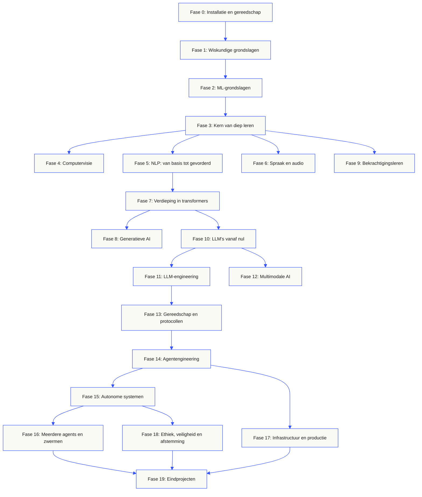
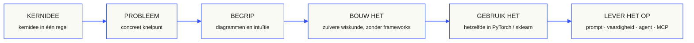

<p align="center" lang="nl"><sub>Nederlandse vertaling van de volledige README. Het <a href="../../README.md">Engelse origineel</a> is leidend · <a href="https://aiengineeringfromscratch.com">aiengineeringfromscratch.com</a></sub></p>
<p align="center">
  
</p>

<p align="center">
  <a href="../../README.md">🇬🇧 English</a> ·
  <a href="../../i18n/zh/README.md">🇨🇳 简体中文</a> ·
  <a href="../../i18n/zh-TW/README.md">🇹🇼 繁體中文（台灣）</a> ·
  <a href="../../i18n/ja/README.md">🇯🇵 日本語</a> ·
  <a href="../../i18n/ko/README.md">🇰🇷 한국어</a> ·
  <a href="../../i18n/pt/README.md">🇵🇹 Português</a> ·
  <a href="../../i18n/pt-BR/README.md">🇧🇷 Português (Brasil)</a> ·
  <a href="../../i18n/es/README.md">🇪🇸 Español</a> ·
  <a href="../../i18n/de/README.md">🇩🇪 Deutsch</a> ·
  <a href="../../i18n/fr/README.md">🇫🇷 Français</a> ·
  <a href="../../i18n/it/README.md">🇮🇹 Italiano</a> ·
  <a href="../../i18n/nl/README.md">🇳🇱 Nederlands</a> ·
  <a href="../../i18n/pl/README.md">🇵🇱 Polski</a> ·
  <a href="../../i18n/cs/README.md">🇨🇿 Čeština</a> ·
  <a href="../../i18n/ro/README.md">🇷🇴 Română</a> ·
  <a href="../../i18n/hu/README.md">🇭🇺 Magyar</a> ·
  <a href="../../i18n/el/README.md">🇬🇷 Ελληνικά</a> ·
  <a href="../../i18n/sv/README.md">🇸🇪 Svenska</a> ·
  <a href="../../i18n/da/README.md">🇩🇰 Dansk</a> ·
  <a href="../../i18n/no/README.md">🇳🇴 Norsk</a> ·
  <a href="../../i18n/fi/README.md">🇫🇮 Suomi</a> ·
  <a href="../../i18n/ru/README.md">🇷🇺 Русский</a> ·
  <a href="../../i18n/uk/README.md">🇺🇦 Українська</a> ·
  <a href="../../i18n/tr/README.md">🇹🇷 Türkçe</a> ·
  <a href="../../i18n/he/README.md">🇮🇱 עברית</a> ·
  <a href="../../i18n/ar/README.md">🇸🇦 العربية</a> ·
  <a href="../../i18n/fa/README.md">🇮🇷 فارسی</a> ·
  <a href="../../i18n/hi/README.md">🇮🇳 हिन्दी</a> ·
  <a href="../../i18n/bn/README.md">🇧🇩 বাংলা</a> ·
  <a href="../../i18n/ur/README.md">🇵🇰 اردو</a> ·
  <a href="../../i18n/th/README.md">🇹🇭 ไทย</a> ·
  <a href="../../i18n/vi/README.md">🇻🇳 Tiếng Việt</a> ·
  <a href="../../i18n/id/README.md">🇮🇩 Bahasa Indonesia</a> ·
  <a href="../../i18n/tl/README.md">🇵🇭 Tagalog</a>
</p>

<p align="center">
  <a href="../../LICENSE"></a>
  <a href="../../ROADMAP.md"></a>
  <a href="#contents"></a>
  <a href="https://github.com/rohitg00/ai-engineering-from-scratch/stargazers"></a>
  <a href="https://aiengineeringfromscratch.com"></a>
  <p align="center">
 <a href="https://www.star-history.com/rohitg00/ai-engineering-from-scratch">
  <picture><source media="(prefers-color-scheme: dark)" srcset="https://api.star-history.com/badge?repo=rohitg00/ai-engineering-from-scratch&type=rank&theme=dark" /><source media="(prefers-color-scheme: light)" srcset="https://api.star-history.com/badge?repo=rohitg00/ai-engineering-from-scratch&type=rank" /></picture> <picture><source media="(prefers-color-scheme: dark)" srcset="https://api.star-history.com/badge?repo=rohitg00/ai-engineering-from-scratch&type=trending&theme=dark" /><source media="(prefers-color-scheme: light)" srcset="https://api.star-history.com/badge?repo=rohitg00/ai-engineering-from-scratch&type=trending" /></picture>
 </a>
</p>
</p>

### Sponsoren

<p align="center">
  <a href="https://serpapi.com/ai-engineering-from-scratch"><picture><source media="(min-width: 768px)" srcset="../../assets/sponsors/serpapi-banner-compact.png" width="48%"></picture></a>
  <a href="https://nitrostack.ai/referral/aiengineeringfromscratch"><picture><source media="(min-width: 768px)" srcset="../../assets/sponsors/nitrostack-banner-equal.png" width="48%"></picture></a>
</p>

<p align="center">
  <sub><span>Dankzij jouw steun blijft elke les gratis en open source.</span> <a href="#supporters">Bekijk alle supporters</a> · <a href="../../SPONSORS.md">Word sponsor</a></sub>
</p>

```text
░░░▒▒▒░░░▒▒▒░░░▒▒▒░░░▒▒▒░░░▒▒▒░░░▒▒▒░░░▒▒▒░░░▒▒▒░░░▒▒▒░░░▒▒▒░░░▒▒▒░░░▒▒▒░░░▒▒▒░░░▒▒▒░░░▒▒▒
```

> **84% van de studenten gebruikt al AI-tools. Slechts 18% voelt zich klaar om ze professioneel te gebruiken.** Dit leerprogramma overbrugt die kloof.
>
> 523 lessen. 20 fasen. ~342 uur. Python, TypeScript, Rust, Julia. Elke les levert iets herbruikbaars op: een prompt, een skill, een agent of een MCP-server. Gratis, open source, MIT.
>
> Je leert niet alleen over AI. Je bouwt het zelf. Van begin tot eind. Met eigen handen.

<!-- STATS:START (generated from site/stats.json by build.js — do not edit by hand) -->
<p align="center"><sub><b>114,584</b> lezers &nbsp;·&nbsp; <b>181,995</b> paginaweergaven in de afgelopen 30 dagen &nbsp;·&nbsp; stand op 2026-08-29</sub></p>
<!-- STATS:END -->

## Begin hier: kies wat je wilt bouwen

Je hoeft niet alle 523 lessen door te nemen voordat je begint. Kies één doel. Elke link opent hetzelfde leerprogramma op GitHub of de website, en beide versies gebruiken dezelfde lescode.

| Jouw doel | Leren op GitHub | Leren op de website |
|---|---|---|
| Ik ben een beginner en wil een volledige basis | [Fase 0: Installatie en gereedschap](../../phases/00-setup-and-tooling/) | [Ontwikkelomgeving](https://aiengineeringfromscratch.com/lesson?path=phases/00-setup-and-tooling/01-dev-environment) |
| Ik ken Python en wil een basis in wiskunde en ML | [Fase 1: Wiskundige grondslagen](../../phases/01-math-foundations/) | [Intuïtie voor lineaire algebra](https://aiengineeringfromscratch.com/lesson?path=phases/01-math-foundations/01-linear-algebra-intuition) |
| Ik wil LLM-toepassingen voor productie bouwen | [Fase 11: LLM-engineering](../../phases/11-llm-engineering/) | [Promptengineering](https://aiengineeringfromscratch.com/lesson?path=phases/11-llm-engineering/01-prompt-engineering) |
| Ik wil agents bouwen | [Fase 14: Agentengineering](../../phases/14-agent-engineering/) | [De agentlus](https://aiengineeringfromscratch.com/lesson?path=phases/14-agent-engineering/01-the-agent-loop) |
| Ik wil programmeeragents gebruiken in echte repositories | [Leerroute voor engineering met agents](../../learning-paths/using-coding-agents.json) | [Engineering met agents](https://aiengineeringfromscratch.com/lesson?path=phases/14-agent-engineering/31-agent-workbench-why-models-fail&learningPath=using-coding-agents) |
| Ik wil vóór de implementatie bepalen wat ik moet bouwen | [Leerroute voor productkeuzes en oplevering](../../learning-paths/shaping-the-build.json) | [Productkeuzes en oplevering](https://aiengineeringfromscratch.com/lesson?path=phases/14-agent-engineering/47-outcomes-before-output&learningPath=shaping-the-build) |
| Ik wil bouwen met Model Context Protocol (MCP) | [Model Context Protocol (MCP)-route](../../phases/13-tools-and-protocols/README.md#model-context-protocol-mcp-path) | [Model Context Protocol (MCP)-leerroute](https://aiengineeringfromscratch.com/lesson?path=phases/13-tools-and-protocols/06-mcp-fundamentals&learningPath=model-context-protocol) |
| Ik wil Agent Skills schrijven en uitbrengen | [Gerichte Agent Skills-route](../../phases/13-tools-and-protocols/README.md#agent-skills-fast-path) | [Agent Skills-leerroute](https://aiengineeringfromscratch.com/lesson?path=phases/13-tools-and-protocols/22-skills-and-agent-sdks&learningPath=agent-skills) |
| Ik wil me voorbereiden op een Claude-certificering | [Startgids voor certificering](../../certifications/claude/GETTING_STARTED.md) | [Certificeringsacademie](https://aiengineeringfromscratch.com/certifications.html) |
| Ik wil me voorbereiden op MCP Associate (MCPA) | [Startgids voor MCPA](../../certifications/mcpa/GETTING_STARTED.md) | [MCPA-leerroute](https://aiengineeringfromscratch.com/certification?id=mcpa-f) |

Weet je niet waar je moet beginnen? Gebruik de [`start-learning`-tutor voor niveaubepaling](../../skills/start-learning/SKILL.md) of de [gids met voorkennis op de website](https://aiengineeringfromscratch.com/prereqs.html).

Vergelijk vier kerndomeinen en zes loopbaanroutes in de [AI Engineering Learning Paths](https://aiengineeringfromscratch.com/learning-paths.html).

### Pak elke les op dezelfde manier aan

1. **Lees** `docs/en.md` en leg het kernidee in je eigen woorden uit.
2. **Typ en bouw** de belangrijke code zelf in plaats van het codeblok als versiering te behandelen.
3. **Voer het lescommando uit** vanuit de hoofdmap van de repository, de map met `README.md` en `phases/`.
4. **Bewaar bewijs**: het commando, de werkmap, de exitcode, betekenisvolle uitvoer en het resultaat dat je hebt aangepast of gemaakt.
5. **Ga pas verder** wanneer je de uitvoer kunt uitleggen en zonder gokken een kleine wijziging kunt maken.

Paden in de commando's op lespagina's zijn relatief aan de hoofdmap van de repository, tenzij de les uitdrukkelijk zegt dat je van map moet wisselen. Biedt een les meerdere programmeertalen aan, voer dan de implementatie uit in de taal die je leert.

### Kloon de repository en lever je eerste bewijs

```bash
git clone https://github.com/rohitg00/ai-engineering-from-scratch.git
cd ai-engineering-from-scratch
python3 phases/00-setup-and-tooling/01-dev-environment/code/verify.py --route beginner
python3 phases/01-math-foundations/01-linear-algebra-intuition/code/vectors.py
```

De voorafgaande controle maakt onderscheid tussen vereisten voor nu en gereedschap voor later. Bij elke mislukte verplichte controle krijg je de gevonden oorzaak en een commando om die te verhelpen. Het tweede commando voert een les zonder afhankelijkheden uit en laat aan het eind zien dat een matrix vermenigvuldigen met een vector de bewerking binnen een neurale netwerklaag is. Bewaar die terminaluitvoer als je eerste bewijs.

## Voeg de AI-tutor toe in 30 seconden

Als Node.js, `npx` en een programmeeragent die skills ondersteunt al zijn geïnstalleerd, kan je agent in twee commando’s je tutor worden. Je hoeft de repository niet te klonen om de tutor te installeren of te lezen. Voor de uitvoerbare practica van gerichte leerroutes heb je `python3` nodig. Voor Agent Skills-practica heb je ook een gekozen host nodig en een beschrijfbare skillmap voor de gebruiker of het project.

Controleer eerst de lokale vereisten:

```bash
node --version
npx --version
python3 --version
```

Installeer daarna de cursusvaardigheden en kies de host en de installatiereikwijdte wanneer het installatieprogramma daarom vraagt:

```bash
npx skills add rohitg00/ai-engineering-from-scratch
```

De aanroepsyntaxis wordt door de host bepaald, niet door het overdraagbare `SKILL.md`-formaat:

| Uitvoeromgeving | Begin de cursus | Begin met Model Context Protocol (MCP) | Begin met Agent Skills | Doe een fasequiz |
|---|---|---|---|---|
| Codex | `start-learning`, of kies deze uit `/skills` | `learn-mcp`, of kies deze uit `/skills` | `learn-agent-skills`, of kies deze uit `/skills` | `check-understanding 13`, of kies deze uit `/skills` |
| Claude Code | `/start-learning` | `/learn-mcp` | `/learn-agent-skills` | `/check-understanding 13` |
| Andere compatibele hosts | `Use start-learning to begin the course.` | `Use learn-mcp to start the Model Context Protocol (MCP) path.` | `Use learn-agent-skills to start the Agent Skills Engineering path.` | `Use check-understanding to quiz me on Phase 13.` |

Een plaatsingstoets met tien vragen koppelt je bestaande kennis aan een beginfase en bewaart een persoonlijk studieplan in `LEARNING.md`. Daarna behandelt de skill `learn` één les per sessie: concept, wiskunde, code en quiz. De lessen worden rechtstreeks uit deze repository geladen. De skill `course-guide` verwijst naar de precieze les voor het onderwerp waarop je vastloopt. In Codex roep je deze skills aan met `learn` en `course-guide`; in Claude Code gebruik je `/learn` en `/course-guide`; bij andere compatibele hosts vraag je om de skill bij naam te gebruiken.

Wil je alleen Model Context Protocol (MCP)? Gebruik de MCP-aanroep voor je host. Die maakt `MCP-LEARNING.md` aan en volgt een route van 17 lessen langs toestandsloze verzoeken, transporten, tweerichtingsverkeer, beveiliging, betrouwbaarheid, registerbeheer en conformiteitsbewijs. De precieze volgorde en controlepunten staan in het [Model Context Protocol (MCP)-manifest](../../learning-paths/model-context-protocol.json).

Wil je alleen Agent Skills? Gebruik de Agent Skills-aanroep voor je host. Die maakt `AGENT-SKILLS-LEARNING.md` aan en volgt één samenhangende route van vijf lessen: contract, ontdekking, aanroep, sandboxgrenzen en vervolgens release-evaluaties en overdraagbaarheid tussen echte hosts. Begin op de website met de [Agent Skills-leerroute](https://aiengineeringfromscratch.com/lesson?path=phases/13-tools-and-protocols/22-skills-and-agent-sdks&learningPath=agent-skills).

Het installatieprogramma toont de hosts die het kan configureren en vraagt waar het moet installeren. Heb je nog geen Node.js, `npx`, `python3`, ondersteunde host of beschrijfbare installatiemap, gebruik dan de website of lees `docs/en.md` zelf. Daarmee leer je de concepten, maar bewijs van ontdekking, aanroep, scripts en verwijdering op een echte host blijft uitstaan totdat de voorafgaande controle mogelijk is. Lees de lessen op [aiengineeringfromscratch.com](https://aiengineeringfromscratch.com).

## Hoe dit werkt

Veel AI-lesmateriaal bestaat uit losse stukken. Hier een paper, daar een bericht over fijnafstemming en elders een indrukwekkende agentdemo. Die stukken sluiten zelden op elkaar aan. Je levert een chatbot op, maar kunt zijn verliescurve niet verklaren. Je koppelt een functie aan een agent, maar kunt niet uitleggen wat aandacht doet in het model dat die functie aanroept.

Dit leerprogramma vormt de ruggengraat: 20 fasen, 523 lessen en vier talen: Python, TypeScript, Rust en Julia. Van lineaire algebra aan het begin tot autonome zwermen aan het eind. Elk algoritme bouw je eerst rechtstreeks vanuit de wiskunde: backpropagatie, tokenisatie, aandacht en de agentlus. Tegen de tijd dat PyTorch verschijnt, weet je al wat er onder de motorkap gebeurt.

Elke les volgt dezelfde cyclus: lees het probleem, leid de wiskunde af, schrijf de code, voer de test uit en bewaar het resultaat. Geen video’s van vijf minuten, geen gekopieerde uitrolcommando’s en geen voortdurende begeleiding. Gratis, open source en gemaakt om op je eigen laptop te draaien.

```text
░░░▒▒▒░░░▒▒▒░░░▒▒▒░░░▒▒▒░░░▒▒▒░░░▒▒▒░░░▒▒▒░░░▒▒▒░░░▒▒▒░░░▒▒▒░░░▒▒▒░░░▒▒▒░░░▒▒▒░░░▒▒▒░░░▒▒▒
```

## De opbouw van het leerprogramma

Twintig fasen bouwen op elkaar voort. Wiskunde vormt de fundering; agents en productie vormen het dak. Sla gerust een laag over die je al beheerst, maar sla geen onbekende basis over om je later af te vragen waarom de bovenste lagen falen.



```text
░░░▒▒▒░░░▒▒▒░░░▒▒▒░░░▒▒▒░░░▒▒▒░░░▒▒▒░░░▒▒▒░░░▒▒▒░░░▒▒▒░░░▒▒▒░░░▒▒▒░░░▒▒▒░░░▒▒▒░░░▒▒▒░░░▒▒▒
```

## De opbouw van een les

Elke les heeft een eigen map, met dezelfde structuur in het hele leerprogramma:

```text
phases/<NN>-<phase-name>/<NN>-<lesson-name>/
├── code/      uitvoerbare implementaties (Python, TypeScript, Rust, Julia)
├── docs/
│   └── en.md  lesuitleg
└── outputs/   prompts, vaardigheden, agents of MCP-servers die deze les oplevert
```

Elke les bestaat uit zes stappen. Het onderscheid *Bouw het / Gebruik het* vormt de kern: eerst implementeer je het algoritme vanaf nul, daarna voer je hetzelfde uit met een productiebibliotheek. Je begrijpt het framework omdat je zelf de kleinere versie hebt geschreven.



## Aan de slag

Drie manieren om te beginnen. Kies er één.

**Optie A: leer in je terminal *(aanbevolen)*.** Controleer zoals hierboven Node.js, `npx`, host en installatiereikwijdte. Installeer daarna de leerskills in een compatibele agent en laat de cursus je begeleiden:

```bash
npx skills add rohitg00/ai-engineering-from-scratch
```

Gebruik de bovenstaande aanroeptabel voor je host. De geïnstalleerde skills bieden `start-learning`, `learn`, `course-guide` en de gerichte routes `learn-mcp` en `learn-agent-skills`. Lesinhoud kan zonder lokale kloon rechtstreeks uit deze repository worden geladen. Voor gekopieerde repositorycommando’s en uitvoerbare MCP- of Agent Skills-practica is wel een lokale kloon nodig. De voortgang staat in `LEARNING.md`, `MCP-LEARNING.md` of `AGENT-SKILLS-LEARNING.md` in je project, zodat elke sessie kan verdergaan waar je gebleven was.

**Optie B: lees.** Open een afgeronde les op [aiengineeringfromscratch.com](https://aiengineeringfromscratch.com) of klap een fase onder [Inhoud](#contents) open. Geen installatie of kloon nodig.

**Optie C: kloon en voer uit.**

```bash
git clone https://github.com/rohitg00/ai-engineering-from-scratch.git
cd ai-engineering-from-scratch
python3 phases/01-math-foundations/01-linear-algebra-intuition/code/vectors.py
```

Klonen laadt de leerskills ook automatisch in Claude Code en geeft de `learn`-tutor toegang tot de code van elke les om die echt uit te voeren, in plaats van alleen mee te lezen.

### Vereiste voorkennis

- Je kunt programmeren in een willekeurige taal; Python helpt.
- Je wilt begrijpen hoe AI **werkelijk werkt**, niet alleen API’s aanroepen.

### Bereid je voor op Claude-certificeringen

De [Claude-certificeringsacademie](../../certifications/claude/README.md) is een gratis, open voorbereidingsprogramma voor alle vier officiële Claude-certificeringstrajecten: Associate Foundations, Developer Foundations, Architect Foundations en Architect Professional. Elke route combineert lessen gekoppeld aan de exameneisen, uitvoerbare practica, een diagnostische toets, eindwerk en een volledig origineel oefenexamen.

Gebruik de [AI-gerichte GitHub-startgids](../../certifications/claude/GETTING_STARTED.md) met Claude Code, Codex, ChatGPT, Cursor of een andere agent. Voer `claude-certification` uit in Codex, `/claude-certification` in Claude Code of vraag een andere host om `claude-certification` te gebruiken. De skill kiest een traject, maakt een blijvende route in `CLAUDE-CERTIFICATION.md`, onderwijst stap voor stap, voert de echte practica uit en geeft feedback op je resultaten. Hetzelfde leerprogramma staat op de [certificeringswebsite](https://aiengineeringfromscratch.com/certifications.html).

De academie is onafhankelijk studiemateriaal op basis van openbare examendoelen. Zij is niet verbonden aan Anthropic, bevat geen echte examenvragen en kan geen voldoende garanderen.

### Bereid je voor op de MCP Associate (MCPA)-certificering

Het [MCPA-certificeringsprogramma](../../certifications/mcpa/README.md) is een gratis, open voorbereiding op het Model Context Protocol Associate-examen van de Agentic AI Foundation, aangeboden via Linux Foundation Training. De 34 lessen behandelen het toestandsloze protocol van 2026-07-28 in de vijf examendomeinen: `_meta` per verzoek en `server/discover` in plaats van de oude handshake, verzoeken met meerdere rondes, abonnementen, caching, de uitbreidingen voor taken en MCP Apps, OAuth-autorisatie en de register- en SDK-niveaus. Elke les bevat een uitvoerbaar practicum met alleen de standaardbibliotheek, waarvan het transcript op het actuele wire-formaat wordt gecontroleerd. Het traject bevat ook een diagnostische toets, een eindproject en drie volledige originele oefenexamens met de gepubliceerde verdeling van onderwerpen.

Gebruik de [AI-gerichte GitHub-startgids](../../certifications/mcpa/GETTING_STARTED.md) met Claude Code, Codex, ChatGPT, Cursor of een andere agent. Voer `mcpa-certification` uit in Codex, `/mcpa-certification` in Claude Code of vraag een andere host om `mcpa-certification` te gebruiken. De skill maakt een blijvende route in `MCPA-CERTIFICATION.md`, onderwijst stap voor stap, voert de echte practica uit en geeft feedback op je resultaten. Hetzelfde leerprogramma staat op de [MCPA-trajectpagina](https://aiengineeringfromscratch.com/certification?id=mcpa-f).

Dit leerprogramma is onafhankelijk studiemateriaal op basis van openbare examendoelen. Het is niet verbonden aan de Agentic AI Foundation of de Linux Foundation, bevat geen echte examenvragen en kan geen voldoende garanderen.

### De leerskills

| Vaardigheid | Wat deze doet |
|---|---|
| [`start-learning`](../../skills/start-learning/SKILL.md) | Eenmalige start: je leerdoel, plaatsingstoets en een persoonlijk plan opgeslagen in `LEARNING.md`. |
| [`learn`](../../skills/learn/SKILL.md) | De tutorcyclus: voorkennis ophalen, interactief de volgende les behandelen en daarna de quiz; bewaart voortgang en een herhaalwachtrij. |
| [`course-guide`](../../skills/course-guide/SKILL.md) | Onderwerpwijzer. “Waar leer ik over aandacht?” of “mijn verlies is NaN” → de precieze lessen, met links. |
| [`learn-mcp`](../../skills/learn-mcp/SKILL.md) | Gerichte tutor voor Model Context Protocol (MCP). Maakt `MCP-LEARNING.md`, volgt het manifest met 17 lessen en bewaart bewijs voor het wire-formaat, beveiliging, betrouwbaarheid en conformiteit. |
| [`learn-agent-skills`](../../skills/learn-agent-skills/SKILL.md) | Gerichte Agent Skills-tutor. Maakt `AGENT-SKILLS-LEARNING.md`, behandelt lessen 22, 24, 25, 26 en 27 en bewaart bewijs van uitvoering op een echte host. |
| [`claude-certification`](../../skills/claude-certification/SKILL.md) | Certificeringstutor. Kiest CCAO-F, CCDV-F, CCAR-F of CCAR-P; behandelt elke les, voert practica uit, beoordeelt resultaten, neemt diagnostische toetsen en oefenexamens af en bewaart voortgang. |
| [`mcpa-certification`](../../skills/mcpa-certification/SKILL.md) | MCPA-tutor. Volgt de route met 34 lessen `mcpa-f` voor het protocol van 2026-07-28; behandelt elke les, voert practica en de wire-controle uit, neemt de diagnostische toets en drie oefenexamens af en bewaart voortgang. |
| [`find-your-level`](../../skills/find-your-level/SKILL.md) | Plaatsingstoets met tien vragen. Koppelt je kennis aan een beginfase en maakt een persoonlijke route met tijdsinschattingen. |
| [`check-understanding <phase>`](../../skills/check-understanding/SKILL.md) | Quiz per fase met acht vragen, feedback en concrete lessen om te herhalen. Gebruik de vorm voor Codex, Claude Code of natuurlijke taal uit de bovenstaande aanroeptabel. |

```text
░░░▒▒▒░░░▒▒▒░░░▒▒▒░░░▒▒▒░░░▒▒▒░░░▒▒▒░░░▒▒▒░░░▒▒▒░░░▒▒▒░░░▒▒▒░░░▒▒▒░░░▒▒▒░░░▒▒▒░░░▒▒▒░░░▒▒▒
```

## Lees het kernleerprogramma als boek

Het kernleerprogramma van 20 fasen onder `phases/` wordt samengesteld tot een reeks van zes boeken. CI bouwt EPUB- en PDF-versies uit dezelfde lesbronnen en voegt ze toe aan elke [GitHub-release](https://github.com/rohitg00/ai-engineering-from-scratch/releases); de onderstaande links verwijzen steeds naar de nieuwste release. Deelnummers geven de plaats in de reeks aan, niet de versie: elk exemplaar heeft een gedateerde editieaanduiding en oudere edities blijven via hun release beschikbaar.

Certificeringsprogramma’s worden bewust niet in de boeken opgenomen. Hun AI-tutorstatus, uitvoerbare practica, interactieve figuren, diagnostische toetsen en getimede oefenexamens blijven volledig beschikbaar op GitHub en de website.

| Deel | Titel | Fasen | Ophalen |
|-----|-------|--------|----------|
| 1 | Grondslagen · Wiskunde, gereedschap en klassiek machinaal leren | 00-02 | [EPUB](https://github.com/rohitg00/ai-engineering-from-scratch/releases/latest/download/aiefs-vol1-foundations.epub) · [PDF](https://github.com/rohitg00/ai-engineering-from-scratch/releases/latest/download/aiefs-vol1-foundations.pdf) |
| 2 | Diep leren · Netwerken, visie en spraak | 03, 04, 06 | [EPUB](https://github.com/rohitg00/ai-engineering-from-scratch/releases/latest/download/aiefs-vol2-deep-learning.epub) · [PDF](https://github.com/rohitg00/ai-engineering-from-scratch/releases/latest/download/aiefs-vol2-deep-learning.pdf) |
| 3 | Taal · NLP-grondslagen en de transformer | 05, 07 | [EPUB](https://github.com/rohitg00/ai-engineering-from-scratch/releases/latest/download/aiefs-vol3-language.epub) · [PDF](https://github.com/rohitg00/ai-engineering-from-scratch/releases/latest/download/aiefs-vol3-language.pdf) |
| 4 | Grote taalmodellen · Generatie, bekrachtiging, voortraining en engineering | 08-11 | [EPUB](https://github.com/rohitg00/ai-engineering-from-scratch/releases/latest/download/aiefs-vol4-llms.epub) · [PDF](https://github.com/rohitg00/ai-engineering-from-scratch/releases/latest/download/aiefs-vol4-llms.pdf) |
| 5 | Agents · Multimodaliteit, protocollen, autonomie en zwermen | 12-16 | [EPUB](https://github.com/rohitg00/ai-engineering-from-scratch/releases/latest/download/aiefs-vol5-agents.epub) · [PDF](https://github.com/rohitg00/ai-engineering-from-scratch/releases/latest/download/aiefs-vol5-agents.pdf) |
| 6 | Productie · Infrastructuur, veiligheid en eindprojecten | 17-19 | [EPUB](https://github.com/rohitg00/ai-engineering-from-scratch/releases/latest/download/aiefs-vol6-production.epub) · [PDF](https://github.com/rohitg00/ai-engineering-from-scratch/releases/latest/download/aiefs-vol6-production.pdf) |

Het boek is een momentopname; deze repository is de levende editie. Elk hoofdstuk eindigt met links naar de geanimeerde figuren, quiz en uitvoerbare code van de les. Bouw lokaal met `python3 scripts/build_book.py` (pandoc vereist); details van de pijplijn staan in [book/README.md](../../book/README.md).

```text
░░░▒▒▒░░░▒▒▒░░░▒▒▒░░░▒▒▒░░░▒▒▒░░░▒▒▒░░░▒▒▒░░░▒▒▒░░░▒▒▒░░░▒▒▒░░░▒▒▒░░░▒▒▒░░░▒▒▒░░░▒▒▒░░░▒▒▒
```

## Elke les levert iets op

Andere cursussen eindigen met *“gefeliciteerd, je hebt X geleerd.”* Elke les hier eindigt met een **herbruikbaar hulpmiddel** dat je kunt installeren of in je dagelijkse werk kunt opnemen.

<table>
<tr>
<th align="left" width="25%"><br/><sub>FIG_001 · A</sub><br/><b>PROMPTSJABLONEN</b></th>
<th align="left" width="25%"><br/><sub>FIG_001 · B</sub><br/><b>VAARDIGHEDEN</b></th>
<th align="left" width="25%"><br/><sub>FIG_001 · C</sub><br/><b>AUTONOME AGENTS</b></th>
<th align="left" width="25%"><br/><sub>FIG_001 · D</sub><br/><b>MCP-SERVERS</b></th>
</tr>
<tr>
<td valign="top">Plak in een AI-assistent voor deskundige hulp bij een afgebakende taak.</td>
<td valign="top">Voeg toe aan Claude, Cursor, Codex, OpenClaw, Hermes of een andere agent die dit leest: <code>SKILL.md</code>.</td>
<td valign="top">Zet in als autonome werkers: je schreef de lus zelf in fase 14.</td>
<td valign="top">Sluit aan op elke MCP-compatibele client. Volledig gebouwd in fase 13.</td>
</tr>
</table>

> Installeer alles met `python3 scripts/install_skills.py <target>`. Echte hulpmiddelen, geen huiswerk.
> Aan het eind van het leerprogramma heb je een portfolio van 523 resultaten die je echt begrijpt, omdat je ze zelf hebt gebouwd.

### FIG_002 · Een uitgewerkt voorbeeld

Fase 14, les 1: de agentlus. ~120 regels zuivere Python, zonder afhankelijkheden.

<table>
<tr>
<td valign="top" width="50%">

**`code/agent_loop.py`** &nbsp; <sub><i>bouw het</i></sub>

```python
def run(query, tools):
    history = [user(query)]
    for step in range(MAX_STEPS):
        msg = llm(history)
        if msg.tool_calls:
            for call in msg.tool_calls:
                result = tools[call.name](**call.args)
                history.append(tool_result(call.id, result))
            continue
        return msg.content
    raise StepLimitExceeded
```

</td>
<td valign="top" width="50%">

**`outputs/skill-agent-loop.md`** &nbsp; <sub><i>lever het op</i></sub>

```markdown
---
name: agent-loop
description: ReAct-style loop for any tool list
phase: 14
lesson: 01
---

Implement a minimal agent loop that...
```

**`outputs/prompt-debug-agent.md`**

```markdown
You are an agent debugger. Given the trace
of an agent run, identify the step where
the agent went wrong and explain why...
```

</td>
</tr>
</table>

```text
░░░▒▒▒░░░▒▒▒░░░▒▒▒░░░▒▒▒░░░▒▒▒░░░▒▒▒░░░▒▒▒░░░▒▒▒░░░▒▒▒░░░▒▒▒░░░▒▒▒░░░▒▒▒░░░▒▒▒░░░▒▒▒░░░▒▒▒
```

<a id="contents"></a>

## Inhoud

Twintig fasen. Klik op een fase om de lessenlijst open te klappen.

<a id="phase-0"></a>
### Fase 0: Installatie en gereedschap `12 lessen`
> Maak je omgeving klaar voor alles wat hierna komt.

| # | Les | Soort | Taal |
|:---:|--------|:----:|------|
| 01 | [Ontwikkelomgeving](../../phases/00-setup-and-tooling/01-dev-environment/) | Bouwen | Python |
| 02 | [Git en samenwerken](../../phases/00-setup-and-tooling/02-git-and-collaboration/) | Leren | — |
| 03 | [GPU-installatie en cloud](../../phases/00-setup-and-tooling/03-gpu-setup-and-cloud/) | Bouwen | Python |
| 04 | [API's en sleutels](../../phases/00-setup-and-tooling/04-apis-and-keys/) | Bouwen | Python |
| 05 | [Jupyter Notebooks](../../phases/00-setup-and-tooling/05-jupyter-notebooks/) | Bouwen | Python |
| 06 | [Python-omgevingen](../../phases/00-setup-and-tooling/06-python-environments/) | Bouwen | Shell |
| 07 | [Docker voor AI](../../phases/00-setup-and-tooling/07-docker-for-ai/) | Bouwen | Docker |
| 08 | [Editor instellen](../../phases/00-setup-and-tooling/08-editor-setup/) | Bouwen | — |
| 09 | [Gegevensbeheer](../../phases/00-setup-and-tooling/09-data-management/) | Bouwen | Python |
| 10 | [Terminal en shell](../../phases/00-setup-and-tooling/10-terminal-and-shell/) | Leren | — |
| 11 | [Linux voor AI](../../phases/00-setup-and-tooling/11-linux-for-ai/) | Leren | — |
| 12 | [Fouten opsporen en profileren](../../phases/00-setup-and-tooling/12-debugging-and-profiling/) | Bouwen | Python |

<details id="phase-1">
<summary><b>Fase 1: Wiskundige grondslagen</b> &nbsp;<code>22 lessen</code>&nbsp; <em>De intuïtie achter elk AI-algoritme, aan de hand van code.</em></summary>
<br/>

| # | Les | Soort | Taal |
|:---:|--------|:----:|------|
| 01 | [Intuïtie voor lineaire algebra](../../phases/01-math-foundations/01-linear-algebra-intuition/) | Leren | Python, Julia |
| 02 | [Vectoren, matrices en bewerkingen](../../phases/01-math-foundations/02-vectors-matrices-operations/) | Bouwen | Python, Julia |
| 03 | [Matrixtransformaties en eigenwaarden](../../phases/01-math-foundations/03-matrix-transformations/) | Bouwen | Python, Julia |
| 04 | [Analyse voor ML: afgeleiden en gradiënten](../../phases/01-math-foundations/04-calculus-for-ml/) | Leren | Python |
| 05 | [Kettingregel en automatische differentiatie](../../phases/01-math-foundations/05-chain-rule-and-autodiff/) | Bouwen | Python |
| 06 | [Kansrekening en verdelingen](../../phases/01-math-foundations/06-probability-and-distributions/) | Leren | Python |
| 07 | [Stelling van Bayes en statistisch denken](../../phases/01-math-foundations/07-bayes-theorem/) | Bouwen | Python |
| 08 | [Optimalisatie: varianten van gradiëntafdaling](../../phases/01-math-foundations/08-optimization/) | Bouwen | Python |
| 09 | [Informatietheorie: entropie en KL-divergentie](../../phases/01-math-foundations/09-information-theory/) | Leren | Python |
| 10 | [Dimensiereductie: PCA, t-SNE, UMAP](../../phases/01-math-foundations/10-dimensionality-reduction/) | Bouwen | Python |
| 11 | [Singulierewaardendecompositie](../../phases/01-math-foundations/11-singular-value-decomposition/) | Bouwen | Python, Julia |
| 12 | [Tensorbewerkingen](../../phases/01-math-foundations/12-tensor-operations/) | Bouwen | Python |
| 13 | [Numerieke stabiliteit](../../phases/01-math-foundations/13-numerical-stability/) | Bouwen | Python |
| 14 | [Normen en afstanden](../../phases/01-math-foundations/14-norms-and-distances/) | Bouwen | Python |
| 15 | [Statistiek voor ML](../../phases/01-math-foundations/15-statistics-for-ml/) | Bouwen | Python |
| 16 | [Steekproefmethoden](../../phases/01-math-foundations/16-sampling-methods/) | Bouwen | Python |
| 17 | [Lineaire stelsels](../../phases/01-math-foundations/17-linear-systems/) | Bouwen | Python |
| 18 | [Convexe optimalisatie](../../phases/01-math-foundations/18-convex-optimization/) | Bouwen | Python |
| 19 | [Complexe getallen voor AI](../../phases/01-math-foundations/19-complex-numbers/) | Leren | Python |
| 20 | [De fouriertransformatie](../../phases/01-math-foundations/20-fourier-transform/) | Bouwen | Python |
| 21 | [Grafentheorie voor ML](../../phases/01-math-foundations/21-graph-theory/) | Bouwen | Python |
| 22 | [Stochastische processen](../../phases/01-math-foundations/22-stochastic-processes/) | Leren | Python |

</details>

<details id="phase-2">
<summary><b>Fase 2: ML-grondslagen</b> &nbsp;<code>18 lessen</code>&nbsp; <em>Klassiek machinaal leren: nog steeds de basis van de meeste AI in productie.</em></summary>
<br/>

| # | Les | Soort | Taal |
|:---:|--------|:----:|------|
| 01 | [Wat is machinaal leren?](../../phases/02-ml-fundamentals/01-what-is-machine-learning/) | Leren | Python |
| 02 | [Lineaire regressie vanaf nul](../../phases/02-ml-fundamentals/02-linear-regression/) | Bouwen | Python |
| 03 | [Logistische regressie en classificatie](../../phases/02-ml-fundamentals/03-logistic-regression/) | Bouwen | Python |
| 04 | [Beslisbomen en random forests](../../phases/02-ml-fundamentals/04-decision-trees/) | Bouwen | Python |
| 05 | [Supportvectormachines](../../phases/02-ml-fundamentals/05-support-vector-machines/) | Bouwen | Python |
| 06 | [KNN en afstandsmaten](../../phases/02-ml-fundamentals/06-knn-and-distances/) | Bouwen | Python |
| 07 | [Leren zonder toezicht: K-Means, DBSCAN](../../phases/02-ml-fundamentals/07-unsupervised-learning/) | Bouwen | Python |
| 08 | [Kenmerken ontwerpen en selecteren](../../phases/02-ml-fundamentals/08-feature-engineering/) | Bouwen | Python |
| 09 | [Modelevaluatie: maatstaven en kruisvalidatie](../../phases/02-ml-fundamentals/09-model-evaluation/) | Bouwen | Python |
| 10 | [Bias, variantie en de leercurve](../../phases/02-ml-fundamentals/10-bias-variance/) | Leren | Python |
| 11 | [Ensemblemethoden: boosting, bagging en stacking](../../phases/02-ml-fundamentals/11-ensemble-methods/) | Bouwen | Python |
| 12 | [Hyperparameters afstellen](../../phases/02-ml-fundamentals/12-hyperparameter-tuning/) | Bouwen | Python |
| 13 | [ML-pijplijnen en experimenten bijhouden](../../phases/02-ml-fundamentals/13-ml-pipelines/) | Bouwen | Python |
| 14 | [Naive Bayes](../../phases/02-ml-fundamentals/14-naive-bayes/) | Bouwen | Python |
| 15 | [Grondslagen van tijdreeksen](../../phases/02-ml-fundamentals/15-time-series/) | Bouwen | Python |
| 16 | [Afwijkingen detecteren](../../phases/02-ml-fundamentals/16-anomaly-detection/) | Bouwen | Python |
| 17 | [Omgaan met onevenwichtige gegevens](../../phases/02-ml-fundamentals/17-imbalanced-data/) | Bouwen | Python |
| 18 | [Kenmerkselectie](../../phases/02-ml-fundamentals/18-feature-selection/) | Bouwen | Python |

</details>

<details id="phase-3">
<summary><b>Fase 3: Kern van diep leren</b> &nbsp;<code>13 lessen</code>&nbsp; <em>Neurale netwerken vanuit de grondbeginselen. Geen frameworks voordat je er zelf één bouwt.</em></summary>
<br/>

| # | Les | Soort | Taal |
|:---:|--------|:----:|------|
| 01 | [Het perceptron: waar alles begon](../../phases/03-deep-learning-core/01-the-perceptron/) | Bouwen | Python |
| 02 | [Meerlaagse netwerken en de voorwaartse berekening](../../phases/03-deep-learning-core/02-multi-layer-networks/) | Bouwen | Python |
| 03 | [Backpropagatie vanaf nul](../../phases/03-deep-learning-core/03-backpropagation/) | Bouwen | Python |
| 04 | [Activatiefuncties: ReLU, sigmoid, GELU en waarom](../../phases/03-deep-learning-core/04-activation-functions/) | Bouwen | Python |
| 05 | [Verliesfuncties: MSE, kruisentropie en contrastief verlies](../../phases/03-deep-learning-core/05-loss-functions/) | Bouwen | Python |
| 06 | [Optimalisatoren: SGD, momentum, Adam, AdamW](../../phases/03-deep-learning-core/06-optimizers/) | Bouwen | Python |
| 07 | [Regularisatie: dropout, gewichtsverval, BatchNorm](../../phases/03-deep-learning-core/07-regularization/) | Bouwen | Python |
| 08 | [Gewichten initialiseren en stabiel trainen](../../phases/03-deep-learning-core/08-weight-initialization/) | Bouwen | Python |
| 09 | [Leerschema's en opwarming](../../phases/03-deep-learning-core/09-learning-rate-schedules/) | Bouwen | Python |
| 10 | [Bouw je eigen miniframework](../../phases/03-deep-learning-core/10-mini-framework/) | Bouwen | Python |
| 11 | [Inleiding tot PyTorch](../../phases/03-deep-learning-core/11-intro-to-pytorch/) | Bouwen | Python |
| 12 | [Inleiding tot JAX](../../phases/03-deep-learning-core/12-intro-to-jax/) | Bouwen | Python |
| 13 | [Fouten opsporen in neurale netwerken](../../phases/03-deep-learning-core/13-debugging-neural-networks/) | Bouwen | Python |

</details>

<details id="phase-4">
<summary><b>Fase 4: Computervisie</b> &nbsp;<code>28 lessen</code>&nbsp; <em>Van pixels naar begrip: beelden, video, 3D, VLM’s en wereldmodellen.</em></summary>
<br/>

| # | Les | Soort | Taal |
|:---:|--------|:----:|------|
| 01 | [Beeldgrondslagen: pixels, kanalen en kleurruimten](../../phases/04-computer-vision/01-image-fundamentals/) | Leren | Python |
| 02 | [Convoluties vanaf nul](../../phases/04-computer-vision/02-convolutions-from-scratch/) | Bouwen | Python |
| 03 | [CNN's: van LeNet tot ResNet](../../phases/04-computer-vision/03-cnns-lenet-to-resnet/) | Bouwen | Python |
| 04 | [Beeldclassificatie](../../phases/04-computer-vision/04-image-classification/) | Bouwen | Python |
| 05 | [Overdrachtsleren en fijnafstemming](../../phases/04-computer-vision/05-transfer-learning/) | Bouwen | Python |
| 06 | [Objectdetectie: YOLO vanaf nul](../../phases/04-computer-vision/06-object-detection-yolo/) | Bouwen | Python |
| 07 | [Semantische segmentatie: U-Net](../../phases/04-computer-vision/07-semantic-segmentation-unet/) | Bouwen | Python |
| 08 | [Instantiesegmentatie: Mask R-CNN](../../phases/04-computer-vision/08-instance-segmentation-mask-rcnn/) | Bouwen | Python |
| 09 | [Beelden genereren: GAN's](../../phases/04-computer-vision/09-image-generation-gans/) | Bouwen | Python |
| 10 | [Beelden genereren: diffusiemodellen](../../phases/04-computer-vision/10-image-generation-diffusion/) | Bouwen | Python |
| 11 | [Stable Diffusion: architectuur en fijnafstemming](../../phases/04-computer-vision/11-stable-diffusion/) | Bouwen | Python |
| 12 | [Video begrijpen: modelleren in de tijd](../../phases/04-computer-vision/12-video-understanding/) | Bouwen | Python |
| 13 | [3D-visie: puntenwolken en NeRF's](../../phases/04-computer-vision/13-3d-vision-nerf/) | Bouwen | Python |
| 14 | [Visietransformers (ViT)](../../phases/04-computer-vision/14-vision-transformers/) | Bouwen | Python |
| 15 | [Realtimevisie: uitrollen op randapparaten](../../phases/04-computer-vision/15-real-time-edge/) | Bouwen | Python |
| 16 | [Bouw een volledige beeldverwerkingspijplijn](../../phases/04-computer-vision/16-vision-pipeline-capstone/) | Bouwen | Python |
| 17 | [Zelflerende visiemodellen: SimCLR, DINO, MAE](../../phases/04-computer-vision/17-self-supervised-vision/) | Bouwen | Python |
| 18 | [Visie met open woordenschat: CLIP](../../phases/04-computer-vision/18-open-vocab-clip/) | Bouwen | Python |
| 19 | [OCR en documenten begrijpen](../../phases/04-computer-vision/19-ocr-document-understanding/) | Bouwen | Python |
| 20 | [Beelden zoeken en afstanden leren](../../phases/04-computer-vision/20-image-retrieval-metric/) | Bouwen | Python |
| 21 | [Sleutelpunten detecteren en houdingen schatten](../../phases/04-computer-vision/21-keypoint-pose/) | Bouwen | Python |
| 22 | [3D Gaussian Splatting vanaf nul](../../phases/04-computer-vision/22-3d-gaussian-splatting/) | Bouwen | Python |
| 23 | [Diffusietransformers en gerectificeerde stromen](../../phases/04-computer-vision/23-diffusion-transformers-rectified-flow/) | Bouwen | Python |
| 24 | [SAM 3 en segmentatie met open woordenschat](../../phases/04-computer-vision/24-sam3-open-vocab-segmentation/) | Bouwen | Python |
| 25 | [Visie-taalmodellen (ViT-MLP-LLM)](../../phases/04-computer-vision/25-vision-language-models/) | Bouwen | Python |
| 26 | [Diepte en geometrie schatten uit één beeld](../../phases/04-computer-vision/26-monocular-depth/) | Bouwen | Python |
| 27 | [Meerdere objecten volgen en videogeheugen](../../phases/04-computer-vision/27-multi-object-tracking/) | Bouwen | Python |
| 28 | [Wereldmodellen en videodiffusie](../../phases/04-computer-vision/28-world-models-video-diffusion/) | Bouwen | Python |

</details>

<details id="phase-5">
<summary><b>Fase 5: NLP: van basis tot gevorderd</b> &nbsp;<code>29 lessen</code>&nbsp; <em>Taal is de interface naar intelligentie.</em></summary>
<br/>

| # | Les | Soort | Taal |
|:---:|--------|:----:|------|
| 01 | [Tekstverwerking: tokenisatie, stammen en lemmatisering](../../phases/05-nlp-foundations-to-advanced/01-text-processing/) | Bouwen | Python |
| 02 | [Woordzakken, TF-IDF en tekstrepresentatie](../../phases/05-nlp-foundations-to-advanced/02-bag-of-words-tfidf/) | Bouwen | Python |
| 03 | [Woordembeddings: Word2Vec vanaf nul](../../phases/05-nlp-foundations-to-advanced/03-word-embeddings-word2vec/) | Bouwen | Python |
| 04 | [GloVe, FastText en subwoordembeddings](../../phases/05-nlp-foundations-to-advanced/04-glove-fasttext-subword/) | Bouwen | Python |
| 05 | [Sentimentanalyse](../../phases/05-nlp-foundations-to-advanced/05-sentiment-analysis/) | Bouwen | Python |
| 06 | [Herkenning van benoemde entiteiten (NER)](../../phases/05-nlp-foundations-to-advanced/06-named-entity-recognition/) | Bouwen | Python |
| 07 | [Woordsoorten markeren en zinnen ontleden](../../phases/05-nlp-foundations-to-advanced/07-pos-tagging-parsing/) | Bouwen | Python |
| 08 | [Tekstclassificatie: CNN's en RNN's voor tekst](../../phases/05-nlp-foundations-to-advanced/08-cnns-rnns-for-text/) | Bouwen | Python |
| 09 | [Sequentie-naar-sequentiemodellen](../../phases/05-nlp-foundations-to-advanced/09-sequence-to-sequence/) | Bouwen | Python |
| 10 | [Het aandachtsmechanisme: de doorbraak](../../phases/05-nlp-foundations-to-advanced/10-attention-mechanism/) | Bouwen | Python |
| 11 | [Automatisch vertalen](../../phases/05-nlp-foundations-to-advanced/11-machine-translation/) | Bouwen | Python |
| 12 | [Tekst samenvatten](../../phases/05-nlp-foundations-to-advanced/12-text-summarization/) | Bouwen | Python |
| 13 | [Vraag-antwoordsystemen](../../phases/05-nlp-foundations-to-advanced/13-question-answering/) | Bouwen | Python |
| 14 | [Informatie ophalen en zoeken](../../phases/05-nlp-foundations-to-advanced/14-information-retrieval-search/) | Bouwen | Python |
| 15 | [Onderwerpen modelleren: LDA, BERTopic](../../phases/05-nlp-foundations-to-advanced/15-topic-modeling/) | Bouwen | Python |
| 16 | [Tekstgeneratie](../../phases/05-nlp-foundations-to-advanced/16-text-generation-pre-transformer/) | Bouwen | Python |
| 17 | [Chatbots: van regels naar neurale netwerken](../../phases/05-nlp-foundations-to-advanced/17-chatbots-rule-to-neural/) | Bouwen | Python |
| 18 | [Meertalige NLP](../../phases/05-nlp-foundations-to-advanced/18-multilingual-nlp/) | Bouwen | Python |
| 19 | [Subwoordtokenisatie: BPE, WordPiece, Unigram, SentencePiece](../../phases/05-nlp-foundations-to-advanced/19-subword-tokenization/) | Leren | Python |
| 20 | [Gestructureerde uitvoer en begrensde decodering](../../phases/05-nlp-foundations-to-advanced/20-structured-outputs-constrained-decoding/) | Bouwen | Python |
| 21 | [NLI en logische gevolgtrekking uit tekst](../../phases/05-nlp-foundations-to-advanced/21-nli-textual-entailment/) | Leren | Python |
| 22 | [Verdieping in embeddingmodellen](../../phases/05-nlp-foundations-to-advanced/22-embedding-models-deep-dive/) | Leren | Python |
| 23 | [Opdeelstrategieën voor RAG](../../phases/05-nlp-foundations-to-advanced/23-chunking-strategies-rag/) | Bouwen | Python |
| 24 | [Coreferenties oplossen](../../phases/05-nlp-foundations-to-advanced/24-coreference-resolution/) | Leren | Python |
| 25 | [Entiteiten koppelen en ondubbelzinnig maken](../../phases/05-nlp-foundations-to-advanced/25-entity-linking/) | Bouwen | Python |
| 26 | [Relaties extraheren en kennisgrafen opbouwen](../../phases/05-nlp-foundations-to-advanced/26-relation-extraction-kg/) | Bouwen | Python |
| 27 | [LLM-evaluatie: RAGAS, DeepEval, G-Eval](../../phases/05-nlp-foundations-to-advanced/27-llm-evaluation-frameworks/) | Bouwen | Python |
| 28 | [Lange context evalueren: NIAH, RULER, LongBench, MRCR](../../phases/05-nlp-foundations-to-advanced/28-long-context-evaluation/) | Leren | Python |
| 29 | [Dialoogtoestand bijhouden](../../phases/05-nlp-foundations-to-advanced/29-dialogue-state-tracking/) | Bouwen | Python |

</details>

<details id="phase-6">
<summary><b>Fase 6: Spraak en audio</b> &nbsp;<code>17 lessen</code>&nbsp; <em>Horen, begrijpen en spreken.</em></summary>
<br/>

| # | Les | Soort | Taal |
|:---:|--------|:----:|------|
| 01 | [Audiogrondslagen: golfvormen, bemonstering en FFT](../../phases/06-speech-and-audio/01-audio-fundamentals) | Leren | Python |
| 02 | [Spectrogrammen, melschaal en audiokenmerken](../../phases/06-speech-and-audio/02-spectrograms-mel-features) | Bouwen | Python |
| 03 | [Audioclassificatie](../../phases/06-speech-and-audio/03-audio-classification) | Bouwen | Python |
| 04 | [Spraakherkenning (ASR)](../../phases/06-speech-and-audio/04-speech-recognition-asr) | Bouwen | Python |
| 05 | [Whisper: architectuur en fijnafstemming](../../phases/06-speech-and-audio/05-whisper-architecture-finetuning) | Bouwen | Python |
| 06 | [Sprekers herkennen en verifiëren](../../phases/06-speech-and-audio/06-speaker-recognition-verification) | Bouwen | Python |
| 07 | [Tekst-naar-spraak (TTS)](../../phases/06-speech-and-audio/07-text-to-speech) | Bouwen | Python |
| 08 | [Stemmen klonen en omzetten](../../phases/06-speech-and-audio/08-voice-cloning-conversion) | Bouwen | Python |
| 09 | [Muziekgeneratie](../../phases/06-speech-and-audio/09-music-generation) | Bouwen | Python |
| 10 | [Audio-taalmodellen](../../phases/06-speech-and-audio/10-audio-language-models) | Bouwen | Python |
| 11 | [Realtime-audioverwerking](../../phases/06-speech-and-audio/11-real-time-audio-processing) | Bouwen | Python |
| 12 | [Bouw een pijplijn voor een spraakassistent](../../phases/06-speech-and-audio/12-voice-assistant-pipeline) | Bouwen | Python |
| 13 | [Neurale audiocodecs: EnCodec, SNAC, Mimi, DAC](../../phases/06-speech-and-audio/13-neural-audio-codecs) | Leren | Python |
| 14 | [Spraakactiviteit en beurtwisseling detecteren](../../phases/06-speech-and-audio/14-voice-activity-detection-turn-taking) | Bouwen | Python |
| 15 | [Streaming van spraak naar spraak: Moshi, Hibiki](../../phases/06-speech-and-audio/15-streaming-speech-to-speech-moshi-hibiki) | Leren | Python |
| 16 | [Stemnabootsing tegengaan en audio watermerken](../../phases/06-speech-and-audio/16-anti-spoofing-audio-watermarking) | Bouwen | Python |
| 17 | [Audio evalueren: WER, MOS, MMAU en ranglijsten](../../phases/06-speech-and-audio/17-audio-evaluation-metrics) | Leren | Python |

</details>

<details id="phase-7">
<summary><b>Fase 7: Verdieping in transformers</b> &nbsp;<code>16 lessen</code>&nbsp; <em>De architectuur die alles veranderde.</em></summary>
<br/>

| # | Les | Soort | Taal |
|:---:|--------|:----:|------|
| 01 | [Waarom transformers? De problemen met RNN's](../../phases/07-transformers-deep-dive/01-why-transformers/) | Leren | Python |
| 02 | [Zelfaandacht vanaf nul](../../phases/07-transformers-deep-dive/02-self-attention-from-scratch/) | Bouwen | Python |
| 03 | [Aandacht met meerdere koppen](../../phases/07-transformers-deep-dive/03-multi-head-attention/) | Bouwen | Python |
| 04 | [Positiecodering: sinusvormig, RoPE, ALiBi](../../phases/07-transformers-deep-dive/04-positional-encoding/) | Bouwen | Python |
| 05 | [De volledige transformer: encoder en decoder](../../phases/07-transformers-deep-dive/05-full-transformer/) | Bouwen | Python |
| 06 | [BERT: taalmodellering met gemaskeerde tokens](../../phases/07-transformers-deep-dive/06-bert-masked-language-modeling/) | Bouwen | Python |
| 07 | [GPT: causale taalmodellering](../../phases/07-transformers-deep-dive/07-gpt-causal-language-modeling/) | Bouwen | Python |
| 08 | [T5 en BART: encoder-decodermodellen](../../phases/07-transformers-deep-dive/08-t5-bart-encoder-decoder/) | Leren | Python |
| 09 | [Visietransformers (ViT)](../../phases/07-transformers-deep-dive/09-vision-transformers/) | Bouwen | Python |
| 10 | [Audiotransformers: de architectuur van Whisper](../../phases/07-transformers-deep-dive/10-audio-transformers-whisper/) | Leren | Python |
| 11 | [Mengsels van experts (MoE)](../../phases/07-transformers-deep-dive/11-mixture-of-experts/) | Bouwen | Python |
| 12 | [KV-cache, Flash Attention en inferentieoptimalisatie](../../phases/07-transformers-deep-dive/12-kv-cache-flash-attention/) | Bouwen | Python |
| 13 | [Schaalwetten](../../phases/07-transformers-deep-dive/13-scaling-laws/) | Leren | Python |
| 14 | [Bouw een transformer vanaf nul](../../phases/07-transformers-deep-dive/14-build-a-transformer-capstone/) | Bouwen | Python |
| 15 | [Aandachtsvarianten: schuivend venster, schaars en differentieel](../../phases/07-transformers-deep-dive/15-attention-variants/) | Bouwen | Python |
| 16 | [Speculatieve decodering: voorstellen, verifiëren, herhalen](../../phases/07-transformers-deep-dive/16-speculative-decoding/) | Bouwen | Python |

</details>

<details id="phase-8">
<summary><b>Fase 8: Generatieve AI</b> &nbsp;<code>15 lessen</code>&nbsp; <em>Maak beelden, video, audio, 3D en meer.</em></summary>
<br/>

| # | Les | Soort | Taal |
|:---:|--------|:----:|------|
| 01 | [Generatieve modellen: indeling en geschiedenis](../../phases/08-generative-ai/01-generative-models-taxonomy-history/) | Leren | Python |
| 02 | [Auto-encoders en VAE](../../phases/08-generative-ai/02-autoencoders-vae/) | Bouwen | Python |
| 03 | [GAN's: generator tegenover discriminator](../../phases/08-generative-ai/03-gans-generator-discriminator/) | Bouwen | Python |
| 04 | [Voorwaardelijke GAN's en Pix2Pix](../../phases/08-generative-ai/04-conditional-gans-pix2pix/) | Bouwen | Python |
| 05 | [StyleGAN](../../phases/08-generative-ai/05-stylegan/) | Bouwen | Python |
| 06 | [Diffusiemodellen: DDPM vanaf nul](../../phases/08-generative-ai/06-diffusion-ddpm-from-scratch/) | Bouwen | Python |
| 07 | [Latente diffusie en Stable Diffusion](../../phases/08-generative-ai/07-latent-diffusion-stable-diffusion/) | Bouwen | Python |
| 08 | [ControlNet, LoRA en conditionering](../../phases/08-generative-ai/08-controlnet-lora-conditioning/) | Bouwen | Python |
| 09 | [Invullen, uitbreiden en bewerken van beelden](../../phases/08-generative-ai/09-inpainting-outpainting-editing/) | Bouwen | Python |
| 10 | [Videogeneratie](../../phases/08-generative-ai/10-video-generation/) | Bouwen | Python |
| 11 | [Audiogeneratie](../../phases/08-generative-ai/11-audio-generation/) | Bouwen | Python |
| 12 | [3D-generatie](../../phases/08-generative-ai/12-3d-generation/) | Bouwen | Python |
| 13 | [Stroomafstemming en gerectificeerde stromen](../../phases/08-generative-ai/13-flow-matching-rectified-flows/) | Bouwen | Python |
| 14 | [Evaluatie: FID en CLIP-score](../../phases/08-generative-ai/14-evaluation-fid-clip-score/) | Bouwen | Python |
| 19 | [Visuele autoregressieve modellering (VAR): de volgende schaal voorspellen](../../phases/08-generative-ai/19-visual-autoregressive-var/) | Bouwen | Python |

</details>

<details id="phase-9">
<summary><b>Fase 9: Bekrachtigingsleren</b> &nbsp;<code>12 lessen</code>&nbsp; <em>De basis van RLHF en AI die spellen speelt.</em></summary>
<br/>

| # | Les | Soort | Taal |
|:---:|--------|:----:|------|
| 01 | [MDP's, toestanden, acties en beloningen](../../phases/09-reinforcement-learning/01-mdps-states-actions-rewards/) | Leren | Python |
| 02 | [Dynamisch programmeren](../../phases/09-reinforcement-learning/02-dynamic-programming/) | Bouwen | Python |
| 03 | [Monte-Carlomethoden](../../phases/09-reinforcement-learning/03-monte-carlo-methods/) | Bouwen | Python |
| 04 | [Q-Learning, SARSA](../../phases/09-reinforcement-learning/04-q-learning-sarsa/) | Bouwen | Python |
| 05 | [Diepe Q-netwerken (DQN)](../../phases/09-reinforcement-learning/05-dqn/) | Bouwen | Python |
| 06 | [Beleidsgradiënten: REINFORCE](../../phases/09-reinforcement-learning/06-policy-gradients-reinforce/) | Bouwen | Python |
| 07 | [Actor-critic: A2C, A3C](../../phases/09-reinforcement-learning/07-actor-critic-a2c-a3c/) | Bouwen | Python |
| 08 | [PPO](../../phases/09-reinforcement-learning/08-ppo/) | Bouwen | Python |
| 09 | [Beloningen modelleren en RLHF](../../phases/09-reinforcement-learning/09-reward-modeling-rlhf/) | Bouwen | Python |
| 10 | [Bekrachtigingsleren met meerdere agents](../../phases/09-reinforcement-learning/10-multi-agent-rl/) | Bouwen | Python |
| 11 | [Overdracht van simulatie naar werkelijkheid](../../phases/09-reinforcement-learning/11-sim-to-real-transfer/) | Bouwen | Python |
| 12 | [Bekrachtigingsleren voor spellen](../../phases/09-reinforcement-learning/12-rl-for-games/) | Bouwen | Python |

</details>

<details id="phase-10">
<summary><b>Fase 10: LLM’s vanaf nul</b> &nbsp;<code>24 lessen</code>&nbsp; <em>Bouw, train en begrijp grote taalmodellen.</em></summary>
<br/>

| # | Les | Soort | Taal |
|:---:|--------|:----:|------|
| 01 | [Tokenisatie: BPE, WordPiece, SentencePiece](../../phases/10-llms-from-scratch/01-tokenizers/) | Bouwen | Python, Rust |
| 02 | [Bouw een tokenizer vanaf nul](../../phases/10-llms-from-scratch/02-building-a-tokenizer/) | Bouwen | Python |
| 03 | [Gegevenspijplijnen voor voortraining](../../phases/10-llms-from-scratch/03-data-pipelines/) | Bouwen | Python |
| 04 | [Een mini-GPT (124M) voortrainen](../../phases/10-llms-from-scratch/04-pre-training-mini-gpt/) | Bouwen | Python |
| 05 | [Gedistribueerd trainen, FSDP en DeepSpeed](../../phases/10-llms-from-scratch/05-scaling-distributed/) | Bouwen | Python |
| 06 | [Afstemmen op instructies: SFT](../../phases/10-llms-from-scratch/06-instruction-tuning-sft/) | Bouwen | Python |
| 07 | [RLHF: beloningsmodel en PPO](../../phases/10-llms-from-scratch/07-rlhf/) | Bouwen | Python |
| 08 | [DPO: directe voorkeursoptimalisatie](../../phases/10-llms-from-scratch/08-dpo/) | Bouwen | Python |
| 09 | [Constitutionele AI en zelfverbetering](../../phases/10-llms-from-scratch/09-constitutional-ai-self-improvement/) | Bouwen | Python |
| 10 | [Evaluatie: benchmarks en beoordelingen](../../phases/10-llms-from-scratch/10-evaluation/) | Bouwen | Python |
| 11 | [Kwantisatie: INT8, GPTQ, AWQ, GGUF](../../phases/10-llms-from-scratch/11-quantization/) | Bouwen | Python |
| 12 | [Inferentieoptimalisatie](../../phases/10-llms-from-scratch/12-inference-optimization/) | Bouwen | Python |
| 13 | [Bouw een volledige LLM-pijplijn](../../phases/10-llms-from-scratch/13-building-complete-llm-pipeline/) | Bouwen | Python |
| 14 | [Open modellen: architecturen uitgelegd](../../phases/10-llms-from-scratch/14-open-models-architecture-walkthroughs/) | Leren | Python |
| 15 | [Speculatieve decodering en EAGLE-3](../../phases/10-llms-from-scratch/15-speculative-decoding-eagle3/) | Bouwen | Python |
| 16 | [Differentiële aandacht (V2)](../../phases/10-llms-from-scratch/16-differential-attention-v2/) | Bouwen | Python |
| 17 | [Native Sparse Attention (DeepSeek NSA)](../../phases/10-llms-from-scratch/17-native-sparse-attention/) | Bouwen | Python |
| 18 | [Meerdere tokens voorspellen (MTP)](../../phases/10-llms-from-scratch/18-multi-token-prediction/) | Bouwen | Python |
| 19 | [DualPipe-parallellisme](../../phases/10-llms-from-scratch/19-dualpipe-parallelism/) | Leren | Python |
| 20 | [De architectuur van DeepSeek-V3 uitgelegd](../../phases/10-llms-from-scratch/20-deepseek-v3-walkthrough/) | Leren | Python |
| 21 | [Jamba: hybride SSM-transformer](../../phases/10-llms-from-scratch/21-jamba-hybrid-ssm-transformer/) | Leren | Python |
| 22 | [Asynchrone inferentie en Hogwild!](../../phases/10-llms-from-scratch/22-async-hogwild-inference/) | Bouwen | Python |
| 25 | [Speculatieve decodering en EAGLE](../../phases/10-llms-from-scratch/25-speculative-decoding/) | Bouwen | Python |
| 34 | [Gradiëntcheckpoints en activaties opnieuw berekenen](../../phases/10-llms-from-scratch/34-gradient-checkpointing/) | Bouwen | Python |

</details>

<details id="phase-11">
<summary><b>Fase 11: LLM-engineering</b> &nbsp;<code>17 lessen</code>&nbsp; <em>Zet LLM’s in voor productiewerk.</em></summary>
<br/>

| # | Les | Soort | Taal |
|:---:|--------|:----:|------|
| 01 | [Promptengineering: technieken en patronen](../../phases/11-llm-engineering/01-prompt-engineering/) | Bouwen | Python |
| 02 | [Few-Shot, CoT, Tree-of-Thought](../../phases/11-llm-engineering/02-few-shot-cot/) | Bouwen | Python |
| 03 | [Gestructureerde uitvoer](../../phases/11-llm-engineering/03-structured-outputs/) | Bouwen | Python |
| 04 | [Embeddings en vectorrepresentaties](../../phases/11-llm-engineering/04-embeddings/) | Bouwen | Python |
| 05 | [Contextengineering](../../phases/11-llm-engineering/05-context-engineering/) | Bouwen | Python |
| 06 | [RAG: generatie met opgehaalde informatie](../../phases/11-llm-engineering/06-rag/) | Bouwen | Python |
| 07 | [Geavanceerde RAG: opdelen en opnieuw rangschikken](../../phases/11-llm-engineering/07-advanced-rag/) | Bouwen | Python |
| 08 | [Fijnafstemming met LoRA en QLoRA](../../phases/11-llm-engineering/08-fine-tuning-lora/) | Bouwen | Python |
| 09 | [Functieaanroepen en gereedschap gebruiken](../../phases/11-llm-engineering/09-function-calling/) | Bouwen | Python |
| 10 | [Evalueren en testen](../../phases/11-llm-engineering/10-evaluation/) | Bouwen | Python |
| 11 | [Caching, snelheidsbegrenzing en kosten](../../phases/11-llm-engineering/11-caching-cost/) | Bouwen | Python |
| 12 | [Beveiligingsgrenzen en veiligheid](../../phases/11-llm-engineering/12-guardrails/) | Bouwen | Python |
| 13 | [Bouw een LLM-toepassing voor productie](../../phases/11-llm-engineering/13-production-app/) | Bouwen | Python |
| 14 | [Model Context Protocol (MCP)](../../phases/11-llm-engineering/14-model-context-protocol/) | Bouwen | Python |
| 15 | [Prompts en context cachen](../../phases/11-llm-engineering/15-prompt-caching/) | Bouwen | Python |
| 16 | [Toestandsmachines voor agents: grafen, knopen en checkpoints](../../phases/11-llm-engineering/16-langgraph-state-machines/) | Bouwen | Python |
| 17 | [Afwegingen bij agentframeworks](../../phases/11-llm-engineering/17-agent-framework-tradeoffs/) | Leren | Python |

</details>

<details id="phase-12">
<summary><b>Fase 12: Multimodale AI</b> &nbsp;<code>25 lessen</code>&nbsp; <em>Zien, horen, lezen en redeneren tussen modaliteiten: van ViT-patches tot agents die computers bedienen.</em></summary>
<br/>

| # | Les | Soort | Taal |
|:---:|--------|:----:|------|
| 01 | [Visietransformers en de patch-tokenbouwsteen](../../phases/12-multimodal-ai/01-vision-transformer-patch-tokens/) | Leren | Python |
| 02 | [CLIP en contrastieve visie-taalvoortraining](../../phases/12-multimodal-ai/02-clip-contrastive-pretraining/) | Bouwen | Python |
| 03 | [BLIP-2 Q-Former als brug tussen modaliteiten](../../phases/12-multimodal-ai/03-blip2-qformer-bridge/) | Bouwen | Python |
| 04 | [Flamingo en kruislingse aandacht met poorten](../../phases/12-multimodal-ai/04-flamingo-gated-cross-attention/) | Leren | Python |
| 05 | [LLaVA en visuele instructieafstemming](../../phases/12-multimodal-ai/05-llava-visual-instruction-tuning/) | Bouwen | Python |
| 06 | [Visie op elke resolutie: Patch-n'-Pack en NaFlex](../../phases/12-multimodal-ai/06-any-resolution-patch-n-pack/) | Bouwen | Python |
| 07 | [VLM-recepten met open gewichten: wat werkelijk telt](../../phases/12-multimodal-ai/07-open-weight-vlm-recipes/) | Leren | Python |
| 08 | [LLaVA-OneVision: enkel beeld, meerdere beelden en video](../../phases/12-multimodal-ai/08-llava-onevision-single-multi-video/) | Bouwen | Python |
| 09 | [De Qwen-VL-familie en video met dynamische FPS](../../phases/12-multimodal-ai/09-qwen-vl-family-dynamic-fps/) | Leren | Python |
| 10 | [InternVL3: native multimodale voortraining](../../phases/12-multimodal-ai/10-internvl3-native-multimodal/) | Leren | Python |
| 11 | [Chameleon: vroege fusie met alleen tokens](../../phases/12-multimodal-ai/11-chameleon-early-fusion-tokens/) | Bouwen | Python |
| 12 | [Emu3: volgende tokens voorspellen voor generatie](../../phases/12-multimodal-ai/12-emu3-next-token-for-generation/) | Leren | Python |
| 13 | [Transfusion: autoregressie en diffusie](../../phases/12-multimodal-ai/13-transfusion-autoregressive-diffusion/) | Bouwen | Python |
| 14 | [Show-o: uniforme discrete diffusie](../../phases/12-multimodal-ai/14-show-o-discrete-diffusion-unified/) | Leren | Python |
| 15 | [Janus-Pro: ontkoppelde encoders](../../phases/12-multimodal-ai/15-janus-pro-decoupled-encoders/) | Bouwen | Python |
| 16 | [MIO: streaming tussen alle modaliteiten](../../phases/12-multimodal-ai/16-mio-any-to-any-streaming/) | Leren | Python |
| 17 | [Tijdgebonden verankering van video en taal](../../phases/12-multimodal-ai/17-video-language-temporal-grounding/) | Bouwen | Python |
| 18 | [Lange video met een miljoen tokens context](../../phases/12-multimodal-ai/18-long-video-million-token/) | Bouwen | Python |
| 19 | [Audio-taalmodellen: van Whisper tot AF3](../../phases/12-multimodal-ai/19-audio-language-whisper-to-af3/) | Bouwen | Python |
| 20 | [Omnimodellen: Thinker-Talker-streaming](../../phases/12-multimodal-ai/20-omni-models-thinker-talker/) | Bouwen | Python |
| 21 | [Belichaamde VLA's: RT-2, OpenVLA, π0, GR00T](../../phases/12-multimodal-ai/21-embodied-vlas-openvla-pi0-groot/) | Leren | Python |
| 22 | [Documenten en diagrammen begrijpen](../../phases/12-multimodal-ai/22-document-diagram-understanding/) | Bouwen | Python |
| 23 | [ColPali: document-RAG op basis van beelden](../../phases/12-multimodal-ai/23-colpali-vision-native-rag/) | Bouwen | Python |
| 24 | [Multimodale RAG en zoeken tussen modaliteiten](../../phases/12-multimodal-ai/24-multimodal-rag-cross-modal/) | Bouwen | Python |
| 25 | [Multimodale agents en computergebruik (eindproject)](../../phases/12-multimodal-ai/25-multimodal-agents-computer-use/) | Bouwen | Python |

</details>

<details id="phase-13">
<summary><b>Fase 13: Gereedschap en protocollen</b> &nbsp;<code>31 lessen</code>&nbsp; <em>De interfaces tussen AI en de echte wereld.</em></summary>
<br/>

| # | Les | Soort | Taal |
|:---:|--------|:----:|------|
| 01 | [De gereedschapsinterface](../../phases/13-tools-and-protocols/01-the-tool-interface/) | Leren | Python |
| 02 | [Verdieping in functieaanroepen](../../phases/13-tools-and-protocols/02-function-calling-deep-dive/) | Bouwen | Python |
| 03 | [Parallelle en gestreamde gereedschapsaanroepen](../../phases/13-tools-and-protocols/03-parallel-and-streaming-tool-calls/) | Bouwen | Python |
| 04 | [Gestructureerd resultaat](../../phases/13-tools-and-protocols/04-structured-output/) | Bouwen | Python |
| 05 | [Gereedschapsschema's ontwerpen](../../phases/13-tools-and-protocols/05-tool-schema-design/) | Leren | Python |
| 06 | [MCP-grondslagen: toestandsloze verzoeken en JSON-RPC](../../phases/13-tools-and-protocols/06-mcp-fundamentals/) | Leren | Python |
| 07 | [Bouw een MCP-server: toestandsloos Python en TypeScript](../../phases/13-tools-and-protocols/07-building-an-mcp-server/) | Bouwen | Python, TypeScript |
| 08 | [Bouw een MCP-client: ontdekking, routering en terugval tussen protocolgeneraties](../../phases/13-tools-and-protocols/08-building-an-mcp-client/) | Bouwen | Python |
| 09 | [MCP-transporten: stdio en toestandsloze Streamable HTTP](../../phases/13-tools-and-protocols/09-mcp-transports/) | Leren | Python |
| 10 | [MCP-resources en prompts: adresseerbare context voor toestandsloze servers](../../phases/13-tools-and-protocols/10-mcp-resources-and-prompts/) | Bouwen | Python |
| 11 | [MCP-modelinvoer: samplingmigratie en toestandsloze MRTR](../../phases/13-tools-and-protocols/11-mcp-sampling/) | Bouwen | Python |
| 12 | [Expliciete reikwijdte en toestandsloze uitvraag](../../phases/13-tools-and-protocols/12-mcp-roots-and-elicitation/) | Bouwen | Python |
| 13 | [MCP-taakuitbreiding: duurzaam werk op een toestandsloze kern](../../phases/13-tools-and-protocols/13-mcp-async-tasks/) | Bouwen | Python |
| 14 | [MCP Apps op het toestandsloze protocol](../../phases/13-tools-and-protocols/14-mcp-apps/) | Bouwen | Python |
| 15 | [MCP-beveiliging: vergiftigde metadata, routering en MRTR-toestand](../../phases/13-tools-and-protocols/15-mcp-security-tool-poisoning/) | Leren | Python |
| 16 | [MCP-autorisatie: CIMD, binding aan uitgevers, PKCE en extra verificatie](../../phases/13-tools-and-protocols/16-mcp-security-oauth-2-1/) | Bouwen | Python |
| 17 | [Toestandsloze MCP-gateways en toelating tot registers](../../phases/13-tools-and-protocols/17-mcp-gateways-and-registries/) | Leren | Python |
| 18 | [MCP-autorisatie in productie: uitgeversgebonden registratie en tokens](../../phases/13-tools-and-protocols/18-mcp-auth-production/) | Bouwen | Python |
| 19 | [Het A2A-protocol](../../phases/13-tools-and-protocols/19-a2a-protocol/) | Bouwen | Python |
| 20 | [OpenTelemetry GenAI](../../phases/13-tools-and-protocols/20-opentelemetry-genai/) | Bouwen | Python |
| 21 | [Een routeringslaag voor LLM's](../../phases/13-tools-and-protocols/21-llm-routing-layer/) | Leren | Python |
| 22 | [Agent Skills: overdraagbaar contract en runtimegrens](../../phases/13-tools-and-protocols/22-skills-and-agent-sdks/) | Bouwen | Python |
| 23 | [Eindproject: toestandsloos gereedschapsecosysteem](../../phases/13-tools-and-protocols/23-capstone-tool-ecosystem/) | Bouwen | Python |
| 24 | [Skills ontdekken en informatie stapsgewijs tonen](../../phases/13-tools-and-protocols/24-skill-discovery-and-progressive-disclosure/) | Bouwen | Python |
| 25 | [Skills aanroepen en routeren](../../phases/13-tools-and-protocols/25-skill-invocation-and-routing/) | Bouwen | Python |
| 26 | [Skillmachtigingen, sandboxes en vertrouwen](../../phases/13-tools-and-protocols/26-skill-permissions-sandboxes-and-trust/) | Bouwen | Python |
| 27 | [Skills evalueren, verpakken en overdraagbaar maken](../../phases/13-tools-and-protocols/27-skill-evals-packaging-and-portability/) | Bouwen | Python |
| 28 | [MCP-gereedschapscontracten en inhoud](../../phases/13-tools-and-protocols/28-mcp-tool-contracts-and-content/) | Bouwen | Python |
| 29 | [MCP-betrouwbaarheid, annulering en stroomregeling](../../phases/13-tools-and-protocols/29-mcp-reliability-cancellation-and-flow-control/) | Bouwen | Python |
| 30 | [De MCP-registerketen: toelating, afwijkingen en terugdraaien](../../phases/13-tools-and-protocols/30-mcp-registry-supply-chain-and-drift/) | Bouwen | Python |
| 31 | [MCP-conformiteit: versiebeheer, bewijs en beheer](../../phases/13-tools-and-protocols/31-mcp-conformance-versioning-and-operations/) | Bouwen | Python |

Lessen 06-18 en 28-31 vormen de gerichte
[Model Context Protocol (MCP)-leerroute](../../learning-paths/model-context-protocol.json). De volgorde in het manifest
is 06, 07, 08, 09, 10, 11, 12, 13, 14, 15, 16, 18, 17, 28, 29, 30, 31. Begin
met de hierboven beschreven `learn-mcp`-aanroep voor je host. Les 23
is het enige optionele eindproject en vereist ook lessen 19 en 20.

Lessen 22 en 24-27 vormen de gerichte
[Agent Skills-leerroute](../../learning-paths/agent-skills.json), van het pakketcontract
tot vrijgavecontroles op een echte host. Begin met de hierboven beschreven
`learn-agent-skills`-aanroep voor je host; volg niet de numerieke
volgende-lesnavigatie van 22 naar 23.

</details>

<details id="phase-14">
<summary><b>Fase 14: Agentengineering</b> &nbsp;<code>54 lessen</code>&nbsp; <em>Bouw agents vanuit de grondbeginselen, gebruik programmeeragents betrouwbaar en baken het werk af vóór de implementatie.</em></summary>
<br/>

| # | Les | Soort | Taal |
|:---:|--------|:----:|------|
| 01 | [De agentlus](../../phases/14-agent-engineering/01-the-agent-loop/) | Bouwen | Python |
| 02 | [ReWOO en plannen-en-uitvoeren](../../phases/14-agent-engineering/02-rewoo-plan-and-execute/) | Bouwen | Python |
| 03 | [Reflexion en verbale bekrachtiging](../../phases/14-agent-engineering/03-reflexion-verbal-rl/) | Bouwen | Python |
| 04 | [Gedachtebomen en LATS](../../phases/14-agent-engineering/04-tree-of-thoughts-lats/) | Bouwen | Python |
| 05 | [Self-Refine en CRITIC](../../phases/14-agent-engineering/05-self-refine-and-critic/) | Bouwen | Python |
| 06 | [Gereedschap gebruiken en functies aanroepen](../../phases/14-agent-engineering/06-tool-use-and-function-calling/) | Bouwen | Python |
| 07 | [Agentgeheugen: virtuele context en geheugenpaginering](../../phases/14-agent-engineering/07-memory-virtual-context-memgpt/) | Bouwen | Python |
| 08 | [Geheugenblokken en rekenen tijdens rustperioden](../../phases/14-agent-engineering/08-memory-blocks-sleep-time-compute/) | Bouwen | Python |
| 09 | [Hybride geheugen: vectoren, grafen en KV](../../phases/14-agent-engineering/09-hybrid-memory-mem0/) | Bouwen | Python |
| 10 | [Skillbibliotheken en levenslang leren (Voyager)](../../phases/14-agent-engineering/10-skill-libraries-voyager/) | Bouwen | Python |
| 11 | [Plannen met HTN en evolutionair zoeken](../../phases/14-agent-engineering/11-planning-htn-and-evolutionary/) | Bouwen | Python |
| 12 | [De werkstroompatronen van Anthropic](../../phases/14-agent-engineering/12-anthropic-workflow-patterns/) | Bouwen | Python |
| 13 | [Toestandsvolle graaforkestratie: duurzame uitvoering en checkpoints](../../phases/14-agent-engineering/13-langgraph-stateful-graphs/) | Bouwen | Python |
| 14 | [Het actormodel voor agents](../../phases/14-agent-engineering/14-autogen-actor-model/) | Bouwen | Python |
| 15 | [Agentteams op basis van rollen: rollen, taken en processen](../../phases/14-agent-engineering/15-crewai-role-based-crews/) | Bouwen | Python |
| 16 | [OpenAI Agents SDK: overdrachten, begrenzingen en tracering](../../phases/14-agent-engineering/16-openai-agents-sdk/) | Bouwen | Python |
| 17 | [Het uitvoeringsraamwerk als bibliotheek: subagents en sessieopslag](../../phases/14-agent-engineering/17-claude-agent-sdk/) | Bouwen | Python |
| 18 | [Agentuitvoeringsomgevingen voor productie](../../phases/14-agent-engineering/18-agno-and-mastra-runtimes/) | Leren | Python |
| 19 | [Benchmarks: SWE-bench, GAIA, AgentBench](../../phases/14-agent-engineering/19-benchmarks-swebench-gaia/) | Leren | Python |
| 20 | [Benchmarks: WebArena en OSWorld](../../phases/14-agent-engineering/20-benchmarks-webarena-osworld/) | Leren | Python |
| 21 | [Computergebruik: Claude, OpenAI CUA, Gemini](../../phases/14-agent-engineering/21-computer-use-agents/) | Bouwen | Python |
| 22 | [Spraakagents: Pipecat en LiveKit](../../phases/14-agent-engineering/22-voice-agents-pipecat-livekit/) | Bouwen | Python |
| 23 | [Semantische conventies van OpenTelemetry GenAI](../../phases/14-agent-engineering/23-otel-genai-conventions/) | Bouwen | Python |
| 24 | [Waarneembaarheid van agents: Langfuse, Phoenix, Opik](../../phases/14-agent-engineering/24-agent-observability-platforms/) | Leren | Python |
| 25 | [Debat en samenwerking tussen meerdere agents](../../phases/14-agent-engineering/25-multi-agent-debate/) | Bouwen | Python |
| 26 | [Faalwijzen: waarom agents vastlopen](../../phases/14-agent-engineering/26-failure-modes-agentic/) | Bouwen | Python |
| 27 | [Promptinjectie en de PVE-verdediging](../../phases/14-agent-engineering/27-prompt-injection-defense/) | Bouwen | Python |
| 28 | [Orkestratiepatronen: toezichthouder, zwerm en hiërarchie](../../phases/14-agent-engineering/28-orchestration-patterns/) | Bouwen | Python |
| 29 | [Uitvoeringsomgevingen voor productie: wachtrijen, gebeurtenissen en cron](../../phases/14-agent-engineering/29-production-runtimes/) | Leren | Python |
| 30 | [Agentontwikkeling gestuurd door evaluaties](../../phases/14-agent-engineering/30-eval-driven-agent-development/) | Bouwen | Python |
| 31 | [Agentwerkbank: waarom kundige modellen toch falen](../../phases/14-agent-engineering/31-agent-workbench-why-models-fail/) | Leren | Python |
| 32 | [De minimale agentwerkbank](../../phases/14-agent-engineering/32-minimal-agent-workbench/) | Bouwen | Python |
| 33 | [Agentinstructies als uitvoerbare beperkingen](../../phases/14-agent-engineering/33-instructions-as-executable-constraints/) | Bouwen | Python |
| 34 | [Repositorygeheugen en duurzame toestand](../../phases/14-agent-engineering/34-repo-memory-and-state/) | Bouwen | Python |
| 35 | [Initialisatiescripts voor agents](../../phases/14-agent-engineering/35-initialization-scripts/) | Bouwen | Python |
| 36 | [Reikwijdtecontracten en taakgrenzen](../../phases/14-agent-engineering/36-scope-contracts/) | Bouwen | Python |
| 37 | [Terugkoppeling tijdens uitvoering](../../phases/14-agent-engineering/37-runtime-feedback-loops/) | Bouwen | Python |
| 38 | [Verificatiepoorten](../../phases/14-agent-engineering/38-verification-gates/) | Bouwen | Python |
| 39 | [Beoordelingsagent: scheid bouwer en beoordelaar](../../phases/14-agent-engineering/39-reviewer-agent/) | Bouwen | Python |
| 40 | [Overdracht tussen sessies](../../phases/14-agent-engineering/40-multi-session-handoff/) | Bouwen | Python |
| 41 | [De werkbank in een echte repository](../../phases/14-agent-engineering/41-workbench-for-real-repos/) | Bouwen | Python |
| 42 | [Eindproject: lever een herbruikbaar agentwerkbankpakket op](../../phases/14-agent-engineering/42-agent-workbench-capstone/) | Bouwen | Python |
| 43 | [Baken de taak af voordat de agent code schrijft](../../phases/14-agent-engineering/43-frame-the-task-before-code/) | Bouwen | Python |
| 44 | [Maak een uitvoeringsplan op basis van bewijs](../../phases/14-agent-engineering/44-plan-from-evidence/) | Bouwen | Python |
| 45 | [Delegeer agentwerk met isolatie en samenvoegcontracten](../../phases/14-agent-engineering/45-delegate-with-isolation/) | Bouwen | Python |
| 46 | [Maak van elke agentcorrectie een systeemverbetering](../../phases/14-agent-engineering/46-turn-feedback-into-system/) | Bouwen | Python |
| 47 | [Bepaal het resultaat voordat je de uitvoer kiest](../../phases/14-agent-engineering/47-outcomes-before-output/) | Bouwen | Python |
| 48 | [Ontdek de werkstroom die mensen werkelijk volgen](../../phases/14-agent-engineering/48-discover-the-real-workflow/) | Bouwen | Python |
| 49 | [Breng aannames in kaart en onderzoek eerst de riskantste](../../phases/14-agent-engineering/49-map-assumptions-and-risk/) | Bouwen | Python |
| 50 | [Kies de kleinste stap die de beslissing kan veranderen](../../phases/14-agent-engineering/50-choose-the-smallest-testable-slice/) | Bouwen | Python |
| 51 | [Schrijf specificaties die beoordelingsvermogen behouden](../../phases/14-agent-engineering/51-write-specifications-that-preserve-judgment/) | Bouwen | Python |
| 52 | [Ontwerp succesmaatstaven voordat het resultaat bestaat](../../phases/14-agent-engineering/52-design-success-metrics/) | Bouwen | Python |
| 53 | [Kies bewust voor een prototype, proefproject of productie](../../phases/14-agent-engineering/53-prototype-pilot-or-production/) | Bouwen | Python |
| 54 | [Bouw een verbetercyclus met eigenaarschap en afbouw](../../phases/14-agent-engineering/54-build-the-feedback-ratchet/) | Bouwen | Python |

Elke werkbankles in fase 14 (31-42) bevat een `mission.md` dat de agent instrueert voordat die de volledige lesdocumenten opent.

Lessen 31-46 vormen de [leerroute voor engineering met agents](../../learning-paths/using-coding-agents.json).
De manifestvolgorde combineert de basis van de werkbank met taakafbakening, planning,
delegatie en blijvende terugkoppeling. Lessen 47-54 vormen de
[leerroute voor productkeuzes en oplevering](../../learning-paths/shaping-the-build.json), van resultaatafbakening
tot bewijs, risico, reikwijdte, meting, gefaseerde oplevering en eigenaarschap van terugkoppeling.

</details>

<details id="phase-15">
<summary><b>Fase 15: Autonome systemen</b> &nbsp;<code>22 lessen</code>&nbsp; <em>Agents voor lange taken, zelfverbetering en de veiligheidsstack van 2026.</em></summary>
<br/>

| # | Les | Soort | Taal |
|:---:|--------|:----:|------|
| 01 | [Van chatbots naar agents voor lange taken (METR)](../../phases/15-autonomous-systems/01-long-horizon-agents/) | Leren | Python |
| 02 | [STaR, V-STaR, Quiet-STaR: zichzelf leren redeneren](../../phases/15-autonomous-systems/02-star-family-reasoning/) | Leren | Python |
| 03 | [AlphaEvolve: evolutionaire programmeeragents](../../phases/15-autonomous-systems/03-alphaevolve-evolutionary-coding/) | Leren | Python |
| 04 | [Darwin Gödel Machine: zichzelf wijzigende agents](../../phases/15-autonomous-systems/04-darwin-godel-machine/) | Leren | Python |
| 05 | [AI Scientist v2: onderzoek op workshopniveau](../../phases/15-autonomous-systems/05-ai-scientist-v2/) | Leren | Python |
| 06 | [Geautomatiseerd alignmentonderzoek (Anthropic AAR)](../../phases/15-autonomous-systems/06-automated-alignment-research/) | Leren | Python |
| 07 | [Recursieve zelfverbetering: vermogen tegenover afstemming](../../phases/15-autonomous-systems/07-recursive-self-improvement/) | Leren | Python |
| 08 | [Ontwerpen voor begrensde zelfverbetering](../../phases/15-autonomous-systems/08-bounded-self-improvement/) | Leren | Python |
| 09 | [Het landschap van autonome programmeeragents (SWE-bench, CodeAct)](../../phases/15-autonomous-systems/09-coding-agent-landscape/) | Leren | Python |
| 10 | [Machtigingsmodi voor autonome agents](../../phases/15-autonomous-systems/10-claude-code-permission-modes/) | Leren | Python |
| 11 | [Browseragents en indirecte promptinjectie](../../phases/15-autonomous-systems/11-browser-agents/) | Leren | Python |
| 12 | [Duurzame uitvoering voor langlopende agents](../../phases/15-autonomous-systems/12-durable-execution/) | Leren | Python |
| 13 | [Actiebudgetten, iteratiegrenzen en kostenbewaking](../../phases/15-autonomous-systems/13-cost-governors/) | Leren | Python |
| 14 | [Noodstops, stroomonderbrekers en kanarietokens](../../phases/15-autonomous-systems/14-kill-switches-canaries/) | Leren | Python |
| 15 | [Menselijk toezicht: eerst voorstellen, dan vastleggen](../../phases/15-autonomous-systems/15-propose-then-commit/) | Leren | Python |
| 16 | [Checkpoints en terugdraaien](../../phases/15-autonomous-systems/16-checkpoints-rollback/) | Leren | Python |
| 17 | [Constitutionele AI en regels overschrijven](../../phases/15-autonomous-systems/17-constitutional-ai/) | Leren | Python |
| 18 | [Llama Guard en classificatie van in- en uitvoer](../../phases/15-autonomous-systems/18-llama-guard/) | Leren | Python |
| 19 | [Anthropic Responsible Scaling Policy v3.0](../../phases/15-autonomous-systems/19-anthropic-rsp/) | Leren | Python |
| 20 | [OpenAI Preparedness Framework en DeepMind FSF](../../phases/15-autonomous-systems/20-openai-preparedness-deepmind-fsf/) | Leren | Python |
| 21 | [METR-tijdshorizonnen en externe evaluatie](../../phases/15-autonomous-systems/21-metr-external-evaluation/) | Leren | Python |
| 22 | [CAIS, CAISI en risico's op maatschappelijk niveau](../../phases/15-autonomous-systems/22-cais-caisi-societal-risk/) | Leren | Python |

</details>

<details id="phase-16">
<summary><b>Fase 16: Meerdere agents en zwermen</b> &nbsp;<code>25 lessen</code>&nbsp; <em>Coördinatie, emergentie en collectieve intelligentie.</em></summary>
<br/>

| # | Les | Soort | Taal |
|:---:|--------|:----:|------|
| 01 | [Waarom meerdere agents?](../../phases/16-multi-agent-and-swarms/01-why-multi-agent/) | Leren | TypeScript |
| 02 | [De erfenis van FIPA-ACL en taalhandelingen](../../phases/16-multi-agent-and-swarms/02-fipa-acl-heritage/) | Leren | Python |
| 03 | [Communicatieprotocollen](../../phases/16-multi-agent-and-swarms/03-communication-protocols/) | Bouwen | TypeScript |
| 04 | [Het bouwstenenmodel voor meerdere agents](../../phases/16-multi-agent-and-swarms/04-primitive-model/) | Leren | Python |
| 05 | [Het toezichthouder- en orkestrator-werkerpatroon](../../phases/16-multi-agent-and-swarms/05-supervisor-orchestrator-pattern/) | Bouwen | Python |
| 06 | [Hiërarchische architectuur en afwijkende taakopdeling](../../phases/16-multi-agent-and-swarms/06-hierarchical-architecture/) | Leren | Python |
| 07 | [Society of Mind en debat tussen meerdere agents](../../phases/16-multi-agent-and-swarms/07-society-of-mind-debate/) | Bouwen | Python |
| 08 | [Rolspecialisatie: planner, criticus, uitvoerder en verificateur](../../phases/16-multi-agent-and-swarms/08-role-specialization/) | Bouwen | Python |
| 09 | [Parallelle zwermen en netwerkarchitecturen](../../phases/16-multi-agent-and-swarms/09-parallel-swarm-networks/) | Bouwen | Python |
| 10 | [Groepsgesprekken en sprekerselectie](../../phases/16-multi-agent-and-swarms/10-group-chat-speaker-selection/) | Bouwen | Python |
| 11 | [Overdrachten en routines (toestandsloze orkestratie)](../../phases/16-multi-agent-and-swarms/11-handoffs-and-routines/) | Bouwen | Python |
| 12 | [A2A: het agent-naar-agentprotocol](../../phases/16-multi-agent-and-swarms/12-a2a-protocol/) | Bouwen | Python |
| 13 | [Gedeeld geheugen en schoolbordpatronen](../../phases/16-multi-agent-and-swarms/13-shared-memory-blackboard/) | Bouwen | Python |
| 14 | [Consensus en Byzantijnse fouttolerantie](../../phases/16-multi-agent-and-swarms/14-consensus-and-bft/) | Bouwen | Python |
| 15 | [Stemmen, zelfconsistentie en debatstructuur](../../phases/16-multi-agent-and-swarms/15-voting-debate-topology/) | Bouwen | Python |
| 16 | [Onderhandelen en ruilen](../../phases/16-multi-agent-and-swarms/16-negotiation-bargaining/) | Bouwen | Python |
| 17 | [Generatieve agents en emergente simulaties](../../phases/16-multi-agent-and-swarms/17-generative-agents-simulation/) | Bouwen | Python |
| 18 | [Theory of Mind en emergente coördinatie](../../phases/16-multi-agent-and-swarms/18-theory-of-mind-coordination/) | Bouwen | Python |
| 19 | [Zwermoptimalisatie (PSO, ACO)](../../phases/16-multi-agent-and-swarms/19-swarm-optimization-pso-aco/) | Bouwen | Python |
| 20 | [MARL: MADDPG, QMIX, MAPPO](../../phases/16-multi-agent-and-swarms/20-marl-maddpg-qmix-mappo/) | Leren | Python |
| 21 | [Agenteconomieën, tokenprikkels en reputatie](../../phases/16-multi-agent-and-swarms/21-agent-economies/) | Leren | Python |
| 22 | [Opschalen voor productie: wachtrijen, checkpoints en duurzaamheid](../../phases/16-multi-agent-and-swarms/22-production-scaling-queues-checkpoints/) | Bouwen | Python |
| 23 | [Faalwijzen: MAST, groepsdenken en monocultuur](../../phases/16-multi-agent-and-swarms/23-failure-modes-mast-groupthink/) | Leren | Python |
| 24 | [Evaluatie- en coördinatiebenchmarks](../../phases/16-multi-agent-and-swarms/24-evaluation-coordination-benchmarks/) | Leren | Python |
| 25 | [Praktijkgevallen en de stand van zaken in 2026](../../phases/16-multi-agent-and-swarms/25-case-studies-2026-sota/) | Leren | Python |

</details>

<details id="phase-17">
<summary><b>Fase 17: Infrastructuur en productie</b> &nbsp;<code>28 lessen</code>&nbsp; <em>Breng AI naar de echte wereld.</em></summary>
<br/>

| # | Les | Soort | Taal |
|:---:|--------|:----:|------|
| 01 | [Beheerde LLM-platforms: Bedrock, Azure OpenAI, Vertex AI](../../phases/17-infrastructure-and-production/01-managed-llm-platforms/) | Leren | Python |
| 02 | [Economie van inferentieplatforms: Fireworks, Together, Baseten, Modal](../../phases/17-infrastructure-and-production/02-inference-platform-economics/) | Leren | Python |
| 03 | [GPU's automatisch schalen op Kubernetes: Karpenter, KAI Scheduler](../../phases/17-infrastructure-and-production/03-gpu-autoscaling-kubernetes/) | Leren | Python |
| 04 | [Binnenwerk van inferentie-engines: PagedAttention, continue batches en opgedeelde prefill](../../phases/17-infrastructure-and-production/04-vllm-serving-internals/) | Leren | Python |
| 05 | [EAGLE-3-speculatieve decodering in productie](../../phases/17-infrastructure-and-production/05-eagle3-speculative-decoding/) | Leren | Python |
| 06 | [Inferentie met prefixcache: RadixAttention en KV-hergebruik](../../phases/17-infrastructure-and-production/06-sglang-radixattention/) | Leren | Python |
| 07 | [Hardwaregerichte inferentiecompilatie: FP8 en NVFP4 op Blackwell](../../phases/17-infrastructure-and-production/07-tensorrt-llm-blackwell/) | Leren | Python |
| 08 | [Inferentiemaatstaven: TTFT, TPOT, ITL, goodput, P99](../../phases/17-infrastructure-and-production/08-inference-metrics-goodput/) | Leren | Python |
| 09 | [Kwantisatie in productie: AWQ, GPTQ, GGUF, FP8, NVFP4](../../phases/17-infrastructure-and-production/09-production-quantization/) | Leren | Python |
| 10 | [Koude starts beperken bij serverloze LLM's](../../phases/17-infrastructure-and-production/10-cold-start-mitigation/) | Leren | Python |
| 11 | [LLM-inferentie in meerdere regio's en lokale KV-caches](../../phases/17-infrastructure-and-production/11-multi-region-kv-locality/) | Leren | Python |
| 12 | [Inferentie op randapparaten: ANE, Hexagon, WebGPU, Jetson](../../phases/17-infrastructure-and-production/12-edge-inference/) | Leren | Python |
| 13 | [Een stack voor LLM-waarneembaarheid kiezen](../../phases/17-infrastructure-and-production/13-llm-observability/) | Leren | Python |
| 14 | [Economie van promptcaching en semantische caching](../../phases/17-infrastructure-and-production/14-prompt-semantic-caching/) | Leren | Python |
| 15 | [Batch-API's: 50% korting als industriestandaard](../../phases/17-infrastructure-and-production/15-batch-apis/) | Leren | Python |
| 16 | [Modelroutering als bouwsteen voor kostenverlaging](../../phases/17-infrastructure-and-production/16-model-routing/) | Leren | Python |
| 17 | [Gescheiden prefill en decodering: NVIDIA Dynamo en llm-d](../../phases/17-infrastructure-and-production/17-disaggregated-prefill-decode/) | Leren | Python |
| 18 | [Inferentiestack voor productie: KV-uitplaatsing en cachebewuste routering](../../phases/17-infrastructure-and-production/18-vllm-production-stack-lmcache/) | Leren | Python |
| 19 | [AI-gateways: LiteLLM, Portkey, Kong, Bifrost](../../phases/17-infrastructure-and-production/19-ai-gateways/) | Leren | Python |
| 20 | [Schaduwtests, kanarie-uitrol en stapsgewijze uitrol](../../phases/17-infrastructure-and-production/20-shadow-canary-progressive/) | Leren | Python |
| 21 | [A/B-tests voor LLM-functies: GrowthBook en Statsig](../../phases/17-infrastructure-and-production/21-ab-testing-llm-features/) | Leren | Python |
| 22 | [Belastingtests voor LLM-API's: k6, LLMPerf, GenAI-Perf](../../phases/17-infrastructure-and-production/22-load-testing-llm-apis/) | Bouwen | Python |
| 23 | [SRE voor AI: incidentrespons met meerdere agents](../../phases/17-infrastructure-and-production/23-sre-for-ai/) | Leren | Python |
| 24 | [Chaostests voor LLM-productie](../../phases/17-infrastructure-and-production/24-chaos-engineering-llm/) | Leren | Python |
| 25 | [Beveiliging: geheimen, persoonsgegevens verwijderen en auditlogboeken](../../phases/17-infrastructure-and-production/25-security-secrets-audit/) | Leren | Python |
| 26 | [Naleving: SOC 2, HIPAA, GDPR, EU AI Act, ISO 42001](../../phases/17-infrastructure-and-production/26-compliance-frameworks/) | Leren | Python |
| 27 | [FinOps voor LLM's: eenheidskosten en toerekening per huurder](../../phases/17-infrastructure-and-production/27-finops-llms/) | Leren | Python |
| 28 | [Zelfgehoste inferentie kiezen: engine afstemmen op hardware en schaal](../../phases/17-infrastructure-and-production/28-self-hosted-serving-selection/) | Leren | Python |

</details>

<details id="phase-18">
<summary><b>Fase 18: Ethiek, veiligheid en afstemming</b> &nbsp;<code>30 lessen</code>&nbsp; <em>Bouw AI die de mensheid helpt. Dat is geen bijzaak.</em></summary>
<br/>

| # | Les | Soort | Taal |
|:---:|--------|:----:|------|
| 01 | [Instructies volgen als signaal van afstemming](../../phases/18-ethics-safety-alignment/01-instruction-following-alignment-signal/) | Leren | Python |
| 02 | [Beloningen manipuleren en de wet van Goodhart](../../phases/18-ethics-safety-alignment/02-reward-hacking-goodhart/) | Leren | Python |
| 03 | [De familie van directe voorkeursoptimalisatie](../../phases/18-ethics-safety-alignment/03-direct-preference-optimization-family/) | Leren | Python |
| 04 | [Vleierij als versterking van RLHF](../../phases/18-ethics-safety-alignment/04-sycophancy-rlhf-amplification/) | Leren | Python |
| 05 | [Constitutionele AI en RLAIF](../../phases/18-ethics-safety-alignment/05-constitutional-ai-rlaif/) | Leren | Python |
| 06 | [Mesa-optimalisatie en misleidende afstemming](../../phases/18-ethics-safety-alignment/06-mesa-optimization-deceptive-alignment/) | Leren | Python |
| 07 | [Slapende agents: aanhoudende misleiding](../../phases/18-ethics-safety-alignment/07-sleeper-agents-persistent-deception/) | Leren | Python |
| 08 | [Intriges binnen de context van grensverleggende modellen](../../phases/18-ethics-safety-alignment/08-in-context-scheming-frontier-models/) | Leren | Python |
| 09 | [Afstemming veinzen](../../phases/18-ethics-safety-alignment/09-alignment-faking/) | Leren | Python |
| 10 | [AI-controle: veiligheid ondanks sabotage](../../phases/18-ethics-safety-alignment/10-ai-control-subversion/) | Leren | Python |
| 11 | [Schaalbaar toezicht en van zwak naar sterk](../../phases/18-ethics-safety-alignment/11-scalable-oversight-weak-to-strong/) | Leren | Python |
| 12 | [Aanvalstests: PAIR en geautomatiseerde aanvallen](../../phases/18-ethics-safety-alignment/12-red-teaming-pair-automated-attacks/) | Bouwen | Python |
| 13 | [Jailbreaks met veel voorbeelden](../../phases/18-ethics-safety-alignment/13-many-shot-jailbreaking/) | Leren | Python |
| 14 | [ASCII-kunst en visuele jailbreaks](../../phases/18-ethics-safety-alignment/14-ascii-art-visual-jailbreaks/) | Bouwen | Python |
| 15 | [Indirecte promptinjectie](../../phases/18-ethics-safety-alignment/15-indirect-prompt-injection/) | Bouwen | Python |
| 16 | [Gereedschap voor aanvalstests: Garak, Llama Guard, PyRIT](../../phases/18-ethics-safety-alignment/16-red-team-tooling-garak-llamaguard-pyrit/) | Bouwen | Python |
| 17 | [WMDP en evaluatie van dubbel inzetbare vermogens](../../phases/18-ethics-safety-alignment/17-wmdp-dual-use-evaluation/) | Leren | Python |
| 18 | [Veiligheidskaders voor geavanceerde modellen: RSP, PF, FSF](../../phases/18-ethics-safety-alignment/18-frontier-safety-frameworks-rsp-pf-fsf/) | Leren | Python |
| 19 | [Onderzoek naar modelwelzijn](../../phases/18-ethics-safety-alignment/19-model-welfare-research/) | Leren | Python |
| 20 | [Vooroordelen en schade door representatie](../../phases/18-ethics-safety-alignment/20-bias-representational-harm/) | Bouwen | Python |
| 21 | [Eerlijkheidscriteria: groep, individu en tegenfeitelijkheid](../../phases/18-ethics-safety-alignment/21-fairness-criteria-group-individual-counterfactual/) | Leren | Python |
| 22 | [Differentiële privacy voor LLM's](../../phases/18-ethics-safety-alignment/22-differential-privacy-for-llms/) | Bouwen | Python |
| 23 | [Watermerken: SynthID, Stable Signature, C2PA](../../phases/18-ethics-safety-alignment/23-watermarking-synthid-stable-signature-c2pa/) | Bouwen | Python |
| 24 | [Regelgevingskaders: EU, VS, VK en Korea](../../phases/18-ethics-safety-alignment/24-regulatory-frameworks-eu-us-uk-korea/) | Leren | Python |
| 25 | [EchoLeak en CVE's voor AI](../../phases/18-ethics-safety-alignment/25-echoleak-cves-for-ai/) | Leren | Python |
| 26 | [Model-, systeem- en gegevenskaarten](../../phases/18-ethics-safety-alignment/26-model-system-dataset-cards/) | Bouwen | Python |
| 27 | [Gegevensherkomst en beheer van trainingsgegevens](../../phases/18-ethics-safety-alignment/27-data-provenance-training-governance/) | Leren | Python |
| 28 | [Het alignmentonderzoeksecosysteem: MATS, Redwood, Apollo, METR](../../phases/18-ethics-safety-alignment/28-alignment-research-ecosystem/) | Leren | Python |
| 29 | [Moderatiesystemen: OpenAI, Perspective, Llama Guard](../../phases/18-ethics-safety-alignment/29-moderation-systems-openai-perspective-llamaguard/) | Bouwen | Python |
| 30 | [Risico's van dubbel gebruik: cyber, biologie, chemie en kerntechnologie](../../phases/18-ethics-safety-alignment/30-dual-use-risk-cyber-bio-chem-nuclear/) | Leren | Python |

</details>

<details id="phase-19">
<summary><b>Fase 19: Eindprojecten</b> &nbsp;<code>85 lessen</code>&nbsp; <em>17 volledige producten + 9 verdiepende bouwtrajecten. 20-40 uur per project; 4-12 lessen per traject.</em></summary>
<br/>

| # | Eindproject | Combineert | Taal |
|:---:|---------|----------|------|
| 01 | [Programmeeragent voor de terminal](../../phases/19-capstone-projects/01-terminal-native-coding-agent/) | P0 P5 P7 P10 P11 P13 P14 P15 P17 P18 | Python |
| 02 | [RAG over de codebasis (semantisch zoeken tussen repositories)](../../phases/19-capstone-projects/02-rag-over-codebase/) | P5 P7 P11 P13 P17 | Python |
| 03 | [Realtime-spraakassistent (ASR → LLM → TTS)](../../phases/19-capstone-projects/03-realtime-voice-assistant/) | P6 P7 P11 P13 P14 P17 | Python |
| 04 | [Multimodale documentvragen (beeld als uitgangspunt)](../../phases/19-capstone-projects/04-multimodal-document-qa/) | P4 P5 P7 P11 P12 P17 | Python |
| 05 | [Autonome onderzoeksagent (AI-Scientist-klasse)](../../phases/19-capstone-projects/05-autonomous-research-agent/) | P0 P2 P3 P7 P10 P14 P15 P16 P18 | Python |
| 06 | [DevOps-probleemoplossingsagent voor Kubernetes](../../phases/19-capstone-projects/06-devops-troubleshooting-agent/) | P11 P13 P14 P15 P17 P18 | Python |
| 07 | [Volledige fijnafstemmingspijplijn](../../phases/19-capstone-projects/07-end-to-end-fine-tuning-pipeline/) | P2 P3 P7 P10 P11 P17 P18 | Python |
| 08 | [RAG-chatbot voor productie (gereguleerde sector)](../../phases/19-capstone-projects/08-production-rag-chatbot/) | P5 P7 P11 P12 P17 P18 | Python |
| 09 | [Codemigratieagent (upgrade van een repository)](../../phases/19-capstone-projects/09-code-migration-agent/) | P5 P7 P11 P13 P14 P15 P17 | Python |
| 10 | [Softwareontwikkelingsteam met meerdere agents](../../phases/19-capstone-projects/10-multi-agent-software-team/) | P11 P13 P14 P15 P16 P17 | Python |
| 11 | [Dashboard voor LLM-waarneembaarheid en evaluatie](../../phases/19-capstone-projects/11-llm-observability-dashboard/) | P11 P13 P17 P18 | Python |
| 12 | [Pijplijn voor videobegrip (scène → vraag en antwoord)](../../phases/19-capstone-projects/12-video-understanding-pipeline/) | P4 P6 P7 P11 P12 P17 | Python |
| 13 | [Toestandsloze MCP-server met register en governance](../../phases/19-capstone-projects/13-mcp-server-with-registry/) | P11 P13 P14 P17 P18 | Python |
| 14 | [Inferentieserver met speculatieve decodering](../../phases/19-capstone-projects/14-speculative-decoding-server/) | P3 P7 P10 P17 | Python |
| 15 | [Constitutioneel veiligheidsraamwerk en aanvalstestomgeving](../../phases/19-capstone-projects/15-constitutional-safety-harness/) | P10 P11 P13 P14 P18 | Python |
| 16 | [Autonome agent van GitHub-issue naar PR](../../phases/19-capstone-projects/16-github-issue-to-pr-agent/) | P11 P13 P14 P15 P17 | Python |
| 17 | [Persoonlijke AI-tutor (adaptief en multimodaal)](../../phases/19-capstone-projects/17-personal-ai-tutor/) | P5 P6 P11 P12 P14 P17 P18 | Python |

**Verdiepende bouwtrajecten** — lessenreeksen waarin je een volledig subsysteem vanaf nul bouwt.

| # | Eindproject | Combineert | Taal |
|:---:|---------|----------|------|
| 20 | [Luscontract voor het agentraamwerk](../../phases/19-capstone-projects/20-agent-harness-loop-contract/) | A. Agentraamwerk | Python |
| 21 | [Gereedschapsregister met schemavalidatie](../../phases/19-capstone-projects/21-tool-registry-schema-validation/) | A. Agentraamwerk | Python |
| 22 | [JSON-RPC 2.0 via regelgescheiden stdio](../../phases/19-capstone-projects/22-jsonrpc-stdio-transport/) | A. Agentraamwerk | Python |
| 23 | [Verdeler van functieaanroepen](../../phases/19-capstone-projects/23-function-call-dispatcher/) | A. Agentraamwerk | Python |
| 24 | [Besturingsstroom voor plannen en uitvoeren](../../phases/19-capstone-projects/24-plan-execute-control-flow/) | A. Agentraamwerk | Python |
| 25 | [Verificatiepoorten en observatiebudget](../../phases/19-capstone-projects/25-verification-gates-observation-budget/) | A. Agentraamwerk | Python |
| 26 | [Sandboxuitvoerder met blokkeerlijst en padbeperking](../../phases/19-capstone-projects/26-sandbox-runner-denylist/) | A. Agentraamwerk | Python |
| 27 | [Evaluatieraamwerk met vaste testtaken](../../phases/19-capstone-projects/27-eval-harness-fixture-tasks/) | A. Agentraamwerk | Python |
| 28 | [Waarneembaarheid met OTel GenAI-spans en Prometheus-maatstaven](../../phases/19-capstone-projects/28-observability-otel-traces/) | A. Agentraamwerk | Python |
| 29 | [Volledige programmeeragent op het raamwerk](../../phases/19-capstone-projects/29-end-to-end-coding-task-demo/) | A. Agentraamwerk | Python |
| 30 | [BPE-tokenizer vanaf nul](../../phases/19-capstone-projects/30-bpe-tokenizer-from-scratch/) | B. NLP LLM | Python |
| 31 | [Getokeniseerde dataset met schuivend venster](../../phases/19-capstone-projects/31-tokenized-dataset-sliding-window/) | B. NLP LLM | Python |
| 32 | [Token- en positie-embeddings](../../phases/19-capstone-projects/32-token-positional-embeddings/) | B. NLP LLM | Python |
| 33 | [Zelfaandacht met meerdere koppen](../../phases/19-capstone-projects/33-multihead-self-attention/) | B. NLP LLM | Python |
| 34 | [Transformerblok vanaf nul](../../phases/19-capstone-projects/34-transformer-block/) | B. NLP LLM | Python |
| 35 | [Een GPT-model samenstellen](../../phases/19-capstone-projects/35-gpt-model-assembly/) | B. NLP LLM | Python |
| 36 | [Trainingslus en evaluatie](../../phases/19-capstone-projects/36-training-loop-eval/) | B. NLP LLM | Python |
| 37 | [Voorgetrainde gewichten laden](../../phases/19-capstone-projects/37-loading-pretrained-weights/) | B. NLP LLM | Python |
| 38 | [Een classifier fijnafstemmen door de uitvoerkop te vervangen](../../phases/19-capstone-projects/38-classifier-finetuning/) | B. NLP LLM | Python |
| 39 | [Instructieafstemming via gesuperviseerde fijnafstemming](../../phases/19-capstone-projects/39-instruction-tuning-sft/) | B. NLP LLM | Python |
| 40 | [Directe voorkeursoptimalisatie vanaf nul](../../phases/19-capstone-projects/40-dpo-from-scratch/) | B. NLP LLM | Python |
| 41 | [Volledige evaluatiepijplijn](../../phases/19-capstone-projects/41-eval-pipeline/) | B. NLP LLM | Python |
| 42 | [Downloader voor grote tekstverzamelingen](../../phases/19-capstone-projects/42-large-corpus-downloader/) | C. Volledig trainen | Python |
| 43 | [Getokeniseerd corpus in HDF5](../../phases/19-capstone-projects/43-hdf5-tokenized-corpus/) | C. Volledig trainen | Python |
| 44 | [Cosinusleersnelheid met lineaire opwarming](../../phases/19-capstone-projects/44-cosine-lr-warmup/) | C. Volledig trainen | Python |
| 45 | [Gradiënten begrenzen en gemengde precisie](../../phases/19-capstone-projects/45-gradient-clipping-amp/) | C. Volledig trainen | Python |
| 46 | [Gradiënten accumuleren](../../phases/19-capstone-projects/46-gradient-accumulation/) | C. Volledig trainen | Python |
| 47 | [Checkpoints opslaan en hervatten](../../phases/19-capstone-projects/47-checkpoint-save-resume/) | C. Volledig trainen | Python |
| 48 | [Dataparallel trainen en FSDP vanaf nul](../../phases/19-capstone-projects/48-distributed-fsdp-ddp/) | C. Volledig trainen | Python |
| 49 | [Evaluatieraamwerk voor taalmodellen](../../phases/19-capstone-projects/49-lm-eval-harness/) | C. Volledig trainen | Python |
| 50 | [Hypothesegenerator](../../phases/19-capstone-projects/50-hypothesis-generator/) | D. Automatisch onderzoek | Python |
| 51 | [Literatuur ophalen](../../phases/19-capstone-projects/51-literature-retrieval/) | D. Automatisch onderzoek | Python |
| 52 | [Experimentuitvoerder](../../phases/19-capstone-projects/52-experiment-runner/) | D. Automatisch onderzoek | Python |
| 53 | [Resultaatbeoordelaar](../../phases/19-capstone-projects/53-result-evaluator/) | D. Automatisch onderzoek | Python |
| 54 | [Paperschrijver](../../phases/19-capstone-projects/54-paper-writer/) | D. Automatisch onderzoek | Python |
| 55 | [Kritische beoordelingslus](../../phases/19-capstone-projects/55-critic-loop/) | D. Automatisch onderzoek | Python |
| 56 | [Iteratieplanner](../../phases/19-capstone-projects/56-iteration-scheduler/) | D. Automatisch onderzoek | Python |
| 57 | [Volledige onderzoeksdemonstratie](../../phases/19-capstone-projects/57-end-to-end-research-demo/) | D. Automatisch onderzoek | Python |
| 58 | [Beeldpatches voor de visie-encoder](../../phases/19-capstone-projects/58-vision-encoder-patches/) | E. Multimodal VLM | Python |
| 59 | [Encoder met visietransformer](../../phases/19-capstone-projects/59-vit-transformer/) | E. Multimodal VLM | Python |
| 60 | [Projectielaag voor modaliteitsafstemming](../../phases/19-capstone-projects/60-projection-layer-modality-align/) | E. Multimodal VLM | Python |
| 61 | [Fusie met kruislingse aandacht](../../phases/19-capstone-projects/61-cross-attention-fusion/) | E. Multimodal VLM | Python |
| 62 | [Visie-taalvoortraining](../../phases/19-capstone-projects/62-vision-language-pretraining/) | E. Multimodal VLM | Python |
| 63 | [Multimodale evaluatie](../../phases/19-capstone-projects/63-multimodal-eval/) | E. Multimodal VLM | Python |
| 64 | [Opdeelstrategieën vergeleken](../../phases/19-capstone-projects/64-chunking-strategies-advanced/) | F. Geavanceerde RAG | Python |
| 65 | [Hybride zoeken met BM25 en dichte embeddings](../../phases/19-capstone-projects/65-hybrid-retrieval-bm25-dense/) | F. Geavanceerde RAG | Python |
| 66 | [Herschikker met kruisencoder](../../phases/19-capstone-projects/66-reranker-cross-encoder/) | F. Geavanceerde RAG | Python |
| 67 | [Zoekvragen herschrijven: HyDE, meerdere vragen en ontleding](../../phases/19-capstone-projects/67-query-rewriting-hyde/) | F. Geavanceerde RAG | Python |
| 68 | [RAG-evaluatie: precisie, recall, MRR, nDCG, getrouwheid en antwoordrelevantie](../../phases/19-capstone-projects/68-rag-eval-precision-recall/) | F. Geavanceerde RAG | Python |
| 69 | [Volledig RAG-systeem](../../phases/19-capstone-projects/69-end-to-end-rag-system/) | F. Geavanceerde RAG | Python |
| 70 | [Taakspecificatieformaat](../../phases/19-capstone-projects/70-task-spec-format/) | G. Evaluatieraamwerk | Python |
| 71 | [Klassieke maatstaven](../../phases/19-capstone-projects/71-classical-metrics/) | G. Evaluatieraamwerk | Python |
| 72 | [Maatstaf voor code-uitvoering](../../phases/19-capstone-projects/72-code-exec-metric/) | G. Evaluatieraamwerk | Python |
| 73 | [Perplexiteit en kalibratie](../../phases/19-capstone-projects/73-perplexity-calibration/) | G. Evaluatieraamwerk | Python |
| 74 | [Ranglijsten samenvoegen](../../phases/19-capstone-projects/74-leaderboard-aggregation/) | G. Evaluatieraamwerk | Python |
| 75 | [Volledige evaluatie-uitvoerder](../../phases/19-capstone-projects/75-end-to-end-eval-runner/) | G. Evaluatieraamwerk | Python |
| 76 | [Collectieve bewerkingen vanaf nul](../../phases/19-capstone-projects/76-collective-ops-from-scratch/) | H. Gedistribueerd trainen | Python |
| 77 | [Dataparallelle DDP vanaf nul](../../phases/19-capstone-projects/77-data-parallel-ddp/) | H. Gedistribueerd trainen | Python |
| 78 | [Toestanden van de ZeRO-optimalisator opdelen](../../phases/19-capstone-projects/78-zero-parameter-sharding/) | H. Gedistribueerd trainen | Python |
| 79 | [Pijplijnparallellisme en wachtruimteanalyse](../../phases/19-capstone-projects/79-pipeline-parallel/) | H. Gedistribueerd trainen | Python |
| 80 | [Opgedeelde checkpoints en atomair hervatten](../../phases/19-capstone-projects/80-checkpoint-sharded-resume/) | H. Gedistribueerd trainen | Python |
| 81 | [Volledige gedistribueerde training](../../phases/19-capstone-projects/81-end-to-end-distributed-train/) | H. Gedistribueerd trainen | Python |
| 82 | [Jailbreakindeling](../../phases/19-capstone-projects/82-jailbreak-taxonomy/) | I. Veiligheidsraamwerk | Python |
| 83 | [Promptinjectiedetector](../../phases/19-capstone-projects/83-prompt-injection-detector/) | I. Veiligheidsraamwerk | Python |
| 84 | [Weigeringen evalueren](../../phases/19-capstone-projects/84-refusal-evaluation/) | I. Veiligheidsraamwerk | Python |
| 85 | [Inhoudsclassificatie integreren](../../phases/19-capstone-projects/85-content-classifier-integration/) | I. Veiligheidsraamwerk | Python |
| 86 | [Constitutionele regelengine](../../phases/19-capstone-projects/86-constitutional-rules-engine/) | I. Veiligheidsraamwerk | Python, YAML |
| 87 | [Volledige veiligheidspoort](../../phases/19-capstone-projects/87-end-to-end-safety-gate/) | I. Veiligheidsraamwerk | Python |

</details>

```text
░░░▒▒▒░░░▒▒▒░░░▒▒▒░░░▒▒▒░░░▒▒▒░░░▒▒▒░░░▒▒▒░░░▒▒▒░░░▒▒▒░░░▒▒▒░░░▒▒▒░░░▒▒▒░░░▒▒▒░░░▒▒▒░░░▒▒▒
```

## De gereedschapskist

Elke les levert een herbruikbaar resultaat op. Aan het eind heb je:

```text
outputs/
├── prompts/      promptsjablonen voor elke AI-taak
└── skills/       SKILL.md-bestanden voor AI-programmeeragents
```

Gebruik ze in Claude, Cursor, Codex, OpenClaw, Hermes of een andere agent die een SKILL.md- of AGENTS.md-map leest. Echte hulpmiddelen, geen huiswerk.

### Installeer cursusskills in je agent

Twee verzamelingen skills, twee installatieprogramma’s:

**De leerskills** (`start-learning`, `learn`, `course-guide`, `learn-mcp`, `learn-agent-skills`, `claude-certification`, `mcpa-certification`, `find-your-level` en `check-understanding`) staan onder [`skills/`](../../skills/). Eén commando installeert ze in een ondersteunde host met skillondersteuning. De installatie vereist Node.js en `npx`, maar geen repositorykloon of Python:

```bash
npx skills add rohitg00/ai-engineering-from-scratch
```

`skills` schrijft naar de tijdens de installatie gekozen host en reikwijdte, bijvoorbeeld `.claude/skills/`, `.cursor/skills/`, `.codex/skills/` of een andere ondersteunde skillmap. Controleer of de gekozen host precies die doelmap ontdekt.

**De lesresultaten.** De repository bevat 396 skills en 99 prompts onder `phases/**/outputs/`; installeer ze via `scripts/install_skills.py`. Hiervoor moet je de repository klonen. Het script ondersteunt tagfilters, proefruns en indelingen per agent:

```bash
python3 scripts/install_skills.py <target>                                 # every skill, default --layout skills (nested)
python3 scripts/install_skills.py <target> --layout skills                 # same as above, explicit
python3 scripts/install_skills.py <target> --type all                      # skills + prompts + agents
python3 scripts/install_skills.py <target> --phase 14                      # one phase only
python3 scripts/install_skills.py <target> --tag rag                       # filter by tag
python3 scripts/install_skills.py <target> --layout flat                   # flat files
python3 scripts/install_skills.py <target> --dry-run                       # preview without writing
python3 scripts/install_skills.py <target> --force                         # overwrite existing files
```

`<target>` is de skillmap van je agent, bijvoorbeeld `~/.claude/skills/`, `~/.cursor/skills/`, `~/.config/openclaw/skills/`, `.skills/` of een ander pad dat je agent leest.

Standaard weigert het script bestaande doelen te overschrijven en sluit het af met code 1 nadat het alle conflicterende paden heeft getoond. Gebruik `--dry-run` om conflicten vooraf te bekijken of `--force` om te overschrijven. Elke uitvoering zonder proefmodus schrijft een `manifest.json` in de doelmap met de volledige inventaris per type en fase. Kies de indeling die je agent leest:

| `--layout`  | Geschreven pad |
|---|---|
| `skills`    | `<target>/<name>/SKILL.md` (geneste indeling, ondersteund door Claude / Cursor / Codex / OpenClaw / Hermes) |
| `by-phase`  | `<target>/phase-NN/<name>.md` |
| `flat`      | `<target>/<name>.md` |

### Voeg de agentwerkbank toe aan je eigen repository

Het eindproject van fase 14 levert een herbruikbaar agentwerkbankpakket op met AGENTS.md, schema’s en scripts voor initialisatie, verificatie en overdracht. Voeg het met dit commando toe aan een repository:

```bash
python3 scripts/scaffold_workbench.py path/to/your-repo            # full pack + seeds
python3 scripts/scaffold_workbench.py path/to/your-repo --minimal  # skip docs/
python3 scripts/scaffold_workbench.py path/to/your-repo --dry-run  # preview only
python3 scripts/scaffold_workbench.py path/to/your-repo --force    # overwrite
```

Je krijgt de zeven samenwerkende onderdelen van de werkbank, een eerste `task_board.json` en een nieuw `agent_state.json` met `schema_version: 1`. Pas daarna de taak en `AGENTS.md` aan, voer `scripts/init_agent.py` uit en geef het contract aan je agent. De bron van het pakket staat in `phases/14-agent-engineering/42-agent-workbench-capstone/outputs/agent-workbench-pack/`.

### Bekijk de volledige cursus als JSON

`scripts/build_catalog.py` doorloopt elke fase, les en ieder resultaat op schijf en schrijft `catalog.json` in de hoofdmap. Eén bestand met alle cursusgegevens.

```bash
python3 scripts/build_catalog.py               # writes <repo>/catalog.json
python3 scripts/build_catalog.py --stdout      # to stdout, do not touch repo
python3 scripts/build_catalog.py --out path/to/file.json
```

De catalogus wordt afgeleid van het bestandssysteem, niet van de README. Aantallen komen daardoor overeen met wat werkelijk op schijf staat. Gebruik hem voor sitebouw, vervolgsoftware of om afwijkende README-aantallen te controleren. Het schema staat bovenaan het script.

Een GitHub Action (`.github/workflows/curriculum.yml`) bouwt `catalog.json` bij elke PR opnieuw en laat de bouw mislukken als het vastgelegde bestand verouderd is. Voer na een leswijziging `python3 scripts/build_catalog.py` uit en commit het resultaat, anders wijst CI de PR af. Dezelfde werkstroom voert `audit_lessons.py` in waarschuwingsmodus uit, zodat bestaande afwijkingen bijdragers niet blokkeren.

### Controleer de Python-code van elke les op basisfouten

`scripts/lesson_run.py` compileert elk `.py`-bestand onder de `code/`-map van elke les naar bytecode. De standaardmodus controleert alleen syntaxis: zonder uitvoering, API-sleutels of zware ML-afhankelijkheden. Dit vangt veelvoorkomende regressies op, zoals verkeerde inspringing, kapotte f-strings en onbedoelde wijzigingen.

```bash
python3 scripts/lesson_run.py                  # syntax-check the whole curriculum
python3 scripts/lesson_run.py --phase 14       # one phase only
python3 scripts/lesson_run.py --json           # JSON report on stdout
python3 scripts/lesson_run.py --strict         # exit 1 if any lesson fails
python3 scripts/lesson_run.py --execute        # actually run, 10s timeout per lesson
```

`--execute` voert het `code/main.py`-bestand van elke les (of het eerste `.py`-bestand) uit met een tijdslimiet van 10 seconden. Lessen waarvan het startbestand begint met `# requires: pkg1,
pkg2` en daarmee afhankelijkheden buiten de standaardbibliotheek aangeeft, worden overgeslagen met de reden `needs <deps>`. Het script is optioneel en maakt geen deel uit van CI.

Alleen de standaardbibliotheek, Python 3.10+. Stel `LINK_CHECK_SKIP=domain1,domain2` in om de standaardlijst over te slaan domeinen te vervangen (`twitter.com`, `x.com`, `linkedin.com`, `instagram.com`, `medium.com`: domeinen die geautomatiseerde HEAD/GET-verzoeken streng blokkeren).

## Waar te beginnen

| Voorkennis | Begin bij | Geschatte tijd |
|---|---|---|
| Nieuw met programmeren en AI | Fase 0: Installatie en gereedschap | ~306 uur |
| Je kent Python, maar ML is nieuw | Fase 1: Wiskundige grondslagen | ~270 uur |
| Je kent ML, maar diep leren is nieuw | Fase 3: Kern van diep leren | ~200 uur |
| Je kent diep leren en wilt LLM’s en agents leren | Fase 10: LLM’s vanaf nul | ~100 uur |
| Ervaren engineer die alleen agentengineering wil | Fase 14: Agentengineering | ~60 uur |
| Je wilt alleen MCP-systemen voor productie bouwen | [Model Context Protocol (MCP)-leerroute](../../learning-paths/model-context-protocol.json) | ~23 uur 15 min |
| Je wilt alleen Agent Skills voor productie bouwen | [Leerroute voor Agent Skills-engineering](../../learning-paths/agent-skills.json) | ~9.5 uur |

```text
░░░▒▒▒░░░▒▒▒░░░▒▒▒░░░▒▒▒░░░▒▒▒░░░▒▒▒░░░▒▒▒░░░▒▒▒░░░▒▒▒░░░▒▒▒░░░▒▒▒░░░▒▒▒░░░▒▒▒░░░▒▒▒░░░▒▒▒
```

## Waarom dit nu belangrijk is

<table>
<tr>
<th align="left" width="50%"><sub>FIG_003 · A</sub><br/><b>HET SIGNAAL UIT DE SECTOR</b></th>
<th align="left" width="50%"><sub>FIG_003 · B</sub><br/><b>BEHANDELDE FUNDAMENTELE PAPERS</b></th>
</tr>
<tr>
<td valign="top">

> *“De populairste nieuwe programmeertaal is Engels.”*<br/>
> — **Andrej Karpathy** ([tweet](https://x.com/karpathy/status/1617979122625712128))
>
> *“Softwareontwikkeling verandert voor onze ogen.”*<br/>
> — **Boris Cherny**, maker van Claude Code
>
> *“Modellen blijven beter worden. De vaardigheid die steeds meer oplevert, is **weten wat je moet bouwen**.”*<br/>
> — Overeenstemming in de sector, 2026

</td>
<td valign="top">

- *Attention Is All You Need* — Vaswani et al., 2017 → [Phase 7](#phase-7)
- *Language Models are Few-Shot Learners* (GPT-3) → [Phase 10](#phase-10)
- *Denoising Diffusion Probabilistic Models* → [Phase 8](#phase-8)
- *InstructGPT / RLHF* → [Phase 10](#phase-10)
- *Direct Preference Optimization* → [Phase 10](#phase-10)
- *Chain-of-Thought Prompting* → [Phase 11](#phase-11)
- *ReAct: Reasoning + Acting in LLMs* → [Phase 14](#phase-14)
- *Model Context Protocol* — Anthropic → [Phase 13](#phase-13)

</td>
</tr>
</table>

```text
░░░▒▒▒░░░▒▒▒░░░▒▒▒░░░▒▒▒░░░▒▒▒░░░▒▒▒░░░▒▒▒░░░▒▒▒░░░▒▒▒░░░▒▒▒░░░▒▒▒░░░▒▒▒░░░▒▒▒░░░▒▒▒░░░▒▒▒
```

## Bijdragen

| Doel | Lezen |
|---|---|
| Draag een les of correctie bij | [CONTRIBUTING.md](../../CONTRIBUTING.md) |
| Maak een fork voor je team of school | [FORKING.md](../../FORKING.md) |
| Lessjabloon | [LESSON_TEMPLATE.md](../../LESSON_TEMPLATE.md) |
| Volg de voortgang | [ROADMAP.md](../../ROADMAP.md) |
| Begrippenlijst | [glossary/terms.md](../../glossary/terms.md) |
| Gedragscode | [CODE_OF_CONDUCT.md](../../CODE_OF_CONDUCT.md) |

Voer vóór het indienen van een les de invariantcontrole uit:

```bash
python3 scripts/audit_lessons.py           # full curriculum
python3 scripts/audit_lessons.py --phase 14  # single phase
python3 scripts/audit_lessons.py --json    # CI-friendly output
```

De exitcode is ongelijk aan nul als een regel faalt. Regels L001–L010 controleren de mapstructuur, de aanwezigheid van `docs/en.md` en een H1, een niet-lege `code/`-map, het schema van `quiz.json` (oude sleutels `q/choices/answer` die issue #102 veroorzaakten worden afgewezen) en relatieve links in lesdocumenten.

```text
░░░▒▒▒░░░▒▒▒░░░▒▒▒░░░▒▒▒░░░▒▒▒░░░▒▒▒░░░▒▒▒░░░▒▒▒░░░▒▒▒░░░▒▒▒░░░▒▒▒░░░▒▒▒░░░▒▒▒░░░▒▒▒░░░▒▒▒
```

<a id="supporters"></a>

## Steun het werk

Gratis, met MIT-licentie, 523 lessen. Dank aan de sponsors en supporters die dit werk mogelijk maken. [Bekijk alle sponsors en supporters](../../BACKERS.md).

Wil je het werk steunen? Bekijk de [sponsormogelijkheden](../../SPONSORS.md), waaronder [hardwaresponsoring](../../SPONSORS.md#hardware-lab-partner), of [word sponsor op GitHub](https://github.com/sponsors/rohitg00).

```text
░░░▒▒▒░░░▒▒▒░░░▒▒▒░░░▒▒▒░░░▒▒▒░░░▒▒▒░░░▒▒▒░░░▒▒▒░░░▒▒▒░░░▒▒▒░░░▒▒▒░░░▒▒▒░░░▒▒▒░░░▒▒▒░░░▒▒▒
```

Heeft deze handleiding je geholpen? Geef de repository een ster. Zo blijft het project groeien.

## Licentie

MIT. Gebruik het zoals je wilt: fork het, geef er les mee, verkoop het of breng het uit. Naamsvermelding wordt gewaardeerd, maar is niet verplicht.

Onderhouden door [Rohit Ghumare](https://github.com/rohitg00) en de community.

<sub>
  <a href="https://x.com/ghumare64">@ghumare64</a> &nbsp;·&nbsp;
  <a href="https://aiengineeringfromscratch.com">aiengineeringfromscratch.com</a> &nbsp;·&nbsp;
  <a href="https://github.com/rohitg00/ai-engineering-from-scratch/issues/new/choose">Melden / Voorstellen</a>
</sub>
