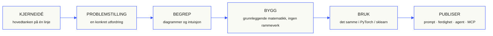

<p align="center"><sub>Denne README-filen er oversatt til norsk bokmål. <a href="../../README.md">Den engelske README-filen</a> er den autoritative kilden.</sub></p>
<p align="center">
  
</p>

<p align="center">
  <a href="../../README.md">🇬🇧 English</a> ·
  <a href="../../i18n/zh/README.md">🇨🇳 简体中文</a> ·
  <a href="../../i18n/zh-TW/README.md">🇹🇼 繁體中文（台灣）</a> ·
  <a href="../../i18n/ja/README.md">🇯🇵 日本語</a> ·
  <a href="../../i18n/ko/README.md">🇰🇷 한국어</a> ·
  <a href="../../i18n/pt/README.md">🇵🇹 Português</a> ·
  <a href="../../i18n/pt-BR/README.md">🇧🇷 Português (Brasil)</a> ·
  <a href="../../i18n/es/README.md">🇪🇸 Español</a> ·
  <a href="../../i18n/de/README.md">🇩🇪 Deutsch</a> ·
  <a href="../../i18n/fr/README.md">🇫🇷 Français</a> ·
  <a href="../../i18n/it/README.md">🇮🇹 Italiano</a> ·
  <a href="../../i18n/nl/README.md">🇳🇱 Nederlands</a> ·
  <a href="../../i18n/pl/README.md">🇵🇱 Polski</a> ·
  <a href="../../i18n/cs/README.md">🇨🇿 Čeština</a> ·
  <a href="../../i18n/ro/README.md">🇷🇴 Română</a> ·
  <a href="../../i18n/hu/README.md">🇭🇺 Magyar</a> ·
  <a href="../../i18n/el/README.md">🇬🇷 Ελληνικά</a> ·
  <a href="../../i18n/sv/README.md">🇸🇪 Svenska</a> ·
  <a href="../../i18n/da/README.md">🇩🇰 Dansk</a> ·
  <a href="../../i18n/no/README.md">🇳🇴 Norsk</a> ·
  <a href="../../i18n/fi/README.md">🇫🇮 Suomi</a> ·
  <a href="../../i18n/ru/README.md">🇷🇺 Русский</a> ·
  <a href="../../i18n/uk/README.md">🇺🇦 Українська</a> ·
  <a href="../../i18n/tr/README.md">🇹🇷 Türkçe</a> ·
  <a href="../../i18n/he/README.md">🇮🇱 עברית</a> ·
  <a href="../../i18n/ar/README.md">🇸🇦 العربية</a> ·
  <a href="../../i18n/fa/README.md">🇮🇷 فارسی</a> ·
  <a href="../../i18n/hi/README.md">🇮🇳 हिन्दी</a> ·
  <a href="../../i18n/bn/README.md">🇧🇩 বাংলা</a> ·
  <a href="../../i18n/ur/README.md">🇵🇰 اردو</a> ·
  <a href="../../i18n/th/README.md">🇹🇭 ไทย</a> ·
  <a href="../../i18n/vi/README.md">🇻🇳 Tiếng Việt</a> ·
  <a href="../../i18n/id/README.md">🇮🇩 Bahasa Indonesia</a> ·
  <a href="../../i18n/tl/README.md">🇵🇭 Tagalog</a>
</p>

<p align="center">
  <a href="../../LICENSE"></a>
  <a href="../../ROADMAP.md"></a>
  <a href="#contents"></a>
  <a href="https://github.com/rohitg00/ai-engineering-from-scratch/stargazers"></a>
  <a href="https://aiengineeringfromscratch.com"></a>
  <p align="center">
 <a href="https://www.star-history.com/rohitg00/ai-engineering-from-scratch">
  <picture><source media="(prefers-color-scheme: dark)" srcset="https://api.star-history.com/badge?repo=rohitg00/ai-engineering-from-scratch&type=rank&theme=dark" /><source media="(prefers-color-scheme: light)" srcset="https://api.star-history.com/badge?repo=rohitg00/ai-engineering-from-scratch&type=rank" /></picture> <picture><source media="(prefers-color-scheme: dark)" srcset="https://api.star-history.com/badge?repo=rohitg00/ai-engineering-from-scratch&type=trending&theme=dark" /><source media="(prefers-color-scheme: light)" srcset="https://api.star-history.com/badge?repo=rohitg00/ai-engineering-from-scratch&type=trending" /></picture>
 </a>
</p>
</p>

### Sponsorer

<p align="center">
  <a href="https://serpapi.com/ai-engineering-from-scratch"><picture><source media="(min-width: 768px)" srcset="../../assets/sponsors/serpapi-banner-compact.png" width="48%"></picture></a>
  <a href="https://nitrostack.ai/referral/aiengineeringfromscratch"><picture><source media="(min-width: 768px)" srcset="../../assets/sponsors/nitrostack-banner-equal.png" width="48%"></picture></a>
</p>

<p align="center">
  <sub><span>Støtten din holder hver leksjon gratis og med åpen kildekode.</span> <a href="#supporters">Se alle støttespillere</a> · <a href="../../SPONSORS.md">Bli sponsor</a></sub>
</p>

```text
░░░▒▒▒░░░▒▒▒░░░▒▒▒░░░▒▒▒░░░▒▒▒░░░▒▒▒░░░▒▒▒░░░▒▒▒░░░▒▒▒░░░▒▒▒░░░▒▒▒░░░▒▒▒░░░▒▒▒░░░▒▒▒░░░▒▒▒
```

> **84% av studentene bruker allerede AI-verktøy. Bare 18% føler seg klare til å bruke dem profesjonelt.** Dette pensumet bygger bro over forskjellen.
>
> 523 leksjoner. 20 faser. ~342 timer. Python, TypeScript, Rust, Julia. Hver leksjon gir et gjenbrukbart resultat: en prompt, en ferdighet, en agent eller en MCP-server. Gratis, åpen kildekode, MIT.
>
> Du lærer ikke bare om AI. Du bygger den. Fra start til slutt, selv.

<!-- STATS:START (generated from site/stats.json by build.js — do not edit by hand) -->
<p align="center"><sub><b>114,584</b> lesere &nbsp;·&nbsp; <b>181,995</b> sidevisninger de siste 30 dagene &nbsp;·&nbsp; oppdatert 2026-08-29</sub></p>
<!-- STATS:END -->

## Start her: velg hva du vil bygge

Du trenger ikke gå gjennom 523 leksjoner før du begynner. Velg et mål. Hver lenke åpner det samme pensumet på GitHub eller nettstedet, og begge versjonene bruker samme leksjonskode.

| Målet ditt | Lær på GitHub | Lær på nettstedet |
|---|---|---|
| Jeg er nybegynner og vil ha et komplett grunnlag | [Fase 0: Oppsett og verktøy](../../phases/00-setup-and-tooling/) | [Utviklingsmiljø](https://aiengineeringfromscratch.com/lesson?path=phases/00-setup-and-tooling/01-dev-environment) |
| Jeg kan Python og vil lære grunnleggende matematikk og maskinlæring | [Fase 1: Matematisk grunnlag](../../phases/01-math-foundations/) | [Intuisjon for lineær algebra](https://aiengineeringfromscratch.com/lesson?path=phases/01-math-foundations/01-linear-algebra-intuition) |
| Jeg vil bygge LLM-applikasjoner for produksjon | [Fase 11: LLM-utvikling](../../phases/11-llm-engineering/) | [Promptutvikling](https://aiengineeringfromscratch.com/lesson?path=phases/11-llm-engineering/01-prompt-engineering) |
| Jeg vil bygge agenter | [Fase 14: Agentutvikling](../../phases/14-agent-engineering/) | [Agentløkken](https://aiengineeringfromscratch.com/lesson?path=phases/14-agent-engineering/01-the-agent-loop) |
| Jeg vil bruke kodeagenter i virkelige kodelagre | [Læringsløp for agentassistert utvikling](../../learning-paths/using-coding-agents.json) | [Agentassistert utvikling](https://aiengineeringfromscratch.com/lesson?path=phases/14-agent-engineering/31-agent-workbench-why-models-fail&learningPath=using-coding-agents) |
| Jeg vil avklare hva som bør bygges før implementeringen | [Læringsløp for produktvurdering og levering](../../learning-paths/shaping-the-build.json) | [Produktvurdering og levering](https://aiengineeringfromscratch.com/lesson?path=phases/14-agent-engineering/47-outcomes-before-output&learningPath=shaping-the-build) |
| Jeg vil bygge med Model Context Protocol (MCP) | [Løp for Model Context Protocol (MCP)](../../phases/13-tools-and-protocols/README.md#model-context-protocol-mcp-path) | [Læringsløp for Model Context Protocol (MCP)](https://aiengineeringfromscratch.com/lesson?path=phases/13-tools-and-protocols/06-mcp-fundamentals&learningPath=model-context-protocol) |
| Jeg vil skrive og publisere Agent Skills | [Fokusert løp for Agent Skills](../../phases/13-tools-and-protocols/README.md#agent-skills-fast-path) | [Læringsløp for Agent Skills](https://aiengineeringfromscratch.com/lesson?path=phases/13-tools-and-protocols/22-skills-and-agent-sdks&learningPath=agent-skills) |
| Jeg vil forberede meg til en Claude-sertifisering | [Kom i gang med sertifiseringsforberedelsene](../../certifications/claude/GETTING_STARTED.md) | [Sertifiseringsakademiet](https://aiengineeringfromscratch.com/certifications.html) |
| Jeg vil forberede meg til MCP Associate (MCPA) | [Kom i gang med MCPA](../../certifications/mcpa/GETTING_STARTED.md) | [MCPA-læringsløpet](https://aiengineeringfromscratch.com/certification?id=mcpa-f) |

Er du usikker på hvor du skal begynne? Bruk [nivåvurderingen med veilederen `start-learning`](../../skills/start-learning/SKILL.md) eller [nettstedets veiviser til forkunnskaper](https://aiengineeringfromscratch.com/prereqs.html).

Sammenlign fire kjerneområder og seks karriereveier i [læringsløpene for AI-utvikling](https://aiengineeringfromscratch.com/learning-paths.html).

### Arbeid med hver leksjon på samme måte

1. **Les** `docs/en.md`, og forklar hovedideen med egne ord.
2. **Skriv og bygg** den viktige koden i stedet for å behandle kodeblokken som pynt.
3. **Kjør** leksjonens kommando fra roten av kodelageret, mappen som inneholder `README.md` og `phases/`.
4. **Ta vare på dokumentasjon**: kommandoen, arbeidsmappen, avslutningskoden, meningsfull utdata og resultatet du endret eller laget.
5. **Fortsett** først når du kan forklare resultatet og gjøre en liten endring uten å gjette.

Stier i kommandoer på leksjonssidene tar utgangspunkt i roten av prosjektarkivet, med mindre leksjonen uttrykkelig ber deg bytte mappe. Hvis en leksjon har flere programmeringsspråk, skal du kjøre implementasjonen for språket du lærer.

### Klon prosjektarkivet og lag ditt første bevis på fremgang

```bash
git clone https://github.com/rohitg00/ai-engineering-from-scratch.git
cd ai-engineering-from-scratch
python3 phases/00-setup-and-tooling/01-dev-environment/code/verify.py --route beginner
python3 phases/01-math-foundations/01-linear-algebra-intuition/code/vectors.py
```

Forhåndskontrollen skiller mellom krav du må oppfylle nå, og verktøy du først trenger senere. For hvert obligatorisk krav som ikke er oppfylt, vises årsaken og en kommando som kan løse problemet. Den andre kommandoen kjører en leksjon uten eksterne avhengigheter og viser til slutt at multiplikasjon av en matrise med en vektor er operasjonen som foregår inne i et nevralt nettverkslag. Lagre terminalutskriften som ditt første bevis.

## Legg til AI-veilederen på 30 sekunder

Hvis Node.js, `npx` og en kodeagent som støtter ferdigheter allerede er installert, kan du gjøre kodeagenten til veilederen din med to kommandoer. Du trenger ikke klone arkivet for å installere eller lese veilederen. Kjørbare øvelser i de fokuserte læringsløpene krever `python3`. Agent Skills-øvelser krever også et valgt vertsprogram og en ferdighetsmappe for brukeren eller prosjektet som du kan skrive til.

Kontroller først de lokale forutsetningene:

```bash
node --version
npx --version
python3 --version
```

Installer deretter kursets ferdigheter, og velg ønsket vertsprogram og installasjonsomfang når installasjonsprogrammet spør:

```bash
npx skills add rohitg00/ai-engineering-from-scratch
```

Syntaksen for å kalle ferdigheter bestemmes av vertsprogrammet, ikke av det portable `SKILL.md`-formatet:

| Vertsprogram | Start kurset | Start med Model Context Protocol (MCP) | Start med Agent Skills | Ta en kunnskapstest for en fase |
|---|---|---|---|---|
| Codex | `start-learning`, eller velg den fra `/skills` | `learn-mcp`, eller velg den fra `/skills` | `learn-agent-skills`, eller velg den fra `/skills` | `check-understanding 13`, eller velg den fra `/skills` |
| Claude Code | `/start-learning` | `/learn-mcp` | `/learn-agent-skills` | `/check-understanding 13` |
| Andre kompatible vertsprogrammer | `Use start-learning to begin the course.` | `Use learn-mcp to start the Model Context Protocol (MCP) path.` | `Use learn-agent-skills to start the Agent Skills Engineering path.` | `Use check-understanding to quiz me on Phase 13.` |

En nivåprøve med ti spørsmål knytter bakgrunnen din til en passende startfase og lagrer en personlig læringsplan i `LEARNING.md`. Deretter underviser ferdigheten `learn` i én leksjon per økt: begrep, matematikk, kode og kunnskapstest. Den henter leksjonene direkte fra dette arkivet, og `course-guide` fører deg til akkurat den leksjonen som behandler det du sitter fast i. Bruk `learn` og `course-guide` i Codex, `/learn` og `/course-guide` i Claude Code, eller be et annet kompatibelt vertsprogram om å bruke ferdigheten ved navn.

Vil du bare lære Model Context Protocol (MCP)? Bruk MCP-kallet for vertsprogrammet ditt. Det oppretter `MCP-LEARNING.md` og følger et sammenhengende løp med 17 leksjoner om tilstandsløse forespørsler, transporter, toveisarbeid, sikkerhet, pålitelighet, registerstyring og dokumentasjon på protokollsamsvar. Den nøyaktige rekkefølgen og kontrollpunktene finnes i [manifestet for Model Context Protocol (MCP)](../../learning-paths/model-context-protocol.json).

Vil du bare lære Agent Skills? Bruk Agent Skills-kallet for vertsprogrammet ditt. Det oppretter `AGENT-SKILLS-LEARNING.md` og følger fem sammenhengende leksjoner: kontrakt, oppdagelse, kall, sandkassegrenser og til slutt evaluering før publisering og portabilitet mellom virkelige vertsprogrammer. Start på nettet med [læringsløpet for Agent Skills](https://aiengineeringfromscratch.com/lesson?path=phases/13-tools-and-protocols/22-skills-and-agent-sdks&learningPath=agent-skills).

Installasjonsprogrammet viser hvilke vertsprogrammer det kan konfigurere, og spør hvor ferdighetene skal installeres. Hvis du ennå mangler Node.js, `npx`, `python3`, et kompatibelt vertsprogram eller en mappe med skrivetilgang, kan du bruke nettstedet eller lese `docs/en.md` manuelt. Da lærer du begrepene, men dokumentasjon på oppdagelse, kall, skriptkjøring og avinstallering i et virkelig vertsprogram må vente til forhåndskontrollen kan gjennomføres. Les leksjonene på [aiengineeringfromscratch.com](https://aiengineeringfromscratch.com).

## Slik fungerer det

Det meste AI-materialet lærer deg løsrevne deler. En artikkel her, et innlegg om finjustering der, en imponerende agentdemo et tredje sted. Delene blir sjelden til en helhet. Du lanserer en chatbot, men kan ikke forklare tapskurven. Du kobler en funksjon til en agent, men kan ikke forklare hva attention gjør i modellen som kaller den.

Dette pensumet gir deg helheten. 20 faser, 523 leksjoner, fire språk: Python, TypeScript, Rust og Julia. Lineær algebra i den ene enden, autonome svermer i den andre. Hver algoritme bygges først fra den grunnleggende matematikken. Tilbakepropagering. Tokenisering. Attention. Agentløkken. Når PyTorch introduseres, vet du allerede hva som skjer under overflaten.

Hver leksjon følger samme arbeidsflyt: les problemet, utled matematikken, skriv koden, kjør testen og behold resultatet. Ingen videoer på fem minutter, ingen utrulling ved å kopiere og lime inn, ingen detaljstyring. Gratis, med åpen kildekode og bygget for å kjøre på din egen bærbare datamaskin.

```text
░░░▒▒▒░░░▒▒▒░░░▒▒▒░░░▒▒▒░░░▒▒▒░░░▒▒▒░░░▒▒▒░░░▒▒▒░░░▒▒▒░░░▒▒▒░░░▒▒▒░░░▒▒▒░░░▒▒▒░░░▒▒▒░░░▒▒▒
```

## Pensumets oppbygning

Tjue faser bygger på hverandre. Matematikken er fundamentet. Agenter og produksjon er de øverste lagene. Hopp frem hvis du allerede kan det grunnleggende, men ikke hopp over det og lur deretter på hvorfor noe høyere oppe går i stykker.

```mermaid
%%{init: {'theme':'base','themeVariables':{'primaryColor':'#fafaf5','primaryTextColor':'#1a1a1a','primaryBorderColor':'#3553ff','lineColor':'#3553ff','fontFamily':'JetBrains Mono','fontSize':'12px'}}}%%
flowchart TB
  P0["Fase 0: Installasjon og verktøy"] --> P1["Fase 1: Matematisk grunnlag"]
  P1 --> P2["Fase 2: Grunnleggende maskinlæring"]
  P2 --> P3["Fase 3: Kjernen i dyp læring"]
  P3 --> P4["Fase 4: Maskinsyn"]
  P3 --> P5["Fase 5: NLP fra grunnlag til avanserte emner"]
  P3 --> P6["Fase 6: Tale og lyd"]
  P3 --> P9["Fase 9: Forsterkningslæring"]
  P5 --> P7["Fase 7: Fordypning i Transformers"]
  P7 --> P8["Fase 8: Generativ AI"]
  P7 --> P10["Fase 10: Store språkmodeller fra bunnen av"]
  P10 --> P11["Fase 11: Utvikling med store språkmodeller"]
  P10 --> P12["Fase 12: Multimodal AI"]
  P11 --> P13["Fase 13: Verktøy og protokoller"]
  P13 --> P14["Fase 14: Agentutvikling"]
  P14 --> P15["Fase 15: Autonome systemer"]
  P15 --> P16["Fase 16: Flere agenter og svermer"]
  P14 --> P17["Fase 17: Infrastruktur og produksjon"]
  P15 --> P18["Fase 18: Etikk, sikkerhet og alignment"]
  P16 --> P19["Fase 19: Avsluttende prosjekter"]
  P17 --> P19
  P18 --> P19
```



```text
░░░▒▒▒░░░▒▒▒░░░▒▒▒░░░▒▒▒░░░▒▒▒░░░▒▒▒░░░▒▒▒░░░▒▒▒░░░▒▒▒░░░▒▒▒░░░▒▒▒░░░▒▒▒░░░▒▒▒░░░▒▒▒░░░▒▒▒
```

## Leksjonenes oppbygning

Hver leksjon ligger i sin egen mappe, med samme struktur gjennom hele pensumet:

```text
phases/<NN>-<phase-name>/<NN>-<lesson-name>/
├── code/      kjørbare implementasjoner (Python, TypeScript, Rust, Julia)
├── docs/
│   └── en.md  leksjonens forklaring
└── outputs/   prompter, ferdigheter, agenter eller MCP-servere som leksjonen produserer
```

Hver leksjon har seks trinn. Inndelingen *Bygg / Bruk* er avgjørende: først implementerer du algoritmen fra bunnen av, deretter kjører du det samme med produksjonsbiblioteket. Du forstår hva rammeverket gjør fordi du selv har skrevet den mindre utgaven.



## Kom i gang

Tre måter å begynne på. Velg én.

**Alternativ A: lær i terminalen *(anbefalt)*.** Etter forhåndskontrollen av Node.js, `npx`, vertsprogram og installasjonsomfang ovenfor installerer du læringsferdighetene i en kompatibel agent og lar kurset lede arbeidet:

```bash
npx skills add rohitg00/ai-engineering-from-scratch
```

Bruk tabellen ovenfor med kall for hvert vertsprogram. De installerte ferdighetene gir deg `start-learning`, `learn`, `course-guide` og de fokuserte løpene `learn-mcp` og `learn-agent-skills`. Leksjonsteksten kan hentes direkte fra arkivet uten kloning. En lokal klon er nødvendig for kopierte kodekommandoer fra arkivet og kjørbare MCP- eller Agent Skills-øvelser. Fremgang lagres i `LEARNING.md`, `MCP-LEARNING.md` eller `AGENT-SKILLS-LEARNING.md` i prosjektet ditt, slik at hver økt kan fortsette der du slapp.

**Alternativ B: les.** Åpne en ferdig leksjon på [aiengineeringfromscratch.com](https://aiengineeringfromscratch.com), eller utvid en fase under [Innhold](#contents). Ingen installasjon eller kloning er nødvendig.

**Alternativ C: klon og kjør.**

```bash
git clone https://github.com/rohitg00/ai-engineering-from-scratch.git
cd ai-engineering-from-scratch
python3 phases/01-math-foundations/01-linear-algebra-intuition/code/vectors.py
```

Når du kloner arkivet, lastes læringsferdighetene også automatisk inn i Claude Code. Veilederen `learn` får tilgang til koden i hver leksjon og kan faktisk kjøre den i stedet for bare å gå gjennom teksten.

### Forkunnskaper

- Du kan skrive kode i et eller annet språk; Python er en fordel.
- Du vil forstå hvordan AI **faktisk virker**, ikke bare kalle API-er.

### Forbered deg til Claude-sertifiseringene

[Claude Certification Academy](../../certifications/claude/README.md) er et gratis forberedelsesprogram med åpen kildekode for alle fire offisielle Claude-sertifiseringsspor: Associate Foundations, Developer Foundations, Architect Foundations og Architect Professional. Hvert løp kombinerer leksjoner knyttet til eksamensplanen, kjørbare øvelser, en diagnostisk prøve, et avsluttende prosjekt og en egen øvingseksamen i full lengde.

Bruk [GitHub-veiledningen for AI-støttet kursstart](../../certifications/claude/GETTING_STARTED.md) med Claude Code, Codex, ChatGPT, Cursor eller en annen agent. Kjør `claude-certification` i Codex, `/claude-certification` i Claude Code, eller be et annet vertsprogram om å bruke `claude-certification`. Den velger et spor, oppretter et varig læringsløp i `CLAUDE-CERTIFICATION.md`, underviser ett trinn av gangen, kjører de virkelige øvelsene og gir tilbakemelding på arbeidsresultatene dine. Samme pensum finnes på [sertifiseringsnettstedet](https://aiengineeringfromscratch.com/certifications.html).

Akademiet er uavhengig studiemateriale basert på offentlige eksamensmål. Det er ikke tilknyttet Anthropic, gjengir ingen ekte eksamensspørsmål og kan ikke garantere at du består.

### Forbered deg til sertifiseringen MCP Associate (MCPA)

[MCPA-sertifiseringspensumet](../../certifications/mcpa/README.md) er et gratis forberedelsesprogram med åpen kildekode for Agentic AI Foundations eksamen Model Context Protocol Associate, som tilbys gjennom Linux Foundation Training. De 34 leksjonene lærer deg den tilstandsløse protokollen 2026-07-28 innenfor eksamenens fem områder: `_meta` per forespørsel og `server/discover` i stedet for det gamle håndtrykket, forespørsler med flere runder, abonnementer, hurtigbufring, utvidelsene Tasks og MCP Apps, OAuth-autorisasjon og register- og SDK-nivåene. Hver leksjon inneholder en kjørbar øvelse som bare bruker standardbiblioteket, og der utskriften kontrolleres mot det aktuelle meldingsformatet. Sporet inneholder også en diagnostisk prøve, et avsluttende prosjekt og tre egne øvingseksamener i full lengde med en spørsmålsfordeling som følger vektingen i den publiserte eksamensplanen.

Bruk [GitHub-veiledningen for AI-støttet kursstart](../../certifications/mcpa/GETTING_STARTED.md) med Claude Code, Codex, ChatGPT, Cursor eller en annen agent. Kjør `mcpa-certification` i Codex, `/mcpa-certification` i Claude Code, eller be et annet vertsprogram om å bruke `mcpa-certification`. Den oppretter et varig læringsløp i `MCPA-CERTIFICATION.md`, underviser ett trinn av gangen, kjører de virkelige øvelsene og gir tilbakemelding på arbeidsresultatene dine. Samme pensum finnes på [siden for MCPA-sporet](https://aiengineeringfromscratch.com/certification?id=mcpa-f).

Pensumet er uavhengig studiemateriale basert på offentlige eksamensmål. Det er ikke tilknyttet Agentic AI Foundation eller Linux Foundation, gjengir ingen ekte eksamensspørsmål og kan ikke garantere at du består.

### Læringsferdighetene

| Ferdighet | Hva den gjør |
|---|---|
| [`start-learning`](../../skills/start-learning/SKILL.md) | Introduksjon ved kursstart: hvorfor du lærer, nivåprøve og en personlig plan lagret i `LEARNING.md`. |
| [`learn`](../../skills/learn/SKILL.md) | Veilederens arbeidsflyt. Først repetisjon, så neste leksjon interaktivt og deretter kunnskapstesten; fremgang og en repetisjonskø lagres. |
| [`course-guide`](../../skills/course-guide/SKILL.md) | Emneveiviser. «Hvor lærer jeg attention?» eller «tapet mitt er NaN» → de relevante leksjonene med lenker. |
| [`learn-mcp`](../../skills/learn-mcp/SKILL.md) | Fokusert veileder i Model Context Protocol (MCP). Oppretter `MCP-LEARNING.md`, følger manifestets 17 leksjoner og lagrer dokumentasjon på meldingsutveksling, sikkerhet, pålitelighet og protokollsamsvar. |
| [`learn-agent-skills`](../../skills/learn-agent-skills/SKILL.md) | Fokusert veileder i Agent Skills. Oppretter `AGENT-SKILLS-LEARNING.md`, underviser i leksjonene 22, 24, 25, 26 og 27 og lagrer dokumentasjon fra virkelige vertsprogrammer. |
| [`claude-certification`](../../skills/claude-certification/SKILL.md) | Sertifiseringsveileder. Velger CCAO-F, CCDV-F, CCAR-F eller CCAR-P, underviser i hver leksjon, kjører øvelser, gjennomgår arbeidsresultater, gjennomfører diagnostiske prøver og øvingseksamener og lagrer fremgang. |
| [`mcpa-certification`](../../skills/mcpa-certification/SKILL.md) | MCPA-veileder. Følger `mcpa-f` med 34 leksjoner om protokollen 2026-07-28, underviser i hver leksjon, kjører øvelser og meldingskontrollen, gjennomfører den diagnostiske prøven og tre øvingseksamener og lagrer fremgang. |
| [`find-your-level`](../../skills/find-your-level/SKILL.md) | Nivåprøve med ti spørsmål. Knytter kunnskapen din til en passende startfase og lager et personlig læringsløp med tidsanslag. |
| [`check-understanding <phase>`](../../skills/check-understanding/SKILL.md) | Åtte spørsmål per fase med tilbakemelding og konkrete leksjoner for repetisjon. Bruk formen for Codex, Claude Code eller naturlig språk i kalltabellen ovenfor. |

```text
░░░▒▒▒░░░▒▒▒░░░▒▒▒░░░▒▒▒░░░▒▒▒░░░▒▒▒░░░▒▒▒░░░▒▒▒░░░▒▒▒░░░▒▒▒░░░▒▒▒░░░▒▒▒░░░▒▒▒░░░▒▒▒░░░▒▒▒
```

## Les grunnkurset som bok

Grunnkursets 20 faser under `phases/` samles i en bokserie på seks bind. CI bygger EPUB og PDF fra de samme leksjonskildene og legger dem ved hver [GitHub-utgivelse](https://github.com/rohitg00/ai-engineering-from-scratch/releases). Lenkene nedenfor peker alltid på den nyeste utgivelsen. Bindnumrene angir plasseringen i serien, ikke versjonsnumre: hvert eksemplar har et datert utgavestempel, og eldre utgaver kan fortsatt lastes ned fra sine respektive utgivelser.

Sertifiseringskursene er bevisst utelatt fra bøkene. AI-veiledertilstanden, kjørbare øvelser, interaktive figurer, diagnostiske prøver og tidsbegrensede øvingseksamener blir på GitHub og nettstedet.

| Bind | Tittel | Faser | Last ned |
|-----|-------|--------|----------|
| 1 | Grunnlag · Matematikk, verktøy og klassisk maskinlæring | 00-02 | [EPUB](https://github.com/rohitg00/ai-engineering-from-scratch/releases/latest/download/aiefs-vol1-foundations.epub) · [PDF](https://github.com/rohitg00/ai-engineering-from-scratch/releases/latest/download/aiefs-vol1-foundations.pdf) |
| 2 | Dyp læring · Nettverk, bildeanalyse og tale | 03, 04, 06 | [EPUB](https://github.com/rohitg00/ai-engineering-from-scratch/releases/latest/download/aiefs-vol2-deep-learning.epub) · [PDF](https://github.com/rohitg00/ai-engineering-from-scratch/releases/latest/download/aiefs-vol2-deep-learning.pdf) |
| 3 | Språk · NLP-grunnlag og Transformer | 05, 07 | [EPUB](https://github.com/rohitg00/ai-engineering-from-scratch/releases/latest/download/aiefs-vol3-language.epub) · [PDF](https://github.com/rohitg00/ai-engineering-from-scratch/releases/latest/download/aiefs-vol3-language.pdf) |
| 4 | Store språkmodeller · Generering, forsterkning, forhåndstrening og utvikling | 08-11 | [EPUB](https://github.com/rohitg00/ai-engineering-from-scratch/releases/latest/download/aiefs-vol4-llms.epub) · [PDF](https://github.com/rohitg00/ai-engineering-from-scratch/releases/latest/download/aiefs-vol4-llms.pdf) |
| 5 | Agenter · Multimodalitet, protokoller, autonomi og svermer | 12-16 | [EPUB](https://github.com/rohitg00/ai-engineering-from-scratch/releases/latest/download/aiefs-vol5-agents.epub) · [PDF](https://github.com/rohitg00/ai-engineering-from-scratch/releases/latest/download/aiefs-vol5-agents.pdf) |
| 6 | Produksjon · Infrastruktur, sikkerhet og avsluttende prosjekter | 17-19 | [EPUB](https://github.com/rohitg00/ai-engineering-from-scratch/releases/latest/download/aiefs-vol6-production.epub) · [PDF](https://github.com/rohitg00/ai-engineering-from-scratch/releases/latest/download/aiefs-vol6-production.pdf) |

Boken er et øyeblikksbilde; arkivet er den levende utgaven. Hvert kapittel avsluttes med lenker til leksjonens animerte figurer, kunnskapstest og kjørbare kode. Bygg lokalt med `python3 scripts/build_book.py` (krever pandoc). Detaljer om byggeprosessen finnes i [book/README.md](../../book/README.md).

```text
░░░▒▒▒░░░▒▒▒░░░▒▒▒░░░▒▒▒░░░▒▒▒░░░▒▒▒░░░▒▒▒░░░▒▒▒░░░▒▒▒░░░▒▒▒░░░▒▒▒░░░▒▒▒░░░▒▒▒░░░▒▒▒░░░▒▒▒
```

## Hver leksjon gir et resultat

Andre kurs avsluttes med *«Gratulerer, du har lært X.»* Her avsluttes hver leksjon med et **gjenbrukbart verktøy** som du kan installere eller lime inn i den daglige arbeidsflyten din.

<table>
<tr>
<th align="left" width="25%"><br/><sub>FIG_001 · A</sub><br/><b>PROMPTER</b></th>
<th align="left" width="25%"><br/><sub>FIG_001 · B</sub><br/><b>FERDIGHETER</b></th>
<th align="left" width="25%"><br/><sub>FIG_001 · C</sub><br/><b>AGENTER</b></th>
<th align="left" width="25%"><br/><sub>FIG_001 · D</sub><br/><b>MCP-SERVERE</b></th>
</tr>
<tr>
<td valign="top">Lim inn i en hvilken som helst AI-assistent for eksperthjelp med en avgrenset oppgave.</td>
<td valign="top">Legg til i Claude, Cursor, Codex, OpenClaw, Hermes eller en annen agent som leser <code>SKILL.md</code>.</td>
<td valign="top">Rull ut som autonome arbeidere. Du skrev selv agentløkken i fase 14.</td>
<td valign="top">Koble til en hvilken som helst MCP-kompatibel klient. Bygget fra start til slutt i fase 13.</td>
</tr>
</table>

> Installer alt med `python3 scripts/install_skills.py <target>`. Virkelige verktøy, ikke lekser. Når du er ferdig, har du en portefølje med 523 arbeidsresultater som du faktisk forstår fordi du har bygget dem selv.

### FIG_002 · Et gjennomarbeidet eksempel

Fase 14, leksjon 1: agentløkken. ~120 linjer ren Python uten avhengigheter.

<table>
<tr>
<td valign="top" width="50%">

**`code/agent_loop.py`** &nbsp; <sub><i>bygg den</i></sub>

```python
def run(query, tools):
    history = [user(query)]
    for step in range(MAX_STEPS):
        msg = llm(history)
        if msg.tool_calls:
            for call in msg.tool_calls:
                result = tools[call.name](**call.args)
                history.append(tool_result(call.id, result))
            continue
        return msg.content
    raise StepLimitExceeded
```

</td>
<td valign="top" width="50%">

**`outputs/skill-agent-loop.md`** &nbsp; <sub><i>publiser den</i></sub>

```markdown
---
name: agent-loop
description: ReAct-style loop for any tool list
phase: 14
lesson: 01
---

Implement a minimal agent loop that...
```

**`outputs/prompt-debug-agent.md`**

```markdown
You are an agent debugger. Given the trace
of an agent run, identify the step where
the agent went wrong and explain why...
```

</td>
</tr>
</table>

```text
░░░▒▒▒░░░▒▒▒░░░▒▒▒░░░▒▒▒░░░▒▒▒░░░▒▒▒░░░▒▒▒░░░▒▒▒░░░▒▒▒░░░▒▒▒░░░▒▒▒░░░▒▒▒░░░▒▒▒░░░▒▒▒░░░▒▒▒
```

<a id="contents"></a>

## Innhold

Tjue faser. Klikk på en fase for å utvide leksjonslisten.

<a id="phase-0"></a>
### Fase 0: Installasjon og verktøy `12 leksjoner`
> Gjør miljøet ditt klart for alt som følger.

| # | Leksjon | Type | Språk |
|:---:|--------|:----:|------|
| 01 | [Utviklingsmiljø](../../phases/00-setup-and-tooling/01-dev-environment/) | Bygg | Python |
| 02 | [Git og samarbeid](../../phases/00-setup-and-tooling/02-git-and-collaboration/) | Lær | — |
| 03 | [GPU-oppsett og skyen](../../phases/00-setup-and-tooling/03-gpu-setup-and-cloud/) | Bygg | Python |
| 04 | [API-er og nøkler](../../phases/00-setup-and-tooling/04-apis-and-keys/) | Bygg | Python |
| 05 | [Jupyter-notatbøker](../../phases/00-setup-and-tooling/05-jupyter-notebooks/) | Bygg | Python |
| 06 | [Python-miljøer](../../phases/00-setup-and-tooling/06-python-environments/) | Bygg | Shell |
| 07 | [Docker brukt til AI](../../phases/00-setup-and-tooling/07-docker-for-ai/) | Bygg | Docker |
| 08 | [Oppsett av editor](../../phases/00-setup-and-tooling/08-editor-setup/) | Bygg | — |
| 09 | [Datahåndtering](../../phases/00-setup-and-tooling/09-data-management/) | Bygg | Python |
| 10 | [Terminal og skall](../../phases/00-setup-and-tooling/10-terminal-and-shell/) | Lær | — |
| 11 | [Linux brukt til AI](../../phases/00-setup-and-tooling/11-linux-for-ai/) | Lær | — |
| 12 | [Feilsøking og profilering](../../phases/00-setup-and-tooling/12-debugging-and-profiling/) | Bygg | Python |

<details id="phase-1">
<summary><b>Fase 1: Matematisk grunnlag</b> &nbsp;<code>22 leksjoner</code>&nbsp; <em>Intuisjonen bak hver AI-algoritme gjennom kode.</em></summary>
<br/>

| # | Leksjon | Type | Språk |
|:---:|--------|:----:|------|
| 01 | [Intuisjon for lineær algebra](../../phases/01-math-foundations/01-linear-algebra-intuition/) | Lær | Python, Julia |
| 02 | [Vektorer, matriser og operasjoner](../../phases/01-math-foundations/02-vectors-matrices-operations/) | Bygg | Python, Julia |
| 03 | [Matrisetransformasjoner og egenverdier](../../phases/01-math-foundations/03-matrix-transformations/) | Bygg | Python, Julia |
| 04 | [Differensialregning for ML: deriverte og gradienter](../../phases/01-math-foundations/04-calculus-for-ml/) | Lær | Python |
| 05 | [Kjerneregelen og automatisk derivasjon](../../phases/01-math-foundations/05-chain-rule-and-autodiff/) | Bygg | Python |
| 06 | [Sannsynlighet og fordelinger](../../phases/01-math-foundations/06-probability-and-distributions/) | Lær | Python |
| 07 | [Bayes' teorem og statistisk tenkning](../../phases/01-math-foundations/07-bayes-theorem/) | Bygg | Python |
| 08 | [Optimering: familien av gradientnedstigningsmetoder](../../phases/01-math-foundations/08-optimization/) | Bygg | Python |
| 09 | [Informasjonsteori: entropi og KL-divergens](../../phases/01-math-foundations/09-information-theory/) | Lær | Python |
| 10 | [Dimensjonsreduksjon: PCA, t-SNE og UMAP](../../phases/01-math-foundations/10-dimensionality-reduction/) | Bygg | Python |
| 11 | [Singulærverdidekomponering](../../phases/01-math-foundations/11-singular-value-decomposition/) | Bygg | Python, Julia |
| 12 | [Tensoroperasjoner](../../phases/01-math-foundations/12-tensor-operations/) | Bygg | Python |
| 13 | [Numerisk stabilitet](../../phases/01-math-foundations/13-numerical-stability/) | Bygg | Python |
| 14 | [Normer og avstander](../../phases/01-math-foundations/14-norms-and-distances/) | Bygg | Python |
| 15 | [Statistikk for ML](../../phases/01-math-foundations/15-statistics-for-ml/) | Bygg | Python |
| 16 | [Utvalgsmetoder](../../phases/01-math-foundations/16-sampling-methods/) | Bygg | Python |
| 17 | [Lineære ligningssystemer](../../phases/01-math-foundations/17-linear-systems/) | Bygg | Python |
| 18 | [Konveks optimering](../../phases/01-math-foundations/18-convex-optimization/) | Bygg | Python |
| 19 | [Komplekse tall for AI](../../phases/01-math-foundations/19-complex-numbers/) | Lær | Python |
| 20 | [Fouriertransformasjonen](../../phases/01-math-foundations/20-fourier-transform/) | Bygg | Python |
| 21 | [Grafteori for ML](../../phases/01-math-foundations/21-graph-theory/) | Bygg | Python |
| 22 | [Stokastiske prosesser](../../phases/01-math-foundations/22-stochastic-processes/) | Lær | Python |

</details>

<details id="phase-2">
<summary><b>Fase 2: Grunnleggende maskinlæring</b> &nbsp;<code>18 leksjoner</code>&nbsp; <em>Klassisk ML er fortsatt ryggraden i de fleste AI-systemer i produksjon.</em></summary>
<br/>

| # | Leksjon | Type | Språk |
|:---:|--------|:----:|------|
| 01 | [Hva er maskinlæring?](../../phases/02-ml-fundamentals/01-what-is-machine-learning/) | Lær | Python |
| 02 | [Lineær regresjon fra bunnen av](../../phases/02-ml-fundamentals/02-linear-regression/) | Bygg | Python |
| 03 | [Logistisk regresjon og klassifisering](../../phases/02-ml-fundamentals/03-logistic-regression/) | Bygg | Python |
| 04 | [Beslutningstrær og tilfeldige skoger](../../phases/02-ml-fundamentals/04-decision-trees/) | Bygg | Python |
| 05 | [Støttevektormaskiner](../../phases/02-ml-fundamentals/05-support-vector-machines/) | Bygg | Python |
| 06 | [KNN og avstandsmål](../../phases/02-ml-fundamentals/06-knn-and-distances/) | Bygg | Python |
| 07 | [Uovervåket læring: K-Means og DBSCAN](../../phases/02-ml-fundamentals/07-unsupervised-learning/) | Bygg | Python |
| 08 | [Utvikling og utvelgelse av egenskaper](../../phases/02-ml-fundamentals/08-feature-engineering/) | Bygg | Python |
| 09 | [Modellevaluering: måltall og kryssvalidering](../../phases/02-ml-fundamentals/09-model-evaluation/) | Bygg | Python |
| 10 | [Skjevhet, varians og læringskurven](../../phases/02-ml-fundamentals/10-bias-variance/) | Lær | Python |
| 11 | [Ensemblemetoder: boosting, bagging og stacking](../../phases/02-ml-fundamentals/11-ensemble-methods/) | Bygg | Python |
| 12 | [Justering av hyperparametere](../../phases/02-ml-fundamentals/12-hyperparameter-tuning/) | Bygg | Python |
| 13 | [ML-pipeliner og sporing av eksperimenter](../../phases/02-ml-fundamentals/13-ml-pipelines/) | Bygg | Python |
| 14 | [Naiv Bayes](../../phases/02-ml-fundamentals/14-naive-bayes/) | Bygg | Python |
| 15 | [Grunnleggende tidsserier](../../phases/02-ml-fundamentals/15-time-series/) | Bygg | Python |
| 16 | [Deteksjon av avvik](../../phases/02-ml-fundamentals/16-anomaly-detection/) | Bygg | Python |
| 17 | [Håndtering av ubalanserte data](../../phases/02-ml-fundamentals/17-imbalanced-data/) | Bygg | Python |
| 18 | [Utvelgelse av egenskaper](../../phases/02-ml-fundamentals/18-feature-selection/) | Bygg | Python |

</details>

<details id="phase-3">
<summary><b>Fase 3: Kjernen i dyp læring</b> &nbsp;<code>13 leksjoner</code>&nbsp; <em>Nevrale nettverk fra grunnprinsippene. Ingen rammeverk før du har bygget et selv.</em></summary>
<br/>

| # | Leksjon | Type | Språk |
|:---:|--------|:----:|------|
| 01 | [Perseptronet: der alt begynte](../../phases/03-deep-learning-core/01-the-perceptron/) | Bygg | Python |
| 02 | [Flerlagsnettverk og fremoverberegning](../../phases/03-deep-learning-core/02-multi-layer-networks/) | Bygg | Python |
| 03 | [Tilbakepropagering fra bunnen av](../../phases/03-deep-learning-core/03-backpropagation/) | Bygg | Python |
| 04 | [Aktiveringsfunksjoner: ReLU, sigmoid, GELU og hvorfor](../../phases/03-deep-learning-core/04-activation-functions/) | Bygg | Python |
| 05 | [Tapsfunksjoner: MSE, kryssentropi og kontrastive tap](../../phases/03-deep-learning-core/05-loss-functions/) | Bygg | Python |
| 06 | [Optimeringsalgoritmer: SGD, momentum, Adam og AdamW](../../phases/03-deep-learning-core/06-optimizers/) | Bygg | Python |
| 07 | [Regularisering: dropout, vektreduksjon og BatchNorm](../../phases/03-deep-learning-core/07-regularization/) | Bygg | Python |
| 08 | [Initialisering av vekter og stabil trening](../../phases/03-deep-learning-core/08-weight-initialization/) | Bygg | Python |
| 09 | [Planer for læringsraten og oppvarming](../../phases/03-deep-learning-core/09-learning-rate-schedules/) | Bygg | Python |
| 10 | [Bygg ditt eget lille rammeverk](../../phases/03-deep-learning-core/10-mini-framework/) | Bygg | Python |
| 11 | [Introduksjon til PyTorch](../../phases/03-deep-learning-core/11-intro-to-pytorch/) | Bygg | Python |
| 12 | [Introduksjon til JAX](../../phases/03-deep-learning-core/12-intro-to-jax/) | Bygg | Python |
| 13 | [Feilsøking i nevrale nettverk](../../phases/03-deep-learning-core/13-debugging-neural-networks/) | Bygg | Python |

</details>

<details id="phase-4">
<summary><b>Fase 4: Maskinsyn</b> &nbsp;<code>28 leksjoner</code>&nbsp; <em>Fra piksler til forståelse: bilder, video, 3D, VLM-er og verdensmodeller.</em></summary>
<br/>

| # | Leksjon | Type | Språk |
|:---:|--------|:----:|------|
| 01 | [Bildegrunnlag: piksler, kanaler og fargerom](../../phases/04-computer-vision/01-image-fundamentals/) | Lær | Python |
| 02 | [Konvolusjoner fra bunnen av](../../phases/04-computer-vision/02-convolutions-from-scratch/) | Bygg | Python |
| 03 | [CNN-er: fra LeNet til ResNet](../../phases/04-computer-vision/03-cnns-lenet-to-resnet/) | Bygg | Python |
| 04 | [Bildeklassifisering](../../phases/04-computer-vision/04-image-classification/) | Bygg | Python |
| 05 | [Overføringslæring og finjustering](../../phases/04-computer-vision/05-transfer-learning/) | Bygg | Python |
| 06 | [Objektdeteksjon: YOLO fra bunnen av](../../phases/04-computer-vision/06-object-detection-yolo/) | Bygg | Python |
| 07 | [Semantisk segmentering: U-Net](../../phases/04-computer-vision/07-semantic-segmentation-unet/) | Bygg | Python |
| 08 | [Instanssegmentering: Mask R-CNN](../../phases/04-computer-vision/08-instance-segmentation-mask-rcnn/) | Bygg | Python |
| 09 | [Bildegenerering med GAN-er](../../phases/04-computer-vision/09-image-generation-gans/) | Bygg | Python |
| 10 | [Bildegenerering med diffusjonsmodeller](../../phases/04-computer-vision/10-image-generation-diffusion/) | Bygg | Python |
| 11 | [Stable Diffusion: arkitektur og finjustering](../../phases/04-computer-vision/11-stable-diffusion/) | Bygg | Python |
| 12 | [Videoforståelse: tidslig modellering](../../phases/04-computer-vision/12-video-understanding/) | Bygg | Python |
| 13 | [3D-syn: punktskyer og NeRF-er](../../phases/04-computer-vision/13-3d-vision-nerf/) | Bygg | Python |
| 14 | [Vision Transformers (ViT) for bildeanalyse](../../phases/04-computer-vision/14-vision-transformers/) | Bygg | Python |
| 15 | [Bildeanalyse i sanntid: utrulling på kanten](../../phases/04-computer-vision/15-real-time-edge/) | Bygg | Python |
| 16 | [Bygg en komplett pipeline for bildeanalyse](../../phases/04-computer-vision/16-vision-pipeline-capstone/) | Bygg | Python |
| 17 | [Selvovervåket bildeanalyse: SimCLR, DINO og MAE](../../phases/04-computer-vision/17-self-supervised-vision/) | Bygg | Python |
| 18 | [Bildeanalyse med åpent ordforråd: CLIP](../../phases/04-computer-vision/18-open-vocab-clip/) | Bygg | Python |
| 19 | [OCR og dokumentforståelse](../../phases/04-computer-vision/19-ocr-document-understanding/) | Bygg | Python |
| 20 | [Bildesøk og metrisk læring](../../phases/04-computer-vision/20-image-retrieval-metric/) | Bygg | Python |
| 21 | [Deteksjon av nøkkelpunkter og estimering av positur](../../phases/04-computer-vision/21-keypoint-pose/) | Bygg | Python |
| 22 | [3D Gaussian Splatting fra bunnen av](../../phases/04-computer-vision/22-3d-gaussian-splatting/) | Bygg | Python |
| 23 | [Diffusjonstransformere og rectified flow](../../phases/04-computer-vision/23-diffusion-transformers-rectified-flow/) | Bygg | Python |
| 24 | [SAM 3 og segmentering med åpent ordforråd](../../phases/04-computer-vision/24-sam3-open-vocab-segmentation/) | Bygg | Python |
| 25 | [Syn-språk-modeller (ViT-MLP-LLM)](../../phases/04-computer-vision/25-vision-language-models/) | Bygg | Python |
| 26 | [Monokulær dybde- og geometriestimering](../../phases/04-computer-vision/26-monocular-depth/) | Bygg | Python |
| 27 | [Sporing av flere objekter og videohukommelse](../../phases/04-computer-vision/27-multi-object-tracking/) | Bygg | Python |
| 28 | [Verdensmodeller og videodiffusjon](../../phases/04-computer-vision/28-world-models-video-diffusion/) | Bygg | Python |

</details>

<details id="phase-5">
<summary><b>Fase 5: NLP fra grunnlag til avanserte emner</b> &nbsp;<code>29 leksjoner</code>&nbsp; <em>Språk er grensesnittet til intelligens.</em></summary>
<br/>

| # | Leksjon | Type | Språk |
|:---:|--------|:----:|------|
| 01 | [Tekstbehandling: tokenisering, stamming og lemmatisering](../../phases/05-nlp-foundations-to-advanced/01-text-processing/) | Bygg | Python |
| 02 | [Ordposer, TF-IDF og tekstrepresentasjon](../../phases/05-nlp-foundations-to-advanced/02-bag-of-words-tfidf/) | Bygg | Python |
| 03 | [Ordinnbygginger: Word2Vec fra bunnen av](../../phases/05-nlp-foundations-to-advanced/03-word-embeddings-word2vec/) | Bygg | Python |
| 04 | [GloVe, FastText og delordinnbygginger](../../phases/05-nlp-foundations-to-advanced/04-glove-fasttext-subword/) | Bygg | Python |
| 05 | [Sentimentanalyse](../../phases/05-nlp-foundations-to-advanced/05-sentiment-analysis/) | Bygg | Python |
| 06 | [Gjenkjenning av navngitte entiteter (NER)](../../phases/05-nlp-foundations-to-advanced/06-named-entity-recognition/) | Bygg | Python |
| 07 | [Ordklassetagging og syntaktisk analyse](../../phases/05-nlp-foundations-to-advanced/07-pos-tagging-parsing/) | Bygg | Python |
| 08 | [Tekstklassifisering: CNN-er og RNN-er for tekst](../../phases/05-nlp-foundations-to-advanced/08-cnns-rnns-for-text/) | Bygg | Python |
| 09 | [Sekvens-til-sekvens-modeller](../../phases/05-nlp-foundations-to-advanced/09-sequence-to-sequence/) | Bygg | Python |
| 10 | [Attention-mekanismen: gjennombruddet](../../phases/05-nlp-foundations-to-advanced/10-attention-mechanism/) | Bygg | Python |
| 11 | [Maskinoversettelse](../../phases/05-nlp-foundations-to-advanced/11-machine-translation/) | Bygg | Python |
| 12 | [Tekstoppsummering](../../phases/05-nlp-foundations-to-advanced/12-text-summarization/) | Bygg | Python |
| 13 | [Systemer for spørsmål og svar](../../phases/05-nlp-foundations-to-advanced/13-question-answering/) | Bygg | Python |
| 14 | [Informasjonsgjenfinning og søk](../../phases/05-nlp-foundations-to-advanced/14-information-retrieval-search/) | Bygg | Python |
| 15 | [Emnemodellering: LDA og BERTopic](../../phases/05-nlp-foundations-to-advanced/15-topic-modeling/) | Bygg | Python |
| 16 | [Tekstgenerering](../../phases/05-nlp-foundations-to-advanced/16-text-generation-pre-transformer/) | Bygg | Python |
| 17 | [Chatboter: fra regler til nevrale nettverk](../../phases/05-nlp-foundations-to-advanced/17-chatbots-rule-to-neural/) | Bygg | Python |
| 18 | [Flerspråklig NLP](../../phases/05-nlp-foundations-to-advanced/18-multilingual-nlp/) | Bygg | Python |
| 19 | [Delordtokenisering: BPE, WordPiece, Unigram og SentencePiece](../../phases/05-nlp-foundations-to-advanced/19-subword-tokenization/) | Lær | Python |
| 20 | [Strukturerte utdata og begrenset dekoding](../../phases/05-nlp-foundations-to-advanced/20-structured-outputs-constrained-decoding/) | Bygg | Python |
| 21 | [NLI og tekstlig slutning](../../phases/05-nlp-foundations-to-advanced/21-nli-textual-entailment/) | Lær | Python |
| 22 | [Fordypning i innbyggingsmodeller](../../phases/05-nlp-foundations-to-advanced/22-embedding-models-deep-dive/) | Lær | Python |
| 23 | [Strategier for tekstoppsplitting i RAG](../../phases/05-nlp-foundations-to-advanced/23-chunking-strategies-rag/) | Bygg | Python |
| 24 | [Koreferanseoppløsning](../../phases/05-nlp-foundations-to-advanced/24-coreference-resolution/) | Lær | Python |
| 25 | [Entitetskobling og avklaring av flertydighet](../../phases/05-nlp-foundations-to-advanced/25-entity-linking/) | Bygg | Python |
| 26 | [Uttrekking av relasjoner og bygging av kunnskapsgrafer](../../phases/05-nlp-foundations-to-advanced/26-relation-extraction-kg/) | Bygg | Python |
| 27 | [LLM-evaluering: RAGAS, DeepEval og G-Eval](../../phases/05-nlp-foundations-to-advanced/27-llm-evaluation-frameworks/) | Bygg | Python |
| 28 | [Evaluering av lang kontekst: NIAH, RULER, LongBench og MRCR](../../phases/05-nlp-foundations-to-advanced/28-long-context-evaluation/) | Lær | Python |
| 29 | [Sporing av dialogtilstand](../../phases/05-nlp-foundations-to-advanced/29-dialogue-state-tracking/) | Bygg | Python |

</details>

<details id="phase-6">
<summary><b>Fase 6: Tale og lyd</b> &nbsp;<code>17 leksjoner</code>&nbsp; <em>Hør, forstå og snakk.</em></summary>
<br/>

| # | Leksjon | Type | Språk |
|:---:|--------|:----:|------|
| 01 | [Lydgrunnlag: bølgeformer, sampling og FFT](../../phases/06-speech-and-audio/01-audio-fundamentals) | Lær | Python |
| 02 | [Spektrogrammer, mel-skala og lydegenskaper](../../phases/06-speech-and-audio/02-spectrograms-mel-features) | Bygg | Python |
| 03 | [Lydklassifisering](../../phases/06-speech-and-audio/03-audio-classification) | Bygg | Python |
| 04 | [Talegjenkjenning (ASR)](../../phases/06-speech-and-audio/04-speech-recognition-asr) | Bygg | Python |
| 05 | [Whisper: arkitektur og finjustering](../../phases/06-speech-and-audio/05-whisper-architecture-finetuning) | Bygg | Python |
| 06 | [Talergjenkjenning og -verifisering](../../phases/06-speech-and-audio/06-speaker-recognition-verification) | Bygg | Python |
| 07 | [Tekst til tale (TTS)](../../phases/06-speech-and-audio/07-text-to-speech) | Bygg | Python |
| 08 | [Stemmekloning og stemmekonvertering](../../phases/06-speech-and-audio/08-voice-cloning-conversion) | Bygg | Python |
| 09 | [Musikkgenerering](../../phases/06-speech-and-audio/09-music-generation) | Bygg | Python |
| 10 | [Lyd-språk-modeller](../../phases/06-speech-and-audio/10-audio-language-models) | Bygg | Python |
| 11 | [Lydbehandling i sanntid](../../phases/06-speech-and-audio/11-real-time-audio-processing) | Bygg | Python |
| 12 | [Bygg en pipeline for en stemmeassistent](../../phases/06-speech-and-audio/12-voice-assistant-pipeline) | Bygg | Python |
| 13 | [Nevrale lydkodeker: EnCodec, SNAC, Mimi og DAC](../../phases/06-speech-and-audio/13-neural-audio-codecs) | Lær | Python |
| 14 | [Deteksjon av taleaktivitet og turtaking](../../phases/06-speech-and-audio/14-voice-activity-detection-turn-taking) | Bygg | Python |
| 15 | [Strømming fra tale til tale: Moshi og Hibiki](../../phases/06-speech-and-audio/15-streaming-speech-to-speech-moshi-hibiki) | Lær | Python |
| 16 | [Beskyttelse mot stemmeforfalskning og vannmerking av lyd](../../phases/06-speech-and-audio/16-anti-spoofing-audio-watermarking) | Bygg | Python |
| 17 | [Lydevaluering: WER, MOS, MMAU og rangeringer](../../phases/06-speech-and-audio/17-audio-evaluation-metrics) | Lær | Python |

</details>

<details id="phase-7">
<summary><b>Fase 7: Fordypning i Transformers</b> &nbsp;<code>16 leksjoner</code>&nbsp; <em>Arkitekturen som endret alt.</em></summary>
<br/>

| # | Leksjon | Type | Språk |
|:---:|--------|:----:|------|
| 01 | [Hvorfor Transformers: problemene med RNN-er](../../phases/07-transformers-deep-dive/01-why-transformers/) | Lær | Python |
| 02 | [Self-attention fra bunnen av](../../phases/07-transformers-deep-dive/02-self-attention-from-scratch/) | Bygg | Python |
| 03 | [Attention med flere hoder](../../phases/07-transformers-deep-dive/03-multi-head-attention/) | Bygg | Python |
| 04 | [Posisjonskoding: sinus, RoPE og ALiBi](../../phases/07-transformers-deep-dive/04-positional-encoding/) | Bygg | Python |
| 05 | [Den komplette Transformer: koder og dekoder](../../phases/07-transformers-deep-dive/05-full-transformer/) | Bygg | Python |
| 06 | [BERT: maskert språkmodellering](../../phases/07-transformers-deep-dive/06-bert-masked-language-modeling/) | Bygg | Python |
| 07 | [GPT: kausal språkmodellering](../../phases/07-transformers-deep-dive/07-gpt-causal-language-modeling/) | Bygg | Python |
| 08 | [T5 og BART: koder-dekoder-modeller](../../phases/07-transformers-deep-dive/08-t5-bart-encoder-decoder/) | Lær | Python |
| 09 | [Vision Transformers (ViT) for bildeanalyse](../../phases/07-transformers-deep-dive/09-vision-transformers/) | Bygg | Python |
| 10 | [Lydtransformere: Whispers arkitektur](../../phases/07-transformers-deep-dive/10-audio-transformers-whisper/) | Lær | Python |
| 11 | [Blanding av eksperter (MoE)](../../phases/07-transformers-deep-dive/11-mixture-of-experts/) | Bygg | Python |
| 12 | [KV-hurtigbuffer, Flash Attention og inferensoptimering](../../phases/07-transformers-deep-dive/12-kv-cache-flash-attention/) | Bygg | Python |
| 13 | [Skaleringslover](../../phases/07-transformers-deep-dive/13-scaling-laws/) | Lær | Python |
| 14 | [Bygg en Transformer fra bunnen av](../../phases/07-transformers-deep-dive/14-build-a-transformer-capstone/) | Bygg | Python |
| 15 | [Attention-varianter: glidende vindu, sparsom og differensiell](../../phases/07-transformers-deep-dive/15-attention-variants/) | Bygg | Python |
| 16 | [Spekulativ dekoding: foreslå, verifiser, gjenta](../../phases/07-transformers-deep-dive/16-speculative-decoding/) | Bygg | Python |

</details>

<details id="phase-8">
<summary><b>Fase 8: Generativ AI</b> &nbsp;<code>15 leksjoner</code>&nbsp; <em>Skap bilder, video, lyd, 3D og mye mer.</em></summary>
<br/>

| # | Leksjon | Type | Språk |
|:---:|--------|:----:|------|
| 01 | [Generative modeller: taksonomi og historie](../../phases/08-generative-ai/01-generative-models-taxonomy-history/) | Lær | Python |
| 02 | [Autokodere og VAE](../../phases/08-generative-ai/02-autoencoders-vae/) | Bygg | Python |
| 03 | [GAN-er: generator mot diskriminator](../../phases/08-generative-ai/03-gans-generator-discriminator/) | Bygg | Python |
| 04 | [Betingede GAN-er og Pix2Pix](../../phases/08-generative-ai/04-conditional-gans-pix2pix/) | Bygg | Python |
| 05 | [StyleGAN-modellen](../../phases/08-generative-ai/05-stylegan/) | Bygg | Python |
| 06 | [Diffusjonsmodeller: DDPM fra bunnen av](../../phases/08-generative-ai/06-diffusion-ddpm-from-scratch/) | Bygg | Python |
| 07 | [Latent diffusjon og Stable Diffusion](../../phases/08-generative-ai/07-latent-diffusion-stable-diffusion/) | Bygg | Python |
| 08 | [ControlNet, LoRA og betinget generering](../../phases/08-generative-ai/08-controlnet-lora-conditioning/) | Bygg | Python |
| 09 | [Utfylling, utvidelse og redigering av bilder](../../phases/08-generative-ai/09-inpainting-outpainting-editing/) | Bygg | Python |
| 10 | [Videogenerering](../../phases/08-generative-ai/10-video-generation/) | Bygg | Python |
| 11 | [Lydgenerering](../../phases/08-generative-ai/11-audio-generation/) | Bygg | Python |
| 12 | [3D-generering](../../phases/08-generative-ai/12-3d-generation/) | Bygg | Python |
| 13 | [Flow matching og rectified flows](../../phases/08-generative-ai/13-flow-matching-rectified-flows/) | Bygg | Python |
| 14 | [Evaluering: FID og CLIP-skår](../../phases/08-generative-ai/14-evaluation-fid-clip-score/) | Bygg | Python |
| 19 | [Visuell autoregressiv modellering (VAR): prediksjon av neste skala](../../phases/08-generative-ai/19-visual-autoregressive-var/) | Bygg | Python |

</details>

<details id="phase-9">
<summary><b>Fase 9: Forsterkningslæring</b> &nbsp;<code>12 leksjoner</code>&nbsp; <em>Grunnlaget for RLHF og AI som spiller spill.</em></summary>
<br/>

| # | Leksjon | Type | Språk |
|:---:|--------|:----:|------|
| 01 | [MDP-er, tilstander, handlinger og belønninger](../../phases/09-reinforcement-learning/01-mdps-states-actions-rewards/) | Lær | Python |
| 02 | [Dynamisk programmering](../../phases/09-reinforcement-learning/02-dynamic-programming/) | Bygg | Python |
| 03 | [Monte Carlo-metoder](../../phases/09-reinforcement-learning/03-monte-carlo-methods/) | Bygg | Python |
| 04 | [Q-læring og SARSA](../../phases/09-reinforcement-learning/04-q-learning-sarsa/) | Bygg | Python |
| 05 | [Dype Q-nettverk (DQN)](../../phases/09-reinforcement-learning/05-dqn/) | Bygg | Python |
| 06 | [Policygradienter: REINFORCE](../../phases/09-reinforcement-learning/06-policy-gradients-reinforce/) | Bygg | Python |
| 07 | [Aktør-kritiker: A2C og A3C](../../phases/09-reinforcement-learning/07-actor-critic-a2c-a3c/) | Bygg | Python |
| 08 | [PPO-algoritmen](../../phases/09-reinforcement-learning/08-ppo/) | Bygg | Python |
| 09 | [Belønningsmodellering og RLHF](../../phases/09-reinforcement-learning/09-reward-modeling-rlhf/) | Bygg | Python |
| 10 | [Forsterkningslæring med flere agenter](../../phases/09-reinforcement-learning/10-multi-agent-rl/) | Bygg | Python |
| 11 | [Overføring fra simulering til virkelighet](../../phases/09-reinforcement-learning/11-sim-to-real-transfer/) | Bygg | Python |
| 12 | [Forsterkningslæring for spill](../../phases/09-reinforcement-learning/12-rl-for-games/) | Bygg | Python |

</details>

<details id="phase-10">
<summary><b>Fase 10: Store språkmodeller fra bunnen av</b> &nbsp;<code>24 leksjoner</code>&nbsp; <em>Bygg, tren og forstå store språkmodeller.</em></summary>
<br/>

| # | Leksjon | Type | Språk |
|:---:|--------|:----:|------|
| 01 | [Tokenizere: BPE, WordPiece og SentencePiece](../../phases/10-llms-from-scratch/01-tokenizers/) | Bygg | Python, Rust |
| 02 | [Bygg en tokenizer fra bunnen av](../../phases/10-llms-from-scratch/02-building-a-tokenizer/) | Bygg | Python |
| 03 | [Datapipeliner for forhåndstrening](../../phases/10-llms-from-scratch/03-data-pipelines/) | Bygg | Python |
| 04 | [Forhåndstrening av en liten GPT (124M)](../../phases/10-llms-from-scratch/04-pre-training-mini-gpt/) | Bygg | Python |
| 05 | [Distribuert trening, FSDP og DeepSpeed](../../phases/10-llms-from-scratch/05-scaling-distributed/) | Bygg | Python |
| 06 | [Instruksjonsjustering: SFT](../../phases/10-llms-from-scratch/06-instruction-tuning-sft/) | Bygg | Python |
| 07 | [RLHF: belønningsmodell og PPO](../../phases/10-llms-from-scratch/07-rlhf/) | Bygg | Python |
| 08 | [DPO: direkte preferanseoptimering](../../phases/10-llms-from-scratch/08-dpo/) | Bygg | Python |
| 09 | [Konstitusjonell AI og selvforbedring](../../phases/10-llms-from-scratch/09-constitutional-ai-self-improvement/) | Bygg | Python |
| 10 | [Evaluering: referansemålinger og prøver](../../phases/10-llms-from-scratch/10-evaluation/) | Bygg | Python |
| 11 | [Kvantisering: INT8, GPTQ, AWQ og GGUF](../../phases/10-llms-from-scratch/11-quantization/) | Bygg | Python |
| 12 | [Inferensoptimering](../../phases/10-llms-from-scratch/12-inference-optimization/) | Bygg | Python |
| 13 | [Bygg en komplett LLM-pipeline](../../phases/10-llms-from-scratch/13-building-complete-llm-pipeline/) | Bygg | Python |
| 14 | [Åpne modeller: gjennomgang av arkitekturer](../../phases/10-llms-from-scratch/14-open-models-architecture-walkthroughs/) | Lær | Python |
| 15 | [Spekulativ dekoding og EAGLE-3](../../phases/10-llms-from-scratch/15-speculative-decoding-eagle3/) | Bygg | Python |
| 16 | [Differensiell attention (V2)](../../phases/10-llms-from-scratch/16-differential-attention-v2/) | Bygg | Python |
| 17 | [Innebygd sparsom attention (DeepSeek NSA)](../../phases/10-llms-from-scratch/17-native-sparse-attention/) | Bygg | Python |
| 18 | [Prediksjon av flere tokener (MTP)](../../phases/10-llms-from-scratch/18-multi-token-prediction/) | Bygg | Python |
| 19 | [Parallellisme med DualPipe](../../phases/10-llms-from-scratch/19-dualpipe-parallelism/) | Lær | Python |
| 20 | [Gjennomgang av DeepSeek-V3s arkitektur](../../phases/10-llms-from-scratch/20-deepseek-v3-walkthrough/) | Lær | Python |
| 21 | [Jamba: hybrid av SSM og Transformer](../../phases/10-llms-from-scratch/21-jamba-hybrid-ssm-transformer/) | Lær | Python |
| 22 | [Asynkron inferens og Hogwild!](../../phases/10-llms-from-scratch/22-async-hogwild-inference/) | Bygg | Python |
| 25 | [Spekulativ dekoding og EAGLE](../../phases/10-llms-from-scratch/25-speculative-decoding/) | Bygg | Python |
| 34 | [Gradientkontrollpunkter og omberegning av aktiveringer](../../phases/10-llms-from-scratch/34-gradient-checkpointing/) | Bygg | Python |

</details>

<details id="phase-11">
<summary><b>Fase 11: Utvikling med store språkmodeller</b> &nbsp;<code>17 leksjoner</code>&nbsp; <em>Sett store språkmodeller i arbeid i produksjon.</em></summary>
<br/>

| # | Leksjon | Type | Språk |
|:---:|--------|:----:|------|
| 01 | [Promptutvikling: teknikker og mønstre](../../phases/11-llm-engineering/01-prompt-engineering/) | Bygg | Python |
| 02 | [Få eksempler, tankekjeder og tanketrær](../../phases/11-llm-engineering/02-few-shot-cot/) | Bygg | Python |
| 03 | [Strukturerte utdata](../../phases/11-llm-engineering/03-structured-outputs/) | Bygg | Python |
| 04 | [Innbygginger og vektorrepresentasjoner](../../phases/11-llm-engineering/04-embeddings/) | Bygg | Python |
| 05 | [Kontekstutvikling](../../phases/11-llm-engineering/05-context-engineering/) | Bygg | Python |
| 06 | [RAG: generering støttet av informasjonsgjenfinning](../../phases/11-llm-engineering/06-rag/) | Bygg | Python |
| 07 | [Avansert RAG: oppsplitting og omrangering](../../phases/11-llm-engineering/07-advanced-rag/) | Bygg | Python |
| 08 | [Finjustering med LoRA og QLoRA](../../phases/11-llm-engineering/08-fine-tuning-lora/) | Bygg | Python |
| 09 | [Funksjonskall og verktøybruk](../../phases/11-llm-engineering/09-function-calling/) | Bygg | Python |
| 10 | [Evaluering og testing](../../phases/11-llm-engineering/10-evaluation/) | Bygg | Python |
| 11 | [Hurtigbufring, hastighetsbegrensning og kostnader](../../phases/11-llm-engineering/11-caching-cost/) | Bygg | Python |
| 12 | [Sikkerhetsrammer og beskyttelse](../../phases/11-llm-engineering/12-guardrails/) | Bygg | Python |
| 13 | [Bygg en LLM-app for produksjon](../../phases/11-llm-engineering/13-production-app/) | Bygg | Python |
| 14 | [Model Context Protocol (MCP)](../../phases/11-llm-engineering/14-model-context-protocol/) | Bygg | Python |
| 15 | [Hurtigbufring av prompter og kontekst](../../phases/11-llm-engineering/15-prompt-caching/) | Bygg | Python |
| 16 | [Agenters tilstandsmaskiner: grafer, noder og kontrollpunkter](../../phases/11-llm-engineering/16-langgraph-state-machines/) | Bygg | Python |
| 17 | [Avveininger ved valg av agentrammeverk](../../phases/11-llm-engineering/17-agent-framework-tradeoffs/) | Lær | Python |

</details>

<details id="phase-12">
<summary><b>Fase 12: Multimodal AI</b> &nbsp;<code>25 leksjoner</code>&nbsp; <em>Se, hør, les og resonner på tvers av modaliteter: fra ViT-bildefelt til agenter som bruker datamaskiner.</em></summary>
<br/>

| # | Leksjon | Type | Språk |
|:---:|--------|:----:|------|
| 01 | [Vision Transformers og patch-token-primitivet](../../phases/12-multimodal-ai/01-vision-transformer-patch-tokens/) | Lær | Python |
| 02 | [CLIP og kontrastiv forhåndstrening av syn og språk](../../phases/12-multimodal-ai/02-clip-contrastive-pretraining/) | Bygg | Python |
| 03 | [BLIP-2 Q-Former som bro mellom modaliteter](../../phases/12-multimodal-ai/03-blip2-qformer-bridge/) | Bygg | Python |
| 04 | [Flamingo og styrt cross-attention](../../phases/12-multimodal-ai/04-flamingo-gated-cross-attention/) | Lær | Python |
| 05 | [LLaVA og visuell instruksjonsjustering](../../phases/12-multimodal-ai/05-llava-visual-instruction-tuning/) | Bygg | Python |
| 06 | [Bildeanalyse ved vilkårlig oppløsning: Patch-n'-Pack og NaFlex](../../phases/12-multimodal-ai/06-any-resolution-patch-n-pack/) | Bygg | Python |
| 07 | [Oppskrifter på VLM-er med åpne vekter: hva som faktisk betyr noe](../../phases/12-multimodal-ai/07-open-weight-vlm-recipes/) | Lær | Python |
| 08 | [LLaVA-OneVision: enkeltbilder, flere bilder og video](../../phases/12-multimodal-ai/08-llava-onevision-single-multi-video/) | Bygg | Python |
| 09 | [Qwen-VL-familien og video med dynamisk bildefrekvens](../../phases/12-multimodal-ai/09-qwen-vl-family-dynamic-fps/) | Lær | Python |
| 10 | [InternVL3: innebygd multimodal forhåndstrening](../../phases/12-multimodal-ai/10-internvl3-native-multimodal/) | Lær | Python |
| 11 | [Chameleon: tidlig fusjon utelukkende med tokener](../../phases/12-multimodal-ai/11-chameleon-early-fusion-tokens/) | Bygg | Python |
| 12 | [Emu3: prediksjon av neste token for generering](../../phases/12-multimodal-ai/12-emu3-next-token-for-generation/) | Lær | Python |
| 13 | [Transfusion: autoregresjon og diffusjon](../../phases/12-multimodal-ai/13-transfusion-autoregressive-diffusion/) | Bygg | Python |
| 14 | [Show-o: samlet diskret diffusjon](../../phases/12-multimodal-ai/14-show-o-discrete-diffusion-unified/) | Lær | Python |
| 15 | [Janus-Pro: adskilte kodere](../../phases/12-multimodal-ai/15-janus-pro-decoupled-encoders/) | Bygg | Python |
| 16 | [MIO: strømming mellom vilkårlige modaliteter](../../phases/12-multimodal-ai/16-mio-any-to-any-streaming/) | Lær | Python |
| 17 | [Tidslig forankring av video og språk](../../phases/12-multimodal-ai/17-video-language-temporal-grounding/) | Bygg | Python |
| 18 | [Lange videoer i en kontekst på en million tokener](../../phases/12-multimodal-ai/18-long-video-million-token/) | Bygg | Python |
| 19 | [Lyd-språk-modeller: fra Whisper til AF3](../../phases/12-multimodal-ai/19-audio-language-whisper-to-af3/) | Bygg | Python |
| 20 | [Omni-modeller: Thinker-Talker-strømming](../../phases/12-multimodal-ai/20-omni-models-thinker-talker/) | Bygg | Python |
| 21 | [Kroppslig forankrede VLA-er: RT-2, OpenVLA, π0 og GR00T](../../phases/12-multimodal-ai/21-embodied-vlas-openvla-pi0-groot/) | Lær | Python |
| 22 | [Forståelse av dokumenter og diagrammer](../../phases/12-multimodal-ai/22-document-diagram-understanding/) | Bygg | Python |
| 23 | [ColPali: dokument-RAG direkte fra bilder](../../phases/12-multimodal-ai/23-colpali-vision-native-rag/) | Bygg | Python |
| 24 | [Multimodal RAG og søk på tvers av modaliteter](../../phases/12-multimodal-ai/24-multimodal-rag-cross-modal/) | Bygg | Python |
| 25 | [Multimodale agenter og datamaskinbruk: avsluttende prosjekt](../../phases/12-multimodal-ai/25-multimodal-agents-computer-use/) | Bygg | Python |

</details>

<details id="phase-13">
<summary><b>Fase 13: Verktøy og protokoller</b> &nbsp;<code>31 leksjoner</code>&nbsp; <em>Grensesnittene mellom AI og den virkelige verden.</em></summary>
<br/>

| # | Leksjon | Type | Språk |
|:---:|--------|:----:|------|
| 01 | [Grensesnittet til verktøy](../../phases/13-tools-and-protocols/01-the-tool-interface/) | Lær | Python |
| 02 | [Fordypning i funksjonskall](../../phases/13-tools-and-protocols/02-function-calling-deep-dive/) | Bygg | Python |
| 03 | [Parallelle og strømmede verktøykall](../../phases/13-tools-and-protocols/03-parallel-and-streaming-tool-calls/) | Bygg | Python |
| 04 | [Strukturerte utdata](../../phases/13-tools-and-protocols/04-structured-output/) | Bygg | Python |
| 05 | [Utforming av verktøyskjemaer](../../phases/13-tools-and-protocols/05-tool-schema-design/) | Lær | Python |
| 06 | [MCP-grunnlag: tilstandsløse forespørsler og JSON-RPC](../../phases/13-tools-and-protocols/06-mcp-fundamentals/) | Lær | Python |
| 07 | [Bygg en MCP-server: tilstandsløs Python og TypeScript](../../phases/13-tools-and-protocols/07-building-an-mcp-server/) | Bygg | Python, TypeScript |
| 08 | [Bygg en MCP-klient: oppdagelse, ruting og reservevalg mellom protokollgenerasjoner](../../phases/13-tools-and-protocols/08-building-an-mcp-client/) | Bygg | Python |
| 09 | [MCP-transporter: stdio og tilstandsløs Streamable HTTP](../../phases/13-tools-and-protocols/09-mcp-transports/) | Lær | Python |
| 10 | [MCP-ressurser og prompter: adresserbar kontekst for tilstandsløse servere](../../phases/13-tools-and-protocols/10-mcp-resources-and-prompts/) | Bygg | Python |
| 11 | [MCP-modellinndata: samplingmigrering og tilstandsløs MRTR](../../phases/13-tools-and-protocols/11-mcp-sampling/) | Bygg | Python |
| 12 | [Eksplisitt omfang og tilstandsløs innhenting av brukeropplysninger](../../phases/13-tools-and-protocols/12-mcp-roots-and-elicitation/) | Bygg | Python |
| 13 | [MCP Tasks-utvidelsen: varig arbeid på en tilstandsløs kjerne](../../phases/13-tools-and-protocols/13-mcp-async-tasks/) | Bygg | Python |
| 14 | [MCP Apps på den tilstandsløse protokollen](../../phases/13-tools-and-protocols/14-mcp-apps/) | Bygg | Python |
| 15 | [MCP-sikkerhet: forgiftede metadata, ruting og MRTR-tilstand](../../phases/13-tools-and-protocols/15-mcp-security-tool-poisoning/) | Lær | Python |
| 16 | [MCP-autorisasjon: CIMD, utstederbinding, PKCE og step-up](../../phases/13-tools-and-protocols/16-mcp-security-oauth-2-1/) | Bygg | Python |
| 17 | [Tilstandsløse MCP-gatewayer og opptak i registre](../../phases/13-tools-and-protocols/17-mcp-gateways-and-registries/) | Lær | Python |
| 18 | [MCP-autorisasjon i produksjon: utstederbundet registrering og tokener](../../phases/13-tools-and-protocols/18-mcp-auth-production/) | Bygg | Python |
| 19 | [A2A-protokollen](../../phases/13-tools-and-protocols/19-a2a-protocol/) | Bygg | Python |
| 20 | [OpenTelemetry for GenAI](../../phases/13-tools-and-protocols/20-opentelemetry-genai/) | Bygg | Python |
| 21 | [Rutinglag for LLM-er](../../phases/13-tools-and-protocols/21-llm-routing-layer/) | Lær | Python |
| 22 | [Agent Skills: portabel kontrakt og grense til kjøremiljøet](../../phases/13-tools-and-protocols/22-skills-and-agent-sdks/) | Bygg | Python |
| 23 | [Avsluttende prosjekt: tilstandsløst verktøyøkosystem](../../phases/13-tools-and-protocols/23-capstone-tool-ecosystem/) | Bygg | Python |
| 24 | [Oppdagelse av ferdigheter og gradvis fremvisning av informasjon](../../phases/13-tools-and-protocols/24-skill-discovery-and-progressive-disclosure/) | Bygg | Python |
| 25 | [Kall og ruting av ferdigheter](../../phases/13-tools-and-protocols/25-skill-invocation-and-routing/) | Bygg | Python |
| 26 | [Ferdigheters tillatelser, sandkasser og tillit](../../phases/13-tools-and-protocols/26-skill-permissions-sandboxes-and-trust/) | Bygg | Python |
| 27 | [Evaluering, pakking og portabilitet av ferdigheter](../../phases/13-tools-and-protocols/27-skill-evals-packaging-and-portability/) | Bygg | Python |
| 28 | [MCP-verktøyenes kontrakter og innhold](../../phases/13-tools-and-protocols/28-mcp-tool-contracts-and-content/) | Bygg | Python |
| 29 | [MCP-pålitelighet, avbryting og flytkontroll](../../phases/13-tools-and-protocols/29-mcp-reliability-cancellation-and-flow-control/) | Bygg | Python |
| 30 | [MCP-registerets forsyningskjede: opptak, avvik og tilbakerulling](../../phases/13-tools-and-protocols/30-mcp-registry-supply-chain-and-drift/) | Bygg | Python |
| 31 | [MCP-protokollsamsvar: versjonering, dokumentasjon og drift](../../phases/13-tools-and-protocols/31-mcp-conformance-versioning-and-operations/) | Bygg | Python |

Leksjonene 06-18 og 28-31 utgjør det fokuserte [læringsløpet for Model Context Protocol (MCP)](../../learning-paths/model-context-protocol.json). Manifestets rekkefølge er 06, 07, 08, 09, 10, 11, 12, 13, 14, 15, 16, 18, 17, 28, 29, 30, 31. Start med vertsprogrammets `learn-mcp`-kall ovenfor. Leksjon 23 er det eneste valgfrie avsluttende prosjektet og krever også leksjonene 19 og 20.

Leksjonene 22 og 24-27 utgjør det fokuserte [læringsløpet for Agent Skills](../../learning-paths/agent-skills.json), fra pakkekontrakt til publiseringskontroll i virkelige vertsprogrammer. Start med vertsprogrammets `learn-agent-skills`-kall ovenfor; ikke følg den numeriske neste-lenken fra 22 til 23.

</details>

<details id="phase-14">
<summary><b>Fase 14: Agentutvikling</b> &nbsp;<code>54 leksjoner</code>&nbsp; <em>Bygg agenter fra grunnprinsippene, bruk kodeagenter pålitelig, og form arbeidet før implementeringen.</em></summary>
<br/>

| # | Leksjon | Type | Språk |
|:---:|--------|:----:|------|
| 01 | [Agentløkken](../../phases/14-agent-engineering/01-the-agent-loop/) | Bygg | Python |
| 02 | [ReWOO og planlegging etterfulgt av utførelse](../../phases/14-agent-engineering/02-rewoo-plan-and-execute/) | Bygg | Python |
| 03 | [Reflexion og språklig forsterkningslæring](../../phases/14-agent-engineering/03-reflexion-verbal-rl/) | Bygg | Python |
| 04 | [Tanketrær og LATS](../../phases/14-agent-engineering/04-tree-of-thoughts-lats/) | Bygg | Python |
| 05 | [Self-Refine og CRITIC-metoden](../../phases/14-agent-engineering/05-self-refine-and-critic/) | Bygg | Python |
| 06 | [Verktøybruk og funksjonskall](../../phases/14-agent-engineering/06-tool-use-and-function-calling/) | Bygg | Python |
| 07 | [Agentminne: virtuell kontekst og sideinndeling av minne](../../phases/14-agent-engineering/07-memory-virtual-context-memgpt/) | Bygg | Python |
| 08 | [Minneblokker og beregning i hvileperioder](../../phases/14-agent-engineering/08-memory-blocks-sleep-time-compute/) | Bygg | Python |
| 09 | [Hybridminne: vektor, graf og KV](../../phases/14-agent-engineering/09-hybrid-memory-mem0/) | Bygg | Python |
| 10 | [Ferdighetsbiblioteker og livslang læring (Voyager)](../../phases/14-agent-engineering/10-skill-libraries-voyager/) | Bygg | Python |
| 11 | [Planlegging med HTN og evolusjonært søk](../../phases/14-agent-engineering/11-planning-htn-and-evolutionary/) | Bygg | Python |
| 12 | [Anthropics arbeidsflytmønstre](../../phases/14-agent-engineering/12-anthropic-workflow-patterns/) | Bygg | Python |
| 13 | [Tilstandsfull graforchestrering: varig utførelse og kontrollpunkter](../../phases/14-agent-engineering/13-langgraph-stateful-graphs/) | Bygg | Python |
| 14 | [Aktørmodellen for agenter](../../phases/14-agent-engineering/14-autogen-actor-model/) | Bygg | Python |
| 15 | [Rollebaserte agentteam: roller, oppgaver og prosesser](../../phases/14-agent-engineering/15-crewai-role-based-crews/) | Bygg | Python |
| 16 | [OpenAI Agents SDK: overleveringer, sikkerhetsrammer og sporing](../../phases/14-agent-engineering/16-openai-agents-sdk/) | Bygg | Python |
| 17 | [Kjørerammen som bibliotek: underagenter og øktlager](../../phases/14-agent-engineering/17-claude-agent-sdk/) | Bygg | Python |
| 18 | [Agentkjøremiljøer for produksjon](../../phases/14-agent-engineering/18-agno-and-mastra-runtimes/) | Lær | Python |
| 19 | [Ytelsesmåling: SWE-bench, GAIA og AgentBench](../../phases/14-agent-engineering/19-benchmarks-swebench-gaia/) | Lær | Python |
| 20 | [Ytelsesmåling: WebArena og OSWorld](../../phases/14-agent-engineering/20-benchmarks-webarena-osworld/) | Lær | Python |
| 21 | [Datamaskinbruk: Claude, OpenAI CUA og Gemini](../../phases/14-agent-engineering/21-computer-use-agents/) | Bygg | Python |
| 22 | [Stemmeagenter: Pipecat og LiveKit](../../phases/14-agent-engineering/22-voice-agents-pipecat-livekit/) | Bygg | Python |
| 23 | [Semantiske konvensjoner for OpenTelemetry GenAI](../../phases/14-agent-engineering/23-otel-genai-conventions/) | Bygg | Python |
| 24 | [Agentobserverbarhet: Langfuse, Phoenix og Opik](../../phases/14-agent-engineering/24-agent-observability-platforms/) | Lær | Python |
| 25 | [Debatt og samarbeid mellom flere agenter](../../phases/14-agent-engineering/25-multi-agent-debate/) | Bygg | Python |
| 26 | [Feilmoduser: hvorfor agenter feiler](../../phases/14-agent-engineering/26-failure-modes-agentic/) | Bygg | Python |
| 27 | [Promptinjeksjon og PVE-forsvaret](../../phases/14-agent-engineering/27-prompt-injection-defense/) | Bygg | Python |
| 28 | [Orkestreringsmønstre: overordnet, sverm og hierarki](../../phases/14-agent-engineering/28-orchestration-patterns/) | Bygg | Python |
| 29 | [Produksjonskjøremiljøer: kø, hendelse og cron](../../phases/14-agent-engineering/29-production-runtimes/) | Lær | Python |
| 30 | [Evalueringsdrevet agentutvikling](../../phases/14-agent-engineering/30-eval-driven-agent-development/) | Bygg | Python |
| 31 | [Agentarbeidsbenken: hvorfor dyktige modeller fortsatt feiler](../../phases/14-agent-engineering/31-agent-workbench-why-models-fail/) | Lær | Python |
| 32 | [Den minimale agentarbeidsbenken](../../phases/14-agent-engineering/32-minimal-agent-workbench/) | Bygg | Python |
| 33 | [Agentinstruksjoner som kjørbare begrensninger](../../phases/14-agent-engineering/33-instructions-as-executable-constraints/) | Bygg | Python |
| 34 | [Arkivminne og varig tilstand](../../phases/14-agent-engineering/34-repo-memory-and-state/) | Bygg | Python |
| 35 | [Initialiseringsskript for agenter](../../phases/14-agent-engineering/35-initialization-scripts/) | Bygg | Python |
| 36 | [Kontrakter for omfang og oppgavegrenser](../../phases/14-agent-engineering/36-scope-contracts/) | Bygg | Python |
| 37 | [Tilbakemeldingssløyfer under kjøring](../../phases/14-agent-engineering/37-runtime-feedback-loops/) | Bygg | Python |
| 38 | [Verifiseringskontroller](../../phases/14-agent-engineering/38-verification-gates/) | Bygg | Python |
| 39 | [Kontrollagenten: skill byggeren fra bedømmeren](../../phases/14-agent-engineering/39-reviewer-agent/) | Bygg | Python |
| 40 | [Overlevering mellom flere økter](../../phases/14-agent-engineering/40-multi-session-handoff/) | Bygg | Python |
| 41 | [Arbeidsbenken i et virkelig arkiv](../../phases/14-agent-engineering/41-workbench-for-real-repos/) | Bygg | Python |
| 42 | [Avsluttende prosjekt: publiser en gjenbrukbar agentarbeidsbenk](../../phases/14-agent-engineering/42-agent-workbench-capstone/) | Bygg | Python |
| 43 | [Avgrens oppgaven før agenten skriver kode](../../phases/14-agent-engineering/43-frame-the-task-before-code/) | Bygg | Python |
| 44 | [Lag en utførelsesplan underbygget av dokumentasjon](../../phases/14-agent-engineering/44-plan-from-evidence/) | Bygg | Python |
| 45 | [Deleger agentarbeid med isolasjon og flettekontrakter](../../phases/14-agent-engineering/45-delegate-with-isolation/) | Bygg | Python |
| 46 | [Gjør hver agentkorreksjon til en systemforbedring](../../phases/14-agent-engineering/46-turn-feedback-into-system/) | Bygg | Python |
| 47 | [Definer effekten før du velger leveransen](../../phases/14-agent-engineering/47-outcomes-before-output/) | Bygg | Python |
| 48 | [Undersøk arbeidsflyten folk faktisk følger](../../phases/14-agent-engineering/48-discover-the-real-workflow/) | Bygg | Python |
| 49 | [Kartlegg antakelsene og avklar den mest risikable først](../../phases/14-agent-engineering/49-map-assumptions-and-risk/) | Bygg | Python |
| 50 | [Velg den minste delen som kan endre beslutningen](../../phases/14-agent-engineering/50-choose-the-smallest-testable-slice/) | Bygg | Python |
| 51 | [Skriv spesifikasjoner som bevarer dømmekraften](../../phases/14-agent-engineering/51-write-specifications-that-preserve-judgment/) | Bygg | Python |
| 52 | [Utform suksessmål før resultatet finnes](../../phases/14-agent-engineering/52-design-success-metrics/) | Bygg | Python |
| 53 | [Velg bevisst mellom prototype, pilot og produksjon](../../phases/14-agent-engineering/53-prototype-pilot-or-production/) | Bygg | Python |
| 54 | [Bygg varig læring fra tilbakemeldinger med eierskap og utfasing](../../phases/14-agent-engineering/54-build-the-feedback-ratchet/) | Bygg | Python |

Hver arbeidsbenkleksjon i fase 14 (31-42) inneholder en `mission.md` som instruerer agenten før den åpner hele leksjonsdokumentasjonen.

Leksjonene 31-46 utgjør [læringsløpet for agentstøttet utvikling](../../learning-paths/using-coding-agents.json). Manifestets rekkefølge kombinerer arbeidsbenkens grunnlag med oppgaveformulering, planlegging, delegering og varige tilbakemeldinger. Leksjonene 47-54 utgjør [læringsløpet for produktvurdering og levering](../../learning-paths/shaping-the-build.json), fra målformulering til dokumentasjon, risiko, avgrensning, måling, trinnvis utrulling og ansvar for tilbakemeldinger.

</details>

<details id="phase-15">
<summary><b>Fase 15: Autonome systemer</b> &nbsp;<code>22 leksjoner</code>&nbsp; <em>Agenter for langvarige oppgaver, selvforbedring og sikkerhetslagene i 2026.</em></summary>
<br/>

| # | Leksjon | Type | Språk |
|:---:|--------|:----:|------|
| 01 | [Fra chatboter til agenter for langvarige oppgaver (METR)](../../phases/15-autonomous-systems/01-long-horizon-agents/) | Lær | Python |
| 02 | [STaR, V-STaR og Quiet-STaR: selvlært resonnering](../../phases/15-autonomous-systems/02-star-family-reasoning/) | Lær | Python |
| 03 | [AlphaEvolve: evolusjonære kodeagenter](../../phases/15-autonomous-systems/03-alphaevolve-evolutionary-coding/) | Lær | Python |
| 04 | [Darwin Gödel Machine: selvmodifiserende agenter](../../phases/15-autonomous-systems/04-darwin-godel-machine/) | Lær | Python |
| 05 | [AI Scientist v2: forskning på workshopnivå](../../phases/15-autonomous-systems/05-ai-scientist-v2/) | Lær | Python |
| 06 | [Automatisert alignmentforskning (Anthropic AAR)](../../phases/15-autonomous-systems/06-automated-alignment-research/) | Lær | Python |
| 07 | [Rekursiv selvforbedring: evner mot alignment](../../phases/15-autonomous-systems/07-recursive-self-improvement/) | Lær | Python |
| 08 | [Utforming av avgrenset selvforbedring](../../phases/15-autonomous-systems/08-bounded-self-improvement/) | Lær | Python |
| 09 | [Landskapet for autonome kodeagenter (SWE-bench, CodeAct)](../../phases/15-autonomous-systems/09-coding-agent-landscape/) | Lær | Python |
| 10 | [Tillatelsesmoduser for autonome agenter](../../phases/15-autonomous-systems/10-claude-code-permission-modes/) | Lær | Python |
| 11 | [Nettleseragenter og indirekte promptinjeksjon](../../phases/15-autonomous-systems/11-browser-agents/) | Lær | Python |
| 12 | [Varig utførelse for langvarige agenter](../../phases/15-autonomous-systems/12-durable-execution/) | Lær | Python |
| 13 | [Handlingsbudsjetter, iterasjonsgrenser og kostnadsstyring](../../phases/15-autonomous-systems/13-cost-governors/) | Lær | Python |
| 14 | [Nødstopp, kretsbrytere og kanaritokener](../../phases/15-autonomous-systems/14-kill-switches-canaries/) | Lær | Python |
| 15 | [Mennesket i løkken: foreslå før utførelse](../../phases/15-autonomous-systems/15-propose-then-commit/) | Lær | Python |
| 16 | [Kontrollpunkter og tilbakerulling](../../phases/15-autonomous-systems/16-checkpoints-rollback/) | Lær | Python |
| 17 | [Konstitusjonell AI og overstyring av regler](../../phases/15-autonomous-systems/17-constitutional-ai/) | Lær | Python |
| 18 | [Llama Guard og klassifisering av inndata og utdata](../../phases/15-autonomous-systems/18-llama-guard/) | Lær | Python |
| 19 | [Anthropics retningslinjer for ansvarlig skalering v3.0](../../phases/15-autonomous-systems/19-anthropic-rsp/) | Lær | Python |
| 20 | [OpenAI Preparedness Framework og DeepMind FSF](../../phases/15-autonomous-systems/20-openai-preparedness-deepmind-fsf/) | Lær | Python |
| 21 | [METR-tidshorisonter og ekstern evaluering](../../phases/15-autonomous-systems/21-metr-external-evaluation/) | Lær | Python |
| 22 | [CAIS, CAISI og risiko på samfunnsnivå](../../phases/15-autonomous-systems/22-cais-caisi-societal-risk/) | Lær | Python |

</details>

<details id="phase-16">
<summary><b>Fase 16: Flere agenter og svermer</b> &nbsp;<code>25 leksjoner</code>&nbsp; <em>Koordinering, emergens og kollektiv intelligens.</em></summary>
<br/>

| # | Leksjon | Type | Språk |
|:---:|--------|:----:|------|
| 01 | [Hvorfor bruke flere agenter?](../../phases/16-multi-agent-and-swarms/01-why-multi-agent/) | Lær | TypeScript |
| 02 | [Arven fra FIPA-ACL og talehandlinger](../../phases/16-multi-agent-and-swarms/02-fipa-acl-heritage/) | Lær | Python |
| 03 | [Kommunikasjonsprotokoller](../../phases/16-multi-agent-and-swarms/03-communication-protocols/) | Bygg | TypeScript |
| 04 | [Grunnmodellen for flere agenter](../../phases/16-multi-agent-and-swarms/04-primitive-model/) | Lær | Python |
| 05 | [Mønsteret overordnet / orkestrator-arbeider](../../phases/16-multi-agent-and-swarms/05-supervisor-orchestrator-pattern/) | Bygg | Python |
| 06 | [Hierarkisk arkitektur og avdrift ved oppdeling](../../phases/16-multi-agent-and-swarms/06-hierarchical-architecture/) | Lær | Python |
| 07 | [Society of Mind og debatt mellom flere agenter](../../phases/16-multi-agent-and-swarms/07-society-of-mind-debate/) | Bygg | Python |
| 08 | [Rollespesialisering: planlegger, kritiker, utfører og kontrollør](../../phases/16-multi-agent-and-swarms/08-role-specialization/) | Bygg | Python |
| 09 | [Parallelle svermer og nettverksarkitekturer](../../phases/16-multi-agent-and-swarms/09-parallel-swarm-networks/) | Bygg | Python |
| 10 | [Gruppechat og valg av taler](../../phases/16-multi-agent-and-swarms/10-group-chat-speaker-selection/) | Bygg | Python |
| 11 | [Overleveringer og rutiner: tilstandsløs orkestrering](../../phases/16-multi-agent-and-swarms/11-handoffs-and-routines/) | Bygg | Python |
| 12 | [A2A: protokollen mellom agenter](../../phases/16-multi-agent-and-swarms/12-a2a-protocol/) | Bygg | Python |
| 13 | [Delt minne og tavlemønstre](../../phases/16-multi-agent-and-swarms/13-shared-memory-blackboard/) | Bygg | Python |
| 14 | [Konsensus og bysantinsk feiltoleranse](../../phases/16-multi-agent-and-swarms/14-consensus-and-bft/) | Bygg | Python |
| 15 | [Avstemning, selvkonsistens og debatttopologi](../../phases/16-multi-agent-and-swarms/15-voting-debate-topology/) | Bygg | Python |
| 16 | [Forhandling og kjøpslåing](../../phases/16-multi-agent-and-swarms/16-negotiation-bargaining/) | Bygg | Python |
| 17 | [Generative agenter og emergent simulering](../../phases/16-multi-agent-and-swarms/17-generative-agents-simulation/) | Bygg | Python |
| 18 | [Mentalisering og emergent koordinering](../../phases/16-multi-agent-and-swarms/18-theory-of-mind-coordination/) | Bygg | Python |
| 19 | [Svermoptimering (PSO, ACO)](../../phases/16-multi-agent-and-swarms/19-swarm-optimization-pso-aco/) | Bygg | Python |
| 20 | [MARL: MADDPG, QMIX og MAPPO](../../phases/16-multi-agent-and-swarms/20-marl-maddpg-qmix-mappo/) | Lær | Python |
| 21 | [Agentøkonomier, tokeninsentiver og omdømme](../../phases/16-multi-agent-and-swarms/21-agent-economies/) | Lær | Python |
| 22 | [Skalering i produksjon: køer, kontrollpunkter og varighet](../../phases/16-multi-agent-and-swarms/22-production-scaling-queues-checkpoints/) | Bygg | Python |
| 23 | [Feilmoduser: MAST, gruppetenkning og monokultur](../../phases/16-multi-agent-and-swarms/23-failure-modes-mast-groupthink/) | Lær | Python |
| 24 | [Evaluering og referansemålinger for koordinering](../../phases/16-multi-agent-and-swarms/24-evaluation-coordination-benchmarks/) | Lær | Python |
| 25 | [Kasusstudier og ledende metoder i 2026](../../phases/16-multi-agent-and-swarms/25-case-studies-2026-sota/) | Lær | Python |

</details>

<details id="phase-17">
<summary><b>Fase 17: Infrastruktur og produksjon</b> &nbsp;<code>28 leksjoner</code>&nbsp; <em>Ta AI ut i den virkelige verden.</em></summary>
<br/>

| # | Leksjon | Type | Språk |
|:---:|--------|:----:|------|
| 01 | [Administrerte LLM-plattformer: Bedrock, Azure OpenAI og Vertex AI](../../phases/17-infrastructure-and-production/01-managed-llm-platforms/) | Lær | Python |
| 02 | [Økonomi i inferensplattformer: Fireworks, Together, Baseten og Modal](../../phases/17-infrastructure-and-production/02-inference-platform-economics/) | Lær | Python |
| 03 | [Automatisk GPU-skalering på Kubernetes: Karpenter og KAI Scheduler](../../phases/17-infrastructure-and-production/03-gpu-autoscaling-kubernetes/) | Lær | Python |
| 04 | [Serveringsmotorens indre: PagedAttention, kontinuerlige grupper og oppdelt prefill](../../phases/17-infrastructure-and-production/04-vllm-serving-internals/) | Lær | Python |
| 05 | [EAGLE-3: spekulativ dekoding i produksjon](../../phases/17-infrastructure-and-production/05-eagle3-speculative-decoding/) | Lær | Python |
| 06 | [Servering med prefiksbuffer: RadixAttention og gjenbruk av KV](../../phases/17-infrastructure-and-production/06-sglang-radixattention/) | Lær | Python |
| 07 | [Maskinvaretilpasset inferenskompilering: FP8 og NVFP4 på Blackwell](../../phases/17-infrastructure-and-production/07-tensorrt-llm-blackwell/) | Lær | Python |
| 08 | [Inferensmåltall: TTFT, TPOT, ITL, nyttig gjennomstrømning og P99](../../phases/17-infrastructure-and-production/08-inference-metrics-goodput/) | Lær | Python |
| 09 | [Kvantisering i produksjon: AWQ, GPTQ, GGUF, FP8 og NVFP4](../../phases/17-infrastructure-and-production/09-production-quantization/) | Lær | Python |
| 10 | [Reduksjon av kaldstart for serverløse LLM-er](../../phases/17-infrastructure-and-production/10-cold-start-mitigation/) | Lær | Python |
| 11 | [LLM-servering i flere regioner og plassering av KV-hurtigbuffer](../../phases/17-infrastructure-and-production/11-multi-region-kv-locality/) | Lær | Python |
| 12 | [Inferens på kanten: ANE, Hexagon, WebGPU og Jetson](../../phases/17-infrastructure-and-production/12-edge-inference/) | Lær | Python |
| 13 | [Valg av verktøy for LLM-observerbarhet](../../phases/17-infrastructure-and-production/13-llm-observability/) | Lær | Python |
| 14 | [Økonomi i prompthurtigbufring og semantisk hurtigbufring](../../phases/17-infrastructure-and-production/14-prompt-semantic-caching/) | Lær | Python |
| 15 | [Batch-API-er: 50% rabatt som bransjestandard](../../phases/17-infrastructure-and-production/15-batch-apis/) | Lær | Python |
| 16 | [Modellruting som grunnlag for kostnadsreduksjon](../../phases/17-infrastructure-and-production/16-model-routing/) | Lær | Python |
| 17 | [Adskilt prefill og dekoding: NVIDIA Dynamo og llm-d](../../phases/17-infrastructure-and-production/17-disaggregated-prefill-decode/) | Lær | Python |
| 18 | [Servering i produksjon: KV-avlastning og hurtigbufferbevisst ruting](../../phases/17-infrastructure-and-production/18-vllm-production-stack-lmcache/) | Lær | Python |
| 19 | [AI-gatewayer: LiteLLM, Portkey, Kong og Bifrost](../../phases/17-infrastructure-and-production/19-ai-gateways/) | Lær | Python |
| 20 | [Skyggekjøring, kanariutrulling og gradvis utrulling](../../phases/17-infrastructure-and-production/20-shadow-canary-progressive/) | Lær | Python |
| 21 | [A/B-testing av LLM-funksjoner: GrowthBook og Statsig](../../phases/17-infrastructure-and-production/21-ab-testing-llm-features/) | Lær | Python |
| 22 | [Belastningstesting av LLM-API-er: k6, LLMPerf og GenAI-Perf](../../phases/17-infrastructure-and-production/22-load-testing-llm-apis/) | Bygg | Python |
| 23 | [SRE for AI: hendelseshåndtering med flere agenter](../../phases/17-infrastructure-and-production/23-sre-for-ai/) | Lær | Python |
| 24 | [Kaostesting av LLM-systemer i produksjon](../../phases/17-infrastructure-and-production/24-chaos-engineering-llm/) | Lær | Python |
| 25 | [Sikkerhet: hemmeligheter, fjerning av persondata og revisjonslogger](../../phases/17-infrastructure-and-production/25-security-secrets-audit/) | Lær | Python |
| 26 | [Regelverksetterlevelse: SOC 2, HIPAA, GDPR, EU AI Act og ISO 42001](../../phases/17-infrastructure-and-production/26-compliance-frameworks/) | Lær | Python |
| 27 | [FinOps for LLM-er: enhetsøkonomi og fordeling mellom kunder](../../phases/17-infrastructure-and-production/27-finops-llms/) | Lær | Python |
| 28 | [Valg av selvhostet servering: tilpass motor, maskinvare og skala](../../phases/17-infrastructure-and-production/28-self-hosted-serving-selection/) | Lær | Python |

</details>

<details id="phase-18">
<summary><b>Fase 18: Etikk, sikkerhet og alignment</b> &nbsp;<code>30 leksjoner</code>&nbsp; <em>Bygg AI som hjelper menneskeheten. Det er ikke valgfritt.</em></summary>
<br/>

| # | Leksjon | Type | Språk |
|:---:|--------|:----:|------|
| 01 | [Instruksjonsfølging som signal om alignment](../../phases/18-ethics-safety-alignment/01-instruction-following-alignment-signal/) | Lær | Python |
| 02 | [Utnyttelse av belønningssystemer og Goodharts lov](../../phases/18-ethics-safety-alignment/02-reward-hacking-goodhart/) | Lær | Python |
| 03 | [Familien av metoder for direkte preferanseoptimering](../../phases/18-ethics-safety-alignment/03-direct-preference-optimization-family/) | Lær | Python |
| 04 | [Medløperi forsterket av RLHF](../../phases/18-ethics-safety-alignment/04-sycophancy-rlhf-amplification/) | Lær | Python |
| 05 | [Konstitusjonell AI og RLAIF](../../phases/18-ethics-safety-alignment/05-constitutional-ai-rlaif/) | Lær | Python |
| 06 | [Mesa-optimering og villedende alignment](../../phases/18-ethics-safety-alignment/06-mesa-optimization-deceptive-alignment/) | Lær | Python |
| 07 | [Sovende agenter: vedvarende bedrag](../../phases/18-ethics-safety-alignment/07-sleeper-agents-persistent-deception/) | Lær | Python |
| 08 | [Intriger i konteksten hos de mest avanserte modellene](../../phases/18-ethics-safety-alignment/08-in-context-scheming-frontier-models/) | Lær | Python |
| 09 | [Foregitt alignment](../../phases/18-ethics-safety-alignment/09-alignment-faking/) | Lær | Python |
| 10 | [AI-kontroll: sikkerhet til tross for sabotasje](../../phases/18-ethics-safety-alignment/10-ai-control-subversion/) | Lær | Python |
| 11 | [Skalerbart tilsyn og fra svak til sterk](../../phases/18-ethics-safety-alignment/11-scalable-oversight-weak-to-strong/) | Lær | Python |
| 12 | [Angrepstesting: PAIR og automatiserte angrep](../../phases/18-ethics-safety-alignment/12-red-teaming-pair-automated-attacks/) | Bygg | Python |
| 13 | [Omgåelse av sikkerhetsregler med mange eksempler](../../phases/18-ethics-safety-alignment/13-many-shot-jailbreaking/) | Lær | Python |
| 14 | [ASCII-kunst og visuell omgåelse av sikkerhetsregler](../../phases/18-ethics-safety-alignment/14-ascii-art-visual-jailbreaks/) | Bygg | Python |
| 15 | [Indirekte promptinjeksjon](../../phases/18-ethics-safety-alignment/15-indirect-prompt-injection/) | Bygg | Python |
| 16 | [Verktøy for angrepstesting: Garak, Llama Guard og PyRIT](../../phases/18-ethics-safety-alignment/16-red-team-tooling-garak-llamaguard-pyrit/) | Bygg | Python |
| 17 | [WMDP og evaluering av evner med dobbelt bruksområde](../../phases/18-ethics-safety-alignment/17-wmdp-dual-use-evaluation/) | Lær | Python |
| 18 | [Sikkerhetsrammer for avanserte modeller: RSP, PF og FSF](../../phases/18-ethics-safety-alignment/18-frontier-safety-frameworks-rsp-pf-fsf/) | Lær | Python |
| 19 | [Forskning på modellers velferd](../../phases/18-ethics-safety-alignment/19-model-welfare-research/) | Lær | Python |
| 20 | [Skjevhet og representasjonsskade](../../phases/18-ethics-safety-alignment/20-bias-representational-harm/) | Bygg | Python |
| 21 | [Rettferdighetskriterier: gruppe, individ og kontrafaktisk](../../phases/18-ethics-safety-alignment/21-fairness-criteria-group-individual-counterfactual/) | Lær | Python |
| 22 | [Differensielt personvern for LLM-er](../../phases/18-ethics-safety-alignment/22-differential-privacy-for-llms/) | Bygg | Python |
| 23 | [Vannmerking: SynthID, Stable Signature og C2PA](../../phases/18-ethics-safety-alignment/23-watermarking-synthid-stable-signature-c2pa/) | Bygg | Python |
| 24 | [Regelverksrammer: EU, USA, Storbritannia og Korea](../../phases/18-ethics-safety-alignment/24-regulatory-frameworks-eu-us-uk-korea/) | Lær | Python |
| 25 | [EchoLeak og CVE-er for AI](../../phases/18-ethics-safety-alignment/25-echoleak-cves-for-ai/) | Lær | Python |
| 26 | [Kort for modeller, systemer og datasett](../../phases/18-ethics-safety-alignment/26-model-system-dataset-cards/) | Bygg | Python |
| 27 | [Dataopprinnelse og styring av treningsdata](../../phases/18-ethics-safety-alignment/27-data-provenance-training-governance/) | Lær | Python |
| 28 | [Økosystemet for alignmentforskning: MATS, Redwood, Apollo og METR](../../phases/18-ethics-safety-alignment/28-alignment-research-ecosystem/) | Lær | Python |
| 29 | [Modereringssystemer: OpenAI, Perspective og Llama Guard](../../phases/18-ethics-safety-alignment/29-moderation-systems-openai-perspective-llamaguard/) | Bygg | Python |
| 30 | [Risiko ved dobbelt bruksområde: cyber, biologi, kjemi og atomteknikk](../../phases/18-ethics-safety-alignment/30-dual-use-risk-cyber-bio-chem-nuclear/) | Lær | Python |

</details>

<details id="phase-19">
<summary><b>Fase 19: Avsluttende prosjekter</b> &nbsp;<code>85 leksjoner</code>&nbsp; <em>17 komplette produkter + 9 fordypende byggeforløp. 20-40 timer per prosjekt; 4-12 leksjoner per løp.</em></summary>
<br/>

| # | Prosjekt | Kombinerer | Språk |
|:---:|---------|----------|------|
| 01 | [Kodeagent direkte i terminalen](../../phases/19-capstone-projects/01-terminal-native-coding-agent/) | P0 P5 P7 P10 P11 P13 P14 P15 P17 P18 | Python |
| 02 | [RAG over kodebasen: semantisk søk på tvers av arkiver](../../phases/19-capstone-projects/02-rag-over-codebase/) | P5 P7 P11 P13 P17 | Python |
| 03 | [Stemmeassistent i sanntid (ASR → LLM → TTS)](../../phases/19-capstone-projects/03-realtime-voice-assistant/) | P6 P7 P11 P13 P14 P17 | Python |
| 04 | [Multimodale dokumentsvar med bildeanalyse først](../../phases/19-capstone-projects/04-multimodal-document-qa/) | P4 P5 P7 P11 P12 P17 | Python |
| 05 | [Autonom forskningsagent i AI-Scientist-klassen](../../phases/19-capstone-projects/05-autonomous-research-agent/) | P0 P2 P3 P7 P10 P14 P15 P16 P18 | Python |
| 06 | [DevOps-agent for feilsøking i Kubernetes](../../phases/19-capstone-projects/06-devops-troubleshooting-agent/) | P11 P13 P14 P15 P17 P18 | Python |
| 07 | [Komplett pipeline for finjustering](../../phases/19-capstone-projects/07-end-to-end-fine-tuning-pipeline/) | P2 P3 P7 P10 P11 P17 P18 | Python |
| 08 | [RAG-chatbot i produksjon for en regulert bransje](../../phases/19-capstone-projects/08-production-rag-chatbot/) | P5 P7 P11 P12 P17 P18 | Python |
| 09 | [Kodemigreringsagent: oppgradering av hele arkivet](../../phases/19-capstone-projects/09-code-migration-agent/) | P5 P7 P11 P13 P14 P15 P17 | Python |
| 10 | [Programvareutviklingsteam med flere agenter](../../phases/19-capstone-projects/10-multi-agent-software-team/) | P11 P13 P14 P15 P16 P17 | Python |
| 11 | [Dashbord for LLM-observerbarhet og evaluering](../../phases/19-capstone-projects/11-llm-observability-dashboard/) | P11 P13 P17 P18 | Python |
| 12 | [Pipeline for videoforståelse: fra scene til spørsmål og svar](../../phases/19-capstone-projects/12-video-understanding-pipeline/) | P4 P6 P7 P11 P12 P17 | Python |
| 13 | [Tilstandsløs MCP-server med register og styring](../../phases/19-capstone-projects/13-mcp-server-with-registry/) | P11 P13 P14 P17 P18 | Python |
| 14 | [Inferensserver med spekulativ dekoding](../../phases/19-capstone-projects/14-speculative-decoding-server/) | P3 P7 P10 P17 | Python |
| 15 | [Konstitusjonell sikkerhetsramme og testmiljø for angrep](../../phases/19-capstone-projects/15-constitutional-safety-harness/) | P10 P11 P13 P14 P18 | Python |
| 16 | [Autonom agent fra GitHub-sak til PR](../../phases/19-capstone-projects/16-github-issue-to-pr-agent/) | P11 P13 P14 P15 P17 | Python |
| 17 | [Personlig AI-veileder: adaptiv og multimodal](../../phases/19-capstone-projects/17-personal-ai-tutor/) | P5 P6 P11 P12 P14 P17 P18 | Python |

**Fordypende byggeforløp**: serier av leksjoner der du bygger et helt delsystem fra bunnen av.

| # | Prosjekt | Kombinerer | Språk |
|:---:|---------|----------|------|
| 20 | [Kontrakt for løkken i agentkjørerammen](../../phases/19-capstone-projects/20-agent-harness-loop-contract/) | A. Agentkjøreramme | Python |
| 21 | [Verktøyregister med skjemavalidering](../../phases/19-capstone-projects/21-tool-registry-schema-validation/) | A. Agentkjøreramme | Python |
| 22 | [JSON-RPC 2.0 over linjedelt stdio](../../phases/19-capstone-projects/22-jsonrpc-stdio-transport/) | A. Agentkjøreramme | Python |
| 23 | [Fordeling av funksjonskall](../../phases/19-capstone-projects/23-function-call-dispatcher/) | A. Agentkjøreramme | Python |
| 24 | [Kontrollflyt for planlegging og utførelse](../../phases/19-capstone-projects/24-plan-execute-control-flow/) | A. Agentkjøreramme | Python |
| 25 | [Verifiseringskontroller og observasjonsbudsjett](../../phases/19-capstone-projects/25-verification-gates-observation-budget/) | A. Agentkjøreramme | Python |
| 26 | [Sandkassekjøring med blokkeringsliste og stibegrensning](../../phases/19-capstone-projects/26-sandbox-runner-denylist/) | A. Agentkjøreramme | Python |
| 27 | [Evalueringsramme med faste testoppgaver](../../phases/19-capstone-projects/27-eval-harness-fixture-tasks/) | A. Agentkjøreramme | Python |
| 28 | [Observerbarhet med OTel GenAI-spans og Prometheus-måltall](../../phases/19-capstone-projects/28-observability-otel-traces/) | A. Agentkjøreramme | Python |
| 29 | [Komplett kodeagent bygget på kjørerammen](../../phases/19-capstone-projects/29-end-to-end-coding-task-demo/) | A. Agentkjøreramme | Python |
| 30 | [BPE-tokenizer fra bunnen av](../../phases/19-capstone-projects/30-bpe-tokenizer-from-scratch/) | B. NLP LLM | Python |
| 31 | [Tokenisert datasett med glidende vindu](../../phases/19-capstone-projects/31-tokenized-dataset-sliding-window/) | B. NLP LLM | Python |
| 32 | [Token- og posisjonsinnbygginger](../../phases/19-capstone-projects/32-token-positional-embeddings/) | B. NLP LLM | Python |
| 33 | [Self-attention med flere hoder](../../phases/19-capstone-projects/33-multihead-self-attention/) | B. NLP LLM | Python |
| 34 | [Transformerblokk fra bunnen av](../../phases/19-capstone-projects/34-transformer-block/) | B. NLP LLM | Python |
| 35 | [Sammensetting av GPT-modellen](../../phases/19-capstone-projects/35-gpt-model-assembly/) | B. NLP LLM | Python |
| 36 | [Treningsløkke og evaluering](../../phases/19-capstone-projects/36-training-loop-eval/) | B. NLP LLM | Python |
| 37 | [Innlasting av forhåndstrente vekter](../../phases/19-capstone-projects/37-loading-pretrained-weights/) | B. NLP LLM | Python |
| 38 | [Finjustering av klassifikator ved å bytte hode](../../phases/19-capstone-projects/38-classifier-finetuning/) | B. NLP LLM | Python |
| 39 | [Instruksjonsjustering gjennom overvåket finjustering](../../phases/19-capstone-projects/39-instruction-tuning-sft/) | B. NLP LLM | Python |
| 40 | [Direkte preferanseoptimering fra bunnen av](../../phases/19-capstone-projects/40-dpo-from-scratch/) | B. NLP LLM | Python |
| 41 | [Komplett evalueringspipeline](../../phases/19-capstone-projects/41-eval-pipeline/) | B. NLP LLM | Python |
| 42 | [Nedlaster for store tekstsamlinger](../../phases/19-capstone-projects/42-large-corpus-downloader/) | C. Komplett trening | Python |
| 43 | [Tokenisert tekstsamling i HDF5](../../phases/19-capstone-projects/43-hdf5-tokenized-corpus/) | C. Komplett trening | Python |
| 44 | [Cosinusplan for læringsraten med lineær oppvarming](../../phases/19-capstone-projects/44-cosine-lr-warmup/) | C. Komplett trening | Python |
| 45 | [Gradientklipping og blandet presisjon](../../phases/19-capstone-projects/45-gradient-clipping-amp/) | C. Komplett trening | Python |
| 46 | [Gradientakkumulering](../../phases/19-capstone-projects/46-gradient-accumulation/) | C. Komplett trening | Python |
| 47 | [Lagre og gjenoppta fra kontrollpunkter](../../phases/19-capstone-projects/47-checkpoint-save-resume/) | C. Komplett trening | Python |
| 48 | [Distribuert dataparallellisme og FSDP fra bunnen av](../../phases/19-capstone-projects/48-distributed-fsdp-ddp/) | C. Komplett trening | Python |
| 49 | [Evalueringsramme for språkmodeller](../../phases/19-capstone-projects/49-lm-eval-harness/) | C. Komplett trening | Python |
| 50 | [Hypotesegenerator](../../phases/19-capstone-projects/50-hypothesis-generator/) | D. Automatisk forskning | Python |
| 51 | [Litteratursøk](../../phases/19-capstone-projects/51-literature-retrieval/) | D. Automatisk forskning | Python |
| 52 | [Eksperimentkjøring](../../phases/19-capstone-projects/52-experiment-runner/) | D. Automatisk forskning | Python |
| 53 | [Evaluering av resultater](../../phases/19-capstone-projects/53-result-evaluator/) | D. Automatisk forskning | Python |
| 54 | [Skriving av forskningsartikler](../../phases/19-capstone-projects/54-paper-writer/) | D. Automatisk forskning | Python |
| 55 | [Kritikerløkke](../../phases/19-capstone-projects/55-critic-loop/) | D. Automatisk forskning | Python |
| 56 | [Planlegging av iterasjoner](../../phases/19-capstone-projects/56-iteration-scheduler/) | D. Automatisk forskning | Python |
| 57 | [Komplett forskningsdemo](../../phases/19-capstone-projects/57-end-to-end-research-demo/) | D. Automatisk forskning | Python |
| 58 | [Bildefelt for synskoderen](../../phases/19-capstone-projects/58-vision-encoder-patches/) | E. Multimodal syn-språk-modell | Python |
| 59 | [Vision Transformer-koder](../../phases/19-capstone-projects/59-vit-transformer/) | E. Multimodal syn-språk-modell | Python |
| 60 | [Projeksjonslag for tilpasning av modaliteter](../../phases/19-capstone-projects/60-projection-layer-modality-align/) | E. Multimodal syn-språk-modell | Python |
| 61 | [Fusjon med cross-attention](../../phases/19-capstone-projects/61-cross-attention-fusion/) | E. Multimodal syn-språk-modell | Python |
| 62 | [Forhåndstrening av syn og språk](../../phases/19-capstone-projects/62-vision-language-pretraining/) | E. Multimodal syn-språk-modell | Python |
| 63 | [Multimodal evaluering](../../phases/19-capstone-projects/63-multimodal-eval/) | E. Multimodal syn-språk-modell | Python |
| 64 | [Sammenligning av strategier for tekstoppsplitting](../../phases/19-capstone-projects/64-chunking-strategies-advanced/) | F. Avansert RAG | Python |
| 65 | [Hybridsøk med BM25 og tette innbygginger](../../phases/19-capstone-projects/65-hybrid-retrieval-bm25-dense/) | F. Avansert RAG | Python |
| 66 | [Omrangering med en cross-encoder](../../phases/19-capstone-projects/66-reranker-cross-encoder/) | F. Avansert RAG | Python |
| 67 | [Omskriving av forespørsler: HyDE, flere forespørsler og oppdeling](../../phases/19-capstone-projects/67-query-rewriting-hyde/) | F. Avansert RAG | Python |
| 68 | [RAG-evaluering: presisjon, gjenfinning, MRR, nDCG, kildetrohet og svarrelevans](../../phases/19-capstone-projects/68-rag-eval-precision-recall/) | F. Avansert RAG | Python |
| 69 | [Komplett RAG-system](../../phases/19-capstone-projects/69-end-to-end-rag-system/) | F. Avansert RAG | Python |
| 70 | [Format for oppgavespesifikasjoner](../../phases/19-capstone-projects/70-task-spec-format/) | G. Evalueringsrammeverk | Python |
| 71 | [Klassiske måltall](../../phases/19-capstone-projects/71-classical-metrics/) | G. Evalueringsrammeverk | Python |
| 72 | [Måling av kodekjøring](../../phases/19-capstone-projects/72-code-exec-metric/) | G. Evalueringsrammeverk | Python |
| 73 | [Perpleksitet og kalibrering](../../phases/19-capstone-projects/73-perplexity-calibration/) | G. Evalueringsrammeverk | Python |
| 74 | [Sammenstilling av rangeringer](../../phases/19-capstone-projects/74-leaderboard-aggregation/) | G. Evalueringsrammeverk | Python |
| 75 | [Komplett evalueringskjøring](../../phases/19-capstone-projects/75-end-to-end-eval-runner/) | G. Evalueringsrammeverk | Python |
| 76 | [Kollektive operasjoner fra bunnen av](../../phases/19-capstone-projects/76-collective-ops-from-scratch/) | H. Distribuert trening | Python |
| 77 | [Dataparallell DDP fra bunnen av](../../phases/19-capstone-projects/77-data-parallel-ddp/) | H. Distribuert trening | Python |
| 78 | [Oppdeling av tilstanden til ZeRO-optimeringsalgoritmen](../../phases/19-capstone-projects/78-zero-parameter-sharding/) | H. Distribuert trening | Python |
| 79 | [Pipelineparallellisme og analyse av tomgang](../../phases/19-capstone-projects/79-pipeline-parallel/) | H. Distribuert trening | Python |
| 80 | [Oppdelte kontrollpunkter og atomisk gjenopptakelse](../../phases/19-capstone-projects/80-checkpoint-sharded-resume/) | H. Distribuert trening | Python |
| 81 | [Komplett distribuert trening](../../phases/19-capstone-projects/81-end-to-end-distributed-train/) | H. Distribuert trening | Python |
| 82 | [Taksonomi for omgåelse av sikkerhetsregler](../../phases/19-capstone-projects/82-jailbreak-taxonomy/) | I. Sikkerhetskjøreramme | Python |
| 83 | [Detektor for promptinjeksjon](../../phases/19-capstone-projects/83-prompt-injection-detector/) | I. Sikkerhetskjøreramme | Python |
| 84 | [Evaluering av avslag](../../phases/19-capstone-projects/84-refusal-evaluation/) | I. Sikkerhetskjøreramme | Python |
| 85 | [Integrasjon av innholdsklassifikator](../../phases/19-capstone-projects/85-content-classifier-integration/) | I. Sikkerhetskjøreramme | Python |
| 86 | [Konstitusjonell regelmotor](../../phases/19-capstone-projects/86-constitutional-rules-engine/) | I. Sikkerhetskjøreramme | Python, YAML |
| 87 | [Komplett sikkerhetskontroll](../../phases/19-capstone-projects/87-end-to-end-safety-gate/) | I. Sikkerhetskjøreramme | Python |

</details>

```text
░░░▒▒▒░░░▒▒▒░░░▒▒▒░░░▒▒▒░░░▒▒▒░░░▒▒▒░░░▒▒▒░░░▒▒▒░░░▒▒▒░░░▒▒▒░░░▒▒▒░░░▒▒▒░░░▒▒▒░░░▒▒▒░░░▒▒▒
```

## Verktøykassen

Hver leksjon gir et gjenbrukbart resultat. Når du er ferdig, har du:

```text
outputs/
├── prompts/      promptmaler for alle AI-oppgaver
└── skills/       SKILL.md-filer for AI-kodeagenter
```

Koble dem til Claude, Cursor, Codex, OpenClaw, Hermes eller en annen agent som leser en SKILL.md / AGENTS.md-mappe. Virkelige verktøy, ikke lekser.

### Installer kursets ferdigheter i agenten din

To sett ferdigheter, to installasjonsprogrammer:

**Læringsferdighetene** (`start-learning`, `learn`, `course-guide`, `learn-mcp`, `learn-agent-skills`, `claude-certification`, `mcpa-certification`, `find-your-level` og `check-understanding`) ligger under [`skills/`](../../skills/) og installeres i et kompatibelt vertsprogram med én kommando. Installasjonen krever Node.js og `npx`, men verken en klon av arkivet eller Python:

```bash
npx skills add rohitg00/ai-engineering-from-scratch
```

`skills` skriver til vertsprogrammet og installasjonsomfanget som velges ved installasjonen, for eksempel `.claude/skills/`, `.cursor/skills/`, `.codex/skills/` eller en annen støttet ferdighetsmappe. Kontroller at vertsprogrammet du velger, oppdager akkurat den mappen.

**Leksjonenes arbeidsresultater.** Arkivet inneholder 396 ferdigheter og 99 prompter under `phases/**/outputs/`. Installer dem med `scripts/install_skills.py`. Arkivet må klones. Skriptet støtter filtrering etter emneknagger, forhåndsvisning uten skriving og mappestrukturer tilpasset hver agent:

```bash
python3 scripts/install_skills.py <target>                                 # every skill, default --layout skills (nested)
python3 scripts/install_skills.py <target> --layout skills                 # same as above, explicit
python3 scripts/install_skills.py <target> --type all                      # skills + prompts + agents
python3 scripts/install_skills.py <target> --phase 14                      # one phase only
python3 scripts/install_skills.py <target> --tag rag                       # filter by tag
python3 scripts/install_skills.py <target> --layout flat                   # flat files
python3 scripts/install_skills.py <target> --dry-run                       # preview without writing
python3 scripts/install_skills.py <target> --force                         # overwrite existing files
```

`<target>` er agentens ferdighetsmappe, for eksempel `~/.claude/skills/`, `~/.cursor/skills/`, `~/.config/openclaw/skills/`, `.skills/` eller en annen sti som agenten leser.

Som standard nekter skriptet å overskrive et eksisterende mål og avslutter med kode 1 etter å ha vist alle stier med konflikter. Bruk `--dry-run` for å se konfliktene på forhånd eller `--force` for å overskrive. Hver kjøring som faktisk skriver filer, oppretter en `manifest.json` i målmappen med alt innholdet gruppert etter type og fase. Velg mappestrukturen som agenten din leser:

| `--layout`  | Sti som opprettes |
|---|---|
| `skills`    | `<target>/<name>/SKILL.md` (nestet struktur støttet av Claude / Cursor / Codex / OpenClaw / Hermes) |
| `by-phase`  | `<target>/phase-NN/<name>.md` |
| `flat`      | `<target>/<name>.md` |

### Legg til agentarbeidsbenken i ditt eget arkiv

Det avsluttende prosjektet i fase 14 inneholder en gjenbrukbar Agent Workbench-pakke (AGENTS.md, skjemaer og skript for initialisering, verifisering og overlevering). Opprett grunnstrukturen i et hvilket som helst arkiv med:

```bash
python3 scripts/scaffold_workbench.py path/to/your-repo            # full pack + seeds
python3 scripts/scaffold_workbench.py path/to/your-repo --minimal  # skip docs/
python3 scripts/scaffold_workbench.py path/to/your-repo --dry-run  # preview only
python3 scripts/scaffold_workbench.py path/to/your-repo --force    # overwrite
```

Du får arbeidsbenkens sju grensesnitt koblet sammen, en første `task_board.json` og en ny `agent_state.json` med `schema_version: 1`. Rediger deretter oppgaven og `AGENTS.md`, kjør `scripts/init_agent.py`, og gi kontrakten til agenten. Pakkens kilde ligger i `phases/14-agent-engineering/42-agent-workbench-capstone/outputs/agent-workbench-pack/`.

### Utforsk hele kurset som JSON

`scripts/build_catalog.py` går gjennom alle faser, leksjoner og arbeidsresultater på disken og skriver `catalog.json` i arkivets rot. Én fil med hele kursets innhold.

```bash
python3 scripts/build_catalog.py               # writes <repo>/catalog.json
python3 scripts/build_catalog.py --stdout      # to stdout, do not touch repo
python3 scripts/build_catalog.py --out path/to/file.json
```

Katalogen bygges fra filsystemet, ikke fra README, slik at tallene alltid svarer til det som faktisk finnes på disken. Bruk den til å bygge nettstedet, utvikle andre verktøy eller kontrollere at tallene i README fortsatt stemmer. Skjemaet er dokumentert øverst i skriptet.

En GitHub Action (`.github/workflows/curriculum.yml`) bygger `catalog.json` på nytt for hver PR og avviser bygget hvis den innsjekkede filen er utdatert. Etter en leksjonsendring kjører du `python3 scripts/build_catalog.py` og sjekker inn resultatet, ellers avviser CI endringsforslaget. Samme arbeidsflyt kjører `audit_lessons.py` i advarselsmodus, slik at eldre avvik ikke blokkerer bidrag.

### Kontroller Python-koden i hver leksjon raskt

`scripts/lesson_run.py` bytekompilerer hver `.py`-fil i leksjonenes `code/`-mapper. Standardmodusen kontrollerer bare syntaksen: ingen kjøring, ingen API-nøkler og ingen tunge ML-avhengigheter. Den fanger vanlige feil i bidrag, som feil innrykk, ødelagte f-strenger og utilsiktede endringer.

```bash
python3 scripts/lesson_run.py                  # syntax-check the whole curriculum
python3 scripts/lesson_run.py --phase 14       # one phase only
python3 scripts/lesson_run.py --json           # JSON report on stdout
python3 scripts/lesson_run.py --strict         # exit 1 if any lesson fails
python3 scripts/lesson_run.py --execute        # actually run, 10s timeout per lesson
```

`--execute` kjører hver leksjons `code/main.py` (eller den første `.py`-filen) med en tidsgrense på 10 sekunder. Leksjoner der startfilen begynner med kommentaren `# requires: pkg1, pkg2` for eksterne avhengigheter, hoppes over med begrunnelsen `needs <deps>`. Kjøring må velges uttrykkelig og er ikke koblet til CI.

Bare standardbiblioteket, Python 3.10+. Sett `LINK_CHECK_SKIP=domain1,domain2` for å erstatte standardlisten over unntatte domener (`twitter.com`, `x.com`, `linkedin.com`, `instagram.com`, `medium.com`, som ofte blokkerer automatiske HEAD/GET-kall).

## Hvor skal du begynne?

| Bakgrunn | Begynn ved | Anslått tid |
|---|---|---|
| Ny innen programmering og AI | Fase 0: Installasjon | ~306 timer |
| Kan Python, er ny innen ML | Fase 1: Matematisk grunnlag | ~270 timer |
| Kan ML, er ny innen dyp læring | Fase 3: Kjernen i dyp læring | ~200 timer |
| Kan dyp læring og vil lære språkmodeller og agenter | Fase 10: Store språkmodeller fra bunnen av | ~100 timer |
| Erfaren utvikler som bare vil lære agentutvikling | Fase 14: Agentutvikling | ~60 timer |
| Vil bare bygge MCP-systemer for produksjon | [Læringsløp for Model Context Protocol (MCP)](../../learning-paths/model-context-protocol.json) | ~23 timer 15 min |
| Vil bare bygge Agent Skills for produksjon | [Læringsløp for utvikling av Agent Skills](../../learning-paths/agent-skills.json) | ~9.5 timer |

```text
░░░▒▒▒░░░▒▒▒░░░▒▒▒░░░▒▒▒░░░▒▒▒░░░▒▒▒░░░▒▒▒░░░▒▒▒░░░▒▒▒░░░▒▒▒░░░▒▒▒░░░▒▒▒░░░▒▒▒░░░▒▒▒░░░▒▒▒
```

## Hvorfor dette er viktig nå

<table>
<tr>
<th align="left" width="50%"><sub>FIG_003 · A</sub><br/><b>SIGNALET FRA BRANSJEN</b></th>
<th align="left" width="50%"><sub>FIG_003 · B</sub><br/><b>GRUNNLEGGENDE FORSKNINGSARTIKLER SOM INNGÅR</b></th>
</tr>
<tr>
<td valign="top">

> *«Det heteste nye programmeringsspråket er engelsk.»*<br/> **Andrej Karpathy** ([innlegg](https://x.com/karpathy/status/1617979122625712128))
>
> *«Programvareutvikling forandres foran øynene våre.»*<br/> **Boris Cherny**, skaperen av Claude Code
>
> *«Modellene vil fortsette å bli bedre. Evnen som vokser i verdi, er å **vite hva man skal bygge**.»*<br/> Felles oppfatning i bransjen, 2026

</td>
<td valign="top">

- *Attention Is All You Need* — Vaswani et al., 2017 → [Fase 7](#phase-7)
- *Language Models are Few-Shot Learners* (GPT-3) → [Fase 10](#phase-10)
- *Denoising Diffusion Probabilistic Models* → [Fase 8](#phase-8)
- *InstructGPT / RLHF* → [Fase 10](#phase-10)
- *Direct Preference Optimization* → [Fase 10](#phase-10)
- *Chain-of-Thought Prompting* → [Fase 11](#phase-11)
- *ReAct: Reasoning + Acting in LLMs* → [Fase 14](#phase-14)
- *Model Context Protocol* — Anthropic → [Fase 13](#phase-13)

</td>
</tr>
</table>

```text
░░░▒▒▒░░░▒▒▒░░░▒▒▒░░░▒▒▒░░░▒▒▒░░░▒▒▒░░░▒▒▒░░░▒▒▒░░░▒▒▒░░░▒▒▒░░░▒▒▒░░░▒▒▒░░░▒▒▒░░░▒▒▒░░░▒▒▒
```

## Bidra

| Mål | Les |
|---|---|
| Bidra med en leksjon eller rettelse | [CONTRIBUTING.md](../../CONTRIBUTING.md) |
| Lag en fork for teamet eller skolen din | [FORKING.md](../../FORKING.md) |
| Leksjonsmal | [LESSON_TEMPLATE.md](../../LESSON_TEMPLATE.md) |
| Følg fremgangen | [ROADMAP.md](../../ROADMAP.md) |
| Ordliste | [glossary/terms.md](../../glossary/terms.md) |
| Retningslinjer for oppførsel | [CODE_OF_CONDUCT.md](../../CODE_OF_CONDUCT.md) |

Kjør regelkontrollen før du sender inn en leksjon:

```bash
python3 scripts/audit_lessons.py           # full curriculum
python3 scripts/audit_lessons.py --phase 14  # single phase
python3 scripts/audit_lessons.py --json    # CI-friendly output
```

Avslutningskoden er forskjellig fra null hvis en regel feiler. Reglene (L001–L010) kontrollerer mappestrukturen, at `docs/en.md` og H1 finnes, at `code/` ikke er tom, skjemaet for `quiz.json` (gamle nøkler som `q/choices/answer`, som forårsaket problem #102, avvises) og relative lenker i leksjonsdokumentasjonen.

```text
░░░▒▒▒░░░▒▒▒░░░▒▒▒░░░▒▒▒░░░▒▒▒░░░▒▒▒░░░▒▒▒░░░▒▒▒░░░▒▒▒░░░▒▒▒░░░▒▒▒░░░▒▒▒░░░▒▒▒░░░▒▒▒░░░▒▒▒
```

<a id="supporters"></a>

## Støtt arbeidet som sponsor

Gratis, MIT-lisensiert, 523 leksjoner. Takk til sponsorene og støttespillerne som gjør arbeidet mulig. [Se alle sponsorer og støttespillere](../../BACKERS.md).

Vil du støtte arbeidet? Se [sponsormulighetene](../../SPONSORS.md), inkludert [maskinvarestøtte](../../SPONSORS.md#hardware-lab-partner), eller [bli sponsor på GitHub](https://github.com/sponsors/rohitg00).

```text
░░░▒▒▒░░░▒▒▒░░░▒▒▒░░░▒▒▒░░░▒▒▒░░░▒▒▒░░░▒▒▒░░░▒▒▒░░░▒▒▒░░░▒▒▒░░░▒▒▒░░░▒▒▒░░░▒▒▒░░░▒▒▒░░░▒▒▒
```

Hvis håndboken hjalp deg, gi arkivet en stjerne. Det holder prosjektet i live.

## Lisens

MIT. Bruk materialet som du vil: lag en fork, undervis med det, selg det eller publiser det. Kildehenvisning verdsettes, men er ikke påkrevd.

Vedlikeholdes av [Rohit Ghumare](https://github.com/rohitg00) og fellesskapet.

<sub>
  <a href="https://x.com/ghumare64">@ghumare64</a> &nbsp;·&nbsp;
  <a href="https://aiengineeringfromscratch.com">aiengineeringfromscratch.com</a> &nbsp;·&nbsp;
  <a href="https://github.com/rohitg00/ai-engineering-from-scratch/issues/new/choose">Rapporter / foreslå</a>
</sub>
