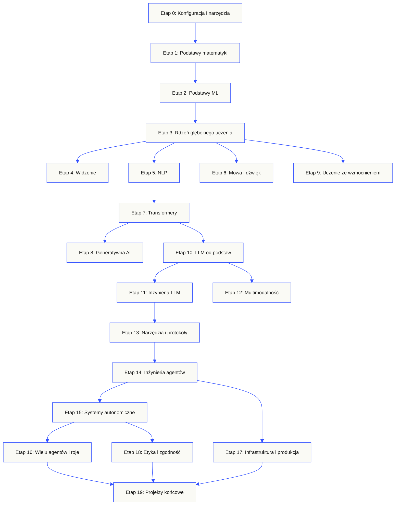
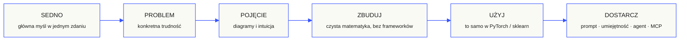

<p align="center" lang="pl"><sub>Polskie tłumaczenie pełnego README. <a href="../../README.md">Wersja angielska</a> pozostaje źródłem odniesienia.</sub></p>

<p align="center">
  <picture>
    <source media="(prefers-color-scheme: dark)" srcset="../../assets/readme/header-dark.svg">
    
  </picture>
</p>

Zaimplementuj wewnętrzne mechanizmy modeli, potoki wyszukiwania i środowiska wykonawcze agentów. Testuj je, analizuj błędy i zachowuj kod oraz wyniki oceny.

**[Zacznij naukę](https://aiengineeringfromscratch.com/lesson?path=phases/00-setup-and-tooling/01-dev-environment)** · **[Wybierz ścieżkę](#learning-routes)** · **[Wypróbuj laboratorium](#interactive-lab)** · **[Zbuduj projekt](#project-challenges)** · **[Przejrzyj program](#contents)**

Bezpłatny, otwartoźródłowy, na licencji MIT. Ucz się na stronie, z agentem programistycznym lub uruchamiając kod lokalnie.

> 523 lekcje. 20 etapów. Python, TypeScript, Rust, Julia.

<p align="center">
  <a href="../../LICENSE"></a>
  <a href="../../ROADMAP.md"></a>
  <a href="#contents"></a>
  <a href="https://github.com/rohitg00/ai-engineering-from-scratch/stargazers"></a>
  <a href="https://aiengineeringfromscratch.com"></a>
</p>

<details>
<summary>Czytaj w swoim języku</summary>

<p align="center">
  <a href="../../README.md">🇬🇧 English</a> · <a href="../../i18n/zh/README.md">🇨🇳 简体中文</a> · <a href="../../i18n/zh-TW/README.md">🇹🇼 繁體中文（台灣）</a> · <a href="../../i18n/ja/README.md">🇯🇵 日本語</a> · <a href="../../i18n/ko/README.md">🇰🇷 한국어</a> · <a href="../../i18n/pt/README.md">🇵🇹 Português</a> · <a href="../../i18n/pt-BR/README.md">🇧🇷 Português (Brasil)</a> · <a href="../../i18n/es/README.md">🇪🇸 Español</a> · <a href="../../i18n/de/README.md">🇩🇪 Deutsch</a> · <a href="../../i18n/fr/README.md">🇫🇷 Français</a> · <a href="../../i18n/it/README.md">🇮🇹 Italiano</a> · <a href="../../i18n/nl/README.md">🇳🇱 Nederlands</a> · <a href="../../i18n/pl/README.md">🇵🇱 Polski</a> · <a href="../../i18n/cs/README.md">🇨🇿 Čeština</a> · <a href="../../i18n/ro/README.md">🇷🇴 Română</a> · <a href="../../i18n/hu/README.md">🇭🇺 Magyar</a> · <a href="../../i18n/el/README.md">🇬🇷 Ελληνικά</a> · <a href="../../i18n/sv/README.md">🇸🇪 Svenska</a> · <a href="../../i18n/da/README.md">🇩🇰 Dansk</a> · <a href="../../i18n/no/README.md">🇳🇴 Norsk</a> · <a href="../../i18n/fi/README.md">🇫🇮 Suomi</a> · <a href="../../i18n/ru/README.md">🇷🇺 Русский</a> · <a href="../../i18n/uk/README.md">🇺🇦 Українська</a> · <a href="../../i18n/tr/README.md">🇹🇷 Türkçe</a> · <a href="../../i18n/he/README.md">🇮🇱 עברית</a> · <a href="../../i18n/ar/README.md">🇸🇦 العربية</a> · <a href="../../i18n/fa/README.md">🇮🇷 فارسی</a> · <a href="../../i18n/hi/README.md">🇮🇳 हिन्दी</a> · <a href="../../i18n/bn/README.md">🇧🇩 বাংলা</a> · <a href="../../i18n/ur/README.md">🇵🇰 اردو</a> · <a href="../../i18n/th/README.md">🇹🇭 ไทย</a> · <a href="../../i18n/vi/README.md">🇻🇳 Tiếng Việt</a> · <a href="../../i18n/id/README.md">🇮🇩 Bahasa Indonesia</a> · <a href="../../i18n/tl/README.md">🇵🇭 Tagalog</a>
</p>

</details>

### Sponsorzy

<p align="center">
  <a href="https://serpapi.com/ai-engineering-from-scratch"><picture><source media="(min-width: 768px)" srcset="../../assets/sponsors/serpapi-banner-compact.png" width="48%"></picture></a>
  <a href="https://nitrostack.ai/referral/aiengineeringfromscratch"><picture><source media="(min-width: 768px)" srcset="../../assets/sponsors/nitrostack-banner-equal.png" width="48%"></picture></a>
</p>

<p align="center">
  <sub><span>Dzięki Twojemu wsparciu każda lekcja pozostaje bezpłatna i dostępna z otwartym kodem.</span> <a href="#supporters">Zobacz wszystkich wspierających</a> · <a href="../../SPONSORS.md">Zostań sponsorem</a></sub>
</p>

<a id="see-what-you-will-build-and-keep"></a>
<a id="learning-routes"></a>

## Ścieżki nauki

| Ścieżka | Pierwsza lekcja |
|---|---|
| Podstawy modeli | [Konfiguracja i narzędzia](https://aiengineeringfromscratch.com/lesson?path=phases/00-setup-and-tooling/01-dev-environment) |
| Systemy LLM | [Inżynieria promptów](https://aiengineeringfromscratch.com/lesson?path=phases/11-llm-engineering/01-prompt-engineering) |
| Agenci i dostarczanie systemów | [Pętla agenta](https://aiengineeringfromscratch.com/lesson?path=phases/14-agent-engineering/01-the-agent-loop) |

[Porównaj ścieżki kariery](https://aiengineeringfromscratch.com/learning-paths.html) · [Wymagania wstępne i czas nauki](#study-guide)

<a id="interactive-lab"></a>

### Spadek gradientowy

Dwadzieścia punktów początkowych podąża metodą spadku gradientowego po kwadratowej funkcji straty. Wykres pokazuje ich położenia i średnią stratę po każdej aktualizacji.

<p align="center">
  <a href="https://aiengineeringfromscratch.com/lesson?path=phases/01-math-foundations/08-optimization#loss-landscape-visualization">
    <picture>
      <source media="(max-width: 600px) and (prefers-color-scheme: dark) and (prefers-reduced-motion: reduce)" srcset="../../assets/readme/101-gradient-mobile-dark.png">
      <source media="(max-width: 600px) and (prefers-reduced-motion: reduce)" srcset="../../assets/readme/101-gradient-mobile-light.png">
      <source media="(prefers-color-scheme: dark) and (prefers-reduced-motion: reduce)" srcset="../../assets/readme/101-gradient-dark.png">
      <source media="(prefers-reduced-motion: reduce)" srcset="../../assets/readme/101-gradient-light.png">
      <source media="(max-width: 600px) and (prefers-color-scheme: dark)" srcset="../../assets/readme/101-gradient-mobile-dark.gif">
      <source media="(max-width: 600px)" srcset="../../assets/readme/101-gradient-mobile-light.gif">
      <source media="(prefers-color-scheme: dark)" srcset="../../assets/readme/101-gradient-dark.gif">
      
    </picture>
  </a>
</p>

[Dostosuj współczynnik uczenia w lekcji](https://aiengineeringfromscratch.com/lesson?path=phases/01-math-foundations/08-optimization#loss-landscape-visualization) · [Porównaj w kodzie spadek gradientowy, metodę pędu i Adam](../../phases/01-math-foundations/08-optimization/code/optimizers.py)

<a id="project-challenges"></a>

### Projekty

Trzy projekty z kodem początkowym podzielonym na etapy, implementacjami wzorcowymi i lokalnymi narzędziami oceny. Uruchamiaj polecenia z katalogu głównego repozytorium po [konfiguracji](#local-setup). Kod początkowy nie przechodzi kontroli, dopóki nie zaimplementujesz etapów.

<details>
<summary><strong>01 · Laboratorium oceny wyszukiwania</strong> · Python · Metryki rankingu i kontrole regresji</summary>

Kandydat poprawia średnie NDCG, podczas gdy dla jednego zapytania najtrafniejsze dowody zajmują niższą pozycję. Zbuduj porównanie dla każdego zapytania, które zgłasza regresję i może spowodować niepowodzenie kontroli przed wydaniem.

Użyj Pythona 3.10+. Powtórz [RAG](../../phases/11-llm-engineering/06-rag/docs/en.md) i [ocena modeli](../../phases/02-ml-fundamentals/09-model-evaluation/docs/en.md). Zaimplementuj walidację rankingu, precision i recall, metryki uwzględniające pozycję, a następnie porównanie systemów.

```bash
python3 scripts/project_test.py retrieval-evaluation-lab \
  --init learning-artifacts/retrieval-evaluation-lab
python3 scripts/project_test.py retrieval-evaluation-lab \
  --stage 1 --path learning-artifacts/retrieval-evaluation-lab --strict
python3 scripts/project_test.py retrieval-evaluation-lab \
  --all --path learning-artifacts/retrieval-evaluation-lab --strict
```

**Zachowaj:** odtwarzalne porównanie ze zmianami dla każdego zapytania oraz ocenami trafności użytymi do punktacji. Metryki opisują te oceny; nie potwierdzają poprawności odpowiedzi.

[Rozpocznij projekt](https://aiengineeringfromscratch.com/project.html?id=retrieval-evaluation-lab) · [Sprawdź rozwiązanie referencyjne](../../projects/retrieval-evaluation-lab/solution/) · [Uruchom na własnych danych wejściowych](../../projects/retrieval-evaluation-lab/README.md#run-with-your-own-inputs)

</details>

<details>
<summary><strong>02 · Debugger śladów agentów</strong> · TypeScript · Parsowanie śladów i pomiar czasu</summary>

Dostarczony ślad nadal trwa 100 ms, ale całkowite zużycie tokenów rośnie o 200 i jeden span zaczyna kończyć się błędem. Oddziel nakładającą się pracę spanów potomnych od czasu wykonania rodzica, a następnie utwórz raport pokazujący zmianę.

Użyj Node.js 22.18+ i Pythona 3 dla programu oceniającego. Zaimplementuj parsowanie JSONL, walidację rodziców, arytmetykę przedziałów, a następnie oś czasu do analizy.

```bash
python3 scripts/project_test.py agent-trace-debugger \
  --init learning-artifacts/agent-trace-debugger
python3 scripts/project_test.py agent-trace-debugger \
  --stage 1 --path learning-artifacts/agent-trace-debugger --strict
python3 scripts/project_test.py agent-trace-debugger \
  --all --path learning-artifacts/agent-trace-debugger --strict
```

**Zachowaj:** ślad wejściowy, oś czasu HTML i raport regresji JSON. Zachowaj własne liczby tokenów każdego spanu bez spanów potomnych, aby nie liczyć podwójnie użycia rodzica i dzieci.

[Rozpocznij projekt](https://aiengineeringfromscratch.com/project.html?id=agent-trace-debugger) · [Sprawdź rozwiązanie referencyjne](../../projects/agent-trace-debugger/solution/) · [Poznaj pomiar czasu interaktywnie](https://aiengineeringfromscratch.com/project.html?id=agent-trace-debugger&stage=03-timing)

</details>

<details>
<summary><strong>03 · Zapora wywołań narzędzi</strong> · Rust · Kontrole ról i potwierdzenia zatwierdzenia</summary>

Operacja zapisu zmienia się po przeglądzie albo zatwierdzenie jest używane ponownie. Zweryfikuj kopertę wywołania, sprawdź rolę wywołującego i ścieżkę, a następnie zużyj zatwierdzenie związane z dokładnym żądaniem i treścią.

Użyj Rusta i Pythona 3.10+. Powtórz [projektowanie schematów narzędzi](../../phases/13-tools-and-protocols/05-tool-schema-design/docs/en.md) i [granice bezpieczeństwa](../../phases/17-infrastructure-and-production/25-security-secrets-audit/docs/en.md). Aplikacja wywołująca dostarcza tożsamość; model proponuje operację.

```bash
python3 scripts/project_test.py tool-call-firewall \
  --init learning-artifacts/tool-call-firewall
python3 scripts/project_test.py tool-call-firewall \
  --stage 1 --path learning-artifacts/tool-call-firewall --strict
python3 scripts/project_test.py tool-call-firewall \
  --all --path learning-artifacts/tool-call-firewall --strict
```

**Zachowaj:** potwierdzenie audytowe z żądaną operacją i decyzją polityki. Zatwierdzenia są jednorazowe w ramach jednego wywołania; projekt nie zapewnia trwałej autoryzacji ani piaskownicy systemu operacyjnego.

[Rozpocznij projekt](https://aiengineeringfromscratch.com/project.html?id=tool-call-firewall) · [Sprawdź rozwiązanie referencyjne](../../projects/tool-call-firewall/solution/) · [Poznaj granice zatwierdzania](https://aiengineeringfromscratch.com/project.html?id=tool-call-firewall&stage=03-consume-a-request-bound-approval-once)

</details>

[Przeglądaj wszystkie projekty](https://aiengineeringfromscratch.com/projects.html) · [Przewodnik po praktyce zawodowej](../../learning-paths/CAREER-PRACTICE.md)

## Wybierz sposób nauki

### Na stronie internetowej

Otwórz dowolną ukończoną lekcję na [aiengineeringfromscratch.com](https://aiengineeringfromscratch.com) lub rozwiń etap w [spisie treści](#contents). Bez konfiguracji i klonowania.

### Z tutorem AI

Jeśli masz już Node.js, `npx` i agenta programującego obsługującego umiejętności, możesz użyć go jako tutora. Instalacja ani czytanie materiałów tutora nie wymagają klonowania repozytorium. Wykonywalne laboratoria wyspecjalizowanych ścieżek wymagają `python3`. Laboratoria hostów Agent Skills wymagają również wybranego hosta oraz zapisywalnego zakresu umiejętności użytkownika lub projektu.

```bash
npx skills add rohitg00/ai-engineering-from-scratch
```

Wybierz hosta i zakres, gdy zapyta instalator. Użyj `start-learning` w Codex, `/start-learning` w Claude Code lub poproś hosta o użycie umiejętności po nazwie.

<details>
<summary>Konfiguracja tutora i polecenia środowiska</summary>

Najpierw sprawdź lokalne wymagania:

```bash
node --version
npx --version
python3 --version
```

`skills` zapisuje pliki w hoście i zakresie wybranym podczas instalacji, na przykład `.claude/skills/`, `.cursor/skills/`, `.codex/skills/` lub innym obsługiwanym katalogu. Sprawdź, czy wybrany host wykrywa dokładnie to miejsce.

Składnia wywołania zależy od hosta, a nie od przenośnego formatu `SKILL.md`:

| Aplikacja hosta | Rozpocznij kurs | Rozpocznij Model Context Protocol (MCP) | Rozpocznij Agent Skills | Uruchom quiz etapu |
|---|---|---|---|---|
| Codex | `start-learning`, lub wybierz z `/skills` | `learn-mcp`, lub wybierz z `/skills` | `learn-agent-skills`, lub wybierz z `/skills` | `check-understanding 13`, lub wybierz z `/skills` |
| Claude Code | `/start-learning` | `/learn-mcp` | `/learn-agent-skills` | `/check-understanding 13` |
| Inne zgodne hosty | `Use start-learning to begin the course.` | `Use learn-mcp to start the Model Context Protocol (MCP) path.` | `Use learn-agent-skills to start the Agent Skills Engineering path.` | `Use check-understanding to quiz me on Phase 13.` |

Test poziomujący z dziesięcioma pytaniami przypisuje Twoją wiedzę do etapu początkowego i zapisuje osobisty plan nauki w `LEARNING.md`. Następnie umiejętność `learn` prowadzi jedną lekcję na sesję: pojęcie, matematyka, kod i quiz. Pobiera lekcje bezpośrednio z tego repozytorium, a `course-guide` wskazuje dokładną lekcję dotyczącą problemu, na którym utkniesz. W Codex wywołuj `learn` i `course-guide`; w Claude Code używaj `/learn` i `/course-guide`; w innych zgodnych hostach poproś o użycie umiejętności po nazwie.

Interesuje Cię tylko Model Context Protocol (MCP)? Użyj wywołania MCP właściwego dla swojego hosta. Utworzy ono `MCP-LEARNING.md` i przeprowadzi Cię przez 17 lekcji o bezstanowych żądaniach, transportach, pracy dwukierunkowej, bezpieczeństwie, niezawodności, zarządzaniu rejestrem i dowodach zgodności. Dokładną kolejność oraz punkty kontrolne zawiera [manifest Model Context Protocol (MCP)](../../learning-paths/model-context-protocol.json).

Interesują Cię tylko Agent Skills? Użyj wywołania Agent Skills właściwego dla swojego hosta. Utworzy ono `AGENT-SKILLS-LEARNING.md` i poprowadzi spójną ścieżką pięciu lekcji: kontrakt, odkrywanie, wywołanie, granice piaskownicy, a następnie oceny wydania i przenośność między rzeczywistymi hostami. W witrynie zacznij od [ścieżki Agent Skills](https://aiengineeringfromscratch.com/lesson?path=phases/13-tools-and-protocols/22-skills-and-agent-sdks&learningPath=agent-skills).

Instalator wyświetla hosty, które potrafi skonfigurować, i pyta o miejsce instalacji. Jeśli nie masz jeszcze Node.js, `npx`, `python3`, obsługiwanego hosta lub zapisywalnego zakresu, korzystaj z witryny albo czytaj `docs/en.md` samodzielnie. Poznasz w ten sposób pojęcia, ale dowody odkrywania, wywoływania, działania skryptów i odinstalowania na rzeczywistym hoście pozostaną do zebrania, dopóki nie spełnisz wymagań wstępnych. Lekcje znajdziesz na [aiengineeringfromscratch.com](https://aiengineeringfromscratch.com).

### Umiejętności edukacyjne

| Umiejętność | Działanie |
|---|---|
| [`start-learning`](../../skills/start-learning/SKILL.md) | Jednorazowe wprowadzenie: cel nauki, test poziomujący i osobisty plan zapisany w `LEARNING.md`. |
| [`learn`](../../skills/learn/SKILL.md) | Pętla tutora. Powtórka na rozgrzewkę, interaktywna nauka kolejnej lekcji i quiz; zapisuje postęp oraz kolejkę powtórek. |
| [`course-guide`](../../skills/course-guide/SKILL.md) | Wskazywanie tematów. „Gdzie nauczę się uwagi?” lub „moja strata to NaN” → dokładne lekcje z linkami. |
| [`learn-mcp`](../../skills/learn-mcp/SKILL.md) | Tutor Model Context Protocol (MCP). Tworzy `MCP-LEARNING.md`, prowadzi manifestem 17 lekcji i zapisuje dowody komunikacji, bezpieczeństwa, niezawodności oraz zgodności. |
| [`learn-agent-skills`](../../skills/learn-agent-skills/SKILL.md) | Tutor Agent Skills. Tworzy `AGENT-SKILLS-LEARNING.md`, uczy lekcji 22, 24, 25, 26 i 27 oraz zapisuje dowody z rzeczywistego hosta. |
| [`claude-certification`](../../skills/claude-certification/SKILL.md) | Tutor certyfikacji. Wybiera CCAO-F, CCDV-F, CCAR-F lub CCAR-P; uczy lekcji, uruchamia laboratoria, ocenia artefakty, przeprowadza diagnostykę i próbne egzaminy, zapisuje postęp. |
| [`mcpa-certification`](../../skills/mcpa-certification/SKILL.md) | Tutor MCPA. Prowadzi ścieżką `mcpa-f` z 34 lekcjami o protokole 2026-07-28; uczy lekcji, uruchamia laboratoria i kontrolę komunikacji, przeprowadza diagnostykę i trzy próbne egzaminy, zapisuje postęp. |
| [`find-your-level`](../../skills/find-your-level/SKILL.md) | Test poziomujący z dziesięcioma pytaniami. Przypisuje wiedzę do etapu początkowego i tworzy osobistą ścieżkę z szacunkowym czasem. |
| [`check-understanding <phase>`](../../skills/check-understanding/SKILL.md) | Quiz etapu z ośmioma pytaniami, informacją zwrotną i lekcjami do powtórzenia. Użyj wariantu Codex, Claude Code lub języka naturalnego z powyższej tabeli wywołań. |

</details>

<a id="local-setup"></a>

### Uruchom kod lokalnie

```bash
git clone https://github.com/rohitg00/ai-engineering-from-scratch.git
cd ai-engineering-from-scratch
python3 phases/00-setup-and-tooling/01-dev-environment/code/verify.py --route beginner
python3 phases/01-math-foundations/01-linear-algebra-intuition/code/vectors.py
```

Kontrola wstępna oddziela wymagania potrzebne teraz od narzędzi potrzebnych później. Każda nieudana kontrola obowiązkowego wymagania podaje wykrytą przyczynę i polecenie naprawcze. Polecenie `vectors.py` uruchamia lekcję bez zależności i na końcu pokazuje, że mnożenie macierzy przez wektor jest operacją wykonywaną wewnątrz warstwy sieci neuronowej. Zapisz te wyniki z terminala jako pierwszy dowód działania.

<details>
<summary>Pracuj z każdą lekcją w ten sam sposób</summary>

### Pracuj z każdą lekcją w ten sam sposób

1. **Przeczytaj** `docs/en.md` i wyjaśnij główną ideę własnymi słowami.
2. **Wpisz i zbuduj** najważniejszy kod, zamiast traktować blok kodu jak ozdobę.
3. **Uruchom** polecenie lekcji z głównego katalogu repozytorium, czyli katalogu zawierającego `README.md` i `phases/`.
4. **Zachowaj dowody**: polecenie, katalog roboczy, kod zakończenia, istotne wyniki oraz artefakt, który zmieniono lub utworzono.
5. **Kontynuuj** dopiero wtedy, gdy potrafisz wyjaśnić wynik i wprowadzić małą zmianę bez zgadywania.

Ścieżki w poleceniach na stronach lekcji są podawane względem głównego katalogu repozytorium, chyba że lekcja wyraźnie nakazuje zmianę katalogu. Jeśli lekcja oferuje kilka języków programowania, uruchom implementację w języku, którego się uczysz.

</details>

<a id="study-guide"></a>

## Wybierz ścieżkę nauki

Nie musisz przeglądać wszystkich 523 lekcji, zanim zaczniesz. Wybierz jeden cel. Każdy odnośnik otwiera ten sam program nauki na GitHub lub stronie internetowej, a obie wersje korzystają z tego samego kodu lekcji.

| Twój cel | Nauka na GitHub | Nauka na stronie |
|---|---|---|
| Zaczynam od zera i chcę zdobyć pełne podstawy | [Etap 0: Konfiguracja i narzędzia](../../phases/00-setup-and-tooling/) | [Środowisko programistyczne](https://aiengineeringfromscratch.com/lesson?path=phases/00-setup-and-tooling/01-dev-environment) |
| Znam Python i chcę poznać podstawy matematyki oraz ML | [Etap 1: Podstawy matematyki](../../phases/01-math-foundations/) | [Intuicyjne spojrzenie na algebrę liniową](https://aiengineeringfromscratch.com/lesson?path=phases/01-math-foundations/01-linear-algebra-intuition) |
| Chcę tworzyć aplikacje LLM do wdrożenia produkcyjnego | [Etap 11: Inżynieria LLM](../../phases/11-llm-engineering/) | [Inżynieria promptów](https://aiengineeringfromscratch.com/lesson?path=phases/11-llm-engineering/01-prompt-engineering) |
| Chcę tworzyć agentów | [Etap 14: Inżynieria agentów](../../phases/14-agent-engineering/) | [Pętla agenta](https://aiengineeringfromscratch.com/lesson?path=phases/14-agent-engineering/01-the-agent-loop) |
| Chcę używać agentów programistycznych w rzeczywistych repozytoriach | [Ścieżka inżynierii wspomaganej przez agentów](../../learning-paths/using-coding-agents.json) | [Inżynieria wspomagana przez agentów](https://aiengineeringfromscratch.com/lesson?path=phases/14-agent-engineering/31-agent-workbench-why-models-fail&learningPath=using-coding-agents) |
| Chcę ustalić, co warto zbudować, zanim zacznę implementację | [Ścieżka decyzji produktowych i realizacji](../../learning-paths/shaping-the-build.json) | [Decyzje produktowe i realizacja](https://aiengineeringfromscratch.com/lesson?path=phases/14-agent-engineering/47-outcomes-before-output&learningPath=shaping-the-build) |

Nie wiesz, od czego zacząć? Skorzystaj z [tutora `start-learning` oceniającego poziom wiedzy](../../skills/start-learning/SKILL.md) lub [przewodnika po wymaganiach wstępnych na stronie](https://aiengineeringfromscratch.com/prereqs.html).

Porównaj cztery główne dziedziny i sześć ścieżek kariery w [AI Engineering Learning Paths](https://aiengineeringfromscratch.com/learning-paths.html).

<details>
<summary>Specjalistyczne ścieżki MCP i Agent Skills</summary>

| Twój cel | Nauka na GitHub | Nauka na stronie |
|---|---|---|
| Chcę tworzyć rozwiązania z Model Context Protocol (MCP) | [Trasa Model Context Protocol (MCP)](../../phases/13-tools-and-protocols/README.md#model-context-protocol-mcp-path) | [Ścieżka Model Context Protocol (MCP)](https://aiengineeringfromscratch.com/lesson?path=phases/13-tools-and-protocols/06-mcp-fundamentals&learningPath=model-context-protocol) |
| Chcę pisać i publikować Agent Skills | [Skoncentrowana trasa Agent Skills](../../phases/13-tools-and-protocols/README.md#agent-skills-fast-path) | [Ścieżka Agent Skills](https://aiengineeringfromscratch.com/lesson?path=phases/13-tools-and-protocols/22-skills-and-agent-sdks&learningPath=agent-skills) |

</details>

<details>
<summary>Wymagania wstępne i czas nauki</summary>

### Wymagania wstępne

- Potrafisz programować w dowolnym języku; Python pomaga.
- Chcesz zrozumieć, jak AI **naprawdę działa**, a nie tylko wywoływać API.

## Od czego zacząć

| Doświadczenie | Zacznij od | Szacowany czas |
|---|---|---|
| Początkujący w programowaniu i AI | Etap 0: Konfiguracja | ~306 godzin |
| Znasz Pythona, zaczynasz z ML | Etap 1: Podstawy matematyki | ~270 godzin |
| Znasz ML, zaczynasz z głębokim uczeniem | Etap 3: Rdzeń głębokiego uczenia | ~200 godzin |
| Znasz głębokie uczenie, chcesz poznać LLM i agentów | Etap 10: LLM od podstaw | ~100 godzin |
| Doświadczony inżynier, interesuje Cię tylko inżynieria agentów | Etap 14: Inżynieria agentów | ~60 godzin |
| Chcesz tylko budować produkcyjne systemy MCP | [Ścieżka Model Context Protocol (MCP)](../../learning-paths/model-context-protocol.json) | ~23 godziny 15 minut |
| Chcesz tylko budować produkcyjne Agent Skills | [Ścieżka inżynierii Agent Skills](../../learning-paths/agent-skills.json) | ~9.5 godziny |

</details>

## Struktura programu nauki

Dwadzieścia etapów opiera się na poprzednich. Matematyka jest fundamentem, a agenci i produkcja dachem. Przejdź dalej, jeśli znasz niższe warstwy, ale nie pomijaj nieznanych podstaw, by potem dziwić się awariom na górze.



<a id="contents"></a>

## Spis treści

Dwadzieścia etapów. Kliknij etap, aby rozwinąć listę lekcji.

<a id="phase-0"></a>
### Etap 0: Konfiguracja i narzędzia `12 lekcji`
> Przygotuj środowisko na wszystko, co nastąpi dalej.

| # | Lekcja | Rodzaj | Język |
|:---:|--------|:----:|------|
| 01 | [Środowisko programistyczne](../../phases/00-setup-and-tooling/01-dev-environment/) | Buduj | Python |
| 02 | [Git i współpraca](../../phases/00-setup-and-tooling/02-git-and-collaboration/) | Poznaj | — |
| 03 | [Konfiguracja GPU i chmura](../../phases/00-setup-and-tooling/03-gpu-setup-and-cloud/) | Buduj | Python |
| 04 | [API i klucze](../../phases/00-setup-and-tooling/04-apis-and-keys/) | Buduj | Python |
| 05 | [Notatniki Jupyter](../../phases/00-setup-and-tooling/05-jupyter-notebooks/) | Buduj | Python |
| 06 | [Środowiska Pythona](../../phases/00-setup-and-tooling/06-python-environments/) | Buduj | Shell |
| 07 | [Docker dla AI](../../phases/00-setup-and-tooling/07-docker-for-ai/) | Buduj | Docker |
| 08 | [Konfiguracja edytora](../../phases/00-setup-and-tooling/08-editor-setup/) | Buduj | — |
| 09 | [Zarządzanie danymi](../../phases/00-setup-and-tooling/09-data-management/) | Buduj | Python |
| 10 | [Terminal i powłoka](../../phases/00-setup-and-tooling/10-terminal-and-shell/) | Poznaj | — |
| 11 | [Linux dla AI](../../phases/00-setup-and-tooling/11-linux-for-ai/) | Poznaj | — |
| 12 | [Debugowanie i profilowanie](../../phases/00-setup-and-tooling/12-debugging-and-profiling/) | Buduj | Python |

<details id="phase-1">
<summary><b>Etap 1: Podstawy matematyki</b> &nbsp;<code>22 lekcji</code>&nbsp; <em>Intuicja stojąca za każdym algorytmem AI, poznawana przez kod.</em></summary>
<br/>

| # | Lekcja | Rodzaj | Język |
|:---:|--------|:----:|------|
| 01 | [Intuicja algebry liniowej](../../phases/01-math-foundations/01-linear-algebra-intuition/) | Poznaj | Python, Julia |
| 02 | [Wektory, macierze i operacje](../../phases/01-math-foundations/02-vectors-matrices-operations/) | Buduj | Python, Julia |
| 03 | [Przekształcenia macierzowe i wartości własne](../../phases/01-math-foundations/03-matrix-transformations/) | Buduj | Python, Julia |
| 04 | [Analiza dla ML: pochodne i gradienty](../../phases/01-math-foundations/04-calculus-for-ml/) | Poznaj | Python |
| 05 | [Reguła łańcuchowa i automatyczne różniczkowanie](../../phases/01-math-foundations/05-chain-rule-and-autodiff/) | Buduj | Python |
| 06 | [Prawdopodobieństwo i rozkłady](../../phases/01-math-foundations/06-probability-and-distributions/) | Poznaj | Python |
| 07 | [Twierdzenie Bayesa i myślenie statystyczne](../../phases/01-math-foundations/07-bayes-theorem/) | Buduj | Python |
| 08 | [Optymalizacja: rodzina metod spadku gradientowego](../../phases/01-math-foundations/08-optimization/) | Buduj | Python |
| 09 | [Teoria informacji: entropia i dywergencja KL](../../phases/01-math-foundations/09-information-theory/) | Poznaj | Python |
| 10 | [Redukcja wymiarów: PCA, t-SNE, UMAP](../../phases/01-math-foundations/10-dimensionality-reduction/) | Buduj | Python |
| 11 | [Rozkład według wartości osobliwych](../../phases/01-math-foundations/11-singular-value-decomposition/) | Buduj | Python, Julia |
| 12 | [Operacje na tensorach](../../phases/01-math-foundations/12-tensor-operations/) | Buduj | Python |
| 13 | [Stabilność numeryczna](../../phases/01-math-foundations/13-numerical-stability/) | Buduj | Python |
| 14 | [Normy i odległości](../../phases/01-math-foundations/14-norms-and-distances/) | Buduj | Python |
| 15 | [Statystyka dla ML](../../phases/01-math-foundations/15-statistics-for-ml/) | Buduj | Python |
| 16 | [Metody próbkowania](../../phases/01-math-foundations/16-sampling-methods/) | Buduj | Python |
| 17 | [Układy liniowe](../../phases/01-math-foundations/17-linear-systems/) | Buduj | Python |
| 18 | [Optymalizacja wypukła](../../phases/01-math-foundations/18-convex-optimization/) | Buduj | Python |
| 19 | [Liczby zespolone dla AI](../../phases/01-math-foundations/19-complex-numbers/) | Poznaj | Python |
| 20 | [Transformata Fouriera](../../phases/01-math-foundations/20-fourier-transform/) | Buduj | Python |
| 21 | [Teoria grafów dla ML](../../phases/01-math-foundations/21-graph-theory/) | Buduj | Python |
| 22 | [Procesy stochastyczne](../../phases/01-math-foundations/22-stochastic-processes/) | Poznaj | Python |

</details>

<details id="phase-2">
<summary><b>Etap 2: Podstawy ML</b> &nbsp;<code>18 lekcji</code>&nbsp; <em>Klasyczne ML: nadal podstawa większości produkcyjnych systemów AI.</em></summary>
<br/>

| # | Lekcja | Rodzaj | Język |
|:---:|--------|:----:|------|
| 01 | [Czym jest uczenie maszynowe](../../phases/02-ml-fundamentals/01-what-is-machine-learning/) | Poznaj | Python |
| 02 | [Regresja liniowa od podstaw](../../phases/02-ml-fundamentals/02-linear-regression/) | Buduj | Python |
| 03 | [Regresja logistyczna i klasyfikacja](../../phases/02-ml-fundamentals/03-logistic-regression/) | Buduj | Python |
| 04 | [Drzewa decyzyjne i lasy losowe](../../phases/02-ml-fundamentals/04-decision-trees/) | Buduj | Python |
| 05 | [Maszyny wektorów nośnych](../../phases/02-ml-fundamentals/05-support-vector-machines/) | Buduj | Python |
| 06 | [KNN i miary odległości](../../phases/02-ml-fundamentals/06-knn-and-distances/) | Buduj | Python |
| 07 | [Uczenie nienadzorowane: K-Means, DBSCAN](../../phases/02-ml-fundamentals/07-unsupervised-learning/) | Buduj | Python |
| 08 | [Inżynieria i selekcja cech](../../phases/02-ml-fundamentals/08-feature-engineering/) | Buduj | Python |
| 09 | [Ocena modeli: metryki i walidacja krzyżowa](../../phases/02-ml-fundamentals/09-model-evaluation/) | Buduj | Python |
| 10 | [Obciążenie, wariancja i krzywa uczenia](../../phases/02-ml-fundamentals/10-bias-variance/) | Poznaj | Python |
| 11 | [Metody zespołowe: boosting, bagging, stacking](../../phases/02-ml-fundamentals/11-ensemble-methods/) | Buduj | Python |
| 12 | [Strojenie hiperparametrów](../../phases/02-ml-fundamentals/12-hyperparameter-tuning/) | Buduj | Python |
| 13 | [Potoki ML i śledzenie eksperymentów](../../phases/02-ml-fundamentals/13-ml-pipelines/) | Buduj | Python |
| 14 | [Naiwny klasyfikator Bayesa](../../phases/02-ml-fundamentals/14-naive-bayes/) | Buduj | Python |
| 15 | [Podstawy szeregów czasowych](../../phases/02-ml-fundamentals/15-time-series/) | Buduj | Python |
| 16 | [Wykrywanie anomalii](../../phases/02-ml-fundamentals/16-anomaly-detection/) | Buduj | Python |
| 17 | [Praca z niezrównoważonymi danymi](../../phases/02-ml-fundamentals/17-imbalanced-data/) | Buduj | Python |
| 18 | [Selekcja cech](../../phases/02-ml-fundamentals/18-feature-selection/) | Buduj | Python |

</details>

<details id="phase-3">
<summary><b>Etap 3: Rdzeń głębokiego uczenia</b> &nbsp;<code>13 lekcji</code>&nbsp; <em>Sieci neuronowe od podstaw. Bez frameworków, dopóki sam ich nie zbudujesz.</em></summary>
<br/>

| # | Lekcja | Rodzaj | Język |
|:---:|--------|:----:|------|
| 01 | [Perceptron: od czego wszystko się zaczęło](../../phases/03-deep-learning-core/01-the-perceptron/) | Buduj | Python |
| 02 | [Sieci wielowarstwowe i propagacja w przód](../../phases/03-deep-learning-core/02-multi-layer-networks/) | Buduj | Python |
| 03 | [Propagacja wsteczna od podstaw](../../phases/03-deep-learning-core/03-backpropagation/) | Buduj | Python |
| 04 | [Funkcje aktywacji: ReLU, sigmoid, GELU i ich zastosowania](../../phases/03-deep-learning-core/04-activation-functions/) | Buduj | Python |
| 05 | [Funkcje straty: MSE, entropia krzyżowa i kontrast](../../phases/03-deep-learning-core/05-loss-functions/) | Buduj | Python |
| 06 | [Optymalizatory: SGD, momentum, Adam, AdamW](../../phases/03-deep-learning-core/06-optimizers/) | Buduj | Python |
| 07 | [Regularyzacja: dropout, zanik wag, BatchNorm](../../phases/03-deep-learning-core/07-regularization/) | Buduj | Python |
| 08 | [Inicjalizacja wag i stabilność treningu](../../phases/03-deep-learning-core/08-weight-initialization/) | Buduj | Python |
| 09 | [Harmonogramy tempa uczenia i rozgrzewka](../../phases/03-deep-learning-core/09-learning-rate-schedules/) | Buduj | Python |
| 10 | [Zbuduj własny mały framework](../../phases/03-deep-learning-core/10-mini-framework/) | Buduj | Python |
| 11 | [Wprowadzenie do PyTorch](../../phases/03-deep-learning-core/11-intro-to-pytorch/) | Buduj | Python |
| 12 | [Wprowadzenie do JAX](../../phases/03-deep-learning-core/12-intro-to-jax/) | Buduj | Python |
| 13 | [Debugowanie sieci neuronowych](../../phases/03-deep-learning-core/13-debugging-neural-networks/) | Buduj | Python |

</details>

<details id="phase-4">
<summary><b>Etap 4: Widzenie komputerowe</b> &nbsp;<code>28 lekcji</code>&nbsp; <em>Od pikseli do rozumienia: obrazy, wideo, 3D, VLM i modele świata.</em></summary>
<br/>

| # | Lekcja | Rodzaj | Język |
|:---:|--------|:----:|------|
| 01 | [Podstawy obrazu: piksele, kanały i przestrzenie barw](../../phases/04-computer-vision/01-image-fundamentals/) | Poznaj | Python |
| 02 | [Sploty od podstaw](../../phases/04-computer-vision/02-convolutions-from-scratch/) | Buduj | Python |
| 03 | [Sieci CNN: od LeNet do ResNet](../../phases/04-computer-vision/03-cnns-lenet-to-resnet/) | Buduj | Python |
| 04 | [Klasyfikacja obrazów](../../phases/04-computer-vision/04-image-classification/) | Buduj | Python |
| 05 | [Uczenie transferowe i dostrajanie](../../phases/04-computer-vision/05-transfer-learning/) | Buduj | Python |
| 06 | [Wykrywanie obiektów: YOLO od podstaw](../../phases/04-computer-vision/06-object-detection-yolo/) | Buduj | Python |
| 07 | [Segmentacja semantyczna: U-Net](../../phases/04-computer-vision/07-semantic-segmentation-unet/) | Buduj | Python |
| 08 | [Segmentacja instancji: Mask R-CNN](../../phases/04-computer-vision/08-instance-segmentation-mask-rcnn/) | Buduj | Python |
| 09 | [Generowanie obrazów: GAN](../../phases/04-computer-vision/09-image-generation-gans/) | Buduj | Python |
| 10 | [Generowanie obrazów: modele dyfuzyjne](../../phases/04-computer-vision/10-image-generation-diffusion/) | Buduj | Python |
| 11 | [Stable Diffusion: architektura i dostrajanie](../../phases/04-computer-vision/11-stable-diffusion/) | Buduj | Python |
| 12 | [Rozumienie wideo: modelowanie zależności czasowych](../../phases/04-computer-vision/12-video-understanding/) | Buduj | Python |
| 13 | [Widzenie 3D: chmury punktów i NeRF](../../phases/04-computer-vision/13-3d-vision-nerf/) | Buduj | Python |
| 14 | [Transformery wizyjne (ViT)](../../phases/04-computer-vision/14-vision-transformers/) | Buduj | Python |
| 15 | [Widzenie w czasie rzeczywistym: wdrażanie na brzegu sieci](../../phases/04-computer-vision/15-real-time-edge/) | Buduj | Python |
| 16 | [Zbuduj kompletny potok wizyjny](../../phases/04-computer-vision/16-vision-pipeline-capstone/) | Buduj | Python |
| 17 | [Samonadzorowane widzenie: SimCLR, DINO, MAE](../../phases/04-computer-vision/17-self-supervised-vision/) | Buduj | Python |
| 18 | [Widzenie z otwartym słownikiem: CLIP](../../phases/04-computer-vision/18-open-vocab-clip/) | Buduj | Python |
| 19 | [OCR i rozumienie dokumentów](../../phases/04-computer-vision/19-ocr-document-understanding/) | Buduj | Python |
| 20 | [Wyszukiwanie obrazów i uczenie metryczne](../../phases/04-computer-vision/20-image-retrieval-metric/) | Buduj | Python |
| 21 | [Wykrywanie punktów kluczowych i estymacja pozy](../../phases/04-computer-vision/21-keypoint-pose/) | Buduj | Python |
| 22 | [3D Gaussian Splatting od podstaw](../../phases/04-computer-vision/22-3d-gaussian-splatting/) | Buduj | Python |
| 23 | [Transformery dyfuzyjne i przepływy prostowane](../../phases/04-computer-vision/23-diffusion-transformers-rectified-flow/) | Buduj | Python |
| 24 | [SAM 3 i segmentacja z otwartym słownikiem](../../phases/04-computer-vision/24-sam3-open-vocab-segmentation/) | Buduj | Python |
| 25 | [Modele wizyjno-językowe (ViT-MLP-LLM)](../../phases/04-computer-vision/25-vision-language-models/) | Buduj | Python |
| 26 | [Estymacja głębi i geometrii z jednego obrazu](../../phases/04-computer-vision/26-monocular-depth/) | Buduj | Python |
| 27 | [Śledzenie wielu obiektów i pamięć wideo](../../phases/04-computer-vision/27-multi-object-tracking/) | Buduj | Python |
| 28 | [Modele świata i dyfuzja wideo](../../phases/04-computer-vision/28-world-models-video-diffusion/) | Buduj | Python |

</details>

<details id="phase-5">
<summary><b>Etap 5: NLP od podstaw do zagadnień zaawansowanych</b> &nbsp;<code>29 lekcji</code>&nbsp; <em>Język jest interfejsem do inteligencji.</em></summary>
<br/>

| # | Lekcja | Rodzaj | Język |
|:---:|--------|:----:|------|
| 01 | [Przetwarzanie tekstu: tokenizacja, stemming i lematyzacja](../../phases/05-nlp-foundations-to-advanced/01-text-processing/) | Buduj | Python |
| 02 | [Worek słów, TF-IDF i reprezentacja tekstu](../../phases/05-nlp-foundations-to-advanced/02-bag-of-words-tfidf/) | Buduj | Python |
| 03 | [Osadzenia słów: Word2Vec od podstaw](../../phases/05-nlp-foundations-to-advanced/03-word-embeddings-word2vec/) | Buduj | Python |
| 04 | [GloVe, FastText i osadzenia podsłów](../../phases/05-nlp-foundations-to-advanced/04-glove-fasttext-subword/) | Buduj | Python |
| 05 | [Analiza sentymentu](../../phases/05-nlp-foundations-to-advanced/05-sentiment-analysis/) | Buduj | Python |
| 06 | [Rozpoznawanie nazwanych encji (NER)](../../phases/05-nlp-foundations-to-advanced/06-named-entity-recognition/) | Buduj | Python |
| 07 | [Oznaczanie części mowy i analiza składniowa](../../phases/05-nlp-foundations-to-advanced/07-pos-tagging-parsing/) | Buduj | Python |
| 08 | [Klasyfikacja tekstu: CNN i RNN](../../phases/05-nlp-foundations-to-advanced/08-cnns-rnns-for-text/) | Buduj | Python |
| 09 | [Modele sekwencja-do-sekwencji](../../phases/05-nlp-foundations-to-advanced/09-sequence-to-sequence/) | Buduj | Python |
| 10 | [Mechanizm uwagi: przełom](../../phases/05-nlp-foundations-to-advanced/10-attention-mechanism/) | Buduj | Python |
| 11 | [Tłumaczenie maszynowe](../../phases/05-nlp-foundations-to-advanced/11-machine-translation/) | Buduj | Python |
| 12 | [Streszczanie tekstu](../../phases/05-nlp-foundations-to-advanced/12-text-summarization/) | Buduj | Python |
| 13 | [Systemy odpowiadania na pytania](../../phases/05-nlp-foundations-to-advanced/13-question-answering/) | Buduj | Python |
| 14 | [Wyszukiwanie informacji](../../phases/05-nlp-foundations-to-advanced/14-information-retrieval-search/) | Buduj | Python |
| 15 | [Modelowanie tematów: LDA, BERTopic](../../phases/05-nlp-foundations-to-advanced/15-topic-modeling/) | Buduj | Python |
| 16 | [Generowanie tekstu](../../phases/05-nlp-foundations-to-advanced/16-text-generation-pre-transformer/) | Buduj | Python |
| 17 | [Chatboty: od reguł do sieci neuronowych](../../phases/05-nlp-foundations-to-advanced/17-chatbots-rule-to-neural/) | Buduj | Python |
| 18 | [Wielojęzyczne NLP](../../phases/05-nlp-foundations-to-advanced/18-multilingual-nlp/) | Buduj | Python |
| 19 | [Tokenizacja podsłów: BPE, WordPiece, Unigram, SentencePiece](../../phases/05-nlp-foundations-to-advanced/19-subword-tokenization/) | Poznaj | Python |
| 20 | [Ustrukturyzowane wyniki i dekodowanie z ograniczeniami](../../phases/05-nlp-foundations-to-advanced/20-structured-outputs-constrained-decoding/) | Buduj | Python |
| 21 | [NLI i wynikanie tekstowe](../../phases/05-nlp-foundations-to-advanced/21-nli-textual-entailment/) | Poznaj | Python |
| 22 | [Dogłębne omówienie modeli osadzeń](../../phases/05-nlp-foundations-to-advanced/22-embedding-models-deep-dive/) | Poznaj | Python |
| 23 | [Strategie dzielenia tekstu dla RAG](../../phases/05-nlp-foundations-to-advanced/23-chunking-strategies-rag/) | Buduj | Python |
| 24 | [Rozwiązywanie koreferencji](../../phases/05-nlp-foundations-to-advanced/24-coreference-resolution/) | Poznaj | Python |
| 25 | [Łączenie encji i usuwanie wieloznaczności](../../phases/05-nlp-foundations-to-advanced/25-entity-linking/) | Buduj | Python |
| 26 | [Ekstrakcja relacji i budowanie grafów wiedzy](../../phases/05-nlp-foundations-to-advanced/26-relation-extraction-kg/) | Buduj | Python |
| 27 | [Ocena LLM: RAGAS, DeepEval, G-Eval](../../phases/05-nlp-foundations-to-advanced/27-llm-evaluation-frameworks/) | Buduj | Python |
| 28 | [Ocena długiego kontekstu: NIAH, RULER, LongBench, MRCR](../../phases/05-nlp-foundations-to-advanced/28-long-context-evaluation/) | Poznaj | Python |
| 29 | [Śledzenie stanu dialogu](../../phases/05-nlp-foundations-to-advanced/29-dialogue-state-tracking/) | Buduj | Python |

</details>

<details id="phase-6">
<summary><b>Etap 6: Mowa i dźwięk</b> &nbsp;<code>17 lekcji</code>&nbsp; <em>Słuchaj, rozumiej, mów.</em></summary>
<br/>

| # | Lekcja | Rodzaj | Język |
|:---:|--------|:----:|------|
| 01 | [Podstawy dźwięku: przebiegi, próbkowanie i FFT](../../phases/06-speech-and-audio/01-audio-fundamentals) | Poznaj | Python |
| 02 | [Spektrogramy, skala melowa i cechy dźwięku](../../phases/06-speech-and-audio/02-spectrograms-mel-features) | Buduj | Python |
| 03 | [Klasyfikacja dźwięku](../../phases/06-speech-and-audio/03-audio-classification) | Buduj | Python |
| 04 | [Rozpoznawanie mowy (ASR)](../../phases/06-speech-and-audio/04-speech-recognition-asr) | Buduj | Python |
| 05 | [Whisper: architektura i dostrajanie](../../phases/06-speech-and-audio/05-whisper-architecture-finetuning) | Buduj | Python |
| 06 | [Rozpoznawanie i weryfikacja mówców](../../phases/06-speech-and-audio/06-speaker-recognition-verification) | Buduj | Python |
| 07 | [Synteza mowy (TTS)](../../phases/06-speech-and-audio/07-text-to-speech) | Buduj | Python |
| 08 | [Klonowanie i konwersja głosu](../../phases/06-speech-and-audio/08-voice-cloning-conversion) | Buduj | Python |
| 09 | [Generowanie muzyki](../../phases/06-speech-and-audio/09-music-generation) | Buduj | Python |
| 10 | [Modele audio-językowe](../../phases/06-speech-and-audio/10-audio-language-models) | Buduj | Python |
| 11 | [Przetwarzanie dźwięku w czasie rzeczywistym](../../phases/06-speech-and-audio/11-real-time-audio-processing) | Buduj | Python |
| 12 | [Zbuduj potok asystenta głosowego](../../phases/06-speech-and-audio/12-voice-assistant-pipeline) | Buduj | Python |
| 13 | [Neuronowe kodeki dźwięku: EnCodec, SNAC, Mimi, DAC](../../phases/06-speech-and-audio/13-neural-audio-codecs) | Poznaj | Python |
| 14 | [Wykrywanie mowy i zmiany rozmówcy](../../phases/06-speech-and-audio/14-voice-activity-detection-turn-taking) | Buduj | Python |
| 15 | [Strumieniowa konwersja mowy: Moshi, Hibiki](../../phases/06-speech-and-audio/15-streaming-speech-to-speech-moshi-hibiki) | Poznaj | Python |
| 16 | [Ochrona przed podszywaniem się pod głos i znakowanie dźwięku](../../phases/06-speech-and-audio/16-anti-spoofing-audio-watermarking) | Buduj | Python |
| 17 | [Ocena dźwięku: WER, MOS, MMAU i rankingi](../../phases/06-speech-and-audio/17-audio-evaluation-metrics) | Poznaj | Python |

</details>

<details id="phase-7">
<summary><b>Etap 7: Dogłębnie o transformerach</b> &nbsp;<code>16 lekcji</code>&nbsp; <em>Architektura, która zmieniła wszystko.</em></summary>
<br/>

| # | Lekcja | Rodzaj | Język |
|:---:|--------|:----:|------|
| 01 | [Dlaczego transformery? Problemy sieci RNN](../../phases/07-transformers-deep-dive/01-why-transformers/) | Poznaj | Python |
| 02 | [Samouwaga od podstaw](../../phases/07-transformers-deep-dive/02-self-attention-from-scratch/) | Buduj | Python |
| 03 | [Uwaga wielogłowicowa](../../phases/07-transformers-deep-dive/03-multi-head-attention/) | Buduj | Python |
| 04 | [Kodowanie pozycji: sinusoidalne, RoPE, ALiBi](../../phases/07-transformers-deep-dive/04-positional-encoding/) | Buduj | Python |
| 05 | [Pełny transformer: enkoder i dekoder](../../phases/07-transformers-deep-dive/05-full-transformer/) | Buduj | Python |
| 06 | [BERT: maskowane modelowanie języka](../../phases/07-transformers-deep-dive/06-bert-masked-language-modeling/) | Buduj | Python |
| 07 | [GPT: przyczynowe modelowanie języka](../../phases/07-transformers-deep-dive/07-gpt-causal-language-modeling/) | Buduj | Python |
| 08 | [T5 i BART: modele enkoder-dekoder](../../phases/07-transformers-deep-dive/08-t5-bart-encoder-decoder/) | Poznaj | Python |
| 09 | [Transformery wizyjne (ViT)](../../phases/07-transformers-deep-dive/09-vision-transformers/) | Buduj | Python |
| 10 | [Transformery dźwiękowe: architektura Whisper](../../phases/07-transformers-deep-dive/10-audio-transformers-whisper/) | Poznaj | Python |
| 11 | [Mieszanka ekspertów (MoE)](../../phases/07-transformers-deep-dive/11-mixture-of-experts/) | Buduj | Python |
| 12 | [Pamięć KV, Flash Attention i optymalizacja inferencji](../../phases/07-transformers-deep-dive/12-kv-cache-flash-attention/) | Buduj | Python |
| 13 | [Prawa skalowania](../../phases/07-transformers-deep-dive/13-scaling-laws/) | Poznaj | Python |
| 14 | [Zbuduj transformer od podstaw](../../phases/07-transformers-deep-dive/14-build-a-transformer-capstone/) | Buduj | Python |
| 15 | [Warianty uwagi: okno przesuwne, uwaga rzadka i różnicowa](../../phases/07-transformers-deep-dive/15-attention-variants/) | Buduj | Python |
| 16 | [Dekodowanie spekulacyjne: propozycja, weryfikacja i powtórzenie](../../phases/07-transformers-deep-dive/16-speculative-decoding/) | Buduj | Python |

</details>

<details id="phase-8">
<summary><b>Etap 8: Generatywna AI</b> &nbsp;<code>15 lekcji</code>&nbsp; <em>Twórz obrazy, wideo, dźwięk, 3D i więcej.</em></summary>
<br/>

| # | Lekcja | Rodzaj | Język |
|:---:|--------|:----:|------|
| 01 | [Modele generatywne: klasyfikacja i historia](../../phases/08-generative-ai/01-generative-models-taxonomy-history/) | Poznaj | Python |
| 02 | [Autoenkodery i VAE](../../phases/08-generative-ai/02-autoencoders-vae/) | Buduj | Python |
| 03 | [GAN: generator kontra dyskryminator](../../phases/08-generative-ai/03-gans-generator-discriminator/) | Buduj | Python |
| 04 | [Warunkowe GAN i Pix2Pix](../../phases/08-generative-ai/04-conditional-gans-pix2pix/) | Buduj | Python |
| 05 | [StyleGAN](../../phases/08-generative-ai/05-stylegan/) | Buduj | Python |
| 06 | [Modele dyfuzyjne: DDPM od podstaw](../../phases/08-generative-ai/06-diffusion-ddpm-from-scratch/) | Buduj | Python |
| 07 | [Dyfuzja ukryta i Stable Diffusion](../../phases/08-generative-ai/07-latent-diffusion-stable-diffusion/) | Buduj | Python |
| 08 | [ControlNet, LoRA i warunkowanie](../../phases/08-generative-ai/08-controlnet-lora-conditioning/) | Buduj | Python |
| 09 | [Uzupełnianie, rozszerzanie i edycja obrazów](../../phases/08-generative-ai/09-inpainting-outpainting-editing/) | Buduj | Python |
| 10 | [Generowanie wideo](../../phases/08-generative-ai/10-video-generation/) | Buduj | Python |
| 11 | [Generowanie dźwięku](../../phases/08-generative-ai/11-audio-generation/) | Buduj | Python |
| 12 | [Generowanie 3D](../../phases/08-generative-ai/12-3d-generation/) | Buduj | Python |
| 13 | [Dopasowanie przepływów i przepływy prostowane](../../phases/08-generative-ai/13-flow-matching-rectified-flows/) | Buduj | Python |
| 14 | [Ocena: FID i wynik CLIP](../../phases/08-generative-ai/14-evaluation-fid-clip-score/) | Buduj | Python |
| 19 | [Wizyjne modelowanie autoregresyjne (VAR): przewidywanie następnej skali](../../phases/08-generative-ai/19-visual-autoregressive-var/) | Buduj | Python |

</details>

<details id="phase-9">
<summary><b>Etap 9: Uczenie ze wzmocnieniem</b> &nbsp;<code>12 lekcji</code>&nbsp; <em>Podstawa RLHF i AI grającej w gry.</em></summary>
<br/>

| # | Lekcja | Rodzaj | Język |
|:---:|--------|:----:|------|
| 01 | [MDP, stany, działania i nagrody](../../phases/09-reinforcement-learning/01-mdps-states-actions-rewards/) | Poznaj | Python |
| 02 | [Programowanie dynamiczne](../../phases/09-reinforcement-learning/02-dynamic-programming/) | Buduj | Python |
| 03 | [Metody Monte Carlo](../../phases/09-reinforcement-learning/03-monte-carlo-methods/) | Buduj | Python |
| 04 | [Q-Learning, SARSA](../../phases/09-reinforcement-learning/04-q-learning-sarsa/) | Buduj | Python |
| 05 | [Głębokie sieci Q (DQN)](../../phases/09-reinforcement-learning/05-dqn/) | Buduj | Python |
| 06 | [Gradienty polityki: REINFORCE](../../phases/09-reinforcement-learning/06-policy-gradients-reinforce/) | Buduj | Python |
| 07 | [Aktor-krytyk: A2C, A3C](../../phases/09-reinforcement-learning/07-actor-critic-a2c-a3c/) | Buduj | Python |
| 08 | [PPO](../../phases/09-reinforcement-learning/08-ppo/) | Buduj | Python |
| 09 | [Modelowanie nagrody i RLHF](../../phases/09-reinforcement-learning/09-reward-modeling-rlhf/) | Buduj | Python |
| 10 | [Wieloagentowe uczenie ze wzmocnieniem](../../phases/09-reinforcement-learning/10-multi-agent-rl/) | Buduj | Python |
| 11 | [Transfer z symulacji do rzeczywistości](../../phases/09-reinforcement-learning/11-sim-to-real-transfer/) | Buduj | Python |
| 12 | [Uczenie ze wzmocnieniem w grach](../../phases/09-reinforcement-learning/12-rl-for-games/) | Buduj | Python |

</details>

<details id="phase-10">
<summary><b>Etap 10: LLM od podstaw</b> &nbsp;<code>24 lekcji</code>&nbsp; <em>Buduj, trenuj i rozumiej duże modele językowe.</em></summary>
<br/>

| # | Lekcja | Rodzaj | Język |
|:---:|--------|:----:|------|
| 01 | [Tokenizery: BPE, WordPiece, SentencePiece](../../phases/10-llms-from-scratch/01-tokenizers/) | Buduj | Python, Rust |
| 02 | [Budowanie tokenizera od podstaw](../../phases/10-llms-from-scratch/02-building-a-tokenizer/) | Buduj | Python |
| 03 | [Potoki danych do treningu wstępnego](../../phases/10-llms-from-scratch/03-data-pipelines/) | Buduj | Python |
| 04 | [Trening wstępny mini-GPT (124M)](../../phases/10-llms-from-scratch/04-pre-training-mini-gpt/) | Buduj | Python |
| 05 | [Trening rozproszony, FSDP i DeepSpeed](../../phases/10-llms-from-scratch/05-scaling-distributed/) | Buduj | Python |
| 06 | [Dostrajanie instrukcyjne: SFT](../../phases/10-llms-from-scratch/06-instruction-tuning-sft/) | Buduj | Python |
| 07 | [RLHF: model nagrody i PPO](../../phases/10-llms-from-scratch/07-rlhf/) | Buduj | Python |
| 08 | [DPO: bezpośrednia optymalizacja preferencji](../../phases/10-llms-from-scratch/08-dpo/) | Buduj | Python |
| 09 | [Konstytucyjna AI i samodoskonalenie](../../phases/10-llms-from-scratch/09-constitutional-ai-self-improvement/) | Buduj | Python |
| 10 | [Ocena: benchmarki i testy](../../phases/10-llms-from-scratch/10-evaluation/) | Buduj | Python |
| 11 | [Kwantyzacja: INT8, GPTQ, AWQ, GGUF](../../phases/10-llms-from-scratch/11-quantization/) | Buduj | Python |
| 12 | [Optymalizacja inferencji](../../phases/10-llms-from-scratch/12-inference-optimization/) | Buduj | Python |
| 13 | [Budowanie kompletnego potoku LLM](../../phases/10-llms-from-scratch/13-building-complete-llm-pipeline/) | Buduj | Python |
| 14 | [Otwarte modele: omówienia architektur](../../phases/10-llms-from-scratch/14-open-models-architecture-walkthroughs/) | Poznaj | Python |
| 15 | [Dekodowanie spekulacyjne i EAGLE-3](../../phases/10-llms-from-scratch/15-speculative-decoding-eagle3/) | Buduj | Python |
| 16 | [Uwaga różnicowa (V2)](../../phases/10-llms-from-scratch/16-differential-attention-v2/) | Buduj | Python |
| 17 | [Natywna uwaga rzadka (DeepSeek NSA)](../../phases/10-llms-from-scratch/17-native-sparse-attention/) | Buduj | Python |
| 18 | [Przewidywanie wielu tokenów (MTP)](../../phases/10-llms-from-scratch/18-multi-token-prediction/) | Buduj | Python |
| 19 | [Równoległość DualPipe](../../phases/10-llms-from-scratch/19-dualpipe-parallelism/) | Poznaj | Python |
| 20 | [Omówienie architektury DeepSeek-V3](../../phases/10-llms-from-scratch/20-deepseek-v3-walkthrough/) | Poznaj | Python |
| 21 | [Jamba: hybrydowy SSM-transformer](../../phases/10-llms-from-scratch/21-jamba-hybrid-ssm-transformer/) | Poznaj | Python |
| 22 | [Inferencja asynchroniczna i Hogwild!](../../phases/10-llms-from-scratch/22-async-hogwild-inference/) | Buduj | Python |
| 25 | [Dekodowanie spekulacyjne i EAGLE](../../phases/10-llms-from-scratch/25-speculative-decoding/) | Buduj | Python |
| 34 | [Zapisywanie punktów kontrolnych gradientów i ponowne obliczanie aktywacji](../../phases/10-llms-from-scratch/34-gradient-checkpointing/) | Buduj | Python |

</details>

<details id="phase-11">
<summary><b>Etap 11: Inżynieria LLM</b> &nbsp;<code>17 lekcji</code>&nbsp; <em>Wykorzystaj LLM w produkcji.</em></summary>
<br/>

| # | Lekcja | Rodzaj | Język |
|:---:|--------|:----:|------|
| 01 | [Inżynieria promptów: techniki i wzorce](../../phases/11-llm-engineering/01-prompt-engineering/) | Buduj | Python |
| 02 | [Few-Shot, CoT, Tree-of-Thought](../../phases/11-llm-engineering/02-few-shot-cot/) | Buduj | Python |
| 03 | [Ustrukturyzowane wyniki](../../phases/11-llm-engineering/03-structured-outputs/) | Buduj | Python |
| 04 | [Osadzenia i reprezentacje wektorowe](../../phases/11-llm-engineering/04-embeddings/) | Buduj | Python |
| 05 | [Inżynieria kontekstu](../../phases/11-llm-engineering/05-context-engineering/) | Buduj | Python |
| 06 | [RAG: generowanie wspomagane wyszukiwaniem](../../phases/11-llm-engineering/06-rag/) | Buduj | Python |
| 07 | [Zaawansowany RAG: dzielenie i ponowne rankingowanie](../../phases/11-llm-engineering/07-advanced-rag/) | Buduj | Python |
| 08 | [Dostrajanie za pomocą LoRA i QLoRA](../../phases/11-llm-engineering/08-fine-tuning-lora/) | Buduj | Python |
| 09 | [Wywoływanie funkcji i korzystanie z narzędzi](../../phases/11-llm-engineering/09-function-calling/) | Buduj | Python |
| 10 | [Ocena i testowanie](../../phases/11-llm-engineering/10-evaluation/) | Buduj | Python |
| 11 | [Pamięć podręczna, ograniczanie tempa i koszty](../../phases/11-llm-engineering/11-caching-cost/) | Buduj | Python |
| 12 | [Bariery ochronne i bezpieczeństwo](../../phases/11-llm-engineering/12-guardrails/) | Buduj | Python |
| 13 | [Budowanie produkcyjnej aplikacji LLM](../../phases/11-llm-engineering/13-production-app/) | Buduj | Python |
| 14 | [Model Context Protocol (MCP)](../../phases/11-llm-engineering/14-model-context-protocol/) | Buduj | Python |
| 15 | [Buforowanie promptów i kontekstu](../../phases/11-llm-engineering/15-prompt-caching/) | Buduj | Python |
| 16 | [Maszyny stanów agentów: grafy, węzły i punkty kontrolne](../../phases/11-llm-engineering/16-langgraph-state-machines/) | Buduj | Python |
| 17 | [Kompromisy przy wyborze frameworków agentowych](../../phases/11-llm-engineering/17-agent-framework-tradeoffs/) | Poznaj | Python |

</details>

<details id="phase-12">
<summary><b>Etap 12: Multimodalna AI</b> &nbsp;<code>25 lekcji</code>&nbsp; <em>Patrz, słuchaj, czytaj i rozumuj między modalnościami: od wycinków ViT po agentów obsługujących komputer.</em></summary>
<br/>

| # | Lekcja | Rodzaj | Język |
|:---:|--------|:----:|------|
| 01 | [Transformery wizyjne i podstawowy token wycinka](../../phases/12-multimodal-ai/01-vision-transformer-patch-tokens/) | Poznaj | Python |
| 02 | [CLIP i kontrastowy trening wizyjno-językowy](../../phases/12-multimodal-ai/02-clip-contrastive-pretraining/) | Buduj | Python |
| 03 | [Q-Former BLIP-2 jako most między modalnościami](../../phases/12-multimodal-ai/03-blip2-qformer-bridge/) | Buduj | Python |
| 04 | [Flamingo i bramkowana uwaga krzyżowa](../../phases/12-multimodal-ai/04-flamingo-gated-cross-attention/) | Poznaj | Python |
| 05 | [LLaVA i dostrajanie instrukcji wizyjnych](../../phases/12-multimodal-ai/05-llava-visual-instruction-tuning/) | Buduj | Python |
| 06 | [Widzenie w dowolnej rozdzielczości: Patch-n'-Pack i NaFlex](../../phases/12-multimodal-ai/06-any-resolution-patch-n-pack/) | Buduj | Python |
| 07 | [Przepisy na VLM z otwartymi wagami: co naprawdę ma znaczenie](../../phases/12-multimodal-ai/07-open-weight-vlm-recipes/) | Poznaj | Python |
| 08 | [LLaVA-OneVision: pojedyncze obrazy, wiele obrazów i wideo](../../phases/12-multimodal-ai/08-llava-onevision-single-multi-video/) | Buduj | Python |
| 09 | [Rodzina Qwen-VL i wideo z dynamiczną liczbą klatek](../../phases/12-multimodal-ai/09-qwen-vl-family-dynamic-fps/) | Poznaj | Python |
| 10 | [InternVL3: natywny trening multimodalny](../../phases/12-multimodal-ai/10-internvl3-native-multimodal/) | Poznaj | Python |
| 11 | [Chameleon: wczesna fuzja wyłącznie tokenowa](../../phases/12-multimodal-ai/11-chameleon-early-fusion-tokens/) | Buduj | Python |
| 12 | [Emu3: przewidywanie kolejnych tokenów do generowania](../../phases/12-multimodal-ai/12-emu3-next-token-for-generation/) | Poznaj | Python |
| 13 | [Transfusion: autoregresja i dyfuzja](../../phases/12-multimodal-ai/13-transfusion-autoregressive-diffusion/) | Buduj | Python |
| 14 | [Show-o: ujednolicona dyfuzja dyskretna](../../phases/12-multimodal-ai/14-show-o-discrete-diffusion-unified/) | Poznaj | Python |
| 15 | [Janus-Pro: rozdzielone enkodery](../../phases/12-multimodal-ai/15-janus-pro-decoupled-encoders/) | Buduj | Python |
| 16 | [MIO: strumieniowanie między dowolnymi modalnościami](../../phases/12-multimodal-ai/16-mio-any-to-any-streaming/) | Poznaj | Python |
| 17 | [Czasowe powiązanie wideo z językiem](../../phases/12-multimodal-ai/17-video-language-temporal-grounding/) | Buduj | Python |
| 18 | [Długie wideo w kontekście miliona tokenów](../../phases/12-multimodal-ai/18-long-video-million-token/) | Buduj | Python |
| 19 | [Modele audio-językowe: od Whisper do AF3](../../phases/12-multimodal-ai/19-audio-language-whisper-to-af3/) | Buduj | Python |
| 20 | [Modele omni: strumieniowanie Thinker-Talker](../../phases/12-multimodal-ai/20-omni-models-thinker-talker/) | Buduj | Python |
| 21 | [Ucieleśnione VLA: RT-2, OpenVLA, π0, GR00T](../../phases/12-multimodal-ai/21-embodied-vlas-openvla-pi0-groot/) | Poznaj | Python |
| 22 | [Rozumienie dokumentów i diagramów](../../phases/12-multimodal-ai/22-document-diagram-understanding/) | Buduj | Python |
| 23 | [ColPali: wizyjne wyszukiwanie dokumentów RAG](../../phases/12-multimodal-ai/23-colpali-vision-native-rag/) | Buduj | Python |
| 24 | [Multimodalny RAG i wyszukiwanie między modalnościami](../../phases/12-multimodal-ai/24-multimodal-rag-cross-modal/) | Buduj | Python |
| 25 | [Agenci multimodalni i obsługa komputera (projekt końcowy)](../../phases/12-multimodal-ai/25-multimodal-agents-computer-use/) | Buduj | Python |

</details>

<details id="phase-13">
<summary><b>Etap 13: Narzędzia i protokoły</b> &nbsp;<code>31 lekcji</code>&nbsp; <em>Interfejsy między AI a rzeczywistym światem.</em></summary>
<br/>

| # | Lekcja | Rodzaj | Język |
|:---:|--------|:----:|------|
| 01 | [Interfejs narzędzi](../../phases/13-tools-and-protocols/01-the-tool-interface/) | Poznaj | Python |
| 02 | [Dogłębne omówienie wywoływania funkcji](../../phases/13-tools-and-protocols/02-function-calling-deep-dive/) | Buduj | Python |
| 03 | [Równoległe i strumieniowe wywołania narzędzi](../../phases/13-tools-and-protocols/03-parallel-and-streaming-tool-calls/) | Buduj | Python |
| 04 | [Ustrukturyzowany wynik](../../phases/13-tools-and-protocols/04-structured-output/) | Buduj | Python |
| 05 | [Projektowanie schematów narzędzi](../../phases/13-tools-and-protocols/05-tool-schema-design/) | Poznaj | Python |
| 06 | [Podstawy MCP: bezstanowe żądania i JSON-RPC](../../phases/13-tools-and-protocols/06-mcp-fundamentals/) | Poznaj | Python |
| 07 | [Budowanie serwera MCP: bezstanowy Python i TypeScript](../../phases/13-tools-and-protocols/07-building-an-mcp-server/) | Buduj | Python, TypeScript |
| 08 | [Budowanie klienta MCP: odkrywanie, routing i zgodność dwóch generacji](../../phases/13-tools-and-protocols/08-building-an-mcp-client/) | Buduj | Python |
| 09 | [Transporty MCP: stdio i bezstanowe Streamable HTTP](../../phases/13-tools-and-protocols/09-mcp-transports/) | Poznaj | Python |
| 10 | [Zasoby i prompty MCP: adresowalny kontekst serwerów bezstanowych](../../phases/13-tools-and-protocols/10-mcp-resources-and-prompts/) | Buduj | Python |
| 11 | [Wejście modelu MCP: migracja samplingu i bezstanowy MRTR](../../phases/13-tools-and-protocols/11-mcp-sampling/) | Buduj | Python |
| 12 | [Jawny zakres i bezstanowe pozyskiwanie danych](../../phases/13-tools-and-protocols/12-mcp-roots-and-elicitation/) | Buduj | Python |
| 13 | [Rozszerzenie zadań MCP: trwała praca na bezstanowym rdzeniu](../../phases/13-tools-and-protocols/13-mcp-async-tasks/) | Buduj | Python |
| 14 | [MCP Apps w protokole bezstanowym](../../phases/13-tools-and-protocols/14-mcp-apps/) | Buduj | Python |
| 15 | [Bezpieczeństwo MCP: zatrute metadane, routing i stan MRTR](../../phases/13-tools-and-protocols/15-mcp-security-tool-poisoning/) | Poznaj | Python |
| 16 | [Autoryzacja MCP: CIMD, powiązanie wystawcy, PKCE i dodatkowa weryfikacja](../../phases/13-tools-and-protocols/16-mcp-security-oauth-2-1/) | Buduj | Python |
| 17 | [Bezstanowe bramy MCP i dopuszczanie do rejestru](../../phases/13-tools-and-protocols/17-mcp-gateways-and-registries/) | Poznaj | Python |
| 18 | [Autoryzacja MCP w produkcji: rejestracja i tokeny powiązane z wystawcą](../../phases/13-tools-and-protocols/18-mcp-auth-production/) | Buduj | Python |
| 19 | [Protokół A2A](../../phases/13-tools-and-protocols/19-a2a-protocol/) | Buduj | Python |
| 20 | [OpenTelemetry GenAI](../../phases/13-tools-and-protocols/20-opentelemetry-genai/) | Buduj | Python |
| 21 | [Warstwa routingu LLM](../../phases/13-tools-and-protocols/21-llm-routing-layer/) | Poznaj | Python |
| 22 | [Agent Skills: przenośny kontrakt i granica środowiska wykonawczego](../../phases/13-tools-and-protocols/22-skills-and-agent-sdks/) | Buduj | Python |
| 23 | [Projekt końcowy: bezstanowy ekosystem narzędzi](../../phases/13-tools-and-protocols/23-capstone-tool-ecosystem/) | Buduj | Python |
| 24 | [Odkrywanie umiejętności i stopniowe ujawnianie informacji](../../phases/13-tools-and-protocols/24-skill-discovery-and-progressive-disclosure/) | Buduj | Python |
| 25 | [Wywoływanie i routing umiejętności](../../phases/13-tools-and-protocols/25-skill-invocation-and-routing/) | Buduj | Python |
| 26 | [Uprawnienia umiejętności, piaskownice i zaufanie](../../phases/13-tools-and-protocols/26-skill-permissions-sandboxes-and-trust/) | Buduj | Python |
| 27 | [Ocena, pakowanie i przenośność umiejętności](../../phases/13-tools-and-protocols/27-skill-evals-packaging-and-portability/) | Buduj | Python |
| 28 | [Kontrakty i treść narzędzi MCP](../../phases/13-tools-and-protocols/28-mcp-tool-contracts-and-content/) | Buduj | Python |
| 29 | [Niezawodność MCP, anulowanie i kontrola przepływu](../../phases/13-tools-and-protocols/29-mcp-reliability-cancellation-and-flow-control/) | Buduj | Python |
| 30 | [Łańcuch dostaw rejestru MCP: dopuszczanie, rozbieżności i wycofywanie](../../phases/13-tools-and-protocols/30-mcp-registry-supply-chain-and-drift/) | Buduj | Python |
| 31 | [Inżynieria zgodności MCP: wersjonowanie, dowody i operacje](../../phases/13-tools-and-protocols/31-mcp-conformance-versioning-and-operations/) | Buduj | Python |

Lekcje 06-18 i 28-31 tworzą wyspecjalizowaną [ścieżkę Model Context Protocol (MCP)](../../learning-paths/model-context-protocol.json). Kolejność w manifeście to 06, 07, 08, 09, 10, 11, 12, 13, 14, 15, 16, 18, 17, 28, 29, 30, 31. Zacznij od podanego wyżej wywołania `learn-mcp` dla swojego hosta. Lekcja 23 jest jedynym opcjonalnym projektem końcowym i wymaga również lekcji 19 i 20.

Lekcje 22 i 24-27 tworzą wyspecjalizowaną [ścieżkę Agent Skills](../../learning-paths/agent-skills.json), od kontraktu pakietu po bramki wydania na rzeczywistym hoście. Uruchom podane wyżej wywołanie `learn-agent-skills` dla swojego hosta; nie przechodź automatycznie według numeracji z lekcji 22 do 23.

</details>

<details id="phase-14">
<summary><b>Etap 14: Inżynieria agentów</b> &nbsp;<code>54 lekcji</code>&nbsp; <em>Buduj agentów od podstaw, niezawodnie korzystaj z agentów programujących i określaj pracę przed implementacją.</em></summary>
<br/>

| # | Lekcja | Rodzaj | Język |
|:---:|--------|:----:|------|
| 01 | [Pętla agenta](../../phases/14-agent-engineering/01-the-agent-loop/) | Buduj | Python |
| 02 | [ReWOO oraz planowanie i wykonanie](../../phases/14-agent-engineering/02-rewoo-plan-and-execute/) | Buduj | Python |
| 03 | [Reflexion i werbalne uczenie ze wzmocnieniem](../../phases/14-agent-engineering/03-reflexion-verbal-rl/) | Buduj | Python |
| 04 | [Drzewa myśli i LATS](../../phases/14-agent-engineering/04-tree-of-thoughts-lats/) | Buduj | Python |
| 05 | [Self-Refine i CRITIC](../../phases/14-agent-engineering/05-self-refine-and-critic/) | Buduj | Python |
| 06 | [Korzystanie z narzędzi i wywoływanie funkcji](../../phases/14-agent-engineering/06-tool-use-and-function-calling/) | Buduj | Python |
| 07 | [Pamięć agenta: kontekst wirtualny i stronicowanie pamięci](../../phases/14-agent-engineering/07-memory-virtual-context-memgpt/) | Buduj | Python |
| 08 | [Bloki pamięci i obliczenia w czasie bezczynności](../../phases/14-agent-engineering/08-memory-blocks-sleep-time-compute/) | Buduj | Python |
| 09 | [Pamięć hybrydowa: wektory, grafy i KV](../../phases/14-agent-engineering/09-hybrid-memory-mem0/) | Buduj | Python |
| 10 | [Biblioteki umiejętności i uczenie przez całe życie (Voyager)](../../phases/14-agent-engineering/10-skill-libraries-voyager/) | Buduj | Python |
| 11 | [Planowanie z HTN i wyszukiwaniem ewolucyjnym](../../phases/14-agent-engineering/11-planning-htn-and-evolutionary/) | Buduj | Python |
| 12 | [Wzorce przepływu pracy Anthropic](../../phases/14-agent-engineering/12-anthropic-workflow-patterns/) | Buduj | Python |
| 13 | [Stanowa orkiestracja grafów: trwałe wykonanie i punkty kontrolne](../../phases/14-agent-engineering/13-langgraph-stateful-graphs/) | Buduj | Python |
| 14 | [Model aktorowy dla agentów](../../phases/14-agent-engineering/14-autogen-actor-model/) | Buduj | Python |
| 15 | [Zespoły agentów oparte na rolach: role, zadania i procesy](../../phases/14-agent-engineering/15-crewai-role-based-crews/) | Buduj | Python |
| 16 | [OpenAI Agents SDK: przekazania, zabezpieczenia i śledzenie](../../phases/14-agent-engineering/16-openai-agents-sdk/) | Buduj | Python |
| 17 | [Środowisko agentowe jako biblioteka: podagenci i magazyn sesji](../../phases/14-agent-engineering/17-claude-agent-sdk/) | Buduj | Python |
| 18 | [Produkcyjne środowiska wykonawcze agentów](../../phases/14-agent-engineering/18-agno-and-mastra-runtimes/) | Poznaj | Python |
| 19 | [Benchmarki: SWE-bench, GAIA, AgentBench](../../phases/14-agent-engineering/19-benchmarks-swebench-gaia/) | Poznaj | Python |
| 20 | [Benchmarki: WebArena i OSWorld](../../phases/14-agent-engineering/20-benchmarks-webarena-osworld/) | Poznaj | Python |
| 21 | [Obsługa komputera: Claude, OpenAI CUA, Gemini](../../phases/14-agent-engineering/21-computer-use-agents/) | Buduj | Python |
| 22 | [Agenci głosowi: Pipecat i LiveKit](../../phases/14-agent-engineering/22-voice-agents-pipecat-livekit/) | Buduj | Python |
| 23 | [Konwencje semantyczne OpenTelemetry GenAI](../../phases/14-agent-engineering/23-otel-genai-conventions/) | Buduj | Python |
| 24 | [Obserwowalność agentów: Langfuse, Phoenix, Opik](../../phases/14-agent-engineering/24-agent-observability-platforms/) | Poznaj | Python |
| 25 | [Debata i współpraca wielu agentów](../../phases/14-agent-engineering/25-multi-agent-debate/) | Buduj | Python |
| 26 | [Tryby awarii: dlaczego agenci zawodzą](../../phases/14-agent-engineering/26-failure-modes-agentic/) | Buduj | Python |
| 27 | [Wstrzykiwanie promptów i obrona PVE](../../phases/14-agent-engineering/27-prompt-injection-defense/) | Buduj | Python |
| 28 | [Wzorce orkiestracji: nadzorca, rój i hierarchia](../../phases/14-agent-engineering/28-orchestration-patterns/) | Buduj | Python |
| 29 | [Środowiska produkcyjne: kolejki, zdarzenia i cron](../../phases/14-agent-engineering/29-production-runtimes/) | Poznaj | Python |
| 30 | [Rozwój agentów sterowany oceną](../../phases/14-agent-engineering/30-eval-driven-agent-development/) | Buduj | Python |
| 31 | [Warsztat agenta: dlaczego zdolne modele nadal zawodzą](../../phases/14-agent-engineering/31-agent-workbench-why-models-fail/) | Poznaj | Python |
| 32 | [Minimalny warsztat agenta](../../phases/14-agent-engineering/32-minimal-agent-workbench/) | Buduj | Python |
| 33 | [Instrukcje agenta jako wykonywalne ograniczenia](../../phases/14-agent-engineering/33-instructions-as-executable-constraints/) | Buduj | Python |
| 34 | [Pamięć repozytorium i trwały stan](../../phases/14-agent-engineering/34-repo-memory-and-state/) | Buduj | Python |
| 35 | [Skrypty inicjalizacyjne agentów](../../phases/14-agent-engineering/35-initialization-scripts/) | Buduj | Python |
| 36 | [Kontrakty zakresu i granice zadań](../../phases/14-agent-engineering/36-scope-contracts/) | Buduj | Python |
| 37 | [Pętle informacji zwrotnej podczas wykonania](../../phases/14-agent-engineering/37-runtime-feedback-loops/) | Buduj | Python |
| 38 | [Bramki weryfikacyjne](../../phases/14-agent-engineering/38-verification-gates/) | Buduj | Python |
| 39 | [Agent recenzent: oddziel twórcę od oceniającego](../../phases/14-agent-engineering/39-reviewer-agent/) | Buduj | Python |
| 40 | [Przekazanie między sesjami](../../phases/14-agent-engineering/40-multi-session-handoff/) | Buduj | Python |
| 41 | [Warsztat w rzeczywistym repozytorium](../../phases/14-agent-engineering/41-workbench-for-real-repos/) | Buduj | Python |
| 42 | [Projekt końcowy: dostarcz wielorazowy pakiet warsztatu agenta](../../phases/14-agent-engineering/42-agent-workbench-capstone/) | Buduj | Python |
| 43 | [Określ zadanie, zanim agent napisze kod](../../phases/14-agent-engineering/43-frame-the-task-before-code/) | Buduj | Python |
| 44 | [Zbuduj plan wykonania oparty na dowodach](../../phases/14-agent-engineering/44-plan-from-evidence/) | Buduj | Python |
| 45 | [Deleguj pracę agentów z izolacją i kontraktami scalania](../../phases/14-agent-engineering/45-delegate-with-isolation/) | Buduj | Python |
| 46 | [Zamień każdą korektę agenta w ulepszenie systemu](../../phases/14-agent-engineering/46-turn-feedback-into-system/) | Buduj | Python |
| 47 | [Określ rezultat, zanim wybierzesz wytwór](../../phases/14-agent-engineering/47-outcomes-before-output/) | Buduj | Python |
| 48 | [Odkryj przepływ pracy faktycznie stosowany przez ludzi](../../phases/14-agent-engineering/48-discover-the-real-workflow/) | Buduj | Python |
| 49 | [Zmapuj założenia i sprawdź najpierw najbardziej ryzykowne](../../phases/14-agent-engineering/49-map-assumptions-and-risk/) | Buduj | Python |
| 50 | [Wybierz najmniejszy wycinek, który może zmienić decyzję](../../phases/14-agent-engineering/50-choose-the-smallest-testable-slice/) | Buduj | Python |
| 51 | [Pisz specyfikacje zachowujące zdolność oceny](../../phases/14-agent-engineering/51-write-specifications-that-preserve-judgment/) | Buduj | Python |
| 52 | [Zaprojektuj miary sukcesu przed powstaniem wyniku](../../phases/14-agent-engineering/52-design-success-metrics/) | Buduj | Python |
| 53 | [Świadomie wybierz prototyp, pilotaż lub produkcję](../../phases/14-agent-engineering/53-prototype-pilot-or-production/) | Buduj | Python |
| 54 | [Zbuduj trwałą pętlę ulepszeń z odpowiedzialnością i wycofaniem](../../phases/14-agent-engineering/54-build-the-feedback-ratchet/) | Buduj | Python |

Każda lekcja warsztatu etapu 14 (31-42) dostarcza `mission.md` z instrukcjami dla agenta przed otwarciem pełnej dokumentacji lekcji.

Lekcje 31-46 tworzą [ścieżkę inżynierii wspomaganej agentami](../../learning-paths/using-coding-agents.json). Kolejność manifestu łączy podstawy warsztatu z określaniem zadań, planowaniem, delegowaniem i trwałą informacją zwrotną. Lekcje 47-54 tworzą [ścieżkę oceny i dostarczania produktu](../../learning-paths/shaping-the-build.json), od określenia rezultatu przez dowody, ryzyko, zakres, pomiary, etapowe wdrażanie i odpowiedzialność za informację zwrotną.

</details>

<details id="phase-15">
<summary><b>Etap 15: Systemy autonomiczne</b> &nbsp;<code>22 lekcji</code>&nbsp; <em>Agenci długoterminowi, samodoskonalenie i stos bezpieczeństwa w 2026 roku.</em></summary>
<br/>

| # | Lekcja | Rodzaj | Język |
|:---:|--------|:----:|------|
| 01 | [Od chatbotów do agentów długoterminowych (METR)](../../phases/15-autonomous-systems/01-long-horizon-agents/) | Poznaj | Python |
| 02 | [STaR, V-STaR, Quiet-STaR: samodzielna nauka rozumowania](../../phases/15-autonomous-systems/02-star-family-reasoning/) | Poznaj | Python |
| 03 | [AlphaEvolve: ewolucyjni agenci programujący](../../phases/15-autonomous-systems/03-alphaevolve-evolutionary-coding/) | Poznaj | Python |
| 04 | [Darwin Gödel Machine: samomodyfikujący się agenci](../../phases/15-autonomous-systems/04-darwin-godel-machine/) | Poznaj | Python |
| 05 | [AI Scientist v2: badania na poziomie warsztatów naukowych](../../phases/15-autonomous-systems/05-ai-scientist-v2/) | Poznaj | Python |
| 06 | [Automatyczne badania nad dopasowaniem AI (Anthropic AAR)](../../phases/15-autonomous-systems/06-automated-alignment-research/) | Poznaj | Python |
| 07 | [Rekurencyjne samodoskonalenie: zdolności a zgodność](../../phases/15-autonomous-systems/07-recursive-self-improvement/) | Poznaj | Python |
| 08 | [Projekty ograniczonego samodoskonalenia](../../phases/15-autonomous-systems/08-bounded-self-improvement/) | Poznaj | Python |
| 09 | [Krajobraz autonomicznych agentów programujących (SWE-bench, CodeAct)](../../phases/15-autonomous-systems/09-coding-agent-landscape/) | Poznaj | Python |
| 10 | [Tryby uprawnień autonomicznych agentów](../../phases/15-autonomous-systems/10-claude-code-permission-modes/) | Poznaj | Python |
| 11 | [Agenci przeglądarkowi i pośrednie wstrzykiwanie promptów](../../phases/15-autonomous-systems/11-browser-agents/) | Poznaj | Python |
| 12 | [Trwałe wykonanie długotrwałych agentów](../../phases/15-autonomous-systems/12-durable-execution/) | Poznaj | Python |
| 13 | [Budżety działań, limity iteracji i kontrola kosztów](../../phases/15-autonomous-systems/13-cost-governors/) | Poznaj | Python |
| 14 | [Wyłączniki awaryjne, bezpieczniki i tokeny ostrzegawcze](../../phases/15-autonomous-systems/14-kill-switches-canaries/) | Poznaj | Python |
| 15 | [Człowiek w pętli: propozycja przed zatwierdzeniem](../../phases/15-autonomous-systems/15-propose-then-commit/) | Poznaj | Python |
| 16 | [Punkty kontrolne i wycofywanie](../../phases/15-autonomous-systems/16-checkpoints-rollback/) | Poznaj | Python |
| 17 | [Konstytucyjna AI i nadpisywanie reguł](../../phases/15-autonomous-systems/17-constitutional-ai/) | Poznaj | Python |
| 18 | [Llama Guard i klasyfikacja wejścia oraz wyjścia](../../phases/15-autonomous-systems/18-llama-guard/) | Poznaj | Python |
| 19 | [Anthropic Responsible Scaling Policy v3.0](../../phases/15-autonomous-systems/19-anthropic-rsp/) | Poznaj | Python |
| 20 | [OpenAI Preparedness Framework i DeepMind FSF](../../phases/15-autonomous-systems/20-openai-preparedness-deepmind-fsf/) | Poznaj | Python |
| 21 | [Horyzonty czasowe METR i ocena zewnętrzna](../../phases/15-autonomous-systems/21-metr-external-evaluation/) | Poznaj | Python |
| 22 | [CAIS, CAISI i ryzyko w skali społeczeństwa](../../phases/15-autonomous-systems/22-cais-caisi-societal-risk/) | Poznaj | Python |

</details>

<details id="phase-16">
<summary><b>Etap 16: Wielu agentów i roje</b> &nbsp;<code>25 lekcji</code>&nbsp; <em>Koordynacja, emergencja i inteligencja zbiorowa.</em></summary>
<br/>

| # | Lekcja | Rodzaj | Język |
|:---:|--------|:----:|------|
| 01 | [Dlaczego wielu agentów](../../phases/16-multi-agent-and-swarms/01-why-multi-agent/) | Poznaj | TypeScript |
| 02 | [Dziedzictwo FIPA-ACL i akty mowy](../../phases/16-multi-agent-and-swarms/02-fipa-acl-heritage/) | Poznaj | Python |
| 03 | [Protokoły komunikacyjne](../../phases/16-multi-agent-and-swarms/03-communication-protocols/) | Buduj | TypeScript |
| 04 | [Model podstawowych elementów wieloagentowych](../../phases/16-multi-agent-and-swarms/04-primitive-model/) | Poznaj | Python |
| 05 | [Wzorzec nadzorcy i orkiestratora-pracownika](../../phases/16-multi-agent-and-swarms/05-supervisor-orchestrator-pattern/) | Buduj | Python |
| 06 | [Architektura hierarchiczna i rozbieżności podziału zadań](../../phases/16-multi-agent-and-swarms/06-hierarchical-architecture/) | Poznaj | Python |
| 07 | [Society of Mind i debata wieloagentowa](../../phases/16-multi-agent-and-swarms/07-society-of-mind-debate/) | Buduj | Python |
| 08 | [Specjalizacja ról: planista, krytyk, wykonawca i weryfikator](../../phases/16-multi-agent-and-swarms/08-role-specialization/) | Buduj | Python |
| 09 | [Równoległe roje i architektury sieciowe](../../phases/16-multi-agent-and-swarms/09-parallel-swarm-networks/) | Buduj | Python |
| 10 | [Czat grupowy i wybór rozmówcy](../../phases/16-multi-agent-and-swarms/10-group-chat-speaker-selection/) | Buduj | Python |
| 11 | [Przekazania i procedury (bezstanowa orkiestracja)](../../phases/16-multi-agent-and-swarms/11-handoffs-and-routines/) | Buduj | Python |
| 12 | [A2A: protokół agent-agent](../../phases/16-multi-agent-and-swarms/12-a2a-protocol/) | Buduj | Python |
| 13 | [Pamięć współdzielona i wzorce tablicy](../../phases/16-multi-agent-and-swarms/13-shared-memory-blackboard/) | Buduj | Python |
| 14 | [Konsensus i odporność na błędy bizantyjskie](../../phases/16-multi-agent-and-swarms/14-consensus-and-bft/) | Buduj | Python |
| 15 | [Głosowanie, spójność własna i topologia debaty](../../phases/16-multi-agent-and-swarms/15-voting-debate-topology/) | Buduj | Python |
| 16 | [Negocjacje i targowanie się](../../phases/16-multi-agent-and-swarms/16-negotiation-bargaining/) | Buduj | Python |
| 17 | [Agenci generatywni i symulacje emergentne](../../phases/16-multi-agent-and-swarms/17-generative-agents-simulation/) | Buduj | Python |
| 18 | [Teoria umysłu i emergentna koordynacja](../../phases/16-multi-agent-and-swarms/18-theory-of-mind-coordination/) | Buduj | Python |
| 19 | [Optymalizacja rojowa (PSO, ACO)](../../phases/16-multi-agent-and-swarms/19-swarm-optimization-pso-aco/) | Buduj | Python |
| 20 | [MARL: MADDPG, QMIX, MAPPO](../../phases/16-multi-agent-and-swarms/20-marl-maddpg-qmix-mappo/) | Poznaj | Python |
| 21 | [Gospodarki agentów, bodźce tokenowe i reputacja](../../phases/16-multi-agent-and-swarms/21-agent-economies/) | Poznaj | Python |
| 22 | [Skalowanie produkcyjne: kolejki, punkty kontrolne i trwałość](../../phases/16-multi-agent-and-swarms/22-production-scaling-queues-checkpoints/) | Buduj | Python |
| 23 | [Tryby awarii: MAST, myślenie grupowe i monokultura](../../phases/16-multi-agent-and-swarms/23-failure-modes-mast-groupthink/) | Poznaj | Python |
| 24 | [Benchmarki oceny i koordynacji](../../phases/16-multi-agent-and-swarms/24-evaluation-coordination-benchmarks/) | Poznaj | Python |
| 25 | [Studia przypadków i stan techniki w 2026 roku](../../phases/16-multi-agent-and-swarms/25-case-studies-2026-sota/) | Poznaj | Python |

</details>

<details id="phase-17">
<summary><b>Etap 17: Infrastruktura i produkcja</b> &nbsp;<code>28 lekcji</code>&nbsp; <em>Dostarczaj AI do rzeczywistego świata.</em></summary>
<br/>

| # | Lekcja | Rodzaj | Język |
|:---:|--------|:----:|------|
| 01 | [Zarządzane platformy LLM: Bedrock, Azure OpenAI, Vertex AI](../../phases/17-infrastructure-and-production/01-managed-llm-platforms/) | Poznaj | Python |
| 02 | [Ekonomia platform inferencji: Fireworks, Together, Baseten, Modal](../../phases/17-infrastructure-and-production/02-inference-platform-economics/) | Poznaj | Python |
| 03 | [Automatyczne skalowanie GPU na Kubernetes: Karpenter, KAI Scheduler](../../phases/17-infrastructure-and-production/03-gpu-autoscaling-kubernetes/) | Poznaj | Python |
| 04 | [Wnętrze silników inferencji: PagedAttention, ciągłe partie i dzielony prefill](../../phases/17-infrastructure-and-production/04-vllm-serving-internals/) | Poznaj | Python |
| 05 | [Dekodowanie spekulacyjne EAGLE-3 w produkcji](../../phases/17-infrastructure-and-production/05-eagle3-speculative-decoding/) | Poznaj | Python |
| 06 | [Inferencja z pamięcią prefiksów: RadixAttention i ponowne użycie KV](../../phases/17-infrastructure-and-production/06-sglang-radixattention/) | Poznaj | Python |
| 07 | [Kompilacja inferencji pod sprzęt: FP8 i NVFP4 na Blackwell](../../phases/17-infrastructure-and-production/07-tensorrt-llm-blackwell/) | Poznaj | Python |
| 08 | [Metryki inferencji: TTFT, TPOT, ITL, goodput, P99](../../phases/17-infrastructure-and-production/08-inference-metrics-goodput/) | Poznaj | Python |
| 09 | [Kwantyzacja produkcyjna: AWQ, GPTQ, GGUF, FP8, NVFP4](../../phases/17-infrastructure-and-production/09-production-quantization/) | Poznaj | Python |
| 10 | [Ograniczanie zimnych startów bezserwerowych LLM](../../phases/17-infrastructure-and-production/10-cold-start-mitigation/) | Poznaj | Python |
| 11 | [Wieloregionalna inferencja LLM i lokalność pamięci KV](../../phases/17-infrastructure-and-production/11-multi-region-kv-locality/) | Poznaj | Python |
| 12 | [Inferencja brzegowa: ANE, Hexagon, WebGPU, Jetson](../../phases/17-infrastructure-and-production/12-edge-inference/) | Poznaj | Python |
| 13 | [Wybór stosu obserwowalności LLM](../../phases/17-infrastructure-and-production/13-llm-observability/) | Poznaj | Python |
| 14 | [Ekonomia buforowania promptów i buforowania semantycznego](../../phases/17-infrastructure-and-production/14-prompt-semantic-caching/) | Poznaj | Python |
| 15 | [Interfejsy wsadowe: rabat 50% jako standard branżowy](../../phases/17-infrastructure-and-production/15-batch-apis/) | Poznaj | Python |
| 16 | [Routing modeli jako podstawa redukcji kosztów](../../phases/17-infrastructure-and-production/16-model-routing/) | Poznaj | Python |
| 17 | [Rozdzielenie prefill i dekodowania: NVIDIA Dynamo i llm-d](../../phases/17-infrastructure-and-production/17-disaggregated-prefill-decode/) | Poznaj | Python |
| 18 | [Produkcyjny stos inferencji: przenoszenie KV i routing świadomy pamięci](../../phases/17-infrastructure-and-production/18-vllm-production-stack-lmcache/) | Poznaj | Python |
| 19 | [Bramy AI: LiteLLM, Portkey, Kong, Bifrost](../../phases/17-infrastructure-and-production/19-ai-gateways/) | Poznaj | Python |
| 20 | [Wdrażanie w cieniu, kanarkowe i stopniowe](../../phases/17-infrastructure-and-production/20-shadow-canary-progressive/) | Poznaj | Python |
| 21 | [Testy A/B funkcji LLM: GrowthBook i Statsig](../../phases/17-infrastructure-and-production/21-ab-testing-llm-features/) | Poznaj | Python |
| 22 | [Testy obciążeniowe API LLM: k6, LLMPerf, GenAI-Perf](../../phases/17-infrastructure-and-production/22-load-testing-llm-apis/) | Buduj | Python |
| 23 | [SRE dla AI: wieloagentowa obsługa incydentów](../../phases/17-infrastructure-and-production/23-sre-for-ai/) | Poznaj | Python |
| 24 | [Inżynieria chaosu w produkcji LLM](../../phases/17-infrastructure-and-production/24-chaos-engineering-llm/) | Poznaj | Python |
| 25 | [Bezpieczeństwo: sekrety, usuwanie danych osobowych i dzienniki audytu](../../phases/17-infrastructure-and-production/25-security-secrets-audit/) | Poznaj | Python |
| 26 | [Zgodność: SOC 2, HIPAA, GDPR, EU AI Act, ISO 42001](../../phases/17-infrastructure-and-production/26-compliance-frameworks/) | Poznaj | Python |
| 27 | [FinOps dla LLM: ekonomia jednostkowa i rozliczanie wielu najemców](../../phases/17-infrastructure-and-production/27-finops-llms/) | Poznaj | Python |
| 28 | [Wybór samodzielnie hostowanej inferencji: silnik dopasowany do sprzętu i skali](../../phases/17-infrastructure-and-production/28-self-hosted-serving-selection/) | Poznaj | Python |

</details>

<details id="phase-18">
<summary><b>Etap 18: Etyka, bezpieczeństwo i zgodność</b> &nbsp;<code>30 lekcji</code>&nbsp; <em>Buduj AI, która pomaga ludzkości. To nie jest opcjonalne.</em></summary>
<br/>

| # | Lekcja | Rodzaj | Język |
|:---:|--------|:----:|------|
| 01 | [Wykonywanie instrukcji jako sygnał zgodności](../../phases/18-ethics-safety-alignment/01-instruction-following-alignment-signal/) | Poznaj | Python |
| 02 | [Manipulowanie nagrodą i prawo Goodharta](../../phases/18-ethics-safety-alignment/02-reward-hacking-goodhart/) | Poznaj | Python |
| 03 | [Rodzina bezpośredniej optymalizacji preferencji](../../phases/18-ethics-safety-alignment/03-direct-preference-optimization-family/) | Poznaj | Python |
| 04 | [Pochlebstwo jako wzmocnienie RLHF](../../phases/18-ethics-safety-alignment/04-sycophancy-rlhf-amplification/) | Poznaj | Python |
| 05 | [Konstytucyjna AI i RLAIF](../../phases/18-ethics-safety-alignment/05-constitutional-ai-rlaif/) | Poznaj | Python |
| 06 | [Mesa-optymalizacja i pozorna zgodność](../../phases/18-ethics-safety-alignment/06-mesa-optimization-deceptive-alignment/) | Poznaj | Python |
| 07 | [Uśpieni agenci: trwałe oszustwo](../../phases/18-ethics-safety-alignment/07-sleeper-agents-persistent-deception/) | Poznaj | Python |
| 08 | [Planowanie intryg w kontekście zaawansowanych modeli](../../phases/18-ethics-safety-alignment/08-in-context-scheming-frontier-models/) | Poznaj | Python |
| 09 | [Udawanie zgodności](../../phases/18-ethics-safety-alignment/09-alignment-faking/) | Poznaj | Python |
| 10 | [Kontrola AI: bezpieczeństwo mimo sabotażu](../../phases/18-ethics-safety-alignment/10-ai-control-subversion/) | Poznaj | Python |
| 11 | [Skalowalny nadzór i przejście od słabych do silnych modeli](../../phases/18-ethics-safety-alignment/11-scalable-oversight-weak-to-strong/) | Poznaj | Python |
| 12 | [Testy ofensywne: PAIR i zautomatyzowane ataki](../../phases/18-ethics-safety-alignment/12-red-teaming-pair-automated-attacks/) | Buduj | Python |
| 13 | [Jailbreaki z wieloma przykładami](../../phases/18-ethics-safety-alignment/13-many-shot-jailbreaking/) | Poznaj | Python |
| 14 | [Grafika ASCII i wizualne jailbreaki](../../phases/18-ethics-safety-alignment/14-ascii-art-visual-jailbreaks/) | Buduj | Python |
| 15 | [Pośrednie wstrzykiwanie promptów](../../phases/18-ethics-safety-alignment/15-indirect-prompt-injection/) | Buduj | Python |
| 16 | [Narzędzia ofensywne: Garak, Llama Guard, PyRIT](../../phases/18-ethics-safety-alignment/16-red-team-tooling-garak-llamaguard-pyrit/) | Buduj | Python |
| 17 | [WMDP i ocena zdolności podwójnego zastosowania](../../phases/18-ethics-safety-alignment/17-wmdp-dual-use-evaluation/) | Poznaj | Python |
| 18 | [Koncepcje bezpieczeństwa najnowszych modeli: RSP, PF, FSF](../../phases/18-ethics-safety-alignment/18-frontier-safety-frameworks-rsp-pf-fsf/) | Poznaj | Python |
| 19 | [Badania nad dobrostanem modeli](../../phases/18-ethics-safety-alignment/19-model-welfare-research/) | Poznaj | Python |
| 20 | [Stronniczość i szkody reprezentacyjne](../../phases/18-ethics-safety-alignment/20-bias-representational-harm/) | Buduj | Python |
| 21 | [Kryteria sprawiedliwości: grupowe, indywidualne i kontrfaktyczne](../../phases/18-ethics-safety-alignment/21-fairness-criteria-group-individual-counterfactual/) | Poznaj | Python |
| 22 | [Prywatność różnicowa dla LLM](../../phases/18-ethics-safety-alignment/22-differential-privacy-for-llms/) | Buduj | Python |
| 23 | [Znaki wodne: SynthID, Stable Signature, C2PA](../../phases/18-ethics-safety-alignment/23-watermarking-synthid-stable-signature-c2pa/) | Buduj | Python |
| 24 | [Ramy regulacyjne: UE, USA, Wielka Brytania i Korea](../../phases/18-ethics-safety-alignment/24-regulatory-frameworks-eu-us-uk-korea/) | Poznaj | Python |
| 25 | [EchoLeak i luki CVE w AI](../../phases/18-ethics-safety-alignment/25-echoleak-cves-for-ai/) | Poznaj | Python |
| 26 | [Karty modeli, systemów i zbiorów danych](../../phases/18-ethics-safety-alignment/26-model-system-dataset-cards/) | Buduj | Python |
| 27 | [Pochodzenie danych i zarządzanie danymi treningowymi](../../phases/18-ethics-safety-alignment/27-data-provenance-training-governance/) | Poznaj | Python |
| 28 | [Ekosystem badań nad zgodnością: MATS, Redwood, Apollo, METR](../../phases/18-ethics-safety-alignment/28-alignment-research-ecosystem/) | Poznaj | Python |
| 29 | [Systemy moderacji: OpenAI, Perspective, Llama Guard](../../phases/18-ethics-safety-alignment/29-moderation-systems-openai-perspective-llamaguard/) | Buduj | Python |
| 30 | [Ryzyko podwójnego zastosowania: cybernetyka, biologia, chemia i atomistyka](../../phases/18-ethics-safety-alignment/30-dual-use-risk-cyber-bio-chem-nuclear/) | Poznaj | Python |

</details>

<details id="phase-19">
<summary><b>Etap 19: Projekty końcowe</b> &nbsp;<code>85 lekcji</code>&nbsp; <em>17 kompletnych produktów + 9 pogłębionych ścieżek. 20-40 godzin na projekt; 4-12 lekcji na ścieżkę.</em></summary>
<br/>

| # | Projekt końcowy | Łączy | Język |
|:---:|---------|----------|------|
| 01 | [Agent programujący w terminalu](../../phases/19-capstone-projects/01-terminal-native-coding-agent/) | P0 P5 P7 P10 P11 P13 P14 P15 P17 P18 | Python |
| 02 | [RAG dla bazy kodu (wyszukiwanie semantyczne między repozytoriami)](../../phases/19-capstone-projects/02-rag-over-codebase/) | P5 P7 P11 P13 P17 | Python |
| 03 | [Asystent głosowy czasu rzeczywistego (ASR → LLM → TTS)](../../phases/19-capstone-projects/03-realtime-voice-assistant/) | P6 P7 P11 P13 P14 P17 | Python |
| 04 | [Multimodalne pytania do dokumentów (najpierw obraz)](../../phases/19-capstone-projects/04-multimodal-document-qa/) | P4 P5 P7 P11 P12 P17 | Python |
| 05 | [Autonomiczny agent badawczy (klasa AI-Scientist)](../../phases/19-capstone-projects/05-autonomous-research-agent/) | P0 P2 P3 P7 P10 P14 P15 P16 P18 | Python |
| 06 | [Agent rozwiązywania problemów DevOps w Kubernetes](../../phases/19-capstone-projects/06-devops-troubleshooting-agent/) | P11 P13 P14 P15 P17 P18 | Python |
| 07 | [Kompletny potok dostrajania](../../phases/19-capstone-projects/07-end-to-end-fine-tuning-pipeline/) | P2 P3 P7 P10 P11 P17 P18 | Python |
| 08 | [Produkcyjny chatbot RAG (sektor regulowany)](../../phases/19-capstone-projects/08-production-rag-chatbot/) | P5 P7 P11 P12 P17 P18 | Python |
| 09 | [Agent migracji kodu (aktualizacja repozytorium)](../../phases/19-capstone-projects/09-code-migration-agent/) | P5 P7 P11 P13 P14 P15 P17 | Python |
| 10 | [Wieloagentowy zespół inżynierii oprogramowania](../../phases/19-capstone-projects/10-multi-agent-software-team/) | P11 P13 P14 P15 P16 P17 | Python |
| 11 | [Panel obserwowalności i oceny LLM](../../phases/19-capstone-projects/11-llm-observability-dashboard/) | P11 P13 P17 P18 | Python |
| 12 | [Potok rozumienia wideo (scena → pytania i odpowiedzi)](../../phases/19-capstone-projects/12-video-understanding-pipeline/) | P4 P6 P7 P11 P12 P17 | Python |
| 13 | [Bezstanowy serwer MCP z rejestrem i nadzorem](../../phases/19-capstone-projects/13-mcp-server-with-registry/) | P11 P13 P14 P17 P18 | Python |
| 14 | [Serwer inferencji z dekodowaniem spekulacyjnym](../../phases/19-capstone-projects/14-speculative-decoding-server/) | P3 P7 P10 P17 | Python |
| 15 | [Konstytucyjne środowisko bezpieczeństwa i poligon ofensywny](../../phases/19-capstone-projects/15-constitutional-safety-harness/) | P10 P11 P13 P14 P18 | Python |
| 16 | [Autonomiczny agent od zgłoszenia GitHub do PR](../../phases/19-capstone-projects/16-github-issue-to-pr-agent/) | P11 P13 P14 P15 P17 | Python |
| 17 | [Osobisty tutor AI (adaptacyjny i multimodalny)](../../phases/19-capstone-projects/17-personal-ai-tutor/) | P5 P6 P11 P12 P14 P17 P18 | Python |

**Pogłębione ścieżki budowania**: serie lekcji, w których powstaje kompletny podsystem od podstaw.

| # | Projekt końcowy | Łączy | Język |
|:---:|---------|----------|------|
| 20 | [Kontrakt pętli środowiska agenta](../../phases/19-capstone-projects/20-agent-harness-loop-contract/) | A. Środowisko agenta | Python |
| 21 | [Rejestr narzędzi z walidacją schematów](../../phases/19-capstone-projects/21-tool-registry-schema-validation/) | A. Środowisko agenta | Python |
| 22 | [JSON-RPC 2.0 przez stdio rozdzielane nowymi liniami](../../phases/19-capstone-projects/22-jsonrpc-stdio-transport/) | A. Środowisko agenta | Python |
| 23 | [Dyspozytor wywołań funkcji](../../phases/19-capstone-projects/23-function-call-dispatcher/) | A. Środowisko agenta | Python |
| 24 | [Przepływ sterowania planowaniem i wykonaniem](../../phases/19-capstone-projects/24-plan-execute-control-flow/) | A. Środowisko agenta | Python |
| 25 | [Bramki weryfikacyjne i budżet obserwacji](../../phases/19-capstone-projects/25-verification-gates-observation-budget/) | A. Środowisko agenta | Python |
| 26 | [Wykonawca piaskownicy z listą blokad i ograniczeniem ścieżek](../../phases/19-capstone-projects/26-sandbox-runner-denylist/) | A. Środowisko agenta | Python |
| 27 | [Środowisko oceny ze stałymi zadaniami testowymi](../../phases/19-capstone-projects/27-eval-harness-fixture-tasks/) | A. Środowisko agenta | Python |
| 28 | [Obserwowalność ze spanami OTel GenAI i metrykami Prometheus](../../phases/19-capstone-projects/28-observability-otel-traces/) | A. Środowisko agenta | Python |
| 29 | [Kompletny agent programujący w środowisku wykonawczym](../../phases/19-capstone-projects/29-end-to-end-coding-task-demo/) | A. Środowisko agenta | Python |
| 30 | [Tokenizer BPE od podstaw](../../phases/19-capstone-projects/30-bpe-tokenizer-from-scratch/) | B. NLP LLM | Python |
| 31 | [Zbiór tokenów z oknem przesuwnym](../../phases/19-capstone-projects/31-tokenized-dataset-sliding-window/) | B. NLP LLM | Python |
| 32 | [Osadzenia tokenów i pozycji](../../phases/19-capstone-projects/32-token-positional-embeddings/) | B. NLP LLM | Python |
| 33 | [Wielogłowicowa samouwaga](../../phases/19-capstone-projects/33-multihead-self-attention/) | B. NLP LLM | Python |
| 34 | [Blok transformera od podstaw](../../phases/19-capstone-projects/34-transformer-block/) | B. NLP LLM | Python |
| 35 | [Składanie modelu GPT](../../phases/19-capstone-projects/35-gpt-model-assembly/) | B. NLP LLM | Python |
| 36 | [Pętla treningowa i ocena](../../phases/19-capstone-projects/36-training-loop-eval/) | B. NLP LLM | Python |
| 37 | [Ładowanie wstępnie wytrenowanych wag](../../phases/19-capstone-projects/37-loading-pretrained-weights/) | B. NLP LLM | Python |
| 38 | [Dostrajanie klasyfikatora przez wymianę głowicy](../../phases/19-capstone-projects/38-classifier-finetuning/) | B. NLP LLM | Python |
| 39 | [Dostrajanie instrukcyjne przez nadzorowane dostrajanie](../../phases/19-capstone-projects/39-instruction-tuning-sft/) | B. NLP LLM | Python |
| 40 | [Bezpośrednia optymalizacja preferencji od podstaw](../../phases/19-capstone-projects/40-dpo-from-scratch/) | B. NLP LLM | Python |
| 41 | [Pełny potok oceny](../../phases/19-capstone-projects/41-eval-pipeline/) | B. NLP LLM | Python |
| 42 | [Pobieranie dużego korpusu](../../phases/19-capstone-projects/42-large-corpus-downloader/) | C. Kompletny trening | Python |
| 43 | [Korpus tokenów w HDF5](../../phases/19-capstone-projects/43-hdf5-tokenized-corpus/) | C. Kompletny trening | Python |
| 44 | [Kosinusowe tempo uczenia z liniową rozgrzewką](../../phases/19-capstone-projects/44-cosine-lr-warmup/) | C. Kompletny trening | Python |
| 45 | [Przycinanie gradientów i mieszana precyzja](../../phases/19-capstone-projects/45-gradient-clipping-amp/) | C. Kompletny trening | Python |
| 46 | [Akumulacja gradientów](../../phases/19-capstone-projects/46-gradient-accumulation/) | C. Kompletny trening | Python |
| 47 | [Zapisywanie i wznawianie punktów kontrolnych](../../phases/19-capstone-projects/47-checkpoint-save-resume/) | C. Kompletny trening | Python |
| 48 | [Rozproszona równoległość danych i FSDP od podstaw](../../phases/19-capstone-projects/48-distributed-fsdp-ddp/) | C. Kompletny trening | Python |
| 49 | [Środowisko oceny modeli językowych](../../phases/19-capstone-projects/49-lm-eval-harness/) | C. Kompletny trening | Python |
| 50 | [Generator hipotez](../../phases/19-capstone-projects/50-hypothesis-generator/) | D. Automatyczne badania | Python |
| 51 | [Wyszukiwanie literatury](../../phases/19-capstone-projects/51-literature-retrieval/) | D. Automatyczne badania | Python |
| 52 | [Wykonawca eksperymentów](../../phases/19-capstone-projects/52-experiment-runner/) | D. Automatyczne badania | Python |
| 53 | [Ocena wyników](../../phases/19-capstone-projects/53-result-evaluator/) | D. Automatyczne badania | Python |
| 54 | [Pisanie artykułów naukowych](../../phases/19-capstone-projects/54-paper-writer/) | D. Automatyczne badania | Python |
| 55 | [Pętla krytyka](../../phases/19-capstone-projects/55-critic-loop/) | D. Automatyczne badania | Python |
| 56 | [Harmonogram iteracji](../../phases/19-capstone-projects/56-iteration-scheduler/) | D. Automatyczne badania | Python |
| 57 | [Kompletna demonstracja badawcza](../../phases/19-capstone-projects/57-end-to-end-research-demo/) | D. Automatyczne badania | Python |
| 58 | [Wycinki enkodera wizyjnego](../../phases/19-capstone-projects/58-vision-encoder-patches/) | E. Multimodalny VLM | Python |
| 59 | [Enkoder transformera wizyjnego](../../phases/19-capstone-projects/59-vit-transformer/) | E. Multimodalny VLM | Python |
| 60 | [Warstwa projekcji do dopasowania modalności](../../phases/19-capstone-projects/60-projection-layer-modality-align/) | E. Multimodalny VLM | Python |
| 61 | [Fuzja uwagi krzyżowej](../../phases/19-capstone-projects/61-cross-attention-fusion/) | E. Multimodalny VLM | Python |
| 62 | [Wstępny trening wizyjno-językowy](../../phases/19-capstone-projects/62-vision-language-pretraining/) | E. Multimodalny VLM | Python |
| 63 | [Ocena multimodalna](../../phases/19-capstone-projects/63-multimodal-eval/) | E. Multimodalny VLM | Python |
| 64 | [Porównanie strategii dzielenia tekstu](../../phases/19-capstone-projects/64-chunking-strategies-advanced/) | F. Zaawansowany RAG | Python |
| 65 | [Wyszukiwanie hybrydowe z BM25 i gęstymi osadzeniami](../../phases/19-capstone-projects/65-hybrid-retrieval-bm25-dense/) | F. Zaawansowany RAG | Python |
| 66 | [Ponowne rankingowanie przez enkoder krzyżowy](../../phases/19-capstone-projects/66-reranker-cross-encoder/) | F. Zaawansowany RAG | Python |
| 67 | [Przepisywanie zapytań: HyDE, wiele zapytań i dekompozycja](../../phases/19-capstone-projects/67-query-rewriting-hyde/) | F. Zaawansowany RAG | Python |
| 68 | [Ocena RAG: precyzja, czułość, MRR, nDCG, wierność i trafność odpowiedzi](../../phases/19-capstone-projects/68-rag-eval-precision-recall/) | F. Zaawansowany RAG | Python |
| 69 | [Kompletny system RAG](../../phases/19-capstone-projects/69-end-to-end-rag-system/) | F. Zaawansowany RAG | Python |
| 70 | [Format specyfikacji zadań](../../phases/19-capstone-projects/70-task-spec-format/) | G. Środowisko oceny | Python |
| 71 | [Klasyczne metryki](../../phases/19-capstone-projects/71-classical-metrics/) | G. Środowisko oceny | Python |
| 72 | [Metryka wykonania kodu](../../phases/19-capstone-projects/72-code-exec-metric/) | G. Środowisko oceny | Python |
| 73 | [Perpleksja i kalibracja](../../phases/19-capstone-projects/73-perplexity-calibration/) | G. Środowisko oceny | Python |
| 74 | [Agregacja rankingów](../../phases/19-capstone-projects/74-leaderboard-aggregation/) | G. Środowisko oceny | Python |
| 75 | [Kompletny wykonawca oceny](../../phases/19-capstone-projects/75-end-to-end-eval-runner/) | G. Środowisko oceny | Python |
| 76 | [Operacje kolektywne od podstaw](../../phases/19-capstone-projects/76-collective-ops-from-scratch/) | H. Trening rozproszony | Python |
| 77 | [Równoległość danych DDP od podstaw](../../phases/19-capstone-projects/77-data-parallel-ddp/) | H. Trening rozproszony | Python |
| 78 | [Podział stanu optymalizatora ZeRO](../../phases/19-capstone-projects/78-zero-parameter-sharding/) | H. Trening rozproszony | Python |
| 79 | [Równoległość potokowa i analiza przestojów](../../phases/19-capstone-projects/79-pipeline-parallel/) | H. Trening rozproszony | Python |
| 80 | [Dzielony punkt kontrolny i atomowe wznowienie](../../phases/19-capstone-projects/80-checkpoint-sharded-resume/) | H. Trening rozproszony | Python |
| 81 | [Kompletny trening rozproszony](../../phases/19-capstone-projects/81-end-to-end-distributed-train/) | H. Trening rozproszony | Python |
| 82 | [Klasyfikacja jailbreaków](../../phases/19-capstone-projects/82-jailbreak-taxonomy/) | I. Środowisko bezpieczeństwa | Python |
| 83 | [Detektor wstrzykiwania promptów](../../phases/19-capstone-projects/83-prompt-injection-detector/) | I. Środowisko bezpieczeństwa | Python |
| 84 | [Ocena odmów](../../phases/19-capstone-projects/84-refusal-evaluation/) | I. Środowisko bezpieczeństwa | Python |
| 85 | [Integracja klasyfikatora treści](../../phases/19-capstone-projects/85-content-classifier-integration/) | I. Środowisko bezpieczeństwa | Python |
| 86 | [Silnik reguł konstytucyjnych](../../phases/19-capstone-projects/86-constitutional-rules-engine/) | I. Środowisko bezpieczeństwa | Python, YAML |
| 87 | [Kompletna bramka bezpieczeństwa](../../phases/19-capstone-projects/87-end-to-end-safety-gate/) | I. Środowisko bezpieczeństwa | Python |

</details>

## Książki i certyfikacje

<details>
<summary>Czytaj program podstawowy jako książkę</summary>

Program podstawowy złożony z 20 etapów w `phases/` jest składany w serię sześciu tomów. CI buduje EPUB i PDF z tych samych źródeł lekcji i dołącza je do każdego [wydania GitHub](https://github.com/rohitg00/ai-engineering-from-scratch/releases); poniższe linki zawsze wskazują najnowsze wydanie. Numery tomów oznaczają kolejność w serii, a nie wersje: każdy egzemplarz ma datę edycji, a starsze edycje można nadal pobrać z ich wydań.

Programy certyfikacyjne celowo nie są zamieniane na książki. Stan tutora AI, wykonywalne laboratoria, interaktywne ilustracje, diagnostyka i próbne egzaminy na czas pozostają w pełni dostępne na GitHub i w witrynie.

| Tom | Tytuł | Etapy | Pobierz |
|-----|-------|--------|----------|
| 1 | Podstawy · Matematyka, narzędzia i klasyczne uczenie maszynowe | 00-02 | [EPUB](https://github.com/rohitg00/ai-engineering-from-scratch/releases/latest/download/aiefs-vol1-foundations.epub) · [PDF](https://github.com/rohitg00/ai-engineering-from-scratch/releases/latest/download/aiefs-vol1-foundations.pdf) |
| 2 | Głębokie uczenie · Sieci, widzenie i mowa | 03, 04, 06 | [EPUB](https://github.com/rohitg00/ai-engineering-from-scratch/releases/latest/download/aiefs-vol2-deep-learning.epub) · [PDF](https://github.com/rohitg00/ai-engineering-from-scratch/releases/latest/download/aiefs-vol2-deep-learning.pdf) |
| 3 | Język · Podstawy NLP i transformer | 05, 07 | [EPUB](https://github.com/rohitg00/ai-engineering-from-scratch/releases/latest/download/aiefs-vol3-language.epub) · [PDF](https://github.com/rohitg00/ai-engineering-from-scratch/releases/latest/download/aiefs-vol3-language.pdf) |
| 4 | Duże modele językowe · Generowanie, wzmacnianie, trening wstępny i inżynieria | 08-11 | [EPUB](https://github.com/rohitg00/ai-engineering-from-scratch/releases/latest/download/aiefs-vol4-llms.epub) · [PDF](https://github.com/rohitg00/ai-engineering-from-scratch/releases/latest/download/aiefs-vol4-llms.pdf) |
| 5 | Agenci · Multimodalność, protokoły, autonomia i roje | 12-16 | [EPUB](https://github.com/rohitg00/ai-engineering-from-scratch/releases/latest/download/aiefs-vol5-agents.epub) · [PDF](https://github.com/rohitg00/ai-engineering-from-scratch/releases/latest/download/aiefs-vol5-agents.pdf) |
| 6 | Produkcja · Infrastruktura, bezpieczeństwo i projekty końcowe | 17-19 | [EPUB](https://github.com/rohitg00/ai-engineering-from-scratch/releases/latest/download/aiefs-vol6-production.epub) · [PDF](https://github.com/rohitg00/ai-engineering-from-scratch/releases/latest/download/aiefs-vol6-production.pdf) |

Książka jest migawką, a repozytorium żywą edycją. Każdy rozdział kończy się linkami do animowanych ilustracji, quizu i wykonywalnego kodu lekcji. Buduj lokalnie poleceniem `python3 scripts/build_book.py` (wymagany pandoc); szczegóły potoku znajdują się w [book/README.md](../../book/README.md).

</details>

<details>
<summary>Przygotuj się do certyfikacji Claude</summary>

[Akademia certyfikacji Claude](../../certifications/claude/README.md) to bezpłatny, otwarty program przygotowawczy do wszystkich czterech oficjalnych ścieżek: Associate Foundations, Developer Foundations, Architect Foundations i Architect Professional. Każda łączy lekcje przypisane do wymagań egzaminacyjnych, wykonywalne laboratoria, test diagnostyczny, projekt końcowy oraz pełny autorski egzamin próbny.

Korzystaj z [przewodnika startowego GitHub z AI](../../certifications/claude/GETTING_STARTED.md) w Claude Code, Codex, ChatGPT, Cursor lub innym agencie. Uruchom `claude-certification` w Codex, `/claude-certification` w Claude Code albo poproś innego hosta o użycie `claude-certification`. Umiejętność wybiera ścieżkę, tworzy trwały plan w `CLAUDE-CERTIFICATION.md`, uczy krok po kroku, uruchamia prawdziwe laboratoria i ocenia wytworzone artefakty. Ten sam program jest dostępny w [witrynie certyfikacyjnej](https://aiengineeringfromscratch.com/certifications.html).

Akademia jest niezależnym materiałem do nauki opartym na publicznych celach egzaminów. Nie jest powiązana z Anthropic, nie odtwarza rzeczywistych pytań egzaminacyjnych i nie gwarantuje zdania egzaminu.

</details>

<details>
<summary>Przygotuj się do certyfikacji MCP Associate (MCPA)</summary>

[Program certyfikacyjny MCPA](../../certifications/mcpa/README.md) to bezpłatne, otwarte przygotowanie do egzaminu Model Context Protocol Associate organizacji Agentic AI Foundation, prowadzonego przez Linux Foundation Training. Jego 34 lekcje uczą bezstanowego protokołu 2026-07-28 w pięciu dziedzinach egzaminu: `_meta` dla każdego żądania i `server/discover` zamiast dawnego uzgadniania połączenia, żądania wielorundowe, subskrypcje, buforowanie, rozszerzenia zadań i MCP Apps, autoryzacja OAuth oraz poziomy rejestru i SDK. Każda lekcja zawiera wykonywalne laboratorium oparte na bibliotece standardowej, którego transkrypt jest sprawdzany względem bieżącego formatu komunikacji. Ścieżka obejmuje też diagnostykę, projekt końcowy i trzy pełne autorskie egzaminy próbne o rozkładzie pytań zgodnym z opublikowanymi wagami.

Korzystaj z [przewodnika startowego GitHub z AI](../../certifications/mcpa/GETTING_STARTED.md) w Claude Code, Codex, ChatGPT, Cursor lub innym agencie. Uruchom `mcpa-certification` w Codex, `/mcpa-certification` w Claude Code albo poproś innego hosta o użycie `mcpa-certification`. Umiejętność tworzy trwałą ścieżkę w `MCPA-CERTIFICATION.md`, uczy krok po kroku, uruchamia prawdziwe laboratoria i ocenia wytworzone artefakty. Ten sam program znajduje się na [stronie ścieżki MCPA](https://aiengineeringfromscratch.com/certification?id=mcpa-f).

To niezależny materiał do nauki oparty na publicznych celach egzaminów. Nie jest powiązany z Agentic AI Foundation ani Linux Foundation, nie odtwarza rzeczywistych pytań egzaminacyjnych i nie gwarantuje zdania egzaminu.

</details>

## Zestaw narzędzi

Każda lekcja tworzy rezultat do ponownego użycia. Zainstaluj go w agencie lub użyj poniższych skryptów z katalogu głównego repozytorium.

<details>
<summary>Struktura lekcji i rezultaty do ponownego użycia</summary>

## Struktura lekcji

Każda lekcja znajduje się we własnym folderze o takiej samej strukturze w całym programie:

```text
phases/<NN>-<phase-name>/<NN>-<lesson-name>/
├── code/      wykonywalne implementacje (Python, TypeScript, Rust, Julia)
├── docs/
│   └── en.md  treść lekcji
└── outputs/   prompty, umiejętności, agenci lub serwery MCP tworzone w tej lekcji
```

Każda lekcja ma sześć części. Jej osią jest podział *Zbuduj / Użyj*: najpierw implementujesz algorytm od podstaw, a potem wykonujesz to samo przy użyciu biblioteki produkcyjnej. Rozumiesz framework, ponieważ samodzielnie napisałeś mniejszą wersję.



## Każda lekcja daje rezultat

Inne kursy kończą się słowami *„gratulacje, nauczyłeś się X”*. Tutaj każda lekcja daje **narzędzie wielokrotnego użytku**, które możesz zainstalować lub włączyć do codziennej pracy.

<table>
<tr>
<th align="left" width="25%"><br/><sub>FIG_001 · A</sub><br/><b>PROMPTY</b></th>
<th align="left" width="25%"><br/><sub>FIG_001 · B</sub><br/><b>UMIEJĘTNOŚCI</b></th>
<th align="left" width="25%"><br/><sub>FIG_001 · C</sub><br/><b>AGENCI</b></th>
<th align="left" width="25%"><br/><sub>FIG_001 · D</sub><br/><b>SERWERY MCP</b></th>
</tr>
<tr>
<td valign="top">Wklej do dowolnego asystenta AI, aby uzyskać ekspercką pomoc przy wąskim zadaniu.</td>
<td valign="top">Dodaj do Claude, Cursor, Codex, OpenClaw, Hermes lub dowolnego agenta czytającego <code>SKILL.md</code>.</td>
<td valign="top">Wdrażaj jako autonomicznych pracowników: pętlę napisałeś samodzielnie w etapie 14.</td>
<td valign="top">Podłącz do dowolnego klienta zgodnego z MCP. Zbudowane od początku do końca w etapie 13.</td>
</tr>
</table>

</details>

<details>
<summary>Zainstaluj rezultaty lekcji</summary>

**Artefakty lekcji.** Repozytorium dostarcza 396 umiejętności i 99 promptów w `phases/**/outputs/`; instaluj je przez `scripts/install_skills.py`. Wymaga to klonowania repozytorium. Obsługiwane są filtry tagów, przebiegi próbne i układy dla poszczególnych agentów:

```bash
python3 scripts/install_skills.py <target>                                 # every skill, default --layout skills (nested)
python3 scripts/install_skills.py <target> --layout skills                 # same as above, explicit
python3 scripts/install_skills.py <target> --type all                      # skills + prompts + agents
python3 scripts/install_skills.py <target> --phase 14                      # one phase only
python3 scripts/install_skills.py <target> --tag rag                       # filter by tag
python3 scripts/install_skills.py <target> --layout flat                   # flat files
python3 scripts/install_skills.py <target> --dry-run                       # preview without writing
python3 scripts/install_skills.py <target> --force                         # overwrite existing files
```

`<target>` to katalog umiejętności Twojego agenta, na przykład `~/.claude/skills/`, `~/.cursor/skills/`, `~/.config/openclaw/skills/`, `.skills/` lub dowolna ścieżka czytana przez agenta.

Domyślnie skrypt odmawia nadpisania istniejącego celu i kończy się kodem 1 po wyświetleniu kolidujących ścieżek. Użyj `--dry-run`, aby zobaczyć kolizje, albo `--force`, aby nadpisać pliki. Każdy przebieg poza trybem próbnym zapisuje w celu `manifest.json` z pełnym spisem według typu i etapu. Wybierz układ czytany przez agenta:

| `--layout`  | Zapisywana ścieżka |
|---|---|
| `skills`    | `<target>/<name>/SKILL.md` (układ zagnieżdżony, obsługiwany przez Claude / Cursor / Codex / OpenClaw / Hermes) |
| `by-phase`  | `<target>/phase-NN/<name>.md` |
| `flat`      | `<target>/<name>.md` |

</details>

<details>
<summary>Dodaj warsztat agenta do własnego repozytorium</summary>

Projekt końcowy etapu 14 dostarcza wielorazowy pakiet warsztatu agenta: AGENTS.md, schematy i skrypty inicjalizacji, weryfikacji oraz przekazania. Utwórz jego szkielet w dowolnym repozytorium:

```bash
python3 scripts/scaffold_workbench.py path/to/your-repo            # full pack + seeds
python3 scripts/scaffold_workbench.py path/to/your-repo --minimal  # skip docs/
python3 scripts/scaffold_workbench.py path/to/your-repo --dry-run  # preview only
python3 scripts/scaffold_workbench.py path/to/your-repo --force    # overwrite
```

Otrzymujesz siedem połączonych elementów warsztatu, początkowy `task_board.json` oraz świeży `agent_state.json` z `schema_version: 1`. Następnie edytuj zadanie i `AGENTS.md`, uruchom `scripts/init_agent.py` i przekaż kontrakt agentowi. Źródło pakietu znajduje się w `phases/14-agent-engineering/42-agent-workbench-capstone/outputs/agent-workbench-pack/`.

</details>

<details>
<summary>Przeglądaj cały kurs jako JSON</summary>

`scripts/build_catalog.py` przechodzi przez wszystkie etapy, lekcje i artefakty na dysku, po czym zapisuje `catalog.json` w katalogu głównym. Jeden plik ze wszystkimi danymi kursu.

```bash
python3 scripts/build_catalog.py               # writes <repo>/catalog.json
python3 scripts/build_catalog.py --stdout      # to stdout, do not touch repo
python3 scripts/build_catalog.py --out path/to/file.json
```

Katalog powstaje na podstawie systemu plików, a nie README, więc liczby odpowiadają rzeczywistej zawartości dysku. Używaj go do budowania witryny, narzędzi pochodnych lub sprawdzania rozbieżności liczników README. Schemat jest opisany na początku skryptu.

Przepływ programu tworzy `catalog.json` jako tymczasowy artefakt ignorowany przez Git. Nie dodawaj go do commita. Ten sam przepływ uruchamia `audit_lessons.py` jako kontrolę blokującą.

</details>

<details>
<summary>Sprawdź podstawową poprawność kodu Pythona we wszystkich lekcjach</summary>

`scripts/lesson_run.py` kompiluje do kodu bajtowego każdy plik `.py` w katalogu `code/` każdej lekcji. Domyślnie sprawdza wyłącznie składnię, bez wykonania, kluczy API i ciężkich zależności ML. Wykrywa częste regresje: złe wcięcia, uszkodzone f-stringi i przypadkowe zmiany.

```bash
python3 scripts/lesson_run.py                  # syntax-check the whole curriculum
python3 scripts/lesson_run.py --phase 14       # one phase only
python3 scripts/lesson_run.py --json           # JSON report on stdout
python3 scripts/lesson_run.py --strict         # exit 1 if any lesson fails
python3 scripts/lesson_run.py --execute        # actually run, 10s timeout per lesson
```

`--execute` uruchamia `code/main.py` każdej lekcji (lub pierwszy plik `.py`) z limitem 10 sekund. Lekcje, których plik startowy ma komentarz `# requires: pkg1, pkg2` wskazujący zależności spoza biblioteki standardowej, są pomijane z powodem `needs <deps>`. Skrypt jest opcjonalny i nie jest podłączony do CI.

Tylko biblioteka standardowa, Python 3.10+. Ustaw `LINK_CHECK_SKIP=domain1,domain2`, aby zastąpić domyślną listę pomijanych domen (`twitter.com`, `x.com`, `linkedin.com`, `instagram.com`, `medium.com`: domeny agresywnie blokujące automatyczne żądania HEAD/GET).

</details>

<details>
<summary>Podstawowe publikacje i protokoły</summary>

- *Attention Is All You Need* — Vaswani et al., 2017 → [Etap 7](#phase-7)
- *Language Models are Few-Shot Learners* (GPT-3) → [Etap 10](#phase-10)
- *Denoising Diffusion Probabilistic Models* → [Etap 8](#phase-8)
- *InstructGPT / RLHF* → [Etap 10](#phase-10)
- *Direct Preference Optimization* → [Etap 10](#phase-10)
- *Chain-of-Thought Prompting* → [Etap 11](#phase-11)
- *ReAct: Reasoning + Acting in LLMs* → [Etap 14](#phase-14)
- *Model Context Protocol* — Anthropic → [Etap 13](#phase-13)

</details>

## Współtworzenie

| Cel | Przeczytaj |
|---|---|
| Dodaj lekcję lub poprawkę | [CONTRIBUTING.md](../../CONTRIBUTING.md) |
| Utwórz fork dla zespołu lub szkoły | [FORKING.md](../../FORKING.md) |
| Szablon lekcji | [LESSON_TEMPLATE.md](../../LESSON_TEMPLATE.md) |
| Śledź postęp | [ROADMAP.md](../../ROADMAP.md) |
| Słownik pojęć | [glossary/terms.md](../../glossary/terms.md) |
| Kodeks postępowania | [CODE_OF_CONDUCT.md](../../CODE_OF_CONDUCT.md) |

Przed zgłoszeniem lekcji uruchom kontrolę niezmienników:

```bash
python3 scripts/audit_lessons.py           # full curriculum
python3 scripts/audit_lessons.py --phase 14  # single phase
python3 scripts/audit_lessons.py --json    # CI-friendly output
```

Kod zakończenia jest niezerowy, gdy dowolna reguła zawiedzie. Reguły L001–L010 sprawdzają strukturę katalogów, obecność `docs/en.md` i H1, niepusty `code/`, schemat `quiz.json` (odrzucając stare klucze `q/choices/answer`, które spowodowały zgłoszenie #102) oraz względne linki w dokumentacji lekcji.

<a id="supporters"></a>

## Wesprzyj pracę nad projektem

<!-- STATS:START (generated from site/stats.json by build.js — do not edit by hand) -->
<p align="center"><sub><b>114,584</b> czytelników &nbsp;·&nbsp; <b>181,995</b> odsłon w ciągu ostatnich 30 dni &nbsp;·&nbsp; stan na 2026-08-29</sub></p>
<!-- STATS:END -->

Bezpłatnie, na licencji MIT, 523 lekcje. Dziękujemy sponsorom i osobom wspierającym, dzięki którym ta praca jest możliwa. [Zobacz wszystkich sponsorów i wspierających](../../BACKERS.md).

Chcesz wesprzeć projekt? Sprawdź [możliwości sponsoringu](../../SPONSORS.md), w tym [wsparcie sprzętowe](../../SPONSORS.md#hardware-lab-partner), lub [zostań sponsorem na GitHub](https://github.com/sponsors/rohitg00).

Jeśli ta instrukcja Ci pomogła, dodaj gwiazdkę repozytorium. To pomaga utrzymać projekt.

## Licencja

MIT. Korzystaj, jak chcesz: forkuj, ucz, sprzedawaj i publikuj. Podanie autorstwa jest mile widziane, ale nie jest wymagane.

Projekt utrzymują [Rohit Ghumare](https://github.com/rohitg00) i społeczność.

<sub>
  <a href="https://x.com/ghumare64">@ghumare64</a> &nbsp;·&nbsp; <a href="https://aiengineeringfromscratch.com">aiengineeringfromscratch.com</a> &nbsp;·&nbsp; <a href="https://github.com/rohitg00/ai-engineering-from-scratch/issues/new/choose">Zgłoś / Zaproponuj</a>
</sub>
