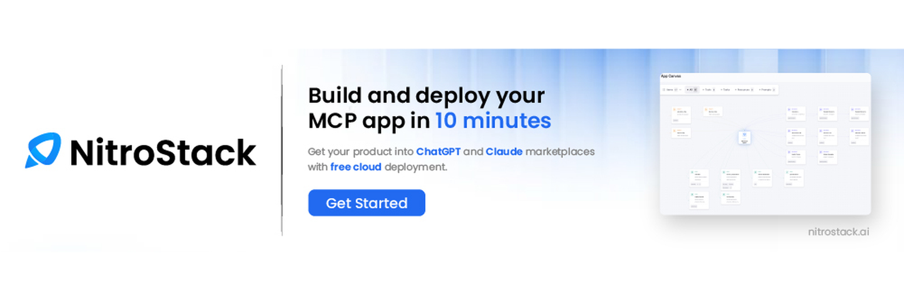
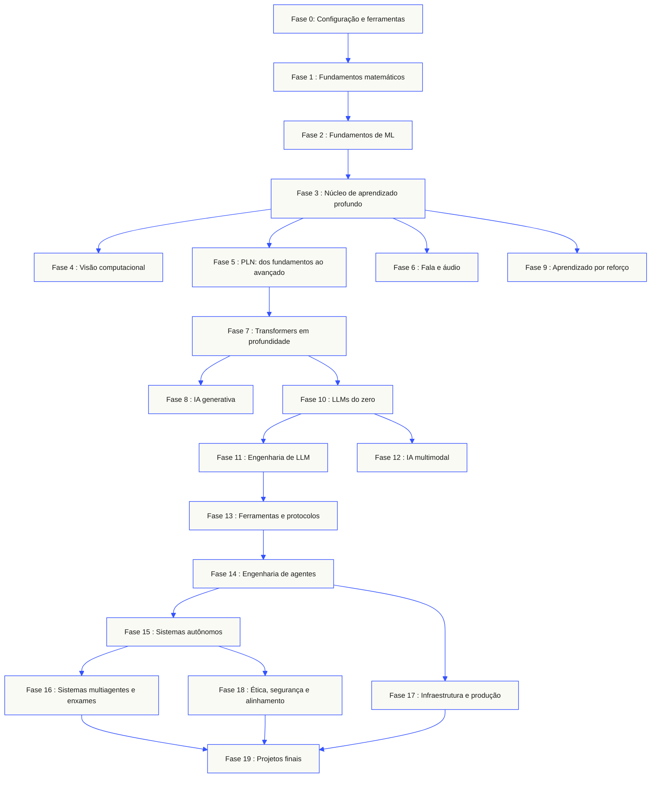

<p align="center" lang="pt-BR"><sub>Tradução assistida por IA em português do Brasil. O <a href="../../README.md">inglês é a versão de referência</a>.</sub></p>
<p align="center">
  
</p>
<p align="center">
  <a href="../../README.md">🇬🇧 English</a> ·
  <a href="../../i18n/zh/README.md">🇨🇳 简体中文</a> ·
  <a href="../../i18n/zh-TW/README.md">🇹🇼 繁體中文（台灣）</a> ·
  <a href="../../i18n/ja/README.md">🇯🇵 日本語</a> ·
  <a href="../../i18n/ko/README.md">🇰🇷 한국어</a> ·
  <a href="../../i18n/pt/README.md">🇵🇹 Português</a> ·
  <a href="../../i18n/pt-BR/README.md">🇧🇷 Português (Brasil)</a> ·
  <a href="../../i18n/es/README.md">🇪🇸 Español</a> ·
  <a href="../../i18n/de/README.md">🇩🇪 Deutsch</a> ·
  <a href="../../i18n/fr/README.md">🇫🇷 Français</a> ·
  <a href="../../i18n/it/README.md">🇮🇹 Italiano</a> ·
  <a href="../../i18n/nl/README.md">🇳🇱 Nederlands</a> ·
  <a href="../../i18n/pl/README.md">🇵🇱 Polski</a> ·
  <a href="../../i18n/cs/README.md">🇨🇿 Čeština</a> ·
  <a href="../../i18n/ro/README.md">🇷🇴 Română</a> ·
  <a href="../../i18n/hu/README.md">🇭🇺 Magyar</a> ·
  <a href="../../i18n/el/README.md">🇬🇷 Ελληνικά</a> ·
  <a href="../../i18n/sv/README.md">🇸🇪 Svenska</a> ·
  <a href="../../i18n/da/README.md">🇩🇰 Dansk</a> ·
  <a href="../../i18n/no/README.md">🇳🇴 Norsk</a> ·
  <a href="../../i18n/fi/README.md">🇫🇮 Suomi</a> ·
  <a href="../../i18n/ru/README.md">🇷🇺 Русский</a> ·
  <a href="../../i18n/uk/README.md">🇺🇦 Українська</a> ·
  <a href="../../i18n/tr/README.md">🇹🇷 Türkçe</a> ·
  <a href="../../i18n/he/README.md">🇮🇱 עברית</a> ·
  <a href="../../i18n/ar/README.md">🇸🇦 العربية</a> ·
  <a href="../../i18n/fa/README.md">🇮🇷 فارسی</a> ·
  <a href="../../i18n/hi/README.md">🇮🇳 हिन्दी</a> ·
  <a href="../../i18n/bn/README.md">🇧🇩 বাংলা</a> ·
  <a href="../../i18n/ur/README.md">🇵🇰 اردو</a> ·
  <a href="../../i18n/th/README.md">🇹🇭 ไทย</a> ·
  <a href="../../i18n/vi/README.md">🇻🇳 Tiếng Việt</a> ·
  <a href="../../i18n/id/README.md">🇮🇩 Bahasa Indonesia</a> ·
  <a href="../../i18n/tl/README.md">🇵🇭 Tagalog</a>
</p>
<p align="center">
  <a href="../../LICENSE"></a>
  <a href="../../ROADMAP.md"></a>
  <a href="#contents"></a>
  <a href="https://github.com/rohitg00/ai-engineering-from-scratch/stargazers"></a>
  <a href="https://aiengineeringfromscratch.com"></a>
  <p align="center">
 <a href="https://www.star-history.com/rohitg00/ai-engineering-from-scratch">
  <picture><source media="(prefers-color-scheme: dark)" srcset="https://api.star-history.com/badge?repo=rohitg00/ai-engineering-from-scratch&type=rank&theme=dark" /><source media="(prefers-color-scheme: light)" srcset="https://api.star-history.com/badge?repo=rohitg00/ai-engineering-from-scratch&type=rank" /></picture> <picture><source media="(prefers-color-scheme: dark)" srcset="https://api.star-history.com/badge?repo=rohitg00/ai-engineering-from-scratch&type=trending&theme=dark" /><source media="(prefers-color-scheme: light)" srcset="https://api.star-history.com/badge?repo=rohitg00/ai-engineering-from-scratch&type=trending" /></picture>
 </a>
</p>
</p>

### Patrocinadores

<p align="center">
  <a href="https://serpapi.com/ai-engineering-from-scratch"><picture><source media="(min-width: 768px)" srcset="../../assets/sponsors/serpapi-banner-compact.png" width="48%"></picture></a>
  <a href="https://nitrostack.ai/referral/aiengineeringfromscratch"><picture><source media="(min-width: 768px)" srcset="../../assets/sponsors/nitrostack-banner-equal.png" width="48%"></picture></a>
</p>

<p align="center">
  <sub><span>Seu apoio mantém todas as lições gratuitas e de código aberto.</span> <a href="#supporters">Ver todos os apoiadores</a> · <a href="../../SPONSORS.md">Torne-se patrocinador</a></sub>
</p>

```text
░░░▒▒▒░░░▒▒▒░░░▒▒▒░░░▒▒▒░░░▒▒▒░░░▒▒▒░░░▒▒▒░░░▒▒▒░░░▒▒▒░░░▒▒▒░░░▒▒▒░░░▒▒▒░░░▒▒▒░░░▒▒▒░░░▒▒▒
```

> **84% dos estudantes já usam ferramentas de IA. Apenas 18% se sentem preparados para usá-las profissionalmente.** Este currículo ajuda a reduzir essa lacuna.
>
> 523 lições. 20 fases. ~342 horas. Python, TypeScript, Rust e Julia. Cada lição entrega um artefato reutilizável: um prompt, uma skill, um agente ou um servidor MCP. Grátis, de código aberto e com licença MIT.
>
> Você não apenas aprende IA: você mesmo a constrói, do início ao fim.

<!-- STATS:START (generated from site/stats.json by build.js — do not edit by hand) -->
<p align="center"><sub><b>114,584</b> leitores &nbsp;·&nbsp; <b>181,995</b> visualizações de páginas nos últimos 30 dias &nbsp;·&nbsp; atualizado em 2026-08-29</sub></p>
<!-- STATS:END -->

## Comece aqui: escolha o que você quer construir

Você não precisa percorrer as 523 lições antes de começar. Escolha um objetivo. Cada link abre o mesmo currículo no GitHub ou no site, e as duas versões usam o mesmo código das lições.

| Seu objetivo | Estude no GitHub | Estude no site |
|---|---|---|
| Sou iniciante e quero a base completa | [Fase 0: Configuração e ferramentas](../../phases/00-setup-and-tooling/) | [Ambiente de desenvolvimento](https://aiengineeringfromscratch.com/lesson?path=phases/00-setup-and-tooling/01-dev-environment) |
| Sei Python e quero fundamentos de matemática e ML | [Fase 1: Fundamentos matemáticos](../../phases/01-math-foundations/) | [Intuição de álgebra linear](https://aiengineeringfromscratch.com/lesson?path=phases/01-math-foundations/01-linear-algebra-intuition) |
| Quero desenvolver aplicações de LLM para produção | [Fase 11: Engenharia de LLM](../../phases/11-llm-engineering/) | [Engenharia de prompts](https://aiengineeringfromscratch.com/lesson?path=phases/11-llm-engineering/01-prompt-engineering) |
| Quero construir agentes | [Fase 14: Engenharia de agentes](../../phases/14-agent-engineering/) | [O ciclo do agente](https://aiengineeringfromscratch.com/lesson?path=phases/14-agent-engineering/01-the-agent-loop) |
| Quero usar agentes de programação em repositórios reais | [Trilha de engenharia assistida por agentes](../../learning-paths/using-coding-agents.json) | [Engenharia assistida por agentes](https://aiengineeringfromscratch.com/lesson?path=phases/14-agent-engineering/31-agent-workbench-why-models-fail&learningPath=using-coding-agents) |
| Quero definir a solução certa antes de implementá-la | [Trilha de julgamento de produto e entrega](../../learning-paths/shaping-the-build.json) | [Julgamento de produto e entrega](https://aiengineeringfromscratch.com/lesson?path=phases/14-agent-engineering/47-outcomes-before-output&learningPath=shaping-the-build) |
| Quero desenvolver com Model Context Protocol (MCP) | [Rota do Model Context Protocol (MCP)](../../phases/13-tools-and-protocols/README.md#model-context-protocol-mcp-path) | [Trilha do Model Context Protocol (MCP)](https://aiengineeringfromscratch.com/lesson?path=phases/13-tools-and-protocols/06-mcp-fundamentals&learningPath=model-context-protocol) |
| Quero criar e publicar Agent Skills | [Rota focada de Agent Skills](../../phases/13-tools-and-protocols/README.md#agent-skills-fast-path) | [Trilha de Agent Skills](https://aiengineeringfromscratch.com/lesson?path=phases/13-tools-and-protocols/22-skills-and-agent-sdks&learningPath=agent-skills) |
| Quero me preparar para uma certificação Claude | [Guia de início da certificação](../../certifications/claude/GETTING_STARTED.md) | [Academia de certificação](https://aiengineeringfromscratch.com/certifications.html) |
| Quero me preparar para a certificação MCP Associate (MCPA) | [Guia de início do MCPA](../../certifications/mcpa/GETTING_STARTED.md) | [Trilha MCPA](https://aiengineeringfromscratch.com/certification?id=mcpa-f) |

Não sabe por onde começar? Use o [tutor de nivelamento `start-learning`](../../skills/start-learning/SKILL.md) ou o [guia de pré-requisitos do site](https://aiengineeringfromscratch.com/prereqs.html).

Compare quatro áreas centrais e seis trajetórias de carreira nas [trilhas de aprendizagem em Engenharia de IA](https://aiengineeringfromscratch.com/learning-paths.html).

### Siga o mesmo processo em cada lição

1. **Leia** `docs/en.md` e explique a ideia central com suas próprias palavras.
2. **Digite e construa** o código importante, em vez de tratar o bloco de código como decoração.
3. **Execute** o comando da lição a partir da raiz do repositório, o diretório que contém `README.md` e `phases/`.
4. **Guarde evidências**: o comando, o diretório de trabalho, o código de saída, a saída relevante e o artefato que você alterou ou produziu.
5. **Continue** somente quando conseguir explicar a saída e fazer uma pequena alteração sem adivinhar.

Os comandos nas páginas das lições usam caminhos relativos à raiz do repositório, a menos que a lição peça explicitamente para mudar de diretório. Se houver opções em várias linguagens, execute a implementação na linguagem que você está aprendendo.

### Clone o repositório e guarde sua primeira evidência

```bash
git clone https://github.com/rohitg00/ai-engineering-from-scratch.git
cd ai-engineering-from-scratch
python3 phases/00-setup-and-tooling/01-dev-environment/code/verify.py --route beginner
python3 phases/01-math-foundations/01-linear-algebra-intuition/code/vectors.py
```

A verificação inicial separa os requisitos necessários agora das ferramentas de que você precisará mais tarde. Cada requisito não atendido informa a causa detectada e um comando para corrigi-la. O segundo comando executa uma lição sem dependências e mostra que a multiplicação de uma matriz por um vetor é a operação realizada dentro de uma camada de rede neural. Guarde a saída do terminal como sua primeira evidência.

## Adicione o tutor de IA em 30 segundos

Se Node.js, `npx` e um agente de programação compatível com skills já estiverem instalados, você pode transformá-lo em seu tutor com dois comandos. Não é necessário clonar o repositório para instalar ou ler o tutor. Os laboratórios executáveis de Agent Skills também exigem um host selecionado e um escopo de instalação de skills, pessoal ou do projeto, com permissão de escrita.

Verifique primeiro os requisitos locais:

```bash
node --version
npx --version
python3 --version
```

Depois instale as skills do currículo e, quando o instalador perguntar, escolha o host e o escopo em que pretende usá-las:

```bash
npx skills add rohitg00/ai-engineering-from-scratch
```

A sintaxe de invocação pertence ao host, não ao formato portátil `SKILL.md`:

| Aplicação hospedeira | Comece o curso | Inicie Model Context Protocol (MCP) | Inicie Agent Skills | Faça o quiz de uma fase |
|---|---|---|---|---|
| Codex | `start-learning`, ou escolher entre `/skills` | `learn-mcp`, ou escolher entre `/skills` | `learn-agent-skills`, ou escolher entre `/skills` | `check-understanding 13`, ou escolher entre `/skills` |
| Claude Code | `/start-learning` | `/learn-mcp` | `/learn-agent-skills` | `/check-understanding 13` |
| Outros hosts compatíveis | `Use start-learning to begin the course.` | `Use learn-mcp to start the Model Context Protocol (MCP) path.` | `Use learn-agent-skills to start the Agent Skills Engineering path.` | `Use check-understanding to quiz me on Phase 13.` |

Um questionário de nivelamento com dez perguntas identifica a fase inicial adequada ao que você já sabe e salva um plano de estudos personalizado em `LEARNING.md`. Depois, a skill `learn` ensina uma lição por sessão: conceito, matemática, código e questionário. A skill `course-guide` leva você à lição exata sobre o que está causando dificuldade. No Codex, invoque essas skills com `learn` e `course-guide`; no Claude Code, use `/learn` e `/course-guide`; em outros hosts compatíveis, peça a skill pelo nome.

Quer aprender apenas o Model Context Protocol (MCP)? Use a invocação de MCP do seu host. A skill cria `MCP-LEARNING.md` e segue uma rota de 17 lições sobre solicitações sem estado, transportes, comunicação bidirecional, segurança, confiabilidade, governança de registros e evidências de conformidade. A ordem e os pontos de controle estão no [manifesto do Model Context Protocol (MCP)](../../learning-paths/model-context-protocol.json).

Quer aprender apenas Agent Skills? Use a invocação de Agent Skills do seu host. A skill cria `AGENT-SKILLS-LEARNING.md` e segue uma rota coesa de cinco lições: contrato, descoberta, invocação, limites do ambiente isolado e, por fim, avaliações de lançamento e portabilidade em hosts reais. Comece pela web com a [trilha de Agent Skills](https://aiengineeringfromscratch.com/lesson?path=phases/13-tools-and-protocols/22-skills-and-agent-sdks&learningPath=agent-skills).

O instalador lista os hosts que pode configurar e pergunta onde instalar. Se você ainda não tiver Node.js, `npx`, `python3`, um host compatível ou um escopo com permissão de escrita, use o site ou leia `docs/en.md` manualmente. Esse caminho ensina os conceitos, mas as evidências de descoberta e invocação no host real, execução de scripts e desinstalação ficam pendentes até que a verificação inicial esteja disponível. Leia as lições em [aiengineeringfromscratch.com](https://aiengineeringfromscratch.com).

## Como funciona

A maior parte do material sobre IA ensina tópicos desconexos: um artigo de pesquisa aqui, uma publicação sobre ajuste fino ali, uma demonstração impressionante de agente em outro lugar. Raramente as peças se encaixam. Você lança um chatbot sem conseguir explicar sua curva de perda, ou conecta uma função a um agente sem saber explicar o que a atenção faz dentro do modelo que a invoca.

Este currículo conecta essas peças: 20 fases, 523 lições e quatro linguagens — Python, TypeScript, Rust e Julia —, da álgebra linear aos enxames autônomos. Cada algoritmo começa pela matemática básica: retropropagação, tokenizador, atenção e ciclo do agente. Quando chegar ao PyTorch, você já saberá o que ele faz por dentro.

Cada lição segue o mesmo ciclo: ler o problema, derivar a matemática, escrever o código, executar o teste e guardar o artefato. Sem vídeos de cinco minutos, implementações para copiar e colar ou explicações paternalistas. É grátis, de código aberto e feito para rodar no seu próprio computador.

```text
░░░▒▒▒░░░▒▒▒░░░▒▒▒░░░▒▒▒░░░▒▒▒░░░▒▒▒░░░▒▒▒░░░▒▒▒░░░▒▒▒░░░▒▒▒░░░▒▒▒░░░▒▒▒░░░▒▒▒░░░▒▒▒░░░▒▒▒
```

## A estrutura do currículo

As vinte fases se constroem umas sobre as outras. A matemática é a base; agentes e sistemas de produção ficam no topo. Avance se já dominar as camadas inferiores, mas não pule os fundamentos e depois se surpreenda quando algo nas etapas avançadas der errado.



```text
░░░▒▒▒░░░▒▒▒░░░▒▒▒░░░▒▒▒░░░▒▒▒░░░▒▒▒░░░▒▒▒░░░▒▒▒░░░▒▒▒░░░▒▒▒░░░▒▒▒░░░▒▒▒░░░▒▒▒░░░▒▒▒░░░▒▒▒
```

## A estrutura de uma lição

Cada lição fica em sua própria pasta e segue a mesma estrutura em todo o currículo:

```text
phases/<NN>-<phase-name>/<NN>-<lesson-name>/
├── code/      implementações executáveis (Python, TypeScript, Rust, Julia)
├── docs/
│   └── en.md  explicação da lição
└── outputs/   prompts, skills, agentes ou servidores MCP produzidos por esta lição
```

Cada lição tem seis etapas. A sequência *Construa / Use* é a espinha dorsal: primeiro você implementa o algoritmo do zero, depois executa a mesma operação com a biblioteca de produção. Você entende o que o framework faz porque escreveu uma versão menor com as próprias mãos.

```mermaid
%%{init: {'theme':'base','themeVariables':{'primaryColor':'#fafaf5','primaryTextColor':'#1a1a1a','primaryBorderColor':'#3553ff','lineColor':'#3553ff','fontFamily':'JetBrains Mono','fontSize':'13px'}}}%%
flowchart LR
  M["IDEIA CENTRAL<br/><sub>a essência numa linha</sub>"] --> Pr["PROBLEMA<br/><sub>uma dificuldade concreta</sub>"]
  Pr --> C["CONCEITO<br/><sub>diagramas e intuição</sub>"]
  C --> B["CONSTRUA<br/><sub>matemática do zero, sem frameworks</sub>"]
  B --> U["USE<br/><sub>o mesmo em PyTorch / sklearn</sub>"]
  U --> S["PUBLIQUE<br/><sub>instrução · habilidade · agente · MCP</sub>"]
```



## Primeiros passos

Há três formas de começar. Escolha uma.

**Opção A — aprender no terminal *(recomendado)*.** Depois de verificar Node.js, `npx`, o host e o escopo, instale as skills de aprendizagem em um agente compatível e deixe o curso orientar você:

```bash
npx skills add rohitg00/ai-engineering-from-scratch
```

Use a tabela de invocação específica do seu host. As skills instaladas incluem `start-learning`, `learn`, `course-guide` e as rotas específicas `learn-mcp` e `learn-agent-skills`. O conteúdo das lições pode ser carregado deste repositório sem um clone. É preciso clonar o repositório localmente para executar os comandos que copiam código e os laboratórios de MCP ou Agent Skills. O progresso fica em `LEARNING.md`, `MCP-LEARNING.md` ou `AGENT-SKILLS-LEARNING.md` no seu projeto, para que cada sessão possa continuar de onde parou.

**Opção B — ler.** Abra qualquer lição concluída em [aiengineeringfromscratch.com](https://aiengineeringfromscratch.com) ou expanda uma fase em [Conteúdo](#contents). Não precisa instalar nada nem clonar o repositório.

**Opção C — clonar e executar.**

```bash
git clone https://github.com/rohitg00/ai-engineering-from-scratch.git
cd ai-engineering-from-scratch
python3 phases/01-math-foundations/01-linear-algebra-intuition/code/vectors.py
```

Ao clonar o repositório, o Claude Code também carrega automaticamente as skills de aprendizagem; o tutor `learn` pode então executar o código real de cada lição em vez de apenas lê-lo.

### Pré-requisitos

- Você sabe programar em alguma linguagem; Python ajuda.
- Você quer entender como a IA funciona de verdade, não apenas chamar APIs.

### Prepare-se para as certificações Claude

A [Academia de Certificação Claude](../../certifications/claude/README.md) é um programa gratuito e de código aberto para preparar candidatos para as quatro certificações oficiais da Claude: Associate Foundations, Developer Foundations, Architect Foundations e Architect Professional. Cada trilha combina lições alinhadas ao guia do exame, laboratórios executáveis, um diagnóstico, um projeto final e um simulado original completo.

Use o [guia de início no GitHub com tutor de IA](../../certifications/claude/GETTING_STARTED.md) com Claude Code, Codex, ChatGPT, Cursor ou outro agente. Execute `claude-certification` no Codex, `/claude-certification` no Claude Code ou peça a outro host para usar `claude-certification`. A skill ajuda a escolher uma certificação, cria uma rota persistente em `CLAUDE-CERTIFICATION.md`, ensina uma etapa de cada vez, executa os laboratórios reais e oferece feedback com base nos artefatos. O mesmo currículo está disponível no [site de certificação](https://aiengineeringfromscratch.com/certifications.html).

A academia oferece material de estudo independente baseado nos objetivos públicos do exame. Não é afiliada à Anthropic, não reproduz questões reais do exame e não garante aprovação.

### Prepare-se para a certificação MCP Associate (MCPA)

O [currículo de certificação MCPA](../../certifications/mcpa/README.md) é um programa de preparação gratuito e de código aberto para o exame Model Context Protocol Associate, da Agentic AI Foundation, ministrado pela Linux Foundation Training. Suas 34 lições ensinam o protocolo sem estado de 2026-07-28 e cobrem os cinco domínios do exame: `_meta` em cada solicitação e `server/discover` no lugar do antigo handshake, solicitações com várias trocas, assinaturas, cache, as extensões Tasks e MCP Apps, autorização OAuth e as camadas de registro e SDK. Cada lição inclui um laboratório executável com a biblioteca padrão, cuja transcrição é verificada para confirmar o formato atual do protocolo. A trilha também inclui um diagnóstico, um projeto final e três simulados originais completos, com uma distribuição de questões que segue os pesos publicados do guia.

Use o [guia de início no GitHub com tutor de IA](../../certifications/mcpa/GETTING_STARTED.md) com Claude Code, Codex, ChatGPT, Cursor ou outro agente. Execute `mcpa-certification` no Codex, `/mcpa-certification` no Claude Code ou peça a outro host para usar `mcpa-certification`. A skill cria uma rota persistente em `MCPA-CERTIFICATION.md`, ensina uma etapa de cada vez, executa os laboratórios reais e oferece feedback com base nos artefatos. O mesmo currículo está na [página da trilha MCPA](https://aiengineeringfromscratch.com/certification?id=mcpa-f).

Este currículo é material de estudo independente baseado nos objetivos públicos do exame. Não é afiliado à Agentic AI Foundation nem à Linux Foundation, não reproduz questões reais do exame e não garante aprovação.

### Skills de aprendizagem

| Habilidade | O que faz |
|---|---|
| [`start-learning`](../../skills/start-learning/SKILL.md) | Integração inicial: defina por que está aprendendo, responda ao questionário de nivelamento e salve um plano personalizado em `LEARNING.md`. |
| [`learn`](../../skills/learn/SKILL.md) | Ciclo do tutor: revisão inicial, próxima lição interativa e seu questionário; registra o progresso e uma fila de revisão. |
| [`course-guide`](../../skills/course-guide/SKILL.md) | Guia por tópicos: encontra as lições exatas e seus links para perguntas como “Onde aprendo atenção?” ou “minha perda é NaN”. |
| [`learn-mcp`](../../skills/learn-mcp/SKILL.md) | Tutor especializado em Model Context Protocol (MCP). Cria `MCP-LEARNING.md`, segue o manifesto de 17 lições e registra evidências sobre protocolo, segurança, confiabilidade e conformidade. |
| [`learn-agent-skills`](../../skills/learn-agent-skills/SKILL.md) | Tutor especializado em Agent Skills. Cria `AGENT-SKILLS-LEARNING.md`, ensina as lições 22, 24, 25, 26 e 27 e registra evidências em hosts reais. |
| [`claude-certification`](../../skills/claude-certification/SKILL.md) | Tutor de certificação. Escolhe CCAO-F, CCDV-F, CCAR-F ou CCAR-P; ensina cada lição, executa laboratórios, revisa artefatos, aplica diagnósticos e simulados e salva o progresso. |
| [`mcpa-certification`](../../skills/mcpa-certification/SKILL.md) | Tutor do MCPA. Segue a rota `mcpa-f` de 34 lições sobre o protocolo 2026-07-28; ensina cada lição, executa os laboratórios e o verificador do protocolo, aplica o diagnóstico e três simulados e salva o progresso. |
| [`find-your-level`](../../skills/find-your-level/SKILL.md) | Questionário de nivelamento com dez perguntas. Identifica a fase inicial adequada e propõe uma trilha personalizada com estimativas de horas. |
| [`check-understanding <phase>`](../../skills/check-understanding/SKILL.md) | Questionário por fase com oito perguntas, feedback e lições específicas para revisar. Use a invocação do Codex, Claude Code ou linguagem natural da tabela acima. |

```text
░░░▒▒▒░░░▒▒▒░░░▒▒▒░░░▒▒▒░░░▒▒▒░░░▒▒▒░░░▒▒▒░░░▒▒▒░░░▒▒▒░░░▒▒▒░░░▒▒▒░░░▒▒▒░░░▒▒▒░░░▒▒▒░░░▒▒▒
```

## Leia o currículo principal em formato de livro

O currículo principal de 20 fases em `phases/` também é publicado em uma série de seis livros. O CI gera os arquivos EPUB e PDF a partir das mesmas lições centrais e os anexa a cada [lançamento do GitHub](https://github.com/rohitg00/ai-engineering-from-scratch/releases); os links abaixo sempre apontam para o lançamento mais recente. Os números identificam os volumes da série, não versões: cada cópia traz a data da edição, e edições anteriores continuam disponíveis nos respectivos lançamentos.

Os currículos de certificação não são incluídos nos livros. O estado do tutor de IA, os laboratórios executáveis, as figuras interativas, os diagnósticos e os simulados cronometrados continuam disponíveis no GitHub e no site.

| Vol. | Título | Fases | Transferência |
|-----|-------|--------|----------|
| 1 | Fundamentos · Matemática, ferramentas e aprendizado de máquina clássico | 00-02 | [EPUB](https://github.com/rohitg00/ai-engineering-from-scratch/releases/latest/download/aiefs-vol1-foundations.epub) · [PDF](https://github.com/rohitg00/ai-engineering-from-scratch/releases/latest/download/aiefs-vol1-foundations.pdf) |
| 2 | Aprendizado profundo · Redes, visão e fala | 03, 04, 06 | [EPUB](https://github.com/rohitg00/ai-engineering-from-scratch/releases/latest/download/aiefs-vol2-deep-learning.epub) · [PDF](https://github.com/rohitg00/ai-engineering-from-scratch/releases/latest/download/aiefs-vol2-deep-learning.pdf) |
| 3 | Linguagem · Fundamentos de PLN e o Transformer | 05, 07 | [EPUB](https://github.com/rohitg00/ai-engineering-from-scratch/releases/latest/download/aiefs-vol3-language.epub) · [PDF](https://github.com/rohitg00/ai-engineering-from-scratch/releases/latest/download/aiefs-vol3-language.pdf) |
| 4 | Grandes modelos de linguagem · Geração, reforço, pré-treinamento e engenharia | 08-11 | [EPUB](https://github.com/rohitg00/ai-engineering-from-scratch/releases/latest/download/aiefs-vol4-llms.epub) · [PDF](https://github.com/rohitg00/ai-engineering-from-scratch/releases/latest/download/aiefs-vol4-llms.pdf) |
| 5 | Agentes · Multimodalidade, protocolos, autonomia e enxames | 12-16 | [EPUB](https://github.com/rohitg00/ai-engineering-from-scratch/releases/latest/download/aiefs-vol5-agents.epub) · [PDF](https://github.com/rohitg00/ai-engineering-from-scratch/releases/latest/download/aiefs-vol5-agents.pdf) |
| 6 | Produção · Infraestrutura, segurança e projetos finais | 17-19 | [EPUB](https://github.com/rohitg00/ai-engineering-from-scratch/releases/latest/download/aiefs-vol6-production.epub) · [PDF](https://github.com/rohitg00/ai-engineering-from-scratch/releases/latest/download/aiefs-vol6-production.pdf) |

O livro é uma fotografia de uma edição; este repositório é a edição viva. Cada capítulo termina com links para as figuras animadas, o questionário e o código executável da lição. Para compilá-lo localmente, execute `python3 scripts/build_book.py` (é necessário ter pandoc); consulte os detalhes do processo em [book/README.md](../../book/README.md).

```text
░░░▒▒▒░░░▒▒▒░░░▒▒▒░░░▒▒▒░░░▒▒▒░░░▒▒▒░░░▒▒▒░░░▒▒▒░░░▒▒▒░░░▒▒▒░░░▒▒▒░░░▒▒▒░░░▒▒▒░░░▒▒▒░░░▒▒▒
```

## Cada lição entrega algo

Outros currículos terminam com “Parabéns, você aprendeu X”. Aqui, cada lição termina com uma **ferramenta reutilizável** que você pode instalar ou incorporar ao seu fluxo de trabalho diário.

<table>
<tr>
<th align="left" width="25%"><br/><sub>FIG_001 · A</sub><br/><b>INSTRUÇÕES</b></th>
<th align="left" width="25%"><br/><sub>FIG_001 · B</sub><br/><b>HABILIDADES</b></th>
<th align="left" width="25%"><br/><sub>FIG_001 · C</sub><br/><b>Agentes</b></th>
<th align="left" width="25%"><br/><sub>FIG_001 · D</sub><br/><b>Servidores MCP</b></th>
</tr>
<tr>
<td valign="top">Cole o conteúdo em qualquer assistente de IA para obter ajuda especializada em uma tarefa específica.</td>
<td valign="top">Instale-a no Claude, Cursor, Codex, OpenClaw, Hermes ou em qualquer agente que leia <code>SKILL.md</code>.</td>
<td valign="top">Implemente como trabalhadores autônomos. Na Fase 14, você escreveu o ciclo do agente por conta própria.</td>
<td valign="top">Conecte a qualquer cliente compatível com MCP. Você constrói o servidor de ponta a ponta na Fase 13.</td>
</tr>
</table>

> Instale todas as skills com `python3 scripts/install_skills.py <target>`. São ferramentas reais, não tarefas de casa. Ao concluir o currículo, você terá um portfólio de 523 artefatos que realmente entende porque os construiu.

### FIG_002 · Um exemplo completo

Fase 14, lição 1: o ciclo do agente. Cerca de 120 linhas de Python puro, sem dependências.

<table>
<tr>
<td valign="top" width="50%">

**`code/agent_loop.py`** &nbsp; <sub><i>Construa</i></sub>

```python
def run(query, tools):
    history = [user(query)]
    for step in range(MAX_STEPS):
        msg = llm(history)
        if msg.tool_calls:
            for call in msg.tool_calls:
                result = tools[call.name](**call.args)
                history.append(tool_result(call.id, result))
            continue
        return msg.content
    raise StepLimitExceeded
```

</td>
<td valign="top" width="50%">

**`outputs/skill-agent-loop.md`** &nbsp; <sub><i>Publique</i></sub>

```markdown
---
name: agent-loop
description: ReAct-style loop for any tool list
phase: 14
lesson: 01
---

Implement a minimal agent loop that...
```

**`outputs/prompt-debug-agent.md`**

```markdown
You are an agent debugger. Given the trace
of an agent run, identify the step where
the agent went wrong and explain why...
```

</td>
</tr>
</table>

```text
░░░▒▒▒░░░▒▒▒░░░▒▒▒░░░▒▒▒░░░▒▒▒░░░▒▒▒░░░▒▒▒░░░▒▒▒░░░▒▒▒░░░▒▒▒░░░▒▒▒░░░▒▒▒░░░▒▒▒░░░▒▒▒░░░▒▒▒
```

<a id="contents"></a>

## Conteúdo

20 fases, clique em qualquer fase para expandir a lista de lições.

<a id="phase-0"></a>

### Fase 0: Configuração e ferramentas `12 lições`

> Prepare o ambiente para tudo o que vem a seguir.

| # | Lição | Tipo | Idioma |
|:---:|--------|:----:|------|
| 01 | [Ambiente de desenvolvimento](../../phases/00-setup-and-tooling/01-dev-environment/) | Construir | Python |
| 02 | [Git e colaboração](../../phases/00-setup-and-tooling/02-git-and-collaboration/) | Aprender | — |
| 03 | [Configuração de GPU e da nuvem](../../phases/00-setup-and-tooling/03-gpu-setup-and-cloud/) | Construir | Python |
| 04 | [APIs e chaves](../../phases/00-setup-and-tooling/04-apis-and-keys/) | Construir | Python |
| 05 | [Notebooks Jupyter](../../phases/00-setup-and-tooling/05-jupyter-notebooks/) | Construir | Python |
| 06 | [Ambientes Python](../../phases/00-setup-and-tooling/06-python-environments/) | Construir | Shell |
| 07 | [Docker para IA](../../phases/00-setup-and-tooling/07-docker-for-ai/) | Construir | Docker |
| 08 | [Configuração do editor](../../phases/00-setup-and-tooling/08-editor-setup/) | Construir | — |
| 09 | [Gerenciamento de dados](../../phases/00-setup-and-tooling/09-data-management/) | Construir | Python |
| 10 | [Terminal e shell](../../phases/00-setup-and-tooling/10-terminal-and-shell/) | Aprender | — |
| 11 | [Linux para IA](../../phases/00-setup-and-tooling/11-linux-for-ai/) | Aprender | — |
| 12 | [Depuração e perfilamento](../../phases/00-setup-and-tooling/12-debugging-and-profiling/) | Construir | Python |

<details id="phase-1">
<summary><b>Fase 1 — Fundamentos matemáticos</b> &nbsp;<code>22 lições</code>&nbsp; <em>A intuição por trás de cada algoritmo de IA, com código.</em></summary>
<br/>

| # | Lição | Tipo | Idioma |
|:---:|--------|:----:|------|
| 01 | [Intuição de álgebra linear](../../phases/01-math-foundations/01-linear-algebra-intuition/) | Aprender | Python, Julia |
| 02 | [Vetores, matrizes e operações](../../phases/01-math-foundations/02-vectors-matrices-operations/) | Construir | Python, Julia |
| 03 | [Transformações de matrizes e autovalores](../../phases/01-math-foundations/03-matrix-transformations/) | Construir | Python, Julia |
| 04 | [Cálculo para ML: derivadas e gradientes](../../phases/01-math-foundations/04-calculus-for-ml/) | Aprender | Python |
| 05 | [Regra da cadeia e diferenciação automática](../../phases/01-math-foundations/05-chain-rule-and-autodiff/) | Construir | Python |
| 06 | [Probabilidade e distribuição](../../phases/01-math-foundations/06-probability-and-distributions/) | Aprender | Python |
| 07 | [Teorema de Bayes e pensamento estatístico](../../phases/01-math-foundations/07-bayes-theorem/) | Construir | Python |
| 08 | [Otimização: métodos de descida do gradiente](../../phases/01-math-foundations/08-optimization/) | Construir | Python |
| 09 | [Teoria da informação: entropia e divergência KL](../../phases/01-math-foundations/09-information-theory/) | Aprender | Python |
| 10 | [Redução de dimensionalidade: PCA, t-SNE, UMAP](../../phases/01-math-foundations/10-dimensionality-reduction/) | Construir | Python |
| 11 | [Decomposição em valores singulares](../../phases/01-math-foundations/11-singular-value-decomposition/) | Construir | Python, Julia |
| 12 | [Operações com tensores](../../phases/01-math-foundations/12-tensor-operations/) | Construir | Python |
| 13 | [Estabilidade numérica](../../phases/01-math-foundations/13-numerical-stability/) | Construir | Python |
| 14 | [Normas e distâncias](../../phases/01-math-foundations/14-norms-and-distances/) | Construir | Python |
| 15 | [Estatística para ML](../../phases/01-math-foundations/15-statistics-for-ml/) | Construir | Python |
| 16 | [Métodos de amostragem](../../phases/01-math-foundations/16-sampling-methods/) | Construir | Python |
| 17 | [Sistemas lineares](../../phases/01-math-foundations/17-linear-systems/) | Construir | Python |
| 18 | [Otimização convexa](../../phases/01-math-foundations/18-convex-optimization/) | Construir | Python |
| 19 | [Números complexos para IA](../../phases/01-math-foundations/19-complex-numbers/) | Aprender | Python |
| 20 | [A transformada de Fourier](../../phases/01-math-foundations/20-fourier-transform/) | Construir | Python |
| 21 | [Teoria dos grafos para ML](../../phases/01-math-foundations/21-graph-theory/) | Construir | Python |
| 22 | [Processos estocásticos](../../phases/01-math-foundations/22-stochastic-processes/) | Aprender | Python |

</details>
<details id="phase-2">
<summary><b>Fase 2 — Fundamentos de ML</b> &nbsp;<code>18 lições</code>&nbsp; <em>O ML clássico continua sendo a espinha dorsal da maioria dos sistemas de IA em produção.</em></summary>
<br/>

| # | Lição | Tipo | Idioma |
|:---:|--------|:----:|------|
| 01 | [O que é aprendizado de máquina](../../phases/02-ml-fundamentals/01-what-is-machine-learning/) | Aprender | Python |
| 02 | [Regressão linear do zero](../../phases/02-ml-fundamentals/02-linear-regression/) | Construir | Python |
| 03 | [Regressão logística e classificação](../../phases/02-ml-fundamentals/03-logistic-regression/) | Construir | Python |
| 04 | [Árvores de decisão e florestas aleatórias](../../phases/02-ml-fundamentals/04-decision-trees/) | Construir | Python |
| 05 | [Máquinas de vetores de suporte](../../phases/02-ml-fundamentals/05-support-vector-machines/) | Construir | Python |
| 06 | [KNN e métricas de distância](../../phases/02-ml-fundamentals/06-knn-and-distances/) | Construir | Python |
| 07 | [Aprendizagem não supervisionada: K-Means, DBSCAN](../../phases/02-ml-fundamentals/07-unsupervised-learning/) | Construir | Python |
| 08 | [Engenharia e seleção de atributos](../../phases/02-ml-fundamentals/08-feature-engineering/) | Construir | Python |
| 09 | [Avaliação de modelos: métricas e validação cruzada](../../phases/02-ml-fundamentals/09-model-evaluation/) | Construir | Python |
| 10 | [Viés, variância e curva de aprendizado](../../phases/02-ml-fundamentals/10-bias-variance/) | Aprender | Python |
| 11 | [Métodos de ensemble: boosting, bagging e stacking](../../phases/02-ml-fundamentals/11-ensemble-methods/) | Construir | Python |
| 12 | [Ajuste de hiperparâmetros](../../phases/02-ml-fundamentals/12-hyperparameter-tuning/) | Construir | Python |
| 13 | [Pipelines de ML e rastreamento de experimentos](../../phases/02-ml-fundamentals/13-ml-pipelines/) | Construir | Python |
| 14 | [Bayes ingênuo](../../phases/02-ml-fundamentals/14-naive-bayes/) | Construir | Python |
| 15 | [Fundamentos de séries temporais](../../phases/02-ml-fundamentals/15-time-series/) | Construir | Python |
| 16 | [Detecção de anomalias](../../phases/02-ml-fundamentals/16-anomaly-detection/) | Construir | Python |
| 17 | [Tratamento de dados desequilibrados](../../phases/02-ml-fundamentals/17-imbalanced-data/) | Construir | Python |
| 18 | [Seleção de atributos](../../phases/02-ml-fundamentals/18-feature-selection/) | Construir | Python |

</details>
<details id="phase-3">
<summary><b>Fase 3 — Núcleo de aprendizado profundo</b> &nbsp;<code>13 lições</code>&nbsp; <em>Redes neurais a partir dos primeiros princípios. Sem frameworks até você construir um.</em></summary>
<br/>

| # | Lição | Tipo | Idioma |
|:---:|--------|:----:|------|
| 01 | [O perceptron: onde tudo começou](../../phases/03-deep-learning-core/01-the-perceptron/) | Construir | Python |
| 02 | [Redes multicamadas e passagem direta](../../phases/03-deep-learning-core/02-multi-layer-networks/) | Construir | Python |
| 03 | [Retropropagação do zero](../../phases/03-deep-learning-core/03-backpropagation/) | Construir | Python |
| 04 | [Funções de ativação: ReLU, sigmoide, GELU e o porquê](../../phases/03-deep-learning-core/04-activation-functions/) | Construir | Python |
| 05 | [Funções de perda: MSE, entropia cruzada e contrastiva](../../phases/03-deep-learning-core/05-loss-functions/) | Construir | Python |
| 06 | [Otimizadores: SGD, Momentum, Adam, AdamW](../../phases/03-deep-learning-core/06-optimizers/) | Construir | Python |
| 07 | [Regularização: dropout, decaimento de pesos e BatchNorm](../../phases/03-deep-learning-core/07-regularization/) | Construir | Python |
| 08 | [Inicialização de pesos e estabilidade do treinamento](../../phases/03-deep-learning-core/08-weight-initialization/) | Construir | Python |
| 09 | [Agendamentos da taxa de aprendizado e aquecimento inicial](../../phases/03-deep-learning-core/09-learning-rate-schedules/) | Construir | Python |
| 10 | [Construa seu próprio miniframework](../../phases/03-deep-learning-core/10-mini-framework/) | Construir | Python |
| 11 | [Introdução ao PyTorch](../../phases/03-deep-learning-core/11-intro-to-pytorch/) | Construir | Python |
| 12 | [Introdução ao JAX](../../phases/03-deep-learning-core/12-intro-to-jax/) | Construir | Python |
| 13 | [Depuração de redes neurais](../../phases/03-deep-learning-core/13-debugging-neural-networks/) | Construir | Python |

</details>
<details id="phase-4">
<summary><b>Fase 4 — Visão computacional</b> &nbsp;<code>28 lições</code>&nbsp; <em>Dos pixels à compreensão: imagens, vídeos, 3D, VLMs e modelos de mundo.</em></summary>
<br/>

| # | Lição | Tipo | Idioma |
|:---:|--------|:----:|------|
| 01 | [Fundamentos de imagem: pixels, canais e espaços de cor](../../phases/04-computer-vision/01-image-fundamentals/) | Aprender | Python |
| 02 | [Convoluções do zero](../../phases/04-computer-vision/02-convolutions-from-scratch/) | Construir | Python |
| 03 | [CNNs: da LeNet à ResNet](../../phases/04-computer-vision/03-cnns-lenet-to-resnet/) | Construir | Python |
| 04 | [Classificação de imagens](../../phases/04-computer-vision/04-image-classification/) | Construir | Python |
| 05 | [Transferência de aprendizado e ajuste fino](../../phases/04-computer-vision/05-transfer-learning/) | Construir | Python |
| 06 | [Detecção de objetos — YOLO do zero](../../phases/04-computer-vision/06-object-detection-yolo/) | Construir | Python |
| 07 | [Segmentação semântica — U-Net](../../phases/04-computer-vision/07-semantic-segmentation-unet/) | Construir | Python |
| 08 | [Segmentação de instâncias — Mask R-CNN](../../phases/04-computer-vision/08-instance-segmentation-mask-rcnn/) | Construir | Python |
| 09 | [Geração de imagens — GANs](../../phases/04-computer-vision/09-image-generation-gans/) | Construir | Python |
| 10 | [Geração de imagens — modelos de difusão](../../phases/04-computer-vision/10-image-generation-diffusion/) | Construir | Python |
| 11 | [Stable Diffusion — arquitetura e ajuste fino](../../phases/04-computer-vision/11-stable-diffusion/) | Construir | Python |
| 12 | [Compreensão de vídeo — modelagem temporal](../../phases/04-computer-vision/12-video-understanding/) | Construir | Python |
| 13 | [Visão 3D: nuvens de pontos e NeRFs](../../phases/04-computer-vision/13-3d-vision-nerf/) | Construir | Python |
| 14 | [Transformers de visão (ViT)](../../phases/04-computer-vision/14-vision-transformers/) | Construir | Python |
| 15 | [Visão em tempo real: implantação na borda](../../phases/04-computer-vision/15-real-time-edge/) | Construir | Python |
| 16 | [Construa um pipeline completo de visão](../../phases/04-computer-vision/16-vision-pipeline-capstone/) | Construir | Python |
| 17 | [Visão autossupervisionada — SimCLR, DINO, MAE](../../phases/04-computer-vision/17-self-supervised-vision/) | Construir | Python |
| 18 | [Visão de vocabulário aberto: CLIP](../../phases/04-computer-vision/18-open-vocab-clip/) | Construir | Python |
| 19 | [OCR e compreensão de documentos](../../phases/04-computer-vision/19-ocr-document-understanding/) | Construir | Python |
| 20 | [Recuperação de imagens e aprendizado de métricas](../../phases/04-computer-vision/20-image-retrieval-metric/) | Construir | Python |
| 21 | [Detecção de pontos-chave e estimativa de pose](../../phases/04-computer-vision/21-keypoint-pose/) | Construir | Python |
| 22 | [Gaussian Splatting 3D do zero](../../phases/04-computer-vision/22-3d-gaussian-splatting/) | Construir | Python |
| 23 | [Transformers de difusão e fluxo retificado](../../phases/04-computer-vision/23-diffusion-transformers-rectified-flow/) | Construir | Python |
| 24 | [SAM 3 e segmentação de vocabulário aberto](../../phases/04-computer-vision/24-sam3-open-vocab-segmentation/) | Construir | Python |
| 25 | [Modelos de visão e linguagem (ViT-MLP-LLM)](../../phases/04-computer-vision/25-vision-language-models/) | Construir | Python |
| 26 | [Estimativa monocular de profundidade e geometria](../../phases/04-computer-vision/26-monocular-depth/) | Construir | Python |
| 27 | [Rastreamento de múltiplos objetos e memória de vídeo](../../phases/04-computer-vision/27-multi-object-tracking/) | Construir | Python |
| 28 | [Modelos de mundo e difusão de vídeo](../../phases/04-computer-vision/28-world-models-video-diffusion/) | Construir | Python |

</details>
<details id="phase-5">
<summary><b>Fase 5 — PLN: dos fundamentos ao avançado</b> &nbsp;<code>29 lições</code>&nbsp; <em>A linguagem é a interface para a inteligência.</em></summary>
<br/>

| # | Lição | Tipo | Idioma |
|:---:|--------|:----:|------|
| 01 | [Processamento de texto: tokenização, stemming e lematização](../../phases/05-nlp-foundations-to-advanced/01-text-processing/) | Construir | Python |
| 02 | [Saco de palavras, TF-IDF e representação de texto](../../phases/05-nlp-foundations-to-advanced/02-bag-of-words-tfidf/) | Construir | Python |
| 03 | [Embeddings de palavras: Word2Vec do zero](../../phases/05-nlp-foundations-to-advanced/03-word-embeddings-word2vec/) | Construir | Python |
| 04 | [GloVe, FastText e embeddings de subpalavras](../../phases/05-nlp-foundations-to-advanced/04-glove-fasttext-subword/) | Construir | Python |
| 05 | [Análise de sentimentos](../../phases/05-nlp-foundations-to-advanced/05-sentiment-analysis/) | Construir | Python |
| 06 | [Reconhecimento de entidades nomeadas (NER)](../../phases/05-nlp-foundations-to-advanced/06-named-entity-recognition/) | Construir | Python |
| 07 | [Etiquetagem POS e análise sintática](../../phases/05-nlp-foundations-to-advanced/07-pos-tagging-parsing/) | Construir | Python |
| 08 | [Classificação de texto — CNNs e RNNs para texto](../../phases/05-nlp-foundations-to-advanced/08-cnns-rnns-for-text/) | Construir | Python |
| 09 | [Modelos sequência a sequência](../../phases/05-nlp-foundations-to-advanced/09-sequence-to-sequence/) | Construir | Python |
| 10 | [Mecanismo de atenção — a virada decisiva](../../phases/05-nlp-foundations-to-advanced/10-attention-mechanism/) | Construir | Python |
| 11 | [Tradução automática](../../phases/05-nlp-foundations-to-advanced/11-machine-translation/) | Construir | Python |
| 12 | [Sumarização de texto](../../phases/05-nlp-foundations-to-advanced/12-text-summarization/) | Construir | Python |
| 13 | [Sistemas de perguntas e respostas](../../phases/05-nlp-foundations-to-advanced/13-question-answering/) | Construir | Python |
| 14 | [Recuperação de informação e busca](../../phases/05-nlp-foundations-to-advanced/14-information-retrieval-search/) | Construir | Python |
| 15 | [Modelagem de tópicos: LDA, BERTopic](../../phases/05-nlp-foundations-to-advanced/15-topic-modeling/) | Construir | Python |
| 16 | [Geração de textos](../../phases/05-nlp-foundations-to-advanced/16-text-generation-pre-transformer/) | Construir | Python |
| 17 | [Chatbots: de sistemas baseados em regras às redes neurais](../../phases/05-nlp-foundations-to-advanced/17-chatbots-rule-to-neural/) | Construir | Python |
| 18 | [PLN multilíngue](../../phases/05-nlp-foundations-to-advanced/18-multilingual-nlp/) | Construir | Python |
| 19 | [Tokenização de subpalavras: BPE, WordPiece, Unigram e SentencePiece](../../phases/05-nlp-foundations-to-advanced/19-subword-tokenization/) | Aprender | Python |
| 20 | [Saídas estruturadas e decodificação restrita](../../phases/05-nlp-foundations-to-advanced/20-structured-outputs-constrained-decoding/) | Construir | Python |
| 21 | [Inferência em linguagem natural (NLI) e implicação textual](../../phases/05-nlp-foundations-to-advanced/21-nli-textual-entailment/) | Aprender | Python |
| 22 | [Análise aprofundada de modelos de embeddings](../../phases/05-nlp-foundations-to-advanced/22-embedding-models-deep-dive/) | Aprender | Python |
| 23 | [Estratégias de segmentação para RAG](../../phases/05-nlp-foundations-to-advanced/23-chunking-strategies-rag/) | Construir | Python |
| 24 | [Resolução de correferências](../../phases/05-nlp-foundations-to-advanced/24-coreference-resolution/) | Aprender | Python |
| 25 | [Vinculação e desambiguação de entidades](../../phases/05-nlp-foundations-to-advanced/25-entity-linking/) | Construir | Python |
| 26 | [Extração de relações e construção de grafos de conhecimento](../../phases/05-nlp-foundations-to-advanced/26-relation-extraction-kg/) | Construir | Python |
| 27 | [Avaliação de LLMs: RAGAS, DeepEval e G-Eval](../../phases/05-nlp-foundations-to-advanced/27-llm-evaluation-frameworks/) | Construir | Python |
| 28 | [Avaliação de contexto longo: NIAH, RULER, LongBench e MRCR](../../phases/05-nlp-foundations-to-advanced/28-long-context-evaluation/) | Aprender | Python |
| 29 | [Rastreamento do estado do diálogo](../../phases/05-nlp-foundations-to-advanced/29-dialogue-state-tracking/) | Construir | Python |

</details>
<details id="phase-6">
<summary><b>Fase 6 — Fala e áudio</b> &nbsp;<code>17 lições</code>&nbsp; <em>Ouvir, compreender e falar.</em></summary>
<br/>

| # | Lição | Tipo | Idioma |
|:---:|--------|:----:|------|
| 01 | [Fundamentos de áudio: ondas, amostragem, FFT](../../phases/06-speech-and-audio/01-audio-fundamentals) | Aprender | Python |
| 02 | [Espectrogramas, escala Mel e características de áudio](../../phases/06-speech-and-audio/02-spectrograms-mel-features) | Construir | Python |
| 03 | [Classificação de áudio](../../phases/06-speech-and-audio/03-audio-classification) | Construir | Python |
| 04 | [Reconhecimento automático de fala (ASR)](../../phases/06-speech-and-audio/04-speech-recognition-asr) | Construir | Python |
| 05 | [Whisper: arquitetura e ajuste fino](../../phases/06-speech-and-audio/05-whisper-architecture-finetuning) | Construir | Python |
| 06 | [Reconhecimento e verificação de locutor](../../phases/06-speech-and-audio/06-speaker-recognition-verification) | Construir | Python |
| 07 | [Síntese de fala (TTS)](../../phases/06-speech-and-audio/07-text-to-speech) | Construir | Python |
| 08 | [Clonagem e conversão de voz](../../phases/06-speech-and-audio/08-voice-cloning-conversion) | Construir | Python |
| 09 | [Geração de música](../../phases/06-speech-and-audio/09-music-generation) | Construir | Python |
| 10 | [Modelos de áudio e linguagem](../../phases/06-speech-and-audio/10-audio-language-models) | Construir | Python |
| 11 | [Processamento de áudio em tempo real](../../phases/06-speech-and-audio/11-real-time-audio-processing) | Construir | Python |
| 12 | [Construa um pipeline de assistente de voz](../../phases/06-speech-and-audio/12-voice-assistant-pipeline) | Construir | Python |
| 13 | [Codecs neurais de áudio — EnCodec, SNAC, Mimi e DAC](../../phases/06-speech-and-audio/13-neural-audio-codecs) | Aprender | Python |
| 14 | [Detecção de atividade de voz e gestão de turnos](../../phases/06-speech-and-audio/14-voice-activity-detection-turn-taking) | Construir | Python |
| 15 | [Conversão de fala em fala por streaming — Moshi, Hibiki](../../phases/06-speech-and-audio/15-streaming-speech-to-speech-moshi-hibiki) | Aprender | Python |
| 16 | [Antifalsificação de voz e marca d’água de áudio](../../phases/06-speech-and-audio/16-anti-spoofing-audio-watermarking) | Construir | Python |
| 17 | [Avaliação de áudio — WER, MOS, MMAU e placares](../../phases/06-speech-and-audio/17-audio-evaluation-metrics) | Aprender | Python |

</details>
<details id="phase-7">
<summary><b>Fase 7 — Transformers em profundidade</b> &nbsp;<code>16 lições</code>&nbsp; <em>A arquitetura que mudou tudo.</em></summary>
<br/>

| # | Lição | Tipo | Idioma |
|:---:|--------|:----:|------|
| 01 | [Por que Transformers: os problemas das RNNs](../../phases/07-transformers-deep-dive/01-why-transformers/) | Aprender | Python |
| 02 | [Autoatenção do zero](../../phases/07-transformers-deep-dive/02-self-attention-from-scratch/) | Construir | Python |
| 03 | [Atenção com múltiplas cabeças](../../phases/07-transformers-deep-dive/03-multi-head-attention/) | Construir | Python |
| 04 | [Codificação posicional: sinusoidal, RoPE e ALiBi](../../phases/07-transformers-deep-dive/04-positional-encoding/) | Construir | Python |
| 05 | [O Transformer completo: codificador + decodificador](../../phases/07-transformers-deep-dive/05-full-transformer/) | Construir | Python |
| 06 | [BERT — modelagem de linguagem mascarada](../../phases/07-transformers-deep-dive/06-bert-masked-language-modeling/) | Construir | Python |
| 07 | [GPT — modelagem causal de linguagem](../../phases/07-transformers-deep-dive/07-gpt-causal-language-modeling/) | Construir | Python |
| 08 | [T5, BART — modelos codificador-decodificador](../../phases/07-transformers-deep-dive/08-t5-bart-encoder-decoder/) | Aprender | Python |
| 09 | [Transformers de visão (ViT)](../../phases/07-transformers-deep-dive/09-vision-transformers/) | Construir | Python |
| 10 | [Transformers de áudio — arquitetura do Whisper](../../phases/07-transformers-deep-dive/10-audio-transformers-whisper/) | Aprender | Python |
| 11 | [Mistura de especialistas (MoE)](../../phases/07-transformers-deep-dive/11-mixture-of-experts/) | Construir | Python |
| 12 | [Cache KV, FlashAttention e otimização da inferência](../../phases/07-transformers-deep-dive/12-kv-cache-flash-attention/) | Construir | Python |
| 13 | [Leis de escalabilidade](../../phases/07-transformers-deep-dive/13-scaling-laws/) | Aprender | Python |
| 14 | [Construir um Transformer do zero](../../phases/07-transformers-deep-dive/14-build-a-transformer-capstone/) | Construir | Python |
| 15 | [Variantes de atenção — janela deslizante, esparsa e diferencial](../../phases/07-transformers-deep-dive/15-attention-variants/) | Construir | Python |
| 16 | [Decodificação especulativa — rascunhar, verificar, repetir](../../phases/07-transformers-deep-dive/16-speculative-decoding/) | Construir | Python |

</details>
<details id="phase-8">
<summary><b>Fase 8 — IA generativa</b> &nbsp;<code>15 lições</code>&nbsp; <em>Crie imagens, vídeos, áudio, 3D e muito mais.</em></summary>
<br/>

| # | Lição | Tipo | Idioma |
|:---:|--------|:----:|------|
| 01 | [Modelos generativos: taxonomia e história](../../phases/08-generative-ai/01-generative-models-taxonomy-history/) | Aprender | Python |
| 02 | [Autoencodadores e VAE](../../phases/08-generative-ai/02-autoencoders-vae/) | Construir | Python |
| 03 | [GANs: gerador versus discriminador](../../phases/08-generative-ai/03-gans-generator-discriminator/) | Construir | Python |
| 04 | [GANs condicionais e Pix2Pix](../../phases/08-generative-ai/04-conditional-gans-pix2pix/) | Construir | Python |
| 05 | [StyleGAN](../../phases/08-generative-ai/05-stylegan/) | Construir | Python |
| 06 | [Modelos de difusão — DDPM do zero](../../phases/08-generative-ai/06-diffusion-ddpm-from-scratch/) | Construir | Python |
| 07 | [Difusão latente e Stable Diffusion](../../phases/08-generative-ai/07-latent-diffusion-stable-diffusion/) | Construir | Python |
| 08 | [ControlNet, LoRA e condicionamento](../../phases/08-generative-ai/08-controlnet-lora-conditioning/) | Construir | Python |
| 09 | [Preenchimento, expansão de imagem e edição](../../phases/08-generative-ai/09-inpainting-outpainting-editing/) | Construir | Python |
| 10 | [Geração de vídeos](../../phases/08-generative-ai/10-video-generation/) | Construir | Python |
| 11 | [Geração de áudio](../../phases/08-generative-ai/11-audio-generation/) | Construir | Python |
| 12 | [Geração 3D](../../phases/08-generative-ai/12-3d-generation/) | Construir | Python |
| 13 | [Correspondência de fluxo e fluxos retificados](../../phases/08-generative-ai/13-flow-matching-rectified-flows/) | Construir | Python |
| 14 | [Avaliação: FID, CLIP Score](../../phases/08-generative-ai/14-evaluation-fid-clip-score/) | Construir | Python |
| 19 | [Modelagem autorregressiva visual (VAR): previsão da próxima escala](../../phases/08-generative-ai/19-visual-autoregressive-var/) | Construir | Python |

</details>
<details id="phase-9">
<summary><b>Fase 9 — Aprendizado por reforço</b> &nbsp;<code>12 lições</code>&nbsp; <em>A base do RLHF e da IA que joga.</em></summary>
<br/>

| # | Lição | Tipo | Idioma |
|:---:|--------|:----:|------|
| 01 | [Processos de decisão de Markov: estados, ações e recompensas](../../phases/09-reinforcement-learning/01-mdps-states-actions-rewards/) | Aprender | Python |
| 02 | [Programação dinâmica](../../phases/09-reinforcement-learning/02-dynamic-programming/) | Construir | Python |
| 03 | [Métodos de Monte Carlo](../../phases/09-reinforcement-learning/03-monte-carlo-methods/) | Construir | Python |
| 04 | [Q-learning e SARSA](../../phases/09-reinforcement-learning/04-q-learning-sarsa/) | Construir | Python |
| 05 | [Redes Q profundas (DQN)](../../phases/09-reinforcement-learning/05-dqn/) | Construir | Python |
| 06 | [Gradientes de política — REINFORCE](../../phases/09-reinforcement-learning/06-policy-gradients-reinforce/) | Construir | Python |
| 07 | [Ator-crítico — A2C, A3C](../../phases/09-reinforcement-learning/07-actor-critic-a2c-a3c/) | Construir | Python |
| 08 | [PPO](../../phases/09-reinforcement-learning/08-ppo/) | Construir | Python |
| 09 | [Modelagem de recompensas e RLHF](../../phases/09-reinforcement-learning/09-reward-modeling-rlhf/) | Construir | Python |
| 10 | [Aprendizado por reforço multiagente](../../phases/09-reinforcement-learning/10-multi-agent-rl/) | Construir | Python |
| 11 | [Transferência da simulação para o mundo real](../../phases/09-reinforcement-learning/11-sim-to-real-transfer/) | Construir | Python |
| 12 | [Aprendizado por reforço para jogos](../../phases/09-reinforcement-learning/12-rl-for-games/) | Construir | Python |

</details>
<details id="phase-10">
<summary><b>Fase 10 — LLMs do zero</b> &nbsp;<code>24 lições</code>&nbsp; <em>Construa, treine e compreenda grandes modelos de linguagem.</em></summary>
<br/>

| # | Lição | Tipo | Idioma |
|:---:|--------|:----:|------|
| 01 | [Tokenizadores: BPE, WordPiece e SentencePiece](../../phases/10-llms-from-scratch/01-tokenizers/) | Construir | Python, Rust |
| 02 | [Construa um tokenizador do zero](../../phases/10-llms-from-scratch/02-building-a-tokenizer/) | Construir | Python |
| 03 | [Pipelines de dados para pré-treinamento](../../phases/10-llms-from-scratch/03-data-pipelines/) | Construir | Python |
| 04 | [Pré-treinamento de um mini GPT (124M)](../../phases/10-llms-from-scratch/04-pre-training-mini-gpt/) | Construir | Python |
| 05 | [Treinamento distribuído, FSDP e DeepSpeed](../../phases/10-llms-from-scratch/05-scaling-distributed/) | Construir | Python |
| 06 | [Ajuste por instruções — SFT](../../phases/10-llms-from-scratch/06-instruction-tuning-sft/) | Construir | Python |
| 07 | [RLHF — modelo de recompensa + PPO](../../phases/10-llms-from-scratch/07-rlhf/) | Construir | Python |
| 08 | [DPO — otimização direta de preferências](../../phases/10-llms-from-scratch/08-dpo/) | Construir | Python |
| 09 | [IA constitucional e autoaperfeiçoamento](../../phases/10-llms-from-scratch/09-constitutional-ai-self-improvement/) | Construir | Python |
| 10 | [Avaliação — benchmarks e avaliações](../../phases/10-llms-from-scratch/10-evaluation/) | Construir | Python |
| 11 | [Quantização: INT8, GPTQ, AWQ, GGUF](../../phases/10-llms-from-scratch/11-quantization/) | Construir | Python |
| 12 | [Otimização da inferência](../../phases/10-llms-from-scratch/12-inference-optimization/) | Construir | Python |
| 13 | [Construção de um pipeline completo de LLM](../../phases/10-llms-from-scratch/13-building-complete-llm-pipeline/) | Construir | Python |
| 14 | [Visão geral de arquiteturas de modelos abertos](../../phases/10-llms-from-scratch/14-open-models-architecture-walkthroughs/) | Aprender | Python |
| 15 | [Decodificação especulativa e EAGLE-3](../../phases/10-llms-from-scratch/15-speculative-decoding-eagle3/) | Construir | Python |
| 16 | [Atenção diferencial (V2)](../../phases/10-llms-from-scratch/16-differential-attention-v2/) | Construir | Python |
| 17 | [Atenção esparsa nativa (DeepSeek NSA)](../../phases/10-llms-from-scratch/17-native-sparse-attention/) | Construir | Python |
| 18 | [Previsão de múltiplos tokens (MTP)](../../phases/10-llms-from-scratch/18-multi-token-prediction/) | Construir | Python |
| 19 | [Paralelismo DualPipe](../../phases/10-llms-from-scratch/19-dualpipe-parallelism/) | Aprender | Python |
| 20 | [Visão geral da arquitetura do DeepSeek-V3](../../phases/10-llms-from-scratch/20-deepseek-v3-walkthrough/) | Aprender | Python |
| 21 | [Jamba — modelo híbrido SSM-Transformer](../../phases/10-llms-from-scratch/21-jamba-hybrid-ssm-transformer/) | Aprender | Python |
| 22 | [Inferência assíncrona e Hogwild!](../../phases/10-llms-from-scratch/22-async-hogwild-inference/) | Construir | Python |
| 25 | [Decodificação especulativa e EAGLE](../../phases/10-llms-from-scratch/25-speculative-decoding/) | Construir | Python |
| 34 | [Checkpointing de gradientes e recomputação de ativações](../../phases/10-llms-from-scratch/34-gradient-checkpointing/) | Construir | Python |

</details>
<details id="phase-11">
<summary><b>Fase 11 — Engenharia de LLM</b> &nbsp;<code>17 lições</code>&nbsp; <em>Coloque os LLMs em produção.</em></summary>
<br/>

| # | Lição | Tipo | Idioma |
|:---:|--------|:----:|------|
| 01 | [Engenharia de prompts: técnicas e padrões](../../phases/11-llm-engineering/01-prompt-engineering/) | Construir | Python |
| 02 | [Few-shot, CoT e Tree-of-Thought](../../phases/11-llm-engineering/02-few-shot-cot/) | Construir | Python |
| 03 | [Resultados estruturados](../../phases/11-llm-engineering/03-structured-outputs/) | Construir | Python |
| 04 | [Embeddings e representações vetoriais](../../phases/11-llm-engineering/04-embeddings/) | Construir | Python |
| 05 | [Engenharia de contexto](../../phases/11-llm-engineering/05-context-engineering/) | Construir | Python |
| 06 | [RAG: geração aumentada por recuperação](../../phases/11-llm-engineering/06-rag/) | Construir | Python |
| 07 | [RAG avançado: segmentação e reranking](../../phases/11-llm-engineering/07-advanced-rag/) | Construir | Python |
| 08 | [Ajuste fino com LoRA e QLoRA](../../phases/11-llm-engineering/08-fine-tuning-lora/) | Construir | Python |
| 09 | [Chamadas de função e uso de ferramentas](../../phases/11-llm-engineering/09-function-calling/) | Construir | Python |
| 10 | [Avaliação e teste](../../phases/11-llm-engineering/10-evaluation/) | Construir | Python |
| 11 | [Cache, limitação de taxa e custos](../../phases/11-llm-engineering/11-caching-cost/) | Construir | Python |
| 12 | [Salvaguardas e segurança](../../phases/11-llm-engineering/12-guardrails/) | Construir | Python |
| 13 | [Construção de uma aplicação de LLM para produção](../../phases/11-llm-engineering/13-production-app/) | Construir | Python |
| 14 | [Model Context Protocol (MCP)](../../phases/11-llm-engineering/14-model-context-protocol/) | Construir | Python |
| 15 | [Cache de prompts e cache de contexto](../../phases/11-llm-engineering/15-prompt-caching/) | Construir | Python |
| 16 | [Máquinas de estado de agentes — grafos, nós e checkpoints](../../phases/11-llm-engineering/16-langgraph-state-machines/) | Construir | Python |
| 17 | [Vantagens e limitações dos frameworks de agentes](../../phases/11-llm-engineering/17-agent-framework-tradeoffs/) | Aprender | Python |

</details>
<details id="phase-12">
<summary><b>Fase 12 — IA multimodal</b> &nbsp;<code>25 lições</code>&nbsp; <em>Veja, ouça, leia e raciocine entre modalidades: dos patches de ViT aos agentes que usam o computador.</em></summary>
<br/>

| # | Lição | Tipo | Idioma |
|:---:|--------|:----:|------|
| 01 | [Vision Transformers e a unidade fundamental de patch-token](../../phases/12-multimodal-ai/01-vision-transformer-patch-tokens/) | Aprender | Python |
| 02 | [CLIP e pré-treinamento contrastivo de visão e linguagem](../../phases/12-multimodal-ai/02-clip-contrastive-pretraining/) | Construir | Python |
| 03 | [BLIP-2 Q-Former como ponte entre modalidades](../../phases/12-multimodal-ai/03-blip2-qformer-bridge/) | Construir | Python |
| 04 | [Flamingo e atenção cruzada com portas](../../phases/12-multimodal-ai/04-flamingo-gated-cross-attention/) | Aprender | Python |
| 05 | [LLaVA e ajuste de instruções visuais](../../phases/12-multimodal-ai/05-llava-visual-instruction-tuning/) | Construir | Python |
| 06 | [Visão em qualquer resolução — Patch-n’-Pack e NaFlex](../../phases/12-multimodal-ai/06-any-resolution-patch-n-pack/) | Construir | Python |
| 07 | [Receitas de VLMs com pesos abertos: o que realmente importa](../../phases/12-multimodal-ai/07-open-weight-vlm-recipes/) | Aprender | Python |
| 08 | [LLaVA-OneVision: imagem única, múltiplas imagens e vídeo](../../phases/12-multimodal-ai/08-llava-onevision-single-multi-video/) | Construir | Python |
| 09 | [Família Qwen-VL e vídeo com FPS dinâmico](../../phases/12-multimodal-ai/09-qwen-vl-family-dynamic-fps/) | Aprender | Python |
| 10 | [Pré-treinamento multimodal nativo do InternVL3](../../phases/12-multimodal-ai/10-internvl3-native-multimodal/) | Aprender | Python |
| 11 | [Chameleon: fusão antecipada apenas com tokens](../../phases/12-multimodal-ai/11-chameleon-early-fusion-tokens/) | Construir | Python |
| 12 | [Emu3: previsão do próximo token para geração](../../phases/12-multimodal-ai/12-emu3-next-token-for-generation/) | Aprender | Python |
| 13 | [Transfusion: autorregressão + difusão](../../phases/12-multimodal-ai/13-transfusion-autoregressive-diffusion/) | Construir | Python |
| 14 | [Show-o: modelo unificado de difusão discreta](../../phases/12-multimodal-ai/14-show-o-discrete-diffusion-unified/) | Aprender | Python |
| 15 | [Janus-Pro: codificadores desacoplados](../../phases/12-multimodal-ai/15-janus-pro-decoupled-encoders/) | Construir | Python |
| 16 | [MIO: streaming de qualquer modalidade para qualquer modalidade](../../phases/12-multimodal-ai/16-mio-any-to-any-streaming/) | Aprender | Python |
| 17 | [Ancoragem temporal entre vídeo e linguagem](../../phases/12-multimodal-ai/17-video-language-temporal-grounding/) | Construir | Python |
| 18 | [Vídeo longo com contexto de um milhão de tokens](../../phases/12-multimodal-ai/18-long-video-million-token/) | Construir | Python |
| 19 | [Modelos de áudio e linguagem: de Whisper a AF3](../../phases/12-multimodal-ai/19-audio-language-whisper-to-af3/) | Construir | Python |
| 20 | [Modelos omni: streaming Thinker-Talker](../../phases/12-multimodal-ai/20-omni-models-thinker-talker/) | Construir | Python |
| 21 | [Modelos de visão e linguagem corporificados: RT-2, OpenVLA, π0, GR00T](../../phases/12-multimodal-ai/21-embodied-vlas-openvla-pi0-groot/) | Aprender | Python |
| 22 | [Compreensão de documentos e diagramas](../../phases/12-multimodal-ai/22-document-diagram-understanding/) | Construir | Python |
| 23 | [ColPali: RAG de documentos nativo de visão](../../phases/12-multimodal-ai/23-colpali-vision-native-rag/) | Construir | Python |
| 24 | [RAG multimodal e recuperação entre modalidades](../../phases/12-multimodal-ai/24-multimodal-rag-cross-modal/) | Construir | Python |
| 25 | [Agentes multimodais e uso do computador (projeto final)](../../phases/12-multimodal-ai/25-multimodal-agents-computer-use/) | Construir | Python |

</details>
<details id="phase-13">
<summary><b>Fase 13 — Ferramentas e protocolos</b> &nbsp;<code>31 lições</code>&nbsp; <em>As interfaces entre a IA e o mundo real.</em></summary>
<br/>

| # | Lição | Tipo | Idioma |
|:---:|--------|:----:|------|
| 01 | [A interface das ferramentas](../../phases/13-tools-and-protocols/01-the-tool-interface/) | Aprender | Python |
| 02 | [Análise aprofundada de chamadas de função](../../phases/13-tools-and-protocols/02-function-calling-deep-dive/) | Construir | Python |
| 03 | [Chamadas de ferramentas paralelas e em streaming](../../phases/13-tools-and-protocols/03-parallel-and-streaming-tool-calls/) | Construir | Python |
| 04 | [Saída estruturada](../../phases/13-tools-and-protocols/04-structured-output/) | Construir | Python |
| 05 | [Projeto do esquema de ferramentas](../../phases/13-tools-and-protocols/05-tool-schema-design/) | Aprender | Python |
| 06 | [Fundamentos do MCP: solicitações sem estado e JSON-RPC](../../phases/13-tools-and-protocols/06-mcp-fundamentals/) | Aprender | Python |
| 07 | [Construção de um servidor MCP: Python e TypeScript sem estado](../../phases/13-tools-and-protocols/07-building-an-mcp-server/) | Construir | Python, TypeScript |
| 08 | [Construção de um cliente MCP: descoberta, roteamento e compatibilidade com as duas gerações](../../phases/13-tools-and-protocols/08-building-an-mcp-client/) | Construir | Python |
| 09 | [Transportes MCP: stdio e HTTP streamable sem estado](../../phases/13-tools-and-protocols/09-mcp-transports/) | Aprender | Python |
| 10 | [Recursos e prompts MCP: contexto endereçável para servidores sem estado](../../phases/13-tools-and-protocols/10-mcp-resources-and-prompts/) | Construir | Python |
| 11 | [Entrada de modelo no MCP: migração de sampling e MRTR sem estado](../../phases/13-tools-and-protocols/11-mcp-sampling/) | Construir | Python |
| 12 | [Escopo explícito e elicitação sem estado](../../phases/13-tools-and-protocols/12-mcp-roots-and-elicitation/) | Construir | Python |
| 13 | [Extensão MCP Tasks: trabalho durável sobre um núcleo sem estado](../../phases/13-tools-and-protocols/13-mcp-async-tasks/) | Construir | Python |
| 14 | [MCP Apps no protocolo sem estado](../../phases/13-tools-and-protocols/14-mcp-apps/) | Construir | Python |
| 15 | [Segurança do MCP: metadados envenenados, roteamento e estado MRTR](../../phases/13-tools-and-protocols/15-mcp-security-tool-poisoning/) | Aprender | Python |
| 16 | [Autorização MCP: CIMD, vinculação do emissor, PKCE e Step-Up](../../phases/13-tools-and-protocols/16-mcp-security-oauth-2-1/) | Construir | Python |
| 17 | [Gateways MCP sem estado e admissão no registro](../../phases/13-tools-and-protocols/17-mcp-gateways-and-registries/) | Aprender | Python |
| 18 | [Autenticação MCP em produção: inscrição e tokens vinculados ao emissor](../../phases/13-tools-and-protocols/18-mcp-auth-production/) | Construir | Python |
| 19 | [Protocolo A2A](../../phases/13-tools-and-protocols/19-a2a-protocol/) | Construir | Python |
| 20 | [OpenTelemetry GenAI](../../phases/13-tools-and-protocols/20-opentelemetry-genai/) | Construir | Python |
| 21 | [Camada de roteamento de LLM](../../phases/13-tools-and-protocols/21-llm-routing-layer/) | Aprender | Python |
| 22 | [Agent Skills: contrato portátil e limites do ambiente de execução](../../phases/13-tools-and-protocols/22-skills-and-agent-sdks/) | Construir | Python |
| 23 | [Projeto final: ecossistema de ferramentas MCP sem estado](../../phases/13-tools-and-protocols/23-capstone-tool-ecosystem/) | Construir | Python |
| 24 | [Descoberta de skills e divulgação progressiva](../../phases/13-tools-and-protocols/24-skill-discovery-and-progressive-disclosure/) | Construir | Python |
| 25 | [Invocação e roteamento de skills](../../phases/13-tools-and-protocols/25-skill-invocation-and-routing/) | Construir | Python |
| 26 | [Permissões, sandboxes e confiança em skills](../../phases/13-tools-and-protocols/26-skill-permissions-sandboxes-and-trust/) | Construir | Python |
| 27 | [Avaliação, empacotamento e portabilidade de skills](../../phases/13-tools-and-protocols/27-skill-evals-packaging-and-portability/) | Construir | Python |
| 28 | [Contratos e conteúdo de ferramentas MCP](../../phases/13-tools-and-protocols/28-mcp-tool-contracts-and-content/) | Construir | Python |
| 29 | [Confiabilidade, cancelamento e controle de fluxo no MCP](../../phases/13-tools-and-protocols/29-mcp-reliability-cancellation-and-flow-control/) | Construir | Python |
| 30 | [Cadeia de suprimentos do registro MCP: admissão, desvio e reversão](../../phases/13-tools-and-protocols/30-mcp-registry-supply-chain-and-drift/) | Construir | Python |
| 31 | [Engenharia de conformidade MCP: versões, evidências e operações](../../phases/13-tools-and-protocols/31-mcp-conformance-versioning-and-operations/) | Construir | Python |

As lições 06–18 e 28–31 formam a rota específica do [Model Context Protocol (MCP)](../../learning-paths/model-context-protocol.json). A ordem do manifesto é 06, 07, 08, 09, 10, 11, 12, 13, 14, 15, 16, 18, 17, 28, 29, 30 e 31. Inicie-a com `learn-mcp`, usando a invocação específica do seu host. A lição 23 é o único projeto final opcional e também depende das lições 19 e 20.

As lições 22 e 24–27 formam a [trilha de Agent Skills](../../learning-paths/agent-skills.json), que vai do contrato do pacote aos critérios de lançamento em um host real. Inicie-a com a invocação de `learn-agent-skills` específica do seu host; não siga a navegação numérica da lição 22 para a 23.

</details>
<details id="phase-14">
<summary><b>Fase 14 — Engenharia de agentes</b> &nbsp;<code>54 lições</code>&nbsp; <em>Construa agentes a partir dos primeiros princípios, use agentes de programação com confiabilidade e defina o trabalho antes da implementação.</em></summary>
<br/>

| # | Lição | Tipo | Idioma |
|:---:|--------|:----:|------|
| 01 | [O ciclo do agente](../../phases/14-agent-engineering/01-the-agent-loop/) | Construir | Python |
| 02 | [ReWOO e planejamento seguido de execução](../../phases/14-agent-engineering/02-rewoo-plan-and-execute/) | Construir | Python |
| 03 | [Reflexion e aprendizado por reforço verbal](../../phases/14-agent-engineering/03-reflexion-verbal-rl/) | Construir | Python |
| 04 | [Árvore de pensamentos e LATS](../../phases/14-agent-engineering/04-tree-of-thoughts-lats/) | Construir | Python |
| 05 | [Autorrefinamento e CRITIC](../../phases/14-agent-engineering/05-self-refine-and-critic/) | Construir | Python |
| 06 | [Uso de ferramentas e chamadas de função](../../phases/14-agent-engineering/06-tool-use-and-function-calling/) | Construir | Python |
| 07 | [Memória de agentes — contexto virtual e paginação da memória](../../phases/14-agent-engineering/07-memory-virtual-context-memgpt/) | Construir | Python |
| 08 | [Blocos de memória e computação durante o sono](../../phases/14-agent-engineering/08-memory-blocks-sleep-time-compute/) | Construir | Python |
| 09 | [Memória híbrida — vetor + grafo + KV](../../phases/14-agent-engineering/09-hybrid-memory-mem0/) | Construir | Python |
| 10 | [Bibliotecas de skills e aprendizado contínuo (Voyager)](../../phases/14-agent-engineering/10-skill-libraries-voyager/) | Construir | Python |
| 11 | [Planejamento com HTN e busca evolutiva](../../phases/14-agent-engineering/11-planning-htn-and-evolutionary/) | Construir | Python |
| 12 | [Padrões de fluxo de trabalho da Anthropic](../../phases/14-agent-engineering/12-anthropic-workflow-patterns/) | Construir | Python |
| 13 | [Orquestração de grafos com estado — execução durável e checkpoints](../../phases/14-agent-engineering/13-langgraph-stateful-graphs/) | Construir | Python |
| 14 | [O modelo de ator para agentes](../../phases/14-agent-engineering/14-autogen-actor-model/) | Construir | Python |
| 15 | [Equipes de agentes baseadas em papéis — papéis, tarefas e processos](../../phases/14-agent-engineering/15-crewai-role-based-crews/) | Construir | Python |
| 16 | [OpenAI Agents SDK — transferências, salvaguardas e rastreamento](../../phases/14-agent-engineering/16-openai-agents-sdk/) | Construir | Python |
| 17 | [O harness como biblioteca — subagentes e armazenamento de sessões](../../phases/14-agent-engineering/17-claude-agent-sdk/) | Construir | Python |
| 18 | [Ambientes de execução de agentes em produção](../../phases/14-agent-engineering/18-agno-and-mastra-runtimes/) | Aprender | Python |
| 19 | [Benchmarks — SWE-bench, GAIA e AgentBench](../../phases/14-agent-engineering/19-benchmarks-swebench-gaia/) | Aprender | Python |
| 20 | [Benchmarks — WebArena e OSWorld](../../phases/14-agent-engineering/20-benchmarks-webarena-osworld/) | Aprender | Python |
| 21 | [Uso do computador — Claude, OpenAI CUA e Gemini](../../phases/14-agent-engineering/21-computer-use-agents/) | Construir | Python |
| 22 | [Agentes de voz — Pipecat e LiveKit](../../phases/14-agent-engineering/22-voice-agents-pipecat-livekit/) | Construir | Python |
| 23 | [Convenções semânticas do OpenTelemetry GenAI](../../phases/14-agent-engineering/23-otel-genai-conventions/) | Construir | Python |
| 24 | [Observabilidade de agentes — Langfuse, Phoenix e Opik](../../phases/14-agent-engineering/24-agent-observability-platforms/) | Aprender | Python |
| 25 | [Debate e colaboração entre vários agentes](../../phases/14-agent-engineering/25-multi-agent-debate/) | Construir | Python |
| 26 | [Modos de falha — por que os agentes falham](../../phases/14-agent-engineering/26-failure-modes-agentic/) | Construir | Python |
| 27 | [Injeção de prompt e defesa PVE](../../phases/14-agent-engineering/27-prompt-injection-defense/) | Construir | Python |
| 28 | [Padrões de orquestração — supervisor, enxame e hierarquia](../../phases/14-agent-engineering/28-orchestration-patterns/) | Construir | Python |
| 29 | [Ambientes de execução em produção — filas, eventos e cron](../../phases/14-agent-engineering/29-production-runtimes/) | Aprender | Python |
| 30 | [Desenvolvimento de agentes guiado por avaliações](../../phases/14-agent-engineering/30-eval-driven-agent-development/) | Construir | Python |
| 31 | [Bancada de trabalho para agentes: por que modelos capazes ainda falham](../../phases/14-agent-engineering/31-agent-workbench-why-models-fail/) | Aprender | Python |
| 32 | [A bancada mínima de trabalho para agentes](../../phases/14-agent-engineering/32-minimal-agent-workbench/) | Construir | Python |
| 33 | [Instruções de agentes como restrições executáveis](../../phases/14-agent-engineering/33-instructions-as-executable-constraints/) | Construir | Python |
| 34 | [Memória do repositório e estado durável](../../phases/14-agent-engineering/34-repo-memory-and-state/) | Construir | Python |
| 35 | [Scripts de inicialização para agentes](../../phases/14-agent-engineering/35-initialization-scripts/) | Construir | Python |
| 36 | [Contratos de escopo e limites das tarefas](../../phases/14-agent-engineering/36-scope-contracts/) | Construir | Python |
| 37 | [Ciclos de feedback em tempo de execução](../../phases/14-agent-engineering/37-runtime-feedback-loops/) | Construir | Python |
| 38 | [Etapas de verificação](../../phases/14-agent-engineering/38-verification-gates/) | Construir | Python |
| 39 | [Agente revisor: separar quem constrói de quem avalia](../../phases/14-agent-engineering/39-reviewer-agent/) | Construir | Python |
| 40 | [Transferência entre sessões](../../phases/14-agent-engineering/40-multi-session-handoff/) | Construir | Python |
| 41 | [A bancada de trabalho em um repositório real](../../phases/14-agent-engineering/41-workbench-for-real-repos/) | Construir | Python |
| 42 | [Projeto final: entregue um pacote reutilizável de bancada para agentes](../../phases/14-agent-engineering/42-agent-workbench-capstone/) | Construir | Python |
| 43 | [Defina a tarefa antes de o agente escrever código](../../phases/14-agent-engineering/43-frame-the-task-before-code/) | Construir | Python |
| 44 | [Crie um plano de execução respaldado por evidências](../../phases/14-agent-engineering/44-plan-from-evidence/) | Construir | Python |
| 45 | [Delegue trabalho a agentes com isolamento e contratos de integração](../../phases/14-agent-engineering/45-delegate-with-isolation/) | Construir | Python |
| 46 | [Transforme cada correção do agente em uma melhoria do sistema](../../phases/14-agent-engineering/46-turn-feedback-into-system/) | Construir | Python |
| 47 | [Defina o resultado antes de escolher a entrega](../../phases/14-agent-engineering/47-outcomes-before-output/) | Construir | Python |
| 48 | [Descubra o fluxo de trabalho que as pessoas realmente executam](../../phases/14-agent-engineering/48-discover-the-real-workflow/) | Construir | Python |
| 49 | [Mapeie as suposições e resolva primeiro a mais arriscada](../../phases/14-agent-engineering/49-map-assumptions-and-risk/) | Construir | Python |
| 50 | [Escolha o menor escopo capaz de mudar a decisão](../../phases/14-agent-engineering/50-choose-the-smallest-testable-slice/) | Construir | Python |
| 51 | [Escreva especificações que preservem o julgamento](../../phases/14-agent-engineering/51-write-specifications-that-preserve-judgment/) | Construir | Python |
| 52 | [Defina métricas de sucesso antes de o resultado existir](../../phases/14-agent-engineering/52-design-success-metrics/) | Construir | Python |
| 53 | [Escolha deliberadamente entre protótipo, piloto e produção](../../phases/14-agent-engineering/53-prototype-pilot-or-production/) | Construir | Python |
| 54 | [Crie um ciclo de melhoria contínua com responsáveis e critérios de retirada](../../phases/14-agent-engineering/54-build-the-feedback-ratchet/) | Construir | Python |

Cada lição da bancada de trabalho da Fase 14 (31–42) inclui um arquivo `mission.md` para orientar o agente antes que ele abra a lição completa.

As lições 31–46 formam a [trilha de engenharia assistida por agentes](../../learning-paths/using-coding-agents.json). A ordem do manifesto combina os fundamentos da bancada de trabalho com a definição, o planejamento e a delegação de tarefas e com ciclos de feedback duradouros. As lições 47–54 formam a [trilha de julgamento de produto e entrega](../../learning-paths/shaping-the-build.json), que vai da definição de resultados a evidências, riscos, escopo, métricas, lançamento gradual e responsabilidade pelo ciclo de feedback.

</details>
<details id="phase-15">
<summary><b>Fase 15 — Sistemas autônomos</b> &nbsp;<code>22 lições</code>&nbsp; <em>Agentes de longo horizonte, autoaperfeiçoamento e a pilha de segurança de 2026.</em></summary>
<br/>

| # | Lição | Tipo | Idioma |
|:---:|--------|:----:|------|
| 01 | [De chatbots a agentes de longo prazo (METR)](../../phases/15-autonomous-systems/01-long-horizon-agents/) | Aprender | Python |
| 02 | [STaR, V-STaR e Quiet-STaR: raciocínio autodidata](../../phases/15-autonomous-systems/02-star-family-reasoning/) | Aprender | Python |
| 03 | [AlphaEvolve: agentes de programação evolutiva](../../phases/15-autonomous-systems/03-alphaevolve-evolutionary-coding/) | Aprender | Python |
| 04 | [Máquina Darwin Gödel: agentes que modificam o próprio código](../../phases/15-autonomous-systems/04-darwin-godel-machine/) | Aprender | Python |
| 05 | [AI Scientist v2: pesquisa de nível acadêmico](../../phases/15-autonomous-systems/05-ai-scientist-v2/) | Aprender | Python |
| 06 | [Pesquisa automatizada sobre alinhamento (Anthropic AAR)](../../phases/15-autonomous-systems/06-automated-alignment-research/) | Aprender | Python |
| 07 | [Autoaperfeiçoamento recursivo: capacidade versus alinhamento](../../phases/15-autonomous-systems/07-recursive-self-improvement/) | Aprender | Python |
| 08 | [Projetos de autoaperfeiçoamento com limites definidos](../../phases/15-autonomous-systems/08-bounded-self-improvement/) | Aprender | Python |
| 09 | [Panorama dos agentes de programação autônoma (SWE-bench, CodeAct)](../../phases/15-autonomous-systems/09-coding-agent-landscape/) | Aprender | Python |
| 10 | [Modos de permissão para agentes autônomos](../../phases/15-autonomous-systems/10-claude-code-permission-modes/) | Aprender | Python |
| 11 | [Agentes de navegador e injeção indireta de prompts](../../phases/15-autonomous-systems/11-browser-agents/) | Aprender | Python |
| 12 | [Execução duradoura para agentes de longa duração](../../phases/15-autonomous-systems/12-durable-execution/) | Aprender | Python |
| 13 | [Orçamentos de ações, limites de iteração e controladores de custo](../../phases/15-autonomous-systems/13-cost-governors/) | Aprender | Python |
| 14 | [Chaves de emergência, disjuntores e tokens canário](../../phases/15-autonomous-systems/14-kill-switches-canaries/) | Aprender | Python |
| 15 | [Intervenção humana: propor e depois confirmar](../../phases/15-autonomous-systems/15-propose-then-commit/) | Aprender | Python |
| 16 | [Checkpoints e reversão](../../phases/15-autonomous-systems/16-checkpoints-rollback/) | Aprender | Python |
| 17 | [IA constitucional e substituição de regras](../../phases/15-autonomous-systems/17-constitutional-ai/) | Aprender | Python |
| 18 | [Llama Guard e classificação de entradas e saídas](../../phases/15-autonomous-systems/18-llama-guard/) | Aprender | Python |
| 19 | [Política de escalonamento responsável da Anthropic v3.0](../../phases/15-autonomous-systems/19-anthropic-rsp/) | Aprender | Python |
| 20 | [O OpenAI Preparedness Framework e o DeepMind FSF](../../phases/15-autonomous-systems/20-openai-preparedness-deepmind-fsf/) | Aprender | Python |
| 21 | [METR: horizontes temporais e avaliação externa](../../phases/15-autonomous-systems/21-metr-external-evaluation/) | Aprender | Python |
| 22 | [CAIS, CAISI e risco em escala social](../../phases/15-autonomous-systems/22-cais-caisi-societal-risk/) | Aprender | Python |

</details>
<details id="phase-16">
<summary><b>Fase 16 — Sistemas multiagentes e enxames</b> &nbsp;<code>25 lições</code>&nbsp; <em>Coordenação, emergência e inteligência coletiva.</em></summary>
<br/>

| # | Lição | Tipo | Idioma |
|:---:|--------|:----:|------|
| 01 | [Por que usar sistemas multiagentes](../../phases/16-multi-agent-and-swarms/01-why-multi-agent/) | Aprender | TypeScript |
| 02 | [Legado do FIPA-ACL e atos de fala](../../phases/16-multi-agent-and-swarms/02-fipa-acl-heritage/) | Aprender | Python |
| 03 | [Protocolos de comunicação](../../phases/16-multi-agent-and-swarms/03-communication-protocols/) | Construir | TypeScript |
| 04 | [O modelo primitivo dos sistemas multiagentes](../../phases/16-multi-agent-and-swarms/04-primitive-model/) | Aprender | Python |
| 05 | [Padrão supervisor/orquestrador-trabalhador](../../phases/16-multi-agent-and-swarms/05-supervisor-orchestrator-pattern/) | Construir | Python |
| 06 | [Arquitetura hierárquica e deriva de decomposição](../../phases/16-multi-agent-and-swarms/06-hierarchical-architecture/) | Aprender | Python |
| 07 | [Society of Mind e debate multiagente](../../phases/16-multi-agent-and-swarms/07-society-of-mind-debate/) | Construir | Python |
| 08 | [Especialização de papéis — planejador, crítico, executor e verificador](../../phases/16-multi-agent-and-swarms/08-role-specialization/) | Construir | Python |
| 09 | [Enxames paralelos e arquiteturas em rede](../../phases/16-multi-agent-and-swarms/09-parallel-swarm-networks/) | Construir | Python |
| 10 | [Conversa em grupo e seleção de interlocutor](../../phases/16-multi-agent-and-swarms/10-group-chat-speaker-selection/) | Construir | Python |
| 11 | [Transferências e rotinas (orquestração sem estado)](../../phases/16-multi-agent-and-swarms/11-handoffs-and-routines/) | Construir | Python |
| 12 | [A2A: protocolo entre agentes](../../phases/16-multi-agent-and-swarms/12-a2a-protocol/) | Construir | Python |
| 13 | [Memória compartilhada e padrões de quadro-negro](../../phases/16-multi-agent-and-swarms/13-shared-memory-blackboard/) | Construir | Python |
| 14 | [Consenso e tolerância a falhas bizantinas](../../phases/16-multi-agent-and-swarms/14-consensus-and-bft/) | Construir | Python |
| 15 | [Votação, autoconsistência e topologia do debate](../../phases/16-multi-agent-and-swarms/15-voting-debate-topology/) | Construir | Python |
| 16 | [Negociação e barganha](../../phases/16-multi-agent-and-swarms/16-negotiation-bargaining/) | Construir | Python |
| 17 | [Agentes generativos e simulação emergente](../../phases/16-multi-agent-and-swarms/17-generative-agents-simulation/) | Construir | Python |
| 18 | [Teoria da mente e coordenação emergente](../../phases/16-multi-agent-and-swarms/18-theory-of-mind-coordination/) | Construir | Python |
| 19 | [Otimização por enxame (PSO, ACO)](../../phases/16-multi-agent-and-swarms/19-swarm-optimization-pso-aco/) | Construir | Python |
| 20 | [MARL: MADDPG, QMIX e MAPPO](../../phases/16-multi-agent-and-swarms/20-marl-maddpg-qmix-mappo/) | Aprender | Python |
| 21 | [Economias de agentes, incentivos com tokens e reputação](../../phases/16-multi-agent-and-swarms/21-agent-economies/) | Aprender | Python |
| 22 | [Escala em produção — filas, checkpoints e durabilidade](../../phases/16-multi-agent-and-swarms/22-production-scaling-queues-checkpoints/) | Construir | Python |
| 23 | [Modos de falha — MAST, pensamento de grupo e monocultura](../../phases/16-multi-agent-and-swarms/23-failure-modes-mast-groupthink/) | Aprender | Python |
| 24 | [Avaliação e benchmarks de coordenação](../../phases/16-multi-agent-and-swarms/24-evaluation-coordination-benchmarks/) | Aprender | Python |
| 25 | [Estudos de caso e estado da arte em 2026](../../phases/16-multi-agent-and-swarms/25-case-studies-2026-sota/) | Aprender | Python |

</details>
<details id="phase-17">
<summary><b>Fase 17 — Infraestrutura e produção</b> &nbsp;<code>28 lições</code>&nbsp; <em>Leve a IA para o mundo real.</em></summary>
<br/>

| # | Lição | Tipo | Idioma |
|:---:|--------|:----:|------|
| 01 | [Plataformas gerenciadas de LLM — Bedrock, Azure OpenAI, Vertex AI](../../phases/17-infrastructure-and-production/01-managed-llm-platforms/) | Aprender | Python |
| 02 | [Economia das plataformas de inferência — Fireworks, Together, Baseten, Modal](../../phases/17-infrastructure-and-production/02-inference-platform-economics/) | Aprender | Python |
| 03 | [Autoescalabilidade de GPU no Kubernetes — Karpenter, KAI Scheduler](../../phases/17-infrastructure-and-production/03-gpu-autoscaling-kubernetes/) | Aprender | Python |
| 04 | [Funcionamento interno dos mecanismos de serving — PagedAttention, batching contínuo e prefill em blocos](../../phases/17-infrastructure-and-production/04-vllm-serving-internals/) | Aprender | Python |
| 05 | [Decodificação especulativa EAGLE-3 em produção](../../phases/17-infrastructure-and-production/05-eagle3-speculative-decoding/) | Aprender | Python |
| 06 | [Serving com cache de prefixo — RadixAttention e reutilização de KV](../../phases/17-infrastructure-and-production/06-sglang-radixattention/) | Aprender | Python |
| 07 | [Compilação de inferência especializada por hardware — FP8 e NVFP4 no Blackwell](../../phases/17-infrastructure-and-production/07-tensorrt-llm-blackwell/) | Aprender | Python |
| 08 | [Métricas de inferência — TTFT, TPOT, ITL, goodput e P99](../../phases/17-infrastructure-and-production/08-inference-metrics-goodput/) | Aprender | Python |
| 09 | [Quantização para produção — AWQ, GPTQ, GGUF, FP8, NVFP4](../../phases/17-infrastructure-and-production/09-production-quantization/) | Aprender | Python |
| 10 | [Mitigação da inicialização a frio para LLMs sem servidor](../../phases/17-infrastructure-and-production/10-cold-start-mitigation/) | Aprender | Python |
| 11 | [Serving de LLM em várias regiões e localidade do cache KV](../../phases/17-infrastructure-and-production/11-multi-region-kv-locality/) | Aprender | Python |
| 12 | [Inferência na borda — ANE, Hexagon, WebGPU, Jetson](../../phases/17-infrastructure-and-production/12-edge-inference/) | Aprender | Python |
| 13 | [Seleção de uma stack de observabilidade para LLMs](../../phases/17-infrastructure-and-production/13-llm-observability/) | Aprender | Python |
| 14 | [Economia do cache de prompts e do cache semântico](../../phases/17-infrastructure-and-production/14-prompt-semantic-caching/) | Aprender | Python |
| 15 | [APIs em lote — o desconto de 50% como padrão do setor](../../phases/17-infrastructure-and-production/15-batch-apis/) | Aprender | Python |
| 16 | [Roteamento de modelos como mecanismo de redução de custos](../../phases/17-infrastructure-and-production/16-model-routing/) | Aprender | Python |
| 17 | [Separação de prefill e decode — NVIDIA Dynamo e llm-d](../../phases/17-infrastructure-and-production/17-disaggregated-prefill-decode/) | Aprender | Python |
| 18 | [Stack de serving em produção — transferência de KV e roteamento que aproveita o cache](../../phases/17-infrastructure-and-production/18-vllm-production-stack-lmcache/) | Aprender | Python |
| 19 | [Gateways de IA — LiteLLM, Portkey, Kong, Bifrost](../../phases/17-infrastructure-and-production/19-ai-gateways/) | Aprender | Python |
| 20 | [Implantação shadow, canary e progressiva](../../phases/17-infrastructure-and-production/20-shadow-canary-progressive/) | Aprender | Python |
| 21 | [Testes A/B de funcionalidades de LLM — GrowthBook e Statsig](../../phases/17-infrastructure-and-production/21-ab-testing-llm-features/) | Aprender | Python |
| 22 | [Testes de carga de APIs de LLM — k6, LLMPerf, GenAI-Perf](../../phases/17-infrastructure-and-production/22-load-testing-llm-apis/) | Construir | Python |
| 23 | [SRE para IA — resposta a incidentes multiagente](../../phases/17-infrastructure-and-production/23-sre-for-ai/) | Aprender | Python |
| 24 | [Engenharia do caos para LLMs em produção](../../phases/17-infrastructure-and-production/24-chaos-engineering-llm/) | Aprender | Python |
| 25 | [Segurança — segredos, remoção de PII e logs de auditoria](../../phases/17-infrastructure-and-production/25-security-secrets-audit/) | Aprender | Python |
| 26 | [Conformidade — SOC 2, HIPAA, GDPR, EU AI Act, ISO 42001](../../phases/17-infrastructure-and-production/26-compliance-frameworks/) | Aprender | Python |
| 27 | [FinOps para LLMs — economia unitária e atribuição entre múltiplos clientes](../../phases/17-infrastructure-and-production/27-finops-llms/) | Aprender | Python |
| 28 | [Seleção de serving autohospedado — adequação do mecanismo ao hardware e à escala](../../phases/17-infrastructure-and-production/28-self-hosted-serving-selection/) | Aprender | Python |

</details>
<details id="phase-18">
<summary><b>Fase 18 — Ética, segurança e alinhamento</b> &nbsp;<code>30 lições</code>&nbsp; <em>Construa uma IA que ajude a humanidade. Isso não é opcional.</em></summary>
<br/>

| # | Lição | Tipo | Idioma |
|:---:|--------|:----:|------|
| 01 | [Seguir instruções como sinal de alinhamento](../../phases/18-ethics-safety-alignment/01-instruction-following-alignment-signal/) | Aprender | Python |
| 02 | [Manipulação da recompensa e Lei de Goodhart](../../phases/18-ethics-safety-alignment/02-reward-hacking-goodhart/) | Aprender | Python |
| 03 | [Família de otimização direta de preferências](../../phases/18-ethics-safety-alignment/03-direct-preference-optimization-family/) | Aprender | Python |
| 04 | [Bajulação como amplificação de RLHF](../../phases/18-ethics-safety-alignment/04-sycophancy-rlhf-amplification/) | Aprender | Python |
| 05 | [IA constitucional e RLAIF](../../phases/18-ethics-safety-alignment/05-constitutional-ai-rlaif/) | Aprender | Python |
| 06 | [Otimização interna (mesa-optimization) e alinhamento enganoso](../../phases/18-ethics-safety-alignment/06-mesa-optimization-deceptive-alignment/) | Aprender | Python |
| 07 | [Agentes adormecidos — engano persistente](../../phases/18-ethics-safety-alignment/07-sleeper-agents-persistent-deception/) | Aprender | Python |
| 08 | [Estratégias ocultas em contexto em modelos de fronteira](../../phases/18-ethics-safety-alignment/08-in-context-scheming-frontier-models/) | Aprender | Python |
| 09 | [Fingimento de alinhamento](../../phases/18-ethics-safety-alignment/09-alignment-faking/) | Aprender | Python |
| 10 | [Controle de IA — segurança apesar da subversão](../../phases/18-ethics-safety-alignment/10-ai-control-subversion/) | Aprender | Python |
| 11 | [Supervisão escalável e aprendizado do fraco para o forte](../../phases/18-ethics-safety-alignment/11-scalable-oversight-weak-to-strong/) | Aprender | Python |
| 12 | [Red teaming: PAIR e ataques automatizados](../../phases/18-ethics-safety-alignment/12-red-teaming-pair-automated-attacks/) | Construir | Python |
| 13 | [Jailbreaks com muitos exemplos](../../phases/18-ethics-safety-alignment/13-many-shot-jailbreaking/) | Aprender | Python |
| 14 | [Arte ASCII e jailbreaks visuais](../../phases/18-ethics-safety-alignment/14-ascii-art-visual-jailbreaks/) | Construir | Python |
| 15 | [Injeção indireta de prompts](../../phases/18-ethics-safety-alignment/15-indirect-prompt-injection/) | Construir | Python |
| 16 | [Ferramentas de red teaming: Garak, Llama Guard, PyRIT](../../phases/18-ethics-safety-alignment/16-red-team-tooling-garak-llamaguard-pyrit/) | Construir | Python |
| 17 | [WMDP e avaliação de capacidades de uso duplo](../../phases/18-ethics-safety-alignment/17-wmdp-dual-use-evaluation/) | Aprender | Python |
| 18 | [Estruturas de segurança de fronteira — RSP, PF, FSF](../../phases/18-ethics-safety-alignment/18-frontier-safety-frameworks-rsp-pf-fsf/) | Aprender | Python |
| 19 | [Pesquisa sobre o bem-estar dos modelos](../../phases/18-ethics-safety-alignment/19-model-welfare-research/) | Aprender | Python |
| 20 | [Vieses e danos de representação](../../phases/18-ethics-safety-alignment/20-bias-representational-harm/) | Construir | Python |
| 21 | [Critérios de equidade: grupal, individual e contrafactual](../../phases/18-ethics-safety-alignment/21-fairness-criteria-group-individual-counterfactual/) | Aprender | Python |
| 22 | [Privacidade diferencial para LLMs](../../phases/18-ethics-safety-alignment/22-differential-privacy-for-llms/) | Construir | Python |
| 23 | [Marcas d’água: SynthID, Stable Signature, C2PA](../../phases/18-ethics-safety-alignment/23-watermarking-synthid-stable-signature-c2pa/) | Construir | Python |
| 24 | [Estruturas regulatórias: UE, EUA, Reino Unido e Coreia](../../phases/18-ethics-safety-alignment/24-regulatory-frameworks-eu-us-uk-korea/) | Aprender | Python |
| 25 | [EchoLeak e CVEs de IA](../../phases/18-ethics-safety-alignment/25-echoleak-cves-for-ai/) | Aprender | Python |
| 26 | [Cartões de modelos, sistemas e conjuntos de dados](../../phases/18-ethics-safety-alignment/26-model-system-dataset-cards/) | Construir | Python |
| 27 | [Procedência dos dados e governança dos dados de treinamento](../../phases/18-ethics-safety-alignment/27-data-provenance-training-governance/) | Aprender | Python |
| 28 | [Ecossistema de pesquisa de alinhamento: MATS, Redwood, Apollo, METR](../../phases/18-ethics-safety-alignment/28-alignment-research-ecosystem/) | Aprender | Python |
| 29 | [Sistemas de moderação: OpenAI, Perspective, Llama Guard](../../phases/18-ethics-safety-alignment/29-moderation-systems-openai-perspective-llamaguard/) | Construir | Python |
| 30 | [Risco de uso duplo: cibernética, biologia, química e nuclear](../../phases/18-ethics-safety-alignment/30-dual-use-risk-cyber-bio-chem-nuclear/) | Aprender | Python |

</details>
<details id="phase-19">
<summary><b>Fase 19 — Projetos finais</b> &nbsp;<code>85 lições</code>&nbsp; <em>17 produtos de ponta a ponta + 9 trilhas de construção aprofundada. 20–40 horas por projeto; 4–12 lições por trilha.</em></summary>
<br/>

| # | Projeto | Fases utilizadas | Linguagem |
|:---:|---------|----------|------|
| 01 | [Agente de programação nativo do terminal](../../phases/19-capstone-projects/01-terminal-native-coding-agent/) | P0 P5 P7 P10 P11 P13 P14 P15 P17 P18 | Python |
| 02 | [RAG em bases de código (busca semântica entre repositórios)](../../phases/19-capstone-projects/02-rag-over-codebase/) | P5 P7 P11 P13 P17 | Python |
| 03 | [Assistente de voz em tempo real (ASR → LLM → TTS)](../../phases/19-capstone-projects/03-realtime-voice-assistant/) | P6 P7 P11 P13 P14 P17 | Python |
| 04 | [Perguntas e respostas multimodais sobre documentos (visão em primeiro lugar)](../../phases/19-capstone-projects/04-multimodal-document-qa/) | P4 P5 P7 P11 P12 P17 | Python |
| 05 | [Agente autônomo de pesquisa (da classe AI Scientist)](../../phases/19-capstone-projects/05-autonomous-research-agent/) | P0 P2 P3 P7 P10 P14 P15 P16 P18 | Python |
| 06 | [Agente DevOps para diagnosticar problemas no Kubernetes](../../phases/19-capstone-projects/06-devops-troubleshooting-agent/) | P11 P13 P14 P15 P17 P18 | Python |
| 07 | [Pipeline de ajuste fino de ponta a ponta](../../phases/19-capstone-projects/07-end-to-end-fine-tuning-pipeline/) | P2 P3 P7 P10 P11 P17 P18 | Python |
| 08 | [Chatbot RAG para produção (setor regulamentado)](../../phases/19-capstone-projects/08-production-rag-chatbot/) | P5 P7 P11 P12 P17 P18 | Python |
| 09 | [Agente de migração de código (atualização no nível do repositório)](../../phases/19-capstone-projects/09-code-migration-agent/) | P5 P7 P11 P13 P14 P15 P17 | Python |
| 10 | [Equipe de engenharia de software multiagente](../../phases/19-capstone-projects/10-multi-agent-software-team/) | P11 P13 P14 P15 P16 P17 | Python |
| 11 | [Painel de observabilidade e avaliação de LLM](../../phases/19-capstone-projects/11-llm-observability-dashboard/) | P11 P13 P17 P18 | Python |
| 12 | [Pipeline de compreensão de vídeo (cena → perguntas e respostas)](../../phases/19-capstone-projects/12-video-understanding-pipeline/) | P4 P6 P7 P11 P12 P17 | Python |
| 13 | [Servidor MCP sem estado com registro e governança](../../phases/19-capstone-projects/13-mcp-server-with-registry/) | P11 P13 P14 P17 P18 | Python |
| 14 | [Servidor de inferência com decodificação especulativa](../../phases/19-capstone-projects/14-speculative-decoding-server/) | P3 P7 P10 P17 | Python |
| 15 | [Harness de segurança constitucional + ambiente de testes de red teaming](../../phases/19-capstone-projects/15-constitutional-safety-harness/) | P10 P11 P13 P14 P18 | Python |
| 16 | [Agente autônomo que transforma issues do GitHub em PRs](../../phases/19-capstone-projects/16-github-issue-to-pr-agent/) | P11 P13 P14 P15 P17 | Python |
| 17 | [Tutor pessoal de IA (adaptativo e multimodal)](../../phases/19-capstone-projects/17-personal-ai-tutor/) | P5 P6 P11 P12 P14 P17 P18 | Python |

**Trilhas de construção aprofundada.** Cada trilha reúne várias lições para construir do zero um subsistema completo.

| # | Lição | Trilha | Linguagem |
|:---:|---------|----------|------|
| 20 | [Contrato do ciclo do harness de agentes](../../phases/19-capstone-projects/20-agent-harness-loop-contract/) | A. Harness de agentes | Python |
| 21 | [Registro de ferramentas com validação de esquema](../../phases/19-capstone-projects/21-tool-registry-schema-validation/) | A. Harness de agentes | Python |
| 22 | [JSON-RPC 2.0 sobre stdio delimitado por novas linhas](../../phases/19-capstone-projects/22-jsonrpc-stdio-transport/) | A. Harness de agentes | Python |
| 23 | [Despachante de chamadas de função](../../phases/19-capstone-projects/23-function-call-dispatcher/) | A. Harness de agentes | Python |
| 24 | [Fluxo de controle planejar-executar](../../phases/19-capstone-projects/24-plan-execute-control-flow/) | A. Harness de agentes | Python |
| 25 | [Etapas de verificação e orçamento de observação](../../phases/19-capstone-projects/25-verification-gates-observation-budget/) | A. Harness de agentes | Python |
| 26 | [Executor em sandbox com lista de bloqueio e isolamento de caminhos](../../phases/19-capstone-projects/26-sandbox-runner-denylist/) | A. Harness de agentes | Python |
| 27 | [Harness de avaliação com tarefas de teste](../../phases/19-capstone-projects/27-eval-harness-fixture-tasks/) | A. Harness de agentes | Python |
| 28 | [Observabilidade com spans do OpenTelemetry GenAI e métricas do Prometheus](../../phases/19-capstone-projects/28-observability-otel-traces/) | A. Harness de agentes | Python |
| 29 | [Agente de programação de ponta a ponta no harness](../../phases/19-capstone-projects/29-end-to-end-coding-task-demo/) | A. Harness de agentes | Python |
| 30 | [Tokenizador BPE do zero](../../phases/19-capstone-projects/30-bpe-tokenizer-from-scratch/) | B. NLP LLM | Python |
| 31 | [Conjunto de dados tokenizado com janela deslizante](../../phases/19-capstone-projects/31-tokenized-dataset-sliding-window/) | B. NLP LLM | Python |
| 32 | [Embeddings de tokens e posicionais](../../phases/19-capstone-projects/32-token-positional-embeddings/) | B. NLP LLM | Python |
| 33 | [Autoatenção com múltiplas cabeças](../../phases/19-capstone-projects/33-multihead-self-attention/) | B. NLP LLM | Python |
| 34 | [Bloco Transformer do zero](../../phases/19-capstone-projects/34-transformer-block/) | B. NLP LLM | Python |
| 35 | [Montagem do modelo GPT](../../phases/19-capstone-projects/35-gpt-model-assembly/) | B. NLP LLM | Python |
| 36 | [Ciclo de treinamento e avaliação](../../phases/19-capstone-projects/36-training-loop-eval/) | B. NLP LLM | Python |
| 37 | [Carregamento de pesos pré-treinados](../../phases/19-capstone-projects/37-loading-pretrained-weights/) | B. NLP LLM | Python |
| 38 | [Ajuste fino de classificador trocando a cabeça](../../phases/19-capstone-projects/38-classifier-finetuning/) | B. NLP LLM | Python |
| 39 | [Ajuste por instruções com ajuste fino supervisionado](../../phases/19-capstone-projects/39-instruction-tuning-sft/) | B. NLP LLM | Python |
| 40 | [Otimização direta de preferências do zero](../../phases/19-capstone-projects/40-dpo-from-scratch/) | B. NLP LLM | Python |
| 41 | [Pipeline completo de avaliação](../../phases/19-capstone-projects/41-eval-pipeline/) | B. NLP LLM | Python |
| 42 | [Downloader de corpus extenso](../../phases/19-capstone-projects/42-large-corpus-downloader/) | C. Pipeline de treinamento de ponta a ponta | Python |
| 43 | [Corpus tokenizado em HDF5](../../phases/19-capstone-projects/43-hdf5-tokenized-corpus/) | C. Pipeline de treinamento de ponta a ponta | Python |
| 44 | [Taxa de aprendizado cosseno com aquecimento linear](../../phases/19-capstone-projects/44-cosine-lr-warmup/) | C. Pipeline de treinamento de ponta a ponta | Python |
| 45 | [Recorte de gradientes e precisão mista](../../phases/19-capstone-projects/45-gradient-clipping-amp/) | C. Pipeline de treinamento de ponta a ponta | Python |
| 46 | [Acumulação de gradientes](../../phases/19-capstone-projects/46-gradient-accumulation/) | C. Pipeline de treinamento de ponta a ponta | Python |
| 47 | [Salvar e retomar de um checkpoint](../../phases/19-capstone-projects/47-checkpoint-save-resume/) | C. Pipeline de treinamento de ponta a ponta | Python |
| 48 | [Paralelismo de dados distribuído e FSDP do zero](../../phases/19-capstone-projects/48-distributed-fsdp-ddp/) | C. Pipeline de treinamento de ponta a ponta | Python |
| 49 | [Harness de avaliação de modelos de linguagem](../../phases/19-capstone-projects/49-lm-eval-harness/) | C. Pipeline de treinamento de ponta a ponta | Python |
| 50 | [Gerador de hipóteses](../../phases/19-capstone-projects/50-hypothesis-generator/) | D. Pesquisa automatizada | Python |
| 51 | [Recuperação de literatura](../../phases/19-capstone-projects/51-literature-retrieval/) | D. Pesquisa automatizada | Python |
| 52 | [Executor de experimentos](../../phases/19-capstone-projects/52-experiment-runner/) | D. Pesquisa automatizada | Python |
| 53 | [Avaliação de resultados](../../phases/19-capstone-projects/53-result-evaluator/) | D. Pesquisa automatizada | Python |
| 54 | [Redator de artigos de pesquisa](../../phases/19-capstone-projects/54-paper-writer/) | D. Pesquisa automatizada | Python |
| 55 | [Ciclo de revisão crítica](../../phases/19-capstone-projects/55-critic-loop/) | D. Pesquisa automatizada | Python |
| 56 | [Agendador de iterações](../../phases/19-capstone-projects/56-iteration-scheduler/) | D. Pesquisa automatizada | Python |
| 57 | [Demonstração de pesquisa de ponta a ponta](../../phases/19-capstone-projects/57-end-to-end-research-demo/) | D. Pesquisa automatizada | Python |
| 58 | [Patches do codificador de visão](../../phases/19-capstone-projects/58-vision-encoder-patches/) | E. VLM multimodal | Python |
| 59 | [Codificador Vision Transformer](../../phases/19-capstone-projects/59-vit-transformer/) | E. VLM multimodal | Python |
| 60 | [Camada de projeção para alinhamento entre modalidades](../../phases/19-capstone-projects/60-projection-layer-modality-align/) | E. VLM multimodal | Python |
| 61 | [Fusão por atenção cruzada](../../phases/19-capstone-projects/61-cross-attention-fusion/) | E. VLM multimodal | Python |
| 62 | [Pré-treinamento de visão e linguagem](../../phases/19-capstone-projects/62-vision-language-pretraining/) | E. VLM multimodal | Python |
| 63 | [Avaliação multimodal](../../phases/19-capstone-projects/63-multimodal-eval/) | E. VLM multimodal | Python |
| 64 | [Comparação de estratégias de segmentação](../../phases/19-capstone-projects/64-chunking-strategies-advanced/) | F. RAG avançado | Python |
| 65 | [Recuperação híbrida com BM25 e embeddings densos](../../phases/19-capstone-projects/65-hybrid-retrieval-bm25-dense/) | F. RAG avançado | Python |
| 66 | [Reordenador cross-encoder](../../phases/19-capstone-projects/66-reranker-cross-encoder/) | F. RAG avançado | Python |
| 67 | [Reescrita de consultas: HyDE, Multi-Query e decomposição](../../phases/19-capstone-projects/67-query-rewriting-hyde/) | F. RAG avançado | Python |
| 68 | [Avaliação de RAG: precisão, revocação, MRR, nDCG, fidelidade e relevância das respostas](../../phases/19-capstone-projects/68-rag-eval-precision-recall/) | F. RAG avançado | Python |
| 69 | [Sistema RAG de ponta a ponta](../../phases/19-capstone-projects/69-end-to-end-rag-system/) | F. RAG avançado | Python |
| 70 | [Formato de especificação de tarefas](../../phases/19-capstone-projects/70-task-spec-format/) | G. Estrutura de avaliação | Python |
| 71 | [Métricas clássicas](../../phases/19-capstone-projects/71-classical-metrics/) | G. Estrutura de avaliação | Python |
| 72 | [Métrica de execução de código](../../phases/19-capstone-projects/72-code-exec-metric/) | G. Estrutura de avaliação | Python |
| 73 | [Perplexidade e calibração](../../phases/19-capstone-projects/73-perplexity-calibration/) | G. Estrutura de avaliação | Python |
| 74 | [Agregação de classificações](../../phases/19-capstone-projects/74-leaderboard-aggregation/) | G. Estrutura de avaliação | Python |
| 75 | [Executor de avaliação de ponta a ponta](../../phases/19-capstone-projects/75-end-to-end-eval-runner/) | G. Estrutura de avaliação | Python |
| 76 | [Operações coletivas do zero](../../phases/19-capstone-projects/76-collective-ops-from-scratch/) | H. Treinamento distribuído | Python |
| 77 | [Paralelismo de dados DDP do zero](../../phases/19-capstone-projects/77-data-parallel-ddp/) | H. Treinamento distribuído | Python |
| 78 | [Fragmentação do estado do otimizador ZeRO](../../phases/19-capstone-projects/78-zero-parameter-sharding/) | H. Treinamento distribuído | Python |
| 79 | [Paralelismo de pipeline e análise de bolhas](../../phases/19-capstone-projects/79-pipeline-parallel/) | H. Treinamento distribuído | Python |
| 80 | [Checkpoint fragmentado e retomada atômica](../../phases/19-capstone-projects/80-checkpoint-sharded-resume/) | H. Treinamento distribuído | Python |
| 81 | [Treinamento distribuído de ponta a ponta](../../phases/19-capstone-projects/81-end-to-end-distributed-train/) | H. Treinamento distribuído | Python |
| 82 | [Taxonomia de jailbreaks](../../phases/19-capstone-projects/82-jailbreak-taxonomy/) | I. Harness de segurança | Python |
| 83 | [Detector de injeção de prompt](../../phases/19-capstone-projects/83-prompt-injection-detector/) | I. Harness de segurança | Python |
| 84 | [Avaliação de recusas](../../phases/19-capstone-projects/84-refusal-evaluation/) | I. Harness de segurança | Python |
| 85 | [Integração de classificadores de conteúdo](../../phases/19-capstone-projects/85-content-classifier-integration/) | I. Harness de segurança | Python |
| 86 | [Mecanismo de regras constitucionais](../../phases/19-capstone-projects/86-constitutional-rules-engine/) | I. Harness de segurança | Python, YAML |
| 87 | [Verificação de segurança de ponta a ponta](../../phases/19-capstone-projects/87-end-to-end-safety-gate/) | I. Harness de segurança | Python |

</details>

```text
░░░▒▒▒░░░▒▒▒░░░▒▒▒░░░▒▒▒░░░▒▒▒░░░▒▒▒░░░▒▒▒░░░▒▒▒░░░▒▒▒░░░▒▒▒░░░▒▒▒░░░▒▒▒░░░▒▒▒░░░▒▒▒░░░▒▒▒
```

## Kit de ferramentas

Cada lição produz um artefato reutilizável. Ao final, você terá:

```text
outputs/
├── prompts/      modelos de prompts para cada tarefa de IA
└── skills/       arquivos SKILL.md para agentes de programação com IA
```

Use-os com Claude, Cursor, Codex, OpenClaw, Hermes ou qualquer agente que leia arquivos `SKILL.md` ou `AGENTS.md`. São ferramentas reais, não tarefas de casa.

### Instale as skills do curso no seu agente

Dois conjuntos de skills, dois instaladores:

**As skills de aprendizagem** (`start-learning`, `learn`, `course-guide`, `learn-mcp`, `learn-agent-skills`, `claude-certification`, `mcpa-certification`, `find-your-level` e `check-understanding`) ficam em [`skills/`](../../skills/) e podem ser instaladas em um host compatível com skills usando um único comando. Você precisa de Node.js e `npx`, mas não precisa clonar o repositório nem ter Python.

```bash
npx skills add rohitg00/ai-engineering-from-scratch
```

`skills` grava no host e no escopo escolhidos durante a instalação, como `.claude/skills/`, `.cursor/skills/`, `.codex/skills/` ou outra pasta de skills compatível. Verifique se o host selecionado detecta exatamente esse destino.

**Os artefatos das lições.** O repositório inclui 396 skills e 99 prompts em `phases/**/outputs/`; instale-os com `scripts/install_skills.py`. É preciso clonar o repositório. A ferramenta oferece filtros por tag, execução de teste e layouts específicos para cada agente:

```bash
python3 scripts/install_skills.py <target>                                 # every skill, default --layout skills (nested)
python3 scripts/install_skills.py <target> --layout skills                 # same as above, explicit
python3 scripts/install_skills.py <target> --type all                      # skills + prompts + agents
python3 scripts/install_skills.py <target> --phase 14                      # one phase only
python3 scripts/install_skills.py <target> --tag rag                       # filter by tag
python3 scripts/install_skills.py <target> --layout flat                   # flat files
python3 scripts/install_skills.py <target> --dry-run                       # preview without writing
python3 scripts/install_skills.py <target> --force                         # overwrite existing files
```

`<target>` é o diretório de skills do seu agente (por exemplo, `~/.claude/skills/`, `~/.cursor/skills/`, `~/.config/openclaw/skills/`, `.skills/` ou qualquer caminho lido pelo agente).

Por padrão, o script se recusa a sobrescrever um destino existente e encerra com código 1 depois de listar todos os caminhos conflitantes. Use `--dry-run` para visualizar os conflitos ou `--force` para sobrescrevê-los. Toda execução que não seja de teste grava no destino um `manifest.json` com o inventário completo, agrupado por tipo e fase. Escolha o layout que seu agente lê:

| `--layout` | Caminho gravado |
|---|---|
| `skills`    | `<target>/<name>/SKILL.md` (convenção aninhada, compatível com Claude, Cursor, Codex, OpenClaw e Hermes) |
| `by-phase`  | `<target>/phase-NN/<name>.md` |
| `flat`      | `<target>/<name>.md` |

### Coloque o ambiente de trabalho do agente no seu repositório

O projeto final da Fase 14 inclui um pacote reutilizável de Agent Workbench (AGENTS.md, esquemas e scripts de inicialização, verificação e transferência). Você pode gerá-lo em qualquer repositório com:

```bash
python3 scripts/scaffold_workbench.py path/to/your-repo            # full pack + seeds
python3 scripts/scaffold_workbench.py path/to/your-repo --minimal  # skip docs/
python3 scripts/scaffold_workbench.py path/to/your-repo --dry-run  # preview only
python3 scripts/scaffold_workbench.py path/to/your-repo --force    # overwrite
```

O pacote configura as sete partes do ambiente de trabalho, cria um `task_board.json` inicial e um novo `agent_state.json` com `schema_version: 1`. Depois, edite a tarefa e `AGENTS.md`, execute `scripts/init_agent.py` e entregue o contrato ao agente. O código-fonte do pacote fica em `phases/14-agent-engineering/42-agent-workbench-capstone/outputs/agent-workbench-pack/`.

### Explore todo o curso em formato JSON

`scripts/build_catalog.py` percorre todas as fases, lições e artefatos no disco e grava `catalog.json` na raiz do repositório. Um arquivo, todas as informações do curso.

```bash
python3 scripts/build_catalog.py               # writes <repo>/catalog.json
python3 scripts/build_catalog.py --stdout      # to stdout, do not touch repo
python3 scripts/build_catalog.py --out path/to/file.json
```

O catálogo é gerado a partir do sistema de arquivos, não do README, por isso as contagens sempre refletem o que está realmente no disco. Use-o para compilar o site, criar ferramentas derivadas ou verificar se as contagens do README mudaram. O esquema está documentado no início do script.

Uma ação do GitHub (`.github/workflows/curriculum.yml`) recria `catalog.json` em cada PR e falha na compilação se o arquivo confirmado estiver desatualizado. Depois de editar uma lição, execute `python3 scripts/build_catalog.py` e inclua o resultado no commit; caso contrário, o CI rejeitará o PR. O mesmo fluxo executa `audit_lessons.py` em modo somente aviso, para que divergências existentes não impeçam contribuições.

### Verifique a sintaxe do código Python de cada lição

`scripts/lesson_run.py` compila todos os arquivos `.py` nos diretórios `code/` das lições. Por padrão, apenas verifica a sintaxe: não executa código, não requer chaves de API nem dependências pesadas de ML. Detecta os erros mais comuns introduzidos por contribuições: indentação incorreta, f-strings quebradas e alterações acidentais.

```bash
python3 scripts/lesson_run.py                  # syntax-check the whole curriculum
python3 scripts/lesson_run.py --phase 14       # one phase only
python3 scripts/lesson_run.py --json           # JSON report on stdout
python3 scripts/lesson_run.py --strict         # exit 1 if any lesson fails
python3 scripts/lesson_run.py --execute        # actually run, 10s timeout per lesson
```

`--execute` executa `code/main.py` de cada lição (ou o primeiro arquivo `.py`) com limite de 10 segundos. Lições cujo arquivo de entrada contenha um comentário `# requires: pkg1, pkg2` com dependências fora da biblioteca padrão são ignoradas, com o motivo `needs <deps>`. A opção é voluntária e não está conectada ao CI.

Usa apenas a biblioteca padrão; requer Python 3.10 ou posterior. Defina `LINK_CHECK_SKIP=domain1,domain2` para substituir a lista padrão de domínios ignorados (`twitter.com`, `x.com`, `linkedin.com`, `instagram.com`, `medium.com`), que bloqueiam com frequência solicitações HEAD/GET automatizadas.

## Por onde começar

| Experiência prévia | Comece em | Tempo estimado |
|---|---|---|
| Iniciante em programação e IA | Fase 0 — Configuração | ~306 horas |
| Sabe Python, começando em ML | Fase 1 — Fundamentos matemáticos | ~270 horas |
| Sabe ML, começando em aprendizado profundo | Fase 3 — Núcleo de aprendizado profundo | ~200 horas |
| Conhece aprendizado profundo e quer aprender LLMs e agentes | Fase 10 — LLMs do zero | ~100 horas |
| Engenheiro sênior que quer se concentrar em engenharia de agentes | Fase 14 — Engenharia de agentes | ~60 horas |
| Quero criar sistemas MCP para produção | [Trilha do Model Context Protocol (MCP)](../../learning-paths/model-context-protocol.json) | ~23 horas e 15 minutos |
| Quero criar Agent Skills para produção | [Trilha de engenharia de Agent Skills](../../learning-paths/agent-skills.json) | ~9,5 horas |

```text
░░░▒▒▒░░░▒▒▒░░░▒▒▒░░░▒▒▒░░░▒▒▒░░░▒▒▒░░░▒▒▒░░░▒▒▒░░░▒▒▒░░░▒▒▒░░░▒▒▒░░░▒▒▒░░░▒▒▒░░░▒▒▒░░░▒▒▒
```

## Por que isso importa agora

<table>
<tr>
<th align="left" width="50%"><sub>FIG_003 · A</sub><br/><b>SINAIS DO SETOR</b></th>
<th align="left" width="50%"><sub>FIG_003 · B</sub><br/><b>TRABALHOS FUNDAMENTAIS ABORDADOS</b></th>
</tr>
<tr>
<td valign="top">

> *“A nova linguagem de programação mais interessante é o inglês.”*<br/>
> — **Andrej Karpathy** ([tweet](https://x.com/karpathy/status/1617979122625712128))
>
> *“A engenharia de software está sendo transformada diante dos nossos olhos.”*<br/>
> — **Boris Cherny**, criador do Claude Code
>
> *“Os modelos continuarão melhorando. A habilidade que se valoriza cada vez mais é **saber o que construir**.”*<br/>
> — Consenso do setor, 2026

</td>
<td valign="top">

- *Attention Is All You Need* — Vaswani et al., 2017 → [Fase 7](#phase-7)
- *Language Models are Few-Shot Learners* (GPT-3) → [Fase 10](#phase-10)
- *Denoising Diffusion Probabilistic Models* → [Fase 8](#phase-8)
- *InstructGPT / RLHF* → [Fase 10](#phase-10)
- *Direct Preference Optimization* → [Fase 10](#phase-10)
- *Chain-of-Thought Prompting* → [Fase 11](#phase-11)
- *ReAct: Reasoning + Acting in LLMs* → [Fase 14](#phase-14)
- *Model Context Protocol* — Anthropic → [Fase 13](#phase-13)

</td>
</tr>
</table>

```text
░░░▒▒▒░░░▒▒▒░░░▒▒▒░░░▒▒▒░░░▒▒▒░░░▒▒▒░░░▒▒▒░░░▒▒▒░░░▒▒▒░░░▒▒▒░░░▒▒▒░░░▒▒▒░░░▒▒▒░░░▒▒▒░░░▒▒▒
```

## Como contribuir

| Objetivo | Consulte |
|---|---|
| Contribuir com uma lição ou corrigir um problema | [CONTRIBUTING.md](../../CONTRIBUTING.md) |
| Faça fork para sua equipe ou escola | [FORKING.md](../../FORKING.md) |
| Modelo de lição | [LESSON_TEMPLATE.md](../../LESSON_TEMPLATE.md) |
| Acompanhar o progresso | [ROADMAP.md](../../ROADMAP.md) |
| Glossário | [glossary/terms.md](../../glossary/terms.md) |
| Código de conduta | [CODE_OF_CONDUCT.md](../../CODE_OF_CONDUCT.md) |

Antes de enviar uma lição, execute a verificação de invariantes:

```bash
python3 scripts/audit_lessons.py           # full curriculum
python3 scripts/audit_lessons.py --phase 14  # single phase
python3 scripts/audit_lessons.py --json    # CI-friendly output
```

O código de saída é diferente de zero se alguma regra falhar. As regras L001–L010 validam a estrutura dos diretórios, a presença de `docs/en.md` e do título H1, se `code/` não está vazio, o esquema de `quiz.json` (e rejeitam as antigas chaves `q/choices/answer`, que causaram o issue #102) e os links relativos na documentação das lições.

```text
░░░▒▒▒░░░▒▒▒░░░▒▒▒░░░▒▒▒░░░▒▒▒░░░▒▒▒░░░▒▒▒░░░▒▒▒░░░▒▒▒░░░▒▒▒░░░▒▒▒░░░▒▒▒░░░▒▒▒░░░▒▒▒░░░▒▒▒
```

<a id="supporters"></a>

## Patrocine o trabalho

Grátis, com licença MIT e 523 lições. Agradecemos aos patrocinadores e apoiadores que tornam este trabalho possível. [Ver todos os patrocinadores e apoiadores](../../BACKERS.md).

Quer apoiar o projeto? Veja as [opções de patrocínio](../../SPONSORS.md), incluindo [patrocínios de hardware](../../SPONSORS.md#hardware-lab-partner), ou [patrocine pelo GitHub](https://github.com/sponsors/rohitg00).

```text
░░░▒▒▒░░░▒▒▒░░░▒▒▒░░░▒▒▒░░░▒▒▒░░░▒▒▒░░░▒▒▒░░░▒▒▒░░░▒▒▒░░░▒▒▒░░░▒▒▒░░░▒▒▒░░░▒▒▒░░░▒▒▒░░░▒▒▒
```

Se este manual ajudou você, dê uma estrela ao repositório. Isso mantém o projeto vivo.

## Licença

MIT. Use como quiser: faça fork, ensine, venda ou publique. A atribuição é bem-vinda, mas não obrigatória.

Mantido por [Rohit Ghumare](https://github.com/rohitg00) e pela comunidade.

<sub>
  <a href="https://x.com/ghumare64">@ghumare64</a> &nbsp;·&nbsp;
  <a href="https://aiengineeringfromscratch.com">aiengineeringfromscratch.com</a> &nbsp;·&nbsp;
  <a href="https://github.com/rohitg00/ai-engineering-from-scratch/issues/new/choose">Relatar / Sugerir</a>
</sub>