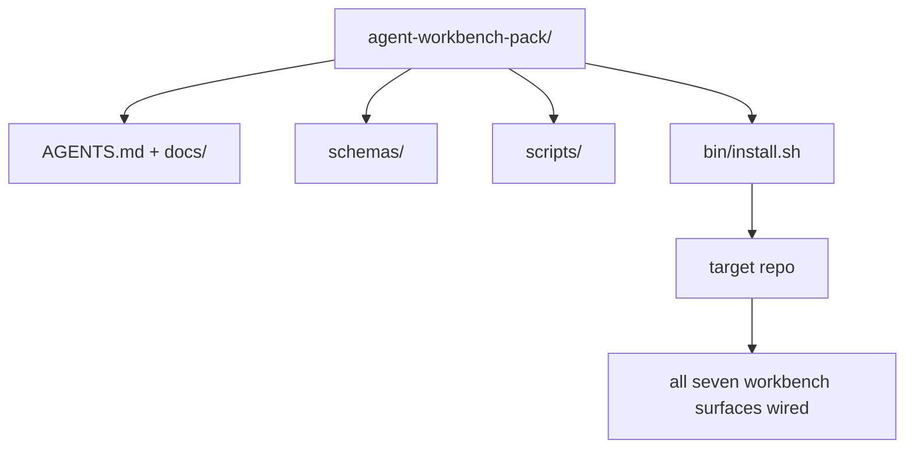

# Capstone: Envie um pacote de banco de trabalho de agentes reutilizáveis

> A mini-track termina com um pacote que você deixa em qualquer repo.`cp -r`A pedra angular é o artefato que este currículo trata.

**Type:** Build
**Languages:** Python (stdlib)
**Prerequisites:** Phases 14 · 31 to 14 · 41
**Time:** ~75 minutes

## Objetivos de aprendizagem

- Envolva as sete superfícies de banco de trabalho num único diretório.
- Enfiar os esquemas, scripts e modelos para que um novo repo obtenha uma linha de base conhecida.
- Adicionar um único script de instalação que coloque o pacote idempotentemente.
- Decida o que fica no rebanho e o que fica fora, defendendo o corte para cada um.
- Demonstrar uma alteração no repositório assistida por um agente com evidências que um revisor possa reproduzir.

## O problema

Um banco de trabalho que vive em um Google Doc, um histórico de bate-papo e três scripts semi-lembrados é um banco de trabalho que é reconstruído a cada trimestre. A cura é um pacote de versões: um repo ou diretório com as superfícies, os esquemas, os scripts e um instalador de um comando.

Terás de terminar esta lição com:`outputs/agent-workbench-pack/`enviado em disco e um `bin/install.sh`que o coloca em qualquer repo alvo.

## O conceito



### O layout do pacote

```
outputs/agent-workbench-pack/
├── AGENTS.md
├── docs/
│   ├── agent-rules.md
│   ├── reliability-policy.md
│   ├── handoff-protocol.md
│   └── reviewer-rubric.md
├── schemas/
│   ├── agent_state.schema.json
│   ├── task_board.schema.json
│   └── scope_contract.schema.json
├── scripts/
│   ├── init_agent.py
│   ├── run_with_feedback.py
│   ├── verify_agent.py
│   └── generate_handoff.py
├── bin/
│   └── install.sh
└── README.md
```

### O que fica dentro, o que fica fora

Em:

- Esquemas de superfície, são o contrato.
- Os quatro guiões acima são o tempo de execução.
- São as regras e a rubrica.

Fora:

- As tarefas pertencem ao banco de reservas do alvo, não ao pacote.
- O pacote é agnóstico.
- O grupo vive ao lado do grupo, não dentro dele.

### O instalador

Um breve .`bin/install.sh`(ou `bin/install.py`):

1. Recusar-se a instalar numa embalagem existente sem `--force`- Não .
2. Copia o pacote para o repo alvo.
3. - Cable para CI se um`.github/workflows/`- Não existe.
4. Imprima os próximos passos: preencha o quadro, define comandos de aceitação, execute o script init.

### Edição de versões

O pacote transporta um`VERSION`Os erros de esquema e alterações de script que exigem migrações aumentam o maior.`agent_state.json`Registros de que versão de pacote foi iniciado contra.

```figure
wb-pack-install
```

## Construí-lo

`code/main.py`reúne a embalagem em `outputs/agent-workbench-pack/`ao lado da lição, sementeado com os esquemas e roteiros das lições anteriores nesta mini-track e os documentos que já escreveu.

- É o que é ?

```
python3 code/main.py
```

O script copia e pinha as superfícies, escreve o README, imprime a árvore de pacotes e sai do zero.

## Padrões de produção em silêncio

Um pacote só é valioso se sobreviver a garfos, atualizações e um ambiente hostil.

**`VERSION` is the contract, not the marketing.**Os problemas principais exigem uma migração de estado, os problemas menores exigem uma revisão, os problemas de parche são apenas de documentos.`.workbench-version`no repo-alvo em cada instalação; `lint_pack.py`recusa-se a enviar se a fechadura do alvo não estiver de acordo com a do pacote `VERSION`É assim que ...`npm`- Não .`Cargo`, e `pyproject.toml`sobrevivem a 10 anos de guerra, nada nos agentes muda as regras.

**Single source for cross-tool distribution.**Nx navios um `nx ai-setup`que descreve`AGENTS.md`- Não .`CLAUDE.md`- Não .`.cursor/rules/`- Não .`.github/copilot-instructions.md`O pacote deve fazer o mesmo; o instalador emite os links de sim (`ln -s AGENTS.md CLAUDE.md`A forma de forjar o pacote para apoiar uma ferramenta sobre outra é um modo de falha.

**`uninstall.sh` that refuses on non-trivial state.**Desinstalar o pacote não deve excluir os dados do utilizador `agent_state.json`- Não .`task_board.json`, ou `outputs/`O desinstalador remove os esquemas, scripts, documentos e...`AGENTS.md`(com `--keep-agents-md`O Estado pertence ao utilizador, o pacote não o possui.

**Skill-as-publishable. SkillKit-style distribution.**As embarcações de pacote como habilidade do SkillKit: `skillkit install agent-workbench-pack`O pacote repo é a fonte da verdade; o SkillKit é o canal de distribuição. O bloqueio do vendedor desmorona; as sete superfícies permanecem as mesmas.

## Usá-lo

Três lugares os navios de embalagem:

- **As a directory you drop into a repo.** `cp -r outputs/agent-workbench-pack /path/to/repo`- Não .
- **As a public template repo.**Forca e personalização, com `VERSION`Controlar a deriva.
- **As a SkillKit skill.**Conectado ao seu produto de agente para que um único comando o descreva.

O pacote é a receita, cada instalação é uma porção.

## Envia-o

`outputs/skill-workbench-pack.md`gera um pacote de projetos: regras aprimoradas para a história da equipa, globos de alcance combinados com o repo, dimensões rubricas estendidas com uma entrada específica de domínio.

## Exercícios

1. Decida qual o quinto documento opcional merece a promoção para o pacote canônico.
2. Reescrever o instalador como Python com um `--dry-run`Compare a ergonomia com a bash.
3. Adicionar um`bin/uninstall.sh`O que é considerado não trivial?
4. Adicionar um`lint_pack.py`que falha quando o pacote se desloca de `VERSION`Entregue-o para a CI para o repo do grupo.
5. Autor do manual de migração de um banco de trabalho rolado à mão para este pacote.

## Prática de carreira: provar uma mudança de arquivo

A demonstração de embalagem prova que o montador executa e produz arquivos. Não prova que seu agente possa completar uma nova tarefa, que os controles gerados comprovam essa tarefa ou que um sistema implantado funciona.

Escolha uma pequena tarefa real num repositório que você possui ou tem permissão para alterar. Use um agente de codificação ao qual você já tem acesso. Uma correção de bugs, um recurso limitado ou uma melhoria operacional é suficiente; instalar vários agentes não faz parte do exercício.

Prestação de um orçamento para uma sessão de trabalho separada para além do laboratório de embalagens.`learning-artifacts/`Preserva o modelo de entrada e embalagem como material de referência.

### 1. Enquadrar a tarefa e escolher a autonomia

Use o quadro de tarefas da lição 43 e o plano de evidências da lição 44. Registre a revisão inicial, o objetivo observável, os não-alvos, os caminhos permitidos e a evidência de aceitação. Identifique o usuário ou operador real que precisa do comportamento.

Escolha um modo de funcionamento: passos guiados, implementação com ponto de controle ou uma execução autónoma limitada. Explique por que a incerteza, as consequências e a reversão justificam isso.

Defina um orçamento de tempo de parede e um token ou limite de custo se o agente expõe um. Registre as medições não disponíveis honestamente. Defina uma condição de parada para falhas repetidas, novas permissões, exaustão do orçamento ou uma decisão de contrato não resolvida; nome quem pode resolvê-la.

### 2. Preparar o menor ambiente útil

Retire a implementação relevante, o chamador, o teste e as instruções locais. Registre por que cada fonte pertence ao contexto e quais evidências atuais substituiriam uma nota obsoleta. Não carregue todo o repositório por padrão.

Faça uma escolha explícita para cada extensão relevante: uma habilidade fornece um procedimento repetível; uma ferramenta MCP fornece acesso; um gancho executa uma verificação determinista; um plugin pacotes de recursos. Mantenha uma extensão apenas quando a tarefa precisa, com as menores permissões que permitem que ela funcione.

Registre o contexto ou o custo de manutenção de uma adição proposta que você rejeita. Reverifique uma memória ou instrução obsoleta, depois retire ou substitua-a na configuração de propriedade do aluno quando as evidências apoiarem essa decisão. Reinicie o controle afetado para confirmar que a remoção não perdeu uma restrição necessária.

### 3. Capturar a linha de base e implementar

Antes de editar, execute a verificação existente mais próxima e demonstre o estado atual do comportamento solicitado. Mantenha o comando, revisão, resultado e localização da evidência. Uma característica que não existe ainda ainda tem uma linha de base: gravar a resposta observada ou operação não suportada.

Deixe o agente implementar dentro do contrato. Mantenha um registro de intervenção com a razão de cada correção, alteração de permissão ou revisão do plano. A delegação é opcional; se útil, aplique o contrato de propriedade e integração da lição 45 antes de adicionar outro trabalhador.

### 4. Desafie as provas

Escolha a prova que observa a superfície alterada. Para uma interface de interface, reconstruir e inspecionar a viagem servida em largura relevantes. Para uma API, inspecione a solicitação e resposta serializada. Para um CLI, execute o comando construído e verifique seu código de saída e saída. Selecione as verificações que sua tarefa precisa e explique seus limites.

Escreva um resultado esperado do contrato de tarefa independentemente da implementação do agente. Em uma cópia descartável, introduzir um resultado incorreto específico, como aceitar um valor inválido ou deixar cair um campo de resposta exigido.

Se ficar verde, reforce a afirmação ou observação antes de confiar nela. Restaurar a implementação correta e reiniciar com sucesso. Mantenha ambos os recibos. Um erro de sintaxe ou configuração de teste quebrada não conta como detecção da regressão.

Revisar a diferença final, incluindo testes alterados, contra o objetivo original e os caminhos permitidos. Pega a um colega ou uma sessão de revisor separado para desafiar a prova mais fraca sem editar a implementação. Você ainda possui o julgamento final; o acordo de outro agente não é evidência de execução.

### 5. Operação e recuperação de ensaio

Exercer o artefato alterado num ambiente local descartável ou de colocação em cena.`local`- Não .`staging`, ou `live`Uma ensaio local apoia uma reivindicação local; não é necessário o desdobramento da produção para este exercício.

Escolha um sinal de falha relacionado à tarefa, um limiar, uma janela de observação e um proprietário. Explique a resposta quando esse limiar é cruzado.

Reexercite o retrocesso a um artefato conhecido e verifique se o comportamento anterior é restaurado. Considere dados persistentes quando aplicável; substituir um binário sozinho não pode reverter uma mudança de dados. Registre qualquer etapa de recuperação que você não conseguiu verificar.

### 6. Melhora a próxima corrida e entrega-a

Comparar o resultado com a linha de base, incluindo o tempo passado, dados de uso disponíveis e intervenções humanas.

Promover uma correção observada em um teste, um limite de permissão menor, uma automação ou um exemplo mais claro usando a lição 46. Recurrir o controle afetado. Remover mutações temporárias e deixar o ramo final, arquivos alterados, abrir riscos e a próxima ação explícita para a próxima sessão.

### Rubrico de revisão manual

Faça com que o revisor inspecione os ficheiros de provas e reproduza pelo menos o controlo de aceitação mais fraco.`demonstrated`- Não .`needs revision`, ou `unverified`Os campos preenchidos e os scripts de embalagem não substituem estas observações.

| Dimension | Evidence the reviewer should challenge |
|---|---|
| Task and autonomy | Starting behavior, bounded goal, justified permissions, budget, and a usable stop rule |
| Context and environment | Relevant sources, justified tool access, and a rechecked retirement decision |
| Verification | Actual before/after behavior and a deliberate incorrect result that the same check rejects |
| Review and operation | Inspected diff, independent challenge, labeled runtime observation, and rehearsed recovery |
| Iteration and handoff | One verified improvement, honest limits, clean final state, and a reproducible next action |

Resolva .`needs revision`- a conclusão antes de reivindicar a conclusão da tarefa.`unverified`O portfólio demonstra o seu julgamento de engenharia sobre uma tarefa limitada; não é uma garantia de contratação ou implantação.

## Artigo enviado

Mantenha a embalagem reutilizável e a sua cópia completa de [career-agent-evidence.md](https://github.com/rohitg00/ai-engineering-from-scratch/blob/main/phases/14-agent-engineering/42-agent-workbench-capstone/outputs/career-agent-evidence.md). O modelo conecta o quadro de tarefa, o plano de execução, os recibos de execução, a revisão, o ensaio de recuperação e a entrega num estudo de caso revisable.

## Termos-chave

| Term | What people say | What it actually means |
|------|----------------|------------------------|
| Workbench pack | "The starter kit" | A versioned directory carrying all seven surfaces |
| Installer | "Setup script" | `bin/install.sh` that lays the pack down idempotently |
| Pack version | "VERSION" | Major bumps for schema/script changes, patch for doc-only |
| Drop-in pack | "cp -r and go" | Pack works without per-repo customization on day one |
| Forkable template | "GitHub template" | Public repo that GitHub's "Use this template" can clone from |

## Mais leitura

- Fases 14 · 31 a 14 · 41  cada superfície que este pacote agrega
- [SkillKit](https://github.com/rohitg00/skillkit) instalar esta habilidade em 32 agentes de IA
- [Nx Blog, Teach Your AI Agent How to Work in a Monorepo](https://nx.dev/blog/nx-ai-agent-skills) Gerador de fonte única em seis ferramentas
- [agents.md — the open spec](https://agents.md/) o que o roteador da sua embalagem deve implementar
- [HKUDS/OpenHarness](https://github.com/HKUDS/OpenHarness) Implementação de referência de um equivalente de embalagem
- [Augment Code, A good AGENTS.md is a model upgrade](https://www.augmentcode.com/blog/how-to-write-good-agents-dot-md-files) embalagem de documentos bar de qualidade
- [Anthropic, Effective harnesses for long-running agents](https://www.anthropic.com/engineering/effective-harnesses-for-long-running-agents)
- [Anthropic, Harness design for long-running application development](https://www.anthropic.com/engineering/harness-design-long-running-apps)
- Fase 14 · 30  Desenvolvimento de agente orientado para avaliação que consome o portal de verificação da embalagem
- Fase 14 · 41  o índice de referência antes/após esta embalagem melhora em
