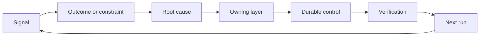

# Construir um Ratchet de Feedback com Propriedade e aposentadoria

> A navegação fecha um ciclo de construção e abre o ciclo de aprendizagem.

**Type:** Learn + Build
**Languages:** Python (stdlib)
**Prerequisites:** Phase 14 lessons 46 and 53
**Time:** ~75 minutes

## Objetivos de aprendizagem

- Transforme incidentes, avaliações, comportamento do usuário e correções em ações próprias.
- Rotear cada sinal para contexto, avaliação, política, tempo de execução ou backlog.
- Priorizar a recorrência por gravidade e frequência.
- Dê a cada controlo uma condição de aposentadoria.
- Comunicar a decisão de entrega com provas, compensações e um proprietário responsável.

## Feedback é infraestrutura

Uma equipe pode coletar vestígios, avaliações, bilhetes de suporte e registros de incidentes sem aprender com nenhum deles.

O ciclo é:

1. Observar um sinal concreto;
2. Conectar-se a um resultado, restrição ou suposição;
3. Identificar a camada de sistema mais antiga que possui a causa;
4. criar uma alteração limitada;
5. Verificar que a recorrência é menos provável;
6. Revisar se o controlo deve continuar.

## A via para a camada de posse

| Signal | Destination |
|---|---|
| False positive, regression, wrong result | Evaluation or test |
| Missing context, duplicate work, stale fact | Context source or retrieval route |
| Unsafe action or authority gap | Policy or permission boundary |
| Timeout, retry storm, unavailable dependency | Runtime control |
| New product need or unresolved tradeoff | Shaped backlog item |

Corrigir a causa na camada efetiva mais cedo possível. Não adicione outro parágrafo imediato quando um teste ou permissão pode tornar a falha impossível.



## A propriedade faz parte do controle

Toda ação de ratchet precisa:

- um proprietário;
- Uma prioridade baseada em consequências e recorrência;
- O artefato a alterar;
- A verificação que comprova a alteração;
- Uma janela de revisão ou de expiração;
- uma condição de aposentadoria.

Uma melhoria não-proprietária é uma observação com melhor formatagem.

## Retirar os controles estáveis

Os sistemas de feedback acumulam políticas. Essa política pode tornar-se contraditória e cara.

- alterações na arquitetura ou no fluxo de trabalho;
- Uma invariante de nível inferior substitui uma instrução de nível superior;
- A falha protegida não apareceu na janela escolhida;
- O controlo bloqueia o trabalho legítimo mais frequentemente do que previne o dano.

A aposentadoria também precisa de provas.

## Conectar a construção e o feedback do agente de codificação

O mesmo ratchet serve as duas faixas:

- A evidência do produto altera o quadro de resultados, suposições, fatias ou planos de medição.
- As correções de agentes de codificação alteram os testes, contexto, alcance, automação ou transferência.
- Os incidentes podem alterar tanto o limite do produto como o banco de trabalho do agente.

É por isso que a modelagem da construção não é uma fase que termina antes da codificação.

## Construí-lo

O laboratório classifica sinais, cria ações de propriedade, priorizá-las e escreve.`outputs/feedback-backlog.json`- Não .

```bash
python3 code/main.py
python3 -m unittest discover code/tests -v
```

Adicione um sinal de tempo de saída para a execução e confirme que ele se encaminha para a execução em vez do atraso geral.

## Laboratório de Prática: Tomar uma decisão após um revés

Escolha um fluxo de trabalho do projeto de portfólio da sua rota de carreira.[career delivery template](https://github.com/rohitg00/ai-engineering-from-scratch/blob/main/phases/14-agent-engineering/54-build-the-feedback-ratchet/outputs/career-delivery-evidence.md)- Não .

O laboratório Python gera ações de backlog de exemplo. Não observa usuários, não mede uma intervenção ou não prova a preparação para a carreira.

### 1. Determine o que aconteceu

Registre o usuário, tarefa, fluxo de trabalho atual e o resultado que você queria melhorar. Ligue uma observação consentida, um registro de suporte editado ou um rastreamento de tarefa reprodutível. Separar o que você observou do que alguém relatou e o que você inferido.

Encontre um revés: uma suposição falhada, um resultado inutilizável, um custo inesperado ou um atraso na entrega. Explique quais evidências mudaram sua compreensão.

Se não puder trabalhar com os usuários, execute uma simulação claramente rotulada com um cenário de pares ou indicado. Mantenha as observações simuladas separadas das evidências de usuários reais. Não invente entrevistas, aprovações, adoção ou impacto comercial.

### 2. Faça progressos dentro da sua autoridade

Escolha as incógnitas e escolha a ação reversível mais barata que possa resolver a mais consequente, e diga o que pode decidir, o que é limitado por um acordo existente e o que precisa de autorização antes da execução.

Por exemplo, você pode preparar uma repetição offline editada enquanto espera por permissão para usar os dados do cliente.

### 3. Comparar opções e informar o dono da decisão

Escrever um breve resumo de decisão para alguém que não precisa de detalhes de implementação.

- O problema do utilizador e as provas que alteraram o plano;
- Pelo menos duas opções, incluindo uma opção manual mais barata ou de não construção, quando credível;
- Qualidade, design de interação, esforço, custo operacional e compensação de risco;
- A sua recomendação, a incerteza que permanece e a decisão necessária;
- O titular da decisão, as partes interessadas afectadas e a data em que a decisão é necessária.

Peer-in-Place: um grupo de trabalho que tem um grupo de trabalho que não tem a capacidade de fazer parte da equipe de trabalho.

### 4. Faça uma experiência limitada

Escolha um protótipo, um projeto piloto ou um trabalho de produção com base na pergunta que você precisa responder. Defina o público, os dados, a autoridade, a duração, o retorno e as condições para continuar, mudar ou parar antes de coletar o resultado.

Passe pela interação do ponto de partida do usuário até uma tarefa concluída. Inclua um caso de saída incorreta ou de dados faltantes. Observe se o usuário pode notar a falha, corrigi-la e recuperar sem ajuda oculta de você.

Contar o tempo de revisão e correção humana como parte do fluxo de trabalho. Uma resposta mais rápida do modelo ainda pode tornar a tarefa completa mais lenta ou mais difícil de confiar.

### 5. Comparar resultados com economia

Registre uma linha de base e um acompanhamento usando a mesma definição métrica, população de tarefas, método de coleta e janelas de observação comparáveis. Mantenha as contagens de amostras, exclusões e links de evidências ao lado dos números. Se essas condições mudarem, explique por que a comparação é limitada.

Incluir um resultado do usuário, um guarda-roupa de qualidade ou segurança e o esforço total de revisão humana. Registrar o resultado mesmo quando ele não alcança o objetivo. Pequenas amostras ou simulações suportam uma alegação de aprendizagem limitada, não uma alegação de impacto comprovado no negócio.

Estimar o custo por tarefa concluída com sucesso usando chamadas de modelo, retemps, serviços de suporte e revisão humana. Escreva a suposição da taxa de trabalho e separa o uso medido das estimativas. Compare esse custo com a alternativa manual ou a suposição de valor por trás do projeto.

Usar o existente [FinOps for LLMs lesson](https://aiengineeringfromscratch.com/lesson?path=phases/17-infrastructure-and-production/27-finops-llms)A mudança do modelo é apenas uma resposta possível; restringir o fluxo de trabalho ou manter um passo manual pode ser a melhor decisão do produto.

### 6. Fechar o Loop

Use os critérios pré-declarados para recomendar continuar, mudar ou parar. Se as evidências não forem conclutivas, nomeie a observação faltante e o próximo teste limitado. Registre a resposta do responsável pela decisão; deixe pendente se nenhuma decisão for tomada.

Escolha uma melhoria no próprio processo de entrega: um quadro de tarefas mais claro, um passo a passo do usuário mais cedo, uma melhor lista de revisão, uma transferência de agente menor ou um caso de avaliação mais rigoroso.

Ao revisar, decida se manter, revisar ou retirar essa melhoria. Registre as evidências para a escolha. Uma nova lista de verificação que cria mais trabalho sem evitar o fracasso no objetivo não ganhou permanência.

## Artigo enviado

- Copia .[career-delivery-evidence.md](https://github.com/rohitg00/ai-engineering-from-scratch/blob/main/phases/14-agent-engineering/54-build-the-feedback-ratchet/outputs/career-delivery-evidence.md)Incluir o resumo de decisão, a análise de interação, a comparação de medições e o acompanhamento de propriedade com o seu artefato de portfólio de carreira.

## Verifique

Use esta rubrica manual de aceitação com um peer. Marque cada linha **met**- Não .**needs work**, ou **not observed**Um campo preenchido não é prova de que o julgamento foi válido.

| Check | Evidence that meets it |
|---|---|
| Workflow grounded | A traceable observation supports the problem; reported claims, inference, and simulation are labeled. |
| Authority respected | Reversible next work is clear, and any restricted action waits for its actual decision owner. |
| Tradeoffs communicated | Credible alternatives, a stakeholder objection, a recommendation, and an explicit decision request are recorded. |
| Interaction tested | The walkthrough covers success, failure, recovery, and human review effort. |
| Outcome compared | Baseline and follow-up definitions align; samples, guardrails, costs, and comparison limits are visible. |
| Setback owned | The evidence changes a continue/change/stop decision and an accountable next action. |
| Process improved | One workflow improvement has an owner, review date, and an evidence-based keep/revise/retire decision. |

O comportamento não observado do usuário real continua a ser um fosso mesmo quando cada passo simulado passa.

## Exercícios

1. Transforma um incidente e uma reclamação de um usuário em ações de "ratchet".
2. Nomear a camada mais antiga que pode impedir cada recorrência.
3. Adicionar comandos de verificação ou observações à saída do laboratório.
4. Define uma condição de aposentadoria para uma regra de apólice.
5. Trace um aceitou correção de volta para o próximo quadro de tarefa.

## Mais leitura

- [Basili, Caldiera, and Rombach, The Goal Question Metric Approach](https://www.cs.toronto.edu/~sme/CSC444F/handouts/GQM-paper.pdf), para a aprendizagem organizacional através de medição orientada para os objectivos.
- [Fagerholm et al., Building Blocks for Continuous Experimentation](https://doi.org/10.1145/2601248.2601276), para o ciclo técnico e organizacional que liga a evidência ao desenvolvimento contínuo do produto.
- [Nuseibeh and Easterbrook, Requirements Engineering: A Roadmap](https://www.cs.toronto.edu/~sme/papers/2000/ICSE2000.pdf), para tratar os requisitos como evoluindo durante o ciclo de vida do sistema.

## O que você guarda

- Não .`outputs/feedback-backlog.json`Os resultados da avaliação de produtos e da entrega são indicados no quadro de resultados seguinte.
