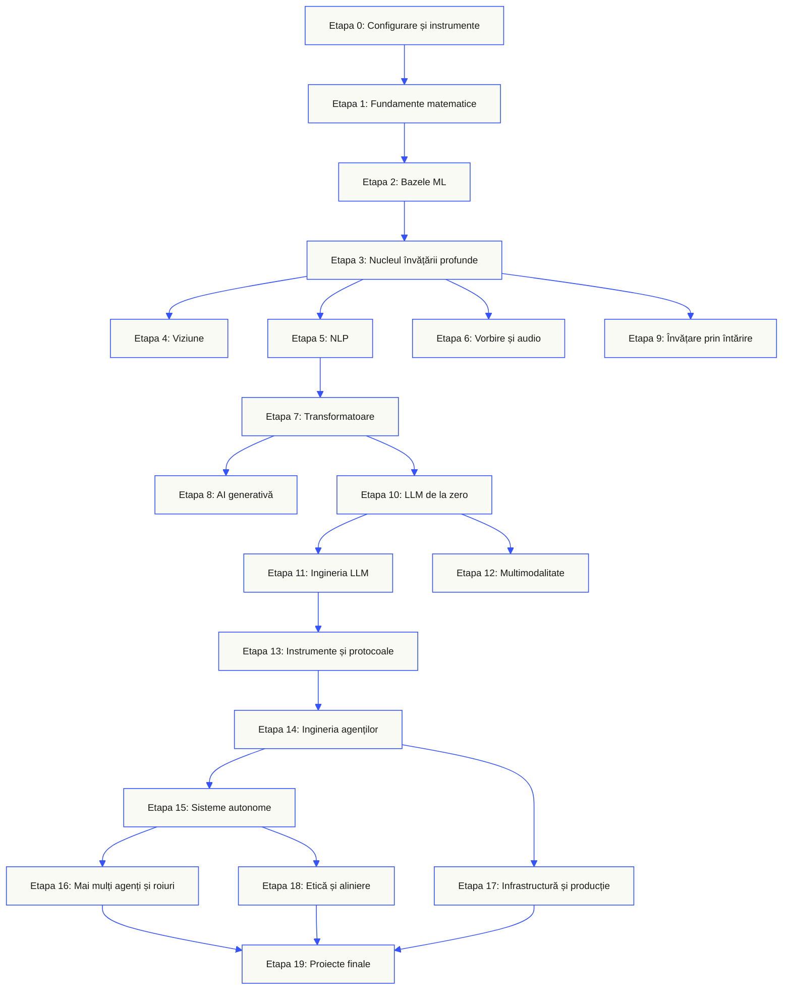

<p align="center" lang="ro"><sub>Traducerea integrală a README în română. <a href="../../README.md">Originalul în engleză</a> rămâne referința principală.</sub></p>
<p align="center">
  
</p>

<p align="center">
  <a href="../../README.md">🇬🇧 English</a> ·
  <a href="../../i18n/zh/README.md">🇨🇳 简体中文</a> ·
  <a href="../../i18n/zh-TW/README.md">🇹🇼 繁體中文（台灣）</a> ·
  <a href="../../i18n/ja/README.md">🇯🇵 日本語</a> ·
  <a href="../../i18n/ko/README.md">🇰🇷 한국어</a> ·
  <a href="../../i18n/pt/README.md">🇵🇹 Português</a> ·
  <a href="../../i18n/pt-BR/README.md">🇧🇷 Português (Brasil)</a> ·
  <a href="../../i18n/es/README.md">🇪🇸 Español</a> ·
  <a href="../../i18n/de/README.md">🇩🇪 Deutsch</a> ·
  <a href="../../i18n/fr/README.md">🇫🇷 Français</a> ·
  <a href="../../i18n/it/README.md">🇮🇹 Italiano</a> ·
  <a href="../../i18n/nl/README.md">🇳🇱 Nederlands</a> ·
  <a href="../../i18n/pl/README.md">🇵🇱 Polski</a> ·
  <a href="../../i18n/cs/README.md">🇨🇿 Čeština</a> ·
  <a href="../../i18n/ro/README.md">🇷🇴 Română</a> ·
  <a href="../../i18n/hu/README.md">🇭🇺 Magyar</a> ·
  <a href="../../i18n/el/README.md">🇬🇷 Ελληνικά</a> ·
  <a href="../../i18n/sv/README.md">🇸🇪 Svenska</a> ·
  <a href="../../i18n/da/README.md">🇩🇰 Dansk</a> ·
  <a href="../../i18n/no/README.md">🇳🇴 Norsk</a> ·
  <a href="../../i18n/fi/README.md">🇫🇮 Suomi</a> ·
  <a href="../../i18n/ru/README.md">🇷🇺 Русский</a> ·
  <a href="../../i18n/uk/README.md">🇺🇦 Українська</a> ·
  <a href="../../i18n/tr/README.md">🇹🇷 Türkçe</a> ·
  <a href="../../i18n/he/README.md">🇮🇱 עברית</a> ·
  <a href="../../i18n/ar/README.md">🇸🇦 العربية</a> ·
  <a href="../../i18n/fa/README.md">🇮🇷 فارسی</a> ·
  <a href="../../i18n/hi/README.md">🇮🇳 हिन्दी</a> ·
  <a href="../../i18n/bn/README.md">🇧🇩 বাংলা</a> ·
  <a href="../../i18n/ur/README.md">🇵🇰 اردو</a> ·
  <a href="../../i18n/th/README.md">🇹🇭 ไทย</a> ·
  <a href="../../i18n/vi/README.md">🇻🇳 Tiếng Việt</a> ·
  <a href="../../i18n/id/README.md">🇮🇩 Bahasa Indonesia</a> ·
  <a href="../../i18n/tl/README.md">🇵🇭 Tagalog</a>
</p>

<p align="center">
  <a href="../../LICENSE"></a>
  <a href="../../ROADMAP.md"></a>
  <a href="#contents"></a>
  <a href="https://github.com/rohitg00/ai-engineering-from-scratch/stargazers"></a>
  <a href="https://aiengineeringfromscratch.com"></a>
  <p align="center">
 <a href="https://www.star-history.com/rohitg00/ai-engineering-from-scratch">
  <picture><source media="(prefers-color-scheme: dark)" srcset="https://api.star-history.com/badge?repo=rohitg00/ai-engineering-from-scratch&type=rank&theme=dark" /><source media="(prefers-color-scheme: light)" srcset="https://api.star-history.com/badge?repo=rohitg00/ai-engineering-from-scratch&type=rank" /></picture> <picture><source media="(prefers-color-scheme: dark)" srcset="https://api.star-history.com/badge?repo=rohitg00/ai-engineering-from-scratch&type=trending&theme=dark" /><source media="(prefers-color-scheme: light)" srcset="https://api.star-history.com/badge?repo=rohitg00/ai-engineering-from-scratch&type=trending" /></picture>
 </a>
</p>
</p>

### Sponsori

<p align="center">
  <a href="https://serpapi.com/ai-engineering-from-scratch"><picture><source media="(min-width: 768px)" srcset="../../assets/sponsors/serpapi-banner-compact.png" width="48%"></picture></a>
  <a href="https://nitrostack.ai/referral/aiengineeringfromscratch"><picture><source media="(min-width: 768px)" srcset="../../assets/sponsors/nitrostack-banner-equal.png" width="48%"></picture></a>
</p>

<p align="center">
  <sub><span>Sprijinul tău păstrează fiecare lecție gratuită și cu sursă deschisă.</span> <a href="#supporters">Vezi toți susținătorii</a> · <a href="../../SPONSORS.md">Devino sponsor</a></sub>
</p>

```text
░░░▒▒▒░░░▒▒▒░░░▒▒▒░░░▒▒▒░░░▒▒▒░░░▒▒▒░░░▒▒▒░░░▒▒▒░░░▒▒▒░░░▒▒▒░░░▒▒▒░░░▒▒▒░░░▒▒▒░░░▒▒▒░░░▒▒▒
```

> **84% dintre studenți folosesc deja instrumente AI. Doar 18% se simt pregătiți să le folosească profesional.** Acest program de studiu reduce acest decalaj.
>
> 523 de lecții. 20 de etape. ~342 de ore. Python, TypeScript, Rust, Julia. Fiecare lecție produce un rezultat reutilizabil: un prompt, o abilitate, un agent sau un server MCP. Gratuit, cu sursă deschisă, sub licență MIT.
>
> Nu doar înveți AI. O construiești. De la un capăt la altul. Cu mâinile tale.

<!-- STATS:START (generated from site/stats.json by build.js — do not edit by hand) -->
<p align="center"><sub><b>114,584</b> cititori &nbsp;·&nbsp; <b>181,995</b> vizualizări de pagini în ultimele 30 de zile &nbsp;·&nbsp; la 2026-08-29</sub></p>
<!-- STATS:END -->

## Începe aici: alege ce vrei să construiești

Nu trebuie să parcurgi toate cele 523 de lecții înainte să începi. Alege un obiectiv. Fiecare link deschide același program pe GitHub sau pe site, iar ambele versiuni folosesc același cod al lecțiilor.

| Obiectivul tău | Învață pe GitHub | Învață pe site |
|---|---|---|
| Sunt la început și vreau o bază completă | [Etapa 0: Configurare și instrumente](../../phases/00-setup-and-tooling/) | [Mediul de dezvoltare](https://aiengineeringfromscratch.com/lesson?path=phases/00-setup-and-tooling/01-dev-environment) |
| Cunosc Python și vreau bazele matematicii și ale ML | [Etapa 1: Fundamente matematice](../../phases/01-math-foundations/) | [Înțelegerea intuitivă a algebrei liniare](https://aiengineeringfromscratch.com/lesson?path=phases/01-math-foundations/01-linear-algebra-intuition) |
| Vreau să construiesc aplicații LLM pentru producție | [Etapa 11: Ingineria LLM](../../phases/11-llm-engineering/) | [Ingineria prompturilor](https://aiengineeringfromscratch.com/lesson?path=phases/11-llm-engineering/01-prompt-engineering) |
| Vreau să construiesc agenți | [Etapa 14: Ingineria agenților](../../phases/14-agent-engineering/) | [Bucla agentului](https://aiengineeringfromscratch.com/lesson?path=phases/14-agent-engineering/01-the-agent-loop) |
| Vreau să folosesc agenți de programare în depozite de cod reale | [Traseul de inginerie asistată de agenți](../../learning-paths/using-coding-agents.json) | [Inginerie asistată de agenți](https://aiengineeringfromscratch.com/lesson?path=phases/14-agent-engineering/31-agent-workbench-why-models-fail&learningPath=using-coding-agents) |
| Vreau să stabilesc ce merită construit înainte de implementare | [Traseul de decizie și livrare a produsului](../../learning-paths/shaping-the-build.json) | [Decizie și livrare a produsului](https://aiengineeringfromscratch.com/lesson?path=phases/14-agent-engineering/47-outcomes-before-output&learningPath=shaping-the-build) |
| Vreau să construiesc folosind Model Context Protocol (MCP) | [Ruta Model Context Protocol (MCP)](../../phases/13-tools-and-protocols/README.md#model-context-protocol-mcp-path) | [Traseul Model Context Protocol (MCP)](https://aiengineeringfromscratch.com/lesson?path=phases/13-tools-and-protocols/06-mcp-fundamentals&learningPath=model-context-protocol) |
| Vreau să scriu și să public Agent Skills | [Ruta dedicată Agent Skills](../../phases/13-tools-and-protocols/README.md#agent-skills-fast-path) | [Traseul Agent Skills](https://aiengineeringfromscratch.com/lesson?path=phases/13-tools-and-protocols/22-skills-and-agent-sdks&learningPath=agent-skills) |
| Vreau să mă pregătesc pentru o certificare Claude | [Ghid de început pentru certificare](../../certifications/claude/GETTING_STARTED.md) | [Academia de certificare](https://aiengineeringfromscratch.com/certifications.html) |
| Vreau să mă pregătesc pentru MCP Associate (MCPA) | [Ghid de început pentru MCPA](../../certifications/mcpa/GETTING_STARTED.md) | [Traseul MCPA](https://aiengineeringfromscratch.com/certification?id=mcpa-f) |

Nu știi de unde să începi? Folosește [tutorele `start-learning` pentru evaluarea nivelului](../../skills/start-learning/SKILL.md) sau [ghidul de cunoștințe necesare de pe site](https://aiengineeringfromscratch.com/prereqs.html).

Compară patru domenii de bază și șase trasee profesionale în [AI Engineering Learning Paths](https://aiengineeringfromscratch.com/learning-paths.html).

### Abordează fiecare lecție în același mod

1. **Citește** `docs/en.md` și explică ideea principală cu propriile cuvinte.
2. **Tastează și construiește** codul important, în loc să tratezi blocul de cod ca pe un decor.
3. **Rulează** comanda lecției din rădăcina depozitului, directorul care conține `README.md` și `phases/`.
4. **Păstrează dovezile**: comanda, directorul de lucru, codul de ieșire, rezultatele relevante și artefactul pe care l-ai modificat sau creat.
5. **Continuă** doar când poți explica rezultatul și poți face o mică modificare fără să ghicești.

Căile din comenzile paginilor de lecție pornesc de la rădăcina depozitului, dacă lecția nu cere explicit schimbarea directorului. Dacă o lecție oferă mai multe limbaje de programare, rulează implementarea în limbajul pe care îl înveți.

### Clonează depozitul și obține prima dovadă

```bash
git clone https://github.com/rohitg00/ai-engineering-from-scratch.git
cd ai-engineering-from-scratch
python3 phases/00-setup-and-tooling/01-dev-environment/code/verify.py --route beginner
python3 phases/01-math-foundations/01-linear-algebra-intuition/code/vectors.py
```

Verificarea inițială separă cerințele necesare acum de instrumentele necesare mai târziu. Fiecare verificare obligatorie eșuată include cauza detectată și o comandă de remediere. A doua comandă rulează o lecție fără dependențe și arată la final că înmulțirea unei matrice cu un vector este operația din interiorul unui strat de rețea neuronală. Salvează acea ieșire din terminal ca primă dovadă.

## Adaugă tutorul AI în 30 de secunde

Dacă ai deja Node.js, `npx` și un agent de programare care acceptă abilități, două comenzi îl pot transforma în tutor. Nu trebuie să clonezi depozitul pentru a instala sau citi tutorul. Laboratoarele executabile ale traseelor specializate necesită `python3`. Laboratoarele Agent Skills necesită și o gazdă aleasă, plus un domeniu de abilități al utilizatorului sau proiectului în care se poate scrie.

Verifică mai întâi cerințele locale:

```bash
node --version
npx --version
python3 --version
```

Instalează apoi abilitățile cursului și alege gazda și domeniul când instalatorul îți cere acest lucru:

```bash
npx skills add rohitg00/ai-engineering-from-scratch
```

Sintaxa invocării aparține gazdei, nu formatului portabil `SKILL.md`:

| Aplicația gazdă | Începe cursul | Începe Model Context Protocol (MCP) | Începe Agent Skills | Rulează testul etapei |
|---|---|---|---|---|
| Codex | `start-learning`, sau alege din `/skills` | `learn-mcp`, sau alege din `/skills` | `learn-agent-skills`, sau alege din `/skills` | `check-understanding 13`, sau alege din `/skills` |
| Claude Code | `/start-learning` | `/learn-mcp` | `/learn-agent-skills` | `/check-understanding 13` |
| Alte gazde compatibile | `Use start-learning to begin the course.` | `Use learn-mcp to start the Model Context Protocol (MCP) path.` | `Use learn-agent-skills to start the Agent Skills Engineering path.` | `Use check-understanding to quiz me on Phase 13.` |

Un test de plasare cu zece întrebări îți mapează cunoștințele la etapa de pornire și salvează un plan personalizat în `LEARNING.md`. De acolo, abilitatea `learn` predă câte o lecție pe sesiune: concept, matematică, cod și test. Preia lecțiile direct din acest depozit, iar `course-guide` te duce la lecția exactă pentru subiectul la care te-ai blocat. În Codex invocă `learn` și `course-guide`; în Claude Code folosește `/learn` și `/course-guide`; în alte gazde compatibile cere abilitatea după nume.

Vrei doar Model Context Protocol (MCP)? Folosește invocarea MCP pentru gazda ta. Aceasta creează `MCP-LEARNING.md` și urmează un traseu de 17 lecții despre cereri fără stare, transporturi, lucru bidirecțional, securitate, fiabilitate, guvernanța registrului și dovezi de conformitate. Ordinea exactă și punctele de control se află în [manifestul Model Context Protocol (MCP)](../../learning-paths/model-context-protocol.json).

Vrei doar Agent Skills? Folosește invocarea Agent Skills pentru gazda ta. Creează `AGENT-SKILLS-LEARNING.md` și urmează un traseu coerent de cinci lecții: contract, descoperire, invocare, limitele mediului izolat, apoi evaluarea lansării și portabilitatea între gazde reale. Pe web începe cu [traseul Agent Skills](https://aiengineeringfromscratch.com/lesson?path=phases/13-tools-and-protocols/22-skills-and-agent-sdks&learningPath=agent-skills).

Instalatorul enumeră gazdele pe care le poate configura și întreabă unde să instaleze. Dacă nu ai încă Node.js, `npx`, `python3`, o gazdă acceptată sau un domeniu în care poți scrie, folosește site-ul ori citește manual `docs/en.md`. Înveți astfel conceptele, dar dovezile de descoperire, invocare, scripturi și dezinstalare pe o gazdă reală rămân de strâns până când poți trece verificarea inițială. Citește lecțiile pe [aiengineeringfromscratch.com](https://aiengineeringfromscratch.com).

## Cum funcționează

Majoritatea materialelor AI predau fragmente împrăștiate. Un articol aici, o postare despre ajustare fină acolo, o demonstrație spectaculoasă de agent în altă parte. Fragmentele rareori se leagă. Livrezi un chatbot, dar nu-i poți explica curba pierderii. Conectezi o funcție la un agent, dar nu poți spune ce face atenția în modelul care o apelează.

Acest program este coloana vertebrală: 20 de etape, 523 de lecții și patru limbaje: Python, TypeScript, Rust și Julia. Algebră liniară la un capăt, roiuri autonome la celălalt. Fiecare algoritm este construit întâi direct din matematică: propagare înapoi, tokenizator, atenție și bucla agentului. Când apare PyTorch, știi deja ce se întâmplă în interior.

Fiecare lecție repetă același ciclu: citește problema, dedu matematica, scrie codul, rulează testul și păstrează rezultatul. Fără videouri de cinci minute, implementări prin copiere sau îndrumare la fiecare pas. Gratuit, cu sursă deschisă și conceput să ruleze pe laptopul tău.

```text
░░░▒▒▒░░░▒▒▒░░░▒▒▒░░░▒▒▒░░░▒▒▒░░░▒▒▒░░░▒▒▒░░░▒▒▒░░░▒▒▒░░░▒▒▒░░░▒▒▒░░░▒▒▒░░░▒▒▒░░░▒▒▒░░░▒▒▒
```

## Structura programului de studiu

Douăzeci de etape se construiesc una peste alta. Matematica este fundația, agenții și producția sunt acoperișul. Sari înainte dacă stăpânești straturile inferioare, dar nu le omite pentru a te mira apoi că ceva de sus nu funcționează.



```text
░░░▒▒▒░░░▒▒▒░░░▒▒▒░░░▒▒▒░░░▒▒▒░░░▒▒▒░░░▒▒▒░░░▒▒▒░░░▒▒▒░░░▒▒▒░░░▒▒▒░░░▒▒▒░░░▒▒▒░░░▒▒▒░░░▒▒▒
```

## Structura unei lecții

Fiecare lecție are propriul director, cu aceeași structură în întregul program:

```text
phases/<NN>-<phase-name>/<NN>-<lesson-name>/
├── code/      implementări executabile (Python, TypeScript, Rust, Julia)
├── docs/
│   └── en.md  explicația lecției
└── outputs/   prompturi, abilități, agenți sau servere MCP produse de această lecție
```

Fiecare lecție are șase părți. Separarea *Construiește / Folosește* este esențială: implementezi întâi algoritmul de la zero, apoi rulezi același lucru prin biblioteca de producție. Înțelegi frameworkul fiindcă ai scris singur versiunea mai mică.

```mermaid
%%{init: {'theme':'base','themeVariables':{'primaryColor':'#fafaf5','primaryTextColor':'#1a1a1a','primaryBorderColor':'#3553ff','lineColor':'#3553ff','fontFamily':'JetBrains Mono','fontSize':'13px'}}}%%
flowchart LR
  M["IDEEA-CHEIE<br/><sub>ideea centrală într-un rând</sub>"] --> Pr["PROBLEMĂ<br/><sub>dificultate concretă</sub>"]
  Pr --> C["CONCEPT<br/><sub>diagrame și intuiție</sub>"]
  C --> B["CONSTRUIEȘTE<br/><sub>matematică pură, fără frameworkuri</sub>"]
  B --> U["FOLOSEȘTE<br/><sub>același lucru în PyTorch / sklearn</sub>"]
  U --> S["LIVREAZĂ<br/><sub>prompt · abilitate · agent · MCP</sub>"]
```



## Primii pași

Trei moduri de a începe. Alege unul.

**Opțiunea A: învață în terminal *(recomandată)*.** După verificarea Node.js, `npx`, a gazdei și domeniului de mai sus, instalează abilitățile de învățare într-un agent compatibil și lasă cursul să te ghideze:

```bash
npx skills add rohitg00/ai-engineering-from-scratch
```

Folosește tabelul de invocare specific gazdei de mai sus. Abilitățile instalate oferă `start-learning`, `learn`, `course-guide` și traseele specializate `learn-mcp` și `learn-agent-skills`. Textul lecțiilor poate fi preluat din depozit fără clonare. O clonă locală este necesară pentru comenzile copiate ale codului și laboratoarele MCP sau Agent Skills executabile. Progresul este în `LEARNING.md`, `MCP-LEARNING.md` sau `AGENT-SKILLS-LEARNING.md` din proiect, astfel încât fiecare sesiune poate fi reluată.

**Opțiunea B: citește.** Deschide o lecție finalizată pe [aiengineeringfromscratch.com](https://aiengineeringfromscratch.com) sau extinde o etapă din [cuprins](#contents). Fără configurare sau clonare.

**Opțiunea C: clonează și rulează.**

```bash
git clone https://github.com/rohitg00/ai-engineering-from-scratch.git
cd ai-engineering-from-scratch
python3 phases/01-math-foundations/01-linear-algebra-intuition/code/vectors.py
```

Clonarea încarcă automat și abilitățile de învățare în Claude Code și oferă tutorului `learn` codul fiecărei lecții pentru execuție reală, nu doar pentru citire.

### Cunoștințe necesare

- Poți scrie cod în orice limbaj; Python ajută.
- Vrei să înțelegi cum **funcționează cu adevărat** AI, nu doar să apelezi API-uri.

### Pregătește-te pentru certificările Claude

[Academia de certificare Claude](../../certifications/claude/README.md) este un program gratuit, cu sursă deschisă, pentru toate cele patru trasee oficiale: Associate Foundations, Developer Foundations, Architect Foundations și Architect Professional. Fiecare combină lecții aliniate programei examenului, laboratoare executabile, un diagnostic, un proiect final și un examen de practică original, complet.

Folosește [ghidul de pornire GitHub cu AI](../../certifications/claude/GETTING_STARTED.md) în Claude Code, Codex, ChatGPT, Cursor sau alt agent. Rulează `claude-certification` în Codex, `/claude-certification` în Claude Code sau cere altei gazde să folosească `claude-certification`. Alege un traseu, creează un plan persistent în `CLAUDE-CERTIFICATION.md`, predă pas cu pas, rulează laboratoarele reale și oferă feedback bazat pe rezultate. Același program este disponibil pe [site-ul de certificare](https://aiengineeringfromscratch.com/certifications.html).

Academia este material de studiu independent bazat pe obiective publice de examen. Nu este afiliată cu Anthropic, nu reproduce întrebări din examene reale și nu poate garanta promovarea.

### Pregătește-te pentru certificarea MCP Associate (MCPA)

[Programul de certificare MCPA](../../certifications/mcpa/README.md) este o pregătire gratuită, cu sursă deschisă, pentru examenul Model Context Protocol Associate al Agentic AI Foundation, oferit prin Linux Foundation Training. Cele 34 de lecții predau protocolul fără stare 2026-07-28 în cele cinci domenii de examen: `_meta` per cerere și `server/discover` în locul vechii negocieri, cereri cu mai multe runde, abonamente, cache, extensiile de sarcini și MCP Apps, autorizare OAuth și nivelurile de registru și SDK. Fiecare lecție livrează un laborator executabil numai cu biblioteca standard, al cărui transcript este verificat pentru formatul actual al comunicației. Traseul adaugă un diagnostic, un proiect final și trei examene originale complete, cu distribuția întrebărilor conform ponderilor publicate.

Folosește [ghidul de pornire GitHub cu AI](../../certifications/mcpa/GETTING_STARTED.md) în Claude Code, Codex, ChatGPT, Cursor sau alt agent. Rulează `mcpa-certification` în Codex, `/mcpa-certification` în Claude Code sau cere altei gazde să folosească `mcpa-certification`. Creează un traseu persistent în `MCPA-CERTIFICATION.md`, predă pas cu pas, rulează laboratoarele reale și oferă feedback pe baza rezultatelor. Același program este pe [pagina traseului MCPA](https://aiengineeringfromscratch.com/certification?id=mcpa-f).

Acest program este material de studiu independent bazat pe obiective publice de examen. Nu este afiliat cu Agentic AI Foundation sau Linux Foundation, nu reproduce întrebări din examene reale și nu poate garanta promovarea.

### Abilitățile de învățare

| Abilitate | Ce face |
|---|---|
| [`start-learning`](../../skills/start-learning/SKILL.md) | Introducere unică: motivul învățării, testul de plasare și planul personalizat salvat în `LEARNING.md`. |
| [`learn`](../../skills/learn/SKILL.md) | Ciclul tutorului. Recapitulare inițială, apoi predarea interactivă a lecției următoare și testul ei; înregistrează progresul și lista de recapitulare. |
| [`course-guide`](../../skills/course-guide/SKILL.md) | Ghid de subiecte. „Unde învăț atenția?” sau „pierderea mea este NaN” → lecțiile exacte, cu linkuri. |
| [`learn-mcp`](../../skills/learn-mcp/SKILL.md) | Tutor Model Context Protocol (MCP). Creează `MCP-LEARNING.md`, urmează manifestul cu 17 lecții și înregistrează dovezi de comunicație, securitate, fiabilitate și conformitate. |
| [`learn-agent-skills`](../../skills/learn-agent-skills/SKILL.md) | Tutor Agent Skills. Creează `AGENT-SKILLS-LEARNING.md`, predă lecțiile 22, 24, 25, 26 și 27 și înregistrează dovezi de pe gazde reale. |
| [`claude-certification`](../../skills/claude-certification/SKILL.md) | Tutor de certificare. Alege CCAO-F, CCDV-F, CCAR-F sau CCAR-P; predă lecțiile, rulează laboratoare, evaluează rezultate, administrează diagnostice și simulări, salvează progresul. |
| [`mcpa-certification`](../../skills/mcpa-certification/SKILL.md) | Tutor MCPA. Urmează traseul `mcpa-f` cu 34 de lecții despre protocolul 2026-07-28; predă lecțiile, rulează laboratoare și verificatorul comunicației, administrează diagnosticul și trei simulări, salvează progresul. |
| [`find-your-level`](../../skills/find-your-level/SKILL.md) | Test de plasare cu zece întrebări. Mapează cunoștințele la etapa inițială și produce un traseu personalizat cu estimări de timp. |
| [`check-understanding <phase>`](../../skills/check-understanding/SKILL.md) | Test per etapă cu opt întrebări, feedback și lecții concrete de revăzut. Folosește forma Codex, Claude Code sau în limbaj natural din tabelul de invocare de mai sus. |

```text
░░░▒▒▒░░░▒▒▒░░░▒▒▒░░░▒▒▒░░░▒▒▒░░░▒▒▒░░░▒▒▒░░░▒▒▒░░░▒▒▒░░░▒▒▒░░░▒▒▒░░░▒▒▒░░░▒▒▒░░░▒▒▒░░░▒▒▒
```

## Citește programul de bază sub formă de carte

Programul de bază cu 20 de etape din `phases/` se compilează într-o serie de șase volume. CI generează EPUB și PDF din aceleași surse ale lecțiilor și le atașează fiecărei [lansări GitHub](https://github.com/rohitg00/ai-engineering-from-scratch/releases); linkurile de mai jos duc mereu la cea mai recentă lansare. Numerele volumelor indică poziția în serie, nu versiunea: fiecare exemplar are data ediției, iar edițiile vechi rămân descărcabile din lansarea lor.

Programele de certificare nu sunt convertite intenționat în cărți. Starea tutorului AI, laboratoarele executabile, figurile interactive, diagnosticele și simulările cronometrate rămân complet disponibile pe GitHub și pe site.

| Volum | Titlu | Etape | Descarcă |
|-----|-------|--------|----------|
| 1 | Fundamente · Matematică, instrumente și învățare automată clasică | 00-02 | [EPUB](https://github.com/rohitg00/ai-engineering-from-scratch/releases/latest/download/aiefs-vol1-foundations.epub) · [PDF](https://github.com/rohitg00/ai-engineering-from-scratch/releases/latest/download/aiefs-vol1-foundations.pdf) |
| 2 | Învățare profundă · Rețele, viziune și vorbire | 03, 04, 06 | [EPUB](https://github.com/rohitg00/ai-engineering-from-scratch/releases/latest/download/aiefs-vol2-deep-learning.epub) · [PDF](https://github.com/rohitg00/ai-engineering-from-scratch/releases/latest/download/aiefs-vol2-deep-learning.pdf) |
| 3 | Limbaj · Bazele NLP și transformatorul | 05, 07 | [EPUB](https://github.com/rohitg00/ai-engineering-from-scratch/releases/latest/download/aiefs-vol3-language.epub) · [PDF](https://github.com/rohitg00/ai-engineering-from-scratch/releases/latest/download/aiefs-vol3-language.pdf) |
| 4 | Modele lingvistice mari · Generare, întărire, preantrenare și inginerie | 08-11 | [EPUB](https://github.com/rohitg00/ai-engineering-from-scratch/releases/latest/download/aiefs-vol4-llms.epub) · [PDF](https://github.com/rohitg00/ai-engineering-from-scratch/releases/latest/download/aiefs-vol4-llms.pdf) |
| 5 | Agenți · Multimodalitate, protocoale, autonomie și roiuri | 12-16 | [EPUB](https://github.com/rohitg00/ai-engineering-from-scratch/releases/latest/download/aiefs-vol5-agents.epub) · [PDF](https://github.com/rohitg00/ai-engineering-from-scratch/releases/latest/download/aiefs-vol5-agents.pdf) |
| 6 | Producție · Infrastructură, siguranță și proiecte finale | 17-19 | [EPUB](https://github.com/rohitg00/ai-engineering-from-scratch/releases/latest/download/aiefs-vol6-production.epub) · [PDF](https://github.com/rohitg00/ai-engineering-from-scratch/releases/latest/download/aiefs-vol6-production.pdf) |

Cartea este o fotografie de moment; depozitul este ediția vie. Fiecare capitol se încheie cu linkuri către figurile animate, testul și codul executabil al lecției. Construiește local cu `python3 scripts/build_book.py` (necesită pandoc); detaliile fluxului sunt în [book/README.md](../../book/README.md).

```text
░░░▒▒▒░░░▒▒▒░░░▒▒▒░░░▒▒▒░░░▒▒▒░░░▒▒▒░░░▒▒▒░░░▒▒▒░░░▒▒▒░░░▒▒▒░░░▒▒▒░░░▒▒▒░░░▒▒▒░░░▒▒▒░░░▒▒▒
```

## Fiecare lecție produce ceva

Alte cursuri se încheie cu *„felicitări, ai învățat X”*. Aici, fiecare lecție se termină cu un **instrument reutilizabil** pe care îl poți instala sau integra în munca de zi cu zi.

<table>
<tr>
<th align="left" width="25%"><br/><sub>FIG_001 · A</sub><br/><b>PROMPTURI</b></th>
<th align="left" width="25%"><br/><sub>FIG_001 · B</sub><br/><b>ABILITĂȚI</b></th>
<th align="left" width="25%"><br/><sub>FIG_001 · C</sub><br/><b>AGENȚI</b></th>
<th align="left" width="25%"><br/><sub>FIG_001 · D</sub><br/><b>SERVERE MCP</b></th>
</tr>
<tr>
<td valign="top">Inserează în orice asistent AI pentru ajutor de nivel expert la o sarcină restrânsă.</td>
<td valign="top">Adaugă în Claude, Cursor, Codex, OpenClaw, Hermes sau orice agent care citește <code>SKILL.md</code>.</td>
<td valign="top">Implementează ca lucrători autonomi: ai scris bucla singur în etapa 14.</td>
<td valign="top">Conectează la orice client compatibil cu MCP. Construit complet în etapa 13.</td>
</tr>
</table>

> Instalează totul cu `python3 scripts/install_skills.py <target>`. Instrumente reale, nu teme. La sfârșitul programului ai un portofoliu de 523 de rezultate pe care le înțelegi fiindcă le-ai construit.

### FIG_002 · Un exemplu rezolvat

Etapa 14, lecția 1: bucla agentului. ~120 de linii de Python pur, fără dependențe.

<table>
<tr>
<td valign="top" width="50%">

**`code/agent_loop.py`** &nbsp; <sub><i>construiește</i></sub>

```python
def run(query, tools):
    history = [user(query)]
    for step in range(MAX_STEPS):
        msg = llm(history)
        if msg.tool_calls:
            for call in msg.tool_calls:
                result = tools[call.name](**call.args)
                history.append(tool_result(call.id, result))
            continue
        return msg.content
    raise StepLimitExceeded
```

</td>
<td valign="top" width="50%">

**`outputs/skill-agent-loop.md`** &nbsp; <sub><i>livrează</i></sub>

```markdown
---
name: agent-loop
description: ReAct-style loop for any tool list
phase: 14
lesson: 01
---

Implement a minimal agent loop that...
```

**`outputs/prompt-debug-agent.md`**

```markdown
You are an agent debugger. Given the trace
of an agent run, identify the step where
the agent went wrong and explain why...
```

</td>
</tr>
</table>

```text
░░░▒▒▒░░░▒▒▒░░░▒▒▒░░░▒▒▒░░░▒▒▒░░░▒▒▒░░░▒▒▒░░░▒▒▒░░░▒▒▒░░░▒▒▒░░░▒▒▒░░░▒▒▒░░░▒▒▒░░░▒▒▒░░░▒▒▒
```

<a id="contents"></a>

## Cuprins

Douăzeci de etape. Apasă pe o etapă pentru a-i extinde lista de lecții.

<a id="phase-0"></a>
### Etapa 0: Configurare și instrumente `12 lecții`
> Pregătește-ți mediul pentru tot ce urmează.

| # | Lecție | Tip | Limbaj |
|:---:|--------|:----:|------|
| 01 | [Mediul de dezvoltare](../../phases/00-setup-and-tooling/01-dev-environment/) | Construiește | Python |
| 02 | [Git și colaborarea](../../phases/00-setup-and-tooling/02-git-and-collaboration/) | Învață | — |
| 03 | [Configurarea GPU și cloudul](../../phases/00-setup-and-tooling/03-gpu-setup-and-cloud/) | Construiește | Python |
| 04 | [API-uri și chei](../../phases/00-setup-and-tooling/04-apis-and-keys/) | Construiește | Python |
| 05 | [Notebookuri Jupyter](../../phases/00-setup-and-tooling/05-jupyter-notebooks/) | Construiește | Python |
| 06 | [Medii Python](../../phases/00-setup-and-tooling/06-python-environments/) | Construiește | Shell |
| 07 | [Docker pentru AI](../../phases/00-setup-and-tooling/07-docker-for-ai/) | Construiește | Docker |
| 08 | [Configurarea editorului](../../phases/00-setup-and-tooling/08-editor-setup/) | Construiește | — |
| 09 | [Gestionarea datelor](../../phases/00-setup-and-tooling/09-data-management/) | Construiește | Python |
| 10 | [Terminalul și interpretorul de comenzi](../../phases/00-setup-and-tooling/10-terminal-and-shell/) | Învață | — |
| 11 | [Linux pentru AI](../../phases/00-setup-and-tooling/11-linux-for-ai/) | Învață | — |
| 12 | [Depanarea și profilarea](../../phases/00-setup-and-tooling/12-debugging-and-profiling/) | Construiește | Python |

<details id="phase-1">
<summary><b>Etapa 1: Fundamente matematice</b> &nbsp;<code>22 lecții</code>&nbsp; <em>Intuiția din spatele fiecărui algoritm AI, prin cod.</em></summary>
<br/>

| # | Lecție | Tip | Limbaj |
|:---:|--------|:----:|------|
| 01 | [Intuiția algebrei liniare](../../phases/01-math-foundations/01-linear-algebra-intuition/) | Învață | Python, Julia |
| 02 | [Vectori, matrice și operații](../../phases/01-math-foundations/02-vectors-matrices-operations/) | Construiește | Python, Julia |
| 03 | [Transformări matriciale și valori proprii](../../phases/01-math-foundations/03-matrix-transformations/) | Construiește | Python, Julia |
| 04 | [Analiză pentru ML: derivate și gradienți](../../phases/01-math-foundations/04-calculus-for-ml/) | Învață | Python |
| 05 | [Regula lanțului și derivarea automată](../../phases/01-math-foundations/05-chain-rule-and-autodiff/) | Construiește | Python |
| 06 | [Probabilități și distribuții](../../phases/01-math-foundations/06-probability-and-distributions/) | Învață | Python |
| 07 | [Teorema lui Bayes și gândirea statistică](../../phases/01-math-foundations/07-bayes-theorem/) | Construiește | Python |
| 08 | [Optimizare: familia coborârii gradientului](../../phases/01-math-foundations/08-optimization/) | Construiește | Python |
| 09 | [Teoria informației: entropie și divergență KL](../../phases/01-math-foundations/09-information-theory/) | Învață | Python |
| 10 | [Reducerea dimensionalității: PCA, t-SNE, UMAP](../../phases/01-math-foundations/10-dimensionality-reduction/) | Construiește | Python |
| 11 | [Descompunerea în valori singulare](../../phases/01-math-foundations/11-singular-value-decomposition/) | Construiește | Python, Julia |
| 12 | [Operații cu tensori](../../phases/01-math-foundations/12-tensor-operations/) | Construiește | Python |
| 13 | [Stabilitate numerică](../../phases/01-math-foundations/13-numerical-stability/) | Construiește | Python |
| 14 | [Norme și distanțe](../../phases/01-math-foundations/14-norms-and-distances/) | Construiește | Python |
| 15 | [Statistică pentru ML](../../phases/01-math-foundations/15-statistics-for-ml/) | Construiește | Python |
| 16 | [Metode de eșantionare](../../phases/01-math-foundations/16-sampling-methods/) | Construiește | Python |
| 17 | [Sisteme liniare](../../phases/01-math-foundations/17-linear-systems/) | Construiește | Python |
| 18 | [Optimizare convexă](../../phases/01-math-foundations/18-convex-optimization/) | Construiește | Python |
| 19 | [Numere complexe pentru AI](../../phases/01-math-foundations/19-complex-numbers/) | Învață | Python |
| 20 | [Transformata Fourier](../../phases/01-math-foundations/20-fourier-transform/) | Construiește | Python |
| 21 | [Teoria grafurilor pentru ML](../../phases/01-math-foundations/21-graph-theory/) | Construiește | Python |
| 22 | [Procese stocastice](../../phases/01-math-foundations/22-stochastic-processes/) | Învață | Python |

</details>

<details id="phase-2">
<summary><b>Etapa 2: Bazele ML</b> &nbsp;<code>18 lecții</code>&nbsp; <em>ML clasic: încă baza majorității AI din producție.</em></summary>
<br/>

| # | Lecție | Tip | Limbaj |
|:---:|--------|:----:|------|
| 01 | [Ce este învățarea automată](../../phases/02-ml-fundamentals/01-what-is-machine-learning/) | Învață | Python |
| 02 | [Regresie liniară de la zero](../../phases/02-ml-fundamentals/02-linear-regression/) | Construiește | Python |
| 03 | [Regresie logistică și clasificare](../../phases/02-ml-fundamentals/03-logistic-regression/) | Construiește | Python |
| 04 | [Arbori de decizie și păduri aleatoare](../../phases/02-ml-fundamentals/04-decision-trees/) | Construiește | Python |
| 05 | [Mașini cu vectori suport](../../phases/02-ml-fundamentals/05-support-vector-machines/) | Construiește | Python |
| 06 | [KNN și metrici de distanță](../../phases/02-ml-fundamentals/06-knn-and-distances/) | Construiește | Python |
| 07 | [Învățare nesupravegheată: K-Means, DBSCAN](../../phases/02-ml-fundamentals/07-unsupervised-learning/) | Construiește | Python |
| 08 | [Construirea și selectarea caracteristicilor](../../phases/02-ml-fundamentals/08-feature-engineering/) | Construiește | Python |
| 09 | [Evaluarea modelelor: metrici și validare încrucișată](../../phases/02-ml-fundamentals/09-model-evaluation/) | Construiește | Python |
| 10 | [Abatere, varianță și curba învățării](../../phases/02-ml-fundamentals/10-bias-variance/) | Învață | Python |
| 11 | [Metode de ansamblu: boosting, bagging, stacking](../../phases/02-ml-fundamentals/11-ensemble-methods/) | Construiește | Python |
| 12 | [Reglarea hiperparametrilor](../../phases/02-ml-fundamentals/12-hyperparameter-tuning/) | Construiește | Python |
| 13 | [Fluxuri ML și urmărirea experimentelor](../../phases/02-ml-fundamentals/13-ml-pipelines/) | Construiește | Python |
| 14 | [Clasificatorul Bayes naiv](../../phases/02-ml-fundamentals/14-naive-bayes/) | Construiește | Python |
| 15 | [Bazele seriilor temporale](../../phases/02-ml-fundamentals/15-time-series/) | Construiește | Python |
| 16 | [Detectarea anomaliilor](../../phases/02-ml-fundamentals/16-anomaly-detection/) | Construiește | Python |
| 17 | [Gestionarea datelor dezechilibrate](../../phases/02-ml-fundamentals/17-imbalanced-data/) | Construiește | Python |
| 18 | [Selectarea caracteristicilor](../../phases/02-ml-fundamentals/18-feature-selection/) | Construiește | Python |

</details>

<details id="phase-3">
<summary><b>Etapa 3: Nucleul învățării profunde</b> &nbsp;<code>13 lecții</code>&nbsp; <em>Rețele neuronale din principii fundamentale. Fără frameworkuri până când construiești unul.</em></summary>
<br/>

| # | Lecție | Tip | Limbaj |
|:---:|--------|:----:|------|
| 01 | [Perceptronul: începutul poveștii](../../phases/03-deep-learning-core/01-the-perceptron/) | Construiește | Python |
| 02 | [Rețele multistrat și propagare înainte](../../phases/03-deep-learning-core/02-multi-layer-networks/) | Construiește | Python |
| 03 | [Propagarea înapoi de la zero](../../phases/03-deep-learning-core/03-backpropagation/) | Construiește | Python |
| 04 | [Funcții de activare: ReLU, sigmoid, GELU și rolul lor](../../phases/03-deep-learning-core/04-activation-functions/) | Construiește | Python |
| 05 | [Funcții de pierdere: MSE, entropie încrucișată și contrast](../../phases/03-deep-learning-core/05-loss-functions/) | Construiește | Python |
| 06 | [Optimizatori: SGD, momentum, Adam, AdamW](../../phases/03-deep-learning-core/06-optimizers/) | Construiește | Python |
| 07 | [Regularizare: dropout, reducerea ponderilor, BatchNorm](../../phases/03-deep-learning-core/07-regularization/) | Construiește | Python |
| 08 | [Inițializarea ponderilor și stabilitatea antrenării](../../phases/03-deep-learning-core/08-weight-initialization/) | Construiește | Python |
| 09 | [Planificarea ratei de învățare și încălzirea](../../phases/03-deep-learning-core/09-learning-rate-schedules/) | Construiește | Python |
| 10 | [Construiește propriul mini-framework](../../phases/03-deep-learning-core/10-mini-framework/) | Construiește | Python |
| 11 | [Introducere în PyTorch](../../phases/03-deep-learning-core/11-intro-to-pytorch/) | Construiește | Python |
| 12 | [Introducere în JAX](../../phases/03-deep-learning-core/12-intro-to-jax/) | Construiește | Python |
| 13 | [Depanarea rețelelor neuronale](../../phases/03-deep-learning-core/13-debugging-neural-networks/) | Construiește | Python |

</details>

<details id="phase-4">
<summary><b>Etapa 4: Viziune computerizată</b> &nbsp;<code>28 lecții</code>&nbsp; <em>De la pixeli la înțelegere: imagini, video, 3D, VLM și modele ale lumii.</em></summary>
<br/>

| # | Lecție | Tip | Limbaj |
|:---:|--------|:----:|------|
| 01 | [Bazele imaginilor: pixeli, canale și spații de culoare](../../phases/04-computer-vision/01-image-fundamentals/) | Învață | Python |
| 02 | [Convoluții de la zero](../../phases/04-computer-vision/02-convolutions-from-scratch/) | Construiește | Python |
| 03 | [CNN: de la LeNet la ResNet](../../phases/04-computer-vision/03-cnns-lenet-to-resnet/) | Construiește | Python |
| 04 | [Clasificarea imaginilor](../../phases/04-computer-vision/04-image-classification/) | Construiește | Python |
| 05 | [Transferul învățării și ajustarea fină](../../phases/04-computer-vision/05-transfer-learning/) | Construiește | Python |
| 06 | [Detectarea obiectelor: YOLO de la zero](../../phases/04-computer-vision/06-object-detection-yolo/) | Construiește | Python |
| 07 | [Segmentare semantică: U-Net](../../phases/04-computer-vision/07-semantic-segmentation-unet/) | Construiește | Python |
| 08 | [Segmentarea instanțelor: Mask R-CNN](../../phases/04-computer-vision/08-instance-segmentation-mask-rcnn/) | Construiește | Python |
| 09 | [Generarea imaginilor: GAN](../../phases/04-computer-vision/09-image-generation-gans/) | Construiește | Python |
| 10 | [Generarea imaginilor: modele de difuzie](../../phases/04-computer-vision/10-image-generation-diffusion/) | Construiește | Python |
| 11 | [Stable Diffusion: arhitectură și ajustare fină](../../phases/04-computer-vision/11-stable-diffusion/) | Construiește | Python |
| 12 | [Înțelegerea videourilor: modelare temporală](../../phases/04-computer-vision/12-video-understanding/) | Construiește | Python |
| 13 | [Viziune 3D: nori de puncte și NeRF](../../phases/04-computer-vision/13-3d-vision-nerf/) | Construiește | Python |
| 14 | [Transformatoare vizuale (ViT)](../../phases/04-computer-vision/14-vision-transformers/) | Construiește | Python |
| 15 | [Viziune în timp real: implementare la marginea rețelei](../../phases/04-computer-vision/15-real-time-edge/) | Construiește | Python |
| 16 | [Construiește un flux complet de viziune](../../phases/04-computer-vision/16-vision-pipeline-capstone/) | Construiește | Python |
| 17 | [Viziune autosupravegheată: SimCLR, DINO, MAE](../../phases/04-computer-vision/17-self-supervised-vision/) | Construiește | Python |
| 18 | [Viziune cu vocabular deschis: CLIP](../../phases/04-computer-vision/18-open-vocab-clip/) | Construiește | Python |
| 19 | [OCR și înțelegerea documentelor](../../phases/04-computer-vision/19-ocr-document-understanding/) | Construiește | Python |
| 20 | [Căutarea imaginilor și învățarea metrică](../../phases/04-computer-vision/20-image-retrieval-metric/) | Construiește | Python |
| 21 | [Detectarea punctelor-cheie și estimarea poziției](../../phases/04-computer-vision/21-keypoint-pose/) | Construiește | Python |
| 22 | [3D Gaussian Splatting de la zero](../../phases/04-computer-vision/22-3d-gaussian-splatting/) | Construiește | Python |
| 23 | [Transformatoare de difuzie și fluxuri rectificate](../../phases/04-computer-vision/23-diffusion-transformers-rectified-flow/) | Construiește | Python |
| 24 | [SAM 3 și segmentare cu vocabular deschis](../../phases/04-computer-vision/24-sam3-open-vocab-segmentation/) | Construiește | Python |
| 25 | [Modele vizual-lingvistice (ViT-MLP-LLM)](../../phases/04-computer-vision/25-vision-language-models/) | Construiește | Python |
| 26 | [Estimarea monoculară a adâncimii și geometriei](../../phases/04-computer-vision/26-monocular-depth/) | Construiește | Python |
| 27 | [Urmărirea mai multor obiecte și memoria video](../../phases/04-computer-vision/27-multi-object-tracking/) | Construiește | Python |
| 28 | [Modele ale lumii și difuzie video](../../phases/04-computer-vision/28-world-models-video-diffusion/) | Construiește | Python |

</details>

<details id="phase-5">
<summary><b>Etapa 5: NLP de la bază la avansat</b> &nbsp;<code>29 lecții</code>&nbsp; <em>Limbajul este interfața inteligenței.</em></summary>
<br/>

| # | Lecție | Tip | Limbaj |
|:---:|--------|:----:|------|
| 01 | [Prelucrarea textului: tokenizare, reducere la rădăcină și lematizare](../../phases/05-nlp-foundations-to-advanced/01-text-processing/) | Construiește | Python |
| 02 | [Sac de cuvinte, TF-IDF și reprezentarea textului](../../phases/05-nlp-foundations-to-advanced/02-bag-of-words-tfidf/) | Construiește | Python |
| 03 | [Reprezentări vectoriale ale cuvintelor: Word2Vec de la zero](../../phases/05-nlp-foundations-to-advanced/03-word-embeddings-word2vec/) | Construiește | Python |
| 04 | [GloVe, FastText și reprezentări ale subcuvintelor](../../phases/05-nlp-foundations-to-advanced/04-glove-fasttext-subword/) | Construiește | Python |
| 05 | [Analiza sentimentelor](../../phases/05-nlp-foundations-to-advanced/05-sentiment-analysis/) | Construiește | Python |
| 06 | [Recunoașterea entităților numite (NER)](../../phases/05-nlp-foundations-to-advanced/06-named-entity-recognition/) | Construiește | Python |
| 07 | [Etichetarea părților de vorbire și analiza sintactică](../../phases/05-nlp-foundations-to-advanced/07-pos-tagging-parsing/) | Construiește | Python |
| 08 | [Clasificarea textului: CNN și RNN](../../phases/05-nlp-foundations-to-advanced/08-cnns-rnns-for-text/) | Construiește | Python |
| 09 | [Modele secvență-la-secvență](../../phases/05-nlp-foundations-to-advanced/09-sequence-to-sequence/) | Construiește | Python |
| 10 | [Mecanismul de atenție: descoperirea decisivă](../../phases/05-nlp-foundations-to-advanced/10-attention-mechanism/) | Construiește | Python |
| 11 | [Traducere automată](../../phases/05-nlp-foundations-to-advanced/11-machine-translation/) | Construiește | Python |
| 12 | [Rezumarea textului](../../phases/05-nlp-foundations-to-advanced/12-text-summarization/) | Construiește | Python |
| 13 | [Sisteme de răspuns la întrebări](../../phases/05-nlp-foundations-to-advanced/13-question-answering/) | Construiește | Python |
| 14 | [Regăsirea informațiilor și căutarea](../../phases/05-nlp-foundations-to-advanced/14-information-retrieval-search/) | Construiește | Python |
| 15 | [Modelarea subiectelor: LDA, BERTopic](../../phases/05-nlp-foundations-to-advanced/15-topic-modeling/) | Construiește | Python |
| 16 | [Generarea textului](../../phases/05-nlp-foundations-to-advanced/16-text-generation-pre-transformer/) | Construiește | Python |
| 17 | [Chatboți: de la reguli la rețele neuronale](../../phases/05-nlp-foundations-to-advanced/17-chatbots-rule-to-neural/) | Construiește | Python |
| 18 | [NLP multilingv](../../phases/05-nlp-foundations-to-advanced/18-multilingual-nlp/) | Construiește | Python |
| 19 | [Tokenizarea subcuvintelor: BPE, WordPiece, Unigram, SentencePiece](../../phases/05-nlp-foundations-to-advanced/19-subword-tokenization/) | Învață | Python |
| 20 | [Rezultate structurate și decodare constrânsă](../../phases/05-nlp-foundations-to-advanced/20-structured-outputs-constrained-decoding/) | Construiește | Python |
| 21 | [NLI și implicație textuală](../../phases/05-nlp-foundations-to-advanced/21-nli-textual-entailment/) | Învață | Python |
| 22 | [Aprofundarea modelelor de reprezentări vectoriale](../../phases/05-nlp-foundations-to-advanced/22-embedding-models-deep-dive/) | Învață | Python |
| 23 | [Strategii de fragmentare pentru RAG](../../phases/05-nlp-foundations-to-advanced/23-chunking-strategies-rag/) | Construiește | Python |
| 24 | [Rezolvarea coreferințelor](../../phases/05-nlp-foundations-to-advanced/24-coreference-resolution/) | Învață | Python |
| 25 | [Legarea entităților și dezambiguizarea](../../phases/05-nlp-foundations-to-advanced/25-entity-linking/) | Construiește | Python |
| 26 | [Extragerea relațiilor și construirea grafurilor de cunoștințe](../../phases/05-nlp-foundations-to-advanced/26-relation-extraction-kg/) | Construiește | Python |
| 27 | [Evaluarea LLM: RAGAS, DeepEval, G-Eval](../../phases/05-nlp-foundations-to-advanced/27-llm-evaluation-frameworks/) | Construiește | Python |
| 28 | [Evaluarea contextului lung: NIAH, RULER, LongBench, MRCR](../../phases/05-nlp-foundations-to-advanced/28-long-context-evaluation/) | Învață | Python |
| 29 | [Urmărirea stării dialogului](../../phases/05-nlp-foundations-to-advanced/29-dialogue-state-tracking/) | Construiește | Python |

</details>

<details id="phase-6">
<summary><b>Etapa 6: Vorbire și audio</b> &nbsp;<code>17 lecții</code>&nbsp; <em>Ascultă, înțelege, vorbește.</em></summary>
<br/>

| # | Lecție | Tip | Limbaj |
|:---:|--------|:----:|------|
| 01 | [Bazele sunetului: forme de undă, eșantionare și FFT](../../phases/06-speech-and-audio/01-audio-fundamentals) | Învață | Python |
| 02 | [Spectrograme, scara mel și caracteristici audio](../../phases/06-speech-and-audio/02-spectrograms-mel-features) | Construiește | Python |
| 03 | [Clasificarea sunetului](../../phases/06-speech-and-audio/03-audio-classification) | Construiește | Python |
| 04 | [Recunoașterea vorbirii (ASR)](../../phases/06-speech-and-audio/04-speech-recognition-asr) | Construiește | Python |
| 05 | [Whisper: arhitectură și ajustare fină](../../phases/06-speech-and-audio/05-whisper-architecture-finetuning) | Construiește | Python |
| 06 | [Recunoașterea și verificarea vorbitorilor](../../phases/06-speech-and-audio/06-speaker-recognition-verification) | Construiește | Python |
| 07 | [Conversia textului în vorbire (TTS)](../../phases/06-speech-and-audio/07-text-to-speech) | Construiește | Python |
| 08 | [Clonarea și conversia vocii](../../phases/06-speech-and-audio/08-voice-cloning-conversion) | Construiește | Python |
| 09 | [Generarea muzicii](../../phases/06-speech-and-audio/09-music-generation) | Construiește | Python |
| 10 | [Modele audio-lingvistice](../../phases/06-speech-and-audio/10-audio-language-models) | Construiește | Python |
| 11 | [Procesare audio în timp real](../../phases/06-speech-and-audio/11-real-time-audio-processing) | Construiește | Python |
| 12 | [Construiește fluxul unui asistent vocal](../../phases/06-speech-and-audio/12-voice-assistant-pipeline) | Construiește | Python |
| 13 | [Codecuri audio neuronale: EnCodec, SNAC, Mimi, DAC](../../phases/06-speech-and-audio/13-neural-audio-codecs) | Învață | Python |
| 14 | [Detectarea activității vocale și alternarea vorbitorilor](../../phases/06-speech-and-audio/14-voice-activity-detection-turn-taking) | Construiește | Python |
| 15 | [Conversie vocală în flux: Moshi, Hibiki](../../phases/06-speech-and-audio/15-streaming-speech-to-speech-moshi-hibiki) | Învață | Python |
| 16 | [Protecție împotriva falsificării vocii și marcaje audio](../../phases/06-speech-and-audio/16-anti-spoofing-audio-watermarking) | Construiește | Python |
| 17 | [Evaluare audio: WER, MOS, MMAU și clasamente](../../phases/06-speech-and-audio/17-audio-evaluation-metrics) | Învață | Python |

</details>

<details id="phase-7">
<summary><b>Etapa 7: Aprofundarea transformatoarelor</b> &nbsp;<code>16 lecții</code>&nbsp; <em>Arhitectura care a schimbat totul.</em></summary>
<br/>

| # | Lecție | Tip | Limbaj |
|:---:|--------|:----:|------|
| 01 | [De ce transformatoare: problemele RNN](../../phases/07-transformers-deep-dive/01-why-transformers/) | Învață | Python |
| 02 | [Autoatenție de la zero](../../phases/07-transformers-deep-dive/02-self-attention-from-scratch/) | Construiește | Python |
| 03 | [Atenție cu mai multe capete](../../phases/07-transformers-deep-dive/03-multi-head-attention/) | Construiește | Python |
| 04 | [Codificarea poziției: sinusoidală, RoPE, ALiBi](../../phases/07-transformers-deep-dive/04-positional-encoding/) | Construiește | Python |
| 05 | [Transformatorul complet: codificator și decodificator](../../phases/07-transformers-deep-dive/05-full-transformer/) | Construiește | Python |
| 06 | [BERT: modelare lingvistică mascată](../../phases/07-transformers-deep-dive/06-bert-masked-language-modeling/) | Construiește | Python |
| 07 | [GPT: modelare lingvistică cauzală](../../phases/07-transformers-deep-dive/07-gpt-causal-language-modeling/) | Construiește | Python |
| 08 | [T5 și BART: modele codificator-decodificator](../../phases/07-transformers-deep-dive/08-t5-bart-encoder-decoder/) | Învață | Python |
| 09 | [Transformatoare vizuale (ViT)](../../phases/07-transformers-deep-dive/09-vision-transformers/) | Construiește | Python |
| 10 | [Transformatoare audio: arhitectura Whisper](../../phases/07-transformers-deep-dive/10-audio-transformers-whisper/) | Învață | Python |
| 11 | [Amestec de experți (MoE)](../../phases/07-transformers-deep-dive/11-mixture-of-experts/) | Construiește | Python |
| 12 | [Cache KV, Flash Attention și optimizarea inferenței](../../phases/07-transformers-deep-dive/12-kv-cache-flash-attention/) | Construiește | Python |
| 13 | [Legi de scalare](../../phases/07-transformers-deep-dive/13-scaling-laws/) | Învață | Python |
| 14 | [Construiește un transformator de la zero](../../phases/07-transformers-deep-dive/14-build-a-transformer-capstone/) | Construiește | Python |
| 15 | [Variante de atenție: fereastră glisantă, rară și diferențială](../../phases/07-transformers-deep-dive/15-attention-variants/) | Construiește | Python |
| 16 | [Decodare speculativă: propune, verifică, repetă](../../phases/07-transformers-deep-dive/16-speculative-decoding/) | Construiește | Python |

</details>

<details id="phase-8">
<summary><b>Etapa 8: AI generativă</b> &nbsp;<code>15 lecții</code>&nbsp; <em>Creează imagini, video, audio, 3D și multe altele.</em></summary>
<br/>

| # | Lecție | Tip | Limbaj |
|:---:|--------|:----:|------|
| 01 | [Modele generative: taxonomie și istorie](../../phases/08-generative-ai/01-generative-models-taxonomy-history/) | Învață | Python |
| 02 | [Autocodificatoare și VAE](../../phases/08-generative-ai/02-autoencoders-vae/) | Construiește | Python |
| 03 | [GAN: generator contra discriminator](../../phases/08-generative-ai/03-gans-generator-discriminator/) | Construiește | Python |
| 04 | [GAN condiționate și Pix2Pix](../../phases/08-generative-ai/04-conditional-gans-pix2pix/) | Construiește | Python |
| 05 | [StyleGAN](../../phases/08-generative-ai/05-stylegan/) | Construiește | Python |
| 06 | [Modele de difuzie: DDPM de la zero](../../phases/08-generative-ai/06-diffusion-ddpm-from-scratch/) | Construiește | Python |
| 07 | [Difuzie latentă și Stable Diffusion](../../phases/08-generative-ai/07-latent-diffusion-stable-diffusion/) | Construiește | Python |
| 08 | [ControlNet, LoRA și condiționare](../../phases/08-generative-ai/08-controlnet-lora-conditioning/) | Construiește | Python |
| 09 | [Completarea, extinderea și editarea imaginilor](../../phases/08-generative-ai/09-inpainting-outpainting-editing/) | Construiește | Python |
| 10 | [Generare video](../../phases/08-generative-ai/10-video-generation/) | Construiește | Python |
| 11 | [Generare audio](../../phases/08-generative-ai/11-audio-generation/) | Construiește | Python |
| 12 | [Generare 3D](../../phases/08-generative-ai/12-3d-generation/) | Construiește | Python |
| 13 | [Potrivirea fluxurilor și fluxuri rectificate](../../phases/08-generative-ai/13-flow-matching-rectified-flows/) | Construiește | Python |
| 14 | [Evaluare: FID și scor CLIP](../../phases/08-generative-ai/14-evaluation-fid-clip-score/) | Construiește | Python |
| 19 | [Modelare vizuală autoregresivă (VAR): predicția scării următoare](../../phases/08-generative-ai/19-visual-autoregressive-var/) | Construiește | Python |

</details>

<details id="phase-9">
<summary><b>Etapa 9: Învățare prin întărire</b> &nbsp;<code>12 lecții</code>&nbsp; <em>Baza RLHF și a AI care joacă jocuri.</em></summary>
<br/>

| # | Lecție | Tip | Limbaj |
|:---:|--------|:----:|------|
| 01 | [MDP, stări, acțiuni și recompense](../../phases/09-reinforcement-learning/01-mdps-states-actions-rewards/) | Învață | Python |
| 02 | [Programare dinamică](../../phases/09-reinforcement-learning/02-dynamic-programming/) | Construiește | Python |
| 03 | [Metode Monte Carlo](../../phases/09-reinforcement-learning/03-monte-carlo-methods/) | Construiește | Python |
| 04 | [Q-Learning, SARSA](../../phases/09-reinforcement-learning/04-q-learning-sarsa/) | Construiește | Python |
| 05 | [Rețele Q profunde (DQN)](../../phases/09-reinforcement-learning/05-dqn/) | Construiește | Python |
| 06 | [Gradienți de politică: REINFORCE](../../phases/09-reinforcement-learning/06-policy-gradients-reinforce/) | Construiește | Python |
| 07 | [Actor-critic: A2C, A3C](../../phases/09-reinforcement-learning/07-actor-critic-a2c-a3c/) | Construiește | Python |
| 08 | [PPO](../../phases/09-reinforcement-learning/08-ppo/) | Construiește | Python |
| 09 | [Modelarea recompensei și RLHF](../../phases/09-reinforcement-learning/09-reward-modeling-rlhf/) | Construiește | Python |
| 10 | [Învățare prin întărire cu mai mulți agenți](../../phases/09-reinforcement-learning/10-multi-agent-rl/) | Construiește | Python |
| 11 | [Transferul din simulare în realitate](../../phases/09-reinforcement-learning/11-sim-to-real-transfer/) | Construiește | Python |
| 12 | [Învățare prin întărire pentru jocuri](../../phases/09-reinforcement-learning/12-rl-for-games/) | Construiește | Python |

</details>

<details id="phase-10">
<summary><b>Etapa 10: LLM de la zero</b> &nbsp;<code>24 lecții</code>&nbsp; <em>Construiește, antrenează și înțelege modele lingvistice mari.</em></summary>
<br/>

| # | Lecție | Tip | Limbaj |
|:---:|--------|:----:|------|
| 01 | [Tokenizatoare: BPE, WordPiece, SentencePiece](../../phases/10-llms-from-scratch/01-tokenizers/) | Construiește | Python, Rust |
| 02 | [Construirea unui tokenizator de la zero](../../phases/10-llms-from-scratch/02-building-a-tokenizer/) | Construiește | Python |
| 03 | [Fluxuri de date pentru preantrenare](../../phases/10-llms-from-scratch/03-data-pipelines/) | Construiește | Python |
| 04 | [Preantrenarea unui mini-GPT (124M)](../../phases/10-llms-from-scratch/04-pre-training-mini-gpt/) | Construiește | Python |
| 05 | [Antrenare distribuită, FSDP și DeepSpeed](../../phases/10-llms-from-scratch/05-scaling-distributed/) | Construiește | Python |
| 06 | [Ajustare pe instrucțiuni: SFT](../../phases/10-llms-from-scratch/06-instruction-tuning-sft/) | Construiește | Python |
| 07 | [RLHF: model de recompensă și PPO](../../phases/10-llms-from-scratch/07-rlhf/) | Construiește | Python |
| 08 | [DPO: optimizarea directă a preferințelor](../../phases/10-llms-from-scratch/08-dpo/) | Construiește | Python |
| 09 | [AI constituțională și autoîmbunătățire](../../phases/10-llms-from-scratch/09-constitutional-ai-self-improvement/) | Construiește | Python |
| 10 | [Evaluare: benchmarkuri și teste](../../phases/10-llms-from-scratch/10-evaluation/) | Construiește | Python |
| 11 | [Cuantizare: INT8, GPTQ, AWQ, GGUF](../../phases/10-llms-from-scratch/11-quantization/) | Construiește | Python |
| 12 | [Optimizarea inferenței](../../phases/10-llms-from-scratch/12-inference-optimization/) | Construiește | Python |
| 13 | [Construirea unui flux LLM complet](../../phases/10-llms-from-scratch/13-building-complete-llm-pipeline/) | Construiește | Python |
| 14 | [Modele deschise: prezentări ale arhitecturilor](../../phases/10-llms-from-scratch/14-open-models-architecture-walkthroughs/) | Învață | Python |
| 15 | [Decodare speculativă și EAGLE-3](../../phases/10-llms-from-scratch/15-speculative-decoding-eagle3/) | Construiește | Python |
| 16 | [Atenție diferențială (V2)](../../phases/10-llms-from-scratch/16-differential-attention-v2/) | Construiește | Python |
| 17 | [Atenție rară nativă (DeepSeek NSA)](../../phases/10-llms-from-scratch/17-native-sparse-attention/) | Construiește | Python |
| 18 | [Predicția mai multor tokenuri (MTP)](../../phases/10-llms-from-scratch/18-multi-token-prediction/) | Construiește | Python |
| 19 | [Paralelism DualPipe](../../phases/10-llms-from-scratch/19-dualpipe-parallelism/) | Învață | Python |
| 20 | [Prezentarea arhitecturii DeepSeek-V3](../../phases/10-llms-from-scratch/20-deepseek-v3-walkthrough/) | Învață | Python |
| 21 | [Jamba: hibrid SSM-transformator](../../phases/10-llms-from-scratch/21-jamba-hybrid-ssm-transformer/) | Învață | Python |
| 22 | [Inferență asincronă și Hogwild!](../../phases/10-llms-from-scratch/22-async-hogwild-inference/) | Construiește | Python |
| 25 | [Decodare speculativă și EAGLE](../../phases/10-llms-from-scratch/25-speculative-decoding/) | Construiește | Python |
| 34 | [Puncte de control pentru gradienți și recalcularea activărilor](../../phases/10-llms-from-scratch/34-gradient-checkpointing/) | Construiește | Python |

</details>

<details id="phase-11">
<summary><b>Etapa 11: Ingineria LLM</b> &nbsp;<code>17 lecții</code>&nbsp; <em>Pune LLM la lucru în producție.</em></summary>
<br/>

| # | Lecție | Tip | Limbaj |
|:---:|--------|:----:|------|
| 01 | [Ingineria prompturilor: tehnici și tipare](../../phases/11-llm-engineering/01-prompt-engineering/) | Construiește | Python |
| 02 | [Few-Shot, CoT, Tree-of-Thought](../../phases/11-llm-engineering/02-few-shot-cot/) | Construiește | Python |
| 03 | [Rezultate structurate](../../phases/11-llm-engineering/03-structured-outputs/) | Construiește | Python |
| 04 | [Reprezentări încorporate și vectoriale](../../phases/11-llm-engineering/04-embeddings/) | Construiește | Python |
| 05 | [Ingineria contextului](../../phases/11-llm-engineering/05-context-engineering/) | Construiește | Python |
| 06 | [RAG: generare augmentată prin regăsire](../../phases/11-llm-engineering/06-rag/) | Construiește | Python |
| 07 | [RAG avansat: fragmentare și reclasificare](../../phases/11-llm-engineering/07-advanced-rag/) | Construiește | Python |
| 08 | [Ajustare fină cu LoRA și QLoRA](../../phases/11-llm-engineering/08-fine-tuning-lora/) | Construiește | Python |
| 09 | [Apelarea funcțiilor și utilizarea instrumentelor](../../phases/11-llm-engineering/09-function-calling/) | Construiește | Python |
| 10 | [Evaluare și testare](../../phases/11-llm-engineering/10-evaluation/) | Construiește | Python |
| 11 | [Memorare în cache, limitarea ritmului și costuri](../../phases/11-llm-engineering/11-caching-cost/) | Construiește | Python |
| 12 | [Limite de protecție și siguranță](../../phases/11-llm-engineering/12-guardrails/) | Construiește | Python |
| 13 | [Construirea unei aplicații LLM de producție](../../phases/11-llm-engineering/13-production-app/) | Construiește | Python |
| 14 | [Model Context Protocol (MCP)](../../phases/11-llm-engineering/14-model-context-protocol/) | Construiește | Python |
| 15 | [Cache pentru prompturi și context](../../phases/11-llm-engineering/15-prompt-caching/) | Construiește | Python |
| 16 | [Mașini de stare pentru agenți: grafuri, noduri și puncte de control](../../phases/11-llm-engineering/16-langgraph-state-machines/) | Construiește | Python |
| 17 | [Compromisuri între frameworkurile pentru agenți](../../phases/11-llm-engineering/17-agent-framework-tradeoffs/) | Învață | Python |

</details>

<details id="phase-12">
<summary><b>Etapa 12: AI multimodală</b> &nbsp;<code>25 lecții</code>&nbsp; <em>Vezi, auzi, citește și raționează între modalități: de la fragmente ViT la agenți care folosesc computerul.</em></summary>
<br/>

| # | Lecție | Tip | Limbaj |
|:---:|--------|:----:|------|
| 01 | [Transformatoare vizuale și elementul token de fragment](../../phases/12-multimodal-ai/01-vision-transformer-patch-tokens/) | Învață | Python |
| 02 | [CLIP și preantrenarea contrastivă vizual-lingvistică](../../phases/12-multimodal-ai/02-clip-contrastive-pretraining/) | Construiește | Python |
| 03 | [BLIP-2 Q-Former ca punte între modalități](../../phases/12-multimodal-ai/03-blip2-qformer-bridge/) | Construiește | Python |
| 04 | [Flamingo și atenția încrucișată cu porți](../../phases/12-multimodal-ai/04-flamingo-gated-cross-attention/) | Învață | Python |
| 05 | [LLaVA și ajustarea instrucțiunilor vizuale](../../phases/12-multimodal-ai/05-llava-visual-instruction-tuning/) | Construiește | Python |
| 06 | [Viziune la orice rezoluție: Patch-n'-Pack și NaFlex](../../phases/12-multimodal-ai/06-any-resolution-patch-n-pack/) | Construiește | Python |
| 07 | [Rețete VLM cu ponderi deschise: ce contează cu adevărat](../../phases/12-multimodal-ai/07-open-weight-vlm-recipes/) | Învață | Python |
| 08 | [LLaVA-OneVision: o imagine, imagini multiple și video](../../phases/12-multimodal-ai/08-llava-onevision-single-multi-video/) | Construiește | Python |
| 09 | [Familia Qwen-VL și video cu FPS dinamic](../../phases/12-multimodal-ai/09-qwen-vl-family-dynamic-fps/) | Învață | Python |
| 10 | [InternVL3: preantrenare multimodală nativă](../../phases/12-multimodal-ai/10-internvl3-native-multimodal/) | Învață | Python |
| 11 | [Chameleon: fuziune timpurie numai cu tokenuri](../../phases/12-multimodal-ai/11-chameleon-early-fusion-tokens/) | Construiește | Python |
| 12 | [Emu3: predicția tokenului următor pentru generare](../../phases/12-multimodal-ai/12-emu3-next-token-for-generation/) | Învață | Python |
| 13 | [Transfusion: autoregresie și difuzie](../../phases/12-multimodal-ai/13-transfusion-autoregressive-diffusion/) | Construiește | Python |
| 14 | [Show-o: difuzie discretă unificată](../../phases/12-multimodal-ai/14-show-o-discrete-diffusion-unified/) | Învață | Python |
| 15 | [Janus-Pro: codificatoare decuplate](../../phases/12-multimodal-ai/15-janus-pro-decoupled-encoders/) | Construiește | Python |
| 16 | [MIO: fluxuri între orice modalități](../../phases/12-multimodal-ai/16-mio-any-to-any-streaming/) | Învață | Python |
| 17 | [Ancorare temporală video-limbaj](../../phases/12-multimodal-ai/17-video-language-temporal-grounding/) | Construiește | Python |
| 18 | [Videouri lungi într-un context de un milion de tokenuri](../../phases/12-multimodal-ai/18-long-video-million-token/) | Construiește | Python |
| 19 | [Modele audio-lingvistice: de la Whisper la AF3](../../phases/12-multimodal-ai/19-audio-language-whisper-to-af3/) | Construiește | Python |
| 20 | [Modele omni: flux Thinker-Talker](../../phases/12-multimodal-ai/20-omni-models-thinker-talker/) | Construiește | Python |
| 21 | [VLA întruchipate: RT-2, OpenVLA, π0, GR00T](../../phases/12-multimodal-ai/21-embodied-vlas-openvla-pi0-groot/) | Învață | Python |
| 22 | [Înțelegerea documentelor și diagramelor](../../phases/12-multimodal-ai/22-document-diagram-understanding/) | Construiește | Python |
| 23 | [ColPali: RAG pentru documente bazat pe viziune](../../phases/12-multimodal-ai/23-colpali-vision-native-rag/) | Construiește | Python |
| 24 | [RAG multimodal și regăsire între modalități](../../phases/12-multimodal-ai/24-multimodal-rag-cross-modal/) | Construiește | Python |
| 25 | [Agenți multimodali și utilizarea computerului (proiect final)](../../phases/12-multimodal-ai/25-multimodal-agents-computer-use/) | Construiește | Python |

</details>

<details id="phase-13">
<summary><b>Etapa 13: Instrumente și protocoale</b> &nbsp;<code>31 lecții</code>&nbsp; <em>Interfețele dintre AI și lumea reală.</em></summary>
<br/>

| # | Lecție | Tip | Limbaj |
|:---:|--------|:----:|------|
| 01 | [Interfața instrumentelor](../../phases/13-tools-and-protocols/01-the-tool-interface/) | Învață | Python |
| 02 | [Aprofundarea apelării funcțiilor](../../phases/13-tools-and-protocols/02-function-calling-deep-dive/) | Construiește | Python |
| 03 | [Apeluri paralele și în flux ale instrumentelor](../../phases/13-tools-and-protocols/03-parallel-and-streaming-tool-calls/) | Construiește | Python |
| 04 | [Rezultat structurat](../../phases/13-tools-and-protocols/04-structured-output/) | Construiește | Python |
| 05 | [Proiectarea schemelor instrumentelor](../../phases/13-tools-and-protocols/05-tool-schema-design/) | Învață | Python |
| 06 | [Bazele MCP: cereri fără stare și JSON-RPC](../../phases/13-tools-and-protocols/06-mcp-fundamentals/) | Învață | Python |
| 07 | [Construirea unui server MCP: Python și TypeScript fără stare](../../phases/13-tools-and-protocols/07-building-an-mcp-server/) | Construiește | Python, TypeScript |
| 08 | [Construirea unui client MCP: descoperire, rutare și compatibilitate între generații](../../phases/13-tools-and-protocols/08-building-an-mcp-client/) | Construiește | Python |
| 09 | [Transporturi MCP: stdio și Streamable HTTP fără stare](../../phases/13-tools-and-protocols/09-mcp-transports/) | Învață | Python |
| 10 | [Resurse și prompturi MCP: context adresabil pentru servere fără stare](../../phases/13-tools-and-protocols/10-mcp-resources-and-prompts/) | Construiește | Python |
| 11 | [Intrarea modelului MCP: migrarea samplingului și MRTR fără stare](../../phases/13-tools-and-protocols/11-mcp-sampling/) | Construiește | Python |
| 12 | [Domeniu explicit și solicitare de informații fără stare](../../phases/13-tools-and-protocols/12-mcp-roots-and-elicitation/) | Construiește | Python |
| 13 | [Extensia de sarcini MCP: muncă durabilă pe un nucleu fără stare](../../phases/13-tools-and-protocols/13-mcp-async-tasks/) | Construiește | Python |
| 14 | [MCP Apps pe protocolul fără stare](../../phases/13-tools-and-protocols/14-mcp-apps/) | Construiește | Python |
| 15 | [Securitatea MCP: metadate otrăvite, rutare și stare MRTR](../../phases/13-tools-and-protocols/15-mcp-security-tool-poisoning/) | Învață | Python |
| 16 | [Autorizarea MCP: CIMD, legarea emitentului, PKCE și verificare suplimentară](../../phases/13-tools-and-protocols/16-mcp-security-oauth-2-1/) | Construiește | Python |
| 17 | [Gateway-uri MCP fără stare și admiterea în registru](../../phases/13-tools-and-protocols/17-mcp-gateways-and-registries/) | Învață | Python |
| 18 | [Autorizare MCP în producție: înregistrare și tokenuri legate de emitent](../../phases/13-tools-and-protocols/18-mcp-auth-production/) | Construiește | Python |
| 19 | [Protocolul A2A](../../phases/13-tools-and-protocols/19-a2a-protocol/) | Construiește | Python |
| 20 | [OpenTelemetry GenAI](../../phases/13-tools-and-protocols/20-opentelemetry-genai/) | Construiește | Python |
| 21 | [Stratul de rutare LLM](../../phases/13-tools-and-protocols/21-llm-routing-layer/) | Învață | Python |
| 22 | [Agent Skills: contract portabil și limită de execuție](../../phases/13-tools-and-protocols/22-skills-and-agent-sdks/) | Construiește | Python |
| 23 | [Proiect final: ecosistem de instrumente fără stare](../../phases/13-tools-and-protocols/23-capstone-tool-ecosystem/) | Construiește | Python |
| 24 | [Descoperirea abilităților și dezvăluirea progresivă](../../phases/13-tools-and-protocols/24-skill-discovery-and-progressive-disclosure/) | Construiește | Python |
| 25 | [Invocarea și rutarea abilităților](../../phases/13-tools-and-protocols/25-skill-invocation-and-routing/) | Construiește | Python |
| 26 | [Permisiuni pentru abilități, medii izolate și încredere](../../phases/13-tools-and-protocols/26-skill-permissions-sandboxes-and-trust/) | Construiește | Python |
| 27 | [Evaluarea, împachetarea și portabilitatea abilităților](../../phases/13-tools-and-protocols/27-skill-evals-packaging-and-portability/) | Construiește | Python |
| 28 | [Contractele și conținutul instrumentelor MCP](../../phases/13-tools-and-protocols/28-mcp-tool-contracts-and-content/) | Construiește | Python |
| 29 | [Fiabilitatea MCP, anularea și controlul fluxului](../../phases/13-tools-and-protocols/29-mcp-reliability-cancellation-and-flow-control/) | Construiește | Python |
| 30 | [Lanțul de aprovizionare al registrului MCP: admitere, abateri și revenire](../../phases/13-tools-and-protocols/30-mcp-registry-supply-chain-and-drift/) | Construiește | Python |
| 31 | [Conformitatea MCP: versiuni, dovezi și operațiuni](../../phases/13-tools-and-protocols/31-mcp-conformance-versioning-and-operations/) | Construiește | Python |

Lecțiile 06-18 și 28-31 formează [traseul Model Context Protocol (MCP)](../../learning-paths/model-context-protocol.json). Ordinea manifestului este 06, 07, 08, 09, 10, 11, 12, 13, 14, 15, 16, 18, 17, 28, 29, 30, 31. Începe cu invocarea `learn-mcp` specifică gazdei de mai sus. Lecția 23 este singurul proiect final opțional și necesită și lecțiile 19 și 20.

Lecțiile 22 și 24-27 formează [traseul Agent Skills](../../learning-paths/agent-skills.json), de la contractul pachetului la porțile de lansare pe o gazdă reală. Începe cu invocarea `learn-agent-skills` specifică gazdei de mai sus; nu urma navigarea numerică de la 22 la 23.

</details>

<details id="phase-14">
<summary><b>Etapa 14: Ingineria agenților</b> &nbsp;<code>54 lecții</code>&nbsp; <em>Construiește agenți din principii fundamentale, folosește fiabil agenți de programare și definește munca înainte de implementare.</em></summary>
<br/>

| # | Lecție | Tip | Limbaj |
|:---:|--------|:----:|------|
| 01 | [Bucla agentului](../../phases/14-agent-engineering/01-the-agent-loop/) | Construiește | Python |
| 02 | [ReWOO și planificare-execuție](../../phases/14-agent-engineering/02-rewoo-plan-and-execute/) | Construiește | Python |
| 03 | [Reflexion și învățare verbală prin întărire](../../phases/14-agent-engineering/03-reflexion-verbal-rl/) | Construiește | Python |
| 04 | [Arbori de gânduri și LATS](../../phases/14-agent-engineering/04-tree-of-thoughts-lats/) | Construiește | Python |
| 05 | [Self-Refine și CRITIC](../../phases/14-agent-engineering/05-self-refine-and-critic/) | Construiește | Python |
| 06 | [Utilizarea instrumentelor și apelarea funcțiilor](../../phases/14-agent-engineering/06-tool-use-and-function-calling/) | Construiește | Python |
| 07 | [Memoria agentului: context virtual și paginarea memoriei](../../phases/14-agent-engineering/07-memory-virtual-context-memgpt/) | Construiește | Python |
| 08 | [Blocuri de memorie și calcul în timpul repausului](../../phases/14-agent-engineering/08-memory-blocks-sleep-time-compute/) | Construiește | Python |
| 09 | [Memorie hibridă: vectori, grafuri și KV](../../phases/14-agent-engineering/09-hybrid-memory-mem0/) | Construiește | Python |
| 10 | [Biblioteci de abilități și învățare continuă (Voyager)](../../phases/14-agent-engineering/10-skill-libraries-voyager/) | Construiește | Python |
| 11 | [Planificare cu HTN și căutare evolutivă](../../phases/14-agent-engineering/11-planning-htn-and-evolutionary/) | Construiește | Python |
| 12 | [Tiparele de flux de lucru ale Anthropic](../../phases/14-agent-engineering/12-anthropic-workflow-patterns/) | Construiește | Python |
| 13 | [Orchestrare de grafuri cu stare: execuție durabilă și puncte de control](../../phases/14-agent-engineering/13-langgraph-stateful-graphs/) | Construiește | Python |
| 14 | [Modelul actorilor pentru agenți](../../phases/14-agent-engineering/14-autogen-actor-model/) | Construiește | Python |
| 15 | [Echipe de agenți bazate pe roluri: roluri, sarcini și procese](../../phases/14-agent-engineering/15-crewai-role-based-crews/) | Construiește | Python |
| 16 | [OpenAI Agents SDK: transferuri, protecții și urmărire](../../phases/14-agent-engineering/16-openai-agents-sdk/) | Construiește | Python |
| 17 | [Mediul de execuție ca bibliotecă: subagenți și stocarea sesiunilor](../../phases/14-agent-engineering/17-claude-agent-sdk/) | Construiește | Python |
| 18 | [Medii de execuție pentru agenți în producție](../../phases/14-agent-engineering/18-agno-and-mastra-runtimes/) | Învață | Python |
| 19 | [Benchmarkuri: SWE-bench, GAIA, AgentBench](../../phases/14-agent-engineering/19-benchmarks-swebench-gaia/) | Învață | Python |
| 20 | [Benchmarkuri: WebArena și OSWorld](../../phases/14-agent-engineering/20-benchmarks-webarena-osworld/) | Învață | Python |
| 21 | [Utilizarea computerului: Claude, OpenAI CUA, Gemini](../../phases/14-agent-engineering/21-computer-use-agents/) | Construiește | Python |
| 22 | [Agenți vocali: Pipecat și LiveKit](../../phases/14-agent-engineering/22-voice-agents-pipecat-livekit/) | Construiește | Python |
| 23 | [Convenții semantice OpenTelemetry GenAI](../../phases/14-agent-engineering/23-otel-genai-conventions/) | Construiește | Python |
| 24 | [Observabilitatea agenților: Langfuse, Phoenix, Opik](../../phases/14-agent-engineering/24-agent-observability-platforms/) | Învață | Python |
| 25 | [Dezbatere și colaborare între agenți](../../phases/14-agent-engineering/25-multi-agent-debate/) | Construiește | Python |
| 26 | [Moduri de eșec: de ce agenții cedează](../../phases/14-agent-engineering/26-failure-modes-agentic/) | Construiește | Python |
| 27 | [Injectarea prompturilor și apărarea PVE](../../phases/14-agent-engineering/27-prompt-injection-defense/) | Construiește | Python |
| 28 | [Tipare de orchestrare: supervizor, roi și ierarhie](../../phases/14-agent-engineering/28-orchestration-patterns/) | Construiește | Python |
| 29 | [Medii de producție: cozi, evenimente și cron](../../phases/14-agent-engineering/29-production-runtimes/) | Învață | Python |
| 30 | [Dezvoltarea agenților ghidată de evaluare](../../phases/14-agent-engineering/30-eval-driven-agent-development/) | Construiește | Python |
| 31 | [Bancul de lucru al agentului: de ce modelele capabile încă eșuează](../../phases/14-agent-engineering/31-agent-workbench-why-models-fail/) | Învață | Python |
| 32 | [Bancul de lucru minim al agentului](../../phases/14-agent-engineering/32-minimal-agent-workbench/) | Construiește | Python |
| 33 | [Instrucțiunile agentului ca restricții executabile](../../phases/14-agent-engineering/33-instructions-as-executable-constraints/) | Construiește | Python |
| 34 | [Memoria depozitului și stare durabilă](../../phases/14-agent-engineering/34-repo-memory-and-state/) | Construiește | Python |
| 35 | [Scripturi de inițializare pentru agenți](../../phases/14-agent-engineering/35-initialization-scripts/) | Construiește | Python |
| 36 | [Contracte de domeniu și limite ale sarcinilor](../../phases/14-agent-engineering/36-scope-contracts/) | Construiește | Python |
| 37 | [Bucle de feedback în timpul execuției](../../phases/14-agent-engineering/37-runtime-feedback-loops/) | Construiește | Python |
| 38 | [Porți de verificare](../../phases/14-agent-engineering/38-verification-gates/) | Construiește | Python |
| 39 | [Agent recenzent: separă constructorul de evaluator](../../phases/14-agent-engineering/39-reviewer-agent/) | Construiește | Python |
| 40 | [Transferul între sesiuni](../../phases/14-agent-engineering/40-multi-session-handoff/) | Construiește | Python |
| 41 | [Bancul de lucru într-un depozit real](../../phases/14-agent-engineering/41-workbench-for-real-repos/) | Construiește | Python |
| 42 | [Proiect final: livrează un pachet reutilizabil de banc de lucru pentru agenți](../../phases/14-agent-engineering/42-agent-workbench-capstone/) | Construiește | Python |
| 43 | [Definește sarcina înainte ca agentul să scrie cod](../../phases/14-agent-engineering/43-frame-the-task-before-code/) | Construiește | Python |
| 44 | [Construiește un plan de execuție susținut de dovezi](../../phases/14-agent-engineering/44-plan-from-evidence/) | Construiește | Python |
| 45 | [Deleagă munca agenților cu izolare și contracte de îmbinare](../../phases/14-agent-engineering/45-delegate-with-isolation/) | Construiește | Python |
| 46 | [Transformă fiecare corecție a agentului într-o îmbunătățire a sistemului](../../phases/14-agent-engineering/46-turn-feedback-into-system/) | Construiește | Python |
| 47 | [Definește rezultatul înainte de a alege livrabilul](../../phases/14-agent-engineering/47-outcomes-before-output/) | Construiește | Python |
| 48 | [Descoperă fluxul de lucru pe care oamenii îl folosesc efectiv](../../phases/14-agent-engineering/48-discover-the-real-workflow/) | Construiește | Python |
| 49 | [Identifică presupunerile și verific-o întâi pe cea mai riscantă](../../phases/14-agent-engineering/49-map-assumptions-and-risk/) | Construiește | Python |
| 50 | [Alege cea mai mică parte care poate schimba decizia](../../phases/14-agent-engineering/50-choose-the-smallest-testable-slice/) | Construiește | Python |
| 51 | [Scrie specificații care păstrează judecata](../../phases/14-agent-engineering/51-write-specifications-that-preserve-judgment/) | Construiește | Python |
| 52 | [Proiectează metricile succesului înainte să existe rezultatul](../../phases/14-agent-engineering/52-design-success-metrics/) | Construiește | Python |
| 53 | [Alege deliberat un prototip, un pilot sau producția](../../phases/14-agent-engineering/53-prototype-pilot-or-production/) | Construiește | Python |
| 54 | [Construiește o buclă durabilă de îmbunătățire cu responsabilitate și retragere](../../phases/14-agent-engineering/54-build-the-feedback-ratchet/) | Construiește | Python |

Fiecare lecție a bancului de lucru din etapa 14 (31-42) include un `mission.md` care informează agentul înainte de a deschide documentația completă.

Lecțiile 31-46 formează [traseul de inginerie asistată de agenți](../../learning-paths/using-coding-agents.json). Ordinea manifestului combină baza bancului de lucru cu definirea sarcinilor, planificarea, delegarea și feedbackul durabil. Lecțiile 47-54 formează [traseul de judecată și livrare a produsului](../../learning-paths/shaping-the-build.json), de la definirea rezultatului la dovezi, risc, domeniu, măsurare, lansare etapizată și responsabilitatea feedbackului.

</details>

<details id="phase-15">
<summary><b>Etapa 15: Sisteme autonome</b> &nbsp;<code>22 lecții</code>&nbsp; <em>Agenți cu orizont lung, autoîmbunătățire și stiva de siguranță din 2026.</em></summary>
<br/>

| # | Lecție | Tip | Limbaj |
|:---:|--------|:----:|------|
| 01 | [De la chatboți la agenți cu orizont lung (METR)](../../phases/15-autonomous-systems/01-long-horizon-agents/) | Învață | Python |
| 02 | [STaR, V-STaR, Quiet-STaR: raționament autoînvățat](../../phases/15-autonomous-systems/02-star-family-reasoning/) | Învață | Python |
| 03 | [AlphaEvolve: agenți evolutivi de programare](../../phases/15-autonomous-systems/03-alphaevolve-evolutionary-coding/) | Învață | Python |
| 04 | [Darwin Gödel Machine: agenți care se modifică singuri](../../phases/15-autonomous-systems/04-darwin-godel-machine/) | Învață | Python |
| 05 | [AI Scientist v2: cercetare la nivel de atelier științific](../../phases/15-autonomous-systems/05-ai-scientist-v2/) | Învață | Python |
| 06 | [Cercetare automată a alinierii (Anthropic AAR)](../../phases/15-autonomous-systems/06-automated-alignment-research/) | Învață | Python |
| 07 | [Autoîmbunătățire recursivă: capacitate versus aliniere](../../phases/15-autonomous-systems/07-recursive-self-improvement/) | Învață | Python |
| 08 | [Proiecte de autoîmbunătățire limitată](../../phases/15-autonomous-systems/08-bounded-self-improvement/) | Învață | Python |
| 09 | [Peisajul agenților autonomi de programare (SWE-bench, CodeAct)](../../phases/15-autonomous-systems/09-coding-agent-landscape/) | Învață | Python |
| 10 | [Moduri de permisiuni pentru agenți autonomi](../../phases/15-autonomous-systems/10-claude-code-permission-modes/) | Învață | Python |
| 11 | [Agenți de browser și injectarea indirectă a prompturilor](../../phases/15-autonomous-systems/11-browser-agents/) | Învață | Python |
| 12 | [Execuție durabilă pentru agenți de lungă durată](../../phases/15-autonomous-systems/12-durable-execution/) | Învață | Python |
| 13 | [Bugete de acțiuni, limite de iterații și controlul costurilor](../../phases/15-autonomous-systems/13-cost-governors/) | Învață | Python |
| 14 | [Opriri de urgență, întrerupătoare și tokenuri de avertizare](../../phases/15-autonomous-systems/14-kill-switches-canaries/) | Învață | Python |
| 15 | [Omul în buclă: propune înainte de a confirma](../../phases/15-autonomous-systems/15-propose-then-commit/) | Învață | Python |
| 16 | [Puncte de control și revenire](../../phases/15-autonomous-systems/16-checkpoints-rollback/) | Învață | Python |
| 17 | [AI constituțională și suprascrierea regulilor](../../phases/15-autonomous-systems/17-constitutional-ai/) | Învață | Python |
| 18 | [Llama Guard și clasificarea intrărilor și ieșirilor](../../phases/15-autonomous-systems/18-llama-guard/) | Învață | Python |
| 19 | [Anthropic Responsible Scaling Policy v3.0](../../phases/15-autonomous-systems/19-anthropic-rsp/) | Învață | Python |
| 20 | [OpenAI Preparedness Framework și DeepMind FSF](../../phases/15-autonomous-systems/20-openai-preparedness-deepmind-fsf/) | Învață | Python |
| 21 | [Orizonturi temporale METR și evaluare externă](../../phases/15-autonomous-systems/21-metr-external-evaluation/) | Învață | Python |
| 22 | [CAIS, CAISI și riscuri la scară societală](../../phases/15-autonomous-systems/22-cais-caisi-societal-risk/) | Învață | Python |

</details>

<details id="phase-16">
<summary><b>Etapa 16: Mai mulți agenți și roiuri</b> &nbsp;<code>25 lecții</code>&nbsp; <em>Coordonare, emergență și inteligență colectivă.</em></summary>
<br/>

| # | Lecție | Tip | Limbaj |
|:---:|--------|:----:|------|
| 01 | [De ce mai mulți agenți](../../phases/16-multi-agent-and-swarms/01-why-multi-agent/) | Învață | TypeScript |
| 02 | [Moștenirea FIPA-ACL și actele de vorbire](../../phases/16-multi-agent-and-swarms/02-fipa-acl-heritage/) | Învață | Python |
| 03 | [Protocoale de comunicare](../../phases/16-multi-agent-and-swarms/03-communication-protocols/) | Construiește | TypeScript |
| 04 | [Modelul elementelor de bază multiagent](../../phases/16-multi-agent-and-swarms/04-primitive-model/) | Învață | Python |
| 05 | [Tiparul supervizor și orchestrator-lucrător](../../phases/16-multi-agent-and-swarms/05-supervisor-orchestrator-pattern/) | Construiește | Python |
| 06 | [Arhitectură ierarhică și abateri ale descompunerii](../../phases/16-multi-agent-and-swarms/06-hierarchical-architecture/) | Învață | Python |
| 07 | [Society of Mind și dezbatere multiagent](../../phases/16-multi-agent-and-swarms/07-society-of-mind-debate/) | Construiește | Python |
| 08 | [Specializarea rolurilor: planificator, critic, executant și verificator](../../phases/16-multi-agent-and-swarms/08-role-specialization/) | Construiește | Python |
| 09 | [Roiuri paralele și arhitecturi în rețea](../../phases/16-multi-agent-and-swarms/09-parallel-swarm-networks/) | Construiește | Python |
| 10 | [Conversații de grup și selectarea vorbitorului](../../phases/16-multi-agent-and-swarms/10-group-chat-speaker-selection/) | Construiește | Python |
| 11 | [Transferuri și rutine (orchestrare fără stare)](../../phases/16-multi-agent-and-swarms/11-handoffs-and-routines/) | Construiește | Python |
| 12 | [A2A: protocolul agent-la-agent](../../phases/16-multi-agent-and-swarms/12-a2a-protocol/) | Construiește | Python |
| 13 | [Memorie comună și tipare de tablă](../../phases/16-multi-agent-and-swarms/13-shared-memory-blackboard/) | Construiește | Python |
| 14 | [Consens și toleranță la erori bizantine](../../phases/16-multi-agent-and-swarms/14-consensus-and-bft/) | Construiește | Python |
| 15 | [Vot, autoconsistență și topologia dezbaterii](../../phases/16-multi-agent-and-swarms/15-voting-debate-topology/) | Construiește | Python |
| 16 | [Negociere și târguială](../../phases/16-multi-agent-and-swarms/16-negotiation-bargaining/) | Construiește | Python |
| 17 | [Agenți generativi și simulare emergentă](../../phases/16-multi-agent-and-swarms/17-generative-agents-simulation/) | Construiește | Python |
| 18 | [Teoria minții și coordonare emergentă](../../phases/16-multi-agent-and-swarms/18-theory-of-mind-coordination/) | Construiește | Python |
| 19 | [Optimizare prin roiuri (PSO, ACO)](../../phases/16-multi-agent-and-swarms/19-swarm-optimization-pso-aco/) | Construiește | Python |
| 20 | [MARL: MADDPG, QMIX, MAPPO](../../phases/16-multi-agent-and-swarms/20-marl-maddpg-qmix-mappo/) | Învață | Python |
| 21 | [Economii ale agenților, stimulente prin tokenuri și reputație](../../phases/16-multi-agent-and-swarms/21-agent-economies/) | Învață | Python |
| 22 | [Scalare în producție: cozi, puncte de control și durabilitate](../../phases/16-multi-agent-and-swarms/22-production-scaling-queues-checkpoints/) | Construiește | Python |
| 23 | [Moduri de eșec: MAST, gândire de grup și monocultură](../../phases/16-multi-agent-and-swarms/23-failure-modes-mast-groupthink/) | Învață | Python |
| 24 | [Benchmarkuri de evaluare și coordonare](../../phases/16-multi-agent-and-swarms/24-evaluation-coordination-benchmarks/) | Învață | Python |
| 25 | [Studii de caz și stadiul tehnicii în 2026](../../phases/16-multi-agent-and-swarms/25-case-studies-2026-sota/) | Învață | Python |

</details>

<details id="phase-17">
<summary><b>Etapa 17: Infrastructură și producție</b> &nbsp;<code>28 lecții</code>&nbsp; <em>Livrează AI în lumea reală.</em></summary>
<br/>

| # | Lecție | Tip | Limbaj |
|:---:|--------|:----:|------|
| 01 | [Platforme LLM administrate: Bedrock, Azure OpenAI, Vertex AI](../../phases/17-infrastructure-and-production/01-managed-llm-platforms/) | Învață | Python |
| 02 | [Economia platformelor de inferență: Fireworks, Together, Baseten, Modal](../../phases/17-infrastructure-and-production/02-inference-platform-economics/) | Învață | Python |
| 03 | [Scalare automată GPU pe Kubernetes: Karpenter, KAI Scheduler](../../phases/17-infrastructure-and-production/03-gpu-autoscaling-kubernetes/) | Învață | Python |
| 04 | [Mecanismele motoarelor de inferență: PagedAttention, loturi continue și prefill fragmentat](../../phases/17-infrastructure-and-production/04-vllm-serving-internals/) | Învață | Python |
| 05 | [Decodare speculativă EAGLE-3 în producție](../../phases/17-infrastructure-and-production/05-eagle3-speculative-decoding/) | Învață | Python |
| 06 | [Inferență cu cache de prefixe: RadixAttention și reutilizarea KV](../../phases/17-infrastructure-and-production/06-sglang-radixattention/) | Învață | Python |
| 07 | [Compilare specializată hardware: FP8 și NVFP4 pe Blackwell](../../phases/17-infrastructure-and-production/07-tensorrt-llm-blackwell/) | Învață | Python |
| 08 | [Metrici de inferență: TTFT, TPOT, ITL, goodput, P99](../../phases/17-infrastructure-and-production/08-inference-metrics-goodput/) | Învață | Python |
| 09 | [Cuantizare în producție: AWQ, GPTQ, GGUF, FP8, NVFP4](../../phases/17-infrastructure-and-production/09-production-quantization/) | Învață | Python |
| 10 | [Reducerea pornirilor la rece pentru LLM fără server](../../phases/17-infrastructure-and-production/10-cold-start-mitigation/) | Învață | Python |
| 11 | [Inferență LLM multiregională și localitatea cache-ului KV](../../phases/17-infrastructure-and-production/11-multi-region-kv-locality/) | Învață | Python |
| 12 | [Inferență la marginea rețelei: ANE, Hexagon, WebGPU, Jetson](../../phases/17-infrastructure-and-production/12-edge-inference/) | Învață | Python |
| 13 | [Alegerea stivei de observabilitate LLM](../../phases/17-infrastructure-and-production/13-llm-observability/) | Învață | Python |
| 14 | [Economia cache-ului de prompturi și a cache-ului semantic](../../phases/17-infrastructure-and-production/14-prompt-semantic-caching/) | Învață | Python |
| 15 | [API-uri de lot: reducerea de 50% ca standard al industriei](../../phases/17-infrastructure-and-production/15-batch-apis/) | Învață | Python |
| 16 | [Rutarea modelelor ca mecanism de reducere a costurilor](../../phases/17-infrastructure-and-production/16-model-routing/) | Învață | Python |
| 17 | [Prefill și decodare separate: NVIDIA Dynamo și llm-d](../../phases/17-infrastructure-and-production/17-disaggregated-prefill-decode/) | Învață | Python |
| 18 | [Stiva de inferență în producție: mutarea KV și rutarea conștientă de cache](../../phases/17-infrastructure-and-production/18-vllm-production-stack-lmcache/) | Învață | Python |
| 19 | [Gateway-uri AI: LiteLLM, Portkey, Kong, Bifrost](../../phases/17-infrastructure-and-production/19-ai-gateways/) | Învață | Python |
| 20 | [Implementare în umbră, canar și progresivă](../../phases/17-infrastructure-and-production/20-shadow-canary-progressive/) | Învață | Python |
| 21 | [Testarea A/B a funcțiilor LLM: GrowthBook și Statsig](../../phases/17-infrastructure-and-production/21-ab-testing-llm-features/) | Învață | Python |
| 22 | [Teste de încărcare pentru API-uri LLM: k6, LLMPerf, GenAI-Perf](../../phases/17-infrastructure-and-production/22-load-testing-llm-apis/) | Construiește | Python |
| 23 | [SRE pentru AI: răspuns multiagent la incidente](../../phases/17-infrastructure-and-production/23-sre-for-ai/) | Învață | Python |
| 24 | [Ingineria haosului pentru LLM în producție](../../phases/17-infrastructure-and-production/24-chaos-engineering-llm/) | Învață | Python |
| 25 | [Securitate: secrete, eliminarea datelor personale și jurnale de audit](../../phases/17-infrastructure-and-production/25-security-secrets-audit/) | Învață | Python |
| 26 | [Conformitate: SOC 2, HIPAA, GDPR, EU AI Act, ISO 42001](../../phases/17-infrastructure-and-production/26-compliance-frameworks/) | Învață | Python |
| 27 | [FinOps pentru LLM: economie unitară și atribuirea costurilor per client](../../phases/17-infrastructure-and-production/27-finops-llms/) | Învață | Python |
| 28 | [Alegerea inferenței autogăzduite: potrivirea motorului cu hardware-ul și scara](../../phases/17-infrastructure-and-production/28-self-hosted-serving-selection/) | Învață | Python |

</details>

<details id="phase-18">
<summary><b>Etapa 18: Etică, siguranță și aliniere</b> &nbsp;<code>30 lecții</code>&nbsp; <em>Construiește AI care ajută omenirea. Nu este opțional.</em></summary>
<br/>

| # | Lecție | Tip | Limbaj |
|:---:|--------|:----:|------|
| 01 | [Respectarea instrucțiunilor ca semnal de aliniere](../../phases/18-ethics-safety-alignment/01-instruction-following-alignment-signal/) | Învață | Python |
| 02 | [Manipularea recompensei și legea lui Goodhart](../../phases/18-ethics-safety-alignment/02-reward-hacking-goodhart/) | Învață | Python |
| 03 | [Familia optimizării directe a preferințelor](../../phases/18-ethics-safety-alignment/03-direct-preference-optimization-family/) | Învață | Python |
| 04 | [Lingușirea ca amplificare a RLHF](../../phases/18-ethics-safety-alignment/04-sycophancy-rlhf-amplification/) | Învață | Python |
| 05 | [AI constituțională și RLAIF](../../phases/18-ethics-safety-alignment/05-constitutional-ai-rlaif/) | Învață | Python |
| 06 | [Mesa-optimizare și aliniere înșelătoare](../../phases/18-ethics-safety-alignment/06-mesa-optimization-deceptive-alignment/) | Învață | Python |
| 07 | [Agenți latenți: înșelare persistentă](../../phases/18-ethics-safety-alignment/07-sleeper-agents-persistent-deception/) | Învață | Python |
| 08 | [Comploturi în contextul modelelor de frontieră](../../phases/18-ethics-safety-alignment/08-in-context-scheming-frontier-models/) | Învață | Python |
| 09 | [Simularea alinierii](../../phases/18-ethics-safety-alignment/09-alignment-faking/) | Învață | Python |
| 10 | [Controlul AI: siguranță în ciuda subversiunii](../../phases/18-ethics-safety-alignment/10-ai-control-subversion/) | Învață | Python |
| 11 | [Supraveghere scalabilă și transfer de la slab la puternic](../../phases/18-ethics-safety-alignment/11-scalable-oversight-weak-to-strong/) | Învață | Python |
| 12 | [Testare adversarială: PAIR și atacuri automate](../../phases/18-ethics-safety-alignment/12-red-teaming-pair-automated-attacks/) | Construiește | Python |
| 13 | [Jailbreakuri cu multe exemple](../../phases/18-ethics-safety-alignment/13-many-shot-jailbreaking/) | Învață | Python |
| 14 | [Artă ASCII și jailbreakuri vizuale](../../phases/18-ethics-safety-alignment/14-ascii-art-visual-jailbreaks/) | Construiește | Python |
| 15 | [Injectarea indirectă a prompturilor](../../phases/18-ethics-safety-alignment/15-indirect-prompt-injection/) | Construiește | Python |
| 16 | [Instrumente adversariale: Garak, Llama Guard, PyRIT](../../phases/18-ethics-safety-alignment/16-red-team-tooling-garak-llamaguard-pyrit/) | Construiește | Python |
| 17 | [WMDP și evaluarea capacităților cu utilizare duală](../../phases/18-ethics-safety-alignment/17-wmdp-dual-use-evaluation/) | Învață | Python |
| 18 | [Cadre de siguranță de frontieră: RSP, PF, FSF](../../phases/18-ethics-safety-alignment/18-frontier-safety-frameworks-rsp-pf-fsf/) | Învață | Python |
| 19 | [Cercetarea bunăstării modelelor](../../phases/18-ethics-safety-alignment/19-model-welfare-research/) | Învață | Python |
| 20 | [Părtinire și prejudicii de reprezentare](../../phases/18-ethics-safety-alignment/20-bias-representational-harm/) | Construiește | Python |
| 21 | [Criterii de echitate: grup, individ și contrafactual](../../phases/18-ethics-safety-alignment/21-fairness-criteria-group-individual-counterfactual/) | Învață | Python |
| 22 | [Confidențialitate diferențială pentru LLM](../../phases/18-ethics-safety-alignment/22-differential-privacy-for-llms/) | Construiește | Python |
| 23 | [Marcaje: SynthID, Stable Signature, C2PA](../../phases/18-ethics-safety-alignment/23-watermarking-synthid-stable-signature-c2pa/) | Construiește | Python |
| 24 | [Cadre de reglementare: UE, SUA, Regatul Unit și Coreea](../../phases/18-ethics-safety-alignment/24-regulatory-frameworks-eu-us-uk-korea/) | Învață | Python |
| 25 | [EchoLeak și CVE-uri pentru AI](../../phases/18-ethics-safety-alignment/25-echoleak-cves-for-ai/) | Învață | Python |
| 26 | [Fișe pentru modele, sisteme și seturi de date](../../phases/18-ethics-safety-alignment/26-model-system-dataset-cards/) | Construiește | Python |
| 27 | [Proveniența datelor și guvernanța datelor de antrenare](../../phases/18-ethics-safety-alignment/27-data-provenance-training-governance/) | Învață | Python |
| 28 | [Ecosistemul cercetării alinierii: MATS, Redwood, Apollo, METR](../../phases/18-ethics-safety-alignment/28-alignment-research-ecosystem/) | Învață | Python |
| 29 | [Sisteme de moderare: OpenAI, Perspective, Llama Guard](../../phases/18-ethics-safety-alignment/29-moderation-systems-openai-perspective-llamaguard/) | Construiește | Python |
| 30 | [Riscuri de utilizare duală: cibernetică, biologie, chimie și nuclear](../../phases/18-ethics-safety-alignment/30-dual-use-risk-cyber-bio-chem-nuclear/) | Învață | Python |

</details>

<details id="phase-19">
<summary><b>Etapa 19: Proiecte finale</b> &nbsp;<code>85 lecții</code>&nbsp; <em>17 produse complete + 9 trasee aprofundate. 20-40 de ore per proiect; 4-12 lecții per traseu.</em></summary>
<br/>

| # | Proiect | Combină | Limbaj |
|:---:|---------|----------|------|
| 01 | [Agent de programare nativ în terminal](../../phases/19-capstone-projects/01-terminal-native-coding-agent/) | P0 P5 P7 P10 P11 P13 P14 P15 P17 P18 | Python |
| 02 | [RAG peste baza de cod (căutare semantică între depozite)](../../phases/19-capstone-projects/02-rag-over-codebase/) | P5 P7 P11 P13 P17 | Python |
| 03 | [Asistent vocal în timp real (ASR → LLM → TTS)](../../phases/19-capstone-projects/03-realtime-voice-assistant/) | P6 P7 P11 P13 P14 P17 | Python |
| 04 | [Întrebări despre documente multimodale (viziunea pe primul loc)](../../phases/19-capstone-projects/04-multimodal-document-qa/) | P4 P5 P7 P11 P12 P17 | Python |
| 05 | [Agent autonom de cercetare (clasa AI-Scientist)](../../phases/19-capstone-projects/05-autonomous-research-agent/) | P0 P2 P3 P7 P10 P14 P15 P16 P18 | Python |
| 06 | [Agent de depanare DevOps pentru Kubernetes](../../phases/19-capstone-projects/06-devops-troubleshooting-agent/) | P11 P13 P14 P15 P17 P18 | Python |
| 07 | [Flux complet de ajustare fină](../../phases/19-capstone-projects/07-end-to-end-fine-tuning-pipeline/) | P2 P3 P7 P10 P11 P17 P18 | Python |
| 08 | [Chatbot RAG de producție (domeniu reglementat)](../../phases/19-capstone-projects/08-production-rag-chatbot/) | P5 P7 P11 P12 P17 P18 | Python |
| 09 | [Agent de migrare a codului (actualizarea depozitului)](../../phases/19-capstone-projects/09-code-migration-agent/) | P5 P7 P11 P13 P14 P15 P17 | Python |
| 10 | [Echipă multiagent de inginerie software](../../phases/19-capstone-projects/10-multi-agent-software-team/) | P11 P13 P14 P15 P16 P17 | Python |
| 11 | [Panou de observabilitate și evaluare LLM](../../phases/19-capstone-projects/11-llm-observability-dashboard/) | P11 P13 P17 P18 | Python |
| 12 | [Flux de înțelegere video (scenă → întrebări și răspunsuri)](../../phases/19-capstone-projects/12-video-understanding-pipeline/) | P4 P6 P7 P11 P12 P17 | Python |
| 13 | [Server MCP fără stare cu registru și guvernanță](../../phases/19-capstone-projects/13-mcp-server-with-registry/) | P11 P13 P14 P17 P18 | Python |
| 14 | [Server de inferență cu decodare speculativă](../../phases/19-capstone-projects/14-speculative-decoding-server/) | P3 P7 P10 P17 | Python |
| 15 | [Mediu constituțional de siguranță și poligon adversarial](../../phases/19-capstone-projects/15-constitutional-safety-harness/) | P10 P11 P13 P14 P18 | Python |
| 16 | [Agent autonom de la problemă GitHub la PR](../../phases/19-capstone-projects/16-github-issue-to-pr-agent/) | P11 P13 P14 P15 P17 | Python |
| 17 | [Tutor AI personal (adaptiv și multimodal)](../../phases/19-capstone-projects/17-personal-ai-tutor/) | P5 P6 P11 P12 P14 P17 P18 | Python |

**Trasee de construire aprofundată**: serii de lecții care construiesc un subsistem complet de la zero.

| # | Proiect | Combină | Limbaj |
|:---:|---------|----------|------|
| 20 | [Contractul buclei mediului agentului](../../phases/19-capstone-projects/20-agent-harness-loop-contract/) | A. Mediu de execuție al agentului | Python |
| 21 | [Registru de instrumente cu validarea schemelor](../../phases/19-capstone-projects/21-tool-registry-schema-validation/) | A. Mediu de execuție al agentului | Python |
| 22 | [JSON-RPC 2.0 prin stdio delimitat de linii](../../phases/19-capstone-projects/22-jsonrpc-stdio-transport/) | A. Mediu de execuție al agentului | Python |
| 23 | [Dispecer de apeluri de funcții](../../phases/19-capstone-projects/23-function-call-dispatcher/) | A. Mediu de execuție al agentului | Python |
| 24 | [Flux de control planificare-execuție](../../phases/19-capstone-projects/24-plan-execute-control-flow/) | A. Mediu de execuție al agentului | Python |
| 25 | [Porți de verificare și buget de observare](../../phases/19-capstone-projects/25-verification-gates-observation-budget/) | A. Mediu de execuție al agentului | Python |
| 26 | [Executant izolat cu listă de interdicții și restricții de cale](../../phases/19-capstone-projects/26-sandbox-runner-denylist/) | A. Mediu de execuție al agentului | Python |
| 27 | [Mediu de evaluare cu sarcini de test fixe](../../phases/19-capstone-projects/27-eval-harness-fixture-tasks/) | A. Mediu de execuție al agentului | Python |
| 28 | [Observabilitate cu segmente OTel GenAI și metrici Prometheus](../../phases/19-capstone-projects/28-observability-otel-traces/) | A. Mediu de execuție al agentului | Python |
| 29 | [Agent complet de programare în mediul de execuție](../../phases/19-capstone-projects/29-end-to-end-coding-task-demo/) | A. Mediu de execuție al agentului | Python |
| 30 | [Tokenizator BPE de la zero](../../phases/19-capstone-projects/30-bpe-tokenizer-from-scratch/) | B. NLP LLM | Python |
| 31 | [Set de date tokenizat cu fereastră glisantă](../../phases/19-capstone-projects/31-tokenized-dataset-sliding-window/) | B. NLP LLM | Python |
| 32 | [Reprezentări ale tokenurilor și pozițiilor](../../phases/19-capstone-projects/32-token-positional-embeddings/) | B. NLP LLM | Python |
| 33 | [Autoatenție cu mai multe capete](../../phases/19-capstone-projects/33-multihead-self-attention/) | B. NLP LLM | Python |
| 34 | [Bloc transformator de la zero](../../phases/19-capstone-projects/34-transformer-block/) | B. NLP LLM | Python |
| 35 | [Asamblarea modelului GPT](../../phases/19-capstone-projects/35-gpt-model-assembly/) | B. NLP LLM | Python |
| 36 | [Bucla de antrenare și evaluarea](../../phases/19-capstone-projects/36-training-loop-eval/) | B. NLP LLM | Python |
| 37 | [Încărcarea ponderilor preantrenate](../../phases/19-capstone-projects/37-loading-pretrained-weights/) | B. NLP LLM | Python |
| 38 | [Ajustarea clasificatorului prin schimbarea capului](../../phases/19-capstone-projects/38-classifier-finetuning/) | B. NLP LLM | Python |
| 39 | [Ajustare pe instrucțiuni prin antrenare supravegheată](../../phases/19-capstone-projects/39-instruction-tuning-sft/) | B. NLP LLM | Python |
| 40 | [Optimizarea directă a preferințelor de la zero](../../phases/19-capstone-projects/40-dpo-from-scratch/) | B. NLP LLM | Python |
| 41 | [Flux complet de evaluare](../../phases/19-capstone-projects/41-eval-pipeline/) | B. NLP LLM | Python |
| 42 | [Descărcarea unui corpus mare](../../phases/19-capstone-projects/42-large-corpus-downloader/) | C. Antrenare completă | Python |
| 43 | [Corpus tokenizat HDF5](../../phases/19-capstone-projects/43-hdf5-tokenized-corpus/) | C. Antrenare completă | Python |
| 44 | [Rată de învățare cosinusoidală cu încălzire liniară](../../phases/19-capstone-projects/44-cosine-lr-warmup/) | C. Antrenare completă | Python |
| 45 | [Limitarea gradienților și precizie mixtă](../../phases/19-capstone-projects/45-gradient-clipping-amp/) | C. Antrenare completă | Python |
| 46 | [Acumularea gradienților](../../phases/19-capstone-projects/46-gradient-accumulation/) | C. Antrenare completă | Python |
| 47 | [Salvarea și reluarea punctelor de control](../../phases/19-capstone-projects/47-checkpoint-save-resume/) | C. Antrenare completă | Python |
| 48 | [Paralelism distribuit al datelor și FSDP de la zero](../../phases/19-capstone-projects/48-distributed-fsdp-ddp/) | C. Antrenare completă | Python |
| 49 | [Mediu de evaluare a modelelor lingvistice](../../phases/19-capstone-projects/49-lm-eval-harness/) | C. Antrenare completă | Python |
| 50 | [Generator de ipoteze](../../phases/19-capstone-projects/50-hypothesis-generator/) | D. Cercetare automată | Python |
| 51 | [Regăsirea literaturii](../../phases/19-capstone-projects/51-literature-retrieval/) | D. Cercetare automată | Python |
| 52 | [Executant de experimente](../../phases/19-capstone-projects/52-experiment-runner/) | D. Cercetare automată | Python |
| 53 | [Evaluator de rezultate](../../phases/19-capstone-projects/53-result-evaluator/) | D. Cercetare automată | Python |
| 54 | [Redactarea articolelor științifice](../../phases/19-capstone-projects/54-paper-writer/) | D. Cercetare automată | Python |
| 55 | [Bucla criticului](../../phases/19-capstone-projects/55-critic-loop/) | D. Cercetare automată | Python |
| 56 | [Planificator de iterații](../../phases/19-capstone-projects/56-iteration-scheduler/) | D. Cercetare automată | Python |
| 57 | [Demonstrație completă de cercetare](../../phases/19-capstone-projects/57-end-to-end-research-demo/) | D. Cercetare automată | Python |
| 58 | [Fragmentele codificatorului vizual](../../phases/19-capstone-projects/58-vision-encoder-patches/) | E. VLM multimodal | Python |
| 59 | [Codificator transformator vizual](../../phases/19-capstone-projects/59-vit-transformer/) | E. VLM multimodal | Python |
| 60 | [Strat de proiecție pentru alinierea modalităților](../../phases/19-capstone-projects/60-projection-layer-modality-align/) | E. VLM multimodal | Python |
| 61 | [Fuziune prin atenție încrucișată](../../phases/19-capstone-projects/61-cross-attention-fusion/) | E. VLM multimodal | Python |
| 62 | [Preantrenare vizual-lingvistică](../../phases/19-capstone-projects/62-vision-language-pretraining/) | E. VLM multimodal | Python |
| 63 | [Evaluare multimodală](../../phases/19-capstone-projects/63-multimodal-eval/) | E. VLM multimodal | Python |
| 64 | [Compararea strategiilor de fragmentare](../../phases/19-capstone-projects/64-chunking-strategies-advanced/) | F. RAG avansat | Python |
| 65 | [Regăsire hibridă cu BM25 și reprezentări dense](../../phases/19-capstone-projects/65-hybrid-retrieval-bm25-dense/) | F. RAG avansat | Python |
| 66 | [Reclasificare prin codificator încrucișat](../../phases/19-capstone-projects/66-reranker-cross-encoder/) | F. RAG avansat | Python |
| 67 | [Rescrierea interogărilor: HyDE, interogări multiple și descompunere](../../phases/19-capstone-projects/67-query-rewriting-hyde/) | F. RAG avansat | Python |
| 68 | [Evaluarea RAG: precizie, acoperire, MRR, nDCG, fidelitate și relevanța răspunsului](../../phases/19-capstone-projects/68-rag-eval-precision-recall/) | F. RAG avansat | Python |
| 69 | [Sistem RAG complet](../../phases/19-capstone-projects/69-end-to-end-rag-system/) | F. RAG avansat | Python |
| 70 | [Formatul specificațiilor de sarcini](../../phases/19-capstone-projects/70-task-spec-format/) | G. Mediu de evaluare | Python |
| 71 | [Metrici clasice](../../phases/19-capstone-projects/71-classical-metrics/) | G. Mediu de evaluare | Python |
| 72 | [Metrica executării codului](../../phases/19-capstone-projects/72-code-exec-metric/) | G. Mediu de evaluare | Python |
| 73 | [Perplexitate și calibrare](../../phases/19-capstone-projects/73-perplexity-calibration/) | G. Mediu de evaluare | Python |
| 74 | [Agregarea clasamentelor](../../phases/19-capstone-projects/74-leaderboard-aggregation/) | G. Mediu de evaluare | Python |
| 75 | [Executant complet de evaluare](../../phases/19-capstone-projects/75-end-to-end-eval-runner/) | G. Mediu de evaluare | Python |
| 76 | [Operații colective de la zero](../../phases/19-capstone-projects/76-collective-ops-from-scratch/) | H. Antrenare distribuită | Python |
| 77 | [DDP paralel pe date de la zero](../../phases/19-capstone-projects/77-data-parallel-ddp/) | H. Antrenare distribuită | Python |
| 78 | [Fragmentarea stării optimizatorului ZeRO](../../phases/19-capstone-projects/78-zero-parameter-sharding/) | H. Antrenare distribuită | Python |
| 79 | [Paralelism în pipeline și analiza timpilor morți](../../phases/19-capstone-projects/79-pipeline-parallel/) | H. Antrenare distribuită | Python |
| 80 | [Punct de control fragmentat și reluare atomică](../../phases/19-capstone-projects/80-checkpoint-sharded-resume/) | H. Antrenare distribuită | Python |
| 81 | [Antrenare distribuită completă](../../phases/19-capstone-projects/81-end-to-end-distributed-train/) | H. Antrenare distribuită | Python |
| 82 | [Taxonomia jailbreakurilor](../../phases/19-capstone-projects/82-jailbreak-taxonomy/) | I. Mediu de siguranță | Python |
| 83 | [Detector de injectare a prompturilor](../../phases/19-capstone-projects/83-prompt-injection-detector/) | I. Mediu de siguranță | Python |
| 84 | [Evaluarea refuzurilor](../../phases/19-capstone-projects/84-refusal-evaluation/) | I. Mediu de siguranță | Python |
| 85 | [Integrarea clasificatorului de conținut](../../phases/19-capstone-projects/85-content-classifier-integration/) | I. Mediu de siguranță | Python |
| 86 | [Motor de reguli constituționale](../../phases/19-capstone-projects/86-constitutional-rules-engine/) | I. Mediu de siguranță | Python, YAML |
| 87 | [Poartă completă de siguranță](../../phases/19-capstone-projects/87-end-to-end-safety-gate/) | I. Mediu de siguranță | Python |

</details>

```text
░░░▒▒▒░░░▒▒▒░░░▒▒▒░░░▒▒▒░░░▒▒▒░░░▒▒▒░░░▒▒▒░░░▒▒▒░░░▒▒▒░░░▒▒▒░░░▒▒▒░░░▒▒▒░░░▒▒▒░░░▒▒▒░░░▒▒▒
```

## Trusa de instrumente

Fiecare lecție produce un rezultat reutilizabil. La final ai:

```text
outputs/
├── prompts/      șabloane de prompturi pentru fiecare sarcină AI
└── skills/       fișiere SKILL.md pentru agenți AI de programare
```

Conectează-le la Claude, Cursor, Codex, OpenClaw, Hermes sau orice agent care citește un director SKILL.md / AGENTS.md. Instrumente reale, nu teme.

### Instalează abilitățile cursului în agentul tău

Două seturi de abilități, două instalatoare:

**Abilitățile de învățare** (`start-learning`, `learn`, `course-guide`, `learn-mcp`, `learn-agent-skills`, `claude-certification`, `mcpa-certification`, `find-your-level` și `check-understanding`) sunt în [`skills/`](../../skills/) și se instalează într-o gazdă acceptată cu o singură comandă. Instalarea necesită Node.js și `npx`, nu clonarea depozitului sau Python:

```bash
npx skills add rohitg00/ai-engineering-from-scratch
```

`skills` scrie în gazda și domeniul alese la instalare, precum `.claude/skills/`, `.cursor/skills/`, `.codex/skills/` sau alt director acceptat. Verifică dacă gazda descoperă exact destinația aleasă.

**Rezultatele lecțiilor.** Depozitul livrează 396 de abilități și 99 de prompturi în `phases/**/outputs/`; instalează-le prin `scripts/install_skills.py`. Necesită clonarea depozitului. Acceptă filtre de etichete, rulări de probă și organizări per agent:

```bash
python3 scripts/install_skills.py <target>                                 # every skill, default --layout skills (nested)
python3 scripts/install_skills.py <target> --layout skills                 # same as above, explicit
python3 scripts/install_skills.py <target> --type all                      # skills + prompts + agents
python3 scripts/install_skills.py <target> --phase 14                      # one phase only
python3 scripts/install_skills.py <target> --tag rag                       # filter by tag
python3 scripts/install_skills.py <target> --layout flat                   # flat files
python3 scripts/install_skills.py <target> --dry-run                       # preview without writing
python3 scripts/install_skills.py <target> --force                         # overwrite existing files
```

`<target>` este directorul de abilități al agentului, de exemplu `~/.claude/skills/`, `~/.cursor/skills/`, `~/.config/openclaw/skills/`, `.skills/` sau orice cale pe care agentul o citește.

Implicit, scriptul refuză să suprascrie o destinație existentă și se încheie cu codul 1 după listarea tuturor căilor în conflict. Folosește `--dry-run` pentru previzualizare sau `--force` pentru suprascriere. Fiecare rulare în afara modului de probă scrie un `manifest.json` în destinație, cu inventarul complet grupat pe tip și etapă. Alege organizarea pe care agentul o citește:

| `--layout`  | Calea scrisă |
|---|---|
| `skills`    | `<target>/<name>/SKILL.md` (organizare imbricată, acceptată de Claude / Cursor / Codex / OpenClaw / Hermes) |
| `by-phase`  | `<target>/phase-NN/<name>.md` |
| `flat`      | `<target>/<name>.md` |

### Adaugă bancul de lucru al agentului în propriul depozit

Proiectul final al etapei 14 livrează un pachet reutilizabil de banc de lucru: AGENTS.md, scheme și scripturi de inițializare, verificare și transfer. Creează-i structura în orice depozit cu:

```bash
python3 scripts/scaffold_workbench.py path/to/your-repo            # full pack + seeds
python3 scripts/scaffold_workbench.py path/to/your-repo --minimal  # skip docs/
python3 scripts/scaffold_workbench.py path/to/your-repo --dry-run  # preview only
python3 scripts/scaffold_workbench.py path/to/your-repo --force    # overwrite
```

Primești cele șapte suprafețe conectate ale bancului de lucru, un `task_board.json` inițial și un `agent_state.json` nou cu `schema_version: 1`. Apoi modifică sarcina și `AGENTS.md`, rulează `scripts/init_agent.py` și predă contractul agentului. Sursa pachetului este în `phases/14-agent-engineering/42-agent-workbench-capstone/outputs/agent-workbench-pack/`.

### Răsfoiește întregul curs ca JSON

`scripts/build_catalog.py` parcurge fiecare etapă, lecție și rezultat de pe disc și scrie `catalog.json` în rădăcina depozitului. Un singur fișier cu toate datele cursului.

```bash
python3 scripts/build_catalog.py               # writes <repo>/catalog.json
python3 scripts/build_catalog.py --stdout      # to stdout, do not touch repo
python3 scripts/build_catalog.py --out path/to/file.json
```

Catalogul este derivat din sistemul de fișiere, nu din README, deci numărătorile corespund cu ceea ce există pe disc. Folosește-l pentru construirea site-ului, instrumente derivate sau verificarea numărătorilor README. Schema este documentată la începutul scriptului.

O acțiune GitHub (`.github/workflows/curriculum.yml`) reconstruiește `catalog.json` pentru fiecare PR și oprește construirea dacă fișierul salvat este vechi. După modificarea unei lecții, rulează `python3 scripts/build_catalog.py` și comite rezultatul, altfel CI respinge PR-ul. Același flux rulează `audit_lessons.py` doar cu avertizări, pentru ca abaterile existente să nu blocheze contribuitorii.

### Verifică rapid codul Python al fiecărei lecții

`scripts/lesson_run.py` compilează în bytecode fiecare fișier `.py` din directorul `code/` al fiecărei lecții. Implicit verifică doar sintaxa: fără execuție, chei API sau dependențe ML grele. Prinde regresii frecvente precum indentarea greșită, f-stringuri defecte și modificări accidentale.

```bash
python3 scripts/lesson_run.py                  # syntax-check the whole curriculum
python3 scripts/lesson_run.py --phase 14       # one phase only
python3 scripts/lesson_run.py --json           # JSON report on stdout
python3 scripts/lesson_run.py --strict         # exit 1 if any lesson fails
python3 scripts/lesson_run.py --execute        # actually run, 10s timeout per lesson
```

`--execute` rulează `code/main.py` al fiecărei lecții (sau primul fișier `.py`) cu o limită de 10 secunde. Lecțiile al căror fișier de intrare începe cu un comentariu `# requires: pkg1, pkg2` pentru dependențe externe bibliotecii standard sunt omise cu motivul `needs <deps>`. Scriptul este opțional și nu face parte din CI.

Numai biblioteca standard, Python 3.10+. Setează `LINK_CHECK_SKIP=domain1,domain2` pentru a înlocui lista implicită de domenii omise (`twitter.com`, `x.com`, `linkedin.com`, `instagram.com`, `medium.com`: domenii care blochează agresiv cererile automate HEAD/GET).

## De unde să începi

| Experiență | Începe la | Timp estimat |
|---|---|---|
| Începător în programare și AI | Etapa 0: Configurare | ~306 ore |
| Cunoști Python, ești nou în ML | Etapa 1: Fundamente matematice | ~270 ore |
| Cunoști ML, ești nou în învățarea profundă | Etapa 3: Nucleul învățării profunde | ~200 ore |
| Cunoști învățarea profundă, vrei LLM și agenți | Etapa 10: LLM de la zero | ~100 ore |
| Inginer senior, vrei doar ingineria agenților | Etapa 14: Ingineria agenților | ~60 ore |
| Vrei doar să construiești sisteme MCP de producție | [Traseul Model Context Protocol (MCP)](../../learning-paths/model-context-protocol.json) | ~23 de ore și 15 minute |
| Vrei doar să construiești Agent Skills de producție | [Traseul de inginerie Agent Skills](../../learning-paths/agent-skills.json) | ~9.5 ore |

```text
░░░▒▒▒░░░▒▒▒░░░▒▒▒░░░▒▒▒░░░▒▒▒░░░▒▒▒░░░▒▒▒░░░▒▒▒░░░▒▒▒░░░▒▒▒░░░▒▒▒░░░▒▒▒░░░▒▒▒░░░▒▒▒░░░▒▒▒
```

## De ce contează acum

<table>
<tr>
<th align="left" width="50%"><sub>FIG_003 · A</sub><br/><b>SEMNALUL INDUSTRIEI</b></th>
<th align="left" width="50%"><sub>FIG_003 · B</sub><br/><b>ARTICOLE FUNDAMENTALE INCLUSE</b></th>
</tr>
<tr>
<td valign="top">

> *„Cel mai popular limbaj nou de programare este engleza.”*<br/> — **Andrej Karpathy** ([postare](https://x.com/karpathy/status/1617979122625712128))
>
> *„Ingineria software se reinventează în fața ochilor noștri.”*<br/> — **Boris Cherny**, creatorul Claude Code
>
> *„Modelele vor continua să se îmbunătățească. Abilitatea a cărei valoare crește este **să știi ce să construiești**.”*<br/> — Consensul industriei, 2026

</td>
<td valign="top">

- *Attention Is All You Need* — Vaswani et al., 2017 → [Etapa 7](#phase-7)
- *Language Models are Few-Shot Learners* (GPT-3) → [Etapa 10](#phase-10)
- *Denoising Diffusion Probabilistic Models* → [Etapa 8](#phase-8)
- *InstructGPT / RLHF* → [Etapa 10](#phase-10)
- *Direct Preference Optimization* → [Etapa 10](#phase-10)
- *Chain-of-Thought Prompting* → [Etapa 11](#phase-11)
- *ReAct: Reasoning + Acting in LLMs* → [Etapa 14](#phase-14)
- *Model Context Protocol* — Anthropic → [Etapa 13](#phase-13)

</td>
</tr>
</table>

```text
░░░▒▒▒░░░▒▒▒░░░▒▒▒░░░▒▒▒░░░▒▒▒░░░▒▒▒░░░▒▒▒░░░▒▒▒░░░▒▒▒░░░▒▒▒░░░▒▒▒░░░▒▒▒░░░▒▒▒░░░▒▒▒░░░▒▒▒
```

## Contribuții

| Scop | Citește |
|---|---|
| Contribuie cu o lecție sau o corecție | [CONTRIBUTING.md](../../CONTRIBUTING.md) |
| Creează un fork pentru echipă sau școală | [FORKING.md](../../FORKING.md) |
| Șablon de lecție | [LESSON_TEMPLATE.md](../../LESSON_TEMPLATE.md) |
| Urmărește progresul | [ROADMAP.md](../../ROADMAP.md) |
| Glosar | [glossary/terms.md](../../glossary/terms.md) |
| Cod de conduită | [CODE_OF_CONDUCT.md](../../CODE_OF_CONDUCT.md) |

Înainte de a trimite o lecție, rulează verificarea invariantelor:

```bash
python3 scripts/audit_lessons.py           # full curriculum
python3 scripts/audit_lessons.py --phase 14  # single phase
python3 scripts/audit_lessons.py --json    # CI-friendly output
```

Codul de ieșire este diferit de zero când o regulă eșuează. Regulile L001–L010 validează structura directoarelor, prezența `docs/en.md` și H1, un `code/` nevid, schema `quiz.json` (resping cheile vechi `q/choices/answer` care au cauzat problema #102) și linkurile relative din documentația lecțiilor.

```text
░░░▒▒▒░░░▒▒▒░░░▒▒▒░░░▒▒▒░░░▒▒▒░░░▒▒▒░░░▒▒▒░░░▒▒▒░░░▒▒▒░░░▒▒▒░░░▒▒▒░░░▒▒▒░░░▒▒▒░░░▒▒▒░░░▒▒▒
```

<a id="supporters"></a>

## Susține munca la proiect

Gratuit, cu licență MIT, 523 de lecții. Mulțumim sponsorilor și susținătorilor care fac posibilă această muncă. [Vezi toți sponsorii și susținătorii](../../BACKERS.md).

Vrei să susții proiectul? Vezi [opțiunile de sponsorizare](../../SPONSORS.md), inclusiv [sponsorizarea cu hardware](../../SPONSORS.md#hardware-lab-partner), sau [devino sponsor pe GitHub](https://github.com/sponsors/rohitg00).

```text
░░░▒▒▒░░░▒▒▒░░░▒▒▒░░░▒▒▒░░░▒▒▒░░░▒▒▒░░░▒▒▒░░░▒▒▒░░░▒▒▒░░░▒▒▒░░░▒▒▒░░░▒▒▒░░░▒▒▒░░░▒▒▒░░░▒▒▒
```

Dacă acest manual te-a ajutat, acordă o stea depozitului. Ajută proiectul să continue.

## Licență

MIT. Folosește materialul cum dorești: creează un fork, predă-l, vinde-l sau publică-l. Menționarea autorului este apreciată, dar nu este obligatorie.

Întreținut de [Rohit Ghumare](https://github.com/rohitg00) și de comunitate.

<sub>
  <a href="https://x.com/ghumare64">@ghumare64</a> &nbsp;·&nbsp;
  <a href="https://aiengineeringfromscratch.com">aiengineeringfromscratch.com</a> &nbsp;·&nbsp;
  <a href="https://github.com/rohitg00/ai-engineering-from-scratch/issues/new/choose">Raportează / Sugerează</a>
</sub>
