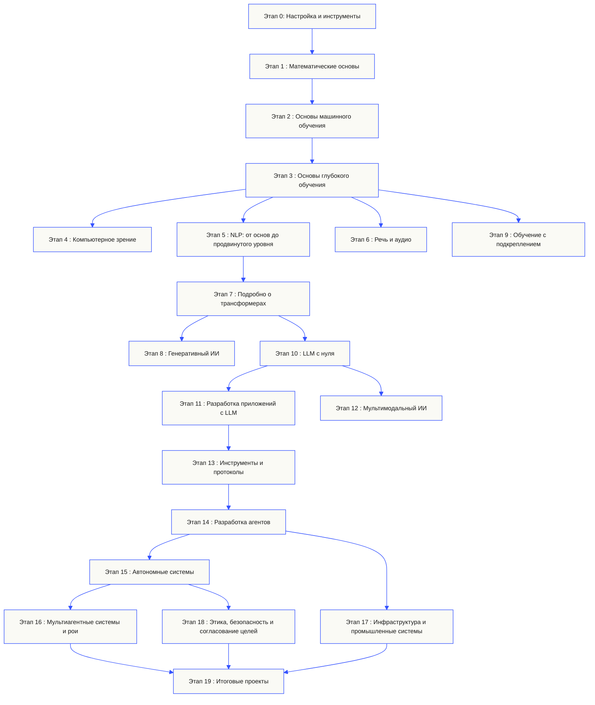
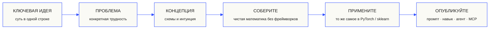

<p align="center"><sub>Перевод с помощью ИИ; структура и терминология проверены. Канонична <a href="../../README.md">английская версия</a>.</sub></p>
<p align="center">
  
</p>

<p align="center">
  <a href="../../README.md">🇬🇧 English</a> ·
  <a href="../../i18n/zh/README.md">🇨🇳 简体中文</a> ·
  <a href="../../i18n/zh-TW/README.md">🇹🇼 繁體中文（台灣）</a> ·
  <a href="../../i18n/ja/README.md">🇯🇵 日本語</a> ·
  <a href="../../i18n/ko/README.md">🇰🇷 한국어</a> ·
  <a href="../../i18n/pt/README.md">🇵🇹 Português</a> ·
  <a href="../../i18n/pt-BR/README.md">🇧🇷 Português (Brasil)</a> ·
  <a href="../../i18n/es/README.md">🇪🇸 Español</a> ·
  <a href="../../i18n/de/README.md">🇩🇪 Deutsch</a> ·
  <a href="../../i18n/fr/README.md">🇫🇷 Français</a> ·
  <a href="../../i18n/it/README.md">🇮🇹 Italiano</a> ·
  <a href="../../i18n/nl/README.md">🇳🇱 Nederlands</a> ·
  <a href="../../i18n/pl/README.md">🇵🇱 Polski</a> ·
  <a href="../../i18n/cs/README.md">🇨🇿 Čeština</a> ·
  <a href="../../i18n/ro/README.md">🇷🇴 Română</a> ·
  <a href="../../i18n/hu/README.md">🇭🇺 Magyar</a> ·
  <a href="../../i18n/el/README.md">🇬🇷 Ελληνικά</a> ·
  <a href="../../i18n/sv/README.md">🇸🇪 Svenska</a> ·
  <a href="../../i18n/da/README.md">🇩🇰 Dansk</a> ·
  <a href="../../i18n/no/README.md">🇳🇴 Norsk</a> ·
  <a href="../../i18n/fi/README.md">🇫🇮 Suomi</a> ·
  <a href="../../i18n/ru/README.md">🇷🇺 Русский</a> ·
  <a href="../../i18n/uk/README.md">🇺🇦 Українська</a> ·
  <a href="../../i18n/tr/README.md">🇹🇷 Türkçe</a> ·
  <a href="../../i18n/he/README.md">🇮🇱 עברית</a> ·
  <a href="../../i18n/ar/README.md">🇸🇦 العربية</a> ·
  <a href="../../i18n/fa/README.md">🇮🇷 فارسی</a> ·
  <a href="../../i18n/hi/README.md">🇮🇳 हिन्दी</a> ·
  <a href="../../i18n/bn/README.md">🇧🇩 বাংলা</a> ·
  <a href="../../i18n/ur/README.md">🇵🇰 اردو</a> ·
  <a href="../../i18n/th/README.md">🇹🇭 ไทย</a> ·
  <a href="../../i18n/vi/README.md">🇻🇳 Tiếng Việt</a> ·
  <a href="../../i18n/id/README.md">🇮🇩 Bahasa Indonesia</a> ·
  <a href="../../i18n/tl/README.md">🇵🇭 Tagalog</a>
</p>

<p align="center">
  <a href="../../LICENSE"></a>
  <a href="../../ROADMAP.md"></a>
  <a href="#contents"></a>
  <a href="https://github.com/rohitg00/ai-engineering-from-scratch/stargazers"></a>
  <a href="https://aiengineeringfromscratch.com"></a>
  <p align="center">
 <a href="https://www.star-history.com/rohitg00/ai-engineering-from-scratch">
  <picture><source media="(prefers-color-scheme: dark)" srcset="https://api.star-history.com/badge?repo=rohitg00/ai-engineering-from-scratch&type=rank&theme=dark" /><source media="(prefers-color-scheme: light)" srcset="https://api.star-history.com/badge?repo=rohitg00/ai-engineering-from-scratch&type=rank" /></picture> <picture><source media="(prefers-color-scheme: dark)" srcset="https://api.star-history.com/badge?repo=rohitg00/ai-engineering-from-scratch&type=trending&theme=dark" /><source media="(prefers-color-scheme: light)" srcset="https://api.star-history.com/badge?repo=rohitg00/ai-engineering-from-scratch&type=trending" /></picture>
 </a>
</p>
</p>

### Спонсоры

<p align="center">
  <a href="https://serpapi.com/ai-engineering-from-scratch"><picture><source media="(min-width: 768px)" srcset="../../assets/sponsors/serpapi-banner-compact.png" width="48%"></picture></a>
  <a href="https://nitrostack.ai/referral/aiengineeringfromscratch"><picture><source media="(min-width: 768px)" srcset="../../assets/sponsors/nitrostack-banner-equal.png" width="48%"></picture></a>
</p>

<p align="center">
  <sub><span>Благодаря вашей поддержке все уроки остаются бесплатными и открытыми.</span> <a href="#supporters">Все, кто поддерживает проект</a> · <a href="../../SPONSORS.md">Стать спонсором</a></sub>
</p>

```text
░░░▒▒▒░░░▒▒▒░░░▒▒▒░░░▒▒▒░░░▒▒▒░░░▒▒▒░░░▒▒▒░░░▒▒▒░░░▒▒▒░░░▒▒▒░░░▒▒▒░░░▒▒▒░░░▒▒▒░░░▒▒▒░░░▒▒▒
```

> **84% студентов уже используют инструменты ИИ. Лишь 18% считают себя готовыми применять их профессионально.** Эта программа помогает сократить этот разрыв.
>
> 523 урока. 20 этапов. ~342 часа. Python, TypeScript, Rust, Julia. Каждый урок даёт повторно используемый результат: промпт, навык, агента или сервер MCP. Бесплатно, с открытым исходным кодом, лицензия MIT.
>
> Вы не просто изучаете ИИ. Вы строите его. От начала до конца. Своими руками.

<!-- STATS:START (generated from site/stats.json by build.js — do not edit by hand) -->
<p align="center"><sub><b>114,584</b> читателей &nbsp;·&nbsp; <b>181,995</b> просмотров страниц за последние 30 дней &nbsp;·&nbsp; по состоянию на 2026-08-29</sub></p>
<!-- STATS:END -->

## Начните здесь: выберите, что хотите создать

Перед началом не нужно просматривать все 523 урока. Выберите цель. Каждая ссылка открывает одну и ту же учебную программу на GitHub или на сайте; в обеих версиях используется один и тот же код уроков.

| Ваша цель | Учиться на GitHub | Учиться на сайте |
|---|---|---|
| Я только начинаю и хочу получить прочную базу | [Этап 0: Настройка и инструменты](../../phases/00-setup-and-tooling/) | [Среда разработки](https://aiengineeringfromscratch.com/lesson?path=phases/00-setup-and-tooling/01-dev-environment) |
| Я знаю Python и хочу освоить математику и основы машинного обучения | [Этап 1: Математические основы](../../phases/01-math-foundations/) | [Интуиция линейной алгебры](https://aiengineeringfromscratch.com/lesson?path=phases/01-math-foundations/01-linear-algebra-intuition) |
| Я хочу создавать промышленные приложения на базе LLM | [Этап 11: Разработка приложений с LLM](../../phases/11-llm-engineering/) | [Разработка промптов](https://aiengineeringfromscratch.com/lesson?path=phases/11-llm-engineering/01-prompt-engineering) |
| Я хочу создавать агентов | [Этап 14: Разработка агентов](../../phases/14-agent-engineering/) | [Цикл работы агента](https://aiengineeringfromscratch.com/lesson?path=phases/14-agent-engineering/01-the-agent-loop) |
| Я хочу использовать программирующих агентов в реальных репозиториях | [Маршрут разработки с помощью агентов](../../learning-paths/using-coding-agents.json) | [Разработка с помощью агентов](https://aiengineeringfromscratch.com/lesson?path=phases/14-agent-engineering/31-agent-workbench-why-models-fail&learningPath=using-coding-agents) |
| Я хочу определить, что именно строить, до начала реализации | [Маршрут продуктовых решений и поставки](../../learning-paths/shaping-the-build.json) | [Продуктовые решения и поставка](https://aiengineeringfromscratch.com/lesson?path=phases/14-agent-engineering/47-outcomes-before-output&learningPath=shaping-the-build) |
| Я хочу разрабатывать с использованием Model Context Protocol (MCP) | [Маршрут Model Context Protocol (MCP)](../../phases/13-tools-and-protocols/README.md#model-context-protocol-mcp-path) | [Маршрут Model Context Protocol (MCP)](https://aiengineeringfromscratch.com/lesson?path=phases/13-tools-and-protocols/06-mcp-fundamentals&learningPath=model-context-protocol) |
| Я хочу создавать и выпускать Agent Skills | [Краткий маршрут Agent Skills](../../phases/13-tools-and-protocols/README.md#agent-skills-fast-path) | [Маршрут Agent Skills](https://aiengineeringfromscratch.com/lesson?path=phases/13-tools-and-protocols/22-skills-and-agent-sdks&learningPath=agent-skills) |
| Я хочу подготовиться к сертификации Claude | [Начало подготовки](../../certifications/claude/GETTING_STARTED.md) | [Академия сертификации](https://aiengineeringfromscratch.com/certifications.html) |
| Я хочу подготовиться к экзамену MCP Associate (MCPA) | [Начало подготовки к MCPA](../../certifications/mcpa/GETTING_STARTED.md) | [Маршрут MCPA](https://aiengineeringfromscratch.com/certification?id=mcpa-f) |

Не знаете, с чего начать? Пройдите [вводную диагностику `start-learning`](../../skills/start-learning/SKILL.md) или загляните в [руководство по необходимой подготовке](https://aiengineeringfromscratch.com/prereqs.html).

Сравните четыре основных направления и шесть карьерных маршрутов в разделе [«Маршруты обучения AI Engineering»](https://aiengineeringfromscratch.com/learning-paths.html).

### Проходите каждый урок по одной и той же схеме

1. **Прочитайте** `docs/en.md` и объясните основную идею своими словами.
2. **Наберите и соберите** важный код сами, а не воспринимайте блок кода как украшение.
3. **Запустите** команду урока из корня репозитория — каталога, в котором находятся `README.md` и `phases/`.
4. **Сохраняйте подтверждения выполнения**: команду, рабочий каталог, код завершения, содержательный вывод и изменённый или созданный вами артефакт.
5. **Переходите дальше**, только если можете объяснить вывод и без догадок внести небольшое изменение.

Пути в командах на страницах уроков отсчитываются от корня репозитория, если только урок явно не просит перейти в другой каталог. Если доступно несколько языков, запускайте реализацию на изучаемом вами языке.

### Клонируйте репозиторий и получите первое подтверждение

```bash
git clone https://github.com/rohitg00/ai-engineering-from-scratch.git
cd ai-engineering-from-scratch
python3 phases/00-setup-and-tooling/01-dev-environment/code/verify.py --route beginner
python3 phases/01-math-foundations/01-linear-algebra-intuition/code/vectors.py
```

Предварительная проверка отделяет то, что требуется сейчас, от инструментов, которые понадобятся позже. Для каждой обязательной проверки указаны обнаруженная причина ошибки и команда для её исправления. Вторая команда запускает урок без дополнительных зависимостей и показывает, что умножение матрицы на вектор — это операция внутри слоя нейронной сети. Сохраните вывод терминала как первое подтверждение.

## Настройте ИИ-репетитора за 30 секунд

Если у вас уже установлены Node.js и `npx`, а также есть программирующий агент с поддержкой навыков, настройте его как репетитора всего двумя командами. Клонировать репозиторий для установки или чтения репетитора не нужно. Для запуска лабораторных работ по отдельным маршрутам потребуется `python3`. Лабораторные работы с Agent Skills также требуют поддерживаемой среды и доступного для записи каталога навыков пользователя или проекта.

Сначала проверьте, установлены ли необходимые инструменты:

```bash
node --version
npx --version
python3 --version
```

Затем установите навыки учебной программы. Когда установщик спросит, выберите среду и область установки:

```bash
npx skills add rohitg00/ai-engineering-from-scratch
```

Синтаксис вызова определяется средой, а не переносимым форматом `SKILL.md`:

| Среда | Начать курс | Начать маршрут Model Context Protocol (MCP) | Начать Agent Skills | Пройти тест по этапу |
|---|---|---|---|---|
| Codex | `start-learning` или выбрать его в `/skills` | `learn-mcp` или выбрать его в `/skills` | `learn-agent-skills` или выбрать его в `/skills` | `check-understanding 13` или выбрать его в `/skills` |
| Claude Код | `/start-learning` | `/learn-mcp` | `/learn-agent-skills` | `/check-understanding 13` |
| Другие совместимые хосты | `Use start-learning to begin the course.` | `Use learn-mcp to start the Model Context Protocol (MCP) path.` | `Use learn-agent-skills to start the Agent Skills Engineering path.` | `Use check-understanding to quiz me on Phase 13.` |

Тест из десяти вопросов определит, что вы уже знаете, и подскажет, с какого этапа начать; персональный план обучения сохранится в `LEARNING.md`. Затем навык `learn` будет разбирать по одному уроку за занятие: концепция, математика, код и тест. Навык `course-guide` направит к конкретному уроку, который поможет разобраться в нужной теме или проблеме. В Codex вызывайте навыки командами `learn` и `course-guide`, в Claude Code — `/learn` и `/course-guide`. В других совместимых средах попросите использовать навык по имени.

Интересует только Model Context Protocol (MCP)? Используйте команду запуска MCP для своей среды. Она создаст файл `MCP-LEARNING.md` и проведёт вас по маршруту из 17 уроков: запросы без состояния, транспорт, двунаправленная работа, безопасность, надёжность, управление реестром и подтверждение соответствия. Точный порядок уроков и контрольные точки приведены в [манифесте MCP](../../learning-paths/model-context-protocol.json).

Хотите изучать только Agent Skills? Используйте соответствующую команду для своей среды. Она создаст `AGENT-SKILLS-LEARNING.md` и проведёт вас по связному маршруту из пяти уроков: контракт, обнаружение, вызов, границы песочницы, затем оценка выпуска и переносимость между реальными средами. Начать можно на сайте: [маршрут Agent Skills](https://aiengineeringfromscratch.com/lesson?path=phases/13-tools-and-protocols/22-skills-and-agent-sdks&learningPath=agent-skills).

Установщик покажет среды, которые он может настроить, и спросит, куда установить навыки. Если у вас пока нет Node.js, `npx`, `python3`, поддерживаемой среды или доступного для записи каталога, воспользуйтесь сайтом или прочитайте `docs/en.md` вручную. Так вы изучите концепции, а практические подтверждения обнаружения и вызова навыков, работы скриптов и удаления на реальной среде сможете получить после настройки предварительной проверки. Уроки доступны на сайте [aiengineeringfromscratch.com](https://aiengineeringfromscratch.com).

## Как это устроено

Большинство материалов об ИИ подают знания разрозненно: одна статья, заметка о дообучении и эффектная демонстрация агента где-то ещё. Эти части редко складываются в единую картину. Вы выпускаете чат-бота, но не можете объяснить график функции потерь. Подключаете функцию к агенту, но не можете рассказать, что механизм внимания делает внутри вызываемой модели.

Эта программа — основа цельного курса: 20 этапов, 523 урока и четыре языка — Python, TypeScript, Rust и Julia. Курс охватывает путь от линейной алгебры до автономных роёв агентов. Каждый алгоритм сначала выводится из базовой математики: обратное распространение ошибки, токенизатор, механизм внимания, цикл агента. Когда появится PyTorch, вы уже будете понимать, как он работает изнутри.

Все уроки устроены одинаково: прочитать задачу, вывести формулы, написать код, запустить тест и сохранить результат. Здесь нет пятиминутных видео, развёртывания копированием кода или пошагового сопровождения. Программа бесплатна, имеет открытый исходный код и рассчитана на запуск на вашем ноутбуке.

```text
░░░▒▒▒░░░▒▒▒░░░▒▒▒░░░▒▒▒░░░▒▒▒░░░▒▒▒░░░▒▒▒░░░▒▒▒░░░▒▒▒░░░▒▒▒░░░▒▒▒░░░▒▒▒░░░▒▒▒░░░▒▒▒░░░▒▒▒
```

## Структура курса

Двадцать этапов выстроены друг над другом. Математика — фундамент, агенты и промышленные системы — верхний уровень. Если основы вам знакомы, переходите дальше. Но не пропускайте их, если потом не хотите гадать, почему что-то сломалось на верхних уровнях.



```text
░░░▒▒▒░░░▒▒▒░░░▒▒▒░░░▒▒▒░░░▒▒▒░░░▒▒▒░░░▒▒▒░░░▒▒▒░░░▒▒▒░░░▒▒▒░░░▒▒▒░░░▒▒▒░░░▒▒▒░░░▒▒▒░░░▒▒▒
```

## Структура урока

У каждого урока своя папка, но структура каталогов одинакова во всей программе:

```text
phases/<NN>-<phase-name>/<NN>-<lesson-name>/
├── code/      запускаемые реализации (Python, TypeScript, Rust, Julia)
├── docs/
│   └── en.md  текст урока
└── outputs/   промпты, навыки, агенты или серверы MCP, создаваемые в этом уроке
```

Каждый урок состоит из шести шагов. Принцип *Build It / Use It* лежит в основе программы: сначала вы реализуете алгоритм с нуля, затем запускаете ту же операцию с помощью промышленной библиотеки. Вы понимаете, что делает фреймворк, потому что сами написали его упрощённую версию.



## Начало работы

Три варианта. Выберите один.

**Вариант A — заниматься в терминале *(рекомендуется)*.** Убедитесь, что прошли описанную выше предварительную проверку Node.js, `npx`, среды и каталога для установки. Затем установите навыки обучения в совместимого агента и позвольте курсу вести вас:

```bash
npx skills add rohitg00/ai-engineering-from-scratch
```

Используйте таблицу команд для своей среды. Установленные навыки предоставляют `start-learning`, `learn`, `course-guide`, а также специализированные маршруты `learn-mcp` и `learn-agent-skills`. Тексты уроков можно получать из этого репозитория без клонирования. Локальный клон нужен для запуска команд с кодом репозитория и лабораторных работ по MCP и Agent Skills. Прогресс хранится в файле проекта `LEARNING.md`, `MCP-LEARNING.md` или `AGENT-SKILLS-LEARNING.md`, поэтому занятие можно продолжить в любой момент.

**Вариант B — читать.** Откройте любой завершённый урок на сайте [aiengineeringfromscratch.com](https://aiengineeringfromscratch.com) или раскройте этап в разделе [«Содержание»](#contents). Ничего устанавливать и клонировать не нужно.

**Вариант C — клонировать и запустить.**

```bash
git clone https://github.com/rohitg00/ai-engineering-from-scratch.git
cd ai-engineering-from-scratch
python3 phases/01-math-foundations/01-linear-algebra-intuition/code/vectors.py
```

При клонировании навыки обучения также автоматически загружаются в Claude Code. Репетитор `learn` получает код каждого урока и может действительно его запускать, а не только разбирать вместе с вами.

### Предварительные требования

- Вы умеете программировать на любом языке; знание Python будет полезно.
- Вы хотите понять, как ИИ **действительно работает**, а не просто вызывать API.

### Подготовка к сертификациям Claude

[Академия сертификации Claude](../../certifications/claude/README.md) — бесплатная программа подготовки с открытым исходным кодом для четырёх официальных сертификаций Claude: Associate Foundations, Developer Foundations, Architect Foundations и Architect Professional. Каждый маршрут включает уроки по плану экзамена, запускаемые лабораторные работы, диагностический тест, итоговый проект и полноценный авторский пробный экзамен.

Используйте [руководство по началу работы с GitHub для ИИ-агентов](../../certifications/claude/GETTING_STARTED.md) с Claude Code, Codex, ChatGPT, Cursor или другим агентом. В Codex запустите `claude-certification`, в Claude Code — `/claude-certification`; в другой среде попросите использовать навык `claude-certification`. Он выберет направление, сохранит последовательность занятий в `CLAUDE-CERTIFICATION.md`, будет обучать шаг за шагом, запускать реальные лабораторные работы и давать обратную связь по вашим материалам. Программа также доступна на [сайте академии](https://aiengineeringfromscratch.com/certifications.html).

Академия — независимый учебный материал, основанный на открытых целях экзамена. Она не связана с Anthropic, не воспроизводит вопросы действующего экзамена и не гарантирует успешную сдачу.

### Подготовка к сертификации MCP Associate (MCPA)

[Учебная программа сертификации MCPA](../../certifications/mcpa/README.md) — бесплатный учебный курс с открытым исходным кодом для экзамена Model Context Protocol Associate от Agentic AI Foundation, который проводится через Linux Foundation Training. 34 урока охватывают версию протокола без сохранения состояния от 2026-07-28 и пять областей экзамена: `_meta` для каждого запроса и `server/discover` вместо прежнего handshake, запросы с несколькими циклами обмена, подписки, кэширование, расширения Tasks и MCP Apps, авторизацию OAuth, а также уровни registry и SDK. В каждом уроке есть запускаемая лабораторная работа на стандартной библиотеке; её журнал проверяется на соответствие актуальному формату обмена. Курс также включает диагностический тест, итоговый проект и три полноформатных авторских пробных экзамена с распределением вопросов по опубликованным весам экзамена.

Используйте [руководство по началу работы с GitHub для ИИ-агентов](../../certifications/mcpa/GETTING_STARTED.md) с Claude Code, Codex, ChatGPT, Cursor или другим агентом. В Codex запустите `mcpa-certification`, в Claude Code — `/mcpa-certification`; в другой среде попросите использовать навык `mcpa-certification`. Он сохранит последовательность занятий в `MCPA-CERTIFICATION.md`, будет обучать шаг за шагом, запускать лабораторные работы и давать обратную связь по вашим материалам. Программа также доступна на [странице маршрута MCPA](https://aiengineeringfromscratch.com/certification?id=mcpa-f).

Эта программа — независимый учебный материал, основанный на открытых целях экзамена. Она не связана с Agentic AI Foundation или Linux Foundation, не воспроизводит вопросы действующего экзамена и не гарантирует успешную сдачу.

### Учебные навыки

| Навыки | Что это делает |
|---|---|
| [start-learning](../../skills/start-learning/SKILL.md) | Первичное знакомство: определить цель обучения, пройти тест на уровень и сохранить персональный план в LEARNING.md. |
| [learn](../../skills/learn/SKILL.md) | Цикл занятий с репетитором: повторение, интерактивный разбор следующего урока, тест, запись прогресса и списка тем для повторения. |
| [course-guide](../../skills/course-guide/SKILL.md) | Навигатор по темам: на вопросы «Где изучить механизм внимания?» или «Почему функция потерь равна NaN?» он укажет нужные уроки и ссылки. |
| [learn-mcp](../../skills/learn-mcp/SKILL.md) | Репетитор по Model Context Protocol (MCP). Создаёт MCP-LEARNING.md, следует маршруту из 17 уроков и фиксирует подтверждения по формату обмена, безопасности, надёжности и соответствию стандарту. |
| [learn-agent-skills](../../skills/learn-agent-skills/SKILL.md) | Репетитор по Agent Skills. Создаёт AGENT-SKILLS-LEARNING.md, разбирает уроки 22 и 24–27 и фиксирует результат проверки на реальной среде. |
| [claude-certification](../../skills/claude-certification/SKILL.md) | Репетитор по сертификации: выбирает CCAO-F, CCDV-F, CCAR-F или CCAR-P, разбирает уроки, запускает лабораторные работы, проверяет материалы, проводит диагностику и пробные экзамены, сохраняет прогресс. |
| [mcpa-certification](../../skills/mcpa-certification/SKILL.md) | Репетитор MCPA: следует 34-урочному маршруту `mcpa-f` для протокола от 2026-07-28, запускает лабораторные работы и проверку формата обмена, проводит диагностику и три пробных экзамена, сохраняет прогресс. |
| [`find-your-level`](../../skills/find-your-level/SKILL.md) | Тест из десяти вопросов: определяет этап для начала и составляет персональный маршрут с оценкой времени. |
| [`check-understanding <phase>`](../../skills/check-understanding/SKILL.md) | Тест из восьми вопросов по выбранному этапу, обратная связь и список уроков для повторения. Используйте команду Codex, Claude Code или фразу на естественном языке из таблицы выше. |

```text
░░░▒▒▒░░░▒▒▒░░░▒▒▒░░░▒▒▒░░░▒▒▒░░░▒▒▒░░░▒▒▒░░░▒▒▒░░░▒▒▒░░░▒▒▒░░░▒▒▒░░░▒▒▒░░░▒▒▒░░░▒▒▒░░░▒▒▒
```

## Прочитать основную программу как книгу

Основная программа из 20 этапов в `phases/` выпускается в виде серии из шести книг. CI собирает EPUB и PDF из тех же материалов уроков и прикрепляет их к каждому [релизу на GitHub](https://github.com/rohitg00/ai-engineering-from-scratch/releases); ссылки ниже ведут на последний релиз. Номера обозначают тома серии, а не версии: в каждом экземпляре указана дата издания, а прежние издания остаются доступными в своих релизах.

Программы подготовки к сертификациям намеренно не включены в книги. Прогресс с ИИ-репетитором, лабораторные работы, интерактивные иллюстрации, диагностические тесты и пробные экзамены с ограничением по времени доступны на GitHub и на сайте.

| Отношения | Название | Фазы | Скачать |
|-----|-------|--------|----------|
| 1 | Основы · Математика, инструменты и классическое машинное обучение | 00-02 | [ЕПУБ](https://github.com/rohitg00/ai-engineering-from-scratch/releases/latest/download/aiefs-vol1-foundations.epub) · [PDF](https://github.com/rohitg00/ai-engineering-from-scratch/releases/latest/download/aiefs-vol1-foundations.pdf) |
| 2 | Глубокое обучение · Нейросети, компьютерное зрение и речь | 03, 04, 06 | [ЕПУБ](https://github.com/rohitg00/ai-engineering-from-scratch/releases/latest/download/aiefs-vol2-deep-learning.epub) · [PDF](https://github.com/rohitg00/ai-engineering-from-scratch/releases/latest/download/aiefs-vol2-deep-learning.pdf) |
| 3 | Язык · Основы NLP и трансформер | 05, 07 | [ЕПУБ](https://github.com/rohitg00/ai-engineering-from-scratch/releases/latest/download/aiefs-vol3-language.epub) · [PDF](https://github.com/rohitg00/ai-engineering-from-scratch/releases/latest/download/aiefs-vol3-language.pdf) |
| 4 | Большие языковые модели · Генерация, обучение с подкреплением, предобучение и разработка | 08-11 | [ЕПУБ](https://github.com/rohitg00/ai-engineering-from-scratch/releases/latest/download/aiefs-vol4-llms.epub) · [PDF](https://github.com/rohitg00/ai-engineering-from-scratch/releases/latest/download/aiefs-vol4-llms.pdf) |
| 5 | Агенты · Мультимодальность, протоколы, автономность и рои | 12-16 | [ЕПУБ](https://github.com/rohitg00/ai-engineering-from-scratch/releases/latest/download/aiefs-vol5-agents.epub) · [PDF](https://github.com/rohitg00/ai-engineering-from-scratch/releases/latest/download/aiefs-vol5-agents.pdf) |
| 6 | Промышленные системы · Инфраструктура, безопасность и итоговые проекты | 17-19 | [ЕПУБ](https://github.com/rohitg00/ai-engineering-from-scratch/releases/latest/download/aiefs-vol6-production.epub) · [PDF](https://github.com/rohitg00/ai-engineering-from-scratch/releases/latest/download/aiefs-vol6-production.pdf) |

Книга — снимок курса, а репозиторий — его актуальная версия. В конце каждой главы есть ссылки на анимированные иллюстрации, тест и запускаемый код урока. Соберите книгу локально командой `python3 scripts/build_book.py` (нужен Pandoc); описание процесса находится в [book/README.md](../../book/README.md).

```text
░░░▒▒▒░░░▒▒▒░░░▒▒▒░░░▒▒▒░░░▒▒▒░░░▒▒▒░░░▒▒▒░░░▒▒▒░░░▒▒▒░░░▒▒▒░░░▒▒▒░░░▒▒▒░░░▒▒▒░░░▒▒▒░░░▒▒▒
```

## Каждый урок что-то даёт

Другие программы заканчиваются словами *«Поздравляем, вы изучили X»*. Здесь каждый урок завершается **инструментом для повторного использования**, который можно установить или включить в свой повседневный рабочий процесс.

<table>
<tr>
<th align="left" width="25%"><br/><sub>FIG_001 · A</sub><br/><b>ПРОМПТЫ</b></th>
<th align="left" width="25%"><br/><sub>FIG_001 · B</sub><br/><b>НАВЫКИ</b></th>
<th align="left" width="25%"><br/><sub>FIG_001 · C</sub><br/><b>АГЕНТЫ</b></th>
<th align="left" width="25%"><br/><sub>FIG_001 · D</sub><br/><b>СЕРВЕРЫ MCP</b></th>
</tr>
<tr>
<td valign="top">Добавьте промпт в любой помощник на базе ИИ, чтобы получить экспертную помощь по конкретной задаче.</td>
<td valign="top">Установите навык в Claude, Cursor, Codex, OpenClaw, Hermes или в любую другую среду, которая читает <code>SKILL.md</code>.</td>
<td valign="top">Разверните агентов как автономных исполнителей: сам цикл вы написали на этапе 14.</td>
<td valign="top">Подключите их к любому клиенту, совместимому с MCP. Полный процесс реализован на этапе 13.</td>
</tr>
</table>

> Установите комплект командой `python3 scripts/install_skills.py <target>`. Это реальные инструменты, а не домашнее задание. К концу программы у вас будет портфолио из 523 артефактов, которые вы понимаете, потому что создали их сами.

### FIG_002 · Пример сквозной реализации

Этап 14, урок 1: цикл работы агента. Около 120 строк чистого Python, без зависимостей.

<table>
<tr>
<td valign="top" width="50%">

**`code/agent_loop.py`** &nbsp; <sub><i>соберите</i></sub>

```python
def run(query, tools):
    history = [user(query)]
    for step in range(MAX_STEPS):
        msg = llm(history)
        if msg.tool_calls:
            for call in msg.tool_calls:
                result = tools[call.name](**call.args)
                history.append(tool_result(call.id, result))
            continue
        return msg.content
    raise StepLimitExceeded
```

</td>
<td valign="top" width="50%">

**`outputs/skill-agent-loop.md`** &nbsp; <sub><i>выпустите</i></sub>

```markdown
---
name: agent-loop
description: ReAct-style loop for any tool list
phase: 14
lesson: 01
---

Implement a minimal agent loop that...
```

**`outputs/prompt-debug-agent.md`**

```markdown
You are an agent debugger. Given the trace
of an agent run, identify the step where
the agent went wrong and explain why...
```

</td>
</tr>
</table>

```text
░░░▒▒▒░░░▒▒▒░░░▒▒▒░░░▒▒▒░░░▒▒▒░░░▒▒▒░░░▒▒▒░░░▒▒▒░░░▒▒▒░░░▒▒▒░░░▒▒▒░░░▒▒▒░░░▒▒▒░░░▒▒▒░░░▒▒▒
```

<a id="contents"></a>

## Содержание

Двадцать этапов. Раскройте любой из них, чтобы увидеть список уроков.

<a id="phase-0"></a>
### Этап 0: Настройка и инструменты `12 уроков`
> Подготовьте рабочую среду для всего дальнейшего обучения.

| # | Урок | Тип | Языки |
|:---:|--------|:----:|------|
| 01 | [Среда разработки](../../phases/00-setup-and-tooling/01-dev-environment/) | Создание | Python |
| 02 | [Git и совместная работа](../../phases/00-setup-and-tooling/02-git-and-collaboration/) | Изучение | — |
| 03 | [Настройка GPU и облачных сред](../../phases/00-setup-and-tooling/03-gpu-setup-and-cloud/) | Создание | Python |
| 04 | [API и ключи доступа](../../phases/00-setup-and-tooling/04-apis-and-keys/) | Создание | Python |
| 05 | [Блокноты Jupyter](../../phases/00-setup-and-tooling/05-jupyter-notebooks/) | Создание | Python |
| 06 | [Окружения Python](../../phases/00-setup-and-tooling/06-python-environments/) | Создание | Shell |
| 07 | [Docker для ИИ](../../phases/00-setup-and-tooling/07-docker-for-ai/) | Создание | Docker |
| 08 | [Настройка редактора](../../phases/00-setup-and-tooling/08-editor-setup/) | Создание | — |
| 09 | [Управление данными](../../phases/00-setup-and-tooling/09-data-management/) | Создание | Python |
| 10 | [Терминал и командная оболочка](../../phases/00-setup-and-tooling/10-terminal-and-shell/) | Изучение | — |
| 11 | [Linux для ИИ](../../phases/00-setup-and-tooling/11-linux-for-ai/) | Изучение | — |
| 12 | [Отладка и профилирование](../../phases/00-setup-and-tooling/12-debugging-and-profiling/) | Создание | Python |

<details id="phase-1">
<summary><b>Этап 1 — Математические основы</b> &nbsp;<code>22 урока</code>&nbsp; <em>Разберите интуицию, лежащую в основе каждого алгоритма ИИ, на примерах кода.</em></summary>
<br/>

| # | Урок | Тип | Языки |
|:---:|--------|:----:|------|
| 01 | [Интуитивное понимание линейной алгебры](../../phases/01-math-foundations/01-linear-algebra-intuition/) | Изучение | Python, Julia |
| 02 | [Векторы, матрицы и операции](../../phases/01-math-foundations/02-vectors-matrices-operations/) | Создание | Python, Julia |
| 03 | [Преобразования матриц и собственные значения](../../phases/01-math-foundations/03-matrix-transformations/) | Создание | Python, Julia |
| 04 | [Математический анализ для ML: производные и градиенты](../../phases/01-math-foundations/04-calculus-for-ml/) | Изучение | Python |
| 05 | [Правило цепочки и автоматическое дифференцирование](../../phases/01-math-foundations/05-chain-rule-and-autodiff/) | Создание | Python |
| 06 | [Вероятности и распределения](../../phases/01-math-foundations/06-probability-and-distributions/) | Изучение | Python |
| 07 | [Теорема Байеса и статистическое мышление](../../phases/01-math-foundations/07-bayes-theorem/) | Создание | Python |
| 08 | [Оптимизация: методы градиентного спуска](../../phases/01-math-foundations/08-optimization/) | Создание | Python |
| 09 | [Теория информации: энтропия и дивергенция KL](../../phases/01-math-foundations/09-information-theory/) | Изучение | Python |
| 10 | [Снижение размерности: PCA, t-SNE, UMAP](../../phases/01-math-foundations/10-dimensionality-reduction/) | Создание | Python |
| 11 | [Сингулярное разложение матрицы](../../phases/01-math-foundations/11-singular-value-decomposition/) | Создание | Python, Julia |
| 12 | [Операции с тензорами](../../phases/01-math-foundations/12-tensor-operations/) | Создание | Python |
| 13 | [Численная устойчивость](../../phases/01-math-foundations/13-numerical-stability/) | Создание | Python |
| 14 | [Нормы и расстояния](../../phases/01-math-foundations/14-norms-and-distances/) | Создание | Python |
| 15 | [Статистика для ML](../../phases/01-math-foundations/15-statistics-for-ml/) | Создание | Python |
| 16 | [Методы выборки](../../phases/01-math-foundations/16-sampling-methods/) | Создание | Python |
| 17 | [Линейные системы](../../phases/01-math-foundations/17-linear-systems/) | Создание | Python |
| 18 | [Выпуклая оптимизация](../../phases/01-math-foundations/18-convex-optimization/) | Создание | Python |
| 19 | [Комплексные числа для ИИ](../../phases/01-math-foundations/19-complex-numbers/) | Изучение | Python |
| 20 | [Преобразование Фурье](../../phases/01-math-foundations/20-fourier-transform/) | Создание | Python |
| 21 | [Теория графов для ML](../../phases/01-math-foundations/21-graph-theory/) | Создание | Python |
| 22 | [Стохастические процессы](../../phases/01-math-foundations/22-stochastic-processes/) | Изучение | Python |

</details>

<details id="phase-2">
<summary><b>Этап 2 — Основы машинного обучения</b> &nbsp;<code>18 уроков</code>&nbsp; <em>Классическое ML по-прежнему лежит в основе большинства промышленных систем ИИ.</em></summary>
<br/>

| # | Урок | Тип | Языки |
|:---:|--------|:----:|------|
| 01 | [Что такое машинное обучение?](../../phases/02-ml-fundamentals/01-what-is-machine-learning/) | Изучение | Python |
| 02 | [Линейная регрессия с нуля](../../phases/02-ml-fundamentals/02-linear-regression/) | Создание | Python |
| 03 | [Логистическая регрессия и классификация](../../phases/02-ml-fundamentals/03-logistic-regression/) | Создание | Python |
| 04 | [Деревья решений и случайные леса](../../phases/02-ml-fundamentals/04-decision-trees/) | Создание | Python |
| 05 | [Метод опорных векторов](../../phases/02-ml-fundamentals/05-support-vector-machines/) | Создание | Python |
| 06 | [KNN и метрики расстояния](../../phases/02-ml-fundamentals/06-knn-and-distances/) | Создание | Python |
| 07 | [Обучение без учителя: K-Means и DBSCAN](../../phases/02-ml-fundamentals/07-unsupervised-learning/) | Создание | Python |
| 08 | [Проектирование и отбор признаков](../../phases/02-ml-fundamentals/08-feature-engineering/) | Создание | Python |
| 09 | [Оценка модели: метрики и кросс-валидация](../../phases/02-ml-fundamentals/09-model-evaluation/) | Создание | Python |
| 10 | [Смещение, дисперсия и кривая обучения](../../phases/02-ml-fundamentals/10-bias-variance/) | Изучение | Python |
| 11 | [Методы ансамблирования: boosting, bagging, stacking](../../phases/02-ml-fundamentals/11-ensemble-methods/) | Создание | Python |
| 12 | [Настройка гиперпараметров](../../phases/02-ml-fundamentals/12-hyperparameter-tuning/) | Создание | Python |
| 13 | [ML-пайплайны и учёт экспериментов](../../phases/02-ml-fundamentals/13-ml-pipelines/) | Создание | Python |
| 14 | [Наивный байесовский классификатор](../../phases/02-ml-fundamentals/14-naive-bayes/) | Создание | Python |
| 15 | [Основы временных рядов](../../phases/02-ml-fundamentals/15-time-series/) | Создание | Python |
| 16 | [Обнаружение аномалий](../../phases/02-ml-fundamentals/16-anomaly-detection/) | Создание | Python |
| 17 | [Работа с несбалансированными данными](../../phases/02-ml-fundamentals/17-imbalanced-data/) | Создание | Python |
| 18 | [Отбор признаков](../../phases/02-ml-fundamentals/18-feature-selection/) | Создание | Python |

</details>

<details id="phase-3">
<summary><b>Этап 3 — Основы глубокого обучения</b> &nbsp;<code>13 уроков</code>&nbsp; <em>Нейронные сети с первых принципов. Без фреймворков, пока не создадите собственный.</em></summary>
<br/>

| # | Урок | Тип | Языки |
|:---:|--------|:----:|------|
| 01 | [Перцептрон: с чего всё началось](../../phases/03-deep-learning-core/01-the-perceptron/) | Создание | Python |
| 02 | [Многослойные сети и прямой проход](../../phases/03-deep-learning-core/02-multi-layer-networks/) | Создание | Python |
| 03 | [Обратное распространение ошибки с нуля](../../phases/03-deep-learning-core/03-backpropagation/) | Создание | Python |
| 04 | [Функции активации: ReLU, Sigmoid, GELU — и зачем они нужны](../../phases/03-deep-learning-core/04-activation-functions/) | Создание | Python |
| 05 | [Функции потерь: MSE, cross-entropy и contrastive loss](../../phases/03-deep-learning-core/05-loss-functions/) | Создание | Python |
| 06 | [Оптимизаторы: SGD, Momentum, Adam, AdamW](../../phases/03-deep-learning-core/06-optimizers/) | Создание | Python |
| 07 | [Регуляризация: Dropout, Weight Decay, BatchNorm](../../phases/03-deep-learning-core/07-regularization/) | Создание | Python |
| 08 | [Инициализация весов и стабильность обучения](../../phases/03-deep-learning-core/08-weight-initialization/) | Создание | Python |
| 09 | [Планировщики скорости обучения и warm-up](../../phases/03-deep-learning-core/09-learning-rate-schedules/) | Создание | Python |
| 10 | [Создайте свой мини-фреймворк](../../phases/03-deep-learning-core/10-mini-framework/) | Создание | Python |
| 11 | [Введение в PyTorch](../../phases/03-deep-learning-core/11-intro-to-pytorch/) | Создание | Python |
| 12 | [Введение в JAX](../../phases/03-deep-learning-core/12-intro-to-jax/) | Создание | Python |
| 13 | [Отладка нейронных сетей](../../phases/03-deep-learning-core/13-debugging-neural-networks/) | Создание | Python |

</details>

<details id="phase-4">
<summary><b>Этап 4 — Компьютерное зрение</b> &nbsp;<code>28 уроков</code>&nbsp; <em>От пикселей к пониманию изображений, видео, 3D, VLM и моделей мира.</em></summary>
<br/>

| # | Урок | Тип | Языки |
|:---:|--------|:----:|------|
| 01 | [Основы изображений: пиксели, каналы, цветовые пространства](../../phases/04-computer-vision/01-image-fundamentals/) | Изучение | Python |
| 02 | [Свёртки с нуля](../../phases/04-computer-vision/02-convolutions-from-scratch/) | Создание | Python |
| 03 | [CNN: от LeNet до ResNet](../../phases/04-computer-vision/03-cnns-lenet-to-resnet/) | Создание | Python |
| 04 | [Классификация изображений](../../phases/04-computer-vision/04-image-classification/) | Создание | Python |
| 05 | [Трансферное обучение и тонкая настройка](../../phases/04-computer-vision/05-transfer-learning/) | Создание | Python |
| 06 | [Обнаружение объектов: YOLO с нуля](../../phases/04-computer-vision/06-object-detection-yolo/) | Создание | Python |
| 07 | [Семантическая сегментация: U-Net](../../phases/04-computer-vision/07-semantic-segmentation-unet/) | Создание | Python |
| 08 | [Экземплярная сегментация: Mask R-CNN](../../phases/04-computer-vision/08-instance-segmentation-mask-rcnn/) | Создание | Python |
| 09 | [Генерация изображений: GAN](../../phases/04-computer-vision/09-image-generation-gans/) | Создание | Python |
| 10 | [Генерация изображений: диффузионные модели](../../phases/04-computer-vision/10-image-generation-diffusion/) | Создание | Python |
| 11 | [Stable Diffusion: архитектура и дообучение](../../phases/04-computer-vision/11-stable-diffusion/) | Создание | Python |
| 12 | [Понимание видео: временное моделирование](../../phases/04-computer-vision/12-video-understanding/) | Создание | Python |
| 13 | [3D-зрение: облака точек и NeRF](../../phases/04-computer-vision/13-3d-vision-nerf/) | Создание | Python |
| 14 | [Трансформеры для зрения (ViT)](../../phases/04-computer-vision/14-vision-transformers/) | Создание | Python |
| 15 | [Зрение в реальном времени: запуск на периферийных устройствах](../../phases/04-computer-vision/15-real-time-edge/) | Создание | Python |
| 16 | [Полный конвейер компьютерного зрения](../../phases/04-computer-vision/16-vision-pipeline-capstone/) | Создание | Python |
| 17 | [Самоконтролируемое обучение для зрения: SimCLR, DINO, MAE](../../phases/04-computer-vision/17-self-supervised-vision/) | Создание | Python |
| 18 | [Зрение с открытым словарём: CLIP](../../phases/04-computer-vision/18-open-vocab-clip/) | Создание | Python |
| 19 | [OCR и понимание документов](../../phases/04-computer-vision/19-ocr-document-understanding/) | Создание | Python |
| 20 | [Поиск изображений и метрическое обучение](../../phases/04-computer-vision/20-image-retrieval-metric/) | Создание | Python |
| 21 | [Обнаружение ключевых точек и оценка позы](../../phases/04-computer-vision/21-keypoint-pose/) | Создание | Python |
| 22 | [3D Gaussian Splatting с нуля](../../phases/04-computer-vision/22-3d-gaussian-splatting/) | Создание | Python |
| 23 | [Диффузионные трансформеры и Rectified Flow](../../phases/04-computer-vision/23-diffusion-transformers-rectified-flow/) | Создание | Python |
| 24 | [SAM 3 и сегментация с открытым словарём](../../phases/04-computer-vision/24-sam3-open-vocab-segmentation/) | Создание | Python |
| 25 | [Модели «зрение — язык» (ViT-MLP-LLM)](../../phases/04-computer-vision/25-vision-language-models/) | Создание | Python |
| 26 | [Оценка глубины по одному изображению и геометрии](../../phases/04-computer-vision/26-monocular-depth/) | Создание | Python |
| 27 | [Отслеживание множества объектов и память видео](../../phases/04-computer-vision/27-multi-object-tracking/) | Создание | Python |
| 28 | [Модели мира и видеодиффузия](../../phases/04-computer-vision/28-world-models-video-diffusion/) | Создание | Python |

</details>

<details id="phase-5">
<summary><b>Этап 5 — NLP: от основ до продвинутого уровня</b> &nbsp;<code>29 уроков</code>&nbsp; <em>Язык — интерфейс интеллекта.</em></summary>
<br/>

| # | Урок | Тип | Языки |
|:---:|--------|:----:|------|
| 01 | [Обработка текста: токенизация, стемминг и лемматизация](../../phases/05-nlp-foundations-to-advanced/01-text-processing/) | Создание | Python |
| 02 | [Мешок слов, TF-IDF и представление текста](../../phases/05-nlp-foundations-to-advanced/02-bag-of-words-tfidf/) | Создание | Python |
| 03 | [Векторные представления слов: Word2Vec с нуля](../../phases/05-nlp-foundations-to-advanced/03-word-embeddings-word2vec/) | Создание | Python |
| 04 | [GloVe, FastText и субсловные эмбеддинги](../../phases/05-nlp-foundations-to-advanced/04-glove-fasttext-subword/) | Создание | Python |
| 05 | [Анализ тональности](../../phases/05-nlp-foundations-to-advanced/05-sentiment-analysis/) | Создание | Python |
| 06 | [Распознавание именованных сущностей (NER)](../../phases/05-nlp-foundations-to-advanced/06-named-entity-recognition/) | Создание | Python |
| 07 | [POS-теггинг и синтаксический анализ](../../phases/05-nlp-foundations-to-advanced/07-pos-tagging-parsing/) | Создание | Python |
| 08 | [Классификация текста: CNN и RNN для текста](../../phases/05-nlp-foundations-to-advanced/08-cnns-rnns-for-text/) | Создание | Python |
| 09 | [Модели «последовательность — последовательность»](../../phases/05-nlp-foundations-to-advanced/09-sequence-to-sequence/) | Создание | Python |
| 10 | [Механизм внимания: прорыв](../../phases/05-nlp-foundations-to-advanced/10-attention-mechanism/) | Создание | Python |
| 11 | [Машинный перевод](../../phases/05-nlp-foundations-to-advanced/11-machine-translation/) | Создание | Python |
| 12 | [Суммаризация текста](../../phases/05-nlp-foundations-to-advanced/12-text-summarization/) | Создание | Python |
| 13 | [Системы ответов на вопросы](../../phases/05-nlp-foundations-to-advanced/13-question-answering/) | Создание | Python |
| 14 | [Поиск информации](../../phases/05-nlp-foundations-to-advanced/14-information-retrieval-search/) | Создание | Python |
| 15 | [Тематическое моделирование: LDA, BERTopic](../../phases/05-nlp-foundations-to-advanced/15-topic-modeling/) | Создание | Python |
| 16 | [Генерация текста](../../phases/05-nlp-foundations-to-advanced/16-text-generation-pre-transformer/) | Создание | Python |
| 17 | [Чат-боты: от правил к нейросетям](../../phases/05-nlp-foundations-to-advanced/17-chatbots-rule-to-neural/) | Создание | Python |
| 18 | [Многоязычное NLP](../../phases/05-nlp-foundations-to-advanced/18-multilingual-nlp/) | Создание | Python |
| 19 | [Субсловная токенизация: BPE, WordPiece, Unigram, SentencePiece](../../phases/05-nlp-foundations-to-advanced/19-subword-tokenization/) | Изучение | Python |
| 20 | [Структурированный вывод и ограниченное декодирование](../../phases/05-nlp-foundations-to-advanced/20-structured-outputs-constrained-decoding/) | Создание | Python |
| 21 | [NLI и текстовая импликация](../../phases/05-nlp-foundations-to-advanced/21-nli-textual-entailment/) | Изучение | Python |
| 22 | [Подробный разбор моделей эмбеддингов](../../phases/05-nlp-foundations-to-advanced/22-embedding-models-deep-dive/) | Изучение | Python |
| 23 | [Стратегии разбиения на чанки для RAG](../../phases/05-nlp-foundations-to-advanced/23-chunking-strategies-rag/) | Создание | Python |
| 24 | [Разрешение кореференции](../../phases/05-nlp-foundations-to-advanced/24-coreference-resolution/) | Изучение | Python |
| 25 | [Связывание сущностей и снятие неоднозначности](../../phases/05-nlp-foundations-to-advanced/25-entity-linking/) | Создание | Python |
| 26 | [Извлечение отношений и построение графов знаний](../../phases/05-nlp-foundations-to-advanced/26-relation-extraction-kg/) | Создание | Python |
| 27 | [Оценка LLM: RAGAS, DeepEval, G-Eval](../../phases/05-nlp-foundations-to-advanced/27-llm-evaluation-frameworks/) | Создание | Python |
| 28 | [Оценка работы с длинным контекстом: NIAH, RULER, LongBench, MRCR](../../phases/05-nlp-foundations-to-advanced/28-long-context-evaluation/) | Изучение | Python |
| 29 | [Отслеживание состояния диалога](../../phases/05-nlp-foundations-to-advanced/29-dialogue-state-tracking/) | Создание | Python |

</details>

<details id="phase-6">
<summary><b>Этап 6 — Речь и аудио</b> &nbsp;<code>17 уроков</code>&nbsp; <em>Слушайте, понимайте, говорите.</em></summary>
<br/>

| # | Урок | Тип | Языки |
|:---:|--------|:----:|------|
| 01 | [Основы аудио: формы сигнала, дискретизация, FFT](../../phases/06-speech-and-audio/01-audio-fundamentals) | Изучение | Python |
| 02 | [Спектрограммы, мел-шкала и аудиопризнаки](../../phases/06-speech-and-audio/02-spectrograms-mel-features) | Создание | Python |
| 03 | [Классификация аудио](../../phases/06-speech-and-audio/03-audio-classification) | Создание | Python |
| 04 | [Распознавание речи (ASR)](../../phases/06-speech-and-audio/04-speech-recognition-asr) | Создание | Python |
| 05 | [Whisper: архитектура и дообучение](../../phases/06-speech-and-audio/05-whisper-architecture-finetuning) | Создание | Python |
| 06 | [Распознавание и верификация диктора](../../phases/06-speech-and-audio/06-speaker-recognition-verification) | Создание | Python |
| 07 | [Преобразование текста в речь (TTS)](../../phases/06-speech-and-audio/07-text-to-speech) | Создание | Python |
| 08 | [Клонирование и преобразование голоса](../../phases/06-speech-and-audio/08-voice-cloning-conversion) | Создание | Python |
| 09 | [Генерация музыки](../../phases/06-speech-and-audio/09-music-generation) | Создание | Python |
| 10 | [Аудио-языковые модели](../../phases/06-speech-and-audio/10-audio-language-models) | Создание | Python |
| 11 | [Обработка аудио в реальном времени](../../phases/06-speech-and-audio/11-real-time-audio-processing) | Создание | Python |
| 12 | [Конвейер голосового ассистента](../../phases/06-speech-and-audio/12-voice-assistant-pipeline) | Создание | Python |
| 13 | [Нейронные аудиокодеки: EnCodec, SNAC, Mimi, DAC](../../phases/06-speech-and-audio/13-neural-audio-codecs) | Изучение | Python |
| 14 | [Обнаружение речи и смена говорящего](../../phases/06-speech-and-audio/14-voice-activity-detection-turn-taking) | Создание | Python |
| 15 | [Потоковое преобразование речи в речь: Moshi, Hibiki](../../phases/06-speech-and-audio/15-streaming-speech-to-speech-moshi-hibiki) | Изучение | Python |
| 16 | [Защита от подделки голоса и аудиомаркировка](../../phases/06-speech-and-audio/16-anti-spoofing-audio-watermarking) | Создание | Python |
| 17 | [Оценка аудио: WER, MOS, MMAU, рейтинги](../../phases/06-speech-and-audio/17-audio-evaluation-metrics) | Изучение | Python |

</details>

<details id="phase-7">
<summary><b>Этап 7 — Подробно о трансформерах</b> &nbsp;<code>16 уроков</code>&nbsp; <em>Архитектура, которая изменила всё.</em></summary>
<br/>

| # | Урок | Тип | Языки |
|:---:|--------|:----:|------|
| 01 | [Почему трансформеры? Проблемы RNN](../../phases/07-transformers-deep-dive/01-why-transformers/) | Изучение | Python |
| 02 | [Механизм Self-Attention с нуля](../../phases/07-transformers-deep-dive/02-self-attention-from-scratch/) | Создание | Python |
| 03 | [Многоголовое внимание (Multi-Head Attention)](../../phases/07-transformers-deep-dive/03-multi-head-attention/) | Создание | Python |
| 04 | [Позиционное кодирование: синусоидальное, RoPE, ALiBi](../../phases/07-transformers-deep-dive/04-positional-encoding/) | Создание | Python |
| 05 | [Полный трансформер: энкодер и декодер](../../phases/07-transformers-deep-dive/05-full-transformer/) | Создание | Python |
| 06 | [BERT: моделирование языка с маскировкой](../../phases/07-transformers-deep-dive/06-bert-masked-language-modeling/) | Создание | Python |
| 07 | [GPT: авторегрессионное языковое моделирование](../../phases/07-transformers-deep-dive/07-gpt-causal-language-modeling/) | Создание | Python |
| 08 | [T5, BART: модели «кодировщик — декодировщик»](../../phases/07-transformers-deep-dive/08-t5-bart-encoder-decoder/) | Изучение | Python |
| 09 | [Трансформеры для зрения (ViT)](../../phases/07-transformers-deep-dive/09-vision-transformers/) | Создание | Python |
| 10 | [Аудиотрансформеры: архитектура Whisper](../../phases/07-transformers-deep-dive/10-audio-transformers-whisper/) | Изучение | Python |
| 11 | [Смесь экспертов (MoE)](../../phases/07-transformers-deep-dive/11-mixture-of-experts/) | Создание | Python |
| 12 | [KV-кэш, Flash Attention и оптимизация инференса](../../phases/07-transformers-deep-dive/12-kv-cache-flash-attention/) | Создание | Python |
| 13 | [Законы масштабирования](../../phases/07-transformers-deep-dive/13-scaling-laws/) | Изучение | Python |
| 14 | [Создание трансформера с нуля](../../phases/07-transformers-deep-dive/14-build-a-transformer-capstone/) | Создание | Python |
| 15 | [Варианты внимания: скользящее окно, разреженное и дифференциальное](../../phases/07-transformers-deep-dive/15-attention-variants/) | Создание | Python |
| 16 | [Спекулятивное декодирование: черновик, проверка, повтор](../../phases/07-transformers-deep-dive/16-speculative-decoding/) | Создание | Python |

</details>

<details id="phase-8">
<summary><b>Этап 8 — Генеративный ИИ</b> &nbsp;<code>15 уроков</code>&nbsp; <em>Создавайте изображения, видео, аудио, 3D-модели и многое другое.</em></summary>
<br/>

| # | Урок | Тип | Языки |
|:---:|--------|:----:|------|
| 01 | [Генеративные модели: классификация и история](../../phases/08-generative-ai/01-generative-models-taxonomy-history/) | Изучение | Python |
| 02 | [Автоэнкодеры и VAE](../../phases/08-generative-ai/02-autoencoders-vae/) | Создание | Python |
| 03 | [GAN: генератор и дискриминатор](../../phases/08-generative-ai/03-gans-generator-discriminator/) | Создание | Python |
| 04 | [Условные GAN и Pix2Pix](../../phases/08-generative-ai/04-conditional-gans-pix2pix/) | Создание | Python |
| 05 | [StyleGAN](../../phases/08-generative-ai/05-stylegan/) | Создание | Python |
| 06 | [Диффузионные модели: DDPM с нуля](../../phases/08-generative-ai/06-diffusion-ddpm-from-scratch/) | Создание | Python |
| 07 | [Латентная диффузия и Stable Diffusion](../../phases/08-generative-ai/07-latent-diffusion-stable-diffusion/) | Создание | Python |
| 08 | [ControlNet, LoRA и conditioning](../../phases/08-generative-ai/08-controlnet-lora-conditioning/) | Создание | Python |
| 09 | [Закрашивание, расширение изображения и редактирование](../../phases/08-generative-ai/09-inpainting-outpainting-editing/) | Создание | Python |
| 10 | [Генерация видео](../../phases/08-generative-ai/10-video-generation/) | Создание | Python |
| 11 | [Генерация аудио](../../phases/08-generative-ai/11-audio-generation/) | Создание | Python |
| 12 | [Генерация 3D](../../phases/08-generative-ai/12-3d-generation/) | Создание | Python |
| 13 | [Flow Matching и Rectified Flows](../../phases/08-generative-ai/13-flow-matching-rectified-flows/) | Создание | Python |
| 14 | [Оценка: FID, CLIP Score](../../phases/08-generative-ai/14-evaluation-fid-clip-score/) | Создание | Python |
| 19 | [Визуальное авторегрессионное моделирование (VAR): предсказание следующего масштаба](../../phases/08-generative-ai/19-visual-autoregressive-var/) | Создание | Python |

</details>

<details id="phase-9">
<summary><b>Этап 9 — Обучение с подкреплением</b> &nbsp;<code>12 уроков</code>&nbsp; <em>Основа RLHF и ИИ, который играет в игры.</em></summary>
<br/>

| # | Урок | Тип | Языки |
|:---:|--------|:----:|------|
| 01 | [MDP: процессы принятия решений Маркова, состояния, действия и вознаграждения](../../phases/09-reinforcement-learning/01-mdps-states-actions-rewards/) | Изучение | Python |
| 02 | [Динамическое программирование](../../phases/09-reinforcement-learning/02-dynamic-programming/) | Создание | Python |
| 03 | [Методы Монте-Карло](../../phases/09-reinforcement-learning/03-monte-carlo-methods/) | Создание | Python |
| 04 | [Q-Learning и SARSA](../../phases/09-reinforcement-learning/04-q-learning-sarsa/) | Создание | Python |
| 05 | [Глубокие Q-сети (DQN)](../../phases/09-reinforcement-learning/05-dqn/) | Создание | Python |
| 06 | [Градиенты политики: REINFORCE](../../phases/09-reinforcement-learning/06-policy-gradients-reinforce/) | Создание | Python |
| 07 | [Actor-Critic: A2C, A3C](../../phases/09-reinforcement-learning/07-actor-critic-a2c-a3c/) | Создание | Python |
| 08 | [PPO](../../phases/09-reinforcement-learning/08-ppo/) | Создание | Python |
| 09 | [Моделирование вознаграждения и RLHF](../../phases/09-reinforcement-learning/09-reward-modeling-rlhf/) | Создание | Python |
| 10 | [Мультиагентное обучение с подкреплением](../../phases/09-reinforcement-learning/10-multi-agent-rl/) | Создание | Python |
| 11 | [Перенос из симуляции в реальность](../../phases/09-reinforcement-learning/11-sim-to-real-transfer/) | Создание | Python |
| 12 | [RL для игр](../../phases/09-reinforcement-learning/12-rl-for-games/) | Создание | Python |

</details>

<details id="phase-10">
<summary><b>Этап 10 — LLM с нуля</b> &nbsp;<code>24 урока</code>&nbsp; <em>Создавайте, обучайте и изучайте большие языковые модели.</em></summary>
<br/>

| # | Урок | Тип | Языки |
|:---:|--------|:----:|------|
| 01 | [Токенизаторы: BPE, WordPiece, SentencePiece](../../phases/10-llms-from-scratch/01-tokenizers/) | Создание | Python, Rust |
| 02 | [Создание токенизатора с нуля](../../phases/10-llms-from-scratch/02-building-a-tokenizer/) | Создание | Python |
| 03 | [Конвейеры данных для предобучения](../../phases/10-llms-from-scratch/03-data-pipelines/) | Создание | Python |
| 04 | [Предобучение мини-GPT (124M)](../../phases/10-llms-from-scratch/04-pre-training-mini-gpt/) | Создание | Python |
| 05 | [Распределённое обучение, FSDP, DeepSpeed](../../phases/10-llms-from-scratch/05-scaling-distributed/) | Создание | Python |
| 06 | [Настройка инструкций: SFT](../../phases/10-llms-from-scratch/06-instruction-tuning-sft/) | Создание | Python |
| 07 | [RLHF: модель вознаграждения и PPO](../../phases/10-llms-from-scratch/07-rlhf/) | Создание | Python |
| 08 | [DPO: прямая оптимизация предпочтений](../../phases/10-llms-from-scratch/08-dpo/) | Создание | Python |
| 09 | [Constitutional AI и самоулучшение](../../phases/10-llms-from-scratch/09-constitutional-ai-self-improvement/) | Создание | Python |
| 10 | [Оценка: бенчмарки и evals](../../phases/10-llms-from-scratch/10-evaluation/) | Создание | Python |
| 11 | [Квантизация: INT8, GPTQ, AWQ, GGUF](../../phases/10-llms-from-scratch/11-quantization/) | Создание | Python |
| 12 | [Оптимизация инференса](../../phases/10-llms-from-scratch/12-inference-optimization/) | Создание | Python |
| 13 | [Создание полного конвейера LLM](../../phases/10-llms-from-scratch/13-building-complete-llm-pipeline/) | Создание | Python |
| 14 | [Открытые модели: обзор архитектур](../../phases/10-llms-from-scratch/14-open-models-architecture-walkthroughs/) | Изучение | Python |
| 15 | [Спекулятивное декодирование и EAGLE-3](../../phases/10-llms-from-scratch/15-speculative-decoding-eagle3/) | Создание | Python |
| 16 | [Differential Attention (V2)](../../phases/10-llms-from-scratch/16-differential-attention-v2/) | Создание | Python |
| 17 | [Native Sparse Attention (DeepSeek NSA)](../../phases/10-llms-from-scratch/17-native-sparse-attention/) | Создание | Python |
| 18 | [Предсказание нескольких токенов (MTP)](../../phases/10-llms-from-scratch/18-multi-token-prediction/) | Создание | Python |
| 19 | [Параллелизм DualPipe](../../phases/10-llms-from-scratch/19-dualpipe-parallelism/) | Изучение | Python |
| 20 | [DeepSeek-V3: обзор архитектуры](../../phases/10-llms-from-scratch/20-deepseek-v3-walkthrough/) | Изучение | Python |
| 21 | [Jamba: гибридный SSM-трансформер](../../phases/10-llms-from-scratch/21-jamba-hybrid-ssm-transformer/) | Изучение | Python |
| 22 | [Асинхронный инференс и Hogwild!](../../phases/10-llms-from-scratch/22-async-hogwild-inference/) | Создание | Python |
| 25 | [Спекулятивное декодирование и EAGLE](../../phases/10-llms-from-scratch/25-speculative-decoding/) | Создание | Python |
| 34 | [Градиентный чекпойнтинг и пересчёт активаций](../../phases/10-llms-from-scratch/34-gradient-checkpointing/) | Создание | Python |

</details>

<details id="phase-11">
<summary><b>Этап 11 — Разработка приложений с LLM</b> &nbsp;<code>17 уроков</code>&nbsp; <em>Используйте LLM в промышленных приложениях.</em></summary>
<br/>

| # | Урок | Тип | Языки |
|:---:|--------|:----:|------|
| 01 | [Промпт-инжиниринг: техники и шаблоны](../../phases/11-llm-engineering/01-prompt-engineering/) | Создание | Python |
| 02 | [Few-Shot, CoT, Tree-of-Thought](../../phases/11-llm-engineering/02-few-shot-cot/) | Создание | Python |
| 03 | [Структурированный вывод](../../phases/11-llm-engineering/03-structured-outputs/) | Создание | Python |
| 04 | [Эмбеддинги и векторные представления](../../phases/11-llm-engineering/04-embeddings/) | Создание | Python |
| 05 | [Инжиниринг контекста](../../phases/11-llm-engineering/05-context-engineering/) | Создание | Python |
| 06 | [RAG: генерация с дополнением извлечённой информацией](../../phases/11-llm-engineering/06-rag/) | Создание | Python |
| 07 | [Продвинутый RAG: разбиение на чанки и переранжирование](../../phases/11-llm-engineering/07-advanced-rag/) | Создание | Python |
| 08 | [Дообучение с LoRA и QLoRA](../../phases/11-llm-engineering/08-fine-tuning-lora/) | Создание | Python |
| 09 | [Вызов функций и использование инструментов](../../phases/11-llm-engineering/09-function-calling/) | Создание | Python |
| 10 | [Оценка и тестирование](../../phases/11-llm-engineering/10-evaluation/) | Создание | Python |
| 11 | [Кэширование, ограничение частоты запросов и стоимость](../../phases/11-llm-engineering/11-caching-cost/) | Создание | Python |
| 12 | [Ограничители и безопасность](../../phases/11-llm-engineering/12-guardrails/) | Создание | Python |
| 13 | [Создание промышленного приложения на базе LLM](../../phases/11-llm-engineering/13-production-app/) | Создание | Python |
| 14 | [Model Context Protocol (MCP)](../../phases/11-llm-engineering/14-model-context-protocol/) | Создание | Python |
| 15 | [Кэширование промптов и контекста](../../phases/11-llm-engineering/15-prompt-caching/) | Создание | Python |
| 16 | [Конечные автоматы агента: графы, узлы, контрольные точки](../../phases/11-llm-engineering/16-langgraph-state-machines/) | Создание | Python |
| 17 | [Компромиссы при выборе фреймворка для агентов](../../phases/11-llm-engineering/17-agent-framework-tradeoffs/) | Изучение | Python |

</details>

<details id="phase-12">
<summary><b>Этап 12 — Мультимодальный ИИ</b> &nbsp;<code>25 уроков</code>&nbsp; <em>Воспринимайте и осмысляйте разные модальности: от патчей ViT до агентов, управляющих компьютером.</em></summary>
<br/>

| # | Урок | Тип | Языки |
|:---:|--------|:----:|------|
| 01 | [Трансформеры для зрения и базовая единица «патч-токен»](../../phases/12-multimodal-ai/01-vision-transformer-patch-tokens/) | Изучение | Python |
| 02 | [CLIP и контрастивное предобучение моделей «зрение — язык»](../../phases/12-multimodal-ai/02-clip-contrastive-pretraining/) | Создание | Python |
| 03 | [BLIP-2 Q-Former как мост между модальностями](../../phases/12-multimodal-ai/03-blip2-qformer-bridge/) | Создание | Python |
| 04 | [Flamingo и управляемое перекрёстное внимание](../../phases/12-multimodal-ai/04-flamingo-gated-cross-attention/) | Изучение | Python |
| 05 | [LLaVA и настройка визуальных инструкций](../../phases/12-multimodal-ai/05-llava-visual-instruction-tuning/) | Создание | Python |
| 06 | [Зрение при любом разрешении: Patch-n'-Pack и NaFlex](../../phases/12-multimodal-ai/06-any-resolution-patch-n-pack/) | Создание | Python |
| 07 | [Практические рецепты для VLM с открытыми весами: что действительно важно](../../phases/12-multimodal-ai/07-open-weight-vlm-recipes/) | Изучение | Python |
| 08 | [LLaVA-OneVision: одно изображение, несколько изображений, видео](../../phases/12-multimodal-ai/08-llava-onevision-single-multi-video/) | Создание | Python |
| 09 | [Семейство Qwen-VL и видео с динамическим FPS](../../phases/12-multimodal-ai/09-qwen-vl-family-dynamic-fps/) | Изучение | Python |
| 10 | [InternVL3: нативное мультимодальное предобучение](../../phases/12-multimodal-ai/10-internvl3-native-multimodal/) | Изучение | Python |
| 11 | [Chameleon: раннее слияние, только токены](../../phases/12-multimodal-ai/11-chameleon-early-fusion-tokens/) | Создание | Python |
| 12 | [Emu3: предсказание следующего токена для генерации](../../phases/12-multimodal-ai/12-emu3-next-token-for-generation/) | Изучение | Python |
| 13 | [Transfusion: авторегрессия и диффузия](../../phases/12-multimodal-ai/13-transfusion-autoregressive-diffusion/) | Создание | Python |
| 14 | [Show-o: единая дискретная диффузия](../../phases/12-multimodal-ai/14-show-o-discrete-diffusion-unified/) | Изучение | Python |
| 15 | [Janus-Pro: раздельные энкодеры](../../phases/12-multimodal-ai/15-janus-pro-decoupled-encoders/) | Создание | Python |
| 16 | [MIO: потоковая передача между произвольными модальностями](../../phases/12-multimodal-ai/16-mio-any-to-any-streaming/) | Изучение | Python |
| 17 | [Временная привязка в видео и языке](../../phases/12-multimodal-ai/17-video-language-temporal-grounding/) | Создание | Python |
| 18 | [Длинные видео с контекстом в миллион токенов](../../phases/12-multimodal-ai/18-long-video-million-token/) | Создание | Python |
| 19 | [Аудио-языковые модели: от Whisper до AF3](../../phases/12-multimodal-ai/19-audio-language-whisper-to-af3/) | Создание | Python |
| 20 | [Omni-модели: потоковая архитектура Thinker-Talker](../../phases/12-multimodal-ai/20-omni-models-thinker-talker/) | Создание | Python |
| 21 | [Воплощённые VLA: RT-2, OpenVLA, π0, GR00T](../../phases/12-multimodal-ai/21-embodied-vlas-openvla-pi0-groot/) | Изучение | Python |
| 22 | [Понимание документов и диаграмм](../../phases/12-multimodal-ai/22-document-diagram-understanding/) | Создание | Python |
| 23 | [ColPali: Document RAG на основе зрения](../../phases/12-multimodal-ai/23-colpali-vision-native-rag/) | Создание | Python |
| 24 | [Мультимодальный RAG и поиск между модальностями](../../phases/12-multimodal-ai/24-multimodal-rag-cross-modal/) | Создание | Python |
| 25 | [Мультимодальные агенты и управление компьютером (итоговый проект)](../../phases/12-multimodal-ai/25-multimodal-agents-computer-use/) | Создание | Python |

</details>

<details id="phase-13">
<summary><b>Этап 13 — Инструменты и протоколы</b> &nbsp;<code>31 урок</code>&nbsp; <em>Интерфейсы между ИИ и реальным миром.</em></summary>
<br/>

| # | Урок | Тип | Языки |
|:---:|--------|:----:|------|
| 01 | [Интерфейс инструмента](../../phases/13-tools-and-protocols/01-the-tool-interface/) | Изучение | Python |
| 02 | [Подробно о вызове функций](../../phases/13-tools-and-protocols/02-function-calling-deep-dive/) | Создание | Python |
| 03 | [Параллельные и потоковые вызовы инструментов](../../phases/13-tools-and-protocols/03-parallel-and-streaming-tool-calls/) | Создание | Python |
| 04 | [Структурированный вывод](../../phases/13-tools-and-protocols/04-structured-output/) | Создание | Python |
| 05 | [Проектирование схем инструментов](../../phases/13-tools-and-protocols/05-tool-schema-design/) | Изучение | Python |
| 06 | [Основы MCP: запросы без сохранения состояния и JSON-RPC](../../phases/13-tools-and-protocols/06-mcp-fundamentals/) | Изучение | Python |
| 07 | [Создание сервера MCP: Python и TypeScript без сохранения состояния](../../phases/13-tools-and-protocols/07-building-an-mcp-server/) | Создание | Python, TypeScript |
| 08 | [Создание клиента MCP: обнаружение, маршрутизация и совместимость поколений протокола](../../phases/13-tools-and-protocols/08-building-an-mcp-client/) | Создание | Python |
| 09 | [Транспорты MCP: stdio и Streamable HTTP без сохранения состояния](../../phases/13-tools-and-protocols/09-mcp-transports/) | Изучение | Python |
| 10 | [Ресурсы и промпты MCP: адресуемый контекст для серверов без состояния](../../phases/13-tools-and-protocols/10-mcp-resources-and-prompts/) | Создание | Python |
| 11 | [Входные данные моделей MCP: перенос Sampling и stateless MRTR](../../phases/13-tools-and-protocols/11-mcp-sampling/) | Создание | Python |
| 12 | [Явная область действия и stateless elicitation](../../phases/13-tools-and-protocols/12-mcp-roots-and-elicitation/) | Создание | Python |
| 13 | [Расширение MCP Tasks: долговременные задачи на основе stateless-протокола](../../phases/13-tools-and-protocols/13-mcp-async-tasks/) | Создание | Python |
| 14 | [Приложения MCP поверх stateless-протокола](../../phases/13-tools-and-protocols/14-mcp-apps/) | Создание | Python |
| 15 | [Безопасность MCP: отравленные метаданные, маршрутизация и состояние MRTR](../../phases/13-tools-and-protocols/15-mcp-security-tool-poisoning/) | Изучение | Python |
| 16 | [Авторизация MCP: CIMD, привязка издателя, PKCE и step-up](../../phases/13-tools-and-protocols/16-mcp-security-oauth-2-1/) | Создание | Python |
| 17 | [Шлюзы MCP без сохранения состояния и допуск в реестр](../../phases/13-tools-and-protocols/17-mcp-gateways-and-registries/) | Изучение | Python |
| 18 | [Авторизация MCP в production: регистрация с привязкой к издателю и токены](../../phases/13-tools-and-protocols/18-mcp-auth-production/) | Создание | Python |
| 19 | [Протокол A2A](../../phases/13-tools-and-protocols/19-a2a-protocol/) | Создание | Python |
| 20 | [OpenTelemetry GenAI](../../phases/13-tools-and-protocols/20-opentelemetry-genai/) | Создание | Python |
| 21 | [Уровень маршрутизации LLM](../../phases/13-tools-and-protocols/21-llm-routing-layer/) | Изучение | Python |
| 22 | [Agent Skills: переносимый контракт и границы среды выполнения](../../phases/13-tools-and-protocols/22-skills-and-agent-sdks/) | Создание | Python |
| 23 | [Итоговый проект: экосистема инструментов MCP без состояния](../../phases/13-tools-and-protocols/23-capstone-tool-ecosystem/) | Создание | Python |
| 24 | [Обнаружение навыков и постепенное раскрытие инструкций](../../phases/13-tools-and-protocols/24-skill-discovery-and-progressive-disclosure/) | Создание | Python |
| 25 | [Вызов навыков и маршрутизация](../../phases/13-tools-and-protocols/25-skill-invocation-and-routing/) | Создание | Python |
| 26 | [Разрешения навыков, песочницы и доверие](../../phases/13-tools-and-protocols/26-skill-permissions-sandboxes-and-trust/) | Создание | Python |
| 27 | [Оценка навыков, упаковка и переносимость](../../phases/13-tools-and-protocols/27-skill-evals-packaging-and-portability/) | Создание | Python |
| 28 | [Контракты инструментов и содержимое MCP](../../phases/13-tools-and-protocols/28-mcp-tool-contracts-and-content/) | Создание | Python |
| 29 | [Надёжность MCP, отмена и управление потоком](../../phases/13-tools-and-protocols/29-mcp-reliability-cancellation-and-flow-control/) | Создание | Python |
| 30 | [Цепочка поставок реестра MCP: допуск, дрейф и откат](../../phases/13-tools-and-protocols/30-mcp-registry-supply-chain-and-drift/) | Создание | Python |
| 31 | [Инженерия соответствия MCP: версии, подтверждения и эксплуатация](../../phases/13-tools-and-protocols/31-mcp-conformance-versioning-and-operations/) | Создание | Python |

Уроки 06–18 и 28–31 составляют специализированный [маршрут Model Context Protocol (MCP)](../../learning-paths/model-context-protocol.json). Манифест задаёт следующий порядок: 06, 07, 08, 09, 10, 11, 12, 13, 14, 15, 16, 18, 17, 28, 29, 30, 31. Начните с команды `learn-mcp` для своей среды. Урок 23 — единственный необязательный итоговый проект; для него также нужны уроки 19 и 20.

Уроки 22 и 24–27 составляют специализированный [маршрут Agent Skills](../../learning-paths/agent-skills.json): от описания контракта пакета до проверок выпуска на реальной среде. Начните с команды `learn-agent-skills` для своей среды. Не переходите с урока 22 к уроку 23 по обычной числовой навигации.

</details>

<details id="phase-14">
<summary><b>Этап 14 — Разработка агентов</b> &nbsp;<code>54 урока</code>&nbsp; <em>Создавайте агентов с нуля, надёжно используйте агентов-программистов и продумывайте работу до реализации.</em></summary>
<br/>

| # | Урок | Тип | Языки |
|:---:|--------|:----:|------|
| 01 | [Цикл работы агента](../../phases/14-agent-engineering/01-the-agent-loop/) | Создание | Python |
| 02 | [ReWOO и планирование с последующим выполнением](../../phases/14-agent-engineering/02-rewoo-plan-and-execute/) | Создание | Python |
| 03 | [Рефлексия и обучение с вербальным подкреплением](../../phases/14-agent-engineering/03-reflexion-verbal-rl/) | Создание | Python |
| 04 | [Дерево мыслей и LATS](../../phases/14-agent-engineering/04-tree-of-thoughts-lats/) | Создание | Python |
| 05 | [Self-Refine и CRITIC](../../phases/14-agent-engineering/05-self-refine-and-critic/) | Создание | Python |
| 06 | [Использование инструментов и вызов функций](../../phases/14-agent-engineering/06-tool-use-and-function-calling/) | Создание | Python |
| 07 | [Память агента: виртуальный контекст и страничная организация памяти](../../phases/14-agent-engineering/07-memory-virtual-context-memgpt/) | Создание | Python |
| 08 | [Блоки памяти и вычисления во время простоя](../../phases/14-agent-engineering/08-memory-blocks-sleep-time-compute/) | Создание | Python |
| 09 | [Гибридная память: векторы, графы и KV](../../phases/14-agent-engineering/09-hybrid-memory-mem0/) | Создание | Python |
| 10 | [Библиотеки навыков и непрерывное обучение (Voyager)](../../phases/14-agent-engineering/10-skill-libraries-voyager/) | Создание | Python |
| 11 | [Планирование с HTN и эволюционный поиск](../../phases/14-agent-engineering/11-planning-htn-and-evolutionary/) | Создание | Python |
| 12 | [Шаблоны рабочих процессов Anthropic](../../phases/14-agent-engineering/12-anthropic-workflow-patterns/) | Создание | Python |
| 13 | [Оркестрация на графах с состоянием: долговременное выполнение и контрольные точки](../../phases/14-agent-engineering/13-langgraph-stateful-graphs/) | Создание | Python |
| 14 | [Модель акторов для агентов](../../phases/14-agent-engineering/14-autogen-actor-model/) | Создание | Python |
| 15 | [Команды агентов с распределением ролей: роли, задачи, процессы](../../phases/14-agent-engineering/15-crewai-role-based-crews/) | Создание | Python |
| 16 | [OpenAI Agents SDK: передачи управления, ограничители, трассировка](../../phases/14-agent-engineering/16-openai-agents-sdk/) | Создание | Python |
| 17 | [Harness как библиотека: субагенты и хранилище сессий](../../phases/14-agent-engineering/17-claude-agent-sdk/) | Создание | Python |
| 18 | [Среды выполнения агентов для production](../../phases/14-agent-engineering/18-agno-and-mastra-runtimes/) | Изучение | Python |
| 19 | [Бенчмарки: SWE-bench, GAIA, AgentBench](../../phases/14-agent-engineering/19-benchmarks-swebench-gaia/) | Изучение | Python |
| 20 | [Бенчмарки: WebArena и OSWorld](../../phases/14-agent-engineering/20-benchmarks-webarena-osworld/) | Изучение | Python |
| 21 | [Управление компьютером: Claude, OpenAI CUA, Gemini](../../phases/14-agent-engineering/21-computer-use-agents/) | Создание | Python |
| 22 | [Голосовые агенты: Pipecat и LiveKit](../../phases/14-agent-engineering/22-voice-agents-pipecat-livekit/) | Создание | Python |
| 23 | [Семантические соглашения OpenTelemetry GenAI](../../phases/14-agent-engineering/23-otel-genai-conventions/) | Создание | Python |
| 24 | [Наблюдаемость агентов: Langfuse, Phoenix, Opik](../../phases/14-agent-engineering/24-agent-observability-platforms/) | Изучение | Python |
| 25 | [Дебаты и сотрудничество мультиагентных систем](../../phases/14-agent-engineering/25-multi-agent-debate/) | Создание | Python |
| 26 | [Сбои: почему агенты ломаются](../../phases/14-agent-engineering/26-failure-modes-agentic/) | Создание | Python |
| 27 | [Prompt injection и защита PVE](../../phases/14-agent-engineering/27-prompt-injection-defense/) | Создание | Python |
| 28 | [Шаблоны оркестрации: супервизор, рой, иерархия](../../phases/14-agent-engineering/28-orchestration-patterns/) | Создание | Python |
| 29 | [Среды выполнения для production: очередь, событие, cron](../../phases/14-agent-engineering/29-production-runtimes/) | Изучение | Python |
| 30 | [Разработка агентов на основе eval](../../phases/14-agent-engineering/30-eval-driven-agent-development/) | Создание | Python |
| 31 | [Agent Workbench: почему даже сильные модели ошибаются](../../phases/14-agent-engineering/31-agent-workbench-why-models-fail/) | Изучение | Python |
| 32 | [Минимальный Agent Workbench](../../phases/14-agent-engineering/32-minimal-agent-workbench/) | Создание | Python |
| 33 | [Инструкции для агентов как исполняемые ограничения](../../phases/14-agent-engineering/33-instructions-as-executable-constraints/) | Создание | Python |
| 34 | [Память репозитория и сохраняемое состояние](../../phases/14-agent-engineering/34-repo-memory-and-state/) | Создание | Python |
| 35 | [Скрипты инициализации агентов](../../phases/14-agent-engineering/35-initialization-scripts/) | Создание | Python |
| 36 | [Контракты области действия и границы задач](../../phases/14-agent-engineering/36-scope-contracts/) | Создание | Python |
| 37 | [Циклы обратной связи во время выполнения](../../phases/14-agent-engineering/37-runtime-feedback-loops/) | Создание | Python |
| 38 | [Контрольные точки проверки](../../phases/14-agent-engineering/38-verification-gates/) | Создание | Python |
| 39 | [Агент-рецензент: разделите разработчика и проверяющего](../../phases/14-agent-engineering/39-reviewer-agent/) | Создание | Python |
| 40 | [Передача работы между сессиями](../../phases/14-agent-engineering/40-multi-session-handoff/) | Создание | Python |
| 41 | [Workbench в реальном репозитории](../../phases/14-agent-engineering/41-workbench-for-real-repos/) | Создание | Python |
| 42 | [Итоговый проект: выпустить переносимый комплект Agent Workbench](../../phases/14-agent-engineering/42-agent-workbench-capstone/) | Создание | Python |
| 43 | [Сформулируйте задачу до того, как агент начнёт писать код](../../phases/14-agent-engineering/43-frame-the-task-before-code/) | Создание | Python |
| 44 | [Составьте план выполнения с подтверждающими данными](../../phases/14-agent-engineering/44-plan-from-evidence/) | Создание | Python |
| 45 | [Делегируйте работу агентам с изоляцией и контрактами слияния](../../phases/14-agent-engineering/45-delegate-with-isolation/) | Создание | Python |
| 46 | [Превращайте каждую коррекцию агента в улучшение системы](../../phases/14-agent-engineering/46-turn-feedback-into-system/) | Создание | Python |
| 47 | [Определите результат, прежде чем выбирать формат ответа](../../phases/14-agent-engineering/47-outcomes-before-output/) | Создание | Python |
| 48 | [Изучите реальный рабочий процесс людей](../../phases/14-agent-engineering/48-discover-the-real-workflow/) | Создание | Python |
| 49 | [Составьте список предположений и сначала проверьте самое рискованное](../../phases/14-agent-engineering/49-map-assumptions-and-risk/) | Создание | Python |
| 50 | [Выберите минимальный фрагмент, который может повлиять на решение](../../phases/14-agent-engineering/50-choose-the-smallest-testable-slice/) | Создание | Python |
| 51 | [Пишите спецификации, сохраняющие возможность профессионального суждения](../../phases/14-agent-engineering/51-write-specifications-that-preserve-judgment/) | Создание | Python |
| 52 | [Задайте метрики успеха до появления результата](../../phases/14-agent-engineering/52-design-success-metrics/) | Создание | Python |
| 53 | [Осознанно выберите прототип, пилот или production](../../phases/14-agent-engineering/53-prototype-pilot-or-production/) | Создание | Python |
| 54 | [Создайте механизм обратной связи с ответственным владельцем и условиями отключения](../../phases/14-agent-engineering/54-build-the-feedback-ratchet/) | Создание | Python |

В каждом уроке Workbench на этапе 14 (31–42) есть файл `mission.md` с заданием для агента; он изучает его до открытия полных материалов урока.

Уроки 31–46 составляют [маршрут разработки с помощью программирующих агентов](../../learning-paths/using-coding-agents.json). Порядок в манифесте объединяет основу Workbench с постановкой задачи, планированием, делегированием и системной обратной связью. Уроки 47–54 составляют [маршрут продуктовых решений и поставки](../../learning-paths/shaping-the-build.json): от формулировки результата до подтверждений, рисков, объёма, метрик, поэтапного выпуска и ответственности за обратную связь.

</details>

<details id="phase-15">
<summary><b>Этап 15 — Автономные системы</b> &nbsp;<code>22 урока</code>&nbsp; <em>Агенты для длительных задач, самоулучшение и стек безопасности ИИ на 2026 год.</em></summary>
<br/>

| # | Урок | Тип | Языки |
|:---:|--------|:----:|------|
| 01 | [От чат-ботов к агентам с длительным горизонтом планирования (METR)](../../phases/15-autonomous-systems/01-long-horizon-agents/) | Изучение | Python |
| 02 | [STaR, V-STaR, Quiet-STaR: обучение рассуждению на собственных данных](../../phases/15-autonomous-systems/02-star-family-reasoning/) | Изучение | Python |
| 03 | [AlphaEvolve: эволюционные агенты для программирования](../../phases/15-autonomous-systems/03-alphaevolve-evolutionary-coding/) | Изучение | Python |
| 04 | [Машина Дарвина — Гёделя: агенты, изменяющие собственный код](../../phases/15-autonomous-systems/04-darwin-godel-machine/) | Изучение | Python |
| 05 | [AI Scientist v2: исследования уровня научного воркшопа](../../phases/15-autonomous-systems/05-ai-scientist-v2/) | Изучение | Python |
| 06 | [Автоматизация исследований по согласованию ИИ (Anthropic AAR)](../../phases/15-autonomous-systems/06-automated-alignment-research/) | Изучение | Python |
| 07 | [Рекурсивное самоулучшение: возможности и alignment](../../phases/15-autonomous-systems/07-recursive-self-improvement/) | Изучение | Python |
| 08 | [Проектирование ограниченного самоулучшения](../../phases/15-autonomous-systems/08-bounded-self-improvement/) | Изучение | Python |
| 09 | [Ландшафт автономных агентов для программирования (SWE-bench, CodeAct)](../../phases/15-autonomous-systems/09-coding-agent-landscape/) | Изучение | Python |
| 10 | [Режимы разрешений для автономных агентов](../../phases/15-autonomous-systems/10-claude-code-permission-modes/) | Изучение | Python |
| 11 | [Браузерные агенты и косвенная prompt injection](../../phases/15-autonomous-systems/11-browser-agents/) | Изучение | Python |
| 12 | [Долговременное выполнение для долгоработающих агентов](../../phases/15-autonomous-systems/12-durable-execution/) | Изучение | Python |
| 13 | [Бюджеты действий, лимиты итераций и контроль затрат](../../phases/15-autonomous-systems/13-cost-governors/) | Изучение | Python |
| 14 | [Аварийные выключатели, предохранители и Canary Tokens](../../phases/15-autonomous-systems/14-kill-switches-canaries/) | Изучение | Python |
| 15 | [HITL: сначала предложить, затем зафиксировать](../../phases/15-autonomous-systems/15-propose-then-commit/) | Изучение | Python |
| 16 | [Контрольные точки и откат](../../phases/15-autonomous-systems/16-checkpoints-rollback/) | Изучение | Python |
| 17 | [Constitutional AI и переопределение правил](../../phases/15-autonomous-systems/17-constitutional-ai/) | Изучение | Python |
| 18 | [Llama Guard и классификация входных и выходных данных](../../phases/15-autonomous-systems/18-llama-guard/) | Изучение | Python |
| 19 | [Политика ответственного масштабирования Anthropic v3.0](../../phases/15-autonomous-systems/19-anthropic-rsp/) | Изучение | Python |
| 20 | [OpenAI Preparedness Framework и DeepMind FSF](../../phases/15-autonomous-systems/20-openai-preparedness-deepmind-fsf/) | Изучение | Python |
| 21 | [Временные горизонты METR и внешняя оценка](../../phases/15-autonomous-systems/21-metr-external-evaluation/) | Изучение | Python |
| 22 | [CAIS, CAISI и риски для общества в целом](../../phases/15-autonomous-systems/22-cais-caisi-societal-risk/) | Изучение | Python |

</details>

<details id="phase-16">
<summary><b>Этап 16 — Мультиагентные системы и рои</b> &nbsp;<code>25 уроков</code>&nbsp; <em>Координация, эмерджентность и коллективный интеллект.</em></summary>
<br/>

| # | Урок | Тип | Языки |
|:---:|--------|:----:|------|
| 01 | [Зачем нужны мультиагентные системы?](../../phases/16-multi-agent-and-swarms/01-why-multi-agent/) | Изучение | TypeScript |
| 02 | [FIPA-ACL: наследие и речевые акты](../../phases/16-multi-agent-and-swarms/02-fipa-acl-heritage/) | Изучение | Python |
| 03 | [Протоколы коммуникации](../../phases/16-multi-agent-and-swarms/03-communication-protocols/) | Создание | TypeScript |
| 04 | [Базовая модель мультиагентной системы](../../phases/16-multi-agent-and-swarms/04-primitive-model/) | Изучение | Python |
| 05 | [Шаблон «супервизор / оркестратор — исполнители»](../../phases/16-multi-agent-and-swarms/05-supervisor-orchestrator-pattern/) | Создание | Python |
| 06 | [Иерархическая архитектура и дрейф декомпозиции](../../phases/16-multi-agent-and-swarms/06-hierarchical-architecture/) | Изучение | Python |
| 07 | [Общество разума и дебаты между агентами](../../phases/16-multi-agent-and-swarms/07-society-of-mind-debate/) | Создание | Python |
| 08 | [Специализация ролей: планировщик, критик, исполнитель, проверяющий](../../phases/16-multi-agent-and-swarms/08-role-specialization/) | Создание | Python |
| 09 | [Параллельные рои и сетевые архитектуры](../../phases/16-multi-agent-and-swarms/09-parallel-swarm-networks/) | Создание | Python |
| 10 | [Групповой чат и выбор говорящего](../../phases/16-multi-agent-and-swarms/10-group-chat-speaker-selection/) | Создание | Python |
| 11 | [Передачи управления и процедуры (оркестрация без состояния)](../../phases/16-multi-agent-and-swarms/11-handoffs-and-routines/) | Создание | Python |
| 12 | [A2A — протокол взаимодействия агентов](../../phases/16-multi-agent-and-swarms/12-a2a-protocol/) | Создание | Python |
| 13 | [Общая память и шаблоны Blackboard](../../phases/16-multi-agent-and-swarms/13-shared-memory-blackboard/) | Создание | Python |
| 14 | [Консенсус и византийская отказоустойчивость](../../phases/16-multi-agent-and-swarms/14-consensus-and-bft/) | Создание | Python |
| 15 | [Голосование, самосогласованность и топология дебатов](../../phases/16-multi-agent-and-swarms/15-voting-debate-topology/) | Создание | Python |
| 16 | [Переговоры и торг](../../phases/16-multi-agent-and-swarms/16-negotiation-bargaining/) | Создание | Python |
| 17 | [Генеративные агенты и эмерджентная симуляция](../../phases/16-multi-agent-and-swarms/17-generative-agents-simulation/) | Создание | Python |
| 18 | [Theory of Mind и эмерджентная координация](../../phases/16-multi-agent-and-swarms/18-theory-of-mind-coordination/) | Создание | Python |
| 19 | [Оптимизация роя (PSO, ACO)](../../phases/16-multi-agent-and-swarms/19-swarm-optimization-pso-aco/) | Создание | Python |
| 20 | [MARL: MADDPG, QMIX, MAPPO](../../phases/16-multi-agent-and-swarms/20-marl-maddpg-qmix-mappo/) | Изучение | Python |
| 21 | [Экономика агентов, токеновые стимулы и репутация](../../phases/16-multi-agent-and-swarms/21-agent-economies/) | Изучение | Python |
| 22 | [Масштабирование в production: очереди, контрольные точки, устойчивость](../../phases/16-multi-agent-and-swarms/22-production-scaling-queues-checkpoints/) | Создание | Python |
| 23 | [Сбои: MAST, групповое мышление и монокультура](../../phases/16-multi-agent-and-swarms/23-failure-modes-mast-groupthink/) | Изучение | Python |
| 24 | [Бенчмарки оценки и координации](../../phases/16-multi-agent-and-swarms/24-evaluation-coordination-benchmarks/) | Изучение | Python |
| 25 | [Примеры и передовые разработки 2026 года](../../phases/16-multi-agent-and-swarms/25-case-studies-2026-sota/) | Изучение | Python |

</details>

<details id="phase-17">
<summary><b>Этап 17 — Инфраструктура и промышленные системы</b> &nbsp;<code>28 уроков</code>&nbsp; <em>Выводите ИИ в реальный мир.</em></summary>
<br/>

| # | Урок | Тип | Языки |
|:---:|--------|:----:|------|
| 01 | [Управляемые LLM-платформы: Bedrock, Azure OpenAI, Vertex AI](../../phases/17-infrastructure-and-production/01-managed-llm-platforms/) | Изучение | Python |
| 02 | [Экономика платформ инференса: Fireworks, Together, Baseten, Modal](../../phases/17-infrastructure-and-production/02-inference-platform-economics/) | Изучение | Python |
| 03 | [Автомасштабирование GPU в Kubernetes: Karpenter, KAI Scheduler](../../phases/17-infrastructure-and-production/03-gpu-autoscaling-kubernetes/) | Изучение | Python |
| 04 | [Внутреннее устройство движков обслуживания: PagedAttention, Continuous Batching, Chunked Prefill](../../phases/17-infrastructure-and-production/04-vllm-serving-internals/) | Изучение | Python |
| 05 | [Спекулятивное декодирование EAGLE-3 в production](../../phases/17-infrastructure-and-production/05-eagle3-speculative-decoding/) | Изучение | Python |
| 06 | [Обслуживание с Prefix Cache: RadixAttention и повторное использование KV](../../phases/17-infrastructure-and-production/06-sglang-radixattention/) | Изучение | Python |
| 07 | [Компиляция инференса под специализированное оборудование: FP8 и NVFP4 на Blackwell](../../phases/17-infrastructure-and-production/07-tensorrt-llm-blackwell/) | Изучение | Python |
| 08 | [Метрики инференса: TTFT, TPOT, ITL, Goodput, P99](../../phases/17-infrastructure-and-production/08-inference-metrics-goodput/) | Изучение | Python |
| 09 | [Квантизация для production: AWQ, GPTQ, GGUF, FP8, NVFP4](../../phases/17-infrastructure-and-production/09-production-quantization/) | Изучение | Python |
| 10 | [Снижение времени холодного старта бессерверных LLM](../../phases/17-infrastructure-and-production/10-cold-start-mitigation/) | Изучение | Python |
| 11 | [Обслуживание LLM в нескольких регионах и локальность KV-кэша](../../phases/17-infrastructure-and-production/11-multi-region-kv-locality/) | Изучение | Python |
| 12 | [Инференс на периферийных устройствах: ANE, Hexagon, WebGPU, Jetson](../../phases/17-infrastructure-and-production/12-edge-inference/) | Изучение | Python |
| 13 | [Выбор стека наблюдаемости для LLM](../../phases/17-infrastructure-and-production/13-llm-observability/) | Изучение | Python |
| 14 | [Экономика кэширования промптов и семантического кэширования](../../phases/17-infrastructure-and-production/14-prompt-semantic-caching/) | Изучение | Python |
| 15 | [Batch API: скидка 50% как отраслевой стандарт](../../phases/17-infrastructure-and-production/15-batch-apis/) | Изучение | Python |
| 16 | [Маршрутизация моделей как способ сократить затраты](../../phases/17-infrastructure-and-production/16-model-routing/) | Изучение | Python |
| 17 | [Раздельные Prefill и Decode: NVIDIA Dynamo и llm-d](../../phases/17-infrastructure-and-production/17-disaggregated-prefill-decode/) | Изучение | Python |
| 18 | [Стек обслуживания для production: выгрузка KV и маршрутизация с учётом кэша](../../phases/17-infrastructure-and-production/18-vllm-production-stack-lmcache/) | Изучение | Python |
| 19 | [AI-шлюзы: LiteLLM, Portkey, Kong, Bifrost](../../phases/17-infrastructure-and-production/19-ai-gateways/) | Изучение | Python |
| 20 | [Shadow-, Canary- и поэтапное развёртывание](../../phases/17-infrastructure-and-production/20-shadow-canary-progressive/) | Изучение | Python |
| 21 | [A/B-тестирование функций LLM: GrowthBook и Statsig](../../phases/17-infrastructure-and-production/21-ab-testing-llm-features/) | Изучение | Python |
| 22 | [Нагрузочное тестирование API LLM: k6, LLMPerf, GenAI-Perf](../../phases/17-infrastructure-and-production/22-load-testing-llm-apis/) | Создание | Python |
| 23 | [SRE для ИИ: реагирование на инциденты с несколькими агентами](../../phases/17-infrastructure-and-production/23-sre-for-ai/) | Изучение | Python |
| 24 | [Chaos Engineering для production-систем на LLM](../../phases/17-infrastructure-and-production/24-chaos-engineering-llm/) | Изучение | Python |
| 25 | [Безопасность: секреты, очистка PII, журналы аудита](../../phases/17-infrastructure-and-production/25-security-secrets-audit/) | Изучение | Python |
| 26 | [Соответствие требованиям: SOC 2, HIPAA, GDPR, EU AI Act, ISO 42001](../../phases/17-infrastructure-and-production/26-compliance-frameworks/) | Изучение | Python |
| 27 | [FinOps для LLM: экономика единичных операций и распределение затрат по арендаторам](../../phases/17-infrastructure-and-production/27-finops-llms/) | Изучение | Python |
| 28 | [Выбор self-hosted обслуживания: сопоставление движка, оборудования и масштаба](../../phases/17-infrastructure-and-production/28-self-hosted-serving-selection/) | Изучение | Python |

</details>

<details id="phase-18">
<summary><b>Этап 18 — Этика, безопасность и согласование целей</b> &nbsp;<code>30 уроков</code>&nbsp; <em>Создавайте ИИ, который помогает человечеству. Это обязательно.</em></summary>
<br/>

| # | Урок | Тип | Языки |
|:---:|--------|:----:|------|
| 01 | [Следование инструкциям как сигнал alignment](../../phases/18-ethics-safety-alignment/01-instruction-following-alignment-signal/) | Изучение | Python |
| 02 | [Reward hacking и закон Гудхарта](../../phases/18-ethics-safety-alignment/02-reward-hacking-goodhart/) | Изучение | Python |
| 03 | [Семейство методов прямой оптимизации предпочтений](../../phases/18-ethics-safety-alignment/03-direct-preference-optimization-family/) | Изучение | Python |
| 04 | [Льстивость как усиление RLHF](../../phases/18-ethics-safety-alignment/04-sycophancy-rlhf-amplification/) | Изучение | Python |
| 05 | [Constitutional AI и RLAIF](../../phases/18-ethics-safety-alignment/05-constitutional-ai-rlaif/) | Изучение | Python |
| 06 | [Меза-оптимизация и обманчивое согласование целей](../../phases/18-ethics-safety-alignment/06-mesa-optimization-deceptive-alignment/) | Изучение | Python |
| 07 | [Спящие агенты: устойчивый обман](../../phases/18-ethics-safety-alignment/07-sleeper-agents-persistent-deception/) | Изучение | Python |
| 08 | [Скрытое планирование в контексте фронтирных моделей](../../phases/18-ethics-safety-alignment/08-in-context-scheming-frontier-models/) | Изучение | Python |
| 09 | [Имитация alignment](../../phases/18-ethics-safety-alignment/09-alignment-faking/) | Изучение | Python |
| 10 | [Контроль ИИ: безопасность несмотря на попытки обхода](../../phases/18-ethics-safety-alignment/10-ai-control-subversion/) | Изучение | Python |
| 11 | [Масштабируемый надзор: от слабых моделей к сильным](../../phases/18-ethics-safety-alignment/11-scalable-oversight-weak-to-strong/) | Изучение | Python |
| 12 | [Red Teaming: PAIR и автоматизированные атаки](../../phases/18-ethics-safety-alignment/12-red-teaming-pair-automated-attacks/) | Создание | Python |
| 13 | [Jailbreak с множеством примеров](../../phases/18-ethics-safety-alignment/13-many-shot-jailbreaking/) | Изучение | Python |
| 14 | [ASCII-графика и визуальные jailbreak-атаки](../../phases/18-ethics-safety-alignment/14-ascii-art-visual-jailbreaks/) | Создание | Python |
| 15 | [Косвенная prompt injection](../../phases/18-ethics-safety-alignment/15-indirect-prompt-injection/) | Создание | Python |
| 16 | [Инструменты Red Team: Garak, Llama Guard, PyRIT](../../phases/18-ethics-safety-alignment/16-red-team-tooling-garak-llamaguard-pyrit/) | Создание | Python |
| 17 | [WMDP и оценка возможностей двойного назначения](../../phases/18-ethics-safety-alignment/17-wmdp-dual-use-evaluation/) | Изучение | Python |
| 18 | [Фреймворки безопасности фронтирных моделей: RSP, PF, FSF](../../phases/18-ethics-safety-alignment/18-frontier-safety-frameworks-rsp-pf-fsf/) | Изучение | Python |
| 19 | [Исследования благополучия моделей](../../phases/18-ethics-safety-alignment/19-model-welfare-research/) | Изучение | Python |
| 20 | [Смещения и вред от искажённого представления](../../phases/18-ethics-safety-alignment/20-bias-representational-harm/) | Создание | Python |
| 21 | [Критерии справедливости: групповая, индивидуальная и контрфактическая справедливость](../../phases/18-ethics-safety-alignment/21-fairness-criteria-group-individual-counterfactual/) | Изучение | Python |
| 22 | [Дифференциальная приватность для LLM](../../phases/18-ethics-safety-alignment/22-differential-privacy-for-llms/) | Создание | Python |
| 23 | [Водяные знаки: SynthID, Stable Signature, C2PA](../../phases/18-ethics-safety-alignment/23-watermarking-synthid-stable-signature-c2pa/) | Создание | Python |
| 24 | [Нормативные рамки: ЕС, США, Великобритания, Корея](../../phases/18-ethics-safety-alignment/24-regulatory-frameworks-eu-us-uk-korea/) | Изучение | Python |
| 25 | [EchoLeak и CVE для ИИ](../../phases/18-ethics-safety-alignment/25-echoleak-cves-for-ai/) | Изучение | Python |
| 26 | [Карточки моделей, систем и наборов данных](../../phases/18-ethics-safety-alignment/26-model-system-dataset-cards/) | Создание | Python |
| 27 | [Происхождение данных и управление данными для обучения](../../phases/18-ethics-safety-alignment/27-data-provenance-training-governance/) | Изучение | Python |
| 28 | [Экосистема исследований alignment: MATS, Redwood, Apollo, METR](../../phases/18-ethics-safety-alignment/28-alignment-research-ecosystem/) | Изучение | Python |
| 29 | [Системы модерации: OpenAI, Perspective, Llama Guard](../../phases/18-ethics-safety-alignment/29-moderation-systems-openai-perspective-llamaguard/) | Создание | Python |
| 30 | [Риски двойного назначения: кибернетика, биология, химия, ядерная сфера](../../phases/18-ethics-safety-alignment/30-dual-use-risk-cyber-bio-chem-nuclear/) | Изучение | Python |

</details>

<details id="phase-19">
<summary><b>Этап 19 — Итоговые проекты</b> &nbsp;<code>85 уроков</code>&nbsp; <em>17 законченных продуктов и 9 маршрутов глубокой разработки. На проект потребуется 20–40 часов; на маршрут — 4–12 уроков.</em></summary>
<br/>

| # | Проект | Объединяет | Языки |
|:---:|---------|----------|------|
| 01 | [Терминальный программирующий агент](../../phases/19-capstone-projects/01-terminal-native-coding-agent/) | P0 P5 P7 P10 P11 P13 P14 P15 P17 P18 | Python |
| 02 | [RAG по кодовой базе (семантический поиск между репозиториями)](../../phases/19-capstone-projects/02-rag-over-codebase/) | P5 P7 P11 P13 P17 | Python |
| 03 | [Голосовой ассистент в реальном времени (ASR → LLM → TTS)](../../phases/19-capstone-projects/03-realtime-voice-assistant/) | P6 P7 P11 P13 P14 P17 | Python |
| 04 | [Вопросы по мультимодальным документам (сначала зрение)](../../phases/19-capstone-projects/04-multimodal-document-qa/) | P4 P5 P7 P11 P12 P17 | Python |
| 05 | [Автономный исследовательский агент (класс AI Scientist)](../../phases/19-capstone-projects/05-autonomous-research-agent/) | P0 P2 P3 P7 P10 P14 P15 P16 P18 | Python |
| 06 | [DevOps-агент для диагностики проблем в Kubernetes](../../phases/19-capstone-projects/06-devops-troubleshooting-agent/) | P11 P13 P14 P15 P17 P18 | Python |
| 07 | [Сквозной конвейер дообучения](../../phases/19-capstone-projects/07-end-to-end-fine-tuning-pipeline/) | P2 P3 P7 P10 P11 P17 P18 | Python |
| 08 | [Промышленный RAG-чатбот (регулируемая отрасль)](../../phases/19-capstone-projects/08-production-rag-chatbot/) | P5 P7 P11 P12 P17 P18 | Python |
| 09 | [Агент миграции кода (обновление на уровне репозитория)](../../phases/19-capstone-projects/09-code-migration-agent/) | P5 P7 P11 P13 P14 P15 P17 | Python |
| 10 | [Мультиагентная команда разработки ПО](../../phases/19-capstone-projects/10-multi-agent-software-team/) | P11 P13 P14 P15 P16 P17 | Python |
| 11 | [Панель наблюдаемости и оценки LLM](../../phases/19-capstone-projects/11-llm-observability-dashboard/) | P11 P13 P17 P18 | Python |
| 12 | [Конвейер понимания видео (сцена → вопросы и ответы)](../../phases/19-capstone-projects/12-video-understanding-pipeline/) | P4 P6 P7 P11 P12 P17 | Python |
| 13 | [MCP-сервер без состояния с реестром и управлением](../../phases/19-capstone-projects/13-mcp-server-with-registry/) | P11 P13 P14 P17 P18 | Python |
| 14 | [Сервер инференса для спекулятивного декодирования](../../phases/19-capstone-projects/14-speculative-decoding-server/) | P3 P7 P10 P17 | Python |
| 15 | [Контур конституционной безопасности и среда Red Team](../../phases/19-capstone-projects/15-constitutional-safety-harness/) | P10 P11 P13 P14 P18 | Python |
| 16 | [Автономный GitHub-агент: от issue до PR](../../phases/19-capstone-projects/16-github-issue-to-pr-agent/) | P11 P13 P14 P15 P17 | Python |
| 17 | [Персональный ИИ-репетитор (адаптивный, мультимодальный)](../../phases/19-capstone-projects/17-personal-ai-tutor/) | P5 P6 P11 P12 P14 P17 P18 | Python |

**Маршруты глубокой разработки** — серии из нескольких уроков, в которых вы создаёте целую подсистему с нуля.

| # | Проект | Объединяет | Языки |
|:---:|---------|----------|------|
| 20 | [Контракт цикла агентского harness](../../phases/19-capstone-projects/20-agent-harness-loop-contract/) | A. Агентский каркас | Python |
| 21 | [Реестр инструментов с проверкой схемы](../../phases/19-capstone-projects/21-tool-registry-schema-validation/) | A. Агентский каркас | Python |
| 22 | [JSON-RPC 2.0 через stdio с разделением сообщений по строкам](../../phases/19-capstone-projects/22-jsonrpc-stdio-transport/) | A. Агентский каркас | Python |
| 23 | [Диспетчер вызова функций](../../phases/19-capstone-projects/23-function-call-dispatcher/) | A. Агентский каркас | Python |
| 24 | [Поток управления планированием и выполнением](../../phases/19-capstone-projects/24-plan-execute-control-flow/) | A. Агентский каркас | Python |
| 25 | [Контрольные точки проверки и бюджет наблюдений](../../phases/19-capstone-projects/25-verification-gates-observation-budget/) | A. Агентский каркас | Python |
| 26 | [Запускатель песочницы со списком запретов и изоляцией путей](../../phases/19-capstone-projects/26-sandbox-runner-denylist/) | A. Агентский каркас | Python |
| 27 | [Eval-harness с тестовыми сценариями](../../phases/19-capstone-projects/27-eval-harness-fixture-tasks/) | A. Агентский каркас | Python |
| 28 | [Наблюдаемость: OTel GenAI spans и метрики Prometheus](../../phases/19-capstone-projects/28-observability-otel-traces/) | A. Агентский каркас | Python |
| 29 | [Сквозной программирующий агент на базе harness](../../phases/19-capstone-projects/29-end-to-end-coding-task-demo/) | A. Агентский каркас | Python |
| 30 | [Токенизатор BPE с нуля](../../phases/19-capstone-projects/30-bpe-tokenizer-from-scratch/) | B. NLP и LLM | Python |
| 31 | [Токенизированный набор данных со скользящим окном](../../phases/19-capstone-projects/31-tokenized-dataset-sliding-window/) | B. NLP и LLM | Python |
| 32 | [Токеновые и позиционные эмбеддинги](../../phases/19-capstone-projects/32-token-positional-embeddings/) | B. NLP и LLM | Python |
| 33 | [Многоголовое самовнимание (Multi-Head Self-Attention)](../../phases/19-capstone-projects/33-multihead-self-attention/) | B. NLP и LLM | Python |
| 34 | [Блок трансформера с нуля](../../phases/19-capstone-projects/34-transformer-block/) | B. NLP и LLM | Python |
| 35 | [Сборка модели GPT](../../phases/19-capstone-projects/35-gpt-model-assembly/) | B. NLP и LLM | Python |
| 36 | [Цикл обучения и оценка](../../phases/19-capstone-projects/36-training-loop-eval/) | B. NLP и LLM | Python |
| 37 | [Загрузка предобученных весов](../../phases/19-capstone-projects/37-loading-pretrained-weights/) | B. NLP и LLM | Python |
| 38 | [Дообучение классификатора заменой головы](../../phases/19-capstone-projects/38-classifier-finetuning/) | B. NLP и LLM | Python |
| 39 | [Настройка инструкций методом Supervised Fine-Tuning](../../phases/19-capstone-projects/39-instruction-tuning-sft/) | B. NLP и LLM | Python |
| 40 | [Прямая оптимизация предпочтений с нуля](../../phases/19-capstone-projects/40-dpo-from-scratch/) | B. NLP и LLM | Python |
| 41 | [Полный конвейер оценки](../../phases/19-capstone-projects/41-eval-pipeline/) | B. NLP и LLM | Python |
| 42 | [Загрузчик большого корпуса](../../phases/19-capstone-projects/42-large-corpus-downloader/) | C. Сквозное обучение | Python |
| 43 | [Токенизированный корпус HDF5](../../phases/19-capstone-projects/43-hdf5-tokenized-corpus/) | C. Сквозное обучение | Python |
| 44 | [Косинусное расписание скорости обучения с линейным разогревом](../../phases/19-capstone-projects/44-cosine-lr-warmup/) | C. Сквозное обучение | Python |
| 45 | [Обрезка градиентов и смешанная точность](../../phases/19-capstone-projects/45-gradient-clipping-amp/) | C. Сквозное обучение | Python |
| 46 | [Накопление градиентов](../../phases/19-capstone-projects/46-gradient-accumulation/) | C. Сквозное обучение | Python |
| 47 | [Сохранение контрольной точки и возобновление обучения](../../phases/19-capstone-projects/47-checkpoint-save-resume/) | C. Сквозное обучение | Python |
| 48 | [Distributed Data Parallel и FSDP с нуля](../../phases/19-capstone-projects/48-distributed-fsdp-ddp/) | C. Сквозное обучение | Python |
| 49 | [Eval-harness для языковых моделей](../../phases/19-capstone-projects/49-lm-eval-harness/) | C. Сквозное обучение | Python |
| 50 | [Генератор гипотез](../../phases/19-capstone-projects/50-hypothesis-generator/) | D. Автоматизация исследований | Python |
| 51 | [Поиск научной литературы](../../phases/19-capstone-projects/51-literature-retrieval/) | D. Автоматизация исследований | Python |
| 52 | [Запускатель экспериментов](../../phases/19-capstone-projects/52-experiment-runner/) | D. Автоматизация исследований | Python |
| 53 | [Оценщик результатов](../../phases/19-capstone-projects/53-result-evaluator/) | D. Автоматизация исследований | Python |
| 54 | [Написание научной статьи](../../phases/19-capstone-projects/54-paper-writer/) | D. Автоматизация исследований | Python |
| 55 | [Цикл критики](../../phases/19-capstone-projects/55-critic-loop/) | D. Автоматизация исследований | Python |
| 56 | [Планировщик итераций](../../phases/19-capstone-projects/56-iteration-scheduler/) | D. Автоматизация исследований | Python |
| 57 | [Демонстрация исследования от начала до конца](../../phases/19-capstone-projects/57-end-to-end-research-demo/) | D. Автоматизация исследований | Python |
| 58 | [Патчи энкодера зрения](../../phases/19-capstone-projects/58-vision-encoder-patches/) | E. Мультимодальные VLM | Python |
| 59 | [Энкодер Vision Transformer](../../phases/19-capstone-projects/59-vit-transformer/) | E. Мультимодальные VLM | Python |
| 60 | [Проекционный слой для согласования модальностей](../../phases/19-capstone-projects/60-projection-layer-modality-align/) | E. Мультимодальные VLM | Python |
| 61 | [Слияние через Cross-Attention](../../phases/19-capstone-projects/61-cross-attention-fusion/) | E. Мультимодальные VLM | Python |
| 62 | [Предобучение «зрение — язык»](../../phases/19-capstone-projects/62-vision-language-pretraining/) | E. Мультимодальные VLM | Python |
| 63 | [Мультимодальная оценка](../../phases/19-capstone-projects/63-multimodal-eval/) | E. Мультимодальные VLM | Python |
| 64 | [Сравнение стратегий разбиения на чанки](../../phases/19-capstone-projects/64-chunking-strategies-advanced/) | F. Продвинутый RAG | Python |
| 65 | [Гибридный поиск с BM25 и плотными эмбеддингами](../../phases/19-capstone-projects/65-hybrid-retrieval-bm25-dense/) | F. Продвинутый RAG | Python |
| 66 | [Реранкер на основе Cross-Encoder](../../phases/19-capstone-projects/66-reranker-cross-encoder/) | F. Продвинутый RAG | Python |
| 67 | [Переформулирование запросов: HyDE, Multi-Query и декомпозиция](../../phases/19-capstone-projects/67-query-rewriting-hyde/) | F. Продвинутый RAG | Python |
| 68 | [Оценка RAG: Precision, Recall, MRR, nDCG, Faithfulness, Answer Relevance](../../phases/19-capstone-projects/68-rag-eval-precision-recall/) | F. Продвинутый RAG | Python |
| 69 | [Сквозная система RAG](../../phases/19-capstone-projects/69-end-to-end-rag-system/) | F. Продвинутый RAG | Python |
| 70 | [Формат спецификации задачи](../../phases/19-capstone-projects/70-task-spec-format/) | G. Фреймворк оценки | Python |
| 71 | [Классические метрики](../../phases/19-capstone-projects/71-classical-metrics/) | G. Фреймворк оценки | Python |
| 72 | [Метрика выполнения кода](../../phases/19-capstone-projects/72-code-exec-metric/) | G. Фреймворк оценки | Python |
| 73 | [Перплексия и калибровка](../../phases/19-capstone-projects/73-perplexity-calibration/) | G. Фреймворк оценки | Python |
| 74 | [Агрегация результатов рейтинговой таблицы](../../phases/19-capstone-projects/74-leaderboard-aggregation/) | G. Фреймворк оценки | Python |
| 75 | [Сквозной запускатель оценки](../../phases/19-capstone-projects/75-end-to-end-eval-runner/) | G. Фреймворк оценки | Python |
| 76 | [Операции коллективного взаимодействия с нуля](../../phases/19-capstone-projects/76-collective-ops-from-scratch/) | H. Распределённое обучение | Python |
| 77 | [Параллелизм данных DDP с нуля](../../phases/19-capstone-projects/77-data-parallel-ddp/) | H. Распределённое обучение | Python |
| 78 | [Шардинг состояния оптимизатора ZeRO](../../phases/19-capstone-projects/78-zero-parameter-sharding/) | H. Распределённое обучение | Python |
| 79 | [Конвейерный параллелизм и анализ пузырей](../../phases/19-capstone-projects/79-pipeline-parallel/) | H. Распределённое обучение | Python |
| 80 | [Шардированная контрольная точка и атомарное возобновление](../../phases/19-capstone-projects/80-checkpoint-sharded-resume/) | H. Распределённое обучение | Python |
| 81 | [Распределённое обучение от начала до конца](../../phases/19-capstone-projects/81-end-to-end-distributed-train/) | H. Распределённое обучение | Python |
| 82 | [Таксономия jailbreak](../../phases/19-capstone-projects/82-jailbreak-taxonomy/) | I. Контур безопасности | Python |
| 83 | [Детектор prompt injection](../../phases/19-capstone-projects/83-prompt-injection-detector/) | I. Контур безопасности | Python |
| 84 | [Оценка отказов](../../phases/19-capstone-projects/84-refusal-evaluation/) | I. Контур безопасности | Python |
| 85 | [Интеграция классификатора содержимого](../../phases/19-capstone-projects/85-content-classifier-integration/) | I. Контур безопасности | Python |
| 86 | [Движок конституционных правил](../../phases/19-capstone-projects/86-constitutional-rules-engine/) | I. Контур безопасности | Python, YAML |
| 87 | [Сквозной барьер безопасности](../../phases/19-capstone-projects/87-end-to-end-safety-gate/) | I. Контур безопасности | Python |

</details>

```text
░░░▒▒▒░░░▒▒▒░░░▒▒▒░░░▒▒▒░░░▒▒▒░░░▒▒▒░░░▒▒▒░░░▒▒▒░░░▒▒▒░░░▒▒▒░░░▒▒▒░░░▒▒▒░░░▒▒▒░░░▒▒▒░░░▒▒▒
```

## Набор инструментов

Каждый урок создаёт результат, который можно использовать повторно. К концу курса у вас будут:

```text
outputs/
├── prompts/      шаблоны промптов для любых задач ИИ
└── skills/       файлы SKILL.md для программирующих ИИ-агентов
```

Подключите их к Claude, Cursor, Codex, OpenClaw, Hermes или другой среде, которая читает каталоги SKILL.md и `AGENTS.md`. Это реальные инструменты, а не домашнее задание.

### Установка навыков курса в агента

Два набора навыков и два способа установки:

**Навыки для обучения** (start-learning, learn, course-guide, learn-mcp, learn-agent-skills, claude-certification, mcpa-certification, `find-your-level` и `check-understanding`) находятся в [`skills/`](../../skills/) и устанавливаются одной командой в поддерживаемую среду с поддержкой навыков. Нужны Node.js и npx; клонировать репозиторий и устанавливать Python не требуется:

```bash
npx skills add rohitg00/ai-engineering-from-scratch
```

Во время установки программа записывает навыки в выбранную среду и область, например `.claude/skills/`, `.cursor/skills/`, `.codex/skills/` или другой поддерживаемый каталог навыков. Убедитесь, что среда обнаруживает именно это расположение.

**Артефакты уроков.** В репозитории находятся 396 навыков и 99 промптов в `phases/**/outputs/`. Установите их с помощью `scripts/install_skills.py`. Для этого нужно клонировать репозиторий. Скрипт поддерживает фильтрацию по тегам, пробный запуск и раскладку файлов для разных агентов:

```bash
python3 scripts/install_skills.py <target>                                 # every skill, default --layout skills (nested)
python3 scripts/install_skills.py <target> --layout skills                 # same as above, explicit
python3 scripts/install_skills.py <target> --type all                      # skills + prompts + agents
python3 scripts/install_skills.py <target> --phase 14                      # one phase only
python3 scripts/install_skills.py <target> --tag rag                       # filter by tag
python3 scripts/install_skills.py <target> --layout flat                   # flat files
python3 scripts/install_skills.py <target> --dry-run                       # preview without writing
python3 scripts/install_skills.py <target> --force                         # overwrite existing files
```

Каталог `<target>` — папка навыков агента (например, `~/.claude/skills/`, `~/.cursor/skills/`, `~/.config/openclaw/skills/`, `.skills/` или другое расположение, которое читает ваша среда).

По умолчанию скрипт не перезаписывает существующие файлы: он перечисляет конфликтующие пути и завершается с кодом 1. Используйте `--dry-run` для предварительной проверки конфликтов или `--force` для перезаписи. Каждый реальный запуск сохраняет в целевой каталог `manifest.json` с полным списком файлов по типам и этапам. Выберите подходящий формат:

| `--layout`  | Формат и путь |
|---|---|
| `skills`    | `<target>/<name>/SKILL.md` (вложенный формат; поддерживается Claude, Cursor, Codex, OpenClaw и Hermes) |
| `by-phase`  | `<target>/phase-NN/<name>.md` |
| `flat`      | `<target>/<name>.md` |

### Добавьте Agent Workbench в свой репозиторий

Итоговый проект этапа 14 содержит переносимый комплект Agent Workbench: `AGENTS.md`, схемы, а также скрипты init, verify и handoff. Разверните его в любом репозитории командами ниже:

```bash
python3 scripts/scaffold_workbench.py path/to/your-repo            # full pack + seeds
python3 scripts/scaffold_workbench.py path/to/your-repo --minimal  # skip docs/
python3 scripts/scaffold_workbench.py path/to/your-repo --dry-run  # preview only
python3 scripts/scaffold_workbench.py path/to/your-repo --force    # overwrite
```

Комплект настраивает семь элементов Workbench, создаёт начальный файл `task_board.json` и новый `agent_state.json` со значением `schema_version: 1`. Затем отредактируйте задачу и `AGENTS.md`, запустите `scripts/init_agent.py` и передайте агенту контракт. Исходные файлы комплекта находятся в `phases/14-agent-engineering/42-agent-workbench-capstone/outputs/agent-workbench-pack/`.

### Просмотр всей программы в формате JSON

`scripts/build_catalog.py` обходит все этапы, уроки и артефакты на диске и записывает `catalog.json` в корневой каталог репозитория. Один файл содержит все сведения о курсе.

```bash
python3 scripts/build_catalog.py               # writes <repo>/catalog.json
python3 scripts/build_catalog.py --stdout      # to stdout, do not touch repo
python3 scripts/build_catalog.py --out path/to/file.json
```

Каталог строится по файлам на диске, а не по README, поэтому его количество всегда соответствует фактическому содержимому. Используйте его для сборки сайта, других инструментов или проверки актуальности цифр в README. Описание схемы находится в начале скрипта.

GitHub Action (`.github/workflows/curriculum.yml`) пересобирает `catalog.json` при каждом PR и завершает сборку ошибкой, если файл устарел. После изменения урока запустите `python3 scripts/build_catalog.py` и добавьте результат в коммит, иначе CI отклонит PR. Этот же workflow запускает `audit_lessons.py` в режиме предупреждений, чтобы существующие расхождения не мешали участникам.

### Быстрая проверка Python-кода всех уроков

`scripts/lesson_run.py` компилирует байткод для всех файлов `.py` в каталоге `code/` каждого урока. По умолчанию проверяется только синтаксис: скрипт ничего не запускает, не требует ключей API или тяжёлых ML-зависимостей. Проверяются типичные ошибки участников: неверные отступы, сломанные f-строки и случайные изменения.

```bash
python3 scripts/lesson_run.py                  # syntax-check the whole curriculum
python3 scripts/lesson_run.py --phase 14       # one phase only
python3 scripts/lesson_run.py --json           # JSON report on stdout
python3 scripts/lesson_run.py --strict         # exit 1 if any lesson fails
python3 scripts/lesson_run.py --execute        # actually run, 10s timeout per lesson
```

Режим `--execute` запускает `code/main.py` каждого урока (или первый Python-файл) с тайм-аутом 10 секунд. Уроки, в стартовом файле которых комментарием # requires: pkg1, pkg2 указаны зависимости вне стандартной библиотеки, пропускаются с причиной needs <deps>. Скрипт необязательный и не запускается в CI.

Нужны только стандартная библиотека и Python 3.10+. Задайте `LINK_CHECK_SKIP=domain1,domain2`, чтобы изменить список пропускаемых доменов по умолчанию (`twitter.com`, `x.com`, `linkedin.com`, `instagram.com`, `medium.com`): эти домены активно блокируют автоматические HEAD/GET-запросы.

## С чего начать

| Ваш опыт | Начальный этап | Примерное время |
|---|---|---|
| Нет опыта в программировании и ИИ | Этап 0 — настройка и инструменты | ~306 часов |
| Знаю Python, но не изучал ML | Этап 1 — математические основы | ~270 часов |
| Знаю ML, но не изучал глубокое обучение | Этап 3 — основы глубокого обучения | ~200 часов |
| Знаю глубокое обучение, хочу изучать LLM и агентов | Этап 10 — LLM с нуля | ~100 часов |
| Опытный инженер, интересует только разработка агентов | Этап 14 — разработка агентов | ~60 часов |
| Хочу создавать промышленные системы MCP | [Маршрут Model Context Protocol (MCP)](../../learning-paths/model-context-protocol.json) | ~23 часа 15 минут |
| Хочу создавать промышленные Agent Skills | [Маршрут разработки Agent Skills](../../learning-paths/agent-skills.json) | ~9,5 часа |

```text
░░░▒▒▒░░░▒▒▒░░░▒▒▒░░░▒▒▒░░░▒▒▒░░░▒▒▒░░░▒▒▒░░░▒▒▒░░░▒▒▒░░░▒▒▒░░░▒▒▒░░░▒▒▒░░░▒▒▒░░░▒▒▒░░░▒▒▒
```

## Почему это важно сейчас

<table>
<tr>
<th align="left" width="50%"><sub>FIG_003 · A</sub><br/><b>СИГНАЛ ИНДУСТРИИ</b></th>
<th align="left" width="50%"><sub>FIG_003 · B</sub><br/><b>КЛЮЧЕВЫЕ ФУНДАМЕНТАЛЬНЫЕ РАБОТЫ</b></th>
</tr>
<tr>
<td valign="top">

> *«Самый горячий новый язык программирования — английский».*<br/> — **Andrej Karpathy** ([публикация](https://x.com/karpathy/status/1617979122625712128))
>
> *«Инженерия ПО меняется у нас на глазах».*<br/> — **Boris Cherny**, создатель Claude Code
>
> *«Модели будут становиться лучше. Навык, ценность которого накапливается, — понимание того, что нужно создавать».*<br/> — Отраслевой консенсус, 2026

</td>
<td valign="top">

- *Attention Is All You Need* — Vaswani et al., 2017 → [Этап 7](#phase-7)
- *Language Models are Few-Shot Learners* (GPT-3) → [Этап 10](#phase-10)
- *Denoising Diffusion Probabilistic Models* → [Этап 8](#phase-8)
- *InstructGPT / RLHF* → [Фаза 10](#phase-10)
- *Direct Preference Optimization* → [Этап 10](#phase-10)
- *Chain-of-Thought Prompting* → [Этап 11](#phase-11)
- *ReAct: Reasoning + Acting in LLMs* → [Этап 14](#phase-14)
- *Model Context Protocol* — Anthropic → [Этап 13](#phase-13)

</td>
</tr>
</table>

```text
░░░▒▒▒░░░▒▒▒░░░▒▒▒░░░▒▒▒░░░▒▒▒░░░▒▒▒░░░▒▒▒░░░▒▒▒░░░▒▒▒░░░▒▒▒░░░▒▒▒░░░▒▒▒░░░▒▒▒░░░▒▒▒░░░▒▒▒
```

## Как внести вклад

| Цель | Читайте |
|---|---|
| Добавить урок или исправление | [CONTRIBUTING.md](../../CONTRIBUTING.md) |
| Создать копию для команды или школы | [FORKING.md](../../FORKING.md) |
| Шаблон урока | [LESSON_TEMPLATE.md](../../LESSON_TEMPLATE.md) |
| Следить за прогрессом | [ROADMAP.md](../../ROADMAP.md) |
| Глоссарий | [glossary/terms.md](../../glossary/terms.md) |
| Кодекс поведения | [CODE_OF_CONDUCT.md](../../CODE_OF_CONDUCT.md) |

Перед отправкой урока запустите проверку инвариантов:

```bash
python3 scripts/audit_lessons.py           # full curriculum
python3 scripts/audit_lessons.py --phase 14  # single phase
python3 scripts/audit_lessons.py --json    # CI-friendly output
```

Если любое правило нарушено, код завершения будет ненулевым. Правила L001–L010 проверяют структуру каталогов, наличие docs/en.md и заголовка H1, непустой каталог `code/`, схему `quiz.json` (отклоняются устаревшие ключи `q/choices/answer`, из-за которых возникла проблема #102) и относительные ссылки в материалах уроков.

```text
░░░▒▒▒░░░▒▒▒░░░▒▒▒░░░▒▒▒░░░▒▒▒░░░▒▒▒░░░▒▒▒░░░▒▒▒░░░▒▒▒░░░▒▒▒░░░▒▒▒░░░▒▒▒░░░▒▒▒░░░▒▒▒░░░▒▒▒
```

<a id="supporters"></a>

## Поддержать проект

Бесплатно, по лицензии MIT, 523 урока. Спасибо спонсорам и сторонникам, благодаря которым эта работа возможна. [Посмотреть всех спонсоров и сторонников](../../BACKERS.md).

Хотите поддержать проект? Посмотрите [варианты спонсорства](../../SPONSORS.md), включая [спонсорство оборудования](../../SPONSORS.md#hardware-lab-partner), или [станьте спонсором на GitHub](https://github.com/sponsors/rohitg00).

```text
░░░▒▒▒░░░▒▒▒░░░▒▒▒░░░▒▒▒░░░▒▒▒░░░▒▒▒░░░▒▒▒░░░▒▒▒░░░▒▒▒░░░▒▒▒░░░▒▒▒░░░▒▒▒░░░▒▒▒░░░▒▒▒░░░▒▒▒
```

Если это руководство оказалось полезным, поставьте репозиторию звезду. Это помогает проекту развиваться.

## Лицензия

MIT. Используйте как угодно: форкайте, преподавайте, продавайте, публикуйте. Указание авторства приветствуется, но не обязательно.

Проект поддерживают [Rohit Ghumare](https://github.com/rohitg00) и сообщество.

<sub>
  <a href="https://x.com/ghumare64">@ghumare64</a> &nbsp;·&nbsp;
  <a href="https://aiengineeringfromscratch.com">aiengineeringfromscratch.com</a> &nbsp;·&nbsp;
  <a href="https://github.com/rohitg00/ai-engineering-from-scratch/issues/new/choose">Отчет / предложение</a>
</sub>
