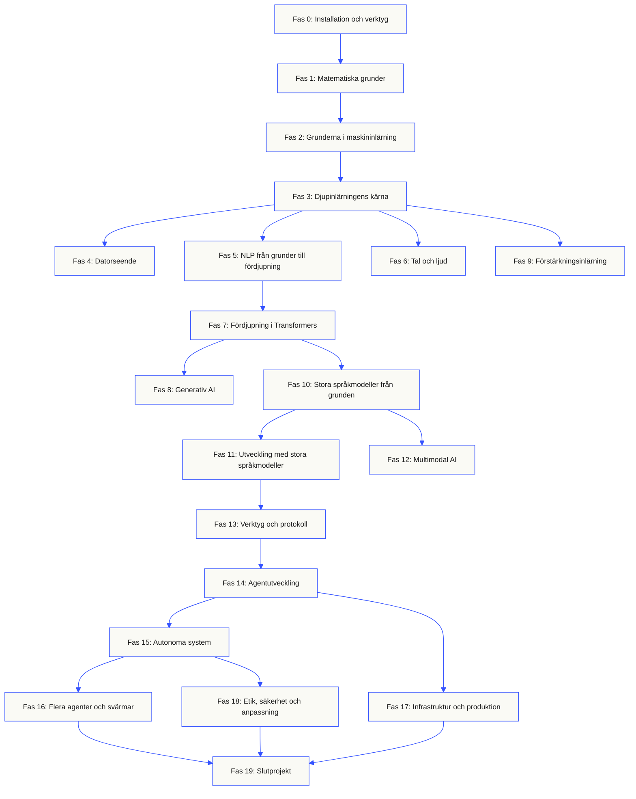

<p align="center"><sub>Den här README-filen är översatt till svenska. <a href="../../README.md">Den engelska README-filen</a> är den auktoritativa källan.</sub></p>

<p align="center">
  <picture>
    <source media="(prefers-color-scheme: dark)" srcset="../../assets/readme/header-dark.svg">
    
  </picture>
</p>

Implementera modellers interna mekanismer, sökpipelines och körmiljöer för agenter. Testa dem, undersök fel och spara koden och utvärderingsresultaten.

**[Börja lära dig](https://aiengineeringfromscratch.com/lesson?path=phases/00-setup-and-tooling/01-dev-environment)** · **[Välj en väg](#learning-routes)** · **[Prova ett labb](#interactive-lab)** · **[Bygg ett projekt](#project-challenges)** · **[Bläddra i kursplanen](#contents)**

Gratis, öppen källkod, MIT-licens. Lär dig på webbplatsen, med en kodningsagent eller genom att köra kod lokalt.

> 523 lektioner. 20 faser. Python, TypeScript, Rust, Julia.

<p align="center">
  <a href="../../LICENSE"></a>
  <a href="../../ROADMAP.md"></a>
  <a href="#contents"></a>
  <a href="https://github.com/rohitg00/ai-engineering-from-scratch/stargazers"></a>
  <a href="https://aiengineeringfromscratch.com"></a>
</p>

<details>
<summary>Läs på ditt språk</summary>

<p align="center">
  <a href="../../README.md">🇬🇧 English</a> · <a href="../../i18n/zh/README.md">🇨🇳 简体中文</a> · <a href="../../i18n/zh-TW/README.md">🇹🇼 繁體中文（台灣）</a> · <a href="../../i18n/ja/README.md">🇯🇵 日本語</a> · <a href="../../i18n/ko/README.md">🇰🇷 한국어</a> · <a href="../../i18n/pt/README.md">🇵🇹 Português</a> · <a href="../../i18n/pt-BR/README.md">🇧🇷 Português (Brasil)</a> · <a href="../../i18n/es/README.md">🇪🇸 Español</a> · <a href="../../i18n/de/README.md">🇩🇪 Deutsch</a> · <a href="../../i18n/fr/README.md">🇫🇷 Français</a> · <a href="../../i18n/it/README.md">🇮🇹 Italiano</a> · <a href="../../i18n/nl/README.md">🇳🇱 Nederlands</a> · <a href="../../i18n/pl/README.md">🇵🇱 Polski</a> · <a href="../../i18n/cs/README.md">🇨🇿 Čeština</a> · <a href="../../i18n/ro/README.md">🇷🇴 Română</a> · <a href="../../i18n/hu/README.md">🇭🇺 Magyar</a> · <a href="../../i18n/el/README.md">🇬🇷 Ελληνικά</a> · <a href="../../i18n/sv/README.md">🇸🇪 Svenska</a> · <a href="../../i18n/da/README.md">🇩🇰 Dansk</a> · <a href="../../i18n/no/README.md">🇳🇴 Norsk</a> · <a href="../../i18n/fi/README.md">🇫🇮 Suomi</a> · <a href="../../i18n/ru/README.md">🇷🇺 Русский</a> · <a href="../../i18n/uk/README.md">🇺🇦 Українська</a> · <a href="../../i18n/tr/README.md">🇹🇷 Türkçe</a> · <a href="../../i18n/he/README.md">🇮🇱 עברית</a> · <a href="../../i18n/ar/README.md">🇸🇦 العربية</a> · <a href="../../i18n/fa/README.md">🇮🇷 فارسی</a> · <a href="../../i18n/hi/README.md">🇮🇳 हिन्दी</a> · <a href="../../i18n/bn/README.md">🇧🇩 বাংলা</a> · <a href="../../i18n/ur/README.md">🇵🇰 اردو</a> · <a href="../../i18n/th/README.md">🇹🇭 ไทย</a> · <a href="../../i18n/vi/README.md">🇻🇳 Tiếng Việt</a> · <a href="../../i18n/id/README.md">🇮🇩 Bahasa Indonesia</a> · <a href="../../i18n/tl/README.md">🇵🇭 Tagalog</a>
</p>

</details>

### Sponsorer

<p align="center">
  <a href="https://serpapi.com/ai-engineering-from-scratch"><picture><source media="(min-width: 768px)" srcset="../../assets/sponsors/serpapi-banner-compact.png" width="48%"></picture></a>
  <a href="https://nitrostack.ai/referral/aiengineeringfromscratch"><picture><source media="(min-width: 768px)" srcset="../../assets/sponsors/nitrostack-banner-equal.png" width="48%"></picture></a>
</p>

<p align="center">
  <sub><span>Ditt stöd håller varje lektion gratis och med öppen källkod.</span> <a href="#supporters">Se alla som stöder projektet</a> · <a href="../../SPONSORS.md">Bli sponsor</a></sub>
</p>

<a id="see-what-you-will-build-and-keep"></a>
<a id="learning-routes"></a>

## Lärvägar

| Lärväg | Första lektionen |
|---|---|
| Modellernas grunder | [Installation och verktyg](https://aiengineeringfromscratch.com/lesson?path=phases/00-setup-and-tooling/01-dev-environment) |
| LLM-system | [Promptteknik](https://aiengineeringfromscratch.com/lesson?path=phases/11-llm-engineering/01-prompt-engineering) |
| Agenter och systemleverans | [Agentloopen](https://aiengineeringfromscratch.com/lesson?path=phases/14-agent-engineering/01-the-agent-loop) |

[Jämför karriärvägar](https://aiengineeringfromscratch.com/learning-paths.html) · [Förkunskaper och studietid](#study-guide)

<a id="interactive-lab"></a>

### Gradientnedstigning

Tjugo startpunkter följer gradientnedstigning på en kvadratisk förlustfunktion. Grafen visar deras positioner och medelförlusten efter varje uppdatering.

<p align="center">
  <a href="https://aiengineeringfromscratch.com/lesson?path=phases/01-math-foundations/08-optimization#loss-landscape-visualization">
    <picture>
      <source media="(max-width: 600px) and (prefers-color-scheme: dark) and (prefers-reduced-motion: reduce)" srcset="../../assets/readme/101-gradient-mobile-dark.png">
      <source media="(max-width: 600px) and (prefers-reduced-motion: reduce)" srcset="../../assets/readme/101-gradient-mobile-light.png">
      <source media="(prefers-color-scheme: dark) and (prefers-reduced-motion: reduce)" srcset="../../assets/readme/101-gradient-dark.png">
      <source media="(prefers-reduced-motion: reduce)" srcset="../../assets/readme/101-gradient-light.png">
      <source media="(max-width: 600px) and (prefers-color-scheme: dark)" srcset="../../assets/readme/101-gradient-mobile-dark.gif">
      <source media="(max-width: 600px)" srcset="../../assets/readme/101-gradient-mobile-light.gif">
      <source media="(prefers-color-scheme: dark)" srcset="../../assets/readme/101-gradient-dark.gif">
      
    </picture>
  </a>
</p>

[Justera inlärningshastigheten i lektionen](https://aiengineeringfromscratch.com/lesson?path=phases/01-math-foundations/08-optimization#loss-landscape-visualization) · [Jämför gradientnedstigning, momentum och Adam i kod](../../phases/01-math-foundations/08-optimization/code/optimizers.py)

<a id="project-challenges"></a>

### Projekt

Tre projekt med startkod för varje etapp, referensimplementationer och lokala bedömningsverktyg. Kör kommandona från repots rot efter [installationen](#local-setup). Startkoden klarar inte kontrollerna förrän du har implementerat etapperna.

<details>
<summary><strong>01 · Labb för sökutvärdering</strong> · Python · Rangordningsmått och regressionskontroller</summary>

En kandidat förbättrar genomsnittlig NDCG medan en fråga rankar sina mest relevanta belägg lägre. Bygg en jämförelse fråga för fråga som rapporterar regressionen och kan underkänna en releasekontroll.

Använd Python 3.10+. Repetera [RAG](../../phases/11-llm-engineering/06-rag/docs/en.md) och [modellutvärdering](../../phases/02-ml-fundamentals/09-model-evaluation/docs/en.md). Implementera validering av rankning, precision och recall, positionskänsliga mått och därefter systemjämförelse.

```bash
python3 scripts/project_test.py retrieval-evaluation-lab \
  --init learning-artifacts/retrieval-evaluation-lab
python3 scripts/project_test.py retrieval-evaluation-lab \
  --stage 1 --path learning-artifacts/retrieval-evaluation-lab --strict
python3 scripts/project_test.py retrieval-evaluation-lab \
  --all --path learning-artifacts/retrieval-evaluation-lab --strict
```

**Spara:** en reproducerbar jämförelse med förändringar per fråga och relevansbedömningarna som används för poängen. Måtten beskriver dessa bedömningar; de fastställer inte att svaren är korrekta.

[Starta projektet](https://aiengineeringfromscratch.com/project.html?id=retrieval-evaluation-lab) · [Granska referensen](../../projects/retrieval-evaluation-lab/solution/) · [Kör med egna indata](../../projects/retrieval-evaluation-lab/README.md#run-with-your-own-inputs)

</details>

<details>
<summary><strong>02 · Felsökare för agentspår</strong> · TypeScript · Tolkning av spår och tidsmätning</summary>

Ett medföljande spår tar fortfarande 100 ms, men den totala tokenanvändningen ökar med 200 och ett span börjar misslyckas. Skilj överlappande arbete i underordnade span från det överordnade spannets körtid och skapa en rapport som visar förändringen.

Använd Node.js 22.18+ och Python 3 för bedömaren. Implementera JSONL-tolkning, validering av överordnade span, intervallaritmetik och därefter en tidslinje som går att granska.

```bash
python3 scripts/project_test.py agent-trace-debugger \
  --init learning-artifacts/agent-trace-debugger
python3 scripts/project_test.py agent-trace-debugger \
  --stage 1 --path learning-artifacts/agent-trace-debugger --strict
python3 scripts/project_test.py agent-trace-debugger \
  --all --path learning-artifacts/agent-trace-debugger --strict
```

**Spara:** indataspåret, en HTML-tidslinje och en regressionsrapport i JSON. Bevara varje spans egna tokenantal utan underordnade span, så att överordnad och underordnad användning inte räknas dubbelt.

[Starta projektet](https://aiengineeringfromscratch.com/project.html?id=agent-trace-debugger) · [Granska referensen](../../projects/agent-trace-debugger/solution/) · [Utforska tidsåtgång interaktivt](https://aiengineeringfromscratch.com/project.html?id=agent-trace-debugger&stage=03-timing)

</details>

<details>
<summary><strong>03 · Brandvägg för verktygsanrop</strong> · Rust · Rollkontroller och godkännandekvitton</summary>

En skrivoperation ändras efter granskning, eller ett godkännande återanvänds. Validera anropets hölje, kontrollera anroparens roll och sökväg och förbruka sedan ett godkännande bundet till exakt begäran och innehåll.

Använd Rust och Python 3.10+. Repetera [utformning av verktygsscheman](../../phases/13-tools-and-protocols/05-tool-schema-design/docs/en.md) och [säkerhetsgränser](../../phases/17-infrastructure-and-production/25-security-secrets-audit/docs/en.md). Den anropande applikationen tillhandahåller identiteten; modellen föreslår en operation.

```bash
python3 scripts/project_test.py tool-call-firewall \
  --init learning-artifacts/tool-call-firewall
python3 scripts/project_test.py tool-call-firewall \
  --stage 1 --path learning-artifacts/tool-call-firewall --strict
python3 scripts/project_test.py tool-call-firewall \
  --all --path learning-artifacts/tool-call-firewall --strict
```

**Spara:** ett granskningskvitto som visar begärd operation och policybeslutet. Godkännanden får användas en gång inom ett anrop; projektet ger inte bestående auktorisering eller en sandlåda på operativsystemnivå.

[Starta projektet](https://aiengineeringfromscratch.com/project.html?id=tool-call-firewall) · [Granska referensen](../../projects/tool-call-firewall/solution/) · [Utforska godkännandegränser](https://aiengineeringfromscratch.com/project.html?id=tool-call-firewall&stage=03-consume-a-request-bound-approval-once)

</details>

[Bläddra bland alla projekt](https://aiengineeringfromscratch.com/projects.html) · [Guide till karriärövningar](../../learning-paths/CAREER-PRACTICE.md)

## Välj hur du vill lära dig

### På webbplatsen

Öppna en färdig lektion på [aiengineeringfromscratch.com](https://aiengineeringfromscratch.com) eller fäll ut en fas under [Innehåll](#contents). Ingen installation eller kloning behövs.

### Med en AI-handledare

Om Node.js, `npx` och en kodagent som stöder färdigheter redan är installerade kan kodagenten bli din handledare. Du behöver inte klona arkivet för att installera eller läsa handledaren. Körbara laborationer i de fokuserade studievägarna kräver `python3`. Agent Skills-laborationer kräver också en vald värdapplikation och en skrivbar färdighetskatalog för användaren eller projektet.

```bash
npx skills add rohitg00/ai-engineering-from-scratch
```

Välj värdmiljö och omfattning när installationsprogrammet frågar. Använd `start-learning` i Codex, `/start-learning` i Claude Code eller be värdmiljön använda färdigheten vid namn.

<details>
<summary>Konfigurera handledaren och värdmiljöns kommandon</summary>

Kontrollera först de lokala kraven:

```bash
node --version
npx --version
python3 --version
```

`skills` skriver till den värdapplikation och omfattning som väljs vid installationen, till exempel `.claude/skills/`, `.cursor/skills/`, `.codex/skills/` eller en annan stödd färdighetskatalog. Kontrollera att den valda värdapplikationen hittar just den katalogen.

Anropssyntaxen bestäms av värdapplikationen, inte av det portabla formatet `SKILL.md`:

| Värdapplikation | Börja kursen | Börja med Model Context Protocol (MCP) | Börja med Agent Skills | Gör ett kunskapstest för en fas |
|---|---|---|---|---|
| Codex | `start-learning`, eller välj den från `/skills` | `learn-mcp`, eller välj den från `/skills` | `learn-agent-skills`, eller välj den från `/skills` | `check-understanding 13`, eller välj den från `/skills` |
| Claude Code | `/start-learning` | `/learn-mcp` | `/learn-agent-skills` | `/check-understanding 13` |
| Andra kompatibla värdapplikationer | `Use start-learning to begin the course.` | `Use learn-mcp to start the Model Context Protocol (MCP) path.` | `Use learn-agent-skills to start the Agent Skills Engineering path.` | `Use check-understanding to quiz me on Phase 13.` |

Ett nivåtest med tio frågor kopplar dina förkunskaper till en lämplig startfas och sparar en personlig studieplan i `LEARNING.md`. Därefter lär färdigheten `learn` ut en lektion per session: begrepp, matematik, kod och kunskapstest. Den hämtar lektioner direkt från det här arkivet, och `course-guide` tar dig till precis den lektion som behandlar det du fastnat på. Anropa färdigheterna med `learn` och `course-guide` i Codex, med `/learn` och `/course-guide` i Claude Code, eller be en annan kompatibel värdapplikation att använda färdigheten vid namn.

Vill du bara lära dig Model Context Protocol (MCP)? Använd MCP-anropet för din värdapplikation. Det skapar `MCP-LEARNING.md` och följer en sammanhållen väg med 17 lektioner om tillståndslösa förfrågningar, transporter, dubbelriktat arbete, säkerhet, tillförlitlighet, registerstyrning och belägg för protokollefterlevnad. Den exakta ordningen och kontrollpunkterna finns i [manifestet för Model Context Protocol (MCP)](../../learning-paths/model-context-protocol.json).

Vill du bara lära dig Agent Skills? Använd Agent Skills-anropet för din värdapplikation. Det skapar `AGENT-SKILLS-LEARNING.md` och följer fem sammanhängande lektioner: kontrakt, upptäckt, anrop, sandlådegränser och slutligen utvärdering inför publicering samt portabilitet mellan riktiga värdapplikationer. Börja på webben med [studievägen för Agent Skills](https://aiengineeringfromscratch.com/lesson?path=phases/13-tools-and-protocols/22-skills-and-agent-sdks&learningPath=agent-skills).

Installationsprogrammet visar vilka värdapplikationer det kan konfigurera och frågar var färdigheterna ska installeras. Om du ännu saknar Node.js, `npx`, `python3`, en kompatibel värdapplikation eller en skrivbar katalog kan du använda webbplatsen eller läsa `docs/en.md` manuellt. Då lär du dig begreppen, men belägg för upptäckt, anrop, skriptkörning och avinstallation i en riktig värdapplikation får vänta tills förkontrollen kan genomföras. Läs lektionerna på [aiengineeringfromscratch.com](https://aiengineeringfromscratch.com).

### Lärandefärdigheterna

| Färdighet | Vad den gör |
|---|---|
| [`start-learning`](../../skills/start-learning/SKILL.md) | Introduktion vid kursstart: varför du lär dig, nivåtest och en personlig plan sparad i `LEARNING.md`. |
| [`learn`](../../skills/learn/SKILL.md) | Handledarens arbetsgång. Repetition som uppvärmning, sedan nästa lektion interaktivt och dess kunskapstest; framsteg och repetitionsbehov sparas. |
| [`course-guide`](../../skills/course-guide/SKILL.md) | Ämnesvägvisare. ”Var lär jag mig attention?” eller ”min förlust är NaN” → rätt lektioner, med länkar. |
| [`learn-mcp`](../../skills/learn-mcp/SKILL.md) | Fokuserad handledare för Model Context Protocol (MCP). Skapar `MCP-LEARNING.md`, följer manifestets 17 lektioner och sparar belägg för meddelandeutbyte, säkerhet, tillförlitlighet och protokollefterlevnad. |
| [`learn-agent-skills`](../../skills/learn-agent-skills/SKILL.md) | Fokuserad handledare för Agent Skills. Skapar `AGENT-SKILLS-LEARNING.md`, undervisar i lektionerna 22, 24, 25, 26 och 27 och sparar belägg från riktiga värdapplikationer. |
| [`claude-certification`](../../skills/claude-certification/SKILL.md) | Certifieringshandledare. Väljer CCAO-F, CCDV-F, CCAR-F eller CCAR-P, undervisar i varje lektion, kör laborationer, granskar arbetsresultat, genomför diagnostiska prov och övningsprov samt sparar framsteg. |
| [`mcpa-certification`](../../skills/mcpa-certification/SKILL.md) | MCPA-handledare. Följer `mcpa-f` med 34 lektioner om protokollet 2026-07-28, undervisar i varje lektion, kör laborationer och meddelandekontroll, genomför det diagnostiska provet och tre övningsprov samt sparar framsteg. |
| [`find-your-level`](../../skills/find-your-level/SKILL.md) | Nivåtest med tio frågor. Kopplar dina kunskaper till en lämplig startfas och skapar en personlig studieväg med uppskattad tidsåtgång. |
| [`check-understanding <phase>`](../../skills/check-understanding/SKILL.md) | Åtta frågor per fas med återkoppling och konkreta lektioner att repetera. Använd formen för Codex, Claude Code eller naturligt språk i anropstabellen ovan. |

</details>

<a id="local-setup"></a>

### Kör kod lokalt

```bash
git clone https://github.com/rohitg00/ai-engineering-from-scratch.git
cd ai-engineering-from-scratch
python3 phases/00-setup-and-tooling/01-dev-environment/code/verify.py --route beginner
python3 phases/01-math-foundations/01-linear-algebra-intuition/code/vectors.py
```

Förkontrollen skiljer kraven som behövs nu från verktygen som behövs senare. Varje obligatoriskt krav som inte uppfylls visas med den upptäckta orsaken och ett kommando som åtgärdar problemet. Kommandot `vectors.py` kör en lektion utan externa beroenden och avslutar med att visa att en matris multiplicerad med en vektor är operationen inuti ett neuralt nätverkslager. Spara terminalutdata som ditt första belägg.

<details>
<summary>Arbeta med varje lektion på samma sätt</summary>

### Arbeta med varje lektion på samma sätt

1. **Läs** `docs/en.md` och förklara huvudidén med egna ord.
2. **Skriv och bygg** den viktiga koden i stället för att behandla kodblocket som dekoration.
3. **Kör** lektionens kommando från kodarkivets rot, katalogen som innehåller `README.md` och `phases/`.
4. **Spara belägg**: kommandot, arbetskatalogen, avslutningskoden, meningsfull utdata och det resultat du ändrade eller skapade.
5. **Fortsätt** först när du kan förklara resultatet och göra en liten ändring utan att gissa.

Sökvägar i lektionssidornas kommandon utgår från kodarkivets rot om lektionen inte uttryckligen säger att du ska byta katalog. Om en lektion finns på flera programmeringsspråk kör du implementationen för språket du lär dig.

</details>

<a id="study-guide"></a>

## Välj en lärväg

Du behöver inte gå igenom 523 lektioner innan du börjar. Välj ett mål. Varje länk öppnar samma läroplan på GitHub eller webbplatsen, och båda versionerna använder samma lektionskod.

| Ditt mål | Lär dig på GitHub | Lär dig på webbplatsen |
|---|---|---|
| Jag är nybörjare och vill ha en komplett grund | [Fas 0: Installation och verktyg](../../phases/00-setup-and-tooling/) | [Utvecklingsmiljö](https://aiengineeringfromscratch.com/lesson?path=phases/00-setup-and-tooling/01-dev-environment) |
| Jag kan Python och vill lära mig grunderna i matematik och maskininlärning | [Fas 1: Matematiska grunder](../../phases/01-math-foundations/) | [Intuition för linjär algebra](https://aiengineeringfromscratch.com/lesson?path=phases/01-math-foundations/01-linear-algebra-intuition) |
| Jag vill bygga LLM-applikationer för produktion | [Fas 11: LLM-utveckling](../../phases/11-llm-engineering/) | [Promptutveckling](https://aiengineeringfromscratch.com/lesson?path=phases/11-llm-engineering/01-prompt-engineering) |
| Jag vill bygga agenter | [Fas 14: Agentutveckling](../../phases/14-agent-engineering/) | [Agentloopen](https://aiengineeringfromscratch.com/lesson?path=phases/14-agent-engineering/01-the-agent-loop) |
| Jag vill använda kodningsagenter i riktiga kodarkiv | [Studieväg för agentassisterad utveckling](../../learning-paths/using-coding-agents.json) | [Agentassisterad utveckling](https://aiengineeringfromscratch.com/lesson?path=phases/14-agent-engineering/31-agent-workbench-why-models-fail&learningPath=using-coding-agents) |
| Jag vill avgöra vad som ska byggas före implementationen | [Studieväg för produktbedömning och leverans](../../learning-paths/shaping-the-build.json) | [Produktbedömning och leverans](https://aiengineeringfromscratch.com/lesson?path=phases/14-agent-engineering/47-outcomes-before-output&learningPath=shaping-the-build) |

Osäker på var du ska börja? Använd [handledaren `start-learning` för nivåbedömning](../../skills/start-learning/SKILL.md) eller [webbplatsens guide till förkunskaper](https://aiengineeringfromscratch.com/prereqs.html).

Jämför fyra kärnområden och sex karriärvägar i [studievägarna för AI-utveckling](https://aiengineeringfromscratch.com/learning-paths.html).

<details>
<summary>Fokuserade lärvägar för MCP och Agent Skills</summary>

| Ditt mål | Lär dig på GitHub | Lär dig på webbplatsen |
|---|---|---|
| Jag vill bygga med Model Context Protocol (MCP) | [Studieväg för Model Context Protocol (MCP)](../../phases/13-tools-and-protocols/README.md#model-context-protocol-mcp-path) | [Studieväg för Model Context Protocol (MCP)](https://aiengineeringfromscratch.com/lesson?path=phases/13-tools-and-protocols/06-mcp-fundamentals&learningPath=model-context-protocol) |
| Jag vill skriva och publicera Agent Skills | [Fokuserad studieväg för Agent Skills](../../phases/13-tools-and-protocols/README.md#agent-skills-fast-path) | [Studieväg för Agent Skills](https://aiengineeringfromscratch.com/lesson?path=phases/13-tools-and-protocols/22-skills-and-agent-sdks&learningPath=agent-skills) |

</details>

<details>
<summary>Förkunskaper och studietid</summary>

### Förkunskaper

- Du kan skriva kod i något språk; Python är en fördel.
- Du vill förstå hur AI **faktiskt fungerar**, inte bara anropa API:er.

## Var ska du börja?

| Bakgrund | Börja vid | Uppskattad tid |
|---|---|---|
| Ny inom programmering och AI | Fas 0: Installation | ~306 timmar |
| Kan Python, ny inom ML | Fas 1: Matematiska grunder | ~270 timmar |
| Kan ML, ny inom djupinlärning | Fas 3: Djupinlärningens kärna | ~200 timmar |
| Kan djupinlärning och vill lära sig språkmodeller och agenter | Fas 10: Stora språkmodeller från grunden | ~100 timmar |
| Erfaren utvecklare som bara vill lära sig agentutveckling | Fas 14: Agentutveckling | ~60 timmar |
| Vill bara bygga MCP-system för produktion | [Studievägen för Model Context Protocol (MCP)](../../learning-paths/model-context-protocol.json) | ~23 timmar 15 min |
| Vill bara bygga Agent Skills för produktion | [Studievägen för utveckling av Agent Skills](../../learning-paths/agent-skills.json) | ~9.5 timmar |

</details>

## Läroplanens upplägg

Tjugo faser bygger på varandra. Matematiken är grunden. Agenter och produktion är de översta lagren. Hoppa framåt om du redan kan grunderna, men hoppa inte över dem och undra sedan varför något högre upp går sönder.



<a id="contents"></a>

## Innehåll

Tjugo faser. Klicka på en fas för att fälla ut lektionslistan.

<a id="phase-0"></a>
### Fas 0: Installation och verktyg `12 lektioner`
> Gör miljön redo för allt som följer.

| # | Lektion | Typ | Språk |
|:---:|--------|:----:|------|
| 01 | [Utvecklingsmiljö](../../phases/00-setup-and-tooling/01-dev-environment/) | Bygg | Python |
| 02 | [Git och samarbete](../../phases/00-setup-and-tooling/02-git-and-collaboration/) | Lär dig | — |
| 03 | [GPU-konfiguration och molnet](../../phases/00-setup-and-tooling/03-gpu-setup-and-cloud/) | Bygg | Python |
| 04 | [API:er och nycklar](../../phases/00-setup-and-tooling/04-apis-and-keys/) | Bygg | Python |
| 05 | [Jupyter-anteckningsböcker](../../phases/00-setup-and-tooling/05-jupyter-notebooks/) | Bygg | Python |
| 06 | [Python-miljöer](../../phases/00-setup-and-tooling/06-python-environments/) | Bygg | Shell |
| 07 | [Docker för AI](../../phases/00-setup-and-tooling/07-docker-for-ai/) | Bygg | Docker |
| 08 | [Konfigurera editorn](../../phases/00-setup-and-tooling/08-editor-setup/) | Bygg | — |
| 09 | [Datahantering](../../phases/00-setup-and-tooling/09-data-management/) | Bygg | Python |
| 10 | [Terminal och skal](../../phases/00-setup-and-tooling/10-terminal-and-shell/) | Lär dig | — |
| 11 | [Linux för AI](../../phases/00-setup-and-tooling/11-linux-for-ai/) | Lär dig | — |
| 12 | [Felsökning och profilering](../../phases/00-setup-and-tooling/12-debugging-and-profiling/) | Bygg | Python |

<details id="phase-1">
<summary><b>Fas 1: Matematiska grunder</b> &nbsp;<code>22 lektioner</code>&nbsp; <em>Intuitionen bakom varje AI-algoritm, genom kod.</em></summary>
<br/>

| # | Lektion | Typ | Språk |
|:---:|--------|:----:|------|
| 01 | [Intuition för linjär algebra](../../phases/01-math-foundations/01-linear-algebra-intuition/) | Lär dig | Python, Julia |
| 02 | [Vektorer, matriser och operationer](../../phases/01-math-foundations/02-vectors-matrices-operations/) | Bygg | Python, Julia |
| 03 | [Matristransformationer och egenvärden](../../phases/01-math-foundations/03-matrix-transformations/) | Bygg | Python, Julia |
| 04 | [Analys för ML: derivator och gradienter](../../phases/01-math-foundations/04-calculus-for-ml/) | Lär dig | Python |
| 05 | [Kedjeregeln och automatisk differentiering](../../phases/01-math-foundations/05-chain-rule-and-autodiff/) | Bygg | Python |
| 06 | [Sannolikhet och fördelningar](../../phases/01-math-foundations/06-probability-and-distributions/) | Lär dig | Python |
| 07 | [Bayes sats och statistiskt tänkande](../../phases/01-math-foundations/07-bayes-theorem/) | Bygg | Python |
| 08 | [Optimering: varianter av gradientnedstigning](../../phases/01-math-foundations/08-optimization/) | Bygg | Python |
| 09 | [Informationsteori: entropi och KL-divergens](../../phases/01-math-foundations/09-information-theory/) | Lär dig | Python |
| 10 | [Dimensionsreduktion: PCA, t-SNE, UMAP](../../phases/01-math-foundations/10-dimensionality-reduction/) | Bygg | Python |
| 11 | [Singulärvärdesuppdelning](../../phases/01-math-foundations/11-singular-value-decomposition/) | Bygg | Python, Julia |
| 12 | [Tensoroperationer](../../phases/01-math-foundations/12-tensor-operations/) | Bygg | Python |
| 13 | [Numerisk stabilitet](../../phases/01-math-foundations/13-numerical-stability/) | Bygg | Python |
| 14 | [Normer och avstånd](../../phases/01-math-foundations/14-norms-and-distances/) | Bygg | Python |
| 15 | [Statistik för ML](../../phases/01-math-foundations/15-statistics-for-ml/) | Bygg | Python |
| 16 | [Samplingsmetoder](../../phases/01-math-foundations/16-sampling-methods/) | Bygg | Python |
| 17 | [Linjära system](../../phases/01-math-foundations/17-linear-systems/) | Bygg | Python |
| 18 | [Konvex optimering](../../phases/01-math-foundations/18-convex-optimization/) | Bygg | Python |
| 19 | [Komplexa tal för AI](../../phases/01-math-foundations/19-complex-numbers/) | Lär dig | Python |
| 20 | [Fouriertransformen](../../phases/01-math-foundations/20-fourier-transform/) | Bygg | Python |
| 21 | [Grafteori för ML](../../phases/01-math-foundations/21-graph-theory/) | Bygg | Python |
| 22 | [Stokastiska processer](../../phases/01-math-foundations/22-stochastic-processes/) | Lär dig | Python |

</details>

<details id="phase-2">
<summary><b>Fas 2: Grunderna i maskininlärning</b> &nbsp;<code>18 lektioner</code>&nbsp; <em>Klassisk ML är fortfarande grunden för de flesta AI-system i produktion.</em></summary>
<br/>

| # | Lektion | Typ | Språk |
|:---:|--------|:----:|------|
| 01 | [Vad är maskininlärning?](../../phases/02-ml-fundamentals/01-what-is-machine-learning/) | Lär dig | Python |
| 02 | [Linjär regression från grunden](../../phases/02-ml-fundamentals/02-linear-regression/) | Bygg | Python |
| 03 | [Logistisk regression och klassificering](../../phases/02-ml-fundamentals/03-logistic-regression/) | Bygg | Python |
| 04 | [Beslutsträd och slumpmässiga skogar](../../phases/02-ml-fundamentals/04-decision-trees/) | Bygg | Python |
| 05 | [Stödvektormaskiner](../../phases/02-ml-fundamentals/05-support-vector-machines/) | Bygg | Python |
| 06 | [KNN och avståndsmått](../../phases/02-ml-fundamentals/06-knn-and-distances/) | Bygg | Python |
| 07 | [Oövervakad inlärning: K-Means, DBSCAN](../../phases/02-ml-fundamentals/07-unsupervised-learning/) | Bygg | Python |
| 08 | [Konstruktion och urval av egenskaper](../../phases/02-ml-fundamentals/08-feature-engineering/) | Bygg | Python |
| 09 | [Modellutvärdering: mått och korsvalidering](../../phases/02-ml-fundamentals/09-model-evaluation/) | Bygg | Python |
| 10 | [Bias, varians och inlärningskurvan](../../phases/02-ml-fundamentals/10-bias-variance/) | Lär dig | Python |
| 11 | [Ensemblemetoder: boosting, bagging, stacking](../../phases/02-ml-fundamentals/11-ensemble-methods/) | Bygg | Python |
| 12 | [Justering av hyperparametrar](../../phases/02-ml-fundamentals/12-hyperparameter-tuning/) | Bygg | Python |
| 13 | [ML-pipelines och experimentuppföljning](../../phases/02-ml-fundamentals/13-ml-pipelines/) | Bygg | Python |
| 14 | [Naiv Bayes](../../phases/02-ml-fundamentals/14-naive-bayes/) | Bygg | Python |
| 15 | [Grunderna i tidsserier](../../phases/02-ml-fundamentals/15-time-series/) | Bygg | Python |
| 16 | [Avvikelsedetektering](../../phases/02-ml-fundamentals/16-anomaly-detection/) | Bygg | Python |
| 17 | [Hantera obalanserade data](../../phases/02-ml-fundamentals/17-imbalanced-data/) | Bygg | Python |
| 18 | [Egenskapsurval](../../phases/02-ml-fundamentals/18-feature-selection/) | Bygg | Python |

</details>

<details id="phase-3">
<summary><b>Fas 3: Djupinlärningens kärna</b> &nbsp;<code>13 lektioner</code>&nbsp; <em>Neurala nätverk från grundprinciperna. Inga ramverk förrän du har byggt ett själv.</em></summary>
<br/>

| # | Lektion | Typ | Språk |
|:---:|--------|:----:|------|
| 01 | [Perceptronen: där allt började](../../phases/03-deep-learning-core/01-the-perceptron/) | Bygg | Python |
| 02 | [Flerskiktsnätverk och framåtpassagen](../../phases/03-deep-learning-core/02-multi-layer-networks/) | Bygg | Python |
| 03 | [Bakåtpropagering från grunden](../../phases/03-deep-learning-core/03-backpropagation/) | Bygg | Python |
| 04 | [Aktiveringsfunktioner: ReLU, Sigmoid, GELU och varför](../../phases/03-deep-learning-core/04-activation-functions/) | Bygg | Python |
| 05 | [Förlustfunktioner: MSE, korsentropi och kontrastiv förlust](../../phases/03-deep-learning-core/05-loss-functions/) | Bygg | Python |
| 06 | [Optimerare: SGD, Momentum, Adam, AdamW](../../phases/03-deep-learning-core/06-optimizers/) | Bygg | Python |
| 07 | [Regularisering: Dropout, Weight Decay, BatchNorm](../../phases/03-deep-learning-core/07-regularization/) | Bygg | Python |
| 08 | [Viktinitiering och träningsstabilitet](../../phases/03-deep-learning-core/08-weight-initialization/) | Bygg | Python |
| 09 | [Scheman för inlärningshastighet och uppvärmning](../../phases/03-deep-learning-core/09-learning-rate-schedules/) | Bygg | Python |
| 10 | [Bygg ditt eget miniramverk](../../phases/03-deep-learning-core/10-mini-framework/) | Bygg | Python |
| 11 | [Introduktion till PyTorch](../../phases/03-deep-learning-core/11-intro-to-pytorch/) | Bygg | Python |
| 12 | [Introduktion till JAX](../../phases/03-deep-learning-core/12-intro-to-jax/) | Bygg | Python |
| 13 | [Felsöka neurala nätverk](../../phases/03-deep-learning-core/13-debugging-neural-networks/) | Bygg | Python |

</details>

<details id="phase-4">
<summary><b>Fas 4: Datorseende</b> &nbsp;<code>28 lektioner</code>&nbsp; <em>Från pixlar till förståelse: bild, video, 3D, VLM och världsmodeller.</em></summary>
<br/>

| # | Lektion | Typ | Språk |
|:---:|--------|:----:|------|
| 01 | [Bildgrunder: pixlar, kanaler och färgrymder](../../phases/04-computer-vision/01-image-fundamentals/) | Lär dig | Python |
| 02 | [Faltningar från grunden](../../phases/04-computer-vision/02-convolutions-from-scratch/) | Bygg | Python |
| 03 | [CNN:er: från LeNet till ResNet](../../phases/04-computer-vision/03-cnns-lenet-to-resnet/) | Bygg | Python |
| 04 | [Bildklassificering](../../phases/04-computer-vision/04-image-classification/) | Bygg | Python |
| 05 | [Överföringsinlärning och finjustering](../../phases/04-computer-vision/05-transfer-learning/) | Bygg | Python |
| 06 | [Objektdetektering: YOLO från grunden](../../phases/04-computer-vision/06-object-detection-yolo/) | Bygg | Python |
| 07 | [Semantisk segmentering: U-Net](../../phases/04-computer-vision/07-semantic-segmentation-unet/) | Bygg | Python |
| 08 | [Instanssegmentering: Mask R-CNN](../../phases/04-computer-vision/08-instance-segmentation-mask-rcnn/) | Bygg | Python |
| 09 | [Bildgenerering: GAN](../../phases/04-computer-vision/09-image-generation-gans/) | Bygg | Python |
| 10 | [Bildgenerering: diffusionsmodeller](../../phases/04-computer-vision/10-image-generation-diffusion/) | Bygg | Python |
| 11 | [Stable Diffusion: arkitektur och finjustering](../../phases/04-computer-vision/11-stable-diffusion/) | Bygg | Python |
| 12 | [Videoförståelse: tidsmodellering](../../phases/04-computer-vision/12-video-understanding/) | Bygg | Python |
| 13 | [3D-seende: punktmoln och NeRF](../../phases/04-computer-vision/13-3d-vision-nerf/) | Bygg | Python |
| 14 | [Vision Transformers (ViT) för bildanalys](../../phases/04-computer-vision/14-vision-transformers/) | Bygg | Python |
| 15 | [Bildanalys i realtid: driftsättning på kanten](../../phases/04-computer-vision/15-real-time-edge/) | Bygg | Python |
| 16 | [Bygg en komplett pipeline för bildanalys](../../phases/04-computer-vision/16-vision-pipeline-capstone/) | Bygg | Python |
| 17 | [Självövervakad bildanalys: SimCLR, DINO, MAE](../../phases/04-computer-vision/17-self-supervised-vision/) | Bygg | Python |
| 18 | [Bildanalys med öppet ordförråd: CLIP](../../phases/04-computer-vision/18-open-vocab-clip/) | Bygg | Python |
| 19 | [OCR och dokumentförståelse](../../phases/04-computer-vision/19-ocr-document-understanding/) | Bygg | Python |
| 20 | [Bildsökning och metrisk inlärning](../../phases/04-computer-vision/20-image-retrieval-metric/) | Bygg | Python |
| 21 | [Nyckelpunktsdetektering och poseestimering](../../phases/04-computer-vision/21-keypoint-pose/) | Bygg | Python |
| 22 | [3D Gaussian Splatting från grunden](../../phases/04-computer-vision/22-3d-gaussian-splatting/) | Bygg | Python |
| 23 | [Diffusion Transformers och rectified flow](../../phases/04-computer-vision/23-diffusion-transformers-rectified-flow/) | Bygg | Python |
| 24 | [SAM 3 och segmentering med öppet ordförråd](../../phases/04-computer-vision/24-sam3-open-vocab-segmentation/) | Bygg | Python |
| 25 | [Bild-språkmodeller (ViT-MLP-LLM)](../../phases/04-computer-vision/25-vision-language-models/) | Bygg | Python |
| 26 | [Monokulär djup- och geometriuppskattning](../../phases/04-computer-vision/26-monocular-depth/) | Bygg | Python |
| 27 | [Spårning av flera objekt och videominne](../../phases/04-computer-vision/27-multi-object-tracking/) | Bygg | Python |
| 28 | [Världsmodeller och videodiffusion](../../phases/04-computer-vision/28-world-models-video-diffusion/) | Bygg | Python |

</details>

<details id="phase-5">
<summary><b>Fas 5: NLP från grunder till fördjupning</b> &nbsp;<code>29 lektioner</code>&nbsp; <em>Språket är gränssnittet till intelligens.</em></summary>
<br/>

| # | Lektion | Typ | Språk |
|:---:|--------|:----:|------|
| 01 | [Textbearbetning: tokenisering, stamning och lemmatisering](../../phases/05-nlp-foundations-to-advanced/01-text-processing/) | Bygg | Python |
| 02 | [Ordsäck, TF-IDF och textrepresentation](../../phases/05-nlp-foundations-to-advanced/02-bag-of-words-tfidf/) | Bygg | Python |
| 03 | [Ordinbäddningar: Word2Vec från grunden](../../phases/05-nlp-foundations-to-advanced/03-word-embeddings-word2vec/) | Bygg | Python |
| 04 | [GloVe, FastText och delordsinbäddningar](../../phases/05-nlp-foundations-to-advanced/04-glove-fasttext-subword/) | Bygg | Python |
| 05 | [Sentimentanalys](../../phases/05-nlp-foundations-to-advanced/05-sentiment-analysis/) | Bygg | Python |
| 06 | [Identifiering av namngivna entiteter (NER)](../../phases/05-nlp-foundations-to-advanced/06-named-entity-recognition/) | Bygg | Python |
| 07 | [Ordklasstaggning och syntaktisk analys](../../phases/05-nlp-foundations-to-advanced/07-pos-tagging-parsing/) | Bygg | Python |
| 08 | [Textklassificering: CNN och RNN för text](../../phases/05-nlp-foundations-to-advanced/08-cnns-rnns-for-text/) | Bygg | Python |
| 09 | [Sekvens-till-sekvens-modeller](../../phases/05-nlp-foundations-to-advanced/09-sequence-to-sequence/) | Bygg | Python |
| 10 | [Attention-mekanismen: genombrottet](../../phases/05-nlp-foundations-to-advanced/10-attention-mechanism/) | Bygg | Python |
| 11 | [Maskinöversättning](../../phases/05-nlp-foundations-to-advanced/11-machine-translation/) | Bygg | Python |
| 12 | [Textsammanfattning](../../phases/05-nlp-foundations-to-advanced/12-text-summarization/) | Bygg | Python |
| 13 | [System för frågor och svar](../../phases/05-nlp-foundations-to-advanced/13-question-answering/) | Bygg | Python |
| 14 | [Informationsåtervinning och sökning](../../phases/05-nlp-foundations-to-advanced/14-information-retrieval-search/) | Bygg | Python |
| 15 | [Ämnesmodellering: LDA, BERTopic](../../phases/05-nlp-foundations-to-advanced/15-topic-modeling/) | Bygg | Python |
| 16 | [Textgenerering](../../phases/05-nlp-foundations-to-advanced/16-text-generation-pre-transformer/) | Bygg | Python |
| 17 | [Chattbotar: från regler till neurala nätverk](../../phases/05-nlp-foundations-to-advanced/17-chatbots-rule-to-neural/) | Bygg | Python |
| 18 | [Flerspråkig NLP](../../phases/05-nlp-foundations-to-advanced/18-multilingual-nlp/) | Bygg | Python |
| 19 | [Delordstokenisering: BPE, WordPiece, Unigram, SentencePiece](../../phases/05-nlp-foundations-to-advanced/19-subword-tokenization/) | Lär dig | Python |
| 20 | [Strukturerade utdata och begränsad avkodning](../../phases/05-nlp-foundations-to-advanced/20-structured-outputs-constrained-decoding/) | Bygg | Python |
| 21 | [NLI och textuell implikation](../../phases/05-nlp-foundations-to-advanced/21-nli-textual-entailment/) | Lär dig | Python |
| 22 | [Fördjupning i inbäddningsmodeller](../../phases/05-nlp-foundations-to-advanced/22-embedding-models-deep-dive/) | Lär dig | Python |
| 23 | [Strategier för textuppdelning i RAG](../../phases/05-nlp-foundations-to-advanced/23-chunking-strategies-rag/) | Bygg | Python |
| 24 | [Koreferenslösning](../../phases/05-nlp-foundations-to-advanced/24-coreference-resolution/) | Lär dig | Python |
| 25 | [Entitetslänkning och disambiguering](../../phases/05-nlp-foundations-to-advanced/25-entity-linking/) | Bygg | Python |
| 26 | [Relationsextraktion och konstruktion av kunskapsgrafer](../../phases/05-nlp-foundations-to-advanced/26-relation-extraction-kg/) | Bygg | Python |
| 27 | [LLM-utvärdering: RAGAS, DeepEval, G-Eval](../../phases/05-nlp-foundations-to-advanced/27-llm-evaluation-frameworks/) | Bygg | Python |
| 28 | [Utvärdering av lång kontext: NIAH, RULER, LongBench, MRCR](../../phases/05-nlp-foundations-to-advanced/28-long-context-evaluation/) | Lär dig | Python |
| 29 | [Spårning av dialogtillstånd](../../phases/05-nlp-foundations-to-advanced/29-dialogue-state-tracking/) | Bygg | Python |

</details>

<details id="phase-6">
<summary><b>Fas 6: Tal och ljud</b> &nbsp;<code>17 lektioner</code>&nbsp; <em>Hör, förstå och tala.</em></summary>
<br/>

| # | Lektion | Typ | Språk |
|:---:|--------|:----:|------|
| 01 | [Ljudgrunder: vågformer, sampling och FFT](../../phases/06-speech-and-audio/01-audio-fundamentals) | Lär dig | Python |
| 02 | [Spektrogram, melskalan och ljudegenskaper](../../phases/06-speech-and-audio/02-spectrograms-mel-features) | Bygg | Python |
| 03 | [Ljudklassificering](../../phases/06-speech-and-audio/03-audio-classification) | Bygg | Python |
| 04 | [Taligenkänning (ASR)](../../phases/06-speech-and-audio/04-speech-recognition-asr) | Bygg | Python |
| 05 | [Whisper: arkitektur och finjustering](../../phases/06-speech-and-audio/05-whisper-architecture-finetuning) | Bygg | Python |
| 06 | [Talaridentifiering och verifiering](../../phases/06-speech-and-audio/06-speaker-recognition-verification) | Bygg | Python |
| 07 | [Text till tal (TTS)](../../phases/06-speech-and-audio/07-text-to-speech) | Bygg | Python |
| 08 | [Röstkloning och röstomvandling](../../phases/06-speech-and-audio/08-voice-cloning-conversion) | Bygg | Python |
| 09 | [Musikgenerering](../../phases/06-speech-and-audio/09-music-generation) | Bygg | Python |
| 10 | [Ljud-språkmodeller](../../phases/06-speech-and-audio/10-audio-language-models) | Bygg | Python |
| 11 | [Ljudbehandling i realtid](../../phases/06-speech-and-audio/11-real-time-audio-processing) | Bygg | Python |
| 12 | [Bygg en pipeline för en röstassistent](../../phases/06-speech-and-audio/12-voice-assistant-pipeline) | Bygg | Python |
| 13 | [Neurala ljudkodekar: EnCodec, SNAC, Mimi, DAC](../../phases/06-speech-and-audio/13-neural-audio-codecs) | Lär dig | Python |
| 14 | [Talaktivitetsdetektering och turtagning](../../phases/06-speech-and-audio/14-voice-activity-detection-turn-taking) | Bygg | Python |
| 15 | [Strömmande tal till tal: Moshi, Hibiki](../../phases/06-speech-and-audio/15-streaming-speech-to-speech-moshi-hibiki) | Lär dig | Python |
| 16 | [Skydd mot röstförfalskning och ljudvattenmärkning](../../phases/06-speech-and-audio/16-anti-spoofing-audio-watermarking) | Bygg | Python |
| 17 | [Ljudutvärdering: WER, MOS, MMAU och topplistor](../../phases/06-speech-and-audio/17-audio-evaluation-metrics) | Lär dig | Python |

</details>

<details id="phase-7">
<summary><b>Fas 7: Fördjupning i Transformers</b> &nbsp;<code>16 lektioner</code>&nbsp; <em>Arkitekturen som förändrade allt.</em></summary>
<br/>

| # | Lektion | Typ | Språk |
|:---:|--------|:----:|------|
| 01 | [Varför Transformers: problemen med RNN](../../phases/07-transformers-deep-dive/01-why-transformers/) | Lär dig | Python |
| 02 | [Self-attention från grunden](../../phases/07-transformers-deep-dive/02-self-attention-from-scratch/) | Bygg | Python |
| 03 | [Attention med flera huvuden](../../phases/07-transformers-deep-dive/03-multi-head-attention/) | Bygg | Python |
| 04 | [Positionskodning: sinusformad, RoPE, ALiBi](../../phases/07-transformers-deep-dive/04-positional-encoding/) | Bygg | Python |
| 05 | [Hela Transformer-modellen: kodare och avkodare](../../phases/07-transformers-deep-dive/05-full-transformer/) | Bygg | Python |
| 06 | [BERT: maskerad språkmodellering](../../phases/07-transformers-deep-dive/06-bert-masked-language-modeling/) | Bygg | Python |
| 07 | [GPT: kausal språkmodellering](../../phases/07-transformers-deep-dive/07-gpt-causal-language-modeling/) | Bygg | Python |
| 08 | [T5, BART: kodar-avkodarmodeller](../../phases/07-transformers-deep-dive/08-t5-bart-encoder-decoder/) | Lär dig | Python |
| 09 | [Vision Transformers (ViT) för bildanalys](../../phases/07-transformers-deep-dive/09-vision-transformers/) | Bygg | Python |
| 10 | [Transformers för ljud: Whisper-arkitekturen](../../phases/07-transformers-deep-dive/10-audio-transformers-whisper/) | Lär dig | Python |
| 11 | [Expertblandningar (MoE)](../../phases/07-transformers-deep-dive/11-mixture-of-experts/) | Bygg | Python |
| 12 | [KV-cache, Flash Attention och inferensoptimering](../../phases/07-transformers-deep-dive/12-kv-cache-flash-attention/) | Bygg | Python |
| 13 | [Skalningslagar](../../phases/07-transformers-deep-dive/13-scaling-laws/) | Lär dig | Python |
| 14 | [Bygg en Transformer från grunden](../../phases/07-transformers-deep-dive/14-build-a-transformer-capstone/) | Bygg | Python |
| 15 | [Attention-varianter: glidande fönster, gles och differentiell](../../phases/07-transformers-deep-dive/15-attention-variants/) | Bygg | Python |
| 16 | [Spekulativ avkodning: föreslå, verifiera, upprepa](../../phases/07-transformers-deep-dive/16-speculative-decoding/) | Bygg | Python |

</details>

<details id="phase-8">
<summary><b>Fas 8: Generativ AI</b> &nbsp;<code>15 lektioner</code>&nbsp; <em>Skapa bilder, video, ljud, 3D och mycket mer.</em></summary>
<br/>

| # | Lektion | Typ | Språk |
|:---:|--------|:----:|------|
| 01 | [Generativa modeller: klassificering och historia](../../phases/08-generative-ai/01-generative-models-taxonomy-history/) | Lär dig | Python |
| 02 | [Autoenkodare och VAE](../../phases/08-generative-ai/02-autoencoders-vae/) | Bygg | Python |
| 03 | [GAN: generator mot diskriminator](../../phases/08-generative-ai/03-gans-generator-discriminator/) | Bygg | Python |
| 04 | [Villkorade GAN och Pix2Pix](../../phases/08-generative-ai/04-conditional-gans-pix2pix/) | Bygg | Python |
| 05 | [StyleGAN-modellen](../../phases/08-generative-ai/05-stylegan/) | Bygg | Python |
| 06 | [Diffusionsmodeller: DDPM från grunden](../../phases/08-generative-ai/06-diffusion-ddpm-from-scratch/) | Bygg | Python |
| 07 | [Latent diffusion och Stable Diffusion](../../phases/08-generative-ai/07-latent-diffusion-stable-diffusion/) | Bygg | Python |
| 08 | [ControlNet, LoRA och villkorning](../../phases/08-generative-ai/08-controlnet-lora-conditioning/) | Bygg | Python |
| 09 | [Inpainting, outpainting och bildredigering](../../phases/08-generative-ai/09-inpainting-outpainting-editing/) | Bygg | Python |
| 10 | [Videogenerering](../../phases/08-generative-ai/10-video-generation/) | Bygg | Python |
| 11 | [Ljudgenerering](../../phases/08-generative-ai/11-audio-generation/) | Bygg | Python |
| 12 | [3D-generering](../../phases/08-generative-ai/12-3d-generation/) | Bygg | Python |
| 13 | [Flödesmatchning och rectified flows](../../phases/08-generative-ai/13-flow-matching-rectified-flows/) | Bygg | Python |
| 14 | [Utvärdering: FID och CLIP-poäng](../../phases/08-generative-ai/14-evaluation-fid-clip-score/) | Bygg | Python |
| 19 | [Visuell autoregressiv modellering (VAR): förutsäga nästa skala](../../phases/08-generative-ai/19-visual-autoregressive-var/) | Bygg | Python |

</details>

<details id="phase-9">
<summary><b>Fas 9: Förstärkningsinlärning</b> &nbsp;<code>12 lektioner</code>&nbsp; <em>Grunden för RLHF och AI som spelar spel.</em></summary>
<br/>

| # | Lektion | Typ | Språk |
|:---:|--------|:----:|------|
| 01 | [MDP:er, tillstånd, handlingar och belöningar](../../phases/09-reinforcement-learning/01-mdps-states-actions-rewards/) | Lär dig | Python |
| 02 | [Dynamisk programmering](../../phases/09-reinforcement-learning/02-dynamic-programming/) | Bygg | Python |
| 03 | [Monte Carlo-metoder](../../phases/09-reinforcement-learning/03-monte-carlo-methods/) | Bygg | Python |
| 04 | [Q-inlärning och SARSA](../../phases/09-reinforcement-learning/04-q-learning-sarsa/) | Bygg | Python |
| 05 | [Djupa Q-nätverk (DQN)](../../phases/09-reinforcement-learning/05-dqn/) | Bygg | Python |
| 06 | [Policygradienter: REINFORCE](../../phases/09-reinforcement-learning/06-policy-gradients-reinforce/) | Bygg | Python |
| 07 | [Actor-critic: A2C, A3C](../../phases/09-reinforcement-learning/07-actor-critic-a2c-a3c/) | Bygg | Python |
| 08 | [PPO-algoritmen](../../phases/09-reinforcement-learning/08-ppo/) | Bygg | Python |
| 09 | [Belöningsmodellering och RLHF](../../phases/09-reinforcement-learning/09-reward-modeling-rlhf/) | Bygg | Python |
| 10 | [Förstärkningsinlärning med flera agenter](../../phases/09-reinforcement-learning/10-multi-agent-rl/) | Bygg | Python |
| 11 | [Överföring från simulering till verklighet](../../phases/09-reinforcement-learning/11-sim-to-real-transfer/) | Bygg | Python |
| 12 | [Förstärkningsinlärning för spel](../../phases/09-reinforcement-learning/12-rl-for-games/) | Bygg | Python |

</details>

<details id="phase-10">
<summary><b>Fas 10: Stora språkmodeller från grunden</b> &nbsp;<code>24 lektioner</code>&nbsp; <em>Bygg, träna och förstå stora språkmodeller.</em></summary>
<br/>

| # | Lektion | Typ | Språk |
|:---:|--------|:----:|------|
| 01 | [Tokeniserare: BPE, WordPiece, SentencePiece](../../phases/10-llms-from-scratch/01-tokenizers/) | Bygg | Python, Rust |
| 02 | [Bygga en tokeniserare från grunden](../../phases/10-llms-from-scratch/02-building-a-tokenizer/) | Bygg | Python |
| 03 | [Datapipelines för förträning](../../phases/10-llms-from-scratch/03-data-pipelines/) | Bygg | Python |
| 04 | [Förträna en Mini GPT (124M)](../../phases/10-llms-from-scratch/04-pre-training-mini-gpt/) | Bygg | Python |
| 05 | [Distribuerad träning, FSDP och DeepSpeed](../../phases/10-llms-from-scratch/05-scaling-distributed/) | Bygg | Python |
| 06 | [Instruktionsanpassning: SFT](../../phases/10-llms-from-scratch/06-instruction-tuning-sft/) | Bygg | Python |
| 07 | [RLHF: belöningsmodell och PPO](../../phases/10-llms-from-scratch/07-rlhf/) | Bygg | Python |
| 08 | [DPO: direkt preferensoptimering](../../phases/10-llms-from-scratch/08-dpo/) | Bygg | Python |
| 09 | [Konstitutionell AI och självförbättring](../../phases/10-llms-from-scratch/09-constitutional-ai-self-improvement/) | Bygg | Python |
| 10 | [Utvärdering: riktmärken och tester](../../phases/10-llms-from-scratch/10-evaluation/) | Bygg | Python |
| 11 | [Kvantisering: INT8, GPTQ, AWQ, GGUF](../../phases/10-llms-from-scratch/11-quantization/) | Bygg | Python |
| 12 | [Inferensoptimering](../../phases/10-llms-from-scratch/12-inference-optimization/) | Bygg | Python |
| 13 | [Bygga en komplett LLM-pipeline](../../phases/10-llms-from-scratch/13-building-complete-llm-pipeline/) | Bygg | Python |
| 14 | [Öppna modeller: genomgång av arkitekturer](../../phases/10-llms-from-scratch/14-open-models-architecture-walkthroughs/) | Lär dig | Python |
| 15 | [Spekulativ avkodning och EAGLE-3](../../phases/10-llms-from-scratch/15-speculative-decoding-eagle3/) | Bygg | Python |
| 16 | [Differentiell attention (V2)](../../phases/10-llms-from-scratch/16-differential-attention-v2/) | Bygg | Python |
| 17 | [Native Sparse Attention (DeepSeek NSA)](../../phases/10-llms-from-scratch/17-native-sparse-attention/) | Bygg | Python |
| 18 | [Förutsägelse av flera token (MTP)](../../phases/10-llms-from-scratch/18-multi-token-prediction/) | Bygg | Python |
| 19 | [DualPipe-parallellism](../../phases/10-llms-from-scratch/19-dualpipe-parallelism/) | Lär dig | Python |
| 20 | [Genomgång av DeepSeek-V3:s arkitektur](../../phases/10-llms-from-scratch/20-deepseek-v3-walkthrough/) | Lär dig | Python |
| 21 | [Jamba: hybrid av SSM och Transformer](../../phases/10-llms-from-scratch/21-jamba-hybrid-ssm-transformer/) | Lär dig | Python |
| 22 | [Asynkron inferens och Hogwild!](../../phases/10-llms-from-scratch/22-async-hogwild-inference/) | Bygg | Python |
| 25 | [Spekulativ avkodning och EAGLE](../../phases/10-llms-from-scratch/25-speculative-decoding/) | Bygg | Python |
| 34 | [Gradientkontrollpunkter och omberäkning av aktiveringar](../../phases/10-llms-from-scratch/34-gradient-checkpointing/) | Bygg | Python |

</details>

<details id="phase-11">
<summary><b>Fas 11: Utveckling med stora språkmodeller</b> &nbsp;<code>17 lektioner</code>&nbsp; <em>Sätt stora språkmodeller i arbete i produktion.</em></summary>
<br/>

| # | Lektion | Typ | Språk |
|:---:|--------|:----:|------|
| 01 | [Promptutformning: tekniker och mönster](../../phases/11-llm-engineering/01-prompt-engineering/) | Bygg | Python |
| 02 | [Few-shot, CoT och tanketräd](../../phases/11-llm-engineering/02-few-shot-cot/) | Bygg | Python |
| 03 | [Strukturerade utdata](../../phases/11-llm-engineering/03-structured-outputs/) | Bygg | Python |
| 04 | [Inbäddningar och vektorrepresentationer](../../phases/11-llm-engineering/04-embeddings/) | Bygg | Python |
| 05 | [Kontextutformning](../../phases/11-llm-engineering/05-context-engineering/) | Bygg | Python |
| 06 | [RAG: generering med informationsåtervinning](../../phases/11-llm-engineering/06-rag/) | Bygg | Python |
| 07 | [Avancerad RAG: textuppdelning och omrangordning](../../phases/11-llm-engineering/07-advanced-rag/) | Bygg | Python |
| 08 | [Finjustering med LoRA och QLoRA](../../phases/11-llm-engineering/08-fine-tuning-lora/) | Bygg | Python |
| 09 | [Funktionsanrop och verktygsanvändning](../../phases/11-llm-engineering/09-function-calling/) | Bygg | Python |
| 10 | [Utvärdering och testning](../../phases/11-llm-engineering/10-evaluation/) | Bygg | Python |
| 11 | [Cachelagring, hastighetsbegränsning och kostnad](../../phases/11-llm-engineering/11-caching-cost/) | Bygg | Python |
| 12 | [Skyddsräcken och säkerhet](../../phases/11-llm-engineering/12-guardrails/) | Bygg | Python |
| 13 | [Bygga en LLM-app för produktion](../../phases/11-llm-engineering/13-production-app/) | Bygg | Python |
| 14 | [Model Context Protocol (MCP)](../../phases/11-llm-engineering/14-model-context-protocol/) | Bygg | Python |
| 15 | [Promptcache och kontextcache](../../phases/11-llm-engineering/15-prompt-caching/) | Bygg | Python |
| 16 | [Agenttillståndsmaskiner: grafer, noder och kontrollpunkter](../../phases/11-llm-engineering/16-langgraph-state-machines/) | Bygg | Python |
| 17 | [Avvägningar mellan agentramverk](../../phases/11-llm-engineering/17-agent-framework-tradeoffs/) | Lär dig | Python |

</details>

<details id="phase-12">
<summary><b>Fas 12: Multimodal AI</b> &nbsp;<code>25 lektioner</code>&nbsp; <em>Se, hör, läs och resonera över modaliteter: från ViT-patchar till agenter som använder datorer.</em></summary>
<br/>

| # | Lektion | Typ | Språk |
|:---:|--------|:----:|------|
| 01 | [Vision Transformers och patch-token-primitiven](../../phases/12-multimodal-ai/01-vision-transformer-patch-tokens/) | Lär dig | Python |
| 02 | [CLIP och kontrastiv förträning av bild och språk](../../phases/12-multimodal-ai/02-clip-contrastive-pretraining/) | Bygg | Python |
| 03 | [BLIP-2 Q-Former som brygga mellan modaliteter](../../phases/12-multimodal-ai/03-blip2-qformer-bridge/) | Bygg | Python |
| 04 | [Flamingo och grindstyrd cross-attention](../../phases/12-multimodal-ai/04-flamingo-gated-cross-attention/) | Lär dig | Python |
| 05 | [LLaVA och visuell instruktionsanpassning](../../phases/12-multimodal-ai/05-llava-visual-instruction-tuning/) | Bygg | Python |
| 06 | [Bildanalys i valfri upplösning: Patch-n'-Pack och NaFlex](../../phases/12-multimodal-ai/06-any-resolution-patch-n-pack/) | Bygg | Python |
| 07 | [Recept för VLM med öppna vikter: vad som faktiskt spelar roll](../../phases/12-multimodal-ai/07-open-weight-vlm-recipes/) | Lär dig | Python |
| 08 | [LLaVA-OneVision: en bild, flera bilder, video](../../phases/12-multimodal-ai/08-llava-onevision-single-multi-video/) | Bygg | Python |
| 09 | [Qwen-VL-familjen och video med dynamisk FPS](../../phases/12-multimodal-ai/09-qwen-vl-family-dynamic-fps/) | Lär dig | Python |
| 10 | [InternVL3:s inbyggda multimodala förträning](../../phases/12-multimodal-ai/10-internvl3-native-multimodal/) | Lär dig | Python |
| 11 | [Chameleon: tidig fusion med enbart token](../../phases/12-multimodal-ai/11-chameleon-early-fusion-tokens/) | Bygg | Python |
| 12 | [Emu3: nästa-token-förutsägelse för generering](../../phases/12-multimodal-ai/12-emu3-next-token-for-generation/) | Lär dig | Python |
| 13 | [Transfusion: autoregression och diffusion](../../phases/12-multimodal-ai/13-transfusion-autoregressive-diffusion/) | Bygg | Python |
| 14 | [Show-o: förenad diskret diffusion](../../phases/12-multimodal-ai/14-show-o-discrete-diffusion-unified/) | Lär dig | Python |
| 15 | [Janus-Pro: separerade kodare](../../phases/12-multimodal-ai/15-janus-pro-decoupled-encoders/) | Bygg | Python |
| 16 | [MIO: strömning mellan valfria modaliteter](../../phases/12-multimodal-ai/16-mio-any-to-any-streaming/) | Lär dig | Python |
| 17 | [Tidsmässig förankring av video och språk](../../phases/12-multimodal-ai/17-video-language-temporal-grounding/) | Bygg | Python |
| 18 | [Långa videor med kontext på en miljon token](../../phases/12-multimodal-ai/18-long-video-million-token/) | Bygg | Python |
| 19 | [Ljud-språkmodeller: från Whisper till AF3](../../phases/12-multimodal-ai/19-audio-language-whisper-to-af3/) | Bygg | Python |
| 20 | [Omnimodeller: Thinker-Talker-strömning](../../phases/12-multimodal-ai/20-omni-models-thinker-talker/) | Bygg | Python |
| 21 | [Kroppsliga VLA-modeller: RT-2, OpenVLA, π0, GR00T](../../phases/12-multimodal-ai/21-embodied-vlas-openvla-pi0-groot/) | Lär dig | Python |
| 22 | [Dokument- och diagramförståelse](../../phases/12-multimodal-ai/22-document-diagram-understanding/) | Bygg | Python |
| 23 | [ColPali: bildbaserad dokument-RAG](../../phases/12-multimodal-ai/23-colpali-vision-native-rag/) | Bygg | Python |
| 24 | [Multimodal RAG och sökning mellan modaliteter](../../phases/12-multimodal-ai/24-multimodal-rag-cross-modal/) | Bygg | Python |
| 25 | [Multimodala agenter och datoranvändning (slutprojekt)](../../phases/12-multimodal-ai/25-multimodal-agents-computer-use/) | Bygg | Python |

</details>

<details id="phase-13">
<summary><b>Fas 13: Verktyg och protokoll</b> &nbsp;<code>31 lektioner</code>&nbsp; <em>Gränssnitten mellan AI och verkligheten.</em></summary>
<br/>

| # | Lektion | Typ | Språk |
|:---:|--------|:----:|------|
| 01 | [Verktygsgränssnittet](../../phases/13-tools-and-protocols/01-the-tool-interface/) | Lär dig | Python |
| 02 | [Fördjupning i funktionsanrop](../../phases/13-tools-and-protocols/02-function-calling-deep-dive/) | Bygg | Python |
| 03 | [Parallella och strömmande verktygsanrop](../../phases/13-tools-and-protocols/03-parallel-and-streaming-tool-calls/) | Bygg | Python |
| 04 | [Strukturerat utdataformat](../../phases/13-tools-and-protocols/04-structured-output/) | Bygg | Python |
| 05 | [Utforma verktygsscheman](../../phases/13-tools-and-protocols/05-tool-schema-design/) | Lär dig | Python |
| 06 | [MCP-grunder: tillståndslösa förfrågningar och JSON-RPC](../../phases/13-tools-and-protocols/06-mcp-fundamentals/) | Lär dig | Python |
| 07 | [Bygga en MCP-server: tillståndslös Python och TypeScript](../../phases/13-tools-and-protocols/07-building-an-mcp-server/) | Bygg | Python, TypeScript |
| 08 | [Bygga en MCP-klient: upptäckt, dirigering och bakåtkompatibilitet](../../phases/13-tools-and-protocols/08-building-an-mcp-client/) | Bygg | Python |
| 09 | [MCP-transporter: stdio och tillståndslös Streamable HTTP](../../phases/13-tools-and-protocols/09-mcp-transports/) | Lär dig | Python |
| 10 | [MCP-resurser och promptar: adresserbar kontext för tillståndslösa servrar](../../phases/13-tools-and-protocols/10-mcp-resources-and-prompts/) | Bygg | Python |
| 11 | [Modellindata i MCP: migrering av sampling och tillståndslös MRTR](../../phases/13-tools-and-protocols/11-mcp-sampling/) | Bygg | Python |
| 12 | [Uttrycklig omfattning och tillståndslös informationsinhämtning](../../phases/13-tools-and-protocols/12-mcp-roots-and-elicitation/) | Bygg | Python |
| 13 | [MCP Tasks-tillägget: beständigt arbete på en tillståndslös kärna](../../phases/13-tools-and-protocols/13-mcp-async-tasks/) | Bygg | Python |
| 14 | [MCP Apps på det tillståndslösa protokollet](../../phases/13-tools-and-protocols/14-mcp-apps/) | Bygg | Python |
| 15 | [MCP-säkerhet: förgiftade metadata, dirigering och MRTR-tillstånd](../../phases/13-tools-and-protocols/15-mcp-security-tool-poisoning/) | Lär dig | Python |
| 16 | [MCP-auktorisering: CIMD, utfärdarbindning, PKCE och starkare autentisering](../../phases/13-tools-and-protocols/16-mcp-security-oauth-2-1/) | Bygg | Python |
| 17 | [Tillståndslösa MCP-gateways och registeranslutning](../../phases/13-tools-and-protocols/17-mcp-gateways-and-registries/) | Lär dig | Python |
| 18 | [MCP-autentisering i produktion: utfärdarbunden registrering och token](../../phases/13-tools-and-protocols/18-mcp-auth-production/) | Bygg | Python |
| 19 | [A2A-protokollet](../../phases/13-tools-and-protocols/19-a2a-protocol/) | Bygg | Python |
| 20 | [OpenTelemetry GenAI](../../phases/13-tools-and-protocols/20-opentelemetry-genai/) | Bygg | Python |
| 21 | [Dirigeringslager för LLM](../../phases/13-tools-and-protocols/21-llm-routing-layer/) | Lär dig | Python |
| 22 | [Agent Skills: portabelt kontrakt och körningsgräns](../../phases/13-tools-and-protocols/22-skills-and-agent-sdks/) | Bygg | Python |
| 23 | [Slutprojekt: tillståndslöst verktygsekosystem](../../phases/13-tools-and-protocols/23-capstone-tool-ecosystem/) | Bygg | Python |
| 24 | [Upptäckt av färdigheter och stegvis informationsvisning](../../phases/13-tools-and-protocols/24-skill-discovery-and-progressive-disclosure/) | Bygg | Python |
| 25 | [Färdighetsanrop och dirigering](../../phases/13-tools-and-protocols/25-skill-invocation-and-routing/) | Bygg | Python |
| 26 | [Färdighetsbehörigheter, sandlådor och tillit](../../phases/13-tools-and-protocols/26-skill-permissions-sandboxes-and-trust/) | Bygg | Python |
| 27 | [Färdighetsutvärderingar, paketering och portabilitet](../../phases/13-tools-and-protocols/27-skill-evals-packaging-and-portability/) | Bygg | Python |
| 28 | [MCP-verktygens kontrakt och innehåll](../../phases/13-tools-and-protocols/28-mcp-tool-contracts-and-content/) | Bygg | Python |
| 29 | [MCP-tillförlitlighet, avbrytning och flödeskontroll](../../phases/13-tools-and-protocols/29-mcp-reliability-cancellation-and-flow-control/) | Bygg | Python |
| 30 | [MCP-registrets leveranskedja: antagning, driftavvikelser och återställning](../../phases/13-tools-and-protocols/30-mcp-registry-supply-chain-and-drift/) | Bygg | Python |
| 31 | [MCP-efterlevnad: versionering, belägg och drift](../../phases/13-tools-and-protocols/31-mcp-conformance-versioning-and-operations/) | Bygg | Python |

Lektionerna 06-18 och 28-31 bildar den fokuserade [studievägen för Model Context Protocol (MCP)](../../learning-paths/model-context-protocol.json). Manifestets ordning är 06, 07, 08, 09, 10, 11, 12, 13, 14, 15, 16, 18, 17, 28, 29, 30, 31. Börja med värdapplikationens `learn-mcp`-anrop ovan. Lektion 23 är det enda valfria slutprojektet och kräver även lektionerna 19 och 20.

Lektionerna 22 och 24-27 bildar den fokuserade [studievägen för Agent Skills](../../learning-paths/agent-skills.json), från paketkontrakt till publiceringskontroller i riktiga värdapplikationer. Börja med värdapplikationens `learn-agent-skills`-anrop ovan; följ inte den numeriska nästa-länken från 22 till 23.

</details>

<details id="phase-14">
<summary><b>Fas 14: Agentutveckling</b> &nbsp;<code>54 lektioner</code>&nbsp; <em>Bygg agenter från grundprinciperna, använd kodagenter tillförlitligt och forma arbetet före implementationen.</em></summary>
<br/>

| # | Lektion | Typ | Språk |
|:---:|--------|:----:|------|
| 01 | [Agentloopen](../../phases/14-agent-engineering/01-the-agent-loop/) | Bygg | Python |
| 02 | [ReWOO och planera-och-kör](../../phases/14-agent-engineering/02-rewoo-plan-and-execute/) | Bygg | Python |
| 03 | [Reflexion och verbal förstärkningsinlärning](../../phases/14-agent-engineering/03-reflexion-verbal-rl/) | Bygg | Python |
| 04 | [Tanketräd och LATS](../../phases/14-agent-engineering/04-tree-of-thoughts-lats/) | Bygg | Python |
| 05 | [Self-Refine och CRITIC](../../phases/14-agent-engineering/05-self-refine-and-critic/) | Bygg | Python |
| 06 | [Verktygsanvändning och funktionsanrop](../../phases/14-agent-engineering/06-tool-use-and-function-calling/) | Bygg | Python |
| 07 | [Agentminne: virtuell kontext och minnessidning](../../phases/14-agent-engineering/07-memory-virtual-context-memgpt/) | Bygg | Python |
| 08 | [Minnesblock och beräkning under vilotid](../../phases/14-agent-engineering/08-memory-blocks-sleep-time-compute/) | Bygg | Python |
| 09 | [Hybridminne: vektor, graf och KV](../../phases/14-agent-engineering/09-hybrid-memory-mem0/) | Bygg | Python |
| 10 | [Färdighetsbibliotek och livslångt lärande (Voyager)](../../phases/14-agent-engineering/10-skill-libraries-voyager/) | Bygg | Python |
| 11 | [Planering med HTN och evolutionär sökning](../../phases/14-agent-engineering/11-planning-htn-and-evolutionary/) | Bygg | Python |
| 12 | [Anthropics arbetsflödesmönster](../../phases/14-agent-engineering/12-anthropic-workflow-patterns/) | Bygg | Python |
| 13 | [Tillståndsbevarande graforkestrering: beständig körning och kontrollpunkter](../../phases/14-agent-engineering/13-langgraph-stateful-graphs/) | Bygg | Python |
| 14 | [Aktörsmodellen för agenter](../../phases/14-agent-engineering/14-autogen-actor-model/) | Bygg | Python |
| 15 | [Rollbaserade agentteam: roller, uppgifter och processer](../../phases/14-agent-engineering/15-crewai-role-based-crews/) | Bygg | Python |
| 16 | [OpenAI Agents SDK: överlämningar, skyddsräcken och spårning](../../phases/14-agent-engineering/16-openai-agents-sdk/) | Bygg | Python |
| 17 | [Agentkörmiljön som bibliotek: underagenter och sessionslager](../../phases/14-agent-engineering/17-claude-agent-sdk/) | Bygg | Python |
| 18 | [Agentkörmiljöer för produktion](../../phases/14-agent-engineering/18-agno-and-mastra-runtimes/) | Lär dig | Python |
| 19 | [Riktmärken: SWE-bench, GAIA, AgentBench](../../phases/14-agent-engineering/19-benchmarks-swebench-gaia/) | Lär dig | Python |
| 20 | [Riktmärken: WebArena och OSWorld](../../phases/14-agent-engineering/20-benchmarks-webarena-osworld/) | Lär dig | Python |
| 21 | [Datoranvändning: Claude, OpenAI CUA, Gemini](../../phases/14-agent-engineering/21-computer-use-agents/) | Bygg | Python |
| 22 | [Röstagenter: Pipecat och LiveKit](../../phases/14-agent-engineering/22-voice-agents-pipecat-livekit/) | Bygg | Python |
| 23 | [Semantiska konventioner för OpenTelemetry GenAI](../../phases/14-agent-engineering/23-otel-genai-conventions/) | Bygg | Python |
| 24 | [Agentobserverbarhet: Langfuse, Phoenix, Opik](../../phases/14-agent-engineering/24-agent-observability-platforms/) | Lär dig | Python |
| 25 | [Debatt och samarbete mellan flera agenter](../../phases/14-agent-engineering/25-multi-agent-debate/) | Bygg | Python |
| 26 | [Felmoder: varför agenter slutar fungera](../../phases/14-agent-engineering/26-failure-modes-agentic/) | Bygg | Python |
| 27 | [Promptinjektion och PVE-försvaret](../../phases/14-agent-engineering/27-prompt-injection-defense/) | Bygg | Python |
| 28 | [Orkestreringsmönster: övervakare, svärm och hierarki](../../phases/14-agent-engineering/28-orchestration-patterns/) | Bygg | Python |
| 29 | [Körmiljöer för produktion: köer, händelser och cron](../../phases/14-agent-engineering/29-production-runtimes/) | Lär dig | Python |
| 30 | [Utvärderingsdriven agentutveckling](../../phases/14-agent-engineering/30-eval-driven-agent-development/) | Bygg | Python |
| 31 | [Agentarbetsbänken: varför kapabla modeller ändå misslyckas](../../phases/14-agent-engineering/31-agent-workbench-why-models-fail/) | Lär dig | Python |
| 32 | [Den minsta agentarbetsbänken](../../phases/14-agent-engineering/32-minimal-agent-workbench/) | Bygg | Python |
| 33 | [Agentinstruktioner som körbara begränsningar](../../phases/14-agent-engineering/33-instructions-as-executable-constraints/) | Bygg | Python |
| 34 | [Arkivminne och beständigt tillstånd](../../phases/14-agent-engineering/34-repo-memory-and-state/) | Bygg | Python |
| 35 | [Initieringsskript för agenter](../../phases/14-agent-engineering/35-initialization-scripts/) | Bygg | Python |
| 36 | [Omfattningskontrakt och uppgiftsgränser](../../phases/14-agent-engineering/36-scope-contracts/) | Bygg | Python |
| 37 | [Återkopplingsslingor under körning](../../phases/14-agent-engineering/37-runtime-feedback-loops/) | Bygg | Python |
| 38 | [Verifieringskontroller](../../phases/14-agent-engineering/38-verification-gates/) | Bygg | Python |
| 39 | [Granskaragent: skilj byggaren från bedömaren](../../phases/14-agent-engineering/39-reviewer-agent/) | Bygg | Python |
| 40 | [Överlämning mellan sessioner](../../phases/14-agent-engineering/40-multi-session-handoff/) | Bygg | Python |
| 41 | [Arbetsbänken i ett riktigt arkiv](../../phases/14-agent-engineering/41-workbench-for-real-repos/) | Bygg | Python |
| 42 | [Slutprojekt: publicera ett återanvändbart agentarbetsbänkspaket](../../phases/14-agent-engineering/42-agent-workbench-capstone/) | Bygg | Python |
| 43 | [Formulera uppgiften innan agenten skriver kod](../../phases/14-agent-engineering/43-frame-the-task-before-code/) | Bygg | Python |
| 44 | [Bygg en genomförandeplan som stöds av belägg](../../phases/14-agent-engineering/44-plan-from-evidence/) | Bygg | Python |
| 45 | [Delegera agentarbete med isolering och sammanslagningskontrakt](../../phases/14-agent-engineering/45-delegate-with-isolation/) | Bygg | Python |
| 46 | [Gör varje agentkorrigering till en systemförbättring](../../phases/14-agent-engineering/46-turn-feedback-into-system/) | Bygg | Python |
| 47 | [Definiera effekten innan du väljer leveransen](../../phases/14-agent-engineering/47-outcomes-before-output/) | Bygg | Python |
| 48 | [Kartlägg arbetsflödet som människor faktiskt utför](../../phases/14-agent-engineering/48-discover-the-real-workflow/) | Bygg | Python |
| 49 | [Kartlägg antaganden och pröva det mest riskfyllda först](../../phases/14-agent-engineering/49-map-assumptions-and-risk/) | Bygg | Python |
| 50 | [Välj den minsta delen som kan ändra beslutet](../../phases/14-agent-engineering/50-choose-the-smallest-testable-slice/) | Bygg | Python |
| 51 | [Skriv specifikationer som bevarar omdömet](../../phases/14-agent-engineering/51-write-specifications-that-preserve-judgment/) | Bygg | Python |
| 52 | [Utforma framgångsmått innan resultatet finns](../../phases/14-agent-engineering/52-design-success-metrics/) | Bygg | Python |
| 53 | [Välj prototyp, pilot eller produktion medvetet](../../phases/14-agent-engineering/53-prototype-pilot-or-production/) | Bygg | Python |
| 54 | [Bygg en beständig återkopplingsprocess med ansvar och avveckling](../../phases/14-agent-engineering/54-build-the-feedback-ratchet/) | Bygg | Python |

Varje arbetsbänkslektion i fas 14 (31-42) innehåller en `mission.md` som instruerar agenten innan den öppnar hela lektionsdokumentationen.

Lektionerna 31-46 bildar [studievägen för agentstödd utveckling](../../learning-paths/using-coding-agents.json). Manifestets ordning kombinerar arbetsbänkens grunder med uppgiftsformulering, planering, delegering och beständig återkoppling. Lektionerna 47-54 bildar [studievägen för produktbedömning och leverans](../../learning-paths/shaping-the-build.json), från målformulering till belägg, risker, avgränsning, mätning, stegvis lansering och ansvar för återkopplingen.

</details>

<details id="phase-15">
<summary><b>Fas 15: Autonoma system</b> &nbsp;<code>22 lektioner</code>&nbsp; <em>Agenter för långvariga uppgifter, självförbättring och säkerhetslagren 2026.</em></summary>
<br/>

| # | Lektion | Typ | Språk |
|:---:|--------|:----:|------|
| 01 | [Från chattbotar till långsiktigt arbetande agenter (METR)](../../phases/15-autonomous-systems/01-long-horizon-agents/) | Lär dig | Python |
| 02 | [STaR, V-STaR, Quiet-STaR: självlärd slutledning](../../phases/15-autonomous-systems/02-star-family-reasoning/) | Lär dig | Python |
| 03 | [AlphaEvolve: evolutionära kodagenter](../../phases/15-autonomous-systems/03-alphaevolve-evolutionary-coding/) | Lär dig | Python |
| 04 | [Darwin Gödel Machine: självmodifierande agenter](../../phases/15-autonomous-systems/04-darwin-godel-machine/) | Lär dig | Python |
| 05 | [AI Scientist v2: forskning på workshopnivå](../../phases/15-autonomous-systems/05-ai-scientist-v2/) | Lär dig | Python |
| 06 | [Automatiserad forskning om anpassning (Anthropic AAR)](../../phases/15-autonomous-systems/06-automated-alignment-research/) | Lär dig | Python |
| 07 | [Rekursiv självförbättring: förmåga och anpassning](../../phases/15-autonomous-systems/07-recursive-self-improvement/) | Lär dig | Python |
| 08 | [Utforma självförbättring med tydliga gränser](../../phases/15-autonomous-systems/08-bounded-self-improvement/) | Lär dig | Python |
| 09 | [Landskapet för autonoma kodagenter (SWE-bench, CodeAct)](../../phases/15-autonomous-systems/09-coding-agent-landscape/) | Lär dig | Python |
| 10 | [Behörighetslägen för autonoma agenter](../../phases/15-autonomous-systems/10-claude-code-permission-modes/) | Lär dig | Python |
| 11 | [Webbläsaragenter och indirekt promptinjektion](../../phases/15-autonomous-systems/11-browser-agents/) | Lär dig | Python |
| 12 | [Beständig körning för långvariga agentuppgifter](../../phases/15-autonomous-systems/12-durable-execution/) | Lär dig | Python |
| 13 | [Handlingsbudgetar, iterationsgränser och kostnadskontroll](../../phases/15-autonomous-systems/13-cost-governors/) | Lär dig | Python |
| 14 | [Nödstopp, kretsbrytare och kanarietoken](../../phases/15-autonomous-systems/14-kill-switches-canaries/) | Lär dig | Python |
| 15 | [HITL: föreslå först, verkställ sedan](../../phases/15-autonomous-systems/15-propose-then-commit/) | Lär dig | Python |
| 16 | [Kontrollpunkter och återställning](../../phases/15-autonomous-systems/16-checkpoints-rollback/) | Lär dig | Python |
| 17 | [Konstitutionell AI och regelundantag](../../phases/15-autonomous-systems/17-constitutional-ai/) | Lär dig | Python |
| 18 | [Llama Guard och klassificering av in- och utdata](../../phases/15-autonomous-systems/18-llama-guard/) | Lär dig | Python |
| 19 | [Anthropic Responsible Scaling Policy v3.0](../../phases/15-autonomous-systems/19-anthropic-rsp/) | Lär dig | Python |
| 20 | [OpenAI Preparedness Framework och DeepMind FSF](../../phases/15-autonomous-systems/20-openai-preparedness-deepmind-fsf/) | Lär dig | Python |
| 21 | [METR:s tidshorisonter och extern utvärdering](../../phases/15-autonomous-systems/21-metr-external-evaluation/) | Lär dig | Python |
| 22 | [CAIS, CAISI och samhällsrisker](../../phases/15-autonomous-systems/22-cais-caisi-societal-risk/) | Lär dig | Python |

</details>

<details id="phase-16">
<summary><b>Fas 16: Flera agenter och svärmar</b> &nbsp;<code>25 lektioner</code>&nbsp; <em>Samordning, framväxande beteenden och kollektiv intelligens.</em></summary>
<br/>

| # | Lektion | Typ | Språk |
|:---:|--------|:----:|------|
| 01 | [Varför flera agenter?](../../phases/16-multi-agent-and-swarms/01-why-multi-agent/) | Lär dig | TypeScript |
| 02 | [Arvet från FIPA-ACL och talhandlingar](../../phases/16-multi-agent-and-swarms/02-fipa-acl-heritage/) | Lär dig | Python |
| 03 | [Kommunikationsprotokoll](../../phases/16-multi-agent-and-swarms/03-communication-protocols/) | Bygg | TypeScript |
| 04 | [Grundmodellen för flera agenter](../../phases/16-multi-agent-and-swarms/04-primitive-model/) | Lär dig | Python |
| 05 | [Mönstret övervakare / samordnare-arbetare](../../phases/16-multi-agent-and-swarms/05-supervisor-orchestrator-pattern/) | Bygg | Python |
| 06 | [Hierarkisk arkitektur och avvikelser vid uppdelning](../../phases/16-multi-agent-and-swarms/06-hierarchical-architecture/) | Lär dig | Python |
| 07 | [Society of Mind och debatt mellan agenter](../../phases/16-multi-agent-and-swarms/07-society-of-mind-debate/) | Bygg | Python |
| 08 | [Rollspecialisering: planerare, kritiker, utförare och verifierare](../../phases/16-multi-agent-and-swarms/08-role-specialization/) | Bygg | Python |
| 09 | [Parallella svärmar och nätverksarkitekturer](../../phases/16-multi-agent-and-swarms/09-parallel-swarm-networks/) | Bygg | Python |
| 10 | [Gruppchatt och val av talare](../../phases/16-multi-agent-and-swarms/10-group-chat-speaker-selection/) | Bygg | Python |
| 11 | [Överlämningar och rutiner (tillståndslös orkestrering)](../../phases/16-multi-agent-and-swarms/11-handoffs-and-routines/) | Bygg | Python |
| 12 | [A2A: protokollet för kommunikation mellan agenter](../../phases/16-multi-agent-and-swarms/12-a2a-protocol/) | Bygg | Python |
| 13 | [Delat minne och blackboard-mönster](../../phases/16-multi-agent-and-swarms/13-shared-memory-blackboard/) | Bygg | Python |
| 14 | [Konsensus och bysantinsk feltolerans](../../phases/16-multi-agent-and-swarms/14-consensus-and-bft/) | Bygg | Python |
| 15 | [Omröstning, självkonsekvens och debattstruktur](../../phases/16-multi-agent-and-swarms/15-voting-debate-topology/) | Bygg | Python |
| 16 | [Förhandling och köpslående](../../phases/16-multi-agent-and-swarms/16-negotiation-bargaining/) | Bygg | Python |
| 17 | [Generativa agenter och simulering av framväxande beteenden](../../phases/16-multi-agent-and-swarms/17-generative-agents-simulation/) | Bygg | Python |
| 18 | [Theory of Mind och framväxande samordning](../../phases/16-multi-agent-and-swarms/18-theory-of-mind-coordination/) | Bygg | Python |
| 19 | [Svärmoptimering (PSO, ACO)](../../phases/16-multi-agent-and-swarms/19-swarm-optimization-pso-aco/) | Bygg | Python |
| 20 | [MARL: MADDPG, QMIX, MAPPO](../../phases/16-multi-agent-and-swarms/20-marl-maddpg-qmix-mappo/) | Lär dig | Python |
| 21 | [Agentekonomier, tokenincitament och anseende](../../phases/16-multi-agent-and-swarms/21-agent-economies/) | Lär dig | Python |
| 22 | [Skalning i produktion: köer, kontrollpunkter och beständighet](../../phases/16-multi-agent-and-swarms/22-production-scaling-queues-checkpoints/) | Bygg | Python |
| 23 | [Felmoder: MAST, grupptänkande och monokultur](../../phases/16-multi-agent-and-swarms/23-failure-modes-mast-groupthink/) | Lär dig | Python |
| 24 | [Riktmärken för utvärdering och samordning](../../phases/16-multi-agent-and-swarms/24-evaluation-coordination-benchmarks/) | Lär dig | Python |
| 25 | [Fallstudier och teknikens framkant 2026](../../phases/16-multi-agent-and-swarms/25-case-studies-2026-sota/) | Lär dig | Python |

</details>

<details id="phase-17">
<summary><b>Fas 17: Infrastruktur och produktion</b> &nbsp;<code>28 lektioner</code>&nbsp; <em>Ta AI ut i verkligheten.</em></summary>
<br/>

| # | Lektion | Typ | Språk |
|:---:|--------|:----:|------|
| 01 | [Hanterade LLM-plattformar: Bedrock, Azure OpenAI, Vertex AI](../../phases/17-infrastructure-and-production/01-managed-llm-platforms/) | Lär dig | Python |
| 02 | [Inferensplattformars ekonomi: Fireworks, Together, Baseten, Modal](../../phases/17-infrastructure-and-production/02-inference-platform-economics/) | Lär dig | Python |
| 03 | [Automatisk GPU-skalning på Kubernetes: Karpenter, KAI Scheduler](../../phases/17-infrastructure-and-production/03-gpu-autoscaling-kubernetes/) | Lär dig | Python |
| 04 | [Inferensmotorns insida: PagedAttention, kontinuerlig batchning och uppdelad prefill](../../phases/17-infrastructure-and-production/04-vllm-serving-internals/) | Lär dig | Python |
| 05 | [EAGLE-3:s spekulativa avkodning i produktion](../../phases/17-infrastructure-and-production/05-eagle3-speculative-decoding/) | Lär dig | Python |
| 06 | [Inferens med prefixcache: RadixAttention och återanvändning av KV](../../phases/17-infrastructure-and-production/06-sglang-radixattention/) | Lär dig | Python |
| 07 | [Hårdvaruanpassad inferenskompilering: FP8 och NVFP4 på Blackwell](../../phases/17-infrastructure-and-production/07-tensorrt-llm-blackwell/) | Lär dig | Python |
| 08 | [Inferensmått: TTFT, TPOT, ITL, Goodput, P99](../../phases/17-infrastructure-and-production/08-inference-metrics-goodput/) | Lär dig | Python |
| 09 | [Kvantisering i produktion: AWQ, GPTQ, GGUF, FP8, NVFP4](../../phases/17-infrastructure-and-production/09-production-quantization/) | Lär dig | Python |
| 10 | [Minska kallstarter för serverlösa LLM](../../phases/17-infrastructure-and-production/10-cold-start-mitigation/) | Lär dig | Python |
| 11 | [LLM-inferens i flera regioner och lokalitet i KV-cache](../../phases/17-infrastructure-and-production/11-multi-region-kv-locality/) | Lär dig | Python |
| 12 | [Inferens på kanten: ANE, Hexagon, WebGPU, Jetson](../../phases/17-infrastructure-and-production/12-edge-inference/) | Lär dig | Python |
| 13 | [Välja verktyg för LLM-observerbarhet](../../phases/17-infrastructure-and-production/13-llm-observability/) | Lär dig | Python |
| 14 | [Ekonomin i promptcache och semantisk cache](../../phases/17-infrastructure-and-production/14-prompt-semantic-caching/) | Lär dig | Python |
| 15 | [Batch-API:er: 50% rabatt som branschstandard](../../phases/17-infrastructure-and-production/15-batch-apis/) | Lär dig | Python |
| 16 | [Modelldirigering som grund för kostnadsminskning](../../phases/17-infrastructure-and-production/16-model-routing/) | Lär dig | Python |
| 17 | [Separerad prefill och avkodning: NVIDIA Dynamo och llm-d](../../phases/17-infrastructure-and-production/17-disaggregated-prefill-decode/) | Lär dig | Python |
| 18 | [Inferensstack i produktion: KV-avlastning och cachemedveten dirigering](../../phases/17-infrastructure-and-production/18-vllm-production-stack-lmcache/) | Lär dig | Python |
| 19 | [AI-gateways: LiteLLM, Portkey, Kong, Bifrost](../../phases/17-infrastructure-and-production/19-ai-gateways/) | Lär dig | Python |
| 20 | [Skuggdrift, kanarielansering och stegvis driftsättning](../../phases/17-infrastructure-and-production/20-shadow-canary-progressive/) | Lär dig | Python |
| 21 | [A/B-testning av LLM-funktioner: GrowthBook och Statsig](../../phases/17-infrastructure-and-production/21-ab-testing-llm-features/) | Lär dig | Python |
| 22 | [Belastningstesta LLM-API:er: k6, LLMPerf, GenAI-Perf](../../phases/17-infrastructure-and-production/22-load-testing-llm-apis/) | Bygg | Python |
| 23 | [SRE för AI: incidenthantering med flera agenter](../../phases/17-infrastructure-and-production/23-sre-for-ai/) | Lär dig | Python |
| 24 | [Kaosteknik för LLM i produktion](../../phases/17-infrastructure-and-production/24-chaos-engineering-llm/) | Lär dig | Python |
| 25 | [Säkerhet: hemligheter, rensning av personuppgifter och granskningsloggar](../../phases/17-infrastructure-and-production/25-security-secrets-audit/) | Lär dig | Python |
| 26 | [Regelefterlevnad: SOC 2, HIPAA, GDPR, EU AI Act, ISO 42001](../../phases/17-infrastructure-and-production/26-compliance-frameworks/) | Lär dig | Python |
| 27 | [FinOps för LLM: enhetsekonomi och kostnadsfördelning mellan kunder](../../phases/17-infrastructure-and-production/27-finops-llms/) | Lär dig | Python |
| 28 | [Välja egenhostad inferens: matcha motor, hårdvara och skala](../../phases/17-infrastructure-and-production/28-self-hosted-serving-selection/) | Lär dig | Python |

</details>

<details id="phase-18">
<summary><b>Fas 18: Etik, säkerhet och anpassning</b> &nbsp;<code>30 lektioner</code>&nbsp; <em>Bygg AI som hjälper mänskligheten. Det är inget tillval.</em></summary>
<br/>

| # | Lektion | Typ | Språk |
|:---:|--------|:----:|------|
| 01 | [Instruktionsföljande som signal för anpassning](../../phases/18-ethics-safety-alignment/01-instruction-following-alignment-signal/) | Lär dig | Python |
| 02 | [Belöningsmanipulation och Goodharts lag](../../phases/18-ethics-safety-alignment/02-reward-hacking-goodhart/) | Lär dig | Python |
| 03 | [Familjen av direkt preferensoptimering](../../phases/18-ethics-safety-alignment/03-direct-preference-optimization-family/) | Lär dig | Python |
| 04 | [Inställsamhet förstärkt av RLHF](../../phases/18-ethics-safety-alignment/04-sycophancy-rlhf-amplification/) | Lär dig | Python |
| 05 | [Konstitutionell AI och RLAIF](../../phases/18-ethics-safety-alignment/05-constitutional-ai-rlaif/) | Lär dig | Python |
| 06 | [Mesa-optimering och vilseledande anpassning](../../phases/18-ethics-safety-alignment/06-mesa-optimization-deceptive-alignment/) | Lär dig | Python |
| 07 | [Vilande agenter: beständigt vilseledande beteende](../../phases/18-ethics-safety-alignment/07-sleeper-agents-persistent-deception/) | Lär dig | Python |
| 08 | [Planerande i kontext hos avancerade modeller](../../phases/18-ethics-safety-alignment/08-in-context-scheming-frontier-models/) | Lär dig | Python |
| 09 | [Simulerad anpassning](../../phases/18-ethics-safety-alignment/09-alignment-faking/) | Lär dig | Python |
| 10 | [AI-kontroll: säkerhet trots sabotage](../../phases/18-ethics-safety-alignment/10-ai-control-subversion/) | Lär dig | Python |
| 11 | [Skalbar övervakning och svag-till-stark-inlärning](../../phases/18-ethics-safety-alignment/11-scalable-oversight-weak-to-strong/) | Lär dig | Python |
| 12 | [Red teaming: PAIR och automatiserade angrepp](../../phases/18-ethics-safety-alignment/12-red-teaming-pair-automated-attacks/) | Bygg | Python |
| 13 | [Jailbreak med många exempel](../../phases/18-ethics-safety-alignment/13-many-shot-jailbreaking/) | Lär dig | Python |
| 14 | [ASCII-konst och visuella jailbreaks](../../phases/18-ethics-safety-alignment/14-ascii-art-visual-jailbreaks/) | Bygg | Python |
| 15 | [Indirekt promptinjektion](../../phases/18-ethics-safety-alignment/15-indirect-prompt-injection/) | Bygg | Python |
| 16 | [Red team-verktyg: Garak, Llama Guard, PyRIT](../../phases/18-ethics-safety-alignment/16-red-team-tooling-garak-llamaguard-pyrit/) | Bygg | Python |
| 17 | [WMDP och utvärdering av förmågor med dubbla användningsområden](../../phases/18-ethics-safety-alignment/17-wmdp-dual-use-evaluation/) | Lär dig | Python |
| 18 | [Säkerhetsramverk för avancerade modeller: RSP, PF, FSF](../../phases/18-ethics-safety-alignment/18-frontier-safety-frameworks-rsp-pf-fsf/) | Lär dig | Python |
| 19 | [Forskning om modellvälfärd](../../phases/18-ethics-safety-alignment/19-model-welfare-research/) | Lär dig | Python |
| 20 | [Bias och representativ skada](../../phases/18-ethics-safety-alignment/20-bias-representational-harm/) | Bygg | Python |
| 21 | [Rättvisekriterier: grupp, individ och kontrafaktiskt](../../phases/18-ethics-safety-alignment/21-fairness-criteria-group-individual-counterfactual/) | Lär dig | Python |
| 22 | [Differentiell integritet för LLM](../../phases/18-ethics-safety-alignment/22-differential-privacy-for-llms/) | Bygg | Python |
| 23 | [Vattenmärkning: SynthID, Stable Signature, C2PA](../../phases/18-ethics-safety-alignment/23-watermarking-synthid-stable-signature-c2pa/) | Bygg | Python |
| 24 | [Regelverk: EU, USA, Storbritannien och Korea](../../phases/18-ethics-safety-alignment/24-regulatory-frameworks-eu-us-uk-korea/) | Lär dig | Python |
| 25 | [EchoLeak och CVE:er för AI](../../phases/18-ethics-safety-alignment/25-echoleak-cves-for-ai/) | Lär dig | Python |
| 26 | [Modellkort, systemkort och datamängdskort](../../phases/18-ethics-safety-alignment/26-model-system-dataset-cards/) | Bygg | Python |
| 27 | [Dataursprung och styrning av träningsdata](../../phases/18-ethics-safety-alignment/27-data-provenance-training-governance/) | Lär dig | Python |
| 28 | [Ekosystemet för anpassningsforskning: MATS, Redwood, Apollo, METR](../../phases/18-ethics-safety-alignment/28-alignment-research-ecosystem/) | Lär dig | Python |
| 29 | [Modereringssystem: OpenAI, Perspective, Llama Guard](../../phases/18-ethics-safety-alignment/29-moderation-systems-openai-perspective-llamaguard/) | Bygg | Python |
| 30 | [Risker med dubbla användningsområden: cyber, bio, kemi och kärnteknik](../../phases/18-ethics-safety-alignment/30-dual-use-risk-cyber-bio-chem-nuclear/) | Lär dig | Python |

</details>

<details id="phase-19">
<summary><b>Fas 19: Slutprojekt</b> &nbsp;<code>85 lektioner</code>&nbsp; <em>17 kompletta produkter + 9 fördjupade byggspår. 20-40 timmar per projekt; 4-12 lektioner per spår.</em></summary>
<br/>

| # | Projekt | Kombinerar | Språk |
|:---:|---------|----------|------|
| 01 | [Terminalbaserad kodagent](../../phases/19-capstone-projects/01-terminal-native-coding-agent/) | P0 P5 P7 P10 P11 P13 P14 P15 P17 P18 | Python |
| 02 | [RAG över kodbaser (semantisk sökning mellan arkiv)](../../phases/19-capstone-projects/02-rag-over-codebase/) | P5 P7 P11 P13 P17 | Python |
| 03 | [Röstassistent i realtid (ASR → LLM → TTS)](../../phases/19-capstone-projects/03-realtime-voice-assistant/) | P6 P7 P11 P13 P14 P17 | Python |
| 04 | [Multimodala dokumentfrågor och svar med bilden först](../../phases/19-capstone-projects/04-multimodal-document-qa/) | P4 P5 P7 P11 P12 P17 | Python |
| 05 | [Autonom forskningsagent av AI Scientist-klass](../../phases/19-capstone-projects/05-autonomous-research-agent/) | P0 P2 P3 P7 P10 P14 P15 P16 P18 | Python |
| 06 | [DevOps-agent för felsökning i Kubernetes](../../phases/19-capstone-projects/06-devops-troubleshooting-agent/) | P11 P13 P14 P15 P17 P18 | Python |
| 07 | [Komplett pipeline för finjustering](../../phases/19-capstone-projects/07-end-to-end-fine-tuning-pipeline/) | P2 P3 P7 P10 P11 P17 P18 | Python |
| 08 | [RAG-chattbot för produktion i en reglerad bransch](../../phases/19-capstone-projects/08-production-rag-chatbot/) | P5 P7 P11 P12 P17 P18 | Python |
| 09 | [Kodmigreringsagent för uppgraderingar av hela arkiv](../../phases/19-capstone-projects/09-code-migration-agent/) | P5 P7 P11 P13 P14 P15 P17 | Python |
| 10 | [Programvaruutvecklingsteam med flera agenter](../../phases/19-capstone-projects/10-multi-agent-software-team/) | P11 P13 P14 P15 P16 P17 | Python |
| 11 | [Instrumentpanel för LLM-observerbarhet och utvärdering](../../phases/19-capstone-projects/11-llm-observability-dashboard/) | P11 P13 P17 P18 | Python |
| 12 | [Pipeline för videoförståelse (scen → frågor och svar)](../../phases/19-capstone-projects/12-video-understanding-pipeline/) | P4 P6 P7 P11 P12 P17 | Python |
| 13 | [Tillståndslös MCP-server med register och styrning](../../phases/19-capstone-projects/13-mcp-server-with-registry/) | P11 P13 P14 P17 P18 | Python |
| 14 | [Inferensserver med spekulativ avkodning](../../phases/19-capstone-projects/14-speculative-decoding-server/) | P3 P7 P10 P17 | Python |
| 15 | [Konstitutionell säkerhetskörmiljö och red team-testområde](../../phases/19-capstone-projects/15-constitutional-safety-harness/) | P10 P11 P13 P14 P18 | Python |
| 16 | [Autonom agent från GitHub-ärende till PR](../../phases/19-capstone-projects/16-github-issue-to-pr-agent/) | P11 P13 P14 P15 P17 | Python |
| 17 | [Personlig AI-handledare (anpassningsbar och multimodal)](../../phases/19-capstone-projects/17-personal-ai-tutor/) | P5 P6 P11 P12 P14 P17 P18 | Python |

**Fördjupade byggspår**: serier av lektioner där du bygger ett komplett delsystem från grunden.

| # | Projekt | Kombinerar | Språk |
|:---:|---------|----------|------|
| 20 | [Loopkontrakt för agentkörmiljön](../../phases/19-capstone-projects/20-agent-harness-loop-contract/) | A. Agentkörmiljö | Python |
| 21 | [Verktygsregister med schemavalidering](../../phases/19-capstone-projects/21-tool-registry-schema-validation/) | A. Agentkörmiljö | Python |
| 22 | [JSON-RPC 2.0 över radavgränsad stdio](../../phases/19-capstone-projects/22-jsonrpc-stdio-transport/) | A. Agentkörmiljö | Python |
| 23 | [Fördelare för funktionsanrop](../../phases/19-capstone-projects/23-function-call-dispatcher/) | A. Agentkörmiljö | Python |
| 24 | [Kontrollflöde för planering och körning](../../phases/19-capstone-projects/24-plan-execute-control-flow/) | A. Agentkörmiljö | Python |
| 25 | [Verifieringskontroller och observationsbudget](../../phases/19-capstone-projects/25-verification-gates-observation-budget/) | A. Agentkörmiljö | Python |
| 26 | [Sandlådekörning med spärrlista och sökvägsisolering](../../phases/19-capstone-projects/26-sandbox-runner-denylist/) | A. Agentkörmiljö | Python |
| 27 | [Utvärderingskörmiljö med fasta testuppgifter](../../phases/19-capstone-projects/27-eval-harness-fixture-tasks/) | A. Agentkörmiljö | Python |
| 28 | [Observerbarhet med OTel GenAI-spann och Prometheus-mått](../../phases/19-capstone-projects/28-observability-otel-traces/) | A. Agentkörmiljö | Python |
| 29 | [Komplett kodagent i agentkörmiljön](../../phases/19-capstone-projects/29-end-to-end-coding-task-demo/) | A. Agentkörmiljö | Python |
| 30 | [BPE-tokeniserare från grunden](../../phases/19-capstone-projects/30-bpe-tokenizer-from-scratch/) | B. NLP LLM | Python |
| 31 | [Tokeniserad datamängd med glidande fönster](../../phases/19-capstone-projects/31-tokenized-dataset-sliding-window/) | B. NLP LLM | Python |
| 32 | [Token- och positionsinbäddningar](../../phases/19-capstone-projects/32-token-positional-embeddings/) | B. NLP LLM | Python |
| 33 | [Self-attention med flera huvuden](../../phases/19-capstone-projects/33-multihead-self-attention/) | B. NLP LLM | Python |
| 34 | [Transformer-block från grunden](../../phases/19-capstone-projects/34-transformer-block/) | B. NLP LLM | Python |
| 35 | [Sätt ihop GPT-modellen](../../phases/19-capstone-projects/35-gpt-model-assembly/) | B. NLP LLM | Python |
| 36 | [Träningsloop och utvärdering](../../phases/19-capstone-projects/36-training-loop-eval/) | B. NLP LLM | Python |
| 37 | [Ladda förtränade vikter](../../phases/19-capstone-projects/37-loading-pretrained-weights/) | B. NLP LLM | Python |
| 38 | [Finjustera en klassificerare genom att byta huvud](../../phases/19-capstone-projects/38-classifier-finetuning/) | B. NLP LLM | Python |
| 39 | [Instruktionsanpassning med övervakad finjustering](../../phases/19-capstone-projects/39-instruction-tuning-sft/) | B. NLP LLM | Python |
| 40 | [Direkt preferensoptimering från grunden](../../phases/19-capstone-projects/40-dpo-from-scratch/) | B. NLP LLM | Python |
| 41 | [Komplett utvärderingspipeline](../../phases/19-capstone-projects/41-eval-pipeline/) | B. NLP LLM | Python |
| 42 | [Hämta en stor textkorpus](../../phases/19-capstone-projects/42-large-corpus-downloader/) | C. Komplett träning | Python |
| 43 | [Tokeniserad korpus i HDF5](../../phases/19-capstone-projects/43-hdf5-tokenized-corpus/) | C. Komplett träning | Python |
| 44 | [Cosinusformad inlärningshastighet med linjär uppvärmning](../../phases/19-capstone-projects/44-cosine-lr-warmup/) | C. Komplett träning | Python |
| 45 | [Gradientklippning och blandad precision](../../phases/19-capstone-projects/45-gradient-clipping-amp/) | C. Komplett träning | Python |
| 46 | [Gradientackumulering](../../phases/19-capstone-projects/46-gradient-accumulation/) | C. Komplett träning | Python |
| 47 | [Spara kontrollpunkter och återuppta](../../phases/19-capstone-projects/47-checkpoint-save-resume/) | C. Komplett träning | Python |
| 48 | [Distribuerad dataparallellism och FSDP från grunden](../../phases/19-capstone-projects/48-distributed-fsdp-ddp/) | C. Komplett träning | Python |
| 49 | [Körmiljö för utvärdering av språkmodeller](../../phases/19-capstone-projects/49-lm-eval-harness/) | C. Komplett träning | Python |
| 50 | [Hypotesgenerator](../../phases/19-capstone-projects/50-hypothesis-generator/) | D. Automatisk forskning | Python |
| 51 | [Litteratursökning](../../phases/19-capstone-projects/51-literature-retrieval/) | D. Automatisk forskning | Python |
| 52 | [Experimentkörning](../../phases/19-capstone-projects/52-experiment-runner/) | D. Automatisk forskning | Python |
| 53 | [Resultatutvärdering](../../phases/19-capstone-projects/53-result-evaluator/) | D. Automatisk forskning | Python |
| 54 | [Skriv forskningsartiklar](../../phases/19-capstone-projects/54-paper-writer/) | D. Automatisk forskning | Python |
| 55 | [Kritikerloop](../../phases/19-capstone-projects/55-critic-loop/) | D. Automatisk forskning | Python |
| 56 | [Schemalägg iterationer](../../phases/19-capstone-projects/56-iteration-scheduler/) | D. Automatisk forskning | Python |
| 57 | [Komplett forskningsdemo](../../phases/19-capstone-projects/57-end-to-end-research-demo/) | D. Automatisk forskning | Python |
| 58 | [Bildkodarens patchar](../../phases/19-capstone-projects/58-vision-encoder-patches/) | E. Multimodal bild-språkmodell | Python |
| 59 | [Vision Transformer-kodare](../../phases/19-capstone-projects/59-vit-transformer/) | E. Multimodal bild-språkmodell | Python |
| 60 | [Projektionslager för anpassning mellan modaliteter](../../phases/19-capstone-projects/60-projection-layer-modality-align/) | E. Multimodal bild-språkmodell | Python |
| 61 | [Fusion med cross-attention](../../phases/19-capstone-projects/61-cross-attention-fusion/) | E. Multimodal bild-språkmodell | Python |
| 62 | [Förträning av bild och språk](../../phases/19-capstone-projects/62-vision-language-pretraining/) | E. Multimodal bild-språkmodell | Python |
| 63 | [Multimodal utvärdering](../../phases/19-capstone-projects/63-multimodal-eval/) | E. Multimodal bild-språkmodell | Python |
| 64 | [Jämförelse av strategier för textuppdelning](../../phases/19-capstone-projects/64-chunking-strategies-advanced/) | F. Avancerad RAG | Python |
| 65 | [Hybridsökning med BM25 och täta inbäddningar](../../phases/19-capstone-projects/65-hybrid-retrieval-bm25-dense/) | F. Avancerad RAG | Python |
| 66 | [Omrangordning med cross-encoder](../../phases/19-capstone-projects/66-reranker-cross-encoder/) | F. Avancerad RAG | Python |
| 67 | [Omskrivning av frågor: HyDE, Multi-Query och uppdelning](../../phases/19-capstone-projects/67-query-rewriting-hyde/) | F. Avancerad RAG | Python |
| 68 | [RAG-utvärdering: precision, recall, MRR, nDCG, källtrogenhet och svarsrelevans](../../phases/19-capstone-projects/68-rag-eval-precision-recall/) | F. Avancerad RAG | Python |
| 69 | [Komplett RAG-system](../../phases/19-capstone-projects/69-end-to-end-rag-system/) | F. Avancerad RAG | Python |
| 70 | [Format för uppgiftsspecifikation](../../phases/19-capstone-projects/70-task-spec-format/) | G. Utvärderingsramverk | Python |
| 71 | [Klassiska mått](../../phases/19-capstone-projects/71-classical-metrics/) | G. Utvärderingsramverk | Python |
| 72 | [Mått för kodkörning](../../phases/19-capstone-projects/72-code-exec-metric/) | G. Utvärderingsramverk | Python |
| 73 | [Perplexitet och kalibrering](../../phases/19-capstone-projects/73-perplexity-calibration/) | G. Utvärderingsramverk | Python |
| 74 | [Sammanställning av topplistor](../../phases/19-capstone-projects/74-leaderboard-aggregation/) | G. Utvärderingsramverk | Python |
| 75 | [Komplett utvärderingskörning](../../phases/19-capstone-projects/75-end-to-end-eval-runner/) | G. Utvärderingsramverk | Python |
| 76 | [Kollektiva operationer från grunden](../../phases/19-capstone-projects/76-collective-ops-from-scratch/) | H. Distribuerad träning | Python |
| 77 | [Dataparallell DDP från grunden](../../phases/19-capstone-projects/77-data-parallel-ddp/) | H. Distribuerad träning | Python |
| 78 | [Uppdelning av optimerartillstånd med ZeRO](../../phases/19-capstone-projects/78-zero-parameter-sharding/) | H. Distribuerad träning | Python |
| 79 | [Pipeline-parallellism och analys av vänteluckor](../../phases/19-capstone-projects/79-pipeline-parallel/) | H. Distribuerad träning | Python |
| 80 | [Uppdelad kontrollpunkt och atomär återupptagning](../../phases/19-capstone-projects/80-checkpoint-sharded-resume/) | H. Distribuerad träning | Python |
| 81 | [Distribuerad träning från början till slut](../../phases/19-capstone-projects/81-end-to-end-distributed-train/) | H. Distribuerad träning | Python |
| 82 | [Klassificering av jailbreaks](../../phases/19-capstone-projects/82-jailbreak-taxonomy/) | I. Säkerhetskörmiljö | Python |
| 83 | [Detektor för promptinjektion](../../phases/19-capstone-projects/83-prompt-injection-detector/) | I. Säkerhetskörmiljö | Python |
| 84 | [Utvärdera avböjda svar](../../phases/19-capstone-projects/84-refusal-evaluation/) | I. Säkerhetskörmiljö | Python |
| 85 | [Integrera en innehållsklassificerare](../../phases/19-capstone-projects/85-content-classifier-integration/) | I. Säkerhetskörmiljö | Python |
| 86 | [Konstitutionell regelmotor](../../phases/19-capstone-projects/86-constitutional-rules-engine/) | I. Säkerhetskörmiljö | Python, YAML |
| 87 | [Komplett säkerhetskontroll](../../phases/19-capstone-projects/87-end-to-end-safety-gate/) | I. Säkerhetskörmiljö | Python |

</details>

## Böcker och certifieringar

<details>
<summary>Läs grundkursen som bok</summary>

Grundkursens 20 faser under `phases/` sammanställs till en bokserie i sex volymer. CI bygger EPUB och PDF från samma lektionskällor och bifogar dem till varje [GitHub-utgåva](https://github.com/rohitg00/ai-engineering-from-scratch/releases). Länkarna nedan pekar alltid på den senaste utgåvan. Volymnumren anger platsen i serien, inte versionsnummer: varje exemplar har en daterad utgåvestämpel, och äldre utgåvor kan fortfarande laddas ned från respektive release.

Certifieringskurserna ingår avsiktligt inte i böckerna. Deras AI-handledartillstånd, körbara laborationer, interaktiva figurer, diagnostiska prov och tidsbegränsade övningsprov finns kvar på GitHub och webbplatsen.

| Volym | Titel | Faser | Ladda ned |
|-----|-------|--------|----------|
| 1 | Grunder · Matematik, verktyg och klassisk maskininlärning | 00-02 | [EPUB](https://github.com/rohitg00/ai-engineering-from-scratch/releases/latest/download/aiefs-vol1-foundations.epub) · [PDF](https://github.com/rohitg00/ai-engineering-from-scratch/releases/latest/download/aiefs-vol1-foundations.pdf) |
| 2 | Djupinlärning · Nätverk, bildanalys och tal | 03, 04, 06 | [EPUB](https://github.com/rohitg00/ai-engineering-from-scratch/releases/latest/download/aiefs-vol2-deep-learning.epub) · [PDF](https://github.com/rohitg00/ai-engineering-from-scratch/releases/latest/download/aiefs-vol2-deep-learning.pdf) |
| 3 | Språk · NLP-grunder och Transformer | 05, 07 | [EPUB](https://github.com/rohitg00/ai-engineering-from-scratch/releases/latest/download/aiefs-vol3-language.epub) · [PDF](https://github.com/rohitg00/ai-engineering-from-scratch/releases/latest/download/aiefs-vol3-language.pdf) |
| 4 | Stora språkmodeller · Generering, förstärkning, förträning och utveckling | 08-11 | [EPUB](https://github.com/rohitg00/ai-engineering-from-scratch/releases/latest/download/aiefs-vol4-llms.epub) · [PDF](https://github.com/rohitg00/ai-engineering-from-scratch/releases/latest/download/aiefs-vol4-llms.pdf) |
| 5 | Agenter · Multimodalitet, protokoll, autonomi och svärmar | 12-16 | [EPUB](https://github.com/rohitg00/ai-engineering-from-scratch/releases/latest/download/aiefs-vol5-agents.epub) · [PDF](https://github.com/rohitg00/ai-engineering-from-scratch/releases/latest/download/aiefs-vol5-agents.pdf) |
| 6 | Produktion · Infrastruktur, säkerhet och slutprojekt | 17-19 | [EPUB](https://github.com/rohitg00/ai-engineering-from-scratch/releases/latest/download/aiefs-vol6-production.epub) · [PDF](https://github.com/rohitg00/ai-engineering-from-scratch/releases/latest/download/aiefs-vol6-production.pdf) |

Boken är en ögonblicksbild; arkivet är den levande utgåvan. Varje kapitel slutar med länkar till lektionens animerade figurer, kunskapstest och körbara kod. Bygg lokalt med `python3 scripts/build_book.py` (pandoc krävs). Detaljer om byggflödet finns i [book/README.md](../../book/README.md).

</details>

<details>
<summary>Förbered dig för Claude-certifieringarna</summary>

[Claude Certification Academy](../../certifications/claude/README.md) är ett kostnadsfritt förberedelseprogram med öppen källkod för alla fyra officiella Claude-certifieringsspår: Associate Foundations, Developer Foundations, Architect Foundations och Architect Professional. Varje väg kombinerar lektioner kopplade till examensplanen, körbara laborationer, ett diagnostiskt prov, ett slutprojekt och ett eget fullängdsövningsprov.

Använd [GitHub-guiden för AI-stött kursstart](../../certifications/claude/GETTING_STARTED.md) med Claude Code, Codex, ChatGPT, Cursor eller en annan agent. Kör `claude-certification` i Codex, `/claude-certification` i Claude Code eller be en annan värdapplikation att använda `claude-certification`. Den väljer ett spår, skapar en beständig studieväg i `CLAUDE-CERTIFICATION.md`, lär ut ett steg i taget, kör de riktiga laborationerna och ger återkoppling på dina arbetsresultat. Samma kursplan finns på [certifieringswebbplatsen](https://aiengineeringfromscratch.com/certifications.html).

Akademin är oberoende studiematerial baserat på offentliga examensmål. Den är inte knuten till Anthropic, återger inga riktiga examensfrågor och kan inte garantera ett godkänt resultat.

</details>

<details>
<summary>Förbered dig för certifieringen MCP Associate (MCPA)</summary>

[MCPA:s certifieringskursplan](../../certifications/mcpa/README.md) är ett kostnadsfritt förberedelseprogram med öppen källkod för Agentic AI Foundations examen Model Context Protocol Associate, som erbjuds genom Linux Foundation Training. De 34 lektionerna lär ut det tillståndslösa protokollet 2026-07-28 inom examens fem områden: `_meta` per förfrågan och `server/discover` i stället för den gamla handskakningen, förfrågningar med flera turer, prenumerationer, cachelagring, tilläggen Tasks och MCP Apps, OAuth-auktorisering samt register- och SDK-nivåerna. Varje lektion innehåller en körbar laboration som bara använder standardbiblioteket och vars utskrift kontrolleras mot det aktuella meddelandeformatet. Spåret innehåller också ett diagnostiskt prov, ett slutprojekt och tre egna fullängdsövningsprov vars frågefördelning följer den publicerade examensplanens viktning.

Använd [GitHub-guiden för AI-stött kursstart](../../certifications/mcpa/GETTING_STARTED.md) med Claude Code, Codex, ChatGPT, Cursor eller en annan agent. Kör `mcpa-certification` i Codex, `/mcpa-certification` i Claude Code eller be en annan värdapplikation att använda `mcpa-certification`. Den skapar en beständig studieväg i `MCPA-CERTIFICATION.md`, lär ut ett steg i taget, kör de riktiga laborationerna och ger återkoppling på dina arbetsresultat. Samma kursplan finns på [MCPA-spårets sida](https://aiengineeringfromscratch.com/certification?id=mcpa-f).

Kursplanen är oberoende studiematerial baserat på offentliga examensmål. Den är inte knuten till Agentic AI Foundation eller Linux Foundation, återger inga riktiga examensfrågor och kan inte garantera ett godkänt resultat.

</details>

## Verktygslådan

Varje lektion ger ett återanvändbart resultat. Installera det i din agent eller använd skripten nedan från arkivets rotkatalog.

<details>
<summary>Lektionsstruktur och återanvändbara resultat</summary>

## Lektionernas upplägg

Varje lektion finns i en egen katalog, med samma struktur genom hela kursplanen:

```text
phases/<NN>-<phase-name>/<NN>-<lesson-name>/
├── code/      körbara implementationer (Python, TypeScript, Rust, Julia)
├── docs/
│   └── en.md  lektionstext
└── outputs/   promptar, färdigheter, agenter eller MCP-servrar som lektionen ger
```

Varje lektion har sex moment. Uppdelningen *Bygg / Använd* är central: först implementerar du algoritmen från grunden, sedan kör du samma sak med produktionsbiblioteket. Du förstår vad ramverket gör eftersom du själv har skrivit den mindre versionen.

```mermaid
%%{init: {'theme':'base','themeVariables':{'primaryColor':'#fafaf5','primaryTextColor':'#1a1a1a','primaryBorderColor':'#3553ff','lineColor':'#3553ff','fontFamily':'JetBrains Mono','fontSize':'13px'}}}%%
flowchart LR
  M["KÄRNIDÉ<br/><sub>huvudtanken på en rad</sub>"] --> Pr["PROBLEMSTÄLLNING<br/><sub>en konkret svårighet</sub>"]
  Pr --> C["BEGREPP<br/><sub>diagram och intuition</sub>"]
  C --> B["BYGG<br/><sub>grundläggande matematik, inga ramverk</sub>"]
  B --> U["ANVÄND<br/><sub>samma sak i PyTorch / sklearn</sub>"]
  U --> S["PUBLICERA<br/><sub>prompt · färdighet · agent · MCP</sub>"]
```



## Varje lektion ger ett resultat

Andra kurser slutar med *”Grattis, du har lärt dig X.”* Varje lektion här slutar med ett **återanvändbart verktyg** som du kan installera eller klistra in i ditt dagliga arbetsflöde.

<table>
<tr>
<th align="left" width="25%"><br/><sub>FIG_001 · A</sub><br/><b>PROMPTAR</b></th>
<th align="left" width="25%"><br/><sub>FIG_001 · B</sub><br/><b>FÄRDIGHETER</b></th>
<th align="left" width="25%"><br/><sub>FIG_001 · C</sub><br/><b>AGENTER</b></th>
<th align="left" width="25%"><br/><sub>FIG_001 · D</sub><br/><b>MCP-SERVRAR</b></th>
</tr>
<tr>
<td valign="top">Klistra in i valfri AI-assistent för experthjälp med en avgränsad uppgift.</td>
<td valign="top">Lägg till i Claude, Cursor, Codex, OpenClaw, Hermes eller en annan agent som läser <code>SKILL.md</code>.</td>
<td valign="top">Driftsätt som autonoma arbetare. Du skrev själv agentloopen i fas 14.</td>
<td valign="top">Anslut till valfri MCP-kompatibel klient. Byggt från början till slut i fas 13.</td>
</tr>
</table>

</details>

<details>
<summary>Installera lektionsresultat</summary>

**Lektionernas arbetsresultat.** Arkivet innehåller 396 färdigheter och 99 promptar under `phases/**/outputs/`. Installera dem med `scripts/install_skills.py`. Arkivet måste klonas. Skriptet stöder taggfilter, förhandsgranskning utan skrivning och agentspecifika katalogstrukturer:

```bash
python3 scripts/install_skills.py <target>                                 # every skill, default --layout skills (nested)
python3 scripts/install_skills.py <target> --layout skills                 # same as above, explicit
python3 scripts/install_skills.py <target> --type all                      # skills + prompts + agents
python3 scripts/install_skills.py <target> --phase 14                      # one phase only
python3 scripts/install_skills.py <target> --tag rag                       # filter by tag
python3 scripts/install_skills.py <target> --layout flat                   # flat files
python3 scripts/install_skills.py <target> --dry-run                       # preview without writing
python3 scripts/install_skills.py <target> --force                         # overwrite existing files
```

`<target>` är din agents färdighetskatalog, till exempel `~/.claude/skills/`, `~/.cursor/skills/`, `~/.config/openclaw/skills/`, `.skills/` eller en annan sökväg som agenten läser.

Som standard vägrar skriptet att skriva över ett befintligt mål och avslutas med kod 1 efter att ha listat alla kolliderande sökvägar. Använd `--dry-run` för att förhandsgranska konflikter eller `--force` för att skriva över. Varje körning som faktiskt skriver filer skapar en `manifest.json` i målkatalogen med hela innehållet grupperat efter typ och fas. Välj den katalogstruktur som din agent läser:

| `--layout`  | Sökväg som skapas |
|---|---|
| `skills`    | `<target>/<name>/SKILL.md` (kapslad struktur som stöds av Claude / Cursor / Codex / OpenClaw / Hermes) |
| `by-phase`  | `<target>/phase-NN/<name>.md` |
| `flat`      | `<target>/<name>.md` |

</details>

<details>
<summary>Lägg till agentarbetsbänken i ditt eget arkiv</summary>

Slutprojektet i fas 14 innehåller ett återanvändbart Agent Workbench-paket (AGENTS.md, scheman samt initierings-, verifierings- och överlämningsskript). Skapa grundstrukturen i valfritt arkiv med:

```bash
python3 scripts/scaffold_workbench.py path/to/your-repo            # full pack + seeds
python3 scripts/scaffold_workbench.py path/to/your-repo --minimal  # skip docs/
python3 scripts/scaffold_workbench.py path/to/your-repo --dry-run  # preview only
python3 scripts/scaffold_workbench.py path/to/your-repo --force    # overwrite
```

Du får arbetsbänkens sju gränssnitt inkopplade, en första `task_board.json` och en ny `agent_state.json` med `schema_version: 1`. Sedan redigerar du uppgiften och `AGENTS.md`, kör `scripts/init_agent.py` och lämnar kontraktet till agenten. Paketets källa finns i `phases/14-agent-engineering/42-agent-workbench-capstone/outputs/agent-workbench-pack/`.

</details>

<details>
<summary>Utforska hela kursen som JSON</summary>

`scripts/build_catalog.py` går igenom varje fas, lektion och arbetsresultat på disken och skriver `catalog.json` i arkivets rot. En fil med hela kursens innehåll.

```bash
python3 scripts/build_catalog.py               # writes <repo>/catalog.json
python3 scripts/build_catalog.py --stdout      # to stdout, do not touch repo
python3 scripts/build_catalog.py --out path/to/file.json
```

Katalogen byggs från filsystemet, inte från README, så att antalen alltid motsvarar det som faktiskt finns på disken. Använd den när du bygger webbplatsen, utvecklar andra verktyg eller kontrollerar att README:s antal fortfarande stämmer. Schemat dokumenteras i början av skriptet.

Kursplanens arbetsflöde bygger `catalog.json` som en tillfällig artefakt som Git ignorerar. Lägg inte in den i en commit. Samma arbetsflöde kör `audit_lessons.py` som en blockerande kontroll.

</details>

<details>
<summary>Snabbkontrollera Python-koden i varje lektion</summary>

`scripts/lesson_run.py` bytekompilerar varje `.py`-fil i lektionernas `code/`-kataloger. Standardläget kontrollerar bara syntaxen: ingen körning, inga API-nycklar och inga tunga ML-beroenden behövs. Det fångar vanliga fel i bidrag, som felaktig indragning, trasiga f-strängar och oavsiktliga ändringar.

```bash
python3 scripts/lesson_run.py                  # syntax-check the whole curriculum
python3 scripts/lesson_run.py --phase 14       # one phase only
python3 scripts/lesson_run.py --json           # JSON report on stdout
python3 scripts/lesson_run.py --strict         # exit 1 if any lesson fails
python3 scripts/lesson_run.py --execute        # actually run, 10s timeout per lesson
```

`--execute` kör varje lektions `code/main.py` (eller den första `.py`-filen) med en tidsgräns på 10 sekunder. Lektioner vars startfil börjar med kommentaren `# requires: pkg1, pkg2` för externa beroenden hoppas över med orsaken `needs <deps>`. Körningen måste väljas uttryckligen och är inte inkopplad i CI.

Endast standardbiblioteket, Python 3.10+. Sätt `LINK_CHECK_SKIP=domain1,domain2` för att ersätta standardlistan över undantagna domäner (`twitter.com`, `x.com`, `linkedin.com`, `instagram.com`, `medium.com`, som ofta blockerar automatiserade HEAD/GET-anrop).

</details>

<details>
<summary>Grundläggande artiklar och protokoll</summary>

- *Attention Is All You Need* — Vaswani et al., 2017 → [Fas 7](#phase-7)
- *Language Models are Few-Shot Learners* (GPT-3) → [Fas 10](#phase-10)
- *Denoising Diffusion Probabilistic Models* → [Fas 8](#phase-8)
- *InstructGPT / RLHF* → [Fas 10](#phase-10)
- *Direct Preference Optimization* → [Fas 10](#phase-10)
- *Chain-of-Thought Prompting* → [Fas 11](#phase-11)
- *ReAct: Reasoning + Acting in LLMs* → [Fas 14](#phase-14)
- *Model Context Protocol* — Anthropic → [Fas 13](#phase-13)

</details>

## Bidra

| Mål | Läs |
|---|---|
| Bidra med en lektion eller rättelse | [CONTRIBUTING.md](../../CONTRIBUTING.md) |
| Skapa en fork för ditt team eller din skola | [FORKING.md](../../FORKING.md) |
| Lektionsmall | [LESSON_TEMPLATE.md](../../LESSON_TEMPLATE.md) |
| Följ utvecklingen | [ROADMAP.md](../../ROADMAP.md) |
| Ordlista | [glossary/terms.md](../../glossary/terms.md) |
| Uppförandekod | [CODE_OF_CONDUCT.md](../../CODE_OF_CONDUCT.md) |

Kör regelkontrollen innan du skickar in en lektion:

```bash
python3 scripts/audit_lessons.py           # full curriculum
python3 scripts/audit_lessons.py --phase 14  # single phase
python3 scripts/audit_lessons.py --json    # CI-friendly output
```

Avslutningskoden är inte noll om någon regel misslyckas. Reglerna (L001–L010) kontrollerar katalogstrukturen, förekomsten av `docs/en.md` och H1, att `code/` inte är tom, schemat för `quiz.json` (äldre nycklar av typen `q/choices/answer`, som orsakade ärende #102, avvisas) samt relativa länkar i lektionsdokumentationen.

<a id="supporters"></a>

## Sponsra arbetet

<!-- STATS:START (generated from site/stats.json by build.js — do not edit by hand) -->
<p align="center"><sub><b>114,584</b> läsare &nbsp;·&nbsp; <b>181,995</b> sidvisningar de senaste 30 dagarna &nbsp;·&nbsp; uppdaterat 2026-08-29</sub></p>
<!-- STATS:END -->

Gratis, MIT-licensierat, 523 lektioner. Tack till sponsorerna och stödjarna som gör arbetet möjligt. [Se alla sponsorer och stödjare](../../BACKERS.md).

Vill du stödja arbetet? Se [sponsringsalternativen](../../SPONSORS.md), inklusive [hårdvarusponsring](../../SPONSORS.md#hardware-lab-partner), eller [sponsra på GitHub](https://github.com/sponsors/rohitg00).

Om handboken hjälpte dig, ge arkivet en stjärna. Det håller projektet igång.

## Licens

MIT. Använd materialet som du vill: förgrena det, undervisa med det, sälj det eller publicera det. Källangivelse uppskattas men krävs inte.

Underhålls av [Rohit Ghumare](https://github.com/rohitg00) och gemenskapen.

<sub>
  <a href="https://x.com/ghumare64">@ghumare64</a> &nbsp;·&nbsp; <a href="https://aiengineeringfromscratch.com">aiengineeringfromscratch.com</a> &nbsp;·&nbsp; <a href="https://github.com/rohitg00/ai-engineering-from-scratch/issues/new/choose">Rapportera / föreslå</a>
</sub>
