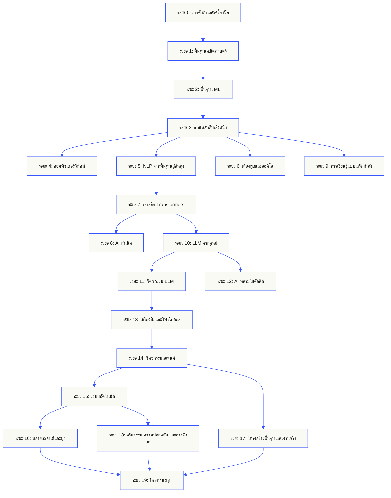
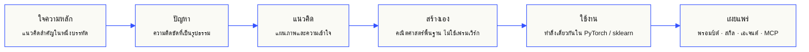

<p align="center"><sub>README นี้แปลเป็นภาษาไทย โดยใช้ <a href="../../README.md">README ภาษาอังกฤษ</a> เป็นแหล่งอ้างอิงหลัก</sub></p>
<p align="center">
  
</p>

<p align="center">
  <a href="../../README.md">🇬🇧 English</a> ·
  <a href="../../i18n/zh/README.md">🇨🇳 简体中文</a> ·
  <a href="../../i18n/zh-TW/README.md">🇹🇼 繁體中文（台灣）</a> ·
  <a href="../../i18n/ja/README.md">🇯🇵 日本語</a> ·
  <a href="../../i18n/ko/README.md">🇰🇷 한국어</a> ·
  <a href="../../i18n/pt/README.md">🇵🇹 Português</a> ·
  <a href="../../i18n/pt-BR/README.md">🇧🇷 Português (Brasil)</a> ·
  <a href="../../i18n/es/README.md">🇪🇸 Español</a> ·
  <a href="../../i18n/de/README.md">🇩🇪 Deutsch</a> ·
  <a href="../../i18n/fr/README.md">🇫🇷 Français</a> ·
  <a href="../../i18n/it/README.md">🇮🇹 Italiano</a> ·
  <a href="../../i18n/nl/README.md">🇳🇱 Nederlands</a> ·
  <a href="../../i18n/pl/README.md">🇵🇱 Polski</a> ·
  <a href="../../i18n/cs/README.md">🇨🇿 Čeština</a> ·
  <a href="../../i18n/ro/README.md">🇷🇴 Română</a> ·
  <a href="../../i18n/hu/README.md">🇭🇺 Magyar</a> ·
  <a href="../../i18n/el/README.md">🇬🇷 Ελληνικά</a> ·
  <a href="../../i18n/sv/README.md">🇸🇪 Svenska</a> ·
  <a href="../../i18n/da/README.md">🇩🇰 Dansk</a> ·
  <a href="../../i18n/no/README.md">🇳🇴 Norsk</a> ·
  <a href="../../i18n/fi/README.md">🇫🇮 Suomi</a> ·
  <a href="../../i18n/ru/README.md">🇷🇺 Русский</a> ·
  <a href="../../i18n/uk/README.md">🇺🇦 Українська</a> ·
  <a href="../../i18n/tr/README.md">🇹🇷 Türkçe</a> ·
  <a href="../../i18n/he/README.md">🇮🇱 עברית</a> ·
  <a href="../../i18n/ar/README.md">🇸🇦 العربية</a> ·
  <a href="../../i18n/fa/README.md">🇮🇷 فارسی</a> ·
  <a href="../../i18n/hi/README.md">🇮🇳 हिन्दी</a> ·
  <a href="../../i18n/bn/README.md">🇧🇩 বাংলা</a> ·
  <a href="../../i18n/ur/README.md">🇵🇰 اردو</a> ·
  <a href="../../i18n/th/README.md">🇹🇭 ไทย</a> ·
  <a href="../../i18n/vi/README.md">🇻🇳 Tiếng Việt</a> ·
  <a href="../../i18n/id/README.md">🇮🇩 Bahasa Indonesia</a> ·
  <a href="../../i18n/tl/README.md">🇵🇭 Tagalog</a>
</p>

<p align="center">
  <a href="../../LICENSE"></a>
  <a href="../../ROADMAP.md"></a>
  <a href="#contents"></a>
  <a href="https://github.com/rohitg00/ai-engineering-from-scratch/stargazers"></a>
  <a href="https://aiengineeringfromscratch.com"></a>
  <p align="center">
 <a href="https://www.star-history.com/rohitg00/ai-engineering-from-scratch">
  <picture><source media="(prefers-color-scheme: dark)" srcset="https://api.star-history.com/badge?repo=rohitg00/ai-engineering-from-scratch&type=rank&theme=dark" /><source media="(prefers-color-scheme: light)" srcset="https://api.star-history.com/badge?repo=rohitg00/ai-engineering-from-scratch&type=rank" /></picture> <picture><source media="(prefers-color-scheme: dark)" srcset="https://api.star-history.com/badge?repo=rohitg00/ai-engineering-from-scratch&type=trending&theme=dark" /><source media="(prefers-color-scheme: light)" srcset="https://api.star-history.com/badge?repo=rohitg00/ai-engineering-from-scratch&type=trending" /></picture>
 </a>
</p>
</p>

### ผู้สนับสนุน

<p align="center">
  <a href="https://serpapi.com/ai-engineering-from-scratch"><picture><source media="(min-width: 768px)" srcset="../../assets/sponsors/serpapi-banner-compact.png" width="48%"></picture></a>
  <a href="https://nitrostack.ai/referral/aiengineeringfromscratch"><picture><source media="(min-width: 768px)" srcset="../../assets/sponsors/nitrostack-banner-equal.png" width="48%"></picture></a>
</p>

<p align="center">
  <sub><span>การสนับสนุนของคุณช่วยให้ทุกบทเรียนยังคงฟรีและเป็นโอเพนซอร์ส</span> <a href="#supporters">ดูผู้สนับสนุนทั้งหมด</a> · <a href="../../SPONSORS.md">ร่วมเป็นผู้สนับสนุน</a></sub>
</p>

```text
░░░▒▒▒░░░▒▒▒░░░▒▒▒░░░▒▒▒░░░▒▒▒░░░▒▒▒░░░▒▒▒░░░▒▒▒░░░▒▒▒░░░▒▒▒░░░▒▒▒░░░▒▒▒░░░▒▒▒░░░▒▒▒░░░▒▒▒
```

> **นักเรียน 84% ใช้เครื่องมือ AI อยู่แล้ว แต่มีเพียง 18% ที่รู้สึกพร้อมนำไปใช้ในงานอาชีพ** หลักสูตรนี้ช่วยลดช่องว่างนั้น
>
> 523 บทเรียน 20 ระยะ ~342 ชั่วโมง Python, TypeScript, Rust, Julia ทุกบทเรียนสร้างชิ้นงานที่นำกลับมาใช้ได้: พรอมป์ต์ สกิล เอเจนต์ หรือเซิร์ฟเวอร์ MCP ฟรี โอเพนซอร์ส สัญญาอนุญาต MIT
>
> คุณไม่ได้แค่เรียนรู้ AI แต่ลงมือสร้างด้วยตัวเองตั้งแต่ต้นจนจบ

<!-- STATS:START (generated from site/stats.json by build.js — do not edit by hand) -->
<p align="center"><sub><b>114,584</b> ผู้อ่าน &nbsp;·&nbsp; <b>181,995</b> การดูหน้าใน 30 วันที่ผ่านมา &nbsp;·&nbsp; ข้อมูล ณ 2026-08-29</sub></p>
<!-- STATS:END -->

## เริ่มที่นี่: เลือกสิ่งที่คุณต้องการสร้าง

คุณไม่จำเป็นต้องไล่ดูทั้ง 523 บทเรียนก่อนเริ่ม เลือกเป้าหมายหนึ่งอย่าง แต่ละลิงก์เปิดหลักสูตรเดียวกันบน GitHub หรือเว็บไซต์ และทั้งสองแบบใช้โค้ดบทเรียนเดียวกัน

| เป้าหมายของคุณ | เรียนบน GitHub | เรียนบนเว็บไซต์ |
|---|---|---|
| ฉันเพิ่งเริ่มและต้องการพื้นฐานที่ครบถ้วน | [ระยะ 0: การตั้งค่าและเครื่องมือ](../../phases/00-setup-and-tooling/) | [สภาพแวดล้อมการพัฒนา](https://aiengineeringfromscratch.com/lesson?path=phases/00-setup-and-tooling/01-dev-environment) |
| ฉันรู้ Python และต้องการพื้นฐานคณิตศาสตร์กับ ML | [ระยะ 1: พื้นฐานคณิตศาสตร์](../../phases/01-math-foundations/) | [ทำความเข้าใจพีชคณิตเชิงเส้น](https://aiengineeringfromscratch.com/lesson?path=phases/01-math-foundations/01-linear-algebra-intuition) |
| ฉันต้องการสร้างแอปพลิเคชัน LLM สำหรับใช้งานจริง | [ระยะ 11: วิศวกรรม LLM](../../phases/11-llm-engineering/) | [วิศวกรรมพรอมป์ต์](https://aiengineeringfromscratch.com/lesson?path=phases/11-llm-engineering/01-prompt-engineering) |
| ฉันต้องการสร้างเอเจนต์ | [ระยะ 14: วิศวกรรมเอเจนต์](../../phases/14-agent-engineering/) | [วงรอบการทำงานของเอเจนต์](https://aiengineeringfromscratch.com/lesson?path=phases/14-agent-engineering/01-the-agent-loop) |
| ฉันต้องการใช้เอเจนต์เขียนโค้ดกับคลังโค้ดจริง | [เส้นทางวิศวกรรมที่มีเอเจนต์ช่วย](../../learning-paths/using-coding-agents.json) | [วิศวกรรมที่มีเอเจนต์ช่วย](https://aiengineeringfromscratch.com/lesson?path=phases/14-agent-engineering/31-agent-workbench-why-models-fail&learningPath=using-coding-agents) |
| ฉันต้องการกำหนดสิ่งที่ควรสร้างก่อนลงมือพัฒนา | [เส้นทางการตัดสินใจด้านผลิตภัณฑ์และการส่งมอบ](../../learning-paths/shaping-the-build.json) | [การตัดสินใจด้านผลิตภัณฑ์และการส่งมอบ](https://aiengineeringfromscratch.com/lesson?path=phases/14-agent-engineering/47-outcomes-before-output&learningPath=shaping-the-build) |
| ฉันต้องการสร้างด้วย Model Context Protocol (MCP) | [แนวทางเรียน Model Context Protocol (MCP)](../../phases/13-tools-and-protocols/README.md#model-context-protocol-mcp-path) | [เส้นทาง Model Context Protocol (MCP)](https://aiengineeringfromscratch.com/lesson?path=phases/13-tools-and-protocols/06-mcp-fundamentals&learningPath=model-context-protocol) |
| ฉันต้องการเขียนและเผยแพร่ Agent Skills | [แนวทางเรียน Agent Skills โดยเฉพาะ](../../phases/13-tools-and-protocols/README.md#agent-skills-fast-path) | [เส้นทาง Agent Skills](https://aiengineeringfromscratch.com/lesson?path=phases/13-tools-and-protocols/22-skills-and-agent-sdks&learningPath=agent-skills) |
| ฉันต้องการเตรียมตัวสอบการรับรอง Claude | [เริ่มต้นเตรียมสอบการรับรอง](../../certifications/claude/GETTING_STARTED.md) | [สถาบันเตรียมสอบการรับรอง](https://aiengineeringfromscratch.com/certifications.html) |
| ฉันต้องการเตรียมตัวสอบ MCP Associate (MCPA) | [เริ่มต้นเตรียมสอบ MCPA](../../certifications/mcpa/GETTING_STARTED.md) | [เส้นทาง MCPA](https://aiengineeringfromscratch.com/certification?id=mcpa-f) |

ไม่แน่ใจว่าควรเริ่มตรงไหน? ใช้[ติวเตอร์วัดระดับ `start-learning`](../../skills/start-learning/SKILL.md) หรือ[คู่มือความรู้พื้นฐานที่ต้องมีบนเว็บไซต์](https://aiengineeringfromscratch.com/prereqs.html)

เปรียบเทียบสี่สาขาหลักและหกเส้นทางอาชีพใน[เส้นทางเรียนวิศวกรรม AI](https://aiengineeringfromscratch.com/learning-paths.html)

### ใช้วิธีเดียวกันกับทุกบทเรียน

1. **อ่าน** `docs/en.md` และอธิบายแนวคิดหลักด้วยคำพูดของตัวเอง
2. **พิมพ์และสร้าง** โค้ดส่วนสำคัญ แทนที่จะมองบล็อกโค้ดเป็นเพียงของตกแต่ง
3. **รัน** คำสั่งของบทเรียนจากโฟลเดอร์รากของคลังโค้ด ซึ่งมี `README.md` และ `phases/`
4. **เก็บหลักฐาน**: คำสั่ง โฟลเดอร์ที่ทำงาน รหัสจบการทำงาน ผลลัพธ์ที่มีความหมาย และชิ้นงานที่คุณแก้ไขหรือสร้าง
5. **ไปต่อ** เมื่อคุณอธิบายผลลัพธ์และแก้ไขเล็กน้อยได้โดยไม่ต้องเดาเท่านั้น

คำสั่งในหน้าบทเรียนใช้พาธจากโฟลเดอร์รากของคลังโค้ด เว้นแต่บทเรียนจะระบุให้เปลี่ยนโฟลเดอร์อย่างชัดเจน หากบทเรียนมีหลายภาษา ให้รันโค้ดของภาษาที่คุณกำลังเรียน

### โคลนคลังโค้ดและสร้างหลักฐานชิ้นแรก

```bash
git clone https://github.com/rohitg00/ai-engineering-from-scratch.git
cd ai-engineering-from-scratch
python3 phases/00-setup-and-tooling/01-dev-environment/code/verify.py --route beginner
python3 phases/01-math-foundations/01-linear-algebra-intuition/code/vectors.py
```

การตรวจสอบก่อนเริ่มแยกสิ่งที่จำเป็นตอนนี้ออกจากเครื่องมือที่ต้องใช้ภายหลัง ทุกข้อบังคับที่ตรวจสอบไม่ผ่านจะแสดงสาเหตุที่พบและคำสั่งแก้ไข คำสั่งที่สองรันบทเรียนที่ไม่ต้องติดตั้งแพ็กเกจเพิ่มเติม และจบด้วยการแสดงว่าการคูณเมทริกซ์กับเวกเตอร์คือการทำงานภายในชั้นของโครงข่ายประสาท เก็บผลลัพธ์ในเทอร์มินัลนั้นไว้เป็นหลักฐานชิ้นแรก

## เพิ่มผู้สอน AI ใน 30 วินาที

หากติดตั้ง Node.js, `npx` และเอเจนต์เขียนโค้ดที่รองรับสกิลแล้ว คุณเปลี่ยนเอเจนต์ให้เป็นผู้สอนได้ด้วยสองคำสั่ง ไม่ต้องโคลนที่เก็บโค้ดเพื่อติดตั้งหรืออ่านเนื้อหาของผู้สอน แต่แล็บในเส้นทางเฉพาะด้านต้องใช้ `python3` ส่วนแล็บ Agent Skills ต้องเลือกโฮสต์และมีโฟลเดอร์สกิลระดับผู้ใช้หรือโครงการที่เขียนได้ด้วย

ตรวจสอบข้อกำหนดในเครื่องก่อน:

```bash
node --version
npx --version
python3 --version
```

จากนั้นติดตั้งสกิลของหลักสูตร แล้วเลือกโฮสต์และขอบเขตการติดตั้งที่ต้องการเมื่อตัวติดตั้งถาม:

```bash
npx skills add rohitg00/ai-engineering-from-scratch
```

รูปแบบคำสั่งเรียกใช้ขึ้นอยู่กับโฮสต์ ไม่ใช่รูปแบบพกพา `SKILL.md`:

| แอปโฮสต์ | เริ่มหลักสูตร | เริ่ม Model Context Protocol (MCP) | เริ่ม Agent Skills | ทำแบบทดสอบประจำระยะ |
|---|---|---|---|---|
| Codex | `start-learning`, หรือเลือกจาก `/skills` | `learn-mcp`, หรือเลือกจาก `/skills` | `learn-agent-skills`, หรือเลือกจาก `/skills` | `check-understanding 13`, หรือเลือกจาก `/skills` |
| Claude Code | `/start-learning` | `/learn-mcp` | `/learn-agent-skills` | `/check-understanding 13` |
| โฮสต์อื่นที่รองรับ | `Use start-learning to begin the course.` | `Use learn-mcp to start the Model Context Protocol (MCP) path.` | `Use learn-agent-skills to start the Agent Skills Engineering path.` | `Use check-understanding to quiz me on Phase 13.` |

แบบทดสอบจัดระดับสิบข้อจะจับคู่ความรู้ที่มีอยู่กับระยะเริ่มต้น และบันทึกแผนเรียนส่วนตัวใน `LEARNING.md` จากนั้นสกิล `learn` จะสอนครั้งละหนึ่งบทเรียน: แนวคิด คณิตศาสตร์ โค้ด และแบบทดสอบ โดยดึงบทเรียนจากที่เก็บโค้ดนี้โดยตรง ส่วน `course-guide` จะพาไปยังบทเรียนที่ตรงกับเรื่องที่คุณติดขัด ใน Codex ให้เรียก `learn` และ `course-guide`; ใน Claude Code ให้ใช้ `/learn` และ `/course-guide`; สำหรับโฮสต์อื่นที่รองรับ ให้ขอใช้สกิลตามชื่อ

ต้องการเรียนเฉพาะ Model Context Protocol (MCP)? ใช้คำสั่ง MCP ของโฮสต์คุณ ระบบจะสร้าง `MCP-LEARNING.md` และติดตามเส้นทาง 17 บทเรียน ครอบคลุมคำขอแบบไร้สถานะ การรับส่งข้อมูล งานสองทิศทาง ความปลอดภัย ความน่าเชื่อถือ การกำกับดูแลรีจิสทรี และหลักฐานความสอดคล้องกับโพรโทคอล ลำดับและจุดตรวจที่แน่นอนอยู่ใน[แมนิเฟสต์ Model Context Protocol (MCP)](../../learning-paths/model-context-protocol.json)

ต้องการเรียนเฉพาะ Agent Skills? ใช้คำสั่ง Agent Skills ของโฮสต์คุณ ระบบจะสร้าง `AGENT-SKILLS-LEARNING.md` และติดตามห้าบทเรียนต่อเนื่อง: สัญญา การค้นพบ การเรียกใช้ ขอบเขตแซนด์บ็อกซ์ แล้วจึงประเมินก่อนเผยแพร่และทดสอบการย้ายข้ามโฮสต์จริง เริ่มบนเว็บได้ที่[เส้นทาง Agent Skills](https://aiengineeringfromscratch.com/lesson?path=phases/13-tools-and-protocols/22-skills-and-agent-sdks&learningPath=agent-skills)

ตัวติดตั้งจะแสดงโฮสต์ที่ตั้งค่าได้และถามตำแหน่งติดตั้ง หากยังไม่มี Node.js, `npx`, `python3`, โฮสต์ที่รองรับ หรือพื้นที่ที่เขียนได้ ให้ใช้เว็บไซต์หรืออ่าน `docs/en.md` เอง วิธีนี้สอนแนวคิดได้ แต่หลักฐานการค้นพบ การเรียกใช้ การรันสคริปต์ และการถอนการติดตั้งบนโฮสต์จริงต้องรอจนตรวจความพร้อมได้ อ่านบทเรียนที่ [aiengineeringfromscratch.com](https://aiengineeringfromscratch.com)

## หลักสูตรนี้ทำงานอย่างไร

สื่อ AI ส่วนใหญ่สอนเป็นส่วนแยก ๆ มีบทความวิจัยที่หนึ่ง โพสต์เรื่องไฟน์จูนอีกที่ และเดโมเอเจนต์ที่น่าตื่นตาตื่นใจอีกแห่ง แต่ละส่วนแทบไม่ต่อกัน คุณเปิดใช้แชตบอตได้แต่อธิบายกราฟค่าความสูญเสียไม่ได้ คุณต่อฟังก์ชันเข้ากับเอเจนต์ได้แต่บอกไม่ได้ว่ากลไก attention ทำอะไรภายในโมเดลที่เรียกฟังก์ชันนั้น

หลักสูตรนี้เป็นโครงหลักที่เชื่อมทั้งหมดเข้าด้วยกัน: 20 ระยะ 523 บทเรียน และสี่ภาษา Python, TypeScript, Rust, Julia เริ่มจากพีชคณิตเชิงเส้นไปจนถึงฝูงเอเจนต์อัตโนมัติ ทุกอัลกอริทึมเริ่มสร้างจากคณิตศาสตร์พื้นฐาน ทั้ง backpropagation, tokenizer, attention และลูปเอเจนต์ เมื่อถึง PyTorch คุณก็รู้แล้วว่าภายในมันทำงานอย่างไร

ทุกบทเรียนใช้วงจรเดียวกัน: อ่านปัญหา ไล่ที่มาของคณิตศาสตร์ เขียนโค้ด รันทดสอบ และเก็บชิ้นงาน ไม่มีวิดีโอห้านาที ไม่มีการคัดลอกแล้วปรับใช้โดยไม่เข้าใจ และไม่มีการทำให้ทุกขั้น ฟรี โอเพนซอร์ส และออกแบบให้รันบนแล็ปท็อปของคุณเอง

```text
░░░▒▒▒░░░▒▒▒░░░▒▒▒░░░▒▒▒░░░▒▒▒░░░▒▒▒░░░▒▒▒░░░▒▒▒░░░▒▒▒░░░▒▒▒░░░▒▒▒░░░▒▒▒░░░▒▒▒░░░▒▒▒░░░▒▒▒
```

## โครงสร้างหลักสูตร

ทั้งยี่สิบระยะต่อยอดกัน คณิตศาสตร์เป็นฐาน ส่วนเอเจนต์และระบบใช้งานจริงเป็นชั้นบน ข้ามไปได้หากรู้ชั้นพื้นฐานอยู่แล้ว แต่อย่าข้ามแล้วสงสัยว่าทำไมส่วนข้างบนจึงพัง



```text
░░░▒▒▒░░░▒▒▒░░░▒▒▒░░░▒▒▒░░░▒▒▒░░░▒▒▒░░░▒▒▒░░░▒▒▒░░░▒▒▒░░░▒▒▒░░░▒▒▒░░░▒▒▒░░░▒▒▒░░░▒▒▒░░░▒▒▒
```

## โครงสร้างบทเรียน

แต่ละบทเรียนมีโฟลเดอร์ของตัวเอง และใช้โครงสร้างเดียวกันตลอดหลักสูตร:

```text
phases/<NN>-<phase-name>/<NN>-<lesson-name>/
├── code/      โค้ดที่รันได้ (Python, TypeScript, Rust, Julia)
├── docs/
│   └── en.md  เนื้อหาบทเรียน
└── outputs/   พรอมป์ต์ สกิล เอเจนต์ หรือเซิร์ฟเวอร์ MCP ที่บทเรียนสร้าง
```

ทุกบทเรียนมีหกช่วง การแยก *สร้างเอง / ใช้งาน* เป็นแกนหลัก: คุณเขียนอัลกอริทึมจากศูนย์ก่อน แล้วทำสิ่งเดียวกันด้วยไลบรารีสำหรับงานจริง คุณจึงเข้าใจว่าเฟรมเวิร์กทำอะไร เพราะได้เขียนรุ่นเล็กด้วยตัวเองแล้ว



## เริ่มต้นใช้งาน

เริ่มได้สามวิธี เลือกหนึ่งวิธี

**ทางเลือก A: เรียนในเทอร์มินัล *(แนะนำ)*.** หลังตรวจ Node.js, `npx`, โฮสต์ และขอบเขตการติดตั้งตามด้านบนแล้ว ให้ติดตั้งสกิลการเรียนในเอเจนต์ที่รองรับ และให้หลักสูตรนำทาง:

```bash
npx skills add rohitg00/ai-engineering-from-scratch
```

ใช้ตารางคำสั่งของแต่ละโฮสต์ด้านบน สกิลที่ติดตั้งมี `start-learning`, `learn`, `course-guide` และเส้นทางเฉพาะด้าน `learn-mcp` กับ `learn-agent-skills` เนื้อหาบทเรียนดึงจากที่เก็บโค้ดได้โดยไม่ต้องโคลน แต่คำสั่งรันโค้ดที่คัดลอกจากที่เก็บและแล็บ MCP หรือ Agent Skills ต้องมีสำเนาในเครื่อง ความคืบหน้าจะอยู่ใน `LEARNING.md`, `MCP-LEARNING.md` หรือ `AGENT-SKILLS-LEARNING.md` ของโครงการ จึงกลับมาเรียนต่อได้ทุกครั้ง

**ทางเลือก B: อ่าน.** เปิดบทเรียนที่เสร็จแล้วบน [aiengineeringfromscratch.com](https://aiengineeringfromscratch.com) หรือขยายระยะใน[สารบัญ](#contents) ไม่ต้องตั้งค่าหรือโคลน

**ทางเลือก C: โคลนแล้วรัน.**

```bash
git clone https://github.com/rohitg00/ai-engineering-from-scratch.git
cd ai-engineering-from-scratch
python3 phases/01-math-foundations/01-linear-algebra-intuition/code/vectors.py
```

การโคลนยังโหลดสกิลการเรียนเข้า Claude Code โดยอัตโนมัติ และทำให้ผู้สอน `learn` เข้าถึงโค้ดทุกบทเรียนเพื่อรันจริง แทนการอ่านตามเพียงอย่างเดียว

### ความรู้และเครื่องมือพื้นฐานที่ต้องมี

- คุณเขียนโค้ดได้สักภาษา โดย Python จะช่วยได้มาก
- คุณต้องการเข้าใจว่า AI **ทำงานจริงอย่างไร** ไม่ใช่เพียงเรียก API

### เตรียมสอบใบรับรอง Claude

[Claude Certification Academy](../../certifications/claude/README.md) เป็นหลักสูตรเตรียมสอบฟรีและโอเพนซอร์สสำหรับใบรับรอง Claude ทางการทั้งสี่เส้นทาง: Associate Foundations, Developer Foundations, Architect Foundations และ Architect Professional แต่ละเส้นทางรวมบทเรียนที่ตรงกับแผนผังข้อสอบ แล็บที่รันได้ แบบประเมินพื้นฐาน โครงงานสรุป และข้อสอบฝึกทำต้นฉบับแบบเต็มชุด

ใช้[คู่มือเริ่มต้นบน GitHub โดยมี AI ช่วย](../../certifications/claude/GETTING_STARTED.md) กับ Claude Code, Codex, ChatGPT, Cursor หรือเอเจนต์อื่น เรียก `claude-certification` ใน Codex, `/claude-certification` ใน Claude Code หรือขอให้โฮสต์อื่นใช้ `claude-certification` ระบบจะเลือกเส้นทาง สร้างแผนต่อเนื่องใน `CLAUDE-CERTIFICATION.md` สอนทีละขั้น รันแล็บจริง และให้ข้อเสนอแนะจากชิ้นงาน หลักสูตรเดียวกันยังอยู่บน[เว็บไซต์ใบรับรอง](https://aiengineeringfromscratch.com/certifications.html)

สถาบันนี้เป็นสื่อเรียนอิสระตามวัตถุประสงค์การสอบที่เปิดเผย ไม่ได้มีความเกี่ยวข้องกับ Anthropic ไม่คัดลอกข้อสอบจริง และไม่รับประกันว่าจะสอบผ่าน

### เตรียมสอบใบรับรอง MCP Associate (MCPA)

[หลักสูตรใบรับรอง MCPA](../../certifications/mcpa/README.md) เป็นหลักสูตรเตรียมสอบฟรีและโอเพนซอร์สสำหรับ Model Context Protocol Associate ของ Agentic AI Foundation ซึ่งจัดผ่าน Linux Foundation Training ทั้ง 34 บทเรียนสอนโพรโทคอลไร้สถานะรุ่น 2026-07-28 ตามห้าหมวดสอบ ได้แก่ `_meta` ต่อคำขอและ `server/discover` แทนการจับมือแบบเดิม คำขอหลายรอบ การสมัครรับข้อมูล แคช ส่วนขยาย Tasks และ MCP Apps การอนุญาตผ่าน OAuth ตลอดจนชั้นรีจิสทรีและ SDK ทุกบทเรียนมีแล็บที่ใช้เพียงไลบรารีมาตรฐาน และตรวจบันทึกการรันกับรูปแบบข้อความปัจจุบัน นอกจากนี้ยังมีแบบประเมินพื้นฐาน โครงงานสรุป และข้อสอบฝึกทำต้นฉบับเต็มชุดสามชุด โดยสัดส่วนคำถามตรงตามน้ำหนักในแผนผังข้อสอบที่เผยแพร่

ใช้[คู่มือเริ่มต้นบน GitHub โดยมี AI ช่วย](../../certifications/mcpa/GETTING_STARTED.md) กับ Claude Code, Codex, ChatGPT, Cursor หรือเอเจนต์อื่น เรียก `mcpa-certification` ใน Codex, `/mcpa-certification` ใน Claude Code หรือขอให้โฮสต์อื่นใช้ `mcpa-certification` ระบบจะสร้างแผนต่อเนื่องใน `MCPA-CERTIFICATION.md` สอนทีละขั้น รันแล็บจริง และให้ข้อเสนอแนะจากชิ้นงาน หลักสูตรเดียวกันอยู่บน[หน้าเส้นทาง MCPA](https://aiengineeringfromscratch.com/certification?id=mcpa-f)

หลักสูตรนี้เป็นสื่อเรียนอิสระตามวัตถุประสงค์การสอบที่เปิดเผย ไม่ได้เกี่ยวข้องกับ Agentic AI Foundation หรือ Linux Foundation ไม่คัดลอกข้อสอบจริง และไม่รับประกันว่าจะสอบผ่าน

### สกิลสำหรับการเรียน

| สกิลการทำงาน | ทำอะไรได้ |
|---|---|
| [`start-learning`](../../skills/start-learning/SKILL.md) | เริ่มต้นครั้งเดียว: เหตุผลที่เรียน แบบทดสอบจัดระดับ และแผนส่วนตัวที่บันทึกใน `LEARNING.md` |
| [`learn`](../../skills/learn/SKILL.md) | วงจรผู้สอน: ทบทวนความจำก่อน เรียนบทถัดไปแบบโต้ตอบ แล้วทำแบบทดสอบ พร้อมบันทึกความคืบหน้าและรายการทบทวน |
| [`course-guide`](../../skills/course-guide/SKILL.md) | ตัวนำทางหัวข้อ ถามว่า “เรียน attention ที่ไหน” หรือ “ค่า loss เป็น NaN” → ได้บทเรียนที่ตรงพร้อมลิงก์ |
| [`learn-mcp`](../../skills/learn-mcp/SKILL.md) | ผู้สอนเฉพาะ Model Context Protocol (MCP) สร้าง `MCP-LEARNING.md` เดินตามแมนิเฟสต์ 17 บทเรียน และบันทึกหลักฐานการสื่อสาร ความปลอดภัย ความน่าเชื่อถือ และความสอดคล้อง |
| [`learn-agent-skills`](../../skills/learn-agent-skills/SKILL.md) | ผู้สอนเฉพาะ Agent Skills สร้าง `AGENT-SKILLS-LEARNING.md` สอนบทเรียน 22, 24, 25, 26 และ 27 พร้อมบันทึกหลักฐานจากโฮสต์จริง |
| [`claude-certification`](../../skills/claude-certification/SKILL.md) | ผู้สอนเตรียมใบรับรอง เลือก CCAO-F, CCDV-F, CCAR-F หรือ CCAR-P สอนแต่ละบท รันแล็บ ตรวจชิ้นงาน จัดแบบประเมินและข้อสอบจำลอง แล้วบันทึกความคืบหน้า |
| [`mcpa-certification`](../../skills/mcpa-certification/SKILL.md) | ผู้สอน MCPA ติดตามเส้นทาง `mcpa-f` 34 บทเรียนบนโพรโทคอล 2026-07-28 สอนแต่ละบท รันแล็บและตัวตรวจข้อความ จัดแบบประเมินพื้นฐานกับข้อสอบจำลองสามชุด แล้วบันทึกความคืบหน้า |
| [`find-your-level`](../../skills/find-your-level/SKILL.md) | แบบทดสอบจัดระดับสิบข้อ จับคู่ความรู้กับระยะเริ่มต้น และสร้างเส้นทางส่วนตัวพร้อมประมาณชั่วโมงเรียน |
| [`check-understanding <phase>`](../../skills/check-understanding/SKILL.md) | แบบทดสอบแปดข้อต่อระยะ พร้อมข้อเสนอแนะและบทเรียนที่ควรทบทวน ใช้รูปแบบ Codex, Claude Code หรือภาษาธรรมชาติจากตารางเรียกใช้ด้านบน |

```text
░░░▒▒▒░░░▒▒▒░░░▒▒▒░░░▒▒▒░░░▒▒▒░░░▒▒▒░░░▒▒▒░░░▒▒▒░░░▒▒▒░░░▒▒▒░░░▒▒▒░░░▒▒▒░░░▒▒▒░░░▒▒▒░░░▒▒▒
```

## อ่านหลักสูตรแกนหลักในรูปแบบหนังสือ

หลักสูตรแกนหลัก 20 ระยะภายใต้ `phases/` ถูกรวมเป็นหนังสือหกเล่ม CI สร้าง EPUB และ PDF จากแหล่งบทเรียนเดียวกัน แล้วแนบใน[การเผยแพร่บน GitHub](https://github.com/rohitg00/ai-engineering-from-scratch/releases) ทุกครั้ง ลิงก์ด้านล่างชี้ไปยังรุ่นล่าสุดเสมอ เลขเล่มบอกลำดับในชุด ไม่ใช่เวอร์ชัน แต่ละไฟล์มีวันที่ของฉบับ และฉบับเก่ายังคงดาวน์โหลดได้จากหน้าการเผยแพร่ของตน

หลักสูตรใบรับรองตั้งใจไม่รวมในหนังสือ สถานะผู้สอน AI แล็บที่รันได้ ภาพโต้ตอบ แบบประเมินพื้นฐาน และข้อสอบจำลองแบบจับเวลา ยังคงใช้งานเต็มรูปแบบบน GitHub และเว็บไซต์

| เล่ม | ชื่อ | ระยะ | ดาวน์โหลด |
|-----|-------|--------|----------|
| 1 | พื้นฐาน · คณิตศาสตร์ เครื่องมือ และแมชชีนเลิร์นนิงแบบดั้งเดิม | 00-02 | [EPUB](https://github.com/rohitg00/ai-engineering-from-scratch/releases/latest/download/aiefs-vol1-foundations.epub) · [PDF](https://github.com/rohitg00/ai-engineering-from-scratch/releases/latest/download/aiefs-vol1-foundations.pdf) |
| 2 | ดีปเลิร์นนิง · โครงข่าย การมองเห็น และเสียงพูด | 03, 04, 06 | [EPUB](https://github.com/rohitg00/ai-engineering-from-scratch/releases/latest/download/aiefs-vol2-deep-learning.epub) · [PDF](https://github.com/rohitg00/ai-engineering-from-scratch/releases/latest/download/aiefs-vol2-deep-learning.pdf) |
| 3 | ภาษา · พื้นฐาน NLP และ Transformer | 05, 07 | [EPUB](https://github.com/rohitg00/ai-engineering-from-scratch/releases/latest/download/aiefs-vol3-language.epub) · [PDF](https://github.com/rohitg00/ai-engineering-from-scratch/releases/latest/download/aiefs-vol3-language.pdf) |
| 4 | โมเดลภาษาขนาดใหญ่ · การสร้าง การเสริมกำลัง พรีเทรน และวิศวกรรม | 08-11 | [EPUB](https://github.com/rohitg00/ai-engineering-from-scratch/releases/latest/download/aiefs-vol4-llms.epub) · [PDF](https://github.com/rohitg00/ai-engineering-from-scratch/releases/latest/download/aiefs-vol4-llms.pdf) |
| 5 | เอเจนต์ · หลายโมดัลลิตี โพรโทคอล การทำงานอัตโนมัติ และฝูง | 12-16 | [EPUB](https://github.com/rohitg00/ai-engineering-from-scratch/releases/latest/download/aiefs-vol5-agents.epub) · [PDF](https://github.com/rohitg00/ai-engineering-from-scratch/releases/latest/download/aiefs-vol5-agents.pdf) |
| 6 | งานจริง · โครงสร้างพื้นฐาน ความปลอดภัย และโครงงานสรุป | 17-19 | [EPUB](https://github.com/rohitg00/ai-engineering-from-scratch/releases/latest/download/aiefs-vol6-production.epub) · [PDF](https://github.com/rohitg00/ai-engineering-from-scratch/releases/latest/download/aiefs-vol6-production.pdf) |

หนังสือคือภาพของหลักสูตร ณ เวลาหนึ่ง ส่วนที่เก็บนี้คือฉบับที่ปรับปรุงต่อเนื่อง ทุกบทจบด้วยลิงก์ไปยังภาพเคลื่อนไหว แบบทดสอบ และโค้ดที่รันได้ สร้างในเครื่องด้วย `python3 scripts/build_book.py` โดยต้องมี pandoc ดูรายละเอียดกระบวนการใน [book/README.md](../../book/README.md)

```text
░░░▒▒▒░░░▒▒▒░░░▒▒▒░░░▒▒▒░░░▒▒▒░░░▒▒▒░░░▒▒▒░░░▒▒▒░░░▒▒▒░░░▒▒▒░░░▒▒▒░░░▒▒▒░░░▒▒▒░░░▒▒▒░░░▒▒▒
```

## ทุกบทเรียนมีชิ้นงาน

หลักสูตรอื่นจบด้วย *“ยินดีด้วย คุณเรียนรู้ X แล้ว”* แต่ทุกบทเรียนที่นี่จบด้วย**เครื่องมือที่ใช้ซ้ำได้** ซึ่งคุณติดตั้งหรือวางในกระบวนการทำงานประจำวันได้

<table>
<tr>
<th align="left" width="25%"><br/><sub>FIG_001 · A</sub><br/><b>พรอมป์ต์</b></th>
<th align="left" width="25%"><br/><sub>FIG_001 · B</sub><br/><b>สกิล</b></th>
<th align="left" width="25%"><br/><sub>FIG_001 · C</sub><br/><b>เอเจนต์</b></th>
<th align="left" width="25%"><br/><sub>FIG_001 · D</sub><br/><b>เซิร์ฟเวอร์ MCP</b></th>
</tr>
<tr>
<td valign="top">วางในผู้ช่วย AI ใดก็ได้เพื่อขอความช่วยเหลือระดับผู้เชี่ยวชาญในงานเฉพาะด้าน</td>
<td valign="top">ติดตั้งใน Claude, Cursor, Codex, OpenClaw, Hermes หรือเอเจนต์ใดที่อ่าน <code>SKILL.md</code>.</td>
<td valign="top">ปรับใช้เป็นผู้ปฏิบัติงานอัตโนมัติ คุณเขียนลูปด้วยตัวเองในระยะ 14 แล้ว</td>
<td valign="top">เชื่อมต่อกับไคลเอนต์ที่รองรับ MCP สร้างครบตั้งแต่ต้นจนจบในระยะ 13</td>
</tr>
</table>

> ติดตั้งทั้งหมดด้วย `python3 scripts/install_skills.py <target>` นี่คือเครื่องมือจริง ไม่ใช่การบ้าน เมื่อจบหลักสูตร คุณจะมีผลงาน 523 ชิ้นที่เข้าใจจริง เพราะสร้างด้วยตัวเอง

### FIG_002 · ตัวอย่างที่ทำให้ดูครบขั้น

ระยะ 14 บทเรียน 1: ลูปเอเจนต์ Python ล้วนประมาณ ~120 บรรทัด ไม่มีไลบรารีที่ต้องติดตั้งเพิ่ม

<table>
<tr>
<td valign="top" width="50%">

**`code/agent_loop.py`** &nbsp; <sub><i>สร้างเอง</i></sub>

```python
def run(query, tools):
    history = [user(query)]
    for step in range(MAX_STEPS):
        msg = llm(history)
        if msg.tool_calls:
            for call in msg.tool_calls:
                result = tools[call.name](**call.args)
                history.append(tool_result(call.id, result))
            continue
        return msg.content
    raise StepLimitExceeded
```

</td>
<td valign="top" width="50%">

**`outputs/skill-agent-loop.md`** &nbsp; <sub><i>เผยแพร่</i></sub>

```markdown
---
name: agent-loop
description: ReAct-style loop for any tool list
phase: 14
lesson: 01
---

Implement a minimal agent loop that...
```

**`outputs/prompt-debug-agent.md`**

```markdown
You are an agent debugger. Given the trace
of an agent run, identify the step where
the agent went wrong and explain why...
```

</td>
</tr>
</table>

```text
░░░▒▒▒░░░▒▒▒░░░▒▒▒░░░▒▒▒░░░▒▒▒░░░▒▒▒░░░▒▒▒░░░▒▒▒░░░▒▒▒░░░▒▒▒░░░▒▒▒░░░▒▒▒░░░▒▒▒░░░▒▒▒░░░▒▒▒
```

<a id="contents"></a>

## สารบัญ

ยี่สิบระยะ คลิกที่ระยะเพื่อขยายรายชื่อบทเรียน

<a id="phase-0"></a>
### ระยะ 0: การตั้งค่าและเครื่องมือ `12 บทเรียน`
> เตรียมสภาพแวดล้อมให้พร้อมสำหรับสิ่งที่จะตามมา

| # | บทเรียน | ประเภท | ภาษา |
|:---:|--------|:----:|------|
| 01 | [สภาพแวดล้อมการพัฒนา](../../phases/00-setup-and-tooling/01-dev-environment/) | สร้าง | Python |
| 02 | [Git และการทำงานร่วมกัน](../../phases/00-setup-and-tooling/02-git-and-collaboration/) | เรียนรู้ | — |
| 03 | [ตั้งค่า GPU และคลาวด์](../../phases/00-setup-and-tooling/03-gpu-setup-and-cloud/) | สร้าง | Python |
| 04 | [API และคีย์](../../phases/00-setup-and-tooling/04-apis-and-keys/) | สร้าง | Python |
| 05 | [สมุดบันทึก Jupyter](../../phases/00-setup-and-tooling/05-jupyter-notebooks/) | สร้าง | Python |
| 06 | [สภาพแวดล้อม Python](../../phases/00-setup-and-tooling/06-python-environments/) | สร้าง | Shell |
| 07 | [Docker สำหรับ AI](../../phases/00-setup-and-tooling/07-docker-for-ai/) | สร้าง | Docker |
| 08 | [ตั้งค่าตัวแก้ไขโค้ด](../../phases/00-setup-and-tooling/08-editor-setup/) | สร้าง | — |
| 09 | [การจัดการข้อมูล](../../phases/00-setup-and-tooling/09-data-management/) | สร้าง | Python |
| 10 | [เทอร์มินัลและเชลล์](../../phases/00-setup-and-tooling/10-terminal-and-shell/) | เรียนรู้ | — |
| 11 | [Linux สำหรับ AI](../../phases/00-setup-and-tooling/11-linux-for-ai/) | เรียนรู้ | — |
| 12 | [การดีบักและวิเคราะห์ประสิทธิภาพ](../../phases/00-setup-and-tooling/12-debugging-and-profiling/) | สร้าง | Python |

<details id="phase-1">
<summary><b>ระยะ 1: พื้นฐานคณิตศาสตร์</b> &nbsp;<code>22 บทเรียน</code>&nbsp; <em>เข้าใจแนวคิดเบื้องหลังทุกอัลกอริทึม AI ผ่านโค้ด</em></summary>
<br/>

| # | บทเรียน | ประเภท | ภาษา |
|:---:|--------|:----:|------|
| 01 | [ทำความเข้าใจพีชคณิตเชิงเส้น](../../phases/01-math-foundations/01-linear-algebra-intuition/) | เรียนรู้ | Python, Julia |
| 02 | [เวกเตอร์ เมทริกซ์ และการดำเนินการ](../../phases/01-math-foundations/02-vectors-matrices-operations/) | สร้าง | Python, Julia |
| 03 | [การแปลงเมทริกซ์และค่าไอเกน](../../phases/01-math-foundations/03-matrix-transformations/) | สร้าง | Python, Julia |
| 04 | [แคลคูลัสสำหรับ ML: อนุพันธ์และเกรเดียนต์](../../phases/01-math-foundations/04-calculus-for-ml/) | เรียนรู้ | Python |
| 05 | [กฎลูกโซ่และการหาอนุพันธ์อัตโนมัติ](../../phases/01-math-foundations/05-chain-rule-and-autodiff/) | สร้าง | Python |
| 06 | [ความน่าจะเป็นและการแจกแจง](../../phases/01-math-foundations/06-probability-and-distributions/) | เรียนรู้ | Python |
| 07 | [ทฤษฎีบทเบย์และการคิดเชิงสถิติ](../../phases/01-math-foundations/07-bayes-theorem/) | สร้าง | Python |
| 08 | [การหาค่าเหมาะที่สุด: กลุ่มวิธีเกรเดียนต์ดิเซนต์](../../phases/01-math-foundations/08-optimization/) | สร้าง | Python |
| 09 | [ทฤษฎีสารสนเทศ: เอนโทรปีและ KL divergence](../../phases/01-math-foundations/09-information-theory/) | เรียนรู้ | Python |
| 10 | [การลดมิติ: PCA, t-SNE, UMAP](../../phases/01-math-foundations/10-dimensionality-reduction/) | สร้าง | Python |
| 11 | [การแยกค่าเอกฐาน](../../phases/01-math-foundations/11-singular-value-decomposition/) | สร้าง | Python, Julia |
| 12 | [การดำเนินการกับเทนเซอร์](../../phases/01-math-foundations/12-tensor-operations/) | สร้าง | Python |
| 13 | [เสถียรภาพเชิงตัวเลข](../../phases/01-math-foundations/13-numerical-stability/) | สร้าง | Python |
| 14 | [นอร์มและระยะทาง](../../phases/01-math-foundations/14-norms-and-distances/) | สร้าง | Python |
| 15 | [สถิติสำหรับ ML](../../phases/01-math-foundations/15-statistics-for-ml/) | สร้าง | Python |
| 16 | [วิธีสุ่มตัวอย่าง](../../phases/01-math-foundations/16-sampling-methods/) | สร้าง | Python |
| 17 | [ระบบสมการเชิงเส้น](../../phases/01-math-foundations/17-linear-systems/) | สร้าง | Python |
| 18 | [การหาค่าเหมาะที่สุดแบบคอนเวกซ์](../../phases/01-math-foundations/18-convex-optimization/) | สร้าง | Python |
| 19 | [จำนวนเชิงซ้อนสำหรับ AI](../../phases/01-math-foundations/19-complex-numbers/) | เรียนรู้ | Python |
| 20 | [การแปลงฟูเรียร์](../../phases/01-math-foundations/20-fourier-transform/) | สร้าง | Python |
| 21 | [ทฤษฎีกราฟสำหรับ ML](../../phases/01-math-foundations/21-graph-theory/) | สร้าง | Python |
| 22 | [กระบวนการสุ่ม](../../phases/01-math-foundations/22-stochastic-processes/) | เรียนรู้ | Python |

</details>

<details id="phase-2">
<summary><b>ระยะ 2: พื้นฐาน ML</b> &nbsp;<code>18 บทเรียน</code>&nbsp; <em>ML แบบดั้งเดิมยังเป็นแกนหลักของ AI ส่วนใหญ่ที่ใช้งานจริง</em></summary>
<br/>

| # | บทเรียน | ประเภท | ภาษา |
|:---:|--------|:----:|------|
| 01 | [แมชชีนเลิร์นนิงคืออะไร](../../phases/02-ml-fundamentals/01-what-is-machine-learning/) | เรียนรู้ | Python |
| 02 | [การถดถอยเชิงเส้นจากศูนย์](../../phases/02-ml-fundamentals/02-linear-regression/) | สร้าง | Python |
| 03 | [การถดถอยโลจิสติกและการจำแนกประเภท](../../phases/02-ml-fundamentals/03-logistic-regression/) | สร้าง | Python |
| 04 | [ต้นไม้ตัดสินใจและแรนดอมฟอเรสต์](../../phases/02-ml-fundamentals/04-decision-trees/) | สร้าง | Python |
| 05 | [ซัพพอร์ตเวกเตอร์แมชชีน](../../phases/02-ml-fundamentals/05-support-vector-machines/) | สร้าง | Python |
| 06 | [KNN และมาตรวัดระยะทาง](../../phases/02-ml-fundamentals/06-knn-and-distances/) | สร้าง | Python |
| 07 | [การเรียนรู้แบบไม่มีผู้สอน: K-Means, DBSCAN](../../phases/02-ml-fundamentals/07-unsupervised-learning/) | สร้าง | Python |
| 08 | [การสร้างและเลือกคุณลักษณะ](../../phases/02-ml-fundamentals/08-feature-engineering/) | สร้าง | Python |
| 09 | [การประเมินโมเดล: ตัวชี้วัดและการตรวจสอบไขว้](../../phases/02-ml-fundamentals/09-model-evaluation/) | สร้าง | Python |
| 10 | [ไบแอส ความแปรปรวน และเส้นโค้งการเรียนรู้](../../phases/02-ml-fundamentals/10-bias-variance/) | เรียนรู้ | Python |
| 11 | [วิธีเอนเซมเบิล: boosting, bagging, stacking](../../phases/02-ml-fundamentals/11-ensemble-methods/) | สร้าง | Python |
| 12 | [การปรับไฮเปอร์พารามิเตอร์](../../phases/02-ml-fundamentals/12-hyperparameter-tuning/) | สร้าง | Python |
| 13 | [ไปป์ไลน์ ML และการติดตามการทดลอง](../../phases/02-ml-fundamentals/13-ml-pipelines/) | สร้าง | Python |
| 14 | [นาอีฟเบย์](../../phases/02-ml-fundamentals/14-naive-bayes/) | สร้าง | Python |
| 15 | [พื้นฐานอนุกรมเวลา](../../phases/02-ml-fundamentals/15-time-series/) | สร้าง | Python |
| 16 | [การตรวจจับความผิดปกติ](../../phases/02-ml-fundamentals/16-anomaly-detection/) | สร้าง | Python |
| 17 | [การจัดการข้อมูลไม่สมดุล](../../phases/02-ml-fundamentals/17-imbalanced-data/) | สร้าง | Python |
| 18 | [การเลือกคุณลักษณะ](../../phases/02-ml-fundamentals/18-feature-selection/) | สร้าง | Python |

</details>

<details id="phase-3">
<summary><b>ระยะ 3: แกนหลักดีปเลิร์นนิง</b> &nbsp;<code>13 บทเรียน</code>&nbsp; <em>โครงข่ายประสาทจากหลักการพื้นฐาน ยังไม่ใช้เฟรมเวิร์กจนกว่าจะสร้างเอง</em></summary>
<br/>

| # | บทเรียน | ประเภท | ภาษา |
|:---:|--------|:----:|------|
| 01 | [เพอร์เซปตรอน: จุดเริ่มต้นของทุกอย่าง](../../phases/03-deep-learning-core/01-the-perceptron/) | สร้าง | Python |
| 02 | [โครงข่ายหลายชั้นและการคำนวณไปข้างหน้า](../../phases/03-deep-learning-core/02-multi-layer-networks/) | สร้าง | Python |
| 03 | [แบ็กโพรพาเกชันจากศูนย์](../../phases/03-deep-learning-core/03-backpropagation/) | สร้าง | Python |
| 04 | [ฟังก์ชันกระตุ้น: ReLU, Sigmoid, GELU และเหตุผลที่ใช้](../../phases/03-deep-learning-core/04-activation-functions/) | สร้าง | Python |
| 05 | [ฟังก์ชันความสูญเสีย: MSE, cross-entropy และแบบเปรียบต่าง](../../phases/03-deep-learning-core/05-loss-functions/) | สร้าง | Python |
| 06 | [ตัวปรับค่า: SGD, Momentum, Adam, AdamW](../../phases/03-deep-learning-core/06-optimizers/) | สร้าง | Python |
| 07 | [การลดการฟิตเกิน: Dropout, Weight Decay, BatchNorm](../../phases/03-deep-learning-core/07-regularization/) | สร้าง | Python |
| 08 | [การเริ่มค่าน้ำหนักและเสถียรภาพการฝึก](../../phases/03-deep-learning-core/08-weight-initialization/) | สร้าง | Python |
| 09 | [ตารางอัตราการเรียนรู้และช่วงวอร์มอัป](../../phases/03-deep-learning-core/09-learning-rate-schedules/) | สร้าง | Python |
| 10 | [สร้างมินิเฟรมเวิร์กของคุณเอง](../../phases/03-deep-learning-core/10-mini-framework/) | สร้าง | Python |
| 11 | [แนะนำ PyTorch](../../phases/03-deep-learning-core/11-intro-to-pytorch/) | สร้าง | Python |
| 12 | [แนะนำ JAX](../../phases/03-deep-learning-core/12-intro-to-jax/) | สร้าง | Python |
| 13 | [ดีบักโครงข่ายประสาท](../../phases/03-deep-learning-core/13-debugging-neural-networks/) | สร้าง | Python |

</details>

<details id="phase-4">
<summary><b>ระยะ 4: คอมพิวเตอร์วิทัศน์</b> &nbsp;<code>28 บทเรียน</code>&nbsp; <em>จากพิกเซลสู่ความเข้าใจ: ภาพ วิดีโอ 3D โมเดล VLM และโมเดลโลก</em></summary>
<br/>

| # | บทเรียน | ประเภท | ภาษา |
|:---:|--------|:----:|------|
| 01 | [พื้นฐานภาพ: พิกเซล ช่องสัญญาณ และปริภูมิสี](../../phases/04-computer-vision/01-image-fundamentals/) | เรียนรู้ | Python |
| 02 | [คอนโวลูชันจากศูนย์](../../phases/04-computer-vision/02-convolutions-from-scratch/) | สร้าง | Python |
| 03 | [CNN: จาก LeNet ถึง ResNet](../../phases/04-computer-vision/03-cnns-lenet-to-resnet/) | สร้าง | Python |
| 04 | [การจำแนกภาพ](../../phases/04-computer-vision/04-image-classification/) | สร้าง | Python |
| 05 | [การถ่ายโอนการเรียนรู้และไฟน์จูน](../../phases/04-computer-vision/05-transfer-learning/) | สร้าง | Python |
| 06 | [ตรวจจับวัตถุ: YOLO จากศูนย์](../../phases/04-computer-vision/06-object-detection-yolo/) | สร้าง | Python |
| 07 | [แบ่งส่วนภาพเชิงความหมาย: U-Net](../../phases/04-computer-vision/07-semantic-segmentation-unet/) | สร้าง | Python |
| 08 | [แบ่งส่วนภาพระดับอินสแตนซ์: Mask R-CNN](../../phases/04-computer-vision/08-instance-segmentation-mask-rcnn/) | สร้าง | Python |
| 09 | [สร้างภาพด้วย GAN](../../phases/04-computer-vision/09-image-generation-gans/) | สร้าง | Python |
| 10 | [สร้างภาพด้วยโมเดลดิฟฟิวชัน](../../phases/04-computer-vision/10-image-generation-diffusion/) | สร้าง | Python |
| 11 | [Stable Diffusion: สถาปัตยกรรมและไฟน์จูน](../../phases/04-computer-vision/11-stable-diffusion/) | สร้าง | Python |
| 12 | [ทำความเข้าใจวิดีโอด้วยการจำลองตามเวลา](../../phases/04-computer-vision/12-video-understanding/) | สร้าง | Python |
| 13 | [การมองเห็นสามมิติ: พอยต์คลาวด์และ NeRF](../../phases/04-computer-vision/13-3d-vision-nerf/) | สร้าง | Python |
| 14 | [Vision Transformers (ViT) สำหรับงานภาพ](../../phases/04-computer-vision/14-vision-transformers/) | สร้าง | Python |
| 15 | [การมองเห็นแบบเรียลไทม์: ปรับใช้บนอุปกรณ์ปลายทาง](../../phases/04-computer-vision/15-real-time-edge/) | สร้าง | Python |
| 16 | [สร้างไปป์ไลน์การมองเห็นที่สมบูรณ์](../../phases/04-computer-vision/16-vision-pipeline-capstone/) | สร้าง | Python |
| 17 | [การมองเห็นแบบเรียนรู้ด้วยตนเอง: SimCLR, DINO, MAE](../../phases/04-computer-vision/17-self-supervised-vision/) | สร้าง | Python |
| 18 | [การมองเห็นด้วยคำศัพท์แบบเปิด: CLIP](../../phases/04-computer-vision/18-open-vocab-clip/) | สร้าง | Python |
| 19 | [OCR และการเข้าใจเอกสาร](../../phases/04-computer-vision/19-ocr-document-understanding/) | สร้าง | Python |
| 20 | [การค้นคืนภาพและการเรียนรู้ระยะทาง](../../phases/04-computer-vision/20-image-retrieval-metric/) | สร้าง | Python |
| 21 | [ตรวจจับจุดสำคัญและประมาณท่าทาง](../../phases/04-computer-vision/21-keypoint-pose/) | สร้าง | Python |
| 22 | [3D Gaussian Splatting จากศูนย์](../../phases/04-computer-vision/22-3d-gaussian-splatting/) | สร้าง | Python |
| 23 | [Diffusion Transformers และ rectified flow](../../phases/04-computer-vision/23-diffusion-transformers-rectified-flow/) | สร้าง | Python |
| 24 | [SAM 3 และการแบ่งส่วนภาพด้วยคำศัพท์แบบเปิด](../../phases/04-computer-vision/24-sam3-open-vocab-segmentation/) | สร้าง | Python |
| 25 | [โมเดลภาพและภาษา (ViT-MLP-LLM)](../../phases/04-computer-vision/25-vision-language-models/) | สร้าง | Python |
| 26 | [ประมาณความลึกและเรขาคณิตจากภาพเดียว](../../phases/04-computer-vision/26-monocular-depth/) | สร้าง | Python |
| 27 | [ติดตามหลายวัตถุและหน่วยความจำวิดีโอ](../../phases/04-computer-vision/27-multi-object-tracking/) | สร้าง | Python |
| 28 | [โมเดลโลกและดิฟฟิวชันวิดีโอ](../../phases/04-computer-vision/28-world-models-video-diffusion/) | สร้าง | Python |

</details>

<details id="phase-5">
<summary><b>ระยะ 5: NLP จากพื้นฐานสู่ขั้นสูง</b> &nbsp;<code>29 บทเรียน</code>&nbsp; <em>ภาษาคืออินเทอร์เฟซสู่อัจฉริยะ</em></summary>
<br/>

| # | บทเรียน | ประเภท | ภาษา |
|:---:|--------|:----:|------|
| 01 | [ประมวลผลข้อความ: ตัดโทเคน ตัดรากศัพท์ และหารูปคำหลัก](../../phases/05-nlp-foundations-to-advanced/01-text-processing/) | สร้าง | Python |
| 02 | [ถุงคำ TF-IDF และการแทนข้อความ](../../phases/05-nlp-foundations-to-advanced/02-bag-of-words-tfidf/) | สร้าง | Python |
| 03 | [เวกเตอร์คำ: Word2Vec จากศูนย์](../../phases/05-nlp-foundations-to-advanced/03-word-embeddings-word2vec/) | สร้าง | Python |
| 04 | [GloVe, FastText และเวกเตอร์คำย่อย](../../phases/05-nlp-foundations-to-advanced/04-glove-fasttext-subword/) | สร้าง | Python |
| 05 | [การวิเคราะห์ความรู้สึก](../../phases/05-nlp-foundations-to-advanced/05-sentiment-analysis/) | สร้าง | Python |
| 06 | [การรู้จำชื่อเฉพาะ (NER)](../../phases/05-nlp-foundations-to-advanced/06-named-entity-recognition/) | สร้าง | Python |
| 07 | [การติดแท็กชนิดคำและวิเคราะห์ไวยากรณ์](../../phases/05-nlp-foundations-to-advanced/07-pos-tagging-parsing/) | สร้าง | Python |
| 08 | [จำแนกข้อความด้วย CNN และ RNN](../../phases/05-nlp-foundations-to-advanced/08-cnns-rnns-for-text/) | สร้าง | Python |
| 09 | [โมเดลลำดับสู่ลำดับ](../../phases/05-nlp-foundations-to-advanced/09-sequence-to-sequence/) | สร้าง | Python |
| 10 | [กลไก attention: จุดเปลี่ยนสำคัญ](../../phases/05-nlp-foundations-to-advanced/10-attention-mechanism/) | สร้าง | Python |
| 11 | [การแปลด้วยเครื่อง](../../phases/05-nlp-foundations-to-advanced/11-machine-translation/) | สร้าง | Python |
| 12 | [การสรุปข้อความ](../../phases/05-nlp-foundations-to-advanced/12-text-summarization/) | สร้าง | Python |
| 13 | [ระบบถามตอบ](../../phases/05-nlp-foundations-to-advanced/13-question-answering/) | สร้าง | Python |
| 14 | [การค้นคืนข้อมูลและการค้นหา](../../phases/05-nlp-foundations-to-advanced/14-information-retrieval-search/) | สร้าง | Python |
| 15 | [การสร้างโมเดลหัวข้อ: LDA, BERTopic](../../phases/05-nlp-foundations-to-advanced/15-topic-modeling/) | สร้าง | Python |
| 16 | [การสร้างข้อความ](../../phases/05-nlp-foundations-to-advanced/16-text-generation-pre-transformer/) | สร้าง | Python |
| 17 | [แชตบอต: จากกฎสู่โครงข่ายประสาท](../../phases/05-nlp-foundations-to-advanced/17-chatbots-rule-to-neural/) | สร้าง | Python |
| 18 | [NLP หลายภาษา](../../phases/05-nlp-foundations-to-advanced/18-multilingual-nlp/) | สร้าง | Python |
| 19 | [ตัดโทเคนคำย่อย: BPE, WordPiece, Unigram, SentencePiece](../../phases/05-nlp-foundations-to-advanced/19-subword-tokenization/) | เรียนรู้ | Python |
| 20 | [เอาต์พุตมีโครงสร้างและการถอดรหัสแบบจำกัด](../../phases/05-nlp-foundations-to-advanced/20-structured-outputs-constrained-decoding/) | สร้าง | Python |
| 21 | [NLI และการอนุมานความหมายจากข้อความ](../../phases/05-nlp-foundations-to-advanced/21-nli-textual-entailment/) | เรียนรู้ | Python |
| 22 | [เจาะลึกโมเดลเอ็มเบดดิง](../../phases/05-nlp-foundations-to-advanced/22-embedding-models-deep-dive/) | เรียนรู้ | Python |
| 23 | [กลยุทธ์แบ่งข้อความเป็นส่วนสำหรับ RAG](../../phases/05-nlp-foundations-to-advanced/23-chunking-strategies-rag/) | สร้าง | Python |
| 24 | [การระบุคำที่อ้างถึงสิ่งเดียวกัน](../../phases/05-nlp-foundations-to-advanced/24-coreference-resolution/) | เรียนรู้ | Python |
| 25 | [การเชื่อมโยงเอนทิตีและแก้ความกำกวม](../../phases/05-nlp-foundations-to-advanced/25-entity-linking/) | สร้าง | Python |
| 26 | [ดึงความสัมพันธ์และสร้างกราฟความรู้](../../phases/05-nlp-foundations-to-advanced/26-relation-extraction-kg/) | สร้าง | Python |
| 27 | [ประเมิน LLM: RAGAS, DeepEval, G-Eval](../../phases/05-nlp-foundations-to-advanced/27-llm-evaluation-frameworks/) | สร้าง | Python |
| 28 | [ประเมินบริบทยาว: NIAH, RULER, LongBench, MRCR](../../phases/05-nlp-foundations-to-advanced/28-long-context-evaluation/) | เรียนรู้ | Python |
| 29 | [ติดตามสถานะบทสนทนา](../../phases/05-nlp-foundations-to-advanced/29-dialogue-state-tracking/) | สร้าง | Python |

</details>

<details id="phase-6">
<summary><b>ระยะ 6: เสียงพูดและออดิโอ</b> &nbsp;<code>17 บทเรียน</code>&nbsp; <em>ฟัง เข้าใจ และพูด</em></summary>
<br/>

| # | บทเรียน | ประเภท | ภาษา |
|:---:|--------|:----:|------|
| 01 | [พื้นฐานเสียง: รูปคลื่น การสุ่มตัวอย่าง และ FFT](../../phases/06-speech-and-audio/01-audio-fundamentals) | เรียนรู้ | Python |
| 02 | [สเปกโตรแกรม สเกลเมล และคุณลักษณะเสียง](../../phases/06-speech-and-audio/02-spectrograms-mel-features) | สร้าง | Python |
| 03 | [การจำแนกเสียง](../../phases/06-speech-and-audio/03-audio-classification) | สร้าง | Python |
| 04 | [การรู้จำเสียงพูด (ASR)](../../phases/06-speech-and-audio/04-speech-recognition-asr) | สร้าง | Python |
| 05 | [Whisper: สถาปัตยกรรมและไฟน์จูน](../../phases/06-speech-and-audio/05-whisper-architecture-finetuning) | สร้าง | Python |
| 06 | [การรู้จำและยืนยันผู้พูด](../../phases/06-speech-and-audio/06-speaker-recognition-verification) | สร้าง | Python |
| 07 | [แปลงข้อความเป็นเสียงพูด (TTS)](../../phases/06-speech-and-audio/07-text-to-speech) | สร้าง | Python |
| 08 | [การโคลนและแปลงเสียง](../../phases/06-speech-and-audio/08-voice-cloning-conversion) | สร้าง | Python |
| 09 | [การสร้างดนตรี](../../phases/06-speech-and-audio/09-music-generation) | สร้าง | Python |
| 10 | [โมเดลเสียงและภาษา](../../phases/06-speech-and-audio/10-audio-language-models) | สร้าง | Python |
| 11 | [ประมวลผลเสียงแบบเรียลไทม์](../../phases/06-speech-and-audio/11-real-time-audio-processing) | สร้าง | Python |
| 12 | [สร้างไปป์ไลน์ผู้ช่วยเสียง](../../phases/06-speech-and-audio/12-voice-assistant-pipeline) | สร้าง | Python |
| 13 | [โคเดกเสียงแบบนิวรัล: EnCodec, SNAC, Mimi, DAC](../../phases/06-speech-and-audio/13-neural-audio-codecs) | เรียนรู้ | Python |
| 14 | [ตรวจจับช่วงพูดและการผลัดกันพูด](../../phases/06-speech-and-audio/14-voice-activity-detection-turn-taking) | สร้าง | Python |
| 15 | [สตรีมเสียงพูดสู่เสียงพูด: Moshi, Hibiki](../../phases/06-speech-and-audio/15-streaming-speech-to-speech-moshi-hibiki) | เรียนรู้ | Python |
| 16 | [ป้องกันเสียงปลอมและใส่ลายน้ำเสียง](../../phases/06-speech-and-audio/16-anti-spoofing-audio-watermarking) | สร้าง | Python |
| 17 | [ประเมินเสียง: WER, MOS, MMAU และตารางจัดอันดับ](../../phases/06-speech-and-audio/17-audio-evaluation-metrics) | เรียนรู้ | Python |

</details>

<details id="phase-7">
<summary><b>ระยะ 7: เจาะลึก Transformers</b> &nbsp;<code>16 บทเรียน</code>&nbsp; <em>สถาปัตยกรรมที่เปลี่ยนทุกอย่าง</em></summary>
<br/>

| # | บทเรียน | ประเภท | ภาษา |
|:---:|--------|:----:|------|
| 01 | [ทำไมต้อง Transformer: ปัญหาของ RNN](../../phases/07-transformers-deep-dive/01-why-transformers/) | เรียนรู้ | Python |
| 02 | [Self-attention จากศูนย์](../../phases/07-transformers-deep-dive/02-self-attention-from-scratch/) | สร้าง | Python |
| 03 | [Attention หลายหัว](../../phases/07-transformers-deep-dive/03-multi-head-attention/) | สร้าง | Python |
| 04 | [การเข้ารหัสตำแหน่ง: sinusoidal, RoPE, ALiBi](../../phases/07-transformers-deep-dive/04-positional-encoding/) | สร้าง | Python |
| 05 | [Transformer แบบเต็ม: ตัวเข้ารหัสและตัวถอดรหัส](../../phases/07-transformers-deep-dive/05-full-transformer/) | สร้าง | Python |
| 06 | [BERT: โมเดลภาษาแบบปิดบังคำ](../../phases/07-transformers-deep-dive/06-bert-masked-language-modeling/) | สร้าง | Python |
| 07 | [GPT: โมเดลภาษาแบบเชิงเหตุ](../../phases/07-transformers-deep-dive/07-gpt-causal-language-modeling/) | สร้าง | Python |
| 08 | [T5, BART: โมเดลเข้ารหัส-ถอดรหัส](../../phases/07-transformers-deep-dive/08-t5-bart-encoder-decoder/) | เรียนรู้ | Python |
| 09 | [Vision Transformers (ViT) สำหรับงานภาพ](../../phases/07-transformers-deep-dive/09-vision-transformers/) | สร้าง | Python |
| 10 | [Transformer สำหรับเสียง: สถาปัตยกรรม Whisper](../../phases/07-transformers-deep-dive/10-audio-transformers-whisper/) | เรียนรู้ | Python |
| 11 | [ส่วนผสมของผู้เชี่ยวชาญ (MoE)](../../phases/07-transformers-deep-dive/11-mixture-of-experts/) | สร้าง | Python |
| 12 | [แคช KV, Flash Attention และการเพิ่มประสิทธิภาพการอนุมาน](../../phases/07-transformers-deep-dive/12-kv-cache-flash-attention/) | สร้าง | Python |
| 13 | [กฎการขยายขนาด](../../phases/07-transformers-deep-dive/13-scaling-laws/) | เรียนรู้ | Python |
| 14 | [สร้าง Transformer จากศูนย์](../../phases/07-transformers-deep-dive/14-build-a-transformer-capstone/) | สร้าง | Python |
| 15 | [รูปแบบ attention: หน้าต่างเลื่อน แบบเบาบาง และแบบผลต่าง](../../phases/07-transformers-deep-dive/15-attention-variants/) | สร้าง | Python |
| 16 | [ถอดรหัสเชิงคาดการณ์: ร่าง ตรวจสอบ ทำซ้ำ](../../phases/07-transformers-deep-dive/16-speculative-decoding/) | สร้าง | Python |

</details>

<details id="phase-8">
<summary><b>ระยะ 8: AI กำเนิด</b> &nbsp;<code>15 บทเรียน</code>&nbsp; <em>สร้างภาพ วิดีโอ เสียง 3D และอื่น ๆ</em></summary>
<br/>

| # | บทเรียน | ประเภท | ภาษา |
|:---:|--------|:----:|------|
| 01 | [โมเดลกำเนิด: การจัดประเภทและประวัติ](../../phases/08-generative-ai/01-generative-models-taxonomy-history/) | เรียนรู้ | Python |
| 02 | [ออโตเอนโคเดอร์และ VAE](../../phases/08-generative-ai/02-autoencoders-vae/) | สร้าง | Python |
| 03 | [GAN: ตัวสร้างกับตัวแยกแยะ](../../phases/08-generative-ai/03-gans-generator-discriminator/) | สร้าง | Python |
| 04 | [GAN แบบมีเงื่อนไขและ Pix2Pix](../../phases/08-generative-ai/04-conditional-gans-pix2pix/) | สร้าง | Python |
| 05 | [โมเดล StyleGAN](../../phases/08-generative-ai/05-stylegan/) | สร้าง | Python |
| 06 | [โมเดลดิฟฟิวชัน: DDPM จากศูนย์](../../phases/08-generative-ai/06-diffusion-ddpm-from-scratch/) | สร้าง | Python |
| 07 | [Latent diffusion และ Stable Diffusion](../../phases/08-generative-ai/07-latent-diffusion-stable-diffusion/) | สร้าง | Python |
| 08 | [ControlNet, LoRA และการกำหนดเงื่อนไข](../../phases/08-generative-ai/08-controlnet-lora-conditioning/) | สร้าง | Python |
| 09 | [เติมภาพ ขยายภาพ และแก้ไขภาพ](../../phases/08-generative-ai/09-inpainting-outpainting-editing/) | สร้าง | Python |
| 10 | [การสร้างวิดีโอ](../../phases/08-generative-ai/10-video-generation/) | สร้าง | Python |
| 11 | [การสร้างเสียง](../../phases/08-generative-ai/11-audio-generation/) | สร้าง | Python |
| 12 | [การสร้างสามมิติ](../../phases/08-generative-ai/12-3d-generation/) | สร้าง | Python |
| 13 | [Flow matching และ rectified flows](../../phases/08-generative-ai/13-flow-matching-rectified-flows/) | สร้าง | Python |
| 14 | [การประเมิน: FID และคะแนน CLIP](../../phases/08-generative-ai/14-evaluation-fid-clip-score/) | สร้าง | Python |
| 19 | [การสร้างโมเดลภาพแบบออโตรีเกรสซีฟ (VAR): ทำนายสเกลถัดไป](../../phases/08-generative-ai/19-visual-autoregressive-var/) | สร้าง | Python |

</details>

<details id="phase-9">
<summary><b>ระยะ 9: การเรียนรู้แบบเสริมกำลัง</b> &nbsp;<code>12 บทเรียน</code>&nbsp; <em>รากฐานของ RLHF และ AI เล่นเกม</em></summary>
<br/>

| # | บทเรียน | ประเภท | ภาษา |
|:---:|--------|:----:|------|
| 01 | [MDP สถานะ การกระทำ และรางวัล](../../phases/09-reinforcement-learning/01-mdps-states-actions-rewards/) | เรียนรู้ | Python |
| 02 | [การเขียนโปรแกรมแบบพลวัต](../../phases/09-reinforcement-learning/02-dynamic-programming/) | สร้าง | Python |
| 03 | [วิธีมอนติคาร์โล](../../phases/09-reinforcement-learning/03-monte-carlo-methods/) | สร้าง | Python |
| 04 | [การเรียนรู้ Q และ SARSA](../../phases/09-reinforcement-learning/04-q-learning-sarsa/) | สร้าง | Python |
| 05 | [โครงข่าย Q เชิงลึก (DQN)](../../phases/09-reinforcement-learning/05-dqn/) | สร้าง | Python |
| 06 | [เกรเดียนต์นโยบาย: REINFORCE](../../phases/09-reinforcement-learning/06-policy-gradients-reinforce/) | สร้าง | Python |
| 07 | [Actor-critic: A2C, A3C](../../phases/09-reinforcement-learning/07-actor-critic-a2c-a3c/) | สร้าง | Python |
| 08 | [อัลกอริทึม PPO](../../phases/09-reinforcement-learning/08-ppo/) | สร้าง | Python |
| 09 | [การสร้างโมเดลรางวัลและ RLHF](../../phases/09-reinforcement-learning/09-reward-modeling-rlhf/) | สร้าง | Python |
| 10 | [การเรียนรู้แบบเสริมกำลังหลายเอเจนต์](../../phases/09-reinforcement-learning/10-multi-agent-rl/) | สร้าง | Python |
| 11 | [ถ่ายโอนจากการจำลองสู่โลกจริง](../../phases/09-reinforcement-learning/11-sim-to-real-transfer/) | สร้าง | Python |
| 12 | [การเรียนรู้แบบเสริมกำลังสำหรับเกม](../../phases/09-reinforcement-learning/12-rl-for-games/) | สร้าง | Python |

</details>

<details id="phase-10">
<summary><b>ระยะ 10: LLM จากศูนย์</b> &nbsp;<code>24 บทเรียน</code>&nbsp; <em>สร้าง ฝึก และเข้าใจโมเดลภาษาขนาดใหญ่</em></summary>
<br/>

| # | บทเรียน | ประเภท | ภาษา |
|:---:|--------|:----:|------|
| 01 | [ตัวตัดโทเคน: BPE, WordPiece, SentencePiece](../../phases/10-llms-from-scratch/01-tokenizers/) | สร้าง | Python, Rust |
| 02 | [สร้างตัวตัดโทเคนจากศูนย์](../../phases/10-llms-from-scratch/02-building-a-tokenizer/) | สร้าง | Python |
| 03 | [ไปป์ไลน์ข้อมูลสำหรับพรีเทรน](../../phases/10-llms-from-scratch/03-data-pipelines/) | สร้าง | Python |
| 04 | [พรีเทรน Mini GPT (124M)](../../phases/10-llms-from-scratch/04-pre-training-mini-gpt/) | สร้าง | Python |
| 05 | [การฝึกแบบกระจาย FSDP และ DeepSpeed](../../phases/10-llms-from-scratch/05-scaling-distributed/) | สร้าง | Python |
| 06 | [ปรับโมเดลตามคำสั่ง: SFT](../../phases/10-llms-from-scratch/06-instruction-tuning-sft/) | สร้าง | Python |
| 07 | [RLHF: โมเดลรางวัลและ PPO](../../phases/10-llms-from-scratch/07-rlhf/) | สร้าง | Python |
| 08 | [DPO: การปรับตามความชอบโดยตรง](../../phases/10-llms-from-scratch/08-dpo/) | สร้าง | Python |
| 09 | [Constitutional AI และการปรับปรุงตนเอง](../../phases/10-llms-from-scratch/09-constitutional-ai-self-improvement/) | สร้าง | Python |
| 10 | [การประเมิน: เกณฑ์เปรียบเทียบและชุดทดสอบ](../../phases/10-llms-from-scratch/10-evaluation/) | สร้าง | Python |
| 11 | [ควอนไทเซชัน: INT8, GPTQ, AWQ, GGUF](../../phases/10-llms-from-scratch/11-quantization/) | สร้าง | Python |
| 12 | [การเพิ่มประสิทธิภาพการอนุมาน](../../phases/10-llms-from-scratch/12-inference-optimization/) | สร้าง | Python |
| 13 | [สร้างไปป์ไลน์ LLM ที่สมบูรณ์](../../phases/10-llms-from-scratch/13-building-complete-llm-pipeline/) | สร้าง | Python |
| 14 | [โมเดลเปิด: สำรวจสถาปัตยกรรม](../../phases/10-llms-from-scratch/14-open-models-architecture-walkthroughs/) | เรียนรู้ | Python |
| 15 | [การถอดรหัสเชิงคาดการณ์และ EAGLE-3](../../phases/10-llms-from-scratch/15-speculative-decoding-eagle3/) | สร้าง | Python |
| 16 | [Attention แบบผลต่าง (V2)](../../phases/10-llms-from-scratch/16-differential-attention-v2/) | สร้าง | Python |
| 17 | [Native Sparse Attention (DeepSeek NSA)](../../phases/10-llms-from-scratch/17-native-sparse-attention/) | สร้าง | Python |
| 18 | [การทำนายหลายโทเคน (MTP)](../../phases/10-llms-from-scratch/18-multi-token-prediction/) | สร้าง | Python |
| 19 | [การทำงานขนานแบบ DualPipe](../../phases/10-llms-from-scratch/19-dualpipe-parallelism/) | เรียนรู้ | Python |
| 20 | [สำรวจสถาปัตยกรรม DeepSeek-V3](../../phases/10-llms-from-scratch/20-deepseek-v3-walkthrough/) | เรียนรู้ | Python |
| 21 | [Jamba: ผสม SSM กับ Transformer](../../phases/10-llms-from-scratch/21-jamba-hybrid-ssm-transformer/) | เรียนรู้ | Python |
| 22 | [การอนุมานแบบอะซิงโครนัสและ Hogwild!](../../phases/10-llms-from-scratch/22-async-hogwild-inference/) | สร้าง | Python |
| 25 | [การถอดรหัสเชิงคาดการณ์และ EAGLE](../../phases/10-llms-from-scratch/25-speculative-decoding/) | สร้าง | Python |
| 34 | [เช็กพอยต์เกรเดียนต์และคำนวณแอกทิเวชันใหม่](../../phases/10-llms-from-scratch/34-gradient-checkpointing/) | สร้าง | Python |

</details>

<details id="phase-11">
<summary><b>ระยะ 11: วิศวกรรม LLM</b> &nbsp;<code>17 บทเรียน</code>&nbsp; <em>นำ LLM ไปใช้งานจริง</em></summary>
<br/>

| # | บทเรียน | ประเภท | ภาษา |
|:---:|--------|:----:|------|
| 01 | [วิศวกรรมพรอมป์ต์: เทคนิคและรูปแบบ](../../phases/11-llm-engineering/01-prompt-engineering/) | สร้าง | Python |
| 02 | [Few-shot, CoT และต้นไม้ความคิด](../../phases/11-llm-engineering/02-few-shot-cot/) | สร้าง | Python |
| 03 | [เอาต์พุตที่มีโครงสร้าง](../../phases/11-llm-engineering/03-structured-outputs/) | สร้าง | Python |
| 04 | [เอ็มเบดดิงและการแทนด้วยเวกเตอร์](../../phases/11-llm-engineering/04-embeddings/) | สร้าง | Python |
| 05 | [วิศวกรรมบริบท](../../phases/11-llm-engineering/05-context-engineering/) | สร้าง | Python |
| 06 | [RAG: การสร้างข้อความที่เสริมด้วยการค้นคืน](../../phases/11-llm-engineering/06-rag/) | สร้าง | Python |
| 07 | [RAG ขั้นสูง: แบ่งส่วนและจัดอันดับใหม่](../../phases/11-llm-engineering/07-advanced-rag/) | สร้าง | Python |
| 08 | [ไฟน์จูนด้วย LoRA และ QLoRA](../../phases/11-llm-engineering/08-fine-tuning-lora/) | สร้าง | Python |
| 09 | [การเรียกฟังก์ชันและใช้เครื่องมือ](../../phases/11-llm-engineering/09-function-calling/) | สร้าง | Python |
| 10 | [การประเมินและทดสอบ](../../phases/11-llm-engineering/10-evaluation/) | สร้าง | Python |
| 11 | [แคช การจำกัดอัตรา และต้นทุน](../../phases/11-llm-engineering/11-caching-cost/) | สร้าง | Python |
| 12 | [ขอบเขตป้องกันและความปลอดภัย](../../phases/11-llm-engineering/12-guardrails/) | สร้าง | Python |
| 13 | [สร้างแอป LLM สำหรับใช้งานจริง](../../phases/11-llm-engineering/13-production-app/) | สร้าง | Python |
| 14 | [Model Context Protocol (MCP)](../../phases/11-llm-engineering/14-model-context-protocol/) | สร้าง | Python |
| 15 | [แคชพรอมป์ต์และแคชบริบท](../../phases/11-llm-engineering/15-prompt-caching/) | สร้าง | Python |
| 16 | [เครื่องสถานะเอเจนต์: กราฟ โหนด และเช็กพอยต์](../../phases/11-llm-engineering/16-langgraph-state-machines/) | สร้าง | Python |
| 17 | [ข้อแลกเปลี่ยนของเฟรมเวิร์กเอเจนต์](../../phases/11-llm-engineering/17-agent-framework-tradeoffs/) | เรียนรู้ | Python |

</details>

<details id="phase-12">
<summary><b>ระยะ 12: AI หลายโมดัลลิตี</b> &nbsp;<code>25 บทเรียน</code>&nbsp; <em>ดู ฟัง อ่าน และให้เหตุผลข้ามรูปแบบ ตั้งแต่แพตช์ ViT ถึงเอเจนต์ใช้คอมพิวเตอร์</em></summary>
<br/>

| # | บทเรียน | ประเภท | ภาษา |
|:---:|--------|:----:|------|
| 01 | [Vision Transformers และหน่วยโทเคนแพตช์](../../phases/12-multimodal-ai/01-vision-transformer-patch-tokens/) | เรียนรู้ | Python |
| 02 | [CLIP และพรีเทรนภาพ-ภาษาแบบเปรียบต่าง](../../phases/12-multimodal-ai/02-clip-contrastive-pretraining/) | สร้าง | Python |
| 03 | [BLIP-2 Q-Former เป็นสะพานเชื่อมโมดัลลิตี](../../phases/12-multimodal-ai/03-blip2-qformer-bridge/) | สร้าง | Python |
| 04 | [Flamingo และ cross-attention แบบมีเกต](../../phases/12-multimodal-ai/04-flamingo-gated-cross-attention/) | เรียนรู้ | Python |
| 05 | [LLaVA และการปรับตามคำสั่งภาพ](../../phases/12-multimodal-ai/05-llava-visual-instruction-tuning/) | สร้าง | Python |
| 06 | [การมองเห็นทุกความละเอียด: Patch-n'-Pack และ NaFlex](../../phases/12-multimodal-ai/06-any-resolution-patch-n-pack/) | สร้าง | Python |
| 07 | [วิธีสร้าง VLM แบบเปิดน้ำหนัก: สิ่งที่สำคัญจริง](../../phases/12-multimodal-ai/07-open-weight-vlm-recipes/) | เรียนรู้ | Python |
| 08 | [LLaVA-OneVision: ภาพเดียว หลายภาพ วิดีโอ](../../phases/12-multimodal-ai/08-llava-onevision-single-multi-video/) | สร้าง | Python |
| 09 | [ตระกูล Qwen-VL และวิดีโอ FPS แบบพลวัต](../../phases/12-multimodal-ai/09-qwen-vl-family-dynamic-fps/) | เรียนรู้ | Python |
| 10 | [พรีเทรนหลายโมดัลลิตีโดยตรงด้วย InternVL3](../../phases/12-multimodal-ai/10-internvl3-native-multimodal/) | เรียนรู้ | Python |
| 11 | [Chameleon: รวมข้อมูลตั้งแต่ต้นด้วยโทเคนล้วน](../../phases/12-multimodal-ai/11-chameleon-early-fusion-tokens/) | สร้าง | Python |
| 12 | [Emu3: ทำนายโทเคนถัดไปเพื่อสร้างข้อมูล](../../phases/12-multimodal-ai/12-emu3-next-token-for-generation/) | เรียนรู้ | Python |
| 13 | [Transfusion: ออโตรีเกรสซีฟและดิฟฟิวชัน](../../phases/12-multimodal-ai/13-transfusion-autoregressive-diffusion/) | สร้าง | Python |
| 14 | [Show-o: รวมดิฟฟิวชันแบบไม่ต่อเนื่อง](../../phases/12-multimodal-ai/14-show-o-discrete-diffusion-unified/) | เรียนรู้ | Python |
| 15 | [Janus-Pro: ตัวเข้ารหัสที่แยกจากกัน](../../phases/12-multimodal-ai/15-janus-pro-decoupled-encoders/) | สร้าง | Python |
| 16 | [MIO: สตรีมระหว่างข้อมูลทุกรูปแบบ](../../phases/12-multimodal-ai/16-mio-any-to-any-streaming/) | เรียนรู้ | Python |
| 17 | [เชื่อมภาษาเข้ากับช่วงเวลาในวิดีโอ](../../phases/12-multimodal-ai/17-video-language-temporal-grounding/) | สร้าง | Python |
| 18 | [วิดีโอยาวในบริบทล้านโทเคน](../../phases/12-multimodal-ai/18-long-video-million-token/) | สร้าง | Python |
| 19 | [โมเดลเสียงและภาษา: จาก Whisper ถึง AF3](../../phases/12-multimodal-ai/19-audio-language-whisper-to-af3/) | สร้าง | Python |
| 20 | [โมเดล Omni: สตรีมแบบ Thinker-Talker](../../phases/12-multimodal-ai/20-omni-models-thinker-talker/) | สร้าง | Python |
| 21 | [VLA ที่ทำงานในโลกกายภาพ: RT-2, OpenVLA, π0, GR00T](../../phases/12-multimodal-ai/21-embodied-vlas-openvla-pi0-groot/) | เรียนรู้ | Python |
| 22 | [การเข้าใจเอกสารและแผนภาพ](../../phases/12-multimodal-ai/22-document-diagram-understanding/) | สร้าง | Python |
| 23 | [ColPali: RAG เอกสารที่ใช้ภาพเป็นหลัก](../../phases/12-multimodal-ai/23-colpali-vision-native-rag/) | สร้าง | Python |
| 24 | [RAG หลายโมดัลลิตีและการค้นคืนข้ามรูปแบบ](../../phases/12-multimodal-ai/24-multimodal-rag-cross-modal/) | สร้าง | Python |
| 25 | [เอเจนต์หลายโมดัลลิตีและการใช้คอมพิวเตอร์ (โครงงานสรุป)](../../phases/12-multimodal-ai/25-multimodal-agents-computer-use/) | สร้าง | Python |

</details>

<details id="phase-13">
<summary><b>ระยะ 13: เครื่องมือและโพรโทคอล</b> &nbsp;<code>31 บทเรียน</code>&nbsp; <em>อินเทอร์เฟซระหว่าง AI กับโลกจริง</em></summary>
<br/>

| # | บทเรียน | ประเภท | ภาษา |
|:---:|--------|:----:|------|
| 01 | [อินเทอร์เฟซเครื่องมือ](../../phases/13-tools-and-protocols/01-the-tool-interface/) | เรียนรู้ | Python |
| 02 | [เจาะลึกการเรียกฟังก์ชัน](../../phases/13-tools-and-protocols/02-function-calling-deep-dive/) | สร้าง | Python |
| 03 | [เรียกเครื่องมือแบบขนานและสตรีม](../../phases/13-tools-and-protocols/03-parallel-and-streaming-tool-calls/) | สร้าง | Python |
| 04 | [เอาต์พุตแบบมีโครงสร้าง](../../phases/13-tools-and-protocols/04-structured-output/) | สร้าง | Python |
| 05 | [ออกแบบสคีมาเครื่องมือ](../../phases/13-tools-and-protocols/05-tool-schema-design/) | เรียนรู้ | Python |
| 06 | [พื้นฐาน MCP: คำขอไร้สถานะและ JSON-RPC](../../phases/13-tools-and-protocols/06-mcp-fundamentals/) | เรียนรู้ | Python |
| 07 | [สร้างเซิร์ฟเวอร์ MCP: Python และ TypeScript แบบไร้สถานะ](../../phases/13-tools-and-protocols/07-building-an-mcp-server/) | สร้าง | Python, TypeScript |
| 08 | [สร้างไคลเอนต์ MCP: ค้นพบ กำหนดเส้นทาง และรองรับโพรโทคอลเก่าใหม่](../../phases/13-tools-and-protocols/08-building-an-mcp-client/) | สร้าง | Python |
| 09 | [การรับส่ง MCP: stdio และ Streamable HTTP ไร้สถานะ](../../phases/13-tools-and-protocols/09-mcp-transports/) | เรียนรู้ | Python |
| 10 | [ทรัพยากรและพรอมป์ต์ MCP: บริบทที่ระบุที่อยู่ได้สำหรับเซิร์ฟเวอร์ไร้สถานะ](../../phases/13-tools-and-protocols/10-mcp-resources-and-prompts/) | สร้าง | Python |
| 11 | [อินพุตโมเดล MCP: ย้ายระบบ sampling และ MRTR ไร้สถานะ](../../phases/13-tools-and-protocols/11-mcp-sampling/) | สร้าง | Python |
| 12 | [ขอบเขตชัดเจนและการขอข้อมูลแบบไร้สถานะ](../../phases/13-tools-and-protocols/12-mcp-roots-and-elicitation/) | สร้าง | Python |
| 13 | [ส่วนขยาย MCP Tasks: งานต่อเนื่องบนแกนไร้สถานะ](../../phases/13-tools-and-protocols/13-mcp-async-tasks/) | สร้าง | Python |
| 14 | [MCP Apps บนโพรโทคอลไร้สถานะ](../../phases/13-tools-and-protocols/14-mcp-apps/) | สร้าง | Python |
| 15 | [ความปลอดภัย MCP: เมทาดาทาอันตราย การกำหนดเส้นทาง และสถานะ MRTR](../../phases/13-tools-and-protocols/15-mcp-security-tool-poisoning/) | เรียนรู้ | Python |
| 16 | [การอนุญาต MCP: CIMD การผูกผู้ออก PKCE และการยกระดับยืนยันตัวตน](../../phases/13-tools-and-protocols/16-mcp-security-oauth-2-1/) | สร้าง | Python |
| 17 | [เกตเวย์ MCP ไร้สถานะและการรับเข้ารีจิสทรี](../../phases/13-tools-and-protocols/17-mcp-gateways-and-registries/) | เรียนรู้ | Python |
| 18 | [ยืนยันตัวตน MCP ในงานจริง: การลงทะเบียนและโทเคนที่ผูกกับผู้ออก](../../phases/13-tools-and-protocols/18-mcp-auth-production/) | สร้าง | Python |
| 19 | [โพรโทคอล A2A](../../phases/13-tools-and-protocols/19-a2a-protocol/) | สร้าง | Python |
| 20 | [OpenTelemetry GenAI](../../phases/13-tools-and-protocols/20-opentelemetry-genai/) | สร้าง | Python |
| 21 | [ชั้นกำหนดเส้นทาง LLM](../../phases/13-tools-and-protocols/21-llm-routing-layer/) | เรียนรู้ | Python |
| 22 | [Agent Skills: สัญญาพกพาและขอบเขตรันไทม์](../../phases/13-tools-and-protocols/22-skills-and-agent-sdks/) | สร้าง | Python |
| 23 | [โครงงานสรุป: ระบบนิเวศเครื่องมือไร้สถานะ](../../phases/13-tools-and-protocols/23-capstone-tool-ecosystem/) | สร้าง | Python |
| 24 | [ค้นพบสกิลและเปิดเผยข้อมูลทีละระดับ](../../phases/13-tools-and-protocols/24-skill-discovery-and-progressive-disclosure/) | สร้าง | Python |
| 25 | [เรียกใช้และกำหนดเส้นทางสกิล](../../phases/13-tools-and-protocols/25-skill-invocation-and-routing/) | สร้าง | Python |
| 26 | [สิทธิ์สกิล แซนด์บ็อกซ์ และความเชื่อถือ](../../phases/13-tools-and-protocols/26-skill-permissions-sandboxes-and-trust/) | สร้าง | Python |
| 27 | [ประเมิน แพ็ก และย้ายสกิลข้ามระบบ](../../phases/13-tools-and-protocols/27-skill-evals-packaging-and-portability/) | สร้าง | Python |
| 28 | [สัญญาและเนื้อหาของเครื่องมือ MCP](../../phases/13-tools-and-protocols/28-mcp-tool-contracts-and-content/) | สร้าง | Python |
| 29 | [ความน่าเชื่อถือ การยกเลิก และการควบคุมการไหลของ MCP](../../phases/13-tools-and-protocols/29-mcp-reliability-cancellation-and-flow-control/) | สร้าง | Python |
| 30 | [ห่วงโซ่อุปทานรีจิสทรี MCP: รับเข้า ความคลาดเคลื่อน และย้อนกลับ](../../phases/13-tools-and-protocols/30-mcp-registry-supply-chain-and-drift/) | สร้าง | Python |
| 31 | [วิศวกรรมความสอดคล้อง MCP: เวอร์ชัน หลักฐาน และการปฏิบัติการ](../../phases/13-tools-and-protocols/31-mcp-conformance-versioning-and-operations/) | สร้าง | Python |

บทเรียน 06-18 และ 28-31 รวมเป็น[เส้นทาง Model Context Protocol (MCP)](../../learning-paths/model-context-protocol.json) โดยลำดับในแมนิเฟสต์คือ 06, 07, 08, 09, 10, 11, 12, 13, 14, 15, 16, 18, 17, 28, 29, 30, 31 เริ่มด้วยคำสั่ง `learn-mcp` ของโฮสต์ตามด้านบน บทเรียน 23 เป็นโครงงานสรุปทางเลือกเพียงบทเดียว และต้องเรียนบท 19 กับ 20 ด้วย

บทเรียน 22 และ 24-27 รวมเป็น[เส้นทางเรียน Agent Skills](../../learning-paths/agent-skills.json) ตั้งแต่สัญญาของแพ็กเกจถึงเกณฑ์เผยแพร่บนโฮสต์จริง เริ่มด้วยคำสั่ง `learn-agent-skills` ของโฮสต์ตามด้านบน อย่าตามลิงก์บทถัดไปตามเลขจาก 22 ไป 23

</details>

<details id="phase-14">
<summary><b>ระยะ 14: วิศวกรรมเอเจนต์</b> &nbsp;<code>54 บทเรียน</code>&nbsp; <em>สร้างเอเจนต์จากหลักการพื้นฐาน ใช้เอเจนต์เขียนโค้ดอย่างเชื่อถือได้ และกำหนดงานก่อนลงมือ</em></summary>
<br/>

| # | บทเรียน | ประเภท | ภาษา |
|:---:|--------|:----:|------|
| 01 | [ลูปเอเจนต์](../../phases/14-agent-engineering/01-the-agent-loop/) | สร้าง | Python |
| 02 | [ReWOO และวางแผนแล้วลงมือทำ](../../phases/14-agent-engineering/02-rewoo-plan-and-execute/) | สร้าง | Python |
| 03 | [Reflexion และการเรียนรู้เสริมกำลังด้วยภาษา](../../phases/14-agent-engineering/03-reflexion-verbal-rl/) | สร้าง | Python |
| 04 | [ต้นไม้ความคิดและ LATS](../../phases/14-agent-engineering/04-tree-of-thoughts-lats/) | สร้าง | Python |
| 05 | [Self-Refine และ CRITIC](../../phases/14-agent-engineering/05-self-refine-and-critic/) | สร้าง | Python |
| 06 | [ใช้เครื่องมือและเรียกฟังก์ชัน](../../phases/14-agent-engineering/06-tool-use-and-function-calling/) | สร้าง | Python |
| 07 | [หน่วยความจำเอเจนต์: บริบทเสมือนและการแบ่งหน้าหน่วยความจำ](../../phases/14-agent-engineering/07-memory-virtual-context-memgpt/) | สร้าง | Python |
| 08 | [บล็อกหน่วยความจำและการคำนวณช่วงพัก](../../phases/14-agent-engineering/08-memory-blocks-sleep-time-compute/) | สร้าง | Python |
| 09 | [หน่วยความจำแบบผสม: เวกเตอร์ กราฟ และ KV](../../phases/14-agent-engineering/09-hybrid-memory-mem0/) | สร้าง | Python |
| 10 | [คลังสกิลและการเรียนรู้ตลอดชีวิต (Voyager)](../../phases/14-agent-engineering/10-skill-libraries-voyager/) | สร้าง | Python |
| 11 | [วางแผนด้วย HTN และการค้นหาเชิงวิวัฒนาการ](../../phases/14-agent-engineering/11-planning-htn-and-evolutionary/) | สร้าง | Python |
| 12 | [รูปแบบเวิร์กโฟลว์ของ Anthropic](../../phases/14-agent-engineering/12-anthropic-workflow-patterns/) | สร้าง | Python |
| 13 | [ประสานงานกราฟที่มีสถานะ: การรันต่อเนื่องและเช็กพอยต์](../../phases/14-agent-engineering/13-langgraph-stateful-graphs/) | สร้าง | Python |
| 14 | [โมเดลแอกเตอร์สำหรับเอเจนต์](../../phases/14-agent-engineering/14-autogen-actor-model/) | สร้าง | Python |
| 15 | [ทีมเอเจนต์ตามบทบาท: บทบาท งาน และกระบวนการ](../../phases/14-agent-engineering/15-crewai-role-based-crews/) | สร้าง | Python |
| 16 | [OpenAI Agents SDK: ส่งต่องาน ขอบเขตป้องกัน และการติดตาม](../../phases/14-agent-engineering/16-openai-agents-sdk/) | สร้าง | Python |
| 17 | [ชุดควบคุมเอเจนต์ในรูปไลบรารี: เอเจนต์ย่อยและที่เก็บเซสชัน](../../phases/14-agent-engineering/17-claude-agent-sdk/) | สร้าง | Python |
| 18 | [รันไทม์เอเจนต์สำหรับงานจริง](../../phases/14-agent-engineering/18-agno-and-mastra-runtimes/) | เรียนรู้ | Python |
| 19 | [เกณฑ์เปรียบเทียบ: SWE-bench, GAIA, AgentBench](../../phases/14-agent-engineering/19-benchmarks-swebench-gaia/) | เรียนรู้ | Python |
| 20 | [เกณฑ์เปรียบเทียบ: WebArena และ OSWorld](../../phases/14-agent-engineering/20-benchmarks-webarena-osworld/) | เรียนรู้ | Python |
| 21 | [การใช้คอมพิวเตอร์: Claude, OpenAI CUA, Gemini](../../phases/14-agent-engineering/21-computer-use-agents/) | สร้าง | Python |
| 22 | [เอเจนต์เสียง: Pipecat และ LiveKit](../../phases/14-agent-engineering/22-voice-agents-pipecat-livekit/) | สร้าง | Python |
| 23 | [ข้อตกลงเชิงความหมายของ OpenTelemetry GenAI](../../phases/14-agent-engineering/23-otel-genai-conventions/) | สร้าง | Python |
| 24 | [การสังเกตการณ์เอเจนต์: Langfuse, Phoenix, Opik](../../phases/14-agent-engineering/24-agent-observability-platforms/) | เรียนรู้ | Python |
| 25 | [การอภิปรายและร่วมมือของหลายเอเจนต์](../../phases/14-agent-engineering/25-multi-agent-debate/) | สร้าง | Python |
| 26 | [รูปแบบความล้มเหลว: ทำไมเอเจนต์จึงพัง](../../phases/14-agent-engineering/26-failure-modes-agentic/) | สร้าง | Python |
| 27 | [การแทรกพรอมป์ต์และการป้องกัน PVE](../../phases/14-agent-engineering/27-prompt-injection-defense/) | สร้าง | Python |
| 28 | [รูปแบบประสานงาน: ผู้ควบคุม ฝูง และลำดับชั้น](../../phases/14-agent-engineering/28-orchestration-patterns/) | สร้าง | Python |
| 29 | [รันไทม์งานจริง: คิว เหตุการณ์ และ cron](../../phases/14-agent-engineering/29-production-runtimes/) | เรียนรู้ | Python |
| 30 | [พัฒนาเอเจนต์โดยขับเคลื่อนด้วยการประเมิน](../../phases/14-agent-engineering/30-eval-driven-agent-development/) | สร้าง | Python |
| 31 | [เวิร์กเบนช์เอเจนต์: ทำไมโมเดลเก่งยังล้มเหลว](../../phases/14-agent-engineering/31-agent-workbench-why-models-fail/) | เรียนรู้ | Python |
| 32 | [เวิร์กเบนช์เอเจนต์ที่เล็กที่สุด](../../phases/14-agent-engineering/32-minimal-agent-workbench/) | สร้าง | Python |
| 33 | [คำสั่งเอเจนต์ในรูปข้อจำกัดที่บังคับใช้ได้](../../phases/14-agent-engineering/33-instructions-as-executable-constraints/) | สร้าง | Python |
| 34 | [หน่วยความจำของที่เก็บและสถานะถาวร](../../phases/14-agent-engineering/34-repo-memory-and-state/) | สร้าง | Python |
| 35 | [สคริปต์เริ่มต้นสำหรับเอเจนต์](../../phases/14-agent-engineering/35-initialization-scripts/) | สร้าง | Python |
| 36 | [สัญญาขอบเขตและเส้นแบ่งงาน](../../phases/14-agent-engineering/36-scope-contracts/) | สร้าง | Python |
| 37 | [วงจรข้อเสนอแนะขณะรัน](../../phases/14-agent-engineering/37-runtime-feedback-loops/) | สร้าง | Python |
| 38 | [จุดตรวจยืนยัน](../../phases/14-agent-engineering/38-verification-gates/) | สร้าง | Python |
| 39 | [เอเจนต์ตรวจงาน: แยกผู้สร้างออกจากผู้ประเมิน](../../phases/14-agent-engineering/39-reviewer-agent/) | สร้าง | Python |
| 40 | [ส่งต่องานข้ามเซสชัน](../../phases/14-agent-engineering/40-multi-session-handoff/) | สร้าง | Python |
| 41 | [เวิร์กเบนช์บนที่เก็บจริง](../../phases/14-agent-engineering/41-workbench-for-real-repos/) | สร้าง | Python |
| 42 | [โครงงานสรุป: เผยแพร่ชุดเวิร์กเบนช์เอเจนต์ที่ใช้ซ้ำได้](../../phases/14-agent-engineering/42-agent-workbench-capstone/) | สร้าง | Python |
| 43 | [กำหนดงานก่อนให้เอเจนต์เขียนโค้ด](../../phases/14-agent-engineering/43-frame-the-task-before-code/) | สร้าง | Python |
| 44 | [สร้างแผนปฏิบัติที่มีหลักฐานรองรับ](../../phases/14-agent-engineering/44-plan-from-evidence/) | สร้าง | Python |
| 45 | [มอบหมายงานเอเจนต์ด้วยการแยกพื้นที่และสัญญารวมงาน](../../phases/14-agent-engineering/45-delegate-with-isolation/) | สร้าง | Python |
| 46 | [เปลี่ยนทุกการแก้เอเจนต์ให้เป็นการปรับปรุงระบบ](../../phases/14-agent-engineering/46-turn-feedback-into-system/) | สร้าง | Python |
| 47 | [กำหนดผลลัพธ์ก่อนเลือกชิ้นงาน](../../phases/14-agent-engineering/47-outcomes-before-output/) | สร้าง | Python |
| 48 | [ค้นหากระบวนการที่คนทำจริง](../../phases/14-agent-engineering/48-discover-the-real-workflow/) | สร้าง | Python |
| 49 | [ทำแผนที่สมมติฐานและคลี่คลายข้อเสี่ยงที่สุดก่อน](../../phases/14-agent-engineering/49-map-assumptions-and-risk/) | สร้าง | Python |
| 50 | [เลือกส่วนเล็กที่สุดที่เปลี่ยนการตัดสินใจได้](../../phases/14-agent-engineering/50-choose-the-smallest-testable-slice/) | สร้าง | Python |
| 51 | [เขียนข้อกำหนดที่รักษาการใช้วิจารณญาณ](../../phases/14-agent-engineering/51-write-specifications-that-preserve-judgment/) | สร้าง | Python |
| 52 | [ออกแบบตัวชี้วัดความสำเร็จก่อนมีผลลัพธ์](../../phases/14-agent-engineering/52-design-success-metrics/) | สร้าง | Python |
| 53 | [ตั้งใจเลือกต้นแบบ โครงการนำร่อง หรือระบบจริง](../../phases/14-agent-engineering/53-prototype-pilot-or-production/) | สร้าง | Python |
| 54 | [สร้างกลไกข้อเสนอแนะต่อเนื่องพร้อมเจ้าของและการเลิกใช้](../../phases/14-agent-engineering/54-build-the-feedback-ratchet/) | สร้าง | Python |

ทุกบทเรียนเวิร์กเบนช์ในระยะ 14 (31-42) มี `mission.md` สรุปภารกิจให้เอเจนต์ก่อนเปิดเอกสารบทเรียนฉบับเต็ม

บทเรียน 31-46 รวมเป็น[เส้นทางวิศวกรรมโดยมีเอเจนต์ช่วย](../../learning-paths/using-coding-agents.json) ลำดับในแมนิเฟสต์เชื่อมพื้นฐานเวิร์กเบนช์กับการกำหนดงาน การวางแผน การมอบหมาย และการเก็บข้อเสนอแนะอย่างต่อเนื่อง บทเรียน 47-54 เป็น[เส้นทางการตัดสินใจด้านผลิตภัณฑ์และการส่งมอบ](../../learning-paths/shaping-the-build.json) ตั้งแต่กำหนดผลลัพธ์ไปจนถึงหลักฐาน ความเสี่ยง ขอบเขต การวัดผล การทยอยเผยแพร่ และผู้รับผิดชอบข้อเสนอแนะ

</details>

<details id="phase-15">
<summary><b>ระยะ 15: ระบบอัตโนมัติ</b> &nbsp;<code>22 บทเรียน</code>&nbsp; <em>เอเจนต์ระยะยาว การปรับปรุงตนเอง และชั้นความปลอดภัยปี 2026</em></summary>
<br/>

| # | บทเรียน | ประเภท | ภาษา |
|:---:|--------|:----:|------|
| 01 | [จากแชตบอตสู่เอเจนต์งานระยะยาว (METR)](../../phases/15-autonomous-systems/01-long-horizon-agents/) | เรียนรู้ | Python |
| 02 | [STaR, V-STaR, Quiet-STaR: เรียนรู้การให้เหตุผลด้วยตนเอง](../../phases/15-autonomous-systems/02-star-family-reasoning/) | เรียนรู้ | Python |
| 03 | [AlphaEvolve: เอเจนต์เขียนโค้ดเชิงวิวัฒนาการ](../../phases/15-autonomous-systems/03-alphaevolve-evolutionary-coding/) | เรียนรู้ | Python |
| 04 | [Darwin Gödel Machine: เอเจนต์ที่แก้ไขตัวเอง](../../phases/15-autonomous-systems/04-darwin-godel-machine/) | เรียนรู้ | Python |
| 05 | [AI Scientist v2: งานวิจัยระดับเวิร์กช็อป](../../phases/15-autonomous-systems/05-ai-scientist-v2/) | เรียนรู้ | Python |
| 06 | [วิจัยการจัดแนวอัตโนมัติ (Anthropic AAR)](../../phases/15-autonomous-systems/06-automated-alignment-research/) | เรียนรู้ | Python |
| 07 | [ปรับปรุงตนเองแบบเรียกซ้ำ: ความสามารถกับการจัดแนว](../../phases/15-autonomous-systems/07-recursive-self-improvement/) | เรียนรู้ | Python |
| 08 | [ออกแบบการปรับปรุงตนเองที่มีขอบเขต](../../phases/15-autonomous-systems/08-bounded-self-improvement/) | เรียนรู้ | Python |
| 09 | [ภาพรวมเอเจนต์เขียนโค้ดอัตโนมัติ (SWE-bench, CodeAct)](../../phases/15-autonomous-systems/09-coding-agent-landscape/) | เรียนรู้ | Python |
| 10 | [โหมดสิทธิ์สำหรับเอเจนต์อัตโนมัติ](../../phases/15-autonomous-systems/10-claude-code-permission-modes/) | เรียนรู้ | Python |
| 11 | [เอเจนต์เบราว์เซอร์และการแทรกพรอมป์ต์ทางอ้อม](../../phases/15-autonomous-systems/11-browser-agents/) | เรียนรู้ | Python |
| 12 | [การรันต่อเนื่องสำหรับเอเจนต์ระยะยาว](../../phases/15-autonomous-systems/12-durable-execution/) | เรียนรู้ | Python |
| 13 | [งบการกระทำ เพดานรอบ และตัวควบคุมต้นทุน](../../phases/15-autonomous-systems/13-cost-governors/) | เรียนรู้ | Python |
| 14 | [สวิตช์หยุดฉุกเฉิน เซอร์กิตเบรกเกอร์ และโทเคนคานารี](../../phases/15-autonomous-systems/14-kill-switches-canaries/) | เรียนรู้ | Python |
| 15 | [HITL: เสนอก่อนแล้วค่อยยืนยัน](../../phases/15-autonomous-systems/15-propose-then-commit/) | เรียนรู้ | Python |
| 16 | [เช็กพอยต์และการย้อนกลับ](../../phases/15-autonomous-systems/16-checkpoints-rollback/) | เรียนรู้ | Python |
| 17 | [Constitutional AI และข้อยกเว้นกฎ](../../phases/15-autonomous-systems/17-constitutional-ai/) | เรียนรู้ | Python |
| 18 | [Llama Guard และการจำแนกอินพุต/เอาต์พุต](../../phases/15-autonomous-systems/18-llama-guard/) | เรียนรู้ | Python |
| 19 | [Anthropic Responsible Scaling Policy v3.0](../../phases/15-autonomous-systems/19-anthropic-rsp/) | เรียนรู้ | Python |
| 20 | [OpenAI Preparedness Framework และ DeepMind FSF](../../phases/15-autonomous-systems/20-openai-preparedness-deepmind-fsf/) | เรียนรู้ | Python |
| 21 | [ช่วงเวลางานของ METR และการประเมินภายนอก](../../phases/15-autonomous-systems/21-metr-external-evaluation/) | เรียนรู้ | Python |
| 22 | [CAIS, CAISI และความเสี่ยงระดับสังคม](../../phases/15-autonomous-systems/22-cais-caisi-societal-risk/) | เรียนรู้ | Python |

</details>

<details id="phase-16">
<summary><b>ระยะ 16: หลายเอเจนต์และฝูง</b> &nbsp;<code>25 บทเรียน</code>&nbsp; <em>การประสานงาน พฤติกรรมที่เกิดขึ้นเอง และปัญญาร่วม</em></summary>
<br/>

| # | บทเรียน | ประเภท | ภาษา |
|:---:|--------|:----:|------|
| 01 | [ทำไมต้องใช้หลายเอเจนต์](../../phases/16-multi-agent-and-swarms/01-why-multi-agent/) | เรียนรู้ | TypeScript |
| 02 | [รากฐาน FIPA-ACL และวัจนกรรม](../../phases/16-multi-agent-and-swarms/02-fipa-acl-heritage/) | เรียนรู้ | Python |
| 03 | [โพรโทคอลการสื่อสาร](../../phases/16-multi-agent-and-swarms/03-communication-protocols/) | สร้าง | TypeScript |
| 04 | [โมเดลองค์ประกอบพื้นฐานของระบบหลายเอเจนต์](../../phases/16-multi-agent-and-swarms/04-primitive-model/) | เรียนรู้ | Python |
| 05 | [รูปแบบผู้ควบคุม / ผู้ประสานงาน-ผู้ปฏิบัติ](../../phases/16-multi-agent-and-swarms/05-supervisor-orchestrator-pattern/) | สร้าง | Python |
| 06 | [สถาปัตยกรรมลำดับชั้นและความคลาดเคลื่อนเมื่อแบ่งงาน](../../phases/16-multi-agent-and-swarms/06-hierarchical-architecture/) | เรียนรู้ | Python |
| 07 | [Society of Mind และการอภิปรายหลายเอเจนต์](../../phases/16-multi-agent-and-swarms/07-society-of-mind-debate/) | สร้าง | Python |
| 08 | [ความเชี่ยวชาญตามบทบาท: วางแผน วิจารณ์ ลงมือ และตรวจสอบ](../../phases/16-multi-agent-and-swarms/08-role-specialization/) | สร้าง | Python |
| 09 | [ฝูงขนานและสถาปัตยกรรมแบบเครือข่าย](../../phases/16-multi-agent-and-swarms/09-parallel-swarm-networks/) | สร้าง | Python |
| 10 | [แชตกลุ่มและการเลือกผู้พูด](../../phases/16-multi-agent-and-swarms/10-group-chat-speaker-selection/) | สร้าง | Python |
| 11 | [ส่งต่องานและรูทีน (ประสานงานแบบไร้สถานะ)](../../phases/16-multi-agent-and-swarms/11-handoffs-and-routines/) | สร้าง | Python |
| 12 | [A2A: โพรโทคอลเอเจนต์ถึงเอเจนต์](../../phases/16-multi-agent-and-swarms/12-a2a-protocol/) | สร้าง | Python |
| 13 | [หน่วยความจำร่วมและรูปแบบกระดานดำ](../../phases/16-multi-agent-and-swarms/13-shared-memory-blackboard/) | สร้าง | Python |
| 14 | [ฉันทามติและความทนทานต่อความผิดพลาดแบบไบแซนไทน์](../../phases/16-multi-agent-and-swarms/14-consensus-and-bft/) | สร้าง | Python |
| 15 | [การลงคะแนน ความสอดคล้องในตนเอง และโครงสร้างการอภิปราย](../../phases/16-multi-agent-and-swarms/15-voting-debate-topology/) | สร้าง | Python |
| 16 | [การเจรจาและต่อรอง](../../phases/16-multi-agent-and-swarms/16-negotiation-bargaining/) | สร้าง | Python |
| 17 | [เอเจนต์กำเนิดและการจำลองพฤติกรรมที่เกิดขึ้นเอง](../../phases/16-multi-agent-and-swarms/17-generative-agents-simulation/) | สร้าง | Python |
| 18 | [ทฤษฎีจิตและการประสานงานที่เกิดขึ้นเอง](../../phases/16-multi-agent-and-swarms/18-theory-of-mind-coordination/) | สร้าง | Python |
| 19 | [การหาค่าเหมาะที่สุดแบบฝูง (PSO, ACO)](../../phases/16-multi-agent-and-swarms/19-swarm-optimization-pso-aco/) | สร้าง | Python |
| 20 | [MARL: MADDPG, QMIX, MAPPO](../../phases/16-multi-agent-and-swarms/20-marl-maddpg-qmix-mappo/) | เรียนรู้ | Python |
| 21 | [เศรษฐกิจเอเจนต์ แรงจูงใจโทเคน และชื่อเสียง](../../phases/16-multi-agent-and-swarms/21-agent-economies/) | เรียนรู้ | Python |
| 22 | [ขยายงานจริง: คิว เช็กพอยต์ และความคงทน](../../phases/16-multi-agent-and-swarms/22-production-scaling-queues-checkpoints/) | สร้าง | Python |
| 23 | [รูปแบบความล้มเหลว: MAST, ความคิดตามกลุ่ม และความหลากหลายต่ำ](../../phases/16-multi-agent-and-swarms/23-failure-modes-mast-groupthink/) | เรียนรู้ | Python |
| 24 | [เกณฑ์ประเมินและการประสานงาน](../../phases/16-multi-agent-and-swarms/24-evaluation-coordination-benchmarks/) | เรียนรู้ | Python |
| 25 | [กรณีศึกษาและเทคโนโลยีแนวหน้าปี 2026](../../phases/16-multi-agent-and-swarms/25-case-studies-2026-sota/) | เรียนรู้ | Python |

</details>

<details id="phase-17">
<summary><b>ระยะ 17: โครงสร้างพื้นฐานและงานจริง</b> &nbsp;<code>28 บทเรียน</code>&nbsp; <em>นำ AI ออกสู่โลกจริง</em></summary>
<br/>

| # | บทเรียน | ประเภท | ภาษา |
|:---:|--------|:----:|------|
| 01 | [แพลตฟอร์ม LLM แบบจัดการให้: Bedrock, Azure OpenAI, Vertex AI](../../phases/17-infrastructure-and-production/01-managed-llm-platforms/) | เรียนรู้ | Python |
| 02 | [เศรษฐศาสตร์แพลตฟอร์มอนุมาน: Fireworks, Together, Baseten, Modal](../../phases/17-infrastructure-and-production/02-inference-platform-economics/) | เรียนรู้ | Python |
| 03 | [ขยาย GPU อัตโนมัติบน Kubernetes: Karpenter, KAI Scheduler](../../phases/17-infrastructure-and-production/03-gpu-autoscaling-kubernetes/) | เรียนรู้ | Python |
| 04 | [ภายในเอนจินให้บริการ: PagedAttention, แบตช์ต่อเนื่อง และ prefill แบ่งส่วน](../../phases/17-infrastructure-and-production/04-vllm-serving-internals/) | เรียนรู้ | Python |
| 05 | [ถอดรหัสเชิงคาดการณ์ EAGLE-3 ในงานจริง](../../phases/17-infrastructure-and-production/05-eagle3-speculative-decoding/) | เรียนรู้ | Python |
| 06 | [ให้บริการด้วยแคชส่วนต้น: RadixAttention และใช้ KV ซ้ำ](../../phases/17-infrastructure-and-production/06-sglang-radixattention/) | เรียนรู้ | Python |
| 07 | [คอมไพล์การอนุมานตามฮาร์ดแวร์: FP8 และ NVFP4 บน Blackwell](../../phases/17-infrastructure-and-production/07-tensorrt-llm-blackwell/) | เรียนรู้ | Python |
| 08 | [ตัวชี้วัดการอนุมาน: TTFT, TPOT, ITL, Goodput, P99](../../phases/17-infrastructure-and-production/08-inference-metrics-goodput/) | เรียนรู้ | Python |
| 09 | [ควอนไทเซชันในงานจริง: AWQ, GPTQ, GGUF, FP8, NVFP4](../../phases/17-infrastructure-and-production/09-production-quantization/) | เรียนรู้ | Python |
| 10 | [ลดการเริ่มต้นช้าของ LLM แบบ serverless](../../phases/17-infrastructure-and-production/10-cold-start-mitigation/) | เรียนรู้ | Python |
| 11 | [ให้บริการ LLM หลายภูมิภาคและความใกล้ของแคช KV](../../phases/17-infrastructure-and-production/11-multi-region-kv-locality/) | เรียนรู้ | Python |
| 12 | [อนุมานบนอุปกรณ์ปลายทาง: ANE, Hexagon, WebGPU, Jetson](../../phases/17-infrastructure-and-production/12-edge-inference/) | เรียนรู้ | Python |
| 13 | [เลือกชุดเครื่องมือสังเกตการณ์ LLM](../../phases/17-infrastructure-and-production/13-llm-observability/) | เรียนรู้ | Python |
| 14 | [เศรษฐศาสตร์แคชพรอมป์ต์และแคชเชิงความหมาย](../../phases/17-infrastructure-and-production/14-prompt-semantic-caching/) | เรียนรู้ | Python |
| 15 | [API แบบแบตช์: ส่วนลด 50% ที่เป็นมาตรฐานอุตสาหกรรม](../../phases/17-infrastructure-and-production/15-batch-apis/) | เรียนรู้ | Python |
| 16 | [กำหนดเส้นทางโมเดลเพื่อลดต้นทุน](../../phases/17-infrastructure-and-production/16-model-routing/) | เรียนรู้ | Python |
| 17 | [แยก prefill/decode: NVIDIA Dynamo และ llm-d](../../phases/17-infrastructure-and-production/17-disaggregated-prefill-decode/) | เรียนรู้ | Python |
| 18 | [ชุดให้บริการงานจริง: ย้าย KV ออกและกำหนดเส้นทางตามแคช](../../phases/17-infrastructure-and-production/18-vllm-production-stack-lmcache/) | เรียนรู้ | Python |
| 19 | [เกตเวย์ AI: LiteLLM, Portkey, Kong, Bifrost](../../phases/17-infrastructure-and-production/19-ai-gateways/) | เรียนรู้ | Python |
| 20 | [ปรับใช้แบบเงา คานารี และทยอยเปิด](../../phases/17-infrastructure-and-production/20-shadow-canary-progressive/) | เรียนรู้ | Python |
| 21 | [ทดสอบ A/B ฟีเจอร์ LLM: GrowthBook และ Statsig](../../phases/17-infrastructure-and-production/21-ab-testing-llm-features/) | เรียนรู้ | Python |
| 22 | [ทดสอบโหลด API ของ LLM: k6, LLMPerf, GenAI-Perf](../../phases/17-infrastructure-and-production/22-load-testing-llm-apis/) | สร้าง | Python |
| 23 | [SRE สำหรับ AI: รับมือเหตุขัดข้องด้วยหลายเอเจนต์](../../phases/17-infrastructure-and-production/23-sre-for-ai/) | เรียนรู้ | Python |
| 24 | [วิศวกรรมความโกลาหลสำหรับ LLM ในงานจริง](../../phases/17-infrastructure-and-production/24-chaos-engineering-llm/) | เรียนรู้ | Python |
| 25 | [ความปลอดภัย: ความลับ ลบข้อมูลส่วนบุคคล และบันทึกตรวจสอบ](../../phases/17-infrastructure-and-production/25-security-secrets-audit/) | เรียนรู้ | Python |
| 26 | [การปฏิบัติตามข้อกำหนด: SOC 2, HIPAA, GDPR, EU AI Act, ISO 42001](../../phases/17-infrastructure-and-production/26-compliance-frameworks/) | เรียนรู้ | Python |
| 27 | [FinOps สำหรับ LLM: ต้นทุนต่อหน่วยและการแบ่งต้นทุนผู้เช่า](../../phases/17-infrastructure-and-production/27-finops-llms/) | เรียนรู้ | Python |
| 28 | [เลือกเอนจินให้บริการเองให้เหมาะกับฮาร์ดแวร์และขนาดงาน](../../phases/17-infrastructure-and-production/28-self-hosted-serving-selection/) | เรียนรู้ | Python |

</details>

<details id="phase-18">
<summary><b>ระยะ 18: จริยธรรม ความปลอดภัย และการจัดแนว</b> &nbsp;<code>30 บทเรียน</code>&nbsp; <em>สร้าง AI ที่ช่วยมนุษยชาติ เรื่องนี้ไม่ใช่ทางเลือก</em></summary>
<br/>

| # | บทเรียน | ประเภท | ภาษา |
|:---:|--------|:----:|------|
| 01 | [การทำตามคำสั่งเป็นสัญญาณการจัดแนว](../../phases/18-ethics-safety-alignment/01-instruction-following-alignment-signal/) | เรียนรู้ | Python |
| 02 | [การโกงรางวัลและกฎของ Goodhart](../../phases/18-ethics-safety-alignment/02-reward-hacking-goodhart/) | เรียนรู้ | Python |
| 03 | [กลุ่มวิธีปรับตามความชอบโดยตรง](../../phases/18-ethics-safety-alignment/03-direct-preference-optimization-family/) | เรียนรู้ | Python |
| 04 | [การเอาใจผู้ใช้ที่ RLHF ขยายให้มากขึ้น](../../phases/18-ethics-safety-alignment/04-sycophancy-rlhf-amplification/) | เรียนรู้ | Python |
| 05 | [Constitutional AI และ RLAIF](../../phases/18-ethics-safety-alignment/05-constitutional-ai-rlaif/) | เรียนรู้ | Python |
| 06 | [Mesa-optimization และการจัดแนวแบบหลอกลวง](../../phases/18-ethics-safety-alignment/06-mesa-optimization-deceptive-alignment/) | เรียนรู้ | Python |
| 07 | [เอเจนต์แฝงตัว: การหลอกลวงต่อเนื่อง](../../phases/18-ethics-safety-alignment/07-sleeper-agents-persistent-deception/) | เรียนรู้ | Python |
| 08 | [การวางแผนแอบแฝงในบริบทของโมเดลแนวหน้า](../../phases/18-ethics-safety-alignment/08-in-context-scheming-frontier-models/) | เรียนรู้ | Python |
| 09 | [การแสร้งทำเป็นจัดแนว](../../phases/18-ethics-safety-alignment/09-alignment-faking/) | เรียนรู้ | Python |
| 10 | [ควบคุม AI: ปลอดภัยแม้มีการบ่อนทำลาย](../../phases/18-ethics-safety-alignment/10-ai-control-subversion/) | เรียนรู้ | Python |
| 11 | [การกำกับที่ขยายได้และการเรียนรู้จากอ่อนไปแข็ง](../../phases/18-ethics-safety-alignment/11-scalable-oversight-weak-to-strong/) | เรียนรู้ | Python |
| 12 | [Red teaming: PAIR และการโจมตีอัตโนมัติ](../../phases/18-ethics-safety-alignment/12-red-teaming-pair-automated-attacks/) | สร้าง | Python |
| 13 | [เจลเบรกด้วยตัวอย่างจำนวนมาก](../../phases/18-ethics-safety-alignment/13-many-shot-jailbreaking/) | เรียนรู้ | Python |
| 14 | [ศิลปะ ASCII และเจลเบรกทางภาพ](../../phases/18-ethics-safety-alignment/14-ascii-art-visual-jailbreaks/) | สร้าง | Python |
| 15 | [การแทรกพรอมป์ต์ทางอ้อม](../../phases/18-ethics-safety-alignment/15-indirect-prompt-injection/) | สร้าง | Python |
| 16 | [เครื่องมือทีมโจมตี: Garak, Llama Guard, PyRIT](../../phases/18-ethics-safety-alignment/16-red-team-tooling-garak-llamaguard-pyrit/) | สร้าง | Python |
| 17 | [WMDP และการประเมินความสามารถใช้งานสองทาง](../../phases/18-ethics-safety-alignment/17-wmdp-dual-use-evaluation/) | เรียนรู้ | Python |
| 18 | [กรอบความปลอดภัยโมเดลแนวหน้า: RSP, PF, FSF](../../phases/18-ethics-safety-alignment/18-frontier-safety-frameworks-rsp-pf-fsf/) | เรียนรู้ | Python |
| 19 | [งานวิจัยสวัสดิภาพโมเดล](../../phases/18-ethics-safety-alignment/19-model-welfare-research/) | เรียนรู้ | Python |
| 20 | [อคติและความเสียหายจากการนำเสนอ](../../phases/18-ethics-safety-alignment/20-bias-representational-harm/) | สร้าง | Python |
| 21 | [เกณฑ์ความเป็นธรรม: กลุ่ม บุคคล และสถานการณ์สมมติสวนทาง](../../phases/18-ethics-safety-alignment/21-fairness-criteria-group-individual-counterfactual/) | เรียนรู้ | Python |
| 22 | [ความเป็นส่วนตัวแบบผลต่างสำหรับ LLM](../../phases/18-ethics-safety-alignment/22-differential-privacy-for-llms/) | สร้าง | Python |
| 23 | [ลายน้ำ: SynthID, Stable Signature, C2PA](../../phases/18-ethics-safety-alignment/23-watermarking-synthid-stable-signature-c2pa/) | สร้าง | Python |
| 24 | [กรอบกำกับดูแล: EU, US, UK และเกาหลี](../../phases/18-ethics-safety-alignment/24-regulatory-frameworks-eu-us-uk-korea/) | เรียนรู้ | Python |
| 25 | [EchoLeak และ CVE สำหรับ AI](../../phases/18-ethics-safety-alignment/25-echoleak-cves-for-ai/) | เรียนรู้ | Python |
| 26 | [การ์ดโมเดล ระบบ และชุดข้อมูล](../../phases/18-ethics-safety-alignment/26-model-system-dataset-cards/) | สร้าง | Python |
| 27 | [ที่มาข้อมูลและการกำกับข้อมูลฝึก](../../phases/18-ethics-safety-alignment/27-data-provenance-training-governance/) | เรียนรู้ | Python |
| 28 | [ระบบนิเวศวิจัยการจัดแนว: MATS, Redwood, Apollo, METR](../../phases/18-ethics-safety-alignment/28-alignment-research-ecosystem/) | เรียนรู้ | Python |
| 29 | [ระบบกลั่นกรองเนื้อหา: OpenAI, Perspective, Llama Guard](../../phases/18-ethics-safety-alignment/29-moderation-systems-openai-perspective-llamaguard/) | สร้าง | Python |
| 30 | [ความเสี่ยงใช้สองทาง: ไซเบอร์ ชีวภาพ เคมี และนิวเคลียร์](../../phases/18-ethics-safety-alignment/30-dual-use-risk-cyber-bio-chem-nuclear/) | เรียนรู้ | Python |

</details>

<details id="phase-19">
<summary><b>ระยะ 19: โครงงานสรุป</b> &nbsp;<code>85 บทเรียน</code>&nbsp; <em>17 ผลิตภัณฑ์ครบวงจร + 9 เส้นทางสร้างเชิงลึก 20-40 ชั่วโมงต่อโครงการ; 4-12 บทเรียนต่อเส้นทาง</em></summary>
<br/>

| # | โครงการ | รวมความรู้จาก | ภาษา |
|:---:|---------|----------|------|
| 01 | [เอเจนต์เขียนโค้ดที่ทำงานในเทอร์มินัล](../../phases/19-capstone-projects/01-terminal-native-coding-agent/) | P0 P5 P7 P10 P11 P13 P14 P15 P17 P18 | Python |
| 02 | [RAG บนฐานโค้ด (ค้นหาเชิงความหมายข้ามที่เก็บ)](../../phases/19-capstone-projects/02-rag-over-codebase/) | P5 P7 P11 P13 P17 | Python |
| 03 | [ผู้ช่วยเสียงเรียลไทม์ (ASR → LLM → TTS)](../../phases/19-capstone-projects/03-realtime-voice-assistant/) | P6 P7 P11 P13 P14 P17 | Python |
| 04 | [ถามตอบเอกสารหลายโมดัลลิตีโดยใช้ภาพเป็นหลัก](../../phases/19-capstone-projects/04-multimodal-document-qa/) | P4 P5 P7 P11 P12 P17 | Python |
| 05 | [เอเจนต์วิจัยอัตโนมัติระดับ AI Scientist](../../phases/19-capstone-projects/05-autonomous-research-agent/) | P0 P2 P3 P7 P10 P14 P15 P16 P18 | Python |
| 06 | [เอเจนต์ DevOps แก้ปัญหา Kubernetes](../../phases/19-capstone-projects/06-devops-troubleshooting-agent/) | P11 P13 P14 P15 P17 P18 | Python |
| 07 | [ไปป์ไลน์ไฟน์จูนตั้งแต่ต้นจนจบ](../../phases/19-capstone-projects/07-end-to-end-fine-tuning-pipeline/) | P2 P3 P7 P10 P11 P17 P18 | Python |
| 08 | [แชตบอต RAG สำหรับงานจริงในอุตสาหกรรมกำกับดูแล](../../phases/19-capstone-projects/08-production-rag-chatbot/) | P5 P7 P11 P12 P17 P18 | Python |
| 09 | [เอเจนต์ย้ายโค้ดและอัปเกรดทั้งที่เก็บ](../../phases/19-capstone-projects/09-code-migration-agent/) | P5 P7 P11 P13 P14 P15 P17 | Python |
| 10 | [ทีมวิศวกรรมซอฟต์แวร์หลายเอเจนต์](../../phases/19-capstone-projects/10-multi-agent-software-team/) | P11 P13 P14 P15 P16 P17 | Python |
| 11 | [แดชบอร์ดสังเกตการณ์และประเมิน LLM](../../phases/19-capstone-projects/11-llm-observability-dashboard/) | P11 P13 P17 P18 | Python |
| 12 | [ไปป์ไลน์เข้าใจวิดีโอ (ฉาก → ถามตอบ)](../../phases/19-capstone-projects/12-video-understanding-pipeline/) | P4 P6 P7 P11 P12 P17 | Python |
| 13 | [เซิร์ฟเวอร์ MCP ไร้สถานะพร้อมรีจิสทรีและการกำกับดูแล](../../phases/19-capstone-projects/13-mcp-server-with-registry/) | P11 P13 P14 P17 P18 | Python |
| 14 | [เซิร์ฟเวอร์อนุมานด้วยการถอดรหัสเชิงคาดการณ์](../../phases/19-capstone-projects/14-speculative-decoding-server/) | P3 P7 P10 P17 | Python |
| 15 | [ชุดควบคุมความปลอดภัยตามหลักการและสนามทดสอบทีมโจมตี](../../phases/19-capstone-projects/15-constitutional-safety-harness/) | P10 P11 P13 P14 P18 | Python |
| 16 | [เอเจนต์อัตโนมัติจาก GitHub issue สู่ PR](../../phases/19-capstone-projects/16-github-issue-to-pr-agent/) | P11 P13 P14 P15 P17 | Python |
| 17 | [ผู้สอน AI ส่วนตัวที่ปรับตัวและรองรับหลายโมดัลลิตี](../../phases/19-capstone-projects/17-personal-ai-tutor/) | P5 P6 P11 P12 P14 P17 P18 | Python |

**เส้นทางลงมือสร้างเชิงลึก**: ชุดหลายบทเรียนที่สร้างระบบย่อยสมบูรณ์จากศูนย์

| # | โครงการ | รวมความรู้จาก | ภาษา |
|:---:|---------|----------|------|
| 20 | [สัญญาลูปของชุดควบคุมเอเจนต์](../../phases/19-capstone-projects/20-agent-harness-loop-contract/) | A. ชุดควบคุมเอเจนต์ | Python |
| 21 | [รีจิสทรีเครื่องมือพร้อมตรวจสคีมา](../../phases/19-capstone-projects/21-tool-registry-schema-validation/) | A. ชุดควบคุมเอเจนต์ | Python |
| 22 | [JSON-RPC 2.0 ผ่าน stdio ที่คั่นด้วยบรรทัดใหม่](../../phases/19-capstone-projects/22-jsonrpc-stdio-transport/) | A. ชุดควบคุมเอเจนต์ | Python |
| 23 | [ตัวกระจายคำเรียกฟังก์ชัน](../../phases/19-capstone-projects/23-function-call-dispatcher/) | A. ชุดควบคุมเอเจนต์ | Python |
| 24 | [กระแสควบคุมวางแผน-ลงมือ](../../phases/19-capstone-projects/24-plan-execute-control-flow/) | A. ชุดควบคุมเอเจนต์ | Python |
| 25 | [จุดตรวจยืนยันและงบการสังเกต](../../phases/19-capstone-projects/25-verification-gates-observation-budget/) | A. ชุดควบคุมเอเจนต์ | Python |
| 26 | [ตัวรันแซนด์บ็อกซ์พร้อมรายการห้ามและขอบเขตพาธ](../../phases/19-capstone-projects/26-sandbox-runner-denylist/) | A. ชุดควบคุมเอเจนต์ | Python |
| 27 | [ชุดประเมินพร้อมงานทดสอบคงที่](../../phases/19-capstone-projects/27-eval-harness-fixture-tasks/) | A. ชุดควบคุมเอเจนต์ | Python |
| 28 | [สังเกตการณ์ด้วย OTel GenAI spans และตัวชี้วัด Prometheus](../../phases/19-capstone-projects/28-observability-otel-traces/) | A. ชุดควบคุมเอเจนต์ | Python |
| 29 | [เอเจนต์เขียนโค้ดครบวงจรบนชุดควบคุม](../../phases/19-capstone-projects/29-end-to-end-coding-task-demo/) | A. ชุดควบคุมเอเจนต์ | Python |
| 30 | [ตัวตัดโทเคน BPE จากศูนย์](../../phases/19-capstone-projects/30-bpe-tokenizer-from-scratch/) | B. NLP LLM | Python |
| 31 | [ชุดข้อมูลโทเคนพร้อมหน้าต่างเลื่อน](../../phases/19-capstone-projects/31-tokenized-dataset-sliding-window/) | B. NLP LLM | Python |
| 32 | [เอ็มเบดดิงโทเคนและตำแหน่ง](../../phases/19-capstone-projects/32-token-positional-embeddings/) | B. NLP LLM | Python |
| 33 | [Self-attention หลายหัว](../../phases/19-capstone-projects/33-multihead-self-attention/) | B. NLP LLM | Python |
| 34 | [บล็อก Transformer จากศูนย์](../../phases/19-capstone-projects/34-transformer-block/) | B. NLP LLM | Python |
| 35 | [ประกอบโมเดล GPT](../../phases/19-capstone-projects/35-gpt-model-assembly/) | B. NLP LLM | Python |
| 36 | [ลูปฝึกและการประเมิน](../../phases/19-capstone-projects/36-training-loop-eval/) | B. NLP LLM | Python |
| 37 | [โหลดน้ำหนักที่พรีเทรนแล้ว](../../phases/19-capstone-projects/37-loading-pretrained-weights/) | B. NLP LLM | Python |
| 38 | [ไฟน์จูนตัวจำแนกด้วยการเปลี่ยนหัว](../../phases/19-capstone-projects/38-classifier-finetuning/) | B. NLP LLM | Python |
| 39 | [ปรับตามคำสั่งด้วยไฟน์จูนแบบมีผู้สอน](../../phases/19-capstone-projects/39-instruction-tuning-sft/) | B. NLP LLM | Python |
| 40 | [การปรับตามความชอบโดยตรงจากศูนย์](../../phases/19-capstone-projects/40-dpo-from-scratch/) | B. NLP LLM | Python |
| 41 | [ไปป์ไลน์ประเมินแบบเต็ม](../../phases/19-capstone-projects/41-eval-pipeline/) | B. NLP LLM | Python |
| 42 | [ตัวดาวน์โหลดคลังข้อความขนาดใหญ่](../../phases/19-capstone-projects/42-large-corpus-downloader/) | C. ฝึกตั้งแต่ต้นจนจบ | Python |
| 43 | [คลังข้อความโทเคน HDF5](../../phases/19-capstone-projects/43-hdf5-tokenized-corpus/) | C. ฝึกตั้งแต่ต้นจนจบ | Python |
| 44 | [อัตราการเรียนรู้แบบโคไซน์พร้อมวอร์มอัปเชิงเส้น](../../phases/19-capstone-projects/44-cosine-lr-warmup/) | C. ฝึกตั้งแต่ต้นจนจบ | Python |
| 45 | [ตัดเกรเดียนต์และใช้ความแม่นยำแบบผสม](../../phases/19-capstone-projects/45-gradient-clipping-amp/) | C. ฝึกตั้งแต่ต้นจนจบ | Python |
| 46 | [สะสมเกรเดียนต์](../../phases/19-capstone-projects/46-gradient-accumulation/) | C. ฝึกตั้งแต่ต้นจนจบ | Python |
| 47 | [บันทึกเช็กพอยต์และกลับมาทำต่อ](../../phases/19-capstone-projects/47-checkpoint-save-resume/) | C. ฝึกตั้งแต่ต้นจนจบ | Python |
| 48 | [Distributed Data Parallel และ FSDP จากศูนย์](../../phases/19-capstone-projects/48-distributed-fsdp-ddp/) | C. ฝึกตั้งแต่ต้นจนจบ | Python |
| 49 | [ชุดประเมินโมเดลภาษา](../../phases/19-capstone-projects/49-lm-eval-harness/) | C. ฝึกตั้งแต่ต้นจนจบ | Python |
| 50 | [ตัวสร้างสมมติฐาน](../../phases/19-capstone-projects/50-hypothesis-generator/) | D. วิจัยอัตโนมัติ | Python |
| 51 | [ค้นคืนวรรณกรรมวิจัย](../../phases/19-capstone-projects/51-literature-retrieval/) | D. วิจัยอัตโนมัติ | Python |
| 52 | [ตัวรันการทดลอง](../../phases/19-capstone-projects/52-experiment-runner/) | D. วิจัยอัตโนมัติ | Python |
| 53 | [ตัวประเมินผลลัพธ์](../../phases/19-capstone-projects/53-result-evaluator/) | D. วิจัยอัตโนมัติ | Python |
| 54 | [ตัวเขียนบทความวิจัย](../../phases/19-capstone-projects/54-paper-writer/) | D. วิจัยอัตโนมัติ | Python |
| 55 | [ลูปวิจารณ์](../../phases/19-capstone-projects/55-critic-loop/) | D. วิจัยอัตโนมัติ | Python |
| 56 | [ตัวจัดตารางรอบทำงาน](../../phases/19-capstone-projects/56-iteration-scheduler/) | D. วิจัยอัตโนมัติ | Python |
| 57 | [เดโมวิจัยตั้งแต่ต้นจนจบ](../../phases/19-capstone-projects/57-end-to-end-research-demo/) | D. วิจัยอัตโนมัติ | Python |
| 58 | [แพตช์ของตัวเข้ารหัสภาพ](../../phases/19-capstone-projects/58-vision-encoder-patches/) | E. VLM หลายโมดัลลิตี | Python |
| 59 | [ตัวเข้ารหัส Vision Transformer](../../phases/19-capstone-projects/59-vit-transformer/) | E. VLM หลายโมดัลลิตี | Python |
| 60 | [ชั้นฉายสำหรับจัดแนวโมดัลลิตี](../../phases/19-capstone-projects/60-projection-layer-modality-align/) | E. VLM หลายโมดัลลิตี | Python |
| 61 | [รวมข้อมูลด้วย cross-attention](../../phases/19-capstone-projects/61-cross-attention-fusion/) | E. VLM หลายโมดัลลิตี | Python |
| 62 | [พรีเทรนภาพและภาษา](../../phases/19-capstone-projects/62-vision-language-pretraining/) | E. VLM หลายโมดัลลิตี | Python |
| 63 | [การประเมินหลายโมดัลลิตี](../../phases/19-capstone-projects/63-multimodal-eval/) | E. VLM หลายโมดัลลิตี | Python |
| 64 | [เปรียบเทียบกลยุทธ์แบ่งข้อความ](../../phases/19-capstone-projects/64-chunking-strategies-advanced/) | F. RAG ขั้นสูง | Python |
| 65 | [ค้นคืนแบบผสมด้วย BM25 และเอ็มเบดดิงหนาแน่น](../../phases/19-capstone-projects/65-hybrid-retrieval-bm25-dense/) | F. RAG ขั้นสูง | Python |
| 66 | [จัดอันดับใหม่ด้วย cross-encoder](../../phases/19-capstone-projects/66-reranker-cross-encoder/) | F. RAG ขั้นสูง | Python |
| 67 | [เขียนคำค้นใหม่: HyDE, Multi-Query และการแยกส่วน](../../phases/19-capstone-projects/67-query-rewriting-hyde/) | F. RAG ขั้นสูง | Python |
| 68 | [ประเมิน RAG: precision, recall, MRR, nDCG, ความตรงต่อแหล่งข้อมูล และความเกี่ยวข้องของคำตอบ](../../phases/19-capstone-projects/68-rag-eval-precision-recall/) | F. RAG ขั้นสูง | Python |
| 69 | [ระบบ RAG ตั้งแต่ต้นจนจบ](../../phases/19-capstone-projects/69-end-to-end-rag-system/) | F. RAG ขั้นสูง | Python |
| 70 | [รูปแบบข้อกำหนดงาน](../../phases/19-capstone-projects/70-task-spec-format/) | G. กรอบประเมิน | Python |
| 71 | [ตัวชี้วัดแบบดั้งเดิม](../../phases/19-capstone-projects/71-classical-metrics/) | G. กรอบประเมิน | Python |
| 72 | [ตัวชี้วัดการรันโค้ด](../../phases/19-capstone-projects/72-code-exec-metric/) | G. กรอบประเมิน | Python |
| 73 | [Perplexity และการสอบเทียบ](../../phases/19-capstone-projects/73-perplexity-calibration/) | G. กรอบประเมิน | Python |
| 74 | [รวมตารางจัดอันดับ](../../phases/19-capstone-projects/74-leaderboard-aggregation/) | G. กรอบประเมิน | Python |
| 75 | [ตัวรันประเมินตั้งแต่ต้นจนจบ](../../phases/19-capstone-projects/75-end-to-end-eval-runner/) | G. กรอบประเมิน | Python |
| 76 | [การดำเนินการรวมหมู่จากศูนย์](../../phases/19-capstone-projects/76-collective-ops-from-scratch/) | H. ฝึกแบบกระจาย | Python |
| 77 | [Data Parallel DDP จากศูนย์](../../phases/19-capstone-projects/77-data-parallel-ddp/) | H. ฝึกแบบกระจาย | Python |
| 78 | [แบ่งสถานะตัวปรับค่าด้วย ZeRO](../../phases/19-capstone-projects/78-zero-parameter-sharding/) | H. ฝึกแบบกระจาย | Python |
| 79 | [ไปป์ไลน์ขนานและวิเคราะห์ช่วงรอ](../../phases/19-capstone-projects/79-pipeline-parallel/) | H. ฝึกแบบกระจาย | Python |
| 80 | [เช็กพอยต์แบบแบ่งส่วนและกลับมาทำต่อแบบอะตอมมิก](../../phases/19-capstone-projects/80-checkpoint-sharded-resume/) | H. ฝึกแบบกระจาย | Python |
| 81 | [ฝึกแบบกระจายตั้งแต่ต้นจนจบ](../../phases/19-capstone-projects/81-end-to-end-distributed-train/) | H. ฝึกแบบกระจาย | Python |
| 82 | [การจัดหมวดหมู่เจลเบรก](../../phases/19-capstone-projects/82-jailbreak-taxonomy/) | I. ชุดควบคุมความปลอดภัย | Python |
| 83 | [ตัวตรวจจับการแทรกพรอมป์ต์](../../phases/19-capstone-projects/83-prompt-injection-detector/) | I. ชุดควบคุมความปลอดภัย | Python |
| 84 | [การประเมินการปฏิเสธ](../../phases/19-capstone-projects/84-refusal-evaluation/) | I. ชุดควบคุมความปลอดภัย | Python |
| 85 | [เชื่อมต่อตัวจำแนกเนื้อหา](../../phases/19-capstone-projects/85-content-classifier-integration/) | I. ชุดควบคุมความปลอดภัย | Python |
| 86 | [เอนจินกฎตามหลักการ](../../phases/19-capstone-projects/86-constitutional-rules-engine/) | I. ชุดควบคุมความปลอดภัย | Python, YAML |
| 87 | [ด่านความปลอดภัยตั้งแต่ต้นจนจบ](../../phases/19-capstone-projects/87-end-to-end-safety-gate/) | I. ชุดควบคุมความปลอดภัย | Python |

</details>

```text
░░░▒▒▒░░░▒▒▒░░░▒▒▒░░░▒▒▒░░░▒▒▒░░░▒▒▒░░░▒▒▒░░░▒▒▒░░░▒▒▒░░░▒▒▒░░░▒▒▒░░░▒▒▒░░░▒▒▒░░░▒▒▒░░░▒▒▒
```

## ชุดเครื่องมือ

ทุกบทเรียนสร้างชิ้นงานที่ใช้ซ้ำได้ เมื่อจบคุณจะมี:

```text
outputs/
├── prompts/      แม่แบบพรอมป์ต์สำหรับทุกงาน AI
└── skills/       ไฟล์ SKILL.md สำหรับเอเจนต์เขียนโค้ด AI
```

นำไปใช้กับ Claude, Cursor, Codex, OpenClaw, Hermes หรือเอเจนต์ใดก็ตามที่อ่านไดเรกทอรี SKILL.md / AGENTS.md นี่คือเครื่องมือจริง ไม่ใช่การบ้าน

### ติดตั้งสกิลของหลักสูตรในเอเจนต์ของคุณ

สกิลสองกลุ่ม ใช้ตัวติดตั้งสองตัว:

**สกิลการเรียน** (`start-learning`, `learn`, `course-guide`, `learn-mcp`, `learn-agent-skills`, `claude-certification`, `mcpa-certification`, `find-your-level` และ `check-understanding`) อยู่ใน [`skills/`](../../skills/) และติดตั้งเข้าโฮสต์ที่รองรับสกิลได้ด้วยคำสั่งเดียว ต้องมี Node.js กับ `npx` แต่ไม่ต้องโคลนที่เก็บหรือมี Python:

```bash
npx skills add rohitg00/ai-engineering-from-scratch
```

`skills` เขียนไฟล์ไปยังโฮสต์และขอบเขตที่เลือกระหว่างติดตั้ง เช่น `.claude/skills/`, `.cursor/skills/`, `.codex/skills/` หรือโฟลเดอร์สกิลอื่นที่รองรับ ตรวจว่าโฮสต์ที่เลือกค้นพบตำแหน่งนั้นจริง

**ชิ้นงานจากบทเรียน.** ที่เก็บมี 396 สกิลและ 99 พรอมป์ต์ภายใต้ `phases/**/outputs/` ติดตั้งด้วย `scripts/install_skills.py` โดยต้องโคลนที่เก็บก่อน รองรับการกรองแท็ก ทดลองโดยไม่เขียนไฟล์ และรูปแบบโฟลเดอร์ตามแต่ละเอเจนต์:

```bash
python3 scripts/install_skills.py <target>                                 # every skill, default --layout skills (nested)
python3 scripts/install_skills.py <target> --layout skills                 # same as above, explicit
python3 scripts/install_skills.py <target> --type all                      # skills + prompts + agents
python3 scripts/install_skills.py <target> --phase 14                      # one phase only
python3 scripts/install_skills.py <target> --tag rag                       # filter by tag
python3 scripts/install_skills.py <target> --layout flat                   # flat files
python3 scripts/install_skills.py <target> --dry-run                       # preview without writing
python3 scripts/install_skills.py <target> --force                         # overwrite existing files
```

`<target>` คือไดเรกทอรีสกิลของเอเจนต์ เช่น `~/.claude/skills/`, `~/.cursor/skills/`, `~/.config/openclaw/skills/`, `.skills/` หรือพาธใดที่เอเจนต์อ่าน

โดยปริยาย สคริปต์ไม่ยอมเขียนทับปลายทางที่มีอยู่ และจบด้วยรหัส 1 หลังแสดงพาธที่ชนกันทั้งหมด ใช้ `--dry-run` เพื่อดูการชนกันล่วงหน้า หรือ `--force` เพื่อเขียนทับ ทุกการรันที่เขียนไฟล์จริงจะสร้าง `manifest.json` ในปลายทาง พร้อมรายการทั้งหมดแบ่งตามประเภทและระยะ เลือกรูปแบบที่เอเจนต์ของคุณอ่านได้:

| `--layout`  | พาธที่สร้าง |
|---|---|
| `skills`    | `<target>/<name>/SKILL.md` (รูปแบบซ้อนโฟลเดอร์ รองรับโดย Claude / Cursor / Codex / OpenClaw / Hermes) |
| `by-phase`  | `<target>/phase-NN/<name>.md` |
| `flat`      | `<target>/<name>.md` |

### เพิ่มเวิร์กเบนช์เอเจนต์ในที่เก็บของคุณ

โครงงานสรุประยะ 14 มีชุด Agent Workbench ที่ใช้ซ้ำได้ ประกอบด้วย AGENTS.md, สคีมา และสคริปต์เริ่มต้น / ตรวจสอบ / ส่งต่องาน สร้างโครงในที่เก็บใดก็ได้ด้วย:

```bash
python3 scripts/scaffold_workbench.py path/to/your-repo            # full pack + seeds
python3 scripts/scaffold_workbench.py path/to/your-repo --minimal  # skip docs/
python3 scripts/scaffold_workbench.py path/to/your-repo --dry-run  # preview only
python3 scripts/scaffold_workbench.py path/to/your-repo --force    # overwrite
```

คุณจะได้ส่วนทำงานทั้งเจ็ดของเวิร์กเบนช์ที่เชื่อมต่อแล้ว `task_board.json` เริ่มต้น และ `agent_state.json` ใหม่ที่มี `schema_version: 1` จากนั้นแก้งานและ `AGENTS.md` รัน `scripts/init_agent.py` แล้วส่งสัญญางานให้เอเจนต์ แหล่งชุดเครื่องมืออยู่ที่ `phases/14-agent-engineering/42-agent-workbench-capstone/outputs/agent-workbench-pack/`

### ดูหลักสูตรทั้งหมดในรูปแบบ JSON

`scripts/build_catalog.py` อ่านทุกระยะ ทุกบทเรียน และทุกชิ้นงานบนดิสก์ แล้วเขียน `catalog.json` ที่รากของที่เก็บ รวมข้อมูลจริงของหลักสูตรไว้ในไฟล์เดียว

```bash
python3 scripts/build_catalog.py               # writes <repo>/catalog.json
python3 scripts/build_catalog.py --stdout      # to stdout, do not touch repo
python3 scripts/build_catalog.py --out path/to/file.json
```

แค็ตตาล็อกสร้างจากระบบไฟล์ ไม่ใช่ README จำนวนจึงตรงกับสิ่งที่อยู่บนดิสก์เสมอ ใช้สร้างเว็บไซต์ ต่อเครื่องมืออื่น หรือตรวจว่าจำนวนใน README ยังถูกต้อง สคีมามีคำอธิบายที่ส่วนต้นของสคริปต์

GitHub Action (`.github/workflows/curriculum.yml`) สร้าง `catalog.json` ใหม่ในทุก PR และทำให้บิลด์ไม่ผ่านหากไฟล์ที่คอมมิตไว้ล้าสมัย หลังแก้บทเรียน ให้รัน `python3 scripts/build_catalog.py` แล้วคอมมิตผลลัพธ์ มิฉะนั้น CI จะปฏิเสธ PR เวิร์กโฟลว์เดียวกันรัน `audit_lessons.py` แบบแจ้งเตือนเท่านั้น เพื่อไม่ให้ความคลาดเคลื่อนเดิมขวางผู้ร่วมพัฒนา

### ตรวจโค้ด Python ของทุกบทเรียนอย่างรวดเร็ว

`scripts/lesson_run.py` คอมไพล์ไฟล์ `.py` ทุกไฟล์ในไดเรกทอรี `code/` ของแต่ละบทเรียนเป็นไบต์โค้ด โหมดปกติตรวจไวยากรณ์เท่านั้น ไม่รันโค้ด ไม่ใช้ API key และไม่ต้องติดตั้งไลบรารี ML ขนาดใหญ่ ช่วยจับข้อผิดพลาดที่พบบ่อย เช่น ย่อหน้าผิด f-string เสีย และการแก้ไขโดยไม่ตั้งใจ

```bash
python3 scripts/lesson_run.py                  # syntax-check the whole curriculum
python3 scripts/lesson_run.py --phase 14       # one phase only
python3 scripts/lesson_run.py --json           # JSON report on stdout
python3 scripts/lesson_run.py --strict         # exit 1 if any lesson fails
python3 scripts/lesson_run.py --execute        # actually run, 10s timeout per lesson
```

`--execute` รัน `code/main.py` ของแต่ละบทเรียน หรือไฟล์ `.py` แรก โดยจำกัดเวลา 10 วินาที หากไฟล์เริ่มต้นมีความเห็น `# requires: pkg1, pkg2` ระบุไลบรารีนอกชุดมาตรฐาน บทเรียนนั้นจะถูกข้ามด้วยเหตุผล `needs <deps>` ต้องเลือกใช้โหมดนี้เอง และไม่ได้ต่อเข้ากับ CI

ใช้เพียงไลบรารีมาตรฐานกับ Python 3.10 ขึ้นไป ตั้ง `LINK_CHECK_SKIP=domain1,domain2` เพื่อแทนรายการโดเมนที่ข้ามโดยปริยาย ได้แก่ `twitter.com`, `x.com`, `linkedin.com`, `instagram.com`, `medium.com` ซึ่งมักบล็อกคำขอ HEAD/GET อัตโนมัติ

## ควรเริ่มที่ไหน

| พื้นฐานเดิม | เริ่มที่ | เวลาประมาณ |
|---|---|---|
| ใหม่กับการเขียนโปรแกรมและ AI | ระยะ 0: ตั้งค่า | ~306 ชั่วโมง |
| รู้ Python แต่ใหม่กับ ML | ระยะ 1: พื้นฐานคณิตศาสตร์ | ~270 ชั่วโมง |
| รู้ ML แต่ใหม่กับดีปเลิร์นนิง | ระยะ 3: แกนหลักดีปเลิร์นนิง | ~200 ชั่วโมง |
| รู้ดีปเลิร์นนิงและต้องการเรียน LLM กับเอเจนต์ | ระยะ 10: LLM จากศูนย์ | ~100 ชั่วโมง |
| วิศวกรอาวุโสที่ต้องการเฉพาะวิศวกรรมเอเจนต์ | ระยะ 14: วิศวกรรมเอเจนต์ | ~60 ชั่วโมง |
| ต้องการสร้างเฉพาะระบบ MCP สำหรับงานจริง | [เส้นทาง Model Context Protocol (MCP)](../../learning-paths/model-context-protocol.json) | ~23 ชั่วโมง 15 นาที |
| ต้องการสร้างเฉพาะ Agent Skills สำหรับงานจริง | [เส้นทางวิศวกรรม Agent Skills](../../learning-paths/agent-skills.json) | ~9.5 ชั่วโมง |

```text
░░░▒▒▒░░░▒▒▒░░░▒▒▒░░░▒▒▒░░░▒▒▒░░░▒▒▒░░░▒▒▒░░░▒▒▒░░░▒▒▒░░░▒▒▒░░░▒▒▒░░░▒▒▒░░░▒▒▒░░░▒▒▒░░░▒▒▒
```

## ทำไมเรื่องนี้จึงสำคัญในตอนนี้

<table>
<tr>
<th align="left" width="50%"><sub>FIG_003 · A</sub><br/><b>สัญญาณจากอุตสาหกรรม</b></th>
<th align="left" width="50%"><sub>FIG_003 · B</sub><br/><b>งานวิจัยพื้นฐานที่ครอบคลุม</b></th>
</tr>
<tr>
<td valign="top">

> *“ภาษาโปรแกรมใหม่ที่ร้อนแรงที่สุดคือภาษาอังกฤษ”*<br/> **Andrej Karpathy** ([โพสต์](https://x.com/karpathy/status/1617979122625712128))
>
> *“วิศวกรรมซอฟต์แวร์กำลังถูกสร้างขึ้นใหม่ต่อหน้าต่อตาเรา”*<br/> **Boris Cherny** ผู้สร้าง Claude Code
>
> *“โมเดลจะดีขึ้นเรื่อย ๆ ทักษะที่ยิ่งใช้ยิ่งเพิ่มพูนคือ **รู้ว่าควรสร้างอะไร**”*<br/> มุมมองร่วมของอุตสาหกรรม ปี 2026

</td>
<td valign="top">

- *Attention Is All You Need* — Vaswani et al., 2017 → [ระยะ 7](#phase-7)
- *Language Models are Few-Shot Learners* (GPT-3) → [ระยะ 10](#phase-10)
- *Denoising Diffusion Probabilistic Models* → [ระยะ 8](#phase-8)
- *InstructGPT / RLHF* → [ระยะ 10](#phase-10)
- *Direct Preference Optimization* → [ระยะ 10](#phase-10)
- *Chain-of-Thought Prompting* → [ระยะ 11](#phase-11)
- *ReAct: Reasoning + Acting in LLMs* → [ระยะ 14](#phase-14)
- *Model Context Protocol* — Anthropic → [ระยะ 13](#phase-13)

</td>
</tr>
</table>

```text
░░░▒▒▒░░░▒▒▒░░░▒▒▒░░░▒▒▒░░░▒▒▒░░░▒▒▒░░░▒▒▒░░░▒▒▒░░░▒▒▒░░░▒▒▒░░░▒▒▒░░░▒▒▒░░░▒▒▒░░░▒▒▒░░░▒▒▒
```

## ร่วมพัฒนา

| เป้าหมาย | อ่าน |
|---|---|
| เพิ่มบทเรียนหรือแก้ไขข้อผิดพลาด | [CONTRIBUTING.md](../../CONTRIBUTING.md) |
| ฟอร์กให้ทีมหรือโรงเรียนของคุณ | [FORKING.md](../../FORKING.md) |
| แม่แบบบทเรียน | [LESSON_TEMPLATE.md](../../LESSON_TEMPLATE.md) |
| ติดตามความคืบหน้า | [ROADMAP.md](../../ROADMAP.md) |
| อภิธานศัพท์ | [glossary/terms.md](../../glossary/terms.md) |
| จรรยาบรรณชุมชน | [CODE_OF_CONDUCT.md](../../CODE_OF_CONDUCT.md) |

ก่อนส่งบทเรียน ให้รันการตรวจเงื่อนไขที่ต้องคงไว้:

```bash
python3 scripts/audit_lessons.py           # full curriculum
python3 scripts/audit_lessons.py --phase 14  # single phase
python3 scripts/audit_lessons.py --json    # CI-friendly output
```

หากกฎข้อใดไม่ผ่าน รหัสจบโปรแกรมจะไม่เป็นศูนย์ กฎ (L001–L010) ตรวจโครงสร้างไดเรกทอรี การมี `docs/en.md` และหัวข้อ H1 การมีเนื้อหาใน `code/` สคีมาของ `quiz.json` ซึ่งปฏิเสธคีย์เก่า `q/choices/answer` ที่ทำให้เกิดปัญหา #102 และลิงก์สัมพัทธ์ภายในเอกสารบทเรียน

```text
░░░▒▒▒░░░▒▒▒░░░▒▒▒░░░▒▒▒░░░▒▒▒░░░▒▒▒░░░▒▒▒░░░▒▒▒░░░▒▒▒░░░▒▒▒░░░▒▒▒░░░▒▒▒░░░▒▒▒░░░▒▒▒░░░▒▒▒
```

<a id="supporters"></a>

## สนับสนุนงานนี้

ฟรี ภายใต้สัญญาอนุญาต MIT จำนวน 523 บทเรียน ขอบคุณผู้สนับสนุนและผู้ให้ทุนที่ทำให้งานนี้เป็นไปได้ [ดูผู้สนับสนุนและผู้ให้ทุนทั้งหมด](../../BACKERS.md)

ต้องการสนับสนุนงานนี้? ดู[ตัวเลือกการสนับสนุน](../../SPONSORS.md) รวมถึง[การสนับสนุนฮาร์ดแวร์](../../SPONSORS.md#hardware-lab-partner) หรือ[สนับสนุนผ่าน GitHub](https://github.com/sponsors/rohitg00)

```text
░░░▒▒▒░░░▒▒▒░░░▒▒▒░░░▒▒▒░░░▒▒▒░░░▒▒▒░░░▒▒▒░░░▒▒▒░░░▒▒▒░░░▒▒▒░░░▒▒▒░░░▒▒▒░░░▒▒▒░░░▒▒▒░░░▒▒▒
```

หากคู่มือนี้ช่วยคุณได้ ให้ดาวกับที่เก็บโค้ด เพื่อช่วยให้โครงการดำเนินต่อไป

## สัญญาอนุญาต

MIT ใช้ได้ตามต้องการ: ฟอร์ก สอน ขาย หรือเผยแพร่ ขอบคุณหากให้เครดิต แต่ไม่ได้บังคับ

ดูแลโดย [Rohit Ghumare](https://github.com/rohitg00) และชุมชน

<sub>
  <a href="https://x.com/ghumare64">@ghumare64</a> &nbsp;·&nbsp;
  <a href="https://aiengineeringfromscratch.com">aiengineeringfromscratch.com</a> &nbsp;·&nbsp;
  <a href="https://github.com/rohitg00/ai-engineering-from-scratch/issues/new/choose">รายงาน / เสนอแนะ</a>
</sub>
