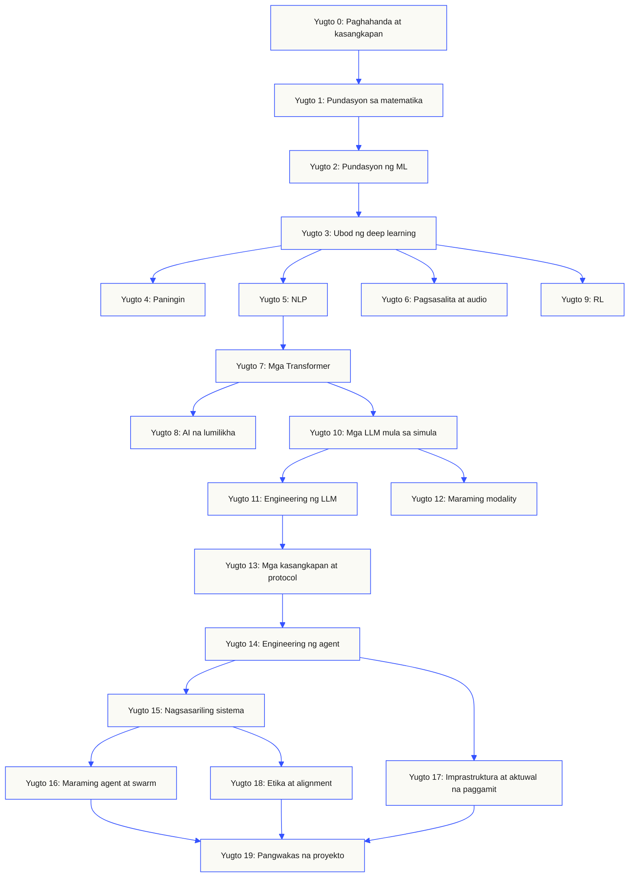

<p align="center" lang="tl"><sub>Isinalin sa Tagalog ang README na ito. Nananatiling pangunahing sanggunian ang <a href="../../README.md">README sa Ingles</a>.</sub></p>
<p align="center">
  
</p>

<p align="center">
  <a href="../../README.md">🇬🇧 English</a> ·
  <a href="../../i18n/zh/README.md">🇨🇳 简体中文</a> ·
  <a href="../../i18n/zh-TW/README.md">🇹🇼 繁體中文（台灣）</a> ·
  <a href="../../i18n/ja/README.md">🇯🇵 日本語</a> ·
  <a href="../../i18n/ko/README.md">🇰🇷 한국어</a> ·
  <a href="../../i18n/pt/README.md">🇵🇹 Português</a> ·
  <a href="../../i18n/pt-BR/README.md">🇧🇷 Português (Brasil)</a> ·
  <a href="../../i18n/es/README.md">🇪🇸 Español</a> ·
  <a href="../../i18n/de/README.md">🇩🇪 Deutsch</a> ·
  <a href="../../i18n/fr/README.md">🇫🇷 Français</a> ·
  <a href="../../i18n/it/README.md">🇮🇹 Italiano</a> ·
  <a href="../../i18n/nl/README.md">🇳🇱 Nederlands</a> ·
  <a href="../../i18n/pl/README.md">🇵🇱 Polski</a> ·
  <a href="../../i18n/cs/README.md">🇨🇿 Čeština</a> ·
  <a href="../../i18n/ro/README.md">🇷🇴 Română</a> ·
  <a href="../../i18n/hu/README.md">🇭🇺 Magyar</a> ·
  <a href="../../i18n/el/README.md">🇬🇷 Ελληνικά</a> ·
  <a href="../../i18n/sv/README.md">🇸🇪 Svenska</a> ·
  <a href="../../i18n/da/README.md">🇩🇰 Dansk</a> ·
  <a href="../../i18n/no/README.md">🇳🇴 Norsk</a> ·
  <a href="../../i18n/fi/README.md">🇫🇮 Suomi</a> ·
  <a href="../../i18n/ru/README.md">🇷🇺 Русский</a> ·
  <a href="../../i18n/uk/README.md">🇺🇦 Українська</a> ·
  <a href="../../i18n/tr/README.md">🇹🇷 Türkçe</a> ·
  <a href="../../i18n/he/README.md">🇮🇱 עברית</a> ·
  <a href="../../i18n/ar/README.md">🇸🇦 العربية</a> ·
  <a href="../../i18n/fa/README.md">🇮🇷 فارسی</a> ·
  <a href="../../i18n/hi/README.md">🇮🇳 हिन्दी</a> ·
  <a href="../../i18n/bn/README.md">🇧🇩 বাংলা</a> ·
  <a href="../../i18n/ur/README.md">🇵🇰 اردو</a> ·
  <a href="../../i18n/th/README.md">🇹🇭 ไทย</a> ·
  <a href="../../i18n/vi/README.md">🇻🇳 Tiếng Việt</a> ·
  <a href="../../i18n/id/README.md">🇮🇩 Bahasa Indonesia</a> ·
  <a href="../../i18n/tl/README.md">🇵🇭 Tagalog</a>
</p>

<p align="center">
  <a href="../../LICENSE"></a>
  <a href="../../ROADMAP.md"></a>
  <a href="#contents"></a>
  <a href="https://github.com/rohitg00/ai-engineering-from-scratch/stargazers"></a>
  <a href="https://aiengineeringfromscratch.com"></a>
  <p align="center">
 <a href="https://www.star-history.com/rohitg00/ai-engineering-from-scratch">
  <picture><source media="(prefers-color-scheme: dark)" srcset="https://api.star-history.com/badge?repo=rohitg00/ai-engineering-from-scratch&type=rank&theme=dark" /><source media="(prefers-color-scheme: light)" srcset="https://api.star-history.com/badge?repo=rohitg00/ai-engineering-from-scratch&type=rank" /></picture> <picture><source media="(prefers-color-scheme: dark)" srcset="https://api.star-history.com/badge?repo=rohitg00/ai-engineering-from-scratch&type=trending&theme=dark" /><source media="(prefers-color-scheme: light)" srcset="https://api.star-history.com/badge?repo=rohitg00/ai-engineering-from-scratch&type=trending" /></picture>
 </a>
</p>
</p>

### Mga sponsor

<p align="center">
  <a href="https://serpapi.com/ai-engineering-from-scratch"><picture><source media="(min-width: 768px)" srcset="../../assets/sponsors/serpapi-banner-compact.png" width="48%"></picture></a>
  <a href="https://nitrostack.ai/referral/aiengineeringfromscratch"><picture><source media="(min-width: 768px)" srcset="../../assets/sponsors/nitrostack-banner-equal.png" width="48%"></picture></a>
</p>

<p align="center">
  <sub><span>Dahil sa suporta mo, nananatiling libre at open source ang bawat aralin.</span> <a href="#supporters">Tingnan ang lahat ng sumusuporta</a> · <a href="../../SPONSORS.md">Maging sponsor</a></sub>
</p>

```text
░░░▒▒▒░░░▒▒▒░░░▒▒▒░░░▒▒▒░░░▒▒▒░░░▒▒▒░░░▒▒▒░░░▒▒▒░░░▒▒▒░░░▒▒▒░░░▒▒▒░░░▒▒▒░░░▒▒▒░░░▒▒▒░░░▒▒▒
```

> **84% ng mga estudyante ay gumagamit na ng mga AI tool. 18% lamang ang nakakaramdam na handa silang gamitin ang mga ito sa propesyonal na trabaho.** Tinutugunan ng kurikulum na ito ang agwat na iyon.
>
> 523 aralin. 20 yugto. ~342 oras. Python, TypeScript, Rust, Julia. Bawat aralin ay may nagagawang magagamit muli: isang prompt, skill, agent, o MCP server. Libre, open source, MIT.
>
> Hindi ka lang natututo ng AI. Ikaw mismo ang bubuo nito, mula simula hanggang dulo.

<!-- STATS:START (generated from site/stats.json by build.js — do not edit by hand) -->
<p align="center"><sub><b>114,584</b> mambabasa &nbsp;·&nbsp; <b>181,995</b> pagtingin sa pahina sa nakalipas na 30 araw &nbsp;·&nbsp; noong 2026-08-29</sub></p>
<!-- STATS:END -->

## Magsimula rito: piliin kung ano ang gusto mong buuin

Hindi mo kailangang tingnan ang lahat ng 523 aralin bago magsimula. Pumili ng isang layunin. Binubuksan ng bawat link ang parehong kurikulum sa GitHub o sa website, at pareho ang code ng aralin sa dalawang bersiyon.

| Layunin mo | Matuto sa GitHub | Matuto sa website |
|---|---|---|
| Baguhan ako at gusto ko ng kumpletong pundasyon | [Yugto 0: Pag-setup at mga tool](../../phases/00-setup-and-tooling/) | [Development environment](https://aiengineeringfromscratch.com/lesson?path=phases/00-setup-and-tooling/01-dev-environment) |
| Marunong ako ng Python at gusto ko ng pundasyon sa matematika at ML | [Yugto 1: Pundasyon sa matematika](../../phases/01-math-foundations/) | [Pag-unawa sa linear algebra](https://aiengineeringfromscratch.com/lesson?path=phases/01-math-foundations/01-linear-algebra-intuition) |
| Gusto kong bumuo ng mga LLM application para sa aktuwal na paggamit | [Yugto 11: LLM Engineering](../../phases/11-llm-engineering/) | [Prompt Engineering](https://aiengineeringfromscratch.com/lesson?path=phases/11-llm-engineering/01-prompt-engineering) |
| Gusto kong bumuo ng mga agent | [Yugto 14: Agent Engineering](../../phases/14-agent-engineering/) | [Ang agent loop](https://aiengineeringfromscratch.com/lesson?path=phases/14-agent-engineering/01-the-agent-loop) |
| Gusto kong gumamit ng mga coding agent sa mga tunay na repository | [Landas sa engineering na may tulong ng agent](../../learning-paths/using-coding-agents.json) | [Engineering na may tulong ng agent](https://aiengineeringfromscratch.com/lesson?path=phases/14-agent-engineering/31-agent-workbench-why-models-fail&learningPath=using-coding-agents) |
| Gusto kong matukoy ang tamang bubuuin bago magpatupad | [Landas sa pagpapasya at paghahatid ng produkto](../../learning-paths/shaping-the-build.json) | [Pagpapasya at paghahatid ng produkto](https://aiengineeringfromscratch.com/lesson?path=phases/14-agent-engineering/47-outcomes-before-output&learningPath=shaping-the-build) |
| Gusto kong bumuo gamit ang Model Context Protocol (MCP) | [Ruta ng Model Context Protocol (MCP)](../../phases/13-tools-and-protocols/README.md#model-context-protocol-mcp-path) | [Landas ng Model Context Protocol (MCP)](https://aiengineeringfromscratch.com/lesson?path=phases/13-tools-and-protocols/06-mcp-fundamentals&learningPath=model-context-protocol) |
| Gusto kong magsulat at maglabas ng Agent Skills | [Nakatuong ruta ng Agent Skills](../../phases/13-tools-and-protocols/README.md#agent-skills-fast-path) | [Landas ng Agent Skills](https://aiengineeringfromscratch.com/lesson?path=phases/13-tools-and-protocols/22-skills-and-agent-sdks&learningPath=agent-skills) |
| Gusto kong maghanda para sa sertipikasyon ng Claude | [Panimulang gabay sa sertipikasyon](../../certifications/claude/GETTING_STARTED.md) | [Akademya ng sertipikasyon](https://aiengineeringfromscratch.com/certifications.html) |
| Gusto kong maghanda para sa MCP Associate (MCPA) | [Panimulang gabay sa MCPA](../../certifications/mcpa/GETTING_STARTED.md) | [Landas ng MCPA](https://aiengineeringfromscratch.com/certification?id=mcpa-f) |

Hindi sigurado kung saan ka magsisimula? Gamitin ang [`start-learning` tutor para matukoy ang antas mo](../../skills/start-learning/SKILL.md) o ang [gabay sa mga kinakailangan sa website](https://aiengineeringfromscratch.com/prereqs.html).

Ihambing ang apat na pangunahing larangan at anim na ruta ng karera sa [Mga Landas sa Pag-aaral ng AI Engineering](https://aiengineeringfromscratch.com/learning-paths.html).

### Gamitin ang parehong paraan sa bawat aralin

1. **Basahin** ang `docs/en.md` at ipaliwanag ang pangunahing ideya sa sarili mong mga salita.
2. **I-type at buuin** ang mahalagang code sa halip na ituring na dekorasyon ang code block.
3. **Patakbuhin** ang command ng aralin mula sa root directory ng repository, ang directory na may `README.md` at `phases/`.
4. **Magtabi ng ebidensiya**: ang command, working directory, exit code, makabuluhang output, at artifact na binago o ginawa mo.
5. **Magpatuloy** lamang kapag kaya mong ipaliwanag ang output at gumawa ng isang maliit na pagbabago nang hindi nanghuhula.

Ang mga path sa mga command ng aralin ay mula sa root directory ng repository maliban kung malinaw na sinasabi ng aralin na lumipat ng directory. Kung may ilang programming language ang aralin, patakbuhin ang implementasyon sa wikang pinag-aaralan mo.

### I-clone ito at gawin ang unang ebidensiya mo

```bash
git clone https://github.com/rohitg00/ai-engineering-from-scratch.git
cd ai-engineering-from-scratch
python3 phases/00-setup-and-tooling/01-dev-environment/code/verify.py --route beginner
python3 phases/01-math-foundations/01-linear-algebra-intuition/code/vectors.py
```

Inihihiwalay ng paunang pagsusuri ang mga kinakailangan ngayon sa mga tool na kakailanganin sa susunod. Bawat hindi pumasa na kinakailangang pagsusuri ay may natukoy na dahilan at command para ayusin ito. Ang ikalawang command ay nagpapatakbo ng araling walang dagdag na dependency at nagtatapos sa pagpapakitang ang pag-multiply ng matrix at vector ang operasyon sa loob ng isang layer ng neural network. Itabi ang output na iyon sa terminal bilang una mong ebidensiya.

## Idagdag ang AI tutor sa loob ng 30 segundo

Kung naka-install na ang Node.js, `npx`, at isang coding agent na sumusuporta sa skill, maaari nang maging tutor ang coding agent mo sa dalawang command. Hindi kailangan ng clone ng repository upang i-install o basahin ang tutor. Kailangan ng `python3` ang mga napapatakbong lab sa mga nakatuong landas. Kailangan din ng mga lab ng Agent Skills ang napiling host at saklaw ng skill sa user o proyekto na maaaring sulatan.

Suriin muna ang mga lokal na kinakailangan:

```bash
node --version
npx --version
python3 --version
```

Pagkatapos, i-install ang mga skill ng kurikulum at piliin ang host at saklaw na balak mong gamitin kapag nagtanong ang installer:

```bash
npx skills add rohitg00/ai-engineering-from-scratch
```

Ang host ang nagtatakda ng sintaks ng pagtawag, hindi ang portable na format na `SKILL.md`:

| Host na aplikasyon | Simulan ang kurso | Simulan ang Model Context Protocol (MCP) | Simulan ang Agent Skills | Sagutan ang pagsusulit ng yugto |
|---|---|---|---|---|
| Codex | `start-learning`, o piliin mula sa `/skills` | `learn-mcp`, o piliin mula sa `/skills` | `learn-agent-skills`, o piliin mula sa `/skills` | `check-understanding 13`, o piliin mula sa `/skills` |
| Claude Code | `/start-learning` | `/learn-mcp` | `/learn-agent-skills` | `/check-understanding 13` |
| Ibang katugmang host | `Use start-learning to begin the course.` | `Use learn-mcp to start the Model Context Protocol (MCP) path.` | `Use learn-agent-skills to start the Agent Skills Engineering path.` | `Use check-understanding to quiz me on Phase 13.` |

Itinutugma ng sampung-tanong na pagsusulit ang alam mo na sa angkop na panimulang yugto at nagse-save ng personal na plano sa `LEARNING.md`. Mula roon, nagtuturo ang skill na `learn` ng isang aralin bawat session: konsepto, matematika, code, pagsusulit. Kinukuha nito ang mga aralin nang direkta sa repository na ito, at dinadala ka ng skill na `course-guide` sa mismong araling tumatalakay sa bahaging hindi mo maintindihan. Sa Codex, gamitin ang `learn` at `course-guide`; sa Claude Code, gamitin ang `/learn` at `/course-guide`; sa ibang katugmang host, hilinging gamitin ang skill ayon sa pangalan.

Model Context Protocol (MCP) lang ang gusto mo? Gamitin ang pagtawag sa MCP para sa host mo. Gumagawa ito ng `MCP-LEARNING.md` at sumusunod sa iisang rutang may 17 aralin tungkol sa stateless na request, transport, dalawang-direksiyong trabaho, seguridad, pagiging maaasahan, pamamahala ng registry, at ebidensiya ng pagsunod. Nasa [manifest ng Model Context Protocol (MCP)](../../learning-paths/model-context-protocol.json) ang eksaktong pagkakasunod-sunod at mga checkpoint.

Agent Skills lang ang gusto mo? Gamitin ang pagtawag sa Agent Skills para sa host mo. Gumagawa ito ng `AGENT-SKILLS-LEARNING.md` at sumusunod sa magkakaugnay na limang aralin: kontrata, pagtuklas, pagtawag, hangganan ng sandbox, at pagkatapos ay mga pagsusuri sa paglabas at portability sa tunay na host. Magsimula sa web sa [landas ng Agent Skills](https://aiengineeringfromscratch.com/lesson?path=phases/13-tools-and-protocols/22-skills-and-agent-sdks&learningPath=agent-skills).

Inililista ng installer ang mga host na kaya nitong i-configure at nagtatanong kung saan mag-i-install. Kung wala ka pang Node.js, `npx`, `python3`, suportadong host, o saklaw na maaaring sulatan, gamitin ang website o manu-manong basahin ang `docs/en.md`. Itinuturo ng paraang iyon ang mga konsepto, ngunit nakabinbin pa ang ebidensiya ng pagtuklas, pagtawag, script, at pag-uninstall sa tunay na host hanggang magawa ang paunang pagsusuri. Basahin ang mga aralin sa [aiengineeringfromscratch.com](https://aiengineeringfromscratch.com).

## Paano ito gumagana

Karamihan ng materyal sa AI ay nagtuturo ng magkakahiwalay na piraso. Isang papel dito, isang post sa fine-tuning doon, isang kahanga-hangang demo ng agent sa iba pang lugar. Bihirang mag-ugnay ang mga piraso. Nakapaglalabas ka ng chatbot pero hindi mo maipaliwanag ang loss curve nito. Naikakabit mo ang isang function sa agent pero hindi mo masabi kung ano ang ginagawa ng attention sa loob ng modelong tumatawag dito.

Ang kurikulum na ito ang nag-uugnay sa lahat. 20 yugto, 523 aralin, apat na wika: Python, TypeScript, Rust, Julia. Nagsisimula sa linear algebra at umaabot sa mga autonomous swarm. Bawat algorithm ay binubuo muna mula sa mismong matematika: backpropagation, tokenizer, attention, siklo ng agent. Pagdating sa PyTorch, alam mo na ang ginagawa nito sa loob.

Pareho ang siklo ng bawat aralin: basahin ang problema, hanguin ang matematika, isulat ang code, patakbuhin ang pagsubok, itabi ang nagawa. Walang limang-minutong video, deployment na basta kinopya at idinikit, o pag-alalay sa bawat hakbang. Libre, open source, at idinisenyong tumakbo sa sarili mong laptop.

```text
░░░▒▒▒░░░▒▒▒░░░▒▒▒░░░▒▒▒░░░▒▒▒░░░▒▒▒░░░▒▒▒░░░▒▒▒░░░▒▒▒░░░▒▒▒░░░▒▒▒░░░▒▒▒░░░▒▒▒░░░▒▒▒░░░▒▒▒
```

## Estruktura ng kurikulum

Magkakapatong ang dalawampung yugto. Matematika ang pundasyon. Mga agent at aktuwal na deployment ang nasa tuktok. Lumaktaw kung alam mo na ang mga nasa ibaba, pero huwag basta lumaktaw at pagkatapos ay magtaka kung bakit may pumapalya sa itaas.



```text
░░░▒▒▒░░░▒▒▒░░░▒▒▒░░░▒▒▒░░░▒▒▒░░░▒▒▒░░░▒▒▒░░░▒▒▒░░░▒▒▒░░░▒▒▒░░░▒▒▒░░░▒▒▒░░░▒▒▒░░░▒▒▒░░░▒▒▒
```

## Estruktura ng isang aralin

May sariling folder ang bawat aralin, na pare-pareho ang estruktura sa buong kurikulum:

```text
phases/<NN>-<phase-name>/<NN>-<lesson-name>/
├── code/      mga implementasyong napapatakbo (Python, TypeScript, Rust, Julia)
├── docs/
│   └── en.md  paliwanag ng aralin
└── outputs/   mga prompt, skill, agent o MCP server na ginagawa ng araling ito
```

May anim na hakbang ang bawat aralin. Ang paghahating *Buuin / Gamitin* ang sentro: ipinatutupad mo muna ang algorithm mula sa simula, pagkatapos ay pinapatakbo ang parehong bagay gamit ang library para sa aktuwal na trabaho. Naiintindihan mo ang ginagawa ng framework dahil isinulat mo mismo ang mas maliit na bersiyon.

```mermaid
%%{init: {'theme':'base','themeVariables':{'primaryColor':'#fafaf5','primaryTextColor':'#1a1a1a','primaryBorderColor':'#3553ff','lineColor':'#3553ff','fontFamily':'JetBrains Mono','fontSize':'13px'}}}%%
flowchart LR
  M["PRINSIPYO<br/><sub>pangunahing ideya sa isang linya</sub>"] --> Pr["PROBLEMA<br/><sub>tiyak na suliranin</sub>"]
  Pr --> C["KONSEPTO<br/><sub>mga diagram at pag-unawa</sub>"]
  C --> B["BUUIN<br/><sub>mismong matematika, walang framework</sub>"]
  B --> U["GAMITIN<br/><sub>pareho sa PyTorch / sklearn</sub>"]
  U --> S["ILABAS<br/><sub>mga prompt · skill · agent · MCP</sub>"]
```



## Pagsisimula

Tatlong paraan para magsimula. Pumili ng isa.

**Opsiyon A: matuto sa terminal *(inirerekomenda)*.** Pagkatapos ng paunang pagsusuri sa Node.js, `npx`, host, at saklaw sa itaas, i-install ang mga skill sa pag-aaral sa katugmang agent at hayaan ang kurso na gumabay:

```bash
npx skills add rohitg00/ai-engineering-from-scratch
```

Gamitin ang talahanayan ng pagtawag ayon sa host sa itaas. Ibinibigay ng mga naka-install na skill ang `start-learning`, `learn`, `course-guide`, at ang mga nakatuong rutang `learn-mcp` at `learn-agent-skills`. Maaaring kunin ang teksto ng aralin mula sa repository na ito nang walang clone. Kailangan ng lokal na clone para sa mga kinopyang command ng code at napapatakbong lab ng MCP o Agent Skills. Nasa `LEARNING.md`, `MCP-LEARNING.md`, o `AGENT-SKILLS-LEARNING.md` ng proyekto ang progreso, kaya maaaring magpatuloy ang bawat session.

**Opsiyon B: magbasa.** Buksan ang anumang kumpletong aralin sa [aiengineeringfromscratch.com](https://aiengineeringfromscratch.com) o buksan ang isang yugto sa [Mga nilalaman](#contents). Walang setup o pag-clone.

**Opsiyon C: i-clone at patakbuhin.**

```bash
git clone https://github.com/rohitg00/ai-engineering-from-scratch.git
cd ai-engineering-from-scratch
python3 phases/01-math-foundations/01-linear-algebra-intuition/code/vectors.py
```

Awtomatikong nilo-load din ng pag-clone ang mga skill sa pag-aaral sa Claude Code, at ibinibigay ang code ng bawat aralin sa tutor na `learn` upang tunay na patakbuhin sa halip na sabayang basahin lang.

### Mga kinakailangan

- Marunong kang magsulat ng code (anumang wika; makatutulong ang Python).
- Gusto mong maunawaan kung paano **talagang gumagana** ang AI, hindi lang tumawag ng API.

### Maghanda para sa mga sertipikasyon ng Claude

Ang [Claude Certification Academy](../../certifications/claude/README.md) ay libre at open source na programa sa paghahanda para sa lahat ng apat na opisyal na landas ng sertipikasyon ng Claude: Associate Foundations, Developer Foundations, Architect Foundations, at Architect Professional. Pinagsasama ng bawat ruta ang mga araling nakaayon sa balangkas ng pagsusulit, mga lab na napapatakbo, panimulang pagsusuri, pangwakas na proyekto, at isang orihinal na pagsasanay na pagsusulit na buong haba.

Gamitin ang [gabay sa pagsisimula sa GitHub gamit ang AI](../../certifications/claude/GETTING_STARTED.md) kasama ng Claude Code, Codex, ChatGPT, Cursor, o ibang agent. Patakbuhin ang `claude-certification` sa Codex, `/claude-certification` sa Claude Code, o hilingin sa ibang host na gamitin ang `claude-certification`. Pumipili ito ng landas, gumagawa ng patuloy na ruta sa `CLAUDE-CERTIFICATION.md`, nagtuturo nang paisa-isang hakbang, nagpapatakbo ng tunay na lab, at nagbibigay ng feedback batay sa mga nagawa. Nasa [website ng sertipikasyon](https://aiengineeringfromscratch.com/certifications.html) din ang parehong kurikulum.

Ang akademya ay independiyenteng materyal sa pag-aaral batay sa mga pampublikong layunin ng pagsusulit. Hindi ito kaanib ng Anthropic, hindi nito kinokopya ang mga tanong sa aktuwal na pagsusulit, at hindi nito magagarantiya ang pagpasa.

### Maghanda para sa sertipikasyong MCP Associate (MCPA)

Ang [Kurikulum ng Sertipikasyong MCPA](../../certifications/mcpa/README.md) ay libre at open source na programa sa paghahanda para sa pagsusulit na Model Context Protocol Associate ng Agentic AI Foundation, na inihahatid sa pamamagitan ng Linux Foundation Training. Itinuturo ng 34 aralin nito ang stateless na protocol na 2026-07-28 sa limang larangan ng pagsusulit: `_meta` sa bawat request at `server/discover` kapalit ng lumang handshake, mga request na maraming balikan, subscription, caching, mga extension na tasks at MCP Apps, awtorisasyong OAuth, at mga antas ng registry at SDK. May napapatakbong lab gamit ang standard library ang bawat aralin, at sinusuri ang transcript nito laban sa kasalukuyang format ng komunikasyon. Dagdag sa landas ang panimulang pagsusuri, pangwakas na proyekto, at tatlong orihinal na pagsasanay na pagsusulit na buong haba, na sumusunod ang halo ng tanong sa inilathalang timbang ng balangkas.

Gamitin ang [gabay sa pagsisimula sa GitHub gamit ang AI](../../certifications/mcpa/GETTING_STARTED.md) kasama ng Claude Code, Codex, ChatGPT, Cursor, o ibang agent. Patakbuhin ang `mcpa-certification` sa Codex, `/mcpa-certification` sa Claude Code, o hilingin sa ibang host na gamitin ang `mcpa-certification`. Gumagawa ito ng patuloy na ruta sa `MCPA-CERTIFICATION.md`, nagtuturo nang paisa-isang hakbang, nagpapatakbo ng tunay na lab, at nagbibigay ng feedback batay sa mga nagawa. Nasa [pahina ng landas ng MCPA](https://aiengineeringfromscratch.com/certification?id=mcpa-f) din ang parehong kurikulum.

Ang kurikulum na ito ay independiyenteng materyal sa pag-aaral batay sa mga pampublikong layunin ng pagsusulit. Hindi ito kaanib ng Agentic AI Foundation o Linux Foundation, hindi nito kinokopya ang mga tanong sa aktuwal na pagsusulit, at hindi nito magagarantiya ang pagpasa.

### Ang mga skill sa pag-aaral

| Skill sa pag-aaral | Ginagawa nito |
|---|---|
| [`start-learning`](../../skills/start-learning/SKILL.md) | Isang beses na paghahanda: dahilan mo sa pag-aaral, pagsusulit ng antas, personal na planong naka-save sa `LEARNING.md`. |
| [`learn`](../../skills/learn/SKILL.md) | Siklo ng tutor. Paunang pagbalik-tanaw, interaktibong pagtuturo ng susunod na aralin, at pagsusulit nito; itinatala ang progreso at pila ng babalikan. |
| [`course-guide`](../../skills/course-guide/SKILL.md) | Tagapagturo ng lokasyon ng paksa. "Saan ko pag-aaralan ang attention?" o "NaN ang loss ko" → eksaktong mga aralin, na may link. |
| [`learn-mcp`](../../skills/learn-mcp/SKILL.md) | Tutor na nakatuon sa Model Context Protocol (MCP). Gumagawa ng `MCP-LEARNING.md`, sumusunod sa manifest na may 17 aralin, at nagtatala ng ebidensiya sa komunikasyon, seguridad, pagiging maaasahan at pagsunod. |
| [`learn-agent-skills`](../../skills/learn-agent-skills/SKILL.md) | Tutor na nakatuon sa Agent Skills. Gumagawa ng `AGENT-SKILLS-LEARNING.md`, nagtuturo ng mga aralin 22, 24, 25, 26 at 27, at nagtatala ng ebidensiya sa tunay na host. |
| [`claude-certification`](../../skills/claude-certification/SKILL.md) | Tutor ng sertipikasyon. Pumipili ng CCAO-F, CCDV-F, CCAR-F o CCAR-P; nagtuturo ng bawat aralin; nagpapatakbo ng lab; sumusuri ng nagawa; nagbibigay ng panimulang pagsusuri at mock exam; nagsa-save ng progreso. |
| [`mcpa-certification`](../../skills/mcpa-certification/SKILL.md) | Tutor ng MCPA. Sumusunod sa rutang `mcpa-f` na may 34 aralin tungkol sa protocol na 2026-07-28; nagtuturo ng bawat aralin; nagpapatakbo ng lab at tagasuri ng komunikasyon; nagbibigay ng panimulang pagsusuri at tatlong mock exam; nagsa-save ng progreso. |
| [`find-your-level`](../../skills/find-your-level/SKILL.md) | Sampung-tanong na pagsusulit ng antas. Itinutugma ang kaalaman mo sa panimulang yugto at gumagawa ng personal na landas na may tantiyang oras. |
| [`check-understanding <phase>`](../../skills/check-understanding/SKILL.md) | Pagsusulit bawat yugto, walong tanong, na may feedback at tiyak na araling babalikan. Gamitin ang anyong Codex, Claude Code o natural na wika sa talahanayan ng pagtawag sa itaas. |

```text
░░░▒▒▒░░░▒▒▒░░░▒▒▒░░░▒▒▒░░░▒▒▒░░░▒▒▒░░░▒▒▒░░░▒▒▒░░░▒▒▒░░░▒▒▒░░░▒▒▒░░░▒▒▒░░░▒▒▒░░░▒▒▒░░░▒▒▒
```

## Basahin ang pangunahing kurikulum bilang aklat

Ang pangunahing kurikulum na may 20 yugto sa `phases/` ay binubuo bilang serye ng anim na tomo. Ginagawa ng CI ang EPUB at PDF mula sa parehong pinagmulang aralin at ikinakabit sa bawat [release sa GitHub](https://github.com/rohitg00/ai-engineering-from-scratch/releases); palaging tumuturo sa pinakabagong release ang mga link sa ibaba. Ang numero ng tomo ay pagkakasunod sa serye, hindi bersiyon: may petsa ng edisyon ang bawat kopya, at maaari pa ring i-download ang mga lumang edisyon mula sa kani-kanilang release.

Sadyang hindi ginagawang aklat ang mga kurikulum ng sertipikasyon. Nananatiling ganap na suportado sa GitHub at website ang state ng AI tutor, mga lab na napapatakbo, interaktibong larawan, panimulang pagsusuri, at mga mock exam na may takdang oras.

| Tomo | Pamagat | Mga yugto | I-download |
|-----|-------|--------|----------|
| 1 | Pundasyon · Matematika, mga kasangkapan at klasikal na machine learning | 00-02 | [EPUB](https://github.com/rohitg00/ai-engineering-from-scratch/releases/latest/download/aiefs-vol1-foundations.epub) · [PDF](https://github.com/rohitg00/ai-engineering-from-scratch/releases/latest/download/aiefs-vol1-foundations.pdf) |
| 2 | Deep Learning · Mga network, vision at pagsasalita | 03, 04, 06 | [EPUB](https://github.com/rohitg00/ai-engineering-from-scratch/releases/latest/download/aiefs-vol2-deep-learning.epub) · [PDF](https://github.com/rohitg00/ai-engineering-from-scratch/releases/latest/download/aiefs-vol2-deep-learning.pdf) |
| 3 | Wika · Mga pundasyon ng NLP at Transformer | 05, 07 | [EPUB](https://github.com/rohitg00/ai-engineering-from-scratch/releases/latest/download/aiefs-vol3-language.epub) · [PDF](https://github.com/rohitg00/ai-engineering-from-scratch/releases/latest/download/aiefs-vol3-language.pdf) |
| 4 | Malalaking Language Model · Paglikha, reinforcement, pre-training at engineering | 08-11 | [EPUB](https://github.com/rohitg00/ai-engineering-from-scratch/releases/latest/download/aiefs-vol4-llms.epub) · [PDF](https://github.com/rohitg00/ai-engineering-from-scratch/releases/latest/download/aiefs-vol4-llms.pdf) |
| 5 | Mga Agent · Multimodality, protocol, awtonomiya at swarm | 12-16 | [EPUB](https://github.com/rohitg00/ai-engineering-from-scratch/releases/latest/download/aiefs-vol5-agents.epub) · [PDF](https://github.com/rohitg00/ai-engineering-from-scratch/releases/latest/download/aiefs-vol5-agents.pdf) |
| 6 | Aktuwal na Paggamit · Imprastruktura, kaligtasan at pangwakas na proyekto | 17-19 | [EPUB](https://github.com/rohitg00/ai-engineering-from-scratch/releases/latest/download/aiefs-vol6-production.epub) · [PDF](https://github.com/rohitg00/ai-engineering-from-scratch/releases/latest/download/aiefs-vol6-production.pdf) |

Ang aklat ay larawan sa isang sandali; ang repository na ito ang patuloy na umuunlad na edisyon. Nagtatapos ang bawat kabanata sa mga link pabalik sa mga animated na larawan, pagsusulit, at napapatakbong code ng aralin. Buuin nang lokal gamit ang `python3 scripts/build_book.py` (kailangan ang pandoc); nasa [book/README.md](../../book/README.md) ang detalye ng pipeline.

```text
░░░▒▒▒░░░▒▒▒░░░▒▒▒░░░▒▒▒░░░▒▒▒░░░▒▒▒░░░▒▒▒░░░▒▒▒░░░▒▒▒░░░▒▒▒░░░▒▒▒░░░▒▒▒░░░▒▒▒░░░▒▒▒░░░▒▒▒
```

## Bawat aralin ay may nagagawang bagay

Nagtatapos ang ibang kurikulum sa *"binabati kita, natutuhan mo ang X."* Nagtatapos ang bawat aralin dito sa **kasangkapang magagamit muli** na maaari mong i-install o idikit sa araw-araw mong trabaho.

<table>
<tr>
<th align="left" width="25%"><br/><sub>FIG_001 · A</sub><br/><b>MGA PROMPT</b></th>
<th align="left" width="25%"><br/><sub>FIG_001 · B</sub><br/><b>MGA SKILL</b></th>
<th align="left" width="25%"><br/><sub>FIG_001 · C</sub><br/><b>MGA AGENT</b></th>
<th align="left" width="25%"><br/><sub>FIG_001 · D</sub><br/><b>MGA MCP SERVER</b></th>
</tr>
<tr>
<td valign="top">Idikit sa anumang AI assistant para sa tulong na antas ng eksperto sa isang tiyak na gawain.</td>
<td valign="top">Ilagay sa Claude, Cursor, Codex, OpenClaw, Hermes o anumang agent na nagbabasa ng <code>SKILL.md</code>.</td>
<td valign="top">I-deploy bilang mga nagsasariling worker: ikaw mismo ang sumulat ng siklo sa Yugto 14.</td>
<td valign="top">Ikabit sa anumang katugmang MCP client. Binuo mula simula hanggang dulo sa Yugto 13.</td>
</tr>
</table>

> I-install lahat gamit ang `python3 scripts/install_skills.py <target>`. Mga tunay na kasangkapan, hindi takdang-aralin. Sa dulo ng kurikulum, mayroon kang portfolio ng 523 nagawa na talagang naiintindihan mo dahil ikaw ang bumuo sa mga ito.

### FIG_002 · Isang buong halimbawa

Yugto 14, aralin 1: ang siklo ng agent. Humigit-kumulang 120 linya ng purong Python, walang dependency.

<table>
<tr>
<td valign="top" width="50%">

**`code/agent_loop.py`** &nbsp; <sub><i>buuin</i></sub>

```python
def run(query, tools):
    history = [user(query)]
    for step in range(MAX_STEPS):
        msg = llm(history)
        if msg.tool_calls:
            for call in msg.tool_calls:
                result = tools[call.name](**call.args)
                history.append(tool_result(call.id, result))
            continue
        return msg.content
    raise StepLimitExceeded
```

</td>
<td valign="top" width="50%">

**`outputs/skill-agent-loop.md`** &nbsp; <sub><i>ilabas</i></sub>

```markdown
---
name: agent-loop
description: ReAct-style loop for any tool list
phase: 14
lesson: 01
---

Implement a minimal agent loop that...
```

**`outputs/prompt-debug-agent.md`**

```markdown
You are an agent debugger. Given the trace
of an agent run, identify the step where
the agent went wrong and explain why...
```

</td>
</tr>
</table>

```text
░░░▒▒▒░░░▒▒▒░░░▒▒▒░░░▒▒▒░░░▒▒▒░░░▒▒▒░░░▒▒▒░░░▒▒▒░░░▒▒▒░░░▒▒▒░░░▒▒▒░░░▒▒▒░░░▒▒▒░░░▒▒▒░░░▒▒▒
```

<a id="contents"></a>

## Mga nilalaman

Dalawampung yugto. I-click ang anumang yugto upang buksan ang listahan ng mga aralin.

<a id="phase-0"></a>
### Yugto 0: Pag-setup at mga kasangkapan `12 aralin`
> Ihanda ang kapaligiran mo para sa lahat ng kasunod.

| # | Aralin | Uri | Wika |
|:---:|--------|:----:|------|
| 01 | [Kapaligiran para sa pagbuo](../../phases/00-setup-and-tooling/01-dev-environment/) | Buuin | Python |
| 02 | [Git at pagtutulungan](../../phases/00-setup-and-tooling/02-git-and-collaboration/) | Pag-aralan | — |
| 03 | [Pag-setup ng GPU at cloud](../../phases/00-setup-and-tooling/03-gpu-setup-and-cloud/) | Buuin | Python |
| 04 | [Mga API at susi sa pag-access](../../phases/00-setup-and-tooling/04-apis-and-keys/) | Buuin | Python |
| 05 | [Jupyter Notebooks](../../phases/00-setup-and-tooling/05-jupyter-notebooks/) | Buuin | Python |
| 06 | [Mga kapaligiran ng Python](../../phases/00-setup-and-tooling/06-python-environments/) | Buuin | Shell |
| 07 | [Docker para sa AI](../../phases/00-setup-and-tooling/07-docker-for-ai/) | Buuin | Docker |
| 08 | [Pag-setup ng editor](../../phases/00-setup-and-tooling/08-editor-setup/) | Buuin | — |
| 09 | [Pamamahala ng datos](../../phases/00-setup-and-tooling/09-data-management/) | Buuin | Python |
| 10 | [Terminal at shell](../../phases/00-setup-and-tooling/10-terminal-and-shell/) | Pag-aralan | — |
| 11 | [Linux para sa AI](../../phases/00-setup-and-tooling/11-linux-for-ai/) | Pag-aralan | — |
| 12 | [Pag-debug at pagsukat ng pagganap](../../phases/00-setup-and-tooling/12-debugging-and-profiling/) | Buuin | Python |

<details id="phase-1">
<summary><b>Yugto 1: Mga pundasyon sa matematika</b> &nbsp;<code>22 aralin</code>&nbsp; <em>Unawain ang nasa likod ng bawat algorithm ng AI sa pamamagitan ng code.</em></summary>
<br/>

| # | Aralin | Uri | Wika |
|:---:|--------|:----:|------|
| 01 | [Pag-unawa sa linear algebra](../../phases/01-math-foundations/01-linear-algebra-intuition/) | Pag-aralan | Python, Julia |
| 02 | [Mga vector, matrix at operasyon](../../phases/01-math-foundations/02-vectors-matrices-operations/) | Buuin | Python, Julia |
| 03 | [Mga transformasyon ng matrix at eigenvalue](../../phases/01-math-foundations/03-matrix-transformations/) | Buuin | Python, Julia |
| 04 | [Calculus para sa ML: derivative at gradient](../../phases/01-math-foundations/04-calculus-for-ml/) | Pag-aralan | Python |
| 05 | [Chain rule at awtomatikong differentiation](../../phases/01-math-foundations/05-chain-rule-and-autodiff/) | Buuin | Python |
| 06 | [Probabilidad at mga distribusyon](../../phases/01-math-foundations/06-probability-and-distributions/) | Pag-aralan | Python |
| 07 | [Teorema ni Bayes at pag-iisip na estadistikal](../../phases/01-math-foundations/07-bayes-theorem/) | Buuin | Python |
| 08 | [Pag-optimize: pamilya ng gradient descent](../../phases/01-math-foundations/08-optimization/) | Buuin | Python |
| 09 | [Teorya ng impormasyon: entropy at KL divergence](../../phases/01-math-foundations/09-information-theory/) | Pag-aralan | Python |
| 10 | [Pagbawas ng dimensiyon: PCA, t-SNE, UMAP](../../phases/01-math-foundations/10-dimensionality-reduction/) | Buuin | Python |
| 11 | [Singular Value Decomposition](../../phases/01-math-foundations/11-singular-value-decomposition/) | Buuin | Python, Julia |
| 12 | [Mga operasyon sa tensor](../../phases/01-math-foundations/12-tensor-operations/) | Buuin | Python |
| 13 | [Katatagan ng mga numerikal na kalkulasyon](../../phases/01-math-foundations/13-numerical-stability/) | Buuin | Python |
| 14 | [Mga norm at distansiya](../../phases/01-math-foundations/14-norms-and-distances/) | Buuin | Python |
| 15 | [Estadistika para sa ML](../../phases/01-math-foundations/15-statistics-for-ml/) | Buuin | Python |
| 16 | [Mga paraan ng sampling](../../phases/01-math-foundations/16-sampling-methods/) | Buuin | Python |
| 17 | [Mga sistemang linear](../../phases/01-math-foundations/17-linear-systems/) | Buuin | Python |
| 18 | [Convex optimization](../../phases/01-math-foundations/18-convex-optimization/) | Buuin | Python |
| 19 | [Mga complex number para sa AI](../../phases/01-math-foundations/19-complex-numbers/) | Pag-aralan | Python |
| 20 | [Ang Fourier transform](../../phases/01-math-foundations/20-fourier-transform/) | Buuin | Python |
| 21 | [Teorya ng graph para sa ML](../../phases/01-math-foundations/21-graph-theory/) | Buuin | Python |
| 22 | [Mga stochastic process](../../phases/01-math-foundations/22-stochastic-processes/) | Pag-aralan | Python |

</details>

<details id="phase-2">
<summary><b>Yugto 2: Mga pundasyon ng ML</b> &nbsp;<code>18 aralin</code>&nbsp; <em>Klasikal na ML: pundasyon pa rin ng karamihan sa AI na aktuwal na ginagamit.</em></summary>
<br/>

| # | Aralin | Uri | Wika |
|:---:|--------|:----:|------|
| 01 | [Ano ang machine learning](../../phases/02-ml-fundamentals/01-what-is-machine-learning/) | Pag-aralan | Python |
| 02 | [Linear regression mula sa simula](../../phases/02-ml-fundamentals/02-linear-regression/) | Buuin | Python |
| 03 | [Logistic regression at pag-uuri](../../phases/02-ml-fundamentals/03-logistic-regression/) | Buuin | Python |
| 04 | [Mga decision tree at random forest](../../phases/02-ml-fundamentals/04-decision-trees/) | Buuin | Python |
| 05 | [Support Vector Machines](../../phases/02-ml-fundamentals/05-support-vector-machines/) | Buuin | Python |
| 06 | [KNN at mga sukatan ng distansiya](../../phases/02-ml-fundamentals/06-knn-and-distances/) | Buuin | Python |
| 07 | [Unsupervised learning: K-Means, DBSCAN](../../phases/02-ml-fundamentals/07-unsupervised-learning/) | Buuin | Python |
| 08 | [Pagdisenyo at pagpili ng feature](../../phases/02-ml-fundamentals/08-feature-engineering/) | Buuin | Python |
| 09 | [Pagsusuri ng modelo: mga sukatan at cross-validation](../../phases/02-ml-fundamentals/09-model-evaluation/) | Buuin | Python |
| 10 | [Bias, variance at learning curve](../../phases/02-ml-fundamentals/10-bias-variance/) | Pag-aralan | Python |
| 11 | [Mga pamamaraang ensemble: Boosting, Bagging, Stacking](../../phases/02-ml-fundamentals/11-ensemble-methods/) | Buuin | Python |
| 12 | [Pagtutono ng hyperparameter](../../phases/02-ml-fundamentals/12-hyperparameter-tuning/) | Buuin | Python |
| 13 | [Mga pipeline ng ML at pagsubaybay ng eksperimento](../../phases/02-ml-fundamentals/13-ml-pipelines/) | Buuin | Python |
| 14 | [Naive Bayes](../../phases/02-ml-fundamentals/14-naive-bayes/) | Buuin | Python |
| 15 | [Mga pundasyon ng time series](../../phases/02-ml-fundamentals/15-time-series/) | Buuin | Python |
| 16 | [Pagtukoy ng anomalya](../../phases/02-ml-fundamentals/16-anomaly-detection/) | Buuin | Python |
| 17 | [Paghawak sa datos na hindi balanse](../../phases/02-ml-fundamentals/17-imbalanced-data/) | Buuin | Python |
| 18 | [Pagpili ng feature](../../phases/02-ml-fundamentals/18-feature-selection/) | Buuin | Python |

</details>

<details id="phase-3">
<summary><b>Yugto 3: Ubod ng deep learning</b> &nbsp;<code>13 aralin</code>&nbsp; <em>Mga neural network mula sa unang mga prinsipyo. Walang framework hanggang makabuo ka ng sarili.</em></summary>
<br/>

| # | Aralin | Uri | Wika |
|:---:|--------|:----:|------|
| 01 | [Ang perceptron: kung saan nagsimula ang lahat](../../phases/03-deep-learning-core/01-the-perceptron/) | Buuin | Python |
| 02 | [Mga network na maraming layer at forward pass](../../phases/03-deep-learning-core/02-multi-layer-networks/) | Buuin | Python |
| 03 | [Backpropagation mula sa simula](../../phases/03-deep-learning-core/03-backpropagation/) | Buuin | Python |
| 04 | [Mga activation function: ReLU, Sigmoid, GELU at kung bakit](../../phases/03-deep-learning-core/04-activation-functions/) | Buuin | Python |
| 05 | [Mga loss function: MSE, cross-entropy, contrastive](../../phases/03-deep-learning-core/05-loss-functions/) | Buuin | Python |
| 06 | [Mga optimizer: SGD, Momentum, Adam, AdamW](../../phases/03-deep-learning-core/06-optimizers/) | Buuin | Python |
| 07 | [Mga paraan ng regularization: Dropout, Weight Decay, BatchNorm](../../phases/03-deep-learning-core/07-regularization/) | Buuin | Python |
| 08 | [Pagsisimula ng timbang at katatagan ng training](../../phases/03-deep-learning-core/08-weight-initialization/) | Buuin | Python |
| 09 | [Mga iskedyul ng learning rate at warmup](../../phases/03-deep-learning-core/09-learning-rate-schedules/) | Buuin | Python |
| 10 | [Bumuo ng sarili mong maliit na framework](../../phases/03-deep-learning-core/10-mini-framework/) | Buuin | Python |
| 11 | [Panimula sa PyTorch](../../phases/03-deep-learning-core/11-intro-to-pytorch/) | Buuin | Python |
| 12 | [Panimula sa JAX](../../phases/03-deep-learning-core/12-intro-to-jax/) | Buuin | Python |
| 13 | [Pag-debug ng mga neural network](../../phases/03-deep-learning-core/13-debugging-neural-networks/) | Buuin | Python |

</details>

<details id="phase-4">
<summary><b>Yugto 4: Paningin ng computer</b> &nbsp;<code>28 aralin</code>&nbsp; <em>Mula pixel tungo sa pag-unawa: larawan, video, 3D, VLM at world model.</em></summary>
<br/>

| # | Aralin | Uri | Wika |
|:---:|--------|:----:|------|
| 01 | [Mga pundasyon ng larawan: pixel, channel at color space](../../phases/04-computer-vision/01-image-fundamentals/) | Pag-aralan | Python |
| 02 | [Mga convolution mula sa simula](../../phases/04-computer-vision/02-convolutions-from-scratch/) | Buuin | Python |
| 03 | [Mga CNN: mula LeNet hanggang ResNet](../../phases/04-computer-vision/03-cnns-lenet-to-resnet/) | Buuin | Python |
| 04 | [Pag-uuri ng larawan](../../phases/04-computer-vision/04-image-classification/) | Buuin | Python |
| 05 | [Transfer learning at fine-tuning](../../phases/04-computer-vision/05-transfer-learning/) | Buuin | Python |
| 06 | [Pagtukoy ng object: YOLO mula sa simula](../../phases/04-computer-vision/06-object-detection-yolo/) | Buuin | Python |
| 07 | [Semantic segmentation gamit ang U-Net](../../phases/04-computer-vision/07-semantic-segmentation-unet/) | Buuin | Python |
| 08 | [Instance segmentation gamit ang Mask R-CNN](../../phases/04-computer-vision/08-instance-segmentation-mask-rcnn/) | Buuin | Python |
| 09 | [Paglikha ng larawan gamit ang mga GAN](../../phases/04-computer-vision/09-image-generation-gans/) | Buuin | Python |
| 10 | [Paglikha ng larawan gamit ang diffusion model](../../phases/04-computer-vision/10-image-generation-diffusion/) | Buuin | Python |
| 11 | [Stable Diffusion: arkitektura at fine-tuning](../../phases/04-computer-vision/11-stable-diffusion/) | Buuin | Python |
| 12 | [Pag-unawa sa video: pagmomodelo ng oras](../../phases/04-computer-vision/12-video-understanding/) | Buuin | Python |
| 13 | [3D vision: mga point cloud at NeRF](../../phases/04-computer-vision/13-3d-vision-nerf/) | Buuin | Python |
| 14 | [Mga Vision Transformer (ViT)](../../phases/04-computer-vision/14-vision-transformers/) | Buuin | Python |
| 15 | [Vision sa tunay na oras: deployment sa edge](../../phases/04-computer-vision/15-real-time-edge/) | Buuin | Python |
| 16 | [Bumuo ng kumpletong vision pipeline](../../phases/04-computer-vision/16-vision-pipeline-capstone/) | Buuin | Python |
| 17 | [Self-supervised vision: SimCLR, DINO, MAE](../../phases/04-computer-vision/17-self-supervised-vision/) | Buuin | Python |
| 18 | [Vision na may bukas na bokabularyo: CLIP](../../phases/04-computer-vision/18-open-vocab-clip/) | Buuin | Python |
| 19 | [OCR at pag-unawa sa dokumento](../../phases/04-computer-vision/19-ocr-document-understanding/) | Buuin | Python |
| 20 | [Pagkuha ng larawan at metric learning](../../phases/04-computer-vision/20-image-retrieval-metric/) | Buuin | Python |
| 21 | [Pagtukoy ng keypoint at pagtatantiya ng pose](../../phases/04-computer-vision/21-keypoint-pose/) | Buuin | Python |
| 22 | [3D Gaussian Splatting mula sa simula](../../phases/04-computer-vision/22-3d-gaussian-splatting/) | Buuin | Python |
| 23 | [Mga Diffusion Transformer at Rectified Flow](../../phases/04-computer-vision/23-diffusion-transformers-rectified-flow/) | Buuin | Python |
| 24 | [SAM 3 at segmentation na may bukas na bokabularyo](../../phases/04-computer-vision/24-sam3-open-vocab-segmentation/) | Buuin | Python |
| 25 | [Mga vision-language model (ViT-MLP-LLM)](../../phases/04-computer-vision/25-vision-language-models/) | Buuin | Python |
| 26 | [Pagtatantiya ng lalim at geometry mula sa iisang camera](../../phases/04-computer-vision/26-monocular-depth/) | Buuin | Python |
| 27 | [Pagsubaybay ng maraming object at memorya ng video](../../phases/04-computer-vision/27-multi-object-tracking/) | Buuin | Python |
| 28 | [Mga world model at video diffusion](../../phases/04-computer-vision/28-world-models-video-diffusion/) | Buuin | Python |

</details>

<details id="phase-5">
<summary><b>Yugto 5: NLP mula pundasyon hanggang mas mataas na antas</b> &nbsp;<code>29 aralin</code>&nbsp; <em>Wika ang interface sa katalinuhan.</em></summary>
<br/>

| # | Aralin | Uri | Wika |
|:---:|--------|:----:|------|
| 01 | [Pagproseso ng teksto: tokenization, stemming, lemmatization](../../phases/05-nlp-foundations-to-advanced/01-text-processing/) | Buuin | Python |
| 02 | [Bag of Words, TF-IDF at representasyon ng teksto](../../phases/05-nlp-foundations-to-advanced/02-bag-of-words-tfidf/) | Buuin | Python |
| 03 | [Mga word embedding: Word2Vec mula sa simula](../../phases/05-nlp-foundations-to-advanced/03-word-embeddings-word2vec/) | Buuin | Python |
| 04 | [GloVe, FastText at mga subword embedding](../../phases/05-nlp-foundations-to-advanced/04-glove-fasttext-subword/) | Buuin | Python |
| 05 | [Pagsusuri ng damdamin](../../phases/05-nlp-foundations-to-advanced/05-sentiment-analysis/) | Buuin | Python |
| 06 | [Pagkilala sa pinangalanang entidad (NER)](../../phases/05-nlp-foundations-to-advanced/06-named-entity-recognition/) | Buuin | Python |
| 07 | [Pag-tag ng bahagi ng pananalita at syntactic parsing](../../phases/05-nlp-foundations-to-advanced/07-pos-tagging-parsing/) | Buuin | Python |
| 08 | [Pag-uuri ng teksto: mga CNN at RNN para sa teksto](../../phases/05-nlp-foundations-to-advanced/08-cnns-rnns-for-text/) | Buuin | Python |
| 09 | [Mga modelong sequence-to-sequence](../../phases/05-nlp-foundations-to-advanced/09-sequence-to-sequence/) | Buuin | Python |
| 10 | [Mekanismo ng attention: ang malaking pagsulong](../../phases/05-nlp-foundations-to-advanced/10-attention-mechanism/) | Buuin | Python |
| 11 | [Awtomatikong pagsasalin](../../phases/05-nlp-foundations-to-advanced/11-machine-translation/) | Buuin | Python |
| 12 | [Pagbubuod ng teksto](../../phases/05-nlp-foundations-to-advanced/12-text-summarization/) | Buuin | Python |
| 13 | [Mga sistema ng pagsagot sa tanong](../../phases/05-nlp-foundations-to-advanced/13-question-answering/) | Buuin | Python |
| 14 | [Pagkuha ng impormasyon at paghahanap](../../phases/05-nlp-foundations-to-advanced/14-information-retrieval-search/) | Buuin | Python |
| 15 | [Pagmomodelo ng paksa: LDA, BERTopic](../../phases/05-nlp-foundations-to-advanced/15-topic-modeling/) | Buuin | Python |
| 16 | [Paglikha ng teksto](../../phases/05-nlp-foundations-to-advanced/16-text-generation-pre-transformer/) | Buuin | Python |
| 17 | [Mga chatbot: mula sa mga tuntunin tungo sa neural](../../phases/05-nlp-foundations-to-advanced/17-chatbots-rule-to-neural/) | Buuin | Python |
| 18 | [NLP para sa maraming wika](../../phases/05-nlp-foundations-to-advanced/18-multilingual-nlp/) | Buuin | Python |
| 19 | [Subword tokenization: BPE, WordPiece, Unigram, SentencePiece](../../phases/05-nlp-foundations-to-advanced/19-subword-tokenization/) | Pag-aralan | Python |
| 20 | [Mga output na may estruktura at constrained decoding](../../phases/05-nlp-foundations-to-advanced/20-structured-outputs-constrained-decoding/) | Buuin | Python |
| 21 | [NLI at lohikal na implikasyon sa teksto](../../phases/05-nlp-foundations-to-advanced/21-nli-textual-entailment/) | Pag-aralan | Python |
| 22 | [Malalimang pag-aaral ng mga embedding model](../../phases/05-nlp-foundations-to-advanced/22-embedding-models-deep-dive/) | Pag-aralan | Python |
| 23 | [Mga estratehiya ng paghahati para sa RAG](../../phases/05-nlp-foundations-to-advanced/23-chunking-strategies-rag/) | Buuin | Python |
| 24 | [Pagresolba ng coreference](../../phases/05-nlp-foundations-to-advanced/24-coreference-resolution/) | Pag-aralan | Python |
| 25 | [Pag-uugnay ng entidad at paglilinaw ng kahulugan](../../phases/05-nlp-foundations-to-advanced/25-entity-linking/) | Buuin | Python |
| 26 | [Pagkuha ng relasyon at pagbuo ng knowledge graph](../../phases/05-nlp-foundations-to-advanced/26-relation-extraction-kg/) | Buuin | Python |
| 27 | [Pagsusuri ng LLM: RAGAS, DeepEval, G-Eval](../../phases/05-nlp-foundations-to-advanced/27-llm-evaluation-frameworks/) | Buuin | Python |
| 28 | [Pagsusuri ng mahabang konteksto: NIAH, RULER, LongBench, MRCR](../../phases/05-nlp-foundations-to-advanced/28-long-context-evaluation/) | Pag-aralan | Python |
| 29 | [Pagsubaybay ng kalagayan ng diyalogo](../../phases/05-nlp-foundations-to-advanced/29-dialogue-state-tracking/) | Buuin | Python |

</details>

<details id="phase-6">
<summary><b>Yugto 6: Pagsasalita at audio</b> &nbsp;<code>17 aralin</code>&nbsp; <em>Makinig, umunawa, magsalita.</em></summary>
<br/>

| # | Aralin | Uri | Wika |
|:---:|--------|:----:|------|
| 01 | [Mga pundasyon ng audio: waveform, sampling, FFT](../../phases/06-speech-and-audio/01-audio-fundamentals) | Pag-aralan | Python |
| 02 | [Mga spectrogram, Mel scale at audio feature](../../phases/06-speech-and-audio/02-spectrograms-mel-features) | Buuin | Python |
| 03 | [Pag-uuri ng audio](../../phases/06-speech-and-audio/03-audio-classification) | Buuin | Python |
| 04 | [Pagkilala sa pagsasalita (ASR)](../../phases/06-speech-and-audio/04-speech-recognition-asr) | Buuin | Python |
| 05 | [Whisper: arkitektura at fine-tuning](../../phases/06-speech-and-audio/05-whisper-architecture-finetuning) | Buuin | Python |
| 06 | [Pagkilala at pagpapatunay sa nagsasalita](../../phases/06-speech-and-audio/06-speaker-recognition-verification) | Buuin | Python |
| 07 | [Text-to-Speech (TTS)](../../phases/06-speech-and-audio/07-text-to-speech) | Buuin | Python |
| 08 | [Pag-clone at pagbabago ng boses](../../phases/06-speech-and-audio/08-voice-cloning-conversion) | Buuin | Python |
| 09 | [Paglikha ng musika](../../phases/06-speech-and-audio/09-music-generation) | Buuin | Python |
| 10 | [Mga audio-language model](../../phases/06-speech-and-audio/10-audio-language-models) | Buuin | Python |
| 11 | [Pagproseso ng audio sa tunay na oras](../../phases/06-speech-and-audio/11-real-time-audio-processing) | Buuin | Python |
| 12 | [Bumuo ng pipeline ng katulong na may boses](../../phases/06-speech-and-audio/12-voice-assistant-pipeline) | Buuin | Python |
| 13 | [Mga neural audio codec: EnCodec, SNAC, Mimi, DAC](../../phases/06-speech-and-audio/13-neural-audio-codecs) | Pag-aralan | Python |
| 14 | [Pagtukoy ng boses at pagpapalitan ng pagkakataong magsalita](../../phases/06-speech-and-audio/14-voice-activity-detection-turn-taking) | Buuin | Python |
| 15 | [Streaming na speech-to-speech: Moshi, Hibiki](../../phases/06-speech-and-audio/15-streaming-speech-to-speech-moshi-hibiki) | Pag-aralan | Python |
| 16 | [Paglaban sa pekeng boses at watermark sa audio](../../phases/06-speech-and-audio/16-anti-spoofing-audio-watermarking) | Buuin | Python |
| 17 | [Pagsusuri ng audio: WER, MOS, MMAU, mga leaderboard](../../phases/06-speech-and-audio/17-audio-evaluation-metrics) | Pag-aralan | Python |

</details>

<details id="phase-7">
<summary><b>Yugto 7: Malalimang pag-aaral ng Transformer</b> &nbsp;<code>16 aralin</code>&nbsp; <em>Ang arkitekturang bumago sa lahat.</em></summary>
<br/>

| # | Aralin | Uri | Wika |
|:---:|--------|:----:|------|
| 01 | [Bakit Transformer: mga problema ng RNN](../../phases/07-transformers-deep-dive/01-why-transformers/) | Pag-aralan | Python |
| 02 | [Self-attention mula sa simula](../../phases/07-transformers-deep-dive/02-self-attention-from-scratch/) | Buuin | Python |
| 03 | [Attention na maraming head](../../phases/07-transformers-deep-dive/03-multi-head-attention/) | Buuin | Python |
| 04 | [Positional encoding: Sinusoidal, RoPE, ALiBi](../../phases/07-transformers-deep-dive/04-positional-encoding/) | Buuin | Python |
| 05 | [Ang buong Transformer: encoder at decoder](../../phases/07-transformers-deep-dive/05-full-transformer/) | Buuin | Python |
| 06 | [BERT: pagmomodelo ng wikang may nakatagong token](../../phases/07-transformers-deep-dive/06-bert-masked-language-modeling/) | Buuin | Python |
| 07 | [GPT: causal language modeling](../../phases/07-transformers-deep-dive/07-gpt-causal-language-modeling/) | Buuin | Python |
| 08 | [T5, BART: mga encoder-decoder model](../../phases/07-transformers-deep-dive/08-t5-bart-encoder-decoder/) | Pag-aralan | Python |
| 09 | [Mga Vision Transformer (ViT)](../../phases/07-transformers-deep-dive/09-vision-transformers/) | Buuin | Python |
| 10 | [Mga audio Transformer: arkitektura ng Whisper](../../phases/07-transformers-deep-dive/10-audio-transformers-whisper/) | Pag-aralan | Python |
| 11 | [Mixture of Experts (MoE)](../../phases/07-transformers-deep-dive/11-mixture-of-experts/) | Buuin | Python |
| 12 | [KV cache, Flash Attention at pag-optimize ng inference](../../phases/07-transformers-deep-dive/12-kv-cache-flash-attention/) | Buuin | Python |
| 13 | [Mga batas ng pag-scale](../../phases/07-transformers-deep-dive/13-scaling-laws/) | Pag-aralan | Python |
| 14 | [Bumuo ng Transformer mula sa simula](../../phases/07-transformers-deep-dive/14-build-a-transformer-capstone/) | Buuin | Python |
| 15 | [Mga uri ng attention: sliding window, sparse, differential](../../phases/07-transformers-deep-dive/15-attention-variants/) | Buuin | Python |
| 16 | [Speculative decoding: gumawa ng draft, suriin, ulitin](../../phases/07-transformers-deep-dive/16-speculative-decoding/) | Buuin | Python |

</details>

<details id="phase-8">
<summary><b>Yugto 8: AI na lumilikha</b> &nbsp;<code>15 aralin</code>&nbsp; <em>Lumikha ng larawan, video, audio, 3D at iba pa.</em></summary>
<br/>

| # | Aralin | Uri | Wika |
|:---:|--------|:----:|------|
| 01 | [Mga generative model: pag-uuri at kasaysayan](../../phases/08-generative-ai/01-generative-models-taxonomy-history/) | Pag-aralan | Python |
| 02 | [Mga autoencoder at VAE](../../phases/08-generative-ai/02-autoencoders-vae/) | Buuin | Python |
| 03 | [Mga GAN: generator laban sa discriminator](../../phases/08-generative-ai/03-gans-generator-discriminator/) | Buuin | Python |
| 04 | [Mga conditional GAN at Pix2Pix](../../phases/08-generative-ai/04-conditional-gans-pix2pix/) | Buuin | Python |
| 05 | [StyleGAN](../../phases/08-generative-ai/05-stylegan/) | Buuin | Python |
| 06 | [Mga diffusion model: DDPM mula sa simula](../../phases/08-generative-ai/06-diffusion-ddpm-from-scratch/) | Buuin | Python |
| 07 | [Latent diffusion at Stable Diffusion](../../phases/08-generative-ai/07-latent-diffusion-stable-diffusion/) | Buuin | Python |
| 08 | [ControlNet, LoRA at conditioning](../../phases/08-generative-ai/08-controlnet-lora-conditioning/) | Buuin | Python |
| 09 | [Inpainting, outpainting at pag-edit](../../phases/08-generative-ai/09-inpainting-outpainting-editing/) | Buuin | Python |
| 10 | [Paglikha ng video](../../phases/08-generative-ai/10-video-generation/) | Buuin | Python |
| 11 | [Paglikha ng audio](../../phases/08-generative-ai/11-audio-generation/) | Buuin | Python |
| 12 | [Paglikha ng 3D](../../phases/08-generative-ai/12-3d-generation/) | Buuin | Python |
| 13 | [Flow Matching at Rectified Flows](../../phases/08-generative-ai/13-flow-matching-rectified-flows/) | Buuin | Python |
| 14 | [Pagsusuri: FID at CLIP Score](../../phases/08-generative-ai/14-evaluation-fid-clip-score/) | Buuin | Python |
| 19 | [Visual Autoregressive Modeling (VAR): paghula sa susunod na scale](../../phases/08-generative-ai/19-visual-autoregressive-var/) | Buuin | Python |

</details>

<details id="phase-9">
<summary><b>Yugto 9: Pagkatuto sa pamamagitan ng reinforcement</b> &nbsp;<code>12 aralin</code>&nbsp; <em>Ang pundasyon ng RLHF at AI na naglalaro.</em></summary>
<br/>

| # | Aralin | Uri | Wika |
|:---:|--------|:----:|------|
| 01 | [Mga MDP, state, action at reward](../../phases/09-reinforcement-learning/01-mdps-states-actions-rewards/) | Pag-aralan | Python |
| 02 | [Dynamic programming](../../phases/09-reinforcement-learning/02-dynamic-programming/) | Buuin | Python |
| 03 | [Mga pamamaraang Monte Carlo](../../phases/09-reinforcement-learning/03-monte-carlo-methods/) | Buuin | Python |
| 04 | [Q-Learning, SARSA](../../phases/09-reinforcement-learning/04-q-learning-sarsa/) | Buuin | Python |
| 05 | [Deep Q-Networks (DQN)](../../phases/09-reinforcement-learning/05-dqn/) | Buuin | Python |
| 06 | [Mga policy gradient: REINFORCE](../../phases/09-reinforcement-learning/06-policy-gradients-reinforce/) | Buuin | Python |
| 07 | [Actor-Critic gamit ang A2C at A3C](../../phases/09-reinforcement-learning/07-actor-critic-a2c-a3c/) | Buuin | Python |
| 08 | [PPO](../../phases/09-reinforcement-learning/08-ppo/) | Buuin | Python |
| 09 | [Pagmomodelo ng reward at RLHF](../../phases/09-reinforcement-learning/09-reward-modeling-rlhf/) | Buuin | Python |
| 10 | [Reinforcement learning ng maraming agent](../../phases/09-reinforcement-learning/10-multi-agent-rl/) | Buuin | Python |
| 11 | [Paglipat mula simulation tungo sa tunay na mundo](../../phases/09-reinforcement-learning/11-sim-to-real-transfer/) | Buuin | Python |
| 12 | [Reinforcement learning para sa mga laro](../../phases/09-reinforcement-learning/12-rl-for-games/) | Buuin | Python |

</details>

<details id="phase-10">
<summary><b>Yugto 10: Mga LLM mula sa simula</b> &nbsp;<code>24 aralin</code>&nbsp; <em>Buuin, sanayin at unawain ang malalaking language model.</em></summary>
<br/>

| # | Aralin | Uri | Wika |
|:---:|--------|:----:|------|
| 01 | [Mga tokenizer: BPE, WordPiece, SentencePiece](../../phases/10-llms-from-scratch/01-tokenizers/) | Buuin | Python, Rust |
| 02 | [Pagbuo ng tokenizer mula sa simula](../../phases/10-llms-from-scratch/02-building-a-tokenizer/) | Buuin | Python |
| 03 | [Mga pipeline ng datos para sa pre-training](../../phases/10-llms-from-scratch/03-data-pipelines/) | Buuin | Python |
| 04 | [Pre-training ng maliit na GPT (124M)](../../phases/10-llms-from-scratch/04-pre-training-mini-gpt/) | Buuin | Python |
| 05 | [Ipinamahaging training, FSDP, DeepSpeed](../../phases/10-llms-from-scratch/05-scaling-distributed/) | Buuin | Python |
| 06 | [Instruction tuning gamit ang SFT](../../phases/10-llms-from-scratch/06-instruction-tuning-sft/) | Buuin | Python |
| 07 | [RLHF: reward model at PPO](../../phases/10-llms-from-scratch/07-rlhf/) | Buuin | Python |
| 08 | [DPO: direktang pag-optimize ng kagustuhan](../../phases/10-llms-from-scratch/08-dpo/) | Buuin | Python |
| 09 | [Constitutional AI at sariling pagpapahusay](../../phases/10-llms-from-scratch/09-constitutional-ai-self-improvement/) | Buuin | Python |
| 10 | [Pagsusuri: mga benchmark at eval](../../phases/10-llms-from-scratch/10-evaluation/) | Buuin | Python |
| 11 | [Mga paraan ng quantization: INT8, GPTQ, AWQ, GGUF](../../phases/10-llms-from-scratch/11-quantization/) | Buuin | Python |
| 12 | [Pag-optimize ng inference](../../phases/10-llms-from-scratch/12-inference-optimization/) | Buuin | Python |
| 13 | [Pagbuo ng kumpletong pipeline ng LLM](../../phases/10-llms-from-scratch/13-building-complete-llm-pipeline/) | Buuin | Python |
| 14 | [Mga bukas na modelo: pagtalakay sa arkitektura](../../phases/10-llms-from-scratch/14-open-models-architecture-walkthroughs/) | Pag-aralan | Python |
| 15 | [Speculative decoding at EAGLE-3](../../phases/10-llms-from-scratch/15-speculative-decoding-eagle3/) | Buuin | Python |
| 16 | [Differential Attention (V2)](../../phases/10-llms-from-scratch/16-differential-attention-v2/) | Buuin | Python |
| 17 | [Native Sparse Attention (DeepSeek NSA)](../../phases/10-llms-from-scratch/17-native-sparse-attention/) | Buuin | Python |
| 18 | [Multi-Token Prediction (MTP)](../../phases/10-llms-from-scratch/18-multi-token-prediction/) | Buuin | Python |
| 19 | [Parallelism ng DualPipe](../../phases/10-llms-from-scratch/19-dualpipe-parallelism/) | Pag-aralan | Python |
| 20 | [Pagtalakay sa arkitektura ng DeepSeek-V3](../../phases/10-llms-from-scratch/20-deepseek-v3-walkthrough/) | Pag-aralan | Python |
| 21 | [Jamba: pinagsamang SSM at Transformer](../../phases/10-llms-from-scratch/21-jamba-hybrid-ssm-transformer/) | Pag-aralan | Python |
| 22 | [Asynchronous at Hogwild! inference](../../phases/10-llms-from-scratch/22-async-hogwild-inference/) | Buuin | Python |
| 25 | [Speculative decoding at EAGLE](../../phases/10-llms-from-scratch/25-speculative-decoding/) | Buuin | Python |
| 34 | [Gradient checkpointing at muling pagkalkula ng activation](../../phases/10-llms-from-scratch/34-gradient-checkpointing/) | Buuin | Python |

</details>

<details id="phase-11">
<summary><b>Yugto 11: Engineering ng LLM</b> &nbsp;<code>17 aralin</code>&nbsp; <em>Gamitin ang mga LLM sa aktuwal na trabaho.</em></summary>
<br/>

| # | Aralin | Uri | Wika |
|:---:|--------|:----:|------|
| 01 | [Prompt engineering: mga paraan at pattern](../../phases/11-llm-engineering/01-prompt-engineering/) | Buuin | Python |
| 02 | [Few-Shot, CoT, Tree-of-Thought](../../phases/11-llm-engineering/02-few-shot-cot/) | Buuin | Python |
| 03 | [Mga output na may estruktura](../../phases/11-llm-engineering/03-structured-outputs/) | Buuin | Python |
| 04 | [Mga embedding at representasyong vector](../../phases/11-llm-engineering/04-embeddings/) | Buuin | Python |
| 05 | [Context Engineering](../../phases/11-llm-engineering/05-context-engineering/) | Buuin | Python |
| 06 | [RAG: Retrieval-Augmented Generation](../../phases/11-llm-engineering/06-rag/) | Buuin | Python |
| 07 | [Mas malalim na RAG: paghahati at muling pagraranggo](../../phases/11-llm-engineering/07-advanced-rag/) | Buuin | Python |
| 08 | [Fine-tuning gamit ang LoRA at QLoRA](../../phases/11-llm-engineering/08-fine-tuning-lora/) | Buuin | Python |
| 09 | [Pagtawag ng function at paggamit ng tool](../../phases/11-llm-engineering/09-function-calling/) | Buuin | Python |
| 10 | [Pagsusuri at pagsubok](../../phases/11-llm-engineering/10-evaluation/) | Buuin | Python |
| 11 | [Caching, paglilimita ng rate at gastos](../../phases/11-llm-engineering/11-caching-cost/) | Buuin | Python |
| 12 | [Mga guardrail at kaligtasan](../../phases/11-llm-engineering/12-guardrails/) | Buuin | Python |
| 13 | [Pagbuo ng LLM app para sa aktuwal na paggamit](../../phases/11-llm-engineering/13-production-app/) | Buuin | Python |
| 14 | [Model Context Protocol (MCP)](../../phases/11-llm-engineering/14-model-context-protocol/) | Buuin | Python |
| 15 | [Pag-cache ng prompt at konteksto](../../phases/11-llm-engineering/15-prompt-caching/) | Buuin | Python |
| 16 | [Mga state machine ng agent: graph, node, checkpoint](../../phases/11-llm-engineering/16-langgraph-state-machines/) | Buuin | Python |
| 17 | [Mga kapalit na pakinabang sa pagpili ng agent framework](../../phases/11-llm-engineering/17-agent-framework-tradeoffs/) | Pag-aralan | Python |

</details>

<details id="phase-12">
<summary><b>Yugto 12: AI na may maraming modality</b> &nbsp;<code>25 aralin</code>&nbsp; <em>Tumingin, makinig, bumasa at mangatwiran sa iba't ibang modality: mula ViT patch hanggang agent na gumagamit ng computer.</em></summary>
<br/>

| # | Aralin | Uri | Wika |
|:---:|--------|:----:|------|
| 01 | [Mga Vision Transformer at batayang patch-token](../../phases/12-multimodal-ai/01-vision-transformer-patch-tokens/) | Pag-aralan | Python |
| 02 | [CLIP at contrastive vision-language pre-training](../../phases/12-multimodal-ai/02-clip-contrastive-pretraining/) | Buuin | Python |
| 03 | [BLIP-2 Q-Former bilang tulay ng mga modality](../../phases/12-multimodal-ai/03-blip2-qformer-bridge/) | Buuin | Python |
| 04 | [Flamingo at gated cross-attention](../../phases/12-multimodal-ai/04-flamingo-gated-cross-attention/) | Pag-aralan | Python |
| 05 | [LLaVA at visual instruction tuning](../../phases/12-multimodal-ai/05-llava-visual-instruction-tuning/) | Buuin | Python |
| 06 | [Vision sa anumang resolution: Patch-n'-Pack at NaFlex](../../phases/12-multimodal-ai/06-any-resolution-patch-n-pack/) | Buuin | Python |
| 07 | [Mga pamamaraan para sa VLM na bukas ang timbang: ang talagang mahalaga](../../phases/12-multimodal-ai/07-open-weight-vlm-recipes/) | Pag-aralan | Python |
| 08 | [LLaVA-OneVision: iisang larawan, maraming larawan, video](../../phases/12-multimodal-ai/08-llava-onevision-single-multi-video/) | Buuin | Python |
| 09 | [Pamilya ng Qwen-VL at video na may dynamic FPS](../../phases/12-multimodal-ai/09-qwen-vl-family-dynamic-fps/) | Pag-aralan | Python |
| 10 | [Katutubong multimodal pre-training ng InternVL3](../../phases/12-multimodal-ai/10-internvl3-native-multimodal/) | Pag-aralan | Python |
| 11 | [Chameleon: maagang pagsasanib gamit lamang ang token](../../phases/12-multimodal-ai/11-chameleon-early-fusion-tokens/) | Buuin | Python |
| 12 | [Emu3: paghula ng susunod na token para sa paglikha](../../phases/12-multimodal-ai/12-emu3-next-token-for-generation/) | Pag-aralan | Python |
| 13 | [Transfusion: autoregressive at diffusion](../../phases/12-multimodal-ai/13-transfusion-autoregressive-diffusion/) | Buuin | Python |
| 14 | [Show-o: pinagsamang discrete diffusion](../../phases/12-multimodal-ai/14-show-o-discrete-diffusion-unified/) | Pag-aralan | Python |
| 15 | [Janus-Pro: magkahiwalay na encoder](../../phases/12-multimodal-ai/15-janus-pro-decoupled-encoders/) | Buuin | Python |
| 16 | [MIO: streaming mula sa alinman tungo sa alinman](../../phases/12-multimodal-ai/16-mio-any-to-any-streaming/) | Pag-aralan | Python |
| 17 | [Pag-uugnay sa oras sa video-language](../../phases/12-multimodal-ai/17-video-language-temporal-grounding/) | Buuin | Python |
| 18 | [Mahabang video sa kontekstong milyong token](../../phases/12-multimodal-ai/18-long-video-million-token/) | Buuin | Python |
| 19 | [Mga audio-language model: mula Whisper hanggang AF3](../../phases/12-multimodal-ai/19-audio-language-whisper-to-af3/) | Buuin | Python |
| 20 | [Mga Omni model: streaming ng Thinker-Talker](../../phases/12-multimodal-ai/20-omni-models-thinker-talker/) | Buuin | Python |
| 21 | [Mga VLA na may pisikal na katawan: RT-2, OpenVLA, π0, GR00T](../../phases/12-multimodal-ai/21-embodied-vlas-openvla-pi0-groot/) | Pag-aralan | Python |
| 22 | [Pag-unawa sa dokumento at diagram](../../phases/12-multimodal-ai/22-document-diagram-understanding/) | Buuin | Python |
| 23 | [ColPali: RAG ng dokumentong nakabatay sa vision](../../phases/12-multimodal-ai/23-colpali-vision-native-rag/) | Buuin | Python |
| 24 | [Multimodal RAG at pagkuha sa magkaibang modality](../../phases/12-multimodal-ai/24-multimodal-rag-cross-modal/) | Buuin | Python |
| 25 | [Mga multimodal agent at paggamit ng computer (pangwakas na proyekto)](../../phases/12-multimodal-ai/25-multimodal-agents-computer-use/) | Buuin | Python |

</details>

<details id="phase-13">
<summary><b>Yugto 13: Mga kasangkapan at protocol</b> &nbsp;<code>31 aralin</code>&nbsp; <em>Mga interface sa pagitan ng AI at tunay na mundo.</em></summary>
<br/>

| # | Aralin | Uri | Wika |
|:---:|--------|:----:|------|
| 01 | [Ang interface ng tool](../../phases/13-tools-and-protocols/01-the-tool-interface/) | Pag-aralan | Python |
| 02 | [Malalimang pag-aaral ng pagtawag ng function](../../phases/13-tools-and-protocols/02-function-calling-deep-dive/) | Buuin | Python |
| 03 | [Sabay-sabay at streaming na pagtawag ng tool](../../phases/13-tools-and-protocols/03-parallel-and-streaming-tool-calls/) | Buuin | Python |
| 04 | [Output na may estruktura](../../phases/13-tools-and-protocols/04-structured-output/) | Buuin | Python |
| 05 | [Pagdisenyo ng schema ng tool](../../phases/13-tools-and-protocols/05-tool-schema-design/) | Pag-aralan | Python |
| 06 | [Mga pundasyon ng MCP: stateless na request at JSON-RPC](../../phases/13-tools-and-protocols/06-mcp-fundamentals/) | Pag-aralan | Python |
| 07 | [Pagbuo ng MCP server: stateless na Python at TypeScript](../../phases/13-tools-and-protocols/07-building-an-mcp-server/) | Buuin | Python, TypeScript |
| 08 | [Pagbuo ng MCP client: pagtuklas, routing at fallback sa dalawang panahon](../../phases/13-tools-and-protocols/08-building-an-mcp-client/) | Buuin | Python |
| 09 | [Mga transport ng MCP: stdio at stateless Streamable HTTP](../../phases/13-tools-and-protocols/09-mcp-transports/) | Pag-aralan | Python |
| 10 | [Mga resource at prompt ng MCP: kontekstong may address para sa stateless server](../../phases/13-tools-and-protocols/10-mcp-resources-and-prompts/) | Buuin | Python |
| 11 | [Input ng modelo sa MCP: paglipat ng sampling at stateless MRTR](../../phases/13-tools-and-protocols/11-mcp-sampling/) | Buuin | Python |
| 12 | [Malinaw na saklaw at stateless na pagkuha ng impormasyon](../../phases/13-tools-and-protocols/12-mcp-roots-and-elicitation/) | Buuin | Python |
| 13 | [Extension ng mga task sa MCP: matibay na trabaho sa stateless na core](../../phases/13-tools-and-protocols/13-mcp-async-tasks/) | Buuin | Python |
| 14 | [MCP Apps sa stateless na protocol](../../phases/13-tools-and-protocols/14-mcp-apps/) | Buuin | Python |
| 15 | [Seguridad ng MCP: mapaminsalang metadata, routing at kalagayan ng MRTR](../../phases/13-tools-and-protocols/15-mcp-security-tool-poisoning/) | Pag-aralan | Python |
| 16 | [Awtorisasyon ng MCP: CIMD, pagtali sa issuer, PKCE at step-up](../../phases/13-tools-and-protocols/16-mcp-security-oauth-2-1/) | Buuin | Python |
| 17 | [Mga stateless MCP gateway at pagtanggap sa registry](../../phases/13-tools-and-protocols/17-mcp-gateways-and-registries/) | Pag-aralan | Python |
| 18 | [MCP auth sa aktuwal na paggamit: enrollment at token na nakatali sa issuer](../../phases/13-tools-and-protocols/18-mcp-auth-production/) | Buuin | Python |
| 19 | [Protocol na A2A](../../phases/13-tools-and-protocols/19-a2a-protocol/) | Buuin | Python |
| 20 | [OpenTelemetry GenAI](../../phases/13-tools-and-protocols/20-opentelemetry-genai/) | Buuin | Python |
| 21 | [Layer ng routing para sa LLM](../../phases/13-tools-and-protocols/21-llm-routing-layer/) | Pag-aralan | Python |
| 22 | [Agent Skills: portable na kontrata at hangganan ng runtime](../../phases/13-tools-and-protocols/22-skills-and-agent-sdks/) | Buuin | Python |
| 23 | [Pangwakas na proyekto: stateless na ekosistema ng tool](../../phases/13-tools-and-protocols/23-capstone-tool-ecosystem/) | Buuin | Python |
| 24 | [Pagtuklas ng skill at unti-unting pagbubunyag](../../phases/13-tools-and-protocols/24-skill-discovery-and-progressive-disclosure/) | Buuin | Python |
| 25 | [Pagtawag at routing ng skill](../../phases/13-tools-and-protocols/25-skill-invocation-and-routing/) | Buuin | Python |
| 26 | [Mga pahintulot, sandbox at tiwala sa skill](../../phases/13-tools-and-protocols/26-skill-permissions-sandboxes-and-trust/) | Buuin | Python |
| 27 | [Pagsusuri, pag-package at portability ng skill](../../phases/13-tools-and-protocols/27-skill-evals-packaging-and-portability/) | Buuin | Python |
| 28 | [Mga kontrata at nilalaman ng tool sa MCP](../../phases/13-tools-and-protocols/28-mcp-tool-contracts-and-content/) | Buuin | Python |
| 29 | [Pagiging maaasahan, pagkansela at kontrol ng daloy sa MCP](../../phases/13-tools-and-protocols/29-mcp-reliability-cancellation-and-flow-control/) | Buuin | Python |
| 30 | [Supply chain ng registry ng MCP: pagtanggap, paglihis at rollback](../../phases/13-tools-and-protocols/30-mcp-registry-supply-chain-and-drift/) | Buuin | Python |
| 31 | [Engineering ng pagsunod sa MCP: bersiyon, ebidensiya at operasyon](../../phases/13-tools-and-protocols/31-mcp-conformance-versioning-and-operations/) | Buuin | Python |

Binubuo ng mga aralin 06-18 at 28-31 ang nakatuong [landas ng Model Context Protocol (MCP)](../../learning-paths/model-context-protocol.json). Ang pagkakasunod sa manifest ay 06, 07, 08, 09, 10, 11, 12, 13, 14, 15, 16, 18, 17, 28, 29, 30, 31. Simulan gamit ang pagtawag sa `learn-mcp` para sa host mo sa itaas. Ang aralin 23 ang tanging opsiyonal na pangwakas na proyekto at kailangan din nito ang mga Aralin 19 at 20.

Binubuo ng mga aralin 22 at 24-27 ang nakatuong [landas sa pag-aaral ng Agent Skills](../../learning-paths/agent-skills.json), mula sa kontrata ng package hanggang sa mga tarangkahan ng release sa tunay na host. Simulan gamit ang pagtawag sa `learn-agent-skills` para sa host mo sa itaas; huwag sundin ang numerong nabigasyon mula 22 papuntang 23.

</details>

<details id="phase-14">
<summary><b>Yugto 14: Engineering ng agent</b> &nbsp;<code>54 aralin</code>&nbsp; <em>Bumuo ng agent mula sa unang mga prinsipyo, gumamit ng coding agent nang maaasahan at linawin ang trabaho bago ipatupad.</em></summary>
<br/>

| # | Aralin | Uri | Wika |
|:---:|--------|:----:|------|
| 01 | [Ang paulit-ulit na siklo ng agent](../../phases/14-agent-engineering/01-the-agent-loop/) | Buuin | Python |
| 02 | [ReWOO at pagpaplano bago pagpapatupad](../../phases/14-agent-engineering/02-rewoo-plan-and-execute/) | Buuin | Python |
| 03 | [Reflexion at reinforcement learning sa pamamagitan ng salita](../../phases/14-agent-engineering/03-reflexion-verbal-rl/) | Buuin | Python |
| 04 | [Tree of Thoughts at LATS](../../phases/14-agent-engineering/04-tree-of-thoughts-lats/) | Buuin | Python |
| 05 | [Self-Refine at CRITIC](../../phases/14-agent-engineering/05-self-refine-and-critic/) | Buuin | Python |
| 06 | [Paggamit ng tool at pagtawag ng function](../../phases/14-agent-engineering/06-tool-use-and-function-calling/) | Buuin | Python |
| 07 | [Memorya ng agent: virtual na konteksto at memory paging](../../phases/14-agent-engineering/07-memory-virtual-context-memgpt/) | Buuin | Python |
| 08 | [Mga memory block at pagkalkula habang nagpapahinga](../../phases/14-agent-engineering/08-memory-blocks-sleep-time-compute/) | Buuin | Python |
| 09 | [Pinagsamang memorya: vector, graph at KV](../../phases/14-agent-engineering/09-hybrid-memory-mem0/) | Buuin | Python |
| 10 | [Mga library ng skill at panghabambuhay na pagkatuto (Voyager)](../../phases/14-agent-engineering/10-skill-libraries-voyager/) | Buuin | Python |
| 11 | [Pagpaplano gamit ang HTN at evolutionary search](../../phases/14-agent-engineering/11-planning-htn-and-evolutionary/) | Buuin | Python |
| 12 | [Mga workflow pattern ng Anthropic](../../phases/14-agent-engineering/12-anthropic-workflow-patterns/) | Buuin | Python |
| 13 | [Orkestrasyon ng graph na may state: matibay na pagpapatupad at checkpoint](../../phases/14-agent-engineering/13-langgraph-stateful-graphs/) | Buuin | Python |
| 14 | [Ang Actor model para sa mga agent](../../phases/14-agent-engineering/14-autogen-actor-model/) | Buuin | Python |
| 15 | [Mga pangkat ng agent ayon sa papel: papel, gawain, proseso](../../phases/14-agent-engineering/15-crewai-role-based-crews/) | Buuin | Python |
| 16 | [OpenAI Agents SDK: handoff, guardrail, tracing](../../phases/14-agent-engineering/16-openai-agents-sdk/) | Buuin | Python |
| 17 | [Ang harness bilang library: mga subagent at imbakan ng session](../../phases/14-agent-engineering/17-claude-agent-sdk/) | Buuin | Python |
| 18 | [Mga runtime ng agent para sa aktuwal na paggamit](../../phases/14-agent-engineering/18-agno-and-mastra-runtimes/) | Pag-aralan | Python |
| 19 | [Mga benchmark: SWE-bench, GAIA, AgentBench](../../phases/14-agent-engineering/19-benchmarks-swebench-gaia/) | Pag-aralan | Python |
| 20 | [Mga benchmark: WebArena at OSWorld](../../phases/14-agent-engineering/20-benchmarks-webarena-osworld/) | Pag-aralan | Python |
| 21 | [Paggamit ng computer: Claude, OpenAI CUA, Gemini](../../phases/14-agent-engineering/21-computer-use-agents/) | Buuin | Python |
| 22 | [Mga voice agent: Pipecat at LiveKit](../../phases/14-agent-engineering/22-voice-agents-pipecat-livekit/) | Buuin | Python |
| 23 | [Mga semantikong kumbensiyon ng OpenTelemetry GenAI](../../phases/14-agent-engineering/23-otel-genai-conventions/) | Buuin | Python |
| 24 | [Pagmamasid sa agent: Langfuse, Phoenix, Opik](../../phases/14-agent-engineering/24-agent-observability-platforms/) | Pag-aralan | Python |
| 25 | [Debate at pagtutulungan ng maraming agent](../../phases/14-agent-engineering/25-multi-agent-debate/) | Buuin | Python |
| 26 | [Mga paraan ng pagkabigo: bakit pumapalya ang mga agent](../../phases/14-agent-engineering/26-failure-modes-agentic/) | Buuin | Python |
| 27 | [Prompt injection at depensang PVE](../../phases/14-agent-engineering/27-prompt-injection-defense/) | Buuin | Python |
| 28 | [Mga pattern ng orkestrasyon: supervisor, swarm, hierarchy](../../phases/14-agent-engineering/28-orchestration-patterns/) | Buuin | Python |
| 29 | [Mga runtime sa aktuwal na paggamit: queue, event, cron](../../phases/14-agent-engineering/29-production-runtimes/) | Pag-aralan | Python |
| 30 | [Pagbuo ng agent na ginagabayan ng pagsusuri](../../phases/14-agent-engineering/30-eval-driven-agent-development/) | Buuin | Python |
| 31 | [Workbench ng agent: bakit pumapalya pa rin ang mahusay na modelo](../../phases/14-agent-engineering/31-agent-workbench-why-models-fail/) | Pag-aralan | Python |
| 32 | [Ang pinakamaliit na workbench ng agent](../../phases/14-agent-engineering/32-minimal-agent-workbench/) | Buuin | Python |
| 33 | [Mga tagubilin sa agent bilang naipapatupad na limitasyon](../../phases/14-agent-engineering/33-instructions-as-executable-constraints/) | Buuin | Python |
| 34 | [Memorya ng repository at pangmatagalang state](../../phases/14-agent-engineering/34-repo-memory-and-state/) | Buuin | Python |
| 35 | [Mga script ng pagsisimula para sa agent](../../phases/14-agent-engineering/35-initialization-scripts/) | Buuin | Python |
| 36 | [Mga kontrata ng saklaw at hangganan ng gawain](../../phases/14-agent-engineering/36-scope-contracts/) | Buuin | Python |
| 37 | [Mga siklo ng feedback habang tumatakbo](../../phases/14-agent-engineering/37-runtime-feedback-loops/) | Buuin | Python |
| 38 | [Mga tarangkahan ng pagpapatunay](../../phases/14-agent-engineering/38-verification-gates/) | Buuin | Python |
| 39 | [Reviewer agent: ihiwalay ang tagabuo sa tagapagsuri](../../phases/14-agent-engineering/39-reviewer-agent/) | Buuin | Python |
| 40 | [Handoff sa maraming session](../../phases/14-agent-engineering/40-multi-session-handoff/) | Buuin | Python |
| 41 | [Ang workbench sa tunay na repository](../../phases/14-agent-engineering/41-workbench-for-real-repos/) | Buuin | Python |
| 42 | [Pangwakas na proyekto: maglabas ng reusable na Agent Workbench Pack](../../phases/14-agent-engineering/42-agent-workbench-capstone/) | Buuin | Python |
| 43 | [Linawin ang gawain bago magsulat ng code ang agent](../../phases/14-agent-engineering/43-frame-the-task-before-code/) | Buuin | Python |
| 44 | [Bumuo ng planong may batayang ebidensiya](../../phases/14-agent-engineering/44-plan-from-evidence/) | Buuin | Python |
| 45 | [Ipamahagi ang trabaho ng agent na may paghihiwalay at kontrata ng merge](../../phases/14-agent-engineering/45-delegate-with-isolation/) | Buuin | Python |
| 46 | [Gawing pagpapahusay ng sistema ang bawat pagwawasto sa agent](../../phases/14-agent-engineering/46-turn-feedback-into-system/) | Buuin | Python |
| 47 | [Tukuyin ang resulta bago piliin ang output](../../phases/14-agent-engineering/47-outcomes-before-output/) | Buuin | Python |
| 48 | [Tuklasin ang workflow na aktuwal na ginagawa ng mga tao](../../phases/14-agent-engineering/48-discover-the-real-workflow/) | Buuin | Python |
| 49 | [Imapa ang mga palagay at unahing lutasin ang pinakamapanganib](../../phases/14-agent-engineering/49-map-assumptions-and-risk/) | Buuin | Python |
| 50 | [Piliin ang pinakamaliit na bahaging makapagbabago ng pasya](../../phases/14-agent-engineering/50-choose-the-smallest-testable-slice/) | Buuin | Python |
| 51 | [Sumulat ng espesipikasyong nagpapanatili ng wastong paghatol](../../phases/14-agent-engineering/51-write-specifications-that-preserve-judgment/) | Buuin | Python |
| 52 | [Idisenyo ang sukatan ng tagumpay bago magkaroon ng resulta](../../phases/14-agent-engineering/52-design-success-metrics/) | Buuin | Python |
| 53 | [Sadyang pumili ng prototype, pilot o production](../../phases/14-agent-engineering/53-prototype-pilot-or-production/) | Buuin | Python |
| 54 | [Bumuo ng mekanismo ng nagpapatuloy na feedback na may pananagutan at pagreretiro](../../phases/14-agent-engineering/54-build-the-feedback-ratchet/) | Buuin | Python |

May `mission.md` ang bawat workbench na aralin sa Yugto 14 (31-42) upang ihanda ang agent bago nito buksan ang buong dokumento ng aralin.

Binubuo ng mga aralin 31-46 ang [landas ng Engineering na may Tulong ng Agent](../../learning-paths/using-coding-agents.json). Pinagsasama ng pagkakasunod sa manifest ang pundasyon ng workbench sa paglilinaw ng gawain, pagpaplano, delegasyon, at feedback na nananatili sa mga susunod na session. Binubuo ng mga aralin 47-54 ang [landas ng Pagpapasya at Paghahatid ng Produkto](../../learning-paths/shaping-the-build.json), mula sa paglilinaw ng resulta hanggang sa ebidensiya, panganib, saklaw, pagsukat, unti-unting release, at pananagutan sa feedback.

</details>

<details id="phase-15">
<summary><b>Yugto 15: Mga nagsasariling sistema</b> &nbsp;<code>22 aralin</code>&nbsp; <em>Mga agent para sa pangmatagalang gawain, sariling pagpapahusay at mga tool ng kaligtasan sa 2026.</em></summary>
<br/>

| # | Aralin | Uri | Wika |
|:---:|--------|:----:|------|
| 01 | [Mula chatbot tungo sa pangmatagalang agent (METR)](../../phases/15-autonomous-systems/01-long-horizon-agents/) | Pag-aralan | Python |
| 02 | [STaR, V-STaR, Quiet-STaR: sariling pagkatuto ng pangangatwiran](../../phases/15-autonomous-systems/02-star-family-reasoning/) | Pag-aralan | Python |
| 03 | [AlphaEvolve: mga evolutionary coding agent](../../phases/15-autonomous-systems/03-alphaevolve-evolutionary-coding/) | Pag-aralan | Python |
| 04 | [Darwin Gödel Machine: mga agent na binabago ang sarili](../../phases/15-autonomous-systems/04-darwin-godel-machine/) | Pag-aralan | Python |
| 05 | [AI Scientist v2: pananaliksik sa antas ng workshop](../../phases/15-autonomous-systems/05-ai-scientist-v2/) | Pag-aralan | Python |
| 06 | [Awtomatikong pananaliksik sa alignment (Anthropic AAR)](../../phases/15-autonomous-systems/06-automated-alignment-research/) | Pag-aralan | Python |
| 07 | [Paulit-ulit na sariling pagpapahusay: kakayahan laban sa alignment](../../phases/15-autonomous-systems/07-recursive-self-improvement/) | Pag-aralan | Python |
| 08 | [Mga disenyong may hangganan sa sariling pagpapahusay](../../phases/15-autonomous-systems/08-bounded-self-improvement/) | Pag-aralan | Python |
| 09 | [Tanawin ng mga autonomous coding agent (SWE-bench, CodeAct)](../../phases/15-autonomous-systems/09-coding-agent-landscape/) | Pag-aralan | Python |
| 10 | [Mga mode ng pahintulot para sa autonomous agent](../../phases/15-autonomous-systems/10-claude-code-permission-modes/) | Pag-aralan | Python |
| 11 | [Mga browser agent at di-tuwirang prompt injection](../../phases/15-autonomous-systems/11-browser-agents/) | Pag-aralan | Python |
| 12 | [Matibay na pagpapatupad para sa agent na matagal tumatakbo](../../phases/15-autonomous-systems/12-durable-execution/) | Pag-aralan | Python |
| 13 | [Mga badyet ng aksiyon, limitasyon ng pag-ulit, kontrol ng gastos](../../phases/15-autonomous-systems/13-cost-governors/) | Pag-aralan | Python |
| 14 | [Mga kill switch, circuit breaker at canary token](../../phases/15-autonomous-systems/14-kill-switches-canaries/) | Pag-aralan | Python |
| 15 | [HITL: magmungkahi bago magpatupad](../../phases/15-autonomous-systems/15-propose-then-commit/) | Pag-aralan | Python |
| 16 | [Mga checkpoint at rollback](../../phases/15-autonomous-systems/16-checkpoints-rollback/) | Pag-aralan | Python |
| 17 | [Constitutional AI at pag-override ng tuntunin](../../phases/15-autonomous-systems/17-constitutional-ai/) | Pag-aralan | Python |
| 18 | [Llama Guard at pag-uuri ng input/output](../../phases/15-autonomous-systems/18-llama-guard/) | Pag-aralan | Python |
| 19 | [Anthropic Responsible Scaling Policy v3.0](../../phases/15-autonomous-systems/19-anthropic-rsp/) | Pag-aralan | Python |
| 20 | [OpenAI Preparedness Framework at DeepMind FSF](../../phases/15-autonomous-systems/20-openai-preparedness-deepmind-fsf/) | Pag-aralan | Python |
| 21 | [Mga time horizon ng METR at panlabas na pagsusuri](../../phases/15-autonomous-systems/21-metr-external-evaluation/) | Pag-aralan | Python |
| 22 | [CAIS, CAISI at panganib sa antas ng lipunan](../../phases/15-autonomous-systems/22-cais-caisi-societal-risk/) | Pag-aralan | Python |

</details>

<details id="phase-16">
<summary><b>Yugto 16: Maraming agent at swarm</b> &nbsp;<code>25 aralin</code>&nbsp; <em>Koordinasyon, pag-usbong at sama-samang katalinuhan.</em></summary>
<br/>

| # | Aralin | Uri | Wika |
|:---:|--------|:----:|------|
| 01 | [Bakit maraming agent](../../phases/16-multi-agent-and-swarms/01-why-multi-agent/) | Pag-aralan | TypeScript |
| 02 | [Pamana ng FIPA-ACL at mga speech act](../../phases/16-multi-agent-and-swarms/02-fipa-acl-heritage/) | Pag-aralan | Python |
| 03 | [Mga protocol ng komunikasyon](../../phases/16-multi-agent-and-swarms/03-communication-protocols/) | Buuin | TypeScript |
| 04 | [Ang modelo ng batayang sangkap ng maraming agent](../../phases/16-multi-agent-and-swarms/04-primitive-model/) | Pag-aralan | Python |
| 05 | [Pattern ng supervisor / orchestrator-worker](../../phases/16-multi-agent-and-swarms/05-supervisor-orchestrator-pattern/) | Buuin | Python |
| 06 | [Arkitekturang hirarkikal at paglihis sa paghahati](../../phases/16-multi-agent-and-swarms/06-hierarchical-architecture/) | Pag-aralan | Python |
| 07 | [Society of Mind at debate ng maraming agent](../../phases/16-multi-agent-and-swarms/07-society-of-mind-debate/) | Buuin | Python |
| 08 | [Espesyalisasyon ng papel: planner / critic / executor / verifier](../../phases/16-multi-agent-and-swarms/08-role-specialization/) | Buuin | Python |
| 09 | [Mga arkitekturang sabay-sabay na swarm at network](../../phases/16-multi-agent-and-swarms/09-parallel-swarm-networks/) | Buuin | Python |
| 10 | [Group chat at pagpili ng magsasalita](../../phases/16-multi-agent-and-swarms/10-group-chat-speaker-selection/) | Buuin | Python |
| 11 | [Mga handoff at routine (stateless na orkestrasyon)](../../phases/16-multi-agent-and-swarms/11-handoffs-and-routines/) | Buuin | Python |
| 12 | [A2A: ang protocol sa pagitan ng mga agent](../../phases/16-multi-agent-and-swarms/12-a2a-protocol/) | Buuin | Python |
| 13 | [Mga pattern ng iisang memorya at blackboard](../../phases/16-multi-agent-and-swarms/13-shared-memory-blackboard/) | Buuin | Python |
| 14 | [Consensus at Byzantine fault tolerance](../../phases/16-multi-agent-and-swarms/14-consensus-and-bft/) | Buuin | Python |
| 15 | [Botohan, self-consistency at hugis ng debate](../../phases/16-multi-agent-and-swarms/15-voting-debate-topology/) | Buuin | Python |
| 16 | [Negosasyon at pagtatawaran](../../phases/16-multi-agent-and-swarms/16-negotiation-bargaining/) | Buuin | Python |
| 17 | [Mga generative agent at umuusbong na simulation](../../phases/16-multi-agent-and-swarms/17-generative-agents-simulation/) | Buuin | Python |
| 18 | [Theory of Mind at umuusbong na koordinasyon](../../phases/16-multi-agent-and-swarms/18-theory-of-mind-coordination/) | Buuin | Python |
| 19 | [Pag-optimize ng swarm (PSO, ACO)](../../phases/16-multi-agent-and-swarms/19-swarm-optimization-pso-aco/) | Buuin | Python |
| 20 | [MARL: MADDPG, QMIX, MAPPO](../../phases/16-multi-agent-and-swarms/20-marl-maddpg-qmix-mappo/) | Pag-aralan | Python |
| 21 | [Ekonomiya ng agent, insentibong token, reputasyon](../../phases/16-multi-agent-and-swarms/21-agent-economies/) | Pag-aralan | Python |
| 22 | [Pag-scale sa aktuwal na paggamit: queue, checkpoint, tibay](../../phases/16-multi-agent-and-swarms/22-production-scaling-queues-checkpoints/) | Buuin | Python |
| 23 | [Mga paraan ng pagkabigo: MAST, groupthink, monoculture](../../phases/16-multi-agent-and-swarms/23-failure-modes-mast-groupthink/) | Pag-aralan | Python |
| 24 | [Mga benchmark ng pagsusuri at koordinasyon](../../phases/16-multi-agent-and-swarms/24-evaluation-coordination-benchmarks/) | Pag-aralan | Python |
| 25 | [Mga pag-aaral ng kaso at pinakamakabagong kalagayan noong 2026](../../phases/16-multi-agent-and-swarms/25-case-studies-2026-sota/) | Pag-aralan | Python |

</details>

<details id="phase-17">
<summary><b>Yugto 17: Imprastruktura at aktuwal na paggamit</b> &nbsp;<code>28 aralin</code>&nbsp; <em>Dalhin ang AI sa tunay na mundo.</em></summary>
<br/>

| # | Aralin | Uri | Wika |
|:---:|--------|:----:|------|
| 01 | [Mga pinamamahalaang platform ng LLM: Bedrock, Azure OpenAI, Vertex AI](../../phases/17-infrastructure-and-production/01-managed-llm-platforms/) | Pag-aralan | Python |
| 02 | [Ekonomiya ng inference platform: Fireworks, Together, Baseten, Modal](../../phases/17-infrastructure-and-production/02-inference-platform-economics/) | Pag-aralan | Python |
| 03 | [Awtomatikong pag-scale ng GPU sa Kubernetes: Karpenter, KAI Scheduler](../../phases/17-infrastructure-and-production/03-gpu-autoscaling-kubernetes/) | Pag-aralan | Python |
| 04 | [Loob ng serving engine: PagedAttention, tuloy-tuloy na batching, hinating prefill](../../phases/17-infrastructure-and-production/04-vllm-serving-internals/) | Pag-aralan | Python |
| 05 | [Speculative decoding ng EAGLE-3 sa aktuwal na paggamit](../../phases/17-infrastructure-and-production/05-eagle3-speculative-decoding/) | Pag-aralan | Python |
| 06 | [Serving na may prefix cache: RadixAttention at muling paggamit ng KV](../../phases/17-infrastructure-and-production/06-sglang-radixattention/) | Pag-aralan | Python |
| 07 | [Inference compilation para sa partikular na hardware: FP8 at NVFP4 sa Blackwell](../../phases/17-infrastructure-and-production/07-tensorrt-llm-blackwell/) | Pag-aralan | Python |
| 08 | [Mga sukatan ng inference: TTFT, TPOT, ITL, Goodput, P99](../../phases/17-infrastructure-and-production/08-inference-metrics-goodput/) | Pag-aralan | Python |
| 09 | [Quantization sa aktuwal na paggamit: AWQ, GPTQ, GGUF, FP8, NVFP4](../../phases/17-infrastructure-and-production/09-production-quantization/) | Pag-aralan | Python |
| 10 | [Pagbawas ng cold start para sa serverless LLM](../../phases/17-infrastructure-and-production/10-cold-start-mitigation/) | Pag-aralan | Python |
| 11 | [Serving ng LLM sa maraming rehiyon at lokasyon ng KV cache](../../phases/17-infrastructure-and-production/11-multi-region-kv-locality/) | Pag-aralan | Python |
| 12 | [Inference sa edge: ANE, Hexagon, WebGPU, Jetson](../../phases/17-infrastructure-and-production/12-edge-inference/) | Pag-aralan | Python |
| 13 | [Pagpili ng mga tool sa pagmamasid ng LLM](../../phases/17-infrastructure-and-production/13-llm-observability/) | Pag-aralan | Python |
| 14 | [Ekonomiya ng prompt caching at semantic caching](../../phases/17-infrastructure-and-production/14-prompt-semantic-caching/) | Pag-aralan | Python |
| 15 | [Mga batch API: ang 50% diskuwento bilang pamantayan ng industriya](../../phases/17-infrastructure-and-production/15-batch-apis/) | Pag-aralan | Python |
| 16 | [Model routing bilang batayang paraan ng pagbawas ng gastos](../../phases/17-infrastructure-and-production/16-model-routing/) | Pag-aralan | Python |
| 17 | [Hiwalay na prefill/decode: NVIDIA Dynamo at llm-d](../../phases/17-infrastructure-and-production/17-disaggregated-prefill-decode/) | Pag-aralan | Python |
| 18 | [Serving stack sa aktuwal na paggamit: KV offloading at cache-aware routing](../../phases/17-infrastructure-and-production/18-vllm-production-stack-lmcache/) | Pag-aralan | Python |
| 19 | [Mga AI gateway: LiteLLM, Portkey, Kong, Bifrost](../../phases/17-infrastructure-and-production/19-ai-gateways/) | Pag-aralan | Python |
| 20 | [Shadow, canary at unti-unting deployment](../../phases/17-infrastructure-and-production/20-shadow-canary-progressive/) | Pag-aralan | Python |
| 21 | [A/B testing ng mga tampok ng LLM: GrowthBook at Statsig](../../phases/17-infrastructure-and-production/21-ab-testing-llm-features/) | Pag-aralan | Python |
| 22 | [Load testing ng mga LLM API: k6, LLMPerf, GenAI-Perf](../../phases/17-infrastructure-and-production/22-load-testing-llm-apis/) | Buuin | Python |
| 23 | [SRE para sa AI: pagtugon ng maraming agent sa insidente](../../phases/17-infrastructure-and-production/23-sre-for-ai/) | Pag-aralan | Python |
| 24 | [Chaos engineering para sa production LLM](../../phases/17-infrastructure-and-production/24-chaos-engineering-llm/) | Pag-aralan | Python |
| 25 | [Seguridad: mga secret, paglilinis ng PII, audit log](../../phases/17-infrastructure-and-production/25-security-secrets-audit/) | Pag-aralan | Python |
| 26 | [Pagsunod: SOC 2, HIPAA, GDPR, EU AI Act, ISO 42001](../../phases/17-infrastructure-and-production/26-compliance-frameworks/) | Pag-aralan | Python |
| 27 | [FinOps para sa LLM: ekonomiya bawat yunit at paglalaan sa maraming tenant](../../phases/17-infrastructure-and-production/27-finops-llms/) | Pag-aralan | Python |
| 28 | [Pagpili ng sariling hosting: pagtutugma ng engine sa hardware at scale](../../phases/17-infrastructure-and-production/28-self-hosted-serving-selection/) | Pag-aralan | Python |

</details>

<details id="phase-18">
<summary><b>Yugto 18: Etika, kaligtasan at alignment</b> &nbsp;<code>30 aralin</code>&nbsp; <em>Bumuo ng AI na tumutulong sa sangkatauhan. Hindi ito opsiyonal.</em></summary>
<br/>

| # | Aralin | Uri | Wika |
|:---:|--------|:----:|------|
| 01 | [Pagsunod sa tagubilin bilang senyales ng alignment](../../phases/18-ethics-safety-alignment/01-instruction-following-alignment-signal/) | Pag-aralan | Python |
| 02 | [Reward hacking at batas ni Goodhart](../../phases/18-ethics-safety-alignment/02-reward-hacking-goodhart/) | Pag-aralan | Python |
| 03 | [Pamilya ng direktang pag-optimize ng kagustuhan](../../phases/18-ethics-safety-alignment/03-direct-preference-optimization-family/) | Pag-aralan | Python |
| 04 | [Pambobola bilang pagpapalakas ng RLHF](../../phases/18-ethics-safety-alignment/04-sycophancy-rlhf-amplification/) | Pag-aralan | Python |
| 05 | [Constitutional AI at RLAIF](../../phases/18-ethics-safety-alignment/05-constitutional-ai-rlaif/) | Pag-aralan | Python |
| 06 | [Mesa-optimization at mapanlinlang na alignment](../../phases/18-ethics-safety-alignment/06-mesa-optimization-deceptive-alignment/) | Pag-aralan | Python |
| 07 | [Mga sleeper agent: patuloy na panlilinlang](../../phases/18-ethics-safety-alignment/07-sleeper-agents-persistent-deception/) | Pag-aralan | Python |
| 08 | [Pagpapakana sa konteksto ng mga frontier model](../../phases/18-ethics-safety-alignment/08-in-context-scheming-frontier-models/) | Pag-aralan | Python |
| 09 | [Pagpapanggap ng alignment](../../phases/18-ethics-safety-alignment/09-alignment-faking/) | Pag-aralan | Python |
| 10 | [Pagkontrol sa AI: kaligtasan sa kabila ng pagsabotahe](../../phases/18-ethics-safety-alignment/10-ai-control-subversion/) | Pag-aralan | Python |
| 11 | [Pangangasiwang lumalawak at weak-to-strong](../../phases/18-ethics-safety-alignment/11-scalable-oversight-weak-to-strong/) | Pag-aralan | Python |
| 12 | [Red-teaming: PAIR at mga awtomatikong pag-atake](../../phases/18-ethics-safety-alignment/12-red-teaming-pair-automated-attacks/) | Buuin | Python |
| 13 | [Many-shot na jailbreak](../../phases/18-ethics-safety-alignment/13-many-shot-jailbreaking/) | Pag-aralan | Python |
| 14 | [Sining na ASCII at visual na jailbreak](../../phases/18-ethics-safety-alignment/14-ascii-art-visual-jailbreaks/) | Buuin | Python |
| 15 | [Di-tuwirang prompt injection](../../phases/18-ethics-safety-alignment/15-indirect-prompt-injection/) | Buuin | Python |
| 16 | [Mga tool ng red-team: Garak, Llama Guard, PyRIT](../../phases/18-ethics-safety-alignment/16-red-team-tooling-garak-llamaguard-pyrit/) | Buuin | Python |
| 17 | [WMDP at pagsusuri ng kakayahang may dalawahang gamit](../../phases/18-ethics-safety-alignment/17-wmdp-dual-use-evaluation/) | Pag-aralan | Python |
| 18 | [Mga framework ng frontier safety: RSP, PF, FSF](../../phases/18-ethics-safety-alignment/18-frontier-safety-frameworks-rsp-pf-fsf/) | Pag-aralan | Python |
| 19 | [Pananaliksik sa kapakanan ng modelo](../../phases/18-ethics-safety-alignment/19-model-welfare-research/) | Pag-aralan | Python |
| 20 | [Bias at pinsala sa representasyon](../../phases/18-ethics-safety-alignment/20-bias-representational-harm/) | Buuin | Python |
| 21 | [Mga pamantayan ng katarungan: pangkat, indibidwal, counterfactual](../../phases/18-ethics-safety-alignment/21-fairness-criteria-group-individual-counterfactual/) | Pag-aralan | Python |
| 22 | [Differential privacy para sa LLM](../../phases/18-ethics-safety-alignment/22-differential-privacy-for-llms/) | Buuin | Python |
| 23 | [Paglalagay ng watermark: SynthID, Stable Signature, C2PA](../../phases/18-ethics-safety-alignment/23-watermarking-synthid-stable-signature-c2pa/) | Buuin | Python |
| 24 | [Mga balangkas ng regulasyon: EU, US, UK, Korea](../../phases/18-ethics-safety-alignment/24-regulatory-frameworks-eu-us-uk-korea/) | Pag-aralan | Python |
| 25 | [EchoLeak at mga CVE para sa AI](../../phases/18-ethics-safety-alignment/25-echoleak-cves-for-ai/) | Pag-aralan | Python |
| 26 | [Mga card ng modelo, sistema at dataset](../../phases/18-ethics-safety-alignment/26-model-system-dataset-cards/) | Buuin | Python |
| 27 | [Pinagmulan ng datos at pamamahala ng datos sa training](../../phases/18-ethics-safety-alignment/27-data-provenance-training-governance/) | Pag-aralan | Python |
| 28 | [Ekosistema ng pananaliksik sa alignment: MATS, Redwood, Apollo, METR](../../phases/18-ethics-safety-alignment/28-alignment-research-ecosystem/) | Pag-aralan | Python |
| 29 | [Mga sistema ng moderation: OpenAI, Perspective, Llama Guard](../../phases/18-ethics-safety-alignment/29-moderation-systems-openai-perspective-llamaguard/) | Buuin | Python |
| 30 | [Panganib ng dalawahang gamit: cyber, bio, chem, nuclear](../../phases/18-ethics-safety-alignment/30-dual-use-risk-cyber-bio-chem-nuclear/) | Pag-aralan | Python |

</details>

<details id="phase-19">
<summary><b>Yugto 19: Mga pangwakas na proyekto</b> &nbsp;<code>85 aralin</code>&nbsp; <em>17 kumpletong produkto + 9 landas ng malalimang pagbuo. 20-40 oras bawat proyekto; 4-12 aralin bawat landas.</em></summary>
<br/>

| # | Proyekto | Pinagsasama | Wika |
|:---:|---------|----------|------|
| 01 | [Coding agent na direktang nasa terminal](../../phases/19-capstone-projects/01-terminal-native-coding-agent/) | P0 P5 P7 P10 P11 P13 P14 P15 P17 P18 | Python |
| 02 | [RAG sa codebase (semantikong paghahanap sa maraming repository)](../../phases/19-capstone-projects/02-rag-over-codebase/) | P5 P7 P11 P13 P17 | Python |
| 03 | [Katulong na may boses sa tunay na oras (ASR → LLM → TTS)](../../phases/19-capstone-projects/03-realtime-voice-assistant/) | P6 P7 P11 P13 P14 P17 | Python |
| 04 | [Multimodal na pagtatanong sa dokumento (inuuna ang vision)](../../phases/19-capstone-projects/04-multimodal-document-qa/) | P4 P5 P7 P11 P12 P17 | Python |
| 05 | [Autonomous na research agent (antas ng AI-Scientist)](../../phases/19-capstone-projects/05-autonomous-research-agent/) | P0 P2 P3 P7 P10 P14 P15 P16 P18 | Python |
| 06 | [Agent sa pagresolba ng problema sa DevOps para sa Kubernetes](../../phases/19-capstone-projects/06-devops-troubleshooting-agent/) | P11 P13 P14 P15 P17 P18 | Python |
| 07 | [Pipeline ng fine-tuning mula simula hanggang dulo](../../phases/19-capstone-projects/07-end-to-end-fine-tuning-pipeline/) | P2 P3 P7 P10 P11 P17 P18 | Python |
| 08 | [Production RAG chatbot (reguladong larangan)](../../phases/19-capstone-projects/08-production-rag-chatbot/) | P5 P7 P11 P12 P17 P18 | Python |
| 09 | [Agent sa paglilipat ng code (pag-upgrade sa antas ng repository)](../../phases/19-capstone-projects/09-code-migration-agent/) | P5 P7 P11 P13 P14 P15 P17 | Python |
| 10 | [Pangkat ng software engineering na maraming agent](../../phases/19-capstone-projects/10-multi-agent-software-team/) | P11 P13 P14 P15 P16 P17 | Python |
| 11 | [Dashboard sa pagmamasid at pagsusuri ng LLM](../../phases/19-capstone-projects/11-llm-observability-dashboard/) | P11 P13 P17 P18 | Python |
| 12 | [Pipeline sa pag-unawa ng video (eksena → tanong at sagot)](../../phases/19-capstone-projects/12-video-understanding-pipeline/) | P4 P6 P7 P11 P12 P17 | Python |
| 13 | [Stateless na MCP server na may registry at pamamahala](../../phases/19-capstone-projects/13-mcp-server-with-registry/) | P11 P13 P14 P17 P18 | Python |
| 14 | [Inference server na may speculative decoding](../../phases/19-capstone-projects/14-speculative-decoding-server/) | P3 P7 P10 P17 | Python |
| 15 | [Constitutional safety harness at lugar ng pagsubok ng red-team](../../phases/19-capstone-projects/15-constitutional-safety-harness/) | P10 P11 P13 P14 P18 | Python |
| 16 | [Autonomous na agent mula GitHub issue hanggang PR](../../phases/19-capstone-projects/16-github-issue-to-pr-agent/) | P11 P13 P14 P15 P17 | Python |
| 17 | [Personal na AI tutor (umaangkop, multimodal)](../../phases/19-capstone-projects/17-personal-ai-tutor/) | P5 P6 P11 P12 P14 P17 P18 | Python |

**Mga landas ng malalimang pagbuo**: serye ng mga araling bumubuo ng buong subsystem mula sa simula.

| # | Proyekto | Pinagsasama | Wika |
|:---:|---------|----------|------|
| 20 | [Kontrata ng siklo ng agent harness](../../phases/19-capstone-projects/20-agent-harness-loop-contract/) | A. Harness ng agent | Python |
| 21 | [Registry ng tool na may pagpapatunay ng schema](../../phases/19-capstone-projects/21-tool-registry-schema-validation/) | A. Harness ng agent | Python |
| 22 | [JSON-RPC 2.0 sa stdio na pinaghihiwalay ng bagong linya](../../phases/19-capstone-projects/22-jsonrpc-stdio-transport/) | A. Harness ng agent | Python |
| 23 | [Tagapamahagi ng tawag sa function](../../phases/19-capstone-projects/23-function-call-dispatcher/) | A. Harness ng agent | Python |
| 24 | [Daloy ng kontrol sa pagpaplano at pagpapatupad](../../phases/19-capstone-projects/24-plan-execute-control-flow/) | A. Harness ng agent | Python |
| 25 | [Mga tarangkahan ng pagpapatunay at badyet ng obserbasyon](../../phases/19-capstone-projects/25-verification-gates-observation-budget/) | A. Harness ng agent | Python |
| 26 | [Sandbox runner na may denylist at kulungan ng path](../../phases/19-capstone-projects/26-sandbox-runner-denylist/) | A. Harness ng agent | Python |
| 27 | [Eval harness na may mga nakahandang task](../../phases/19-capstone-projects/27-eval-harness-fixture-tasks/) | A. Harness ng agent | Python |
| 28 | [Pagmamasid gamit ang mga span ng OTel GenAI at sukatan ng Prometheus](../../phases/19-capstone-projects/28-observability-otel-traces/) | A. Harness ng agent | Python |
| 29 | [Kumpletong coding agent sa harness](../../phases/19-capstone-projects/29-end-to-end-coding-task-demo/) | A. Harness ng agent | Python |
| 30 | [BPE tokenizer mula sa simula](../../phases/19-capstone-projects/30-bpe-tokenizer-from-scratch/) | B. NLP LLM | Python |
| 31 | [Tokenized na dataset na may sliding window](../../phases/19-capstone-projects/31-tokenized-dataset-sliding-window/) | B. NLP LLM | Python |
| 32 | [Mga embedding ng token at posisyon](../../phases/19-capstone-projects/32-token-positional-embeddings/) | B. NLP LLM | Python |
| 33 | [Self-attention na maraming head](../../phases/19-capstone-projects/33-multihead-self-attention/) | B. NLP LLM | Python |
| 34 | [Transformer block mula sa simula](../../phases/19-capstone-projects/34-transformer-block/) | B. NLP LLM | Python |
| 35 | [Pagbuo ng modelo ng GPT](../../phases/19-capstone-projects/35-gpt-model-assembly/) | B. NLP LLM | Python |
| 36 | [Siklo ng training at pagsusuri](../../phases/19-capstone-projects/36-training-loop-eval/) | B. NLP LLM | Python |
| 37 | [Pag-load ng mga timbang na na-pretrain](../../phases/19-capstone-projects/37-loading-pretrained-weights/) | B. NLP LLM | Python |
| 38 | [Fine-tuning ng classifier sa pagpapalit ng head](../../phases/19-capstone-projects/38-classifier-finetuning/) | B. NLP LLM | Python |
| 39 | [Instruction tuning sa pamamagitan ng supervised fine-tuning](../../phases/19-capstone-projects/39-instruction-tuning-sft/) | B. NLP LLM | Python |
| 40 | [Direktang pag-optimize ng kagustuhan mula sa simula](../../phases/19-capstone-projects/40-dpo-from-scratch/) | B. NLP LLM | Python |
| 41 | [Buong pipeline ng pagsusuri](../../phases/19-capstone-projects/41-eval-pipeline/) | B. NLP LLM | Python |
| 42 | [Pang-download ng malaking corpus](../../phases/19-capstone-projects/42-large-corpus-downloader/) | C. Training mula simula hanggang dulo | Python |
| 43 | [Tokenized na corpus sa HDF5](../../phases/19-capstone-projects/43-hdf5-tokenized-corpus/) | C. Training mula simula hanggang dulo | Python |
| 44 | [Cosine learning rate na may linear warmup](../../phases/19-capstone-projects/44-cosine-lr-warmup/) | C. Training mula simula hanggang dulo | Python |
| 45 | [Gradient clipping at halo-halong precision](../../phases/19-capstone-projects/45-gradient-clipping-amp/) | C. Training mula simula hanggang dulo | Python |
| 46 | [Pag-iipon ng gradient](../../phases/19-capstone-projects/46-gradient-accumulation/) | C. Training mula simula hanggang dulo | Python |
| 47 | [Pag-save ng checkpoint at pagpapatuloy](../../phases/19-capstone-projects/47-checkpoint-save-resume/) | C. Training mula simula hanggang dulo | Python |
| 48 | [Distributed Data Parallel at FSDP mula sa simula](../../phases/19-capstone-projects/48-distributed-fsdp-ddp/) | C. Training mula simula hanggang dulo | Python |
| 49 | [Harness sa pagsusuri ng language model](../../phases/19-capstone-projects/49-lm-eval-harness/) | C. Training mula simula hanggang dulo | Python |
| 50 | [Tagalikha ng haypotesis](../../phases/19-capstone-projects/50-hypothesis-generator/) | D. Awtomatikong pananaliksik | Python |
| 51 | [Pagkuha ng literatura](../../phases/19-capstone-projects/51-literature-retrieval/) | D. Awtomatikong pananaliksik | Python |
| 52 | [Tagapagpatakbo ng eksperimento](../../phases/19-capstone-projects/52-experiment-runner/) | D. Awtomatikong pananaliksik | Python |
| 53 | [Tagasuri ng resulta](../../phases/19-capstone-projects/53-result-evaluator/) | D. Awtomatikong pananaliksik | Python |
| 54 | [Tagasulat ng papel-pananaliksik](../../phases/19-capstone-projects/54-paper-writer/) | D. Awtomatikong pananaliksik | Python |
| 55 | [Siklo ng pagpuna](../../phases/19-capstone-projects/55-critic-loop/) | D. Awtomatikong pananaliksik | Python |
| 56 | [Tagapag-iskedyul ng pag-ulit](../../phases/19-capstone-projects/56-iteration-scheduler/) | D. Awtomatikong pananaliksik | Python |
| 57 | [Demo ng pananaliksik mula simula hanggang dulo](../../phases/19-capstone-projects/57-end-to-end-research-demo/) | D. Awtomatikong pananaliksik | Python |
| 58 | [Mga patch ng vision encoder](../../phases/19-capstone-projects/58-vision-encoder-patches/) | E. VLM na maraming modality | Python |
| 59 | [Vision Transformer Encoder](../../phases/19-capstone-projects/59-vit-transformer/) | E. VLM na maraming modality | Python |
| 60 | [Projection layer para sa pagtutugma ng modality](../../phases/19-capstone-projects/60-projection-layer-modality-align/) | E. VLM na maraming modality | Python |
| 61 | [Pagsasanib sa pamamagitan ng cross-attention](../../phases/19-capstone-projects/61-cross-attention-fusion/) | E. VLM na maraming modality | Python |
| 62 | [Pre-training ng vision-language](../../phases/19-capstone-projects/62-vision-language-pretraining/) | E. VLM na maraming modality | Python |
| 63 | [Pagsusuri ng multimodal](../../phases/19-capstone-projects/63-multimodal-eval/) | E. VLM na maraming modality | Python |
| 64 | [Paghahambing ng mga estratehiya ng paghahati](../../phases/19-capstone-projects/64-chunking-strategies-advanced/) | F. RAG na mas mataas na antas | Python |
| 65 | [Pinagsamang pagkuha gamit ang BM25 at dense embedding](../../phases/19-capstone-projects/65-hybrid-retrieval-bm25-dense/) | F. RAG na mas mataas na antas | Python |
| 66 | [Cross-encoder na tagapag-ayos muli ng ranggo](../../phases/19-capstone-projects/66-reranker-cross-encoder/) | F. RAG na mas mataas na antas | Python |
| 67 | [Muling pagsulat ng query: HyDE, maraming query at paghahati](../../phases/19-capstone-projects/67-query-rewriting-hyde/) | F. RAG na mas mataas na antas | Python |
| 68 | [Pagsusuri ng RAG: Precision, Recall, MRR, nDCG, katapatan, kaugnayan ng sagot](../../phases/19-capstone-projects/68-rag-eval-precision-recall/) | F. RAG na mas mataas na antas | Python |
| 69 | [Kumpletong sistema ng RAG](../../phases/19-capstone-projects/69-end-to-end-rag-system/) | F. RAG na mas mataas na antas | Python |
| 70 | [Format ng espesipikasyon ng task](../../phases/19-capstone-projects/70-task-spec-format/) | G. Framework ng pagsusuri | Python |
| 71 | [Mga tradisyonal na sukatan](../../phases/19-capstone-projects/71-classical-metrics/) | G. Framework ng pagsusuri | Python |
| 72 | [Sukatan ng pagpapatakbo ng code](../../phases/19-capstone-projects/72-code-exec-metric/) | G. Framework ng pagsusuri | Python |
| 73 | [Perplexity at calibration](../../phases/19-capstone-projects/73-perplexity-calibration/) | G. Framework ng pagsusuri | Python |
| 74 | [Pagsasama-sama ng leaderboard](../../phases/19-capstone-projects/74-leaderboard-aggregation/) | G. Framework ng pagsusuri | Python |
| 75 | [Tagapagpatakbo ng buong pagsusuri](../../phases/19-capstone-projects/75-end-to-end-eval-runner/) | G. Framework ng pagsusuri | Python |
| 76 | [Mga collective operation mula sa simula](../../phases/19-capstone-projects/76-collective-ops-from-scratch/) | H. Ipinamahaging training | Python |
| 77 | [Data-parallel DDP mula sa simula](../../phases/19-capstone-projects/77-data-parallel-ddp/) | H. Ipinamahaging training | Python |
| 78 | [Paghahati ng state ng ZeRO optimizer](../../phases/19-capstone-projects/78-zero-parameter-sharding/) | H. Ipinamahaging training | Python |
| 79 | [Pipeline parallelism at pagsusuri ng mga puwang](../../phases/19-capstone-projects/79-pipeline-parallel/) | H. Ipinamahaging training | Python |
| 80 | [Hinating checkpoint at atomic na pagpapatuloy](../../phases/19-capstone-projects/80-checkpoint-sharded-resume/) | H. Ipinamahaging training | Python |
| 81 | [Distributed training mula simula hanggang dulo](../../phases/19-capstone-projects/81-end-to-end-distributed-train/) | H. Ipinamahaging training | Python |
| 82 | [Pag-uuri ng jailbreak](../../phases/19-capstone-projects/82-jailbreak-taxonomy/) | I. Harness ng kaligtasan | Python |
| 83 | [Tagapagtukoy ng prompt injection](../../phases/19-capstone-projects/83-prompt-injection-detector/) | I. Harness ng kaligtasan | Python |
| 84 | [Pagsusuri ng pagtanggi](../../phases/19-capstone-projects/84-refusal-evaluation/) | I. Harness ng kaligtasan | Python |
| 85 | [Integrasyon ng content classifier](../../phases/19-capstone-projects/85-content-classifier-integration/) | I. Harness ng kaligtasan | Python |
| 86 | [Engine ng mga tuntuning constitutional](../../phases/19-capstone-projects/86-constitutional-rules-engine/) | I. Harness ng kaligtasan | Python, YAML |
| 87 | [Tarangkahan ng kaligtasan mula simula hanggang dulo](../../phases/19-capstone-projects/87-end-to-end-safety-gate/) | I. Harness ng kaligtasan | Python |

</details>

```text
░░░▒▒▒░░░▒▒▒░░░▒▒▒░░░▒▒▒░░░▒▒▒░░░▒▒▒░░░▒▒▒░░░▒▒▒░░░▒▒▒░░░▒▒▒░░░▒▒▒░░░▒▒▒░░░▒▒▒░░░▒▒▒░░░▒▒▒
```

## Mga kasangkapan

Bawat aralin ay gumagawa ng magagamit muli. Sa huli ay mayroon kang:

```text
outputs/
├── prompts/      mga template ng prompt para sa bawat gawain ng AI
└── skills/       mga file na SKILL.md para sa AI coding agent
```

Ikabit ang mga ito sa Claude, Cursor, Codex, OpenClaw, Hermes, o anumang agent na nagbabasa ng directory na SKILL.md / AGENTS.md. Mga tunay na kasangkapan, hindi takdang-aralin.

### I-install ang mga skill ng kurso sa agent mo

Dalawang pangkat ng skill, dalawang installer:

Nasa [`skills/`](../../skills/) ang **mga skill sa pag-aaral** (`start-learning`, `learn`, `course-guide`, `learn-mcp`, `learn-agent-skills`, `claude-certification`, `mcpa-certification`, `find-your-level`, at `check-understanding`) at nai-install sa suportadong host na may skill sa isang command. Kailangan ng Node.js at `npx` sa pag-install, pero hindi kailangan ng clone ng repository o Python:

```bash
npx skills add rohitg00/ai-engineering-from-scratch
```

Nagsusulat ang `skills` sa host at saklaw na pinili sa pag-install, gaya ng `.claude/skills/`, `.cursor/skills/`, `.codex/skills/`, o ibang suportadong folder ng skill. Tiyaking natutuklasan ng napiling host ang eksaktong destinasyong iyon.

**Mga nagawa sa aralin.** May 396 skill at 99 prompt ang repository sa `phases/**/outputs/`; i-install ang mga ito gamit ang `scripts/install_skills.py`. Kailangang i-clone ang repository. Sinusuportahan ang filter ayon sa tag, dry-run, at magkakaibang layout para sa agent:

```bash
python3 scripts/install_skills.py <target>                                 # every skill, default --layout skills (nested)
python3 scripts/install_skills.py <target> --layout skills                 # same as above, explicit
python3 scripts/install_skills.py <target> --type all                      # skills + prompts + agents
python3 scripts/install_skills.py <target> --phase 14                      # one phase only
python3 scripts/install_skills.py <target> --tag rag                       # filter by tag
python3 scripts/install_skills.py <target> --layout flat                   # flat files
python3 scripts/install_skills.py <target> --dry-run                       # preview without writing
python3 scripts/install_skills.py <target> --force                         # overwrite existing files
```

Ang `<target>` ang directory ng mga skill para sa agent mo (mga halimbawa: `~/.claude/skills/`, `~/.cursor/skills/`, `~/.config/openclaw/skills/`, `.skills/`, o anumang path na binabasa ng agent).

Bilang default, tumatanggi ang script na palitan ang kasalukuyang destinasyon at lumalabas na may code 1 matapos ilista ang lahat ng nagbabanggaang path. Gamitin ang `--dry-run` upang tingnan muna ang mga banggaan o `--force` upang palitan. Sa bawat takbong hindi dry-run, nagsusulat ito ng `manifest.json` sa target na may buong imbentaryo ayon sa uri at yugto. Piliin ang layout na binabasa ng agent mo:

| `--layout`  | Path na sinusulatan |
|---|---|
| `skills`    | `<target>/<name>/SKILL.md` (kumbensiyong magkakapatong, sinusuportahan ng Claude / Cursor / Codex / OpenClaw / Hermes) |
| `by-phase`  | `<target>/phase-NN/<name>.md` |
| `flat`      | `<target>/<name>.md` |

### Ilagay ang workbench ng agent sa sarili mong repository

May reusable na Agent Workbench pack ang pangwakas na proyekto sa Yugto 14 (AGENTS.md, mga schema, script para sa init / verify / handoff). Gumawa ng balangkas nito sa anumang repository gamit ang:

```bash
python3 scripts/scaffold_workbench.py path/to/your-repo            # full pack + seeds
python3 scripts/scaffold_workbench.py path/to/your-repo --minimal  # skip docs/
python3 scripts/scaffold_workbench.py path/to/your-repo --dry-run  # preview only
python3 scripts/scaffold_workbench.py path/to/your-repo --force    # overwrite
```

Makukuha mo ang pitong magkakaugnay na bahagi ng workbench, panimulang `task_board.json`, at bagong `agent_state.json` na nasa `schema_version: 1`. Mula roon: i-edit ang gawain, i-edit ang `AGENTS.md`, patakbuhin ang `scripts/init_agent.py`, at ibigay ang kontrata sa agent. Nasa `phases/14-agent-engineering/42-agent-workbench-capstone/outputs/agent-workbench-pack/` ang pinagmulan ng pack.

### Tingnan ang buong kurso bilang JSON

Sinusuyod ng `scripts/build_catalog.py` ang bawat yugto, aralin, at nagawa sa disk at nagsusulat ng `catalog.json` sa root ng repository. Isang file para sa lahat ng katotohanan tungkol sa kurso.

```bash
python3 scripts/build_catalog.py               # writes <repo>/catalog.json
python3 scripts/build_catalog.py --stdout      # to stdout, do not touch repo
python3 scripts/build_catalog.py --out path/to/file.json
```

Mula sa filesystem ang catalog, hindi mula sa README, kaya laging tumutugma ang mga bilang sa aktuwal na nasa disk. Gamitin ito sa pagbuo ng site, iba pang tool, o pagtiyak na hindi lumihis ang mga bilang sa README. Nakadokumento ang schema sa itaas ng script.

Muling binubuo ng isang GitHub Action (`.github/workflows/curriculum.yml`) ang `catalog.json` sa bawat PR at pinapabagsak ang build kung luma na ang naka-commit na file. Pagkatapos mag-edit ng aralin, patakbuhin ang `python3 scripts/build_catalog.py` at i-commit ang resulta, kung hindi ay tatanggihan ng CI ang PR. Pinapatakbo rin ng parehong workflow ang `audit_lessons.py` sa mode na babala lamang (upang hindi hadlangan ng kasalukuyang paglihis ang mga contributor).

### Mabilis na suriin ang Python code ng bawat aralin

Bina-byte-compile ng `scripts/lesson_run.py` ang bawat `.py` file sa directory na `code/` ng bawat aralin. Pagsusuri lamang ng sintaks ang default: walang pagpapatakbo, API key, o mabibigat na ML dependency. Nahuhuli nito ang mga karaniwang regression mula sa ambag (maling indentation, sirang f-string, at ligaw na edit).

```bash
python3 scripts/lesson_run.py                  # syntax-check the whole curriculum
python3 scripts/lesson_run.py --phase 14       # one phase only
python3 scripts/lesson_run.py --json           # JSON report on stdout
python3 scripts/lesson_run.py --strict         # exit 1 if any lesson fails
python3 scripts/lesson_run.py --execute        # actually run, 10s timeout per lesson
```

Pinapatakbo ng `--execute` ang `code/main.py` ng bawat aralin (o unang `.py` file) na may takdang 10 segundo. Nilalaktawan ang mga araling nagsisimula ang entry file sa komentong `# requires: pkg1, pkg2` na naglilista ng dependency na wala sa standard library, na may dahilang `needs <deps>`. Kusang pinipili ang script at hindi ito nakakabit sa CI.

Standard library lamang, Python 3.10+. Itakda ang `LINK_CHECK_SKIP=domain1,domain2` upang palitan ang default na listahan ng nilalaktawan (`twitter.com`, `x.com`, `linkedin.com`, `instagram.com`, `medium.com`, mga domain na mahigpit na humaharang sa awtomatikong HEAD/GET).

## Saan magsisimula

| Dating kaalaman | Magsimula sa | Tantiyang oras |
|---|---|---|
| Baguhan sa programming at AI | Yugto 0: Paghahanda | ~306 oras |
| Marunong ng Python, baguhan sa ML | Yugto 1: Mga pundasyon sa matematika | ~270 oras |
| Alam ang ML, baguhan sa deep learning | Yugto 3: Ubod ng deep learning | ~200 oras |
| Alam ang deep learning, gustong matuto ng LLM at agent | Yugto 10: Mga LLM mula sa simula | ~100 oras |
| Senior engineer, engineering ng agent lamang ang kailangan | Yugto 14: Engineering ng agent | ~60 oras |
| Gustong bumuo lamang ng MCP system para sa aktuwal na paggamit | [Landas ng Model Context Protocol (MCP)](../../learning-paths/model-context-protocol.json) | ~23 oras 15 minuto |
| Gustong bumuo lamang ng Agent Skills para sa aktuwal na paggamit | [Landas sa Engineering ng Agent Skills](../../learning-paths/agent-skills.json) | ~9.5 oras |

```text
░░░▒▒▒░░░▒▒▒░░░▒▒▒░░░▒▒▒░░░▒▒▒░░░▒▒▒░░░▒▒▒░░░▒▒▒░░░▒▒▒░░░▒▒▒░░░▒▒▒░░░▒▒▒░░░▒▒▒░░░▒▒▒░░░▒▒▒
```

## Bakit ito mahalaga ngayon

<table>
<tr>
<th align="left" width="50%"><sub>FIG_003 · A</sub><br/><b>SENYALES MULA SA INDUSTRIYA</b></th>
<th align="left" width="50%"><sub>FIG_003 · B</sub><br/><b>MGA PUNDASYONG PAPEL NA TINATALAKAY</b></th>
</tr>
<tr>
<td valign="top">

> *"Ingles ang pinakasikat na bagong programming language."*<br/> **Andrej Karpathy** ([post](https://x.com/karpathy/status/1617979122625712128))
>
> *"Binabago ang software engineering sa harap mismo ng ating mga mata."*<br/> **Boris Cherny**, lumikha ng Claude Code
>
> *"Patuloy na huhusay ang mga modelo. Ang kasanayang lumalago ang halaga ay **pag-alam kung ano ang dapat buuin**."*<br/> Pananaw na pinagkakasunduan sa industriya, 2026

</td>
<td valign="top">

- *Attention Is All You Need* — Vaswani et al., 2017 → [Yugto 7](#phase-7)
- *Language Models are Few-Shot Learners* (GPT-3) → [Yugto 10](#phase-10)
- *Denoising Diffusion Probabilistic Models* → [Yugto 8](#phase-8)
- *InstructGPT / RLHF* → [Yugto 10](#phase-10)
- *Direct Preference Optimization* → [Yugto 10](#phase-10)
- *Chain-of-Thought Prompting* → [Yugto 11](#phase-11)
- *ReAct: Reasoning + Acting in LLMs* → [Yugto 14](#phase-14)
- *Model Context Protocol* — Anthropic → [Yugto 13](#phase-13)

</td>
</tr>
</table>

```text
░░░▒▒▒░░░▒▒▒░░░▒▒▒░░░▒▒▒░░░▒▒▒░░░▒▒▒░░░▒▒▒░░░▒▒▒░░░▒▒▒░░░▒▒▒░░░▒▒▒░░░▒▒▒░░░▒▒▒░░░▒▒▒░░░▒▒▒
```

## Pag-aambag

| Layunin | Basahin |
|---|---|
| Mag-ambag ng aralin o pag-aayos | [CONTRIBUTING.md](../../CONTRIBUTING.md) |
| I-fork para sa pangkat o paaralan mo | [FORKING.md](../../FORKING.md) |
| Template ng aralin | [LESSON_TEMPLATE.md](../../LESSON_TEMPLATE.md) |
| Subaybayan ang progreso | [ROADMAP.md](../../ROADMAP.md) |
| Talasalitaan | [glossary/terms.md](../../glossary/terms.md) |
| Mga tuntunin ng asal | [CODE_OF_CONDUCT.md](../../CODE_OF_CONDUCT.md) |

Bago magsumite ng aralin, patakbuhin ang pagsusuri sa mga invariant:

```bash
python3 scripts/audit_lessons.py           # full curriculum
python3 scripts/audit_lessons.py --phase 14  # single phase
python3 scripts/audit_lessons.py --json    # CI-friendly output
```

Hindi zero ang exit code kapag may tuntuning hindi pumasa. Sinusuri ng mga tuntunin (L001–L010) ang anyo ng directory, pagkakaroon ng `docs/en.md` at H1, hindi pagiging walang laman ng `code/`, schema ng `quiz.json` (tinatanggihan ang lumang mga key na `q/choices/answer` na naging sanhi ng issue #102), at mga relative link sa dokumento ng aralin.

```text
░░░▒▒▒░░░▒▒▒░░░▒▒▒░░░▒▒▒░░░▒▒▒░░░▒▒▒░░░▒▒▒░░░▒▒▒░░░▒▒▒░░░▒▒▒░░░▒▒▒░░░▒▒▒░░░▒▒▒░░░▒▒▒░░░▒▒▒
```

<a id="supporters"></a>

## Suportahan ang gawaing ito

Libre, may lisensiyang MIT, 523 aralin. Salamat sa mga sponsor at tagasuportang ginagawang posible ang gawaing ito. [Tingnan ang lahat ng sponsor at tagasuporta](../../BACKERS.md).

Gustong suportahan ang gawaing ito? Tingnan ang [mga opsiyon sa sponsorship](../../SPONSORS.md), kasama ang [sponsorship ng hardware](../../SPONSORS.md#hardware-lab-partner), o [maging sponsor sa GitHub](https://github.com/sponsors/rohitg00).

```text
░░░▒▒▒░░░▒▒▒░░░▒▒▒░░░▒▒▒░░░▒▒▒░░░▒▒▒░░░▒▒▒░░░▒▒▒░░░▒▒▒░░░▒▒▒░░░▒▒▒░░░▒▒▒░░░▒▒▒░░░▒▒▒░░░▒▒▒
```

Kung nakatulong sa iyo ang manwal na ito, bigyan ng star ang repository. Nakatutulong itong mapanatiling buhay ang proyekto.

## Lisensiya

MIT. Gamitin ayon sa gusto mo: i-fork, ituro, ibenta, o ilabas. Pinahahalagahan ang pagkilala sa may-akda, pero hindi ito kailangan.

Pinananatili ni [Rohit Ghumare](https://github.com/rohitg00) at ng komunidad.

<sub>
  <a href="https://x.com/ghumare64">@ghumare64</a> &nbsp;·&nbsp;
  <a href="https://aiengineeringfromscratch.com">aiengineeringfromscratch.com</a> &nbsp;·&nbsp;
  <a href="https://github.com/rohitg00/ai-engineering-from-scratch/issues/new/choose">Mag-ulat / Magmungkahi</a>
</sub>
