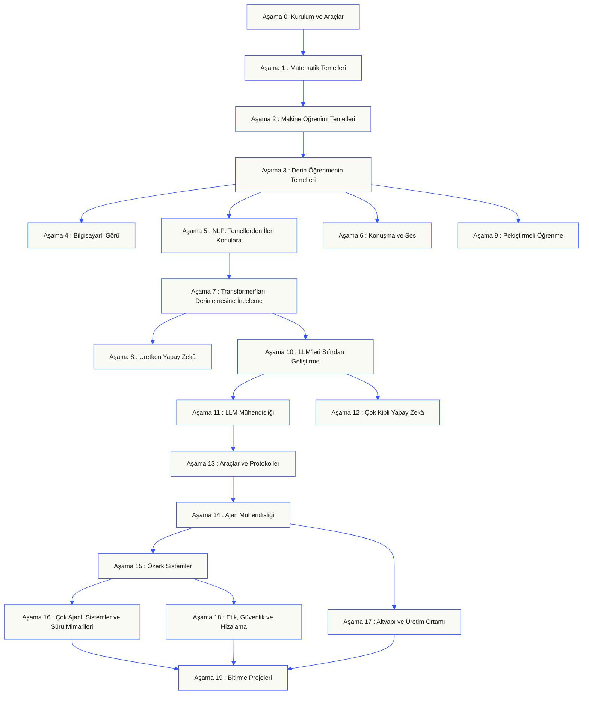
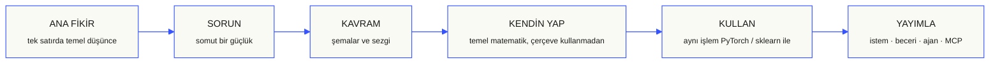

<p align="center"><sub>AI desteğiyle hazırlanmış Türkçe çeviri; esas metin için <a href="../../README.md">İngilizce sürüme</a> bakın.</sub></p>
<p align="center">
  
</p>

<p align="center">
  <a href="../../README.md">🇬🇧 English</a> ·
  <a href="../../i18n/zh/README.md">🇨🇳 简体中文</a> ·
  <a href="../../i18n/zh-TW/README.md">🇹🇼 繁體中文（台灣）</a> ·
  <a href="../../i18n/ja/README.md">🇯🇵 日本語</a> ·
  <a href="../../i18n/ko/README.md">🇰🇷 한국어</a> ·
  <a href="../../i18n/pt/README.md">🇵🇹 Português</a> ·
  <a href="../../i18n/pt-BR/README.md">🇧🇷 Português (Brasil)</a> ·
  <a href="../../i18n/es/README.md">🇪🇸 Español</a> ·
  <a href="../../i18n/de/README.md">🇩🇪 Deutsch</a> ·
  <a href="../../i18n/fr/README.md">🇫🇷 Français</a> ·
  <a href="../../i18n/it/README.md">🇮🇹 Italiano</a> ·
  <a href="../../i18n/nl/README.md">🇳🇱 Nederlands</a> ·
  <a href="../../i18n/pl/README.md">🇵🇱 Polski</a> ·
  <a href="../../i18n/cs/README.md">🇨🇿 Čeština</a> ·
  <a href="../../i18n/ro/README.md">🇷🇴 Română</a> ·
  <a href="../../i18n/hu/README.md">🇭🇺 Magyar</a> ·
  <a href="../../i18n/el/README.md">🇬🇷 Ελληνικά</a> ·
  <a href="../../i18n/sv/README.md">🇸🇪 Svenska</a> ·
  <a href="../../i18n/da/README.md">🇩🇰 Dansk</a> ·
  <a href="../../i18n/no/README.md">🇳🇴 Norsk</a> ·
  <a href="../../i18n/fi/README.md">🇫🇮 Suomi</a> ·
  <a href="../../i18n/ru/README.md">🇷🇺 Русский</a> ·
  <a href="../../i18n/uk/README.md">🇺🇦 Українська</a> ·
  <a href="../../i18n/tr/README.md">🇹🇷 Türkçe</a> ·
  <a href="../../i18n/he/README.md">🇮🇱 עברית</a> ·
  <a href="../../i18n/ar/README.md">🇸🇦 العربية</a> ·
  <a href="../../i18n/fa/README.md">🇮🇷 فارسی</a> ·
  <a href="../../i18n/hi/README.md">🇮🇳 हिन्दी</a> ·
  <a href="../../i18n/bn/README.md">🇧🇩 বাংলা</a> ·
  <a href="../../i18n/ur/README.md">🇵🇰 اردو</a> ·
  <a href="../../i18n/th/README.md">🇹🇭 ไทย</a> ·
  <a href="../../i18n/vi/README.md">🇻🇳 Tiếng Việt</a> ·
  <a href="../../i18n/id/README.md">🇮🇩 Bahasa Indonesia</a> ·
  <a href="../../i18n/tl/README.md">🇵🇭 Tagalog</a>
</p>

<p align="center">
  <a href="../../LICENSE"></a>
  <a href="../../ROADMAP.md"></a>
  <a href="#contents"></a>
  <a href="https://github.com/rohitg00/ai-engineering-from-scratch/stargazers"></a>
  <a href="https://aiengineeringfromscratch.com"></a>
  <p align="center">
 <a href="https://www.star-history.com/rohitg00/ai-engineering-from-scratch">
  <picture><source media="(prefers-color-scheme: dark)" srcset="https://api.star-history.com/badge?repo=rohitg00/ai-engineering-from-scratch&type=rank&theme=dark" /><source media="(prefers-color-scheme: light)" srcset="https://api.star-history.com/badge?repo=rohitg00/ai-engineering-from-scratch&type=rank" /></picture> <picture><source media="(prefers-color-scheme: dark)" srcset="https://api.star-history.com/badge?repo=rohitg00/ai-engineering-from-scratch&type=trending&theme=dark" /><source media="(prefers-color-scheme: light)" srcset="https://api.star-history.com/badge?repo=rohitg00/ai-engineering-from-scratch&type=trending" /></picture>
 </a>
</p>
</p>

### Sponsorlar

<p align="center">
  <a href="https://serpapi.com/ai-engineering-from-scratch"><picture><source media="(min-width: 768px)" srcset="../../assets/sponsors/serpapi-banner-compact.png" width="48%"></picture></a>
  <a href="https://nitrostack.ai/referral/aiengineeringfromscratch"><picture><source media="(min-width: 768px)" srcset="../../assets/sponsors/nitrostack-banner-equal.png" width="48%"></picture></a>
</p>

<p align="center">
  <sub><span>Desteğiniz, tüm derslerin ücretsiz ve açık kaynaklı kalmasını sağlar.</span> <a href="#supporters">Tüm destekçileri görün</a> · <a href="../../SPONSORS.md">Sponsor olun</a></sub>
</p>

```text
░░░▒▒▒░░░▒▒▒░░░▒▒▒░░░▒▒▒░░░▒▒▒░░░▒▒▒░░░▒▒▒░░░▒▒▒░░░▒▒▒░░░▒▒▒░░░▒▒▒░░░▒▒▒░░░▒▒▒░░░▒▒▒░░░▒▒▒
```

> **Öğrencilerin %84’ü yapay zekâ araçlarını zaten kullanıyor; ancak yalnızca %18’i bunları profesyonel düzeyde kullanmaya hazır hissediyor.** Bu müfredat aradaki farkı kapatıyor.
>
> 523 ders. 20 aşama. ~342 saat. Python, TypeScript, Rust, Julia. Her ders yeniden kullanılabilir bir çıktı bırakır: bir prompt, bir skill, bir ajan, bir MCP sunucusu. Ücretsiz, açık kaynak, MIT.
>
> Yapay zekâyı sadece öğrenmiyorsunuz; onu baştan sona, kendi ellerinizle inşa ediyorsunuz.

<!-- STATS:START (generated from site/stats.json by build.js — do not edit by hand) -->
<p align="center"><sub><b>114,584</b> okuyucu &nbsp;·&nbsp; Son 30 günde <b>181,995</b> sayfa görüntüleme &nbsp;·&nbsp; 2026-08-29 itibarıyla</sub></p>
<!-- STATS:END -->

## Buradan başlayın: ne inşa etmek istediğinizi seçin

Başlamadan önce 523 dersin hepsine göz atmanız gerekmez. Bir hedef seçin. Her bağlantı aynı müfredatı GitHub'da ya da web sitesinde açar; iki sürüm de aynı ders kodunu kullanır.

| Hedefiniz | GitHub'da öğrenin | Web sitesinde öğrenin |
|---|---|---|
| Yeni başlıyorum ve temeli eksiksiz kurmak istiyorum | [Aşama 0: Kurulum ve Araçlar](../../phases/00-setup-and-tooling/) | [Geliştirme Ortamı](https://aiengineeringfromscratch.com/lesson?path=phases/00-setup-and-tooling/01-dev-environment) |
| Python biliyorum, matematik ve makine öğrenmesi temellerini istiyorum | [Aşama 1: Matematik Temelleri](../../phases/01-math-foundations/) | [Lineer Cebir Sezgisi](https://aiengineeringfromscratch.com/lesson?path=phases/01-math-foundations/01-linear-algebra-intuition) |
| Üretime hazır LLM uygulamaları geliştirmek istiyorum | [Aşama 11: LLM Mühendisliği](../../phases/11-llm-engineering/) | [Prompt Mühendisliği](https://aiengineeringfromscratch.com/lesson?path=phases/11-llm-engineering/01-prompt-engineering) |
| Ajan geliştirmek istiyorum | [Aşama 14: Ajan Mühendisliği](../../phases/14-agent-engineering/) | [Ajan Döngüsü](https://aiengineeringfromscratch.com/lesson?path=phases/14-agent-engineering/01-the-agent-loop) |
| Kodlama ajanlarını gerçek depolarda kullanmak istiyorum | [Ajan Destekli Mühendislik yolu](../../learning-paths/using-coding-agents.json) | [Ajan Destekli Mühendislik](https://aiengineeringfromscratch.com/lesson?path=phases/14-agent-engineering/31-agent-workbench-why-models-fail&learningPath=using-coding-agents) |
| Uygulamaya geçmeden önce doğru şeyi tasarlamak istiyorum | [Ürün Muhakemesi ve Teslimat yolu](../../learning-paths/shaping-the-build.json) | [Ürün Muhakemesi ve Teslimat](https://aiengineeringfromscratch.com/lesson?path=phases/14-agent-engineering/47-outcomes-before-output&learningPath=shaping-the-build) |
| Model Context Protocol (MCP) ile geliştirmek istiyorum | [Model Context Protocol (MCP) rotası](../../phases/13-tools-and-protocols/README.md#model-context-protocol-mcp-path) | [Model Context Protocol (MCP) yolu](https://aiengineeringfromscratch.com/lesson?path=phases/13-tools-and-protocols/06-mcp-fundamentals&learningPath=model-context-protocol) |
| Agent Skills yazıp yayımlamak istiyorum | [Odaklı Agent Skills rotası](../../phases/13-tools-and-protocols/README.md#agent-skills-fast-path) | [Agent Skills yolu](https://aiengineeringfromscratch.com/lesson?path=phases/13-tools-and-protocols/22-skills-and-agent-sdks&learningPath=agent-skills) |
| Claude sertifikasına hazırlanmak istiyorum | [Sertifikaya başlangıç](../../certifications/claude/GETTING_STARTED.md) | [Sertifika Akademisi](https://aiengineeringfromscratch.com/certifications.html) |
| MCP Associate (MCPA) sertifikasına hazırlanmak istiyorum | [MCPA'ya başlangıç](../../certifications/mcpa/GETTING_STARTED.md) | [MCPA programı](https://aiengineeringfromscratch.com/certification?id=mcpa-f) |

Nereden başlayacağınızdan emin değil misiniz? [`start-learning` seviye belirleme rehberini](../../skills/start-learning/SKILL.md) ya da [web sitesindeki ön koşullar kılavuzunu](https://aiengineeringfromscratch.com/prereqs.html) kullanın.

[AI Engineering öğrenme yollarında](https://aiengineeringfromscratch.com/learning-paths.html) dört temel alanı ve altı kariyer rotasını karşılaştırın.

### Her derse aynı şekilde çalışın

1. **Okuyun:** `docs/en.md` dosyasını okuyun ve ana fikri kendi cümlelerinizle anlatın.
2. **Yazın ve kurun:** Önemli kodu kendiniz yazın; kod bloğuna süs gibi bakmayın.
3. **Çalıştırın:** Ders komutunu depo kökünden, yani `README.md` ve `phases/` klasörünün bulunduğu dizinden çalıştırın.
4. **Kanıt saklayın:** Komutu, çalışma dizinini, çıkış kodunu, anlamlı çıktıyı ve değiştirdiğiniz ya da ürettiğiniz çıktıyı kaydedin.
5. **Devam edin:** Ancak çıktıyı açıklayabildiğinizde ve tahmin etmeden küçük bir değişiklik yapabildiğinizde ilerleyin.

Ders sayfalarındaki komutlar, ders açıkça başka bir dizine geçmenizi söylemedikçe depo kökünden verilen yollardır. Bir ders birden fazla dil sunuyorsa öğrendiğiniz dilin uygulamasını çalıştırın.

### Depoyu klonlayın ve ilk kanıtınızı üretin

```bash
git clone https://github.com/rohitg00/ai-engineering-from-scratch.git
cd ai-engineering-from-scratch
python3 phases/00-setup-and-tooling/01-dev-environment/code/verify.py --route beginner
python3 phases/01-math-foundations/01-linear-algebra-intuition/code/vectors.py
```

Ön kontrol, şimdi gereken gereksinimleri daha sonra gerekecek araçlardan ayırır. Her zorunlu hata, tespit edilen nedeni ve bir düzeltme komutunu gösterir. İkinci komut bağımlılık gerektirmeyen bir ders çalıştırır ve sonunda bir matrisi bir vektörle çarpmanın, bir sinir ağı katmanının içindeki işlem olduğunu gösterir. Bu terminal çıktısını ilk kanıtınız olarak saklayın.

## AI eğitmeninizi 30 saniyede ekleyin

Node.js, `npx` ve Agent Skills destekleyen bir kodlama ajanı zaten yüklüyse, iki komutla ajanınızı ders eğitmenine dönüştürebilirsiniz. Eğitmen becerilerini yüklemek veya okumak için depoyu klonlamanız gerekmez. Odaklı yol laboratuvarlarını çalıştırmak için `python3` gerekir. Agent Skills laboratuvarlarında ayrıca bir host seçmeniz ve kullanıcı ya da proje kapsamında yazılabilir bir beceri dizini sağlamanız gerekir.

Önce yerel gereksinimleri denetleyin:

```bash
node --version
npx --version
python3 --version
```

Ardından müfredat becerilerini yükleyin; yükleyici sorduğunda kullanacağınız konağı ve kapsamı seçin:

```bash
npx skills add rohitg00/ai-engineering-from-scratch
```

Çağrı biçimini host belirler; taşınabilir `SKILL.md` biçimi belirlemez:

| Ana uygulama | Müfredata başlama | Model Context Protocol (MCP) yoluna başlama | Agent Skills yoluna başlama | Aşama sınavını yapma |
|---|---|---|---|---|
| Codex | `start-learning` yazın veya `/skills` içinden seçin | `learn-mcp` yazın veya `/skills` içinden seçin | `learn-agent-skills` yazın veya `/skills` içinden seçin | `check-understanding 13` yazın veya `/skills` içinden seçin |
| Claude Code | `/start-learning` | `/learn-mcp` | `/learn-agent-skills` | `/check-understanding 13` |
| Diğer uyumlu hostlar | `Use start-learning to begin the course.` | `Use learn-mcp to start the Model Context Protocol (MCP) path.` | `Use learn-agent-skills to start the Agent Skills Engineering path.` | `Use check-understanding to quiz me on Phase 13.` |

On soruluk seviye belirleme sınavı, bildiklerinizi değerlendirerek uygun başlangıç aşamasını seçer ve kişiselleştirilmiş çalışma planını `LEARNING.md` dosyasına kaydeder. Sonrasında `learn` becerisi her oturumda sizi bir dersten geçirir: kavram, matematik, kod ve sınav. İçeriği bu depodan doğrudan aktarır; `course-guide` becerisi ise takıldığınız konuyu işleyen dersi bulur. Codex’te `learn` ve `course-guide`, Claude Code’da `/learn` ve `/course-guide` komutlarını kullanın. Diğer uyumlu hostlarda beceriyi adıyla isteyin.

Yalnızca Model Context Protocol (MCP) yolunu mu istiyorsunuz? Kullandığınız hosta uygun MCP çağrısını kullanın. Bu çağrı `MCP-LEARNING.md` oluşturur ve durumsuz istekler, aktarım yöntemleri, çift yönlü işler, güvenlik, güvenilirlik, kayıt defteri yönetişimi ve uygunluk kanıtlarını kapsayan 17 derslik bir yol izler. Ders sırası ve kontrol noktaları [MCP yol tanımında](../../learning-paths/model-context-protocol.json) yer alır.

Yalnızca Agent Skills yolunu mu istiyorsunuz? Kullandığınız hosta uygun Agent Skills çağrısını kullanın. `AGENT-SKILLS-LEARNING.md` oluşturulur ve beceri sözleşmesi, keşif, çağırma, korumalı alan sınırları, yayımlama değerlendirmeleri ve gerçek hostlarda taşınabilirlik konularını tutarlı bir beş derslik sırayla işler. Web üzerinden [Agent Skills yoluna](https://aiengineeringfromscratch.com/lesson?path=phases/13-tools-and-protocols/22-skills-and-agent-sdks&learningPath=agent-skills) başlayabilirsiniz.

Yükleyici, yapılandırabildiği hostları listeler ve yükleme konumunu sorar. Node.js, `npx`, `python3`, desteklenen bir host veya yazılabilir bir kapsam henüz yoksa web sitesini kullanın ya da `docs/en.md` dosyasını elle okuyun. Böylece kavramları öğrenebilirsiniz; gerçek hostta keşif, çağırma, betik çalıştırma ve kaldırma kanıtlarını ise ön denetim tamamlanınca toplayabilirsiniz. [Dersleri aiengineeringfromscratch.com adresinde okuyun](https://aiengineeringfromscratch.com).

## Bu müfredat nasıl işliyor?

Yapay zekâ öğrenme kaynakları çoğu zaman birbirinden kopuk parçalardan oluşuyor: bir yerde makale, başka yerde ince ayar yazısı, bir başka yerde gösterişli ajan demosu. Konular nadiren birbiriyle ilişkilendiriliyor. Bir sohbet robotu yayımlıyorsunuz ama kayıp eğrisini açıklayamıyorsunuz; ajana bir işlev bağlıyorsunuz ama onu çağıran modelde dikkatin ne yaptığını anlatamıyorsunuz.

Bu müfredat hepsini birbirine bağlayan omurgadır: 20 aşama, 523 ders, dört dil — Python, TypeScript, Rust ve Julia. Bir uçta lineer cebir, diğerinde özerk sürüler var. Her algoritma önce temel matematiğinden başlayarak kurulur: geri yayılım, tokenizer, dikkat mekanizması, ajan döngüsü. PyTorch’a geldiğinizde, altyapıda ne yaptığını zaten biliyor olursunuz.

Her ders aynı döngüyü izler: problemi okuyun, matematiği türetin, kodu yazın, testi çalıştırın, eseri saklayın. Beş dakikalık videolar, kopyala-yapıştır dağıtımları veya el tutan anlatımlar yok. Ücretsiz, açık kaynaklı ve kendi dizüstü bilgisayarınızda çalıştırılacak şekilde hazırlanmıştır.

```text
░░░▒▒▒░░░▒▒▒░░░▒▒▒░░░▒▒▒░░░▒▒▒░░░▒▒▒░░░▒▒▒░░░▒▒▒░░░▒▒▒░░░▒▒▒░░░▒▒▒░░░▒▒▒░░░▒▒▒░░░▒▒▒░░░▒▒▒
```

## Müfredatın yapısı

Yirmi aşama birbiri üzerine kurulur: matematik temeldir; ajanlar ve üretim ortamı en üst katmandır. Alt katmanları biliyorsanız ileri atlayabilirsiniz; ancak temel eksikler, ilerideki konuların neden aksadığını anlamanızı zorlaştırır.



```text
░░░▒▒▒░░░▒▒▒░░░▒▒▒░░░▒▒▒░░░▒▒▒░░░▒▒▒░░░▒▒▒░░░▒▒▒░░░▒▒▒░░░▒▒▒░░░▒▒▒░░░▒▒▒░░░▒▒▒░░░▒▒▒░░░▒▒▒
```

## Bir dersin yapısı

Her ders, müfredatın tamamında aynı yapıyı izleyen ayrı bir klasörde yer alır:

```text
phases/<NN>-<phase-name>/<NN>-<lesson-name>/
├── code/      çalıştırılabilir uygulamalar (Python, TypeScript, Rust, Julia)
├── docs/
│   └── en.md  ders anlatımı
└── outputs/   bu dersin ürettiği istemler, beceriler, ajanlar veya MCP sunucuları
```

Her ders altı adımdan oluşur. *Kendin İnşa Et / Kullan* yaklaşımı müfredatın omurgasıdır: önce algoritmayı sıfırdan uygular, ardından aynı işlemi üretim ortamındaki kütüphaneyle yaparsınız. Küçük sürümü kendiniz yazdığınız için çerçevenin ne yaptığını anlarsınız.



## Başlarken

Başlamak için üç yol var. Birini seçin.

**Seçenek A — terminalde öğrenin *(önerilen)*.** Yukarıdaki Node.js, `npx`, host ve kapsam ön denetiminden sonra, öğrenme becerilerini uyumlu bir ajana yükleyin; müfredat sizi adım adım yönlendirsin:

```bash
npx skills add rohitg00/ai-engineering-from-scratch
```

Yukarıdaki konağa özel çağrı tablosunu kullanın. Yüklü beceriler `start-learning`, `learn`, `course-guide` ile odaklı `learn-mcp` ve `learn-agent-skills` yollarını sunar. Ders anlatımları depoyu klonlamadan bu depodan aktarılabilir. Depodaki kod komutlarını ve çalıştırılabilir MCP ya da Agent Skills laboratuvarlarını kullanmak için yerel klon gerekir. İlerlemeniz projenizdeki `LEARNING.md`, `MCP-LEARNING.md` veya `AGENT-SKILLS-LEARNING.md` dosyalarında saklanır; böylece her oturuma kaldığınız yerden devam edebilirsiniz.

**Seçenek B — okuyun.** Tamamlanmış dersleri [aiengineeringfromscratch.com](https://aiengineeringfromscratch.com) adresinde okuyun veya [İçindekiler](#contents) bölümünden bir aşamayı açın. Kurulum veya klonlama gerekmez.

**Seçenek C — klonlayıp çalıştırın.**

```bash
git clone https://github.com/rohitg00/ai-engineering-from-scratch.git
cd ai-engineering-from-scratch
python3 phases/01-math-foundations/01-linear-algebra-intuition/code/vectors.py
```

Depoyu klonlamak, öğrenme becerilerinin Claude Code tarafından otomatik algılanmasını da sağlar. Ayrıca her dersin kodunu `learn` eğitmeniyle yalnızca okuyarak değil, gerçekten çalıştırabilirsiniz.

### Ön koşullar

- Kod yazabiliyor olmanız (herhangi bir dilde; Python yardımcı olur).
- Yapay zekânın **gerçekte nasıl çalıştığını** anlamak istemeniz; yalnızca API çağırmakla yetinmemeniz.

### Claude sertifikalarına hazırlanın

[Claude Certification Academy](../../certifications/claude/README.md), dört resmî Claude sertifika sınavı için ücretsiz, açık kaynaklı bir hazırlık programıdır: Associate Foundations, Developer Foundations, Architect Foundations ve Architect Professional. Her öğrenme yolu, sınav hedefleriyle eşleştirilmiş dersleri, çalıştırılabilir laboratuvarları, bir tanılama sınavını, bitirme projesini ve özgün, tam uzunlukta bir deneme sınavını bir araya getirir.

[Ajan destekli GitHub başlangıç rehberini](../../certifications/claude/GETTING_STARTED.md) Claude Code, Codex, ChatGPT, Cursor veya başka bir ajanla kullanın. Codex’te `claude-certification`, Claude Code’da `/claude-certification` komutunu çalıştırın ya da başka bir hosttan `claude-certification` becerisini kullanmasını isteyin. Beceri bir sertifika yolu seçer, `CLAUDE-CERTIFICATION.md` dosyasında kalıcı bir plan oluşturur, sizi adım adım eğitir, gerçek laboratuvarları çalıştırır ve ürettiğiniz eserlere göre geri bildirim verir. Program [sertifika web sitesinde](https://aiengineeringfromscratch.com/certifications.html) da kullanılabilir.

Akademi, yayımlanmış sınav hedeflerine dayalı bağımsız bir çalışma kaynağıdır. Anthropic ile bağlantılı değildir, gerçek sınav sorularını yayımlamaz ve sınavı geçmenizi garanti etmez.

### MCP Associate (MCPA) sertifikasına hazırlanın

[MCPA Sertifikasyon Müfredatı](../../certifications/mcpa/README.md), Agentic AI Foundation’ın Linux Foundation Training üzerinden sunduğu Model Context Protocol Associate sınavı için ücretsiz, açık kaynaklı bir hazırlık programıdır. Otuz dört ders, 2026-07-28 tarihli durumsuz protokolü beş sınav alanı boyunca öğretir: eski el sıkışma yerine istek başına `_meta` ve `server/discover`, birden çok gidiş-dönüş gerektiren istekler, abonelikler, önbellekleme, Tasks ve MCP Apps uzantıları, OAuth yetkilendirmesi, kayıt defteri ve SDK katmanları. Her ders, dökümü güncel kablo biçimine göre doğrulanan standart kütüphane laboratuvarı içerir. Program ayrıca bir tanılama sınavı, bitirme projesi ve yayımlanmış sınav dağılımını izleyen üç özgün, tam uzunlukta deneme sınavı sunar.

[Ajan destekli GitHub başlangıç rehberini](../../certifications/mcpa/GETTING_STARTED.md) Claude Code, Codex, ChatGPT, Cursor veya başka bir ajanla kullanın. Codex’te `mcpa-certification`, Claude Code’da `/mcpa-certification` komutunu çalıştırın ya da başka bir hosttan `mcpa-certification` becerisini kullanmasını isteyin. Beceri bir öğrenme yolu seçer, `MCPA-CERTIFICATION.md` dosyasında kalıcı bir plan oluşturur, sizi adım adım eğitir, gerçek laboratuvarları çalıştırır ve ürettiğiniz eserlere göre geri bildirim verir. Ayrıntılar [MCPA sertifika sayfasında](https://aiengineeringfromscratch.com/certification?id=mcpa-f) yer alır.

Bu müfredat, yayımlanmış sınav hedeflerine dayalı bağımsız bir çalışma kaynağıdır. Agentic AI Foundation veya Linux Foundation ile bağlantılı değildir, gerçek sınav sorularını yayımlamaz ve sınavı geçmenizi garanti etmez.

### Öğrenme becerileri

| Beceri | Ne işe yarar? |
|---|---|
| [`start-learning`](../../skills/start-learning/SKILL.md) | Tek seferlik başlangıç: hedefinizi belirleyin, seviye belirleme sorularını yanıtlayın ve kişiselleştirilmiş planı `LEARNING.md` dosyasına kaydedin. |
| [`learn`](../../skills/learn/SKILL.md) | Her oturumda önce hatırlama alıştırması yapar, ardından sıradaki dersi etkileşimli biçimde öğretir ve sizi sınar; ilerlemeyi ve gözden geçirme kuyruğunu kaydeder. |
| [`course-guide`](../../skills/course-guide/SKILL.md) | Konu yönlendiricisi: “Dikkat mekanizmasını nerede öğrenebilirim?” veya “Kayıp değerim NaN oluyor” gibi sorulardan ilgili derslere bağlantı verir. |
| [`learn-mcp`](../../skills/learn-mcp/SKILL.md) | MCP’ye odaklanan eğitmen. `MCP-LEARNING.md` oluşturur, 17 derslik manifesti izler ve aktarım, güvenlik, güvenilirlik ile uygunluk kanıtlarını kaydeder. |
| [`learn-agent-skills`](../../skills/learn-agent-skills/SKILL.md) | Agent Skills eğitmeni. `AGENT-SKILLS-LEARNING.md` oluşturur, 22, 24, 25, 26 ve 27. dersleri öğretir ve gerçek hostlarda çalıştığına dair kanıtları kaydeder. |
| [`claude-certification`](../../skills/claude-certification/SKILL.md) | Sertifika eğitmeni: CCAO-F, CCDV-F, CCAR-F veya CCAR-P yollarından birini seçer; dersleri öğretir, laboratuvarları çalıştırır, eserleri inceler, tanılama ve deneme sınavlarını yönetir, ilerlemeyi kaydeder. |
| [`mcpa-certification`](../../skills/mcpa-certification/SKILL.md) | 34 derslik MCPA eğitmeni. `mcpa-f` yolundaki 2026-07-28 tarihli protokolü işler; dersleri ve kablo biçimi denetimlerini yürütür, tanılama ile üç deneme sınavını yönetir ve ilerlemeyi saklar. |
| [`find-your-level`](../../skills/find-your-level/SKILL.md) | On soruluk bir sınavla mevcut bilginizi başlangıç aşamasına eşler ve tahmini sürelerle kişiselleştirilmiş bir yol oluşturur. |
| [`check-understanding <phase>`](../../skills/check-understanding/SKILL.md) | Eğlenerek tekrar yapmak ve bilgiyi sınamak için sekiz soruluk bir sınav hazırlar. Codex veya Claude Code’da yukarıdaki çağrı tablosunu kullanın; diğer hostlarda doğal dille isteyin. |

```text
░░░▒▒▒░░░▒▒▒░░░▒▒▒░░░▒▒▒░░░▒▒▒░░░▒▒▒░░░▒▒▒░░░▒▒▒░░░▒▒▒░░░▒▒▒░░░▒▒▒░░░▒▒▒░░░▒▒▒░░░▒▒▒░░░▒▒▒
```

## Temel müfredatı kitap olarak okuyun

20 aşamalı temel müfredat, `phases/` içeriğinden üretilen altı ciltlik EPUB ve PDF kitap serisine dönüştürülüyor. CI, kitapları derslerin kullandığı aynı kaynaklardan oluşturur; her cilt [GitHub sürümlerinde](https://github.com/rohitg00/ai-engineering-from-scratch/releases) yayımlanır ve aşağıdaki bağlantılar her zaman en son dosyalara gider. Cilt numaraları serideki yeri gösterir, baskı sürümünü değil. Her indirme tarihli bir baskıdır; önceki baskılar yayımlandıktan sonra da indirilebilir kalır.

Sertifika programları bilerek kitap biçimine dönüştürülmüyor. AI eğitmeninin durum takibi, çalıştırılabilir laboratuvarlar, etkileşimli çizimler, tanılama ve süreli deneme sınavları GitHub’da ve web sitesinde birinci sınıf içerik olarak kalır.

| Cilt | Başlık | Aşamalar | İndir |
|-----|-------|--------|----------|
| 1 | Temeller · Matematik, Araçlar ve Klasik Makine Öğrenimi | 00-02 | [EPUB](https://github.com/rohitg00/ai-engineering-from-scratch/releases/latest/download/aiefs-vol1-foundations.epub) · [PDF](https://github.com/rohitg00/ai-engineering-from-scratch/releases/latest/download/aiefs-vol1-foundations.pdf) |
| 2 | Derin Öğrenme · Ağlar, Görüntü ve Konuşma | 03, 04, 06 | [EPUB](https://github.com/rohitg00/ai-engineering-from-scratch/releases/latest/download/aiefs-vol2-deep-learning.epub) · [PDF](https://github.com/rohitg00/ai-engineering-from-scratch/releases/latest/download/aiefs-vol2-deep-learning.pdf) |
| 3 | Dil · NLP Temelleri ve Transformer’lar | 05, 07 | [EPUB](https://github.com/rohitg00/ai-engineering-from-scratch/releases/latest/download/aiefs-vol3-language.epub) · [PDF](https://github.com/rohitg00/ai-engineering-from-scratch/releases/latest/download/aiefs-vol3-language.pdf) |
| 4 | Büyük Dil Modelleri · Üretken Yapay Zekâ, Güçlendirme, Ön Eğitim ve Mühendislik | 08-11 | [EPUB](https://github.com/rohitg00/ai-engineering-from-scratch/releases/latest/download/aiefs-vol4-llms.epub) · [PDF](https://github.com/rohitg00/ai-engineering-from-scratch/releases/latest/download/aiefs-vol4-llms.pdf) |
| 5 | Ajanlar · Çok Modluluk, Protokoller, Özerklik ve Sürü Sistemleri | 12-16 | [EPUB](https://github.com/rohitg00/ai-engineering-from-scratch/releases/latest/download/aiefs-vol5-agents.epub) · [PDF](https://github.com/rohitg00/ai-engineering-from-scratch/releases/latest/download/aiefs-vol5-agents.pdf) |
| 6 | Üretim Ortamı · Altyapı, Güvenlik ve Bitirme Projeleri | 17-19 | [EPUB](https://github.com/rohitg00/ai-engineering-from-scratch/releases/latest/download/aiefs-vol6-production.epub) · [PDF](https://github.com/rohitg00/ai-engineering-from-scratch/releases/latest/download/aiefs-vol6-production.pdf) |

Kitaplar müfredatın anlık görüntüsünü, depo ise güncel sürümünü sunar. Her bölüm; derslerdeki hareketli şekillere, sınavlara ve çalıştırılabilir koda bağlantılarla sona erer. `python3 scripts/build_book.py` komutunu çalıştırın (Pandoc gerekir). Ayrıntılar için [book/README.md](../../book/README.md) sayfasına bakın.

```text
░░░▒▒▒░░░▒▒▒░░░▒▒▒░░░▒▒▒░░░▒▒▒░░░▒▒▒░░░▒▒▒░░░▒▒▒░░░▒▒▒░░░▒▒▒░░░▒▒▒░░░▒▒▒░░░▒▒▒░░░▒▒▒░░░▒▒▒
```

## Her ders somut bir çıktı üretir

Başka müfredatlar genellikle “X’i öğrendiniz” diyerek biter. Burada her ders, günlük iş akışınıza yükleyebileceğiniz veya ekleyebileceğiniz **yeniden kullanılabilir bir araç** üretir.

<table>
<tr>
<th align="left" width="25%"><br/><sub>FIG_001 · A</sub><br/><b>İSTEMLER</b></th>
<th align="left" width="25%"><br/><sub>FIG_001 · B</sub><br/><b>BECERİLER</b></th>
<th align="left" width="25%"><br/><sub>FIG_001 · C</sub><br/><b>AJANLAR</b></th>
<th align="left" width="25%"><br/><sub>FIG_001 · D</sub><br/><b>MCP SUNUCULARI</b></th>
</tr>
<tr>
<td valign="top">Tekrarlanan bir görev için uzman düzeyinde yardım almak üzere herhangi bir yapay zekâ aracına yapıştırın.</td>
<td valign="top">Claude, Cursor, Codex, OpenClaw, Hermes veya <code>SKILL.md</code> okuyabilen başka bir ajanla kullanın.</td>
<td valign="top">Size özel bir ajanı çalıştırın. 14. aşamada bu döngüyü kendiniz yazdınız.</td>
<td valign="top">Herhangi bir yapay zekâ aracına MCP üzerinden bağlanın; 13. aşamada uçtan uca kurulur.</td>
</tr>
</table>

> Araçların tümünü `python3 scripts/install_skills.py <target>` ile yükleyin. Ödev değil, gerçek araçlar. Müfredat sonunda kendi ellerinizle kurup gerçekten anladığınız 523 eserden oluşan portföyünüz olur.

### FIG_002 · Uygulamalı bir örnek

Aşama 14, ders 1: ajan döngüsü. Yalnızca Python ile yaklaşık 120 satır; çerçeve yok.

<table>
<tr>
<td valign="top" width="50%">

**`code/agent_loop.py`** &nbsp; <sub><i>Kendin inşa et</i></sub>

```python
def run(query, tools):
    history = [user(query)]
    for step in range(MAX_STEPS):
        msg = llm(history)
        if msg.tool_calls:
            for call in msg.tool_calls:
                result = tools[call.name](**call.args)
                history.append(tool_result(call.id, result))
            continue
        return msg.content
    raise StepLimitExceeded
```

</td>
<td valign="top" width="50%">

**`outputs/skill-agent-loop.md`** &nbsp; <sub><i>Yayımla</i></sub>

```markdown
---
name: agent-loop
description: ReAct-style loop for any tool list
phase: 14
lesson: 01
---

Implement a minimal agent loop that...
```

**`outputs/prompt-debug-agent.md`**

```markdown
You are an agent debugger. Given the trace
of an agent run, identify the step where
the agent went wrong and explain why...
```

</td>
</tr>
</table>

```text
░░░▒▒▒░░░▒▒▒░░░▒▒▒░░░▒▒▒░░░▒▒▒░░░▒▒▒░░░▒▒▒░░░▒▒▒░░░▒▒▒░░░▒▒▒░░░▒▒▒░░░▒▒▒░░░▒▒▒░░░▒▒▒░░░▒▒▒
```

<a id="contents"></a>

## İçindekiler

20 aşama. Ders listesini açıp incelemek için bir aşamaya tıklayın.

<a id="phase-0"></a>
### Aşama 0: Kurulum ve Araçlar <code>12 ders</code>
> Sonraki tüm çalışmalar için geliştirme ortamınızı hazırlayın.

| No. | Ders | Tür | Dil |
|:---:|--------|:----:|------|
| 01 | [Geliştirme Ortamı](../../phases/00-setup-and-tooling/01-dev-environment/) | Uygulama | Python |
| 02 | [Git ve İşbirliği](../../phases/00-setup-and-tooling/02-git-and-collaboration/) | Öğrenme | — |
| 03 | [GPU Kurulumu ve Bulut](../../phases/00-setup-and-tooling/03-gpu-setup-and-cloud/) | Uygulama | Python |
| 04 | [API’ler ve Anahtarlar](../../phases/00-setup-and-tooling/04-apis-and-keys/) | Uygulama | Python |
| 05 | [Jupyter Not Defterleri](../../phases/00-setup-and-tooling/05-jupyter-notebooks/) | Uygulama | Python |
| 06 | [Python Ortamları](../../phases/00-setup-and-tooling/06-python-environments/) | Uygulama | Shell |
| 07 | [Yapay Zekâ için Docker](../../phases/00-setup-and-tooling/07-docker-for-ai/) | Uygulama | Docker |
| 08 | [Kod Düzenleyici Kurulumu](../../phases/00-setup-and-tooling/08-editor-setup/) | Uygulama | — |
| 09 | [Veri Yönetimi](../../phases/00-setup-and-tooling/09-data-management/) | Uygulama | Python |
| 10 | [Terminal ve Kabuk](../../phases/00-setup-and-tooling/10-terminal-and-shell/) | Öğrenme | — |
| 11 | [Yapay Zekâ için Linux](../../phases/00-setup-and-tooling/11-linux-for-ai/) | Öğrenme | — |
| 12 | [Hata Ayıklama ve Profil Oluşturma](../../phases/00-setup-and-tooling/12-debugging-and-profiling/) | Uygulama | Python |

<details id="phase-1">
<summary><b>Aşama 1 — Matematik Temelleri</b> &nbsp;<code>22 ders</code>&nbsp; <em>Kod yazarak her yapay zekâ algoritmasının ardındaki sezgiyi kavrayın.</em></summary>
<br/>

| No. | Ders | Tür | Dil |
|:---:|--------|:----:|------|
| 01 | [Lineer Cebire Sezgisel Yaklaşım](../../phases/01-math-foundations/01-linear-algebra-intuition/) | Öğrenme | Python, Julia |
| 02 | [Vektörler, Matrisler ve İşlemler](../../phases/01-math-foundations/02-vectors-matrices-operations/) | Uygulama | Python, Julia |
| 03 | [Matris Dönüşümleri ve Özdeğerler](../../phases/01-math-foundations/03-matrix-transformations/) | Uygulama | Python, Julia |
| 04 | [Makine Öğrenimi için Kalkülüs: Türevler ve Gradyanlar](../../phases/01-math-foundations/04-calculus-for-ml/) | Öğrenme | Python |
| 05 | [Zincir Kuralı ve Otomatik Türev](../../phases/01-math-foundations/05-chain-rule-and-autodiff/) | Uygulama | Python |
| 06 | [Olasılık ve Dağılımlar](../../phases/01-math-foundations/06-probability-and-distributions/) | Öğrenme | Python |
| 07 | [Bayes Teoremi ve İstatistiksel Düşünme](../../phases/01-math-foundations/07-bayes-theorem/) | Uygulama | Python |
| 08 | [Optimizasyon: Gradyan İnişi Yöntemleri](../../phases/01-math-foundations/08-optimization/) | Uygulama | Python |
| 09 | [Bilgi Kuramı: Entropi ve KL Ayrışımı](../../phases/01-math-foundations/09-information-theory/) | Öğrenme | Python |
| 10 | [Boyut İndirgeme: PCA, t-SNE, UMAP](../../phases/01-math-foundations/10-dimensionality-reduction/) | Uygulama | Python |
| 11 | [Tekil Değer Ayrışımı](../../phases/01-math-foundations/11-singular-value-decomposition/) | Uygulama | Python, Julia |
| 12 | [Tensör İşlemleri](../../phases/01-math-foundations/12-tensor-operations/) | Uygulama | Python |
| 13 | [Sayısal Kararlılık](../../phases/01-math-foundations/13-numerical-stability/) | Uygulama | Python |
| 14 | [Normlar ve Uzaklıklar](../../phases/01-math-foundations/14-norms-and-distances/) | Uygulama | Python |
| 15 | [Makine Öğrenimi için İstatistik](../../phases/01-math-foundations/15-statistics-for-ml/) | Uygulama | Python |
| 16 | [Örnekleme Yöntemleri](../../phases/01-math-foundations/16-sampling-methods/) | Uygulama | Python |
| 17 | [Doğrusal Sistemler](../../phases/01-math-foundations/17-linear-systems/) | Uygulama | Python |
| 18 | [Konveks Optimizasyon](../../phases/01-math-foundations/18-convex-optimization/) | Uygulama | Python |
| 19 | [Yapay Zekâ için Karmaşık Sayılar](../../phases/01-math-foundations/19-complex-numbers/) | Öğrenme | Python |
| 20 | [Fourier Dönüşümü](../../phases/01-math-foundations/20-fourier-transform/) | Uygulama | Python |
| 21 | [Makine Öğrenimi için Graf Teorisi](../../phases/01-math-foundations/21-graph-theory/) | Uygulama | Python |
| 22 | [Stokastik Süreçler](../../phases/01-math-foundations/22-stochastic-processes/) | Öğrenme | Python |

</details>

<details id="phase-2">
<summary><b>Aşama 2 — Makine Öğrenimi Temelleri</b> &nbsp;<code>18 ders</code>&nbsp; <em>Klasik makine öğrenimi, üretimdeki yapay zekâ sistemlerinin hâlâ bel kemiğidir.</em></summary>
<br/>

| No. | Ders | Tür | Dil |
|:---:|--------|:----:|------|
| 01 | [Makine Öğrenimi Nedir?](../../phases/02-ml-fundamentals/01-what-is-machine-learning/) | Öğrenme | Python |
| 02 | [Sıfırdan Doğrusal Regresyon](../../phases/02-ml-fundamentals/02-linear-regression/) | Uygulama | Python |
| 03 | [Lojistik Regresyon ve Sınıflandırma](../../phases/02-ml-fundamentals/03-logistic-regression/) | Uygulama | Python |
| 04 | [Karar Ağaçları ve Rastgele Ormanlar](../../phases/02-ml-fundamentals/04-decision-trees/) | Uygulama | Python |
| 05 | [Destek Vektör Makineleri](../../phases/02-ml-fundamentals/05-support-vector-machines/) | Uygulama | Python |
| 06 | [K-En Yakın Komşu ve Uzaklık Ölçütleri](../../phases/02-ml-fundamentals/06-knn-and-distances/) | Uygulama | Python |
| 07 | [Denetimsiz Öğrenme: K-Means, DBSCAN](../../phases/02-ml-fundamentals/07-unsupervised-learning/) | Uygulama | Python |
| 08 | [Özellik Mühendisliği ve Seçimi](../../phases/02-ml-fundamentals/08-feature-engineering/) | Uygulama | Python |
| 09 | [Model Değerlendirme: Metrikler ve Çapraz Doğrulama](../../phases/02-ml-fundamentals/09-model-evaluation/) | Uygulama | Python |
| 10 | [Yanlılık, Varyans ve Öğrenme Eğrisi](../../phases/02-ml-fundamentals/10-bias-variance/) | Öğrenme | Python |
| 11 | [Topluluk Yöntemleri: Boosting, Bagging, Stacking](../../phases/02-ml-fundamentals/11-ensemble-methods/) | Uygulama | Python |
| 12 | [Hiperparametre Ayarı](../../phases/02-ml-fundamentals/12-hyperparameter-tuning/) | Uygulama | Python |
| 13 | [Makine Öğrenimi İş Akışları ve Deney Takibi](../../phases/02-ml-fundamentals/13-ml-pipelines/) | Uygulama | Python |
| 14 | [Naive Bayes](../../phases/02-ml-fundamentals/14-naive-bayes/) | Uygulama | Python |
| 15 | [Zaman Serilerinin Temelleri](../../phases/02-ml-fundamentals/15-time-series/) | Uygulama | Python |
| 16 | [Anomali Tespiti](../../phases/02-ml-fundamentals/16-anomaly-detection/) | Uygulama | Python |
| 17 | [Dengesiz Verilerle Çalışma](../../phases/02-ml-fundamentals/17-imbalanced-data/) | Uygulama | Python |
| 18 | [Özellik Seçimi](../../phases/02-ml-fundamentals/18-feature-selection/) | Uygulama | Python |

</details>

<details id="phase-3">
<summary><b>Aşama 3 — Derin Öğrenmenin Temelleri</b> &nbsp;<code>13 ders</code>&nbsp; <em>Sinir ağlarını ilk ilkelerden öğrenin; kendi çerçevenizi kurana kadar hazır çerçeve kullanmayın.</em></summary>
<br/>

| No. | Ders | Tür | Dil |
|:---:|--------|:----:|------|
| 01 | [Perceptron: Her Şeyin Başladığı Yer](../../phases/03-deep-learning-core/01-the-perceptron/) | Uygulama | Python |
| 02 | [Çok Katmanlı Ağlar ve İleri Geçiş](../../phases/03-deep-learning-core/02-multi-layer-networks/) | Uygulama | Python |
| 03 | [Geri Yayılımı Sıfırdan Uygulama](../../phases/03-deep-learning-core/03-backpropagation/) | Uygulama | Python |
| 04 | [Aktivasyon Fonksiyonları: ReLU, Sigmoid, GELU ve Neden Kullanılırlar?](../../phases/03-deep-learning-core/04-activation-functions/) | Uygulama | Python |
| 05 | [Kayıp Fonksiyonları: MSE, Çapraz Entropi, Kontrastif Kayıp](../../phases/03-deep-learning-core/05-loss-functions/) | Uygulama | Python |
| 06 | [En İyileyiciler: SGD, Momentum, Adam, AdamW](../../phases/03-deep-learning-core/06-optimizers/) | Uygulama | Python |
| 07 | [Düzenlileştirme: Dropout, Ağırlık Sönümleme, BatchNorm](../../phases/03-deep-learning-core/07-regularization/) | Uygulama | Python |
| 08 | [Ağırlık Başlatma ve Eğitim Kararlılığı](../../phases/03-deep-learning-core/08-weight-initialization/) | Uygulama | Python |
| 09 | [Öğrenme Hızı Çizelgeleri ve Isınma](../../phases/03-deep-learning-core/09-learning-rate-schedules/) | Uygulama | Python |
| 10 | [Kendi Mini Çerçevenizi Kurun](../../phases/03-deep-learning-core/10-mini-framework/) | Uygulama | Python |
| 11 | [PyTorch’a Giriş](../../phases/03-deep-learning-core/11-intro-to-pytorch/) | Uygulama | Python |
| 12 | [JAX’e Giriş](../../phases/03-deep-learning-core/12-intro-to-jax/) | Uygulama | Python |
| 13 | [Sinir Ağlarında Hata Ayıklama](../../phases/03-deep-learning-core/13-debugging-neural-networks/) | Uygulama | Python |

</details>

<details id="phase-4">
<summary><b>Aşama 4 — Bilgisayarlı Görü</b> &nbsp;<code>28 ders</code>&nbsp; <em>Piksellerden anlayışa: görüntü, video, 3B, VLM ve dünya modelleri.</em></summary>
<br/>

| No. | Ders | Tür | Dil |
|:---:|--------|:----:|------|
| 01 | [Görüntü Temelleri: Pikseller, Kanallar ve Renk Uzayları](../../phases/04-computer-vision/01-image-fundamentals/) | Öğrenme | Python |
| 02 | [Evrişimleri Sıfırdan Uygulama](../../phases/04-computer-vision/02-convolutions-from-scratch/) | Uygulama | Python |
| 03 | [CNN’ler: LeNet’ten ResNet’e](../../phases/04-computer-vision/03-cnns-lenet-to-resnet/) | Uygulama | Python |
| 04 | [Görüntü Sınıflandırma](../../phases/04-computer-vision/04-image-classification/) | Uygulama | Python |
| 05 | [Aktarım Öğrenmesi ve İnce Ayar](../../phases/04-computer-vision/05-transfer-learning/) | Uygulama | Python |
| 06 | [Nesne Tespiti: YOLO’yu Sıfırdan Kurma](../../phases/04-computer-vision/06-object-detection-yolo/) | Uygulama | Python |
| 07 | [Anlamsal Bölütleme: U-Net](../../phases/04-computer-vision/07-semantic-segmentation-unet/) | Uygulama | Python |
| 08 | [Örnek Bölütleme: Mask R-CNN](../../phases/04-computer-vision/08-instance-segmentation-mask-rcnn/) | Uygulama | Python |
| 09 | [Görüntü Üretimi: GAN’ler](../../phases/04-computer-vision/09-image-generation-gans/) | Uygulama | Python |
| 10 | [Görüntü Üretimi: Difüzyon Modelleri](../../phases/04-computer-vision/10-image-generation-diffusion/) | Uygulama | Python |
| 11 | [Stable Diffusion: Mimari ve İnce Ayar](../../phases/04-computer-vision/11-stable-diffusion/) | Uygulama | Python |
| 12 | [Video Anlama: Zamansal Modelleme](../../phases/04-computer-vision/12-video-understanding/) | Uygulama | Python |
| 13 | [3B Görü: Nokta Bulutları ve NeRF’ler](../../phases/04-computer-vision/13-3d-vision-nerf/) | Uygulama | Python |
| 14 | [Görsel Transformer’lar (ViT)](../../phases/04-computer-vision/14-vision-transformers/) | Uygulama | Python |
| 15 | [Gerçek Zamanlı Görü: Uçta Dağıtım](../../phases/04-computer-vision/15-real-time-edge/) | Uygulama | Python |
| 16 | [Eksiksiz Bir Görü İş Hattı Kurun](../../phases/04-computer-vision/16-vision-pipeline-capstone/) | Uygulama | Python |
| 17 | [Kendinden Denetimli Görü: SimCLR, DINO, MAE](../../phases/04-computer-vision/17-self-supervised-vision/) | Uygulama | Python |
| 18 | [Açık Söz Dağarcıklı Görü: CLIP](../../phases/04-computer-vision/18-open-vocab-clip/) | Uygulama | Python |
| 19 | [OCR ve Belge Anlama](../../phases/04-computer-vision/19-ocr-document-understanding/) | Uygulama | Python |
| 20 | [Görüntü Getirimi ve Metrik Öğrenmesi](../../phases/04-computer-vision/20-image-retrieval-metric/) | Uygulama | Python |
| 21 | [Anahtar Nokta Tespiti ve Poz Tahmini](../../phases/04-computer-vision/21-keypoint-pose/) | Uygulama | Python |
| 22 | [3B Gaussian Splatting’i Sıfırdan Uygulama](../../phases/04-computer-vision/22-3d-gaussian-splatting/) | Uygulama | Python |
| 23 | [Difüzyon Transformer’ları ve Düzeltilmiş Akış](../../phases/04-computer-vision/23-diffusion-transformers-rectified-flow/) | Uygulama | Python |
| 24 | [SAM 3 ve Açık Söz Dağarcıklı Bölütleme](../../phases/04-computer-vision/24-sam3-open-vocab-segmentation/) | Uygulama | Python |
| 25 | [Görüntü-Dil Modelleri (ViT-MLP-LLM)](../../phases/04-computer-vision/25-vision-language-models/) | Uygulama | Python |
| 26 | [Tek Görüntüden Derinlik ve Geometri Tahmini](../../phases/04-computer-vision/26-monocular-depth/) | Uygulama | Python |
| 27 | [Çoklu Nesne Takibi ve Video Belleği](../../phases/04-computer-vision/27-multi-object-tracking/) | Uygulama | Python |
| 28 | [Dünya Modelleri ve Video Difüzyonu](../../phases/04-computer-vision/28-world-models-video-diffusion/) | Uygulama | Python |

</details>

<details id="phase-5">
<summary><b>Aşama 5 — NLP: Temellerden İleri Konulara</b> &nbsp;<code>29 ders</code>&nbsp; <em>Dil, zekâyla etkileşim kurduğumuz arayüzdür.</em></summary>
<br/>

| No. | Ders | Tür | Dil |
|:---:|--------|:----:|------|
| 01 | [Metin İşleme: Tokenleştirme, Kök Bulma ve Lemmatizasyon](../../phases/05-nlp-foundations-to-advanced/01-text-processing/) | Uygulama | Python |
| 02 | [Kelime Torbası, TF-IDF ve Metin Temsili](../../phases/05-nlp-foundations-to-advanced/02-bag-of-words-tfidf/) | Uygulama | Python |
| 03 | [Kelime Gömme Vektörleri: Word2Vec’i Sıfırdan Kurma](../../phases/05-nlp-foundations-to-advanced/03-word-embeddings-word2vec/) | Uygulama | Python |
| 04 | [GloVe, FastText ve Alt Sözcük Gömme Vektörleri](../../phases/05-nlp-foundations-to-advanced/04-glove-fasttext-subword/) | Uygulama | Python |
| 05 | [Duygu Analizi](../../phases/05-nlp-foundations-to-advanced/05-sentiment-analysis/) | Uygulama | Python |
| 06 | [Adlandırılmış Varlık Tanıma (NER)](../../phases/05-nlp-foundations-to-advanced/06-named-entity-recognition/) | Uygulama | Python |
| 07 | [Sözcük Türü Etiketleme ve Sözdizimsel Ayrıştırma](../../phases/05-nlp-foundations-to-advanced/07-pos-tagging-parsing/) | Uygulama | Python |
| 08 | [Metin Sınıflandırma: Metin için CNN’ler ve RNN’ler](../../phases/05-nlp-foundations-to-advanced/08-cnns-rnns-for-text/) | Uygulama | Python |
| 09 | [Diziden Diziye Modeller](../../phases/05-nlp-foundations-to-advanced/09-sequence-to-sequence/) | Uygulama | Python |
| 10 | [Dikkat Mekanizması: Çığır Açan Fikir](../../phases/05-nlp-foundations-to-advanced/10-attention-mechanism/) | Uygulama | Python |
| 11 | [Makine Çevirisi](../../phases/05-nlp-foundations-to-advanced/11-machine-translation/) | Uygulama | Python |
| 12 | [Metin Özetleme](../../phases/05-nlp-foundations-to-advanced/12-text-summarization/) | Uygulama | Python |
| 13 | [Soru Yanıtlama Sistemleri](../../phases/05-nlp-foundations-to-advanced/13-question-answering/) | Uygulama | Python |
| 14 | [Bilgi Getirimi ve Arama](../../phases/05-nlp-foundations-to-advanced/14-information-retrieval-search/) | Uygulama | Python |
| 15 | [Konu Modelleme: LDA, BERTopic](../../phases/05-nlp-foundations-to-advanced/15-topic-modeling/) | Uygulama | Python |
| 16 | [Metin Üretimi](../../phases/05-nlp-foundations-to-advanced/16-text-generation-pre-transformer/) | Uygulama | Python |
| 17 | [Kural Tabanlıdan Sinir Ağı Tabanlıya Sohbet Robotları](../../phases/05-nlp-foundations-to-advanced/17-chatbots-rule-to-neural/) | Uygulama | Python |
| 18 | [Çok Dilli NLP](../../phases/05-nlp-foundations-to-advanced/18-multilingual-nlp/) | Uygulama | Python |
| 19 | [Alt Sözcük Tokenleştirme: BPE, WordPiece, Unigram, SentencePiece](../../phases/05-nlp-foundations-to-advanced/19-subword-tokenization/) | Öğrenme | Python |
| 20 | [Yapılandırılmış Çıktılar ve Kısıtlı Kod Çözümleme](../../phases/05-nlp-foundations-to-advanced/20-structured-outputs-constrained-decoding/) | Uygulama | Python |
| 21 | [Doğal Dil Çıkarımı (NLI) ve Metinsel Gerektirme](../../phases/05-nlp-foundations-to-advanced/21-nli-textual-entailment/) | Öğrenme | Python |
| 22 | [Gömme Modellerine Derinlemesine Bakış](../../phases/05-nlp-foundations-to-advanced/22-embedding-models-deep-dive/) | Öğrenme | Python |
| 23 | [RAG için Parçalama Stratejileri](../../phases/05-nlp-foundations-to-advanced/23-chunking-strategies-rag/) | Uygulama | Python |
| 24 | [Eşgönderim Çözümleme](../../phases/05-nlp-foundations-to-advanced/24-coreference-resolution/) | Öğrenme | Python |
| 25 | [Varlık Bağlama ve Belirsizlik Giderme](../../phases/05-nlp-foundations-to-advanced/25-entity-linking/) | Uygulama | Python |
| 26 | [İlişki Çıkarımı ve Bilgi Grafiği Oluşturma](../../phases/05-nlp-foundations-to-advanced/26-relation-extraction-kg/) | Uygulama | Python |
| 27 | [LLM Değerlendirmesi: RAGAS, DeepEval, G-Eval](../../phases/05-nlp-foundations-to-advanced/27-llm-evaluation-frameworks/) | Uygulama | Python |
| 28 | [Uzun Bağlam Değerlendirmesi: NIAH, RULER, LongBench, MRCR](../../phases/05-nlp-foundations-to-advanced/28-long-context-evaluation/) | Öğrenme | Python |
| 29 | [Diyalog Durumu Takibi](../../phases/05-nlp-foundations-to-advanced/29-dialogue-state-tracking/) | Uygulama | Python |

</details>

<details id="phase-6">
<summary><b>Aşama 6 — Konuşma ve Ses</b> &nbsp;<code>17 ders</code>&nbsp; <em>Sesi algılayın, anlayın ve üretin.</em></summary>
<br/>

| No. | Ders | Tür | Dil |
|:---:|--------|:----:|------|
| 01 | [Ses Temelleri: Dalga Biçimleri, Örnekleme ve FFT](../../phases/06-speech-and-audio/01-audio-fundamentals) | Öğrenme | Python |
| 02 | [Spektrogramlar, Mel Ölçeği ve Ses Özellikleri](../../phases/06-speech-and-audio/02-spectrograms-mel-features) | Uygulama | Python |
| 03 | [Ses Sınıflandırma](../../phases/06-speech-and-audio/03-audio-classification) | Uygulama | Python |
| 04 | [Konuşma Tanıma (ASR)](../../phases/06-speech-and-audio/04-speech-recognition-asr) | Uygulama | Python |
| 05 | [Whisper: Mimari ve İnce Ayar](../../phases/06-speech-and-audio/05-whisper-architecture-finetuning) | Uygulama | Python |
| 06 | [Konuşmacı Tanıma ve Doğrulama](../../phases/06-speech-and-audio/06-speaker-recognition-verification) | Uygulama | Python |
| 07 | [Metinden Konuşma Üretimi (TTS)](../../phases/06-speech-and-audio/07-text-to-speech) | Uygulama | Python |
| 08 | [Ses Klonlama ve Dönüştürme](../../phases/06-speech-and-audio/08-voice-cloning-conversion) | Uygulama | Python |
| 09 | [Müzik Üretimi](../../phases/06-speech-and-audio/09-music-generation) | Uygulama | Python |
| 10 | [Ses-Dil Modelleri](../../phases/06-speech-and-audio/10-audio-language-models) | Uygulama | Python |
| 11 | [Gerçek Zamanlı Ses İşleme](../../phases/06-speech-and-audio/11-real-time-audio-processing) | Uygulama | Python |
| 12 | [Sesli Asistan İş Hattı Kurun](../../phases/06-speech-and-audio/12-voice-assistant-pipeline) | Uygulama | Python |
| 13 | [Sinirsel Ses Kodlayıcıları: EnCodec, SNAC, Mimi, DAC](../../phases/06-speech-and-audio/13-neural-audio-codecs) | Öğrenme | Python |
| 14 | [Konuşma Etkinliği Algılama ve Söz Sırası Yönetimi](../../phases/06-speech-and-audio/14-voice-activity-detection-turn-taking) | Uygulama | Python |
| 15 | [Akışlı Konuşmadan Konuşmaya Sistemler: Moshi, Hibiki](../../phases/06-speech-and-audio/15-streaming-speech-to-speech-moshi-hibiki) | Öğrenme | Python |
| 16 | [Ses Sahteciliğini Önleme ve Ses Filigranlama](../../phases/06-speech-and-audio/16-anti-spoofing-audio-watermarking) | Uygulama | Python |
| 17 | [Ses Değerlendirme Ölçütleri: WER, MOS, MMAU, Sıralama Tabloları](../../phases/06-speech-and-audio/17-audio-evaluation-metrics) | Öğrenme | Python |

</details>

<details id="phase-7">
<summary><b>Aşama 7 — Transformer’ları Derinlemesine İnceleme</b> &nbsp;<code>16 ders</code>&nbsp; <em>Her şeyi değiştiren mimari.</em></summary>
<br/>

| No. | Ders | Tür | Dil |
|:---:|--------|:----:|------|
| 01 | [Transformer’lar Neden Kullanılır? RNN’lerin Sorunları](../../phases/07-transformers-deep-dive/01-why-transformers/) | Öğrenme | Python |
| 02 | [Kendine Dikkati Sıfırdan Uygulama](../../phases/07-transformers-deep-dive/02-self-attention-from-scratch/) | Uygulama | Python |
| 03 | [Çok Başlıklı Dikkat](../../phases/07-transformers-deep-dive/03-multi-head-attention/) | Uygulama | Python |
| 04 | [Konumsal Kodlama: Sinüzoidal, RoPE, ALiBi](../../phases/07-transformers-deep-dive/04-positional-encoding/) | Uygulama | Python |
| 05 | [Transformer’ın Tamamı: Kodlayıcı ve Çözücü](../../phases/07-transformers-deep-dive/05-full-transformer/) | Uygulama | Python |
| 06 | [BERT: Maskeli Dil Modelleme](../../phases/07-transformers-deep-dive/06-bert-masked-language-modeling/) | Uygulama | Python |
| 07 | [GPT: Nedensel Dil Modelleme](../../phases/07-transformers-deep-dive/07-gpt-causal-language-modeling/) | Uygulama | Python |
| 08 | [T5 ve BART: Kodlayıcı-Çözücü Modelleri](../../phases/07-transformers-deep-dive/08-t5-bart-encoder-decoder/) | Öğrenme | Python |
| 09 | [Görsel Transformer’lar (ViT)](../../phases/07-transformers-deep-dive/09-vision-transformers/) | Uygulama | Python |
| 10 | [Ses Transformer’ları: Whisper Mimarisi](../../phases/07-transformers-deep-dive/10-audio-transformers-whisper/) | Öğrenme | Python |
| 11 | [Uzman Karışımı (MoE)](../../phases/07-transformers-deep-dive/11-mixture-of-experts/) | Uygulama | Python |
| 12 | [KV Önbelleği, Flash Attention ve Çıkarım İyileştirmesi](../../phases/07-transformers-deep-dive/12-kv-cache-flash-attention/) | Uygulama | Python |
| 13 | [Ölçekleme Yasaları](../../phases/07-transformers-deep-dive/13-scaling-laws/) | Öğrenme | Python |
| 14 | [Sıfırdan Transformer Kurun](../../phases/07-transformers-deep-dive/14-build-a-transformer-capstone/) | Uygulama | Python |
| 15 | [Dikkat Varyantları: Kayan Pencere, Seyrek ve Diferansiyel](../../phases/07-transformers-deep-dive/15-attention-variants/) | Uygulama | Python |
| 16 | [Spekülatif Kod Çözümleme: Taslak Oluştur, Doğrula, Yinele](../../phases/07-transformers-deep-dive/16-speculative-decoding/) | Uygulama | Python |

</details>

<details id="phase-8">
<summary><b>Aşama 8 — Üretken Yapay Zekâ</b> &nbsp;<code>15 ders</code>&nbsp; <em>Görüntü, video, ses, 3B ve daha fazlasını üretin.</em></summary>
<br/>

| No. | Ders | Tür | Dil |
|:---:|--------|:----:|------|
| 01 | [Üretken Modeller: Sınıflandırma ve Tarihçe](../../phases/08-generative-ai/01-generative-models-taxonomy-history/) | Öğrenme | Python |
| 02 | [Otomatik Kodlayıcılar ve VAE](../../phases/08-generative-ai/02-autoencoders-vae/) | Uygulama | Python |
| 03 | [GAN’ler: Üreteç ve Ayırt Edici](../../phases/08-generative-ai/03-gans-generator-discriminator/) | Uygulama | Python |
| 04 | [Koşullu GAN’ler ve Pix2Pix](../../phases/08-generative-ai/04-conditional-gans-pix2pix/) | Uygulama | Python |
| 05 | [StyleGAN](../../phases/08-generative-ai/05-stylegan/) | Uygulama | Python |
| 06 | [Difüzyon Modelleri: DDPM’yi Sıfırdan Uygulama](../../phases/08-generative-ai/06-diffusion-ddpm-from-scratch/) | Uygulama | Python |
| 07 | [Gizil Difüzyon ve Stable Diffusion](../../phases/08-generative-ai/07-latent-diffusion-stable-diffusion/) | Uygulama | Python |
| 08 | [ControlNet, LoRA ve Koşullandırma](../../phases/08-generative-ai/08-controlnet-lora-conditioning/) | Uygulama | Python |
| 09 | [Görüntü İçi ve Dışı Doldurma, Düzenleme](../../phases/08-generative-ai/09-inpainting-outpainting-editing/) | Uygulama | Python |
| 10 | [Video Üretimi](../../phases/08-generative-ai/10-video-generation/) | Uygulama | Python |
| 11 | [Ses Üretimi](../../phases/08-generative-ai/11-audio-generation/) | Uygulama | Python |
| 12 | [3B İçerik Üretimi](../../phases/08-generative-ai/12-3d-generation/) | Uygulama | Python |
| 13 | [Akış Eşleştirme ve Düzeltilmiş Akışlar](../../phases/08-generative-ai/13-flow-matching-rectified-flows/) | Uygulama | Python |
| 14 | [Değerlendirme: FID, CLIP Score](../../phases/08-generative-ai/14-evaluation-fid-clip-score/) | Uygulama | Python |
| 19 | [Görsel Otoregresif Modelleme (VAR): Sonraki Ölçek Tahmini](../../phases/08-generative-ai/19-visual-autoregressive-var/) | Uygulama | Python |

</details>

<details id="phase-9">
<summary><b>Aşama 9 — Pekiştirmeli Öğrenme</b> &nbsp;<code>12 ders</code>&nbsp; <em>RLHF ve oyun oynayan yapay zekânın temeli.</em></summary>
<br/>

| No. | Ders | Tür | Dil |
|:---:|--------|:----:|------|
| 01 | [MDP’ler, Durumlar, Eylemler ve Ödüller](../../phases/09-reinforcement-learning/01-mdps-states-actions-rewards/) | Öğrenme | Python |
| 02 | [Dinamik Programlama](../../phases/09-reinforcement-learning/02-dynamic-programming/) | Uygulama | Python |
| 03 | [Monte Carlo Yöntemleri](../../phases/09-reinforcement-learning/03-monte-carlo-methods/) | Uygulama | Python |
| 04 | [Q-Learning ve SARSA](../../phases/09-reinforcement-learning/04-q-learning-sarsa/) | Uygulama | Python |
| 05 | [Derin Q-Ağları (DQN)](../../phases/09-reinforcement-learning/05-dqn/) | Uygulama | Python |
| 06 | [Politika Gradyanları: REINFORCE](../../phases/09-reinforcement-learning/06-policy-gradients-reinforce/) | Uygulama | Python |
| 07 | [Aktör-Eleştirmen: A2C, A3C](../../phases/09-reinforcement-learning/07-actor-critic-a2c-a3c/) | Uygulama | Python |
| 08 | [PPO](../../phases/09-reinforcement-learning/08-ppo/) | Uygulama | Python |
| 09 | [Ödül Modelleme ve RLHF](../../phases/09-reinforcement-learning/09-reward-modeling-rlhf/) | Uygulama | Python |
| 10 | [Çok Ajanlı Pekiştirmeli Öğrenme](../../phases/09-reinforcement-learning/10-multi-agent-rl/) | Uygulama | Python |
| 11 | [Simülasyondan Gerçek Dünyaya Aktarım](../../phases/09-reinforcement-learning/11-sim-to-real-transfer/) | Uygulama | Python |
| 12 | [Oyunlar için Pekiştirmeli Öğrenme](../../phases/09-reinforcement-learning/12-rl-for-games/) | Uygulama | Python |

</details>

<details id="phase-10">
<summary><b>Aşama 10 — LLM’leri Sıfırdan Geliştirme</b> &nbsp;<code>24 ders</code>&nbsp; <em>Büyük dil modellerini kurun, eğitin ve anlayın.</em></summary>
<br/>

| No. | Ders | Tür | Dil |
|:---:|--------|:----:|------|
| 01 | [Tokenizer’lar: BPE, WordPiece, SentencePiece](../../phases/10-llms-from-scratch/01-tokenizers/) | Uygulama | Python, Rust |
| 02 | [Sıfırdan Tokenizer Geliştirme](../../phases/10-llms-from-scratch/02-building-a-tokenizer/) | Uygulama | Python |
| 03 | [Ön Eğitim için Veri İş Hatları](../../phases/10-llms-from-scratch/03-data-pipelines/) | Uygulama | Python |
| 04 | [Mini GPT’yi Ön Eğitimden Geçirme (124M)](../../phases/10-llms-from-scratch/04-pre-training-mini-gpt/) | Uygulama | Python |
| 05 | [Dağıtık Eğitim, FSDP, DeepSpeed](../../phases/10-llms-from-scratch/05-scaling-distributed/) | Uygulama | Python |
| 06 | [Talimat İnce Ayarı: SFT](../../phases/10-llms-from-scratch/06-instruction-tuning-sft/) | Uygulama | Python |
| 07 | [RLHF: Ödül Modeli ve PPO](../../phases/10-llms-from-scratch/07-rlhf/) | Uygulama | Python |
| 08 | [DPO: Doğrudan Tercih Optimizasyonu](../../phases/10-llms-from-scratch/08-dpo/) | Uygulama | Python |
| 09 | [Anayasal Yapay Zekâ ve Kendini Geliştirme](../../phases/10-llms-from-scratch/09-constitutional-ai-self-improvement/) | Uygulama | Python |
| 10 | [Değerlendirme: Kıyaslamalar ve Sınamalar](../../phases/10-llms-from-scratch/10-evaluation/) | Uygulama | Python |
| 11 | [Nicemleme: INT8, GPTQ, AWQ, GGUF](../../phases/10-llms-from-scratch/11-quantization/) | Uygulama | Python |
| 12 | [Çıkarım İyileştirmesi](../../phases/10-llms-from-scratch/12-inference-optimization/) | Uygulama | Python |
| 13 | [Eksiksiz Bir LLM İş Hattı Kurma](../../phases/10-llms-from-scratch/13-building-complete-llm-pipeline/) | Uygulama | Python |
| 14 | [Açık Modeller: Mimari İncelemeleri](../../phases/10-llms-from-scratch/14-open-models-architecture-walkthroughs/) | Öğrenme | Python |
| 15 | [Spekülatif Kod Çözümleme ve EAGLE-3](../../phases/10-llms-from-scratch/15-speculative-decoding-eagle3/) | Uygulama | Python |
| 16 | [Diferansiyel Dikkat (V2)](../../phases/10-llms-from-scratch/16-differential-attention-v2/) | Uygulama | Python |
| 17 | [Yerel Seyrek Dikkat (DeepSeek NSA)](../../phases/10-llms-from-scratch/17-native-sparse-attention/) | Uygulama | Python |
| 18 | [Çoklu Token Tahmini (MTP)](../../phases/10-llms-from-scratch/18-multi-token-prediction/) | Uygulama | Python |
| 19 | [DualPipe Paralelleştirmesi](../../phases/10-llms-from-scratch/19-dualpipe-parallelism/) | Öğrenme | Python |
| 20 | [DeepSeek-V3 Mimarisine Genel Bakış](../../phases/10-llms-from-scratch/20-deepseek-v3-walkthrough/) | Öğrenme | Python |
| 21 | [Jamba: Hibrit SSM-Transformer](../../phases/10-llms-from-scratch/21-jamba-hybrid-ssm-transformer/) | Öğrenme | Python |
| 22 | [Eşzamansız ve Hogwild! Çıkarımı](../../phases/10-llms-from-scratch/22-async-hogwild-inference/) | Uygulama | Python |
| 25 | [Spekülatif Kod Çözümleme ve EAGLE](../../phases/10-llms-from-scratch/25-speculative-decoding/) | Uygulama | Python |
| 34 | [Gradyan Denetim Noktaları ve Aktivasyonları Yeniden Hesaplama](../../phases/10-llms-from-scratch/34-gradient-checkpointing/) | Uygulama | Python |

</details>

<details id="phase-11">
<summary><b>Aşama 11 — LLM Mühendisliği</b> &nbsp;<code>17 ders</code>&nbsp; <em>LLM’leri üretim ortamında çalıştırın.</em></summary>
<br/>

| No. | Ders | Tür | Dil |
|:---:|--------|:----:|------|
| 01 | [İstem Mühendisliği: Teknikler ve Örüntüler](../../phases/11-llm-engineering/01-prompt-engineering/) | Uygulama | Python |
| 02 | [Few-Shot, CoT ve Tree-of-Thought](../../phases/11-llm-engineering/02-few-shot-cot/) | Uygulama | Python |
| 03 | [Yapılandırılmış Çıktılar](../../phases/11-llm-engineering/03-structured-outputs/) | Uygulama | Python |
| 04 | [Gömme Vektörleri ve Vektör Temsilleri](../../phases/11-llm-engineering/04-embeddings/) | Uygulama | Python |
| 05 | [Bağlam Mühendisliği](../../phases/11-llm-engineering/05-context-engineering/) | Uygulama | Python |
| 06 | [RAG: Getirim Artırımlı Üretim](../../phases/11-llm-engineering/06-rag/) | Uygulama | Python |
| 07 | [İleri RAG: Parçalama ve Yeniden Sıralama](../../phases/11-llm-engineering/07-advanced-rag/) | Uygulama | Python |
| 08 | [LoRA ve QLoRA ile İnce Ayar](../../phases/11-llm-engineering/08-fine-tuning-lora/) | Uygulama | Python |
| 09 | [Fonksiyon Çağırma ve Araç Kullanımı](../../phases/11-llm-engineering/09-function-calling/) | Uygulama | Python |
| 10 | [Değerlendirme ve Sınama](../../phases/11-llm-engineering/10-evaluation/) | Uygulama | Python |
| 11 | [Önbellekleme, İstek Sınırlama ve Maliyet](../../phases/11-llm-engineering/11-caching-cost/) | Uygulama | Python |
| 12 | [Koruma Önlemleri ve Güvenlik](../../phases/11-llm-engineering/12-guardrails/) | Uygulama | Python |
| 13 | [Üretim Ortamına Uygun Bir LLM Uygulaması Kurma](../../phases/11-llm-engineering/13-production-app/) | Uygulama | Python |
| 14 | [Model Context Protocol (MCP)](../../phases/11-llm-engineering/14-model-context-protocol/) | Uygulama | Python |
| 15 | [İstem Önbelleği ve Bağlam Önbelleği](../../phases/11-llm-engineering/15-prompt-caching/) | Uygulama | Python |
| 16 | [Ajan Durum Makineleri: Graflar, Düğümler ve Denetim Noktaları](../../phases/11-llm-engineering/16-langgraph-state-machines/) | Uygulama | Python |
| 17 | [Ajan Çerçevelerinin Artıları ve Eksileri](../../phases/11-llm-engineering/17-agent-framework-tradeoffs/) | Öğrenme | Python |

</details>

<details id="phase-12">
<summary><b>Aşama 12 — Çok Kipli Yapay Zekâ</b> &nbsp;<code>25 ders</code>&nbsp; <em>ViT görüntü parçalarından bilgisayarı kullanabilen ajanlara kadar farklı kiplerde algılayın, duyun, okuyun ve akıl yürütün.</em></summary>
<br/>

| No. | Ders | Tür | Dil |
|:---:|--------|:----:|------|
| 01 | [Görsel Transformer’lar ve Yama-Token Temel Öğesi](../../phases/12-multimodal-ai/01-vision-transformer-patch-tokens/) | Öğrenme | Python |
| 02 | [CLIP ve Görüntü-Dil için Karşıtlıkla Ön Eğitim](../../phases/12-multimodal-ai/02-clip-contrastive-pretraining/) | Uygulama | Python |
| 03 | [BLIP-2 Q-Former: Kipler Arası Köprü](../../phases/12-multimodal-ai/03-blip2-qformer-bridge/) | Uygulama | Python |
| 04 | [Flamingo ve Kapılı Çapraz Dikkat](../../phases/12-multimodal-ai/04-flamingo-gated-cross-attention/) | Öğrenme | Python |
| 05 | [LLaVA ve Görsel Talimat İnce Ayarı](../../phases/12-multimodal-ai/05-llava-visual-instruction-tuning/) | Uygulama | Python |
| 06 | [Çok Çözünürlüklü Görü: Patch-n'-Pack ve NaFlex](../../phases/12-multimodal-ai/06-any-resolution-patch-n-pack/) | Uygulama | Python |
| 07 | [Açık Ağırlıklı VLM Tarifleri: Gerçekte Önemli Olanlar](../../phases/12-multimodal-ai/07-open-weight-vlm-recipes/) | Öğrenme | Python |
| 08 | [LLaVA-OneVision: Tek Görüntü, Çoklu Görüntü ve Video](../../phases/12-multimodal-ai/08-llava-onevision-single-multi-video/) | Uygulama | Python |
| 09 | [Qwen-VL Ailesi ve Dinamik FPS’li Video](../../phases/12-multimodal-ai/09-qwen-vl-family-dynamic-fps/) | Öğrenme | Python |
| 10 | [InternVL3 ile Yerel Çok Kipli Ön Eğitim](../../phases/12-multimodal-ai/10-internvl3-native-multimodal/) | Öğrenme | Python |
| 11 | [Chameleon: Erken Birleştirme, Yalnızca Tokenlar](../../phases/12-multimodal-ai/11-chameleon-early-fusion-tokens/) | Uygulama | Python |
| 12 | [Emu3: Üretim için Sonraki Token Tahmini](../../phases/12-multimodal-ai/12-emu3-next-token-for-generation/) | Öğrenme | Python |
| 13 | [Transfusion: Otoregresif Modelleme ve Difüzyon](../../phases/12-multimodal-ai/13-transfusion-autoregressive-diffusion/) | Uygulama | Python |
| 14 | [Show-o: Ayrık Difüzyonla Birleşik Model](../../phases/12-multimodal-ai/14-show-o-discrete-diffusion-unified/) | Öğrenme | Python |
| 15 | [Janus-Pro: Ayrıştırılmış Kodlayıcılar](../../phases/12-multimodal-ai/15-janus-pro-decoupled-encoders/) | Uygulama | Python |
| 16 | [MIO: Her Girdiden Her Çıktıya Akış](../../phases/12-multimodal-ai/16-mio-any-to-any-streaming/) | Öğrenme | Python |
| 17 | [Video-Dil Modellerinde Zamansal Yerleştirme](../../phases/12-multimodal-ai/17-video-language-temporal-grounding/) | Uygulama | Python |
| 18 | [Milyon Token Bağlamında Uzun Videolar](../../phases/12-multimodal-ai/18-long-video-million-token/) | Uygulama | Python |
| 19 | [Ses-Dil Modelleri: Whisper’dan AF3’e](../../phases/12-multimodal-ai/19-audio-language-whisper-to-af3/) | Uygulama | Python |
| 20 | [Omni Modeller: Akışlı Thinker-Talker](../../phases/12-multimodal-ai/20-omni-models-thinker-talker/) | Uygulama | Python |
| 21 | [Bedenselleştirilmiş VLA’lar: RT-2, OpenVLA, π0, GR00T](../../phases/12-multimodal-ai/21-embodied-vlas-openvla-pi0-groot/) | Öğrenme | Python |
| 22 | [Belge ve Diyagram Anlama](../../phases/12-multimodal-ai/22-document-diagram-understanding/) | Uygulama | Python |
| 23 | [ColPali ile Görsel Tabanlı Belge RAG’i](../../phases/12-multimodal-ai/23-colpali-vision-native-rag/) | Uygulama | Python |
| 24 | [Çok Kipli RAG ve Kipler Arası Getirim](../../phases/12-multimodal-ai/24-multimodal-rag-cross-modal/) | Uygulama | Python |
| 25 | [Çok Kipli Ajanlar ve Bilgisayar Kullanımı (Bitirme Projesi)](../../phases/12-multimodal-ai/25-multimodal-agents-computer-use/) | Uygulama | Python |

</details>

<details id="phase-13">
<summary><b>Aşama 13 — Araçlar ve Protokoller</b> &nbsp;<code>31 ders</code>&nbsp; <em>Yapay zekâ ile gerçek dünya arasındaki arayüzler.</em></summary>
<br/>

| No. | Ders | Tür | Dil |
|:---:|--------|:----:|------|
| 01 | [Araç Arayüzü](../../phases/13-tools-and-protocols/01-the-tool-interface/) | Öğrenme | Python |
| 02 | [Fonksiyon Çağırmayı Derinlemesine İnceleme](../../phases/13-tools-and-protocols/02-function-calling-deep-dive/) | Uygulama | Python |
| 03 | [Paralel ve Akışlı Araç Çağrıları](../../phases/13-tools-and-protocols/03-parallel-and-streaming-tool-calls/) | Uygulama | Python |
| 04 | [Yapılandırılmış Çıktı](../../phases/13-tools-and-protocols/04-structured-output/) | Uygulama | Python |
| 05 | [Araç Şeması Tasarımı](../../phases/13-tools-and-protocols/05-tool-schema-design/) | Öğrenme | Python |
| 06 | [MCP Temelleri: Durumsuz İstekler ve JSON-RPC](../../phases/13-tools-and-protocols/06-mcp-fundamentals/) | Öğrenme | Python |
| 07 | [MCP Sunucusu Kurma: Durumsuz Python ve TypeScript](../../phases/13-tools-and-protocols/07-building-an-mcp-server/) | Uygulama | Python, TypeScript |
| 08 | [MCP İstemcisi Kurma: Keşif, Yönlendirme ve İki Dönemli Geri Dönüş](../../phases/13-tools-and-protocols/08-building-an-mcp-client/) | Uygulama | Python |
| 09 | [MCP Aktarımları: stdio ve Durumsuz, Akışlı HTTP](../../phases/13-tools-and-protocols/09-mcp-transports/) | Öğrenme | Python |
| 10 | [MCP Kaynakları ve İstemler: Durumsuz Sunucular için Adreslenebilir Bağlam](../../phases/13-tools-and-protocols/10-mcp-resources-and-prompts/) | Uygulama | Python |
| 11 | [MCP Model Girdisi: Örnekleme Geçişi ve Durumsuz MRTR](../../phases/13-tools-and-protocols/11-mcp-sampling/) | Uygulama | Python |
| 12 | [Açık Kapsam ve Durumsuz Bilgi İsteme](../../phases/13-tools-and-protocols/12-mcp-roots-and-elicitation/) | Uygulama | Python |
| 13 | [MCP Tasks Uzantısı: Durumsuz Temelde Kalıcı İşler](../../phases/13-tools-and-protocols/13-mcp-async-tasks/) | Uygulama | Python |
| 14 | [Durumsuz Protokolde MCP Apps](../../phases/13-tools-and-protocols/14-mcp-apps/) | Uygulama | Python |
| 15 | [MCP Güvenliği: Zehirli Meta Veriler, Yönlendirme ve MRTR Durumu](../../phases/13-tools-and-protocols/15-mcp-security-tool-poisoning/) | Öğrenme | Python |
| 16 | [MCP Yetkilendirmesi: CIMD, Veren Bağlama, PKCE ve Ek Doğrulama](../../phases/13-tools-and-protocols/16-mcp-security-oauth-2-1/) | Uygulama | Python |
| 17 | [Durumsuz MCP Ağ Geçitleri ve Kayıt Defterine Kabul](../../phases/13-tools-and-protocols/17-mcp-gateways-and-registries/) | Öğrenme | Python |
| 18 | [Üretimde MCP Yetkilendirmesi: Veren Bağlı Kayıt ve Token’lar](../../phases/13-tools-and-protocols/18-mcp-auth-production/) | Uygulama | Python |
| 19 | [A2A Protokolü](../../phases/13-tools-and-protocols/19-a2a-protocol/) | Uygulama | Python |
| 20 | [OpenTelemetry GenAI](../../phases/13-tools-and-protocols/20-opentelemetry-genai/) | Uygulama | Python |
| 21 | [LLM Yönlendirme Katmanı](../../phases/13-tools-and-protocols/21-llm-routing-layer/) | Öğrenme | Python |
| 22 | [Agent Skills: Taşınabilir Sözleşme ve Çalışma Zamanı Sınırı](../../phases/13-tools-and-protocols/22-skills-and-agent-sdks/) | Uygulama | Python |
| 23 | [Bitirme Projesi: Durumsuz Araç Ekosistemi](../../phases/13-tools-and-protocols/23-capstone-tool-ecosystem/) | Uygulama | Python |
| 24 | [Beceri Keşfi ve Aşamalı Açıklama](../../phases/13-tools-and-protocols/24-skill-discovery-and-progressive-disclosure/) | Uygulama | Python |
| 25 | [Beceri Çağırma ve Yönlendirme](../../phases/13-tools-and-protocols/25-skill-invocation-and-routing/) | Uygulama | Python |
| 26 | [Beceri İzinleri, Korumalı Alanlar ve Güven](../../phases/13-tools-and-protocols/26-skill-permissions-sandboxes-and-trust/) | Uygulama | Python |
| 27 | [Beceri Değerlendirmeleri, Paketleme ve Taşınabilirlik](../../phases/13-tools-and-protocols/27-skill-evals-packaging-and-portability/) | Uygulama | Python |
| 28 | [MCP Araç Sözleşmeleri ve İçerik](../../phases/13-tools-and-protocols/28-mcp-tool-contracts-and-content/) | Uygulama | Python |
| 29 | [MCP Güvenilirliği, İptali ve Akış Denetimi](../../phases/13-tools-and-protocols/29-mcp-reliability-cancellation-and-flow-control/) | Uygulama | Python |
| 30 | [MCP Kayıt Defteri Tedarik Zinciri: Kabul, Sapma ve Geri Alma](../../phases/13-tools-and-protocols/30-mcp-registry-supply-chain-and-drift/) | Uygulama | Python |
| 31 | [MCP Uygunluk Mühendisliği: Sürümleme, Kanıt ve İşletim](../../phases/13-tools-and-protocols/31-mcp-conformance-versioning-and-operations/) | Uygulama | Python |

06-18 ve 28-31 dersleri odaklanmıştır. [Modelle Konekst Protokolü (MCP) yol](../../learning-paths/model-context-protocol.json). Açık sıralaması 06, 07, 08, 09, 10, 11, 12, 13, 14, 15, 16, 18, 17, 28, 29, 30, 31. `learn-mcp` Ders 23 onun tek seçeneği ve aynı zamanda ders 19 ve 20 gerektirir.

22 ve 24-27 dersleri odaklanmıştır. [Ajan Yetenekleri Öğrenme Yolu](../../learning-paths/agent-skills.json), paket sözleşmesinden gerçek ev sahibi için yayın kapılarına kadar. `learn-agent-skills` yukarıda gösterilen çağrı; 22 ila 23 arasında numerici bir sonraki navigasyon izlemeyin.

</details>

<details id="phase-14">
<summary><b>Aşama 14 — Ajan Mühendisliği</b> &nbsp;<code>54 ders</code>&nbsp; <em>Ajanları ilk ilkelerden geliştirin, kodlama ajanlarını güvenilir biçimde kullanın ve uygulamadan önce işi doğru çerçeveleyin.</em></summary>
<br/>

| No. | Ders | Tür | Dil |
|:---:|--------|:----:|------|
| 01 | [Ajan Döngüsü](../../phases/14-agent-engineering/01-the-agent-loop/) | Uygulama | Python |
| 02 | [ReWOO ve Planla-Çalıştır](../../phases/14-agent-engineering/02-rewoo-plan-and-execute/) | Uygulama | Python |
| 03 | [Reflexion ve Sözel Pekiştirmeli Öğrenme](../../phases/14-agent-engineering/03-reflexion-verbal-rl/) | Uygulama | Python |
| 04 | [Düşünce Ağacı ve LATS](../../phases/14-agent-engineering/04-tree-of-thoughts-lats/) | Uygulama | Python |
| 05 | [Self-Refine ve CRITIC](../../phases/14-agent-engineering/05-self-refine-and-critic/) | Uygulama | Python |
| 06 | [Araç Kullanımı ve Fonksiyon Çağırma](../../phases/14-agent-engineering/06-tool-use-and-function-calling/) | Uygulama | Python |
| 07 | [Ajan Belleği: Sanal Bağlam ve Bellek Sayfalama](../../phases/14-agent-engineering/07-memory-virtual-context-memgpt/) | Uygulama | Python |
| 08 | [Bellek Blokları ve Uyku Zamanı Hesaplama](../../phases/14-agent-engineering/08-memory-blocks-sleep-time-compute/) | Uygulama | Python |
| 09 | [Hibrit Bellek: Vektör, Graf ve KV](../../phases/14-agent-engineering/09-hybrid-memory-mem0/) | Uygulama | Python |
| 10 | [Beceri Kütüphaneleri ve Yaşam Boyu Öğrenme (Voyager)](../../phases/14-agent-engineering/10-skill-libraries-voyager/) | Uygulama | Python |
| 11 | [HTN ve Evrimsel Aramayla Planlama](../../phases/14-agent-engineering/11-planning-htn-and-evolutionary/) | Uygulama | Python |
| 12 | [Anthropic’in İş Akışı Örüntüleri](../../phases/14-agent-engineering/12-anthropic-workflow-patterns/) | Uygulama | Python |
| 13 | [Durum Tutan Graf Orkestrasyonu: Kalıcı Yürütme ve Denetim Noktaları](../../phases/14-agent-engineering/13-langgraph-stateful-graphs/) | Uygulama | Python |
| 14 | [Ajanlar için Aktör Modeli](../../phases/14-agent-engineering/14-autogen-actor-model/) | Uygulama | Python |
| 15 | [Role Dayalı Ajan Ekipleri: Roller, Görevler ve Süreçler](../../phases/14-agent-engineering/15-crewai-role-based-crews/) | Uygulama | Python |
| 16 | [OpenAI Agents SDK: Devirler, Koruma Önlemleri ve İzleme](../../phases/14-agent-engineering/16-openai-agents-sdk/) | Uygulama | Python |
| 17 | [Kütüphane Olarak Ajan Çalışma Çerçevesi: Alt Ajanlar ve Oturum Deposu](../../phases/14-agent-engineering/17-claude-agent-sdk/) | Uygulama | Python |
| 18 | [Üretim Ortamında Ajan Çalışma Zamanları](../../phases/14-agent-engineering/18-agno-and-mastra-runtimes/) | Öğrenme | Python |
| 19 | [Kıyaslamalar: SWE-bench, GAIA, AgentBench](../../phases/14-agent-engineering/19-benchmarks-swebench-gaia/) | Öğrenme | Python |
| 20 | [Kıyaslamalar: WebArena ve OSWorld](../../phases/14-agent-engineering/20-benchmarks-webarena-osworld/) | Öğrenme | Python |
| 21 | [Bilgisayar Kullanım Ajanları: Claude, OpenAI CUA, Gemini](../../phases/14-agent-engineering/21-computer-use-agents/) | Uygulama | Python |
| 22 | [Sesli Ajanlar: Pipecat ve LiveKit](../../phases/14-agent-engineering/22-voice-agents-pipecat-livekit/) | Uygulama | Python |
| 23 | [OpenTelemetry GenAI Anlamsal Kuralları](../../phases/14-agent-engineering/23-otel-genai-conventions/) | Uygulama | Python |
| 24 | [Ajan Gözlemlenebilirliği: Langfuse, Phoenix, Opik](../../phases/14-agent-engineering/24-agent-observability-platforms/) | Öğrenme | Python |
| 25 | [Çok Ajanlı Münazara ve İşbirliği](../../phases/14-agent-engineering/25-multi-agent-debate/) | Uygulama | Python |
| 26 | [Hata Biçimleri: Ajanlar Neden Bozulur?](../../phases/14-agent-engineering/26-failure-modes-agentic/) | Uygulama | Python |
| 27 | [İstem Enjeksiyonu ve PVE Savunması](../../phases/14-agent-engineering/27-prompt-injection-defense/) | Uygulama | Python |
| 28 | [Orkestrasyon Örüntüleri: Gözetmen, Sürü ve Hiyerarşi](../../phases/14-agent-engineering/28-orchestration-patterns/) | Uygulama | Python |
| 29 | [Üretim Çalışma Zamanları: Kuyruk, Olay ve Cron](../../phases/14-agent-engineering/29-production-runtimes/) | Öğrenme | Python |
| 30 | [Değerlendirme Odaklı Ajan Geliştirme](../../phases/14-agent-engineering/30-eval-driven-agent-development/) | Uygulama | Python |
| 31 | [Ajan Çalışma Tezgâhı: Yetenekli Modeller Neden Hâlâ Başarısız?](../../phases/14-agent-engineering/31-agent-workbench-why-models-fail/) | Öğrenme | Python |
| 32 | [Minimal Ajan Çalışma Tezgâhı](../../phases/14-agent-engineering/32-minimal-agent-workbench/) | Uygulama | Python |
| 33 | [Ajan Talimatlarını Çalıştırılabilir Kısıtlar Olarak Tanımlama](../../phases/14-agent-engineering/33-instructions-as-executable-constraints/) | Uygulama | Python |
| 34 | [Depo Belleği ve Kalıcı Durum](../../phases/14-agent-engineering/34-repo-memory-and-state/) | Uygulama | Python |
| 35 | [Ajanlar için Başlatma Betikleri](../../phases/14-agent-engineering/35-initialization-scripts/) | Uygulama | Python |
| 36 | [Kapsam Sözleşmeleri ve Görev Sınırları](../../phases/14-agent-engineering/36-scope-contracts/) | Uygulama | Python |
| 37 | [Çalışma Zamanı Geri Bildirim Döngüleri](../../phases/14-agent-engineering/37-runtime-feedback-loops/) | Uygulama | Python |
| 38 | [Doğrulama Kapıları](../../phases/14-agent-engineering/38-verification-gates/) | Uygulama | Python |
| 39 | [Gözden Geçirme Ajanı: Üreteni Değerlendirenden Ayırma](../../phases/14-agent-engineering/39-reviewer-agent/) | Uygulama | Python |
| 40 | [Çok Oturumlu Devir](../../phases/14-agent-engineering/40-multi-session-handoff/) | Uygulama | Python |
| 41 | [Gerçek Depolarda Ajan Çalışma Tezgâhı](../../phases/14-agent-engineering/41-workbench-for-real-repos/) | Uygulama | Python |
| 42 | [Bitirme Projesi: Yeniden Kullanılabilir Ajan Çalışma Tezgâhı Paketi Sunun](../../phases/14-agent-engineering/42-agent-workbench-capstone/) | Uygulama | Python |
| 43 | [Ajan Kod Yazmadan Önce Görevi Çerçeveleyin](../../phases/14-agent-engineering/43-frame-the-task-before-code/) | Uygulama | Python |
| 44 | [Kanıta Dayalı Bir Uygulama Planı Oluşturun](../../phases/14-agent-engineering/44-plan-from-evidence/) | Uygulama | Python |
| 45 | [Yalıtım ve Birleştirme Sözleşmeleriyle Ajan İşini Devretme](../../phases/14-agent-engineering/45-delegate-with-isolation/) | Uygulama | Python |
| 46 | [Her Ajan Düzeltmesini Sistem İyileştirmesine Dönüştürün](../../phases/14-agent-engineering/46-turn-feedback-into-system/) | Uygulama | Python |
| 47 | [Çıktıyı Seçmeden Önce Sonucu Tanımlayın](../../phases/14-agent-engineering/47-outcomes-before-output/) | Uygulama | Python |
| 48 | [İnsanların Gerçekte İzlediği İş Akışını Keşfedin](../../phases/14-agent-engineering/48-discover-the-real-workflow/) | Uygulama | Python |
| 49 | [Varsayımları Haritalayın ve En Riskli Olanı Önce Çözün](../../phases/14-agent-engineering/49-map-assumptions-and-risk/) | Uygulama | Python |
| 50 | [Kararı Değiştirebilecek En Küçük Dilimi Seçin](../../phases/14-agent-engineering/50-choose-the-smallest-testable-slice/) | Uygulama | Python |
| 51 | [Muhakemeyi Koruyan Teknik Özellikler Yazın](../../phases/14-agent-engineering/51-write-specifications-that-preserve-judgment/) | Uygulama | Python |
| 52 | [Sonuç Ortaya Çıkmadan Başarı Ölçütlerini Tasarlayın](../../phases/14-agent-engineering/52-design-success-metrics/) | Uygulama | Python |
| 53 | [Bilinçli Biçimde Prototip, Pilot veya Üretim Aşamasını Seçin](../../phases/14-agent-engineering/53-prototype-pilot-or-production/) | Uygulama | Python |
| 54 | [Sahiplik ve Sonlandırma Süreciyle Kademeli Geri Bildirim Döngüsü Kurun](../../phases/14-agent-engineering/54-build-the-feedback-ratchet/) | Uygulama | Python |

Her Aşama 14 çalışma tezgâhı dersi (31–42), ajana ders belgelerini açmadan önce yol gösteren bir `mission.md` içerir.

31–46. dersler [Ajan Destekli Mühendislik yolunu](../../learning-paths/using-coding-agents.json) oluşturur. Manifest, çalışma tezgâhı temellerini görev çerçeveleme, planlama, delege etme ve kalıcı geri bildirimle birleştirir. 47–54. dersler ise sonuçları tanımlamaktan kanıta, riske, kapsama, ölçmeye, aşamalı yayıma ve geri bildirim sahipliğine uzanan [Ürün Kararı ve Teslimat yolunu](../../learning-paths/shaping-the-build.json) oluşturur.

</details>

<details id="phase-15">
<summary><b>Aşama 15 — Özerk Sistemler</b> &nbsp;<code>22 ders</code>&nbsp; <em>Uzun süre çalışan ajanlar, kendini geliştirme ve 2026 güvenlik katmanları.</em></summary>
<br/>

| No. | Ders | Tür | Dil |
|:---:|--------|:----:|------|
| 01 | [Sohbet Robotlarından Uzun Ufuklu Ajanlara (METR)](../../phases/15-autonomous-systems/01-long-horizon-agents/) | Öğrenme | Python |
| 02 | [STaR, V-STaR, Quiet-STaR: Kendi Kendine Öğrenen Akıl Yürütme](../../phases/15-autonomous-systems/02-star-family-reasoning/) | Öğrenme | Python |
| 03 | [AlphaEvolve: Evrimsel Kodlama Ajanları](../../phases/15-autonomous-systems/03-alphaevolve-evolutionary-coding/) | Öğrenme | Python |
| 04 | [Darwin Gödel Makinesi: Kendini Değiştiren Ajanlar](../../phases/15-autonomous-systems/04-darwin-godel-machine/) | Öğrenme | Python |
| 05 | [AI Scientist v2: Atölye Düzeyinde Araştırma](../../phases/15-autonomous-systems/05-ai-scientist-v2/) | Öğrenme | Python |
| 06 | [Otomatik Hizalama Araştırması (Anthropic AAR)](../../phases/15-autonomous-systems/06-automated-alignment-research/) | Öğrenme | Python |
| 07 | [Özyinelemeli Kendini Geliştirme: Yetenek ve Hizalama](../../phases/15-autonomous-systems/07-recursive-self-improvement/) | Öğrenme | Python |
| 08 | [Sınırlandırılmış Kendini Geliştirme Tasarımları](../../phases/15-autonomous-systems/08-bounded-self-improvement/) | Öğrenme | Python |
| 09 | [Özerk Kodlama Ajanları Ekosistemi (SWE-bench, CodeAct)](../../phases/15-autonomous-systems/09-coding-agent-landscape/) | Öğrenme | Python |
| 10 | [Özerk Ajanlar için İzin Kipleri](../../phases/15-autonomous-systems/10-claude-code-permission-modes/) | Öğrenme | Python |
| 11 | [Tarayıcı Ajanları ve Dolaylı İstem Enjeksiyonu](../../phases/15-autonomous-systems/11-browser-agents/) | Öğrenme | Python |
| 12 | [Uzun Süreli Ajanlar için Kalıcı Yürütme](../../phases/15-autonomous-systems/12-durable-execution/) | Öğrenme | Python |
| 13 | [Eylem Bütçeleri, Yineleme Sınırları ve Maliyet Denetleyicileri](../../phases/15-autonomous-systems/13-cost-governors/) | Öğrenme | Python |
| 14 | [Durdurma Anahtarları, Devre Kesiciler ve Kanarya Token’ları](../../phases/15-autonomous-systems/14-kill-switches-canaries/) | Öğrenme | Python |
| 15 | [HITL: Önce Öner, Sonra Onayla](../../phases/15-autonomous-systems/15-propose-then-commit/) | Öğrenme | Python |
| 16 | [Denetim Noktaları ve Geri Alma](../../phases/15-autonomous-systems/16-checkpoints-rollback/) | Öğrenme | Python |
| 17 | [Anayasal Yapay Zekâ ve Kural Geçersiz Kılma](../../phases/15-autonomous-systems/17-constitutional-ai/) | Öğrenme | Python |
| 18 | [Llama Guard ve Girdi/Çıktı Sınıflandırması](../../phases/15-autonomous-systems/18-llama-guard/) | Öğrenme | Python |
| 19 | [Anthropic Sorumlu Ölçeklendirme Politikası v3.0](../../phases/15-autonomous-systems/19-anthropic-rsp/) | Öğrenme | Python |
| 20 | [OpenAI Hazırlık Çerçevesi ve DeepMind FSF](../../phases/15-autonomous-systems/20-openai-preparedness-deepmind-fsf/) | Öğrenme | Python |
| 21 | [METR Zaman Ufukları ve Harici Değerlendirme](../../phases/15-autonomous-systems/21-metr-external-evaluation/) | Öğrenme | Python |
| 22 | [CAIS, CAISI ve Toplumsal Ölçekli Risk](../../phases/15-autonomous-systems/22-cais-caisi-societal-risk/) | Öğrenme | Python |

</details>

<details id="phase-16">
<summary><b>Aşama 16 — Çok Ajanlı Sistemler ve Sürü Mimarileri</b> &nbsp;<code>25 ders</code>&nbsp; <em>Koordinasyon, ortaya çıkan davranışlar ve kolektif zekâ.</em></summary>
<br/>

| No. | Ders | Tür | Dil |
|:---:|--------|:----:|------|
| 01 | [Çok Ajanlı Sistemlere Neden İhtiyaç Var?](../../phases/16-multi-agent-and-swarms/01-why-multi-agent/) | Öğrenme | TypeScript |
| 02 | [FIPA-ACL Mirası ve Söz Eylemleri](../../phases/16-multi-agent-and-swarms/02-fipa-acl-heritage/) | Öğrenme | Python |
| 03 | [İletişim Protokolleri](../../phases/16-multi-agent-and-swarms/03-communication-protocols/) | Uygulama | TypeScript |
| 04 | [Çok Ajanlı Sistemlerin Temel Modeli](../../phases/16-multi-agent-and-swarms/04-primitive-model/) | Öğrenme | Python |
| 05 | [Gözetmen / Orkestratör-Çalışan Örüntüsü](../../phases/16-multi-agent-and-swarms/05-supervisor-orchestrator-pattern/) | Uygulama | Python |
| 06 | [Hiyerarşik Mimari ve Ayrıştırma Kayması](../../phases/16-multi-agent-and-swarms/06-hierarchical-architecture/) | Öğrenme | Python |
| 07 | [Zihinler Topluluğu ve Çok Ajanlı Münazara](../../phases/16-multi-agent-and-swarms/07-society-of-mind-debate/) | Uygulama | Python |
| 08 | [Rol Uzmanlaşması: Planlayıcı / Eleştirmen / Yürütücü / Doğrulayıcı](../../phases/16-multi-agent-and-swarms/08-role-specialization/) | Uygulama | Python |
| 09 | [Paralel Sürüler ve Ağ Tabanlı Mimariler](../../phases/16-multi-agent-and-swarms/09-parallel-swarm-networks/) | Uygulama | Python |
| 10 | [Grup Sohbeti ve Konuşmacı Seçimi](../../phases/16-multi-agent-and-swarms/10-group-chat-speaker-selection/) | Uygulama | Python |
| 11 | [Devirler ve Rutinler (Durumsuz Orkestrasyon)](../../phases/16-multi-agent-and-swarms/11-handoffs-and-routines/) | Uygulama | Python |
| 12 | [A2A: Ajanlar Arası Protokol](../../phases/16-multi-agent-and-swarms/12-a2a-protocol/) | Uygulama | Python |
| 13 | [Paylaşılan Bellek ve Kara Tahta Örüntüleri](../../phases/16-multi-agent-and-swarms/13-shared-memory-blackboard/) | Uygulama | Python |
| 14 | [Uzlaşı ve Bizans Hata Toleransı](../../phases/16-multi-agent-and-swarms/14-consensus-and-bft/) | Uygulama | Python |
| 15 | [Oylama, Öz Tutarlılık ve Münazara Topolojisi](../../phases/16-multi-agent-and-swarms/15-voting-debate-topology/) | Uygulama | Python |
| 16 | [Müzakere ve Pazarlık](../../phases/16-multi-agent-and-swarms/16-negotiation-bargaining/) | Uygulama | Python |
| 17 | [Üretken Ajanlar ve Ortaya Çıkan Davranışların Simülasyonu](../../phases/16-multi-agent-and-swarms/17-generative-agents-simulation/) | Uygulama | Python |
| 18 | [Zihin Kuramı ve Ortaya Çıkan Koordinasyon](../../phases/16-multi-agent-and-swarms/18-theory-of-mind-coordination/) | Uygulama | Python |
| 19 | [Sürü Optimizasyonu (PSO, ACO)](../../phases/16-multi-agent-and-swarms/19-swarm-optimization-pso-aco/) | Uygulama | Python |
| 20 | [Çok Ajanlı Pekiştirmeli Öğrenme: MADDPG, QMIX, MAPPO](../../phases/16-multi-agent-and-swarms/20-marl-maddpg-qmix-mappo/) | Öğrenme | Python |
| 21 | [Ajan Ekonomileri, Token Teşvikleri ve İtibar](../../phases/16-multi-agent-and-swarms/21-agent-economies/) | Öğrenme | Python |
| 22 | [Üretimde Ölçekleme: Kuyruklar, Denetim Noktaları ve Dayanıklılık](../../phases/16-multi-agent-and-swarms/22-production-scaling-queues-checkpoints/) | Uygulama | Python |
| 23 | [Hata Biçimleri: MAST, Grup Düşüncesi ve Tek Kültürlülük](../../phases/16-multi-agent-and-swarms/23-failure-modes-mast-groupthink/) | Öğrenme | Python |
| 24 | [Değerlendirme ve Koordinasyon Kıyaslamaları](../../phases/16-multi-agent-and-swarms/24-evaluation-coordination-benchmarks/) | Öğrenme | Python |
| 25 | [Örnek Olaylar ve 2026’nın En İleri Düzeyi](../../phases/16-multi-agent-and-swarms/25-case-studies-2026-sota/) | Öğrenme | Python |

</details>

<details id="phase-17">
<summary><b>Aşama 17 — Altyapı ve Üretim Ortamı</b> &nbsp;<code>28 ders</code>&nbsp; <em>Yapay zekâyı gerçek dünyaya taşıyın.</em></summary>
<br/>

| No. | Ders | Tür | Dil |
|:---:|--------|:----:|------|
| 01 | [Yönetilen LLM Platformları: Bedrock, Azure OpenAI, Vertex AI](../../phases/17-infrastructure-and-production/01-managed-llm-platforms/) | Öğrenme | Python |
| 02 | [Çıkarım Platformlarının Ekonomisi: Fireworks, Together, Baseten, Modal](../../phases/17-infrastructure-and-production/02-inference-platform-economics/) | Öğrenme | Python |
| 03 | [Kubernetes’te GPU Otomatik Ölçekleme: Karpenter, KAI Scheduler](../../phases/17-infrastructure-and-production/03-gpu-autoscaling-kubernetes/) | Öğrenme | Python |
| 04 | [Model Sunum Motorlarının İç Yapısı: PagedAttention, Sürekli Yığınlama, Parçalı Prefill](../../phases/17-infrastructure-and-production/04-vllm-serving-internals/) | Öğrenme | Python |
| 05 | [Üretim Ortamında EAGLE-3 Spekülatif Kod Çözümleme](../../phases/17-infrastructure-and-production/05-eagle3-speculative-decoding/) | Öğrenme | Python |
| 06 | [Önek Önbellekli Sunum: RadixAttention ve KV Yeniden Kullanımı](../../phases/17-infrastructure-and-production/06-sglang-radixattention/) | Öğrenme | Python |
| 07 | [Donanıma Özel Çıkarım Derlemesi: Blackwell’de FP8 ve NVFP4](../../phases/17-infrastructure-and-production/07-tensorrt-llm-blackwell/) | Öğrenme | Python |
| 08 | [Çıkarım Ölçütleri: TTFT, TPOT, ITL, Goodput, P99](../../phases/17-infrastructure-and-production/08-inference-metrics-goodput/) | Öğrenme | Python |
| 09 | [Üretim Ortamı için Nicemleme: AWQ, GPTQ, GGUF, FP8, NVFP4](../../phases/17-infrastructure-and-production/09-production-quantization/) | Öğrenme | Python |
| 10 | [Sunucusuz LLM’lerde Soğuk Başlangıcı Önleme](../../phases/17-infrastructure-and-production/10-cold-start-mitigation/) | Öğrenme | Python |
| 11 | [Çok Bölgeli LLM Sunumu ve KV Önbellek Yerelliği](../../phases/17-infrastructure-and-production/11-multi-region-kv-locality/) | Öğrenme | Python |
| 12 | [Uçta Çıkarım: ANE, Hexagon, WebGPU, Jetson](../../phases/17-infrastructure-and-production/12-edge-inference/) | Öğrenme | Python |
| 13 | [LLM Gözlemlenebilirlik Yığınını Seçme](../../phases/17-infrastructure-and-production/13-llm-observability/) | Öğrenme | Python |
| 14 | [İstem Önbelleği ve Anlamsal Önbelleklemenin Ekonomisi](../../phases/17-infrastructure-and-production/14-prompt-semantic-caching/) | Öğrenme | Python |
| 15 | [Toplu API’ler: Sektör Standardı Hâline Gelen %50 İndirim](../../phases/17-infrastructure-and-production/15-batch-apis/) | Öğrenme | Python |
| 16 | [Maliyet Azaltma Temeli Olarak Model Yönlendirme](../../phases/17-infrastructure-and-production/16-model-routing/) | Öğrenme | Python |
| 17 | [Ayrıştırılmış Prefill/Decode: NVIDIA Dynamo ve llm-d](../../phases/17-infrastructure-and-production/17-disaggregated-prefill-decode/) | Öğrenme | Python |
| 18 | [Üretim Sunum Yığını: KV Dış Kaynak Kullanımı ve Önbellek Farkındalıklı Yönlendirme](../../phases/17-infrastructure-and-production/18-vllm-production-stack-lmcache/) | Öğrenme | Python |
| 19 | [Yapay Zekâ Ağ Geçitleri: LiteLLM, Portkey, Kong, Bifrost](../../phases/17-infrastructure-and-production/19-ai-gateways/) | Öğrenme | Python |
| 20 | [Gölge, Kanarya ve Aşamalı Dağıtım](../../phases/17-infrastructure-and-production/20-shadow-canary-progressive/) | Öğrenme | Python |
| 21 | [LLM Özelliklerinde A/B Testi: GrowthBook ve Statsig](../../phases/17-infrastructure-and-production/21-ab-testing-llm-features/) | Öğrenme | Python |
| 22 | [LLM API’leri için Yük Testi: k6, LLMPerf, GenAI-Perf](../../phases/17-infrastructure-and-production/22-load-testing-llm-apis/) | Uygulama | Python |
| 23 | [Yapay Zekâ için SRE: Çok Ajanlı Olay Müdahalesi](../../phases/17-infrastructure-and-production/23-sre-for-ai/) | Öğrenme | Python |
| 24 | [Üretimde LLM’ler için Kaos Mühendisliği](../../phases/17-infrastructure-and-production/24-chaos-engineering-llm/) | Öğrenme | Python |
| 25 | [Güvenlik: Gizli Bilgiler, Kişisel Verileri Ayıklama ve Denetim Kayıtları](../../phases/17-infrastructure-and-production/25-security-secrets-audit/) | Öğrenme | Python |
| 26 | [Uyumluluk Çerçeveleri: SOC 2, HIPAA, GDPR, EU AI Act, ISO 42001](../../phases/17-infrastructure-and-production/26-compliance-frameworks/) | Öğrenme | Python |
| 27 | [LLM’ler için FinOps: Birim Ekonomisi ve Çok Kiracılı Maliyet Atfı](../../phases/17-infrastructure-and-production/27-finops-llms/) | Öğrenme | Python |
| 28 | [Kendi Altyapınızda Model Sunumu: Motoru Donanım ve Ölçeğe Göre Seçme](../../phases/17-infrastructure-and-production/28-self-hosted-serving-selection/) | Öğrenme | Python |

</details>

<details id="phase-18">
<summary><b>Aşama 18 — Etik, Güvenlik ve Hizalama</b> &nbsp;<code>30 ders</code>&nbsp; <em>İnsanlığa yararlı yapay zekâ geliştirin; bu isteğe bağlı değildir.</em></summary>
<br/>

| No. | Ders | Tür | Dil |
|:---:|--------|:----:|------|
| 01 | [Hizalama Sinyali Olarak Talimat İzleme](../../phases/18-ethics-safety-alignment/01-instruction-following-alignment-signal/) | Öğrenme | Python |
| 02 | [Ödül Hilesi ve Goodhart Yasası](../../phases/18-ethics-safety-alignment/02-reward-hacking-goodhart/) | Öğrenme | Python |
| 03 | [Doğrudan Tercih Optimizasyonu Ailesi](../../phases/18-ethics-safety-alignment/03-direct-preference-optimization-family/) | Öğrenme | Python |
| 04 | [RLHF ile Pekişen Yaranmacılık](../../phases/18-ethics-safety-alignment/04-sycophancy-rlhf-amplification/) | Öğrenme | Python |
| 05 | [Anayasal Yapay Zekâ ve RLAIF](../../phases/18-ethics-safety-alignment/05-constitutional-ai-rlaif/) | Öğrenme | Python |
| 06 | [Mesa-Optimizasyon ve Aldatıcı Hizalama](../../phases/18-ethics-safety-alignment/06-mesa-optimization-deceptive-alignment/) | Öğrenme | Python |
| 07 | [Uykucu Ajanlar: Kalıcı Aldatma](../../phases/18-ethics-safety-alignment/07-sleeper-agents-persistent-deception/) | Öğrenme | Python |
| 08 | [Öncü Modellerde Bağlam İçi Planlı Aldatma](../../phases/18-ethics-safety-alignment/08-in-context-scheming-frontier-models/) | Öğrenme | Python |
| 09 | [Hizalama Taklidi](../../phases/18-ethics-safety-alignment/09-alignment-faking/) | Öğrenme | Python |
| 10 | [Yapay Zekâ Kontrolü: Sabotaja Rağmen Güvenlik](../../phases/18-ethics-safety-alignment/10-ai-control-subversion/) | Öğrenme | Python |
| 11 | [Ölçeklenebilir Gözetim ve Zayıftan Güçlüye](../../phases/18-ethics-safety-alignment/11-scalable-oversight-weak-to-strong/) | Öğrenme | Python |
| 12 | [Kırmızı Takım Çalışması: PAIR ve Otomatik Saldırılar](../../phases/18-ethics-safety-alignment/12-red-teaming-pair-automated-attacks/) | Uygulama | Python |
| 13 | [Çok Örnekli Jailbreak](../../phases/18-ethics-safety-alignment/13-many-shot-jailbreaking/) | Öğrenme | Python |
| 14 | [ASCII Sanatı ve Görsel Jailbreak’ler](../../phases/18-ethics-safety-alignment/14-ascii-art-visual-jailbreaks/) | Uygulama | Python |
| 15 | [Dolaylı İstem Enjeksiyonu](../../phases/18-ethics-safety-alignment/15-indirect-prompt-injection/) | Uygulama | Python |
| 16 | [Kırmızı Takım Araçları: Garak, Llama Guard, PyRIT](../../phases/18-ethics-safety-alignment/16-red-team-tooling-garak-llamaguard-pyrit/) | Uygulama | Python |
| 17 | [WMDP ve Çift Kullanımlı Yetenek Değerlendirmesi](../../phases/18-ethics-safety-alignment/17-wmdp-dual-use-evaluation/) | Öğrenme | Python |
| 18 | [Öncü Yapay Zekâ Güvenliği Çerçeveleri: RSP, PF, FSF](../../phases/18-ethics-safety-alignment/18-frontier-safety-frameworks-rsp-pf-fsf/) | Öğrenme | Python |
| 19 | [Model Refahı Araştırmaları](../../phases/18-ethics-safety-alignment/19-model-welfare-research/) | Öğrenme | Python |
| 20 | [Yanlılık ve Temsilden Kaynaklanan Zarar](../../phases/18-ethics-safety-alignment/20-bias-representational-harm/) | Uygulama | Python |
| 21 | [Adalet Ölçütleri: Grup, Birey ve Karşıolgusal](../../phases/18-ethics-safety-alignment/21-fairness-criteria-group-individual-counterfactual/) | Öğrenme | Python |
| 22 | [LLM’ler için Diferansiyel Gizlilik](../../phases/18-ethics-safety-alignment/22-differential-privacy-for-llms/) | Uygulama | Python |
| 23 | [Filigranlama: SynthID, Stable Signature, C2PA](../../phases/18-ethics-safety-alignment/23-watermarking-synthid-stable-signature-c2pa/) | Uygulama | Python |
| 24 | [Düzenleyici Çerçeveler: AB, ABD, Birleşik Krallık, Kore](../../phases/18-ethics-safety-alignment/24-regulatory-frameworks-eu-us-uk-korea/) | Öğrenme | Python |
| 25 | [EchoLeak ve Yapay Zekâ Güvenlik Açıkları](../../phases/18-ethics-safety-alignment/25-echoleak-cves-for-ai/) | Öğrenme | Python |
| 26 | [Model, Sistem ve Veri Kümesi Kartları](../../phases/18-ethics-safety-alignment/26-model-system-dataset-cards/) | Uygulama | Python |
| 27 | [Veri Kaynağı ve Eğitim Verilerinin Yönetişimi](../../phases/18-ethics-safety-alignment/27-data-provenance-training-governance/) | Öğrenme | Python |
| 28 | [Hizalama Araştırmaları Ekosistemi: MATS, Redwood, Apollo, METR](../../phases/18-ethics-safety-alignment/28-alignment-research-ecosystem/) | Öğrenme | Python |
| 29 | [Moderasyon Sistemleri: OpenAI, Perspective, Llama Guard](../../phases/18-ethics-safety-alignment/29-moderation-systems-openai-perspective-llamaguard/) | Uygulama | Python |
| 30 | [Çift Kullanım Riski: Siber, Biyolojik, Kimyasal ve Nükleer](../../phases/18-ethics-safety-alignment/30-dual-use-risk-cyber-bio-chem-nuclear/) | Öğrenme | Python |

</details>

<details id="phase-19">
<summary><b>Aşama 19 — Bitirme Projeleri</b> &nbsp;<code>85 ders</code>&nbsp; <em>17 uçtan uca ürün ve sıfırdan derinlemesine geliştirilen 9 konu dizisi. Proje başına 20–40 saat; dizi başına 4–12 ders.</em></summary>
<br/>

| No. | Proje | Temel Aldığı Aşamalar | Dil |
|:---:|---------|----------|------|
| 01 | [Terminal Tabanlı Kodlama Ajanı](../../phases/19-capstone-projects/01-terminal-native-coding-agent/) | P0 P5 P7 P10 P11 P13 P14 P15 P17 P18 | Python |
| 02 | [Kod Tabanında RAG (Depolar Arası Anlamsal Arama)](../../phases/19-capstone-projects/02-rag-over-codebase/) | P5 P7 P11 P13 P17 | Python |
| 03 | [Gerçek Zamanlı Sesli Asistan (ASR → LLM → TTS)](../../phases/19-capstone-projects/03-realtime-voice-assistant/) | P6 P7 P11 P13 P14 P17 | Python |
| 04 | [Çok Kipli Belge Soru Yanıtlama (Görüntü Öncelikli)](../../phases/19-capstone-projects/04-multimodal-document-qa/) | P4 P5 P7 P11 P12 P17 | Python |
| 05 | [Özerk Araştırma Ajanı (AI Scientist Sınıfı)](../../phases/19-capstone-projects/05-autonomous-research-agent/) | P0 P2 P3 P7 P10 P14 P15 P16 P18 | Python |
| 06 | [Kubernetes için DevOps Sorun Giderme Ajanı](../../phases/19-capstone-projects/06-devops-troubleshooting-agent/) | P11 P13 P14 P15 P17 P18 | Python |
| 07 | [Uçtan Uca İnce Ayar İş Hattı](../../phases/19-capstone-projects/07-end-to-end-fine-tuning-pipeline/) | P2 P3 P7 P10 P11 P17 P18 | Python |
| 08 | [Düzenlemeye Tabi Sektör için Üretim Ortamı RAG Sohbet Robotu](../../phases/19-capstone-projects/08-production-rag-chatbot/) | P5 P7 P11 P12 P17 P18 | Python |
| 09 | [Depo Düzeyinde Yükseltmeler için Kod Taşıma Ajanı](../../phases/19-capstone-projects/09-code-migration-agent/) | P5 P7 P11 P13 P14 P15 P17 | Python |
| 10 | [Çok Ajanlı Yazılım Mühendisliği Ekibi](../../phases/19-capstone-projects/10-multi-agent-software-team/) | P11 P13 P14 P15 P16 P17 | Python |
| 11 | [LLM Gözlemlenebilirlik ve Değerlendirme Panosu](../../phases/19-capstone-projects/11-llm-observability-dashboard/) | P11 P13 P17 P18 | Python |
| 12 | [Sahne Anlamadan Soru Yanıtlamaya Video İş Hattı](../../phases/19-capstone-projects/12-video-understanding-pipeline/) | P4 P6 P7 P11 P12 P17 | Python |
| 13 | [Kayıt Defteri ve Yönetişim İçeren Durumsuz MCP Sunucusu](../../phases/19-capstone-projects/13-mcp-server-with-registry/) | P11 P13 P14 P17 P18 | Python |
| 14 | [Spekülatif Kod Çözümlemeli Çıkarım Sunucusu](../../phases/19-capstone-projects/14-speculative-decoding-server/) | P3 P7 P10 P17 | Python |
| 15 | [Anayasal Güvenlik Test Çerçevesi ve Kırmızı Takım Ortamı](../../phases/19-capstone-projects/15-constitutional-safety-harness/) | P10 P11 P13 P14 P18 | Python |
| 16 | [GitHub Issue’dan PR’a Özerk Ajan](../../phases/19-capstone-projects/16-github-issue-to-pr-agent/) | P11 P13 P14 P15 P17 | Python |
| 17 | [Uyarlanabilir Çok Kipli Kişisel Yapay Zekâ Eğitmeni](../../phases/19-capstone-projects/17-personal-ai-tutor/) | P5 P6 P11 P12 P14 P17 P18 | Python |

**Derinlemesine Geliştirme Dizileri** — Eksiksiz bir alt sistemi sıfırdan kuran çok dersli diziler.

| No. | Proje | Temel Aldığı Aşamalar | Dil |
|:---:|---------|----------|------|
| 20 | [Ajan Çalışma Çerçevesi Döngü Sözleşmesi](../../phases/19-capstone-projects/20-agent-harness-loop-contract/) | A. Ajan Çalışma Çerçevesi | Python |
| 21 | [Şema Doğrulamalı Araç Kayıt Defteri](../../phases/19-capstone-projects/21-tool-registry-schema-validation/) | A. Ajan Çalışma Çerçevesi | Python |
| 22 | [Satır Sonu Sınırlı stdio üzerinden JSON-RPC 2.0 Aktarımı](../../phases/19-capstone-projects/22-jsonrpc-stdio-transport/) | A. Ajan Çalışma Çerçevesi | Python |
| 23 | [Fonksiyon Çağrısı Dağıtıcısı](../../phases/19-capstone-projects/23-function-call-dispatcher/) | A. Ajan Çalışma Çerçevesi | Python |
| 24 | [Planla-Yürüt Kontrol Akışı](../../phases/19-capstone-projects/24-plan-execute-control-flow/) | A. Ajan Çalışma Çerçevesi | Python |
| 25 | [Doğrulama Kapıları ve Gözlem Bütçesi](../../phases/19-capstone-projects/25-verification-gates-observation-budget/) | A. Ajan Çalışma Çerçevesi | Python |
| 26 | [Reddetme Listesi ve Yol Yalıtımlı Korumalı Alan Çalıştırıcısı](../../phases/19-capstone-projects/26-sandbox-runner-denylist/) | A. Ajan Çalışma Çerçevesi | Python |
| 27 | [Sabit Görevlerle Değerlendirme Çerçevesi](../../phases/19-capstone-projects/27-eval-harness-fixture-tasks/) | A. Ajan Çalışma Çerçevesi | Python |
| 28 | [OTel GenAI İzleri ve Prometheus Metrikleriyle Gözlemlenebilirlik](../../phases/19-capstone-projects/28-observability-otel-traces/) | A. Ajan Çalışma Çerçevesi | Python |
| 29 | [Çalışma Çerçevesinde Uçtan Uca Kodlama Ajanı](../../phases/19-capstone-projects/29-end-to-end-coding-task-demo/) | A. Ajan Çalışma Çerçevesi | Python |
| 30 | [BPE Tokenizer’ını Sıfırdan Kurma](../../phases/19-capstone-projects/30-bpe-tokenizer-from-scratch/) | B. NLP ve LLM | Python |
| 31 | [Kayan Pencereli Tokenleştirilmiş Veri Kümesi](../../phases/19-capstone-projects/31-tokenized-dataset-sliding-window/) | B. NLP ve LLM | Python |
| 32 | [Token ve Konumsal Gömme Vektörleri](../../phases/19-capstone-projects/32-token-positional-embeddings/) | B. NLP ve LLM | Python |
| 33 | [Çok Başlıklı Kendine Dikkat](../../phases/19-capstone-projects/33-multihead-self-attention/) | B. NLP ve LLM | Python |
| 34 | [Transformer Bloğunu Sıfırdan Kurma](../../phases/19-capstone-projects/34-transformer-block/) | B. NLP ve LLM | Python |
| 35 | [GPT Modelini Bir Araya Getirme](../../phases/19-capstone-projects/35-gpt-model-assembly/) | B. NLP ve LLM | Python |
| 36 | [Eğitim Döngüsü ve Değerlendirme](../../phases/19-capstone-projects/36-training-loop-eval/) | B. NLP ve LLM | Python |
| 37 | [Önceden Eğitilmiş Ağırlıkları Yükleme](../../phases/19-capstone-projects/37-loading-pretrained-weights/) | B. NLP ve LLM | Python |
| 38 | [Sınıflandırıcı Başlığını Değiştirerek İnce Ayar](../../phases/19-capstone-projects/38-classifier-finetuning/) | B. NLP ve LLM | Python |
| 39 | [Denetimli İnce Ayarla Talimat Eğitimi (SFT)](../../phases/19-capstone-projects/39-instruction-tuning-sft/) | B. NLP ve LLM | Python |
| 40 | [Doğrudan Tercih Optimizasyonunu Sıfırdan Uygulama](../../phases/19-capstone-projects/40-dpo-from-scratch/) | B. NLP ve LLM | Python |
| 41 | [Eksiksiz Değerlendirme İş Hattı](../../phases/19-capstone-projects/41-eval-pipeline/) | B. NLP ve LLM | Python |
| 42 | [Büyük Derlem İndiricisi](../../phases/19-capstone-projects/42-large-corpus-downloader/) | C. Uçtan Uca Eğitim | Python |
| 43 | [HDF5 Biçiminde Tokenleştirilmiş Derlem](../../phases/19-capstone-projects/43-hdf5-tokenized-corpus/) | C. Uçtan Uca Eğitim | Python |
| 44 | [Doğrusal Isınmalı Kosinüs Öğrenme Hızı](../../phases/19-capstone-projects/44-cosine-lr-warmup/) | C. Uçtan Uca Eğitim | Python |
| 45 | [Gradyan Kırpma ve Karma Hassasiyet](../../phases/19-capstone-projects/45-gradient-clipping-amp/) | C. Uçtan Uca Eğitim | Python |
| 46 | [Gradyan Biriktirme](../../phases/19-capstone-projects/46-gradient-accumulation/) | C. Uçtan Uca Eğitim | Python |
| 47 | [Denetim Noktasını Kaydetme ve Eğitimden Devam Etme](../../phases/19-capstone-projects/47-checkpoint-save-resume/) | C. Uçtan Uca Eğitim | Python |
| 48 | [Dağıtık Veri Paralelliği ve FSDP’yi Sıfırdan Kurma](../../phases/19-capstone-projects/48-distributed-fsdp-ddp/) | C. Uçtan Uca Eğitim | Python |
| 49 | [Dil Modeli Değerlendirme Çerçevesi](../../phases/19-capstone-projects/49-lm-eval-harness/) | C. Uçtan Uca Eğitim | Python |
| 50 | [Hipotez Üreteci](../../phases/19-capstone-projects/50-hypothesis-generator/) | D. Otomatik Araştırma | Python |
| 51 | [Literatür Getirimi](../../phases/19-capstone-projects/51-literature-retrieval/) | D. Otomatik Araştırma | Python |
| 52 | [Deney Çalıştırıcısı](../../phases/19-capstone-projects/52-experiment-runner/) | D. Otomatik Araştırma | Python |
| 53 | [Sonuç Değerlendiricisi](../../phases/19-capstone-projects/53-result-evaluator/) | D. Otomatik Araştırma | Python |
| 54 | [Makale Yazıcısı](../../phases/19-capstone-projects/54-paper-writer/) | D. Otomatik Araştırma | Python |
| 55 | [Eleştiri Döngüsü](../../phases/19-capstone-projects/55-critic-loop/) | D. Otomatik Araştırma | Python |
| 56 | [Yineleme Zamanlayıcısı](../../phases/19-capstone-projects/56-iteration-scheduler/) | D. Otomatik Araştırma | Python |
| 57 | [Uçtan Uca Araştırma Demosu](../../phases/19-capstone-projects/57-end-to-end-research-demo/) | D. Otomatik Araştırma | Python |
| 58 | [Görsel Kodlayıcı Yama Parçaları](../../phases/19-capstone-projects/58-vision-encoder-patches/) | E. Çok Kipli VLM | Python |
| 59 | [Görsel Transformer Kodlayıcısı](../../phases/19-capstone-projects/59-vit-transformer/) | E. Çok Kipli VLM | Python |
| 60 | [Kipleri Hizalamak için Projeksiyon Katmanı](../../phases/19-capstone-projects/60-projection-layer-modality-align/) | E. Çok Kipli VLM | Python |
| 61 | [Çapraz Dikkat Birleştirmesi](../../phases/19-capstone-projects/61-cross-attention-fusion/) | E. Çok Kipli VLM | Python |
| 62 | [Görüntü-Dil Ön Eğitimi](../../phases/19-capstone-projects/62-vision-language-pretraining/) | E. Çok Kipli VLM | Python |
| 63 | [Çok Kipli Değerlendirme](../../phases/19-capstone-projects/63-multimodal-eval/) | E. Çok Kipli VLM | Python |
| 64 | [Karşılaştırmalı Parçalama Stratejileri](../../phases/19-capstone-projects/64-chunking-strategies-advanced/) | F. İleri RAG | Python |
| 65 | [BM25 ve Yoğun Gömme Vektörleriyle Hibrit Getirim](../../phases/19-capstone-projects/65-hybrid-retrieval-bm25-dense/) | F. İleri RAG | Python |
| 66 | [Çapraz Kodlayıcılı Yeniden Sıralayıcı](../../phases/19-capstone-projects/66-reranker-cross-encoder/) | F. İleri RAG | Python |
| 67 | [Sorgu Yeniden Yazımı: HyDE, Çoklu Sorgu ve Ayrıştırma](../../phases/19-capstone-projects/67-query-rewriting-hyde/) | F. İleri RAG | Python |
| 68 | [RAG Değerlendirmesi: Kesinlik, Duyarlılık, MRR, nDCG, Sadakat ve Yanıt İlgililiği](../../phases/19-capstone-projects/68-rag-eval-precision-recall/) | F. İleri RAG | Python |
| 69 | [Uçtan Uca RAG Sistemi](../../phases/19-capstone-projects/69-end-to-end-rag-system/) | F. İleri RAG | Python |
| 70 | [Görev Tanımı Biçimi](../../phases/19-capstone-projects/70-task-spec-format/) | G. Değerlendirme Çerçevesi | Python |
| 71 | [Klasik Metrikler](../../phases/19-capstone-projects/71-classical-metrics/) | G. Değerlendirme Çerçevesi | Python |
| 72 | [Kod Çalıştırma Ölçütü](../../phases/19-capstone-projects/72-code-exec-metric/) | G. Değerlendirme Çerçevesi | Python |
| 73 | [Şaşkınlık ve Kalibrasyon](../../phases/19-capstone-projects/73-perplexity-calibration/) | G. Değerlendirme Çerçevesi | Python |
| 74 | [Sıralama Tablosu Birleştirmesi](../../phases/19-capstone-projects/74-leaderboard-aggregation/) | G. Değerlendirme Çerçevesi | Python |
| 75 | [Uçtan Uca Değerlendirme Çalıştırıcısı](../../phases/19-capstone-projects/75-end-to-end-eval-runner/) | G. Değerlendirme Çerçevesi | Python |
| 76 | [Toplu İşlemleri Sıfırdan Uygulama](../../phases/19-capstone-projects/76-collective-ops-from-scratch/) | H. Dağıtık Eğitim | Python |
| 77 | [Veri Paralelliği DDP’yi Sıfırdan Kurma](../../phases/19-capstone-projects/77-data-parallel-ddp/) | H. Dağıtık Eğitim | Python |
| 78 | [ZeRO ile En İyileyici Durumunu Parçalama](../../phases/19-capstone-projects/78-zero-parameter-sharding/) | H. Dağıtık Eğitim | Python |
| 79 | [İş Hattı Paralelliği ve Baloncuk Analizi](../../phases/19-capstone-projects/79-pipeline-parallel/) | H. Dağıtık Eğitim | Python |
| 80 | [Parçalı Denetim Noktası ve Atomik Geri Yükleme](../../phases/19-capstone-projects/80-checkpoint-sharded-resume/) | H. Dağıtık Eğitim | Python |
| 81 | [Uçtan Uca Dağıtık Eğitim](../../phases/19-capstone-projects/81-end-to-end-distributed-train/) | H. Dağıtık Eğitim | Python |
| 82 | [Jailbreak Taksonomisi](../../phases/19-capstone-projects/82-jailbreak-taxonomy/) | I. Güvenlik Test Çerçevesi | Python |
| 83 | [İstem Enjeksiyonu Algılayıcısı](../../phases/19-capstone-projects/83-prompt-injection-detector/) | I. Güvenlik Test Çerçevesi | Python |
| 84 | [Ret Yanıtlarının Değerlendirilmesi](../../phases/19-capstone-projects/84-refusal-evaluation/) | I. Güvenlik Test Çerçevesi | Python |
| 85 | [İçerik Sınıflandırıcısı Entegrasyonu](../../phases/19-capstone-projects/85-content-classifier-integration/) | I. Güvenlik Test Çerçevesi | Python |
| 86 | [Anayasal Kurallar Motoru](../../phases/19-capstone-projects/86-constitutional-rules-engine/) | I. Güvenlik Test Çerçevesi | Python, YAML |
| 87 | [Uçtan Uca Güvenlik Kapısı](../../phases/19-capstone-projects/87-end-to-end-safety-gate/) | I. Güvenlik Test Çerçevesi | Python |

</details>

```text
░░░▒▒▒░░░▒▒▒░░░▒▒▒░░░▒▒▒░░░▒▒▒░░░▒▒▒░░░▒▒▒░░░▒▒▒░░░▒▒▒░░░▒▒▒░░░▒▒▒░░░▒▒▒░░░▒▒▒░░░▒▒▒░░░▒▒▒
```

## Araç Seti

Her ders yeniden kullanılabilir bir çıktı üretir. Program sonunda elinizde:

```text
outputs/
├── prompts/      her tür yapay zekâ görevi için istem şablonları
└── skills/       AI kodlama ajanları için SKILL.md dosyaları
```

Bunları Claude, Cursor, Codex, OpenClaw, Hermes veya `SKILL.md` / `AGENTS.md` dizinlerini okuyabilen başka bir ajana ekleyin. Ödev değil, gerçek araçlar.

### Ders becerilerini ajanınıza yükleyin

İki beceri grubu, iki yükleme yöntemi:

**Öğrenme becerileri** (`start-learning`, `learn`, `course-guide`, `learn-mcp`, `learn-agent-skills`, `claude-certification`, `mcpa-certification`, `find-your-level` ve `check-understanding`) [`skills/`](../../skills/) altında bulunur. Tek komutla beceri destekleyen bir konağa yüklenir. Node.js ve `npx` gerekir; Python veya depo klonu gerekmez:

```bash
npx skills add rohitg00/ai-engineering-from-scratch
```

`skills` yükleyicisi, kurulum sırasında seçtiğiniz host ve kapsama yazar; örneğin `.claude/skills/`, `.cursor/skills/`, `.codex/skills/` veya başka bir desteklenen beceri dizinine. Seçtiğiniz hostun tam bu konumu algıladığını doğrulayın.

**Ders çıktıları.** Depodaki `phases/**/outputs/` dizinlerinde 396 beceri ve 99 istem bulunur; bunları `scripts/install_skills.py` ile yükleyin. Depoyu klonlamanız gerekir. Etiket filtrelerini, deneme çalıştırmasını ve ajan başına yerleşim düzenlerini destekler:

```bash
python3 scripts/install_skills.py <target>                                 # every skill, default --layout skills (nested)
python3 scripts/install_skills.py <target> --layout skills                 # same as above, explicit
python3 scripts/install_skills.py <target> --type all                      # skills + prompts + agents
python3 scripts/install_skills.py <target> --phase 14                      # one phase only
python3 scripts/install_skills.py <target> --tag rag                       # filter by tag
python3 scripts/install_skills.py <target> --layout flat                   # flat files
python3 scripts/install_skills.py <target> --dry-run                       # preview without writing
python3 scripts/install_skills.py <target> --force                         # overwrite existing files
```

`<target>`, ajanınızın beceri dizinidir (örnekler: `~/.claude/skills/`, `~/.cursor/skills/`, `~/.config/openclaw/skills/`, `.skills/` veya ajanın okuyabildiği herhangi bir yol).

Betik varsayılan olarak var olan bir hedefin üzerine yazmayı reddeder ve çakışan tüm yolları listeledikten sonra 1 çıkış koduyla sonlanır. Çakışmaları önizlemek için `--dry-run`, üzerine yazmak için `--force` kullanın. `--dry-run` olmadan yapılan her çalıştırma, hedefte tür ve aşamaya göre gruplanmış envanteri içeren bir `manifest.json` oluşturur. Ajanınızın okuyabildiği düzeni seçin:

| `--layout` | Yazma düzeni |
|---|---|
| `skills` | `<target>/<name>/SKILL.md` (Claude, Cursor, Codex, OpenClaw ve Hermes gibi beceri destekli hostlarla uyumludur) |
| `by-phase` | `<target>/phase-NN/<name>.md` |
| `flat` | `<target>/<name>.md` |

### Ajan çalışma tezgâhını kendi deponuza ekleyin

Aşama 14’ün bitirme projesi, yeniden kullanılabilir Ajan Çalışma Tezgâhı paketini (AGENTS.md, şemalar, başlatma / doğrulama / devir betikleri) sunar. Herhangi bir depoda başlangıç yapısını oluşturmak için:

```bash
python3 scripts/scaffold_workbench.py path/to/your-repo            # full pack + seeds
python3 scripts/scaffold_workbench.py path/to/your-repo --minimal  # skip docs/
python3 scripts/scaffold_workbench.py path/to/your-repo --dry-run  # preview only
python3 scripts/scaffold_workbench.py path/to/your-repo --force    # overwrite
```

Yedi çalışma tezgâhı bileşenini bağlar, başlangıç `task_board.json` dosyasını ve `schema_version: 1` içeren yeni bir `agent_state.json` oluşturur. Ardından görevi ve `AGENTS.md` dosyasını düzenleyin, `scripts/init_agent.py` komutunu çalıştırın ve sözleşmeyi ajana verin. Paketin kaynak dizini: `phases/14-agent-engineering/42-agent-workbench-capstone/outputs/agent-workbench-pack/`.

### Kursun tamamını JSON olarak inceleyin

`scripts/build_catalog.py` diskteki tüm aşamaları, dersleri ve çıktıları tarar; depo köküne `catalog.json` dosyasını yazar. Müfredatın tamamı tek dosyada.

```bash
python3 scripts/build_catalog.py               # writes <repo>/catalog.json
python3 scripts/build_catalog.py --stdout      # to stdout, do not touch repo
python3 scripts/build_catalog.py --out path/to/file.json
```

Katalog README’den değil dosya sisteminden üretilir; sayılar bu nedenle diskteki içerikle eşleşir. Site derlemelerinde, alt akıştaki araçlarda veya README’deki sayıların güncel olduğunu doğrularken kullanın. Şema, betiğin başında belgelenmiştir.

GitHub Actions iş akışı (`.github/workflows/curriculum.yml`) her PR’de `catalog.json` dosyasını yeniden oluşturur; depodaki dosya güncel değilse derlemeyi başarısız kılar. Herhangi bir dersi düzenledikten sonra `python3 scripts/build_catalog.py` komutunu çalıştırıp sonucu commit edin; aksi hâlde CI PR’ı reddeder. Aynı iş akışı `audit_lessons.py` denetimini yalnızca uyarı kipinde çalıştırır; böylece mevcut tutarsızlıklar katkıda bulunmayı engellemez.

### Her dersin Python kodunu hızlıca denetleyin

`scripts/lesson_run.py`, her dersin `code/` dizinindeki tüm `.py` dosyalarını bayt koduna derler. Varsayılan kip yalnızca sözdizimini denetler; kodu çalıştırmaz ve API anahtarı ya da ağır makine öğrenimi bağımlılıkları gerektirmez. Katkılarda en sık görülen gerilemeleri yakalar: yanlış girinti, bozuk f-string ifadeleri ve istenmeyen düzenlemeler.

```bash
python3 scripts/lesson_run.py                  # syntax-check the whole curriculum
python3 scripts/lesson_run.py --phase 14       # one phase only
python3 scripts/lesson_run.py --json           # JSON report on stdout
python3 scripts/lesson_run.py --strict         # exit 1 if any lesson fails
python3 scripts/lesson_run.py --execute        # actually run, 10s timeout per lesson
```

`--execute`, her ders için `code/main.py` dosyasını (yoksa ilk `.py` dosyasını) 10 saniyelik zaman aşımıyla çalıştırır. Giriş dosyasının başındaki `# requires: pkg1, pkg2` yorumu standart kütüphane dışı bağımlılıkları listeliyorsa ders `needs <deps>` gerekçesiyle atlanır. Bu seçenek isteğe bağlıdır ve CI’da çalıştırılmaz.

Yalnızca standart kütüphane; Python 3.10 ve üzeri. Varsayılan atlama listesini (`twitter.com`, `x.com`, `linkedin.com`, `instagram.com`, `medium.com`) değiştirmek için `LINK_CHECK_SKIP=domain1,domain2` ayarlayın. Bu alan adları otomatik HEAD/GET isteklerini etkin biçimde engeller.

## Nereden başlamalı?

| Geçmişiniz | Başlangıç noktası | Tahmini süre |
|---|---|---|
| Programlamaya ve yapay zekâya yeni başlıyorum | Aşama 0: Kurulum ve Araçlar | Yaklaşık 306 saat |
| Python biliyorum, makine öğreniminde yeniyim | Aşama 1: Matematik Temelleri | Yaklaşık 270 saat |
| Makine öğrenimini biliyorum, derin öğrenmede yeniyim | Aşama 3: Derin Öğrenmenin Temelleri | Yaklaşık 200 saat |
| Derin öğrenmeyi biliyorum; LLM ve ajanları öğrenmek istiyorum | Aşama 10: LLM’leri Sıfırdan Geliştirme | Yaklaşık 100 saat |
| Kıdemli mühendisim; yalnızca ajan mühendisliğini öğrenmek istiyorum | Aşama 14: Ajan Mühendisliği | Yaklaşık 60 saat |
| Yalnızca üretim ortamına yönelik MCP sistemleri geliştirmek istiyorum | [Model Context Protocol (MCP) yolu](../../learning-paths/model-context-protocol.json) | Yaklaşık 23 saat 15 dakika |
| Yalnızca Agent Skills geliştirmeyi öğrenmek istiyorum | [Agent Skills Mühendisliği yolu](../../learning-paths/agent-skills.json) | Yaklaşık 9,5 saat |

```text
░░░▒▒▒░░░▒▒▒░░░▒▒▒░░░▒▒▒░░░▒▒▒░░░▒▒▒░░░▒▒▒░░░▒▒▒░░░▒▒▒░░░▒▒▒░░░▒▒▒░░░▒▒▒░░░▒▒▒░░░▒▒▒░░░▒▒▒
```

## Bu konu neden şimdi önemli?

<table>
<tr>
<th align="left" width="50%"><sub>FIG_003 · A</sub><br/><b>SEKTÖRDEN İŞARETLER</b></th>
<th align="left" width="50%"><sub>FIG_003 · B</sub><br/><b>İNCELENEN TEMEL MAKALELER</b></th>
</tr>
<tr>
<td valign="top">

> *“En gözde yeni programlama dili İngilizcedir.”*<br/> — **Andrej Karpathy** ([tweet](https://x.com/karpathy/status/1617979122625712128))
>
> *“Yazılım mühendisliği gözlerimizin önünde yeniden şekilleniyor.”*<br/> — **Boris Cherny**, Claude Code’un yaratıcısı
>
> *“Modeller gelişmeye devam edecek. Bileşik getirisi en yüksek beceri, **ne geliştireceğini bilmektir**.”*<br/> — 2026 sektör uzlaşısı

</td>
<td valign="top">

- *Attention Is All You Need* — Vaswani et al., 2017 → [Aşama 7](#phase-7)
- *Language Models are Few-Shot Learners* (GPT-3) → [Aşama 10](#phase-10)
- *Denoising Diffusion Probabilistic Models* → [Aşama 8](#phase-8)
- *InstructGPT / RLHF* → [Aşama 10](#phase-10)
- *Direct Preference Optimization* → [Aşama 10](#phase-10)
- *Chain-of-Thought Prompting* → [Aşama 11](#phase-11)
- *ReAct: Reasoning + Acting in LLMs* → [Aşama 14](#phase-14)
- *Model Context Protocol* — Anthropic → [Aşama 13](#phase-13)

</td>
</tr>
</table>

```text
░░░▒▒▒░░░▒▒▒░░░▒▒▒░░░▒▒▒░░░▒▒▒░░░▒▒▒░░░▒▒▒░░░▒▒▒░░░▒▒▒░░░▒▒▒░░░▒▒▒░░░▒▒▒░░░▒▒▒░░░▒▒▒░░░▒▒▒
```

## Katkıda Bulunma

| Amaç | Belge |
|---|---|
| Ders ekleyin veya düzeltin | [CONTRIBUTING.md](../../CONTRIBUTING.md) |
| Ekibiniz ya da okulunuz için çatallayın | [FORKING.md](../../FORKING.md) |
| Ders şablonu | [LESSON_TEMPLATE.md](../../LESSON_TEMPLATE.md) |
| Gelişmeleri izleyin | [ROADMAP.md](../../ROADMAP.md) |
| Terimler sözlüğü | [Sözlük](../../glossary/terms.md) |
| Davranış kuralları | [CODE_OF_CONDUCT.md](../../CODE_OF_CONDUCT.md) |

Bir ders göndermeden önce değişmez denetimini çalıştırın:

```bash
python3 scripts/audit_lessons.py           # full curriculum
python3 scripts/audit_lessons.py --phase 14  # single phase
python3 scripts/audit_lessons.py --json    # CI-friendly output
```

Herhangi bir kural başarısız olduğunda komut sıfırdan farklı bir çıkış koduyla sonlanır. L001–L010 kuralları dizin yapısını, `docs/en.md` dosyasının ve H1 başlığının varlığını, `code/` dizininin boş olmamasını, `quiz.json` şemasını (sorun #102’ye neden olan eski `q/choices/answer` anahtarlarını reddeder) ve ders belgelerindeki göreli bağlantıları doğrular.

```text
░░░▒▒▒░░░▒▒▒░░░▒▒▒░░░▒▒▒░░░▒▒▒░░░▒▒▒░░░▒▒▒░░░▒▒▒░░░▒▒▒░░░▒▒▒░░░▒▒▒░░░▒▒▒░░░▒▒▒░░░▒▒▒░░░▒▒▒
```

<a id="supporters"></a>

## Çalışmaları destekleyin

Ücretsiz, MIT lisanslı, 523 ders. Bu çalışmayı mümkün kılan sponsorlara ve destekçilere teşekkür ederiz. [Tüm sponsorları ve destekçileri görün](../../BACKERS.md).

Çalışmaları desteklemek ister misiniz? [Sponsorluk seçeneklerini](../../SPONSORS.md), [donanım sponsorluğunu](../../SPONSORS.md#hardware-lab-partner) inceleyin veya [GitHub üzerinden sponsor olun](https://github.com/sponsors/rohitg00).

```text
░░░▒▒▒░░░▒▒▒░░░▒▒▒░░░▒▒▒░░░▒▒▒░░░▒▒▒░░░▒▒▒░░░▒▒▒░░░▒▒▒░░░▒▒▒░░░▒▒▒░░░▒▒▒░░░▒▒▒░░░▒▒▒░░░▒▒▒
```

Bu başvuru kılavuzu size yardımcı olduysa depoya yıldız verin; bu, projenin sürmesine katkı sağlar.

## Lisans

MIT. İstediğiniz gibi kullanın: fork'layın, öğretin, satın, yayımlayın. Atıf makbule geçer ama zorunlu değildir.

[Rohit Ghumare](https://github.com/rohitg00) ve topluluk tarafından sürdürülmektedir.

<sub>
  <a href="https://x.com/ghumare64">@ghumare64</a> &nbsp;·&nbsp;
  <a href="https://aiengineeringfromscratch.com">aiengineeringfromscratch.com</a> &nbsp;·&nbsp;
  <a href="https://github.com/rohitg00/ai-engineering-from-scratch/issues/new/choose">Bildirim / Öneri</a>
</sub>
