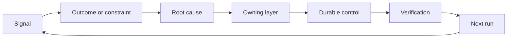

# Sahiplik ve Emeklilik ile Bir Geri Dönüş Ratseti Yap

> Gönderiş bir yapı döngüsünü kapatır ve öğrenme döngüsünü açar.

**Type:** Learn + Build
**Languages:** Python (stdlib)
**Prerequisites:** Phase 14 lessons 46 and 53
**Time:** ~75 minutes

## Öğrenme Hedefleri

- Olayları, değerlendirmeleri, kullanıcı davranışlarını ve düzeltmeleri kendi eylemlerine dönüştürün.
- Her sinyali bağlam, değerlendirme, politika, çalıştırma zamanı veya geriye kalanına yönlendirin.
- Dönüşme şiddet ve sıklık açısından öncelik verin.
- Her kontrolü emeklilik şartıyla ayarlayın.
- Teslimat kararını kanıtlarla, anlaşmalarla ve sorumlu bir sahibiyle bildirin.

## İsteğe bağlılık altyapıdır

Bir ekip, izleri, değerlendirmeleri, destek biletleri ve olay kayıtlarını hiçbirinden öğrenmeden toplayabilir.

Bu da bir şapka:

1. Beton bir sinyal izlemek;
2. bir sonuca, kısıtlamaya veya varsaymaya bağlamak;
3. En erken sistem katmanının nedeni belirlenmesi;
4. sınırlı bir değişim yaratmak;
5. tekrarlanma olasılığının azalmasını doğrulayacaklar;
6. kontrolün devam etmesi gerektiğini gözden geçirir.

## Sahiplik Yolu

| Signal | Destination |
|---|---|
| False positive, regression, wrong result | Evaluation or test |
| Missing context, duplicate work, stale fact | Context source or retrieval route |
| Unsafe action or authority gap | Policy or permission boundary |
| Timeout, retry storm, unavailable dependency | Runtime control |
| New product need or unresolved tradeoff | Shaped backlog item |

Bir test veya izin başarısızlığı imkansız hale getirebilirse, bir sonraki paragraf eklemeyin.



## Sahiplik Kontrolün Bir Parçasıdır

Her bir çöpçü eyleminde:

- tek bir sahibi;
- Sonuç ve tekrar üzerine kurulan bir öncelik;
- Değişirilecek eser;
- Değişimi kanıtlayan doğrulama;
- bir gözden geçirme veya sona erme penceresi;
- Emeklilik şartı.

Kendiliğinden gelişmeyen bir gelişme daha iyi biçimlendirilmiş bir gözlemdir.

## İptal edilmiş Kontroller

Bu politika çelişkili ve pahalı olabilir.

- mimarlık veya iş akışı değişiklikleri;
- Daha düşük düzeyde bir invariant, daha yüksek düzeyde bir talimat yerine geçirir;
- Korunan hatalılık seçilen pencerede görünmedi;
- Kontrol, zararın önlenmesinden çok meşru işi engeller.

Emeklilik için de kanıt gereklidir.

## Bağlantı Oluştur ve Kodlama Ajanı İzleyici

Aynı çubuk her iki pistte de geçer:

- Ürün kanıtları sonuç çerçevesini, varsayımları, parçaları veya ölçüm planını değiştirir.
- Kodlama ajanı düzeltmeleri testleri, bağlamı, kapsamını, otomasyonu veya teslimatı değiştirir.
- Olaylar hem ürün sınırını hem de ajan çalışma masasını değiştirebilir.

Bu yüzden yapılandırma, kodlama öncesi biten bir aşama değil. Kabul edilen her değişim boyunca devam eder.

## Yapın

Laboratuvar sinyalleri sınıflandırır, kendi işlevlerini oluşturur, önceliklerini belirler ve yazar.`outputs/feedback-backlog.json`- Evet .

```bash
python3 code/main.py
python3 -m unittest discover code/tests -v
```

Bir runtime timeout sinyali ekleyin ve genel geriye kalanın yerine runtime'ye yönlendirdiğini onaylayın.

## Pratik Laboratuvar: Bir Karar Vermek

Kariyer yolunuzdaki portföy projesinden bir iş akışı seçin.[career delivery template](https://github.com/rohitg00/ai-engineering-from-scratch/blob/main/phases/14-agent-engineering/54-build-the-feedback-ratchet/outputs/career-delivery-evidence.md)- Evet .

Python laboratuvarı, örnek gerileme eylemleri oluşturur. Kullanıcıları gözlemlemez, müdahaleyi ölçmez veya kariyer hazırlığını kanıtlamaz.

### 1. Ne Olduğunu Bil

Kullanıcıyı, görevi, mevcut iş akışını ve geliştirmek istediğiniz sonucu kaydetin. Kabul edilmiş bir gözlem, düzenlenmiş bir destek kaydı veya yeniden üretilebilir bir görev izini bağlayın. Gördüğünüzü birinin bildirdiği ve sonuçladığınızdan ayırın.

Bir başarısızlık: başarısız bir varsayım, kullanılamaz bir sonuç, beklenmedik bir maliyet veya gecikmiş bir teslimat.

Kullanıcılarla çalışamıyorsanız, bir eşya veya belirtilen senaryo ile açık bir şekilde etiketlenmiş bir simülasyon çalıştırın. Simülasyon gözlemlerini gerçek kullanıcı kanıtlarından ayrı tutun. Görüşmeler, onaylar, kabul veya iş etkisi uydurmayın.

### 2. Yetki Alanında İlerleyiş Yapın

Bilinmeyenleri listeleyin ve en önemli olanı çözebilecek en ucuz geri dönüşümlü eylemleri seçin.

Örneğin, müşteri verilerini kullanma iznini beklerken, çevrimdışı bir tekrarlama hazırlayabilirsiniz. Girişimci olmak, yetkili çalışmayı ilerletmek ve engellenmiş kararı açıklamak anlamına gelir.

### 3. Seçenekleri karşılaştırın ve karar sahibiyle konuşun

Uygulama detaylarına ihtiyaç duymayan birine kısa bir karar özetini yazın.

- Kullanıcı sorunu ve planı değiştiren kanıtlar;
- En az iki seçenek, güvenilir olduğu takdirde daha ucuz bir manuel veya inşa edilmemek seçeneği dahil olmak üzere;
- Kalite, etkileşim tasarımı, çaba, işletme maliyeti ve risk karşılaştırmaları;
- tavsiyeniz, belirsizliğiniz ve gerekli kararınız;
- karar sahibi, etkilenen paydaşlar ve kararın gerekli olduğu tarih.

Bir akranın etkilenen paydaşını temsil etmesini ve bir anlaşmayı meydan okumasını iste. İtirazını ve tavsiyenizin nasıl değiştiğini veya değişmediğini kaydedin. Rol oynaması geri bildirimlerini simülasyon olarak etiketleyin; gerçek paydaşların anlaşmasını destekleyemez.

### 4. Sınırlı Bir Deneyi Yap

Cevap vermek istediğiniz soruya göre bir prototip, pilot veya üretim işi seçin. Sonuç toplanmadan önce kitle, veriler, yetki, süresi, geri dönüş ve devam, değişiklik veya durma koşullarını belirleyin.

Kullanıcının başlangıç noktasından tamamlanmış bir göreve kadar etkileşimi yürüyün. Yanlış bir çıkış veya eksik veri durumunu ekleyin. Kullanıcının başarısızlığı fark edip edemeyeceğini, düzeltmeyeceğini ve sizden gizli bir yardım almadan geri dönebileceğini gözlemleyin.

İş akışının bir parçası olarak insan inceleme ve düzeltme süresini sayın. Daha hızlı bir model yanıtlaması hala tamamı işi yavaş veya güvenilmesini zorlaştırabilir.

### 5. Sonuçları ve Ekonomikleri karşılaştırın

Aynı metrik tanım, görev sayısı, toplama yöntemi ve karşılaştırılabilir gözlem pencereleri kullanarak bir başlangıç çizgisi ve bir takip kaydını kaydedin. Örnek sayıları, dışlamalar ve kanıt bağlantıları rakamların yanında tutun. Bu koşullar değişirse, karşılaştırmanın neden sınırlı olduğunu açıklayın.

Bir kullanıcı sonucu, bir kalite veya güvenlik koruma çerçevesini ve toplam insan inceleme çabalarını içerir. Hedefi kaçırıldığında bile sonucu kaydetir. Küçük veya simülasyonlu örnekler sınırlı bir öğrenme iddiasını destekler, kanıtlanmış iş etkisinin iddiası değil.

Model çağrıları, tekrar denemeler, destek hizmetleri ve insan incelemesi kullanarak başarıyla tamamlanmış görev başına maliyetin tahmin edilmesini sağlayın. Çalışma oranı varsayımını ve ölçülen kullanımını tahminlerden ayırın. Bu maliyeti, proje arkasındaki manuel alternatif veya değer varsayımıyla karşılaştırın.

Var olanları kullan [FinOps for LLMs lesson](https://aiengineeringfromscratch.com/lesson?path=phases/17-infrastructure-and-production/27-finops-llms)Modelle değişim sadece bir olası yanıt; iş akışını daraltmak veya manuel bir adım tutmak daha iyi bir ürün kararı olabilir.

### 6. Çeliği Kapat

Eğer kanıtlar kesin değildirse, kayıp gözlem ve sonraki sınırlı testin adını verin. Sorumlu karar sahibinin cevabını kaydedin; karar verilmediyse beklenmedik bir şekilde bırakın.

Teslimat sürecinin kendisi için bir gelişme seçin: daha net bir görev çerçevesini, daha erken kullanıcı yürüyüşünü, daha iyi bir inceleme kontrol listesini, daha küçük bir ajan teslimatını veya daha sıkı bir değerlendirme kazasını seçin.

Bu değişikliklerin devam etmesi, gözden geçirilmesi veya geri alınacağı konusunda karar verin. Seçimi destekleyen kanıtları kaydetin.

## Nakliye edilen Sanatlı

- Tamam .[career-delivery-evidence.md](https://github.com/rohitg00/ai-engineering-from-scratch/blob/main/phases/14-agent-engineering/54-build-the-feedback-ratchet/outputs/career-delivery-evidence.md)Bu projenin en iyi yolu, kendi projenin içine girmek ve kanıt bağlantıları ile tamamlamak. Kaydedilen şablonun tekrar kullanılabilir olmasını sağlayın. Karar özetini, etkileşim geçişini, ölçüm karşılaştırmasını ve kariyer portföyünüzün eserlerini takip etmeyi içerir.

## Kontrol et

Bu el yazısı ile birlikte kullanın.**met**- Evet .**needs work**veya**not observed**Bu, bir mahkeme kararının doğru olduğuna dair bir kanıt değildir.

| Check | Evidence that meets it |
|---|---|
| Workflow grounded | A traceable observation supports the problem; reported claims, inference, and simulation are labeled. |
| Authority respected | Reversible next work is clear, and any restricted action waits for its actual decision owner. |
| Tradeoffs communicated | Credible alternatives, a stakeholder objection, a recommendation, and an explicit decision request are recorded. |
| Interaction tested | The walkthrough covers success, failure, recovery, and human review effort. |
| Outcome compared | Baseline and follow-up definitions align; samples, guardrails, costs, and comparison limits are visible. |
| Setback owned | The evidence changes a continue/change/stop decision and an accountable next action. |
| Process improved | One workflow improvement has an owner, review date, and an evidence-based keep/revise/retire decision. |

Gözetilmemiş gerçek kullanıcı davranışları, simülasyonda geçen her adım bile boşluk olarak kalır.

## Egzersizler

1. Bir olayı ve bir kullanıcı şikayetini bir iş yapma eylemine dönüştürün.
2. Her tekrarın önlenebileceği en erken katmanı isimlendirin.
3. Laboratuvar çıkışına doğrulama komutları veya gözlemleri ekleyin.
4. Bir polis kuralının emeklilik koşulunu tanımlayın.
5. Birinci iz kabul edilen düzeltmeyi bir sonraki görev çerçevesine geri getir.

## Daha Fazla Okumak

- [Basili, Caldiera, and Rombach, The Goal Question Metric Approach](https://www.cs.toronto.edu/~sme/CSC444F/handouts/GQM-paper.pdf), hedef odaklı ölçüm yoluyla örgütsel öğrenme için.
- [Fagerholm et al., Building Blocks for Continuous Experimentation](https://doi.org/10.1145/2601248.2601276), kanıtları ürün geliştirme süreci ile bağlantılı olan teknik ve örgütleyici döngü için.
- [Nuseibeh and Easterbrook, Requirements Engineering: A Roadmap](https://www.cs.toronto.edu/~sme/papers/2000/ICSE2000.pdf), sistem yaşam döngüsü boyunca gelişen gereksinimlerle ilgilenmek için.

## Neyi Saklarsın

- Tutun .`outputs/feedback-backlog.json`Bu, birleştirilmiş olarak ürün yargı ve teslim yolu kapatarak bir sonraki sonuç çerçevesini bilgilendirir.
