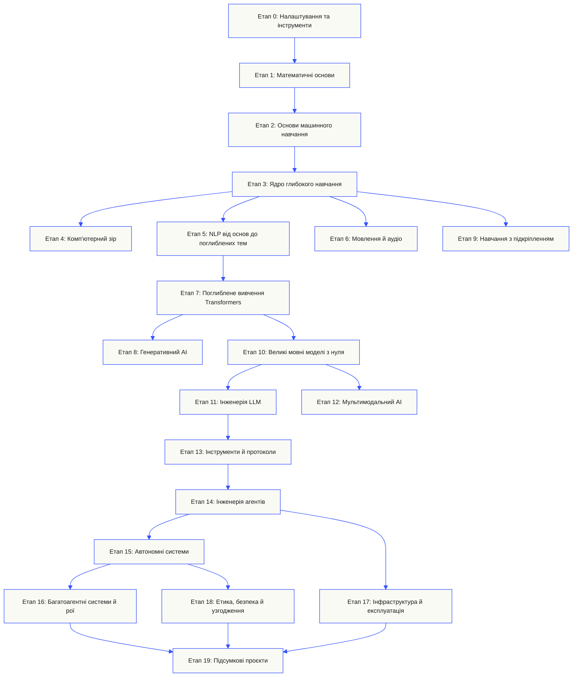
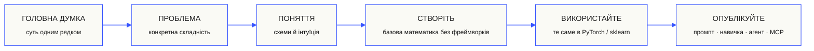

<p align="center"><sub>Цей README перекладено українською. <a href="../../README.md">Англійський README</a> залишається канонічним джерелом.</sub></p>

<p align="center">
  <picture>
    <source media="(prefers-color-scheme: dark)" srcset="../../assets/readme/header-dark.svg">
    
  </picture>
</p>

Реалізуйте внутрішні механізми моделей, пошукові конвеєри та середовища виконання агентів. Тестуйте їх, досліджуйте збої та зберігайте код і результати оцінювання.

**[Почати навчання](https://aiengineeringfromscratch.com/lesson?path=phases/00-setup-and-tooling/01-dev-environment)** · **[Виберіть шлях](#learning-routes)** · **[Спробуйте лабораторну роботу](#interactive-lab)** · **[Створіть проєкт](#project-challenges)** · **[Переглянути програму](#contents)**

Безкоштовно, з відкритим кодом, за ліцензією MIT. Навчайтеся на вебсайті, з агентом програмування або запускаючи код локально.

> 523 уроки. 20 етапів. Python, TypeScript, Rust, Julia.

<p align="center">
  <a href="../../LICENSE"></a>
  <a href="../../ROADMAP.md"></a>
  <a href="#contents"></a>
  <a href="https://github.com/rohitg00/ai-engineering-from-scratch/stargazers"></a>
  <a href="https://aiengineeringfromscratch.com"></a>
</p>

<details>
<summary>Читати своєю мовою</summary>

<p align="center">
  <a href="../../README.md">🇬🇧 English</a> · <a href="../../i18n/zh/README.md">🇨🇳 简体中文</a> · <a href="../../i18n/zh-TW/README.md">🇹🇼 繁體中文（台灣）</a> · <a href="../../i18n/ja/README.md">🇯🇵 日本語</a> · <a href="../../i18n/ko/README.md">🇰🇷 한국어</a> · <a href="../../i18n/pt/README.md">🇵🇹 Português</a> · <a href="../../i18n/pt-BR/README.md">🇧🇷 Português (Brasil)</a> · <a href="../../i18n/es/README.md">🇪🇸 Español</a> · <a href="../../i18n/de/README.md">🇩🇪 Deutsch</a> · <a href="../../i18n/fr/README.md">🇫🇷 Français</a> · <a href="../../i18n/it/README.md">🇮🇹 Italiano</a> · <a href="../../i18n/nl/README.md">🇳🇱 Nederlands</a> · <a href="../../i18n/pl/README.md">🇵🇱 Polski</a> · <a href="../../i18n/cs/README.md">🇨🇿 Čeština</a> · <a href="../../i18n/ro/README.md">🇷🇴 Română</a> · <a href="../../i18n/hu/README.md">🇭🇺 Magyar</a> · <a href="../../i18n/el/README.md">🇬🇷 Ελληνικά</a> · <a href="../../i18n/sv/README.md">🇸🇪 Svenska</a> · <a href="../../i18n/da/README.md">🇩🇰 Dansk</a> · <a href="../../i18n/no/README.md">🇳🇴 Norsk</a> · <a href="../../i18n/fi/README.md">🇫🇮 Suomi</a> · <a href="../../i18n/ru/README.md">🇷🇺 Русский</a> · <a href="../../i18n/uk/README.md">🇺🇦 Українська</a> · <a href="../../i18n/tr/README.md">🇹🇷 Türkçe</a> · <a href="../../i18n/he/README.md">🇮🇱 עברית</a> · <a href="../../i18n/ar/README.md">🇸🇦 العربية</a> · <a href="../../i18n/fa/README.md">🇮🇷 فارسی</a> · <a href="../../i18n/hi/README.md">🇮🇳 हिन्दी</a> · <a href="../../i18n/bn/README.md">🇧🇩 বাংলা</a> · <a href="../../i18n/ur/README.md">🇵🇰 اردو</a> · <a href="../../i18n/th/README.md">🇹🇭 ไทย</a> · <a href="../../i18n/vi/README.md">🇻🇳 Tiếng Việt</a> · <a href="../../i18n/id/README.md">🇮🇩 Bahasa Indonesia</a> · <a href="../../i18n/tl/README.md">🇵🇭 Tagalog</a>
</p>

</details>

### Спонсори

<p align="center">
  <a href="https://serpapi.com/ai-engineering-from-scratch"><picture><source media="(min-width: 768px)" srcset="../../assets/sponsors/serpapi-banner-compact.png" width="48%"></picture></a>
  <a href="https://nitrostack.ai/referral/aiengineeringfromscratch"><picture><source media="(min-width: 768px)" srcset="../../assets/sponsors/nitrostack-banner-equal.png" width="48%"></picture></a>
</p>

<p align="center">
  <sub><span>Ваша підтримка зберігає кожен урок безкоштовним і з відкритим кодом.</span> <a href="#supporters">Переглянути всіх, хто підтримує проєкт</a> · <a href="../../SPONSORS.md">Стати спонсором</a></sub>
</p>

<a id="see-what-you-will-build-and-keep"></a>
<a id="learning-routes"></a>

## Навчальні маршрути

| Маршрут | Перший урок |
|---|---|
| Основи моделей | [Налаштування та інструменти](https://aiengineeringfromscratch.com/lesson?path=phases/00-setup-and-tooling/01-dev-environment) |
| Системи на основі LLM | [Інженерія промптів](https://aiengineeringfromscratch.com/lesson?path=phases/11-llm-engineering/01-prompt-engineering) |
| Агенти та постачання систем | [Цикл агента](https://aiengineeringfromscratch.com/lesson?path=phases/14-agent-engineering/01-the-agent-loop) |

[Порівняти кар’єрні шляхи](https://aiengineeringfromscratch.com/learning-paths.html) · [Попередні знання та час навчання](#study-guide)

<a id="interactive-lab"></a>

### Градієнтний спуск

Двадцять початкових точок рухаються за методом градієнтного спуску на квадратичній функції втрат. Графік показує їхні положення та середні втрати після кожного оновлення.

<p align="center">
  <a href="https://aiengineeringfromscratch.com/lesson?path=phases/01-math-foundations/08-optimization#loss-landscape-visualization">
    <picture>
      <source media="(max-width: 600px) and (prefers-color-scheme: dark) and (prefers-reduced-motion: reduce)" srcset="../../assets/readme/101-gradient-mobile-dark.png">
      <source media="(max-width: 600px) and (prefers-reduced-motion: reduce)" srcset="../../assets/readme/101-gradient-mobile-light.png">
      <source media="(prefers-color-scheme: dark) and (prefers-reduced-motion: reduce)" srcset="../../assets/readme/101-gradient-dark.png">
      <source media="(prefers-reduced-motion: reduce)" srcset="../../assets/readme/101-gradient-light.png">
      <source media="(max-width: 600px) and (prefers-color-scheme: dark)" srcset="../../assets/readme/101-gradient-mobile-dark.gif">
      <source media="(max-width: 600px)" srcset="../../assets/readme/101-gradient-mobile-light.gif">
      <source media="(prefers-color-scheme: dark)" srcset="../../assets/readme/101-gradient-dark.gif">
      
    </picture>
  </a>
</p>

[Змініть швидкість навчання в уроці](https://aiengineeringfromscratch.com/lesson?path=phases/01-math-foundations/08-optimization#loss-landscape-visualization) · [Порівняйте в коді градієнтний спуск, метод імпульсу та Adam](../../phases/01-math-foundations/08-optimization/code/optimizers.py)

<a id="project-challenges"></a>

### Проєкти

Три проєкти з поетапними заготовками, еталонними реалізаціями та локальними засобами оцінювання. Виконуйте команди з кореня репозиторію після [налаштування](#local-setup). Заготовки не проходять перевірок, доки ви не реалізуєте етапи.

<details>
<summary><strong>01 · Лабораторія оцінювання пошуку</strong> · Python · Метрики ранжування та перевірки регресій</summary>

Кандидат покращує середнє NDCG, але для одного запиту найрелевантніші джерела опускаються в ранжуванні. Створіть порівняння для кожного запиту, яке повідомляє про регресію та може зупинити перевірку перед випуском.

Використовуйте Python 3.10+. Повторіть [RAG](../../phases/11-llm-engineering/06-rag/docs/en.md) і [оцінювання моделей](../../phases/02-ml-fundamentals/09-model-evaluation/docs/en.md). Реалізуйте перевірку ранжування, precision і recall, метрики з урахуванням позиції, а потім порівняння систем.

```bash
python3 scripts/project_test.py retrieval-evaluation-lab \
  --init learning-artifacts/retrieval-evaluation-lab
python3 scripts/project_test.py retrieval-evaluation-lab \
  --stage 1 --path learning-artifacts/retrieval-evaluation-lab --strict
python3 scripts/project_test.py retrieval-evaluation-lab \
  --all --path learning-artifacts/retrieval-evaluation-lab --strict
```

**Збережіть:** відтворюване порівняння зі змінами для кожного запиту й оцінками релевантності, використаними для підрахунку. Метрики описують ці оцінки; вони не встановлюють правильність відповідей.

[Розпочати проєкт](https://aiengineeringfromscratch.com/project.html?id=retrieval-evaluation-lab) · [Переглянути еталонний розв’язок](../../projects/retrieval-evaluation-lab/solution/) · [Запустити на власних вхідних даних](../../projects/retrieval-evaluation-lab/README.md#run-with-your-own-inputs)

</details>

<details>
<summary><strong>02 · Налагоджувач трасувань агентів</strong> · TypeScript · Розбір трасувань і вимірювання часу</summary>

Надане трасування й далі триває 100 мс, але загальне використання токенів зростає на 200, і один span починає завершуватися помилкою. Відокремте роботу дочірніх span, що перекриваються, від часу виконання батьківського span і створіть звіт, який показує зміну.

Використовуйте Node.js 22.18+ і Python 3 для перевіряльника. Реалізуйте розбір JSONL, перевірку батьківських зв’язків, арифметику інтервалів, а потім часову шкалу для аналізу.

```bash
python3 scripts/project_test.py agent-trace-debugger \
  --init learning-artifacts/agent-trace-debugger
python3 scripts/project_test.py agent-trace-debugger \
  --stage 1 --path learning-artifacts/agent-trace-debugger --strict
python3 scripts/project_test.py agent-trace-debugger \
  --all --path learning-artifacts/agent-trace-debugger --strict
```

**Збережіть:** вхідне трасування, часову шкалу HTML і звіт про регресію в JSON. Зберігайте власні кількості токенів кожного span без дочірніх span, щоб не рахувати використання батьків і нащадків двічі.

[Розпочати проєкт](https://aiengineeringfromscratch.com/project.html?id=agent-trace-debugger) · [Переглянути еталонний розв’язок](../../projects/agent-trace-debugger/solution/) · [Дослідити час виконання інтерактивно](https://aiengineeringfromscratch.com/project.html?id=agent-trace-debugger&stage=03-timing)

</details>

<details>
<summary><strong>03 · Міжмережевий екран викликів інструментів</strong> · Rust · Перевірки ролей і підтвердження схвалення</summary>

Операція запису змінюється після перевірки або схвалення використовується повторно. Перевірте оболонку виклику, роль викликувача та шлях, а потім використайте схвалення, пов’язане з точним запитом і вмістом.

Використовуйте Rust і Python 3.10+. Повторіть [проєктування схем інструментів](../../phases/13-tools-and-protocols/05-tool-schema-design/docs/en.md) і [межі безпеки](../../phases/17-infrastructure-and-production/25-security-secrets-audit/docs/en.md). Застосунок-викликувач надає ідентифікаційні дані; модель пропонує операцію.

```bash
python3 scripts/project_test.py tool-call-firewall \
  --init learning-artifacts/tool-call-firewall
python3 scripts/project_test.py tool-call-firewall \
  --stage 1 --path learning-artifacts/tool-call-firewall --strict
python3 scripts/project_test.py tool-call-firewall \
  --all --path learning-artifacts/tool-call-firewall --strict
```

**Збережіть:** запис аудиту із запитаною операцією та рішенням політики. Схвалення одноразові в межах одного виклику; проєкт не надає постійної авторизації або пісочниці операційної системи.

[Розпочати проєкт](https://aiengineeringfromscratch.com/project.html?id=tool-call-firewall) · [Переглянути еталонний розв’язок](../../projects/tool-call-firewall/solution/) · [Дослідити межі схвалення](https://aiengineeringfromscratch.com/project.html?id=tool-call-firewall&stage=03-consume-a-request-bound-approval-once)

</details>

[Переглянути всі проєкти](https://aiengineeringfromscratch.com/projects.html) · [Посібник із кар’єрної практики](../../learning-paths/CAREER-PRACTICE.md)

## Оберіть спосіб навчання

### На вебсайті

Відкрийте готовий урок на [aiengineeringfromscratch.com](https://aiengineeringfromscratch.com) або розгорніть етап у [змісті](#contents). Налаштування й клонування не потрібні.

### Із ШІ-наставником

Якщо Node.js, `npx` і агент для програмування з підтримкою навичок уже встановлені, агент може стати вашим викладачем. Для встановлення або читання матеріалів не потрібно клонувати репозиторій. Виконувані лабораторні роботи спеціалізованих маршрутів потребують `python3`. Для лабораторних робіт Agent Skills також потрібні вибраний хост і доступний для запису каталог навичок користувача або проєкту.

```bash
npx skills add rohitg00/ai-engineering-from-scratch
```

Оберіть хост і область, коли запитає інсталятор. Використовуйте `start-learning` у Codex, `/start-learning` у Claude Code або попросіть хост використати навичку за назвою.

<details>
<summary>Налаштування наставника та команди середовища</summary>

Спочатку перевірте локальні вимоги:

```bash
node --version
npx --version
python3 --version
```

`skills` записує файли для хоста й області, вибраних під час встановлення, наприклад у `.claude/skills/`, `.cursor/skills/`, `.codex/skills/` або інший підтримуваний каталог навичок. Перевірте, що вибраний хост знаходить саме цей каталог.

Синтаксис виклику визначає хост, а не переносний формат `SKILL.md`:

| Застосунок-хост | Почати курс | Почати Model Context Protocol (MCP) | Почати Agent Skills | Пройти тест етапу |
|---|---|---|---|---|
| Codex | `start-learning`, або виберіть її з `/skills` | `learn-mcp`, або виберіть її з `/skills` | `learn-agent-skills`, або виберіть її з `/skills` | `check-understanding 13`, або виберіть її з `/skills` |
| Claude Code | `/start-learning` | `/learn-mcp` | `/learn-agent-skills` | `/check-understanding 13` |
| Інші сумісні хости | `Use start-learning to begin the course.` | `Use learn-mcp to start the Model Context Protocol (MCP) path.` | `Use learn-agent-skills to start the Agent Skills Engineering path.` | `Use check-understanding to quiz me on Phase 13.` |

Вступний тест із десяти запитань визначає початковий етап за вашими знаннями та зберігає особистий навчальний план у `LEARNING.md`. Далі навичка `learn` викладає один урок за сеанс: поняття, математика, код і тест. Вона завантажує уроки безпосередньо з цього репозиторію, а `course-guide` знаходить саме той урок, що допоможе подолати труднощі. У Codex викликайте `learn` і `course-guide`; у Claude Code використовуйте `/learn` і `/course-guide`; в інших сумісних хостах попросіть застосувати навичку за назвою.

Потрібен лише Model Context Protocol (MCP)? Використайте виклик MCP для свого хоста. Він створює `MCP-LEARNING.md` і веде єдиним маршрутом із 17 уроків: запити без стану, транспорт, двобічна робота, безпека, надійність, керування реєстром і докази відповідності протоколу. Точний порядок і контрольні точки наведено в [маніфесті Model Context Protocol (MCP)](../../learning-paths/model-context-protocol.json).

Потрібні лише Agent Skills? Використайте відповідний виклик для свого хоста. Він створює `AGENT-SKILLS-LEARNING.md` і веде послідовним маршрутом із п'яти уроків: контракт, виявлення, виклик, межі пісочниці, а потім оцінювання перед випуском і переносність між реальними хостами. Почніть у вебверсії з [маршруту Agent Skills](https://aiengineeringfromscratch.com/lesson?path=phases/13-tools-and-protocols/22-skills-and-agent-sdks&learningPath=agent-skills).

Інсталятор перелічує хости, які може налаштувати, і запитує місце встановлення. Якщо у вас ще немає Node.js, `npx`, `python3`, підтримуваного хоста або доступного для запису каталогу, скористайтеся сайтом чи самостійно прочитайте `docs/en.md`. Так ви вивчите поняття, але докази виявлення, виклику, запуску скриптів і видалення на реальному хості залишаться неперевіреними, доки не стане доступною попередня перевірка. Читайте уроки на [aiengineeringfromscratch.com](https://aiengineeringfromscratch.com).

### Навчальні навички

| Навичка | Що вона робить |
|---|---|
| [`start-learning`](../../skills/start-learning/SKILL.md) | Одноразовий вступ: мета навчання, вступний тест і особистий план, збережений у `LEARNING.md`. |
| [`learn`](../../skills/learn/SKILL.md) | Цикл викладача: пригадування для розігріву, інтерактивне вивчення наступного уроку, потім його тест; зберігає прогрес і чергу повторення. |
| [`course-guide`](../../skills/course-guide/SKILL.md) | Тематичний навігатор. «Де вивчити увагу?» або «мої втрати дорівнюють NaN» → потрібні уроки з посиланнями. |
| [`learn-mcp`](../../skills/learn-mcp/SKILL.md) | Спеціалізований викладач Model Context Protocol (MCP). Створює `MCP-LEARNING.md`, дотримується маніфесту з 17 уроків і записує докази обміну повідомленнями, безпеки, надійності й відповідності. |
| [`learn-agent-skills`](../../skills/learn-agent-skills/SKILL.md) | Спеціалізований викладач Agent Skills. Створює `AGENT-SKILLS-LEARNING.md`, викладає уроки 22, 24, 25, 26 і 27 та записує докази роботи на реальному хості. |
| [`claude-certification`](../../skills/claude-certification/SKILL.md) | Викладач для сертифікації. Вибирає CCAO-F, CCDV-F, CCAR-F або CCAR-P, викладає уроки, запускає лабораторні роботи, перевіряє результати, проводить діагностичні й пробні іспити та зберігає прогрес. |
| [`mcpa-certification`](../../skills/mcpa-certification/SKILL.md) | Викладач MCPA. Дотримується маршруту `mcpa-f` із 34 уроків за протоколом 2026-07-28, викладає уроки, запускає лабораторні роботи й перевірку повідомлень, проводить діагностичний тест і три пробні іспити та зберігає прогрес. |
| [`find-your-level`](../../skills/find-your-level/SKILL.md) | Вступний тест із десяти запитань. Зіставляє знання з початковим етапом і створює особистий маршрут з оцінками тривалості. |
| [`check-understanding <phase>`](../../skills/check-understanding/SKILL.md) | Тест із восьми запитань для кожного етапу, відгуки й конкретні уроки для повторення. Скористайтеся формою для Codex, Claude Code або природною мовою з таблиці викликів вище. |

</details>

<a id="local-setup"></a>

### Запустіть код локально

```bash
git clone https://github.com/rohitg00/ai-engineering-from-scratch.git
cd ai-engineering-from-scratch
python3 phases/00-setup-and-tooling/01-dev-environment/code/verify.py --route beginner
python3 phases/01-math-foundations/01-linear-algebra-intuition/code/vectors.py
```

Попередня перевірка відокремлює вимоги, потрібні зараз, від інструментів, які знадобляться пізніше. Для кожної невиконаної обов’язкової вимоги наведено виявлену причину та команду для виправлення. Команда `vectors.py` запускає урок без зовнішніх залежностей і наприкінці показує, що множення матриці на вектор є операцією всередині шару нейронної мережі. Збережіть цей вивід термінала як перший доказ.

<details>
<summary>Працюйте з кожним уроком однаково</summary>

### Працюйте з кожним уроком однаково

1. **Прочитайте** `docs/en.md` і поясніть головну ідею своїми словами.
2. **Наберіть і створіть** важливі частини коду, а не сприймайте блок коду як прикрасу.
3. **Запустіть** команду уроку з кореня репозиторію, каталогу з `README.md` і `phases/`.
4. **Збережіть докази**: команду, робочий каталог, код завершення, змістовний вивід і результат, який ви змінили або створили.
5. **Продовжуйте** лише тоді, коли зможете пояснити вивід і зробити невелику зміну без здогадок.

Шляхи в командах на сторінках уроків задано відносно кореня репозиторію, якщо урок прямо не вимагає змінити каталог. Якщо урок пропонує кілька мов програмування, запустіть реалізацію мовою, яку вивчаєте.

</details>

<a id="study-guide"></a>

## Оберіть навчальний маршрут

Вам не потрібно переглядати всі 523 уроки перед початком. Виберіть одну мету. Кожне посилання відкриває ту саму навчальну програму на GitHub або на сайті, а обидві версії використовують той самий код уроків.

| Ваша мета | Навчайтеся на GitHub | Навчайтеся на сайті |
|---|---|---|
| Я новачок і хочу отримати ґрунтовну базу | [Етап 0: Налаштування та інструменти](../../phases/00-setup-and-tooling/) | [Середовище розробки](https://aiengineeringfromscratch.com/lesson?path=phases/00-setup-and-tooling/01-dev-environment) |
| Я знаю Python і хочу опанувати основи математики та машинного навчання | [Етап 1: Математичні основи](../../phases/01-math-foundations/) | [Інтуїтивне розуміння лінійної алгебри](https://aiengineeringfromscratch.com/lesson?path=phases/01-math-foundations/01-linear-algebra-intuition) |
| Я хочу створювати LLM-застосунки для промислової експлуатації | [Етап 11: Інженерія LLM](../../phases/11-llm-engineering/) | [Інженерія промптів](https://aiengineeringfromscratch.com/lesson?path=phases/11-llm-engineering/01-prompt-engineering) |
| Я хочу створювати агентів | [Етап 14: Інженерія агентів](../../phases/14-agent-engineering/) | [Цикл роботи агента](https://aiengineeringfromscratch.com/lesson?path=phases/14-agent-engineering/01-the-agent-loop) |
| Я хочу використовувати агентів програмування в реальних репозиторіях | [Навчальний шлях інженерії за допомогою агентів](../../learning-paths/using-coding-agents.json) | [Інженерія за допомогою агентів](https://aiengineeringfromscratch.com/lesson?path=phases/14-agent-engineering/31-agent-workbench-why-models-fail&learningPath=using-coding-agents) |
| Я хочу визначити, що варто створювати, до початку реалізації | [Навчальний шлях продуктових рішень і постачання](../../learning-paths/shaping-the-build.json) | [Продуктові рішення та постачання](https://aiengineeringfromscratch.com/lesson?path=phases/14-agent-engineering/47-outcomes-before-output&learningPath=shaping-the-build) |

Не знаєте, з чого почати? Скористайтеся [тьютором для визначення рівня `start-learning`](../../skills/start-learning/SKILL.md) або [посібником із попередніх знань на сайті](https://aiengineeringfromscratch.com/prereqs.html).

Порівняйте чотири основні напрями та шість кар’єрних маршрутів у [навчальних шляхах інженерії ШІ](https://aiengineeringfromscratch.com/learning-paths.html).

<details>
<summary>Спеціалізовані маршрути MCP та Agent Skills</summary>

| Ваша мета | Навчайтеся на GitHub | Навчайтеся на сайті |
|---|---|---|
| Я хочу розробляти з Model Context Protocol (MCP) | [Маршрут Model Context Protocol (MCP)](../../phases/13-tools-and-protocols/README.md#model-context-protocol-mcp-path) | [Навчальний шлях Model Context Protocol (MCP)](https://aiengineeringfromscratch.com/lesson?path=phases/13-tools-and-protocols/06-mcp-fundamentals&learningPath=model-context-protocol) |
| Я хочу писати й публікувати Agent Skills | [Спеціалізований маршрут Agent Skills](../../phases/13-tools-and-protocols/README.md#agent-skills-fast-path) | [Навчальний шлях Agent Skills](https://aiengineeringfromscratch.com/lesson?path=phases/13-tools-and-protocols/22-skills-and-agent-sdks&learningPath=agent-skills) |

</details>

<details>
<summary>Попередні знання та час навчання</summary>

### Попередні знання

- Ви вмієте писати код будь-якою мовою; Python стане в пригоді.
- Ви хочете зрозуміти, як AI **насправді працює**, а не лише викликати API.

## З чого почати

| Підготовка | Почати з | Орієнтовний час |
|---|---|---|
| Новачок у програмуванні й AI | Етап 0: Налаштування | ~306 годин |
| Знаєте Python, але не ML | Етап 1: Математичні основи | ~270 годин |
| Знаєте ML, але не глибоке навчання | Етап 3: Ядро глибокого навчання | ~200 годин |
| Знаєте глибоке навчання й хочете LLM та агентів | Етап 10: Великі мовні моделі з нуля | ~100 годин |
| Досвідчений інженер, потрібна лише інженерія агентів | Етап 14: Інженерія агентів | ~60 годин |
| Потрібні лише промислові MCP-системи | [Маршрут Model Context Protocol (MCP)](../../learning-paths/model-context-protocol.json) | ~23 години 15 хв |
| Потрібні лише промислові Agent Skills | [Маршрут інженерії Agent Skills](../../learning-paths/agent-skills.json) | ~9.5 години |

</details>

## Структура навчальної програми

Двадцять етапів спираються один на одного. Математика є фундаментом, агенти й промислова експлуатація є верхніми рівнями. Переходьте далі, якщо вже знаєте основи, але не пропускайте їх, а потім не дивуйтеся збоям нагорі.



<a id="contents"></a>

## Зміст

Двадцять етапів. Натисніть на етап, щоб розгорнути список уроків.

<a id="phase-0"></a>
### Етап 0: Налаштування та інструменти `12 уроків`
> Підготуйте середовище до всього, що буде далі.

| # | Урок | Тип | Мова |
|:---:|--------|:----:|------|
| 01 | [Середовище розробки](../../phases/00-setup-and-tooling/01-dev-environment/) | Створіть | Python |
| 02 | [Git і співпраця](../../phases/00-setup-and-tooling/02-git-and-collaboration/) | Вивчіть | — |
| 03 | [Налаштування GPU та хмара](../../phases/00-setup-and-tooling/03-gpu-setup-and-cloud/) | Створіть | Python |
| 04 | [API й ключі](../../phases/00-setup-and-tooling/04-apis-and-keys/) | Створіть | Python |
| 05 | [Блокноти Jupyter](../../phases/00-setup-and-tooling/05-jupyter-notebooks/) | Створіть | Python |
| 06 | [Середовища Python](../../phases/00-setup-and-tooling/06-python-environments/) | Створіть | Shell |
| 07 | [Docker для AI](../../phases/00-setup-and-tooling/07-docker-for-ai/) | Створіть | Docker |
| 08 | [Налаштування редактора](../../phases/00-setup-and-tooling/08-editor-setup/) | Створіть | — |
| 09 | [Керування даними](../../phases/00-setup-and-tooling/09-data-management/) | Створіть | Python |
| 10 | [Термінал і командна оболонка](../../phases/00-setup-and-tooling/10-terminal-and-shell/) | Вивчіть | — |
| 11 | [Linux для AI](../../phases/00-setup-and-tooling/11-linux-for-ai/) | Вивчіть | — |
| 12 | [Налагодження та профілювання](../../phases/00-setup-and-tooling/12-debugging-and-profiling/) | Створіть | Python |

<details id="phase-1">
<summary><b>Етап 1: Математичні основи</b> &nbsp;<code>22 уроки</code>&nbsp; <em>Інтуїція за кожним AI-алгоритмом через код.</em></summary>
<br/>

| # | Урок | Тип | Мова |
|:---:|--------|:----:|------|
| 01 | [Інтуїція лінійної алгебри](../../phases/01-math-foundations/01-linear-algebra-intuition/) | Вивчіть | Python, Julia |
| 02 | [Вектори, матриці й операції](../../phases/01-math-foundations/02-vectors-matrices-operations/) | Створіть | Python, Julia |
| 03 | [Матричні перетворення та власні значення](../../phases/01-math-foundations/03-matrix-transformations/) | Створіть | Python, Julia |
| 04 | [Математичний аналіз для ML: похідні й градієнти](../../phases/01-math-foundations/04-calculus-for-ml/) | Вивчіть | Python |
| 05 | [Ланцюгове правило й автоматичне диференціювання](../../phases/01-math-foundations/05-chain-rule-and-autodiff/) | Створіть | Python |
| 06 | [Імовірність і розподіли](../../phases/01-math-foundations/06-probability-and-distributions/) | Вивчіть | Python |
| 07 | [Теорема Баєса та статистичне мислення](../../phases/01-math-foundations/07-bayes-theorem/) | Створіть | Python |
| 08 | [Оптимізація: різновиди градієнтного спуску](../../phases/01-math-foundations/08-optimization/) | Створіть | Python |
| 09 | [Теорія інформації: ентропія та KL-дивергенція](../../phases/01-math-foundations/09-information-theory/) | Вивчіть | Python |
| 10 | [Зменшення розмірності: PCA, t-SNE, UMAP](../../phases/01-math-foundations/10-dimensionality-reduction/) | Створіть | Python |
| 11 | [Сингулярний розклад](../../phases/01-math-foundations/11-singular-value-decomposition/) | Створіть | Python, Julia |
| 12 | [Операції з тензорами](../../phases/01-math-foundations/12-tensor-operations/) | Створіть | Python |
| 13 | [Чисельна стійкість](../../phases/01-math-foundations/13-numerical-stability/) | Створіть | Python |
| 14 | [Норми й відстані](../../phases/01-math-foundations/14-norms-and-distances/) | Створіть | Python |
| 15 | [Статистика для ML](../../phases/01-math-foundations/15-statistics-for-ml/) | Створіть | Python |
| 16 | [Методи вибірки](../../phases/01-math-foundations/16-sampling-methods/) | Створіть | Python |
| 17 | [Лінійні системи](../../phases/01-math-foundations/17-linear-systems/) | Створіть | Python |
| 18 | [Опукла оптимізація](../../phases/01-math-foundations/18-convex-optimization/) | Створіть | Python |
| 19 | [Комплексні числа для AI](../../phases/01-math-foundations/19-complex-numbers/) | Вивчіть | Python |
| 20 | [Перетворення Фур'є](../../phases/01-math-foundations/20-fourier-transform/) | Створіть | Python |
| 21 | [Теорія графів для ML](../../phases/01-math-foundations/21-graph-theory/) | Створіть | Python |
| 22 | [Стохастичні процеси](../../phases/01-math-foundations/22-stochastic-processes/) | Вивчіть | Python |

</details>

<details id="phase-2">
<summary><b>Етап 2: Основи машинного навчання</b> &nbsp;<code>18 уроків</code>&nbsp; <em>Класичне ML досі є основою більшості промислових AI-систем.</em></summary>
<br/>

| # | Урок | Тип | Мова |
|:---:|--------|:----:|------|
| 01 | [Що таке машинне навчання](../../phases/02-ml-fundamentals/01-what-is-machine-learning/) | Вивчіть | Python |
| 02 | [Лінійна регресія з нуля](../../phases/02-ml-fundamentals/02-linear-regression/) | Створіть | Python |
| 03 | [Логістична регресія та класифікація](../../phases/02-ml-fundamentals/03-logistic-regression/) | Створіть | Python |
| 04 | [Дерева рішень і випадкові ліси](../../phases/02-ml-fundamentals/04-decision-trees/) | Створіть | Python |
| 05 | [Метод опорних векторів](../../phases/02-ml-fundamentals/05-support-vector-machines/) | Створіть | Python |
| 06 | [KNN і метрики відстані](../../phases/02-ml-fundamentals/06-knn-and-distances/) | Створіть | Python |
| 07 | [Навчання без учителя: K-Means, DBSCAN](../../phases/02-ml-fundamentals/07-unsupervised-learning/) | Створіть | Python |
| 08 | [Побудова й відбір ознак](../../phases/02-ml-fundamentals/08-feature-engineering/) | Створіть | Python |
| 09 | [Оцінювання моделей: метрики та перехресна перевірка](../../phases/02-ml-fundamentals/09-model-evaluation/) | Створіть | Python |
| 10 | [Зміщення, дисперсія та крива навчання](../../phases/02-ml-fundamentals/10-bias-variance/) | Вивчіть | Python |
| 11 | [Ансамблеві методи: бустинг, бегінг і стекінг](../../phases/02-ml-fundamentals/11-ensemble-methods/) | Створіть | Python |
| 12 | [Налаштування гіперпараметрів](../../phases/02-ml-fundamentals/12-hyperparameter-tuning/) | Створіть | Python |
| 13 | [Конвеєри ML і відстеження експериментів](../../phases/02-ml-fundamentals/13-ml-pipelines/) | Створіть | Python |
| 14 | [Наївний Баєс](../../phases/02-ml-fundamentals/14-naive-bayes/) | Створіть | Python |
| 15 | [Основи часових рядів](../../phases/02-ml-fundamentals/15-time-series/) | Створіть | Python |
| 16 | [Виявлення аномалій](../../phases/02-ml-fundamentals/16-anomaly-detection/) | Створіть | Python |
| 17 | [Робота з незбалансованими даними](../../phases/02-ml-fundamentals/17-imbalanced-data/) | Створіть | Python |
| 18 | [Відбір ознак](../../phases/02-ml-fundamentals/18-feature-selection/) | Створіть | Python |

</details>

<details id="phase-3">
<summary><b>Етап 3: Ядро глибокого навчання</b> &nbsp;<code>13 уроків</code>&nbsp; <em>Нейронні мережі з основних принципів. Без фреймворків, доки не створите власний.</em></summary>
<br/>

| # | Урок | Тип | Мова |
|:---:|--------|:----:|------|
| 01 | [Перцептрон: із чого все почалося](../../phases/03-deep-learning-core/01-the-perceptron/) | Створіть | Python |
| 02 | [Багатошарові мережі та прямий прохід](../../phases/03-deep-learning-core/02-multi-layer-networks/) | Створіть | Python |
| 03 | [Зворотне поширення з нуля](../../phases/03-deep-learning-core/03-backpropagation/) | Створіть | Python |
| 04 | [Функції активації: ReLU, Sigmoid, GELU і причини вибору](../../phases/03-deep-learning-core/04-activation-functions/) | Створіть | Python |
| 05 | [Функції втрат: MSE, перехресна ентропія та контрастивні втрати](../../phases/03-deep-learning-core/05-loss-functions/) | Створіть | Python |
| 06 | [Оптимізатори: SGD, Momentum, Adam, AdamW](../../phases/03-deep-learning-core/06-optimizers/) | Створіть | Python |
| 07 | [Регуляризація: Dropout, Weight Decay, BatchNorm](../../phases/03-deep-learning-core/07-regularization/) | Створіть | Python |
| 08 | [Ініціалізація ваг і стабільність навчання](../../phases/03-deep-learning-core/08-weight-initialization/) | Створіть | Python |
| 09 | [Розклади швидкості навчання та розігрів](../../phases/03-deep-learning-core/09-learning-rate-schedules/) | Створіть | Python |
| 10 | [Створіть власний мініфреймворк](../../phases/03-deep-learning-core/10-mini-framework/) | Створіть | Python |
| 11 | [Вступ до PyTorch](../../phases/03-deep-learning-core/11-intro-to-pytorch/) | Створіть | Python |
| 12 | [Вступ до JAX](../../phases/03-deep-learning-core/12-intro-to-jax/) | Створіть | Python |
| 13 | [Налагодження нейронних мереж](../../phases/03-deep-learning-core/13-debugging-neural-networks/) | Створіть | Python |

</details>

<details id="phase-4">
<summary><b>Етап 4: Комп'ютерний зір</b> &nbsp;<code>28 уроків</code>&nbsp; <em>Від пікселів до розуміння: зображення, відео, 3D, VLM і моделі світу.</em></summary>
<br/>

| # | Урок | Тип | Мова |
|:---:|--------|:----:|------|
| 01 | [Основи зображень: пікселі, канали й колірні простори](../../phases/04-computer-vision/01-image-fundamentals/) | Вивчіть | Python |
| 02 | [Згортки з нуля](../../phases/04-computer-vision/02-convolutions-from-scratch/) | Створіть | Python |
| 03 | [Згорткові мережі: від LeNet до ResNet](../../phases/04-computer-vision/03-cnns-lenet-to-resnet/) | Створіть | Python |
| 04 | [Класифікація зображень](../../phases/04-computer-vision/04-image-classification/) | Створіть | Python |
| 05 | [Перенесення навчання й донавчання](../../phases/04-computer-vision/05-transfer-learning/) | Створіть | Python |
| 06 | [Виявлення об'єктів: YOLO з нуля](../../phases/04-computer-vision/06-object-detection-yolo/) | Створіть | Python |
| 07 | [Семантична сегментація: U-Net](../../phases/04-computer-vision/07-semantic-segmentation-unet/) | Створіть | Python |
| 08 | [Сегментація екземплярів: Mask R-CNN](../../phases/04-computer-vision/08-instance-segmentation-mask-rcnn/) | Створіть | Python |
| 09 | [Генерація зображень: GAN](../../phases/04-computer-vision/09-image-generation-gans/) | Створіть | Python |
| 10 | [Генерація зображень: дифузійні моделі](../../phases/04-computer-vision/10-image-generation-diffusion/) | Створіть | Python |
| 11 | [Stable Diffusion: архітектура й донавчання](../../phases/04-computer-vision/11-stable-diffusion/) | Створіть | Python |
| 12 | [Розуміння відео: часове моделювання](../../phases/04-computer-vision/12-video-understanding/) | Створіть | Python |
| 13 | [Тривимірний зір: хмари точок і NeRF](../../phases/04-computer-vision/13-3d-vision-nerf/) | Створіть | Python |
| 14 | [Vision Transformers (ViT) для комп'ютерного зору](../../phases/04-computer-vision/14-vision-transformers/) | Створіть | Python |
| 15 | [Зір у реальному часі: розгортання на периферійних пристроях](../../phases/04-computer-vision/15-real-time-edge/) | Створіть | Python |
| 16 | [Створіть повний конвеєр комп'ютерного зору](../../phases/04-computer-vision/16-vision-pipeline-capstone/) | Створіть | Python |
| 17 | [Самокероване навчання зору: SimCLR, DINO, MAE](../../phases/04-computer-vision/17-self-supervised-vision/) | Створіть | Python |
| 18 | [Зір із відкритим словником: CLIP](../../phases/04-computer-vision/18-open-vocab-clip/) | Створіть | Python |
| 19 | [OCR і розуміння документів](../../phases/04-computer-vision/19-ocr-document-understanding/) | Створіть | Python |
| 20 | [Пошук зображень і метричне навчання](../../phases/04-computer-vision/20-image-retrieval-metric/) | Створіть | Python |
| 21 | [Виявлення ключових точок та оцінювання пози](../../phases/04-computer-vision/21-keypoint-pose/) | Створіть | Python |
| 22 | [3D Gaussian Splatting з нуля](../../phases/04-computer-vision/22-3d-gaussian-splatting/) | Створіть | Python |
| 23 | [Diffusion Transformers і випрямлений потік](../../phases/04-computer-vision/23-diffusion-transformers-rectified-flow/) | Створіть | Python |
| 24 | [SAM 3 і сегментація з відкритим словником](../../phases/04-computer-vision/24-sam3-open-vocab-segmentation/) | Створіть | Python |
| 25 | [Візуально-мовні моделі (ViT-MLP-LLM)](../../phases/04-computer-vision/25-vision-language-models/) | Створіть | Python |
| 26 | [Оцінювання глибини й геометрії з одного зображення](../../phases/04-computer-vision/26-monocular-depth/) | Створіть | Python |
| 27 | [Відстеження кількох об'єктів і відеопам'ять](../../phases/04-computer-vision/27-multi-object-tracking/) | Створіть | Python |
| 28 | [Моделі світу й відеодифузія](../../phases/04-computer-vision/28-world-models-video-diffusion/) | Створіть | Python |

</details>

<details id="phase-5">
<summary><b>Етап 5: NLP від основ до поглиблених тем</b> &nbsp;<code>29 уроків</code>&nbsp; <em>Мова є інтерфейсом до інтелекту.</em></summary>
<br/>

| # | Урок | Тип | Мова |
|:---:|--------|:----:|------|
| 01 | [Обробка тексту: токенізація, стемінг і лематизація](../../phases/05-nlp-foundations-to-advanced/01-text-processing/) | Створіть | Python |
| 02 | [Мішок слів, TF-IDF і подання тексту](../../phases/05-nlp-foundations-to-advanced/02-bag-of-words-tfidf/) | Створіть | Python |
| 03 | [Векторні подання слів: Word2Vec з нуля](../../phases/05-nlp-foundations-to-advanced/03-word-embeddings-word2vec/) | Створіть | Python |
| 04 | [GloVe, FastText і векторні подання частин слів](../../phases/05-nlp-foundations-to-advanced/04-glove-fasttext-subword/) | Створіть | Python |
| 05 | [Аналіз тональності](../../phases/05-nlp-foundations-to-advanced/05-sentiment-analysis/) | Створіть | Python |
| 06 | [Розпізнавання іменованих сутностей (NER)](../../phases/05-nlp-foundations-to-advanced/06-named-entity-recognition/) | Створіть | Python |
| 07 | [Розмітка частин мови й синтаксичний аналіз](../../phases/05-nlp-foundations-to-advanced/07-pos-tagging-parsing/) | Створіть | Python |
| 08 | [Класифікація тексту: CNN і RNN для тексту](../../phases/05-nlp-foundations-to-advanced/08-cnns-rnns-for-text/) | Створіть | Python |
| 09 | [Моделі перетворення послідовностей](../../phases/05-nlp-foundations-to-advanced/09-sequence-to-sequence/) | Створіть | Python |
| 10 | [Механізм уваги: прорив](../../phases/05-nlp-foundations-to-advanced/10-attention-mechanism/) | Створіть | Python |
| 11 | [Машинний переклад](../../phases/05-nlp-foundations-to-advanced/11-machine-translation/) | Створіть | Python |
| 12 | [Стислий виклад тексту](../../phases/05-nlp-foundations-to-advanced/12-text-summarization/) | Створіть | Python |
| 13 | [Системи запитань і відповідей](../../phases/05-nlp-foundations-to-advanced/13-question-answering/) | Створіть | Python |
| 14 | [Пошук та отримання інформації](../../phases/05-nlp-foundations-to-advanced/14-information-retrieval-search/) | Створіть | Python |
| 15 | [Тематичне моделювання: LDA, BERTopic](../../phases/05-nlp-foundations-to-advanced/15-topic-modeling/) | Створіть | Python |
| 16 | [Генерація тексту](../../phases/05-nlp-foundations-to-advanced/16-text-generation-pre-transformer/) | Створіть | Python |
| 17 | [Чатботи: від правил до нейронних мереж](../../phases/05-nlp-foundations-to-advanced/17-chatbots-rule-to-neural/) | Створіть | Python |
| 18 | [Багатомовна обробка природної мови](../../phases/05-nlp-foundations-to-advanced/18-multilingual-nlp/) | Створіть | Python |
| 19 | [Токенізація частин слів: BPE, WordPiece, Unigram, SentencePiece](../../phases/05-nlp-foundations-to-advanced/19-subword-tokenization/) | Вивчіть | Python |
| 20 | [Структуровані результати й декодування з обмеженнями](../../phases/05-nlp-foundations-to-advanced/20-structured-outputs-constrained-decoding/) | Створіть | Python |
| 21 | [NLI та логічне слідування в тексті](../../phases/05-nlp-foundations-to-advanced/21-nli-textual-entailment/) | Вивчіть | Python |
| 22 | [Поглиблений огляд моделей векторних подань](../../phases/05-nlp-foundations-to-advanced/22-embedding-models-deep-dive/) | Вивчіть | Python |
| 23 | [Стратегії поділу тексту для RAG](../../phases/05-nlp-foundations-to-advanced/23-chunking-strategies-rag/) | Створіть | Python |
| 24 | [Розв'язання кореференції](../../phases/05-nlp-foundations-to-advanced/24-coreference-resolution/) | Вивчіть | Python |
| 25 | [Пов'язування сутностей та усунення неоднозначності](../../phases/05-nlp-foundations-to-advanced/25-entity-linking/) | Створіть | Python |
| 26 | [Видобування зв'язків і побудова графів знань](../../phases/05-nlp-foundations-to-advanced/26-relation-extraction-kg/) | Створіть | Python |
| 27 | [Оцінювання LLM: RAGAS, DeepEval, G-Eval](../../phases/05-nlp-foundations-to-advanced/27-llm-evaluation-frameworks/) | Створіть | Python |
| 28 | [Оцінювання довгого контексту: NIAH, RULER, LongBench, MRCR](../../phases/05-nlp-foundations-to-advanced/28-long-context-evaluation/) | Вивчіть | Python |
| 29 | [Відстеження стану діалогу](../../phases/05-nlp-foundations-to-advanced/29-dialogue-state-tracking/) | Створіть | Python |

</details>

<details id="phase-6">
<summary><b>Етап 6: Мовлення й аудіо</b> &nbsp;<code>17 уроків</code>&nbsp; <em>Чути, розуміти, говорити.</em></summary>
<br/>

| # | Урок | Тип | Мова |
|:---:|--------|:----:|------|
| 01 | [Основи аудіо: хвильові форми, дискретизація та FFT](../../phases/06-speech-and-audio/01-audio-fundamentals) | Вивчіть | Python |
| 02 | [Спектрограми, мел-шкала й аудіоознаки](../../phases/06-speech-and-audio/02-spectrograms-mel-features) | Створіть | Python |
| 03 | [Класифікація аудіо](../../phases/06-speech-and-audio/03-audio-classification) | Створіть | Python |
| 04 | [Розпізнавання мовлення (ASR)](../../phases/06-speech-and-audio/04-speech-recognition-asr) | Створіть | Python |
| 05 | [Whisper: архітектура й донавчання](../../phases/06-speech-and-audio/05-whisper-architecture-finetuning) | Створіть | Python |
| 06 | [Розпізнавання та перевірка мовця](../../phases/06-speech-and-audio/06-speaker-recognition-verification) | Створіть | Python |
| 07 | [Перетворення тексту на мовлення (TTS)](../../phases/06-speech-and-audio/07-text-to-speech) | Створіть | Python |
| 08 | [Клонування та перетворення голосу](../../phases/06-speech-and-audio/08-voice-cloning-conversion) | Створіть | Python |
| 09 | [Генерація музики](../../phases/06-speech-and-audio/09-music-generation) | Створіть | Python |
| 10 | [Аудіомовні моделі](../../phases/06-speech-and-audio/10-audio-language-models) | Створіть | Python |
| 11 | [Обробка аудіо в реальному часі](../../phases/06-speech-and-audio/11-real-time-audio-processing) | Створіть | Python |
| 12 | [Створіть конвеєр голосового помічника](../../phases/06-speech-and-audio/12-voice-assistant-pipeline) | Створіть | Python |
| 13 | [Нейронні аудіокодеки: EnCodec, SNAC, Mimi, DAC](../../phases/06-speech-and-audio/13-neural-audio-codecs) | Вивчіть | Python |
| 14 | [Виявлення голосової активності й чергування реплік](../../phases/06-speech-and-audio/14-voice-activity-detection-turn-taking) | Створіть | Python |
| 15 | [Потокове перетворення мовлення: Moshi, Hibiki](../../phases/06-speech-and-audio/15-streaming-speech-to-speech-moshi-hibiki) | Вивчіть | Python |
| 16 | [Захист від підробки голосу й водяні знаки в аудіо](../../phases/06-speech-and-audio/16-anti-spoofing-audio-watermarking) | Створіть | Python |
| 17 | [Оцінювання аудіо: WER, MOS, MMAU й таблиці лідерів](../../phases/06-speech-and-audio/17-audio-evaluation-metrics) | Вивчіть | Python |

</details>

<details id="phase-7">
<summary><b>Етап 7: Поглиблене вивчення Transformers</b> &nbsp;<code>16 уроків</code>&nbsp; <em>Архітектура, що змінила все.</em></summary>
<br/>

| # | Урок | Тип | Мова |
|:---:|--------|:----:|------|
| 01 | [Чому Transformers: проблеми RNN](../../phases/07-transformers-deep-dive/01-why-transformers/) | Вивчіть | Python |
| 02 | [Самоувага з нуля](../../phases/07-transformers-deep-dive/02-self-attention-from-scratch/) | Створіть | Python |
| 03 | [Багатоголова увага](../../phases/07-transformers-deep-dive/03-multi-head-attention/) | Створіть | Python |
| 04 | [Позиційне кодування: синусоїдальне, RoPE, ALiBi](../../phases/07-transformers-deep-dive/04-positional-encoding/) | Створіть | Python |
| 05 | [Повний Transformer: кодувальник і декодувальник](../../phases/07-transformers-deep-dive/05-full-transformer/) | Створіть | Python |
| 06 | [BERT: моделювання мови з маскуванням](../../phases/07-transformers-deep-dive/06-bert-masked-language-modeling/) | Створіть | Python |
| 07 | [GPT: причинне моделювання мови](../../phases/07-transformers-deep-dive/07-gpt-causal-language-modeling/) | Створіть | Python |
| 08 | [T5, BART: моделі кодувальника-декодувальника](../../phases/07-transformers-deep-dive/08-t5-bart-encoder-decoder/) | Вивчіть | Python |
| 09 | [Vision Transformers (ViT) для комп'ютерного зору](../../phases/07-transformers-deep-dive/09-vision-transformers/) | Створіть | Python |
| 10 | [Аудіотрансформери: архітектура Whisper](../../phases/07-transformers-deep-dive/10-audio-transformers-whisper/) | Вивчіть | Python |
| 11 | [Суміш експертів (MoE)](../../phases/07-transformers-deep-dive/11-mixture-of-experts/) | Створіть | Python |
| 12 | [KV-кеш, Flash Attention та оптимізація інференсу](../../phases/07-transformers-deep-dive/12-kv-cache-flash-attention/) | Створіть | Python |
| 13 | [Закони масштабування](../../phases/07-transformers-deep-dive/13-scaling-laws/) | Вивчіть | Python |
| 14 | [Створіть Transformer з нуля](../../phases/07-transformers-deep-dive/14-build-a-transformer-capstone/) | Створіть | Python |
| 15 | [Різновиди уваги: ковзне вікно, розріджена й диференціальна](../../phases/07-transformers-deep-dive/15-attention-variants/) | Створіть | Python |
| 16 | [Спекулятивне декодування: чернетка, перевірка, повторення](../../phases/07-transformers-deep-dive/16-speculative-decoding/) | Створіть | Python |

</details>

<details id="phase-8">
<summary><b>Етап 8: Генеративний AI</b> &nbsp;<code>15 уроків</code>&nbsp; <em>Створюйте зображення, відео, аудіо, 3D та багато іншого.</em></summary>
<br/>

| # | Урок | Тип | Мова |
|:---:|--------|:----:|------|
| 01 | [Генеративні моделі: класифікація та історія](../../phases/08-generative-ai/01-generative-models-taxonomy-history/) | Вивчіть | Python |
| 02 | [Автокодувальники й VAE](../../phases/08-generative-ai/02-autoencoders-vae/) | Створіть | Python |
| 03 | [GAN: генератор проти дискримінатора](../../phases/08-generative-ai/03-gans-generator-discriminator/) | Створіть | Python |
| 04 | [Умовні GAN і Pix2Pix](../../phases/08-generative-ai/04-conditional-gans-pix2pix/) | Створіть | Python |
| 05 | [Модель StyleGAN](../../phases/08-generative-ai/05-stylegan/) | Створіть | Python |
| 06 | [Дифузійні моделі: DDPM з нуля](../../phases/08-generative-ai/06-diffusion-ddpm-from-scratch/) | Створіть | Python |
| 07 | [Латентна дифузія та Stable Diffusion](../../phases/08-generative-ai/07-latent-diffusion-stable-diffusion/) | Створіть | Python |
| 08 | [ControlNet, LoRA й кондиціонування](../../phases/08-generative-ai/08-controlnet-lora-conditioning/) | Створіть | Python |
| 09 | [Домальовування, розширення та редагування зображень](../../phases/08-generative-ai/09-inpainting-outpainting-editing/) | Створіть | Python |
| 10 | [Генерація відео](../../phases/08-generative-ai/10-video-generation/) | Створіть | Python |
| 11 | [Генерація аудіо](../../phases/08-generative-ai/11-audio-generation/) | Створіть | Python |
| 12 | [Генерація тривимірних об'єктів](../../phases/08-generative-ai/12-3d-generation/) | Створіть | Python |
| 13 | [Зіставлення потоків і випрямлені потоки](../../phases/08-generative-ai/13-flow-matching-rectified-flows/) | Створіть | Python |
| 14 | [Оцінювання: FID і показник CLIP](../../phases/08-generative-ai/14-evaluation-fid-clip-score/) | Створіть | Python |
| 19 | [Візуальне авторегресійне моделювання (VAR): передбачення наступного масштабу](../../phases/08-generative-ai/19-visual-autoregressive-var/) | Створіть | Python |

</details>

<details id="phase-9">
<summary><b>Етап 9: Навчання з підкріпленням</b> &nbsp;<code>12 уроків</code>&nbsp; <em>Основа RLHF та AI, що грає в ігри.</em></summary>
<br/>

| # | Урок | Тип | Мова |
|:---:|--------|:----:|------|
| 01 | [MDP, стани, дії та винагороди](../../phases/09-reinforcement-learning/01-mdps-states-actions-rewards/) | Вивчіть | Python |
| 02 | [Динамічне програмування](../../phases/09-reinforcement-learning/02-dynamic-programming/) | Створіть | Python |
| 03 | [Методи Монте-Карло](../../phases/09-reinforcement-learning/03-monte-carlo-methods/) | Створіть | Python |
| 04 | [Q-навчання та SARSA](../../phases/09-reinforcement-learning/04-q-learning-sarsa/) | Створіть | Python |
| 05 | [Глибокі Q-мережі (DQN)](../../phases/09-reinforcement-learning/05-dqn/) | Створіть | Python |
| 06 | [Градієнти політики: REINFORCE](../../phases/09-reinforcement-learning/06-policy-gradients-reinforce/) | Створіть | Python |
| 07 | [Actor-Critic: A2C, A3C](../../phases/09-reinforcement-learning/07-actor-critic-a2c-a3c/) | Створіть | Python |
| 08 | [Алгоритм PPO](../../phases/09-reinforcement-learning/08-ppo/) | Створіть | Python |
| 09 | [Моделювання винагороди та RLHF](../../phases/09-reinforcement-learning/09-reward-modeling-rlhf/) | Створіть | Python |
| 10 | [Багатоагентне навчання з підкріпленням](../../phases/09-reinforcement-learning/10-multi-agent-rl/) | Створіть | Python |
| 11 | [Перенесення із симуляції в реальність](../../phases/09-reinforcement-learning/11-sim-to-real-transfer/) | Створіть | Python |
| 12 | [Навчання з підкріпленням для ігор](../../phases/09-reinforcement-learning/12-rl-for-games/) | Створіть | Python |

</details>

<details id="phase-10">
<summary><b>Етап 10: Великі мовні моделі з нуля</b> &nbsp;<code>24 уроки</code>&nbsp; <em>Створюйте, навчайте й розумійте великі мовні моделі.</em></summary>
<br/>

| # | Урок | Тип | Мова |
|:---:|--------|:----:|------|
| 01 | [Токенізатори: BPE, WordPiece, SentencePiece](../../phases/10-llms-from-scratch/01-tokenizers/) | Створіть | Python, Rust |
| 02 | [Побудова токенізатора з нуля](../../phases/10-llms-from-scratch/02-building-a-tokenizer/) | Створіть | Python |
| 03 | [Конвеєри даних для попереднього навчання](../../phases/10-llms-from-scratch/03-data-pipelines/) | Створіть | Python |
| 04 | [Попереднє навчання Mini GPT (124M)](../../phases/10-llms-from-scratch/04-pre-training-mini-gpt/) | Створіть | Python |
| 05 | [Розподілене навчання, FSDP і DeepSpeed](../../phases/10-llms-from-scratch/05-scaling-distributed/) | Створіть | Python |
| 06 | [Навчання за інструкціями: SFT](../../phases/10-llms-from-scratch/06-instruction-tuning-sft/) | Створіть | Python |
| 07 | [RLHF: модель винагороди та PPO](../../phases/10-llms-from-scratch/07-rlhf/) | Створіть | Python |
| 08 | [DPO: пряма оптимізація вподобань](../../phases/10-llms-from-scratch/08-dpo/) | Створіть | Python |
| 09 | [Конституційний AI і самовдосконалення](../../phases/10-llms-from-scratch/09-constitutional-ai-self-improvement/) | Створіть | Python |
| 10 | [Оцінювання: бенчмарки й тести](../../phases/10-llms-from-scratch/10-evaluation/) | Створіть | Python |
| 11 | [Квантування: INT8, GPTQ, AWQ, GGUF](../../phases/10-llms-from-scratch/11-quantization/) | Створіть | Python |
| 12 | [Оптимізація інференсу](../../phases/10-llms-from-scratch/12-inference-optimization/) | Створіть | Python |
| 13 | [Побудова повного конвеєра LLM](../../phases/10-llms-from-scratch/13-building-complete-llm-pipeline/) | Створіть | Python |
| 14 | [Відкриті моделі: огляди архітектур](../../phases/10-llms-from-scratch/14-open-models-architecture-walkthroughs/) | Вивчіть | Python |
| 15 | [Спекулятивне декодування й EAGLE-3](../../phases/10-llms-from-scratch/15-speculative-decoding-eagle3/) | Створіть | Python |
| 16 | [Диференціальна увага (V2)](../../phases/10-llms-from-scratch/16-differential-attention-v2/) | Створіть | Python |
| 17 | [Вбудована розріджена увага (DeepSeek NSA)](../../phases/10-llms-from-scratch/17-native-sparse-attention/) | Створіть | Python |
| 18 | [Передбачення кількох токенів (MTP)](../../phases/10-llms-from-scratch/18-multi-token-prediction/) | Створіть | Python |
| 19 | [Паралелізм DualPipe](../../phases/10-llms-from-scratch/19-dualpipe-parallelism/) | Вивчіть | Python |
| 20 | [Огляд архітектури DeepSeek-V3](../../phases/10-llms-from-scratch/20-deepseek-v3-walkthrough/) | Вивчіть | Python |
| 21 | [Jamba: гібрид SSM і Transformer](../../phases/10-llms-from-scratch/21-jamba-hybrid-ssm-transformer/) | Вивчіть | Python |
| 22 | [Асинхронний інференс і Hogwild!](../../phases/10-llms-from-scratch/22-async-hogwild-inference/) | Створіть | Python |
| 25 | [Спекулятивне декодування й EAGLE](../../phases/10-llms-from-scratch/25-speculative-decoding/) | Створіть | Python |
| 34 | [Контрольні точки градієнтів і повторне обчислення активацій](../../phases/10-llms-from-scratch/34-gradient-checkpointing/) | Створіть | Python |

</details>

<details id="phase-11">
<summary><b>Етап 11: Інженерія LLM</b> &nbsp;<code>17 уроків</code>&nbsp; <em>Залучайте LLM до роботи в промислових системах.</em></summary>
<br/>

| # | Урок | Тип | Мова |
|:---:|--------|:----:|------|
| 01 | [Інженерія промптів: техніки й шаблони](../../phases/11-llm-engineering/01-prompt-engineering/) | Створіть | Python |
| 02 | [Few-Shot, CoT і дерево думок](../../phases/11-llm-engineering/02-few-shot-cot/) | Створіть | Python |
| 03 | [Структуровані результати](../../phases/11-llm-engineering/03-structured-outputs/) | Створіть | Python |
| 04 | [Ембединги й векторні подання](../../phases/11-llm-engineering/04-embeddings/) | Створіть | Python |
| 05 | [Інженерія контексту](../../phases/11-llm-engineering/05-context-engineering/) | Створіть | Python |
| 06 | [RAG: генерація з доповненням через пошук](../../phases/11-llm-engineering/06-rag/) | Створіть | Python |
| 07 | [Поглиблений RAG: поділ на фрагменти й переранжування](../../phases/11-llm-engineering/07-advanced-rag/) | Створіть | Python |
| 08 | [Донавчання з LoRA та QLoRA](../../phases/11-llm-engineering/08-fine-tuning-lora/) | Створіть | Python |
| 09 | [Виклик функцій і використання інструментів](../../phases/11-llm-engineering/09-function-calling/) | Створіть | Python |
| 10 | [Оцінювання й тестування](../../phases/11-llm-engineering/10-evaluation/) | Створіть | Python |
| 11 | [Кешування, обмеження частоти та вартість](../../phases/11-llm-engineering/11-caching-cost/) | Створіть | Python |
| 12 | [Захисні обмеження й безпека](../../phases/11-llm-engineering/12-guardrails/) | Створіть | Python |
| 13 | [Побудова промислового LLM-застосунку](../../phases/11-llm-engineering/13-production-app/) | Створіть | Python |
| 14 | [Model Context Protocol (MCP)](../../phases/11-llm-engineering/14-model-context-protocol/) | Створіть | Python |
| 15 | [Кешування промптів і контексту](../../phases/11-llm-engineering/15-prompt-caching/) | Створіть | Python |
| 16 | [Автомати станів агентів: графи, вузли й контрольні точки](../../phases/11-llm-engineering/16-langgraph-state-machines/) | Створіть | Python |
| 17 | [Компроміси агентних фреймворків](../../phases/11-llm-engineering/17-agent-framework-tradeoffs/) | Вивчіть | Python |

</details>

<details id="phase-12">
<summary><b>Етап 12: Мультимодальний AI</b> &nbsp;<code>25 уроків</code>&nbsp; <em>Бачити, чути, читати й міркувати між модальностями: від фрагментів ViT до агентів, що працюють із комп'ютером.</em></summary>
<br/>

| # | Урок | Тип | Мова |
|:---:|--------|:----:|------|
| 01 | [Vision Transformers і базовий токен фрагмента зображення](../../phases/12-multimodal-ai/01-vision-transformer-patch-tokens/) | Вивчіть | Python |
| 02 | [CLIP і контрастивне попереднє навчання зору та мови](../../phases/12-multimodal-ai/02-clip-contrastive-pretraining/) | Створіть | Python |
| 03 | [BLIP-2 Q-Former як міст між модальностями](../../phases/12-multimodal-ai/03-blip2-qformer-bridge/) | Створіть | Python |
| 04 | [Flamingo й перехресна увага з вентилями](../../phases/12-multimodal-ai/04-flamingo-gated-cross-attention/) | Вивчіть | Python |
| 05 | [LLaVA та навчання за візуальними інструкціями](../../phases/12-multimodal-ai/05-llava-visual-instruction-tuning/) | Створіть | Python |
| 06 | [Зір із довільною роздільністю: Patch-n'-Pack і NaFlex](../../phases/12-multimodal-ai/06-any-resolution-patch-n-pack/) | Створіть | Python |
| 07 | [Рецепти VLM із відкритими вагами: що справді важливо](../../phases/12-multimodal-ai/07-open-weight-vlm-recipes/) | Вивчіть | Python |
| 08 | [LLaVA-OneVision: одне зображення, кілька зображень, відео](../../phases/12-multimodal-ai/08-llava-onevision-single-multi-video/) | Створіть | Python |
| 09 | [Родина Qwen-VL і відео з динамічним FPS](../../phases/12-multimodal-ai/09-qwen-vl-family-dynamic-fps/) | Вивчіть | Python |
| 10 | [Нативне мультимодальне попереднє навчання InternVL3](../../phases/12-multimodal-ai/10-internvl3-native-multimodal/) | Вивчіть | Python |
| 11 | [Chameleon: раннє злиття лише на токенах](../../phases/12-multimodal-ai/11-chameleon-early-fusion-tokens/) | Створіть | Python |
| 12 | [Emu3: передбачення наступного токена для генерації](../../phases/12-multimodal-ai/12-emu3-next-token-for-generation/) | Вивчіть | Python |
| 13 | [Transfusion: авторегресія та дифузія](../../phases/12-multimodal-ai/13-transfusion-autoregressive-diffusion/) | Створіть | Python |
| 14 | [Show-o: об'єднана дискретна дифузія](../../phases/12-multimodal-ai/14-show-o-discrete-diffusion-unified/) | Вивчіть | Python |
| 15 | [Janus-Pro: розділені кодувальники](../../phases/12-multimodal-ai/15-janus-pro-decoupled-encoders/) | Створіть | Python |
| 16 | [MIO: потокове перетворення між довільними модальностями](../../phases/12-multimodal-ai/16-mio-any-to-any-streaming/) | Вивчіть | Python |
| 17 | [Часова прив'язка відео й мови](../../phases/12-multimodal-ai/17-video-language-temporal-grounding/) | Створіть | Python |
| 18 | [Довгі відео в контексті мільйона токенів](../../phases/12-multimodal-ai/18-long-video-million-token/) | Створіть | Python |
| 19 | [Аудіомовні моделі: від Whisper до AF3](../../phases/12-multimodal-ai/19-audio-language-whisper-to-af3/) | Створіть | Python |
| 20 | [Омнімоделі: потокова архітектура Thinker-Talker](../../phases/12-multimodal-ai/20-omni-models-thinker-talker/) | Створіть | Python |
| 21 | [Утілені VLA: RT-2, OpenVLA, π0, GR00T](../../phases/12-multimodal-ai/21-embodied-vlas-openvla-pi0-groot/) | Вивчіть | Python |
| 22 | [Розуміння документів і діаграм](../../phases/12-multimodal-ai/22-document-diagram-understanding/) | Створіть | Python |
| 23 | [ColPali: візуальний RAG для документів](../../phases/12-multimodal-ai/23-colpali-vision-native-rag/) | Створіть | Python |
| 24 | [Мультимодальний RAG і пошук між модальностями](../../phases/12-multimodal-ai/24-multimodal-rag-cross-modal/) | Створіть | Python |
| 25 | [Мультимодальні агенти й робота з комп'ютером (підсумковий проєкт)](../../phases/12-multimodal-ai/25-multimodal-agents-computer-use/) | Створіть | Python |

</details>

<details id="phase-13">
<summary><b>Етап 13: Інструменти й протоколи</b> &nbsp;<code>31 урок</code>&nbsp; <em>Інтерфейси між AI та реальним світом.</em></summary>
<br/>

| # | Урок | Тип | Мова |
|:---:|--------|:----:|------|
| 01 | [Інтерфейс інструментів](../../phases/13-tools-and-protocols/01-the-tool-interface/) | Вивчіть | Python |
| 02 | [Поглиблений огляд викликів функцій](../../phases/13-tools-and-protocols/02-function-calling-deep-dive/) | Створіть | Python |
| 03 | [Паралельні й потокові виклики інструментів](../../phases/13-tools-and-protocols/03-parallel-and-streaming-tool-calls/) | Створіть | Python |
| 04 | [Структурований результат](../../phases/13-tools-and-protocols/04-structured-output/) | Створіть | Python |
| 05 | [Проєктування схем інструментів](../../phases/13-tools-and-protocols/05-tool-schema-design/) | Вивчіть | Python |
| 06 | [Основи MCP: запити без стану та JSON-RPC](../../phases/13-tools-and-protocols/06-mcp-fundamentals/) | Вивчіть | Python |
| 07 | [Побудова MCP-сервера: Python і TypeScript без стану](../../phases/13-tools-and-protocols/07-building-an-mcp-server/) | Створіть | Python, TypeScript |
| 08 | [Побудова MCP-клієнта: виявлення, маршрутизація та сумісність із двома поколіннями](../../phases/13-tools-and-protocols/08-building-an-mcp-client/) | Створіть | Python |
| 09 | [Транспорт MCP: stdio і Streamable HTTP без стану](../../phases/13-tools-and-protocols/09-mcp-transports/) | Вивчіть | Python |
| 10 | [Ресурси й промпти MCP: адресований контекст для серверів без стану](../../phases/13-tools-and-protocols/10-mcp-resources-and-prompts/) | Створіть | Python |
| 11 | [Вхідні дані моделі MCP: міграція семплінгу й MRTR без стану](../../phases/13-tools-and-protocols/11-mcp-sampling/) | Створіть | Python |
| 12 | [Явна область дії та запит даних без стану](../../phases/13-tools-and-protocols/12-mcp-roots-and-elicitation/) | Створіть | Python |
| 13 | [Розширення MCP Tasks: тривала робота на ядрі без стану](../../phases/13-tools-and-protocols/13-mcp-async-tasks/) | Створіть | Python |
| 14 | [MCP Apps на протоколі без стану](../../phases/13-tools-and-protocols/14-mcp-apps/) | Створіть | Python |
| 15 | [Безпека MCP: отруєні метадані, маршрутизація й стан MRTR](../../phases/13-tools-and-protocols/15-mcp-security-tool-poisoning/) | Вивчіть | Python |
| 16 | [Авторизація MCP: CIMD, прив'язка до видавця, PKCE та посилена перевірка](../../phases/13-tools-and-protocols/16-mcp-security-oauth-2-1/) | Створіть | Python |
| 17 | [MCP-шлюзи без стану й допуск до реєстру](../../phases/13-tools-and-protocols/17-mcp-gateways-and-registries/) | Вивчіть | Python |
| 18 | [Автентифікація MCP у промисловій експлуатації: прив'язані до видавця реєстрація й токени](../../phases/13-tools-and-protocols/18-mcp-auth-production/) | Створіть | Python |
| 19 | [Протокол A2A](../../phases/13-tools-and-protocols/19-a2a-protocol/) | Створіть | Python |
| 20 | [OpenTelemetry GenAI](../../phases/13-tools-and-protocols/20-opentelemetry-genai/) | Створіть | Python |
| 21 | [Шар маршрутизації LLM](../../phases/13-tools-and-protocols/21-llm-routing-layer/) | Вивчіть | Python |
| 22 | [Agent Skills: переносний контракт і межа середовища виконання](../../phases/13-tools-and-protocols/22-skills-and-agent-sdks/) | Створіть | Python |
| 23 | [Підсумковий проєкт: екосистема інструментів без стану](../../phases/13-tools-and-protocols/23-capstone-tool-ecosystem/) | Створіть | Python |
| 24 | [Виявлення навичок і поступове розкриття](../../phases/13-tools-and-protocols/24-skill-discovery-and-progressive-disclosure/) | Створіть | Python |
| 25 | [Виклик і маршрутизація навичок](../../phases/13-tools-and-protocols/25-skill-invocation-and-routing/) | Створіть | Python |
| 26 | [Дозволи навичок, пісочниці й довіра](../../phases/13-tools-and-protocols/26-skill-permissions-sandboxes-and-trust/) | Створіть | Python |
| 27 | [Оцінювання, пакування й переносність навичок](../../phases/13-tools-and-protocols/27-skill-evals-packaging-and-portability/) | Створіть | Python |
| 28 | [Контракти та вміст інструментів MCP](../../phases/13-tools-and-protocols/28-mcp-tool-contracts-and-content/) | Створіть | Python |
| 29 | [Надійність MCP, скасування й керування потоком](../../phases/13-tools-and-protocols/29-mcp-reliability-cancellation-and-flow-control/) | Створіть | Python |
| 30 | [Ланцюг постачання реєстру MCP: допуск, відхилення й відкат](../../phases/13-tools-and-protocols/30-mcp-registry-supply-chain-and-drift/) | Створіть | Python |
| 31 | [Інженерія відповідності MCP: версії, докази й експлуатація](../../phases/13-tools-and-protocols/31-mcp-conformance-versioning-and-operations/) | Створіть | Python |

Уроки 06-18 і 28-31 утворюють спеціалізований [маршрут Model Context Protocol (MCP)](../../learning-paths/model-context-protocol.json). Порядок у маніфесті: 06, 07, 08, 09, 10, 11, 12, 13, 14, 15, 16, 18, 17, 28, 29, 30, 31. Почніть його відповідним для хоста викликом `learn-mcp`, наведеним вище. Урок 23 є єдиним необов'язковим підсумковим проєктом і також потребує уроків 19 та 20.

Уроки 22 і 24-27 утворюють спеціалізований [навчальний маршрут Agent Skills](../../learning-paths/agent-skills.json): від контракту пакета до перевірок випуску на реальному хості. Почніть відповідним для хоста викликом `learn-agent-skills`, наведеним вище; не переходьте за числовим посиланням «далі» з 22 до 23.

</details>

<details id="phase-14">
<summary><b>Етап 14: Інженерія агентів</b> &nbsp;<code>54 уроки</code>&nbsp; <em>Створюйте агентів із базових принципів, надійно використовуйте агентів програмування й визначайте роботу до реалізації.</em></summary>
<br/>

| # | Урок | Тип | Мова |
|:---:|--------|:----:|------|
| 01 | [Цикл агента](../../phases/14-agent-engineering/01-the-agent-loop/) | Створіть | Python |
| 02 | [ReWOO та планування з подальшим виконанням](../../phases/14-agent-engineering/02-rewoo-plan-and-execute/) | Створіть | Python |
| 03 | [Reflexion і вербальне навчання з підкріпленням](../../phases/14-agent-engineering/03-reflexion-verbal-rl/) | Створіть | Python |
| 04 | [Дерево думок і LATS](../../phases/14-agent-engineering/04-tree-of-thoughts-lats/) | Створіть | Python |
| 05 | [Self-Refine і CRITIC](../../phases/14-agent-engineering/05-self-refine-and-critic/) | Створіть | Python |
| 06 | [Використання інструментів і виклик функцій](../../phases/14-agent-engineering/06-tool-use-and-function-calling/) | Створіть | Python |
| 07 | [Пам'ять агента: віртуальний контекст і сторінкова організація пам'яті](../../phases/14-agent-engineering/07-memory-virtual-context-memgpt/) | Створіть | Python |
| 08 | [Блоки пам'яті й обчислення під час відпочинку](../../phases/14-agent-engineering/08-memory-blocks-sleep-time-compute/) | Створіть | Python |
| 09 | [Гібридна пам'ять: вектор, граф і KV](../../phases/14-agent-engineering/09-hybrid-memory-mem0/) | Створіть | Python |
| 10 | [Бібліотеки навичок і навчання впродовж життя (Voyager)](../../phases/14-agent-engineering/10-skill-libraries-voyager/) | Створіть | Python |
| 11 | [Планування з HTN та еволюційним пошуком](../../phases/14-agent-engineering/11-planning-htn-and-evolutionary/) | Створіть | Python |
| 12 | [Шаблони робочих процесів Anthropic](../../phases/14-agent-engineering/12-anthropic-workflow-patterns/) | Створіть | Python |
| 13 | [Оркестрація графів зі станом: стале виконання й контрольні точки](../../phases/14-agent-engineering/13-langgraph-stateful-graphs/) | Створіть | Python |
| 14 | [Акторна модель для агентів](../../phases/14-agent-engineering/14-autogen-actor-model/) | Створіть | Python |
| 15 | [Рольові команди агентів: ролі, завдання й процеси](../../phases/14-agent-engineering/15-crewai-role-based-crews/) | Створіть | Python |
| 16 | [OpenAI Agents SDK: передавання роботи, захисні обмеження й трасування](../../phases/14-agent-engineering/16-openai-agents-sdk/) | Створіть | Python |
| 17 | [Оболонка виконання як бібліотека: підагенти й сховище сеансів](../../phases/14-agent-engineering/17-claude-agent-sdk/) | Створіть | Python |
| 18 | [Промислові середовища виконання агентів](../../phases/14-agent-engineering/18-agno-and-mastra-runtimes/) | Вивчіть | Python |
| 19 | [Бенчмарки: SWE-bench, GAIA, AgentBench](../../phases/14-agent-engineering/19-benchmarks-swebench-gaia/) | Вивчіть | Python |
| 20 | [Бенчмарки: WebArena й OSWorld](../../phases/14-agent-engineering/20-benchmarks-webarena-osworld/) | Вивчіть | Python |
| 21 | [Робота з комп'ютером: Claude, OpenAI CUA, Gemini](../../phases/14-agent-engineering/21-computer-use-agents/) | Створіть | Python |
| 22 | [Голосові агенти: Pipecat і LiveKit](../../phases/14-agent-engineering/22-voice-agents-pipecat-livekit/) | Створіть | Python |
| 23 | [Семантичні конвенції OpenTelemetry GenAI](../../phases/14-agent-engineering/23-otel-genai-conventions/) | Створіть | Python |
| 24 | [Спостережуваність агентів: Langfuse, Phoenix, Opik](../../phases/14-agent-engineering/24-agent-observability-platforms/) | Вивчіть | Python |
| 25 | [Багатоагентні дебати та співпраця](../../phases/14-agent-engineering/25-multi-agent-debate/) | Створіть | Python |
| 26 | [Режими відмов: чому агенти ламаються](../../phases/14-agent-engineering/26-failure-modes-agentic/) | Створіть | Python |
| 27 | [Ін'єкція промптів і захист PVE](../../phases/14-agent-engineering/27-prompt-injection-defense/) | Створіть | Python |
| 28 | [Шаблони оркестрації: керівник, рій та ієрархія](../../phases/14-agent-engineering/28-orchestration-patterns/) | Створіть | Python |
| 29 | [Промислові середовища: черги, події й cron](../../phases/14-agent-engineering/29-production-runtimes/) | Вивчіть | Python |
| 30 | [Розробка агентів на основі оцінювання](../../phases/14-agent-engineering/30-eval-driven-agent-development/) | Створіть | Python |
| 31 | [Робоче середовище агента: чому здібні моделі все одно помиляються](../../phases/14-agent-engineering/31-agent-workbench-why-models-fail/) | Вивчіть | Python |
| 32 | [Мінімальне робоче середовище агента](../../phases/14-agent-engineering/32-minimal-agent-workbench/) | Створіть | Python |
| 33 | [Інструкції агента як виконувані обмеження](../../phases/14-agent-engineering/33-instructions-as-executable-constraints/) | Створіть | Python |
| 34 | [Пам'ять репозиторію та сталий стан](../../phases/14-agent-engineering/34-repo-memory-and-state/) | Створіть | Python |
| 35 | [Скрипти ініціалізації агентів](../../phases/14-agent-engineering/35-initialization-scripts/) | Створіть | Python |
| 36 | [Контракти обсягу й межі завдань](../../phases/14-agent-engineering/36-scope-contracts/) | Створіть | Python |
| 37 | [Цикли зворотного зв'язку під час виконання](../../phases/14-agent-engineering/37-runtime-feedback-loops/) | Створіть | Python |
| 38 | [Контрольні перевірки](../../phases/14-agent-engineering/38-verification-gates/) | Створіть | Python |
| 39 | [Агент-рецензент: відокремте автора від оцінювача](../../phases/14-agent-engineering/39-reviewer-agent/) | Створіть | Python |
| 40 | [Передавання роботи між сеансами](../../phases/14-agent-engineering/40-multi-session-handoff/) | Створіть | Python |
| 41 | [Робоче середовище в реальному репозиторії](../../phases/14-agent-engineering/41-workbench-for-real-repos/) | Створіть | Python |
| 42 | [Підсумковий проєкт: випустіть пакет робочого середовища для повторного використання](../../phases/14-agent-engineering/42-agent-workbench-capstone/) | Створіть | Python |
| 43 | [Сформулюйте завдання до написання коду агентом](../../phases/14-agent-engineering/43-frame-the-task-before-code/) | Створіть | Python |
| 44 | [Створіть план виконання, підкріплений доказами](../../phases/14-agent-engineering/44-plan-from-evidence/) | Створіть | Python |
| 45 | [Делегуйте роботу агентам з ізоляцією та контрактами злиття](../../phases/14-agent-engineering/45-delegate-with-isolation/) | Створіть | Python |
| 46 | [Перетворюйте кожне виправлення агента на системне поліпшення](../../phases/14-agent-engineering/46-turn-feedback-into-system/) | Створіть | Python |
| 47 | [Визначте бажаний результат до вибору продукту роботи](../../phases/14-agent-engineering/47-outcomes-before-output/) | Створіть | Python |
| 48 | [Дослідіть робочий процес, який люди справді виконують](../../phases/14-agent-engineering/48-discover-the-real-workflow/) | Створіть | Python |
| 49 | [Складіть карту припущень і спочатку перевірте найризикованіше](../../phases/14-agent-engineering/49-map-assumptions-and-risk/) | Створіть | Python |
| 50 | [Виберіть найменшу частину, здатну змінити рішення](../../phases/14-agent-engineering/50-choose-the-smallest-testable-slice/) | Створіть | Python |
| 51 | [Пишіть специфікації, що зберігають можливість судження](../../phases/14-agent-engineering/51-write-specifications-that-preserve-judgment/) | Створіть | Python |
| 52 | [Спроєктуйте метрики успіху до появи результату](../../phases/14-agent-engineering/52-design-success-metrics/) | Створіть | Python |
| 53 | [Свідомо вибирайте прототип, пілот чи промислову версію](../../phases/14-agent-engineering/53-prototype-pilot-or-production/) | Створіть | Python |
| 54 | [Створіть сталий механізм зворотного зв'язку з відповідальністю й виведенням з ужитку](../../phases/14-agent-engineering/54-build-the-feedback-ratchet/) | Створіть | Python |

Кожен урок робочого середовища на етапі 14 (31-42) містить `mission.md`, що інструктує агента до відкриття повної документації уроку.

Уроки 31-46 утворюють [маршрут інженерії за допомогою агентів](../../learning-paths/using-coding-agents.json). Порядок у маніфесті поєднує основу робочого середовища з формулюванням завдань, плануванням, делегуванням і сталим зворотним зв'язком. Уроки 47-54 утворюють [маршрут продуктового мислення й постачання](../../learning-paths/shaping-the-build.json): від визначення результатів до доказів, ризиків, обсягу, вимірювання, поетапного випуску й відповідальності за зворотний зв'язок.

</details>

<details id="phase-15">
<summary><b>Етап 15: Автономні системи</b> &nbsp;<code>22 уроки</code>&nbsp; <em>Агенти тривалої роботи, самовдосконалення й стек безпеки 2026 року.</em></summary>
<br/>

| # | Урок | Тип | Мова |
|:---:|--------|:----:|------|
| 01 | [Від чатботів до агентів тривалих завдань (METR)](../../phases/15-autonomous-systems/01-long-horizon-agents/) | Вивчіть | Python |
| 02 | [STaR, V-STaR, Quiet-STaR: самостійне навчання міркування](../../phases/15-autonomous-systems/02-star-family-reasoning/) | Вивчіть | Python |
| 03 | [AlphaEvolve: еволюційні агенти програмування](../../phases/15-autonomous-systems/03-alphaevolve-evolutionary-coding/) | Вивчіть | Python |
| 04 | [Darwin Gödel Machine: агенти, що змінюють себе](../../phases/15-autonomous-systems/04-darwin-godel-machine/) | Вивчіть | Python |
| 05 | [AI Scientist v2: дослідження рівня наукового семінару](../../phases/15-autonomous-systems/05-ai-scientist-v2/) | Вивчіть | Python |
| 06 | [Автоматизовані дослідження узгодження (Anthropic AAR)](../../phases/15-autonomous-systems/06-automated-alignment-research/) | Вивчіть | Python |
| 07 | [Рекурсивне самовдосконалення: можливості й узгодження](../../phases/15-autonomous-systems/07-recursive-self-improvement/) | Вивчіть | Python |
| 08 | [Проєктування самовдосконалення з чіткими межами](../../phases/15-autonomous-systems/08-bounded-self-improvement/) | Вивчіть | Python |
| 09 | [Ландшафт автономних агентів програмування (SWE-bench, CodeAct)](../../phases/15-autonomous-systems/09-coding-agent-landscape/) | Вивчіть | Python |
| 10 | [Режими дозволів автономних агентів](../../phases/15-autonomous-systems/10-claude-code-permission-modes/) | Вивчіть | Python |
| 11 | [Браузерні агенти й непряма ін'єкція промптів](../../phases/15-autonomous-systems/11-browser-agents/) | Вивчіть | Python |
| 12 | [Стале виконання для агентів тривалої роботи](../../phases/15-autonomous-systems/12-durable-execution/) | Вивчіть | Python |
| 13 | [Бюджети дій, межі ітерацій і контроль вартості](../../phases/15-autonomous-systems/13-cost-governors/) | Вивчіть | Python |
| 14 | [Аварійні вимикачі, запобіжники й канаркові токени](../../phases/15-autonomous-systems/14-kill-switches-canaries/) | Вивчіть | Python |
| 15 | [HITL: спочатку пропозиція, потім підтвердження](../../phases/15-autonomous-systems/15-propose-then-commit/) | Вивчіть | Python |
| 16 | [Контрольні точки й відкат](../../phases/15-autonomous-systems/16-checkpoints-rollback/) | Вивчіть | Python |
| 17 | [Конституційний AI і перевизначення правил](../../phases/15-autonomous-systems/17-constitutional-ai/) | Вивчіть | Python |
| 18 | [Llama Guard і класифікація вводу та виводу](../../phases/15-autonomous-systems/18-llama-guard/) | Вивчіть | Python |
| 19 | [Anthropic Responsible Scaling Policy v3.0](../../phases/15-autonomous-systems/19-anthropic-rsp/) | Вивчіть | Python |
| 20 | [OpenAI Preparedness Framework і DeepMind FSF](../../phases/15-autonomous-systems/20-openai-preparedness-deepmind-fsf/) | Вивчіть | Python |
| 21 | [Часові горизонти METR і зовнішнє оцінювання](../../phases/15-autonomous-systems/21-metr-external-evaluation/) | Вивчіть | Python |
| 22 | [CAIS, CAISI та ризики суспільного масштабу](../../phases/15-autonomous-systems/22-cais-caisi-societal-risk/) | Вивчіть | Python |

</details>

<details id="phase-16">
<summary><b>Етап 16: Багатоагентні системи й рої</b> &nbsp;<code>25 уроків</code>&nbsp; <em>Координація, емерджентність і колективний інтелект.</em></summary>
<br/>

| # | Урок | Тип | Мова |
|:---:|--------|:----:|------|
| 01 | [Навіщо кілька агентів](../../phases/16-multi-agent-and-swarms/01-why-multi-agent/) | Вивчіть | TypeScript |
| 02 | [Спадщина FIPA-ACL і мовленнєві акти](../../phases/16-multi-agent-and-swarms/02-fipa-acl-heritage/) | Вивчіть | Python |
| 03 | [Протоколи комунікації](../../phases/16-multi-agent-and-swarms/03-communication-protocols/) | Створіть | TypeScript |
| 04 | [Базова модель багатоагентних систем](../../phases/16-multi-agent-and-swarms/04-primitive-model/) | Вивчіть | Python |
| 05 | [Шаблон керівника / оркестратора й виконавця](../../phases/16-multi-agent-and-swarms/05-supervisor-orchestrator-pattern/) | Створіть | Python |
| 06 | [Ієрархічна архітектура та відхилення декомпозиції](../../phases/16-multi-agent-and-swarms/06-hierarchical-architecture/) | Вивчіть | Python |
| 07 | [Суспільство розуму й багатоагентні дебати](../../phases/16-multi-agent-and-swarms/07-society-of-mind-debate/) | Створіть | Python |
| 08 | [Рольова спеціалізація: планувальник, критик, виконавець і перевіряльник](../../phases/16-multi-agent-and-swarms/08-role-specialization/) | Створіть | Python |
| 09 | [Паралельні рої та мережеві архітектури](../../phases/16-multi-agent-and-swarms/09-parallel-swarm-networks/) | Створіть | Python |
| 10 | [Груповий чат і вибір мовця](../../phases/16-multi-agent-and-swarms/10-group-chat-speaker-selection/) | Створіть | Python |
| 11 | [Передавання роботи й процедури (оркестрація без стану)](../../phases/16-multi-agent-and-swarms/11-handoffs-and-routines/) | Створіть | Python |
| 12 | [A2A: протокол взаємодії агентів](../../phases/16-multi-agent-and-swarms/12-a2a-protocol/) | Створіть | Python |
| 13 | [Спільна пам'ять і шаблони чорної дошки](../../phases/16-multi-agent-and-swarms/13-shared-memory-blackboard/) | Створіть | Python |
| 14 | [Консенсус і візантійська відмовостійкість](../../phases/16-multi-agent-and-swarms/14-consensus-and-bft/) | Створіть | Python |
| 15 | [Голосування, самоузгодженість і топологія дебатів](../../phases/16-multi-agent-and-swarms/15-voting-debate-topology/) | Створіть | Python |
| 16 | [Переговори й торг](../../phases/16-multi-agent-and-swarms/16-negotiation-bargaining/) | Створіть | Python |
| 17 | [Генеративні агенти та симуляція емерджентної поведінки](../../phases/16-multi-agent-and-swarms/17-generative-agents-simulation/) | Створіть | Python |
| 18 | [Теорія розуму й емерджентна координація](../../phases/16-multi-agent-and-swarms/18-theory-of-mind-coordination/) | Створіть | Python |
| 19 | [Ройова оптимізація (PSO, ACO)](../../phases/16-multi-agent-and-swarms/19-swarm-optimization-pso-aco/) | Створіть | Python |
| 20 | [MARL: MADDPG, QMIX, MAPPO](../../phases/16-multi-agent-and-swarms/20-marl-maddpg-qmix-mappo/) | Вивчіть | Python |
| 21 | [Агентні економіки, токенові стимули й репутація](../../phases/16-multi-agent-and-swarms/21-agent-economies/) | Вивчіть | Python |
| 22 | [Промислове масштабування: черги, контрольні точки й стійкість](../../phases/16-multi-agent-and-swarms/22-production-scaling-queues-checkpoints/) | Створіть | Python |
| 23 | [Режими відмов: MAST, групове мислення й одноманітність](../../phases/16-multi-agent-and-swarms/23-failure-modes-mast-groupthink/) | Вивчіть | Python |
| 24 | [Бенчмарки оцінювання та координації](../../phases/16-multi-agent-and-swarms/24-evaluation-coordination-benchmarks/) | Вивчіть | Python |
| 25 | [Практичні приклади й передові підходи 2026 року](../../phases/16-multi-agent-and-swarms/25-case-studies-2026-sota/) | Вивчіть | Python |

</details>

<details id="phase-17">
<summary><b>Етап 17: Інфраструктура й експлуатація</b> &nbsp;<code>28 уроків</code>&nbsp; <em>Виводьте AI в реальний світ.</em></summary>
<br/>

| # | Урок | Тип | Мова |
|:---:|--------|:----:|------|
| 01 | [Керовані LLM-платформи: Bedrock, Azure OpenAI, Vertex AI](../../phases/17-infrastructure-and-production/01-managed-llm-platforms/) | Вивчіть | Python |
| 02 | [Економіка платформ інференсу: Fireworks, Together, Baseten, Modal](../../phases/17-infrastructure-and-production/02-inference-platform-economics/) | Вивчіть | Python |
| 03 | [Автомасштабування GPU в Kubernetes: Karpenter, KAI Scheduler](../../phases/17-infrastructure-and-production/03-gpu-autoscaling-kubernetes/) | Вивчіть | Python |
| 04 | [Рушії інференсу зсередини: PagedAttention, безперервні пакети й фрагментований prefill](../../phases/17-infrastructure-and-production/04-vllm-serving-internals/) | Вивчіть | Python |
| 05 | [Спекулятивне декодування EAGLE-3 у промисловій експлуатації](../../phases/17-infrastructure-and-production/05-eagle3-speculative-decoding/) | Вивчіть | Python |
| 06 | [Обслуговування з кешем префіксів: RadixAttention і повторне використання KV](../../phases/17-infrastructure-and-production/06-sglang-radixattention/) | Вивчіть | Python |
| 07 | [Апаратно-спеціалізована компіляція інференсу: FP8 і NVFP4 на Blackwell](../../phases/17-infrastructure-and-production/07-tensorrt-llm-blackwell/) | Вивчіть | Python |
| 08 | [Метрики інференсу: TTFT, TPOT, ITL, Goodput, P99](../../phases/17-infrastructure-and-production/08-inference-metrics-goodput/) | Вивчіть | Python |
| 09 | [Промислове квантування: AWQ, GPTQ, GGUF, FP8, NVFP4](../../phases/17-infrastructure-and-production/09-production-quantization/) | Вивчіть | Python |
| 10 | [Зменшення холодного старту безсерверних LLM](../../phases/17-infrastructure-and-production/10-cold-start-mitigation/) | Вивчіть | Python |
| 11 | [Обслуговування LLM у кількох регіонах і локальність KV-кешу](../../phases/17-infrastructure-and-production/11-multi-region-kv-locality/) | Вивчіть | Python |
| 12 | [Інференс на периферії: ANE, Hexagon, WebGPU, Jetson](../../phases/17-infrastructure-and-production/12-edge-inference/) | Вивчіть | Python |
| 13 | [Вибір стека спостережуваності LLM](../../phases/17-infrastructure-and-production/13-llm-observability/) | Вивчіть | Python |
| 14 | [Економіка кешування промптів і семантичного кешування](../../phases/17-infrastructure-and-production/14-prompt-semantic-caching/) | Вивчіть | Python |
| 15 | [Пакетні API: знижка 50% як галузевий стандарт](../../phases/17-infrastructure-and-production/15-batch-apis/) | Вивчіть | Python |
| 16 | [Маршрутизація моделей як основа зниження вартості](../../phases/17-infrastructure-and-production/16-model-routing/) | Вивчіть | Python |
| 17 | [Розділені prefill і декодування: NVIDIA Dynamo та llm-d](../../phases/17-infrastructure-and-production/17-disaggregated-prefill-decode/) | Вивчіть | Python |
| 18 | [Промисловий стек інференсу: вивантаження KV і маршрутизація з урахуванням кешу](../../phases/17-infrastructure-and-production/18-vllm-production-stack-lmcache/) | Вивчіть | Python |
| 19 | [AI-шлюзи: LiteLLM, Portkey, Kong, Bifrost](../../phases/17-infrastructure-and-production/19-ai-gateways/) | Вивчіть | Python |
| 20 | [Тіньове, канаркове й поступове розгортання](../../phases/17-infrastructure-and-production/20-shadow-canary-progressive/) | Вивчіть | Python |
| 21 | [A/B-тестування LLM-функцій: GrowthBook і Statsig](../../phases/17-infrastructure-and-production/21-ab-testing-llm-features/) | Вивчіть | Python |
| 22 | [Навантажувальне тестування LLM API: k6, LLMPerf, GenAI-Perf](../../phases/17-infrastructure-and-production/22-load-testing-llm-apis/) | Створіть | Python |
| 23 | [SRE для AI: багатоагентне реагування на інциденти](../../phases/17-infrastructure-and-production/23-sre-for-ai/) | Вивчіть | Python |
| 24 | [Хаос-інженерія для промислових LLM](../../phases/17-infrastructure-and-production/24-chaos-engineering-llm/) | Вивчіть | Python |
| 25 | [Безпека: секрети, очищення персональних даних і журнали аудиту](../../phases/17-infrastructure-and-production/25-security-secrets-audit/) | Вивчіть | Python |
| 26 | [Відповідність вимогам: SOC 2, HIPAA, GDPR, EU AI Act, ISO 42001](../../phases/17-infrastructure-and-production/26-compliance-frameworks/) | Вивчіть | Python |
| 27 | [FinOps для LLM: юніт-економіка й розподіл витрат між орендарями](../../phases/17-infrastructure-and-production/27-finops-llms/) | Вивчіть | Python |
| 28 | [Вибір власного інференсу: узгодження рушія, обладнання й масштабу](../../phases/17-infrastructure-and-production/28-self-hosted-serving-selection/) | Вивчіть | Python |

</details>

<details id="phase-18">
<summary><b>Етап 18: Етика, безпека й узгодження</b> &nbsp;<code>30 уроків</code>&nbsp; <em>Створюйте AI, що допомагає людству. Це обов'язково.</em></summary>
<br/>

| # | Урок | Тип | Мова |
|:---:|--------|:----:|------|
| 01 | [Виконання інструкцій як сигнал узгодження](../../phases/18-ethics-safety-alignment/01-instruction-following-alignment-signal/) | Вивчіть | Python |
| 02 | [Злам винагороди й закон Ґудгарта](../../phases/18-ethics-safety-alignment/02-reward-hacking-goodhart/) | Вивчіть | Python |
| 03 | [Родина методів прямої оптимізації вподобань](../../phases/18-ethics-safety-alignment/03-direct-preference-optimization-family/) | Вивчіть | Python |
| 04 | [Підлабузництво, посилене RLHF](../../phases/18-ethics-safety-alignment/04-sycophancy-rlhf-amplification/) | Вивчіть | Python |
| 05 | [Конституційний AI і RLAIF](../../phases/18-ethics-safety-alignment/05-constitutional-ai-rlaif/) | Вивчіть | Python |
| 06 | [Мезаоптимізація та оманливе узгодження](../../phases/18-ethics-safety-alignment/06-mesa-optimization-deceptive-alignment/) | Вивчіть | Python |
| 07 | [Сплячі агенти: стійкий обман](../../phases/18-ethics-safety-alignment/07-sleeper-agents-persistent-deception/) | Вивчіть | Python |
| 08 | [Приховане планування в контексті передових моделей](../../phases/18-ethics-safety-alignment/08-in-context-scheming-frontier-models/) | Вивчіть | Python |
| 09 | [Удаване узгодження](../../phases/18-ethics-safety-alignment/09-alignment-faking/) | Вивчіть | Python |
| 10 | [Контроль AI: безпека попри саботаж](../../phases/18-ethics-safety-alignment/10-ai-control-subversion/) | Вивчіть | Python |
| 11 | [Масштабований нагляд і навчання від слабкого до сильного](../../phases/18-ethics-safety-alignment/11-scalable-oversight-weak-to-strong/) | Вивчіть | Python |
| 12 | [Red teaming: PAIR та автоматизовані атаки](../../phases/18-ethics-safety-alignment/12-red-teaming-pair-automated-attacks/) | Створіть | Python |
| 13 | [Обхід захисту через численні приклади](../../phases/18-ethics-safety-alignment/13-many-shot-jailbreaking/) | Вивчіть | Python |
| 14 | [ASCII-арт і візуальний обхід захисту](../../phases/18-ethics-safety-alignment/14-ascii-art-visual-jailbreaks/) | Створіть | Python |
| 15 | [Непряма ін'єкція промптів](../../phases/18-ethics-safety-alignment/15-indirect-prompt-injection/) | Створіть | Python |
| 16 | [Інструменти червоної команди: Garak, Llama Guard, PyRIT](../../phases/18-ethics-safety-alignment/16-red-team-tooling-garak-llamaguard-pyrit/) | Створіть | Python |
| 17 | [WMDP та оцінювання можливостей подвійного використання](../../phases/18-ethics-safety-alignment/17-wmdp-dual-use-evaluation/) | Вивчіть | Python |
| 18 | [Рамки безпеки передових моделей: RSP, PF, FSF](../../phases/18-ethics-safety-alignment/18-frontier-safety-frameworks-rsp-pf-fsf/) | Вивчіть | Python |
| 19 | [Дослідження добробуту моделей](../../phases/18-ethics-safety-alignment/19-model-welfare-research/) | Вивчіть | Python |
| 20 | [Упередженість і шкода репрезентації](../../phases/18-ethics-safety-alignment/20-bias-representational-harm/) | Створіть | Python |
| 21 | [Критерії справедливості: групові, індивідуальні й контрфактичні](../../phases/18-ethics-safety-alignment/21-fairness-criteria-group-individual-counterfactual/) | Вивчіть | Python |
| 22 | [Диференціальна приватність для LLM](../../phases/18-ethics-safety-alignment/22-differential-privacy-for-llms/) | Створіть | Python |
| 23 | [Водяні знаки: SynthID, Stable Signature, C2PA](../../phases/18-ethics-safety-alignment/23-watermarking-synthid-stable-signature-c2pa/) | Створіть | Python |
| 24 | [Регуляторні рамки: ЄС, США, Велика Британія й Корея](../../phases/18-ethics-safety-alignment/24-regulatory-frameworks-eu-us-uk-korea/) | Вивчіть | Python |
| 25 | [EchoLeak і CVE для AI](../../phases/18-ethics-safety-alignment/25-echoleak-cves-for-ai/) | Вивчіть | Python |
| 26 | [Картки моделей, систем і наборів даних](../../phases/18-ethics-safety-alignment/26-model-system-dataset-cards/) | Створіть | Python |
| 27 | [Походження даних і керування навчальними даними](../../phases/18-ethics-safety-alignment/27-data-provenance-training-governance/) | Вивчіть | Python |
| 28 | [Екосистема досліджень узгодження: MATS, Redwood, Apollo, METR](../../phases/18-ethics-safety-alignment/28-alignment-research-ecosystem/) | Вивчіть | Python |
| 29 | [Системи модерації: OpenAI, Perspective, Llama Guard](../../phases/18-ethics-safety-alignment/29-moderation-systems-openai-perspective-llamaguard/) | Створіть | Python |
| 30 | [Ризики подвійного використання: кібернетика, біологія, хімія й ядерні технології](../../phases/18-ethics-safety-alignment/30-dual-use-risk-cyber-bio-chem-nuclear/) | Вивчіть | Python |

</details>

<details id="phase-19">
<summary><b>Етап 19: Підсумкові проєкти</b> &nbsp;<code>85 уроків</code>&nbsp; <em>17 наскрізних продуктів + 9 поглиблених практичних маршрутів. 20-40 годин на проєкт; 4-12 уроків на маршрут.</em></summary>
<br/>

| # | Проєкт | Поєднує | Мова |
|:---:|---------|----------|------|
| 01 | [Термінальний агент програмування](../../phases/19-capstone-projects/01-terminal-native-coding-agent/) | P0 P5 P7 P10 P11 P13 P14 P15 P17 P18 | Python |
| 02 | [RAG над кодовою базою (семантичний пошук між репозиторіями)](../../phases/19-capstone-projects/02-rag-over-codebase/) | P5 P7 P11 P13 P17 | Python |
| 03 | [Голосовий помічник у реальному часі (ASR → LLM → TTS)](../../phases/19-capstone-projects/03-realtime-voice-assistant/) | P6 P7 P11 P13 P14 P17 | Python |
| 04 | [Мультимодальні запитання й відповіді про документи з опорою на зір](../../phases/19-capstone-projects/04-multimodal-document-qa/) | P4 P5 P7 P11 P12 P17 | Python |
| 05 | [Автономний дослідницький агент класу AI Scientist](../../phases/19-capstone-projects/05-autonomous-research-agent/) | P0 P2 P3 P7 P10 P14 P15 P16 P18 | Python |
| 06 | [DevOps-агент для пошуку несправностей у Kubernetes](../../phases/19-capstone-projects/06-devops-troubleshooting-agent/) | P11 P13 P14 P15 P17 P18 | Python |
| 07 | [Наскрізний конвеєр донавчання](../../phases/19-capstone-projects/07-end-to-end-fine-tuning-pipeline/) | P2 P3 P7 P10 P11 P17 P18 | Python |
| 08 | [Промисловий RAG-чатбот для регульованої галузі](../../phases/19-capstone-projects/08-production-rag-chatbot/) | P5 P7 P11 P12 P17 P18 | Python |
| 09 | [Агент міграції коду й оновлення всього репозиторію](../../phases/19-capstone-projects/09-code-migration-agent/) | P5 P7 P11 P13 P14 P15 P17 | Python |
| 10 | [Багатоагентна команда розробки програмного забезпечення](../../phases/19-capstone-projects/10-multi-agent-software-team/) | P11 P13 P14 P15 P16 P17 | Python |
| 11 | [Панель спостережуваності й оцінювання LLM](../../phases/19-capstone-projects/11-llm-observability-dashboard/) | P11 P13 P17 P18 | Python |
| 12 | [Конвеєр розуміння відео (сцена → запитання й відповіді)](../../phases/19-capstone-projects/12-video-understanding-pipeline/) | P4 P6 P7 P11 P12 P17 | Python |
| 13 | [MCP-сервер без стану з реєстром і керуванням](../../phases/19-capstone-projects/13-mcp-server-with-registry/) | P11 P13 P14 P17 P18 | Python |
| 14 | [Сервер інференсу зі спекулятивним декодуванням](../../phases/19-capstone-projects/14-speculative-decoding-server/) | P3 P7 P10 P17 | Python |
| 15 | [Конституційна оболонка безпеки й полігон червоної команди](../../phases/19-capstone-projects/15-constitutional-safety-harness/) | P10 P11 P13 P14 P18 | Python |
| 16 | [Автономний агент від GitHub issue до PR](../../phases/19-capstone-projects/16-github-issue-to-pr-agent/) | P11 P13 P14 P15 P17 | Python |
| 17 | [Особистий AI-викладач, адаптивний і мультимодальний](../../phases/19-capstone-projects/17-personal-ai-tutor/) | P5 P6 P11 P12 P14 P17 P18 | Python |

**Поглиблені практичні маршрути**: серії уроків, у яких ви створюєте повну підсистему з нуля.

| # | Проєкт | Поєднує | Мова |
|:---:|---------|----------|------|
| 20 | [Контракт циклу агентної оболонки](../../phases/19-capstone-projects/20-agent-harness-loop-contract/) | A. Агентна оболонка | Python |
| 21 | [Реєстр інструментів із перевіркою схеми](../../phases/19-capstone-projects/21-tool-registry-schema-validation/) | A. Агентна оболонка | Python |
| 22 | [JSON-RPC 2.0 через stdio з розділенням новими рядками](../../phases/19-capstone-projects/22-jsonrpc-stdio-transport/) | A. Агентна оболонка | Python |
| 23 | [Диспетчер викликів функцій](../../phases/19-capstone-projects/23-function-call-dispatcher/) | A. Агентна оболонка | Python |
| 24 | [Потік керування плануванням і виконанням](../../phases/19-capstone-projects/24-plan-execute-control-flow/) | A. Агентна оболонка | Python |
| 25 | [Контрольні перевірки й бюджет спостережень](../../phases/19-capstone-projects/25-verification-gates-observation-budget/) | A. Агентна оболонка | Python |
| 26 | [Пісочниця зі списком заборон і обмеженням шляхів](../../phases/19-capstone-projects/26-sandbox-runner-denylist/) | A. Агентна оболонка | Python |
| 27 | [Оболонка оцінювання з фіксованими тестовими завданнями](../../phases/19-capstone-projects/27-eval-harness-fixture-tasks/) | A. Агентна оболонка | Python |
| 28 | [Спостережуваність через спани OTel GenAI та метрики Prometheus](../../phases/19-capstone-projects/28-observability-otel-traces/) | A. Агентна оболонка | Python |
| 29 | [Наскрізний агент програмування на оболонці виконання](../../phases/19-capstone-projects/29-end-to-end-coding-task-demo/) | A. Агентна оболонка | Python |
| 30 | [BPE-токенізатор із нуля](../../phases/19-capstone-projects/30-bpe-tokenizer-from-scratch/) | B. NLP LLM | Python |
| 31 | [Токенізований набір даних із ковзним вікном](../../phases/19-capstone-projects/31-tokenized-dataset-sliding-window/) | B. NLP LLM | Python |
| 32 | [Векторні подання токенів і позицій](../../phases/19-capstone-projects/32-token-positional-embeddings/) | B. NLP LLM | Python |
| 33 | [Багатоголова самоувага](../../phases/19-capstone-projects/33-multihead-self-attention/) | B. NLP LLM | Python |
| 34 | [Блок Transformer з нуля](../../phases/19-capstone-projects/34-transformer-block/) | B. NLP LLM | Python |
| 35 | [Складання моделі GPT](../../phases/19-capstone-projects/35-gpt-model-assembly/) | B. NLP LLM | Python |
| 36 | [Цикл навчання й оцінювання](../../phases/19-capstone-projects/36-training-loop-eval/) | B. NLP LLM | Python |
| 37 | [Завантаження попередньо навчених ваг](../../phases/19-capstone-projects/37-loading-pretrained-weights/) | B. NLP LLM | Python |
| 38 | [Донавчання класифікатора заміною голови](../../phases/19-capstone-projects/38-classifier-finetuning/) | B. NLP LLM | Python |
| 39 | [Навчання за інструкціями через донавчання з учителем](../../phases/19-capstone-projects/39-instruction-tuning-sft/) | B. NLP LLM | Python |
| 40 | [Пряма оптимізація вподобань із нуля](../../phases/19-capstone-projects/40-dpo-from-scratch/) | B. NLP LLM | Python |
| 41 | [Повний конвеєр оцінювання](../../phases/19-capstone-projects/41-eval-pipeline/) | B. NLP LLM | Python |
| 42 | [Завантажувач великого корпусу](../../phases/19-capstone-projects/42-large-corpus-downloader/) | C. Наскрізне навчання | Python |
| 43 | [Токенізований корпус HDF5](../../phases/19-capstone-projects/43-hdf5-tokenized-corpus/) | C. Наскрізне навчання | Python |
| 44 | [Косинусна швидкість навчання з лінійним розігрівом](../../phases/19-capstone-projects/44-cosine-lr-warmup/) | C. Наскрізне навчання | Python |
| 45 | [Обрізання градієнтів і змішана точність](../../phases/19-capstone-projects/45-gradient-clipping-amp/) | C. Наскрізне навчання | Python |
| 46 | [Накопичення градієнтів](../../phases/19-capstone-projects/46-gradient-accumulation/) | C. Наскрізне навчання | Python |
| 47 | [Збереження контрольної точки й відновлення](../../phases/19-capstone-projects/47-checkpoint-save-resume/) | C. Наскрізне навчання | Python |
| 48 | [Розподілений паралелізм даних і FSDP з нуля](../../phases/19-capstone-projects/48-distributed-fsdp-ddp/) | C. Наскрізне навчання | Python |
| 49 | [Оболонка оцінювання мовної моделі](../../phases/19-capstone-projects/49-lm-eval-harness/) | C. Наскрізне навчання | Python |
| 50 | [Генератор гіпотез](../../phases/19-capstone-projects/50-hypothesis-generator/) | D. Автоматизоване дослідження | Python |
| 51 | [Пошук наукової літератури](../../phases/19-capstone-projects/51-literature-retrieval/) | D. Автоматизоване дослідження | Python |
| 52 | [Виконавець експериментів](../../phases/19-capstone-projects/52-experiment-runner/) | D. Автоматизоване дослідження | Python |
| 53 | [Оцінювач результатів](../../phases/19-capstone-projects/53-result-evaluator/) | D. Автоматизоване дослідження | Python |
| 54 | [Автор наукової статті](../../phases/19-capstone-projects/54-paper-writer/) | D. Автоматизоване дослідження | Python |
| 55 | [Цикл критики](../../phases/19-capstone-projects/55-critic-loop/) | D. Автоматизоване дослідження | Python |
| 56 | [Планувальник ітерацій](../../phases/19-capstone-projects/56-iteration-scheduler/) | D. Автоматизоване дослідження | Python |
| 57 | [Наскрізна демонстрація дослідження](../../phases/19-capstone-projects/57-end-to-end-research-demo/) | D. Автоматизоване дослідження | Python |
| 58 | [Фрагменти візуального кодувальника](../../phases/19-capstone-projects/58-vision-encoder-patches/) | E. Мультимодальна візуально-мовна модель | Python |
| 59 | [Кодувальник Vision Transformer](../../phases/19-capstone-projects/59-vit-transformer/) | E. Мультимодальна візуально-мовна модель | Python |
| 60 | [Проєкційний шар для узгодження модальностей](../../phases/19-capstone-projects/60-projection-layer-modality-align/) | E. Мультимодальна візуально-мовна модель | Python |
| 61 | [Злиття через перехресну увагу](../../phases/19-capstone-projects/61-cross-attention-fusion/) | E. Мультимодальна візуально-мовна модель | Python |
| 62 | [Попереднє навчання зору й мови](../../phases/19-capstone-projects/62-vision-language-pretraining/) | E. Мультимодальна візуально-мовна модель | Python |
| 63 | [Мультимодальне оцінювання](../../phases/19-capstone-projects/63-multimodal-eval/) | E. Мультимодальна візуально-мовна модель | Python |
| 64 | [Порівняння стратегій поділу на фрагменти](../../phases/19-capstone-projects/64-chunking-strategies-advanced/) | F. Поглиблений RAG | Python |
| 65 | [Гібридний пошук із BM25 і щільними векторними поданнями](../../phases/19-capstone-projects/65-hybrid-retrieval-bm25-dense/) | F. Поглиблений RAG | Python |
| 66 | [Переранжування перехресним кодувальником](../../phases/19-capstone-projects/66-reranker-cross-encoder/) | F. Поглиблений RAG | Python |
| 67 | [Переписування запитів: HyDE, Multi-Query та декомпозиція](../../phases/19-capstone-projects/67-query-rewriting-hyde/) | F. Поглиблений RAG | Python |
| 68 | [Оцінювання RAG: точність, повнота, MRR, nDCG, достовірність і релевантність відповіді](../../phases/19-capstone-projects/68-rag-eval-precision-recall/) | F. Поглиблений RAG | Python |
| 69 | [Наскрізна RAG-система](../../phases/19-capstone-projects/69-end-to-end-rag-system/) | F. Поглиблений RAG | Python |
| 70 | [Формат специфікації завдань](../../phases/19-capstone-projects/70-task-spec-format/) | G. Фреймворк оцінювання | Python |
| 71 | [Класичні метрики](../../phases/19-capstone-projects/71-classical-metrics/) | G. Фреймворк оцінювання | Python |
| 72 | [Метрика виконання коду](../../phases/19-capstone-projects/72-code-exec-metric/) | G. Фреймворк оцінювання | Python |
| 73 | [Перплексія та калібрування](../../phases/19-capstone-projects/73-perplexity-calibration/) | G. Фреймворк оцінювання | Python |
| 74 | [Агрегування таблиць лідерів](../../phases/19-capstone-projects/74-leaderboard-aggregation/) | G. Фреймворк оцінювання | Python |
| 75 | [Наскрізний виконавець оцінювання](../../phases/19-capstone-projects/75-end-to-end-eval-runner/) | G. Фреймворк оцінювання | Python |
| 76 | [Колективні операції з нуля](../../phases/19-capstone-projects/76-collective-ops-from-scratch/) | H. Розподілене навчання | Python |
| 77 | [Паралелізм даних DDP з нуля](../../phases/19-capstone-projects/77-data-parallel-ddp/) | H. Розподілене навчання | Python |
| 78 | [Розподіл стану оптимізатора ZeRO](../../phases/19-capstone-projects/78-zero-parameter-sharding/) | H. Розподілене навчання | Python |
| 79 | [Конвеєрний паралелізм і аналіз простоїв](../../phases/19-capstone-projects/79-pipeline-parallel/) | H. Розподілене навчання | Python |
| 80 | [Розподілена контрольна точка й атомарне відновлення](../../phases/19-capstone-projects/80-checkpoint-sharded-resume/) | H. Розподілене навчання | Python |
| 81 | [Наскрізне розподілене навчання](../../phases/19-capstone-projects/81-end-to-end-distributed-train/) | H. Розподілене навчання | Python |
| 82 | [Класифікація способів обходу захисту](../../phases/19-capstone-projects/82-jailbreak-taxonomy/) | I. Оболонка безпеки | Python |
| 83 | [Детектор ін'єкцій промптів](../../phases/19-capstone-projects/83-prompt-injection-detector/) | I. Оболонка безпеки | Python |
| 84 | [Оцінювання відмов](../../phases/19-capstone-projects/84-refusal-evaluation/) | I. Оболонка безпеки | Python |
| 85 | [Інтеграція класифікатора вмісту](../../phases/19-capstone-projects/85-content-classifier-integration/) | I. Оболонка безпеки | Python |
| 86 | [Рушій конституційних правил](../../phases/19-capstone-projects/86-constitutional-rules-engine/) | I. Оболонка безпеки | Python, YAML |
| 87 | [Наскрізна перевірка безпеки](../../phases/19-capstone-projects/87-end-to-end-safety-gate/) | I. Оболонка безпеки | Python |

</details>

## Книжки та сертифікації

<details>
<summary>Читайте основний курс як книжку</summary>

Основний курс із 20 етапів у `phases/` збирається в книжкову серію із шести томів. CI створює EPUB і PDF з тих самих джерел уроків і додає їх до кожного [випуску GitHub](https://github.com/rohitg00/ai-engineering-from-scratch/releases). Посилання нижче завжди ведуть до найновішого випуску. Номери томів визначають місце в серії, а не версію: кожна копія має дату видання, а старі видання залишаються доступними у відповідних випусках.

Сертифікаційні програми навмисно не включено до книжок. Стан їхніх AI-викладачів, виконувані лабораторні роботи, інтерактивні ілюстрації, діагностичні тести й тренувальні іспити з обмеженням часу залишаються доступними в GitHub і на сайті.

| Том | Назва | Етапи | Завантажити |
|-----|-------|--------|----------|
| 1 | Основи · Математика, інструменти й класичне машинне навчання | 00-02 | [EPUB](https://github.com/rohitg00/ai-engineering-from-scratch/releases/latest/download/aiefs-vol1-foundations.epub) · [PDF](https://github.com/rohitg00/ai-engineering-from-scratch/releases/latest/download/aiefs-vol1-foundations.pdf) |
| 2 | Глибоке навчання · Мережі, зір і мовлення | 03, 04, 06 | [EPUB](https://github.com/rohitg00/ai-engineering-from-scratch/releases/latest/download/aiefs-vol2-deep-learning.epub) · [PDF](https://github.com/rohitg00/ai-engineering-from-scratch/releases/latest/download/aiefs-vol2-deep-learning.pdf) |
| 3 | Мова · Основи NLP і Transformer | 05, 07 | [EPUB](https://github.com/rohitg00/ai-engineering-from-scratch/releases/latest/download/aiefs-vol3-language.epub) · [PDF](https://github.com/rohitg00/ai-engineering-from-scratch/releases/latest/download/aiefs-vol3-language.pdf) |
| 4 | Великі мовні моделі · Генерація, підкріплення, попереднє навчання й інженерія | 08-11 | [EPUB](https://github.com/rohitg00/ai-engineering-from-scratch/releases/latest/download/aiefs-vol4-llms.epub) · [PDF](https://github.com/rohitg00/ai-engineering-from-scratch/releases/latest/download/aiefs-vol4-llms.pdf) |
| 5 | Агенти · Мультимодальність, протоколи, автономність і рої | 12-16 | [EPUB](https://github.com/rohitg00/ai-engineering-from-scratch/releases/latest/download/aiefs-vol5-agents.epub) · [PDF](https://github.com/rohitg00/ai-engineering-from-scratch/releases/latest/download/aiefs-vol5-agents.pdf) |
| 6 | Експлуатація · Інфраструктура, безпека й підсумкові проєкти | 17-19 | [EPUB](https://github.com/rohitg00/ai-engineering-from-scratch/releases/latest/download/aiefs-vol6-production.epub) · [PDF](https://github.com/rohitg00/ai-engineering-from-scratch/releases/latest/download/aiefs-vol6-production.pdf) |

Книжка є знімком стану, а цей репозиторій є живим виданням. Кожен розділ завершується посиланнями на анімовані ілюстрації, тест і виконуваний код уроку. Зберіть локально командою `python3 scripts/build_book.py` (потрібен pandoc). Подробиці процесу є в [book/README.md](../../book/README.md).

</details>

<details>
<summary>Готуйтеся до сертифікацій Claude</summary>

[Академія сертифікації Claude](../../certifications/claude/README.md) є безкоштовною програмою підготовки з відкритим кодом для всіх чотирьох офіційних напрямів: Associate Foundations, Developer Foundations, Architect Foundations і Architect Professional. Кожен маршрут поєднує уроки за планом іспиту, виконувані лабораторні роботи, діагностичний тест, підсумковий проєкт і повний оригінальний тренувальний іспит.

Використовуйте [посібник із початку роботи в GitHub за допомогою AI](../../certifications/claude/GETTING_STARTED.md) з Claude Code, Codex, ChatGPT, Cursor або іншим агентом. Запустіть `claude-certification` у Codex, `/claude-certification` у Claude Code або попросіть інший хост застосувати `claude-certification`. Навичка вибирає напрям, створює постійний маршрут у `CLAUDE-CERTIFICATION.md`, навчає крок за кроком, запускає справжні лабораторні роботи й надає відгук за результатами роботи. Той самий курс доступний на [сайті сертифікацій](https://aiengineeringfromscratch.com/certifications.html).

Академія є незалежним навчальним матеріалом на основі публічних цілей іспитів. Вона не пов'язана з Anthropic, не відтворює справжніх екзаменаційних запитань і не гарантує успішного складання.

</details>

<details>
<summary>Готуйтеся до сертифікації MCP Associate (MCPA)</summary>

[Навчальна програма сертифікації MCPA](../../certifications/mcpa/README.md) є безкоштовною програмою з відкритим кодом для підготовки до іспиту Model Context Protocol Associate від Agentic AI Foundation, який пропонує Linux Foundation Training. Її 34 уроки викладають протокол без стану від 2026-07-28 у п'яти екзаменаційних розділах: `_meta` для кожного запиту й `server/discover` замість старого рукостискання, багатораундові запити, підписки, кешування, розширення Tasks і MCP Apps, авторизація OAuth, а також рівні реєстру й SDK. Кожен урок містить виконувану лабораторну роботу лише зі стандартною бібліотекою; її протокол виконання перевіряється на відповідність актуальному формату повідомлень. Додатково маршрут містить діагностичний тест, підсумковий проєкт і три повні оригінальні тренувальні іспити, у яких розподіл запитань відповідає опублікованим вагам тем.

Використовуйте [посібник із початку роботи в GitHub за допомогою AI](../../certifications/mcpa/GETTING_STARTED.md) з Claude Code, Codex, ChatGPT, Cursor або іншим агентом. Запустіть `mcpa-certification` у Codex, `/mcpa-certification` у Claude Code або попросіть інший хост застосувати `mcpa-certification`. Навичка створює постійний маршрут у `MCPA-CERTIFICATION.md`, навчає крок за кроком, запускає справжні лабораторні роботи й надає відгук за результатами роботи. Той самий курс є на [сторінці маршруту MCPA](https://aiengineeringfromscratch.com/certification?id=mcpa-f).

Це незалежний навчальний матеріал на основі публічних цілей іспиту. Він не пов'язаний з Agentic AI Foundation або Linux Foundation, не відтворює справжніх екзаменаційних запитань і не гарантує успішного складання.

</details>

## Набір інструментів

Кожен урок створює результат для повторного використання. Встановіть його у свого агента або використовуйте наведені нижче скрипти з кореня репозиторію.

<details>
<summary>Структура уроків і результати для повторного використання</summary>

## Структура уроку

Кожен урок міститься в окремому каталозі з однаковою структурою для всього курсу:

```text
phases/<NN>-<phase-name>/<NN>-<lesson-name>/
├── code/      виконувані реалізації (Python, TypeScript, Rust, Julia)
├── docs/
│   └── en.md  текст уроку
└── outputs/   промпти, навички, агенти або MCP-сервери, створені в уроці
```

Кожен урок має шість частин. Основою є поділ *Створіть / Використайте*: спочатку ви реалізуєте алгоритм із нуля, а потім запускаєте те саме через промислову бібліотеку. Ви розумієте роботу фреймворку, бо власноруч написали його меншу версію.



## Кожен урок дає результат

Інші курси завершуються словами *«Вітаємо, ви вивчили X»*. Тут кожен урок завершується **інструментом для повторного використання**, який можна встановити або вставити у щоденний робочий процес.

<table>
<tr>
<th align="left" width="25%"><br/><sub>FIG_001 · A</sub><br/><b>ПРОМПТИ</b></th>
<th align="left" width="25%"><br/><sub>FIG_001 · B</sub><br/><b>НАВИЧКИ</b></th>
<th align="left" width="25%"><br/><sub>FIG_001 · C</sub><br/><b>АГЕНТИ</b></th>
<th align="left" width="25%"><br/><sub>FIG_001 · D</sub><br/><b>MCP-СЕРВЕРИ</b></th>
</tr>
<tr>
<td valign="top">Вставте в будь-якого AI-помічника, щоб отримати експертну допомогу з вузьким завданням.</td>
<td valign="top">Додайте до Claude, Cursor, Codex, OpenClaw, Hermes або будь-якого агента, який читає <code>SKILL.md</code>.</td>
<td valign="top">Розгорніть як автономних виконавців. Цикл ви власноруч написали на етапі 14.</td>
<td valign="top">Під'єднайте до будь-якого сумісного з MCP клієнта. Повністю створено на етапі 13.</td>
</tr>
</table>

</details>

<details>
<summary>Встановити результати уроків</summary>

**Результати уроків.** Репозиторій містить 396 навичок і 99 промптів у `phases/**/outputs/`. Установлюйте їх через `scripts/install_skills.py`. Потрібно клонувати репозиторій. Підтримуються фільтри за тегами, попередній перегляд без запису та структури каталогів для різних агентів:

```bash
python3 scripts/install_skills.py <target>                                 # every skill, default --layout skills (nested)
python3 scripts/install_skills.py <target> --layout skills                 # same as above, explicit
python3 scripts/install_skills.py <target> --type all                      # skills + prompts + agents
python3 scripts/install_skills.py <target> --phase 14                      # one phase only
python3 scripts/install_skills.py <target> --tag rag                       # filter by tag
python3 scripts/install_skills.py <target> --layout flat                   # flat files
python3 scripts/install_skills.py <target> --dry-run                       # preview without writing
python3 scripts/install_skills.py <target> --force                         # overwrite existing files
```

`<target>` є каталогом навичок вашого агента: наприклад, `~/.claude/skills/`, `~/.cursor/skills/`, `~/.config/openclaw/skills/`, `.skills/` або будь-який шлях, який читає агент.

За замовчуванням скрипт відмовляється перезаписувати наявне призначення й завершується з кодом 1 після переліку всіх конфліктних шляхів. Використовуйте `--dry-run` для перегляду конфліктів або `--force` для перезапису. Кожен запуск із фактичним записом створює в цільовому каталозі `manifest.json` з повним переліком, згрупованим за типом і етапом. Виберіть структуру, яку читає ваш агент:

| `--layout`  | Створюваний шлях |
|---|---|
| `skills`    | `<target>/<name>/SKILL.md` (вкладена структура, яку підтримують Claude / Cursor / Codex / OpenClaw / Hermes) |
| `by-phase`  | `<target>/phase-NN/<name>.md` |
| `flat`      | `<target>/<name>.md` |

</details>

<details>
<summary>Додайте робоче середовище агента у власний репозиторій</summary>

Підсумковий проєкт етапу 14 містить пакет Agent Workbench для повторного використання: AGENTS.md, схеми та скрипти ініціалізації, перевірки й передавання роботи. Створіть каркас у будь-якому репозиторії командою:

```bash
python3 scripts/scaffold_workbench.py path/to/your-repo            # full pack + seeds
python3 scripts/scaffold_workbench.py path/to/your-repo --minimal  # skip docs/
python3 scripts/scaffold_workbench.py path/to/your-repo --dry-run  # preview only
python3 scripts/scaffold_workbench.py path/to/your-repo --force    # overwrite
```

Ви отримаєте сім під'єднаних інтерфейсів робочого середовища, початковий `task_board.json` і новий `agent_state.json` зі значенням `schema_version: 1`. Далі відредагуйте завдання й `AGENTS.md`, запустіть `scripts/init_agent.py` та передайте контракт агенту. Джерело пакета міститься в `phases/14-agent-engineering/42-agent-workbench-capstone/outputs/agent-workbench-pack/`.

</details>

<details>
<summary>Переглядайте весь курс у JSON</summary>

`scripts/build_catalog.py` обходить усі етапи, уроки й результати на диску та записує `catalog.json` у корені репозиторію. Один файл описує весь вміст курсу.

```bash
python3 scripts/build_catalog.py               # writes <repo>/catalog.json
python3 scripts/build_catalog.py --stdout      # to stdout, do not touch repo
python3 scripts/build_catalog.py --out path/to/file.json
```

Каталог будується з файлової системи, а не з README, тому кількості завжди відповідають реальному вмісту диска. Використовуйте його для збирання сайту, інших інструментів або перевірки чисел у README. Схему задокументовано на початку скрипту.

Робочий процес програми створює `catalog.json` як тимчасовий артефакт, який Git ігнорує. Не додавайте його до коміту. Той самий процес запускає `audit_lessons.py` як обов’язкову блокувальну перевірку.

</details>

<details>
<summary>Швидко перевіряйте Python-код усіх уроків</summary>

`scripts/lesson_run.py` компілює в байткод кожен файл `.py` у каталогах `code/` усіх уроків. Типовий режим перевіряє лише синтаксис: без виконання, API-ключів і важких ML-залежностей. Він виявляє поширені помилки у внесках: неправильні відступи, зламані f-рядки та ненавмисні зміни.

```bash
python3 scripts/lesson_run.py                  # syntax-check the whole curriculum
python3 scripts/lesson_run.py --phase 14       # one phase only
python3 scripts/lesson_run.py --json           # JSON report on stdout
python3 scripts/lesson_run.py --strict         # exit 1 if any lesson fails
python3 scripts/lesson_run.py --execute        # actually run, 10s timeout per lesson
```

`--execute` запускає `code/main.py` кожного уроку або перший файл `.py` з обмеженням у 10 секунд. Уроки, у чиєму вхідному файлі коментар `# requires: pkg1, pkg2` перелічує залежності поза стандартною бібліотекою, пропускаються з причиною `needs <deps>`. Виконання потрібно вмикати явно; до CI його не під'єднано.

Лише стандартна бібліотека, Python 3.10+. Установіть `LINK_CHECK_SKIP=domain1,domain2`, щоб замінити типовий список пропуску: `twitter.com`, `x.com`, `linkedin.com`, `instagram.com`, `medium.com`, які часто блокують автоматизовані запити HEAD/GET.

</details>

<details>
<summary>Основоположні статті та протоколи</summary>

- *Attention Is All You Need* — Vaswani et al., 2017 → [Етап 7](#phase-7)
- *Language Models are Few-Shot Learners* (GPT-3) → [Етап 10](#phase-10)
- *Denoising Diffusion Probabilistic Models* → [Етап 8](#phase-8)
- *InstructGPT / RLHF* → [Етап 10](#phase-10)
- *Direct Preference Optimization* → [Етап 10](#phase-10)
- *Chain-of-Thought Prompting* → [Етап 11](#phase-11)
- *ReAct: Reasoning + Acting in LLMs* → [Етап 14](#phase-14)
- *Model Context Protocol* — Anthropic → [Етап 13](#phase-13)

</details>

## Участь у проєкті

| Мета | Прочитайте |
|---|---|
| Додати урок або виправлення | [CONTRIBUTING.md](../../CONTRIBUTING.md) |
| Створити форк для команди чи школи | [FORKING.md](../../FORKING.md) |
| Шаблон уроку | [LESSON_TEMPLATE.md](../../LESSON_TEMPLATE.md) |
| Відстежити прогрес | [ROADMAP.md](../../ROADMAP.md) |
| Словник термінів | [glossary/terms.md](../../glossary/terms.md) |
| Кодекс поведінки | [CODE_OF_CONDUCT.md](../../CODE_OF_CONDUCT.md) |

Перш ніж надсилати урок, запустіть перевірку інваріантів:

```bash
python3 scripts/audit_lessons.py           # full curriculum
python3 scripts/audit_lessons.py --phase 14  # single phase
python3 scripts/audit_lessons.py --json    # CI-friendly output
```

Код завершення відмінний від нуля, якщо порушено будь-яке правило. Правила (L001–L010) перевіряють структуру каталогів, наявність `docs/en.md` і H1, непорожній `code/`, схему `quiz.json` (відхиляються застарілі ключі `q/choices/answer`, які спричинили проблему #102), а також відносні посилання в документації уроків.

<a id="supporters"></a>

## Підтримайте роботу

<!-- STATS:START (generated from site/stats.json by build.js — do not edit by hand) -->
<p align="center"><sub><b>114,584</b> читачів &nbsp;·&nbsp; <b>181,995</b> переглядів сторінок за останні 30 днів &nbsp;·&nbsp; станом на 2026-08-29</sub></p>
<!-- STATS:END -->

Безкоштовно, за ліцензією MIT, 523 уроки. Дякуємо спонсорам і доброчинцям, завдяки яким ця робота можлива. [Переглянути всіх спонсорів і доброчинців](../../BACKERS.md).

Хочете підтримати роботу? Перегляньте [варіанти спонсорства](../../SPONSORS.md), зокрема [спонсорство обладнання](../../SPONSORS.md#hardware-lab-partner), або [станьте спонсором на GitHub](https://github.com/sponsors/rohitg00).

Якщо цей посібник допоміг, поставте зірку репозиторію. Це допомагає проєкту розвиватися.

## Ліцензія

MIT. Використовуйте як завгодно: робіть форки, викладайте, продавайте або публікуйте. Зазначення авторства вітається, але не є обов’язковим.

Підтримують [Rohit Ghumare](https://github.com/rohitg00) і спільнота.

<sub>
  <a href="https://x.com/ghumare64">@ghumare64</a> &nbsp;·&nbsp; <a href="https://aiengineeringfromscratch.com">aiengineeringfromscratch.com</a> &nbsp;·&nbsp; <a href="https://github.com/rohitg00/ai-engineering-from-scratch/issues/new/choose">Повідомити / запропонувати</a>
</sub>
