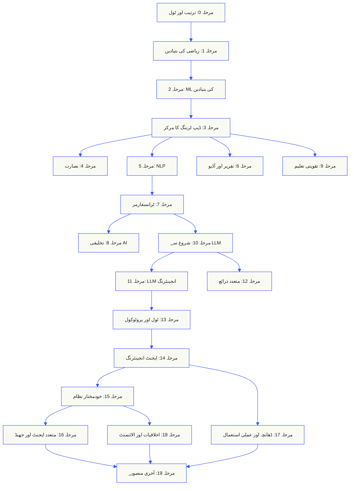
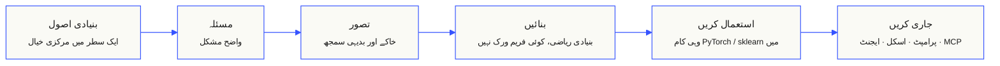

<p align="center" lang="ur" dir="rtl"><sub>اس README کا اردو ترجمہ کیا گیا ہے۔ <a href="../../README.md">انگریزی README</a> بنیادی مستند حوالہ ہے۔</sub></p>

<p align="center">
  <picture>
    <source media="(prefers-color-scheme: dark)" srcset="../../assets/readme/header-dark.svg">
    
  </picture>
</p>

ماڈل کے اندرونی حساب، بازیافت کی پائپ لائن اور ایجنٹ رن ٹائم نافذ کریں۔ ان کی جانچ کریں، ناکامیاں دیکھیں اور کوڈ اور جانچ کے نتائج محفوظ رکھیں۔

**[سیکھنا شروع کریں](https://aiengineeringfromscratch.com/lesson?path=phases/00-setup-and-tooling/01-dev-environment)** · **[سیکھنے کا راستہ منتخب کریں](#learning-routes)** · **[لیب آزمائیں](#interactive-lab)** · **[پروجیکٹ بنائیں](#project-challenges)** · **[نصاب دیکھیں](#contents)**

مفت، اوپن سورس، MIT لائسنس۔ ویب سائٹ پر، کوڈنگ ایجنٹ کے ساتھ یا مقامی کوڈ چلا کر سیکھیں۔

> <span dir="rtl">523 اسباق. 20 مراحل.</span> <span dir="ltr">Python, TypeScript, Rust, Julia.</span>

<p align="center">
  <a href="../../LICENSE"></a>
  <a href="../../ROADMAP.md"></a>
  <a href="#contents"></a>
  <a href="https://github.com/rohitg00/ai-engineering-from-scratch/stargazers"></a>
  <a href="https://aiengineeringfromscratch.com"></a>
</p>

<details>
<summary>اپنی زبان میں پڑھیں</summary>

<p align="center">
  <a href="../../README.md">🇬🇧 English</a> · <a href="../../i18n/zh/README.md">🇨🇳 简体中文</a> · <a href="../../i18n/zh-TW/README.md">🇹🇼 繁體中文（台灣）</a> · <a href="../../i18n/ja/README.md">🇯🇵 日本語</a> · <a href="../../i18n/ko/README.md">🇰🇷 한국어</a> · <a href="../../i18n/pt/README.md">🇵🇹 Português</a> · <a href="../../i18n/pt-BR/README.md">🇧🇷 Português (Brasil)</a> · <a href="../../i18n/es/README.md">🇪🇸 Español</a> · <a href="../../i18n/de/README.md">🇩🇪 Deutsch</a> · <a href="../../i18n/fr/README.md">🇫🇷 Français</a> · <a href="../../i18n/it/README.md">🇮🇹 Italiano</a> · <a href="../../i18n/nl/README.md">🇳🇱 Nederlands</a> · <a href="../../i18n/pl/README.md">🇵🇱 Polski</a> · <a href="../../i18n/cs/README.md">🇨🇿 Čeština</a> · <a href="../../i18n/ro/README.md">🇷🇴 Română</a> · <a href="../../i18n/hu/README.md">🇭🇺 Magyar</a> · <a href="../../i18n/el/README.md">🇬🇷 Ελληνικά</a> · <a href="../../i18n/sv/README.md">🇸🇪 Svenska</a> · <a href="../../i18n/da/README.md">🇩🇰 Dansk</a> · <a href="../../i18n/no/README.md">🇳🇴 Norsk</a> · <a href="../../i18n/fi/README.md">🇫🇮 Suomi</a> · <a href="../../i18n/ru/README.md">🇷🇺 Русский</a> · <a href="../../i18n/uk/README.md">🇺🇦 Українська</a> · <a href="../../i18n/tr/README.md">🇹🇷 Türkçe</a> · <a href="../../i18n/he/README.md">🇮🇱 עברית</a> · <a href="../../i18n/ar/README.md">🇸🇦 العربية</a> · <a href="../../i18n/fa/README.md">🇮🇷 فارسی</a> · <a href="../../i18n/hi/README.md">🇮🇳 हिन्दी</a> · <a href="../../i18n/bn/README.md">🇧🇩 বাংলা</a> · <a href="../../i18n/ur/README.md">🇵🇰 اردو</a> · <a href="../../i18n/th/README.md">🇹🇭 ไทย</a> · <a href="../../i18n/vi/README.md">🇻🇳 Tiếng Việt</a> · <a href="../../i18n/id/README.md">🇮🇩 Bahasa Indonesia</a> · <a href="../../i18n/tl/README.md">🇵🇭 Tagalog</a>
</p>

</details>

### سرپرست

<p align="center">
  <a href="https://serpapi.com/ai-engineering-from-scratch"><picture><source media="(min-width: 768px)" srcset="../../assets/sponsors/serpapi-banner-compact.png" width="48%"></picture></a>
  <a href="https://nitrostack.ai/referral/aiengineeringfromscratch"><picture><source media="(min-width: 768px)" srcset="../../assets/sponsors/nitrostack-banner-equal.png" width="48%"></picture></a>
</p>

<p align="center">
  <sub><span>آپ کی مدد سے ہر سبق مفت اور اوپن سورس رہتا ہے۔</span> <a href="#supporters">تمام معاونین دیکھیں</a> · <a href="../../SPONSORS.md">سرپرست بنیں</a></sub>
</p>

<a id="see-what-you-will-build-and-keep"></a>
<a id="learning-routes"></a>

## سیکھنے کے راستے

| راستہ | پہلا سبق |
|---|---|
| ماڈل کی بنیادیں | [سیٹ اپ اور ٹولز](https://aiengineeringfromscratch.com/lesson?path=phases/00-setup-and-tooling/01-dev-environment) |
| LLM سسٹم | [پرامپٹ انجینئرنگ](https://aiengineeringfromscratch.com/lesson?path=phases/11-llm-engineering/01-prompt-engineering) |
| ایجنٹ اور فراہمی | [ایجنٹ لوپ](https://aiengineeringfromscratch.com/lesson?path=phases/14-agent-engineering/01-the-agent-loop) |

[کیریئر کے راستوں کا موازنہ کریں](https://aiengineeringfromscratch.com/learning-paths.html) · [پیشگی ضروریات اور مطالعے کا وقت](#study-guide)

<a id="interactive-lab"></a>

### گریڈینٹ ڈیسنٹ

20 ابتدائی نقطے ایک درجہ دو کے لاس فنکشن پر گریڈینٹ ڈیسنٹ کی پیروی کرتے ہیں۔ گراف ہر اپ ڈیٹ کے بعد ان کی جگہ اور اوسط لاس دکھاتا ہے۔

<p align="center">
  <a href="https://aiengineeringfromscratch.com/lesson?path=phases/01-math-foundations/08-optimization#loss-landscape-visualization">
    <picture>
      <source media="(max-width: 600px) and (prefers-color-scheme: dark) and (prefers-reduced-motion: reduce)" srcset="../../assets/readme/101-gradient-mobile-dark.png">
      <source media="(max-width: 600px) and (prefers-reduced-motion: reduce)" srcset="../../assets/readme/101-gradient-mobile-light.png">
      <source media="(prefers-color-scheme: dark) and (prefers-reduced-motion: reduce)" srcset="../../assets/readme/101-gradient-dark.png">
      <source media="(prefers-reduced-motion: reduce)" srcset="../../assets/readme/101-gradient-light.png">
      <source media="(max-width: 600px) and (prefers-color-scheme: dark)" srcset="../../assets/readme/101-gradient-mobile-dark.gif">
      <source media="(max-width: 600px)" srcset="../../assets/readme/101-gradient-mobile-light.gif">
      <source media="(prefers-color-scheme: dark)" srcset="../../assets/readme/101-gradient-dark.gif">
      
    </picture>
  </a>
</p>

[سبق میں لرننگ ریٹ بدلیں](https://aiengineeringfromscratch.com/lesson?path=phases/01-math-foundations/08-optimization#loss-landscape-visualization) · [کوڈ میں GD، مومینٹم اور Adam کا موازنہ کریں](../../phases/01-math-foundations/08-optimization/code/optimizers.py)

<a id="project-challenges"></a>

### پروجیکٹس

تین پروجیکٹس جن میں مرحلہ وار ابتدائی کوڈ، حوالہ نفاذ اور مقامی جانچ کار موجود ہیں۔ [سیٹ اپ](#local-setup) کے بعد ریپوزٹری کے اصل فولڈر سے کمانڈز چلائیں۔ مراحل نافذ ہونے تک ابتدائی کوڈ جانچ میں ناکام رہے گا۔

<details>
<summary><strong>01 · بازیافت جانچ لیب</strong> · Python · درجہ بندی کے پیمانے اور تنزلی کی جانچ</summary>

مجوزہ سسٹم کا اوسط NDCG بہتر ہوتا ہے، مگر ایک سوال کے سب سے متعلقہ ثبوت کا درجہ نیچے آتا ہے۔ ہر سوال کی الگ موازنہ رپورٹ بنائیں جو تنزلی بتائے اور ریلیز کی جانچ ناکام کر سکے۔

Python 3.10+ استعمال کریں۔ [RAG](../../phases/11-llm-engineering/06-rag/docs/en.md) اور [ماڈل کی جانچ](../../phases/02-ml-fundamentals/09-model-evaluation/docs/en.md) دہرائیں۔ پہلے درجہ بندی کی تصدیق، پریسیژن اور ریکال، درجے سے متاثر پیمانے، پھر سسٹم کا موازنہ نافذ کریں۔

```bash
python3 scripts/project_test.py retrieval-evaluation-lab \
  --init learning-artifacts/retrieval-evaluation-lab
python3 scripts/project_test.py retrieval-evaluation-lab \
  --stage 1 --path learning-artifacts/retrieval-evaluation-lab --strict
python3 scripts/project_test.py retrieval-evaluation-lab \
  --all --path learning-artifacts/retrieval-evaluation-lab --strict
```

**محفوظ رکھیں:** ایسا موازنہ جسے دوبارہ پیدا کیا جا سکے، ہر سوال کے فرق اور اسکور میں استعمال ہونے والے مطابقت کے فیصلوں سمیت۔ پیمانے ان فیصلوں کو بیان کرتے ہیں؛ وہ جواب کی درستگی ثابت نہیں کرتے۔

[پروجیکٹ شروع کریں](https://aiengineeringfromscratch.com/project.html?id=retrieval-evaluation-lab) · [حوالہ حل دیکھیں](../../projects/retrieval-evaluation-lab/solution/) · [اپنے ان پٹ پر چلائیں](../../projects/retrieval-evaluation-lab/README.md#run-with-your-own-inputs)

</details>

<details>
<summary><strong>02 · ایجنٹ ٹریس ڈی بگر</strong> · TypeScript · ٹریس پارسنگ اور وقت کا حساب</summary>

فراہم کردہ ٹریس اب بھی 100 ms لیتا ہے، مگر کل ٹوکن استعمال 200 بڑھتا ہے اور ایک اسپین ناکام ہونے لگتا ہے۔ چائلڈ اسپینز کے ایک دوسرے پر آنے والے کام کو پیرنٹ کے اپنے اجرا کے وقت سے الگ کریں، پھر تبدیلی دکھانے والی رپورٹ بنائیں۔

Node.js 22.18+ اور جانچ کار کے لیے Python 3 استعمال کریں۔ JSONL پارسنگ، پیرنٹ تعلقات کی تصدیق، وقتی وقفوں کا حساب اور قابلِ معائنہ ٹائم لائن نافذ کریں۔

```bash
python3 scripts/project_test.py agent-trace-debugger \
  --init learning-artifacts/agent-trace-debugger
python3 scripts/project_test.py agent-trace-debugger \
  --stage 1 --path learning-artifacts/agent-trace-debugger --strict
python3 scripts/project_test.py agent-trace-debugger \
  --all --path learning-artifacts/agent-trace-debugger --strict
```

**محفوظ رکھیں:** ان پٹ ٹریس، HTML ٹائم لائن اور تنزلی کی JSON رپورٹ۔ ہر اسپین کے صرف اپنے استعمال کردہ ٹوکن درج کریں تاکہ پیرنٹ اور چائلڈ کا استعمال دو بار نہ گنا جائے۔

[پروجیکٹ شروع کریں](https://aiengineeringfromscratch.com/project.html?id=agent-trace-debugger) · [حوالہ حل دیکھیں](../../projects/agent-trace-debugger/solution/) · [وقت کے حساب کو انٹرایکٹو انداز میں دیکھیں](https://aiengineeringfromscratch.com/project.html?id=agent-trace-debugger&stage=03-timing)

</details>

<details>
<summary><strong>03 · ٹول کال فائر وال</strong> · Rust · کردار کی جانچ اور منظوری کی رسیدیں</summary>

جائزے کے بعد لکھی جانے والی چیز بدل جاتی ہے یا منظوری دوبارہ استعمال ہوتی ہے۔ کال کے لفافے کی تصدیق کریں، کال کرنے والے کا کردار اور پاتھ جانچیں، پھر عین اسی درخواست اور مواد سے منسلک منظوری ایک بار استعمال کر کے ختم کریں۔

Rust اور Python 3.10+ استعمال کریں۔ [ٹول اسکیما ڈیزائن](../../phases/13-tools-and-protocols/05-tool-schema-design/docs/en.md) اور [حفاظتی حدود](../../phases/17-infrastructure-and-production/25-security-secrets-audit/docs/en.md) دہرائیں۔ شناخت کال کرنے والی ایپلیکیشن دیتی ہے؛ ماڈل کارروائی کی تجویز دیتا ہے۔

```bash
python3 scripts/project_test.py tool-call-firewall \
  --init learning-artifacts/tool-call-firewall
python3 scripts/project_test.py tool-call-firewall \
  --stage 1 --path learning-artifacts/tool-call-firewall --strict
python3 scripts/project_test.py tool-call-firewall \
  --all --path learning-artifacts/tool-call-firewall --strict
```

**محفوظ رکھیں:** آڈٹ رسید جو مطلوبہ کارروائی اور پالیسی کا فیصلہ دکھائے۔ منظوری ایک انووکیشن کے اندر صرف ایک بار استعمال ہو سکتی ہے؛ یہ پروجیکٹ مستقل اجازت دہی یا آپریٹنگ سسٹم سینڈ باکس فراہم نہیں کرتا۔

[پروجیکٹ شروع کریں](https://aiengineeringfromscratch.com/project.html?id=tool-call-firewall) · [حوالہ حل دیکھیں](../../projects/tool-call-firewall/solution/) · [منظوری کی حدود دیکھیں](https://aiengineeringfromscratch.com/project.html?id=tool-call-firewall&stage=03-consume-a-request-bound-approval-once)

</details>

[تمام پروجیکٹس دیکھیں](https://aiengineeringfromscratch.com/projects.html) · [کیریئر کی عملی مشق کی رہنمائی](../../learning-paths/CAREER-PRACTICE.md)

## سیکھنے کا طریقہ منتخب کریں

### ویب سائٹ پر

[aiengineeringfromscratch.com](https://aiengineeringfromscratch.com) پر مکمل سبق کھولیں یا [فہرست مطالب](#contents) میں کوئی مرحلہ پھیلائیں۔ نہ سیٹ اپ، نہ کلون۔

### AI استاد کے ساتھ

اگر Node.js، `npx` اور اسکل استعمال کرنے والا کوڈنگ ایجنٹ پہلے سے نصب ہیں تو آپ کا ایجنٹ استاد بن سکتا ہے۔ ٹیوٹر نصب کرنے یا پڑھنے کے لیے ریپوزٹری کلون کرنا ضروری نہیں۔ مخصوص راستوں کی قابل اجرا مشقوں کے لیے `python3` چاہیے۔ Agent Skills کی ہوسٹ مشقوں کے لیے منتخب ہوسٹ اور صارف یا منصوبے کی اسکلز کا قابل تحریر دائرہ بھی ضروری ہے۔

```bash
npx skills add rohitg00/ai-engineering-from-scratch
```

انسٹالر کے پوچھنے پر ہوسٹ اور دائرہ منتخب کریں۔ Codex میں `start-learning`، Claude Code میں `/start-learning` استعمال کریں یا ہوسٹ سے نام کے ذریعے اسکل استعمال کرنے کو کہیں۔

<details>
<summary>استاد کا سیٹ اپ اور ہوسٹ کمانڈز</summary>

پہلے مقامی تقاضے جانچیں:

```bash
node --version
npx --version
python3 --version
```

`skills` تنصیب میں منتخب ہوسٹ اور دائرے میں لکھتا ہے، مثلاً `.claude/skills/`، `.cursor/skills/`، `.codex/skills/` یا دوسری معاون اسکل ڈائریکٹری۔ تصدیق کریں کہ منتخب ہوسٹ عین اسی مقام کو دریافت کرتا ہے۔

بلانے کا طریقہ ہوسٹ طے کرتا ہے، قابل نقل `SKILL.md` فارمیٹ نہیں:

| ہوسٹ | کورس شروع کریں | Model Context Protocol (MCP) شروع کریں | Agent Skills شروع کریں | مرحلے کا امتحان دیں |
|---|---|---|---|---|
| Codex | `start-learning`، یا یہاں سے منتخب کریں: `/skills` | `learn-mcp`، یا یہاں سے منتخب کریں: `/skills` | `learn-agent-skills`، یا یہاں سے منتخب کریں: `/skills` | `check-understanding 13`، یا یہاں سے منتخب کریں: `/skills` |
| Claude Code | `/start-learning` | `/learn-mcp` | `/learn-agent-skills` | `/check-understanding 13` |
| دوسرے موافق ہوسٹ | `Use start-learning to begin the course.` | `Use learn-mcp to start the Model Context Protocol (MCP) path.` | `Use learn-agent-skills to start the Agent Skills Engineering path.` | `Use check-understanding to quiz me on Phase 13.` |

دس سوالوں کا سطح جانچنے والا امتحان آپ کے موجودہ علم کو مناسب ابتدائی مرحلے سے ملاتا ہے اور `LEARNING.md` میں ذاتی مطالعے کا منصوبہ محفوظ کرتا ہے۔ اس کے بعد `learn` اسکل ہر سیشن میں ایک سبق پڑھاتی ہے: تصور، ریاضی، کوڈ، سوالات۔ یہ اسباق براہ راست اس ریپوزٹری سے لیتی ہے، اور `course-guide` اسکل آپ کو اس مخصوص سبق تک پہنچاتی ہے جس میں آپ کی مشکل کا حل ہے۔ Codex میں `learn` اور `course-guide`؛ Claude Code میں `/learn` اور `/course-guide` استعمال کریں؛ دوسرے موافق ہوسٹ میں اسکل کا نام لے کر اسے استعمال کرنے کو کہیں۔

صرف Model Context Protocol (MCP) سیکھنا چاہتے ہیں؟ اپنے ہوسٹ کے لیے MCP بلانے کا طریقہ استعمال کریں۔ یہ `MCP-LEARNING.md` بناتا ہے اور بے حالت درخواستوں، ٹرانسپورٹ، دو طرفہ کام، سلامتی، قابل اعتمادی، رجسٹری کے انتظام اور مطابقت کے ثبوت پر مشتمل 17 اسباق کا ایک راستہ اپناتا ہے۔ درست ترتیب اور چیک پوائنٹ [Model Context Protocol (MCP) مینی فیسٹ](../../learning-paths/model-context-protocol.json) میں ہیں۔

صرف Agent Skills چاہتے ہیں؟ اپنے ہوسٹ کے لیے Agent Skills بلانے کا طریقہ استعمال کریں۔ یہ `AGENT-SKILLS-LEARNING.md` بناتا ہے اور پانچ مربوط اسباق کا راستہ اپناتا ہے: معاہدہ، دریافت، طلب، سینڈباکس کی حدود، پھر اجرا کی جانچ اور حقیقی ہوسٹ پر منتقلی کی صلاحیت۔ ویب پر [Agent Skills کے راستے](https://aiengineeringfromscratch.com/lesson?path=phases/13-tools-and-protocols/22-skills-and-agent-sdks&learningPath=agent-skills) سے شروع کریں۔

انسٹالر ان ہوسٹس کی فہرست دکھاتا ہے جنہیں ترتیب دے سکتا ہے اور نصب کرنے کی جگہ پوچھتا ہے۔ اگر ابھی Node.js، `npx`، `python3`، معاون ہوسٹ یا قابل تحریر دائرہ نہیں ہے تو ویب سائٹ استعمال کریں یا `docs/en.md` خود پڑھیں۔ اس راستے میں تصورات سیکھے جاتے ہیں، مگر حقیقی ہوسٹ پر دریافت، طلب، اسکرپٹ اور ان انسٹال کے ثبوت ابتدائی جانچ دستیاب ہونے تک نامکمل رہتے ہیں۔ اسباق [aiengineeringfromscratch.com](https://aiengineeringfromscratch.com) پر پڑھیں۔

### تعلیمی اسکلز

| اسکل | اس کا کام |
|---|---|
| [`start-learning`](../../skills/start-learning/SKILL.md) | ایک بار ابتدائی رہنمائی: سیکھنے کی وجہ، سطح کا امتحان اور `LEARNING.md` میں محفوظ ذاتی منصوبہ۔ |
| [`learn`](../../skills/learn/SKILL.md) | ٹیوٹر کا چکر۔ پہلے یاد دہانی، پھر اگلے سبق کی تعاملی تعلیم اور سوالات؛ پیش رفت اور دہرائی کی قطار محفوظ کرتا ہے۔ |
| [`course-guide`](../../skills/course-guide/SKILL.md) | موضوع کی رہنمائی۔ “اٹینشن کہاں سیکھوں؟” یا “میرا لاس NaN ہے” → لنکس سمیت درست اسباق۔ |
| [`learn-mcp`](../../skills/learn-mcp/SKILL.md) | مخصوص Model Context Protocol (MCP) ٹیوٹر۔ `MCP-LEARNING.md` بناتا ہے، 17 اسباق کے مینی فیسٹ کی پیروی کرتا ہے اور مواصلات، سلامتی، قابل اعتمادی اور مطابقت کے ثبوت رکھتا ہے۔ |
| [`learn-agent-skills`](../../skills/learn-agent-skills/SKILL.md) | مخصوص Agent Skills ٹیوٹر۔ `AGENT-SKILLS-LEARNING.md` بناتا ہے، اسباق 22، 24، 25، 26 اور 27 پڑھاتا ہے اور حقیقی ہوسٹ کے ثبوت محفوظ کرتا ہے۔ |
| [`claude-certification`](../../skills/claude-certification/SKILL.md) | سرٹیفیکیشن ٹیوٹر۔ CCAO-F، CCDV-F، CCAR-F یا CCAR-P چنتا ہے؛ اسباق پڑھاتا ہے؛ مشقیں چلاتا ہے؛ بنائی ہوئی چیزیں جانچتا ہے؛ تشخیصی اور مشقی امتحان لیتا ہے؛ پیش رفت محفوظ کرتا ہے۔ |
| [`mcpa-certification`](../../skills/mcpa-certification/SKILL.md) | MCPA ٹیوٹر۔ 2026-07-28 پروٹوکول پر 34 اسباق کے `mcpa-f` راستے پر چلتا ہے؛ اسباق پڑھاتا ہے؛ مشق اور مواصلاتی جانچ چلاتا ہے؛ تشخیصی اور تین مشقی امتحان لیتا ہے؛ پیش رفت محفوظ کرتا ہے۔ |
| [`find-your-level`](../../skills/find-your-level/SKILL.md) | دس سوالوں کا سطح متعین کرنے والا امتحان۔ علم کو ابتدائی مرحلے سے ملا کر وقت کے اندازوں سمیت ذاتی راستہ بناتا ہے۔ |
| [`check-understanding <phase>`](../../skills/check-understanding/SKILL.md) | ہر مرحلے کا آٹھ سوالوں کا امتحان، رائے اور دہرائی کے مخصوص اسباق سمیت۔ اوپر بلانے کی جدول میں Codex، Claude Code یا عام زبان کا طریقہ استعمال کریں۔ |

</details>

<a id="local-setup"></a>

### مقامی کوڈ چلائیں

```bash
git clone https://github.com/rohitg00/ai-engineering-from-scratch.git
cd ai-engineering-from-scratch
python3 phases/00-setup-and-tooling/01-dev-environment/code/verify.py --route beginner
python3 phases/01-math-foundations/01-linear-algebra-intuition/code/vectors.py
```

ابتدائی جانچ ابھی کے ضروری تقاضوں کو بعد میں درکار ٹولز سے الگ کرتی ہے۔ ہر لازمی جانچ میں ناکامی کی وجہ اور اصلاحی کمانڈ دکھائی جاتی ہے۔ `vectors.py` کمانڈ بیرونی انحصارات کے بغیر ایک سبق چلاتی ہے اور آخر میں دکھاتی ہے کہ میٹرکس اور ویکٹر کی ضرب ہی نیورل نیٹ ورک کی ایک پرت کے اندر ہونے والا عمل ہے۔ ٹرمینل کے اس آؤٹ پٹ کو اپنے پہلے ثبوت کے طور پر محفوظ کریں۔

<details>
<summary>ہر سبق میں ایک ہی طریقہ اپنائیں</summary>

### ہر سبق میں ایک ہی طریقہ اپنائیں

1. `docs/en.md` **پڑھیں** اور بنیادی خیال اپنے الفاظ میں بیان کریں۔
2. اہم کوڈ **خود ٹائپ کر کے بنائیں**، کوڈ بلاک کو محض سجاوٹ نہ سمجھیں۔
3. سبق کی کمانڈ ریپوزٹری کی بنیادی ڈائریکٹری سے **چلائیں**، یعنی وہ ڈائریکٹری جس میں `README.md` اور `phases/` ہیں۔
4. **ثبوت محفوظ رکھیں**: کمانڈ، کام کی ڈائریکٹری، ایگزٹ کوڈ، بامعنی آؤٹ پٹ، اور وہ چیز جسے آپ نے بدلا یا بنایا۔
5. **آگے بڑھیں** صرف تب جب آپ آؤٹ پٹ کی وضاحت اور اندازہ لگائے بغیر ایک چھوٹی تبدیلی کر سکیں۔

جب تک سبق واضح طور پر ڈائریکٹری بدلنے کو نہ کہے، اس کی کمانڈز میں راستے ریپوزٹری کی بنیادی ڈائریکٹری سے دیے جاتے ہیں۔ اگر سبق کئی پروگرامنگ زبانوں میں ہو تو اسی زبان کا کوڈ چلائیں جو آپ سیکھ رہے ہیں۔

</details>

<a id="study-guide"></a>

## سیکھنے کا راستہ منتخب کریں

شروع کرنے سے پہلے تمام 523 اسباق دیکھنے کی ضرورت نہیں۔ ایک مقصد چنیں۔ ہر لنک GitHub یا ویب سائٹ پر یہی نصاب کھولتا ہے، اور دونوں جگہ سبق کا ایک ہی کوڈ استعمال ہوتا ہے۔

| آپ کا مقصد | GitHub پر سیکھیں | ویب سائٹ پر سیکھیں |
|---|---|---|
| میں نیا ہوں اور مکمل بنیاد سیکھنا چاہتا ہوں | [مرحلہ 0: سیٹ اپ اور ٹولز](../../phases/00-setup-and-tooling/) | [ڈیولپمنٹ کا ماحول](https://aiengineeringfromscratch.com/lesson?path=phases/00-setup-and-tooling/01-dev-environment) |
| مجھے Python آتی ہے اور میں ریاضی اور ML کی بنیادیں سیکھنا چاہتا ہوں | [مرحلہ 1: ریاضی کی بنیادیں](../../phases/01-math-foundations/) | [خطی الجبرا کی بدیہی سمجھ](https://aiengineeringfromscratch.com/lesson?path=phases/01-math-foundations/01-linear-algebra-intuition) |
| میں عملی استعمال کے لیے LLM ایپلی کیشنز بنانا چاہتا ہوں | [مرحلہ 11: LLM انجینئرنگ](../../phases/11-llm-engineering/) | [پرامپٹ انجینئرنگ](https://aiengineeringfromscratch.com/lesson?path=phases/11-llm-engineering/01-prompt-engineering) |
| میں ایجنٹس بنانا چاہتا ہوں | [مرحلہ 14: ایجنٹ انجینئرنگ](../../phases/14-agent-engineering/) | [ایجنٹ کا لوپ](https://aiengineeringfromscratch.com/lesson?path=phases/14-agent-engineering/01-the-agent-loop) |
| میں حقیقی ریپوزٹریز میں کوڈنگ ایجنٹس استعمال کرنا چاہتا ہوں | [ایجنٹ کی مدد سے انجینئرنگ کا راستہ](../../learning-paths/using-coding-agents.json) | [ایجنٹ کی مدد سے انجینئرنگ](https://aiengineeringfromscratch.com/lesson?path=phases/14-agent-engineering/31-agent-workbench-why-models-fail&learningPath=using-coding-agents) |
| میں عمل درآمد سے پہلے طے کرنا چاہتا ہوں کہ کیا بنانا درست ہوگا | [پروڈکٹ کے فیصلے اور فراہمی کا راستہ](../../learning-paths/shaping-the-build.json) | [پروڈکٹ کے فیصلے اور فراہمی](https://aiengineeringfromscratch.com/lesson?path=phases/14-agent-engineering/47-outcomes-before-output&learningPath=shaping-the-build) |

سمجھ نہیں آ رہا کہاں سے شروع کریں؟ [`start-learning` سطح متعین کرنے والا ٹیوٹر](../../skills/start-learning/SKILL.md) یا [ویب سائٹ پر پیشگی تقاضوں کی رہنمائی](https://aiengineeringfromscratch.com/prereqs.html) استعمال کریں۔

[AI انجینئرنگ کے تعلیمی راستوں](https://aiengineeringfromscratch.com/learning-paths.html) میں چار بنیادی شعبوں اور چھ پیشہ ورانہ راستوں کا موازنہ کریں۔

<details>
<summary>MCP اور Agent Skills کے مخصوص راستے</summary>

| آپ کا مقصد | GitHub پر سیکھیں | ویب سائٹ پر سیکھیں |
|---|---|---|
| میں Model Context Protocol (MCP) کے ساتھ بنانا چاہتا ہوں | [Model Context Protocol (MCP) کا تعلیمی روٹ](../../phases/13-tools-and-protocols/README.md#model-context-protocol-mcp-path) | [Model Context Protocol (MCP) کا راستہ](https://aiengineeringfromscratch.com/lesson?path=phases/13-tools-and-protocols/06-mcp-fundamentals&learningPath=model-context-protocol) |
| میں Agent Skills لکھ کر جاری کرنا چاہتا ہوں | [Agent Skills کا مخصوص روٹ](../../phases/13-tools-and-protocols/README.md#agent-skills-fast-path) | [Agent Skills کا راستہ](https://aiengineeringfromscratch.com/lesson?path=phases/13-tools-and-protocols/22-skills-and-agent-sdks&learningPath=agent-skills) |

</details>

<details>
<summary>پیشگی ضروریات اور مطالعے کا وقت</summary>

### پیشگی تقاضے

- آپ کوڈ لکھ سکتے ہیں (کسی بھی زبان میں؛ Python مدد دیتی ہے)۔
- آپ سمجھنا چاہتے ہیں کہ AI **واقعی کیسے کام کرتی ہے**، صرف API نہیں بلانا چاہتے۔

## کہاں سے شروع کریں

| پہلے کا علم | آغاز یہاں سے | اندازاً وقت |
|---|---|---|
| پروگرامنگ اور AI میں نئے | مرحلہ 0: ترتیب | ~306 گھنٹے |
| Python آتی ہے، ML میں نئے | مرحلہ 1: ریاضی کی بنیادیں | ~270 گھنٹے |
| ML آتی ہے، ڈیپ لرننگ میں نئے | مرحلہ 3: ڈیپ لرننگ کا مرکز | ~200 گھنٹے |
| ڈیپ لرننگ آتی ہے، LLM اور ایجنٹ سیکھنا چاہتے ہیں | مرحلہ 10: شروع سے LLM | ~100 گھنٹے |
| سینئر انجینئر، صرف ایجنٹ انجینئرنگ چاہیے | مرحلہ 14: ایجنٹ انجینئرنگ | ~60 گھنٹے |
| صرف عملی MCP نظام بنانا چاہتے ہیں | [Model Context Protocol (MCP) کا راستہ](../../learning-paths/model-context-protocol.json) | ~23 گھنٹے 15 منٹ |
| صرف عملی Agent Skills بنانا چاہتے ہیں | [Agent Skills انجینئرنگ کا راستہ](../../learning-paths/agent-skills.json) | ~9.5 گھنٹے |

</details>

## نصاب کی ساخت

بیس مراحل ایک دوسرے پر قائم ہیں۔ ریاضی بنیاد ہے۔ ایجنٹ اور عملی نظام سب سے اوپر ہیں۔ نچلی سطحیں آتی ہوں تو آگے جا سکتے ہیں، مگر انہیں چھوڑ کر پھر اوپر کسی خرابی پر حیران نہ ہوں۔



<a id="contents"></a>

## فہرست مطالب

بیس مراحل۔ اسباق کی فہرست کھولنے کے لیے کسی بھی مرحلے پر کلک کریں۔

<a id="phase-0"></a>
### مرحلہ 0: ترتیب اور ٹولز `12 اسباق`
> آگے آنے والی ہر چیز کے لیے اپنا ماحول تیار کریں۔

| # | سبق | قسم | زبان |
|:---:|--------|:----:|------|
| 01 | [ڈیولپمنٹ کا ماحول](../../phases/00-setup-and-tooling/01-dev-environment/) | بنائیں | Python |
| 02 | [Git اور تعاون](../../phases/00-setup-and-tooling/02-git-and-collaboration/) | سیکھیں | — |
| 03 | [GPU اور کلاؤڈ کی ترتیب](../../phases/00-setup-and-tooling/03-gpu-setup-and-cloud/) | بنائیں | Python |
| 04 | [API اور رسائی کی کلیدیں](../../phases/00-setup-and-tooling/04-apis-and-keys/) | بنائیں | Python |
| 05 | [Jupyter نوٹ بکس](../../phases/00-setup-and-tooling/05-jupyter-notebooks/) | بنائیں | Python |
| 06 | [Python کے ماحول](../../phases/00-setup-and-tooling/06-python-environments/) | بنائیں | Shell |
| 07 | [AI کے لیے Docker](../../phases/00-setup-and-tooling/07-docker-for-ai/) | بنائیں | Docker |
| 08 | [ایڈیٹر کی ترتیب](../../phases/00-setup-and-tooling/08-editor-setup/) | بنائیں | — |
| 09 | [ڈیٹا کا انتظام](../../phases/00-setup-and-tooling/09-data-management/) | بنائیں | Python |
| 10 | [ٹرمینل اور شیل](../../phases/00-setup-and-tooling/10-terminal-and-shell/) | سیکھیں | — |
| 11 | [AI کے لیے Linux](../../phases/00-setup-and-tooling/11-linux-for-ai/) | سیکھیں | — |
| 12 | [ڈیبگنگ اور کارکردگی کا تجزیہ](../../phases/00-setup-and-tooling/12-debugging-and-profiling/) | بنائیں | Python |

<details id="phase-1">
<summary><b>مرحلہ 1: ریاضی کی بنیادیں</b> &nbsp;<code>22 اسباق</code>&nbsp; <em>کوڈ کے ذریعے ہر AI الگورتھم کی بنیادی سمجھ۔</em></summary>
<br/>

| # | سبق | قسم | زبان |
|:---:|--------|:----:|------|
| 01 | [خطی الجبرا کی بدیہی سمجھ](../../phases/01-math-foundations/01-linear-algebra-intuition/) | سیکھیں | Python, Julia |
| 02 | [ویکٹر، میٹرکس اور عملیات](../../phases/01-math-foundations/02-vectors-matrices-operations/) | بنائیں | Python, Julia |
| 03 | [میٹرکس کی تبدیلیاں اور آئگن ویلیوز](../../phases/01-math-foundations/03-matrix-transformations/) | بنائیں | Python, Julia |
| 04 | [ML کے لیے کیلکولس: مشتق اور گریڈینٹ](../../phases/01-math-foundations/04-calculus-for-ml/) | سیکھیں | Python |
| 05 | [چین رول اور خودکار تفریق](../../phases/01-math-foundations/05-chain-rule-and-autodiff/) | بنائیں | Python |
| 06 | [احتمال اور تقسیمیں](../../phases/01-math-foundations/06-probability-and-distributions/) | سیکھیں | Python |
| 07 | [بیز کا قضیہ اور شماریاتی سوچ](../../phases/01-math-foundations/07-bayes-theorem/) | بنائیں | Python |
| 08 | [بہتر بنانا: گریڈینٹ ڈیسنٹ کے طریقے](../../phases/01-math-foundations/08-optimization/) | بنائیں | Python |
| 09 | [نظریۂ معلومات: اینٹروپی اور KL انحراف](../../phases/01-math-foundations/09-information-theory/) | سیکھیں | Python |
| 10 | [ابعاد میں کمی: PCA، t-SNE، UMAP](../../phases/01-math-foundations/10-dimensionality-reduction/) | بنائیں | Python |
| 11 | [سنگولر ویلیو ڈی کمپوزیشن](../../phases/01-math-foundations/11-singular-value-decomposition/) | بنائیں | Python, Julia |
| 12 | [ٹینسر کے عملیات](../../phases/01-math-foundations/12-tensor-operations/) | بنائیں | Python |
| 13 | [عددی استحکام](../../phases/01-math-foundations/13-numerical-stability/) | بنائیں | Python |
| 14 | [نارم اور فاصلے](../../phases/01-math-foundations/14-norms-and-distances/) | بنائیں | Python |
| 15 | [ML کے لیے شماریات](../../phases/01-math-foundations/15-statistics-for-ml/) | بنائیں | Python |
| 16 | [نمونہ لینے کے طریقے](../../phases/01-math-foundations/16-sampling-methods/) | بنائیں | Python |
| 17 | [خطی نظام](../../phases/01-math-foundations/17-linear-systems/) | بنائیں | Python |
| 18 | [محدب آپٹیمائزیشن](../../phases/01-math-foundations/18-convex-optimization/) | بنائیں | Python |
| 19 | [AI کے لیے مختلط اعداد](../../phases/01-math-foundations/19-complex-numbers/) | سیکھیں | Python |
| 20 | [فوریئر ٹرانسفارم](../../phases/01-math-foundations/20-fourier-transform/) | بنائیں | Python |
| 21 | [ML کے لیے گراف تھیوری](../../phases/01-math-foundations/21-graph-theory/) | بنائیں | Python |
| 22 | [تصادفی عمل](../../phases/01-math-foundations/22-stochastic-processes/) | سیکھیں | Python |

</details>

<details id="phase-2">
<summary><b>مرحلہ 2: ML کی بنیادیں</b> &nbsp;<code>18 اسباق</code>&nbsp; <em>روایتی ML آج بھی زیادہ تر عملی AI کی بنیاد ہے۔</em></summary>
<br/>

| # | سبق | قسم | زبان |
|:---:|--------|:----:|------|
| 01 | [مشین لرننگ کیا ہے](../../phases/02-ml-fundamentals/01-what-is-machine-learning/) | سیکھیں | Python |
| 02 | [شروع سے خطی رجعت](../../phases/02-ml-fundamentals/02-linear-regression/) | بنائیں | Python |
| 03 | [لاجسٹک رجعت اور درجہ بندی](../../phases/02-ml-fundamentals/03-logistic-regression/) | بنائیں | Python |
| 04 | [ڈیسیژن ٹری اور رینڈم فارسٹ](../../phases/02-ml-fundamentals/04-decision-trees/) | بنائیں | Python |
| 05 | [سپورٹ ویکٹر مشینیں](../../phases/02-ml-fundamentals/05-support-vector-machines/) | بنائیں | Python |
| 06 | [KNN اور فاصلے کے پیمانے](../../phases/02-ml-fundamentals/06-knn-and-distances/) | بنائیں | Python |
| 07 | [بغیر نگرانی سیکھنا: K-Means، DBSCAN](../../phases/02-ml-fundamentals/07-unsupervised-learning/) | بنائیں | Python |
| 08 | [فیچر بنانا اور منتخب کرنا](../../phases/02-ml-fundamentals/08-feature-engineering/) | بنائیں | Python |
| 09 | [ماڈل کی جانچ: پیمانے اور کراس ویلیڈیشن](../../phases/02-ml-fundamentals/09-model-evaluation/) | بنائیں | Python |
| 10 | [بائس، ویریئنس اور سیکھنے کا منحنی](../../phases/02-ml-fundamentals/10-bias-variance/) | سیکھیں | Python |
| 11 | [مجموعی طریقے: Boosting، Bagging، Stacking](../../phases/02-ml-fundamentals/11-ensemble-methods/) | بنائیں | Python |
| 12 | [ہائپرپیرامیٹر کی ترتیب](../../phases/02-ml-fundamentals/12-hyperparameter-tuning/) | بنائیں | Python |
| 13 | [ML پائپ لائن اور تجربات کی نگرانی](../../phases/02-ml-fundamentals/13-ml-pipelines/) | بنائیں | Python |
| 14 | [سادہ بیز](../../phases/02-ml-fundamentals/14-naive-bayes/) | بنائیں | Python |
| 15 | [ٹائم سیریز کی بنیادیں](../../phases/02-ml-fundamentals/15-time-series/) | بنائیں | Python |
| 16 | [غیر معمولی صورتوں کی شناخت](../../phases/02-ml-fundamentals/16-anomaly-detection/) | بنائیں | Python |
| 17 | [غیر متوازن ڈیٹا سنبھالنا](../../phases/02-ml-fundamentals/17-imbalanced-data/) | بنائیں | Python |
| 18 | [فیچر کا انتخاب](../../phases/02-ml-fundamentals/18-feature-selection/) | بنائیں | Python |

</details>

<details id="phase-3">
<summary><b>مرحلہ 3: ڈیپ لرننگ کا مرکز</b> &nbsp;<code>13 اسباق</code>&nbsp; <em>بنیادی اصولوں سے نیورل نیٹ ورک۔ اپنا بنانے تک کوئی فریم ورک نہیں۔</em></summary>
<br/>

| # | سبق | قسم | زبان |
|:---:|--------|:----:|------|
| 01 | [پرسیپٹرون: جہاں سے آغاز ہوا](../../phases/03-deep-learning-core/01-the-perceptron/) | بنائیں | Python |
| 02 | [کئی پرتوں کے نیٹ ورک اور فارورڈ پاس](../../phases/03-deep-learning-core/02-multi-layer-networks/) | بنائیں | Python |
| 03 | [شروع سے بیک پروپیگیشن](../../phases/03-deep-learning-core/03-backpropagation/) | بنائیں | Python |
| 04 | [ایکٹیویشن فنکشن: ReLU، Sigmoid، GELU اور وجہ](../../phases/03-deep-learning-core/04-activation-functions/) | بنائیں | Python |
| 05 | [لاس فنکشن: MSE، کراس اینٹروپی، تقابلی](../../phases/03-deep-learning-core/05-loss-functions/) | بنائیں | Python |
| 06 | [آپٹیمائزر: SGD، Momentum، Adam، AdamW](../../phases/03-deep-learning-core/06-optimizers/) | بنائیں | Python |
| 07 | [ریگولرائزیشن: Dropout، Weight Decay، BatchNorm](../../phases/03-deep-learning-core/07-regularization/) | بنائیں | Python |
| 08 | [وزنوں کی ابتدائی ترتیب اور تربیت کا استحکام](../../phases/03-deep-learning-core/08-weight-initialization/) | بنائیں | Python |
| 09 | [لرننگ ریٹ کے شیڈول اور وارم اپ](../../phases/03-deep-learning-core/09-learning-rate-schedules/) | بنائیں | Python |
| 10 | [اپنا چھوٹا فریم ورک بنائیں](../../phases/03-deep-learning-core/10-mini-framework/) | بنائیں | Python |
| 11 | [PyTorch کا تعارف](../../phases/03-deep-learning-core/11-intro-to-pytorch/) | بنائیں | Python |
| 12 | [JAX کا تعارف](../../phases/03-deep-learning-core/12-intro-to-jax/) | بنائیں | Python |
| 13 | [نیورل نیٹ ورک کی ڈیبگنگ](../../phases/03-deep-learning-core/13-debugging-neural-networks/) | بنائیں | Python |

</details>

<details id="phase-4">
<summary><b>مرحلہ 4: کمپیوٹر کی بصارت</b> &nbsp;<code>28 اسباق</code>&nbsp; <em>پکسل سے سمجھ تک: تصویر، ویڈیو، 3D، VLM اور دنیا کے ماڈل۔</em></summary>
<br/>

| # | سبق | قسم | زبان |
|:---:|--------|:----:|------|
| 01 | [تصویر کی بنیادیں: پکسل، چینل اور رنگ کی جگہ](../../phases/04-computer-vision/01-image-fundamentals/) | سیکھیں | Python |
| 02 | [شروع سے کنوولیوشن](../../phases/04-computer-vision/02-convolutions-from-scratch/) | بنائیں | Python |
| 03 | [CNN: LeNet سے ResNet تک](../../phases/04-computer-vision/03-cnns-lenet-to-resnet/) | بنائیں | Python |
| 04 | [تصویر کی درجہ بندی](../../phases/04-computer-vision/04-image-classification/) | بنائیں | Python |
| 05 | [منتقلی سے سیکھنا اور فائن ٹیوننگ](../../phases/04-computer-vision/05-transfer-learning/) | بنائیں | Python |
| 06 | [اشیا کی شناخت: شروع سے YOLO](../../phases/04-computer-vision/06-object-detection-yolo/) | بنائیں | Python |
| 07 | [معنوی تقسیم: U-Net](../../phases/04-computer-vision/07-semantic-segmentation-unet/) | بنائیں | Python |
| 08 | [انفرادی اشیا کی تقسیم: Mask R-CNN](../../phases/04-computer-vision/08-instance-segmentation-mask-rcnn/) | بنائیں | Python |
| 09 | [تصویر بنانا: GAN](../../phases/04-computer-vision/09-image-generation-gans/) | بنائیں | Python |
| 10 | [تصویر بنانا: ڈفیوژن ماڈل](../../phases/04-computer-vision/10-image-generation-diffusion/) | بنائیں | Python |
| 11 | [Stable Diffusion: ساخت اور فائن ٹیوننگ](../../phases/04-computer-vision/11-stable-diffusion/) | بنائیں | Python |
| 12 | [ویڈیو کی سمجھ: زمانی ماڈلنگ](../../phases/04-computer-vision/12-video-understanding/) | بنائیں | Python |
| 13 | [3D بصارت: پوائنٹ کلاؤڈ اور NeRF](../../phases/04-computer-vision/13-3d-vision-nerf/) | بنائیں | Python |
| 14 | [بصری ٹرانسفارمر (ViT)](../../phases/04-computer-vision/14-vision-transformers/) | بنائیں | Python |
| 15 | [فوری بصارت: ایج پر تعیناتی](../../phases/04-computer-vision/15-real-time-edge/) | بنائیں | Python |
| 16 | [بصارت کی مکمل پائپ لائن بنائیں](../../phases/04-computer-vision/16-vision-pipeline-capstone/) | بنائیں | Python |
| 17 | [خود نگرانی والی بصارت: SimCLR، DINO، MAE](../../phases/04-computer-vision/17-self-supervised-vision/) | بنائیں | Python |
| 18 | [کھلے ذخیرۂ الفاظ والی بصارت: CLIP](../../phases/04-computer-vision/18-open-vocab-clip/) | بنائیں | Python |
| 19 | [OCR اور دستاویز کی سمجھ](../../phases/04-computer-vision/19-ocr-document-understanding/) | بنائیں | Python |
| 20 | [تصویر کی بازیافت اور میٹرک لرننگ](../../phases/04-computer-vision/20-image-retrieval-metric/) | بنائیں | Python |
| 21 | [اہم نقاط کی شناخت اور اندازۂ وضع](../../phases/04-computer-vision/21-keypoint-pose/) | بنائیں | Python |
| 22 | [شروع سے 3D Gaussian Splatting](../../phases/04-computer-vision/22-3d-gaussian-splatting/) | بنائیں | Python |
| 23 | [ڈفیوژن ٹرانسفارمر اور Rectified Flow](../../phases/04-computer-vision/23-diffusion-transformers-rectified-flow/) | بنائیں | Python |
| 24 | [SAM 3 اور کھلے ذخیرۂ الفاظ والی تقسیم](../../phases/04-computer-vision/24-sam3-open-vocab-segmentation/) | بنائیں | Python |
| 25 | [بصارت و زبان کے ماڈل (ViT-MLP-LLM)](../../phases/04-computer-vision/25-vision-language-models/) | بنائیں | Python |
| 26 | [ایک کیمرے سے گہرائی اور جیومیٹری کا اندازہ](../../phases/04-computer-vision/26-monocular-depth/) | بنائیں | Python |
| 27 | [متعدد اشیا کی پیروی اور ویڈیو میموری](../../phases/04-computer-vision/27-multi-object-tracking/) | بنائیں | Python |
| 28 | [دنیا کے ماڈل اور ویڈیو ڈفیوژن](../../phases/04-computer-vision/28-world-models-video-diffusion/) | بنائیں | Python |

</details>

<details id="phase-5">
<summary><b>مرحلہ 5: NLP کی بنیاد سے اعلیٰ درجے تک</b> &nbsp;<code>29 اسباق</code>&nbsp; <em>زبان ذہانت تک رسائی کا واسطہ ہے۔</em></summary>
<br/>

| # | سبق | قسم | زبان |
|:---:|--------|:----:|------|
| 01 | [متن کی پروسیسنگ: ٹوکن سازی، اسٹیمِنگ، لیماٹائزیشن](../../phases/05-nlp-foundations-to-advanced/01-text-processing/) | بنائیں | Python |
| 02 | [Bag of Words، TF-IDF اور متن کی نمائندگی](../../phases/05-nlp-foundations-to-advanced/02-bag-of-words-tfidf/) | بنائیں | Python |
| 03 | [لفظی ایمبیڈنگ: شروع سے Word2Vec](../../phases/05-nlp-foundations-to-advanced/03-word-embeddings-word2vec/) | بنائیں | Python |
| 04 | [GloVe، FastText اور ذیلی لفظوں کی ایمبیڈنگ](../../phases/05-nlp-foundations-to-advanced/04-glove-fasttext-subword/) | بنائیں | Python |
| 05 | [جذبات کا تجزیہ](../../phases/05-nlp-foundations-to-advanced/05-sentiment-analysis/) | بنائیں | Python |
| 06 | [نام دار اکائیوں کی شناخت (NER)](../../phases/05-nlp-foundations-to-advanced/06-named-entity-recognition/) | بنائیں | Python |
| 07 | [اجزائے کلام کے ٹیگ اور نحوی تجزیہ](../../phases/05-nlp-foundations-to-advanced/07-pos-tagging-parsing/) | بنائیں | Python |
| 08 | [متن کی درجہ بندی: متن کے لیے CNN اور RNN](../../phases/05-nlp-foundations-to-advanced/08-cnns-rnns-for-text/) | بنائیں | Python |
| 09 | [تسلسل سے تسلسل کے ماڈل](../../phases/05-nlp-foundations-to-advanced/09-sequence-to-sequence/) | بنائیں | Python |
| 10 | [اٹینشن کا طریقہ: اہم پیش رفت](../../phases/05-nlp-foundations-to-advanced/10-attention-mechanism/) | بنائیں | Python |
| 11 | [مشینی ترجمہ](../../phases/05-nlp-foundations-to-advanced/11-machine-translation/) | بنائیں | Python |
| 12 | [متن کا خلاصہ](../../phases/05-nlp-foundations-to-advanced/12-text-summarization/) | بنائیں | Python |
| 13 | [سوال جواب کے نظام](../../phases/05-nlp-foundations-to-advanced/13-question-answering/) | بنائیں | Python |
| 14 | [معلومات کی بازیافت اور تلاش](../../phases/05-nlp-foundations-to-advanced/14-information-retrieval-search/) | بنائیں | Python |
| 15 | [موضوع کی ماڈلنگ: LDA، BERTopic](../../phases/05-nlp-foundations-to-advanced/15-topic-modeling/) | بنائیں | Python |
| 16 | [متن بنانا](../../phases/05-nlp-foundations-to-advanced/16-text-generation-pre-transformer/) | بنائیں | Python |
| 17 | [چیٹ بوٹ: قواعد سے نیورل ماڈل تک](../../phases/05-nlp-foundations-to-advanced/17-chatbots-rule-to-neural/) | بنائیں | Python |
| 18 | [کثیر لسانی NLP](../../phases/05-nlp-foundations-to-advanced/18-multilingual-nlp/) | بنائیں | Python |
| 19 | [ذیلی لفظوں کی ٹوکن سازی: BPE، WordPiece، Unigram، SentencePiece](../../phases/05-nlp-foundations-to-advanced/19-subword-tokenization/) | سیکھیں | Python |
| 20 | [ساخت یافتہ نتائج اور محدود ڈی کوڈنگ](../../phases/05-nlp-foundations-to-advanced/20-structured-outputs-constrained-decoding/) | بنائیں | Python |
| 21 | [NLI اور متن سے منطقی نتیجہ](../../phases/05-nlp-foundations-to-advanced/21-nli-textual-entailment/) | سیکھیں | Python |
| 22 | [ایمبیڈنگ ماڈل کا گہرا مطالعہ](../../phases/05-nlp-foundations-to-advanced/22-embedding-models-deep-dive/) | سیکھیں | Python |
| 23 | [RAG کے لیے ٹکڑے بنانے کی حکمت عملی](../../phases/05-nlp-foundations-to-advanced/23-chunking-strategies-rag/) | بنائیں | Python |
| 24 | [ہم مرجع الفاظ کا تعین](../../phases/05-nlp-foundations-to-advanced/24-coreference-resolution/) | سیکھیں | Python |
| 25 | [اکائیوں کو جوڑنا اور ابہام دور کرنا](../../phases/05-nlp-foundations-to-advanced/25-entity-linking/) | بنائیں | Python |
| 26 | [تعلقات اخذ کرنا اور نالج گراف بنانا](../../phases/05-nlp-foundations-to-advanced/26-relation-extraction-kg/) | بنائیں | Python |
| 27 | [LLM کی جانچ: RAGAS، DeepEval، G-Eval](../../phases/05-nlp-foundations-to-advanced/27-llm-evaluation-frameworks/) | بنائیں | Python |
| 28 | [طویل سیاق کی جانچ: NIAH، RULER، LongBench، MRCR](../../phases/05-nlp-foundations-to-advanced/28-long-context-evaluation/) | سیکھیں | Python |
| 29 | [مکالمے کی حالت کی نگرانی](../../phases/05-nlp-foundations-to-advanced/29-dialogue-state-tracking/) | بنائیں | Python |

</details>

<details id="phase-6">
<summary><b>مرحلہ 6: تقریر اور آڈیو</b> &nbsp;<code>17 اسباق</code>&nbsp; <em>سنیں، سمجھیں، بولیں۔</em></summary>
<br/>

| # | سبق | قسم | زبان |
|:---:|--------|:----:|------|
| 01 | [آڈیو کی بنیادیں: موج، سیمپلنگ، FFT](../../phases/06-speech-and-audio/01-audio-fundamentals) | سیکھیں | Python |
| 02 | [اسپیکٹروگرام، Mel پیمانہ اور آڈیو فیچر](../../phases/06-speech-and-audio/02-spectrograms-mel-features) | بنائیں | Python |
| 03 | [آڈیو کی درجہ بندی](../../phases/06-speech-and-audio/03-audio-classification) | بنائیں | Python |
| 04 | [تقریر کی شناخت (ASR)](../../phases/06-speech-and-audio/04-speech-recognition-asr) | بنائیں | Python |
| 05 | [Whisper: ساخت اور فائن ٹیوننگ](../../phases/06-speech-and-audio/05-whisper-architecture-finetuning) | بنائیں | Python |
| 06 | [بولنے والے کی شناخت اور تصدیق](../../phases/06-speech-and-audio/06-speaker-recognition-verification) | بنائیں | Python |
| 07 | [متن سے تقریر (TTS)](../../phases/06-speech-and-audio/07-text-to-speech) | بنائیں | Python |
| 08 | [آواز کی نقل اور تبدیلی](../../phases/06-speech-and-audio/08-voice-cloning-conversion) | بنائیں | Python |
| 09 | [موسیقی بنانا](../../phases/06-speech-and-audio/09-music-generation) | بنائیں | Python |
| 10 | [آڈیو و زبان کے ماڈل](../../phases/06-speech-and-audio/10-audio-language-models) | بنائیں | Python |
| 11 | [فوری آڈیو پروسیسنگ](../../phases/06-speech-and-audio/11-real-time-audio-processing) | بنائیں | Python |
| 12 | [صوتی معاون کی پائپ لائن بنائیں](../../phases/06-speech-and-audio/12-voice-assistant-pipeline) | بنائیں | Python |
| 13 | [نیورل آڈیو کوڈیک: EnCodec، SNAC، Mimi، DAC](../../phases/06-speech-and-audio/13-neural-audio-codecs) | سیکھیں | Python |
| 14 | [آواز کی سرگرمی کی شناخت اور بولنے کی باری](../../phases/06-speech-and-audio/14-voice-activity-detection-turn-taking) | بنائیں | Python |
| 15 | [تقریر سے تقریر کی اسٹریمنگ: Moshi، Hibiki](../../phases/06-speech-and-audio/15-streaming-speech-to-speech-moshi-hibiki) | سیکھیں | Python |
| 16 | [جعلی آواز کی روک تھام اور آڈیو واٹرمارک](../../phases/06-speech-and-audio/16-anti-spoofing-audio-watermarking) | بنائیں | Python |
| 17 | [آڈیو کی جانچ: WER، MOS، MMAU اور لیڈربورڈ](../../phases/06-speech-and-audio/17-audio-evaluation-metrics) | سیکھیں | Python |

</details>

<details id="phase-7">
<summary><b>مرحلہ 7: ٹرانسفارمر کا گہرا مطالعہ</b> &nbsp;<code>16 اسباق</code>&nbsp; <em>وہ ساخت جس نے سب کچھ بدل دیا۔</em></summary>
<br/>

| # | سبق | قسم | زبان |
|:---:|--------|:----:|------|
| 01 | [ٹرانسفارمر کیوں: RNN کے مسائل](../../phases/07-transformers-deep-dive/01-why-transformers/) | سیکھیں | Python |
| 02 | [شروع سے سیلف اٹینشن](../../phases/07-transformers-deep-dive/02-self-attention-from-scratch/) | بنائیں | Python |
| 03 | [ملٹی ہیڈ اٹینشن](../../phases/07-transformers-deep-dive/03-multi-head-attention/) | بنائیں | Python |
| 04 | [مقام کی انکوڈنگ: Sinusoidal، RoPE، ALiBi](../../phases/07-transformers-deep-dive/04-positional-encoding/) | بنائیں | Python |
| 05 | [مکمل ٹرانسفارمر: انکوڈر اور ڈی کوڈر](../../phases/07-transformers-deep-dive/05-full-transformer/) | بنائیں | Python |
| 06 | [BERT: چھپے ٹوکن کے ساتھ زبان کی ماڈلنگ](../../phases/07-transformers-deep-dive/06-bert-masked-language-modeling/) | بنائیں | Python |
| 07 | [GPT: سببی زبان کی ماڈلنگ](../../phases/07-transformers-deep-dive/07-gpt-causal-language-modeling/) | بنائیں | Python |
| 08 | [T5، BART: انکوڈر-ڈی کوڈر ماڈل](../../phases/07-transformers-deep-dive/08-t5-bart-encoder-decoder/) | سیکھیں | Python |
| 09 | [بصری ٹرانسفارمر (ViT)](../../phases/07-transformers-deep-dive/09-vision-transformers/) | بنائیں | Python |
| 10 | [آڈیو ٹرانسفارمر: Whisper کی ساخت](../../phases/07-transformers-deep-dive/10-audio-transformers-whisper/) | سیکھیں | Python |
| 11 | [ماہرین کا مجموعہ (MoE)](../../phases/07-transformers-deep-dive/11-mixture-of-experts/) | بنائیں | Python |
| 12 | [KV کیش، Flash Attention اور استنتاج کی بہتری](../../phases/07-transformers-deep-dive/12-kv-cache-flash-attention/) | بنائیں | Python |
| 13 | [پیمانے میں اضافے کے قوانین](../../phases/07-transformers-deep-dive/13-scaling-laws/) | سیکھیں | Python |
| 14 | [شروع سے ٹرانسفارمر بنائیں](../../phases/07-transformers-deep-dive/14-build-a-transformer-capstone/) | بنائیں | Python |
| 15 | [اٹینشن کی اقسام: سلائیڈنگ ونڈو، اسپارس، ڈفرینشل](../../phases/07-transformers-deep-dive/15-attention-variants/) | بنائیں | Python |
| 16 | [قیاسی ڈی کوڈنگ: مسودہ، تصدیق، تکرار](../../phases/07-transformers-deep-dive/16-speculative-decoding/) | بنائیں | Python |

</details>

<details id="phase-8">
<summary><b>مرحلہ 8: تخلیقی AI</b> &nbsp;<code>15 اسباق</code>&nbsp; <em>تصویر، ویڈیو، آڈیو، 3D اور مزید چیزیں بنائیں۔</em></summary>
<br/>

| # | سبق | قسم | زبان |
|:---:|--------|:----:|------|
| 01 | [تخلیقی ماڈل: درجہ بندی اور تاریخ](../../phases/08-generative-ai/01-generative-models-taxonomy-history/) | سیکھیں | Python |
| 02 | [آٹو انکوڈر اور VAE](../../phases/08-generative-ai/02-autoencoders-vae/) | بنائیں | Python |
| 03 | [GAN: تخلیق کار بمقابلہ امتیاز کرنے والا](../../phases/08-generative-ai/03-gans-generator-discriminator/) | بنائیں | Python |
| 04 | [مشروط GAN اور Pix2Pix](../../phases/08-generative-ai/04-conditional-gans-pix2pix/) | بنائیں | Python |
| 05 | [StyleGAN](../../phases/08-generative-ai/05-stylegan/) | بنائیں | Python |
| 06 | [ڈفیوژن ماڈل: شروع سے DDPM](../../phases/08-generative-ai/06-diffusion-ddpm-from-scratch/) | بنائیں | Python |
| 07 | [پوشیدہ ڈفیوژن اور Stable Diffusion](../../phases/08-generative-ai/07-latent-diffusion-stable-diffusion/) | بنائیں | Python |
| 08 | [ControlNet، LoRA اور شرط لگانا](../../phases/08-generative-ai/08-controlnet-lora-conditioning/) | بنائیں | Python |
| 09 | [تصویر کے اندر بھرنا، باہر بڑھانا اور ترمیم](../../phases/08-generative-ai/09-inpainting-outpainting-editing/) | بنائیں | Python |
| 10 | [ویڈیو بنانا](../../phases/08-generative-ai/10-video-generation/) | بنائیں | Python |
| 11 | [آڈیو بنانا](../../phases/08-generative-ai/11-audio-generation/) | بنائیں | Python |
| 12 | [3D بنانا](../../phases/08-generative-ai/12-3d-generation/) | بنائیں | Python |
| 13 | [Flow Matching اور Rectified Flows](../../phases/08-generative-ai/13-flow-matching-rectified-flows/) | بنائیں | Python |
| 14 | [جانچ: FID اور CLIP اسکور](../../phases/08-generative-ai/14-evaluation-fid-clip-score/) | بنائیں | Python |
| 19 | [بصری آٹو ریگریسو ماڈلنگ (VAR): اگلے پیمانے کی پیش گوئی](../../phases/08-generative-ai/19-visual-autoregressive-var/) | بنائیں | Python |

</details>

<details id="phase-9">
<summary><b>مرحلہ 9: تقویتی تعلیم</b> &nbsp;<code>12 اسباق</code>&nbsp; <em>RLHF اور کھیل کھیلنے والی AI کی بنیاد۔</em></summary>
<br/>

| # | سبق | قسم | زبان |
|:---:|--------|:----:|------|
| 01 | [MDP، حالت، عمل اور انعام](../../phases/09-reinforcement-learning/01-mdps-states-actions-rewards/) | سیکھیں | Python |
| 02 | [ڈائنامک پروگرامنگ](../../phases/09-reinforcement-learning/02-dynamic-programming/) | بنائیں | Python |
| 03 | [مونٹے کارلو کے طریقے](../../phases/09-reinforcement-learning/03-monte-carlo-methods/) | بنائیں | Python |
| 04 | [Q-Learning اور SARSA](../../phases/09-reinforcement-learning/04-q-learning-sarsa/) | بنائیں | Python |
| 05 | [ڈیپ Q نیٹ ورک (DQN)](../../phases/09-reinforcement-learning/05-dqn/) | بنائیں | Python |
| 06 | [پالیسی گریڈینٹ: REINFORCE](../../phases/09-reinforcement-learning/06-policy-gradients-reinforce/) | بنائیں | Python |
| 07 | [Actor-Critic: A2C، A3C](../../phases/09-reinforcement-learning/07-actor-critic-a2c-a3c/) | بنائیں | Python |
| 08 | [PPO](../../phases/09-reinforcement-learning/08-ppo/) | بنائیں | Python |
| 09 | [انعام کی ماڈلنگ اور RLHF](../../phases/09-reinforcement-learning/09-reward-modeling-rlhf/) | بنائیں | Python |
| 10 | [متعدد ایجنٹس کی تقویتی تعلیم](../../phases/09-reinforcement-learning/10-multi-agent-rl/) | بنائیں | Python |
| 11 | [نقل سے حقیقی دنیا میں منتقلی](../../phases/09-reinforcement-learning/11-sim-to-real-transfer/) | بنائیں | Python |
| 12 | [کھیلوں کے لیے تقویتی تعلیم](../../phases/09-reinforcement-learning/12-rl-for-games/) | بنائیں | Python |

</details>

<details id="phase-10">
<summary><b>مرحلہ 10: شروع سے LLM</b> &nbsp;<code>24 اسباق</code>&nbsp; <em>بڑے زبان ماڈل بنائیں، تربیت دیں اور سمجھیں۔</em></summary>
<br/>

| # | سبق | قسم | زبان |
|:---:|--------|:----:|------|
| 01 | [ٹوکنائزر: BPE، WordPiece، SentencePiece](../../phases/10-llms-from-scratch/01-tokenizers/) | بنائیں | Python, Rust |
| 02 | [شروع سے ٹوکنائزر بنانا](../../phases/10-llms-from-scratch/02-building-a-tokenizer/) | بنائیں | Python |
| 03 | [پیشگی تربیت کی ڈیٹا پائپ لائن](../../phases/10-llms-from-scratch/03-data-pipelines/) | بنائیں | Python |
| 04 | [چھوٹے GPT کی پیشگی تربیت (124M)](../../phases/10-llms-from-scratch/04-pre-training-mini-gpt/) | بنائیں | Python |
| 05 | [تقسیم شدہ تربیت، FSDP، DeepSpeed](../../phases/10-llms-from-scratch/05-scaling-distributed/) | بنائیں | Python |
| 06 | [ہدایات کی ٹیوننگ: SFT](../../phases/10-llms-from-scratch/06-instruction-tuning-sft/) | بنائیں | Python |
| 07 | [RLHF: انعامی ماڈل اور PPO](../../phases/10-llms-from-scratch/07-rlhf/) | بنائیں | Python |
| 08 | [DPO: ترجیح کی براہ راست بہتری](../../phases/10-llms-from-scratch/08-dpo/) | بنائیں | Python |
| 09 | [آئینی AI اور خود کو بہتر بنانا](../../phases/10-llms-from-scratch/09-constitutional-ai-self-improvement/) | بنائیں | Python |
| 10 | [جانچ: بینچ مارک اور ایول](../../phases/10-llms-from-scratch/10-evaluation/) | بنائیں | Python |
| 11 | [کوانٹائزیشن: INT8، GPTQ، AWQ، GGUF](../../phases/10-llms-from-scratch/11-quantization/) | بنائیں | Python |
| 12 | [استنتاج کی بہتری](../../phases/10-llms-from-scratch/12-inference-optimization/) | بنائیں | Python |
| 13 | [مکمل LLM پائپ لائن بنانا](../../phases/10-llms-from-scratch/13-building-complete-llm-pipeline/) | بنائیں | Python |
| 14 | [کھلے ماڈل: ساخت کی وضاحت](../../phases/10-llms-from-scratch/14-open-models-architecture-walkthroughs/) | سیکھیں | Python |
| 15 | [قیاسی ڈی کوڈنگ اور EAGLE-3](../../phases/10-llms-from-scratch/15-speculative-decoding-eagle3/) | بنائیں | Python |
| 16 | [ڈفرینشل اٹینشن (V2)](../../phases/10-llms-from-scratch/16-differential-attention-v2/) | بنائیں | Python |
| 17 | [نیٹو اسپارس اٹینشن (DeepSeek NSA)](../../phases/10-llms-from-scratch/17-native-sparse-attention/) | بنائیں | Python |
| 18 | [متعدد ٹوکن کی پیش گوئی (MTP)](../../phases/10-llms-from-scratch/18-multi-token-prediction/) | بنائیں | Python |
| 19 | [DualPipe کی متوازی عمل کاری](../../phases/10-llms-from-scratch/19-dualpipe-parallelism/) | سیکھیں | Python |
| 20 | [DeepSeek-V3 کی ساخت کی وضاحت](../../phases/10-llms-from-scratch/20-deepseek-v3-walkthrough/) | سیکھیں | Python |
| 21 | [Jamba: SSM اور ٹرانسفارمر کا امتزاج](../../phases/10-llms-from-scratch/21-jamba-hybrid-ssm-transformer/) | سیکھیں | Python |
| 22 | [غیر ہم وقت اور Hogwild! استنتاج](../../phases/10-llms-from-scratch/22-async-hogwild-inference/) | بنائیں | Python |
| 25 | [قیاسی ڈی کوڈنگ اور EAGLE](../../phases/10-llms-from-scratch/25-speculative-decoding/) | بنائیں | Python |
| 34 | [گریڈینٹ چیک پوائنٹ اور ایکٹیویشن کا دوبارہ حساب](../../phases/10-llms-from-scratch/34-gradient-checkpointing/) | بنائیں | Python |

</details>

<details id="phase-11">
<summary><b>مرحلہ 11: LLM انجینئرنگ</b> &nbsp;<code>17 اسباق</code>&nbsp; <em>LLM کو عملی کام میں لائیں۔</em></summary>
<br/>

| # | سبق | قسم | زبان |
|:---:|--------|:----:|------|
| 01 | [پرامپٹ انجینئرنگ: طریقے اور نمونے](../../phases/11-llm-engineering/01-prompt-engineering/) | بنائیں | Python |
| 02 | [Few-Shot، CoT، Tree-of-Thought](../../phases/11-llm-engineering/02-few-shot-cot/) | بنائیں | Python |
| 03 | [ساخت یافتہ نتائج](../../phases/11-llm-engineering/03-structured-outputs/) | بنائیں | Python |
| 04 | [ایمبیڈنگ اور ویکٹر نمائندگی](../../phases/11-llm-engineering/04-embeddings/) | بنائیں | Python |
| 05 | [سیاق کی انجینئرنگ](../../phases/11-llm-engineering/05-context-engineering/) | بنائیں | Python |
| 06 | [RAG: بازیافت سے بہتر تخلیق](../../phases/11-llm-engineering/06-rag/) | بنائیں | Python |
| 07 | [اعلیٰ RAG: ٹکڑے بنانا اور دوبارہ درجہ دینا](../../phases/11-llm-engineering/07-advanced-rag/) | بنائیں | Python |
| 08 | [LoRA اور QLoRA سے فائن ٹیوننگ](../../phases/11-llm-engineering/08-fine-tuning-lora/) | بنائیں | Python |
| 09 | [فنکشن کال اور ٹول کا استعمال](../../phases/11-llm-engineering/09-function-calling/) | بنائیں | Python |
| 10 | [جانچ اور آزمائش](../../phases/11-llm-engineering/10-evaluation/) | بنائیں | Python |
| 11 | [کیشنگ، شرح کی حد اور خرچ](../../phases/11-llm-engineering/11-caching-cost/) | بنائیں | Python |
| 12 | [حفاظتی حدود اور سلامتی](../../phases/11-llm-engineering/12-guardrails/) | بنائیں | Python |
| 13 | [عملی استعمال کی LLM ایپ بنانا](../../phases/11-llm-engineering/13-production-app/) | بنائیں | Python |
| 14 | [Model Context Protocol (MCP)](../../phases/11-llm-engineering/14-model-context-protocol/) | بنائیں | Python |
| 15 | [پرامپٹ اور سیاق کی کیشنگ](../../phases/11-llm-engineering/15-prompt-caching/) | بنائیں | Python |
| 16 | [ایجنٹ کی اسٹیٹ مشین: گراف، نوڈ، چیک پوائنٹ](../../phases/11-llm-engineering/16-langgraph-state-machines/) | بنائیں | Python |
| 17 | [ایجنٹ فریم ورک کے انتخاب میں فائدے اور سمجھوتے](../../phases/11-llm-engineering/17-agent-framework-tradeoffs/) | سیکھیں | Python |

</details>

<details id="phase-12">
<summary><b>مرحلہ 12: ملٹی موڈل AI</b> &nbsp;<code>25 اسباق</code>&nbsp; <em>مختلف ذرائع میں دیکھیں، سنیں، پڑھیں اور استدلال کریں؛ ViT کے پیچ سے کمپیوٹر استعمال کرنے والے ایجنٹ تک۔</em></summary>
<br/>

| # | سبق | قسم | زبان |
|:---:|--------|:----:|------|
| 01 | [بصری ٹرانسفارمر اور پیچ-ٹوکن کی بنیادی اکائی](../../phases/12-multimodal-ai/01-vision-transformer-patch-tokens/) | سیکھیں | Python |
| 02 | [CLIP اور تقابلی بصارت و زبان کی پیشگی تربیت](../../phases/12-multimodal-ai/02-clip-contrastive-pretraining/) | بنائیں | Python |
| 03 | [BLIP-2 Q-Former بطور ذرائع کے درمیان پل](../../phases/12-multimodal-ai/03-blip2-qformer-bridge/) | بنائیں | Python |
| 04 | [Flamingo اور گیٹ والی کراس اٹینشن](../../phases/12-multimodal-ai/04-flamingo-gated-cross-attention/) | سیکھیں | Python |
| 05 | [LLaVA اور بصری ہدایات کی ٹیوننگ](../../phases/12-multimodal-ai/05-llava-visual-instruction-tuning/) | بنائیں | Python |
| 06 | [کسی بھی ریزولوشن پر بصارت: Patch-n'-Pack اور NaFlex](../../phases/12-multimodal-ai/06-any-resolution-patch-n-pack/) | بنائیں | Python |
| 07 | [کھلے وزن کے VLM کے طریقے: اصل اہم چیزیں](../../phases/12-multimodal-ai/07-open-weight-vlm-recipes/) | سیکھیں | Python |
| 08 | [LLaVA-OneVision: ایک، متعدد، ویڈیو](../../phases/12-multimodal-ai/08-llava-onevision-single-multi-video/) | بنائیں | Python |
| 09 | [Qwen-VL خاندان اور بدلتے FPS والی ویڈیو](../../phases/12-multimodal-ai/09-qwen-vl-family-dynamic-fps/) | سیکھیں | Python |
| 10 | [InternVL3 کی اصل ملٹی موڈل پیشگی تربیت](../../phases/12-multimodal-ai/10-internvl3-native-multimodal/) | سیکھیں | Python |
| 11 | [Chameleon: صرف ٹوکن سے ابتدائی امتزاج](../../phases/12-multimodal-ai/11-chameleon-early-fusion-tokens/) | بنائیں | Python |
| 12 | [Emu3: تخلیق کے لیے اگلے ٹوکن کی پیش گوئی](../../phases/12-multimodal-ai/12-emu3-next-token-for-generation/) | سیکھیں | Python |
| 13 | [Transfusion: آٹو ریگریسو اور ڈفیوژن](../../phases/12-multimodal-ai/13-transfusion-autoregressive-diffusion/) | بنائیں | Python |
| 14 | [Show-o: یکجا مجرد ڈفیوژن](../../phases/12-multimodal-ai/14-show-o-discrete-diffusion-unified/) | سیکھیں | Python |
| 15 | [Janus-Pro: الگ انکوڈر](../../phases/12-multimodal-ai/15-janus-pro-decoupled-encoders/) | بنائیں | Python |
| 16 | [MIO: کسی بھی ذریعے سے کسی بھی ذریعے کی اسٹریمنگ](../../phases/12-multimodal-ai/16-mio-any-to-any-streaming/) | سیکھیں | Python |
| 17 | [ویڈیو و زبان میں زمانی تعلق](../../phases/12-multimodal-ai/17-video-language-temporal-grounding/) | بنائیں | Python |
| 18 | [ملین ٹوکن کے سیاق میں طویل ویڈیو](../../phases/12-multimodal-ai/18-long-video-million-token/) | بنائیں | Python |
| 19 | [آڈیو و زبان کے ماڈل: Whisper سے AF3 تک](../../phases/12-multimodal-ai/19-audio-language-whisper-to-af3/) | بنائیں | Python |
| 20 | [Omni ماڈل: Thinker-Talker اسٹریمنگ](../../phases/12-multimodal-ai/20-omni-models-thinker-talker/) | بنائیں | Python |
| 21 | [جسم رکھنے والے VLA: RT-2، OpenVLA، π0، GR00T](../../phases/12-multimodal-ai/21-embodied-vlas-openvla-pi0-groot/) | سیکھیں | Python |
| 22 | [دستاویز اور خاکے کی سمجھ](../../phases/12-multimodal-ai/22-document-diagram-understanding/) | بنائیں | Python |
| 23 | [ColPali: بصارت پر مبنی دستاویزی RAG](../../phases/12-multimodal-ai/23-colpali-vision-native-rag/) | بنائیں | Python |
| 24 | [ملٹی موڈل RAG اور مختلف ذرائع کے درمیان بازیافت](../../phases/12-multimodal-ai/24-multimodal-rag-cross-modal/) | بنائیں | Python |
| 25 | [ملٹی موڈل ایجنٹ اور کمپیوٹر کا استعمال (آخری منصوبہ)](../../phases/12-multimodal-ai/25-multimodal-agents-computer-use/) | بنائیں | Python |

</details>

<details id="phase-13">
<summary><b>مرحلہ 13: ٹول اور پروٹوکول</b> &nbsp;<code>31 اسباق</code>&nbsp; <em>AI اور حقیقی دنیا کے درمیان واسطے۔</em></summary>
<br/>

| # | سبق | قسم | زبان |
|:---:|--------|:----:|------|
| 01 | [ٹول کا انٹرفیس](../../phases/13-tools-and-protocols/01-the-tool-interface/) | سیکھیں | Python |
| 02 | [فنکشن کال کا گہرا مطالعہ](../../phases/13-tools-and-protocols/02-function-calling-deep-dive/) | بنائیں | Python |
| 03 | [متوازی اور اسٹریمنگ ٹول کال](../../phases/13-tools-and-protocols/03-parallel-and-streaming-tool-calls/) | بنائیں | Python |
| 04 | [ساخت یافتہ نتیجہ](../../phases/13-tools-and-protocols/04-structured-output/) | بنائیں | Python |
| 05 | [ٹول اسکیما کا ڈیزائن](../../phases/13-tools-and-protocols/05-tool-schema-design/) | سیکھیں | Python |
| 06 | [MCP کی بنیادیں: بے حالت درخواستیں اور JSON-RPC](../../phases/13-tools-and-protocols/06-mcp-fundamentals/) | سیکھیں | Python |
| 07 | [MCP سرور بنانا: بے حالت Python اور TypeScript](../../phases/13-tools-and-protocols/07-building-an-mcp-server/) | بنائیں | Python, TypeScript |
| 08 | [MCP کلائنٹ بنانا: دریافت، روٹنگ اور دو ادوار کا متبادل](../../phases/13-tools-and-protocols/08-building-an-mcp-client/) | بنائیں | Python |
| 09 | [MCP ٹرانسپورٹ: stdio اور بے حالت Streamable HTTP](../../phases/13-tools-and-protocols/09-mcp-transports/) | سیکھیں | Python |
| 10 | [MCP وسائل اور پرامپٹ: بے حالت سرور کے لیے پتے والا سیاق](../../phases/13-tools-and-protocols/10-mcp-resources-and-prompts/) | بنائیں | Python |
| 11 | [MCP ماڈل کا ان پٹ: sampling کی منتقلی اور بے حالت MRTR](../../phases/13-tools-and-protocols/11-mcp-sampling/) | بنائیں | Python |
| 12 | [واضح دائرہ اور بے حالت معلومات طلب کرنا](../../phases/13-tools-and-protocols/12-mcp-roots-and-elicitation/) | بنائیں | Python |
| 13 | [MCP ٹاسک ایکسٹینشن: بے حالت بنیاد پر پائیدار کام](../../phases/13-tools-and-protocols/13-mcp-async-tasks/) | بنائیں | Python |
| 14 | [بے حالت پروٹوکول پر MCP Apps](../../phases/13-tools-and-protocols/14-mcp-apps/) | بنائیں | Python |
| 15 | [MCP سلامتی: آلودہ میٹاڈیٹا، روٹنگ اور MRTR کی حالت](../../phases/13-tools-and-protocols/15-mcp-security-tool-poisoning/) | سیکھیں | Python |
| 16 | [MCP اجازت دہی: CIMD، جاری کنندہ سے بندھن، PKCE اور اضافی توثیق](../../phases/13-tools-and-protocols/16-mcp-security-oauth-2-1/) | بنائیں | Python |
| 17 | [بے حالت MCP گیٹ وے اور رجسٹری میں داخلہ](../../phases/13-tools-and-protocols/17-mcp-gateways-and-registries/) | سیکھیں | Python |
| 18 | [عملی MCP توثیق: جاری کنندہ سے بندھی اندراج کاری اور ٹوکن](../../phases/13-tools-and-protocols/18-mcp-auth-production/) | بنائیں | Python |
| 19 | [A2A پروٹوکول](../../phases/13-tools-and-protocols/19-a2a-protocol/) | بنائیں | Python |
| 20 | [OpenTelemetry GenAI](../../phases/13-tools-and-protocols/20-opentelemetry-genai/) | بنائیں | Python |
| 21 | [LLM روٹنگ کی پرت](../../phases/13-tools-and-protocols/21-llm-routing-layer/) | سیکھیں | Python |
| 22 | [Agent Skills: قابل نقل معاہدہ اور رن ٹائم کی حد](../../phases/13-tools-and-protocols/22-skills-and-agent-sdks/) | بنائیں | Python |
| 23 | [آخری منصوبہ: بے حالت ٹولز کا نظام](../../phases/13-tools-and-protocols/23-capstone-tool-ecosystem/) | بنائیں | Python |
| 24 | [اسکل کی دریافت اور بتدریج انکشاف](../../phases/13-tools-and-protocols/24-skill-discovery-and-progressive-disclosure/) | بنائیں | Python |
| 25 | [اسکل کی طلب اور روٹنگ](../../phases/13-tools-and-protocols/25-skill-invocation-and-routing/) | بنائیں | Python |
| 26 | [اسکل کی اجازتیں، سینڈباکس اور اعتماد](../../phases/13-tools-and-protocols/26-skill-permissions-sandboxes-and-trust/) | بنائیں | Python |
| 27 | [اسکل کی جانچ، پیکجنگ اور منتقلی کی صلاحیت](../../phases/13-tools-and-protocols/27-skill-evals-packaging-and-portability/) | بنائیں | Python |
| 28 | [MCP ٹول کے معاہدے اور مواد](../../phases/13-tools-and-protocols/28-mcp-tool-contracts-and-content/) | بنائیں | Python |
| 29 | [MCP کی قابل اعتمادی، منسوخی اور بہاؤ کا کنٹرول](../../phases/13-tools-and-protocols/29-mcp-reliability-cancellation-and-flow-control/) | بنائیں | Python |
| 30 | [MCP رجسٹری کی سپلائی چین: داخلہ، انحراف اور واپسی](../../phases/13-tools-and-protocols/30-mcp-registry-supply-chain-and-drift/) | بنائیں | Python |
| 31 | [MCP مطابقت کی انجینئرنگ: ورژن، ثبوت اور عمل کاری](../../phases/13-tools-and-protocols/31-mcp-conformance-versioning-and-operations/) | بنائیں | Python |

اسباق 06-18 اور 28-31 مخصوص [Model Context Protocol (MCP) راستہ](../../learning-paths/model-context-protocol.json) بناتے ہیں۔ مینی فیسٹ کی ترتیب 06، 07، 08، 09، 10، 11، 12، 13، 14، 15، 16، 18، 17، 28، 29، 30، 31 ہے۔ اوپر ہوسٹ کے مطابق `learn-mcp` بلانے سے شروع کریں۔ سبق 23 اس کا واحد اختیاری آخری منصوبہ ہے اور اسے اسباق 19 اور 20 بھی درکار ہیں۔

اسباق 22 اور 24-27 مخصوص [Agent Skills تعلیمی راستہ](../../learning-paths/agent-skills.json) بناتے ہیں، پیکج کے معاہدے سے حقیقی ہوسٹ پر اجرا کی جانچ تک۔ اوپر ہوسٹ کے مطابق `learn-agent-skills` بلانے سے شروع کریں؛ عددی اگلے سبق کی سمت میں 22 سے 23 نہ جائیں۔

</details>

<details id="phase-14">
<summary><b>مرحلہ 14: ایجنٹ انجینئرنگ</b> &nbsp;<code>54 اسباق</code>&nbsp; <em>بنیادی اصولوں سے ایجنٹ بنائیں، کوڈنگ ایجنٹ قابل اعتماد طریقے سے استعمال کریں اور نفاذ سے پہلے کام واضح کریں۔</em></summary>
<br/>

| # | سبق | قسم | زبان |
|:---:|--------|:----:|------|
| 01 | [ایجنٹ کا چکر](../../phases/14-agent-engineering/01-the-agent-loop/) | بنائیں | Python |
| 02 | [ReWOO اور منصوبہ بنا کر عمل کرنا](../../phases/14-agent-engineering/02-rewoo-plan-and-execute/) | بنائیں | Python |
| 03 | [Reflexion اور زبانی تقویتی تعلیم](../../phases/14-agent-engineering/03-reflexion-verbal-rl/) | بنائیں | Python |
| 04 | [Tree of Thoughts اور LATS](../../phases/14-agent-engineering/04-tree-of-thoughts-lats/) | بنائیں | Python |
| 05 | [Self-Refine اور CRITIC](../../phases/14-agent-engineering/05-self-refine-and-critic/) | بنائیں | Python |
| 06 | [ٹول کا استعمال اور فنکشن کال](../../phases/14-agent-engineering/06-tool-use-and-function-calling/) | بنائیں | Python |
| 07 | [ایجنٹ کی یادداشت: مجازی سیاق اور میموری پیجنگ](../../phases/14-agent-engineering/07-memory-virtual-context-memgpt/) | بنائیں | Python |
| 08 | [میموری بلاک اور آرام کے دوران حساب](../../phases/14-agent-engineering/08-memory-blocks-sleep-time-compute/) | بنائیں | Python |
| 09 | [ملی جلی یادداشت: ویکٹر، گراف اور KV](../../phases/14-agent-engineering/09-hybrid-memory-mem0/) | بنائیں | Python |
| 10 | [اسکل لائبریری اور عمر بھر کی تعلیم (Voyager)](../../phases/14-agent-engineering/10-skill-libraries-voyager/) | بنائیں | Python |
| 11 | [HTN اور ارتقائی تلاش سے منصوبہ بندی](../../phases/14-agent-engineering/11-planning-htn-and-evolutionary/) | بنائیں | Python |
| 12 | [Anthropic کے کام کے بہاؤ کے نمونے](../../phases/14-agent-engineering/12-anthropic-workflow-patterns/) | بنائیں | Python |
| 13 | [حالت والے گراف کی ترتیب: پائیدار عمل اور چیک پوائنٹ](../../phases/14-agent-engineering/13-langgraph-stateful-graphs/) | بنائیں | Python |
| 14 | [ایجنٹس کے لیے Actor ماڈل](../../phases/14-agent-engineering/14-autogen-actor-model/) | بنائیں | Python |
| 15 | [کرداروں پر مبنی ایجنٹ ٹیم: کردار، کام، عمل](../../phases/14-agent-engineering/15-crewai-role-based-crews/) | بنائیں | Python |
| 16 | [OpenAI Agents SDK: حوالگی، حفاظتی حدود، ٹریسنگ](../../phases/14-agent-engineering/16-openai-agents-sdk/) | بنائیں | Python |
| 17 | [لائبریری کے طور پر اجرائی ڈھانچہ: ذیلی ایجنٹ اور سیشن اسٹور](../../phases/14-agent-engineering/17-claude-agent-sdk/) | بنائیں | Python |
| 18 | [عملی استعمال کے ایجنٹ رن ٹائم](../../phases/14-agent-engineering/18-agno-and-mastra-runtimes/) | سیکھیں | Python |
| 19 | [بینچ مارک: SWE-bench، GAIA، AgentBench](../../phases/14-agent-engineering/19-benchmarks-swebench-gaia/) | سیکھیں | Python |
| 20 | [بینچ مارک: WebArena اور OSWorld](../../phases/14-agent-engineering/20-benchmarks-webarena-osworld/) | سیکھیں | Python |
| 21 | [کمپیوٹر کا استعمال: Claude، OpenAI CUA، Gemini](../../phases/14-agent-engineering/21-computer-use-agents/) | بنائیں | Python |
| 22 | [صوتی ایجنٹ: Pipecat اور LiveKit](../../phases/14-agent-engineering/22-voice-agents-pipecat-livekit/) | بنائیں | Python |
| 23 | [OpenTelemetry GenAI کے معنوی اصول](../../phases/14-agent-engineering/23-otel-genai-conventions/) | بنائیں | Python |
| 24 | [ایجنٹ کی نگرانی: Langfuse، Phoenix، Opik](../../phases/14-agent-engineering/24-agent-observability-platforms/) | سیکھیں | Python |
| 25 | [متعدد ایجنٹس کی بحث اور تعاون](../../phases/14-agent-engineering/25-multi-agent-debate/) | بنائیں | Python |
| 26 | [ناکامی کی صورتیں: ایجنٹ کیوں ٹوٹتے ہیں](../../phases/14-agent-engineering/26-failure-modes-agentic/) | بنائیں | Python |
| 27 | [پرامپٹ انجیکشن اور PVE دفاع](../../phases/14-agent-engineering/27-prompt-injection-defense/) | بنائیں | Python |
| 28 | [ترتیب کے نمونے: نگران، جھنڈ، درجہ بندی](../../phases/14-agent-engineering/28-orchestration-patterns/) | بنائیں | Python |
| 29 | [عملی رن ٹائم: قطار، واقعہ، cron](../../phases/14-agent-engineering/29-production-runtimes/) | سیکھیں | Python |
| 30 | [جانچ کی بنیاد پر ایجنٹ بنانا](../../phases/14-agent-engineering/30-eval-driven-agent-development/) | بنائیں | Python |
| 31 | [ایجنٹ ورک بینچ: قابل ماڈل بھی کیوں ناکام ہوتے ہیں](../../phases/14-agent-engineering/31-agent-workbench-why-models-fail/) | سیکھیں | Python |
| 32 | [کم سے کم ایجنٹ ورک بینچ](../../phases/14-agent-engineering/32-minimal-agent-workbench/) | بنائیں | Python |
| 33 | [ایجنٹ ہدایات بطور قابل نفاذ پابندیاں](../../phases/14-agent-engineering/33-instructions-as-executable-constraints/) | بنائیں | Python |
| 34 | [ریپوزٹری کی یادداشت اور پائیدار حالت](../../phases/14-agent-engineering/34-repo-memory-and-state/) | بنائیں | Python |
| 35 | [ایجنٹ کے ابتدائی اسکرپٹ](../../phases/14-agent-engineering/35-initialization-scripts/) | بنائیں | Python |
| 36 | [دائرے کے معاہدے اور کام کی حدیں](../../phases/14-agent-engineering/36-scope-contracts/) | بنائیں | Python |
| 37 | [رن ٹائم فیڈبیک کے چکر](../../phases/14-agent-engineering/37-runtime-feedback-loops/) | بنائیں | Python |
| 38 | [تصدیق کے دروازے](../../phases/14-agent-engineering/38-verification-gates/) | بنائیں | Python |
| 39 | [جائزہ لینے والا ایجنٹ: بنانے والے کو جانچنے والے سے الگ رکھیں](../../phases/14-agent-engineering/39-reviewer-agent/) | بنائیں | Python |
| 40 | [متعدد سیشن کے درمیان حوالگی](../../phases/14-agent-engineering/40-multi-session-handoff/) | بنائیں | Python |
| 41 | [حقیقی ریپوزٹری پر ورک بینچ](../../phases/14-agent-engineering/41-workbench-for-real-repos/) | بنائیں | Python |
| 42 | [آخری منصوبہ: دوبارہ استعمال کے قابل Agent Workbench Pack جاری کریں](../../phases/14-agent-engineering/42-agent-workbench-capstone/) | بنائیں | Python |
| 43 | [ایجنٹ کے کوڈ لکھنے سے پہلے کام واضح کریں](../../phases/14-agent-engineering/43-frame-the-task-before-code/) | بنائیں | Python |
| 44 | [ثبوت پر مبنی اجرائی منصوبہ بنائیں](../../phases/14-agent-engineering/44-plan-from-evidence/) | بنائیں | Python |
| 45 | [علیحدگی اور انضمام کے معاہدوں کے ساتھ ایجنٹ کو کام سونپیں](../../phases/14-agent-engineering/45-delegate-with-isolation/) | بنائیں | Python |
| 46 | [ہر ایجنٹ اصلاح کو نظام کی بہتری بنائیں](../../phases/14-agent-engineering/46-turn-feedback-into-system/) | بنائیں | Python |
| 47 | [آؤٹ پٹ چننے سے پہلے مطلوبہ نتیجہ طے کریں](../../phases/14-agent-engineering/47-outcomes-before-output/) | بنائیں | Python |
| 48 | [لوگوں کے اصل کام کا طریقہ دریافت کریں](../../phases/14-agent-engineering/48-discover-the-real-workflow/) | بنائیں | Python |
| 49 | [مفروضے ترتیب دیں اور سب سے پرخطر کو پہلے حل کریں](../../phases/14-agent-engineering/49-map-assumptions-and-risk/) | بنائیں | Python |
| 50 | [فیصلہ بدل سکنے والا سب سے چھوٹا حصہ چنیں](../../phases/14-agent-engineering/50-choose-the-smallest-testable-slice/) | بنائیں | Python |
| 51 | [فیصلہ سازی محفوظ رکھنے والی تفصیلات لکھیں](../../phases/14-agent-engineering/51-write-specifications-that-preserve-judgment/) | بنائیں | Python |
| 52 | [نتیجے سے پہلے کامیابی کے پیمانے بنائیں](../../phases/14-agent-engineering/52-design-success-metrics/) | بنائیں | Python |
| 53 | [سوچ سمجھ کر نمونہ، پائلٹ یا عملی نظام چنیں](../../phases/14-agent-engineering/53-prototype-pilot-or-production/) | بنائیں | Python |
| 54 | [ذمہ داری اور ختم کرنے کے اصول کے ساتھ مسلسل بہتر ہوتا فیڈبیک](../../phases/14-agent-engineering/54-build-the-feedback-ratchet/) | بنائیں | Python |

مرحلہ 14 کے ہر ورک بینچ سبق (31-42) میں `mission.md` ہوتا ہے جو مکمل دستاویزات کھولنے سے پہلے ایجنٹ کو ہدایات دیتا ہے۔

اسباق 31-46 [ایجنٹ کی مدد سے انجینئرنگ کا راستہ](../../learning-paths/using-coding-agents.json) بناتے ہیں۔ مینی فیسٹ کی ترتیب ورک بینچ کی بنیاد کو کام واضح کرنے، منصوبہ بندی، کام سونپنے اور پائیدار فیڈبیک سے ملاتی ہے۔ اسباق 47-54 [پروڈکٹ کے فیصلے اور فراہمی کا راستہ](../../learning-paths/shaping-the-build.json) بناتے ہیں، نتیجہ واضح کرنے سے ثبوت، خطرے، دائرے، پیمائش، مرحلہ وار اجرا اور فیڈبیک کی ذمہ داری تک۔

</details>

<details id="phase-15">
<summary><b>مرحلہ 15: خودمختار نظام</b> &nbsp;<code>22 اسباق</code>&nbsp; <em>طویل مدتی ایجنٹ، خود کو بہتر بنانا اور 2026 کے سلامتی ٹول۔</em></summary>
<br/>

| # | سبق | قسم | زبان |
|:---:|--------|:----:|------|
| 01 | [چیٹ بوٹ سے طویل مدتی ایجنٹ تک (METR)](../../phases/15-autonomous-systems/01-long-horizon-agents/) | سیکھیں | Python |
| 02 | [STaR، V-STaR، Quiet-STaR: خود سیکھی ہوئی استدلالی صلاحیت](../../phases/15-autonomous-systems/02-star-family-reasoning/) | سیکھیں | Python |
| 03 | [AlphaEvolve: ارتقائی کوڈنگ ایجنٹ](../../phases/15-autonomous-systems/03-alphaevolve-evolutionary-coding/) | سیکھیں | Python |
| 04 | [Darwin Gödel Machine: خود کو بدلنے والے ایجنٹ](../../phases/15-autonomous-systems/04-darwin-godel-machine/) | سیکھیں | Python |
| 05 | [AI Scientist v2: ورکشاپ کی سطح کی تحقیق](../../phases/15-autonomous-systems/05-ai-scientist-v2/) | سیکھیں | Python |
| 06 | [خودکار الائنمنٹ تحقیق (Anthropic AAR)](../../phases/15-autonomous-systems/06-automated-alignment-research/) | سیکھیں | Python |
| 07 | [بار بار خود کو بہتر بنانا: صلاحیت بمقابلہ الائنمنٹ](../../phases/15-autonomous-systems/07-recursive-self-improvement/) | سیکھیں | Python |
| 08 | [حدود کے اندر خود کو بہتر بنانے کے ڈیزائن](../../phases/15-autonomous-systems/08-bounded-self-improvement/) | سیکھیں | Python |
| 09 | [خودمختار کوڈنگ ایجنٹس کا منظرنامہ (SWE-bench، CodeAct)](../../phases/15-autonomous-systems/09-coding-agent-landscape/) | سیکھیں | Python |
| 10 | [خودمختار ایجنٹ کے اجازت کے طریقے](../../phases/15-autonomous-systems/10-claude-code-permission-modes/) | سیکھیں | Python |
| 11 | [براؤزر ایجنٹ اور بالواسطہ پرامپٹ انجیکشن](../../phases/15-autonomous-systems/11-browser-agents/) | سیکھیں | Python |
| 12 | [طویل چلنے والے ایجنٹ کے لیے پائیدار اجرا](../../phases/15-autonomous-systems/12-durable-execution/) | سیکھیں | Python |
| 13 | [عمل کے بجٹ، تکرار کی حد اور خرچ کا کنٹرول](../../phases/15-autonomous-systems/13-cost-governors/) | سیکھیں | Python |
| 14 | [بند کرنے کے سوئچ، سرکٹ بریکر اور کینری ٹوکن](../../phases/15-autonomous-systems/14-kill-switches-canaries/) | سیکھیں | Python |
| 15 | [HITL: پہلے تجویز، پھر نفاذ](../../phases/15-autonomous-systems/15-propose-then-commit/) | سیکھیں | Python |
| 16 | [چیک پوائنٹ اور واپسی](../../phases/15-autonomous-systems/16-checkpoints-rollback/) | سیکھیں | Python |
| 17 | [آئینی AI اور قاعدے پر فوقیت](../../phases/15-autonomous-systems/17-constitutional-ai/) | سیکھیں | Python |
| 18 | [Llama Guard اور ان پٹ/آؤٹ پٹ کی درجہ بندی](../../phases/15-autonomous-systems/18-llama-guard/) | سیکھیں | Python |
| 19 | [Anthropic کی Responsible Scaling Policy v3.0](../../phases/15-autonomous-systems/19-anthropic-rsp/) | سیکھیں | Python |
| 20 | [OpenAI Preparedness Framework اور DeepMind FSF](../../phases/15-autonomous-systems/20-openai-preparedness-deepmind-fsf/) | سیکھیں | Python |
| 21 | [METR کے زمانی افق اور بیرونی جانچ](../../phases/15-autonomous-systems/21-metr-external-evaluation/) | سیکھیں | Python |
| 22 | [CAIS، CAISI اور معاشرتی سطح کے خطرے](../../phases/15-autonomous-systems/22-cais-caisi-societal-risk/) | سیکھیں | Python |

</details>

<details id="phase-16">
<summary><b>مرحلہ 16: متعدد ایجنٹ اور جھنڈ</b> &nbsp;<code>25 اسباق</code>&nbsp; <em>تعاون، ابھرتا رویہ اور اجتماعی ذہانت۔</em></summary>
<br/>

| # | سبق | قسم | زبان |
|:---:|--------|:----:|------|
| 01 | [متعدد ایجنٹ کیوں](../../phases/16-multi-agent-and-swarms/01-why-multi-agent/) | سیکھیں | TypeScript |
| 02 | [FIPA-ACL کا ورثہ اور کلامی افعال](../../phases/16-multi-agent-and-swarms/02-fipa-acl-heritage/) | سیکھیں | Python |
| 03 | [رابطے کے پروٹوکول](../../phases/16-multi-agent-and-swarms/03-communication-protocols/) | بنائیں | TypeScript |
| 04 | [متعدد ایجنٹس کی بنیادی اکائیوں کا ماڈل](../../phases/16-multi-agent-and-swarms/04-primitive-model/) | سیکھیں | Python |
| 05 | [نگران / منتظم-کارکن کا نمونہ](../../phases/16-multi-agent-and-swarms/05-supervisor-orchestrator-pattern/) | بنائیں | Python |
| 06 | [درجہ وار ساخت اور تقسیم میں انحراف](../../phases/16-multi-agent-and-swarms/06-hierarchical-architecture/) | سیکھیں | Python |
| 07 | [Society of Mind اور متعدد ایجنٹس کی بحث](../../phases/16-multi-agent-and-swarms/07-society-of-mind-debate/) | بنائیں | Python |
| 08 | [کردار کی تخصیص: منصوبہ ساز / ناقد / عامل / تصدیق کار](../../phases/16-multi-agent-and-swarms/08-role-specialization/) | بنائیں | Python |
| 09 | [متوازی جھنڈ اور نیٹ ورک کی ساخت](../../phases/16-multi-agent-and-swarms/09-parallel-swarm-networks/) | بنائیں | Python |
| 10 | [گروپ چیٹ اور بولنے والے کا انتخاب](../../phases/16-multi-agent-and-swarms/10-group-chat-speaker-selection/) | بنائیں | Python |
| 11 | [حوالگی اور معمولات (بے حالت انتظام)](../../phases/16-multi-agent-and-swarms/11-handoffs-and-routines/) | بنائیں | Python |
| 12 | [A2A: ایجنٹ سے ایجنٹ کا پروٹوکول](../../phases/16-multi-agent-and-swarms/12-a2a-protocol/) | بنائیں | Python |
| 13 | [مشترک یادداشت اور بلیک بورڈ کے نمونے](../../phases/16-multi-agent-and-swarms/13-shared-memory-blackboard/) | بنائیں | Python |
| 14 | [اتفاق رائے اور بازنطینی خرابی برداشت کرنا](../../phases/16-multi-agent-and-swarms/14-consensus-and-bft/) | بنائیں | Python |
| 15 | [ووٹ، خود مطابقت اور بحث کی ساخت](../../phases/16-multi-agent-and-swarms/15-voting-debate-topology/) | بنائیں | Python |
| 16 | [مذاکرات اور سودے بازی](../../phases/16-multi-agent-and-swarms/16-negotiation-bargaining/) | بنائیں | Python |
| 17 | [تخلیقی ایجنٹ اور ابھرتی ہوئی نقل](../../phases/16-multi-agent-and-swarms/17-generative-agents-simulation/) | بنائیں | Python |
| 18 | [نظریۂ ذہن اور ابھرتا تعاون](../../phases/16-multi-agent-and-swarms/18-theory-of-mind-coordination/) | بنائیں | Python |
| 19 | [جھنڈ کی بہتری (PSO، ACO)](../../phases/16-multi-agent-and-swarms/19-swarm-optimization-pso-aco/) | بنائیں | Python |
| 20 | [MARL: MADDPG، QMIX، MAPPO](../../phases/16-multi-agent-and-swarms/20-marl-maddpg-qmix-mappo/) | سیکھیں | Python |
| 21 | [ایجنٹ کی معیشت، ٹوکن ترغیب اور ساکھ](../../phases/16-multi-agent-and-swarms/21-agent-economies/) | سیکھیں | Python |
| 22 | [عملی پیمانہ بڑھانا: قطار، چیک پوائنٹ، پائیداری](../../phases/16-multi-agent-and-swarms/22-production-scaling-queues-checkpoints/) | بنائیں | Python |
| 23 | [ناکامی کی صورتیں: MAST، گروہی سوچ، یکسانیت](../../phases/16-multi-agent-and-swarms/23-failure-modes-mast-groupthink/) | سیکھیں | Python |
| 24 | [جانچ اور تعاون کے بینچ مارک](../../phases/16-multi-agent-and-swarms/24-evaluation-coordination-benchmarks/) | سیکھیں | Python |
| 25 | [مثالوں کا مطالعہ اور 2026 کی جدید ترین حالت](../../phases/16-multi-agent-and-swarms/25-case-studies-2026-sota/) | سیکھیں | Python |

</details>

<details id="phase-17">
<summary><b>مرحلہ 17: بنیادی ڈھانچہ اور عملی استعمال</b> &nbsp;<code>28 اسباق</code>&nbsp; <em>AI حقیقی دنیا تک پہنچائیں۔</em></summary>
<br/>

| # | سبق | قسم | زبان |
|:---:|--------|:----:|------|
| 01 | [منتظم شدہ LLM پلیٹ فارم: Bedrock، Azure OpenAI، Vertex AI](../../phases/17-infrastructure-and-production/01-managed-llm-platforms/) | سیکھیں | Python |
| 02 | [استنتاجی پلیٹ فارم کی معیشت: Fireworks، Together، Baseten، Modal](../../phases/17-infrastructure-and-production/02-inference-platform-economics/) | سیکھیں | Python |
| 03 | [Kubernetes پر GPU کی خودکار توسیع: Karpenter، KAI Scheduler](../../phases/17-infrastructure-and-production/03-gpu-autoscaling-kubernetes/) | سیکھیں | Python |
| 04 | [سروس انجن کے اندر: PagedAttention، مسلسل بیچنگ، ٹکڑوں میں prefill](../../phases/17-infrastructure-and-production/04-vllm-serving-internals/) | سیکھیں | Python |
| 05 | [عملی استعمال میں EAGLE-3 قیاسی ڈی کوڈنگ](../../phases/17-infrastructure-and-production/05-eagle3-speculative-decoding/) | سیکھیں | Python |
| 06 | [پریفکس کیش والی سروس: RadixAttention اور KV کا دوبارہ استعمال](../../phases/17-infrastructure-and-production/06-sglang-radixattention/) | سیکھیں | Python |
| 07 | [ہارڈویئر کے لیے مخصوص استنتاجی کمپائلیشن: Blackwell پر FP8 اور NVFP4](../../phases/17-infrastructure-and-production/07-tensorrt-llm-blackwell/) | سیکھیں | Python |
| 08 | [استنتاج کے پیمانے: TTFT، TPOT، ITL، Goodput، P99](../../phases/17-infrastructure-and-production/08-inference-metrics-goodput/) | سیکھیں | Python |
| 09 | [عملی کوانٹائزیشن: AWQ، GPTQ، GGUF، FP8، NVFP4](../../phases/17-infrastructure-and-production/09-production-quantization/) | سیکھیں | Python |
| 10 | [سرورلیس LLM میں سرد آغاز کم کرنا](../../phases/17-infrastructure-and-production/10-cold-start-mitigation/) | سیکھیں | Python |
| 11 | [متعدد خطوں میں LLM سروس اور KV کیش کی مقامی دستیابی](../../phases/17-infrastructure-and-production/11-multi-region-kv-locality/) | سیکھیں | Python |
| 12 | [ایج پر استنتاج: ANE، Hexagon، WebGPU، Jetson](../../phases/17-infrastructure-and-production/12-edge-inference/) | سیکھیں | Python |
| 13 | [LLM کی نگرانی کے ٹولز کا انتخاب](../../phases/17-infrastructure-and-production/13-llm-observability/) | سیکھیں | Python |
| 14 | [پرامپٹ اور معنوی کیشنگ کی معیشت](../../phases/17-infrastructure-and-production/14-prompt-semantic-caching/) | سیکھیں | Python |
| 15 | [بیچ API: 50% رعایت بطور صنعتی معیار](../../phases/17-infrastructure-and-production/15-batch-apis/) | سیکھیں | Python |
| 16 | [ماڈل روٹنگ بطور خرچ کم کرنے کی بنیاد](../../phases/17-infrastructure-and-production/16-model-routing/) | سیکھیں | Python |
| 17 | [الگ prefill/decode: NVIDIA Dynamo اور llm-d](../../phases/17-infrastructure-and-production/17-disaggregated-prefill-decode/) | سیکھیں | Python |
| 18 | [عملی سروس کے ٹول: KV منتقل کرنا اور کیش سے باخبر روٹنگ](../../phases/17-infrastructure-and-production/18-vllm-production-stack-lmcache/) | سیکھیں | Python |
| 19 | [AI گیٹ وے: LiteLLM، Portkey، Kong، Bifrost](../../phases/17-infrastructure-and-production/19-ai-gateways/) | سیکھیں | Python |
| 20 | [شیڈو، کینری اور بتدریج تعیناتی](../../phases/17-infrastructure-and-production/20-shadow-canary-progressive/) | سیکھیں | Python |
| 21 | [LLM خصوصیات کی A/B آزمائش: GrowthBook اور Statsig](../../phases/17-infrastructure-and-production/21-ab-testing-llm-features/) | سیکھیں | Python |
| 22 | [LLM API کی لوڈ آزمائش: k6، LLMPerf، GenAI-Perf](../../phases/17-infrastructure-and-production/22-load-testing-llm-apis/) | بنائیں | Python |
| 23 | [AI کے لیے SRE: متعدد ایجنٹس سے واقعے کا جواب](../../phases/17-infrastructure-and-production/23-sre-for-ai/) | سیکھیں | Python |
| 24 | [عملی LLM کے لیے افراتفری کی انجینئرنگ](../../phases/17-infrastructure-and-production/24-chaos-engineering-llm/) | سیکھیں | Python |
| 25 | [سلامتی: راز، PII کی صفائی، آڈٹ لاگ](../../phases/17-infrastructure-and-production/25-security-secrets-audit/) | سیکھیں | Python |
| 26 | [قانونی مطابقت: SOC 2، HIPAA، GDPR، EU AI Act، ISO 42001](../../phases/17-infrastructure-and-production/26-compliance-frameworks/) | سیکھیں | Python |
| 27 | [LLM کے لیے FinOps: فی اکائی معیشت اور متعدد صارفین میں لاگت کی نسبت](../../phases/17-infrastructure-and-production/27-finops-llms/) | سیکھیں | Python |
| 28 | [اپنی میزبانی والی سروس کا انتخاب: انجن، ہارڈویئر اور پیمانے کی مطابقت](../../phases/17-infrastructure-and-production/28-self-hosted-serving-selection/) | سیکھیں | Python |

</details>

<details id="phase-18">
<summary><b>مرحلہ 18: اخلاقیات، سلامتی اور الائنمنٹ</b> &nbsp;<code>30 اسباق</code>&nbsp; <em>انسانیت کی مدد کرنے والی AI بنائیں۔ یہ اختیاری نہیں۔</em></summary>
<br/>

| # | سبق | قسم | زبان |
|:---:|--------|:----:|------|
| 01 | [ہدایات کی پیروی بطور الائنمنٹ کا اشارہ](../../phases/18-ethics-safety-alignment/01-instruction-following-alignment-signal/) | سیکھیں | Python |
| 02 | [انعامی ہیکنگ اور گڈہارٹ کا قانون](../../phases/18-ethics-safety-alignment/02-reward-hacking-goodhart/) | سیکھیں | Python |
| 03 | [براہ راست ترجیح بہتر بنانے کے طریقے](../../phases/18-ethics-safety-alignment/03-direct-preference-optimization-family/) | سیکھیں | Python |
| 04 | [RLHF کی تقویت کے طور پر خوشامد](../../phases/18-ethics-safety-alignment/04-sycophancy-rlhf-amplification/) | سیکھیں | Python |
| 05 | [آئینی AI اور RLAIF](../../phases/18-ethics-safety-alignment/05-constitutional-ai-rlaif/) | سیکھیں | Python |
| 06 | [میسا آپٹیمائزیشن اور دھوکے والی الائنمنٹ](../../phases/18-ethics-safety-alignment/06-mesa-optimization-deceptive-alignment/) | سیکھیں | Python |
| 07 | [خفتہ ایجنٹ: مستقل دھوکا](../../phases/18-ethics-safety-alignment/07-sleeper-agents-persistent-deception/) | سیکھیں | Python |
| 08 | [جدید ترین ماڈل میں سیاق کے اندر سازش](../../phases/18-ethics-safety-alignment/08-in-context-scheming-frontier-models/) | سیکھیں | Python |
| 09 | [الائنمنٹ کا دکھاوا](../../phases/18-ethics-safety-alignment/09-alignment-faking/) | سیکھیں | Python |
| 10 | [AI کا کنٹرول: تخریب کے باوجود سلامتی](../../phases/18-ethics-safety-alignment/10-ai-control-subversion/) | سیکھیں | Python |
| 11 | [قابل توسیع نگرانی اور کمزور سے مضبوط](../../phases/18-ethics-safety-alignment/11-scalable-oversight-weak-to-strong/) | سیکھیں | Python |
| 12 | [ریڈ ٹیمنگ: PAIR اور خودکار حملے](../../phases/18-ethics-safety-alignment/12-red-teaming-pair-automated-attacks/) | بنائیں | Python |
| 13 | [کئی مثالوں والا جیل بریک](../../phases/18-ethics-safety-alignment/13-many-shot-jailbreaking/) | سیکھیں | Python |
| 14 | [ASCII آرٹ اور بصری جیل بریک](../../phases/18-ethics-safety-alignment/14-ascii-art-visual-jailbreaks/) | بنائیں | Python |
| 15 | [بالواسطہ پرامپٹ انجیکشن](../../phases/18-ethics-safety-alignment/15-indirect-prompt-injection/) | بنائیں | Python |
| 16 | [ریڈ ٹیم کے ٹول: Garak، Llama Guard، PyRIT](../../phases/18-ethics-safety-alignment/16-red-team-tooling-garak-llamaguard-pyrit/) | بنائیں | Python |
| 17 | [WMDP اور دوہرے استعمال کی صلاحیت کی جانچ](../../phases/18-ethics-safety-alignment/17-wmdp-dual-use-evaluation/) | سیکھیں | Python |
| 18 | [جدید ترین سلامتی کے فریم ورک: RSP، PF، FSF](../../phases/18-ethics-safety-alignment/18-frontier-safety-frameworks-rsp-pf-fsf/) | سیکھیں | Python |
| 19 | [ماڈل کی بہبود کی تحقیق](../../phases/18-ethics-safety-alignment/19-model-welfare-research/) | سیکھیں | Python |
| 20 | [تعصب اور نمائندگی کا نقصان](../../phases/18-ethics-safety-alignment/20-bias-representational-harm/) | بنائیں | Python |
| 21 | [انصاف کے معیار: گروہ، فرد، خلاف واقعہ](../../phases/18-ethics-safety-alignment/21-fairness-criteria-group-individual-counterfactual/) | سیکھیں | Python |
| 22 | [LLM کے لیے تفریقی رازداری](../../phases/18-ethics-safety-alignment/22-differential-privacy-for-llms/) | بنائیں | Python |
| 23 | [واٹرمارک: SynthID، Stable Signature، C2PA](../../phases/18-ethics-safety-alignment/23-watermarking-synthid-stable-signature-c2pa/) | بنائیں | Python |
| 24 | [ضابطے کے ڈھانچے: EU، US، UK، Korea](../../phases/18-ethics-safety-alignment/24-regulatory-frameworks-eu-us-uk-korea/) | سیکھیں | Python |
| 25 | [AI کے لیے EchoLeak اور CVE](../../phases/18-ethics-safety-alignment/25-echoleak-cves-for-ai/) | سیکھیں | Python |
| 26 | [ماڈل، نظام اور ڈیٹاسیٹ کارڈ](../../phases/18-ethics-safety-alignment/26-model-system-dataset-cards/) | بنائیں | Python |
| 27 | [ڈیٹا کی اصل اور تربیتی ڈیٹا کا انتظام](../../phases/18-ethics-safety-alignment/27-data-provenance-training-governance/) | سیکھیں | Python |
| 28 | [الائنمنٹ تحقیق کا نظام: MATS، Redwood، Apollo، METR](../../phases/18-ethics-safety-alignment/28-alignment-research-ecosystem/) | سیکھیں | Python |
| 29 | [مواد کی نگرانی کے نظام: OpenAI، Perspective، Llama Guard](../../phases/18-ethics-safety-alignment/29-moderation-systems-openai-perspective-llamaguard/) | بنائیں | Python |
| 30 | [دوہرے استعمال کا خطرہ: سائبر، حیاتیاتی، کیمیائی، جوہری](../../phases/18-ethics-safety-alignment/30-dual-use-risk-cyber-bio-chem-nuclear/) | سیکھیں | Python |

</details>

<details id="phase-19">
<summary><b>مرحلہ 19: آخری منصوبے</b> &nbsp;<code>85 اسباق</code>&nbsp; <em>17 مکمل مصنوعات + 9 گہری تعمیر کے راستے۔ ہر منصوبے کے لیے 20-40 گھنٹے؛ ہر راستے کے لیے 4-12 اسباق۔</em></summary>
<br/>

| # | منصوبہ | شامل مراحل | زبان |
|:---:|---------|----------|------|
| 01 | [ٹرمینل میں براہ راست چلنے والا کوڈنگ ایجنٹ](../../phases/19-capstone-projects/01-terminal-native-coding-agent/) | P0 P5 P7 P10 P11 P13 P14 P15 P17 P18 | Python |
| 02 | [کوڈ بیس پر RAG (ریپوزٹریوں میں معنوی تلاش)](../../phases/19-capstone-projects/02-rag-over-codebase/) | P5 P7 P11 P13 P17 | Python |
| 03 | [فوری صوتی معاون (ASR → LLM → TTS)](../../phases/19-capstone-projects/03-realtime-voice-assistant/) | P6 P7 P11 P13 P14 P17 | Python |
| 04 | [ملٹی موڈل دستاویزی سوال جواب (بصارت پہلے)](../../phases/19-capstone-projects/04-multimodal-document-qa/) | P4 P5 P7 P11 P12 P17 | Python |
| 05 | [خودمختار تحقیقی ایجنٹ (AI-Scientist درجے کا)](../../phases/19-capstone-projects/05-autonomous-research-agent/) | P0 P2 P3 P7 P10 P14 P15 P16 P18 | Python |
| 06 | [Kubernetes کے لیے DevOps مسئلہ حل کرنے والا ایجنٹ](../../phases/19-capstone-projects/06-devops-troubleshooting-agent/) | P11 P13 P14 P15 P17 P18 | Python |
| 07 | [شروع سے آخر تک فائن ٹیوننگ پائپ لائن](../../phases/19-capstone-projects/07-end-to-end-fine-tuning-pipeline/) | P2 P3 P7 P10 P11 P17 P18 | Python |
| 08 | [عملی RAG چیٹ بوٹ (ضابطوں والا شعبہ)](../../phases/19-capstone-projects/08-production-rag-chatbot/) | P5 P7 P11 P12 P17 P18 | Python |
| 09 | [کوڈ کی منتقلی کا ایجنٹ (ریپوزٹری کی سطح کی بہتری)](../../phases/19-capstone-projects/09-code-migration-agent/) | P5 P7 P11 P13 P14 P15 P17 | Python |
| 10 | [متعدد ایجنٹس کی سافٹ ویئر انجینئرنگ ٹیم](../../phases/19-capstone-projects/10-multi-agent-software-team/) | P11 P13 P14 P15 P16 P17 | Python |
| 11 | [LLM نگرانی اور جانچ کا ڈیش بورڈ](../../phases/19-capstone-projects/11-llm-observability-dashboard/) | P11 P13 P17 P18 | Python |
| 12 | [ویڈیو سمجھنے کی پائپ لائن (منظر → سوال جواب)](../../phases/19-capstone-projects/12-video-understanding-pipeline/) | P4 P6 P7 P11 P12 P17 | Python |
| 13 | [رجسٹری اور انتظام کے ساتھ بے حالت MCP سرور](../../phases/19-capstone-projects/13-mcp-server-with-registry/) | P11 P13 P14 P17 P18 | Python |
| 14 | [قیاسی ڈی کوڈنگ والا استنتاجی سرور](../../phases/19-capstone-projects/14-speculative-decoding-server/) | P3 P7 P10 P17 | Python |
| 15 | [آئینی سلامتی کا ڈھانچہ اور ریڈ ٹیم کا میدان](../../phases/19-capstone-projects/15-constitutional-safety-harness/) | P10 P11 P13 P14 P18 | Python |
| 16 | [GitHub issue سے PR تک خودمختار ایجنٹ](../../phases/19-capstone-projects/16-github-issue-to-pr-agent/) | P11 P13 P14 P15 P17 | Python |
| 17 | [ذاتی AI ٹیوٹر (مطابقت پذیر، ملٹی موڈل)](../../phases/19-capstone-projects/17-personal-ai-tutor/) | P5 P6 P11 P12 P14 P17 P18 | Python |

**گہری تعمیر کے راستے**: کئی اسباق کی سیریز جو شروع سے مکمل ذیلی نظام بناتی ہے۔

| # | منصوبہ | شامل مراحل | زبان |
|:---:|---------|----------|------|
| 20 | [ایجنٹ کے اجرائی چکر کا معاہدہ](../../phases/19-capstone-projects/20-agent-harness-loop-contract/) | A. ایجنٹ کا اجرائی ڈھانچہ | Python |
| 21 | [اسکیما کی تصدیق والی ٹول رجسٹری](../../phases/19-capstone-projects/21-tool-registry-schema-validation/) | A. ایجنٹ کا اجرائی ڈھانچہ | Python |
| 22 | [نئی سطر سے الگ stdio پر JSON-RPC 2.0](../../phases/19-capstone-projects/22-jsonrpc-stdio-transport/) | A. ایجنٹ کا اجرائی ڈھانچہ | Python |
| 23 | [فنکشن کال تقسیم کرنے والا](../../phases/19-capstone-projects/23-function-call-dispatcher/) | A. ایجنٹ کا اجرائی ڈھانچہ | Python |
| 24 | [منصوبہ بندی اور عمل کا کنٹرول بہاؤ](../../phases/19-capstone-projects/24-plan-execute-control-flow/) | A. ایجنٹ کا اجرائی ڈھانچہ | Python |
| 25 | [تصدیقی دروازے اور مشاہدے کا بجٹ](../../phases/19-capstone-projects/25-verification-gates-observation-budget/) | A. ایجنٹ کا اجرائی ڈھانچہ | Python |
| 26 | [ممنوعہ فہرست اور محدود راستے والا سینڈباکس رنر](../../phases/19-capstone-projects/26-sandbox-runner-denylist/) | A. ایجنٹ کا اجرائی ڈھانچہ | Python |
| 27 | [مقررہ نمونہ کاموں کے ساتھ جانچ کا ڈھانچہ](../../phases/19-capstone-projects/27-eval-harness-fixture-tasks/) | A. ایجنٹ کا اجرائی ڈھانچہ | Python |
| 28 | [OTel GenAI span اور Prometheus پیمانوں سے نگرانی](../../phases/19-capstone-projects/28-observability-otel-traces/) | A. ایجنٹ کا اجرائی ڈھانچہ | Python |
| 29 | [اجرائی ڈھانچے پر مکمل کوڈنگ ایجنٹ](../../phases/19-capstone-projects/29-end-to-end-coding-task-demo/) | A. ایجنٹ کا اجرائی ڈھانچہ | Python |
| 30 | [شروع سے BPE ٹوکنائزر](../../phases/19-capstone-projects/30-bpe-tokenizer-from-scratch/) | B. NLP LLM | Python |
| 31 | [سلائیڈنگ ونڈو کے ساتھ ٹوکن شدہ ڈیٹاسیٹ](../../phases/19-capstone-projects/31-tokenized-dataset-sliding-window/) | B. NLP LLM | Python |
| 32 | [ٹوکن اور مقام کی ایمبیڈنگ](../../phases/19-capstone-projects/32-token-positional-embeddings/) | B. NLP LLM | Python |
| 33 | [ملٹی ہیڈ سیلف اٹینشن](../../phases/19-capstone-projects/33-multihead-self-attention/) | B. NLP LLM | Python |
| 34 | [شروع سے ٹرانسفارمر بلاک](../../phases/19-capstone-projects/34-transformer-block/) | B. NLP LLM | Python |
| 35 | [GPT ماڈل کی ترتیب](../../phases/19-capstone-projects/35-gpt-model-assembly/) | B. NLP LLM | Python |
| 36 | [تربیت کا چکر اور جانچ](../../phases/19-capstone-projects/36-training-loop-eval/) | B. NLP LLM | Python |
| 37 | [پہلے سے تربیت یافتہ وزن لوڈ کرنا](../../phases/19-capstone-projects/37-loading-pretrained-weights/) | B. NLP LLM | Python |
| 38 | [ہیڈ بدل کر کلاسیفائر کی فائن ٹیوننگ](../../phases/19-capstone-projects/38-classifier-finetuning/) | B. NLP LLM | Python |
| 39 | [زیر نگرانی فائن ٹیوننگ سے ہدایات کی ٹیوننگ](../../phases/19-capstone-projects/39-instruction-tuning-sft/) | B. NLP LLM | Python |
| 40 | [شروع سے ترجیح کی براہ راست بہتری](../../phases/19-capstone-projects/40-dpo-from-scratch/) | B. NLP LLM | Python |
| 41 | [مکمل جانچ کی پائپ لائن](../../phases/19-capstone-projects/41-eval-pipeline/) | B. NLP LLM | Python |
| 42 | [بڑے متنی ذخیرے کا ڈاؤنلوڈر](../../phases/19-capstone-projects/42-large-corpus-downloader/) | C. مکمل تربیت | Python |
| 43 | [HDF5 ٹوکن شدہ متنی ذخیرہ](../../phases/19-capstone-projects/43-hdf5-tokenized-corpus/) | C. مکمل تربیت | Python |
| 44 | [خطی وارم اپ کے ساتھ کوسائن لرننگ ریٹ](../../phases/19-capstone-projects/44-cosine-lr-warmup/) | C. مکمل تربیت | Python |
| 45 | [گریڈینٹ تراشنا اور ملی جلی درستگی](../../phases/19-capstone-projects/45-gradient-clipping-amp/) | C. مکمل تربیت | Python |
| 46 | [گریڈینٹ جمع کرنا](../../phases/19-capstone-projects/46-gradient-accumulation/) | C. مکمل تربیت | Python |
| 47 | [چیک پوائنٹ محفوظ کرنا اور جاری رکھنا](../../phases/19-capstone-projects/47-checkpoint-save-resume/) | C. مکمل تربیت | Python |
| 48 | [شروع سے Distributed Data Parallel اور FSDP](../../phases/19-capstone-projects/48-distributed-fsdp-ddp/) | C. مکمل تربیت | Python |
| 49 | [زبان کے ماڈل کی جانچ کا ڈھانچہ](../../phases/19-capstone-projects/49-lm-eval-harness/) | C. مکمل تربیت | Python |
| 50 | [مفروضہ بنانے والا](../../phases/19-capstone-projects/50-hypothesis-generator/) | D. خودکار تحقیق | Python |
| 51 | [تحقیقی ادب کی بازیافت](../../phases/19-capstone-projects/51-literature-retrieval/) | D. خودکار تحقیق | Python |
| 52 | [تجربہ چلانے والا](../../phases/19-capstone-projects/52-experiment-runner/) | D. خودکار تحقیق | Python |
| 53 | [نتیجہ جانچنے والا](../../phases/19-capstone-projects/53-result-evaluator/) | D. خودکار تحقیق | Python |
| 54 | [مقالہ لکھنے والا](../../phases/19-capstone-projects/54-paper-writer/) | D. خودکار تحقیق | Python |
| 55 | [تنقید کا چکر](../../phases/19-capstone-projects/55-critic-loop/) | D. خودکار تحقیق | Python |
| 56 | [تکرار کا شیڈول بنانے والا](../../phases/19-capstone-projects/56-iteration-scheduler/) | D. خودکار تحقیق | Python |
| 57 | [شروع سے آخر تک تحقیق کی مثال](../../phases/19-capstone-projects/57-end-to-end-research-demo/) | D. خودکار تحقیق | Python |
| 58 | [بصری انکوڈر کے پیچ](../../phases/19-capstone-projects/58-vision-encoder-patches/) | E. متعدد ذرائع والا VLM | Python |
| 59 | [بصری ٹرانسفارمر انکوڈر](../../phases/19-capstone-projects/59-vit-transformer/) | E. متعدد ذرائع والا VLM | Python |
| 60 | [ذرائع کی مطابقت کے لیے پروجیکشن پرت](../../phases/19-capstone-projects/60-projection-layer-modality-align/) | E. متعدد ذرائع والا VLM | Python |
| 61 | [کراس اٹینشن سے امتزاج](../../phases/19-capstone-projects/61-cross-attention-fusion/) | E. متعدد ذرائع والا VLM | Python |
| 62 | [بصارت و زبان کی پیشگی تربیت](../../phases/19-capstone-projects/62-vision-language-pretraining/) | E. متعدد ذرائع والا VLM | Python |
| 63 | [ملٹی موڈل جانچ](../../phases/19-capstone-projects/63-multimodal-eval/) | E. متعدد ذرائع والا VLM | Python |
| 64 | [ٹکڑے بنانے کی حکمت عملیوں کا موازنہ](../../phases/19-capstone-projects/64-chunking-strategies-advanced/) | F. اعلیٰ RAG | Python |
| 65 | [BM25 اور کثیف ایمبیڈنگ کے ساتھ ملی جلی بازیافت](../../phases/19-capstone-projects/65-hybrid-retrieval-bm25-dense/) | F. اعلیٰ RAG | Python |
| 66 | [کراس انکوڈر سے دوبارہ درجہ دینے والا](../../phases/19-capstone-projects/66-reranker-cross-encoder/) | F. اعلیٰ RAG | Python |
| 67 | [کوئری کی نئی تحریر: HyDE، متعدد کوئری اور تقسیم](../../phases/19-capstone-projects/67-query-rewriting-hyde/) | F. اعلیٰ RAG | Python |
| 68 | [RAG کی جانچ: Precision، Recall، MRR، nDCG، وفاداری، جواب کی مناسبت](../../phases/19-capstone-projects/68-rag-eval-precision-recall/) | F. اعلیٰ RAG | Python |
| 69 | [مکمل RAG نظام](../../phases/19-capstone-projects/69-end-to-end-rag-system/) | F. اعلیٰ RAG | Python |
| 70 | [کام کی تفصیلات کا فارمیٹ](../../phases/19-capstone-projects/70-task-spec-format/) | G. جانچ کا فریم ورک | Python |
| 71 | [روایتی پیمانے](../../phases/19-capstone-projects/71-classical-metrics/) | G. جانچ کا فریم ورک | Python |
| 72 | [کوڈ چلانے کا پیمانہ](../../phases/19-capstone-projects/72-code-exec-metric/) | G. جانچ کا فریم ورک | Python |
| 73 | [پرپلیکسٹی اور کیلیبریشن](../../phases/19-capstone-projects/73-perplexity-calibration/) | G. جانچ کا فریم ورک | Python |
| 74 | [لیڈربورڈ کا مجموعہ](../../phases/19-capstone-projects/74-leaderboard-aggregation/) | G. جانچ کا فریم ورک | Python |
| 75 | [شروع سے آخر تک جانچ چلانے والا](../../phases/19-capstone-projects/75-end-to-end-eval-runner/) | G. جانچ کا فریم ورک | Python |
| 76 | [شروع سے اجتماعی عملیات](../../phases/19-capstone-projects/76-collective-ops-from-scratch/) | H. تقسیم شدہ تربیت | Python |
| 77 | [شروع سے ڈیٹا پیرالل DDP](../../phases/19-capstone-projects/77-data-parallel-ddp/) | H. تقسیم شدہ تربیت | Python |
| 78 | [ZeRO آپٹیمائزر کی حالت کی تقسیم](../../phases/19-capstone-projects/78-zero-parameter-sharding/) | H. تقسیم شدہ تربیت | Python |
| 79 | [پائپ لائن کی متوازی کارروائی اور خالی وقفوں کا تجزیہ](../../phases/19-capstone-projects/79-pipeline-parallel/) | H. تقسیم شدہ تربیت | Python |
| 80 | [تقسیم شدہ چیک پوائنٹ اور یکبارگی بحالی](../../phases/19-capstone-projects/80-checkpoint-sharded-resume/) | H. تقسیم شدہ تربیت | Python |
| 81 | [شروع سے آخر تک تقسیم شدہ تربیت](../../phases/19-capstone-projects/81-end-to-end-distributed-train/) | H. تقسیم شدہ تربیت | Python |
| 82 | [جیل بریک کی درجہ بندی](../../phases/19-capstone-projects/82-jailbreak-taxonomy/) | I. سلامتی کا ڈھانچہ | Python |
| 83 | [پرامپٹ انجیکشن کی شناخت](../../phases/19-capstone-projects/83-prompt-injection-detector/) | I. سلامتی کا ڈھانچہ | Python |
| 84 | [انکار کی جانچ](../../phases/19-capstone-projects/84-refusal-evaluation/) | I. سلامتی کا ڈھانچہ | Python |
| 85 | [مواد کی درجہ بندی کا انضمام](../../phases/19-capstone-projects/85-content-classifier-integration/) | I. سلامتی کا ڈھانچہ | Python |
| 86 | [آئینی قواعد کا انجن](../../phases/19-capstone-projects/86-constitutional-rules-engine/) | I. سلامتی کا ڈھانچہ | Python, YAML |
| 87 | [شروع سے آخر تک سلامتی کا دروازہ](../../phases/19-capstone-projects/87-end-to-end-safety-gate/) | I. سلامتی کا ڈھانچہ | Python |

</details>

## کتابیں اور اسناد

<details>
<summary>بنیادی نصاب کتاب کی صورت میں پڑھیں</summary>

`phases/` میں 20 مراحل کا بنیادی نصاب چھ جلدوں کی کتابی سیریز بنتا ہے۔ CI انہی بنیادی اسباق سے EPUB اور PDF بنا کر ہر [GitHub اجرا](https://github.com/rohitg00/ai-engineering-from-scratch/releases) کے ساتھ لگاتا ہے؛ نیچے دیے لنک ہمیشہ تازہ ترین اجرا تک جاتے ہیں۔ جلد کا نمبر سیریز کی ترتیب ہے، ورژن نہیں: ہر نقل پر ایڈیشن کی تاریخ ہوتی ہے اور پرانے ایڈیشن اپنے اجرا سے اب بھی ڈاؤنلوڈ ہو سکتے ہیں۔

سرٹیفیکیشن کے نصاب جان بوجھ کر کتابوں میں تبدیل نہیں کیے جاتے۔ ان کے AI ٹیوٹر کی حالت، قابل اجرا مشقیں، تعاملی شکلیں، تشخیصی امتحان اور وقت کی حد والے مشقی امتحان GitHub اور ویب سائٹ پر مکمل سہولتوں کے ساتھ رہتے ہیں۔

| جلد | عنوان | مراحل | ڈاؤنلوڈ |
|-----|-------|--------|----------|
| 1 | بنیادیں · ریاضی، ٹولز اور روایتی مشین لرننگ | 00-02 | [EPUB](https://github.com/rohitg00/ai-engineering-from-scratch/releases/latest/download/aiefs-vol1-foundations.epub) · [PDF](https://github.com/rohitg00/ai-engineering-from-scratch/releases/latest/download/aiefs-vol1-foundations.pdf) |
| 2 | ڈیپ لرننگ · نیٹ ورک، بصارت اور تقریر | 03, 04, 06 | [EPUB](https://github.com/rohitg00/ai-engineering-from-scratch/releases/latest/download/aiefs-vol2-deep-learning.epub) · [PDF](https://github.com/rohitg00/ai-engineering-from-scratch/releases/latest/download/aiefs-vol2-deep-learning.pdf) |
| 3 | زبان · NLP کی بنیادیں اور ٹرانسفارمر | 05, 07 | [EPUB](https://github.com/rohitg00/ai-engineering-from-scratch/releases/latest/download/aiefs-vol3-language.epub) · [PDF](https://github.com/rohitg00/ai-engineering-from-scratch/releases/latest/download/aiefs-vol3-language.pdf) |
| 4 | بڑے زبان ماڈل · تخلیق، تقویت، پیشگی تربیت اور انجینئرنگ | 08-11 | [EPUB](https://github.com/rohitg00/ai-engineering-from-scratch/releases/latest/download/aiefs-vol4-llms.epub) · [PDF](https://github.com/rohitg00/ai-engineering-from-scratch/releases/latest/download/aiefs-vol4-llms.pdf) |
| 5 | ایجنٹ · متعدد ذرائع، پروٹوکول، خودمختاری اور جھنڈ | 12-16 | [EPUB](https://github.com/rohitg00/ai-engineering-from-scratch/releases/latest/download/aiefs-vol5-agents.epub) · [PDF](https://github.com/rohitg00/ai-engineering-from-scratch/releases/latest/download/aiefs-vol5-agents.pdf) |
| 6 | عملی استعمال · بنیادی ڈھانچہ، سلامتی اور آخری منصوبے | 17-19 | [EPUB](https://github.com/rohitg00/ai-engineering-from-scratch/releases/latest/download/aiefs-vol6-production.epub) · [PDF](https://github.com/rohitg00/ai-engineering-from-scratch/releases/latest/download/aiefs-vol6-production.pdf) |

کتاب ایک وقت کی تصویر ہے؛ یہ ریپوزٹری زندہ ایڈیشن ہے۔ ہر باب کے آخر میں سبق کی متحرک شکلوں، سوالات اور قابل اجرا کوڈ کے لنک ہیں۔ مقامی طور پر `python3 scripts/build_book.py` سے بنائیں (pandoc درکار ہے)؛ پائپ لائن کی تفصیل [book/README.md](../../book/README.md) میں ہے۔

</details>

<details>
<summary>Claude سرٹیفیکیشن کی تیاری کریں</summary>

[Claude Certification Academy](../../certifications/claude/README.md) Claude کی چاروں سرکاری سرٹیفیکیشن راہوں کے لیے مفت، اوپن سورس تیاری کا پروگرام ہے: Associate Foundations، Developer Foundations، Architect Foundations اور Architect Professional۔ ہر راستے میں امتحانی خاکے کے مطابق اسباق، قابل اجرا مشقیں، تشخیصی امتحان، آخری منصوبہ اور مکمل طوالت کا اصل مشقی امتحان شامل ہیں۔

Claude Code، Codex، ChatGPT، Cursor یا دوسرے ایجنٹ کے ساتھ [AI کے ساتھ GitHub پر آغاز کی رہنمائی](../../certifications/claude/GETTING_STARTED.md) استعمال کریں۔ Codex میں `claude-certification`، Claude Code میں `/claude-certification` چلائیں، یا دوسرے ہوسٹ سے `claude-certification` استعمال کرنے کو کہیں۔ یہ راستہ چنتا ہے، `CLAUDE-CERTIFICATION.md` میں مستقل روٹ بناتا ہے، ایک وقت میں ایک قدم سکھاتا ہے، حقیقی مشقیں چلاتا ہے اور تیار کردہ چیزوں پر رائے دیتا ہے۔ یہی نصاب [سرٹیفیکیشن ویب سائٹ](https://aiengineeringfromscratch.com/certifications.html) پر بھی دستیاب ہے۔

یہ اکیڈمی عام دستیاب امتحانی مقاصد پر مبنی آزاد مطالعاتی مواد ہے۔ یہ Anthropic سے وابستہ نہیں، اصل جاری امتحان کے سوالات نقل نہیں کرتی اور کامیابی کی ضمانت نہیں دیتی۔

</details>

<details>
<summary>MCP Associate (MCPA) سرٹیفیکیشن کی تیاری کریں</summary>

[MCPA سرٹیفیکیشن نصاب](../../certifications/mcpa/README.md) Agentic AI Foundation کے Model Context Protocol Associate امتحان کی مفت، اوپن سورس تیاری ہے، جو Linux Foundation Training کے ذریعے پیش ہوتا ہے۔ اس کے 34 اسباق امتحان کے پانچ شعبوں میں بے حالت 2026-07-28 پروٹوکول سکھاتے ہیں: پرانے ہینڈ شیک کی جگہ ہر درخواست کا `_meta` اور `server/discover`، کئی چکروں والی درخواستیں، سبسکرپشن، کیشنگ، tasks اور MCP Apps ایکسٹینشن، OAuth اجازت دہی، اور رجسٹری و SDK کی سطحیں۔ ہر سبق میں معیاری لائبریری سے قابل اجرا مشق ہے جس کا ریکارڈ موجودہ مواصلاتی شکل کے مطابق جانچا جاتا ہے۔ راستے میں تشخیصی امتحان، آخری منصوبہ اور مکمل طوالت کے تین اصل مشقی امتحان بھی ہیں، جن میں سوالات کا تناسب شائع شدہ خاکے کے وزنوں کے مطابق ہے۔

Claude Code، Codex، ChatGPT، Cursor یا دوسرے ایجنٹ کے ساتھ [AI کے ساتھ GitHub پر آغاز کی رہنمائی](../../certifications/mcpa/GETTING_STARTED.md) استعمال کریں۔ Codex میں `mcpa-certification`، Claude Code میں `/mcpa-certification` چلائیں، یا دوسرے ہوسٹ سے `mcpa-certification` استعمال کرنے کو کہیں۔ یہ `MCPA-CERTIFICATION.md` میں مستقل روٹ بناتا ہے، ایک وقت میں ایک قدم سکھاتا ہے، حقیقی مشقیں چلاتا ہے اور تیار کردہ چیزوں پر رائے دیتا ہے۔ یہی نصاب [MCPA راستے کے صفحے](https://aiengineeringfromscratch.com/certification?id=mcpa-f) پر دستیاب ہے۔

یہ نصاب عام دستیاب امتحانی مقاصد پر مبنی آزاد مطالعاتی مواد ہے۔ یہ Agentic AI Foundation یا Linux Foundation سے وابستہ نہیں، اصل جاری امتحان کے سوالات نقل نہیں کرتا اور کامیابی کی ضمانت نہیں دیتا۔

</details>

## ٹول کٹ

ہر سبق دوبارہ استعمال ہونے والا نتیجہ بناتا ہے۔ اسے اپنے ایجنٹ میں نصب کریں یا ریپوزٹری کی جڑ سے نیچے دی گئی اسکرپٹس استعمال کریں۔

<details>
<summary>سبق کی ساخت اور دوبارہ استعمال ہونے والے نتائج</summary>

## سبق کی ساخت

ہر سبق اپنے فولڈر میں رہتا ہے اور پورے نصاب میں ساخت یکساں ہے:

```text
phases/<NN>-<phase-name>/<NN>-<lesson-name>/
├── code/      قابل اجرا نفاذ (Python, TypeScript, Rust, Julia)
├── docs/
│   └── en.md  سبق کی وضاحت
└── outputs/   اس سبق کے بنائے ہوئے پرامپٹ، اسکل، ایجنٹ یا MCP سرور
```

ہر سبق کے چھ قدم ہیں۔ *بنائیں / استعمال کریں* کی تقسیم بنیادی حیثیت رکھتی ہے: پہلے الگورتھم شروع سے لکھتے ہیں، پھر وہی کام عملی لائبریری سے کرتے ہیں۔ فریم ورک کا عمل سمجھ آتا ہے کیونکہ اس کا چھوٹا نمونہ آپ نے خود لکھا ہے۔



## ہر سبق میں کچھ تیار ہوتا ہے

دوسرے نصاب *“مبارک ہو، آپ نے X سیکھ لیا”* پر ختم ہوتے ہیں۔ یہاں ہر سبق **دوبارہ استعمال کے قابل ٹول** پر ختم ہوتا ہے جسے نصب کر سکتے ہیں یا روزمرہ کام میں چسپاں کر سکتے ہیں۔

<table>
<tr>
<th align="left" width="25%"><br/><sub>FIG_001 · A</sub><br/><b>پرامپٹ</b></th>
<th align="left" width="25%"><br/><sub>FIG_001 · B</sub><br/><b>اسکلز</b></th>
<th align="left" width="25%"><br/><sub>FIG_001 · C</sub><br/><b>ایجنٹ</b></th>
<th align="left" width="25%"><br/><sub>FIG_001 · D</sub><br/><b>MCP سرور</b></th>
</tr>
<tr>
<td valign="top">کسی مخصوص کام پر ماہر جیسی مدد کے لیے کسی بھی AI معاون میں چسپاں کریں۔</td>
<td valign="top">Claude، Cursor، Codex، OpenClaw، Hermes یا یہ فائل پڑھنے والے کسی بھی ایجنٹ میں ڈالیں: <code>SKILL.md</code>.</td>
<td valign="top">خودمختار کارکن کے طور پر تعینات کریں؛ مرحلہ 14 میں چکر آپ نے خود لکھا تھا۔</td>
<td valign="top">کسی بھی MCP موافق کلائنٹ سے جوڑیں۔ مرحلہ 13 میں مکمل طور پر بنایا گیا۔</td>
</tr>
</table>

</details>

<details>
<summary>سبق کے نتائج نصب کریں</summary>

**اسباق کی تیار کردہ چیزیں۔** ریپوزٹری میں `phases/**/outputs/` کے تحت 396 اسکلز اور 99 پرامپٹس ہیں؛ انہیں `scripts/install_skills.py` سے نصب کریں۔ ریپوزٹری کلون کرنا لازم ہے۔ ٹیگ سے چھانٹنا، بغیر لکھے آزمائشی اجرا اور ہر ایجنٹ کی ترتیب معاون ہیں:

```bash
python3 scripts/install_skills.py <target>                                 # every skill, default --layout skills (nested)
python3 scripts/install_skills.py <target> --layout skills                 # same as above, explicit
python3 scripts/install_skills.py <target> --type all                      # skills + prompts + agents
python3 scripts/install_skills.py <target> --phase 14                      # one phase only
python3 scripts/install_skills.py <target> --tag rag                       # filter by tag
python3 scripts/install_skills.py <target> --layout flat                   # flat files
python3 scripts/install_skills.py <target> --dry-run                       # preview without writing
python3 scripts/install_skills.py <target> --force                         # overwrite existing files
```

`<target>` آپ کے ایجنٹ کی اسکل ڈائریکٹری ہے (مثالیں: `~/.claude/skills/`، `~/.cursor/skills/`، `~/.config/openclaw/skills/`، `.skills/` یا ایجنٹ کا پڑھا جانے والا کوئی راستہ)۔

بنیادی حالت میں اسکرپٹ موجودہ منزل پر دوبارہ لکھنے سے انکار کرتا ہے اور ہر متصادم راستہ دکھا کر کوڈ 1 سے نکلتا ہے۔ ٹکراؤ پہلے دیکھنے کے لیے `--dry-run` یا دوبارہ لکھنے کے لیے `--force` استعمال کریں۔ ہر غیر آزمائشی اجرا منزل میں `manifest.json` لکھتا ہے جس میں قسم اور مرحلے کے لحاظ سے مکمل فہرست ہوتی ہے۔ وہ ترتیب چنیں جسے آپ کا ایجنٹ پڑھتا ہے:

| `--layout`  | لکھا جانے والا راستہ |
|---|---|
| `skills`    | `<target>/<name>/SKILL.md` (اندرونی درجہ وار ترتیب، Claude / Cursor / Codex / OpenClaw / Hermes میں معاون) |
| `by-phase`  | `<target>/phase-NN/<name>.md` |
| `flat`      | `<target>/<name>.md` |

</details>

<details>
<summary>ایجنٹ ورک بینچ اپنی ریپوزٹری میں ڈالیں</summary>

مرحلہ 14 کے آخری منصوبے میں دوبارہ استعمال کے قابل Agent Workbench پیک ہے (AGENTS.md، اسکیما، init / verify / handoff اسکرپٹس)۔ کسی بھی ریپوزٹری میں اس کا ڈھانچہ یوں بنائیں:

```bash
python3 scripts/scaffold_workbench.py path/to/your-repo            # full pack + seeds
python3 scripts/scaffold_workbench.py path/to/your-repo --minimal  # skip docs/
python3 scripts/scaffold_workbench.py path/to/your-repo --dry-run  # preview only
python3 scripts/scaffold_workbench.py path/to/your-repo --force    # overwrite
```

ورک بینچ کے سات حصے جڑے ہوئے ملتے ہیں، ساتھ ابتدائی `task_board.json` اور `schema_version: 1` پر نئی `agent_state.json`۔ آگے کام بدلیں، `AGENTS.md` بدلیں، `scripts/init_agent.py` چلائیں اور ایجنٹ کو معاہدہ دیں۔ پیک کا ماخذ `phases/14-agent-engineering/42-agent-workbench-capstone/outputs/agent-workbench-pack/` میں ہے۔

</details>

<details>
<summary>پورا کورس JSON کی صورت میں دیکھیں</summary>

`scripts/build_catalog.py` ڈسک پر ہر مرحلے، سبق اور تیار کردہ چیز کو دیکھ کر ریپوزٹری کی بنیاد میں `catalog.json` لکھتا ہے۔ ایک فائل، کورس کے تمام حقائق۔

```bash
python3 scripts/build_catalog.py               # writes <repo>/catalog.json
python3 scripts/build_catalog.py --stdout      # to stdout, do not touch repo
python3 scripts/build_catalog.py --out path/to/file.json
```

کیٹلاگ فائل سسٹم سے بنتا ہے، README سے نہیں، اس لیے گنتی ہمیشہ ڈسک پر موجود حقیقت سے ملتی ہے۔ اسے سائٹ کی تعمیر، تابع ٹولز یا README کی گنتی میں فرق جانچنے کے لیے استعمال کریں۔ اسکیما اسکرپٹ کے آغاز میں درج ہے۔

نصاب کا ورک فلو `catalog.json` کو Git کی نظرانداز کردہ عارضی فائل کے طور پر بناتا ہے۔ اسے کمٹ نہ کریں۔ یہی ورک فلو `audit_lessons.py` کو لازمی جانچ کے طور پر چلاتا ہے۔

</details>

<details>
<summary>ہر سبق کے Python کوڈ کی فوری جانچ کریں</summary>

`scripts/lesson_run.py` ہر سبق کی `code/` ڈائریکٹری کے ہر `.py` کو بائٹ کوڈ میں کمپائل کرتا ہے۔ بنیادی طریقہ صرف نحو کی جانچ ہے: نہ اجرا، نہ API کلید، نہ بھاری ML انحصارات۔ یہ عام نئی خرابیوں کو پکڑتا ہے، جیسے غلط انڈینٹیشن، ٹوٹے f-string اور غیر ارادی ترمیم۔

```bash
python3 scripts/lesson_run.py                  # syntax-check the whole curriculum
python3 scripts/lesson_run.py --phase 14       # one phase only
python3 scripts/lesson_run.py --json           # JSON report on stdout
python3 scripts/lesson_run.py --strict         # exit 1 if any lesson fails
python3 scripts/lesson_run.py --execute        # actually run, 10s timeout per lesson
```

`--execute` ہر سبق کے `code/main.py` (یا پہلے `.py` فائل) کو 10 سیکنڈ کی حد میں چلاتا ہے۔ جن اسباق کی ابتدائی فائل میں `# requires: pkg1, pkg2` تبصرہ معیاری لائبریری سے باہر انحصارات بتائے، انہیں `needs <deps>` وجہ سے چھوڑ دیا جاتا ہے۔ یہ اسکرپٹ اختیاری ہے اور CI سے منسلک نہیں۔

صرف معیاری لائبریری، Python 3.10+۔ بنیادی استثنا کی فہرست بدلنے کے لیے `LINK_CHECK_SKIP=domain1,domain2` مقرر کریں (`twitter.com`، `x.com`، `linkedin.com`، `instagram.com`، `medium.com`، وہ ڈومین جو خودکار HEAD/GET سختی سے روکتے ہیں)۔

</details>

<details>
<summary>بنیادی تحقیقی مقالے اور پروٹوکول</summary>

- *Attention Is All You Need* — Vaswani et al., 2017 → [مرحلہ 7](#phase-7)
- *Language Models are Few-Shot Learners* (GPT-3) → [مرحلہ 10](#phase-10)
- *Denoising Diffusion Probabilistic Models* → [مرحلہ 8](#phase-8)
- *InstructGPT / RLHF* → [مرحلہ 10](#phase-10)
- *Direct Preference Optimization* → [مرحلہ 10](#phase-10)
- *Chain-of-Thought Prompting* → [مرحلہ 11](#phase-11)
- *ReAct: Reasoning + Acting in LLMs* → [مرحلہ 14](#phase-14)
- *Model Context Protocol* — Anthropic → [مرحلہ 13](#phase-13)

</details>

## تعاون کریں

| مقصد | پڑھیں |
|---|---|
| سبق یا اصلاح میں حصہ ڈالیں | [CONTRIBUTING.md](../../CONTRIBUTING.md) |
| ٹیم یا اسکول کے لیے فورک کریں | [FORKING.md](../../FORKING.md) |
| سبق کا سانچہ | [LESSON_TEMPLATE.md](../../LESSON_TEMPLATE.md) |
| پیش رفت دیکھیں | [ROADMAP.md](../../ROADMAP.md) |
| فرہنگ | [glossary/terms.md](../../glossary/terms.md) |
| ضابطۂ اخلاق | [CODE_OF_CONDUCT.md](../../CODE_OF_CONDUCT.md) |

سبق جمع کرنے سے پہلے مستقل اصولوں کی جانچ چلائیں:

```bash
python3 scripts/audit_lessons.py           # full curriculum
python3 scripts/audit_lessons.py --phase 14  # single phase
python3 scripts/audit_lessons.py --json    # CI-friendly output
```

کوئی اصول ناکام ہو تو ایگزٹ کوڈ صفر نہیں ہوتا۔ اصول (L001–L010) ڈائریکٹری کی ساخت، `docs/en.md` اور H1 کی موجودگی، `code/` کے خالی نہ ہونے، `quiz.json` اسکیما (پرانی `q/choices/answer` کلیدیں مسترد کرتا ہے جو issue #102 کا سبب بنیں) اور سبق کی دستاویزات میں نسبتی لنکس کی تصدیق کرتے ہیں۔

<a id="supporters"></a>

## اس کام کی سرپرستی کریں

<!-- STATS:START (generated from site/stats.json by build.js — do not edit by hand) -->
<p align="center"><sub><b>114,584</b> قارئین &nbsp;·&nbsp; <b>181,995</b> صفحے کے مشاہدے گزشتہ 30 دنوں میں &nbsp;·&nbsp; 2026-08-29 تک</sub></p>
<!-- STATS:END -->

مفت، MIT لائسنس کے تحت، 523 اسباق۔ ان سرپرستوں اور معاونین کا شکریہ جن سے یہ کام ممکن ہوتا ہے۔ [تمام سرپرست اور معاونین دیکھیں](../../BACKERS.md)۔

اس کام کی مدد کرنا چاہتے ہیں؟ [سرپرستی کے اختیارات](../../SPONSORS.md) دیکھیں، جن میں [ہارڈویئر کی سرپرستی](../../SPONSORS.md#hardware-lab-partner) بھی شامل ہے، یا [GitHub پر سرپرست بنیں](https://github.com/sponsors/rohitg00)۔

اس رہنما نے مدد کی ہو تو ریپوزٹری کو اسٹار دیں۔ اس سے منصوبہ زندہ رہتا ہے۔

## لائسنس

MIT۔ جیسے چاہیں استعمال کریں: فورک کریں، پڑھائیں، بیچیں یا جاری کریں۔ نام دینے کی قدر کی جاتی ہے، مگر یہ لازم نہیں۔

[Rohit Ghumare](https://github.com/rohitg00) اور کمیونٹی اس کی دیکھ بھال کرتے ہیں۔

<sub>
  <a href="https://x.com/ghumare64">@ghumare64</a> &nbsp;·&nbsp; <a href="https://aiengineeringfromscratch.com">aiengineeringfromscratch.com</a> &nbsp;·&nbsp; <a href="https://github.com/rohitg00/ai-engineering-from-scratch/issues/new/choose">اطلاع / تجویز دیں</a>
</sub>
