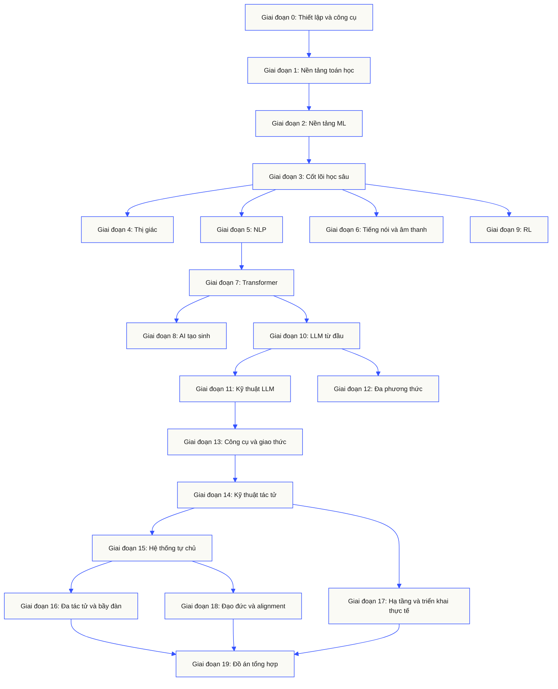
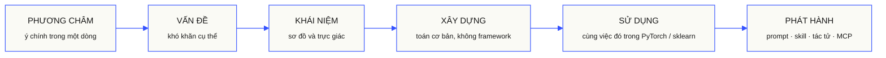

<p align="center" lang="vi"><sub>README này được dịch sang tiếng Việt. <a href="../../README.md">README tiếng Anh</a> vẫn là bản tham chiếu chuẩn.</sub></p>

<p align="center">
  <picture>
    <source media="(prefers-color-scheme: dark)" srcset="../../assets/readme/header-dark.svg">
    
  </picture>
</p>

Triển khai cơ chế bên trong mô hình, quy trình truy xuất và môi trường thực thi tác tử. Kiểm thử, phân tích lỗi và lưu lại mã nguồn cùng kết quả đánh giá.

**[Bắt đầu học](https://aiengineeringfromscratch.com/lesson?path=phases/00-setup-and-tooling/01-dev-environment)** · **[Chọn lộ trình](#learning-routes)** · **[Thử bài thực hành](#interactive-lab)** · **[Xây dựng dự án](#project-challenges)** · **[Xem chương trình học](#contents)**

Miễn phí, mã nguồn mở, giấy phép MIT. Học trên trang web, cùng tác tử lập trình hoặc bằng cách chạy mã cục bộ.

> 523 bài học. 20 giai đoạn. Python, TypeScript, Rust, Julia.

<p align="center">
  <a href="../../LICENSE"></a>
  <a href="../../ROADMAP.md"></a>
  <a href="#contents"></a>
  <a href="https://github.com/rohitg00/ai-engineering-from-scratch/stargazers"></a>
  <a href="https://aiengineeringfromscratch.com"></a>
</p>

<details>
<summary>Đọc bằng ngôn ngữ của bạn</summary>

<p align="center">
  <a href="../../README.md">🇬🇧 English</a> · <a href="../../i18n/zh/README.md">🇨🇳 简体中文</a> · <a href="../../i18n/zh-TW/README.md">🇹🇼 繁體中文（台灣）</a> · <a href="../../i18n/ja/README.md">🇯🇵 日本語</a> · <a href="../../i18n/ko/README.md">🇰🇷 한국어</a> · <a href="../../i18n/pt/README.md">🇵🇹 Português</a> · <a href="../../i18n/pt-BR/README.md">🇧🇷 Português (Brasil)</a> · <a href="../../i18n/es/README.md">🇪🇸 Español</a> · <a href="../../i18n/de/README.md">🇩🇪 Deutsch</a> · <a href="../../i18n/fr/README.md">🇫🇷 Français</a> · <a href="../../i18n/it/README.md">🇮🇹 Italiano</a> · <a href="../../i18n/nl/README.md">🇳🇱 Nederlands</a> · <a href="../../i18n/pl/README.md">🇵🇱 Polski</a> · <a href="../../i18n/cs/README.md">🇨🇿 Čeština</a> · <a href="../../i18n/ro/README.md">🇷🇴 Română</a> · <a href="../../i18n/hu/README.md">🇭🇺 Magyar</a> · <a href="../../i18n/el/README.md">🇬🇷 Ελληνικά</a> · <a href="../../i18n/sv/README.md">🇸🇪 Svenska</a> · <a href="../../i18n/da/README.md">🇩🇰 Dansk</a> · <a href="../../i18n/no/README.md">🇳🇴 Norsk</a> · <a href="../../i18n/fi/README.md">🇫🇮 Suomi</a> · <a href="../../i18n/ru/README.md">🇷🇺 Русский</a> · <a href="../../i18n/uk/README.md">🇺🇦 Українська</a> · <a href="../../i18n/tr/README.md">🇹🇷 Türkçe</a> · <a href="../../i18n/he/README.md">🇮🇱 עברית</a> · <a href="../../i18n/ar/README.md">🇸🇦 العربية</a> · <a href="../../i18n/fa/README.md">🇮🇷 فارسی</a> · <a href="../../i18n/hi/README.md">🇮🇳 हिन्दी</a> · <a href="../../i18n/bn/README.md">🇧🇩 বাংলা</a> · <a href="../../i18n/ur/README.md">🇵🇰 اردو</a> · <a href="../../i18n/th/README.md">🇹🇭 ไทย</a> · <a href="../../i18n/vi/README.md">🇻🇳 Tiếng Việt</a> · <a href="../../i18n/id/README.md">🇮🇩 Bahasa Indonesia</a> · <a href="../../i18n/tl/README.md">🇵🇭 Tagalog</a>
</p>

</details>

### Nhà tài trợ

<p align="center">
  <a href="https://serpapi.com/ai-engineering-from-scratch"><picture><source media="(min-width: 768px)" srcset="../../assets/sponsors/serpapi-banner-compact.png" width="48%"></picture></a>
  <a href="https://nitrostack.ai/referral/aiengineeringfromscratch"><picture><source media="(min-width: 768px)" srcset="../../assets/sponsors/nitrostack-banner-equal.png" width="48%"></picture></a>
</p>

<p align="center">
  <sub><span>Sự hỗ trợ của bạn giúp mọi bài học luôn miễn phí và mã nguồn mở.</span> <a href="#supporters">Xem tất cả người ủng hộ</a> · <a href="../../SPONSORS.md">Trở thành nhà tài trợ</a></sub>
</p>

<a id="see-what-you-will-build-and-keep"></a>
<a id="learning-routes"></a>

## Lộ trình học tập

| Lộ trình | Bài học bắt đầu |
|---|---|
| Nền tảng mô hình | [Thiết lập và công cụ](https://aiengineeringfromscratch.com/lesson?path=phases/00-setup-and-tooling/01-dev-environment) |
| Hệ thống LLM | [Kỹ thuật viết câu lệnh](https://aiengineeringfromscratch.com/lesson?path=phases/11-llm-engineering/01-prompt-engineering) |
| Tác tử và bàn giao hệ thống | [Vòng lặp tác tử](https://aiengineeringfromscratch.com/lesson?path=phases/14-agent-engineering/01-the-agent-loop) |

[So sánh lộ trình nghề nghiệp](https://aiengineeringfromscratch.com/learning-paths.html) · [Kiến thức tiên quyết và thời gian học](#study-guide)

<a id="interactive-lab"></a>

### Hạ gradient

Hai mươi điểm khởi đầu thực hiện hạ gradient trên hàm mất mát bậc hai. Đồ thị hiển thị vị trí của chúng và giá trị mất mát trung bình sau mỗi lần cập nhật.

<p align="center">
  <a href="https://aiengineeringfromscratch.com/lesson?path=phases/01-math-foundations/08-optimization#loss-landscape-visualization">
    <picture>
      <source media="(max-width: 600px) and (prefers-color-scheme: dark) and (prefers-reduced-motion: reduce)" srcset="../../assets/readme/101-gradient-mobile-dark.png">
      <source media="(max-width: 600px) and (prefers-reduced-motion: reduce)" srcset="../../assets/readme/101-gradient-mobile-light.png">
      <source media="(prefers-color-scheme: dark) and (prefers-reduced-motion: reduce)" srcset="../../assets/readme/101-gradient-dark.png">
      <source media="(prefers-reduced-motion: reduce)" srcset="../../assets/readme/101-gradient-light.png">
      <source media="(max-width: 600px) and (prefers-color-scheme: dark)" srcset="../../assets/readme/101-gradient-mobile-dark.gif">
      <source media="(max-width: 600px)" srcset="../../assets/readme/101-gradient-mobile-light.gif">
      <source media="(prefers-color-scheme: dark)" srcset="../../assets/readme/101-gradient-dark.gif">
      
    </picture>
  </a>
</p>

[Điều chỉnh tốc độ học trong bài học](https://aiengineeringfromscratch.com/lesson?path=phases/01-math-foundations/08-optimization#loss-landscape-visualization) · [So sánh hạ gradient, động lượng và Adam trong mã nguồn](../../phases/01-math-foundations/08-optimization/code/optimizers.py)

<a id="project-challenges"></a>

### Dự án

Ba dự án với mã khởi đầu theo từng giai đoạn, bản triển khai tham khảo và bộ chấm chạy cục bộ. Chạy các lệnh từ thư mục gốc của kho mã sau khi [thiết lập](#local-setup). Mã khởi đầu chưa vượt qua kiểm tra cho đến khi bạn triển khai các giai đoạn.

<details>
<summary><strong>01 · Phòng thực hành đánh giá truy xuất</strong> · Python · Chỉ số xếp hạng và kiểm tra hồi quy</summary>

Một hệ thống ứng viên cải thiện NDCG trung bình nhưng một truy vấn lại xếp bằng chứng liên quan nhất ở vị trí thấp hơn. Xây dựng phép so sánh theo từng truy vấn để báo cáo suy giảm và có thể khiến kiểm tra phát hành không đạt.

Dùng Python 3.10+. Ôn lại [RAG](../../phases/11-llm-engineering/06-rag/docs/en.md) và [đánh giá mô hình](../../phases/02-ml-fundamentals/09-model-evaluation/docs/en.md). Triển khai xác thực thứ hạng, precision và recall, các chỉ số nhạy với vị trí, rồi so sánh hệ thống.

```bash
python3 scripts/project_test.py retrieval-evaluation-lab \
  --init learning-artifacts/retrieval-evaluation-lab
python3 scripts/project_test.py retrieval-evaluation-lab \
  --stage 1 --path learning-artifacts/retrieval-evaluation-lab --strict
python3 scripts/project_test.py retrieval-evaluation-lab \
  --all --path learning-artifacts/retrieval-evaluation-lab --strict
```

**Lưu lại:** phép so sánh có thể tái lập với chênh lệch theo từng truy vấn và các đánh giá độ liên quan dùng để chấm điểm. Chỉ số phản ánh các đánh giá đó; chúng không xác lập tính đúng đắn của câu trả lời.

[Bắt đầu dự án](https://aiengineeringfromscratch.com/project.html?id=retrieval-evaluation-lab) · [Kiểm tra lời giải tham chiếu](../../projects/retrieval-evaluation-lab/solution/) · [Chạy với đầu vào của bạn](../../projects/retrieval-evaluation-lab/README.md#run-with-your-own-inputs)

</details>

<details>
<summary><strong>02 · Trình gỡ lỗi dấu vết tác tử</strong> · TypeScript · Phân tích dấu vết thực thi và đo thời gian</summary>

Dấu vết được cung cấp vẫn mất 100 ms, nhưng tổng lượng token sử dụng tăng thêm 200 và một span bắt đầu lỗi. Tách phần công việc chồng lấp của các span con khỏi thời gian thực thi của span cha, rồi tạo báo cáo thể hiện thay đổi.

Dùng Node.js 22.18+ và Python 3 cho bộ chấm. Triển khai phân tích JSONL, xác thực quan hệ cha, phép toán khoảng thời gian, rồi tạo dòng thời gian có thể kiểm tra.

```bash
python3 scripts/project_test.py agent-trace-debugger \
  --init learning-artifacts/agent-trace-debugger
python3 scripts/project_test.py agent-trace-debugger \
  --stage 1 --path learning-artifacts/agent-trace-debugger --strict
python3 scripts/project_test.py agent-trace-debugger \
  --all --path learning-artifacts/agent-trace-debugger --strict
```

**Lưu lại:** dấu vết đầu vào, dòng thời gian HTML và báo cáo suy giảm JSON. Giữ số token riêng của từng span, không bao gồm span con, để không tính hai lần lượng sử dụng của cha và con.

[Bắt đầu dự án](https://aiengineeringfromscratch.com/project.html?id=agent-trace-debugger) · [Kiểm tra lời giải tham chiếu](../../projects/agent-trace-debugger/solution/) · [Khám phá thời gian thực thi tương tác](https://aiengineeringfromscratch.com/project.html?id=agent-trace-debugger&stage=03-timing)

</details>

<details>
<summary><strong>03 · Tường lửa lời gọi công cụ</strong> · Rust · Kiểm tra vai trò và biên nhận phê duyệt</summary>

Một thao tác ghi thay đổi sau khi được xem xét, hoặc một phê duyệt bị dùng lại. Xác thực phong bì lời gọi, kiểm tra vai trò và đường dẫn của bên gọi, rồi dùng phê duyệt gắn với đúng yêu cầu và nội dung đó.

Dùng Rust và Python 3.10+. Ôn lại [thiết kế lược đồ công cụ](../../phases/13-tools-and-protocols/05-tool-schema-design/docs/en.md) và [ranh giới bảo mật](../../phases/17-infrastructure-and-production/25-security-secrets-audit/docs/en.md). Ứng dụng gọi cung cấp danh tính; mô hình đề xuất thao tác.

```bash
python3 scripts/project_test.py tool-call-firewall \
  --init learning-artifacts/tool-call-firewall
python3 scripts/project_test.py tool-call-firewall \
  --stage 1 --path learning-artifacts/tool-call-firewall --strict
python3 scripts/project_test.py tool-call-firewall \
  --all --path learning-artifacts/tool-call-firewall --strict
```

**Lưu lại:** biên nhận kiểm toán cho biết thao tác được yêu cầu và quyết định chính sách. Phê duyệt chỉ dùng một lần trong một lần gọi; dự án này không cung cấp ủy quyền bền vững hoặc sandbox ở cấp hệ điều hành.

[Bắt đầu dự án](https://aiengineeringfromscratch.com/project.html?id=tool-call-firewall) · [Kiểm tra lời giải tham chiếu](../../projects/tool-call-firewall/solution/) · [Khám phá ranh giới phê duyệt](https://aiengineeringfromscratch.com/project.html?id=tool-call-firewall&stage=03-consume-a-request-bound-approval-once)

</details>

[Xem tất cả dự án](https://aiengineeringfromscratch.com/projects.html) · [Hướng dẫn thực hành nghề nghiệp](../../learning-paths/CAREER-PRACTICE.md)

## Chọn cách học

### Trên trang web

Mở bất kỳ bài đã hoàn thành nào trên [aiengineeringfromscratch.com](https://aiengineeringfromscratch.com) hoặc mở một giai đoạn trong [Mục lục](#contents). Không cần thiết lập hay clone.

### Cùng gia sư AI

Nếu bạn đã cài Node.js, `npx` và một tác tử lập trình hỗ trợ skill, bạn có thể dùng tác tử đó làm gia sư. Bạn không cần clone kho mã để cài đặt hay đọc nội dung gia sư. Các bài thực hành có thể chạy trong lộ trình chuyên biệt cần `python3`. Bài thực hành Agent Skills trên host còn cần một host đã chọn và phạm vi skill cấp người dùng hoặc dự án có quyền ghi.

```bash
npx skills add rohitg00/ai-engineering-from-scratch
```

Chọn host và phạm vi khi trình cài đặt hỏi. Dùng `start-learning` trong Codex, `/start-learning` trong Claude Code hoặc yêu cầu host dùng skill theo tên.

<details>
<summary>Thiết lập gia sư và lệnh của môi trường chủ</summary>

Trước tiên, kiểm tra các yêu cầu trên máy:

```bash
node --version
npx --version
python3 --version
```

`skills` ghi vào host và phạm vi được chọn khi cài, chẳng hạn `.claude/skills/`, `.cursor/skills/`, `.codex/skills/` hoặc thư mục skill được hỗ trợ khác. Kiểm tra rằng host đã chọn phát hiện đúng vị trí đó.

Cú pháp gọi do host quyết định, không phải do định dạng `SKILL.md` có tính di động:

| Ứng dụng host | Bắt đầu khóa học | Bắt đầu Model Context Protocol (MCP) | Bắt đầu Agent Skills | Làm bài kiểm tra giai đoạn |
|---|---|---|---|---|
| Codex | `start-learning`, hoặc chọn trong `/skills` | `learn-mcp`, hoặc chọn trong `/skills` | `learn-agent-skills`, hoặc chọn trong `/skills` | `check-understanding 13`, hoặc chọn trong `/skills` |
| Claude Code | `/start-learning` | `/learn-mcp` | `/learn-agent-skills` | `/check-understanding 13` |
| Host tương thích khác | `Use start-learning to begin the course.` | `Use learn-mcp to start the Model Context Protocol (MCP) path.` | `Use learn-agent-skills to start the Agent Skills Engineering path.` | `Use check-understanding to quiz me on Phase 13.` |

Bài kiểm tra trình độ gồm mười câu hỏi đối chiếu kiến thức hiện có của bạn với giai đoạn bắt đầu phù hợp, rồi lưu kế hoạch học cá nhân vào `LEARNING.md`. Từ đó, skill `learn` dạy một bài mỗi phiên: khái niệm, toán, mã, câu hỏi kiểm tra. Nội dung được lấy trực tiếp từ kho mã này, còn skill `course-guide` đưa bạn đến đúng bài giải thích phần đang vướng. Trong Codex, gọi bằng `learn` và `course-guide`; trong Claude Code, dùng `/learn` và `/course-guide`; với host tương thích khác, yêu cầu dùng skill theo tên.

Chỉ muốn học Model Context Protocol (MCP)? Dùng cách gọi MCP dành cho host của bạn. Skill tạo `MCP-LEARNING.md` và theo một lộ trình gồm 17 bài về yêu cầu không trạng thái, kênh truyền, công việc hai chiều, bảo mật, độ tin cậy, quản trị registry và bằng chứng tuân thủ. Thứ tự chính xác và các điểm kiểm tra nằm trong [bản kê Model Context Protocol (MCP)](../../learning-paths/model-context-protocol.json).

Chỉ muốn học Agent Skills? Dùng cách gọi Agent Skills dành cho host của bạn. Skill tạo `AGENT-SKILLS-LEARNING.md` và theo một lộ trình liền mạch gồm năm bài: hợp đồng, khám phá, gọi skill, ranh giới sandbox, rồi đánh giá phát hành và tính di động trên host thực tế. Bắt đầu trên web với [lộ trình Agent Skills](https://aiengineeringfromscratch.com/lesson?path=phases/13-tools-and-protocols/22-skills-and-agent-sdks&learningPath=agent-skills).

Trình cài đặt liệt kê các host có thể cấu hình và hỏi nơi cài. Nếu chưa có Node.js, `npx`, `python3`, host được hỗ trợ hoặc phạm vi có quyền ghi, hãy dùng trang web hoặc tự đọc `docs/en.md`. Cách đó giúp học khái niệm, nhưng bằng chứng khám phá, gọi, chạy script và gỡ cài đặt trên host thực tế vẫn chưa hoàn tất cho đến khi có thể chạy kiểm tra ban đầu. Đọc bài học tại [aiengineeringfromscratch.com](https://aiengineeringfromscratch.com).

### Các skill học tập

| Skill học tập | Chức năng |
|---|---|
| [`start-learning`](../../skills/start-learning/SKILL.md) | Định hướng một lần: lý do học, kiểm tra trình độ, kế hoạch cá nhân được lưu vào `LEARNING.md`. |
| [`learn`](../../skills/learn/SKILL.md) | Vòng gia sư. Ôn lại để khởi động, học tương tác bài tiếp theo, rồi làm câu hỏi kiểm tra; ghi tiến độ và hàng đợi ôn tập. |
| [`course-guide`](../../skills/course-guide/SKILL.md) | Điều hướng chủ đề. "Tôi học attention ở đâu?" hoặc "loss của tôi là NaN" → đúng bài cần học, kèm liên kết. |
| [`learn-mcp`](../../skills/learn-mcp/SKILL.md) | Gia sư chuyên về Model Context Protocol (MCP). Tạo `MCP-LEARNING.md`, theo bản kê 17 bài, ghi bằng chứng về giao tiếp, bảo mật, độ tin cậy và tuân thủ. |
| [`learn-agent-skills`](../../skills/learn-agent-skills/SKILL.md) | Gia sư chuyên về Agent Skills. Tạo `AGENT-SKILLS-LEARNING.md`, dạy các bài 22, 24, 25, 26, 27 và ghi bằng chứng trên host thực tế. |
| [`claude-certification`](../../skills/claude-certification/SKILL.md) | Gia sư chứng chỉ. Chọn CCAO-F, CCDV-F, CCAR-F hoặc CCAR-P; dạy từng bài; chạy thực hành; đánh giá sản phẩm; tổ chức bài chẩn đoán và thi thử; lưu tiến độ. |
| [`mcpa-certification`](../../skills/mcpa-certification/SKILL.md) | Gia sư MCPA. Theo lộ trình `mcpa-f` gồm 34 bài về giao thức 2026-07-28; dạy từng bài; chạy thực hành và bộ kiểm tra giao tiếp; tổ chức bài chẩn đoán cùng ba đề thi thử; lưu tiến độ. |
| [`find-your-level`](../../skills/find-your-level/SKILL.md) | Bài kiểm tra trình độ mười câu. Đối chiếu kiến thức với giai đoạn bắt đầu và tạo lộ trình cá nhân kèm thời gian ước tính. |
| [`check-understanding <phase>`](../../skills/check-understanding/SKILL.md) | Kiểm tra từng giai đoạn với tám câu, phản hồi và các bài cụ thể cần ôn. Dùng dạng Codex, Claude Code hoặc ngôn ngữ tự nhiên trong bảng cách gọi ở trên. |

</details>

<a id="local-setup"></a>

### Chạy mã cục bộ

```bash
git clone https://github.com/rohitg00/ai-engineering-from-scratch.git
cd ai-engineering-from-scratch
python3 phases/00-setup-and-tooling/01-dev-environment/code/verify.py --route beginner
python3 phases/01-math-foundations/01-linear-algebra-intuition/code/vectors.py
```

Bước kiểm tra ban đầu phân biệt yêu cầu cần có ngay với công cụ sẽ cần về sau. Mỗi yêu cầu bắt buộc chưa đạt đều đi kèm nguyên nhân được phát hiện và lệnh khắc phục. Lệnh `vectors.py` chạy một bài học không cần thư viện ngoài, rồi cho thấy phép nhân ma trận với vectơ chính là phép toán bên trong một lớp mạng nơ-ron. Hãy lưu đầu ra terminal đó làm bằng chứng đầu tiên.

<details>
<summary>Học mỗi bài theo cùng một cách</summary>

### Học mỗi bài theo cùng một cách

1. **Đọc** `docs/en.md` và giải thích ý tưởng chính bằng lời của bạn.
2. **Tự gõ và xây dựng** phần mã quan trọng; đừng chỉ xem khối mã như hình minh họa.
3. **Chạy** lệnh của bài học từ thư mục gốc của kho mã, nơi chứa `README.md` và `phases/`.
4. **Lưu bằng chứng**: lệnh, thư mục làm việc, mã thoát, đầu ra có ý nghĩa và sản phẩm bạn đã thay đổi hoặc tạo ra.
5. Chỉ **tiếp tục** khi bạn giải thích được đầu ra và thực hiện được một thay đổi nhỏ mà không cần đoán.

Các lệnh trong trang bài học dùng đường dẫn tính từ thư mục gốc của kho mã, trừ khi bài học yêu cầu rõ ràng việc chuyển thư mục. Nếu bài học có nhiều ngôn ngữ lập trình, hãy chạy bản triển khai bằng ngôn ngữ bạn đang học.

</details>

<a id="study-guide"></a>

## Chọn lộ trình học

Bạn không cần xem qua cả 523 bài học trước khi bắt đầu. Hãy chọn một mục tiêu. Mỗi liên kết mở cùng một chương trình trên GitHub hoặc trang web, và cả hai phiên bản đều dùng cùng mã nguồn bài học.

| Mục tiêu của bạn | Học trên GitHub | Học trên trang web |
|---|---|---|
| Tôi mới bắt đầu và muốn có nền tảng đầy đủ | [Giai đoạn 0: Thiết lập và công cụ](../../phases/00-setup-and-tooling/) | [Môi trường phát triển](https://aiengineeringfromscratch.com/lesson?path=phases/00-setup-and-tooling/01-dev-environment) |
| Tôi biết Python và muốn học nền tảng toán cùng học máy | [Giai đoạn 1: Nền tảng toán học](../../phases/01-math-foundations/) | [Hiểu trực quan đại số tuyến tính](https://aiengineeringfromscratch.com/lesson?path=phases/01-math-foundations/01-linear-algebra-intuition) |
| Tôi muốn xây dựng ứng dụng LLM để triển khai thực tế | [Giai đoạn 11: Kỹ thuật LLM](../../phases/11-llm-engineering/) | [Kỹ thuật prompt](https://aiengineeringfromscratch.com/lesson?path=phases/11-llm-engineering/01-prompt-engineering) |
| Tôi muốn xây dựng agent | [Giai đoạn 14: Kỹ thuật agent](../../phases/14-agent-engineering/) | [Vòng lặp agent](https://aiengineeringfromscratch.com/lesson?path=phases/14-agent-engineering/01-the-agent-loop) |
| Tôi muốn dùng agent lập trình trên các kho mã thực tế | [Lộ trình kỹ thuật với sự hỗ trợ của agent](../../learning-paths/using-coding-agents.json) | [Kỹ thuật với sự hỗ trợ của agent](https://aiengineeringfromscratch.com/lesson?path=phases/14-agent-engineering/31-agent-workbench-why-models-fail&learningPath=using-coding-agents) |
| Tôi muốn xác định đúng thứ cần xây dựng trước khi triển khai | [Lộ trình quyết định và bàn giao sản phẩm](../../learning-paths/shaping-the-build.json) | [Quyết định và bàn giao sản phẩm](https://aiengineeringfromscratch.com/lesson?path=phases/14-agent-engineering/47-outcomes-before-output&learningPath=shaping-the-build) |

Chưa biết nên bắt đầu ở đâu? Dùng [gia sư đánh giá trình độ `start-learning`](../../skills/start-learning/SKILL.md) hoặc [hướng dẫn kiến thức cần có trên trang web](https://aiengineeringfromscratch.com/prereqs.html).

So sánh bốn lĩnh vực cốt lõi và sáu lộ trình nghề nghiệp trong [Lộ trình học kỹ thuật AI](https://aiengineeringfromscratch.com/learning-paths.html).

<details>
<summary>Lộ trình chuyên biệt về MCP và Agent Skills</summary>

| Mục tiêu của bạn | Học trên GitHub | Học trên trang web |
|---|---|---|
| Tôi muốn xây dựng với Model Context Protocol (MCP) | [Lộ trình Model Context Protocol (MCP)](../../phases/13-tools-and-protocols/README.md#model-context-protocol-mcp-path) | [Lộ trình học Model Context Protocol (MCP)](https://aiengineeringfromscratch.com/lesson?path=phases/13-tools-and-protocols/06-mcp-fundamentals&learningPath=model-context-protocol) |
| Tôi muốn viết và phát hành Agent Skills | [Lộ trình chuyên về Agent Skills](../../phases/13-tools-and-protocols/README.md#agent-skills-fast-path) | [Lộ trình học Agent Skills](https://aiengineeringfromscratch.com/lesson?path=phases/13-tools-and-protocols/22-skills-and-agent-sdks&learningPath=agent-skills) |

</details>

<details>
<summary>Kiến thức tiên quyết và thời gian học</summary>

### Kiến thức cần có

- Bạn biết viết mã (bất kỳ ngôn ngữ nào; biết Python sẽ hữu ích).
- Bạn muốn hiểu AI **thực sự hoạt động ra sao**, không chỉ gọi API.

## Nên bắt đầu từ đâu

| Nền tảng hiện có | Bắt đầu từ | Thời gian ước tính |
|---|---|---|
| Mới học lập trình và AI | Giai đoạn 0: Thiết lập | ~306 giờ |
| Biết Python, mới học ML | Giai đoạn 1: Nền tảng toán học | ~270 giờ |
| Biết ML, mới học sâu | Giai đoạn 3: Cốt lõi học sâu | ~200 giờ |
| Biết học sâu, muốn học LLM và tác tử | Giai đoạn 10: LLM từ đầu | ~100 giờ |
| Kỹ sư cấp cao, chỉ muốn học kỹ thuật tác tử | Giai đoạn 14: Kỹ thuật tác tử | ~60 giờ |
| Chỉ muốn xây hệ thống MCP vận hành thực tế | [Lộ trình Model Context Protocol (MCP)](../../learning-paths/model-context-protocol.json) | ~23 giờ 15 phút |
| Chỉ muốn xây Agent Skills dùng trong thực tế | [Lộ trình Kỹ thuật Agent Skills](../../learning-paths/agent-skills.json) | ~9.5 giờ |

</details>

## Cấu trúc chương trình

Hai mươi giai đoạn xây chồng lên nhau. Toán học là nền, tác tử và triển khai thực tế là phần trên cùng. Có thể nhảy cóc nếu bạn đã hiểu các lớp dưới, nhưng đừng bỏ qua rồi thắc mắc vì sao thứ ở trên lại hỏng.



<a id="contents"></a>

## Mục lục

Hai mươi giai đoạn. Nhấp vào giai đoạn bất kỳ để mở danh sách bài học.

<a id="phase-0"></a>
### Giai đoạn 0: Thiết lập và công cụ `12 bài học`
> Chuẩn bị môi trường cho mọi nội dung tiếp theo.

| # | Bài học | Loại | Ngôn ngữ |
|:---:|--------|:----:|------|
| 01 | [Môi trường phát triển](../../phases/00-setup-and-tooling/01-dev-environment/) | Xây dựng | Python |
| 02 | [Git và cộng tác](../../phases/00-setup-and-tooling/02-git-and-collaboration/) | Tìm hiểu | — |
| 03 | [Thiết lập GPU và đám mây](../../phases/00-setup-and-tooling/03-gpu-setup-and-cloud/) | Xây dựng | Python |
| 04 | [API và khóa truy cập](../../phases/00-setup-and-tooling/04-apis-and-keys/) | Xây dựng | Python |
| 05 | [Jupyter Notebooks](../../phases/00-setup-and-tooling/05-jupyter-notebooks/) | Xây dựng | Python |
| 06 | [Môi trường Python](../../phases/00-setup-and-tooling/06-python-environments/) | Xây dựng | Shell |
| 07 | [Docker cho AI](../../phases/00-setup-and-tooling/07-docker-for-ai/) | Xây dựng | Docker |
| 08 | [Thiết lập trình soạn thảo](../../phases/00-setup-and-tooling/08-editor-setup/) | Xây dựng | — |
| 09 | [Quản lý dữ liệu](../../phases/00-setup-and-tooling/09-data-management/) | Xây dựng | Python |
| 10 | [Terminal và shell](../../phases/00-setup-and-tooling/10-terminal-and-shell/) | Tìm hiểu | — |
| 11 | [Linux cho AI](../../phases/00-setup-and-tooling/11-linux-for-ai/) | Tìm hiểu | — |
| 12 | [Gỡ lỗi và phân tích hiệu năng](../../phases/00-setup-and-tooling/12-debugging-and-profiling/) | Xây dựng | Python |

<details id="phase-1">
<summary><b>Giai đoạn 1: Nền tảng toán học</b> &nbsp;<code>22 bài học</code>&nbsp; <em>Hiểu trực quan nền tảng của mọi thuật toán AI qua mã.</em></summary>
<br/>

| # | Bài học | Loại | Ngôn ngữ |
|:---:|--------|:----:|------|
| 01 | [Hiểu trực quan đại số tuyến tính](../../phases/01-math-foundations/01-linear-algebra-intuition/) | Tìm hiểu | Python, Julia |
| 02 | [Vectơ, ma trận và các phép toán](../../phases/01-math-foundations/02-vectors-matrices-operations/) | Xây dựng | Python, Julia |
| 03 | [Phép biến đổi ma trận và trị riêng](../../phases/01-math-foundations/03-matrix-transformations/) | Xây dựng | Python, Julia |
| 04 | [Giải tích cho ML: đạo hàm và gradient](../../phases/01-math-foundations/04-calculus-for-ml/) | Tìm hiểu | Python |
| 05 | [Quy tắc dây chuyền và vi phân tự động](../../phases/01-math-foundations/05-chain-rule-and-autodiff/) | Xây dựng | Python |
| 06 | [Xác suất và phân phối](../../phases/01-math-foundations/06-probability-and-distributions/) | Tìm hiểu | Python |
| 07 | [Định lý Bayes và tư duy thống kê](../../phases/01-math-foundations/07-bayes-theorem/) | Xây dựng | Python |
| 08 | [Tối ưu hóa: họ phương pháp hạ gradient](../../phases/01-math-foundations/08-optimization/) | Xây dựng | Python |
| 09 | [Lý thuyết thông tin: entropy và độ phân kỳ KL](../../phases/01-math-foundations/09-information-theory/) | Tìm hiểu | Python |
| 10 | [Giảm chiều: PCA, t-SNE, UMAP](../../phases/01-math-foundations/10-dimensionality-reduction/) | Xây dựng | Python |
| 11 | [Phân rã giá trị suy biến](../../phases/01-math-foundations/11-singular-value-decomposition/) | Xây dựng | Python, Julia |
| 12 | [Phép toán tensor](../../phases/01-math-foundations/12-tensor-operations/) | Xây dựng | Python |
| 13 | [Tính ổn định số](../../phases/01-math-foundations/13-numerical-stability/) | Xây dựng | Python |
| 14 | [Chuẩn và khoảng cách](../../phases/01-math-foundations/14-norms-and-distances/) | Xây dựng | Python |
| 15 | [Thống kê cho ML](../../phases/01-math-foundations/15-statistics-for-ml/) | Xây dựng | Python |
| 16 | [Phương pháp lấy mẫu](../../phases/01-math-foundations/16-sampling-methods/) | Xây dựng | Python |
| 17 | [Hệ phương trình tuyến tính](../../phases/01-math-foundations/17-linear-systems/) | Xây dựng | Python |
| 18 | [Tối ưu hóa lồi](../../phases/01-math-foundations/18-convex-optimization/) | Xây dựng | Python |
| 19 | [Số phức cho AI](../../phases/01-math-foundations/19-complex-numbers/) | Tìm hiểu | Python |
| 20 | [Biến đổi Fourier](../../phases/01-math-foundations/20-fourier-transform/) | Xây dựng | Python |
| 21 | [Lý thuyết đồ thị cho ML](../../phases/01-math-foundations/21-graph-theory/) | Xây dựng | Python |
| 22 | [Quá trình ngẫu nhiên](../../phases/01-math-foundations/22-stochastic-processes/) | Tìm hiểu | Python |

</details>

<details id="phase-2">
<summary><b>Giai đoạn 2: Nền tảng ML</b> &nbsp;<code>18 bài học</code>&nbsp; <em>ML cổ điển: vẫn là nền tảng của phần lớn AI đang vận hành thực tế.</em></summary>
<br/>

| # | Bài học | Loại | Ngôn ngữ |
|:---:|--------|:----:|------|
| 01 | [Học máy là gì](../../phases/02-ml-fundamentals/01-what-is-machine-learning/) | Tìm hiểu | Python |
| 02 | [Hồi quy tuyến tính từ đầu](../../phases/02-ml-fundamentals/02-linear-regression/) | Xây dựng | Python |
| 03 | [Hồi quy logistic và phân loại](../../phases/02-ml-fundamentals/03-logistic-regression/) | Xây dựng | Python |
| 04 | [Cây quyết định và rừng ngẫu nhiên](../../phases/02-ml-fundamentals/04-decision-trees/) | Xây dựng | Python |
| 05 | [Máy vectơ hỗ trợ](../../phases/02-ml-fundamentals/05-support-vector-machines/) | Xây dựng | Python |
| 06 | [KNN và thước đo khoảng cách](../../phases/02-ml-fundamentals/06-knn-and-distances/) | Xây dựng | Python |
| 07 | [Học không giám sát: K-Means, DBSCAN](../../phases/02-ml-fundamentals/07-unsupervised-learning/) | Xây dựng | Python |
| 08 | [Thiết kế và lựa chọn đặc trưng](../../phases/02-ml-fundamentals/08-feature-engineering/) | Xây dựng | Python |
| 09 | [Đánh giá mô hình: chỉ số và kiểm định chéo](../../phases/02-ml-fundamentals/09-model-evaluation/) | Xây dựng | Python |
| 10 | [Độ chệch, phương sai và đường cong học](../../phases/02-ml-fundamentals/10-bias-variance/) | Tìm hiểu | Python |
| 11 | [Phương pháp tổ hợp: Boosting, Bagging, Stacking](../../phases/02-ml-fundamentals/11-ensemble-methods/) | Xây dựng | Python |
| 12 | [Tinh chỉnh siêu tham số](../../phases/02-ml-fundamentals/12-hyperparameter-tuning/) | Xây dựng | Python |
| 13 | [Pipeline ML và theo dõi thí nghiệm](../../phases/02-ml-fundamentals/13-ml-pipelines/) | Xây dựng | Python |
| 14 | [Naive Bayes](../../phases/02-ml-fundamentals/14-naive-bayes/) | Xây dựng | Python |
| 15 | [Nền tảng chuỗi thời gian](../../phases/02-ml-fundamentals/15-time-series/) | Xây dựng | Python |
| 16 | [Phát hiện bất thường](../../phases/02-ml-fundamentals/16-anomaly-detection/) | Xây dựng | Python |
| 17 | [Xử lý dữ liệu mất cân bằng](../../phases/02-ml-fundamentals/17-imbalanced-data/) | Xây dựng | Python |
| 18 | [Lựa chọn đặc trưng](../../phases/02-ml-fundamentals/18-feature-selection/) | Xây dựng | Python |

</details>

<details id="phase-3">
<summary><b>Giai đoạn 3: Cốt lõi học sâu</b> &nbsp;<code>13 bài học</code>&nbsp; <em>Mạng nơ-ron từ nguyên lý đầu tiên. Chưa dùng framework cho đến khi tự xây một cái.</em></summary>
<br/>

| # | Bài học | Loại | Ngôn ngữ |
|:---:|--------|:----:|------|
| 01 | [Perceptron: nơi mọi thứ bắt đầu](../../phases/03-deep-learning-core/01-the-perceptron/) | Xây dựng | Python |
| 02 | [Mạng nhiều lớp và lượt truyền xuôi](../../phases/03-deep-learning-core/02-multi-layer-networks/) | Xây dựng | Python |
| 03 | [Lan truyền ngược từ đầu](../../phases/03-deep-learning-core/03-backpropagation/) | Xây dựng | Python |
| 04 | [Hàm kích hoạt: ReLU, Sigmoid, GELU và lý do sử dụng](../../phases/03-deep-learning-core/04-activation-functions/) | Xây dựng | Python |
| 05 | [Hàm mất mát: MSE, entropy chéo, tương phản](../../phases/03-deep-learning-core/05-loss-functions/) | Xây dựng | Python |
| 06 | [Bộ tối ưu: SGD, Momentum, Adam, AdamW](../../phases/03-deep-learning-core/06-optimizers/) | Xây dựng | Python |
| 07 | [Chính quy hóa: Dropout, suy giảm trọng số, BatchNorm](../../phases/03-deep-learning-core/07-regularization/) | Xây dựng | Python |
| 08 | [Khởi tạo trọng số và độ ổn định khi huấn luyện](../../phases/03-deep-learning-core/08-weight-initialization/) | Xây dựng | Python |
| 09 | [Lịch tốc độ học và khởi động](../../phases/03-deep-learning-core/09-learning-rate-schedules/) | Xây dựng | Python |
| 10 | [Tự xây dựng framework nhỏ](../../phases/03-deep-learning-core/10-mini-framework/) | Xây dựng | Python |
| 11 | [Giới thiệu PyTorch](../../phases/03-deep-learning-core/11-intro-to-pytorch/) | Xây dựng | Python |
| 12 | [Giới thiệu JAX](../../phases/03-deep-learning-core/12-intro-to-jax/) | Xây dựng | Python |
| 13 | [Gỡ lỗi mạng nơ-ron](../../phases/03-deep-learning-core/13-debugging-neural-networks/) | Xây dựng | Python |

</details>

<details id="phase-4">
<summary><b>Giai đoạn 4: Thị giác máy tính</b> &nbsp;<code>28 bài học</code>&nbsp; <em>Từ điểm ảnh đến hiểu biết: ảnh, video, 3D, VLM và mô hình thế giới.</em></summary>
<br/>

| # | Bài học | Loại | Ngôn ngữ |
|:---:|--------|:----:|------|
| 01 | [Nền tảng hình ảnh: điểm ảnh, kênh và không gian màu](../../phases/04-computer-vision/01-image-fundamentals/) | Tìm hiểu | Python |
| 02 | [Phép tích chập từ đầu](../../phases/04-computer-vision/02-convolutions-from-scratch/) | Xây dựng | Python |
| 03 | [CNN: từ LeNet đến ResNet](../../phases/04-computer-vision/03-cnns-lenet-to-resnet/) | Xây dựng | Python |
| 04 | [Phân loại hình ảnh](../../phases/04-computer-vision/04-image-classification/) | Xây dựng | Python |
| 05 | [Học chuyển giao và tinh chỉnh](../../phases/04-computer-vision/05-transfer-learning/) | Xây dựng | Python |
| 06 | [Phát hiện đối tượng: YOLO từ đầu](../../phases/04-computer-vision/06-object-detection-yolo/) | Xây dựng | Python |
| 07 | [Phân đoạn ngữ nghĩa: U-Net](../../phases/04-computer-vision/07-semantic-segmentation-unet/) | Xây dựng | Python |
| 08 | [Phân đoạn thực thể: Mask R-CNN](../../phases/04-computer-vision/08-instance-segmentation-mask-rcnn/) | Xây dựng | Python |
| 09 | [Sinh ảnh: GAN](../../phases/04-computer-vision/09-image-generation-gans/) | Xây dựng | Python |
| 10 | [Sinh ảnh: mô hình khuếch tán](../../phases/04-computer-vision/10-image-generation-diffusion/) | Xây dựng | Python |
| 11 | [Stable Diffusion: kiến trúc và tinh chỉnh](../../phases/04-computer-vision/11-stable-diffusion/) | Xây dựng | Python |
| 12 | [Hiểu video: mô hình hóa thời gian](../../phases/04-computer-vision/12-video-understanding/) | Xây dựng | Python |
| 13 | [Thị giác 3D: đám mây điểm, NeRF](../../phases/04-computer-vision/13-3d-vision-nerf/) | Xây dựng | Python |
| 14 | [Vision Transformer (ViT)](../../phases/04-computer-vision/14-vision-transformers/) | Xây dựng | Python |
| 15 | [Thị giác thời gian thực: triển khai tại biên](../../phases/04-computer-vision/15-real-time-edge/) | Xây dựng | Python |
| 16 | [Xây dựng pipeline thị giác hoàn chỉnh](../../phases/04-computer-vision/16-vision-pipeline-capstone/) | Xây dựng | Python |
| 17 | [Thị giác tự giám sát: SimCLR, DINO, MAE](../../phases/04-computer-vision/17-self-supervised-vision/) | Xây dựng | Python |
| 18 | [Thị giác với từ vựng mở: CLIP](../../phases/04-computer-vision/18-open-vocab-clip/) | Xây dựng | Python |
| 19 | [OCR và hiểu tài liệu](../../phases/04-computer-vision/19-ocr-document-understanding/) | Xây dựng | Python |
| 20 | [Truy xuất hình ảnh và học độ đo](../../phases/04-computer-vision/20-image-retrieval-metric/) | Xây dựng | Python |
| 21 | [Phát hiện điểm đặc trưng và ước lượng tư thế](../../phases/04-computer-vision/21-keypoint-pose/) | Xây dựng | Python |
| 22 | [3D Gaussian Splatting từ đầu](../../phases/04-computer-vision/22-3d-gaussian-splatting/) | Xây dựng | Python |
| 23 | [Diffusion Transformer và Rectified Flow](../../phases/04-computer-vision/23-diffusion-transformers-rectified-flow/) | Xây dựng | Python |
| 24 | [SAM 3 và phân đoạn với từ vựng mở](../../phases/04-computer-vision/24-sam3-open-vocab-segmentation/) | Xây dựng | Python |
| 25 | [Mô hình thị giác-ngôn ngữ (ViT-MLP-LLM)](../../phases/04-computer-vision/25-vision-language-models/) | Xây dựng | Python |
| 26 | [Ước lượng độ sâu và hình học từ một camera](../../phases/04-computer-vision/26-monocular-depth/) | Xây dựng | Python |
| 27 | [Theo dõi nhiều đối tượng và bộ nhớ video](../../phases/04-computer-vision/27-multi-object-tracking/) | Xây dựng | Python |
| 28 | [Mô hình thế giới và khuếch tán video](../../phases/04-computer-vision/28-world-models-video-diffusion/) | Xây dựng | Python |

</details>

<details id="phase-5">
<summary><b>Giai đoạn 5: NLP từ cơ bản đến nâng cao</b> &nbsp;<code>29 bài học</code>&nbsp; <em>Ngôn ngữ là giao diện với trí thông minh.</em></summary>
<br/>

| # | Bài học | Loại | Ngôn ngữ |
|:---:|--------|:----:|------|
| 01 | [Xử lý văn bản: tách token, rút gọn gốc từ, chuẩn hóa từ](../../phases/05-nlp-foundations-to-advanced/01-text-processing/) | Xây dựng | Python |
| 02 | [Túi từ, TF-IDF và biểu diễn văn bản](../../phases/05-nlp-foundations-to-advanced/02-bag-of-words-tfidf/) | Xây dựng | Python |
| 03 | [Embedding từ: Word2Vec từ đầu](../../phases/05-nlp-foundations-to-advanced/03-word-embeddings-word2vec/) | Xây dựng | Python |
| 04 | [GloVe, FastText và embedding dưới từ](../../phases/05-nlp-foundations-to-advanced/04-glove-fasttext-subword/) | Xây dựng | Python |
| 05 | [Phân tích cảm xúc](../../phases/05-nlp-foundations-to-advanced/05-sentiment-analysis/) | Xây dựng | Python |
| 06 | [Nhận dạng thực thể có tên (NER)](../../phases/05-nlp-foundations-to-advanced/06-named-entity-recognition/) | Xây dựng | Python |
| 07 | [Gán nhãn từ loại và phân tích cú pháp](../../phases/05-nlp-foundations-to-advanced/07-pos-tagging-parsing/) | Xây dựng | Python |
| 08 | [Phân loại văn bản: CNN và RNN cho văn bản](../../phases/05-nlp-foundations-to-advanced/08-cnns-rnns-for-text/) | Xây dựng | Python |
| 09 | [Mô hình chuỗi sang chuỗi](../../phases/05-nlp-foundations-to-advanced/09-sequence-to-sequence/) | Xây dựng | Python |
| 10 | [Cơ chế attention: bước đột phá](../../phases/05-nlp-foundations-to-advanced/10-attention-mechanism/) | Xây dựng | Python |
| 11 | [Dịch máy](../../phases/05-nlp-foundations-to-advanced/11-machine-translation/) | Xây dựng | Python |
| 12 | [Tóm tắt văn bản](../../phases/05-nlp-foundations-to-advanced/12-text-summarization/) | Xây dựng | Python |
| 13 | [Hệ thống hỏi đáp](../../phases/05-nlp-foundations-to-advanced/13-question-answering/) | Xây dựng | Python |
| 14 | [Truy xuất thông tin và tìm kiếm](../../phases/05-nlp-foundations-to-advanced/14-information-retrieval-search/) | Xây dựng | Python |
| 15 | [Mô hình hóa chủ đề: LDA, BERTopic](../../phases/05-nlp-foundations-to-advanced/15-topic-modeling/) | Xây dựng | Python |
| 16 | [Sinh văn bản](../../phases/05-nlp-foundations-to-advanced/16-text-generation-pre-transformer/) | Xây dựng | Python |
| 17 | [Chatbot: từ luật đến mạng nơ-ron](../../phases/05-nlp-foundations-to-advanced/17-chatbots-rule-to-neural/) | Xây dựng | Python |
| 18 | [NLP đa ngôn ngữ](../../phases/05-nlp-foundations-to-advanced/18-multilingual-nlp/) | Xây dựng | Python |
| 19 | [Tách token dưới từ: BPE, WordPiece, Unigram, SentencePiece](../../phases/05-nlp-foundations-to-advanced/19-subword-tokenization/) | Tìm hiểu | Python |
| 20 | [Đầu ra có cấu trúc và giải mã có ràng buộc](../../phases/05-nlp-foundations-to-advanced/20-structured-outputs-constrained-decoding/) | Xây dựng | Python |
| 21 | [NLI và quan hệ suy ra trong văn bản](../../phases/05-nlp-foundations-to-advanced/21-nli-textual-entailment/) | Tìm hiểu | Python |
| 22 | [Tìm hiểu sâu mô hình embedding](../../phases/05-nlp-foundations-to-advanced/22-embedding-models-deep-dive/) | Tìm hiểu | Python |
| 23 | [Chiến lược chia đoạn cho RAG](../../phases/05-nlp-foundations-to-advanced/23-chunking-strategies-rag/) | Xây dựng | Python |
| 24 | [Giải quyết đồng tham chiếu](../../phases/05-nlp-foundations-to-advanced/24-coreference-resolution/) | Tìm hiểu | Python |
| 25 | [Liên kết thực thể và khử nhập nhằng](../../phases/05-nlp-foundations-to-advanced/25-entity-linking/) | Xây dựng | Python |
| 26 | [Trích xuất quan hệ và xây dựng đồ thị tri thức](../../phases/05-nlp-foundations-to-advanced/26-relation-extraction-kg/) | Xây dựng | Python |
| 27 | [Đánh giá LLM: RAGAS, DeepEval, G-Eval](../../phases/05-nlp-foundations-to-advanced/27-llm-evaluation-frameworks/) | Xây dựng | Python |
| 28 | [Đánh giá ngữ cảnh dài: NIAH, RULER, LongBench, MRCR](../../phases/05-nlp-foundations-to-advanced/28-long-context-evaluation/) | Tìm hiểu | Python |
| 29 | [Theo dõi trạng thái hội thoại](../../phases/05-nlp-foundations-to-advanced/29-dialogue-state-tracking/) | Xây dựng | Python |

</details>

<details id="phase-6">
<summary><b>Giai đoạn 6: Tiếng nói và âm thanh</b> &nbsp;<code>17 bài học</code>&nbsp; <em>Nghe, hiểu, nói.</em></summary>
<br/>

| # | Bài học | Loại | Ngôn ngữ |
|:---:|--------|:----:|------|
| 01 | [Nền tảng âm thanh: dạng sóng, lấy mẫu, FFT](../../phases/06-speech-and-audio/01-audio-fundamentals) | Tìm hiểu | Python |
| 02 | [Phổ đồ, thang Mel và đặc trưng âm thanh](../../phases/06-speech-and-audio/02-spectrograms-mel-features) | Xây dựng | Python |
| 03 | [Phân loại âm thanh](../../phases/06-speech-and-audio/03-audio-classification) | Xây dựng | Python |
| 04 | [Nhận dạng tiếng nói (ASR)](../../phases/06-speech-and-audio/04-speech-recognition-asr) | Xây dựng | Python |
| 05 | [Whisper: kiến trúc và tinh chỉnh](../../phases/06-speech-and-audio/05-whisper-architecture-finetuning) | Xây dựng | Python |
| 06 | [Nhận dạng và xác minh người nói](../../phases/06-speech-and-audio/06-speaker-recognition-verification) | Xây dựng | Python |
| 07 | [Chuyển văn bản thành tiếng nói (TTS)](../../phases/06-speech-and-audio/07-text-to-speech) | Xây dựng | Python |
| 08 | [Nhân bản và chuyển đổi giọng nói](../../phases/06-speech-and-audio/08-voice-cloning-conversion) | Xây dựng | Python |
| 09 | [Sinh nhạc](../../phases/06-speech-and-audio/09-music-generation) | Xây dựng | Python |
| 10 | [Mô hình âm thanh-ngôn ngữ](../../phases/06-speech-and-audio/10-audio-language-models) | Xây dựng | Python |
| 11 | [Xử lý âm thanh thời gian thực](../../phases/06-speech-and-audio/11-real-time-audio-processing) | Xây dựng | Python |
| 12 | [Xây dựng pipeline trợ lý giọng nói](../../phases/06-speech-and-audio/12-voice-assistant-pipeline) | Xây dựng | Python |
| 13 | [Bộ mã hóa âm thanh nơ-ron: EnCodec, SNAC, Mimi, DAC](../../phases/06-speech-and-audio/13-neural-audio-codecs) | Tìm hiểu | Python |
| 14 | [Phát hiện hoạt động giọng nói và luân phiên lượt nói](../../phases/06-speech-and-audio/14-voice-activity-detection-turn-taking) | Xây dựng | Python |
| 15 | [Truyền trực tiếp tiếng nói sang tiếng nói: Moshi, Hibiki](../../phases/06-speech-and-audio/15-streaming-speech-to-speech-moshi-hibiki) | Tìm hiểu | Python |
| 16 | [Chống giả mạo giọng nói và watermark âm thanh](../../phases/06-speech-and-audio/16-anti-spoofing-audio-watermarking) | Xây dựng | Python |
| 17 | [Đánh giá âm thanh: WER, MOS, MMAU, bảng xếp hạng](../../phases/06-speech-and-audio/17-audio-evaluation-metrics) | Tìm hiểu | Python |

</details>

<details id="phase-7">
<summary><b>Giai đoạn 7: Tìm hiểu sâu Transformer</b> &nbsp;<code>16 bài học</code>&nbsp; <em>Kiến trúc đã thay đổi mọi thứ.</em></summary>
<br/>

| # | Bài học | Loại | Ngôn ngữ |
|:---:|--------|:----:|------|
| 01 | [Vì sao cần Transformer: những vấn đề của RNN](../../phases/07-transformers-deep-dive/01-why-transformers/) | Tìm hiểu | Python |
| 02 | [Self-attention từ đầu](../../phases/07-transformers-deep-dive/02-self-attention-from-scratch/) | Xây dựng | Python |
| 03 | [Attention nhiều đầu](../../phases/07-transformers-deep-dive/03-multi-head-attention/) | Xây dựng | Python |
| 04 | [Mã hóa vị trí: Sinusoidal, RoPE, ALiBi](../../phases/07-transformers-deep-dive/04-positional-encoding/) | Xây dựng | Python |
| 05 | [Transformer đầy đủ: bộ mã hóa và bộ giải mã](../../phases/07-transformers-deep-dive/05-full-transformer/) | Xây dựng | Python |
| 06 | [BERT: mô hình ngôn ngữ che từ](../../phases/07-transformers-deep-dive/06-bert-masked-language-modeling/) | Xây dựng | Python |
| 07 | [GPT: mô hình ngôn ngữ nhân quả](../../phases/07-transformers-deep-dive/07-gpt-causal-language-modeling/) | Xây dựng | Python |
| 08 | [T5, BART: mô hình mã hóa-giải mã](../../phases/07-transformers-deep-dive/08-t5-bart-encoder-decoder/) | Tìm hiểu | Python |
| 09 | [Vision Transformer (ViT)](../../phases/07-transformers-deep-dive/09-vision-transformers/) | Xây dựng | Python |
| 10 | [Transformer âm thanh: kiến trúc Whisper](../../phases/07-transformers-deep-dive/10-audio-transformers-whisper/) | Tìm hiểu | Python |
| 11 | [Hỗn hợp chuyên gia (MoE)](../../phases/07-transformers-deep-dive/11-mixture-of-experts/) | Xây dựng | Python |
| 12 | [Bộ nhớ đệm KV, Flash Attention và tối ưu suy luận](../../phases/07-transformers-deep-dive/12-kv-cache-flash-attention/) | Xây dựng | Python |
| 13 | [Quy luật mở rộng quy mô](../../phases/07-transformers-deep-dive/13-scaling-laws/) | Tìm hiểu | Python |
| 14 | [Xây dựng Transformer từ đầu](../../phases/07-transformers-deep-dive/14-build-a-transformer-capstone/) | Xây dựng | Python |
| 15 | [Biến thể attention: cửa sổ trượt, thưa, vi sai](../../phases/07-transformers-deep-dive/15-attention-variants/) | Xây dựng | Python |
| 16 | [Giải mã suy đoán: tạo nháp, xác minh, lặp lại](../../phases/07-transformers-deep-dive/16-speculative-decoding/) | Xây dựng | Python |

</details>

<details id="phase-8">
<summary><b>Giai đoạn 8: AI tạo sinh</b> &nbsp;<code>15 bài học</code>&nbsp; <em>Tạo ảnh, video, âm thanh, 3D và hơn thế nữa.</em></summary>
<br/>

| # | Bài học | Loại | Ngôn ngữ |
|:---:|--------|:----:|------|
| 01 | [Mô hình sinh: phân loại và lịch sử](../../phases/08-generative-ai/01-generative-models-taxonomy-history/) | Tìm hiểu | Python |
| 02 | [Autoencoder và VAE](../../phases/08-generative-ai/02-autoencoders-vae/) | Xây dựng | Python |
| 03 | [GAN: bộ sinh và bộ phân biệt](../../phases/08-generative-ai/03-gans-generator-discriminator/) | Xây dựng | Python |
| 04 | [GAN có điều kiện và Pix2Pix](../../phases/08-generative-ai/04-conditional-gans-pix2pix/) | Xây dựng | Python |
| 05 | [StyleGAN](../../phases/08-generative-ai/05-stylegan/) | Xây dựng | Python |
| 06 | [Mô hình khuếch tán: DDPM từ đầu](../../phases/08-generative-ai/06-diffusion-ddpm-from-scratch/) | Xây dựng | Python |
| 07 | [Khuếch tán trong không gian ẩn và Stable Diffusion](../../phases/08-generative-ai/07-latent-diffusion-stable-diffusion/) | Xây dựng | Python |
| 08 | [ControlNet, LoRA và điều kiện hóa](../../phases/08-generative-ai/08-controlnet-lora-conditioning/) | Xây dựng | Python |
| 09 | [Điền ảnh, mở rộng ảnh và chỉnh sửa](../../phases/08-generative-ai/09-inpainting-outpainting-editing/) | Xây dựng | Python |
| 10 | [Sinh video](../../phases/08-generative-ai/10-video-generation/) | Xây dựng | Python |
| 11 | [Sinh âm thanh](../../phases/08-generative-ai/11-audio-generation/) | Xây dựng | Python |
| 12 | [Sinh nội dung 3D](../../phases/08-generative-ai/12-3d-generation/) | Xây dựng | Python |
| 13 | [Flow Matching và Rectified Flow](../../phases/08-generative-ai/13-flow-matching-rectified-flows/) | Xây dựng | Python |
| 14 | [Đánh giá: FID, điểm CLIP](../../phases/08-generative-ai/14-evaluation-fid-clip-score/) | Xây dựng | Python |
| 19 | [Mô hình tự hồi quy thị giác (VAR): dự đoán ở mức tỷ lệ tiếp theo](../../phases/08-generative-ai/19-visual-autoregressive-var/) | Xây dựng | Python |

</details>

<details id="phase-9">
<summary><b>Giai đoạn 9: Học tăng cường</b> &nbsp;<code>12 bài học</code>&nbsp; <em>Nền tảng của RLHF và AI chơi trò chơi.</em></summary>
<br/>

| # | Bài học | Loại | Ngôn ngữ |
|:---:|--------|:----:|------|
| 01 | [MDP, trạng thái, hành động và phần thưởng](../../phases/09-reinforcement-learning/01-mdps-states-actions-rewards/) | Tìm hiểu | Python |
| 02 | [Quy hoạch động](../../phases/09-reinforcement-learning/02-dynamic-programming/) | Xây dựng | Python |
| 03 | [Phương pháp Monte Carlo](../../phases/09-reinforcement-learning/03-monte-carlo-methods/) | Xây dựng | Python |
| 04 | [Q-Learning, SARSA](../../phases/09-reinforcement-learning/04-q-learning-sarsa/) | Xây dựng | Python |
| 05 | [Mạng Q sâu (DQN)](../../phases/09-reinforcement-learning/05-dqn/) | Xây dựng | Python |
| 06 | [Gradient chính sách: REINFORCE](../../phases/09-reinforcement-learning/06-policy-gradients-reinforce/) | Xây dựng | Python |
| 07 | [Actor-Critic: A2C, A3C](../../phases/09-reinforcement-learning/07-actor-critic-a2c-a3c/) | Xây dựng | Python |
| 08 | [PPO](../../phases/09-reinforcement-learning/08-ppo/) | Xây dựng | Python |
| 09 | [Mô hình hóa phần thưởng và RLHF](../../phases/09-reinforcement-learning/09-reward-modeling-rlhf/) | Xây dựng | Python |
| 10 | [Học tăng cường đa tác tử](../../phases/09-reinforcement-learning/10-multi-agent-rl/) | Xây dựng | Python |
| 11 | [Chuyển từ mô phỏng sang thực tế](../../phases/09-reinforcement-learning/11-sim-to-real-transfer/) | Xây dựng | Python |
| 12 | [Học tăng cường cho trò chơi](../../phases/09-reinforcement-learning/12-rl-for-games/) | Xây dựng | Python |

</details>

<details id="phase-10">
<summary><b>Giai đoạn 10: LLM từ đầu</b> &nbsp;<code>24 bài học</code>&nbsp; <em>Xây dựng, huấn luyện và hiểu mô hình ngôn ngữ lớn.</em></summary>
<br/>

| # | Bài học | Loại | Ngôn ngữ |
|:---:|--------|:----:|------|
| 01 | [Tokenizer: BPE, WordPiece, SentencePiece](../../phases/10-llms-from-scratch/01-tokenizers/) | Xây dựng | Python, Rust |
| 02 | [Xây dựng tokenizer từ đầu](../../phases/10-llms-from-scratch/02-building-a-tokenizer/) | Xây dựng | Python |
| 03 | [Pipeline dữ liệu cho tiền huấn luyện](../../phases/10-llms-from-scratch/03-data-pipelines/) | Xây dựng | Python |
| 04 | [Tiền huấn luyện GPT nhỏ (124M)](../../phases/10-llms-from-scratch/04-pre-training-mini-gpt/) | Xây dựng | Python |
| 05 | [Huấn luyện phân tán, FSDP, DeepSpeed](../../phases/10-llms-from-scratch/05-scaling-distributed/) | Xây dựng | Python |
| 06 | [Tinh chỉnh theo chỉ dẫn: SFT](../../phases/10-llms-from-scratch/06-instruction-tuning-sft/) | Xây dựng | Python |
| 07 | [RLHF: mô hình phần thưởng và PPO](../../phases/10-llms-from-scratch/07-rlhf/) | Xây dựng | Python |
| 08 | [DPO: tối ưu hóa sở thích trực tiếp](../../phases/10-llms-from-scratch/08-dpo/) | Xây dựng | Python |
| 09 | [AI theo hiến pháp và tự cải thiện](../../phases/10-llms-from-scratch/09-constitutional-ai-self-improvement/) | Xây dựng | Python |
| 10 | [Đánh giá: bộ chuẩn và phép đánh giá](../../phases/10-llms-from-scratch/10-evaluation/) | Xây dựng | Python |
| 11 | [Lượng tử hóa: INT8, GPTQ, AWQ, GGUF](../../phases/10-llms-from-scratch/11-quantization/) | Xây dựng | Python |
| 12 | [Tối ưu hóa suy luận](../../phases/10-llms-from-scratch/12-inference-optimization/) | Xây dựng | Python |
| 13 | [Xây dựng pipeline LLM hoàn chỉnh](../../phases/10-llms-from-scratch/13-building-complete-llm-pipeline/) | Xây dựng | Python |
| 14 | [Mô hình mở: tìm hiểu kiến trúc](../../phases/10-llms-from-scratch/14-open-models-architecture-walkthroughs/) | Tìm hiểu | Python |
| 15 | [Giải mã suy đoán và EAGLE-3](../../phases/10-llms-from-scratch/15-speculative-decoding-eagle3/) | Xây dựng | Python |
| 16 | [Attention vi sai (V2)](../../phases/10-llms-from-scratch/16-differential-attention-v2/) | Xây dựng | Python |
| 17 | [Attention thưa nguyên bản (DeepSeek NSA)](../../phases/10-llms-from-scratch/17-native-sparse-attention/) | Xây dựng | Python |
| 18 | [Dự đoán nhiều token (MTP)](../../phases/10-llms-from-scratch/18-multi-token-prediction/) | Xây dựng | Python |
| 19 | [Song song hóa DualPipe](../../phases/10-llms-from-scratch/19-dualpipe-parallelism/) | Tìm hiểu | Python |
| 20 | [Tìm hiểu kiến trúc DeepSeek-V3](../../phases/10-llms-from-scratch/20-deepseek-v3-walkthrough/) | Tìm hiểu | Python |
| 21 | [Jamba: kết hợp SSM và Transformer](../../phases/10-llms-from-scratch/21-jamba-hybrid-ssm-transformer/) | Tìm hiểu | Python |
| 22 | [Suy luận bất đồng bộ và Hogwild!](../../phases/10-llms-from-scratch/22-async-hogwild-inference/) | Xây dựng | Python |
| 25 | [Giải mã suy đoán và EAGLE](../../phases/10-llms-from-scratch/25-speculative-decoding/) | Xây dựng | Python |
| 34 | [Checkpoint gradient và tính lại kích hoạt](../../phases/10-llms-from-scratch/34-gradient-checkpointing/) | Xây dựng | Python |

</details>

<details id="phase-11">
<summary><b>Giai đoạn 11: Kỹ thuật LLM</b> &nbsp;<code>17 bài học</code>&nbsp; <em>Đưa LLM vào vận hành thực tế.</em></summary>
<br/>

| # | Bài học | Loại | Ngôn ngữ |
|:---:|--------|:----:|------|
| 01 | [Kỹ thuật prompt: phương pháp và mẫu](../../phases/11-llm-engineering/01-prompt-engineering/) | Xây dựng | Python |
| 02 | [Few-Shot, CoT, Tree-of-Thought](../../phases/11-llm-engineering/02-few-shot-cot/) | Xây dựng | Python |
| 03 | [Đầu ra có cấu trúc](../../phases/11-llm-engineering/03-structured-outputs/) | Xây dựng | Python |
| 04 | [Embedding và biểu diễn vectơ](../../phases/11-llm-engineering/04-embeddings/) | Xây dựng | Python |
| 05 | [Kỹ thuật ngữ cảnh](../../phases/11-llm-engineering/05-context-engineering/) | Xây dựng | Python |
| 06 | [RAG: sinh tăng cường truy xuất](../../phases/11-llm-engineering/06-rag/) | Xây dựng | Python |
| 07 | [RAG nâng cao: chia đoạn và xếp hạng lại](../../phases/11-llm-engineering/07-advanced-rag/) | Xây dựng | Python |
| 08 | [Tinh chỉnh với LoRA và QLoRA](../../phases/11-llm-engineering/08-fine-tuning-lora/) | Xây dựng | Python |
| 09 | [Gọi hàm và sử dụng công cụ](../../phases/11-llm-engineering/09-function-calling/) | Xây dựng | Python |
| 10 | [Đánh giá và kiểm thử](../../phases/11-llm-engineering/10-evaluation/) | Xây dựng | Python |
| 11 | [Bộ nhớ đệm, giới hạn tốc độ và chi phí](../../phases/11-llm-engineering/11-caching-cost/) | Xây dựng | Python |
| 12 | [Rào chắn và an toàn](../../phases/11-llm-engineering/12-guardrails/) | Xây dựng | Python |
| 13 | [Xây dựng ứng dụng LLM cho môi trường thực tế](../../phases/11-llm-engineering/13-production-app/) | Xây dựng | Python |
| 14 | [Model Context Protocol (MCP)](../../phases/11-llm-engineering/14-model-context-protocol/) | Xây dựng | Python |
| 15 | [Lưu đệm prompt và ngữ cảnh](../../phases/11-llm-engineering/15-prompt-caching/) | Xây dựng | Python |
| 16 | [Máy trạng thái tác tử: đồ thị, nút, checkpoint](../../phases/11-llm-engineering/16-langgraph-state-machines/) | Xây dựng | Python |
| 17 | [Đánh đổi khi chọn framework tác tử](../../phases/11-llm-engineering/17-agent-framework-tradeoffs/) | Tìm hiểu | Python |

</details>

<details id="phase-12">
<summary><b>Giai đoạn 12: AI đa phương thức</b> &nbsp;<code>25 bài học</code>&nbsp; <em>Nhìn, nghe, đọc và suy luận qua các phương thức: từ mảnh ảnh ViT đến tác tử sử dụng máy tính.</em></summary>
<br/>

| # | Bài học | Loại | Ngôn ngữ |
|:---:|--------|:----:|------|
| 01 | [Vision Transformer và thành phần cơ sở patch-token](../../phases/12-multimodal-ai/01-vision-transformer-patch-tokens/) | Tìm hiểu | Python |
| 02 | [CLIP và tiền huấn luyện thị giác-ngôn ngữ tương phản](../../phases/12-multimodal-ai/02-clip-contrastive-pretraining/) | Xây dựng | Python |
| 03 | [Q-Former của BLIP-2 làm cầu nối phương thức](../../phases/12-multimodal-ai/03-blip2-qformer-bridge/) | Xây dựng | Python |
| 04 | [Flamingo và cross-attention có cổng](../../phases/12-multimodal-ai/04-flamingo-gated-cross-attention/) | Tìm hiểu | Python |
| 05 | [LLaVA và tinh chỉnh theo chỉ dẫn thị giác](../../phases/12-multimodal-ai/05-llava-visual-instruction-tuning/) | Xây dựng | Python |
| 06 | [Thị giác ở độ phân giải bất kỳ: Patch-n'-Pack và NaFlex](../../phases/12-multimodal-ai/06-any-resolution-patch-n-pack/) | Xây dựng | Python |
| 07 | [Công thức VLM trọng số mở: điều gì thực sự quan trọng](../../phases/12-multimodal-ai/07-open-weight-vlm-recipes/) | Tìm hiểu | Python |
| 08 | [LLaVA-OneVision: một ảnh, nhiều ảnh, video](../../phases/12-multimodal-ai/08-llava-onevision-single-multi-video/) | Xây dựng | Python |
| 09 | [Họ Qwen-VL và video với FPS động](../../phases/12-multimodal-ai/09-qwen-vl-family-dynamic-fps/) | Tìm hiểu | Python |
| 10 | [Tiền huấn luyện đa phương thức nguyên bản của InternVL3](../../phases/12-multimodal-ai/10-internvl3-native-multimodal/) | Tìm hiểu | Python |
| 11 | [Chameleon: hợp nhất sớm chỉ dùng token](../../phases/12-multimodal-ai/11-chameleon-early-fusion-tokens/) | Xây dựng | Python |
| 12 | [Emu3: dự đoán token tiếp theo để sinh nội dung](../../phases/12-multimodal-ai/12-emu3-next-token-for-generation/) | Tìm hiểu | Python |
| 13 | [Transfusion: tự hồi quy kết hợp khuếch tán](../../phases/12-multimodal-ai/13-transfusion-autoregressive-diffusion/) | Xây dựng | Python |
| 14 | [Show-o: hợp nhất khuếch tán rời rạc](../../phases/12-multimodal-ai/14-show-o-discrete-diffusion-unified/) | Tìm hiểu | Python |
| 15 | [Janus-Pro: các bộ mã hóa tách rời](../../phases/12-multimodal-ai/15-janus-pro-decoupled-encoders/) | Xây dựng | Python |
| 16 | [MIO: truyền trực tiếp giữa mọi phương thức](../../phases/12-multimodal-ai/16-mio-any-to-any-streaming/) | Tìm hiểu | Python |
| 17 | [Định vị thời gian trong video-ngôn ngữ](../../phases/12-multimodal-ai/17-video-language-temporal-grounding/) | Xây dựng | Python |
| 18 | [Video dài với ngữ cảnh triệu token](../../phases/12-multimodal-ai/18-long-video-million-token/) | Xây dựng | Python |
| 19 | [Mô hình âm thanh-ngôn ngữ: từ Whisper đến AF3](../../phases/12-multimodal-ai/19-audio-language-whisper-to-af3/) | Xây dựng | Python |
| 20 | [Mô hình Omni: truyền trực tiếp Thinker-Talker](../../phases/12-multimodal-ai/20-omni-models-thinker-talker/) | Xây dựng | Python |
| 21 | [VLA hiện thân: RT-2, OpenVLA, π0, GR00T](../../phases/12-multimodal-ai/21-embodied-vlas-openvla-pi0-groot/) | Tìm hiểu | Python |
| 22 | [Hiểu tài liệu và sơ đồ](../../phases/12-multimodal-ai/22-document-diagram-understanding/) | Xây dựng | Python |
| 23 | [ColPali: RAG tài liệu dựa trực tiếp trên thị giác](../../phases/12-multimodal-ai/23-colpali-vision-native-rag/) | Xây dựng | Python |
| 24 | [RAG đa phương thức và truy xuất chéo phương thức](../../phases/12-multimodal-ai/24-multimodal-rag-cross-modal/) | Xây dựng | Python |
| 25 | [Tác tử đa phương thức và sử dụng máy tính (đồ án)](../../phases/12-multimodal-ai/25-multimodal-agents-computer-use/) | Xây dựng | Python |

</details>

<details id="phase-13">
<summary><b>Giai đoạn 13: Công cụ và giao thức</b> &nbsp;<code>31 bài học</code>&nbsp; <em>Giao diện giữa AI và thế giới thực.</em></summary>
<br/>

| # | Bài học | Loại | Ngôn ngữ |
|:---:|--------|:----:|------|
| 01 | [Giao diện công cụ](../../phases/13-tools-and-protocols/01-the-tool-interface/) | Tìm hiểu | Python |
| 02 | [Tìm hiểu sâu việc gọi hàm](../../phases/13-tools-and-protocols/02-function-calling-deep-dive/) | Xây dựng | Python |
| 03 | [Gọi công cụ song song và truyền trực tiếp](../../phases/13-tools-and-protocols/03-parallel-and-streaming-tool-calls/) | Xây dựng | Python |
| 04 | [Đầu ra có cấu trúc](../../phases/13-tools-and-protocols/04-structured-output/) | Xây dựng | Python |
| 05 | [Thiết kế lược đồ công cụ](../../phases/13-tools-and-protocols/05-tool-schema-design/) | Tìm hiểu | Python |
| 06 | [Nền tảng MCP: yêu cầu không trạng thái và JSON-RPC](../../phases/13-tools-and-protocols/06-mcp-fundamentals/) | Tìm hiểu | Python |
| 07 | [Xây dựng máy chủ MCP: Python và TypeScript không trạng thái](../../phases/13-tools-and-protocols/07-building-an-mcp-server/) | Xây dựng | Python, TypeScript |
| 08 | [Xây dựng máy khách MCP: khám phá, định tuyến và dự phòng cho hai thế hệ](../../phases/13-tools-and-protocols/08-building-an-mcp-client/) | Xây dựng | Python |
| 09 | [Kênh truyền MCP: stdio và Streamable HTTP không trạng thái](../../phases/13-tools-and-protocols/09-mcp-transports/) | Tìm hiểu | Python |
| 10 | [Tài nguyên và prompt MCP: ngữ cảnh có địa chỉ cho máy chủ không trạng thái](../../phases/13-tools-and-protocols/10-mcp-resources-and-prompts/) | Xây dựng | Python |
| 11 | [Đầu vào mô hình MCP: chuyển đổi sampling và MRTR không trạng thái](../../phases/13-tools-and-protocols/11-mcp-sampling/) | Xây dựng | Python |
| 12 | [Phạm vi tường minh và thu thập thông tin không trạng thái](../../phases/13-tools-and-protocols/12-mcp-roots-and-elicitation/) | Xây dựng | Python |
| 13 | [Phần mở rộng tác vụ MCP: công việc bền vững trên lõi không trạng thái](../../phases/13-tools-and-protocols/13-mcp-async-tasks/) | Xây dựng | Python |
| 14 | [MCP Apps trên giao thức không trạng thái](../../phases/13-tools-and-protocols/14-mcp-apps/) | Xây dựng | Python |
| 15 | [Bảo mật MCP: siêu dữ liệu độc hại, định tuyến và trạng thái MRTR](../../phases/13-tools-and-protocols/15-mcp-security-tool-poisoning/) | Tìm hiểu | Python |
| 16 | [Ủy quyền MCP: CIMD, ràng buộc bên phát hành, PKCE và xác thực tăng cường](../../phases/13-tools-and-protocols/16-mcp-security-oauth-2-1/) | Xây dựng | Python |
| 17 | [Cổng MCP không trạng thái và xét duyệt vào registry](../../phases/13-tools-and-protocols/17-mcp-gateways-and-registries/) | Tìm hiểu | Python |
| 18 | [Xác thực MCP trong thực tế: đăng ký và token ràng buộc bên phát hành](../../phases/13-tools-and-protocols/18-mcp-auth-production/) | Xây dựng | Python |
| 19 | [Giao thức A2A](../../phases/13-tools-and-protocols/19-a2a-protocol/) | Xây dựng | Python |
| 20 | [OpenTelemetry GenAI](../../phases/13-tools-and-protocols/20-opentelemetry-genai/) | Xây dựng | Python |
| 21 | [Lớp định tuyến LLM](../../phases/13-tools-and-protocols/21-llm-routing-layer/) | Tìm hiểu | Python |
| 22 | [Agent Skills: hợp đồng di động và ranh giới runtime](../../phases/13-tools-and-protocols/22-skills-and-agent-sdks/) | Xây dựng | Python |
| 23 | [Đồ án: hệ sinh thái công cụ không trạng thái](../../phases/13-tools-and-protocols/23-capstone-tool-ecosystem/) | Xây dựng | Python |
| 24 | [Khám phá skill và tiết lộ dần](../../phases/13-tools-and-protocols/24-skill-discovery-and-progressive-disclosure/) | Xây dựng | Python |
| 25 | [Gọi và định tuyến skill](../../phases/13-tools-and-protocols/25-skill-invocation-and-routing/) | Xây dựng | Python |
| 26 | [Quyền của skill, sandbox và độ tin cậy](../../phases/13-tools-and-protocols/26-skill-permissions-sandboxes-and-trust/) | Xây dựng | Python |
| 27 | [Đánh giá, đóng gói và tính di động của skill](../../phases/13-tools-and-protocols/27-skill-evals-packaging-and-portability/) | Xây dựng | Python |
| 28 | [Hợp đồng và nội dung công cụ MCP](../../phases/13-tools-and-protocols/28-mcp-tool-contracts-and-content/) | Xây dựng | Python |
| 29 | [Độ tin cậy, hủy tác vụ và điều khiển luồng MCP](../../phases/13-tools-and-protocols/29-mcp-reliability-cancellation-and-flow-control/) | Xây dựng | Python |
| 30 | [Chuỗi cung ứng registry MCP: xét duyệt, sai lệch và khôi phục](../../phases/13-tools-and-protocols/30-mcp-registry-supply-chain-and-drift/) | Xây dựng | Python |
| 31 | [Kỹ thuật tuân thủ MCP: phiên bản, bằng chứng và vận hành](../../phases/13-tools-and-protocols/31-mcp-conformance-versioning-and-operations/) | Xây dựng | Python |

Các bài 06-18 và 28-31 tạo thành [lộ trình Model Context Protocol (MCP)](../../learning-paths/model-context-protocol.json) chuyên biệt. Thứ tự trong bản kê là 06, 07, 08, 09, 10, 11, 12, 13, 14, 15, 16, 18, 17, 28, 29, 30, 31. Bắt đầu bằng cách gọi `learn-mcp` theo host ở trên. Bài 23 là đồ án tùy chọn duy nhất và cũng yêu cầu Bài 19, 20.

Các bài 22 và 24-27 tạo thành [lộ trình học Agent Skills](../../learning-paths/agent-skills.json) chuyên biệt, từ hợp đồng gói đến cổng phát hành trên host thực tế. Bắt đầu bằng cách gọi `learn-agent-skills` theo host ở trên; không đi theo điều hướng số thứ tự từ 22 sang 23.

</details>

<details id="phase-14">
<summary><b>Giai đoạn 14: Kỹ thuật tác tử</b> &nbsp;<code>54 bài học</code>&nbsp; <em>Xây tác tử từ nguyên lý đầu tiên, dùng tác tử lập trình đáng tin cậy và định hình công việc trước khi triển khai.</em></summary>
<br/>

| # | Bài học | Loại | Ngôn ngữ |
|:---:|--------|:----:|------|
| 01 | [Vòng lặp tác tử](../../phases/14-agent-engineering/01-the-agent-loop/) | Xây dựng | Python |
| 02 | [ReWOO và lập kế hoạch rồi thực thi](../../phases/14-agent-engineering/02-rewoo-plan-and-execute/) | Xây dựng | Python |
| 03 | [Reflexion và học tăng cường bằng ngôn ngữ](../../phases/14-agent-engineering/03-reflexion-verbal-rl/) | Xây dựng | Python |
| 04 | [Tree of Thoughts và LATS](../../phases/14-agent-engineering/04-tree-of-thoughts-lats/) | Xây dựng | Python |
| 05 | [Self-Refine và CRITIC](../../phases/14-agent-engineering/05-self-refine-and-critic/) | Xây dựng | Python |
| 06 | [Sử dụng công cụ và gọi hàm](../../phases/14-agent-engineering/06-tool-use-and-function-calling/) | Xây dựng | Python |
| 07 | [Bộ nhớ tác tử: ngữ cảnh ảo và phân trang bộ nhớ](../../phases/14-agent-engineering/07-memory-virtual-context-memgpt/) | Xây dựng | Python |
| 08 | [Khối bộ nhớ và tính toán khi nghỉ](../../phases/14-agent-engineering/08-memory-blocks-sleep-time-compute/) | Xây dựng | Python |
| 09 | [Bộ nhớ lai: vectơ, đồ thị và KV](../../phases/14-agent-engineering/09-hybrid-memory-mem0/) | Xây dựng | Python |
| 10 | [Thư viện skill và học suốt đời (Voyager)](../../phases/14-agent-engineering/10-skill-libraries-voyager/) | Xây dựng | Python |
| 11 | [Lập kế hoạch với HTN và tìm kiếm tiến hóa](../../phases/14-agent-engineering/11-planning-htn-and-evolutionary/) | Xây dựng | Python |
| 12 | [Các mẫu luồng công việc của Anthropic](../../phases/14-agent-engineering/12-anthropic-workflow-patterns/) | Xây dựng | Python |
| 13 | [Điều phối đồ thị có trạng thái: thực thi bền vững và checkpoint](../../phases/14-agent-engineering/13-langgraph-stateful-graphs/) | Xây dựng | Python |
| 14 | [Mô hình Actor cho tác tử](../../phases/14-agent-engineering/14-autogen-actor-model/) | Xây dựng | Python |
| 15 | [Nhóm tác tử theo vai trò: vai trò, nhiệm vụ, quy trình](../../phases/14-agent-engineering/15-crewai-role-based-crews/) | Xây dựng | Python |
| 16 | [OpenAI Agents SDK: bàn giao, rào chắn, truy vết](../../phases/14-agent-engineering/16-openai-agents-sdk/) | Xây dựng | Python |
| 17 | [Harness dưới dạng thư viện: tác tử con và kho phiên](../../phases/14-agent-engineering/17-claude-agent-sdk/) | Xây dựng | Python |
| 18 | [Runtime tác tử cho môi trường thực tế](../../phases/14-agent-engineering/18-agno-and-mastra-runtimes/) | Tìm hiểu | Python |
| 19 | [Bộ chuẩn: SWE-bench, GAIA, AgentBench](../../phases/14-agent-engineering/19-benchmarks-swebench-gaia/) | Tìm hiểu | Python |
| 20 | [Bộ chuẩn: WebArena và OSWorld](../../phases/14-agent-engineering/20-benchmarks-webarena-osworld/) | Tìm hiểu | Python |
| 21 | [Sử dụng máy tính: Claude, OpenAI CUA, Gemini](../../phases/14-agent-engineering/21-computer-use-agents/) | Xây dựng | Python |
| 22 | [Tác tử giọng nói: Pipecat và LiveKit](../../phases/14-agent-engineering/22-voice-agents-pipecat-livekit/) | Xây dựng | Python |
| 23 | [Quy ước ngữ nghĩa OpenTelemetry GenAI](../../phases/14-agent-engineering/23-otel-genai-conventions/) | Xây dựng | Python |
| 24 | [Khả năng quan sát tác tử: Langfuse, Phoenix, Opik](../../phases/14-agent-engineering/24-agent-observability-platforms/) | Tìm hiểu | Python |
| 25 | [Tranh luận và cộng tác đa tác tử](../../phases/14-agent-engineering/25-multi-agent-debate/) | Xây dựng | Python |
| 26 | [Các kiểu thất bại: vì sao tác tử hỏng](../../phases/14-agent-engineering/26-failure-modes-agentic/) | Xây dựng | Python |
| 27 | [Chèn prompt và cơ chế phòng vệ PVE](../../phases/14-agent-engineering/27-prompt-injection-defense/) | Xây dựng | Python |
| 28 | [Mẫu điều phối: giám sát, bầy đàn, phân cấp](../../phases/14-agent-engineering/28-orchestration-patterns/) | Xây dựng | Python |
| 29 | [Runtime thực tế: hàng đợi, sự kiện, cron](../../phases/14-agent-engineering/29-production-runtimes/) | Tìm hiểu | Python |
| 30 | [Phát triển tác tử theo đánh giá](../../phases/14-agent-engineering/30-eval-driven-agent-development/) | Xây dựng | Python |
| 31 | [Bàn làm việc tác tử: vì sao mô hình giỏi vẫn thất bại](../../phases/14-agent-engineering/31-agent-workbench-why-models-fail/) | Tìm hiểu | Python |
| 32 | [Bàn làm việc tác tử tối thiểu](../../phases/14-agent-engineering/32-minimal-agent-workbench/) | Xây dựng | Python |
| 33 | [Chỉ dẫn tác tử dưới dạng ràng buộc có thể thực thi](../../phases/14-agent-engineering/33-instructions-as-executable-constraints/) | Xây dựng | Python |
| 34 | [Bộ nhớ kho mã và trạng thái bền vững](../../phases/14-agent-engineering/34-repo-memory-and-state/) | Xây dựng | Python |
| 35 | [Script khởi tạo cho tác tử](../../phases/14-agent-engineering/35-initialization-scripts/) | Xây dựng | Python |
| 36 | [Hợp đồng phạm vi và ranh giới nhiệm vụ](../../phases/14-agent-engineering/36-scope-contracts/) | Xây dựng | Python |
| 37 | [Vòng phản hồi khi chạy](../../phases/14-agent-engineering/37-runtime-feedback-loops/) | Xây dựng | Python |
| 38 | [Cổng xác minh](../../phases/14-agent-engineering/38-verification-gates/) | Xây dựng | Python |
| 39 | [Tác tử đánh giá: tách người xây dựng khỏi người chấm](../../phases/14-agent-engineering/39-reviewer-agent/) | Xây dựng | Python |
| 40 | [Bàn giao giữa nhiều phiên](../../phases/14-agent-engineering/40-multi-session-handoff/) | Xây dựng | Python |
| 41 | [Bàn làm việc trên kho mã thực tế](../../phases/14-agent-engineering/41-workbench-for-real-repos/) | Xây dựng | Python |
| 42 | [Đồ án: phát hành bộ bàn làm việc tác tử tái sử dụng](../../phases/14-agent-engineering/42-agent-workbench-capstone/) | Xây dựng | Python |
| 43 | [Định hình nhiệm vụ trước khi tác tử viết mã](../../phases/14-agent-engineering/43-frame-the-task-before-code/) | Xây dựng | Python |
| 44 | [Lập kế hoạch thực thi có bằng chứng hỗ trợ](../../phases/14-agent-engineering/44-plan-from-evidence/) | Xây dựng | Python |
| 45 | [Giao việc cho tác tử với cách ly và hợp đồng hợp nhất](../../phases/14-agent-engineering/45-delegate-with-isolation/) | Xây dựng | Python |
| 46 | [Biến mỗi lần sửa tác tử thành cải tiến hệ thống](../../phases/14-agent-engineering/46-turn-feedback-into-system/) | Xây dựng | Python |
| 47 | [Xác định kết quả trước khi chọn đầu ra](../../phases/14-agent-engineering/47-outcomes-before-output/) | Xây dựng | Python |
| 48 | [Khám phá quy trình mà mọi người thực sự thực hiện](../../phases/14-agent-engineering/48-discover-the-real-workflow/) | Xây dựng | Python |
| 49 | [Lập bản đồ giả định và xử lý giả định rủi ro nhất trước](../../phases/14-agent-engineering/49-map-assumptions-and-risk/) | Xây dựng | Python |
| 50 | [Chọn phần nhỏ nhất có thể thay đổi quyết định](../../phases/14-agent-engineering/50-choose-the-smallest-testable-slice/) | Xây dựng | Python |
| 51 | [Viết đặc tả giữ được sự cân nhắc](../../phases/14-agent-engineering/51-write-specifications-that-preserve-judgment/) | Xây dựng | Python |
| 52 | [Thiết kế chỉ số thành công trước khi có kết quả](../../phases/14-agent-engineering/52-design-success-metrics/) | Xây dựng | Python |
| 53 | [Chủ động chọn nguyên mẫu, thử nghiệm hay sản phẩm thực tế](../../phases/14-agent-engineering/53-prototype-pilot-or-production/) | Xây dựng | Python |
| 54 | [Xây dựng cơ chế phản hồi tích lũy với trách nhiệm và loại bỏ](../../phases/14-agent-engineering/54-build-the-feedback-ratchet/) | Xây dựng | Python |

Mỗi bài bàn làm việc ở Giai đoạn 14 (31-42) có `mission.md` để hướng dẫn tác tử trước khi mở toàn bộ tài liệu bài học.

Các bài 31-46 tạo thành [lộ trình Kỹ thuật có Tác tử Hỗ trợ](../../learning-paths/using-coding-agents.json). Thứ tự bản kê kết hợp nền tảng bàn làm việc với định hình nhiệm vụ, lập kế hoạch, giao việc và phản hồi bền vững. Các bài 47-54 tạo thành [lộ trình Quyết định và Bàn giao Sản phẩm](../../learning-paths/shaping-the-build.json), từ xác định kết quả đến bằng chứng, rủi ro, phạm vi, đo lường, phát hành theo giai đoạn và trách nhiệm với phản hồi.

</details>

<details id="phase-15">
<summary><b>Giai đoạn 15: Hệ thống tự chủ</b> &nbsp;<code>22 bài học</code>&nbsp; <em>Tác tử làm việc dài hạn, tự cải thiện và bộ công cụ an toàn năm 2026.</em></summary>
<br/>

| # | Bài học | Loại | Ngôn ngữ |
|:---:|--------|:----:|------|
| 01 | [Từ chatbot đến tác tử làm việc dài hạn (METR)](../../phases/15-autonomous-systems/01-long-horizon-agents/) | Tìm hiểu | Python |
| 02 | [STaR, V-STaR, Quiet-STaR: tự học suy luận](../../phases/15-autonomous-systems/02-star-family-reasoning/) | Tìm hiểu | Python |
| 03 | [AlphaEvolve: tác tử lập trình tiến hóa](../../phases/15-autonomous-systems/03-alphaevolve-evolutionary-coding/) | Tìm hiểu | Python |
| 04 | [Darwin Gödel Machine: tác tử tự sửa đổi](../../phases/15-autonomous-systems/04-darwin-godel-machine/) | Tìm hiểu | Python |
| 05 | [AI Scientist v2: nghiên cứu ở cấp workshop](../../phases/15-autonomous-systems/05-ai-scientist-v2/) | Tìm hiểu | Python |
| 06 | [Nghiên cứu alignment tự động (Anthropic AAR)](../../phases/15-autonomous-systems/06-automated-alignment-research/) | Tìm hiểu | Python |
| 07 | [Tự cải thiện đệ quy: năng lực và alignment](../../phases/15-autonomous-systems/07-recursive-self-improvement/) | Tìm hiểu | Python |
| 08 | [Thiết kế tự cải thiện có giới hạn](../../phases/15-autonomous-systems/08-bounded-self-improvement/) | Tìm hiểu | Python |
| 09 | [Toàn cảnh tác tử lập trình tự động (SWE-bench, CodeAct)](../../phases/15-autonomous-systems/09-coding-agent-landscape/) | Tìm hiểu | Python |
| 10 | [Chế độ cấp quyền cho tác tử tự động](../../phases/15-autonomous-systems/10-claude-code-permission-modes/) | Tìm hiểu | Python |
| 11 | [Tác tử trình duyệt và chèn prompt gián tiếp](../../phases/15-autonomous-systems/11-browser-agents/) | Tìm hiểu | Python |
| 12 | [Thực thi bền vững cho tác tử chạy lâu](../../phases/15-autonomous-systems/12-durable-execution/) | Tìm hiểu | Python |
| 13 | [Ngân sách hành động, giới hạn vòng lặp, kiểm soát chi phí](../../phases/15-autonomous-systems/13-cost-governors/) | Tìm hiểu | Python |
| 14 | [Công tắc dừng, bộ ngắt mạch, token cảnh báo](../../phases/15-autonomous-systems/14-kill-switches-canaries/) | Tìm hiểu | Python |
| 15 | [HITL: đề xuất rồi mới áp dụng](../../phases/15-autonomous-systems/15-propose-then-commit/) | Tìm hiểu | Python |
| 16 | [Checkpoint và khôi phục](../../phases/15-autonomous-systems/16-checkpoints-rollback/) | Tìm hiểu | Python |
| 17 | [AI theo hiến pháp và ghi đè quy tắc](../../phases/15-autonomous-systems/17-constitutional-ai/) | Tìm hiểu | Python |
| 18 | [Llama Guard và phân loại đầu vào/đầu ra](../../phases/15-autonomous-systems/18-llama-guard/) | Tìm hiểu | Python |
| 19 | [Anthropic Responsible Scaling Policy v3.0](../../phases/15-autonomous-systems/19-anthropic-rsp/) | Tìm hiểu | Python |
| 20 | [OpenAI Preparedness Framework và DeepMind FSF](../../phases/15-autonomous-systems/20-openai-preparedness-deepmind-fsf/) | Tìm hiểu | Python |
| 21 | [Khoảng thời gian METR và đánh giá bên ngoài](../../phases/15-autonomous-systems/21-metr-external-evaluation/) | Tìm hiểu | Python |
| 22 | [CAIS, CAISI và rủi ro quy mô xã hội](../../phases/15-autonomous-systems/22-cais-caisi-societal-risk/) | Tìm hiểu | Python |

</details>

<details id="phase-16">
<summary><b>Giai đoạn 16: Đa tác tử và bầy đàn</b> &nbsp;<code>25 bài học</code>&nbsp; <em>Phối hợp, hành vi nổi lên và trí tuệ tập thể.</em></summary>
<br/>

| # | Bài học | Loại | Ngôn ngữ |
|:---:|--------|:----:|------|
| 01 | [Vì sao cần đa tác tử](../../phases/16-multi-agent-and-swarms/01-why-multi-agent/) | Tìm hiểu | TypeScript |
| 02 | [Di sản FIPA-ACL và hành vi ngôn ngữ](../../phases/16-multi-agent-and-swarms/02-fipa-acl-heritage/) | Tìm hiểu | Python |
| 03 | [Giao thức giao tiếp](../../phases/16-multi-agent-and-swarms/03-communication-protocols/) | Xây dựng | TypeScript |
| 04 | [Mô hình thành phần cơ sở đa tác tử](../../phases/16-multi-agent-and-swarms/04-primitive-model/) | Tìm hiểu | Python |
| 05 | [Mẫu giám sát / điều phối-người thực hiện](../../phases/16-multi-agent-and-swarms/05-supervisor-orchestrator-pattern/) | Xây dựng | Python |
| 06 | [Kiến trúc phân cấp và sai lệch khi phân rã](../../phases/16-multi-agent-and-swarms/06-hierarchical-architecture/) | Tìm hiểu | Python |
| 07 | [Society of Mind và tranh luận đa tác tử](../../phases/16-multi-agent-and-swarms/07-society-of-mind-debate/) | Xây dựng | Python |
| 08 | [Chuyên môn hóa vai trò: lập kế hoạch / phản biện / thực thi / xác minh](../../phases/16-multi-agent-and-swarms/08-role-specialization/) | Xây dựng | Python |
| 09 | [Kiến trúc bầy đàn song song và kết nối mạng](../../phases/16-multi-agent-and-swarms/09-parallel-swarm-networks/) | Xây dựng | Python |
| 10 | [Trò chuyện nhóm và chọn người nói](../../phases/16-multi-agent-and-swarms/10-group-chat-speaker-selection/) | Xây dựng | Python |
| 11 | [Bàn giao và quy trình thường lệ (điều phối không trạng thái)](../../phases/16-multi-agent-and-swarms/11-handoffs-and-routines/) | Xây dựng | Python |
| 12 | [A2A: giao thức giữa các tác tử](../../phases/16-multi-agent-and-swarms/12-a2a-protocol/) | Xây dựng | Python |
| 13 | [Bộ nhớ chung và mẫu bảng đen](../../phases/16-multi-agent-and-swarms/13-shared-memory-blackboard/) | Xây dựng | Python |
| 14 | [Đồng thuận và khả năng chịu lỗi Byzantine](../../phases/16-multi-agent-and-swarms/14-consensus-and-bft/) | Xây dựng | Python |
| 15 | [Bỏ phiếu, tự nhất quán và cấu trúc tranh luận](../../phases/16-multi-agent-and-swarms/15-voting-debate-topology/) | Xây dựng | Python |
| 16 | [Đàm phán và thương lượng](../../phases/16-multi-agent-and-swarms/16-negotiation-bargaining/) | Xây dựng | Python |
| 17 | [Tác tử sinh và mô phỏng hành vi nổi lên](../../phases/16-multi-agent-and-swarms/17-generative-agents-simulation/) | Xây dựng | Python |
| 18 | [Lý thuyết tâm trí và phối hợp nổi lên](../../phases/16-multi-agent-and-swarms/18-theory-of-mind-coordination/) | Xây dựng | Python |
| 19 | [Tối ưu bầy đàn (PSO, ACO)](../../phases/16-multi-agent-and-swarms/19-swarm-optimization-pso-aco/) | Xây dựng | Python |
| 20 | [MARL: MADDPG, QMIX, MAPPO](../../phases/16-multi-agent-and-swarms/20-marl-maddpg-qmix-mappo/) | Tìm hiểu | Python |
| 21 | [Kinh tế tác tử, khuyến khích bằng token, uy tín](../../phases/16-multi-agent-and-swarms/21-agent-economies/) | Tìm hiểu | Python |
| 22 | [Mở rộng trong thực tế: hàng đợi, checkpoint, độ bền](../../phases/16-multi-agent-and-swarms/22-production-scaling-queues-checkpoints/) | Xây dựng | Python |
| 23 | [Các kiểu thất bại: MAST, tư duy nhóm, đơn văn hóa](../../phases/16-multi-agent-and-swarms/23-failure-modes-mast-groupthink/) | Tìm hiểu | Python |
| 24 | [Bộ chuẩn đánh giá và phối hợp](../../phases/16-multi-agent-and-swarms/24-evaluation-coordination-benchmarks/) | Tìm hiểu | Python |
| 25 | [Tình huống nghiên cứu và trình độ tiên tiến năm 2026](../../phases/16-multi-agent-and-swarms/25-case-studies-2026-sota/) | Tìm hiểu | Python |

</details>

<details id="phase-17">
<summary><b>Giai đoạn 17: Hạ tầng và triển khai thực tế</b> &nbsp;<code>28 bài học</code>&nbsp; <em>Đưa AI vào thế giới thực.</em></summary>
<br/>

| # | Bài học | Loại | Ngôn ngữ |
|:---:|--------|:----:|------|
| 01 | [Nền tảng LLM được quản lý: Bedrock, Azure OpenAI, Vertex AI](../../phases/17-infrastructure-and-production/01-managed-llm-platforms/) | Tìm hiểu | Python |
| 02 | [Kinh tế nền tảng suy luận: Fireworks, Together, Baseten, Modal](../../phases/17-infrastructure-and-production/02-inference-platform-economics/) | Tìm hiểu | Python |
| 03 | [Tự động mở rộng GPU trên Kubernetes: Karpenter, KAI Scheduler](../../phases/17-infrastructure-and-production/03-gpu-autoscaling-kubernetes/) | Tìm hiểu | Python |
| 04 | [Bên trong engine phục vụ: PagedAttention, gom lô liên tục, prefill chia đoạn](../../phases/17-infrastructure-and-production/04-vllm-serving-internals/) | Tìm hiểu | Python |
| 05 | [Giải mã suy đoán EAGLE-3 trong thực tế](../../phases/17-infrastructure-and-production/05-eagle3-speculative-decoding/) | Tìm hiểu | Python |
| 06 | [Phục vụ với bộ nhớ đệm tiền tố: RadixAttention và tái sử dụng KV](../../phases/17-infrastructure-and-production/06-sglang-radixattention/) | Tìm hiểu | Python |
| 07 | [Biên dịch suy luận chuyên biệt phần cứng: FP8 và NVFP4 trên Blackwell](../../phases/17-infrastructure-and-production/07-tensorrt-llm-blackwell/) | Tìm hiểu | Python |
| 08 | [Chỉ số suy luận: TTFT, TPOT, ITL, Goodput, P99](../../phases/17-infrastructure-and-production/08-inference-metrics-goodput/) | Tìm hiểu | Python |
| 09 | [Lượng tử hóa trong thực tế: AWQ, GPTQ, GGUF, FP8, NVFP4](../../phases/17-infrastructure-and-production/09-production-quantization/) | Tìm hiểu | Python |
| 10 | [Giảm khởi động nguội cho LLM serverless](../../phases/17-infrastructure-and-production/10-cold-start-mitigation/) | Tìm hiểu | Python |
| 11 | [Phục vụ LLM đa vùng và tính cục bộ của bộ nhớ đệm KV](../../phases/17-infrastructure-and-production/11-multi-region-kv-locality/) | Tìm hiểu | Python |
| 12 | [Suy luận tại biên: ANE, Hexagon, WebGPU, Jetson](../../phases/17-infrastructure-and-production/12-edge-inference/) | Tìm hiểu | Python |
| 13 | [Chọn bộ công cụ quan sát LLM](../../phases/17-infrastructure-and-production/13-llm-observability/) | Tìm hiểu | Python |
| 14 | [Kinh tế lưu đệm prompt và ngữ nghĩa](../../phases/17-infrastructure-and-production/14-prompt-semantic-caching/) | Tìm hiểu | Python |
| 15 | [API xử lý theo lô: giảm 50% trở thành chuẩn ngành](../../phases/17-infrastructure-and-production/15-batch-apis/) | Tìm hiểu | Python |
| 16 | [Định tuyến mô hình như thành phần giảm chi phí](../../phases/17-infrastructure-and-production/16-model-routing/) | Tìm hiểu | Python |
| 17 | [Tách rời prefill/decode: NVIDIA Dynamo và llm-d](../../phases/17-infrastructure-and-production/17-disaggregated-prefill-decode/) | Tìm hiểu | Python |
| 18 | [Bộ công cụ phục vụ thực tế: chuyển tải KV và định tuyến theo bộ nhớ đệm](../../phases/17-infrastructure-and-production/18-vllm-production-stack-lmcache/) | Tìm hiểu | Python |
| 19 | [Cổng AI: LiteLLM, Portkey, Kong, Bifrost](../../phases/17-infrastructure-and-production/19-ai-gateways/) | Tìm hiểu | Python |
| 20 | [Triển khai shadow, canary và tăng dần](../../phases/17-infrastructure-and-production/20-shadow-canary-progressive/) | Tìm hiểu | Python |
| 21 | [Kiểm thử A/B tính năng LLM: GrowthBook và Statsig](../../phases/17-infrastructure-and-production/21-ab-testing-llm-features/) | Tìm hiểu | Python |
| 22 | [Kiểm thử tải API LLM: k6, LLMPerf, GenAI-Perf](../../phases/17-infrastructure-and-production/22-load-testing-llm-apis/) | Xây dựng | Python |
| 23 | [SRE cho AI: ứng phó sự cố đa tác tử](../../phases/17-infrastructure-and-production/23-sre-for-ai/) | Tìm hiểu | Python |
| 24 | [Kỹ thuật hỗn loạn cho LLM thực tế](../../phases/17-infrastructure-and-production/24-chaos-engineering-llm/) | Tìm hiểu | Python |
| 25 | [Bảo mật: bí mật, xóa PII, nhật ký kiểm toán](../../phases/17-infrastructure-and-production/25-security-secrets-audit/) | Tìm hiểu | Python |
| 26 | [Tuân thủ: SOC 2, HIPAA, GDPR, EU AI Act, ISO 42001](../../phases/17-infrastructure-and-production/26-compliance-frameworks/) | Tìm hiểu | Python |
| 27 | [FinOps cho LLM: kinh tế đơn vị và phân bổ nhiều bên thuê](../../phases/17-infrastructure-and-production/27-finops-llms/) | Tìm hiểu | Python |
| 28 | [Chọn hệ thống tự lưu trữ để phục vụ mô hình: khớp engine với phần cứng và quy mô](../../phases/17-infrastructure-and-production/28-self-hosted-serving-selection/) | Tìm hiểu | Python |

</details>

<details id="phase-18">
<summary><b>Giai đoạn 18: Đạo đức, an toàn và alignment</b> &nbsp;<code>30 bài học</code>&nbsp; <em>Xây AI giúp ích cho nhân loại. Đây không phải phần tùy chọn.</em></summary>
<br/>

| # | Bài học | Loại | Ngôn ngữ |
|:---:|--------|:----:|------|
| 01 | [Tuân theo chỉ dẫn như tín hiệu alignment](../../phases/18-ethics-safety-alignment/01-instruction-following-alignment-signal/) | Tìm hiểu | Python |
| 02 | [Lách phần thưởng và định luật Goodhart](../../phases/18-ethics-safety-alignment/02-reward-hacking-goodhart/) | Tìm hiểu | Python |
| 03 | [Họ tối ưu hóa sở thích trực tiếp](../../phases/18-ethics-safety-alignment/03-direct-preference-optimization-family/) | Tìm hiểu | Python |
| 04 | [Xu nịnh như sự khuếch đại của RLHF](../../phases/18-ethics-safety-alignment/04-sycophancy-rlhf-amplification/) | Tìm hiểu | Python |
| 05 | [AI theo hiến pháp và RLAIF](../../phases/18-ethics-safety-alignment/05-constitutional-ai-rlaif/) | Tìm hiểu | Python |
| 06 | [Tối ưu hóa bên trong và alignment lừa dối](../../phases/18-ethics-safety-alignment/06-mesa-optimization-deceptive-alignment/) | Tìm hiểu | Python |
| 07 | [Tác tử nằm vùng: lừa dối dai dẳng](../../phases/18-ethics-safety-alignment/07-sleeper-agents-persistent-deception/) | Tìm hiểu | Python |
| 08 | [Mưu đồ trong ngữ cảnh ở mô hình tiên tiến](../../phases/18-ethics-safety-alignment/08-in-context-scheming-frontier-models/) | Tìm hiểu | Python |
| 09 | [Giả vờ alignment](../../phases/18-ethics-safety-alignment/09-alignment-faking/) | Tìm hiểu | Python |
| 10 | [Kiểm soát AI: an toàn bất chấp sự phá hoại](../../phases/18-ethics-safety-alignment/10-ai-control-subversion/) | Tìm hiểu | Python |
| 11 | [Giám sát mở rộng và từ yếu đến mạnh](../../phases/18-ethics-safety-alignment/11-scalable-oversight-weak-to-strong/) | Tìm hiểu | Python |
| 12 | [Red-teaming: PAIR và tấn công tự động](../../phases/18-ethics-safety-alignment/12-red-teaming-pair-automated-attacks/) | Xây dựng | Python |
| 13 | [Jailbreak bằng nhiều ví dụ](../../phases/18-ethics-safety-alignment/13-many-shot-jailbreaking/) | Tìm hiểu | Python |
| 14 | [Nghệ thuật ASCII và jailbreak thị giác](../../phases/18-ethics-safety-alignment/14-ascii-art-visual-jailbreaks/) | Xây dựng | Python |
| 15 | [Chèn prompt gián tiếp](../../phases/18-ethics-safety-alignment/15-indirect-prompt-injection/) | Xây dựng | Python |
| 16 | [Công cụ red-team: Garak, Llama Guard, PyRIT](../../phases/18-ethics-safety-alignment/16-red-team-tooling-garak-llamaguard-pyrit/) | Xây dựng | Python |
| 17 | [WMDP và đánh giá năng lực lưỡng dụng](../../phases/18-ethics-safety-alignment/17-wmdp-dual-use-evaluation/) | Tìm hiểu | Python |
| 18 | [Khung an toàn tiên tiến: RSP, PF, FSF](../../phases/18-ethics-safety-alignment/18-frontier-safety-frameworks-rsp-pf-fsf/) | Tìm hiểu | Python |
| 19 | [Nghiên cứu phúc lợi mô hình](../../phases/18-ethics-safety-alignment/19-model-welfare-research/) | Tìm hiểu | Python |
| 20 | [Thiên lệch và tổn hại do biểu đạt](../../phases/18-ethics-safety-alignment/20-bias-representational-harm/) | Xây dựng | Python |
| 21 | [Tiêu chí công bằng: nhóm, cá nhân, phản thực tế](../../phases/18-ethics-safety-alignment/21-fairness-criteria-group-individual-counterfactual/) | Tìm hiểu | Python |
| 22 | [Quyền riêng tư vi sai cho LLM](../../phases/18-ethics-safety-alignment/22-differential-privacy-for-llms/) | Xây dựng | Python |
| 23 | [Watermark: SynthID, Stable Signature, C2PA](../../phases/18-ethics-safety-alignment/23-watermarking-synthid-stable-signature-c2pa/) | Xây dựng | Python |
| 24 | [Khung quản lý: EU, US, UK, Korea](../../phases/18-ethics-safety-alignment/24-regulatory-frameworks-eu-us-uk-korea/) | Tìm hiểu | Python |
| 25 | [EchoLeak và CVE cho AI](../../phases/18-ethics-safety-alignment/25-echoleak-cves-for-ai/) | Tìm hiểu | Python |
| 26 | [Thẻ mô hình, hệ thống và tập dữ liệu](../../phases/18-ethics-safety-alignment/26-model-system-dataset-cards/) | Xây dựng | Python |
| 27 | [Nguồn gốc dữ liệu và quản trị dữ liệu huấn luyện](../../phases/18-ethics-safety-alignment/27-data-provenance-training-governance/) | Tìm hiểu | Python |
| 28 | [Hệ sinh thái nghiên cứu alignment: MATS, Redwood, Apollo, METR](../../phases/18-ethics-safety-alignment/28-alignment-research-ecosystem/) | Tìm hiểu | Python |
| 29 | [Hệ thống kiểm duyệt: OpenAI, Perspective, Llama Guard](../../phases/18-ethics-safety-alignment/29-moderation-systems-openai-perspective-llamaguard/) | Xây dựng | Python |
| 30 | [Rủi ro lưỡng dụng: mạng, sinh học, hóa học, hạt nhân](../../phases/18-ethics-safety-alignment/30-dual-use-risk-cyber-bio-chem-nuclear/) | Tìm hiểu | Python |

</details>

<details id="phase-19">
<summary><b>Giai đoạn 19: Đồ án tổng hợp</b> &nbsp;<code>85 bài học</code>&nbsp; <em>17 sản phẩm hoàn chỉnh + 9 lộ trình xây dựng chuyên sâu. 20-40 giờ mỗi dự án; 4-12 bài mỗi lộ trình.</em></summary>
<br/>

| # | Dự án | Kết hợp | Ngôn ngữ |
|:---:|---------|----------|------|
| 01 | [Tác tử lập trình hoạt động trong terminal](../../phases/19-capstone-projects/01-terminal-native-coding-agent/) | P0 P5 P7 P10 P11 P13 P14 P15 P17 P18 | Python |
| 02 | [RAG trên kho mã (tìm kiếm ngữ nghĩa liên kho)](../../phases/19-capstone-projects/02-rag-over-codebase/) | P5 P7 P11 P13 P17 | Python |
| 03 | [Trợ lý giọng nói thời gian thực (ASR → LLM → TTS)](../../phases/19-capstone-projects/03-realtime-voice-assistant/) | P6 P7 P11 P13 P14 P17 | Python |
| 04 | [Hỏi đáp tài liệu đa phương thức (ưu tiên thị giác)](../../phases/19-capstone-projects/04-multimodal-document-qa/) | P4 P5 P7 P11 P12 P17 | Python |
| 05 | [Tác tử nghiên cứu tự động (cấp AI-Scientist)](../../phases/19-capstone-projects/05-autonomous-research-agent/) | P0 P2 P3 P7 P10 P14 P15 P16 P18 | Python |
| 06 | [Tác tử xử lý sự cố DevOps cho Kubernetes](../../phases/19-capstone-projects/06-devops-troubleshooting-agent/) | P11 P13 P14 P15 P17 P18 | Python |
| 07 | [Pipeline tinh chỉnh từ đầu đến cuối](../../phases/19-capstone-projects/07-end-to-end-fine-tuning-pipeline/) | P2 P3 P7 P10 P11 P17 P18 | Python |
| 08 | [Chatbot RAG thực tế (lĩnh vực có quy định)](../../phases/19-capstone-projects/08-production-rag-chatbot/) | P5 P7 P11 P12 P17 P18 | Python |
| 09 | [Tác tử chuyển đổi mã (nâng cấp cấp kho)](../../phases/19-capstone-projects/09-code-migration-agent/) | P5 P7 P11 P13 P14 P15 P17 | Python |
| 10 | [Nhóm kỹ thuật phần mềm đa tác tử](../../phases/19-capstone-projects/10-multi-agent-software-team/) | P11 P13 P14 P15 P16 P17 | Python |
| 11 | [Bảng điều khiển quan sát và đánh giá LLM](../../phases/19-capstone-projects/11-llm-observability-dashboard/) | P11 P13 P17 P18 | Python |
| 12 | [Pipeline hiểu video (cảnh → hỏi đáp)](../../phases/19-capstone-projects/12-video-understanding-pipeline/) | P4 P6 P7 P11 P12 P17 | Python |
| 13 | [Máy chủ MCP không trạng thái có registry và quản trị](../../phases/19-capstone-projects/13-mcp-server-with-registry/) | P11 P13 P14 P17 P18 | Python |
| 14 | [Máy chủ suy luận giải mã suy đoán](../../phases/19-capstone-projects/14-speculative-decoding-server/) | P3 P7 P10 P17 | Python |
| 15 | [Harness an toàn theo hiến pháp và khu thử nghiệm red-team](../../phases/19-capstone-projects/15-constitutional-safety-harness/) | P10 P11 P13 P14 P18 | Python |
| 16 | [Tác tử tự động từ issue đến PR trên GitHub](../../phases/19-capstone-projects/16-github-issue-to-pr-agent/) | P11 P13 P14 P15 P17 | Python |
| 17 | [Gia sư AI cá nhân (thích ứng, đa phương thức)](../../phases/19-capstone-projects/17-personal-ai-tutor/) | P5 P6 P11 P12 P14 P17 P18 | Python |

**Lộ trình xây dựng chuyên sâu**: chuỗi bài học xây một hệ thống con hoàn chỉnh từ đầu.

| # | Dự án | Kết hợp | Ngôn ngữ |
|:---:|---------|----------|------|
| 20 | [Hợp đồng vòng lặp harness tác tử](../../phases/19-capstone-projects/20-agent-harness-loop-contract/) | A. Khung vận hành tác tử | Python |
| 21 | [Registry công cụ có xác thực lược đồ](../../phases/19-capstone-projects/21-tool-registry-schema-validation/) | A. Khung vận hành tác tử | Python |
| 22 | [JSON-RPC 2.0 qua stdio phân tách bằng dòng mới](../../phases/19-capstone-projects/22-jsonrpc-stdio-transport/) | A. Khung vận hành tác tử | Python |
| 23 | [Bộ điều phối lời gọi hàm](../../phases/19-capstone-projects/23-function-call-dispatcher/) | A. Khung vận hành tác tử | Python |
| 24 | [Luồng điều khiển lập kế hoạch-thực thi](../../phases/19-capstone-projects/24-plan-execute-control-flow/) | A. Khung vận hành tác tử | Python |
| 25 | [Cổng xác minh và ngân sách quan sát](../../phases/19-capstone-projects/25-verification-gates-observation-budget/) | A. Khung vận hành tác tử | Python |
| 26 | [Bộ chạy sandbox với danh sách cấm và giới hạn đường dẫn](../../phases/19-capstone-projects/26-sandbox-runner-denylist/) | A. Khung vận hành tác tử | Python |
| 27 | [Harness đánh giá với tác vụ mẫu cố định](../../phases/19-capstone-projects/27-eval-harness-fixture-tasks/) | A. Khung vận hành tác tử | Python |
| 28 | [Quan sát bằng span OTel GenAI và chỉ số Prometheus](../../phases/19-capstone-projects/28-observability-otel-traces/) | A. Khung vận hành tác tử | Python |
| 29 | [Tác tử lập trình hoàn chỉnh trên harness](../../phases/19-capstone-projects/29-end-to-end-coding-task-demo/) | A. Khung vận hành tác tử | Python |
| 30 | [Tokenizer BPE từ đầu](../../phases/19-capstone-projects/30-bpe-tokenizer-from-scratch/) | B. NLP LLM | Python |
| 31 | [Tập dữ liệu đã tách token với cửa sổ trượt](../../phases/19-capstone-projects/31-tokenized-dataset-sliding-window/) | B. NLP LLM | Python |
| 32 | [Embedding token và vị trí](../../phases/19-capstone-projects/32-token-positional-embeddings/) | B. NLP LLM | Python |
| 33 | [Self-attention nhiều đầu](../../phases/19-capstone-projects/33-multihead-self-attention/) | B. NLP LLM | Python |
| 34 | [Khối Transformer từ đầu](../../phases/19-capstone-projects/34-transformer-block/) | B. NLP LLM | Python |
| 35 | [Lắp ráp mô hình GPT](../../phases/19-capstone-projects/35-gpt-model-assembly/) | B. NLP LLM | Python |
| 36 | [Vòng huấn luyện và đánh giá](../../phases/19-capstone-projects/36-training-loop-eval/) | B. NLP LLM | Python |
| 37 | [Nạp trọng số đã tiền huấn luyện](../../phases/19-capstone-projects/37-loading-pretrained-weights/) | B. NLP LLM | Python |
| 38 | [Tinh chỉnh bộ phân loại bằng thay đầu ra](../../phases/19-capstone-projects/38-classifier-finetuning/) | B. NLP LLM | Python |
| 39 | [Tinh chỉnh chỉ dẫn bằng tinh chỉnh có giám sát](../../phases/19-capstone-projects/39-instruction-tuning-sft/) | B. NLP LLM | Python |
| 40 | [Tối ưu hóa sở thích trực tiếp từ đầu](../../phases/19-capstone-projects/40-dpo-from-scratch/) | B. NLP LLM | Python |
| 41 | [Pipeline đánh giá đầy đủ](../../phases/19-capstone-projects/41-eval-pipeline/) | B. NLP LLM | Python |
| 42 | [Công cụ tải kho ngữ liệu lớn](../../phases/19-capstone-projects/42-large-corpus-downloader/) | C. Huấn luyện từ đầu đến cuối | Python |
| 43 | [Kho ngữ liệu đã tách token HDF5](../../phases/19-capstone-projects/43-hdf5-tokenized-corpus/) | C. Huấn luyện từ đầu đến cuối | Python |
| 44 | [Tốc độ học cosine với khởi động tuyến tính](../../phases/19-capstone-projects/44-cosine-lr-warmup/) | C. Huấn luyện từ đầu đến cuối | Python |
| 45 | [Cắt gradient và độ chính xác hỗn hợp](../../phases/19-capstone-projects/45-gradient-clipping-amp/) | C. Huấn luyện từ đầu đến cuối | Python |
| 46 | [Tích lũy gradient](../../phases/19-capstone-projects/46-gradient-accumulation/) | C. Huấn luyện từ đầu đến cuối | Python |
| 47 | [Lưu checkpoint và tiếp tục](../../phases/19-capstone-projects/47-checkpoint-save-resume/) | C. Huấn luyện từ đầu đến cuối | Python |
| 48 | [Song song dữ liệu phân tán và FSDP từ đầu](../../phases/19-capstone-projects/48-distributed-fsdp-ddp/) | C. Huấn luyện từ đầu đến cuối | Python |
| 49 | [Harness đánh giá mô hình ngôn ngữ](../../phases/19-capstone-projects/49-lm-eval-harness/) | C. Huấn luyện từ đầu đến cuối | Python |
| 50 | [Bộ sinh giả thuyết](../../phases/19-capstone-projects/50-hypothesis-generator/) | D. Nghiên cứu tự động | Python |
| 51 | [Truy xuất tài liệu nghiên cứu](../../phases/19-capstone-projects/51-literature-retrieval/) | D. Nghiên cứu tự động | Python |
| 52 | [Bộ chạy thí nghiệm](../../phases/19-capstone-projects/52-experiment-runner/) | D. Nghiên cứu tự động | Python |
| 53 | [Bộ đánh giá kết quả](../../phases/19-capstone-projects/53-result-evaluator/) | D. Nghiên cứu tự động | Python |
| 54 | [Công cụ viết bài báo](../../phases/19-capstone-projects/54-paper-writer/) | D. Nghiên cứu tự động | Python |
| 55 | [Vòng phản biện](../../phases/19-capstone-projects/55-critic-loop/) | D. Nghiên cứu tự động | Python |
| 56 | [Bộ lập lịch lặp](../../phases/19-capstone-projects/56-iteration-scheduler/) | D. Nghiên cứu tự động | Python |
| 57 | [Minh họa nghiên cứu từ đầu đến cuối](../../phases/19-capstone-projects/57-end-to-end-research-demo/) | D. Nghiên cứu tự động | Python |
| 58 | [Các mảnh ảnh của bộ mã hóa thị giác](../../phases/19-capstone-projects/58-vision-encoder-patches/) | E. VLM đa phương thức | Python |
| 59 | [Bộ mã hóa Vision Transformer](../../phases/19-capstone-projects/59-vit-transformer/) | E. VLM đa phương thức | Python |
| 60 | [Lớp chiếu để căn chỉnh phương thức](../../phases/19-capstone-projects/60-projection-layer-modality-align/) | E. VLM đa phương thức | Python |
| 61 | [Hợp nhất bằng cross-attention](../../phases/19-capstone-projects/61-cross-attention-fusion/) | E. VLM đa phương thức | Python |
| 62 | [Tiền huấn luyện thị giác-ngôn ngữ](../../phases/19-capstone-projects/62-vision-language-pretraining/) | E. VLM đa phương thức | Python |
| 63 | [Đánh giá đa phương thức](../../phases/19-capstone-projects/63-multimodal-eval/) | E. VLM đa phương thức | Python |
| 64 | [So sánh chiến lược chia đoạn](../../phases/19-capstone-projects/64-chunking-strategies-advanced/) | F. RAG nâng cao | Python |
| 65 | [Truy xuất lai với BM25 và embedding đặc](../../phases/19-capstone-projects/65-hybrid-retrieval-bm25-dense/) | F. RAG nâng cao | Python |
| 66 | [Bộ xếp hạng lại cross-encoder](../../phases/19-capstone-projects/66-reranker-cross-encoder/) | F. RAG nâng cao | Python |
| 67 | [Viết lại truy vấn: HyDE, nhiều truy vấn và phân rã](../../phases/19-capstone-projects/67-query-rewriting-hyde/) | F. RAG nâng cao | Python |
| 68 | [Đánh giá RAG: Precision, Recall, MRR, nDCG, độ trung thực, độ liên quan câu trả lời](../../phases/19-capstone-projects/68-rag-eval-precision-recall/) | F. RAG nâng cao | Python |
| 69 | [Hệ thống RAG hoàn chỉnh](../../phases/19-capstone-projects/69-end-to-end-rag-system/) | F. RAG nâng cao | Python |
| 70 | [Định dạng đặc tả tác vụ](../../phases/19-capstone-projects/70-task-spec-format/) | G. Khung đánh giá | Python |
| 71 | [Các chỉ số cổ điển](../../phases/19-capstone-projects/71-classical-metrics/) | G. Khung đánh giá | Python |
| 72 | [Chỉ số thực thi mã](../../phases/19-capstone-projects/72-code-exec-metric/) | G. Khung đánh giá | Python |
| 73 | [Perplexity và hiệu chỉnh](../../phases/19-capstone-projects/73-perplexity-calibration/) | G. Khung đánh giá | Python |
| 74 | [Tổng hợp bảng xếp hạng](../../phases/19-capstone-projects/74-leaderboard-aggregation/) | G. Khung đánh giá | Python |
| 75 | [Bộ chạy đánh giá từ đầu đến cuối](../../phases/19-capstone-projects/75-end-to-end-eval-runner/) | G. Khung đánh giá | Python |
| 76 | [Phép toán tập thể từ đầu](../../phases/19-capstone-projects/76-collective-ops-from-scratch/) | H. Huấn luyện phân tán | Python |
| 77 | [DDP song song dữ liệu từ đầu](../../phases/19-capstone-projects/77-data-parallel-ddp/) | H. Huấn luyện phân tán | Python |
| 78 | [Phân mảnh trạng thái bộ tối ưu ZeRO](../../phases/19-capstone-projects/78-zero-parameter-sharding/) | H. Huấn luyện phân tán | Python |
| 79 | [Song song pipeline và phân tích khoảng trống](../../phases/19-capstone-projects/79-pipeline-parallel/) | H. Huấn luyện phân tán | Python |
| 80 | [Checkpoint phân mảnh và tiếp tục nguyên tử](../../phases/19-capstone-projects/80-checkpoint-sharded-resume/) | H. Huấn luyện phân tán | Python |
| 81 | [Huấn luyện phân tán từ đầu đến cuối](../../phases/19-capstone-projects/81-end-to-end-distributed-train/) | H. Huấn luyện phân tán | Python |
| 82 | [Phân loại jailbreak](../../phases/19-capstone-projects/82-jailbreak-taxonomy/) | I. Khung an toàn | Python |
| 83 | [Bộ phát hiện chèn prompt](../../phases/19-capstone-projects/83-prompt-injection-detector/) | I. Khung an toàn | Python |
| 84 | [Đánh giá việc từ chối](../../phases/19-capstone-projects/84-refusal-evaluation/) | I. Khung an toàn | Python |
| 85 | [Tích hợp bộ phân loại nội dung](../../phases/19-capstone-projects/85-content-classifier-integration/) | I. Khung an toàn | Python |
| 86 | [Bộ máy quy tắc hiến pháp](../../phases/19-capstone-projects/86-constitutional-rules-engine/) | I. Khung an toàn | Python, YAML |
| 87 | [Cổng an toàn từ đầu đến cuối](../../phases/19-capstone-projects/87-end-to-end-safety-gate/) | I. Khung an toàn | Python |

</details>

## Sách và chứng chỉ

<details>
<summary>Đọc chương trình cốt lõi dưới dạng sách</summary>

Chương trình cốt lõi 20 giai đoạn trong `phases/` được biên soạn thành bộ sách sáu tập. CI xây EPUB và PDF từ cùng nguồn bài học cốt lõi và đính kèm vào mỗi [bản phát hành GitHub](https://github.com/rohitg00/ai-engineering-from-scratch/releases); các liên kết dưới đây luôn trỏ đến bản mới nhất. Số tập chỉ thứ tự trong bộ sách, không phải phiên bản: mỗi bản có ngày xuất bản và các ấn bản cũ vẫn tải được từ lần phát hành tương ứng.

Các chương trình chứng chỉ được chủ ý giữ ngoài bộ sách. Trạng thái gia sư AI, bài thực hành có thể chạy, hình tương tác, bài chẩn đoán và đề thi thử có giới hạn thời gian vẫn được hỗ trợ đầy đủ trên GitHub và trang web.

| Tập | Tiêu đề | Giai đoạn | Tải xuống |
|-----|-------|--------|----------|
| 1 | Nền tảng · Toán học, công cụ và học máy cổ điển | 00-02 | [EPUB](https://github.com/rohitg00/ai-engineering-from-scratch/releases/latest/download/aiefs-vol1-foundations.epub) · [PDF](https://github.com/rohitg00/ai-engineering-from-scratch/releases/latest/download/aiefs-vol1-foundations.pdf) |
| 2 | Học sâu · Mạng, thị giác và tiếng nói | 03, 04, 06 | [EPUB](https://github.com/rohitg00/ai-engineering-from-scratch/releases/latest/download/aiefs-vol2-deep-learning.epub) · [PDF](https://github.com/rohitg00/ai-engineering-from-scratch/releases/latest/download/aiefs-vol2-deep-learning.pdf) |
| 3 | Ngôn ngữ · Nền tảng NLP và Transformer | 05, 07 | [EPUB](https://github.com/rohitg00/ai-engineering-from-scratch/releases/latest/download/aiefs-vol3-language.epub) · [PDF](https://github.com/rohitg00/ai-engineering-from-scratch/releases/latest/download/aiefs-vol3-language.pdf) |
| 4 | Mô hình ngôn ngữ lớn · Sinh, tăng cường, tiền huấn luyện và kỹ thuật | 08-11 | [EPUB](https://github.com/rohitg00/ai-engineering-from-scratch/releases/latest/download/aiefs-vol4-llms.epub) · [PDF](https://github.com/rohitg00/ai-engineering-from-scratch/releases/latest/download/aiefs-vol4-llms.pdf) |
| 5 | Tác tử · Đa phương thức, giao thức, tự chủ và bầy đàn | 12-16 | [EPUB](https://github.com/rohitg00/ai-engineering-from-scratch/releases/latest/download/aiefs-vol5-agents.epub) · [PDF](https://github.com/rohitg00/ai-engineering-from-scratch/releases/latest/download/aiefs-vol5-agents.pdf) |
| 6 | Triển khai thực tế · Hạ tầng, an toàn và đồ án | 17-19 | [EPUB](https://github.com/rohitg00/ai-engineering-from-scratch/releases/latest/download/aiefs-vol6-production.epub) · [PDF](https://github.com/rohitg00/ai-engineering-from-scratch/releases/latest/download/aiefs-vol6-production.pdf) |

Sách là ảnh chụp tại một thời điểm; kho mã này là phiên bản liên tục phát triển. Mỗi chương kết thúc bằng liên kết đến hình động, câu hỏi kiểm tra và mã có thể chạy của bài học. Tạo sách cục bộ bằng `python3 scripts/build_book.py` (cần pandoc); xem chi tiết pipeline trong [book/README.md](../../book/README.md).

</details>

<details>
<summary>Ôn thi chứng chỉ Claude</summary>

[Claude Certification Academy](../../certifications/claude/README.md) là chương trình ôn thi miễn phí, mã nguồn mở cho cả bốn lộ trình chứng chỉ chính thức của Claude: Associate Foundations, Developer Foundations, Architect Foundations và Architect Professional. Mỗi lộ trình kết hợp bài học bám sát khung đề thi, bài thực hành có thể chạy, bài chẩn đoán, đồ án và một đề luyện tập nguyên bản đầy đủ thời lượng.

Dùng [hướng dẫn bắt đầu trên GitHub với AI](../../certifications/claude/GETTING_STARTED.md) cùng Claude Code, Codex, ChatGPT, Cursor hoặc tác tử khác. Chạy `claude-certification` trong Codex, `/claude-certification` trong Claude Code, hoặc yêu cầu host khác dùng `claude-certification`. Skill chọn lộ trình, tạo tuyến học được lưu bền vững trong `CLAUDE-CERTIFICATION.md`, dạy từng bước, chạy bài thực hành thật và phản hồi dựa trên sản phẩm. Cùng chương trình đó vẫn có trên [trang web chứng chỉ](https://aiengineeringfromscratch.com/certifications.html).

Học viện cung cấp tài liệu tự học độc lập dựa trên mục tiêu thi công khai. Học viện không liên kết với Anthropic, không sao chép câu hỏi của kỳ thi đang tổ chức và không bảo đảm đỗ.

</details>

<details>
<summary>Ôn thi chứng chỉ MCP Associate (MCPA)</summary>

[Chương trình Chứng chỉ MCPA](../../certifications/mcpa/README.md) là chương trình ôn thi miễn phí, mã nguồn mở cho kỳ thi Model Context Protocol Associate của Agentic AI Foundation, được triển khai qua Linux Foundation Training. 34 bài học giảng dạy giao thức không trạng thái 2026-07-28 trong năm lĩnh vực thi: `_meta` theo từng yêu cầu và `server/discover` thay cơ chế bắt tay cũ, yêu cầu nhiều lượt trao đổi, đăng ký theo dõi, lưu đệm, phần mở rộng tasks và MCP Apps, ủy quyền OAuth, cùng các cấp registry và SDK. Mỗi bài có thực hành chạy bằng thư viện chuẩn, với bản ghi được kiểm tra theo định dạng giao tiếp hiện hành. Lộ trình còn có bài chẩn đoán, đồ án và ba đề luyện tập nguyên bản đầy đủ thời lượng, với tỷ lệ câu hỏi theo trọng số khung đề đã công bố.

Dùng [hướng dẫn bắt đầu trên GitHub với AI](../../certifications/mcpa/GETTING_STARTED.md) cùng Claude Code, Codex, ChatGPT, Cursor hoặc tác tử khác. Chạy `mcpa-certification` trong Codex, `/mcpa-certification` trong Claude Code, hoặc yêu cầu host khác dùng `mcpa-certification`. Skill tạo tuyến học lưu bền vững trong `MCPA-CERTIFICATION.md`, dạy từng bước, chạy bài thực hành thật và phản hồi dựa trên sản phẩm. Cùng chương trình đó có trên [trang lộ trình MCPA](https://aiengineeringfromscratch.com/certification?id=mcpa-f).

Đây là tài liệu tự học độc lập dựa trên mục tiêu thi công khai. Chương trình không liên kết với Agentic AI Foundation hoặc Linux Foundation, không sao chép câu hỏi của kỳ thi đang tổ chức và không bảo đảm đỗ.

</details>

## Bộ công cụ

Mỗi bài học tạo ra một sản phẩm tái sử dụng được. Cài nó vào tác tử hoặc dùng các tập lệnh bên dưới từ thư mục gốc của kho mã.

<details>
<summary>Cấu trúc bài học và sản phẩm tái sử dụng</summary>

## Cấu trúc một bài học

Mỗi bài nằm trong thư mục riêng, với cấu trúc thống nhất trên toàn chương trình:

```text
phases/<NN>-<phase-name>/<NN>-<lesson-name>/
├── code/      các bản triển khai có thể chạy (Python, TypeScript, Rust, Julia)
├── docs/
│   └── en.md  nội dung bài học
└── outputs/   prompt, skill, tác tử hoặc máy chủ MCP mà bài học tạo ra
```

Mỗi bài có sáu bước. Sự phân chia *Tự xây dựng / Sử dụng* là cốt lõi: trước tiên bạn triển khai thuật toán từ đầu, sau đó chạy cùng công việc bằng thư viện dùng trong thực tế. Bạn hiểu framework đang làm gì vì đã tự viết phiên bản nhỏ hơn.



## Mỗi bài học đều có sản phẩm

Các chương trình khác kết thúc bằng *"chúc mừng, bạn đã học X."* Mỗi bài ở đây kết thúc bằng **công cụ tái sử dụng** mà bạn có thể cài hoặc dán vào quy trình làm việc hằng ngày.

<table>
<tr>
<th align="left" width="25%"><br/><sub>FIG_001 · A</sub><br/><b>CÂU LỆNH GỢI Ý</b></th>
<th align="left" width="25%"><br/><sub>FIG_001 · B</sub><br/><b>KỸ NĂNG</b></th>
<th align="left" width="25%"><br/><sub>FIG_001 · C</sub><br/><b>TÁC TỬ</b></th>
<th align="left" width="25%"><br/><sub>FIG_001 · D</sub><br/><b>MÁY CHỦ MCP</b></th>
</tr>
<tr>
<td valign="top">Dán vào bất kỳ trợ lý AI nào để nhận trợ giúp cấp chuyên gia cho một nhiệm vụ cụ thể.</td>
<td valign="top">Đưa vào Claude, Cursor, Codex, OpenClaw, Hermes hoặc tác tử đọc <code>SKILL.md</code>.</td>
<td valign="top">Triển khai thành các tác tử tự chủ: bạn đã tự viết vòng lặp ở Giai đoạn 14.</td>
<td valign="top">Kết nối với mọi máy khách tương thích MCP. Được xây từ đầu đến cuối ở Giai đoạn 13.</td>
</tr>
</table>

</details>

<details>
<summary>Cài đặt sản phẩm của bài học</summary>

**Sản phẩm của bài học.** Kho mã có 396 skill và 99 prompt trong `phases/**/outputs/`; cài bằng `scripts/install_skills.py`. Cần clone kho mã. Hỗ trợ lọc theo nhãn, chạy thử không ghi và bố cục riêng cho từng tác tử:

```bash
python3 scripts/install_skills.py <target>                                 # every skill, default --layout skills (nested)
python3 scripts/install_skills.py <target> --layout skills                 # same as above, explicit
python3 scripts/install_skills.py <target> --type all                      # skills + prompts + agents
python3 scripts/install_skills.py <target> --phase 14                      # one phase only
python3 scripts/install_skills.py <target> --tag rag                       # filter by tag
python3 scripts/install_skills.py <target> --layout flat                   # flat files
python3 scripts/install_skills.py <target> --dry-run                       # preview without writing
python3 scripts/install_skills.py <target> --force                         # overwrite existing files
```

`<target>` là thư mục skill của tác tử (ví dụ: `~/.claude/skills/`, `~/.cursor/skills/`, `~/.config/openclaw/skills/`, `.skills/` hoặc bất kỳ đường dẫn nào tác tử đọc).

Theo mặc định, script từ chối ghi đè đích đã tồn tại và thoát với mã 1 sau khi liệt kê mọi đường dẫn xung đột. Dùng `--dry-run` để xem trước xung đột hoặc `--force` để ghi đè. Mỗi lần chạy có ghi đều tạo `manifest.json` ở đích, với toàn bộ danh mục được nhóm theo loại và giai đoạn. Chọn bố cục mà tác tử của bạn đọc:

| `--layout`  | Đường dẫn được ghi |
|---|---|
| `skills`    | `<target>/<name>/SKILL.md` (quy ước lồng nhau, được Claude / Cursor / Codex / OpenClaw / Hermes hỗ trợ) |
| `by-phase`  | `<target>/phase-NN/<name>.md` |
| `flat`      | `<target>/<name>.md` |

</details>

<details>
<summary>Đưa bàn làm việc tác tử vào kho mã của bạn</summary>

Đồ án Giai đoạn 14 cung cấp bộ Agent Workbench tái sử dụng (AGENTS.md, lược đồ, script init / verify / handoff). Tạo khung trong kho mã bất kỳ bằng:

```bash
python3 scripts/scaffold_workbench.py path/to/your-repo            # full pack + seeds
python3 scripts/scaffold_workbench.py path/to/your-repo --minimal  # skip docs/
python3 scripts/scaffold_workbench.py path/to/your-repo --dry-run  # preview only
python3 scripts/scaffold_workbench.py path/to/your-repo --force    # overwrite
```

Bạn nhận được bảy thành phần bàn làm việc đã kết nối, `task_board.json` khởi đầu và `agent_state.json` mới ở `schema_version: 1`. Sau đó: sửa nhiệm vụ, sửa `AGENTS.md`, chạy `scripts/init_agent.py`, giao hợp đồng cho tác tử. Mã nguồn bộ công cụ nằm ở `phases/14-agent-engineering/42-agent-workbench-capstone/outputs/agent-workbench-pack/`.

</details>

<details>
<summary>Duyệt toàn bộ khóa học dưới dạng JSON</summary>

`scripts/build_catalog.py` duyệt mọi giai đoạn, bài học và sản phẩm trên đĩa, rồi ghi `catalog.json` ở gốc kho mã. Một tệp chứa toàn bộ dữ kiện khóa học.

```bash
python3 scripts/build_catalog.py               # writes <repo>/catalog.json
python3 scripts/build_catalog.py --stdout      # to stdout, do not touch repo
python3 scripts/build_catalog.py --out path/to/file.json
```

Danh mục được tạo từ hệ thống tệp, không phải từ README, nên số lượng luôn khớp những gì thực sự có trên đĩa. Dùng nó khi xây trang web, làm công cụ phụ trợ hoặc kiểm tra số liệu README có bị lệch không. Lược đồ được mô tả ở đầu script.

Quy trình chương trình học tạo `catalog.json` thành sản phẩm tạm thời được Git bỏ qua. Không commit tệp này. Cùng quy trình đó chạy `audit_lessons.py` làm kiểm tra bắt buộc.

</details>

<details>
<summary>Kiểm tra nhanh mã Python của mọi bài học</summary>

`scripts/lesson_run.py` biên dịch bytecode mọi tệp `.py` trong thư mục `code/` của từng bài. Chế độ mặc định chỉ kiểm tra cú pháp: không thực thi, không cần khóa API hay thư viện ML nặng. Nó phát hiện các lỗi hồi quy thường gặp nhất khi đóng góp (thụt lề sai, f-string hỏng, sửa nhầm).

```bash
python3 scripts/lesson_run.py                  # syntax-check the whole curriculum
python3 scripts/lesson_run.py --phase 14       # one phase only
python3 scripts/lesson_run.py --json           # JSON report on stdout
python3 scripts/lesson_run.py --strict         # exit 1 if any lesson fails
python3 scripts/lesson_run.py --execute        # actually run, 10s timeout per lesson
```

`--execute` chạy `code/main.py` của mỗi bài (hoặc tệp `.py` đầu tiên) với thời hạn 10 giây. Bài có tệp vào bắt đầu bằng chú thích `# requires: pkg1, pkg2` liệt kê thư viện ngoài chuẩn sẽ được bỏ qua với lý do `needs <deps>`. Script chỉ chạy khi được chủ động chọn và không được nối vào CI.

Chỉ thư viện chuẩn, Python 3.10+. Đặt `LINK_CHECK_SKIP=domain1,domain2` để thay danh sách bỏ qua mặc định (`twitter.com`, `x.com`, `linkedin.com`, `instagram.com`, `medium.com`, những miền chặn mạnh các yêu cầu HEAD/GET tự động).

</details>

<details>
<summary>Các bài báo và giao thức nền tảng</summary>

- *Attention Is All You Need* — Vaswani et al., 2017 → [Giai đoạn 7](#phase-7)
- *Language Models are Few-Shot Learners* (GPT-3) → [Giai đoạn 10](#phase-10)
- *Denoising Diffusion Probabilistic Models* → [Giai đoạn 8](#phase-8)
- *InstructGPT / RLHF* → [Giai đoạn 10](#phase-10)
- *Direct Preference Optimization* → [Giai đoạn 10](#phase-10)
- *Chain-of-Thought Prompting* → [Giai đoạn 11](#phase-11)
- *ReAct: Reasoning + Acting in LLMs* → [Giai đoạn 14](#phase-14)
- *Model Context Protocol* — Anthropic → [Giai đoạn 13](#phase-13)

</details>

## Đóng góp

| Mục tiêu | Tài liệu |
|---|---|
| Đóng góp bài học hoặc bản sửa | [CONTRIBUTING.md](../../CONTRIBUTING.md) |
| Fork cho nhóm hoặc trường của bạn | [FORKING.md](../../FORKING.md) |
| Mẫu bài học | [LESSON_TEMPLATE.md](../../LESSON_TEMPLATE.md) |
| Theo dõi tiến độ | [ROADMAP.md](../../ROADMAP.md) |
| Thuật ngữ | [glossary/terms.md](../../glossary/terms.md) |
| Quy tắc ứng xử | [CODE_OF_CONDUCT.md](../../CODE_OF_CONDUCT.md) |

Trước khi gửi bài học, chạy kiểm tra bất biến:

```bash
python3 scripts/audit_lessons.py           # full curriculum
python3 scripts/audit_lessons.py --phase 14  # single phase
python3 scripts/audit_lessons.py --json    # CI-friendly output
```

Mã thoát khác không nếu có quy tắc nào thất bại. Các quy tắc (L001–L010) kiểm tra cấu trúc thư mục, sự tồn tại của `docs/en.md` cùng H1, `code/` không rỗng, lược đồ `quiz.json` (từ chối các khóa cũ `q/choices/answer` từng gây issue #102), và liên kết tương đối trong tài liệu bài học.

<a id="supporters"></a>

## Tài trợ cho dự án

<!-- STATS:START (generated from site/stats.json by build.js — do not edit by hand) -->
<p align="center"><sub><b>114,584</b> độc giả &nbsp;·&nbsp; <b>181,995</b> lượt xem trang trong 30 ngày qua &nbsp;·&nbsp; tính đến 2026-08-29</sub></p>
<!-- STATS:END -->

Miễn phí, giấy phép MIT, 523 bài học. Cảm ơn các nhà tài trợ và người ủng hộ đã giúp duy trì công việc này. [Xem tất cả nhà tài trợ và người ủng hộ](../../BACKERS.md).

Bạn muốn hỗ trợ dự án? Xem [các hình thức tài trợ](../../SPONSORS.md), bao gồm [tài trợ phần cứng](../../SPONSORS.md#hardware-lab-partner), hoặc [tài trợ trên GitHub](https://github.com/sponsors/rohitg00).

Nếu cẩm nang này giúp ích cho bạn, hãy gắn sao cho kho mã. Điều đó giúp dự án tiếp tục tồn tại.

## Giấy phép

Giấy phép MIT. Bạn có thể fork, giảng dạy, bán hoặc phát hành tùy ý. Việc ghi nguồn được trân trọng nhưng không bắt buộc.

Được duy trì bởi [Rohit Ghumare](https://github.com/rohitg00) và cộng đồng.

<sub>
  <a href="https://x.com/ghumare64">@ghumare64</a> &nbsp;·&nbsp; <a href="https://aiengineeringfromscratch.com">aiengineeringfromscratch.com</a> &nbsp;·&nbsp; <a href="https://github.com/rohitg00/ai-engineering-from-scratch/issues/new/choose">Báo lỗi / Đề xuất</a>
</sub>
