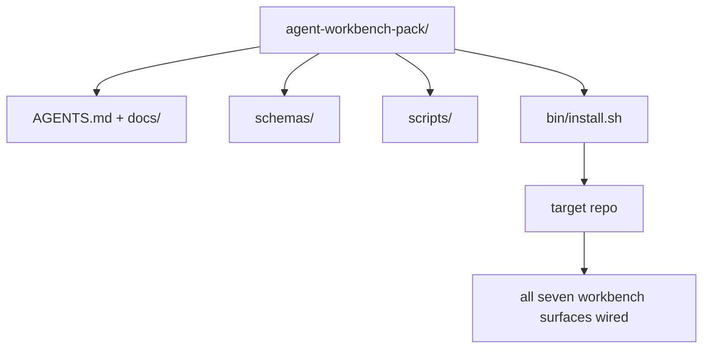

# Capstone: Chuyển một gói công việc đại lý tái sử dụng

> Bộ phim kết thúc với một gói bạn bỏ vào bất kỳ repo. 11 bài học của bề mặt nén vào một thư mục bạn có thể`cp -r`Và có một đại lý làm việc đáng tin cậy vào sáng hôm sau.

**Type:** Build
**Languages:** Python (stdlib)
**Prerequisites:** Phases 14 · 31 to 14 · 41
**Time:** ~75 minutes

## Mục tiêu học tập

- Bao gồm bảy bề mặt bàn làm việc vào một thư mục drop-in.
- Đặt các sơ đồ, kịch bản và mẫu để một repo mới có được một đường cơ sở được biết đến.
- Thêm một kịch bản cài đặt duy nhất để đặt gói idempotently.
- Hãy quyết định những gì ở trong hàng và những gì ở ngoài, bảo vệ vết cắt cho mỗi người.
- Hiển thị một thay đổi kho được hỗ trợ bởi đại lý với bằng chứng mà một nhà phê bình có thể tái tạo.

## Vấn đề

Một bàn làm việc sống trong một Google Doc, lịch sử trò chuyện, và ba kịch bản không nhớ được là một bàn làm việc được xây dựng lại mỗi quý.

Bạn sẽ kết thúc bài học này với `outputs/agent-workbench-pack/`được gửi trên đĩa và một `bin/install.sh`mà đưa nó vào bất kỳ repo mục tiêu nào.

## Khái niệm



### Layout gói

```
outputs/agent-workbench-pack/
├── AGENTS.md
├── docs/
│   ├── agent-rules.md
│   ├── reliability-policy.md
│   ├── handoff-protocol.md
│   └── reviewer-rubric.md
├── schemas/
│   ├── agent_state.schema.json
│   ├── task_board.schema.json
│   └── scope_contract.schema.json
├── scripts/
│   ├── init_agent.py
│   ├── run_with_feedback.py
│   ├── verify_agent.py
│   └── generate_handoff.py
├── bin/
│   └── install.sh
└── README.md
```

### Những gì ở trong, những gì ở ngoài

Trong:

- Các sơ đồ bề mặt, đó là hợp đồng.
- Bốn kịch bản trên là thời gian chạy.
- Bốn tài liệu đó là quy tắc và quy tắc.

Ra ngoài:

- Các nhiệm vụ cụ thể cho dự án, nhiệm vụ thuộc về bảng repo mục tiêu, không phải trong gói.
- Các nhà cung cấp SDK gọi.
- Nhóm sống bên cạnh nhòm nhòm của đội, không phải bên trong nó.

### Bộ cài đặt

Một đoạn ngắn `bin/install.sh`(hoặc `bin/install.py`):

1. Nhận không cài đặt trên một gói hiện có mà không cần `--force`- Tôi không biết.
2. Tác lại gói hàng vào repo mục tiêu.
3. Cáp lên CI nếu `.github/workflows/`tồn tại.
4. Bác in các bước tiếp theo: điền vào bảng, đặt lệnh chấp nhận, chạy kịch bản init.

### Phiên bản

Chuỗi này mang theo một `VERSION`file. schema bumps và thay đổi kịch bản đòi hỏi di chuyển bump chính. Doc-chỉ thay đổi bump váy. mục tiêu repo `agent_state.json`ghi lại phiên bản gói nào nó được khởi tạo chống lại.

```figure
wb-pack-install
```

## Hãy xây dựng nó

`code/main.py`lắp ráp gói thành `outputs/agent-workbench-pack/`bên cạnh bài học, được gieo trồng với các sơ đồ và kịch bản từ các bài học trước trong mini-track này và các tài liệu mà bạn đã viết.

Đi đi.

```
python3 code/main.py
```

Các kịch bản sao chép và pin các bề mặt, viết README, in cây gói, và thoát khỏi không.

## Các mô hình sản xuất trong tự nhiên

Một gói chỉ có giá trị nếu nó tồn tại trong những chiếc cành, những chiếc xe mới và một dòng nước không thân thiện.

**`VERSION` is the contract, not the marketing.**Những đốm lớn cần phải di chuyển trạng thái, những đốm nhỏ cần phải chạy lại kiểm tra, những đốm vá chỉ có tài liệu.`.workbench-version`vào repo mục tiêu trên mỗi lần cài đặt; `lint_pack.py`từ chối vận chuyển nếu khóa của mục tiêu không đồng ý với gói `VERSION`Đây là cách mà`npm`- `Cargo`, và`pyproject.toml`sống sót 10 năm trong churn; không có gì về các đại lý thay đổi các quy tắc.

**Single source for cross-tool distribution.**Nx tàu một `nx ai-setup`Điều đó đặt ra `AGENTS.md`- `CLAUDE.md`- `.cursor/rules/`- `.github/copilot-instructions.md`, và một máy chủ MCP từ một cấu hình duy nhất.`ln -s AGENTS.md CLAUDE.md`(vì vậy, một nguồn duy nhất của sự thật là một nguồn thông tin cho mỗi nhân viên lập trình.

**`uninstall.sh` that refuses on non-trivial state.**Tháo gỡ gói không được xóa `agent_state.json`- `task_board.json`, hoặc`outputs/`. Uninstaller loại bỏ các sơ đồ, kịch bản, tài liệu, và `AGENTS.md`(với `--keep-agents-md`(opt-out) và từ chối tiến hành nếu các tệp nhà nước có bất kỳ thay đổi không cam kết nào. Nhà nước thuộc về người dùng; gói không sở hữu nó.

**Skill-as-publishable. SkillKit-style distribution.**Các gói tàu như một kỹ năng SkillKit: `skillkit install agent-workbench-pack`Sản phẩm này được tạo ra bởi các nhà cung cấp AI, và nó được tạo ra bởi các nhà cung cấp AI.

## Sử dụng nó

Ba chỗ tàu đóng gói:

- **As a directory you drop into a repo.** `cp -r outputs/agent-workbench-pack /path/to/repo`- Tôi không biết.
- **As a public template repo.**Cánh và tùy chỉnh, với `VERSION`điều khiển drift.
- **As a SkillKit skill.**Được kết nối với sản phẩm của đại lý của bạn để chỉ một lệnh đặt nó xuống.

Bác là công thức, mỗi lần cài đặt là một phần.

## Chuyển nó

`outputs/skill-workbench-pack.md`tạo ra một gói phù hợp với dự án: các quy tắc được sắc nét theo lịch sử của nhóm, phạm vi của các cầu phù hợp với repo, kích thước rubric được mở rộng bằng một mục cụ thể về lĩnh vực.

## Các bài tập

1. Hãy quyết định loại tài liệu thứ năm nào xứng đáng được thăng chức vào nhóm giáo phái.
2. Tái viết cài đặt thành Python với một `--dry-run`So sánh công nghệ với Bash.
3. Thêm một `bin/uninstall.sh`Điều gì được coi là không tầm thường?
4. Thêm một `lint_pack.py``VERSION`Đưa nó vào CI để lấy lại cho nhóm.
5. Tác giả của sổ chạy di chuyển từ một bàn làm việc quét tay đến gói này.

## Thực hành nghề nghiệp: chứng minh một thay đổi kho lưu trữ

Demos đóng gói chứng minh rằng bộ sưu tập chạy và tạo ra các tệp. Nó không chứng minh rằng đại lý của bạn có thể hoàn thành một nhiệm vụ mới, rằng các kiểm tra được tạo chứng minh nhiệm vụ đó, hoặc rằng một hệ thống được triển khai hoạt động.

Chọn một nhiệm vụ thực tế nhỏ trong kho lưu trữ mà bạn sở hữu hoặc có quyền thay đổi. Sử dụng một nhân viên mã hóa mà bạn đã có quyền truy cập. Một sửa lỗi, một tính năng giới hạn hoặc một cải tiến hoạt động là đủ; cài đặt nhiều nhân viên không phải là một phần của bài tập.

Dự báo một phiên làm việc riêng ngoài phòng thí nghiệm đóng gói.`learning-artifacts/`thư mục: lưu trữ mẫu đã đăng ký và đóng gói như tài liệu tham chiếu.

### 1. Quá trình nhiệm vụ và chọn tự trị

Sử dụng khung nhiệm vụ từ bài học 43 và kế hoạch bằng chứng từ bài học 44. Lưu ý sửa đổi bắt đầu, mục tiêu có thể quan sát được, không mục tiêu, con đường được phép và bằng chứng chấp nhận. Xác định người dùng hoặc nhà điều hành thực sự cần hành vi.

Chọn chế độ làm việc: bước hướng dẫn, thực hiện kiểm soát, hoặc chạy tự động có giới hạn. Giải thích lý do tại sao sự không chắc chắn, hậu quả và khả năng đảo ngược biện minh cho điều đó. Một máy sửa chữa địa phương nhỏ có thể cần ít các điểm kiểm soát hơn là một sự thay đổi để kiểm soát truy cập.

Đặt ngân sách thời gian tường và một token hoặc giới hạn chi phí nếu đại lý phơi bày một. ghi lại các phép đo không sẵn có một cách trung thực. Định nghĩa điều kiện dừng cho thất bại lặp đi lặp lại, quyền mới, sự kiệt sức ngân sách, hoặc một quyết định hợp đồng chưa được giải quyết; tên ai có thể giải quyết nó.

### 2. Chuẩn bị môi trường hữu ích nhỏ nhất

Nhận lại các lệnh thực hiện, người gọi, kiểm tra và hướng dẫn địa phương liên quan. ghi lại lý do tại sao mỗi nguồn thuộc về ngữ cảnh và bằng chứng hiện tại nào sẽ thay thế một ghi chú lỗi thời. Đừng tải toàn bộ kho dự trữ theo mặc định.

Làm một lựa chọn rõ ràng cho mỗi phần mở rộng liên quan: một kỹ năng cung cấp một quy trình lặp lại; một công cụ MCP cung cấp quyền truy cập; một cái móng chạy kiểm tra xác định; một plugin gói tính năng. Giữ phần mở rộng chỉ khi nhiệm vụ cần nó, với ít nhất các quyền để nó hoạt động.

Viết lại bối cảnh hoặc chi phí bảo trì của một bổ sung đề xuất mà bạn từ chối. Kiểm tra lại một bộ nhớ hoặc hướng dẫn cũ, sau đó rút hay thay thế nó trong thiết lập thuộc sở hữu của người học khi các bằng chứng hỗ trợ quyết định đó.

### 3. Chụp đường cơ sở và thực hiện

Trước khi chỉnh sửa, chạy kiểm tra hiện có gần nhất và chứng minh trạng thái hiện tại của hành vi yêu cầu. Giữ lệnh, sửa đổi, kết quả và vị trí bằng chứng. Một tính năng chưa tồn tại vẫn có đường cơ sở: ghi lại phản ứng được quan sát hoặc hoạt động không được hỗ trợ.

Hãy để đại lý thực hiện bên trong hợp đồng. Giữ nhật ký can thiệp với lý do cho mỗi sửa đổi, thay đổi quyền hoặc sửa đổi kế hoạch.

### 4. Thử thách bằng chứng

Chọn bằng chứng quan sát bề mặt thay đổi. Đối với UI, xây dựng lại và kiểm tra hành trình được phục vụ ở độ rộng phù hợp. Đối với API, kiểm tra yêu cầu và phản ứng theo chuỗi. Đối với CLI, chạy lệnh xây dựng và kiểm tra mã thoát và đầu ra của nó. Chọn các kiểm tra mà nhiệm vụ của bạn cần và giải thích giới hạn của chúng.

Viết kết quả dự kiến từ hợp đồng nhiệm vụ độc lập với việc thực hiện của đại lý. Trong bản sao dùng một lần, nhập một kết quả sai lầm cụ thể, chẳng hạn như chấp nhận giá trị không hợp lệ hoặc bỏ trường phản hồi yêu cầu.

Nếu nó vẫn xanh, hãy tăng cường khẳng định hoặc quan sát trước khi tin tưởng nó. Khôi phục thực hiện đúng và chạy lại thành công. Giữ cả hai biên bản. Một lỗi tổng hợp hoặc cài đặt thử nghiệm bị hỏng không được tính là phát hiện sự lùi.

Xem xét sự khác biệt cuối cùng, bao gồm các thử nghiệm thay đổi, so với mục tiêu ban đầu và các con đường được cho phép. Hãy yêu cầu một đối tác hoặc một phiên kiểm tra riêng để thách thức bằng chứng yếu nhất mà không chỉnh sửa thực hiện. Bạn vẫn sở hữu phán quyết cuối cùng; sự đồng ý của một đại lý khác không phải là bằng chứng thực hiện.

### 5. Hoạt động và phục hồi các bài tập

Đưa ra các tác phẩm thay đổi trong môi trường địa phương hoặc dàn dựng dùng một lần.`local`- `staging`, hoặc`live`Một buổi tập luyện địa phương hỗ trợ một tuyên bố địa phương; việc triển khai sản xuất không cần thiết cho bài tập này.

Chọn một tín hiệu thất bại liên quan đến nhiệm vụ, một ngưỡng, một cửa sổ quan sát và một chủ sở hữu. Giải thích phản ứng khi ngưỡng đó được vượt qua. Tạo tín hiệu an toàn trong buổi tập và giữ lại nhật ký, métric hoặc phản ứng quan sát.

Làm việc để làm việc của một bộ phận có thể được biết đến và kiểm tra rằng hành vi trước đó đã được khôi phục. Hãy xem xét dữ liệu liên tục khi có thể; thay thế một bộ phận nhị phân một mình có thể không đảo ngược thay đổi dữ liệu.

### 6. Cải thiện lần chạy tiếp theo và giao nó

So sánh kết quả với dòng cơ bản, bao gồm thời gian qua, dữ liệu sử dụng có sẵn và sự can thiệp của con người.

Tăng cường một sự sửa đổi được quan sát vào một bài kiểm tra, một giới hạn quyền nhỏ hơn, một tự động hóa hoặc một ví dụ rõ ràng hơn bằng cách sử dụng bài học 46. Tái lại kiểm tra bị ảnh hưởng. Tắt các đột biến tạm thời và rời khỏi chi nhánh cuối cùng, thay đổi các tệp, mở rủi ro và hành động tiếp theo rõ ràng cho phiên tiếp theo.

### Đường kiểm tra thủ công

Hãy yêu cầu người xem xét kiểm tra hồ sơ bằng chứng và tái tạo ít nhất kiểm tra chấp nhận yếu nhất.`demonstrated`- `needs revision`, hoặc`unverified`cho mỗi hàng, với một dấu chỉ bằng chứng và một lý do. Các trường được lấp đầy và các bản ghi gói không thay thế cho các quan sát này.

| Dimension | Evidence the reviewer should challenge |
|---|---|
| Task and autonomy | Starting behavior, bounded goal, justified permissions, budget, and a usable stop rule |
| Context and environment | Relevant sources, justified tool access, and a rechecked retirement decision |
| Verification | Actual before/after behavior and a deliberate incorrect result that the same check rejects |
| Review and operation | Inspected diff, independent challenge, labeled runtime observation, and rehearsed recovery |
| Iteration and handoff | One verified improvement, honest limits, clean final state, and a reproducible next action |

Hãy quyết định`needs revision`kết quả trước khi tuyên bố hoàn thành nhiệm vụ.`unverified`và hạn chế yêu cầu phù hợp. Cổ phiếu chứng minh phán quyết kỹ thuật của bạn về một nhiệm vụ giới hạn; nó không phải là một đảm bảo tuyển dụng hoặc triển khai.

## Các đồ tạo tác được vận chuyển

Giữ gói có thể sử dụng lại và bản sao hoàn chỉnh của [career-agent-evidence.md](https://github.com/rohitg00/ai-engineering-from-scratch/blob/main/phases/14-agent-engineering/42-agent-workbench-capstone/outputs/career-agent-evidence.md). Chơn mẫu kết nối khung nhiệm vụ, kế hoạch thực hiện, biên nhận thời gian chạy, xem xét, thử nghiệm phục hồi và chuyển giao vào một nghiên cứu trường hợp có thể xem xét.

## Các điều khoản chính

| Term | What people say | What it actually means |
|------|----------------|------------------------|
| Workbench pack | "The starter kit" | A versioned directory carrying all seven surfaces |
| Installer | "Setup script" | `bin/install.sh` that lays the pack down idempotently |
| Pack version | "VERSION" | Major bumps for schema/script changes, patch for doc-only |
| Drop-in pack | "cp -r and go" | Pack works without per-repo customization on day one |
| Forkable template | "GitHub template" | Public repo that GitHub's "Use this template" can clone from |

## Đọc thêm

- Các giai đoạn 14 · 31 đến 14 · 41  mỗi bề mặt gói này
- [SkillKit](https://github.com/rohitg00/skillkit) cài đặt kỹ năng này trên 32 đại lý AI
- [Nx Blog, Teach Your AI Agent How to Work in a Monorepo](https://nx.dev/blog/nx-ai-agent-skills) Máy phát điện nguồn duy nhất trên sáu công cụ
- [agents.md — the open spec](https://agents.md/) điều gì router của gói của bạn phải thực hiện
- [HKUDS/OpenHarness](https://github.com/HKUDS/OpenHarness) Thực hiện tham chiếu của một gói tương đương
- [Augment Code, A good AGENTS.md is a model upgrade](https://www.augmentcode.com/blog/how-to-write-good-agents-dot-md-files) gói tài liệu thanh chất lượng
- [Anthropic, Effective harnesses for long-running agents](https://www.anthropic.com/engineering/effective-harnesses-for-long-running-agents)
- [Anthropic, Harness design for long-running application development](https://www.anthropic.com/engineering/harness-design-long-running-apps)
- Giai đoạn 14 · 30  Phát triển chất liệu dựa trên đánh giá tiêu thụ cổng xác minh của gói
- Giai đoạn 14 · 41  điểm tham chiếu trước/ sau khi gói này cải thiện
