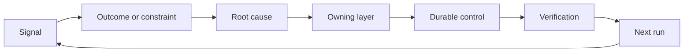

# Xây dựng một Ratchet phản hồi với sở hữu và nghỉ hưu

> Việc vận chuyển đóng một vòng xây dựng và mở vòng học tập bằng chứng phải thay đổi hệ thống hoặc nó sẽ trở thành điện đo không ai sở hữu.

**Type:** Learn + Build
**Languages:** Python (stdlib)
**Prerequisites:** Phase 14 lessons 46 and 53
**Time:** ~75 minutes

## Mục tiêu học tập

- Chuyển đổi các sự cố, đánh giá, hành vi của người dùng và sửa chữa thành hành động của riêng bạn.
- Định hướng mỗi tín hiệu đến bối cảnh, đánh giá, chính sách, thời gian chạy hoặc backlog.
- Cấp ưu tiên tái phát theo mức độ nghiêm trọng và tần suất.
- Đưa cho mọi người kiểm soát một điều kiện nghỉ hưu.
- Thông báo quyết định giao hàng với bằng chứng, thỏa thuận và chủ sở hữu có trách nhiệm.

## Phản hồi là cơ sở hạ tầng

Một nhóm có thể thu thập các dấu vết, đánh giá, vé hỗ trợ và nhật ký sự cố mà không cần học hỏi từ bất kỳ một trong số chúng.

Chuyện này là:

1. quan sát một tín hiệu cụ thể;
2. kết nối nó với một kết quả, hạn chế hoặc giả định;
3. xác định lớp hệ thống sớm nhất có nguyên nhân;
4. tạo ra một sự thay đổi giới hạn;
5. xác minh rằng tái phát trở nên ít có khả năng;
6. xem xét xem liệu kiểm soát có nên tiếp tục hay không.

## Con đường đến tầng sở hữu

| Signal | Destination |
|---|---|
| False positive, regression, wrong result | Evaluation or test |
| Missing context, duplicate work, stale fact | Context source or retrieval route |
| Unsafe action or authority gap | Policy or permission boundary |
| Timeout, retry storm, unavailable dependency | Runtime control |
| New product need or unresolved tradeoff | Shaped backlog item |

Xác định nguyên nhân ở lớp hiệu quả sớm nhất. Đừng thêm một đoạn văn nhanh hơn khi thử nghiệm hoặc quyền có thể làm cho sự thất bại không thể xảy ra.



## Quyền sở hữu là một phần của sự kiểm soát

Mỗi hành động cần:

- một chủ sở hữu;
- ưu tiên dựa trên hậu quả và tái phát;
- Các tác phẩm được thay đổi;
- Việc xác minh thay đổi;
- một cửa sổ xem xét hoặc hết hạn;
- Điều kiện nghỉ hưu.

Một cải tiến không có là một quan sát với định dạng tốt hơn.

## Tắt kiểm soát cố định

Các hệ thống phản hồi tích lũy chính sách. Chính sách đó có thể trở nên mâu thuẫn và tốn kém.

- thay đổi kiến trúc hoặc dòng công việc;
- Một tính không biến cấp thấp thay thế cho một hướng dẫn cấp cao hơn;
- lỗi được bảo vệ không xuất hiện trên cửa sổ được chọn;
- kiểm soát ngăn chặn công việc hợp pháp thường xuyên hơn là ngăn chặn thiệt hại.

Tái hưu cũng cần bằng chứng. Đừng xóa một kiểm soát vì nó cảm thấy cũ.

## Kết nối xây dựng và phản hồi của nhân viên lập trình

Cùng một con đòn phục vụ cả hai đường ray:

- Bằng chứng sản phẩm thay đổi khung kết quả, giả định, mảnh hoặc kế hoạch đo lường.
- Các sửa đổi của bộ phận mã hóa thay đổi các thử nghiệm, ngữ cảnh, phạm vi, tự động hóa hoặc giao hàng.
- Các sự cố có thể thay đổi cả giới hạn sản phẩm và bàn làm việc của đại lý.

Đó là lý do tại sao việc định hình xây dựng không phải là một giai đoạn kết thúc trước khi mã hóa. Nó tiếp tục thông qua mọi thay đổi được chấp nhận.

## Hãy xây dựng nó

Phòng thí nghiệm phân loại tín hiệu, tạo ra các hành động ratchet, ưu tiên chúng, và viết `outputs/feedback-backlog.json`- Tôi không biết.

```bash
python3 code/main.py
python3 -m unittest discover code/tests -v
```

Thêm một tín hiệu thời gian chạy và xác nhận rằng nó hướng đến thời gian chạy thay vì sự chậm trễ chung.

## Phòng thí nghiệm thực hành: Hãy tự quyết định sau khi gặp phải một sự thất bại

Chọn một dòng công việc từ dự án danh mục đầu tư của tuyến đường nghề nghiệp của bạn.[career delivery template](https://github.com/rohitg00/ai-engineering-from-scratch/blob/main/phases/14-agent-engineering/54-build-the-feedback-ratchet/outputs/career-delivery-evidence.md)- Tôi không biết.

Phòng thí nghiệm Python tạo ra các hành động backlog ví dụ. Nó không quan sát người dùng, đo lường can thiệp, hoặc chứng minh sự sẵn sàng nghề nghiệp.

### 1. Hãy xác định chuyện gì đã xảy ra

Tải lại người dùng, nhiệm vụ, dòng công việc hiện tại và kết quả bạn muốn cải thiện. Kết nối một quan sát được đồng ý, một bản ghi hỗ trợ đã sửa đổi hoặc một dấu vết nhiệm vụ có thể tái tạo. Chia tách những gì bạn quan sát từ những gì người khác báo cáo và những gì bạn suy luận.

Hãy tìm ra một sự thất bại: một giả định thất bại, một kết quả không thể sử dụng, một chi phí bất ngờ, hoặc một sự chậm trễ.

Nếu bạn không thể làm việc với người dùng, hãy chạy mô phỏng được dán nhãn rõ ràng với một bản đồng nghiệp hoặc một kịch bản được nêu.

### 2. Hãy tiến bộ trong quyền hạn của bạn

Hãy liệt kê những điều chưa được biết và chọn hành động có thể đảo ngược giá rẻ nhất có thể giải quyết những điều có thể xảy ra, nêu ra những gì bạn có thể quyết định, những gì bị giới hạn bởi một thỏa thuận hiện có, và những gì cần được ủy quyền trước khi thực hiện.

Ví dụ, bạn có thể chuẩn bị một bản sao offline được chỉnh sửa trong khi chờ đợi cho phép sử dụng dữ liệu khách hàng.

### 3. So sánh các lựa chọn và thông báo cho chủ sở hữu quyết định

Viết một bản tóm tắt quyết định ngắn cho người không cần chi tiết về việc thực hiện.

- vấn đề người dùng và bằng chứng đã thay đổi kế hoạch;
- ít nhất hai lựa chọn, bao gồm cả một tùy chọn thủ công rẻ hơn hoặc không xây dựng khi đáng tin cậy;
- chất lượng, thiết kế tương tác, nỗ lực, chi phí vận hành và rủi ro;
- đề xuất của bạn, sự không chắc chắn còn lại và quyết định cần thiết;
- Chủ sở hữu quyết định, các bên liên quan bị ảnh hưởng và ngày quyết định cần thiết.

Hãy yêu cầu một đồng nghiệp đại diện cho một bên liên quan bị ảnh hưởng và thách thức một sự thỏa hiệp. ghi lại sự phản đối và cách nó thay đổi, hoặc không thay đổi, khuyến nghị của bạn. Đánh dấu phản hồi đóng vai trò như mô phỏng; nó không thể đứng trong sự đồng thuận của một bên liên quan thực tế.

### 4. Làm thí nghiệm giới hạn

Chọn nguyên mẫu, thí điểm hoặc công việc sản xuất dựa trên câu hỏi bạn cần trả lời. Định nghĩa khán giả, dữ liệu, thẩm quyền, thời gian, quay lại và điều kiện để tiếp tục, thay đổi hoặc dừng trước khi thu thập kết quả.

Đi qua các tương tác từ điểm khởi đầu của người dùng đến một nhiệm vụ hoàn thành. Bao gồm một trường hợp xuất dữ liệu không chính xác hoặc thiếu dữ liệu. Quan sát xem người dùng có thể nhận thấy sự cố, sửa chữa nó và phục hồi mà không cần sự giúp đỡ ẩn của bạn.

Đếm thời gian đánh giá và sửa chữa của con người như là một phần của dòng công việc.

### 5. So sánh kết quả và kinh tế

Lập lại một đường cơ sở và theo dõi bằng cách sử dụng cùng một định nghĩa số liệu, nhóm nhiệm vụ, phương pháp thu thập và cửa sổ quan sát tương đương. Giữ số lượng mẫu, loại trừ và liên kết bằng chứng bên cạnh các con số. Nếu những điều kiện đó thay đổi, hãy giải thích lý do tại sao so sánh là hạn chế.

Bao gồm một kết quả của người dùng, một màn chắn chất lượng hoặc an toàn, và toàn bộ nỗ lực đánh giá của con người. ghi lại kết quả ngay cả khi nó không đạt được mục tiêu. Các mẫu nhỏ hoặc mô phỏng hỗ trợ một tuyên bố học tập hạn chế, chứ không phải một tuyên bố có tác động kinh doanh được chứng minh.

Đếm chi phí cho mỗi nhiệm vụ hoàn thành thành công bằng cách sử dụng các cuộc gọi mô hình, thử nghiệm lại, dịch vụ hỗ trợ và đánh giá của con người. Cung cấp giả định về tỷ lệ lao động và tách sử dụng đo lường khỏi ước tính. So sánh chi phí đó với lựa chọn thay thế thủ công hoặc giả định giá trị đằng sau dự án.

Sử dụng các hiện có [FinOps for LLMs lesson](https://aiengineeringfromscratch.com/lesson?path=phases/17-infrastructure-and-production/27-finops-llms)Để làm sâu sắc hơn về quy mô phân bổ và kinh tế đơn vị. Thay đổi mô hình chỉ là một phản ứng có thể; thu hẹp dòng công việc hoặc giữ một bước thủ công có thể là quyết định sản phẩm tốt hơn.

### 6. Bắt vòng

Sử dụng các tiêu chí được tuyên bố trước để khuyến nghị tiếp tục, thay đổi hoặc dừng. Nếu bằng chứng không kết luận, hãy nêu tên quan sát thiếu và thử nghiệm hạn chế tiếp theo.

Chọn một cải tiến cho quá trình giao hàng: một khung nhiệm vụ rõ ràng hơn, thông qua người dùng sớm hơn, danh sách kiểm tra đánh giá tốt hơn, giao dịch đại lý nhỏ hơn hoặc trường hợp đánh giá chặt chẽ hơn. Đưa tên chủ sở hữu và ngày đánh giá.

Khi xem xét, hãy quyết định liệu bạn có nên giữ lại, sửa đổi hay nghỉ hưu cải tiến đó hay không.

## Các đồ tạo tác được vận chuyển

Được rồi .[career-delivery-evidence.md](https://github.com/rohitg00/ai-engineering-from-scratch/blob/main/phases/14-agent-engineering/54-build-the-feedback-ratchet/outputs/career-delivery-evidence.md)Trong dự án của riêng bạn và hoàn thành nó bằng các liên kết bằng chứng. Giữ mẫu đã đăng ký có thể sử dụng lại. Bao gồm thông tin ngắn về quyết định, thông qua tương tác, so sánh đo lường và theo dõi sở hữu với các sản phẩm danh mục đầu tư nghề nghiệp của bạn.

## Hãy kiểm tra

Sử dụng rubric chấp nhận thủ công này với một đồng nghiệp.**met**- **needs work**, hoặc**not observed**Một trường đầy không chứng minh rằng phán quyết là hợp lý.

| Check | Evidence that meets it |
|---|---|
| Workflow grounded | A traceable observation supports the problem; reported claims, inference, and simulation are labeled. |
| Authority respected | Reversible next work is clear, and any restricted action waits for its actual decision owner. |
| Tradeoffs communicated | Credible alternatives, a stakeholder objection, a recommendation, and an explicit decision request are recorded. |
| Interaction tested | The walkthrough covers success, failure, recovery, and human review effort. |
| Outcome compared | Baseline and follow-up definitions align; samples, guardrails, costs, and comparison limits are visible. |
| Setback owned | The evidence changes a continue/change/stop decision and an accountable next action. |
| Process improved | One workflow improvement has an owner, review date, and an evidence-based keep/revise/retire decision. |

Hành vi người dùng thực tế không được quan sát vẫn là khoảng trống ngay cả khi mỗi bước mô phỏng được thực hiện.

## Các bài tập

1. Hãy biến một vụ tai nạn và một khiếu nại của người dùng thành hành động.
2. Hãy cho tên lớp sớm nhất có thể ngăn chặn mỗi lần tái phát.
3. Thêm lệnh xác minh hoặc quan sát vào đầu ra phòng thí nghiệm.
4. Định nghĩa điều kiện nghỉ hưu cho quy tắc chính sách.
5. Theo dõi một đã chấp nhận sửa đổi trở lại khung nhiệm vụ tiếp theo.

## Đọc thêm

- [Basili, Caldiera, and Rombach, The Goal Question Metric Approach](https://www.cs.toronto.edu/~sme/CSC444F/handouts/GQM-paper.pdf), cho việc học tập tổ chức thông qua đo lường hướng đến mục tiêu.
- [Fagerholm et al., Building Blocks for Continuous Experimentation](https://doi.org/10.1145/2601248.2601276), cho vòng lặp kỹ thuật và tổ chức kết nối bằng chứng với phát triển sản phẩm tiếp tục.
- [Nuseibeh and Easterbrook, Requirements Engineering: A Roadmap](https://www.cs.toronto.edu/~sme/papers/2000/ICSE2000.pdf), để xử lý các yêu cầu như phát triển trong chu kỳ đời sống của hệ thống.

## Những gì bạn giữ

Cứ giữ lại`outputs/feedback-backlog.json`Như một ví dụ về đường dẫn và bằng chứng về việc hoàn thành sự nghiệp của bạn như một hồ sơ về quyết định của riêng bạn.
