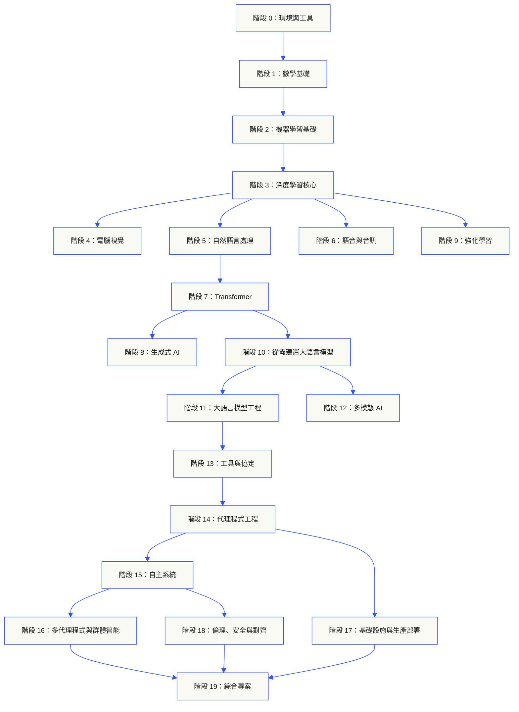
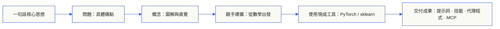

<p align="center"><sub>AI 輔助中文譯文，以<a href="../../README.md">英文原文為準</a> · <a href="https://aiengineeringfromscratch.com">aiengineeringfromscratch.com</a></sub></p>

<p align="center">
  <picture>
    <source media="(prefers-color-scheme: dark)" srcset="../../assets/readme/header-dark.svg">
    
  </picture>
</p>

實作模型內部機制、檢索管線和代理執行環境。測試它們，分析故障，並保留程式碼和評估結果。

**[開始學習](https://aiengineeringfromscratch.com/lesson?path=phases/00-setup-and-tooling/01-dev-environment)** · **[選擇學習路徑](#learning-routes)** · **[試做實驗](#interactive-lab)** · **[建構專案](#project-challenges)** · **[瀏覽課程目錄](#contents)**

免費、開放原始碼、MIT 授權。你可以在網站學習、使用程式設計代理輔助學習，或在本機執行程式碼。

> 523 堂課. 20 個階段. Python, TypeScript, Rust, Julia.

<p align="center">
  <a href="../../LICENSE"></a>
  <a href="../../ROADMAP.md"></a>
  <a href="#contents"></a>
  <a href="https://github.com/rohitg00/ai-engineering-from-scratch/stargazers"></a>
  <a href="https://aiengineeringfromscratch.com"></a>
</p>

<details>
<summary>選擇閱讀語言</summary>

<p align="center">
  <a href="../../README.md">🇬🇧 English</a> · <a href="../../i18n/zh/README.md">🇨🇳 简体中文</a> · <a href="../../i18n/zh-TW/README.md">🇹🇼 繁體中文（台灣）</a> · <a href="../../i18n/ja/README.md">🇯🇵 日本語</a> · <a href="../../i18n/ko/README.md">🇰🇷 한국어</a> · <a href="../../i18n/pt/README.md">🇵🇹 Português</a> · <a href="../../i18n/pt-BR/README.md">🇧🇷 Português (Brasil)</a> · <a href="../../i18n/es/README.md">🇪🇸 Español</a> · <a href="../../i18n/de/README.md">🇩🇪 Deutsch</a> · <a href="../../i18n/fr/README.md">🇫🇷 Français</a> · <a href="../../i18n/it/README.md">🇮🇹 Italiano</a> · <a href="../../i18n/nl/README.md">🇳🇱 Nederlands</a> · <a href="../../i18n/pl/README.md">🇵🇱 Polski</a> · <a href="../../i18n/cs/README.md">🇨🇿 Čeština</a> · <a href="../../i18n/ro/README.md">🇷🇴 Română</a> · <a href="../../i18n/hu/README.md">🇭🇺 Magyar</a> · <a href="../../i18n/el/README.md">🇬🇷 Ελληνικά</a> · <a href="../../i18n/sv/README.md">🇸🇪 Svenska</a> · <a href="../../i18n/da/README.md">🇩🇰 Dansk</a> · <a href="../../i18n/no/README.md">🇳🇴 Norsk</a> · <a href="../../i18n/fi/README.md">🇫🇮 Suomi</a> · <a href="../../i18n/ru/README.md">🇷🇺 Русский</a> · <a href="../../i18n/uk/README.md">🇺🇦 Українська</a> · <a href="../../i18n/tr/README.md">🇹🇷 Türkçe</a> · <a href="../../i18n/he/README.md">🇮🇱 עברית</a> · <a href="../../i18n/ar/README.md">🇸🇦 العربية</a> · <a href="../../i18n/fa/README.md">🇮🇷 فارسی</a> · <a href="../../i18n/hi/README.md">🇮🇳 हिन्दी</a> · <a href="../../i18n/bn/README.md">🇧🇩 বাংলা</a> · <a href="../../i18n/ur/README.md">🇵🇰 اردو</a> · <a href="../../i18n/th/README.md">🇹🇭 ไทย</a> · <a href="../../i18n/vi/README.md">🇻🇳 Tiếng Việt</a> · <a href="../../i18n/id/README.md">🇮🇩 Bahasa Indonesia</a> · <a href="../../i18n/tl/README.md">🇵🇭 Tagalog</a>
</p>

</details>

### 贊助者

<p align="center">
  <a href="https://serpapi.com/ai-engineering-from-scratch"><picture><source media="(min-width: 768px)" srcset="../../assets/sponsors/serpapi-banner-compact.png" width="48%"></picture></a>
  <a href="https://nitrostack.ai/referral/aiengineeringfromscratch"><picture><source media="(min-width: 768px)" srcset="../../assets/sponsors/nitrostack-banner-equal.png" width="48%"></picture></a>
</p>

<p align="center">
  <sub><span>你的支持讓每堂課都能保持免費和開源。</span> <a href="#supporters">查看所有支持者</a> · <a href="../../SPONSORS.md">成為贊助者</a></sub>
</p>

<a id="see-what-you-will-build-and-keep"></a>
<a id="learning-routes"></a>

## 學習路線

| 路線 | 起始課程 |
|---|---|
| 模型基礎 | [環境設定與工具](https://aiengineeringfromscratch.com/lesson?path=phases/00-setup-and-tooling/01-dev-environment) |
| LLM 系統 | [提示工程](https://aiengineeringfromscratch.com/lesson?path=phases/11-llm-engineering/01-prompt-engineering) |
| 代理與交付 | [代理迴圈](https://aiengineeringfromscratch.com/lesson?path=phases/14-agent-engineering/01-the-agent-loop) |

[比較職涯路徑](https://aiengineeringfromscratch.com/learning-paths.html) · [先備知識與學習時間](#study-guide)

<a id="interactive-lab"></a>

### 梯度下降

20 個起點在二次損失函數上執行梯度下降。圖中顯示每次更新後的位置和平均損失。

<p align="center">
  <a href="https://aiengineeringfromscratch.com/lesson?path=phases/01-math-foundations/08-optimization#loss-landscape-visualization">
    <picture>
      <source media="(max-width: 600px) and (prefers-color-scheme: dark) and (prefers-reduced-motion: reduce)" srcset="../../assets/readme/101-gradient-mobile-dark.png">
      <source media="(max-width: 600px) and (prefers-reduced-motion: reduce)" srcset="../../assets/readme/101-gradient-mobile-light.png">
      <source media="(prefers-color-scheme: dark) and (prefers-reduced-motion: reduce)" srcset="../../assets/readme/101-gradient-dark.png">
      <source media="(prefers-reduced-motion: reduce)" srcset="../../assets/readme/101-gradient-light.png">
      <source media="(max-width: 600px) and (prefers-color-scheme: dark)" srcset="../../assets/readme/101-gradient-mobile-dark.gif">
      <source media="(max-width: 600px)" srcset="../../assets/readme/101-gradient-mobile-light.gif">
      <source media="(prefers-color-scheme: dark)" srcset="../../assets/readme/101-gradient-dark.gif">
      
    </picture>
  </a>
</p>

[在課程中調整學習率](https://aiengineeringfromscratch.com/lesson?path=phases/01-math-foundations/08-optimization#loss-landscape-visualization) · [透過程式碼比較 GD、動量和 Adam](../../phases/01-math-foundations/08-optimization/code/optimizers.py)

<a id="project-challenges"></a>

### 專案

三個專案均提供分階段的起始程式碼、參考實作和本機評分器。完成[環境設定](#local-setup)後，從儲存庫根目錄執行命令。實作各階段前，起始程式碼無法通過檢查。

<details>
<summary><strong>01 · 檢索評估實驗室</strong> · Python · 排名指標與退化檢查</summary>

候選系統的平均 NDCG 提高，但某個查詢最相關的證據排名下降。建構逐查詢比較，報告這種退化，並能使發布檢查失敗。

使用 Python 3.10+。複習[RAG](../../phases/11-llm-engineering/06-rag/docs/en.md)和[模型評估](../../phases/02-ml-fundamentals/09-model-evaluation/docs/en.md)。依序實作排名驗證、精確率與召回率、考量排名位置的指標，再比較系統。

```bash
python3 scripts/project_test.py retrieval-evaluation-lab \
  --init learning-artifacts/retrieval-evaluation-lab
python3 scripts/project_test.py retrieval-evaluation-lab \
  --stage 1 --path learning-artifacts/retrieval-evaluation-lab --strict
python3 scripts/project_test.py retrieval-evaluation-lab \
  --all --path learning-artifacts/retrieval-evaluation-lab --strict
```

**保留：**可重現的比較結果，包括逐查詢差值和評分使用的相關性標註。指標反映的是這些標註，並不能證明答案正確。

[開始專案](https://aiengineeringfromscratch.com/project.html?id=retrieval-evaluation-lab) · [查看參考實作](../../projects/retrieval-evaluation-lab/solution/) · [使用自己的輸入執行](../../projects/retrieval-evaluation-lab/README.md#run-with-your-own-inputs)

</details>

<details>
<summary><strong>02 · 代理追蹤除錯器</strong> · TypeScript · 追蹤解析與耗時分析</summary>

提供的追蹤仍耗時 100 ms，但總 token 用量增加了 200，且一個跨度開始失敗。將重疊的子跨度工作與父跨度自身的執行時間分開，再產生揭示變化的報告。

使用 Node.js 22.18+，並用 Python 3 執行評分器。依序實作 JSONL 解析、父子關係驗證、區間計算和可檢查的時間軸。

```bash
python3 scripts/project_test.py agent-trace-debugger \
  --init learning-artifacts/agent-trace-debugger
python3 scripts/project_test.py agent-trace-debugger \
  --stage 1 --path learning-artifacts/agent-trace-debugger --strict
python3 scripts/project_test.py agent-trace-debugger \
  --all --path learning-artifacts/agent-trace-debugger --strict
```

**保留：**輸入追蹤、HTML 時間軸和 JSON 退化報告。每個跨度只記錄自身獨占的 token 用量，避免重複計算父子跨度的用量。

[開始專案](https://aiengineeringfromscratch.com/project.html?id=agent-trace-debugger) · [查看參考實作](../../projects/agent-trace-debugger/solution/) · [互動探索耗時](https://aiengineeringfromscratch.com/project.html?id=agent-trace-debugger&stage=03-timing)

</details>

<details>
<summary><strong>03 · 工具呼叫防火牆</strong> · Rust · 角色檢查與核准憑據</summary>

寫入內容在審查後發生變化，或者同一核准被重放。驗證呼叫封裝，檢查呼叫端角色和路徑，再消耗綁定到確切請求與內容的核准。

使用 Rust 和 Python 3.10+。複習[工具結構描述設計](../../phases/13-tools-and-protocols/05-tool-schema-design/docs/en.md)和[安全邊界](../../phases/17-infrastructure-and-production/25-security-secrets-audit/docs/en.md)。呼叫端應用程式提供身分，模型只提出操作建議。

```bash
python3 scripts/project_test.py tool-call-firewall \
  --init learning-artifacts/tool-call-firewall
python3 scripts/project_test.py tool-call-firewall \
  --stage 1 --path learning-artifacts/tool-call-firewall --strict
python3 scripts/project_test.py tool-call-firewall \
  --all --path learning-artifacts/tool-call-firewall --strict
```

**保留：**顯示請求操作和政策決策的稽核憑據。核准只能在一次呼叫中使用一次；本專案不提供持久授權或作業系統沙盒。

[開始專案](https://aiengineeringfromscratch.com/project.html?id=tool-call-firewall) · [查看參考實作](../../projects/tool-call-firewall/solution/) · [探索核准邊界](https://aiengineeringfromscratch.com/project.html?id=tool-call-firewall&stage=03-consume-a-request-bound-approval-once)

</details>

[瀏覽全部專案](https://aiengineeringfromscratch.com/projects.html) · [職涯實作指南](../../learning-paths/CAREER-PRACTICE.md)

## 選擇學習方式

### 在網站上學習

在 [課程網站](https://aiengineeringfromscratch.com)打開任意已完成課程，或從[課程目錄](#contents)展開一個階段。不需要安裝，也不需要複製。

### 使用 AI 導師

如果已安裝 Node.js、`npx` 和支援 Agent Skills 的程式開發代理程式，就能讓代理程式充當你的課程導師。安裝和閱讀導師技能不要求先複製儲存庫；要執行專項路線的實驗，則需要 `python3`。Agent Skills 的主機實驗還需要選定主機，並有可寫入的使用者級或專案級技能目錄。

```bash
npx skills add rohitg00/ai-engineering-from-scratch
```

安裝程式詢問時，選擇宿主與安裝範圍。在 Codex 中使用 `start-learning`，在 Claude Code 中使用 `/start-learning`，或讓宿主依名稱使用該技能。

<details>
<summary>導師設定與宿主命令</summary>

先檢查本機工具：

```bash
node --version
npx --version
python3 --version
```

安裝程式會根據你選擇的主機和範圍，把技能寫入 `.claude/skills/`、`.cursor/skills/`、`.codex/skills/` 等目錄。安裝後，請確認所選主機能從該目錄發現技能。

具體呼叫方式由主機決定，`SKILL.md` 本身並不規定統一的斜槓指令：

| 主機 | 開始課程 | 開始模型上下文協定（MCP）路線 | 開始 Agent Skills 路線 | 進行階段測驗 |
|---|---|---|---|---|
| Codex | 輸入 `start-learning`，或在 `/skills` 中選擇 | 輸入 `learn-mcp`，或在 `/skills` 中選擇 | 輸入 `learn-agent-skills`，或在 `/skills` 中選擇 | 輸入 `check-understanding 13`，或在 `/skills` 中選擇 |
| Claude Code | `/start-learning` | `/learn-mcp` | `/learn-agent-skills` | `/check-understanding 13` |
| 其他相容主機 | `Use start-learning to begin the course.` | `Use learn-mcp to start the Model Context Protocol (MCP) path.` | `Use learn-agent-skills to start the Agent Skills Engineering path.` | `Use check-understanding to quiz me on Phase 13.` |

入門測評有十道題，會根據你已掌握的知識推薦起始階段，並將個性化學習計劃保存到 `LEARNING.md`。之後，`learn` 技能每次帶你學一堂課：概念、數學、程式碼、測驗；`course-guide` 則幫你定位當前問題對應的具體課程。Codex 中輸入 `learn` 或 `course-guide`；Claude Code 中使用 `/learn` 或 `/course-guide`；其他相容主機可直接要求使用相應技能。

只想學習 MCP？使用上表中對應主機的呼叫方式。它會創建 `MCP-LEARNING.md`，帶你沿著 17 堂課的路線學習無狀態請求、傳輸方式、雙向交互、安全、可靠性、註冊表治理和一致性證據。順序與檢查點見 [MCP 路線清單](../../learning-paths/model-context-protocol.json)。

只想學習 Agent Skills？該路線會創建 `AGENT-SKILLS-LEARNING.md`，用五堂課依次學習技能契約、發現、呼叫、沙箱邊界，以及發佈評估和真實主機的可攜性。也可以從網站上的 [Agent Skills 路線](https://aiengineeringfromscratch.com/lesson?path=phases/13-tools-and-protocols/22-skills-and-agent-sdks&learningPath=agent-skills)開始。

安裝程式會列出它支援的主機，並詢問安裝位置。如果你暫時沒有 Node.js、`npx`、`python3`、受支援的主機或可寫入的安裝目錄，仍可在網站閱讀課程，或手動打開 `docs/en.md`。這能幫助你學習概念；主機發現、技能呼叫、腳本執行和卸載的真實證據，則要等環境就緒後再完成。[訪問課程網站](https://aiengineeringfromscratch.com)。

### 學習技能

| 技能 | 用途 |
|---|---|
| [`start-learning`](../../skills/start-learning/SKILL.md) | 一次性入門：明確學習目標，完成水平測評，並把個性化計劃保存到 `LEARNING.md`。 |
| [`learn`](../../skills/learn/SKILL.md) | 逐課導師：先回顧，再互動學習下一堂課和完成測驗；記錄進度與復習佇列。 |
| [`course-guide`](../../skills/course-guide/SKILL.md) | 主題導航：根據“在哪裡學注意力機制”或“損失值為甚麼是 NaN”等問題，定位到具體課程。 |
| [`learn-mcp`](../../skills/learn-mcp/SKILL.md) | MCP 專項導師：創建 `MCP-LEARNING.md`，按 17 堂課的路線學習，並記錄協定、安全、可靠性和一致性證據。 |
| [`learn-agent-skills`](../../skills/learn-agent-skills/SKILL.md) | Agent Skills 專項導師：創建 `AGENT-SKILLS-LEARNING.md`，學習第 22、24、25、26、27 堂課，並記錄真實主機中的執行證據。 |
| [`claude-certification`](../../skills/claude-certification/SKILL.md) | Claude 認證導師：選擇四條認證路線之一，逐課教學、執行實驗、審閱成果，並組織診斷與模擬考試。 |
| [`mcpa-certification`](../../skills/mcpa-certification/SKILL.md) | MCPA 導師：按 2026-07-28 協定學習 34 堂課的 `mcpa-f` 路線，執行實驗與協定檢查，組織診斷和三套模擬考試。 |
| [`find-your-level`](../../skills/find-your-level/SKILL.md) | 十道題的水平測評：根據已有知識推薦起始階段，並生成帶時長估計的個性化路徑。 |
| [`check-understanding <phase>`](../../skills/check-understanding/SKILL.md) | 每階段八道理解測驗，提供反饋及建議復習的課程；呼叫方式見上方主機對照表。 |

</details>

<a id="local-setup"></a>

### 執行本機程式碼

```bash
git clone https://github.com/rohitg00/ai-engineering-from-scratch.git
cd ai-engineering-from-scratch
python3 phases/00-setup-and-tooling/01-dev-environment/code/verify.py --route beginner
python3 phases/01-math-foundations/01-linear-algebra-intuition/code/vectors.py
```

環境預檢會區分現在必需的工具和之後才需要的工具。每項必需檢查若失敗，都會說明檢測到的原因，並給出修復指令。`vectors.py` 指令執行一節不相依性第三方包的課程，最後展示神經網路層的核心運算：矩陣乘向量。請保存終端機輸出，作為你的第一份學習證據。

<details>
<summary>每堂課都按同一方法學習</summary>

### 每堂課都按同一方法學習

1. **閱讀** `docs/en.md`，並用自己的話解釋核心概念。
2. **親手編寫和建置**關鍵程式碼，不要只瀏覽程式碼塊。
3. **執行**課程指令。除非另有說明，應從包含 `README.md` 和 `phases/` 的儲存庫根目錄執行。
4. **留下證據**：記錄指令、工作目錄、結束代碼、有意義的輸出，以及你修改或產出的檔案。
5. **確認理解後再繼續**：你應能解釋輸出，並且不用猜測就能做出一個小改動。

除非課程明確要求切換目錄，否則課程頁面中的指令都應從儲存庫根目錄執行。如果一堂課提供多種程式設計語言，請執行你正在學習的那種實現。

</details>

<a id="study-guide"></a>

## 選擇學習路徑

開始前不必先瀏覽 523 堂課。選一個目標即可。每個連結都會打開同一套課程的 GitHub 或網站版本，兩邊使用相同的課程程式碼。

| 你的目標 | 在 GitHub 學習 | 在網站學習 |
|---|---|---|
| 我剛入門，需要完整的基礎 | [階段 0：環境與工具](../../phases/00-setup-and-tooling/) | [開發環境](https://aiengineeringfromscratch.com/lesson?path=phases/00-setup-and-tooling/01-dev-environment) |
| 我會 Python，想補齊數學與機器學習基礎 | [階段 1：數學基礎](../../phases/01-math-foundations/) | [線性代數的直觀理解](https://aiengineeringfromscratch.com/lesson?path=phases/01-math-foundations/01-linear-algebra-intuition) |
| 我想建置可用於生產環境的 LLM 應用程式 | [階段 11：LLM 工程](../../phases/11-llm-engineering/) | [Prompt Engineering](https://aiengineeringfromscratch.com/lesson?path=phases/11-llm-engineering/01-prompt-engineering) |
| 我想建置代理程式 | [階段 14：代理程式工程](../../phases/14-agent-engineering/) | [代理程式迴圈](https://aiengineeringfromscratch.com/lesson?path=phases/14-agent-engineering/01-the-agent-loop) |
| 我想用程式開發代理程式處理真實儲存庫 | [代理程式輔助工程路徑](../../learning-paths/using-coding-agents.json) | [代理程式輔助工程](https://aiengineeringfromscratch.com/lesson?path=phases/14-agent-engineering/31-agent-workbench-why-models-fail&learningPath=using-coding-agents) |
| 我想在動手前確定真正該建置甚麼 | [產品判斷與交付路徑](../../learning-paths/shaping-the-build.json) | [產品判斷與交付](https://aiengineeringfromscratch.com/lesson?path=phases/14-agent-engineering/47-outcomes-before-output&learningPath=shaping-the-build) |

不確定從哪裡開始？試試 [`start-learning` 入門測評導師](../../skills/start-learning/SKILL.md)，或查看[網站的先修知識指南](https://aiengineeringfromscratch.com/prereqs.html)。

在 [AI 工程學習路徑](https://aiengineeringfromscratch.com/learning-paths.html)中，對比四大核心領域和六條職業路線。

<details>
<summary>MCP 與 Agent Skills 專項路徑</summary>

| 你的目標 | 在 GitHub 學習 | 在網站學習 |
|---|---|---|
| 我想用模型上下文協定（MCP）建置系統 | [MCP 學習路線](../../phases/13-tools-and-protocols/README.md#model-context-protocol-mcp-path) | [Model Context Protocol (MCP) 學習路徑](https://aiengineeringfromscratch.com/lesson?path=phases/13-tools-and-protocols/06-mcp-fundamentals&learningPath=model-context-protocol) |
| 我想編寫並發布 Agent Skills | [Agent Skills 專項路線](../../phases/13-tools-and-protocols/README.md#agent-skills-fast-path) | [Agent Skills 學習路徑](https://aiengineeringfromscratch.com/lesson?path=phases/13-tools-and-protocols/22-skills-and-agent-sdks&learningPath=agent-skills) |

</details>

<details>
<summary>先備知識與學習時間</summary>

### 先決條件

- 你能編寫程式碼；任何語言都可以，會 Python 更方便。
- 你希望理解 AI **實際上如何工作**，而不只是呼叫 API。

## 從哪裡開始

| 你的背景 | 建議起點 | 預計時長 |
|---|---|---|
| 剛開始學習程式設計和 AI | 階段 0：環境與工具 | 約 306 小時 |
| 會 Python，但剛接觸機器學習 | 階段 1：數學基礎 | 約 270 小時 |
| 瞭解機器學習，但剛接觸深度學習 | 階段 3：深度學習核心 | 約 200 小時 |
| 熟悉深度學習，想學 LLM 與代理程式 | 階段 10：從零建置大語言模型 | 約 100 小時 |
| 資深工程師，只想學代理程式工程 | 階段 14：代理程式工程 | 約 60 小時 |
| 只想建置生產級 MCP 系統 | [MCP 學習路徑](../../learning-paths/model-context-protocol.json) | 約 23 小時 15 分鐘 |
| 只想建置生產級 Agent Skills | [Agent Skills 工程路徑](../../learning-paths/agent-skills.json) | 約 9.5 小時 |

</details>

## 課程結構

20 個階段層層銜接：數學是地基，代理程式與生產部署是上層。如果你已經掌握前面的基礎，可以直接進入更高階段；遇到困難時，也能沿著課程相依性回到缺失的知識點。



<a id="contents"></a>

## 課程目錄

課程共分 20 個階段；點擊任一階段即可展開其課程列表。

<a id="phase-0"></a>
### 階段 0：環境與工具 `12 堂課`
> 配好學習後續所有內容所需的環境與工具。

| # | 課程 | 類型 | 語言 |
|:---:|--------|:----:|------|
| 01 | [開發環境](../../phases/00-setup-and-tooling/01-dev-environment/) | 建置 | Python |
| 02 | [Git 與協作](../../phases/00-setup-and-tooling/02-git-and-collaboration/) | 學習 | — |
| 03 | [GPU 配置與雲端環境](../../phases/00-setup-and-tooling/03-gpu-setup-and-cloud/) | 建置 | Python |
| 04 | [API 與金鑰](../../phases/00-setup-and-tooling/04-apis-and-keys/) | 建置 | Python |
| 05 | [Jupyter Notebook](../../phases/00-setup-and-tooling/05-jupyter-notebooks/) | 建置 | Python |
| 06 | [Python 環境管理](../../phases/00-setup-and-tooling/06-python-environments/) | 建置 | Shell |
| 07 | [用於 AI 的 Docker](../../phases/00-setup-and-tooling/07-docker-for-ai/) | 建置 | Docker |
| 08 | [編輯器配置](../../phases/00-setup-and-tooling/08-editor-setup/) | 建置 | — |
| 09 | [資料管理](../../phases/00-setup-and-tooling/09-data-management/) | 建置 | Python |
| 10 | [終端機與 Shell](../../phases/00-setup-and-tooling/10-terminal-and-shell/) | 學習 | — |
| 11 | [用於 AI 的 Linux](../../phases/00-setup-and-tooling/11-linux-for-ai/) | 學習 | — |
| 12 | [除錯與效能分析](../../phases/00-setup-and-tooling/12-debugging-and-profiling/) | 建置 | Python |

<details id="phase-1">
<summary><b>階段 1 — 數學基礎</b> &nbsp;<code>22 堂課</code>&nbsp; <em>用程式碼建立理解 AI 算法所需的數學直覺。</em></summary>
<br/>

| # | 課程 | 類型 | 語言 |
|:---:|--------|:----:|------|
| 01 | [線性代數直覺](../../phases/01-math-foundations/01-linear-algebra-intuition/) | 學習 | Python, Julia |
| 02 | [向量、矩陣與基本運算](../../phases/01-math-foundations/02-vectors-matrices-operations/) | 建置 | Python, Julia |
| 03 | [矩陣變換與特徵值](../../phases/01-math-foundations/03-matrix-transformations/) | 建置 | Python, Julia |
| 04 | [機器學習中的微積分：導數與梯度](../../phases/01-math-foundations/04-calculus-for-ml/) | 學習 | Python |
| 05 | [鏈式法則與自動微分](../../phases/01-math-foundations/05-chain-rule-and-autodiff/) | 建置 | Python |
| 06 | [機率與機率分布](../../phases/01-math-foundations/06-probability-and-distributions/) | 學習 | Python |
| 07 | [貝氏定理與統計思維](../../phases/01-math-foundations/07-bayes-theorem/) | 建置 | Python |
| 08 | [最佳化：梯度下降及其變體](../../phases/01-math-foundations/08-optimization/) | 建置 | Python |
| 09 | [資訊論：熵與 KL 散度](../../phases/01-math-foundations/09-information-theory/) | 學習 | Python |
| 10 | [降維：PCA、t-SNE 與 UMAP](../../phases/01-math-foundations/10-dimensionality-reduction/) | 建置 | Python |
| 11 | [奇異值分解](../../phases/01-math-foundations/11-singular-value-decomposition/) | 建置 | Python, Julia |
| 12 | [張量運算](../../phases/01-math-foundations/12-tensor-operations/) | 建置 | Python |
| 13 | [數值穩定性](../../phases/01-math-foundations/13-numerical-stability/) | 建置 | Python |
| 14 | [範數與距離](../../phases/01-math-foundations/14-norms-and-distances/) | 建置 | Python |
| 15 | [機器學習中的統計學](../../phases/01-math-foundations/15-statistics-for-ml/) | 建置 | Python |
| 16 | [取樣方法](../../phases/01-math-foundations/16-sampling-methods/) | 建置 | Python |
| 17 | [線性方程組](../../phases/01-math-foundations/17-linear-systems/) | 建置 | Python |
| 18 | [凸最佳化](../../phases/01-math-foundations/18-convex-optimization/) | 建置 | Python |
| 19 | [AI 中的複數](../../phases/01-math-foundations/19-complex-numbers/) | 學習 | Python |
| 20 | [傅立葉變換](../../phases/01-math-foundations/20-fourier-transform/) | 建置 | Python |
| 21 | [機器學習中的圖論](../../phases/01-math-foundations/21-graph-theory/) | 建置 | Python |
| 22 | [隨機過程](../../phases/01-math-foundations/22-stochastic-processes/) | 學習 | Python |

</details>

<details id="phase-2">
<summary><b>階段 2 — 機器學習基礎</b> &nbsp;<code>18 堂課</code>&nbsp; <em>經典機器學習仍是許多生產系統的支柱。</em></summary>
<br/>

| # | 課程 | 類型 | 語言 |
|:---:|--------|:----:|------|
| 01 | [甚麼是機器學習](../../phases/02-ml-fundamentals/01-what-is-machine-learning/) | 學習 | Python |
| 02 | [從零實現線性回歸](../../phases/02-ml-fundamentals/02-linear-regression/) | 建置 | Python |
| 03 | [邏輯回歸與分類](../../phases/02-ml-fundamentals/03-logistic-regression/) | 建置 | Python |
| 04 | [決策樹與隨機森林](../../phases/02-ml-fundamentals/04-decision-trees/) | 建置 | Python |
| 05 | [支援向量機](../../phases/02-ml-fundamentals/05-support-vector-machines/) | 建置 | Python |
| 06 | [KNN 與距離度量](../../phases/02-ml-fundamentals/06-knn-and-distances/) | 建置 | Python |
| 07 | [無監督式學習：K-Means 與 DBSCAN](../../phases/02-ml-fundamentals/07-unsupervised-learning/) | 建置 | Python |
| 08 | [特徵工程與特徵選擇](../../phases/02-ml-fundamentals/08-feature-engineering/) | 建置 | Python |
| 09 | [模型評估：指標與交叉驗證](../../phases/02-ml-fundamentals/09-model-evaluation/) | 建置 | Python |
| 10 | [偏差、方差與學習曲線](../../phases/02-ml-fundamentals/10-bias-variance/) | 學習 | Python |
| 11 | [整合學習：Boosting、Bagging 與 Stacking](../../phases/02-ml-fundamentals/11-ensemble-methods/) | 建置 | Python |
| 12 | [超參數調校](../../phases/02-ml-fundamentals/12-hyperparameter-tuning/) | 建置 | Python |
| 13 | [機器學習管線與實驗追蹤](../../phases/02-ml-fundamentals/13-ml-pipelines/) | 建置 | Python |
| 14 | [樸素貝氏](../../phases/02-ml-fundamentals/14-naive-bayes/) | 建置 | Python |
| 15 | [時間序列基礎](../../phases/02-ml-fundamentals/15-time-series/) | 建置 | Python |
| 16 | [異常檢測](../../phases/02-ml-fundamentals/16-anomaly-detection/) | 建置 | Python |
| 17 | [處理類別不平衡資料](../../phases/02-ml-fundamentals/17-imbalanced-data/) | 建置 | Python |
| 18 | [特徵選擇](../../phases/02-ml-fundamentals/18-feature-selection/) | 建置 | Python |

</details>

<details id="phase-3">
<summary><b>階段 3 — 深度學習核心</b> &nbsp;<code>13 堂課</code>&nbsp; <em>從第一性原理理解神經網路：先自己實現，再使用框架。</em></summary>
<br/>

| # | 課程 | 類型 | 語言 |
|:---:|--------|:----:|------|
| 01 | [感知機：神經網路的起點](../../phases/03-deep-learning-core/01-the-perceptron/) | 建置 | Python |
| 02 | [多層網路與前向傳播](../../phases/03-deep-learning-core/02-multi-layer-networks/) | 建置 | Python |
| 03 | [從零實現反向傳播](../../phases/03-deep-learning-core/03-backpropagation/) | 建置 | Python |
| 04 | [激發函式：ReLU、Sigmoid、GELU 及其作用](../../phases/03-deep-learning-core/04-activation-functions/) | 建置 | Python |
| 05 | [損失函式：MSE、交叉熵與對比損失](../../phases/03-deep-learning-core/05-loss-functions/) | 建置 | Python |
| 06 | [最佳化器：SGD、動量、Adam 與 AdamW](../../phases/03-deep-learning-core/06-optimizers/) | 建置 | Python |
| 07 | [正規化：Dropout、權重衰減與 BatchNorm](../../phases/03-deep-learning-core/07-regularization/) | 建置 | Python |
| 08 | [權重初始化與訓練穩定性](../../phases/03-deep-learning-core/08-weight-initialization/) | 建置 | Python |
| 09 | [學習率排程與預熱](../../phases/03-deep-learning-core/09-learning-rate-schedules/) | 建置 | Python |
| 10 | [建置自己的迷你框架](../../phases/03-deep-learning-core/10-mini-framework/) | 建置 | Python |
| 11 | [PyTorch 入門](../../phases/03-deep-learning-core/11-intro-to-pytorch/) | 建置 | Python |
| 12 | [JAX 入門](../../phases/03-deep-learning-core/12-intro-to-jax/) | 建置 | Python |
| 13 | [神經網路除錯](../../phases/03-deep-learning-core/13-debugging-neural-networks/) | 建置 | Python |

</details>

<details id="phase-4">
<summary><b>階段 4 — 電腦視覺</b> &nbsp;<code>28 堂課</code>&nbsp; <em>從像素走向理解：影像、影片、3D、視覺語言模型與世界模型。</em></summary>
<br/>

| # | 課程 | 類型 | 語言 |
|:---:|--------|:----:|------|
| 01 | [影像基礎：像素、通道與色彩空間](../../phases/04-computer-vision/01-image-fundamentals/) | 學習 | Python |
| 02 | [從零實現卷積](../../phases/04-computer-vision/02-convolutions-from-scratch/) | 建置 | Python |
| 03 | [卷積神經網路：從 LeNet 到 ResNet](../../phases/04-computer-vision/03-cnns-lenet-to-resnet/) | 建置 | Python |
| 04 | [影像分類](../../phases/04-computer-vision/04-image-classification/) | 建置 | Python |
| 05 | [遷移學習與微調](../../phases/04-computer-vision/05-transfer-learning/) | 建置 | Python |
| 06 | [從零實現 YOLO 目標檢測](../../phases/04-computer-vision/06-object-detection-yolo/) | 建置 | Python |
| 07 | [語義分割：U-Net](../../phases/04-computer-vision/07-semantic-segmentation-unet/) | 建置 | Python |
| 08 | [實例分割：Mask R-CNN](../../phases/04-computer-vision/08-instance-segmentation-mask-rcnn/) | 建置 | Python |
| 09 | [影像生成：GAN](../../phases/04-computer-vision/09-image-generation-gans/) | 建置 | Python |
| 10 | [影像生成：擴散模型](../../phases/04-computer-vision/10-image-generation-diffusion/) | 建置 | Python |
| 11 | [Stable Diffusion：架構與微調](../../phases/04-computer-vision/11-stable-diffusion/) | 建置 | Python |
| 12 | [影片理解：時序建模](../../phases/04-computer-vision/12-video-understanding/) | 建置 | Python |
| 13 | [3D 視覺：點雲與 NeRF](../../phases/04-computer-vision/13-3d-vision-nerf/) | 建置 | Python |
| 14 | [視覺 Transformer（ViT）](../../phases/04-computer-vision/14-vision-transformers/) | 建置 | Python |
| 15 | [即時視覺：邊緣部署](../../phases/04-computer-vision/15-real-time-edge/) | 建置 | Python |
| 16 | [建置完整的視覺處理管線](../../phases/04-computer-vision/16-vision-pipeline-capstone/) | 建置 | Python |
| 17 | [自監督視覺學習：SimCLR、DINO 與 MAE](../../phases/04-computer-vision/17-self-supervised-vision/) | 建置 | Python |
| 18 | [開放詞表視覺：CLIP](../../phases/04-computer-vision/18-open-vocab-clip/) | 建置 | Python |
| 19 | [OCR 與文件理解](../../phases/04-computer-vision/19-ocr-document-understanding/) | 建置 | Python |
| 20 | [影像檢索與度量學習](../../phases/04-computer-vision/20-image-retrieval-metric/) | 建置 | Python |
| 21 | [關鍵點檢測與姿態估計](../../phases/04-computer-vision/21-keypoint-pose/) | 建置 | Python |
| 22 | [從零實現 3D 高斯潑濺](../../phases/04-computer-vision/22-3d-gaussian-splatting/) | 建置 | Python |
| 23 | [擴散 Transformer 與矯正流](../../phases/04-computer-vision/23-diffusion-transformers-rectified-flow/) | 建置 | Python |
| 24 | [SAM 3 與開放詞表分割](../../phases/04-computer-vision/24-sam3-open-vocab-segmentation/) | 建置 | Python |
| 25 | [視覺語言模型（ViT-MLP-LLM）](../../phases/04-computer-vision/25-vision-language-models/) | 建置 | Python |
| 26 | [單目深度與幾何估計](../../phases/04-computer-vision/26-monocular-depth/) | 建置 | Python |
| 27 | [多目標跟蹤與影片記憶](../../phases/04-computer-vision/27-multi-object-tracking/) | 建置 | Python |
| 28 | [世界模型與影片擴散](../../phases/04-computer-vision/28-world-models-video-diffusion/) | 建置 | Python |

</details>

<details id="phase-5">
<summary><b>階段 5 — 自然語言處理：從基礎到進階</b> &nbsp;<code>29 堂課</code>&nbsp; <em>語言是通往智能的介面。</em></summary>
<br/>

| # | 課程 | 類型 | 語言 |
|:---:|--------|:----:|------|
| 01 | [文本處理：斷詞、詞乾提取與詞形還原](../../phases/05-nlp-foundations-to-advanced/01-text-processing/) | 建置 | Python |
| 02 | [詞袋模型、TF-IDF 與文本表示](../../phases/05-nlp-foundations-to-advanced/02-bag-of-words-tfidf/) | 建置 | Python |
| 03 | [詞嵌入：從零實現 Word2Vec](../../phases/05-nlp-foundations-to-advanced/03-word-embeddings-word2vec/) | 建置 | Python |
| 04 | [GloVe、FastText 與子詞嵌入](../../phases/05-nlp-foundations-to-advanced/04-glove-fasttext-subword/) | 建置 | Python |
| 05 | [情感分析](../../phases/05-nlp-foundations-to-advanced/05-sentiment-analysis/) | 建置 | Python |
| 06 | [命名實體識別（NER）](../../phases/05-nlp-foundations-to-advanced/06-named-entity-recognition/) | 建置 | Python |
| 07 | [詞性標注與句法解析](../../phases/05-nlp-foundations-to-advanced/07-pos-tagging-parsing/) | 建置 | Python |
| 08 | [文本分類：用於文本的 CNN 與 RNN](../../phases/05-nlp-foundations-to-advanced/08-cnns-rnns-for-text/) | 建置 | Python |
| 09 | [序列到序列模型](../../phases/05-nlp-foundations-to-advanced/09-sequence-to-sequence/) | 建置 | Python |
| 10 | [注意力機制：關鍵突破](../../phases/05-nlp-foundations-to-advanced/10-attention-mechanism/) | 建置 | Python |
| 11 | [機器翻譯](../../phases/05-nlp-foundations-to-advanced/11-machine-translation/) | 建置 | Python |
| 12 | [文本摘要](../../phases/05-nlp-foundations-to-advanced/12-text-summarization/) | 建置 | Python |
| 13 | [問答系統](../../phases/05-nlp-foundations-to-advanced/13-question-answering/) | 建置 | Python |
| 14 | [資訊檢索與搜索](../../phases/05-nlp-foundations-to-advanced/14-information-retrieval-search/) | 建置 | Python |
| 15 | [主題建模：LDA 與 BERTopic](../../phases/05-nlp-foundations-to-advanced/15-topic-modeling/) | 建置 | Python |
| 16 | [文本生成](../../phases/05-nlp-foundations-to-advanced/16-text-generation-pre-transformer/) | 建置 | Python |
| 17 | [聊天機器人：從規則系統到神經網路](../../phases/05-nlp-foundations-to-advanced/17-chatbots-rule-to-neural/) | 建置 | Python |
| 18 | [多語言自然語言處理](../../phases/05-nlp-foundations-to-advanced/18-multilingual-nlp/) | 建置 | Python |
| 19 | [子詞斷詞：BPE、WordPiece、Unigram 與 SentencePiece](../../phases/05-nlp-foundations-to-advanced/19-subword-tokenization/) | 學習 | Python |
| 20 | [結構化輸出與約束解碼](../../phases/05-nlp-foundations-to-advanced/20-structured-outputs-constrained-decoding/) | 建置 | Python |
| 21 | [自然語言推理（NLI）與文本蘊含](../../phases/05-nlp-foundations-to-advanced/21-nli-textual-entailment/) | 學習 | Python |
| 22 | [深入理解嵌入模型](../../phases/05-nlp-foundations-to-advanced/22-embedding-models-deep-dive/) | 學習 | Python |
| 23 | [用於 RAG 的文本切塊策略](../../phases/05-nlp-foundations-to-advanced/23-chunking-strategies-rag/) | 建置 | Python |
| 24 | [共指消解](../../phases/05-nlp-foundations-to-advanced/24-coreference-resolution/) | 學習 | Python |
| 25 | [實體連結與消歧](../../phases/05-nlp-foundations-to-advanced/25-entity-linking/) | 建置 | Python |
| 26 | [關係抽取與知識圖譜建置](../../phases/05-nlp-foundations-to-advanced/26-relation-extraction-kg/) | 建置 | Python |
| 27 | [LLM 評估：RAGAS、DeepEval 與 G-Eval](../../phases/05-nlp-foundations-to-advanced/27-llm-evaluation-frameworks/) | 建置 | Python |
| 28 | [長上下文評估：NIAH、RULER、LongBench 與 MRCR](../../phases/05-nlp-foundations-to-advanced/28-long-context-evaluation/) | 學習 | Python |
| 29 | [對話狀態跟蹤](../../phases/05-nlp-foundations-to-advanced/29-dialogue-state-tracking/) | 建置 | Python |

</details>

<details id="phase-6">
<summary><b>階段 6 — 語音與音訊</b> &nbsp;<code>17 堂課</code>&nbsp; <em>讓系統能夠聆聽、理解和表達。</em></summary>
<br/>

| # | 課程 | 類型 | 語言 |
|:---:|--------|:----:|------|
| 01 | [音訊基礎：波形、取樣與 FFT](../../phases/06-speech-and-audio/01-audio-fundamentals) | 學習 | Python |
| 02 | [頻譜圖、梅爾刻度與音訊特徵](../../phases/06-speech-and-audio/02-spectrograms-mel-features) | 建置 | Python |
| 03 | [音訊分類](../../phases/06-speech-and-audio/03-audio-classification) | 建置 | Python |
| 04 | [語音識別（ASR）](../../phases/06-speech-and-audio/04-speech-recognition-asr) | 建置 | Python |
| 05 | [Whisper：架構與微調](../../phases/06-speech-and-audio/05-whisper-architecture-finetuning) | 建置 | Python |
| 06 | [說話人識別與驗證](../../phases/06-speech-and-audio/06-speaker-recognition-verification) | 建置 | Python |
| 07 | [文本轉語音（TTS）](../../phases/06-speech-and-audio/07-text-to-speech) | 建置 | Python |
| 08 | [聲音複製與聲音轉換](../../phases/06-speech-and-audio/08-voice-cloning-conversion) | 建置 | Python |
| 09 | [音樂生成](../../phases/06-speech-and-audio/09-music-generation) | 建置 | Python |
| 10 | [音訊語言模型](../../phases/06-speech-and-audio/10-audio-language-models) | 建置 | Python |
| 11 | [即時音訊處理](../../phases/06-speech-and-audio/11-real-time-audio-processing) | 建置 | Python |
| 12 | [建置語音助手管線](../../phases/06-speech-and-audio/12-voice-assistant-pipeline) | 建置 | Python |
| 13 | [神經音訊編解碼器：EnCodec、SNAC、Mimi 與 DAC](../../phases/06-speech-and-audio/13-neural-audio-codecs) | 學習 | Python |
| 14 | [語音活動檢測與輪次管理](../../phases/06-speech-and-audio/14-voice-activity-detection-turn-taking) | 建置 | Python |
| 15 | [流式語音到語音：Moshi 與 Hibiki](../../phases/06-speech-and-audio/15-streaming-speech-to-speech-moshi-hibiki) | 學習 | Python |
| 16 | [語音反欺騙與音訊水印](../../phases/06-speech-and-audio/16-anti-spoofing-audio-watermarking) | 建置 | Python |
| 17 | [音訊評估：WER、MOS、MMAU 與排行榜](../../phases/06-speech-and-audio/17-audio-evaluation-metrics) | 學習 | Python |

</details>

<details id="phase-7">
<summary><b>階段 7 — 深入理解 Transformer</b> &nbsp;<code>16 堂課</code>&nbsp; <em>弄懂改變 AI 發展方向的核心架構。</em></summary>
<br/>

| # | 課程 | 類型 | 語言 |
|:---:|--------|:----:|------|
| 01 | [為甚麼需要 Transformer：RNN 的局限](../../phases/07-transformers-deep-dive/01-why-transformers/) | 學習 | Python |
| 02 | [從零實現自注意力](../../phases/07-transformers-deep-dive/02-self-attention-from-scratch/) | 建置 | Python |
| 03 | [多頭注意力](../../phases/07-transformers-deep-dive/03-multi-head-attention/) | 建置 | Python |
| 04 | [位置編碼：正弦編碼、RoPE 與 ALiBi](../../phases/07-transformers-deep-dive/04-positional-encoding/) | 建置 | Python |
| 05 | [完整 Transformer：編碼器與解碼器](../../phases/07-transformers-deep-dive/05-full-transformer/) | 建置 | Python |
| 06 | [BERT：掩碼語言建模](../../phases/07-transformers-deep-dive/06-bert-masked-language-modeling/) | 建置 | Python |
| 07 | [GPT：因果語言建模](../../phases/07-transformers-deep-dive/07-gpt-causal-language-modeling/) | 建置 | Python |
| 08 | [T5 與 BART：編碼器—解碼器模型](../../phases/07-transformers-deep-dive/08-t5-bart-encoder-decoder/) | 學習 | Python |
| 09 | [視覺 Transformer（ViT）](../../phases/07-transformers-deep-dive/09-vision-transformers/) | 建置 | Python |
| 10 | [音訊 Transformer：Whisper 架構](../../phases/07-transformers-deep-dive/10-audio-transformers-whisper/) | 學習 | Python |
| 11 | [混合專家模型（MoE）](../../phases/07-transformers-deep-dive/11-mixture-of-experts/) | 建置 | Python |
| 12 | [KV 快取、FlashAttention 與推理最佳化](../../phases/07-transformers-deep-dive/12-kv-cache-flash-attention/) | 建置 | Python |
| 13 | [縮放定律](../../phases/07-transformers-deep-dive/13-scaling-laws/) | 學習 | Python |
| 14 | [從零建置 Transformer](../../phases/07-transformers-deep-dive/14-build-a-transformer-capstone/) | 建置 | Python |
| 15 | [注意力變體：滑動窗口、稀疏與差分注意力](../../phases/07-transformers-deep-dive/15-attention-variants/) | 建置 | Python |
| 16 | [推測解碼：草稿、驗證與重復](../../phases/07-transformers-deep-dive/16-speculative-decoding/) | 建置 | Python |

</details>

<details id="phase-8">
<summary><b>階段 8 — 生成式 AI</b> &nbsp;<code>15 堂課</code>&nbsp; <em>生成影像、影片、音訊、3D 內容等。</em></summary>
<br/>

| # | 課程 | 類型 | 語言 |
|:---:|--------|:----:|------|
| 01 | [生成模型：分類與歷史](../../phases/08-generative-ai/01-generative-models-taxonomy-history/) | 學習 | Python |
| 02 | [自動編碼器與 VAE](../../phases/08-generative-ai/02-autoencoders-vae/) | 建置 | Python |
| 03 | [GAN：生成器與判別器](../../phases/08-generative-ai/03-gans-generator-discriminator/) | 建置 | Python |
| 04 | [條件 GAN 與 Pix2Pix](../../phases/08-generative-ai/04-conditional-gans-pix2pix/) | 建置 | Python |
| 05 | [StyleGAN](../../phases/08-generative-ai/05-stylegan/) | 建置 | Python |
| 06 | [擴散模型：從零實現 DDPM](../../phases/08-generative-ai/06-diffusion-ddpm-from-scratch/) | 建置 | Python |
| 07 | [潛空間擴散與 Stable Diffusion](../../phases/08-generative-ai/07-latent-diffusion-stable-diffusion/) | 建置 | Python |
| 08 | [ControlNet、LoRA 與條件控制](../../phases/08-generative-ai/08-controlnet-lora-conditioning/) | 建置 | Python |
| 09 | [局部修復、畫布擴展與影像編輯](../../phases/08-generative-ai/09-inpainting-outpainting-editing/) | 建置 | Python |
| 10 | [影片生成](../../phases/08-generative-ai/10-video-generation/) | 建置 | Python |
| 11 | [音訊生成](../../phases/08-generative-ai/11-audio-generation/) | 建置 | Python |
| 12 | [3D 內容生成](../../phases/08-generative-ai/12-3d-generation/) | 建置 | Python |
| 13 | [流匹配與矯正流](../../phases/08-generative-ai/13-flow-matching-rectified-flows/) | 建置 | Python |
| 14 | [生成效果評估：FID 與 CLIP Score](../../phases/08-generative-ai/14-evaluation-fid-clip-score/) | 建置 | Python |
| 19 | [視覺自回歸建模（VAR）：下一尺度預測](../../phases/08-generative-ai/19-visual-autoregressive-var/) | 建置 | Python |

</details>

<details id="phase-9">
<summary><b>階段 9 — 強化學習</b> &nbsp;<code>12 堂課</code>&nbsp; <em>理解 RLHF 與博弈代理程式的基礎。</em></summary>
<br/>

| # | 課程 | 類型 | 語言 |
|:---:|--------|:----:|------|
| 01 | [馬可夫決策過程：狀態、動作與獎勵](../../phases/09-reinforcement-learning/01-mdps-states-actions-rewards/) | 學習 | Python |
| 02 | [動態規劃](../../phases/09-reinforcement-learning/02-dynamic-programming/) | 建置 | Python |
| 03 | [蒙特卡洛方法](../../phases/09-reinforcement-learning/03-monte-carlo-methods/) | 建置 | Python |
| 04 | [Q-Learning 與 SARSA](../../phases/09-reinforcement-learning/04-q-learning-sarsa/) | 建置 | Python |
| 05 | [深度 Q 網路（DQN）](../../phases/09-reinforcement-learning/05-dqn/) | 建置 | Python |
| 06 | [策略梯度：REINFORCE](../../phases/09-reinforcement-learning/06-policy-gradients-reinforce/) | 建置 | Python |
| 07 | [Actor-Critic：A2C 與 A3C](../../phases/09-reinforcement-learning/07-actor-critic-a2c-a3c/) | 建置 | Python |
| 08 | [PPO](../../phases/09-reinforcement-learning/08-ppo/) | 建置 | Python |
| 09 | [獎勵建模與 RLHF](../../phases/09-reinforcement-learning/09-reward-modeling-rlhf/) | 建置 | Python |
| 10 | [多代理程式強化學習](../../phases/09-reinforcement-learning/10-multi-agent-rl/) | 建置 | Python |
| 11 | [模擬到現實遷移](../../phases/09-reinforcement-learning/11-sim-to-real-transfer/) | 建置 | Python |
| 12 | [面向游戲的強化學習](../../phases/09-reinforcement-learning/12-rl-for-games/) | 建置 | Python |

</details>

<details id="phase-10">
<summary><b>階段 10 — 從零建置大語言模型</b> &nbsp;<code>24 堂課</code>&nbsp; <em>親手建置、訓練並理解大語言模型。</em></summary>
<br/>

| # | 課程 | 類型 | 語言 |
|:---:|--------|:----:|------|
| 01 | [斷詞器：BPE、WordPiece 與 SentencePiece](../../phases/10-llms-from-scratch/01-tokenizers/) | 建置 | Python, Rust |
| 02 | [從零建置斷詞器](../../phases/10-llms-from-scratch/02-building-a-tokenizer/) | 建置 | Python |
| 03 | [預訓練資料管線](../../phases/10-llms-from-scratch/03-data-pipelines/) | 建置 | Python |
| 04 | [預訓練迷你 GPT（124M）](../../phases/10-llms-from-scratch/04-pre-training-mini-gpt/) | 建置 | Python |
| 05 | [分散式訓練：FSDP 與 DeepSpeed](../../phases/10-llms-from-scratch/05-scaling-distributed/) | 建置 | Python |
| 06 | [指令微調：SFT](../../phases/10-llms-from-scratch/06-instruction-tuning-sft/) | 建置 | Python |
| 07 | [RLHF：獎勵模型與 PPO](../../phases/10-llms-from-scratch/07-rlhf/) | 建置 | Python |
| 08 | [DPO：直接偏好最佳化](../../phases/10-llms-from-scratch/08-dpo/) | 建置 | Python |
| 09 | [憲法式 AI 與自我改進](../../phases/10-llms-from-scratch/09-constitutional-ai-self-improvement/) | 建置 | Python |
| 10 | [模型評估：基準與評測](../../phases/10-llms-from-scratch/10-evaluation/) | 建置 | Python |
| 11 | [量化：INT8、GPTQ、AWQ 與 GGUF](../../phases/10-llms-from-scratch/11-quantization/) | 建置 | Python |
| 12 | [推理最佳化](../../phases/10-llms-from-scratch/12-inference-optimization/) | 建置 | Python |
| 13 | [建置完整的 LLM 管線](../../phases/10-llms-from-scratch/13-building-complete-llm-pipeline/) | 建置 | Python |
| 14 | [開放模型：架構解析](../../phases/10-llms-from-scratch/14-open-models-architecture-walkthroughs/) | 學習 | Python |
| 15 | [推測解碼與 EAGLE-3](../../phases/10-llms-from-scratch/15-speculative-decoding-eagle3/) | 建置 | Python |
| 16 | [差分注意力（V2）](../../phases/10-llms-from-scratch/16-differential-attention-v2/) | 建置 | Python |
| 17 | [原生稀疏注意力（DeepSeek NSA）](../../phases/10-llms-from-scratch/17-native-sparse-attention/) | 建置 | Python |
| 18 | [多 Token 預測（MTP）](../../phases/10-llms-from-scratch/18-multi-token-prediction/) | 建置 | Python |
| 19 | [DualPipe 並行](../../phases/10-llms-from-scratch/19-dualpipe-parallelism/) | 學習 | Python |
| 20 | [DeepSeek-V3 架構解析](../../phases/10-llms-from-scratch/20-deepseek-v3-walkthrough/) | 學習 | Python |
| 21 | [Jamba：SSM 與 Transformer 混合架構](../../phases/10-llms-from-scratch/21-jamba-hybrid-ssm-transformer/) | 學習 | Python |
| 22 | [異步與 Hogwild! 推理](../../phases/10-llms-from-scratch/22-async-hogwild-inference/) | 建置 | Python |
| 25 | [推測解碼與 EAGLE](../../phases/10-llms-from-scratch/25-speculative-decoding/) | 建置 | Python |
| 34 | [梯度檢查點與激發值重計算](../../phases/10-llms-from-scratch/34-gradient-checkpointing/) | 建置 | Python |

</details>

<details id="phase-11">
<summary><b>階段 11 — 大語言模型工程</b> &nbsp;<code>17 堂課</code>&nbsp; <em>讓大語言模型可靠地服務於生產場景。</em></summary>
<br/>

| # | 課程 | 類型 | 語言 |
|:---:|--------|:----:|------|
| 01 | [提示詞工程：技巧與模式](../../phases/11-llm-engineering/01-prompt-engineering/) | 建置 | Python |
| 02 | [少樣本學習、思維鏈與思維樹](../../phases/11-llm-engineering/02-few-shot-cot/) | 建置 | Python |
| 03 | [結構化輸出](../../phases/11-llm-engineering/03-structured-outputs/) | 建置 | Python |
| 04 | [嵌入與向量表示](../../phases/11-llm-engineering/04-embeddings/) | 建置 | Python |
| 05 | [上下文工程](../../phases/11-llm-engineering/05-context-engineering/) | 建置 | Python |
| 06 | [RAG：檢索增強生成](../../phases/11-llm-engineering/06-rag/) | 建置 | Python |
| 07 | [高級 RAG：切塊與重新排序](../../phases/11-llm-engineering/07-advanced-rag/) | 建置 | Python |
| 08 | [使用 LoRA 與 QLoRA 微調](../../phases/11-llm-engineering/08-fine-tuning-lora/) | 建置 | Python |
| 09 | [函式呼叫與工具使用](../../phases/11-llm-engineering/09-function-calling/) | 建置 | Python |
| 10 | [評估與測試](../../phases/11-llm-engineering/10-evaluation/) | 建置 | Python |
| 11 | [快取、速率限制與成本](../../phases/11-llm-engineering/11-caching-cost/) | 建置 | Python |
| 12 | [護欄與安全](../../phases/11-llm-engineering/12-guardrails/) | 建置 | Python |
| 13 | [建置生產級 LLM 應用程式](../../phases/11-llm-engineering/13-production-app/) | 建置 | Python |
| 14 | [模型上下文協定（MCP）](../../phases/11-llm-engineering/14-model-context-protocol/) | 建置 | Python |
| 15 | [提示詞快取與上下文快取](../../phases/11-llm-engineering/15-prompt-caching/) | 建置 | Python |
| 16 | [代理程式狀態機：圖、節點與檢查點](../../phases/11-llm-engineering/16-langgraph-state-machines/) | 建置 | Python |
| 17 | [代理程式框架的權衡](../../phases/11-llm-engineering/17-agent-framework-tradeoffs/) | 學習 | Python |

</details>

<details id="phase-12">
<summary><b>階段 12 — 多模態 AI</b> &nbsp;<code>25 堂課</code>&nbsp; <em>跨模態觀察、聆聽、閱讀和推理，從 ViT 影像塊到電腦操作代理程式。</em></summary>
<br/>

| # | 課程 | 類型 | 語言 |
|:---:|--------|:----:|------|
| 01 | [視覺 Transformer 與影像塊 Token 原語](../../phases/12-multimodal-ai/01-vision-transformer-patch-tokens/) | 學習 | Python |
| 02 | [CLIP 與對比式視覺語言預訓練](../../phases/12-multimodal-ai/02-clip-contrastive-pretraining/) | 建置 | Python |
| 03 | [BLIP-2 的 Q-Former 模態橋梁](../../phases/12-multimodal-ai/03-blip2-qformer-bridge/) | 建置 | Python |
| 04 | [Flamingo 與門控交叉注意力](../../phases/12-multimodal-ai/04-flamingo-gated-cross-attention/) | 學習 | Python |
| 05 | [LLaVA 與視覺指令微調](../../phases/12-multimodal-ai/05-llava-visual-instruction-tuning/) | 建置 | Python |
| 06 | [任意解析度視覺：Patch-n'-Pack 與 NaFlex](../../phases/12-multimodal-ai/06-any-resolution-patch-n-pack/) | 建置 | Python |
| 07 | [開放權重 VLM 實踐：真正重要的因素](../../phases/12-multimodal-ai/07-open-weight-vlm-recipes/) | 學習 | Python |
| 08 | [LLaVA-OneVision：單圖、多圖與影片](../../phases/12-multimodal-ai/08-llava-onevision-single-multi-video/) | 建置 | Python |
| 09 | [Qwen-VL 系列與動態影格率影片](../../phases/12-multimodal-ai/09-qwen-vl-family-dynamic-fps/) | 學習 | Python |
| 10 | [InternVL3 的原生多模態預訓練](../../phases/12-multimodal-ai/10-internvl3-native-multimodal/) | 學習 | Python |
| 11 | [Chameleon：早期融合的純 Token 架構](../../phases/12-multimodal-ai/11-chameleon-early-fusion-tokens/) | 建置 | Python |
| 12 | [Emu3：用於生成的下一 Token 預測](../../phases/12-multimodal-ai/12-emu3-next-token-for-generation/) | 學習 | Python |
| 13 | [Transfusion：自回歸與擴散結合](../../phases/12-multimodal-ai/13-transfusion-autoregressive-diffusion/) | 建置 | Python |
| 14 | [Show-o：統一的離散擴散模型](../../phases/12-multimodal-ai/14-show-o-discrete-diffusion-unified/) | 學習 | Python |
| 15 | [Janus-Pro：解耦的編碼器](../../phases/12-multimodal-ai/15-janus-pro-decoupled-encoders/) | 建置 | Python |
| 16 | [MIO：任意模態到任意模態的流式處理](../../phases/12-multimodal-ai/16-mio-any-to-any-streaming/) | 學習 | Python |
| 17 | [影片語言模型的時間定位](../../phases/12-multimodal-ai/17-video-language-temporal-grounding/) | 建置 | Python |
| 18 | [百萬 Token 上下文中的長影片](../../phases/12-multimodal-ai/18-long-video-million-token/) | 建置 | Python |
| 19 | [音訊語言模型：從 Whisper 到 AF3](../../phases/12-multimodal-ai/19-audio-language-whisper-to-af3/) | 建置 | Python |
| 20 | [全模態模型：Thinker-Talker 流式架構](../../phases/12-multimodal-ai/20-omni-models-thinker-talker/) | 建置 | Python |
| 21 | [具身視覺語言動作模型：RT-2、OpenVLA、π0 與 GR00T](../../phases/12-multimodal-ai/21-embodied-vlas-openvla-pi0-groot/) | 學習 | Python |
| 22 | [文件與圖表理解](../../phases/12-multimodal-ai/22-document-diagram-understanding/) | 建置 | Python |
| 23 | [ColPali：以視覺為核心的文件 RAG](../../phases/12-multimodal-ai/23-colpali-vision-native-rag/) | 建置 | Python |
| 24 | [多模態 RAG 與跨模態檢索](../../phases/12-multimodal-ai/24-multimodal-rag-cross-modal/) | 建置 | Python |
| 25 | [多模態代理程式與電腦操作（綜合專案）](../../phases/12-multimodal-ai/25-multimodal-agents-computer-use/) | 建置 | Python |

</details>

<details id="phase-13">
<summary><b>階段 13 — 工具與協定</b> &nbsp;<code>31 堂課</code>&nbsp; <em>理解 AI 系統連接現實世界的介面。</em></summary>
<br/>

| # | 課程 | 類型 | 語言 |
|:---:|--------|:----:|------|
| 01 | [工具介面](../../phases/13-tools-and-protocols/01-the-tool-interface/) | 學習 | Python |
| 02 | [深入理解函式呼叫](../../phases/13-tools-and-protocols/02-function-calling-deep-dive/) | 建置 | Python |
| 03 | [並行與流式工具呼叫](../../phases/13-tools-and-protocols/03-parallel-and-streaming-tool-calls/) | 建置 | Python |
| 04 | [結構化輸出](../../phases/13-tools-and-protocols/04-structured-output/) | 建置 | Python |
| 05 | [工具 Schema 設計](../../phases/13-tools-and-protocols/05-tool-schema-design/) | 學習 | Python |
| 06 | [MCP 基礎：無狀態請求與 JSON-RPC](../../phases/13-tools-and-protocols/06-mcp-fundamentals/) | 學習 | Python |
| 07 | [建置 MCP 伺服器：無狀態 Python 與 TypeScript](../../phases/13-tools-and-protocols/07-building-an-mcp-server/) | 建置 | Python, TypeScript |
| 08 | [建置 MCP 用戶端：發現、路由與新舊協定相容](../../phases/13-tools-and-protocols/08-building-an-mcp-client/) | 建置 | Python |
| 09 | [MCP 傳輸：stdio 與無狀態 Streamable HTTP](../../phases/13-tools-and-protocols/09-mcp-transports/) | 學習 | Python |
| 10 | [MCP 資源與提示詞：無狀態伺服器的可尋址上下文](../../phases/13-tools-and-protocols/10-mcp-resources-and-prompts/) | 建置 | Python |
| 11 | [MCP 模型輸入：Sampling 遷移與無狀態 MRTR](../../phases/13-tools-and-protocols/11-mcp-sampling/) | 建置 | Python |
| 12 | [顯式範圍與無狀態資訊徵詢](../../phases/13-tools-and-protocols/12-mcp-roots-and-elicitation/) | 建置 | Python |
| 13 | [MCP Tasks 擴展：在無狀態核心上持久執行任務](../../phases/13-tools-and-protocols/13-mcp-async-tasks/) | 建置 | Python |
| 14 | [無狀態協定上的 MCP Apps](../../phases/13-tools-and-protocols/14-mcp-apps/) | 建置 | Python |
| 15 | [MCP 安全：被污染的中繼資料、路由與 MRTR 狀態](../../phases/13-tools-and-protocols/15-mcp-security-tool-poisoning/) | 學習 | Python |
| 16 | [MCP 授權：CIMD、簽發者綁定、PKCE 與逐步提權](../../phases/13-tools-and-protocols/16-mcp-security-oauth-2-1/) | 建置 | Python |
| 17 | [無狀態 MCP 網關與註冊表准入](../../phases/13-tools-and-protocols/17-mcp-gateways-and-registries/) | 學習 | Python |
| 18 | [生產環境中的 MCP 認證：簽發者綁定的註冊與權杖](../../phases/13-tools-and-protocols/18-mcp-auth-production/) | 建置 | Python |
| 19 | [A2A 協定](../../phases/13-tools-and-protocols/19-a2a-protocol/) | 建置 | Python |
| 20 | [OpenTelemetry GenAI](../../phases/13-tools-and-protocols/20-opentelemetry-genai/) | 建置 | Python |
| 21 | [LLM 路由層](../../phases/13-tools-and-protocols/21-llm-routing-layer/) | 學習 | Python |
| 22 | [Agent Skills：可移植契約與執行階段邊界](../../phases/13-tools-and-protocols/22-skills-and-agent-sdks/) | 建置 | Python |
| 23 | [綜合專案：無狀態工具生態](../../phases/13-tools-and-protocols/23-capstone-tool-ecosystem/) | 建置 | Python |
| 24 | [技能發現與漸進式披露](../../phases/13-tools-and-protocols/24-skill-discovery-and-progressive-disclosure/) | 建置 | Python |
| 25 | [技能呼叫與路由](../../phases/13-tools-and-protocols/25-skill-invocation-and-routing/) | 建置 | Python |
| 26 | [技能權限、沙箱與信任](../../phases/13-tools-and-protocols/26-skill-permissions-sandboxes-and-trust/) | 建置 | Python |
| 27 | [技能評估、封裝與可攜性](../../phases/13-tools-and-protocols/27-skill-evals-packaging-and-portability/) | 建置 | Python |
| 28 | [MCP 工具契約與內容](../../phases/13-tools-and-protocols/28-mcp-tool-contracts-and-content/) | 建置 | Python |
| 29 | [MCP 可靠性：取消與流量控制](../../phases/13-tools-and-protocols/29-mcp-reliability-cancellation-and-flow-control/) | 建置 | Python |
| 30 | [MCP 註冊表供應鏈：准入、漂移與回復](../../phases/13-tools-and-protocols/30-mcp-registry-supply-chain-and-drift/) | 建置 | Python |
| 31 | [MCP 一致性工程：版本、證據與運維](../../phases/13-tools-and-protocols/31-mcp-conformance-versioning-and-operations/) | 建置 | Python |

第 06–18、28–31 課構成 [模型上下文協定（MCP）專項學習路徑](../../learning-paths/model-context-protocol.json)。路線清單規定的順序為 06、07、08、09、10、11、12、13、14、15、16、18、17、28、29、30、31；按上文對應主機的方式呼叫 `learn-mcp` 開始學習。第 23 課是唯一的可選綜合專案，還需要先完成第 19、20 課。

第 22、24–27 課構成 [Agent Skills 專項學習路徑](../../learning-paths/agent-skills.json)，從技能套件契約一直學到真實主機中的發佈驗收。按上文對應主機的方式呼叫 `learn-agent-skills` 開始學習；完成第 22 課後不要按編號跳到第 23 課。

</details>

<details id="phase-14">
<summary><b>階段 14 — 代理程式工程</b> &nbsp;<code>54 堂課</code>&nbsp; <em>從原理建置代理程式，可靠地使用程式開發代理程式，並在動手前明確目標。</em></summary>
<br/>

| # | 課程 | 類型 | 語言 |
|:---:|--------|:----:|------|
| 01 | [代理程式迴圈](../../phases/14-agent-engineering/01-the-agent-loop/) | 建置 | Python |
| 02 | [ReWOO 與“規劃—執行”模式](../../phases/14-agent-engineering/02-rewoo-plan-and-execute/) | 建置 | Python |
| 03 | [Reflexion 與語言化強化學習](../../phases/14-agent-engineering/03-reflexion-verbal-rl/) | 建置 | Python |
| 04 | [思維樹與 LATS](../../phases/14-agent-engineering/04-tree-of-thoughts-lats/) | 建置 | Python |
| 05 | [Self-Refine 與 CRITIC](../../phases/14-agent-engineering/05-self-refine-and-critic/) | 建置 | Python |
| 06 | [工具使用與函式呼叫](../../phases/14-agent-engineering/06-tool-use-and-function-calling/) | 建置 | Python |
| 07 | [代理程式記憶：虛擬上下文與記憶分頁](../../phases/14-agent-engineering/07-memory-virtual-context-memgpt/) | 建置 | Python |
| 08 | [記憶塊與空閒時計算](../../phases/14-agent-engineering/08-memory-blocks-sleep-time-compute/) | 建置 | Python |
| 09 | [混合記憶：向量、圖與鍵值儲存](../../phases/14-agent-engineering/09-hybrid-memory-mem0/) | 建置 | Python |
| 10 | [技能庫與持續學習（Voyager）](../../phases/14-agent-engineering/10-skill-libraries-voyager/) | 建置 | Python |
| 11 | [使用 HTN 與進化搜索進行規劃](../../phases/14-agent-engineering/11-planning-htn-and-evolutionary/) | 建置 | Python |
| 12 | [Anthropic 的工作流模式](../../phases/14-agent-engineering/12-anthropic-workflow-patterns/) | 建置 | Python |
| 13 | [有狀態圖編排：持久執行與檢查點](../../phases/14-agent-engineering/13-langgraph-stateful-graphs/) | 建置 | Python |
| 14 | [代理程式的 Actor 模型](../../phases/14-agent-engineering/14-autogen-actor-model/) | 建置 | Python |
| 15 | [基於角色的代理程式團隊：角色、任務與流程](../../phases/14-agent-engineering/15-crewai-role-based-crews/) | 建置 | Python |
| 16 | [OpenAI Agents SDK：移交、護欄與追蹤](../../phases/14-agent-engineering/16-openai-agents-sdk/) | 建置 | Python |
| 17 | [將執行框架作為庫：子代理程式與工作階段儲存](../../phases/14-agent-engineering/17-claude-agent-sdk/) | 建置 | Python |
| 18 | [生產級代理程式執行階段](../../phases/14-agent-engineering/18-agno-and-mastra-runtimes/) | 學習 | Python |
| 19 | [基準測試：SWE-bench、GAIA 與 AgentBench](../../phases/14-agent-engineering/19-benchmarks-swebench-gaia/) | 學習 | Python |
| 20 | [基準測試：WebArena 與 OSWorld](../../phases/14-agent-engineering/20-benchmarks-webarena-osworld/) | 學習 | Python |
| 21 | [電腦操作：Claude、OpenAI CUA 與 Gemini](../../phases/14-agent-engineering/21-computer-use-agents/) | 建置 | Python |
| 22 | [語音代理程式：Pipecat 與 LiveKit](../../phases/14-agent-engineering/22-voice-agents-pipecat-livekit/) | 建置 | Python |
| 23 | [OpenTelemetry GenAI 語義約定](../../phases/14-agent-engineering/23-otel-genai-conventions/) | 建置 | Python |
| 24 | [代理程式可觀測性：Langfuse、Phoenix 與 Opik](../../phases/14-agent-engineering/24-agent-observability-platforms/) | 學習 | Python |
| 25 | [多代理程式辯論與協作](../../phases/14-agent-engineering/25-multi-agent-debate/) | 建置 | Python |
| 26 | [失效模式：代理程式為甚麼會失敗](../../phases/14-agent-engineering/26-failure-modes-agentic/) | 建置 | Python |
| 27 | [提示詞注入與 PVE 防禦](../../phases/14-agent-engineering/27-prompt-injection-defense/) | 建置 | Python |
| 28 | [編排模式：監督者、群體與分層](../../phases/14-agent-engineering/28-orchestration-patterns/) | 建置 | Python |
| 29 | [生產執行階段：佇列、事件與定時任務](../../phases/14-agent-engineering/29-production-runtimes/) | 學習 | Python |
| 30 | [以評估驅動代理程式開發](../../phases/14-agent-engineering/30-eval-driven-agent-development/) | 建置 | Python |
| 31 | [代理程式工作台：能力強的模型為何仍會失敗](../../phases/14-agent-engineering/31-agent-workbench-why-models-fail/) | 學習 | Python |
| 32 | [最小化代理程式工作台](../../phases/14-agent-engineering/32-minimal-agent-workbench/) | 建置 | Python |
| 33 | [把代理程式指令變成可執行約束](../../phases/14-agent-engineering/33-instructions-as-executable-constraints/) | 建置 | Python |
| 34 | [儲存庫記憶與持久狀態](../../phases/14-agent-engineering/34-repo-memory-and-state/) | 建置 | Python |
| 35 | [代理程式初始化腳本](../../phases/14-agent-engineering/35-initialization-scripts/) | 建置 | Python |
| 36 | [範圍契約與任務邊界](../../phases/14-agent-engineering/36-scope-contracts/) | 建置 | Python |
| 37 | [執行階段反饋迴圈](../../phases/14-agent-engineering/37-runtime-feedback-loops/) | 建置 | Python |
| 38 | [驗證關卡](../../phases/14-agent-engineering/38-verification-gates/) | 建置 | Python |
| 39 | [審閱代理程式：把建置與評判分開](../../phases/14-agent-engineering/39-reviewer-agent/) | 建置 | Python |
| 40 | [跨工作階段交接](../../phases/14-agent-engineering/40-multi-session-handoff/) | 建置 | Python |
| 41 | [在真實儲存庫中使用工作台](../../phases/14-agent-engineering/41-workbench-for-real-repos/) | 建置 | Python |
| 42 | [綜合專案：交付可重複使用的代理程式工作台](../../phases/14-agent-engineering/42-agent-workbench-capstone/) | 建置 | Python |
| 43 | [在代理程式寫程式碼前界定任務](../../phases/14-agent-engineering/43-frame-the-task-before-code/) | 建置 | Python |
| 44 | [制定有證據支撐的執行計劃](../../phases/14-agent-engineering/44-plan-from-evidence/) | 建置 | Python |
| 45 | [隔離委派代理程式工作並約定合併規則](../../phases/14-agent-engineering/45-delegate-with-isolation/) | 建置 | Python |
| 46 | [將每次代理程式糾錯轉化為系統改進](../../phases/14-agent-engineering/46-turn-feedback-into-system/) | 建置 | Python |
| 47 | [先定義成果，再選擇產出形式](../../phases/14-agent-engineering/47-outcomes-before-output/) | 建置 | Python |
| 48 | [找到人們實際執行的工作流程](../../phases/14-agent-engineering/48-discover-the-real-workflow/) | 建置 | Python |
| 49 | [梳理假設，優先化解最大風險](../../phases/14-agent-engineering/49-map-assumptions-and-risk/) | 建置 | Python |
| 50 | [選擇能影響決策的最小可測試單元](../../phases/14-agent-engineering/50-choose-the-smallest-testable-slice/) | 建置 | Python |
| 51 | [編寫保留判斷空間的規格說明](../../phases/14-agent-engineering/51-write-specifications-that-preserve-judgment/) | 建置 | Python |
| 52 | [在結果出現前設計成功指標](../../phases/14-agent-engineering/52-design-success-metrics/) | 建置 | Python |
| 53 | [有意識地選擇原型、試點或生產部署](../../phases/14-agent-engineering/53-prototype-pilot-or-production/) | 建置 | Python |
| 54 | [建立有責任歸屬和退場機制的反饋棘輪](../../phases/14-agent-engineering/54-build-the-feedback-ratchet/) | 建置 | Python |

階段 14 的每節工作台課程（第 31–42 課）都附帶 `mission.md`，讓代理程式在閱讀完整課程文件前先瞭解任務。

第 31–46 課構成 [代理程式輔助工程路徑](../../learning-paths/using-coding-agents.json)：路線清單把工作台基礎與任務界定、規劃、委派和持續反饋串聯起來。第 47–54 課構成 [產品判斷與交付路徑](../../learning-paths/shaping-the-build.json)，依次學習界定成果、收集證據、評估風險、控制範圍、設計指標、分階段發佈及明確反饋責任。

</details>

<details id="phase-15">
<summary><b>階段 15 — 自主系統</b> &nbsp;<code>22 堂課</code>&nbsp; <em>學習長程任務代理程式、自我改進與 2026 年的安全機制。</em></summary>
<br/>

| # | 課程 | 類型 | 語言 |
|:---:|--------|:----:|------|
| 01 | [從聊天機器人到長程任務代理程式（METR）](../../phases/15-autonomous-systems/01-long-horizon-agents/) | 學習 | Python |
| 02 | [STaR、V-STaR、Quiet-STaR：自學式推理](../../phases/15-autonomous-systems/02-star-family-reasoning/) | 學習 | Python |
| 03 | [AlphaEvolve：進化式程式開發代理程式](../../phases/15-autonomous-systems/03-alphaevolve-evolutionary-coding/) | 學習 | Python |
| 04 | [達爾文—哥德爾機器：可自我修改的代理程式](../../phases/15-autonomous-systems/04-darwin-godel-machine/) | 學習 | Python |
| 05 | [AI Scientist v2：達到學術研討會水平的研究](../../phases/15-autonomous-systems/05-ai-scientist-v2/) | 學習 | Python |
| 06 | [自動化對齊研究（Anthropic AAR）](../../phases/15-autonomous-systems/06-automated-alignment-research/) | 學習 | Python |
| 07 | [遞歸式自我改進：能力與對齊的權衡](../../phases/15-autonomous-systems/07-recursive-self-improvement/) | 學習 | Python |
| 08 | [有邊界的自我改進設計](../../phases/15-autonomous-systems/08-bounded-self-improvement/) | 學習 | Python |
| 09 | [自主程式開發代理程式全景：SWE-bench 與 CodeAct](../../phases/15-autonomous-systems/09-coding-agent-landscape/) | 學習 | Python |
| 10 | [自主代理程式的權限模式](../../phases/15-autonomous-systems/10-claude-code-permission-modes/) | 學習 | Python |
| 11 | [瀏覽器代理程式與間接提示詞注入](../../phases/15-autonomous-systems/11-browser-agents/) | 學習 | Python |
| 12 | [長時間執行代理程式的持久執行](../../phases/15-autonomous-systems/12-durable-execution/) | 學習 | Python |
| 13 | [行動預算、迭代上限與成本控制](../../phases/15-autonomous-systems/13-cost-governors/) | 學習 | Python |
| 14 | [終止開關、斷路器與金絲雀權杖](../../phases/15-autonomous-systems/14-kill-switches-canaries/) | 學習 | Python |
| 15 | [人在迴路：先提案、後提交](../../phases/15-autonomous-systems/15-propose-then-commit/) | 學習 | Python |
| 16 | [檢查點與回復](../../phases/15-autonomous-systems/16-checkpoints-rollback/) | 學習 | Python |
| 17 | [憲法式 AI 與規則覆蓋](../../phases/15-autonomous-systems/17-constitutional-ai/) | 學習 | Python |
| 18 | [Llama Guard 與輸入與輸出分類](../../phases/15-autonomous-systems/18-llama-guard/) | 學習 | Python |
| 19 | [Anthropic 負責任擴展政策 v3.0](../../phases/15-autonomous-systems/19-anthropic-rsp/) | 學習 | Python |
| 20 | [OpenAI 整備度框架與 DeepMind FSF](../../phases/15-autonomous-systems/20-openai-preparedness-deepmind-fsf/) | 學習 | Python |
| 21 | [METR 時間跨度與外部評估](../../phases/15-autonomous-systems/21-metr-external-evaluation/) | 學習 | Python |
| 22 | [CAIS、CAISI 與社會規模風險](../../phases/15-autonomous-systems/22-cais-caisi-societal-risk/) | 學習 | Python |

</details>

<details id="phase-16">
<summary><b>階段 16 — 多代理程式與群體智能</b> &nbsp;<code>25 堂課</code>&nbsp; <em>研究協調、湧現和集體智能。</em></summary>
<br/>

| # | 課程 | 類型 | 語言 |
|:---:|--------|:----:|------|
| 01 | [為甚麼需要多代理程式](../../phases/16-multi-agent-and-swarms/01-why-multi-agent/) | 學習 | TypeScript |
| 02 | [FIPA-ACL 的歷史與言語行為](../../phases/16-multi-agent-and-swarms/02-fipa-acl-heritage/) | 學習 | Python |
| 03 | [通信協定](../../phases/16-multi-agent-and-swarms/03-communication-protocols/) | 建置 | TypeScript |
| 04 | [多代理程式基本模型](../../phases/16-multi-agent-and-swarms/04-primitive-model/) | 學習 | Python |
| 05 | [監督者 / 編排者—工作者模式](../../phases/16-multi-agent-and-swarms/05-supervisor-orchestrator-pattern/) | 建置 | Python |
| 06 | [分層架構與任務分解漂移](../../phases/16-multi-agent-and-swarms/06-hierarchical-architecture/) | 學習 | Python |
| 07 | [心智社會與多代理程式辯論](../../phases/16-multi-agent-and-swarms/07-society-of-mind-debate/) | 建置 | Python |
| 08 | [角色分工：規劃者、批評者、執行者與驗證者](../../phases/16-multi-agent-and-swarms/08-role-specialization/) | 建置 | Python |
| 09 | [並行群體與網路化架構](../../phases/16-multi-agent-and-swarms/09-parallel-swarm-networks/) | 建置 | Python |
| 10 | [群聊與發言者選擇](../../phases/16-multi-agent-and-swarms/10-group-chat-speaker-selection/) | 建置 | Python |
| 11 | [移交與例程：無狀態編排](../../phases/16-multi-agent-and-swarms/11-handoffs-and-routines/) | 建置 | Python |
| 12 | [A2A：代理程式間協定](../../phases/16-multi-agent-and-swarms/12-a2a-protocol/) | 建置 | Python |
| 13 | [共享記憶與黑板模式](../../phases/16-multi-agent-and-swarms/13-shared-memory-blackboard/) | 建置 | Python |
| 14 | [共識與拜佔庭容錯](../../phases/16-multi-agent-and-swarms/14-consensus-and-bft/) | 建置 | Python |
| 15 | [投票、自洽性與辯論拓撲](../../phases/16-multi-agent-and-swarms/15-voting-debate-topology/) | 建置 | Python |
| 16 | [協商與議價](../../phases/16-multi-agent-and-swarms/16-negotiation-bargaining/) | 建置 | Python |
| 17 | [生成式代理程式與湧現式模擬](../../phases/16-multi-agent-and-swarms/17-generative-agents-simulation/) | 建置 | Python |
| 18 | [心智理論與湧現式協作](../../phases/16-multi-agent-and-swarms/18-theory-of-mind-coordination/) | 建置 | Python |
| 19 | [群體最佳化：PSO 與 ACO](../../phases/16-multi-agent-and-swarms/19-swarm-optimization-pso-aco/) | 建置 | Python |
| 20 | [多代理程式強化學習：MADDPG、QMIX 與 MAPPO](../../phases/16-multi-agent-and-swarms/20-marl-maddpg-qmix-mappo/) | 學習 | Python |
| 21 | [代理程式經濟：Token 激勵與聲譽](../../phases/16-multi-agent-and-swarms/21-agent-economies/) | 學習 | Python |
| 22 | [生產擴展：佇列、檢查點與持久性](../../phases/16-multi-agent-and-swarms/22-production-scaling-queues-checkpoints/) | 建置 | Python |
| 23 | [失效模式：MAST、群體思維與單一化](../../phases/16-multi-agent-and-swarms/23-failure-modes-mast-groupthink/) | 學習 | Python |
| 24 | [評估與協作基準](../../phases/16-multi-agent-and-swarms/24-evaluation-coordination-benchmarks/) | 學習 | Python |
| 25 | [案例研究與 2026 年最新進展](../../phases/16-multi-agent-and-swarms/25-case-studies-2026-sota/) | 學習 | Python |

</details>

<details id="phase-17">
<summary><b>階段 17 — 基礎設施與生產部署</b> &nbsp;<code>28 堂課</code>&nbsp; <em>把 AI 系統真正交付到現實場景。</em></summary>
<br/>

| # | 課程 | 類型 | 語言 |
|:---:|--------|:----:|------|
| 01 | [托管式 LLM 平台：Bedrock、Azure OpenAI 與 Vertex AI](../../phases/17-infrastructure-and-production/01-managed-llm-platforms/) | 學習 | Python |
| 02 | [推理平台經濟學：Fireworks、Together、Baseten 與 Modal](../../phases/17-infrastructure-and-production/02-inference-platform-economics/) | 學習 | Python |
| 03 | [Kubernetes 上的 GPU 自動擴縮容：Karpenter 與 KAI Scheduler](../../phases/17-infrastructure-and-production/03-gpu-autoscaling-kubernetes/) | 學習 | Python |
| 04 | [推理服務引擎內部機制：PagedAttention、連續批次處理與分塊預填入](../../phases/17-infrastructure-and-production/04-vllm-serving-internals/) | 學習 | Python |
| 05 | [生產環境中的 EAGLE-3 推測解碼](../../phases/17-infrastructure-and-production/05-eagle3-speculative-decoding/) | 學習 | Python |
| 06 | [前綴快取推理服務：RadixAttention 與 KV 重複使用](../../phases/17-infrastructure-and-production/06-sglang-radixattention/) | 學習 | Python |
| 07 | [面向硬體的推理編譯：Blackwell 上的 FP8 與 NVFP4](../../phases/17-infrastructure-and-production/07-tensorrt-llm-blackwell/) | 學習 | Python |
| 08 | [推理指標：TTFT、TPOT、ITL、Goodput 與 P99](../../phases/17-infrastructure-and-production/08-inference-metrics-goodput/) | 學習 | Python |
| 09 | [生產級量化：AWQ、GPTQ、GGUF、FP8 與 NVFP4](../../phases/17-infrastructure-and-production/09-production-quantization/) | 學習 | Python |
| 10 | [緩解無伺服器 LLM 的冷啓動](../../phases/17-infrastructure-and-production/10-cold-start-mitigation/) | 學習 | Python |
| 11 | [多區域 LLM 服務與 KV 快取局部性](../../phases/17-infrastructure-and-production/11-multi-region-kv-locality/) | 學習 | Python |
| 12 | [邊緣推理：ANE、Hexagon、WebGPU 與 Jetson](../../phases/17-infrastructure-and-production/12-edge-inference/) | 學習 | Python |
| 13 | [選擇 LLM 可觀測性技術棧](../../phases/17-infrastructure-and-production/13-llm-observability/) | 學習 | Python |
| 14 | [提示詞快取與語義快取的經濟性](../../phases/17-infrastructure-and-production/14-prompt-semantic-caching/) | 學習 | Python |
| 15 | [批量 API：成為行業標準的五折價格](../../phases/17-infrastructure-and-production/15-batch-apis/) | 學習 | Python |
| 16 | [模型路由：降低成本的基本手段](../../phases/17-infrastructure-and-production/16-model-routing/) | 學習 | Python |
| 17 | [預填入與解碼分離：NVIDIA Dynamo 與 llm-d](../../phases/17-infrastructure-and-production/17-disaggregated-prefill-decode/) | 學習 | Python |
| 18 | [生產級推理服務棧：KV 卸載與快取感知路由](../../phases/17-infrastructure-and-production/18-vllm-production-stack-lmcache/) | 學習 | Python |
| 19 | [AI 網關：LiteLLM、Portkey、Kong 與 Bifrost](../../phases/17-infrastructure-and-production/19-ai-gateways/) | 學習 | Python |
| 20 | [影子部署、金絲雀發佈與漸進式上線](../../phases/17-infrastructure-and-production/20-shadow-canary-progressive/) | 學習 | Python |
| 21 | [LLM 功能的 A/B 測試：GrowthBook 與 Statsig](../../phases/17-infrastructure-and-production/21-ab-testing-llm-features/) | 學習 | Python |
| 22 | [LLM API 負載測試：k6、LLMPerf 與 GenAI-Perf](../../phases/17-infrastructure-and-production/22-load-testing-llm-apis/) | 建置 | Python |
| 23 | [面向 AI 的 SRE：多代理程式事件響應](../../phases/17-infrastructure-and-production/23-sre-for-ai/) | 學習 | Python |
| 24 | [LLM 生產系統中的混沌工程](../../phases/17-infrastructure-and-production/24-chaos-engineering-llm/) | 學習 | Python |
| 25 | [安全：金鑰、PII 清理與審計日誌](../../phases/17-infrastructure-and-production/25-security-secrets-audit/) | 學習 | Python |
| 26 | [合規：SOC 2、HIPAA、GDPR、歐盟 AI 法案與 ISO 42001](../../phases/17-infrastructure-and-production/26-compliance-frameworks/) | 學習 | Python |
| 27 | [面向 LLM 的 FinOps：單位經濟性與多租戶成本歸因](../../phases/17-infrastructure-and-production/27-finops-llms/) | 學習 | Python |
| 28 | [自托管推理服務選型：按硬體與規模匹配引擎](../../phases/17-infrastructure-and-production/28-self-hosted-serving-selection/) | 學習 | Python |

</details>

<details id="phase-18">
<summary><b>階段 18 — 倫理、安全與對齊</b> &nbsp;<code>30 堂課</code>&nbsp; <em>建置真正有益於人的 AI；安全不是選修項。</em></summary>
<br/>

| # | 課程 | 類型 | 語言 |
|:---:|--------|:----:|------|
| 01 | [指令遵循作為對齊信號](../../phases/18-ethics-safety-alignment/01-instruction-following-alignment-signal/) | 學習 | Python |
| 02 | [獎勵黑客與古德哈特定律](../../phases/18-ethics-safety-alignment/02-reward-hacking-goodhart/) | 學習 | Python |
| 03 | [直接偏好最佳化方法族](../../phases/18-ethics-safety-alignment/03-direct-preference-optimization-family/) | 學習 | Python |
| 04 | [諂媚行為如何被 RLHF 放大](../../phases/18-ethics-safety-alignment/04-sycophancy-rlhf-amplification/) | 學習 | Python |
| 05 | [憲法式 AI 與 RLAIF](../../phases/18-ethics-safety-alignment/05-constitutional-ai-rlaif/) | 學習 | Python |
| 06 | [內部最佳化（Mesa-Optimization）與欺騙性對齊](../../phases/18-ethics-safety-alignment/06-mesa-optimization-deceptive-alignment/) | 學習 | Python |
| 07 | [潛伏代理程式：持續性欺騙](../../phases/18-ethics-safety-alignment/07-sleeper-agents-persistent-deception/) | 學習 | Python |
| 08 | [前沿模型的上下文內謀劃](../../phases/18-ethics-safety-alignment/08-in-context-scheming-frontier-models/) | 學習 | Python |
| 09 | [偽裝對齊](../../phases/18-ethics-safety-alignment/09-alignment-faking/) | 學習 | Python |
| 10 | [AI 控制：在系統試圖規避時仍保持安全](../../phases/18-ethics-safety-alignment/10-ai-control-subversion/) | 學習 | Python |
| 11 | [可擴展監督與弱模型指導強模型](../../phases/18-ethics-safety-alignment/11-scalable-oversight-weak-to-strong/) | 學習 | Python |
| 12 | [紅隊測試：PAIR 與自動化攻擊](../../phases/18-ethics-safety-alignment/12-red-teaming-pair-automated-attacks/) | 建置 | Python |
| 13 | [多樣本越獄](../../phases/18-ethics-safety-alignment/13-many-shot-jailbreaking/) | 學習 | Python |
| 14 | [ASCII 藝術與視覺越獄](../../phases/18-ethics-safety-alignment/14-ascii-art-visual-jailbreaks/) | 建置 | Python |
| 15 | [間接提示詞注入](../../phases/18-ethics-safety-alignment/15-indirect-prompt-injection/) | 建置 | Python |
| 16 | [紅隊工具：Garak、Llama Guard 與 PyRIT](../../phases/18-ethics-safety-alignment/16-red-team-tooling-garak-llamaguard-pyrit/) | 建置 | Python |
| 17 | [WMDP 與雙重用途能力評估](../../phases/18-ethics-safety-alignment/17-wmdp-dual-use-evaluation/) | 學習 | Python |
| 18 | [前沿模型安全框架：RSP、PF 與 FSF](../../phases/18-ethics-safety-alignment/18-frontier-safety-frameworks-rsp-pf-fsf/) | 學習 | Python |
| 19 | [模型福利研究](../../phases/18-ethics-safety-alignment/19-model-welfare-research/) | 學習 | Python |
| 20 | [偏見與表徵傷害](../../phases/18-ethics-safety-alignment/20-bias-representational-harm/) | 建置 | Python |
| 21 | [公平性標準：群體、個體與反事實](../../phases/18-ethics-safety-alignment/21-fairness-criteria-group-individual-counterfactual/) | 學習 | Python |
| 22 | [面向 LLM 的差分隱私](../../phases/18-ethics-safety-alignment/22-differential-privacy-for-llms/) | 建置 | Python |
| 23 | [水印：SynthID、Stable Signature 與 C2PA](../../phases/18-ethics-safety-alignment/23-watermarking-synthid-stable-signature-c2pa/) | 建置 | Python |
| 24 | [監管框架：歐盟、美國、英國與韓國](../../phases/18-ethics-safety-alignment/24-regulatory-frameworks-eu-us-uk-korea/) | 學習 | Python |
| 25 | [EchoLeak 與 AI 系統的 CVE](../../phases/18-ethics-safety-alignment/25-echoleak-cves-for-ai/) | 學習 | Python |
| 26 | [模型卡、系統卡與資料集卡](../../phases/18-ethics-safety-alignment/26-model-system-dataset-cards/) | 建置 | Python |
| 27 | [資料來源追溯與訓練資料治理](../../phases/18-ethics-safety-alignment/27-data-provenance-training-governance/) | 學習 | Python |
| 28 | [對齊研究生態：MATS、Redwood、Apollo 與 METR](../../phases/18-ethics-safety-alignment/28-alignment-research-ecosystem/) | 學習 | Python |
| 29 | [內容審核系統：OpenAI、Perspective 與 Llama Guard](../../phases/18-ethics-safety-alignment/29-moderation-systems-openai-perspective-llamaguard/) | 建置 | Python |
| 30 | [雙重用途風險：網路、生物、化學與核領域](../../phases/18-ethics-safety-alignment/30-dual-use-risk-cyber-bio-chem-nuclear/) | 學習 | Python |

</details>

<details id="phase-19">
<summary><b>階段 19 — 綜合專案</b> &nbsp;<code>85 堂課</code>&nbsp; <em>17 個端到端產品與 9 條深度實踐路線；每個專案需 20–40 小時，每條路線包含 4–12 堂課。</em></summary>
<br/>

| # | 專案 | 綜合階段 | 語言 |
|:---:|---------|----------|------|
| 01 | [終端機原生程式開發代理程式](../../phases/19-capstone-projects/01-terminal-native-coding-agent/) | P0 P5 P7 P10 P11 P13 P14 P15 P17 P18 | Python |
| 02 | [面向程式碼庫的 RAG：跨儲存庫語義搜索](../../phases/19-capstone-projects/02-rag-over-codebase/) | P5 P7 P11 P13 P17 | Python |
| 03 | [即時語音助手（ASR → LLM → TTS）](../../phases/19-capstone-projects/03-realtime-voice-assistant/) | P6 P7 P11 P13 P14 P17 | Python |
| 04 | [多模態文件問答：視覺優先](../../phases/19-capstone-projects/04-multimodal-document-qa/) | P4 P5 P7 P11 P12 P17 | Python |
| 05 | [自主研究代理程式（AI Scientist 類）](../../phases/19-capstone-projects/05-autonomous-research-agent/) | P0 P2 P3 P7 P10 P14 P15 P16 P18 | Python |
| 06 | [面向 Kubernetes 的 DevOps 故障排查代理程式](../../phases/19-capstone-projects/06-devops-troubleshooting-agent/) | P11 P13 P14 P15 P17 P18 | Python |
| 07 | [端到端微調管線](../../phases/19-capstone-projects/07-end-to-end-fine-tuning-pipeline/) | P2 P3 P7 P10 P11 P17 P18 | Python |
| 08 | [生產級 RAG 聊天機器人：受監管領域](../../phases/19-capstone-projects/08-production-rag-chatbot/) | P5 P7 P11 P12 P17 P18 | Python |
| 09 | [程式碼遷移代理程式：儲存庫級升級](../../phases/19-capstone-projects/09-code-migration-agent/) | P5 P7 P11 P13 P14 P15 P17 | Python |
| 10 | [多代理程式軟體工程團隊](../../phases/19-capstone-projects/10-multi-agent-software-team/) | P11 P13 P14 P15 P16 P17 | Python |
| 11 | [LLM 可觀測性與評估儀錶盤](../../phases/19-capstone-projects/11-llm-observability-dashboard/) | P11 P13 P17 P18 | Python |
| 12 | [影片理解管線：從場景到問答](../../phases/19-capstone-projects/12-video-understanding-pipeline/) | P4 P6 P7 P11 P12 P17 | Python |
| 13 | [具備註冊表與治理機制的無狀態 MCP 伺服器](../../phases/19-capstone-projects/13-mcp-server-with-registry/) | P11 P13 P14 P17 P18 | Python |
| 14 | [推測解碼推理伺服器](../../phases/19-capstone-projects/14-speculative-decoding-server/) | P3 P7 P10 P17 | Python |
| 15 | [憲法式安全測試框架與紅隊演練環境](../../phases/19-capstone-projects/15-constitutional-safety-harness/) | P10 P11 P13 P14 P18 | Python |
| 16 | [從 GitHub Issue 到 PR 的自主代理程式](../../phases/19-capstone-projects/16-github-issue-to-pr-agent/) | P11 P13 P14 P15 P17 | Python |
| 17 | [自適應多模態個人 AI 導師](../../phases/19-capstone-projects/17-personal-ai-tutor/) | P5 P6 P11 P12 P14 P17 P18 | Python |

**深度實踐路線**：每條路線由多堂課組成，帶你從零建置一個完整子系統。

| # | 專案 | 綜合階段 | 語言 |
|:---:|---------|----------|------|
| 20 | [代理程式執行框架的迴圈契約](../../phases/19-capstone-projects/20-agent-harness-loop-contract/) | A. 代理程式執行框架 | Python |
| 21 | [帶 Schema 驗證的工具註冊表](../../phases/19-capstone-projects/21-tool-registry-schema-validation/) | A. 代理程式執行框架 | Python |
| 22 | [基於換行分隔 stdio 的 JSON-RPC 2.0 傳輸](../../phases/19-capstone-projects/22-jsonrpc-stdio-transport/) | A. 代理程式執行框架 | Python |
| 23 | [函式呼叫分發器](../../phases/19-capstone-projects/23-function-call-dispatcher/) | A. 代理程式執行框架 | Python |
| 24 | [“規劃—執行”控制流](../../phases/19-capstone-projects/24-plan-execute-control-flow/) | A. 代理程式執行框架 | Python |
| 25 | [驗證關卡與觀察預算](../../phases/19-capstone-projects/25-verification-gates-observation-budget/) | A. 代理程式執行框架 | Python |
| 26 | [帶拒絕列表與路徑隔離的沙箱執行器](../../phases/19-capstone-projects/26-sandbox-runner-denylist/) | A. 代理程式執行框架 | Python |
| 27 | [基於固定任務的評估框架](../../phases/19-capstone-projects/27-eval-harness-fixture-tasks/) | A. 代理程式執行框架 | Python |
| 28 | [基於 OTel GenAI Span 與 Prometheus 指標的可觀測性](../../phases/19-capstone-projects/28-observability-otel-traces/) | A. 代理程式執行框架 | Python |
| 29 | [在執行框架上完成端到端程式設計任務](../../phases/19-capstone-projects/29-end-to-end-coding-task-demo/) | A. 代理程式執行框架 | Python |
| 30 | [從零實現 BPE 斷詞器](../../phases/19-capstone-projects/30-bpe-tokenizer-from-scratch/) | B. NLP 與 LLM | Python |
| 31 | [使用滑動窗口的斷詞資料集](../../phases/19-capstone-projects/31-tokenized-dataset-sliding-window/) | B. NLP 與 LLM | Python |
| 32 | [Token 嵌入與位置嵌入](../../phases/19-capstone-projects/32-token-positional-embeddings/) | B. NLP 與 LLM | Python |
| 33 | [多頭自注意力](../../phases/19-capstone-projects/33-multihead-self-attention/) | B. NLP 與 LLM | Python |
| 34 | [從零實現 Transformer 模組](../../phases/19-capstone-projects/34-transformer-block/) | B. NLP 與 LLM | Python |
| 35 | [組裝 GPT 模型](../../phases/19-capstone-projects/35-gpt-model-assembly/) | B. NLP 與 LLM | Python |
| 36 | [訓練迴圈與評估](../../phases/19-capstone-projects/36-training-loop-eval/) | B. NLP 與 LLM | Python |
| 37 | [載入預訓練權重](../../phases/19-capstone-projects/37-loading-pretrained-weights/) | B. NLP 與 LLM | Python |
| 38 | [更換分類頭並微調分類器](../../phases/19-capstone-projects/38-classifier-finetuning/) | B. NLP 與 LLM | Python |
| 39 | [監督式指令微調](../../phases/19-capstone-projects/39-instruction-tuning-sft/) | B. NLP 與 LLM | Python |
| 40 | [從零實現直接偏好最佳化](../../phases/19-capstone-projects/40-dpo-from-scratch/) | B. NLP 與 LLM | Python |
| 41 | [完整評估管線](../../phases/19-capstone-projects/41-eval-pipeline/) | B. NLP 與 LLM | Python |
| 42 | [大規模語料下載器](../../phases/19-capstone-projects/42-large-corpus-downloader/) | C. 端到端訓練 | Python |
| 43 | [HDF5 斷詞語料](../../phases/19-capstone-projects/43-hdf5-tokenized-corpus/) | C. 端到端訓練 | Python |
| 44 | [帶線性預熱的余弦學習率](../../phases/19-capstone-projects/44-cosine-lr-warmup/) | C. 端到端訓練 | Python |
| 45 | [梯度裁剪與混合精度](../../phases/19-capstone-projects/45-gradient-clipping-amp/) | C. 端到端訓練 | Python |
| 46 | [梯度累積](../../phases/19-capstone-projects/46-gradient-accumulation/) | C. 端到端訓練 | Python |
| 47 | [保存檢查點並恢復訓練](../../phases/19-capstone-projects/47-checkpoint-save-resume/) | C. 端到端訓練 | Python |
| 48 | [從零實現分散式資料並行與 FSDP](../../phases/19-capstone-projects/48-distributed-fsdp-ddp/) | C. 端到端訓練 | Python |
| 49 | [語言模型評估框架](../../phases/19-capstone-projects/49-lm-eval-harness/) | C. 端到端訓練 | Python |
| 50 | [假設生成器](../../phases/19-capstone-projects/50-hypothesis-generator/) | D. 自動化研究 | Python |
| 51 | [文獻檢索](../../phases/19-capstone-projects/51-literature-retrieval/) | D. 自動化研究 | Python |
| 52 | [實驗執行器](../../phases/19-capstone-projects/52-experiment-runner/) | D. 自動化研究 | Python |
| 53 | [結果評估器](../../phases/19-capstone-projects/53-result-evaluator/) | D. 自動化研究 | Python |
| 54 | [論文寫作器](../../phases/19-capstone-projects/54-paper-writer/) | D. 自動化研究 | Python |
| 55 | [批評與修正迴圈](../../phases/19-capstone-projects/55-critic-loop/) | D. 自動化研究 | Python |
| 56 | [迭代排程器](../../phases/19-capstone-projects/56-iteration-scheduler/) | D. 自動化研究 | Python |
| 57 | [端到端研究演示](../../phases/19-capstone-projects/57-end-to-end-research-demo/) | D. 自動化研究 | Python |
| 58 | [視覺編碼器的影像塊](../../phases/19-capstone-projects/58-vision-encoder-patches/) | E. 多模態 VLM | Python |
| 59 | [視覺 Transformer 編碼器](../../phases/19-capstone-projects/59-vit-transformer/) | E. 多模態 VLM | Python |
| 60 | [用於模態對齊的投影層](../../phases/19-capstone-projects/60-projection-layer-modality-align/) | E. 多模態 VLM | Python |
| 61 | [交叉注意力融合](../../phases/19-capstone-projects/61-cross-attention-fusion/) | E. 多模態 VLM | Python |
| 62 | [視覺語言預訓練](../../phases/19-capstone-projects/62-vision-language-pretraining/) | E. 多模態 VLM | Python |
| 63 | [多模態評估](../../phases/19-capstone-projects/63-multimodal-eval/) | E. 多模態 VLM | Python |
| 64 | [切塊策略對比](../../phases/19-capstone-projects/64-chunking-strategies-advanced/) | F. 高級 RAG | Python |
| 65 | [結合 BM25 與密集嵌入的混合檢索](../../phases/19-capstone-projects/65-hybrid-retrieval-bm25-dense/) | F. 高級 RAG | Python |
| 66 | [交叉編碼器重新排序器](../../phases/19-capstone-projects/66-reranker-cross-encoder/) | F. 高級 RAG | Python |
| 67 | [查詢改寫：HyDE、多查詢與問題分解](../../phases/19-capstone-projects/67-query-rewriting-hyde/) | F. 高級 RAG | Python |
| 68 | [RAG 評估：精確率、召回率、MRR、nDCG、忠實度與答案相關性](../../phases/19-capstone-projects/68-rag-eval-precision-recall/) | F. 高級 RAG | Python |
| 69 | [端到端 RAG 系統](../../phases/19-capstone-projects/69-end-to-end-rag-system/) | F. 高級 RAG | Python |
| 70 | [任務規格格式](../../phases/19-capstone-projects/70-task-spec-format/) | G. 評估框架 | Python |
| 71 | [經典評估指標](../../phases/19-capstone-projects/71-classical-metrics/) | G. 評估框架 | Python |
| 72 | [程式碼執行指標](../../phases/19-capstone-projects/72-code-exec-metric/) | G. 評估框架 | Python |
| 73 | [困惑度與校准](../../phases/19-capstone-projects/73-perplexity-calibration/) | G. 評估框架 | Python |
| 74 | [排行榜匯總](../../phases/19-capstone-projects/74-leaderboard-aggregation/) | G. 評估框架 | Python |
| 75 | [端到端評估執行器](../../phases/19-capstone-projects/75-end-to-end-eval-runner/) | G. 評估框架 | Python |
| 76 | [從零實現集合通信操作](../../phases/19-capstone-projects/76-collective-ops-from-scratch/) | H. 分散式訓練 | Python |
| 77 | [從零實現 DDP 資料並行](../../phases/19-capstone-projects/77-data-parallel-ddp/) | H. 分散式訓練 | Python |
| 78 | [ZeRO 最佳化器狀態分片](../../phases/19-capstone-projects/78-zero-parameter-sharding/) | H. 分散式訓練 | Python |
| 79 | [管線並行與氣泡分析](../../phases/19-capstone-projects/79-pipeline-parallel/) | H. 分散式訓練 | Python |
| 80 | [分片檢查點與原子恢復](../../phases/19-capstone-projects/80-checkpoint-sharded-resume/) | H. 分散式訓練 | Python |
| 81 | [端到端分散式訓練](../../phases/19-capstone-projects/81-end-to-end-distributed-train/) | H. 分散式訓練 | Python |
| 82 | [越獄方式分類](../../phases/19-capstone-projects/82-jailbreak-taxonomy/) | I. 安全測試框架 | Python |
| 83 | [提示詞注入檢測器](../../phases/19-capstone-projects/83-prompt-injection-detector/) | I. 安全測試框架 | Python |
| 84 | [拒絕回答評估](../../phases/19-capstone-projects/84-refusal-evaluation/) | I. 安全測試框架 | Python |
| 85 | [內容分類器整合](../../phases/19-capstone-projects/85-content-classifier-integration/) | I. 安全測試框架 | Python |
| 86 | [憲法式規則引擎](../../phases/19-capstone-projects/86-constitutional-rules-engine/) | I. 安全測試框架 | Python, YAML |
| 87 | [端到端安全關卡](../../phases/19-capstone-projects/87-end-to-end-safety-gate/) | I. 安全測試框架 | Python |

</details>

## 書籍與認證

<details>
<summary>將核心課程當作一本書來讀</summary>

`phases/` 下的 20 個階段可編成六卷電子書。CI 使用同一份課程源檔案建置 EPUB 和 PDF，並把它們附在每次 [GitHub 發佈](https://github.com/rohitg00/ai-engineering-from-scratch/releases)中；下錶連結始終指向最新版本。卷號表示系列順序，不是版本號；每份檔案都標注編制日期，舊版本仍可從歷史發佈頁下載。

認證課程不會編入這套電子書。它們的 AI 導師進度、可執行實驗、交互圖示、診斷測驗和限時模擬考試仍保留在 GitHub 與課程網站上。

| 卷 | 主題 | 階段 | 下載 |
|---|---|---|---|
| 1 | 基礎：數學、工具與經典機器學習 | 00–02 | [EPUB](https://github.com/rohitg00/ai-engineering-from-scratch/releases/latest/download/aiefs-vol1-foundations.epub) · [PDF](https://github.com/rohitg00/ai-engineering-from-scratch/releases/latest/download/aiefs-vol1-foundations.pdf) |
| 2 | 深度學習：神經網路、視覺與語音 | 03、04、06 | [EPUB](https://github.com/rohitg00/ai-engineering-from-scratch/releases/latest/download/aiefs-vol2-deep-learning.epub) · [PDF](https://github.com/rohitg00/ai-engineering-from-scratch/releases/latest/download/aiefs-vol2-deep-learning.pdf) |
| 3 | 語言：自然語言處理基礎與 Transformer | 05、07 | [EPUB](https://github.com/rohitg00/ai-engineering-from-scratch/releases/latest/download/aiefs-vol3-language.epub) · [PDF](https://github.com/rohitg00/ai-engineering-from-scratch/releases/latest/download/aiefs-vol3-language.pdf) |
| 4 | 大語言模型：生成、強化學習、預訓練與工程實踐 | 08–11 | [EPUB](https://github.com/rohitg00/ai-engineering-from-scratch/releases/latest/download/aiefs-vol4-llms.epub) · [PDF](https://github.com/rohitg00/ai-engineering-from-scratch/releases/latest/download/aiefs-vol4-llms.pdf) |
| 5 | 代理程式：多模態、協定、自主系統與群體協作 | 12–16 | [EPUB](https://github.com/rohitg00/ai-engineering-from-scratch/releases/latest/download/aiefs-vol5-agents.epub) · [PDF](https://github.com/rohitg00/ai-engineering-from-scratch/releases/latest/download/aiefs-vol5-agents.pdf) |
| 6 | 生產實踐：基礎設施、安全與綜合專案 | 17–19 | [EPUB](https://github.com/rohitg00/ai-engineering-from-scratch/releases/latest/download/aiefs-vol6-production.epub) · [PDF](https://github.com/rohitg00/ai-engineering-from-scratch/releases/latest/download/aiefs-vol6-production.pdf) |

電子書是一份階段性快照，儲存庫則持續更新。每章末尾都有連結，可以回到對應課程的動畫圖示、測驗和可執行程式碼。要在本地建置，請安裝 pandoc 後執行 `python3 scripts/build_book.py`；建置流程見 [book/README.md](../../book/README.md)。

</details>

<details>
<summary>準備 Claude 認證</summary>

[Claude 認證學院](../../certifications/claude/README.md)是一套免費、開源的備考課程，覆蓋四條官方認證路線：Associate Foundations、Developer Foundations、Architect Foundations 和 Architect Professional。每條路線都結合考試藍圖對應的課程、可執行實驗、診斷測驗、綜合專案，以及一套原創的完整模擬試卷。

可在 Claude Code、Codex、ChatGPT、Cursor 或其他代理程式中使用 [GitHub 入門指南](../../certifications/claude/GETTING_STARTED.md)。在 Codex 中輸入 `claude-certification`，在 Claude Code 中使用 `/claude-certification`，其他主機則可直接要求使用 `claude-certification` 技能。它會幫你選路線，在 `CLAUDE-CERTIFICATION.md` 中保存持續更新的學習計劃，逐步講解課程、執行真實實驗，並根據成果檔案給出反饋。你也可以在[認證課程網站](https://aiengineeringfromscratch.com/certifications.html)學習同一套內容。

這是一套依據公開考試目標編寫的獨立學習資料，與 Anthropic 沒有關聯；它不復現真實考試題目，也不能保證通過考試。

</details>

<details>
<summary>準備 MCP Associate（MCPA）認證</summary>

[MCPA 認證課程](../../certifications/mcpa/README.md)是針對 Agentic AI Foundation 的 Model Context Protocol Associate 考試編寫的免費開源備考資料，該考試通過 Linux Foundation Training 提供。34 堂課覆蓋五個考試領域，並圍繞 2026-07-28 版無狀態協定展開：以每次請求的 `_meta` 和 `server/discover` 替代舊握手、多輪請求、訂閱、快取、tasks 與 MCP Apps 擴展、OAuth 授權，以及註冊表和 SDK 分層。每堂課都附有可執行的標準函式庫實驗，檢查執行記錄是否符合當前協定格式；整條路線還包含診斷測驗、綜合專案和三套按公開藍圖權重編排的原創完整模擬試卷。

可在 Claude Code、Codex、ChatGPT、Cursor 或其他代理程式中使用 [GitHub 入門指南](../../certifications/mcpa/GETTING_STARTED.md)。在 Codex 中輸入 `mcpa-certification`，在 Claude Code 中使用 `/mcpa-certification`，其他主機則可直接要求使用 `mcpa-certification` 技能。它會在 `MCPA-CERTIFICATION.md` 中保存學習路線，逐步講解、執行實驗，並根據成果給出反饋。[MCPA 網站路線](https://aiengineeringfromscratch.com/certification?id=mcpa-f)也提供相同課程。

這是一套依據公開考試目標編寫的獨立資料，與 Agentic AI Foundation 或 Linux Foundation 沒有關聯；它不復現真實考試題目，也不能保證通過考試。

</details>

## 工具箱

每節課都產出可重複使用的成果。你可以將其安裝到代理中，或從儲存庫根目錄執行下方腳本。

<details>
<summary>課程結構與可重複使用的成果</summary>

## 單堂課的結構

每堂課都有獨立目錄，整套課程遵循同一結構：

```text
phases/<NN>-<phase-name>/<NN>-<lesson-name>/
├── code/      可執行的實現（Python、TypeScript、Rust、Julia）
├── docs/
│   └── en.md  課程講解文件
└── outputs/   本課產出的提示詞、技能、代理程式或 MCP 伺服器
```

每堂課都經過六個環節，其中最關鍵的是“親手建置 / 使用現成工具”的對照：先從零實現算法，再用生產級庫完成同一操作。因為你寫過較小的版本，框架內部做了甚麼就不再是黑箱。



## 每堂課都有實際產出

許多課程以“恭喜，你學會了某個知識點”收尾；這裡的每堂課都要求你留下一個**可重複使用的工具**，可以安裝或放進日常工作流。

<table>
<tr>
<th align="left" width="25%"><br/><sub>FIG_001 · A</sub><br/><b>提示詞</b></th>
<th align="left" width="25%"><br/><sub>FIG_001 · B</sub><br/><b>技能</b></th>
<th align="left" width="25%"><br/><sub>FIG_001 · C</sub><br/><b>代理程式</b></th>
<th align="left" width="25%"><br/><sub>FIG_001 · D</sub><br/><b>MCP 伺服器</b></th>
</tr>
<tr>
<td valign="top">複製到任意 AI 助手中，針對具體任務獲得專家級幫助。</td>
<td valign="top">安裝到 Claude、Cursor、Codex、OpenClaw、Hermes 或任何能讀取 <code>SKILL.md</code> 的代理程式中。</td>
<td valign="top">部署為自主工作的代理程式；你會在階段 14 親手編寫它的核心迴圈。</td>
<td valign="top">接入任何相容 MCP 的用戶端；階段 13 會帶你從頭建置。</td>
</tr>
</table>

</details>

<details>
<summary>安裝課程成果</summary>

**課程成果檔案**位於 `phases/**/outputs/`，包含 396 個技能和 99 個提示詞。複製儲存庫後，可以用 `scripts/install_skills.py` 安裝；腳本支援按階段或標籤篩選、預演，以及針對不同主機的目錄佈局：

```bash
python3 scripts/install_skills.py <target>                                 # every skill, default --layout skills (nested)
python3 scripts/install_skills.py <target> --layout skills                 # same as above, explicit
python3 scripts/install_skills.py <target> --type all                      # skills + prompts + agents
python3 scripts/install_skills.py <target> --phase 14                      # one phase only
python3 scripts/install_skills.py <target> --tag rag                       # filter by tag
python3 scripts/install_skills.py <target> --layout flat                   # flat files
python3 scripts/install_skills.py <target> --dry-run                       # preview without writing
python3 scripts/install_skills.py <target> --force                         # overwrite existing files
```

`<target>` 是目標主機讀取技能的目錄，例如 `~/.claude/skills/`、`~/.cursor/skills/`、`~/.config/openclaw/skills/` 或 `.skills/`。

預設情況下，若目標位置已有同名檔案，腳本會列出所有衝突路徑並以結束代碼 1 結束，不會覆蓋。用 `--dry-run` 預覽，用 `--force` 才會覆蓋。正式安裝時會在目標目錄寫入 `manifest.json`，按類型和階段記錄完整清單。請選擇主機支援的佈局：

| `--layout` | 寫入路徑 |
|---|---|
| `skills` | `<target>/<name>/SKILL.md`；Claude、Cursor、Codex、OpenClaw、Hermes 支援的嵌套佈局 |
| `by-phase` | `<target>/phase-NN/<name>.md`；按階段分組 |
| `flat` | `<target>/<name>.md`；平鋪檔案 |

</details>

<details>
<summary>將代理程式工作台接入自己的儲存庫</summary>

階段 14 的綜合專案提供一套可重複使用的 Agent Workbench：`AGENTS.md`、Schema、初始化腳本、驗證腳本和交接腳本。可將它複製到任意儲存庫：

```bash
python3 scripts/scaffold_workbench.py path/to/your-repo            # full pack + seeds
python3 scripts/scaffold_workbench.py path/to/your-repo --minimal  # skip docs/
python3 scripts/scaffold_workbench.py path/to/your-repo --dry-run  # preview only
python3 scripts/scaffold_workbench.py path/to/your-repo --force    # overwrite
```

你會得到七個相互配合的工作台部分、初始 `task_board.json`，以及符合 `schema_version: 1` 的 `agent_state.json`。之後編輯任務和 `AGENTS.md`，執行 `scripts/init_agent.py`，再把明確的工作契約交給代理程式。原始模板位於 `phases/14-agent-engineering/42-agent-workbench-capstone/outputs/agent-workbench-pack/`。

</details>

<details>
<summary>以 JSON 瀏覽完整課程</summary>

`scripts/build_catalog.py` 掃描磁盤上的每個階段、課程和成果檔案，在儲存庫根目錄生成 `catalog.json`：一份檔案即可描述整個課程。

```bash
python3 scripts/build_catalog.py               # writes <repo>/catalog.json
python3 scripts/build_catalog.py --stdout      # to stdout, do not touch repo
python3 scripts/build_catalog.py --out path/to/file.json
```

目錄資料直接來自檔案系統，不相依性 README，因此能反映磁盤上的實際課程。它可供站點建置和下游工具使用，也可幫助核對 README 中的數量。Schema 說明寫在腳本開頭。

課程工作流程將 `catalog.json` 產生為暫存檔案，並由 Git 忽略。不要提交它。同一工作流程將 `audit_lessons.py` 作為阻擋式檢查執行。

</details>

<details>
<summary>快速檢查每堂課的 Python 程式碼</summary>

`scripts/lesson_run.py` 會對各課程 `code/` 目錄中的 `.py` 檔案進行位元組碼編譯。預設只檢查語法，不執行程式碼，不需要 API 金鑰或大型機器學習相依性。它能發現常見的縮進錯誤、損壞的 f-string 和誤編輯。

```bash
python3 scripts/lesson_run.py                  # syntax-check the whole curriculum
python3 scripts/lesson_run.py --phase 14       # one phase only
python3 scripts/lesson_run.py --json           # JSON report on stdout
python3 scripts/lesson_run.py --strict         # exit 1 if any lesson fails
python3 scripts/lesson_run.py --execute        # actually run, 10s timeout per lesson
```

使用 `--execute` 時，腳本會執行每堂課的 `code/main.py`，若不存在則執行找到的第一個 `.py` 檔案，並設置 10 秒超時。若入口檔案開頭聲明 `# requires: pkg1, pkg2`，則缺少第三方套件時會跳過並說明原因。執行模式需要主動選擇，未接入 CI。

腳本僅使用 Python 3.10+ 標準函式庫。設置 `LINK_CHECK_SKIP=domain1,domain2` 可覆蓋預設跳過的站點列表；`twitter.com`、`x.com`、`linkedin.com`、`instagram.com` 和 `medium.com` 通常會攔截自動化的 HEAD/GET 請求。

</details>

<details>
<summary>基礎論文與協定</summary>

- *Attention Is All You Need*（注意力機制）— Vaswani 等，2017 → [階段 7](#phase-7)
- *Language Models are Few-Shot Learners*（GPT-3）→ [階段 10](#phase-10)
- *Denoising Diffusion Probabilistic Models*（擴散模型）→ [階段 8](#phase-8)
- *InstructGPT / RLHF* → [階段 10](#phase-10)
- *Direct Preference Optimization*（直接偏好最佳化）→ [階段 10](#phase-10)
- *Chain-of-Thought Prompting*（思維鏈提示）→ [階段 11](#phase-11)
- *ReAct: Reasoning + Acting in LLMs*（推理與行動）→ [階段 14](#phase-14)
- *Model Context Protocol*（MCP）— Anthropic → [階段 13](#phase-13)

</details>

## 參與貢獻

| 目標 | 請閱讀 |
|---|---|
| 貢獻課程或修復問題 | [CONTRIBUTING.md](../../CONTRIBUTING.md) |
| 為團隊或學校創建分支 | [FORKING.md](../../FORKING.md) |
| 使用課程模板 | [LESSON_TEMPLATE.md](../../LESSON_TEMPLATE.md) |
| 跟蹤專案進度 | [ROADMAP.md](../../ROADMAP.md) |
| 查詢術語 | [glossary/terms.md](../../glossary/terms.md) |
| 查看行為準則 | [CODE_OF_CONDUCT.md](../../CODE_OF_CONDUCT.md) |

提交課程前，請執行不變量檢查：

```bash
python3 scripts/audit_lessons.py           # full curriculum
python3 scripts/audit_lessons.py --phase 14  # single phase
python3 scripts/audit_lessons.py --json    # CI-friendly output
```

任何規則失敗都會讓指令返回非零結束代碼。規則 L001–L010 檢查目錄結構、`docs/en.md` 是否存在且包含一級標題、`code/` 是否非空、`quiz.json` 是否符合當前 Schema（拒絕曾引發 #102 問題的舊 `q/choices/answer` 字段），以及課程文件中的相對連結。

<a id="supporters"></a>

## 贊助本專案

<!-- STATS:START (generated from site/stats.json by build.js — do not edit by hand) -->
<p align="center"><sub><b>114,584</b> 位讀者 &nbsp;·&nbsp; 近 30 天 <b>181,995</b> 次頁面瀏覽 &nbsp;·&nbsp; 資料截至 2026-08-29</sub></p>
<!-- STATS:END -->

課程免費，採用 MIT 授權條款，共有 523 堂課。感謝所有讓它持續開放的贊助者和支持者。[查看贊助者與支持者](../../BACKERS.md)。

想支持專案？可瞭解[贊助者式](../../SPONSORS.md)，包括[硬體贊助](../../SPONSORS.md#hardware-lab-partner)，或[通過 GitHub 贊助](https://github.com/sponsors/rohitg00)。

如果這份手冊幫助了你，歡迎為儲存庫加星，支持專案持續更新。

## 授權條款

本專案採用 MIT 授權條款。你可以建立分支、教學、出售或發佈；歡迎署名，但授權條款不強制要求。

由 [Rohit Ghumare](https://github.com/rohitg00) 與社群共同維護。

<sub>
  <a href="https://x.com/ghumare64">@ghumare64</a> &nbsp;·&nbsp; <a href="https://aiengineeringfromscratch.com">aiengineeringfromscratch.com</a> &nbsp;·&nbsp; <a href="https://github.com/rohitg00/ai-engineering-from-scratch/issues/new/choose">反饋與建議</a>
</sub>
