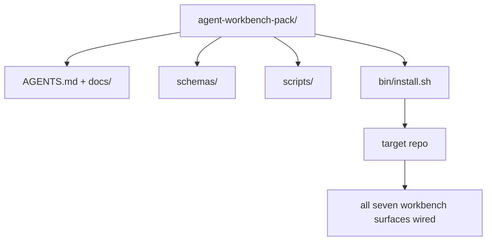

# 石:运输可重复使用的代理工作台包

> 任何一个回复中,你放一个包,最后一个小曲目.`cp -r`石是这门课程所使用的文物.

**Type:** Build
**Languages:** Python (stdlib)
**Prerequisites:** Phases 14 · 31 to 14 · 41
**Time:** ~75 minutes

## 学习目标

- 包装七个工作桌面面,
- 入方案,脚本和模板,这样一个新的 repo得到了已知的基础.
- 添加一个单个安装脚本,将包装无力放下.
- 决定什么留在群里,什么留在外,为每一个人辩护.
- 证明一个代理协助的存储库变化,并提供审查者可以复制的证据.

## 问题

工作桌面在Google文档,聊天历史和三个半记忆脚本中存在,是一个每季度重建的工作桌面.治疗方法是一个版本包:一个备忘录或目录,上面包含表面,方案,脚本和一个命令安装器.

你将结束这个课程`outputs/agent-workbench-pack/`发送在磁盘上`bin/install.sh`这将它放入任何目标回报.

## 概念



### 包装布局

```
outputs/agent-workbench-pack/
├── AGENTS.md
├── docs/
│   ├── agent-rules.md
│   ├── reliability-policy.md
│   ├── handoff-protocol.md
│   └── reviewer-rubric.md
├── schemas/
│   ├── agent_state.schema.json
│   ├── task_board.schema.json
│   └── scope_contract.schema.json
├── scripts/
│   ├── init_agent.py
│   ├── run_with_feedback.py
│   ├── verify_agent.py
│   └── generate_handoff.py
├── bin/
│   └── install.sh
└── README.md
```

### 什么是留在,什么是留在

在:

- 表面图案,这是合同.
- 上面的四个剧本,它们是运行时间.
- 它们是规则和规则.

走出去

- 任务属于目标备忘录的板块,而不是包装.
- 包装是框架无知的.
- 团队生活在团队现有的集团旁边,而不是内部.

### 安装器

简短的`bin/install.sh`(或`bin/install.py`):

1. 拒绝安装在现有包装上,没有`--force`现在,我们要去.
2. 复制包到目标存储器中.
3. 电缆如果有`.github/workflows/`没有.
4. 打印下一步:填写板,设置接受命令,运行 init脚本.

### 版本化

包装载有`VERSION`文件. 计划的颠覆和需要迁移的脚本变化颠覆主要. 只有文件的变化颠覆补丁. 目标备忘录的`agent_state.json`记录它被初始化为哪个包版本.

```figure
wb-pack-install
```

## 建立它

`code/main.py`组装包装成`outputs/agent-workbench-pack/`在课旁边, 种植了你已经写的小曲目中的前课程的方案和脚本.

运行它:

```
python3 code/main.py
```

脚本复制和接表面,写出 README,打印包树,然后退出零.重启是无效的.

## 野生生产模式

包装只能有价值,只要它存活着,如果它能保持良好的状态,如果它能保持良好的状态,

**`VERSION` is the contract, not the marketing.**基本上,需要一个状态迁移. 基本上,需要重新检查. 补丁的补丁只需要文件. 安装器写道`.workbench-version`在每次安装中, 进入目标备忘录;`lint_pack.py`如果目标的锁与包裹的锁不同,拒绝运输`VERSION`这就是怎么做`npm`现在`Cargo`其他`pyproject.toml`经历了10年的炼, 没有什么改变了规则.

**Single source for cross-tool distribution.**号船1号`nx ai-setup`这就说明了`AGENTS.md`现在`CLAUDE.md`现在`.cursor/rules/`现在`.github/copilot-instructions.md`包装器应做同样的事情;安装器发出了符号链接 (`ln -s AGENTS.md CLAUDE.md`对于每一个编码代理,只有一种信息来源.

**`uninstall.sh` that refuses on non-trivial state.**卸载包不能删除用户的文件`agent_state.json`现在`task_board.json`其他`outputs/`解装器删除了方案,脚本,文件,`AGENTS.md`(与`--keep-agents-md`由于该数据库的数据库是用户的,而该数据库并非其所有者.

**Skill-as-publishable. SkillKit-style distribution.**作为一个SkillKit技能:`skillkit install agent-workbench-pack`包装备是真相来源,SkillKit是分销道.供应商锁定崩;七面保持相同.

## 用它

包装船只的三个位置:

- **As a directory you drop into a repo.** `cp -r outputs/agent-workbench-pack /path/to/repo`现在,我们要去.
- **As a public template repo.**叉和定制,用`VERSION`控制漂移.
- **As a SkillKit skill.**连接到你的代理产品,所以只有一条命令可以设置它.

每个装配都是一个分量.

## 运送它

`outputs/skill-workbench-pack.md`产生一个项目调整的包:规则与团队的历史进行了调整,范围范围与 repo相匹配,条目尺寸通过一个特定领域的输入扩展.

## 运动

1. 决定哪个选项第五文件值得升级到圣经包.
2. 用一个 编写重新安装器为Python`--dry-run`标,比较 ergonomics 和 bash.
3. 添加一个`bin/uninstall.sh`没有任何小事,如果国家文件有非小事历史,
4. 添加一个`lint_pack.py`子出时会失败`VERSION`给IC传输,让包裹自己回复.
5. 导读了从手动滚动工作台到这个包的迁移运行指南.

## 职业实践:证明一个库存变化

包装演示证明组装器运行和生成文件.它不证明您的代理能完成新任务,生成的检查证明该任务,或部署的系统工作. 保持这些要求分开.

选择一个小的实际任务,在一个你拥有或有权更改的库中.使用一个你已经访问的编码代理.一个错误纠正,一个有限的功能或一个操作改进是足够的;安装多个代理不是练习的一部分.

预算除包装实验室之外的单独工作会议.`learning-artifacts/`保存注册表,并作为参考材料包装.

### 1. 制任务,选择自主

使用第43课题的任务框架和第44课题的证据计划.记录起来的修订,可观察的目标,非目标,允许的路径和接受证据.确定真正需要行为的用户或操作员.

选择一个工作模式:指导步骤,检查点执行,或一个有限的自动运行.解释为什么不确定性,后果和可逆性证明了这一点.一个小的本地检查点可能需要更少的检查点,而不是改变访问控制.

设置一个壁时间预算和一个代币或成本限制,如果代理人暴露一个. 诚实记录不可用测量. 定义一个停止条件重复故障,新的许可,预算耗尽,或未解决的合同决定; 命名谁可以解决它.

### 2. 准备最小的有用环境

检索相关的实现,调用程序,测试和本地说明.记录每个源为什么属于文本,以及当前的证据将取代过时的注释.默认不加载整个存储库.

对于每个相关扩展,做出一个明确的选择:一个技能提供可重复的程序;一个MCP工具提供访问;一个子运行确定性检查;一个插件包装功能.只在任务需要它时保留扩展,使用最小的权限让它工作.

记录你拒绝的建议添加的文本或维护成本.重新检查一个过时的内存或指令,然后在学习者拥有的设置中退休或更换它,当证据支持该决定时. 重复检查以确认删除没有失去必要的约束.

### 3. 捕捉基线并实现

在编辑之前,运行最近的现有检查,并展示所需行为的当前状态. 保持命令,修改,结果和证据位置.尚未存在的功能仍然具有基线:记录观察到的反应或未支持的操作.

让代理人在合同内执行. 保持一个干预日志,说明每次纠正,许可变更或计划修改的原因. 委托是可选的;如果有用,在增加另一个工人之前,应用45课的所有权和整合合合同.

### 4. 挑战证据

选择观察改变的表面的证明.对于UI,重建和检查服务的路径在相关宽度.对于API,检查请求和序列式响应.对于CLI,运行构建命令并检查其出口代码和输出.选择您需要的检查并解释其限制.

写出任务合同的预期结果,独立于代理执行.在一次性复印件中,输入一个特定的错误结果,例如接受无效值或丢弃所需响应字段.执行相同的接受检查:它必须因此故障.

如果它保持绿色,在信任它之前,强化声明或观察.恢复正确的实现并成功重复运行.保持两份收据.语法错误或故障的测试设置不算是检测回归.

检查最终的差异,包括改变的测试,与原始目标和允许的路径相比.请同行或单独的审查者会话挑战最弱的证据,而不编辑实施.你仍然拥有最终的判断;另一个代理的同意不是执行证据.

### 5. 修复车的运行和恢复

运行已改变的文物在一次性本地或舞台环境中.`local`现在`staging`其他`live`地方演练支持当地要求;此演练不需要生产部署.

选择一个与任务相关的失败信号,一个门,一个观察窗口和一个主. 当这个门过了时,解释反应.在练习中安全激活信号,并保留观察日志,指标或反应.

检查已知的好文物重新推翻,并检查是否恢复了以前的行为. 考虑到适用的持续数据;仅仅替换二进制可能不会逆转数据变化.记录您无法验证的任何恢复步骤.

### 6. 改进下一次跑步,然后把它交给

根据研究结果,我们可以将结果与原始数据进行比较,包括过去的时间,可用的使用数据和人类干预.

通过第46课进行一个观察到的修正,一个较小的权限界限,一个自动化或更清晰的例子. 重复受影响的检查.删除临时突变,离开最后的分支,更改文件,开放风险,下一步行动明确下次会议.

### 手动审查条例

检查员检查证据文件,并复制至少最弱的接受检查.`demonstrated`现在`needs revision`其他`unverified`填写字段和传递包装脚本不取代这些观察.

| Dimension | Evidence the reviewer should challenge |
|---|---|
| Task and autonomy | Starting behavior, bounded goal, justified permissions, budget, and a usable stop rule |
| Context and environment | Relevant sources, justified tool access, and a rechecked retirement decision |
| Verification | Actual before/after behavior and a deliberate incorrect result that the same check rejects |
| Review and operation | Inspected diff, independent challenge, labeled runtime observation, and rehearsed recovery |
| Iteration and handoff | One verified improvement, honest limits, clean final state, and a reproducible next action |

解决问题`needs revision`要求完成任务之前的发现.`unverified`投资组合证明您对有限任务的工程判断,而不是雇佣或部署保证.

## 运输的文物

保存可重复使用的包装和您的复印件[career-agent-evidence.md](https://github.com/rohitg00/ai-engineering-from-scratch/blob/main/phases/14-agent-engineering/42-agent-workbench-capstone/outputs/career-agent-evidence.md)模板将任务框架,执行计划,运行时间收据,审查,恢复练习和转让连接到一个可审查的案例研究中.

## 关键词

| Term | What people say | What it actually means |
|------|----------------|------------------------|
| Workbench pack | "The starter kit" | A versioned directory carrying all seven surfaces |
| Installer | "Setup script" | `bin/install.sh` that lays the pack down idempotently |
| Pack version | "VERSION" | Major bumps for schema/script changes, patch for doc-only |
| Drop-in pack | "cp -r and go" | Pack works without per-repo customization on day one |
| Forkable template | "GitHub template" | Public repo that GitHub's "Use this template" can clone from |

## 进一步阅读

- 阶段14 · 31至14 · 41 每一个面积包装包装
- [SkillKit](https://github.com/rohitg00/skillkit)将这种技能安装在32个人工智能代理中
- [Nx Blog, Teach Your AI Agent How to Work in a Monorepo](https://nx.dev/blog/nx-ai-agent-skills) 六个工具的单源发电机
- [agents.md — the open spec](https://agents.md/)您的包装路由器必须实现什么
- [HKUDS/OpenHarness](https://github.com/HKUDS/OpenHarness) 包装等价的参考实施
- [Augment Code, A good AGENTS.md is a model upgrade](https://www.augmentcode.com/blog/how-to-write-good-agents-dot-md-files)包装文件质量条
- [Anthropic, Effective harnesses for long-running agents](https://www.anthropic.com/engineering/effective-harnesses-for-long-running-agents)
- [Anthropic, Harness design for long-running application development](https://www.anthropic.com/engineering/harness-design-long-running-apps)
- 阶段 14 · 30  基于评估的代理开发,使用包装的验证门
- 之前/后的基准,本包的改善
