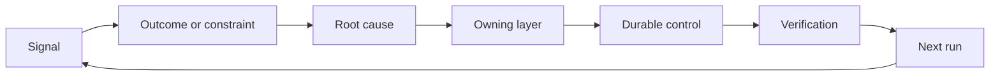

# 建立一个反机,拥有和退休

> 运输关闭一个构建循环,打开学习循环. 证据必须改变系统,否则它会变成无人拥有的远程测量.

**Type:** Learn + Build
**Languages:** Python (stdlib)
**Prerequisites:** Phase 14 lessons 46 and 53
**Time:** ~75 minutes

## 学习目标

- 让事件,评估,用户行为和纠正成为自己的行为.
- 调向每个信号的背景,评估,政策,运行时间或后期.
- 根据重度和频率优先考虑重复.
- 给所有控制者一个退休条件.
- 提供证据,交易和负责的业主.

## 反是基础设施

团队可以收集痕迹,评估,支持票和事件日志,而不会从其中任何一个学习.缺失的机制是促进:从观察到持久变化的定义路径与所有者和证据.

循环是:

1. 观察一个具体的信号;
2. 连接到结果,约束或假设;
3. 确定最早的系统层,它是原因的;
4. 创造一个有限的变化;
5. 检查复发的可能性变得较小;
6. 审查是否应该继续进行控制.

## 进入拥有者层的路

| Signal | Destination |
|---|---|
| False positive, regression, wrong result | Evaluation or test |
| Missing context, duplicate work, stale fact | Context source or retrieval route |
| Unsafe action or authority gap | Policy or permission boundary |
| Timeout, retry storm, unavailable dependency | Runtime control |
| New product need or unresolved tradeoff | Shaped backlog item |

检测或许可可能使失败成为不可能时,不要再添加另一个提示段落.



## 拥有权是控制权的一部分

每个子行动都需要:

- 一个所有者;
- 基于后果和重复的优先事项;
- 变更的文物;
- 证明变化的验证;
- 审查或过期窗口;
- 退休条件.

没有任何改进,就是一个更好的格式化观察.

## 退休的常规控制

反系统会积累政策. 这种政策可能会变得矛盾和昂贵.

- 建筑或工作流程的变化;
- 低级不变量取代了高级指令;
- 已选定的窗口中未出现受保护故障;
- 控制阻碍合法工作的频率比防止伤害更高.

退休还需要证据. 不要因为它感觉老了而删除一个控制器.

## 连接构建和编码代理反

两条轨道都用同一条子:

- 产品证据改变了结果框架,假设,切片或测量计划.
- 编码代理的纠正改变了测试,背景,范围,自动化或转发.
- 事件可以改变产品界限和代理工作台.

这就是为什么构建不是在编码之前结束的阶段. 它在每一个被接受的变化中继续.

## 建立它

实验室分类信号,创建自己的动作,优先考虑它们,并写下`outputs/feedback-backlog.json`现在,我们要去.

```bash
python3 code/main.py
python3 -m unittest discover code/tests -v
```

添加运行时间停机信号,确认它将路由到运行时间而不是一般的滞后.

## 实践实验室:经历挫折后,做出决定

选择一个从职业路线投资组合项目中工作流程.通过一个决定,一个小实验和一个审查进行.[career delivery template](https://github.com/rohitg00/ai-engineering-from-scratch/blob/main/phases/14-agent-engineering/54-build-the-feedback-ratchet/outputs/career-delivery-evidence.md)现在,我们要去.

图库生成了示例后备行动.它不观察用户,测量干预,或证明职业准备.完成其运行是为此练习做准备.

### 1. 确定发生了什么事

记录用户,任务,当前的工作流程和您想要改进的结果. 链接一个同意的观察,一个编辑的支持记录,或可复制的任务追踪. 分开您观察到的内容与有人报告的内容和您推断的内容.

找出挫折:一个失败的假设,一个无法使用的结果,一个意想不到的成本,或者一个延迟的交付. 解释哪些证据改变了你的理解.

如果您无法与用户合作,请运行一个明确标记的模拟,并使用同行或所述的场景. 保持模拟的观察与实际用户的证据分开. 不要发明面试,批准,采用或业务影响.

### 2. 在你的权威范围内进步

列出未知情况,选择最便宜的可逆行动,可以解决最严重的行动.

您可能在等待使用客户数据的许可时准备编辑的离线重播. 举动意味着将授权的工作推进,并明确阻止的决定. 这不会扩大您的访问或批准权.

### 3. 选择的比较,并向决定主告

写一个简短的决定简介给不需要执行细节的人.

- 用户问题和改变计划的证据;
- 根据第1条,在使用时,可使用可靠的方法,
- 质量,互动设计,努力,运营成本和风险抵消;
- 您的建议,仍存在不确定性以及所需的决定;
- 决定主,受影响的利益相关者以及决定需要的日期.

要求同行代表受影响的利益相关者,并挑战一个交易.记录反对意见,以及它如何改变,或者未能改变,你的建议. 标签角色扮演反,仿真;它不能代表实际利益相关者的协议.

### 4. 进行有限的实验

根据需要回答的问题,选择原型,试点或生产工作. 在收集结果之前,定义观众,数据,权威,持续时间,反弹和继续,改变或停止的条件.

浏览用户从开始点到完成任务的交互. 包含错误输出或缺失数据情况. 观察用户是否能注意到故障,纠正它,并没有隐藏的帮助恢复.

计算人类审查和纠正时间作为工作流程的一部分.更快的模型响应仍然可以使整个任务变得更慢或更难以信任.

### 5. 结果与经济情况的比较

记录一个基线和一个跟踪数据,使用相同的指标定义,任务群,收集方法和可比观测窗口. 随着数量进行测量,将样本数量,排斥和证据链接放在数字旁边. 如果这些条件发生变化,请解释为什么比较是有限的.

包含一个用户结果,一个质量或安全护,以及人力总体审查努力.即使错误目标,记录结果.小或模拟的样本支持有限的学习声称,而不是证明业务影响的声称.

通过模型调用,重试,支持服务和人力审查来估计完成任务的成本. 说明劳动力率假设和从估计中分离测量使用. 与人工替代品或项目背后的价值假设相比较.

使用现有的[FinOps for LLMs lesson](https://aiengineeringfromscratch.com/lesson?path=phases/17-infrastructure-and-production/27-finops-llms)改造模型只能是一个可能的反应;缩小工作流程或保留手动步骤可能是更好的产品决定.

### 6. 关闭环节

根据预示的标准,建议继续,改变或停止.如果证据不确定,请列出缺失的观察和下一个有限的测试.记录负责决定的答案;如果没有做出决定,请保留.

选择一个改进到交付过程本身:一个更清晰的任务框架,更早的用户通行,更好的审查清单,更小的代理交付,或更严格的评估案例. 指定一个所有者和一个审查日期.

在审查时,决定是否要保留,修改或退休改进.记录选择的证据.一个新的检查清单,在不防止目标失败的情况下创造更多工作,并没有获得永久性.

## 运输的文物

复制[career-delivery-evidence.md](https://github.com/rohitg00/ai-engineering-from-scratch/blob/main/phases/14-agent-engineering/54-build-the-feedback-ratchet/outputs/career-delivery-evidence.md)您的项目可以使用证据链接完成. 保持登记的模板可重复使用. 包含决策简报,互动通行,测量比较和您的职业组合文物的自有跟踪.

## 检查

使用此手动接受条款与同行.**met**现在**needs work**其他**not observed**填写的字段并不能证明该判决是正确的.

| Check | Evidence that meets it |
|---|---|
| Workflow grounded | A traceable observation supports the problem; reported claims, inference, and simulation are labeled. |
| Authority respected | Reversible next work is clear, and any restricted action waits for its actual decision owner. |
| Tradeoffs communicated | Credible alternatives, a stakeholder objection, a recommendation, and an explicit decision request are recorded. |
| Interaction tested | The walkthrough covers success, failure, recovery, and human review effort. |
| Outcome compared | Baseline and follow-up definitions align; samples, guardrails, costs, and comparison limits are visible. |
| Setback owned | The evidence changes a continue/change/stop decision and an accountable next action. |
| Process improved | One workflow improvement has an owner, review date, and an evidence-based keep/revise/retire decision. |

尽管每一步都通过了模拟的过程,但实际用户的行为仍然存在差距. 保持该边界在投资组合索赔中,并确定关闭该数据组合的下一个观察.

## 运动

1. 让一个事件和一个用户投诉变成刺行动.
2. 提前列出哪个可以防止每一次重复.
3. 添加验证命令或观察到实验室输出.
4. 确定保险规则的退休条件.
5. 追踪一个接受的纠正回到下一个任务框架.

## 进一步阅读

- [Basili, Caldiera, and Rombach, The Goal Question Metric Approach](https://www.cs.toronto.edu/~sme/CSC444F/handouts/GQM-paper.pdf)通过目标定向的测量来进行组织学习.
- [Fagerholm et al., Building Blocks for Continuous Experimentation](https://doi.org/10.1145/2601248.2601276)技术和组织循环,将证据与继续产品开发联系起来.
- [Nuseibeh and Easterbrook, Requirements Engineering: A Roadmap](https://www.cs.toronto.edu/~sme/papers/2000/ICSE2000.pdf)系统生命周期中不断发展的要求.

## 你留下什么

保持`outputs/feedback-backlog.json`作为路由示例和您完成的职业交付证据作为您自己的决定的记录.
