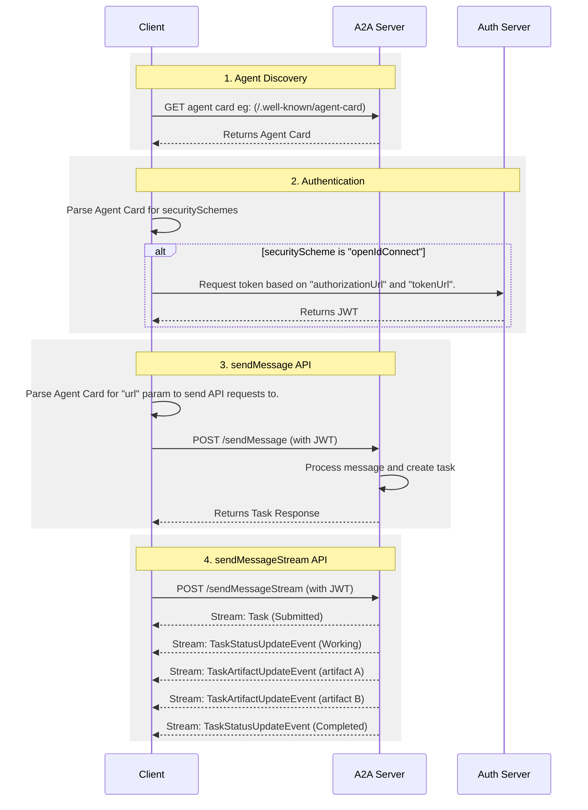

# A2A 101 research brief: official project documentation (not the normative spec)

Pinned source: `a2aproject/A2A`, tag `v1.0.1`, commit `3303592588e388e62e0f69f701af531d2f4e3991`, committed 2026-05-28 06:34:16 -0500 with the message "chore(main): release 1.0.1 (#1749)". The local clone is shallow (one commit, no history), so apart from the tag commit date quoted here (read with `git log -1 v1.0.1`), every date in this file comes from file contents.

Conventions used in this file. Citations are repo-relative paths at tag v1.0.1 with 1-based line ranges, written like `[docs/topics/life-of-a-task.md L10-L42]`; a bullet with several sources lists them separated by semicolons. Quotes use curly quotation marks, are copied verbatim from the cited lines (hard line wraps collapsed to single spaces, markdown bold markers left out when they sit outside the quoted words), and `[...]` marks an omission. Fenced code blocks are copied line for line with the source's list indentation removed. FLAG (stale) marks docs text that still uses pre-1.0 names. FLAG (conflict) marks text that contradicts another line of the docs or the normative proto. CROSS-CHECK marks a comparison against `specification/a2a.proto` or `docs/specification.md`, which are outside the scope of this brief and are cited only to verify a docs claim.

Reading guide:

- Rule of thumb for the manual: when the docs and `specification/a2a.proto` disagree on a name, follow the proto. The docs say so themselves: “The normative A2A protocol definition in Protocol Buffers (proto3 syntax). This is the source of truth for the A2A protocol specification.” `[docs/definitions.md L5-L6]`
- The JSON Schema is derived, not authoritative: “This schema is automatically generated from the protocol buffer definitions and bundled into a single file with all message definitions.” `[docs/definitions.md L20-L21]`
- Docs site map (navigation order): Documentation = What is A2A?, Core Concepts, Agent Discovery, Enterprise Features, Life of a Task, Extensions, Custom Protocol Bindings, Extension & Binding Governance, Streaming & Asynchronous Operations, Multi-Tenancy, A2A and MCP; then Tutorials, Specification (Overview, What's New in v1.0, Protocol Definition), SDK Reference, Community, Partners, Roadmap. `[mkdocs.yml L21-L57]`

## 1. What A2A is for, in the project's own words

### 1.1 Definition and purpose

- Definition: “The A2A protocol is an open standard that enables seamless communication and collaboration between AI agents. It provides a common language for agents built using diverse frameworks and by different vendors, fostering interoperability and breaking down silos.” `[docs/topics/what-is-a2a.md L3-L6]`
- Agents as the unit of collaboration: “Agents are autonomous problem-solvers that act independently within their environment. A2A allows agents from different developers, built on different frameworks, and owned by different organizations to unite and work together.” `[docs/topics/what-is-a2a.md L6-L9]`
- Repository tagline: “An open protocol enabling communication and interoperability between opaque agentic applications.” `[README.md L48]`
- Agents, not tools: “enabling gen AI agents, built on diverse frameworks by different companies running on separate servers, to communicate and collaborate effectively - as agents, not just as tools.” `[README.md L50]`
- What agents can do with A2A (four capabilities in the README): “Discover each other's capabilities.” then “Negotiate interaction modalities (text, forms, media).” then “Securely collaborate on long-running tasks.” then “Operate without exposing their internal state, memory, or tools.” `[README.md L52-L57]`
- Home page definition: “an open standard designed to enable seamless communication and collaboration between AI agents.” `[docs/index.md L16]`
- Home page provenance sentence: “Originally developed by Google and now donated to the Linux Foundation, A2A provides the definitive common language for agent interoperability in a world where agents are built using diverse frameworks and by different vendors.” `[docs/index.md L18]`
- Home page one-line stack pitch (paraphrase): build with ADK or any framework, equip with MCP or any tool, and communicate with A2A, ending “to remote agents, local agents, and humans.” `[docs/index.md L20-L26]`
- Home page value cards: Interoperability, “Connect agents built on different platforms (LangGraph, CrewAI, Semantic Kernel, custom solutions) to create powerful, composite AI systems.” Complex Workflows, “Enable agents to delegate sub-tasks, exchange information, and coordinate actions to solve complex problems that a single agent cannot.” Secure & Opaque, “Agents interact without needing to share internal memory, tools, or proprietary logic, ensuring security and preserving intellectual property.” `[docs/index.md L104-L114]`
- README "Why A2A?" aims, in order: “Connect agents across different ecosystems.” (Break Down Silos), “Allow specialized agents to work together on tasks that a single agent cannot handle alone.” (Enable Complex Collaboration), “Foster a community-driven approach to agent communication, encouraging innovation and broad adoption.” (Promote Open Standards), “Allow agents to collaborate without needing to share internal memory, proprietary logic, or specific tool implementations, enhancing security and protecting intellectual property.” (Preserve Opacity). `[README.md L75-L80]`
- v1.0 positioning: “marking the first stable, production-ready version of the open standard for communication between AI agents.” `[docs/announcing-1.0.md L3]`
- v1.0 positioning, what changed in spirit: “The v1.0 release emphasizes maturity rather than reinvention: the core ideas remain intact, while rough edges have been removed, ambiguous areas clarified, and enterprise deployment requirements addressed more directly.” `[docs/announcing-1.0.md L7]`
- v1.0 positioning, how low the barrier is: “in its simplest form, an A2A interaction can begin with a single HTTP request.” `[docs/announcing-1.0.md L24]`
- v1.0 positioning, web alignment: “A2A v1.0 aligns with core architectural principles of the web: stateless, layered architecture, standard protocol bindings, and infrastructure-friendly communication patterns.” `[docs/announcing-1.0.md L22]`

### 1.2 Problem statements (what goes wrong without A2A)

- The motivating request: “Consider a user request for an AI assistant to plan an international trip. This task involves orchestrating multiple specialized agents, such as:” followed by a flight booking agent, a hotel reservation agent, an agent for local tour recommendations, and a currency conversion agent. `[docs/topics/what-is-a2a.md L19-L25]`
- Lead-in to the problem list: “Without A2A, integrating these diverse agents presents several challenges:” `[docs/topics/what-is-a2a.md L27]`
- Problem 1, Agent Exposure: “However, this approach is inefficient because agents are designed to negotiate directly. Wrapping agents as tools limits their capabilities. A2A allows agents to be exposed as they are, without requiring this wrapping.” `[docs/topics/what-is-a2a.md L29-L33]`
- FLAG (conflict): the same bullet expands MCP as “Multi-agent Control Platform (Model Context Protocol)”, which is not what MCP stands for; every other docs page says “Model Context Protocol” (see section 7). Do not reuse that sentence. `[docs/topics/what-is-a2a.md L29-L33; docs/topics/a2a-and-mcp.md L5-L6]`
- Problem 2, Custom Integrations: “Each interaction requires custom, point-to-point solutions, creating significant engineering overhead.” `[docs/topics/what-is-a2a.md L34-L35]`
- Problem 3, Slow Innovation: “Bespoke development for each new integration slows innovation.” `[docs/topics/what-is-a2a.md L36-L37]`
- Problem 4, Scalability Issues: “Systems become difficult to scale and maintain as the number of agents and interactions grows.” `[docs/topics/what-is-a2a.md L38-L39]`
- Problem 5, Interoperability: “This approach limits interoperability, preventing the organic formation of complex AI ecosystems.” `[docs/topics/what-is-a2a.md L40-L41]`
- Problem 6, Security Gaps: “Ad hoc communication often lacks consistent security measures.” `[docs/topics/what-is-a2a.md L42-L43]`
- Resolution sentence: “The A2A protocol addresses these challenges by establishing interoperability for AI agents to interact reliably and securely.” `[docs/topics/what-is-a2a.md L45-L46]`
- Launch-announcement framing of the same problem: “interoperability has become the defining challenge. Teams can coordinate agents effectively within a single platform, but connecting those systems across technology stacks and organizational boundaries remains difficult.” `[docs/announcing-1.0.md L5]`

### 1.3 The docs' own worked scenario (plan an international trip)

- Step 1, the user prompt: “A user interacts with an AI assistant, giving it a complex prompt like "Plan an international trip."” `[docs/topics/what-is-a2a.md L54]`
- Step 2, the assistant needs specialists: a Flight Booking Agent, a Hotel Reservation Agent, a Currency Conversion Agent, and a Local Tours Agent. `[docs/topics/what-is-a2a.md L63]`
- Step 3, the interoperability problem: “The core problem: The agents are unable to work together because each has its own bespoke development and deployment.” `[docs/topics/what-is-a2a.md L82]`
- Step 3, consequence: “The consequence of a lack of a standardized protocol is that these agents cannot collaborate with each other let alone discover what they can do.” `[docs/topics/what-is-a2a.md L84]`
- Step 4, with A2A: “The A2A Protocol provides standard methods and data structures for agents to communicate with one another, regardless of their underlying implementation, so the same agents can be used as an interconnected system, communicating seamlessly through the standardized protocol.” `[docs/topics/what-is-a2a.md L88]`
- Step 5, the outcome: “The AI assistant, now acting as an orchestrator, receives the cohesive information from all the A2A-enabled agents. It then presents a single, complete travel plan as a seamless response to the user's initial prompt.” `[docs/topics/what-is-a2a.md L90]`

### 1.4 Core benefits the docs claim

- Secure collaboration: “Without a standard, it's difficult to ensure secure communication between agents. A2A uses HTTPS for secure communication and maintains opaque operations, so agents can't see the inner workings of other agents during collaboration.” `[docs/topics/what-is-a2a.md L98-L101]`
- Interoperability: “A2A breaks down silos between different AI agent ecosystems, enabling agents from various vendors and frameworks to work together seamlessly.” `[docs/topics/what-is-a2a.md L102-L104]`
- Agent autonomy: “A2A allows agents to retain their individual capabilities and act as autonomous entities while collaborating with other agents.” `[docs/topics/what-is-a2a.md L105-L106]`
- Reduced integration complexity: “The protocol standardizes agent communication, enabling teams to focus on the unique value their agents provide.” `[docs/topics/what-is-a2a.md L107-L109]`
- Support for long-running operations (LRO): “The protocol supports long-running operations (LRO) and streaming with Server-Sent Events (SSE) and asynchronous execution.” `[docs/topics/what-is-a2a.md L110-L111]`

### 1.5 Design principles (as the docs name them)

- Lead-in: “A2A development follows principles that prioritize broad adoption, enterprise-grade capabilities, and future-proofing.” `[docs/topics/what-is-a2a.md L115-L116]`
- Simplicity (built on existing standards): “A2A leverages existing standards like HTTP, JSON-RPC, and Server-Sent Events (SSE). This avoids reinventing core technologies and accelerates developer adoption.” `[docs/topics/what-is-a2a.md L118-L120]`
- Enterprise Readiness: “A2A addresses critical enterprise needs. It aligns with standard web practices for robust authentication, authorization, security, privacy, tracing, and monitoring.” `[docs/topics/what-is-a2a.md L121-L123]`
- Asynchronous (async-first): “A2A natively supports long-running tasks. It handles scenarios where agents or users might not remain continuously connected. It uses mechanisms like streaming and push notifications.” `[docs/topics/what-is-a2a.md L124-L126]`
- Modality Independent: “The protocol allows agents to communicate using a wide variety of content types. This enables rich and flexible interactions beyond plain text.” `[docs/topics/what-is-a2a.md L127-L129]`
- Opaque Execution (opacity): “Agents collaborate effectively without exposing their internal logic, memory, or proprietary tools. Interactions rely on declared capabilities and exchanged context. This preserves intellectual property and enhances security.” `[docs/topics/what-is-a2a.md L130-L133]`
- CROSS-CHECK: the spec labels the same five principles differently (Simple, Enterprise Ready, Async First, Modality Agnostic, Opaque Execution); use one set of labels consistently in the manual and say which source it follows. `[docs/specification.md L33-L39]`
- FLAG (stale): the Simplicity principle names only HTTP, JSON-RPC, and SSE, but v1.0 ships three bindings; the launch post says “The standard builds on industry-proven protocols, including JSON+HTTP, gRPC, and JSON-RPC.” `[docs/topics/what-is-a2a.md L118-L120; docs/announcing-1.0.md L24]`

### 1.6 Agents are not tools

- The docs argue that wrapping an agent as a tool loses capability: “The practice of encapsulating an agent as a simple tool is fundamentally limiting, as it fails to capture the agent's full capabilities.” `[docs/topics/what-is-a2a.md L157]`
- A2A's focus, in its words: “Enabling agents to collaborate within their native modalities, allowing them to communicate as agents (or as users) rather than being constrained to tool-like interactions.” `[docs/topics/what-is-a2a.md L153]`
- Example of the interaction style it targets: “For example, this facilitates multi-turn interactions, such as those involving negotiation or clarification when placing an order.” `[docs/topics/what-is-a2a.md L153]`
- The docs point to an external post for the argument: "Why Agents Are Not Tools" (discuss.google.dev, URL not fetched for this brief). `[docs/topics/what-is-a2a.md L157]`

### 1.7 Where A2A sits in the agent stack

- The four layers the docs list, in order. A2A: “Standardizes communication among agents deployed in different organizations and developed using diverse frameworks.” MCP: “Connects models to data and external resources.” Frameworks (like ADK): “Provide toolkits for constructing agents.” Models: “Fundamental to an agent's reasoning, these can be any Large Language Model (LLM).” `[docs/topics/what-is-a2a.md L139-L142]`
- A2A versus ADK: “A2A is a communication protocol for agents that enables inter-agent communication, regardless of the framework used for their construction (e.g., ADK, LangGraph, or Crew AI).” `[docs/topics/what-is-a2a.md L164-L167]`
- ADK is described as “an open-source agent development toolkit developed by Google.” `[docs/topics/what-is-a2a.md L163-L164]`
- Other protocols named on the home page: IBM ACP is “Incorporated into the A2A Protocol”, and Cisco agntcy is “A framework that provides components to the Internet of Agents with discovery, group communication, identity and observability and leverages A2A and MCP for agent communication and tool calling.” `[docs/index.md L128-L129]`

## 2. Key concepts as the docs define them

Framing sentence: “A2A uses a set of core concepts that define how agents interact.” `[docs/topics/key-concepts.md L3]`

### 2.1 Actors

- User: “The end user, which can be a human operator or an automated service. The user initiates a request or defines a goal that requires assistance from one or more AI agents.” `[docs/topics/key-concepts.md L11-L13]`
- Client agent (the docs call it “A2A Client (Client Agent)”): “An application, service, or another AI agent that acts on behalf of the user. The client initiates communication using the A2A protocol.” `[docs/topics/key-concepts.md L14-L16]`
- Remote agent (the docs call it “A2A Server (Remote Agent)”): “An AI agent or an agentic system that exposes an HTTP endpoint implementing the A2A protocol. It receives requests from clients, processes tasks, and returns results or status updates.” `[docs/topics/key-concepts.md L17-L19]`
- Opacity from the client's point of view: “From the client's perspective, the remote agent operates as an _opaque_ (black-box) system, meaning its internal workings, memory, or tools are not exposed.” `[docs/topics/key-concepts.md L19-L20]`
- The home page diagram uses the vocabulary User, Client Agent, Remote Agent 1, Remote Agent 2, with an A2A edge between the client agent and each remote agent. `[docs/index.md L86-L98]`

### 2.2 Fundamental communication elements (the docs' table)

- Agent Card: “A JSON metadata document describing an agent's identity, capabilities, endpoint, skills, and authentication requirements.” Purpose: “Enables clients to discover agents and understand how to interact with them securely and effectively.” `[docs/topics/key-concepts.md L28]`
- Task: “A stateful unit of work initiated by an agent, with a unique ID and defined lifecycle.” Purpose: “Facilitates tracking of long-running operations and enables multi-turn interactions and collaboration.” `[docs/topics/key-concepts.md L29]`
- Message: “A single turn of communication between a client and an agent, containing content and a role ("user" or "agent").” Purpose: “Conveys instructions, context, questions, answers, or status updates that are not necessarily formal artifacts.” `[docs/topics/key-concepts.md L30]`
- Part: “The fundamental content container used within Messages and Artifacts. A Part holds one of: text content, a file reference (URL or inline bytes), or structured data.” Purpose: “Provides flexibility for agents to exchange various content types within messages and artifacts.” `[docs/topics/key-concepts.md L31]`
- Artifact: “A tangible output generated by an agent during a task (for example, a document, image, or structured data).” Purpose: “Delivers the concrete results of an agent's work, ensuring structured and retrievable outputs.” `[docs/topics/key-concepts.md L32]`

### 2.3 Concept detail sections

- Agent Card as discovery document: “The Agent Card is a JSON document that serves as a digital business card for initial discovery and interaction setup.” `[docs/topics/key-concepts.md L56-L57]`
- What clients do with it: “Clients parse this information to determine if an agent is suitable for a given task, how to structure requests, and how to communicate securely.” `[docs/topics/key-concepts.md L58-L59]`
- What it contains: “Key information includes identity, service endpoint (URL), A2A capabilities, authentication requirements, and a list of skills.” `[docs/topics/key-concepts.md L59-L61]`
- Message: “A message represents a single turn of communication between a client and an agent. It includes a role ("user" or "agent") and a unique `messageId`. It contains one or more Part objects, which are granular containers for the actual content. This design allows A2A to be modality independent.” `[docs/topics/key-concepts.md L65-L68]`
- Part is a one-of container: “The `Part` object is a flexible container that can hold different types of content using a `oneof` field structure. A Part must contain exactly one of the following content fields:” `[docs/topics/key-concepts.md L70]`
- Part content field `text`: “A string containing plain textual content.” `[docs/topics/key-concepts.md L72]`
- Part content field `raw`: “A byte array containing binary file data (inline).” `[docs/topics/key-concepts.md L73]`
- Part content field `url`: “A string URI referencing external file content.” `[docs/topics/key-concepts.md L74]`
- Part content field `data`: “A structured JSON value (e.g., object, array) for machine-readable data.” `[docs/topics/key-concepts.md L75]`
- Fields every Part may carry: `mediaType` is “The MIME type of the content (e.g., `"text/plain"`, `"image/png"`, `"application/json"`).” `filename` is “An optional name for the file or content.” `metadata` is “A key-value map for additional context.” `[docs/topics/key-concepts.md L77-L81]`
- Artifact: “An artifact represents a tangible output or a concrete result generated by a remote agent during task processing. Unlike general messages, artifacts are the actual deliverables. An artifact has a unique `artifactId`, a human-readable name, and consists of one or more part objects. Artifacts are closely tied to the task lifecycle and can be streamed incrementally to the client.” `[docs/topics/key-concepts.md L85-L89]`
- Agent response is a Task or a Message: “The agent response can be a new `Task` (when the agent needs to perform a long-running operation) or a `Message` (when the agent can respond immediately).” `[docs/topics/key-concepts.md L93-L94]`
- Context (`contextId`): “A server-generated identifier that can be used to logically group multiple related `Task` objects, providing context across a series of interactions.” `[docs/topics/key-concepts.md L100]`
- Transport and format: “A2A communication occurs over HTTP(S). JSON-RPC 2.0 is used as the payload format for all requests and responses.” `[docs/topics/key-concepts.md L101]`
- Authentication and authorization: “A2A relies on standard web security practices. Authentication requirements are declared in the Agent Card, and credentials (e.g., OAuth tokens, API keys) are typically passed through HTTP headers, separate from the A2A protocol messages themselves.” `[docs/topics/key-concepts.md L102]`
- Agent discovery: “The process by which clients find Agent Cards to learn about available A2A Servers and their capabilities.” `[docs/topics/key-concepts.md L103]`
- Extensions: “A2A allows agents to declare custom protocol extensions as part of their AgentCard.” `[docs/topics/key-concepts.md L104]`

### 2.4 Flags and cross-checks for section 2

- FLAG (stale): “JSON-RPC 2.0 is used as the payload format for all requests and responses” predates v1.0's three standard bindings: “The A2A protocol ships with three standard bindings (JSON-RPC, gRPC, and HTTP+JSON/REST) that cover the majority of deployment scenarios.” The root README repeats the single-binding claim: “JSON-RPC 2.0 over HTTP(S).” `[docs/topics/key-concepts.md L101; docs/topics/custom-protocol-bindings.md L3-L6; README.md L84]`
- FLAG (stale): the role values “user” and “agent” are prose shorthand; on the wire in v1.0 the enum names are `ROLE_USER` and `ROLE_AGENT`, and the `Role` enum also has `ROLE_UNSPECIFIED = 0`. `[docs/topics/key-concepts.md L30; specification/a2a.proto L245-L252]`
- FLAG (stale): “service endpoint (URL)” reads like the old single top-level `url`; in v1.0 an Agent Card lists `supportedInterfaces`, each with `url`, `protocolBinding`, optional `tenant`, and `protocolVersion`. `[docs/topics/key-concepts.md L59-L61; specification/a2a.proto L334-L355]`
- CROSS-CHECK: `contextId` is not strictly server-only. The proto says a client message may carry both `context_id` and `task_id` and they must match, and “If only `task_id` is provided, the server will infer `context_id` from it.” `[docs/topics/key-concepts.md L100; specification/a2a.proto L254-L259]`
- CROSS-CHECK: the proto marks these Agent Card fields REQUIRED: `name`, `description`, `supported_interfaces`, `version`, `capabilities`, `default_input_modes`, `default_output_modes`, `skills`. `[specification/a2a.proto L361-L398]`
- CROSS-CHECK: `Task` carries `id`, `context_id`, `status`, `artifacts`, `history`, `metadata`; `Part` carries a `oneof content` of `text`, `raw` (bytes, base64 in JSON), `url`, `data`, plus `metadata`, `filename`, `media_type`; `Artifact` carries `artifact_id`, `name`, `description`, `parts`, `metadata`, `extensions`. `[specification/a2a.proto L167-L184; specification/a2a.proto L224-L242; specification/a2a.proto L280-L293]`
- CROSS-CHECK: JSON uses camelCase (`contextId`, `mediaType`, `supportedInterfaces`) even though the proto and `docs/llms.txt` use snake_case (`context_id`, `media_type`, `supported_interfaces`). `[docs/specification.md L1204-L1211; docs/llms.txt L28-L50]`

## 3. Life of a task

### 3.0 The whole sequence in one pass (assembled from several docs pages, in order)

- Step 1, discover the agent: “A client agent knows or programmatically discovers the domain of a potential A2A Server (e.g., `smart-thermostat.example.com`).” then “The client performs an HTTP GET request to `https://smart-thermostat.example.com/.well-known/agent-card.json`.” `[docs/topics/agent-discovery.md L28-L29]`
- Step 2, get credentials and authenticate: “The A2A Client obtains the necessary credentials, such as OAuth 2.0 tokens or API keys, through processes external to the A2A protocol itself.” and “Credentials **must** be transmitted in standard HTTP headers as per the requirements of the chosen authentication scheme.” `[docs/topics/enterprise-ready.md L42-L45]`
- Step 3, send a message: “A message represents a single turn of communication between a client and an agent. It includes a role ("user" or "agent") and a unique `messageId`.” The operation is `SendMessage` (or `SendStreamingMessage`). `[docs/topics/key-concepts.md L65-L66; docs/topics/streaming-and-async.md L13]`
- Step 4, the agent answers with a Message or a Task: “The agent response can be a new `Task` (when the agent needs to perform a long-running operation) or a `Message` (when the agent can respond immediately).” `[docs/topics/key-concepts.md L93-L94]`
- Step 4, identifiers appear in that first response: “When a client sends a message for the first time, the agent responds with a new `contextId`. If a task is initiated, it will also have a `taskId`.” `[docs/topics/life-of-a-task.md L22-L23]`
- Step 5, the task runs and the client follows it by polling, SSE streaming, or push notifications (section 4); status changes arrive as status events and outputs as artifact events. `[docs/topics/key-concepts.md L41-L49; docs/topics/streaming-and-async.md L20-L21]`
- Step 6, the task may pause for the client in an interrupted state (`input-required` or `auth-required`); the client answers with a further message that carries the same `contextId` and, optionally, the `taskId`: “Clients optionally attach the `taskId` to a subsequent message to indicate that it continues that specific task.” For `auth-required`, “the A2A server indicates to the client that more information is needed.” `[docs/topics/life-of-a-task.md L10-L14; docs/topics/life-of-a-task.md L24-L28; docs/topics/enterprise-ready.md L58-L59]`
- Step 7, the task ends in a terminal state and its results are artifacts: “Once a task reaches a terminal state (completed, canceled, rejected, or failed), it cannot restart.” and “Unlike general messages, artifacts are the actual deliverables.” `[docs/topics/life-of-a-task.md L83-L84; docs/topics/key-concepts.md L86-L87]`
- Step 8, follow-up work becomes a new task in the same context: “Any subsequent interaction related to that task, such as a refinement, must initiate a new task within the same `contextId`.” with the earlier task named in `referenceTaskIds`. `[docs/topics/life-of-a-task.md L84-L85; docs/topics/life-of-a-task.md L76-L78]`

### 3.1 The two ways an agent can answer a message

- Scope of the page: “In the Agent2Agent (A2A) Protocol, interactions can range from simple, stateless exchanges to complex, long-running processes.” `[docs/topics/life-of-a-task.md L3-L4]`
- The fork: “When an agent receives a message from a client, it can respond in one of two fundamental ways:” `[docs/topics/life-of-a-task.md L4-L5]`
- Path 1, a stateless `Message`: “This type of response is typically used for immediate, self-contained interactions that conclude without requiring further state management.” `[docs/topics/life-of-a-task.md L7-L9]`
- Path 2, a stateful `Task`: “If the response is a `Task`, the agent will process it through a defined lifecycle, communicating progress and requiring input as needed, until it reaches an interrupted state (e.g., `input-required`, `auth-required`) or a terminal state (e.g., `completed`, `canceled`, `rejected`, `failed`).” `[docs/topics/life-of-a-task.md L10-L14]`
- FLAG (stale): the state names in this prose are the pre-1.0 lowercase spellings. In v1.0 they are `TASK_STATE_INPUT_REQUIRED`, `TASK_STATE_AUTH_REQUIRED`, `TASK_STATE_COMPLETED`, `TASK_STATE_CANCELED`, `TASK_STATE_REJECTED`, `TASK_STATE_FAILED` (plus `TASK_STATE_SUBMITTED`, `TASK_STATE_WORKING`, and `TASK_STATE_UNSPECIFIED = 0`). `[docs/topics/life-of-a-task.md L10-L14; docs/whats-new-v1.md L214-L216; specification/a2a.proto L187-L208]`
- CROSS-CHECK, the proto comments that define the two families: “Indicates that a task has finished successfully. This is a terminal state.” and “Indicates that the agent requires additional user input to proceed. This is an interrupted state.” and “Indicates that authentication is required to proceed. This is an interrupted state.” `[specification/a2a.proto L194; specification/a2a.proto L200; specification/a2a.proto L206]`
- CROSS-CHECK, the proto comment for `REJECTED`: “Indicates that the agent has decided to not perform the task. This may be done during initial task creation or later once an agent has determined it can't or won't proceed. This is a terminal state.” `[specification/a2a.proto L202-L205]`

### 3.2 Grouping related interactions: contextId and taskId

- What `contextId` is: “A `contextId` is a crucial identifier that logically groups multiple `Task` objects and independent `Message` objects, providing continuity across a series of interactions.” `[docs/topics/life-of-a-task.md L18-L20]`
- First message: “When a client sends a message for the first time, the agent responds with a new `contextId`. If a task is initiated, it will also have a `taskId`.” `[docs/topics/life-of-a-task.md L22-L23]`
- Continuing a conversation: “Clients can send subsequent messages and include the same `contextId` to indicate that they are continuing their previous interaction within the same context.” `[docs/topics/life-of-a-task.md L24-L26]`
- Continuing a specific task: “Clients optionally attach the `taskId` to a subsequent message to indicate that it continues that specific task.” `[docs/topics/life-of-a-task.md L27-L28]`
- Why it exists: “The `contextId` enables collaboration towards a common goal or a shared contextual session across multiple, potentially concurrent tasks.” `[docs/topics/life-of-a-task.md L30-L31]`
- How agents use it: “Internally, an A2A agent (especially one using an LLM) uses the `contextId` to manage its internal conversational state or its LLM context.” `[docs/topics/life-of-a-task.md L31-L33]`
- CROSS-CHECK: terminal tasks reject further messages: “Messages sent to Tasks that are in a terminal state (`TASK_STATE_COMPLETED`, `TASK_STATE_FAILED`, `TASK_STATE_CANCELED`, `TASK_STATE_REJECTED`) cannot accept further messages.” `[docs/specification.md L175]`

### 3.3 Message or Task, and the three kinds of agent

- When a Message fits: “`Message` objects are suitable for transactional interactions that don't require long-running processing or complex state management. An agent might use messages to negotiate the acceptance or scope of a task before committing to a `Task` object.” `[docs/topics/life-of-a-task.md L40-L44]`
- When a Task fits: “Once an agent maps the intent of an incoming message to a supported capability that requires substantial, trackable work over an extended period, the agent responds with a `Task` object.” `[docs/topics/life-of-a-task.md L45-L48]`
- Message-only agents: “Always respond with `Message` objects. They typically don't manage complex state or long-running executions, and use `contextId` to tie messages together. These agents might directly wrap LLM invocations and simple tools.” `[docs/topics/life-of-a-task.md L52-L55]`
- Task-generating agents: “Always respond with `Task` objects, even for responses, which are then modeled as completed tasks.” and “This approach avoids deciding between `Task` versus `Message`, but creates completed task objects for even simple interactions.” `[docs/topics/life-of-a-task.md L56-L61]`
- Hybrid agents: “Generate both `Message` and `Task` objects. These agents use messages to negotiate agent capability and the scope of work for a task, then send a `Task` object to track execution and manage states like `input-required` or error handling.” `[docs/topics/life-of-a-task.md L62-L65]`
- Rule shared by task-generating and hybrid agents: “Once a task is created, the agent will only return `Task` objects in response to messages sent, and once a task is complete, no more messages can be sent.” `[docs/topics/life-of-a-task.md L57-L60; docs/topics/life-of-a-task.md L65-L67]`
- The docs link an external post for the hybrid pattern, "A2A protocol: Demystifying Tasks vs Messages" (discuss.google.dev); the community page lists it with the date "August 18" and no year. `[docs/topics/life-of-a-task.md L70; docs/community.md L13]`

### 3.4 Follow-ups: refinement, immutability, parallel work, artifact references

- Refinement is a new interaction in the same context: “This is modeled by starting another interaction using the same `contextId` as the original task. Clients further hint the agent by providing references to the original task using `referenceTaskIds` in the `Message` object. The agent then responds with either a new `Task` or a `Message`.” `[docs/topics/life-of-a-task.md L75-L79]`
- Immutability rule: “Once a task reaches a terminal state (completed, canceled, rejected, or failed), it cannot restart. Any subsequent interaction related to that task, such as a refinement, must initiate a new task within the same `contextId`.” `[docs/topics/life-of-a-task.md L83-L85]`
- Benefit, reliable references: “Clients reliably reference tasks and their associated state, artifacts, and messages, providing a clean mapping of inputs to outputs. This is valuable for orchestration and traceability.” `[docs/topics/life-of-a-task.md L88-L90]`
- Benefit, clear unit of work: “Every new request, refinement, or follow-up becomes a distinct task. This simplifies bookkeeping, allows for granular tracking of an agent's work, and enables tracing each artifact to a specific unit of work.” `[docs/topics/life-of-a-task.md L91-L94]`
- Benefit, simpler agents: “This removes ambiguity for agent developers regarding whether to create a new task or restart an existing one.” `[docs/topics/life-of-a-task.md L95-L96]`
- Parallel follow-ups: “A2A supports parallel work by enabling agents to create distinct, parallel tasks for each follow-up message sent within the same `contextId`. This allows clients to track individual tasks and create new dependent tasks as soon as a prerequisite task is complete.” `[docs/topics/life-of-a-task.md L100-L103]`
- Parallel follow-ups, the docs' example: “Task 1: Book a flight to Helsinki.” then “Task 2: Based on Task 1, book a hotel.” then “Task 3: Based on Task 1, book a snowmobile activity.” then “Task 4: Based on Task 2, add a spa reservation to the hotel booking.” `[docs/topics/life-of-a-task.md L107-L110]`
- Referencing earlier artifacts: “The serving agent infers the relevant artifact from a referenced task or from the `contextId`.” `[docs/topics/life-of-a-task.md L114-L115]`
- When it is ambiguous: “If there is ambiguity, the agent asks the client for clarification by returning an `input-required` state. The client then specifies the artifact in its response, optionally populating artifact references (`artifactId`, `taskId`) in `Part` metadata.” `[docs/topics/life-of-a-task.md L116-L119]`
- Artifact mutation is the client's job: “Therefore, the serving agent shouldn't be responsible for tracking artifact mutations, and this linkage is not part of the A2A protocol specification. Clients should maintain this version history on their end and present the latest acceptable version to the user.” `[docs/topics/life-of-a-task.md L125]`
- Naming hint for refined artifacts: “To facilitate client-side tracking, serving agents should use a consistent `artifact-name` when generating a refined version of an existing artifact.” `[docs/topics/life-of-a-task.md L127]`
- FLAG (stale): there is no field called `artifact-name`; the artifact's human-readable field is `name` (the worked example below reuses `"name": "sailboat_image.png"` with a new `artifactId`). `[docs/topics/life-of-a-task.md L127; specification/a2a.proto L280-L293]`
- If the client gives no artifact reference: “Attempt to infer the intended artifact based on the current `contextId`.” and “If there is ambiguity or insufficient context, the agent should respond with an `input-required` task state to request clarification from the client.” `[docs/topics/life-of-a-task.md L129-L132]`

### 3.5 The "A2A request lifecycle" in What is A2A?

- The docs' own summary: “The A2A request lifecycle is a sequence that details the four main steps a request follows: agent discovery, authentication, `sendMessage` API, and `sendMessageStream` API.” `[docs/topics/what-is-a2a.md L174]`
- Step 1, Agent Discovery: the client does a GET for the agent card (the diagram writes the path as `/.well-known/agent-card`) and the A2A server returns the Agent Card. `[docs/topics/what-is-a2a.md L183-L185]`
- Step 2, Authentication: the client parses the Agent Card for `securitySchemes`; if the scheme is `openIdConnect` it requests a token using `authorizationUrl` and `tokenUrl` from the auth server and receives a JWT. `[docs/topics/what-is-a2a.md L189-L194]`
- Step 3, `sendMessage` API: the client parses the Agent Card for the `url` parameter, sends `POST /sendMessage` with the JWT, the server processes the message and creates a task, and the server returns a Task response. `[docs/topics/what-is-a2a.md L198-L202]`
- Step 4, `sendMessageStream` API: the client sends `POST /sendMessageStream` with the JWT and the server streams Task (Submitted), TaskStatusUpdateEvent (Working), TaskArtifactUpdateEvent (artifact A), TaskArtifactUpdateEvent (artifact B), TaskStatusUpdateEvent (Completed). `[docs/topics/what-is-a2a.md L206-L212]`
- The diagram, verbatim (Mermaid source). `[docs/topics/what-is-a2a.md L177-L213]`



- FLAG (stale), discovery path: the diagram says `/.well-known/agent-card`; the docs' discovery page and the spec say “The standard path is `https://{agent-server-domain}/.well-known/agent-card.json`”. `[docs/topics/what-is-a2a.md L184; docs/topics/agent-discovery.md L25; docs/specification.md L1978]`
- FLAG (stale), endpoint lookup: “Parse Agent Card for "url" param” describes the pre-1.0 top-level `url`; v1.0 removed it and the endpoint lives in `supportedInterfaces[0].url`. `[docs/topics/what-is-a2a.md L199; docs/whats-new-v1.md L388; docs/whats-new-v1.md L690-L694]`
- FLAG (stale), endpoint names: `POST /sendMessage` and `POST /sendMessageStream` are not paths in any v1.0 binding. HTTP+JSON uses `POST /message:send` and `POST /message:stream`; JSON-RPC uses one URL with method names `SendMessage` and `SendStreamingMessage`. `[docs/topics/what-is-a2a.md L200; docs/topics/what-is-a2a.md L207; specification/a2a.proto L21-L42; docs/specification.md L1160-L1174; docs/specification.md L2237]`
- FLAG (stale), the prose names `sendMessage` and `sendMessageStream`; the v1.0 operation names are `SendMessage` and `SendStreamingMessage`. `[docs/topics/what-is-a2a.md L174; docs/whats-new-v1.md L57; docs/whats-new-v1.md L69]`

### 3.6 Worked example: a task with a follow-up (the docs' only end-to-end payloads)

- Which spec version these examples follow: they are v1.0-shaped (PascalCase JSON-RPC method `SendMessage`, a `result.task` wrapper, `TASK_STATE_COMPLETED`, Parts without a `kind` field, `mediaType`, `raw`), with one exception: both user messages carry `"role": "user"`, which is the v0.3 spelling. v1.0 requires `ROLE_USER` (and `ROLE_AGENT`). `[docs/topics/life-of-a-task.md L136-L249; docs/whats-new-v1.md L251-L253; docs/whats-new-v1.md L48-L57; docs/whats-new-v1.md L214-L216; docs/whats-new-v1.md L273; specification/a2a.proto L245-L252]`
- Intro line: “The following example illustrates a typical task flow with a follow-up:” `[docs/topics/life-of-a-task.md L136]`
- Step 1, the client sends a message (verbatim). `[docs/topics/life-of-a-task.md L141-L156]`

```json
{
  "jsonrpc": "2.0",
  "id": "req-001",
  "method": "SendMessage",
  "params": {
    "message": {
      "role": "user",
      "parts": [
        {
          "text": "Generate an image of a sailboat on the ocean."
        }
      ],
      "messageId": "msg-user-001"
    }
  }
}
```

- Step 2, the agent answers with a completed task holding an image artifact (verbatim). `[docs/topics/life-of-a-task.md L162-L188]`

```json
{
  "jsonrpc": "2.0",
  "id": "req-001",
  "result": {
    "task": {
      "id": "task-boat-gen-123",
      "contextId": "ctx-conversation-abc",
      "status": {
        "state": "TASK_STATE_COMPLETED"
      },
      "artifacts": [
        {
          "artifactId": "artifact-boat-v1-xyz",
          "name": "sailboat_image.png",
          "description": "A generated image of a sailboat on the ocean.",
          "parts": [
            {
              "filename": "sailboat_image.png",
              "mediaType": "image/png",
              "raw": "base64_encoded_png_data_of_a_sailboat"
            }
          ]
        }
      ]
    }
  }
}
```

- Step 3 narration: “This refinement request refers to the previous `taskId` and uses the same `contextId`.” `[docs/topics/life-of-a-task.md L191-L192]`
- Step 3, the client asks for a refinement; the payload carries the reference as `referenceTaskIds` (verbatim). `[docs/topics/life-of-a-task.md L195-L214]`

```json
{
  "jsonrpc": "2.0",
  "id": "req-002",
  "method": "SendMessage",
  "params": {
    "message": {
      "role": "user",
      "messageId": "msg-user-002",
      "contextId": "ctx-conversation-abc",
      "referenceTaskIds": [
        "task-boat-gen-123"
      ],
      "parts": [
        {
          "text": "Please modify the sailboat to be red."
        }
      ]
    }
  }
}
```

- Step 4 narration: “The agent creates a new task within the same `contextId`. The new boat image artifact retains the same name but has a new `artifactId`.” `[docs/topics/life-of-a-task.md L218-L219]`
- Step 4, the agent creates a new task in the same context (verbatim). `[docs/topics/life-of-a-task.md L222-L248]`

```json
{
  "jsonrpc": "2.0",
  "id": "req-002",
  "result": {
    "task": {
      "id": "task-boat-color-456",
      "contextId": "ctx-conversation-abc",
      "status": {
        "state": "TASK_STATE_COMPLETED"
      },
      "artifacts": [
        {
          "artifactId": "artifact-boat-v2-red-pqr",
          "name": "sailboat_image.png",
          "description": "A generated image of a red sailboat on the ocean.",
          "parts": [
            {
              "filename": "sailboat_image.png",
              "mediaType": "image/png",
              "raw": "base64_encoded_png_data_of_a_RED_sailboat"
            }
          ]
        }
      ]
    }
  }
}
```

- What the example shows (my reading of the docs' immutability rule): the first task is `TASK_STATE_COMPLETED`, so the refinement could not reopen it; it became `task-boat-color-456` with the same `contextId` `ctx-conversation-abc`. `[docs/topics/life-of-a-task.md L83-L85; docs/topics/life-of-a-task.md L217-L219]`
- CROSS-CHECK, `SendMessage` result shape in JSON-RPC: the proto response is a `oneof payload` of `task` or `message`, which is why the examples show `"result": {"task": {...}}`. `[specification/a2a.proto L778-L787; docs/specification.md L2300-L2312]`
- CROSS-CHECK, a second multi-turn example (input-required, then a follow-up carrying the same `taskId`) in HTTP+JSON form appears in the spec at `docs/specification.md L1383-L1440`. `[docs/specification.md L1383-L1440]`

### 3.7 Walkthroughs in the Python quickstart (what a real SDK run looks like)

- Executor lifecycle (Hello World): “It enqueues a `TaskStatusUpdateEvent` with a state of `TASK_STATE_WORKING` to indicate the agent has begun processing.” then “It enqueues a `TaskArtifactUpdateEvent` containing the result text from the agent.” then “Finally, it enqueues a `TaskStatusUpdateEvent` with a state of `TASK_STATE_COMPLETED` to conclude the task.” `[docs/tutorials/python/4-agent-executor.md L44-L54]`
- Executor first step: “The `A2A instance` (server) retrieves the current task from the context. If there is no task in context, then it creates a new task and adds it to the `EventQueue`.” `[docs/tutorials/python/4-agent-executor.md L46]`
- Client behavior: “The client's `send_message` method returns an async iterator that yields a single final `Task` or `Message` response from the agent. In this example, it is a `Task`.” `[docs/tutorials/python/6-interact-with-server.md L56]`
- Non-streaming output printed by the tutorial (protobuf text format, snake_case field names; JSON on the wire is camelCase). `[docs/tutorials/python/6-interact-with-server.md L111-L141]`

```
// Non-streaming response
task {
  id: "xxxxxxxx"
  context_id: "yyyyyyyy"
  status {
    state: TASK_STATE_COMPLETED
  }
  artifacts {
    artifact_id: "zzzzzzzz"
    name: "result"
    parts {
      text: "Hello, World!"
    }
  }
  history {
    message_id: "vvvvvvvv"
    context_id: "yyyyyyyy"
    task_id: "xxxxxxxx"
    role: ROLE_USER
    parts {
      text: "Say hello."
    }
  }
  history {
    message_id: "wwwwwwww"
    role: ROLE_AGENT
    parts {
      text: "Processing request..."
    }
  }
}
```

- The tutorial's own summary of the streaming output lists four chunks: “the initial `task`, a `status_update` for WORKING, an `artifact_update` with the result, and a final `status_update` for COMPLETED.” `[docs/tutorials/python/6-interact-with-server.md L74]`
- Streaming run, verbatim (this is the best concrete picture of a v1.0 stream: initial Task in SUBMITTED, then WORKING with a status message, then the artifact, then COMPLETED). `[docs/tutorials/python/6-interact-with-server.md L143-L197]`

```
// Streaming response
task {
  id: "xxxxxxxx-s"
  context_id: "yyyyyyyy-s"
  status {
    state: TASK_STATE_SUBMITTED
  }
  history {
    message_id: "vvvvvvvv"
    context_id: "yyyyyyyy-s"
    task_id: "xxxxxxxx-s"
    role: ROLE_USER
    parts {
      text: "Say hello."
    }
  }
}

Response chunk:
status_update {
  task_id: "xxxxxxxx-s"
  context_id: "yyyyyyyy-s"
  status {
    state: TASK_STATE_WORKING
    message {
      message_id: "zzzzzzzz-s"
      role: ROLE_AGENT
      parts {
        text: "Processing request..."
      }
    }
  }
}

Response chunk:
artifact_update {
  task_id: "xxxxxxxx-s"
  context_id: "yyyyyyyy-s"
  artifact {
    artifact_id: "wwwwwwww-s"
    name: "result"
    parts {
      text: "Hello, World!"
    }
  }
}

Response chunk:
status_update {
  task_id: "xxxxxxxx-s"
  context_id: "yyyyyyyy-s"
  status {
    state: TASK_STATE_COMPLETED
  }
}
```

- Multi-turn in the LangGraph example: the agent “will enqueue a `TaskStatusUpdateEvent` where `status.state` is `TaskState.input_required` and `status.message` contains the agent's question” and “The stream closes after this event.” The client then “sends a second message, including the `taskId` and `contextId` from the first turn's `Task` response, to provide the missing information ("in GBP"). This continues the same task.” `[docs/tutorials/python/7-streaming-and-multiturn.md L82-L86]`
- FLAG (conflict): tutorial 7 uses `TaskState.completed`, `TaskState.input_required`, `lastChunk`, and `A2AStarletteApplication`, while tutorials 4 to 6 use `TASK_STATE_*`, `Role.ROLE_USER`, and `create_jsonrpc_routes`. The two sets of names cannot both be current, and tutorial 7 looks like the older API; do not mix them in the manual. `[docs/tutorials/python/7-streaming-and-multiturn.md L75-L82; docs/tutorials/python/7-streaming-and-multiturn.md L92; docs/tutorials/python/6-interact-with-server.md L55; docs/tutorials/python/5-start-server.md L5]`
- Tutorial server wiring: “`create_agent_card_routes(public_agent_card)` returns Starlette routes that expose the Agent Card at the `/.well-known/agent-card.json` endpoint for public discovery.” `[docs/tutorials/python/5-start-server.md L29]`

## 4. Streaming and asynchronous operations

### 4.1 The three delivery mechanisms (docs framing)

- Why the page exists: “The Agent2Agent (A2A) protocol is explicitly designed to handle tasks that might not complete immediately. Many AI-driven operations are often long-running, involve multiple steps, produce incremental results, or require human intervention.” `[docs/topics/streaming-and-async.md L3]`
- Framing in Core Concepts: “The A2A Protocol supports various interaction patterns to accommodate different needs for responsiveness and persistence.” `[docs/topics/key-concepts.md L36-L37]`
- Request/Response (Polling): “Clients send a request and the server responds. For long-running tasks, the client periodically polls the server for updates.” `[docs/topics/key-concepts.md L41-L43]`
- Streaming with Server-Sent Events (SSE): “Clients initiate a stream to receive real-time, incremental results or status updates from the server over an open HTTP connection.” `[docs/topics/key-concepts.md L44-L46]`
- Push Notifications: “For very long-running tasks or disconnected scenarios, the server can actively send asynchronous notifications to a client-provided webhook when significant task updates occur.” `[docs/topics/key-concepts.md L47-L49]`
- Launch-post summary: “Depending on workload and operational needs, clients can use polling, streaming, or webhooks to consume task updates and responses.” `[docs/announcing-1.0.md L26]`

### 4.2 Streaming with SSE: what the docs specify

- When it applies: “For tasks that produce incremental results (like generating a long document or streaming media) or provide ongoing status updates, A2A supports real-time communication using Server-Sent Events (SSE). This approach is ideal when the client is able to maintain an active HTTP connection with the A2A Server.” `[docs/topics/streaming-and-async.md L7]`
- Capability flag: “The A2A Server must indicate its support for streaming by setting `capabilities.streaming: true` in its Agent Card.” `[docs/topics/streaming-and-async.md L11]`
- Opening a stream: “The client uses the `SendStreamingMessage` RPC method to send an initial message (for example, a prompt or command) and simultaneously subscribe to updates for that task.” `[docs/topics/streaming-and-async.md L13]`
- Connection: “If the subscription is successful, the server responds with an HTTP 200 OK status and a `Content-Type: text/event-stream`. This HTTP connection remains open for the server to push events to the client.” `[docs/topics/streaming-and-async.md L15]`
- Event envelope: “Each event's `data` field contains a JSON-RPC 2.0 Response object, typically a `SendStreamingMessageResponse`.” `[docs/topics/streaming-and-async.md L17]`
- Event type `Task`: “Represents the current state of the work.” `[docs/topics/streaming-and-async.md L19]`
- Event type `TaskStatusUpdateEvent`: “Communicates changes in the task's lifecycle state (for example, from `working` to `input-required` or `completed`). It also provides intermediate messages from the agent.” `[docs/topics/streaming-and-async.md L20]`
- Event type `TaskArtifactUpdateEvent`: “Delivers new or updated Artifacts generated by the task. This is used to stream large files or data structures in chunks, with fields like `append` and `lastChunk` to help reassemble.” `[docs/topics/streaming-and-async.md L21]`
- Termination: “When a task reaches a terminal or interrupted state (e.g., `COMPLETED`, `FAILED`, `CANCELED`, `REJECTED`, or `INPUT_REQUIRED`), the server closes the stream and sends no further updates.” `[docs/topics/streaming-and-async.md L23]`
- Reconnection: “If a client's SSE connection breaks prematurely while a task is still active, the client is able to attempt to reconnect to the stream using the `SubscribeToTask` RPC method.” `[docs/topics/streaming-and-async.md L25]`
- "When to Use Streaming" list, in order: “Real-time progress monitoring of long-running tasks.” “Receiving large results (artifacts) incrementally.” “Interactive, conversational exchanges where immediate feedback or partial responses are beneficial.” “Applications requiring low-latency updates from the agent.” `[docs/topics/streaming-and-async.md L29-L34]`
- v1.0 clarifications recorded in What's New: “Multiple concurrent streams allowed; all receive same ordered events” and “`final` boolean field removed from TaskStatusUpdateEvent. Leverage protocol binding specific stream closure mechanism instead.” `[docs/whats-new-v1.md L72-L73]`
- v1.0 clarification for reconnects: operation renamed `tasks/resubscribe` to `SubscribeToTask`, with “Multiple concurrent subscriptions supported per task”. `[docs/whats-new-v1.md L132-L144]`
- CROSS-CHECK, first event on subscribe: “The operation MUST return a `Task` object as the first event in the stream, representing the current state of the task at the time of subscription.” `[docs/specification.md L311]`
- CROSS-CHECK, subscribing to a finished task fails: “Returns `UnsupportedOperationError` if the task is already in a terminal state (completed, failed, canceled, rejected).” `[specification/a2a.proto L74-L75]`
- CROSS-CHECK, capability validation: “If `AgentCard.capabilities.streaming` is `false` or not present, attempts to use `SendStreamingMessage` or `SubscribeToTask` operations **MUST** return [`UnsupportedOperationError`](#332-error-handling).” `[docs/specification.md L574]`
- NOTE (stream closure on interrupted states): the docs page says the stream closes on interrupted states (L23) and the Python tutorial agrees (“The stream closes after this event.” after `input_required`), and the spec's HTTP+JSON streaming text agrees (“until the task reaches a terminal or interrupted state, at which point the stream closes”), but the spec's operation text for `SendStreamingMessage` lists only the terminal states as closing the stream. Describe interrupted-state closure as the documented behavior and avoid stronger claims. `[docs/topics/streaming-and-async.md L23; docs/tutorials/python/7-streaming-and-multiturn.md L82; docs/specification.md L2973; docs/specification.md L210]`

### 4.3 Push notifications: what the docs specify

- When it applies: “For very long-running tasks (for example, lasting minutes, hours, or even days) or when clients are unable to or prefer not to maintain persistent connections (like mobile clients or serverless functions), A2A supports asynchronous updates using push notifications. This allows the A2A Server to actively notify a client-provided webhook when a significant task update occurs.” `[docs/topics/streaming-and-async.md L45]`
- Capability flag: “The A2A Server must indicate its support for this feature by setting `capabilities.pushNotifications: true` in its Agent Card.” `[docs/topics/streaming-and-async.md L49]`
- Where the client supplies the config, option 1: “Within the initial `SendMessage` or `SendStreamingMessage` request, or” `[docs/topics/streaming-and-async.md L51]`
- Where the client supplies the config, option 2: “Separately, using the `CreateTaskPushNotificationConfig` RPC method for an existing task.” `[docs/topics/streaming-and-async.md L52]`
- What the config contains: “The `PushNotificationConfig` includes a `url` (the HTTPS webhook URL), an optional `token` (for client-side validation), and optional `authentication` details (for the A2A Server to authenticate to the webhook).” `[docs/topics/streaming-and-async.md L53]`
- When the server notifies: “The A2A Server decides when to send a push notification, typically when a task reaches a significant state change (for example, terminal state, `input-required`, or `auth-required`).” `[docs/topics/streaming-and-async.md L54]`
- Payload: “matching the format used in streaming operations. The payload contains one of: `task`, `message`, `statusUpdate`, or `artifactUpdate`.” `[docs/topics/streaming-and-async.md L55]`
- What the client does next: “Upon receiving a push notification (and successfully verifying its authenticity), the client typically uses the `GetTask` RPC method with the `taskId` from the notification to retrieve the complete, updated `Task` object, including any new artifacts.” `[docs/topics/streaming-and-async.md L56]`
- "When to Use Push Notifications" list, in order: “Very long-running tasks that can take minutes, hours, or days to complete.” “Clients that cannot or prefer not to maintain persistent connections, such as mobile applications or serverless functions.” “Scenarios where clients only need to be notified of significant state changes rather than continuous updates.” `[docs/topics/streaming-and-async.md L62-L64]`
- The client's receiver: “The `url` specified in `PushNotificationConfig.url` points to a client-side Push Notification Service. This service is responsible for receiving the HTTP POST notification from the A2A Server. Its responsibilities include authenticating the incoming notification, validating its relevance, and relaying the notification or its content to the appropriate client application logic or system.” `[docs/topics/streaming-and-async.md L75]`
- v1.0 changes touching push: operations renamed to `CreateTaskPushNotificationConfig`, `GetTaskPushNotificationConfig`, `ListTaskPushNotificationConfigs`, `DeleteTaskPushNotificationConfig`; “Push notification payloads now use StreamResponse format”; and “model changed for all methods, with TaskPushNotificationConfig flattened”. `[docs/whats-new-v1.md L157-L160]`
- CROSS-CHECK, delivery guarantees and client duties: “Agents MUST attempt delivery at least once for each configured webhook”, “Clients MUST respond with HTTP 2xx status codes to acknowledge successful receipt”, “Clients SHOULD process notifications idempotently, as duplicate deliveries may occur”. `[docs/specification.md L877-L884]`
- FLAG (stale): the docs call the object `PushNotificationConfig`; in v1.0 the proto has a single flattened `TaskPushNotificationConfig` (fields `tenant`, `id`, `task_id`, `url`, `token`, `authentication`), and `SendMessageConfiguration` carries it as `task_push_notification_config`. There is no `PushNotificationConfig` message in `a2a.proto` at this tag. `[docs/topics/streaming-and-async.md L50-L53; specification/a2a.proto L142-L161; specification/a2a.proto L468-L484; CHANGELOG.md L17]`

### 4.4 Push notification security (docs guidance)

- Why it matters: “Security is paramount for push notifications due to their asynchronous and server-initiated outbound nature.” `[docs/topics/streaming-and-async.md L79]`
- Server must not be an SSRF relay: “Servers SHOULD NOT blindly trust and send POST requests to any URL provided by a client. Malicious clients could provide URLs pointing to internal services or unrelated third-party systems, leading to Server-Side Request Forgery (SSRF) attacks or acting as Distributed Denial of Service (DDoS) amplifiers.” `[docs/topics/streaming-and-async.md L83]`
- Mitigations: “Allowlisting of trusted domains, ownership verification (for example, challenge-response mechanisms), and network controls (e.g., egress firewalls).” `[docs/topics/streaming-and-async.md L84]`
- Server authenticates to the webhook: “The A2A Server MUST authenticate itself to the client's webhook URL according to the scheme specified in `PushNotificationConfig.authentication`. Common schemes include Bearer Tokens (OAuth 2.0), API keys, HMAC signatures, or mutual TLS (mTLS).” `[docs/topics/streaming-and-async.md L85]`
- Webhook authenticates the server: “The webhook endpoint MUST rigorously verify the authenticity of incoming notification requests to ensure they originate from the legitimate A2A Server and not an imposter.” `[docs/topics/streaming-and-async.md L89]`
- Verification methods: “Verify signatures/tokens (for example, JWT signatures against the A2A Server's trusted public keys, HMAC signatures, or API key validation). Also, validate the `PushNotificationConfig.token` if provided.” `[docs/topics/streaming-and-async.md L90]`
- Replay protection, timestamps: “Notifications SHOULD include a timestamp. The webhook SHOULD reject notifications that are too old.” `[docs/topics/streaming-and-async.md L92]`
- Replay protection, unique IDs: “For critical notifications, consider using unique, single-use identifiers (for example, JWT's `jti` claim or event IDs) to prevent processing duplicate notifications.” `[docs/topics/streaming-and-async.md L93]`
- Key management: “Implement secure key management practices, including regular key rotation, especially for cryptographic keys. Protocols like JWKS (JSON Web Key Set) facilitate key rotation for asymmetric keys.” `[docs/topics/streaming-and-async.md L94]`
- Worked flow "Example Asymmetric Key Flow (JWT + JWKS)", step 1: “Client creates a `PushNotificationConfig` specifying `authentication.scheme: "Bearer"` and possibly an expected `issuer` or `audience` for the JWT.” `[docs/topics/streaming-and-async.md L98]`
- Worked flow, step 2 (server side): “Generates a JWT, signing it with its private key. The JWT includes claims like `iss` (issuer), `aud` (audience), `iat` (issued at), `exp` (expires), `jti` (JWT ID), and `taskId`.” then “The JWT header indicates the signing algorithm and key ID (`kid`).” then “The A2A Server makes its public keys available through a JWKS endpoint.” `[docs/topics/streaming-and-async.md L100-L102]`
- Worked flow, step 3 (webhook side): “Extracts the JWT from the Authorization header.” then “Inspects the `kid` (key ID) in the JWT header.” then “Fetches the corresponding public key from the A2A Server's JWKS endpoint (caching keys is recommended).” then “Verifies the JWT signature using the public key.” then “Validates claims (`iss`, `aud`, `iat`, `exp`, `jti`).” then “Checks the `PushNotificationConfig.token` if provided.” `[docs/topics/streaming-and-async.md L104-L109]`
- Closing statement: “This comprehensive, layered approach to security for push notifications helps ensure that messages are authentic, integral, and timely, protecting both the sending A2A Server and the receiving client webhook infrastructure.” `[docs/topics/streaming-and-async.md L111]`
- CROSS-CHECK, concrete SSRF rules in the spec: “Reject private IP ranges (127.0.0.0/8, 10.0.0.0/8, 172.16.0.0/12, 192.168.0.0/16)”, “Reject localhost and link-local addresses”, “Implement URL allowlists where appropriate”. `[docs/specification.md L3113-L3116]`

### 4.5 Polling: what the docs say (and do not say)

- Gap: `streaming-and-async.md` has sections only for SSE and push; there is no "When to Use Polling" section. Polling appears in `key-concepts.md` (line 41 to 43 quoted above) and as the follow-up step after a push notification (the client calls `GetTask`). `[docs/topics/streaming-and-async.md L5-L111; docs/topics/key-concepts.md L41-L43; docs/topics/streaming-and-async.md L56]`
- Polling operation in v1.0 terms: `GetTask` (“Returns task with status, artifacts, and optionally history”), and v1.0 adds a listing operation: “New operation **ListTasks** with filtering capabilities”, with “Cursor-based pagination for scalable task listing”. `[docs/whats-new-v1.md L80; docs/whats-new-v1.md L99; docs/whats-new-v1.md L42]`
- Blocking versus non-blocking `SendMessage` (the docs' only code-level illustration of "poll later"), verbatim. `[docs/whats-new-v1.md L835-L839]`

```typescript
// Wait for task completion (Default)
const result = await sendMessage(message, { returnImmediately: false });

// Return immediately, poll later
const task = await sendMessage(message, { returnImmediately: true });
```

- CROSS-CHECK, the proto semantics behind that snippet: “If `true`, the operation returns immediately after creating the task, even if processing is still in progress.” and “If `false` (default), the operation MUST wait until the task reaches a terminal (`COMPLETED`, `FAILED`, `CANCELED`, `REJECTED`) or interrupted (`INPUT_REQUIRED`, `AUTH_REQUIRED`) state before returning.” The wire field is `return_immediately`, JSON `returnImmediately`. `[specification/a2a.proto L155-L160]`
- CROSS-CHECK, where `return_immediately` has no effect: “when the operation returns a direct [`Message`](#414-message) response instead of a task.” and “for streaming operations, which always return updates in real-time.” and “on configured push notification configurations, which operates independently of execution mode.” `[docs/specification.md L450-L454]`
- CROSS-CHECK, the spec's own "Best for" guidance per mechanism (not in the docs pages): polling is “Best for: Simple integrations, infrequent updates, clients behind restrictive firewalls”; streaming is “Best for: Interactive applications, real-time dashboards, live progress monitoring”; push is “Best for: Server-to-server integrations, long-running tasks, event-driven architectures”. `[docs/specification.md L657; docs/specification.md L665; docs/specification.md L673]`
- Gap to flag in the manual: `whats-new-v1.md` mentions `returnImmediately` only as a "New Capability" (and as a to-do in its priority list) and never describes it as a rename or inversion of an earlier field, so the manual should not guess at the v0.3 field name from the docs. `[docs/whats-new-v1.md L832-L840; docs/whats-new-v1.md L967]`

### 4.6 Choosing a mechanism (decision table assembled from the docs)

| Situation | Mechanism and operation | Docs basis | Cite |
| :-- | :-- | :-- | :-- |
| Client can hold an HTTP connection; wants live progress, incremental artifacts, or interactive turns; low latency matters | Streaming: `SendStreamingMessage`, server needs `capabilities.streaming: true` | "When to Use Streaming" list and capability rule | `[docs/topics/streaming-and-async.md L11-L13; docs/topics/streaming-and-async.md L29-L34]` |
| Stream dropped while the task is still active | Reconnect with `SubscribeToTask` | Resubscription rule | `[docs/topics/streaming-and-async.md L25]` |
| Task may run minutes, hours, or days, or the client is mobile or serverless | Push notifications: register a webhook config, server needs `capabilities.pushNotifications: true`, then `GetTask` on notification | "When to Use Push Notifications" list | `[docs/topics/streaming-and-async.md L45; docs/topics/streaming-and-async.md L49; docs/topics/streaming-and-async.md L56; docs/topics/streaming-and-async.md L62-L64]` |
| Client wants only significant state changes, not a continuous feed | Push notifications | Third push bullet | `[docs/topics/streaming-and-async.md L64]` |
| Simple client, no streaming, no reachable webhook | Polling with `GetTask`, optionally `SendMessage` with `returnImmediately: true` | Polling described in Core Concepts; snippet in What's New | `[docs/topics/key-concepts.md L41-L43; docs/whats-new-v1.md L835-L839]` |
| Want the final result from a single call | `SendMessage` with the default blocking behavior (`returnImmediately: false`) | Snippet comment "Wait for task completion (Default)" | `[docs/whats-new-v1.md L835-L836]` |

### 4.7 Example streams in the docs

- The What is A2A? diagram shows the canonical streaming order: Task (Submitted), then TaskStatusUpdateEvent (Working), then one or more TaskArtifactUpdateEvent, then TaskStatusUpdateEvent (Completed). The full Mermaid source is quoted in section 3.5. `[docs/topics/what-is-a2a.md L206-L212]`
- The Python quickstart prints a real four-chunk stream (quoted in section 3.7). `[docs/tutorials/python/6-interact-with-server.md L74; docs/tutorials/python/6-interact-with-server.md L143-L197]`
- CROSS-CHECK, the spec's SSE sample uses the v1.0 member names `artifactUpdate` and `statusUpdate` inside `data:` lines: `data: {"artifactUpdate": {"taskId": "task-uuid", "artifact": {"parts": [{"text": "# Climate Change Report\n\n"}]}}}` and `data: {"statusUpdate": {"taskId": "task-uuid", "status": {"state": "TASK_STATE_COMPLETED"}}}`. `[docs/specification.md L1376-L1380]`

### 4.8 Flags specific to streaming and async

- FLAG (stale): `SendStreamingMessageResponse` is a pre-1.0 name; the same page later uses the v1.0 name `StreamResponse`, and the spec's legacy-name table maps the related old name `SendStreamingMessageSuccessResponse` to it. Use `StreamResponse`. `[docs/topics/streaming-and-async.md L17; docs/topics/streaming-and-async.md L55; docs/specification.md L3363; specification/a2a.proto L789-L802]`
- FLAG (stale): the lifecycle words in L20 (`working`, `input-required`, `completed`) and L23 (`COMPLETED`, `FAILED`, `CANCELED`, `REJECTED`, `INPUT_REQUIRED`) are shorthand; the wire strings are `TASK_STATE_*`. `[docs/topics/streaming-and-async.md L20; docs/topics/streaming-and-async.md L23; specification/a2a.proto L187-L208]`
- FLAG (conflict): What's New names the stream wrapper members `taskStatusUpdate` and `taskArtifactUpdate`, but the proto field names are `status_update` and `artifact_update`, which serialize as `statusUpdate` and `artifactUpdate`; the streaming page itself uses the correct `statusUpdate` and `artifactUpdate`. See section 9.6. `[docs/whats-new-v1.md L457-L465; docs/topics/streaming-and-async.md L55; specification/a2a.proto L797-L800]`

## 5. Agent discovery

### 5.1 What the docs say the Agent Card is for

- The problem: “AI agents need to first find each other and understand their capabilities.” `[docs/topics/agent-discovery.md L3]`
- The split between the card and finding the card: “The Agent Card defines what an agent offers. Various strategies exist for a client agent to discover these cards.” `[docs/topics/agent-discovery.md L3]`
- How to choose: “The choice of strategy depends on the deployment environment and security requirements.” `[docs/topics/agent-discovery.md L3]`
- Definition: “The Agent Card is a JSON document that serves as a digital "business card" for an A2A Server (the remote agent). It is crucial for agent discovery and interaction.” `[docs/topics/agent-discovery.md L7]`
- Key information list, as written: Identity is “Includes `name`, `description`, and `provider` information.” Service Endpoint is “Specifies the `url` for the A2A service.” A2A Capabilities is “Lists supported features such as `streaming` or `pushNotifications`.” Authentication is “Details the required `schemes` (e.g., "Bearer", "OAuth2").” Skills is “Describes the agent's tasks using `AgentSkill` objects, including `id`, `name`, `description`, `inputModes`, `outputModes`, and `examples`.” `[docs/topics/agent-discovery.md L9-L13]`
- What clients do with it: “Client agents use the Agent Card to determine an agent's suitability, structure requests, and ensure secure communication.” `[docs/topics/agent-discovery.md L15]`
- FLAG (stale): “Specifies the `url` for the A2A service” and “Details the required `schemes`” use pre-1.0 field names. In v1.0 the endpoint lives in each `supportedInterfaces[]` entry (`url`, `protocolBinding`, `protocolVersion`, optional `tenant`; “The first entry is preferred.”) and authentication is declared with a `securitySchemes` map plus a `securityRequirements` list. `[docs/topics/agent-discovery.md L10-L12; specification/a2a.proto L334-L355; specification/a2a.proto L369-L370; specification/a2a.proto L380-L383; docs/whats-new-v1.md L376-L420]`
- Memory trap from v0.2: the well-known file name changed in 0.3.0. The changelog records “Change Well-Known URI for Agent Card hosting from `agent.json` to `agent-card.json`”. `[CHANGELOG.md L102]`

### 5.2 The three discovery strategies the docs name

- Lead-in: “The following sections detail common strategies used by client agents to discover remote Agent Cards:” `[docs/topics/agent-discovery.md L19]`

#### Strategy 1: Well-Known URI

- When to use it: “This approach is recommended for public agents or agents intended for broad discovery within a specific domain.” `[docs/topics/agent-discovery.md L23]`
- Mechanism: “A2A Servers make their Agent Card discoverable by hosting it at a standardized, `well-known` URI on their domain.” and “The standard path is `https://{agent-server-domain}/.well-known/agent-card.json`, following the principles of” RFC 8615. `[docs/topics/agent-discovery.md L25]`
- Process step 1: “A client agent knows or programmatically discovers the domain of a potential A2A Server (e.g., `smart-thermostat.example.com`).” `[docs/topics/agent-discovery.md L28]`
- Process step 2: “The client performs an HTTP GET request to `https://smart-thermostat.example.com/.well-known/agent-card.json`.” `[docs/topics/agent-discovery.md L29]`
- Process step 3: “If the Agent Card exists and is accessible, the server returns it as a JSON response.” `[docs/topics/agent-discovery.md L30]`
- Advantages listed: “Ease of implementation”, “Adheres to standards”, “Facilitates automated discovery”. `[docs/topics/agent-discovery.md L33-L35]`
- Considerations listed: “Best suited for open or domain-controlled discovery scenarios.” and “Authentication is necessary at the endpoint serving the Agent Card if it contains sensitive details.” `[docs/topics/agent-discovery.md L38-L39]`

#### Strategy 2: Curated registries (catalog-based discovery)

- Name as written: “Curated Registries (Catalog-Based Discovery)”. `[docs/topics/agent-discovery.md L41]`
- When to use it: “This approach is employed in enterprise environments or public marketplaces, where Agent Cards are often managed by a central registry. The curated registry acts as a central repository, allowing clients to query and discover agents based on criteria like "skills" or "tags".” `[docs/topics/agent-discovery.md L43]`
- Mechanism: “An intermediary service (the registry) maintains a collection of Agent Cards. Clients query this registry to find agents based on various criteria (e.g., skills offered, tags, provider name, capabilities).” `[docs/topics/agent-discovery.md L45]`
- Process: “A2A Servers publish their Agent Cards to the registry.” then “Client agents query the registry's API, and search by criteria such as "specific skills".” then “The registry returns matching Agent Cards or references.” `[docs/topics/agent-discovery.md L48-L50]`
- Advantages listed: “Centralized management and governance.” “Capability-based discovery (e.g., by skill).” “Support for access controls and trust frameworks.” “Applicable in both private and public marketplaces.” `[docs/topics/agent-discovery.md L53-L56]`
- Considerations listed: “Requires deployment and maintenance of a registry service.” and the key gap, “The current A2A specification does not prescribe a standard API for curated registries.” `[docs/topics/agent-discovery.md L58-L59]`

#### Strategy 3: Direct configuration / private discovery

- Name as written: “Direct Configuration / Private Discovery”. `[docs/topics/agent-discovery.md L61]`
- When to use it: “This approach is used for tightly coupled systems, private agents, or development purposes, where clients are directly configured with Agent Card information or URLs.” `[docs/topics/agent-discovery.md L63]`
- Mechanism: “Client applications utilize hardcoded details, configuration files, environment variables, or proprietary APIs for discovery.” `[docs/topics/agent-discovery.md L65]`
- Process: “The process is specific to the application's deployment and configuration strategy.” `[docs/topics/agent-discovery.md L66]`
- Advantage: “This method is straightforward for establishing connections within known, static relationships.” `[docs/topics/agent-discovery.md L67]`
- Considerations listed: “Inflexible for dynamic discovery scenarios.” “Changes to Agent Card information necessitate client reconfiguration.” “Proprietary API-based discovery also lacks standardization.” `[docs/topics/agent-discovery.md L69-L71]`

#### Open question the docs leave

- Future work: “The A2A community explores standardizing registry interactions or advanced discovery protocols.” `[docs/topics/agent-discovery.md L112]`
- CROSS-CHECK, the spec's one-line version of the same three mechanisms: “Well-Known URI”, Registries/Catalogs (“Querying curated catalogs of agents”), and Direct Configuration (“Pre-configured Agent Card URLs or content”); and “A2A Servers **MUST** make an Agent Card available.” `[docs/specification.md L1976-L1980; docs/specification.md L1970]`
- Tutorial tie-in: “When `get_agent_card()` is called, it fetches the `AgentCard` from the server's `/.well-known/agent-card.json` endpoint (based on the provided base URL), which is then used to initialize the client.” `[docs/tutorials/python/6-interact-with-server.md L46]`

### 5.3 Securing Agent Cards (private and sensitive cards)

- What can leak: “Agent Cards include sensitive information, such as:” then “URLs for internal or restricted agents.” then “Descriptions of sensitive skills.” `[docs/topics/agent-discovery.md L75-L78]`
- Lead-in: “To mitigate risks, the following protection mechanisms should be considered:” `[docs/topics/agent-discovery.md L82]`
- Authenticated extended cards are the recommended mechanism: the docs recommend them “for sensitive information or for serving a more detailed version of the card.” `[docs/topics/agent-discovery.md L84]`
- Secure endpoints: “Implement access controls on the HTTP endpoint serving the Agent Card (e.g., `/.well-known/agent-card.json` or registry API). The methods include:” followed by “Mutual TLS (mTLS)”, “Network restrictions (e.g., IP ranges)”, and “HTTP Authentication (e.g., OAuth 2.0)”. `[docs/topics/agent-discovery.md L85-L88]`
- Registry selective disclosure: “Registries return different Agent Cards based on the client's identity and permissions.” `[docs/topics/agent-discovery.md L90]`
- Rule: “Any Agent Card containing sensitive data must be protected with authentication and authorization mechanisms. The A2A specification strongly recommends the use of out-of-band dynamic credentials rather than embedding static secrets within the Agent Card.” `[docs/topics/agent-discovery.md L92]`

### 5.4 The extended (authenticated) Agent Card

- v1.0 flag location: “`supportsAuthenticatedExtendedCard` moved to `capabilities.extendedAgentCard`”, and the operation was renamed from `agent/getAuthenticatedExtendedCard` to `GetExtendedAgentCard`. `[docs/whats-new-v1.md L125-L126]`
- How the Python server serves it: “`extended_agent_card` is passed so the handler can serve it via the `GetExtendedAgentCard` RPC method to authenticated clients.” `[docs/tutorials/python/5-start-server.md L25]`
- Tutorial output shows a public card and an extended card with an extra skill: “The extended agent card, displayed in a formatted summary (with an additional `super_hello_world` skill).” `[docs/tutorials/python/6-interact-with-server.md L75]`
- Caching of extended cards defers to the spec: “For Extended Agent Cards, clients should also follow the session-scoped caching guidance described in the” specification. `[docs/topics/agent-discovery.md L106]`
- CROSS-CHECK: “Retrieves a potentially more detailed version of the Agent Card after the client has authenticated. This endpoint is available only if `AgentCard.capabilities.extendedAgentCard` is `true`.” `[docs/specification.md L406]`
- CROSS-CHECK: “Clients retrieving this extended card SHOULD replace their cached public Agent Card with the content received from this endpoint for the duration of their authenticated session or until the card's version changes.” `[docs/specification.md L425]`
- CROSS-CHECK, proto field: `extended_agent_card` is documented as “Indicates if the agent supports providing an extended agent card when authenticated.” `[specification/a2a.proto L418-L419]`

### 5.5 Signed Agent Cards (trust before first contact)

- v1.0 enterprise theme: “Agent Card signature verification using JWS and JSON Canonicalization”. `[docs/whats-new-v1.md L37]`
- Launch post: Signed Agent Cards “provide cryptographic verification of agent identity and metadata, establishing trust before interaction across organizational boundaries.” `[docs/announcing-1.0.md L15]`
- RFC 8785 role: “Deterministic JSON serialization for signing”, used for “Agent Card signature verification”, with “Canonical form used before JWS signing (excludes `signatures` field)”. `[docs/whats-new-v1.md L567-L570]`
- RFC 7515 role: “Industry-standard signature format for trust verification”, with “Supports detached signatures with public key retrieval via `jku` or trusted keystores”. `[docs/whats-new-v1.md L574-L577]`
- CROSS-CHECK, the proto message: “AgentCardSignature represents a JWS signature of an AgentCard.” with fields `protected`, `signature`, `header`. `[specification/a2a.proto L454-L466]`

### 5.6 Caching Agent Cards

- Why cache: “Agent Cards describe an agent's capabilities and typically change infrequently” and “Applying standard HTTP caching practices to Agent Card endpoints reduces unnecessary network requests while ensuring clients eventually receive updated information.” `[docs/topics/agent-discovery.md L96]`
- Server guidance: “Servers hosting Agent Card endpoints should include HTTP caching headers in their responses. The `Cache-Control` header with an appropriate `max-age` directive allows clients and intermediaries to cache the card for a specified duration.” `[docs/topics/agent-discovery.md L100]`
- ETag guidance: an `ETag` header “derived from the card's `version` field or a content hash” “enables clients to make conditional requests and avoid re-downloading unchanged cards.” `[docs/topics/agent-discovery.md L100]`
- Client guidance: “Clients fetching Agent Cards should honor standard HTTP caching semantics. When a cached card expires, clients should use conditional requests (for example, `If-None-Match` with the stored `ETag` or `If-Modified-Since`) rather than unconditionally re-fetching the full card. When the server does not provide caching headers, clients may apply a reasonable default cache duration.” `[docs/topics/agent-discovery.md L104]`
- Normative pointer: “For normative requirements, see” Section 8.6 of the specification. `[docs/topics/agent-discovery.md L108]`
- CROSS-CHECK, the spec's wording: “Agent Card HTTP endpoints **SHOULD** include a `Cache-Control` response header with a `max-age` directive appropriate for the agent's expected update frequency” and “Clients **SHOULD** honor HTTP caching semantics as defined in [RFC 9111]”. `[docs/specification.md L2219; docs/specification.md L2225]`

### 5.7 Many agents behind one host: routing and the `tenant` field (docs/topics/multi-tenancy.md)

- Premise: “A single A2A endpoint can serve multiple agents or tenants.” and “The A2A protocol does not prescribe a specific routing implementation” `[docs/topics/multi-tenancy.md L3-L4]`
- “Three complementary approaches are available:” `[docs/topics/multi-tenancy.md L16]`
- Approach 1, URL-based routing: “Each agent is assigned a distinct URL prefix. The Agent Card for each agent advertises its own `url` in `supportedInterfaces`, so clients automatically send requests to the correct path.” `[docs/topics/multi-tenancy.md L20-L22]`
- Approach 1 verdict: “This is the simplest approach and requires no special client awareness beyond reading the Agent Card.” `[docs/topics/multi-tenancy.md L55-L56]`
- Approach 1 example, billing agent card (verbatim). `[docs/topics/multi-tenancy.md L27-L36]`

```json
{
  "name": "Billing Agent",
  "supportedInterfaces": [
    {
      "url": "https://agents.example.com/billing",
      "protocolBinding": "HTTP+JSON",
      "protocolVersion": "1.0"
    }
  ]
}
```

- Approach 1 example, support agent card (verbatim). `[docs/topics/multi-tenancy.md L42-L51]`

```json
{
  "name": "Support Agent",
  "supportedInterfaces": [
    {
      "url": "https://agents.example.com/support",
      "protocolBinding": "HTTP+JSON",
      "protocolVersion": "1.0"
    }
  ]
}
```

- Approach 2, authentication-header routing: “When multiple agents share the same URL, a gateway can use the authentication credentials already present in the request to determine which agent to route to.” `[docs/topics/multi-tenancy.md L60-L61]`
- Approach 2 examples: “A bearer token whose claims (such as audience or scope) identify the target agent.” and “An API key that maps to a particular agent in the gateway's configuration.” `[docs/topics/multi-tenancy.md L67-L68]`
- Approach 3, body-based routing: “Every A2A request message contains an optional `tenant` field. This is an **opaque string** whose value is defined entirely by the server operator; the protocol does not impose any format or semantics on it.” `[docs/topics/multi-tenancy.md L75-L78]`
- Where the client learns the value: “The `tenant` value that a client should use for a particular agent is advertised in the `AgentInterface` entry inside `supportedInterfaces`:” `[docs/topics/multi-tenancy.md L81-L82]`
- Tenant example (verbatim). `[docs/topics/multi-tenancy.md L85-L95]`

```json
{
  "name": "Billing Agent",
  "supportedInterfaces": [
    {
      "url": "https://agents.example.com/a2a",
      "protocolBinding": "HTTP+JSON",
      "protocolVersion": "1.0",
      "tenant": "billing"
    }
  ]
}
```

- Client rule: “The client **MUST** always echo the `tenant` value from the selected `AgentInterface` entry back in every request message. If the `AgentInterface` does not set `tenant`, the field **MUST** be omitted from the request.” `[docs/topics/multi-tenancy.md L98-L101]`
- Combining: “The three approaches are not mutually exclusive.” `[docs/topics/multi-tenancy.md L111]`
- Discovery rule: “each agent **SHOULD** have its own Agent Card published at an appropriate location” `[docs/topics/multi-tenancy.md L119-L120]`
- What's New wording: “`tenant` field added to all request messages” and “`tenant` field added to `AgentInterface` to specify default tenant” and “Enables to serve multiple agents from a single endpoint”. `[docs/whats-new-v1.md L171-L174]`
- Launch post: multi-tenancy support “allows a single endpoint to securely host many agents.” `[docs/announcing-1.0.md L14]`
- FLAG (stale): approach 2 says auth requirements are declared in “`securitySchemes` and `security` fields”; the proto field is `security_requirements`. See section 6.9. `[docs/topics/multi-tenancy.md L62-L63; specification/a2a.proto L380-L383]`
- FLAG (stale): the what-is-a2a lifecycle diagram uses a discovery path without `.json` and a top-level `url`; see section 3.5. `[docs/topics/what-is-a2a.md L184; docs/topics/what-is-a2a.md L199]`

## 6. Enterprise features

### 6.1 Framing

- Design stance: “The Agent2Agent (A2A) protocol is designed with enterprise requirements at its core. Rather than inventing new, proprietary standards for security and operations, A2A aims to integrate seamlessly with existing enterprise infrastructure and widely adopted best practices.” `[docs/topics/enterprise-ready.md L3-L6]`
- Payoff: “This approach allows organizations to use their existing investments and expertise in security, monitoring, governance, and identity management.” `[docs/topics/enterprise-ready.md L6-L8]`
- Opacity as a security property: “A key principle of A2A is that agents are typically **opaque** because they don't share internal memory, tools, or direct resource access with each other. This opacity naturally aligns with standard client-server security paradigms, treating remote agents as standard HTTP-based enterprise applications.” `[docs/topics/enterprise-ready.md L10-L13]`

### 6.2 Transport security (TLS)

- Why: “Ensuring the confidentiality and integrity of data in transit is fundamental for any enterprise application.” `[docs/topics/enterprise-ready.md L17-L18]`
- HTTPS mandate: “All A2A communication in production environments must occur over `HTTPS`.” `[docs/topics/enterprise-ready.md L20-L21]`
- Versions and ciphers: “Implementations should use modern TLS versions. TLS 1.2 or higher is recommended. Strong, industry-standard cipher suites should be used to protect data from eavesdropping and tampering.” `[docs/topics/enterprise-ready.md L22-L24]`
- Server identity: “A2A clients should verify the A2A server's identity by validating its TLS certificate against trusted certificate authorities during the TLS handshake. This prevents man-in-the-middle attacks.” `[docs/topics/enterprise-ready.md L25-L28]`
- FLAG (conflict): the docs recommend “TLS 1.2 or higher”, while the spec says “Implementations **SHOULD** use modern TLS configurations (TLS 1.3+ recommended) with strong cipher suites.” and What's New lists “TLS (RFC 8446 recommended)”. State the discrepancy or pick the spec's wording. `[docs/topics/enterprise-ready.md L22-L24; docs/specification.md L1879; docs/whats-new-v1.md L599]`
- v1.0 addition for mutual TLS: “Enhanced security scheme declarations with mutual TLS support”. `[docs/whats-new-v1.md L39]`

### 6.3 Authentication

- Principle: “A2A delegates authentication to standard web mechanisms. It primarily relies on HTTP headers and established standards like OAuth2 and OpenID Connect. Authentication requirements are advertised by the A2A server in its Agent Card.” `[docs/topics/enterprise-ready.md L32-L34]`
- No identity in the payload: “A2A protocol payloads, such as `JSON-RPC` messages, don't carry user or client identity information directly. Identity is established at the transport/HTTP layer.” `[docs/topics/enterprise-ready.md L36-L38]`
- Declaration in the card: “The A2A server's Agent Card describes the authentication schemes it supports in its `security` field and aligns with those defined in the OpenAPI Specification for authentication.” `[docs/topics/enterprise-ready.md L39-L41]`
- Credential acquisition is out of band: “The A2A Client obtains the necessary credentials, such as OAuth 2.0 tokens or API keys, through processes external to the A2A protocol itself. Examples include OAuth flows or secure key distribution.” `[docs/topics/enterprise-ready.md L42-L43]`
- Credential transmission: “Credentials **must** be transmitted in standard HTTP headers as per the requirements of the chosen authentication scheme. Examples include `Authorization: Bearer <TOKEN>` or `API-Key: <KEY_VALUE>`.” `[docs/topics/enterprise-ready.md L44-L46]`
- Server validation: “The A2A server **must** authenticate every incoming request using the credentials provided in the HTTP headers.” `[docs/topics/enterprise-ready.md L47-L48]`
- Failure response, 401: “If the credentials are missing or invalid. This response **should** include a `WWW-Authenticate` header to inform the client about the supported authentication methods.” `[docs/topics/enterprise-ready.md L51-L53]`
- Failure response, 403: “If the credentials are valid, but the authenticated client does not have permission to perform the requested action.” `[docs/topics/enterprise-ready.md L54-L55]`
- In-task (secondary) credentials: “If an agent needs additional credentials to access a different system or service during a task (for example, to use a specific tool on the user's behalf), the A2A server indicates to the client that more information is needed. The client is then responsible for obtaining these secondary credentials through a process outside of the A2A protocol itself (for example, an OAuth flow) and providing them back to the A2A server to continue the task.” `[docs/topics/enterprise-ready.md L56-L62]`
- CROSS-CHECK, how in-task auth maps to the task state machine: “A2A provides the capability for agents to delegate the fulfillment of this authorization to the client via the `TASK_STATE_AUTH_REQUIRED` Task state.” `[docs/specification.md L1919]`
- CROSS-CHECK, the proto defines the supported scheme types as a `oneof`: API key, HTTP auth, OAuth 2.0, OpenID Connect, mutual TLS; and `SecurityRequirement` is “A map of security schemes to the required scopes.” `[specification/a2a.proto L494-L516]`
- v1.0 OAuth changes: “Added Device Code flow (RFC 8628), removed deprecated implicit/password flows” and “Added `pkce_required` field to Authorization Code flow for enhanced security”. `[docs/whats-new-v1.md L40-L41]`

### 6.4 Authorization

- Responsibility: “Once a client is authenticated, the A2A server is responsible for authorizing the request. Authorization logic is specific to the agent's implementation, the data it handles, and applicable enterprise policies.” `[docs/topics/enterprise-ready.md L66-L68]`
- Granular control: “Authorization **should** be applied based on the authenticated identity, which could represent an end user, a client application, or both.” `[docs/topics/enterprise-ready.md L70-L72]`
- Skill-based: “Access can be controlled on a per-skill basis, as advertised in the Agent Card. For example, specific OAuth scopes **should** grant an authenticated client access to invoke certain skills but not others.” `[docs/topics/enterprise-ready.md L73-L76]`
- Data and action level: “Agents that interact with backend systems, databases, or tools **must** enforce appropriate authorization before performing sensitive actions or accessing sensitive data through those underlying resources. The agent acts as a gatekeeper.” `[docs/topics/enterprise-ready.md L77-L80]`
- Least privilege: “Agents **must** grant only the necessary permissions required for a client or user to perform their intended operations through the A2A interface.” `[docs/topics/enterprise-ready.md L81-L83]`
- v1.0 scoping rule recorded in What's New: “servers MUST only return tasks visible to caller” and “Task visibility scoped to authenticated caller”. `[docs/whats-new-v1.md L89; docs/whats-new-v1.md L100]`
- CROSS-CHECK, per-skill security exists in the data model: `AgentSkill.security_requirements` is “Security schemes necessary for this skill.” `[specification/a2a.proto L450-L451]`
- CROSS-CHECK, scoping rule in the spec: “Servers **MUST** implement authorization checks on every [A2A Protocol Operations](#3-a2a-protocol-operations) request”. `[docs/specification.md L3079]`

### 6.5 Data privacy and confidentiality

- Why: “Protecting sensitive data exchanged between agents is paramount, requiring strict adherence to privacy regulations and best practices.” `[docs/topics/enterprise-ready.md L87-L88]`
- Awareness: “Implementers must be acutely aware of the sensitivity of data exchanged in Message and Artifact parts of A2A interactions.” `[docs/topics/enterprise-ready.md L90-L92]`
- Compliance: “Ensure compliance with relevant data privacy regulations such as GDPR, CCPA, and HIPAA, based on the domain and data involved.” `[docs/topics/enterprise-ready.md L93-L94]`
- Minimization: “Avoid including or requesting unnecessarily sensitive information in A2A exchanges.” `[docs/topics/enterprise-ready.md L95-L96]`
- Handling: “Protect data both in transit, using TLS as mandated, and at rest if persisted by agents, according to enterprise data security policies and regulatory requirements.” `[docs/topics/enterprise-ready.md L97-L99]`

### 6.6 Tracing, observability, and monitoring

- Why HTTP helps: “A2A's reliance on HTTP allows for straightforward integration with standard enterprise tracing, logging, and monitoring tools, providing critical visibility into inter-agent workflows.” `[docs/topics/enterprise-ready.md L103-L105]`
- Distributed tracing: “A2A Clients and Servers **should** participate in distributed tracing systems. For example, use OpenTelemetry to propagate trace context, including trace IDs and span IDs, through standard HTTP headers, such as W3C Trace Context headers. This enables end-to-end visibility for debugging and performance analysis.” `[docs/topics/enterprise-ready.md L107-L111]`
- Logging: “Log details on both client and server, including taskId, sessionId, correlation IDs, and trace context for troubleshooting and auditing.” `[docs/topics/enterprise-ready.md L112-L114]`
- Metrics: “A2A servers should expose key operational metrics, such as request rates, error rates, task processing latency, and resource utilization, to enable performance monitoring, alerting, and capacity planning.” `[docs/topics/enterprise-ready.md L115-L118]`
- Auditing: “Audit significant events, such as task creation, critical state changes, and agent actions, especially when involving sensitive data or high-impact operations.” `[docs/topics/enterprise-ready.md L119-L121]`
- Tracing is by reference to other standards: the docs name OpenTelemetry and W3C Trace Context as examples only, and the spec's table of standard A2A service parameters lists just `A2A-Extensions` and `A2A-Version`. `[docs/topics/enterprise-ready.md L107-L111; docs/specification.md L483-L486]`
- Custom bindings are expected to carry tracing context too: “Service parameters are key-value pairs used to carry horizontally applicable context such as tracing identifiers or authentication hints.” `[docs/topics/custom-protocol-bindings.md L70-L72]`
- FLAG (stale): `sessionId` is not a field of v1.0 (nor of the proto at this tag); the grouping identifier is `contextId`. `[docs/topics/enterprise-ready.md L113; specification/a2a.proto L167-L184]`

### 6.7 API management and governance

- Recommendation: “For A2A servers exposed externally, across organizational boundaries, or even within large enterprises, integration with API Management solutions is highly recommended, as this provides:” `[docs/topics/enterprise-ready.md L125-L127]`
- Centralized policy enforcement: “Consistent application of security policies such as authentication and authorization, rate limiting, and quotas.” `[docs/topics/enterprise-ready.md L129-L130]`
- Traffic management: “Load balancing, routing, and mediation.” `[docs/topics/enterprise-ready.md L131]`
- Analytics: “Insights into agent usage, performance, and trends.” `[docs/topics/enterprise-ready.md L132-L133]`
- Developer portals: “Facilitate discovery of A2A-enabled agents, provide documentation such as Agent Cards, and streamline onboarding for client developers.” `[docs/topics/enterprise-ready.md L134-L135]`
- Closing: “By adhering to these enterprise-grade practices, A2A implementations can be deployed securely, reliably, and manageably within complex organizational environments. This fosters trust and enables scalable inter-agent collaboration.” `[docs/topics/enterprise-ready.md L137-L139]`

### 6.8 Push-notification security and what v1.0 added for enterprises

- Push-notification threat model and the JWT plus JWKS flow are quoted in section 4.4. `[docs/topics/streaming-and-async.md L77-L111]`
- v1.0 enterprise theme list: “Agent Card signature verification using JWS and JSON Canonicalization”; “Formal specification of all three protocol bindings with equivalence guarantees”; “Enhanced security scheme declarations with mutual TLS support”; “Cursor-based pagination for scalable task listing”. `[docs/whats-new-v1.md L37-L42]`
- Launch post, heterogeneous environments: “enables interoperability across diverse technology stacks through multi-protocol bindings and version negotiation, so enterprises are not tied to a single vendor or platform.” `[docs/announcing-1.0.md L13]`
- Launch post, security posture: “modernizes security flows and removes legacy patterns that are no longer aligned with current best practices.” `[docs/announcing-1.0.md L16]`
- Launch post, summary: “Together, these changes move A2A from early adopter implementations toward broader enterprise confidence, especially in regulated or multi-party scenarios.” `[docs/announcing-1.0.md L18]`
- Version negotiation: “Client sends A2A-Version header” is the What's New snippet; the docs list adding the header to all requests as “Critical (Do Immediately)”. `[docs/whats-new-v1.md L875-L877; docs/whats-new-v1.md L957-L961]`

### 6.9 Flags for section 6

- FLAG (conflict): the field that lists the agent's auth requirements. The docs say `security`; the normative proto says `security_requirements` (JSON `securityRequirements`). The spec prose and its sample card still say `security`, so the project itself is inconsistent at this tag. Follow the proto, and mention that sample cards in the wild may show `security`. `[docs/topics/enterprise-ready.md L39-L41; docs/topics/multi-tenancy.md L62-L63; specification/a2a.proto L380-L383; docs/specification.md L423; docs/specification.md L2166]`
- FLAG (stale): `sessionId` in the logging bullet (see 6.6). `[docs/topics/enterprise-ready.md L112-L114]`
- FLAG (conflict): TLS version guidance (see 6.2). `[docs/topics/enterprise-ready.md L22-L24; docs/specification.md L1879]`
- FLAG (conflict): What's New says v1.0 “removed deprecated implicit/password flows”, but the proto still carries `ImplicitOAuthFlow` and `PasswordOAuthFlow`, marked deprecated; new designs should use authorization code plus PKCE or device code. See section 9.6. `[docs/whats-new-v1.md L40; docs/whats-new-v1.md L510-L513; specification/a2a.proto L573-L576; specification/a2a.proto L607-L631]`

## 7. A2A and MCP

### 7.1 The docs' positioning, verbatim

- Core framing: “One connects agents to tools and resources. The other enables agent-to-agent collaboration.” and the two protocols “address these distinct but highly complementary needs.” `[docs/topics/a2a-and-mcp.md L4-L6]`
- MCP in one sentence: “The Model Context Protocol (MCP) defines how an AI agent interacts with and utilizes individual tools and resources, such as a database or an API.” `[docs/topics/a2a-and-mcp.md L10]`
- MCP capabilities, as listed: “Standardizes how AI models and agents connect to and interact with tools, APIs, and other external resources.” then “Defines a structured way to describe tool capabilities, similar to function calling in Large Language Models.” then “Passes inputs to tools and receives structured outputs.” then “Supports common use cases, such as an LLM calling an external API, an agent querying a database, or an agent connecting to predefined functions.” `[docs/topics/a2a-and-mcp.md L14-L20]`
- A2A in one sentence: “The Agent2Agent Protocol focuses on enabling different agents to collaborate with one another to achieve a common goal.” `[docs/topics/a2a-and-mcp.md L24]`
- A2A capabilities, as listed: “Standardizes how independent, often opaque, AI agents communicate and collaborate as peers.” then “Provides an application-level protocol for agents to discover each other, negotiate interactions, manage shared tasks, and exchange conversational context and complex data.” then “Supports typical use cases, including a customer service agent delegating an inquiry to a billing agent, or a travel agent coordinating with flight, hotel, and activity agents.” `[docs/topics/a2a-and-mcp.md L28-L35]`
- The boundary test: “Both the MCP and A2A protocols are essential for building complex AI systems, and they address distinct but highly complementary needs. The distinction between A2A and MCP depends on what an agent interacts with.” `[docs/topics/a2a-and-mcp.md L39]`
- Tools and resources (MCP domain): “These are typically primitives with well-defined, structured inputs and outputs. They perform specific, often stateless, functions. Examples include a calculator, a database query API, or a weather lookup service.” and “Agents use tools to gather information and perform discrete functions.” `[docs/topics/a2a-and-mcp.md L42-L47]`
- Agents (A2A domain): “These are more autonomous systems. They reason, plan, use multiple tools, maintain state over longer interactions, and engage in complex, often multi-turn dialogues to achieve novel or evolving tasks.” and “Agents collaborate with other agents to tackle broader, more complex goals.” `[docs/topics/a2a-and-mcp.md L49-L54]`
- How they combine: “An agentic application might primarily use A2A to communicate with other agents. Each individual agent internally uses MCP to interact with its specific tools and resources.” `[docs/topics/a2a-and-mcp.md L58-L60]`
- Figure caption: “An agentic application might use A2A to communicate with other agents, while each agent internally uses MCP to interact with its specific tools and resources.” `[docs/topics/a2a-and-mcp.md L66]`
- Figure alt text (the topology): “A User interacts with Agent A using A2A. Agent A interacts with Agent B using A2A. Agent B uses MCP to interact with Tool 1 and Tool 2.” `[docs/topics/a2a-and-mcp.md L64]`
- Short form on the intro page: “MCP's Focus:” reducing the complexity of connecting agents with tools, where “Tools are typically stateless and perform specific, predefined functions (e.g., a calculator, a database query).” and “A2A's Focus:” enabling agents to collaborate in their native modalities. `[docs/topics/what-is-a2a.md L152-L153]`
- A2A's stated relationship: “A2A is positioned to complement MCP, addressing a distinct yet related aspect of agent interaction.” `[docs/topics/what-is-a2a.md L150]`
- MCP as described on the intro page: “Notably, the Model Context Protocol (MCP) is an emerging standard focused on connecting Large Language Models (LLMs) with data and external resources.” `[docs/topics/what-is-a2a.md L148]`
- Home page version: A2A and MCP “are complementary standards for building robust agentic applications:”, with MCP “standardizes how an agent connects to its tools, APIs, and resources to get information.” and A2A “Provides agent-to-agent communication. As a universal, decentralized standard, A2A acts as the public internet that allows” agents to interoperate. `[docs/index.md L125-L130]`
- Launch post: “MCP and A2A solve different layers of the problem. MCP is commonly used for tool and context integration at the individual agent level. A2A focuses on communication and coordination between agents. In practice, many systems will use both: MCP inside agents, A2A between agents.” `[docs/announcing-1.0.md L32]`
- Launch post on why it was said: “a point that has generated confusion in early ecosystem discussions.” `[docs/announcing-1.0.md L30]`
- What's New wording: “Relationship clarified: MCP handles tool/resource integration, A2A handles agent-to-agent coordination”, “Protocols are complementary, not competing”, “Agents may support both protocols for different use cases”. `[docs/whats-new-v1.md L605-L607]`
- CROSS-CHECK, the spec's appendix says the same thing in two sentences: “Think of MCP as the "how-to" for an agent to *use* a specific capability or access a resource.” and A2A is “about how agents *partner* or *delegate* work.” `[docs/specification.md L3602-L3603]`

### 7.2 The docs' worked scenario: the auto repair shop

- Setup: “Consider an auto repair shop staffed by autonomous AI agent "mechanics". These mechanics use special-purpose tools, such as vehicle diagnostic scanners, repair manuals, and platform lifts, to diagnose and repair problems. The repair process can involve extensive conversations, research, and interaction with part suppliers.” `[docs/topics/a2a-and-mcp.md L72-L76]`
- Step 1, User-to-Agent over A2A: “A customer (or their primary assistant agent) uses A2A to communicate with the "Shop Manager" agent.” with the example utterance “My car is making a rattling noise”. `[docs/topics/a2a-and-mcp.md L78-L82]`
- Step 2, Agent-to-Agent over A2A (multi-turn diagnosis): “The Shop Manager agent uses A2A for a multi-turn diagnostic conversation.” with “Can you send a video of the noise?” and “I see some fluid leaking. How long has this been happening?” `[docs/topics/a2a-and-mcp.md L84-L87]`
- Step 3, Agent-to-Tool over MCP: “The Mechanic agent, assigned the task by the Shop Manager, needs to diagnose the issue. The Mechanic agent uses MCP to interact with its specialized tools.” `[docs/topics/a2a-and-mcp.md L89-L91]`
- Step 3 tool calls shown: `scan_vehicle_for_error_codes(vehicle_id='XYZ123')` to a "Vehicle Diagnostic Scanner"; `get_repair_procedure(error_code='P0300', vehicle_make='Toyota', vehicle_model='Camry')` to a "Repair Manual Database"; `raise_platform(height_meters=2)` to a "Platform Lift". `[docs/topics/a2a-and-mcp.md L95-L100]`
- Step 4, Agent-to-Agent over A2A (supplier): “The Mechanic agent determines that a specific part is needed. The Mechanic agent uses A2A to communicate with a "Parts Supplier" agent to order a part.” with “Do you have part #12345 in stock for a Toyota Camry 2018?” `[docs/topics/a2a-and-mcp.md L102-L106]`
- Step 5, Agent-to-Agent over A2A (order): “The Parts Supplier agent, which is also an A2A-compliant system, responds, potentially leading to an order.” `[docs/topics/a2a-and-mcp.md L108-L110]`
- Scenario takeaway for A2A: “A2A facilitates the higher-level, conversational, and task-oriented interactions between the customer and the shop, and between the shop's agents and external supplier agents.” `[docs/topics/a2a-and-mcp.md L114-L116]`
- Scenario takeaway for MCP: “MCP enables the mechanic agent to use its specific, structured tools to perform its diagnostic and repair functions.” `[docs/topics/a2a-and-mcp.md L117-L118]`

### 7.3 Where the two touch (boundary cases)

- A2A skills exposed as MCP resources: “An A2A server could expose some of its skills as MCP-compatible resources. However, A2A's primary strength lies in its support for more flexible, stateful, and collaborative interactions. These interactions go beyond a typical tool invocation. A2A focuses on agents partnering on tasks, whereas MCP focuses on agents using capabilities.” `[docs/topics/a2a-and-mcp.md L120-L124]`
- Detail on that bridge: “An A2A Server (a remote agent) could expose some of its skills as MCP-compatible resources, especially if those skills are well-defined and can be invoked in a more tool-like, stateless manner. In such a case, another agent might "discover" this A2A agent's specific skill through an MCP-style tool description (perhaps derived from its Agent Card).” `[docs/topics/a2a-and-mcp.md L128]`
- Mnemonic: “A2A is about agents _partnering_ on tasks, while MCP is more about agents _using_ capabilities.” `[docs/topics/a2a-and-mcp.md L130]`
- Closing: “By leveraging both A2A for inter-agent collaboration and MCP for tool integration, developers can build more powerful, flexible, and interoperable AI systems.” `[docs/topics/a2a-and-mcp.md L132]`
- Why wrapping an agent as a tool is discouraged: see section 1.6. `[docs/topics/what-is-a2a.md L29-L33; docs/topics/what-is-a2a.md L157]`
- FLAG (conflict): the "Agent Exposure" problem statement spells MCP as “Multi-agent Control Platform (Model Context Protocol)”; do not copy. `[docs/topics/what-is-a2a.md L29-L33]`

## 8. Extensions

### 8.1 What extensions are for

- Why they exist: “However, specific domains or advanced use cases often require additional structure, custom data, or new interaction patterns beyond the generic methods.” and “Extensions are A2A's powerful mechanism for layering new capabilities onto the base protocol.” `[docs/topics/extensions.md L3-L7]`
- What they can add: “Extensions allow for extending the A2A protocol with new data, requirements, RPC methods, and state machines.” `[docs/topics/extensions.md L9-L10]`
- How they are used: “Agents declare their support for specific extensions in their Agent Card, and clients can then opt in to the behavior offered by an extension as part of requests they make to the agent.” `[docs/topics/extensions.md L10-L12]`
- Identity and openness: “Extensions are identified by a URI and defined by their own specification. Anyone is able to define, publish, and implement an extension.” `[docs/topics/extensions.md L12-L13]`
- Goal: “The flexibility of extensions allows for customizing A2A without fragmenting the core standard, fostering innovation and domain-specific optimizations.” `[docs/topics/extensions.md L15-L16]`
- Key-concepts one-liner: “A2A allows agents to declare custom protocol extensions as part of their AgentCard.” `[docs/topics/key-concepts.md L104]`
- What's New theme: “Enhanced extension mechanism with versioning and requirement declarations” is listed under v1.0 developer-experience changes. `[docs/whats-new-v1.md L29]`

### 8.2 Four foreseeable kinds of extension

- Intent: “The exact set of possible ways to use extensions is intentionally broad, facilitating the ability to expand A2A beyond known use cases.” `[docs/topics/extensions.md L20-L21]`
- Data-only extensions: “Exposing new, structured information in the Agent Card that doesn't impact the request-response flow. For example, an extension could add structured data about an agent's GDPR compliance.” `[docs/topics/extensions.md L24-L26]`
- Profile extensions: “Overlaying additional structure and state change requirements on the core request-response messages. This type effectively acts as a profile on the core A2A protocol, narrowing the space of allowed values (for example, requiring all messages to use `DataParts` adhering to a specific schema).” `[docs/topics/extensions.md L27-L31]`
- Profile extensions, the substate trick: “This can also include augmenting existing states in the task state machine by using metadata. For example, an extension could define a 'generating-image' substate when `TaskStatus.state` is 'working' and `TaskStatus.message.metadata["generating-image"]` is true.” `[docs/topics/extensions.md L31-L34]`
- Method extensions (extended skills): “Adding entirely new RPC methods beyond the core set defined by the protocol. An Extended Skill refers to a capability or function an agent gains or exposes specifically through the implementation of an extension that defines new RPC methods. For example, a `task-history` extension might add a `tasks/search` RPC method to retrieve a list of previous tasks, effectively providing the agent with a new, extended skill.” `[docs/topics/extensions.md L35-L41]`
- State machine extensions: “Adding new states or transitions to the task state machine.” `[docs/topics/extensions.md L42-L43]`
- FLAG (stale): the examples use pre-1.0 vocabulary: `DataParts` (v1.0 has one unified `Part` with a `data` member, no `DataPart` type), lowercase `'working'` (v1.0: `TASK_STATE_WORKING`), and a slash-style method name `tasks/search` (v1.0 method names are PascalCase, for example `SendMessage`). `[docs/topics/extensions.md L30; docs/topics/extensions.md L33-L34; docs/topics/extensions.md L39; docs/whats-new-v1.md L338; docs/specification.md L2237]`
- FLAG (conflict): “State Machine Extensions” (adding new states) sits beside the Limitations rule that bars “Adding New Values to Enum Types”; the consistent reading is to add substates through `metadata` on existing enum values, as in the profile-extension example. `[docs/topics/extensions.md L42-L43; docs/topics/extensions.md L76-L77; docs/topics/extensions.md L31-L34]`

### 8.3 Example extensions listed by the docs

| Extension | Docs description | Cite |
| :-- | :-- | :-- |
| Secure Passport Extension | “Adds a trusted, contextual layer for immediate personalization and reduced overhead (v1).” | `[docs/topics/extensions.md L49]` |
| Hello World or Timestamp Extension | “A simple extension demonstrating how to augment base A2A types by adding timestamps to the `metadata` field of `Message` and `Artifact` objects (v1).” | `[docs/topics/extensions.md L50]` |
| Traceability Extension | “Explore the Python implementation and basic usage of the Traceability Extension (v1).” | `[docs/topics/extensions.md L51]` |
| Agent Gateway Protocol (AGP) Extension | “A Core Protocol Layer or Routing Extension that introduces Autonomous Squads (ASq) and routes Intent payloads based on declared Capabilities, enhancing scalability (v1).” | `[docs/topics/extensions.md L52]` |

- All four rows link to `a2aproject/a2a-samples` paths (not fetched for this brief); the page does not explain the "(v1)" suffix, so do not read it as the A2A protocol version. `[docs/topics/extensions.md L47-L52]`
- The community page also mentions the Agent Payments Protocol: a news item “Announcing Agent Payments Protocol (AP2)” dated “September 16” (no year given), and a community Rust SDK described as having an “AP2 extension”. `[docs/community.md L11; docs/community.md L84]`

### 8.4 Declaring an extension in the Agent Card

- Where: “Agents declare their support for extensions in their Agent Card by including `AgentExtension` objects within their `AgentCapabilities` object.” `[docs/topics/extensions.md L81-L82]`
- The field table is generated at docs-build time by a macro (`{{ proto_to_table("AgentExtension") }}`), not written in the markdown. The macro renders the proto message as a table with headers Field, Type, Required, Description. `[docs/topics/extensions.md L84; .mkdocs/macros.py L60-L64; .mkdocs/macros.py L109]`
- CROSS-CHECK, the four fields in the proto: `uri` is “The unique URI identifying the extension.”; `description` is “A human-readable description of how this agent uses the extension.”; `required` is “If true, the client must understand and comply with the extension's requirements.”; `params` is “Optional. Extension-specific configuration parameters.” `[specification/a2a.proto L423-L432]`
- The docs' example Agent Card with an extension (verbatim). `[docs/topics/extensions.md L89-L120]`

```json
{
  "name": "Magic 8-ball",
  "description": "An agent that can tell your future... maybe.",
  "version": "0.1.0",
  "url": "https://example.com/agents/eightball",
  "capabilities": {
    "streaming": true,
    "extensions": [
      {
        "uri": "https://example.com/ext/konami-code/v1",
        "description": "Provide cheat codes to unlock new fortunes",
        "required": false,
        "params": {
          "hints": [
            "When your sims need extra cash fast",
            "You might deny it, but we've seen the evidence of those cows."
          ]
        }
      }
    ]
  },
  "defaultInputModes": ["text/plain"],
  "defaultOutputModes": ["text/plain"],
  "skills": [
    {
      "id": "fortune",
      "name": "Fortune teller",
      "description": "Seek advice from the mystical magic 8-ball",
      "tags": ["mystical", "untrustworthy"]
    }
  ]
}
```

- FLAG (stale): this card uses a top-level `"url"`, which v1.0 removed, and has no `supportedInterfaces`, which the proto marks REQUIRED. The `capabilities.extensions` placement and the `AgentExtension` fields (`uri`, `description`, `required`, `params`) are correct for v1.0. `[docs/topics/extensions.md L93; docs/whats-new-v1.md L388; specification/a2a.proto L369-L370; specification/a2a.proto L416-L417]`
- CROSS-CHECK, a v1.0-shaped card with `supportedInterfaces` and extensions appears in the spec at `docs/specification.md L1008-L1049`. `[docs/specification.md L1008-L1049]`

### 8.5 Required extensions, specifications, and dependencies

- `required: true`: “While extensions generally offer optional functionality, some agents may have stricter requirements. When an Agent Card declares an extension as `required: true`, it signals to clients that some aspect of the extension impacts how requests are structured or processed, and that the client must abide by it.” `[docs/topics/extensions.md L125-L128]`
- Limits on `required`: “Agents shouldn't mark data-only extensions as required.” `[docs/topics/extensions.md L129]`
- Enforcement: “If a client does not request activation of a required extension, or fails to follow its protocol, the agent should reject the incoming request with an appropriate error.” `[docs/topics/extensions.md L129-L131]`
- CROSS-CHECK, the matching named error: “Server requested use of an extension marked as `required: true` in the Agent Card but the client did not declare support for it in the request.” `[docs/specification.md L562]`
- What an extension spec contains: “The detailed behavior and structure of an extension are defined by its **specification**. While the exact format is not mandated, it should contain at least:” then “The specific URI(s) that identify the extension.” then “The schema and meaning of objects specified in the `params` field of the `AgentExtension` object.” then “Schemas of any additional data structures communicated between client and agent.” then “Details of new request-response flows, additional endpoints, or any other logic required to implement the extension.” `[docs/topics/extensions.md L135-L145]`
- Dependencies: “Extensions might depend on other extensions. This can be a required dependency (where the extension cannot function without the dependent) or an optional one (where additional functionality is enabled if another extension is present).” `[docs/topics/extensions.md L149-L151]`
- Dependency duty: “It is the client's responsibility to activate an extension and all its required dependencies as listed in the extension's specification.” `[docs/topics/extensions.md L152-L154]`

### 8.6 Limits: what an extension may not do

- Reason: “There are some changes to the protocol that extensions don't allow, primarily to prevent breaking core type validations:” `[docs/topics/extensions.md L69-L70]`
- No new fields on core types: “For example, adding new fields or removing required fields to protocol-defined data structures. Extensions should place custom attributes in the `metadata` map present on core data structures.” `[docs/topics/extensions.md L72-L75]`
- No new enum values: “Extensions should use existing enum values and annotate additional semantic meaning in the `metadata` field.” `[docs/topics/extensions.md L76-L77]`

### 8.7 Activation: the `A2A-Extensions` header

- Default state: “Extensions default to being inactive, providing a baseline experience for extension-unaware clients. Clients and agents perform negotiation to determine which extensions are active for a specific request.” `[docs/topics/extensions.md L158-L160]`
- Step 1, client request: “A client requests extension activation by including the `A2A-Extensions` header in the HTTP request to the agent. The value is a comma-separated list of extension URIs the client intends to activate.” `[docs/topics/extensions.md L162-L164]`
- Step 2, agent processing: “Agents are responsible for identifying supported extensions in the request and performing the activation. Any requested extensions not supported by the agent can be ignored.” `[docs/topics/extensions.md L165-L167]`
- Step 3, response: “Once the agent has identified all activated extensions, the response SHOULD include the `A2A-Extensions` header, listing all extensions that were successfully activated for that request.” `[docs/topics/extensions.md L168-L170]`
- Example request (verbatim; the HTTP example in the source has no blank line between the headers and the body). `[docs/topics/extensions.md L177-L196]`

```http
POST /agents/eightball HTTP/1.1
Host: example.com
Content-Type: application/json
A2A-Extensions: https://example.com/ext/konami-code/v1
Content-Length: 519
{
  "jsonrpc": "2.0",
  "method": "SendMessage",
  "id": "1",
  "params": {
    "message": {
      "messageId": "1",
      "role": "ROLE_USER",
      "parts": [{"text": "Oh magic 8-ball, will it rain today?"}]
    },
    "metadata": {
      "https://example.com/ext/konami-code/v1/code": "motherlode"
    }
  }
}
```

- Example response echoing the activated extension (verbatim). `[docs/topics/extensions.md L202-L216]`

```http
HTTP/1.1 200 OK
Content-Type: application/json
A2A-Extensions: https://example.com/ext/konami-code/v1
Content-Length: 338
{
  "jsonrpc": "2.0",
  "id": "1",
  "result": {
    "message": {
      "messageId": "2",
      "role": "ROLE_AGENT",
      "parts": [{"text": "That's a bingo!"}]
    }
  }
}
```

- Version note: these two payloads are v1.0-shaped (PascalCase `SendMessage`, `ROLE_USER` and `ROLE_AGENT`, `result.message`). The request omits the `A2A-Version` header that the spec says clients MUST send. `[docs/topics/extensions.md L177-L216; docs/specification.md L712]`
- The header is a named service parameter: “Comma-separated list of extension URIs that the client wants to use for the request”. `[docs/specification.md L485]`
- v1.0 theme: “More explicit service parameter handling (A2A-Version, A2A-Extensions headers)”. `[docs/whats-new-v1.md L30]`

### 8.8 Implementation guidance for extension authors

- Versioning, use the URI: “Use the extension's URI as the primary version identifier, ideally including a version number (for example, `https://example.com/ext/my-extension/v1`).” `[docs/topics/extensions.md L228-L230]`
- Versioning, breaking changes: “A new URI MUST be used when introducing a breaking change to an extension's logic, data structures, or required parameters.” `[docs/topics/extensions.md L231-L232]`
- Versioning, mismatches: “If a client requests a version not supported by the agent, the agent SHOULD ignore the activation request for that extension; it MUST NOT fall back to a different version.” `[docs/topics/extensions.md L233-L235]`
- Publication: “The extension specification document **should** be hosted at the extension's URI.” and “Authors are encouraged to use a permanent identifier service, such as `w3id.org`, for their extension URIs to prevent broken links.” `[docs/topics/extensions.md L237-L241]`
- Packaging: “An extension implementation should be distributed as a standard package for its language ecosystem (for example, a PyPI package for Python, an npm package for TypeScript/JavaScript).” `[docs/topics/extensions.md L250-L252]`
- Security, intro: “Extensions modify the core behavior of the A2A protocol, and therefore introduce new security considerations:” `[docs/topics/extensions.md L264-L265]`
- Security, input validation: “Any new data fields, parameters, or methods introduced by an extension MUST be rigorously validated. Treat all extension-related data from an external party as untrusted input.” `[docs/topics/extensions.md L267-L269]`
- Security, `required`: “Be mindful when marking an extension as `required: true` in an Agent Card. This creates a hard dependency for all clients and should only be used for extensions fundamental to the agent's core function and security (for example, a message signing extension).” `[docs/topics/extensions.md L270-L274]`
- Security, no bypass: “If an extension adds new methods, the implementation MUST ensure these methods are subject to the same authentication and authorization checks as the core A2A methods. An extension MUST NOT provide a way to bypass the agent's primary security controls.” `[docs/topics/extensions.md L275-L279]`
- The page ends by pointing to a blog post, "A2A Extensions: Empowering Custom Agent Functionality" (developers.googleblog.com), which the community page dates “September 9” without a year. `[docs/topics/extensions.md L281; docs/community.md L12]`

### 8.9 Extension governance (official versus experimental)

- On the extensions page: “Official extensions use the `https://a2a-protocol.org/extensions/` URI prefix and are hosted under the `a2aproject` organization with the `ext-` repository prefix (experimental extensions use `experimental-ext-`).” `[docs/topics/extensions.md L56-L60]`
- Scope of the governance page: “Anyone may develop and publish extensions or custom protocol bindings independently. The tiers and lifecycle described here apply specifically to those hosted under the `a2aproject` GitHub organization.” `[docs/topics/extension-and-binding-governance.md L8-L10]`
- Two tiers: “Both extensions and custom protocol bindings use a two-tier system within the `a2aproject` organization.” `[docs/topics/extension-and-binding-governance.md L14-L15]`
- Prefix table: official repo prefix `ext-{name}` for extensions and `cpb-{name}` for custom protocol bindings; experimental `experimental-ext-{name}` and `experimental-cpb-{name}`; URI prefixes `https://a2a-protocol.org/extensions/` and `https://a2a-protocol.org/bindings/`. `[docs/topics/extension-and-binding-governance.md L17-L21]`
- Official requirements: “Specifications MUST use the same language as the core specification” (RFC 2119), “MUST be licensed under Apache 2.0”, “MUST have at least one reference implementation”, “SHOULD have associated documentation on the A2A website”. `[docs/topics/extension-and-binding-governance.md L31-L35]`
- Experimental tier: “Experimental artifacts provide an incubation pathway for community contributors to prototype and collaborate on ideas before graduation to official status.” and “An experimental repository can ONLY be created with sponsorship from an A2A Maintainer” `[docs/topics/extension-and-binding-governance.md L39-L45]`
- Graduation vote: “At least 50% of TSC voting members must be present” and “Requires majority vote of those in attendance (per A2A governance)”. `[docs/topics/extension-and-binding-governance.md L108-L111]`
- Official iteration: “Breaking changes require a new identifier” and “Breaking changes require TSC review”. `[docs/topics/extension-and-binding-governance.md L126-L127]`
- SDK support for extensions: “Extensions MUST be disabled by default and require explicit opt-in” and “Extension support is not required for protocol conformance”. `[docs/topics/extension-and-binding-governance.md L149; docs/topics/extension-and-binding-governance.md L152]`
- Legal: “Official extensions and custom protocol bindings MUST be available under the Apache 2.0 license, consistent with the core A2A project.” `[docs/topics/extension-and-binding-governance.md L167-L168]`

### 8.10 Custom protocol bindings (the docs contrast them with extensions)

- Standard set: “The A2A protocol ships with three standard bindings (JSON-RPC, gRPC, and HTTP+JSON/REST) that cover the majority of deployment scenarios. Custom protocol bindings let implementers expose A2A operations over additional transport mechanisms not covered by the standard set.” `[docs/topics/custom-protocol-bindings.md L3-L6]`
- Contrast with extensions: “Extensions modify the *behavior* of protocol interactions by adding new data, methods, or state transitions on top of an existing transport. Custom protocol bindings change the *transport layer*” and the page's examples are “exposing A2A over WebSockets for low-latency bidirectional communication, or over MQTT for IoT environments with constrained connectivity.” `[docs/topics/custom-protocol-bindings.md L9-L13]`
- Declaration in the card (verbatim). `[docs/topics/custom-protocol-bindings.md L24-L32]`

```json
{
  "supportedInterfaces": [
    {
      "url": "wss://agent.example.com/a2a/websocket",
      "protocolBinding": "https://a2a-protocol.org/bindings/websocket",
      "protocolVersion": "1.0"
    }
  ]
}
```

- Client selection rule: “Agents that support multiple bindings list all of them. Clients parse `supportedInterfaces` in order and select the first transport they support, so entries should be listed in preference order.” `[docs/topics/custom-protocol-bindings.md L35-L37]`
- Requirements: “All core operations must be supported.” and “The data model must be preserved.” and “Behavior must be consistent.” `[docs/topics/custom-protocol-bindings.md L45-L53]`
- Areas a binding spec must cover: data type mappings, service parameters, error mapping, streaming, and authentication and authorization. `[docs/topics/custom-protocol-bindings.md L55-L109]`
- Governance: “Official bindings use the `https://a2a-protocol.org/bindings/` URI prefix and are hosted under the `a2aproject` organization with the `cpb-` repository prefix (experimental bindings use `experimental-cpb-`). A2A SDKs SHOULD implement official custom protocol bindings.” `[docs/topics/custom-protocol-bindings.md L126-L130]`
- CROSS-CHECK, the proto allows open binding names: “The protocol binding supported at this URL. This is an open form string, to be easily extended for other protocol bindings. The core ones officially supported are `JSONRPC`, `GRPC` and `HTTP+JSON`.” `[specification/a2a.proto L340-L342]`

## 9. What changed in v1.0 (from whats-new-v1.md)

### 9.1 Framing and the four themes

- Scope of the page: “This document provides a comprehensive overview of changes from A2A Protocol v0.3.0 to v1.0. The v1.0 release represents a significant maturation of the protocol with enhanced clarity, stronger specifications, and important structural improvements.” `[docs/whats-new-v1.md L3]`
- Theme 1, Protocol Maturity and Standardization: “Elevate a2a.proto from being a gRPC-specific implementation file to the universal, normative source of truth”; “Leverage formal specification standards (RFC 8785, RFC 7515) and google.rpc.Status where possible”; “Enhanced versioning strategy with explicit backward compatibility rules”; “Comprehensive error taxonomy with protocol-specific mappings”. `[docs/whats-new-v1.md L11-L15]`
- Theme 2, Enhanced Type Safety and Clarity: “Removal of discriminator `kind` fields in favor of JSON member-based polymorphism”; “Enum values changed from `kebab-case` to `SCREAMING_SNAKE_CASE` for compliance with the ProtoJSON specification”; “Stricter field naming conventions (`camelCase` for JSON)”; “More precise timestamp specifications (ISO 8601 with millisecond precision)”. `[docs/whats-new-v1.md L19-L22]`
- Theme 3, Improved Developer Experience: “Renamed operations for consistency and clarity”; “Reorganized Agent Card structure for better logical grouping”; “More explicit service parameter handling (A2A-Version, A2A-Extensions headers)”; “Removed complex compound IDs (e.g., `tasks/{id}`) in favor of simple UUIDs”; “Each AgentInterface specifies its own protocol version for better backward compatibility”; “Native tenant scoping in gRPC requests”. `[docs/whats-new-v1.md L27-L33]`
- Theme 4, Enterprise-Ready Features: signed Agent Cards, three bindings with equivalence guarantees, mutual TLS support, “Added Device Code flow (RFC 8628), removed deprecated implicit/password flows”, `pkce_required`, and “Cursor-based pagination for scalable task listing”. `[docs/whats-new-v1.md L37-L42]`
- Launch-post summary of the migration story: “The v1.0 release tightens specification behavior, which includes breaking changes in the interaction protocol. AgentCard, however, has evolved in a backward-compatible way and now allows agents to advertise support for both existing v0.3 protocol behavior and v1.0 simultaneously. This enables clients to migrate progressively rather than through a single cutover.” `[docs/announcing-1.0.md L36]`
- The proto is the anchor: “Elevate a2a.proto from being a gRPC-specific implementation file to the universal, normative source of truth” and the spec says the proto “is the single authoritative normative definition of all protocol data objects and request/response messages.” `[docs/whats-new-v1.md L11; docs/specification.md L107]`
- Release dates for v1.0 and v1.0.1 are in section 10.2. `[CHANGELOG.md L3; CHANGELOG.md L12]`

### 9.2 Cheat sheet: names someone writing from v0.2 or v0.3 memory will get wrong

Operation and URL names (v0.3.0 name on the left, v1.0 name on the right):

| v0.3.0 | v1.0 | Cite |
| :-- | :-- | :-- |
| `message/send` | `SendMessage` | `[docs/whats-new-v1.md L48-L57]` |
| `message/stream` | `SendStreamingMessage` | `[docs/whats-new-v1.md L60-L69]` |
| `tasks/get` | `GetTask` | `[docs/whats-new-v1.md L75-L85]` |
| (operation unavailable) | `ListTasks` | `[docs/whats-new-v1.md L91-L99]` |
| `tasks/cancel` | `CancelTask` | `[docs/whats-new-v1.md L102-L111]` |
| `tasks/resubscribe` | `SubscribeToTask` | `[docs/whats-new-v1.md L132-L141]` |
| `tasks/pushNotificationConfig/set` | `CreateTaskPushNotificationConfig` | `[docs/whats-new-v1.md L150-L157]` |
| `tasks/pushNotificationConfig/get` | `GetTaskPushNotificationConfig` | `[docs/whats-new-v1.md L150-L157]` |
| `tasks/pushNotificationConfig/list` | `ListTaskPushNotificationConfigs` (plural) | `[docs/whats-new-v1.md L150-L157; CHANGELOG.md L19]` |
| `tasks/pushNotificationConfig/delete` | `DeleteTaskPushNotificationConfig` | `[docs/whats-new-v1.md L150-L157]` |
| `agent/getAuthenticatedExtendedCard` | `GetExtendedAgentCard` | `[docs/whats-new-v1.md L115-L125]` |
| HTTP+JSON `POST /v1/message:send` | `POST /message:send` (no `/v1` prefix) | `[docs/whats-new-v1.md L196-L202]` |

Enum spellings (the wire value is the full SCREAMING_SNAKE_CASE name):

| v0.3.0 | v1.0 | Cite |
| :-- | :-- | :-- |
| `"submitted"` | `"TASK_STATE_SUBMITTED"` | `[docs/whats-new-v1.md L745]` |
| `"working"` | `"TASK_STATE_WORKING"` | `[docs/whats-new-v1.md L746]` |
| `"completed"` | `"TASK_STATE_COMPLETED"` | `[docs/whats-new-v1.md L747]` |
| `"failed"` | `"TASK_STATE_FAILED"` | `[docs/whats-new-v1.md L748]` |
| `"canceled"` | `"TASK_STATE_CANCELED"` | `[docs/whats-new-v1.md L749]` |
| `"rejected"` | `"TASK_STATE_REJECTED"` | `[docs/whats-new-v1.md L750]` |
| `"input-required"` | `"TASK_STATE_INPUT_REQUIRED"` | `[docs/whats-new-v1.md L751]` |
| `"auth-required"` | `"TASK_STATE_AUTH_REQUIRED"` | `[docs/whats-new-v1.md L752]` |
| `"user"` | `"ROLE_USER"` | `[docs/whats-new-v1.md L753]` |
| `"agent"` | `"ROLE_AGENT"` | `[docs/whats-new-v1.md L754]` |
| (not listed in What's New) | `TASK_STATE_UNSPECIFIED = 0` and `ROLE_UNSPECIFIED = 0` exist in the proto | `[specification/a2a.proto L189; specification/a2a.proto L247]` |

Object and field names:

| v0.3.0 | v1.0 | Cite |
| :-- | :-- | :-- |
| `TextPart`, `FilePart`, `DataPart`, each with a `kind` discriminator | one `Part` whose content is exactly one of `text`, `raw`, `url`, `data`; no `kind` | `[docs/whats-new-v1.md L338-L342]` |
| `mimeType` | `mediaType` (on every part type) | `[docs/whats-new-v1.md L343; docs/whats-new-v1.md L758]` |
| `file.fileWithUri` | `url` | `[docs/whats-new-v1.md L346]` |
| `file.fileWithBytes` | `raw` (base64 in JSON) | `[docs/whats-new-v1.md L626-L629; docs/whats-new-v1.md L644-L645]` |
| AgentCard `url` | `supportedInterfaces[0].url` | `[docs/whats-new-v1.md L388]` |
| AgentCard `preferredTransport`, `additionalInterfaces` | `supportedInterfaces[]` | `[docs/whats-new-v1.md L385-L386]` |
| AgentCard `protocolVersion` | `protocolVersion` on each `AgentInterface` | `[docs/whats-new-v1.md L384]` |
| `supportsAuthenticatedExtendedCard` | `capabilities.extendedAgentCard` | `[docs/whats-new-v1.md L387]` |
| `TaskStatusUpdateEvent.final` | removed; stream closure signals the end | `[docs/whats-new-v1.md L470]` |
| stream event `kind` field | removed; the member name discriminates (proto: `statusUpdate`, `artifactUpdate`; see flag in 9.6) | `[docs/whats-new-v1.md L469-L471; specification/a2a.proto L797-L800]` |
| compound IDs such as `tasks/{taskId}` | plain IDs; parent and resource IDs are separate fields | `[docs/whats-new-v1.md L187-L189]` |
| `PushNotificationConfig` nested under a task config | one flattened `TaskPushNotificationConfig` | `[docs/whats-new-v1.md L160; CHANGELOG.md L17]` |
| page-based `ListTasks` paging | cursor-style paging (proto: `page_size`, `page_token`, `next_page_token`; see flag in 9.6) | `[docs/whats-new-v1.md L696-L715; specification/a2a.proto L687-L691; specification/a2a.proto L707]` |
| implicit and password OAuth flows | deprecated (proto keeps them marked deprecated); device code flow and `pkce_required` added | `[docs/whats-new-v1.md L510-L527; specification/a2a.proto L573-L578]` |
| proto package before the "LF prefix" change | package `lf.a2a.v1` | `[CHANGELOG.md L20; specification/a2a.proto L3]` |

### 9.3 Every breaking or renaming change in What's New, in document order, with a one-line reason

- `message/send` is now `SendMessage`; the reason given is consistency, plus a tighter rule for when a Task versus a Message is returned: “More precise specification of Task vs Message return semantics”. `[docs/whats-new-v1.md L48-L58]`
- `message/stream` is now `SendStreamingMessage`; stream events lose their discriminator: “Stream events no longer have `kind` field”; clients instead “Use JSON member names to discriminate between `TaskStatusUpdateEvent` and `TaskArtifactUpdateEvent`”. `[docs/whats-new-v1.md L60-L71]`
- `final` is gone from the status event, because stream closure already says it: “`final` boolean field removed from TaskStatusUpdateEvent. Leverage protocol binding specific stream closure mechanism instead.” `[docs/whats-new-v1.md L72]`
- Concurrency rule added: “Multiple concurrent streams allowed; all receive same ordered events”. `[docs/whats-new-v1.md L73]`
- `tasks/get` is now `GetTask`; history semantics are specified more precisely and there is a scoping rule: “Authentication/authorization scoping - servers MUST only return tasks visible to caller”. `[docs/whats-new-v1.md L75-L89]`
- `tasks/list` did not exist in v0.3.0 and is new as `ListTasks`: “New operation **ListTasks** with filtering capabilities”, scoped to the caller. `[docs/whats-new-v1.md L91-L100]`
- `tasks/cancel` is now `CancelTask`, with clearer rules: “More precise specification of when cancellation is allowed”. `[docs/whats-new-v1.md L102-L113]`
- `agent/getAuthenticatedExtendedCard` is now `GetExtendedAgentCard`, and the flag moved: “`supportsAuthenticatedExtendedCard` moved to `capabilities.extendedAgentCard`”. `[docs/whats-new-v1.md L125-L126]`
- Protocol version is per interface: “`protocolVersion` moved from AgentCard to individual AgentInterface objects”, and “`preferredTransport` and `additionalInterfaces` consolidated into `supportedInterfaces[]`”, where “Each interface has `url`, `protocolBinding`, and `protocolVersion`”. `[docs/whats-new-v1.md L128-L130]`
- `tasks/resubscribe` is now `SubscribeToTask`, with the subscription lifecycle and closure behavior formally specified and “Multiple concurrent subscriptions supported per task”. `[docs/whats-new-v1.md L132-L144]`
- Push-config operations are renamed (`set` becomes Create; `list` becomes plural) and the data model is flattened: “model changed for all methods, with TaskPushNotificationConfig flattened”; payloads reuse the stream shape: “Push notification payloads now use StreamResponse format”. `[docs/whats-new-v1.md L146-L160]`
- Multi-tenancy is native: “`tenant` field added to all request messages”, with a default advertised on `AgentInterface`. `[docs/whats-new-v1.md L162-L174]`
- IDs are simple: “All IDs are now simple literals”, so “Operations that previously used compound IDs now separate parent and resource ID”, which makes IDs “map directly to database keys”. `[docs/whats-new-v1.md L178-L190]`
- The HTTP+JSON binding drops its version prefix: “Removed `/v1` prefix from HTTP+JSON URL paths”, because “Version can be part of the base url if required by agent owner”. `[docs/whats-new-v1.md L192-L204]`
- Task state values are SCREAMING_SNAKE_CASE: “Enum values changed from lowercase to `SCREAMING_SNAKE_CASE` with `TASK_STATE_` prefix”, and timestamps are “Now explicitly ISO 8601 UTC with millisecond precision (YYYY-MM-DDTHH:mm:ss.sssZ)”. `[docs/whats-new-v1.md L210-L217]`
- Message role values follow suit: “Enum values changed from lowercase to `SCREAMING_SNAKE_CASE` with `ROLE_` prefix”; messages also gain an `extensions[]` array. `[docs/whats-new-v1.md L243-L253]`
- Part is redesigned: “The Part structure has been completely redesigned in v1.0. Instead of separate TextPart, FilePart, and DataPart message types, there is now a single unified `Part` message.” The migration rule is membership, not `kind`: `if ("text" in part)` replaces `if (part.kind === "text")`. `[docs/whats-new-v1.md L275-L279; docs/whats-new-v1.md L361-L363]`
- Part, details: “`mediaType` field (replaces `mimeType`) - available for all part types”, “`filename` field - available for all part types (not just files)”, “`raw` field for inline binary content (base64 in JSON)”, “`url` field for file references (replaces `file.fileWithUri`)”. `[docs/whats-new-v1.md L343-L346]`
- Artifact gains `extensions[]` and uses the new Part shape. `[docs/whats-new-v1.md L366-L374]`
- AgentCard is restructured: new `supportedInterfaces[]`; removed `protocolVersion`, `preferredTransport`, `additionalInterfaces`, `supportsAuthenticatedExtendedCard`, and `url` (“Primary endpoint now in `supportedInterfaces[0].url`”). `[docs/whats-new-v1.md L376-L388]`
- AgentCapabilities carries the extended-card flag: “Moved from top-level `supportsAuthenticatedExtendedCard` field”. `[docs/whats-new-v1.md L422-L426]`
- Stream event objects are wrapped and lose `kind` and `final`; “Terminal state indicated by protocol-specific stream closure mechanism”. (See the flag in 9.6 about the wrapper member names.) `[docs/whats-new-v1.md L439-L472]`
- OAuth 2.0 is modernized: “v1.0 modernizes OAuth 2.0 support in alignment with OAuth 2.0 Security Best Current Practice (BCP).” Implicit and password flows are dropped from the guidance (“Deprecated due to token leakage risks in browser history/logs”; “Deprecated due to credential exposure risks”), the device code flow is added (“For CLI tools, IoT devices, and input-constrained scenarios”), and PKCE can be required: “`pkce_required` field added to `AuthorizationCodeOAuthFlow` (RFC 7636)”. `[docs/whats-new-v1.md L506-L527]`
- New normative dependencies: `google.rpc.Status` and `google.rpc.ErrorInfo` (“Replaces RFC 9457 for HTTP errors. Enforces structured `ErrorInfo` with `reason` and `domain` for A2A-specific errors.”), RFC 8785 JSON Canonicalization, RFC 7515 JWS, Google API Design Guidelines, ISO 8601. `[docs/whats-new-v1.md L553-L589]`
- Errors: “HTTP+JSON error responses have been updated to use the ProtoJSON representation of `google.rpc.Status` instead of RFC 9457 (Problem Details).” The `ErrorInfo` entry carries `reason` in UPPER_SNAKE_CASE and `domain: "a2a-protocol.org"`. `[docs/whats-new-v1.md L761-L769]`
- Pagination: “List Tasks implementation must switch from page-based to cursor-based”. `[docs/whats-new-v1.md L696-L715]`
- Execution mode: the `returnImmediately` option appears under new capabilities (“Wait for task completion (Default)” versus “Return immediately, poll later”). `[docs/whats-new-v1.md L832-L840]`
- Versioning negotiation is explicit: the client sends an `A2A-Version` header (“Client sends A2A-Version header”) and the server rejects unsupported versions; and “Each `AgentInterface` now specifies its own `protocolVersion` field”, so “Agents can support multiple protocol versions simultaneously by exposing multiple interfaces”. `[docs/whats-new-v1.md L873-L883; docs/whats-new-v1.md L911-L915]`
- Operation names ship with aliases during the transition: “Operation names (aliases provided during transition)”. `[docs/whats-new-v1.md L759]`

### 9.4 Breaking items that appear in the CHANGELOG but not in What's New

- The 1.0.0 breaking list also names these changes: “Add LF prefix to the package.”; “Standardize spelling of "canceled" to use American Spelling throughout”; “Fixes for the last_updated_after field”; “Make "message" field name consistent between protocol bindings”; “Remove deprecated fields from a2a.proto for v1.0 release”; “Remove v1s from a2a url http bindings”; “Large refactor of specification to separate application protocol definition from mapping to transports”. `[CHANGELOG.md L15-L32]`
- Intermediate rename that did not survive: “Rename `supportsAuthenticatedExtendedCard` to `supportsExtendedAgentCard`” is listed in the breaking changes, but the final v1.0 location is `capabilities.extendedAgentCard` (“Move `extendedAgentCard` field to `AgentCapabilities`”). Do not use `supportsExtendedAgentCard` in v1.0 examples. `[CHANGELOG.md L25; CHANGELOG.md L30; specification/a2a.proto L418-L419]`
- Naming wrinkle for the old flag: What's New names the v0.3.0 top-level boolean `supportsAuthenticatedExtendedCard` (matching the 0.2.1 entry “Add a new boolean for supporting authenticated extended cards”), while the spec's migration appendix shows the legacy field as `supportsExtendedAgentCard`; neither name exists in v1.0. `[docs/whats-new-v1.md L121; CHANGELOG.md L186; docs/specification.md L3537; docs/specification.md L3564]`
- Push-config naming churn inside 1.0.0: “Combine `TaskPushNotificationConfig` and `PushNotificationConfig`”, “remove duplicated ID from the create task push config request”, “pluralize configs in `ListTaskPushNotificationConfigs`”. `[CHANGELOG.md L17-L19]`
- Capability field removed: “Remove unimplemented state_transition_history capability field”. `[CHANGELOG.md L55]`
- `history_length` became optional (“make `history_length` optional”) and `SendMessageConfiguration` now has `return_immediately` (default false means wait). `[CHANGELOG.md L69; specification/a2a.proto L150-L160]`
- Part flattening landed late: “Simplify Part message structure by flattening FilePart and DataPart”. `[CHANGELOG.md L58]`
- Blocking semantics clarified: “Clarify blocking calls return on interrupted states”. `[CHANGELOG.md L47]`
- Unique identifiers: “Suggest Unique Identifier fields to be UUID”. `[CHANGELOG.md L78]`
- Multi-tenancy on gRPC: “Natively Support Multi-tenancy on gRPC through an additional scope field on the request.” `[CHANGELOG.md L38]`
- SDK compatibility feature: “Provide ability for SDKs to be backwards compatible.” `[CHANGELOG.md L39]`
- Tasks listing feature: “Add `tasks/list` method with filtering and pagination to the specification”. `[CHANGELOG.md L36]`
- v1.0.1 fixes: “prefer application/a2a+json in HTTP binding”, “recent transcoding-related error changes”, “TaskStatus values in the specification”. `[CHANGELOG.md L6-L10]`
- Consequence of the 1.0.1 media-type fix: What's New says the HTTP+JSON content type is “Changed from `application/problem+json` to `application/json`.”, but the 1.0.1 fix prefers `application/a2a+json`, and the spec now says “application/a2a+json **SHOULD** be used for requests and responses”. Use `application/a2a+json` in HTTP+JSON examples. `[docs/whats-new-v1.md L767; CHANGELOG.md L8; docs/specification.md L2750]`

### 9.5 v0.2 to v0.3 history recorded in the CHANGELOG (memory traps)

- 0.2.1 (2025-05-27): added “a new boolean for supporting authenticated extended cards” and “optional referenceTaskIds for task followups”. `[CHANGELOG.md L182-L187]`
- 0.2.2 (2025-06-09): added “gRPC and REST definitions to A2A protocol specifications”, “protocol support for extensions”, and “an optional iconUrl field to the AgentCard”; the breaking item was “Resolve spec inconsistencies with JSON-RPC 2.0”. `[CHANGELOG.md L163-L174]`
- 0.2.4 (2025-06-30): “Add support for multiple transport announcement in AgentCard”. `[CHANGELOG.md L149-L154]`
- 0.2.5 (2025-06-30): breaking items “Add a required protocol version to the agent card.” and “Support for multiple pushNotification config per task”; docs item “update spec & doc topic with non-restartable tasks”. `[CHANGELOG.md L130-L147]`
- 0.3.0 (2025-07-30): breaking items “Add mTLS to SecuritySchemes, add oauth2 metadata url field, allow Skills to specify Security”, “Change Well-Known URI for Agent Card hosting from `agent.json` to `agent-card.json`”, “Add method for fetching extended card”; feature “Add `signatures` to the `AgentCard`”. `[CHANGELOG.md L96-L109]`

### 9.6 Register: where What's New and other docs disagree with the v1.0.1 proto (verified)

- FLAG (conflict), stream wrapper names. What's New writes the v1.0 events as `{"taskStatusUpdate": {...}}` and `{"taskArtifactUpdate": {...}}` and tells readers to test `"taskStatusUpdate" in event`. The proto's `StreamResponse` oneof members are `status_update` and `artifact_update` (JSON `statusUpdate`, `artifactUpdate`), the spec's SSE sample uses `statusUpdate` and `artifactUpdate`, and the streaming page says “`statusUpdate`, or `artifactUpdate`”. `[docs/whats-new-v1.md L457-L471; docs/whats-new-v1.md L667-L672; specification/a2a.proto L789-L802; docs/specification.md L1378-L1380; docs/topics/streaming-and-async.md L55]`
- FLAG (conflict), `index` on artifact updates. What's New adds `"index": 0` to `taskArtifactUpdate` and says “`index` field indicates artifact position in task's artifacts array”. The proto's `TaskArtifactUpdateEvent` has `task_id`, `context_id`, `artifact`, `append`, `last_chunk`, `metadata` and no `index`. `[docs/whats-new-v1.md L495; docs/whats-new-v1.md L504; specification/a2a.proto L308-L322]`
- FLAG (conflict), Task timestamps. What's New says “`createdAt` and `lastModified` timestamp fields added to Task object” and shows `task.createdAt` and `task.lastModified`; the proto `Task` has `id`, `context_id`, `status`, `artifacts`, `history`, `metadata` only (the only task timestamp is `TaskStatus.timestamp`). The spec's timestamp section uses `createdAt` and `lastModified` only as sample JSON. `[docs/whats-new-v1.md L86; docs/whats-new-v1.md L869-L870; specification/a2a.proto L167-L184; specification/a2a.proto L211-L219; docs/specification.md L1241-L1246]`
- FLAG (conflict), push-config fields. What's New lists `configId` and `createdAt` as new on `PushNotificationConfig`, and describes separate `task_id` and `config_id` request fields; the proto `TaskPushNotificationConfig` has `tenant`, `id`, `task_id`, `url`, `token`, `authentication` (no `createdAt`), and the request messages use `task_id` and `id`. `[docs/whats-new-v1.md L158; docs/whats-new-v1.md L189; docs/whats-new-v1.md L432-L433; specification/a2a.proto L468-L484; specification/a2a.proto L725-L745]`
- FLAG (conflict), `ListTasks` paging. What's New's snippet uses `cursor`, `limit`, and `response.nextCursor`, while the proto uses `page_size`, `page_token`, and `next_page_token` (JSON `pageSize`, `pageToken`, `nextPageToken`), and the spec calls it cursor-based “(via `pageToken`/`nextPageToken`)”. What's New also contradicts itself: it says `tasks/list` was “Operation unavailable.” in v0.3.0 and then shows a v0.3.0 snippet `listTasks({ page: 1, perPage: 50 })`. `[docs/whats-new-v1.md L95; docs/whats-new-v1.md L700-L714; specification/a2a.proto L683-L691; specification/a2a.proto L706-L707; docs/specification.md L258]`
- FLAG (conflict), where extensions live. What's New's snippet reads `agentCard.extensions`; in v1.0 they are `capabilities.extensions` (the AgentCard has no top-level `extensions`). `[docs/whats-new-v1.md L856; specification/a2a.proto L411-L417]`
- FLAG (conflict), OAuth flows "removed". What's New headlines “Removed Flows (Deprecated by OAuth BCP):”, but the proto still defines `ImplicitOAuthFlow` and `PasswordOAuthFlow` with `[deprecated = true]` on the `oneof` members. Say "deprecated and to be avoided", not "gone". `[docs/whats-new-v1.md L510-L513; specification/a2a.proto L573-L576]`
- FLAG (conflict), HTTP content type: see 9.4 (`application/json` versus `application/a2a+json`). `[docs/whats-new-v1.md L767; CHANGELOG.md L8]`
- FLAG (conflict), the field listing security requirements is `security_requirements` in the proto but `security` in several docs and in the spec's sample card (section 6.9). `[specification/a2a.proto L383; docs/specification.md L2166]`
- FLAG (conflict), the What's New Message migration example is not valid JSON: the v1.0 half ends with a trailing comma after `"parts": [{"text": "Hello"}],`. `[docs/whats-new-v1.md L264-L268]`
- FLAG (overstatement), timestamps. What's New says timestamps are “Now explicitly ISO 8601 UTC with millisecond precision (YYYY-MM-DDTHH:mm:ss.sssZ)”; the spec says “Millisecond precision **SHOULD** be used where available” and allows the fractional part to be omitted. `[docs/whats-new-v1.md L217; docs/specification.md L1236; docs/specification.md L1254]`
- FLAG (spec-level, outside the docs): the REST verb for subscribe. The spec says `POST /tasks/{id}:subscribe` in its mapping table and URL list, while the proto's HTTP annotation is `get: "/tasks/{id=*}:subscribe"`. Prefer the proto, and flag the ambiguity if the manual shows REST paths. `[docs/specification.md L1169; docs/specification.md L2795; specification/a2a.proto L76-L83]`
- FLAG (spec-level, outside the docs): the spec header still says “Latest Released Version” is `1.0.0` although this tag is 1.0.1. `[docs/specification.md L3]`
- FLAG (spec-level, outside the docs): the spec's own migration appendix confirms the v1.0 stream wrapper names as `statusUpdate` and `artifactUpdate`, but it gives the legacy discriminators as “"kind": "status-update"” and “"kind": "artifact-update"”, while What's New shows the legacy value as `"kind": "taskStatusUpdate"`. The repository cannot settle which spelling v0.3.0 used, so do not quote legacy `kind` values in the manual. `[docs/specification.md L3496-L3501; docs/whats-new-v1.md L447; docs/whats-new-v1.md L480]`
- FLAG (spec-level, outside the docs): the migration appendix says the extended-card flag was added as `AgentCapabilities.extended_agent_card` “(field 5)” and tells clients to detect version through “`protocolVersions` in the `AgentCard`”; the proto has `extended_agent_card = 4` and no `protocolVersions` field (the version lives in `AgentInterface.protocol_version`). Treat the appendix prose as unreliable and the proto as the authority. `[docs/specification.md L3558; docs/specification.md L3509; specification/a2a.proto L419; specification/a2a.proto L351-L354]`

### 9.7 Register: where the other docs still use pre-1.0 names (file by file)

- `docs/topics/what-is-a2a.md`: the lifecycle diagram (`/.well-known/agent-card` without `.json`, top-level `url`, `POST /sendMessage`, `POST /sendMessageStream`) and the prose names `sendMessage` and `sendMessageStream`; also the wrong MCP expansion. See 3.5 and 1.2. `[docs/topics/what-is-a2a.md L174; docs/topics/what-is-a2a.md L184; docs/topics/what-is-a2a.md L199-L200; docs/topics/what-is-a2a.md L207; docs/topics/what-is-a2a.md L30-L31]`
- `docs/topics/key-concepts.md`: “JSON-RPC 2.0 is used as the payload format for all requests and responses.” and the role strings “user” or “agent”. `[docs/topics/key-concepts.md L101; docs/topics/key-concepts.md L30; docs/topics/key-concepts.md L66]`
- `docs/topics/life-of-a-task.md`: lowercase state names in prose, the undefined `artifact-name`, and `"role": "user"` in both example requests. `[docs/topics/life-of-a-task.md L12-L14; docs/topics/life-of-a-task.md L83-L85; docs/topics/life-of-a-task.md L127; docs/topics/life-of-a-task.md L147; docs/topics/life-of-a-task.md L202]`
- `docs/topics/streaming-and-async.md`: `SendStreamingMessageResponse`, lowercase and shortened state names, and `PushNotificationConfig`. `[docs/topics/streaming-and-async.md L17; docs/topics/streaming-and-async.md L20; docs/topics/streaming-and-async.md L23; docs/topics/streaming-and-async.md L50-L53]`
- `docs/topics/agent-discovery.md`: Agent Card `url` and `schemes`. `[docs/topics/agent-discovery.md L10-L12]`
- `docs/topics/enterprise-ready.md`: `security` field, `sessionId`, and TLS 1.2 guidance. `[docs/topics/enterprise-ready.md L22-L24; docs/topics/enterprise-ready.md L40; docs/topics/enterprise-ready.md L113]`
- `docs/topics/extensions.md`: `DataParts`, lowercase `working`, `tasks/search`, and a top-level `url` in the example Agent Card. `[docs/topics/extensions.md L30; docs/topics/extensions.md L33-L34; docs/topics/extensions.md L39; docs/topics/extensions.md L93]`
- `docs/topics/multi-tenancy.md`: `securitySchemes` and `security`. `[docs/topics/multi-tenancy.md L62-L63]`
- `README.md`: the key-features line “Standardized Communication” says “JSON-RPC 2.0 over HTTP(S).” and a "What's next" list that predates v1.0 (“Investigate a `QuerySkill()` method for dynamically checking unsupported or unanticipated skills.”). Use `docs/roadmap.md`, last updated March 10, 2026, instead. `[README.md L84; README.md L112-L124; docs/roadmap.md L3]`
- `docs/tutorials/python/7-streaming-and-multiturn.md`: names that conflict with tutorials 4 to 6 and look like the older SDK API (see 3.7). `[docs/tutorials/python/7-streaming-and-multiturn.md L75-L92]`
- `docs/llms.txt`: uses proto snake_case (`supported_interfaces`, `security_requirements`) and unprefixed state names (“`SUBMITTED`, `WORKING`, `COMPLETED` (terminal)”); fine as a summary but not as a source of JSON field spellings. `[docs/llms.txt L31; docs/llms.txt L34; docs/llms.txt L46]`

### 9.8 Before and after payloads (verbatim from What's New)

- TaskStatus migration (the `// v0.3.0` and `// v1.0` lines are comments inside the source block). `[docs/whats-new-v1.md L226-L240]`

```json
// v0.3.0
{
  "status": {
    "state": "completed",
    "timestamp": "2024-03-15T10:15:00Z"
  }
}

// v1.0
{
  "status": {
    "state": "TASK_STATE_COMPLETED",
    "timestamp": "2024-03-15T10:15:00.000Z"
  }
}
```

- Message migration (note the trailing comma in the v1.0 half, which makes the source block invalid JSON). `[docs/whats-new-v1.md L258-L268]`

```json
// v0.3.0
{
  "role": "user",
  "parts": [{"kind": "text", "text": "Hello"}]
}

// v1.0
{
  "role": "ROLE_USER",
  "parts": [{"text": "Hello"}],
}
```

- Part structure in v0.3.0. `[docs/whats-new-v1.md L284-L303]`

```json
// Text example
{
  "kind": "text",
  "text": "Hello world"
}

// File example
{
  "kind": "file",
  "file": {
    "fileWithUri": "https://example.com/doc.pdf",
    "mimeType": "application/pdf"
  }
}

// Data example
{
  "kind": "data",
  "data": {"key": "value"}
}
```

- Part structure in v1.0. `[docs/whats-new-v1.md L309-L333]`

```json
// Text example
{
  "text": "Hello world",
  "mediaType": "text/plain"
}

// File with URL example
{
  "url": "https://example.com/doc.pdf",
  "filename": "doc.pdf",
  "mediaType": "application/pdf"
}

// File with raw bytes example
{
  "raw": "base64encodedcontent==",
  "filename": "image.png",
  "mediaType": "image/png"
}

// Data example
{
  "data": {"key": "value"},
  "mediaType": "application/json"
}
```

- AgentCard in v0.3.0. `[docs/whats-new-v1.md L395-L401]`

```json
{
  "protocolVersion": "0.3",
  "url": "https://agent.example.com/a2a",
  "preferredTransport": "JSONRPC",
  "supportsAuthenticatedExtendedCard": true,
  "additionalInterfaces": [...]
}
```

- AgentCard in v1.0. `[docs/whats-new-v1.md L407-L419]`

```json
{
  "supportedInterfaces": [
    {
      "url": "https://agent.example.com/a2a",
      "protocolBinding": "JSONRPC",
      "protocolVersion": "1.0"
    }
  ],
  "capabilities": {
    "extendedAgentCard": true
  },
  "signatures": [...]
}
```

- Status event, v0.3.0 form. `[docs/whats-new-v1.md L446-L452]`

```json
{
  "kind": "taskStatusUpdate",
  "taskId": "...",
  "contextId": "...",
  "status": {...},
  "final": true
}
```

- Status event, v1.0 form as What's New writes it (the wrapper member name `taskStatusUpdate` conflicts with the proto; see 9.6). `[docs/whats-new-v1.md L458-L464]`

```json
{
  "taskStatusUpdate": {
    "taskId": "...",
    "contextId": "...",
    "status": {...}
  }
}
```

- Artifact event, v0.3.0 form. `[docs/whats-new-v1.md L479-L484]`

```json
{
  "kind": "taskArtifactUpdate",
  "taskId": "...",
  "contextId": "...",
  "artifact": {...}
}
```

- Artifact event, v1.0 form as What's New writes it (wrapper name and `index` both conflict with the proto; see 9.6). `[docs/whats-new-v1.md L490-L497]`

```json
{
  "taskArtifactUpdate": {
    "taskId": "...",
    "contextId": "...",
    "artifact": {...},
    "index": 0
  }
}
```

- JSON-RPC error migration. `[docs/whats-new-v1.md L774-L793]`

```json
// v0.3.0
"error": {
  "code": -32001,
  "message": "Task not found",
  "data": { "taskId": "123" }
}

// v1.0
"error": {
  "code": -32001,
  "message": "Task not found",
  "data": [
    {
      "@type": "type.googleapis.com/google.rpc.ErrorInfo",
      "reason": "TASK_NOT_FOUND",
      "domain": "a2a-protocol.org",
      "metadata": { "taskId": "123" }
    }
  ]
}
```

- HTTP+JSON error migration (the v1.0 half shows `Content-Type: application/json`; 1.0.1 later prefers `application/a2a+json`, see 9.4). `[docs/whats-new-v1.md L799-L827]`

```http
// v0.3.0 (Draft using RFC 9457)
HTTP/1.1 404 Not Found
Content-Type: application/problem+json

{
  "type": "https://a2a-protocol.org/errors/task-not-found",
  "title": "Task Not Found",
  "status": 404,
  "detail": "The specified task ID does not exist"
}

// v1.0
HTTP/1.1 404 Not Found
Content-Type: application/json

{
  "error": {
    "code": 404,
    "status": "NOT_FOUND",
    "message": "The specified task ID does not exist",
    "details": [
      {
        "@type": "type.googleapis.com/google.rpc.ErrorInfo",
        "reason": "TASK_NOT_FOUND",
        "domain": "a2a-protocol.org"
      }
    ]
  }
}
```

### 9.9 Migration advice in What's New

- Phase 1, compatibility layer: “Add support for parsing both old and new discriminator patterns”, “Implement version detection based on protocol version”, “Support both Agent Card structures during transition”. `[docs/whats-new-v1.md L887-L891]`
- Phase 2, dual support: “Update all APIs to emit v1.0 format”, “Maintain backward compatibility readers for v0.3.0”, “Add A2A-Version header handling”, “Implement cursor-based pagination alongside legacy page-based”. `[docs/whats-new-v1.md L893-L898]`
- Phase 3, v1.0 only: “Deprecate v0.3.0 compatibility code”, “Remove legacy discriminator parsing”, “Remove page-based pagination”. `[docs/whats-new-v1.md L900-L904]`
- Backward-compatibility strategy: “v1.0 introduces a formal approach to protocol versioning that enables SDK backward compatibility.” and “Clients negotiate version by selecting appropriate interface from Agent Card”. `[docs/whats-new-v1.md L909; docs/whats-new-v1.md L915]`
- Priorities, critical: “Update Part and streaming event parsing (discriminator pattern)”, “Update Agent Card parsing (structure changes)”, “Add A2A-Version header to all requests”. `[docs/whats-new-v1.md L957-L961]`
- Priorities, high: “Implement cursor-based pagination”, “Update enum value handling (state field)”, “Add return_immediately parameter support”. `[docs/whats-new-v1.md L963-L967]`
- CROSS-CHECK, the version header rules: “Clients MUST send the `A2A-Version` header with each request to maintain compatibility after an agent upgrades to a new version of the protocol (except for 0.3 Clients - 0.3 will be assumed for empty header).” and “Agents MUST interpret empty value as 0.3 version.” `[docs/specification.md L712; docs/specification.md L739]`
- CROSS-CHECK, the full operation list in v1.0 (11 operations), with names identical across JSON-RPC and gRPC: SendMessage, SendStreamingMessage, GetTask, ListTasks, CancelTask, SubscribeToTask, CreateTaskPushNotificationConfig, GetTaskPushNotificationConfig, ListTaskPushNotificationConfigs, DeleteTaskPushNotificationConfig, GetExtendedAgentCard. `[docs/specification.md L1164-L1174]`
- Launch post on SDK compatibility: “The official SDKs ensure v1.0 A2A agents work seamlessly with older versions.” `[docs/announcing-1.0.md L7]`

## 10. Governance and dated facts

### 10.1 Who governs the project

- Governing body: “The Agent2Agent project is governed by the Technical Steering Committee. The Committee has eight seats, each held by the following companies:” `[GOVERNANCE.md L3]`
- The eight seat-holding companies, in the order listed: Google, Microsoft, Cisco, Amazon Web Services, Salesforce, ServiceNow, SAP, IBM Research (the file also names a representative and title for each; the roster is undated, so confirm it before printing names). `[GOVERNANCE.md L5-L14]`
- Launch-post version of the same fact: “The protocol is guided by a technical steering committee with representatives from eight major technology companies.” and “The A2A Technical Steering Committee includes representatives from AWS, Cisco, Google, IBM Research, Microsoft, Salesforce, SAP, and ServiceNow.” `[docs/announcing-1.0.md L3; docs/announcing-1.0.md L51]`
- Linux Foundation relationship, repository wording: “The A2A Protocol is an open source project under the Linux Foundation, contributed by Google.” `[README.md L128]`
- Linux Foundation relationship, docs wording: “Originally developed by Google and now donated to the Linux Foundation, A2A provides the definitive common language for agent interoperability in a world where agents are built using diverse frameworks and by different vendors.” `[docs/index.md L18]`
- Linux Foundation relationship, LLM summary file: “an open standard initiated by Google and donated to the Linux Foundation”. `[docs/llms.txt L3]`
- DATE GAP: none of the files above, nor any other file at this tag, states when the donation happened or when the project was announced, and the clone has no history to date it from. A dated source has to come from outside the repository. `[docs/index.md L18; README.md L128; docs/llms.txt L3]`
- Dated trace of Linux Foundation stewardship inside the tree: the site config carries “Copyright 2026 The Linux Foundation. Licensed under the Apache License, Version 2.0.”, the Python SDK docs config lists “The Linux Foundation” as author with copyright year 2026, the proto package is `lf.a2a.v1`, and the license text is Apache License Version 2.0, January 2004. `[mkdocs.yml L64; docs/sdk/python/conf.py L4-L5; specification/a2a.proto L3; LICENSE L2-L3]`
- Project mission: “The mission of the Project is to help AI agents across different ecosystems communicate with each other.” `[GOVERNANCE.md L18]`
- Technical oversight: “The Technical Steering Committee (the "TSC") will be responsible for all technical oversight of the open source Project.” `[GOVERNANCE.md L30]`
- Startup versus steady state: the TSC will decide a steady-state composition “to take effect from the date that is 18 months following the inception of the Project, or at such other point as determined by the TSC.” The inception date is not stated. `[GOVERNANCE.md L37]`
- Voting: “the voting members of the TSC will vote on a one vote per voting member basis.” with quorum “at least fifty percent of all voting members of the TSC to be present” and decisions by “a majority vote of those in attendance, provided quorum is met.” `[GOVERNANCE.md L68-L70]`
- Inactive members: “A voting member who has not attended a meeting of the TSC within the last six weeks (as measured by the LFX attendance tracking) shall be determined to be an inactive voting member.” `[GOVERNANCE.md L72]`
- Meetings: “TSC Meetings are held on the Linux Foundation's meeting platform.” `[GOVERNANCE.md L75]`
- Where decisions live: “our goal is that GitHub is the source of truth for significant project decisions.” and Discord is used for chat. `[GOVERNANCE.md L80-L82]`
- Code ownership: every path in the repository is owned by `@a2aproject/a2a-tsc`. `[.github/CODEOWNERS L7-L18]`
- Maintainers file: “This document lists the maintainers of various repositories within the project.” covering a2a-dotnet, a2a-go, a2a-java, a2a-js, a2a-python, and a2a-samples (no a2a-rs entry). `[MAINTAINERS.md L3; MAINTAINERS.md L7; MAINTAINERS.md L24; MAINTAINERS.md L33; MAINTAINERS.md L46; MAINTAINERS.md L51; MAINTAINERS.md L77]`
- Security reports: “To report a security issue, please use email <security@lists.a2aproject.org>.” `[SECURITY.md L3]`
- License: the repository badge reads `License-Apache_2.0` and the README says it “is licensed under the” Apache License 2.0. `[README.md L4; README.md L128]`

### 10.2 Release dates (the CHANGELOG is the only dated release record in the tree)

| Version | Date in CHANGELOG | Highlights recorded | Cite |
| :-- | :-- | :-- | :-- |
| 1.0.1 | 2026-05-26 | `application/a2a+json` preference, transcoding-related error fixes, TaskStatus values in the spec | `[CHANGELOG.md L3-L10]` |
| 1.0.0 | 2026-03-12 | first stable release; breaking changes listed in 9.3 and 9.4 | `[CHANGELOG.md L12-L32]` |
| 0.3.0 | 2025-07-30 | well-known file renamed to `agent-card.json`, extended-card method, mTLS, `signatures` | `[CHANGELOG.md L96-L109]` |
| 0.2.6 | 2025-07-17 | type fix and gRPC JSON-name fixes | `[CHANGELOG.md L122-L128]` |
| 0.2.5 | 2025-06-30 | required protocol version in the card, multiple push configs per task | `[CHANGELOG.md L130-L147]` |
| 0.2.4 | 2025-06-30 | multiple transport announcement in the card | `[CHANGELOG.md L149-L154]` |
| 0.2.3 | 2025-06-12 | gRPC annotation typo fixes | `[CHANGELOG.md L156-L161]` |
| 0.2.2 | 2025-06-09 | gRPC and REST definitions, extensions, `iconUrl` | `[CHANGELOG.md L163-L180]` |
| 0.2.1 | 2025-05-27 | extended-card boolean, `referenceTaskIds` | `[CHANGELOG.md L182-L187]` |

- The tag itself: `v1.0.1` points at commit `3303592`, committed 2026-05-28 06:34:16 -0500 (two days after the CHANGELOG date for 1.0.1). `[CHANGELOG.md L3]`
- No CHANGELOG entry exists for 0.1.0 or 0.2.0, yet the spec header lists previous versions `0.3.0`, `0.2.6`, and `0.1.0`. `[docs/specification.md L5-L9]`
- FLAG (stale): the spec header says “Latest Released Version” is 1.0.0 although the tree is at 1.0.1. `[docs/specification.md L3]`

### 10.3 Other dated facts in the tree

- ADR-001 was accepted on 2025-11-18. `[adrs/adr-001-protojson-serialization.md L3-L5]`
- Roadmap: last updated “March 10, 2026”. Near-term items include releasing 1.0, continuing extension and SDK support, and community-led development. `[docs/roadmap.md L3; docs/roadmap.md L5-L10]`
- Roadmap validation tooling: “The community has launched two efforts to help with validation.” The two efforts are the A2A Inspector and the A2A Protocol Technology Compatibility Kit (TCK). `[docs/roadmap.md L22]`
- Roadmap governance and community plans: “The TSC looks to streamline opportunities for contribution through” extensions, samples, and participation; and “we are looking to accelerate the learning of the community by collecting and sharing the best practices and success stories that A2A enabled.” `[docs/roadmap.md L18; docs/roadmap.md L30]`
- The v1.0 launch post carries no date inside the file; the CHANGELOG date for 1.0.0 is the best in-tree anchor (2026-03-12). `[docs/announcing-1.0.md L3; CHANGELOG.md L12]`
- Community news items are dated by day and month only, with no year: AP2 announcement “September 16”, extensions post “September 9”, "Demystifying Tasks vs Messages" “August 18”, Vertex AI evaluation post “August 7”, "getting an upgrade" post “July 26”. `[docs/community.md L11-L15]`
- Dates readable only from URL paths on the partners page (the linked pages were not fetched): SAP `news.sap.com/2025/04/...`, Microsoft `.../blog/2025/05/07/...`, and an LF AI & Data community blog at `lfaidata.foundation/communityblog/2025/08/29/acp-joins-forces-with-a2a-under-the-linux-foundations-lf-ai-data/`. `[docs/partners.md L102; docs/partners.md L135; docs/partners.md L79]`
- IBM ACP: the home page says it was “Incorporated into the A2A Protocol”, and the partners page links IBM Research to the LF AI & Data post above. `[docs/index.md L128; docs/partners.md L79]`
- Copyright year in the docs build: 2026. `[mkdocs.yml L64; docs/sdk/python/conf.py L4]`
- Recommended course: DeepLearning.AI, built “in partnership with Google Cloud and IBM Research”. `[README.md L63]`

### 10.4 SDK languages listed (the docs disagree with each other)

- Official SDK table: Python (`a2a-python`), Go (`a2a-go`), Java (`a2a-java`), JavaScript (`a2a-js`), C#/.NET (`a2a-dotnet`), Rust (`a2a-rs`), six in total, all under `github.com/a2aproject`. `[docs/sdk/index.md L5-L12]`
- Roadmap count: “A2A Project currently hosts SDKs in six languages (Python, Go, JS, Java, .NET, and Rust).” `[docs/roadmap.md L26]`
- Home page download list: five SDKs (Python, JavaScript, Java, C#/.NET, Golang), no Rust. `[docs/index.md L68-L78]`
- README getting-started list: five SDKs (Python, Go, JS, Java, .NET), no Rust, with installs `pip install a2a-sdk`, `go get github.com/a2aproject/a2a-go`, `npm install @a2a-js/sdk`, Java “using maven”, and .NET `dotnet add package A2A`. `[README.md L94-L99]`
- LLM summary file: “Production-ready SDKs for Python, JS/TS, Java, Go, and .NET.” and its "Official SDKs" line in the implementation-status section lists “Python (`a2a-sdk`), JS/TS (`@a2a-js/sdk`), Java, Go, C#/.NET.” `[docs/llms.txt L8; docs/llms.txt L80]`
- Community SDKs (not official), each with the spec version it claims: Rust `tomtom215/a2a-rust` “A2A spec v1.0.0”; Rust `EmilLindfors/a2a-rs` “A2A spec v0.3.0”; Swift `tolgaki/a2a-client-swift` “A2A spec v1.0.0”; Elixir `actioncard/a2a-elixir` “A2A spec v0.2.0”. `[docs/community.md L74-L96]`
- Community SDK listing rules: “Spec compliance, published package on standard registry, documentation, tests with CI, Apache 2.0 license, and active maintenance.” `[docs/community.md L101]`
- FLAG (conflict): the official Rust entry is `a2aproject/a2a-rs` while a different community project is also called `a2a-rs` (`EmilLindfors/a2a-rs`); do not conflate them. `[docs/sdk/index.md L12; docs/community.md L80-L84]`
- Python SDK docs are generated with Sphinx from `docs/sdk/python`, and the Python page just redirects to the API reference. `[docs/README.md L27-L47; docs/sdk/python.md L1-L7]`
- Framework integrations the community page lists as built in: ADK, Agno, AG2, BeeAI Framework, CrewAI, Hector, LangGraph, LiteLLM, Microsoft Agent Framework, Pydantic AI, Slide (Tyler), Strands Agents. `[docs/community.md L55-L68]`

### 10.5 Partner claims

- Page framing: “Below is a list of partners (and a link to their A2A announcement or blog post, if available) who are part of the A2A community and are helping build, codify, and adopt A2A as the standard protocol for AI agents to communicate and collaborate effectively with each other and with users.” `[docs/partners.md L3-L6]`
- No partner count and no "as of" date appear on the partners page or in any README, home, announcement, community, roadmap, or governance file at this tag (a regex search for a number followed by partners, companies, or organizations, and for "over N" or "more than N", found nothing in the README, home, announcement, community, roadmap, llms, partners, governance, or topic files). `[docs/partners.md L1-L6; docs/index.md L14-L18; docs/announcing-1.0.md L3]`
- Count of list entries on the page, computed by counting the `- [` lines: 166 entries, from “A2A Net” to “zyprova”. This is a computed number, not a claim the docs make, and the page carries no date. `[docs/partners.md L8; docs/partners.md L173]`
- The only organization counts stated in the tree are the eight TSC seats. `[GOVERNANCE.md L3; docs/announcing-1.0.md L3]`
- Partner program (a separate, undated offer): “Google Cloud customers can join our partner program via this” form. `[README.md L110]`

## 11. ADRs

- Inventory: exactly one decision record exists at this tag, `adr-001-protojson-serialization.md`, plus `adr-template.md`; the template's status field offers “[Proposed | Accepted | Deprecated | Superseded]”. `[adrs/adr-001-protojson-serialization.md L1; adrs/adr-template.md L1-L3]`
- ADR-001, "Leverage ProtoJSON Specification for JSON Serialization". Status Accepted, dated 2025-11-18, decided by the Technical Steering Committee. The context was that the spec defines messages in Protocol Buffers but also has to support JSON for HTTP/REST and JSON-RPC, and that without a normative approach “implementers could create incompatible JSON representations, leading to interoperability issues across different A2A implementations.” The options were ProtoJSON versus explicit transformation rules in the spec, and the decision is: “The TSC has decided to leverage the ProtoJSON specification as the normative approach to serializing JSON based on the proto definition referenced by the specification.” It was made “with some reservation” and is explicitly reversible: “the decision is reversible if we identify significant issues during implementation, at which point we can duplicate the ProtoJSON conventions in the A2A specification where applicable and describe differences as needed.” `[adrs/adr-001-protojson-serialization.md L1-L36]`
- ADR-001 positive consequences include “Wide ecosystem support with mature libraries across multiple languages” and “Removes the need to define data type handling rules for dates and numbers in the A2A specification”. `[adrs/adr-001-protojson-serialization.md L43; adrs/adr-001-protojson-serialization.md L48]`
- ADR-001 negative consequences include the enum break (“This decision will result in breaking changes to existing JSON payloads, specifically relating to the casing of enum values (ProtoJSON uses SCREAMING_SNAKE_CASE for enums)”), no round-tripping of unknown values (“We will not be able to roundtrip unknown values because ProtoJSON doesn't support preserving unknown fields in the JSON representation”), “Developers are not used to seeing enum values in SCREAMING_SNAKE_CASE in JSON, which may lead to confusion or errors during implementation”, “Enums require a "unspecified" value even when they are only used for required fields to meet Proto best practices.”, and awkward field names (“Certain field names need to have less than optimal names to avoid conflicts with proto keywords. e.g. message.”). `[adrs/adr-001-protojson-serialization.md L52-L58]`
- ADR-001 closing guidance: “Implementers should be aware that the enum casing change is the most visible breaking change and should plan accordingly for version transitions.” `[adrs/adr-001-protojson-serialization.md L73]`
- Where the decision shows up: the 1.0.0 breaking list says “Align enum format with ADR-001 ProtoJSON specification”, the spec states the enum and camelCase rules with a pointer to the ADR, and What's New cites ProtoJSON compliance as the reason for the enum change. `[CHANGELOG.md L23; docs/specification.md L1213-L1222; docs/whats-new-v1.md L20]`

## 12. Glossary candidates (40 terms, with the docs' own definitions)

- **A2A protocol**: “The A2A protocol is an open standard that enables seamless communication and collaboration between AI agents.” `[docs/topics/what-is-a2a.md L3-L4]`
- **Agent**: “Agents are autonomous problem-solvers that act independently within their environment.” `[docs/topics/what-is-a2a.md L6-L7]`
- **User**: “The end user, which can be a human operator or an automated service.” `[docs/topics/key-concepts.md L11-L12]`
- **A2A Client (Client Agent)**: “An application, service, or another AI agent that acts on behalf of the user.” `[docs/topics/key-concepts.md L14-L15]`
- **A2A Server (Remote Agent)**: “An AI agent or an agentic system that exposes an HTTP endpoint implementing the A2A protocol.” `[docs/topics/key-concepts.md L17-L18]`
- **Opaque execution**: “Agents collaborate effectively without exposing their internal logic, memory, or proprietary tools.” `[docs/topics/what-is-a2a.md L130-L131]`
- **Agent Card**: “A JSON metadata document describing an agent's identity, capabilities, endpoint, skills, and authentication requirements.” `[docs/topics/key-concepts.md L28]`
- **Agent Skill**: an `AgentSkill` “describes a specific capability or function the agent can perform. It's a building block that tells clients what kinds of tasks the agent is good for.” `[docs/tutorials/python/3-agent-skills-and-card.md L9]`
- **Task**: “A stateful unit of work initiated by an agent, with a unique ID and defined lifecycle.” `[docs/topics/key-concepts.md L29]`
- **Message**: “A single turn of communication between a client and an agent, containing content and a role ("user" or "agent").” `[docs/topics/key-concepts.md L30]`
- **Part**: “The fundamental content container used within Messages and Artifacts.” `[docs/topics/key-concepts.md L31]`
- **Artifact**: “A tangible output generated by an agent during a task (for example, a document, image, or structured data).” `[docs/topics/key-concepts.md L32]`
- **Context (`contextId`)**: “A server-generated identifier that can be used to logically group multiple related `Task` objects, providing context across a series of interactions.” `[docs/topics/key-concepts.md L100]`
- **`taskId` and `referenceTaskIds`**: “Clients optionally attach the `taskId` to a subsequent message to indicate that it continues that specific task.” and “Clients further hint the agent by providing references to the original task using `referenceTaskIds` in the `Message` object.” `[docs/topics/life-of-a-task.md L27-L28; docs/topics/life-of-a-task.md L76-L78]`
- **Interrupted and terminal states**: a task runs until “an interrupted state (e.g., `input-required`, `auth-required`) or a terminal state (e.g., `completed`, `canceled`, `rejected`, `failed`)”. `[docs/topics/life-of-a-task.md L12-L14]`
- **Task immutability**: “Once a task reaches a terminal state (completed, canceled, rejected, or failed), it cannot restart.” `[docs/topics/life-of-a-task.md L83-L84]`
- **Agent archetypes**: a message-only agent will “Always respond with `Message` objects.”, a task-generating agent will “Always respond with `Task` objects, even for responses, which are then modeled as completed tasks.”, and a hybrid agent will “Generate both `Message` and `Task` objects.” `[docs/topics/life-of-a-task.md L52-L53; docs/topics/life-of-a-task.md L56-L57; docs/topics/life-of-a-task.md L62]`
- **Polling**: “Clients send a request and the server responds. For long-running tasks, the client periodically polls the server for updates.” `[docs/topics/key-concepts.md L41-L43]`
- **Streaming (SSE)**: “Clients initiate a stream to receive real-time, incremental results or status updates from the server over an open HTTP connection.” `[docs/topics/key-concepts.md L44-L46]`
- **Push notification**: “the server can actively send asynchronous notifications to a client-provided webhook when significant task updates occur.” `[docs/topics/key-concepts.md L47-L49]`
- **Stream events**: `TaskStatusUpdateEvent` “Communicates changes in the task's lifecycle state”; `TaskArtifactUpdateEvent` “Delivers new or updated Artifacts generated by the task.” `[docs/topics/streaming-and-async.md L20; docs/topics/streaming-and-async.md L21]`
- **StreamResponse**: “The payload contains one of: `task`, `message`, `statusUpdate`, or `artifactUpdate`.” `[docs/topics/streaming-and-async.md L55]`
- **Client-side Push Notification Service**: the push config `url` “points to a client-side Push Notification Service. This service is responsible for receiving the HTTP POST notification from the A2A Server.” `[docs/topics/streaming-and-async.md L75]`
- **Well-known URI**: “hosting it at a standardized, `well-known` URI on their domain.” `[docs/topics/agent-discovery.md L25]`
- **Curated registry**: “An intermediary service (the registry) maintains a collection of Agent Cards.” `[docs/topics/agent-discovery.md L45]`
- **Direct configuration**: “Client applications utilize hardcoded details, configuration files, environment variables, or proprietary APIs for discovery.” `[docs/topics/agent-discovery.md L65]`
- **Extended Agent Card**: recommended “for sensitive information or for serving a more detailed version of the card.” `[docs/topics/agent-discovery.md L84]`
- **Extension**: “Extensions are identified by a URI and defined by their own specification.” `[docs/topics/extensions.md L12-L13]`
- **Required extension**: “When an Agent Card declares an extension as `required: true`, it signals to clients that some aspect of the extension impacts how requests are structured or processed, and that the client must abide by it.” `[docs/topics/extensions.md L126-L128]`
- **`A2A-Extensions` header**: “A client requests extension activation by including the `A2A-Extensions` header in the HTTP request to the agent.” `[docs/topics/extensions.md L162-L163]`
- **Protocol binding**: “The A2A protocol ships with three standard bindings (JSON-RPC, gRPC, and HTTP+JSON/REST)”. `[docs/topics/custom-protocol-bindings.md L3-L4]`
- **Custom protocol binding**: “Custom protocol bindings let implementers expose A2A operations over additional transport mechanisms not covered by the standard set.” `[docs/topics/custom-protocol-bindings.md L4-L6]`
- **Service parameters**: “Service parameters are key-value pairs used to carry horizontally applicable context such as tracing identifiers or authentication hints.” `[docs/topics/custom-protocol-bindings.md L70-L72]`
- **Tenant**: “This is an **opaque string** whose value is defined entirely by the server operator; the protocol does not impose any format or semantics on it.” `[docs/topics/multi-tenancy.md L75-L78]`
- **`supportedInterfaces`**: “Each entry identifies the transport by URI, the endpoint URL, and the A2A protocol version it implements.” `[docs/topics/custom-protocol-bindings.md L18-L19]`
- **ProtoJSON**: “The TSC has decided to leverage the ProtoJSON specification as the normative approach to serializing JSON based on the proto definition referenced by the specification.” `[adrs/adr-001-protojson-serialization.md L34]`
- **Technical Steering Committee (TSC)**: “The Agent2Agent project is governed by the Technical Steering Committee.” `[GOVERNANCE.md L3]`
- **MCP (Model Context Protocol)**: “The Model Context Protocol (MCP) defines how an AI agent interacts with and utilizes individual tools and resources, such as a database or an API.” `[docs/topics/a2a-and-mcp.md L10]`
- **In-task (secondary) authentication**: “the A2A server indicates to the client that more information is needed.” `[docs/topics/enterprise-ready.md L58-L59]`
- **`A2A-Version` header**: What's New lists it among the “More explicit service parameter handling (A2A-Version, A2A-Extensions headers)”, and the spec requires that “Clients MUST send the `A2A-Version` header with each request”. `[docs/whats-new-v1.md L30; docs/specification.md L712]`
