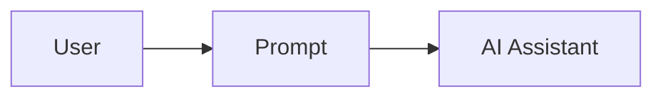
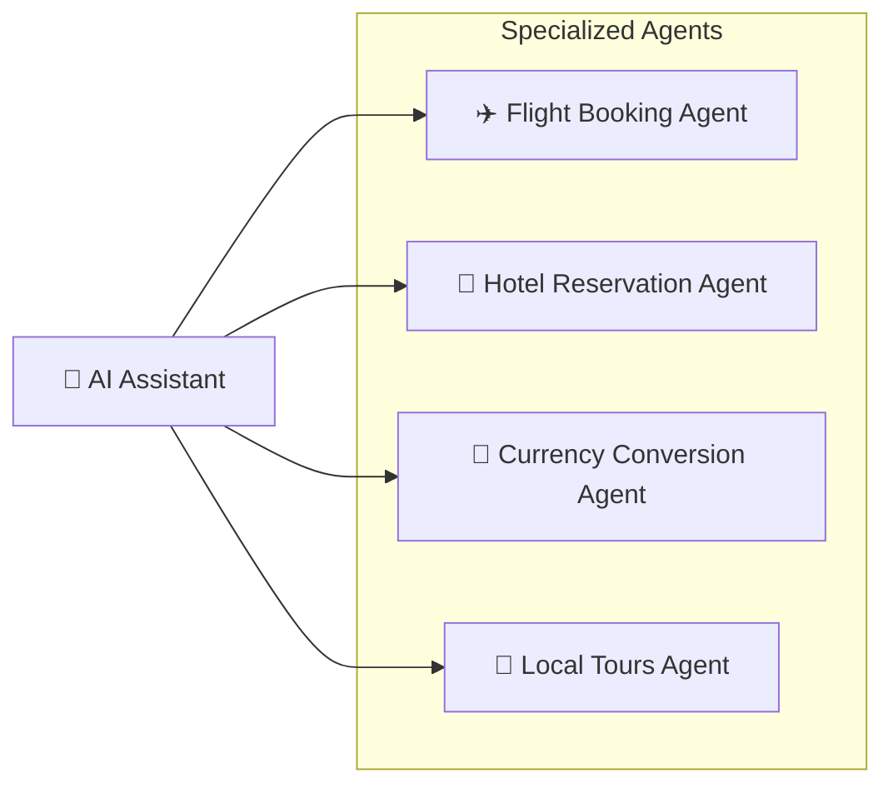
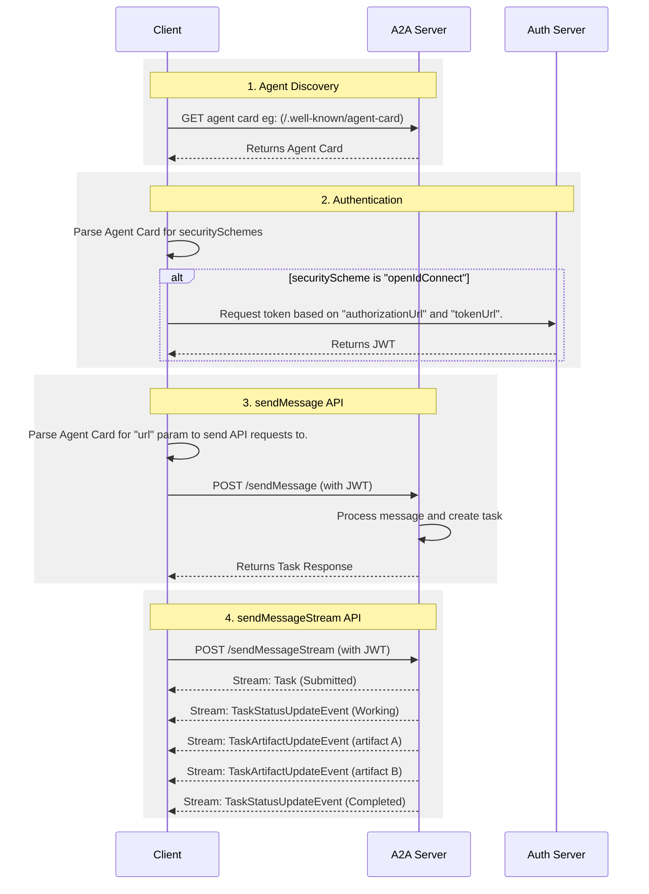

<!-- README.md at v1.0.1 -->

# Agent2Agent (A2A) Protocol

[](https://pypi.org/project/a2a-sdk)
[](LICENSE)
<a href="https://codewiki.google/github.com/a2aproject/a2a">
  
</a>

<div style="text-align: left;">
  <details>
    <summary>🌐 Language</summary>
    <div>
      <div style="text-align: center;">
        <a href="https://openaitx.github.io/view.html?user=a2aproject&project=A2A&lang=en">English</a>
        | <a href="https://openaitx.github.io/view.html?user=a2aproject&project=A2A&lang=zh-CN">简体中文</a>
        | <a href="https://openaitx.github.io/view.html?user=a2aproject&project=A2A&lang=zh-TW">繁體中文</a>
        | <a href="https://openaitx.github.io/view.html?user=a2aproject&project=A2A&lang=ja">日本語</a>
        | <a href="https://openaitx.github.io/view.html?user=a2aproject&project=A2A&lang=ko">한국어</a>
        | <a href="https://openaitx.github.io/view.html?user=a2aproject&project=A2A&lang=hi">हिन्दी</a>
        | <a href="https://openaitx.github.io/view.html?user=a2aproject&project=A2A&lang=th">ไทย</a>
        | <a href="https://openaitx.github.io/view.html?user=a2aproject&project=A2A&lang=fr">Français</a>
        | <a href="https://openaitx.github.io/view.html?user=a2aproject&project=A2A&lang=de">Deutsch</a>
        | <a href="https://openaitx.github.io/view.html?user=a2aproject&project=A2A&lang=es">Español</a>
        | <a href="https://openaitx.github.io/view.html?user=a2aproject&project=A2A&lang=it">Italiano</a>
        | <a href="https://openaitx.github.io/view.html?user=a2aproject&project=A2A&lang=ru">Русский</a>
        | <a href="https://openaitx.github.io/view.html?user=a2aproject&project=A2A&lang=pt">Português</a>
        | <a href="https://openaitx.github.io/view.html?user=a2aproject&project=A2A&lang=nl">Nederlands</a>
        | <a href="https://openaitx.github.io/view.html?user=a2aproject&project=A2A&lang=pl">Polski</a>
        | <a href="https://openaitx.github.io/view.html?user=a2aproject&project=A2A&lang=ar">العربية</a>
        | <a href="https://openaitx.github.io/view.html?user=a2aproject&project=A2A&lang=fa">فارسی</a>
        | <a href="https://openaitx.github.io/view.html?user=a2aproject&project=A2A&lang=tr">Türkçe</a>
        | <a href="https://openaitx.github.io/view.html?user=a2aproject&project=A2A&lang=vi">Tiếng Việt</a>
        | <a href="https://openaitx.github.io/view.html?user=a2aproject&project=A2A&lang=id">Bahasa Indonesia</a>
        | <a href="https://openaitx.github.io/view.html?user=a2aproject&project=A2A&lang=as">অসমীয়া</a>
      </div>
    </div>
  </details>
</div>

<!-- markdownlint-disable MD041 -->
<div style="text-align: center;">
  <div class="centered-logo-text-group">
    
    <h1>Agent2Agent (A2A) Protocol</h1>
  </div>
</div>

**An open protocol enabling communication and interoperability between opaque agentic applications.**

The Agent2Agent (A2A) protocol addresses a critical challenge in the AI landscape: enabling gen AI agents, built on diverse frameworks by different companies running on separate servers, to communicate and collaborate effectively - as agents, not just as tools. A2A aims to provide a common language for agents, fostering a more interconnected, powerful, and innovative AI ecosystem.

With A2A, agents can:

- Discover each other's capabilities.
- Negotiate interaction modalities (text, forms, media).
- Securely collaborate on long-running tasks.
- Operate without exposing their internal state, memory, or tools.

## DeepLearning.AI Course

[](https://goo.gle/dlai-a2a)

Join this short course on [A2A: The Agent2Agent Protocol](https://goo.gle/dlai-a2a), built in partnership with Google Cloud and IBM Research, and taught by [Holt Skinner](https://github.com/holtskinner), [Ivan Nardini](https://github.com/inardini), and [Sandi Besen](https://github.com/sandijean90).

**What you'll learn:**

- **Make agents A2A-compliant:** Expose agents built with frameworks like Google ADK, LangGraph, or BeeAI as A2A servers.
- **Connect agents:** Create A2A clients from scratch or using integrations to connect to A2A-compliant agents.
- **Orchestrate workflows:** Build sequential and hierarchical workflows of A2A-compliant agents.
- **Multi-agent systems:** Build a healthcare multi-agent system using different frameworks and see how A2A enables collaboration.
- **A2A and MCP:** Learn how A2A complements MCP by enabling agents to collaborate with each other.

## Why A2A?

As AI agents become more prevalent, their ability to interoperate is crucial for building complex, multi-functional applications. A2A aims to:

- **Break Down Silos:** Connect agents across different ecosystems.
- **Enable Complex Collaboration:** Allow specialized agents to work together on tasks that a single agent cannot handle alone.
- **Promote Open Standards:** Foster a community-driven approach to agent communication, encouraging innovation and broad adoption.
- **Preserve Opacity:** Allow agents to collaborate without needing to share internal memory, proprietary logic, or specific tool implementations, enhancing security and protecting intellectual property.

### Key Features

- **Standardized Communication:** JSON-RPC 2.0 over HTTP(S).
- **Agent Discovery:** Via "Agent Cards" detailing capabilities and connection info.
- **Flexible Interaction:** Supports synchronous request/response, streaming (SSE), and asynchronous push notifications.
- **Rich Data Exchange:** Handles text, files, and structured JSON data.
- **Enterprise-Ready:** Designed with security, authentication, and observability in mind.

## Getting Started

- 📚 **Explore the Documentation:** Visit the [Agent2Agent Protocol Documentation Site](https://a2a-protocol.org) for a complete overview, the full protocol specification, tutorials, and guides.
- 📝 **View the Specification:** [A2A Protocol Specification](https://a2a-protocol.org/latest/specification/)
- Use the SDKs:
    - [🐍 A2A Python SDK](https://github.com/a2aproject/a2a-python) `pip install a2a-sdk`
    - [🐿️ A2A Go SDK](https://github.com/a2aproject/a2a-go) `go get github.com/a2aproject/a2a-go`
    - [🧑‍💻 A2A JS SDK](https://github.com/a2aproject/a2a-js) `npm install @a2a-js/sdk`
    - [☕️ A2A Java SDK](https://github.com/a2aproject/a2a-java) using maven
    - [🔷 A2A .NET SDK](https://github.com/a2aproject/a2a-dotnet) using [NuGet](https://www.nuget.org/packages/A2A) `dotnet add package A2A`
- 🎬 Use our [samples](https://github.com/a2aproject/a2a-samples) to see A2A in action

## Contributing

We welcome community contributions to enhance and evolve the A2A protocol!

- **Questions & Discussions:** Join our [GitHub Discussions](https://github.com/a2aproject/A2A/discussions).
- **Issues & Feedback:** Report issues or suggest improvements via [GitHub Issues](https://github.com/a2aproject/A2A/issues).
- **Contribution Guide:** See our [CONTRIBUTING.md](CONTRIBUTING.md) for details on how to contribute.
- **Private Feedback:** Use this [Google Form](https://goo.gle/a2a-feedback).
- **Partner Program:** Google Cloud customers can join our partner program via this [form](https://goo.gle/a2a-partner).

## What's next

### Protocol Enhancements

- **Agent Discovery:**
    - Formalize inclusion of authorization schemes and optional credentials directly within the `AgentCard`.
- **Agent Collaboration:**
    - Investigate a `QuerySkill()` method for dynamically checking unsupported or unanticipated skills.
- **Task Lifecycle & UX:**
    - Support for dynamic UX negotiation _within_ a task (e.g., agent adding audio/video mid-conversation).
- **Client Methods & Transport:**
    - Explore extending support to client-initiated methods (beyond task management).
    - Improvements to streaming reliability and push notification mechanisms.

## About

The A2A Protocol is an open source project under the Linux Foundation, contributed by Google. It is licensed under the [Apache License 2.0](LICENSE) and is open to contributions from the community.


<!-- docs/topics/what-is-a2a.md at v1.0.1 -->

# What is A2A?

The A2A protocol is an open standard that enables seamless communication and
collaboration between AI agents. It provides a common language for agents built
using diverse frameworks and by different vendors, fostering interoperability
and breaking down silos. Agents are autonomous problem-solvers that act
independently within their environment. A2A allows agents from different
developers, built on different frameworks, and owned by different organizations
to unite and work together.

## Why Use the A2A Protocol

A2A addresses key challenges in AI agent collaboration. It provides
a standardized approach for agents to interact. This section explains the
problems A2A solves and the benefits it offers.

### Problems that A2A Solves

Consider a user request for an AI assistant to plan an international trip. This
task involves orchestrating multiple specialized agents, such as:

- A flight booking agent
- A hotel reservation agent
- An agent for local tour recommendations
- A currency conversion agent

Without A2A, integrating these diverse agents presents several challenges:

- **Agent Exposure**: Developers often wrap agents as tools to expose them to
    other agents, similar to how tools are exposed in a Multi-agent Control
    Platform (Model Context Protocol). However, this approach is inefficient because agents are
    designed to negotiate directly. Wrapping agents as tools limits their capabilities.
    A2A allows agents to be exposed as they are, without requiring this wrapping.
- **Custom Integrations**: Each interaction requires custom, point-to-point
    solutions, creating significant engineering overhead.
- **Slow Innovation**: Bespoke development for each new integration slows
    innovation.
- **Scalability Issues**: Systems become difficult to scale and maintain as
    the number of agents and interactions grows.
- **Interoperability**: This approach limits interoperability,
    preventing the organic formation of complex AI ecosystems.
- **Security Gaps**: Ad hoc communication often lacks consistent security
    measures.

The A2A protocol addresses these challenges by establishing interoperability for
AI agents to interact reliably and securely.

### A2A Example Scenario

This section provides an example scenario to illustrate the benefits of using an A2A (Agent2Agent) protocol for complex interactions between AI agents.

#### A User's Complex Request

A user interacts with an AI assistant, giving it a complex prompt like "Plan an international trip."



#### The Need for Collaboration

The AI assistant receives the prompt and realizes it needs to call upon multiple specialized agents to fulfill the request. These agents include a Flight Booking Agent, a Hotel Reservation Agent, a Currency Conversion Agent, and a Local Tours Agent.



#### The Interoperability Challenge

The core problem: The agents are unable to work together because each has its own bespoke development and deployment.

The consequence of a lack of a standardized protocol is that these agents cannot collaborate with each other let alone discover what they can do. The individual agents (Flight, Hotel, Currency, and Tours) are isolated.

#### The "With A2A" Solution

The A2A Protocol provides standard methods and data structures for agents to communicate with one another, regardless of their underlying implementation, so the same agents can be used as an interconnected system, communicating seamlessly through the standardized protocol.

The AI assistant, now acting as an orchestrator, receives the cohesive information from all the A2A-enabled agents. It then presents a single, complete travel plan as a seamless response to the user's initial prompt.

{ width="70%" style="margin:20px auto;display:block;" }

### Core Benefits of A2A

Implementing the A2A protocol offers significant advantages across the AI ecosystem:

- **Secure collaboration**: Without a standard, it's difficult to ensure
    secure communication between agents. A2A uses HTTPS for secure communication
    and maintains opaque operations, so agents can't see the inner workings of
    other agents during collaboration.
- **Interoperability**: A2A breaks down silos between different AI
    agent ecosystems, enabling agents from various vendors and frameworks to work
    together seamlessly.
- **Agent autonomy**: A2A allows agents to retain their individual capabilities
    and act as autonomous entities while collaborating with other agents.
- **Reduced integration complexity**: The protocol standardizes agent
    communication, enabling teams to focus on the unique value their agents
    provide.
- **Support for LRO**: The protocol supports long-running operations (LRO) and
    streaming with Server-Sent Events (SSE) and asynchronous execution.

### Key Design Principles of A2A

A2A development follows principles that prioritize broad adoption,
enterprise-grade capabilities, and future-proofing.

- **Simplicity**: A2A leverages existing standards like HTTP, JSON-RPC, and
    Server-Sent Events (SSE). This avoids reinventing core technologies and
    accelerates developer adoption.
- **Enterprise Readiness**: A2A addresses critical enterprise needs. It aligns
    with standard web practices for robust authentication, authorization,
    security, privacy, tracing, and monitoring.
- **Asynchronous**: A2A natively supports long-running tasks. It handles
    scenarios where agents or users might not remain continuously connected. It
    uses mechanisms like streaming and push notifications.
- **Modality Independent**: The protocol allows agents to communicate using a
    wide variety of content types. This enables rich and flexible interactions
    beyond plain text.
- **Opaque Execution**: Agents collaborate effectively without exposing their
    internal logic, memory, or proprietary tools. Interactions rely on declared
    capabilities and exchanged context. This preserves intellectual property and
    enhances security.

### Understanding the Agent Stack: A2A, MCP, Agent Frameworks and Models

A2A is situated within a broader agent stack, which includes:

- **A2A:** Standardizes communication among agents deployed in different organizations and developed using diverse frameworks.
- **MCP:** Connects models to data and external resources.
- **Frameworks (like ADK):** Provide toolkits for constructing agents.
- **Models:** Fundamental to an agent's reasoning, these can be any Large Language Model (LLM).

{ width="70%" style="margin:20px auto;display:block;" }

#### A2A and MCP

In the broader ecosystem of AI communication, you might be familiar with protocols designed to facilitate interactions between agents, models, and tools. Notably, the Model Context Protocol (MCP) is an emerging standard focused on connecting Large Language Models (LLMs) with data and external resources.

The Agent2Agent (A2A) protocol is designed to standardize communication between AI agents, particularly those deployed in external systems. A2A is positioned to complement MCP, addressing a distinct yet related aspect of agent interaction.

- **MCP's Focus:** Reducing the complexity involved in connecting agents with tools and data. Tools are typically stateless and perform specific, predefined functions (e.g., a calculator, a database query).
- **A2A's Focus:** Enabling agents to collaborate within their native modalities, allowing them to communicate as agents (or as users) rather than being constrained to tool-like interactions. This enables complex, multi-turn interactions where agents reason, plan, and delegate tasks to other agents. For example, this facilitates multi-turn interactions, such as those involving negotiation or clarification when placing an order.

{ width="70%" style="margin:20px auto;display:block;" }

The practice of encapsulating an agent as a simple tool is fundamentally limiting, as it fails to capture the agent's full capabilities. This critical distinction is explored in the post, [Why Agents Are Not Tools](https://discuss.google.dev/t/agents-are-not-tools/192812).

For a more in-depth comparison, refer to the [A2A and MCP Comparison](a2a-and-mcp.md) document.

#### A2A and ADK

The [Agent Development Kit (ADK)](https://google.github.io/adk-docs)
is an open-source agent development toolkit developed by Google. A2A is a
communication protocol for agents that enables inter-agent communication,
regardless of the framework used for their construction (e.g., ADK, LangGraph,
or Crew AI). ADK is a flexible and modular framework for developing and
deploying AI agents. While optimized for Gemini AI and the Google ecosystem,
ADK is model-agnostic, deployment-agnostic, and built for compatibility with
other frameworks.

### A2A Request Lifecycle

The A2A request lifecycle is a sequence that details the four main steps a request follows: agent discovery, authentication, `sendMessage` API, and `sendMessageStream` API. The following diagram provides a deeper look into the operational flow, illustrating the interactions between the client, A2A server, and auth server.



## What's Next

Learn about the [Key Concepts](./key-concepts.md) that form the foundation of the A2A protocol.


<!-- docs/topics/key-concepts.md at v1.0.1 -->

# Core Concepts and Components in A2A

A2A uses a set of core concepts that define how agents interact.
Understand these core building blocks to develop or integrate with A2A-compliant
systems.

{ width="70%" style="margin:20px auto;display:block;" }

## Core Actors in A2A Interactions

- **User**: The end user, which can be a human operator or an automated
    service. The user initiates a request or defines a goal that requires
    assistance from one or more AI agents.
- **A2A Client (Client Agent)**: An application, service, or another AI agent
    that acts on behalf of the user. The client initiates communication using the
    A2A protocol.
- **A2A Server (Remote Agent)**: An AI agent or an agentic system that exposes
    an HTTP endpoint implementing the A2A protocol. It receives requests from
    clients, processes tasks, and returns results or status updates. From the client's perspective,
    the remote agent operates as an _opaque_ (black-box) system, meaning its internal workings, memory, or tools are not exposed.

## Fundamental Communication Elements

The following table describes the fundamental communication elements in A2A:

| Element | Description | Key Purpose |
| :------ | :---------- | :---------- |
| Agent Card | A JSON metadata document describing an agent's identity, capabilities, endpoint, skills, and authentication requirements. | Enables clients to discover agents and understand how to interact with them securely and effectively. |
| Task | A stateful unit of work initiated by an agent, with a unique ID and defined lifecycle. | Facilitates tracking of long-running operations and enables multi-turn interactions and collaboration. |
| Message | A single turn of communication between a client and an agent, containing content and a role ("user" or "agent"). | Conveys instructions, context, questions, answers, or status updates that are not necessarily formal artifacts. |
| Part | The fundamental content container used within Messages and Artifacts. A Part holds one of: text content, a file reference (URL or inline bytes), or structured data. | Provides flexibility for agents to exchange various content types within messages and artifacts. |
| Artifact | A tangible output generated by an agent during a task (for example, a document, image, or structured data). | Delivers the concrete results of an agent's work, ensuring structured and retrievable outputs. |

## Interaction Mechanisms

The A2A Protocol supports various interaction patterns to accommodate different
needs for responsiveness and persistence. These mechanisms ensure that agents
can exchange information efficiently and reliably, regardless of the task's
complexity or duration:

- **Request/Response (Polling)**: Clients send a request and the server
    responds. For long-running tasks, the client periodically polls the server
    for updates.
- **Streaming with Server-Sent Events (SSE)**: Clients initiate a stream to
    receive real-time, incremental results or status updates from the server
    over an open HTTP connection.
- **Push Notifications**: For very long-running tasks or disconnected
    scenarios, the server can actively send asynchronous notifications to a
    client-provided webhook when significant task updates occur.

For a detailed exploration of streaming and push notifications, refer to the
[Streaming & Asynchronous Operations](./streaming-and-async.md) document.

## Agent Cards

The Agent Card is a JSON document that serves as a digital business card for
initial discovery and interaction setup. It provides essential metadata about an
agent. Clients parse this information to determine if an agent is suitable for a
given task, how to structure requests, and how to communicate securely. Key
information includes identity, service endpoint (URL), A2A capabilities,
authentication requirements, and a list of skills.

## Messages and Parts

A message represents a single turn of communication between a client and an
agent. It includes a role ("user" or "agent") and a unique `messageId`. It
contains one or more Part objects, which are granular containers for the actual
content. This design allows A2A to be modality independent.

The `Part` object is a flexible container that can hold different types of content using a `oneof` field structure. A Part must contain exactly one of the following content fields:

- `text`: A string containing plain textual content.
- `raw`: A byte array containing binary file data (inline).
- `url`: A string URI referencing external file content.
- `data`: A structured JSON value (e.g., object, array) for machine-readable data.

Additionally, every `Part` can include:

- `mediaType`: The MIME type of the content (e.g., `"text/plain"`, `"image/png"`, `"application/json"`).
- `filename`: An optional name for the file or content.
- `metadata`: A key-value map for additional context.

## Artifacts

An artifact represents a tangible output or a concrete result generated by a
remote agent during task processing. Unlike general messages, artifacts are the
actual deliverables. An artifact has a unique `artifactId`, a human-readable
name, and consists of one or more part objects. Artifacts are closely tied to the
task lifecycle and can be streamed incrementally to the client.

## Agent Response: Task or Message

The agent response can be a new `Task` (when the agent needs to perform a
long-running operation) or a `Message` (when the agent can respond immediately).

For more details, see [Life of a Task](./life-of-a-task.md).

## Other Important Concepts

- **Context (`contextId`):** A server-generated identifier that can be used to logically group multiple related `Task` objects, providing context across a series of interactions.
- **Transport and Format:** A2A communication occurs over HTTP(S). JSON-RPC 2.0 is used as the payload format for all requests and responses.
- **Authentication & Authorization:** A2A relies on standard web security practices. Authentication requirements are declared in the Agent Card, and credentials (e.g., OAuth tokens, API keys) are typically passed through HTTP headers, separate from the A2A protocol messages themselves. For more information, see [Enterprise-Ready Features](./enterprise-ready.md).
- **Agent Discovery:** The process by which clients find Agent Cards to learn about available A2A Servers and their capabilities. For more information, see [Agent Discovery](./agent-discovery.md).
- **Extensions:** A2A allows agents to declare custom protocol extensions as part of their AgentCard. For more information, see [Extensions](./extensions.md).


<!-- docs/topics/life-of-a-task.md at v1.0.1 -->

# Life of a Task

In the Agent2Agent (A2A) Protocol, interactions can range from simple, stateless
exchanges to complex, long-running processes. When an agent receives a message
from a client, it can respond in one of two fundamental ways:

- **Respond with a Stateless `Message`**: This type of response is
    typically used for immediate, self-contained interactions that conclude
    without requiring further state management.
- **Initiate a Stateful `Task`**: If the response is a `Task`, the agent will
    process it through a defined lifecycle, communicating progress and requiring
    input as needed, until it reaches an interrupted state (e.g.,
    `input-required`, `auth-required`) or a terminal state (e.g., `completed`,
    `canceled`, `rejected`, `failed`).

## Group Related Interactions

A `contextId` is a crucial identifier that logically groups multiple `Task`
objects and independent `Message` objects, providing continuity across a series of
interactions.

- When a client sends a message for the first time, the agent responds
    with a new `contextId`. If a task is initiated, it will also have a `taskId`.
- Clients can send subsequent messages and include the same `contextId` to
    indicate that they are continuing their previous interaction within the same
    context.
- Clients optionally attach the `taskId` to a subsequent message to
    indicate that it continues that specific task.

The `contextId` enables collaboration towards a common goal or a shared
contextual session across multiple, potentially concurrent tasks. Internally, an
A2A agent (especially one using an LLM) uses the `contextId` to manage its internal
conversational state or its LLM context.

## Agent Response: Message or Task

The choice between responding with a `Message` or a `Task` depends on the
nature of the interaction and the agent's capabilities:

- **Messages for Trivial Interactions**: `Message` objects are suitable for
    transactional interactions that don't require long-running
    processing or complex state management. An agent might use messages to
    negotiate the acceptance or scope of a task before committing to a `Task`
    object.
- **Tasks for Stateful Interactions**: Once an agent maps the intent of an
    incoming message to a supported capability that requires substantial,
    trackable work over an extended period, the agent responds with a `Task`
    object.

Conceptually, agents operate at different levels of complexity:

- **Message-only Agents**: Always respond with `Message` objects. They
    typically don't manage complex state or long-running executions, and use
    `contextId` to tie messages together. These agents might directly wrap LLM
    invocations and simple tools.
- **Task-generating Agents**: Always respond with `Task` objects, even for
    responses, which are then modeled as completed tasks. Once a task is
    created, the agent will only return `Task` objects in response to messages
    sent, and once a task is complete, no more messages can be sent. This
    approach avoids deciding between `Task` versus `Message`, but creates completed task objects
    for even simple interactions.
- **Hybrid Agents**: Generate both `Message` and `Task` objects. These agents
    use messages to negotiate agent capability and the scope of work for a task,
    then send a `Task` object to track execution and manage states like
    `input-required` or error handling. Once a task is created, the agent will
    only return `Task` objects in response to messages sent, and once a task is
    complete, no more messages can be sent. A hybrid agent uses messages to
    negotiate the scope of a task, and then generate a task to track its
    execution.
    For more information about hybrid agents, see [A2A protocol: Demystifying Tasks vs Messages](https://discuss.google.dev/t/a2a-protocol-demystifying-tasks-vs-messages/255879).

## Task Refinements

Clients often need to send new requests based on task results or refine the
outputs of previous tasks. This is modeled by starting another interaction using
the same `contextId` as the original task. Clients further hint the agent by
providing references to the original task using `referenceTaskIds` in the
`Message` object. The agent then responds with either a new `Task` or a
`Message`.

## Task Immutability

Once a task reaches a terminal state (completed, canceled, rejected, or failed),
it cannot restart. Any subsequent interaction related to that task, such as a
refinement, must initiate a new task within the same `contextId`. This principle
offers several benefits:

- **Task Immutability.** Clients reliably reference tasks and their
    associated state, artifacts, and messages, providing a clean mapping of
    inputs to outputs. This is valuable for orchestration and traceability.
- **Clear Unit of Work.** Every new request, refinement, or follow-up becomes
    a distinct task. This simplifies bookkeeping, allows for granular tracking
    of an agent's work, and enables tracing each artifact to a specific unit of
    work.
- **Easier Implementation.** This removes ambiguity for agent developers
    regarding whether to create a new task or restart an existing one.

## Parallel Follow-ups

A2A supports parallel work by enabling agents to create distinct, parallel
tasks for each follow-up message sent within the same `contextId`. This allows
clients to track individual tasks and create new dependent tasks as soon as a
prerequisite task is complete.

For example:

- Task 1: Book a flight to Helsinki.
- Task 2: Based on Task 1, book a hotel.
- Task 3: Based on Task 1, book a snowmobile activity.
- Task 4: Based on Task 2, add a spa reservation to the hotel booking.

## Referencing Previous Artifacts

The serving agent infers the relevant artifact from a referenced task or from the
`contextId`. As the domain expert, the serving agent is best suited to resolve
ambiguity or identify missing information. If there is ambiguity, the agent asks
the client for clarification by returning an `input-required` state. The client
then specifies the artifact in its response, optionally populating artifact
references (`artifactId`, `taskId`) in `Part` metadata.

## Tracking Artifact Mutation

Follow-up or refinement tasks often lead to the creation of new artifacts based on older ones. Tracking these mutations is important to ensure that only the most recent version of an artifact is used in subsequent interactions. This could be conceptualized as a version history, where each new artifact is linked to its predecessor.

However, the client is in the best position to manage this artifact linkage. The client determines what constitutes an acceptable result and has the ability to accept or reject new versions. Therefore, the serving agent shouldn't be responsible for tracking artifact mutations, and this linkage is not part of the A2A protocol specification. Clients should maintain this version history on their end and present the latest acceptable version to the user.

To facilitate client-side tracking, serving agents should use a consistent `artifact-name` when generating a refined version of an existing artifact.

When initiating follow-up or refinement tasks, the client should explicitly reference the specific artifact they intend to refine, ideally the "latest" version from their perspective. If the artifact reference is not provided, the serving agent can:

- Attempt to infer the intended artifact based on the current `contextId`.
- If there is ambiguity or insufficient context, the agent should respond with an `input-required` task state to request clarification from the client.

## Example Follow-up Scenario

The following example illustrates a typical task flow with a follow-up:

1. Client sends a message to the agent:

    ```json
    {
      "jsonrpc": "2.0",
      "id": "req-001",
      "method": "SendMessage",
      "params": {
        "message": {
          "role": "user",
          "parts": [
            {
              "text": "Generate an image of a sailboat on the ocean."
            }
          ],
          "messageId": "msg-user-001"
        }
      }
    }
    ```

2. Agent responds with a boat image (completed task):

    ```json
    {
      "jsonrpc": "2.0",
      "id": "req-001",
      "result": {
        "task": {
          "id": "task-boat-gen-123",
          "contextId": "ctx-conversation-abc",
          "status": {
            "state": "TASK_STATE_COMPLETED"
          },
          "artifacts": [
            {
              "artifactId": "artifact-boat-v1-xyz",
              "name": "sailboat_image.png",
              "description": "A generated image of a sailboat on the ocean.",
              "parts": [
                {
                  "filename": "sailboat_image.png",
                  "mediaType": "image/png",
                  "raw": "base64_encoded_png_data_of_a_sailboat"
                }
              ]
            }
          ]
        }
      }
    }
    ```

3. Client asks to color the boat red. This refinement request refers to the
    previous `taskId` and uses the same `contextId`.

    ```json
    {
      "jsonrpc": "2.0",
      "id": "req-002",
      "method": "SendMessage",
      "params": {
        "message": {
          "role": "user",
          "messageId": "msg-user-002",
          "contextId": "ctx-conversation-abc",
          "referenceTaskIds": [
            "task-boat-gen-123"
          ],
          "parts": [
            {
              "text": "Please modify the sailboat to be red."
            }
          ]
        }
      }
    }
    ```

4. Agent responds with a new image artifact (new task, same context, same
    artifact name): The agent creates a new task within the same `contextId`. The
    new boat image artifact retains the same name but has a new `artifactId`.

    ```json
    {
      "jsonrpc": "2.0",
      "id": "req-002",
      "result": {
        "task": {
          "id": "task-boat-color-456",
          "contextId": "ctx-conversation-abc",
          "status": {
            "state": "TASK_STATE_COMPLETED"
          },
          "artifacts": [
            {
              "artifactId": "artifact-boat-v2-red-pqr",
              "name": "sailboat_image.png",
              "description": "A generated image of a red sailboat on the ocean.",
              "parts": [
                {
                  "filename": "sailboat_image.png",
                  "mediaType": "image/png",
                  "raw": "base64_encoded_png_data_of_a_RED_sailboat"
                }
              ]
            }
          ]
        }
      }
    }
    ```


<!-- docs/topics/agent-discovery.md at v1.0.1 -->

# Agent Discovery in A2A

To collaborate using the Agent2Agent (A2A) protocol, AI agents need to first find each other and understand their capabilities. A2A standardizes agent self-descriptions through the **[Agent Card](../specification.md#5-agent-discovery-the-agent-card)**. However, discovery methods for these Agent Cards vary by environment and requirements. The Agent Card defines what an agent offers. Various strategies exist for a client agent to discover these cards. The choice of strategy depends on the deployment environment and security requirements.

## The Role of the Agent Card

The Agent Card is a JSON document that serves as a digital "business card" for an A2A Server (the remote agent). It is crucial for agent discovery and interaction. The key information included in an Agent Card is as follows:

- **Identity:** Includes `name`, `description`, and `provider` information.
- **Service Endpoint:** Specifies the `url` for the A2A service.
- **A2A Capabilities:** Lists supported features such as `streaming` or `pushNotifications`.
- **Authentication:** Details the required `schemes` (e.g., "Bearer", "OAuth2").
- **Skills:** Describes the agent's tasks using `AgentSkill` objects, including `id`, `name`, `description`, `inputModes`, `outputModes`, and `examples`.

Client agents use the Agent Card to determine an agent's suitability, structure requests, and ensure secure communication.

## Discovery Strategies

The following sections detail common strategies used by client agents to discover remote Agent Cards:

### 1. Well-Known URI

This approach is recommended for public agents or agents intended for broad discovery within a specific domain.

- **Mechanism:** A2A Servers make their Agent Card discoverable by hosting it at a standardized, `well-known` URI on their domain. The standard path is `https://{agent-server-domain}/.well-known/agent-card.json`, following the principles of [RFC 8615](https://datatracker.ietf.org/doc/html/rfc8615).

- **Process:**
    1. A client agent knows or programmatically discovers the domain of a potential A2A Server (e.g., `smart-thermostat.example.com`).
    2. The client performs an HTTP GET request to `https://smart-thermostat.example.com/.well-known/agent-card.json`.
    3. If the Agent Card exists and is accessible, the server returns it as a JSON response.

- **Advantages:**
    - Ease of implementation
    - Adheres to standards
    - Facilitates automated discovery

- **Considerations:**
    - Best suited for open or domain-controlled discovery scenarios.
    - Authentication is necessary at the endpoint serving the Agent Card if it contains sensitive details.

### 2. Curated Registries (Catalog-Based Discovery)

This approach is employed in enterprise environments or public marketplaces, where Agent Cards are often managed by a central registry. The curated registry acts as a central repository, allowing clients to query and discover agents based on criteria like "skills" or "tags".

- **Mechanism:** An intermediary service (the registry) maintains a collection of Agent Cards. Clients query this registry to find agents based on various criteria (e.g., skills offered, tags, provider name, capabilities).

- **Process:**
    1. A2A Servers publish their Agent Cards to the registry.
    2. Client agents query the registry's API, and search by criteria such as "specific skills".
    3. The registry returns matching Agent Cards or references.

- **Advantages:**
    - Centralized management and governance.
    - Capability-based discovery (e.g., by skill).
    - Support for access controls and trust frameworks.
    - Applicable in both private and public marketplaces.
- **Considerations:**
    - Requires deployment and maintenance of a registry service.
    - The current A2A specification does not prescribe a standard API for curated registries.

### 3. Direct Configuration / Private Discovery

This approach is used for tightly coupled systems, private agents, or development purposes, where clients are directly configured with Agent Card information or URLs.

- **Mechanism:** Client applications utilize hardcoded details, configuration files, environment variables, or proprietary APIs for discovery.
- **Process:** The process is specific to the application's deployment and configuration strategy.
- **Advantages:** This method is straightforward for establishing connections within known, static relationships.
- **Considerations:**
    - Inflexible for dynamic discovery scenarios.
    - Changes to Agent Card information necessitate client reconfiguration.
    - Proprietary API-based discovery also lacks standardization.

## Securing Agent Cards

Agent Cards include sensitive information, such as:

- URLs for internal or restricted agents.
- Descriptions of sensitive skills.

### Protection Mechanisms

To mitigate risks, the following protection mechanisms should be considered:

- **Authenticated Agent Cards:** We recommend the use of [authenticated extended agent cards](../specification.md#3111-get-extended-agent-card) for sensitive information or for serving a more detailed version of the card.
- **Secure Endpoints:** Implement access controls on the HTTP endpoint serving the Agent Card (e.g., `/.well-known/agent-card.json` or registry API). The methods include:
    - Mutual TLS (mTLS)
    - Network restrictions (e.g., IP ranges)
    - HTTP Authentication (e.g., OAuth 2.0)

- **Registry Selective Disclosure:** Registries return different Agent Cards based on the client's identity and permissions.

Any Agent Card containing sensitive data must be protected with authentication and authorization mechanisms. The A2A specification strongly recommends the use of out-of-band dynamic credentials rather than embedding static secrets within the Agent Card.

## Caching Considerations

Agent Cards describe an agent's capabilities and typically change infrequently — for example, when skills are added or authentication requirements are updated. Applying standard HTTP caching practices to Agent Card endpoints reduces unnecessary network requests while ensuring clients eventually receive updated information.

### Server Guidance

Servers hosting Agent Card endpoints should include HTTP caching headers in their responses. The `Cache-Control` header with an appropriate `max-age` directive allows clients and intermediaries to cache the card for a specified duration. Including an `ETag` header — derived from the card's `version` field or a content hash — enables clients to make conditional requests and avoid re-downloading unchanged cards.

### Client Guidance

Clients fetching Agent Cards should honor standard HTTP caching semantics. When a cached card expires, clients should use conditional requests (for example, `If-None-Match` with the stored `ETag` or `If-Modified-Since`) rather than unconditionally re-fetching the full card. When the server does not provide caching headers, clients may apply a reasonable default cache duration.

For Extended Agent Cards, clients should also follow the session-scoped caching guidance described in the [specification](../specification.md#133-extended-agent-card-access-control).

For normative requirements, see [Section 8.6](../specification.md#86-caching) of the specification.

## Future Considerations

The A2A community explores standardizing registry interactions or advanced discovery protocols.


<!-- docs/topics/streaming-and-async.md at v1.0.1 -->

# Streaming and Asynchronous Operations for Long-Running Tasks

The Agent2Agent (A2A) protocol is explicitly designed to handle tasks that might not complete immediately. Many AI-driven operations are often long-running, involve multiple steps, produce incremental results, or require human intervention. A2A provides mechanisms for managing such asynchronous interactions, ensuring that clients receive updates effectively, whether they remain continuously connected or operate in a more disconnected fashion.

## Streaming with Server-Sent Events (SSE)

For tasks that produce incremental results (like generating a long document or streaming media) or provide ongoing status updates, A2A supports real-time communication using Server-Sent Events (SSE). This approach is ideal when the client is able to maintain an active HTTP connection with the A2A Server.

The following key features detail how SSE streaming is implemented and managed within the A2A protocol:

- **Server Capability:** The A2A Server must indicate its support for streaming by setting `capabilities.streaming: true` in its Agent Card.

- **Initiating a Stream:** The client uses the `SendStreamingMessage` RPC method to send an initial message (for example, a prompt or command) and simultaneously subscribe to updates for that task.

- **Server Response and Connection:** If the subscription is successful, the server responds with an HTTP 200 OK status and a `Content-Type: text/event-stream`. This HTTP connection remains open for the server to push events to the client.

- **Event Structure and Types:** The server sends events over this stream. Each event's `data` field contains a JSON-RPC 2.0 Response object, typically a `SendStreamingMessageResponse`. The `result` field of the `SendStreamingMessageResponse` contains:

    - [`Task`](../specification.md#61-task-object): Represents the current state of the work.
    - [`TaskStatusUpdateEvent`](../specification.md#taskstatusupdateevent): Communicates changes in the task's lifecycle state (for example, from `working` to `input-required` or `completed`). It also provides intermediate messages from the agent.
    - [`TaskArtifactUpdateEvent`](../specification.md#taskartifactupdateevent): Delivers new or updated Artifacts generated by the task. This is used to stream large files or data structures in chunks, with fields like `append` and `lastChunk` to help reassemble.

- **Stream Termination:** When a task reaches a terminal or interrupted state (e.g., `COMPLETED`, `FAILED`, `CANCELED`, `REJECTED`, or `INPUT_REQUIRED`), the server closes the stream and sends no further updates.

- **Resubscription:** If a client's SSE connection breaks prematurely while a task is still active, the client is able to attempt to reconnect to the stream using the `SubscribeToTask` RPC method.

### When to Use Streaming

Streaming with SSE is best suited for:

- Real-time progress monitoring of long-running tasks.
- Receiving large results (artifacts) incrementally.
- Interactive, conversational exchanges where immediate feedback or partial responses are beneficial.
- Applications requiring low-latency updates from the agent.

### Protocol Specification References

Refer to the Protocol Specification for detailed structures:

- [`SendStreamingMessage`](../specification.md#72-messagestream)
- [`SubscribeToTask`](../specification.md#79-taskssubscribe)

## Push Notifications for Disconnected Scenarios

For very long-running tasks (for example, lasting minutes, hours, or even days) or when clients are unable to or prefer not to maintain persistent connections (like mobile clients or serverless functions), A2A supports asynchronous updates using push notifications. This allows the A2A Server to actively notify a client-provided webhook when a significant task update occurs.

The following key features detail how push notifications are implemented and managed within the A2A protocol:

- **Server Capability:** The A2A Server must indicate its support for this feature by setting `capabilities.pushNotifications: true` in its Agent Card.
- **Configuration:** The client provides a [`PushNotificationConfig`](../specification.md#pushnotificationconfig) to the server. This configuration is supplied:
    - Within the initial `SendMessage` or `SendStreamingMessage` request, or
    - Separately, using the `CreateTaskPushNotificationConfig` RPC method for an existing task.
    The `PushNotificationConfig` includes a `url` (the HTTPS webhook URL), an optional `token` (for client-side validation), and optional `authentication` details (for the A2A Server to authenticate to the webhook).
- **Notification Trigger:** The A2A Server decides when to send a push notification, typically when a task reaches a significant state change (for example, terminal state, `input-required`, or `auth-required`).
- **Notification Payload:** The A2A protocol defines the HTTP body payload as a [`StreamResponse`](../specification.md#323-stream-response) object, matching the format used in streaming operations. The payload contains one of: `task`, `message`, `statusUpdate`, or `artifactUpdate`. See [Push Notification Payload](../specification.md#pushnotificationpayload) for detailed structure.
- **Client Action:** Upon receiving a push notification (and successfully verifying its authenticity), the client typically uses the `GetTask` RPC method with the `taskId` from the notification to retrieve the complete, updated `Task` object, including any new artifacts.

### When to Use Push Notifications

Push notifications are ideal for:

- Very long-running tasks that can take minutes, hours, or days to complete.
- Clients that cannot or prefer not to maintain persistent connections, such as mobile applications or serverless functions.
- Scenarios where clients only need to be notified of significant state changes rather than continuous updates.

### Protocol Specification References

Refer to the Protocol Specification for detailed structures:

- [`CreateTaskPushNotificationConfig`](../specification.md#317-create-push-notification-config)
- [`GetTask`](../specification.md#76-taskspushnotificationconfigget)

### Client-Side Push Notification Service

The `url` specified in `PushNotificationConfig.url` points to a client-side Push Notification Service. This service is responsible for receiving the HTTP POST notification from the A2A Server. Its responsibilities include authenticating the incoming notification, validating its relevance, and relaying the notification or its content to the appropriate client application logic or system.

### Security Considerations for Push Notifications

Security is paramount for push notifications due to their asynchronous and server-initiated outbound nature. Both the A2A Server (sending the notification) and the client's webhook receiver have critical responsibilities.

#### A2A Server Security (when sending notifications to client webhook)

- **Webhook URL Validation:** Servers SHOULD NOT blindly trust and send POST requests to any URL provided by a client. Malicious clients could provide URLs pointing to internal services or unrelated third-party systems, leading to Server-Side Request Forgery (SSRF) attacks or acting as Distributed Denial of Service (DDoS) amplifiers.
    - **Mitigation strategies:** Allowlisting of trusted domains, ownership verification (for example, challenge-response mechanisms), and network controls (e.g., egress firewalls).
- **Authenticating to the Client's Webhook:** The A2A Server MUST authenticate itself to the client's webhook URL according to the scheme specified in `PushNotificationConfig.authentication`. Common schemes include Bearer Tokens (OAuth 2.0), API keys, HMAC signatures, or mutual TLS (mTLS).

#### Client Webhook Receiver Security (when receiving notifications from A2A server)

- **Authenticating the A2A Server:** The webhook endpoint MUST rigorously verify the authenticity of incoming notification requests to ensure they originate from the legitimate A2A Server and not an imposter.
    - **Verification methods:** Verify signatures/tokens (for example, JWT signatures against the A2A Server's trusted public keys, HMAC signatures, or API key validation). Also, validate the `PushNotificationConfig.token` if provided.
- **Preventing Replay Attacks:**
    - **Timestamps:** Notifications SHOULD include a timestamp. The webhook SHOULD reject notifications that are too old.
    - **Nonces/unique IDs:** For critical notifications, consider using unique, single-use identifiers (for example, JWT's `jti` claim or event IDs) to prevent processing duplicate notifications.
- **Secure Key Management and Rotation:** Implement secure key management practices, including regular key rotation, especially for cryptographic keys. Protocols like JWKS (JSON Web Key Set) facilitate key rotation for asymmetric keys.

#### Example Asymmetric Key Flow (JWT + JWKS)

1. Client creates a `PushNotificationConfig` specifying `authentication.scheme: "Bearer"` and possibly an expected `issuer` or `audience` for the JWT.
2. A2A Server, when sending a notification:
    - Generates a JWT, signing it with its private key. The JWT includes claims like `iss` (issuer), `aud` (audience), `iat` (issued at), `exp` (expires), `jti` (JWT ID), and `taskId`.
    - The JWT header indicates the signing algorithm and key ID (`kid`).
    - The A2A Server makes its public keys available through a JWKS endpoint.
3. Client Webhook, upon receiving the notification:
    - Extracts the JWT from the Authorization header.
    - Inspects the `kid` (key ID) in the JWT header.
    - Fetches the corresponding public key from the A2A Server's JWKS endpoint (caching keys is recommended).
    - Verifies the JWT signature using the public key.
    - Validates claims (`iss`, `aud`, `iat`, `exp`, `jti`).
    - Checks the `PushNotificationConfig.token` if provided.

This comprehensive, layered approach to security for push notifications helps ensure that messages are authentic, integral, and timely, protecting both the sending A2A Server and the receiving client webhook infrastructure.


<!-- docs/topics/enterprise-ready.md at v1.0.1 -->

# Enterprise Implementation of A2A

The Agent2Agent (A2A) protocol is designed with enterprise requirements at its
core. Rather than inventing new, proprietary standards for security and
operations, A2A aims to integrate seamlessly with existing enterprise
infrastructure and widely adopted best practices. This approach allows
organizations to use their existing investments and expertise in security,
monitoring, governance, and identity management.

A key principle of A2A is that agents are typically **opaque** because they don't
share internal memory, tools, or direct resource access with each other. This
opacity naturally aligns with standard client-server security paradigms,
treating remote agents as standard HTTP-based enterprise applications.

## Transport Level Security (TLS)

Ensuring the confidentiality and integrity of data in transit is fundamental for
any enterprise application.

- **HTTPS Mandate**: All A2A communication in production environments must
    occur over `HTTPS`.
- **Modern TLS Standards**: Implementations should use modern TLS versions.
    TLS 1.2 or higher is recommended. Strong, industry-standard cipher suites
    should be used to protect data from eavesdropping and tampering.
- **Server Identity Verification**: A2A clients should verify the A2A server's
    identity by validating its TLS certificate against trusted certificate
    authorities during the TLS handshake. This prevents man-in-the-middle
    attacks.

## Authentication

A2A delegates authentication to standard web mechanisms. It primarily relies on
HTTP headers and established standards like OAuth2 and OpenID Connect.
Authentication requirements are advertised by the A2A server in its Agent Card.

- **No Identity in Payload**: A2A protocol payloads, such as `JSON-RPC`
    messages, don't carry user or client identity information directly. Identity
    is established at the transport/HTTP layer.
- **Agent Card Declaration**: The A2A server's Agent Card describes the
    authentication schemes it supports in its `security` field and aligns with
    those defined in the OpenAPI Specification for authentication.
- **Out-of-Band Credential Acquisition**: The A2A Client obtains the necessary credentials,
    such as OAuth 2.0 tokens or API keys, through processes external to the A2A protocol itself. Examples include OAuth flows or secure key distribution.
- **HTTP Header Transmission**: Credentials **must** be transmitted in standard
    HTTP headers as per the requirements of the chosen authentication scheme.
    Examples include `Authorization: Bearer <TOKEN>` or `API-Key: <KEY_VALUE>`.
- **Server-Side Validation**: The A2A server **must** authenticate every
    incoming request using the credentials provided in the HTTP headers.
    - If authentication fails or credentials are missing, the server **should**
        respond with a standard HTTP status code:
        - `401 Unauthorized`: If the credentials are missing or invalid. This
            response **should** include a `WWW-Authenticate` header to inform
            the client about the supported authentication methods.
        - `403 Forbidden`: If the credentials are valid, but the authenticated
            client does not have permission to perform the requested action.
- **In-Task Authentication (Secondary Credentials)**: If an agent needs
    additional credentials to access a different system or service during a
    task (for example, to use a specific tool on the user's behalf), the A2A server
    indicates to the client that more information is needed. The client
    is then responsible for obtaining these secondary credentials through a
    process outside of the A2A protocol itself (for example, an OAuth flow) and
    providing them back to the A2A server to continue the task.

## Authorization

Once a client is authenticated, the A2A server is responsible for authorizing
the request. Authorization logic is specific to the agent's implementation,
the data it handles, and applicable enterprise policies.

- **Granular Control**: Authorization **should** be applied based on the
    authenticated identity, which could represent an end user, a client
    application, or both.
- **Skill-Based Authorization**: Access can be controlled on a per-skill
    basis, as advertised in the Agent Card. For example, specific OAuth scopes
    **should** grant an authenticated client access to invoke certain skills but
    not others.
- **Data and Action-Level Authorization**: Agents that interact with backend
    systems, databases, or tools **must** enforce appropriate authorization before
    performing sensitive actions or accessing sensitive data through those
    underlying resources. The agent acts as a gatekeeper.
- **Principle of Least Privilege**: Agents **must** grant only the necessary
    permissions required for a client or user to perform their intended
    operations through the A2A interface.

## Data Privacy and Confidentiality

Protecting sensitive data exchanged between agents is paramount, requiring
strict adherence to privacy regulations and best practices.

- **Sensitivity Awareness**: Implementers must be acutely aware of the
    sensitivity of data exchanged in Message and Artifact parts of A2A
    interactions.
- **Compliance**: Ensure compliance with relevant data privacy regulations
    such as GDPR, CCPA, and HIPAA, based on the domain and data involved.
- **Data Minimization**: Avoid including or requesting unnecessarily sensitive
    information in A2A exchanges.
- **Secure Handling**: Protect data both in transit, using TLS as mandated,
    and at rest if persisted by agents, according to enterprise data security
    policies and regulatory requirements.

## Tracing, Observability, and Monitoring

A2A's reliance on HTTP allows for straightforward integration with standard
enterprise tracing, logging, and monitoring tools, providing critical visibility
into inter-agent workflows.

- **Distributed Tracing**: A2A Clients and Servers **should** participate in
    distributed tracing systems. For example, use OpenTelemetry to propagate
    trace context, including trace IDs and span IDs, through standard HTTP
    headers, such as W3C Trace Context headers. This enables end-to-end
    visibility for debugging and performance analysis.
- **Comprehensive Logging**: Log details on both client and server, including
    taskId, sessionId, correlation IDs, and trace context for troubleshooting
    and auditing.
- **Metrics**: A2A servers should expose key operational metrics, such as
    request rates, error rates, task processing latency, and resource
    utilization, to enable performance monitoring, alerting, and capacity
    planning.
- **Auditing**: Audit significant events, such as task creation, critical
    state changes, and agent actions, especially when involving sensitive data
    or high-impact operations.

## API Management and Governance

For A2A servers exposed externally, across organizational boundaries, or even within
large enterprises, integration with API Management solutions is highly recommended,
as this provides:

- **Centralized Policy Enforcement**: Consistent application of security
    policies such as authentication and authorization, rate limiting, and quotas.
- **Traffic Management**: Load balancing, routing, and mediation.
- **Analytics and Reporting**: Insights into agent usage, performance, and
    trends.
- **Developer Portals**: Facilitate discovery of A2A-enabled agents, provide
documentation such as Agent Cards, and streamline onboarding for client developers.

By adhering to these enterprise-grade practices, A2A implementations can be
deployed securely, reliably, and manageably within complex organizational
environments. This fosters trust and enables scalable inter-agent collaboration.


<!-- docs/topics/a2a-and-mcp.md at v1.0.1 -->

# A2A and MCP: Detailed Comparison

In AI agent development, two key protocol types emerge to facilitate
interoperability. One connects agents to tools and resources. The other enables
agent-to-agent collaboration. The Agent2Agent (A2A) Protocol and the
[Model Context Protocol](https://modelcontextprotocol.io/) (MCP) address these distinct but highly complementary needs.

## Model Context Protocol

The Model Context Protocol (MCP) defines how an AI agent interacts with and utilizes individual tools and resources, such as a database or an API.

This protocol offers the following capabilities:

- Standardizes how AI models and agents connect to and interact with tools,
  APIs, and other external resources.
- Defines a structured way to describe tool capabilities, similar to function
  calling in Large Language Models.
- Passes inputs to tools and receives structured outputs.
- Supports common use cases, such as an LLM calling an external API, an agent
  querying a database, or an agent connecting to predefined functions.

## Agent2Agent Protocol

The Agent2Agent Protocol focuses on enabling different agents to collaborate with one another to achieve a common goal.

This protocol offers the following capabilities:

- Standardizes how independent, often opaque, AI agents communicate and
  collaborate as peers.
- Provides an application-level protocol for agents to discover each other,
  negotiate interactions, manage shared tasks, and exchange conversational
  context and complex data.
- Supports typical use cases, including a customer service agent delegating an
  inquiry to a billing agent, or a travel agent coordinating with flight,
  hotel, and activity agents.

## Why Different Protocols?

Both the MCP and A2A protocols are essential for building complex AI systems, and they address distinct but highly complementary needs. The distinction between A2A and MCP depends on what an agent interacts with.

- **Tools and Resources (MCP Domain)**:
      - **Characteristics:** These are typically primitives with well-defined,
        structured inputs and outputs. They perform specific, often stateless,
        functions. Examples include a calculator, a database query API, or a
        weather lookup service.
      - **Purpose:** Agents use tools to gather information and perform discrete
        functions.
- **Agents (A2A domain)**:
      - **Characteristics:** These are more autonomous systems. They reason,
        plan, use multiple tools, maintain state over longer interactions, and
        engage in complex, often multi-turn dialogues to achieve novel or
        evolving tasks.
      - **Purpose:** Agents collaborate with other agents to tackle broader, more
        complex goals.

## A2A ❤️ MCP: Complementary Protocols for Agentic Systems

An agentic application might primarily use A2A to communicate with other agents.
Each individual agent internally uses MCP to interact with its specific tools
and resources.

<div style="text-align: center; margin: 20px;" markdown>

{width="80%"}

_An agentic application might use A2A to communicate with other agents, while each agent internally uses MCP to interact with its specific tools and resources._

</div>

### Example Scenario: The Auto Repair Shop

Consider an auto repair shop staffed by autonomous AI agent "mechanics".
These mechanics use special-purpose tools, such as vehicle diagnostic scanners,
repair manuals, and platform lifts, to diagnose and repair problems. The repair
process can involve extensive conversations, research, and interaction with part
suppliers.

- **Customer Interaction (User-to-Agent using A2A)**: A customer (or their
    primary assistant agent) uses A2A to communicate with the "Shop Manager"
    agent.

    For example, the customer might say, "My car is making a rattling noise".

- **Multi-turn Diagnostic Conversation (Agent-to-Agent using A2A)**: The Shop
    Manager agent uses A2A for a multi-turn diagnostic conversation.

    For example, the Manager might ask, "Can you send a video of the noise?" or "I see some fluid leaking. How long has this been happening?".

- **Internal Tool Usage (Agent-to-Tool using MCP)**: The Mechanic agent,
    assigned the task by the Shop Manager, needs to diagnose the issue. The
    Mechanic agent uses MCP to interact with its specialized tools.

    For example:

    - MCP call to a "Vehicle Diagnostic Scanner" tool:
        `scan_vehicle_for_error_codes(vehicle_id='XYZ123')`
    - MCP call to a "Repair Manual Database" tool:
        `get_repair_procedure(error_code='P0300', vehicle_make='Toyota',
        vehicle_model='Camry')`
    - MCP call to a "Platform Lift" tool: `raise_platform(height_meters=2)`

- **Supplier Interaction (Agent-to-Agent using A2A)**: The Mechanic agent
    determines that a specific part is needed. The Mechanic agent uses A2A to
    communicate with a "Parts Supplier" agent to order a part.
    For example, the
    Mechanic agent might ask, "Do you have part #12345 in stock for a Toyota Camry 2018?"

- **Order processing (Agent-to-Agent using A2A)**: The Parts Supplier agent,
    which is also an A2A-compliant system, responds, potentially leading to an
    order.

In this example:

- A2A facilitates the higher-level, conversational, and task-oriented
    interactions between the customer and the shop, and between the shop's
    agents and external supplier agents.
- MCP enables the mechanic agent to use its specific, structured tools to
    perform its diagnostic and repair functions.

An A2A server could expose some of its skills as MCP-compatible resources.
However, A2A's primary strength lies in its support for more flexible, stateful,
and collaborative interactions. These interactions go beyond a typical tool
invocation. A2A focuses on agents partnering on tasks, whereas MCP focuses on
agents using capabilities.

## Representing A2A Agents as MCP Resources

An A2A Server (a remote agent) could expose some of its skills as MCP-compatible resources, especially if those skills are well-defined and can be invoked in a more tool-like, stateless manner. In such a case, another agent might "discover" this A2A agent's specific skill through an MCP-style tool description (perhaps derived from its Agent Card).

However, the primary strength of A2A lies in its support for more flexible, stateful, and collaborative interactions that go beyond typical tool invocation. A2A is about agents _partnering_ on tasks, while MCP is more about agents _using_ capabilities.

By leveraging both A2A for inter-agent collaboration and MCP for tool integration, developers can build more powerful, flexible, and interoperable AI systems.


<!-- docs/topics/extensions.md at v1.0.1 -->

# Extensions in A2A

The Agent2Agent (A2A) protocol provides a strong foundation for inter-agent
communication. However, specific domains or advanced use cases often require
additional structure, custom data, or new interaction patterns beyond the
generic methods. Extensions are A2A's powerful mechanism for layering new capabilities onto the
base protocol.

Extensions allow for extending the A2A protocol with new data, requirements,
RPC methods, and state machines. Agents declare their support for specific
extensions in their Agent Card, and clients can then opt in to the behavior
offered by an extension as part of requests they make to the agent. Extensions
are identified by a URI and defined by their own specification. Anyone is able to define, publish, and implement an extension.

The flexibility of extensions allows for customizing A2A without fragmenting
the core standard, fostering innovation and domain-specific optimizations.

## Scope of Extensions

The exact set of possible ways to use extensions is intentionally broad,
facilitating the ability to expand A2A beyond known use cases.
However, some foreseeable applications include:

- **Data-only Extensions**: Exposing new, structured information in the Agent
    Card that doesn't impact the request-response flow. For example, an
    extension could add structured data about an agent's GDPR compliance.
- **Profile Extensions**: Overlaying additional structure and state change
    requirements on the core request-response messages. This type effectively
    acts as a profile on the core A2A protocol, narrowing the space of allowed
    values (for example, requiring all messages to use `DataParts` adhering to
    a specific schema). This can also include augmenting existing states in the
    task state machine by using metadata. For example, an extension could define
    a 'generating-image' substate when `TaskStatus.state` is 'working' and
    `TaskStatus.message.metadata["generating-image"]` is true.
- **Method Extensions (Extended Skills)**: Adding entirely new RPC methods
    beyond the core set defined by the protocol. An Extended Skill refers to a
    capability or function an agent gains or exposes specifically through the
    implementation of an extension that defines new RPC methods. For example, a
    `task-history` extension might add a `tasks/search` RPC method to retrieve
    a list of previous tasks, effectively providing the agent with a new,
    extended skill.
- **State Machine Extensions**: Adding new states or transitions to the task
  state machine.

## List of Example Extensions

| Extension | Description |
| :-------- | :------------ |
| [Secure Passport Extension](https://github.com/a2aproject/a2a-samples/tree/main/extensions/secure-passport) | Adds a trusted, contextual layer for immediate personalization and reduced overhead (v1). |
| [Hello World or Timestamp Extension](https://github.com/a2aproject/a2a-samples/tree/main/extensions/timestamp) | A simple extension demonstrating how to augment base A2A types by adding timestamps to the `metadata` field of `Message` and `Artifact` objects (v1). |
| [Traceability Extension](https://github.com/a2aproject/a2a-samples/tree/main/samples/python/extensions/traceability) | Explore the Python implementation and basic usage of the Traceability Extension (v1). |
| [Agent Gateway Protocol (AGP) Extension](https://github.com/a2aproject/a2a-samples/tree/main/extensions/agp) | A Core Protocol Layer or Routing Extension that introduces Autonomous Squads (ASq) and routes Intent payloads based on declared Capabilities, enhancing scalability (v1). |

## Extension Governance

The A2A organization uses a formal governance framework for how extensions are
proposed, developed, promoted, and maintained. Official extensions use the
`https://a2a-protocol.org/extensions/` URI prefix and are hosted under the
`a2aproject` organization with the `ext-` repository prefix (experimental
extensions use `experimental-ext-`).

For the full governance process—including tiers, lifecycle, SDK support, and
legal requirements—see the
[Extension and Protocol Binding Governance](extension-and-binding-governance.md)
page.

## Limitations

There are some changes to the protocol that extensions don't allow, primarily
to prevent breaking core type validations:

- **Changing the Definition of Core Data Structures**: For example, adding new
    fields or removing required fields to protocol-defined data structures.
    Extensions should place custom attributes in the `metadata` map present on
    core data structures.
- **Adding New Values to Enum Types**: Extensions should use existing enum values
    and annotate additional semantic meaning in the `metadata` field.

## Extension Declaration

Agents declare their support for extensions in their Agent Card by including
`AgentExtension` objects within their `AgentCapabilities` object.

{{ proto_to_table("AgentExtension") }}

The following is an example of an Agent Card with an extension:

```json
{
  "name": "Magic 8-ball",
  "description": "An agent that can tell your future... maybe.",
  "version": "0.1.0",
  "url": "https://example.com/agents/eightball",
  "capabilities": {
    "streaming": true,
    "extensions": [
      {
        "uri": "https://example.com/ext/konami-code/v1",
        "description": "Provide cheat codes to unlock new fortunes",
        "required": false,
        "params": {
          "hints": [
            "When your sims need extra cash fast",
            "You might deny it, but we've seen the evidence of those cows."
          ]
        }
      }
    ]
  },
  "defaultInputModes": ["text/plain"],
  "defaultOutputModes": ["text/plain"],
  "skills": [
    {
      "id": "fortune",
      "name": "Fortune teller",
      "description": "Seek advice from the mystical magic 8-ball",
      "tags": ["mystical", "untrustworthy"]
    }
  ]
}
```

## Required Extensions

While extensions generally offer optional functionality, some agents may have
stricter requirements. When an Agent Card declares an extension as
`required: true`, it signals to clients that some aspect of the extension impacts how
requests are structured or processed, and that the client must abide by it.
Agents shouldn't mark data-only extensions as required. If a client does not
request activation of a required extension, or fails to follow its protocol,
the agent should reject the incoming request with an appropriate error.

## Extension Specification

The detailed behavior and structure of an extension are defined by its
**specification**. While the exact format is not mandated, it should contain at
least:

- The specific URI(s) that identify the extension.
- The schema and meaning of objects specified in the `params` field of the
    `AgentExtension` object.
- Schemas of any additional data structures communicated between client and
    agent.
- Details of new request-response flows, additional endpoints, or any other
    logic required to implement the extension.

## Extension Dependencies

Extensions might depend on other extensions. This can be a required dependency
(where the extension cannot function without the dependent) or an optional one
(where additional functionality is enabled if another extension is present).
Extension specifications should document these dependencies. It is the client's
responsibility to activate an extension and all its required dependencies as
listed in the extension's specification.

## Extension Activation

Extensions default to being inactive, providing a baseline
experience for extension-unaware clients. Clients and agents perform
negotiation to determine which extensions are active for a specific request.

1. **Client Request**: A client requests extension activation by including the
    `A2A-Extensions` header in the HTTP request to the agent. The value is a
    comma-separated list of extension URIs the client intends to activate.
2. **Agent Processing**: Agents are responsible for identifying supported
    extensions in the request and performing the activation. Any requested
    extensions not supported by the agent can be ignored.
3. **Response**: Once the agent has identified all activated extensions, the
    response SHOULD include the `A2A-Extensions` header, listing all
    extensions that were successfully activated for that request.

{ width="70%" style="margin:20px auto;display:block;" }

**Example request showing extension activation:**

```http
POST /agents/eightball HTTP/1.1
Host: example.com
Content-Type: application/json
A2A-Extensions: https://example.com/ext/konami-code/v1
Content-Length: 519
{
  "jsonrpc": "2.0",
  "method": "SendMessage",
  "id": "1",
  "params": {
    "message": {
      "messageId": "1",
      "role": "ROLE_USER",
      "parts": [{"text": "Oh magic 8-ball, will it rain today?"}]
    },
    "metadata": {
      "https://example.com/ext/konami-code/v1/code": "motherlode"
    }
  }
}
```

**Corresponding response echoing activated extensions:**

```http
HTTP/1.1 200 OK
Content-Type: application/json
A2A-Extensions: https://example.com/ext/konami-code/v1
Content-Length: 338
{
  "jsonrpc": "2.0",
  "id": "1",
  "result": {
    "message": {
      "messageId": "2",
      "role": "ROLE_AGENT",
      "parts": [{"text": "That's a bingo!"}]
    }
  }
}
```

## Implementation Considerations

While the A2A protocol defines the functionality of extensions, this section
provides guidance on their implementation—best practices for authoring,
versioning, and distributing extension implementations.

- **Versioning**: Extension specifications evolve. It is
    crucial to have a clear versioning strategy to ensure that clients and
    agents can negotiate compatible implementations.
    - **Recommendation**: Use the extension's URI as the primary version
        identifier, ideally including a version number (for example,
        `https://example.com/ext/my-extension/v1`).
    - **Breaking Changes**: A new URI MUST be used when introducing a breaking
        change to an extension's logic, data structures, or required parameters.
    - Handling Mismatches: If a client requests a version not supported by
        the agent, the agent SHOULD ignore the activation request for that
        extension; it MUST NOT fall back to a different version.
- **Discoverability and Publication**:
    - **Specification Hosting**: The extension specification document **should** be
        hosted at the extension's URI.
    - **Permanent Identifiers**: Authors are encouraged to use a permanent
        identifier service, such as `w3id.org`, for their extension URIs to
        prevent broken links.
    - **Community Registry**: The A2A [Extension Governance](#extension-governance)
        framework defines a tiered system for official and experimental
        extensions hosted under the `a2aproject` organization, including a
        lifecycle for proposing and promoting extensions.
- **Packaging and Reusability (A2A SDKs and Libraries)**:
    To promote adoption, extension logic should be packaged into reusable
        libraries that can be integrated into existing A2A client and
        server applications.
    - An extension implementation should be distributed as a
        standard package for its language ecosystem (for example, a PyPI package
        for Python, an npm package for TypeScript/JavaScript).
    - The objective is to provide a streamlined integration experience for
        developers. A well-designed extension package should allow a developer
        to add it to their server with minimal code, for example:

        ```python
        --8<-- "https://raw.githubusercontent.com/a2aproject/a2a-samples/refs/heads/main/samples/python/agents/adk_expense_reimbursement/__main__.py"
        ```

        This example showcases how A2A SDKs or libraries such as `a2a.server` in
        Python facilitate the implementation of A2A agents and extensions.

- **Security**: Extensions modify the core behavior of the A2A protocol, and therefore
    introduce new security considerations:

    - **Input Validation**: Any new data fields, parameters, or methods
        introduced by an extension MUST be rigorously validated. Treat all
        extension-related data from an external party as untrusted input.
    - **Scope of Required Extensions**: Be mindful when marking an extension as
        `required: true` in an Agent Card. This creates a hard dependency for
        all clients and should only be used for extensions fundamental to the
        agent's core function and security (for example, a message signing
        extension).
    - **Authentication and Authorization**: If an extension adds new methods,
        the implementation MUST ensure these methods are subject to the same
        authentication and authorization checks as the core A2A methods. An
        extension MUST NOT provide a way to bypass the agent's primary security
        controls.

For more information, see the [A2A Extensions: Empowering Custom Agent Functionality](https://developers.googleblog.com/en/a2a-extensions-empowering-custom-agent-functionality/) blog post.


<!-- docs/whats-new-v1.md at v1.0.1 -->

# What's New in A2A Protocol v1.0

This document provides a comprehensive overview of changes from A2A Protocol v0.3.0 to v1.0. The v1.0 release represents a significant maturation of the protocol with enhanced clarity, stronger specifications, and important structural improvements.

## Overview of Major Themes

The v1.0 release focuses on four major themes:

### 1. **Protocol Maturity and Standardization**

- Elevate a2a.proto from being a gRPC-specific implementation file to the universal, normative source of truth
- Leverage formal specification standards (RFC 8785, RFC 7515) and google.rpc.Status where possible
- Stricter adherence to industry-standard patterns for REST, gRPC, and JSON-RPC bindings
- Enhanced versioning strategy with explicit backward compatibility rules
- Comprehensive error taxonomy with protocol-specific mappings

### 2. **Enhanced Type Safety and Clarity**

- Removal of discriminator `kind` fields in favor of JSON member-based polymorphism
- **Breaking:** Enum values changed from `kebab-case` to `SCREAMING_SNAKE_CASE` for compliance with the ProtoJSON specification
- Stricter field naming conventions (`camelCase` for JSON)
- More precise timestamp specifications (ISO 8601 with millisecond precision)
- Better-defined data types with clearer Optional vs Required semantics

### 3. **Improved Developer Experience**

- Renamed operations for consistency and clarity
- Reorganized Agent Card structure for better logical grouping
- Enhanced extension mechanism with versioning and requirement declarations
- More explicit service parameter handling (A2A-Version, A2A-Extensions headers)
- **Simplified ID format** - Removed complex compound IDs (e.g., `tasks/{id}`) in favor of simple UUIDs
- **Protocol versioning per interface** - Each AgentInterface specifies its own protocol version for better backward compatibility
- **Multi-tenancy support** - Native tenant scoping in gRPC requests

### 4. **Enterprise-Ready Features**

- Agent Card signature verification using JWS and JSON Canonicalization
- Formal specification of all three protocol bindings with equivalence guarantees
- Enhanced security scheme declarations with mutual TLS support
- **Modern OAuth 2.0 flows** - Added Device Code flow (RFC 8628), removed deprecated implicit/password flows
- **PKCE support** - Added `pkce_required` field to Authorization Code flow for enhanced security
- Cursor-based pagination for scalable task listing

---

## Behavioral Changes for Core Operations

### Send Message (`message/send` → **`SendMessage`**)

**v0.3.0 Behavior:**

- Operation named `message/send`
- Less formal specification of when `Task` vs `Message` is returned

**v1.0 Changes:**

- **✅ RENAMED:** Operation now **`SendMessage`**
- **✅ CLARIFIED:** More precise specification of Task vs Message return semantics

### Send Streaming Message (`message/stream` → **SendStreamingMessage**)

**v0.3.0 Behavior:**

- Operation named `message/stream`
- Stream events had `kind` discriminator field

**v1.0 Changes:**

- **✅ RENAMED:** Operation now **`SendStreamingMessage`**
- **✅ BREAKING:** Stream events no longer have `kind` field
    - Use JSON member names to discriminate between `TaskStatusUpdateEvent` and `TaskArtifactUpdateEvent`
- **✅ REMOVED:** `final` boolean field removed from TaskStatusUpdateEvent. Leverage protocol binding specific stream closure mechanism instead.
- **✅ CLARIFIED:** Multiple concurrent streams allowed; all receive same ordered events

### Get Task (`tasks/get` → **GetTask**)

**v0.3.0 Behavior:**

- Operation named `tasks/get`
- Returns task with status, artifacts, and optionally history
- Less formal specification of what "include history" means

**v1.0 Changes:**

- **✅ RENAMED:** Operation now **GetTask**
- **✅ NEW:** `createdAt` and `lastModified` timestamp fields added to Task object
- **✅ CLARIFIED:** More precise specification of history inclusion behavior
- **✅ NEW:** Task object now includes `extensions[]` array in messages and artifacts
- **✅ CLARIFIED:** Authentication/authorization scoping - servers MUST only return tasks visible to caller

### List Tasks (`tasks/list` → **ListTasks**)

**v0.3.0 Behavior:**

- Operation unavailable.

**v1.0 Changes:**

- **✅ NEW:** New operation **ListTasks** with filtering capabilities
- **✅ CLARIFIED:** Task visibility scoped to authenticated caller

### Cancel Task (`tasks/cancel` → **CancelTask**)

**v0.3.0 Behavior:**

- Operation named `tasks/cancel`
- Request with taskId, returns Task

**v1.0 Changes:**

- **✅ RENAMED:** Operation now **CancelTask**
- **✅ CLARIFIED:** More precise specification of when cancellation is allowed
- **✅ CLARIFIED:** Task state transitions for cancellation scenarios

### Get Agent Card (Well-known URI and **GetExtendedAgentCard**)

**v0.3.0 Behavior:**

- Discovery via `/.well-known/agent-card.json`
- Extended card via `agent/getAuthenticatedExtendedCard`
- `supportsAuthenticatedExtendedCard` boolean at top level

**v1.0 Changes:**

- **✅ RENAMED:** `agent/getAuthenticatedExtendedCard` → **GetExtendedAgentCard**
- **✅ BREAKING:** `supportsAuthenticatedExtendedCard` moved to `capabilities.extendedAgentCard`
- **✅ NEW:** Canonicalization (RFC 8785) clarified for Agent Card signature
- **✅ BREAKING:** `protocolVersion` moved from AgentCard to individual AgentInterface objects
- **✅ BREAKING:** `preferredTransport` and `additionalInterfaces` consolidated into `supportedInterfaces[]`
    - Each interface has `url`, `protocolBinding`, and `protocolVersion`

### Subscribe to task (`tasks/resubscribe` → **SubscribeToTask**)

**v0.3.0 Behavior:**

- Used `tasks/resubscribe` to reconnect interrupted SSE streams
- Backfill behavior implementation-dependent

**v1.0 Changes:**

- **✅ RENAMED:** Operation now **SubscribeToTask**
- **✅ CLARIFIED:** Formal specification of streaming subscription lifecycle
- **✅ CLARIFIED:** Stream closure behavior when task reaches terminal state
- **✅ CLARIFIED:** Multiple concurrent subscriptions supported per task

### Push Notification Operations

**v0.3.0 Operations:**

- `tasks/pushNotificationConfig/set`
- `tasks/pushNotificationConfig/get`
- `tasks/pushNotificationConfig/list`
- `tasks/pushNotificationConfig/delete`

**v1.0 Changes:**

- **✅ RENAMED:** Operations now **CreateTaskPushNotificationConfig**, **GetTaskPushNotificationConfig**, **ListTaskPushNotificationConfigs**, **DeleteTaskPushNotificationConfig**
- **✅ NEW:** `createdAt` timestamp field added to PushNotificationConfig
- **✅ CLARIFIED:** Push notification payloads now use StreamResponse format
- **✅ BREAKING:** model changed for all methods, with TaskPushNotificationConfig flattened

### NEW: Multi-Tenancy Support

**v0.3.0:**

- No native multi-tenancy support in protocol
- Tenants handled implicitly via authentication or URL paths

**v1.0 Changes:**

- **✅ NEW:** `tenant` field added to all request messages
- **✅ NEW:** `tenant` field added to `AgentInterface` to specify default tenant
- **✅ CLARIFIED:** Tenant provided per-request, inherited from AgentInterface
- **✅ USE CASE:** Enables to serve multiple agents from a single endpoint

### Protocol Simplifications

#### ID Format Simplification (#1389)

**v0.3.0:**

- Some operations used complex compound IDs like `tasks/{taskId}`
- Required clients/servers to construct/deconstruct resource names

**v1.0 Changes:**

- **✅ BREAKING:** All IDs are now simple literals
- **✅ BREAKING:** Operations that previously used compound IDs now separate parent and resource ID
    - Example: `tasks/{taskId}/pushNotificationConfigs/{configId}` → separate `task_id` and `config_id` fields
- **✅ BENEFIT:** Simpler to implement - IDs map directly to database keys

#### HTTP URL Path Simplification (#1269)

**v0.3.0:**

- HTTP+JSON binding used `/v1/` prefix in URLs
- Example: `POST /v1/message:send`

**v1.0 Changes:**

- **✅ BREAKING:** Removed `/v1` prefix from HTTP+JSON URL paths
- **✅ NEW:** Examples: `POST /message:send`, `GET /tasks/{id}`
- **✅ RATIONALE:** Version can be part of the base url if required by agent owner
- **✅ BENEFIT:** Cleaner URLs, version management at interface level

---

## Structural Changes in Core Model Objects

### TaskStatus Object

**Modified Fields:**

- ✅ `state`: **BREAKING** - Enum values changed from lowercase to `SCREAMING_SNAKE_CASE` with `TASK_STATE_` prefix
    - v0.3.0: `"submitted"`, `"working"`, `"completed"`, `"failed"`, `"canceled"`, `"rejected"`, `"input-required"`, `"auth-required"`
    - v1.0: `"TASK_STATE_SUBMITTED"`, `"TASK_STATE_WORKING"`, `"TASK_STATE_COMPLETED"`, `"TASK_STATE_FAILED"`, `"TASK_STATE_CANCELED"`, `"TASK_STATE_REJECTED"`, `"TASK_STATE_INPUT_REQUIRED"`, `"TASK_STATE_AUTH_REQUIRED"`
- ✅ `timestamp`: Now explicitly ISO 8601 UTC with millisecond precision (YYYY-MM-DDTHH:mm:ss.sssZ)

**Removed Fields:**

- None

**Example Migration:**

```json
// v0.3.0
{
  "status": {
    "state": "completed",
    "timestamp": "2024-03-15T10:15:00Z"
  }
}

// v1.0
{
  "status": {
    "state": "TASK_STATE_COMPLETED",
    "timestamp": "2024-03-15T10:15:00.000Z"
  }
}
```

### Message Object

**Added Fields:**

- ✅ `extensions[]`: Array of extension URIs applicable to this message

**Modified Fields:**

- ✅ `role`: **BREAKING** - Enum values changed from lowercase to `SCREAMING_SNAKE_CASE` with `ROLE_` prefix
    - v0.3.0: `"user"`, `"agent"`
    - v1.0: `"ROLE_USER"`, `"ROLE_AGENT"`

**Example Migration:**

```json
// v0.3.0
{
  "role": "user",
  "parts": [{"kind": "text", "text": "Hello"}]
}

// v1.0
{
  "role": "ROLE_USER",
  "parts": [{"text": "Hello"}],
}
```

**Behavior Changes:**

- Parts array now uses member-based discrimination instead of `kind` field

### Part Object

**BREAKING CHANGE - Complete Redesign:**

The Part structure has been completely redesigned in v1.0. Instead of separate TextPart, FilePart, and DataPart message types, there is now a single unified `Part` message.

**v0.3.0 Structure (Separate Types):**

```json
// Text example
{
  "kind": "text",
  "text": "Hello world"
}

// File example
{
  "kind": "file",
  "file": {
    "fileWithUri": "https://example.com/doc.pdf",
    "mimeType": "application/pdf"
  }
}

// Data example
{
  "kind": "data",
  "data": {"key": "value"}
}
```

**v1.0 Structure (Unified Part):**

```json
// Text example
{
  "text": "Hello world",
  "mediaType": "text/plain"
}

// File with URL example
{
  "url": "https://example.com/doc.pdf",
  "filename": "doc.pdf",
  "mediaType": "application/pdf"
}

// File with raw bytes example
{
  "raw": "base64encodedcontent==",
  "filename": "image.png",
  "mediaType": "image/png"
}

// Data example
{
  "data": {"key": "value"},
  "mediaType": "application/json"
}
```

**Changes:**

- ⛔ **REMOVED:** Separate `TextPart`, `FilePart`, and `DataPart` types
- ⛔ **REMOVED:** `kind` discriminator field
- ⛔ **REMOVED:** Nested `file` object structure
- ✅ **NEW:** Single unified `Part` message with `oneof content` field
- ✅ **NEW:** Content type determined by which field is present: `text`, `raw`, `url`, or `data`
- ✅ **NEW:** `mediaType` field (replaces `mimeType`) - available for all part types
- ✅ **NEW:** `filename` field - available for all part types (not just files)
- ✅ **NEW:** `raw` field for inline binary content (base64 in JSON)
- ✅ **NEW:** `url` field for file references (replaces `file.fileWithUri`)

**Migration Examples:**

```typescript
// v0.3.0
const textPart = { kind: "text", text: "Hello" };
const filePart = { kind: "file", file: { fileWithUri: "https://...", mimeType: "image/png" } };
const dataPart = { kind: "data", data: { key: "value" } };

// v1.0
const textPart = { text: "Hello", mediaType: "text/plain" };
const filePart = { url: "https://...", mediaType: "image/png", filename: "image.png" };
const dataPart = { data: { key: "value" }, mediaType: "application/json" };

// Discrimination changed from kind field to member presence
if (part.kind === "text") { ... }  // v0.3.0
if ("text" in part) { ... }        // v1.0
```

### Artifact Object

**Added Fields:**

- ✅ `extensions[]`: Array of extension URIs

**Modified Fields:**

- ✅ `parts[]`: Now uses member-based Part discrimination (see Part changes above)

### AgentCard Object

**Added Fields:**

- ✅ `supportedInterfaces[]`: Array of `AgentInterface` objects

**Removed Fields:**

- ⛔ `protocolVersion`: Removed from AgentCard (now in each AgentInterface)
- ⛔ `preferredTransport`: Consolidated into `supportedInterfaces`
- ⛔ `additionalInterfaces`: Consolidated into `supportedInterfaces`
- ⛔ `supportsAuthenticatedExtendedCard`: Moved to `capabilities.extendedAgentCard`
- ⛔ `url`: Primary endpoint now in `supportedInterfaces[0].url`

**Structure Example:**

**v0.3.0:**

```json
{
  "protocolVersion": "0.3",
  "url": "https://agent.example.com/a2a",
  "preferredTransport": "JSONRPC",
  "supportsAuthenticatedExtendedCard": true,
  "additionalInterfaces": [...]
}
```

**v1.0:**

```json
{
  "supportedInterfaces": [
    {
      "url": "https://agent.example.com/a2a",
      "protocolBinding": "JSONRPC",
      "protocolVersion": "1.0"
    }
  ],
  "capabilities": {
    "extendedAgentCard": true
  },
  "signatures": [...]
}
```

### AgentCapabilities Object

**Modified Fields:**

- ✅ `extendedAgentCard`: Moved from top-level `supportsAuthenticatedExtendedCard` field

### PushNotificationConfig Object

**Added Fields:**

- ✅ `configId`: Unique identifier for the configuration
- ✅ `createdAt`: Timestamp - Configuration creation time

**Modified Fields:**

- ✅ `authentication`: Enhanced PushNotificationAuthenticationInfo structure

### Stream Event Objects

**TaskStatusUpdateEvent:**

**v0.3.0:**

```json
{
  "kind": "taskStatusUpdate",
  "taskId": "...",
  "contextId": "...",
  "status": {...},
  "final": true
}
```

**v1.0:**

```json
{
  "taskStatusUpdate": {
    "taskId": "...",
    "contextId": "...",
    "status": {...}
  }
}
```

**Changes:**

- ⛔ **REMOVED:** `kind` discriminator
- ⛔ **REMOVED:** `final` boolean field (stream closure indicates completion instead)
- ✅ **NEW PATTERN:** Event type determined by JSON member name (`taskStatusUpdate` or `taskArtifactUpdate`)
- ✅ **CLARIFIED:** Terminal state indicated by protocol-specific stream closure mechanism

**TaskArtifactUpdateEvent:**

**v0.3.0:**

```json
{
  "kind": "taskArtifactUpdate",
  "taskId": "...",
  "contextId": "...",
  "artifact": {...}
}
```

**v1.0:**

```json
{
  "taskArtifactUpdate": {
    "taskId": "...",
    "contextId": "...",
    "artifact": {...},
    "index": 0
  }
}
```

**Changes:**

- ⛔ **REMOVED:** `kind` discriminator
- ✅ **NEW PATTERN:** Wrapped in `taskArtifactUpdate` object
- ✅ **NEW:** `index` field indicates artifact position in task's artifacts array

### OAuth 2.0 Security Updates (#1303)

v1.0 modernizes OAuth 2.0 support in alignment with OAuth 2.0 Security Best Current Practice (BCP).

**Removed Flows (Deprecated by OAuth BCP):**

- ⛔ `ImplicitOAuthFlow` - Deprecated due to token leakage risks in browser history/logs
- ⛔ `PasswordOAuthFlow` - Deprecated due to credential exposure risks

**Added Flows:**

- ✅ `DeviceCodeOAuthFlow` (RFC 8628) - For CLI tools, IoT devices, and input-constrained scenarios
    - Provides `device_authorization_url` endpoint
    - Supports `verification_uri`, `user_code` pattern
    - Ideal for headless environments

**Enhanced Security:**

- ✅ `pkce_required` field added to `AuthorizationCodeOAuthFlow` (RFC 7636)
    - Indicates whether PKCE (Proof Key for Code Exchange) is mandatory
    - Protects against authorization code interception attacks
    - Recommended for all OAuth clients, required for public clients

**Migration Guide:**

```typescript
// v0.3.0 - Implicit Flow (now removed)
{
  "implicitFlow": {
    "authorizationUrl": "https://auth.example.com/authorize",
    "scopes": {"read": "Read access"}
  }
}

// v1.0 - Use Authorization Code + PKCE instead
{
  "authorizationCodeFlow": {
    "authorizationUrl": "https://auth.example.com/authorize",
    "tokenUrl": "https://auth.example.com/token",
    "pkceRequired": true,
    "scopes": {"read": "Read access"}
  }
}
```

---

## New Dependencies on Other Specifications

v1.0 introduces several new formal dependencies on industry-standard specifications:

### Added Specifications

#### ✅ google.rpc.Status / google.rpc.ErrorInfo

- **Purpose:** Standardized error response model with ProtoJSON representation
- **Usage:** Error responses for HTTP+JSON and JSON-RPC bindings
- **Impact:** Replaces RFC 9457 for HTTP errors. Enforces structured `ErrorInfo` with `reason` and `domain` for A2A-specific errors.

#### ✅ RFC 8785 - JSON Canonicalization Scheme (JCS)

- **Purpose:** Deterministic JSON serialization for signing
- **Usage:** Agent Card signature verification
- **Impact:** Enables cryptographic verification of Agent Card integrity
- **Details:** Canonical form used before JWS signing (excludes `signatures` field)

#### ✅ RFC 7515 - JSON Web Signature (JWS)

- **Purpose:** Cryptographic signing standard
- **Usage:** Agent Card signatures field
- **Impact:** Industry-standard signature format for trust verification
- **Details:** Supports detached signatures with public key retrieval via `jku` or trusted keystores

#### ✅ Google API Design Guidelines

- **Purpose:** gRPC best practices and conventions
- **Usage:** gRPC binding design patterns
- **Impact:** Better alignment with gRPC ecosystem expectations

#### ✅ ISO 8601

- **Purpose:** Timestamp format standard
- **Usage:** All timestamp fields (createdAt, lastModified, timestamp)
- **Impact:** Explicit format requirement: UTC with millisecond precision (YYYY-MM-DDTHH:mm:ss.sssZ)

### Existing Dependencies (Retained from v0.3.0)

- JSON-RPC 2.0
- gRPC / Protocol Buffers 3
- HTTP/HTTPS (various RFCs)
- Server-Sent Events (SSE) - W3C specification
- RFC 8615 - Well-known URIs
- OAuth 2.0, OpenID Connect (for authentication)
- TLS (RFC 8446 recommended)

### Complementary Protocol

**Model Context Protocol (MCP):**

- Relationship clarified: MCP handles tool/resource integration, A2A handles agent-to-agent coordination
- Protocols are complementary, not competing
- Agents may support both protocols for different use cases

---

## Impact on Developers

### Breaking Changes Requiring Code Updates

#### 1. Part Type Unification (CRITICAL IMPACT)

The most significant breaking change: TextPart, FilePart, and DataPart types have been removed and replaced with a single unified Part structure.

**Before (v0.3.0):**

```typescript
// Separate types with kind discriminator
if (part.kind === "text") {
  return part.text;
} else if (part.kind === "file") {
  if (part.file.fileWithUri) {
    return fetchFile(part.file.fileWithUri);
  } else {
    return part.file.fileWithBytes;
  }
} else if (part.kind === "data") {
  return part.data;
}
```

**After (v1.0):**

```typescript
// Unified Part with oneof content
if ("text" in part) {
  return part.text;
} else if ("url" in part) {
  return fetchFile(part.url);
} else if ("raw" in part) {
  return decodeBase64(part.raw);
} else if ("data" in part) {
  return part.data;
}
```

#### 2. Stream Event Discriminator Pattern (HIGH IMPACT)

Stream events changed from kind-based to wrapper-based discrimination:

**Before (v0.3.0):**

```typescript
if (event.kind === "taskStatusUpdate") {
  handleStatusUpdate(event);
} else if (event.kind === "taskArtifactUpdate") {
  handleArtifactUpdate(event);
}
```

**After (v1.0):**

```typescript
if ("taskStatusUpdate" in event) {
  handleStatusUpdate(event.taskStatusUpdate);
} else if ("taskArtifactUpdate" in event) {
  handleArtifactUpdate(event.taskArtifactUpdate);
}
```

#### 3. Agent Card Structure (HIGH IMPACT)

Agent discovery and capability checking requires updates:

**Before (v0.3.0):**

```typescript
const endpoint = agentCard.url;
const transport = agentCard.preferredTransport;
const supportsExtended = agentCard.supportsAuthenticatedExtendedCard;
```

**After (v1.0):**

```typescript
const primaryInterface = agentCard.supportedInterfaces[0];
const endpoint = primaryInterface.url;
const transport = primaryInterface.protocolBinding;
const supportsExtended = agentCard.capabilities.extendedAgentCard;
```

#### 4. Pagination (MEDIUM IMPACT)

List Tasks implementation must switch from page-based to cursor-based:

**Before (v0.3.0):**

```typescript
const response = await listTasks({ page: 1, perPage: 50 });
```

**After (v1.0):**

```typescript
let cursor = undefined;
do {
  const response = await listTasks({ cursor, limit: 50 });
  // process response.tasks
  cursor = response.nextCursor;
} while (cursor);
```

#### 5. Enum Value Changes (HIGH IMPACT)

All enum values now use SCREAMING_SNAKE_CASE with type prefixes:

**TaskState:**

```typescript
// v0.3.0
if (task.status.state === "completed") { ... }
if (task.status.state === "input-required") { ... }

// v1.0
if (task.status.state === "TASK_STATE_COMPLETED") { ... }
if (task.status.state === "TASK_STATE_INPUT_REQUIRED") { ... }
```

**MessageRole:**

```typescript
// v0.3.0
const message = { role: "user", parts: [...] };

// v1.0
const message = { role: "ROLE_USER", parts: [...] };
```

**Complete Mapping:**

- `"submitted"` → `"TASK_STATE_SUBMITTED"`
- `"working"` → `"TASK_STATE_WORKING"`
- `"completed"` → `"TASK_STATE_COMPLETED"`
- `"failed"` → `"TASK_STATE_FAILED"`
- `"canceled"` → `"TASK_STATE_CANCELED"`
- `"rejected"` → `"TASK_STATE_REJECTED"`
- `"input-required"` → `"TASK_STATE_INPUT_REQUIRED"`
- `"auth-required"` → `"TASK_STATE_AUTH_REQUIRED"`
- `"user"` → `"ROLE_USER"`
- `"agent"` → `"ROLE_AGENT"`

#### 6. Field Name Changes (LOW IMPACT)

- `file.mimeType` → `mediaType`
- Operation names (aliases provided during transition)

#### 7. Standardized Error Handling via google.rpc.Status (HIGH IMPACT)

HTTP+JSON error responses have been updated to use the ProtoJSON representation of `google.rpc.Status` instead of RFC 9457 (Problem Details). JSON-RPC and HTTP+JSON bindings now use `google.rpc.ErrorInfo` within the `data` / `details` array to provide A2A-specific error context.

**Changes:**

- **HTTP+JSON Content-Type:** Changed from `application/problem+json` to `application/json`.
- **Error Model:** Uses `google.rpc.Status` fields (`code`, `message`, `details`).
- **A2A Error Info:** MUST include a `google.rpc.ErrorInfo` object in `details` with `reason` (UPPER_SNAKE_CASE from A2A error types) and `domain: "a2a-protocol.org"`.

**JSON-RPC Example Migration:**

```json
// v0.3.0
"error": {
  "code": -32001,
  "message": "Task not found",
  "data": { "taskId": "123" }
}

// v1.0
"error": {
  "code": -32001,
  "message": "Task not found",
  "data": [
    {
      "@type": "type.googleapis.com/google.rpc.ErrorInfo",
      "reason": "TASK_NOT_FOUND",
      "domain": "a2a-protocol.org",
      "metadata": { "taskId": "123" }
    }
  ]
}
```

**HTTP+JSON Example Migration:**

```http
// v0.3.0 (Draft using RFC 9457)
HTTP/1.1 404 Not Found
Content-Type: application/problem+json

{
  "type": "https://a2a-protocol.org/errors/task-not-found",
  "title": "Task Not Found",
  "status": 404,
  "detail": "The specified task ID does not exist"
}

// v1.0
HTTP/1.1 404 Not Found
Content-Type: application/json

{
  "error": {
    "code": 404,
    "status": "NOT_FOUND",
    "message": "The specified task ID does not exist",
    "details": [
      {
        "@type": "type.googleapis.com/google.rpc.ErrorInfo",
        "reason": "TASK_NOT_FOUND",
        "domain": "a2a-protocol.org"
      }
    ]
  }
}
```

### New Capabilities to Leverage

#### 1. Execution Mode Control

```typescript
// Wait for task completion (Default)
const result = await sendMessage(message, { returnImmediately: false });

// Return immediately, poll later
const task = await sendMessage(message, { returnImmediately: true });
```

#### 2. Agent Card Signature Verification

```typescript
if (agentCard.signatures && agentCard.signatures.length > 0) {
  const verified = await verifyAgentCardSignature(agentCard);
  if (!verified) {
    throw new Error("Agent Card signature verification failed");
  }
}
```

#### 3. Extension Requirements

```typescript
const requiredExtensions = agentCard.extensions
  .filter(ext => ext.required)
  .map(ext => ext.uri);

// Check if client supports required extensions
if (!clientSupportsAll(requiredExtensions)) {
  throw new Error("Missing required extension support");
}
```

#### 4. Enhanced Timestamp Tracking

```typescript
const taskAge = Date.now() - new Date(task.createdAt).getTime();
const timeSinceUpdate = Date.now() - new Date(task.lastModified).getTime();
```

#### 5. Versioning Negotiation

```typescript
// Client sends A2A-Version header
headers["A2A-Version"] = "1.0";

// Server validates and rejects if unsupported
if (!supportedVersions.includes(requestedVersion)) {
  throw new VersionNotSupportedError();
}
```

### Migration Strategy Recommendations

#### Phase 1: Compatibility Layer

1. Add support for parsing both old and new discriminator patterns
2. Implement version detection based on protocol version
3. Support both Agent Card structures during transition

#### Phase 2: Dual Support

1. Update all APIs to emit v1.0 format
2. Maintain backward compatibility readers for v0.3.0
3. Add A2A-Version header handling
4. Implement cursor-based pagination alongside legacy page-based

#### Phase 3: v1.0 Only

1. Deprecate v0.3.0 compatibility code
2. Remove legacy discriminator parsing
3. Remove page-based pagination
4. Clean up dual-format support code

#### Backward Compatibility Strategy (#1401)

v1.0 introduces a formal approach to protocol versioning that enables SDK backward compatibility.

**Protocol Version Per Interface:**

- Each `AgentInterface` now specifies its own `protocolVersion` field
- Agents can support multiple protocol versions simultaneously by exposing multiple interfaces
- Clients negotiate version by selecting appropriate interface from Agent Card

**SDK Implementation Pattern:**

```typescript
// SDK can support multiple protocol versions
class A2AClient {
  async connect(agentCardUrl: string) {
    const card = await this.getAgentCard(agentCardUrl);

    // Find best matching interface
    const interface = card.supportedInterfaces.find(i =>
      this.supportedVersions.includes(i.protocolVersion)
    );

    if (!interface) {
      throw new Error("No compatible protocol version");
    }

    // Use version-specific adapter
    return this.createAdapter(interface.protocolVersion, interface);
  }
}
```

**Benefits:**

- SDKs can maintain support for multiple protocol versions
- Agents can gradually migrate by supporting both old and new versions
- Clients automatically select best compatible version
- Enables graceful deprecation of old protocol versions

### Testing Considerations

- Test with both v0.3.0 and v1.0 formatted data
- Validate Agent Card signature verification
- Test cursor-based pagination edge cases (empty results, single page, etc.)
- Verify proper handling of new error types
- Test extension requirement validation

### Recommended Priority

#### Critical (Do Immediately)

- Update Part and streaming event parsing (discriminator pattern)
- Update Agent Card parsing (structure changes)
- Add A2A-Version header to all requests

#### High (Within 1 Month)

- Implement cursor-based pagination
- Update enum value handling (state field)
- Add return_immediately parameter support

#### Medium (Within 3 Months)

- Implement Agent Card signature verification
- Add extension requirement checking
- Update timestamp handling to ISO 8601 format
- Implement new error types

#### Low (Nice to Have)

- Add createdAt/lastModified timestamp tracking
- Leverage enhanced metadata capabilities
- Implement mutual TLS authentication support

---

## Conclusion

A2A Protocol v1.0 represents a significant step forward in protocol maturity while maintaining the core architectural principles of v0.3.0. The changes focus on standardization, type safety, and enterprise readiness, requiring developers to update their implementations but providing clearer specifications and better developer experience in return.

The breaking changes, while requiring code updates, are straightforward to implement and improve code clarity. The new capabilities around versioning, signatures, and enhanced extensions provide a solid foundation for future protocol evolution within the v1.x line.

Developers should plan for a phased migration approach, prioritizing the critical breaking changes while gradually adopting new capabilities over time.


<!-- docs/announcing-1.0.md at v1.0.1 -->

# A2A Protocol Ships v1.0: Production-Ready Standard for Agent-to-Agent Communication

The A2A Protocol community today are announcing the release of A2A Protocol v1.0, marking the first stable, production-ready version of the open standard for communication between AI agents. The protocol is guided by a technical steering committee with representatives from eight major technology companies.

As organizations build increasingly sophisticated multi-agent systems, interoperability has become the defining challenge. Teams can coordinate agents effectively within a single platform, but connecting those systems across technology stacks and organizational boundaries remains difficult. A2A addresses that challenge by combining support for multiple protocol bindings, seamless version negotiation, and a common semantic model so agents can interoperate across systems with predictable behavior.

The v1.0 release emphasizes maturity rather than reinvention: the core ideas remain intact, while rough edges have been removed, ambiguous areas clarified, and enterprise deployment requirements addressed more directly. The official SDKs ensure v1.0 A2A agents work seamlessly with older versions.

## Delivering on enterprise requirements

The v1.0 release introduces several capabilities aimed at production environments where trust, scale, and operational control are non-negotiable.

- **Heterogeneous environment support** enables interoperability across diverse technology stacks through multi-protocol bindings and version negotiation, so enterprises are not tied to a single vendor or platform.
- **Multi-tenancy support** allows a single endpoint to securely host many agents.
- **Signed Agent Cards** provide cryptographic verification of agent identity and metadata, establishing trust before interaction across organizational boundaries.
- **Improved security posture** modernizes security flows and removes legacy patterns that are no longer aligned with current best practices.

Together, these changes move A2A from early adopter implementations toward broader enterprise confidence, especially in regulated or multi-party scenarios.

## Web-aligned architecture for scale

A2A v1.0 aligns with core architectural principles of the web: stateless, layered architecture, standard protocol bindings, and infrastructure-friendly communication patterns. That alignment matters operationally because organizations can scale agent interactions with the same proven load balancing, gateway, security and observability patterns they already use for web systems.

The standard builds on industry-proven protocols, including JSON+HTTP, gRPC, and JSON-RPC. It also keeps the barrier to entry low: in its simplest form, an A2A interaction can begin with a single HTTP request.

A2A also gives consumers flexibility in how they receive results. Depending on workload and operational needs, clients can use polling, streaming, or webhooks to consume task updates and responses.

## Complementary to MCP, not a replacement

The release also reinforces A2A's relationship with the Model Context Protocol (MCP), a point that has generated confusion in early ecosystem discussions.

MCP and A2A solve different layers of the problem. MCP is commonly used for tool and context integration at the individual agent level. A2A focuses on communication and coordination between agents. In practice, many systems will use both: MCP inside agents, A2A between agents.

## Smooth migration from earlier versions

The v1.0 release tightens specification behavior, which includes breaking changes in the interaction protocol. AgentCard, however, has evolved in a backward-compatible way and now allows agents to advertise support for both existing v0.3 protocol behavior and v1.0 simultaneously. This enables clients to migrate progressively rather than through a single cutover.

That approach is intended to protect current investments while still delivering the benefits of a cleaner, more durable standard.

## Why this release matters now

AI agents are increasingly deployed across departments, products, and partner ecosystems. At that scale, the key question is no longer whether agents can coordinate within one stack, but whether they can collaborate reliably across organizational and platform boundaries. Open protocols determine whether organizations can compose best-of-breed systems or become locked into isolated stacks.

A2A v1.0 gives the market a stronger foundation for open multi-agent collaboration. The community is now focused on delivering multi-language v1.0 SDK support to help developers build conformant solutions with ease.

The complete v1.0 materials, including specification and migration documentation, are available at [a2a-protocol.org](https://a2a-protocol.org) and on [GitHub](https://github.com/a2aproject/A2A).

---

**About A2A Protocol**
The Agent-to-Agent (A2A) Protocol is an open standard that enables AI agents to discover capabilities, communicate, and delegate tasks across teams, products, and organizations. The A2A Technical Steering Committee includes representatives from AWS, Cisco, Google, IBM Research, Microsoft, Salesforce, SAP, and ServiceNow.

**Media Contact**
A2A Protocol Community
[https://a2a-protocol.org](https://a2a-protocol.org)


<!-- docs/topics/multi-tenancy.md at v1.0.1 -->

# Multi-Tenancy and Multi-Agent Routing

A single A2A endpoint can serve multiple agents or tenants. The A2A protocol
does not prescribe a specific routing implementation — operators are free to
choose the approach that best fits their infrastructure. This document describes
the routing mechanisms the protocol supports and the rules clients must follow
when a routing identifier is advertised in an Agent Card.

## Overview

A common deployment pattern is to place several agents behind a single host or
reverse-proxy. From the outside the agents are reachable at the same domain,
but each individual agent needs to be distinguished so that requests are
delivered to the right backend.

Three complementary approaches are available:

### 1. URL-Based Routing (Sub-Path)

Each agent is assigned a distinct URL prefix. The Agent Card for each agent
advertises its own `url` in `supportedInterfaces`, so clients automatically
send requests to the correct path.

Agent Card for the "billing" agent:

```json
{
  "name": "Billing Agent",
  "supportedInterfaces": [
    {
      "url": "https://agents.example.com/billing",
      "protocolBinding": "HTTP+JSON",
      "protocolVersion": "1.0"
    }
  ]
}
```

Agent Card for the "support" agent:

```json
{
  "name": "Support Agent",
  "supportedInterfaces": [
    {
      "url": "https://agents.example.com/support",
      "protocolBinding": "HTTP+JSON",
      "protocolVersion": "1.0"
    }
  ]
}
```

The gateway or reverse-proxy routes `/billing/*` and `/support/*` to the
appropriate backend. This is the simplest approach and requires no special
client awareness beyond reading the Agent Card.

### 2. Authentication Header-Based Routing

When multiple agents share the same URL, a gateway can use the authentication
credentials already present in the request to determine which agent to route to.
Authentication requirements are declared in the Agent Card's `securitySchemes`
and `security` fields, making this approach fully discoverable by clients.

Examples:

- A bearer token whose claims (such as audience or scope) identify the target agent.
- An API key that maps to a particular agent in the gateway's configuration.

The gateway inspects the credential and forwards the request to the appropriate
backend without any changes to the A2A protocol messages themselves.

### 3. Body-Based Routing Using the `tenant` Field

Every A2A request message contains an optional `tenant` field. This is an
**opaque string** whose value is defined entirely by the server operator; the
protocol does not impose any format or semantics on it. A gateway or agent
implementation can inspect this field and forward the request to the appropriate
backend.

The `tenant` value that a client should use for a particular agent is advertised
in the `AgentInterface` entry inside `supportedInterfaces`:

```json
{
  "name": "Billing Agent",
  "supportedInterfaces": [
    {
      "url": "https://agents.example.com/a2a",
      "protocolBinding": "HTTP+JSON",
      "protocolVersion": "1.0",
      "tenant": "billing"
    }
  ]
}
```

**Client requirement**: The client **MUST** always echo the `tenant` value
from the selected `AgentInterface` entry back in every request message. If
the `AgentInterface` does not set `tenant`, the field **MUST** be omitted
from the request. See
[Section 8.3.2](../specification.md#832-client-protocol-selection) of the
specification for the normative rule.

A server MAY use the `tenant` field to represent any routing key that suits its
deployment — agent identifiers, workspace slugs, organization IDs, or any other
opaque discriminator.

## Combining Approaches

The three approaches are not mutually exclusive. For example, a deployment could
use URL-based routing to distinguish between major product lines and rely on the
`tenant` field to distinguish individual customers within each product line. The
appropriate combination depends on the operator's architecture and the
capabilities of the gateway in use.

## Discovering Multiple Agents

When multiple agents are deployed behind a shared domain, each agent **SHOULD**
have its own Agent Card published at an appropriate location (see
[Agent Discovery](./agent-discovery.md)). Clients retrieve each agent's card
independently and use the `supportedInterfaces` information it contains — including
any `tenant` value — to communicate with the correct agent.

<!-- docs/topics/custom-protocol-bindings.md at v1.0.1 -->

# Custom Protocol Bindings

The A2A protocol ships with three standard bindings (JSON-RPC, gRPC, and
HTTP+JSON/REST) that cover the majority of deployment scenarios. Custom protocol
bindings let implementers expose A2A operations over additional transport
mechanisms not covered by the standard set.

Custom protocol bindings are a complementary but distinct concept to
[Extensions](extensions.md). Extensions modify the *behavior* of protocol
interactions by adding new data, methods, or state transitions on top of an
existing transport. Custom protocol bindings change the *transport layer*
itself—for example, exposing A2A over WebSockets for low-latency bidirectional
communication, or over MQTT for IoT environments with constrained connectivity.

## Declaration in the Agent Card

Custom protocol bindings are declared in the Agent Card's `supportedInterfaces`
list. Each entry identifies the transport by URI, the endpoint URL, and the A2A
protocol version it implements. The `protocolBinding` field should be a URI that uniquely identifies the
binding (see [Section 5.8 of the specification](../specification.md#58-custom-binding-identification)
for the normative requirement and versioning guidance).

```json
{
  "supportedInterfaces": [
    {
      "url": "wss://agent.example.com/a2a/websocket",
      "protocolBinding": "https://a2a-protocol.org/bindings/websocket",
      "protocolVersion": "1.0"
    }
  ]
}
```

Agents that support multiple bindings list all of them. Clients parse
`supportedInterfaces` in order and select the first transport they support, so
entries should be listed in preference order.

## Requirements

Custom protocol bindings must comply with all requirements in the
[Protocol Binding Requirements and Interoperability](../specification.md#5-protocol-binding-requirements-and-interoperability)
section of the specification. In particular:

- **All core operations must be supported.** The binding must expose every
    operation defined in the abstract operations layer (send message, get task,
    cancel task, streaming, push notifications, etc.).
- **The data model must be preserved.** All data structures must be
    functionally equivalent to the canonical Protocol Buffer definitions. JSON
    serializations must use camelCase field names, and timestamps must be
    ISO 8601 strings in UTC.
- **Behavior must be consistent.** Semantically equivalent requests must
    produce semantically equivalent results regardless of which binding is used.

## Key Areas to Specify

A custom binding specification must address each of the following areas.

### Data Type Mappings

Document how each Protocol Buffer type is represented in the custom transport,
including:

- Binary data encoding (e.g., base64 for text-based transports)
- Enum representation (strings, integers, or named constants)
- Timestamp format (ISO 8601 strings in UTC per the core convention)

### Service Parameters

Service parameters are key-value pairs used to carry horizontally applicable
context such as tracing identifiers or authentication hints. The binding
specification must state:

- The mechanism used to carry service parameters (e.g., custom message headers,
    a top-level metadata field)
- Any character encoding or size constraints on keys and values
- Any names reserved by the binding itself

For transports that lack native header support, a common pattern is to embed
service parameters as a JSON object in a dedicated metadata field, for example
`a2a-service-parameters`.

### Error Mapping

The binding must map all A2A error types to transport-native error
representations while preserving their semantic meaning. Provide a mapping
table equivalent to the one in the specification's
[Error Code Mappings](../specification.md#54-error-code-mappings) section, showing
how each A2A error type (e.g., `TaskNotFoundError`, `UnsupportedOperationError`) is expressed in the custom binding's native error format.

### Streaming

If the transport supports streaming, document:

- The stream mechanism (e.g., WebSocket frames, chunked encoding, long polling)
- Ordering guarantees (events must be delivered in the order they were
    generated)
- Reconnection behavior when a connection is interrupted
- How stream completion or termination is signaled to the client

If the transport does not support streaming, state this limitation clearly in
the Agent Card so clients can fall back to polling.

### Authentication and Authorization

Document how authentication credentials declared in the Agent Card are
transmitted using the custom transport. Define how authentication challenges are
communicated to clients and ensure the custom binding does not inadvertently
bypass the agent's primary security controls.

## Interoperability Testing

Before publishing a custom binding, verify that:

- All operations behave identically to the standard bindings for the same
    logical requests
- Error conditions, large payloads, and long-running tasks are handled correctly
- Any intentional deviations from standard binding behavior are clearly
    documented
- Sample requests and responses are included in the specification to help
    implementers

## Governance

The A2A organization uses a formal governance framework for how custom protocol
bindings are proposed, developed, promoted, and maintained. Official bindings
use the `https://a2a-protocol.org/bindings/` URI prefix and are hosted under
the `a2aproject` organization with the `cpb-` repository prefix (experimental
bindings use `experimental-cpb-`). A2A SDKs SHOULD implement official custom
protocol bindings.

For the full governance process—including tiers, lifecycle, SDK support, and
legal requirements—see the
[Extension and Protocol Binding Governance](extension-and-binding-governance.md)
page.

<!-- docs/topics/extension-and-binding-governance.md at v1.0.1 -->

# Extension and Protocol Binding Governance

The A2A organization uses a unified governance framework for both
[Extensions](extensions.md) and [Custom Protocol Bindings](custom-protocol-bindings.md).
This document defines the formal process for proposing, developing, promoting,
and maintaining these artifacts within the A2A organization.

Anyone may develop and publish extensions or custom protocol bindings
independently. The tiers and lifecycle described here apply specifically to
those hosted under the `a2aproject` GitHub organization.

## Tiers

Both extensions and custom protocol bindings use a two-tier system within the
`a2aproject` organization. Repository naming and URI prefixes differ by type:

|                          | Extensions                                      | Custom Protocol Bindings                       |
| :----------------------- | :---------------------------------------------- | :--------------------------------------------- |
| Official repo prefix     | `ext-{name}`                                    | `cpb-{name}`                                   |
| Experimental repo prefix | `experimental-ext-{name}`                       | `experimental-cpb-{name}`                      |
| Official URI prefix      | `https://a2a-protocol.org/extensions/`          | `https://a2a-protocol.org/bindings/`           |

### Official

Official artifacts are developed and maintained under the `a2aproject` GitHub
organization, officially recommended by the TSC. Each repository has designated
maintainers identified in `MAINTAINERS.md`.

**Requirements:**

- Specifications MUST use the same language as the core specification
    ([RFC 2119](https://tools.ietf.org/html/rfc2119))
- MUST be licensed under Apache 2.0
- MUST have at least one reference implementation
- SHOULD have associated documentation on the A2A website

### Experimental

Experimental artifacts provide an incubation pathway for community contributors
to prototype and collaborate on ideas before graduation to official status.

**Creation Requirements:**

- An experimental repository can ONLY be created with sponsorship from an A2A
    Maintainer
- The sponsoring Maintainer is responsible for initial oversight of the
    experimental artifact
- Experimental repositories MUST clearly indicate their experimental/non-official
    status in the README
- Any published packages MUST use naming that clearly indicates experimental
    status
- The TSC retains oversight, including the ability to archive or remove
    experimental repositories

## Lifecycle

Extensions and custom protocol bindings progress through the following phases.

### Proposal Phase

Any community member may propose an extension or custom protocol binding:

1. **Open an Issue**: Create an issue in the main `a2aproject/A2A` repository
    describing:
    - An abstract describing the extension's purpose or the binding's transport
        and use case
    - Motivation explaining why this cannot be achieved with the core protocol
        or existing standard bindings
    - An initial technical approach or specification draft
2. **Community Discussion**: The proposal is open for community feedback and
    refinement

### Maintainer Sponsorship

For a proposal to proceed to experimental status:

1. **Secure a Sponsor**: An A2A Maintainer must agree to sponsor the proposal
2. **Repository Creation**: The sponsoring Maintainer creates the
    `experimental-ext-*` or `experimental-cpb-*` repository under `a2aproject`
3. **Oversight**: The sponsoring Maintainer provides initial oversight and
    ensures alignment with A2A design principles

### Experimental Development

While in experimental status:

- Contributors iterate on the specification and reference implementations
- The experimental artifact MAY be used by early adopters with the
    understanding that breaking changes are expected
- Community feedback is gathered and incorporated
- The experimental repository MUST clearly indicate its non-official status

### Graduation to Official Status

To graduate an experimental extension or binding to official status:

1. **Maturity Requirements**:
    - At least one production-quality reference implementation
    - Documentation meeting A2A standards
    - Evidence of community adoption or interest
    - Clear maintainer commitment for ongoing maintenance
2. **Graduation Proposal**: Open an issue in `a2aproject/A2A` with:
    - Reference to the experimental repository and its implementations
    - Summary of community feedback and adoption
    - Proposed maintainers for the official artifact
3. **TSC Vote**:
    - The proposal is added to the TSC meeting agenda
    - **Quorum Requirement**: At least 50% of TSC voting members must be
        present
    - **Approval**: Requires majority vote of those in attendance (per A2A
        governance)
    - The TSC may request revisions before a final vote
4. **Acceptance**:
    - (Extensions) The repository is renamed from `experimental-ext-*` to
        `ext-*`; documentation is added to the A2A website's extensions page
    - (Custom Protocol Bindings) The repository is renamed from
        `experimental-cpb-*` to `cpb-*`; documentation is added to the A2A
        website's custom protocol bindings page

### Official Iteration

Once official, extensions and bindings may be iterated on:

- Repository maintainers are responsible for day-to-day governance
- Changes SHOULD be coordinated via the relevant working group if one exists
- Breaking changes require a new identifier
- Breaking changes require TSC review
- Maintainers SHOULD coordinate with SDK maintainers for implementation updates

### Promotion to Core Protocol

Some extensions may eventually transition to core protocol features, and some
custom protocol bindings may transition to core bindings. This is governed
through the existing A2A specification enhancement process:

- A proposal is submitted following the standard specification change process
- The proposal references the official extension or binding and its adoption
- TSC vote with standard quorum and majority requirements applies
- Not all extensions or bindings are suitable for core inclusion; many will
    remain as extensions or custom bindings indefinitely

## SDK Support

SDK support requirements differ between extensions and official custom protocol
bindings, reflecting their different roles in the protocol ecosystem.

**Extensions**: A2A SDKs MAY implement extensions. Where implemented:

- Extensions MUST be disabled by default and require explicit opt-in
- SDK documentation SHOULD list supported extensions
- SDK maintainers have full autonomy over extension support decisions
- Extension support is not required for protocol conformance

**Official Custom Protocol Bindings**: A2A SDKs SHOULD implement official
custom protocol bindings. Where implemented:

- Custom protocol bindings MUST be disabled by default and require explicit
    opt-in
- SDK documentation SHOULD list supported custom protocol bindings
- SDK maintainers have full autonomy over binding support decisions
- Custom protocol binding support is not required for protocol conformance

## Legal Requirements

### Licensing

Official extensions and custom protocol bindings MUST be available under the
Apache 2.0 license, consistent with the core A2A project.

### Contributor License Grant

By submitting a contribution to an official A2A extension or custom protocol
binding repository, contributors represent that:

1. They have the legal authority to grant the rights
2. The contribution is original work or they have sufficient rights to submit it
3. They grant to the Linux Foundation and recipients a perpetual, worldwide,
    non-exclusive, royalty-free license to use, reproduce, modify, and
    distribute the contribution

### Antitrust

Extension and custom protocol binding developers acknowledge that:

- They may compete with other participants
- They have no obligation to implement any extension or binding
- They are free to develop competing extensions or bindings
- Status as an official extension or binding does not create an exclusive
    relationship
