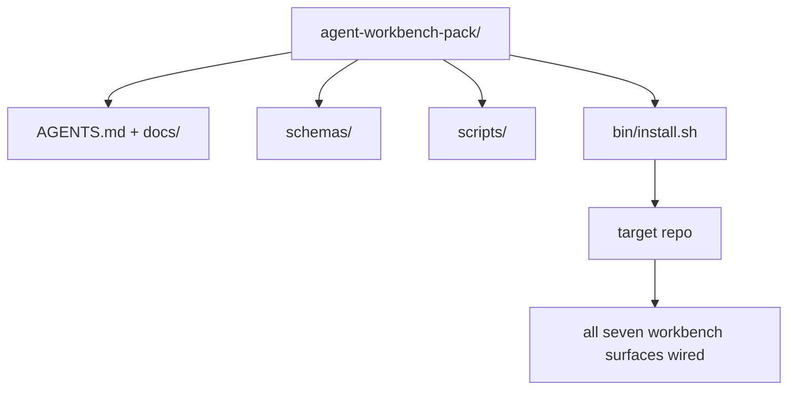

# Capstone: Ship a Reusable Agent Workbench Pack

> The mini-track ends with a pack you drop into any repo. Eleven lessons of surfaces compressed into a directory you can `cp -r` and have an agent working reliably the next morning. The capstone is the artifact this curriculum trades on.

**Type:** Build
**Languages:** Python (stdlib)
**Prerequisites:** Phases 14 · 31 to 14 · 41
**Time:** ~75 minutes

## Learning Objectives

- Package the seven workbench surfaces into one drop-in directory.
- Pin the schemas, scripts, and templates so a new repo gets a known-good baseline.
- Add a single installer script that lays down the pack idempotently.
- Decide what stays in the pack and what stays out, defending the cut for each.
- Demonstrate one agent-assisted repository change with evidence a reviewer can reproduce.

## The Problem

A workbench that lives in a Google Doc, a chat history, and three half-remembered scripts is a workbench that gets rebuilt every quarter. The cure is a versioned pack: a repo or directory with the surfaces, the schemas, the scripts, and a one-command installer.

You will end this lesson with `outputs/agent-workbench-pack/` shipped on disk and a `bin/install.sh` that drops it into any target repo.

## The Concept



### The pack layout

```
outputs/agent-workbench-pack/
├── AGENTS.md
├── docs/
│   ├── agent-rules.md
│   ├── reliability-policy.md
│   ├── handoff-protocol.md
│   └── reviewer-rubric.md
├── schemas/
│   ├── agent_state.schema.json
│   ├── task_board.schema.json
│   └── scope_contract.schema.json
├── scripts/
│   ├── init_agent.py
│   ├── run_with_feedback.py
│   ├── verify_agent.py
│   └── generate_handoff.py
├── bin/
│   └── install.sh
└── README.md
```

### What stays in, what stays out

In:

- Surface schemas. They are the contract.
- The four scripts above. They are the runtime.
- The four docs. They are the rules and the rubric.

Out:

- Project-specific tasks. Tasks belong on the target repo's board, not in the pack.
- Vendor SDK calls. The pack is framework-agnostic.
- Onboarding prose. The pack lives next to the team's existing onboarding, not inside it.

### The installer

A short `bin/install.sh` (or `bin/install.py`):

1. Refuses to install over an existing pack without `--force`.
2. Copies the pack into the target repo.
3. Wires up CI if a `.github/workflows/` exists.
4. Prints next steps: fill in the board, set acceptance commands, run the init script.

### Versioning

The pack carries a `VERSION` file. Schema bumps and script changes that require migrations bump the major. Doc-only changes bump the patch. The target repo's `agent_state.json` records which pack version it was initialized against.

```figure
wb-pack-install
```

## Build It

`code/main.py` assembles the pack into `outputs/agent-workbench-pack/` next to the lesson, seeded with the schemas and scripts from the previous lessons in this mini-track and the docs you already wrote.

Run it:

```
python3 code/main.py
```

The script copies and pins the surfaces, writes the README, prints the pack tree, and exits zero. Re-running is idempotent.

## Production patterns in the wild

A pack is only valuable if it survives forks, updates, and an unfriendly upstream. Four patterns make that work.

**`VERSION` is the contract, not the marketing.** Major bumps require a state migration. Minor bumps require a checker re-run. Patch bumps are doc-only. The installer writes `.workbench-version` into the target repo on every install; `lint_pack.py` refuses to ship if the target's lock disagrees with the pack's `VERSION`. This is how `npm`, `Cargo`, and `pyproject.toml` survive 10 years of churn; nothing about agents changes the rules.

**Single source for cross-tool distribution.** Nx ships one `nx ai-setup` that lays down `AGENTS.md`, `CLAUDE.md`, `.cursor/rules/`, `.github/copilot-instructions.md`, and an MCP server from a single config. The pack should do the same; the installer emits the symlinks (`ln -s AGENTS.md CLAUDE.md`) so a single source of truth fans out to every coding agent. Forking the pack to support one tool over another is a failure mode.

**`uninstall.sh` that refuses on non-trivial state.** Uninstalling the pack must not delete the user's `agent_state.json`, `task_board.json`, or `outputs/`. The uninstaller removes the schemas, scripts, docs, and `AGENTS.md` (with `--keep-agents-md` opt-out) and refuses to proceed if state files have any uncommitted changes. State belongs to the user; the pack does not own it.

**Skill-as-publishable. SkillKit-style distribution.** The pack ships as a SkillKit skill: `skillkit install agent-workbench-pack` lays it down across 32 AI agents from a single source. The pack repo is the source of truth; SkillKit is the distribution channel. Vendor lock-in collapses; the seven surfaces stay the same.

## Use It

Three places the pack ships:

- **As a directory you drop into a repo.** `cp -r outputs/agent-workbench-pack /path/to/repo`.
- **As a public template repo.** Fork-and-customize, with `VERSION` controlling drift.
- **As a SkillKit skill.** Wired into your agent product so a single command lays it down.

The pack is the recipe. Each install is a serving.

## Ship It

`outputs/skill-workbench-pack.md` generates a project-tuned pack: rules sharpened to the team's history, scope globs matched to the repo, rubric dimensions extended with one domain-specific entry.

## Exercises

1. Decide which optional fifth doc deserves promotion into the canonical pack. Defend the cut.
2. Rewrite the installer as Python with a `--dry-run` flag. Compare ergonomics against bash.
3. Add a `bin/uninstall.sh` that safely removes the pack and refuses if state files have non-trivial history. What counts as non-trivial?
4. Add a `lint_pack.py` that fails when the pack drifts from `VERSION`. Wire it into CI for the pack's own repo.
5. Author the migration runbook from a hand-rolled workbench to this pack. What is the order of operations that minimizes downtime?

## Career Practice: Prove One Repository Change

The packaging demo proves that the assembler runs and produces files. It does not prove that your agent can complete a new task, that the generated checks prove that task, or that a deployed system works. Keep those claims separate.

Choose a small real task in a repository you own or have permission to change. Use one coding agent you already have access to. A bug fix, a bounded feature, or an operational improvement is enough; installing several agents is not part of the exercise.

Budget a separate working session beyond the packaging lab. Copy the evidence template linked below into your own `learning-artifacts/` directory. Preserve the checked-in template and pack as reference material.

### 1. Frame the task and choose the autonomy

Use the task frame from lesson 43 and the evidence plan from lesson 44. Record the starting revision, observable goal, non-goals, allowed paths, and acceptance evidence. Identify the real user or operator who needs the behavior.

Choose a working mode: guided steps, checkpointed implementation, or a bounded autonomous run. Explain why the uncertainty, consequences, and reversibility justify it. A small local refactor may need fewer checkpoints than a change to access control.

Set a wall-time budget and a token or cost limit if the agent exposes one. Record unavailable measurements honestly. Define a stop condition for repeated failure, new permissions, budget exhaustion, or an unresolved contract decision; name who can resolve it.

### 2. Prepare the smallest useful environment

Retrieve the relevant implementation, caller, test, and local instructions. Record why each source belongs in context and which current evidence would override a stale note. Do not load the whole repository by default.

Make one explicit choice for each relevant extension: a skill supplies a repeatable procedure; an MCP tool supplies access; a hook runs a deterministic check; a plugin packages capabilities. Keep an extension only when the task needs it, with the least permissions that let it work.

Record the context or maintenance cost of one proposed addition you reject. Recheck one stale memory or instruction, then retire or replace it in your learner-owned setup when the evidence supports that decision. Rerun the affected check to confirm the removal did not lose a needed constraint.

### 3. Capture the baseline and implement

Before editing, run the closest existing check and demonstrate the requested behavior's current state. Keep the command, revision, result, and evidence location. A feature that does not exist yet still has a baseline: record the observed response or unsupported operation.

Let the agent implement inside the contract. Keep an intervention log with the reason for each correction, permission change, or plan revision. Delegation is optional; if useful, apply lesson 45's ownership and integration contract before adding another worker.

### 4. Challenge the evidence

Choose proof that observes the changed surface. For a UI, rebuild and inspect the served journey at relevant widths. For an API, inspect the request and serialized response. For a CLI, run the built command and check its exit code and output. Select the checks your task needs and explain their limits.

Write an expected result from the task contract independently of the agent's implementation. In a disposable copy, introduce one specific incorrect result, such as accepting an invalid value or dropping a required response field. Run the same acceptance check: it must fail for that reason.

If it stays green, strengthen the assertion or observation before trusting it. Restore the correct implementation and rerun successfully. Keep both receipts. A syntax error or broken test setup does not count as detecting the regression.

Review the final diff, including changed tests, against the original goal and allowed paths. Ask a peer or a separate reviewer session to challenge the weakest proof without editing the implementation. You still own the final judgment; another agent's agreement is not execution evidence.

### 5. Rehearse operation and recovery

Run the changed artifact in a disposable local or staging environment. Label every observation `local`, `staging`, or `live`, with the exact revision or artifact identity. A local rehearsal supports a local claim; production deployment is not required for this exercise.

Choose one failure signal related to the task, a threshold, an observation window, and an owner. Explain the response when that threshold is crossed. Trigger the signal safely in the rehearsal and retain the observed log, metric, or response.

Rehearse rollback to a known-good artifact and check that the previous behavior is restored. Account for persistent data when applicable; replacing a binary alone may not reverse a data change. Record any recovery step you could not verify.

### 6. Improve the next run and hand it off

Compare the result with the baseline, including elapsed time, available usage data, and human interventions. One task shows what happened on that task; it does not establish that an agent is generally faster or more reliable.

Promote one observed correction into a test, a smaller permission boundary, an automation, or a clearer example using lesson 46. Rerun the affected check. Remove temporary mutations and leave the final branch, changed files, open risks, and next action explicit for the next session.

### Manual review rubric

Have the reviewer inspect the evidence files and reproduce at least the weakest acceptance check. Use `demonstrated`, `needs revision`, or `unverified` for each row, with an evidence pointer and a reason. Filled fields and passing packaging scripts are not substitutes for these observations.

| Dimension | Evidence the reviewer should challenge |
|---|---|
| Task and autonomy | Starting behavior, bounded goal, justified permissions, budget, and a usable stop rule |
| Context and environment | Relevant sources, justified tool access, and a rechecked retirement decision |
| Verification | Actual before/after behavior and a deliberate incorrect result that the same check rejects |
| Review and operation | Inspected diff, independent challenge, labeled runtime observation, and rehearsed recovery |
| Iteration and handoff | One verified improvement, honest limits, clean final state, and a reproducible next action |

Resolve `needs revision` findings before claiming the task complete. Leave unavailable evidence `unverified` and narrow the claim accordingly. The portfolio demonstrates your engineering judgment on a bounded task; it is not a hiring or deployment guarantee.

## Shipped Artifact

Keep the reusable pack and your completed copy of [career-agent-evidence.md](https://github.com/rohitg00/ai-engineering-from-scratch/blob/main/phases/14-agent-engineering/42-agent-workbench-capstone/outputs/career-agent-evidence.md). The template connects the task frame, execution plan, runtime receipts, review, recovery rehearsal, and handoff into one reviewable case study.

## Key Terms

| Term | What people say | What it actually means |
|------|----------------|------------------------|
| Workbench pack | "The starter kit" | A versioned directory carrying all seven surfaces |
| Installer | "Setup script" | `bin/install.sh` that lays the pack down idempotently |
| Pack version | "VERSION" | Major bumps for schema/script changes, patch for doc-only |
| Drop-in pack | "cp -r and go" | Pack works without per-repo customization on day one |
| Forkable template | "GitHub template" | Public repo that GitHub's "Use this template" can clone from |

## Further Reading

- Phases 14 · 31 to 14 · 41 — every surface this pack bundles
- [SkillKit](https://github.com/rohitg00/skillkit) — install this skill across 32 AI agents
- [Nx Blog, Teach Your AI Agent How to Work in a Monorepo](https://nx.dev/blog/nx-ai-agent-skills) — single-source generator across six tools
- [agents.md — the open spec](https://agents.md/) — what your pack's router must implement
- [HKUDS/OpenHarness](https://github.com/HKUDS/OpenHarness) — reference implementation of a pack-equivalent
- [Augment Code, A good AGENTS.md is a model upgrade](https://www.augmentcode.com/blog/how-to-write-good-agents-dot-md-files) — pack docs quality bar
- [Anthropic, Effective harnesses for long-running agents](https://www.anthropic.com/engineering/effective-harnesses-for-long-running-agents)
- [Anthropic, Harness design for long-running application development](https://www.anthropic.com/engineering/harness-design-long-running-apps)
- Phase 14 · 30 — eval-driven agent development that consumes the pack's verification gate
- Phase 14 · 41 — the before/after benchmark this pack improves on
